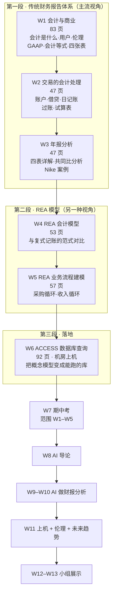

# AC6761 · Artificial Intelligence Accounting · 课程总览

> 本课入口。找什么都从这里点。

**一句话**：MScAIB (P85) 的**商业核心组内选修**（3 学分，13 周，Prof. Kevin ZHU 主讲）。名字叫「AI 会计」，实际结构是 **7 周把零基础的你补成能读财报的人，再用 4 周教你怎么让 AI 替你读**。教授在第一节课的原话立场是：*"AI is a powerful amplifier, but only when you already understand the numbers."*

---

## 🔴 现在最要紧的事

| 时间 | 事项 |
|---|---|
| **约 2026-09-16（第 3 周末）** | **小组名单提交**（3–5 人／组）。**这是本课第一个截止日**，别错过 |
| **2026-10-14（周三）19:30–21:30** | **期中考**，闭卷，考场 **AC1 (Yeung) Y4302 & Y4702**。🎙️ 教授明说范围是 **Week 1–Week 5**，**不考 Week 6 的 ACCESS，也不考 AI** |
| **约 2026-11-25（第 13 周末）** | 小组书面报告提交（10%） |

完整清单见 [[AC6761_Artificial_Intelligence_Accounting/_meta/作业与DDL|作业与DDL]]。

---

## 定位与考核

| 项 | 内容 |
|---|---|
| 课程码 / 学分 | AC6761 · **3 学分** · P5/P6 |
| 开课单位 | Department of Accountancy, College of Business |
| 项目定位 | **MScAIB (P85) 商业核心**（组内选修） |
| 授课教师 | **Prof. Kevin ZHU** ｜ xindozhu@cityu.edu.hk ｜ AC3 13-218 ｜ 3442 4763 |
| 上课时间 | **周三**晚间（W1 = 2026-09-02；期中考时段 19:30–21:30） |
| 先修 | **Nil**（不需要任何会计基础） |
| 语言 | 全英文授课与考核 |

**考核构成**

```
持续评估 50%                          期末考试 50%
├─ 课堂参与 10%   讨论 / 个人作业 / 案例   闭卷 · 3 小时 · 全论述与案例题
├─ 小组项目 20%   书面报告 10% + 展示 10%
└─ 期中考   20%   闭卷 · W7 · 范围 W1–W5
```

> ❗ **及格线规则**：**持续评估与期末考试两部分必须分别通过**，任一不过即可能整门课不过。
> 官方目录与 Outline 都写了这条，但**都没给具体百分比**（与 IS5113 的 25% 明文不同）。详见 [[AC6761_Artificial_Intelligence_Accounting/_prep/课程前置资料#3.2 ❗ 两条硬性规则（官方目录与 Outline 都写了）|课程前置资料 › 3.2 ❗ 两条硬性规则（官方目录与 Outline 都写了）]]。

> 🤖 **GenAI 政策**：课堂活动与小组项目**允许**用 GenAI，但**禁止用 AI 代写报告任何部分**；小组项目还必须**署明使用出处并解释为什么采纳该段输出**。期中与期末**一律禁止**。

---

## 六周主题地图（讲义已全部提前放出）

教授在 W1 一次性发出了 Week 1–6 的全部课件（共 379 页）。**这六周是纯会计，没有一个字讲 AI**；AI 从 W8 才开始。



**为什么是这个顺序**（🎙️ 教授在 `12:20`–`13:26` 的解释）：W1–W3 先给主流的复式记账体系；W4–W5 换一个视角看会计（REA）；**W6 之所以存在，是因为 REA 纯理论"太难懂也太无聊"，所以要把概念模型落到真实的 ACCESS 数据库里跑一遍**。

---

## 笔记索引

> ✅ **2026-09-09：W3–W5 三篇笔记已产出，期中考范围（W1–W5）的讲义笔记全部齐备。**
> ⚠️ W4–W6 三篇为 **v0.9（无转录）**——本课目前只有 W01、W02、W03 录了音，所以 **W4–W6 的考点最高只能到 🟡「CILO 反推」**，没有 🔴「教授明示」级。
> ✅ **2026-09-10：W2 转录已合并，M02 升 v1.0**；这份转录的前 47 分钟是 W1 顺延的交易 5–11 与一道当堂练习，已回填进 M01 §2.8.5。⚠️ 录音在试算表（p.45–47）之前中断。
> ✅ **2026-09-17：W3 转录已合并，M03 升 v1.0**；这份转录的前 49 分钟是 W2 顺延的课堂练习 2 解答 + 当堂小测 + 试算表/AI 演示（已回填进 M02 §2.6.4），**W3 讲义正文录音只讲到 p.27**（Nike 共同比案例两道练习题的答案已确认），p.28 起（利润表/现金流量表/权益变动表/附注）没有转录佐证。
> ❗ 但按 [[笔记模板#★ 预习可用性：讲义每一页都要有实质讲解（2026-09-09 用户决定）|预习可用性规则]]，**每一页都已在正文实质讲解**（脚本逐页验过），**只靠笔记预习即可**。


| 周 | 日期 | Outline 主题 | 讲义 | 笔记 | 状态 |
|---|---|---|---|---|---|
| **1** | 09-02 | Accounting in Business | `Week 1 PPT.pptx`（83 页） | [[M01-会计与商业]] | ✅ **v1.0**（转录已合并；2026-09-11 §2 按预习可读性规则重写 18 节） |
| **2** | 09-09 | Accounting for Business Transactions | `Week 2 PPT.pptx`（47 页） | [[M02-交易的会计处理]] | ✅ **v1.0**（转录已合并 2026-09-10；2026-09-11 §2 按预习可读性规则重写 13 节）· ⚠️ 录音尾部缺失，p.45–47 试算表未录到 |
| **3** | 09-16 | Annual Report Analyses | `Week 3 PPT.pptx`（47 页） | [[M03-年报分析]] | ✅ **v1.0**（转录已合并 2026-09-17；**47/47 页正文全覆盖**；32 个 🎙️ 格全部回填）· ⚠️ 录音只讲到 p.27，p.28 起（利润表/现金流量表/权益变动表/附注）没有转录佐证，标 ❓ · 2026-09-17 曾因文件截断事故重做（改动脚本重放 + 独立验收） |
| **4** | ⚪09-23 | REA Accounting Model | `Week 4 PPT.pptx`（53 页） | [[M04-REA会计模型]] | ✅ **v0.9**（3869 行／36.5k 字，**53/53 页正文全覆盖**）· 无转录 · 2026-09-11 按预习可读性规则重写 §2（54 节补"所以呢"衔接），检查全过 |
| **5** | ⚪09-30 | REA Business Process Modeling | `Week 5 PPT.pptx`（57 页） | [[M05-REA业务流程建模]] | ✅ **v0.9**（3370 行／31.1k 字，**56/57 页正文全覆盖**，p.1 为封面）· 无转录 · 2026-09-11 按预习可读性规则重写 §2（50 节补衔接 + §2.16.2 应付账款公式补符号表与数字例子），检查全过 |
| **6** | ⚪10-07 | Accounting Information Querying with ACCESS | `Week 6 PPT.pptx`（92 页） | [[M06-ACCESS数据库构建与查询]] | ✅ **v0.9**（5290 行／49.1k 字，**92/92 页正文全覆盖**，全库最大）· 无转录 · 2026-09-11 按预习可读性规则重写 §2（66 节补衔接），检查全过。⚠️ 期中考范围外 |
| **7** | **10-14** | **Mid-term test** | — | — | 范围 W1–W5 |
| 8 | 10-21 | Introduction of AI | 待发 | — | |
| 9 | 10-28 | AI in FS Analyses – Stakeholder Perspective | 待发 | — | |
| 10 | 11-04 | AI in FS Analyses – Analytical Models | 待发 | — | |
| 11 | 11-11 | Hands-on AI, Ethics, Future Trends | 待发 | — | ← 与 IS5113 高度重叠 |
| 12 | 11-18 | Group presentations | — | — | |
| 13 | 11-25 | Group presentations | — | — | 报告截止 |

> 📌 **日期为推算值**：W1 = 2026-09-02（周三），逐周 +7 天，与课件 p.2 写明的期中考日期 10 月 14 日（第 7 周周三）吻合。若遇公众假期顺延，以学校课表为准。

**`M0N` ↔ 原始命名对应**：本课官方用 **Week N**，本库统一用 **M0N**。`M01` = `Week 1 PPT.pptx` = Outline 的 Week 1，其余同理。转录同样用 `M0N-transcript.txt`。

---

## 转录状态

| 文件 | 覆盖 | 判定 |
|---|---|---|
| `transcripts/M01-transcript.txt` | `00:01 → 02:03:38`（356 段，2h03m42s） | ⚠️ **内容不完整**：录音**从讲课中段开始**（第一句就是复式记账流程的半句话），课件 p.1–2 的课程介绍与考核细则**未被录到**。`01:41:09→01:44:57` 的 3分48秒空档**不是课间**——是教授让学生**自己填 Example #2 表格**的课堂练习时间（`01:41:09` 原话："Do that by yourself. Try to finish this table."），**没有内容丢失**。详见 [[M01-会计与商业#9. 延伸与勘误\|M01-会计与商业 › 9. 延伸与勘误]] |
| `transcripts/M02-transcript.txt` | `00:02 → 01:38:33`（342 段，1h38m31s） | ⚠️ **开头基本完整、结尾缺失**：第一句就是 W1 顺延的交易 5 开讲（最多缺开场问候）；**前 47 分钟是 W1 内容**（交易 5–11 + 当堂练习），W2 讲义从 `47:45` 起；最后一段 `01:38:33` 是噪声，**p.45–47 试算表与课堂练习 2 的解答没录到**（判定为录音提前中断，依据见 [[M02-交易的会计处理#9.5 待核对\|M02-交易的会计处理 › 9.5 待核对]]）。三处 ≥2 分钟空档（`18:21→20:50`、`29:24→31:57`、`01:35:21→01:38:33`）都是布置/做练习的时间，**不是内容丢失**。W1 讲义 p.77–83 四张报表本堂课也没讲。ASR 是五门里最差的，错误样本见 M02 §9.5 |
| `transcripts/M03-transcript.txt` | `00:01 → 01:54:24`（366 段，1h54m23s） | ⚠️ **缺开头**（首句已在讲 T 账户）；**结尾基本完整但末句被截**（`01:54:24` 有下课语，'group name'半句被截）。**前 49 分钟是 W2 顺延**：课堂练习 2 解答（`00:01`–`17:43`）+ 当堂小测（`17:43`–`40:14`）+ 试算表/AI 演示（`40:14`–`49:04`），已回填 [[M02-交易的会计处理#2.6.4 课堂练习 2 的解答（W3 补讲）\|M02 §2.6.4]]；**W3 讲义从 `49:04` 起，只讲到 p.27**（`01:54:24` 结束），p.28 起（利润表/现金流量表/权益变动表/附注）完全没有覆盖，标 ❓。5 处 ≥2 分钟空档均为做题/自读时间，非内容丢失 |

---

## 与其他课的交叉点

| 交叉主题 | AC6761 在哪 | 对方课在哪 |
|---|---|---|
| **问责与责任** | W1 会计伦理：Enron / WorldCom / Olympus / **SOX 法案**（管理层必须签字、审计师必须验证内控） | **IS5113 W5 Accountability and Liability** —— SOX 是"制度怎么把责任钉到具体的人身上"的**现成先例**，做 IS5113 W5 时可直接引用 |
| **透明性的制度化** | W1 🎙️ **审计意见分级**（clean / with explanatory notes / qualified / adverse） | IS5113 W4 Transparency —— 一套已运行几十年的分级外部鉴证机制 |
| **AI 伦理** | W11 Ethical Considerations（一节课） | IS5113 全课 13 周。**做 AC6761 小组项目直接搬 IS5113 的 FATP 框架** |
| **阈值判断** | W1 重要性水平（materiality）：多小的错可以不披露 | IS5113 W3 Fairness 的阈值选择，是同构问题 |
| **人在环路** | W1 课件 p.7–8：AI 会幻觉，"你是质量过滤器" | IS5113 W4/W5；IS5542 GenAI in Business |
| **财报与比率分析** | W3, W9–W10 | EF5560 / Fintech and AI in Finance |
| **数据建模** | W4–W6 REA → ACCESS | IS6400 BDA 的 SQL / 数据建模 |

---

## 元数据

| 文件 | 用途 |
|---|---|
| [[AC6761_Artificial_Intelligence_Accounting/_meta/知识层级台账\|知识层级台账]] | ★ 连贯性机制。**本课 L0 特别声明：读者会计零基础，所有会计概念都不在 L0** |
| [[AC6761_Artificial_Intelligence_Accounting/_meta/术语表\|术语表]] | 会计术语中英对照 + 港式/内地译法取舍 + 可默写的英文定义 |
| [[AC6761_Artificial_Intelligence_Accounting/_meta/考点库\|考点库]] | 三档可信度（🔴 教授明示 / 🟡 CILO 反推 / ⚪ 笔记推断） |
| [[AC6761_Artificial_Intelligence_Accounting/_meta/作业与DDL\|作业与DDL]] | 全部截止日期与提交要求 |
| [[AC6761_Artificial_Intelligence_Accounting/_meta/待并入术语总表\|待并入术语总表]] | 待主 agent 合并进全库 `_meta/术语总表.md` 的跨课条目 |

## 前置资料

| 文件 | 用途 |
|---|---|
| [[AC6761_Artificial_Intelligence_Accounting/_prep/课程前置资料\|课程前置资料]] | 官方课程目录 × Outline **逐项对校**；及格线、GenAI 政策、13 周表、Keyword Syllabus 缺口 |

## 材料

```
course_files_export/
├─ AC6761 Outline 2627.docx        课程大纲（权威）
├─ Accounting principles.docx      教授补发的四条会计原则例题（对应 W1 p.33）
└─ Week 1–6 PPT.pptx               六周讲义，共 379 页，W1 一次性放出
transcripts/
├─ M01-transcript.txt              W1 课堂转录（2h03m42s，缺开头）
├─ M02-transcript.txt              W2 课堂转录（1h38m31s，缺结尾；前 47 分钟为 W1 顺延内容）
└─ M03-transcript.txt              W3 课堂转录（1h54m23s，缺开头；前 49 分钟为 W2 顺延内容；只讲到 p.27）
```

> ⚠️ **本课六份 pptx 的 speaker notes 全部为空**（逐页检查过：W1 83 页、W2 47、W3 47、W4 53、W5 57、W6 92，无一页有备注）。`.pptx` 相对 PDF 的备注优势在这门课上**不存在**，唯一的额外收益是能直接取出嵌入的 Excel 表格数据。
