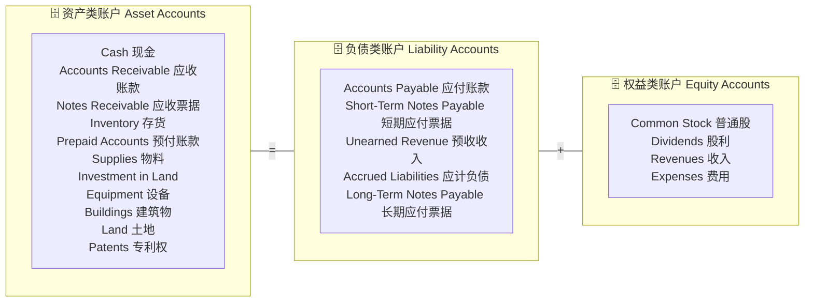
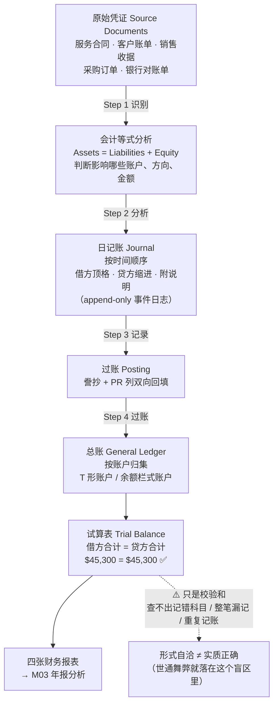
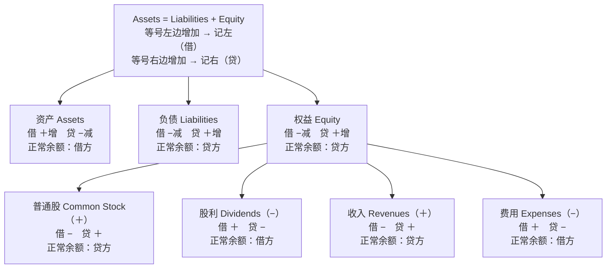
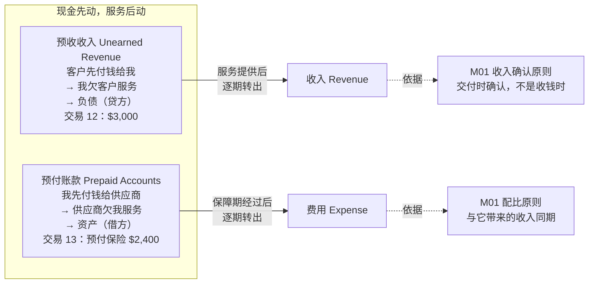

# M02 · 交易的会计处理（Accounting for Business Transactions）

> **本讲一句话**：M01 让你会判断"一笔交易影响了哪几个项目、方向是正是负"；这一讲把那个判断**编码成一套可执行、可自检的操作规程**——借贷记账法。
> **原始材料**：`Week 2 PPT.pptx`（47 页） ｜ **转录**：`merged`（`M02-transcript.txt`，`00:02 → 01:38:33`，342 段，2026-09-10 合并）

> ✅ **本笔记为 v1.0**（2026-09-09 讲义版 v0.9 → 2026-09-10 合并转录）。**先知道这份转录的三个特殊之处，再读正文**：
> 1. **前 47 分钟不是 W2 的内容**——是 W1 顺延的交易 5–11（`00:02`–`18:21`）+ 一道当堂练习（`18:21`–`47:21`）。这部分已回填进 [[M01-会计与商业#2.8.5 交易 5–11 逐笔展开（讲义 p.63–75）|M01 §2.8.5]]，本笔记只做索引（[[#8. 讲义页码映射|§8]]）。
> 2. **W2 讲义从 `47:45` 起讲**（p.8 负债类账户），`57:28` 起进入 p.10 扩展等式，一路讲到 **p.44 总账汇总（`01:33:20`）**为止。
> 3. **录音在 `01:38:33` 中断，p.45–47 试算表没有被录到**（正文 §2.7.2 的 🎙️ 格因此是 ❓ 而不是 ⏭️），课堂练习 2 的解答也没有。判断依据见 [[#9.5 待核对|§9.5]]。

---

## 0. 三分钟速览

**这一讲讲了什么**

M01 结束时你手里有一张三列表（资产 / 负债 / 权益），每笔交易往里填带正负号的数字。**问题是：真实公司有几百个科目、每天几千笔交易，那张表会宽到无法使用，而且没有任何机制能告诉你"我记错了"。**

这一讲用三个发明解决这两个问题：

1. **账户（Account）** —— 把宽表纵向切开，每个科目一个独立的记录本。所有账户的集合叫**总账（General Ledger）**，它的目录叫**会计科目表（Chart of Accounts）**。
2. **借与贷（Debit / Credit）** —— 不再用 `+/−`，改用**左/右**两个方位。规则设计得很巧：**让"资产的增加"和"负债与权益的增加"落在相反的两侧**，于是每笔交易的左侧金额恒等于右侧金额。
3. **日记账与过账（Journal / Posting）** —— 先按**时间顺序**记流水（日记账），再**誊抄**到按科目归集的总账。

最后用**试算表（Trial Balance）**做一次全局自检：把所有账户余额分列到借、贷两栏加总，**两栏必须相等**。

讲义用 FastForward 的 **16 笔**交易（M01 那 11 笔 + 5 笔新的）把这套流程完整跑了一遍。

> 🎙️ **课堂实况**（2026-09-09）：教授先用约 47 分钟补完 W1 顺延的交易 5–11 并做了一道 8 笔交易的当堂练习（内容在 M01 §2.8.5），**W2 讲义本身只用了约 50 分钟**（`47:45`–`01:33:20`），其中还含一段 5 分钟的借贷入门视频；**p.45–47 试算表在录音里没有出现**。所以本讲课堂的重心是"账户类型 + 借贷方向 + 16 笔分录"，试算表只能靠讲义与本笔记自学。

**学完你应该能**

1. **说清**账户、总账、会计科目表三者的关系
2. **给出**借贷记账法的规则表，并说明**为什么**这套规则能保证等式恒平衡
3. **判断**任意一个科目的**正常余额**在借方还是贷方
4. **写出**一笔交易的**日记账分录**（日期、科目、金额、说明，借在上、贷在下且缩进）
5. **过账**到 T 形账户并计算账户余额
6. **编制试算表**并解释它能查出什么、**查不出什么**

**如果只记三件事**

1. **借 = 左，贷 = 右。** 就这么简单，**中文的"借钱/贷款"含义在这里完全不适用**，必须把语感清空。
2. **规则表只有一行要背**：`资产：借增贷减 ／ 负债与权益：借减贷增`。其余（收入、费用、股利）都是从"它增加还是减少权益"推出来的。
3. **试算表平衡 ≠ 账记对了。** 它只能查出"借贷不等"这一类错误；**记错科目、整笔漏记、重复记账，它一概查不出来。** 这条是与 AI 主题的接口（[[#2.7 总账汇总与试算表|§2.7]]）。

---

## 1. 开始之前 · 知识衔接

### 1.1 你已经有的

| 概念 | 一句话唤醒 | 回看 |
|---|---|---|
| 会计等式 | `资产 = 负债 + 权益`，永远成立，一次都不能被打破 | [[M01-会计与商业#2.7.1 会计等式（讲义 p.38, p.49）\|M01 §2.7.1]] |
| 扩展会计等式 | `A = L + 股本 − 股利 + 收入 − 费用` | [[M01-会计与商业#2.7.6 扩展会计等式（讲义 p.42, 47–49）\|M01 §2.7.6]] |
| 资产 / 负债 / 权益 | 拥有的 ／ 欠别人的 ／ 剩余的 | [[M01-会计与商业#2.7.2 资产（讲义 p.39）\|M01 §2.7.2–2.7.4]] |
| 收入 / 费用 | 提供商品服务使权益增加 ／ 产生收入过程中使权益减少 | [[M01-会计与商业#2.7.5 收入与费用（讲义 p.43–44）\|M01 §2.7.5]] |
| 交易分析的两条规则 | 每笔至少影响两个项目；等式必须重新平衡 | [[M01-会计与商业#2.8.2 两条规则（讲义 p.52）\|M01 §2.8.2]] |
| 应收账款 / 应付账款 / 预收收入 | 该收未收 ／ 该付未付 ／ 收了钱还没干活（**是负债**） | [[M01-会计与商业#2.7.3 负债（讲义 p.40）\|M01 §2.7.3]] |
| 赊购赊销 on account / on credit | **不涉及现金** | [[M01-会计与商业#2.7.2 资产（讲义 p.39）\|M01 §2.7.2]] |
| 股利 vs 业主提取 | 股利减留存收益，提取减股本 | [[M01-会计与商业#2.7.6 扩展会计等式（讲义 p.42, 47–49）\|M01 §2.7.6]] |
| FastForward 的前 11 笔交易 | Chuck Taylor 2021 年 12 月开的咨询公司 | [[M01-会计与商业#2.8.4 FastForward 的 11 笔交易\|M01 §2.8.4]] |
| 四张财务报表 | 利润表、权益变动表、资产负债表、现金流量表 | [[M01-会计与商业#2.9 四张财务报表\|M01 §2.9]] |

### 1.2 本讲全新引入的概念

| 概念 | English | 展开于 |
|---|---|---|
| 账户 | Account | §2.2.1 |
| 预付账款 | Prepaid Accounts | §2.2.2 |
| 应付票据 / 应付税款 | Notes Payable / Tax Payable | §2.2.2（🎙️ 教授十例） |
| 总账 / 会计科目表 | General Ledger / Chart of Accounts | §2.3 |
| T 形账户 | T-account | §2.4.1 |
| 借 / 贷 | Debit / Credit | §2.4.1 |
| 复式记账 | Double-Entry System | §2.4.2 |
| 正常余额 | Normal Balance | §2.4.3 |
| 账户余额 | Account Balance | §2.4.4 |
| 日记账 / 日记账分录 | Journal / Journal Entry | §2.5.1 |
| 过账 | Posting | §2.5.2 |
| 余额栏式账户 | Balance Column Account | §2.5.3 |
| 四步交易处理法 | The Four Steps | §2.6.1 |
| 预付保险费 | Prepaid Insurance | §2.6.3 |
| 试算表 | Trial Balance | §2.7 |

### 1.3 为什么这一讲放在这里 · 重排说明

M01 讲完时留下两个未解决的问题：

1. **可扩展性** —— M01 的三列表在 4 笔交易时还能看，到 16 笔就已经很难读了。真实公司要几百个科目。
2. **可校验性** —— M01 只有"等式要平衡"一条口头规则，**没有任何机械化的检查手段**。

这一讲是对这两个问题的工程回答：**账户解决可扩展性，借贷 + 试算表解决可校验性。**

往后看：本讲结束时得到的**试算表**，正是 M03「年报分析」的起点——四张财务报表就是从试算表整理出来的（讲义 p.3 的第 5 步）。

**重排说明**

讲义原顺序是七段（对应 7 个学习目标）：`处理流程总览(p.2–3) → 账户(p.4–10) → 总账与科目表(p.11–12) → 借贷与复式记账(p.13–19) → 日记账与过账(p.20–25) → 16 笔交易(p.26–44) → 试算表(p.45–47)`。

本笔记**保留这个顺序**，只做两处调整：

1. **把 p.44 的总账汇总从"16 笔交易"那段拆出来**，与 p.47 的试算表并列（§2.7），因为它俩讲的是同一件事的两个阶段（总账余额 → 试算表）。
2. **不逐笔展开 16 笔交易**（那会变成 16 段重复的文字）。改为：先讲透**四步法 + 一笔样板**（§2.6.1–2.6.2），然后**只详讲 5 笔新交易**（§2.6.3），前 11 笔用一张对照表带过并链回 [[M01-会计与商业#2.8.4 FastForward 的 11 笔交易|M01 §2.8.4]]。

页码映射见 [[#8. 讲义页码映射|§8]]。

---

## 2. 正文

### 2.1 从交易到财务报表的五步（讲义 p.3）

> 📄 **本节对应学习目标（讲义 p.2）**：*Explain the steps in processing transactions and the role of source documents.*
>
> 📄 讲义 **p.1** 为封面页（课程名 + Chapter 2 标题），无内容。


**是什么**

讲义开篇给出全流程，**这五步是整个 W1–W3 的骨架**：

> **Business transactions and events are the starting points of financial statements.**
>
> 1. **Identify** each transaction and event **from source documents**.（从**原始凭证**识别每笔交易与事项）
> 2. **Analyze** each transaction and event **using the accounting equation**.（用**会计等式**分析）← M01 §2.8
> 3. **Record** relevant transactions and events **in a journal**.（记入**日记账**）← 本讲 §2.5
> 4. **Post** journal information **to ledger accounts**.（**过账**到总账账户）← 本讲 §2.5
> 5. **Prepare and analyze** the **trial balance and financial statements**.（编制并分析**试算表与财务报表**）← 本讲 §2.7 + M03

**为什么需要它**

M01 的三个动作（识别—记录—传达）在这里被细化成五个可操作的步骤。**注意第 1 步新增的限定词：`from source documents`（原始凭证）** —— 这是 M01 没提的一层。

**💡 换个说法（笔记补充）**

**原始凭证（source documents）** 指销售收据、发票、支票、采购订单、银行对账单、员工工时表这类**在交易发生时自然产生的书面证据**。讲义 p.21 的图里画出了具体清单：Services Contract、Client Billing、Sales Receipt、Purchase Order、Bank Statement。

它的意义是：**会计记录不能凭记忆或口头说法产生，必须有物证。** 这就是**审计轨迹（audit trail）**的起点——审计师之所以能验证一笔账，是因为每一笔账都能顺着凭证倒推回一个真实发生的事件。

> 🔗 **与 AI 的接口**：M01 §2.2.1 提到编制者视角下 AI 的输入是 *"original document like the company's contract, the invoice"*（🎙️ M01 转录 `07:52`）——**正是这里的 source documents**。AI 做自动记账的第一步就是从这些凭证里抽取结构化信息（OCR + 信息抽取），**而这一步的错误会沿着后面四步一路放大**。

**🎙️ 课堂补充**

- **p.3 这一页 W2 课上没有重讲**——它在 **W1 开场时已经被讲过**（教授当时翻到 W2 p.3 讲复式记账流程，见 [[M01-会计与商业#8. 讲义页码映射|M01 §8]] `00:01`–`06:18`）。
- 五步里的前四步在 `01:12:37` 讲 p.21 时被复述了一遍：*"step one, identify transaction [and] source documents… step two, analyze… we already [did] that by using the transaction analysis. Then step three, record [the journal] entry, we will show later. And step four, post entry to the ledger account."*——**教授把第 1–2 步定性为"已经会了"（W1 内容），第 3–4 步是本讲的新东西。** 第 5 步（试算表）在录音范围内没有讲到（见 §2.7.2）。

**⚠️ 常见误解**

- ❌ **"第 2 步的等式分析和第 3 步的日记账是两件事，实务里可以跳过第 2 步。"** 讲义 p.27 的四步法把它们并列，是因为**第 2 步是思考、第 3 步是书写**。熟练之后第 2 步在脑子里完成，但初学阶段必须写出来。

**与其他概念的关系**

这五步是 W1→W2→W3 的路线图：M01 覆盖第 1–2 步，本讲覆盖第 3–4 步和第 5 步的前半（试算表），M03 覆盖第 5 步的后半（财务报表分析）。

---

### 2.2 账户（Account）

> 📄 **本节对应学习目标（讲义 p.4）**：*Describe an account and its use in recording transactions.*


#### 2.2.1 什么是账户

**是什么**（讲义 p.5）

M01 的答题格式把"资产"当成一整列，可现金有多少、应收账款有多少，公司必须分开知道——**账户（account）就是给每一个具体的资产/负债/权益/收入/费用项目，单独开一本"流水簿"**。严谨地说：

> **An account is a record of increases and decreases in a specific asset, liability, equity, revenue, or expense.**
> 账户是**针对某一个具体的**资产 / 负债 / 权益 / 收入 / 费用项目，记录其增减的一份记录。
>
> **The general ledger is a record of all accounts used by the company.**
> **总账**是公司使用的**全部账户**的记录。

**为什么需要它**

M01 的三列表把"资产"当成一整列。但公司需要随时知道**现金**有多少、**应收账款**有多少、**设备**值多少——**它们必须分开记。**

讲义 p.6 用一张图把这件事画得非常清楚：**三个文件柜（资产 / 负债 / 权益），每个柜子里插着一叠标签卡片**，每张卡片就是一个账户。



（讲义 p.6，本笔记重画为图。原图是三个抽屉柜的插画。）

**💡 换个说法（笔记补充）**

用数据库来想最清楚：

| 会计 | 数据库 |
|---|---|
| **账户（account）** | 一张表 / 一个字段的时间序列 |
| **总账（general ledger）** | 整个数据库 |
| **会计科目表（chart of accounts）** | schema / 表清单 |
| **账户余额（balance）** | 当前值（对增减做累加得到） |
| **日记账（journal）** | **append-only 的事件日志** |
| **过账（posting）** | 从事件日志物化出当前状态（materialization） |

**会计系统本质上是一个事件溯源（event sourcing）架构**：日记账是不可改的事件流，总账是物化视图。这个类比对后面理解"为什么错账要用红字冲销而不是直接改数字"很有用。

**🎙️ 课堂补充**

- **p.5–6 的账户定义在转录里没有对应内容。** 教授讲完当堂练习后说 *"if you have any questions, discuss with me during the break"*（`47:21`），下一段（`47:45`）已经在讲 p.8 的负债类账户——中间只有 24 秒，**p.5–7（账户定义、三个文件柜、资产类账户清单）最多被一句话带过**。这三页只能靠笔记学。
- 教授对"账户"的口头说法出现在讲 T 形账户时（`59:03`）：*"[a] ledger account is used to show the effect of one or more transactions."*，以及讲 p.12 时（`57:58`）*"the ledger is a collection of all accounts and the balance for [an] accounting system."*——都是照讲义念的，没有额外展开。

**⚠️ 常见误解**

- ❌ **"账户就是银行账户。"** 不是。会计里的 account 是**一个记录本**，"银行存款"只是其中一个（Cash）。费用、收入也各有账户。

**所以呢**：知道了"账户"是什么，下一步自然要问——一家公司到底要开哪些账户？讲义给了三大类的具体清单。

#### 2.2.2 三类账户里的具体科目（讲义 p.7–9）

M01 只给过资产、负债、权益三个大类的例子；这里讲义把每一大类拆成一份**具体要开哪些账户**的清单，并且比 M01 多了两个新科目（用红字标出）：

| 类别 | 讲义列出的科目 | 备注 |
|---|---|---|
| **资产**（p.7） | Cash 现金、Accounts Receivable 应收账款、Notes Receivable 应收票据、**Prepaid Accounts 预付账款**、Supplies 物料、Equipment 设备、Buildings 建筑物、Land 土地 | ⭐ **Prepaid Accounts 在讲义上用红字标出**，是 M01 没有的新科目 |
| **负债**（p.8） | Accounts Payable 应付账款、Notes Payable 应付票据、**Tax Payable 应付税款**、Unearned Revenue 预收收入 | ⭐ **Tax Payable 用红字标出** |
| **权益**（p.9） | **+ Common Stock** 普通股、**− Dividends** 股利、**+ Revenues** 收入、**− Expenses** 费用 | 每个科目前面带 + / − 号，直接对应扩展会计等式 |

**新概念：预付账款（Prepaid Accounts）**

**是什么**：**先付了钱、但服务还没享受到**，所以它是一项**资产**（你有权在未来享受这项服务）。

**它是预收收入的镜像**：

| | 谁付钱 | 谁欠谁 | 属于 |
|---|---|---|---|
| **预收收入** Unearned Revenue | **客户**先付给我 | **我欠客户**服务 | **负债** |
| **预付账款** Prepaid Accounts | **我**先付给供应商 | **供应商欠我**服务 | **资产** |

讲义 p.40（交易 #13）给的例子是**预付保险费（Prepaid Insurance）**：花 $2,400 买 24 个月的保险，保障期从 12 月 1 日开始。付款时它是资产；**随着保障期一个月一个月过去，它才逐月转成费用**。

> 💡 **和 M01 的预收收入放在一起记。** 两者是同一个时间错配问题的两面：**现金的流动时点 ≠ 服务的发生时点**，会计用一项资产或一项负债把这段时间差"挂"起来。这正是 M01 §2.6.3 收入确认原则与配比原则的直接后果。

**🎙️ 课堂补充**（转录 `47:45`–`57:12`，约 9.5 分钟——**本讲讲义部分里教授展开最多的一段**）

**① 负债类账户逐个口头解释（p.8，`47:45`–`48:56`）**

| 科目 | 教授的口头定义（已校正 ASR） |
|---|---|
| 应付账款 Accounts Payable | *"our company is [purchasing] something, but we didn't pay cash yet. So that is our company's liability because anyway we will pay in the future."* |
| **应付票据 Notes Payable** | *"our company [issues] a note to the creditor with the information like **interest rate** [and] interest expense [it] will take in the future."*——⭐ 与应付账款的区别在 `51:43`：*"the company [issues] a note. So we use this word notes [payable]. **If companies do not use a note, we call it accounts payable.** So that's the difference."* |
| 预收收入 Unearned Revenue | *"**unearned revenue is not revenue. It's liability.** So you can understand [it] together with the prepaid expense."* 然后给了一个餐馆的例子（`48:20`）：*"now you are [a] restaurant. There is one client [who] paid to our restaurant for the whole month['s] dinner… You can call it a revenue, but you didn't earn it yet. At the end of this month, [when] you provide all the [dinners] to that client, you can call this revenue is recognized. But before that, it's unearned revenue. So that [is] your liability."* |
| 应付税款 Tax Payable | *"there are some tax expense[s that] should be recognized but not paid yet."* |

**② 权益类账户（p.9，`48:56`–`49:43`）**：普通股 = *"the investment from the shareholders"*；股利 = *"we pay some of the [cash]—**not necessarily cash, probably other form**—but that is the money we paid to our company['s] investors"*（⚠️ 教授特意说股利不一定是现金，讲义没有这句）；收入增加 → 权益增加，费用增加 → 权益减少（*"we already argued"*）。

**③ 十笔"每个账户一个例子"（`49:53`–`57:09`，讲义没有）**

教授说 *"To better understand this, I have some [examples] here for each account, for your information. So let's get to know them together."*——这十笔**不在 W2 讲义的任何一页上**（p.7–9 只有科目名），是教授自带的材料。它们的价值在于把 p.7–9 那三张清单里**每一个科目都配了一个可判断的场景**，尤其是讲义从未解释过的 Notes Payable / Notes Receivable / Tax Payable / Buildings / Land：

| # | 场景（转录时间） | 教授的判断 | 涉及的账户 |
|---|---|---|---|
| 1 | 业主创办公司，投入一块**土地（$120,000）和现金**（`49:53`） | 股东的出资渠道不只现金，*"could be other channel, like the long term assets"* | Land ↑、Cash ↑（资产）；Common Stock ↑（权益） |
| 2 | 买小办公楼 \$250,000 + 设备 \$45,000，付现 \$100,000，**其余以书面票据承诺日后付**（`50:52`） | 楼和设备是 *"long term asset, also called **non-current asset**"*；*"the company [issues] a note… **If companies do not use a note, we call it accounts payable**"* | Buildings ↑、Equipment ↑、Cash ↓；**Notes Payable ↑** |
| 3 | 向供应商买 $300 物料，暂不付款（`51:57`） | 没有票据 → 应付账款；*"liability account and asset account both increase"* | Supplies ↑；**Accounts Payable ↑** |
| 4 | 付 $6,000 现金买一年保险，*"money paid in advance"*（`52:26`） | *"we didn't enjoy the insurance benefit yet… So **it's not [an] expense account. It's a prepaid account. It's [an] asset.**"* | Cash ↓；**Prepaid Insurance ↑**（资产内部换形） |
| 5 | 客户预付 $18,000 现金，公司还没干活（`53:08`） | ⭐ *"**Every time you see 'in advance', you should be careful.**"* 收了钱没干活 → 负债 | Cash ↑；**Unearned Revenue ↑** |
| 6 | 完成一项 $7,500 的工作，客户 30 天后付款（`53:53`） | 干完活 → 收入**必须**确认（*"this revenue should be recognized"*），钱没到 → 应收账款 | **Accounts Receivable ↑**；Revenue ↑（权益 ↑） |
| 7 | 客户付不出 $12,000，**写了一份正式承诺**（`54:24`） | *"as long as there are documents associated, we just call it **notes** something… Notes receivable in this case because it's [an] asset"* | **Notes Receivable ↑** |
| 8 | 月末算出欠税 $2,800，未付（`55:11`） | 税是费用，*"should [be] paid, but not paid yet. So [it] should be listed [as] tax payable"* | Tax Expense ↑（权益 ↓）；**Tax Payable ↑** |
| 9 | 完成了第 5 笔预收款对应工作的一部分（`56:02`） | *"some amount of unearned revenue has been converted [into] real revenue"* | **Unearned Revenue ↓**（负债 ↓）；Revenue ↑（权益 ↑） |
| 10 | 给业主 $4,000 现金作为利润分成（`56:34`） | *"this is dividend… dividend increase is the equity decrease"* | Dividends ↑（权益 ↓）；Cash ↓ |

> 💡 **这十笔的读法（笔记补充）**：第 2 与第 3 笔是一对（有票据 → Notes Payable，无票据 → Accounts Payable）；第 6 与第 7 笔是一对（应收账款 vs 应收票据，同样的区分法）；第 4 与第 5 笔是一对（预付 = 资产，预收 = 负债，**信号词都是 "in advance"**）；第 5 与第 9 笔是一对（预收收入怎么来、怎么转成收入）。**教授用"有没有书面票据"这一条标准同时解释了 payable 和 receivable 两侧的 notes 科目**——这是讲义 p.7–8 只列名字、从不解释的地方。
> ⚠️ 第 1 笔的现金金额、第 2 笔的票据金额（\$250,000 + \$45,000 − \$100,000 = \$195,000 按算术推得）转录里听不清，本表只列可确认的数字。

**所以呢**：账户开好了、每类账户里有哪些科目也清楚了，下一步要把它们重新接回 M01 那条会计等式——看看"权益"这个大类具体是怎么被拆成这些账户的。

---

#### 2.2.3 扩展会计等式（讲义 p.10）· 回顾

讲义 p.10 用一整页把 [[M01-会计与商业]] §2.7.6 的**扩展会计等式**再摆了一遍，图下只有两句话：

> *"**Revenues and common stock increase equity. Expenses and dividends decrease equity.**"*

| 会计等式 | 权益的四个子项 | 方向 |
|---|---|---|
| 资产 = 负债 ＋ 权益 | ＋ 普通股 Common Stock | ↑ 增 |
| | − 股利 Dividends | ↓ 减 |
| | ＋ 收入 Revenues | ↑ 增 |
| | − 费用 Expenses | ↓ 减 |

**为什么这一页要在这里重放一次**

W1 讲这个等式时，交易分析还停留在"整块权益"的层面（前 4 笔交易权益那一栏从头到尾只有一个没动过的 `Common Stock 30,000`）。**到了 W2，四个权益子项要各自变成独立的账户**——普通股、股利、收入、费用各有各的 T 形账户、各有各的正常余额方向。

所以这一页是个**转换接口**：左边接 W1 的等式，右边接 §2.4.3 要讲的"权益账户的展开与正常余额"。

| 权益子项 | 对权益的方向 | 正常余额在哪侧（§2.4.3 展开） |
|---|---|---|
| 普通股 Common Stock | ↑ | 贷方 |
| 收入 Revenues | ↑ | 贷方 |
| 股利 Dividends | ↓ | **借方** |
| 费用 Expenses | ↓ | **借方** |

> 💡 **规律**：**让权益增加的，正常余额在贷方；让权益减少的，正常余额在借方。** 记住这一条，§2.4.3 那张表就不用背了。

⚠️ **别把股利当费用** —— 两者都让权益减少、正常余额都在借方，但**股利不进利润表**。完整辨析见 [[M01-会计与商业]] §2.8.5 交易 11。

**🎙️ 课堂补充**（`57:28`–`57:45`）：教授只用了 17 秒——*"the expanded accounting equation look[s] like this… equity can be further divided into common stock, dividend, revenue and expense, [which] we are already quite familiar with."* 这一页在课堂上就是一个"转场"，和本笔记的判断一致。⚠️ 教授在整堂课里**始终把股利和费用当成"同一种处理"**（`14:39` *"it's the same treatment for the dividend and expense"*；`01:02:45` 两者增加都记借方），**从没有讲过"股利不是费用、不进利润表"这个区别**——那条辨析是笔记补充（依据是 M01 讲义 p.79–80 的利润表与权益变动表）。

---

### 2.3 总账与会计科目表（讲义 p.12）

> 📄 **本节对应学习目标（讲义 p.11）**：*Describe a ledger and a chart of accounts.*


**是什么**

账户一多，就需要两样东西：一份**把所有账户的余额放在一起看**的总清单，和一份**告诉你有哪些账户、每个账户叫什么编号**的目录。前者叫总账，后者叫会计科目表。严谨地说：

> **The ledger is a collection of all accounts and their balances for an accounting system.** A company's size and diversity of operations affect the number of accounts needed.
> **总账**是一个会计系统中**全部账户及其余额**的集合。公司的规模与业务多样性决定了需要多少个账户。
>
> **The chart of accounts is a list of all accounts and includes an identifying number for each account.**
> **会计科目表**是全部账户的清单，并**为每个账户配一个识别编号**。

**FastForward 的会计科目表**（讲义 p.12，本笔记完整转录）

| 类别 | 编号 | 科目 |
|---|---|---|
| **资产 Assets** | 101 | Cash 现金 |
| | 106 | Accounts receivable 应收账款 |
| | 126 | Supplies 物料 |
| | 128 | Prepaid insurance 预付保险费 |
| | 167 | Equipment 设备 |
| **负债 Liabilities** | 201 | Accounts payable 应付账款 |
| | 236 | Unearned consulting revenue 预收咨询收入 |
| **权益 Equity** | 307 | Common stock 普通股 |
| | 318 | Retained earnings 留存收益 |
| | 319 | Dividends 股利 |
| **收入 Revenues** | 403 | Consulting revenue 咨询收入 |
| | 406 | Rental revenue 租金收入 |
| **费用 Expenses** | 622 | Salaries expense 工资费用 |
| | 637 | Insurance expense 保险费用 |
| | 640 | Rent expense 租金费用 |
| | 652 | Supplies expense 物料费用 |
| | 690 | Utilities expense 水电费用 |

**为什么需要它**

**编号不是随便给的**，它编码了分类：

| 首位 | 类别 |
|---|---|
| **1xx** | 资产 |
| **2xx** | 负债 |
| **3xx** | 权益 |
| **4xx** | 收入 |
| **6xx** | 费用 |

> 💡 **换个说法（笔记补充）**：这是**用编号前缀做类型系统**。看到 `201` 就知道它是负债，不必查表。做数据分析时，**按首位分组就能直接得到资产负债表和利润表的分区**——这也是为什么会计数据比大多数业务数据更容易做自动化分析。

> ⚠️ **注意 318 Retained earnings 在科目表里，但从没在 FastForward 的任何一笔交易里出现过。** 原因：留存收益只在**期末结账**时才被写入（把收入、费用、股利结转进去），而本讲还没讲到结账。这不是课件的错误，但对零基础读者是个疑点，值得知道。

**🎙️ 课堂补充**（`57:45`–`58:41`，约 1 分钟）

- 教授把定义念了一遍，然后**明确降权**：*"So actually **you don't have to memorize the terminology**. It's very [easy] to understand. For example, in this case you can see there are many accounts here, each account has a reference number. So this is just called the ledger account."*（`58:09`）
- 对科目表的口头概括：*"[for] the assets category we have so many accounts here, each [with a] unique reference; for liability we have two of them; and for the equity we have the common stock, dividends, revenue and expense."*（`58:25`；ASR 把最后四个词识别成 *"cholesterol parameters"*）
- ⚠️ **编号首位 = 类别（1xx 资产 / 2xx 负债…）这条规律教授没有讲**，是笔记补充。

**⚠️ 常见误解**

- ❌ **"总账和会计科目表是一回事。"** 科目表是**目录**（只有名字和编号），总账是**内容**（有实际金额）。数据库里的 schema vs data。
- ❌ **"编号是全球统一的。"** 不是。这套 101/201/307 的编号是教科书的约定，**每家公司自己定**。

**所以呢**：账户和科目表解决了"有哪些账户"，但每一笔交易具体要**记在账户的哪一侧**，还没讲——这就是下一节借与贷要解决的问题。

---

### 2.4 借与贷：复式记账的核心

> 📄 **本节对应学习目标（讲义 p.13）**：*Define debits and credits and explain double-entry accounting.*


#### 2.4.1 T 形账户、借与贷（讲义 p.14）

**是什么**

把一个账户画成一个大写字母"T"：中间一竖，左右各一栏，专门用来演示"这笔交易让这个账户的哪一边多了一个数"——这就是**T 形账户**，教科书和板书里最常用的记账示意图。严谨地说：

> **A T-account represents a ledger account and is used to show the effects of one or more transactions.**
> **T 形账户**代表一个总账账户，用来展示一笔或多笔交易的影响。

| 账户名称 Account Title | |
|---|---|
| **左侧 Left side<br>Debit 借方** | **右侧 Right side<br>Credit 贷方** |

讲义 p.14 的两句定义**是本讲最需要逐字记住的**：

> **The act of entering an amount on the *left* side of an account is called *debiting* the account, and making an entry on the *right* side is *crediting* the account.**
> 在账户**左侧**记一个金额叫**借记**（debiting）；在**右侧**记叫**贷记**（crediting）。
>
> **When the debit amounts exceed the credits, an account has a *debit balance*; when the reverse is true, the account has a *credit balance*.**
> 借方金额大于贷方时，该账户有**借方余额**；反之为**贷方余额**。

**为什么需要它**

> ⭐ **这是整个会计里最需要"清空语感"的地方。**
>
> **`Debit` 就是"左"，`Credit` 就是"右"。仅此而已。**
>
> 它们**没有任何**"借钱""贷款""信用"的含义。中文译成"借"和"贷"是历史遗留（源自最早的意大利式记账中"借主/贷主"的用法），**在现代会计里这两个字已经完全脱离了字面意思**。

**💡 换个说法（笔记补充）**

如果你实在过不去这个坎，可以在心里把它们替换成：

| 会计词 | 心里念作 |
|---|---|
| Debit（借方） | **L**（Left） |
| Credit（贷方） | **R**（Right） |

记忆钩子：**De`b`it 的 b 让人想到 "left" 里没有的字母……** 其实最简单的是：**`Dr.` 和 `Cr.` 这两个缩写里，`Dr.` 短、排在字母表前面，所以在左边。**

**⚠️ 常见误解**

- ❌ **"贷方 = 收入 / 好事，借方 = 支出 / 坏事。"** 完全错误。**费用增加记借方**（费用绝不是好事），**负债增加记贷方**（欠钱也不是好事）。借贷不带任何价值判断。
- ❌ **"银行说'贷记你的账户 1000 元'意味着我欠银行钱。"** 这句话是从**银行的账本**说的：你的存款是**银行的负债**，负债增加记贷方。**你和银行看同一笔钱，借贷方向正好相反。** 这个例子最能说明"借贷是记账方位，不是经济含义"。

**🎙️ 课堂补充**（`58:41`–`01:00:07` 讲义 + `01:05:45`–`01:11:00` 视频 + `01:11:00`–`01:12:22` 记忆法）

**① 教授的引入**（`58:41`）：*"many students, when they first touch accounting, they feel it's very difficult to understand debit and credit… So why we always use this word 'double entry'? That is coming from the debits and the credits."* 然后照 p.14 念了 T 形账户与两句定义，强调 *"**we always put a debit something in the left side and credit something in the right side.**"*（`59:31`）

**② 课堂视频（约 5 分钟，YouTube 频道 "Accounting Basics"，讲义没有）**——教授说 *"let's see whether there is a video here explaining better about what is [the] difference between [debits] and the credits"*（`01:05:25`）。视频里可直接引用的句子：

> - *"**A debit is not always good and a credit is not always bad.** That idea alone confuses millions of people when they first learn accounting."*（`01:06:16`）
> - *"Now here is the most important rule that you will absolutely need to remember. **Debit means left. Credit means right. That's it.** Debit is simply the left side of an account and credit is the right side. **They do not automatically mean increase or decrease.**"*（`01:07:11`；ASR 把 left/right 识别成 "less/rate"）
> - 五类账户各自的规则（`01:07:45`–`01:09:19`）：资产借增贷减；负债贷增借减；权益同负债；收入同权益（*"Revenue increases equity, so it follows the same rule"*）；费用相反（*"Expenses reduce equity, so they act in the opposite direction of revenue"*）
> - 两个例子（`01:09:37`）：现金 \$100 买办公用品 → Dr. Supplies 100 / Cr. Cash 100；提供服务收现 \$500 → Dr. Cash 500 / Cr. Revenue 500
> - 收尾：*"**debits and credits are not about good or bad. They're about direction and balance.**"*（`01:10:31`）

**③ 教授自己的记忆法**（`01:11:21`–`01:12:22`）——这是本讲最值得记的 1 分钟，**它就是本笔记 §2.4.2「为什么这套规则能自动平衡」的推导，教授当堂讲了同样的话**：

> *"If you look at the equation here, **assets is naturally on the left side**, [and] liabilities and equity are on the right side. So **any increase in the assets would be [a] debit**; any increase in the liabilities [and] equity would [be a] credit; [a] decrease [is] just [the] opposite. And if we understand… **equity means plus revenue, minus dividend and minus expense**, so the treatment for the common stock and the revenue would be the same as equity—increase in these two components would be a credit. And the dividend [and] expense, because it's negative, it's [the] opposite way—**the increase in dividends would be [a] debit, increasing expense [is a] debit.**"*

**所以呢**：左右两边叫什么、"借""贷"这两个字不能望文生义，现在都清楚了。下一节要把"资产借增贷减、负债权益贷增借减"这套方向规则**为什么必然成立**讲清楚。

#### 2.4.2 复式记账系统（讲义 p.15–16）

**是什么**

M01 靠"每笔之后手算验证"来保证等式不被打破；**复式记账系统**把这件事变成一条自动满足的规则——每笔交易记账时，借方写多少、贷方就必须写多少，两边永远相等。严谨地说：

> **In a double-entry system, equal debits and credits are made in the accounts for each transaction.**
> **Thus, the total debits will always equal the total credits and the accounting equation will always stay in balance.**
> 在复式记账系统中，每笔交易在各账户中做**金额相等的借方与贷方记录**。因此**总借方永远等于总贷方**，会计等式**永远保持平衡**。

**规则表**（讲义 p.16，本笔记重画）

| | **借方 Debit** | **贷方 Credit** | **正常余额在** |
|---|---|---|---|
| **资产 ASSETS** | **+ 增加** | − 减少 | **借方（左）** |
| **负债 LIABILITIES** | − 减少 | **+ 增加** | **贷方（右）** |
| **权益 EQUITY** | − 减少 | **+ 增加** | **贷方（右）** |

**为什么需要它 —— 这套规则为什么能自动平衡**

这是本讲最重要的一个"为什么"，讲义没有明说，本笔记补上：

> 会计等式是 `资产 = 负债 + 权益`。
> **等号左边的项（资产）增加记在左（借方）；等号右边的项（负债、权益）增加记在右（贷方）。**
>
> 于是任何一笔让等式保持平衡的交易，必然是下面四种之一，**而这四种都会让借方合计 = 贷方合计**：

| 情形 | 借方（左） | 贷方（右） |
|---|---|---|
| 资产↑ + 负债↑ | 资产增加 | 负债增加 |
| 资产↑ + 权益↑ | 资产增加 | 权益增加 |
| 资产↑ + 资产↓ | 一项资产增加 | 另一项资产减少 |
| 资产↓ + 负债↓ | 负债减少 | 资产减少 |

> **"借贷必相等"不是一条额外的约定，它是"等式必须平衡"这条约束的机械化编码。**

**💡 换个说法（笔记补充）**

复式记账相当于**给会计等式加了一个类型检查器**。M01 里"等式必须平衡"要靠人每笔手算验证；有了借贷规则，验证退化成一个**纯机械的加法**：把所有借方加起来，把所有贷方加起来，比一比。这就是为什么它能在没有计算机的年代支撑起全球商业——**它把语义正确性的一部分转化成了语法正确性。**

**🎙️ 课堂补充**（`01:00:07`–`01:02:10`）

- p.15 的定义被念了一遍，教授加的解释是：*"the total debits should be equal to total credits, which means that **any change in the left side should be equal to any change in the right side**. So that's why the equation is still there."*（`01:00:36`）——和上面"借贷相等是等式平衡的机械化编码"一个意思。
- p.16 的规则表教授是用"方向"讲的（`01:01:02`）：*"The treatment for the assets is special because it's [on] the left side… increase in assets is [on] the debit side, and increase in the liabilities and increase in the equity is on the right side… if there is a decrease in the assets, we should put them in the credit side; by contrast, decreasing liability we put on the left side and decreasing equity we put on the left side as well."* 收尾一句 *"We just follow this rule. It's very [easy] to make mistake[s]. So let's see some examples later."*（`01:01:56`）——⚠️ **教授两次说这里"容易出错"**（另一处是讲交易 6 时，见 §2.6.3），这是他给的重点信号。
- "为什么这套规则能自动平衡"的推导，教授在 `01:11:21` 讲了（见 §2.4.1 ③）——所以上面那段"讲义没有明说、本笔记补上"的内容，**课堂上是有的**。

**所以呢**：资产、负债、权益三大类的借贷方向讲完了，但权益本身是普通股、股利、收入、费用四项的组合，它们的方向要单独展开——这是下一节的内容。

#### 2.4.3 权益账户的展开与正常余额（讲义 p.17–18）

**是什么**

权益是四个科目的组合：`Equity = Common Stock − Dividends + Revenues − Expenses`。**带 `+` 号的跟权益同向，带 `−` 号的跟权益反向**，于是：

| 账户 | 在扩展等式里的符号 | **借方 Debit** | **贷方 Credit** | **正常余额** |
|---|---|---|---|---|
| **Common Stock** 普通股 | **+** | − 减少 | **+ 增加** | **贷方** |
| **Dividends** 股利 | **−** | **+ 增加** | − 减少 | **借方** |
| **Revenues** 收入 | **+** | − 减少 | **+ 增加** | **贷方** |
| **Expenses** 费用 | **−** | **+ 增加** | − 减少 | **借方** |

（讲义 p.17 用红绿箭头画同一张表，p.18 用 `Dr. for Increases / Cr. for decreases` 的横排格式再画一遍，并标出每列的 `Normal`。）

**正常余额（Normal Balance）**

一个账户"正常"应该出现余额的那一侧。规则很简单：**哪一侧是"增加"，正常余额就在哪一侧。**

> 💡 **完整口诀（笔记补充，把上面两张表合并）**：
>
> | 正常余额在**借方（左）** | 正常余额在**贷方（右）** |
> |---|---|
> | **资产** Assets | **负债** Liabilities |
> | **费用** Expenses | **权益 / 普通股** Common Stock |
> | **股利** Dividends | **收入** Revenues |
>
> 记忆法：**左边三个 = "花出去的和拿在手上的"（A-E-D）；右边三个 = "别人给的"（L-C-R）**。
>
> **另一个角度**：股利和费用之所以正常余额在借方，是因为它们是**权益的减项**——权益正常在贷方，它的减项自然在借方。**记住这条推导就不用背了。**

**⚠️ 常见误解**

- ❌ **"股利是费用。"** 不是。费用是**为产生收入而发生的成本**（进利润表）；股利是**把已经赚到的利润分给股东**（不进利润表，直接减留存收益）。**两者恰好正常余额都在借方，容易被混为一谈。** 参见 [[M01-会计与商业#2.7.6 扩展会计等式（讲义 p.42, 47–49）|M01 §2.7.6]]。
- ❌ **"正常余额是硬性规定，账户不可能出现在另一侧。"** 可以出现，但那通常意味着有问题（例如现金出现贷方余额 = 账上透支了）——**所以"反常余额"本身是一个有用的错误信号**。

**🎙️ 课堂补充**（`01:02:10`–`01:03:41`）

- p.17 教授的讲法（`01:02:31`）：*"for the common stock and the revenue, because they are [in] the same direction [as] the equity, the increase for common stock is on the right side, or credit side, and the increase in revenue is credited as well. **But for the dividend and expense, it's [the] opposite way**: increasing dividend [is a debit], increasing expense is [a debit], because these two increase[s] will decrease the equity. So that's why they have [the] opposite direction."*
- p.18 只是把同一张表横排再念一遍（`01:02:59`）：*"assets: debit for increase, credit for decrease. Liability: debit for decrease, credit for increase. And for the four component[s] here we just mentioned…"*
- ⚠️ **"Normal balance（正常余额）"这个词教授全程没有单独解释**，只在 p.19 讲余额时用到 "debit balance"。上面的口诀（A-E-D / L-C-R）是笔记补充。

#### 2.4.4 账户余额（讲义 p.19）

一个账户记了一堆借方、一堆贷方之后，大家真正关心的是**这个账户现在到底还剩多少**——这个数就是账户余额，算法是把两边分别加总再相减。严谨地说：

> **An account balance is the difference between the increases and decreases in an account.**
> 账户余额是一个账户中**增加与减少之差**。

讲义用现金账户举例（**注意这是只含 M01 那 11 笔交易的简化版**）：

| Cash（现金）| |
|---|---|
| **借方（增加）** | **贷方（减少）** |
| 收到业主投资换股 30,000 | 购买物料 2,500 |
| 赚取咨询服务收入 4,200 | 购买设备 26,000 |
| 收回应收账款 1,900 | 支付租金 1,000 |
| | 支付工资 700 |
| | 支付应付账款 900 |
| | 支付现金股利 200 |
| **合计 36,100** | **合计 31,300** |
| **余额 4,800**（= 36,100 − 31,300） | |

> ⚠️ **这个 4,800 与讲义 p.44 总账里的现金余额 4,275 不一致。** 不是错误——**p.19 只算了 11 笔，p.44 算了全部 16 笔**（多出的 5 笔里有 +3,000 预收、−2,400 保险、−120 物料、−305 水电、−700 工资）。课件没有说明这一点，容易让人以为哪里算错了。见 [[#9.3 课件自身的问题|§9.3]]。

**🎙️ 课堂补充**（`01:03:41`–`01:05:25`）：教授说 *"I think this one is the easier to understand"*，然后把这张 T 形账户逐项对了一遍——*"36,100 is the total [amount] of the left side, and [31,300] is the total amount for [the] right side… these three components are all the increase in cash, and these seven components would be the decrease in cash… the total increase [in] cash is larger than total decrease, so the balance is 4,800, [and] it should be put on the debit side"*，并回扣 p.14 的定义：*"when the total debit amount exceed[s] the credits, the account has the debit balance… and this is correct because cash is [an] asset; for the asset account, debit means increase."*（`01:04:43`–`01:05:25`）
> ⚠️ 教授**没有**提到这个 4,800 和后面 p.44 的 4,275 不一样——上面那条勘误是笔记发现的。

**所以呢**：账户、借贷方向、余额算法都讲完了，但这些账户里的数字最初是怎么被记进去的？答案是先写日记账，再过账——这是下一节的内容。

---

### 2.5 日记账与过账

> 📄 **本节对应学习目标（讲义 p.20）**：*Record transactions in a journal and post entries to a ledger.*


#### 2.5.1 日记账（讲义 p.22–23）

**是什么**

交易发生后，第一件事不是直接改总账，而是先按**时间顺序**把它写进一本流水账——这本流水账就是**日记账**，是整个记账链条的起点。严谨地说：

> **In an actual accounting system, transactions are initially recorded in the *journal*. Journal is a *chronological* record of transactions.**
> 在真实的会计系统中，交易**首先**被记入**日记账**。日记账是交易的**按时间顺序**的记录。

**一条日记账分录的四个组成部分**（讲义 p.23，下面是两笔真实的样例）：

| Date 日期 | Account Titles and Explanation 账户与说明 | PR | Debit 借方 | Credit 贷方 |
|---|---|---|---|---|
| 2019 Dec. 1 ⓐ | ⓑ Cash | | 30,000 | |
| | 　ⓒ Common Stock | | | 30,000 |
| | 　Receive investment by owner. ⓓ | | | |
| Dec. 2 | Supplies | | 2,500 | |
| | 　Cash | | | 2,500 |
| | 　Purchase supplies for cash. | | | |

| 标记 | 组成部分 |
|---|---|
| ⓐ | **交易日期** Transaction Date |
| ⓑ ⓒ | **受影响账户的名称** Titles of Affected Accounts |
| ⓒ 后的金额 | **借方与贷方的金额** Dollar amount of debits and credits |
| ⓓ | **交易说明** Transaction explanation |

> ⭐ **格式约定（讲义没有明说，但从图上能读出来，考试必须遵守）**：
> 1. **借方科目写在上面，顶格**
> 2. **贷方科目写在下面，缩进**
> 3. **借方金额写在 Debit 列，贷方金额写在 Credit 列**
> 4. **说明写在最后一行，缩进，通常用斜体**

**`PR` 列是什么**：**Posting Reference（过账参考）**，用来填被过账到的总账账户编号（如 101、307）。**它是过账完成的标记**——见 §2.5.2。

**💡 换个说法（笔记补充）**

日记账是**append-only 的事件日志**：按时间顺序追加，**不修改历史记录**。这就是为什么会计里发现错账要用"红字冲销"（再记一笔相反的分录）而不是把原来的数字擦掉改掉——**擦改会破坏审计轨迹**。

**🎙️ 课堂补充**（`01:12:53`–`01:15:20`）

- 定义照念（`01:12:53`）：*"In an actual accounting system, transactions are initially recorded in a journal. The journal is the **chronological** record of transactions. And the posting is the process of systematically copying information from a journal to the ledger account."* 然后又一次降权术语：*"let's don't worry about the [terminology] and see some cases to [help] understanding."*（`01:13:15`）
- p.23 的四个组成部分教授按 A/B/C/D 逐个指了（`01:13:35`）：A = 交易日期（*"December 1st, 2019"*）、B = 受影响账户名称、C = 借贷金额、D = 交易说明；两笔样例的讲法是把"账户在等式的哪一边"和"借/贷"直接挂钩（`01:14:13`）：*"Cash is on the left side of the [equation], to increase [it we] debit cash for 30,000; common stock is on the right side, so increase in common stock is [credit] side."* 第二笔 *"Both supplies and cash would be the asset account. So increase in asset account is debit—debit 2,500 for supplies; and the credit means the decrease in asset—credit 2,500 for cash."*（`01:14:44`）
- ⚠️ **"借方顶格、贷方缩进"这条格式约定教授没有口头说**；PR 列也没有讲。它们仍然是从讲义图上读出来的。

**所以呢**：日记账把交易按时间记下来了，但要知道"现金现在还有多少"，还得把这些分录**搬到各自的账户里去**——这一步叫过账。

#### 2.5.2 过账（讲义 p.21, p.25）

**是什么**

日记账是按时间记的流水账，但没人能一眼从流水账里看出"现金现在有多少"——得把每一笔分录**分别抄到它对应的账户里去**，这个搬运动作就叫**过账**。严谨地说：

> **Posting is the process of systematically copying information from the journal to the ledger accounts.**
> **过账**是把信息从日记账**系统性地誊抄**到总账账户的过程。

**过账的四个动作**（讲义 p.25 用四种颜色的连线标注）：

| 步 | 动作 |
|---|---|
| **Ⓐ** | 在总账里找到**借方账户**，填入日期、日记账页码、金额与余额（红线） |
| **Ⓑ** | 把该**借方账户的编号**填回日记账的 **PR 列**（蓝线） |
| **Ⓒ** | 在总账里找到**贷方账户**，填入日期、日记账页码、金额与余额（金线） |
| **Ⓓ** | 把该**贷方账户的编号**填回日记账的 PR 列（绿线） |

> ⭐ **注意 Ⓑ 和 Ⓓ 是"回填"**：过完账才把账户编号写回日记账。**这样一眼就能看出哪些分录还没过账**（PR 列为空的就是没过的）——这是一个非常朴素但有效的进度追踪机制。同时，日记账里的 `G1` 表示"来自普通日记账第 1 页"，让总账的每一行都能反查回日记账。**两个方向的指针，构成了完整的审计轨迹。**

**四步全流程图**（讲义 p.21，本笔记重画）


**🎙️ 课堂补充**（`01:12:22`–`01:12:53` p.21；`01:17:37`–`01:18:25` p.25）

- p.21 的四步教授只念了步骤名（见 §2.1 的 🎙️），没有讲原始凭证清单。
- p.25 的过账（`01:17:37`）：*"[in] the journal [we] have the debit and credit, which is [the] so-called entry… we record the debit [side for] the cash account increase [30,000] and common stock increase [on] the credit side. And then finally, we need to reflect them in a **general ledger account**, [which] look[s] like this: for the cash account, we have debit side, credit side and balance; and for the common stock [it] is the same—[the] credit side for the 30,000 and the final closing balance."*（ASR：*"general letter count"* = general ledger account）
- ⚠️ **Ⓑ/Ⓓ 两步"把账户编号回填到 PR 列"教授没有讲。** 审计轨迹那段解释是笔记补充。

**⚠️ 常见误解**

- ❌ **"既然最后都要过到总账，为什么不直接记总账？"** 因为两者的**排序方式不同**：日记账按**时间**排（回答"12 月 1 日发生了什么"），总账按**账户**排（回答"现金现在有多少"）。**同一份数据的两个索引。** 而且日记账把一笔交易的借贷两边**放在一起**，总账把它们**拆开**——只看总账无法还原"这两笔为什么同时发生"。

**所以呢**：T 形账户是教科书用来讲道理的示意图；实务里账户长什么样，下一节看一眼就知道。

#### 2.5.3 余额栏式账户（讲义 p.24）

T 形账户好画好讲，但它有一个缺点：**要等到最后把两边都加完，才知道余额是多少**。实务里公司用的是一种能随时看到最新余额的格式——**余额栏式账户**。严谨地说：

> **T-accounts are useful illustrations, but *balance column accounts* are used in practice.**
> T 形账户是有用的示意图，但实务中用的是**余额栏式账户**。

| General Ledger — Cash | | | | | Account No. **101** |
|---|---|---|---|---|---|
| **Date** | **Explanation** | **PR** | **Debit** | **Credit** | **Balance** |
| 2019 Dec. 1 | | G1 | 30,000 | | **30,000** |
| Dec. 2 | | G1 | | 2,500 | **27,500** |
| Dec. 3 | | G1 | | 26,000 | **1,500** |
| Dec. 10 | | G1 | 4,200 | | **5,700** |

> 💡 **差别只有一处：多了一个 Balance 列，每记一笔就把余额算出来。** T 形账户要等到最后才知道余额；余额栏式账户**随时可读**。
> 数据库类比：T 形账户是纯事件流，余额栏式账户是**带物化聚合列的表**。

**🎙️ 课堂补充**（`01:15:35`–`01:17:37`）

- 教授把这页的定义扩成了一句有用的话：*"although [the] T-account is very useful for us to record those journal entr[ies]…, **finally when we try to prepare those financial statements or prepare the trial balance, we rely more on the balance column accounts**."*（`01:15:35`；ASR 把 illustrations 识别成 *"hallucinations"*）
- 然后按行念了现金账户的滚动余额：12/1 借 30,000 → 余额 30,000；12/2 贷 2,500 → 27,500；12/3 贷 26,000（*"quite a large number"*）→ 1,500；12/10 借 4,200 → **5,700**，*"it's positive, so it's [a] debit balance"*（`01:16:11`–`01:17:18`）。
- ⚠️ `01:16:37` 转录作 *"Credit. Assets means increasing assets"*——按上下文教授要说的是 **credit [for] assets means decreasing assets**（12/2 那笔是现金减少）。是口误还是 ASR 错，无法区分；**规则以讲义 p.16 为准**。

**所以呢**：账户、借贷方向、日记账、过账、余额栏式账户——记账的全部零件都讲完了。下一节把它们组装起来，从头到尾走一遍 FastForward 全部 16 笔交易。

---

### 2.6 十六笔交易走一遍

> 📄 **本节对应学习目标（讲义 p.26）**：*Analyze the impact of transactions on accounts and financial statements.*


#### 2.6.1 四步交易处理法（讲义 p.27）

前面学的识别、分析、记分录、过账，讲义在这里把它们收拢成一套固定的四步操作程序，**接下来的 16 笔交易，每一笔都严格按这四步走**：

> **Double-entry accounting is useful in analyzing and processing transactions. Analysis of each transaction follows these four steps.**

| 步 | 内容 |
|---|---|
| **Step 1 IDENTIFY** | Identify the transaction and any **source documents**.（识别交易与原始凭证） |
| **Step 2 ANALYZE** | Analyze the transaction using the **accounting equation**.（用会计等式分析） |
| **Step 3 RECORD** | Record the transaction in **journal entry form** applying double-entry accounting.（写成日记账分录） |
| **Step 4 POST** | **Post** the entry (for simplicity, we use **T-accounts** to represent ledger accounts).（过账；为简化用 T 形账户代表总账） |

> ⭐ **讲义 p.28–43 的 16 页，每一页都严格按这四步排版：左上角 IDENTIFY（文字描述）→ ANALYZE（绿色的会计等式表）→ RECORD（黄色的日记账分录）→ 右侧 POST（米色的 T 形账户）。**
> **这个排版本身就是答题模板**：考试要求"分析并记录一笔交易"时，按这四步写就是满分结构。

**所以呢**：四步法讲完了规则，下面用交易 #1 走一遍完整示范，看这四步具体是怎么落地的。

#### 2.6.2 一笔样板：交易 #1（讲义 p.28）

还是熟悉的那笔交易——股东投入 \$30,000 现金——用它来演示四步法具体怎么走一遍：

| 步 | 内容 |
|---|---|
| **1 IDENTIFY** | FastForward receives **\$30,000 cash** from Chas Taylor in exchange for **common stock**. |
| **2 ANALYZE** | Assets: **Cash +30,000** ＝ Liabilities: **0** ＋ Equity: **Common Stock +30,000** |
| **3 RECORD** | `(1) Cash ................ 101 \| Dr. 30,000`<br>`        Common Stock .... 307 \|         Cr. 30,000` |
| **4 POST** | Cash (101) 借方记 30,000 ｜ Common Stock (307) 贷方记 30,000 |

**为什么是"借现金、贷普通股"**：现金是**资产**，增加 → **借方**（§2.4.2 规则表第一行）。普通股是**权益**，增加 → **贷方**。借方 30,000 = 贷方 30,000 ✅

**🎙️ 课堂补充**（`01:18:25`–`01:20:26`）：教授把四步法念了一遍后说 *"which we already know"*，然后用交易 1 演示：*"we are quite familiar with this transaction… we make analysis, which we already learned… **Then the third step is new. We just learn[ed]: we debit something, credit something.** In this case we debit cash by 30,000, which means that on the left side there is an increase for asset, and credit common stock for 30,000 increase. [Step] four is [to] post to [the] T-account: T-account for cash, on the left side 30,000—that is [an] increase; T-account for common stock, right side 30,000—that is the increase for equity."*（`01:19:22`–`01:20:07`）

**所以呢**：交易 #1 走完了完整的四步。剩下 15 笔用的是同一套动作，下面直接给出全表，不再逐步展开。

#### 2.6.3 十六笔交易全表

**前 11 笔与 [[M01-会计与商业#2.8.4 FastForward 的 11 笔交易|M01 §2.8.4]] 完全相同**，本讲只是换成借贷分录重写一遍。**第 12–16 笔是新的。**

| # | 交易（讲义原文缩写） | 借方 Dr. | 贷方 Cr. | 金额 | 讲义 |
|---|---|---|---|---|---|
| 1 | 收到业主投资换普通股 | Cash (101) | Common Stock (307) | 30,000 | p.28 |
| 2 | 现金购物料 | Supplies (126) | Cash (101) | 2,500 | p.29 |
| 3 | 现金购设备 | Equipment (167) | Cash (101) | 26,000 | p.30 |
| 4 | **赊购**物料 | Supplies (126) | Accounts Payable (201) | 7,100 | p.31 |
| 5 | 提供咨询服务收现 | Cash (101) | Consulting Revenue (403) | 4,200 | p.32 |
| 6 | 支付 12 月租金 | Rent Expense (640) | Cash (101) | 1,000 | p.33 |
| 7 | 支付员工工资 | Salaries Expense (622) | Cash (101) | 700 | p.34 |
| 8 | **赊**提供咨询 1,600 + 出租设施 300 | Accounts Receivable (106) 1,900 | Consulting Revenue (403) 1,600<br>Rental Revenue (406) 300 | 1,900 | p.35 |
| 9 | 收回交易 8 的账款 | Cash (101) | Accounts Receivable (106) | 1,900 | p.36 |
| 10 | 部分偿付 CalTech 的应付账款 | Accounts Payable (201) | Cash (101) | 900 | p.37 |
| 11 | 派发现金股利 | Dividends (319) | Cash (101) | 200 | p.38 |
| **12** | **⭐ 预收未来服务的现金** | Cash (101) | **Unearned Consulting Revenue (236)** | **3,000** | p.39 |
| **13** | **⭐ 预付 24 个月保险费**（保障期 12/1 起） | **Prepaid Insurance (128)** | Cash (101) | **2,400** | p.40 |
| **14** | 现金购物料 | Supplies (126) | Cash (101) | **120** | p.41 |
| **15** | 支付 12 月水电费 | **Utilities Expense (690)** | Cash (101) | **305** | p.42 |
| **16** | 支付 12 月下半月工资 | Salaries Expense (622) | Cash (101) | **700** | p.43 |

**交易 #12 的关键点**（讲义 p.39 原文，⭐ 直接呼应 M01 的预收收入）：

> *"Accepting $3,000 cash **obligates FastForward to perform future services and is a liability. No revenue is earned until services are provided.**"*
> 收下这 3,000 元使 FastForward **有义务在未来提供服务，因此它是一项负债。在服务提供之前不确认任何收入。**

**交易 #13 的关键点**（讲义 p.40 原文）：

> *"Changes the composition of assets from cash to prepaid insurance. **Expense is incurred as insurance coverage expires.**"*
> 把资产的构成从现金变成了预付保险费。**费用是随着保险保障期的经过而逐步发生的。**

> 💡 **交易 12 与 13 是一对镜像，放在一起看最省力**（笔记补充）：
> - **#12**：我收了钱、还没干活 → **负债**（预收收入），干活后转成收入
> - **#13**：我付了钱、还没享受 → **资产**（预付账款），享受后转成费用
>
> 两者都是 M01 §2.6.3 **收入确认原则**与**配比原则**在"现金与服务不同步"时的处理方式。**它们也是 M03 之后"调整分录（adjusting entries）"的主要对象**——本讲还没到那一步。

**🎙️ 课堂补充**（`01:20:26`–`01:31:16`，16 笔用了约 13 分钟，平均每笔不到 1 分钟）

教授对每一笔都按"分析 → 分录 → T 形账户"念了一遍，**讲法完全一致：先说账户属于 A/L/E 哪一类，再说增减，再落到借/贷**。下面只记他**额外加了话**的几笔：

| # | 时间 | 教授的补充（已校正 ASR） |
|---|---|---|
| 2 | `01:20:26` | *"assets increase and asset decrease"*——两个资产账户一增一减，*"supplies… increase 2,500 we put on [the] left side; cash… decrease, credit, so we put [it] into the credit side"* |
| 4 | `01:22:19` | 对贷记负债的解释：*"credit liability, because the liability account is on the right side [of the equation], so we just put it as the credit, indicating increase in [accounts payable]… **as long as you can remember how to put them into the left side or right side, [it] is not difficult.**"* |
| 5 | `01:23:19` | ⭐ *"So remember that **revenue [and] common stock is the same as total equity direction: credit for increase.**"* |
| **6** | `01:23:50` | ⭐ **本讲教授唯一一次说"要小心"的交易类型**：*"**this one should be careful because it's easy to make mistakes.** So for the journal entry, we record the expense as debit—increase of expense [is] debit, because it's [the] opposite way to equity."* |
| 8 | `01:25:18` | 一借二贷的分录教授没有命名（"复合分录"是笔记补充），只说 *"we should debit [accounts] receivable because it's [an] asset account… And the revenue, remember that [the] treatment for revenue should be the same as the equity, so increasing the two types of [revenues] should be recorded as credit [side]."* |
| 11 | `01:27:39` | *"we debit dividend of 200 and credit cash for 200, because we argue that the treatment for the dividend is opposite to the equity… the increase in [equity] is [credit], but for the dividend side… increase [is] the debit side instead of credit side."* |
| **12** | `01:28:19` | *"the [receipt] of cash for future service… the company receives 3,000 [cash]… that is unearned revenue. **Remember that this is unearned revenue—liability.** So liabilities increasing and cash increasing… debit cash… and at the same time liability increasing, which is [the credit] side."* |
| **13** | `01:29:14` | *"pay 2,400 for 24 months insurance policy. So that is prepaid expense—in this case prepaid insurance. **So that's [an] asset account.** So one asset account decrease[s], another one increase[s]."* |
| 14 | `01:29:58` | *"Only assets are involved… So this one is easy."* |
| **15** | `01:30:15` | 第二次说要小心：*"Again, expense here, **we should be careful.** [We] debit utility expense, credit cash… increasing expense [is the] opposite to the increase [in] equity, so debit side means increase for expense."* |
| 16 | `01:30:48` | *"the same as the item 15: salary expense debit means increasing expense, and credit cash [means] decreasing cash."* |

> 🎙️ **教授给的重点信号很清楚**：16 笔里被点名"容易错 / 要小心"的只有**费用类（#6、#15）**——因为费用增加记借方、与"权益增加记贷方"方向相反。**收入与普通股"同权益方向"、股利与费用"反权益方向"**这一句话教授重复了至少四次（`01:02:31`、`01:11:58`、`01:23:19`、`01:27:39`）。

**🎙️ 课堂练习 2（`01:33:20`–`01:38:33`，本讲录音在此中断）**

讲完 p.44 之后教授说 *"I think if we just [talk] about it, it's difficult to understand. So that's why we have another case [two] here, chapter [2?] practice. **No need to submit.**"*（`01:33:20`），随后在 `01:35:21` 布置：*"**Tell me the ending balance for each account.**"*——即给一组交易，要求写分录、过 T 形账户并算出**每个账户的期末余额**（正是本讲 p.28–44 练的技能）。题面在本讲转录里只剩碎片：*"[started the] business… paid 24,000 cash [for] one year of its rent [in advance]… purchase[d]… supplies…"*。**本讲录音在 `01:38:33` 中断，题目全文与教授的解答本讲没有录到。**

✅ **2026-09-17 已从 W3 转录找到解答**：`M03-transcript.txt` `00:01`–`17:43` 正是教授继续讲这道练习（交易 3–12 + 期末余额）——W3 录音开始时练习已经在进行中（第 1–2 笔仍缺，见 [[M02-交易的会计处理#2.6.4 课堂练习 2 的解答（W3 补讲）|§2.6.4]]）。完整重建见 §2.6.4。

**⚠️ 常见误解**

- ❌ **"交易 14 的 \$120 物料和交易 2 的 \$2,500 物料应该合并。"** 不合并。**日记账按时间顺序逐笔记录**，同一科目的多笔会在**过账时**在总账里自然累加（p.44 的 Supplies 显示 2,500 + 7,100 + 120 = 9,720）。
- ❌ **"交易 7 和交易 16 都是付工资 700，重复了。"** 不重复。#7 是 12 月上半月，#16 是 *"work performed in the latter part of December"*（12 月下半月）。总账 Salaries Expense 余额 = 1,400。

---

#### 2.6.4 课堂练习 2 的解答（W3 补讲）

> 🎙️ **本节内容 W2 没讲完，W3 课上补讲**（W2 `01:38:33` 录音中断于练习进行中；W3 `M03-transcript.txt` `00:01`–`17:43`，约 17.7 分钟）。以下按 W3 课堂讲法整理，时间戳均指 `M03-transcript.txt`。**交易 1–2 仍不在任何一份录音里**（W2 中断在交易进行中，W3 开始时交易 3 已经讲到一半），只能推断；交易 3–12 与期末余额讨论则完整重建自 W3 转录。

**题面（推断 + 转录残片）**：这是一家公司的一组交易，"tell me the ending balance for each account"（W2 `01:35:21`）。开头两笔（交易 1–2）**没有任何一份录音覆盖**，W2 转录残片提到 *"[started the] business… paid 24,000 cash [for] one year of its rent [in advance]… purchase[d]… supplies…"*，💡 推断可能是：①业主投资现金开业；②预付 24,000 现金作为一年房租（12 个月）。**这两笔无法核实，标 [?]。**

**交易 3–12（完整重建自 W3 转录）**

| # | 交易 | 借方 Dr. | 贷方 Cr. | 金额 | 时间戳 |
|---|---|---|---|---|---|
| 3 | 现金购办公设备（后半段） | Equipment | Cash | \$8,000 | `00:01`–`00:36` |
| 4 | 赊购办公物料（*"purchase office [supplies] ... on account"*） | Supplies | Accounts Payable | \$1,500 | `00:36`–`02:09` |
| 5 | 提供咨询服务收现 | Cash | Consulting Revenue | \$9,000 | `02:09`–`03:36` |
| 6 | 赊提供咨询服务（1 月 20 日记账） | Accounts Receivable | Consulting Revenue | \$6,000 | `03:36`–`04:51` |
| 7 | 支付水电费 | Utility Expense | Cash | \$800 | `04:51`–`06:57` |
| 8 | 部分偿付交易 4 的应付账款 | Accounts Payable | Cash | \$1,000 | `06:57`–`08:49` |
| 9 | 业主提取现金供个人使用 | Owner Withdrawals | Cash | \$2,000 | `08:49`–`09:42` |
| 10 | 收回交易 6（1 月 20 日）的部分账款 | Cash | Accounts Receivable | \$4,000 | `09:42`–`11:14` |
| 11 | 确认一个月房租费用（从预付租金转出） | Rent Expense | Prepaid Rent | [?]（金额未在转录中明确说出；若交易 2 确为 \$24,000/12 个月，理论上应为 \$2,000，但教授原话没有报出数字，不猜） | `11:14`–`13:09` |
| 12 | 确认物料费用（部分物料已耗用） | Supplies Expense | Supplies | \$1,100 | `13:09`–`14:48` |

**教授的原话（节选，已按 ASR 校正）**：
- 交易 4：*"purchase office [supplies]. So this is another asset. And[,] pay. 1500. But there is no cash. Be careful. Every time when we see something on credit or on account[,] means no cash is paid ... [we] should increase the amount in the account[s] payable"*（`00:36`–`01:12`）。
- 交易 8：*"[the] transaction[:] pa[id] 1000 cash payment to reduce the amount owed on office supplies ... this transaction is a little bit different ... they didn't mention account[s] payable ... if you [record] this number [in]to the account of office supplies, you will make [a] mistake"*（`06:57`–`08:36`——教授特别提醒这一笔容易记错科目）。
- 交易 11：*"the prepaid rent is decreasing[,] which means that at the beginning of the ... time period[,] our company prepa[id] something ... for the whole year. But now one month already ... [has] finish[ed]"*（`12:20`–`12:44`）。

**期末余额讨论（`14:48`–`17:13`）——⚠️ ASR 严重乱码，只有两个账户的数字可靠还原**

教授讲的方法（可靠引用）：*"if we already have [all the] transaction[s] recorded here, we just see which one is higher. If the total value on the left side is higher than the total value of the right side, we just record the balance to the debit side"*（`14:48`–`15:05`），并提醒 *"if you put [it] to the credit side, you will lose point[s]"*（`15:34`）。

按这个方法能可靠核对的两个账户：
- **Equipment**：只有交易 3 的借方 \$8,000，无贷方 → 期末余额 **\$8,000 借方**。教授原话：*"credit is zero. So the difference is 8000"*（`16:08`）。
- **Accounts Payable**：交易 4 贷方 \$1,500，交易 8 借方 \$1,000 → 期末余额 **\$500 贷方**。教授原话：*"the credit side is 1500 larger ... the difference should be recorded here[:] 500"*（`16:20`–`16:32`）。

**其余账户（Cash、Prepaid Rent、Supplies、Owner Withdrawals、Consulting Revenue、Utility Expense、Supplies Expense、Rent Expense）的期末余额**：教授逐一讲了"哪一侧更大、余额记哪一侧"的判断（`15:34`–`17:13`），但由于交易 1–2 缺失、且这段 ASR 质量很差（数字与账户名多处对不上），**具体金额无法可靠还原，标 [?]**。可确定的方向性结论：Cash、Prepaid Rent、Supplies 余额在**借方**（资产类）；Owner Withdrawals 余额在**借方**（权益减项，教授原话 `16:46`–`16:56`：*"this [account] is naturally decrease[d] ... we put the balance on the debit side"*）；Consulting Revenue 余额在**贷方**；Utility Expense 与 Supplies Expense 余额在**借方**（`17:13`：*"expense balance normal[ly] in the debit side"*）。

**所以呢**：这道题解决了 M02 v1.0 §9.5 #7 留下的 ❓——课堂练习 2 的题面与解答**部分**找到了（交易 3–12 + 两个账户的期末余额），但交易 1–2 与其余账户的具体数字仍然缺失，标 [?]，**不可编造补全**。

---

### 2.7 总账汇总与试算表

> 📄 **本节对应学习目标（讲义 p.45）**：*Prepare and explain the use of a trial balance.*


#### 2.7.1 总账汇总（讲义 p.44）

16 笔交易全部过账后的总账（**讲义 p.44 是一整页图片，本笔记完整转录**）：

| 账户 | 编号 | 借方明细 | 贷方明细 | **余额** |
|---|---|---|---|---|
| **Cash** | 101 | (1) 30,000 · (5) 4,200 · (9) 1,900 · (12) 3,000 | (2) 2,500 · (3) 26,000 · (6) 1,000 · (7) 700 · (10) 900 · (11) 200 · (13) 2,400 · (14) 120 · (15) 305 · (16) 700 | **4,275** |
| **Accounts Receivable** | 106 | (8) 1,900 | (9) 1,900 | **0** |
| **Supplies** | 126 | (2) 2,500 · (4) 7,100 · (14) 120 | | **9,720** |
| **Prepaid Insurance** | 128 | (13) 2,400 | | **2,400** |
| **Equipment** | 167 | (3) 26,000 | | **26,000** |
| | | | **资产合计** | **$42,395** |
| **Accounts Payable** | 201 | (10) 900 | (4) 7,100 | **6,200** |
| **Unearned Consulting Revenue** | 236 | | (12) 3,000 | **3,000** |
| | | | **负债合计** | **$9,200** |
| **Common Stock** | 307 | | (1) 30,000 | **30,000** |
| **Dividends** | 319 | (11) 200 | | **200** |
| **Consulting Revenue** | 403 | | (5) 4,200 · (8) 1,600 | **5,800** |
| **Rental Revenue** | 406 | | (8) 300 | **300** |
| **Salaries Expense** | 622 | (7) 700 · (16) 700 | | **1,400** |
| **Rent Expense** | 640 | (6) 1,000 | | **1,000** |
| **Utilities Expense** | 690 | (15) 305 | | **305** |
| | | | **权益合计** | **$33,195** |

**验证会计等式**：`\$42,395 = \$9,200 + $33,195` ✅

> ⭐ **讲义 p.44 在权益区右下角标了一句话**：*"Accounts in this white area are on the **income statement**."* —— 指的是 Consulting Revenue、Rental Revenue、Salaries Expense、Rent Expense、Utilities Expense。
> **这就是从总账走向财务报表的第一根线**：收入与费用类账户 → 利润表；资产、负债、股本、股利 → 资产负债表与权益变动表。**M03 从这里接着讲。**

**🎙️ 课堂补充**（`01:31:16`–`01:33:20`，约 2 分钟）：教授按账户把这页过了一遍，讲法是"每个账户的增加落在哪一侧"——*"for the cash account, [it] actually record[s] all the increase on the left side and all the decrease on the right side… prepaid insurance, which is [an] asset, although it's called a prepaid something… unearned revenue: it is called a revenue, but it's [a] liability, so the increase of liability is [on] the right side… And for the equity [it] is more complicated: common stock increase… credit [side]; dividend… opposite way, so the increase of dividend [is on] the left side; consulting revenue, rental revenue [are] the same treatment as equity… [on] the right side; [and expenses] we should put them in [the] opposite way—all the increase in expense should be put in the left side or debit side: salaries [expense], rent [expense] and utilities."*（`01:31:39`–`01:33:03`）
> ⚠️ 教授**没有**核对各账户的余额数字，也**没有**提到右下角那句 "Accounts in this white area are on the income statement"——这两点只能看讲义。

#### 2.7.2 试算表（讲义 p.46–47）

**是什么**

16 笔交易全部过完账之后，怎么知道账有没有记错？最简单的一招是**把全部账户的余额抄成一张表，借方一栏、贷方一栏，看两栏加起来是不是相等**——这张表就是试算表。严谨地说：

> **The trial balance lists all ledger accounts and their balances at a point in time. If the books are in balance, the total debits will equal the total credits.**
> **试算表**列出**某一时点**的全部总账账户及其余额。如果账是平的，**借方合计将等于贷方合计**。

**编制三步**（讲义 p.46，原文）：

> 1. **List** each account title and its amount (from ledger) in the trial balance. **If an account has a zero balance, list it with a zero** in the normal balance column (or omit it entirely).
> 2. **Compute** the total of debit balances and the total of credit balances.
> 3. **Verify (prove)** total debit balances equal total credit balances.

**FastForward 的试算表**（讲义 p.47）

| FASTFORWARD · Trial Balance · December 31, 2019 | **Debit** | **Credit** |
|---|---|---|
| Cash 现金 | $ 4,275 | |
| Accounts receivable 应收账款 | **0** | |
| Supplies 物料 | 9,720 | |
| Prepaid insurance 预付保险费 | 2,400 | |
| Equipment 设备 | 26,000 | |
| Accounts payable 应付账款 | | $ 6,200 |
| Unearned consulting revenue 预收咨询收入 | | 3,000 |
| Common stock 普通股 | | 30,000 |
| Dividends 股利 | 200 | |
| Consulting revenue 咨询收入 | | 5,800 |
| Rental revenue 租金收入 | | 300 |
| Salaries expense 工资费用 | 1,400 | |
| Rent expense 租金费用 | 1,000 | |
| Utilities expense 水电费用 | 305 | |
| **Totals 合计** | **\$45,300** | **\$45,300** ✅ |

> ⭐ **注意每个账户落在哪一栏，正好等于它的正常余额侧**（§2.4.3）：资产、股利、费用在借方；负债、股本、收入在贷方。**如果你把某个账户填错了栏，试算表立刻不平。**

> ⚠️ **总额 \$45,300 ≠ 会计等式的 \$42,395。** 两者算的东西不同：
> - **会计等式**：资产 42,395 = 负债 9,200 + 权益 33,195（权益已把股利、收入、费用**净额**算进去了）
> - **试算表**：把股利 200 和费用 2,705 从权益里**拆出来放到借方**，把收入 6,100 放到贷方，所以两栏都变大了
> - 数值关系：`45,300 = 42,395 + 200 + 1,400 + 1,000 + 305`（借方）✓

**⭐ 试算表的边界：它查得出什么、查不出什么**

> 讲义只说"平了就说明账是平的"，**但没有说清它的局限。这是本讲最容易被误解的一点，也是最值得记的一点。**

| 试算表**能**查出 | 试算表**查不出** |
|---|---|
| 借贷金额记成不一样（借 500 贷 50） | **整笔交易漏记**（借贷都没记，仍然平） |
| 只记了一边 | **同一笔记了两次**（借贷都翻倍，仍然平） |
| 把某账户填错了栏（资产填到贷方） | **科目记错**（该记 Supplies 记成了 Equipment，金额对、方向对，仍然平） |
| 余额加错 | **金额记错但借贷一致**（本该 1,000 记成 100，两边都记 100，仍然平） |
| | **本该在这期记的记到了下一期**（跨期错误） |

> 💡 **换个说法（笔记补充）**：**试算表是一个校验和（checksum），不是一个正确性证明。** 它能查出"传输错误"，查不出"内容本身就是错的"。
>
> 🔗 **这一条直接接上本课的 AI 主题**：M01 §2.2.2 讲的"AI 会编造比率、虚构趋势、漏掉附注"，与试算表的盲区是**同一类问题**——**形式上自洽不等于实质上正确**。世通那笔舞弊（[[M01-会计与商业#2.5.2 三个丑闻（讲义 p.22–25）|M01 §2.5.2]]）的分录借贷完全相等、试算表完美平衡，**它只是把科目记错了**——而这正是试算表查不出的那一类。

**🎙️ 课堂补充**：✅（部分）**W3 转录（`M03-transcript.txt` `40:14`–`49:04`）确认了试算表的"内部用途"概念，但没有讲 p.46 的三步法与 FastForward 的具体数字。** 教授说：*"[n]ormally when we prepare the trial balance[,] that is for the internal use of the enterprise before we publicly disclose such statement[s] to the ... capital market[,] we still need some adjusting adjustment[,] then follow the format of the balance sheet"*（W3 `40:14`）——这与本节"试算表是给会计自己看的校验工具"以及 [[AC6761_Artificial_Intelligence_Accounting/notes/M03-年报分析#1.3 为什么这一讲放在这里 · 重排说明|M03 §1.3]] 提到的"中间还差调整分录"完全对应。随后教授用 **Gemini** 演示了 AI 从一组交易的账户信息自动生成分录与试算表（W3 `41:01`–`43:54`：*"I will use the Gemini ... [see] whether AI tool[s]... can prepare a trial balance ... it's very easy ... [it] get[s] all the debit[s] and credit[s] are equal"*），并强调这只是"基于当前采用的系统做分析"（W3 `43:54`）。**⚠️ p.46 的三步法（List/Compute/Verify）和 FastForward 试算表 \$45,300 的具体数字，W3 录音里也没有出现**——不可标 ⏭️，只是从"完全没录到"升级为"概念性内容录到了、数字细节仍缺"。

**与其他概念的关系**

试算表是 §2.1 五步流程的第 5 步的**前半**。它的余额被整理成四张财务报表，那是 M03 的内容。中间还差一步"调整分录"（把预收收入、预付保险费按期转出），讲义本讲没讲。

**所以呢**：从原始凭证到试算表的整条链路走完了。下一步——把试算表上的余额整理成利润表、资产负债表这些真正对外的报表——留给 M03 年报分析。

---

## 3. 一图看懂

### 3.1 从交易到试算表的完整流水线



### 3.2 借贷规则的完整地图



> **读法**：只需要记住第一行的推导。权益的四个子科目里，**扩展等式中带 `+` 号的（普通股、收入）跟权益同向（贷增）；带 `−` 号的（股利、费用）跟权益反向（借增）。**

### 3.3 时间错配的两个镜像



---

## 4. 速查表

### 4.1 借贷规则（考前唯一必背的一张表）

| 类别 | 借方 Debit（左） | 贷方 Credit（右） | **正常余额** |
|---|---|---|---|
| **资产** Assets | **＋** | − | **借** |
| **负债** Liabilities | − | **＋** | **贷** |
| **权益** Equity | − | **＋** | **贷** |
| ├ 普通股 Common Stock | − | **＋** | **贷** |
| ├ 股利 Dividends | **＋** | − | **借** |
| ├ 收入 Revenues | − | **＋** | **贷** |
| └ 费用 Expenses | **＋** | − | **借** |

**口诀**：**借方（左）正常的三个 = 资产 · 费用 · 股利**；**贷方（右）正常的三个 = 负债 · 股本 · 收入**。

### 4.2 关键定义（可默写的英文原句）

| 概念 | 英文原句 |
|---|---|
| 账户 | An account is a record of increases and decreases in a specific asset, liability, equity, revenue, or expense. |
| 总账 | The ledger is a collection of all accounts and their balances for an accounting system. |
| 会计科目表 | The chart of accounts is a list of all accounts and includes an identifying number for each account. |
| T 形账户 | A T-account represents a ledger account and is used to show the effects of one or more transactions. |
| 借 / 贷 | Entering an amount on the **left** side is **debiting**; on the **right** side is **crediting**. |
| 复式记账 | In a double-entry system, equal debits and credits are made in the accounts for each transaction; thus total debits always equal total credits and the accounting equation always stays in balance. |
| 账户余额 | An account balance is the difference between the increases and decreases in an account. |
| 日记账 | Journal is a **chronological** record of transactions. |
| 过账 | Posting is the process of systematically copying information from the journal to the ledger accounts. |
| 试算表 | The trial balance lists all ledger accounts and their balances at a point in time. If the books are in balance, the total debits will equal the total credits. |

### 4.3 FastForward 的会计科目表（编号规律）

| 编号段 | 类别 | 本例的科目 |
|---|---|---|
| **1xx** | 资产 | 101 Cash ｜ 106 A/R ｜ 126 Supplies ｜ 128 Prepaid insurance ｜ 167 Equipment |
| **2xx** | 负债 | 201 A/P ｜ 236 Unearned consulting revenue |
| **3xx** | 权益 | 307 Common stock ｜ 318 Retained earnings ｜ 319 Dividends |
| **4xx** | 收入 | 403 Consulting revenue ｜ 406 Rental revenue |
| **6xx** | 费用 | 622 Salaries ｜ 637 Insurance ｜ 640 Rent ｜ 652 Supplies ｜ 690 Utilities |

### 4.4 试算表的能与不能

| ✅ 能查出 | ❌ 查不出 |
|---|---|
| 借贷金额不等 | 整笔交易漏记 |
| 只记了一边 | 同一笔重复记两次 |
| 账户填错了栏 | **记错科目**（金额对、方向对） |
| 余额加错 | 金额记错但两边一致 |
| | 跨期错误 |

**一句话**：**试算表是校验和，不是正确性证明。**

---

## 5. 双语术语卡

| 中文 | English | 考试可用的英文定义 | 首现 |
|---|---|---|---|
| 原始凭证 | Source Documents | Documents such as service contracts, client billings, sales receipts, purchase orders and bank statements from which transactions are identified. | §2.1 |
| 账户 | Account | A record of increases and decreases in a specific asset, liability, equity, revenue, or expense. | §2.2.1 |
| 预付账款 | Prepaid Accounts | An asset created by paying cash before receiving the goods or services. | §2.2.2 |
| 预付保险费 | Prepaid Insurance | Cash paid in advance for future insurance coverage; expense is incurred as coverage expires. | §2.6.3 |
| 应付税款 | Tax Payable | 🎙️ Tax expense that should be recognized but has not been paid yet; a liability. | §2.2.2 |
| 应付票据 | Notes Payable | 🎙️ A liability for which the company has issued a written note (with interest terms) to the creditor; *if no note is used, it is accounts payable.* | §2.2.2 |
| 总账 | General Ledger | A collection of all accounts and their balances for an accounting system. | §2.3 |
| 会计科目表 | Chart of Accounts | A list of all accounts, including an identifying number for each account. | §2.3 |
| T 形账户 | T-account | Represents a ledger account and is used to show the effects of one or more transactions. | §2.4.1 |
| 借（记） | Debit (Dr.) | The act of entering an amount on the **left** side of an account. 🎙️ *"Debit means left… They do not automatically mean increase or decrease."* | §2.4.1 |
| 贷（记） | Credit (Cr.) | The act of entering an amount on the **right** side of an account. 🎙️ *"Credit means right. That's it."* | §2.4.1 |
| 借方余额 / 贷方余额 | Debit balance / Credit balance | When debits exceed credits an account has a debit balance; the reverse gives a credit balance. | §2.4.1 |
| 复式记账系统 | Double-Entry System | Equal debits and credits are made for each transaction, so total debits always equal total credits and the accounting equation always stays in balance. | §2.4.2 |
| 正常余额 | Normal Balance | The side (debit or credit) on which increases are recorded for that account type. | §2.4.3 |
| 账户余额 | Account Balance | The difference between the increases and decreases in an account. | §2.4.4 |
| 日记账 | Journal | A **chronological** record of transactions. | §2.5.1 |
| 日记账分录 | Journal Entry | Contains the transaction date, titles of affected accounts, dollar amounts of debits and credits, and a transaction explanation. | §2.5.1 |
| 过账 | Posting | The process of systematically copying information from the journal to the ledger accounts. | §2.5.2 |
| 过账参考栏 | PR (Posting Reference) column | Where the ledger account number is written back into the journal after posting. | §2.5.2 |
| 余额栏式账户 | Balance Column Account | The ledger format used in practice; adds a running Balance column to the T-account. | §2.5.3 |
| 预收咨询收入 | Unearned Consulting Revenue | Accepting cash obligates the company to perform future services and is a **liability**; no revenue is earned until services are provided. | §2.6.3 |
| 试算表 | Trial Balance | Lists all ledger accounts and their balances at a point in time; if the books are in balance, total debits equal total credits. | §2.7.2 |

> 🎙️ 标记 = 教授课上给的口头定义（W2 转录），其余为讲义原句。教授明说这些术语**不必背**（`58:09`），但定义题仍可能出现，会写即可。

---

## 6. 考点预判与答题框架

### 6.1 可信度分级

| 级别 | 含义 |
|---|---|
| 🔴 教授明示 | 转录里教授明确说过会考 / 要记 / 规定了答题方式或评分 —— **引用原话** |
| 🟡 CILO 反推 | 对应官方 CILO / 期中 Rubric |
| ⚪ 笔记推断 | 根据内容重要性与题型惯例的判断 |

### 6.2 考点清单

| 可信度 | 考点 | 依据 | 小节 |
|---|---|---|---|
| 🔴 | **考试默认假设：题目没说付款/收款方式的，一律按现金处理** | 🎙️ `03:04`：*"In the future [exercise] or [examination], **if there is no mention [of] whether something is paid or received in cash, we just assume it is cash.**"* | [[M01-会计与商业#2.8.5 交易 5–11 逐笔展开（讲义 p.63–75）\|M01 §2.8.5]] T6 |
| 🔴 | **资产内部对冲的交易（收回应收、现购设备……）不能写 0，必须把两个账户的 +/− 都写出来；写 0 扣分** | 🎙️ `10:56`：*"Although I know if you make the calculation [it] is zero, right? But **you cannot just put a zero here. You need to make it very clear that there are two accounts [affected].**"* ＋ `38:05`（当堂练习讲评）：*"although if we [put] them together it's zero, but you cannot just put a [zero] here. **If you put zero, you will lose some points.** It will [indicate] that you didn't correctly reflect the [transaction]."* | M01 §2.8.5 T9、课堂练习 1 |
| 🔴 | **交易分析题的答题格式**（三列 A/L/E、每个数字带 +/−、逐笔编号、每笔后验证平衡；备注栏不必写） | M01 转录 `01:53:06`、`01:54:30`；🎙️ W2 `34:54` *"I think we should have a number [for each transaction]"*、`36:36` *"I would suggest you to **explicitly show whether it's a plus or minus**, which indicate[s] that you understand it's increase or [decrease]"*、`39:50` *"In your answer, you don't have to indicate these notes"*、`40:49` *"every time when you [finish], you can check whether the balance will hold"*。⚠️ **本讲教的借贷分录与那个简化格式是两回事**，看清题目要哪一种，见 [[#6.3 答题框架\|§6.3]] | M01 §2.8.3 ＋ 本讲 §6.3 框架 D |
| 🔴 | **费用类分录是教授点名"容易错"的地方**：费用增加记**借方**（与权益方向相反） | 🎙️ `01:23:50`（交易 6）：*"**this one should be careful because it's easy to make mistakes.** …increase of expense [is] debit because it's [the] opposite way to equity."*；`01:30:15`（交易 15）：*"Again, expense here, **we should be careful.**"*；`01:01:56`（规则表）：*"It's very [easy] to make mistake[s]."* | §2.4.2, §2.6.3 |
| 🔴 | **"收入、普通股与权益同向（贷增）；股利、费用与权益反向（借增）"**——教授重复四次的口诀 | 🎙️ `01:02:31`、`01:11:58`、`01:23:19` *"revenue [and] common stock is the same as total equity direction: credit for increase"*、`01:27:39` | §2.4.3 |
| 🔴 | **"in advance（预先）"是信号词**：预付 → 资产（prepaid），预收 → 负债（unearned revenue） | 🎙️ `53:30`：*"**Every time you see 'in advance', you should be careful.** …company has not [done the work] yet. So this money is unearned revenue… that is a liability."*；`52:53` *"it's not [an] expense account. It's a prepaid account. It's [an] asset."* | §2.2.2 ③、§2.6.3 #12/#13 |
| 🔴 | **课堂练习 2 的题型 = 给一组交易，"tell me the ending balance for each account"**（写分录 → 过 T 形账户 → 算期末余额） | 🎙️ `01:35:21`。教授说 *"No need to submit"*（`01:33:20`），但当堂练的就是考的形式 | §2.6、§2.7.1 |
| 🔴（反向） | **账户 / 总账 / 科目表这些术语不必背** | 🎙️ `58:09`：*"you don't have to memorize the terminology. It's very [easy] to understand."*；`01:13:15` *"let's don't worry about the [terminology]"* → 原 ⚪「三者的区别」降为**理解即可** | §2.2.1, §2.3 |
| 🔴（继承 M01） | **期中考范围 = W1–W5**，本讲**必考** | M01 转录 `13:28`、`14:02`。W2 转录里**没有**再提期中（尾部缺失，课末若有提及未录到） | — |
| 🟡 | **借贷规则表 + 正常余额** | CILO-1 "basic accounting concepts"；期中 Rubric 明写考"basic accounting concepts"。**这是本讲的核心机制，不可能不考**；课堂用时最长的讲义段落（p.14–19 约 8 分钟 + 视频 5 分钟 + 记忆法） | §2.4.2–2.4.3 |
| 🟡 | **给一笔交易，写出日记账分录** | 同上；讲义用 16 页反复演示同一个模板，课上 13 分钟逐笔过完 | §2.6 |
| 🟡 | **编制试算表并验证平衡** | 讲义单列一个学习目标（p.45）+ 三步法（p.46）+ 完整范例（p.47）。❓ **录音里没有这段**（中断于 p.44 之后），不能据此降权 | §2.7.2 |
| ⚪ | **应付票据 vs 应付账款 / 应收票据 vs 应收账款：有无书面票据** | 🎙️ 教授在 `51:43` 与 `54:59` 各讲了一次，课件从未解释；十例里两对都考到了 | §2.2.2 ③ |
| ⚪ | **日记账 vs 总账的区别（时间序 vs 科目序）** | 讲义反复强调 journal 是 chronological；教授 `01:12:53` 照念 | §2.5 |
| ⚪ | **四步交易处理法** | 16 页课件全部按这四步排版 —— **排版即模板**；教授 `01:18:37` 说 *"which we already know"* | §2.6.1 |
| ⚪ | **预收收入（负债）vs 预付账款（资产）的镜像关系** | 交易 #12 与 #13 相邻出现，讲义在两页上都加了额外解释；🎙️ 教授在十例里用第 4、5、9 笔讲了同一件事 | §2.6.3 |
| ⚪ | **试算表查不出哪些错误** | 讲义未讲、课上未录到，但这是理解试算表价值的关键，且与本课的 AI 主题（形式自洽≠实质正确）直接呼应 | §2.7.2 |

### 6.3 答题框架

**框架 A · 写日记账分录**（讲义 p.28–43 的四步模板）

```
1 IDENTIFY  用一句话复述交易，指出涉及哪些账户
2 ANALYZE   用会计等式写出影响：
              Assets  =  Liabilities  +  Equity
              +/−金额       +/−金额        +/−金额
3 RECORD    写分录（格式严格）：
              Date | Account (borrower first, 顶格) | Dr. amount
                   |     Account (贷方, 缩进)        |        Cr. amount
                   |     Explanation (缩进, 斜体)
4 POST      画 T 形账户，把金额记到正确的一侧
最后自检：借方合计 = 贷方合计？
```

**框架 B · 判断某账户的正常余额**

```
1. 它属于 A / L / E 中的哪一类？
2. 若是权益类，看它在扩展等式里带 + 还是 −
       带 + （股本、收入）→ 与权益同向 → 正常余额在贷方
       带 − （股利、费用）→ 与权益反向 → 正常余额在借方
3. 正常余额侧 = 该账户"增加"记录的那一侧
```

**框架 C · 编制试算表**

```
1. 逐个列出总账账户及其余额（零余额也要列，写 0）
2. 按正常余额把每个金额放进 Debit 或 Credit 栏
3. 两栏分别加总
4. 验证两栏相等；不等时说明可能的错误类型
5. 【加分】主动指出：平衡不代表没错 —— 举出两种查不出的错误
```

**框架 D · 交易分析题（简化三列格式）的评分要点** —— 🎙️ 全部来自教授讲评当堂练习 1 时的原话（W2 转录 `34:38`–`47:21`，题面与解答见 [[M01-会计与商业#2.8.5 交易 5–11 逐笔展开（讲义 p.63–75）|M01 §2.8.5]]）

```
0. 题目没说现金？→ 默认现金（03:04 "we just assume it is cash"）
1. 每笔交易编号（34:54 "we should have a number"）
2. 每个数字前写 + 或 −（36:36 "explicitly show whether it's a plus or minus"）
3. 一增一减净额为 0 的交易，两个数都写出来，绝不写 0
      （38:05 "If you put zero, you will lose some points"）
4. 备注/说明栏不用写（39:50 "you don't have to indicate these notes"）
5. 每笔之后算余额并验证 A = L + E（40:49 "check whether the balance will hold"）
```

> ⚠️ **两种"交易分析"格式不要搞混**：
> | | M01 简化三列格式 | M02 借贷分录格式 |
> |---|---|---|
> | 列 | Assets / Liabilities / Equity | Account / Debit / Credit |
> | 符号 | **必须带 +/−** | **不带符号**，方位本身表示方向 |
> | 出处 | 🔴 教授在 M01 明确规定 | 讲义 p.28–43 的标准模板 |
>
> **题目若说 "using the accounting equation" → 用 M01 格式；若说 "prepare journal entries" → 用 M02 格式。**

---

## 7. 自测

### 概念题

**1.** "借"和"贷"到底是什么意思？为什么说这两个中文字会误导人？

<details><summary>答案</summary>

**Debit 就是"账户的左侧"，Credit 就是"账户的右侧"。仅此而已。** 讲义 p.14 原文：*"The act of entering an amount on the **left** side of an account is called debiting the account and making an entry on the **right** side is crediting the account."*

**为什么误导**：中文的"借"让人联想到"借钱/负债"，"贷"让人联想到"贷款/放款"。**但在会计里它们不带任何经济含义**：
- 费用增加记**借**方——费用绝不是"借来的"
- 负债增加记**贷**方——欠钱记在"贷"方，与"借钱"的语感正好相反

**最好的祛魅例子**：银行短信说"贷记您的账户 1000 元"，意思是你的存款增加了。为什么用"贷"？因为这是从**银行的账本**说的——**你的存款是银行的负债**，负债增加记贷方。**同一笔钱，你和银行的借贷方向正好相反。**
</details>

**2.** 为什么"借贷必相等"？这是一条额外的规定，还是从别的东西推出来的？

<details><summary>答案</summary>

**是推出来的，不是额外规定。**

推导：会计等式是 `资产 = 负债 + 权益`。借贷规则的设计原则是——**等号左边的项（资产）增加记在左（借方）；等号右边的项（负债、权益）增加记在右（贷方）。**

任何一笔保持等式平衡的交易，必然属于以下四种之一，而每一种都自动让借方合计 = 贷方合计：

| 情形 | 借方（左） | 贷方（右） |
|---|---|---|
| 资产↑ 负债↑ | 资产增加 | 负债增加 |
| 资产↑ 权益↑ | 资产增加 | 权益增加 |
| 资产↑ 资产↓ | 一项资产增加 | 另一项资产减少 |
| 资产↓ 负债↓ | 负债减少 | 资产减少 |

**所以"借贷必相等"是"会计等式必须平衡"的机械化编码**。它的价值在于把一个需要理解的语义约束，变成了一个纯机械的加法检查。
</details>

**3.** 股利（Dividends）的正常余额在借方还是贷方？为什么？它和费用有什么区别？

<details><summary>答案</summary>

**正常余额在借方。**

**为什么**：股利在扩展会计等式里带**负号**（`Equity = Common Stock − Dividends + Revenues − Expenses`），也就是说它**减少权益**。权益的正常余额在贷方，那么"减少权益"的动作就记在**借方**。所以股利账户越增加，借方余额越大。

**与费用的区别**（两者正常余额都在借方，极易混淆）：

| | 费用 Expenses | 股利 Dividends |
|---|---|---|
| 是什么 | 为**产生收入**而发生的成本 | 把**已经赚到的利润**分给股东 |
| 进哪张表 | **利润表** | **不进利润表**，直接减留存收益 |
| 例子 | 房租、工资、水电 | 现金股利 |

参见 [[M01-会计与商业#2.7.6 扩展会计等式（讲义 p.42, 47–49）|M01 §2.7.6]]：股利减留存收益，业主提取减股本。
</details>

**4.** 日记账和总账记的是同一批数据，为什么要记两遍？

<details><summary>答案</summary>

**因为排序方式不同，回答的问题也不同。**

| | 日记账 Journal | 总账 General Ledger |
|---|---|---|
| 排序 | **按时间**（chronological） | **按账户** |
| 回答 | "12 月 1 日发生了什么？" | "现金现在有多少？" |
| 一笔交易的借贷两边 | **放在一起**（能看出它们为什么同时发生） | **被拆到不同账户里** |

**日记账的独特价值**：它保留了"这两笔为什么同时发生"这个信息（还有 explanation 那一行）。**只看总账无法还原交易的完整故事。**

**数据库类比**：日记账是 append-only 的事件日志，总账是从日志物化出来的当前状态视图。同一份数据的两个索引。

**补充**：过账时 PR 列的双向回填（日记账的 PR 填账户号，总账的 PR 填日记账页码 G1）构成了**双向指针**，这就是**审计轨迹**——任何一个总账数字都能反查回它的日记账分录，再反查回原始凭证。
</details>

**5.** 试算表平衡了，是不是就说明账记对了？

<details><summary>答案</summary>

**不是。试算表是一个校验和（checksum），不是正确性证明。**

**它能查出的**：借贷金额不等、只记了一边、账户填错栏、余额加错。

**它查不出的**：
- **整笔交易漏记** —— 借贷都没记，两栏都少了同样多，仍然平
- **同一笔重复记两次** —— 借贷都翻倍，仍然平
- **记错科目** —— 该记 Supplies 记成了 Equipment，金额对、方向对，仍然平
- **金额记错但两边一致** —— 本该 1,000 记成 100，两边都是 100，仍然平
- **跨期错误** —— 该记本期的记到了下期

**⭐ 与本课 AI 主题的连接**：**世通（WorldCom）的舞弊分录借贷完全相等，试算表完美平衡**——它只是把"线路成本费用"记成了"资产"，属于"记错科目"这一类。参见 [[M01-会计与商业#2.5.2 三个丑闻（讲义 p.22–25）|M01 §2.5.2]]。

**这与 AI 幻觉是同一类问题：形式上自洽，不等于实质上正确。** 一个只会检查"试算表平不平"的 AI 审计工具，抓不到世通。
</details>

**6.** 预收收入（Unearned Revenue）和预付账款（Prepaid Accounts）分别是什么？为什么一个是负债、一个是资产？

<details><summary>答案</summary>

两者是**同一个时间错配问题的两面**：**现金流动的时点 ≠ 服务发生的时点**。

| | 预收收入 Unearned Revenue | 预付账款 Prepaid Accounts |
|---|---|---|
| 谁先付钱 | **客户**先付给我 | **我**先付给供应商 |
| 谁欠谁 | **我欠客户**服务 | **供应商欠我**服务 |
| 因此属于 | **负债**（未来付出义务）→ 贷方 | **资产**（未来受益权利）→ 借方 |
| 讲义例子 | 交易 #12：收 \$3,000 预付咨询费（p.39） | 交易 #13：付 \$2,400 买 24 个月保险（p.40） |
| 后续如何处理 | 提供服务后**逐期转成收入** | 保障期经过后**逐期转成费用** |

**讲义原句（可直接引用）**：
- #12：*"Accepting $3,000 cash obligates FastForward to perform future services and is a liability. **No revenue is earned until services are provided.**"*
- #13：*"Changes the composition of assets from cash to prepaid insurance. **Expense is incurred as insurance coverage expires.**"*

**背后的原则**：预收收入体现 [[M01-会计与商业#2.6.3 四大原则（讲义 p.32–33 + `Accounting principles.docx`）|M01 §2.6.3]] 的**收入确认原则**（交付时确认，不是收钱时）；预付账款体现**配比原则**（费用与它带来的收益同期）。
</details>

**7.** 下面四笔业务各涉及什么账户、属于资产还是负债？（🎙️ 出自教授课上的十例，讲义没有）

> ① 买楼付了一部分现金，其余签了一张书面票据日后付
> ② 向供应商赊购物料，没签任何票据
> ③ 客户暂时付不出 $12,000，写了一份正式的付款承诺
> ④ 客户预付了 $18,000，公司还没开工

<details><summary>答案</summary>

| | 账户 | 类别 | 判断依据（教授原话） |
|---|---|---|---|
| ① | **Notes Payable** 应付票据 | 负债 | *"the company [issues] a note… If companies do not use a note, we call it accounts payable"*（`51:43`） |
| ② | **Accounts Payable** 应付账款 | 负债 | 没有票据 → 应付账款（`51:57`） |
| ③ | **Notes Receivable** 应收票据 | 资产 | *"as long as there are documents associated, we just call it notes something… notes receivable in this case because it's [an] asset"*（`54:59`） |
| ④ | **Unearned Revenue** 预收收入 | **负债** | *"Every time you see 'in advance', you should be careful… this money is unearned revenue"*（`53:30`） |

**一条标准管两侧**：有书面票据 → notes（payable / receivable）；没有 → accounts（payable / receivable）。方向由"谁欠谁"决定：我欠别人 → 负债；别人欠我 → 资产。
</details>

### 案例分析题

**8.** 用四步法处理下面 4 笔交易：写出会计等式分析、日记账分录，并说明各账户的余额。

> ① 3 月 1 日，公司收到股东现金投资 $80,000，发行普通股
> ② 3 月 3 日，**赊购**办公设备 $12,000
> ③ 3 月 8 日，向客户提供服务 \$9,000，其中 \$5,000 收现，\$4,000 挂账
> ④ 3 月 15 日，预收客户全年服务费 $6,000

<details><summary>参考答案</summary>

**① 3/1 收到投资 $80,000**
- **ANALYZE**：Assets **+80,000**（Cash）= Liabilities 0 + Equity **+80,000**（Common Stock）
- **RECORD**：
  ```
  Mar. 1 | Cash                       | Dr. 80,000
         |     Common Stock           |          Cr. 80,000
         |     Receive investment by owner.
  ```
- 为什么：现金是资产，增加 → 借；普通股是权益，增加 → 贷

**② 3/3 赊购设备 $12,000**
- **ANALYZE**：Assets **+12,000**（Equipment）= Liabilities **+12,000**（A/P）+ Equity 0
- **RECORD**：
  ```
  Mar. 3 | Equipment                  | Dr. 12,000
         |     Accounts Payable       |          Cr. 12,000
         |     Purchase equipment on credit.
  ```
- ⚠️ **"赊购" = 不涉及现金**，产生应付账款（负债，增加 → 贷）

**③ 3/8 提供服务 $9,000（\$5,000 现金 + \$4,000 挂账）**
- **ANALYZE**：Assets **+5,000**（Cash）**+4,000**（A/R）= 0 + Equity **+9,000**（Revenue）
- **RECORD**（**这是一笔"一借多贷/多借一贷"的复合分录**）：
  ```
  Mar. 8 | Cash                       | Dr.  5,000
         | Accounts Receivable        | Dr.  4,000
         |     Service Revenue        |          Cr. 9,000
         |     Provide services for cash and on credit.
  ```
- ⚠️ **收入 $9,000 全额确认**——按收入确认原则，服务已提供、金额已定，**不管收没收到钱**

**④ 3/15 预收全年服务费 $6,000**
- **ANALYZE**：Assets **+6,000**（Cash）= Liabilities **+6,000**（Unearned Revenue）+ Equity 0
- **RECORD**：
  ```
  Mar. 15| Cash                       | Dr.  6,000
         |     Unearned Service Revenue|         Cr. 6,000
         |     Receive cash for future services.
  ```
- ⚠️ **不是收入！** 服务还没提供，公司欠客户一整年的服务 → **负债**

**各账户余额**

| 账户 | 借方 | 贷方 | 余额 | 正常余额侧 ✓ |
|---|---|---|---|---|
| Cash | 80,000 + 5,000 + 6,000 | | **91,000 Dr.** | 借 ✓ |
| Accounts Receivable | 4,000 | | **4,000 Dr.** | 借 ✓ |
| Equipment | 12,000 | | **12,000 Dr.** | 借 ✓ |
| Accounts Payable | | 12,000 | **12,000 Cr.** | 贷 ✓ |
| Unearned Service Revenue | | 6,000 | **6,000 Cr.** | 贷 ✓ |
| Common Stock | | 80,000 | **80,000 Cr.** | 贷 ✓ |
| Service Revenue | | 9,000 | **9,000 Cr.** | 贷 ✓ |

**试算表验证**：借方合计 = 91,000 + 4,000 + 12,000 = **107,000**；贷方合计 = 12,000 + 6,000 + 80,000 + 9,000 = **107,000** ✅

**会计等式验证**：资产 107,000 = 负债 18,000 + 权益 89,000（80,000 + 9,000）✅

**常见扣分点**：把 ④ 记成收入；③ 只确认收到现金的 5,000；②忘了赊购不动现金。
</details>

**9.** 某公司的试算表借贷两栏都是 \$250,000，完全平衡。但审计师后来发现：(a) 一笔 \$8,000 的设备采购**被完全漏记**；(b) 一笔 \$3,000 的广告费**被记成了 Prepaid Advertising（预付广告费，资产）**。为什么试算表还是平的？这两个错误分别会造成什么后果？

<details><summary>参考思路</summary>

**为什么还是平的**

- **(a) 整笔漏记**：借方少了 $8,000（Equipment），贷方也少了 $8,000（Cash 或 A/P）。**两栏同时少了同样多，差额仍是零。** 试算表只检查"两栏是否相等"，不检查"两栏是否完整"。
- **(b) 记错科目**：借的是 Prepaid Advertising，本该借 Advertising Expense。**两者正常余额都在借方，金额相同**，所以借方合计一分不差。**试算表只看金额落在哪一栏，不看科目名是否正确。**

**后果**

**(a) 漏记 $8,000 设备采购**
- 资产被低估 $8,000（Equipment 少了）
- 同时现金被高估、或负债被低估 $8,000
- **资产负债表两边都错，但等式仍然平衡**
- 后续影响：折旧算不出来，未来每期的费用也会连带出错

**(b) 把 $3,000 费用记成资产**
- **利润表**：费用少记 \$3,000 → **净利润虚增 \$3,000**
- **资产负债表**：资产虚增 \$3,000 → 权益（留存收益）也虚增 \$3,000
- ⭐ **这正是世通（WorldCom）舞弊的微缩版**——把当期费用资本化成资产，让利润表好看。参见 [[M01-会计与商业#2.5.2 三个丑闻（讲义 p.22–25）|M01 §2.5.2]]
- 它违反的是 [[M01-会计与商业#2.6.3 四大原则（讲义 p.32–33 + `Accounting principles.docx`）|M01 §2.6.3]] 的**费用确认（配比）原则**——广告费是当期为产生当期收入而发生的，必须当期确认

**关键结论（这是本题真正要考的）**

> **试算表能证明"账是平的"，不能证明"账是对的"。**
>
> 要发现这两类错误，需要的是**别的机制**：
> - (a) 需要**凭证与账簿的核对**（把所有原始凭证过一遍，看是否都入了账）——这正是**审计**做的事
> - (b) 需要**职业判断**：这笔支出是否真的满足资产的定义（"预期带来未来利益"）？一次性投放的广告用完就没了，不产生未来利益，**不该资本化**

**🔗 与 AI 主题的连接**：一个只会检查试算表平衡的自动化工具，这两个错误一个都抓不到。这与 [[M01-会计与商业#2.2.2 会计基础为什么必须排在 AI 前面|M01 §2.2.2]] 说的"AI 可能漏掉或凭空造出报表之间的勾稽"是同一件事——**形式上的一致性远比实质上的正确性容易检查，而 AI 天然擅长前者。这正是"人是质量过滤器"的意义所在。**
</details>

---

## 8. 讲义页码映射

> 页码 = `Week 2 PPT.pptx` 的幻灯片编号。「课堂覆盖」列依据 `M02-transcript.txt`（`00:02 → 01:38:33`）。
> ⚠️ **W2 讲义在录音里从 `47:45` 才开始**；之前的 47 分钟是 W1 顺延内容，已并入 [[M01-会计与商业#8. 讲义页码映射|M01 §8]]，下表末尾只列索引。

| 笔记小节 | 讲义页 | 转录时间 | 课堂覆盖 |
|---|---|---|---|
| （标题页） | p.1 | — | ⚪ 封面 |
| — | p.2 分隔页（学习目标 1） | — | ⚪ 分隔页 |
| §2.1 从交易到财务报表的五步 | p.3 | `01:12:37`（四步复述） | ⏭️ **W2 未重讲**；W1 开场已讲过这一页（M01 转录 `00:01`–`06:18`） |
| — | p.4 分隔页（学习目标 2） | — | ⚪ 分隔页 |
| §2.2.1 什么是账户 | p.5–6 | — | ❓ **转录无对应内容**（`47:21`→`47:45` 仅 24 秒，最多一句带过）。定义只能靠笔记 |
| §2.2.2 资产类账户 | p.7 | — | ❓ 同上 |
| §2.2.2 负债类账户 | p.8 | `47:45`–`48:56` | ✅ 详讲 + 🎙️ **应付票据 vs 应付账款、预收收入的餐馆例子** |
| §2.2.2 权益类账户 | p.9 | `48:56`–`49:43` | ✅ 详讲 + 🎙️ "股利不一定是现金" |
| **§2.2.2 ③** | **（讲义无对应页）** | `49:53`–`57:09` | 🎙️ **纯课堂内容 · 约 7 分钟**：十笔"每个账户一个例子"（土地出资、票据买楼、预付保险、预收款、应收票据、应付税款、预收转收入、股利） |
| §2.2.3 扩展会计等式（回顾） | p.10 | `57:28`–`57:45` | ✅ 一句带过（17 秒），"we are already quite familiar with" |
| — | p.11 分隔页（学习目标 3） | — | ⚪ 分隔页 |
| §2.3 总账与会计科目表 | p.12 | `57:45`–`58:41` | ✅ 简讲 + 🔴 *"you don't have to memorize the terminology"*；⏭️ 编号规律未讲 |
| — | p.13 分隔页（学习目标 4） | — | ⚪ 分隔页 |
| §2.4.1 T 形账户、借与贷 | p.14 | `58:41`–`01:00:07` | ✅ 详讲，定义逐字读 |
| §2.4.2 复式记账系统 | p.15 | `01:00:07`–`01:00:47` | ✅ 详讲 |
| §2.4.2 借贷规则表 | p.16 | `01:00:47`–`01:02:10` | ✅ 详讲 + 🎙️ "very easy to make mistakes" |
| §2.4.3 权益账户的展开 | p.17 | `01:02:10`–`01:02:59` | ✅ 详讲 |
| §2.4.3 扩展等式的借贷方向 | p.18 | `01:02:59`–`01:03:41` | ✅ 详讲（同表横排再念一遍） |
| §2.4.4 账户余额（现金 T 形账户） | p.19 | `01:03:41`–`01:05:25` | ✅ 详讲，逐项对数；⚠️ 未提与 p.44 的 4,275 不一致 |
| **§2.4.1 ②** | **（讲义无对应页）** | `01:05:45`–`01:11:00` | 🎙️ **课堂视频 · 约 5 分钟**："Debit means left, credit means right"、五类账户规则、两个例子 |
| **§2.4.1 ③** | **（讲义无对应页）** | `01:11:00`–`01:12:22` | 🎙️ **教授的借贷记忆法**：按等式左右边定借贷方向；权益四子项按 +/− 号定向 |
| — | p.20 分隔页（学习目标 5） | — | ⚪ 分隔页 |
| §2.5.2 过账（四步流程图） | p.21 | `01:12:22`–`01:12:53` | ✅ 只念了四步名；⏭️ 原始凭证清单未讲 |
| §2.5.1 日记账 · §2.5.2 过账（定义） | p.22 | `01:12:53`–`01:13:15` | ✅ 定义照念 + 🎙️ "don't worry about the terminology" |
| §2.5.1 日记账分录的四个组成部分 | p.23 | `01:13:15`–`01:15:20` | ✅ 详讲，A/B/C/D 逐个指、两笔样例逐笔讲；⏭️ 格式约定（顶格/缩进）未口头说 |
| §2.5.3 余额栏式账户 | p.24 | `01:15:35`–`01:17:37` | ✅ 详讲，逐行念滚动余额 + 🎙️ "编报表和试算表时靠的是它" |
| §2.5.2 过账的四个动作 | p.25 | `01:17:37`–`01:18:25` | ✅ 简讲；⏭️ **PR 列回填（Ⓑ/Ⓓ）未讲** |
| — | p.26 分隔页（学习目标 6） | — | ⚪ 分隔页 |
| §2.6.1 四步交易处理法 | p.27 | `01:18:25`–`01:19:08` | ✅ 念了一遍，"which we already know" |
| §2.6.2 交易 #1（样板） | p.28 | `01:19:08`–`01:20:26` | ✅ 详讲，"the third step is new" |
| §2.6.3 交易 #2–#11 | p.29–38 | `01:20:26`–`01:28:19` | ✅ 逐笔详讲（每笔 30–60 秒）；🔴 **#6 被点名 "easy to make mistakes"** |
| §2.6.3 **交易 #12–#16（新增）** | p.39–43 | `01:28:19`–`01:31:16` | ✅ 逐笔详讲；🔴 **#15 第二次 "we should be careful"**；#12 "remember this is liability"、#13 "that's an asset account" |
| §2.7.1 总账汇总 | p.44 | `01:31:16`–`01:33:20` | ✅ 按账户过了一遍增减方向；⏭️ **未核对余额、未提 income statement 白区** |
| — | p.45 分隔页（学习目标 7） | — | ❓ **录音中断前未到** |
| §2.7.2 试算表的三步 | p.46 | — | ❓ **录音缺失**（`01:38:33` 中断于课堂练习 2），**不可标略过** |
| §2.7.2 FastForward 的试算表 | p.47 | — | ❓ 同上。`trial balance` 全文仅 `01:15:35` 顺带一提 |
| **§2.6.3 末** | **（讲义无对应页）** | `01:33:20`–`01:38:33` | 🎙️ **课堂练习 2**："tell me the ending balance for each account"，题面与解答**未录到** |
| **→ M01 §2.8.5** | **W1 讲义 p.63–76** | `00:02`–`18:21` | ✅ **W1 顺延的交易 5–11 与 p.76 汇总表在本堂课补讲**（约 18 分钟），详见 [[M01-会计与商业#2.8.5 交易 5–11 逐笔展开（讲义 p.63–75）\|M01 §2.8.5]] |
| **→ M01 §2.8.5** | **（讲义无对应页）** | `18:21`–`47:21` | 🎙️ **课堂练习 1 · 约 29 分钟**（8 笔交易的三列分析，含 14 分钟做题 + 13 分钟讲评，🔴 评分要点）——详见 M01 §2.8.5 |
| — | **W1 讲义 p.77–83 四张财务报表** | — | ⏭️ **本堂课也没讲**：教授从 W1 p.76 直接跳到课堂练习与 W2 p.8，`balance sheet` / `cash flow` 全文 0 命中。（❓ 录音尾部缺失，无法排除课末补讲，但从流程看可能性很低） |

**页面统计**：讲义共 **47 页**。其中标题页 1 页、学习目标分隔页 7 页（p.2, 4, 11, 13, 20, 26, 45，占 15%）、实质内容 39 页。

**✅ 全部 47 页均在正文有讲解。** 文本提取为空或不完整的 **23 页**（p.6, 10, 12, 14, 16–19, 21, 23–25, 27–44, 47 中的图片页）已通过**转 PDF + 视觉复核**逐页读取并转写进正文（v0.9 阶段完成）。

**课堂覆盖统计**（39 页实质内容）：✅ 讲了 **33 页**（p.8–10, 12, 14–19, 21–25, 27–44）｜ ⏭️ 未重讲 1 页（p.3，W1 已讲）｜ ❓ 转录无对应 3 页（p.5–7）｜ ❓ 录音缺失 2 页（p.46–47）。

**课堂时间分配**（可据此排复习优先级；总录音 1h38m）：

| 内容块 | 转录区间 | 用时 | 占比 |
|---|---|---|---|
| **W1 顺延：交易 5–11 + p.76 汇总** | `00:02`–`18:21` | ~18 min | 19% |
| **课堂练习 1（含 14 min 做题 + 13 min 讲评）** | `18:21`–`47:21` | ~29 min | 29% |
| 负债/权益类账户 + 十例（p.8–9） | `47:45`–`57:12` | ~9.5 min | 10% |
| 借贷规则 p.10–19 | `57:28`–`01:05:25` | ~8 min | 8% |
| 借贷入门视频 + 教授记忆法 | `01:05:45`–`01:12:22` | ~6.5 min | 7% |
| 日记账与过账 p.21–25 | `01:12:22`–`01:18:25` | ~6 min | 6% |
| **16 笔分录 p.27–43** | `01:18:25`–`01:31:16` | ~13 min | 13% |
| 总账汇总 p.44 | `01:31:16`–`01:33:20` | ~2 min | 2% |
| 课堂练习 2（截断） | `01:33:20`–`01:38:33` | ≥5 min | 5%+ |
| 试算表 p.45–47 | — | ❓ 未录到 | — |

---

## 9. 延伸与勘误

### 9.1 课件有但课上略过（⏭️ 可降优先级）／ ❓ 录音没覆盖（不可降）

> ⚠️ 先分清两类：**⏭️ 略过**是有证据的（教授在场、翻过去了）；**❓ 缺失**是没证据的（录音没到）。按 [[转录处理规则]] §5，后者**不得**标成略过。

| 讲义页 | 内容 | 判定 | 依据 | 建议 |
|---|---|---|---|---|
| **p.46–47** | **试算表三步法 + FastForward 试算表** | ✅（部分）**W3 已确认** | W2 转录 `01:38:33` 中断；W3 转录 `40:14`–`49:04` 讲了“试算表是内部用途、对外披露前还需调整”的概念，并用 AI 演示了自动生成试算表，但 p.46 三步法措辞与 FastForward \$45,300 的具体数字仍没有讲到 | 概念性内容不必再降权；三步法与具体数字仍靠讲义与本笔记自学 |
| **p.5–7** | 账户的定义、三个文件柜、资产类账户清单 | ❓ **转录无对应** | `47:21`（练习讲评结束）→ `47:45`（已在讲 p.8）只有 24 秒 | 定义题素材，仍要会；但教授明说术语不必背（`58:09`） |
| p.3 | 五步流程 | ⏭️ W2 未重讲 | W1 开场已用这页讲过（M01 §8 `00:01`–`06:18`），W2 只在 `01:12:37` 复述四步名 | 已在 M01 学过，会背五步即可 |
| p.12 | 科目表**编号首位 = 类别**的规律 | ⏭️ 未讲 | 教授只说 "each account has a reference number"（`58:20`） | 了解即可，是笔记补充 |
| p.21 | 原始凭证的具体清单（合同、账单、收据、采购单、对账单） | ⏭️ 未讲 | `01:12:37` 只念了 "identify transaction [and] source documents" | 知道"凭证是审计轨迹起点"即可 |
| p.23 | 分录的**格式约定**（借方顶格、贷方缩进、说明斜体） | ⏭️ 未口头讲 | `01:13:35`–`01:15:20` 只讲了 A/B/C/D 四个组成部分 | ⚠️ **考试写分录仍要按这个格式**——它是教科书通行格式 |
| p.25 | 过账的 Ⓑ/Ⓓ 两步（**PR 列回填**） | ⏭️ 未讲 | `01:17:37`–`01:18:25` 只讲了"分录 → 总账账户" | 理解审计轨迹的关键，建议记 |
| p.44 | 各账户**余额数字**的核对；右下角 "Accounts in this white area are on the income statement" | ⏭️ 未讲 | `01:31:16`–`01:33:20` 只讲增减方向 | 白区那句是 M03 的接口，**建议记** |
| p.19 vs p.44 | 现金 4,800 与 4,275 的差异 | ⏭️ 未提 | 教授两页都讲了，但没把两个数放在一起 | 见 §9.3 ② |

**⚠️ 本讲没有任何一页是教授"明确说不用看"的**（对比 M01 p.25 奥林巴斯那种 *"you don't have to"*）。唯一的降权信号是针对**术语记忆**的（`58:09`、`01:13:15`），不是针对某一页。

### 9.2 课上讲了但课件没有（🎙️ 最高价值清单）

> 按价值排序。**前 47 分钟属于 W1 内容**，其 🎙️ 差集已登记在 [[M01-会计与商业#9.2 课上讲了但课件没有（🎙️ 最高价值清单）|M01 §9.2]]（第 20 条起），这里只列 W2 讲义部分（`47:45` 之后）的，末尾给 W1 部分的索引。

| # | 内容 | 时长 | 时间戳 | 小节 | 为什么值钱 |
|---|---|---|---|---|---|
| 1 | 🔴 **十笔"每个账户一个例子"**：土地出资、票据买楼、赊购物料、预付保险、预收款、应收账款、应收票据、应付税款、预收转收入、股利 | ~7 min | `49:53`–`57:09` | §2.2.2 ③ | 讲义 p.7–9 只列科目名；这十笔把**每个科目都配了可判断的场景**，是最像考题的材料 |
| 2 | 🔴 **应付票据 vs 应付账款、应收票据 vs 应收账款：有无书面票据** | ~1 min | `51:43`、`54:59` | §2.2.2 | 课件从不解释 notes 科目；教授用一条标准讲清两侧 |
| 3 | 🔴 **"in advance" 是信号词，见到就要小心** | ~0.5 min | `53:30` | §2.2.2 ③ | 直接可用的审题规则，覆盖预付/预收两类陷阱 |
| 4 | 🔴 **教授的借贷记忆法**：按等式左右边定方向，权益四子项按 +/− 号定向 | ~1.5 min | `01:11:21`–`01:12:22` | §2.4.1 ③ | 本笔记 §2.4.2 的推导在课堂上被教授原样讲了——**不用背表** |
| 5 | **借贷入门视频**："debit is not always good, credit is not always bad"、"debit means left, credit means right, that's it"、"about direction and balance" | ~5 min | `01:05:45`–`01:11:00` | §2.4.1 ② | 三句话可直接写进定义题；比讲义 p.14 的书面定义好记 |
| 6 | 🔴 **费用类分录"容易错、要小心"**（两次点名） | ~0.5 min ×2 | `01:23:50`、`01:30:15` | §2.6.3 | 16 笔里唯一被点名的类型 = 教授认定的失分点 |
| 7 | **预收收入的餐馆例子**（客户预付一个月晚餐） | ~0.5 min | `48:20`–`48:46` | §2.2.2 ① | 比讲义一句 "Unearned Revenue" 好懂；与 M01 的 1,200 元年费例子互为印证 |
| 8 | **股利"不一定是现金"** | ~0.2 min | `49:09` | §2.2.2 ② | 讲义与 16 笔交易都只有现金股利 |
| 9 | **余额栏式账户的用途**：编财务报表和试算表时靠它，不靠 T 形账户 | ~0.3 min | `01:15:35` | §2.5.3 | 讲义只说 "used in practice"，教授说了为什么 |
| 10 | **"术语不必背"**（两次） | — | `58:09`、`01:13:15` | §2.3, §2.5.1 | 反向降权信号：账户/总账/科目表/日记账的名词辨析不是考查重点 |
| 11 | **课堂练习 2**：“tell me the ending balance for each account”，交易 3–12 已从 W3 转录重建 | ≥5 min（截断） + W3 `00:01`–`17:43`（~17.7 min） | §2.6.4 | 暴露了教授心目中的题型，且拿到了交易 3–12 的完整分录与两个账户的期末余额；交易 1–2 与其余账户余额仍缺 |
| → | **W1 部分（`00:02`–`47:21`）**：🔴 现金默认假设（`03:04`）、🔴 不能写 0（`10:56`、`38:05`）、🔴 课堂练习 1 的评分要点（`34:54`–`40:49`）、on credit 的方向判断（`06:32`–`07:22`）、p.76 汇总表的逐列讲解（`15:53`–`18:06`） | ~47 min | — | [[M01-会计与商业#9.2 课上讲了但课件没有（🎙️ 最高价值清单）\|M01 §9.2 #20–#26]] | **本堂课最值钱的部分其实在这里**（尤其"写 0 扣分"） |

### 9.3 课件自身的问题

**① 日期在 2019 与 2021 之间来回跳**

- **Week 1 PPT** 的 FastForward 交易全部标 **December 2021**（p.53, p.79–82 的报表都是 "December 31, 2021"）
- **Week 2 PPT** 的日记账示例标 **2019 Dec. 1 / Dec. 2**（p.23, p.24, p.25），试算表标 **December 31, 2019**（p.47）

**是同一家公司、同一批交易，年份却不一样。** 教科书不同版本混用所致。不影响理解，但**对照两周讲义时会觉得对不上**。

**② p.19 的现金余额 \$4,800 与 p.44 的 \$4,275 不一致**

不是算错。**p.19 只算了 M01 的 11 笔交易**（36,100 − 31,300 = 4,800）；**p.44 算了全部 16 笔**（多出 +3,000 预收、−2,400 保险、−120 物料、−305 水电、−700 工资 → 4,275）。

**课件完全没有说明这一点**，一个从头往下读的初学者会以为哪里算错了。

**③ Week 1 讲 11 笔交易，Week 2 讲 16 笔，交界处没有过渡**

Week 1 的 p.53–54 列出的题面只有 11 笔，Week 2 直接跳到 16 笔，**多出来的 5 笔（预收、预付保险、小额物料、水电、下半月工资）在 Week 1 从未出现过**。课件没有一句话说明"我们又加了 5 笔"。

**④ p.12 的会计科目表列了 318 Retained earnings，但它在全部 16 笔交易里一次都没出现**

原因是留存收益只在**期末结账**时才被写入，而本讲还没讲结账。**不是错误，但对零基础读者是个疑点。**

同理，科目表里的 **637 Insurance expense** 和 **652 Supplies expense** 也没出现——它们要等**调整分录**（把预付保险费和物料转成费用）才会用到，本讲同样没讲。

**⑤ p.13 的学习目标写 "Define debits and credits and explain double-entry accounting"，但课件从未解释 debit/credit 这两个词的词源或为什么这么叫**

对零基础读者来说，这是本讲最大的认知障碍（见 §2.4.1）。**课件把它当成不需要解释的约定直接用了。** 🎙️ 教授显然知道这一点（`58:41` *"many students… feel it's very difficult to understand debit and credit"*），补救办法是放了一段 5 分钟的入门视频 + 自己的记忆法（§2.4.1 ②③）。

**⑥ p.47 右下角有一个孤零零的 `@`**

与 Week 1 PPT p.22 一样的编辑残留。

**⑦ p.26 页脚残留 `© McGraw-Hill Education`**

再次印证前 7 周的底本是 McGraw-Hill 的会计教科书（见 [[AC6761_Artificial_Intelligence_Accounting/_prep/课程前置资料#8. 延伸发现|课程前置资料 › 8. 延伸发现]]）。

**⑧ speaker notes 全部为空**

本讲 47 页**没有任何一页写了演讲者备注**（与 W1、W3–W6 一致）。

**⑨ p.5 的标题 "The Account Underlying Financial Statements" 与页面内容对不上**

该页正文讲的是账户和总账的定义，标题却说"财务报表背后的账户"。可能是从别的版本复制来的残留标题。

### 9.4 课外补充

**① 会计恒等式的"复式"来自哪里** 🔗

复式记账法（double-entry bookkeeping）的第一份系统性文献是 **Luca Pacioli 1494 年的 *Summa de Arithmetica***。他并非发明者（威尼斯商人已用了两百年），但他写下了第一份教程。这套方法几乎没有变过——**你这一讲学的规则，和五百年前威尼斯商人用的是同一套。**

**为什么这条对本课有用**：M04 会讲 REA 模型是"范式转移"。要理解那有多激进，得先知道被它挑战的这套东西**已经稳定运行了五个世纪**。
（🔗 常识性会计史，非本课材料，2026-09-09）

**② 调整分录（Adjusting Entries）** 🔗

本讲留下两个"半成品"：**预收咨询收入 \$3,000** 和**预付保险费 \$2,400**。它们都需要在期末按时间比例转出（如保险 24 个月，12 月过完要转 \$100 到 Insurance Expense）。这类分录叫**调整分录**，教科书通常放在下一章（Adjusting Accounts and Preparing Financial Statements）。

**AC6761 的讲义跳过了这一章**——Week 3 直接讲年报分析。所以：**试算表 → 财务报表之间有一步本课不讲**。知道这个缺口的存在有好处，尤其是如果考题里出现"调整后试算表（adjusted trial balance）"这个词。
（🔗 常识性会计知识，非本课材料）

**③ 会计信息系统里，日记账 = 事件溯源** 🔗

现代 ERP（SAP、Oracle、用友）的底层结构与本讲讲的一模一样：**不可变的分录表 + 从中物化出的余额表**。所谓"账不能改只能冲"，在数据库层面就是 append-only 约束。

**这一条对 W6 的 ACCESS 上机和 W4–W5 的 REA 建模都有直接价值**：你会在 ACCESS 里亲手建这样的表结构。
（🔗 常识性会计信息系统知识，非本课材料）

**④ 2026-09-11 按「预习可读性」规则重写 §2** 📝

零基础试读逐节过了一遍 §2 全部 `###`/`####` 小节，对 §2.2.1、§2.2.2、§2.2.3、§2.3、§2.4.1、§2.4.2、§2.4.4、§2.5.1、§2.5.2、§2.5.3、§2.6.1、§2.6.2、§2.7.2 共 13 个小节做了重写：给直接以英文定义、表格开头的小节补上"人话 + 具体例子"再接"严谨地说"的正式定义、给每个重写小节补了"所以呢"收尾；并把 §2.2.3（扩展等式示意）、§2.4.1（T 形账户框）、§2.5.1（日记账样例）三处代码块画的示意图改成表格；顺手把 §2.6.2 交易 #1 表格里漏转义的 `$30,000` 补成 `\$30,000`。**原内容一字未删，只改写法与呈现顺序。** 检查结果见 [[AC6761_Artificial_Intelligence_Accounting/_meta/可读性返工进度|可读性返工进度]]。

### 9.5 待核对

| # | 事项 | 说明 |
|---|---|---|
| 1 | ✅ **本讲转录已合并**（2026-09-10） | `M02-transcript.txt`：`00:02 → 01:38:33`，342 段，1h38m31s，无时序倒退，三处 ≥2 分钟空档（见 #2）。ASR 质量是五门课里最差的，见 #8 |
| 2 | ✅ **三处空档均已查明，不是内容丢失** | ① `18:21→20:50`（2m29s）：教授在布置课堂练习 1、打开文件（`20:50` 接着说 *"I will upload this… try by yourself"*）；② `29:24→31:57`（2m33s）：处在学生做题时间（`21:04`–`34:38`）之内，前后都是听不清的走动与讨论噪音；③ `01:35:21→01:38:33`（3m12s）：学生做课堂练习 2 的时间，**之后录音中断** |
| 3 | ⚠️ **结尾判定：录音提前中断（尾部缺失），不是提前下课** —— ⚪ 推断 | 依据：(a) 最后一段 `01:38:33` 是无意义噪声（*"Gorgeous town. Hall. Take him…"*），没有任何下课语；(b) `01:35:21` 教授刚布置练习 2（*"Tell me the ending balance for each account"*），按练习 1 的节奏（14 分钟做题 + 13 分钟讲评）后面至少还有 20 分钟；(c) **p.45–47 试算表是本章最后一个学习目标，录音里完全没有**，教授不太可能讲到 p.44 就停；(d) W1 录音 2h03m 且还缺开头，本课至少 2 小时以上，本录音只有 1h38m。**后果**：p.46–47 标 ❓ 不标 ⏭️；练习 2 的题面与解答缺失；课末若有作业/期中/组队说明也一并缺失 |
| 4 | ⏭️ **W1 讲义 p.77–83 四张财务报表：本堂课也没讲** | 教授从 W1 p.76 汇总表（`18:06`）直接跳到课堂练习 1，再进 W2 p.8；`balance sheet` / `cash flow` 全文 0 命中，`income statement` 仅 `01:33:42` 一处残句（在练习 2 的语境里）。❓ 尾部缺失，无法排除课末补讲，但从流程看可能性很低。已在 [[M01-会计与商业#8. 讲义页码映射\|M01 §8]] 标注。**M03 第一节课极可能从这里开始** |
| 5 | 🎙️ **课堂练习 1 的两个文件** | 教授说 *"I will upload this to [Canvas] later"*（`20:50`）——一是练习题面（8 笔交易，快递公司），二是**答题格式**（`35:07`：*"we can [delete] the others here using this format"*，暗示模板行数多于 8 笔，**很可能就是 M01 `01:53:19` 承诺的 Word 模板**）。**去 Canvas 找这两个文件**；题面与教授解答已重建在 M01 §2.8.5 |
| 6 | 〔?〕**练习 1 第 4 笔燃油的金额** | 转录 `40:23` 作 *"4,000 for the inventory"*，但其后三处余额（`40:49` "21,[000]"、`42:16` "24,000"、`43:45` "[2]3,200"）只与 **\$1,000** 自洽（20,000 + 1,000 = 21,000；+3,000 = 24,000；−800 = 23,200）。本笔记与 M01 按 **\$1,000** 重建，并标 [?]。**拿到 Canvas 的题面后核对** |
| 7 | ✅（部分）**课堂练习 2** | `01:33:20` *"chapter [four?] practice"*——按语境应是 chapter 2；开头两笔（题面碎片 *"paid 24,000 cash [for] one year of its rent"*、*"purchase[d] supplies"*）仍不在任何录音里。**2026-09-17 已从 W3 转录（`00:01`–`17:43`）重建交易 3–12 与 Equipment/AP 两个账户的期末余额**，见 [[M02-交易的会计处理#2.6.4 课堂练习 2 的解答（W3 补讲）\|§2.6.4]]。交易 1–2 与其余账户的具体余额仍缺，标 [?] |
| 8 | ✅ **本讲新增的 ASR 错误样本**（已全部按讲义还原） | `empathy / amplitude / aquaticia / agriculture / average / everything` → equity；`counseling` → consulting；`comf` → concepts；`damage / tennis / David(son) / stereotype / embarrassed / pandem(ic) / MSI / RSI / EBIT` → debit(ing)；`satisfied / credit tax / Christian` → credit（`Christian balance` = equation balance）；`cholesterol parameters` → common stock, dividends, revenue and expense；`test / hash / cache / catch` → cash；`fliam / Libra case / livelihood / living space / live nation / likelihood` → liability；`hallucinations` → illustrations；`tier console / tier count / key account / tea count` → T-account；`general letter count / latter count / measure count / leisure` → (general) ledger (account)；`Judah entry / June entry / joint entry / children / general entry` → journal entry；`country receivable / contraceivable / counter receivable / accomplishment level` → accounts receivable；`counter payable / accountability / account table / accommodate` → accounts payable；`conception / convection / confection / construction / conduction` → transaction；`polynomial stomach` → common stock；`crypto account` → equipment account；`random stems` → rent expense；`remedies` → revenues；`splice / spice` → supplies；`imagery / amateur` → inventory；`solvent / solo / dissolve` → thousand；`decar` → detailed；视频里 `less / rate` → left / right、`viabilities` → liabilities |
| 9 | `01:16:37` *"Credit. Assets means increasing assets"* | 应为 **decreasing**（12/2 那笔现金减少）。口误或 ASR 错，无法区分；规则以讲义 p.16 为准 |
| 10 | 2019 vs 2021 的日期不一致 | 见 §9.3 ①。教授念的是 "December 1st, 2019"（`01:13:35`、`01:16:11`）。考试若要求写日期，**以题目给的为准** |
| 11 | 本讲是否讲了调整分录 | 讲义没有；录音范围内也没有（十例里的"预收转收入""应计税款"是同类操作，但教授没有命名）。尾部缺失，不能下结论 |
| 12 | 上课时间与时长 | 与 M01 同一个待核对项。本录音 1h38m 且尾部缺失，仍无法反推课时 |
| 13 | ⚠️ **本讲没有出现的东西**（在转录范围内确认为 0 命中） | 期中考、小组名单提交渠道、个人作业、Canvas 之外的任何提交要求。**W1 缺开头、W2 缺结尾，两次课的行政说明都没录到** |

**反方视角（对抗自检第 12 项，2026-09-10）**

1. **最薄弱的一节：§2.7.2 试算表。** 它是本章唯一没有任何课堂证据的实质内容（录音中断），"能查出 / 查不出什么"那张表完全是笔记推断——它在会计上是标准结论，但**教授会不会这么问、怎么问，本笔记一无所知**。其次是 §2.2.1（p.5–7 转录无对应），只能靠讲义原句。
2. **如果考了这一讲，我现在答不上的：** ① 课堂练习 2 的题面与标准答案（录音没到）；② 教授对试算表"三步法"有没有额外要求（比如零余额账户列不列）；③ 若考"调整分录 / adjusted trial balance"——讲义与录音都没有，只能靠 §9.4 ② 的课外补充。
3. **我做的推断，以及错了会怎样：** ① "录音是中断而不是提前下课"（§9.5 #3）——若错了，则 p.45–47 应标 ⏭️ 略过、试算表权重下调，但笔记仍完整展开，读者不受损；② "W1 p.77–83 四张报表 W2 未讲"——若课末补讲了，M01 §8 那一行会误导读者以为 W3 才讲，但不影响内容；③ 课堂练习 1 第 4 笔按 \$1,000 重建（§9.5 #6）——若实为 \$4,000，第 4 笔后各资产余额差 3,000，**答题方法不变**；④ 编号首位 = 类别、PR 列回填、"股利不是费用"三条是笔记补充而非课堂内容——已逐处标明，读者可自行降权。

### 9.6 变更记录

| 日期 | 变更 |
|---|---|
| 2026-09-10 | **合并 W2 转录**（`M02-transcript.txt`，`00:02 → 01:38:33`，342 段）→ v1.0：17 个 🎙️ 格全部回填（p.5–7、p.45–47 标 ❓），§6 增 5 条 🔴 + 1 条反向降权，§8 加课堂覆盖列与时间分配表，§9.1/9.2/9.5 按转录重写；前 47 分钟为 W1 顺延内容，回填至 M01 §2.8.5 |
| 2026-09-17 | 补记上一行合并记录（此前变更记录漏记，`transcript_check.py` A11 查出） |
| 2026-09-11 | 链接修复：本文件 7 处 Markdown 形式的同文件锚点（`[§x](#slug)` 写法）改为 Obsidian 双链 `[[#标题原文\|§x]]`——Obsidian 按标题原文匹配，GitHub 式小写连字符 slug 一律点不开（对抗自检清单 9b）。只改链接写法，标题与正文未动 |
| 2026-09-17 | **W3 顺延回填**：新增 §2.6.4「课堂练习 2 的解答（W3 补讲）」，用 `M03-transcript.txt` `00:01`–`17:43` 重建交易 3–12 与 Equipment/AP 两个账户期末余额（交易 1–2 与其余余额仍缺 [?]）；§2.7.2 的 🎙️ 格从 ❓ 升级为 ✅（部分，试算表内部用途概念 + AI 演示已录到，p.46 三步法与具体数字仍缺）；§8/§9.1/§9.2/§9.5 对应行同步更新 |

---

## 相关

- 上一讲：[[M01-会计与商业]]（会计等式、四原则四假设、四张报表）
- 下一讲：**M03 · 年报分析**——把本讲得到的试算表整理成四张报表，并用共同比分析读 Nike 的真实年报。⚠️ W1 讲义 p.77–83 的四张报表在 W1、W2 两堂课都没讲到（见 §9.5 #4），M03 大概率从那里开始
- 元数据：[[AC6761_Artificial_Intelligence_Accounting/_meta/知识层级台账|知识层级台账]] ｜ [[AC6761_Artificial_Intelligence_Accounting/_meta/术语表|术语表]] ｜ [[AC6761_Artificial_Intelligence_Accounting/_meta/考点库|考点库]] ｜ [[AC6761_Artificial_Intelligence_Accounting/_meta/作业与DDL|作业与DDL]]
- 课程背景：[[AC6761_Artificial_Intelligence_Accounting/_prep/课程前置资料|课程前置资料]] ｜ [[AC6761_Artificial_Intelligence_Accounting/00-课程总览|00-课程总览]]
