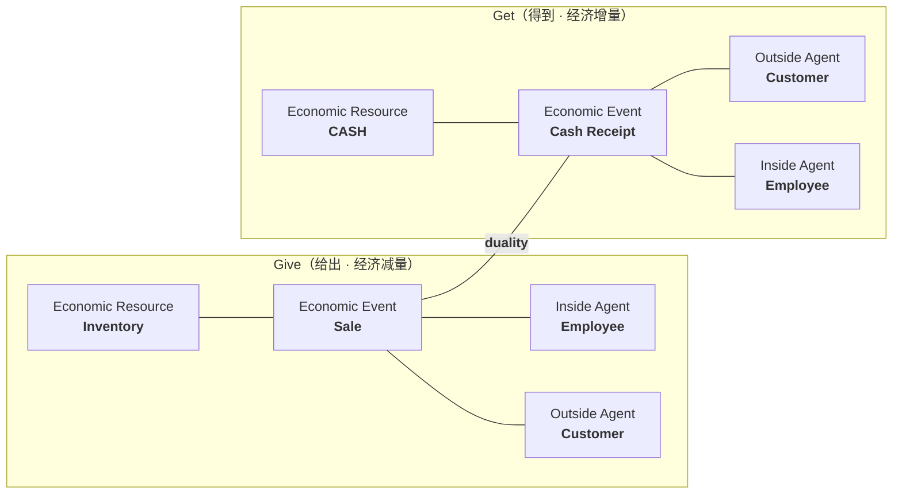
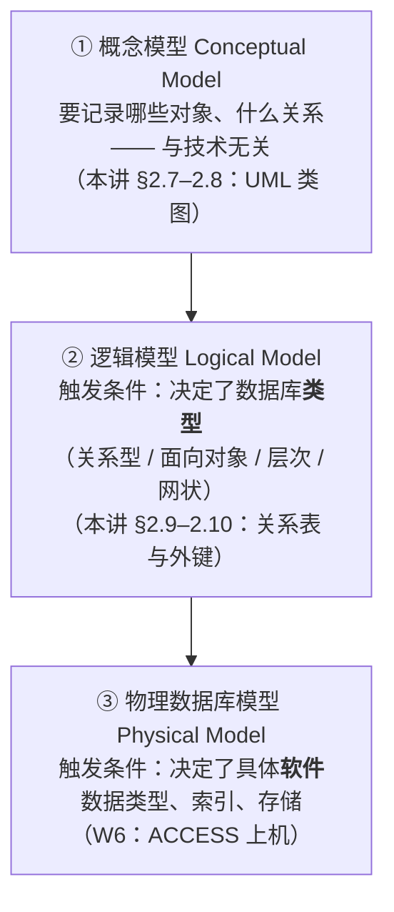
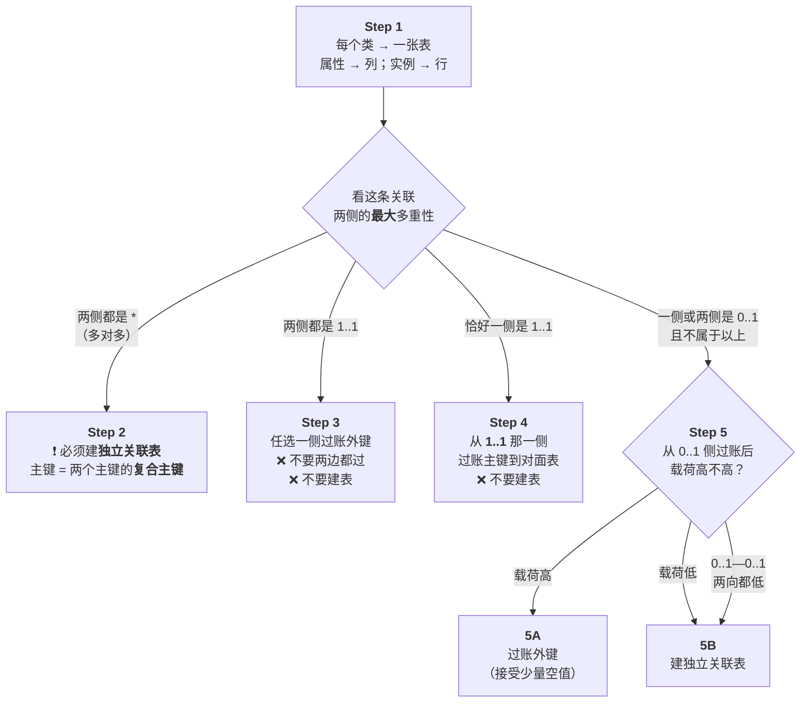
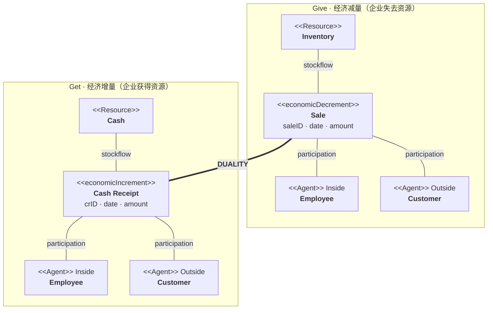
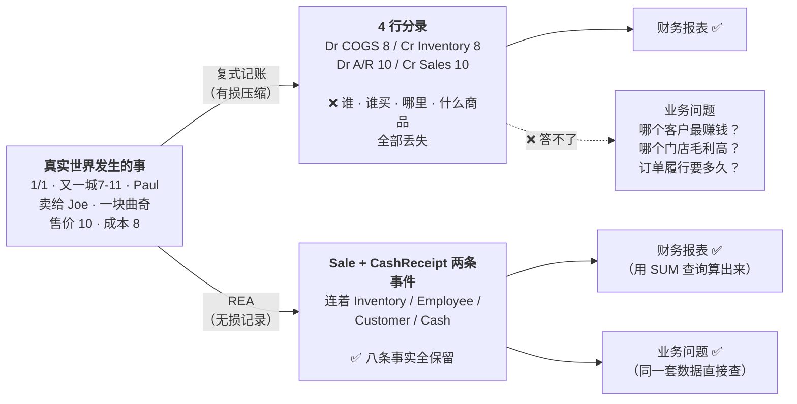
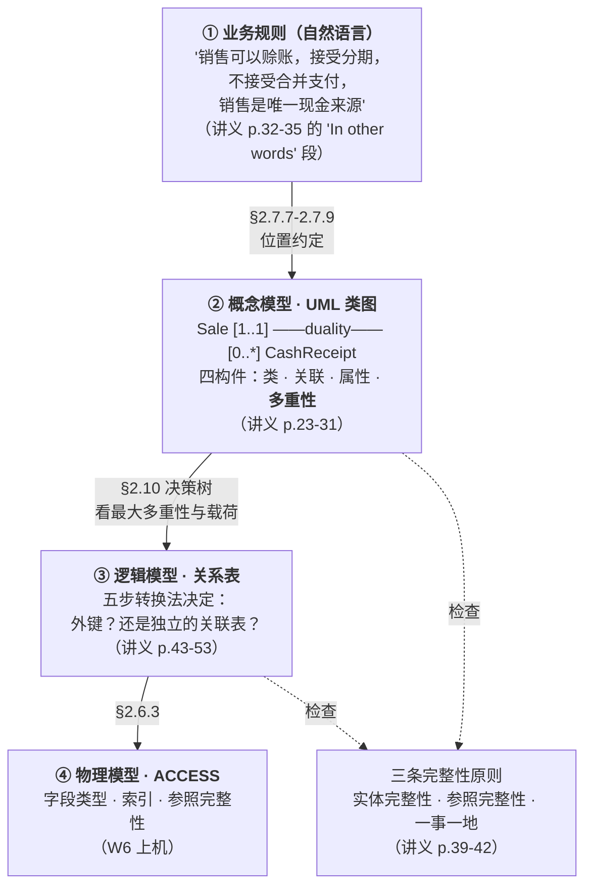

# M04 · REA 会计模型（REA Accounting Model）

> **本讲一句话**：前三讲教你**怎么用会计的方式记账、读报表**；这一讲告诉你 —— **这套方式本身是 1494 年为纸笔时代设计的，它把大量业务信息在进账之前就扔掉了**；然后教你另一套不扔信息的记法：**把业务直接建模成「资源—事件—参与者」，存进关系数据库**。
> **原始材料**：`Week 4 PPT.pptx`（53 页） ｜ **转录**：`pending`（本课只有 W01 有录音转录，W04 暂无）

> ⚠️ **本笔记为 v0.9**：全部内容来自讲义本身，**没有任何课堂转录**。七格微结构里的「🎙️ 课堂补充」一律写"待转录补充"，回填清单见 [[#9.2 课上讲了但课件没有|§9.2]]。
>
> ⚠️ **本讲讲义 53 页里只有 1 页是封面，没有任何学习目标页或章节分隔页**——也就是说 **52 页全部是实质内容**，一页都不能跳。本笔记 §2 对这 52 页**逐页展开**，逐页归属见 [[#8. 讲义页码映射|§8]]。

> 🔴 **期中考（2026-10-14 19:30–21:30，闭卷）范围 W1–W5，本讲在范围内。**
> ⚠️ 而且据 [[AC6761_Artificial_Intelligence_Accounting/00-课程总览|00-课程总览]] 记录的 W01 转录，**REA 模型 + ACCESS 占了 W4–W6 三周，是期中考的主要内容之一**——尽管官方 Keyword Syllabus 一个字都没提 REA。**不要因为大纲没提就降低这一讲的优先级。**

---

## 0. 三分钟速览

**这一讲讲了什么**

M02 教的复式记账有一个你可能没意识到的前提：**它是一套压缩算法**。一笔"1 月 1 日 Paul 在又一城 7-11 把一块成本 \$8 的曲奇以 \$10 卖给了 Joe"的完整事实，进了账簿之后只剩下四个数字：

```
Dr. 销货成本 8    Cr. 存货 8
Dr. 应收账款 10   Cr. 销售收入 10
```

**谁卖的（Paul）、卖给谁（Joe）、卖的是什么（曲奇）、在哪卖的（又一城 7-11）——全部丢失。** 因为它们不能用钱衡量，而 [[M01-会计与商业]] 的**货币计量假设**规定：会计只记能用货币表达的东西。

1982 年，密歇根州立大学的 **Bill McCarthy** 发表了一篇论文，主张：**借、贷、账户这些东西都是"人工构造物（artifacts）"，不是自然存在的现象**，它们是纸笔时代的产物，而且**遮蔽了非会计用途所需要的业务细节**。他提出用三类自然存在的对象来建模企业：

- **Resources 资源**（现金、存货、设备）—— 回答 **what**
- **Events 事件**（销售、采购、收款）—— 回答 **what / when / where**
- **Agents 参与者**（员工、客户、供应商）—— 回答 **who**

这就是 **REA 模型**。

讲义的 53 页分成清晰的四段：

| 段 | 页 | 在讲什么 |
|---|---|---|
| **① 论点** | p.2–10 | 复式记账 vs REA 的强项与局限；会计的历史；McCarthy 1982 的主张 |
| **② 例子** | p.11–19 | 用一块曲奇把两种记法各跑一遍；引出 REA 三要素与**二元性（duality）** |
| **③ 工具** | p.20–35 | 怎么把 REA 画出来：概念/逻辑/物理三层模型 + **UML 类图**四构件（类、关联、属性、**多重性**）+ 四道多重性练习 |
| **④ 落地** | p.36–53 | 怎么把画出来的图变成**真正的数据库表**：关系模型三原则 + **五步转换法** |

**⚠️ 注意第③④段占了 34 页（64%），而且几乎全是可操作的规则。** 这一讲的重心**不在哲学思辨，在动手建模**。W6 的 ACCESS 上机就是把这些规则敲进软件。

**学完你应该能**

1. **对比**复式记账与 REA 的核心原理、强项与局限（讲义 p.2–5 给了完整的四栏对照）
2. **说清** McCarthy 为什么要消灭"借、贷、账户"，以及 "artifact" 这个词的意思
3. **把一笔交易**同时写成**复式记账分录**和 **REA 的资源—事件—参与者结构**
4. **解释 duality（二元性）**，并说明它与复式记账的对应关系
5. **画 UML 类图**：三格框、构造型、关联、属性、**多重性**
6. ⭐ **读懂多重性**：`1..1` / `0..*` 写在哪一侧、各自约束的是谁（**这是本讲最容易错、也最可能考的一点**）
7. **判断**一张关系表是否违反实体完整性、参照完整性、一事一地
8. ⭐ **执行五步转换法**：给一张概念模型，决定每个关联是**做成独立的表**还是**过账一个外键**

**如果只记三件事**

1. **REA 不是"另一种记账法"，是"不记账"。** 它不产生分录，它记录**事件本身**；借贷账户可以在需要时**从事件数据里算出来**（这是 W5–W6 的内容）。
2. ⭐ **多重性的位置约定：写在类 Y 旁边的那对数字，说的是"一个 X 能关联几个 Y"。** 讲义 p.30 与 p.31 用两种说法反复讲这件事，p.32–35 四道练习全在考它。**记错方向，后面五步转换法全盘皆错。**
3. **五步转换法只有两种结果**：`多对多 → 做一张独立的关联表`；`其余 → 从 "1" 那一侧过账一个外键`。剩下的细节都是在处理 `0..1` 带来的空值问题（**载荷 load**）。

---

## 1. 开始之前 · 知识衔接

### 1.1 你已经有的

| 概念 | 一句话唤醒 | 回看 |
|---|---|---|
| 复式记账 | 每笔交易做金额相等的借贷记录，等式恒平衡 | [[M02-交易的会计处理]] §2.4.2 |
| 借 / 贷 | **就是账户的左侧 / 右侧**，与中文"借钱/贷款"无关 | [[M02-交易的会计处理]] §2.4.1 |
| 账户 / 总账 | 针对某一具体项目记录增减的一份记录 / 全部账户的集合 | [[M02-交易的会计处理]] §2.2.1、§2.3 |
| 日记账分录 | 日期、科目、借贷金额、说明；借在上、贷缩进 | [[M02-交易的会计处理]] §2.5.1 |
| 试算表 | 全部账户余额的清单，借贷两栏相等 = **数学校验和** | [[M02-交易的会计处理]] §2.7 |
| 会计等式 | `Assets = Liabilities + Equity` | [[M01-会计与商业]] §2.7.1 |
| **货币计量假设** | 一切以货币表达 ⇒ **不能用钱衡量的信息被系统性排除** —— **这一讲就是从这条推论开始的** | [[M01-会计与商业]]（L1） |
| GAAP / IFRS | 规则导向 / 原则导向的两套准则体系 | [[M01-会计与商业]] §2.6.1–2.6.2 |
| 财务报表（四张） | 利润表、资产负债表、现金流量表、权益变动表 | [[M03-年报分析]] §2.2、§2.5、§2.7、§2.8 |
| **表外项目 / 自创无形资产不上表** | 研发能力、品牌、客户关系装不进四张表 —— **REA 要解决的正是这个** | [[M03-年报分析]] §2.2.10 |
| 销货成本 / 销售收入 | 卖出商品的直接成本 / 卖出商品取得的收入 | [[M03-年报分析]] §2.5.2 |
| 应收账款 | 已交货未收款 | [[M01-会计与商业]] §2.7.2 |
| **表、字段、行、主键、外键的直觉** | **在 L0 入场基线里**（[[AC6761_Artificial_Intelligence_Accounting/_meta/知识层级台账\|知识层级台账]] 的"数据库与编程"一节） | L0 |
| SQL 的基本 SELECT 语义 | 同上，在 L0 里 | L0 |

> ⚠️ **一处需要说明的 L0 边界**：[[AC6761_Artificial_Intelligence_Accounting/_meta/知识层级台账|知识层级台账]] 把"表、字段、行、主键、外键的**基本直觉**"放进了 L0。**但本讲讲的不是直觉，是精确定义与设计规则**（什么叫外键"过账"、什么叫实体完整性、多对多为什么必须建独立表）。所以本笔记**仍然把它们当新概念完整展开**，只是不再解释"什么是一张表"。

### 1.2 本讲全新引入的概念

| 概念 | English | 展开于 |
|---|---|---|
| REA 模型 | REA (Resource-Event-Agent) Model | §2.1.3 |
| 人工构造物 | Artifact | §2.3.1 |
| 语义语境 | Semantic Context | §2.1.3 |
| 经济资源 / 事件 / 参与者 | Economic Resource / Event / Agent | §2.5.1 |
| 内部参与者 / 外部参与者 | Inside / Outside Agent | §2.5.3 |
| 二元性 | Duality | §2.5.2 |
| 经济减量 / 经济增量 | economicDecrement / economicIncrement | §2.7.8 |
| 概念模型 | Conceptual Model | §2.6.1 |
| 逻辑模型 | Logical Model | §2.6.2 |
| 物理数据库模型 | Physical Database Model | §2.6.3 |
| XML / XBRL | eXtensible Markup / Business Reporting Language | §2.6.1 |
| UML 类图 | UML Class Diagram | §2.7.1 |
| 类 / 实体 | Class / Entity | §2.7.2 |
| 构造型 | Stereotype | §2.7.3 |
| 关联 | Association | §2.7.4 |
| 关联类 / 具象化关联 | Association Class / Reified Association | §2.7.4 |
| 属性 | Attribute | §2.7.6 |
| 主键 | Primary Key | §2.7.6 |
| 简单 / 复合属性 | Simple / Composite Attribute | §2.7.6 |
| 可导出属性（静态 / 易变） | Derivable Attribute (Static / Volatile) | §2.7.6 |
| 多重性（最小 / 最大） | Multiplicity (Minimum / Maximum) | §2.7.7 |
| 关系数据库 | Relational Database | §2.9.1 |
| 外键 | Foreign Key | §2.9.1 |
| 元组 / 表的外延 / 内涵 | Tuple / Table Extension / Intension | §2.9.2 |
| 空值 | Null | §2.9.4 |
| 实体完整性 | Entity Integrity | §2.9.4 |
| 参照完整性 | Referential Integrity | §2.9.4 |
| 一事一地 | One Fact, One Place | §2.9.4 |
| 重复组 | Repeating Group | §2.9.7 |
| 冗余 | Redundancy | §2.10.1 |
| 载荷 | Load | §2.10.1 |
| 复合主键 | Composite / Concatenated Primary Key | §2.10.3 |

### 1.3 为什么这一讲放在这里 · 重排说明

**承接三条线，全部在 W1–W3 埋好了：**

1. **[[M01-会计与商业]] 的货币计量假设** —— 台账里那一行的注释写着："*其推论是：不能用钱衡量的信息会被系统性地排除在外（这是 W4 REA 模型的出发点）*"。本讲 p.3 的 "Limited scope: Captures only monetary transactions, ignoring non-financial data" 就是它的正面表述。
2. **[[M02-交易的会计处理]] 的整套借贷机制** —— 本讲 p.9 要你**把它当成一个可以被推翻的设计选择**，而不是自然法则。⚠️ **这个视角转换是本讲最大的认知跳跃**：刚学会一套东西，马上被告知它是人造的、可替代的。
3. **[[M03-年报分析]] 的两条 Weakness** —— "账面价值不代表公允价值" + "**有些资产和负债根本不在表上**"。REA 的回答是：**别再从"上不上表"的角度想问题，先把业务事件完整记下来，报表只是从事件数据里生成的一个视图。**

**铺路**：
- **W5「REA Business Process Modeling」** —— 本讲教的是单个 give/get 对；W5 把它扩展成完整的**业务循环**（收入循环、采购循环、生产循环）。
- **W6「Accounting Information Querying with ACCESS」** —— 本讲 §2.10 的五步转换法产出的表结构，W6 直接在 ACCESS 里建出来并查询。**本讲的规则学不扎实，W6 上机会寸步难行。**
- **W9–W10 的 AI 财报分析** —— REA 数据库是**结构化、细粒度、带完整语境**的数据，正是机器学习最好的输入。这一点讲义没说，是 💡 笔记补充。

**重排说明**：讲义的顺序**基本合理，我只做了三处调整**：

| 讲义原顺序 | 本笔记 | 理由 |
|---|---|---|
| p.2–5 论点摘要 → p.6–9 历史 | 保持 | 讲义先给"两种范式的结论"再讲历史。虽然倒叙，但让读者先知道要往哪走，是合理的 |
| p.10 McCarthy 的例子（COGS 与 Sales 是同一个类的属性）**紧跟在 p.9 之后** | 保持在 §2.3.2 | ✅ 位置正确 |
| p.11–16 曲奇例子只给了**复式记账**版本，**从未给 REA 版本** | **新增 §2.4.5**：把同一个故事用 REA 记一遍 | ⚠️ 讲义的最大缺口：花 6 页讲例子，却只演示了它要批判的那一半。不补上，读者根本看不出 REA 好在哪 |
| p.32–35 四道练习，**p.34/p.35 的多重性和答案全是空白** | §2.8.3–2.8.4 **自己推导并给出答案**，标 💡 | 与 [[M03-年报分析]] p.26/p.27 同类问题 |
| — | **新增 §2.10.12**：五步转换法的**决策树总结** | 讲义把五步散在 p.43–53 共 11 页，没有一页总结。考试要用的是那张决策树 |

对应关系逐页可查，见 [[#8. 讲义页码映射|§8 讲义页码映射]]。

---

## 2. 正文

### 2.0 封面（讲义 p.1）

讲义 p.1 是封面：**AC6761 Artificial Intelligence Accounting ／ Chapter 4 REA Accounting Model**。

课程大纲 `AC6761 Outline 2627.docx` 的 Tentative Schedule 里 Week 4 的主题正是 **"REA Accounting Model"**，与封面一致。

⚠️ **本讲讲义从 p.2 起就是正文，全程没有学习目标页、没有章节分隔页、没有小结页**。53 页里 52 页是内容。**这与 M02 的讲义（47 页里 7 页是学习目标分隔页）风格完全不同**，可能是因为本章内容改编自另一套教材（见 §9.3 ①）。

**所以呢**

封面页本身没有知识点，但它标出了本讲的坐标——Week 4、53 页里 52 页是正文；下面从 p.2 开始，讲义会先把两种记账范式摆在一起对照。

---

### 2.1 两种范式的对撞（讲义 p.2–5）

> 讲义用 p.2–p.5 **整整四页**先把结论摆出来：两页讲复式记账（原理 + 强项与局限），两页讲 REA（原理 + 强项与局限）。**这四页是本讲最可能出对比论述题的地方**，而且**四页的排版是严格对称的**，非常适合做成一张表背下来。

#### 2.1.1 传统复式记账的核心原理（讲义 p.2）

**是什么**

讲义 p.2 原文（`Traditional Double-Entry Bookkeeping`）：

> **Core Principle：**
> *"Records every transaction with dual entries (debit/credit) to maintain the accounting equation: **Assets = Liabilities + Equity**. It focuses on **financial outcomes** (e.g., profits, cash flows) and uses **standardized financial statements** (income statement, balance sheet)"*

三个要素，逐个对照前三讲：

| 讲义原文 | 中文 | 我们在哪学过 |
|---|---|---|
| *dual entries (debit/credit)* | 每笔交易做一对借贷记录 | [[M02-交易的会计处理]] §2.4.2 |
| *to maintain the accounting equation* | 目的是维持会计等式恒平衡 | [[M01-会计与商业]] §2.7.1 |
| *focuses on **financial outcomes*** | **关注的是财务结果**（利润、现金流），不是业务过程 | ⭐ 新的强调点 |
| *uses **standardized** financial statements* | 输出是**标准化的**财务报表 | [[M03-年报分析]] 整讲 |

**⭐ 这一页真正要你注意的是 "focuses on financial **outcomes**" 这个词。**

**为什么重要（💡 笔记补充，讲义没展开）**

复式记账关心的是**结果**（这一年赚了多少、现在有多少现金），**不关心过程**（这些钱是怎么赚来的、经过了哪些环节、谁参与了、花了多长时间）。

用 [[M02-交易的会计处理]] 的例子：FastForward 那 16 笔交易记完之后，你能算出净利润和试算表，但你**说不出**：
- 哪个客户贡献最多？（账上只有 "Accounts Receivable" 一个总数）
- 咨询服务从签约到交付平均要几天？（账上只有日期，没有流程）
- 哪个员工的产出最高？（账上只有 "Salaries Expense" 一个总数）

**这些问题不是复式记账"做不好"，是它压根不打算回答。** 它的设计目标就是产出标准化报表。

**🎙️ 课堂补充**
待转录补充。

**💡 换个说法（笔记补充）**
复式记账像一台**只输出摘要的记录仪**：它把每天发生的成千上万件事压缩成一张损益表和一张资产负债表。压缩比极高，但**压缩是有损的**，扔掉的部分再也找不回来。

**⚠️ 常见误解**
- ❌ "复式记账是记录业务的方法"。→ 它是**记录业务的财务影响**的方法。业务本身（谁、在哪、多久）不在它的记录范围内。

**与其他概念的关系**
本页是 §2.1.3 REA 的对照组；"focuses on financial outcomes" 这一句是 §2.1.4 "holistic view" 的反面。

**所以呢**

"关注结果、不关注过程"这条特征记住了，下一节看这个特征在实务里具体表现为哪些强项与局限。

---

#### 2.1.2 复式记账的强项与局限（讲义 p.3）

**讲义 p.3 原文**（`Strengths and limitations`，指复式记账）：

> **Strengths：**
> - *"Ensures **mathematical accuracy** through **trial balances**."*
> - *"Simplifies **compliance** with regulatory standards (e.g., **GAAP, IFRS**)."*
> - *"Widely supported by software (e.g., **QuickBooks**) and integrates with **tax reporting**"*
>
> **Limitations：**
> - *"**Limited scope**: Captures **only monetary transactions**, ignoring **non-financial data** (e.g., customer satisfaction, production efficiency)."*
> - *"**Historical focus**: Emphasizes **past performance** rather than **real-time operational insights**"*

**逐条解释（讲义只给了短语，展开如下）**

**强项 ①：试算表保证数学准确性。**
[[M02-交易的会计处理]] §2.7 讲过：试算表把所有账户余额分列到借贷两栏，**两栏必须相等**。这是一个**免费的、自动的校验和**。
⚠️ 但 M02 也强调过：**试算表平衡 ≠ 账记对了**——记错科目、整笔漏记、重复记账，它一概查不出。所以这条强项要精确表述为"保证**数学上的**准确性"，讲义用的正是 *mathematical* 这个词。

**强项 ②：便于合规。**
GAAP 与 IFRS（[[M01-会计与商业]] §2.6.1–2.6.2）都是**围绕复式记账建立的**。你按借贷记账，报表格式、披露要求自动就能对上。⇒ **换一套记账法，就意味着与整个监管体系脱节**——这正是 §2.1.4 说 REA "缺乏标准化"的根源。

**强项 ③：软件生态成熟 + 与税务申报打通。**
讲义点名 **QuickBooks**（Intuit 出品的中小企业记账软件，北美市占率极高）。💡 **补充**：同类还有 Xero、SAP、用友、金蝶。**几十年的软件积累是一种巨大的沉没投资**——这是 §2.1.4 "complex implementation" 的另一面。

**局限 ①：范围有限 —— 只捕获货币交易，忽略非财务数据。**
讲义给的两个例子极其精准：
- **customer satisfaction 客户满意度** —— 无法用货币表达，所以不进账
- **production efficiency 生产效率** —— 同上

⭐ **这就是 [[M01-会计与商业]] 货币计量假设的直接后果**，也是 [[M03-年报分析]] §2.2.10 "有些资产和负债根本不上表"的更一般化表述。

**局限 ②：历史导向 —— 强调过去的业绩，而不是实时的经营洞察。**
财务报表是**期后**产出的（月结、年结）。等你拿到 2019 年年报，已经是 2020 年 3 月了。**决策需要的是现在的数据。**

**🎙️ 课堂补充**
待转录补充。

**💡 换个说法（笔记补充）**
复式记账是**后视镜**：非常清晰、非常可靠、还有法律效力，**但它只能看见已经开过的路**，而且只显示"路程"和"油耗"，不显示"路况"和"乘客体验"。

**⚠️ 常见误解**
- ❌ "局限说明复式记账过时了"。→ 讲义列了三条强项，**每一条都还成立**。REA 的定位是**补充与重构**，不是废除。§2.1.4 明确列出了 REA 自己的两条硬伤。

**与其他概念的关系**
两条局限 ↔ §2.1.4 REA 的两条强项（holistic view 对 limited scope；real-time analytics 对 historical focus）——**讲义的四页是严格一一对应的**，见 §4.1 速查表。

**所以呢**

复式记账的两条局限（只认货币、只看过去）正是 REA 要解决的问题，下一节看 REA 换了一种什么样的方式来记账。

---

#### 2.1.3 REA 会计模型：一次范式转移（讲义 p.4）

**是什么**

讲义 p.4 原文（标题就叫 `REA Accounting Model: A Paradigm Shift`）：

> **Core Principle：**
> *"Models business activities around **three core elements**:*
> - ***Resources** (e.g., inventory, cash, equipment),*
> - ***Events** (e.g., sales, purchases, production),*
> - ***Agents** (e.g., customers, employees, suppliers).*
>
> *Unlike double-entry, REA records economic events in their **semantic context** rather than as debits/credits. For example, a sales event links to **the sold resource (product)**, **involved agents (salesperson, customer)**, and **related events (payment, delivery)**."*

**三个核心元素**（讲义给的例子照抄）：

| 元素 | 中文 | 讲义举例 | 回答 |
|---|---|---|---|
| **Resources** | 经济资源 | inventory 存货、cash 现金、equipment 设备 | **什么东西** |
| **Events** | 经济事件 | sales 销售、purchases 采购、production 生产 | **发生了什么** |
| **Agents** | 经济参与者 | customers 客户、employees 员工、suppliers 供应商 | **谁参与了** |

**⭐ 关键句：*"records economic events in their semantic context rather than as debits/credits"***

> **语义语境（Semantic Context）** ⭐ 新概念：**把一个事件连同它周围的全部关系一起记下来**，而不是把它翻译成会计科目的增减。
>
> 讲义自己给了这句话的分解：一个销售事件（sales event）连着三样东西——
> - **被卖出的资源**（the sold resource: product）
> - **参与的参与者**（involved agents: salesperson, customer）
> - **相关的事件**（related events: payment, delivery）

**为什么这叫"范式转移"（Paradigm Shift）**

因为它**换了记录的基本单位**：

```
复式记账的基本单位 = 账户（Account）
    一笔销售被拆成 4 个账户的增减，事件本身消失
    ↓
REA 的基本单位 = 事件（Event）
    一笔销售就是一条 Sale 记录，它的属性里同时有价格和成本，
    它通过外键连到 Inventory、Employee、Customer、CashReceipt
```

**💡 用数据库的话说（笔记补充，这是理解 REA 最快的路径）**

复式记账的数据结构大致是：

```
Journal(date, account, debit, credit, description)
```

⇒ 你只能按**账户**和**日期**查询。想问"哪个客户买得最多"，数据库里根本没有 customer 这个字段。

REA 的数据结构是：

```
Sale(saleID, date, location, amount, cost, employeeID, customerID)
Inventory(itemID, description, unitCost)
SaleLine(saleID, itemID, quantity, unitPrice)
CashReceipt(crID, date, amount, customerID, employeeID)
Duality(saleID, crID)
```

⇒ 想问什么都能查，**包括会计问题**（把 Sale 表的 amount 加总就是销售收入，把 cost 加总就是销货成本）。

**⭐⭐ 这就是 REA 最核心的主张：报表不是记下来的，是算出来的。**

**🎙️ 课堂补充**
待转录补充。

**💡 换个说法（笔记补充）**
- **复式记账**像**做菜时只记账单**：今天买菜花了 200，卖出去收了 500，赚 300。
- **REA** 像**装了摄像头的厨房**：几点几分、哪位厨师、用了哪些食材、多少克、做给哪桌客人、客人几点付的钱。
- **账单可以从录像里算出来**（把所有出账加总），**但录像不能从账单里还原**。

**⚠️ 常见误解**
- ❌ "REA 是不用记账了"。→ 是**不用记借贷科目**了。业务事件记得**比原来更细**。
- ❌ "REA 里没有资产负债表"。→ 有，只是它是**从事件数据里查询生成的视图**，不是一本一本记出来的账。
- ❌ "Resources/Events/Agents 是三张表"。→ 是**三类**表。一个企业会有很多个资源类（现金、存货、设备）、很多个事件类（销售、采购、收款、付款）、很多个参与者类（客户、员工、供应商）。

**与其他概念的关系**
→ §2.5 三要素的详细定义与二元性；→ §2.7 怎么把它画成 UML 类图；→ §2.10 怎么把类图变成真正的表。

**所以呢**

REA 把"事件"当成一等公民来记录的野心讲完了，它是否真的完美还要看下一节的强项与局限。

---

#### 2.1.4 REA 的强项与局限（讲义 p.5）

**讲义 p.5 原文**（`Strengths and limitations`，这次指 REA）：

> **Strengths：**
> - *"**Holistic view**: Integrates **financial and non-financial data** (e.g., order fulfillment time, resource utilization), enabling **multidimensional decision-making**."*
> - *"**Process optimization**: Identifies inefficiencies by **mapping event sequences** (e.g., bottlenecks in production)"*
> - *"Example: **A manufacturing firm using REA reduced costs by 15%** by analyzing "resource-event" linkages to eliminate waste"*
> - *"**Adaptability**: Supports **real-time data analytics and AI-driven forecasting**"*
>
> **Limitations：**
> - *"**Complex implementation**: Requires **redesigning databases and training personnel** to capture granular event/agent data."*
> - *"**Lack of standardization**: **No universal guidelines for REA-based reporting**, complicating **audits and cross-company comparisons**"*

**逐条解释**

**强项 ①：整体视图 —— 财务与非财务数据一体化。**
讲义举的两个例子值得记住，因为它们精确对应 p.3 的两条局限：
- **order fulfillment time 订单履行时长** ⇒ 因为 REA 记录了 `Sale.date` 和 `Delivery.date`，两者相减就是履行时长。**复式记账里没有 Delivery 这个事件，所以算不出。**
- **resource utilization 资源利用率** ⇒ 因为 REA 记录了每台设备参与了哪些生产事件。

**强项 ②：流程优化 —— 通过映射事件序列识别低效环节。**
讲义举例 *"bottlenecks in production"*（生产瓶颈）。
💡 **补充**：REA 的事件表天然带时间戳，把事件按序列排开就能看出哪一步耗时最长——**这实际上就是流程挖掘（process mining）**。

**强项 ③：⚠️ 一个没有出处的量化断言。**
*"A manufacturing firm using REA **reduced costs by 15%**"* —— 讲义**没有给公司名、没有给年份、没有给文献引用**。⚠️ **这是本讲最可疑的一句话，详见 §9.3 ②。考试不要引用这个数字。**

**强项 ④：适应性 —— 支持实时数据分析与 AI 驱动的预测。**
⭐ **这是全讲唯一一处把 REA 与 AI 直接挂钩的句子**，也是本讲与课程主题（Artificial Intelligence Accounting）的接口。
💡 **展开（笔记补充，讲义只有一行）**：机器学习需要的是**细粒度、结构化、有语境**的数据。
- 复式记账给 AI 的是**月度汇总的科目余额**——样本量小、特征少、语境全丢。
- REA 给 AI 的是**每一笔事件的完整记录**——样本量大、特征丰富（谁、何时、何地、多少）。
- ⇒ **想做 W9–W10 的"AI 财报分析"，数据基础的质量直接决定上限。** 这条线讲义没画出来，但它是本课前后半段的真正连接点。

**局限 ①：实施复杂 —— 需要重新设计数据库并培训人员，才能采集细粒度的事件/参与者数据。**
两层成本：**技术成本**（重建数据库）+ **人的成本**（员工要学会录入更多字段）。

**局限 ②：⭐ 缺乏标准化 —— 没有通用的 REA 报告指引，使审计与跨公司比较变得复杂。**
这一条**最致命**，而且与 p.3 强项 ② 完全对称：
- 复式记账有 GAAP/IFRS ⇒ 任何两家公司的报表可以直接比
- REA 没有统一规范 ⇒ **每家公司的模型都不一样**，审计师不知道该按什么标准查，分析师不知道该怎么比

💡 **这解释了一个现实问题（笔记补充）**：REA 提出 40 多年了，为什么上市公司仍然全部用复式记账对外报告？**因为对外报告的本质是"可比性"，而 REA 恰恰在这一点上最弱。** REA 的真实用武之地是**企业内部的信息系统**——那里不需要跨公司可比。

**🎙️ 课堂补充**
待转录补充。

**⚠️ 常见误解**
- ❌ "REA 更先进所以会取代复式记账"。→ 讲义自己列了两条硬伤。**现实是：企业内部用 REA 式的 ERP 系统，对外报告仍然出 IFRS 报表**——两者并存，前者喂后者。
- ❌ "15% 是可以引用的数据"。→ **无出处，不要引用**（§9.3 ②）。

**与其他概念的关系**
四页（p.2–5）构成一张完整的 2×2 对照表，见 §4.1；强项 ④ 是与 **W8–W11 的 AI 部分**的唯一接口。

**所以呢**

两种范式的对照表已经摆全，下一节退一步看历史：会计记录的方法为什么会演变、又为什么会走到需要 REA 的这一步。

---

### 2.2 历史：会计作为"经济故事的讲述"（讲义 p.6–8）

#### 2.2.1 七千年的记账人（讲义 p.6）

> 📄 **p.6 是图文页**（四张图片 + 一句话），已转 PDF 视觉复核。

讲义 p.6 标题：**Accounting Systems for Economic Storytelling**（用于讲述经济故事的会计系统），正文只有一句：

> *"Throughout history, accountants recorded and reported the **economic stories** of enterprises."*
> 纵观历史，会计人一直在**记录并报告企业的经济故事**。

**页面下方并排四张图片**（视觉复核内容）：

| 位置 | 图像内容 | 代表的时代 |
|---|---|---|
| 第 1 张 | 古埃及壁画风格：四个人物，一人执笔在板上书写，一人操作类似算珠/计数器的装置，另有人跪坐记录 | **古代**：手工计数与刻记 |
| 第 2 张 | 一幅文艺复兴油画：一位修士模样的人（穿深色僧袍）手持圆规与直尺，面前摊开一本大书与一块画板，身旁站一位年轻贵族，画面左上悬着一个多面体几何模型 | **1494 年**：**Luca Pacioli**（复式记账的传播者）——这是他著名的画像 |
| 第 3 张 | 一双手在使用带打印纸带的台式计算器，桌面有铅笔与账簿 | **20 世纪**：机械/电子计算器时代 |
| 第 4 张 | 一个人俯身在摊满报表与电子表格的桌面上，桌上有平板/键盘与多份打印的表格 | **当代**：电子表格与信息系统 |

**💡 这一页在说什么（笔记补充，讲义只给了一句话）**

**记账工具变了四次，记账的目的一次没变**：记录并报告企业的经济故事。

⇒ 讲义用这张图埋了一个论点：**"复式记账"只是这条历史长河里的一个阶段性工具**，就像算盘和纸带计算器一样。既然工具可以换，**记账的方法论也可以换**——这正是 p.9 McCarthy 主张的铺垫。

**⭐ 注意讲义在这里选了 "storytelling（讲故事）" 这个词，不是 "recording（记录）"。** 一个故事需要有**人物、时间、地点、情节**——而这四样，正好对应 §2.5.1 那句 *"When? Where? What? Who?"*。**讲义在 p.6 就把 REA 的框架埋进了一个隐喻里。**

**🎙️ 课堂补充**
待转录补充。（这是图片页，教授在课上必然口头讲了这四张图各是什么。）

**所以呢**

记账工具换了四次、记账的目的一次没变——下一节具体看这条历史线上最关键的两次转折：复式记账的出现，和公司制的出现。

---

#### 2.2.2 历史的四步（讲义 p.7）

**讲义 p.7 原文四条**（标题 `Histories`）：

> - *"**7000 years ago**, people of **Babylonia** touched the concepts of **economic value and profit**. Record information – **making notches in sticks**."*
> - *"**1494**, the **double-entry bookkeeping system was introduced by Pacioli**."*
> - *"After **industrial revolution**, **corporation** emerges as financial needs were beyond the ability of most **sole traders or partnerships**."*
> - *"The **separation between ownership and control** in corporation triggered the **importance of financial statements**."*

**逐条读，第 3、4 条最重要**

**① 七千年前，巴比伦人已经触及"经济价值"与"利润"的概念，用在木棍上刻痕的方式记录信息。**
→ 说明**记账早于文字、早于货币**。经济活动一旦复杂到记不住，就必须有外部记录。
（⚠️ 关于"刻木棍"这个说法的准确性，见 §9.3 ④。）

**② 1494 年，Pacioli 引入了复式记账系统。**
💡 **补充**：Luca Pacioli 是意大利数学家、方济各会修士，1494 年出版《算术、几何、比及比例概要》（*Summa de Arithmetica*），书里有一章系统描述了威尼斯商人使用的复式记账法。
⚠️ **严格说他是"记载并传播"，不是"发明"** —— 见 §9.3 ④。但**考试按讲义写 "introduced by Pacioli, 1494" 即可**。

**③ ⭐ 工业革命之后，公司（corporation）出现，因为资金需求超出了大多数独资商人或合伙的能力。**

> 💡 **把这条讲透（笔记补充，讲义只有一句）**：
> [[M01-会计与商业]] §2.7 讲过三种组织形式（独资 / 合伙 / 公司）。工业革命需要建铁路、开矿、造工厂——**这些项目的资金量，一个人或几个合伙人凑不出来**。
> 解决办法是**把所有权切成很多小份（股份）卖给成百上千的陌生人**，靠**股东有限责任**（[[M01-会计与商业]]）保护他们：最坏情况只赔掉投进去的钱，不会被追债到倾家荡产。
> ⇒ **公司这种组织形式，本质上是一台"把陌生人的钱汇集起来"的机器。**

**④ ⭐⭐ 公司里**所有权与控制权的分离**，触发了财务报表的重要性。**

> 这是全页的**结论句**，也是理解**为什么会有财务会计**的最根本答案。
>
> 💡 **展开（笔记补充）**：
> - **独资商人**自己经营自己的店，账目是给自己看的 ⇒ 不需要标准化、不需要审计、不需要对外披露
> - **公司**：出钱的人（**股东，Owner**）和管事的人（**管理层，Control**）**不是同一批人**
> - ⇒ 股东看不见公司里发生了什么，**只能靠管理层给他一份报告**
> - ⇒ 但管理层有动机把报告做得好看（这就是[[M01-会计与商业]]讲的**代理问题**的会计后果）
> - ⇒ 所以需要：**统一的准则**（GAAP/IFRS，让报告可比）+ **独立审计师**（验证报告为真）+ **法定披露**（Companies Ordinance，强制必须报告）
>
> **⇒ [[M03-年报分析]] 讲的整套年报制度，根子就在"所有权与控制权分离"这一句上。**

**⭐ 而这一句也是本讲的伏笔**：财务报表是为**外部股东**设计的。**那公司内部的人呢？** 生产经理想知道哪条线有瓶颈，销售总监想知道哪个客户在流失——**财务报表一个字都回答不了。** 这正是 p.8「批评」要问的问题。

**🎙️ 课堂补充**
待转录补充。

**💡 换个说法（笔记补充）**
四步可以串成一句话：
**记账（7000 年前）→ 复式记账（1494）→ 公司制（工业革命）→ 财务报表制度（所有权与控制权分离）→ ⚠️ 但这套制度只服务外部股东 → REA（1982，为所有使用者服务）**

**⚠️ 常见误解**
- ❌ "Pacioli 发明了复式记账"。→ 他是**系统记载与传播**者，方法早在他之前就被威尼斯商人使用。讲义用的词是 *introduced*，比较模糊。
- ❌ "财务报表是为了让公司自己管好账"。→ **是为了让看不见公司的股东能判断该不该继续投钱**。管内部用的是**管理会计**（[[M01-会计与商业]] §2.3）。

**与其他概念的关系**
第 ④ 条 ← [[M01-会计与商业]] 的公司制与股东有限责任；→ [[M03-年报分析]] 的全部年报制度；→ p.8 的批评。

**所以呢**

所有权与控制权分离催生了对外报表制度，但这套制度只服务外部股东——下一节讲义自己提出批评：披露真的完整吗？

---

#### 2.2.3 批评：信息真的被完整、准确地披露了吗（讲义 p.8）

**讲义 p.8 原文**（标题 `Criticism`，只有四行）：

> - *"**Question: is the information completely and accurately disclosed to information users?**"*
> - *"Information users: **insiders and outsiders**"*
> - *"**Double-entry bookkeeping system** – mainstream"*
> - *"**Accounting information system** – different perspective"*

**这四行虽短，但结构非常清楚**

**① 提问**：信息**完整**且**准确**地披露给了使用者吗？
⭐ 注意是**两个**形容词：
- **accurately（准确）** —— 数字对不对。这是复式记账**擅长**的（试算表、审计）
- **completely（完整）** —— 该说的都说了吗。这是复式记账**不擅长**的（只记货币交易，§2.1.2）

**⇒ 讲义的批评落在"完整"这一半，不是"准确"这一半。** 这个区分很重要：**REA 不是在说复式记账算错了，是在说它记漏了。**

**② 信息使用者分内部人与外部人。**
这直接回到 [[M01-会计与商业]] §2.4 的**外部使用者 vs 内部使用者**：

| | 外部使用者 | 内部使用者 |
|---|---|---|
| 谁 | 投资者、银行、债权人、审计师、供应商、分析师、税务机关、监管机构 | 管理层、员工、董事会、审计委员会、风险委员会 |
| 想知道什么 | 该不该投钱 / 借钱给它 | 哪个环节有问题、怎么改 |
| 复式记账能满足吗 | ✅ 基本能（这就是它被设计出来的目的） | ❌ **远远不够** |

**③④ 两条路线**：
- **复式记账系统** = **主流（mainstream）**
- **会计信息系统（Accounting Information System, AIS）** = **另一种视角（different perspective）**

> 💡 **"Accounting Information System" 这个词在这里第一次出现（笔记补充）**：它是一个学科领域的名字——**研究企业如何用信息技术采集、存储、处理和报告会计与业务数据**。REA 是这个领域里最有影响力的理论模型。
> **⇒ 所以本讲的定位是：从"会计"跨进"会计信息系统"。** 这也解释了为什么后面 34 页几乎全是数据库内容——因为 AIS 本质上是一门信息系统课。

**🎙️ 课堂补充**
待转录补充。

**💡 换个说法（笔记补充）**
一份年报可以做到**每个数字都准确无误**，同时**完全无法回答"我们公司最大的问题是什么"**。准确和有用是两件事。

**⚠️ 常见误解**
- ❌ "批评复式记账 = 说它造假"。→ 讲义批评的是 **completeness（完整性）**，不是 accuracy。

**与其他概念的关系**
← §2.1.2 的两条局限；→ §2.3 McCarthy 的具体方案。

**所以呢**

批评指向的是"完整性"而不是"准确性"——下一节介绍 McCarthy 1982 年针对这个缺口给出的具体方案。

---

### 2.3 McCarthy 1982：重新发明会计系统（讲义 p.9–10）

#### 2.3.1 那篇 1982 年的论文（讲义 p.9）

**是什么**

讲义 p.9 原文（标题 `Re-Inventing Accounting Systems`，七条）：

> - *"In **1982**, **Bill McCarthy** published a research article explaining his ideas for **re-engineering accounting systems**"*
> - *"He didn't call it re-engineering, but it was"*
> - *"He focused on **natural phenomena** common to most enterprises for various types of transactions."*
> - *"He recommended **eliminating artifacts such as debits, credits, and accounts**"*
> - *"**Artifacts are manufactured, not naturally occurring**"*
> - *"**Accounting artifacts obscure details of business transactions needed for non-accounting purposes**"*
> - *"This course explains and discusses McCarthy's ideas for developing **integrated enterprise systems** that can satisfy accounting needs **while also satisfying needs of other business areas**"*

**⭐ 全讲最重要的一个概念在这里：Artifact（人工构造物）**

> **Artifact** ⭐ 新概念。讲义给了它一句精确的定义：
> *"**Artifacts are manufactured, not naturally occurring.**"*
> **人工构造物是被制造出来的，不是自然发生的。**
>
> **讲义点名的三个 artifact：debits（借）、credits（贷）、accounts（账户）。**

**💡 把这句话讲透（笔记补充——这是本讲的认知核心，不讲透后面全白学）**

想一想：一笔销售发生时，**世界上真实发生了什么？**

```
自然发生的（natural phenomena）：
  · 一块曲奇从 Paul 手里到了 Joe 手里          ← 真的发生了
  · 10 块钱从 Joe 手里到了 Paul 手里            ← 真的发生了
  · 时间是 2013 年 1 月 1 日                     ← 真的
  · 地点是又一城 7-11                            ← 真的
  · 人是 Paul 和 Joe                             ← 真的

人造的（artifacts）：
  · "销货成本" 这个账户                          ← 世界上没有这个东西
  · "借方" 和 "贷方"                             ← 只是纸上的左边和右边
  · "8 记在左边，8 记在右边"                     ← 一个记账约定
```

**⇒ McCarthy 的主张是：把人造的那一层拆掉，只记自然发生的那一层。**

**为什么要拆掉（讲义原句给了答案）**

> *"Accounting artifacts **obscure** details of business transactions **needed for non-accounting purposes**"*
> 会计的人工构造物**遮蔽了**业务交易的细节，而**这些细节是非会计用途所需要的**。

**注意 "obscure（遮蔽）" 这个动词。** 讲义没说 artifact 是错的，说的是它**挡住了后面的东西**。
- 对**会计**用途：借贷科目刚好够用 ✅
- 对**非会计**用途（生产、销售、客服、供应链）：完全不够用 ❌

**⭐ 最后一条给出了本课的目标：**
> *"developing **integrated enterprise systems** that can satisfy accounting needs **while also satisfying needs of other business areas**"*
> 开发**集成的企业系统**，既满足会计需求，**同时也满足其他业务领域的需求**。

💡 **这就是 ERP（企业资源规划系统）的思想源头**：一套数据库同时供财务、生产、销售、采购、人力使用，而不是每个部门各建一套。

**"He didn't call it re-engineering, but it was" 这句在说什么**

**业务流程再造（Business Process Reengineering, BPR）** 是 1990 年代才流行起来的管理概念（Hammer & Champy, 1993），主张**不要在旧流程上修修补补，要推倒重来**。McCarthy 1982 年做的正是这件事，只是当时还没有这个词。⇒ **讲义在说：他领先了十年。**

**🎙️ 课堂补充**
待转录补充。

**💡 换个说法（笔记补充）**
把复式记账想成**摄氏度**：它是一个人造刻度，非常好用，但**它不是热本身**。如果你只记录温度计读数、扔掉温度计以外的一切（谁在场、在哪个房间、开着什么设备），那么当有人问"为什么这个房间这么热"时，你答不上来。
**McCarthy 说：先把房间里发生的事记全，温度随时可以算。**

**⚠️ 常见误解**
- ❌ "McCarthy 认为复式记账是错的"。→ 他认为它是**人造的、可以被更好的设计替代的**，而不是错的。它在自己的目标范围内工作良好。
- ❌ "REA 之后就没有借贷了"。→ 在 REA 数据库里**没有借贷字段**，但**需要出财务报表时，借贷科目可以从事件数据里推算出来**（这是 W5–W6 的内容）。

**与其他概念的关系**
← p.8 的批评；→ §2.3.2 的具体例子；→ §2.5 的三要素就是"自然现象"的分类。

**所以呢**

artifact（借贷、账户都是人造物）这个概念讲清楚了，下一节用一个具体例子看它在实际记账里造成了什么后果。

> 🔗 **外部补充（讲义未给出文献引用）**：讲义只说 "In 1982, Bill McCarthy published a research article"，**既没给论文标题也没给期刊**。据公开的会计信息系统文献，该文为 **William E. McCarthy, "The REA Accounting Model: A Generalized Framework for Accounting Systems in a Shared Data Environment," *The Accounting Review*, Vol. 57, No. 3 (July 1982)**。⚠️ 这是我补的外部信息（获取日期 2026-09-09），**若要写进作业请自行核实**。讲义漏引文献一事记在 §9.3 ③。

---

#### 2.3.2 McCarthy 的例子：两个账户其实是同一个类的两个属性（讲义 p.10）

**讲义 p.10 原文**（标题 `Bill McCarthy's example`，只有两句）：

> - *"**Double entry bookkeeping system**: "cost of goods sold" and "sales revenue" are **two distinct accounts**."*
> - *"**REA model**: the two accounts represent **attributes of the same class "sale events"**."*

**这两句话极其精炼，但信息量很大。展开如下（💡 笔记补充）**

**在复式记账里：**

一笔卖出曲奇的交易，产生**两个独立账户**的记录：

| 账户 | 位置 | 金额 |
|---|---|---|
| Cost of Goods Sold 销货成本 | 费用类，进利润表 | 8 |
| Sales Revenue 销售收入 | 收入类，进利润表 | 10 |

它们在总账里是**两本完全独立的账**，各有各的余额。**要知道"这一笔卖了多少、成本多少、赚了多少"，你必须去两本账里各找一次，然后靠日期和摘要把它们配对回来。**

⚠️ 而且一旦到了月末汇总，**配对关系就彻底丢了**——总账上只剩 `销货成本合计 XXX` 和 `销售收入合计 YYY`。**你再也无法知道哪一笔销售的毛利是多少。**

**在 REA 里：**

一笔卖出曲奇的交易，就是 **`Sale` 这个类的一条实例**，它有两个属性：

```
Sale
 - saleID          : S001
 - date            : 2013-01-01
 - location        : Festival Walk 7-11
 - sales revenue   : 10      ← 原来的 "销售收入" 账户
 - cost of goods   : 8       ← 原来的 "销货成本" 账户
 - employeeID      : Paul
 - customerID      : Joe
```

**⇒ 两个"账户"变成了同一行记录里的两个"列"。**

**这带来三个直接后果（💡 笔记补充）**

1. **配对关系永不丢失。** 每一笔销售的收入与成本天然在同一行，毛利 = `sales revenue − cost of goods` 随时可算，**按客户、按员工、按门店、按商品分组都可以**。
2. **会计报表仍然能出。** `SELECT SUM(sales_revenue) FROM Sale WHERE year = 2013` 就是全年销售收入；`SELECT SUM(cost_of_goods) FROM Sale ...` 就是全年销货成本。⇒ **借贷科目没有消失，只是变成了查询结果。**
3. **多出来的问题现在能回答了**："Paul 卖出的商品毛利率是多少""又一城门店的毛利率比其他门店高吗""Joe 这个客户一年买了多少" —— 复式记账全部答不了。

**⭐ 这个例子是本讲对"artifact 遮蔽细节"最好的注脚**：把一件事拆成两个账户，是纸笔时代**为了让借贷平衡**而做的技术妥协；在数据库时代，这个妥协没有必要了。

**🎙️ 课堂补充**
待转录补充。

**💡 换个说法（笔记补充）**
复式记账像把一张照片撕成两半，分别装进两个抽屉（"收入"抽屉和"成本"抽屉），靠日期标签配对。REA 就是**不撕**。

**⚠️ 常见误解**
- ❌ "那不就是把两列放一起吗，有什么了不起"。→ **对，就这么简单，而这正是要点**。复式记账之所以要拆开，是因为纸质账簿必须按科目分栏才能加总；数据库没有这个约束，所以那个设计约束应该被去掉。**很多"深刻的洞见"事后看都很简单。**

**与其他概念的关系**
→ §2.4 用完整的曲奇例子把这件事跑一遍；→ §2.7.6 属性（attributes）的正式定义。

**所以呢**

"两个账户其实是同一条记录的两个属性"这个抽象结论，下一节用一个完整的曲奇交易故事从头演示一遍。

---

### 2.4 一个完整的经济故事：7-11 的曲奇（讲义 p.11–16）

> 讲义用 **6 页**讲同一个例子。⚠️ **但它只演示了复式记账那一半**（p.13–16），**从头到尾没有给出 REA 版本**。这是本讲讲义最大的缺口——**不给 REA 版本，读者根本无法对比**。本笔记在 §2.4.5 补上，标 💡。

#### 2.4.1 抽象版的故事（讲义 p.11）

**讲义 p.11 原文**（标题 `Example of Economic Story Telling`，三行）：

> - *"Company A **sells** products to Company B."*
> - *"Company A **gives** products to Company B."*
> - *"Company A **gets** cash from Company B."*

**⭐ 注意这三行的结构：第一行是"一件事"，第二三行把它拆成了"两件事"。**

| 行 | 动词 | 说的是 |
|---|---|---|
| 1 | **sells 卖** | 日常语言里的一次交易 |
| 2 | **gives 给出** | A 失去了产品 |
| 3 | **gets 得到** | A 获得了现金 |

**💡 为什么要拆成 give / get（笔记补充，讲义此处没解释，但这是 §2.5.2 二元性的伏笔）**

因为**一次交易在经济上永远是一次交换**：你给出一样东西，换回另一样东西。
- 复式记账用**借与贷**来表达这个交换
- REA 用 **give 事件与 get 事件的配对**来表达

⇒ **`give` 和 `get` 这两个词，就是讲义在为 duality 铺路。** p.19 那张图上明确写着 "Give" 和 "Get" 两个标签。

**⚠️ 一个细节**：讲义写的是 "Company A **gives** products"，用的是**给出资源**的视角。在 REA 术语里这叫 **economic decrement（经济减量）**——公司的资源变少了。对应地，"gets cash" 是 **economic increment（经济增量）**。这两个术语在 p.30 的 UML 图上以 `<<economicDecrement>>` 的形式出现（§2.7.8）。

**🎙️ 课堂补充**
待转录补充。

**所以呢**

抽象的三行故事定了骨架（卖、给出、得到），下一节把日期、地点、人物、金额全部填进去，变成一个可以真正记账的例子。

---

#### 2.4.2 加上细节（讲义 p.12）

**讲义 p.12 原文**（标题 `Details`）：

> - *"On **Jan 1, 2013**, **Paul** of **7-11 in Festival Walk** sold **one cookie** to customer **Joe**."*
> - *"Paul **give** a cookie to Joe."*
> - *"Paul **gets** cash from Joe."*
> - *"**Specifics**:"*
>   - *"**Price was $10**"*
>   - *"**Cost was $8**"*

**⭐ 把 p.11 的抽象故事填上了六个具体信息。这六个信息正好覆盖 §2.5.1 的四个问句：**

| 信息 | 值 | 对应 REA 的哪一问 | 对应 REA 的哪一类 |
|---|---|---|---|
| **When 何时** | Jan 1, 2013 | when | Event 的属性 |
| **Where 何地** | 7-11 in Festival Walk（又一城 7-11） | where | Event 的属性 |
| **Who 谁**（卖方） | **Paul** | who | **Agent（内部参与者）** |
| **Who 谁**（买方） | **Joe** | who | **Agent（外部参与者）** |
| **What 什么** | one cookie（一块曲奇） | what | **Resource** |
| **How much 多少** | Price \$10 ／ Cost \$8 | — | Event 的属性 |

**⭐⭐ 现在做一件事：把这六条信息与 §2.4.3–2.4.4 的复式记账分录对照，看丢了什么。**（这个对照就是整个 §2.4 的目的，答案在 §2.4.5。）

**💡 一个背景注释（笔记补充）**：**Festival Walk（又一城）** 是香港九龙塘的一家商场，**紧邻香港城市大学**——教授选这个地点是为了让本地学生有代入感。7-11 是香港最常见的便利店连锁。

**🎙️ 课堂补充**
待转录补充。

**⚠️ 一个必须指出的不自洽**：便利店买曲奇是**当场付现**的，不会产生应收账款。但 p.14 的答案里出现了 `A/R`（应收账款），p.16 再把它收回。⇒ **讲义为了演示"两个事件"而把一次现购硬拆成了赊销+收款。** 这在教学上说得通（要凑出 duality 的两端），但**故事本身不合常理**。详见 §9.3 ⑤。

**所以呢**

六个细节（何时、何地、谁、谁、什么、多少）都齐了，下面两节先看复式记账怎么把这个故事拆成分录——这是讲义唯一真正演示到底的记法。

---

#### 2.4.3 用复式记账记（一）：Paul 给出曲奇（讲义 p.13–14）

> 📄 **p.13 与 p.14 是一对**：p.13 给出**空白表格**（让学生自己填），p.14 给出**答案**。这是讲义唯一一处"先问后答"的设计，且**答案确实给出来了**（不像 §2.8 的练习 3、4）。

**p.13 —— 题面**

标题 `Double-Entry System`，正文一句：*"Paul gives a cookie to Joe."*
下方一张三列表格，表头 `Account | DR | CR`，**下面 5 行全是空的**。

⇒ **这一页要你做的是**：用 [[M02-交易的会计处理]] 学的借贷规则，把"Paul 把曲奇给了 Joe"写成分录。

**💡 先自己想一遍（笔记补充）**：这件事影响了哪些账户？
- 曲奇从店里出去了 ⇒ **存货（Inventory，资产）减少 8**
- 卖出商品的成本要确认 ⇒ **销货成本（COGS，费用）增加 8**
- 客户还没付钱但已经拿走了货 ⇒ **应收账款（A/R，资产）增加 10**
- 收入已经赚到了（商品已交付，符合[[M01-会计与商业]]的**收入确认原则**）⇒ **销售收入（Sales Revenue，收入）增加 10**

**p.14 —— 答案**（讲义原表照抄）

| Account | DR | CR |
|---|---:|---:|
| Cost of Goods Sold | 8 | |
| 　　Inventory | | 8 |
| | | |
| A/R | 10 | |
| 　　Sale Revenue | | 10 |

**逐笔走完整流程（讲义只给了表，以下展开是 💡 笔记补充）**

**第一笔：结转成本**

| 账户 | 类型 | 增/减 | 借/贷 | 金额 | 为什么 |
|---|---|---|---|---:|---|
| Cost of Goods Sold 销货成本 | 费用 | **增加** | **借（Dr.）** | 8 | 费用的正常余额在借方（[[M02-交易的会计处理]] §2.4.3） |
| Inventory 存货 | 资产 | **减少** | **贷（Cr.）** | 8 | 资产借增贷减，减少记贷方 |

**会计等式检验**：
```
资产 ↓8（存货）  =  负债 不变  +  权益 ↓8（费用增加使权益减少）
```
✅ 两边同减 8，等式保持平衡。

**第二笔：确认收入**

| 账户 | 类型 | 增/减 | 借/贷 | 金额 | 为什么 |
|---|---|---|---|---:|---|
| A/R 应收账款 | 资产 | **增加** | **借（Dr.）** | 10 | 资产借增贷减 |
| Sale Revenue 销售收入 | 收入 | **增加** | **贷（Cr.）** | 10 | 收入的正常余额在贷方 |

**会计等式检验**：
```
资产 ↑10（应收）  =  负债 不变  +  权益 ↑10（收入增加使权益增加）
```
✅ 两边同增 10。

**两笔合起来的净效果**：
```
资产：−8（存货）+10（应收）= +2
权益：−8（费用）+10（收入）= +2   ⇒ 这 +2 就是这笔生意的毛利
```
✅ 等式两边都 +2。**毛利 = 10 − 8 = 2，从等式里自然浮现出来。**

**⚠️ 为什么要分成两笔而不是一笔？**
因为它们记的是**两件不同的事**：一件是"商品的成本流出去了"（成本流），一件是"我赚到了收入"（收入流）。这是 [[M01-会计与商业]] **配比原则**的要求——**成本必须与它帮助产生的收入记在同一期**，所以两笔要一起做。
（这种一次交易做两笔分录的做法在实务中叫"**永续盘存制**下的销售分录。）

**🎙️ 课堂补充**
待转录补充。

**⚠️ 常见误解**
- ❌ 只记 `Dr. A/R 10 / Cr. Sale Revenue 10` 就完事。→ **漏了成本结转**，存货会一直虚挂在账上，毛利也算不出来。
- ❌ 把 `Cost of Goods Sold` 记在贷方。→ 费用增加记**借方**（[[M02-交易的会计处理]] 的正常余额表）。

**所以呢**

give 的一半（曲奇出去、成本与收入一起确认）已经记完，下一节记 get 的一半——Paul 收到现金——看它对等式和利润各有什么影响。

---

#### 2.4.4 用复式记账记（二）：Paul 收到现金（讲义 p.15–16）

**p.15 —— 题面**

标题 `Double-Entry System`，正文：*"Paul gets cash from Joe."*，下方空白表格 3 行。

**p.16 —— 答案**（讲义原表）

| Account | DR | CR |
|---|---:|---:|
| Cash | 10 | |
| 　　A/R | | 10 |

**走完整流程（💡 笔记补充）**

| 账户 | 类型 | 增/减 | 借/贷 | 金额 | 为什么 |
|---|---|---|---|---:|---|
| Cash 现金 | 资产 | **增加** | **借（Dr.）** | 10 | 资产借增贷减 |
| A/R 应收账款 | 资产 | **减少** | **贷（Cr.）** | 10 | 客户付了钱，这笔债权消失 |

**会计等式检验**：
```
资产：+10（现金）−10（应收）= 0
负债：不变
权益：不变
```
✅ **等式两边都没变。** 这是一笔**纯粹的资产内部转换**：一种资产（债权）换成了另一种资产（现金）。

**⭐ 一个必须理解的点：这一笔没有产生任何利润。**

利润在 §2.4.3 那两笔里**已经全部确认完了**（收入 10、成本 8、毛利 2）。**收钱只是把已经赚到的钱拿到手**。

这正是 [[M01-会计与商业]] **收入确认原则**的核心：**收入在商品交付时确认，不是在收到现金时确认**。如果收钱时再记一次收入，收入就重复计算了。

**🎙️ 课堂补充**
待转录补充。

**⚠️ 常见误解**
- ❌ "收到钱才算赚到"。→ **权责发生制下不是**。货交出去、对方有付款义务时，收入就已经赚到了。
- ❌ 收现金时再记一次 `Cr. Sale Revenue`。→ **收入重复计算**，是初学者最典型的错误。

**所以呢**

两笔分录把整个交易记完了，但讲义到这里就停了——下一节补上讲义没给的部分：同一个故事用 REA 会怎么记，两者到底差在哪。

---

#### 2.4.5 💡 同一个故事用 REA 会怎么记（笔记补充，讲义无对应页）

> ⚠️ **讲义花了 6 页（p.11–16）演示复式记账，却一次也没演示 REA 版本。** 不做这个对比，"REA 好在哪"就永远停留在口号层面。本节全部是 💡 笔记补充，用的规则来自讲义后面的 p.17–19（三要素与二元性）与 p.36–53（关系表设计）。

**先把 p.12 的六条事实原封不动地摆出来**：
`Jan 1, 2013` ／ `Festival Walk 7-11` ／ `Paul` ／ `Joe` ／ `one cookie` ／ `Price \$10, Cost $8`

**REA 的记法（按讲义 p.17 的三分法归类）**

| REA 类别 | 实例 | 从故事里取的信息 |
|---|---|---|
| **Resource 资源** | Inventory（曲奇） | one cookie，unit cost $8 |
| **Resource 资源** | Cash（现金） | $10 |
| **Event 事件（give / 经济减量）** | **Sale**：saleID=S001, date=2013-01-01, location=Festival Walk 7-11, amount=10, cost=8 | when / where / how much |
| **Event 事件（get / 经济增量）** | **Cash Receipt**：crID=CR001, date=2013-01-01, amount=10 | when / how much |
| **Agent 内部参与者** | **Paul**（employee） | who（我方） |
| **Agent 外部参与者** | **Joe**（customer） | who（对方） |
| **Duality 二元性** | Sale S001 ↔ Cash Receipt CR001 | give 与 get 的配对 |

**存成关系表长这样**（用讲义 §2.10 五步法的结果，具体推导见 §2.10）：

```
Inventory(itemID, description, unitCost)
   C01 | Cookie | 8

Employee(empID, name, store)
   E01 | Paul | Festival Walk 7-11

Customer(custID, name)
   U01 | Joe

Sale(saleID, date, location, amount, cost, empID*, custID*)
   S001 | 2013-01-01 | Festival Walk 7-11 | 10 | 8 | E01 | U01

CashReceipt(crID, date, amount, empID*, custID*, saleID*)
   CR001 | 2013-01-01 | 10 | E01 | U01 | S001
```
（`*` 表示外键，§2.9.1）

**⭐ 现在做对照：复式记账丢了什么？**

| 故事里的事实 | 复式记账的四行分录里还剩下吗 | REA 里 |
|---|---|---|
| 日期 2013-01-01 | ✅ 在（日记账有日期栏） | ✅ `Sale.date` |
| **地点 Festival Walk 7-11** | ❌ **完全消失** | ✅ `Sale.location` |
| **卖方 Paul** | ❌ **完全消失** | ✅ `Sale.empID → Employee` |
| **买方 Joe** | ❌ **完全消失**（只有一个总额的 A/R） | ✅ `Sale.custID → Customer` |
| **商品是曲奇** | ❌ **完全消失**（只有 Inventory 一个总额） | ✅ `SaleLine → Inventory` |
| 售价 10 | ✅ 在（Sale Revenue 10） | ✅ `Sale.amount` |
| 成本 8 | ✅ 在（COGS 8） | ✅ `Sale.cost` |
| **售价与成本属于同一笔交易** | ❌ **月末汇总后就丢了**（§2.3.2） | ✅ 同一行 |

**⇒ 八条事实，复式记账留下三条，REA 留下八条。**

**⭐ 而且会计报表一点都没少：**

```sql
-- 销售收入
SELECT SUM(amount) FROM Sale WHERE YEAR(date)=2013;
-- 销货成本
SELECT SUM(cost)   FROM Sale WHERE YEAR(date)=2013;
-- 应收账款余额 = 已销售但未收款的金额
SELECT SUM(s.amount) FROM Sale s
  LEFT JOIN CashReceipt c ON s.saleID = c.saleID
  WHERE c.crID IS NULL;
```

**⇒ 这就是 §2.1.3 说的"报表不是记下来的，是算出来的"。**

**⚠️ 但也别忘了 REA 的代价（§2.1.4）**：上面这套表，**必须先设计、先建库、先培训员工录入**。而复式记账，一本账簿和一支笔就能开始。

**🎙️ 课堂补充**
待转录补充。**⚠️ 教授在课上是否口头做了这个 REA 版本？这是转录到手后最想确认的一件事。**

**所以呢**

八条事实的对照表已经证明 REA 保留的信息远多于复式记账，下一节回到讲义正文，正式给三要素和二元性下定义。

---

### 2.5 REA 的三要素与二元性（讲义 p.17–19）

#### 2.5.1 Resource — Event — Agent（讲义 p.17）

> 📄 **p.17 是图形页**（三个方框 + 连线 + 文字），已转 PDF 视觉复核。

**图（讲义 p.17 的原图，重画为 Mermaid）**


**图下方的文字（讲义原文）**

> *"**When? Where? What? Who?**"*
> - *"**Resources**: what"*
> - *"**Event**: what, when, where"*
> - *"**Agent**: who"*

**是什么**

| 要素 | 中文 | 定义（结合 p.4 与 p.17） | 回答 |
|---|---|---|---|
| **Economic Resource** | 经济资源 | 企业拥有或控制、具有经济价值、会因事件而增减的**东西** | **what**（是什么东西） |
| **Economic Event** | 经济事件 | 使资源发生增减的**一次业务活动** | **what / when / where**（发生了什么、何时、何地） |
| **Economic Agent** | 经济参与者 | 参与事件、对资源拥有或转移控制权的**人或组织** | **who**（谁） |

**⭐ 注意 "what" 出现了两次**：
- **Resource 的 what** = "涉及的是哪一种资源"（曲奇？现金？）
- **Event 的 what** = "发生的是哪一类事件"（销售？收款？）

**为什么是这三类，不多不少（💡 笔记补充，讲义没解释）**

因为任何一次经济活动都可以写成同一个句式：

> **谁（Agent）** 在 **什么时候、什么地方（Event）** 对 **什么东西（Resource）** 做了 **什么（Event）**

⇒ 这就是 §2.2.1 说的 "**economic storytelling**"：**一个故事的最小要素就是人物、情节、物件。** REA 的三个字母就是把这三样各给一个类。

**⚠️ 讲义的四问里少了什么（💡 笔记补充）**

*"When? Where? What? Who?"* —— 少了 **Why（为什么）** 和 **How much（多少）**。
- **How much** 其实有，只是它是 Event 的**属性**（数量、金额），不是独立的类
- **Why** 确实不在基本 REA 里。⇒ 后来的扩展模型（REAL、REA 本体）加入了 **Commitment（承诺，如订单）** 和 **Contract（合同）** 来回答"为什么会发生这个事件"。**本课不讲这部分**，但知道有这个缺口有助于理解 W5 的业务流程建模。

**🎙️ 课堂补充**
待转录补充。

**💡 换个说法（笔记补充）**
新闻写作的 5W1H（Who / What / When / Where / Why / How）里，**REA 覆盖了 Who / What / When / Where 这四个**。⇒ REA 就是**让会计系统学会写新闻，而不是只会报比分**。

**⚠️ 常见误解**
- ❌ "Resource 就是资产"。→ 大部分重合，但不完全。REA 的 Resource 强调"会被事件增减的东西"，包括原材料、产能、员工工时；而**资产**是一个受确认条件约束的会计概念（[[M03-年报分析]] §2.2.1 的"很可能带来未来利益"且"可可靠计量"）。REA 不受这个门槛限制——**这正是它的意义**。
- ❌ "Agent 就是人"。→ 也可以是组织（供应商公司、客户公司）。
- ❌ "三个方框之间的连线是数据流"。→ 是 **association（关联）**，表示"这个事件涉及这个资源""这个事件由这个参与者参与"。§2.7.4 会给它正式定义。

**与其他概念的关系**
→ §2.5.3 的完整图把每个方框都实例化了；→ §2.7 教你怎么把这张图画成规范的 UML 类图。

**所以呢**

Resource / Event / Agent 三个方框有了，下一节讲清楚方框之间那条线——二元性——具体是什么规则。

---

#### 2.5.2 二元性（讲义 p.18）

**是什么**

讲义 p.18 原文（标题 `Duality`，三条）：

> - *"There is usually **a pair of events** at the heart of REA. One represents a resource being **given away or lost**, while another represents a resource being **received or gained**."*
> - *"Two events are linked – **a cash receipt occurs in exchange for a sale**, and vice versa."*
> - *"Could be more complicated – **a product conversion occurs in exchange for a usage of raw material, labor cost and overhead**."*

**⭐ 二元性（Duality）** = **REA 的核心里总是一对事件**：一个代表资源**被给出/失去**，另一个代表资源**被收到/获得**。

| | give（给出） | get（得到） |
|---|---|---|
| 讲义用词 | *given away or lost* | *received or gained* |
| 曲奇例子 | **Sale**（曲奇出去了） | **Cash Receipt**（现金进来了） |
| 正式术语（见 p.30） | `<<economicDecrement>>` **经济减量** | `<<economicIncrement>>` **经济增量** |

**为什么需要它**

因为**经济活动的本质是交换**。你不会平白无故失去一样东西，也不会平白无故得到一样东西——**总是拿 A 换 B**。

**⭐⭐ Duality 与复式记账是什么关系（讲义没说，💡 笔记补充——但这是本讲最重要的一个类比）**

| | 复式记账 | REA |
|---|---|---|
| **表达交换的机制** | **借 = 贷**（每笔金额相等的一对记录） | **give 事件 ↔ get 事件**（一对配对的事件） |
| **配平的对象** | **金额** | **事件** |
| **保证了什么** | 会计等式恒平衡 | 每一次资源流出都能追到对应的流入 |
| **名字的由来** | **Double**-entry（"双"分录） | **Dual**ity（"二元"性） |

**⇒ 两个词的词根都是"二"，因为它们表达的是同一个经济事实：交换有两端。**
**区别在于：复式记账把两端记成两个金额，REA 把两端记成两个事件。**

**⭐ 讲义第三条给了一个"更复杂"的例子，很重要**

> *"a **product conversion** occurs in exchange for a **usage of raw material, labor cost and overhead**"*
> 一次**产品转换**（生产），交换的是**原材料的耗用、人工成本与制造费用**。

**💡 展开（笔记补充）**：
- **give 侧**：Raw Material Usage（领用原材料）、Labor Usage（耗用工时）、Overhead Application（分摊制造费用）—— **三个** give 事件
- **get 侧**：Product Conversion（产出成品）—— **一个** get 事件

**⇒ duality 不一定是 1 对 1，可以是多对一、一对多。** 这一点在 §2.8 的多重性练习里会被反复考（"一次销售可以对应多次收款吗"）。

**⭐ 另一个关键观察**：生产是一个**完全在企业内部发生的**交换——没有外部参与者。这就是 [[M01-会计与商业]] 讲的**内部交易（internal transactions）**。**复式记账也记它**（原材料转在产品），但记的只是成本的搬家；**REA 记的是"这批料在哪台机器上、由谁、花了多久、变成了哪批成品"。**

**🎙️ 课堂补充**
待转录补充。

**💡 换个说法（笔记补充）**
duality 就是**"天下没有白拿的东西"这条常识的建模版本**。你的资源少了一样，一定是换了另一样回来（哪怕换回来的是"客户欠你的钱"这种无形的东西）。

**⚠️ 常见误解**
- ❌ "duality 就是复式记账换了个名字"。→ **配平的东西不同**：复式记账配平**金额**（借方合计 = 贷方合计），REA 配平**事件**（每个 give 事件都有配对的 get 事件）。REA 的 duality 关联上**不带金额约束**——一笔 \$10 的销售可以对应两笔 \$5 的收款。
- ❌ "每个事件都必须立刻有配对"。→ 赊销时，Sale 已发生而 Cash Receipt 还没发生。**这正是 §2.8 练习 2、3 要处理的情况**：最小多重性为 0 就是在表达"可以暂时没有配对"。

**与其他概念的关系**
→ §2.5.3 的图把 duality 画成了横贯全图的一条线；→ §2.8 四道练习全部围绕 Sale–CashReceipt 这一对的 duality 多重性；→ §2.10.6–2.10.10 教你把这个关联转成表。

**所以呢**

duality 把 give 事件和 get 事件配对的规则讲完了，下一节看讲义怎么把这条规则画成一张完整的图。

---

#### 2.5.3 完整的 give / get 图（讲义 p.19）

> 📄 **p.19 是纯图形页**（无正文文字，全部由形状与艺术字构成），已转 PDF 视觉复核。**这是全讲最重要的一张图**，把 §2.5.1 与 §2.5.2 合成了一张。

**讲义 p.19 的原图（视觉复核后重画为 Mermaid）**



**图上的每一个标签（讲义原文照抄）**：
上半部分 —— `Economic Resource: Inventory` ／ `Economic Event: Sale` ／ `Inside Agent: Employee` ／ `Outside Agent: Customer`
下半部分 —— `Economic Resource: CASH` ／ `Economic Event: Cash Receipt` ／ `Outside Agent: Customer` ／ `Inside Agent: Employee`
中间横贯的分界线上标着 **`Give`**（上）与 **`Get`**（下），中央是彩色艺术字 **`duality`**。

**⭐ 两个新概念在这张图上第一次出现**

> **内部参与者（Inside Agent）** ⭐：**属于本企业的**参与者——员工、部门。
> **外部参与者（Outside Agent）** ⭐：**企业之外的**参与者——客户、供应商。
>
> **为什么要分内外（💡 笔记补充，讲义没解释）**：
> 1. **每个经济事件都必然有内外两个参与者**——本企业总要有个人负责，对方总要有个人对接。这是一条可以用来检查模型完整性的规则。
> 2. **内部参与者是问责的落点**（[[M01-会计与商业]] 讲的**内部控制**与**审计轨迹**在这里落地：出了问题能查到具体是谁经手的）。
> 3. **外部参与者是关系管理的落点**（哪个客户买得多、哪个供应商供货慢）。

**💡 这张图要读出的五件事（笔记补充）**

1. **上下两半结构完全对称**：每一半都是 `Resource — Event — Inside Agent + Outside Agent` 的四件套。
2. **上半是 give，下半是 get**，中间那条线就是 duality。
3. **Customer 出现了两次**（Sale 一次、Cash Receipt 一次），**Employee 也出现两次**。⇒ 在数据库里它们是**同一张 Customer 表、同一张 Employee 表**，只是被两个事件分别引用。（这就是为什么 §2.10 要讲外键。）
4. **Inventory 与 Cash 是两种不同的资源**，各自连到自己那一侧的事件。
5. ⚠️ **卖曲奇的员工和收钱的员工可以是不同的人**（图上画了两个 Employee 框）。这在便利店里通常是同一个人，但在大公司里销售员和出纳**必须是不同的人**——这是**职责分离（segregation of duties）**，是内部控制最基本的一条。**REA 模型天然能记录这件事，复式记账记不了。**

**⭐ 把 §2.4 的曲奇故事填进这张图**

| 图上的框 | 曲奇故事里的实例 |
|---|---|
| Economic Resource: Inventory | 一块曲奇（成本 $8） |
| Economic Event: Sale | 2013-01-01，又一城 7-11，金额 $10 |
| Inside Agent: Employee | **Paul** |
| Outside Agent: Customer | **Joe** |
| Economic Event: Cash Receipt | 2013-01-01，金额 $10 |
| Economic Resource: CASH | $10 |
| duality | 这次 Sale ↔ 这次 Cash Receipt |

**⇒ 这张图 + 这张表，就是 §2.4.5 那套关系表的来源。**

**🎙️ 课堂补充**
待转录补充。**⚠️ 这是纯图片页，教授必然逐框讲解过，转录到手后信息增量大。**

**⚠️ 常见误解**
- ❌ "Inside Agent 一定是一个人"。→ 也可以是一个部门、一个仓库。
- ❌ "duality 连的是资源"。→ **连的是两个事件**（Sale ↔ Cash Receipt），不是 Inventory ↔ Cash。

**与其他概念的关系**
这张图是 §2.7 之后所有 UML 练习的底图；**W5「REA Business Process Modeling」就是把这张图从"一对事件"扩展成"一整个业务循环"**。

**所以呢**

三要素与二元性的图已经能覆盖曲奇故事的全部事实，下一节退回到方法论：这张图属于数据库设计的哪一层，后面还要经过几层才能变成真正能跑的数据库。

---

### 2.6 三层模型：概念 → 逻辑 → 物理（讲义 p.20–22）

> 讲义用三页各讲一层。**这三层是数据库设计的标准流程**，也是本讲后半段（§2.7 画图 → §2.10 转表）的路线图。

#### 2.6.1 概念模型（讲义 p.20）

**是什么**

讲义 p.20 原文（标题 `Conceptual model`，四条）：

> - *"**Conceptual model** is a representation that depicts **the important objects and relationships between the objects** that must be captured in a database."*
> - *"Different conceptual modeling languages: **narrative descriptions**, **diagrams of various types with different notations**, **XML (Extensible Markup Language)**, **XBRL (Extensible Business Reporting Language)**"*
> - *"**Universal Modeling Language** is a widely accepted notation for system analysis and design."*
> - *"The **class diagrams of UML** are appropriate for conceptual modeling of REA concepts."*

**⭐ 概念模型（Conceptual Model）**：一种表示法，描绘**数据库中必须捕获的重要对象以及对象之间的关系**。

**关键在于它"不管技术"**：概念模型只回答"我们要记录哪些东西、它们之间什么关系"，**不回答"用什么数据库软件、字段是什么类型"**。

**四种概念建模语言（讲义列举）**

| 语言 | 中文 | 是什么 | 优缺点（💡 笔记补充） |
|---|---|---|---|
| **Narrative descriptions** | 叙述性描述 | 用自然语言把规则写成句子（如"每笔销售只能有一个客户"） | ✅ 谁都看得懂 ❌ 有歧义、难以检查完整性 |
| **Diagrams with different notations** | 各种记法的图 | ER 图、UML 类图、Chen 记法、乌鸦脚记法…… | ✅ 直观、易检查 ❌ **记法不统一是最大的坑**（见下面的警告） |
| **XML** | 可扩展标记语言 | 用标签把数据结构化：`<Sale><Date>2013-01-01</Date></Sale>` | ✅ 机器可读、跨平台 ❌ 冗长 |
| **XBRL** | **可扩展商业报告语言** | ⭐ **XML 在财务报告领域的专用方言** | ✅ 监管机构（SEC、HKEX）用它接收财报 |

> **XBRL（eXtensible Business Reporting Language）** ⭐ 新概念，值得单独说：
> 它给财务报表的每一个数字打上**标准化的标签**（这个数是"营业收入"、那个数是"存货"、单位是千元人民币、期间是 2019 全年）。⇒ 计算机可以**直接读懂**一份财报，不需要人工抄录。
> 💡 **这与本课的 AI 部分是直连的**：[[M03-年报分析]] 讲的那些报表，如果以 XBRL 格式发布，AI 就能自动抓取全部数字做分析；如果只有 PDF，AI 就要先做 OCR 和表格识别，**幻觉风险大增**（[[M01-会计与商业]] 讲的 AI 会"编出比率"）。
> ⚠️ **讲义只提了一次 XBRL 的全称，没有任何展开。** 记住这个词即可。

**⚠️ 讲义把 UML 的全称写错了**

讲义 p.20 写的是 *"**Universal** Modeling Language"*。
**正确名称是 "**Unified** Modeling Language"（统一建模语言）。**
这是一个实质性的名称错误，记在 §9.3 ⑥。**考试请写 Unified。**

**为什么本课用 UML 类图**

讲义最后一句：*"The **class diagrams of UML** are appropriate for conceptual modeling of REA concepts."*
💡 **原因（笔记补充）**：UML 类图恰好有 REA 需要的四件东西——**类**（对应 Resource/Event/Agent）、**关联**（对应它们之间的连线）、**属性**（对应事件的日期金额）、**多重性**（对应"一次销售能有几个客户"这类业务规则）。§2.7 就讲这四样。

**🎙️ 课堂补充**
待转录补充。

**⚠️ 常见误解**
- ❌ "概念模型就是画图"。→ 讲义明确说**叙述性描述也是一种概念建模语言**。图只是最常用的一种。
- ❌ "XML 和 XBRL 是两回事"。→ **XBRL 是基于 XML 的**，是它在财务报告领域的专门化。

**所以呢**

概念模型只回答"记什么、什么关系"，不回答"用什么数据库"——下一节看选定了数据库类型之后，模型要经历的第一次转换。

---

#### 2.6.2 逻辑模型（讲义 p.21）

**讲义 p.21 原文**（标题 `Logical model`，两条）：

> - *"A conceptual model is converted into a logical model **once the type of database to be used has been determined**."*
> - *"Examples of logical model include **relational, object-oriented, hierarchical, network, and others**."*

**⭐ 关键触发条件**：**一旦确定了要用哪一类数据库**，概念模型就转成逻辑模型。

**四类数据库（讲义列举）**

| 类型 | 中文 | 数据怎么组织 | 现状（💡 笔记补充） |
|---|---|---|---|
| **Relational** | **关系型** | **二维表 + 主键/外键** | ⭐ **绝对主流**。本课 §2.9–2.10 全部讲这一类，W6 的 ACCESS 也是这一类 |
| Object-oriented | 面向对象 | 对象与继承 | 小众 |
| Hierarchical | 层次型 | 树状结构（一个父节点多个子节点） | 1960–70 年代主流（IBM IMS），现已淘汰 |
| Network | 网状型 | 允许多对多的图结构 | 同上，已淘汰 |

**⇒ 讲义列了四类，但后面 18 页只讲关系型。** 这是合理的：**关系型是今天的事实标准**。

**💡 概念模型 → 逻辑模型 具体发生了什么变化（笔记补充，讲义完全没说，但这就是 §2.10 五步转换法在做的事）**

| | 概念模型（UML 类图） | 逻辑模型（关系模型） |
|---|---|---|
| 一个**类** | 一个三格框 | ⇒ 一张**表** |
| 一个**属性** | 框里的一行 | ⇒ 一个**列** |
| 一个**实例** | （图上不画） | ⇒ 一**行** |
| 一个**关联** | 两框之间的一条线 | ⇒ **要么是一个外键列，要么是一张独立的表** ⭐ |

**⭐ 最后一行就是 §2.10 五步转换法要解决的全部问题**：一条线，到底变成"一列"还是"一张表"？

**🎙️ 课堂补充**
待转录补充。

**所以呢**

四类逻辑模型里关系型是本课唯一深入的一种，下一节看逻辑模型再往下一层、落到具体软件时还要决定什么。

---

#### 2.6.3 物理数据库模型（讲义 p.22）

**讲义 p.22 原文**（标题 `Physical database model`，只有一句）：

> *"Physical database model is created based on the **specific database software package** in which the database is implemented."*

**⭐ 触发条件再往下一层**：**具体用哪一款数据库软件**。

**💡 这一层具体包含什么（笔记补充，讲义只有一句话，太薄了）**

| 决策 | 例子 |
|---|---|
| 每个列的**数据类型** | `Date` 用 `DATE` 还是 `DATETIME`？`Amount` 用 `CURRENCY` 还是 `DECIMAL(12,2)`？ |
| **索引**建在哪些列上 | 常按客户查 ⇒ 在 `Sale.custID` 上建索引 |
| **存储**与分区 | 数据放哪个磁盘、按年份分表 |
| **软件特定的语法** | ACCESS 的 `AutoNumber` vs SQL Server 的 `IDENTITY` vs MySQL 的 `AUTO_INCREMENT` |

**⇒ W6 的 ACCESS 上机就是在做这一层**：同样一套逻辑模型，在 ACCESS 里实现和在 Oracle 里实现，物理模型不一样。

**三层的关系（三页合起来看）**



**⭐ 为什么要分三层（💡 笔记补充，讲义完全没解释，但这是本节存在的理由）**

因为**每一层解决的问题不同，混在一起会灾难**：
- 如果一上来就想"这个字段用 varchar(50) 还是 varchar(100)"，你会**忘记问业务规则**（一笔销售能不能有两个客户？）
- 而**业务规则错了，字段类型再完美也没用**
- 反过来，概念模型定好之后，**换数据库软件不需要重新分析业务**——这是分层带来的最大好处

**🎙️ 课堂补充**
待转录补充。

**⚠️ 常见误解**
- ❌ "三层是三次重复劳动"。→ 是**逐步细化**。每一层都在上一层基础上加信息，不是重做。
- ❌ "小项目可以跳过概念模型"。→ 跳过的后果是业务规则没被显式讨论过，等表建好了才发现"原来一笔销售可以分两次付款"，那时改表结构代价极大。

**所以呢**

三层模型的路线图画完了，下一节回到概念模型这一层，正式学画 UML 类图要用到的四个构件。

---

### 2.7 UML 类图的四个构件（讲义 p.23–31）

> 讲义用 **9 页**讲 UML 类图。**这是本讲的技术核心**，四个构件在 p.23 一次列出，然后 p.24–31 逐个展开。

#### 2.7.1 四构件总览（讲义 p.23）

**讲义 p.23 原文**（标题 `Conceptual modeling with UML class diagrams`，只有一句）：

> *"The **four constructs**: **classes**, **associations**, **attributes**, and **multiplicities**."*

**四个构件 = 本节的四个小节**

| 构件 | 中文 | 回答什么问题 | 讲义页 | 本笔记 |
|---|---|---|---|---|
| **Classes** | 类 | 我们要记录**哪些种类**的东西？ | p.24–25 | §2.7.2–2.7.3 |
| **Associations** | 关联 | 这些东西**之间有什么关系**？ | p.26–27 | §2.7.4–2.7.5 |
| **Attributes** | 属性 | 每一类要记录**哪些具体信息**？ | p.28 | §2.7.6 |
| **Multiplicities** | 多重性 | 一个 X 能关联**几个** Y？ | p.29–31 | §2.7.7–2.7.9 |

> ⭐ **四个里面，多重性最难也最重要。** 讲义给了它 **3 页讲解（p.29–31）+ 4 页练习（p.32–35）= 7 页**，是四个构件里投入最多的。而 §2.10 的五步转换法**完全建立在多重性之上**——多重性读错，表就建错。

**💡 用曲奇例子把四个构件串一遍（笔记补充）**

```
Classes（类）        ：Inventory、Sale、CashReceipt、Employee、Customer、Cash
Associations（关联）  ：Sale—Inventory（卖了什么）、Sale—Customer（卖给谁）、
                      Sale—Employee（谁卖的）、Sale—CashReceipt（duality）
Attributes（属性）    ：Sale 有 saleID、date、location、amount、cost
Multiplicities（多重性）：一笔 Sale 只能有 1 个 Customer；一个 Customer 可以有 0 到多笔 Sale
```

**🎙️ 课堂补充**
待转录补充。

**所以呢**

四个构件的清单列出来了，下面几节逐个展开，先从"类"开始。

---

#### 2.7.2 类与实体（讲义 p.24）

**讲义 p.24 原文**（标题 `Conceptual Modeling Constructs`，一句）：

> *"**Classes**: **sets of entities** (a real world object that has a separate existence, either **physical or conceptual**) that **share the same characteristics**."*

**两个概念嵌套在一句话里，要拆开：**

> **实体（Entity）** ⭐：一个**具有独立存在性**的**现实世界对象**，可以是**物理的**（一块曲奇、一台机器、一个人）**也可以是概念的**（一次销售、一份合同、一个课程）。
>
> **类（Class）** ⭐：**一组共享相同特征的实体的集合**。

**💡 用具体例子把这两层讲清楚（笔记补充）**

| | 实体（Entity，一个个具体的） | 类（Class，它们的集合） |
|---|---|---|
| 物理的 | Paul、Joe、Mary…… | **Employee / Customer** |
| 物理的 | 这块曲奇、那块面包…… | **Inventory** |
| **概念的** | 1 月 1 日那次卖曲奇、1 月 2 日那次卖面包…… | **Sale** ⭐ |
| 概念的 | 会计 101 这门课、市场学 153…… | **Course** |

**⭐ 注意 "either physical or conceptual" 这半句极其重要。**
一次**销售**摸不着看不见，但它**有独立的存在性**（它确实发生了，有时间地点金额），所以它是一个实体。**⇒ 这就是 REA 能把"事件"当成一等公民建模的理论依据。**

**💡 类与实体的关系 = 表与行（笔记补充，用 L0 里的数据库直觉）**

```
Class  ──转换成──▶  Table（表）
Entity ──转换成──▶  Row（行）
```
这正是 §2.10 Step 1 说的：*"Each attribute of the class becomes a column… Each instance (member) of the class becomes a row"*。

**⚠️ 术语提醒**：UML 用 "class / instance"，数据库理论用 "entity set / entity"，ER 图用 "entity type / entity"。**讲义在这里把它们混着用**（说 class 是 "sets of entities"）。**意思是一样的，不必纠结。**

**🎙️ 课堂补充**
待转录补充。

**⚠️ 常见误解**
- ❌ "只有看得见的东西才能建模"。→ 讲义明确说 conceptual 也算。**销售、订单、租约、保修承诺全都是实体。**
- ❌ "类 = 一张表"。→ 在概念模型里类还不是表；**要经过 §2.10 Step 1 才变成表**。而且**关联有时也会变成表**（多对多的情况）。

**所以呢**

类和实体的关系（类是集合、实体是集合里的成员）搞清楚了，下一节看类在图上具体画成什么样子——三格框与构造型。

---

#### 2.7.3 类图上的三格框与构造型（讲义 p.25）

**讲义 p.25 原文**（标题 `UML Class Diagrams: Classes`，四条）：

> - *"Each class is drawn with a **three compartment box**."*
> - *"**The first compartment** contains **the stereotype (if any) and the class name**"*
> - *"A **stereotype** is a **generalized type of class to which other classes may belong**"*
> - *"**The second compartment** contains **the attributes** of the class"*
> - *"**The third compartment** contains **the operations** the class may perform (**we will leave these blank**)"*

**三格框的画法**

```
┌─────────────────────────┐
│  <<stereotype>>         │  ← 第一格：构造型（若有）+ 类名
│  ClassName              │
├─────────────────────────┤
│  -attribute1            │  ← 第二格：属性
│  -attribute2            │
├─────────────────────────┤
│                         │  ← 第三格：操作（本课一律留空）
└─────────────────────────┘
```

**⭐ 构造型（Stereotype）** ⭐ 新概念

> **讲义的定义**：*"a **generalized type of class** to which other classes may belong"*
> **一种更概括的类别，其他类可以归属于它。**
>
> **在 REA 里，构造型就是"这个类属于 R、E、A 中的哪一类"**。写在类名上方，用 `<< >>` 包起来。

**本课会用到的构造型（从 p.30 与 p.19 汇总）**

| 构造型 | 中文 | 用在哪些类上 |
|---|---|---|
| `<<Resource>>` | 经济资源 | Inventory、Cash、Equipment |
| `<<Agent>>` | 经济参与者 | Customer、Employee、Supplier |
| `<<economicDecrement>>` | **经济减量事件**（give：资源流出） | **Sale**、Cash Disbursement（付款） |
| `<<economicIncrement>>` | **经济增量事件**（get：资源流入） | **Cash Receipt**、Purchase（采购入库） |

> ⚠️ **讲义 p.30 上写的是 `<<Agent>>` 和 `<<economicDecrement>>`**，这是唯一一处明确出现构造型写法的地方。`<<Resource>>` 与 `<<economicIncrement>>` 是我按对称补的（💡）。**讲义从未给出完整的构造型清单**——记在 §9.3 ⑦。

**💡 为什么构造型有用（笔记补充）**

因为**它让图自我解释**。看到 `<<economicDecrement>> Sale`，你立刻知道三件事：
1. 这是一个**事件**（不是资源、不是参与者）
2. 它使某种资源**减少**
3. 所以它**必然有一个配对的 increment 事件**（duality，§2.5.2）——如果图上找不到，模型就是不完整的

**⇒ 构造型把 REA 的规则编码进了图形记法本身，成了一种检查清单。**

**⚠️ "第三格留空"是本课的特殊约定**

标准 UML 的第三格放**操作（operations / methods）**，即这个类能执行的动作（如 `calculateTotal()`）。**讲义明说 "we will leave these blank"** —— 因为**概念数据建模只关心数据结构，不关心行为**。⇒ 画图时**第三格必须画出来，但里面不写字**。

**🎙️ 课堂补充**
待转录补充。

**⚠️ 常见误解**
- ❌ 第三格可以省略不画。→ 讲义说 "three compartment box"，**框要画三格，只是第三格空着**。看 p.30 的图，Customer 和 Sale 两个框都有空的第三格。
- ❌ 构造型是可选的装饰。→ 在 REA 建模里它是**必须的**，因为它标明了这个类在 R/E/A 里的角色。（讲义写的 "(if any)" 是 UML 的通用说法，不是说 REA 里可以不写。）

**所以呢**

构造型让图能自我解释这一点记住了，下一节讲四个构件里的第二个——关联，以及两种容易混淆的关联子类型。

---

#### 2.7.4 关联、关联类与具象化关联（讲义 p.26）

**讲义 p.26 原文**（标题 `Conceptual Modeling Constructs`，四条）：

> **Associations**
> - *"**Relationships between classes**"*
> - *"**Association class**: there can be **only one link** between the related entities."*
> - *"**Reified association**: there can be **multiple links** between the related entities."*

**⭐ 关联（Association）**：类与类之间的**关系**。在图上画成一条**连线**，线上通常写一个动词短语作为关联名（如 `participation`、`duality`、`Takes`）。

**⭐ 关联类 vs 具象化关联：讲义的定义很短，需要展开**

> **关联类（Association Class）**：相关实体之间**只能有一个链接**。
> **具象化关联（Reified Association）**：相关实体之间**可以有多个链接**。

**💡 用例子讲清楚这个区别（笔记补充——讲义只给了一句抽象定义，不举例根本理解不了）**

**情形一：只能有一个链接 ⇒ 关联类**

```
Student ————— Enrollment ————— Course
```
**规则**：一个学生对一门课，**要么选了、要么没选，不可能"选了两次"**。
⇒ (Margaret, Accounting 201) 这一对**最多出现一次**。
⇒ 这个关联可以用 **`(Student#, Course#)` 这个组合作为主键**——因为组合永不重复。
⇒ 这就是 **association class**，转成表时用**复合主键**（§2.10.3）。

**情形二：可以有多个链接 ⇒ 具象化关联**

```
Student ————— Enrollment ————— Course
```
**但假设规则改成**：学生可以**重修**同一门课（2025 秋季选过，2026 春季再选一次）。
⇒ (Margaret, Accounting 201) 这一对**可以出现两次**（不同学期）。
⇒ `(Student#, Course#)` **不能**再做主键了，会重复。
⇒ 必须给这个关联**自己一个身份**：加一个 `EnrollmentID` 作为主键，学期作为属性。
⇒ 这就叫 **reify（具象化）** —— 把一个"关系"提升成一个**独立存在的对象**。

**⭐ "Reify" 这个词的字面意思就是"使之成为一件东西"（拉丁语 *res* = thing）。**

**💡 在 REA 里什么时候会遇到具象化关联（笔记补充）**

- **一笔销售可以分多次收款**（分期付款）：如果同一笔 Sale 与同一笔 CashReceipt 只可能配对一次，那 duality 是 association class；但如果要记录"这次收款覆盖了这笔销售的哪一部分金额"，就需要把 duality 具象化成一个带金额的独立对象。
- **一个员工在同一天多次领用同一种原材料**：如果只记"领了多少"，可以合并成一条；如果要分别记录每次领用的时间，就要具象化。

**⚠️ 讲义给的定义是"能不能有多个链接"，注意它不是在说多重性。**
多重性（§2.7.7）说的是"一个 Student 能连几个 Course"；**关联类 vs 具象化说的是"同一对 (Student, Course) 能连几次"**。这是两个不同的问题，**极易混淆**。

**🎙️ 课堂补充**
待转录补充。

**⚠️ 常见误解**
- ❌ "association class 就是多对多的中间表"。→ 多对多的中间表**通常**是 association class（因为组合唯一），但如果同一对可以重复出现，就必须具象化。
- ❌ 把它和多重性混为一谈。→ 见上面的警告。

**所以呢**

关联类与具象化关联的区别是"同一对能不能重复出现"，下一节用一张图把关联的画法和多重性的伏笔一起展示。

---

#### 2.7.5 例：学生、课程与选课（讲义 p.27）

> 📄 **p.27 是纯图片页**（提取文本只有标题），已转 PDF 视觉复核。

**讲义 p.27 的图（视觉复核后重画）**

标题 `Example Classes and Association`。图上两个大椭圆，中间一个方框写着 **`Enrollment`**：

| 左椭圆 **Student** | 右椭圆 **Course** |
|---|---|
| Margaret | Accounting 201 |
| Joe | MIS 179 |
| Frank | Marketing 153 |
| Susie | Economics 242 |
| **Hilda** | **Physics 678** |

椭圆之间有多条虚实不一的连线，把左边的人连到右边的课。**关键观察**：

- ⭐ **Hilda 一条线也没有** —— 她一门课都没选
- ⭐ **Physics 678 一条线也没有** —— 没有学生选它
- 其余四个学生各自连了 1 到多门课，四门课各自被 1 到多个学生选

**💡 这张图在教什么（笔记补充，讲义只有一个标题，一句解释都没有）**

**① 它把"类"和"实例"的区别画出来了**：椭圆是**类**（Student / Course），椭圆里的每一个名字是**实例（实体）**。

**② 中间的方框 `Enrollment` 就是关联**：它不是第三个类，它是**连线的集合的名字**。

**③ ⭐ 最重要的：Hilda 与 Physics 678 是故意画上去的。**

它们在演示**最小多重性为 0**（§2.7.7）：
- Hilda 存在于 Student 类中，**但没有对应的 Course** ⇒ Student 的最小参与度 = **0**（可选参与）
- Physics 678 存在于 Course 类中，**但没有对应的 Student** ⇒ Course 的最小参与度 = **0**

**⇒ 如果没有 Hilda 和 Physics 678 这两行，你会误以为"每个学生都必须选课、每门课都必须有人选"。讲义画上它们，就是在告诉你：现实中允许有孤立的实例。**

**④ 从这张图能读出的多重性**（💡 笔记推断）：
- Margaret 连了多门课，Frank 也连了多门 ⇒ 一个学生可以选**多门**课 ⇒ 最大 = `*`
- Accounting 201 被多个学生连 ⇒ 一门课可以有**多个**学生 ⇒ 最大 = `*`
- ⇒ **这是一个多对多关联**，写作 `Student 0..* —— Enrollment —— 0..* Course`

⚠️ **但注意**：§2.10.4–2.10.5（讲义 p.46–47）的同一个 Student–Course 例子画的是 **`1..* —— 1..*`**（都是最小 1）。**两处的业务假设不同**：p.27 允许有没选课的学生，p.46 不允许。**讲义没有指出这个差异**，记在 §9.3 ⑧。

**🎙️ 课堂补充**
待转录补充。

**所以呢**

Hilda 和 Physics 678 两个孤例已经埋下了"最小多重性可以是 0"的伏笔，下一节先讲完第三个构件——属性——再回头系统讲多重性。

---

#### 2.7.6 属性（讲义 p.28）

**讲义 p.28 原文**（标题 `Conceptual Modeling Constructs`，六条）：

> **Attributes**
> - *"**Characteristics or elementary properties** of classes and/or associations"*
> - *"**Primary key attribute** uniquely and universally identifies each instance of a class or association"*
> - *"**Simple** (cannot be further decomposed) versus **composite** attributes (may be decomposed into other attributes)"*
> - *"**Derivable** attributes (can be derived / computed from the values of other attributes in the database."*
>   - *"**Static** – will not change if new data is entered into system"*
>   - *"**Volatile** – will change if new data is entered into system"*

**⭐ 属性（Attribute）**：类**和/或关联**的特征或基本性质。
（⚠️ 注意 "and/or associations" —— **关联也可以有属性**，比如 Enrollment 关联可以有 `grade 成绩` 属性。）

**四组概念，逐个讲：**

**① 主键（Primary Key）** ⭐

> 讲义定义：*"uniquely and **universally** identifies each instance"*
> **唯一且普遍地**标识类或关联的每一个实例。

**两个词都要抠**：
- **uniquely（唯一）**：不同实例的主键值必须不同 ⇒ 不能有两个学生的 Student# 都是 1
- **universally（普遍）**：**每一个**实例都必须有值 ⇒ **不能为空**

**⇒ 这两条正好就是 §2.9.4 的「实体完整性（Entity Integrity）」原则**：*"A primary key in a table must not contain a null value"*。

**💡 主键怎么选（笔记补充）**：优先用**没有业务含义的流水号**（saleID、custID），不要用姓名、电话、身份证。因为业务数据会变（改名、换号），而主键一旦被别的表引用（外键）就极难改。

**② 简单属性 vs 复合属性** ⭐

| | 定义（讲义原文） | 例子（💡 笔记补充） |
|---|---|---|
| **Simple 简单属性** | *cannot be further decomposed*（不可再分解） | `date`、`amount`、`quantity` |
| **Composite 复合属性** | *may be decomposed into other attributes*（可分解成其他属性） | ⭐ **`address`** 可以拆成 street / city / postcode；**`name`** 可以拆成 firstName / lastName |

**💡 为什么要区分（笔记补充，讲义没说）**：
因为 §2.9.2 有一条硬规则：*"Each cell in a database table can contain **only one value**"*。
⇒ 如果你把 `address` 当一个列存 "321 Beech St., Birmingham, AL 35203"，那么**你没法按城市查询、没法按邮编排序**。
⇒ **实务上通常把复合属性拆开成多列。**

**③ 可导出属性（Derivable Attribute）** ⭐

> 讲义定义：*"can be derived / computed from the values of **other attributes in the database**"*
> **可以从数据库里其他属性的值计算出来。**

**⇒ 可导出属性通常不该存**，因为存了就有两份数据、可能不一致（这就是 §2.9.4 的「一事一地」）。

**④ 静态 vs 易变** ⭐ —— 讲义把可导出属性又分成两类：

| | 讲义原文 | 中文 | 例子（💡 笔记补充） |
|---|---|---|---|
| **Static 静态** | *will **not** change if new data is entered into system* | **录入新数据不会改变它** | 一笔已完成销售的 `毛利 = amount − cost`。这笔交易的数字定了就不再变，以后再录一万笔销售也不影响它 |
| **Volatile 易变** | *will change if new data is entered into system* | **录入新数据会改变它** | ⭐ `某客户累计购买金额`、`存货结存数量`、`应收账款余额`——**每来一笔新交易就变** |

**💡 这个区分为什么重要（笔记补充，讲义只给了定义没给用途）**

**它决定了这个值能不能存**：
- **静态可导出**：存不存都行（存了是缓存，风险低）
- **易变可导出**：⚠️ **绝对不要存**。存了就必须在每一次新数据录入时更新，一旦漏更新就永久不一致。**应该在查询时实时计算。**

**⇒ 典型错误**：在 Customer 表里存一列 `totalPurchases`。每卖一次就要记得更新它；漏了一次，这个客户的累计金额就永远错了。**正确做法是 `SELECT SUM(amount) FROM Sale WHERE custID = ...` 现算。**

**🎙️ 课堂补充**
待转录补充。

**💡 换个说法（笔记补充）**
可导出属性 = **Excel 里的公式格**。你不会把公式的结果手动抄成数字（那样源数据一改结果就错了）。数据库同理。

**⚠️ 常见误解**
- ❌ "属性只能属于类"。→ 讲义明写 *"classes **and/or associations**"*。
- ❌ "主键只要唯一就行"。→ 还要 **universally**（不能为空）。
- ❌ "静态就是永远不变"。→ 是"**录入新数据**时不变"。人为改错误数据当然还是会变。

**与其他概念的关系**
主键 → §2.9.1 外键、§2.9.4 实体完整性、§2.10.3 复合主键；复合属性 → §2.9.2 "一格一值"；可导出属性 → §2.9.4 一事一地。

**所以呢**

属性的四组概念（主键、简单/复合、可导出、静态/易变）讲完了，下一节进入四个构件里最难也最重要的一个——多重性。

---

#### 2.7.7 多重性（讲义 p.29）

> ⭐ **本讲最重要的一页。** 后面 4 页练习（p.32–35）和 11 页转换规则（p.43–53）全部建立在它之上。

**讲义 p.29 原文**：

> *"**Multiplicities**: **how many times an instance of a class is allowed to participate in an association**."*
>
> **Minimum**: *"expresses the **minimum** number of times **one instance of a class must participate** in an association with the related class."*
> - *"**0 = optional participation** (any specific instance of the class can exist in the database **without a corresponding instance** of the associated class)"*
> - *"**1 = mandatory participation** (must be related to **at least one** instance)"*
>
> **Maximum**: *"expresses the **maximum** number of times one instance of a class **may** participate in an association with the related class"*
> - *"**1 = one-time only participation**"*
> - *"**\* = as many times as needed, no restrictions**"*

**⭐ 定义**：多重性 = **一个类的实例被允许参与某个关联多少次**。

**写法**：`最小..最大`，例如 `0..*`、`1..1`、`0..1`、`1..*`。

**四种取值的含义**

| 位置 | 取值 | 讲义原文 | 中文 |
|---|---|---|---|
| **最小** | **0** | *optional participation* | **可选参与**：该实例可以在数据库里存在，而**没有**任何对应的关联实例 |
| **最小** | **1** | *mandatory participation* | **强制参与**：**至少**要关联一个 |
| **最大** | **1** | *one-time only participation* | **最多一次** |
| **最大** | **\*** | *as many times as needed, no restrictions* | **多少次都行**，无限制 |

**四种组合的完整含义（💡 笔记补充，把讲义的两个维度交叉起来）**

| 多重性 | 读作 | 业务含义 |
|---|---|---|
| `1..1` | 恰好一个 | 必须有，而且只能有一个 |
| `0..1` | 零或一个 | 可以没有；有的话只能一个 |
| `1..*` | 一个或多个 | 必须至少有一个；上不封顶 |
| `0..*` | 零或多个 | 可以没有；有的话不限个数 |

**⭐⭐ 但最难的不是这四个组合，而是「写在哪一边」。这是 p.30–31 两页专门讲的事。**

**🎙️ 课堂补充**
待转录补充。

**⚠️ 常见误解**
- ❌ "多重性说的是有多少个实例"。→ 说的是**一个实例参与关联的次数**。Course 类里可以有 1000 门课，但 `Student 参与 Enrollment 的最大次数` 说的是"**一个**学生最多选几门"。
- ❌ "\* 就是很多"。→ `*` 是 "**没有限制**"，包括 0 次和 1 次。所以 `0..*` 才是最宽松的。

**所以呢**

多重性的四种取值定义完了，但真正容易出错的不是取值本身，而是它画在图的哪一侧——下一节用一个具体例子把这件事钉死。

---

#### 2.7.8 ⭐ 例：Customer 与 Sale —— 多重性写在哪一边（讲义 p.30）

> ⭐⭐ **这一页是本讲最容易读错、也最必须读对的一页。** 讲义 p.30 与 p.31 用两种不同的说法讲同一件事，就是为了把这个约定钉死。

> 📄 **p.30 是图形页**（两个 UML 三格框 + 连线 + 多重性标签），已转 PDF 视觉复核。

**讲义 p.30 的原图（视觉复核后重画）**

```
┌──────────────────┐                          ┌────────────────────────┐
│   <<Agent>>      │  1..1        0..*        │ <<economicDecrement>>  │
│   Customer       │──────── participation ───│        Sale            │
├──────────────────┤                          ├────────────────────────┤
│ -customer ID     │                          │ -sale ID               │
│ -name            │                          │ -date                  │
│ -address         │                          │ -dollar value          │
├──────────────────┤                          ├────────────────────────┤
│                  │                          │                        │
└──────────────────┘                          └────────────────────────┘
     ↑ 「1..1」紧贴 Customer 这一侧            ↑「0..*」紧贴 Sale 这一侧
```

**图下方讲义给的四行解释（原文照抄）**

> - *"**Customer** can participate in the association **0 time**."*
> - *"**Customer** can participate in the association **multiple times**."*
> - *"**Sale** can participate in the association **at least once**."*
> - *"**Sale** can participate in the association **at most once**."*

**⭐⭐ 现在做那个关键的对照**

| 讲义说的事实 | 这对应哪一对数字 | 那对数字**画在图上的哪一侧** |
|---|---|---|
| **Customer** 可以参与 **0 次**、也可以参与 **多次** ⇒ Customer 的多重性是 **`0..*`** | `0..*` | ⚠️ **画在 Sale 那一侧！** |
| **Sale** 至少参与 **1 次**、至多参与 **1 次** ⇒ Sale 的多重性是 **`1..1`** | `1..1` | ⚠️ **画在 Customer 那一侧！** |

> # ⭐ 位置约定（本讲最重要的一条规则）
>
> **写在类 Y 旁边的那对数字，说的是「一个 X 能关联几个 Y」。**
>
> 换句话说：**每对数字描述的是「它自己这一侧的类」，但约束的是「对面那个类的实例能连几个它」。**
>
> 等价的三种说法（都对，挑一个你能记住的）：
> 1. `1..1` 贴着 Customer ⇒ **一笔 Sale 恰好对应 1 个 Customer**
> 2. `0..*` 贴着 Sale ⇒ **一个 Customer 对应 0 到多笔 Sale**
> 3. 讲义的说法：「Customer 参与关联 0 到多次」这个事实，**写在对面（Sale 侧）**

**💡 为什么这个约定容易搞反（笔记补充）**

因为直觉会以为"贴着 Customer 的数字就是在说 Customer"。**实际上贴着 Customer 的 `1..1` 是在说"每笔销售只有一个客户"。**

**⭐ 一个 100% 可靠的自检方法**：把手指按在 `1..1` 上（它贴着 Customer），然后念：

> "**对面**那个类（Sale）的**每一个**实例，能连 **1..1** 个 **我这边**的类（Customer）。"
> ⇒ **每一笔销售恰好有一个客户。** ✅ 符合常识。

再试另一边：手指按在 `0..*` 上（它贴着 Sale），念：

> "**对面**那个类（Customer）的**每一个**实例，能连 **0..*** 个 **我这边**的类（Sale）。"
> ⇒ **每一个客户可以有 0 到多笔销售。** ✅ 符合常识（新注册但还没买过东西的客户 = 0）。

**⇒ 两边都念一遍，如果都符合业务常识，位置就没写反。**

**⭐ 两个新构造型在这一页首次出现**

- `<<Agent>>` 贴在 Customer 上 —— 客户是**参与者**
- `<<economicDecrement>>` 贴在 Sale 上 —— 销售是**经济减量事件**（卖出去了，存货减少）

> **经济减量 / 经济增量（economicDecrement / economicIncrement）** ⭐ 新概念：
> - **减量事件**：使企业的某项资源**减少**的事件 ⇒ Sale（存货出去）、Cash Disbursement（现金出去）
> - **增量事件**：使企业的某项资源**增加**的事件 ⇒ Cash Receipt（现金进来）、Purchase（存货进来）
> - **duality 永远连接一个减量事件和一个增量事件**（§2.5.2）——**这是检查 REA 模型是否完整的最快方法**。

**⭐ 关联名 `participation`**

线上写着 `participation`（参与）。这是 REA 里**事件与参与者之间**关联的标准名称。（duality 是**事件与事件**之间的关联名；**事件与资源**之间通常叫 `stockflow`——⚠️ **本讲讲义从未提到 stockflow 这个词**，记在 §9.3 ⑦。）

**🎙️ 课堂补充**
待转录补充。**⚠️ 位置约定是最容易在课上被反复强调的点，转录到手后必须回来核对我的表述。**

**⚠️ 常见误解**
- ❌ 把贴着 Customer 的 `1..1` 读成"Customer 只能参与一次"。→ **正好相反**，讲义明说 Customer 可以参与多次。
- ❌ 认为 `0..*` 里的 `0` 是"这个客户不存在"。→ 是"这个客户存在于数据库里，但还没有任何一笔销售"。

**与其他概念的关系**
→ §2.7.9 用另一种说法再讲一遍；→ §2.8 四道练习全考这个；→ §2.10 五步转换法完全依赖它。

**所以呢**

位置约定和自检法都验证过了，下一节换一个例子、换一个方向（从文字描述推图），再练一遍同一条规则。

---

#### 2.7.9 例：员工与部门 —— 换一种说法再讲一次（讲义 p.31）

**讲义 p.31 原文**（标题 `Example: Employee/Department multiplicities`，四组八行）：

> - *"Employees are **not necessarily** assigned to departments"*
>   - *"**Minimum participation of employee = 0** (**put next to dept**)"*
> - *"**Every department has at least one employee** assigned to it"*
>   - *"**Minimum participation of department = 1** (**put next to emp**)"*
> - *"An employee can work for **no more than one** department"*
>   - *"**Maximum participation of employee = 1** (**put next to dept**)"*
> - *"A department **may have many employees** assigned to it"*
>   - *"**Maximum participation of department = \*** (**put next to emp**)"*

**⭐ 讲义在这一页把位置约定写成了明文规则**：*"put next to dept"* / *"put next to emp"*。

**把四条整理成一张表**

| 业务规则 | 这是谁的多重性 | 值 | **画在哪一侧** |
|---|---|---|---|
| 员工不一定被分配到部门 | Employee 的最小 | **0** | **dept 侧** |
| 员工最多只能属于一个部门 | Employee 的最大 | **1** | **dept 侧** |
| 每个部门至少有一名员工 | Department 的最小 | **1** | **emp 侧** |
| 一个部门可以有很多员工 | Department 的最大 | **\*** | **emp 侧** |

**⇒ 画出来是：**

```
┌────────────┐   1..*              0..1   ┌──────────────┐
│  Employee  │──────── assignment ────────│  Department  │
└────────────┘                            └──────────────┘
   ↑ 贴 Employee 侧是 1..*                  ↑ 贴 Department 侧是 0..1
     （Department 的多重性）                  （Employee 的多重性）
```

**⭐ 用 §2.7.8 的自检法验一遍**

- 手指按 `1..*`（贴 Employee 侧）：「**对面**（Department）的每一个实例，能连 `1..*` 个**我这边**（Employee）」⇒ **每个部门有 1 到多个员工** ✅ 与规则 3、4 一致
- 手指按 `0..1`（贴 Department 侧）：「**对面**（Employee）的每一个实例，能连 `0..1` 个**我这边**（Department）」⇒ **每个员工属于 0 或 1 个部门** ✅ 与规则 1、2 一致

**✅ 两边都对。位置约定确认无误。**

**💡 为什么讲义要用两页讲同一件事（笔记补充）**

因为 p.30 是**给图读文字**（看着图说出它的含义），p.31 是**给文字画图**（听到业务规则决定数字写哪边）。**考试两个方向都可能考**：
- 给你一张图，问"一笔销售能对应几次收款"（读图）
- 给你一段业务描述，让你标上多重性（画图）

**⇒ §2.8 的四道练习考的是第一种（读图），本笔记 §7 的自测题补了第二种。**

**🎙️ 课堂补充**
待转录补充。

**⚠️ 常见误解**
- ❌ 把 "Minimum participation of employee = 0" 直接写在 Employee 旁边。→ **讲义明确写着 "(put next to dept)"**。这是本讲最高频的错误。

**所以呢**

位置约定从"读图"和"画图"两个方向都验证过了，下一节用四道递进的练习把它用到 Sale–CashReceipt 这一对关系上。

---

### 2.8 多重性练习 1–4（讲义 p.32–35）

> ⚠️ **重要说明**：p.32–35 这四页在 pptx 里，那张 UML 图是**嵌入的 OLE 对象**，`python-pptx` 读不到。本笔记通过 **PowerPoint COM 转 PDF + `pdftotext` + 视觉复核**三重手段还原了图上的多重性数字。
>
> ⚠️ **更重要**：**练习 1、2 讲义给了答案；练习 3、4 的多重性数字和四个答案全部是空白的。** 这与 [[M03-年报分析]] 的 p.26/p.27、以及 Week 1 讲义的 p.47/p.48 是同一模式——**答案只存在于课堂上，而本讲没有转录**。§2.8.3、§2.8.4 的答案是 **💡 笔记推断**。

**四道题的共同结构**

每一页都是：一个 `Sale ——duality—— Cash Receipt` 的关联图 + **同样的四个问题** + 一句 "In other words..." 的业务场景说明。

**四个问题（四页完全一致，原文照抄）**

> - **Q1**: *"Can at least one **sale** exist in the database **without** a related instance of **cash receipt**?"*（能不能有销售没有对应的收款？）
> - **Q2**: *"Can at least one **sale** in the database relate to **multiple** instances of **cash receipt**?"*（一笔销售能不能对应多次收款？）
> - **Q3**: *"Can at least one **cash receipt** exist in the database **without** a related instance of **sale**?"*（能不能有收款没有对应的销售？）
> - **Q4**: *"Can at least one **cash receipt** in the database relate to **multiple** instances of **sale**?"*（一次收款能不能对应多笔销售？）

**⭐ 四个问题与多重性的对应关系（把它记死，四道题就全会做）**

| 问题 | 问的是 | 答案取决于 | 位置 |
|---|---|---|---|
| **Q1** | 销售能否没有收款 | **CR 的最小多重性** | **贴 CR 那一侧的第一个数** |
| **Q2** | 一笔销售能否有多次收款 | **CR 的最大多重性** | **贴 CR 那一侧的第二个数** |
| **Q3** | 收款能否没有销售 | **Sale 的最小多重性** | **贴 Sale 那一侧的第一个数** |
| **Q4** | 一次收款能否对应多笔销售 | **Sale 的最大多重性** | **贴 Sale 那一侧的第二个数** |

**⇒ 完全符合 §2.7.8 的位置约定**：问"一笔 Sale 能连几个 CR"，就看**贴着 CR 的那对数字**。

**所以呢**

四个问题与多重性的对应关系记熟之后，下面四道练习就是反复应用这张对照表，从最简单的情形开始。

---

#### 2.8.1 练习 1：全部现销（讲义 p.32）· ✅ 讲义给了答案

**图**：`Sale ──[1..1]────── duality ──────[1..1]── Cash Receipt`
（`1..1` 贴 Sale 侧，`1..1` 贴 CR 侧）

**业务场景**（讲义原文）：
> *"In other words, **all sales are paid for immediately with cash**, and **sales are the company's only source of cash**"*
> 所有销售都当场现金付清，且销售是公司**唯一**的现金来源。

**讲义给的四个答案（原文照抄）**

| 问题 | 讲义答案 | 依据 |
|---|---|---|
| Q1 销售能否无收款 | **No – 1 min next to CR** | CR 侧最小 = 1 ⇒ 每笔销售必须有收款 |
| Q2 一笔销售能否多次收款 | **No – 1 max next to CR** | CR 侧最大 = 1 ⇒ 最多一次 |
| Q3 收款能否无销售 | **No – 1 min next to Sale** | Sale 侧最小 = 1 ⇒ 每笔收款必须有销售 |
| Q4 一次收款能否对应多笔销售 | **No – 1 max next to Sale** | Sale 侧最大 = 1 ⇒ 最多一笔 |

**💡 验证业务场景与多重性一致（笔记补充）**

- "all sales are paid for **immediately**" ⇒ 不存在赊销 ⇒ **每笔 Sale 都立刻有 CR** ⇒ CR 最小 = 1 ✅
- "paid for immediately **with cash**"（一次付清）⇒ 不分期 ⇒ CR 最大 = 1 ✅
- "sales are the company's **only** source of cash" ⇒ 不存在别的收款来源 ⇒ **每笔 CR 必有 Sale** ⇒ Sale 最小 = 1 ✅
- 一次收款只对应当场那一笔销售 ⇒ Sale 最大 = 1 ✅

**⇒ `1..1 – 1..1`，一对一。** 这是最简单的情形，也是 §2.10.6（Step 3）要处理的类型。

**所以呢**

一对一是最简单的起点，下一题在这个基础上放开一个条件——允许赊销——看图上哪个数字会跟着变。

---

#### 2.8.2 练习 2：赊销、不分期、不合并（讲义 p.33）· ✅ 讲义给了答案

**图**：`Sale ──[1..1]────── duality ──────[0..1]── Cash Receipt`
（`1..1` 贴 Sale 侧，**`0..1`** 贴 CR 侧 —— **只有 CR 侧的最小从 1 变成了 0**）

**业务场景**（讲义原文）：
> *"In other words, **sales may be made on credit** with **no partial payments** or **combined payments** accepted, and **sales are the company's only source of cash**"*
> 销售可以赊账；**不接受分期付款**，也**不接受合并付款**；销售仍是唯一的现金来源。

**讲义给的四个答案**

| 问题 | 讲义答案 | 依据 | 与练习 1 相比 |
|---|---|---|---|
| Q1 销售能否无收款 | ⭐ **Yes – 0 min next to CR** | CR 侧最小 = 0 | **变了**（赊销 ⇒ 卖了还没收钱） |
| Q2 一笔销售能否多次收款 | **No – 1 max next to CR** | CR 侧最大 = 1 | 不变（no partial payments） |
| Q3 收款能否无销售 | **No – 1 min next to Sale** | Sale 侧最小 = 1 | 不变（only source of cash） |
| Q4 一次收款能否对应多笔销售 | **No – 1 max next to Sale** | Sale 侧最大 = 1 | 不变（no combined payments） |

**⭐ 这道题教的是：业务规则的一个字变了，图上就有一个数字变。**

| 业务措辞 | 对应哪个数字 |
|---|---|
| **on credit**（赊销） | CR 侧的**最小** 1 → **0** |
| **no partial payments**（不分期） | CR 侧的**最大**保持 1 |
| **no combined payments**（不合并支付） | Sale 侧的**最大**保持 1 |
| **only source of cash**（唯一现金来源） | Sale 侧的**最小**保持 1 |

**⇒ 这张对照表就是解练习 3、4 的钥匙。**

**所以呢**

业务措辞与数字的对照表已经建好，下一题讲义不再给答案，要靠这张表自己推。

---

#### 2.8.3 练习 3：赊销 + 分期，不合并（讲义 p.34）· ⚠️ 讲义未给答案

> ⚠️ **讲义 p.34 的图上，两侧的多重性数字全是空白；四个问题下面也全是空白。** 视觉复核确认无误。以下全部是 **💡 笔记推断**。

**业务场景**（讲义原文，这是唯一给出的信息）：
> *"In other words, **sales may be made on credit with partial payments** but **no combined payments** accepted, and **sales are the company's only source of cash**"*
> 销售可以赊账，**且接受分期付款**；但**不接受合并付款**；销售仍是唯一的现金来源。

<details><summary>💡 笔记推断的答案（含推导过程）</summary>

**先用 §2.8.2 的对照表把四条业务规则翻译成四个数字：**

| 业务措辞 | 影响哪个数字 | 值 |
|---|---|---|
| *may be made **on credit*** | CR 侧最小 | **0**（卖了可以还没收钱） |
| *with **partial payments*** | CR 侧最大 | ⭐ **\***（一笔销售可以收很多次） |
| *no **combined payments*** | Sale 侧最大 | **1**（一次收款只针对一笔销售） |
| *sales are the **only source of cash*** | Sale 侧最小 | **1**（每笔收款必有对应销售） |

**⇒ 图应该是：**

```
Sale ──[1..1]────── duality ──────[0..*]── Cash Receipt
```

**四个问题的答案：**

| 问题 | 答案 | 依据 |
|---|---|---|
| **Q1** 销售能否无收款 | **Yes – 0 min next to CR** | 赊销时销售已发生、收款尚未发生 |
| **Q2** 一笔销售能否多次收款 | ⭐ **Yes – \* max next to CR** | **接受分期付款** |
| **Q3** 收款能否无销售 | **No – 1 min next to Sale** | 销售是唯一现金来源 |
| **Q4** 一次收款能否对应多笔销售 | **No – 1 max next to Sale** | 不接受合并付款 |

**具体场景想象一下**：客户买了一台 \$12,000 的设备（Sale S001），约定分 12 期、每月付 \$1,000。
⇒ S001 对应 CR001…CR012 共 **12 笔收款** ⇒ CR 最大 = `*` ✅
⇒ 每一笔 CR 都只针对 S001 这一笔销售 ⇒ Sale 最大 = 1 ✅
⇒ 刚签约还没收第一期时，S001 存在而没有任何 CR ⇒ CR 最小 = 0 ✅

**这个关联的类型**：`1..1 – 0..*` ⇒ 按 §2.10.8（Step 4），**从 1..1 那一侧（Sale）过账一个外键到 Cash Receipt 表**：
```
CashReceipt(crID, date, amount, saleID*)
```
（每笔收款记录它属于哪一笔销售；一笔销售的多笔收款各占一行。）

</details>

**所以呢**

分期让 CR 侧的最大变成了 `*`，最后一题再放开两个条件（合并付款、其他现金来源），会把关联类型推向四道题里唯一的多对多。

---

#### 2.8.4 练习 4：赊销 + 分期 + 合并，且有其他现金来源（讲义 p.35）· ⚠️ 讲义未给答案

> ⚠️ **同 p.34，讲义 p.35 的多重性与四个答案全部空白。** 以下为 **💡 笔记推断**。

**业务场景**（讲义原文）：
> *"In other words, **sales may be made on credit with partial payments and combined payments accepted**, and **cash comes from sources other than sales**"*
> 销售可以赊账，**接受分期付款，也接受合并付款**；且**现金来自销售以外的来源**。

<details><summary>💡 笔记推断的答案（含推导过程）</summary>

**四条业务规则 → 四个数字：**

| 业务措辞 | 影响哪个数字 | 值 |
|---|---|---|
| *on credit* | CR 侧最小 | **0** |
| *with **partial payments*** | CR 侧最大 | **\*** |
| ⭐ *and **combined payments accepted*** | Sale 侧最大 | ⭐ **\***（一次收款可以覆盖多笔销售） |
| ⭐ *cash comes from **sources other than sales*** | Sale 侧最小 | ⭐ **0**（收款可以与任何销售无关） |

**⇒ 图应该是：**

```
Sale ──[0..*]────── duality ──────[0..*]── Cash Receipt
```

**⭐ 这是一个「多对多」关联 —— 四道题里唯一的一个。**

**四个问题的答案：**

| 问题 | 答案 | 依据 |
|---|---|---|
| **Q1** 销售能否无收款 | **Yes – 0 min next to CR** | 赊销 |
| **Q2** 一笔销售能否多次收款 | **Yes – \* max next to CR** | 分期付款 |
| **Q3** 收款能否无销售 | ⭐ **Yes – 0 min next to Sale** | **现金还有其他来源**（银行贷款、投资收益、股东注资……） |
| **Q4** 一次收款能否对应多笔销售 | ⭐ **Yes – \* max next to Sale** | **接受合并付款**（客户月底一次结清本月三笔订单） |

**具体场景**：一家批发商，客户 A 本月下了三笔订单 S001/S002/S003，月底一次性汇款 $30,000（CR001）覆盖全部三笔；同月公司还收到一笔银行贷款 $500,000（CR002），与任何销售都无关。
⇒ CR001 对应 3 笔 Sale ⇒ Sale 最大 = `*` ✅
⇒ CR002 对应 0 笔 Sale ⇒ Sale 最小 = 0 ✅

**⭐ 这个关联的类型**：`0..* – 0..*` ⇒ 按 §2.10.3（Step 2），**多对多必须建一张独立的关联表**：

```
Sale(saleID, date, amount, ...)
CashReceipt(crID, date, amount, ...)
Duality(saleID, crID)          ← 复合主键 (saleID, crID)
```
（如果还要记录"这次收款抵扣了这笔销售的多少钱"，就在 Duality 表里加一个 `amountApplied` 列——这正是 §2.7.4 说的**关联也可以有属性**。）

**⚠️ 这道题是四道里最贴近真实企业的**：绝大多数公司都既有赊销、又有分期、又有合并付款、还有销售以外的现金来源。**练习 1 的 `1..1–1..1` 反而是最不现实的。**

</details>

**⭐ 四道练习的总结表（💡 笔记补充）**

| 练习 | 业务场景关键词 | Sale 侧 | CR 侧 | 关联类型 | 转成表怎么做（§2.10） |
|---|---|:---:|:---:|---|---|
| **1**（p.32）✅有答案 | 现销、唯一现金来源 | `1..1` | `1..1` | 一对一 | **Step 3**：任选一侧过账外键，**不要两边都过** |
| **2**（p.33）✅有答案 | 赊销、不分期、不合并 | `1..1` | `0..1` | 一对零一 | **Step 5**：看载荷决定过账方向或建表 |
| **3**（p.34）⚠️无答案 | 赊销、**分期**、不合并 | `1..1` | `0..*` | 一对多 | **Step 4**：从 `1..1`（Sale）过账外键到 CR 表 |
| **4**（p.35）⚠️无答案 | 赊销、分期、**合并**、**其他现金来源** | `0..*` | `0..*` | **多对多** | **Step 2**：**必须建独立的关联表** |

> ⭐ **这张表把 §2.8 与 §2.10 直接接上了**：四道练习正好覆盖了五步转换法里的四种情形。**期中考如果考 REA，这张表是最可能的出题素材。**

**🎙️ 课堂补充**
待转录补充。**⚠️ 练习 3、4 的答案是本讲最需要转录确认的两处。**

**所以呢**

四道练习把多重性的四种组合都跑了一遍，也提前对上了 §2.10 五步转换法的四种情形；下一节先补上转换法需要的关系数据库基础规则。

---

### 2.9 关系数据库模型（讲义 p.36–42）

> 从这里开始，讲义从**概念模型**跨到**逻辑模型**（§2.6.2）。7 页讲关系模型的规则，其中 3 页是纯图片的反例演示。

#### 2.9.1 表、主键与外键（讲义 p.36）

**讲义 p.36 原文**（标题 `Relational Database Model`，两条）：

> - *"A relational database consists of **tables (relations)** that are **linked together via the use of primary and foreign key (attribute)**"*
> - *"**A FOREIGN KEY in a table is a primary key from a different table that has been posted into the table to create a link between the two tables**"*

**⭐ 关系数据库（Relational Database）**：由一组**表（relations）** 组成，**表与表之间通过主键与外键连接**。

**⭐ 外键（Foreign Key）** ⭐ —— 讲义给的定义要逐字读：

> *"a primary key **from a different table** that has been **posted into** the table to create a link between the two tables"*
> **来自另一张表的主键**，被**过账（posted）**到本表中，以在两张表之间建立连接。

**⭐ "post（过账）" 这个动词在本讲反复出现（p.44、p.45、p.48、p.50、p.53 全都在用），必须先定死它的意思：**

> **post = 把 A 表的主键，作为一个列，复制到 B 表里去。**
>
> ⚠️ 注意这个词与 [[M02-交易的会计处理]] §2.5.2 的**过账（posting）**是**同一个英文词、完全不同的意思**：
> - **M02 的 posting**：把日记账的信息誊抄到总账账户
> - **本讲的 posting**：把一张表的主键放进另一张表当外键
>
> **讲义没有提醒这个一词二义。** 记在 §9.3 ⑨。

**💡 用曲奇例子演示（笔记补充）**

```
Customer 表（custID 是它的主键）
┌────────┬───────┐
│ custID │ name  │
├────────┼───────┤
│ U01    │ Joe   │
└────────┴───────┘

Sale 表（saleID 是它的主键；custID 是"过账"进来的外键）
┌────────┬────────────┬────────┬──────────┐
│ saleID │ date       │ amount │ custID*  │  ← * 表示外键
├────────┼────────────┼────────┼──────────┤
│ S001   │ 2013-01-01 │ 10     │ U01      │  ← 指向 Customer 表的 U01
└────────┴────────────┴────────┴──────────┘
```

**⇒ 通过 `Sale.custID = Customer.custID` 就能把两张表连起来查询："这笔销售是卖给谁的"。**

**🎙️ 课堂补充**
待转录补充。

**⚠️ 常见误解**
- ❌ "外键必须叫和主键一样的名字"。→ 不必，但**实务上通常保持一致**以便阅读。讲义 p.38 的例子里，Salesperson 表的主键叫 `SalespersonID`，过账到 Sale 表里那一列叫 `Salesperson`——**名字就不完全一样**。
- ❌ "外键值必须唯一"。→ **恰恰相反，外键通常会重复**（多笔销售属于同一个客户）。唯一的是**主键**。

**所以呢**

外键"过账"的机制讲完了，下一节看表本身的两条基本规则——行怎么数、列怎么数、一格能放几个值。

---

#### 2.9.2 行、列与一格一值（讲义 p.37）

**讲义 p.37 原文**（标题 `Relational Database Model`，六条）：

> - *"Relational database tables are made up of **rows and columns**"*
> - *"**Rows** are called the **table extension** or **tuples**"*
>   - *"**Order does not matter**"*
> - *"**Columns** are called the **table intension** or **schema**"*
>   - *"**Order does not matter**"*
>   - *"**Data format does matter** (e.g. date, text, currency, etc.)"*
> - *"**Each cell** in a database table (a row-column intersection) **can contain only one value**"*
>   - *"**no repeating groups are allowed**"*

**术语表**

| 讲义术语 | 中文 | 指什么 |
|---|---|---|
| **Rows / table extension / tuples** | 行 / 表的**外延** / 元组 | 表里的**数据** |
| **Columns / table intension / schema** | 列 / 表的**内涵** / 模式 | 表的**结构** |

> 💡 **"extension（外延）"与"intension（内涵）"是逻辑学术语（笔记补充）**：
> - **内涵**是"是什么"的定义 ⇒ 对应表的**结构**（有哪些列、什么类型）
> - **外延**是"有哪些"的集合 ⇒ 对应表的**内容**（有哪些行）
>
> ⚠️ 注意 `intension` 拼写里是 **s** 不是 **t**（不是 intention）。
> ⚠️ 严格说，**一行叫一个 tuple，全部行的集合才叫 extension**。讲义把两者并列有点松，但意思清楚。

**三条规则**

**① 行的顺序无所谓。** 数据库里"第一行"没有意义——要排序就在查询时 `ORDER BY`。

**② 列的顺序无所谓，但列的数据格式很重要。**
- 顺序无所谓：`Sale(saleID, date, amount)` 和 `Sale(amount, saleID, date)` 是同一张表
- ⭐ **格式重要**：`date` 必须是日期类型，不能存成文本 —— 否则无法做日期计算（"这笔销售到收款隔了几天"）。**这正是 §2.6.3 物理模型要决定的事。**

**③ ⭐ 每一格只能有一个值，不允许重复组（repeating groups）。**

**⇒ 这条规则就是 §2.9.7 那一页要演示的违例**：`Degree Earned` 一格里写 "BS,MBA" 就是违规。

**💡 为什么"一格一值"如此重要（笔记补充，讲义没解释）**

因为一旦一格塞了多个值：
- **没法查询**：`WHERE Degree = 'MBA'` 匹配不到 "BS,MBA"（除非用字符串模糊匹配，性能差且不可靠）
- **没法统计**：想算"有多少人有 MBA"，得先拆字符串
- **没法保证一致性**：有人写 "BS,MBA"，有人写 "MBA, BS"，有人写 "MBA;BS"

**🎙️ 课堂补充**
待转录补充。

**⚠️ 常见误解**
- ❌ "行有编号所以有顺序"。→ 编号是一个**列的值**（主键），不是行的物理位置。

**所以呢**

"一格一值"这条规则记住了，下一节用一个更完整的双表例子，把外键的实际用法过一遍。

---

#### 2.9.3 外键实例：销售员与销售（讲义 p.38）

**讲义 p.38 的两张表**（原文照抄）：

**Salesperson 表**（`SalespersonID` 是主键）

| SalespersonID | Name |
|---|---|
| 123456 | Fred |
| 654321 | Francis |

**Sale 表**（`SaleID` 是主键，`Salesperson` 是外键）

| SaleID | Date | Amount | Salesperson |
|---|---|---|---|
| 061401A | 6/14 | $4,218 | **123456** |
| 061401B | 6/14 | $6,437 | **654321** |
| 061501A | 6/15 | $1,112 | **654321** |

讲义在两表之间画了一条箭头，从 `Sale.Salesperson` 指向 `Salesperson.SalespersonID`。

**💡 逐点读出来（笔记补充）**

1. **`Salesperson` 这一列的值（123456、654321）全部来自 Salesperson 表的主键** ⇒ 这就是"posted into"。
2. **外键值可以重复**：654321 出现了两次（Francis 做了两笔生意）。
3. **主键值不能重复**：Salesperson 表里 123456 和 654321 各只有一行。
4. ⭐ **多重性可以从这张表反推**：一笔 Sale 只有一个 Salesperson（`1..1` 贴 Salesperson 侧），一个 Salesperson 可以有多笔 Sale（`0..*` 或 `1..*` 贴 Sale 侧）。**⇒ 这正是 §2.10.8（Step 4）说的"从 1..1 那一侧过账"的实例。**
5. **SaleID 的命名有规律**：`061401A` = 06/14 的第 01 笔 A、`061401B` = 同日第 B 笔、`061501A` = 06/15 的第 A 笔。⇒ 这是一种**有业务含义的主键**。💡 **实务上不推荐**（如果一天超过 26 笔就没字母可用了），但教学上直观。

**⚠️ 注意列名不一致**：Salesperson 表里叫 `SalespersonID`，Sale 表里那一列叫 `Salesperson`。**允许，但会给阅读增加负担。**

**🎙️ 课堂补充**
待转录补充。

**所以呢**

从这张表已经能反推出多重性，下一节把散落的规则收进三条正式原则：实体完整性、参照完整性、一事一地。

---

#### 2.9.4 关系模型的三条原则（讲义 p.39）

**讲义 p.39 原文**（标题 `Relational Database Model`，`Some principles of the relational model`）：

> **Entity Integrity**
> - *"A **primary key** in a table **must not contain a null value**"*
>
> **Referential Integrity**
> - *"A value for a **foreign key** in a table must either"*
>   - *"**Be null (blank)**"*
>   - *"**Match exactly** a value for the primary key in the table from which it was posted"*
>
> **One Fact, One Place**
> - *"**Fact** = a pairing of a **candidate key attribute value** with **another attribute value**"*
> - *"(candidate key attributes are those attributes which can be used as primary key attributes)"*

**三条原则逐个讲**

**① ⭐ 实体完整性（Entity Integrity）：主键不能为空。**

> **空值（Null）** ⭐ 新概念：表示"**没有值 / 未知**"的特殊标记。⚠️ **它不是 0，也不是空字符串** —— 0 是一个确定的数字，空字符串是一个确定的（空）文本，**null 是"这里什么都没有"**。

**为什么主键不能为空**：主键的作用是**唯一且普遍地标识每一行**（§2.7.6）。如果两行的主键都是 null，你就无法区分它们、无法引用它们、无法删除其中一行。⇒ **主键为空 = 这一行没有身份。**

**② ⭐ 参照完整性（Referential Integrity）：外键的值要么是空，要么必须精确匹配它来源表的某个主键值。**

**⇒ 只有两种合法状态，没有第三种：**
- `null`（还没指定）✅
- 精确匹配某个存在的主键 ✅
- **指向一个不存在的主键 ❌ 违规**

**为什么**：外键是一个"指针"。指向不存在的东西就是**悬空指针**——查询 `JOIN` 时会丢数据，业务上意味着"这笔销售归属于一个不存在的销售员"。

**③ ⭐ 一事一地（One Fact, One Place）**

讲义给了 **fact** 一个精确的定义：

> *"**Fact = a pairing of a candidate key attribute value with another attribute value**"*
> **一个事实 = 一个候选键属性值与另一个属性值的配对。**

**⭐ 候选键（Candidate Key）**：*"those attributes which can be used as primary key attributes"* —— **有资格当主键的属性**（唯一且非空）。一张表可能有多个候选键（如学号和身份证号都能唯一标识学生），从中选一个当主键。

**💡 把 "fact" 这个定义讲透（笔记补充，讲义只给了一行公式，不展开根本看不懂 p.41/p.42）**

拿 §2.9.3 的 Sale 表的第一行：

| SaleID | Date | Amount | Salesperson |
|---|---|---|---|
| 061401A | 6/14 | $4,218 | 123456 |

`SaleID` 是候选键。所以这一行包含 **3 个事实**：

```
事实 1：(061401A, 6/14)      —— "这笔销售发生在 6/14"
事实 2：(061401A, $4,218)    —— "这笔销售金额是 $4,218"
事实 3：(061401A, 123456)    —— "这笔销售由 123456 完成"
```

**⇒ 一行有几个非主键的列，就有几个事实。**

**"One Fact, One Place" 要求**：**每个事实在数据库里只出现一次，且只出现在一个地方。**

**违反它有两种方式**（正好是 p.41 与 p.42 各演示一种）：

| 违例类型 | 讲义页 | 长什么样 |
|---|---|---|
| **一事多地**（one fact in multiple places） | **p.41** | 同一个事实在**多行**里重复出现 |
| **多事一地**（multiple facts in one place） | **p.42** | 一个格子里塞了**多个值** |

**🎙️ 课堂补充**
待转录补充。

**💡 换个说法（笔记补充）**
三条原则可以记成三句话：
- **实体完整性**：每一行都要有身份证。
- **参照完整性**：不许指向不存在的人。
- **一事一地**：同一句话不要说两遍，也不要把两句话挤在一格里。

**⚠️ 常见误解**
- ❌ "外键不能为空"。→ 讲义明写 **可以为 null**。这一点在 §2.10.11（Step 5 的载荷问题）极其关键。
- ❌ "null 就是 0"。→ 完全不同。`SUM()` 会跳过 null，但会把 0 算进去。

**所以呢**

三条原则里"参照完整性"最抽象，下一节用一组合规与违规的对照表把它具体化。

---

#### 2.9.5 参照完整性实例（讲义 p.40）

> 📄 **p.40 是纯图片页**，已转 PDF 视觉复核。左右并排两组表，左边标 `(a) Meets referential integrity principle`，右边标 `(b) Violates referential integrity principle`。

**(a) 符合参照完整性**

**Sale 表**

| SaleID | Date | Amount | Salesperson |
|---|---|---|---|
| 061401A | 6/14 | $4,218 | 123456 |
| 061401B | 6/14 | $6,437 | 654321 |
| 061501A | 6/15 | $1,112 | 654321 |
| 061501B | 6/15 | $3,300 | **（空白）** |
| 061501C | 6/15 | $1,776 | **（空白）** |

**Salesperson 表**

| SalespersonID | Name | Telephone |
|---|---|---|
| 123456 | Fred | 555-0063 |
| 654321 | Francis | 555-0007 |

**⭐ 为什么这是合法的**：最后两行的 `Salesperson` 是 **null**，而讲义 p.39 明确说外键 *"Be null (blank)"* 是允许的。
**业务含义**：这两笔销售可能是**自助结账、网店订单、或者销售员还没录入**。

**(b) 违反参照完整性**

| SaleID | Date | Amount | Salesperson |
|---|---|---|---|
| 061401A | 6/14 | $4,218 | 123456 |
| 061401B | 6/14 | $6,437 | 654321 |
| 061501A | 6/15 | $1,112 | 654321 |
| 061501B | 6/15 | $3,300 | （空白） |
| 061501C | 6/15 | $1,776 | ⚠️ **234567** |

Salesperson 表仍然只有 123456 和 654321 两行。

**⭐ 违规点**：`234567` **在 Salesperson 表里根本不存在**。既不是 null，也不 *"match exactly a value for the primary key"*。

**💡 这会造成什么后果（笔记补充）**

- 查询"每个销售员的业绩"时，$1,776 这笔**要么被丢掉，要么归到一个不存在的人名下**
- 想联系这位销售员？**没有电话号码，因为那一行不存在**
- ⚠️ 从**内部控制**角度（[[M01-会计与商业]]）：**一笔销售无法追溯到责任人 = 审计轨迹断裂**

**💡 现实中怎么防止（笔记补充）**：数据库软件提供 **FOREIGN KEY 约束**，一旦定义了，插入 234567 时数据库**直接拒绝**。W6 的 ACCESS 里就是在"关系"视图里勾选"实施参照完整性"。

**🎙️ 课堂补充**
待转录补充。

**所以呢**

外键指向不存在的主键是参照完整性的违例，下面两节换一条原则——一事一地——分别看它的两种违反方式。

---

#### 2.9.6 一事一地违例（一）：一个事实出现在多处（讲义 p.41）

> 📄 **p.41 是纯图片页**，已转 PDF 视觉复核。标题下有一行橙色小标题 **"One fact in multiple places"**。

**讲义 p.41 的表（视觉复核后照抄）**

**Sale**

| SaleID | Date | Amount | CustomerID | CustomerName | CustomerAddress |
|---|---|---|---|---|---|
| 8532 | Oct. 2 | $13 | **C422** | **Andy** | **456 Pine St.** |
| 9352 | Oct. 14 | $14 | C821 | Jennifer | 987 Forest St. |
| 10215 | Oct. 27 | $20 | **C363** | **Arlie** | **321 Beech St.** |
| 14332 | Nov. 5 | $18 | **C422** | **Andy** | **456 Pine St.** |
| 17421 | Nov. 16 | $22 | **C363** | **Arlie** | **321 Beech St.** |

**⭐ 违规点**：

- 事实 `(C422, Andy)` 出现了 **2 次**（第 1 行和第 4 行）
- 事实 `(C422, 456 Pine St.)` 出现了 **2 次**
- 事实 `(C363, Arlie)` 出现了 **2 次**
- 事实 `(C363, 321 Beech St.)` 出现了 **2 次**

**⇒ 同一个事实存在于多个地方 = 违反 One Fact, One Place。**

**💡 三个具体危害（笔记补充，讲义只给了图没给后果）**

1. **更新异常（update anomaly）**：Andy 搬家了，你必须**同时**改第 1 行和第 4 行。漏改一行 ⇒ **数据库里同一个客户有两个地址，谁对谁错无法判断**。
2. **插入异常（insertion anomaly）**：一个新客户还没下过单，**你就没地方存他的姓名和地址**（因为客户信息只存在于 Sale 表里，没有 Sale 就没有行）。
3. **删除异常（deletion anomaly）**：把 Jennifer 那一笔销售删掉，**Jennifer 这个客户的姓名和地址就一起消失了**。

**⭐ 正确做法（💡 笔记补充）**：拆成两张表，只留外键。

```
Customer(custID, name, address)          ← 每个客户只有一行
   C422 | Andy     | 456 Pine St.
   C821 | Jennifer | 987 Forest St.
   C363 | Arlie    | 321 Beech St.

Sale(saleID, date, amount, custID*)      ← 只留外键
   8532  | Oct. 2  | $13 | C422
   9352  | Oct. 14 | $14 | C821
   10215 | Oct. 27 | $20 | C363
   14332 | Nov. 5  | $18 | C422
   17421 | Nov. 16 | $22 | C363
```

⇒ **Andy 的地址只存一次**，改一处全局生效。
⇒ ⚠️ **注意 `custID` 这一列仍然重复出现（C422 两次），这不算违规**——因为它是外键，是"指针"，不是被复制的事实。**被复制的是 name 和 address，那才是问题。**

**⭐ 这一页与 §2.10.2 的规则直接相连**：p.44 说 *"You can NEVER post from a * class table. This causes 'repeating groups' redundancy"* —— 这里演示的正是"从多的那一侧过账"会发生什么。

**🎙️ 课堂补充**
待转录补充。

**所以呢**

这一节看的是"一个事实重复出现在多行"，下一节看它的镜像问题——"多个事实挤在一格"。

---

#### 2.9.7 一事一地违例（二）：多个事实挤在一格（讲义 p.42）

> 📄 **p.42 是纯图片页**，已转 PDF 视觉复核。标题下有橙色小标题 **"Multiple facts in one place"**。

**讲义 p.42 的表**

**Employee**

| EmployeeID | Name | Office | Degree Earned |
|---|---|---|---|
| 1 | Tony | Cleveland | ⚠️ **BS,MBA** |
| 2 | Emily | New York | ⚠️ **BA,MBA,PhD** |
| 3 | Leigh | Birmingham | BA |

图上有 **5 条彩色弧线**，标着 1、2、3、4、5，把 `EmployeeID` 列与各个属性值一一配对，用来演示"这一行里到底藏了几个事实"。

**讲义在图下方给的解释（原文照抄）**

> *"**Each value of each attribute in a row is paired with the primary key**, so if any cell has two or more attribute values, **by definition there are multiple facts in one place** (also known as a **repeating group**)"*

**⭐ 逐字读这句话，它是 §2.9.4「fact」定义的直接应用**

按 §2.9.4，`fact = (候选键值, 另一个属性值)`。所以 Emily 那一行包含：

```
(2, Emily)        ← 事实：员工 2 叫 Emily
(2, New York)     ← 事实：员工 2 在纽约办公
(2, BA)           ← 事实：员工 2 有学士学位   ┐
(2, MBA)          ← 事实：员工 2 有 MBA       ├ 三个事实挤在一个格子里 ⚠️
(2, PhD)          ← 事实：员工 2 有博士学位   ┘
```

**⇒ `Degree Earned` 那一格装了 3 个事实，违反"一格一值"（§2.9.2）。**

**⭐ 重复组（Repeating Group）** ⭐ 新概念：一个格子里放了同一类属性的多个值。讲义明确说它就是 "multiple facts in one place" 的别名。

**💡 危害（笔记补充）**

- **查不了**：`WHERE Degree = 'MBA'` 匹配不到 "BA,MBA,PhD"
- **统计不了**：想知道公司有几个 PhD，得写字符串解析
- **加不进去**：Emily 又拿了一个学位，要改这个字符串（而不是插一行）
- **格式不统一**：有人写 "BS,MBA"，有人写 "MBA, BS"，有人写 "BS/MBA"

**⭐ 正确做法（💡 笔记补充）**：把重复组拆成一张独立的表。

```
Employee(empID, name, office)
   1 | Tony  | Cleveland
   2 | Emily | New York
   3 | Leigh | Birmingham

EmployeeDegree(empID*, degree)      ← 复合主键 (empID, degree)
   1 | BS
   1 | MBA
   2 | BA
   2 | MBA
   2 | PhD
   3 | BA
```

**⇒ 这正是 §2.10.3（Step 2）的"多对多关联要建独立表"的另一个面貌**：一个员工有多个学位，一个学位被多个员工持有 ⇒ 多对多 ⇒ 建独立表 + 复合主键。

**🎙️ 课堂补充**
待转录补充。**⚠️ 讲义那 5 条彩色弧线在导出的 PDF 上指向关系不完全清晰（弧线交叉重叠），教授在课上必然指着讲过。**

**⚠️ 常见误解**
- ❌ "只要能看懂，逗号分隔也没关系"。→ **人能看懂，数据库不能。** 数据库的价值就在于能查询、能统计、能保证一致性，重复组把这三样全毁了。
- ❌ 把 p.41 与 p.42 的两种违例搞混。→ **p.41 是"同一个事实在多行重复"（纵向），p.42 是"多个事实在一格"（横向）**。两者都违反 One Fact One Place，但方向相反。

**所以呢**

关系模型的规则和两种典型违例都过了一遍，下一节正式进入本讲最终的落地步骤：把一张概念模型图系统地转换成一组表。

---

### 2.10 从概念模型到关系模型：五步转换法（讲义 p.43–53）

> ⭐ **这是本讲的最终产出，也是 W6 ACCESS 上机的直接前置。** 讲义用 **11 页**（p.43–53）讲这套方法：5 页规则 + 4 页例子 + 2 页总纲。
> **核心问题只有一个**：概念模型上的**一条关联线**，在关系模型里应该变成 **一个外键列** 还是 **一张独立的表**？

#### 2.10.1 总目标、Step 1、冗余与载荷（讲义 p.43）

**讲义 p.43 原文**（标题 `Converting Conceptual to Relational`）：

> **GOAL**: *"Make **as few tables as necessary**, and **avoid redundancy** (repeating groups or one fact multiple places), and **minimize null values**"*
>
> **Step 1**: *"Create a **separate table to represent each class** in the conceptual model"*
> - *"**1A**: Each **attribute** of the class becomes a **column** in the relational table"*
> - *"**2A**: Each **instance (member)** of the class becomes a **row** in the relational table"*
>
> *"Steps 2-5 (detailed in the next few slides) involve determining whether **each association** in the conceptual model should be represented as **a separate table** or as **a posted foreign key**"*
> - *"**Redundancy** and **Load** are important determinants"*
> - *"**Redundancy** = one fact in multiple places or multiple facts in one place"*
> - *"**Load** = the percentage of non-null values in a column"*
> - *"**Multiplicities communicate some of the information regarding redundancy and load**"*

**⭐ 三个目标（GOAL 那一行有三个并列的要求，缺一不可）**

| 目标 | 英文 | 意思 | 违反了会怎样 |
|---|---|---|---|
| ① **表尽量少** | *as few tables as necessary* | 不要为每个关联都建表 | 表太多 ⇒ 查询要做很多 JOIN，慢且难写 |
| ② **避免冗余** | *avoid redundancy* | 就是 §2.9.4 的 One Fact One Place | 更新/插入/删除异常（§2.9.6） |
| ③ **最小化空值** | *minimize null values* | 列里不要有大片空白 | 浪费存储；且"空"的含义模糊 |

⚠️ **这三个目标会互相冲突**：为了避免冗余可能要多建表（① 与 ②冲突）；为了少建表可能产生空值（① 与 ③ 冲突）。**五步转换法就是在这三者之间做权衡的规则。**

**⭐ Step 1：每个类建一张表**

```
类（Class）    ⇒  表（Table）
属性（Attribute）⇒  列（Column）      [1A]
实例（Instance）⇒  行（Row）          [2A]
```

⚠️ **注意讲义把两个子步骤写成了 "1A" 和 "2A"**——**编号明显是笔误，应该是 1A 和 1B**。记在 §9.3 ⑩。

**⭐ 两个决定性概念**

> **冗余（Redundancy）** ⭐ 讲义定义：*"one fact in multiple places **or** multiple facts in one place"*
> ⇒ **就是 §2.9.6 与 §2.9.7 演示的两种违例。**

> **载荷（Load）** ⭐ 讲义定义：*"the **percentage of non-null values** in a column"*
> ⇒ **一列里非空值所占的百分比。**
>
> **💡 举例（笔记补充，讲义只给了定义没给例子）**：
> Sale 表有 1,000 行，`Salesperson` 这一列有 950 行有值、50 行是 null
> ⇒ **Load = 950 / 1000 = 95%（高载荷）** ✅ 这一列值得存在
>
> 如果反过来，只有 30 行有值、970 行是 null
> ⇒ **Load = 3%（低载荷）** ❌ 这一列 97% 的空间在存"什么都没有"
> ⇒ **这时应该建一张只有 30 行的独立关联表**（§2.10.11 Step 5B）

**⭐ 最后一句是全节的枢纽**

> *"**Multiplicities communicate some of the information regarding redundancy and load**"*
> **多重性传达了关于冗余与载荷的部分信息。**

**⇒ 这就是为什么 §2.7.7–2.7.9 要花那么大力气讲多重性**：

| 多重性 | 告诉你什么 |
|---|---|
| **最大 = \*** | **过账过来会产生重复组** ⇒ 冗余风险 |
| **最小 = 0** | **过账过来会产生空值** ⇒ 载荷风险 |

**⇒ 五步法的全部逻辑就是这两行。**

**🎙️ 课堂补充**
待转录补充。

**所以呢**

冗余和载荷这两个判据定义好了，下一节看它们具体怎么落成"该从哪一侧过账"的两条通则。

---

#### 2.10.2 关联转换的两条通则（讲义 p.44）

**讲义 p.44 原文**（标题 `Association Conversion`）：

> **Maximum Multiplicities**
> - *"The general rule is to **post from a "1" class table**"*
> - *"This **avoids "repeating groups" redundancy**"*
> - *"You can **NEVER post from a \* class table**"*
> - *"This **causes "repeating groups" redundancy**"*
>
> **Minimum Multiplicities**
> - *"The general rule is to **post from a "1" (mandatory) class table**"*
> - *"This **avoids null values in the foreign key column**"*
> - *"This rule **should be violated in some circumstances** (to be discussed soon)"*

**⭐ 先把术语钉死：什么叫"the 1 class"**

按 §2.7.8 的位置约定，**"1 class" = 图上贴着 `1..1`（或最大为 1）的那个类**。而贴着 `1..1` 的类，意味着**对面每个实例只关联一个它**。

**⭐ 规则一（最大多重性）：只能从 "1" 那一侧过账，绝对不能从 "\*" 那一侧过账。**

**💡 为什么（笔记补充，用 §2.9.6 的例子）**

以 `Sale [0..*] —— [1..1] Customer` 为例（`1..1` 贴 Customer，`0..*` 贴 Sale）：

| 方向 | 做法 | 结果 |
|---|---|---|
| ✅ **从 Customer 过账**（"1" 侧） | 把 `custID` 放进 Sale 表 | 每笔 Sale 只有**一个** custID ⇒ 一格一值 ✅ |
| ❌ **从 Sale 过账**（"\*" 侧） | 把 `saleID` 放进 Customer 表 | 一个 Customer 有**多笔** Sale ⇒ 一格要塞 "S1, S3" ⇒ **重复组** ❌ |

**⇒ "NEVER post from a \* class" 就是在防止 §2.9.7 那种"多事一地"。**

**⭐ 规则二（最小多重性）：优先从"强制参与（最小 = 1）"的那一侧过账，以避免外键列出现空值。**

**💡 为什么（笔记补充）**

以 `Sale [0..1] —— [1..1] Cash Receipt` 为例（这是 §2.10.10 的例子）：
- `1..1` 贴 CR ⇒ 每笔 Sale 必有一笔 CR ⇒ 把 `crID` 放进 Sale 表，**每一行都有值**，载荷 100% ✅
- `0..1` 贴 Sale ⇒ 每笔 CR 可能没有 Sale ⇒ 把 `saleID` 放进 CR 表，**有些行是 null**，载荷 < 100% ⚠️

**⚠️ 但讲义明说这条规则 *"should be violated in some circumstances"***——因为**规则一（最大）优先级更高**。如果从最小=1 那侧过账会违反最大规则，就必须让步。**这个让步的具体处理就是 Step 5（§2.10.11）。**

**⭐ 两条规则的优先级（💡 笔记补充，讲义没明说但这是全节的逻辑）**

```
最大多重性规则  ——  硬约束，绝不能违反（违反 = 产生重复组 = 数据库不可用）
最小多重性规则  ——  软约束，可以为了满足硬约束而让步（违反 = 产生空值 = 浪费空间但可用）
```

**🎙️ 课堂补充**
待转录补充。

**⚠️ 常见误解**
- ❌ 把 "post from the 1 class" 理解成"把外键放进 1 那一侧的表"。→ **正好相反**：是**取** "1" 类的主键，**放进对面**那张表。讲义 p.50 写得更清楚：*"Post a foreign key **FROM** the 1..1 class' table **INTO** the other class' table"*。

**所以呢**

两条通则确定了过账的大方向，下面几节按多重性的四种组合逐一给出具体步骤，先看最大值都是 `*` 的多对多情形。

---

#### 2.10.3 Step 2：多对多必须建独立的表（讲义 p.45）

**讲义 p.45 原文**：

> **Step 2**: *"Create a **separate table** to represent **each many-to-many association** in the conceptual model, I.e., for the following multiplicity patterns **0..\*-0..\*, 0..\*-1..\*, 1..\*-0..\*, 1..\*-1..\***"*
> - *"**You must create a separate table** to represent the association"*
> - *"The **primary keys of the related class tables are posted into the association table to form its primary key**. This kind of primary key is called a **composite or concatenated primary key**"*
> - *"This **avoids redundancy**"*
> - *"If you post a foreign key in **either** direction, redundancy will be a problem for many-to-many associations"*

**⭐ 适用的四种多重性模式（讲义列全了）**

`0..*—0..*` ／ `0..*—1..*` ／ `1..*—0..*` ／ `1..*—1..*`

**⇒ 判断标准很简单：两侧的最大值都是 `*`。** 最小值是 0 还是 1 不影响这一步的结论。

**⭐ 为什么必须建表（讲义给了理由）**

*"If you post a foreign key in **either** direction, redundancy will be a problem"* ——
**两个方向都不行**：从 A 过账到 B 会产生重复组，从 B 过账到 A 也会。⇒ **没有第三条路，只能建表。**

**⭐ 复合主键（Composite / Concatenated Primary Key）** ⭐ 新概念：

> **由两个或更多列共同组成的主键。** 讲义说：关联表的主键就是**两张相关表的主键拼起来**。

**💡 为什么复合主键能保证唯一（笔记补充）**：
在 `Enrollment(Student#, Course#)` 里，单看 `Student#` 会重复（一个学生选多门课），单看 `Course#` 也会重复（一门课多个学生），**但 `(Student#, Course#)` 的组合不会重复**——前提是同一个学生不能重修同一门课（**这正是 §2.7.4 说的 association class 的条件！**）。

⚠️ **如果允许重修，`(Student#, Course#)` 就会重复，必须改用具象化关联**（加一个独立的 EnrollmentID）。**讲义没有把 Step 2 与 §2.7.4 的 association class / reified association 连起来**，但它们说的是同一件事的两面。记在 §9.3 ⑧。

**🎙️ 课堂补充**
待转录补充。

**所以呢**

复合主键的原理讲完了，下一节用一个反例具体看"从任一侧过账"会踩中什么坑。

---

#### 2.10.4 例：多对多的**错误**做法（讲义 p.46）

> 📄 **p.46 是图文混合页**，已转 PDF 视觉复核。图上有**两个大红色禁止符号**盖在错误的列上。

**概念模型**（讲义原图）

```
┌────────────────────┐  1..*        1..*  ┌────────────────────┐
│     Student        │────── Takes ───────│      Course        │
├────────────────────┤                    ├────────────────────┤
│ -student# (PK)     │                    │ -course# (PK)      │
│ -name              │                    │ -description       │
│ -address           │                    │                    │
├────────────────────┤                    ├────────────────────┤
└────────────────────┘                    └────────────────────┘
```
⇒ `1..*—1..*`，属于 Step 2 列出的四种多对多模式之一。

**❌ 错误做法一：把 Course# 过账进 Student 表**（讲义用红色禁止符划掉）

| Student# | Name | Address | ~~Course# \*~~ |
|---|---|---|---|
| 1 | Tony | Cleveland | ~~Acg4401, Acg3101~~ |
| 2 | Emily | New York | ~~Acg4401, Acg3101~~ |
| 3 | Leigh | Birmingham | ~~Acg4401, Acg3101~~ |

**❌ 错误做法二：把 Student# 过账进 Course 表**（同样被划掉）

| Course# | Description | ~~Student# \*~~ |
|---|---|---|
| Acg4401 | AIS | ~~1, 2, 3~~ |
| Acg3101 | FAR 1 | ~~1, 2, 3~~ |

**⭐ 两种做法犯的是同一个错**：一个格子里塞了多个值 ⇒ **重复组** ⇒ 违反 §2.9.2 的"一格一值"与 §2.9.4 的 One Fact One Place（§2.9.7 演示过完全一样的问题）。

**⇒ 这就是 §2.10.2 说的 "You can NEVER post from a \* class table" 的可视化演示——而多对多的两侧都是 `*`，所以两个方向都不行。**

**🎙️ 课堂补充**
待转录补充。

**所以呢**

两种过账方向都被红叉划掉了，下一节看唯一可行的做法——建一张独立的关联表。

---

#### 2.10.5 例：多对多的**正确**做法（讲义 p.47）

> 📄 **p.47 是图文混合页**，已转 PDF 视觉复核。同一个概念模型，但表结构变了。

**✅ 正确做法：三张表**

**Student 表**（不含课程信息）

| Student# | Name | Address |
|---|---|---|
| 1 | Tony | Cleveland |
| 2 | Emily | New York |
| 3 | Leigh | Birmingham |

**Course 表**（不含学生信息）

| Course# | Description |
|---|---|
| Acg4401 | AIS |
| Acg3101 | FAR 1 |

**⭐ 关联表**（讲义没给它起名字；按惯例可叫 `Takes` 或 `Enrollment`）

| **Student#** | **Course#** |
|---|---|
| 1 | Acg4401 |
| 1 | Acg3101 |
| 2 | Acg4401 |
| 2 | Acg3101 |
| 3 | Acg3101 |

**⭐ 三个要点**

1. **关联表的主键是 `(Student#, Course#)` 的组合** —— 这就是 §2.10.3 说的**复合主键**。讲义在表头把两列都加了下划线，表示两列共同构成主键。
2. **每一格只有一个值** ✅ 不再有重复组。
3. **`Student#` 与 `Course#` 在关联表里同时也是外键**，分别指向 Student 表和 Course 表。

**💡 用这张表能回答什么（笔记补充）**

- "Tony 选了哪些课"：`WHERE Student# = 1` ⇒ Acg4401、Acg3101
- "AIS 这门课有几个人选"：`WHERE Course# = 'Acg4401'` ⇒ 学生 1、2，共 2 人
- 新增一门选课 ⇒ **插一行**（不用改任何已有的行）
- 退课 ⇒ **删一行**

**⚠️ 一处数据不一致（💡 笔记发现）**：
p.46 的错误示例里，**三个学生**的课程都写着 "Acg4401, Acg3101"（都选了两门）；但 p.47 的正确关联表里，**学生 3（Leigh）只选了 Acg3101**（没有 Acg4401）。
**⇒ 同一个例子在前后两页的数据不一致。** 不影响理解规则，但对照着看会困惑。记在 §9.3 ⑪。

**🎙️ 课堂补充**
待转录补充。

**所以呢**

多对多的处理方式（Step 2）讲完了，下一节看多重性光谱另一端的最简单情形——两侧都是 `1..1` 时该怎么办。

---

#### 2.10.6 Step 3：一对一（1..1 – 1..1）（讲义 p.48）

**讲义 p.48 原文**（标题 `Association Conversion`）：

> **Step 3**: *"For multiplicity pattern **1..1 – 1..1**,"*
> - *"**3A**: **Post the primary key from one class' table into the other class' table as a foreign key**"*
> - *"**3B**: It **doesn't matter which** class' primary key is posted into the other class' table, but **DO NOT post both**"*
> - *"**DO NOT make a separate table**"*
> - *"**Redundancy is automatically avoided and load is not an issue** when you post a foreign key into either table in a 1..1 – 1..1 association"*

**⭐ 三条禁令与一条自由**

| | 规则 |
|---|---|
| ✅ **自由** | 从哪一侧过账**都可以**（3B: *"It doesn't matter which"*） |
| ❌ **禁令 1** | **不要两边都过账**（*"DO NOT post both"*） |
| ❌ **禁令 2** | **不要建独立的表**（*"DO NOT make a separate table"*） |

**⭐ 为什么这种情况最省心（讲义给了理由）**

*"Redundancy is automatically avoided and load is not an issue"*

用 §2.10.1 的两个指标检查：
- **冗余**：两侧最大都是 1 ⇒ 过账过来每格只有一个值 ⇒ **不会有重复组** ✅
- **载荷**：两侧最小都是 1 ⇒ 每一行都必有配对 ⇒ **不会有空值，载荷 100%** ✅

**⇒ 两个指标都完美，所以随便挑一边过账即可。**

**💡 为什么不能两边都过账（讲义只说了"不要"，没说为什么。笔记补充）**

如果 Sale 表里存 `crID`，同时 CashReceipt 表里也存 `saleID`，那么"S001 与 CR001 配对"这**同一个事实存在于两个地方** ⇒ **违反 One Fact One Place**（§2.9.4）。
更糟的是：如果有人只改了一边（把 Sale 表里的 crID 改成 CR002，忘了改 CR 表），**数据库里就出现了自相矛盾的两条记录，且无法判断哪条对**。

**💡 为什么不建独立表（笔记补充）**

建表当然也能正确表达关系，但违反 GOAL ① *"as few tables as necessary"*——多一张表就多一次 JOIN，而这里完全没必要。

**🎙️ 课堂补充**
待转录补充。

**所以呢**

Step 3 的三条禁令与一条自由记住了，下一节用 Sale 与 Cash Receipt 的例子实际走一遍两个可选方向。

---

#### 2.10.7 例：1..1 – 1..1（讲义 p.49）

> 📄 **p.49 是图文混合页**，已转 PDF 视觉复核。图上有一个大括号把两个选项括起来，旁边用粗体写着 **"Choose ONE of these; DO NOT do both!!!"**（三个感叹号是讲义原有的）。

**概念模型**

```
┌──────────────────┐  1..1              1..1  ┌────────────────────┐
│      Sale        │──────── Duality ─────────│   Cash Receipt     │
├──────────────────┤                          ├────────────────────┤
│ -saleID (PK)     │                          │ -CR-ID (PK)        │
│ -date            │                          │ -date              │
│ -amount          │                          │ -amount            │
├──────────────────┤                          ├────────────────────┤
└──────────────────┘                          └────────────────────┘
```

**⇒ 这正是 §2.8.1 练习 1 的那张图**（全部现销、销售是唯一现金来源）。

**选项 A：把 CR-ID 过账进 Sale 表**

| SaleID | Date | Amount | **CR-ID \*** |
|---|---|---|---|
| S1 | 6/12 | $10 | CR1 |
| S2 | 6/12 | $15 | CR2 |
| S3 | 6/13 | $12 | CR3 |

**选项 B：把 S-ID 过账进 Cash Receipt 表**

| CR-ID | Date | Amount | **S-ID \*** |
|---|---|---|---|
| CR1 | 6/12 | $10 | S1 |
| CR2 | 6/12 | $15 | S2 |
| CR3 | 6/13 | $12 | S3 |

**⭐ 两个选项都正确，但只能选一个。**

**💡 验证两个指标（笔记补充）**

| | 选项 A | 选项 B |
|---|---|---|
| 有重复组吗 | ❌ 没有（每格一个值） | ❌ 没有 |
| 载荷 | **100%**（3/3 有值） | **100%**（3/3 有值） |
| 表的数量 | 2 张 | 2 张 |

**⇒ 完全等价。** 实务上选哪个看查询习惯：如果经常"从销售查收款"，放在 Sale 表里更方便。

**💡 一个补充观察（笔记补充）**：这张表里 Sale 和 CashReceipt 的 `amount` 完全一致（$10/$15/\$12）、`date` 也一致——**因为练习 1 的场景是"当场现金付清"**。这也从侧面印证了 §2.8.1 的多重性判断。

**🎙️ 课堂补充**
待转录补充。

**所以呢**

两个选项等价、任选其一的情形看完了，下一节处理更常见的情形——只有一侧是 `1..1` 时，方向就不再是任选的。

---

#### 2.10.8 Step 4：从 1..1 那一侧过账（讲义 p.50）

**讲义 p.50 原文**：

> **Step 4**: *"For remaining associations that have **1..1 beside one class**, **post that class' primary key into the related class' table as a foreign key**"*
> - *"I.e., for the following multiplicity patterns **0..\*-1..1, 1..\*-1..1, 1..1-0..\*, 1..1-1..\*, 0..1-1..1, 1..1-0..1**"*
> - *"**Do NOT make a separate table**"*
> - *"**Post a foreign key FROM the 1..1 class' table INTO the other class' table**"*
> - *"**Redundancy is avoided and load is not an issue** if you follow this instruction"*
> - *"If you post the **opposite direction**, either **redundancy [for \* maximums]** OR **load [for 0 minimums]** will be a problem"*
> - *"**Posting FROM a 1..1 guarantees that each related class instance will have a value and that each related class instance will have only one value**"*

**⭐ 适用条件：一侧是 `1..1`，另一侧是任何东西（但不是 `1..1`，那是 Step 3）。**

讲义列出的六种模式：
`0..*—1..1` ／ `1..*—1..1` ／ `1..1—0..*` ／ `1..1—1..*` ／ `0..1—1..1` ／ `1..1—0..1`

**⇒ 归纳：只要有一侧写着 `1..1`，就走 Step 4，从那一侧过账。**

**⭐ 最后一句是这一步的全部理由，值得逐字读：**

> *"Posting FROM a 1..1 guarantees that **each related class instance will have a value** and that **each related class instance will have only one value**"*

| 讲义原句 | 保证了什么 | 解决哪个指标 |
|---|---|---|
| *will have **a** value* | **不会有空值** | **载荷 = 100%** ✅ |
| *will have **only one** value* | **不会有重复组** | **无冗余** ✅ |

**⇒ `1..1` 这两个数字，一个（最小 1）保证非空，一个（最大 1）保证唯一。所以从它过账两全其美。**

**⭐ 反方向会怎样（讲义也说了）**

> *"If you post the opposite direction, either **redundancy [for \* maximums]** OR **load [for 0 minimums]** will be a problem"*

| 对面是 | 反向过账的后果 |
|---|---|
| 最大是 `*` | **重复组**（一格塞多个值）⇒ §2.9.7 那种错误 |
| 最小是 `0` | **空值**（很多行没值）⇒ 载荷低 |

**🎙️ 课堂补充**
待转录补充。

**⚠️ 常见误解**
- ❌ 把 "1..1 class" 理解成"实例只有一个的类"。→ 是**图上贴着 `1..1` 的那个类**。Customer 表可以有一万行，但如果 `1..1` 贴在它旁边，它就是这个关联里的 "1..1 class"。

**所以呢**

从 `1..1` 那一侧过账的道理讲完了，下面两节各用一个例子演示正确做法与错误做法分别长什么样。

---

#### 2.10.9 例 1：Sale 与 Customer（讲义 p.51）

> 📄 **p.51 是图文混合页**，已转 PDF 视觉复核。图上有**一个红色禁止符**盖在错误的那张表上。

**概念模型**（讲义原图，注意左侧写着 `0..*` 下面还有 `or 1..*`）

```
┌──────────────────┐  0..*  (or 1..*)     1..1  ┌────────────────────┐
│      Sale        │───────── Participation ────│     Customer       │
├──────────────────┤                            ├────────────────────┤
│ -saleID (PK)     │                            │ -cust-ID (PK)      │
│ -date            │                            │ -name              │
│ -amount          │                            │ -address           │
└──────────────────┘                            └────────────────────┘
```

**⇒ `1..1` 贴 Customer ⇒ Customer 是 "1..1 class" ⇒ 按 Step 4，把 `cust-ID` 过账进 Sale 表。**

（讲义写 `0..* or 1..*`，意思是：**Sale 侧的最小是 0 还是 1 都不影响结论**——业务上"客户可以一笔销售都没有"或"每个客户至少买过一次"两种假设都可以，Step 4 的做法一样。）

**✅ 正确做法：cust-ID 过账进 Sale 表**

| SaleID | Date | Amount | **Cust-ID \*** |
|---|---|---|---|
| S1 | 6/12 | $10 | C1 |
| S2 | 6/12 | $15 | C2 |
| S3 | 6/13 | $12 | C1 |

**Customer 表保持干净**

| Cust-ID | Name | Address |
|---|---|---|
| C1 | Heather | Walnut Creek |
| C2 | Steven | Cincinnati |
| **C3** | **Dave** | **Cincinnati** |

**❌ 错误做法：S-ID 过账进 Customer 表**（讲义用红色禁止符划掉）

| Cust-ID | Name | Address | ~~S-ID \*~~ |
|---|---|---|---|
| C1 | Heather | Walnut Creek | ~~**S1, S3**~~ ⚠️ 重复组 |
| C2 | Steven | Cincinnati | ~~S2~~ |
| C3 | Dave | Cincinnati | ~~**（空白）**~~ ⚠️ 空值 |

**⭐ 这张错误表同时踩了两个坑（这正是 §2.10.8 说的 "either redundancy OR load"，而这个例子两个都占了）**

1. **C1 那一格塞了 "S1, S3" 两个值** ⇒ **重复组**（因为 Sale 侧最大是 `*`）
2. **C3（Dave）那一格是空的** ⇒ **空值，载荷只有 2/3 = 67%**（因为 Sale 侧最小是 `0`——Dave 是个还没买过东西的客户）

**⭐ 反过来看正确做法：**
- Sale 表的 `Cust-ID` 列：**每一行都有值**（3/3 = 100% 载荷），**每一格只有一个值**（无重复组）✅
- Dave（C3）**照样存在于 Customer 表里**，他只是不出现在 Sale 表里——**这完全正常，不需要任何特殊处理。**

**💡 这个例子的教学价值（笔记补充）**：它一次演示了两种失败模式，是四个例子里信息密度最高的一个。**期中考如果考"给一张表指出问题"，这个例子的形态最可能被复用。**

**🎙️ 课堂补充**
待转录补充。

**所以呢**

第一个例子同时踩中重复组和空值两个坑，下一个例子换一种多重性组合，看错误做法是不是总有这么严重。

---

#### 2.10.10 例 2：Sale 与 Cash Receipt（0..1 – 1..1）（讲义 p.52）

> 📄 **p.52 是图文混合页**，已转 PDF 视觉复核。图上同样有一个红色禁止符。

**概念模型**

```
┌──────────────────┐  0..1                1..1  ┌────────────────────┐
│      Sale        │────────── Duality ─────────│   Cash Receipt     │
├──────────────────┤                            ├────────────────────┤
│ -saleID (PK)     │                            │ -CR-ID (PK)        │
│ -date            │                            │ -date              │
│ -amount          │                            │ -amount            │
└──────────────────┘                            └────────────────────┘
```

**读这张图（用 §2.7.8 的自检法）**：
- `1..1` 贴 Cash Receipt ⇒ **每笔 Sale 恰好有 1 笔 Cash Receipt**（现销）
- `0..1` 贴 Sale ⇒ **每笔 Cash Receipt 有 0 或 1 笔 Sale**（⭐ **现金还有其他来源**）

**⇒ 属于 Step 4 列出的 `0..1—1..1` 模式 ⇒ 从 `1..1` 那一侧（Cash Receipt）过账。**

**✅ 正确做法：CR-ID 过账进 Sale 表**

| SaleID | Date | Amount | **CR-ID \*** |
|---|---|---|---|
| S1 | 6/12 | $10 | CR1 |
| S2 | 6/12 | $15 | CR2 |
| S3 | 6/13 | $12 | CR3 |

**Cash Receipt 表保持干净** —— 注意它比 Sale 表**多一行**

| CR-ID | Date | Amount |
|---|---|---|
| CR1 | 6/12 | $10 |
| CR2 | 6/12 | $15 |
| CR3 | 6/13 | $12 |
| **CR4** | **6/13** | **$1,000** ⭐ |

**❌ 错误做法：S-ID 过账进 Cash Receipt 表**（讲义划掉）

| CR-ID | Date | Amount | ~~S-ID \*~~ |
|---|---|---|---|
| CR1 | 6/12 | $10 | ~~S1~~ |
| CR2 | 6/12 | $15 | ~~S2~~ |
| CR3 | 6/13 | $12 | ~~S3~~ |
| CR4 | 6/13 | $1,000 | ~~**（空白）**~~ ⚠️ |

**⭐ 错误做法的问题：空值，载荷 = 3/4 = 75%。**

**⭐ CR4 那 $1,000 是什么？（讲义没说，💡 笔记补充）**

它是**一笔与任何销售无关的现金流入**——可能是银行贷款、股东注资、利息收入、政府补助、或者卖了一台旧设备。金额 \$1,000 远大于其他三笔（$10/$15/\$12），**明显是讲义有意设计的"异常大额"，用来暗示它不是日常销售收款**。

**⇒ 这正是 §2.8.4 练习 4 里那句 "cash comes from sources other than sales" 的具体化。**

**💡 与 §2.10.9 的对比（笔记补充）**

| | 例 1（p.51） | 例 2（p.52） |
|---|---|---|
| 多重性 | `0..* — 1..1` | `0..1 — 1..1` |
| 反向过账的问题 | **重复组 + 空值**（两个都有） | **只有空值**（没有重复组，因为最大是 1） |
| 载荷（错误做法） | 67% | 75% |

**⇒ 例 2 的错误做法"没那么错"** —— 它不产生重复组，只是浪费空间。**⚠️ 这一点在 Step 5 会变得关键**：当载荷足够高时，讲义允许你接受一些空值。

**🎙️ 课堂补充**
待转录补充。

**所以呢**

这个例子的错误做法只产生空值、不产生重复组，说明"错得有多重"取决于多重性组合本身——下一节正式处理载荷这个判断标准。

---

#### 2.10.11 Step 5：0..1 与载荷的权衡（讲义 p.53）

> ⭐ **这是讲义的最后一页，也是五步里最复杂的一步。** 前四步都是"照做就对"，这一步要**判断**。

**讲义 p.53 原文**（标题 `Association Conversion`）：

> **Step 5**: *"For remaining associations that have **0..1 multiplicities beside one or both classes**, **consider load**"*
> - *"I.e., for the following multiplicity patterns **0..\*-0..1, 1..\*-0..1, 0..1-0..\*, 0..1-1..\*, 0..1-0..1**"*
> - *"The rule for **maximum** multiplicities requires **posting from a 0..1** or **making a separate table**; you **CANNOT post into the 0..1**"*
> - *"The rule for **minimum** multiplicities says you **really shouldn't post from the 0..1** because doing so will **create null values that waste valuable space** in the database"*
> - *"However, **if a separate table would waste more space**, then it is **better to follow the maximum rule and break the minimum rule**"*
> - *"**5A**: **Post the 0..1 class' table into the related class' table as a foreign key if doing so results in a HIGH LOAD**"*
> - *"**5B**: **Create a separate table** for any associations for which posting a foreign key results in **LOW LOAD**"*
> - *"Note: For **0..1-0..1** for step 5A, **post whichever direction results in highest load**; if **neither** direction yields high load, then **follow step 5B**"*

**⭐ 适用条件：一侧或两侧是 `0..1`，且不属于前四步。**

讲义列出五种模式：`0..*—0..1` ／ `1..*—0..1` ／ `0..1—0..*` ／ `0..1—1..*` ／ `0..1—0..1`

**⭐ 为什么这一步要"判断"而不是"照做"（讲义把两条规则的冲突讲得很清楚）**

```
最大多重性规则说：必须从 0..1 那一侧过账（或建表）
                  ——因为对面最大是 *，往那边过账会产生重复组，绝对不行
                     ⇓
最小多重性规则说：不应该从 0..1 那一侧过账
                  ——因为 0..1 的最小是 0，过账过去会产生大量空值
                     ⇓
                ⚠️ 两条规则打架
```

**⭐ 讲义给的裁决原则（原文）**：
> *"However, if **a separate table would waste more space**, then it is better to **follow the maximum rule and break the minimum rule**"*
> **如果建独立表浪费的空间更多，那就遵守最大规则、违反最小规则。**

**⇒ 换句话说：这一步的决策标准是「哪种做法更省空间」，而衡量它的指标就是「载荷」。**

**⭐ 两个分支**

| 分支 | 条件 | 做法 |
|---|---|---|
| **5A** | 过账后**载荷高** | **过账外键**（接受少量空值） |
| **5B** | 过账后**载荷低** | **建独立的关联表** |

**⭐ 特殊情形 `0..1—0..1`**：
- **先试 5A**：两个方向都算一下载荷，**选载荷最高的那个方向**
- **若两个方向载荷都低** ⇒ **回到 5B 建表**

**💡 用数字把这个判断做实（笔记补充——讲义完全没给例子，这一步没有例子根本无法执行）**

**场景**：`Sale [0..*] —— [0..1] Salesperson`（对应讲义 p.40 的那张表：有些销售没有销售员）

按最大规则：Sale 侧最大是 `*` ⇒ **不能把 saleID 过账进 Salesperson 表**（会有重复组）
⇒ 只剩两个选择：**把 salespersonID 过账进 Sale 表**，或**建关联表**。

**情形一：门店 95% 的销售都由销售员完成**
- Sale 表 1,000 行，`salespersonID` 列有 950 个值、50 个 null
- **载荷 = 95%（高）** ⇒ **走 5A：过账外键**
- 代价：50 个空格（占 5%）—— 完全可以接受
- 若改成建表：要多一张 950 行的表 + 每次查询都要 JOIN ⇒ **更亏**

**情形二：这是一家自助便利店，只有 3% 的销售有销售员参与（大额商品才叫店员）**
- Sale 表 1,000 行，`salespersonID` 列只有 30 个值、970 个 null
- **载荷 = 3%（低）** ⇒ **走 5B：建独立关联表**
```
SaleSalesperson(saleID*, salespersonID*)     ← 只有 30 行
```
- 代价：多一张表 + JOIN
- 收益：**省掉了 Sale 表里 970 个空格子**

**⭐ 载荷多高才算"高"？** ⚠️ **讲义没有给阈值**（既没说 50% 也没说 80%）。**这是讲义的一处实质性空缺**，记在 §9.3 ⑫。
💡 **我的建议**：考试时**不要背一个数字**，而是**说明权衡逻辑**（"如果绝大多数行都有值就过账；如果绝大多数是空的就建表"），并**给出一个具体例子**说明你的判断。**讲义的口径是定性的，答题也应当定性。**

**🎙️ 课堂补充**
待转录补充。**⚠️ 教授是否给了载荷的阈值？这是转录到手后最想确认的技术细节。**

**⚠️ 常见误解**
- ❌ "CANNOT post into the 0..1" 是说不能把外键放进 0..1 那张表。→ **对，就是这个意思**。注意讲义前一句用的是 "post **from** a 0..1"（从 0..1 取主键），这一句是 "post **into** the 0..1"（往 0..1 那张表里放）。**两个介词方向相反，读的时候要慢。**
- ❌ "Step 5 有标准答案"。→ **没有**。它依赖实际数据分布，同一个概念模型在两家公司可能有不同的正确答案。

**所以呢**

五步的具体规则全部讲完了，下一节用一张决策树把它们串成一套可以在考场上直接套用的流程。

---

#### 2.10.12 💡 五步转换法决策树（笔记补充，讲义无对应页）

> ⚠️ 讲义把五步散在 p.43–53 共 11 页里，**从头到尾没有一页做总结**。但考场上要用的正是这张决策树。以下为 💡 笔记补充。



**⭐ 一句话记忆版**

> **多对多 → 建表；有 1..1 → 从它过账；只剩 0..1 → 算载荷，高就过账、低就建表。**

**⭐ 四道练习（§2.8）套进这棵树**

| 练习 | 多重性 | 走哪一步 | 结果 |
|---|---|---|---|
| 1（p.32） | `1..1 — 1..1` | **Step 3** | 任选一侧过账（讲义 p.49 演示） |
| 2（p.33） | `1..1 — 0..1` | **Step 4**（因为有一侧是 `1..1`） | 从 `1..1`（Sale）侧过账 saleID 进 CR 表 |
| 3（p.34）💡 | `1..1 — 0..*` | **Step 4** | 从 `1..1`（Sale）侧过账 saleID 进 CR 表 |
| 4（p.35）💡 | `0..* — 0..*` | **Step 2** | **必须建 Duality 关联表** |

> ⚠️ **练习 2 有一个容易搞混的地方**：`1..1 — 0..1` 同时出现在 Step 4 的列表（`1..1-0..1`）和 Step 5 的适用描述里（"一侧是 0..1"）。
> **正确判断：Step 4 优先。** 因为 Step 5 的开头写着 *"For **remaining** associations"*——"剩下的"意味着**前四步处理不了的才走第五步**。既然有一侧是 `1..1`，Step 4 就能给出无冗余、满载荷的答案，不需要走 Step 5。
> **⇒ 五步是有顺序的，必须从 Step 2 依次往下试。** 讲义没有明说这一点，记在 §9.3 ⑫。

**🎙️ 课堂补充**
待转录补充。

**所以呢**

五步转换法讲完，§2 的全部内容到此为止；下面用几张图把整讲的框架收束一遍。

---

## 3. 一图看懂

### 图 1 · REA 的完整结构（对应讲义 p.17 + p.19，加上构造型与多重性）



**这张图在说**：REA 的最小完整单元是**一对事件（give / get）**，每个事件都挂着**它涉及的资源**和**内外两个参与者**。⚠️ `stockflow` 这个关联名是我按 REA 通行术语补的（💡），**讲义从未提到它**（§9.3 ⑦）。

---

### 图 2 · 两种范式的信息流（💡 笔记补充，对应 §2.3.2 与 §2.4.5）



**这张图在说**：复式记账与 REA 的差别不在"记得准不准"，而在"**记完之后还剩多少信息**"。REA 能出财务报表（把事件加总），复式记账不能反推业务细节（信息已经被扔掉了）。**⇒ 这就是 §2.3.1 说的 "artifacts obscure details"。**

---

### 图 3 · 从业务规则到数据库表的完整流水线（本讲方法论总结）



**这张图在说**：本讲 52 页内容其实是**一条流水线**。业务规则 → 多重性 → 表结构，每一步都有明确的规则可循。**⚠️ 最关键的一步是①→②（把中文业务规则翻译成多重性数字），因为一旦这一步错了，后面全错。**

---

## 4. 速查表

### 4.1 复式记账 vs REA（讲义 p.2–5 的四页压成一张）

| | **传统复式记账**（p.2–3） | **REA 模型**（p.4–5） |
|---|---|---|
| **核心原理** | 每笔交易做一对借贷记录，维持 `A = L + E` | 围绕 **Resources / Events / Agents** 三要素建模 |
| **关注什么** | **财务结果**（利润、现金流） | **经济事件及其语义语境** |
| **记录单位** | **账户（Account）** | **事件（Event）** |
| **输出** | 标准化财务报表 | 结构化事件数据库（报表**查询生成**） |
| **强项 1** | 试算表保证**数学准确性** | **整体视图**：财务 + 非财务数据一体 |
| **强项 2** | 便于符合 **GAAP / IFRS** | **流程优化**：映射事件序列找瓶颈 |
| **强项 3** | 软件生态成熟（**QuickBooks**）+ 税务打通 | **适应性**：支持实时分析与 **AI 预测** |
| **局限 1** | **范围有限**：只记货币交易，忽略客户满意度、生产效率 | **实施复杂**：要重建数据库 + 培训人员 |
| **局限 2** | **历史导向**：报过去业绩，不给实时经营洞察 | ⭐ **缺乏标准化**：没有通用 REA 报告指引，**审计与跨公司比较困难** |

> ⚠️ 讲义 p.5 那句 *"reduced costs by 15%"* **无任何出处，不要引用**（§9.3 ②）。

### 4.2 REA 三要素与二元性

| 概念 | 英文 | 回答 | 例子 |
|---|---|---|---|
| 经济资源 | Economic Resource | **what** | Inventory、Cash、Equipment |
| 经济事件 | Economic Event | **what / when / where** | Sale、Cash Receipt、Purchase |
| 经济参与者 | Economic Agent | **who** | Employee（内部）、Customer（外部） |
| 内部参与者 | Inside Agent | 我方是谁 | Employee、Department |
| 外部参与者 | Outside Agent | 对方是谁 | Customer、Supplier |
| **二元性** | **Duality** | give ↔ get 的配对 | Sale ↔ Cash Receipt |
| 经济减量 | economicDecrement | 资源**流出**的事件 | Sale、Cash Disbursement |
| 经济增量 | economicIncrement | 资源**流入**的事件 | Cash Receipt、Purchase |

### 4.3 UML 类图四构件

| 构件 | 画法 | 要点 |
|---|---|---|
| **类 Class** | **三格框**（构造型+类名 / 属性 / 操作**留空**） | 类 = 共享特征的实体集合；实体可以是**物理的或概念的** |
| **关联 Association** | 两框之间一条线 + 关联名 | **关联类**（同一对只能连一次）vs **具象化关联**（可连多次） |
| **属性 Attribute** | 写在第二格 | 主键（唯一 **且** 非空）；简单 vs 复合；可导出（**静态** vs **易变**） |
| **多重性 Multiplicity** | 线两端的 `min..max` | ⭐ **写在类 Y 旁的数字 = 一个 X 能连几个 Y** |

### 4.4 ⭐ 多重性四问对照表（讲义 p.32–35 四道练习的通用解法）

| 问题 | 看哪个数字 |
|---|---|
| **Q1** 一个 X 能不能**没有** Y？ | **贴 Y 那侧的最小值**（0 = 能，1 = 不能） |
| **Q2** 一个 X 能不能有**多个** Y？ | **贴 Y 那侧的最大值**（`*` = 能，1 = 不能） |
| **Q3** 一个 Y 能不能**没有** X？ | **贴 X 那侧的最小值** |
| **Q4** 一个 Y 能不能有**多个** X？ | **贴 X 那侧的最大值** |

**业务措辞 → 数字**

| 业务描述 | 影响哪个数字 |
|---|---|
| *paid immediately / cash sale*（现销） | CR 侧最小 = **1** |
| *on credit*（赊销） | CR 侧最小 = **0** |
| *no partial payments*（不分期） | CR 侧最大 = **1** |
| *with partial payments*（分期） | CR 侧最大 = **\*** |
| *no combined payments*（不合并支付） | Sale 侧最大 = **1** |
| *combined payments accepted*（可合并支付） | Sale 侧最大 = **\*** |
| *sales are the only source of cash* | Sale 侧最小 = **1** |
| *cash comes from other sources* | Sale 侧最小 = **0** |

### 4.5 关系模型三原则

| 原则 | 讲义定义 | 违例长什么样 | 讲义页 |
|---|---|---|---|
| **实体完整性** | 主键**不能为 null** | 有一行没有主键值 | p.39 |
| **参照完整性** | 外键**要么 null，要么精确匹配**来源表的某个主键 | 外键值 234567 在来源表里不存在 | p.39–40 |
| **一事一地** | `fact = (候选键值, 另一属性值)`，每个事实只出现一次一处 | ① **一事多地**：客户姓名在多行重复（p.41）<br/>② **多事一地**：一格写 "BS,MBA"（**重复组**）（p.42） | p.39, 41, 42 |

### 4.6 ⭐ 五步转换法速查（考前一页纸）

| 情形 | 多重性模式 | 做法 | 讲义页 |
|---|---|---|---|
| **Step 1** | — | 每类一张表；属性→列；实例→行 | p.43 |
| **Step 2 多对多** | `0..*—0..*` `0..*—1..*` `1..*—0..*` `1..*—1..*` | ❗**必须建独立关联表**，主键 = **复合主键** | p.45–47 |
| **Step 3 一对一** | `1..1—1..1` | 任选一侧过账外键；❌不要两边都过；❌不要建表 | p.48–49 |
| **Step 4 有一侧 1..1** | `0..*—1..1` `1..*—1..1` `1..1—0..*` `1..1—1..*` `0..1—1..1` `1..1—0..1` | **从 `1..1` 那侧过账**主键到对面表；❌不要建表 | p.50–52 |
| **Step 5 剩下的 0..1** | `0..*—0..1` `1..*—0..1` `0..1—0..*` `0..1—1..*` `0..1—0..1` | **算载荷**：高 → **5A 过账**；低 → **5B 建表**<br/>`0..1—0..1` 取载荷最高的方向；两向都低则建表 | p.53 |

**两条通则**（p.44）：
- **最大多重性**：只能**从 "1" 那侧过账**；**绝不能从 "\*" 那侧过账**（会产生重复组）— **硬约束**
- **最小多重性**：优先**从"强制参与（min=1）"那侧过账**（避免空值）— **软约束，可让步**

**两个指标**（p.43）：
- **冗余 Redundancy** = 一事多地 或 多事一地
- **载荷 Load** = **一列中非空值的百分比**

---

## 5. 双语术语卡

| 中文 | English | 考试可用的英文定义（优先讲义原句） | 首现 |
|---|---|---|---|
| 复式记账 | (Traditional) Double-Entry Bookkeeping | Records every transaction with dual entries (debit/credit) to maintain the accounting equation `Assets = Liabilities + Equity`; focuses on financial outcomes and uses standardized financial statements. | §2.1.1 |
| REA 会计模型 | REA Accounting Model | Models business activities around three core elements — Resources, Events and Agents — recording economic events in their **semantic context** rather than as debits/credits. | §2.1.3 |
| 语义语境 | Semantic Context | Recording an event together with the resource exchanged, the agents involved and the related events, instead of translating it into account balances. | §2.1.3 |
| 人工构造物 | Artifact | Something **manufactured, not naturally occurring**; debits, credits and accounts are artifacts that **obscure details of business transactions needed for non-accounting purposes**. | §2.3.1 |
| 经济资源 | Economic Resource | The "what": things of economic value that events increase or decrease (inventory, cash, equipment). | §2.5.1 |
| 经济事件 | Economic Event | The "what, when, where": a business activity that changes resources (sale, purchase, production). | §2.5.1 |
| 经济参与者 | Economic Agent | The "who": persons or organisations participating in events (customers, employees, suppliers). | §2.5.1 |
| 内部 / 外部参与者 | Inside / Outside Agent | The agent belonging to the enterprise / to the outside party. Every economic event has both. | §2.5.3 |
| 二元性 | Duality | There is usually **a pair of events** at the heart of REA: one represents a resource being **given away or lost**, another a resource being **received or gained**; the two are linked. | §2.5.2 |
| 经济减量 / 增量 | economicDecrement / economicIncrement | Stereotypes marking events that decrease / increase a resource; duality always links one of each. | §2.7.8 |
| 概念模型 | Conceptual Model | A representation that depicts **the important objects and the relationships between the objects** that must be captured in a database. | §2.6.1 |
| 逻辑模型 | Logical Model | A conceptual model converted **once the type of database has been determined** (relational, object-oriented, hierarchical, network). | §2.6.2 |
| 物理数据库模型 | Physical Database Model | Created based on **the specific database software package** in which the database is implemented. | §2.6.3 |
| XBRL | eXtensible Business Reporting Language | An XML-based conceptual modeling language used for tagging business and financial reporting data. | §2.6.1 |
| UML 类图 | UML Class Diagram | The four constructs: **classes, associations, attributes and multiplicities**; appropriate for conceptual modeling of REA concepts. | §2.7.1 |
| 实体 | Entity | A real world object that has a **separate existence, either physical or conceptual**. | §2.7.2 |
| 类 | Class | A **set of entities that share the same characteristics**; drawn as a three-compartment box. | §2.7.2 |
| 构造型 | Stereotype | A **generalized type of class to which other classes may belong**, written in `<< >>` above the class name. | §2.7.3 |
| 关联 | Association | A relationship between classes. | §2.7.4 |
| 关联类 | Association Class | An association in which there can be **only one link** between the related entities. | §2.7.4 |
| 具象化关联 | Reified Association | An association in which there can be **multiple links** between the related entities, so it needs its own identifier. | §2.7.4 |
| 属性 | Attribute | Characteristics or elementary properties of **classes and/or associations**. | §2.7.6 |
| 主键 | Primary Key | An attribute that **uniquely and universally identifies** each instance of a class or association. | §2.7.6 |
| 候选键 | Candidate Key | Attributes which **can be used as** primary key attributes. | §2.9.4 |
| 简单 / 复合属性 | Simple / Composite Attribute | Simple cannot be further decomposed; composite may be decomposed into other attributes. | §2.7.6 |
| 可导出属性 | Derivable Attribute | Can be derived / computed from the values of other attributes in the database. | §2.7.6 |
| 静态 / 易变 | Static / Volatile | Static: **will not change** if new data is entered into the system. Volatile: **will change** if new data is entered. | §2.7.6 |
| 多重性 | Multiplicity | **How many times an instance of a class is allowed to participate in an association**; written `minimum..maximum`. | §2.7.7 |
| 最小多重性 | Minimum Multiplicity | The minimum number of times one instance **must** participate. **0 = optional participation**, **1 = mandatory participation**. | §2.7.7 |
| 最大多重性 | Maximum Multiplicity | The maximum number of times one instance **may** participate. **1 = one-time only**, **\* = as many times as needed, no restrictions**. | §2.7.7 |
| 关系数据库 | Relational Database | Consists of **tables (relations)** linked together via the use of **primary and foreign keys**. | §2.9.1 |
| 外键 | Foreign Key | **A primary key from a different table that has been posted into the table** to create a link between the two tables. | §2.9.1 |
| 元组 | Tuple | A row; the rows are also called the **table extension**. Order does not matter. | §2.9.2 |
| 表的内涵 / 模式 | Table Intension / Schema | The columns. Order does not matter, but **data format does matter**. | §2.9.2 |
| 空值 | Null | A blank; means "no value / unknown". Not zero, not an empty string. | §2.9.4 |
| 实体完整性 | Entity Integrity | **A primary key in a table must not contain a null value.** | §2.9.4 |
| 参照完整性 | Referential Integrity | A value for a foreign key must either **be null (blank)** or **match exactly** a value for the primary key in the table from which it was posted. | §2.9.4 |
| 一事一地 | One Fact, One Place | A **fact = a pairing of a candidate key attribute value with another attribute value**; each fact must appear once and in one place only. | §2.9.4 |
| 重复组 | Repeating Group | Two or more attribute values in one cell — i.e. **multiple facts in one place**; not allowed. | §2.9.7 |
| 冗余 | Redundancy | **One fact in multiple places, or multiple facts in one place.** | §2.10.1 |
| 载荷 | Load | **The percentage of non-null values in a column.** | §2.10.1 |
| 过账（数据库义） | Post | To copy a table's primary key into another table as a foreign key. ⚠️ Different from the accounting "posting" (journal → ledger). | §2.9.1 |
| 复合主键 | Composite / Concatenated Primary Key | A primary key formed by posting the primary keys of the two related class tables into the association table. | §2.10.3 |

---

## 6. 考点预判与答题框架

### 6.1 可信度分级

| 级别 | 含义 | 本讲数量 |
|---|---|---|
| 🔴 教授明示 | 转录里教授明确说过会考 / 要记 | **0 条** —— **本讲无转录** |
| 🟡 CILO 反推 | 对应官方 CILO 或期中考 Rubric | 6 条 |
| ⚪ 笔记推断 | 根据篇幅分配、页面设计、题型惯例 | 9 条 |

> ⚠️ **本讲最高只能到 🟡。** 转录到手后必须重做本节。

**本讲挂靠的官方口径**：
- **CILO 1**：*"Describe and explain the **basic accounting concepts** …"*
- **期中考 Rubric**：*"Ability to **explain** the concepts, types, and implementation of AI, as well as the knowledge related to **basic accounting concepts**"*
- ⚠️ **官方 Keyword Syllabus 完全没有提到 REA / UML / 数据库建模**，但据 [[AC6761_Artificial_Intelligence_Accounting/00-课程总览|00-课程总览]] 记录的 W01 转录，**期中考范围明确是 W1–W5，REA 占 W4–W5 两周**。**⇒ 以教授的口径为准，不要信 Keyword Syllabus。**

### 6.2 考点清单

| 可信度 | 考点 | 依据 | 对应小节 |
|---|---|---|---|
| 🟡 | **复式记账 vs REA 的对比**（原理、强项各 3 条、局限各 2 条） | 讲义用 **4 整页**（p.2–5）对称呈现；CILO 1 | §2.1、§4.1 |
| 🟡 | **REA 三要素的定义与 what/when/where/who 对应** | 讲义 p.4、p.17 两处给出；这是模型的名字本身 | §2.5.1 |
| 🟡 | **duality（二元性）的定义与 give/get 结构** | 讲义 p.18 整页 + p.19 整页图 | §2.5.2–2.5.3 |
| 🟡 | ⭐ **多重性的读法与位置约定** | 讲义投入 **7 页**（p.29–35），是四构件里最多的 | §2.7.7–2.7.9、§2.8 |
| 🟡 | **关系模型三原则**（实体完整性、参照完整性、一事一地） | 讲义 p.39 定义 + p.40/41/42 三页实例 | §2.9.4–2.9.7 |
| 🟡 | ⭐ **五步转换法** | 讲义投入 **11 页**（p.43–53），占全讲 21% | §2.10 |
| ⚪ | **McCarthy 1982 与 "artifact" 的含义** | 讲义 p.9 整页，且是全章的理论支点 | §2.3.1 |
| ⚪ | **给一段业务描述，标出多重性** | p.31 就是这种题型的示范；p.32–35 是它的反向 | §2.7.9、§7 |
| ⚪ | **p.34 / p.35 两道未给答案的练习** | 讲义**专门留了两页空白**，与 M03 p.26/p.27 同模式 ⇒ 高概率是课堂讨论题 | §2.8.3–2.8.4 |
| ⚪ | **给一张有问题的表，指出违反了哪条原则** | p.40/41/42 三页都是这个形态 | §2.9.5–2.9.7 |
| ⚪ | **把一笔交易同时写成分录与 REA 结构** | p.11–16 用 6 页讲一个例子 | §2.4 |
| ⚪ | **概念/逻辑/物理三层模型的区别与触发条件** | 讲义 p.20–22 各一页 | §2.6 |
| ⚪ | **属性的四种分类**（主键、简单/复合、可导出的静态/易变） | 讲义 p.28 整页 | §2.7.6 |
| ⚪ | **载荷（load）的定义与它在 Step 5 里的作用** | 讲义 p.43 给定义、p.53 用它做判断 | §2.10.1、§2.10.11 |
| ⚪ | **REA 与 AI 的关系** | 讲义 p.5 唯一一处 *"AI-driven forecasting"*；课程名里有 AI | §2.1.4 |

### 6.3 答题框架

#### 框架 A · "对比复式记账与 REA"型（🟡 最可能的论述题）

期中考 Rubric 的动词是 **explain**，所以：

```
1. 各自的 Core Principle（一句话，用讲义原句）
2. 关键差异（记录单位：account vs event；关注点：outcome vs semantic context）
3. 复式记账的 3 强 2 弱（讲义 p.3）
4. REA 的 3 强 2 弱（讲义 p.5）
5. 结论：不是替代关系，而是内部系统（REA）喂外部报告（复式记账）
```

**示范开头**（可背）：

> *"Traditional double-entry bookkeeping **records every transaction with dual entries (debit/credit) to maintain the accounting equation**, focusing on **financial outcomes**. The REA model instead **models business activities around three core elements — Resources, Events and Agents — and records economic events in their semantic context rather than as debits/credits**. The essential difference is the unit of record: double-entry records **accounts**, REA records **events**."*

#### 框架 B · "读多重性 / 标多重性"型（⭐ 最可能的计算/判断题）

**读图（给图问业务）**：
```
1. 先指出哪对数字贴在哪一侧
2. 用自检句念一遍："对面那个类的每一个实例，能连 [数字] 个我这边的类"
3. 逐条回答 Q1–Q4（用 §4.4 的对照表）
4. 每个答案都写明依据："No – 1 min next to CR"（照讲义的答案格式）
```
⭐ **答案格式一定要照抄讲义 p.32/p.33 的样子**：`Yes/No – [数字] [min/max] next to [类名]`。**教授的答案就是这个格式，照做最安全。**

**标图（给业务标数字）**：
```
1. 把业务描述拆成四句话（对应 Q1–Q4）
2. 用 §4.4 下半张表把措辞翻译成数字
3. ⚠️ 注意写在对面那一侧
4. 用自检句反向验证一遍
```

#### 框架 C · "把概念模型转成表"型（⭐ 最可能的应用题）

```
1. Step 1：先把每个类写成一张表（列出属性）
2. 对每一条关联，走 §2.10.12 的决策树：
   看两侧最大多重性 → 多对多？一对一？有 1..1？剩下的 0..1？
3. 写出最终的表结构，用 * 标出外键，用下划线标出主键
4. ⭐ 说明理由：为什么这样做能避免冗余、保证载荷
5. （加分）指出如果反方向做会出什么问题（重复组 or 空值）
```

**示范**（题：把 §2.8.4 练习 4 的模型转成表）

> The association is `Sale 0..* — duality — 0..* Cash Receipt`, a **many-to-many** association. By Step 2, I **must create a separate table**; posting a foreign key in either direction would cause **repeating-group redundancy**, because a sale may relate to multiple cash receipts and a cash receipt may relate to multiple sales.
>
> ```
> Sale(saleID, date, amount, ...)
> CashReceipt(crID, date, amount, ...)
> Duality(saleID, crID)     ← composite primary key
> ```
> The primary keys of the two related class tables are posted into the association table to form a **composite (concatenated) primary key**, which avoids redundancy.

#### 框架 D · "指出这张表的问题"型

```
1. 逐条对照三原则：主键有 null 吗？外键指向存在吗？有重复的事实或一格多值吗？
2. 指名违反了哪一条（用英文原名：Entity Integrity / Referential Integrity / One Fact One Place）
3. 说明具体在哪一行哪一列
4. 说明后果（更新异常 / 无法查询 / 审计轨迹断裂）
5. 给出修正方案（拆表 + 外键）
```

---

## 7. 自测

**概念题**

**1.** McCarthy 说 debits、credits、accounts 是 "artifacts"。请解释 artifact 的定义，以及他为什么主张消灭它们。

<details><summary>答案</summary>

**定义**（讲义 p.9 原句）：*"**Artifacts are manufactured, not naturally occurring.**"* —— 人工构造物是**被制造出来的，不是自然发生的**。

**为什么要消灭**（讲义 p.9）：*"Accounting artifacts **obscure details of business transactions needed for non-accounting purposes**."* —— 它们**遮蔽了**业务交易中那些**非会计用途所需要的细节**。

**展开**：一笔销售真实发生的是"某人在某时某地把某物给了某人换回多少钱"；借贷科目把这一切压缩成几个数字，**谁、在哪、什么商品全部丢失**。对会计够用，对生产/销售/客服完全不够。

**McCarthy 的替代方案**：聚焦 *"natural phenomena common to most enterprises"* —— 即 Resources、Events、Agents 三类自然存在的对象。

**目标**（讲义 p.9 最后一句）：*"developing **integrated enterprise systems** that can satisfy accounting needs **while also satisfying needs of other business areas**"*。→ §2.3.1

</details>

**2.** 什么是 duality？它与复式记账的 "double entry" 是同一件事吗？

<details><summary>答案</summary>

**定义**（讲义 p.18）：*"There is usually **a pair of events** at the heart of REA. One represents a resource being **given away or lost**, while another represents a resource being **received or gained**."* 两个事件被链接起来——收款与销售相交换。

**不是同一件事，但同源。** 两者都表达"经济活动是交换"这一事实，**但配平的对象不同**：

| | 复式记账 | REA |
|---|---|---|
| 配平什么 | **金额**（借方合计 = 贷方合计） | **事件**（每个 give 事件配一个 get 事件） |
| 约束强度 | 金额必须严格相等 | duality 关联**不要求金额相等**（一笔 \$10 的销售可以对应两笔 \$5 的收款） |

**讲义还给了一个"更复杂"的例子**：*"a **product conversion** occurs in exchange for a **usage of raw material, labor cost and overhead**"* —— 说明 duality **不一定是一对一**，可以是多对一。→ §2.5.2

</details>

**3.** 图上写着 `Customer [1..1] —— participation —— [0..*] Sale`。请回答：（a）一笔销售能有几个客户？（b）一个客户能有几笔销售？（c）这两对数字分别贴在哪一侧？

<details><summary>答案</summary>

（a）**恰好 1 个。** 依据：`1..1` 贴在 **Customer** 侧 ⇒ 对面（Sale）的每个实例能连 1..1 个 Customer。
（b）**0 到多笔。** 依据：`0..*` 贴在 **Sale** 侧 ⇒ 对面（Customer）的每个实例能连 0..* 个 Sale。
（c）**`1..1` 贴 Customer 侧，`0..*` 贴 Sale 侧。**

⚠️ **注意这与直觉相反**：`1..1` 贴着 Customer，说的却是"每笔销售一个客户"，**不是**"每个客户参与一次"。讲义 p.30 的四行文字正是在纠正这个直觉：*"Customer can participate in the association 0 time / multiple times; Sale can participate at least once / at most once."*

**自检句**（背下来）：「**对面**那个类的**每一个**实例，能连 **[这对数字]** 个 **我这边**的类。」→ §2.7.8

</details>

**4.** 什么是 load（载荷）？它在五步转换法的哪一步起作用？举例说明。

<details><summary>答案</summary>

**定义**（讲义 p.43）：*"**Load = the percentage of non-null values in a column**"* —— **一列中非空值所占的百分比**。

**在 Step 5 起作用**（讲义 p.53）：当关联的一侧或两侧是 `0..1` 时，最大规则要求从 `0..1` 那侧过账，但最小规则说这样会产生空值。冲突时看载荷：
- **5A 载荷高** ⇒ **过账外键**（接受少量空值）
- **5B 载荷低** ⇒ **建独立的关联表**
- `0..1—0..1` ⇒ 选载荷最高的方向；两向都低则建表

**例**：Sale 表 1,000 行，`salespersonID` 列 950 行有值 ⇒ 载荷 95% ⇒ 走 5A；若只有 30 行有值 ⇒ 载荷 3% ⇒ 走 5B，建一张 30 行的关联表。

⚠️ **讲义没有给"高/低"的阈值**，答题时说清权衡逻辑即可，不要编一个数字。→ §2.10.1、§2.10.11

</details>

**5.** 下面这张表违反了哪条原则？为什么？怎么改？

| EmployeeID | Name | Office | Degree Earned |
|---|---|---|---|
| 1 | Tony | Cleveland | BS,MBA |
| 2 | Emily | New York | BA,MBA,PhD |

<details><summary>答案</summary>

**违反 One Fact, One Place**，具体形态是 **"multiple facts in one place"**，也叫 **repeating group（重复组）**；同时违反 §2.9.2 的 *"Each cell can contain only one value"*。

**为什么**（讲义 p.42 原句）：*"Each value of each attribute in a row is **paired with the primary key**, so if any cell has **two or more attribute values**, by definition there are multiple facts in one place."*

Emily 那一行的 `Degree Earned` 格里其实藏着 3 个事实：`(2, BA)`、`(2, MBA)`、`(2, PhD)`。

**后果**：`WHERE Degree='MBA'` 查不到；统计不了；新增学位要改字符串；格式无法统一。

**改法**：拆成两张表
```
Employee(empID, name, office)
EmployeeDegree(empID*, degree)   ← 复合主键 (empID, degree)
```
→ §2.9.7

</details>

**6.** `Sale [1..1] —— duality —— [0..*] Cash Receipt`。用五步转换法把它转成表，并说明理由。

<details><summary>答案</summary>

**Step 1**：先各建一张表
```
Sale(saleID, date, amount)
CashReceipt(crID, date, amount)
```

**判断走哪一步**（用 §2.10.12 决策树）：
- 两侧最大是 `1` 和 `*` ⇒ **不是多对多**（排除 Step 2）
- 不是 `1..1—1..1`（排除 Step 3）
- ⭐ **恰好有一侧是 `1..1`（Sale 侧）⇒ 走 Step 4**

**Step 4 做法**：*"Post a foreign key **FROM the 1..1 class' table INTO the other class' table**"* ⇒ 把 `saleID` 过账进 CashReceipt 表：

```
Sale(saleID, date, amount)
CashReceipt(crID, date, amount, saleID*)
```

**理由**（讲义 p.50 原句）：*"Posting FROM a 1..1 guarantees that **each related class instance will have a value** and that **each related class instance will have only one value**"* ⇒ 每笔收款必有且只有一个对应的销售 ⇒ **载荷 100%、无重复组**。

**如果反方向做会怎样**：把 `crID` 过账进 Sale 表 ⇒ 一笔销售可能有多笔收款（分期）⇒ 一格要塞 "CR1, CR2, CR3" ⇒ **重复组**，违反 One Fact One Place。→ §2.10.8

</details>

**案例分析题**

**7.**（讲义 p.34 原题）业务规则是："销售可以赊账**并接受分期付款**，但**不接受合并付款**，且销售是公司唯一的现金来源。" 请标出 `Sale —— duality —— Cash Receipt` 的多重性，并回答 Q1–Q4。

<details><summary>参考思路（💡 讲义未给答案）</summary>

**完整推导见 §2.8.3。结论：**

```
Sale ──[1..1]────── duality ──────[0..*]── Cash Receipt
```

| 问题 | 答案（照讲义格式） |
|---|---|
| Q1 销售能否无收款 | **Yes – 0 min next to CR**（赊销） |
| Q2 一笔销售能否多次收款 | **Yes – \* max next to CR**（分期付款） |
| Q3 收款能否无销售 | **No – 1 min next to Sale**（销售是唯一现金来源） |
| Q4 一次收款能否多笔销售 | **No – 1 max next to Sale**（不接受合并付款） |

**转成表**：走 Step 4，从 `1..1`（Sale）侧过账 ⇒ `CashReceipt(crID, date, amount, saleID*)`

⚠️ **讲义 p.34 的多重性数字与四个答案全部空白**，以上为 💡 笔记推断，转录到手后需核对。

</details>

**8.**（讲义 p.35 原题）业务规则是："销售可以赊账，**接受分期付款也接受合并付款**，且**现金来自销售以外的来源**。" 同样标多重性、答 Q1–Q4，并把它转成表。

<details><summary>参考思路（💡 讲义未给答案）</summary>

**完整推导见 §2.8.4。结论：**

```
Sale ──[0..*]────── duality ──────[0..*]── Cash Receipt     ⭐ 多对多
```

| 问题 | 答案 |
|---|---|
| Q1 | **Yes – 0 min next to CR**（赊销） |
| Q2 | **Yes – \* max next to CR**（分期） |
| Q3 | **Yes – 0 min next to Sale**（现金有其他来源，如银行贷款） |
| Q4 | **Yes – \* max next to Sale**（合并付款：一次汇款结清三笔订单） |

**转成表**：多对多 ⇒ **Step 2，必须建独立关联表**
```
Sale(saleID, date, amount)
CashReceipt(crID, date, amount)
Duality(saleID, crID)        ← 复合主键
```
若还要记"这次收款抵扣了这笔销售多少钱"，就在 Duality 表加一个 `amountApplied` 列（关联也可以有属性，§2.7.6）。

**为什么不能过账外键**（讲义 p.45）：*"If you post a foreign key in **either** direction, redundancy will be a problem for many-to-many associations."*

⚠️ 讲义 p.35 答案全空白，以上为 💡 笔记推断。

</details>

**9.** 把 §2.4 的曲奇故事（1/1/2013，又一城 7-11，Paul 卖给 Joe 一块曲奇，售价 \$10、成本 \$8）**同时**写成复式记账分录和 REA 结构，并说明复式记账丢了哪些信息。

<details><summary>参考思路</summary>

**复式记账**（讲义 p.14、p.16）：
```
Dr. Cost of Goods Sold  8      Cr. Inventory       8
Dr. A/R                10      Cr. Sale Revenue   10
--- 收款时 ---
Dr. Cash               10      Cr. A/R            10
```

**REA**（💡 §2.4.5）：
```
Resource: Inventory(cookie, cost 8)、Cash(10)
Event:    Sale(S001, 2013-01-01, Festival Walk 7-11, amount 10, cost 8)   ← economicDecrement
          CashReceipt(CR001, 2013-01-01, 10)                              ← economicIncrement
Agent:    Paul（inside/employee）、Joe（outside/customer）
Duality:  S001 ↔ CR001
```

**复式记账丢了 5 条信息**：
- ❌ **地点**（Festival Walk 7-11）
- ❌ **卖方是谁**（Paul）
- ❌ **买方是谁**（Joe——A/R 只有一个总额）
- ❌ **商品是什么**（Inventory 只有一个总额）
- ❌ **售价与成本属于同一笔交易的配对关系**（月末汇总后彻底丢失，§2.3.2）

**保留的只有 3 条**：日期、售价 10、成本 8。

**⭐ 关键结论**：REA 版本**仍然能算出全部会计数字**（`SUM(amount)` = 销售收入，`SUM(cost)` = 销货成本），反向则不可能。→ §2.4.5

</details>

**10.** 期中考若出 *"Explain the strengths and limitations of the REA model compared with traditional double-entry bookkeeping."*，你怎么组织？

<details><summary>参考思路</summary>

用 §6.3 框架 A，四段式，全部用讲义原句：

**1. 两者的 Core Principle**（p.2、p.4）—— 一句一个，点出 "financial outcomes" vs "semantic context" 的对立。

**2. 复式记账的 3 强 2 弱**（p.3）
- 强：mathematical accuracy via trial balances；GAAP/IFRS compliance；软件生态（QuickBooks）+ 税务打通
- 弱：**limited scope**（只记货币交易，忽略客户满意度与生产效率）；**historical focus**（报过去而非实时洞察）

**3. REA 的 3 强 2 弱**（p.5）
- 强：**holistic view**（订单履行时长、资源利用率）；**process optimization**（找生产瓶颈）；**adaptability**（实时分析 + AI 预测）
- 弱：**complex implementation**（重建数据库 + 培训）；⭐ **lack of standardization**（没有通用 REA 报告指引，审计与跨公司比较困难）

**4. 结论（加分段）**
- 两者的强弱**恰好互补**：REA 的 holistic view 对复式记账的 limited scope，REA 的 real-time 对它的 historical focus；反过来复式记账的 GAAP 合规正是 REA 缺乏标准化的解药
- **现实是并存**：企业内部用 REA 式的集成系统，对外报告仍出 IFRS 报表——**因为对外报告的本质是可比性，而 REA 在这一点上最弱**
- 引 McCarthy 的目标（p.9）：*"integrated enterprise systems that can satisfy accounting needs while also satisfying needs of other business areas"*

**⚠️ 不要引用 p.5 那句 "reduced costs by 15%"** —— 无出处（§9.3 ②）。

</details>

---

## 8. 讲义页码映射

> 逐页可查。「类型」列标出**封面页**；本讲**没有学习目标页，也没有章节分隔页**。「课堂覆盖」列整列为 `—`，因为本讲无转录。

| 讲义页 | 类型 | 内容 | 笔记小节 | 课堂覆盖 |
|---|---|---|---|---|
| p.1 | **封面页** | AC6761 / Chapter 4 REA Accounting Model | §2.0 | — |
| p.2 | 内容 | 传统复式记账的 Core Principle | §2.1.1 | — |
| p.3 | 内容 | 复式记账的 3 强 2 弱 | §2.1.2 | — |
| p.4 | 内容 | REA：范式转移；三要素；semantic context | §2.1.3 | — |
| p.5 | 内容 | REA 的 3 强 2 弱（含无出处的 15% 断言） | §2.1.4 | — |
| **p.6** | **图片页** ✅已视觉复核 | Accounting Systems for Economic Storytelling（四张历史图片） | §2.2.1 | — |
| p.7 | 内容 | 历史四步：巴比伦 → Pacioli 1494 → 公司制 → 所有权与控制权分离 | §2.2.2 | — |
| p.8 | 内容 | Criticism：完整且准确地披露了吗；内外部使用者；AIS 的不同视角 | §2.2.3 | — |
| p.9 | 内容 | **McCarthy 1982；artifact 的定义；消灭借贷与账户** | §2.3.1 | — |
| p.10 | 内容 | McCarthy 的例子：COGS 与 Sales Revenue 是同一个类的两个属性 | §2.3.2 | — |
| p.11 | 内容 | 经济故事（抽象版）：sells / gives / gets | §2.4.1 | — |
| p.12 | 内容 | 加细节：2013-01-01、又一城 7-11、Paul、Joe、\$10、\$8 | §2.4.2 | — |
| p.13 | 内容（**空白表格 = 题面**） | 复式记账：Paul 给出曲奇（待填） | §2.4.3 | — |
| p.14 | 内容（**答案**） | 分录：COGS 8 / Inventory 8；A/R 10 / Sale Revenue 10 | §2.4.3 | — |
| p.15 | 内容（**空白表格 = 题面**） | 复式记账：Paul 收到现金（待填） | §2.4.4 | — |
| p.16 | 内容（**答案**） | 分录：Cash 10 / A/R 10 | §2.4.4 | — |
| **p.17** | **图形页** ✅已视觉复核 | REA 三要素图 + When/Where/What/Who | §2.5.1 | — |
| p.18 | 内容 | Duality 的定义；产品转换的复杂例子 | §2.5.2 | — |
| **p.19** | **纯图形页** ✅已视觉复核 | 完整 give/get 图（Inventory-Sale-Employee/Customer ／ Cash-CashReceipt-…） | §2.5.3 | — |
| p.20 | 内容 | 概念模型；四种建模语言（叙述、图、XML、**XBRL**）；UML | §2.6.1 | — |
| p.21 | 内容 | 逻辑模型；四类数据库（关系、面向对象、层次、网状） | §2.6.2 | — |
| p.22 | 内容 | 物理数据库模型 | §2.6.3 | — |
| p.23 | 内容 | UML 类图的四构件总览 | §2.7.1 | — |
| p.24 | 内容 | 类与实体的定义（physical or conceptual） | §2.7.2 | — |
| p.25 | 内容 | 三格框；**构造型（stereotype）**；第三格留空 | §2.7.3 | — |
| p.26 | 内容 | 关联；**关联类 vs 具象化关联** | §2.7.4 | — |
| **p.27** | **图片页** ✅已视觉复核 | Student / Course / Enrollment 实例图（含孤立的 Hilda 与 Physics 678） | §2.7.5 | — |
| p.28 | 内容 | 属性：主键、简单/复合、可导出（静态/易变） | §2.7.6 | — |
| p.29 | 内容 | **多重性**：最小（0 可选/1 强制）、最大（1/\*） | §2.7.7 | — |
| **p.30** | **图形页** ✅已视觉复核 | ⭐ Customer/Sale 例：`1..1` 与 `0..*` 的**位置约定**；`<<Agent>>`、`<<economicDecrement>>` | §2.7.8 | — |
| p.31 | 内容 | 员工/部门例：把位置约定写成明文（"put next to dept/emp"） | §2.7.9 | — |
| **p.32** | 内容（**OLE 嵌入图**）✅已转 PDF 还原 | 练习 1：`1..1—1..1` 全部现销 · **✅ 讲义给了四个答案** | §2.8.1 | — |
| **p.33** | 内容（**OLE 嵌入图**）✅已转 PDF 还原 | 练习 2：`1..1—0..1` 赊销不分期 · **✅ 讲义给了四个答案** | §2.8.2 | — |
| **p.34** | 内容（**OLE 嵌入图**）✅已转 PDF 还原 | 练习 3：赊销 + 分期 · ⚠️ **多重性与四个答案全空白** | §2.8.3（💡 推导） | — |
| **p.35** | 内容（**OLE 嵌入图**）✅已转 PDF 还原 | 练习 4：赊销 + 分期 + 合并 + 其他现金来源 · ⚠️ **全空白** | §2.8.4（💡 推导） | — |
| p.36 | 内容 | 关系数据库；表；主键与**外键**的定义（posted into） | §2.9.1 | — |
| p.37 | 内容 | 行=tuples/extension，列=intension/schema；**一格一值，禁止重复组** | §2.9.2 | — |
| p.38 | 内容（表格） | 外键实例：Salesperson ← Sale | §2.9.3 | — |
| p.39 | 内容 | **三原则**：实体完整性、参照完整性、一事一地（fact 的定义） | §2.9.4 | — |
| **p.40** | **图片页** ✅已视觉复核 | 参照完整性正反例（(a) 合法含 null ／ (b) 234567 不存在） | §2.9.5 | — |
| **p.41** | **图片页** ✅已视觉复核 | 一事多地：客户姓名地址在多行重复 | §2.9.6 | — |
| **p.42** | **图片页** ✅已视觉复核 | 多事一地：`Degree Earned` 一格写 "BA,MBA,PhD"；**重复组** | §2.9.7 | — |
| p.43 | 内容 | 转换总目标；**Step 1**；**冗余**与**载荷**的定义 | §2.10.1 | — |
| p.44 | 内容 | 关联转换两条通则（最大：只能从 "1" 过账；最小：优先从强制侧） | §2.10.2 | — |
| p.45 | 内容 | **Step 2**：多对多必须建独立表；**复合主键** | §2.10.3 | — |
| **p.46** | 内容（图 + 表）✅已视觉复核 | 多对多的**错误**做法（两个方向都被红色禁止符划掉） | §2.10.4 | — |
| **p.47** | 内容（图 + 表）✅已视觉复核 | 多对多的**正确**做法（三张表 + 复合主键） | §2.10.5 | — |
| p.48 | 内容 | **Step 3**：`1..1—1..1` 任选一侧过账；不要两边都过；不要建表 | §2.10.6 | — |
| **p.49** | 内容（图 + 表）✅已视觉复核 | `1..1—1..1` 例："Choose ONE of these; DO NOT do both!!!" | §2.10.7 | — |
| p.50 | 内容 | **Step 4**：从 `1..1` 那侧过账；六种适用模式 | §2.10.8 | — |
| **p.51** | 内容（图 + 表）✅已视觉复核 | 例 1：Sale/Customer；错误做法同时产生**重复组 + 空值** | §2.10.9 | — |
| **p.52** | 内容（图 + 表）✅已视觉复核 | 例 2：Sale/CashReceipt `0..1—1..1`；CR4 $1,000 是销售外的现金来源 | §2.10.10 | — |
| p.53 | 内容 | **Step 5**：`0..1` 与载荷的权衡；5A 过账 / 5B 建表 | §2.10.11 | — |
| —（无对应页） | 💡 笔记补充 | 曲奇故事的 REA 版本 | §2.4.5 | — |
| —（无对应页） | 💡 笔记补充 | 五步转换法决策树 | §2.10.12 | — |

**页面统计**

| 类型 | 页数 | 页码 |
|---|---|---|
| **封面页** | **1** | p.1 |
| **学习目标页** | **0** | 本讲**没有** |
| **章节分隔页** | **0** | 本讲**没有** |
| **纯图片 / 图形页** | **7** | p.6, p.17, p.19, p.27, p.40, p.41, p.42 —— **全部视觉复核并重画** |
| **含 OLE 嵌入对象的页** | **4** | p.32–35 —— `python-pptx` 取不到，**已用 PowerPoint COM 转 PDF 还原** |
| **图 + 表混合页** | **6** | p.30, p.46, p.47, p.49, p.51, p.52 —— 已视觉复核 |
| 纯文字内容页 | 35 | 其余 |
| **合计** | **53** | |

> ### ✅ 全部 53 页已覆盖
>
> - **§2 正文里有实质讲解的页数：52 / 53**（唯一例外是 p.1 封面页，它在 §2.0 有单独说明）
> - **只出现在本映射表、正文没有展开的页数：0**
> - 本讲**没有任何学习目标页或分隔页**，所以不存在"合并处理"的情形——**52 页全部逐页展开**
> - 7 页纯图形页 + 4 页 OLE 页 + 6 页图表混合页 = **17 页**全部经过 `Read(W4.pdf, pages=N)` 视觉复核，内容重画为 Markdown 表格或 Mermaid 图
> - 另有 **2 节是笔记补充**（§2.4.5 REA 版本的曲奇例子、§2.10.12 决策树），无对应讲义页，已在表末单列

---

## 9. 延伸与勘误

### 9.1 课件有但课上略过

**本讲无转录，无法判断。**

### 9.2 课上讲了但课件没有

**本讲无转录，无法判断。**

> ⏳ **转录到手后要做的事（v0.9 → v1.0 清单）**
>
> 本讲有 **51 处**「🎙️ 课堂补充 —— 待转录补充」。按价值排序，**转录到手后优先搜索**：
>
> 1. **🔴 最高优先：p.34 与 p.35 两道练习的多重性与答案。** 讲义图上数字空白、答案栏空白，答案只可能在课堂上。§2.8.3、§2.8.4 给了 💡 推断，**必须核对**。
> 2. **🔴 §2.7.8 的位置约定**（多重性写在哪一侧）。这是本讲最核心也最易错的一点，教授必然反复强调过。**核对我的表述与自检句是否与他一致。**
> 3. **p.53 Step 5 的载荷阈值**——教授有没有给一个具体百分比？讲义没给（§9.3 ⑫）。
> 4. **p.19 那张 give/get 图**（纯图形页），教授必然逐框讲过。
> 5. **教授有没有演示曲奇例子的 REA 版本**（§2.4.5 是我补的）。
> 6. **搜索关键词 `exam` / `midterm` / `remember` / `important` / `format`** ⇒ 提取 🔴 级考点（本讲目前 🔴 为 0）。⚠️ 特别注意：[[M01-会计与商业]] 记录过教授对交易分析题**规定了答题格式**，REA 题很可能也有格式要求。
> 7. **搜索 `REA` / `multiplicity` / `foreign key` / `load`**，看教授的口头定义与讲义是否一致。
> 8. **教授是否补充了 stereotype 的完整清单**（讲义只出现过 `<<Agent>>` 与 `<<economicDecrement>>`，§9.3 ⑦）。
> 9. **是否说明了 W5、W6 与本讲的衔接**（REA 业务流程建模、ACCESS 上机的具体安排）。
> 10. **小组名单（3–5 人）**是否已提交、有无补充要求。
> 11. frontmatter 改 `transcript: merged`、`status: v1.0`；§6.1 重做分级；回写 [[AC6761_Artificial_Intelligence_Accounting/_meta/知识层级台账|知识层级台账]] 的「来源」列。

### 9.3 课件自身的问题

> 本讲讲义**结构清晰、规则完整**，是六周里技术密度最高的一份。但也发现 **12 处**问题，其中前 3 处比较严重。

**① 🔴 p.2–p.5 四页含有零宽空格，排版特征与 AI 聊天输出高度一致**

这四页（也**只有**这四页）的文本里含有 **U+200B 零宽空格**，分布如下：p.2 有 7 个、p.3 有 11 个、p.4 有 16 个、p.5 有 26 个；**全份 53 页的其他 49 页一个都没有**。

出现的位置很有规律，例如：
- `​​Core Principle​​:`（"Core Principle" 前后各两个零宽空格 —— 这是 **Markdown 粗体标记 `**…**` 被转换后残留的痕迹**）
- `​​Limited scope​​:`、`​​Historical focus​​:`、`​​Holistic view​​:` 同样模式
- 句尾出现**孤立的空格**：`integrates with tax reporting ` / `real-time operational insights ` / `bottlenecks in production ` —— **像是引用角标被删掉后留下的空位**

**⇒ 客观结论**：这四页的文本很可能是从某个支持 Markdown 的对话式工具里**复制粘贴**进 PPT 的，粘贴时粗体标记与引用角标丢失、零宽空格残留。

**⇒ 对学习的影响**：这四页是全章的论点摘要，**内容本身是自洽且合理的**（与 p.9 McCarthy 的原始主张、与 §2.1.2/2.1.4 的分析都对得上），**不需要因此怀疑其正确性**。但**引用其中的具体数字要谨慎**——见下一条。

**② 🔴 p.5 的 "reduced costs by 15%" 完全没有出处**

> *"Example: **A manufacturing firm using REA reduced costs by 15%** by analyzing "resource-event" linkages to eliminate waste"*

**没有公司名、没有年份、没有文献引用、没有链接。** 而这一页恰恰是 ① 里零宽空格最密集的一页（26 个）。
**⇒ 建议：知道有这个例子即可，但绝对不要写进作业或考卷。** 一个无法追溯的量化断言在学术写作里是硬伤。

**③ 🟡 p.9 提到 McCarthy 1982 的论文，却不给文献引用**

*"In 1982, Bill McCarthy published **a research article**"* —— **既没有标题也没有期刊**。这与 [[M03-年报分析]] p.20/p.21 明确给出 Nike 投资者关系网址的做法不一致。
学生想读原文无从下手。（我在 §2.3.1 补了 🔗 外部引用，但**未经核实**。）

**④ 🟡 p.7 的两处历史表述不够严谨**

- *"the double-entry bookkeeping system was **introduced by** Pacioli"* —— Pacioli 1494 年的《Summa》是**系统记载并传播**了威尼斯商人已在使用的方法，**不是发明**。用 "introduced" 比较含糊，容易被读成"发明"。
- *"Record information – **making notches in sticks**"* 归给巴比伦人 —— **刻痕计数木棍（tally sticks）更常与中世纪欧洲关联**；巴比伦更典型的记录载体是**泥板与陶筹（clay tokens）**。
**⇒ 考试按讲义写即可，但知道这两处的严谨版本有好处。**

**⑤ 🟡 p.12–p.16 的曲奇例子与生活常识矛盾**

场景是在**便利店买一块曲奇**，正常是当场付现；但 p.14 的答案里出现了 **`A/R`（应收账款）**，p.16 再把它冲销。⇒ 讲义把一次现购**硬拆成了赊销 + 收款**。

**为什么这么做**：为了凑出两个独立的事件，以便在 p.17–19 引出 duality。教学意图能理解，**但故事本身不合常理**，而且它与 §2.8.1 练习 1 的场景（*"all sales are paid for immediately with cash"*）**互相矛盾**——同一份讲义里，7-11 卖曲奇一会儿是赊销一会儿是现销。

**⑥ 🟡 p.20 把 UML 的全称写错了**

讲义写 *"**Universal** Modeling Language"*，正确是 **"Unified Modeling Language"（统一建模语言）**。
**⇒ 考试请写 Unified。**

**⑦ 🟡 构造型（stereotype）与关联名从未给出完整清单**

- **构造型**：讲义只在 p.30 出现过 `<<Agent>>` 与 `<<economicDecrement>>` 两个，**从未列出完整清单**（缺 `<<Resource>>`、`<<economicIncrement>>`）。而 p.25 花了整整一页讲 stereotype 是什么。
- **关联名**：p.30 用了 `participation`、p.32–35 与 p.49 用了 `duality`、p.46–47 用了 `Takes` —— 但**从未说明 REA 里事件与资源之间的关联叫什么**（通行术语是 `stockflow`，讲义一次都没提）。
**⇒ 学生画完整的 REA 图时不知道该怎么标注。**

**⑧ 🟡 Student–Course 例子在两处的多重性不一致，且从未解释**

- **p.27**：图上 Hilda 没选课、Physics 678 没人选 ⇒ 隐含 `0..* — 0..*`
- **p.46–47**：同一个 Student–Course 例子，图上明确写 **`1..* — 1..*`**（每个学生至少选一门、每门课至少一个学生）

**同一份讲义、同一个例子、两套业务假设，中间没有一句话说明。** 学生会以为自己读错了图。
（另外，p.26 讲的 **association class vs reified association** 与 p.45 的**复合主键**说的是同一件事的两面，讲义也没有把它们连起来。）

**⑨ 🟡 "post / posting" 一词二义，讲义没有提醒**

- [[M02-交易的会计处理]] §2.5.2 的 **posting** = 把日记账誊抄到总账
- 本讲 p.36/44/45/48/50/53 的 **post** = 把一张表的主键复制到另一张表当外键

**同一门课、隔两周、同一个英文词、完全不同的意思，讲义一个字都没提醒。** 对会计零基础的学生是明确的陷阱。

**⑩ ⚪ p.43 的子步骤编号笔误**

写的是 *"**1A**: Each attribute … **2A**: Each instance …"*，两个都属于 Step 1，**应该是 1A 和 1B**。
（对照 p.48 的 Step 3 用的是正确的 "3A / 3B"，p.53 的 Step 5 用的是 "5A / 5B"。⇒ **p.43 是笔误无疑。**）

**⑪ ⚪ p.46 与 p.47 的示例数据不一致**

- **p.46**（错误做法）：三个学生的课程栏都写着 "Acg4401, Acg3101"（**都选了两门**）
- **p.47**（正确做法）：关联表里学生 3（Leigh）**只选了 Acg3101**

同一个例子的前后两页，数据对不上。不影响规则的理解，但对照着看会困惑。

**⑫ ⚪ Step 5 缺两样东西：载荷阈值，以及五步的执行顺序**

- **没有阈值**：p.53 反复说 "high load" / "low load"，但**从头到尾没给一个百分比**。学生无法判断 60% 算高还是低。
- **没有明说五步是有序的**：`1..1—0..1` 这个模式**同时出现在 Step 4 的列表和 Step 5 的适用描述里**。正确做法是 Step 4 优先（因为 Step 5 开头写的是 *"For **remaining** associations"*），但讲义**没有明确说"必须依次尝试"**。
- **Step 5 是唯一没有配例子的一步**（Step 2 有 p.46–47，Step 3 有 p.49，Step 4 有 p.51–52，**Step 5 什么都没有**），而它偏偏是最需要判断的一步。（本笔记 §2.10.11 补了一个数字例子。）

### 9.4 课外补充

- 🔗 **McCarthy 1982 的完整文献**：William E. McCarthy, *"The REA Accounting Model: A Generalized Framework for Accounting Systems in a Shared Data Environment,"* **The Accounting Review**, Vol. 57, No. 3 (July 1982), pp. 554–578。⚠️ **讲义未给引用**，此为我补充的外部信息（获取日期 2026-09-09），**写进作业前请自行核实**。
- 💡 **REA 的两个"缺失要素"**：基本 REA 只有 Resource / Event / Agent，回答不了 **"为什么会发生这个事件"**。后续扩展加入了 **Commitment（承诺，如订单）** 与 **Contract（合同）**。**本课不讲**，但知道有这个缺口有助于理解 W5 的业务流程建模——一个完整的收入循环通常是 `Order（承诺）→ Sale（事件）→ Cash Receipt（事件）`。
- 💡 **REA 与 ERP 的关系**：p.9 那句 *"integrated enterprise systems that can satisfy accounting needs while also satisfying needs of other business areas"* 就是 **ERP（企业资源规划）** 的核心理念。今天的 SAP、Oracle、用友、金蝶都是这个思想的商业实现——**一套数据库同时供财务、生产、销售、采购使用**。⇒ **REA 的思想赢了，但它的"消灭借贷"主张没赢**：ERP 内部记录细粒度事件，对外仍然出借贷式的 IFRS 报表。
- 💡 **本讲与 AI 的连接点**（讲义只有 p.5 一行）：机器学习的效果上限由数据的**粒度、结构化程度与语境完整性**决定。REA 数据库提供的是**每一笔事件的完整记录**，复式记账提供的是**月度汇总的科目余额**。**⇒ W9–W10 的"AI 财报分析"如果只能拿到后者，能做的事非常有限。** 这条线值得在小组项目里展开。
- 💡 **对照 [[M03-年报分析]] 的三条 Weakness**：资产负债表"有些资产负债根本不上表"（p.13）、利润表"数字可被操纵"（p.33）——REA 对第一条有实质帮助（它不受"能否可靠计量"的门槛限制），**对第二条帮助有限**（估计仍然是估计）。**答题时能指出这个界限，是加分点。**

> 🔧 **译名已统一（2026-09-09 主 agent 裁决）**：`referential integrity` 全库统一译 **参照完整性**，本篇原用的「引用完整性」已全部替换（14 处）。理由：中文数据库文献（SQL Server / MySQL / Oracle 官方中文文档及国内教材）以「参照完整性」为主流译法，M06 也用这个；「引用完整性」易与 UML 的 reference 混淆。已登记进 [[AC6761_Artificial_Intelligence_Accounting/_meta/术语表|术语表]] 与根 [[术语总表]]。

> 🔧 **2026-09-11 按「预习可读性」规则重写 §2**：对 §2 全部 54 个 `###`/`####` 小节做了逐节零基础试读。本讲原文已经很完整（术语随讲随解释、无裸公式、无未说明代码），试读发现的唯一系统性缺口是**缺少小节收尾的"所以呢"句**——全部 54 个小节补齐；另外 §2.7.3→§2.7.4、§2.6.2→§2.6.3 两处过渡在第一次编辑时遗漏，复查后补上。未发现需要整段重写"是什么"开头的小节。详见对抗自检清单第 11 项的执行记录。

### 9.5 待核对

| # | 项目 | 说明 |
|---|---|---|
| 1 | **p.34 / p.35 两道练习的多重性与标准答案** | 讲义全空白。§2.8.3、§2.8.4 为 💡 笔记推断，**转录到手后必须核对**。⚠️ **本讲最大的不确定。** |
| 2 | **多重性的位置约定** | 我的表述（"写在类 Y 旁的数字 = 一个 X 能连几个 Y"）是从 p.30、p.31、p.32、p.33 四页**交叉验证**得出的，逻辑自洽。但这是本讲最核心的一条规则，**转录到手后仍应核对教授的原话**。 |
| 3 | **Step 5 的载荷阈值** | 讲义未给（§9.3 ⑫）。教授课上是否给了一个百分比？ |
| 4 | **完整的构造型清单** | 讲义只出现 2 个（§9.3 ⑦）。`<<Resource>>`、`<<economicIncrement>>`、`stockflow` 是我按 REA 通行术语补的，**未经讲义确认**。 |
| 5 | **McCarthy 1982 的文献信息** | §9.4 的引用是外部补充，**讲义未给**，未经核实。 |
| 6 | **REA 题的答题格式要求** | [[M01-会计与商业]] 记录过教授对交易分析题**明确规定了答题格式**（三列 + 正负号）。**REA 题（画图？列表结构？）是否也有格式要求？** 讲义没说，只能靠转录。 |
| 7 | **上课日期 2026-09-23 是推断值** | W1 = 2026-09-02（周三），按每周一次推算 W4 = 09-23。**未经确认**，frontmatter 的 `date` 字段据此填写 |
| 8 | **W5 与本讲的分界** | 讲义在 duality 之后没有讲完整的业务循环（收入循环、采购循环），推测留在 W5。**需要看 Week 5 PPT 确认。** |

### 9.6 变更记录

| 日期 | 变更 |
|---|---|
| 2026-09-11 | 链接修复：本文件 3 处 Markdown 形式的同文件锚点（`[§x](#slug)` 写法）改为 Obsidian 双链 `[[#标题原文\|§x]]`——Obsidian 按标题原文匹配，GitHub 式小写连字符 slug 一律点不开（对抗自检清单 9b）。只改链接写法，标题与正文未动 |
