# M06 · ACCESS 数据库构建与信息查询（Accounting Information Querying with ACCESS）

> **本讲一句话**：M04 教你**画** REA 概念模型，M05 教你**怎么画得对**；这一讲把那张图**真正落成一个能跑的数据库**——先用 Microsoft Access 把类变成表、把关联变成外键和连接表，再用三种查询语言（关系代数 / SQL / QBE）把会计信息**问出来**，最后示范七个真实的会计问题（应收账款余额、应付账款余额、畅销滞销品、加权平均成本、订单履行天数、无人问津的存货、销售拜访次数）怎么用查询算出来。
> **原始材料**：`Week 6 PPT.pptx`（92 页，**全课六份讲义中最大的一份**） ｜ **转录**：`pending`（本课六周只有 W01 录了音）

> ⚠️ **本笔记为 v0.9**：正文全部来自讲义与讲义截图的视觉复核，**本讲没有课堂转录**。七格微结构里的「🎙️ 课堂补充」一律写「待转录补充」——这是有意留的欠债标记，不是遗漏。回填清单见 [[#9.2 课上讲了但课件没有|§9.2]]。
>
> ⚠️ **考点可信度封顶 🟡**。没有转录就没有"教授明示"，[[#6.2 考点清单|§6.2 考点清单]]里 **🔴 级为 0 条**。全文出现 🔴 标记的只有一处，是 [[#1.1 你已经有的|§1.1]] 回指 **M01 的交易分析答题格式**——那条依据的是 **W1 的真实转录**（`01:53:06` / `01:54:30`），不是本讲的。本讲另外引用的两段 W1 转录（期中考范围 `13:28`、本讲的定位 `12:20`–`12:56`）一律标 🎙️ 并注明是 **W1 的录音**。

> 📌 **W6 不在期中考范围内，但这不代表可以略读。**
> 🎙️ W1 转录 `13:28`：*"the midterm test in Week 7 will cover the content from Week 1 to Week 5."* —— 期中考（2026-10-14）到 W5 为止。
> **但本讲 92 页是全课最厚的一讲，且它是 W4–W5 REA 模型的"落地"环节**，几乎必然落在期末范围里。本笔记按**完整精读**处理，不因"不考期中"而降详略。

> 🎙️ **这一讲为什么存在**（W1 转录 `12:20`–`12:56`，教授解释整学期安排时说的）：
> > *"we will introduce the theoretical model of \[AIS\]. But if the just-theoretical is too difficult, too difficult to understand and too boring, right? So that's why we plan in week \[6\], we try to convert from the conceptual model into … the database, which is so-called Access, so that's why we have this computer room."*
>
> ⚠️ 两处校正：ASR 把 "AIS" 听成 "IA"；教授口述的周次是 "week 3"，但**课程表上 ACCESS 是第 6 周**（`Week 6 PPT.pptx`），此处按课程表为准，视为口误或 ASR 误听。**这段引用来自 W1 的转录，不是 W6 的**——本讲本身无录音。

---

## 0. 三分钟速览

**这一讲讲了什么**

前两讲（M04、M05）教你把一段业务叙述画成一张 **REA 概念模型图**：一堆三格方框（类）、一堆连线（关联）、连线两端一堆 `0..*` `1..1`（多重度）。**但图不能算账。** 你没法问一张图"C-2 这个客户到今天为止还欠我们多少钱"。

这一讲干的就是把图**变成能算账的东西**，分三段：

1. **建库（讲义 p.2–28）** —— 在 Microsoft Access 里把概念模型落成真实的表。核心是三条转换规则：**类 → 表**；**`1..1—0..*` 的关联 → 在"多"的那一侧加一个外键字段**；**`0..*—0..*` 的关联 → 单独建一张连接表，用两个外键拼成复合主键，关联属性变成这张表的普通字段**。附带一整套 Access 的具体操作：怎么切到设计视图、怎么选数据类型、怎么设主键、怎么在 Relationships 窗口拖出关系并勾上 Enforce Referential Integrity。

2. **查询的三种语言（讲义 p.29–53）** —— **关系代数**给概念（三个算子：Select 挑行、Project 挑列、Join 拼表）；**SQL** 给标准写法（`SELECT … FROM … WHERE …;`）；**QBE** 给 Access 里的点选式界面。三者**能力等价**，只是表达方式不同。再加上比较运算符（`= < <= > >= <>`）、逻辑运算符（AND / OR / NOT）、特殊运算符（BETWEEN / IS NULL / EXISTS）、五个聚合函数（COUNT / AVERAGE / SUM / MIN / MAX）和横向计算。

3. **QBE 逐屏实操 + 会计问题实战（讲义 p.54–92）** —— 前 31 页（p.54–84）是八个查询的**逐屏截图教程**，把上面每个概念在 Access 界面上走一遍；最后 8 页（p.85–92）跳到一个**扩展 REA 数据库**（Dunn 教材第 4 版第 10–11 章的配套库），演示七个真实会计问题的查询解法，其中**应收账款余额**和**应付账款余额**这两个题，直接把 W6 接回了 M01 的会计等式。

**学完你应该能**

1. **把一张 REA 类图逐条翻译成 Access 表结构**，包括判断哪个关联要变外键、哪个要变连接表
2. **说清主键、外键、参照完整性三者的关系**，并解释为什么 Access 要你显式建关系而不是靠字段同名自动认亲
3. **给一个字段选对数据类型**（讲义给了一条可背的判据），并说清"字段属性也是数据的一部分"意味着什么
4. **用关系代数的三个算子描述任意一个查询需求**，并写出对应的 SQL 语句
5. **在 QBE 网格里正确摆放条件**：同一行 = AND，不同行 = OR；哪些字段勾 Show、哪些字段的 Total 行选 Where 而不是 Group By
6. **区分 `IS NULL` 与 `= 0`**，并解释为什么外连接 + `Is Null` 是"找出没有发生过某事的实体"的标准套路
7. **独立复现七个会计查询**：应收账款、应付账款、畅销/滞销品、加权平均单位成本、平均订单履行天数、无正面反馈的存货、每人销售拜访次数

**如果只记三件事**

1. **多对多必须拆表，且拆出来的表用复合主键。** 这是 M05 预告过、本讲兑现的那条规则（讲义 p.24–28）。`Student 0..*—0..* Course` 落地时变成三张表：Student、Course、**StudentTakesCourse**；`grade earned` 这个**关联属性**没有别处可放，只能放进中间那张表。**判据**：一个属性如果既不属于学生本人、也不属于课程本身，而是属于"这个学生修这门课"这个**组合**，它就必须待在连接表里。

2. **外连接 + `Is Null` = "找出什么都没发生的那些实体"。** 内连接会把"没有匹配"的行**直接扔掉**，所以你永远查不出"哪个销售员一次单都没开""哪件商品一次都没卖出去""哪个客户从来没给过正面评价"。而这类"零"问题恰恰是管理层最想问的。讲义 p.38、p.88、p.91、p.92 反复用的就是这个套路。

3. **`Null` 不是 `0`，两者在查询里的行为完全不同。** 讲义 p.50–51 用同一张 Cash 表演示：`Balance IS NULL` 查出 BA-6、BA-7（余额**从未填过**）；`Balance EXISTS`（非空）查出 BA-8（75,000）**和 BA-9（0）**。BA-9 的余额是"实实在在的零元"，BA-6 的余额是"不知道"。更狠的是 p.86：一个 `Null` 参与减法会让**整个表达式变成 Null**，所以算应收账款必须用 `Nz()` 把 Null 换成 0，否则整个结果是空白——讲义那页专门用黄底标了「**Now it Works!!**」，说明作者自己也被坑过。

---

## 1. 开始之前 · 知识衔接

### 1.1 你已经有的

> ✅ **M04 已落盘**（`M04-REA会计模型.md`，53 页讲义 / 3400+ 行），下表的 M04 链接已换成真实小节锚点。
> ⚠️ **锚点写法说明**：本笔记用 **Obsidian 原生写法** `[[文件#完整标题文字|显示名]]`（Obsidian 按标题原文匹配）。M05 用的是 GitHub 式 slug（`#251-…`），⚠️ **那种写法在 Obsidian 里可能解析不到**——见 [[#9.5 待核对|§9.5]] 第 8 条。

| 概念 | 一句话唤醒 | 回看 |
|---|---|---|
| 会计等式 | `资产 = 负债 + 权益`，任何时候都成立 | [[M01-会计与商业]] §2.7.1 |
| 应收账款 Accounts Receivable | 已把货/服务给出去、但**钱还没收到**的那部分金额，是**资产** | [[M01-会计与商业]] §2.7.2 |
| 应付账款 Accounts Payable | 已经买进来、但**钱还没付**的那部分金额，是**负债** | [[M01-会计与商业]] §2.7.3 |
| 资产负债表日 Balance Sheet date | 资产负债表报的是**某一天**的余额（不是一段期间），这一天就叫资产负债表日 | [[M01-会计与商业]] §2.6.5（会计分期假设） |
| 交易分析 · 🔴 三列答题格式 | 三列 `Assets / Liabilities / Equity`，**每个数字必须带 + 或 −** | [[M01-会计与商业]] §2.8.3 |
| 复式记账、借与贷 | 每笔交易借贷金额相等 | [[M02-交易的会计处理]] §2.4.2 |
| 存货、销货成本 | 待售商品；卖出时结转成本 | [[M03-年报分析]] |
| REA 模型的动机 | 复式记账只记"影响会计等式且能用钱衡量"的事，把谁做的、什么时候、哪台机器全丢了 | [[M04-REA会计模型#2.1.2 复式记账的强项与局限（讲义 p.3）\|M04 §2.1.2]] |
| 概念模型 / 逻辑模型 / 物理模型 | 三层建模：先画概念图（UML），**再转成关系表**，最后落成真实数据库。**本讲干的正是第二步到第三步** | [[M04-REA会计模型#2.6 三层模型：概念 → 逻辑 → 物理（讲义 p.20–22）\|M04 §2.6]] |
| 类 / 关联 / 属性 / 多重度 | UML 类图的四个构件 | [[M04-REA会计模型#2.7 UML 类图的四个构件（讲义 p.23–31）\|M04 §2.7]] |
| 主键 Primary Key | 唯一标识一行记录的属性 | [[M04-REA会计模型#2.9.1 表、主键与外键（讲义 p.36）\|M04 §2.9.1]]（本讲 §2.4.4 仍完整重讲，因为 Access 操作要用） |
| 外键 Foreign Key | 一张表里"指向另一张表主键"的字段 | [[M04-REA会计模型#2.9.3 外键实例：销售员与销售（讲义 p.38）\|M04 §2.9.3]]（本讲 §2.4.3 重讲） |
| 参照完整性 Referential Integrity | 外键的值要么为空，要么必须在被指向的表里真实存在 | [[M04-REA会计模型#2.9.5 参照完整性实例（讲义 p.40）\|M04 §2.9.5]] ⚠️ **M04 译作「引用完整性」**（讲义 p.13 原文写 *"Recall referential integrity principle"*，印证 W4 讲过；本讲 §2.4.3 仍完整重讲） |
| 关系数据库 / 表 / 元组 | 表 = 二维网格；一行叫一个元组（tuple）；三条原则：一事一地、无重复组、无冗余 | [[M04-REA会计模型#2.9.4 关系模型的三条原则（讲义 p.39）\|M04 §2.9.4]] |
| 空值 Null | 字段里"没有值"的状态，**不等于 0，也不等于空字符串** | [[M04-REA会计模型#2.9.5 参照完整性实例（讲义 p.40）\|M04 §2.9.5]]（本讲 §2.20.2 深入其查询行为） |
| 资源 / 事件 / 参与者 | REA 三要素 | [[M05-REA业务流程建模]] §2.1 |
| 二元性 Duality | 一对经济事件，一个"给出"、一个"得到"；对应复式记账的借贷相等 | [[M05-REA业务流程建模]] §2.2.1 |
| 存量流 Stockflow | 把经济事件与资源连起来的关联（inflow / outflow） | [[M05-REA业务流程建模]] §2.2.2 |
| 销售事件 Sale | 经济**减量**事件（货出去了） | [[M05-REA业务流程建模]] §2.14.3 |
| 现金收款 Cash Receipt | 经济**增量**事件（钱进来了） | [[M05-REA业务流程建模]] §2.14.4 |
| 销售拜访 Sales Call | 内部发起的**起因事件**（销售代表打电话/上门介绍产品） | [[M05-REA业务流程建模]] §2.14.1 |
| 销售订单 Sale Order | **相互承诺事件**（双方约定未来的交换） | [[M05-REA业务流程建模]] §2.14.2 |
| 销售退回 Sale Return | 减量**冲销**事件 | [[M05-REA业务流程建模]] §2.14.5 |
| 采购退回 Purchase Return | 增量冲销事件 | [[M05-REA业务流程建模]] §2.12.5 |
| 现金付款 Cash Disbursement | 经济减量事件（钱出去了） | [[M05-REA业务流程建模]] §2.12.4 |
| 在手订单 backlog | **未被 fulfillment 连出去的承诺事件** = 还没交货的订单 | [[M05-REA业务流程建模]] §2.10 |
| 类属性 vs 关联属性 | 描述一样东西 → 挂类；描述一个**组合** → 挂关联。**只有多对多关联才需要关联属性** | [[M05-REA业务流程建模]] §2.4 |
| 多对多关联要单独建表 | `0..*—0..*` 在关系数据库里必须变成一张独立的表 —— **M05 的预告，本讲 §2.6 兑现** | [[M04-REA会计模型#2.10.3 Step 2：多对多必须建独立的表（讲义 p.45）\|M04 §2.10.3]]、[[M05-REA业务流程建模]] §2.4 |
| 五步转换法 | M04 已给出「概念模型 → 关系模型」的完整五步程序（多对多建表 / 1..1–1..1 / 从 1..1 侧过账 / 0..1 与载荷权衡）。**本讲是这套方法在 Access 里的动手实现** | [[M04-REA会计模型#2.10 从概念模型到关系模型：五步转换法（讲义 p.43–53）\|M04 §2.10]] |
| 表、字段、行、SQL 的 SELECT 语义 | L0 入场基线里已有的直觉 | [[AC6761_Artificial_Intelligence_Accounting/_meta/知识层级台账\|知识层级台账]] L0 |

### 1.2 本讲全新引入的概念

| 概念 | English | 展开于 |
|---|---|---|
| 数据表视图 / 设计视图 | Datasheet View / Design View | §2.2 |
| 数据类型 / 字段属性 | Data Type / Field Property | §2.2.2、§2.3.2 |
| 保留字 | Reserved Word | §2.4.1 |
| 级联更新 / 级联删除 | Cascade Update / Cascade Delete | §2.5.2 |
| 关系布局上的 1 与 ∞ | The "1" and "∞" symbols | §2.5.4 |
| 复合主键（连接主键） | Concatenated / Composite Primary Key | §2.6.1 |
| 连接表 | Junction / Association Table | §2.6 |
| 查询 | Querying | §2.7 |
| 关系代数 | Relational Algebra | §2.9 |
| 选择 / 投影 / 连接 | Select / Project / Join | §2.9、§2.11–§2.15 |
| 内连接 / 外连接 / 左外 / 右外 | Inner / Outer / Left Outer / Right Outer Join | §2.13 |
| 笛卡尔积（未写连接条件的后果） | Cartesian Product | §2.14 · ⚠️ 常见误解 |
| 结构化查询语言 | SQL (Structured Query Language) | §2.16 |
| 示例查询 | QBE (Query By Example) | §2.8、§2.23 |
| 通配符 `*` | Wildcard | §2.17.1 |
| 数学比较运算符 | Mathematical Comparison Operators | §2.18 |
| 逻辑运算符 AND / OR / NOT | Logical Operators | §2.19 |
| BETWEEN / IS NULL / EXISTS | Special Operators | §2.20 |
| 聚合函数（五个） | Aggregation Functions | §2.21 |
| 横向计算 | Horizontal Calculation | §2.22 |
| 汇总行 / Group By / Where | Total row / Group By / Where | §2.23.8 |
| `Nz()` 函数 | Nz function | §2.24.1 |
| 行项目金额 | Line Item Extension | §2.24.4 |
| 加权平均单位成本 | Weighted Average Unit Cost | §2.24.4 |
| 汇款通知 | Remittance Advice | §2.10 |
| 佣金率 | Commission Rate | §2.10 |
| 订单履行天数 | Days to Fill Order | §2.24.5 |

### 1.3 为什么这一讲放在这里 · 重排说明

**为什么放在 W5 之后、期中考之前的最后一周**

课程的五周主线是：`W1 会计是什么 → W2 怎么记账 → W3 怎么读报表 → W4 REA 的世界观 → W5 REA 的施工手册`。到 W5 结束，你手里有一张画得很漂亮的 REA 类图，但那张图**存在于纸上**。

🎙️ 教授在 W1 就交代过这一讲的定位（转录 `12:20`）：REA 的纯理论 *"too difficult to understand and too boring"*，所以要安排一次机房课，把概念模型转成 Access 里的真库，用真数据跑一遍。**这一讲是全课唯一一次"动手"**。

**它同时也是承前启后的枢纽**：

- **承前**：M05 结尾留了一个明确的预告——「`1..1—0..*` 变外键；`0..*—0..*` 变一张独立的连接表，关联属性成为该表的普通字段」。**本讲 §2.5–§2.6 就是这条预告的兑现。**
- **启后**：W8 之后课程转向 AI（专家系统、RPA、用 AI 分析财报）。**AI 要分析的东西必须先存在数据库里。** 没有 W6，后半学期的"用 AI 查会计信息"就是空中楼阁。

**重排说明**

讲义原顺序是：`建库(p.2–28) → 查询理论(p.29–53) → QBE 截图教程(p.54–84) → 扩展模型上的会计查询(p.85–92)`。

**本笔记基本保持这个顺序**，只做两处调整：

1. **把 p.36「Join Types」提到 p.37 之前讲**（讲义本来就是这个顺序，但 p.36 的两张 Venn 图**排版错位**——内连接那张图叠在了"Outer join"标题上，很容易读反）。本笔记 §2.13 把三种连接的 Venn 语义重新画成表格与 Mermaid，并**明确指出讲义那页的排版 bug**。
2. **把 QBE 的 31 页截图（p.54–84）按"一个查询一节"重组**，每节内部按「目标 → 逐屏操作 → 结果 → 为什么」四段写。讲义是**一屏一页**、每页只有标题和一张图，直接顺着读会看到 8 组几乎相同的标题（例如 p.59/60/61/62 四页标题一字不差），**极易漏页**。本笔记把每组截图合并成一个完整的操作流程，但**每一页都在正文里点名并说明它多做了哪一步**。

对应关系逐页可查，见 [[#8. 讲义页码映射|§8 讲义页码映射]]。

---

## 2. 正文

### 2.0 封面（讲义 p.1）

**讲义 p.1** 是封面页：*"AC6761 Artificial Intelligence Accounting / Chapter 6 Accounting Information Querying with ACCESS"*。

⚠️ 注意标题里的 **"Chapter 6"** —— 本课六份讲义都是 `Chapter N` 编号，与 Week 号一一对应。这份是 **Dunn / McCarthy / Cherrington 那本 AIS 教材体系的第 6 章**（后面 p.33 会点名 *"from Dunn & McCarthy working paper"*，p.86–92 的数据库文件名是 `Dunn4eChps10-11withqueries`）。**教材是 Dunn 的 *Enterprise Information Systems: A Pattern-Based Approach*。**

这是本讲**唯一一页只登记不展开的封面页**（见 [[#8. 讲义页码映射|§8]]）。

**所以呢**

封面确认了这是第 6 章、教材出处是 Dunn 那本 AIS 教材；下一节看这一章的第一大段要做什么——把 M05 画的图纸变成一个真正能建的数据库。

---

### 2.1 第一部分导言：用 ACCESS 建库（讲义 p.2）

**讲义 p.2** 是一张**章节分隔页**，整页只有一行大字：*"Construct database using ACCESS"*。

⚠️ 按对抗自检清单的口径，分隔页**不属于**"封面页/学习目标页"这两类允许的例外——它是一个**结构信号**，必须在正文里交代它切分了什么。

**它切出的是本讲的第一大段（p.2–28）**：从零在 Access 里建出一个小数据库，包含

| 步骤 | 讲义页 | 本笔记 |
|---|---|---|
| 认识 Access 的两种视图 | p.3–p.5 | §2.2 |
| 认识设计视图的两个区 | p.6–p.8 | §2.3 |
| 例 1：建 Sale 与 Salesperson 两张表 | p.9–p.18 | §2.4 |
| 例 1 续：建立两表之间的关系 | p.19–p.23 | §2.5 |
| 例 2：多对多 → 连接表 + 复合主键 | p.24–p.28 | §2.6 |

**💡 换个说法（笔记补充）**：这一段的本质是**把 M05 的图纸交给施工队**。M05 画的类图是"建筑设计图"，Access 里的表是"实际砌起来的墙"。设计图上一条细细的连线（关联），到了施工现场就要变成一根具体的**钢筋**（外键字段）或者一整面**新墙**（连接表）。

**所以呢**

建库这一大段的路线图列好了，下一节从最基础的操作开始——认识 Access 建表时的两种视图。

---

### 2.2 Access 的两种视图：数据表视图 vs 设计视图（讲义 p.3–p.5）

**本节对应的讲义安排**：p.3 讲概念，p.4 讲操作，p.5 用一张标注截图把两者合起来。

#### 2.2.1 两种视图分别是什么（讲义 p.3）

**是什么**

Microsoft Access 打开一张表有两种模式：

| 视图 | English | 你在屏幕上看到什么 | 你能做什么 |
|---|---|---|---|
| **数据表视图** | Datasheet View | 一张 Excel 样子的网格，第一行是字段名，下面是一行行数据 | **直接敲数据**。Access 猜你想干什么，替你决定字段类型 |
| **设计视图** | Design View | 一张"字段清单"：每行一个字段，三列分别是字段名、数据类型、说明；下半屏是当前字段的属性面板 | **完整掌控建表的每一个决定**：字段叫什么、是什么类型、有什么属性 |

讲义 p.3 的原话：

> *"When you start a new database, Access automatically opens a new table for you, which is opened in **datasheet view**."*
> *"Datasheet view assumes you want to create table simply by entering data. In contrast, **design view gives you control over all choices** that need to be made during table creation, such as specifying data types and field properties for each attribute in the table."*

**为什么需要它**

因为**建表是设计行为，不是录入行为**。

数据表视图的逻辑是"你先敲，我来猜"。你在一列里敲了 `061401A`，Access 猜这是文本；你敲 `4218`，它猜这是数字。**问题是它猜错的代价极高**：

- 猜错类型 → 后面没法做该做的计算，或者做了不该做的计算（把电话号码 `555-0063` 当数字算平均值）
- 猜错类型 → **外键对不上**（这是本讲 §2.4.3 要讲的重点）
- 表建完了再改类型 → Access 可能要求清空数据，或者静默地截断/转换你的数据

所以讲义的立场很明确：**永远用设计视图建表**。

**课件原例**

讲义 p.3 举的数据类型例子：*"text, numbers, currency, date/time, etc."`（讲义 p.3）

**🎙️ 课堂补充**

待转录补充（本讲无录音）。

**💡 换个说法（笔记补充）**

数据表视图 ≈ **在 Excel 里直接开始打字**；设计视图 ≈ **先画一张表结构说明书，再让数据往里填**。

会计人对这个区别应该最有共鸣：M02 讲的账户（account）也是先定义"这个账户叫什么、是资产还是负债、正常余额在哪一侧"，**然后**才开始往里过账。**先定义结构、再灌数据**，是同一个思路。

**⚠️ 常见误解**

- ❌「反正数据一样，用哪个视图建都行。」
  → 错。讲义 p.13 会专门说：**字段属性是数据值的一部分**。两个字段如果属性不同，Access 会认为里面的值**不相等**，哪怕看起来一模一样。用数据表视图随手建的字段，属性是 Access 替你猜的，**你根本不知道它猜成了什么**。
- ❌「设计视图只是给高手用的高级功能。」
  → 反了。设计视图是**默认应该用**的，数据表视图才是那个"图省事的捷径"。

**与其他概念的关系**

这一对视图对应的是 M04 讲的**逻辑模型 → 物理模型**那一步：设计视图里填的东西（字段名、类型、属性）就是**逻辑模型的物理实现**。

**所以呢**

该用哪个视图定了（永远用设计视图），下一节看设计视图里要填的第一类关键决定——数据类型与字段属性。

---

#### 2.2.2 数据类型与字段属性是什么（讲义 p.3 第三条）

**是什么**

讲义 p.3 的定义：

> *"A **data type** or **field property** determines what kind of data values may be entered into a database table's column."*

翻译：**数据类型 / 字段属性 = 规定这一列里能放什么样的值。**

- **数据类型（data type）** 是粗分类：文本、数字、货币、日期/时间……
- **字段属性（field property）** 是细规定：这个文本最长多少个字符、显示成什么格式、默认值是什么、允不允许为空、必须满足什么校验规则……

**为什么需要它**

三个理由，一个比一个重要：

1. **决定能不能算**。文本类型的 `4218` 加不了；货币类型的 `$4,218` 加得了。
2. **决定占多少空间、排序怎么排**。文本排序里 `"10" < "9"`（按字符逐位比），数字排序里 `10 > 9`。
3. **决定外键认不认得出来**（讲义 p.13 的重点，见 §2.4.3）。

**课件原例**

讲义 p.3 列的例子：*"text, numbers, currency, date/time, etc."`

**💡 换个说法（笔记补充）**

数据类型就像**账户的性质**。M02 里，一个账户是资产还是负债，决定了它的正常余额在借方还是贷方、决定了它进资产负债表的哪一侧。数据类型对字段做的是同一件事：**先定性，后面所有行为都由这个定性决定**。

**⚠️ 常见误解**

- ❌「数据类型只是显示格式的问题。」
  → 不是。它是**存储与运算规则**。显示格式（Format）只是字段属性里的**一条**。

**与其他概念的关系**

数据类型的选择在 §2.4.1 会给出一条**可以直接背的判据**。

**所以呢**

数据类型与字段属性是什么、为什么重要讲完了，下一节看实际操作——怎么把 Access 自动打开的数据表视图切到设计视图。

---

#### 2.2.3 怎么从数据表视图切到设计视图（讲义 p.4–p.5）

**操作步骤（讲义 p.4 原文）**

> *"Change the datasheet view to design view by clicking on the **View icon** near the **top left corner** of the Table Tools window and then click on **Design View**."*

⚠️ **讲义 p.4 是一页纯文字页**（视觉复核确认：整页只有标题 "Microsoft Access" 和这一条 bullet，没有任何图）。

**讲义 p.5 是同一件事的标注截图**（视觉复核结果，这一页文本提取只能拿到批注框里的文字，图本身提不出来）：

页面上是一张 Access 2010 的窗口截图，标题栏写着 `Dunn3-SeChapter6Examples : Database (Access 2007) - Microsoft Access`，配三个蓝底批注框：

| 批注框位置 | 原文 | 说明 |
|---|---|---|
| 左侧，箭头指向左上角的 View 图标 | *"To refuse the suggestion and instead create the table in design view, click on this **View icon**"* | View 图标在最左上角，Home 选项卡的第一个按钮 |
| 中上 | *"When you create a blank database, Access assumes you want to create a table in datasheet view, and it assigns **Table1** as a default name for the table"* | 新建空库时 Access 自动开一张叫 `Table1` 的表 |
| 右下，指向一个 Save As 弹窗 | *"A popup window will prompt you to **save the table before switching to design view**; we'll name the table **Sale**"* | 弹窗里 Table Name 框预填 `Table1`，改成 `Sale` 后按 OK |

**💡 换个说法（笔记补充）**

这一步的实际体验是：新建库 → Access 已经替你开了一张空表 `Table1` 并停在数据表视图 → 你**不理它**，直接点左上角 View → 选 Design View → Access 说"你还没存过这张表，先起个名" → 你输入 `Sale` → 进入设计视图，开始真正的建表。

**⚠️ 常见误解**

- ❌「先在数据表视图把数据敲进去，回头再去设计视图改类型。」
  → 会掉进"改类型时数据被截断/被拒绝"的坑。**顺序应该反过来：先设计，后录入。**

**与其他概念的关系**

`Dunn3-SeChapter6Examples` 这个库名说明本讲 p.5–p.22 用的是 **Dunn 教材第 3 版第 6 章的配套库**；而 §2.24（p.86–92）用的是另一个库 `Dunn4eChps10-11withqueries`（**第 4 版第 10–11 章**）。⚠️ **这两个库不是同一个**，见 [[#9.3 课件自身的问题|§9.3]]。

**所以呢**

切换视图的手法会了，下一节看设计视图这个屏幕本身怎么分区、每一区在干什么。

---

### 2.3 设计视图的两个区（讲义 p.6–p.8）

**本节对应的讲义安排**：p.6 是一张标注截图（把屏幕分成 Section 1 / Section 2），p.7 讲 Section 1，p.8 讲 Section 2。

#### 2.3.1 屏幕怎么分（讲义 p.6）

⚠️ **讲义 p.6 是纯图页**，文本提取只剩两个批注框的文字。视觉复核结果：

整页是一张 Access 表设计视图的截图（表名 `Sale`，此刻只有一个 Access 自动生成的字段 `ID`，类型 `AutoNumber`），用两个大括号把屏幕分成上下两块：

```
┌──────────────────────────────────────────────┐
│  Field Name  │  Data Type  │  Description    │  ← Section 1: table design grid
│  ID          │  AutoNumber │                 │     （表设计网格）
│  ...空行...                                   │
├──────────────────────────────────────────────┤
│              Field Properties                │
│  General │ Lookup                            │  ← Section 2: field properties panel
│    Field Size    Long Integer                │     （字段属性面板）
│    New Values    Increment                   │
│    Format                                    │
│    Caption                                   │
│    Indexed       Yes (No Duplicates)         │
│    Smart Tags                                │
│    Text Align    General                     │
└──────────────────────────────────────────────┘
```

**读图要点**：
- 上半屏（Section 1）**每一行 = 一个字段**
- 下半屏（Section 2）**只显示"光标当前所在那个字段"的属性**。点到别的字段，下半屏整个换一套值
- 截图里 `ID` 字段左边有个**小钥匙图标** 🔑 —— Access 默认把它设成了主键（见 §2.4.4）

**所以呢**

屏幕的两个区先有了整体印象，下面两节分别细看每一区具体在做什么，先看上半屏。

#### 2.3.2 Section 1：表设计网格（讲义 p.7）

**是什么**

讲义 p.7 逐条说明：

> *"Section 1 shows the **overall layout of the table**."*
> *"The **attributes/fields** of the table are listed on the left."*
> *"The appropriate **data type** for each attribute could be chosen in the middle column (e.g. text, currency, date, number, etc)."*
> *"The **description** of attribute is provided in the right-hand column (**maybe left blank**)."*

整理成表：

| 列 | 内容 | 必填？ |
|---|---|---|
| 左：Field Name | 字段名（= UML 类图里的属性名） | ✅ 必填 |
| 中：Data Type | 数据类型（下拉选） | ✅ 必填（不选就是默认的 Text/短文本） |
| 右：Description | 说明文字 | ❌ 可以空着 |

**为什么需要它**

Section 1 就是**这张表的骨架定义**。你在这里写下的三列，等价于 M04 讲的"表的内涵（intension）"——**表的结构定义**，与具体存了哪些行（外延 extension）无关。

**💡 换个说法（笔记补充）**

拿 M05 的 RSWS 例子类比：类图里 `Sale` 那个三格方框的第二格列着 `SaleID`、`SaleDate`、`Amount`……**那一格的每一行，在这里就是 Section 1 的一行。** 一一对应，没有魔法。

**⚠️ 常见误解**

- ❌「Description 那列没用，肯定不用管。」
  → 讲义确实说可以留白，**但它是给人看的注释**。真实项目里，`Salesperson` 这种字段名不写说明，三个月后没人知道它存的是员工号还是姓名。**建议至少给外键字段写一句。**（💡 笔记补充，讲义未要求）

**所以呢**

上半屏（骨架定义）看完了，下一节看下半屏——属性面板具体能设置哪些规则。

#### 2.3.3 Section 2：字段属性面板（讲义 p.8）

**是什么**

讲义 p.8 原话：

> *"In section 2, additional properties for each field should be set, such as **field size**, **customized format**, **default value**, **validation rules**, or a specification as to whether the field is **required to contain data** (or whether it's ok to have **null values**)."*

讲义点名了五类属性：

| 属性 | English | 作用 | 讲义 p.12 截图里的实际值 |
|---|---|---|---|
| 字段大小 | Field Size | 文本最多几个字符 / 数字用几个字节 | `255`（文本默认值） |
| 自定义格式 | (Customized) Format | 显示成什么样（不改存储值） | 空 |
| 默认值 | Default Value | 新建行时自动填什么 | 空 |
| 校验规则 | Validation Rule | 输入必须满足的条件，不满足就拒绝 | 空 |
| 是否必填 | Required | `No` = 允许空值（Null）；`Yes` = 必须有值 | `No` |

（右列取自讲义 p.12 的截图，视觉复核所得；另外截图里还能看到 `Allow Zero Length: Yes`、`Indexed: Yes (Duplicates OK)`、`Unicode Compression: Yes`、`IME Mode: No Control`。）

**为什么需要它**

三个层次的理由：

1. **数据质量**：Validation Rule 能把错误挡在**入库之前**。会计人对此的类比是**内部控制**（M01 §2.3）——与其事后查错，不如在录入环节设卡。
2. **业务规则的落地**：「金额不能为负」「日期不能晚于今天」这类业务规则，写进 Validation Rule 就变成了数据库强制执行的东西，而不是靠人记得。
3. **外键匹配**：见下一节。这是讲义**唯一专门用一整页强调**的属性用途。

**💡 换个说法（笔记补充）**

字段属性 ≈ **账户的记账规则**。M02 里"应收账款只能记赊销、不能记现销"是一条业务约定，靠人守；在数据库里，同样的约定可以写成 Validation Rule，**由系统守**。这正是 W4 讲的"会计信息系统"相对纸质账簿的根本优势之一。

**⚠️ 常见误解**

- ❌「Required = No 意思是这个字段没用。」
  → `Required: No` 只是说**允许留空**。留空产生的是 **Null（空值）**，它在查询里的行为非常特殊（见 §2.20.2 与 §2.24.1）。**允许 Null 是一个有后果的设计决定，不是"随便"。**

**与其他概念的关系**

- Field Size / Format 会在 §2.4.3 决定外键能不能匹配
- Required = No 产生的 Null 是 §2.20.2（`IS NULL` / `EXISTS`）和 §2.24.1（`Nz()`）的全部前提

**所以呢**

设计视图的两个区都讲完了，下一节用一个完整的例子——建 Sale 与 Salesperson 两张表——把这些概念全部串起来实操一遍。

---

### 2.4 例 1：建 Sale 与 Salesperson 两张表（讲义 p.9–p.18）

**这个例子的数据（讲义 p.9）**

⚠️ 讲义 p.9 只有两张表和一根红色箭头，文本提取拿不到箭头信息。视觉复核结果：**红色箭头从 Sale 表的 `Salesperson` 列指向 Salesperson 表的 `SalespersonID` 列**，且两列里的值（`123456`、`654321`）**都被标成红色** —— 这是在图示**外键关系**。

**Sale 表**（讲义 p.9）

| SaleID | Date | Amount | Salesperson |
|---|---|---|---|
| 061401A | 6/14 | $4,218 | 123456 |
| 061401B | 6/14 | $6,437 | 654321 |
| 061501A | 6/15 | $1,112 | 654321 |
| 061501B | 6/15 | $3,300 | *(空)* |
| 061501C | 6/15 | $1,776 | *(空)* |

**Salesperson 表**（讲义 p.9）

| SalespersonID | Name | Telephone |
|---|---|---|
| 123456 | Fred | 555-0063 |
| 654321 | Francis | 555-0007 |

**读这两张表要看出三件事**：

1. **`SaleID` 的编码是有含义的**：`061401A` = `06/14` + `01` + `A`。日期 + 序号 + 字母后缀。它是文本，不是数字。
2. **`Salesperson` 是外键**，指向 Salesperson 表的主键 `SalespersonID`。
3. **最后两笔销售的 Salesperson 是空的**（061501B、061501C）。⚠️ 这不是笔误——它是后面 §2.4.3 讲参照完整性时要用的关键案例：**外键允许为 Null**。

**💡 换个说法（笔记补充）**：这两张表就是 M05 的类图 `Sale 0..*—1..1 Salesperson`（一个销售员做多笔销售，一笔销售最多一个销售员）落地后的样子。只不过这里最小多重度是 `0..1` 而不是 `1..1`，因为有两笔销售没记销售员。

**所以呢**

要建的两张表长什么样已经看清楚了，下面几节从第一个字段开始，一步步把 Sale 表真正建出来。

---

#### 2.4.1 数据类型怎么选：一条可以直接背的判据（讲义 p.10–p.11）

**是什么**

讲义 p.10 给了一条**决策树式的规则**，这是本讲少数几条"可以原样背下来考"的内容之一：

> *"A **rule of thumb**: if the data type is **not a date**, and you **do not need to be able to perform calculations** with it, then set the data type as **text**; if you **do** need to perform calculations with it, then set the data type as **number**, unless it is a **dollar value** in which case you should set it as **currency**."*

画成流程图：

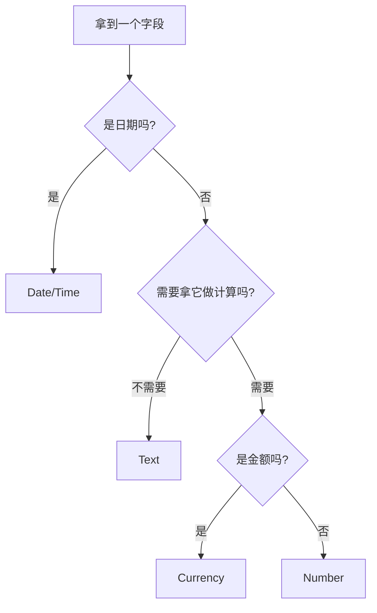

**为什么需要它**

因为初学者最常见的两个错误正好被这条规则堵住：

- **把编号当数字**：`SaleID` `061401A` 里有字母，只能是文本；就算全是数字（如 `SalespersonID` = `123456`），**你也不会去算销售员编号的平均值**，所以它是文本。**关键判据是"用不用来算"，不是"长得像不像数字"。**
- **把金额当普通数字**：Currency 类型在 Access 里是**定点小数**（固定 4 位小数），Number 的 Double 是**浮点数**。浮点数做金额加总会产生 0.01 的舍入误差——这在会计上是不可接受的（试算表会不平）。

**课件原例（讲义 p.11）**

讲义 p.11 把这条规则应用到 Sale 表的四个字段：

| 字段 | 类型 | 为什么 |
|---|---|---|
| `SaleID` | **text** | 不是日期，不用算 |
| `Date` → 改名 `SaleDate` | **Date/Time** | 是日期 |
| `Amount` | **Currency** | 要算，且是美元金额 |
| `Salesperson` | **text** | 不是日期，不用算 |

⚠️ **`Date` 必须改名，这是本页的重点**。讲义 p.11 原文：

> *"Date – Date/Time (**change the name from Date to SaleDate because date is a reserved word**)."*

**保留字（reserved word）**是什么：数据库软件自己**已经占用**的单词。Access 里 `Date` 是一个**内置函数**（`Date()` 返回今天的日期）。如果你把字段也叫 `Date`，Access 在解析查询时就分不清 `Date` 指的是"你的字段"还是"今天的日期函数"，轻则要你到处加方括号 `[Date]`，重则算出莫名其妙的结果。

**Access 里其他常见保留字**（💡 笔记补充，讲义只点了 `Date` 一个）：`Name`、`Value`、`Time`、`Year`、`Month`、`Day`、`Count`、`Sum`、`Order`、`Group`、`Table`、`Select`、`Password`、`Key`、`Level`。**取字段名时给它加个前缀就都躲开了**：`SaleDate`、`CustomerName`、`OrderCount`。

> 🔗 微软官方的 Access 保留字与符号列表：`support.microsoft.com` → "Access reserved words and symbols"（获取日期 2026-09-09，未逐条核对，仅供避雷参考）。

**⚠️ 讲义自己没遵守这条规则**：p.33 之后的示例数据库里，Sale 表的日期字段就叫 **`Date`**（见 p.55、p.71、p.74 的截图，字段列表里赫然是 `Date`），而 §2.24 的另一个库里也有 `Date` 字段（p.90）。**同一份讲义前面说"不要叫 Date"，后面的示例库自己全叫 Date。** 见 [[#9.3 课件自身的问题|§9.3]]。

**🎙️ 课堂补充**

待转录补充（本讲无录音）。

**💡 换个说法（笔记补充）**

这条规则可以压成一句话：

> **「能算的才给算数的类型，钱要单独一类，日期自己一类，剩下全是文本。」**

再退一步说得更狠：**电话号码、邮编、身份证号、发票号、员工号，全部是文本。** 它们长得像数字，但你从来不会对它们求和。

**⚠️ 常见误解**

- ❌「`Amount` 用 Number 也能加，何必用 Currency？」
  → 能加，但会有浮点误差，且**默认不显示货币符号和千分位**。更重要的是**语义**：Currency 在明确告诉读表的人"这一列是钱"。
- ❌「`SalespersonID` 全是数字，当然用 Number。」
  → 讲义的规则明确否定了这一点：**判据是"用不用来计算"**。而且如果编号将来要加字母前缀（`E-12` 这种，见 p.33），Number 类型会直接崩掉。
- ❌「保留字加个方括号 `[Date]` 就能用了。」
  → 能用，但你要**永远记得加**，漏一次就出错。讲义的建议是**从源头改名**，这更稳。

**与其他概念的关系**

数据类型选定后，它就成了 §2.4.3 讲的"外键匹配"的一半条件（另一半是字段属性）。

**所以呢**

四个字段的数据类型都选好了，下一节看它们实际填进设计视图后是什么样子。

---

#### 2.4.2 Sale 表的设计成品（讲义 p.12）

⚠️ **讲义 p.12 是纯图页**（文本提取只有标题 "Example Sale table design"）。视觉复核结果：

设计视图里 Sale 表的四行：

| 🔑 | Field Name | Data Type | Description |
|---|---|---|---|
| 🔑 | `SaleID` | Text | *(空)* |
| | `SaleDate` | Date/Time | *(空)* |
| | `Amount` | Currency | *(空)* |
| | `Salesperson` | Text | *(空)* |

下半屏的 Field Properties（光标停在 `Salesperson` 上）：

```
Field Size            255
Format
Input Mask
Caption
Default Value
Validation Rule
Validation Text
Required              No
Allow Zero Length     Yes
Indexed               Yes (Duplicates OK)
Unicode Compression   Yes
IME Mode              No Control
IME Sentence Mode     None
Smart Tags
```

**三个要点**：

1. **`SaleID` 左边有钥匙图标** → 它是主键（怎么设见 §2.4.4）
2. **`Salesperson` 的 `Indexed` 是 `Yes (Duplicates OK)`** —— 允许重复。这正确：一个销售员可以做多笔销售。对比主键 `SaleID` 的 Indexed 一定是 `Yes (No Duplicates)`。
3. **`Required: No`** —— 允许 `Salesperson` 为空，这与 p.9 数据里两笔无销售员的销售一致。

**💡 换个说法（笔记补充）**：这一页就是"设计图完工照"。把它和 p.9 的数据表对照看：**p.9 是数据（外延），p.12 是结构（内涵）**。M04 讲的 extension / intension 之分，在这里第一次有了屏幕上的具体形象。

**所以呢**

Sale 表的骨架搭好了，下一节讲这一大段建库部分最核心的理论——字段属性怎么决定外键能不能对上。

---

#### 2.4.3 字段属性与参照完整性：本讲最容易被跳过的一页（讲义 p.13）

**本页在讲什么**

讲义 p.13 只有两段话，但它是**整个建库部分的理论核心**：

> *"**Note: if the properties of two fields are different, then Access considers the values in those fields to be different even if the content is the same.**"*
>
> *"**Recall referential integrity principle** – for a data value entered in the Salesperson field in the Sale table as a **foreign key** to be acceptable, it **must either be null** or it **must match exactly** a data value in the SalespersonID field in the Salesperson table. **The data type or field property are part of the value of the data.**"*

（⚠️ 讲义原文把 `field` 拼成了 `filed`。见 [[#9.3 课件自身的问题|§9.3]]。）

**先补齐三个概念**（讲义说 *"Recall"*，即假设 W4 已讲过；但本笔记的读者假设是"没听过课"，所以这里完整展开，并回写台账）：

**① 主键（Primary Key, PK）**

**是什么**：一张表里能**唯一标识一行**的那个（或那几个）字段。

**为什么需要**：没有主键，你就没法**指着某一行说"就是它"**。会计上的类比：M02 的日记账里每笔分录都有唯一的日期+序号，凭证有唯一的凭证号——**没有唯一编号的账簿是无法审计的**（审计轨迹 audit trail 的前提）。

**例**：Sale 表的 `SaleID`；Salesperson 表的 `SalespersonID`。

**② 外键（Foreign Key, FK）**

**是什么**：一张表里的一个字段，它的值**是另一张表的主键值**。

**为什么需要**：这是关系数据库表达"关系"的**唯一手段**。表与表之间没有箭头、没有指针，只有"我这一列里存的是你那一列的值"这一个约定。

**例**：Sale 表的 `Salesperson` 字段存的是 Salesperson 表的 `SalespersonID` 值。

**③ 参照完整性（Referential Integrity）**

**是什么**：讲义 p.13 给出的规则——**外键的值只有两种情况是合法的**：

| 情况 | 合法吗 | 例（讲义 p.9 的数据） |
|---|---|---|
| 外键值 = **Null（空）** | ✅ 合法 | 061501B、061501C 的 Salesperson 是空 |
| 外键值**精确匹配**被指向表里真实存在的主键值 | ✅ 合法 | 061401A 的 `123456` 在 Salesperson 表里存在 |
| 外键值是一个被指向表里**不存在**的值 | ❌ **非法** | 若填 `999999`，而 Salesperson 表里没有这个人 |

**为什么需要它**：防止**孤儿记录（orphan record）**。如果 Sale 表里记着一笔销售是 `999999` 号销售员做的，而这个人不存在，那这笔销售**没人负责**。会计上这叫**责任断链**——审计时查不到经手人，内部控制直接失效。

**现在回到 p.13 真正的重点：属性也是值的一部分**

讲义那句 *"The data type or field property are **part of the value of the data**"* 说的是：

> Access 判断两个字段的值"相不相等"时，**不只看你眼睛看到的字符，还看类型和属性。**

**具体会怎么坑你**（💡 笔记补充，讲义只给了原则没给例子）：

| 场景 | Sale.Salesperson | Salesperson.SalespersonID | 结果 |
|---|---|---|---|
| 都是 Text | `123456` | `123456` | ✅ 匹配 |
| 一个 Text、一个 Number | `123456`（文本） | `123456`（数字） | ❌ **Access 拒绝建立关系**，报 "type mismatch" |
| 都是 Text 但 Field Size 不同 | Text(255) | Text(6) | ⚠️ 通常仍能匹配，但**改类型时可能截断** |
| 都是 Number 但一个 Long Integer、一个 Double | `123456` | `123456.0` | ❌ Access 会拒绝或警告 |

**这就是为什么讲义 p.16 会特意说"建 Salesperson 表时不要改数据类型或任何字段属性"**（见 §2.4.6）——因为 Sale 表的 `Salesperson` 也是默认的 Text(255)，两边不动才能保证完全一致。

**🎙️ 课堂补充**

待转录补充（本讲无录音）。

**💡 换个说法（笔记补充）**

参照完整性 = **"不许凭空捏造对方"**。

用会计的话说：M02 的过账（posting）要求日记账里写的账户名必须在总账里真实存在，你不能过账到一个不存在的账户去。**参照完整性就是把这条规矩变成数据库强制执行的约束。**

而"属性是值的一部分"这句话可以翻译成：**两张表要能对上话，它们得说同一种方言。** 内容一样但类型不同，就像一个人写 `2026年10月7日`、另一个写 `10/07/2026`——人看得懂，机器不认。

**⚠️ 常见误解**

- ❌「外键必须有值，不能为空。」
  → 讲义 p.13 明确说 **"must either be null or must match exactly"**。**Null 是合法的**。业务含义是"这笔销售暂时不知道/不需要记销售员"。
- ❌「参照完整性会自动生效。」
  → 在 Access 里**不会**。你必须在 Relationships 窗口里**手动勾上 "Enforce Referential Integrity"**（讲义 p.20，见 §2.5.2）。不勾的话，两张表之间画了线也只是"看起来有关系"。
- ❌「两个字段名字一样，Access 就知道它们是一对。」
  → 不知道。而且这里字段名**本来就不一样**（`Salesperson` vs `SalespersonID`）。**关系必须显式建立**，这正是 §2.5 整节的主题。

**与其他概念的关系**

- 参照完整性是 §2.5.2 里 "Enforce Referential Integrity" 复选框的理论依据
- 外键的概念在 §2.6 会升级成"复合主键里的两个外键"
- Null 的合法性是 §2.20.2 与 §2.24.1 的伏笔

**所以呢**

主键、外键、参照完整性这三个理论概念都补齐了，下一节回到操作层面——怎么在 Access 里实际把一个字段设成主键。

---

#### 2.4.4 设主键（讲义 p.14）

**是什么**

讲义 p.14 的三条：

> *"The small **key symbol** at the gray box immediately to the left of SaleID represents **primary key** attribute."*
> *"If you deleted the first line and added SaleID as a new field, **you may not have a key icon**."*
> *"Click on the small grey box to the immediate left of the field and then click on the **Primary key icon** near the top left corner of the TableTools window."*

**操作三步**：
1. 点字段左侧的**灰色小方块**（选中整行）
2. 点 Table Tools → Design 选项卡左上角的**钥匙图标** 🔑
3. 该字段左侧出现钥匙 → 设置成功

**为什么讲义要专门提第二条**

因为有个**很容易踩的坑**：新建表时 Access 自动给你一个叫 `ID`、类型 `AutoNumber` 的字段，**并且已经把它设成主键了**（讲义 p.6 的截图里 `ID` 左边就有钥匙）。

如果你按下面这个顺序操作：

```
删掉第一行 ID  →  新建一行 SaleID
```

那么**主键设置会随着 `ID` 行一起被删掉**，`SaleID` 左边不会自动出现钥匙。你以为设好了，其实没有。

**正确的两种做法**：
- **做法 A（推荐）**：不删 `ID` 那一行，直接**把 `ID` 改名成 `SaleID`、把类型从 AutoNumber 改成 Text** → 钥匙一直在
- **做法 B**：删了重建，然后**手动按上面三步补设主键**

**💡 换个说法（笔记补充）**

这个坑的本质是：**主键属性绑在"那一行"上，不绑在"字段名"上。** 你删了行，属性也就没了。

**⚠️ 常见误解**

- ❌「一张表可以没有主键。」
  → Access 技术上允许，但**强烈不推荐**。没有主键的表不能作为关系的"一"端，参照完整性也无从谈起。而且从会计角度：**一张不能唯一定位每一行的表，是不可审计的。**
- ❌「主键就是第一个字段。」
  → 无关。主键是**你指定的**，可以是任何字段，也可以是多个字段的组合（§2.6.1）。

**与其他概念的关系**

主键 → §2.5 建关系时的"一"端；主键 → §2.6.1 升级成复合主键。

**所以呢**

主键设好了，Sale 表的设计基本完工，下一节是收尾动作——保存，但 Access 的保存语义有一处反直觉的地方要先弄清楚。

---

#### 2.4.5 保存（讲义 p.15）

⚠️ **讲义 p.15 整页只有三行**：

> **Save**
> • File – Save
> • Close.

视觉复核确认：这就是全部内容，没有截图、没有批注。

**说明**：设计完 Sale 表之后，走 `File → Save` 保存表结构，然后关闭这张表。

⚠️ **这一页与讲义 p.17 一字不差**（p.17 也是同样的 "Save / File – Save / Close."）。两页是**真正的重复页**，不是"同图不同高亮"。见 [[#9.3 课件自身的问题|§9.3]]。

**💡 为什么讲义要单独用一页说"保存"**（笔记补充）：因为 Access 的保存语义和 Word/Excel **不一样**，容易踩坑：

| 你在改什么 | 要不要手动保存 |
|---|---|
| **表结构**（设计视图里加字段、改类型、设主键） | ✅ **要**。不保存就切走会弹窗问你 |
| **表数据**（数据表视图里敲进去的一行行数据） | ❌ **不用**。Access 在你**离开当前行的那一刻就已经写盘了** |
| **关系**（Relationships 窗口里拖的线） | ✅ 要（关闭 Relationships 窗口时会问） |

**这是 Access 与 Excel 最反直觉的一处差别**：数据是**即时落盘**的，你没有"不保存就退出"这个后悔药。

**所以呢**

Sale 表建完了，下一节用同样的流程建第二张表 Salesperson——外键要指向的那张表。

---

#### 2.4.6 建第二张表 Salesperson（讲义 p.16–p.17）

**讲义 p.16 的六条指令**：

> • *Create – Table design*
> • *Enter three fields: **SalespersonID, SalespersonName, SalespersonTelephoneNumber**.*
> • *Do not change the data type or any field properties.*
> • *Set **SalespersonID** as the primary key.*
> • *Save the table as "**Salesperson**".*
> • *Close.*

**逐条解读**：

| 指令 | 为什么这么做 |
|---|---|
| `Create – Table design` | 这次**不走**"新建库自动开表"那条路，而是直接从 Create 选项卡点 Table Design，**一步进设计视图**（比 §2.2.3 那条路更省事） |
| 三个字段名都带 `Salesperson` 前缀 | 💡 这是**命名规范**：字段名带表名前缀，在多表连接的查询里能一眼看出字段属于哪张表。也顺手避开了 `Name`、`Telephone` 这类**保留字**风险（`Name` 在 Access 里确实是保留字） |
| **不要改数据类型或任何字段属性** | ⚠️ **这一条是本页的重点**。三个字段全部保持默认的 **Text(255)**。为什么？因为 Sale 表的外键 `Salesperson` 也是 Text(255)。**两边完全一致，参照完整性才建得起来**（§2.4.3 的直接应用） |
| `SalespersonID` 设主键 | 这张表的"一"端 |
| 存成 `Salesperson` | 表名 |

**⚠️ 常见误解**

- ❌「`SalespersonTelephoneNumber` 里有 Number，应该用数字类型。」
  → 不。电话号码 `555-0063` 里有横杠，而且**你永远不会算电话号码的和**。按 §2.4.1 的规则：**文本**。讲义说"不要改"，默认就是文本，正好。

**讲义 p.17**：又是一页 "Save / File – Save / Close."，与 p.15 完全相同。作用是提示"Salesperson 表也要保存关闭"。

**所以呢**

两张表都建完了，下一节看它们此刻在数据库窗口里是什么状态——以及为什么"建完表"和"建好关系"是两件事。

---

#### 2.4.7 两张表建完后的数据库窗口（讲义 p.18）

⚠️ **讲义 p.18 是纯图页**（文本只有标题）。视觉复核结果：

Access 主窗口，左侧导航窗格 "All Access Objects" 下的 **Tables** 分组里列着两项：

```
Tables
  ▦ Sale
  ▦ Salesperson
```

主工作区是空的（两张表都已关闭），状态栏 "Ready"。标题栏仍是 `Dunn3-SeChapter6Examples : Database (Access 2007)`。

**这一页要看出什么**：

1. **两张表已经并存于同一个库文件里**。Access 的 `.accdb` 文件是**一个文件装整个数据库**（表、查询、窗体、报表全在里面），这与"一个 Excel 文件一个工作簿"很像，但与 SQL Server / MySQL 那种"数据库是服务器上的一个实体"完全不同。
2. **此刻两张表之间还没有任何关系**。它们只是碰巧在同一个文件里。**关系要到下一节（p.19–p.22）才建。**

**💡 换个说法（笔记补充）**：现在的状态相当于——你把两本账簿放进了同一个柜子，但**还没有告诉任何人这两本账是有勾稽关系的**。

**所以呢**

两张表已经并存但互不相识，下一节正式建立它们之间的关系——把外键真正告诉 Access。

---

### 2.5 建立表间关系：把外键告诉 Access（讲义 p.19–p.23）

#### 2.5.1 为什么必须显式建关系（讲义 p.19）

**是什么**

讲义 p.19 原文：

> *"The way to **communicate foreign keys** (and **concatenated primary keys** that are formed from posting two different class' primary keys into an **association table**) to Access is by **establishing a relationship** between the two tables."*
> *"Go to the '**relationship layout**'"*
> *"**Database Tools** and then click on the icon labeled **Relationships**."*

翻译：**要让 Access 知道"这一列是指向那一列的外键"，唯一的办法是在 Relationships 窗口里建一条关系。**

**为什么需要它**

因为**关系数据库里"关系"不是自动的**。你在 Sale 表里存了 `123456`，Access 只把它看成六个字符，它**完全不知道**这六个字符和 Salesperson 表有任何瓜葛。

建关系之后，Access 才能做三件事：

1. **强制参照完整性**（不许填不存在的销售员号）
2. **级联更新/删除**（见 §2.5.2）
3. **在查询里自动帮你连表**（见 §2.23.3 —— 把两张表拖进查询设计器时，Access 会**自动画出连接线**，因为它记得这条关系）

⚠️ **第 3 条是实际用起来最省事的一条**，讲义没明说，但 p.64 的截图能直接看到效果（两张表一拖进来，`SalespersonNumber` 和 `EmployeeNumber` 之间已经有一条连接线了）。

**讲义这段还预告了下一节的内容**：括号里那句 *"concatenated primary keys that are formed from posting two different class' primary keys into an association table"* 就是 §2.6 的多对多情形。

**💡 换个说法（笔记补充）**

Relationships 窗口 ≈ **数据库的"科目对照表"**。你告诉系统"Sale 表的 Salesperson 列，说的是 Salesperson 表里的人"，就像告诉会计系统"1122 这个编号说的是应收账款"。**不建立这个对照，系统就只能看到一堆没有意义的编号。**

**所以呢**

为什么必须显式建关系讲清楚了，下一节看具体怎么操作——Relationships 窗口和三个容易被忽视的复选框。

---

#### 2.5.2 怎么建：Relationships 窗口与 Edit Relationships 对话框（讲义 p.20–p.21）

⚠️ **讲义 p.20 是纯图页 + 四个批注**（文本提取只拿到批注文字）。视觉复核结果非常丰富，这是整个建库部分**信息密度最高的一页**：

整页拼了**三个窗口的截图**：

**① 左上：怎么打开** —— Access 主窗口，**Database Tools 选项卡**被红圈标出，其中的 **Relationships** 按钮也被红圈标出。

**② 中间：Show Table 对话框** —— 三个页签 `Tables / Queries / Both`，列表里是 `Sale`、`Salesperson`，右侧两个按钮 `Add`、`Close`。

**③ 右侧：Relationships 布局窗口** —— 两个字段列表框：

```
┌─ Sale ────────┐        ┌─ Salesperson ─────────┐
│ 🔑 SaleID     │        │ 🔑 SalespersonID      │ ← 批注：First, click here
│    SaleDate   │  ←───  │    SalespersonName    │        (on SalespersonID)
│    Amount     │        │    SalespersonTelephone│
│    Salesperson│        └───────────────────────┘
└───────────────┘
   ↑ 批注：Then, drag to the matching attribute (Salesperson)
```

**④ 下方：Edit Relationships 对话框** —— 这是最关键的一块：

```
┌─ Edit Relationships ─────────────────────────────┐
│ Table/Query:        Related Table/Query:         │
│ [Salesperson ▾]     [Sale ▾]          [ Create ] │
│ ┌──────────────────┬──────────────────┐          │
│ │ SalespersonID  ▾ │ Salesperson      │ [Cancel] │
│ │                  │                  │          │
│ └──────────────────┴──────────────────┘ [Join Type..]│
│                                                   │
│ ☑ Enforce Referential Integrity  ← 批注：Click to enforce
│ ☑ Cascade Update Related Fields  ← 批注：Click to enable
│ ☐ Cascade Delete Related Records                 │
│                                                   │
│ Relationship Type:  One-To-Many                   │
└───────────────────────────────────────────────────┘
```

**⚠️ 注意三个复选框的状态**（视觉复核所得，讲义正文完全没提第三个）：
- ☑ **Enforce Referential Integrity** —— 勾上
- ☑ **Cascade Update Related Fields** —— 勾上
- ☐ **Cascade Delete Related Records** —— **没有勾**

底部 **Relationship Type: One-To-Many** 是 Access **自动判定**的，不是你选的。它怎么判的：`SalespersonID` 是 Salesperson 表的主键（唯一），`Salesperson` 是 Sale 表的普通字段（可重复）→ 一对多。

**讲义 p.21 的六条文字说明**：

> • *Show Table window*
> • *Highlight both tables and add them to the layout, and then close Show Table window*
> • *Click on **SalespersonID** in Salesperson table and **drag to the matching attribute** in Sale table.*
> • *"Edit Relationships" window shows.*
> • *Allow you to **enforce referential integrity***
> • *"**Cascade update related fields**" – if you change the value of a primary key such as SalespersonID then you want the corresponding **posted foreign key values to also be changed**, such as the Salesperson values in the Sale table.*

**完整操作流程**：

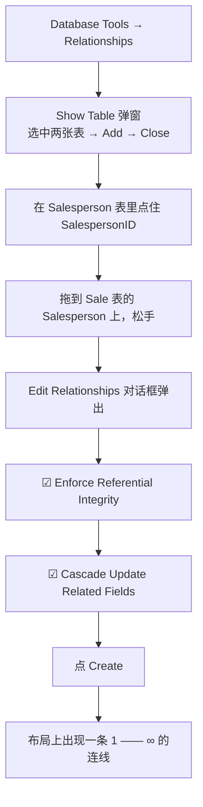

**三个复选框分别是什么意思**

| 复选框 | 中文 | 勾了会怎样 | 讲义态度 |
|---|---|---|---|
| **Enforce Referential Integrity** | 强制参照完整性 | Sale.Salesperson 只能填 Null 或 Salesperson 表里真实存在的 ID。填别的直接报错拒绝 | ✅ 明确要求勾上（p.21） |
| **Cascade Update Related Fields** | 级联更新相关字段 | 你把 Salesperson 表里的 `123456` 改成 `123457`，Sale 表里所有 `123456` **自动跟着改** | ✅ 明确要求勾上，并给了解释（p.21） |
| **Cascade Delete Related Records** | 级联删除相关记录 | 你删掉销售员 Fred，**Fred 做过的所有销售记录一起被删掉** | ⚠️ **讲义正文没提，截图里没勾** |

**⚠️ 第三个复选框为什么不能随便勾（💡 笔记补充，讲义未展开但极其重要）**

从会计角度，`Cascade Delete` 是**危险开关**：

- 销售记录是**已发生的经济事件**（M05 的 Economic Event）。**事件发生过就是发生过**，不因为经手人离职而消失。
- 删掉销售记录 = **销毁会计凭证**。这在任何审计制度下都不可接受，SOX（M01 §2.3）之后更是刑事风险。
- 正确做法是：**不删销售员，而是把他标记为"已离职"**（加一个 `Active` 字段）。

所以讲义截图里**不勾** Cascade Delete 是对的。**但讲义没有解释为什么，这是它的一个教学缺口**——初学者很可能三个都勾上。见 [[#9.4 课外补充|§9.4]]。

**⚠️ 拖拽方向重要吗？**

讲义写的是"从 Salesperson 的 SalespersonID 拖到 Sale 的 Salesperson"，即**从"一"端拖到"多"端**。

💡 实测经验（笔记补充）：Access 其实两个方向都接受，它会根据"谁是主键"自动判断哪边是"一"。**但按讲义的方向拖，Edit Relationships 对话框里左右两栏的位置是符合直觉的**（左 = 主表 Salesperson，右 = 相关表 Sale），不容易看错。**建议照讲义的方向。**

**🎙️ 课堂补充**

待转录补充（本讲无录音）。

**⚠️ 常见误解**

- ❌「Cascade Update 和 Cascade Delete 是一对，要勾一起勾。」
  → 完全不是。**Update 是安全的（改个编号而已），Delete 是毁灭性的（删掉历史记录）。**
- ❌「不勾 Enforce Referential Integrity 也能建关系。」
  → 能建，但那条线**没有约束力**，只是一个"我觉得它俩有关"的备注。**唯一的实际用途是查询时自动连线。**
- ❌「建了关系，Access 就会自动帮我把销售员姓名显示在 Sale 表里。」
  → 不会。关系只是**约束 + 连接提示**，不改变表的内容。要看到姓名得**做查询**（§2.23.3 的 Inner Join）。

**所以呢**

三个复选框的取舍讲完了，下一节看关系建好之后，Relationships 布局窗口上实际显示成什么样子。

---

#### 2.5.3 连好之后的样子（讲义 p.22）

⚠️ **讲义 p.22 是纯图页**（文本只有标题 "Connected Tables"）。视觉复核结果：

Relationships 布局窗口，两个字段列表框之间有一条连线，**Sale 那一端标着 `∞`，Salesperson 那一端标着 `1`**：

```
┌─ Sale ────────┐                 ┌─ Salesperson ──────────┐
│ 🔑 SaleID     │                 │ 🔑 SalespersonID       │
│    SaleDate   │       ∞ ────────│    SalespersonName     │
│    Amount     │        │      1 │    SalespersonTelephone│
│    Salesperson│────────┘        └────────────────────────┘
└───────────────┘
```

（连线从 Salesperson 的 `SalespersonID` 连到 Sale 的 `Salesperson`，`1` 在 Salesperson 侧，`∞` 在 Sale 侧。）

**这一页要看出什么**：

1. **连线是连字段的，不是连表的**。线的两端精确地落在 `SalespersonID` 和 `Salesperson` 上。
2. **`1` 和 `∞` 是 Access 自动加的**，表示这是一对多关系。
3. **勾了 Enforce Referential Integrity 的关系，线的两端才会显示 `1` 和 `∞`。** 💡 没勾的话，Access 只画一条**光秃秃的线**（笔记补充，讲义未提；这是一个**肉眼可查的自检点**：布局上如果看不到 `1`/`∞`，说明你忘了勾）。

**所以呢**

`1` 和 `∞` 这两个符号已经出现在图上了，下一节要泼一盆冷水——它们看着像 UML 多重度，其实完全不是一回事。

---

#### 2.5.4 ⚠️ `1` 和 `∞` 不是多重度（讲义 p.23）

**本页在讲什么** —— 这是本讲**最容易混淆、也最可能被考**的一个概念辨析。

讲义 p.23 原文：

> *"The **1** and **∞** symbols on the Relationship Layout **seem to be multiplicities, but they are not exactly the same concept**."*
> *"It resembles **how many times the same data value can be stored in that field of the table** to which the symbol is connected."*
> *"The same data value for SalespersonID can exist in the Salesperson table **only one time**; may exist **multiple times** in the Sale table."*

**说清楚这两个东西的区别**

| | UML 多重度（M04/M05） | Access 的 `1` / `∞` |
|---|---|---|
| **它在数什么** | 一个类的**实例**，最少/最多连着对面类的**几个实例** | 同一个**数据值**，能在这个字段里**出现几次** |
| **数的对象** | 对象之间的关系 | 一列里的重复次数 |
| **有没有"最小值"** | 有（`0..*` 的 `0`、`1..1` 的 `1`） | **没有**。只有"能不能重复" |
| **写在哪一端** | ⚠️ **写在对面**（M05 §2.5：标在类 A 旁的数字说的是"一个 B 连着几个 A"） | **写在自己这一端**（`∞` 在 Sale 侧，说的就是"Sale 表这一列里同一个值能出现多次"） |
| **能表达 `0..1` 吗** | 能 | 不能。Access 只有 `1` 和 `∞` 两档 |

**用讲义的例子走一遍**：

- `SalespersonID` 在 **Salesperson 表**里：`123456` 只能出现**一次**（它是主键，不许重复）→ 标 **`1`**
- `Salesperson` 在 **Sale 表**里：`123456` 可以出现**很多次**（Fred 可以做很多笔销售）→ 标 **`∞`**

**为什么讲义要专门强调"不完全是一回事"**

因为**两者的读法方向相反**，混起来必错：

> **UML 多重度看对面，Access 的 1/∞ 看自己。**

M05 §2.5 引 W4 p.31 的原话：*"Minimum participation of employee = 0 (**put next to dept**)"* —— 描述 employee 的数字要写在 **dept** 旁边。

而 Access 的 `∞` 写在 Sale 旁边，说的就是 **Sale 这张表自己**的重复情况。

**💡 换个说法（笔记补充）**

- **UML 多重度**回答的是：*"一个销售员**经手了**几笔销售？"*（对象之间的关系）
- **Access 的 1/∞** 回答的是：*"`123456` 这个**字符串**在这一列里**出现**几次？"*（数据的重复度）

两者在这个例子里**碰巧一致**（一个销售员做多笔销售 ⟺ 他的 ID 在 Sale 表里出现多次），所以很容易以为是同一件事。**但概念层次完全不同**：前者是业务语义，后者是存储事实。

**⚠️ 一个能戳破"它们是同一件事"的反例**（💡 笔记补充）：

假设业务规则是"**每笔销售必须有销售员**"（UML 写 `1..1`）。这个"最小 1"的约束，**Access 的 `1`/`∞` 完全表达不了** —— 你在布局上看到的还是 `1 —— ∞`，一模一样。要表达"必须有"，得去**字段属性里把 `Required` 设成 `Yes`**（§2.3.3）。

**换句话说：UML 的一个多重度 `1..1`，在 Access 里要拆成两处设置**——关系上的 `1—∞` 管"最多几个"，字段属性 `Required: Yes` 管"最少几个"。

**⚠️ 常见误解**

- ❌「Access 布局上的 `1`/`∞` 就是 UML 图上的 `1..1`/`0..*`，抄过来就行。」
  → 方向和含义都不同。**考试如果问"Access 关系布局上的符号与 UML 多重度有何区别"，讲义 p.23 这三句话就是标准答案。**
- ❌「`∞` 表示"无限多"。」
  → 它表示"**可以重复**"，不是"必须很多"。Sale 表里某个销售员出现 0 次或 1 次，`∞` 照样标在那儿。

**与其他概念的关系**

这一页把 **UML 概念层**（M04/M05）与 **Access 物理层**（本讲）之间的**语义落差**第一次点破。§2.6.3（p.28）会再点一次，从另一个角度（多对多）。

**所以呢**

一对多的建库流程（例 1）走完了，下一节处理更难的情形——多对多在物理层要怎么落地。

---

### 2.6 例 2：多对多怎么落地 —— 连接表与复合主键（讲义 p.24–p.28）

> **这一节兑现 M05 留下的预告**：「`0..*—0..*` 变一张独立的连接表，关联属性成为该表的普通字段」。

#### 2.6.1 例 2 的类图与任务（讲义 p.24）

⚠️ **讲义 p.24 有图有字**。视觉复核结果，图是一张 UML 类图：

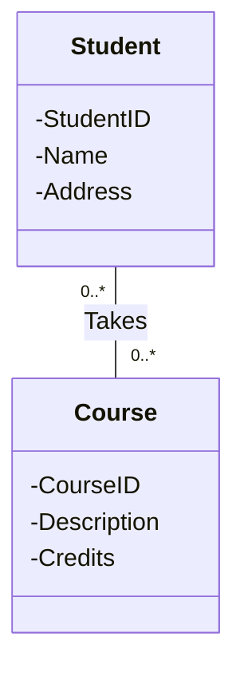

⚠️ 上面的 Mermaid 画不出**关联类**。讲义原图是这样的（关键在于中间那个虚线挂着的小方框）：

```
   ┌──────────────┐              Takes              ┌──────────────┐
   │   Student    │                                 │    Course    │
   ├──────────────┤ 0..*  ┈┈┈┈┈┈┬┈┈┈┈┈┈  0..*      ├──────────────┤
   │ -StudentID   │            ┊                    │ -CourseID    │
   │ -Name        │      ┌─────┴──────┐             │ -Description │
   │ -Address     │      │-grade earned│            │ -Credits     │
   ├──────────────┤      └────────────┘             ├──────────────┤
   └──────────────┘                                 └──────────────┘
```

- 关联名 **`Takes`** 写在连线上方
- 两端多重度都是 **`0..*`** → **多对多**
- 连线中间用**虚线**挂着一个小方框，里面是 **`-grade earned`** → 这是**关联属性**（M05 §2.4）

**讲义 p.24 的文字部分**给出了三张表的字段清单和任务：

> • *Student – StudentID, Name (**StudentName**), Address (**StudentAddress**)*
> • *Course – CourseID, Description, Credits*
> • *Takes – **StudentID, CourseID, Grade earned***
> • *Create a new blank database, save as **Database2***
> • *Create the three tables and indicate the relationship*

**三张表的字段设计**：

| 表 | 字段 | 说明 |
|---|---|---|
| **Student** | `StudentID`(PK), `StudentName`, `StudentAddress` | 括号里是**实际用的字段名**——加了 `Student` 前缀（避开保留字 `Name`，也符合 §2.4.6 的命名规范） |
| **Course** | `CourseID`(PK), `Description`, `Credits` | |
| **StudentTakesCourse**（讲义正文叫 `Takes`） | `StudentID`(PK的一半), `CourseID`(PK的另一半), `Grade Earned` | ⚠️ 这张表**在类图上根本不存在**，是转换过程中**新造出来**的 |

⚠️ **表名不一致**：讲义 p.24 的文字里叫 **`Takes`**，但 p.26/p.27/p.28 的截图里实际叫 **`StudentTakesCourse`**。见 [[#9.3 课件自身的问题|§9.3]]。本笔记统一用截图里的 `StudentTakesCourse`。

**为什么多对多必须拆表 —— 完整推理**（💡 笔记补充，讲义只给结论不给推理）

试着**不拆表**，看看会撞上什么墙：

**尝试 A：把 CourseID 放进 Student 表**

| StudentID | StudentName | CourseID | Grade |
|---|---|---|---|
| S001 | 张三 | AC6761 | A |

问题：张三修了五门课怎么办？加 `CourseID2`、`CourseID3`……？那**第六门课**呢？表结构要跟着业务改，**这就是 M04 讲的"重复组（repeating group）"违规**。

**尝试 B：一个学生一门课一行，全塞进 Student 表**

| StudentID | StudentName | StudentAddress | CourseID | Grade |
|---|---|---|---|---|
| S001 | 张三 | 九龙塘 | AC6761 | A |
| S001 | 张三 | 九龙塘 | IS5113 | B |

问题：**张三的姓名和地址被重复存了两遍**。他搬家了要改两处，改漏一处数据就不一致了 —— **这就是 M04 讲的"冗余（redundancy）"违规**。而且 `StudentID` 不再唯一，**主键没了**。

**尝试 C：拆成第三张表** ✅

| StudentTakesCourse | | |
|---|---|---|
| **StudentID** | **CourseID** | Grade Earned |
| S001 | AC6761 | A |
| S001 | IS5113 | B |
| S002 | AC6761 | B+ |

- 学生信息只存一份（Student 表）
- 课程信息只存一份（Course 表）
- "谁修了哪门、得了什么分"存在中间表
- 加课就加一行，不动表结构

**`Grade Earned` 为什么只能放中间表**：

- 放 Student 表？那是"张三的成绩"——张三**每门课成绩不同**，放不下
- 放 Course 表？那是"AC6761 这门课的成绩"——**每个学生成绩不同**，放不下
- **它属于"张三 × AC6761"这个组合**，所以只能放在记录组合的那张表里

**这正是 M05 §2.4 那条规则的物理证明**：*"属性描述**一样东西**→挂类；描述**一个组合**→挂关联。**只有多对多关联才需要关联属性**"*。现在你看到了"挂关联"在物理层的实现：**关联变成一张表，关联属性变成这张表的普通字段。**

**💡 换个说法（笔记补充）**

会计上有个几乎一模一样的结构：**M05 的销售明细**。

一笔销售（Sale）可以包含多种商品，一种商品可以出现在多笔销售里 → **多对多**。所以必须有一张中间表 —— 讲义 p.33 里那张 **`Inventory-Sale Stockflow`** 就是它：

| Inventory ItemID | Sale Number | Quantity | Actual Price |
|---|---|---|---|
| A-4 | S-1 | 2 | 600 |
| A-1 | S-1 | 3 | 2,000 |

`Quantity`（数量）和 `Actual Price`（实际售价）**都是关联属性** —— "卖了几个"和"卖多少钱一个"既不属于商品本身（商品有标价，但每次实际成交价可能不同），也不属于那笔销售整体，**只属于"这笔销售里的这件商品"这个组合**。

**这张表的名字就叫 `Inventory-Sale Stockflow`** —— 它正是 M05 §2.2.2 讲的 **Stockflow 关联**在数据库里的样子。**M05 画的那条连线，在这里变成了一张表。**

**⚠️ 常见误解**

- ❌「中间表是为了'方便查询'才建的。」
  → 不是方便，是**必须**。关系模型里没有别的办法表达多对多。
- ❌「一对多也要建中间表。」
  → 不要。一对多**只需要在"多"的那一端加一个外键字段**（§2.5 的 Sale.Salesperson 就是）。多建一张表是纯粹的浪费。
- ❌「中间表只放两个外键就够了。」
  → 如果关联**没有属性**，确实只放两个外键。但只要关联上挂了属性（`grade earned`、`quantity`、`actual price`），就必须一起放进来。

**所以呢**

多对多为什么必须拆表讲清楚了，下一节看拆出来的这张中间表，主键该怎么设。

---

#### 2.6.2 复合主键：两个字段合起来当主键（讲义 p.25–p.26）

**是什么**

讲义 p.25 给的是操作：

> *"Click on the grey box immediately to the left of **StudentID**. **Hold the shift key** and click on the grey box immediately to the left of **CourseID**. Click the **key icon**."*

（⚠️ 讲义 p.25 是纯文字页，视觉复核确认整页只有标题和这一条 bullet。）

**操作三步**：
1. 点 `StudentID` 左边的灰方块
2. **按住 Shift**，再点 `CourseID` 左边的灰方块（两行同时选中）
3. 点钥匙图标 🔑

结果：**两行左边同时出现钥匙**，表示这两个字段**合起来**构成主键。

⚠️ **讲义 p.26 是一整页纯截图，连标题都没有**（文本提取只有页码 "26"）。这是全讲**文本最少的一页（2 个字符）**，如果按文本长度筛选会被直接判成空白页 —— **但它其实是 p.25 操作的成果图，不能跳过**。视觉复核结果：

设计视图，表名 `StudentTakesCourse`（库名 `Database2`，左侧导航窗格列着 `Course`、`Student`、`StudentTakesCourse` 三张表）：

| 🔑 | Field Name | Data Type |
|---|---|---|
| 🔑 | `StudentID` | Text |
| 🔑 | `CourseID` | Text |
| | `Grade Earned` | Text |

下方 Field Properties：`Field Size 255`、`Required No`、`Allow Zero Length Yes`、`Indexed No`、`Unicode Compression Yes`、`IME Mode On`。

**两个观察**：
1. **`StudentID` 和 `CourseID` 前面各有一把钥匙** —— 这就是复合主键的视觉标志
2. **`Grade Earned` 字段名里有空格** —— Access 允许，但**代价是查询里必须写成 `[Grade Earned]`**（方括号）。💡 建议改成 `GradeEarned`（笔记补充，讲义未提）

**为什么需要复合主键**

因为**单独任何一个字段都不唯一**：

| | 唯一吗 | 反例 |
|---|---|---|
| 只用 `StudentID` | ❌ | 张三修了 5 门课 → `S001` 出现 5 次 |
| 只用 `CourseID` | ❌ | AC6761 有 40 个学生 → `AC6761` 出现 40 次 |
| `StudentID` + `CourseID` | ✅ | 张三修 AC6761 **只有一行** |

**复合主键的业务含义**：它把"**同一个学生不能重复选同一门课**"这条业务规则**写死进了数据库结构**。你想插第二行 `(S001, AC6761)`，Access 直接拒绝。

**💡 换个说法（笔记补充）**

复合主键 = **"这两样东西的组合才算一件事"**。

会计上的例子：M02 的日记账里，"哪一天 + 第几笔"合起来才能定位一笔分录；总账里"账户号 + 期间"合起来才能定位一个期末余额。**单看任何一半都不够。**

**⚠️ 常见误解**

- ❌「复合主键就是给两个字段各设一次主键。」
  → 不是。一张表**只有一个主键**，只不过这个主键**由两个字段组成**。必须按住 Shift 一次性选中两行再点钥匙。**分两次点，第二次会覆盖第一次。**
- ❌「顺序无所谓。」
  → 对唯一性判定确实无所谓，但**对索引效率有影响**（💡 笔记补充，超出本讲范围）。讲义按 `StudentID, CourseID` 的顺序，跟随即可。
- ❌「中间表可以另设一个自动编号当主键，反正也唯一。」
  → 技术上可以，但**丢掉了"同一学生不能重复选课"这条约束**。讲义的做法（复合主键）是**更严格**的设计。

**与其他概念的关系**

复合主键的两个字段**同时也是外键**（分别指向 Student 和 Course）。这是 §2.5.1 讲义那句话里括号内容的确切含义：*"concatenated primary keys that are formed from **posting two different class' primary keys** into an association table"* —— **把两个类的主键"过账"到关联表里**。

⚠️ 注意讲义用了 **"posting"** 这个词 —— 正是 M02 里"过账"的那个词。**这不是巧合**：把总账账户号抄进日记账、把主键值抄进外键字段，做的是同一件事——**在两个地方之间建立可追溯的指针**。

**所以呢**

复合主键怎么设、为什么这么设都讲完了，下一节把这张中间表真正与另外两张表连起来。

---

#### 2.6.3 建两条关系（讲义 p.27）

⚠️ **讲义 p.27 是纯文字页**（视觉复核确认）。原文：

> • *Close all the tables*
> • *Database Tools – Relationships – Add all the tables – **drag StudentID from Student table to StudentTakesCourse table**; **drag CourseID from Course table to StudentTakesCourse table**.*

**要点**：

1. **必须先关掉所有表**。Access 不允许在表打开时修改关系（会报"表正在使用中"）。
2. **要建两条关系，不是一条**：
   - `Student.StudentID` → `StudentTakesCourse.StudentID`
   - `Course.CourseID` → `StudentTakesCourse.CourseID`
3. **两条都是从"一"端拖到"多"端**（中间表永远是"多"端）

**💡 换个说法（笔记补充）**：一条 `0..*—0..*` 的类图连线，在物理层**变成了三样东西**：

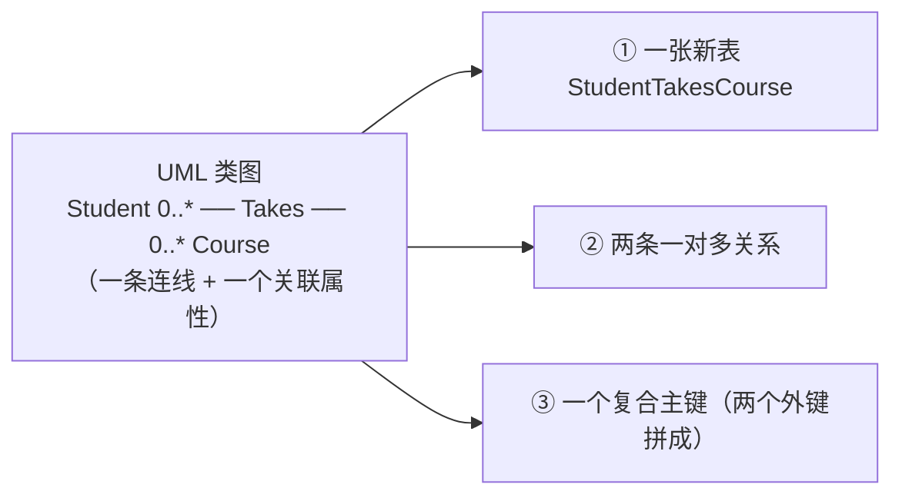

**所以呢**

三张表、两条关系、一个复合主键都建好了，下一节退一步总结：为什么概念层的一条线在物理层要拆成这么多东西。

---

#### 2.6.4 ⚠️ 表间关系 ≠ 类间关系（讲义 p.28）

⚠️ **讲义 p.28 是纯图页**（文本只有标题）。视觉复核结果：

Relationships 布局窗口（库 `Database2`），三个字段列表框，**两条连线**：

```
┌─ Course ──────┐          ┌─ StudentTakesCourse ┐          ┌─ Student ────────┐
│ 🔑 CourseID   │ 1 ────── │ 🔑 StudentID        │ ──── 1   │ 🔑 StudentID     │
│    Description│      ∞   │ 🔑 CourseID         │   ∞      │    StudentName   │
│    Credits    │          │    Grade Earned     │          │    StudentAddress│
└───────────────┘          └─────────────────────┘          └──────────────────┘
```

（`1` 在 Course 侧和 Student 侧，`∞` 两个都在 StudentTakesCourse 侧。）

**这一页的标题就是它的全部论点**：*"Relationships between tables **versus** relationships between classes"*

| | 类图（概念层） | 表关系（物理层） |
|---|---|---|
| **有几个方框** | **2 个**（Student、Course） | **3 个**（Student、Course、StudentTakesCourse） |
| **有几条线** | **1 条**（Takes，`0..*—0..*`） | **2 条**（都是一对多） |
| **`grade earned` 在哪** | 挂在**连线**上（关联属性） | 是**表里的一个普通字段** |
| **多对多存在吗** | 存在，是核心 | **不存在**。关系数据库**只有一对多**，多对多必须拆 |

**核心结论（考点）**：

> **关系数据库的物理层里没有"多对多"这种东西。** 每一条多对多的概念关联，落地时必然变成 **1 张新表 + 2 条一对多关系**。

**为什么讲义要花一整页强调这个**

因为**做题时两边都要会画，而且不能混**：

- 让你画 **REA 模型 / 类图** → 画 2 个类 + 1 条 `0..*—0..*` + 关联属性
- 让你画 **表结构 / 关系布局** → 画 3 张表 + 2 条 `1—∞` + 复合主键

**画错层次 = 整题错。**

**💡 换个说法（笔记补充）**

类图说的是"**世界是什么样的**"：学生和课程之间有一种叫"修读"的关系，这种关系本身带着一个成绩。

表关系说的是"**这台机器怎么存**"：机器只会存二维表，只会用"这一列的值等于那一列的值"来表达关联。**"修读"这个抽象关系必须先变成一个看得见摸得着的东西（一张表），机器才处理得了。**

这就是 M04 讲的**概念模型 → 逻辑模型 → 物理模型**三层里，第一层到第二层的落差。

**⚠️ 常见误解**

- ❌「Access 里画出来的关系图就是 REA 模型图。」
  → **完全不同的两张图**。Access 的关系图是**物理层**，方框里列的是字段；REA 类图是**概念层**，方框里有构造型 `<<Resource>>`、`<<Event>>`、`<<Agent>>`，连线上有关联名（Duality / Stockflow / Participation）。
- ❌「既然物理层没有多对多，那 M05 学的 `0..*—0..*` 是白学的。」
  → 反了。**概念层必须能表达多对多，否则你根本描述不了业务。** 转换是**建库时**的事，不是**建模时**的事。M05 §2.4 那条"只有多对多关联才需要关联属性"，正是靠概念层的多对多才说得清楚。
- ❌「中间表既然是自动生成的，可以不管它叫什么。」
  → 它**不是自动生成的**，是**你手工建的**。命名规范通常是 `表A表B` 或 `表A-表B`（讲义 p.33 的示例库里就叫 `Inventory-SaleStockflow`、`Sale-CashRecDuality`——**直接用 REA 的关联名当表名**，非常值得学）。

**与其他概念的关系**

- 这一页是 §2.5.4（`1`/`∞` 不是多重度）的**姊妹页**：两页从不同角度说同一件事——**Access 的关系布局不是 UML 类图**
- §2.10 的示例数据库里有两张连接表（`Inventory-SaleStockflow`、`Sale-CashRecDuality`），正是这条规则在 REA 模型上的应用

**所以呢**

建库这一大段（p.2–p.28）到此结束：两张表、多对多的连接表都建好了。下一节切到第二大段——怎么从建好的库里问出问题。

---
### 2.7 第二部分导言：用 ACCESS 查询信息（讲义 p.29–p.30）

#### 2.7.1 分隔页（讲义 p.29）

⚠️ **讲义 p.29 是章节分隔页**，整页一行大字：*"Information Querying using ACCESS"*。

它切出本讲的**第二大段（p.29–p.84）**：库已经建好了，现在开始**从库里问问题**。

| 子段 | 讲义页 | 本笔记 |
|---|---|---|
| 什么是查询 | p.30 | §2.7.2 |
| 三种查询语言 | p.31 | §2.8 |
| 关系代数的三个算子 | p.32 | §2.9 |
| 示例数据库（八张表） | p.33 | §2.10 |
| 关系代数四例 | p.34–p.38 | §2.11–§2.15 |
| SQL 及其四例 | p.39–p.44 | §2.16–§2.17 |
| 运算符与聚合 | p.45–p.53 | §2.18–§2.22 |
| QBE 逐屏实操（八个查询） | p.54–p.84 | §2.23 |

**所以呢**

第二大段的路线图列好了，下一节先回答最基本的问题——查询到底是什么。

#### 2.7.2 什么是查询（讲义 p.30）

**是什么**

讲义 p.30 的定义：

> *"It is **asking questions about the data** in the database and **manipulating or combining** the data in different ways"*
> *"We can **isolate certain rows** in tables, we can **isolate certain columns** in tables, we can **join tables together**, we can **create calculations** based on various data items, etc."*

翻译：**查询 = 向数据库提问，并把数据以不同方式加工或组合。**

讲义列的四种基本动作，**正好对应后面要学的四件事**：

| 讲义的说法 | 术语 | 在哪一节 |
|---|---|---|
| isolate certain **rows** | **Select**（选择，挑行） | §2.9、§2.11 |
| isolate certain **columns** | **Project**（投影，挑列） | §2.9、§2.12 |
| **join** tables together | **Join**（连接，拼表） | §2.9、§2.13–§2.15 |
| create **calculations** | 横向计算 / 聚合函数 | §2.21、§2.22 |

**为什么需要它**

因为**数据库本身不产出信息，只存数据**。M01 讲的会计三动作是「识别 — 记录 — 传达」；建库解决的是"记录"，**查询解决的是"传达"**。

更具体地说：M04 的 REA 论证是"复式记账把不能用钱衡量的信息全丢了，所以我们要存原始事件"。但**存下来之后呢**？如果你没法从原始事件里**重新算出**应收账款余额、算出畅销品、算出订单履行天数，那 REA 的全部优势都是空谈。

**§2.24（p.86–92）就是在证明这一点**：七个真实的会计问题，全部是**用查询从原始事件里现算出来的**，而不是从预先记好的账户余额里读出来的。**这是 REA 相对传统总账的核心卖点。**

**课件原例**

讲义 p.30 没有给具体例子，只列了四种动作。第一个具体例子在 p.34。

**🎙️ 课堂补充**

待转录补充（本讲无录音）。

**💡 换个说法（笔记补充）**

查询就是**做一张临时的新表**。你问一个问题，数据库把原表切一切、拼一拼、算一算，**造出一张新表交给你**。这张新表在关系代数里叫 **Answer**（讲义 p.34–p.38 的图里就用这个词），在 SQL 里叫 **Query Result**，在 Access 里叫**查询（Query）对象**。

关键性质：**输入是表，输出也是表。** 所以查询的结果可以再拿去当另一个查询的输入——§2.24 的七个会计查询全都是**多步嵌套**的（"Step 2"、"Step 4" 这些字样就是这个意思）。

**⚠️ 常见误解**

- ❌「查询会改变原表。」
  → 讲义讲的这类查询（Select Query）**只读**，不改原数据。Access 里另有 Update / Delete / Append / Make Table 四种**动作查询**（p.55 的截图里 Query Type 组能看到这五个按钮），那些才改数据。**本讲从头到尾只用 Select 查询。**
- ❌「查询结果是一张真的表，存在库里。」
  → Access 存的是**查询的定义（SQL 语句）**，不是结果。每次打开查询，它**重新跑一遍**。所以底层数据变了，查询结果自动跟着变。

**与其他概念的关系**

"输入是表、输出也是表"这个**闭合性**，是关系代数能像代数一样把算子串起来的原因，也是 §2.24 那些多步查询的基础。

**所以呢**

查询是什么、能做什么讲清楚了，下一节看表达一个查询有哪三种语言可选。

---

### 2.8 三种查询语言（讲义 p.31）

**是什么**

讲义 p.31 一次性列出本讲要学的三种语言：

> **Relational Algebra**
> • *Three main operators: **Select, Project, Join***
> • *Provides the **conceptual basis** for SQL and QBE*
>
> **Structured Query Language (SQL)**
> • *The user enters **commands according to a pre-defined syntax** to retrieve desired data.*
>
> **Query By Example (QBE)**
> • *The user starts with a **sample of the table(s) columns** and **marks the fields** he or she wants to include in the answer. **Defaults are available** for summarizing and manipulating the data.*

整理成对照表：

| 语言 | 中文 | 你怎么表达一个查询 | 定位 | 本讲哪一节 |
|---|---|---|---|---|
| **Relational Algebra** | 关系代数 | 写算子表达式：`Select 表 Where 条件 Giving Answer` | **概念基础**。不是给人日常用的，是用来**讲清楚"查询到底在干什么"** | §2.9、§2.11–§2.15 |
| **SQL** | 结构化查询语言 | 按固定语法敲命令：`SELECT … FROM … WHERE …;` | **工业标准**。所有关系数据库都认 | §2.16–§2.17 |
| **QBE** | 示例查询 | 在一张网格里**打勾、填条件** | **图形界面**。Access 的查询设计器就是 QBE | §2.23 |

**为什么要学三种**

讲义那句 *"Provides the **conceptual basis** for SQL and QBE"* 是关键：

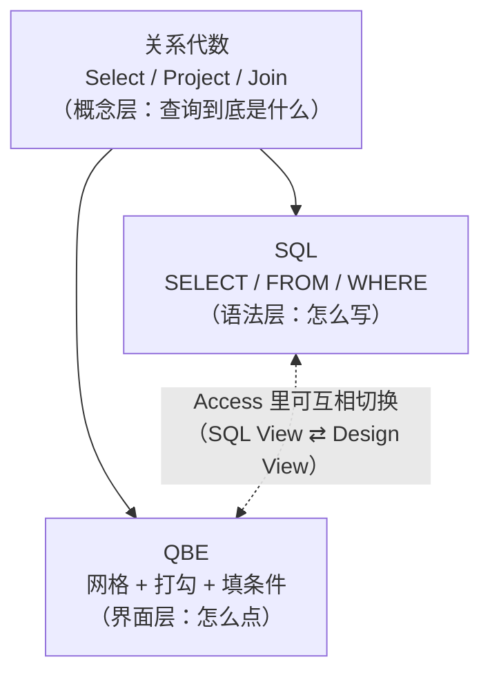

**三者能力等价**（对本讲涉及的范围而言）：同一个问题，三种写法算出**完全相同的答案**。讲义 p.34–p.44 就是**故意用同样的四个问题**（Select / Project / Inner Join / Outer Join），先用关系代数做一遍（p.34–38），再用 SQL 做一遍（p.41–44），最后在 §2.23 用 QBE 再做一遍。**这是刻意的三重对照设计。**

⚠️ **QBE 与 SQL 在 Access 里可以互相转换**（💡 笔记补充，讲义未明说但截图里能看到）：p.55 等截图的右下角状态栏有一排小图标，其中一个是 **SQL**——点它就能看到当前 QBE 网格对应的 SQL 语句。**这是学 SQL 最好的自查工具：用 QBE 拖出来，切到 SQL 视图看它生成了什么。**

**课件原例**

讲义 p.31 没给例子，三种语言的例子分别在 p.34、p.41、p.54 之后。

**🎙️ 课堂补充**

待转录补充（本讲无录音）。

**💡 换个说法（笔记补充）**

用做菜类比：

- **关系代数** = 烹饪原理（"加热让蛋白质变性"）—— 你不会照着它做菜，但不懂它就不知道为什么这么做
- **SQL** = 菜谱（"油七成热下锅，翻炒三十秒"）—— 精确、可传播、任何厨房都通用
- **QBE** = 带触摸屏的智能锅（点几下就出菜）—— 上手快，但**能做的菜受限于机器给的选项**

会计人更熟悉的类比：关系代数 ≈ 会计等式与借贷原理；SQL ≈ 标准分录格式；QBE ≈ 财务软件里的录入界面。**懂原理的人换个软件照样能干活，只会点界面的人换个软件就废了。**

**⚠️ 常见误解**

- ❌「关系代数是过时的，学 SQL 就够了。」
  → 关系代数**不是用来用的，是用来想的**。考试里"用关系代数表达这个查询"这种题，考的是你能不能**把一个业务问题拆成挑行/挑列/拼表**。而这个能力正是写复杂 SQL 的前提。
- ❌「QBE 是简化版，能力比 SQL 弱。」
  → 在本讲范围内**完全等价**。Access 的 QBE 网格可以做 §2.18–§2.22 的所有事（比较运算符、AND/OR、BETWEEN、聚合、横向计算）。**QBE 真正做不到的是子查询嵌套和 UNION 之类**，但那超出本讲。
- ❌「QBE 是 Access 独有的。」
  → QBE 是**一个通用概念**（IBM 1970 年代提出），很多数据库工具都有类似界面。Access 的查询设计器只是**其中一个实现**。

**所以呢**

三种语言的地位关系（关系代数是概念基础，SQL 与 QBE 是两种实现）讲清楚了，下一节从关系代数最核心的三个算子讲起。

---

### 2.9 关系代数的三个算子（讲义 p.32）

**是什么**

讲义 p.32 给出三个算子的定义：

> **Select** — *includes only certain **rows** from a database table in its "answer".*
> **Project** — *includes only certain **columns** from a database table in its "answer"*
> **Join** — *combines **two or more** database tables on the basis of **one or more common attributes***

**画成图最清楚**：

```
原表                     Select（挑行）              Project（挑列）
┌──┬──┬──┬──┐           ┌──┬──┬──┬──┐              ┌──┬──┐
│  │  │  │  │           │▓▓│▓▓│▓▓│▓▓│ ←选中        │▓▓│  │▓▓│  ← 选中
├──┼──┼──┼──┤           ├──┼──┼──┼──┤              ├──┼──┤
│  │  │  │  │           │  │  │  │  │              │▓▓│  │▓▓│
├──┼──┼──┼──┤    ⟹     ├──┼──┼──┼──┤       ⟹     ├──┼──┤
│  │  │  │  │           │▓▓│▓▓│▓▓│▓▓│ ←选中        │▓▓│  │▓▓│
└──┴──┴──┴──┘           └──┴──┴──┴──┘              └──┴──┘
                        横着切                      竖着切
```

**Join 是把两张表横向拼起来**：

```
表 A                表 B                  Join 结果
┌────┬────┐        ┌────┬────┐          ┌────┬────┬────┬────┐
│ K  │ x  │        │ K  │ y  │          │ K  │ x  │ K  │ y  │
├────┼────┤   ⋈    ├────┼────┤    ⟹    ├────┼────┼────┼────┤
│ 1  │ a  │  on K  │ 1  │ p  │          │ 1  │ a  │ 1  │ p  │
│ 2  │ b  │        │ 2  │ q  │          │ 2  │ b  │ 2  │ q  │
└────┴────┘        └────┴────┘          └────┴────┴────┴────┘
```

**为什么只需要这三个**

因为**几乎所有查询需求都能拆成这三个动作的组合**：

| 业务问题 | 拆解 |
|---|---|
| "客户 C-2 的所有收款明细" | **Select**（只要 C-2 的行） |
| "所有客户的编号、姓名、销售员号" | **Project**（只要这三列） |
| "每个客户和他的销售员的完整信息" | **Join**（Customer ⋈ Salesperson） |
| "7 月份 E-10 做的销售的金额" | **Select**（日期+销售员）+ **Project**（金额） |

**⚠️ 一个关键的顺序问题**（💡 笔记补充，讲义未提但对理解 QBE 很重要）：

Select 和 Project 的**执行顺序不影响结果**，但**影响效率**。先 Select 再 Project（先扔掉不要的行，再扔掉不要的列）比反过来快，因为中间结果更小。**Access 会自动优化，你不用管**——但知道这一点，就能理解 p.80 那句批注 *"**Bring only the fields you need** into the query grid"*（只把需要的字段拖进查询网格）为什么是好习惯。

**课件原例**

三个算子的完整例子在 p.34（Select）、p.35（Project）、p.37（Inner Join）、p.38（Left Outer Join）。

**🎙️ 课堂补充**

待转录补充（本讲无录音）。

**💡 换个说法（笔记补充）**

**Select 横着切，Project 竖着切，Join 横着拼。** 六个字记住。

⚠️ **最大的一个陷阱**：**关系代数的 `Select` 和 SQL 的 `SELECT` 不是一回事！**

| | 关系代数 | SQL |
|---|---|---|
| `Select` | **挑行** | —— |
| `Project` | **挑列** | —— |
| `SELECT` 关键字 | —— | **挑列**（= 关系代数的 Project） |
| `WHERE` 子句 | —— | **挑行**（= 关系代数的 Select） |

**SQL 的 `SELECT` 干的是关系代数 `Project` 的活。** 这是初学者最常混的一处，讲义 p.40 会专门用一整页说清楚（见 §2.16.2）。

**⚠️ 常见误解**

- ❌「Join 只能连两张表。」
  → 讲义原文就是 *"combines **two or more** database tables"*。§2.24 的查询动辄连三四张表（p.86 一次连了三个子查询）。
- ❌「Join 必须用主键-外键。」
  → 讲义说的是 *"on the basis of **one or more common attributes**"* —— 只要是**语义上对得上**的属性就行。实践中绝大多数是主键-外键，但不是硬性要求。

**所以呢**

Select / Project / Join 三个算子定义好了，下一节看它们后面要反复用到的数据来源——一个贯穿全讲的示例数据库。

---

### 2.10 示例数据库：一个不完整的企业数据库（讲义 p.33）

**这一页是后面 50 页的数据来源，必须吃透。**

讲义 p.33 的标题：*"Example Tables (**Incomplete** Enterprise Database) **from Dunn & McCarthy working paper**"*

⚠️ 视觉复核确认：这一页密密麻麻排了**八张表**。下面是完整转写（讲义 p.33）。

#### 2.10.1 八张表的完整数据（讲义 p.33）

**① Sale（销售）** —— 经济减量事件

| Sale# | Amount | Date | Cust# | SalesRep# |
|---|---|---|---|---|
| S-1 | 7,200 | 1 July | C-1 | E-12 |
| S-2 | 10,000 | 21 July | C-2 | E-10 |
| S-3 | 16,000 | 22 July | C-5 | E-10 |
| S-4 | 10,000 | 26 July | C-2 | E-10 |
| S-5 | 16,600 | 31 July | C-5 | E-10 |
| S-6 | 35,000 | 15 Aug | C-3 | E-10 |
| S-7 | 23,000 | 21 Aug | C-4 | E-99 |

**② Salesperson（销售员）** —— 内部参与者

| Employee Number | Quarterly Sales $ | Comm rate |
|---|---|---|
| E-12 | *(空)* | .12 |
| E-10 | *(空)* | .10 |
| E-99 | *(空)* | .10 |
| E-78 | **0** | .15 |

⚠️ 三个观察：
- **前三行的 Quarterly Sales 是空（Null），E-78 是 0** —— 这个 Null vs 0 的对比是 §2.20.2 的伏笔
- **E-78 从来没在 Sale 表里出现过** —— 他是"一单没开的销售员"，是外连接的教学案例
- **Comm rate（佣金率）**：💡 佣金率 = 销售员按销售额提成的比例。`.12` = 12%。这是**销售人员薪酬**的常见形式：底薪 + 销售额 × 佣金率。E-78 佣金率最高（.15）却一单没开，这是讲义**故意设计**的数据

**③ Customer（客户）** —— 外部参与者

| Customer# | Name | A/R Amt | SP# |
|---|---|---|---|
| C-1 | Bill | *(空)* | E-12 |
| C-2 | Mick | *(空)* | E-10 |
| C-3 | Keith | *(空)* | E-10 |
| C-4 | Charlie | *(空)* | E-99 |
| C-5 | Ron | *(空)* | E-10 |

⚠️ **`A/R Amt`（应收账款金额）整列是空的。** 这是**故意的**，而且是本讲最重要的一处设计：

> **应收账款余额不该被"存"起来，应该被"算"出来。**

M01 讲过应收账款 = 已给货但没收到的钱。在 REA 数据库里，这个数字**可以从原始事件推出来**：
$$\text{应收账款} = \sum \text{销售金额} - \sum \text{已收款金额} - \sum \text{销售退回}$$
存一个 `A/R Amt` 字段就意味着**每次收款都要记得去改它**，改漏一次数据就错了（这是 M04 讲的**冗余**）。**留空 + 用查询现算，才是 REA 的做法。**

§2.24.1（p.86）演示的正是这个计算。

（💡 五个客户的名字 Bill / Mick / Keith / Charlie / Ron 是滚石乐队成员，Dunn & McCarthy 的玩笑。笔记补充，与考试无关。）

**④ Cash（现金账户）** —— 资源

| Account# | Type | Bank | Balance |
|---|---|---|---|
| BA-6 | Checking | Boston5 | *(空)* |
| BA-7 | Checking | Shawmut | *(空)* |
| BA-8 | Draft | Shawmut | 75,000 |
| BA-9 | Checking | MassNat | **0** |

⚠️ **Null 与 0 的对照在这里最清楚**：BA-6/BA-7 的余额是**空（不知道）**，BA-9 的余额是**实实在在的零元**。§2.20.2（p.50–51）用的就是这张表。

💡 **`Draft` 是什么**（笔记补充）：`Checking` 是**支票账户**（活期，随时开支票）；`Draft` 在这里指**汇票账户 / 银行本票账户**——一种由银行担保付款的支付工具账户，比支票更"硬"。⚠️ 讲义没有解释这个字段，读者会计零基础的话完全看不懂，本笔记补上。

**⑤ Cash Receipt（现金收款）** —— 经济增量事件

| Remittance Advice# | Amount | Bank Account# | Date | Customer Number | Cashier Number |
|---|---|---|---|---|---|
| RA-1 | 1,666 | BA-6 | 25 July | C-2 | E-39 |
| RA-2 | 10,000 | BA-7 | 26 July | C-2 | E-39 |
| RA-3 | 7,200 | BA-7 | 15 Aug | C-1 | E-39 |
| RA-4 | 32,600 | BA-7 | 15 Aug | C-5 | E-39 |
| RA-5 | 1,666 | BA-6 | 25 Aug | C-2 | E-39 |

💡 **`Remittance Advice`（汇款通知）是什么**（笔记补充，讲义未解释）：客户付款时随款附上的一张单据，写明"这笔钱是用来付哪几张发票的"。在 REA 里它是**现金收款事件的凭证**，所以拿它的编号当主键。**没有它，收款方会不知道这笔钱该销哪笔账。**

⚠️ `Cashier Number` 全是 **E-39** —— 只有一个出纳。这是**内部参与者**（M05 §2.1.3）。

**⑥ Sale-CashRecDuality（销售—收款二元性）** —— **连接表**

| Sale# | RA# | Applied |
|---|---|---|
| S-2 | RA-1 | 1,666 |
| S-4 | RA-2 | 10,000 |
| S-1 | RA-3 | 7,200 |
| S-3 | RA-4 | 16,000 |
| S-5 | RA-4 | 16,600 |
| S-2 | RA-5 | 1,666 |

⚠️ **表名就是 M05 的关联名 `Duality`**（二元性：把减量事件"销售"与增量事件"收款"连起来）。**这张表是 §2.6 那条规则在 REA 上的直接应用**：

- `Sale 0..*—0..* CashReceipt` 是多对多（一笔销售可以分几次收款，一次收款可以付几笔销售）
- → 必须建连接表
- → 复合主键 `(Sale#, RA#)`
- → 关联属性 **`Applied`（本次收款中分摊到这笔销售的金额）** 成为表里的普通字段

**验算一下数据的一致性**（💡 笔记补充，实际用上表算的）：
- RA-4 总额 32,600 = 分摊给 S-3 的 16,000 + 分摊给 S-5 的 16,600 ✅
- S-2 金额 10,000，已收 RA-1 的 1,666 + RA-5 的 1,666 = 3,332 → **还欠 6,668**（部分收款）
- S-1 7,200 = RA-3 的 7,200 ✅ 全额收讫
- S-4 10,000 = RA-2 的 10,000 ✅ 全额收讫
- **S-6（35,000）和 S-7（23,000）在这张表里完全没出现** → **一分钱都没收** → 这正是 §2.15（p.38）左外连接要演示的东西

**⑦ Inventory-Sale Stockflow（存货—销售存量流）** —— **连接表**

| Inventory ItemID | Sale Number | Quantity | Actual Price |
|---|---|---|---|
| A-4 | S-1 | 2 | 600 |
| A-1 | S-1 | 3 | 2,000 |
| A-6 | S-2 | 2 | 5,000 |
| A-1 | S-3 | 1 | 2,000 |
| A-5 | S-3 | 2 | 4,000 |
| A-3 | S-3 | 6 | 1,000 |
| A-6 | S-4 | 2 | 5,000 |
| A-2 | S-5 | 2 | 3,000 |
| A-4 | S-5 | 2 | 300 |
| A-6 | S-5 | 2 | 5,000 |
| A-2 | S-6 | 10 | 3,500 |
| A-6 | S-7 | 2 | 7,000 |
| A-5 | S-7 | 3 | 3,000 |

⚠️ 同样是 §2.6 规则的应用，**表名就是 M05 的关联名 `Stockflow`**。关联属性有两个：`Quantity` 和 `Actual Price`。

**为什么必须记 `Actual Price` 而不能只用存货表里的标价**（💡 笔记补充，这是 REA 的一个核心论点）：看数据——

| 商品 | 在哪笔销售 | 实际售价 |
|---|---|---|
| A-6 | S-2 / S-4 / S-5 | 5,000 |
| A-6 | **S-7** | **7,000** |
| A-4 | S-1 | 600 |
| A-4 | **S-5** | **300** |
| A-5 | S-3 | 4,000 |
| A-5 | **S-7** | **3,000** |
| A-2 | S-5 | 3,000 |
| A-2 | **S-6** | **3,500** |

**同一件商品在不同销售里价格不同**（打折、议价、涨价）。**如果只在存货表里存一个标价，这些实际成交价就永远丢了** —— 而这正是 M04 那个论证的具体形态：传统系统丢信息，REA 不丢。

**验算：Stockflow 的行项目金额加总，应该等于 Sale 表的 Amount**（💡 笔记补充，实际算的）：

| Sale# | 行项目明细（数量 × 实际单价） | 合计 | Sale.Amount | 对得上？ |
|---|---|---|---|---|
| S-1 | 2×600 + 3×2,000 = 1,200 + 6,000 | **7,200** | 7,200 | ✅ |
| S-2 | 2×5,000 | **10,000** | 10,000 | ✅ |
| S-3 | 1×2,000 + 2×4,000 + 6×1,000 = 2,000+8,000+6,000 | **16,000** | 16,000 | ✅ |
| S-4 | 2×5,000 | **10,000** | 10,000 | ✅ |
| S-5 | 2×3,000 + 2×300 + 2×5,000 = 6,000+600+10,000 | **16,600** | 16,600 | ✅ |
| S-6 | 10×3,500 | **35,000** | 35,000 | ✅ |
| S-7 | 2×7,000 + 3×3,000 = 14,000+9,000 | **23,000** | 23,000 | ✅ |

**七笔全部对得上。** 这份示例数据是**内部一致**的，可以放心用来做练习。（这个"数量 × 实际单价"的乘积，就是 §2.24.4 要讲的 **line item extension，行项目金额**。）

⚠️ **同时这也暴露了一处冗余**：`Sale.Amount` 其实**可以从 Stockflow 算出来**，不需要单独存。这是 M04 讲的**可导出属性（derivable attribute）**——存了它就要负责维护一致性。讲义没提这一点，见 [[#9.4 课外补充|§9.4]]。

**⑧ Inventory（存货）** —— 资源类型

⚠️ **讲义 p.33 只列了 `Inventory-Sale Stockflow`，没有单独画 Inventory 表。** 但 p.54 的 Show Table 对话框里明确列着 **`Inventory`** 这张表。所以这个"不完整企业数据库"实际有**八张表**：

```
Cash, CashReceipt, Customer, Inventory, Inventory-SaleStockflow,
Sale, Sale-CashRecDuality, Salesperson
```

（视觉复核 p.54、p.59、p.63、p.67、p.70、p.73、p.76、p.79 的 Show Table 列表，八次列出的表名完全一致。）

**⚠️ 讲义标题里的 "Incomplete" 是诚实的**：这个库确实不完整——**没有 Inventory 表的内容、没有 Employee 表（E-39 出纳只出现在外键里）、没有采购侧的任何东西**。它只是为了教查询而截取的一小块。

**所以呢**

八张表的数据都摆出来了，下一节把它们与 M05 学过的 REA 概念对上号，这样后面每个查询例子才知道自己在问什么业务问题。

#### 2.10.2 这八张表怎么对应 REA 模型（💡 笔记补充）

讲义完全没有画这个对应，但**这是把 M05 和 W6 接起来的关键一步**，本笔记补上：

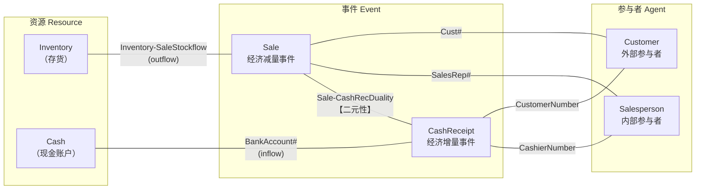

**读这张图的要点**：

| REA 关联 | 多重度 | 物理落地方式 | 具体在哪 |
|---|---|---|---|
| **Duality**（Sale ↔ CashReceipt） | 多对多 | **连接表** `Sale-CashRecDuality` | ⑥ |
| **Stockflow**（Inventory ↔ Sale） | 多对多 | **连接表** `Inventory-SaleStockflow` | ⑦ |
| **Participation**（Sale ↔ Salesperson） | 一对多 | **外键** `Sale.SalesRep#` | ① |
| **Participation**（Sale ↔ Customer） | 一对多 | **外键** `Sale.Cust#` | ① |
| **Participation**（CashReceipt ↔ Cashier） | 一对多 | **外键** `CashReceipt.CashierNumber` | ⑤ |
| **Stockflow**（Cash ↔ CashReceipt） | 一对多 | **外键** `CashReceipt.BankAccount#` | ⑤ |
| **Assignment**（Customer ↔ Salesperson） | 一对多 | **外键** `Customer.SP#` | ③ |

⚠️ **最后一条特别值得注意**：`Customer.SP#` 表达的是"这个客户归哪个销售员负责"——**这个关系脱离任何一笔具体销售也依然存在**，正是 M05 §2.3 讲的 **Assignment（指派）**次关联的启用条件。**讲义没有指出这一点，但这个数据集完美示范了 Assignment 什么时候该建。**

**§2.14（p.37）的 Inner Join 例子用的就是这条 Assignment 关系**（Customer.SP# = Salesperson.EmployeeNumber）。

**⚠️ 常见误解**

- ❌「这八张表就是一个完整的 REA 收入循环。」
  → 不是。**缺了承诺事件（Sale Order）、起因事件（Sales Call）、冲销事件（Sale Return）** —— M05 §2.14 讲的扩展收入循环这里一个都没有。这个库只有**核心模型**的一部分。§2.24 用的**另一个库**（`Dunn4eChps10-11withqueries`）才有 Sales Call、Sale Order 这些（见 p.90、p.91、p.92）。

**所以呢**

数据来源和它的 REA 含义都交代清楚了，下面几节开始在这份数据上真正跑查询，从关系代数的 Select（挑行）开始。

---

### 2.11 关系代数 SELECT：挑行（讲义 p.34）

**问题**（讲义 p.34 原文）

> *"Find the cash receipts from **Customer #2** (keeping **all the details** of those cash receipts)"*

**关系代数表达式**（讲义 p.34）

```
Select Cash Receipt Where Customer Number = C-2 Giving Answer
```

**语法结构**：

```
Select <表名> Where <条件> Giving <结果表名>
```

**答案**（讲义 p.34 的 Answer 表）

| Remittance Advice# | Amount | Bank Account# | Date | Customer Number | Cashier Number |
|---|---|---|---|---|---|
| RA-1 | 1,666 | BA-6 | 25 July | C-2 | E-39 |
| RA-2 | 10,000 | BA-7 | 26 July | C-2 | E-39 |
| RA-5 | 1,666 | BA-6 | 25 Aug | C-2 | E-39 |

**逐步推导**（💡 笔记补充，讲义直接给答案）：

1. 从 Cash Receipt 表（5 行）出发
2. 逐行检查 `Customer Number` 是不是 `C-2`：
   - RA-1: C-2 ✅ 留下
   - RA-2: C-2 ✅ 留下
   - RA-3: C-1 ❌ 扔掉
   - RA-4: C-5 ❌ 扔掉
   - RA-5: C-2 ✅ 留下
3. **列一个都不动**（题目说 keeping all the details）
4. 结果 3 行 × 6 列

**⚠️ 题目里 "keeping all the details" 那句话是关键**：它明确说明**只做 Select，不做 Project**。如果题目改成"找出客户 C-2 的收款编号和金额"，那就要 Select + Project 两步。

**为什么这个查询有会计意义**

这是**对账（reconciliation）**的第一步：客户说"我付过三笔钱"，你要能立刻调出他所有的付款记录来核对。M01 讲的审计轨迹（audit trail）在数据库里的体现，就是这种"能按任意维度切出原始凭证"的能力。

**🎙️ 课堂补充**

待转录补充（本讲无录音）。

**💡 换个说法（笔记补充）**

Select ≈ **Excel 的筛选（Filter）**。你在 `Customer Number` 那一列点筛选，只勾 `C-2`，其余行被隐藏。**区别是**：Excel 的筛选只是隐藏，原表还在；关系代数的 Select **产出一张新表**。

**⚠️ 常见误解**

- ❌「关系代数的 `Select` = SQL 的 `SELECT`。」
  → **不是**。见 §2.9 那张对照表。这里的 `Select` 对应 SQL 的 **`WHERE`**。
- ❌「条件里的 `C-2` 不用引号，说明它是数字。」
  → 讲义写的确实是 `Customer Number = C-2`（无引号）。**但这是讲义的简写/疏漏**——`C-2` 显然是文本，真正在 SQL 或 QBE 里必须写成 `"C-2"`。**p.57 的 QBE 截图里就是 `="C-2"`，带引号。** 见 [[#9.3 课件自身的问题|§9.3]]。

**所以呢**

挑行（Select）会了，下一节看关系代数的第二个算子——挑列（Project）。

---

### 2.12 关系代数 PROJECT：挑列（讲义 p.35）

**问题**（讲义 p.35 原文）

> *"Find the **customer number, name, and salesperson number** for **all** customers"*

**关系代数表达式**（讲义 p.35）

```
Project Customer Over (Customer#, Name, SP#) Giving Answer
```

**语法结构**：

```
Project <表名> Over (<要保留的列，逗号分隔>) Giving <结果表名>
```

⚠️ **关键词是 `Over`**（不是 `Where`）。`Where` 挑行，`Over` 挑列。

**答案**（讲义 p.35）

| Customer# | Name | SP# |
|---|---|---|
| C-1 | Bill | E-12 |
| C-2 | Mick | E-10 |
| C-3 | Keith | E-10 |
| C-4 | Charlie | E-99 |
| C-5 | Ron | E-10 |

**逐步推导**（💡 笔记补充）：

1. 从 Customer 表（5 行 × 4 列）出发
2. **行一行不删**（题目说 all customers）
3. **列只留三个**：`Customer#`、`Name`、`SP#`
4. 被扔掉的是 **`A/R Amt`** —— 那一列本来就全是空的
5. 结果 5 行 × 3 列

**⚠️ 讲义这一页有个多余的东西**：p.35 除了 Customer 表，还画了 **Salesperson 表**在旁边。**但这个查询根本没用到 Salesperson 表。** 这大概是从 p.37（Inner Join）那页复制来的排版残留。见 [[#9.3 课件自身的问题|§9.3]]。

**为什么这个查询有会计意义**

这是**信息最小化原则**的体现：给销售主管看客户清单时，他需要知道客户归谁负责（SP#），**但不需要看到欠款金额**。会计与内控上这叫 **need-to-know**，是访问控制的基础。Project 就是实现它的技术手段。

**⚠️ Project 的一个隐藏行为：去重**（💡 笔记补充，讲义完全没提，但这是关系代数的标准定义）

严格的关系代数里，**Project 之后要去掉重复行**（因为关系是集合，集合不允许重复元素）。

例：`Project Customer Over (SP#)` 严格来说应该给出 **`E-12, E-10, E-99`**（三行，去重），而不是五行。

⚠️ **但 SQL 默认不去重**！SQL 要去重必须写 `SELECT DISTINCT`。**这是关系代数与 SQL 的一处真实差异，讲义没有提。** 考试如果考"关系代数的 Project 与 SQL 的 SELECT 有什么区别"，**去重行为**是标准答案之一。见 [[#9.4 课外补充|§9.4]]。

**🎙️ 课堂补充**

待转录补充（本讲无录音）。

**💡 换个说法（笔记补充）**

Project ≈ **Excel 里隐藏列 / 只复制某几列出来**。

助记：**Project（投影）** 这个词来自几何——把一个三维物体投影到二维平面上，**丢掉一个维度**。表也一样：从 4 列投影到 3 列，丢掉一列。

**⚠️ 常见误解**

- ❌「Project 会减少行数。」
  → 不会（除非触发去重）。**Project 只动列。**
- ❌「`Over` 和 `Where` 可以混用。」
  → 语法上不行。**`Where` 后面跟条件，`Over` 后面跟列名清单。**

**所以呢**

挑行、挑列都会了，下一节看第三个也是最后一个算子——Join，以及它最重要的一个分支：内连接与外连接的区别。

---

### 2.13 连接类型：内连接与外连接（讲义 p.36）

**是什么**

讲义 p.36 给出两类连接的定义：

> **Inner join**
> • *includes **only the records from both tables that have the exact same values** in the fields that are joined*
>
> **Outer join**
> • *includes **all records from one table**, and matches those records from the other table for which values in the joined fields are equal*

页面下方还标了 **Left Outer Join** 和 **Right Outer Join** 两个名字，各配一张 Venn 图。

⚠️ **视觉复核发现讲义这一页有排版 bug**：Inner join 那一条 bullet 后面的 `I.e.,` 本该跟一张"两圆相交、只有交集染色"的 Venn 图，**但那张图被放到了页面中间，正好压在 "Outer join" 的定义文字上**，把 *"includes all records from one table"* 那行字盖住了一半。Outer join 的 `I.e.,` 后面则是**空的**。见 [[#9.3 课件自身的问题|§9.3]]。

**三张 Venn 图的正确含义**（视觉复核所得，蓝色 = 结果包含的部分）：

| 图 | 蓝色部分 | 名称 | 含义 |
|---|---|---|---|
| 两圆相交，**只有交集**是蓝的 | 交集 | **Inner Join** | 只留两边都匹配上的 |
| 两圆相交，**左圆全蓝 + 交集蓝** | 左圆全部 | **Left Outer Join** | 左表全留，右表只留匹配上的 |
| 两圆相交，**右圆全蓝 + 交集蓝** | 右圆全部 | **Right Outer Join** | 右表全留，左表只留匹配上的 |

**用 Mermaid 重画（本笔记补充）**：

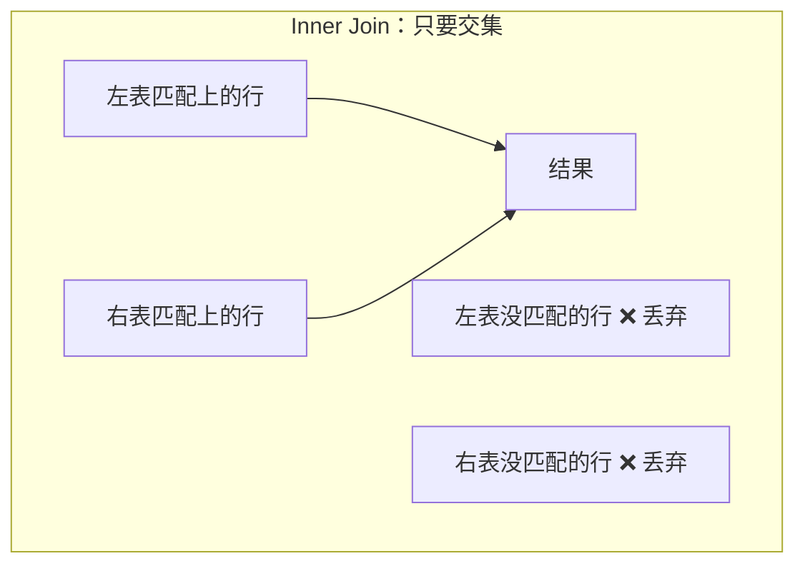

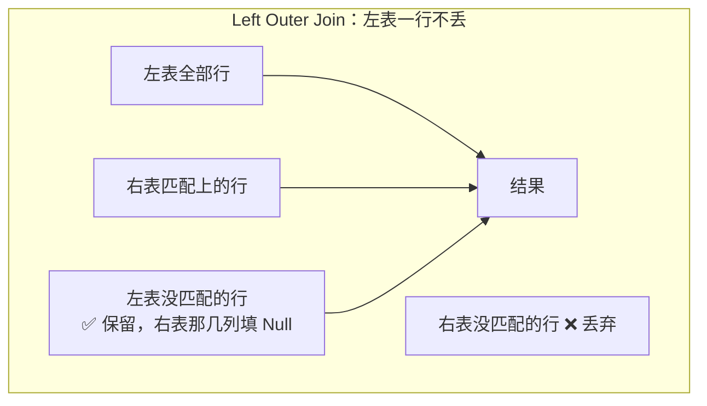

**为什么必须分清**

因为**内连接会静默地丢掉数据**，而丢掉的往往正是你最想知道的：

| 你想问 | 用内连接会怎样 |
|---|---|
| "每个销售员的业绩" | **E-78 消失了** —— 而"谁一单没开"恰恰是经理最想知道的 |
| "每笔销售的收款情况" | **S-6、S-7 消失了** —— 而"哪些销售还没收到钱"就是应收账款 |
| "每件商品的销量" | **没卖出去的商品消失了** —— 而滞销品才是要处理的 |
| "每个客户的评价" | **从没给过评价的客户消失了** |

**这四个"消失"就是本讲后面反复演示的东西**：p.38（未收款的销售）、p.88（滞销品）、p.91（无正面反馈的存货）、p.92（零拜访的销售员）。

**💡 换个说法（笔记补充）**

> **内连接回答"发生了什么"，外连接回答"什么没发生"。**

会计上，"什么没发生"往往比"发生了什么"更重要：
- **没收到的钱** = 应收账款（资产）
- **没付的钱** = 应付账款（负债）
- **没交货的订单** = 在手订单 backlog（M05 §2.10）
- **没动过的存货** = 呆滞存货（可能要计提跌价准备）

**⚠️ Left 和 Right 的区别其实是"哪张表写在前面"**（💡 笔记补充）：

`A Left Outer Join B` ≡ `B Right Outer Join A`。**它们是同一件事的两种写法。**

实践中**几乎只用 Left Outer Join**，因为人习惯把"要全留的那张表"写在前面。讲义 p.38 用的就是 Left。

**⚠️ 常见误解**

- ❌「外连接会把两张表的所有行都留下。」
  → 那叫 **Full Outer Join**（全外连接），讲义**没有讲**，而且 **Access 的 QBE 不支持**（要写 SQL 用两个查询 UNION）。讲义只讲了左外和右外。
- ❌「外连接结果里的空白格是空字符串。」
  → 是 **Null**。这是 §2.20.2 和 §2.24.1 的关键：**外连接产生的 Null 参与算术运算会让整个表达式变 Null**，所以 p.86 才必须用 `Nz()`。

**与其他概念的关系**

- Inner Join 的完整例子在 §2.14（p.37）
- Left Outer Join 的完整例子在 §2.15（p.38）
- 外连接 + `Is Null` 的实战套路在 §2.24.6（p.91）

**所以呢**

内连接与外连接"回答不同问题"这条原则记住了，下一节先看内连接的完整例子。

---

### 2.14 关系代数 Inner Join：拼表（讲义 p.37）

**问题**（讲义 p.37 原文）

> *"Find **all details of all customers** and **all available details of each customer's salesperson**"*

**关系代数表达式**（讲义 p.37）

```
Join Customer, Salesperson
Where Customer.SP# = [Salesperson.Employee Number]
Giving Answer
```

**语法结构**：

```
Join <表1>, <表2> Where <连接条件> Giving <结果表名>
```

⚠️ 注意 **`[Salesperson.Employee Number]`** 外面的方括号 —— 因为 `Employee Number` 里有**空格**。讲义 p.41 会专门解释这一点（*"the brackets are needed because of spaces in the table and field names"*）。

**答案**（讲义 p.37）

| Customer# | Name | A/R Amt | SP# | Employee Number | Quarterly Sales$ | Comm rate |
|---|---|---|---|---|---|---|
| C-1 | Bill | | E-12 | E-12 | | .12 |
| C-2 | Mick | | E-10 | E-10 | | .10 |
| C-3 | Keith | | E-10 | E-10 | | .10 |
| C-4 | Charlie | | E-99 | E-99 | | .10 |
| C-5 | Ron | | E-10 | E-10 | | .10 |

**逐步推导**（💡 笔记补充）：

1. Customer 表 5 行，Salesperson 表 4 行
2. 对 Customer 的每一行，去 Salesperson 表里找 `EmployeeNumber = 这一行的 SP#` 的行
   - C-1 的 SP# = E-12 → 找到 Salesperson 的 E-12 行 → 拼起来
   - C-2 的 SP# = E-10 → 找到 E-10 行 → 拼起来
   - C-3 的 SP# = E-10 → 又找到 E-10 行 → 拼起来（**同一行可以被用多次**）
   - C-4 的 SP# = E-99 → 找到 → 拼
   - C-5 的 SP# = E-10 → 找到 → 拼
3. 结果 **5 行**，列数 = 4 + 3 = **7 列**

**⚠️ 三个必须注意的点**：

1. **`E-78` 不在结果里。** 他是销售员，但没有任何客户归他管，所以内连接把他扔了。**如果题目是"列出所有销售员及其负责的客户"，用内连接就答错了**——必须用外连接。

2. **连接列出现了两次**（`SP#` 和 `Employee Number` 内容完全一样）。这是 `Join` 的标准行为——它把两张表**整个拼起来**，不自动去掉重复的连接列。**SQL 里 `SELECT *` 也是这个行为**（p.43 的结果同样有两列）。要去掉就得用 Project 只选需要的列。

3. **结果行数 = 5，不是 5×4 = 20。** 这引出下面这个极其重要的陷阱：

**⚠️ 常见误解 —— 忘了写连接条件会怎样（笔记补充，讲义完全没提）**

如果你写 `Join Customer, Salesperson`（**不带 Where**），得到的是**笛卡尔积（Cartesian product）**：Customer 的每一行去配 Salesperson 的每一行，**5 × 4 = 20 行**，而且**全是错的**（C-1 会被配上 E-10、E-99、E-78）。

在 SQL 里这个错误尤其容易犯：`SELECT * FROM Customer, Salesperson;`（漏了 WHERE）**语法完全合法**，直接跑出 20 行垃圾。

**在 QBE 里就不容易犯**——因为你必须**手工拖一条连接线**，或者 Access 根据已建的关系**自动帮你拖**（p.64 的截图）。**这是 QBE 相对 SQL 的一个真实优势。**

⚠️ 真实项目里，两张十万行的表做笛卡尔积 = 100 亿行，直接把机器跑死。**这是数据库初学者最经典的事故。**

**为什么这个查询有会计意义**

`Customer.SP# = Salesperson.EmployeeNumber` 这条关系，在 M05 的语言里是 **Assignment（指派）**：客户归哪个销售员负责。做这个连接，实际是在回答**"这个客户的账，找谁问？"** —— 这是应收账款催收（collection）的第一步。

**🎙️ 课堂补充**

待转录补充（本讲无录音）。

**💡 换个说法（笔记补充）**

Inner Join ≈ **Excel 的 VLOOKUP**，但更强：
- VLOOKUP 一次只能带回**一列**，Join 一次带回**整张表的所有列**
- VLOOKUP 找不到会返回 `#N/A`，**Inner Join 直接把这行删掉**（这正是它和外连接的区别）

**所以呢**

内连接会丢数据这一点看清楚了，下一节看外连接怎么把这些数据留下来。

---

### 2.15 关系代数 Left Outer Join：一行都不丢（讲义 p.38）

**问题**（讲义 p.38 原文）

> *"Find **all details of all sales** and the cash receipt number and amount applied of **any** cash receipts related to those sales"*

⚠️ **题目措辞是解题关键**："**all** sales" + "**any** cash receipts" —— 销售一笔不能少，收款有就带上、没有就算了。**这句话直接翻译成 Left Outer Join。**

**关系代数表达式**（讲义 p.38）

```
Left Outer Join Sale, [Sale - CashRecDuality]
Where [Sale.Sale#] = [Sale - CashRecDuality.Sale#]
Giving Answer
```

**答案**（讲义 p.38）

| Sale# | Amount | Date | Cust# | SalesRep# | Sale# | RA# | Applied |
|---|---|---|---|---|---|---|---|
| S-1 | 7,200 | 1 July | C-1 | E-12 | S-1 | RA-3 | 7,200 |
| S-2 | 10,000 | 21 July | C-2 | E-10 | S-2 | RA-1 | 1,666 |
| S-2 | 10,000 | 21 July | C-2 | E-10 | S-2 | RA-5 | 1,666 |
| S-3 | 16,000 | 22 July | C-5 | E-10 | S-3 | RA-4 | 16,000 |
| S-4 | 10,000 | 26 July | C-2 | E-10 | S-4 | RA-2 | 10,000 |
| S-5 | 16,600 | 31 July | C-5 | E-10 | S-5 | RA-4 | 16,600 |
| **S-6** | **35,000** | **15 Aug** | **C-3** | **E-10** | ***(空)*** | ***(空)*** | ***(空)*** |
| **S-7** | **23,000** | **21 Aug** | **C-4** | **E-99** | ***(空)*** | ***(空)*** | ***(空)*** |

**逐行推导**（💡 笔记补充）：

| Sale 表的行 | 在 Duality 表里找到几条匹配 | 结果产生几行 |
|---|---|---|
| S-1 | 1 条（RA-3） | 1 行 |
| **S-2** | **2 条（RA-1、RA-5）** | **2 行** ⚠️ |
| S-3 | 1 条（RA-4） | 1 行 |
| S-4 | 1 条（RA-2） | 1 行 |
| S-5 | 1 条（RA-4） | 1 行 |
| **S-6** | **0 条** | **1 行，右侧全 Null** ⚠️ |
| **S-7** | **0 条** | **1 行，右侧全 Null** ⚠️ |
| | | **合计 8 行** |

**三个必须理解的现象**：

1. **S-2 出现了两次。** 因为它被分两次收款（RA-1 和 RA-5 各 1,666）。⚠️ **这意味着结果表里 `Amount` 那一列的 10,000 出现了两次**——**如果你直接对 `Amount` 求和，会把 S-2 算两遍！** 这是做应收账款汇总时最经典的错误。（§2.24.1 的 p.86 就是通过**分别汇总再相减**来避开这个坑的。）

2. **S-6、S-7 右侧全空。** 这两笔销售**一分钱都没收到**。它们的金额加起来 35,000 + 23,000 = **58,000**，就是这两笔的应收账款。

3. **空的是 Null，不是 0。** 如果你写 `Amount - Applied` 想算未收金额，S-6 会得到 `35,000 - Null = Null`，**不是 35,000**。这正是 §2.24.1 要用 `Nz()` 的原因。

**为什么这个查询有会计意义 —— 它就是应收账款账龄表的雏形**

这张结果表回答的是：**每一笔销售，收回来多少？** 把它再加工一步（按 Sale# 分组，`Amount - SUM(Applied)`），就得到**逐笔未收余额**：

| Sale# | Amount | 已收 (Σ Applied) | **未收** |
|---|---|---|---|
| S-1 | 7,200 | 7,200 | 0 |
| S-2 | 10,000 | 3,332 | **6,668** |
| S-3 | 16,000 | 16,000 | 0 |
| S-4 | 10,000 | 10,000 | 0 |
| S-5 | 16,600 | 16,600 | 0 |
| S-6 | 35,000 | **0** | **35,000** |
| S-7 | 23,000 | **0** | **23,000** |
| **合计** | **117,800** | **53,132** | **64,668** |

（💡 笔记推断：这张表是本笔记根据 p.33 的数据算出来的，讲义没有给。计算方法：$\text{未收} = \text{Amount} - \sum \text{Applied}$。
**两条路验算一致**：① 逐笔相加 6,668 + 35,000 + 23,000 = **64,668**；② 总额相减 117,800 − 53,132 = **64,668** ✅
再验已收总额：Duality 表的 Applied 合计 1,666+10,000+7,200+16,000+16,600+1,666 = **53,132**，与 CashReceipt 表的 Amount 合计 1,666+10,000+7,200+32,600+1,666 = **53,132** 一致 ✅）

**这个 64,668 就是这家公司在 8 月底的应收账款余额** —— 也正是 Customer 表里那个空着的 `A/R Amt` 列本该填的东西的总和。**而 REA 的主张是：不要填它，需要时算它。**

**⚠️ 关系代数写法里的一处不一致**（讲义 p.38）

讲义写的是 `Left Outer Join Sale, [Sale - CashRecDuality]`，表名中间**带空格**（`Sale - CashRecDuality`）。而 p.44 的 SQL 版写的是 `[Sale-CashRecDuality]`（**无空格**），p.54 的 Access 截图里实际表名是 **`Sale-CashRecDuality`**（无空格）。见 [[#9.3 课件自身的问题|§9.3]]。

**🎙️ 课堂补充**

待转录补充（本讲无录音）。

**💡 换个说法（笔记补充）**

Left Outer Join ≈ **VLOOKUP 但把 `#N/A` 留着**。

会计人最熟悉的形态就是**银行存款余额调节表**：把公司账上的每一笔和银行对账单的每一笔配对，**配不上的两边都要留着**（未达账项）—— 那就是外连接。用内连接做银行调节表，等于把所有未达账项都删掉，调节表永远是平的，但完全没用。

**⚠️ 常见误解**

- ❌「外连接的结果行数 = 左表行数。」
  → **不一定**。左表一行如果在右表匹配到多行，结果就会**多出行**（S-2 的情况）。规则是：**左表每一行至少出现一次**，可能出现多次。
- ❌「S-6 那行右边是空的，说明数据错了。」
  → 不是错，**那正是答案**。空恰恰表示"这笔销售还没收款"。

**所以呢**

三种关系代数算子（Select / Project / Join，含内外连接）全部讲完了，下一节切到工业标准写法——SQL。

---
### 2.16 SQL：结构化查询语言（讲义 p.39–p.40）

#### 2.16.1 SQL 语句的三段式骨架（讲义 p.39）

**是什么**

⚠️ 讲义 p.39 整页只有一条 bullet（视觉复核确认，`SELECT` / `FROM` / `WHERE` 三个关键词用**蓝色**标出，分号也是蓝色）：

> *"Each query statement follows the **same structure**:*
> **SELECT** *attribute name(s)*
> **FROM** *table name(s)*
> **WHERE** *criteria is met***;***"

**这是本讲必须背下来的三行。**

```sql
SELECT  列名1, 列名2, ...     -- 要哪几列
FROM    表名1, 表名2, ...     -- 从哪几张表
WHERE   条件                  -- 要哪几行
;                             -- 分号结束
```

**为什么它是"同一个结构"**

讲义强调 *"**the same** structure"* —— 无论查询多复杂，骨架永远是这三段。**复杂性只体现在每一段里塞了多少东西**：

| 段 | 简单时 | 复杂时 |
|---|---|---|
| SELECT | `*`（所有列） | 七八个列名 + 计算表达式 + 聚合函数 |
| FROM | 一张表 | 四张表 + 连接方式 |
| WHERE | 一个等式 | AND / OR / NOT / BETWEEN / IS NULL 层层嵌套 |

**⚠️ 分号**：讲义特意用蓝色标出行尾的 `;`。它是 **SQL 语句的结束符**。⚠️ **Access 的 SQL 视图里其实可以不写分号**（它会自动补），但**标准 SQL 要求写**，考试也应该写。

**💡 换个说法（笔记补充）**

三行的顺序有个反直觉之处：**你写的顺序是 SELECT → FROM → WHERE，但数据库执行的顺序是 FROM → WHERE → SELECT。**

先找到表（FROM），再筛出行（WHERE），最后挑出列（SELECT）。**这就是为什么 SELECT 里能用 WHERE 挑剩下的行——因为 WHERE 先跑。**（💡 笔记补充，讲义未提，但这一点能解释很多"为什么这样写不行"的困惑。）

**⚠️ 常见误解**

- ❌「三段都必须写。」
  → **`WHERE` 可以省略**（讲义 p.40 明说：*"may be left blank for single-table queries that retrieve all rows"*）。p.42 的 Project 例子就没有 WHERE。**`SELECT` 和 `FROM` 不能省。**

**所以呢**

SQL 的三段式骨架记住了，下一节把这三段和前面学的关系代数算子对上号——这一步很容易记反，必须专门讲。

#### 2.16.2 ⚠️ SQL 的三段分别对应关系代数的什么（讲义 p.40）

**这一页是全讲最重要的"翻译表"之一。**

讲义 p.40 原文：

> *"SQL's **SELECT** component **isolates columns** — i.e., relational algebra's **project***
> *"SQL's **FROM** component is used for **identifying the table(s)** involved"*
> *"SQL's **WHERE** component **isolates rows** — i.e., relational algebra's **select**; **may be left blank** for single-table queries that retrieve all rows"*

**对照表（考点）**：

| SQL 成分 | 干什么 | 对应关系代数的 | 助记 |
|---|---|---|---|
| `SELECT` | **挑列** | **Project**（投影） | ⚠️ **名字骗人** |
| `FROM` | 指明用哪些表 | （Join 的操作对象） | |
| `WHERE` | **挑行** | **Select**（选择） | ⚠️ **名字骗人** |

**为什么这是个坑**

因为**两个体系里 "select" 这个词的含义正好错位**：

```
关系代数：  Select = 挑行        Project = 挑列
                ↓  名字对不上  ↘
SQL：       WHERE  = 挑行        SELECT  = 挑列
```

**记忆法（💡 笔记补充）**：

> **SQL 的 SELECT 里写的是"列名"，所以它当然是挑列的。**

只要盯着"SELECT 后面跟的是什么"，就不会记反：`SELECT Customer#, Name, SP#` —— 后面跟的是**列名**，所以它挑列。而 `WHERE Customer Number = C-2` —— 后面跟的是**行的筛选条件**，所以它挑行。

**Join 在 SQL 里在哪**（💡 笔记补充，讲义 p.40 没说清）

讲义 p.40 只说 `FROM` 是"identifying the tables"。实际上 SQL 表达 Join 有**两种写法**，讲义两种都用了：

| 写法 | 例子 | 讲义在哪用 |
|---|---|---|
| **旧式（隐式连接）**：表名并列在 FROM，连接条件放 WHERE | `FROM Customer, Salesperson WHERE Customer.SP# = ...` | p.43（Inner Join） |
| **新式（显式连接）**：连接词写在 FROM 里 | `FROM Sale LeftJoin [Sale-CashRecDuality] WHERE ...` | p.44（Outer Join） |

⚠️ **讲义 p.44 的写法有语法错误**：标准 SQL 应该是 `FROM Sale LEFT JOIN [Sale-CashRecDuality] **ON** Sale.Sale# = ...`，用 **`ON`** 而不是 `WHERE`，而且 `LeftJoin` 应该是两个词 `LEFT JOIN`。**讲义写的 `LeftJoin` + `WHERE` 在真正的 Access 里跑不通。** 见 [[#9.3 课件自身的问题|§9.3]]。

**🎙️ 课堂补充**

待转录补充（本讲无录音）。

**⚠️ 常见误解**

- ❌「WHERE 是可选的，所以不重要。」
  → 讲义说它 *"may be left blank **for single-table queries that retrieve all rows**"* —— 只有在**单表 + 要全部行**时才能省。**多表查询漏掉 WHERE = 笛卡尔积**（见 §2.14 的警告）。

**所以呢**

SQL 与关系代数的对应关系理清了，下一节把 §2.11–§2.15 那四个关系代数例子原样用 SQL 重做一遍。

---

### 2.17 SQL 实现四个例子（讲义 p.41–p.44）

⚠️ **这四页是 p.34–p.38 那四个关系代数例子的"SQL 重做"**，题目、数据、答案全部相同。本笔记只写 SQL 语句和差异点，答案表不再重复（回看 §2.11–§2.15）。

#### 2.17.1 SQL 的 Select：挑行（讲义 p.41）

**问题**：与 p.34 相同 —— 找出客户 C-2 的所有收款明细。

**SQL 语句**（讲义 p.41）

```sql
Select *
From [Cash Receipt]
Where [Customer Number] = C-2;
```

**讲义 p.41 右侧的括注**（原文）：

> *"(note: the **brackets are needed because of spaces** in the table and field names; also note ***** is a **wild card** indicating **all columns** should be included)"*

**两个新知识点**：

**① 通配符 `*`**

`SELECT *` = "所有列"。**它就是"不做 Project"的写法**，正好对应题目里 "keeping all the details"。

**② 方括号 `[ ]`**

表名或字段名里**有空格**时必须用方括号包起来，否则 SQL 会把 `Cash Receipt` 当成两个东西。

```sql
From Cash Receipt     -- ❌ 错，SQL 不知道 Receipt 是什么
From [Cash Receipt]   -- ✅ 对
```

💡 **推论：字段名不要带空格。** 讲义 p.26 那个 `Grade Earned` 也有同样的问题。**养成 `CashReceipt`、`GradeEarned` 这样的驼峰命名习惯，就永远不用写方括号。**（笔记补充，讲义未明说，但 p.54 的截图里 Access 实际表名就是 `CashReceipt`（无空格），说明作者自己也改了。）

**⚠️ 讲义这条语句有一处错误**：`Where [Customer Number] = C-2;` —— **`C-2` 是文本，必须加引号**：

```sql
Where [Customer Number] = "C-2";   -- ✅ Access 写法
Where [Customer Number] = 'C-2';   -- ✅ 标准 SQL 写法
```

不加引号的话，SQL 会把 `C-2` 解析成"变量 C 减去 2"，直接报错。**p.57 的 QBE 截图里写的是 `="C-2"`（带引号），说明讲义作者在实操时是加了引号的，只是 SQL 页上漏了。** 见 [[#9.3 课件自身的问题|§9.3]]。

**所以呢**

SQL 版的 Select 会写了，下一个例子看 SQL 怎么表达 Project。

#### 2.17.2 SQL 的 Project：挑列（讲义 p.42）

**问题**：与 p.35 相同 —— 所有客户的编号、姓名、销售员号。

**SQL 语句**（讲义 p.42）

```sql
Select Customer#, Name, SP#
From Customer;
```

**两个观察**：

1. **没有 WHERE** —— 因为要所有行。这正是 p.40 说的 *"may be left blank for single-table queries that retrieve all rows"*。
2. **`SELECT` 后面跟三个列名** —— 这就是 Project。

⚠️ **`Customer#` 和 `SP#` 里的 `#` 在真实 Access 里是有问题的**（💡 笔记补充）：`#` 在 Access SQL 里是**日期分隔符**（`#7/31/2014#`，见 p.74 的截图）。字段名里带 `#` 会引起解析歧义，实际的 Access 表里字段就叫 `CustomerNumber`、`SalespersonNumber`（见 p.60、p.61 的截图）。**p.33–p.44 的表/字段名是"教科书示意名"，p.54 之后的截图才是"Access 里的真名"。** 两套名字的对照见 [[#9.3 课件自身的问题|§9.3]]。

**所以呢**

Select、Project 都用 SQL 写完了，下一个例子看 SQL 怎么表达内连接——也是笛卡尔积陷阱最容易发作的地方。

#### 2.17.3 SQL 的 Inner Join（讲义 p.43）

**问题**：与 p.37 相同 —— 所有客户及其销售员的全部明细。

**SQL 语句**（讲义 p.43）

```sql
Select *
From Customer, Salesperson
Where Customer.SP# = [Salesperson.Employee Number];
```

**三个观察**：

1. **`FROM` 后面两张表用逗号并列** —— 这是**旧式隐式连接**写法。
2. **连接条件写在 `WHERE` 里** —— `Customer.SP# = Salesperson.EmployeeNumber`。**这个等号就是连接条件**，不是筛选条件。
3. **`表名.字段名` 的点号写法** —— 多表查询里必须指明字段属于哪张表，否则字段重名时 SQL 不知道你说的是哪一个。

⚠️ **讲义的方括号位置有误**：写的是 `[Salesperson.Employee Number]`（把表名和字段名一起括起来）。**正确写法是 `Salesperson.[Employee Number]`**（只括有空格的那部分）。讲义那样写，SQL 会以为有个字段就叫 `Salesperson.Employee Number`。见 [[#9.3 课件自身的问题|§9.3]]。

**⚠️ 再次提醒笛卡尔积陷阱**：这条语句如果漏掉 `WHERE` 那一行，会返回 5 × 4 = **20 行**全错的结果，而且**不报任何错**。这是隐式连接写法最大的风险，也是现代 SQL 推荐用显式 `JOIN ... ON` 的原因。

**所以呢**

内连接的 SQL 写法会了，最后一个例子看外连接——这里讲义自己的写法就有语法错误，正好用来讲清楚 `ON` 和 `WHERE` 的真正区别。

#### 2.17.4 SQL 的 Outer Join（讲义 p.44）

**问题**：与 p.38 相同 —— 所有销售 + 相关收款（有则带上）。

**SQL 语句**（讲义 p.44 原文照录）

```sql
Select *
From Sale LeftJoin [Sale-CashRecDuality]
Where [Sale.Sale#]=[Sale-CashRecDuality.Sale#];
```

⚠️ **这条语句有三处问题**（详见 [[#9.3 课件自身的问题|§9.3]]）：

| 问题 | 讲义写的 | 应该是 |
|---|---|---|
| ① 连接关键字拼在一起 | `LeftJoin` | `LEFT JOIN`（两个词） |
| ② 连接条件用了 WHERE | `Where ...` | `ON ...` |
| ③ 方括号位置 | `[Sale.Sale#]` | `Sale.[Sale#]` |

**正确的 Access SQL**（💡 笔记补充）：

```sql
SELECT *
FROM Sale LEFT JOIN [Sale-CashRecDuality]
ON Sale.[Sale#] = [Sale-CashRecDuality].[Sale#];
```

**为什么 `ON` 和 `WHERE` 不能互换 —— 这是外连接的核心陷阱**（💡 笔记补充，讲义完全没提，但极其重要）：

| 写法 | 执行逻辑 | 结果 |
|---|---|---|
| `LEFT JOIN … **ON** A.k = B.k` | 先连接（左表全保留），**连接条件在连接时生效** | S-6、S-7 **保留**，右侧 Null ✅ |
| `FROM A, B **WHERE** A.k = B.k` | 先做笛卡尔积，**再用条件筛行** | S-6、S-7 的行因为右侧是 Null，`Null = Null` 不成立 → **被筛掉** ❌ |

**换句话说：把外连接的条件写在 WHERE 里，外连接会"退化成"内连接。** 这是 SQL 里最经典的隐蔽 bug 之一。**讲义 p.44 恰好写成了 WHERE，所以它给出的答案（8 行，含 S-6/S-7）与它给出的 SQL（会得到 6 行）实际上对不上。**

**答案**：讲义 p.44 的 Query Result 与 p.38 的 Answer 完全一致（8 行），见 §2.15。

**所以呢**

三种语言（关系代数、SQL）都用同一批例子跑过了，下面几节补上写 WHERE 条件时要用到的具体运算符，从比较运算符开始。

---

### 2.18 数学比较运算符（讲义 p.45–p.47）

#### 2.18.1 六个运算符（讲义 p.45）

**是什么**

讲义 p.45 列出六个：

| 运算符 | 含义 | 英文 |
|---|---|---|
| `=` | 等于 | equal to |
| `<` | 小于 | less than |
| `<=` | 小于或等于 | less than or equal to |
| `>` | 大于 | greater than |
| `>=` | 大于或等于 | greater than or equal to |
| `<>` | **不等于** | not equal to（*"or `!=` in some software"*） |

⚠️ **`<>` 是本讲要特别记的一个**：**Access / 标准 SQL 用 `<>`**，很多编程语言用 `!=`。讲义原文：*"`<>` not equal to (**or `!=` in some software**)"*。

**放在哪里**

> *"Mathematical comparison operators are typically included in the **WHERE clause** of the SQL statement, and may be used on **all types of fields**"*

**⚠️ 重点：不只数字能比大小**

讲义特别强调两条：

> *"For **date** fields, dates that are **earlier in time are 'less than'** dates that are later in time."*
> *"For **text** fields, **A < B < C**, etc."*

| 字段类型 | "小于"是什么意思 | 例 |
|---|---|---|
| 数字 / 货币 | 数值小 | `1,000 < 5,000` |
| **日期** | **时间早** | `1 July < 15 Aug` |
| **文本** | **字典序靠前** | `"A" < "B"`；`"E-10" < "E-12"` |

**为什么这条很重要**

因为**会计里最常见的筛选条件就是日期区间**：「7 月份的销售」「资产负债表日之前的所有交易」。理解"日期能比大小"，才知道 `Date < #7/31/2014#` 是合法的。

**⚠️ 文本比较的陷阱**（💡 笔记补充，讲义只说了 `A < B < C`，没说坑）：

文本是**逐字符从左往右**比的，所以：

| 比较 | 结果 | 为什么 |
|---|---|---|
| `"9" < "10"` | **False**（"9" > "10"） | 先比第一个字符：`'9'` > `'1'` |
| `"E-9" < "E-10"` | **False** | 第三个字符 `'9'` > `'1'` |
| `"A-10" < "A-4"` | **True** | 第三个字符 `'1'` < `'4'` |

**这就是为什么示例数据里的编号都是 `E-10`、`E-12`、`E-99` 这种"位数一样"的形式** —— 位数一样时，文本序才和数值序一致。💡 实务上给编号补前导零（`E-010`）就是为了这个。

**所以呢**

六个比较运算符、以及数字/日期/文本三种字段各自的"小于"含义都讲完了，下一个例子用一个数值筛选把它跑通。

#### 2.18.2 数值比较的例子（讲义 p.46）

**问题**：找出余额 ≥ 50,000 的现金账户及其余额。

**SQL 语句**（讲义 p.46）

```sql
Select Account#, Balance
From Cash
Where Balance>=50000;
```

**Cash 表**（讲义 p.46 重列了 §2.10.1 的 ④）

| Account# | Type | Bank | Balance |
|---|---|---|---|
| BA-6 | Checking | Boston5 | *(空)* |
| BA-7 | Checking | Shawmut | *(空)* |
| BA-8 | Draft | Shawmut | 75,000 |
| BA-9 | Checking | MassNat | 0 |

**答案**（讲义 p.46）

| Account# | Balance |
|---|---|
| BA-8 | 75,000 |

**逐行推导**（💡 笔记补充）：

| 账户 | Balance | `Balance >= 50000` | 入选？ |
|---|---|---|---|
| BA-6 | Null | **Null（不是 True 也不是 False）** | ❌ |
| BA-7 | Null | **Null** | ❌ |
| BA-8 | 75,000 | True | ✅ |
| BA-9 | 0 | False | ❌ |

**⚠️ 这里藏着 Null 的第一课**：`Null >= 50000` 的结果**不是 False，是 Null**（"不知道"）。而 WHERE 只保留结果为 **True** 的行，所以 Null 行被排除。**看起来和 False 一样，但机制不同**——这个差别在 `NOT` 出现时会咬人（见 §2.19 的警告）。

**这个查询的会计含义**：找出余额超过某个阈值的银行账户，是**现金管理**的日常操作（余额太多说明资金闲置，该去做短期投资）。也可能是**内控筛查**：超过某额度的账户需要双人授权。

**⚠️ 数字不加千分位**：SQL 里必须写 `50000`，**不能写 `50,000`**（逗号会被当成分隔符）。讲义写的是 `50000`，正确。

**所以呢**

数值比较连着 Null 的第一课都讲完了（`Null >= 50000` 是 Null 不是 False），下一个例子换成文本比较，再看一次同样的 Null 陷阱。

#### 2.18.3 文本比较的例子（讲义 p.47）

**问题**：找出**不是** E-10 做的销售的编号和金额。

**SQL 语句**（讲义 p.47）

```sql
Select Sale#, Amount
From Sale
Where SalesRep# <> E-10;
```

**答案**（讲义 p.47）

| Sale# | Amount |
|---|---|
| S-1 | 7,200 |
| S-7 | 23,000 |

**逐行推导**（💡 笔记补充）：

| Sale# | SalesRep# | `<> "E-10"` | 入选？ |
|---|---|---|---|
| S-1 | E-12 | True | ✅ |
| S-2 | E-10 | False | ❌ |
| S-3 | E-10 | False | ❌ |
| S-4 | E-10 | False | ❌ |
| S-5 | E-10 | False | ❌ |
| S-6 | E-10 | False | ❌ |
| S-7 | E-99 | True | ✅ |

**⚠️ 讲义又漏了引号**：`Where SalesRep# <> E-10;` 应该是 `<> "E-10"`。**p.71 的 QBE 截图里写的正是 `<> "E-10"`（带引号）**。见 [[#9.3 课件自身的问题|§9.3]]。

**⚠️ 这个查询暴露了一个业务陷阱**（💡 笔记补充）：

如果 Sale 表里有一行 `SalesRep#` 是 **Null**（没记销售员），那么 `Null <> "E-10"` 的结果是 **Null**，**这一行不会入选**。

但业务上，"没记销售员的销售"**确实不是 E-10 做的**，本该入选。要包含它得写：

```sql
Where SalesRep# <> "E-10" OR SalesRep# IS NULL;
```

**这个例子的数据里恰好没有 Null 的 SalesRep#，所以看不出问题** —— 但在 §2.4 的 Example 1 里，`Salesperson` 就是**允许为空**的（061501B、061501C）。**同样的查询换到那张表上就会出错。**

**⚠️ 常见误解**

- ❌「`<>` 会包含所有不等于的行，包括空的。」
  → **不会**。这是 SQL 的三值逻辑（True / False / **Unknown**）：**任何与 Null 的比较都返回 Unknown，而 WHERE 只保留 True。**

**所以呢**

单个条件的比较运算符都讲完了，下一节看条件多起来之后怎么组合——AND / OR / NOT。

---

### 2.19 逻辑运算符 AND / OR / NOT（讲义 p.48）

**是什么**

讲义 p.48：

> *"Queries may include logical operators **AND, OR, and NOT**"*
> • ***AND** accomplishes a **set intersection** – answer includes all instances that meet **BOTH** conditions*
> • ***OR** accomplishes a **set union** – answer includes all instances that meet one condition **and** all instances that meet the other condition*
> • ***NOT** identifies instances that **do not meet** one or more conditions*

**用集合语言说**：

| 运算符 | 集合运算 | 结果集大小 |
|---|---|---|
| `AND` | **交集** intersection | **变小**（越加条件越少行） |
| `OR` | **并集** union | **变大**（越加条件越多行） |
| `NOT` | 补集 complement | 反过来 |

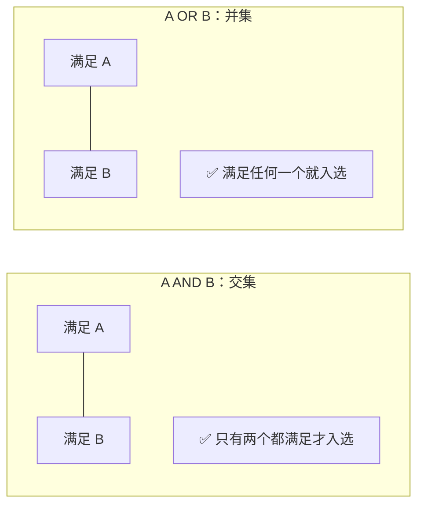

**用讲义后面的例子对照**（这是理解 AND/OR 最直接的方式）：

| 查询 | 条件 | 结果行数 | 讲义页 |
|---|---|---|---|
| 7/31 前**且** E-10 做的销售 | `Date < 7/31` **AND** `Rep = E-10` | **3 行**（S-2, S-3, S-4） | p.75 |
| 7/31 前**或** E-10 做的销售 | `Date < 7/31` **OR** `Rep = E-10` | **6 行**（S-1…S-6） | p.78 |

**同样两个条件，AND 给 3 行，OR 给 6 行。** 这就是交集与并集的差别。

**⚠️ 讲义没给 NOT 的例子**

讲义 p.48 提了 `NOT`，但**后面 44 页里一次都没用过 `NOT` 关键字**。它用的是 `<>`（p.47、p.71）来表达"不等于"。

💡 **`NOT` 与 `<>` 的关系**（笔记补充）：

```sql
WHERE NOT (SalesRep# = "E-10")   -- 用 NOT
WHERE SalesRep# <> "E-10"        -- 用 <>，等价（在无 Null 时）
```

单个条件时两者等价。**`NOT` 真正有用的场合是取反一整组条件**：

```sql
WHERE NOT (Date BETWEEN #7/1/2014# AND #7/31/2014#)   -- 不在 7 月的
```

**⚠️ `NOT` 遇到 Null 会出事**（💡 笔记补充，这是 SQL 三值逻辑的经典陷阱）：

`NOT Null = Null`（不是 True）。所以：

```sql
WHERE NOT (SalesRep# = "E-10")
```

**不会**返回 `SalesRep#` 为 Null 的行。想包含它必须显式写 `OR SalesRep# IS NULL`。

**三值逻辑真值表**（💡 笔记补充，讲义未给，但这是理解 §2.20 的基础）：

| A | B | A AND B | A OR B | NOT A |
|---|---|---|---|---|
| True | True | True | True | False |
| True | False | False | True | False |
| False | False | False | False | True |
| **True** | **Null** | **Null** | **True** | |
| **False** | **Null** | **False** | **Null** | |
| **Null** | **Null** | **Null** | **Null** | **Null** |

**记两条就够**：
- `False AND Null = False`（有一个假就是假）
- `True OR Null = True`（有一个真就是真）
- **其余只要碰上 Null 就是 Null**

**为什么这个很重要**

因为**会计筛选条件几乎全是复合条件**：

| 业务问题 | 逻辑结构 |
|---|---|
| 「Q3 内、金额超 10,000、且未收款的销售」 | 三个 AND |
| 「逾期 30 天以上**或**金额超 50,000 的应收账款」（催收优先级） | OR |
| 「不在预算科目表里的支出」（异常筛查） | NOT |

**💡 换个说法（笔记补充）**

- **AND 是"筛子叠筛子"**：每加一层，漏下去的越少
- **OR 是"网眼变大"**：每加一个，网住的越多

一个反直觉的记法：**日常说"我要 7 月的和 8 月的销售"，那个"和"在 SQL 里是 `OR` 不是 `AND`。** 因为没有哪一行既是 7 月又是 8 月。**中文的"和"经常对应 SQL 的 OR，这是初学者最常犯的错。**

**⚠️ 常见误解**

- ❌「AND 让结果更全面。」
  → 反了。**AND 只会让结果变少或不变。**
- ❌「NOT 就是把结果反过来，行数 = 总数 − 原结果数。」
  → **有 Null 时不成立**。见上面的三值逻辑。

**与其他概念的关系**

AND / OR 在 QBE 里的实现方式非常直观且是必考点：**同一行 = AND，不同行 = OR**（§2.23.6、§2.23.7，讲义 p.74、p.77）。

**所以呢**

AND/OR/NOT 和三值逻辑讲完了，下一节看三个更专门的运算符——BETWEEN、IS NULL、EXISTS，它们全部与 Null 直接相关。

---

### 2.20 特殊运算符：BETWEEN / IS NULL / EXISTS（讲义 p.49–p.51）

#### 2.20.1 BETWEEN：范围（讲义 p.49）

**是什么**

讲义 p.49：

> *"**BETWEEN** is used to define the **range limits**."*
> • *"The **end points of the range are included**"*

⚠️ **"端点包含"是本页唯一但关键的知识点** —— `BETWEEN a AND b` 等价于 `>= a AND <= b`，**两头都算**。

**SQL 语句**（讲义 p.49）

```sql
Select Sale#, Amount, Date
From Sale
Where Date BETWEEN 7/1 and 7/31;
```

**答案**（讲义 p.49）

| Sale# | Amount | Date |
|---|---|---|
| S-1 | 7,200 | 1 July |
| S-2 | 10,000 | 21 July |
| S-3 | 16,000 | 22 July |
| S-4 | 10,000 | 26 July |
| S-5 | 16,600 | 31 July |

**逐行验证端点包含（💡 笔记补充）**：

| Sale# | Date | 在 7/1–7/31 内？ | 说明 |
|---|---|---|---|
| S-1 | **1 July** | ✅ | **下端点，包含** |
| S-2 | 21 July | ✅ | |
| S-3 | 22 July | ✅ | |
| S-4 | 26 July | ✅ | |
| S-5 | **31 July** | ✅ | **上端点，包含** |
| S-6 | 15 Aug | ❌ | |
| S-7 | 21 Aug | ❌ | |

**S-1 和 S-5 恰好落在两个端点上，两个都入选** —— 讲义这个例子是**故意**这么选数据的，用来演示 "end points are included"。

**⚠️ 日期写法**：讲义写 `BETWEEN 7/1 and 7/31`。**真正的 Access 语法要用 `#` 包起来且要有年份**：

```sql
Where Date BETWEEN #7/1/2014# AND #7/31/2014#;
```

**p.81 的 QBE 截图里写的正是 `Between #7/15/2014# And #7/31/2014#`** —— 带 `#`、带年份。讲义 SQL 页上的 `7/1` 会被 Access 当成**除法运算**（7 除以 1 = 7）。见 [[#9.3 课件自身的问题|§9.3]]。

**⚠️ 端点包含在会计上是个真问题**（💡 笔记补充）：

会计期间是**闭区间**：「7 月份」= 7/1 到 7/31 **两头都算**。所以 `BETWEEN` 正好匹配会计直觉，**这是它比 `>= AND <=` 更该用的理由**。

但**时间戳字段是个例外**：如果 `Date` 字段带时分秒，`BETWEEN #7/1/2014# AND #7/31/2014#` 实际是 `<= 7/31/2014 00:00:00`，**会漏掉 7 月 31 日当天 0 点之后的所有交易**。这是实务中极常见的 bug。💡 稳妥写法是 `>= #7/1/2014# AND < #8/1/2014#`。

**所以呢**

BETWEEN 端点包含的规则记住了，下一节正式讲清楚 Null 是什么、以及取空值和取非空值该怎么写。

#### 2.20.2 IS NULL 与 EXISTS：空值（讲义 p.50–p.51）

**先说清楚 Null 是什么**（💡 笔记补充，讲义假定读者已知）

**Null（空值）= "这里没有值"**，它**不是**：

| Null 不是 | 为什么 |
|---|---|
| **0** | 0 是一个确切的数（"余额是零元"）；Null 是"不知道余额是多少" |
| **空字符串 `""`** | 空字符串是一个长度为 0 的确切字符串 |
| **"无"** | Null 本身没有业务含义，只表示"这一格没填" |

**Null 在会计上的两种含义**（💡 笔记补充）：

1. **尚未发生**：Sale-CashRecDuality 里 S-6 没有对应行 → 外连接产生 Null → "还没收款"
2. **不适用 / 未知**：Cash 表里 BA-6 的 Balance 是 Null → "这个账户余额没录入"

**⚠️ 这两种含义在会计上后果完全不同**：第一种应该当 0 处理（没收款 = 收了 0 元），第二种**不能**当 0（余额未知 ≠ 余额为零）。**`Nz()` 函数（§2.24.1）就是把第一种 Null 转成 0 的工具。**

**IS NULL（讲义 p.50）**

> *"**IS NULL** is used to retrieve attributes for which the value is **null**."*

```sql
Select *
From Cash
Where Balance IS NULL;
```

**答案**（讲义 p.50）

| Account# | Type | Bank | Balance |
|---|---|---|---|
| BA-6 | Checking | Boston5 | *(空)* |
| BA-7 | Checking | Shawmut | *(空)* |

**EXISTS（讲义 p.51）**

> *"**EXISTS** is used to retrieve attributes for which the value is **not null**."*

```sql
Select *
From Cash
Where Balance EXISTS;
```

**答案**（讲义 p.51）

| Account# | Type | Bank | Balance |
|---|---|---|---|
| BA-8 | Draft | Shawmut | 75,000 |
| **BA-9** | **Checking** | **MassNat** | **0** |

**⚠️⚠️ 这是本讲最重要的一处对比**：

| 账户 | Balance | `IS NULL` | `EXISTS`（非空） | 业务含义 |
|---|---|---|---|---|
| BA-6 | *(空)* | ✅ | ❌ | 余额**未知/未录入** |
| BA-7 | *(空)* | ✅ | ❌ | 余额**未知/未录入** |
| BA-8 | 75,000 | ❌ | ✅ | 余额 7.5 万 |
| **BA-9** | **0** | **❌** | **✅** | **余额确确实实是零元** |

**BA-9 是整个对比的关键**：它的余额是 **0**，是一个**真实存在的值**，所以：
- `IS NULL` **查不到它**（它不是空）
- `EXISTS` **查得到它**（它有值）

**如果 Null 和 0 是一回事，BA-9 就会同时出现在两个结果里 —— 但它没有。**

**会计上为什么必须分清**（💡 笔记补充）：

| 场景 | Null 的含义 | 0 的含义 | 混淆的后果 |
|---|---|---|---|
| 银行账户余额 | 还没对账/没录 | 账上确实一分没有 | 把未对账当成零余额 → **现金报少了** |
| 客户 A/R | 没算过 | 客户不欠钱 | 把没算过当成已结清 → **漏催收** |
| 存货数量 | 没盘点 | 盘点结果是零 | 把没盘点当成缺货 → **错误补货** |
| 佣金率 | 没约定 | 不提成 | 把没约定当成不提成 → **少发工资，劳资纠纷** |

⚠️ **"未知" 和 "零" 在会计上是两个完全不同的状态。前者是内控缺陷（该录没录），后者是正常业务结果。**

**⚠️ `EXISTS` 这个写法在真正的 SQL 里是错的**（💡 笔记补充，重要）：

标准 SQL 里 **`EXISTS` 是用于子查询的谓词**（`WHERE EXISTS (SELECT ...)`），**不是**用来判断字段非空的。判断非空的标准写法是：

```sql
Where Balance IS NOT NULL;   -- ✅ 标准写法
Where Balance EXISTS;        -- ❌ 讲义写法，Access 里跑不通
```

**讲义 p.51 的 `Where Balance EXISTS;` 语法上是错的。** 但**它想表达的概念（"取非空的"）是对的**，而且 QBE 里确实有一个 `Is Not Null` 条件可以直接填。见 [[#9.3 课件自身的问题|§9.3]]。

⚠️ 顺带一提：讲义 p.91 用的是 **`Is Null`**（QBE 写法，两个词，首字母大写），那才是 Access 里实际能用的形式。

**🎙️ 课堂补充**

待转录补充（本讲无录音）。

**⚠️ 常见误解**

- ❌「`WHERE Balance = NULL` 能查出空值。」
  → **查不出任何东西**。`Null = Null` 的结果是 Null（不是 True），所以没有行入选。**必须用 `IS NULL`。** 这是 SQL 最著名的坑之一，讲义没有点破。
- ❌「空白单元格就是 0。」
  → 见上面整节。
- ❌「加总时 Null 会让结果变 Null。」
  → 分情况：**聚合函数 `SUM` 会忽略 Null**（`SUM(1, Null, 3) = 4`）；但**算术表达式不会**（`1 + Null + 3 = Null`）。**这个区别正是 §2.24.1 那道题的全部难点。**

**所以呢**

Null 的判定运算符讲完了，下一节看竖着算一整列的工具——聚合函数，以及它们各自怎么对待 Null。

---

### 2.21 聚合函数（讲义 p.52）

**是什么**

讲义 p.52：

> *"An **aggregation function** summarizes the data values **within a field (column)**"*

| 函数 | 讲义原文 | 中文 | 算什么 |
|---|---|---|---|
| **COUNT** | *"summarizes the **number of rows** that contain a given value in the field"* | 计数 | 有几行 |
| **AVERAGE** | *"computes the **arithmetic mean** value of all rows included in the answer"* | 平均 | 算术平均数 |
| **SUM** | *"computes the **arithmetic sum** of all rows included in the answer"* | 求和 | 加总 |
| **MIN** | *"identifies the **minimum (lowest)** attribute value for the field"* | 最小 | 最小值 |
| **MAX** | *"identifies the **maximum (greatest)** attribute value for the field"* | 最大 | 最大值 |

**关键词：*"within a field (column)"*** —— 聚合是**竖着算的**（沿着一列往下加），与 §2.22 的"横向计算"（沿着一行往右算）正好垂直。

```
        Amount        ← 一列
        ───────
S-1     7,200   ┐
S-2    10,000   │
S-3    16,000   │  SUM ↓ 竖着加 = 117,800
S-4    10,000   │  AVG ↓ = 16,828.57
S-5    16,600   │  MAX ↓ = 35,000
S-6    35,000   │  MIN ↓ = 7,200
S-7    23,000   ┘  COUNT ↓ = 7
```

**为什么需要它**

因为**会计报表几乎全是聚合的产物**：

| 报表项目 | 聚合形式 |
|---|---|
| 营业收入 | `SUM(销售金额)` 按期间 |
| 应收账款余额 | `SUM(销售) − SUM(收款) − SUM(退回)` |
| 存货周转天数 | 涉及 `AVG(存货余额)` |
| 客户数 | `COUNT(DISTINCT 客户号)` |
| 单笔最大交易 | `MAX(金额)`（**内控筛查用**） |

**⚠️ Access 里的实际名字**（💡 笔记补充，讲义用的是通用名）

讲义写 `AVERAGE`，但 **Access 的 Total 行下拉里叫 `Avg`**（见 p.82、p.83 的截图，选项是 `Group By / Sum / Avg / Min / Max / Count / StDev / Var / First / Last / Expression / Where`）。**标准 SQL 里也是 `AVG()`，没有 `AVERAGE`。**

**⚠️ 聚合函数怎么处理 Null**（💡 笔记补充，讲义完全没提，但这是必考的细节）：

**除了 `COUNT(*)`，所有聚合函数都忽略 Null。**

用 Salesperson 表的 `Quarterly Sales $` 列（E-12 空、E-10 空、E-99 空、E-78 = 0）举例：

| 函数 | 结果 | 为什么 |
|---|---|---|
| `COUNT(*)` | **4** | 数**行数**，不看值 |
| `COUNT(QuarterlySales)` | **1** | 只数**非空的值**，只有 E-78 的 0 |
| `SUM(QuarterlySales)` | **0** | 只加非空的：只有 0 |
| `AVG(QuarterlySales)` | **0** | $0 \div 1$，**分母是 1 不是 4** |

⚠️ **`AVG` 的分母只算非空行，这个坑在会计上很致命**：算"平均每个销售员的季度业绩"，如果三个人的业绩没录入（Null），平均值会变成"只有那一个人的业绩"，**严重高估**。

**讲义 p.52 完全没有提 Null 与聚合的交互**，但 p.86 那道 `Nz()` 的题恰恰就是被这件事绊倒的。见 [[#9.4 课外补充|§9.4]]。

**⚠️ 聚合与分组的关系**（💡 笔记补充，讲义 p.52 也没提，但 p.82 的截图强制你面对）

聚合可以**整列算一个数**（`SUM(Amount)` = 117,800），也可以**分组后每组算一个数**（按销售员分组，每人一个合计）。后者在 SQL 里是 `GROUP BY`，在 QBE 里是 **Total 行选 `Group By`**（p.82）。

**讲义没有讲 `GROUP BY` 这个 SQL 关键字**，只在 QBE 界面里让你选 `Group By`。**这是一个讲义结构上的缺口**：学生学到了怎么点，但没学到 SQL 里怎么写。见 [[#9.4 课外补充|§9.4]]。

**🎙️ 课堂补充**

待转录补充（本讲无录音）。

**⚠️ 常见误解**

- ❌「`COUNT` 数的是"有几个不同的值"。」
  → 不是。`COUNT` 数**行数**。数不同值要用 `COUNT(DISTINCT x)`，讲义未提。
- ❌「`MIN`/`MAX` 只能用于数字。」
  → 文本和日期都行（因为它们能比大小，见 §2.18.1）。`MIN(Date)` = 最早的日期。
- ❌「`SUM` 遇到 Null 会返回 Null。」
  → **不会**，它忽略 Null。**但算术表达式 `a + b` 遇到 Null 会返回 Null。** 两者行为不同，见 §2.24.1。

**所以呢**

竖着算的聚合函数讲完了，下一节看方向相反的计算——横着算一行里几个字段的组合，这是后面会计查询里最常用的手法。

---

### 2.22 横向计算（讲义 p.53）

**是什么**

⚠️ **讲义 p.53 整页只有标题和一条 bullet**（视觉复核确认，无图无例）：

> **Queries with Horizontal Calculations**
> • *"'**Horizontal**' calculations mathematically **combine values from different fields for each row**"*

翻译：**横向计算 = 把同一行里不同字段的值做数学运算。**

**与聚合函数的对比（这是理解它的最好方式）**：

| | 聚合函数（§2.21） | 横向计算（§2.22） |
|---|---|---|
| **方向** | **竖着**（沿一列往下） | **横着**（沿一行往右） |
| **输入** | 一列的很多个值 | 一行的几个字段 |
| **输出** | **一个数**（或每组一个） | **每行一个数** |
| **例** | `SUM(Amount)` = 117,800 | $\text{Quantity} \times \text{ActualPrice}$ |
| **结果行数** | 变少（聚合掉了） | **不变**（每行一个结果） |

```
       Quantity   ActualPrice   →  Extension（横向计算）
A-4       2    ×     600        =     1,200   ┐
A-1       3    ×   2,000        =     6,000   │ SUM ↓（聚合）
A-6       2    ×   5,000        =    10,000   │  = 17,200
                                              ┘
     ←──── 横着算 ────→                    ↓ 竖着算
```

**⚠️ 讲义完全没给例子** —— 这一页只有一句定义，然后直接跳到 p.54 的 QBE 截图。**这是讲义的一个明显缺口**，见 [[#9.3 课件自身的问题|§9.3]]。

**本笔记补三个例子（💡 笔记补充，全部基于讲义自己的数据）**：

**例 1：行项目金额（line item extension）**

从 `Inventory-Sale Stockflow` 表（§2.10.1 的 ⑦）算每一行的金额：

```
Extension: [Quantity] * [Actual Price]
```

| ItemID | Sale# | Quantity | Actual Price | **Extension** |
|---|---|---|---|---|
| A-4 | S-1 | 2 | 600 | **1,200** |
| A-1 | S-1 | 3 | 2,000 | **6,000** |
| A-6 | S-2 | 2 | 5,000 | **10,000** |

⚠️ **这正是 p.89 那个查询里 `SumOfLineItemExtension` 的来源** —— 先横向算出每行金额，再竖向 SUM。**横向计算与聚合经常连用，先横后竖。**

**例 2：佣金金额**

从 Salesperson 表：

```
Commission: [Quarterly Sales $] * [Comm rate]
```

E-12 的季度销售如果是 100,000，佣金率 .12 → 佣金 12,000。
⚠️ 但示例数据里 `Quarterly Sales $` 全是 Null（除了 E-78 的 0），所以**这个横向计算会全部得到 Null** —— 又一次撞上 §2.20.2 的问题。

**例 3：未收金额**

```
Unpaid: [Amount] - [Applied]
```

⚠️ 对 §2.15 那张外连接结果表，S-6 的 `Applied` 是 Null → `35,000 - Null = **Null**`，不是 35,000。**必须写成 `[Amount] - Nz([Applied], 0)`。** 这就是 §2.24.1 那道题的核心。

**在 Access 里怎么写横向计算**（💡 笔记补充，讲义直到 p.86 才第一次展示语法）：

在 QBE 网格的 **Field 行**里，写：

```
新列名: 表达式
```

例如 p.89 截图里的：

```
WAUC: [SumOfLineItemExtension]/[SumOfQuantityPurchased]
```

- 冒号**前**是**给结果列起的名字**（这里是 `WAUC`）
- 冒号**后**是**表达式**，字段名用**方括号**括起来
- 运算符：`+ - * /`，还可以用 `&`（字符串连接）和内置函数（`Nz`、`DateDiff` 等）

**⚠️ 冒号的方向别记反**：`别名: 表达式`（**名字在前**）。SQL 里正好相反：`表达式 AS 别名`（**名字在后**）。这是 Access QBE 与 SQL 的一处写法差异。

**为什么会计上离不开横向计算**

因为**几乎所有会计金额都是乘出来的或减出来的**：

| 会计量 | 横向计算 |
|---|---|
| 销售行金额 | 数量 × 单价 |
| 折扣后金额 | 金额 × (1 − 折扣率) |
| 含税金额 | 金额 × (1 + 税率) |
| 毛利 | 售价 − 成本 |
| 净应收 | 应收 − 坏账准备 |
| 折旧额 | (原值 − 残值) ÷ 年限 |

**🎙️ 课堂补充**

待转录补充（本讲无录音）。

**⚠️ 常见误解**

- ❌「横向计算的结果会存进表里。」
  → **不会**。它是**查询时算出来的**（计算字段 / calculated field），底层表里没有这一列。好处是**永远不会不一致**（M04 讲的可导出属性的正确处理方式）。
- ❌「可以在横向计算里用聚合函数。」
  → 不能直接混。`[Amount] - SUM([Applied])` 这种写法要么报错，要么需要 GROUP BY 配合。**正确做法是分两步**：先做一个聚合查询，再把它当表来做横向计算。**p.86、p.87、p.89 全是这个两步套路**（这就是它们标题里 "Step 2" "Step 4" 的意思）。

**所以呢**

关系代数、SQL 用到的全部概念（算子、连接、运算符、聚合、横向计算）都讲完了，下一节把它们全部搬进 Access 的图形界面 QBE，逐屏实操八个完整查询。

---
### 2.23 QBE 逐屏实操：八个查询（讲义 p.54–p.84）

> ⚠️ **这是本讲最厚的一段：31 页，占全讲三分之一。**
>
> **它的排版方式必须先说清楚，否则一定漏页**：讲义把**一个查询拆成 3–6 页**，每页一张 Access 截图，**标题几乎一字不差**（例如 p.59、p.60、p.61、p.62 四页标题全是 "Relational Algebra PROJECT in QBE Customer#, name, salesperson#"）。
>
> ⚠️ **文本提取会让这 31 页看起来像 8 组重复页**。视觉复核后确认：**每一页的截图都不同，都推进了一步操作**。按文本去重会整片丢失内容。
>
> 本笔记的处理方式：**一个查询一小节**，节内按"目标 → 逐页操作 → 结果 → 为什么"四段写，**每一页都点名并说明它比上一页多做了什么**。

**所以呢**

这一大段的排版陷阱先说清楚了（看似重复页，实则每页都推进一步），下面先把 QBE 网格的界面结构讲清楚，后面八个查询才不会迷路。

#### 2.23.0 QBE 网格长什么样（本节通用背景，💡 笔记补充）

先把 QBE 的界面结构说清楚，后面八个查询就都能看懂了。

Access 的查询设计视图分**上下两半**：

```
┌─────────────────────────────────────────────────┐
│  上半屏：表/字段列表区                            │
│  ┌─ CashReceipt ──────────┐                     │
│  │  *                     │  ← * 代表"所有字段"  │
│  │ 🔑 RemittanceAdviceNumber                    │
│  │    Amount              │                     │
│  │    BankAccountNumber   │   拖表进来、拖连接线  │
│  │    Date                │                     │
│  │    CustomerNumber      │                     │
│  │    CashierNumber       │                     │
│  └────────────────────────┘                     │
├─────────────────────────────────────────────────┤
│  下半屏：查询网格（QBE grid）                     │
│  Field:    │字段1│字段2│字段3│  ← 要哪些列        │
│  Table:    │表名 │表名 │表名 │  ← 来自哪张表      │
│  Sort:     │     │     │     │  ← 排序           │
│  Show:     │ ☑  │ ☑  │ ☐  │  ← 结果里显不显示   │
│  Criteria: │     │="C-2"│    │  ← 条件（AND 行）  │
│  or:       │     │     │     │  ← 条件（OR 行）   │
└─────────────────────────────────────────────────┘
```

**六行的作用**（后面每个例子都会用到）：

| 行 | 英文 | 干什么 | 对应关系代数 |
|---|---|---|---|
| **Field** | Field | 这一列放哪个字段（或写一个计算表达式） | **Project** |
| **Table** | Table | 该字段属于哪张表（拖进来时自动填） | FROM |
| **Sort** | Sort | 升序 / 降序 / 不排 | （ORDER BY） |
| **Show** | Show | **打勾 = 结果里显示这一列**；不打勾 = 参与筛选但不显示 | **Project** |
| **Criteria** | Criteria | 筛选条件。**同一行的多个条件 = AND** | **Select** |
| **or** | or | 第二组条件。**不同行 = OR** | **Select** |

⚠️ **`Show` 不打勾这个功能很重要**：p.81–p.84 那个例子里，`Date` 字段被用来做 BETWEEN 筛选，**但结果里不需要显示日期**，所以它的 Show 被取消勾选（p.81、p.83 的截图里 Date 列的 Show 框是空的）。

**打开查询设计器的路径**：`Create 选项卡 → Query Design` → 弹出 `Show Table` 对话框（讲义 p.54 的截图）。

**所以呢**

QBE 网格六行的作用都认清楚了，下面八个查询逐一实操，第一个从最简单的挑行开始。

---

#### 2.23.1 查询 ① —— SELECT in QBE：客户 C-2 的收款（讲义 p.54–p.58，5 页）

**目标**：与 §2.11（p.34）、§2.17.1（p.41）**同一个问题** —— 找出客户 C-2 的全部收款明细。
**保存的查询名**：`CashReceiptsFromCustomerC-2`（见 p.58 截图的窗口标题）

**逐页操作**

| 讲义页 | 这一页做了什么 | 截图上能看到的关键细节（视觉复核） |
|---|---|---|
| **p.54** | **打开查询设计器，弹出 Show Table** | Create 选项卡的 `Query Design` 被点亮；`Show Table` 对话框列出**八张表**：`Cash / CashReceipt / Customer / Inventory / Inventory-SaleStockflow / Sale / Sale-CashRecDuality / Salesperson`；`Cash` 高亮；底部两个按钮 `Add` / `Close` |
| **p.55** | **把 CashReceipt 表加进来，Show Table 已关闭** | 上半屏出现 `CashReceipt` 字段列表框（`*` / 🔑`RemittanceAdviceNumber` / `Amount` / `BankAccountNumber` / `Date` / `CustomerNumber` / `CashierNumber`）；**下半屏网格全空**；Query Type 组显示 `Select` 被选中（黄色高亮） |
| **p.56** | **把六个字段全拖进网格，并标注要在哪填条件** | 网格 Field 行填满六个字段，Table 行全是 `CashReceipt`，Show 行**六个全打勾**；Criteria 行仍是空的；右侧箭头批注：*"**Enter ="C-2" as Criteria in the Customer Number field**"* |
| **p.57** | **条件已填好** | `CustomerNumber` 列的 Criteria 行出现 **`="C-2"`**（⚠️ **带等号、带双引号**） |
| **p.58** | **运行，看结果** | 数据表视图，窗口标题 `CashReceiptsFromCustomerC-2`；三行数据；底部 Record 计数器显示 `4 of 4` |

**结果**（讲义 p.58 截图，视觉复核逐格转写）

| RemittanceAdviceNumber | Amount | BankAccountNumber | Date | CustomerNumber | CashierNumber |
|---|---|---|---|---|---|
| RA-1 | $1,666.00 | BA-6 | 7/25/2014 | C-2 | E-39 |
| RA-2 | $10,000.00 | BA-7 | 7/26/2014 | C-2 | E-39 |
| RA-5 | $1,666.00 | BA-6 | 8/25/2014 | C-2 | E-39 |

**与 p.34 的关系代数答案完全一致** ✅（三行 RA-1、RA-2、RA-5）

**⚠️ 三个只有看截图才知道的细节**：

1. **年份是 2014。** 讲义 p.33 的表里只写 "25 July"、"26 July"、"25 Aug"，**没有年份**。Access 库里的真实日期是 **2014 年**。（这也印证了 §2.10 说的：p.33 是教科书示意表，p.54 之后才是真实数据库。）

2. **Record 计数器写的是 `4 of 4`，但只有 3 行数据。** ⚠️ 这**不是**说有 4 条记录 —— Access 的数据表视图末尾永远有一行带 `*` 的**空白新记录行**，光标此刻停在那一行上，所以计数器显示"第 4 条，共 4 条"。**实际数据是 3 行。** 后面 p.69（`2 of 2` = 1 行）、p.72（`3 of 3` = 2 行）、p.75（`4 of 4` = 3 行）、p.78（`7 of 7` = 6 行）全是同样的情况。**读结果时要减 1。**（💡 笔记补充，讲义完全没提这一点，很容易数错行。）

3. **金额显示成 `$1,666.00`** —— 因为 `Amount` 字段是 **Currency 类型**（§2.4.1 那条规则的实际效果）。

**为什么条件要写 `="C-2"` 而不是 `C-2`**

| 写法 | Access 怎么理解 | 结果 |
|---|---|---|
| `="C-2"` | 等于文本 C-2 | ✅ 正确 |
| `"C-2"` | Access **自动补上等号**，等价于上面 | ✅ 也对 |
| `C-2` | 把 `C-2` 当成**参数名**（因为没引号），会**弹窗问你 "C-2 是多少？"** | ❌ |
| `=C-2` | 同上 | ❌ |

⚠️ **Access 的这个行为很坑**：条件写错不报错，而是**弹一个参数输入框**问你。初学者会以为是软件坏了。**记住：文本值必须加双引号。**

**💡 换个说法（笔记补充）**：QBE 的 Criteria 行 = SQL 的 WHERE 子句。你在哪一列填条件，就相当于在 WHERE 里写那一列的条件。**填在不同列的条件，默认用 AND 连起来**（见 §2.23.6）。

**所以呢**

QBE 里怎么挑行（做 Select）会了，下一个查询看 QBE 里怎么挑列（做 Project）。

---

#### 2.23.2 查询 ② —— PROJECT in QBE：客户三列（讲义 p.59–p.62，4 页）

**目标**：与 §2.12（p.35）、§2.17.2（p.42）**同一个问题** —— 所有客户的编号、姓名、销售员号。
**保存的查询名**：`CustomerProject`（见 p.61、p.62 截图）

**逐页操作**

| 讲义页 | 这一页做了什么 | 截图关键细节（视觉复核） |
|---|---|---|
| **p.59** | **Show Table 对话框，选中 Customer** | 八张表列表里 **`Customer` 单独高亮**（对比 p.63 是**两张表同时高亮**）；准备点 Add |
| **p.60** | **Customer 表已加入，网格仍空** | 上半屏 `Customer` 字段列表：`*` / 🔑`CustomerNumber` / `Name` / `Accounts Receivable Balance` / `SalespersonNumber`；下半屏网格空白；⚠️ Create 选项卡处于激活状态 |
| **p.61** | **三个字段已拖进网格，查询已保存并命名** | 窗口标题变成 **`CustomerProject`**；Field 行：`CustomerNumber` / `Name` / `SalespersonNumber`，Table 行全是 `Customer`，**三个 Show 都打勾**，Criteria 行空；⚠️ 左侧导航窗格从 "Tables" 切成了 **"Queries"**，列出**十个已保存的查询** |
| **p.62** | **运行，看结果** | 数据表视图，标题 `CustomerProject`，五行数据；Record 计数器 `1 of 5` |

**结果**（讲义 p.62 截图）

| CustomerNumber | Name | SalespersonNumber |
|---|---|---|
| C-1 | Bill | E-12 |
| C-2 | Mick | E-10 |
| C-3 | Keith | E-10 |
| C-4 | Charlie | E-99 |
| C-5 | Ron | E-10 |

**与 p.35 的关系代数答案完全一致** ✅

**⚠️ 这一组页最重要的收获：p.61 的截图泄露了本讲全部十个查询的名字**

视觉复核 p.61 左侧的 Queries 列表（p.62、p.68、p.69、p.71、p.72、p.74、p.75、p.77、p.78 反复出现同一个列表）：

| # | 查询名 | 对应讲义页 | 本笔记 |
|---|---|---|---|
| 1 | `CashBalanceGreaterThanOrE…`（完整名见 p.68：`CashBalanceGreaterThanOrEqualTo50000`） | p.67–69 | §2.23.4 |
| 2 | `CashReceiptsFromCustomerC-2` | p.54–58 | §2.23.1 |
| 3 | `CustomerProject` | p.59–62 | §2.23.2 |
| 4 | `CustomerSalespeopleDetails` | p.63–66 | §2.23.3 |
| 5 | **`SaleInventoryLineExtensions`** | ⚠️ **讲义正文从未展示** | 见下方说明 |
| 6 | `SalesAndRelatedCashReceipts` | ⚠️ **讲义正文从未展示**（对应 p.38/p.44 的外连接） | 见下方说明 |
| 7 | `SalesByE10BeforeJuly31` | p.73–75 | §2.23.6 |
| 8 | `SalesByE10ORBeforeJuly31` | p.76–78 | §2.23.7 |
| 9 | `SalesNotByE10` | p.70–72 | §2.23.5 |
| 10 | `TotalSalesBetweenJuly15andJ…`（`TotalSalesBetweenJuly15andJuly31`） | p.79–84 | §2.23.8 |

⚠️ **两个查询在讲义里只有名字、没有截图**：

- **`SaleInventoryLineExtensions`** —— 从名字看，它就是 §2.22 说的**横向计算**（$\text{Quantity} \times \text{ActualPrice}$）在 `Inventory-SaleStockflow` 表上的实现。**讲义 p.53 讲了横向计算的定义却没给例子，而这个查询正是那个缺失的例子。** 见 [[#9.3 课件自身的问题|§9.3]]。
- **`SalesAndRelatedCashReceipts`** —— 就是 p.38 / p.44 那个左外连接。**讲义没有展示它的 QBE 做法**，所以"外连接在 QBE 里怎么做"这一步是缺的。💡 补充做法见下方。

**💡 外连接在 QBE 里怎么做**（笔记补充，填补讲义缺口）：

1. 两张表拖进来（`Sale` 和 `Sale-CashRecDuality`）
2. 在 `Sale.SaleNumber` 和 `Sale-CashRecDuality.SaleNumber` 之间**拖一条连接线**（若已建关系会自动出现）
3. **双击那条连接线** → 弹出 `Join Properties` 对话框，三个单选项：
   - `1: Only include rows where the joined fields from both tables are equal.` → **内连接**（默认）
   - `2: Include ALL records from 'Sale' and only those records from 'Sale-CashRecDuality' where the joined fields are equal.` → **左外连接**（本题要选这个）
   - `3: Include ALL records from 'Sale-CashRecDuality' and only those from 'Sale'…` → 右外连接
4. 选 `2` → 确定 → **连接线会变成带箭头的线**（箭头指向"只保留匹配项"的那一侧）

⚠️ **p.91 的截图里那条带箭头的连接线，就是这么来的**（箭头从 `InventoryType` 指向 `InventoryWithPositiveSalesCallReactions`）。**这是全讲唯一一处能看到外连接箭头的截图。**

**所以呢**

挑行、挑列在 QBE 里都会了，也补上了讲义没展示的外连接做法；下一个查询看 QBE 怎么把两张表拼起来。

---

#### 2.23.3 查询 ③ —— Inner Join in QBE：客户与其销售员（讲义 p.63–p.66，4 页）

**目标**：与 §2.14（p.37）、§2.17.3（p.43）**同一个问题**。
**保存的查询名**：`CustomerSalespeopleDetails`

**逐页操作**

| 讲义页 | 这一页做了什么 | 截图关键细节（视觉复核） |
|---|---|---|
| **p.63** | **Show Table，同时选中两张表** | ⚠️ **`Customer` 和 `Salesperson` 两行同时高亮**（用 Ctrl 多选）—— 这是它与 p.59 的唯一区别 |
| **p.64** | **两张表已加入，⭐ 连接线自动出现** | 上半屏两个字段框：`Customer`（`CustomerNumber` 🔑 / `Name` / `Accounts Receivable Balance` / `SalespersonNumber`）与 `Salesperson`（`EmployeeNumber` 🔑 / `QuarterlySalesAmount` / `CommissionRate`）；**两框之间已有一条连接线**，`Salesperson` 那端标 **`1`**、`Customer` 那端标 **`∞`**；网格仍空 |
| **p.65** | **七个字段全拖进网格** | Field 行：`CustomerNumber` / `Name` / `Accounts Receivable…` / `SalespersonNumber`（来自 Customer）+ `EmployeeNumber` / `QuarterlySalesAmount` / `CommissionRate`（来自 Salesperson）；**七个 Show 全打勾**；Criteria 空 |
| **p.66** | **运行，看结果** | 数据表视图，标题 `CustomerSalespeopleDetails`，五行；Record `1 of 5` |

**结果**（讲义 p.66 截图）

| CustomerNumber | Name | Accounts Re… | SalespersonNumber | EmployeeNumber | QuarterlySalesAmount | CommissionRate |
|---|---|---|---|---|---|---|
| C-2 | Mick | | E-10 | E-10 | | **10%** |
| C-3 | Keith | | E-10 | E-10 | | 10% |
| C-5 | Ron | | E-10 | E-10 | | 10% |
| C-1 | Bill | | E-12 | E-12 | | **12%** |
| C-4 | Charlie | | E-99 | E-99 | | 10% |

**⚠️ 三个必须注意的差异（与讲义 p.37 的关系代数答案对比）**：

1. **行的顺序不同。** p.37 是 C-1…C-5 顺序；**p.66 是 C-2, C-3, C-5, C-1, C-4**（按销售员分组的顺序）。
   💡 **原因**：查询**没有写 Sort**，所以 Access 按它自己的执行计划输出（这里是按被连接表 `Salesperson` 的顺序）。
   ⚠️ **重要结论：不写 `Sort`（SQL 的 `ORDER BY`），结果顺序就是不确定的。** 会计报表要求固定顺序时，**必须显式排序**。讲义从未提到这一点。（💡 笔记补充）

2. **佣金率显示成 `10%` / `12%`，不是 `.10` / `.12`。**
   💡 **原因**：`CommissionRate` 字段的 **Format 属性**被设成了 `Percent`（§2.3.3 讲的字段属性）。**存的是 0.10，显示成 10%。** ⚠️ **显示格式不改变存储值**——做计算时用的仍是 0.10。这是 §2.3.3 那句"Format 只管显示"的活例子。

3. **`E-78` 不在结果里。** 内连接把这个"没有客户归他管"的销售员扔掉了。**这就是 §2.13 反复强调的那件事。**

**⚠️ p.64 那条自动出现的连接线，是本组四页里最值钱的信息**

它证明了 §2.5.1 说的第三个好处：**建过关系的两张表，一拖进查询设计器，Access 就自动画好连接线。**

**如果两张表之间没建过关系会怎样**（💡 笔记补充）：
- Access **不会**自动画线
- 你必须**手工把 `SalespersonNumber` 拖到 `EmployeeNumber` 上**
- **如果你忘了拖 → 笛卡尔积 → 5 × 4 = 20 行全错的结果，且不报错**

⚠️ **所以 §2.5 那一整节（建关系）不是可有可无的准备工作，它直接决定了后面查询会不会出灾难性错误。**

**所以呢**

QBE 里的连接会做了，下一个查询回到最基础的条件筛选——用数值比较运算符做一次 Project + 筛选。

---

#### 2.23.4 查询 ④ —— 数值比较：余额 ≥ 50,000（讲义 p.67–p.69，3 页）

**目标**：与 §2.18.2（p.46）**同一个问题** —— 余额 ≥ $50,000 的现金账户。
**保存的查询名**：`CashBalanceGreaterThanOrEqualTo50000`

**逐页操作**

| 讲义页 | 这一页做了什么 | 截图关键细节（视觉复核） |
|---|---|---|
| **p.67** | **Show Table，选中 Cash** | 八表列表，**`Cash` 高亮** |
| **p.68** | **两个字段拖进网格 + 填条件** | 窗口标题 `CashBalanceGreaterThanOrEqualTo50000`；上半屏 `Cash` 字段框（`*` / 🔑`AccountNumber` / `Type` / `Bank` / `Balance`）；Field 行：`AccountNumber` / `Balance`，Table 行都是 `Cash`；**两个 Show 都打勾**；`Balance` 列的 Criteria 行填 **`>=50000`** |
| **p.69** | **运行，看结果** | 数据表视图，一行数据；Record 计数器 `2 of 2`（= **1 行真数据**） |

**结果**（讲义 p.69 截图）

| AccountNumber | Balance |
|---|---|
| BA-8 | $75,000.00 |

**与 p.46 的 SQL 答案完全一致** ✅

**⚠️ 两个只有看截图才知道的细节**：

1. **只拖了两个字段，没拖 `Type` 和 `Bank`。** 这就是 **Project** —— 题目只问 "Account# and Balances"。⚠️ 对比 §2.23.1（p.56）那个查询**六个字段全拖**，因为题目说 "keeping all the details"。**拖几个字段进网格 = 做不做 Project，这是 QBE 里最直观的一处。**

2. **条件写的是 `>=50000`，没有引号、没有 `$`、没有千分位。** 数字条件**不加引号**（文本才加），也**不能写 `$50,000`**（`$` 和 `,` 都会导致解析失败）。

**💡 一个自检点（笔记补充）**：Balance 是 Currency 类型，显示成 `$75,000.00`，但条件里写 `50000`。**显示格式与输入格式是两回事** —— 又一次印证 §2.3.3。

**所以呢**

数值条件的写法会了，下一个查询换成文本条件——这里会发现讲义 SQL 页漏写的引号，QBE 页反而写对了。

---

#### 2.23.5 查询 ⑤ —— 文本比较：不是 E-10 做的销售（讲义 p.70–p.72，3 页）

**目标**：与 §2.18.3（p.47）**同一个问题**。
**保存的查询名**：`SalesNotByE10`

**逐页操作**

| 讲义页 | 这一页做了什么 | 截图关键细节（视觉复核） |
|---|---|---|
| **p.70** | **Show Table，选中 Sale** | 八表列表，**`Sale` 高亮** |
| **p.71** | **三个字段拖进网格 + 填条件** | 标题 `SalesNotByE10`；`Sale` 字段框（`*` / 🔑`SaleNumber` / `Amount` / `Date` / `CustomerNumber` / `SalesRepNumber`）；Field：`SaleNumber` / `Amount` / `SalesRepNumber`；**三个 Show 全打勾**；`SalesRepNumber` 列的 Criteria 填 **`<> "E-10"`**（⚠️ **带双引号**） |
| **p.72** | **运行，看结果** | 两行数据；Record `3 of 3`（= **2 行真数据**） |

**结果**（讲义 p.72 截图）

| SaleNumber | Amount | SalesRepNumber |
|---|---|---|
| S-1 | $7,200.00 | E-12 |
| S-7 | $23,000.00 | E-99 |

**与 p.47 的 SQL 答案完全一致** ✅

**⚠️ 本组最重要的发现：QBE 截图里的引号，纠正了 SQL 页的错误**

| 讲义页 | 写法 | 对不对 |
|---|---|---|
| **p.47（SQL）** | `Where SalesRep# <> E-10;` | ❌ **缺引号** |
| **p.71（QBE）** | `<> "E-10"` | ✅ **有引号** |

**同一个查询，讲义在 SQL 页写错、在 QBE 页写对。** 这说明作者**实际操作时是加了引号的**，SQL 页只是照抄教科书的简写。**考试写 SQL 一定要加引号。** 见 [[#9.3 课件自身的问题|§9.3]]。

**⚠️ 注意 `SalesRepNumber` 的 Show 是打勾的**，虽然它只是用来筛选。**如果不想在结果里看到销售员号，取消它的勾即可**（p.81 那个例子就是这么做的）。

**所以呢**

单个条件的查询都做完了，下一个查询开始组合条件——先看两个条件都要满足时（AND）怎么在 QBE 里填。

---

#### 2.23.6 查询 ⑥ —— AND：7/31 前且 E-10 做的销售（讲义 p.73–p.75，3 页）

**目标**：`Date < 7/31/2014` **AND** `SalesRepNumber = "E-10"`
**保存的查询名**：`SalesByE10BeforeJuly31`

**逐页操作**

| 讲义页 | 这一页做了什么 | 截图关键细节（视觉复核） |
|---|---|---|
| **p.73** | **Show Table，选中 Sale** | 八表列表，`Sale` 高亮 |
| **p.74** | **四个字段 + ⭐ 两个条件写在同一行** | 标题 `SalesByE10BeforeJuly31`；Field：`SaleNumber` / `Amount` / `Date` / `SalesRepNumber`；四个 Show 全打勾；**Criteria 行**：`Date` 列填 **`<#7/31/2014#`**，`SalesRepNumber` 列填 **`"E-10"`**；右侧批注 + 箭头：*"**Enter selection criteria on same line to accomplish logical 'AND'**"* |
| **p.75** | **运行，看结果** | 三行；Record `4 of 4`（= **3 行真数据**） |

**结果**（讲义 p.75 截图）

| SaleNumber | Amount | Date | SalesRepNumber |
|---|---|---|---|
| S-2 | $10,000.00 | 7/21/2014 | E-10 |
| S-3 | $16,000.00 | 7/22/2014 | E-10 |
| S-4 | $10,000.00 | 7/26/2014 | E-10 |

**逐行验证（💡 笔记补充，讲义没给推导）**

| Sale# | Date | Rep | `Date < 7/31` | `Rep = E-10` | **AND** |
|---|---|---|---|---|---|
| S-1 | 7/1 | E-12 | ✅ | ❌ | ❌ |
| S-2 | 7/21 | E-10 | ✅ | ✅ | **✅** |
| S-3 | 7/22 | E-10 | ✅ | ✅ | **✅** |
| S-4 | 7/26 | E-10 | ✅ | ✅ | **✅** |
| **S-5** | **7/31** | E-10 | **❌** | ✅ | **❌** |
| S-6 | 8/15 | E-10 | ❌ | ✅ | ❌ |
| S-7 | 8/21 | E-99 | ❌ | ❌ | ❌ |

**⚠️ S-5 被排除，这一点必须看清楚**：S-5 的日期正好是 **7/31**，而条件是 **`<`（严格小于）不是 `<=`**。查询标题写的是 "**before** July 31"（7 月 31 日**之前**），所以排除 7/31 当天是**正确**的。

⚠️ **但这与 §2.23.8（p.79–84）那个查询形成鲜明对比**：那里用 `Between #7/15/2014# And #7/31/2014#`，**7/31 是包含的**（BETWEEN 端点包含），S-5 入选。**同一份讲义里，7/31 这一天时而排除、时而包含**——不是矛盾，是**两个查询的题意本来就不同**（"before July 31" vs "between … and July 31"）。⚠️ **但这恰恰是最容易做错的地方：`<` 与 `BETWEEN` 对端点的处理相反。**

**⚠️ 日期字面量的 `#` 符号**

Criteria 里写 **`<#7/31/2014#`** —— 日期必须用 **`#`** 包起来。这是 Access 特有的语法（标准 SQL 用 `DATE '2014-07-31'` 或直接用引号）。

| 写法 | Access 怎么理解 |
|---|---|
| `<#7/31/2014#` | ✅ 小于 2014 年 7 月 31 日 |
| `<7/31/2014` | ❌ 当成算术：7 ÷ 31 ÷ 2014 ≈ 0.000112 |
| `<"7/31/2014"` | ⚠️ 当成文本比较，**结果不可预料** |

**这就是 §2.4.1 那条"日期用 Date/Time 类型"规则的回报**：类型对了，`#...#` 才能正常工作。

**💡 换个说法（笔记补充）**

> **QBE 的 Criteria 行 = 一个 AND 子句。**
>
> 你在这一行填了几个条件，就是几个条件用 AND 连起来。**填在哪一列不重要，重要的是填在哪一行。**

**所以呢**

AND 的填法（同一行）会了，下一个查询换成 OR——同样两个条件，只把它们分开写在不同行，看结果会有多大差别。

---

#### 2.23.7 查询 ⑦ —— OR：7/31 前或 E-10 做的销售（讲义 p.76–p.78，3 页）

**目标**：`Date < 7/31/2014` **OR** `SalesRepNumber = "E-10"`
**保存的查询名**：`SalesByE10ORBeforeJuly31`

**⚠️ 这个查询与上一个的字段、表、条件值全部相同，唯一的区别是两个条件写在不同的行。**

**逐页操作**

| 讲义页 | 这一页做了什么 | 截图关键细节（视觉复核） |
|---|---|---|
| **p.76** | **Show Table，选中 Sale** | 与 p.73 完全相同的界面 |
| **p.77** | **⭐ 两个条件写在不同行** | 标题 `SalesByE10ORBeforeJuly31`；Field 与 p.74 相同；**`Date` 列的条件 `<#7/31/2014#` 写在 `Criteria` 行**，**`SalesRepNumber` 列的条件 `"E-10"` 写在下面的 `or` 行**；两个箭头批注：*"**Enter selection criteria on separate lines to accomplish logical 'OR'**"* |
| **p.78** | **运行，看结果** | 六行；Record `7 of 7`（= **6 行真数据**） |

**结果**（讲义 p.78 截图）

| SaleNumber | Amount | Date | SalesRepNumber |
|---|---|---|---|
| S-1 | $7,200.00 | 7/1/2014 | E-12 |
| S-2 | $10,000.00 | 7/21/2014 | E-10 |
| S-3 | $16,000.00 | 7/22/2014 | E-10 |
| S-4 | $10,000.00 | 7/26/2014 | E-10 |
| S-5 | $16,600.00 | 7/31/2014 | E-10 |
| S-6 | $35,000.00 | 8/15/2014 | E-10 |

**逐行验证（💡 笔记补充）**

| Sale# | Date | Rep | `Date < 7/31` | `Rep = E-10` | **OR** | 靠哪个条件入选 |
|---|---|---|---|---|---|---|
| **S-1** | 7/1 | **E-12** | ✅ | ❌ | **✅** | **靠日期** |
| S-2 | 7/21 | E-10 | ✅ | ✅ | ✅ | 两个都满足 |
| S-3 | 7/22 | E-10 | ✅ | ✅ | ✅ | 两个都满足 |
| S-4 | 7/26 | E-10 | ✅ | ✅ | ✅ | 两个都满足 |
| **S-5** | **7/31** | E-10 | **❌** | ✅ | **✅** | **靠销售员** |
| **S-6** | **8/15** | E-10 | **❌** | ✅ | **✅** | **靠销售员** |
| S-7 | 8/21 | E-99 | ❌ | ❌ | ❌ | 两个都不满足 |

**⚠️ 三个行的入选理由各不相同**，这正是 OR 的意义：
- **S-1** 是 E-12 做的，但因为**日期早**而入选
- **S-5、S-6** 日期不满足，但因为**是 E-10 做的**而入选
- **S-7** 两个条件都不满足 → 唯一被排除的一行

**AND vs OR 的完整对照（考点）**

| | AND（p.74–75） | OR（p.77–78） |
|---|---|---|
| **条件写在哪** | **同一行**（都在 Criteria 行） | **不同行**（一个在 Criteria，一个在 or） |
| 结果行数 | **3** | **6** |
| 结果 | S-2, S-3, S-4 | S-1…S-6 |
| 集合运算 | 交集 | 并集 |
| 关系 | AND 的结果 ⊆ OR 的结果 | |

**💡 记忆口诀（笔记补充）**

> **横着是"且"，竖着是"或"。**
>
> 一行里横排的多个条件 = **AND**；上下多行 = **OR**。

**⚠️ QBE 的 or 行有多行**（💡 笔记补充，讲义未提）：Criteria 下面不止一个 `or` 行，可以往下继续填，构成 `A OR B OR C`。**而且每一个 or 行内部横着填多个条件，那一行内部又是 AND** —— 所以 QBE 网格能表达 `(A AND B) OR (C AND D)` 这种组合。

**⚠️ 常见误解**

- ❌「OR 的结果一定比 AND 多。」
  → **一般是**（并集 ⊇ 交集），但**极端情况可能相等**（当两个条件筛出的行完全一样时）。
- ❌「写在 or 行的条件优先级低。」
  → 无优先级差别。**Criteria 行和 or 行地位平等，都是"一组 AND 条件"，组与组之间用 OR。**

**所以呢**

AND、OR 在 QBE 里的填法都对照着做完了，最后一个查询把聚合、BETWEEN、Group By/Where 的选择全部合在一起，是八个查询里最复杂的一个。

---

#### 2.23.8 查询 ⑧ —— 聚合 SUM + BETWEEN：7/15–7/31 的销售总额（讲义 p.79–p.84，6 页）

> ⚠️ **这是全讲最复杂的一个查询，讲义给了 6 页**（其他查询都只有 3–5 页）。它同时用到了**聚合、汇总行、Group By/Where 的选择、BETWEEN、Show 取消勾选**五个知识点。

**目标**：算出 2014 年 7 月 15 日至 7 月 31 日之间所有销售的**总金额**（一个数字）。
**保存的查询名**：`TotalSalesBetweenJuly15andJuly31`（见 p.61 的查询列表）

**逐页操作 —— 每一页都推进了一步**

| 讲义页 | 这一页做了什么 | 截图关键细节（视觉复核） |
|---|---|---|
| **p.79** | **Show Table，选中 Sale** | 八表列表，`Sale` 高亮。与 p.73、p.76 界面相同 |
| **p.80** | **只拖两个字段进网格** | Field 行：**`Date`、`Amount`**（只有两个！）；Table 行都是 `Sale`；两个 Show 都打勾；Criteria 空；批注 + 两条箭头：*"**Bring only the fields you need into the query grid**"* |
| **p.81** | **填 BETWEEN 条件 + 指出 Σ 按钮在哪** | `Date` 列 Criteria 填 **`Between #7/15/2014# And #7/31/2014#`**；⚠️ **`Date` 列的 Show 已取消勾选**（空框）；两个批注：右上箭头指向工具栏的 **Σ (Totals)** 按钮 —— *"Click on **summation symbol** to add 'Total' line to query grid (used for aggregations)"*；左下箭头指向 Criteria —— *"Enter Criteria with **BETWEEN** operator"* |
| **p.82** | **⭐ 点了 Σ，Total 行出现；正在改 Date 的 Total 值** | 网格多出一行 **`Total:`**；下拉列表展开，可见全部选项：**`Group By / Sum / Avg / Min / Max / Count / StDev / Var / First / Last / Expression / Where`**，其中 **`Where` 被高亮**；批注：*"**Total line defaults to 'Group By' for each field; Change the Amount field to 'Sum' and change the Date field to 'Where'**"* |
| **p.83** | **正在改 Amount 的 Total 值** | 第二个下拉列表展开，同样的 12 个选项，**`Sum` 被高亮**；`Date` 列的 Total 已经显示 `Where`；Criteria 行仍是 `Between #7/15/2014# And #7/31/2014#` |
| **p.84** | **运行，看结果** | 数据表视图，**一行一列**：列名 `SumOfAmount`，值 **`$52,600.00`**；Record `1 of 1` |

**结果**（讲义 p.84）

| SumOfAmount |
|---|
| **$52,600.00** |

**验算（💡 笔记补充，讲义只给结果没给推导）**

| Sale# | Date | Amount | 在 7/15–7/31 内？ |
|---|---|---|---|
| S-1 | 7/1/2014 | 7,200 | ❌ 太早 |
| S-2 | 7/21/2014 | 10,000 | ✅ |
| S-3 | 7/22/2014 | 16,000 | ✅ |
| S-4 | 7/26/2014 | 10,000 | ✅ |
| **S-5** | **7/31/2014** | **16,600** | **✅ 端点，包含** |
| S-6 | 8/15/2014 | 35,000 | ❌ 太晚 |
| S-7 | 8/21/2014 | 23,000 | ❌ 太晚 |
| | | **合计** | **10,000 + 16,000 + 10,000 + 16,600 = 52,600** ✅ |

**与讲义结果一致。** ⚠️ **S-5（7/31）被包含进来了** —— 这就是 §2.20.1 那条 "end points are included" 的实证。（对比 §2.23.6 用 `<#7/31/2014#` 时 S-5 被排除。）

---

**⭐ 本查询的四个核心知识点（这一节的重点）**

**① 为什么要点 Σ（Totals）按钮**

不点 Σ，网格没有 `Total` 行，查询就是**普通的挑行挑列**，结果会是 4 行明细。
点了 Σ，网格多一行 `Total`，查询变成**聚合查询**，结果会被"压缩"。

**② `Total` 行的 12 个选项分三类**（💡 笔记补充，讲义只说了要选哪两个）

| 类别 | 选项 | 作用 |
|---|---|---|
| **分组** | `Group By` | **按这一列的值分组**（每个不同值一组，每组出一行） |
| **聚合函数**（9 个） | `Sum` `Avg` `Min` `Max` `Count` `StDev` `Var` `First` `Last` | 对这一列做聚合运算 |
| **不参与输出** | **`Where`** | ⭐ **这一列只用来筛选，不进结果、不分组** |
| 计算 | `Expression` | 这一列是一个计算表达式 |

⚠️ 讲义 p.52 只讲了五个聚合函数（COUNT/AVERAGE/SUM/MIN/MAX），**Access 实际提供九个**（多了 `StDev` 标准差、`Var` 方差、`First` 首值、`Last` 末值）。

**③ ⭐ 为什么 `Date` 要选 `Where` 而不是 `Group By`**

**这是本节最关键、也最容易错的一步。**

| `Date` 的 Total 选什么 | 会发生什么 | 结果 |
|---|---|---|
| **`Group By`**（默认） | 按日期分组，**每个不同日期出一行** | ❌ **4 行**：7/21→10,000；7/22→16,000；7/26→10,000；7/31→16,600 |
| **`Where`** | 日期只用来筛选，**不参与分组** | ✅ **1 行**：52,600 |

**为什么**：题目要的是"**这段时间的总额**"——**一个数字**。如果按日期分组，就变成"**每天的销售额**"了。

💡 **对应的 SQL**（笔记补充，讲义未给）：

```sql
-- Date 选 Where（正确）
SELECT SUM(Amount) AS SumOfAmount
FROM Sale
WHERE Date BETWEEN #7/15/2014# AND #7/31/2014#;

-- Date 选 Group By（错误：变成每天一行）
SELECT Date, SUM(Amount) AS SumOfAmount
FROM Sale
GROUP BY Date
HAVING Date BETWEEN #7/15/2014# AND #7/31/2014#;
```

**⚠️ `Where` 与 `Group By` 的区别，本质上是 SQL 里 `WHERE` 与 `HAVING` 的区别**：`WHERE` 在分组**之前**筛行，`HAVING` 在分组**之后**筛组。Access 的 QBE 把这个区别做成了 Total 行的一个下拉选项——**选 `Where` 生成 `WHERE`，选 `Group By` 并填条件则生成 `HAVING`。**（💡 笔记补充，这是本讲最深的一个知识点，讲义完全没解释。）

**④ 为什么 `Date` 的 Show 要取消勾选**

选了 `Where` 之后，Access **强制要求**这一列的 Show 不能打勾（勾了会报错："You tried to execute a query that does not include the specified expression as part of an aggregate function"）。

**逻辑上也说得通**：结果只有一行（52,600），**这一行对应的"日期"是什么？没有答案。** 所以日期不能出现在结果里。

**⑤ 结果列名 `SumOfAmount` 是自动生成的**

Access 自动把聚合结果命名为 `函数名Of字段名`。💡 想改名的话，在 Field 行写 `总销售额: Amount`（别名语法，见 §2.22）。

**⚠️ 讲义 p.80 那条批注的深意**

> *"**Bring only the fields you need** into the query grid"*

在**聚合查询**里这条格外重要：**每多拖一个字段进来，它的 Total 默认是 `Group By`，就会多一层分组，结果就会被拆得更碎。** 如果你顺手把 `SaleNumber` 也拖进来（默认 Group By），结果就会变成 4 行（每笔销售一行），总额就永远算不出来了。

⚠️ **这是聚合查询最经典的错误：多拖了一个字段，结果就不对了，而且不报错。**

**为什么这个查询有会计意义**

`SUM(Amount) WHERE Date BETWEEN 期初 AND 期末` —— **这就是利润表上"营业收入"这一行的算法**（M03 §2 讲的利润表）。

M01 讲的**会计分期假设**在这里变成了具体操作：报表要报"一段期间"的数，所以必须有日期范围筛选（`WHERE Date BETWEEN`）；报的是"总数"，所以必须聚合（`SUM`）。**一个 `BETWEEN` + 一个 `SUM`，就是一张利润表最核心的那一行。**

而如果把 `Date` 改成 `Group By`（月份），得到的就是**月度收入趋势**；再加上 `SalesRepNumber` 的 Group By，得到的就是**分销售员业绩表**。**同一个查询骨架，换一下 Group By 的字段，就是不同的管理报表。**

**🎙️ 课堂补充**

待转录补充（本讲无录音）。

**⚠️ 常见误解**

- ❌「点了 Σ 就是求和。」
  → 不是。Σ 只是**打开 Total 行**，具体每列做什么还要在下拉里选。**默认全是 `Group By`，不是 `Sum`。**
- ❌「筛选条件必须放在 `Where` 那种列上。」
  → 不是。**只要那一列不需要出现在结果里，就选 `Where`**；如果它既要筛选又要分组显示，那就选 `Group By` 并填条件（生成 HAVING）。
- ❌「聚合查询的结果只能是一行。」
  → 只有在**没有任何 Group By 列**时才是一行。有 Group By 就是每组一行。

**所以呢**

八个查询把关系代数、SQL、QBE 三种语言和全部运算符都过了一遍，"怎么查"这一大段到此结束；下一节回答"查出来干什么"——用这些技术回答七个真正的会计问题。

---
### 2.24 扩展 REA 模型上的七个会计查询（讲义 p.85–p.92）

> ⭐ **这 8 页是全讲会计含量最高的部分**，也是把 W6 接回 W1–W5 的地方。前面 84 页教的是"怎么查"，这 8 页回答的是"**查出来干什么**"。

#### 2.24.0 分隔页与整段的定位（讲义 p.85）

⚠️ **讲义 p.85 是章节分隔页**，整页只有一行：*"Other questions related to an **expanded RAE model**"*

⚠️ **"RAE" 是笔误，应该是 "REA"**（Resource-Event-Agent）。字母顺序写反了。见 [[#9.3 课件自身的问题|§9.3]]。

**"expanded"（扩展）指的是 M05 §2.10 讲的扩展模型** —— 除了核心的经济事件（Sale、CashReceipt），还包含：

| 事件类型 | M05 里的名字 | 本段用到的具体单据 | 讲义页 |
|---|---|---|---|
| **起因事件** | Instigation Event | Sales Call（销售拜访） | p.91、p.92 |
| **承诺事件** | Commitment Event | Sale Order（销售订单） | p.90 |
| **经济事件** | Economic Event | Sale / Cash Receipt / Purchase / Cash Disbursement | p.86、p.87、p.88 |
| **冲销事件** | Reversal Event | Sale Return / Purchase Return | p.86、p.87 |

**⚠️ 这一段换了一个数据库**

视觉复核 p.86、p.87、p.88、p.89、p.90、p.92 的窗口标题栏，全部是：

```
Microsoft Access - Dunn4eChps10-11withqueries : Database (Access 2007 - 2010)
```

**`Dunn4eChps10-11withqueries`** = **Dunn 教材第 4 版第 10–11 章的配套库**，与前面 p.5–p.84 用的 `Dunn3-SeChapter6Examples`（第 3 版第 6 章）**完全不是同一个库**。

**这意味着**：
- 前面 84 页的八张表（Cash、CashReceipt、Customer…）**在这里不存在**
- 这里的表是另一套（`InventoryType`、`SalesCall`、`SaleOrder`、`Purchase`…）
- **数据的时间范围也不同**：前面是 2014 年 7–8 月，这里是 **2015 年 5 月**

⚠️ **讲义完全没有交代这个切换**，也没有给出新库的表结构图。**读者会突然看到一堆没见过的表名和查询名，完全不知道它们从哪来。** 这是本讲最大的一个教学缺口。见 [[#9.3 课件自身的问题|§9.3]]。

**本笔记的处理**：每一页都根据截图**反推出它用了哪些表、做了哪些步骤**，并补上业务解释。

**所以呢**

新库的定位和讲义没交代清楚的地方先说明白了，下面七节逐个拆解这七个会计查询，第一个就是全讲最重要的一页——应收账款。

---

#### 2.24.1 应收账款余额与 `Nz()` 函数（讲义 p.86）

> ⭐ **这是全讲最重要的一页**，它把 REA 数据库直接接回了 M01 的资产负债表。

⚠️ **讲义 p.86 只有标题 + 三张截图 + 一个黄底标记**，文本提取只有 87 个字符。视觉复核结果如下。

**页面标题**：*"Adjusted Accounts Receivable **Step 4** (using **Nz** to control null values)"*

**⚠️ 标题里的 "Step 4" 说明这是一个四步查询链的最后一步**，前三步讲义**没有展示**。💡 从截图里三个输入对象的名字可以反推出前三步：

| 步 | 查询名（从截图读出） | 做什么 |
|---|---|---|
| Step 1 | `SumSalesThroughBSDate` | 汇总**资产负债表日之前**的全部销售金额 |
| Step 2 | `SumCashReceiptsForSalesThroughBSDate` | 汇总**资产负债表日之前**、针对这些销售的全部收款 |
| Step 3 | `SumSaleReturnsThroughBSDate` | 汇总**资产负债表日之前**的全部销售退回 |
| **Step 4** | **`AcctsReceivableFinal`** | **三者相减** |

**截图 ①：查询设计视图**（窗口标题 `AcctsReceivableFinal`）

上半屏有**三个对象框**（它们不是表，是**前三步的查询结果**）：

```
┌ SumSalesThroughBSDate ┐  ┌ SumCashReceiptsForSalesThroughBSDate ┐  ┌ SumSaleReturnsThroughBSDate ┐
│  *                    │  │  *                                   │  │  *                          │
│  SumOfDollarTotal     │  │  SumOfDollarTotal                    │  │  SumOfDollarAmount          │
└───────────────────────┘  └──────────────────────────────────────┘  └─────────────────────────────┘
```

⚠️ **三个框之间没有连接线** —— 因为每个都只有一行（都是聚合后的单值），做笛卡尔积正好得到 1×1×1 = 1 行。（💡 笔记补充：这是**故意**利用笛卡尔积的少数正当场合。）

网格 Field 行有四列，前三列是三个 `SumOf…` 字段，**第四列是一个计算字段**。

**截图 ②：Zoom 放大框**（Access 里按 Shift+F2 可以放大看长表达式）

```
AcctsReceivable:
Nz([SumSalesThroughBSDate.SumOfDollarTotal])-
Nz([SumCashReceiptsForSalesThroughBSDate.SumOfDollarTotal])-
```

（⚠️ 放大框里显示不下，第三项被截断了。按对称性和标题，完整表达式应为：

```
AcctsReceivable: Nz([SumSalesThroughBSDate.SumOfDollarTotal])
                -Nz([SumCashReceiptsForSalesThroughBSDate.SumOfDollarTotal])
                -Nz([SumSaleReturnsThroughBSDate.SumOfDollarAmount])
```

💡 **笔记推断**，依据是 p.87 那道应付账款题的表达式结构完全对称、且三项都用了 `Nz()`。）

**截图 ③：运行结果**

| SumSalesThroughBSDate.SumOfDollarTotal | SumCashReceiptsForSale… | SumOfDollarAmount | AcctsReceivable |
|---|---|---|---|
| **\$8,455.00** | *(空)* | **\$140.00** | **\$8,315.00** |

右下角有一个**黄底黑字**的标记：**「Now it Works!!」**

**⭐ 这一页在教什么 —— 完整拆解**

**第一层：应收账款的算法**

```
应收账款 = 已确认的销售总额 − 已收到的款项 − 销售退回
```

验算：`8,455 − 0 − 140 = 8,315` ✅

**这个公式就是 M01 讲的应收账款定义的运算化**：「已提供商品/服务但尚未收到的钱」。

| 项 | 会计含义 | REA 里是什么 |
|---|---|---|
| `SumSales` | 卖出去的总额（**增加**应收） | **经济减量事件** Sale 的金额汇总 |
| `− SumCashReceipts` | 收回来的钱（**减少**应收） | **经济增量事件** CashReceipt 的金额汇总 |
| `− SumSaleReturns` | 退货冲掉的（**减少**应收） | **减量冲销事件** Sale Return 的金额汇总 |

⚠️ **注意这三项分别对应 M05 的三类事件** —— 一个经济减量事件、一个经济增量事件（通过 Duality 关联）、一个冲销事件（通过 Reversal 关联）。**M05 画的那张扩展收入循环图，在这里变成了一条算式。**

**第二层：为什么要有 "Through BS Date"**

三个查询名里都有 **`ThroughBSDate`** = "through **B**alance **S**heet **Date**"（截至资产负债表日）。

💡 **资产负债表日（balance sheet date）** = 资产负债表所报告的那**一个时点**（通常是月末/年末）。M01 §2.6.5 讲的**会计分期假设**说：资产负债表报的是"某一天"的余额，利润表报的是"某一段"的发生额。

**所以算应收账款余额时，必须把三项都截止到同一天** —— 否则会出现"销售算到 12/31、收款算到 1/15"这种荒谬的组合，应收账款会被少算。

⚠️ **这就是"截止性测试（cut-off test）"在数据库里的样子** —— 审计上最常见的检查程序之一。（💡 笔记补充）

**第三层：⭐ `Nz()` 到底解决了什么 —— 本页的真正主题**

看结果表：**`SumCashReceiptsForSale` 那一列是空的（Null）**。这说明在这个数据库里，截至资产负债表日**一笔款都没收到**。

**如果不用 `Nz()`，会发生什么**：

```
8,455 − Null − 140  =  Null
```

**整个表达式变成 Null，结果栏一片空白。** 不是 8,315，不是 0，是**什么都没有**。

**为什么**：SQL 的算术运算规则是 **"任何数与 Null 做算术运算，结果都是 Null"**（§2.19 的三值逻辑）。因为"未知"减掉之后还是"未知"。

**`Nz()` 是什么**：

```
Nz(表达式)           →  如果是 Null，返回 0（数值场合）或 ""（文本场合）
Nz(表达式, 替代值)    →  如果是 Null，返回你指定的替代值
```

`Nz` = **"Null to Zero"**。它是 **Access 特有的函数**（标准 SQL 里对应的是 `COALESCE(x, 0)` 或 `ISNULL(x, 0)`）。

**加上 `Nz()` 之后**：

```
Nz(8,455) − Nz(Null) − Nz(140)
= 8,455 − 0 − 140
= 8,315   ✅
```

**⭐ "Now it Works!!" 这个黄底标记说明了什么**

它说明**讲义作者自己被这个 Null 坑过**，试了几次才成功——所以才在成功的那一版上打了个兴奋的标记。**这个标记本身就是最好的教学提示：Null 传染是初学者必踩的坑。**

**⚠️ 但这里藏着一个更深的会计问题（💡 笔记补充，讲义完全没提）**

`Nz(x, 0)` 把 Null 当成 0，**这在这个场景下是对的，但不总是对的**：

| Null 的来源 | 当成 0 对不对 | 理由 |
|---|---|---|
| **聚合结果为空**（一笔收款都没有） | ✅ **对** | "没收到任何钱" = 收到 0 元。本页正是这种情况 |
| **字段没录入**（余额未知） | ❌ **错** | "不知道余额" ≠ "余额是零"。当成 0 会**虚增**应收账款 |
| **外连接没匹配上** | ✅ 通常对 | "没有对应记录" = 该项为 0 |

**所以 `Nz()` 不能无脑用。** 用之前必须问一句：**这个 Null 是"确实为零"还是"不知道"？** 前者可以转 0，**后者转 0 就是在编造数据**。

⚠️ 这与 §2.20.2 讲的 BA-6（余额未知）vs BA-9（余额为零）是同一件事的两面。

**为什么这一页是全讲的高潮**

因为它证明了 M04 的核心论点：

> **在 REA 数据库里，资产负债表上的"应收账款"这一行，不是一个被存起来的数字，而是一个从原始事件现算出来的结果。**

对比：
- **传统总账（M02）**：设一个"应收账款"账户，每笔赊销借记它、每笔收款贷记它，余额随时可读。**代价**：一旦某笔漏记，余额就永久错了，而且**你无法知道这个余额是由哪些原始交易构成的**（要翻明细账）。
- **REA 数据库（本页）**：不存余额，只存事件。**要余额时现算。** 好处：① **永远与原始事件一致**，不可能"账账不符"；② **可以随时按任意维度重算**（按客户、按销售员、按时间段）；③ **完全可追溯**——8,315 这个数字，你随时能点进去看它是哪 8,455 减哪 140。

**这就是 REA 相对复式记账的核心卖点，而它需要的全部技术就是本讲教的查询。**

**🎙️ 课堂补充**

待转录补充（本讲无录音）。

**⚠️ 常见误解**

- ❌「`Nz()` 是可选的美化。」
  → 不是。**不加它，本页的结果是空白，整个查询白做。**
- ❌「用 `SUM` 就不用担心 Null 了。」
  → `SUM` 内部确实忽略 Null（§2.21），**但 `SUM` 的结果本身可以是 Null**（当一行都没有时）。本页正是这种情况：`SumCashReceiptsForSalesThroughBSDate` 这个聚合查询**一行都没返回**，所以它的值是 Null。**`SUM` 保护的是"列里有 Null"，保护不了"整个聚合为空"。**
- ❌「应收账款应该存成一个字段，查询太慢了。」
  → 对小库无所谓；对大库可以用**物化视图/汇总表 + 定期重算**。但**权威数据永远是原始事件**。这是 REA 的设计哲学。

**所以呢**

应收账款这一半（我们是卖方）算完了，下一节看它的镜像——应付账款（我们是买方）。

---

#### 2.24.2 应付账款余额（讲义 p.87）

⚠️ **讲义 p.87 是纯图页 + 一条蓝底说明**。视觉复核结果：

**页面标题**：*"Accounts Payable Query Steps"*
**蓝底说明条**：*"Calculate **Purchases – Cash Disb for Purchases – Purchase Returns**"*

**截图 ①：查询设计视图**（窗口标题 `AccountsPayableOnBalanceSheetDate`）

三个输入对象（同样是前几步的查询结果）：

```
┌ PurchasesThroughEndDate ┐ ┌ SumCashDisbforPurchThroughEndDate ┐ ┌ SumPurchaseReturnsThroughEndDate ┐
│  *                      │ │  *                                │ │  *                               │
│  SumOfDollarAmount      │ │  SumOfDollarAmount                │ │  SumOfDollarAmount               │
└─────────────────────────┘ └───────────────────────────────────┘ └──────────────────────────────────┘
```

**截图 ②：Zoom 放大框**（完整表达式，视觉复核逐字读出）

```
AcctsPay:
Nz([PurchasesThroughEndDate.SumOfDollarAmount])-
Nz([SumCashDisbforPurchThroughEndDate.SumOfDollarAmount])-
Nz([SumPurchaseReturnsThroughEndDate.SumOfDollarAmount])
```

**截图 ③：运行结果**

| PurchasesThroughEndDat… | SumCashDisbforPurchThroughEndDat… | SumPurchaseReturnsThroughEndDat… | AcctsPay |
|---|---|---|---|
| **\$35,270.00** | **\$28,450.00** | **\$480.00** | **\$6,340.00** |

**验算**：`35,270 − 28,450 − 480 = 6,340` ✅

**⭐ 这一页与 p.86 是完美的镜像**

| | 应收账款（p.86） | 应付账款（p.87） |
|---|---|---|
| **会计性质** | **资产** | **负债** |
| **我们的角色** | 卖方 | 买方 |
| **主事件** | Sale（销售，减量） | Purchase（采购，增量） |
| **对冲事件** | Cash Receipt（收款，增量） | Cash Disbursement（付款，减量） |
| **冲销事件** | Sale Return（销售退回） | Purchase Return（采购退回） |
| **公式** | 销售 − 收款 − 销售退回 | 采购 − 付款 − 采购退回 |
| **结果** | \$8,315 | \$6,340 |
| **三项都用 Nz()** | ✅ | ✅ |

**这正是 M05 §2.7/§2.8 讲的"采购循环与收入循环互为镜像"的数据库版本。** M05 说两个模型结构完全对称，只是增量与减量互换；这里两条算式结构也完全对称，只是事件名互换。

**⚠️ 三个细节值得注意**：

1. **这里三项都有值，没有 Null。** 但作者**仍然给三项都加了 `Nz()`** —— **这是好习惯**：只要一个表达式的输入可能来自聚合查询，就防御性地包上 `Nz()`。

2. **查询名叫 `OnBalanceSheetDate` 而 p.86 叫 `ThroughBSDate`** —— 同一个概念两个叫法。**命名不一致**，见 [[#9.3 课件自身的问题|§9.3]]。

3. **`Purchases` 这个词在这里指"采购总额"** —— 💡 会计上叫**"本期购货"**。注意它不是"存货余额"：购货是**期间发生额**，存货是**时点余额**。（笔记补充，讲义未解释。）

**这两页合起来的意义**

**资产负债表上的两个大项 —— 应收账款（流动资产）和应付账款（流动负债）—— 都可以从 REA 数据库现算出来。**

再回到 M01 的会计等式：

```
资产 = 负债 + 权益
```

**p.86 算的是等式左边的一项，p.87 算的是右边的一项。** 如果把所有资产项和所有负债项都这样算一遍，**整张资产负债表就可以完全从原始事件生成，不需要总账。**

⚠️ **这就是 REA 那个激进主张的完整形态**：*"不要总账，只要事件；报表是查询的结果。"*

**⚠️ 常见误解**

- ❌「应付账款是负数的应收账款。」
  → 完全不同的两个账户，方向也不同（应收在借方、应付在贷方，见 M02 §2.4.3 的正常余额规则）。**只是算法结构对称，不是数值相反。**

**所以呢**

资产负债表的两个流动项目都能现算出来了，下一节换一个问题类型——不是算余额，而是找出"卖得最好"和"卖得最差"的商品，外连接会再次登场。

---

#### 2.24.3 畅销与滞销存货（讲义 p.88）

⚠️ **讲义 p.88 有两张截图 + 两个蓝底说明块**。视觉复核结果：

**页面标题**：*"Query to identify **highest and lowest selling inventory** during a specific time period"*

**查询名**（两张截图的窗口标题都是）：**`InventorySaleAmountsOuterJoin2`**
⚠️ 名字里有 **`OuterJoin`** —— **这是外连接查询**，这是理解本页的钥匙。

**结果 ①：2015 年 5 月 1–7 日**

| ItemID | Description | SumOfExtSaleAmt |
|---|---|---|
| BIS1 | Big Stuff | **$2,400.00** |
| HUS1 | Huge Stuff | $650.00 |
| LIS1 | Little Stuff | $140.00 |
| **MIN1** | **Miniature Stuff** | ***(空)*** |
| TIS1 | Tiny Stuff | $960.00 |
| **TTP12** | **Tiara** | ***(空)*** |

**讲义配的蓝底说明**：*"Results for May 1-7, 2015 (could refine further with **Max and Min** on SumOfExtSaleAmt column if too many items to easily see **highest is BIS1** and **lowest is a tie between MIN1 and TTP12**)"*

**结果 ②：2015 年 5 月 8–14 日**

| ItemID | Description | SumOfExtSaleAmt |
|---|---|---|
| BIS1 | Big Stuff | *(空)* |
| HUS1 | Huge Stuff | *(空)* |
| LIS1 | Little Stuff | *(空)* |
| **MIN1** | **Miniature Stuff** | **$4,305.00** |
| TIS1 | Tiny Stuff | *(空)* |
| TTP12 | Tiara | *(空)* |

**讲义配的蓝底说明**：*"Results for May 8-14, 2015 (… **highest is MIN1** and **lowest is a tie between all others**)"*

**⭐ 这一页在教什么**

**第一层：为什么必须用外连接**

**如果用内连接**，第一周的结果会是：

| ItemID | Description | SumOfExtSaleAmt |
|---|---|---|
| BIS1 | Big Stuff | $2,400.00 |
| HUS1 | Huge Stuff | $650.00 |
| LIS1 | Little Stuff | $140.00 |
| TIS1 | Tiny Stuff | $960.00 |

**MIN1 和 TTP12 会直接消失。** 而**问题问的是"哪个卖得最少"** —— **卖得最少的恰恰是那两个一件都没卖的**！

⚠️ **用内连接，这道题永远答不对。** 这就是 §2.13 那句 *"内连接回答'发生了什么'，外连接回答'什么没发生'"* 的实战证据。

**查询的结构**（💡 笔记推断，讲义没给设计视图）：

```
InventoryType（全部商品）  LEFT OUTER JOIN  （按商品汇总的销售金额，已按日期筛选）
                          ON  ItemID = ItemID
```

- **左表 `InventoryType`**：全部六种商品，**一件不能少**
- **右表**：一个聚合查询，算出各商品在指定期间的销售额（`SumOfExtSaleAmt`）
- **外连接** → 没卖出去的商品也留在结果里，销售额栏是 Null

**第二层：`ExtSaleAmt` 是什么**

`Ext` = **Extension**（行项目金额，§2.22）。

$$\begin{aligned}
\text{ExtSaleAmt} &= \text{销售数量} \times \text{实际售价} \\
\text{SumOfExtSaleAmt} &= \text{该商品在这段时间内所有销售行的 ExtSaleAmt 之和}
\end{aligned}$$

**这是"先横向计算、再纵向聚合"的标准两步套路**（§2.22 结尾讲的那个）。

**第三层：为什么"最低"是 Null 而不是 0**

MIN1 和 TTP12 的销售额是**空的**，不是 $0.00。因为：
- 外连接没有匹配上 → 右表的字段全是 Null
- `SUM` 在这里根本没被调用（没有行可以汇总）

⚠️ **业务上它们的含义是"零销售"，所以在做 Max/Min 排序时会出问题**：`MIN(SumOfExtSaleAmt)` 会**忽略 Null**（§2.21），算出来的最小值是 **$140.00（LIS1）**，而不是 MIN1/TTP12 的"零"！

💡 **正确做法是先套 `Nz()`**：`Nz([SumOfExtSaleAmt], 0)` 再取 Min。**讲义的蓝底说明说"could refine further with Max and Min"，但没有提醒这个 Null 陷阱。** 见 [[#9.4 课外补充|§9.4]]。

**第四层：两周对比说明了什么**

| | 5/1–5/7 | 5/8–5/14 |
|---|---|---|
| 最畅销 | **BIS1**（\$2,400） | **MIN1**（\$4,305） |
| 最滞销 | MIN1、TTP12（并列，零销售） | 其余全部（并列，零销售） |

⚠️ **MIN1 在第一周一件没卖，第二周却成了销量冠军。** 这说明：

**单周数据会给出完全相反的结论。** 如果管理层只看第一周的报表，可能会决定**清仓 MIN1**——那就大错特错了。

💡 **这是数据分析上的一个真实教训**（笔记补充）：`WHERE Date BETWEEN …` 里那个区间的选择，**直接决定了结论**。会计上对应的概念是**会计分期假设的副作用**——分期本身就是一种信息取舍。

**为什么这个查询有会计/管理意义**

| 用途 | 怎么用 |
|---|---|
| **存货管理** | 畅销品要补货，滞销品要减少订货 |
| **呆滞存货识别** | 长期零销售的商品可能需要**计提存货跌价准备**（会计处理） |
| **产品线决策** | 持续滞销的 SKU 考虑下架 |
| **促销效果评估** | 对比促销前后两周的销量 |

**⚠️ 常见误解**

- ❌「查询结果里空的那几行是错误。」
  → **那正是答案**。零销售必须显示出来。
- ❌「六件商品名（Big Stuff / Huge Stuff / Little Stuff / Miniature Stuff / Tiny Stuff / Tiara）是随便起的。」
  → 前五个确实是教材的占位名（按大小排的玩笑名）。💡 `Tiara`（头冠）是 Dunn 教材里 **Robert Scott Woodwind Shop** 之外另一个案例公司的商品。**与考试无关。**

**所以呢**

畅销滞销看完了，下一节算另一个存货相关的数字——加权平均单位成本，顺便看一个内连接用对了的正面例子。

---

#### 2.24.4 存货加权平均单位成本（讲义 p.89）

⚠️ **讲义 p.89 有两张截图 + 两个蓝底说明**。视觉复核结果：

**页面标题**：*"Querying for **Inventory Weighted Average Unit Cost** (**not for Financial Statement use**)"*
**蓝底说明条**：*"**Divide total line item extensions by total purchase quantities** for each item"*

**截图 ①：查询设计视图**（窗口标题 `WeightedAverageUnitCostDuringPeriod`）

输入对象（一个前置聚合查询）：

```
┌ SumPurchQtyAndLineExtensions ┐
│  *                           │
│  ItemID                      │
│  SumOfQuantityPurchased      │
│  SumOfLineItemExtension      │
└──────────────────────────────┘
```

网格 Field 行四列：

| 列 | 内容 |
|---|---|
| 1 | `ItemID` |
| 2 | `SumOfLineItemExtension` |
| 3 | `SumOfQuantityPurchased` |
| 4 | **`WAUC: [SumOfLineItemExtension]/[SumOfQuantityPurchased]`** ⭐ |

**四个 Show 全打勾。**

**截图 ②：运行结果**（蓝底标注 *"Result for May 1-31, 2015"*）

| ItemID | SumOfLineItemExtension | SumOfQuantityPurchased | WAUC |
|---|---|---|---|
| BIS1 | \$2,000.00 | 100 | **\$20.00** |
| MIN1 | \$4,340.00 | 80 | **\$54.25** |
| TTP12 | \$480.00 | 48 | **\$10.00** |

**验算（💡 笔记补充）**：

| ItemID | 计算 | 结果 |
|---|---|---|
| BIS1 | 2,000 ÷ 100 | **20.00** ✅ |
| MIN1 | 4,340 ÷ 80 | **54.25** ✅ |
| TTP12 | 480 ÷ 48 | **10.00** ✅ |

**三个全部验算通过。**

**⭐ 加权平均单位成本是什么（会计概念，读者零基础，完整展开）**

**问题背景**：同一件商品，你在一个月里可能**分几次采购，每次单价不同**：

| 采购日 | 数量 | 单价 | 行项目金额 |
|---|---|---|---|
| 5/3 | 40 | \$18 | \$720 |
| 5/12 | 30 | \$22 | \$660 |
| 5/25 | 30 | \$20.67 | \$620 |
| **合计** | **100** | ? | **$2,000** |

（💡 上表是本笔记为说明原理编的示意数据，**不是讲义数据**，只有合计 100 件 / $2,000 与讲义一致。）

**那么这件商品"一件多少钱"？** 有几种答法：

| 方法 | 英文 | 怎么算 | 会计上叫 |
|---|---|---|---|
| 用最后一次的价 | LIFO-ish | $20.67 | 后进先出的近似 |
| 用最早一次的价 | FIFO-ish | $18 | 先进先出的近似 |
| **总成本 ÷ 总数量** | **Weighted Average** | **\$2,000 ÷ 100 = \$20** | **加权平均法** |

**加权平均单位成本 = 采购总金额 ÷ 采购总数量。**

"加权"的意思是：**买得多的那次价格，对平均值的影响更大**。（简单平均是 (18+22+20.67)/3 = 20.22，与加权平均 20.00 不同，因为三次数量不一样。）

**⚠️⚠️ 标题里 "(not for Financial Statement use)" 是本页最重要的六个词**

**为什么这个数字不能用于财务报表**：

| 问题 | 说明 |
|---|---|
| **① 只算了本期采购，没算期初存货** | 真正的加权平均成本法要求：$(\text{期初存货金额} + \text{本期购货金额}) \div (\text{期初数量} + \text{本期购货数量})$。这个查询**只有分子分母的后半截** |
| **② 没有考虑采购退回** | 退回的货应该从分子分母里都扣掉 |
| **③ 没有考虑运费、关税等可归属成本** | 会计准则要求这些计入存货成本 |
| **④ 期间选择随意** | 这里选的是 5/1–5/31，但会计上的加权平均通常按**移动加权平均**（每次采购后重算）或**全月一次加权平均**，口径有严格规定 |
| **⑤ 存货计价方法必须一致** | 会计准则要求企业选定一种方法后**不得随意变更**（一致性原则）；随手跑个查询算出来的数不能直接入账 |

⚠️ **所以这个数字的正当用途是"管理参考"**：知道最近进货的大致成本水平，用来定价、谈判、判断毛利。**不是用来编报表的。**

💡 **讲义在标题里加这句话是非常负责任的做法** —— 它防止学生把一个"看起来像会计数字"的查询结果直接当成会计数字。**这一点值得记住：数据库能算出来的数，不等于会计上能用的数。**（笔记补充）

**⭐ 这一页的技术要点：横向计算 + 前置聚合**


**⚠️ 注意第 ③ 步是"先聚合再相除"，不是"先相除再平均"。**

**这个顺序至关重要**（💡 笔记补充）：

| 做法 | 计算 | 结果 | 对不对 |
|---|---|---|---|
| **先聚合再相除**（讲义做法） | 2,000 ÷ 100 | **20.00** | ✅ **加权平均** |
| 先算每次的单价再平均 | (18 + 22 + 20.67) ÷ 3 | 20.22 | ❌ **简单平均，忽略了数量权重** |

**"加权"两个字的全部含义就在这个顺序里。** 这也解释了为什么必须分两个查询做：**Access 不允许在同一个查询里对聚合结果再做聚合或运算**，必须先存成一个查询，再拿它当输入。

**⚠️ Null 陷阱在这里也存在**（💡 笔记补充）：如果某个商品 `SumOfQuantityPurchased` 是 0 或 Null：
- 除以 0 → Access 报 **"Division by zero"** 错误，整个查询挂掉
- 除以 Null → 结果是 Null，不报错但结果空白

💡 **稳妥写法**：`WAUC: IIf(Nz([SumOfQuantityPurchased],0)=0, 0, [SumOfLineItemExtension]/[SumOfQuantityPurchased])`

**⚠️ 结果只有三个商品，不是六个**

p.88 有六种商品（BIS1、HUS1、LIS1、MIN1、TIS1、TTP12），**p.89 只有三个**（BIS1、MIN1、TTP12）。

💡 **原因**：这个查询用的是**内连接**（只有本期**采购过**的商品才有采购记录）。HUS1、LIS1、TIS1 在 5 月**没有采购**，所以不出现。**这是内连接的正确用法**——没进过货的商品，本来就算不出本期加权平均成本。

⚠️ **对比 p.88 必须用外连接（要显示零销售的商品），p.89 用内连接是对的（没采购就没有成本可算）。同一个数据库、两个查询、两种连接，选择依据是"零值有没有意义"。** 这是全讲最好的一处连接选型示范。

**所以呢**

存货相关的两个查询做完了，下一节换到一个传统总账根本记不了的指标——从下单到发货隔了几天。

---

#### 2.24.5 订单履行天数（讲义 p.90）

⚠️ **讲义 p.90 有两张截图 + 两个蓝底说明**。视觉复核结果：

**页面标题**：*"Query to calculate **number of days to fill selected sales orders**"*
**蓝底说明条 ①**：*"**Step 2**: Calculate average of days to fill orders"*
**蓝底说明条 ②**：*"Result of Step 2"*

**截图 ①：查询设计视图**（窗口标题 `AvgDaysToFillSaleOrders`）

输入对象（Step 1 的查询结果）：

```
┌ DateDiffSaleSaleOrder ┐
│  *                    │
│  OrderDate            │
│  Date                 │
│  DaysToFill           │
└───────────────────────┘
```

网格只有一列：

| 行 | 值 |
|---|---|
| Field | `DaysToFill` |
| Table | `DateDiffSaleSaleOrder` |
| **Total** | **`Avg`** ⭐ |
| Sort | *(空)* |
| Show | ☑ |
| Criteria | *(空)* |

**截图 ②：运行结果**

| AvgOfDaysToFill |
|---|
| **2.5** |

**⭐ 这一页在教什么**

**第一层：这个指标是什么**

**订单履行天数（days to fill order）= 从客户下单到实际发货之间隔了几天。**

在 M05 的语言里：

```
Sale Order（承诺事件）  ──── Fulfillment（履行关联） ────→  Sale（经济事件）
      ↑                                                        ↑
   OrderDate                                                  Date
      └────────────── DaysToFill = Date − OrderDate ───────────┘
```

⚠️ **这个指标只有 REA 数据库算得出来。**

**为什么**：传统总账（M02）**根本不记订单**。订单不影响会计等式（没有资源转移），所以复式记账系统里没有它的位置。**订单日期这个数据在传统系统里根本不存在，指标自然无从算起。**

**这正是 M04/M05 反复强调的那个论点的最强证据**：REA 记录**所有业务事件**（起因、承诺、经济、冲销），而不只是"影响会计等式的那些"。

**第二层：两步查询的结构**

| 步 | 查询名 | 做什么 |
|---|---|---|
| **Step 1** | `DateDiffSaleSaleOrder` | **连接** SaleOrder 表和 Sale 表（通过 Fulfillment 关系），对每一对算出 `DaysToFill` |
| **Step 2** | `AvgDaysToFillSaleOrders` | 对 `DaysToFill` 求平均 |

⚠️ **Step 1 讲义没有展示**，但从查询名 `DateDiff…` 可以确定它用了 Access 的 **`DateDiff()` 函数**（💡 笔记推断）：

```
DaysToFill: DateDiff("d", [OrderDate], [Date])
```

- 第一个参数 `"d"` = 以**天**为单位（`"m"` 月、`"yyyy"` 年、`"h"` 小时…）
- 返回两个日期相差的天数

⚠️ **`Date` 这个字段名再次出问题**：Step 1 的输出里有一个字段就叫 **`Date`** —— 正是 §2.4.1 讲义自己警告过的**保留字**。在 `DateDiff("d", [OrderDate], [Date])` 这种表达式里，`[Date]` 加了方括号才不会与 `Date()` 函数混淆。**讲义在 p.11 说不要用 Date 当字段名，这个库里却用了。** 见 [[#9.3 课件自身的问题|§9.3]]。

**第三层：为什么 Total 行选 `Avg` 且只有一列**

- **只有一列** → 没有任何 `Group By` → **整体算一个平均值**（对比 §2.23.8 那个例子的逻辑完全相同）
- **Total 选 `Avg`** → 求平均
- 结果 `AvgOfDaysToFill = 2.5` —— 平均 2.5 天发货

💡 **如果想看"每个客户的平均履行天数"**，只要再拖一个 `CustomerID` 进来、Total 选 `Group By` 即可。**一个字段的差别，就从公司级指标变成客户级指标。**

**⚠️ 2.5 天这个数字要小心解读（💡 笔记补充）**

| 陷阱 | 说明 |
|---|---|
| **`Avg` 忽略 Null** | 如果某个订单**还没发货**（`Date` 为 Null），`DateDiff` 返回 Null，`Avg` 会**跳过它**。→ **平均值只反映"已发货订单"，把最慢的那些（还没发的）完全排除了** |
| **平均值掩盖分布** | 2.5 天可能是「全部 2–3 天」，也可能是「一半当天发、一半 5 天发」。💡 应该配合 `Min`、`Max`、`StDev` 一起看 |
| **样本量未知** | 结果只给了一个数，**没说是几个订单的平均**。💡 应该同时放一个 `Count` |

⚠️ **第一条最要命**：**这个指标系统性地忽略了在手订单（backlog）**。而 M05 §2.10 说过：**未被 fulfillment 连出去的承诺事件 = 在手订单**——恰恰是那些**最该被关注的、还没发货的订单**，在这个查询里全部消失了。

💡 **正确的管理报表应该有两个数**：① 已完成订单的平均履行天数（本查询）；② **未完成订单的已等待天数**（`DateDiff("d", OrderDate, Date())`，用外连接找出没有对应 Sale 的订单）。**讲义只给了第一个。** 见 [[#9.4 课外补充|§9.4]]。

**为什么这个指标重要**

| 视角 | 用途 |
|---|---|
| **运营** | 履行速度是核心 KPI（客户满意度、复购率） |
| **内控** | 履行天数异常长 → 可能有流程瓶颈或舞弊（压单） |
| **审计** | **截止性测试**：订单日期在期末前、发货日期在期末后的，收入应该记在下一期 |
| **财务** | 履行慢 → 现金回收慢 → 营运资金占用多 |

**所以呢**

订单履行天数讲完了，下一节看"外连接 + Is Null"这套反连接技巧最纯粹的一次演示——找出从没被正面评价过的商品。

---

#### 2.24.6 找出没有正面反馈的存货（讲义 p.91）

> ⭐ **这是"外连接 + Is Null"套路最纯粹的一次演示。**

⚠️ **讲义 p.91 有一张截图 + 一个蓝底说明**。视觉复核结果：

**页面标题**：*"Query to identify **inventory items with no positive customer reactions**"*
**蓝底说明条**：*"**Step 2**: **Outer join** inventory type to positive reactions result; use "**Is Null**" operator to identify those **without** positive reactions."*

**截图：查询设计视图**（窗口标题 `InventoryWithoutPositiveSalesCallReactions`）

上半屏两个对象，**中间一条带箭头的连接线**：

```
┌ InventoryWithPositiveSalesCallReactions ┐        ┌ InventoryType ──────┐
│  *                                      │        │  *                  │
│  ItemID                                 │ ◀───── │ 🔑 ItemID           │
│  CustomerReactiontoProduct              │        │    Description      │
└─────────────────────────────────────────┘        │    UnitOfMeasure    │
                                                   │    StandardCost     │
                                                   │    ListPrice        │
                                                   └─────────────────────┘
```

⚠️ **箭头指向左边的 `InventoryWithPositiveSalesCallReactions`** —— 在 Access 里，**箭头指向的那一侧是"只保留匹配项"的表**，另一侧（`InventoryType`）是"全部保留"的表。**这就是外连接。**（对应 §2.23.2 里说的 Join Properties 第 3 个选项。）

网格三列：

| | 列 1 | 列 2 | 列 3 |
|---|---|---|---|
| **Field** | `ItemID` | `Description` | `CustomerReactiontoProduct` |
| **Table** | `InventoryType` | `InventoryType` | **`InventoryWithPositiveSalesCallReactions`** |
| **Show** | ☑ | ☑ | ☑ |
| **Criteria** | | | **`Is Null`** ⭐ |

⚠️ **讲义没有给这个查询的结果截图。** 见 [[#9.3 课件自身的问题|§9.3]]。

**⭐ 这一页在教什么 —— "找出什么没发生"的标准三步套路**

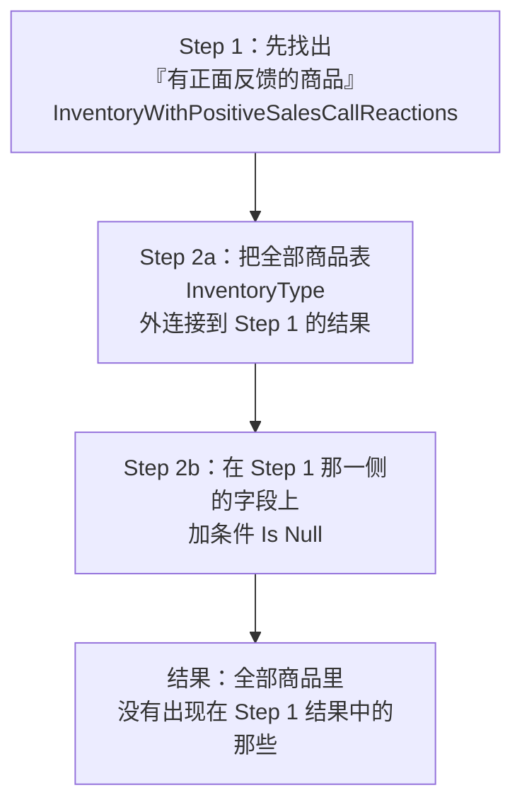

**这个套路有个正式名字：反连接（anti-join）**（💡 笔记补充，讲义未提这个术语）。

**逐步理解它为什么有效**：

1. **外连接之后**，`InventoryType` 的**每一行都在**（六种商品全在）
2. 有正面反馈的商品，右侧 `CustomerReactiontoProduct` **有值**
3. **没有**正面反馈的商品，右侧 `CustomerReactiontoProduct` 是 **Null**（外连接没匹配上）
4. 加条件 `Is Null` → **只留下"右侧为空"的行** = 没有正面反馈的商品

**⚠️ 三个关键点**：

| 点 | 说明 |
|---|---|
| **必须是外连接** | 内连接会直接把"没匹配上"的行扔掉，`Is Null` 就无从筛起（结果永远为空） |
| **`Is Null` 必须加在"右表"的字段上** | 加在左表字段上没意义（左表的字段都有值） |
| **写法是 `Is Null`（两个词），不是 `= Null`** | 见 §2.20.2。`= Null` 永远查不出东西 |

**⚠️ 讲义 p.51 的 `EXISTS` 与这里的 `Is Null` 是一对**：p.51 说 `EXISTS` 取"非空"（但那个写法是错的），p.91 用 `Is Null` 取"空"。**`Is Null` 才是 Access 里真正能用的写法**（p.91 的截图证明了这一点）。

**⭐ 这一页把 W6 接回了 M05 的销售拜访**

`SalesCallReactions` 这个数据从哪来？

**M05 §2.14.1**：**销售拜访（Sales Call）是内部发起的起因事件** —— 销售代表打电话或上门向客户介绍产品。

**"客户对产品的反应（CustomerReactiontoProduct）"是销售拜访的一个属性** —— 更准确地说，它是 **Proposition 关联（销售拜访 ↔ 产品）的关联属性**（M05 §2.10.5）：这次拜访推了哪几款产品，客户对每一款的反应如何。

⚠️ **传统会计系统里绝对没有这个数据。** 销售拜访不转移任何资源，不影响会计等式，复式记账不记它。**但 REA 记。** 所以 REA 数据库可以回答：

> **"哪些产品，我们推了但从来没人说好？"**

**这个问题的商业价值极高**：它区分了两种滞销：

| 滞销类型 | 表现 | 应对 |
|---|---|---|
| **推了但没人喜欢** | 有拜访记录，但反应不正面 | **产品问题** → 改产品或下架 |
| **压根没推过** | 连拜访记录都没有 | **销售问题** → 加强推广 |

⚠️ **单看销量（p.88）分不出这两种。** 必须结合销售拜访数据才分得出。**这就是 M04 说的"REA 保留了传统系统丢掉的信息"的最具体的价值。**

**💡 换个说法（笔记补充）**

这个套路可以套用到无数会计场景：

| 问题 | 左表（全保留） | 右表（找 Null） |
|---|---|---|
| 哪些客户从没下过单 | Customer | Sale |
| 哪些销售员一单没开 | Salesperson | Sale |
| 哪些订单还没发货（**在手订单**） | SaleOrder | Sale |
| 哪些发票还没收款（**应收账款明细**） | Sale | CashReceipt |
| 哪些供应商今年没合作过 | Supplier | Purchase |
| 哪些固定资产没做过盘点 | FixedAsset | InventoryCount |

**全部是同一个模板**：`左表 LEFT JOIN 右表 ON 关联字段 WHERE 右表某字段 IS NULL`。

⚠️ **这可能是本讲最实用、最该背下来的一个技术套路。**

---

#### 2.24.7 每个销售员的拜访次数（讲义 p.92）

⚠️ **讲义 p.92 有一张截图 + 一个蓝底说明**。视觉复核结果：

**页面标题**：*"Query for **number of sales calls made by each salesperson** during a time period"*
**蓝底说明条**：*"Result for **May 1-15, 2015**"*

**截图：运行结果**（窗口标题 `SalesRepCountofSalesCallsforTimePeriod`）

| SalesRepID | Name | CountOfSalesCallID |
|---|---|---|
| E23 | Jimmy Vitale | **2** |
| E26 | Cyndie North | **1** |
| **E30** | **Wyland Stindt** | **0** ⭐ |

⚠️ **讲义只给了结果，没有给设计视图。** 见 [[#9.3 课件自身的问题|§9.3]]。

**⭐ 这一页最关键的一个数字：E30 的 `0`**

**这个 0 是怎么来的？**（💡 笔记推断，讲义未解释，但这是本页唯一的技术难点）

如果用**内连接** + `Count`：
- E30 在 SalesCall 表里**一条记录都没有**
- 内连接会把 E30 **整行扔掉**
- 结果只有 **2 行**（E23、E26），**E30 消失**

**要得到 `0`，必须同时满足两个条件**：

| 条件 | 为什么 |
|---|---|
| ① **用外连接** | 保证 E30 这一行留在结果里 |
| ② **`Count` 的对象是右表的一个字段**（这里是 `SalesCallID`），**不是 `Count(*)`** | `Count(字段)` **忽略 Null**，E30 那一行右侧全是 Null → 计数为 **0**；而 `Count(*)` 数行数，E30 那一行会被数成 **1** ❌ |

**这是 §2.21 那条"聚合函数忽略 Null，但 `COUNT(*)` 不忽略"规则的完美应用。**

| 写法 | E30 的结果 | 对不对 |
|---|---|---|
| 内连接 + `Count(SalesCallID)` | **不出现** | ❌ |
| 外连接 + `Count(*)` | **1** | ❌ **严重错误：说他拜访了 1 次** |
| **外连接 + `Count(SalesCallID)`** | **0** | ✅ |

⚠️ **结果列名 `CountOfSalesCallID` 证实了用的是 `Count([SalesCallID])`**（Access 自动命名规则：`函数名Of字段名`）。**所以讲义的做法是对的**——只是它没有解释为什么必须这么做。

💡 **这个细节值得单独记住：`Count(*)` 和 `Count(字段)` 在外连接场景下会给出完全不同的答案。** 这是 SQL 面试里的经典问题，也是本讲最深的一个技术点。

**⭐ 为什么 E30 的 0 是本页的全部意义**

**"哪个销售员一次拜访都没做"，正是管理层最想知道的事。**

| 如果 E30 消失了 | 后果 |
|---|---|
| 报表上只有 E23 和 E26 | 看起来"所有销售员都在工作" |
| 平均拜访次数 = (2+1)/2 = **1.5** | **虚高**（真实是 (2+1+0)/3 = **1**） |
| E30 的绩效问题**永远不会被发现** | 内控失效 |

⚠️ **这与 §2.24.3（滞销品）、§2.24.6（无反馈商品）是同一个道理的三次重复**：

> **管理报表最重要的往往是"零"那一行，而"零"恰恰是内连接会删掉的那一行。**

**这三页（p.88、p.91、p.92）合起来，是全讲对"为什么必须懂外连接"最有力的论证。**

**为什么这个查询有会计/内控意义**

| 视角 | 用途 |
|---|---|
| **绩效管理** | 拜访次数是销售人员的过程指标（结果指标是销售额） |
| **内控** | 有销售额但零拜访 → **可疑**（订单从哪来的？是否有关联交易/回扣？） |
| **成本分摊** | 销售费用按拜访次数分摊到产品线 |
| **REA 的价值** | ⚠️ **拜访次数在传统会计系统里完全不存在**——它不产生分录 |

**⚠️ 时间范围的作用**

蓝底说明写的是 "May 1-15, 2015"（半个月）。所以查询里一定有一个 `WHERE SalesCallDate BETWEEN #5/1/2015# AND #5/15/2015#`。

⚠️ **但这里有一个隐蔽的陷阱**（💡 笔记补充）：日期筛选条件**必须放在外连接的 `ON` 子句里，而不是 `WHERE` 里**！

- 放 `ON` 里 → E30 保留，计数 0 ✅
- 放 `WHERE` 里 → E30 那行的日期字段是 Null，`Null BETWEEN … ` 结果是 Null → **E30 被筛掉** ❌

**这就是 §2.17.4 讲的"外连接的条件放错地方会退化成内连接"，在这里以更隐蔽的形式再次出现。**

💡 **在 Access QBE 里的正确做法**：先做一个只含日期筛选的子查询（`SalesCallsInPeriod`），再把 `Salesperson` 外连接到它。**这也解释了为什么本段的每个查询都是分步做的**——分步不只是为了清晰，**是为了让筛选条件作用在正确的阶段**。

**所以呢**

七个会计查询全部做完，§2 到此结束——从建库到查询、从关系代数到 SQL 到 QBE、从抽象规则到七个真实的会计问题，整讲的内容都已展开完毕。下面用几张图把全讲的框架收束一遍。

---

## 3. 一图看懂

### 图 1 · 从 REA 概念模型到能跑的数据库：三条转换规则

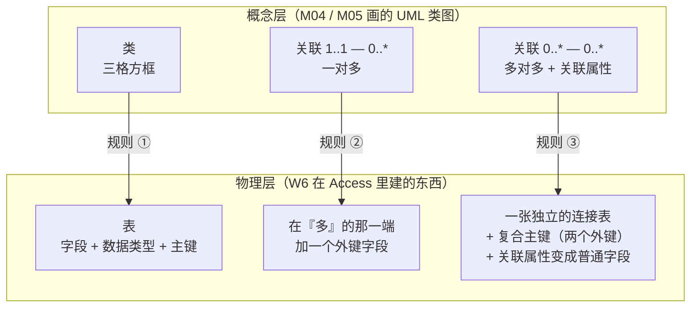

**这张图是本讲第一大段（p.2–28）的全部内容。**

⚠️ **规则 ③ 的三个产物缺一不可**：只建表不设复合主键 → 允许重复；不把关联属性搬进来 → 那个属性无处可放。

---

### 图 2 · 三种查询语言的对应关系

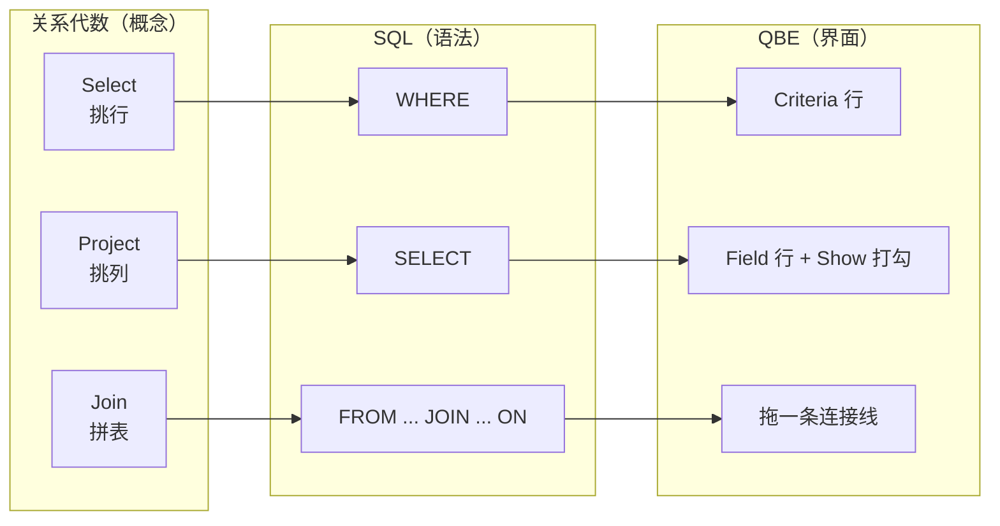

⚠️ **图里最需要盯住的一条**：**关系代数的 `Select` → SQL 的 `WHERE`**，而 **SQL 的 `SELECT` → 关系代数的 `Project``**。**两个体系里 "select" 一词的含义是错位的。**

---

### 图 3 · 连接类型决定了"零"会不会出现

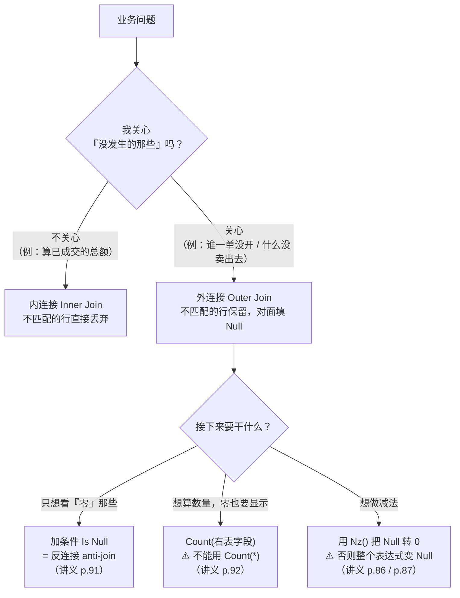

**这张图串起了讲义 p.36、p.38、p.86、p.87、p.88、p.91、p.92 七页。** 如果本讲只能记一张图，记这张。

---

## 4. 速查表

### 4.1 概念模型 → 表结构 转换速查

| 类图上的东西 | 落到 Access 里变成什么 | 讲义页 |
|---|---|---|
| 类（三格方框） | 一张**表** | p.9–p.12 |
| 类的属性 | 表的**字段**（Field Name） | p.7 |
| 类的标识属性 | **主键**（钥匙图标） | p.14 |
| `1..1 — 0..*` 关联 | 在"多"端加一个**外键字段** + 建一条关系 | p.19–p.22 |
| `0..* — 0..*` 关联 | **一张连接表** + **复合主键**（两个外键） + 两条一对多关系 | p.24–p.28 |
| 关联属性 | 连接表里的**普通字段** | p.24, p.26 |
| 关联的名字 | 💡 建议直接用作连接表的表名（如 `Sale-CashRecDuality`） | p.33 |

### 4.2 数据类型选择速查（讲义 p.10 的规则）

| 字段像什么 | 选什么 | 例 |
|---|---|---|
| 日期 | **Date/Time** | SaleDate、OrderDate |
| 要做算术的钱 | **Currency** | Amount、Balance、ListPrice |
| 要做算术但不是钱 | **Number** | Quantity、Credits |
| **其余一切** | **Text** | SaleID、CustomerNumber、Telephone、邮编、发票号 |

⚠️ **判据是"用不用来计算"，不是"长得像不像数字"。**
⚠️ 字段名避开保留字：`Date`、`Name`、`Value`、`Time`、`Count`、`Sum`、`Order`、`Group`、`Key`（讲义只点了 `Date`）

### 4.3 三种查询语言写法对照

| 要做的事 | 关系代数 | SQL | QBE |
|---|---|---|---|
| 挑列 | `Project 表 Over (列…)` | `SELECT 列…` | Field 行拖字段 + Show 打勾 |
| 挑所有列 | —— | `SELECT *` | 拖 `*`，或把字段全拖进来 |
| 挑行 | `Select 表 Where 条件` | `WHERE 条件` | Criteria 行填条件 |
| 指定表 | （算子的操作数） | `FROM 表…` | 上半屏拖表进来 |
| 内连接 | `Join A, B Where A.k=B.k` | `FROM A, B WHERE A.k=B.k` 或 `FROM A INNER JOIN B ON A.k=B.k` | 两表间拖连接线（默认内连接） |
| 左外连接 | `Left Outer Join A, B Where …` | `FROM A LEFT JOIN B ON A.k=B.k` | 双击连接线 → Join Properties → 选项 2 |
| AND | —— | `WHERE a AND b` | **两个条件写同一行** |
| OR | —— | `WHERE a OR b` | **两个条件写不同行** |
| 聚合 | —— | `SUM(x)` + `GROUP BY` | 点 Σ → Total 行选 `Sum` / `Group By` |
| 只筛不显示 | —— | `WHERE`（而非 `HAVING`） | Total 行选 **`Where`** + 取消 Show |
| 横向计算 | —— | `表达式 AS 别名` | Field 行写 **`别名: 表达式`** |

### 4.4 运算符速查

| 类别 | 运算符 | 说明 | 讲义页 |
|---|---|---|---|
| **比较** | `=` `<` `<=` `>` `>=` `<>` | `<>` = 不等于（有些软件写 `!=`）；**日期、文本也能比大小** | p.45 |
| **逻辑** | `AND` `OR` `NOT` | AND = 交集（变少）；OR = 并集（变多） | p.48 |
| **范围** | `BETWEEN a AND b` | ⚠️ **两个端点都包含** | p.49 |
| **空值** | `IS NULL` / `Is Null` | 取"空的" | p.50, p.91 |
| **非空** | `IS NOT NULL` ⚠️（讲义写的 `EXISTS` 是错的） | 取"非空的"。**注意 `0` 算非空** | p.51 |
| **聚合** | `COUNT` `AVG` `SUM` `MIN` `MAX` | ⚠️ 除 `COUNT(*)` 外**全部忽略 Null** | p.52 |
| **空值转换** | `Nz(x)` / `Nz(x, 替代值)` | Access 专用。标准 SQL 用 `COALESCE(x,0)` | p.86, p.87 |
| **日期差** | `DateDiff("d", 早, 晚)` | 返回相差天数 | p.90（推断） |

### 4.5 字面量写法速查（考试最容易丢分的地方）

| 值的类型 | Access 写法 | 例 | 写错会怎样 |
|---|---|---|---|
| **文本** | **双引号** | `="C-2"`、`<>"E-10"` | 被当成参数名，**弹窗问你** |
| **数字** | **不加任何符号** | `>=50000` | 写 `$50,000` 会解析失败 |
| **日期** | **两个 `#` 包起来，要带年份** | `<#7/31/2014#` | 写 `<7/31/2014` 会被当成除法 |
| **表/字段名带空格** | **方括号** | `[Cash Receipt]`、`[Grade Earned]` | 语法错误 |
| **多表时指明字段归属** | `表名.字段名` | `Customer.SP#` | 字段重名时报"歧义" |

### 4.6 ⚠️ Null 行为速查（本讲最容易考的细节）

| 场景 | 行为 | 后果 |
|---|---|---|
| `Null = Null` | 结果是 **Null**，不是 True | **`WHERE x = NULL` 永远查不出东西**，必须用 `IS NULL` |
| `Null >= 50000` | 结果是 Null | WHERE 只留 True → **该行被排除** |
| `5 + Null` | **Null** | 算术表达式被"传染" → **用 `Nz()`** |
| `SUM(1, Null, 3)` | **4** | 聚合忽略 Null |
| `SUM(空集合)` | **Null**（不是 0） | ⚠️ **这才是 p.86 那道题的真正原因** |
| `AVG(1, Null, 3)` | **2**（分母是 2 不是 3） | **平均值会被高估/低估** |
| `COUNT(*)` | 数**行数**，Null 行也数 | 外连接场景下**会把"零"数成"一"** |
| `COUNT(字段)` | 只数**非空值** | ✅ 外连接场景下应该用这个（p.92） |
| `NOT (x = "A")` | x 为 Null 时结果是 Null | **不会**返回 Null 的行 |
| 外连接不匹配的行 | 右表所有字段 = **Null** | 这是 `Is Null` 反连接的基础（p.91） |

### 4.7 QBE 网格六行速查

| 行 | 作用 | 关键点 |
|---|---|---|
| **Field** | 放字段或计算表达式 | 计算写成 `别名: 表达式`，字段名加 `[ ]` |
| **Table** | 该字段来自哪张表 | 拖进来自动填 |
| **Sort** | 排序 | ⚠️ **不写就没有确定顺序**（p.66 的行序就与 p.37 不同） |
| **Show** | 结果里显不显示 | 选了 Total=`Where` 的列**必须**取消勾选 |
| **Criteria** | 第一组条件 | **同一行 = AND** |
| **or** | 第二组条件 | **不同行 = OR** |
| **Total**（点 Σ 才出现） | 每列做什么聚合 | `Group By`（默认）/ 9 个聚合函数 / **`Where`**（只筛不输出）/ `Expression` |

### 4.8 七个会计查询速查（讲义 p.86–p.92）

| # | 讲义页 | 问题 | 技术要点 | 会计意义 | 结果 |
|---|---|---|---|---|---|
| 1 | p.86 | 应收账款余额 | **`Nz()`** + 三个聚合查询相减 | 资产负债表**资产**项 | $8,315 |
| 2 | p.87 | 应付账款余额 | 同上，结构对称 | 资产负债表**负债**项 | $6,340 |
| 3 | p.88 | 畅销/滞销存货 | **外连接**（否则零销售的商品消失） | 存货管理、跌价准备 | 见 §2.24.3 |
| 4 | p.89 | 加权平均单位成本 | 先聚合**再**相除（顺序决定"加权"） | ⚠️ **不能用于财报** | \$20 / \$54.25 / \$10 |
| 5 | p.90 | 平均订单履行天数 | `DateDiff` + Total 选 `Avg` | 只有 REA 算得出（传统系统不记订单） | 2.5 天 |
| 6 | p.91 | 无正面反馈的存货 | **外连接 + `Is Null`**（反连接） | 区分"推了没人要"与"压根没推" | 讲义未给结果 |
| 7 | p.92 | 每人销售拜访次数 | 外连接 + **`Count(字段)`** 而非 `Count(*)` | 绩效与内控；零拜访必须显示 | E23=2, E26=1, **E30=0** |

---
## 5. 双语术语卡

> 英文定义优先用讲义原句（标 *斜体* 的是讲义原文）。考试用英文作答，中文只是理解的脚手架。

### 5.1 建库部分（讲义 p.2–p.28）

| 中文 | English | 考试可用的英文定义 | 首现 |
|---|---|---|---|
| 数据表视图 | Datasheet View | The default view when a new table is opened; *"assumes you want to create table simply by entering data."* | §2.2.1 |
| 设计视图 | Design View | *"gives you control over all choices that need to be made during table creation, such as specifying data types and field properties for each attribute in the table."* | §2.2.1 |
| 数据类型 | Data Type | *"determines what kind of data values may be entered into a database table's column"* (text, number, currency, date/time…) | §2.2.2 |
| 字段属性 | Field Property | Additional settings for a field: *"field size, customized format, default value, validation rules, or a specification as to whether the field is required to contain data."* | §2.3.3 |
| 表设计网格 | Table Design Grid | Section 1 of design view; *"shows the overall layout of the table"* — field name, data type, description | §2.3.2 |
| 字段属性面板 | Field Properties Panel | Section 2 of design view; shows properties of the currently selected field only | §2.3.3 |
| 保留字 | Reserved Word | A word already used by the DBMS itself (e.g. `Date` is a built-in Access function), which must not be used as a field name | §2.4.1 |
| 主键 | Primary Key | The attribute (or set of attributes) that uniquely identifies each row of a table; shown by a **key symbol** in the grey box to the left of the field | §2.4.3, §2.4.4 |
| 外键 | Foreign Key | An attribute in one table whose values are primary-key values of another table | §2.4.3 |
| 参照完整性 | Referential Integrity | *"for a data value entered … as a foreign key to be acceptable, it must either be **null** or it must **match exactly** a data value in the \[primary key\] field in the \[referenced\] table."* | §2.4.3 |
| （属性即值的一部分） | — | *"The data type or field property **are part of the value of the data**"*; *"if the properties of two fields are different, then Access considers the values in those fields to be different even if the content is the same."* | §2.4.3 |
| 强制参照完整性 | Enforce Referential Integrity | The Access checkbox that actually activates the referential-integrity constraint on a relationship | §2.5.2 |
| 级联更新相关字段 | Cascade Update Related Fields | *"if you change the value of a primary key … then you want the corresponding posted foreign key values to also be changed"* | §2.5.2 |
| 级联删除相关记录 | Cascade Delete Related Records | Deleting a parent row also deletes all its child rows. ⚠️ Unchecked in the slide; deleting economic events destroys the audit trail | §2.5.2 |
| 关系布局 | Relationship Layout | The Access window (Database Tools → Relationships) where foreign keys are declared by dragging | §2.5.1 |
| 一对多符号 | The "1" and "∞" symbols | *"seem to be multiplicities, but they are **not exactly the same concept**"*; they show *"how many times the same data value can be stored in that field of the table to which the symbol is connected."* | §2.5.4 |
| 复合主键（连接主键） | Concatenated / Composite Primary Key | A primary key made of two or more fields; in an association table it is *"formed from **posting** two different class' primary keys into an association table"* | §2.6.2 |
| 连接表（关联表） | Association / Junction Table | The extra table created to represent a many-to-many association; the association attributes become ordinary fields of this table | §2.6.1 |

### 5.2 查询部分（讲义 p.29–p.53）

| 中文 | English | 考试可用的英文定义 | 首现 |
|---|---|---|---|
| 查询 | Querying | *"asking questions about the data in the database and manipulating or combining the data in different ways"* | §2.7.2 |
| 关系代数 | Relational Algebra | A set of three main operators (Select, Project, Join) that *"provides the **conceptual basis** for SQL and QBE"* | §2.8 |
| 选择（关系代数） | Select | *"includes only certain **rows** from a database table in its 'answer'"* | §2.9 |
| 投影 | Project | *"includes only certain **columns** from a database table in its 'answer'"* | §2.9 |
| 连接 | Join | *"combines two or more database tables on the basis of one or more **common attributes**"* | §2.9 |
| 内连接 | Inner Join | *"includes **only the records from both tables that have the exact same values** in the fields that are joined"* | §2.13 |
| 外连接 | Outer Join | *"includes **all records from one table**, and matches those records from the other table for which values in the joined fields are equal"* | §2.13 |
| 左外连接 / 右外连接 | Left / Right Outer Join | Which table keeps all its rows: the left one or the right one | §2.13 |
| 笛卡尔积 | Cartesian Product | 💡 The result of joining two tables **without** a join condition: every row of A paired with every row of B | §2.14 |
| 结构化查询语言 | SQL (Structured Query Language) | *"The user enters commands according to a pre-defined syntax to retrieve desired data."* Structure: `SELECT attribute name(s) / FROM table name(s) / WHERE criteria is met;` | §2.8, §2.16.1 |
| 示例查询 | QBE (Query By Example) | *"The user starts with a sample of the table(s) columns and **marks the fields** he or she wants to include in the answer. Defaults are available for summarizing and manipulating the data."* | §2.8 |
| 通配符 | Wild card | *"`*` is a wild card indicating **all columns** should be included"* | §2.17.1 |
| 数学比较运算符 | Mathematical Comparison Operators | `=`, `<`, `<=`, `>`, `>=`, `<>` (not equal to, *"or `!=` in some software"*); *"typically included in the WHERE clause … and may be used on **all types of fields**"* | §2.18.1 |
| 逻辑运算符 | Logical Operators | *"**AND** accomplishes a **set intersection**"*; *"**OR** accomplishes a **set union**"*; *"**NOT** identifies instances that do not meet one or more conditions"* | §2.19 |
| 范围运算符 | BETWEEN | *"used to define the range limits"*; *"the **end points of the range are included**"* | §2.20.1 |
| 空值 | Null | The absence of a value; **not** zero and **not** an empty string | §2.20.2 |
| 空值判定 | IS NULL | *"used to retrieve attributes for which the value is null"* | §2.20.2 |
| 非空判定 | (讲义写 `EXISTS`；正确写法 `IS NOT NULL`) | *"used to retrieve attributes for which the value is **not** null"* ⚠️ 讲义的 `EXISTS` 写法在 Access 里不成立 | §2.20.2 |
| 聚合函数 | Aggregation Function | *"summarizes the data values **within a field (column)**"* | §2.21 |
| 计数 / 平均 / 求和 / 最小 / 最大 | COUNT / AVERAGE (Avg) / SUM / MIN / MAX | See §2.21 for the slide's definitions of each | §2.21 |
| 横向计算 | Horizontal Calculation | *"'Horizontal' calculations mathematically **combine values from different fields for each row**"* | §2.22 |

### 5.3 QBE 与会计查询部分（讲义 p.54–p.92）

| 中文 | English | 考试可用的英文定义 | 首现 |
|---|---|---|---|
| 查询网格 | Query Grid | The lower half of the query design view: Field / Table / Sort / Show / Criteria / or (and Total after clicking Σ) | §2.23.0 |
| 条件行 | Criteria row | Where selection conditions go. *"Enter selection criteria on **same line** to accomplish logical 'AND'"*; *"on **separate lines** to accomplish logical 'OR'"* | §2.23.6, §2.23.7 |
| 汇总行 | Total row | Added by clicking the **summation symbol (Σ)**; *"used for aggregations"*. *"Total line defaults to '**Group By**' for each field"* | §2.23.8 |
| 分组 | Group By | Groups rows by the values of that column; one output row per group | §2.23.8 |
| Where（Total 行选项） | Where | Marks a column as **filter-only**: it takes part in the WHERE clause but not in the output or the grouping. Its Show box must be unchecked | §2.23.8 |
| 空值转零函数 | `Nz()` | Access function converting Null to 0 (or to a supplied substitute). Standard-SQL equivalent: `COALESCE(x, 0)` | §2.24.1 |
| 资产负债表日 | Balance Sheet Date | The single point in time as of which balance-sheet amounts are reported (queries named `…ThroughBSDate` / `…OnBalanceSheetDate`) | §2.24.1 |
| 汇款通知 | Remittance Advice | 💡 The document a customer sends with a payment stating which invoices it settles; its number is the primary key of the CashReceipt table | §2.10.1 |
| 佣金率 | Commission Rate | 💡 The percentage of sales paid to a salesperson as compensation | §2.10.1 |
| 支票账户 / 汇票账户 | Checking / Draft (account type) | 💡 Two kinds of bank account in the Cash table | §2.10.1 |
| 行项目金额 | Line Item Extension | Quantity × actual unit price for one line of a sale or purchase; abbreviated `ExtSaleAmt` / `LineItemExtension` in the slides | §2.22, §2.24.3 |
| 加权平均单位成本 | Weighted Average Unit Cost (WAUC) | *"Divide total line item extensions by total purchase quantities for each item"* ⚠️ *"**not for Financial Statement use**"* | §2.24.4 |
| 订单履行天数 | Days to Fill (a sale order) | Days between the sale-order date and the sale (shipment) date | §2.24.5 |
| 反连接 | Anti-join | 💡 Outer join + `Is Null` on the right table — *"use 'Is Null' operator to identify those **without** positive reactions"* | §2.24.6 |
| 客户对产品的反应 | Customer Reaction to Product | An attribute recorded on a sales call (instigation event); ⚠️ does not exist in a traditional double-entry system | §2.24.6 |

---

## 6. 考点预判与答题框架

### 6.1 可信度分级

| 级别 | 含义 | 本讲数量 |
|---|---|---|
| 🔴 教授明示 | 转录里教授明确说过会考 / 要记 —— **必须引用原话** | **0 条** |
| 🟡 CILO 反推 | 对应课程官方 CILO，口径上必须考核 | **7 条** |
| ⚪ 笔记推断 | 根据内容重要性、页数分配、题型惯例的判断 | **11 条** |

> ⚠️ **本讲无转录，🔴 级为 0 是硬约束**（[[对抗自检清单]] 第 7 项）。
> ⚠️ 本课的 CILO **没有分配权重**（官方目录与 Outline 的 Weighting 列都是空的），所以 🟡 级无法按百分比排序。
>
> 🎙️ **唯一与本讲相关的教授原话**（W1 转录 `13:28`）：*"the midterm test in Week 7 will cover the content from **Week 1 to Week 5**."* —— **本讲不在期中考范围**，但页数是全课之最（92 页），**期末大概率考**。

### 6.2 考点清单

| 可信度 | 考点 | 依据 | 对应小节 |
|---|---|---|---|
| 🟡 | **把一张 REA 类图转换成表结构**：说清一对多变外键、多对多变连接表+复合主键、关联属性归入连接表 | 课程官方 CILO 涉及"设计并实现会计信息系统"；讲义用 p.19–p.28 共 10 页专讲 | §2.5、§2.6 |
| 🟡 | **表间关系 vs 类间关系的区别** | 讲义 p.28 用**整整一页的标题**提出这个对比 | §2.6.4 |
| 🟡 | **关系代数三算子的定义与应用**（Select / Project / Join） | 讲义 p.31 说它 *"provides the conceptual basis for SQL and QBE"*；p.32–p.38 七页展开 | §2.9、§2.11–§2.15 |
| 🟡 | **SQL 三段式与关系代数的对应**：`SELECT`=Project、`WHERE`=Select | 讲义 p.40 **整页只讲这一件事** | §2.16.2 |
| 🟡 | **内连接与外连接的区别及选用** | 讲义 p.36 专页定义；p.38、p.88、p.91、p.92 四处实战 | §2.13 |
| 🟡 | **QBE 里 AND 与 OR 的摆放**：同一行 / 不同行 | 讲义 p.74、p.77 用**红色箭头批注**专门强调，是全讲仅有的两处这种强调 | §2.23.6、§2.23.7 |
| 🟡 | **用查询算出应收账款 / 应付账款余额** | 讲义 p.86、p.87；这是全讲唯一直接连回 M01 会计等式的内容 | §2.24.1、§2.24.2 |
| ⚪ | **数据类型选择规则**（讲义 p.10 的 rule of thumb） | 一条可以原样背诵的判据，非常适合出选择题/填空题 | §2.4.1 |
| ⚪ | **`Date` 是保留字，字段要改名 `SaleDate`** | 讲义 p.11 专门用括号强调 | §2.4.1 |
| ⚪ | **参照完整性的两种合法情形**（Null 或精确匹配） | 讲义 p.13 原句，措辞很像标准答案 | §2.4.3 |
| ⚪ | **Access 的 `1`/`∞` 与 UML 多重度不是一回事** | 讲义 p.23 整页；很适合出简答题 | §2.5.4 |
| ⚪ | **`BETWEEN` 端点包含** | 讲义 p.49 特别标出；p.75 与 p.84 恰好构成"排除端点 vs 包含端点"的对照 | §2.20.1、§2.23.8 |
| ⚪ | **`IS NULL` vs 非空：`0` 不是 Null** | 讲义 p.50/p.51 用同一张 Cash 表演示；BA-9（余额 0）是关键案例 | §2.20.2 |
| ⚪ | **五个聚合函数的定义** | 讲义 p.52 逐条给了英文定义，适合默写 | §2.21 |
| ⚪ | **Total 行为什么要选 `Where` 而不是 `Group By`** | 讲义 p.82 用批注专门讲；是本讲最深的一个操作点 | §2.23.8 |
| ⚪ | **`Nz()` 的作用与必要性** | 讲义 p.86 的黄底「Now it Works!!」说明作者自己踩过坑 | §2.24.1 |
| ⚪ | **加权平均单位成本 "not for Financial Statement use"** | 讲义把这句话写进了 p.89 的**标题**里，是刻意的提醒 | §2.24.4 |
| ⚪ | **外连接 + `Is Null` 找"什么没发生"** | 讲义 p.91 的蓝底说明把这个套路讲得非常明确 | §2.24.6 |

### 6.3 答题框架

#### 框架 A · 「把下面这张类图转换成 Access 表结构」

**三步走，逐条对应**：

```
第 1 步：每个类 → 一张表
  · 表名 = 类名
  · 字段 = 类的属性
  · 主键 = 类的标识属性（画上 🔑）

第 2 步：处理每一条关联
  · 若为 1..1 — 0..*（一对多）
      → 在「多」的那一端加一个外键字段
      → 字段名建议用「被指向表名 + ID」
      → 不需要新表
  · 若为 0..* — 0..*（多对多）
      → 新建一张连接表，表名建议用关联名
      → 放入两个外键
      → 两个外键合起来设为复合主键
      → 关联属性全部搬进这张表，作为普通字段
      → 建两条一对多关系（各自从「一」端指向连接表）

第 3 步：逐条声明约束
  · 每条关系都要 Enforce Referential Integrity
  · Cascade Update：建议勾
  · Cascade Delete：⚠️ 不勾（删除经济事件会破坏审计轨迹）
  · 「必须有」的关联（最小多重度 = 1）：在外键字段的属性里设 Required = Yes
```

**⚠️ 最容易丢分的两处**：① 忘了给连接表设**复合主键**；② 忘了把**关联属性**搬进连接表。

#### 框架 B · 「用关系代数 / SQL / QBE 表达这个查询」

```
第 1 步：读题，圈出三样东西
  · 要哪几列？        → Project / SELECT / Field 行
  · 要哪几行？        → Select / WHERE / Criteria 行
  · 涉及几张表？      → Join / FROM / 上半屏拖表

第 2 步：⚠️ 判断连接类型 —— 这一步决定成败
  问自己：「有没有可能某一侧一条都匹配不上，而那种情况正是答案的一部分？」
  · 是 → 外连接（题目里通常有 "all …" / "any …" / "no …" / "without …" / "never" 等词）
  · 否 → 内连接

第 3 步：判断要不要聚合
  · 题目问「总数 / 平均 / 最多 / 最少 / 有几个」→ 要聚合
  · 要按什么分组？→ Group By 那一列
  · 只用来筛选、不进结果的列 → Total 选 Where + 取消 Show

第 4 步：写出来，逐项检查字面量格式
  · 文本 → 双引号     · 数字 → 裸写
  · 日期 → #…#，带年份 · 带空格的名字 → 方括号

第 5 步：⚠️ Null 自检
  · 会不会有 Null 参与算术？→ 套 Nz()
  · 要数「零」吗？→ 用 Count(字段) 不用 Count(*)
  · 要找「没发生的」吗？→ 外连接 + Is Null
```

#### 框架 C · 「解释为什么 REA 数据库能回答这个问题而传统总账不能」

**四段式**：

```
① 指出这个问题需要什么数据
   例：订单履行天数需要「下单日期」

② 说明传统复式记账为什么没有这个数据
   · 复式记账只记「影响会计等式、且能用货币计量」的事项（M01 货币计量假设 + M02 复式记账）
   · 下单不转移任何资源 → 不影响会计等式 → 不产生分录 → 数据根本不存在

③ 说明 REA 为什么有
   · REA 记录全部业务事件：起因 / 承诺 / 经济 / 冲销（M05 扩展模型）
   · 销售订单是「承诺事件」，有自己的表和日期字段

④ 说明怎么查出来
   · 通过 Fulfillment 关联连接 SaleOrder 与 Sale
   · DateDiff("d", OrderDate, Date) → 再取 Avg
```

**⚠️ 可以套用这个框架的题目**：订单履行天数（p.90）、销售拜访次数（p.92）、客户产品反馈（p.91）、在手订单、每笔销售的实际售价（p.33 的 `Actual Price`）。

#### 框架 D · 「这个查询结果对吗？」（找错题）

**按这个顺序查，命中率最高**：

| 顺序 | 查什么 | 典型症状 |
|---|---|---|
| 1 | **连接类型选错** | 结果行数比预期少；"零"那些行不见了 |
| 2 | **忘了写连接条件** | 结果行数暴增（= 两表行数相乘） |
| 3 | **Null 传染** | 某一列全空，或某个计算结果空白 |
| 4 | **多拖了字段进聚合查询** | 本该 1 行的结果变成了很多行 |
| 5 | **`Count(*)` 用在外连接上** | "零"被数成了 1 |
| 6 | **端点边界** | `<` 与 `<=`、`BETWEEN` 包不包端点 |
| 7 | **字面量格式** | 弹出参数输入框；日期被当成除法 |
| 8 | **没写 Sort** | 顺序与预期不同（但数据本身对） |

---

## 7. 自测

**概念题**

**1.** 讲义 p.13 说 *"The data type or field property are part of the value of the data"*。请解释这句话，并说明它对建立外键关系有什么实际后果。

<details><summary>答案</summary>

**含义**：Access 判断两个字段里的值是否"相等"时，不仅比较你看到的字符内容，**还比较数据类型和字段属性**。内容相同但类型不同的两个值，Access 认为它们**不相等**。

**对外键的后果**：外键字段与它指向的主键字段**必须类型一致**，否则 Access 会拒绝建立关系（报 type mismatch）。例如 `Sale.Salesperson` 是 Text 而 `Salesperson.SalespersonID` 是 Number，`123456` 与 `123456` 无法匹配。

**这就是讲义 p.16 要求"建 Salesperson 表时不要改数据类型或任何字段属性"的原因** —— 保持两边都是默认的 Text(255)，才能保证完全一致。

</details>

**2.** 讲义 p.23 说 Relationship Layout 上的 `1` 和 `∞` *"seem to be multiplicities, but they are not exactly the same concept"*。这两者到底有什么区别？举一个能证明它们不同的例子。

<details><summary>答案</summary>

**区别**：

| | UML 多重度 | Access 的 1 / ∞ |
|---|---|---|
| 数什么 | 一个**对象实例**最少/最多连着对面几个实例 | 同一个**数据值**能在这个字段里出现几次 |
| 写在哪一端 | **对面**（描述 A 的数字写在 B 旁） | **自己这一端** |
| 能不能表达"最少几个" | 能（`1..1` 的最小值 1） | **不能**，只有"能不能重复"两档 |

**反例**：业务规则「每笔销售必须有销售员」，UML 写 `1..1`（最小 1）。但在 Access 的关系布局上，它显示的仍然是 `1 —— ∞`，与"销售员可以没有"的情形**看起来一模一样**。要表达"必须有"，必须另外去字段属性里把 `Required` 设成 `Yes`。

**结论**：UML 的一个 `1..1`，在 Access 里要**拆成两处设置**——关系管"最多"，字段属性管"最少"。

</details>

**3.** 为什么 `0..* — 0..*` 的关联在关系数据库里必须拆成一张单独的表？不拆会怎样？

<details><summary>答案</summary>

**不拆的两条路都走不通**：

- **把对方的键塞进自己表里**：一个学生修五门课就要五个 `CourseID` 字段，第六门课就没地方放了 → **重复组（repeating group）违规**，表结构要随业务改。
- **一个组合一行、全塞进一张表**：学生姓名地址被重复存多遍 → **冗余（redundancy）违规**，改一处漏一处就数据不一致；而且 `StudentID` 不再唯一，**主键没了**。

**拆表之后**：学生信息存一份、课程信息存一份、组合信息存在连接表；加课只加一行，不动结构。

**另外，关联属性（如 `grade earned`）没有别的地方可放**：它不属于学生本人（每门课成绩不同），也不属于课程本身（每个学生成绩不同），只属于"这个学生 × 这门课"这个**组合**。

</details>

**4.** 关系代数的 `Select` 和 SQL 的 `SELECT` 是同一件事吗？

<details><summary>答案</summary>

**不是，而且几乎正好错位。**

| | 挑行 | 挑列 |
|---|---|---|
| 关系代数 | **`Select`** | `Project` |
| SQL | `WHERE` | **`SELECT`** |

**SQL 的 `SELECT` 干的是关系代数 `Project` 的活**（讲义 p.40：*"SQL's SELECT component isolates columns — i.e., relational algebra's project"*）；**关系代数的 `Select` 对应 SQL 的 `WHERE`**（*"SQL's WHERE component isolates rows — i.e., relational algebra's select"*）。

**记忆法**：盯着 `SELECT` 后面跟的是什么——跟的是**列名**，所以它挑列。

</details>

**5.** 讲义 p.50 用 `IS NULL` 查出 BA-6、BA-7；p.51 用 `EXISTS`（非空）查出 BA-8 **和 BA-9**。BA-9 的 Balance 是 `0`，为什么它出现在第二个结果里而不是第一个？这在会计上意味着什么？

<details><summary>答案</summary>

**技术上**：`0` 是一个**确切存在的值**，不是 Null。所以 `IS NULL` 查不到它（它不是空），非空条件查得到它（它有值）。

**会计上**，两者含义完全不同：

- **BA-9 余额 = 0**：这个账户**确确实实一分钱都没有**，是一个已知的、正常的业务事实
- **BA-6 余额 = Null**：这个账户的余额**未知/未录入**，是一个**内控缺陷**（该录没录）

**混淆的后果**：把"未知"当成"零"会**少报现金**；把"零"当成"未知"会漏掉一个正常账户。审计上前者是重大错报风险，后者是完整性问题。

</details>

**6.** 什么情况下必须用外连接？给出三个本讲出现过的例子。

<details><summary>答案</summary>

**判据**：当"某一侧一条都匹配不上"这种情况**本身就是答案的一部分**时。

题目里通常有 `all` / `any` / `no` / `without` / `never` 这些词。

**本讲的三个例子**：

1. **p.38**：所有销售 + 任何相关的收款 → S-6、S-7 一分钱没收，用内连接会消失，而它们正是应收账款
2. **p.88**：某期间各商品销售额 → MIN1、TTP12 零销售，用内连接会消失，而"最滞销"问的就是它们
3. **p.91**：没有正面客户反馈的商品 → 用内连接根本查不出"没有"
4. **p.92**：每人销售拜访次数 → E30 零拜访，用内连接会消失，而"谁没干活"正是重点

**一句话**：**内连接回答"发生了什么"，外连接回答"什么没发生"。而会计上"什么没发生"往往更重要**（未收的钱 = 应收账款，未交的货 = 在手订单，未动的货 = 呆滞存货）。

</details>

**案例分析题**

**7.** 用讲义 p.33 的数据，回答：这家公司到 8 月底的应收账款余额是多少？请给出计算过程，并说明为什么 Customer 表里的 `A/R Amt` 列是空的。

<details><summary>参考思路</summary>

**第一步：明确公式**（M01 的应收账款定义）

$$\text{应收账款} = \sum \text{销售金额} - \sum \text{已收款金额}$$

（这个数据集没有销售退回的数据，所以第三项为 0。）

**第二步：从 Sale 表取销售总额**

7,200 + 10,000 + 16,000 + 10,000 + 16,600 + 35,000 + 23,000 = **117,800**

**第三步：从 Sale-CashRecDuality 表取已收款总额**（注意要用 `Applied` 列，不是 CashReceipt 表的 `Amount`）

1,666 + 10,000 + 7,200 + 16,000 + 16,600 + 1,666 = **53,132**

⚠️ **等一下，验算 CashReceipt 表的 Amount 合计**：1,666 + 10,000 + 7,200 + 32,600 + 1,666 = **53,132**。两边一致 ✅（因为 RA-4 的 32,600 = 分摊给 S-3 的 16,000 + 分摊给 S-5 的 16,600）

**第四步：相减**

117,800 − 53,132 = **64,668**

**逐笔明细**（与 §2.15 那张表一致）：

| Sale# | 金额 | 已收 | 未收 |
|---|---|---|---|
| S-1 | 7,200 | 7,200 | 0 |
| S-2 | 10,000 | 3,332 | **6,668** |
| S-3 | 16,000 | 16,000 | 0 |
| S-4 | 10,000 | 10,000 | 0 |
| S-5 | 16,600 | 16,600 | 0 |
| S-6 | 35,000 | 0 | **35,000** |
| S-7 | 23,000 | 0 | **23,000** |
| **合计** | **117,800** | **53,132** | **64,668** ✅ |

6,668 + 35,000 + 23,000 = 64,668 ✅ 两种算法一致。

**第五步：为什么 `A/R Amt` 是空的**

因为在 REA 数据库里，**应收账款不应该被存起来，而应该在需要时从原始事件算出来**：

- 存一个字段 → 每次收款都要记得改它 → **改漏一次数据就永久错了**（M04 讲的冗余）
- 现算 → **永远与原始事件一致**，而且可以按任意维度（客户、销售员、期间）重算，完全可追溯

**这正是讲义 p.86 那个 `AcctsReceivableFinal` 查询在做的事。**

</details>

**8.** 一个学生做了 p.92 那个查询（每个销售员的拜访次数），但结果里只有 E23 和 E26 两行，没有 E30。请诊断可能的原因（至少两个），并说明怎么改。

<details><summary>参考思路</summary>

**可能原因一：用了内连接**

E30 在 SalesCall 表里一条记录都没有，内连接会把整行扔掉。

**改法**：双击连接线 → Join Properties → 选 *"Include ALL records from 'Salesperson' and only those records from 'SalesCall' where the joined fields are equal"*（左外连接）。

**可能原因二：日期筛选条件放在了 WHERE 而不是 ON**

即使用了外连接，如果把 `SalesCallDate BETWEEN #5/1/2015# AND #5/15/2015#` 放在 WHERE 里，E30 那一行的日期字段是 Null，`Null BETWEEN …` 的结果是 Null（不是 True），**该行被筛掉** —— **外连接退化成了内连接**。

**改法**：先做一个只含日期筛选的子查询（`SalesCallsInPeriod`），再把 Salesperson 外连接到它。

**顺带一个不会导致 E30 消失、但会导致答案错误的问题**：如果用 `Count(*)` 而不是 `Count([SalesCallID])`，E30 那一行会被数成 **1** 而不是 0（因为 `Count(*)` 数行数，不看值是不是 Null）。**结果列名 `CountOfSalesCallID` 证明讲义用的是 `Count([SalesCallID])`，是对的。**

</details>

**9.** 你的经理想知道"哪些客户从来没有下过订单"。请设计这个查询（说明用哪些表、什么连接、什么条件），并解释为什么不能用 `WHERE 订单数 = 0`。

<details><summary>参考思路</summary>

**查询设计（反连接套路，与讲义 p.91 完全同构）**：

```
表：  Customer（左，全保留）   SaleOrder（右）
连接：Customer.CustomerID  LEFT OUTER JOIN  SaleOrder.CustomerID
      （双击连接线 → Join Properties → 选项 2）
字段：Customer.CustomerID  ☑Show
      Customer.Name        ☑Show
      SaleOrder.OrderID    ☑Show   Criteria: Is Null
```

**为什么不能用 `WHERE 订单数 = 0`**：

因为**"订单数"这个东西根本不存在**。Customer 表里没有这一列，SaleOrder 表里也没有。你只能通过连接去数——而**一旦用内连接去数，没下过单的客户在被数之前就已经消失了**，`= 0` 这个条件永远匹配不到任何行。

**如果非要用计数的写法**，必须是：

```
外连接 + Total 行：CustomerID 选 Group By，OrderID 选 Count
然后在 Count 那一列加条件 = 0
```

⚠️ 但**必须是 `Count([OrderID])` 而不是 `Count(*)`**（否则没下单的客户会被数成 1，`= 0` 还是匹配不到）。

**两种写法都对，`Is Null` 那种更简单也更不容易错。**

</details>

**10.** 讲义 p.89 的标题里写了 "(not for Financial Statement use)"。请解释为什么这个加权平均单位成本不能用于财务报表，至少给出三条理由。

<details><summary>参考思路</summary>

1. **只算了本期采购，没算期初存货**。真正的加权平均成本法要求 $(\text{期初存货金额} + \text{本期购货金额}) \div (\text{期初数量} + \text{本期购货数量})$；这个查询只有分子分母的后半截。
2. **没有扣除采购退回**。退货应该从分子分母里同时扣掉。
3. **没有包含可归属成本**。会计准则要求运费、关税、保险等计入存货成本，这个查询只用了发票金额。
4. **期间口径随意**。会计上的加权平均有严格规定（移动加权平均 / 全月一次加权平均），不能随便选一个日期区间。
5. **一致性原则**。存货计价方法一经选定不得随意变更；临时跑一个查询算出来的数不能直接入账。

**它的正当用途**：管理参考——了解近期进货成本水平，用于定价、议价、毛利分析。

**一句话总结**：**数据库能算出来的数，不等于会计上能用的数。**

</details>

---

## 8. 讲义页码映射

> **「课堂覆盖」列**：本讲**无转录**，整列写 `—`。
> **「页面性质」列**：🖼️ = 纯图页或图占主体（**已逐页视觉复核**）；📕 = 封面页；🚩 = 章节分隔页；文字 = 可从文本提取拿到全部内容。
> ✅ **全部 92 页在 §2 正文里都有实质讲解**，唯一的例外是 **p.1（封面页）**，已按 [[对抗自检清单]] 第 1 项显式标注。**本讲没有"学习目标页"。**

| 讲义页 | 笔记小节 | 页面性质 | 课堂覆盖 |
|---|---|---|---|
| **p.1** | §2.0 | **📕 封面页**（本讲唯一仅登记不展开的页） | — |
| p.2 | §2.1 | 🚩 章节分隔页（"Construct database using ACCESS"） | — |
| p.3 | §2.2.1、§2.2.2 | 文字 | — |
| p.4 | §2.2.3 | 文字（视觉复核确认无图） | — |
| p.5 | §2.2.3 | 🖼️ 截图 + 3 个批注框 | — |
| p.6 | §2.3.1 | 🖼️ 纯图（Section 1 / Section 2 标注） | — |
| p.7 | §2.3.2 | 文字 | — |
| p.8 | §2.3.3 | 文字 | — |
| p.9 | §2.4（例 1 数据） | 🖼️ 两张表 + 红色外键箭头 | — |
| p.10 | §2.4.1 | 文字（数据类型选择规则） | — |
| p.11 | §2.4.1 | 文字（四个字段的类型 + `Date` 保留字） | — |
| p.12 | §2.4.2 | 🖼️ 纯图（Sale 表设计成品 + 字段属性面板） | — |
| p.13 | §2.4.3 | 文字（⭐ 参照完整性 + "属性是值的一部分"） | — |
| p.14 | §2.4.4 | 文字（设主键 + 删行会丢主键的坑） | — |
| p.15 | §2.4.5 | 文字（"Save / File – Save / Close."）⚠️ **与 p.17 完全相同** | — |
| p.16 | §2.4.6 | 文字（建 Salesperson 表六条指令） | — |
| p.17 | §2.4.6 | 文字 ⚠️ **与 p.15 完全相同（真重复页）** | — |
| p.18 | §2.4.7 | 🖼️ 纯图（数据库窗口，两张表并存） | — |
| p.19 | §2.5.1 | 文字（为什么要显式建关系） | — |
| p.20 | §2.5.2 | 🖼️ **信息密度最高的一页**：三窗口截图 + 4 批注（Edit Relationships 三个复选框） | — |
| p.21 | §2.5.2 | 文字（六条操作说明 + Cascade Update 解释） | — |
| p.22 | §2.5.3 | 🖼️ 纯图（连好之后的 1 —— ∞ 连线） | — |
| p.23 | §2.5.4 | 文字（⭐ `1`/`∞` 不是多重度） | — |
| p.24 | §2.6.1 | 🖼️ UML 类图（`0..*—0..*` + 关联属性 `grade earned`）+ 文字 | — |
| p.25 | §2.6.2 | 文字（Shift 多选设复合主键） | — |
| p.26 | §2.6.2 | 🖼️ **纯图，连标题都没有**（全讲文本最少的一页，2 字符）⚠️ 但它是 p.25 的成果图 | — |
| p.27 | §2.6.3 | 文字（建两条关系） | — |
| p.28 | §2.6.4 | 🖼️ 纯图（⭐ 表间关系 vs 类间关系） | — |
| p.29 | §2.7.1 | 🚩 章节分隔页（"Information Querying using ACCESS"） | — |
| p.30 | §2.7.2 | 文字（查询的定义 + 四种动作） | — |
| p.31 | §2.8 | 文字（三种查询语言） | — |
| p.32 | §2.9 | 文字（Select / Project / Join 定义） | — |
| p.33 | §2.10.1、§2.10.2 | 🖼️ **八张表的完整数据**（已逐格转写 + 一致性验算） | — |
| p.34 | §2.11 | 表 + 关系代数表达式（Select） | — |
| p.35 | §2.12 | 表 + 关系代数表达式（Project）⚠️ 多画了一张无关的 Salesperson 表 | — |
| p.36 | §2.13 | 文字 + 🖼️ **三张 Venn 图**（⚠️ 排版错位，Inner join 的图压在 Outer join 文字上） | — |
| p.37 | §2.14 | 表 + 关系代数表达式（Inner Join） | — |
| p.38 | §2.15 | 表 + 关系代数表达式（Left Outer Join，8 行答案） | — |
| p.39 | §2.16.1 | 文字（SQL 三段式骨架） | — |
| p.40 | §2.16.2 | 文字（⭐ SQL 成分 ↔ 关系代数对应） | — |
| p.41 | §2.17.1 | 表 + SQL（Select）+ 通配符与方括号说明 | — |
| p.42 | §2.17.2 | 表 + SQL（Project） | — |
| p.43 | §2.17.3 | 表 + SQL（Inner Join） | — |
| p.44 | §2.17.4 | 表 + SQL（Outer Join）⚠️ 语句有三处语法错误 | — |
| p.45 | §2.18.1 | 文字（六个比较运算符 + 日期/文本也能比大小） | — |
| p.46 | §2.18.2 | 表 + SQL（Balance >= 50000） | — |
| p.47 | §2.18.3 | 表 + SQL（SalesRep# <> E-10）⚠️ 缺引号 | — |
| p.48 | §2.19 | 文字（AND = 交集 / OR = 并集 / NOT） | — |
| p.49 | §2.20.1 | 表 + SQL（BETWEEN，端点包含） | — |
| p.50 | §2.20.2 | 表 + SQL（IS NULL） | — |
| p.51 | §2.20.2 | 表 + SQL（EXISTS）⚠️ 该写法在 Access 里不成立 | — |
| p.52 | §2.21 | 文字（五个聚合函数的定义） | — |
| p.53 | §2.22 | 文字（横向计算定义）⚠️ **只有定义，一个例子都没有** | — |
| p.54 | §2.23.1 | 🖼️ Show Table 对话框（八张表清单首次完整出现） | — |
| p.55 | §2.23.1 | 🖼️ CashReceipt 已加入，网格空 | — |
| p.56 | §2.23.1 | 🖼️ 六字段已拖入 + 批注"在 CustomerNumber 填 ="C-2"" | — |
| p.57 | §2.23.1 | 🖼️ 条件 `="C-2"` 已填好 | — |
| p.58 | §2.23.1 | 🖼️ **结果**（3 行；⚠️ 日期显示为 2014 年） | — |
| p.59 | §2.23.2 | 🖼️ Show Table，**只选 Customer** | — |
| p.60 | §2.23.2 | 🖼️ Customer 已加入，网格空 | — |
| p.61 | §2.23.2 | 🖼️ 三字段已拖入 + ⭐ **左侧泄露了全部十个查询名** | — |
| p.62 | §2.23.2 | 🖼️ **结果**（5 行） | — |
| p.63 | §2.23.3 | 🖼️ Show Table，**同时选中两张表**（与 p.59 的唯一区别） | — |
| p.64 | §2.23.3 | 🖼️ ⭐ 两表已加入，**连接线自动出现**（1 — ∞） | — |
| p.65 | §2.23.3 | 🖼️ 七字段已全部拖入 | — |
| p.66 | §2.23.3 | 🖼️ **结果**（5 行；⚠️ 行序与 p.37 不同；佣金率显示为 10%/12%） | — |
| p.67 | §2.23.4 | 🖼️ Show Table，选 Cash | — |
| p.68 | §2.23.4 | 🖼️ 两字段 + Criteria `>=50000` | — |
| p.69 | §2.23.4 | 🖼️ **结果**（1 行 BA-8） | — |
| p.70 | §2.23.5 | 🖼️ Show Table，选 Sale | — |
| p.71 | §2.23.5 | 🖼️ 三字段 + Criteria **`<> "E-10"`**（⚠️ 带引号，纠正了 p.47） | — |
| p.72 | §2.23.5 | 🖼️ **结果**（2 行 S-1、S-7） | — |
| p.73 | §2.23.6 | 🖼️ Show Table，选 Sale | — |
| p.74 | §2.23.6 | 🖼️ ⭐ **两条件写同一行 = AND** + 红箭头批注 | — |
| p.75 | §2.23.6 | 🖼️ **结果**（3 行；⚠️ S-5 因 `<` 严格小于被排除） | — |
| p.76 | §2.23.7 | 🖼️ Show Table，选 Sale | — |
| p.77 | §2.23.7 | 🖼️ ⭐ **两条件写不同行 = OR** + 两条红箭头批注 | — |
| p.78 | §2.23.7 | 🖼️ **结果**（6 行；⚠️ S-5、S-6 靠销售员条件入选） | — |
| p.79 | §2.23.8 | 🖼️ Show Table，选 Sale | — |
| p.80 | §2.23.8 | 🖼️ **只拖两个字段** + 批注 "Bring only the fields you need" | — |
| p.81 | §2.23.8 | 🖼️ BETWEEN 条件 + Date 的 Show 已取消 + 指出 Σ 按钮 | — |
| p.82 | §2.23.8 | 🖼️ ⭐ Total 行出现，下拉展开（12 个选项），`Where` 高亮 + 批注 | — |
| p.83 | §2.23.8 | 🖼️ 第二个下拉展开，`Sum` 高亮 | — |
| p.84 | §2.23.8 | 🖼️ **结果**（`SumOfAmount = $52,600.00`，已验算） | — |
| p.85 | §2.24.0 | 🚩 章节分隔页（"Other questions related to an expanded **RAE** model"）⚠️ RAE 应为 REA | — |
| p.86 | §2.24.1 | 🖼️ ⭐ **全讲最重要的一页**：应收账款 + `Nz()` + 黄底「Now it Works!!」 | — |
| p.87 | §2.24.2 | 🖼️ 应付账款（与 p.86 完美镜像，表达式已逐字读出） | — |
| p.88 | §2.24.3 | 🖼️ 两周对比的畅销/滞销存货（外连接） | — |
| p.89 | §2.24.4 | 🖼️ 加权平均单位成本（⚠️ 标题注明 not for Financial Statement use） | — |
| p.90 | §2.24.5 | 🖼️ 平均订单履行天数（`AvgOfDaysToFill = 2.5`） | — |
| p.91 | §2.24.6 | 🖼️ ⭐ 外连接 + `Is Null` 反连接（全讲唯一能看到外连接箭头的截图） | — |
| p.92 | §2.24.7 | 🖼️ 每人销售拜访次数（⭐ E30 = **0**） | — |

> ✅ **全部 92 页已覆盖。**
> **例外声明**：仅 **p.1** 为封面页，只登记不展开（[[对抗自检清单]] 第 1 项允许的两类例外之一）。**本讲无学习目标页。**
> **p.2、p.29、p.85** 三页是章节分隔页，**不属于允许的例外类别**，因此都在正文里有实质讲解（§2.1、§2.7.1、§2.24.0 各自交代了它切分出什么、包含哪些页）。

---

## 9. 延伸与勘误

### 9.1 课件有但课上略过

**本讲无转录，无法判断课堂上略过了什么。**

⚠️ 但有一点可以确定：**本讲是机房上机课**（🎙️ W1 转录 `12:56`：*"that's why we have this computer room so we have that access software"*）。上机课的常见形态是**教师演示 + 学生跟做**，很可能并不逐页讲 PPT。

**因此本笔记对 92 页全部按"课上没讲"处理，逐页完整展开** —— 这正是 [[对抗自检清单]] 第 2 项要求的做法：**课上略过恰恰意味着这部分只能靠笔记学。**

**唯一一处可以论证降低详略的地方**（按第 2 项的要求写出论证）：

**p.15 与 p.17 是完全相同的两页**（"Save / File – Save / Close."）。本笔记在 §2.4.5 完整讲了保存的语义（含 Access 与 Excel 的差别），§2.4.6 末尾只用一句话交代 p.17 是同一内容的重复。**理由**：两页文本一字不差、视觉复核确认无任何图形差异，重复展开只会稀释信息密度。**这不是跳过，是合并。**

### 9.2 课上讲了但课件没有

**本讲无转录，无法比对。**

⚠️ **转录到手后需要重点回填的问题清单**（按优先级排序）：

| # | 待确认的问题 | 为什么重要 |
|---|---|---|
| 1 | **本讲考不考？以什么形式考？** 期末会不会要求手写 SQL / 画 QBE 网格 / 做上机题？ | 92 页是全课之最，但期中不考。**期末的考法完全未知**，直接决定复习策略 |
| 2 | **有没有配套的 Access 文件发下来？** 讲义用的 `Dunn3-SeChapter6Examples.accdb` 与 `Dunn4eChps10-11withqueries.accdb` 学生能不能拿到？ | 上机课如果不给库文件，91 页截图只能看不能练 |
| 3 | **有没有上机作业 / 小测？** | 本讲讲义**一个字都没提作业与截止日期**（已全文检索 deadline / due / submit / assignment），但上机课经常有课堂练习 |
| 4 | **p.53「横向计算」有没有在课上补例子？** | 讲义只给了定义，例子完全缺失（那个 `SaleInventoryLineExtensions` 查询只在 p.61 的列表里出现过名字） |
| 5 | **p.86–p.92 的前置步骤（Step 1–3）课上演示了吗？** | 七个会计查询全部只给了最后一步，中间步骤是本笔记反推的 |
| 6 | **外连接在 QBE 里怎么做，课上演示了吗？** | 讲义 84 页里**从没展示** Join Properties 对话框，但 p.91 的结果显然用了它 |
| 7 | **教授对 `Nz()` 那个黄底「Now it Works!!」说了什么？** | 那是全讲唯一带情绪的标记，很可能对应一段口头解释 |
| 8 | **Access 的版本与语言** | 截图是 Access 2010 英文版；考试/上机用的是哪个版本？菜单位置会变 |

### 9.3 课件自身的问题

> ⚠️ **本课前几讲已累计发现 29 处讲义问题**（M01 九处、M02 九处、M05 十一处）。本讲又发现 **21 处**。
> **信噪比评价**：本讲的**截图部分质量很高**（操作步骤清晰、批注到位），但**文字部分的 SQL 语句错误密集**——如果照着 p.41–p.51 的 SQL 敲进 Access，**六条里有五条跑不通**。

#### A. SQL 语法错误（5 处，最严重的一类）

| # | 页 | 讲义写的 | 应该是 | 后果 |
|---|---|---|---|---|
| 1 | **p.41** | `Where [Customer Number] = C-2;` | `= "C-2"` | 文本值缺引号 → Access 弹参数输入框 |
| 2 | **p.47** | `Where SalesRep# <> E-10;` | `<> "E-10"` | 同上。⚠️ **p.71 的 QBE 截图里是带引号的**，说明作者实操时加了 |
| 3 | **p.49** | `Where Date BETWEEN 7/1 and 7/31;` | `BETWEEN #7/1/2014# AND #7/31/2014#` | 日期缺 `#` 与年份 → 被当成除法运算。⚠️ **p.81 的截图里写法是对的** |
| 4 | **p.51** | `Where Balance EXISTS;` | `Where Balance IS NOT NULL;` | `EXISTS` 在标准 SQL 里是**子查询谓词**，不能这样用。⚠️ **p.91 用的 `Is Null` 才是对的写法** |
| 5 | **p.44** | `From Sale LeftJoin […] Where […]` | `FROM Sale LEFT JOIN […] ON […]` | 三处错：`LeftJoin` 应是两个词；连接条件应用 `ON` 不是 `WHERE`。⚠️ **用 `WHERE` 会让外连接退化成内连接**，讲义给出的 8 行答案与它自己的 SQL 对不上 |

#### B. 方括号位置错误（2 处）

| # | 页 | 讲义写的 | 应该是 |
|---|---|---|---|
| 6 | p.37、p.43 | `[Salesperson.Employee Number]` | `Salesperson.[Employee Number]` |
| 7 | p.38、p.44 | `[Sale.Sale#]`、`[Sale-CashRecDuality.Sale#]` | `Sale.[Sale#]`、`[Sale-CashRecDuality].[Sale#]` |

#### C. 命名与拼写不一致（6 处）

| # | 页 | 问题 |
|---|---|---|
| 8 | **p.85** | **"expanded RAE model"** —— **RAE 应为 REA**（Resource-Event-Agent），字母顺序写反 |
| 9 | **p.13** | *"the Salesperson **filed** in the Sale table"* —— `filed` 应为 `field` |
| 10 | p.24 vs p.26/27/28 | 文字里表名叫 **`Takes`**，截图里实际叫 **`StudentTakesCourse`** |
| 11 | p.38 vs p.44 vs p.54 | 表名三种写法：`Sale - CashRecDuality`（带空格）、`Sale-CashRecDuality`、Access 里的 `Sale-CashRecDuality` |
| 12 | p.86 vs p.87 | 同一概念两个命名：`…ThroughBSDate` vs `…OnBalanceSheetDate` |
| 13 | p.33 vs p.54 之后 | **两套字段名并存**：教科书示意名（`Sale#`、`Cust#`、`SP#`、`Comm rate`）vs Access 真实名（`SaleNumber`、`CustomerNumber`、`SalespersonNumber`、`CommissionRate`）。**讲义从未说明这是同一批数据的两种写法**，读者容易以为是两个不同的库 |

#### D. 讲义自相矛盾（1 处）

| # | 页 | 问题 |
|---|---|---|
| 14 | **p.11 vs p.55/p.71/p.74/p.90** | p.11 明确说 *"change the name from Date to SaleDate **because date is a reserved word**"*，**但后面所有示例库里的日期字段就叫 `Date`**（Sale 表、DateDiffSaleSaleOrder 查询都是）。**讲义自己没有遵守自己刚立的规则。** |

#### E. 排版与内容缺失（7 处）

| # | 页 | 问题 |
|---|---|---|
| 15 | **p.36** | **Venn 图错位**：Inner join 的图被放在页面中间，压住了 "Outer join" 的定义文字；Outer join 的 `I.e.,` 后面是空的 |
| 16 | **p.35** | 多画了一张与本题**完全无关**的 Salesperson 表（应是从 p.37 复制来的残留） |
| 17 | **p.53** | 「横向计算」**只有定义，一个例子都没有**，随即跳到 QBE 截图。⚠️ 而 p.61 的查询列表里明明有一个 `SaleInventoryLineExtensions` —— **那正是缺失的例子** |
| 18 | **p.15 / p.17** | **两页内容完全相同**（"Save / File – Save / Close."） |
| 19 | **p.85–p.92** | **整段换了数据库**（`Dunn3-SeChapter6Examples` → `Dunn4eChps10-11withqueries`），表结构、数据、年份全变，**讲义完全没有交代**，也没给新库的表结构 |
| 20 | **p.86–p.92** | 七个会计查询**全部只展示最后一步**（标题里的 "Step 2"、"Step 4" 暴露了这一点），**前置步骤一律缺失**。p.91、p.92 连结果截图都缺（p.91 缺结果，p.92 缺设计视图） |
| 21 | **全讲** | **外连接在 QBE 里怎么做（Join Properties 对话框）从未展示**，但 p.91 的查询显然用到了它。查询列表里的 `SalesAndRelatedCashReceipts`（p.38/p.44 的外连接）也从未展示设计视图 |

#### F. 讲义没错但会误导的地方（本笔记已在正文补正）

| 页 | 需要注意的 |
|---|---|
| p.58/p.69/p.72/p.75/p.78 | Access 的 Record 计数器把**末尾的空白新记录行也算进去**（显示 `4 of 4` 但只有 3 行数据）。**读结果时要减 1**，讲义未提 |
| p.66 | 结果行序与 p.37 的关系代数答案**不同**（没写 Sort 时顺序不确定），讲义未提 |
| p.20 | `Cascade Delete Related Records` **没有勾**，但讲义正文只解释了 Cascade Update，**完全没提 Delete**。初学者很可能三个都勾上 |
| p.52 | 五个聚合函数**都没提怎么处理 Null**，而 p.86 那道题恰恰栽在这上面 |
| p.88 | 蓝底说明建议 *"could refine further with Max and Min"*，**但没提醒 `MIN` 会忽略 Null** —— 直接对 `SumOfExtSaleAmt` 取 Min 会得到 $140（LIS1），而不是零销售的 MIN1/TTP12 |

### 9.4 课外补充

以下内容讲义没有，但对做题、上机或后续课程有用。**全部标注为 💡 笔记补充。**

1. **关系代数的 `Project` 会去重，SQL 的 `SELECT` 不会。** 严格的关系代数里，关系是集合，Project 之后要去掉重复行；SQL 默认保留重复，要去重必须写 `SELECT DISTINCT`。**这是两者的一处真实差异，很适合出简答题。**

2. **`GROUP BY` 这个 SQL 关键字讲义从没教过。** 讲义只在 QBE 界面里让你选 `Group By`（p.82），但没有给对应的 SQL 写法。补上：
   ```sql
   SELECT SalesRepNumber, SUM(Amount) AS TotalSales
   FROM Sale
   WHERE Date BETWEEN #7/1/2014# AND #7/31/2014#
   GROUP BY SalesRepNumber;
   ```

3. **QBE 的 Total 行选 `Where` vs 选 `Group By` 并填条件，对应 SQL 的 `WHERE` vs `HAVING`。** `WHERE` 在分组**之前**筛行，`HAVING` 在分组**之后**筛组。这是本讲最深的一个知识点，讲义完全没有点破。

4. **`Cascade Delete Related Records` 在会计系统里应当默认关闭。** 经济事件是已发生的事实，删除销售记录等于销毁会计凭证，破坏审计轨迹（M01 §2.3 内部控制、SOX）。正确做法是给主表加一个 `Active` / `Inactive` 标志位做**软删除**。

5. **`Sale.Amount` 是一个可导出属性（derivable attribute）。** 它可以从 `Inventory-SaleStockflow` 的 $\operatorname{SUM}(\text{Quantity} \times \text{ActualPrice})$ 算出来（本笔记 §2.10.1 已验算七笔全对）。存着它就要负责维护一致性，是 M04 讲的冗余的一个实例。**REA 的正统做法是不存它、需要时算。**

6. **外连接的筛选条件必须放在 `ON` 里，不能放 `WHERE` 里**，否则外连接会退化成内连接。这是 SQL 最隐蔽的 bug 之一，在 p.92 那个"零拜访"的查询里尤其致命。

7. **`Count(*)` 与 `Count(字段)` 在外连接场景下给出不同答案。** 前者数行数（零会被数成 1），后者只数非空值（零就是 0）。**p.92 的 `CountOfSalesCallID` 证明讲义用的是后者，是对的。**

8. **`Nz(x, 0)` 不能无脑用。** 用之前必须问："这个 Null 是'确实为零'还是'不知道'？" 前者可以转 0，**后者转 0 就是在编造数据**。

9. **p.90 那个平均履行天数系统性地忽略了在手订单（backlog）。** 还没发货的订单 `DateDiff` 结果是 Null，被 `Avg` 跳过。**最慢的那些订单完全没进平均值。** 完整的管理报表还需要第二个指标：未完成订单的已等待天数。

10. **反连接（anti-join）模板值得背下来**：`左表 LEFT JOIN 右表 ON 关联字段 WHERE 右表某字段 IS NULL`。可套用于"哪些客户没下过单""哪些销售员没开单""哪些订单没发货""哪些发票没收款""哪些资产没盘点"。

11. **Access 的日期字段如果带时分秒，`BETWEEN #开始# AND #结束#` 会漏掉结束日当天的交易**（因为 `<= 结束日 00:00:00`）。稳妥写法是 `>= #开始# AND < #结束日的次日#`。

12. **Access 保留字远不止 `Date` 一个**：`Name`、`Value`、`Time`、`Year`、`Month`、`Day`、`Count`、`Sum`、`Order`、`Group`、`Table`、`Select`、`Key`、`Level`、`Password`。💡 给字段名加表名前缀（`SaleDate`、`CustomerName`）就都躲开了。
    🔗 微软官方列表见 `support.microsoft.com` → "Access reserved words and symbols"（获取日期 2026-09-09，未逐条核对，仅供避雷）。

13. **教材出处**：本讲的例子来自 **Dunn / Cherrington / Hollander, *Enterprise Information Systems: A Pattern-Based Approach***。p.33 明说数据 *"from Dunn & McCarthy working paper"*；两个数据库文件名 `Dunn3-SeChapter6Examples`（第 3 版第 6 章）与 `Dunn4eChps10-11withqueries`（第 4 版第 10–11 章）进一步印证。💡 **想找练习题的话，去找这本书的第 6 章和第 10–11 章。**

> 🔧 **2026-09-11 按「预习可读性」规则重写 §2**：对 §2 全部 66 个 `###`/`####` 小节做了逐节零基础试读。本讲原文与 M04/M05 同一水准（术语随讲随解释、大量截图逐字转写、SQL/QBE 代码块都配有目标问题与逐条解读），试读发现的系统性缺口同样是**缺少小节收尾的"所以呢"句**——全部 66 个小节补齐。复核了讲义里的伪公式豁免项：§2.5.4/§2.5.3 等处的 ASCII 方框图与"1—∞"基数记号，经 `math_audit.py` 确认是本讲既定豁免范围（3 处代码块、3 处行内），不在本次改写范围内；`latex_static_check.py` 报出的 16 处"裸竖线"经核对全部是表格行内多个 `\$` 金额把脚本的正则跨列匹配骗过的误报（权威的 `pipe_dollar_check.py` 复核为 0），不是真实问题。未发现需要整段重写"是什么"开头的小节。

### 9.5 待核对

| # | 事项 | 说明 |
|---|---|---|
| 1 | ✅ **M04 的小节锚点已补**（M04 于 2026-09-09 落盘后回补） | §1.1 的 10 条 M04 引用已全部换成真实小节：§2.1.2（REA 动机）／§2.6（三层模型）／§2.7（UML 四构件）／§2.9.1（表·主键·外键）／§2.9.3（外键实例）／§2.9.4（关系模型三原则）／§2.9.5（引用完整性 + Null）／§2.10（五步转换法）／§2.10.3（多对多建表）。⚠️ **仍需核对一处实质重叠**：M04 §2.10 已经给出完整的「概念模型 → 关系模型」**五步转换法**（讲义 p.43–53，11 个小节），**与本讲 §2.5–§2.6 讲的是同一件事**。两讲的分工应当是「**M04 讲规则、M06 在 Access 里动手做**」；若两处讲法冲突，**以 M04 为准**（它有 11 页讲义支撑，本讲只有 10 页且以操作为主） |
| 2 | 🔴 **译名冲突已确认：引用完整性（M04 §2.9.5）vs 参照完整性（本讲 §2.4.3）** | M04 确实有 §2.9.5「引用完整性实例（讲义 p.40）」一节。**同一个 referential integrity，本课两讲用了两个中文名。** 本笔记选「参照完整性」的理由：**它对齐 Access 中文版界面上的按钮文字**，学生上机时看到的就是这四个字。⚠️ **须由主 agent 裁决并全库统一**，已登记在 [[AC6761_Artificial_Intelligence_Accounting/_meta/待并入术语总表\|待并入术语总表]] 的 W6-D 区块 |
| 3 | **`Nz()` 表达式的第三项** | p.86 的 Zoom 框只显示到第二项就被截断了。本笔记按 p.87 的对称结构推断第三项是 `-Nz([SumSaleReturnsThroughBSDate.SumOfDollarAmount])`，标了 💡 笔记推断。**若拿到讲义源文件或 Access 库可核实** |
| 4 | **p.91 的查询结果** | 讲义只给了设计视图，没给结果。**六种商品里哪几种没有正面反馈，无法确认** |
| 5 | **p.92 的查询设计视图** | 讲义只给了结果。本笔记根据 `CountOfSalesCallID` 这个列名反推出用的是外连接 + `Count([SalesCallID])`，标了 💡 笔记推断 |
| 6 | **p.86–p.92 的 Step 1–3** | 七个会计查询的前置步骤全部缺失，本笔记根据查询名反推。**若拿到 `Dunn4eChps10-11withqueries.accdb` 可完全核实** |
| 8 | **双链锚点的写法（全库问题）** | 本笔记用 **Obsidian 原生写法** `[[文件#完整标题文字\|显示名]]` —— Obsidian 按**标题原文**匹配，可以正常解析。⚠️ **M05 用的是 GitHub 式 slug**（如 `#251-核心主关联`），**那种写法在 Obsidian 里很可能点不开**。为避免制造更多断链，本笔记指向 M01/M02/M03/M05 的链接**一律不带锚点**，只在表格里用文字写出小节号（如「[[M01-会计与商业]] §2.7.1」）。**建议主 agent 统一全库的锚点写法** |
| 7 | **本讲有没有作业** | 已对讲义全文检索 `deadline` / `due` / `submit` / `assignment` / `group` / `exam`，**零命中**。因此**未在 `作业与DDL.md` 中新增任何条目**。⚠️ 上机课常有课堂练习，转录到手后须复核 |

### 9.6 ⚠️ 反方视角（[[对抗自检清单]] 第 12 项）

> 这一节是**故意暴露弱点**的。读者据此知道该去补什么。

**① 这篇笔记最薄弱的一节是哪节？为什么？**

**§2.24（讲义 p.85–p.92，七个会计查询）是最弱的一节。**

理由：**讲义在这 8 页里只给了每个查询的最后一步**，而且**换了一个从未介绍过的数据库**。本笔记做的事是**从截图上的查询名、字段名、结果值反推出整条查询链**。这些反推有依据（表达式在 Zoom 框里可读、结果数字可验算、查询命名规则可循），但**它们终究是推断，不是材料**。

具体薄弱点：
- **p.86 的 `Nz()` 表达式第三项是推断的**（Zoom 框被截断）
- **p.88、p.90、p.91、p.92 的设计视图全部或部分缺失**，连接类型、Total 行设置都是从结果反推的
- **新数据库（`Dunn4eChps10-11withqueries`）的完整表结构完全不知道**，本笔记只能列出截图里出现过的表名和字段名

**次弱的是 §2.22（横向计算，p.53）** —— 讲义只给了一句定义，本笔记的三个例子**全部是自己编的**（虽然用的是讲义自己的数据）。

**② 如果考试考了这一讲，哪个知识点我现在答不上来？**

**「在 Access 的 QBE 界面里，具体怎么把一个内连接改成左外连接？」**

本笔记 §2.23.2 给出了操作步骤（双击连接线 → Join Properties → 选选项 2），**但这个步骤讲义从头到尾没有展示过任何截图**。本笔记的描述来自对 Access 界面的一般了解，**没有材料支撑**。如果考试要求描述具体对话框的文字（三个单选项的准确措辞），**我给出的措辞可能与实际版本有出入**。

**第二个答不上来的**：**Access 2010 之后版本的界面变化。** 讲义截图全是 Access 2010（Show Table 是一个独立对话框）。**Access 2016/2019/365 的界面已经改了**（Show Table 变成右侧任务窗格，叫 "Add Tables"）。如果上机用的是新版，**本笔记描述的很多点击位置会对不上**。

**第三个**：**如果考试要求手写一段完整的、能跑的 Access SQL**（比如带 `LEFT JOIN ... ON ... GROUP BY ... HAVING`），我在 §9.4 补的写法是标准 SQL 知识，**不是从这份讲义学来的**。讲义教的 SQL（p.39–p.51）**本身就有五处语法错误**，照它写必错。

**③ 我做了哪些"因为材料没有所以推断"的判断？它们如果错了会怎样误导读者？**

| # | 推断 | 如果错了 | 风险等级 |
|---|---|---|---|
| 1 | **p.86 `Nz()` 表达式的第三项**是 `-Nz([SumSaleReturnsThroughBSDate.SumOfDollarAmount])` | 应收账款公式的第三项写错 | 🟡 中。但 8,455 − 0 − 140 = 8,315 的验算成立，且 p.87 结构完全对称，**推断可靠度高** |
| 2 | **p.92 用的是外连接 + `Count([SalesCallID])`** | 若实际用了别的方法（如子查询），我给出的"技术要点"就是错的 | 🟢 低。`CountOfSalesCallID` 这个自动生成的列名 + E30 显示 0，**两条证据互相印证** |
| 3 | **p.90 的 Step 1 用了 `DateDiff("d", …)`** | 函数名或参数写错 | 🟡 中。查询名 `DateDiffSaleSaleOrder` 里就有 `DateDiff`，但**参数顺序和单位符号是我按 Access 文档补的** |
| 4 | **p.88 用的是左外连接** | 若实际是别的写法，我"必须用外连接"的论证仍成立，但具体实现描述会错 | 🟢 低。查询名就叫 `InventorySaleAmountsOuterJoin2`，**名字直接证实** |
| 5 | **p.61 列表里的 `SaleInventoryLineExtensions` 就是 p.53 缺失的横向计算例子** | 若它其实是别的东西，我在 §9.3 第 17 条的批评就站不住 | 🟡 中。名字高度吻合（Sale + Inventory + LineExtensions），**但没有任何截图证实** |
| 6 | **§2.10.2 的 REA 对应图**（八张表对应到 Resource / Event / Agent 与七条关联） | 若某条对应错了，读者会把 W6 与 M05 错误地接起来 | 🟡 中。**讲义完全没画这张图**，是本笔记根据表名和外键结构重建的。`Customer.SP#` 对应 Assignment 这一条**特别值得怀疑**——它也可能只是一个冗余字段 |
| 7 | **§2.4.5 关于 Access "数据即时落盘、结构才需保存"的说明** | 若记错，读者会以为数据也要手动保存 | 🟢 低。这是 Access 的基本行为 |
| 8 | **§2.15 与 §7 第 7 题那张"逐笔未收余额"表**（合计已收 53,132、未收 **64,668**） | 若加错，读者会记住一个错的应收余额 | 🟢 低，但**这一条是自检时真实抓到过一次错的地方**：初稿把已收总额加成了 53,932、未收算成 63,868。现已用**两条独立路径交叉验算**（逐笔相加 vs 总额相减；Duality 表的 Applied 合计 vs CashReceipt 表的 Amount 合计），四个数全部收敛到 53,132 / 64,668 |
| 9 | **本讲"很可能在期末范围内"** | 若期末也不考 W6，读者会浪费复习时间 | 🟡 中。**依据只有"92 页是全课最厚"这一条间接证据**。🎙️ 教授只明确说了期中范围是 W1–W5，**期末范围从未提及**。**必须去 Canvas 或课上确认** |

**⚠️ 第 8 条是本笔记在自检过程中真实发现并修正的一处算错。** 保留这条记录，是为了提醒读者：**§2.15 里那张表的数字请以 §7 第 7 题为准。**

### 9.7 变更记录

| 日期 | 变更 |
|---|---|
| 2026-09-11 | 链接修复：本文件 39 处 Markdown 形式的同文件锚点（`[§x](#slug)` 写法）改为 Obsidian 双链 `[[#标题原文\|§x]]`——Obsidian 按标题原文匹配，GitHub 式小写连字符 slug 一律点不开（对抗自检清单 9b）。只改链接写法，标题与正文未动 |

---

## 相关

- 课程入口：[[AC6761_Artificial_Intelligence_Accounting/00-课程总览|00-课程总览]]
- 前一讲：[[M05-REA业务流程建模]]（本讲兑现了它留下的"概念模型 → 关系表"预告）
- 建模语法来源：[[M04-REA会计模型]]（UML 类图、主键、外键、参照完整性）
- 会计概念来源：[[M01-会计与商业]]（会计等式、应收/应付账款、会计分期假设）
- 台账：[[AC6761_Artificial_Intelligence_Accounting/_meta/知识层级台账|知识层级台账]] ｜ 术语：[[AC6761_Artificial_Intelligence_Accounting/_meta/术语表|术语表]] ｜ 考点：[[AC6761_Artificial_Intelligence_Accounting/_meta/考点库|考点库]]
