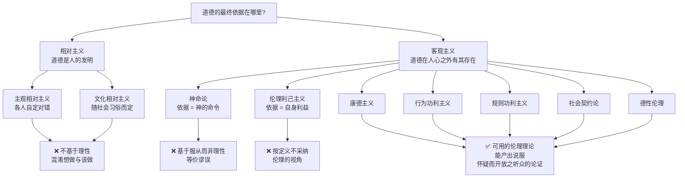
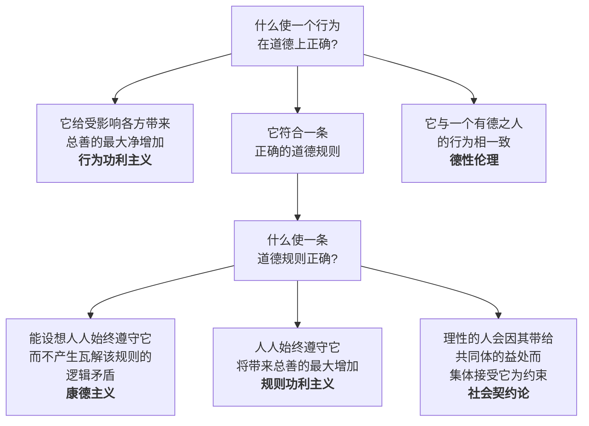
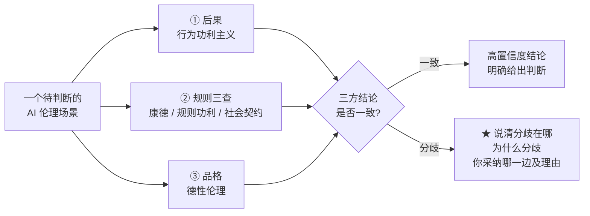

# M02 · 道德理论及其在伦理中的应用与局限

> **本讲一句话**：这一讲把 M01 一笔带过的伦理学词汇，展开成**八个道德理论**，并用同一把尺子把它们分成"不能用的三个"和"可以用的五个"——**这把尺子本身，才是本讲真正要教的东西**。
> **原始材料**：`Module 2 - Moral Theories and Ethics.pdf`（86 页） ｜ **转录**：`merged`（三段，共 2 小时 18 分 23 秒，480 段）

---

## 0. 三分钟速览

**这一讲讲了什么**

课件表面上是一份"道德理论目录"：相对主义、神命论、伦理利己主义、康德主义、行为功利主义、规则功利主义、社会契约论、德性伦理，八个理论各来一套「是什么 / 支持的理由 / 反对的理由」。

但它其实只在做**一件事**：先立一条判据——**"可用的伦理理论（workable ethical theory）"**，然后拿这条判据去筛。前三个被筛掉，后五个留下。留下的五个不是"正确答案"，而是**五个可以用来给结论撑腰的论证工具**。

课件反复出现的那句话就是判据本身（讲义 p.12、p.84 两次出现）：

> Workable ethical theory produces explanations that might be **persuasive to a skeptical, yet open-minded audience**.
> 可用的伦理理论，产出的解释能说服一个**抱持怀疑、但心态开放**的听众。

教授在课上把这句话翻译成了更直白的版本（🎙️ part1 38:20、38:35）：

> "Not only tells you to do the right thing, you have to be able to explain **why** you have come up to this conclusion. And good explanations are based on **facts, shared values and logic**."
> "There's **no right or wrong decision**, but there are **bad and good decisions**."

**学完你应该能**

1. **复述**"可用的伦理理论"的两条标准，并用它解释为什么相对主义、神命论、伦理利己主义被排除
2. **说清**定言令式两个表述的内容，并证明它们对同一案例给出同一结论
3. **区分**完全义务与不完全义务，以及它们背后的两种矛盾（概念矛盾 / 意愿矛盾）
4. **区分**行为功利主义与规则功利主义，并说出后者解决了前者的哪两个毛病
5. **说出**功利主义即使做对了计算也仍然解决不了的那个问题（分配公正）
6. **区分**消极权利 / 积极权利 / 绝对权利 / 有限权利，并解释罗尔斯差异原则在说什么
7. **用五个可用理论中的至少三个**分析同一个 AI 场景，并把三条结论"三角测量"成一个可辩护的判断

**如果只记三件事**

1. **本课要的不是"正确结论"，是"可辩护的结论"**——判断标准是事实、共享价值、逻辑三样东西撑不撑得住（🎙️ 教授反复讲了三次）
2. **五个可用理论回答的是两个不同层次的问题**：行为功利主义、德性伦理直接问"这个**行为**对不对"；康德主义、规则功利主义、社会契约论先问"这条**规则**对不对"（讲义 p.80 的判断树）
3. **每个理论都有一个致命弱点，而且各不相同**：康德主义卡在规则冲突、功利主义卡在分配不公、社会契约论卡在没人真的签过字、德性伦理卡在没法指导公共政策。**考试要你说的是弱点，不是优点**

---

## 1. 开始之前 · 知识衔接

### 1.1 你已经有的

M01 已经把下面这些词发给你了，本讲会**在它们之上加深**，不会重新定义。

| 概念 | 一句话唤醒 | 回看 |
|---|---|---|
| 伦理学 / 道德 / 应用伦理学 | 道德是社会的行为规则；伦理学是对这些规则的理性检验；AI 伦理是伦理学落到 AI 领域的一支 | [[M01-导论-AI与伦理]] §2.3.1 |
| 道德相对主义 | "价值由你成长的社会决定，不存在普世价值"——M01 只给了直觉版，**本讲 §2.5.1 拆成主观 / 文化两种并逐条反驳** | [[M01-导论-AI与伦理]] §2.3.2 |
| 义务伦理 | 看你有没有履行义务，而不是只看后果 | [[M01-导论-AI与伦理]] §2.4.2 |
| 定言令式 | "只按你愿意它成为普遍法则的准则行动"——M01 只给了口号，**本讲 §2.6 给出两个表述、证明它们等价、并讲清 categorical 这个词的技术含义** | [[M01-导论-AI与伦理]] §2.4.2 |
| 黄金法则 | "己所欲，施于人"——注意它**不等于**定言令式 | [[M01-导论-AI与伦理]] §2.4.2 |
| 功利主义 | "最大多数人的最大幸福"——M01 只给了总原则，**本讲 §2.7 拆成行为 / 规则两支并给出计算方法** | [[M01-导论-AI与伦理]] §2.4.3 |
| 善良意志 | 康德：只有"想把事做对"这个意愿本身具有无条件的道德价值 | [[M01-导论-AI与伦理]] §2.4.4 |
| 无知之幕 | 站在不知道自己是谁的位置上判断，以求公正——**本讲 §2.8.3 会把它接回罗尔斯的完整理论** | [[M01-导论-AI与伦理]] §2.4.4 |
| 伦理困境 | 两条道德原则冲突、怎么做都要违背其一 | [[M01-导论-AI与伦理]] §2.4.5 |
| 特殊申辩 | 为自己找例外的自我合理化 | [[M01-导论-AI与伦理]] §2.4.4 |
| FATP | 公平、问责、透明、隐私——整门课的目录 | [[M01-导论-AI与伦理]] §2.6.2 |

> **只需要这些。** 哲学史、宗教、法律仍然**不需要任何基础**，本讲遇到的所有专名（尤西弗罗、罗素、边沁、密尔、霍布斯、卢梭、罗尔斯、亚里士多德、安·兰德）都会就地交代清楚。

### 1.2 本讲全新引入的概念

| 概念 | English | 展开于 |
|---|---|---|
| 哲学的四根支柱 | Metaphysics / Epistemology / Logic / Ethics | §2.1 ★ 讲义完全没有，纯课堂内容 |
| 电车难题及其变体 | The Trolley Problem (and variations) | §2.2.2 |
| 伦理的视角 vs 自利的视角 | Ethical point of view vs Selfish point of view | §2.3.1 |
| 可用的伦理理论 | Workable Ethical Theory | §2.4 ★ 全讲的判据 |
| 主观相对主义 / 文化相对主义 | Subjective / Cultural Relativism | §2.5.1 |
| 神命论 | Divine Command Theory | §2.5.2 |
| 尤西弗罗困境（等价谬误） | Euthyphro Dilemma / Equivalence Fallacy | §2.5.2 |
| 伦理利己主义 | Ethical Egoism | §2.5.3 |
| 康德主义（义务论） | Kantianism (Deontology) | §2.6 |
| 假言令式 | Hypothetical Imperative | §2.6.3 ★ 讲义没有，纯课堂内容 |
| 完全义务 / 不完全义务 | Perfect / Imperfect Duty | §2.6.7 |
| 概念矛盾 / 意愿矛盾 | Contradiction in Conception / in the Will | §2.6.7 ★ 讲义没有，纯课堂内容 |
| 效用原则（最大幸福原则） | Principle of Utility (Greatest Happiness Principle) | §2.7.1 |
| 行为功利主义 | Act Utilitarianism | §2.7.2 |
| 快乐计算 | Hedonic Calculus | §2.7.3 |
| 道德运气 | Moral Luck | §2.7.5 ★ 讲义一行，课堂三个案例 |
| 规则功利主义 | Rule Utilitarianism | §2.7.6 |
| 量 vs 质之争 | Quantity vs Quality of Pleasure | §2.7.7 |
| 社会契约论 | Social Contract Theory | §2.8 |
| 消极 / 积极 / 绝对 / 有限权利 | Negative / Positive / Absolute / Limited Right | §2.8.2 |
| 罗尔斯正义二原则 · 差异原则 | Rawls's Principles of Justice · Difference Principle | §2.8.3 |
| 德性伦理 | Virtue Ethics | §2.9 |
| 德性与恶习 · 中道 | Virtues and Vices · The Mean | §2.9.2 |
| 五常（儒家德性） | Confucian Virtues | §2.9.4 |
| 客观主义 vs 相对主义 | Objectivism vs Relativism | §2.10.3 |

### 1.3 为什么这一讲放在这里 · 重排说明

**承接**：M01 结尾停在 UNESCO 自动驾驶案例——"该撞谁"这个决定从司机 0.5 秒的本能反应，变成了会议室里的一次设计选择。M02 开场立刻接上电车难题。**这不是巧合，是接力**：M01 提出问题，M02 发工具。

**铺路**：M02 是本课**唯一一讲纯理论**。从 M03 起全是议题（公平、透明、问责、隐私、监管），而议题课上的每一次"这么做对不对"的争论，用的都是本讲的五个工具。

- §2.6 康德主义 → M05 问责（"人不能只被当作手段"是问责的哲学根据）
- §2.7 功利主义 → M03 公平（"总效用最大"和"分配公平"的冲突，就是算法公平性争论的原型）
- §2.8 社会契约论 · 权利分类 → M06 隐私（隐私是典型的**消极权利**）、M09 监管
- §2.9 德性伦理 → 小组项目的"企业该成为什么样的组织"

**重排说明**

讲义原顺序是：
导论（p.1–13）→ 主观相对主义（14–18）→ 神命论（19–23）→ 伦理利己主义（24–27）→ 康德主义（28–41）→ 行为功利主义（42–51）→ 规则功利主义（52–56）→ 社会契约论（57–65）→ 德性伦理（66–75）→ 横向对比（76–84）→ 作业（85–86）

本笔记做了**三处调整**：

1. **把"什么叫可用的伦理理论"（p.12–13 + p.78）从导论里抽出来，单独成 §2.4，放在八个理论之前。**
   理由：p.12 那句判据被夹在导论的杂项里，很容易滑过去；但它是整讲的筛子。**不先立判据，后面"不是可用的伦理理论"这句结论就成了没来由的宣判。** 教授在课上也是先立判据再开讲的（🎙️ part1 40:12）。

2. **把课堂讲了、讲义完全没有的三块内容提到它们该在的位置**：哲学四支柱（→ §2.1，全讲最前）、假言令式（→ §2.6.3，夹在定言令式两个表述之间）、两种矛盾（→ §2.6.7，紧跟完全/不完全义务）。
   理由：这三块是本讲**信息密度最高**的部分，而它们**只存在于录音里**。放回逻辑位置比按"课件有/没有"分堆更有用。

3. **把电车难题（p.4–5）设为贯穿线索**。
   理由：教授在三段录音里前后**五次**回到它——立题、胖子变体、恶人变体、利己主义的解、规则功利主义的解。它不是开场白，是本讲的公共测试用例。所以每个理论讲完，我都补一格"**这个理论怎么答电车难题**"。

小节 ↔ 页码的完整对应见 [[#8. 讲义页码映射|§8]]。

---

## 2. 正文

### 2.1 先定位：伦理学在哲学里的哪个位置

> 📄 **讲义 p.2 议程**只有三行：Introduction → Review of ethical theories → Comparing workable ethical theories。对应本笔记：Introduction = §2.1–2.3（定位、引子、伦理视角），Review = §2.5–2.9（三个不可用 + 四个可用理论），Comparing = §2.4（判据）+ §2.10（横向对比）。判据被我提到 Review 前面讲，理由见 §1.3。

> ★ **本节 100% 来自课堂录音，讲义上一个字都没有**（🎙️ part1 01:02–05:46）。教授用了近 5 分钟做这件事，而课件直接从标题页跳到了电车难题。

**是什么**

哲学（philosophy）是一个至少三千年历史的研究领域。教授说它可以拆成**四根支柱（four pillars）**：

| 支柱 | English | 研究什么 | 教授举的问题 |
|---|---|---|---|
| **形而上学** | Metaphysics | 实在（reality） | 什么是真实的？宇宙有目的吗？人有自由意志，还是一切都被决定了？ |
| **认识论** | Epistemology | 知识（knowledge） | 我们怎么知道我们知道？能相信自己的感官吗？什么算"真"？ |
| **逻辑学** | Logic | 有效推理 | 什么样的推理是有效的？怎么把可靠论证和逻辑谬误分开？ |
| **伦理学** | **Ethics** | **价值与道德** | **什么是好？该怎么对待他人？一个行为是因为后果而正当，还是因为它是义务？** |

**为什么需要它**

因为它一次性交代了三件事：

1. **伦理学不是"讲道理"或者"心灵鸡汤"，它是一个有三千年方法论积累的学科分支。** 本课后面所有"可辩护的论证"的要求，根源在这里。
2. **逻辑学是哲学的工具。** 教授的原话是逻辑"is really the algebra of arguments"——论证的代数。这解释了为什么本讲每个理论都要做"普遍化会不会自相矛盾"这类形式检验：**伦理学的论证要过逻辑这一关。**
3. **认识论顺带解释了为什么研究生要懂一点它**——教授在这里插了一段（🎙️ part1 03:39）：研究是"发现新知识"，你得先知道知识的性质，才能评估自己发现的东西是不是可靠。这对小组项目和毕业论文都成立。

**课件原例**

无。讲义 p.3 是纯标题页 "INTRODUCTION"，p.4 直接进电车难题。

**🎙️ 课堂补充**

教授给形而上学举的例子很好记（part1 02:01）：你抬头看天上的星星，看到的是它很久以前发出的光；**等你看见的时候，那颗星可能早就不存在了。所以"你看见的东西是真实的吗"？** 这就是形而上学在问的问题。

**💡 换个说法（笔记补充）**

四根支柱可以按"问句"记：

- 形而上学问 **What is?**（有什么）
- 认识论问 **How do we know?**（怎么知道）
- 逻辑学问 **Does it follow?**（推得出来吗）
- 伦理学问 **What ought to be?**（应该怎样）

前三个描述世界，只有第四个规定**应该**。这个 is / ought 的分界，是伦理学区别于其他一切学科的地方，也是为什么准确率、F1 这些指标永远回答不了"该不该"。

**⚠️ 常见误解**

- ❌ "伦理学 = 道德说教"。→ 伦理学是**检验**道德规则的，不是**宣布**道德规则的。宣布规则的是道德（morality），检验它的才是伦理学（见 §2.3.2）。
- ❌ "四支柱是四个互不相干的领域"。→ 逻辑学是另外三个的共同工具；本讲的康德主义几乎完全建立在逻辑检验之上。

**与其他概念的关系**

四支柱 → 伦理学 → 应用伦理学 → AI 伦理，是一条从宽到窄的四级嵌套。前两级本节交代，后两级 M01 已给（[[M01-导论-AI与伦理]] §2.3.1）。

**所以呢**：定位完成之后，光知道"伦理学研究什么"还不够——你得先亲身感受到"我的直觉会打架"，才会真正想要一套理论来仲裁。下一节就用两个引子（一个纯课堂案例、一个电车难题）让你先体会这种矛盾。

---

### 2.2 两个引子：先让你体会到"需要理论"

课件用电车难题开场，教授在此之前还先讲了一个更贴身的例子。两个引子的功能一样：**让你先发现自己的直觉自相矛盾，你才会想要一套理论。**

#### 2.2.1 引子一：救妈妈还是救老婆（🎙️ 纯课堂内容）

> ★ **讲义完全没有这个例子**（🎙️ part1 06:16–12:34）。

**场景**：你母亲和配偶同时落水，都不会游泳，你只能救一个。你救谁？为什么？

教授在课堂上真的点了同学回答，然后把答案拆成了**三条不同的论证路线**：

| 路线 | 论证 | 对应本讲哪个理论 |
|---|---|---|
| **文化 / 法律路线** | 东亚社会把孝置于很高的位置。教授指出**中国法律里赡养父母是法定义务**，而婚姻中的照顾义务来自契约——在东方语境下前者被认为高于后者 | 接近社会契约论（§2.8）＋ 德性伦理（§2.9） |
| **后果主义路线** | "配偶更年轻，还能陪我更久，总幸福量更大"——教授说这是 **real consequentialism**，只看后果 | 功利主义（§2.7） |
| **义务路线** | 西方视角：**对配偶的义务来自你自由签订的契约**（你自己选择结婚），对父母的关系你没得选。**自愿承担的义务优先** | 康德主义（§2.6） |

**为什么这个例子好用**

三条路线**给出的答案不同，但每一条都讲得通**。这正好演示了教授紧接着说的那句话（🎙️ part1 12:52）：

> "The right decision is the one that you can **justify** well with reason and with logic."
> 对的决定，就是你能用理性和逻辑**替它辩护**的那个决定。

**💡 换个说法（笔记补充）**

这个例子的真正教学功能不是"哪个答案对"，而是让你意识到：**你脑子里同时装着三套互相冲突的道德直觉，而你从来没检查过它们是否自洽。** 本讲剩下的部分，就是把这三套直觉分别提纯成明确的理论。

**⚠️ 常见误解**

- ❌ "东方看孝、西方看契约，所以道德是相对的"。→ 教授明确说了（part1 12:16）："You see a little bit difference. **Not totally contradictory.**"——差异在**优先级排序**上，不在**核心价值**上。双方都承认"对家人有义务"，只是排序不同。**这个区分是 §2.5.1 反驳相对主义的关键。**

**与其他概念的关系**

⚠️ 这个例子里的**中国法律赡养义务**是真实存在的（🔗《中华人民共和国民法典》婚姻家庭编及《老年人权益保障法》均规定成年子女对父母负有赡养扶助义务，2026-09-09 核）。但**注意区分**：法律义务 ≠ 道德义务。本课讲的是后者；两者在 M09 监管那一讲才会正面碰头。

**所以呢**：这个例子还没有给出任何理论，只是把你脑子里三套互相打架的直觉摆上台面。接下来的电车难题会把同样的冲突剥离成一个更干净、更容易分析的版本，方便后面每个理论逐一表态。

---

#### 2.2.2 引子二：电车难题及其两个变体（讲义 p.4–5）

**是什么**

**电车难题（The Trolley Problem）**：一辆失控的电车正冲向轨道上五个无法移动的工人。你站在道岔扳手旁边，扳一下就能让电车转向侧线——但侧线上有一个人。

> The trolley problem presents a dilemma: is it preferable to pull the lever to divert the runaway trolley onto the side track with just one person?（讲义 p.4，图源 Wikipedia）

**两种标准答案**

| 立场 | 怎么答 | 理由 |
|---|---|---|
| **后果主义 / 功利主义** | 扳 | 救五个死一个，净收益最大 |
| **义务论（康德主义）** | 不扳 | 杀害一个无辜者违反根本道德义务，无论后果多好都是错的 |

**🎙️ 课堂补充：三个变体**（part1 19:34–27:00，讲义 p.5 只有标题图，内容全在录音里）

教授接连给了三个版本，用来暴露直觉的不一致：

| 变体 | 场景 | 多数人的选择 | 逻辑上有区别吗？ |
|---|---|---|---|
| **① 扳道岔** | 你扳手柄，电车转向，撞死侧线 1 人 | **多数人愿意扳** | — |
| **② 天桥胖子** | 没有道岔。你站在天桥上，旁边有个胖子，把他推下去能拦停电车 | **绝大多数人拒绝推** | **没有区别**——同样是"杀 1 救 5" |
| **③ 胖子是恶人** | 同 ②，但这个胖子正是把五个人绑到轨道上的凶手 | **多数人转而愿意推** | 仍然是"杀 1 救 5" |

教授对此的分析（part1 23:58）：

> "Under the same situation sometimes people **do not apply the same** reasoning. Because we are **emotional**... when in essence they're the same logic."

**为什么会有这个差别？** 教授给了两组解释：

1. **① vs ②：亲手 vs 间接。** 扳手柄是"改变一个已经在发生的因果链的方向"；亲手把人推下去是"直接夺走一条命"。前者你只是"介入"，后者你是"施加"。教授说（part1 28:02）：如果你什么都不做，那五个人的死"is not your fault"；一旦你亲手推人，你就成了原因本身。
2. **② vs ③：权利的丧失。** 恶人主动试图谋杀五个人，因而**"forfeited his own right to life"（放弃了自己的生命权）**。教授把这个解释叫作 **poetic punishment**（因果报应式的惩罚）——让恶意的制造者承担其恶意的后果。

但教授立刻补了一句关键的（part1 27:00）：

> "In a **deontological** framework... we may still argue that the duty is universal **whatever the circumstances**."
> 在义务论框架下，义务是普遍的，**不看情况**。所以严格的康德主义者在变体 ③ 里**仍然不推**。

**⚠️ 常见误解**

- ❌ "多数人改主意了，说明变体 ③ 在道德上确实不同"。→ **多数人的直觉不是论证。** 本讲要求的是"能对怀疑者辩护的理由"，不是"多少人这么想"。教授指出这三个变体**逻辑结构完全相同**，直觉的差异来自情绪和身体距离（emotional connection and physical experience），不来自道德结构。识别出这一点，正是学伦理学的意义。
- ❌ "电车难题有标准答案"。→ 它没有标准答案。它是一台**理论测试仪**：把你的理论输进去，看它输出什么、以及输出的东西你能不能接受。

**与其他概念的关系**

本讲后面每个理论都会回到这台测试仪。速览：

| 理论 | 对①的回答 | 关键理由 |
|---|---|---|
| 伦理利己主义（§2.5.3） | **看那五个人跟你什么关系** | 陌生人 → 无义务；有你所爱的人在其中 → 立刻扳 |
| 康德主义（§2.6） | **不扳** | 杀无辜者不可普遍化 |
| 行为功利主义（§2.7.2） | **扳** | 净效用 +4 |
| 规则功利主义（§2.7.6） | **倾向不推**（尤其变体②） | "可以为救多数而杀少数"作为**社会规则**会摧毁信任，长期损失更大 |
| 德性伦理（§2.9） | **有德之人会怎么做** | 不给公式，给榜样 |

**所以呢**：电车难题本身不需要标准答案——它的作用是当一台"理论测试仪"，本讲后面每个理论都会被拿来跑一遍这台测试仪（见上表）。下一节讲义自己的引子会把同样的张力搬到一个更贴近 AI 伦理课主题的场景里。

---

#### 2.2.3 讲义自己的引子：交警 AI 摄像头（讲义 p.10–11；p.85–86 原题重出，即 9/22 作业）

> 讲义在电车难题之后、理论综述之前放了 **Scenario 1**；p.85–86 把**同一段文字**再贴一遍，标题换成 "ASSIGNMENT (DUE AT NOON, 22 SEPT) · ANSWER IN 1–2 PAGES"。⏭️ 课上没有逐条讨论，教授只说"作业已上传 Canvas"（🎙️ part1 37:29）——所以这个场景**只能靠笔记学**。

**场景（讲义 p.10 / p.85 原文大意）**：为遏制超速，交警在**所有路口**安装 AI 视频摄像头，能实时识别超速 5 km/h 以上的车辆、读车牌、拍高清驾驶员照片；配合 **99% 准确率**的人脸识别，系统**自动**开出附带照片证据的罚单。运行 3 个月后，超速减少 **90%**。随后，有组织及严重罪案调查科（OSCB）向交警索要摄像头数据的**实时访问权**，交警**照办**；3 个月后 OSCB 据此抓获 **5 名**通缉的严重罪犯。

**五问（讲义 p.11 / p.86）**：① 交警做错了什么吗？② 谁从交警的行为中受益？③ 谁受害？④ 交警本来还能怎么做？⑤ 要下判断，还需要知道什么？

**💡 它为什么被放在这个位置**：这个场景里**没有任何一步违法**，而且两段都有漂亮的后果（−90% 超速、抓到 5 个罪犯）——如果你只有"结果好不好"和"合不合法"两把尺子，会得出"没问题"。但大多数人读完第二段会觉得**哪里不对**（数据用途悄悄从"治超速"变成"抓罪犯"，没有任何授权环节）。这种"直觉说不对、却说不出为什么"的感觉，正是讲义接下来要给你一套理论的理由——**违法与不道德是两件事**（§2.6 康德部分、§2.8 社会契约"法律只是最低限度"会再讲）。

**怎么用本讲的理论答它**：完整的五理论分析演练在 **§7 第 10 题**（答题框架在 §6.3）。先自己写一版，再对照。

**所以呢**：这个场景没有标准答案摆在这里等你抄——真正的五理论分析留到 §7 第 10 题练习。但它已经把本讲要解决的问题摆清楚了：光靠"合不合法"判断不了道德，你需要下一节讲的"伦理的视角"和后面八个理论。

---

### 2.3 伦理的视角：为什么必须把别人算进来

#### 2.3.1 两种看世界的方式（讲义 p.6）

**是什么**

人生活在共同体 / 社会（community / society）之中。讲义说，几乎所有人都共享一组**核心价值（core values）**：

- **生命（Life）**
- **幸福（Happiness）**
- **达成目标的能力（Ability to accomplish goals）**

在此之上有两种视角：

| 视角 | English | 内容 |
|---|---|---|
| **自利的视角** | Selfish point of view | 只考虑你自己和你自己的核心价值 |
| **伦理的视角** | **Ethical point of view** | **尊重他人以及他人的核心价值** |

**为什么需要它**

**"伦理的视角"是本讲的入场券。** §2.5.3 反驳伦理利己主义时，最后一条、也是最致命的一条理由就是：它**按定义**就不尊重伦理的视角（讲义 p.27："By definition, it does not respect the 'ethical point of view'"）。

**🎙️ 课堂补充**

教授强调这三个核心价值是**跨文化**的（part1 29:42）：

> "It might be disagreement as to what exactly the set of core values are, but there must be some value. **Life. Happiness. Ability to accomplish goals.** Whether you are the east, west, south and north."

这一点**直接构成对相对主义的反驳材料**：如果连核心价值都完全相对，社会根本无法运转。

**⚠️ 常见误解**

- ❌ "伦理的视角 = 利他主义 = 牺牲自己"。→ 不是。伦理的视角只要求你**把别人的核心价值算进考量**，不要求你把自己的排在最后。

**所以呢**："伦理的视角"是整讲的入场券——后面判定一个理论"可不可用"，第一步永远是看它站不站在这个视角上。下一节先把"道德"和"伦理学"这两个中文里几乎不分的词彻底分开，因为接下来审视八个理论用的正是伦理学这把尺子。

---

#### 2.3.2 道德 vs 伦理学：一个必须说清的区分（讲义 p.7–8）

**是什么**

红灯停、绿灯行——这条规矩本身，就是**道德**在起作用：一套已经写好、要求你照做的行为规范，不需要你每次都想清楚为什么。但如果有人追问"凭什么红灯要停？这条规矩定得合不合理？要是所有十字路口都没有信号灯呢？"——这时候讨论已经跳出了规矩本身，开始**审查**这套规矩站不站得住脚，这就是**伦理学**在起作用。讲义 p.7 把这两个身份的正式定义摆了出来：

| 术语 | English | 定义（讲义 p.7 原句） |
|---|---|---|
| 共同体 / 社会 | Community / Society | An association of people organized under a system of rules. 规则的作用是**长期地促进全体成员的善** |
| **道德** | **Morality** | A society's / person's **rules of conduct**——什么该做、什么不该做 |
| **伦理学** | **Ethics** | **Rational examination of morality**；对人的行为的评价 |

一句话：**道德给规则，伦理学审规则。**

**🎙️ 课堂补充：交通规则类比**（part1 32:36–33:26）

讲义 p.8 是一张"道德与伦理学之区别的类比"配图（图源：M. Quinn《Ethics for the Information Age》），但图上没有文字。教授把它讲出来了：

> 马路上有一大堆规则——什么时候能左转、红灯怎么办——**这些就是道德**。
> **伦理理论则是站在不同角度去审视这些规则**："They look at the same situation using different [lenses]... you see slightly different picture."

**💡 换个说法（笔记补充）**

用软件的说法：

- **道德** = 已经部署在跑的一套规则引擎（每个社会一份，配置不同）
- **伦理学** = 对这套规则做 code review 的方法论
- **道德理论** = code review 用的不同 lint 规则集（康德一套、功利主义一套……）

**⚠️ 常见误解**

- ❌ 把 morality 和 ethics 当同义词混用。→ 在本课这**是失分点**。凡是写"社会的规则"用 morality，写"对规则的理性检验"用 ethics。
- ⚠️ **英文写作提醒**：中文"伦理"和"道德"日常几乎不分，英文考卷上必须分清。

**所以呢**：道德给规则、伦理学审规则——这个分工决定了本讲接下来要干什么。八个理论（§2.5–§2.9）本质上都是"审规则"的不同方法，各有自己的一把尺子；而 §2.4 马上要交代的，是**审这些审查方法本身的元标准**：一套"审规则的方法"要满足什么条件，才配被当真。

---

#### 2.3.3 为什么要学 AI 伦理（讲义 p.9）

**是什么**

AI 发展得比人类社会形成的道德直觉快得多——过去两百万年的人类历史里，从来没有出现过"一个系统自己决定要不要停下来"这种处境，旧有的常识和经验找不到现成答案。这就是这一页要回答的问题：为什么这门课非学伦理学不可。讲义给了四条理由：

1. AI 在各行各业迅速普及带来大量新问题，影响巨大
2. 伦理学是帮你判断"最佳行动方案"的一种方法
3. **"常识"可能不适用**（"Common wisdom" may not be applicable）
4. 目标是成为**负责任的 AI 使用者与开发者**

**🎙️ 课堂补充**（part1 33:26–37:00）

教授把第 3 条说得更重：

> "Common wisdom is not applicable because it's a very **new scenario**. We have [not] dealt with before in the last two million years in human history."

并给了两个当下的例子：

- **AGI 的门槛**：教授说有人认为我们已经接近人工智能"becomes sentient"（获得感知 / 自主性）的阈值——那时它就有了 **agency（能动性）**，能自己决定做什么。"What do you do **before** it happens?"
- **kill switch（急停开关）**：教授说，未来 AI 技术的**一项重大监管要求，就是必须有一个 kill switch**——出事时能按下按钮把机器停掉。

> 💡 这两点在讲义上完全没有，但**都会在 M09 监管那一讲回来**（EU AI Act 对高风险系统的人类监督要求，本质就是 kill switch 的制度化）。

**所以呢**：这四条理由（尤其是"常识不适用"）说明了本讲接下来要花大力气建一整套理论工具箱的必要性——常识不够用了，你需要能讲道理、能被检验的论证。下一节就交代这套论证要满足的门槛：什么样的理论才"可用"。

---

### 2.4 ★ 判据：什么叫"可用的"伦理理论（讲义 p.12–13, p.78）

> **本节是全讲的枢纽。** 后面八个理论，每一个的结尾都会回到这两条标准做判决。

**是什么**

后面还有八个道德理论等着讲，但不是随便一个理论、随便说出个结论就算数——比如"神让我这么做"和"这样做让大多数人受益"，哪一个能拿去说服一个不轻易买账、但愿意听道理的人？这一节要定的，就是筛选这八个理论的门槛，讲义称之为"可用的伦理理论"。讲义 p.12 三句话：

1. **Ethics: rational, systematic analysis**——伦理学是理性的、系统的分析
2. **"Doing ethics" means explaining conclusions**——"做伦理"意味着**解释你的结论**
3. **Best explanations based on facts, shared values, logic**——最好的解释建立在**事实、共享价值、逻辑**之上

以及第四句，本讲的主旨句（p.12，p.84 再次出现）：

> **Workable ethical theory produces explanations that might be persuasive to a skeptical, yet open-minded audience.**

讲义 p.78 给出正式的两条标准：

> We seek theories with these characteristics:
> 1. Based on the **ethical point of view**（基于伦理的视角，即把他人算进来）
> 2. **Objective moral principles developed using logical reasoning based on facts and commonly held values**（用逻辑推理、基于事实与共同价值发展出的客观道德原则）

**为什么需要它**

因为**没有这条判据，本讲就只是八个理论的流水账**。有了它，本讲变成一个论证：*给定这两条标准，哪些理论过关？*

**🎙️ 课堂补充：教授把判据说得更硬**

这是本讲最该背下来的三段原话：

> 🔴 **① 关于"这是商学院不是哲学系"**（part1 40:12）
> "We need **workable** [theories] because we're talking about — this is **not a philosophy course. This is a business school.** We need [theories] we can work with, which produces explanation, which might be persuasive to a **skeptical but yet open minded** [audience]."

> 🔴 **② 关于什么是好决定**（part1 38:20–38:45）
> "Not only tells you to do the right thing, you have to be able to **explain why** you have come up to this conclusion. And good explanations are based on **facts, shared values and logic**."
> "There is **no right or wrong decision**, but there are **bad and good decisions**... The good decisions are those you can **explain, you can defend** based on facts, logic and shared values."

> 🔴 **③ 关于自愿选择**（part1 39:19–40:12）
> "It focuses on situations where you have **voluntary** choices. **If you don't have choices, then it's very difficult to talk about** [ethics]. For example, a soldier ordered to kill — you don't have choices."

**💡 换个说法（笔记补充）**

把这条判据当成**答题评分表**来记：

| 判据要素 | 在答卷上长什么样 |
|---|---|
| 基于事实 | 你有没有交代场景里的关键事实（谁受益、谁受害、数据怎么流动） |
| 基于共享价值 | 你有没有指出触及的是生命 / 幸福 / 自主 / 隐私中的哪一个 |
| 基于逻辑 | 你的结论是不是从前提推出来的，而不是宣布的 |
| 能说服怀疑者 | 你有没有**主动处理反方最强的理由** |
| 有可选项 | 你有没有讨论"本来还能怎么做"（这正是 9/22 作业的第 4 问） |

**⚠️ 常见误解**

- ❌ "可用的理论 = 正确的理论"。→ **不是。** 五个可用理论互相冲突，不可能都对。"可用"只意味着**能产出可检验、可辩护的论证**。
- ❌ "结论对了就得分"。→ 教授明说了"没有对错的决定，只有好坏的决定"。**分数在论证过程里，不在结论里。**
- ⚠️ **"skeptical, yet open-minded" 这两个词要分开理解**：skeptical = 不会因为你说了就信，要求理由；open-minded = 只要理由够好就愿意被说服。**你的读者不是敌人，也不是粉丝。**

**与其他概念的关系**

这条判据是本讲的筛子。筛选结果：

```
八个理论
├─ ❌ 不可用（§2.5）
│   ├─ 主观相对主义 / 文化相对主义 —— 违反"客观原则"，且不基于理性
│   ├─ 神命论 —— 基于服从而非理性（based on obedience, not reason）
│   └─ 伦理利己主义 —— 按定义不尊重伦理的视角
└─ ✅ 可用（§2.6–2.9）
    ├─ 康德主义
    ├─ 行为功利主义
    ├─ 规则功利主义
    ├─ 社会契约论
    └─ 德性伦理
```

**所以呢**：有了这把筛子，后面八个理论就不再是"各说各话"的清单，而是一场有输有赢的淘汰赛：§2.5 先出局三个，§2.6–2.9 留下的五个才是本讲真正要你掌握的工具。

---
### 2.5 三个**不可用**的理论

> 讲义花了 14 页（p.14–27）讲三个**最后都被判定"不可用"**的理论。这不是浪费——**知道一个理论为什么不能用，比知道它是什么更重要**，因为考试真正会问的是"批判性评价"。

#### 2.5.1 主观相对主义与文化相对主义（讲义 p.14–18）

**是什么**

先给上位概念：

> **相对主义（Relativism）**：不存在普世的对错规范；一个人说"X 是对的"，另一个人说"X 是错的"，**两个人可以都对**。（讲义 p.15）

在此之下分两支：

| 分支 | English | 定义（讲义原句） | 通俗说法 |
|---|---|---|---|
| **主观相对主义** | Subjective Relativism | Each person decides right and wrong **for himself or herself** | "对你对的，对我不一定对" |
| **文化相对主义** | Cultural Relativism | 对错取决于**某个社会实际的道德准则**；这些准则**因地而异、因时而异**。同一个行为在此时此社会是对的，在彼时彼社会可能是错的（讲义 p.16） | "入乡随俗" |

讲义 p.16 明说：**文化相对主义是主观相对主义的一个变体**（a variation of subjective relativism）。

**支持它的四条理由**（讲义 p.17）

1. 善意而聪明的人、以及**同样成功的不同文化**，在道德问题上确实会有分歧
2. 伦理争论令人不快且没有结果（disagreeable and pointless）
3. 不同的社会情境要求不同的道德准则
4. 一个社会去评判另一个社会是傲慢的

**反对它的九条理由**（讲义 p.18）

这是本课**罕见的把反驳列到九条**的地方，说明教授要你会拆它。分组记忆：

| 组 | 反驳 | 展开 |
|---|---|---|
| **A. 混淆"想做"与"该做"** | ① 模糊了"做你认为对的事"与"做你想做的事"之间的界线 | 这是最致命的一条。见下 |
| | ④ 决定可能不基于理性 | 只剩直觉、情绪、冲动 |
| **B. 无法做道德区分** | ② 对不同人的行为无法做道德区分 | 特蕾莎修女和连环杀手在道德上等价 |
| | ③ **主观相对主义 ≠ 宽容** | 见下 |
| **C. 逻辑跳跃** | ⑤ 两个社会**确实**有不同道德观，推不出它们**应该**有不同道德观 | 典型的 is → ought 谬误 |
| **D. 解释不了现象** | ⑥ 它解释不了道德准则**是怎么被确定的** | |
| | ⑦ **如果根本没有文化规范怎么办？** | 多元社会里"这个社会的准则"是哪一个？ |
| | ⑧ 它解释不了道德准则的**演化** | 见下 |
| **判决** | ⑨ **Not a workable ethical theory** | |

**🎙️ 课堂补充**

教授把三条讲透了（part1 40:42–44:18）：

1. **"混淆想做与该做"是核心毛病**（part1 42:42）：
   > "It blurs the line... between what you think is right and doing what you want to do. **Simply because you want to do something may not be the right thing to do.**"
   > 也就是说，相对主义给了每个人一张**万能的自我豁免卡**：我想做，所以对我来说它就是对的。这跟 M01 讲的**特殊申辩（special pleading）**是同一个病。

2. **"不基于理由"是它出局的直接原因**（part1 43:26）：
   > "Your decisions may not be based on reason. It can be just intuition, emotion..."
   > 对照 §2.4 的判据第 2 条（基于逻辑推理的客观原则）——**它一条都不满足**。

3. **"演化"这条最有力**（part1 43:49）：
   > "It basically **rejects the moral principles**... it's not [workable]."
   > 展开说：如果"当时的社会准则"就是对错的全部标准，那么**任何道德进步都不可能被描述为进步**。废奴、女性投票权、废除童工——这些都只是"从一套准则换成另一套准则"，谈不上"变好了"。而我们**确实**认为它们变好了。所以相对主义与我们最基本的道德判断冲突。

**💡 换个说法（笔记补充）**

区分两句听起来像、其实完全不同的话：

| 句子 | 是什么 | 成立吗 |
|---|---|---|
| "不同社会有不同的道德实践" | **描述性**主张（人类学观察） | ✅ 真的 |
| "因此不同社会的道德实践同样正确" | **规范性**主张（相对主义） | ❌ 推不出来 |

**相对主义的全部说服力，来自把第一句偷换成第二句。** 认出这个偷换，就能拆掉它。

**⚠️ 常见误解**

- ❌ **"反对相对主义 = 主张文化沙文主义"**。→ 讲义 p.18 第 ③ 条专门澄清：**主观相对主义与宽容是两回事**。你完全可以既认为存在客观道德原则，又主张对其他文化保持谦逊和克制——后者本身就是一条道德原则（而且是相对主义提供不了的，因为在相对主义里"应该宽容"也只是某个社会的偶然偏好）。
- ⚠️ **讲义拼写错误**：p.16 与 p.18 两处把 relativism 写成了 **"subjective realism"**。realism（实在论）是完全不同的哲学立场，**考试千万别照抄**。详见 [[#9.3 课件自身的问题|§9.3]]。

**这个理论怎么答电车难题？** 它答不了——它只会说"你觉得扳是对的，那对你就是对的"。**给不出理由，正是它出局的原因。**

**与其他概念的关系**

M01 §2.3.2 已经引入过"道德相对主义"的直觉版，本节是它的完整版。相对主义是 §2.10.3 **客观主义 vs 相对主义**这条大分界的一侧；另外七个理论**全部**站在客观主义那一侧（讲义 p.77）。

**所以呢**：相对主义出局的原因是"给不出理由"；下一节的神命论会证明，"有理由"和"有好理由"是两回事——神命论确实给了一个依据（神的旨意），但这个依据本身经不起追问。

---

#### 2.5.2 神命论（讲义 p.19–23）

**是什么**

> **神命论（Divine Command Theory）**：好的行为是**与神的意志一致**的行为；坏的行为是**违背神的意志**的行为。神的意志由**圣典（holy books）**揭示，因此我们应当以圣典作为道德决策的指南。（讲义 p.20）

讲义 p.21 给了一张漫画作为"神命论的实际运作"：一位牧师站在讲坛上，手持圣经，说：

> **"Stealing is wrong. Exodus 20:15"**（偷窃是错的。《出埃及记》20:15）

**这张图就是整个理论的运作方式**：问"为什么偷窃是错的？"→ 答"因为经文里神说了"。推理到此结束。

**支持它的三条理由**（讲义 p.22）

1. 我们**欠造物主以服从**（We owe obedience to our Creator）
2. 神是**全善且全知**的（all-good and all-knowing）
3. 神是**终极权威**（the ultimate authority）

**反对它的五条理由**（讲义 p.23）

1. 不同圣典在某些教义上**互相矛盾**
2. 社会是**多元文化的、世俗的**
3. 一些现代道德问题**经文里根本没有涉及**
4. **"善" ≠ "神"**（equivalence fallacy — **Bertrand Russell**，等价谬误，罗素）
5. **基于服从，而非基于理性**（Based on obedience, not reason）
6. → **Not a workable ethical theory for our purposes**

**🎙️ 课堂补充：第 4 条的完整论证**（part1 47:15–51:33）

讲义只有一行"'The good' ≠ 'God'（equivalence fallacy - Bertrand Russell）"。教授花了 4 分钟把这个两难完整讲了出来，**这是本节最值钱的部分**。

论证结构是一个**两难（dilemma）**——问"神命令 X，是因为 X 是善的；还是 X 之所以善，是因为神命令了它？"两条路都走不通：

| 分支 | 假设 | 推论 | 后果 |
|---|---|---|---|
| **分支一** | 善 = 神所命令的（除此之外无别的标准） | 事物本身**没有内在的善恶** | ① **"神是善的"变成空话**——它只等于"神就是神"，一句同义反复，没有道德内容<br>② **道德变得任意**：教授原话"if God decides tomorrow that murder is good, then murder becomes good, simply because of his command" |
| **分支二** | 神之所以善，是因为祂**符合**善的标准 | 那么**善必须独立于神而存在** | ① 神不再是道德的**源头**，只是道德标准的**遵循者**<br>② 教授原话："**morality survives just fine without** [God]"——道德在没有创世者的情况下也能成立 |

教授的结论（part1 50:38）：

> "You cannot [derive] the existence of objective moral values [from God]... If good exists **independent of God's will**, then you can have a **moral universe without needing a creator**."

> 💡 **背景补一句**（🔗 笔记补充）：这个两难最早出现在柏拉图对话《**尤西弗罗篇（Euthyphro）**》中，通常称为**尤西弗罗困境**。讲义把它归给罗素（Bertrand Russell，1872–1970，英国哲学家兼数学家），罗素确实在《我为什么不是基督徒》里用过类似论证。**答题时两个名字都可以提，但要说清"讲义的提法是 equivalence fallacy, Bertrand Russell"。**

**🎙️ 其余三条的课堂补充**（part1 46:09–47:15）

- 关于矛盾：教授指出**不只是不同宗教的圣典互相矛盾，同一本圣典的不同版本之间也有出入**
- 关于经文过时：教授说圣典"written like 2,000 years ago"，"modern problems are not addressed in there"，所以**必须依赖解释（interpretation）**——而解释权在人手里，理论就绕回了人的判断
- 关于多元社会：现代社会是 multicultural、secular 的，成员各有各的书，"they contradict in terms of telling you what you [should] do"

**💡 换个说法（笔记补充）**

神命论出局的**结构性原因**，可以和相对主义并排看：

| 理论 | 把道德的最终依据放在哪 | 为什么不可用 |
|---|---|---|
| 主观相对主义 | **个人的主观意见** | 没有理由，无法辩护 |
| 文化相对主义 | **社会的现行习俗** | 没有理由，无法辩护 |
| **神命论** | **一个外部权威的命令** | **有依据但没有理由**——依据是"祂说了"，不是"因为……所以……" |

三者的共同病灶：**都无法回答"为什么"**。而 §2.4 的判据要求的正是能回答"为什么"。

**⚠️ 常见误解**

- ❌ "反驳神命论 = 论证神不存在"。→ **完全不是。** 教授特意澄清了（part1 47:46）："It doesn't mean God doesn't [exist]"。这个论证是**关于道德的逻辑结构**，不是关于神的存在。一个信神的人完全可以接受这个论证（他只需要选分支二：神符合善的标准）。
- ❌ "它出局是因为宗教不科学"。→ 讲义给的理由是 **based on obedience, not reason**。**理由必须准确引用，别自己发挥成"不科学"。**

**这个理论怎么答电车难题？** 它会去翻经文找"不可杀人"，然后停在那里。但经文没写"能不能为救五人而杀一人"——这正是反驳的第 3 条。

**所以呢**：神命论和相对主义倒在同一个坑里——讲不出"为什么"。第三个不可用的理论——伦理利己主义——换了一种方式失败：它其实讲得出完整的"为什么"，只是这套理由拒绝把别人算进来。

---

#### 2.5.3 伦理利己主义（讲义 p.24–27）

**是什么**

> **伦理利己主义（Ethical Egoism）**：每个人都应当**只**关注自己的**自身利益（self-interest）**。道德上正确的行为，就是**给自己带来最大长期利益**的那个行为。（讲义 p.25）

讲义在标题旁直接写了 **"(aka Capitalism)"**——把它等同于资本主义。并点名：

> **安·兰德（Ayn Rand）**，《源泉》（The Fountainhead）与《阿特拉斯耸耸肩》（Atlas Shrugged）的作者，主张的理论与伦理利己主义相近。

**支持它的四条理由**（讲义 p.26）

1. **务实**——我们本来就倾向于做对自己最好的事
2. 让别人照顾他们自己**更好**
3. 每个人都把自己的福祉放在第一位时，**共同体反而受益**
4. **其他道德原则本来就根植于自利原则**

**反对它的六条理由**（讲义 p.27）

1. **容易的道德哲学未必是最好的道德哲学**
2. 我们其实**很清楚什么对别人好**（"We know a lot about what is good for someone else"）
3. **自利会导向公然不道德的行为**
4. 其他道德原则**优于**自利原则
5. **把他人之善纳入考量的人，活得更幸福**
6. **按定义，它不尊重"伦理的视角"** → **Not a workable ethical theory**

**🎙️ 课堂补充：兰德的立场与"资本主义的哲学基础"**（part1 52:07–57:12）

教授给的背景比讲义丰富得多：

- 兰德的核心命题：**"The good is what furthers the life of a rational being"**，因此**自私就是德性（being selfish is the virtue）**
- **"Every individual is an end to themselves, not a means to others"**——⚠️ **注意**：这句话的形状和康德第二表述几乎一样，但**方向相反**。康德说"把**每个人**都当作目的"；兰德说"**我**是我自己的目的，别人不是我的义务"。这是本讲最容易混的一对，见下面的"常见误解"。
- 兰德**明确反对传统道德**——教授说她认为要求你为他人牺牲幸福的传统道德是"disruptive"（破坏性的），是对个人的伤害
- 教授把它定位为 **capitalism 的道德哲学**（part1 56:43）：
  > "Society, economic production will be best if all [players] focus on their own economic interest. Because everybody will try [their] best... and then the whole system will reach an [optimum]."
  > 💡 这其实就是亚当·斯密"看不见的手"的道德版本

**🎙️ 课堂补充：伦理利己主义怎么答电车难题**（part1 53:30–55:48）

这是全讲最有画面感的一段，**建议记住**：

> 把兰德本人放到扳道岔的位置上——**她的决定完全取决于她跟轨道上的人是什么关系。**

| 情形 | 伦理利己主义的答案 | 理由 |
|---|---|---|
| 五个人和一个人**都是陌生人** | **不扳，什么都不做** | 你对陌生人**没有道德义务**；他们也**无权要求**你去杀另一个陌生人。教授："You did not [cause] the runaway [trolley]" |
| **你所爱的人在那一个人那边** | **绝对不扳** | 为救五个陌生人而牺牲所爱之人是"an act of immoral **self-betrayal**"（不道德的自我背叛） |
| **你所爱的人在那五个人里面** | **立刻扳** | "your life is better with that person in it" |

**为什么这个例子重要**：它显示了伦理利己主义**不是"随便乱来"**——它有清晰、一致、可预测的推理程序。**它出局不是因为不自洽，而是因为它拒绝进入"伦理的视角"。** 这个区分很关键：**一个理论可以完全自洽，却仍然不可用。**

**🎙️ 反驳的课堂展开**（part1 57:12–58:50）

教授强调了第 5 条：

> "People who take the good of others into account... **lead happier lives**. People enjoy helping [others]... Helping people can actually be **contributing to your own self-interest** psychologically."

💡 这是一个**内部反驳**：如果自利真是唯一标准，而助人恰恰增进自利，那么伦理利己主义**自己**就该推荐助人——它于是塌缩成了别的东西。

最终的判决（part1 58:07）：

> "Fundamentally the problem with this is **it does not respect the ethical point of view**... contrary to the ethical point of view that we're trying to teach in this class. So that is not a workable [theory]."

**💡 换个说法（笔记补充）**

三个概念极易混，用一张表钉死：

| 术语 | English | 说的是 | 是道德理论吗 |
|---|---|---|---|
| **心理利己主义** | Psychological Egoism | 人**事实上**只会追求自身利益（描述性） | ❌ 不是，是心理学主张 |
| **伦理利己主义** | Ethical Egoism | 人**应当**只追求自身利益（规范性） | ✅ 是，但不可用 |
| **利己 / 自私** | Selfishness | 日常贬义词 | ❌ 不是理论 |

**⚠️ 常见误解**

- ❌ **把兰德的"每个人都是自身的目的"与康德第二表述混为一谈**。→ 两句话的**量词范围完全不同**：
  - 康德：**对所有人**——"你要把**你自己和他人**都当作目的，而绝不只当作手段"（讲义 p.33）
  - 兰德：**只对自己**——我是我的目的；**我没有为他人服务的义务**
  - 记忆法：**康德是"人人都是目的"，兰德是"我是我的目的"。** 康德的是普遍化的，兰德的不是。
- ❌ "讲义说它 aka Capitalism，所以批评它就是批评市场经济"。→ 讲义这个等号打得很粗糙。**市场经济是一套经济制度安排，伦理利己主义是一套关于个人道德义务的规范理论**，两者可以分开评价。答题时可以指出这个等号是简化的——这本身就是"批判性思维"的表现。
- ⚠️ 讲义 p.27 那句 "We know a lot about what is good for someone else" 读起来有点突兀。它反驳的是支持理由第 2 条（"让别人照顾自己更好"）：**如果我们对别人的需要一无所知，那条理由才成立；但事实上我们常常知道，所以袖手旁观说不通。**

**与其他概念的关系**

伦理利己主义是 §2.3.1 里"**自利的视角**"的理论化版本。它与功利主义（§2.7）的关系尤其要注意：**两者都做后果计算，区别只在于把谁算进去**——功利主义算**所有受影响者**，伦理利己主义**只算自己**。

**所以呢**：三个不可用的理论到此讲完——相对主义没理由、神命论理由靠不住、伦理利己主义理由完整但拒绝伦理视角。接下来 §2.6 开始的五个理论，每一个都同时满足"基于伦理视角"和"基于逻辑推理"，这也是它们能被称为"可用"的原因。

---

### 2.6 康德主义 / 义务论（讲义 p.28–41）

> **第一个可用理论。** 讲义用了 14 页，是本讲篇幅最大的一块；课堂上从 part2 00:10 一直讲到 30:34，接近半小时。
>
> **术语提示**：Kantianism（康德主义）与 Deontology（义务论）在本课当作同义词用（讲义 p.28 标题就是 "KANTIANISM (DEONTOLOGY)"）。严格说 deontology 是更大的家族，康德主义是其中最著名的一支。
> ⚠️ **ASR 提醒**：转录里 deontology 常被识别成 "the ontology"、Kant 被识别成 "can"/"cat"/"Karen"、duty 被识别成 "beauty"。本笔记已全部还原。

#### 2.6.1 起点：善良意志（讲义 p.29）

**是什么**

> **善良意志（Good will）：想把事情做对的那个意愿**（the desire to do the right thing）。
>
> **康德（Immanuel Kant，1724–1804，讲义 p.28 配图注明生卒年）**：世界上**唯一**无条件为善的东西，就是善良意志——**为了正确本身而想要做对的意愿**（a desire to act right **for its own sake**），即一种**内在的、无条件的善**，独立于外部处境、后果与他人评判。（讲义 p.29）

**为什么需要它**

因为它一句话就把康德主义和功利主义**永久地分开了**：

| | 道德价值在哪 |
|---|---|
| **康德主义** | **在动机里**——你为什么这么做 |
| **功利主义** | **在后果里**——这么做产生了什么（讲义 p.46 明说 "Morality of an action has **nothing to do with intent**"） |

**🎙️ 课堂补充**（part2 00:35–01:34）

教授强调"为其自身之故"这个限定：

> "The **only** thing in the world that is good without qualification is a good [will] — [the] desire to [do] right **for its own sake, not because of some other peripheral consideration**."

也就是说：**因为怕被抓而不偷东西，不具有道德价值；因为偷窃本身是错的而不偷，才有。**

**💡 换个说法（笔记补充）**

判断一个行为有没有康德意义上的道德价值，问一句：**"如果没人看见、也不会有任何后果，你还会这么做吗？"** 答"会"的那部分，才是善良意志。

**⚠️ 常见误解**

- ❌ "善良意志 = 好心"。→ 不是情绪上的善意，是**理性上认定某事该做、于是去做**。康德甚至认为出于同情心的助人，道德价值低于出于义务的助人（这一点讲义没讲，属延伸）。

**所以呢**：善良意志只是康德理论的起点——它说明道德价值在动机里，但"动机对不对"总得有个判断办法，不能只凭感觉。下一节的定言令式第一表述，就是康德给出的那个可操作的判断办法。

---

#### 2.6.2 定言令式 · 第一表述：普遍法则（讲义 p.30–32）

**是什么**

> **定言令式，第一表述**：
> **Act only from moral rules that you can, at the same time, will to be universal moral laws.**
> 只依据那些你**同时能够意愿它成为普遍道德法则**的道德规则行动。（讲义 p.30）

**怎么用它：四步检验法**

讲义 p.31 用"能不能做一个打算日后毁弃的承诺"演示了完整流程：

| 步 | 动作 | 例子（讲义 p.31） |
|---|---|---|
| ① | **把你的行为写成一条规则**（maxim，准则） | "我可以做出打算日后毁弃的承诺" |
| ② | **说清你做这事时依赖的前提** | 这个陷入困境的人**希望自己的承诺被相信**，这样才能拿到他需要的东西 |
| ③ | **普遍化**——设想人人都这么做 | 所有人都可以做出并毁弃承诺 |
| ④ | **看有没有矛盾** | 如果人人都毁弃承诺，**承诺就不再可信**——这与第 ② 步"希望承诺被相信"的前提**直接矛盾** |
| **判决** | | **规则有缺陷。答案是"不可以"。** |

**🎙️ 课堂补充：快速自检法**（讲义 p.32 + part2 10:19）

讲义 p.32 给了一个更快的近似方法：

> **A QUICK CHECK：评估一个行为时，把角色反过来。**
> 如果那个人对你做同样的事，你会怎么想？**负面反应 → 说明你想做的这件事违反了定言令式。**

教授的说法（part2 10:36）：

> "On the individual personal basis... **reverse thinking**: if other people do [it] to you, do you like it? [If] you don't like it, it is not [permissible]."

**⚠️ 这里有个必须澄清的点**：这个"角色反转"检验**听起来就是黄金法则（己所不欲，勿施于人）**，但它**不是**定言令式，只是一个便捷的近似。区别在：

| | 判据 | 靠什么 |
|---|---|---|
| **黄金法则** | 我**愿不愿意**别人这样对我 | **我的偏好** |
| **定言令式** | 这条规则**普遍化后会不会自相矛盾** | **逻辑** |

**为什么区别重要**：黄金法则会被怪癖绑架（一个不怕痛的人可以据此打人），定言令式不会——它检的是**逻辑一致性**，与个人偏好无关。M01 §2.4.2 已经提醒过这两者不同，**本节给出了为什么不同的确切理由。**

**💡 换个说法（笔记补充）**

第一表述本质是一个**自指一致性检验**，跟程序员熟悉的东西同构：

> 你的准则相当于一条要部署到**所有人**身上的规则。
> **如果这条规则全网部署之后，会摧毁它自己赖以生效的前提，那它就是一条坏规则。**
>
> "毁弃承诺"依赖"承诺被信任"这个环境；全网部署后信任消失，规则失效——**自毁（self-defeating）**。

**⚠️ 常见误解**

- ❌ "普遍化 = 问'如果人人都这么做，后果会不会很糟'"。→ **这是把康德读成了功利主义。** 康德问的不是后果好坏，而是**能不能被无矛盾地设想**。区别在下面的例子里最清楚：
  - "人人都不生孩子" → 后果很糟（人类灭绝），但**没有逻辑矛盾** → 康德的第一表述**过不了这一关**（需要用第二种矛盾，见 §2.6.7）
  - "人人都毁弃承诺" → **有逻辑矛盾**（承诺这个概念本身崩塌）→ 直接判错
- ❌ 把 maxim（准则）写得过于具体，比如"我，张三，在 2026 年 9 月 22 日，可以为了赶 DDL 而抄袭"。→ 准则**必须写成一般形式**，否则任何行为都能靠加限定词躲过检验。**这正是 M01 讲的特殊申辩（special pleading）。**

**所以呢**：第一表述用逻辑一致性检验准则，但"逻辑"和"尊严"听起来是两件事——下一节先插一段课堂内容讲清 categorical 这个词到底多硬核，再回头看第二表述怎么从"人的尊严"这个完全不同的角度出发。

---

#### 2.6.3 ★ 插入：categorical 到底是什么意思（🎙️ 纯课堂内容）

> ★ **讲义完全没有这一节**（🎙️ part2 05:24–09:34）。教授花了 4 分钟解释 "categorical" 这个词，**因为不懂这个词就不懂这个理论**。

**是什么**

康德对逻辑和语法极为精通，他用 categorical 这个词是**取其形式逻辑上的严格含义**：

> **Categorical（定言的）= 绝对的、无条件的（absolute and unconditional），在一切情形下为真。**

它的反面是：

> **Hypothetical（假言的）= 有条件的。**
> **假言令式（Hypothetical Imperative）**：只有在你想达成某个特定目标时才适用的命令。

**对照表**（教授给的例子）

| | 形式 | 例子 | 道德地位 |
|---|---|---|---|
| **假言令式** | **如果**你想要 X，**那么**就做 Y | "**如果**你不想坐牢，**那就**别偷东西" | ❌ 不是道德法则——它依赖你碰巧有"不想坐牢"这个欲望 |
| **定言令式** | 就是做 Y | "**不要偷窃**" | ✅ 是道德法则——**不管**偷了会不会让你发财、会不会被抓 |

教授的原话（part2 08:21）：

> "'Do not steal' — **it is categorical. Why?** Because **it doesn't matter if** stealing will make you rich or [that] you would not be caught... stealing is **inherently wrong**, because if everybody [steals] there will not be [the kind of] society that you want to live in."

**为什么需要它**

因为它给出了康德**为什么必须排除后果**的理由（part2 09:00）：

> "He argued that **true morality cannot be hypothetical, cannot be conditional**. If morality changed based on our desires or the specific situations, then **morality would be unstable**."

**道德如果随欲望和处境变化，就不再是道德，而只是策略。** 这句话同时也是康德对功利主义最强的攻击。

**💡 换个说法（笔记补充）**

用配置文件类比：

- **假言令式** = 带条件的规则：`if goal == "avoid_prison": do_not_steal()`。目标一改，规则就失效
- **定言令式** = 无条件常量：`DO_NOT_STEAL = True`。**不接受任何参数**

**⚠️ 常见误解**

- ❌ "categorical 就是'类别'的意思"。→ 在这里**不是**。是逻辑学术语，意为"无条件断言的"。考试如果问 "What does 'categorical' mean in 'categorical imperative'?"，**答 absolute / unconditional / applies regardless of desires or goals**。
- ❌ "假言令式是坏的"。→ 不是坏的，**只是不是道德的**。"想减肥就少吃"是完全正确的实践建议，它只是不属于道德法则。

**所以呢**：搞清楚 categorical＝无条件之后，第一表述"能不能普遍化"的检验才真正立得住——因为康德要的正是不放过任何"如果……那么……"式的借口。下一节的第二表述会换一个角度（人的尊严）重新审视同一批例子。

---

#### 2.6.4 定言令式 · 第二表述：人是目的（讲义 p.33）

**是什么**

> **定言令式，第二表述**：
> **Act so that you treat both yourself and other people as ends in themselves, and never only as a means to an end.**
> 你要这样行动：把**你自己和他人**都当作**目的自身**，而**绝不只当作手段**。
> （把人当作**理性的道德主体**看待，尊重他们的**尊严**与**自由意志**。）（讲义 p.33）

**关键在 "only" 这个词**

> ⚠️ **最容易错的地方**：第二表述**不禁止**把人当手段。你叫外卖，就是把骑手当作达成"吃饭"这个目的的手段——这没有任何问题。
> 它禁止的是把人**仅仅**（only / merely）当作手段——即**无视对方也是有目的、有意志的理性主体**。
> **区别的实操判据**：对方**知情并且能够拒绝**吗？骑手知道自己在送餐、可以不接单 → 合规。你骗一个人替你干活 → 他不知情、无法真正同意 → 违规。

**🎙️ 课堂补充**（part2 11:20–11:55）

教授把"为什么人不能只当手段"的理由讲了出来：

> "Treat people as **rational moral agents**. And therefore, because [they are] rational moral agents, they have **dignity**, they have **free will**, they have [autonomy]... **human rights**."

即：**人有理性 → 人能自己定目的 → 因此人有尊严 → 因此不能只被当作别人目的的工具。** 这条链是现代人权论述的哲学源头之一。

**💡 换个说法（笔记补充）· 为什么这条对 AI 伦理特别重要**

第二表述是**整门课后面最常被引用的一条原则**，因为它直接对应几个 AI 议题：

| AI 场景 | 是否"仅仅当作手段" |
|---|---|
| 未经告知就拿用户数据训练模型 | ✅ 是——用户成了纯粹的数据来源，没有知情、没有选择 |
| 算法把人简化为一个信用分并据此拒贷，且不给解释 | ✅ 是——否认了对方作为理性主体获得理由的资格（**这是 M04 可解释性的伦理根据**） |
| 用推荐算法刻意利用心理弱点延长使用时长 | ✅ 是——绕过理性，直接操纵 |
| 明确告知并可退出的个性化推荐 | ❌ 否——对方知情且能拒绝 |

**⚠️ 常见误解**

- ❌ 把 "ends in themselves" 译成"最终目的"。→ 应译**"目的自身"**——意思是"其存在本身就是目的，不是为了服务别的什么"。
- ❌ 只记住"别把人当工具"。→ 会漏掉 **"both yourself and other people"**：**这条对你自己也成立**。康德据此反对自杀、也反对荒废自己的才能（见 §2.6.7 的完全义务表）。

**所以呢**：第一表述查逻辑、第二表述查尊严，听起来像两条独立的规则——下一节教授会证明它们其实是同一件事的两个角度，这也是本讲最容易出简答题的一个点。

---

#### 2.6.5 ★ 两个表述是同一回事（🎙️ 课堂大幅展开）

> ★ **讲义没有讲这一点**（🎙️ part2 11:55–15:07）。教授花了 3 分钟专门论证，**并且明确说这是康德本人的主张**。

**问题**：第一表述讲逻辑一致性，第二表述讲人的尊严。听起来是两条完全不同的原则。它们是同一条吗？

**答案**：是。教授说康德本人坚持二者 "**conceptually the same**"。

**教授的比喻**（part2 12:36）：

> "The formulations are just **different ways of expressing the same moral law**. It's like looking at **the same diamond [from] a different angle** — a little bit different refractions, but they [are] the same thing that you're looking at."
> 同一颗钻石，换个角度看，折射不同，东西是同一个。

**两个角度分别强调什么**（part2 13:06）：

| | 强调什么 | 检验的问题 |
|---|---|---|
| **第一表述**（普遍法则） | 道德的**形式逻辑一致性**（form / logical consistency） | 如果人人都这么做，我的行为在逻辑上还成立吗？ |
| **第二表述**（人是目的） | 道德的**实质内容**（matter / human value） | 我的行为尊重了人的价值吗？ |

**教授给的等价性证明**（part2 14:15，用的是"为骗钱而做虚假承诺"）：

| 检验 | 过程 | 结论 |
|---|---|---|
| **第一表述** | 普遍化"人人都可以做虚假承诺"→ 承诺这个概念崩塌 → 逻辑矛盾 | ❌ 不通过 |
| **第二表述** | 你在**欺骗**对方，把他**仅仅当作**获取金钱的工具，没有尊重他作为目的自身 | ❌ 不通过 |

> "Any action [that fails] the first test, [it] also [fails] the second."
> **凡是过不了第一关的，也过不了第二关。**

**💡 换个说法（笔记补充）**

为什么两者必然同步？因为**说谎/欺骗/强迫的共同结构，就是"让对方在不知情的前提下配合你的目的"**。

- 从**逻辑**看：这要求"别人诚实、只有我例外"——不可普遍化
- 从**尊严**看：这要求"绕过对方的理性同意"——把人只当手段

**同一件事的两种描述。**

**⚠️ 常见误解 · 考试提示**

- ⚠️ **这是极易出考题的点**。典型问法："Show that the two formulations of the Categorical Imperative lead to the same conclusion in the following case."
- **标准答题结构**：
  1. 写出 maxim
  2. 第一表述：普遍化 → 找出矛盾 → 判定
  3. 第二表述：指出谁被当作**手段**、目的（end）是什么、手段（means）是什么 → 判定
  4. 一句话收尾：两条路径结论一致，符合康德所主张的两表述等价
- ❌ "既然等价，写一个就够了"。→ **题目要求两个就写两个。** 而且第二表述往往更容易写出得分点（能明确点名 end 和 means）。

**所以呢**：两个表述等价，意味着答题时挑一个算出矛盾就够用——但下一个案例（抄袭）会示范怎么把两个表述都写出来，拿到更多得分点。

---

#### 2.6.6 案例：抄袭（讲义 p.34–36）

**场景**（讲义 p.34）

- 一名学生：**单亲妈妈、全职工作**、每学期上两门晚课，其中一门是 **AI 课**
- 这门课**工作量高于一般课程**
- 她**此前所有作业都拿 A**
- 期末报告**没时间写**
- 于是她让**男朋友（AI 博士）**代写，作为自己的作品提交

> ⚠️ **讲义在这里有明显错误**：p.34 前半用 "Mary"，后半改用 "Carla"，而 p.35–36 的评价又回到 "Mary"。**同一个人有两个名字。** 详见 [[#9.3 课件自身的问题|§9.3]]。本笔记统一称 **Mary**。

**第一表述的评价**（讲义 p.35）

| 步 | 内容 |
|---|---|
| 行为 | Mary 想为一份抄袭的报告取得学分 |
| 准则 | **"You may claim credit for work performed by someone else."**（我可以为他人完成的工作邀功） |
| 普遍化 | 如果人人都可以这么做…… |
| 矛盾 | **报告将不再是学生知识水平的可信指标**，教授于是**不会再为报告给学分** —— 而 Mary 的整个行为**依赖于"报告能换来学分"这个前提** |
| 判决 | 准则**自我挫败（self-defeating）**，**Mary 在道德上是错的** |

**第二表述的评价**（讲义 p.36）

| 步 | 内容 |
|---|---|
| 事实 | Mary 提交了他人的作品作为自己的 |
| 定性 | 她**试图欺骗教授** |
| 判定 | 她把教授**当作了手段**：**目的（end）= 通过课程**；**手段（means）= 操纵教授** |
| 判决 | **Mary 在道德上是错的** |

**🎙️ 课堂补充**（part2 15:07–18:28）

教授在讲这个例子时，先问了一句很有意思的话（part2 16:05）：

> "You know the rules against it. **But is it immoral?**"
> 你知道校规禁止它。**但它不道德吗？**

**这个提问本身就是本课的方法**：**违规（illegal / against the rules）与不道德（immoral）是两件事，需要分别论证。** 这个区分在 9/22 的作业里同样关键——"交警做的事合法"和"交警做的事对不对"是两个问题。

**💡 换个说法（笔记补充）· 这个案例为什么在 AI 伦理课里出现**

它不是随便选的。它精确对应本课的现实处境：

- 官方允许在 **Participation 和小组项目**里用 GenAI，**笔试不允许**（见 [[AI_Ethics_and_Regulations/_meta/作业与DDL|作业与DDL]]）
- 那么"让 AI 写报告"和"让男朋友写报告"，在康德的检验下有区别吗？

**值得自己想清楚的一条**：第一表述的矛盾来自"报告作为知识指标的可信度崩塌"。如果**规则明确允许**使用 AI 并要求披露，那么"报告"衡量的东西就**重新定义**了（从"你会不会写"变成"你会不会用工具做出好东西"），矛盾就不成立。**关键差别是有没有欺骗，不是有没有借助外力。** 而第二表述给出同样的答案：**披露 → 没有欺骗 → 没有把评分者仅仅当作手段。**

**⚠️ 常见误解**

- ❌ "她是单亲妈妈很辛苦，所以情有可原"。→ 在康德框架下**处境不构成理由**——这正是 categorical（无条件）的含义（§2.6.3）。讲义把她的困难写得很详细，**恰恰是在测试你会不会被处境带偏**。
- 💡 但这**可以作为对康德主义的批评**来写：康德主义**无法为处境留出任何空间**，这正是 §2.6.9 的弱点之一。**指出这一点，比顺着讲义答更能得分。**

**所以呢**：这个案例把"用 AI 代写"和"找人代写"放进同一个逻辑框架里检验，结论取决于有没有欺骗、而不是有没有借助外力——这个"普遍化会不会出问题"的检验方式，下一节会用来划分完全义务与不完全义务。

---

#### 2.6.7 完全义务与不完全义务（讲义 p.38–40 + 🎙️ 两种矛盾）

**是什么**（讲义 p.38）

同样叫"义务"，分量却不一样："不能说谎"这条，任何时候违反都不行，一次都不能破例；"要帮助别人"这条却可以看情况灵活处理——你不可能对每一个路过的陌生人都伸出援手，但你也不能一次都不帮、对谁的求助都无动于衷。讲义 p.38 把这两种"义务的强度"分别定了名：

| | English | 定义 | 例子 |
|---|---|---|---|
| **完全义务** | **Perfect duty** | **无例外**必须履行的义务 | **说真话** |
| **不完全义务** | **Imperfect duty** | **一般情况下**必须履行、但**不是每一次**都必须的义务 | **帮助他人** |

**完整清单**（讲义 p.39–40，⚠️ 这两页在 PDF 里是纯图片，文本层提不出来）

> **完全义务（讲义 p.39）**
> These are **strict moral obligations** that must always be followed. Violating them leads to **logical contradiction if universalized**.
>
> - **对自己（To oneself）**
>   - 不可自杀（Do not commit suicide）
>   - 发展自己的才能（Develop one's talents）
> - **对他人（To others）**
>   - 不可说谎（Do not lie）
>   - 不可偷窃（Do not steal）
>   - 不可毁约（Do not break promises）
>
> **例**：你绝不可说谎，**即使是为了保护某人**，因为说谎一旦普遍化就会瓦解信任。

> **不完全义务（讲义 p.40）**
> These are **flexible duties** that allow for **discretion** in how and when they are fulfilled, but they are **still morally required**.
>
> - **对自己**
>   - 培养道德与理智上的德性（Cultivate moral and intellectual virtues）
> - **对他人**
>   - 帮助有需要的人（Help others in need）
>   - 促进他人的幸福（Promote the happiness of others）
>
> **例**：你在道德上有义务帮助他人，**但你可以选择何时、以何种方式去帮**。

**★ 🎙️ 课堂补充：为什么会分成两类——两种矛盾**（part2 24:48–27:28）

> **这是本节最有价值的内容，讲义完全没有。** 它回答了"凭什么某些义务是完全的、某些是不完全的"。

教授说：当你把一条准则放进普遍化检验时，它可能以**两种不同的方式**失败：

| 失败方式 | English | 含义 | 产生哪类义务 | 例子 |
|---|---|---|---|---|
| **① 概念矛盾** | Contradiction in **Conception** | 这条规则**根本无法被设想**为普遍法则——**概念自我摧毁** | **完全义务**（绝对、无例外） | "人人都可以毁约"→ **承诺这个概念本身消失** |
| **② 意愿矛盾** | Contradiction in the **Will** | 这条规则**能够**作为普遍法则存在（逻辑上讲得通），**但任何理性者都不可能真心愿意它成立** | **不完全义务**（有裁量空间） | "没有人帮助任何人"→ 这样的世界**完全可以想象**，但你不可能愿意生活在其中 |

教授对第 ② 种的解释（part2 26:23）：

> "A world where **no one ever helps anyone else is logically possible to imagine. It is consistent.** However, you **cannot rationally will it** to be a law. Because human beings are **vulnerable**... inevitably you will find yourself in a situation where [you need help]."
>
> 因此："to wish for a world of **no charity** would be self-[defeating]. Therefore you have [a] duty to help others **in circumstances [that] allow it**."

**💡 换个说法（笔记补充）**

用两个不同的检验来记：

```
把准则普遍化
   │
   ├─ 能想象吗？
   │    否 → 概念矛盾 → 完全义务（绝不可为）
   │    是 ↓
   └─ 你愿意活在这个世界里吗？
        否 → 意愿矛盾 → 不完全义务（一般应为，可裁量）
        是 → 道德上允许
```

**为什么不完全义务"可裁量"**：教授说（part2 27:28）"the reason it is called an imperfect duty is because it provides some **latitude in its execution**"——**留有余地的是执行方式，不是义务本身**。你不能说"我不帮任何人"，但你可以决定帮谁、什么时候帮、帮多少。

**🎙️ 课堂补充：冲突时谁优先**（讲义 p.41 + part2 28:07）

讲义 p.41 说：**完全义务与不完全义务冲突时，完全义务优先。**

教授的例子非常好记（part2 28:28）：

> "You **cannot fulfill your imperfect duty to help the poor by violating your perfect duty not to steal**. So **Robin Hood is [wrong]** according to Kant, because he steal[s] [to give to] the poor."
> **罗宾汉在康德那里是错的。**

教授还给了一个结构性的说法（part2 28:47）：

> **完全义务（消极的、"绝不可做"的）构成一个硬边界（hard boundary）；在这个边界之内，你才有自由去选择如何执行不完全义务（积极的目标）。**

**💡 换个说法（笔记补充）**：完全义务是**约束条件**，不完全义务是**目标函数**。你在可行域**之内**优化，不能为了目标函数更大而跑出可行域。

**⚠️ 常见误解**

- ❌ "不完全义务 = 可做可不做"。→ 讲义 p.40 明确写着 **"but they are still morally required"**。可裁量的是**方式和时机**，不是**要不要**。
- ❌ "完全义务都是'不要做某事'"。→ **"发展自己的才能"是完全义务，而且是肯定形式的**（讲义 p.39）。别背成"完全=否定、不完全=肯定"。
- ⚠️ **讲义 p.40 标题拼错了**：写的是 "INPERFECT DUTIES"，应为 **"IMPERFECT DUTIES"**。见 [[#9.3 课件自身的问题|§9.3]]。

**所以呢**：完全义务是硬边界、不完全义务是可裁量的目标——这个区分不是知识点凑数，它直接决定了两条义务打架时该听谁的（下面"冲突时谁优先"）。搞懂了这一节，康德主义的骨架就装完了，下一步该回头总结它整体的优点和最致命的缺点。

---

#### 2.6.8 康德主义的优点与缺点（讲义 p.37, p.41）

**支持它的四条**（讲义 p.37）

1. 与常见的道德关切一致：**"如果人人都这么做会怎样？"**（What if everyone acted that way?）
2. 产出**普遍的**道德准则
3. **把所有人当作道德上的平等者**（Treats all persons as moral equals）
4. **义务高于情绪**（Duty over emotion）

**🎙️ 教授对第 3 条的强调**（part2 19:25）：

> "The fundamental [idea] is that **all persons are moral equals**... you have to [count] yourself among the others. **Equal treatment. No exception** to this one — not because someone is different, [or that] sometimes they feel [more]."

> 💡 **这条直接接到 AI 公平性（M03）**：算法歧视之所以是伦理问题而不只是技术缺陷，康德给的理由就是"所有人是道德上的平等者"。

**反对它的六条**（讲义 p.41）

| # | 批评 | 展开 |
|---|---|---|
| ① | 有时**没有任何规则能恰当地刻画一个行为**（道德困境） | |
| ② | 有时**规则之间的冲突无法化解** | |
| ③ | 完全义务与不完全义务冲突时，**完全义务胜出** | 这条其实是"规则"不是"批评"，但它引出下一条 |
| ④ | **两个完全义务冲突时，无解** | ★ **这是康德主义最致命的弱点** |
| ⑤ | 康德主义**不允许完全义务有任何例外** | |
| ⑥ | **规则需要被解释**（例如 "do not kill" 到底涵盖什么） | 自卫算吗？安乐死算吗？堕胎算吗？ |
| **判决** | **尽管有这些弱点，它仍是一个可用的伦理理论** | |

**🎙️ 课堂补充**（part2 29:24–30:34）

教授对第 ④ 条的说明：

> "When you have perfect duties... **what if you have [two] perfect duties [that] conflict with each other? How do you choose?** And there will be [such] a situation."

**经典例子**（🔗 笔记补充，讲义未给）：躲在你家里的无辜者被追杀，凶手上门问人在不在。
- **不可说谎**（完全义务）
- **不可协助杀害无辜**（完全义务）
- **两条都是完全义务，康德的体系给不出裁决。**

教授的最终评价（part2 30:22）：

> "Despite [its] weaknesses, it's still a **workable** ethical [theory] because there are some **logical [rules] that you can follow** to [reach] a conclusion... So deontology is very important."

**⚠️ 考试提示**

> ⚪ 讲义把"支持 4 条 / 反对 6 条"这种结构**在八个理论上重复了八次**——这是本讲最明显的排版信号。**"给出某理论的两条支持理由和两条反对理由"是极可能的题型。** 建议每个理论至少记住**两优两劣**，其中劣势要记那条**最致命的**。

**所以呢**：康德主义最大的弱点是两个完全义务打架时无解——这恰好是它作为"第一个可用理论"留下的缺口。下一节换一套完全不同的逻辑（只看后果、不问动机）的功利主义，看它能不能补上这个缺口。

---
### 2.7 功利主义（讲义 p.42–56）

> **第二、三个可用理论。** 功利主义在讲义里被拆成**行为功利主义**（p.42–51）和**规则功利主义**（p.52–56）两个独立理论，横向对比表（p.78）也是分开列的——**答"有哪五个可用理论"时它们算两个。**

#### 2.7.1 效用原则（讲义 p.43–45）

**是什么**

> **效用原则（Principle of Utility）**：
> **一个行为是好的，如果它的收益超过它的伤害；一个行为是坏的，如果它的伤害超过它的收益。**（讲义 p.43）
>
> **效用（Utility）**：一个对象**为个人或共同体产生幸福、或阻止不幸**的倾向。（讲义 p.43）

讲义 p.43 给了两串等价词，**必须记住**，因为考卷上会换着用：

| 正向 | 负向 |
|---|---|
| Happiness = advantage = benefit = good = **pleasure** = well-being<br>幸福 = 好处 = 收益 = 善 = **快乐** = 福祉 | Unhappiness = disadvantage = cost = evil = **pain**<br>不幸 = 坏处 = 成本 = 恶 = **痛苦** |

讲义 p.44 给出更正式的版本，叫 **最大幸福原则（Greatest Happiness Principle）**：

> **An action is right (or wrong) to the extent that it increases (or decreases) the total happiness of the affected parties.**
> 一个行为的对错程度，取决于它在多大程度上**增加（或减少）所有受影响方的总幸福**。

**创始人**（讲义 p.43）：**Jeremy Bentham（杰里米·边沁）** 与 **John Stuart Mill（约翰·斯图尔特·密尔）**。

讲义 p.45 用一张天平图表达：**左盘放 Benefit（收益），右盘放 Harm（伤害），指针指向 GOOD 或 BAD。** 图右侧那张照片是边沁——见下面的课堂补充。

**🎙️ 课堂补充：边沁其人**（part2 31:00–32:20）

教授给了一段讲义完全没有的背景：

- 边沁与 **UCL（University College London）** 关系密切
- **他的遗体至今保存在 UCL**（这就是讲义 p.45 右侧那张照片——一个坐在木柜里、戴宽檐帽、穿 18 世纪服装的人像）

> 🔗 **笔记补充与勘误（2026-09-09 核）**：这个展品叫 **Auto-Icon（自我圣像）**——边沁遗嘱要求把遗体保存展示，现存于 UCL 学生中心。**⚠️ 教授说边沁"founded the first university to admit women"，这一点与史实有出入**：边沁常被称为 UCL 的"精神奠基人"（spiritual founder），但他并非创办人；UCL 的历史声誉在于它是英格兰第一所**不问宗教信仰**招生的大学，女性获得平等入学资格是 1878 年（边沁已去世 46 年）。**答题不要引用这条。**

- 教授还说边沁与密尔的思想**横跨了近百年**（🔗 边沁 1748–1832，密尔 1806–1873，两人合计跨越 1748–1873，共 125 年）
- 教授强调功利主义**对公共政策影响巨大**（part2 31:50），在此之前社会秩序主要靠宗教权威而非世俗计算

**🎙️ 课堂补充：为什么它叫"功利"主义**（part2 32:44）

教授的讲法很干净：

> "First he recognizes that **any action has two sides**. [It] is good if [it] produce[s] benefit, [bad] if [it] produce[s] harm... **Just look at the result.** If there [is] more good than bad, [it is] a good action. **It's called utility.**"

**⚠️ 常见误解**

- ❌ **把"功利主义"理解成中文日常语义的"功利"（势利、只讲好处、自私）**。→ 完全不是。功利主义要求你把**所有受影响者**的幸福**平等地**计入——包括陌生人，甚至（在某些版本里）包括动物。**它是本讲最"无私"的理论之一。** 中文译名在这里是个陷阱，考试用英文写 Utilitarianism 反而更安全。
- ❌ "utility = 有用"。→ 这里的 utility 是**技术术语**，专指"产生幸福 / 阻止不幸的倾向"，跟"实用"没关系。
- ⚠️ 讲义把 happiness 与 pleasure 直接画等号（p.43），**但这正是边沁与密尔的分歧点**——密尔认为快乐有高低之分（见 §2.7.7）。**讲义 p.43 的等号只代表边沁的立场。**

**所以呢**：效用原则回答了"好坏怎么算"，但"算给谁看"——是只看这一次行为，还是看长期的规则——讲义把功利主义拆成了两支。下一节先看最直接的一支：行为功利主义。

---

#### 2.7.2 行为功利主义（讲义 p.46）

**是什么**

> **行为功利主义（Act Utilitarianism）**：把效用原则应用到**每一个具体行为**上。
>
> - 一个行为的道德性**与动机无关**（has **nothing to do with intent**）
> - 只看**后果**（focuses on the consequences）
> - 是一种**后果主义（consequentialist）**理论
> - 做法：**把所有受影响者的幸福变化加总**
>   - 总和 > 0 → 行为是好的
>   - 总和 < 0 → 行为是坏的
> - **应当采取的行为：使总和最大的那个**（讲义 p.46）

**🎙️ 课堂补充**（part3 00:01–00:56）

教授强调了两点：

1. **必须把所有利益相关者算进来**：
   > "You need to look at **all the stakeholders** involved in the action."
2. **它是在给你"多选一"时的判据**：
   > "You have alternative action[s] A, B, C, D — [what] we want to choose is the one which produce[s] the **highest utility**."

**💡 换个说法（笔记补充）**

行为功利主义本质上就是**逐个行为做成本收益分析（cost-benefit analysis）**，只不过：

- "收益 / 成本"的单位是**幸福**，不是钱
- 计入范围是**所有受影响的人**，不是只有你或你的公司

> 💡 **和 §2.5.3 伦理利己主义对照记**：两者的计算方法完全一样，**唯一区别是计入谁**。利己主义只算自己；行为功利主义算所有人。

**⚠️ 常见误解**

- ❌ "功利主义 = 少数服从多数"。→ **不是投票，是加总。** 一个人的巨大痛苦可以压过很多人的微小快乐。
- ❌ "动机不重要 = 可以恶意行事"。→ 讲义确实说 morality "has nothing to do with intent"，但这是在说**评价标准**不看动机；**恶意动机通常产生更坏的后果**，所以实践上仍会被判定为错。不过——**恶意动机 + 好运气 = 好行为**，这个反直觉的推论正是 §2.7.5 道德运气的攻击点。

**所以呢**：行为功利主义逐案计算，简单直接，但"恶意动机+好运气=好行为"这个反直觉结论已经埋下了伏笔。下一节的快乐计算先解决"怎么量化幸福"这个操作性难题，§2.7.5 道德运气再回来正面攻击这个漏洞。

---

#### 2.7.3 快乐计算（讲义 p.47）

**是什么**

边沁给出了一套**衡量快乐的七个维度**，称为 **快乐计算（Hedonic Calculus）**：

| # | 维度 | English | 问什么 |
|---|---|---|---|
| 1 | **强度** | Intensity | 这个快乐有多强？ |
| 2 | **持续时间** | Duration | 能持续多久？ |
| 3 | **确定性** | Certainty / uncertainty | 它发生的可能性有多大？ |
| 4 | **远近** | Propinquity / remoteness | 多快会发生？ |
| 5 | **丰产性** | Fecundity | 它有没有潜力**产生更多快乐**？ |
| 6 | **纯粹性** | Purity | 它**不被相反感受跟随**的概率有多大？ |
| 7 | **广度** | Extent | 会影响**多少人**？ |

**🎙️ 课堂补充**（part3 00:56–03:46）

教授把这七条当作**功利主义的操作性难题**来讲，而不是当作工具：

> "It is an **easy principle to say, but very difficult [a] principle to actually operationalize.**"

他逐条追问：

- **强度**：快乐能量化吗？"biologically or emotion"？
- **不同种类的快乐怎么比**？
- **远近（remoteness）**：如果好处三天后、一周后才出现，**你怎么折现**？（教授用了 "discount" 这个词——💡 这正是金融里的贴现概念，可以和 EF5560 对照）
- **丰产性**：一个后果引出另一个后果（A → B → C），**链条要算到哪里为止**？
- **纯粹性**：做某件事当下很兴奋，**事后却内疚**——两种相反的感受怎么加？

**💡 换个说法（笔记补充）· 快乐计算与 AI**

七个维度里，**⑦ Extent（广度）**在 AI 场景下最有分析力：AI 系统的一个设计决定，影响的往往是**数以百万计的人**。这解释了为什么"一个小小的偏差"在 AI 里会变成严重的伦理问题——**广度把微小的单位伤害放大成了巨大的总伤害**。

> 💡 **反过来也成立，而且更危险**：一个只伤害少数人、却让绝大多数人受益的 AI 系统，在功利主义的账本上是**净正**的。**这正是 §2.7.8 分配公正批评所针对的。**

**⚠️ 常见误解**

- ❌ 把 Fecundity 和 Purity 记混。→ **Fecundity = 会不会带来更多同向的快乐**（正向连锁）；**Purity = 会不会被反向感受跟随**（负向污染）。一个问"能不能滚雪球"，一个问"会不会反噬"。
- ⚠️ 讲义在这一页把标题写成 "BENTHAM: WEIGHING PLEASURE/PAIN (HEDONIC CALCULUS)"，**明确归给边沁**——密尔不用这套（见 §2.7.7）。

**所以呢**：边沁想把"多少快乐"量化到可以计算，但连他自己列的七个维度都经不起追问（怎么比较不同种类的快乐、链条算到哪里为止）。下一节的"道德运气"会从另一个方向证明：就算算得清楚，只看后果这件事本身也有致命漏洞。

---

#### 2.7.4 案例：高速公路改线（讲义 p.48–49）

**场景**（讲义 p.48）

- 州政府要把一段**弯曲的高速公路**改直
- 新路段**缩短 2 公里**
- 需要**拆除 150 户民宅**
- 会**破坏一部分野生动物栖息地**

**评估**（讲义 p.49）

| | 项目 | 金额 |
|---|---|---|
| **成本** | 补偿房主 | \$20,000,000 |
| | 修建新路 | \$10,000,000 |
| | 损失的野生动物栖息地价值 | \$1,000,000 |
| | **成本合计** | **\$31,000,000** |
| **收益** | 驾驶成本节省 | **\$39,000,000** |
| **结论** | **收益 > 成本 → 修路是好的行为** | **净 +\$8,000,000** |

**🎙️ 课堂补充**（part3 04:00–05:18）

教授把它称为 "a **very simplistic** way of doing the cost benefit analysis"——**"非常简化"这个评价是他自己下的**，不是我加的。他的讲述里也带出了这个方法的核心动作：**把一切都换算成钱**。

**⚠️ 常见误解 · 这个案例真正的教学功能**

这个案例**不是**在教你功利主义有多好用，而是在**为 §2.7.8 的批评埋伏笔**。请注意它悄悄做了三件很可疑的事：

| 可疑操作 | 问题 |
|---|---|
| 把**野生动物栖息地**定价为 \$1,000,000 | 这个数字从哪来的？谁有资格定价？ |
| 把**150 户人家的家园**换算成补偿款 | 搬迁的情感成本、社区解体、老人适应问题——**都没有出现在账本上** |
| **只报总额，不问分配** | 承担成本的是那 150 户；享受收益的是所有开车的人。**账面净赚 800 万，但代价集中在少数人身上** |

> 🔴 讲义 p.56 后面亲口承认了这个问题："In certain circumstances utilitarians must **quantify the value of a human life**." —— **这个案例就是那句话的现场演示。**

**答题提示**：如果考题给你一个类似的成本收益表并问"用功利主义评价"，**先按它的框架算出结论，再指出上面三条**——这才是"批判性思维"的得分点。

**所以呢**：这张成本收益表看着很科学，但"野生动物栖息地值一百万"这种定价、以及"只报总账不问分配"的做法，正是 §2.7.8 要正面批评的两个漏洞。先记住这个案例，后面批评部分会直接点名它。

---

#### 2.7.5 ★ 道德运气（讲义 p.51 一行 + 🎙️ 三个课堂案例）

> ★ **讲义只有一行**：p.51 的第六条批评 "Susceptible to the problem of **moral luck** (i.e. being assigned moral praise/blame for consequences out of one's control)"。
> **教授在课堂上讲了 4 分钟、给了三个案例**（part3 07:32–14:15）。这是本讲最精彩的课堂展开之一。

**是什么**

> **道德运气（Moral Luck）**：因为**不在你控制之内**的后果，而被赋予道德上的赞扬或责备。

**为什么它对功利主义是致命的**：功利主义只看后果；而后果部分由运气决定；于是**道德评价被运气支配**。

**🎙️ 案例一：两个醉驾司机**（part3 07:54–10:46）

| | 司机 A | 司机 B |
|---|---|---|
| 血液酒精浓度 | 相同 | 相同 |
| 决定 | 相同——"喝完开车回家" | 相同 |
| 内在的道德抉择 | **完全相同** | **完全相同** |
| **发生了什么** | 路上空无一人，**安全到家**，第二天宿醉 | 一个孩子突然冲上马路，**因反应迟钝撞死了孩子** |
| **社会如何评价** | 没人知道，**无事发生** | **入狱，被社会唾弃** |

教授的追问（part3 09:30）：

> "**They do exactly the same action. Same intention, same action.** So... you analyze it using the Kantian theory or utility — exactly the same [input]. **How come the consequences are so important?**"
> "**Luck can completely flip the moral value of your actions.**"

**🎙️ 案例二：意图恶劣、后果良好**（part3 11:34–12:39）

一个独裁者出于恶意下令空袭，**却因为打偏了**，反而摧毁了一个真正的威胁、**净救了更多人**。

> "Utilitarian must technically label it as **morally right**, despite it being fueled by [malice]."
> 严格的行为功利主义**必须**把它判为道德上正确的——**因为它只看总账**。

**🎙️ 案例三：幸运的医生**（part3 13:16–13:53）

一个医生做出了错误的判断，**病人却恰好自己康复了**，于是医生反而收获了声誉。教授说中文/粤语里对此有专门的说法（🎙️ ASR 未能识别出具体词汇，见 [[#9.5 待核对|§9.5]]）。

**💡 换个说法（笔记补充）**

道德运气的攻击结构可以写成一句话：

> **如果道德评价取决于后果，而后果取决于运气，那么道德评价就取决于运气。**
> 但我们**不认为**一个人应当为运气负道德责任。**所以后果不能是道德评价的全部。**

这是一个标准的 **reductio（归谬）**：接受功利主义的前提，推出一个我们无法接受的结论。

**💡 这条批评对 AI 特别锋利**

自动驾驶系统在两次完全相同的决策中，一次没撞到人、一次撞到了（因为行人恰好从盲区冲出）。**系统的设计、代码、决策逻辑完全一样。** 如果只按后果追责，那么**同样的工程质量会得到完全相反的道德与法律评价**。这正是 M05 问责那一讲要处理的核心难题——**也说明为什么 AI 治理必须评价"过程"而不只是"结果"**。

**⚠️ 常见误解**

- ❌ "道德运气说明后果不重要"。→ 不是。它说明的是**后果不能是唯一标准**。规则功利主义（§2.7.6）正是为了绕开它而被发明出来的。
- ❌ "这只是理论上的问题"。→ 现实法律里到处都是：醉驾致死与醉驾未致事故的量刑差距巨大，而两者的行为完全相同。

**所以呢**：道德运气证明"只看后果"这件事本身不可靠——同样的决策，运气不同就会得到相反的道德评价。规则功利主义（下一节）正是想绕开这个问题：不再逐案看运气，而是看"这条规则长期执行下来"的整体效果。

---

#### 2.7.6 规则功利主义（讲义 p.52–55）

**是什么**

> **规则功利主义（Rule Utilitarianism）**：
> 我们应当采纳这样一些**道德规则**——**如果所有人都遵守，将带来总幸福的最大增加**。（讲义 p.52）
>
> - **行为**功利主义把效用原则应用于**个别行为**
> - **规则**功利主义把效用原则应用于**道德规则**

**关键区别**（讲义 p.54，⚠️ 纯图片页）

| Feature 特征 | **Act Utilitarianism 行为功利主义** | **Rule Utilitarianism 规则功利主义** |
|---|---|---|
| **Core Principle** 核心原则 | 按**直接后果**评价每一个行为 | 遵守那些**总体上带来最大善**的规则 |
| **Decision Basis** 决策依据 | **逐案分析**（case-by-case） | **从效用推导出的一般规则** |
| **Flexibility** 灵活性 | 高度灵活，因情境而变 | 较不灵活，恪守既定规则 |
| **Moral Guidance** 道德指引 | 没有固定规则，取决于情境 | 规则提供**一致的**道德指引 |
| **Risk** 风险 | **只要能最大化效用，可能为道德上可疑的行为辩护** | 依靠稳定的规则，**避免**为有害行为辩护 |
| **Example in Dilemma** 困境中的例子 | 救那个"此刻能带来最大幸福"的人 | 遵守"先救配偶"之类的规则，只要它总体促进福祉 |

> 💡 注意最后一行——**讲义在这里悄悄回到了 §2.2.1"救妈妈还是救老婆"那个例子**。

**支持规则功利主义的五条**（讲义 p.55）

1. **不是每个道德决定都要做一次功利计算**（省算力）
2. **道德规则在例外情境下依然成立**
3. **避免了道德运气的问题** ★
4. **减少了偏见问题**（Reduces the problem of bias）
5. **能被社会广泛接受**

**🎙️ 课堂补充**（part3 14:15–15:57、25:28–26:25）

教授把它的动机说得很直接：

> "You should **not think about whether an action is moral or not**. You [should] think about **what a rule is** [and whether] people [who] follow the rule [produce] the greatest increase in total happiness."

以及它怎么解决道德运气（part3 26:08）：

> "It **avoids the problem of moral luck** because you look at the **history** — every action put together in a society, calculate the **net benefit over** [time]. So the moral luck kind of situation **[averages] out**."
> **在足够多的案例上做统计，运气就被平均掉了。**

**🎙️ 规则功利主义怎么答电车难题**（part3 25:00）

> 在天桥胖子那个变体里：**把人推下桥**作为一条**社会规则**，会**摧毁社会信任**、造成长期的痛苦；**即使在那一次它的净收益为正（救 5 死 1）**，作为规则它是坏的。
> **所以规则功利主义倾向于"不推"——它在这里给出了和康德主义相同的答案，但理由完全不同。**

**🎙️ 一个具体对比：说谎救人**（part3 21:19）

| | 面对"说一个谎能救一条命" |
|---|---|
| **行为功利主义** | **逐案算**：这一次说谎救了一命，净效用为正 → **说谎是对的** |
| **规则功利主义** | **看规则**：遵守"不说谎"这条历史上被证明能最大化福祉的规则；破例虽有短期收益，**长期会损害整个社会** → **不说谎** |

**💡 换个说法（笔记补充）**

用工程比喻：

- **行为功利主义** = 每次请求都重新做一次全量计算 → 灵活但昂贵，而且**容易被单次的异常输入带偏**
- **规则功利主义** = 预先算好一套策略并固化下来 → 快、稳定、可预测，代价是**在真正的边缘案例上会次优**

**⚠️ 常见误解**

- ❌ **把规则功利主义和康德主义搞混**。→ 两者都"遵守规则"，但**规则的来源完全不同**：
  - **康德**：规则的正当性来自**逻辑一致性**（能否被无矛盾地普遍化）——**完全不看后果**
  - **规则功利主义**：规则的正当性来自**后果**（人人遵守时是否最大化总幸福）——**仍然是后果主义**
  - **一句话记**：**康德问"这条规则自洽吗"，规则功利主义问"这条规则好用吗"。**
- ❌ "规则功利主义是行为功利主义的升级版，所以更好"。→ 讲义 p.78 把它们**并列**为两个可用理论，没有优劣排序。规则功利主义换来了稳定性，代价是**在明显该破例的场合仍然守规则**。

**所以呢**：规则功利主义靠"统计平均"避开了道德运气，但边沁和密尔连"快乐该怎么算"都没谈拢——下一节回到这场量与质的分歧，它同时也是行为、规则两支功利主义在历史上各自的源头。

---

#### 2.7.7 边沁 vs 密尔：快乐的量与质（讲义 p.53）

> ⚠️ 讲义 p.53 是一张纯图片（图源 Lyric Treco-Hanna），文本层完全提不出来。**它是本讲最好用的一张对比表**，下面是完整转录。

**是什么**

边沁和密尔都被叫作"功利主义的创始人"，但两人说的不完全是同一件事：同样是追求"快乐"，边沁说"只要快乐的总量够大就行，打游戏的快乐和读诗的快乐没有高低之分"；密尔却说"不对，快乐是分层次的，有些快乐天生比另一些更值得追求"。这场分歧直接决定了后面§2.7.2 和§2.7.6 会把功利主义拆成两支。讲义 p.53 用一张表把两人的全部差异摆在了一起：

| | **BENTHAM 边沁** | **J.S. MILL 密尔** |
|---|---|---|
| 原则名称 | **Principle of Utility**（效用原则） | **Greatest Happiness Principle**（最大幸福原则） |
| 强调 | **pleasure**（快乐） | **happiness**（幸福） |
| 关心的是 | **QUANTITY of pleasure**（快乐的**量**）<br>*"Push-pin [a simple child's game] is as good as poetry"*<br>（一个简单的儿童游戏和诗歌一样好） | **QUALITY of pleasure**（快乐的**质**）<br>*"…better to be a Socrates dissatisfied than a fool satisfied"*<br>（做一个不满足的苏格拉底，胜过做一个满足的傻瓜） |
| 社会改革方向 | criminal, judicial, penal（刑事、司法、刑罚改革） | **equality for women**（女性平等） |
| 被归类为 | **act utilitarian**（行为功利主义者） | **rule utilitarian**（规则功利主义者） |

**🎙️ 课堂补充**（part3 16:47–24:38）

教授把这场分歧讲得很透：

- **两人的共识**：都要**最大化人们的幸福**
- **分歧点**：**how to measure**——什么算好、什么算幸福（part3 16:47）
  > "The core disagreement between them is: **is it quantity or is it quality?**"

- **边沁的立场**（part3 18:08）：**一个玩弹珠的孩子获得的快乐，和读诗的人获得的快乐，在量上是一样的就是一样的。** 快乐没有等级。

- **密尔的立场**（part3 18:55, 19:18）：
  > "It is **better to be a human being dissatisfied than a pig satisfied**."
  > 快乐是**分层级的（hierarchical）**：**低级快乐**是身体上的；**高级快乐**是智识的、艺术的、道德的。

- **教授给的日常例子**（part3 17:14）非常好用：
  > 你去看电影。**喜剧**让你当场大笑，出了影院就忘了。**一部有深度的剧情片**当时可能笑不出来，**但你回家之后还会想，而且能想很久**——它带来的快乐**总量更大，而且质地不同**。

- **怎么测量"质"？** 密尔的答案（part3 21:00）：
  > **不需要公式，也不需要计算器。** 你只需要**去问那些两种快乐都体验过的人**，让他们说哪一种更值得追求。（🔗 这就是密尔著名的 "competent judges" 判准）
  > 教授特别对比：边沁那套 **hedonic calculus** 听起来很科学（强度、持续时间、权重……），**密尔说你不需要它**。

- **密尔的论证**（part3 23:58）：
  > "Once we are aware of the intellectual, artistic and moral pleasures, **we can never be truly satisfied with purely** [hedonistic] [pleasures]... **A human would never choose to return to** [being] a perfectly [satisfied pig]."
  > **体验过高级快乐的人，不会愿意换回只有低级快乐的生活**——这个"不可逆性"就是质的证据。

**⚠️ 常见误解**

- ⚠️ **密尔那句名言常被引错**。完整版是两句：
  > "It is better to be a **human being dissatisfied than a pig satisfied**; better to be **Socrates dissatisfied than a fool satisfied**."
  > 讲义 p.53 只引了后半句。**两半句都能用，别把"苏格拉底"和"猪"拼在一起。**
- ❌ "密尔认为身体快乐是坏的"。→ 不是。他只认为它们**级别更低**，不是不好。
- ⚠️ **讲义 p.53 明确把边沁标为 act utilitarian、密尔标为 rule utilitarian**，但 p.43 又把两人并列为"效用原则"的共同提出者，而 p.42 那张行为功利主义的扉页配图上印的却是 **JOHN STUART MILL**。**这三处口径不一致**，见 [[#9.3 课件自身的问题|§9.3]]。**答题以 p.53 为准（边沁=行为，密尔=规则）。**

**所以呢**：量 vs 质这场分歧不只是历史八卦——它说明"效用"这个听起来很客观的词，一旦要落地计算，连"怎么算快乐"都没有共识。带着这个疑问，下一节回到功利主义**作为整体**要面对的批评：它究竟有多难操作、又忽视了什么。

---

#### 2.7.8 对功利主义的总批评（讲义 p.51, p.56）

**对行为功利主义的七条批评**（讲义 p.51）

| # | 批评 |
|---|---|
| ① | 不清楚**该把谁算进来**，以及**要考虑到多远的未来** |
| ② | **难以测量** |
| ③ | **工作量太大**——每个行为都要单独评估 |
| ④ | **忽视我们与生俱来的义务感或道德紧迫感** |
| ⑤ | **我们无法确定地预测后果** |
| ⑥ | **易受道德运气问题的影响**（见 §2.7.5） |
| **判决** | **总体上，是一个可用的伦理理论** |

**🎙️ 教授对 ④ 的展开**（part3 06:39）非常传神：

> "Everything you [do], you just **lay down, coolly look at the situation, [do] your calculation**... That seems to be **contrary to our intuition as a human person**."
> **面对该不该救人这种事，你居然先掏出计算器**——这本身就让人不适。这种不适感，正是义务论要保护的东西。

**★ 对功利主义（两支通用）的总批评**（讲义 p.56）

这一页是**全讲对功利主义最深刻的一击**，分两组：

**第一组：所有后果必须在同一把尺子上度量**

- 所有单位必须相同才能相加
- **在某些情况下，功利主义者不得不给人命定价**（must quantify the value of a human life）

**第二组：功利主义忽视了好后果的分配不公问题** ★★

- **"功利主义并不意味着'最大多数人的最大善'"**（Utilitarianism does **not** mean "the greatest good of the greatest number"）
- **那需要一条正义原则**（That requires a **principle of justice**）
- **当效用原则与正义原则冲突时怎么办？**

**判决**：尽管有这些弱点，**行为功利主义与规则功利主义都是可用的伦理理论**。

**🎙️ 课堂补充**（part3 27:04–28:02）

教授把分配问题讲得很清楚：

> "It **ignores the problem of [the] distribution of good consequences**... **you do the sum of all the people [affected], but it doesn't tell you how to** [distribute it]. It [may produce] a lot of benefits for only [a few] people... it may **not be fair**."

**💡 换个说法（笔记补充）· 一个数字例子**

| 方案 | 甲 | 乙 | 丙 | 丁 | **总和** | 功利主义的判断 |
|---|---|---|---|---|---|---|
| **方案 A** | +25 | +25 | +25 | +25 | **100** | 二者相同 |
| **方案 B** | +97 | +1 | +1 | +1 | **100** | 二者相同 |

**总效用完全一样，功利主义无法区分它们。** 但几乎没有人认为这两个方案在道德上等价。

> ★ **这就是为什么讲义 p.56 说"最大多数人的最大善"这句流行口号其实是错的**：它偷偷混进了一个**分配**要求（"最大多数人"），而效用原则本身**只关心总量**。要真正实现"最大多数人"，你需要一条**额外的正义原则**——**而这正是下一节社会契约论（尤其是罗尔斯）要提供的东西。**

**💡 这条批评在 AI 里的对应**

**算法公平性（algorithmic fairness）争论的哲学原型就是这里。** 一个模型整体准确率 95%，但在某个少数群体上只有 70%——**总效用很高，分配极不公平**。功利主义给不出"这不对"的理由，**必须引入正义原则**。M03 讲公平时会正面处理。

**⚠️ 常见误解**

- ❌ 直接把功利主义定义成"最大多数人的最大幸福"。→ **讲义 p.56 明确说这个说法是错的。** 正确表述是 §2.7.1 讲义 p.44 那句：**increases the total happiness of the affected parties**（增加受影响方的**总**幸福）。**这是一个高价值的辨析点，考试写出来很加分。**

**所以呢**：两支功利主义共同的弱点是"不管分配公不公平"——这正好是下一个理论（社会契约论）要补的位置：它专门用"权利"和"正义原则"来处理"好处该怎么分"这个功利主义留下的空白。

---

### 2.8 社会契约论（讲义 p.57–65）

> **第四个可用理论。**

#### 2.8.1 基础：从自然状态到隐性契约（讲义 p.58–59）

**是什么**

**霍布斯（Thomas Hobbes）的版本**（讲义 p.58）：

- 在**"自然状态（state of nature）"**下，人的生活将是
  > **"solitary, poor, nasty, brutish, and short"**
  > 孤独、贫困、龌龊、野蛮而短暂
- 因此我们**隐性地接受了一份社会契约（implicitly accept a social contract）**，其内容是：
  - 建立**规范公民之间关系的道德规则**
  - 建立一个**有能力执行这些规则的政府**

**卢梭（Jean-Jacques Rousseau）的补充**（讲义 p.58）：

- 在理想社会中，**没有人凌驾于规则之上（no one above the rules）**
- 这防止了社会制定坏规则

**James Rachels 的经典定义**（讲义 p.59，**这句建议原文背下来**）：

> **"Morality consists in the set of rules, governing how people are to treat one another, that rational people will agree to accept, for their mutual benefit, on the condition that others follow those rules as well."**
> 道德是这样一套规范人际相待方式的规则：**理性的人，为了相互的利益，在他人也遵守的条件下，会同意接受它们。**

**🎙️ 课堂补充**（part3 28:19–30:16）

教授的讲法侧重"你已经签了字，只是你没意识到"：

> "The fact that you [live in] society, you live here in the neighborhood, **means that you accept it**. Part of it is the **laws**... but apart from law — **which is the minimum** — there are other kinds of expectations everybody expects you to [meet]."

**💡 这里有一个重要区分**（🎙️）：**法律只是社会契约的最低限度**；契约还包含大量**不成文的期待**。所以"我没违法"**不构成**伦理辩护——**这一点在 9/22 的作业里直接可用**（交警的行为完全合法，但合法不等于正当）。

**⚠️ 常见误解**

- ❌ "社会契约是历史上真的签过的一份文件"。→ 不是。它是**隐性的（implicit）**，通过你参与社会生活这个事实而成立。**讲义 p.65 的第一条批评正是"没有人签过这份契约"。**
- ⚠️ 注意 Rachels 定义里的三个限定词，**缺一不可**：**理性的人**（不是任意的人）／**为了相互利益**（不是单方面牺牲）／**在他人也遵守的条件下**（是有条件的承诺）。

**所以呢**："隐性契约"说明了道德规则为什么对你有约束力，但契约里具体包含哪些权利、这些权利分几种，讲义马上给出一套分类——下一节的"权利的四种分类"就是把这份隐性契约拆解成可以操作的语言。

---

#### 2.8.2 权利的四种分类（讲义 p.60–61）

> **这一节是整门课后面引用最频繁的工具之一**，尤其是 M06 隐私。

**是什么**（讲义 p.60）

你有"不被偷拍"的权利，这只需要**别人别做某件事**——别偷拍你——就能满足；你还有"生病能就医"的权利，这却需要**别人主动做点什么**——政府建医院、医生给你看病——才能兑现。这是两种性质完全不同的权利：一种靠"别人别插手"保障，一种靠"别人得出力"保障。讲义 p.60 给它们分了类，而且这套分类会在后面反复被用到：

| 类型 | English | 定义 | 例子 |
|---|---|---|---|
| **消极权利** | **Negative right** | 别人**只要不打扰你**就能保障的权利 | 隐私、言论自由、人身安全 |
| **积极权利** | **Positive right** | **要求他人为你做某事**的权利 | 受教育权、医疗保障 |
| **绝对权利** | **Absolute right** | **无例外**被保障的权利 | |
| **有限权利** | **Limited right** | **可以依情况被限制**的权利 | |

**两者的相关性**（讲义 p.61）：

> **积极权利倾向于是有限的；消极权利倾向于是绝对的。**
> （Positive rights tend to be more limited；Negative rights tend to be more absolute）

**🎙️ 课堂补充**（part3 30:35–32:32）

教授的解释：

- **消极权利**："**you don't need to do anything**. But other people are **not allowed** to [interfere]"——不许侵犯你的隐私，不许偷你的东西
- **积极权利**："**require others to do** [something] on your behalf"，教授举的例子是**目击犯罪时有义务报案、配合警方**
- 他还给了一个额外的说法（part3 32:00）：

  > "Everybody can [claim] a number of [these] rights... **so long as these claims are consistent with everyone else having** [the same]."

  💡 这句话已经是**罗尔斯第一原则**的口语版，正好接下一节。

**💡 换个说法（笔记补充）· 为什么这个分类对 AI 伦理这么关键**

| 权利 | 类型 | AI 场景 |
|---|---|---|
| **隐私** | **消极** | 只要企业**不去收集**你的数据，你的隐私就被保障了。所以"默认不收集"（privacy by default）是符合权利结构的设计 → **M06** |
| **获得解释** | **积极** | 要求企业**主动做事**（构建可解释性、生成解释）。因此它天然是**有限的**——GDPR 的解释权也带条件 → **M04** |
| **不被算法歧视** | 两者兼有 | 消极面："不要用受保护属性做决策"；积极面："必须主动检测并纠正偏差" → **M03** |

**⚠️ 常见误解**

- ❌ "消极权利 = 不重要的权利"。→ negative / positive 说的是**履行方式**（不作为 vs 作为），**不是重要性**。讲义 p.61 恰恰说**消极权利更倾向于绝对**。
- ❌ 把"绝对/有限"和"消极/积极"当成同一个维度。→ **是两个独立维度**，讲义 p.61 只是说它们**统计上相关**。

**所以呢**：这套分类给了社会契约论一套"权利的语言"，可以直接用来拆解 AI 场景（隐私是消极权利、受教育是积极权利……）。但它只回答了"这是什么权利"，没回答"权利之间打架了该怎么办"——罗尔斯的正义二原则，正是为了给"权利该怎么分配"这个更难的问题一个答案。

---

#### 2.8.3 罗尔斯的正义二原则与差异原则（讲义 p.62–63）

**是什么**

**约翰·罗尔斯（John Rawls）的两条正义原则**（讲义 p.62）：

> **第一原则（自由原则）**
> Each person may claim a **"fully adequate" number of basic rights and liberties**, so long as these claims are **consistent with everyone else having a claim to the same** rights and liberties.
> 每个人都可以主张一组"**充分适当的**"基本权利与自由，**只要这些主张与其他所有人主张同样的权利与自由相容**。

> **第二原则（关于不平等）**
> Any **social and economic inequalities** must:
> - **Be associated with positions that everyone has a fair and equal opportunity to achieve**（与人人都有公平且平等机会获得的职位相关联）—— 机会公平
> - **Be to the greatest benefit of the least-advantaged members of society**（对社会中**最不利者**最有利）—— **这就是差异原则（the difference principle）**

**差异原则的图示**（讲义 p.63，⚠️ 纯图片页）

一张柱状图，横轴是**个人收入**（\$10,000 到 \$100,000，每 \$10,000 一档），纵轴是**缴纳的所得税**，两个方案对比：

| 收入 | Plan A（浅色） | Plan B（深色） |
|---|---|---|
| \$10,000 | 约 \$1,000 | **约 \$0** |
| \$20,000 | 约 \$2,200 | 约 \$600 |
| \$30,000 | 约 \$3,200 | 约 \$1,300 |
| \$40,000 | 约 \$4,500 | 约 \$3,100 |
| \$50,000 | 约 \$5,500 | 约 \$5,000 |
| \$60,000 | 约 \$6,600 | 约 \$7,400 |
| \$70,000 | 约 \$7,800 | 约 \$10,500 |
| \$80,000 | 约 \$8,900 | 约 \$14,000 |
| \$90,000 | 约 \$10,000 | 约 \$18,000 |
| \$100,000 | 约 \$11,000 | **约 \$22,500** |

（数值为读图估计，用于表达趋势）

**这张图在说什么**：

- **Plan A** 接近**比例税**（税额随收入近似线性上升，税率大致恒定）
- **Plan B** 是**累进税**——低收入者几乎不纳税，高收入者税负显著更重
- **两个方案在 \$50,000–\$60,000 之间交叉**
- **差异原则支持 Plan B**：不平等（有人赚得多）只有在**对最不利者最有利**时才是正当的；累进税把资源转向低收入者，因而符合原则

**🎙️ 课堂补充**（part3 33:14–34:07）

教授正是用累进税来讲这个原则的：

> "Why [am I] taxed more than [you]?... Social contract [theory] says: well, this is okay, **[because] my tax is going to be used to [fund] social** [services]... unemployment benefits, social [security]."

**💡 换个说法（笔记补充）· 无知之幕怎么接上来**

M01 §2.4.4 给过**无知之幕（veil of ignorance）**，本节可以把它接回去：

> 罗尔斯的论证方法是：**假设你要为一个社会设计规则，但你不知道自己将在其中处于什么位置**——不知道自己的家庭、天赋、种族、性别、健康状况。**你会选 Plan A 还是 Plan B？**
>
> 理性的选择是 **Plan B**——因为你**可能**是那个年收入 \$10,000 的人。**差异原则就是无知之幕背后的人会选的原则。**

> 💡 **这个"不知道自己是谁"的设定，在 AI 公平性里有直接对应**：设计一个招聘算法时，问自己"如果我不知道自己会以哪个群体的身份被这个系统评估，我还愿意部署它吗？" —— **这是把罗尔斯直接用作 AI 设计准则的方法，值得写进小组项目。**

**⚠️ 常见误解**

- ❌ "差异原则 = 平均主义"。→ **完全不是。** 罗尔斯**允许不平等**，只要它对最不利者有利。一个让所有人都变穷的绝对平均方案，差异原则**会拒绝**。
- ❌ 把两条原则的顺序弄反。→ **第一原则优先于第二原则**：基本自由不能拿去交换经济利益。（讲义未强调，但这是罗尔斯理论的核心结构，🔗 笔记补充）
- ⚠️ 讲义 p.62 的排版把第二原则的两个子条件挤在一起，容易看漏。**记住是两条：机会公平 + 差异原则。**

**所以呢**：差异原则把"不平等要对最弱势者有利"变成了一条可检验的标准，这也是社会契约论对功利主义"不管分配"这个弱点最直接的回应。下一节回头总结社会契约论整体的优缺点，看它自己又有哪些讲不通的地方。

---

#### 2.8.4 社会契约论的优点与缺点（讲义 p.64–65）

**支持它的五条**（讲义 p.64）

1. **以权利的语言表述**（Framed in language of rights）—— 💡 这条对 AI 伦理特别有用，因为法规（GDPR、EU AI Act）也是用权利语言写的
2. 解释了为什么**在缺乏共同约定时人们会自利行事**
3. 对某些**公民/政府问题**给出清晰分析：
   - 为什么政府可以剥夺罪犯的某些权利
   - **公民不服从（civil disobedience）**如何可能在道德上被辩护
4. **可用的伦理理论**

**反对它的四条**（讲义 p.65）

| # | 批评 | 教授的展开（🎙️ part3 34:07–35:58） |
|---|---|---|
| ① | **没有人真的签过社会契约** | "No one actually signs [it]... [it] is **implied by the actions**" |
| ② | 有些行为**可以有多种刻画方式** | 同一件事既可说成"行使言论自由"，也可说成"侵犯他人名誉" |
| ③ | **权利冲突问题**（Conflicting rights problem） | "Sometimes it['s a] conflicting right... because it is focus[ed] on the same [thing]" |
| ④ | **可能不公正地对待那些无法维护契约的人** | 教授说：社会里有些人**没有能力参与这份协议**（重度残障者、幼儿、失能老人）——**契约论很难给他们地位** |
| **判决** | **尽管有弱点，仍是可用的理论** | |

**💡 换个说法（笔记补充）· 第 ④ 条对 AI 特别重要**

社会契约论的成员资格建立在**理性能力 + 互惠**上。这带来两个 AI 时代的难题：

1. **数字弱势群体**：不会用智能手机的老人、没有网络的人——他们**事实上无法参与**由算法治理的社会，契约论很难为他们说话
2. **AI 自身有没有道德地位**：如果 AI 有了 agency（教授在 §2.3.3 提过），它算不算契约的一方？**契约论的回答依赖"能否互惠地遵守规则"，而这恰恰是最难判定的**

**⚠️ 常见误解**

- ❌ 把社会契约论和"合法性"混为一谈。→ 教授明说了**法律只是契约的最低限度**（§2.8.1）。
- ⚠️ **权利冲突问题（③）是最常被考的**：隐私 vs 安全、言论自由 vs 免受伤害。**社会契约论能清楚地把冲突陈述出来，但它本身不提供裁决方法**——这正是它的弱点。9/22 作业里"隐私 vs 公共安全"就是这类冲突的标准形态。

**所以呢**：社会契约论的成员资格建立在"有理性、能互惠"之上，这个前提本身就是它最大的软肋——恰好是下一个理论（德性伦理）的切入点：德性伦理根本不问"你签没签约"，只问"一个有德之人会怎么做"。

---

### 2.9 德性伦理（讲义 p.66–75）

> **第五个可用理论，也是最古老的一个。**

#### 2.9.1 出发点：对启蒙理论的批评（讲义 p.67）

**是什么**

德性伦理是从**批评前面几个理论**开始的。讲义 p.67：

> **康德主义、功利主义、社会契约论忽视了重要的道德考量：**
> - **道德教育**（moral education）
> - **道德智慧**（moral wisdom）
> - **家庭与社会关系**（family and social relationships）
> - **情感的作用**（role of emotions）

> **德性伦理（Virtue Ethics）**
> - **arete, virtue, excellence**：达到最高潜能（reaching highest potential）
> - **亚里士多德《尼各马可伦理学》（Aristotle's Nicomachean Ethics，公元前 4 世纪）**

**为什么需要它**

前四个理论都在问 **"我该做什么（What should I do?)"**，并试图给出一个**程序**。德性伦理换了个问题：

> **"我该成为什么样的人（What kind of person should I be?)"**

**🎙️ 课堂补充**（part3 35:58–36:52）

教授的表述：

> "**Instead of** [asking] what is ethical to do, **you look at the ethical person**. If a person has all these ethical virtues... [they] will be guided by these virtues [to] do the right thing."

以及历史定位：**"the oldest type of ethical theory, starting [with] Aristotle, 2500 years ago."**

**所以呢**：德性伦理换了个问题——不问"该做什么"，问"该成为什么样的人"。这个问题听起来很虚，但下一节会把它落实成两个可以操作的概念：德性、恶习，和两者之间的"中道"。

---

#### 2.9.2 德性、恶习与中道（讲义 p.68, p.70–71）

**是什么**

一个人说话算话，往往不是因为他每次开口前都临时算一遍"这次说真话划不划算"，而是因为"诚实"已经长成了他性格的一部分——撒谎这件事他做起来会别扭。德性伦理关心的正是这种**刻进性格里的稳定倾向**，而不是每次行动前的临时推理。讲义先把"德性"本身分成了两类：

**两类德性**（讲义 p.68）

| 类型 | English | 内容 |
|---|---|---|
| **理智德性** | intellectual virtues | 与**推理和真理**相关的德性 |
| **道德德性** | moral virtues | **品格**的德性（如诚实） |

**道德德性的三个特点**（讲义 p.68）：

- 通过**习惯性地做正确的事**而养成（developed by **habitually performing right action**）
- 是**根深蒂固的品格特质**（deep-seated character traits）
- 是一种**以特定方式行动、并以特定方式感受的倾向**（disposition to act **and feel** in a certain way）

> ⚠️ 注意最后一条里的 **"and feel"**——**德性不只是行为习惯，还包括情感反应**。一个内心极度想偷东西但强忍住的人，在德性伦理看来还不够有德性；真正诚实的人**不会想偷**。这是德性伦理与康德主义最大的气质差异。

**恶习与中道**（讲义 p.70）

> **恶习（Vice）**：阻碍人**繁盛（flourishing）**或真正幸福的品格特质。
>
> **常常，一种德性位于两种恶习之间：**
> - **勇气** 位于 **怯懦（cowardliness）** 与 **鲁莽（rashness）** 之间
> - **慷慨** 位于 **吝啬（stinginess）** 与 **挥霍（prodigality）** 之间

这就是亚里士多德著名的**中道（the mean / golden mean）**学说。

**德性伦理的总结**（讲义 p.71，**三句话建议背下来**）

> 1. **正确的行为，就是一个有德之人在相同情境下、依其品格行事时会做的行为。**
>    (A right action is an action that a **virtuous person, acting in character**, would do in the same circumstances.)
> 2. **有德之人，就是拥有并活出这些德性的人。**
> 3. **德性，就是人为了繁盛并真正幸福所需要的那些品格特质。**

**🎙️ 课堂补充**（part3 36:52–37:30）

教授强调"内化"这个机制：

> "You develop this by **habitually performing the right action** through time [until it gets] **internalized** to become a virtuous person... [it] become[s] part of your **character strength**... [then a] moral person is likely to do [the right thing] because **you know it by heart**."

以及**幸福的来源**（part3 37:30，对应讲义 p.69 的标题）：

> **"Happiness derives from living a life of virtue."**（讲义 p.69 整页只有这一句话 + 一张"施粥"的插画）

**💡 换个说法（笔记补充）· 这是一个"训练"而非"推理"的理论**

- **康德主义、功利主义** = 给你一个**函数**，输入情境，输出判断
- **德性伦理** = 训练一个**模型**：反复用正确的样本训练，直到它内化成品格；之后遇到新情境**直接给出好的输出**，不需要每次显式推理

> 💡 这个类比不只是比喻。它解释了德性伦理**为什么在 AI 时代重新被重视**：当我们造的是一个要在无穷多未预见情境中自主行动的系统时，"写死所有规则"（康德式）和"每次都做全量效用计算"（功利主义式）都不可行——**培养一种可靠的倾向**反而更接近可行方案。

**⚠️ 常见误解**

- ❌ "中道 = 折中 = 取平均"。→ 不是数学平均。**中道是相对于人和情境的"恰到好处"**：面对真正的危险，恰当的勇气可能非常接近"鲁莽"那一端。
- ❌ "德性伦理就是让你做个好人，没什么理论内容"。→ 讲义 p.71 给的是一个**完整的、可检验的判据**：判断行为对错 → 参照有德之人 → 有德之人由德性定义 → 德性由"人的繁盛"定义。**这是一条完整的论证链，而不是口号。**

**所以呢**：知道了德性分两类、中道是什么，下一个自然的问题是——具体有哪些德性？西方传统和儒家传统各开了一张清单，下面两节把它们摆在一起看。

---

#### 2.9.3 亚里士多德的核心德性（讲义 p.72）

> ⚠️ 纯图片页。完整转录如下。

| Virtue 德性 | Description | 中文 |
|---|---|---|
| **Courage** | Facing fears and taking appropriate risks | **勇气**——面对恐惧、承担适当的风险 |
| **Temperance** | Practicing self-control and moderation | **节制**——自我克制与适度 |
| **Justice** | Treating others fairly and giving each their due | **正义**——公平待人，各得其所 |
| **Prudence (Practical Wisdom)** | Making wise decisions based on reason and experience | **明智（实践智慧）**——基于理性与经验做出明智决定 |
| **Honesty** | Being truthful and transparent | **诚实**——真实且透明 |
| **Compassion** | Showing empathy and concern for others | **同情**——对他人的共情与关切 |
| **Generosity** | Willingness to give and share with others | **慷慨**——乐于给予和分享 |
| **Loyalty** | Being faithful to commitments and relationships | **忠诚**——忠于承诺与关系 |
| **Humility** | Recognizing one's limitations and avoiding arrogance | **谦逊**——认识自身局限、不傲慢 |
| **Perseverance** | Persisting through challenges and adversity | **坚韧**——在挑战与逆境中坚持 |

> 💡 前四项（勇气、节制、正义、明智）是西方哲学传统里的 **四枢德（cardinal virtues）**，其余六项是本讲义的扩充。

**所以呢**：有了这张清单，德性伦理才从"做个好人"这句空话变成一份可以对照检查的品格清单。下一节看儒家提供的另一份清单——五常——两份清单放在一起对比，能同时看出德性伦理的说服力和它的文化局限。

---

#### 2.9.4 儒家德性：五常（讲义 p.73）

> ⚠️ 纯图片页。这一页是讲义**唯一一处中文内容**，说明教授有意做东西方对照。

| Virtue (Chinese) | Translation | Meaning |
|---|---|---|
| **仁（Rén）** | Benevolence / Humaneness | 对他人的同情、共情与善意 |
| **义（Yì）** | Righteousness / Justice | 做道德上正确的事，超越自身利益 |
| **礼（Lǐ）** | Ritual / Propriety | 尊重传统、礼节与社会和谐 |
| **智（Zhì）** | Wisdom | 道德辨识力，对是非的理解 |
| **信（Xìn）** | Integrity / Trustworthiness | 诚实守信 |

**🎙️ 课堂补充**（part3 38:31–38:49）

教授的原话很简短但点明了要害：

> "In Chinese [and] Eastern philosophy we have **the same thing** in Confucius... Confucius [virtues]... you **build this into your character**. Then [when] you're facing a situation, then your **wisdom will help you make the right** [choice]."

**💡 换个说法（笔记补充）· 东西方德性表的对照**

这两张表放在一起看，最值得注意的是**重合与差异**：

| 亚里士多德 | 儒家 | 关系 |
|---|---|---|
| Justice 正义 | **义** | 高度重合 |
| Prudence 明智 | **智** | 高度重合 |
| Compassion 同情 | **仁** | 高度重合 |
| Honesty 诚实 | **信** | 高度重合 |
| — | **礼** | ⚠️ **儒家独有**：强调**关系与社会和谐**，西方德性表里没有对应项 |
| Courage 勇气 / Temperance 节制 | — | ⚠️ 亚里士多德侧重**个体的自我治理** |

> ★ **这个对照本身就是一个极好的答题素材**：它同时**支持**德性伦理（不同文明独立发展出高度相似的德性清单 → 支持道德客观主义，见 §2.10.3），又**暴露**它的弱点（"礼"的存在说明德性清单确实带有文化印记 → 对应讲义 p.75 第一条批评"理性的人会对哪些品格特质构成繁盛产生分歧"）。
> **在小组项目里做跨文化 AI 治理时，这一页可以直接用。**

**⚠️ 讲义拼写**：p.73 标题写作 "CONFUCIOUS VIRTUES"，正确拼法是 **Confucian / Confucius**。副标题写的是"賢德"，而五常的标准中文名是 **五常**（仁义礼智信）。见 [[#9.3 课件自身的问题|§9.3]]。

**所以呢**：东西方独立发展出高度重合的德性清单，这件事本身能反过来支持"道德不是纯粹相对的"——但"礼"的独有恰恰又说明德性清单带着文化印记。这个张力留到下一节的优缺点小结里正面处理。

---

#### 2.9.5 德性伦理的优点与缺点（讲义 p.74–75）

**支持它的五条**（讲义 p.74）

1. 关注**德性**往往比关注义务、权利或后果**更说得通**
2. **个人关系可以与道德决策相关**（personal relationships can be morally relevant）—— ★ 前四个理论都要求你把亲疏关系排除掉，德性伦理承认它
3. 我们的**道德决策能力是随时间发展的**
4. **在这个理论下没有无法解决的道德困境** —— ★ 因为它不靠规则相撞，靠的是有德之人的判断
5. **情感在道德生活中扮演重要角色**

**反对它的四条**（讲义 p.75）

| # | 批评 | 说明 |
|---|---|---|
| ① | **理性的人对"人的繁盛需要哪些品格特质"可能意见不一** | 见 §2.9.4"礼"的例子 |
| ② | **无法用德性伦理来指导政府政策** ★★ | **这是它最致命的弱点**：政策需要可执行、可审计的规则，而"做个有德之人"无法写进法条 |
| ③ | **德性伦理削弱了追究人对其恶行之责任的努力** | 如果坏行为源于"品格未养成"，追责就变得困难 |
| **判决** | **尽管有弱点，仍是可用的理论** | |

**💡 换个说法（笔记补充）· 第 ② 条对本课的意义特别大**

**本课的落点是 AI 治理（governance）与监管（regulation）**——ILO-5 明确要求你"设计企业 AI 治理机制与政策"。而德性伦理**恰恰在这里最无力**：

> 你无法把"要有诚实的品格"写进 EU AI Act，但你可以写"高风险系统必须保留日志"。

所以在小组项目里：**德性伦理适合用来论证"为什么这家公司应该在意"，规则型理论（康德、规则功利主义、社会契约论）适合用来设计"具体该怎么做"。** 两者分工，不要用错。

**⚠️ 常见误解**

- ❌ "第 4 条'没有无法解决的困境'说明德性伦理更强"。→ 它是通过**放弃给出通用程序**来避免困境的——把判断交给"有德之人的实践智慧"。**这既是它的优点也是它的缺点**：没有困境，是因为没有可撞的规则；但也因此**无法验证、无法审计、无法教给机器**。

**所以呢**：德性伦理是本讲最后一个可用理论，也是唯一一个不给你"规则"、只给你"榜样"的理论——这解释了为什么它没法写进监管条文，却适合用来说明"这家公司为什么应该在意"。五个可用理论到此讲完，下一节把它们并排放在一起横向比较。

---

### 2.10 五个可用理论的横向对比（讲义 p.76–84）

#### 2.10.1 ★ 判断树：所有理论的骨架（讲义 p.80）

> ⚠️ 纯图片页。**这是全讲最有价值的一张图**，它把五个理论组织进了一个两层结构。

**原图内容**（完整转录）：

```
                    What makes an action morally right?
                    （什么使一个行为在道德上正确？）
                              │
        ┌─────────────────────┼─────────────────────┐
        ▼                     ▼                     ▼
It results in the        It is in accord      It is consistent with
maximum net increase     with a correct       the actions of a
in the total good of     moral rule.          virtuous person.
the affected parties.
【ACT UTILITARIANISM】   【↓ 继续追问】        【VIRTUE THEORY】
 行为功利主义                                    德性理论
                              │
                    What makes a moral rule correct?
                    （什么使一条道德规则正确？）
                              │
        ┌─────────────────────┼─────────────────────┐
        ▼                     ▼                     ▼
We can imagine           The effect of        Rational people would
everyone following       everyone following   collectively accept it
this rule all the        this rule all the    as binding because of
time without producing   time would be the    the resulting benefits
a logical contradiction  greatest increase    to the community.
that undermines the      in the total good.
rule.
【KANTIANISM】           【RULE               【SOCIAL CONTRACT
 康德主义                 UTILITARIANISM】     THEORY】
                          规则功利主义          社会契约论
```

**这张图在说什么**

**五个理论分成两层**：

| 层 | 理论 | 直接回答的问题 |
|---|---|---|
| **第一层：直接评价行为** | 行为功利主义、德性伦理 | "这个**行为**对不对？" |
| **第二层：先评价规则** | 康德主义、规则功利主义、社会契约论 | "这条**规则**对不对？"（再由规则判定行为） |

**第二层三个理论的分歧，就在于"什么使规则正确"**：

| 理论 | 规则的正当性来自 | 一个词 |
|---|---|---|
| **康德主义** | **逻辑**——普遍化不产生自我瓦解的矛盾 | **一致性** |
| **规则功利主义** | **后果**——人人遵守时总善最大 | **有效性** |
| **社会契约论** | **同意**——理性者会因共同体收益而集体接受它为约束 | **可接受性** |

**💡 换个说法（笔记补充）**

这张图是**本讲最好的记忆钩子**，因为它同时给出了：

1. 五个理论的**完整清单**（不会漏）
2. 它们的**分类逻辑**（不会混）
3. 每个理论的**一句话核心**（可直接默写）

**建议做法：把这张图默画一遍，能画出来，本讲的骨架就有了。**

**所以呢**：这张图把五个可用理论装进了一个两层结构里，是本讲最浓缩的记忆锚点。下一节把同样的五个理论换成表格形式，逐条列出它们的核心主张、代表人物和优缺点，方便考前一页纸复习。

---

#### 2.10.2 横向对比表（讲义 p.79, p.83）

**是什么**

前面八节把每个理论拆开、逐个讲清楚，但考试真正会问的往往是"把几个理论放在一起比较"——这就需要一张能一眼扫过去的对照表。讲义给了三个层次的版本，从一句话到完整表格：

**四理论一句话版**（讲义 p.79）

| 理论 | 讲义原句 |
|---|---|
| **Kantian Ethics** | Focuses on **duty and universal moral laws**, emphasizing **intentions** behind actions and **respect for individuals**. |
| **Utilitarianism** | Aims for the **greatest good for the greatest number**, focusing on **outcomes** and promoting overall well-being. |
| **Virtue Ethics** | Centers on **moral character and virtues** like courage and honesty, promoting holistic moral development. |
| **Social Contract Theory** | Bases morality on **mutual societal agreements**, emphasizing **justice, fairness, and cooperative rights**. |

> ⚠️ 注意 p.79 关于功利主义的表述用了 "the greatest good for the greatest number"，**而 p.56 明确说功利主义并不意味着这句话**。这是讲义内部的口径冲突，见 [[#9.3 课件自身的问题|§9.3]]。**考试若被问及，以 p.56 的辨析为准并主动指出这一点。**

**完整对比表**（讲义 p.83）

| Ethical Framework | Core Principle | Key Thinkers | Moral Focus | Strengths | Criticisms |
|---|---|---|---|---|---|
| **Kantian Ethics**<br>康德伦理 | Duty and universal moral laws | **Immanuel Kant** | Intentions and adherence to duty | Emphasizes consistency, respect for persons, and moral autonomy | **Can be rigid; ignores consequences** |
| **Utilitarianism**<br>功利主义 | Greatest good for the greatest number | **Jeremy Bentham, John Stuart Mill** | Outcomes and consequences | Practical, outcome-focused, promotes overall well-being | **Can justify harmful actions if they benefit the majority** |
| **Virtue Ethics**<br>德性伦理 | Cultivation of moral character | **Aristotle** | Character and virtues (e.g., courage, honesty) | Holistic, focuses on moral development and personal growth | **Lacks clear guidance for specific actions** |
| **Social Contract Theory**<br>社会契约论 | Morality based on mutual agreement in society | **Thomas Hobbes, John Locke, Jean-Jacques Rousseau** | Justice, rights, and societal rules | Grounds ethics in fairness and cooperation | **Assumes rational agreement; may exclude marginalized voices** |

> ⚠️ p.83 出现了 **John Locke（洛克）**，但正文 p.58 只讲了霍布斯和卢梭，**洛克全程没有出现过**。答题时提到他是安全的（他确实是社会契约论三大家之一），但要知道**讲义正文没讲他**。

**各理论提供的洞见**（讲义 p.82，**这一页最适合直接用在作业里**）

| 理论 | 它给你的那句话 |
|---|---|
| **Kantianism** | 每个人都同样有价值；与人交往时，**始终把他们当作理性存在者来尊重** |
| **Utilitarianism** | 判断对错之前，**先考虑行为的后果** |
| **Social contract theory** | 我们应当**集体地促进人权**——生命权、自由权、财产权 |
| **Virtue ethics** | **你可以指望一个好人**在恰当的时间、以恰当的方式做正确的事 |

**所以呢**：这张表是考前复习的骨架，但表格本身讲不清"为什么它们的分类不一样"——下一节回到一个更深的问题：五个可用理论加上三个不可用理论，到底可以按什么更根本的标准分成两派。

---

#### 2.10.3 客观主义 vs 相对主义（讲义 p.77）

**是什么**

> **客观主义（Objectivism）**：道德**在人心之外有其存在**（Morality has an existence **outside the human mind**）
> **相对主义（Relativism）**：道德是**人的发明**（Morality is a **human invention**）

**讲义给出的归类**（p.77）：

> **神命论、伦理利己主义、康德主义、功利主义、社会契约论、德性伦理，都是客观主义的例子。**

**💡 这一页的意义**（笔记补充）

它揭示了本讲**真正的第一道分界线**——**不是"可用 / 不可用"，而是"客观 / 相对"**：

```
所有道德理论
├─ 相对主义
│   ├─ 主观相对主义    ❌ 不可用
│   └─ 文化相对主义    ❌ 不可用
└─ 客观主义
    ├─ 神命论          ❌ 不可用（客观，但基于服从不基于理性）
    ├─ 伦理利己主义    ❌ 不可用（客观，但不采纳伦理的视角）
    ├─ 康德主义        ✅
    ├─ 行为功利主义    ✅
    ├─ 规则功利主义    ✅
    ├─ 社会契约论      ✅
    └─ 德性伦理        ✅
```

> ★ **一个高价值的观察**：**是客观主义只是必要条件，不是充分条件。** 神命论和伦理利己主义都是客观主义的，照样被淘汰——因为它们各自违反了 §2.4 判据的**另一条**。**答题时能说清这个层次，说明你真的理解了这一讲的结构。**

**⚠️ 常见误解**

- ⚠️ **社会契约论为什么算客观主义？** 它明明说道德来自人的约定。→ 关键在于：它主张**理性的人在给定条件下会汇聚到同一套规则上**，这套规则**不因你个人的偏好而改变**。**"由人达成"不等于"随人而变"。** 这个区分容易被问到。

**所以呢**：这条分界线说明"可用/不可用"和"客观/相对"其实是两层判断——客观只是入场券，不是通行证。最后一节把五个可用理论重新组织成一套实战方法：分歧出现时怎么用它们互相印证。

---

#### 2.10.4 ★ 怎么用这五个理论：三角测量（🎙️ 课堂方法）

> ★ **讲义 p.84 只给了两个问句，实际的操作方法是教授在课堂上讲的**（🎙️ part3 39:57–41:18）。**这是本讲最直接可用的答题方法。**

**讲义 p.84**（本讲的收束页，与 p.12 的判据首尾呼应）：

> **ETHICAL EXPLANATIONS THAT MIGHT BE PERSUASIVE TO A SKEPTICAL, YET OPEN-MINDED AUDIENCE**
>
> 做道德决定时，你可以同时考虑**义务、权利、后果与德性**。
> **但最终，你必须自己决定：**
> - **我想成为什么样的人？**（What kind of person do I want to be?）
> - **我想生活在什么样的世界里？**（What kind of world do I want to live in?）

**🎙️ 教授给的方法**（part3 40:09–41:18）：

> "If it is an act, you look at [act] utilitarianism. Or you see whether it is in accordance with **correct moral [rules]** — then you look at what makes the moral [rule] correct. And then there are three approaches: you look at **Kantianism**, or you look at **rule utilitarianism**, or you look at **contract theory**. **From three angles you come to a** [conclusion]... **and then you can sort of triangulate it.** Look at it from another angle: [a] person with all these virtues — [would they] think that this is the right thing to do?
> **If it is all consistent, then you have a lot of confidence** [in the conclusion]."

**💡 这是一个可直接套用的答题框架**（笔记补充）

```
第 1 步：直接看行为的后果        → 行为功利主义：净效用为正还是为负？
第 2 步：从三个角度检验规则
        ① 这条规则能普遍化吗？    → 康德主义
        ② 人人遵守它效果好吗？    → 规则功利主义
        ③ 理性人会同意它吗？      → 社会契约论
第 3 步：换一个角度做交叉验证    → 德性伦理：一个有德之人会怎么做？
第 4 步：三角测量
        · 全部一致 → 结论可信度高，明确给出判断
        · 出现分歧 → ★ 这才是最有价值的部分：
                     说清分歧在哪、为什么分歧、你采纳哪一边、以及理由
```

> ⚠️ **重要**：**出现分歧不是失败**。教授强调"没有对错的决定，只有好坏的决定"（§2.4）——**能把分歧讲清楚，比强行让五个理论得出同一个答案更能得分。**

**所以呢**：三角测量给了你一套把五个理论同时用起来的操作方法——这也是本讲要交给你的最终产出：不是"背哪个理论对"，而是"怎么用它们一起论证"。下一节教授会告诉你，这套工具箱接下来要用在哪里。

---

### 2.11 下一步：从道德理论到 AI 伦理原则（🎙️ 教授的预告）

> 🎙️ part3 42:16–43:35，本讲结尾。**讲义上没有这一段。**

教授在下课前给了一段承上启下的话：

> "Luckily for AI... AI seems to [have] converged on a **set of principles** that are [fairly] common [across] organizations... [things like] **awareness, [accountability], transparency**...
> **So this is good news — we have agreement.** [In] the next couple of [weeks we will look at] each of these set[s] of principle[s]... [and how] we look at how the [Kantian theories], the utility theories, [apply to] business AI."

**这段话的三个信息**：

1. **AI 伦理领域已经在原则层面收敛了**——不同组织提出的 AI 原则清单高度相似（这与 M01 的 FATP 完全对应）
2. **接下来的几讲会逐条展开这些原则**（对应 M03 公平 → M04 透明 → M05 问责 → M06 隐私）
3. ★ **本讲的五个理论会在后面反复被调用**——教授明说要"用康德理论、效用理论去看商业 AI"。**M02 不是可以学完就放下的一讲，它是后面每一讲的工具箱。**

**所以呢**：M02 到此收尾，但它不是可以学完就丢开的一讲——从 M03 开始，公平、透明、问责、隐私每一讲都会回头调用这里的五个理论和三角测量方法。带着这套工具箱进入下一讲。

---
## 3. 一图看懂

**图 1 · 八个理论的筛选逻辑**（本讲的总骨架）



> 这张图表达的是：**"客观主义"只是入场券，不是通行证**。神命论和伦理利己主义都是客观主义的，照样出局——因为它们各自违反了判据的另一条。

**图 2 · 五个可用理论的分工**（讲义 p.80 判断树的 Mermaid 版）



> **建议默画这张图。** 它同时给出五个理论的清单、分类逻辑和一句话核心。

**图 3 · 答题用的三角测量流程**（🎙️ 教授的方法，part3 40:09）



---

## 4. 速查表

### 4.1 八个理论一页纸

| 理论 | English | 核心主张 | 代表人物 | 判断标准 | 最强的优点 | **最致命的缺点** | 判决 |
|---|---|---|---|---|---|---|---|
| **主观相对主义** | Subjective Relativism | 各人自定对错 | — | 我认为 | 承认分歧真实存在 | **混淆"想做"与"该做"；不基于理性** | ❌ |
| **文化相对主义** | Cultural Relativism | 对错随社会习俗而定 | — | 本社会的现行准则 | 反对文化傲慢 | **无法解释道德进步**（废奴只是换了套习俗？） | ❌ |
| **神命论** | Divine Command Theory | 善 = 合于神意 | — | 圣典怎么说 | 提供绝对权威 | **等价谬误**（尤西弗罗困境）；**基于服从而非理性** | ❌ |
| **伦理利己主义** | Ethical Egoism | 只追求自身长期利益 | **Ayn Rand** | 对我最有利吗 | 务实、自洽 | **按定义不采纳"伦理的视角"** | ❌ |
| **康德主义 / 义务论** | Kantianism / Deontology | 义务与普遍道德法则 | **Immanuel Kant** | 能否无矛盾地普遍化；有没有把人**仅仅**当手段 | 人人平等；不受情绪与后果左右 | **两个完全义务冲突时无解**；过于僵硬 | ✅ |
| **行为功利主义** | Act Utilitarianism | 逐个行为算净幸福 | **Jeremy Bentham** | 受影响各方的幸福总和 > 0 吗 | 务实、可计算、覆盖所有人 | **道德运气**；难测量；**忽视分配** | ✅ |
| **规则功利主义** | Rule Utilitarianism | 采纳"人人遵守能最大化总幸福"的规则 | **John Stuart Mill** | 这条**规则**普遍施行的总效果 | 避免道德运气、减少偏见、省算力 | 仍**忽视分配**；边缘案例上守规则会次优 | ✅ |
| **社会契约论** | Social Contract Theory | 道德 = 理性者为互利而同意接受的规则 | **Hobbes, Rousseau**（p.83 另列 **Locke**）；**Rawls** 补正义原则 | 理性人会同意吗 | 用**权利语言**表述，直接对接法规 | **没人真的签过**；**权利冲突无裁决方法**；排除无法履约者 | ✅ |
| **德性伦理** | Virtue Ethics | 培养品格，而非遵守规则 | **Aristotle**；东方对应**孔子** | 一个有德之人会怎么做 | 承认关系与情感；无不可解困境 | **无法指导政府政策**；德性清单本身有分歧 | ✅ |

### 4.2 最容易混的五组辨析

| 组 | 区别的一句话 |
|---|---|
| **定言令式 vs 黄金法则** | 定言令式检**逻辑一致性**；黄金法则看**我的偏好** |
| **定言令式 vs 假言令式** | 定言 = **无条件**（不要偷）；假言 = **有条件**（若不想坐牢就别偷） |
| **康德的"人是目的" vs 兰德的"我是我的目的"** | 康德**对所有人**；兰德**只对自己** |
| **康德主义 vs 规则功利主义** | 都守规则，但康德问"这条规则**自洽**吗"（逻辑），规则功利主义问"这条规则**好用**吗"（后果） |
| **完全义务 vs 不完全义务** | 完全 = **概念矛盾** → 绝无例外；不完全 = **意愿矛盾** → 可裁量执行方式，但仍必须履行 |

### 4.3 每个理论怎么答电车难题

| 理论 | 扳道岔（变体①） | 天桥推胖子（变体②） | 理由的关键词 |
|---|---|---|---|
| 伦理利己主义 | **看关系**：全是陌生人 → 不扳 | 同左 | 我对陌生人无义务 |
| 康德主义 | **不扳** | **不推** | 杀无辜者不可普遍化；把人当纯手段 |
| 行为功利主义 | **扳** | **推** | 净 +4 |
| 规则功利主义 | 倾向扳，但要看规则的长期效果 | **不推** | "可杀少数救多数"作为规则会摧毁信任 |
| 德性伦理 | **不给公式** | 不给公式 | 有德之人在此情境会怎么做 |

---

## 5. 双语术语卡

| 中文 | English | 考试可用的英文定义 | 首现 |
|---|---|---|---|
| 形而上学 | Metaphysics | The study of reality; asks what is real, whether the universe has a purpose, whether humans have free will. | §2.1 |
| 认识论 | Epistemology | The theory of knowledge; asks how we know what we know and what is true. | §2.1 |
| 逻辑学 | Logic | The study of the rules of valid reasoning; the working tool of philosophy, separating sound arguments from logical fallacies. | §2.1 |
| 电车难题 | The Trolley Problem | A dilemma: is it preferable to pull the lever to divert a runaway trolley onto a side track with just one person, rather than let it hit five? | §2.2.2 |
| 伦理的视角 | Ethical point of view | Respecting other people and their core values, as opposed to the selfish point of view of considering only your own. | §2.3.1 |
| 核心价值 | Core values | Values most everyone shares and desires: life, happiness, and the ability to accomplish goals. | §2.3.1 |
| 道德 | Morality | A society's or person's rules of conduct — what people ought or ought not to do in various situations. | §2.3.2 |
| 伦理学 | Ethics | The rational examination of morality; the evaluation of people's behaviour. | §2.3.2 |
| 可用的伦理理论 | Workable ethical theory | A theory that produces explanations that might be **persuasive to a skeptical, yet open-minded audience**; based on the ethical point of view and on objective moral principles developed through logical reasoning from facts and commonly held values. | §2.4 |
| 相对主义 | Relativism | The view that there are no universal norms of right and wrong; one person can say "X is right", another "X is wrong", and both can be right. | §2.5.1 |
| 主观相对主义 | Subjective Relativism | Each person decides right and wrong for himself or herself. | §2.5.1 |
| 文化相对主义 | Cultural Relativism | What is right and wrong depends upon a society's actual moral guidelines, which vary from place to place and from time to time. | §2.5.1 |
| 神命论 | Divine Command Theory | Good actions are those aligned with God's will; bad actions are those contrary to it; holy books reveal God's will and should be used as moral decision-making guides. | §2.5.2 |
| 等价谬误 | Equivalence fallacy | The fallacy of equating "the good" with "God" (Bertrand Russell); classically the Euthyphro dilemma. | §2.5.2 |
| 伦理利己主义 | Ethical Egoism | Each person should focus exclusively on his or her self-interest; the morally right action is the one that provides the self with maximum long-term benefit. | §2.5.3 |
| 善良意志 | Good will | The desire to do the right thing; for Kant, the only thing in the world that is good without qualification — a desire to act right **for its own sake**. | §2.6.1 |
| 定言令式（第一表述） | Categorical Imperative (1st formulation) | Act only from moral rules that you can, at the same time, will to be universal moral laws. | §2.6.2 |
| 定言令式（第二表述） | Categorical Imperative (2nd formulation) | Act so that you treat both yourself and other people as ends in themselves, and never **only** as a means to an end. | §2.6.4 |
| 假言令式 | Hypothetical Imperative | A conditional command that applies only if you want to achieve a certain outcome (e.g. "if you want to avoid prison, do not steal"); not a moral law. | §2.6.3 |
| 完全义务 | Perfect duty | A strict moral obligation that must always be followed without exception; violating it leads to a logical contradiction if universalized. Example: telling the truth. | §2.6.7 |
| 不完全义务 | Imperfect duty | A flexible duty, obliged to be fulfilled in general but not in every instance, allowing discretion in how and when. Example: helping others. | §2.6.7 |
| 概念矛盾 | Contradiction in conception | A maxim that cannot even be conceived as a universal law because the concept destroys itself; generates perfect duties. | §2.6.7 |
| 意愿矛盾 | Contradiction in the will | A maxim that could exist as a universal law but which no rational being could consistently will; generates imperfect duties. | §2.6.7 |
| 效用 | Utility | The tendency of an object to produce happiness or prevent unhappiness for an individual or a community. | §2.7.1 |
| 效用原则 | Principle of Utility | An action is good if its benefits exceed its harms; bad if its harms exceed its benefits. | §2.7.1 |
| 最大幸福原则 | Greatest Happiness Principle | An action is right (or wrong) to the extent that it increases (or decreases) the total happiness of the affected parties. | §2.7.1 |
| 后果主义 | Consequentialist theory | A theory holding that the morality of an action depends only on its consequences, not on intent. | §2.7.2 |
| 行为功利主义 | Act Utilitarianism | Applies the Principle of Utility to individual actions: add up the change in happiness of all affected beings; the right action maximizes the sum. | §2.7.2 |
| 快乐计算 | Hedonic Calculus | Bentham's seven dimensions for weighing pleasure: intensity, duration, certainty, propinquity, fecundity, purity, extent. | §2.7.3 |
| 道德运气 | Moral luck | Being assigned moral praise or blame for consequences outside one's control. | §2.7.5 |
| 规则功利主义 | Rule Utilitarianism | We ought to adopt moral rules which, if followed by everyone, will lead to the greatest increase in total happiness; applies the Principle of Utility to rules rather than acts. | §2.7.6 |
| 社会契约论 | Social Contract Theory | Morality consists in the set of rules, governing how people are to treat one another, that rational people will agree to accept, for their mutual benefit, on the condition that others follow those rules as well. (Rachels) | §2.8.1 |
| 自然状态 | State of nature | Hobbes's hypothetical condition without a social contract, in which life would be "solitary, poor, nasty, brutish, and short". | §2.8.1 |
| 消极权利 | Negative right | A right that another can guarantee by leaving you alone. | §2.8.2 |
| 积极权利 | Positive right | A right obligating others to do something on your behalf. | §2.8.2 |
| 绝对权利 | Absolute right | A right guaranteed without exception. | §2.8.2 |
| 有限权利 | Limited right | A right that may be restricted based on the circumstances. | §2.8.2 |
| 差异原则 | The difference principle | Any social and economic inequalities must be to the greatest benefit of the least-advantaged members of society. (Rawls) | §2.8.3 |
| 德性伦理 | Virtue Ethics | A right action is an action that a virtuous person, acting in character, would do in the same circumstances. | §2.9.2 |
| 德性 | Virtue (arete, excellence) | A deep-seated character trait, developed by habitually performing right action, that human beings need in order to flourish and be truly happy. | §2.9.2 |
| 恶习 | Vice | A character trait that prevents a human being from flourishing or being truly happy; often a virtue sits between two vices. | §2.9.2 |
| 繁盛 | Flourishing | Living up to one's highest potential; the goal that the virtues serve. | §2.9.2 |
| 客观主义 | Objectivism | Morality has an existence outside the human mind. | §2.10.3 |

> ⚠️ **译名提醒**：`Utilitarianism` 一律译**功利主义**，但答题写英文更安全——中文"功利"的贬义会误导理解（见 §2.7.1）。`Deontology` 译**义务论**。`Mind` 译**心灵**不译"思维"（沿用 M01 的约定）。

---

## 6. 考点预判与答题框架

### 6.1 可信度分级

| 级别 | 含义 |
|---|---|
| 🔴 **教授明示** | 转录里教授明确说过会考 / 要记 / 明确宣布评价标准 —— **引用原话** |
| 🟡 **ILO 反推** | 对应课程 ILO / CILO，官方口径上必须考核 |
| ⚪ **笔记推断** | 据内容重要性、课件排版信号、题型惯例的判断 |

> ⚠️ **本讲的 🔴 需要一个诚实的说明**：教授**没有说过字面上的 "this will be on the exam"**。但他**多次明确宣布"什么算好的伦理论证"以及"本课要的是什么"**——这等价于明示评分标准，因此本笔记按 🔴 处理，并逐条附原话，你可以自己判断权重。

### 6.2 考点清单

| 可信度 | 考点 | 依据 | 对应小节 |
|---|---|---|---|
| 🔴 | **好的伦理论证 = 基于事实 + 共享价值 + 逻辑**，且要**解释为什么**得出这个结论 | 🎙️ part1 38:20 "you have to be able to explain **why**... good explanations are based on **facts, shared values and logic**" | §2.4 |
| 🔴 | **没有对错的决定，只有好坏的决定**——分数在论证过程里 | 🎙️ part1 38:35 "There is **no right or wrong decision**, but there are **bad and good decisions**" | §2.4 |
| 🔴 | 本课要 **workable** 理论，因为**这是商学院不是哲学系** | 🎙️ part1 40:12 "this is **not a philosophy course. This is a business school**" | §2.4 |
| 🔴 | 伦理学只处理**有自愿选择**的情境 | 🎙️ part1 39:37 "If you don't have choices, then it's very difficult to talk about [ethics]" | §2.4 |
| 🔴 | **三角测量法**：后果 + 三种规则检验 + 德性，一致则高置信 | 🎙️ part3 40:35 "From three angles you come to a [conclusion]... then you can sort of **triangulate** it. If it is all consistent, then you have a lot of confidence" | §2.10.4 |
| 🔴 | 定言令式的**两个表述在概念上是同一条法则**，"同一颗钻石的不同切面" | 🎙️ part2 12:36；教授花 3 分钟专门论证 | §2.6.5 |
| 🟡 | **五个可用理论的名称、核心主张、代表人物、一条优点、一条缺点** | ILO-1（核心伦理理论与框架）；讲义在八个理论上重复"支持 N 条 / 反对 M 条"结构八次 | §4.1 |
| 🟡 | **为什么相对主义 / 神命论 / 伦理利己主义不是可用的伦理理论**（各给出讲义列的理由） | ILO-1；讲义每一节结尾都用同一句 "Not a workable ethical theory" 收束 | §2.5 |
| 🟡 | **行为功利主义 vs 规则功利主义**的区别与各自的优缺点 | ILO-1；讲义 p.54 专列一张对比表 | §2.7.6 |
| 🟡 | **完全义务 vs 不完全义务**，以及冲突时完全义务优先 | ILO-1；讲义 p.38–41 用了 4 页 | §2.6.7 |
| 🟡 | **四种权利的分类**及"积极权利倾向有限、消极权利倾向绝对" | ILO-1（权利论）+ ILO-2（隐私议题的前置） | §2.8.2 |
| 🟡 | **罗尔斯正义二原则与差异原则** | ILO-1；讲义 p.62–63 用了 2 页含一张专图 | §2.8.3 |
| ⚪ | **用两个表述分别评价同一案例并证明结论一致**（抄袭案例是模板） | 讲义 p.35–36 就是这个题型的完整示范 | §2.6.5, §2.6.6 |
| ⚪ | **功利主义的分配公正问题**——"最大多数人的最大善"这个流行说法是错的 | 讲义 p.56 唯一一处**明确否定一个流行口号**的地方，是强排版信号 | §2.7.8 |
| ⚪ | **道德运气**——两个醉驾司机 | 讲义 p.51 只有一行，但教授课上讲了 4 分钟、给了三个案例 | §2.7.5 |
| ⚪ | **判断树**（讲义 p.80）：五个理论分两层 | 全讲唯一一张结构性总图 | §2.10.1 |
| ⚪ | **德性伦理无法指导政府政策**——与本课 ILO-5（设计治理机制）直接冲突 | 讲义 p.75；与课程落点的张力明显 | §2.9.5 |

### 6.3 答题框架

**题型 A：单一理论的解释与评价**
> *"Explain Kantianism and give two arguments for and two against it."*

```
1. 一句话核心主张（用讲义原句）
2. 关键机制（康德=定言令式两表述；功利=效用原则+加总；契约=Rachels 定义；德性=有德之人）
3. 一个例子（优先用讲义的：虚假承诺 / 抄袭 / 高速公路 / 累进税 / 中道）
4. 两条支持（讲义 p.37 / p.50 / p.55 / p.64 / p.74）
5. 两条反对（讲义 p.41 / p.51 / p.56 / p.65 / p.75）—— ★ 挑最致命的那条
6. 收束：despite its weaknesses, a workable ethical theory
```

**题型 B：两个理论的对比**
> *"Compare act utilitarianism and rule utilitarianism."*

```
1. 共同点（都是后果主义，都用效用原则）
2. 分歧点（应用于"行为" vs 应用于"规则"）
3. 用同一个案例跑出不同结论（说谎救人 / 天桥推胖子）
4. 后者解决了前者的什么问题（道德运气、算力、偏见）
5. 但共同的弱点仍在（分配公正、单一尺度、给人命定价）
```

**题型 C：场景分析（最可能的大题）** ★
> 官方评分维度是 "Application of learned knowledge **with critical thinking**"，所以大题几乎必然是场景题。

```
① 事实梳理：谁做了什么？谁受影响？（区分直接与间接的利益相关者）
② 识别争议点：触及了哪些核心价值 / 权利？（生命 / 幸福 / 自主 / 隐私）
③ 三角测量（§2.10.4）：
     · 行为功利主义：净效用为正还是为负？谁承担成本、谁获得收益？
     · 康德主义：这条准则能普遍化吗？有没有把谁仅仅当作手段？
     · 规则功利主义：作为一条社会规则长期效果如何？
     · 社会契约论：涉及哪些权利？是消极还是积极？有没有权利冲突？
     · 德性伦理：一个有德之人 / 一家有德的公司会怎么做？
④ 处理分歧：★ 明确指出理论之间的冲突，而不是掩盖它
⑤ 替代方案：本来还能怎么做？（讲义 p.86 第 4 问）
⑥ 信息缺口：还需要知道什么？（讲义 p.86 第 5 问；承认不确定性是得分点）
⑦ 结论：给出判断 + 说清你为什么采纳这一边
```

> ⚠️ **不要写成"五个理论各来一段然后没有结论"**。教授要的是**triangulate 之后的一个判断**，以及这个判断的辩护。

---

## 7. 自测

### 概念题

**1.** 讲义反复出现的那句判据是什么？它有几个要素？

<details><summary>答案</summary>

> **Workable ethical theory produces explanations that might be persuasive to a skeptical, yet open-minded audience.**（讲义 p.12、p.84）

讲义 p.78 给出的正式两条：① 基于**伦理的视角**；② 用**逻辑推理**、基于**事实与共同价值**发展出的**客观道德原则**。

拆解 "skeptical, yet open-minded"：听众**不会因为你说了就信**（所以必须给理由），但**只要理由够好就愿意被说服**（所以理由必须是理性可评估的，不能诉诸权威或情绪）。

</details>

**2.** 为什么神命论被判定不可用？请给出讲义列的理由，并完整复述那个"等价谬误"的论证。

<details><summary>答案</summary>

**讲义 p.23 的理由**：① 不同圣典互相矛盾；② 社会是多元、世俗的；③ 一些现代道德问题经文未涉及；④ **"善" ≠ "神"（等价谬误，Bertrand Russell）**；⑤ **基于服从，而非基于理性**。

**等价谬误的论证（两难）**：问"神命令 X，是因为 X 善；还是 X 善，是因为神命令了它？"

- **分支一**（善 = 神所命令的）：则事物无内在善恶，**"神是善的"沦为同义反复**（只等于"神就是神"），且道德变得任意——**神若明天说谋杀是善的，谋杀就成了善的**。
- **分支二**（神因符合善的标准而善）：则**善独立于神而存在**，神不是道德的源头，只是遵循者——**没有创世者，道德照样成立**。

两条路都推翻了"神是道德的终极依据"。

⚠️ **关键澄清**：这个论证**不是在论证神不存在**。教授明确说过 "It doesn't mean God doesn't [exist]"。

</details>

**3.** "定言（categorical）"这个词在康德那里是什么意思？它的反面是什么？举一个例子说明区别。

<details><summary>答案</summary>

**categorical = 绝对的、无条件的（absolute and unconditional），在一切情形下为真。** 康德取的是形式逻辑与语法上的严格含义。

反面是 **hypothetical（假言的）= 有条件的**。**假言令式**是只有在你想达成某个目标时才适用的命令。

例子：
- **假言**："**如果**你不想坐牢，**那就**别偷东西"——依赖你碰巧有"不想坐牢"这个欲望，欲望没了规则就失效
- **定言**："**不要偷窃**"——不管偷了会不会让你发财、会不会被抓

康德的理由：**如果道德随欲望和处境变化，道德就会不稳定（morality would be unstable）**，那就不再是道德而只是策略。

⚠️ 这一整段**讲义上没有**，只在课堂录音里（part2 05:24–09:34）。

</details>

**4.** 完全义务与不完全义务的区别是什么？背后的两种"矛盾"分别是什么？各举一例。

<details><summary>答案</summary>

| | 完全义务 | 不完全义务 |
|---|---|---|
| 定义 | **无例外**必须履行 | **一般情况下**必须履行，但**不是每一次** |
| 背后的矛盾 | **概念矛盾**（contradiction in conception）——规则**根本无法被设想**为普遍法则，概念自我摧毁 | **意愿矛盾**（contradiction in the will）——规则**能**作为普遍法则存在，**但没有理性者会真心愿意它成立** |
| 例子 | 不可说谎、不可偷窃、不可毁约、不可自杀、**发展自己的才能** | 帮助有需要的人、促进他人幸福、培养自己的德性 |
| 验证 | "人人都毁约" → 承诺的概念崩塌 | "没有人帮助任何人" → **完全可以想象**，但人是脆弱的，你终将需要帮助，所以**你不可能愿意**它成为法则 |

**冲突时完全义务优先**（讲义 p.41）。教授的例子：**罗宾汉在康德那里是错的**——不能为了履行"帮助穷人"这条不完全义务，而违反"不可偷窃"这条完全义务。

⚠️ **"发展自己的才能"是完全义务且是肯定形式的**——别背成"完全=禁令、不完全=倡导"。

</details>

**5.** 什么是道德运气？它为什么对行为功利主义是致命的？

<details><summary>答案</summary>

**道德运气（moral luck）**：因为**不在你控制之内**的后果而被赋予道德赞扬或责备（讲义 p.51）。

**攻击结构**：
> 如果道德评价取决于后果，而后果取决于运气，那么**道德评价就取决于运气**。
> 但我们不认为人应当为运气负道德责任。**所以后果不能是道德评价的全部。**

**教授的案例**：两个醉酒程度完全相同、决定完全相同的司机——A 路上无人，平安到家；B 遇到孩子冲上马路，撞死了人。**内在的道德抉择完全相同，社会评价天壤之别。**

更极端的两个：
- **恶意 + 好运** = 独裁者出于恶意空袭却打偏、反而净救了更多人 → **行为功利主义必须判它为道德上正确**
- **善意 + 坏运** = 医生判断错误但病人自愈，反获声誉

**规则功利主义正是为了解决这个问题而被提出的**：在足够多的案例上看规则的统计效果，运气就被平均掉了。

</details>

**6.** 讲义 p.56 说"功利主义并不意味着'最大多数人的最大善'"。这句话什么意思？

<details><summary>答案</summary>

因为"最大多数人的最大善"这个流行口号**偷偷混进了一个分配要求**（"最大多数人"），而效用原则本身**只关心总量**。

反例：

| 方案 | 甲 | 乙 | 丙 | 丁 | 总和 |
|---|---|---|---|---|---|
| A | +25 | +25 | +25 | +25 | **100** |
| B | +97 | +1 | +1 | +1 | **100** |

**总效用完全相同，功利主义无法区分**，但几乎没有人认为二者在道德上等价。

讲义的结论：要真正实现"最大多数人"，**需要一条额外的正义原则（a principle of justice）**——而效用原则不提供它。**这正是社会契约论（罗尔斯）要补的位。**

**正确表述**（讲义 p.44）：An action is right to the extent that it increases the **total happiness of the affected parties**。

💡 **AI 对应**：一个整体准确率 95%、但在少数群体上只有 70% 的模型——总效用高、分配极不公平。功利主义给不出"这不对"的理由。

</details>

**7.** 罗尔斯的差异原则在说什么？为什么它支持累进税而不是比例税？

<details><summary>答案</summary>

**差异原则**：任何社会与经济上的不平等，必须**对社会中最不利者最有利**（to the greatest benefit of the **least-advantaged** members of society）。（讲义 p.62，第二原则的后半）

讲义 p.63 的图对比两套税制：Plan A 接近**比例税**（税率大致恒定），Plan B 是**累进税**（低收入者近乎免税，高收入者税负显著更高）。**差异原则支持 Plan B**，因为它把资源转向最不利者。

**连接无知之幕**（M01 §2.4.4）：假设你要为一个社会设计规则，**但你不知道自己将处于什么位置**。理性的选择是 Plan B——**因为你可能就是那个年收入 \$10,000 的人**。

⚠️ **差异原则不是平均主义**：它**允许**不平等，只要不平等对最不利者有利。一个让所有人都变穷的绝对平均方案，它**会拒绝**。

</details>

**8.** 五个可用理论中，哪些是"先评价规则"的？它们判断规则正确性的标准分别是什么？

<details><summary>答案</summary>

**先评价规则的三个**（讲义 p.80 判断树第二层）：

| 理论 | 什么使一条道德规则正确 | 一个词 |
|---|---|---|
| **康德主义** | 能设想人人始终遵守它而**不产生瓦解该规则的逻辑矛盾** | **一致性** |
| **规则功利主义** | 人人始终遵守它将带来**总善的最大增加** | **有效性** |
| **社会契约论** | **理性的人会因其带给共同体的益处而集体接受它为约束** | **可接受性** |

**直接评价行为的两个**：**行为功利主义**（受影响各方总善的最大净增加）、**德性伦理**（与有德之人的行为相一致）。

</details>

**9.** 亚里士多德的核心德性与儒家五常有哪些重合、哪些不重合？这个对照说明了什么？

<details><summary>答案</summary>

**重合**：正义 ↔ **义**、明智 ↔ **智**、同情 ↔ **仁**、诚实 ↔ **信**

**不重合**：
- 儒家独有 **礼**——强调**关系与社会和谐**，亚里士多德表里没有对应项
- 亚里士多德侧重**个体的自我治理**（勇气、节制、谦逊、坚韧）

**说明了两件相反的事**（两边都能写，这正是这道题的价值）：
- **支持道德客观主义**：两个独立发展的文明汇聚出高度相似的德性清单，说明德性不是任意的文化发明
- **支持对德性伦理的批评**（讲义 p.75 第一条）："礼"的存在说明德性清单**确实带有文化印记**，"理性的人可能对哪些品格特质构成繁盛意见不一"

</details>

### 案例分析题

**10.** ★ **9/22 作业的预演**：为遏制超速，交警在所有路口安装 AI 视频摄像头，可实时检测超速 5 km/h 以上的车辆、读取车牌、拍摄司机高清照片，配合人脸识别（99% 准确率）自动开出罚单。运行 3 个月后超速人数下降 90%。随后**有组织及严重罪案调查科（OSCB）要求实时访问这些数据，交警照办；3 个月后 OSCB 借此逮捕 5 名通缉的严重罪犯**。

请用本讲的**至少三个**可用理论分析：交警做错了什么吗？

<details><summary>参考思路（不是标准答案）</summary>

**① 先做事实梳理与争议定位**

这个场景有**两段**，必须分开评价：

| | 第一段：自动执法 | 第二段：数据转用 |
|---|---|---|
| 做了什么 | 为交通安全采集数据并自动开罚单 | 把交通执法数据实时开放给刑侦部门 |
| 争议强度 | 较低 | ★ **争议真正的所在** |
| 关键问题 | 比例性、准确率（99% 意味着**每 100 次识别就有 1 次错**，在路口级流量下是大量误判） | **目的外使用（function creep）**——当事人从未对第二种用途同意过 |

**② 三角测量**

- **行为功利主义**
  - 收益：超速下降 90%（生命与伤害的减少，可观）；5 名严重罪犯被捕
  - 成本：全民被持续监控；1% 误识率带来的错误罚单与申诉负担；寒蝉效应
  - ⚠️ 但要立刻指出 **§2.7.8 的分配问题**：收益（安全）由全社会共享，**成本（被误判、被监控）集中在特定人群身上**——总账为正不等于分配正当
  - ⚠️ 以及 **§2.7.3 的 Extent 维度**：影响的是每一个上路的人，规模放大了任何微小的不当

- **康德主义**
  - 第一段准则："政府可以为公共安全而对公共道路上的行为进行自动化执法" → 可普遍化，且司机知情（路口有摄像头）→ 大致过关
  - 第二段准则：**"为目的 A 收集的个人数据，可以未经告知转用于目的 B"** → 普遍化后，**任何数据提交都不再具有可预期的用途**，"同意"这个概念本身崩塌 → **概念矛盾，过不了第一表述**
  - 第二表述：司机在提供数据时并**不知道**它会被用于刑侦，因而**无法真正同意**——他们被**仅仅当作**了破案的手段 → **过不了第二表述**
  - ★ 两个表述结论一致，正是 §2.6.5 说的等价性

- **社会契约论 + 权利分析**
  - **隐私是消极权利**（§2.8.2）——政府"不去收集"就能保障；因此对它的侵犯需要很强的辩护
  - **公共安全**部分是积极权利——因而**倾向于是有限的**
  - 讲义 p.61 说"消极权利倾向绝对、积极权利倾向有限"→ **这条本身就构成对第二段的不利论据**
  - ⚠️ **这里出现权利冲突（讲义 p.65 第 3 条批评）**：契约论能把冲突陈述清楚，**但不提供裁决方法**——这个局限本身值得写出来
  - 🎙️ 教授的补充可以直接用：**法律只是社会契约的最低限度**。交警的行为可能完全合法，**但"合法"不构成伦理辩护**

- **规则功利主义**
  - 把第二段写成一条规则："**执法机关可以未经额外授权，把为一个目的采集的数据用于任何其他执法目的**"
  - 人人遵守这条规则的长期后果：公民对所有数据采集产生普遍不信任 → 配合度下降 → 长期治理成本上升
  - → **即使这一次净收益为正（抓到 5 名罪犯），作为规则它是坏的**

- **德性伦理**
  - 一个有德的公共机构会怎么做？**明智（prudence）**要求在采集前就想清楚用途边界；**诚实 / 透明（honesty）**要求主动告知；**正义（justice）**要求各得其所
  - 交警"OSCB 一开口就照办"（The Traffic Police **complies**）——这个描述本身就暗示了**缺乏审慎**

**③ 明确处理分歧**

- 行为功利主义**支持**两段做法（净收益明显为正）
- 康德主义、规则功利主义、社会契约论**都反对第二段**
- 四比一，且反对方给出的理由结构互不重复 → **结论：第一段大致可辩护，第二段难以辩护**

**④ 回答讲义 p.86 剩下的三问**

- **谁受益**：守法司机（更安全的道路）、全社会（少了 5 名罪犯）、交警与 OSCB（绩效）
- **谁受害**：所有被持续采集面部与位置数据的司机（**包括从不超速的人**）；被 1% 误识误罚的人；隐私预期被打破的全体公民
- **还能怎么做**（第 4 问，★ 最容易被忽略但分值明确）：
  - 只保留车牌不采集人脸
  - 数据本地处理、只上传超速事件
  - 设定保留期限并自动删除
  - **OSCB 的访问改为逐案申请 + 司法授权，而非实时全量接入**
  - 事先公告数据的全部用途，让"同意"成立
- **还需要什么信息**（第 5 问，🎙️ 教授说承认不确定性是加分项）：
  - 数据保留多久？谁能访问？有无审计日志？
  - 99% 准确率是在什么人群上测的？**各群体的错误率是否一致**（→ 这是 M03 公平性的伏笔）
  - 有无申诉机制？举证责任在谁？
  - 是否有法律授权 OSCB 的这种访问？

**⑤ 结论怎么写**

不要写"这很复杂，见仁见智"。要写成：
> **交警在第一段做法上大致可辩护，但在第二段（未经额外授权即向 OSCB 开放实时数据）上做错了。** 理由是：康德主义的两个表述、规则功利主义的长期后果检验、以及社会契约论的消极权利分析**三条独立路径都指向同一结论**；唯一支持它的行为功利主义，恰恰在讲义 p.56 承认的**分配公正**这一点上最薄弱。

★ 这个结构正好演示了 §2.10.4 的三角测量，也正好满足教授要的"facts + shared values + logic"。

</details>

**11.** 一名学生因工作与育儿压力实在没时间写期末报告，让有 AI 博士学位的伴侣代写并作为自己的作品提交。用定言令式的**两个表述**分别评价，并说明为什么两者结论相同。

<details><summary>参考思路</summary>

**第一表述（普遍法则）**
1. 准则："**我可以为他人完成的工作邀功**"（You may claim credit for work performed by someone else）
2. 她的行为依赖的前提：**报告能换来学分**
3. 普遍化：人人都可以为他人的工作邀功
4. 矛盾：**报告将不再是学生知识水平的可信指标**，教授于是不会再为报告给学分——**这摧毁了她行为所依赖的前提**
5. 判决：准则**自我挫败**，道德上错误

**第二表述（人是目的）**
1. 她提交他人作品作为自己的
2. 她**试图欺骗**评分者
3. **目的（end）**= 通过课程；**手段（means）**= 操纵评分者
4. 她把评分者**仅仅**当作达成自己目的的工具，未尊重其作为理性道德主体
5. 判决：道德上错误

**为什么结论必然相同**：说谎 / 欺骗的共同结构就是"**让对方在不知情的前提下配合你的目的**"——
- 从**逻辑**看：这要求"别人诚实、只有我例外"，不可普遍化
- 从**尊严**看：这绕过了对方的理性同意，把人只当手段

**同一件事的两种描述**。教授的比喻：同一颗钻石的不同切面。

**★ 加分点**（讲义没写）：
- 她的处境（单亲、全职、课业重）**在康德框架下不构成理由**——这正是 categorical（无条件）的含义。**但你可以把这一点转成对康德主义的批评**（讲义 p.41："Kantianism allows no exceptions to perfect duties"），这比顺着讲义答更能体现批判性思维。
- **进一步的现实对照**：本课官方允许在 Participation 与小组项目中使用 GenAI。那么"让 AI 写"和"让伴侣写"有区别吗？**第一表述的矛盾来自"报告作为知识指标的可信度崩塌"；如果规则明确允许使用 AI 并要求披露，报告衡量的东西就被重新定义了，矛盾不成立。关键差别是有没有欺骗，不是有没有借助外力。** 第二表述给出同样的答案。

</details>

**12.** 有人说："既然不同文化的道德观不同，我们就不该用自己的标准去评判别人。"请评价这个论证。

<details><summary>参考思路</summary>

这个论证犯了**从描述性前提跳到规范性结论**的错误（讲义 p.18 第 5 条）：

| 句子 | 性质 | 成立吗 |
|---|---|---|
| "不同社会有不同的道德实践" | **描述性**（人类学观察） | ✅ 真的 |
| "因此不同社会的道德实践同样正确" | **规范性**（相对主义） | ❌ 推不出来 |

**相对主义的全部说服力都来自这个偷换。**

**其余可用的反驳**（讲义 p.18）：
- ③ **主观相对主义 ≠ 宽容**——你完全可以既认为存在客观道德原则、又主张对其他文化保持谦逊；**而且"应该宽容"本身就是一条道德原则**，相对主义提供不了它（在相对主义里它只是某个社会的偶然偏好）
- ⑧ **它解释不了道德准则的演化**——如果"当时的社会准则"就是对错的全部标准，那么废奴、女性投票权、废除童工**都不能被描述为进步**，只是"换了一套准则"。但我们**确实**认为它们是进步
- ⑦ **多元社会里"本社会的准则"是哪一个？**
- ① **它模糊了"做你认为对的事"与"做你想做的事"的界线**——给了每个人一张万能的自我豁免卡（= M01 的**特殊申辩**）

**还可以补一条正面论据**（讲义 p.6 + 🎙️ part1 29:42）：教授强调**生命、幸福、达成目标的能力**这三项核心价值是**跨文化**的。§2.2.1 的救人例子也显示，东西方的差异在**优先级排序**上，**不在核心价值上**——教授的原话是 "**Not totally contradictory**"。

</details>

---

## 8. 讲义页码映射

**总页数：87 页（86 内容页 + p.87 空白）。✅ 全部 86 页已覆盖。**

| 笔记小节 | 讲义页 | 课堂覆盖 |
|---|---|---|
| （封面 / 议程） | p.1–2 | ✅ 详讲（part1 00:00–00:46） |
| — 章节扉页，无内容 | p.3 | — |
| §2.2.2 电车难题及其变体 | p.4–5 | ✅ **详讲，且课上远超课件**（part1 13:03–29:01，三个变体全部在录音里） |
| §2.3.1 伦理的视角 | p.6 | ✅ 详讲（part1 29:23–31:14） |
| §2.3.2 道德 vs 伦理学 | p.7–8 | ✅ 详讲 + 🎙️ 交通规则类比（part1 31:14–33:26） |
| §2.3.3 为什么学 AI 伦理 | p.9 | ✅ 详讲 + 🎙️ AGI / kill switch（part1 33:26–37:00） |
| §2.2.3 交警场景 · §7 自测题 10（9/22 作业） | p.10–11 | ⏭️ **课上未逐条讨论**，教授只说"作业已上传 Canvas"（part1 37:29）；场景与五问已在 §2.2.3 展开 |
| §2.4 可用的伦理理论（判据） | p.12–13 | ✅ **详讲，全讲最强调的一处**（part1 37:47–40:42） |
| — 章节扉页 | p.14 | — |
| §2.5.1 主观 / 文化相对主义 | p.15–18 | ✅ 详讲（part1 40:42–44:18）；⚠️ p.17"支持的理由"课上略过 |
| — 章节扉页 | p.19 | — |
| §2.5.2 神命论 | p.20–23 | ✅ **详讲，且 p.23 第 4 条在课上被展开成完整的两难论证**（part1 44:18–51:33） |
| — 章节扉页 | p.24 | — |
| §2.5.3 伦理利己主义 | p.25–27 | ✅ 详讲 + 🎙️ 兰德背景 + 电车难题的利己主义解（part1 51:51–58:50） |
| — 章节扉页（含康德肖像 1724–1804） | p.28 | ✅ 提及 |
| §2.6.1 善良意志 | p.29 | ✅ 详讲（part2 00:35–01:34） |
| §2.6.2 定言令式第一表述 | p.30–32 | ✅ 详讲（part2 01:55–05:11, 10:19–11:20） |
| §2.6.3 **假言令式** | **讲义无** | 🎙️ **课外展开（part2 05:24–09:34）** |
| §2.6.4 定言令式第二表述 | p.33 | ✅ 详讲（part2 11:20–11:55） |
| §2.6.5 **两表述等价** | **讲义无** | 🎙️ **课外展开（part2 11:55–15:07）** |
| §2.6.6 抄袭案例 | p.34–36 | ✅ 详讲（part2 15:07–18:28） |
| §2.6.8 康德主义的优点 | p.37 | ✅ 详讲（part2 18:51–20:01） |
| §2.6.7 完全 / 不完全义务 | p.38–40 | ✅ **详讲；p.39–40 是纯图片页，已用 Read pages 视觉复核**（part2 20:21–24:48） |
| §2.6.7 **两种矛盾** | **讲义无** | 🎙️ **课外展开（part2 24:48–27:28）** |
| §2.6.7 冲突优先级 · 罗宾汉 | p.41（第 3 条） | 🎙️ 课外展开（part2 28:07–29:05） |
| §2.6.8 康德主义的缺点 | p.41 | ✅ 详讲（part2 29:24–30:34） |
| — 章节扉页 | p.42 | ⚠️ 配图署名 Mill，与 p.53 冲突，见 §9.3 |
| §2.7.1 效用原则 | p.43–45 | ✅ 详讲 + 🎙️ 边沁背景（part2 30:34–34:05）；**p.45 纯图片页已视觉复核** |
| §2.7.2 行为功利主义 | p.46 | ✅ 详讲（part2 34:32–35:16、part3 00:01–00:56） |
| §2.7.3 快乐计算 | p.47 | ✅ **详讲，且课上主要用它来说明"难以操作"**（part3 00:56–03:46） |
| §2.7.4 高速公路案例 | p.48–49 | ✅ 详讲（part3 04:00–05:18） |
| §2.7.8 行为功利主义的优点 | p.50 | ✅ 简述（part3 05:32–06:05） |
| §2.7.5 / §2.7.8 行为功利主义的缺点 | p.51 | ✅ **详讲；第 6 条"道德运气"课上扩展成 4 分钟三案例**（part3 06:05–14:15） |
| §2.7.6 规则功利主义 | p.52 | ✅ 详讲（part3 14:15–15:57） |
| §2.7.7 边沁 vs 密尔 | p.53 | ✅ **详讲；纯图片页已视觉复核**（part3 16:47–24:38） |
| §2.7.6 规则 vs 行为对比表 | p.54 | ✅ **纯图片页已视觉复核**；课上以口述形式覆盖 |
| §2.7.6 规则功利主义的优点 | p.55 | ✅ 详讲（part3 25:28–26:25） |
| §2.7.8 对功利主义的总批评 | p.56 | ✅ 详讲，尤其分配公正（part3 26:25–28:02） |
| — 章节扉页 | p.57 | — |
| §2.8.1 社会契约论基础 | p.58–59 | ✅ 详讲；⏭️ **霍布斯的 "solitary, poor, nasty, brutish, and short" 与卢梭课上未点名**（part3 28:19–30:16） |
| §2.8.2 权利的四种分类 | p.60–61 | ✅ 详讲（part3 30:35–32:32） |
| §2.8.3 罗尔斯正义二原则 | p.62 | ✅ 详讲（part3 32:32–33:14） |
| §2.8.3 差异原则（图） | p.63 | ✅ **纯图片页已视觉复核**；🎙️ 课上用累进税解释（part3 33:14–34:07） |
| §2.8.4 社会契约论优缺点 | p.64–65 | ✅ 详讲（part3 34:07–35:58）；⏭️ p.64 的"公民不服从"课上略过 |
| — 章节扉页 | p.66 | — |
| §2.9.1 对启蒙理论的批评 | p.67 | ⏭️ **课上略过四条被忽视的道德考量**，只讲了"看人不看行为" |
| §2.9.2 德性与恶习 | p.68, p.70–71 | ✅ 简讲（part3 36:25–38:19）；⏭️ **p.70 的"中道"（勇气介于怯懦与鲁莽之间）课上未展开** |
| §2.9.2 亚里士多德：幸福源于德性 | p.69 | ✅ **纯图片页已视觉复核**；课上口述覆盖（part3 37:30） |
| §2.9.3 核心德性 | p.72 | ✅ **纯图片页已视觉复核**；课上口头列举了部分 |
| §2.9.4 儒家五常 | p.73 | ✅ **纯图片页已视觉复核**；🎙️ 教授明确做东西方对照（part3 38:31–38:49） |
| §2.9.5 德性伦理优缺点 | p.74–75 | ⏭️ **课上几乎未讲**，只一句带过 |
| — 章节扉页 | p.76 | ✅ **纯图片页已视觉复核**（装饰图） |
| §2.10.3 客观主义 vs 相对主义 | p.77 | ⏭️ **课上完全未讲** |
| §2.4 / §2.10 可用理论的两条标准 | p.78 | ✅ 判据在 part1 已讲 |
| §2.10.2 四理论一句话 | p.79 | ✅ 详讲（part3 38:49–39:57） |
| §2.10.1 **判断树** | p.80 | ✅ **纯图片页已视觉复核**；🎙️ 教授逐层口述（part3 39:57–40:35） |
| — 章节扉页 SUMMARY | p.81 | — |
| §2.10.2 各理论的洞见 | p.82 | ✅ 简述（part3 41:18–41:57） |
| §2.10.2 完整对比表 | p.83 | ✅ 教授说"you can see from the slides"（part3 41:18） |
| §2.10.4 三角测量 / 收束 | p.84 | ✅ **详讲，三角测量法全在录音里**（part3 40:35–42:16） |
| §2.2.3 · §7 自测题 10（9/22 作业） | p.85–86 | ⏭️ 课上未逐条讨论（与 p.10–11 同题，文字逐字相同） |
| — 空白页 | p.87 | — |
| §2.1 **哲学四支柱** | **讲义无** | 🎙️ **课外展开（part1 01:02–05:46）** |
| §2.2.1 **救妈妈还是救老婆** | **讲义无** | 🎙️ **课外展开（part1 06:16–12:34）** |
| §2.11 **下一步预告** | **讲义无** | 🎙️ **课外展开（part3 42:16–43:35）** |

---

## 9. 延伸与勘误

### 9.1 课件有但课上略过（⏭️ 可降优先级）

| 讲义页 | 内容 | 说明 |
|---|---|---|
| **p.77** | **客观主义 vs 相对主义** | **课上完全没讲。** 但它是本讲的结构性框架（§2.10.3），⚪ 我仍建议记住——它解释了为什么神命论和伦理利己主义"是客观主义却仍被淘汰" |
| **p.74–75** | 德性伦理的优缺点 | 课上只一句带过。⚪ 但 p.75 第 2 条（**无法指导政府政策**）与本课 ILO-5 直接冲突，仍值得记 |
| **p.67** | 对启蒙理论的四条批评（道德教育 / 道德智慧 / 家庭与社会关系 / 情感） | 课上未逐条讲。这四条是德性伦理的**动机**，不记也不影响答题 |
| **p.70** | **中道**：勇气介于怯懦与鲁莽之间、慷慨介于吝啬与挥霍之间 | 课上未展开。⚪ 但这是亚里士多德最出名的学说，可能被问 |
| **p.17** | 支持主观相对主义的四条理由 | 课上略过，只讲了反驳。⚪ 若考"给出支持与反对各两条"会需要 |
| **p.58** | 霍布斯 "solitary, poor, nasty, brutish, and short"、卢梭"无人凌驾规则之上" | **课上两个人名都没点**。⚪ 但这是社会契约论的标准考点，**建议记住这句话与两个名字** |
| **p.64** | **公民不服从（civil disobedience）**如何可能被道德辩护 | 课上略过 |
| **p.10–11, p.85–86** | 交警 AI 摄像头场景 | 课上没有逐条讨论，教授只说"作业已上传 Canvas"。**但这是 9/22 的作业**，见 [[AI_Ethics_and_Regulations/_meta/作业与DDL\|作业与DDL]] |

### 9.2 课上讲了但课件没有（🎙️ 最高价值）

| 内容 | 时间戳 | 为什么值钱 |
|---|---|---|
| ★ **哲学的四根支柱**（形而上学 / 认识论 / 逻辑学 / 伦理学） | part1 01:02–05:46 | 讲义直接从标题跳到电车难题。这 5 分钟给出了整门课的坐标系 → §2.1 |
| ★ **救妈妈还是救老婆**及其三条论证路线 | part1 06:16–12:34 | 一个比电车难题更贴身的引子，且完整演示了"同一处境三种论证" → §2.2.1 |
| ★ **电车难题的三个变体**及"逻辑相同、直觉不同"的分析 | part1 13:03–29:01 | 讲义 p.5 只有一张标题图，**内容全在录音里** → §2.2.2 |
| ★ **假言令式**与 categorical 的技术含义 | part2 05:24–09:34 | **不懂这个词就不懂康德主义**，而讲义只字未提 → §2.6.3 |
| ★ **两个表述在概念上等价**的完整论证（"同一颗钻石的不同切面"） | part2 11:55–15:07 | 极可能出考题，且讲义没有给出论证 → §2.6.5 |
| ★ **概念矛盾 vs 意愿矛盾** | part2 24:48–27:28 | 回答了"凭什么某些义务是完全的"这个讲义没答的问题 → §2.6.7 |
| ★ **道德运气的三个案例**（两个醉驾司机 / 恶意好运的独裁者 / 幸运的医生） | part3 07:32–14:15 | 讲义 p.51 只有一行；课上讲了 4 分钟 → §2.7.5 |
| ★ **三角测量法** | part3 40:09–41:18 | **直接可用的答题方法**，讲义 p.84 只给了两个问句 → §2.10.4 |
| **神命论两难的完整论证** | part1 47:15–51:33 | 讲义 p.23 只有一行"equivalence fallacy - Bertrand Russell" → §2.5.2 |
| **伦理利己主义怎么答电车难题** | part1 53:30–55:48 | 讲义完全没有；是理解该理论的最好例子 → §2.5.3 |
| **罗宾汉在康德那里是错的** | part2 28:28 | 完全/不完全义务冲突的最好记忆点 → §2.6.7 |
| **密尔的"问体验过两者的人"判准** | part3 21:00 | 讲义 p.53 只给了两句引言 → §2.7.7 |
| **边沁与 UCL、遗体保存** | part2 31:00–32:20 | 解释了讲义 p.45 右侧那张照片是什么。⚠️ 但教授的部分说法与史实有出入，见 §9.4 |
| **AGI 阈值与 kill switch** | part1 35:29–36:53 | M09 监管的伏笔 → §2.3.3 |
| **法律只是社会契约的最低限度** | part3 28:36–29:06 | ★ **9/22 作业直接可用**："合法"不构成伦理辩护 → §2.8.1 |
| **下一步预告：AI 伦理原则已收敛** | part3 42:16–43:35 | 交代了 M02 与后续各讲的关系 → §2.11 |

### 9.3 课件自身的问题

> 如实记录。这些地方**不要照抄进考卷**。

| # | 页 | 问题 | 应为 |
|---|---|---|---|
| ① | **p.34 / p.35–36** | **同一个人有两个名字**：p.34 场景先写 "Mary"，随后三行改用 "Carla"；p.35–36 的评价又回到 "Mary" | 应统一。本笔记统一称 **Mary** |
| ② | **p.40** | 标题拼写 **"INPERFECT DUTIES"** | **IMPERFECT DUTIES** |
| ③ | **p.16, p.18** | 两处把 relativism 写成 **"subjective realism"** | **subjective relativism**。realism（实在论）是完全不同的哲学立场 |
| ④ | **p.73** | 标题拼写 **"CONFUCIOUS VIRTUES"**；副标题写作"賢德" | **Confucian / Confucius Virtues**；仁义礼智信的标准中文名是**五常** |
| ⑤ | **p.42 vs p.53** | p.42"行为功利主义"扉页的配图印的是 **JOHN STUART MILL**，但 p.53 明确把**边沁**标为 act utilitarian、**密尔**标为 rule utilitarian | **以 p.53 为准**：边沁 = 行为功利主义，密尔 = 规则功利主义 |
| ⑥ | **p.56 vs p.79 / p.83** | p.56 明说"功利主义**并不**意味着'最大多数人的最大善'"，但 p.79 和 p.83 都把功利主义描述为 "greatest good for the greatest number" | **以 p.56 为准**，并在答题时主动指出这个辨析（§2.7.8） |
| ⑦ | **p.83** | 表中列出 **John Locke** 为社会契约论代表人物之一，但**正文 p.58 全程未提及洛克** | 提到他是安全的（他确实是三大家之一），但要知道正文没讲 |
| ⑧ | **全篇页脚** | 所有页脚编号都是 **"1-XX"** 格式（如 p.63 页脚写 "1-63"），沿用了 Module **1** 的模板 | 应为 2-XX。**引用页码时以 PDF 实际页序为准**，本笔记全部使用 PDF 页序 |
| ⑨ | **p.62** | 第二原则的两个子条件排版重叠，文本层提取时会串行 | 内容无误，只是版式问题。正确内容见 §2.8.3 |
| ⑩ | **p.87** | 空白页 | — |

> 💡 **整体评价**：M02 的课件质量**明显高于 M01**——没有 M01 那种大段模板占位内容，86 页几乎页页有实质内容，图表信息密度高（p.53、p.54、p.63、p.72、p.73、p.80 六张图都是真内容）。上面这些问题基本都是拼写和一致性层面的，**不影响内容可信度**。

### 9.4 课外补充

| 主题 | 内容 | 来源 |
|---|---|---|
| **尤西弗罗困境** | 讲义 p.23 归给罗素的"等价谬误"，其原型出自柏拉图对话《尤西弗罗篇》，通称 **Euthyphro dilemma**。罗素在《我为什么不是基督徒》中用过同型论证。答题时两个名字都可提，但**要说清讲义的提法是 "equivalence fallacy, Bertrand Russell"** | 🔗 哲学史通识，2026-09-09 |
| **边沁的 Auto-Icon** | 讲义 p.45 右侧那张"坐在柜子里戴宽檐帽的人像"，是边沁按遗嘱保存展示的遗体，称 **Auto-Icon**，现存于伦敦大学学院（UCL）学生中心 | 🔗 2026-09-09 |
| ⚠️ **对教授一处说法的更正** | 教授说边沁"创办了第一所招收女性的大学"（part2 31:27）。**这与史实有出入**：边沁常被称为 UCL 的"精神奠基人"（spiritual founder），但**并非创办人**；UCL 的历史声誉在于它是英格兰第一所**不问宗教信仰**招生的大学，女性获得平等入学资格是 **1878 年**（边沁 1832 年已去世）。**答题不要引用这条** | 🔗 2026-09-09 |
| **边沁与密尔的生卒年** | Jeremy Bentham **1748–1832**；John Stuart Mill **1806–1873**。教授说两人思想"横跨近百年"，实际合计跨度约 125 年 | 🔗 2026-09-09 |
| **密尔名言的完整版** | 讲义 p.53 只引了后半句。完整是两句："It is better to be a **human being dissatisfied than a pig satisfied**; better to be **Socrates dissatisfied than a fool satisfied**." 出自《功利主义》 | 🔗 2026-09-09 |
| **罗尔斯两条原则的优先次序** | 讲义未强调：**第一原则（基本自由）优先于第二原则**——基本自由不能拿去交换经济利益。这是罗尔斯理论的核心结构 | 🔗 2026-09-09 |
| **两个完全义务冲突的经典例子** | 讲义 p.41 说"两个完全义务冲突时无解"但没给例子。经典例子：无辜者躲在你家，凶手上门询问——"不可说谎"与"不可协助杀害无辜"都是完全义务，康德体系给不出裁决 | 🔗 康德研究中的标准案例（"murderer at the door"），2026-09-09 |
| **中国法律的赡养义务** | §2.2.1 中教授提到的"中国法律规定赡养父母是法定义务"属实：《民法典》婚姻家庭编与《老年人权益保障法》均有规定。但**法律义务 ≠ 道德义务**，本课讲的是后者 | 🔗 2026-09-09 |

### 9.5 待核对

| # | 事项 | 说明 |
|---|---|---|
| ① | **粤语俗语（part3 13:53）** | 教授讲"幸运的医生"时说"In Chinese we will say... In Cantonese is..."，随后的词 ASR 未能识别。**可能是"撞彩"或类似说法**，⚠️ 未确认。若你记得原话，可以补进 §2.7.5 |
| ② | **p.63 图中的具体数值** | 该页是纯图片，柱状图没有数据标签。§2.8.3 表格里的数字是**读图估计**，仅用于表达趋势，**不要在考卷上引用具体金额** |
| ③ | **上课日期** | frontmatter 记为 2026-09-08（周二），据 README 的课表（IS5113 周二、首课 9/1）推算，⚠️ **未经确认** |
| ④ | **9/22 作业的占分** | 讲义未说明。⚪ 推测计入 Participation（10%），见 [[AI_Ethics_and_Regulations/_meta/作业与DDL\|作业与DDL]]。**建议在 Canvas 或课上确认** |
| ⑤ | **part1 35:29 的时事引用** | 教授提到"两国领导人会晤会谈及 AI"，属课堂时事评论，与考试无关，未纳入正文 |
| ⑥ | **转录中的 ASR 专名错误已还原的清单** | `the ontology` → deontology；`can / cat / Karen / canteens` → Kant / Kantianism；`beauty` → duty；`solving / trolling / truest problem` → trolley problem；`bularity / variety / molarity` → morality；`polytherm` → utilitarianism；`Brussels` → Russell；`quite a dollar calculus` → hedonic calculus；`peak satisfied` → pig satisfied；`John's world view` → Mill's view。**本笔记中所有术语均已还原为正确形式** |

### 9.6 变更记录

| 日期 | 变更 |
|---|---|
| 2026-09-11 | 链接修复：本文件 8 处 Markdown 形式的同文件锚点（`[§x](#slug)` 写法）改为 Obsidian 双链 `[[#标题原文\|§x]]`——Obsidian 按标题原文匹配，GitHub 式小写连字符 slug 一律点不开（对抗自检清单 9b）。只改链接写法，标题与正文未动 |

---

> **本笔记状态**：`v1.0`（讲义 86 页全覆盖 + 三段转录全部合并 + 23 个纯图片页已逐页视觉复核）
> **回写完成**：[[AI_Ethics_and_Regulations/_meta/知识层级台账|知识层级台账]] L1 · [[AI_Ethics_and_Regulations/_meta/术语表|术语表]] · [[AI_Ethics_and_Regulations/_meta/考点库|考点库]] · [[AI_Ethics_and_Regulations/_meta/作业与DDL|作业与DDL]]
> **上一讲**：[[M01-导论-AI与伦理]] ｜ **下一讲**：M03 公平与算法偏见
>
> **2026-09-11 按预习可读性规则重写 §2**：对照 [[笔记模板]]「★ 预习可读性」六条逐小节零基础试读，给 §2.1–§2.11 全部 41 个概念小节补齐"所以呢"收尾句；另将 §2.3.3、§2.4、§2.10.2 三处"标题后直接上讲义原文列表/表格、没有人话开头"的小节改写为"人话引入 → 原文列表/表格"的结构。未删改任何原有事实、页码、转录原话与数字，只做增补与开头改写。
