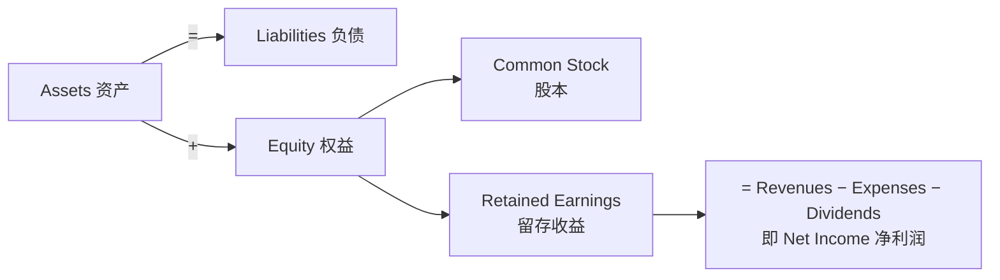
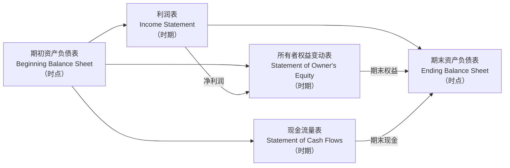
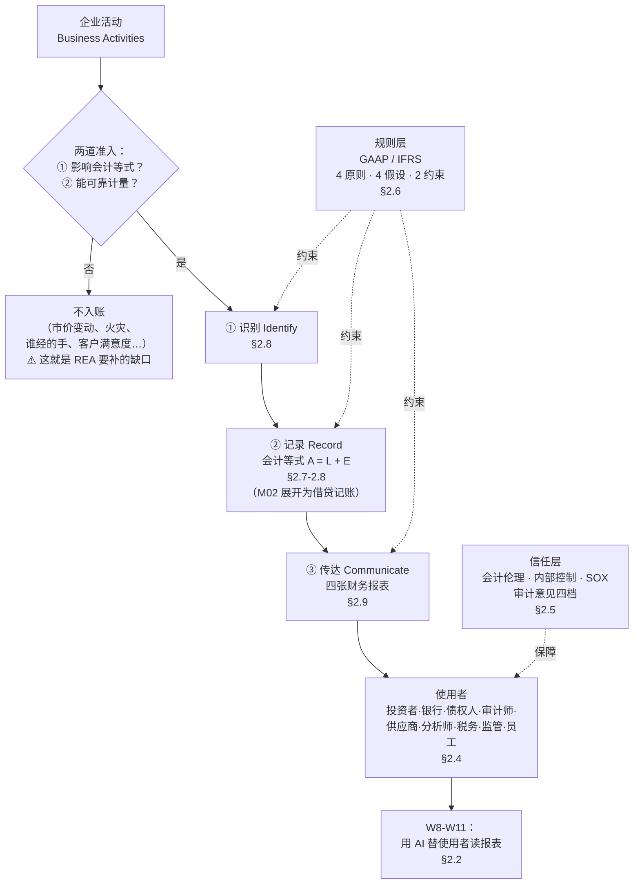
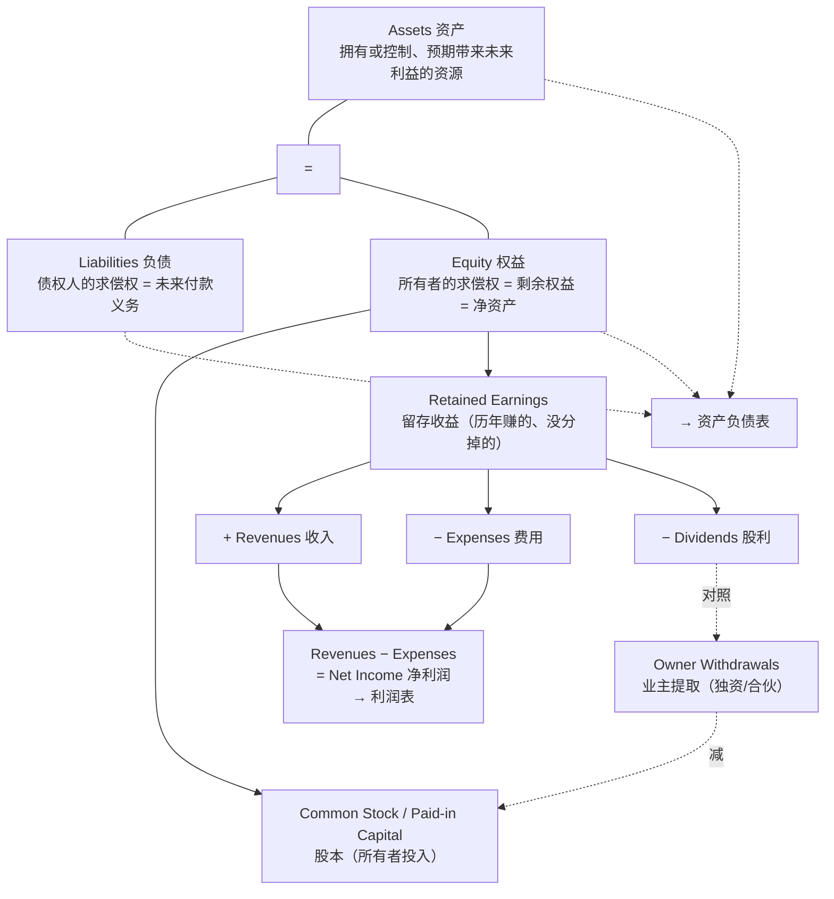
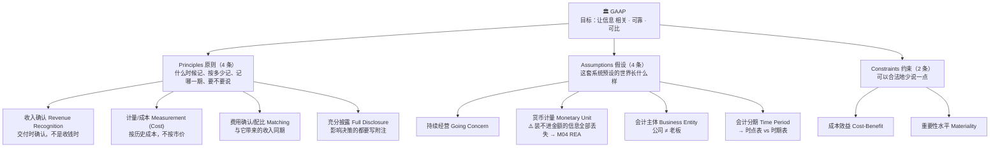

# M01 · 会计与商业（Accounting in Business）

> **本讲一句话**：这一讲不教你用 AI，它先把「财报到底是怎么长出来的」从零讲一遍——**因为教授的整门课都建立在一个论点上：不懂数字的人用 AI 分析财报，AI 放大的是错误。**
> **原始材料**：`Week 1 PPT.pptx`（83 页）+ `Accounting principles.docx` ｜ **转录**：`merged`（2h03m42s，见 [[#9.5 待核对|§9.5]] 的缺口说明）

---

## 0. 三分钟速览

**这一讲讲了什么**

83 页课件回答一条主线：**一笔生意发生之后，它是怎么一步步变成投资者手里那份年报的？**

答案分四段。**第一段**先说服你为什么必须先学会计（p.6–8）。**第二段**给出会计的定义与它的三个动作——识别、记录、传达（p.10–13），以及谁在用这些信息（p.15–18）。**第三段**说明这套系统为什么可信：它有伦理约束（安然、世通、SOX，p.20–26）和一整套规则（GAAP/IFRS、四原则四假设两约束，p.28–36）。**第四段**是全讲的技术内核：**会计等式 `资产 = 负债 + 权益`**，以及用它一笔一笔分析交易、最后生成四张报表（p.38–83）。

课堂上教授只讲到第 4 笔交易（`02:03:38` 下课），后面 7 笔顺延到 W2。

**学完你应该能**

1. **复述**会计的定义并**说清**"识别—记录—传达"三步各自在做什么
2. **区分**财务会计 / 管理会计 / 税务会计，并**判断**任意一个角色（银行、供应商、税务局、员工…）属于外部还是内部使用者、他关心什么问题
3. **说清** GAAP 与 IFRS 的根本差异（规则导向 vs 原则导向），并**举出**至少三条具体分歧
4. **给定一个业务场景，判断它符合四条会计原则中的哪一条**（🔴 教授明说这类题会出现）
5. **用会计等式分析一笔交易**：判断影响哪些要素、方向是正是负、金额多少，并验证等式仍然平衡（🔴 教授规定了答题格式）
6. **说清**四张财务报表各自报什么、哪张是"时点"哪张是"时期"、它们如何串成一条链

**如果只记三件事**

1. **`资产 = 负债 + 权益` 永远成立，一次都不能被打破。** 这是整个复式记账体系的地基——任何一笔交易至少影响两个项目，且必然让等式重新配平。
2. **"什么时候记" 比 "记多少" 更难，也更常考。** 收入按交付时点记（不是收钱时点），费用按配比记，历史成本不随市价变——这三条是四大原则的核心，也是所有会计舞弊的着手处。
3. **货币计量假设是这套系统最大的边界**：不能用钱衡量的东西（谁经的手、客户满不满意、产线堵在哪）**全部被系统性地丢掉**。这正是 W4 REA 模型存在的理由，教授在课上专门点了这一层（`01:13:05`）。

---

## 1. 开始之前 · 知识衔接

### 1.1 你已经有的

本讲是全课起点，不依赖任何前序 module。只需具备 [[Artificial_Intelligence_Accounting/_meta/知识层级台账#L0 · 入场基线|L0 入场基线]]：AI/机器学习基础、数据库的基本直觉、以及"公司、客户、成本、利润、贷款、股票"这类日常商业词汇。

> ⛔ **会计基础一律不需要。** 本讲所有会计、审计、财务概念**从零讲起**。凡是你觉得"这个词好像应该懂"的地方，笔记里都有就地解释；如果没有，那是笔记的 bug，请记到 [[#9.5 待核对|§9.5]]。

### 1.2 本讲全新引入的概念

| 概念 | English | 展开于 |
|---|---|---|
| AI 会计的两种视角 | Producer vs User Perspective | §2.2.1 🎙️ |
| 会计 · 识别记录传达 | Accounting · Identify–Record–Communicate | §2.3 |
| 财务 / 管理 / 税务会计 | Financial / Management / Tax Accounting | §2.4.3 |
| 外部 / 内部信息使用者 | External / Internal Users | §2.4 |
| 会计伦理 · 内部控制 · SOX | Ethics · Internal Control · Sarbanes–Oxley Act | §2.5 |
| 审计意见的四个档次 | Types of Audit Opinion | §2.5.4 🎙️ |
| GAAP · IFRS · 规则导向 vs 原则导向 | GAAP · IFRS · Rules- vs Principles-based | §2.6.1 |
| 概念框架 | Conceptual Framework | §2.6.2 |
| 四大原则 | Revenue Recognition / Measurement / Matching / Full Disclosure | §2.6.3 |
| 四大假设 | Going Concern / Monetary Unit / Business Entity / Time Period | §2.6.4 |
| 两条约束 | Cost-Benefit / Materiality | §2.6.5 |
| 会计等式 | Accounting Equation | §2.7.1 |
| 资产 · 负债 · 权益 | Assets · Liabilities · Equity | §2.7.2–2.7.4 |
| 收入 · 费用 · 产品成本 vs 期间成本 | Revenues · Expenses · Product vs Period Cost | §2.7.5 |
| 扩展会计等式 · 留存收益 | Expanded Accounting Equation · Retained Earnings | §2.7.6 |
| 交易分析 | Transaction Analysis | §2.8 |
| 四张财务报表 | The Four Financial Statements | §2.9 |

### 1.3 为什么这一讲放在这里 · 重排说明

这是第 1 讲，没有"承接"，只有"铺路"。它铺的路是：

- **§2.7 会计等式 → M02 的复式记账。** 借贷记账法不是新东西，它只是把"让等式重新平衡"这件事编码成了"左边记一笔、右边记一笔"的操作规程。等式没弄懂，借贷必然学不明白。
- **§2.9 四张报表 → M03 年报分析。** M03 会拿 Nike 的真实年报做共同比分析；本讲用一家虚构小公司（FastForward）把四张表各生成一遍，是最小的可运行样例。
- **§2.6.4 货币计量假设 → M04 REA 模型。** 教授在课上把这条讲成了 REA 的**动机**（`01:13:05`）：正因为传统体系只记录能用钱衡量的东西，才需要另一套能记录"谁做的、什么时候做的、做了什么"的模型。
- **§2.2 为什么先学会计 → W8–W11 的 AI 部分。** 这一段是整门课的论点声明。

**重排说明**

讲义原顺序是七段：`课程行政(p.1–4) → 为什么先学会计(p.5–8) → 会计是什么(p.9–13) → 用户(p.14–18) → 伦理(p.19–26) → GAAP 与原则(p.27–36) → 会计等式(p.37–49) → 交易分析(p.50–76) → 财务报表(p.77–83)`。

本笔记**基本保留这个顺序**（它已经是合理的学习顺序），只做三处调整：

1. **把 🎙️ 课堂独有的「编制者视角 vs 使用者视角」提到 §2.2.1 最前面**（转录 `06:18`–`12:20`）。理由：这段课件上一个字都没有，但它定义了整门课站在哪一侧——不先说清楚，后面"为什么先学会计"就没有落点。
2. **把 🎙️ 审计意见分级从"持续经营假设"里抽出来，并入 §2.5 伦理与审计**（转录 `01:09:53`–`01:12:26`）。理由：教授是在讲持续经营假设时顺带展开的，但这套四档意见本身属于"外部鉴证机制"，放在伦理那一段才成体系。
3. **把 `Accounting principles.docx` 的四个具体例题与课件 p.33 的四条原则文字合并**（§2.6.3）。理由：课件 p.33 只有干巴巴的定义，教授在课上明确说"只看定义很难懂"（`01:02:11`），然后切到那份 docx 逐条举例。两份材料本来就是一体的。

小节 ↔ 讲义页码 ↔ 课堂覆盖的完整对应见 [[#8. 讲义页码映射|§8]]。

---

## 2. 正文

### 2.1 这门课怎么运作（先把实用信息说完）

对应讲义 p.2–4。这不是"知识"，但它决定你怎么分配精力。

**考核结构**（讲义 p.2，与官方目录核对无误，见 [[Artificial_Intelligence_Accounting/_prep/课程前置资料|课程前置资料]]）

| 部分 | 权重 | 细节（**只有课件有**） |
|---|---|---|
| 小组项目 | **20%** | 3–5 人/组 ｜ **名单第 3 周末前交** ｜ **书面报告 10%，第 13 周末交** ｜ **展示 10%，25–30 分钟，每位成员都要上台** |
| 课堂参与 | **10%** | 课堂讨论 / 个人作业 / 案例解答 |
| 期中考 | **20%** | 闭卷 ｜ **第 7 周，10 月 14 日 19:30–21:30** ｜ **考场 AC1 (Yeung) Y4302 & Y4702** |
| 期末考 | **50%** | 闭卷，**3 小时**，全部为论述题与案例题 |

> ❗ **及格线**（讲义 p.2 原文）：*"You must pass **both** the Coursework (including group project, class participation and Midterm) **and** the Final in order to pass the course."*
> 官方课程目录用的是同一口径：*"Failing either component may lead to failure in the course."* **两部分要分别及格，一边高分补不了另一边。**

> 🔴 **🎙️ 教授明说的期中范围**（转录 `13:28` 与 `14:02`，**说了两遍**）：
> > *"So the midterm test in Week 7 will cover the content **from Week 1 to Week 5**."*
>
> 这意味着 **Week 6 的 ACCESS 上机不进期中考**，**AI 部分（W8 起）也不进**。⚠️ 官方 Rubric 里写着期中要考"AI 的概念、类型、实现"——那是模板残留，与实际进度矛盾，详见 [[Artificial_Intelligence_Accounting/_prep/课程前置资料#4.2 ⚠️ 期中考的范围：Rubric 说考 AI，进度表说 AI 还没讲|课程前置资料 › 4.2 ⚠️ 期中考的范围：Rubric 说考 AI，进度表说 AI 还没讲]]。

**课程结构与进度**（讲义 p.3–4）

课件把 13 周切成三块：① 传统财务报告体系——复式记账（W1–W3，主流）；② 整合式企业信息系统——REA 模型（W4–W5，另一种视角）；③ AI 在会计中的应用（W8–W11）。中间夹着 W6 的 ACCESS 上机和 W7 的期中考。

**🎙️ 课堂补充**（转录 `12:20`–`13:26`）：教授解释了 W6 为什么存在——**REA 如果只讲理论"太难懂也太无聊"，所以要把概念模型转成真实的 ACCESS 数据库跑一遍**，用能看见的数据表来理解抽象模型。他还提醒（`14:48`）：*"The schedule… if we have any change, I will let you know immediately."*

---

### 2.2 为什么必须先学会计，才谈 AI

#### 2.2.1 🎙️ 两种视角：你是财报的编制者，还是使用者？

> **本小节全部来自转录 `06:18`–`12:20`，讲义上没有任何对应内容（p.5 只是一张分隔页）。** 它是本讲信息密度最高、也最不可能从课件里读出来的一段。

**是什么**

教授说，"AI 会计"这个题目必须先问一句：**你站在哪一边？** 他给了两套完全不同的清单：

| | **编制者视角**（Producer / Preparer） | **使用者视角**（User）← **本课站这边** |
|---|---|---|
| **你是谁** | 公司里做账的会计 | 投资者、分析师、债权人、银行经理、监管者、税务人员 |
| **目标** | 用更少的人力，产出**准确且及时**的报表 | 提取洞察、做决策；**更快更准地决策** |
| **AI 干什么** | 自动化交易记录与日记账分录；银行对账（bank reconciliation）；异常检测（anomaly detection）；集团合并报表自动化；起草披露；**XBRL 标签化** | 自动化比率分析、趋势分析；**用自然语言直接问报表**（"这家公司近几年毛利率下滑是什么驱动的？"）；盈余质量预测；同业对标（peer benchmarking）；从年报里做情绪与风险检测（尤其是 **MD&A** 管理层讨论与分析部分） |
| **喂什么数据** | 原始凭证：合同、发票 → 试算表 → 报表 | 财务报表、附注，以及公开新闻、业绩电话会记录 |
| **最大好处** | 例行工作量大幅下降；准确率更高、错误更少；出表更快；控制更好 | **不需要很深的会计功底就能拿到即时洞察**；更早发现红旗信号；辅助预测 |
| **人还要干什么** | 监督、处理例外、**专业判断**、保密 | **解读 AI 的输出**、补上业务语境、**做最终决策** |
| **主要风险** | 过度依赖 AI；模型偏见（选了哪个数学模型去训练就带来哪种偏差）；需要强数据治理 | **幻觉**（hallucination）、黑箱不可解释、数据质量 |

**为什么需要它**

因为这两条路对"你需要懂多少会计"的要求完全不同。教授的原话（`08:45`）：

> *"as we mentioned this course is designed for the **non-accounting students**. So that's why we should focus [on] … **users of financial statements**."*

**所以这门课不会教你怎么做账，它教你怎么读账、并判断 AI 读得对不对。**

**💡 换个说法（笔记补充）**

拿代码类比：编制者视角像"用 Copilot 写代码"，使用者视角像"用 AI 做 code review"。前者要求你会写，后者要求你**看得出它错在哪**。这门课培养的是后者。而后者恰恰更需要基础知识——你可以不会手写快排，但你必须知道 O(n²) 意味着什么，否则 AI 说"这段是 O(n log n)"你只能点头。

**⚠️ 常见误解**

- ❌ **"使用者视角要求更低。"** 恰恰相反。编制者有系统兜底（试算表不平就报错），使用者手里只有 AI 的一段自然语言输出，**没有任何自动校验**。教授强调的"你是质量过滤器"针对的就是这一侧。

**与其他概念的关系**

这一节定义了整门课的立场，后面的 W9（"从利益相关者视角看 AI 财报分析"）和 W10 都是它的展开。它也直接决定了 §2.4「谁在用会计信息」为什么值得花那么多篇幅——**每一类使用者的问题不同，向 AI 提的问题就该不同**（转录 `27:44`）。

---

#### 2.2.2 会计基础为什么必须排在 AI 前面

**是什么**

课件（p.6）先立一个**常见误解**：

> ❌ *"Just throw the financial statements at AI and let it analyse them."*（把财报丢给 AI，让它自己分析。）
> ✅ *"AI is a powerful amplifier, but **only when you already understand the numbers**."*

然后（p.7）给四条论证：

| # | 论点 | 展开 |
|---|---|---|
| 1 | **你必须会说这门语言** | 收入确认、权责发生、折旧、营运资金、杠杆——**AI 就是用这些词跟你说话的**，你得知道它们真正指什么 |
| 2 | **报表之间是相互勾稽的** | 利润表、资产负债表、现金流量表，一处变动必须在别处对上。**AI 可能漏掉这些勾稽，也可能凭空造出勾稽** |
| 3 | **判断仍然属于人** | 会计估计、激进的会计政策、表外项目、有创意的列报方式，都需要**职业怀疑**（professional skepticism） |
| 4 | **你才是质量过滤器** | AI 会**编造比率、虚构趋势、跳过附注** |

课件 p.8 进一步列出"AI 帮你之前你必须自己会的六件事"：读懂财报 → 计算并解读关键比率 → 跨行业或跨年份把故事串起来 → 读附注和 MD&A → 认出红旗信号 → **先形成自己的判断，再去验证它**。

**🎙️ 课堂补充**（转录 `14:48`–`18:14`）

教授把第 4 条讲得比课件重：

> *"if you know nothing about the accounting, you are **less likely to find those [errors]** and make your own correct adjustments."*

他还给了一句课件上没有的定位（`17:16`）：**"AI 是工具，人做决定、人做判断"**——AI 至少在现阶段只是 tool，判断权不转移。

**💡 换个说法（笔记补充）**

第 4 条的实质是：**AI 的错误率不是零，而幻觉的特征是"错得很流畅"。** 一个不懂会计的人拿到 AI 生成的"该公司流动比率 1.8，偿债能力健康"，没有任何抓手判断这个 1.8 是算出来的还是编出来的。懂会计的人会去看资产负债表把它验算一遍——**这个验算能力就是这门课前 7 周在建立的东西**。

**⚠️ 常见误解**

- ❌ **"AI 越强，会计知识越不重要。"** 课件的立场正相反：AI 越强，输出越流畅，**流畅的错误比笨拙的错误更危险**，所以对使用者判断力的要求反而更高。
- ❌ **"幻觉只是偶尔编个数字。"** 课件 p.7 明确列了三种形态：编比率（hallucinate ratios）、造趋势（invent trends）、**漏附注**（overlook footnotes）。第三种最隐蔽——它不是说错，而是**没说**。

**与其他概念的关系**

这一节是本课的论点声明，直接对应 CILO-1。它和 IS5113 W4/W5 的"人在环路"讨论是同一件事的两个学科版本，也是 [[Artificial_Intelligence_Accounting/00-课程总览#与其他课的交叉点|与 IS5113 的交叉点]]之一。

---

### 2.3 会计是什么

> 📄 **本节对应学习目标（讲义 p.9）**：*Explain the purpose and importance of accounting.*


**是什么**

Tom 想开一家面包店，找朋友借了一笔钱当本金：他要把"买了什么、花了多少、后来赚了多少"都记下来，年底还要能跟朋友说清楚这笔钱现在变成了什么（下文"课件原例：Tom 的面包店"会完整展开这个故事）。**这一整套"发生了什么 → 记下来 → 说清楚"的过程，就是会计（accounting）在做的事**——这也是教授把它叫作"商业的语言"的原因。严谨地说，课件 p.10 给的定义要能背下来（考试可直接写）：

> **Accounting is the language of business — an information and measurement system that *identifies, records and communicates* relevant, reliable, and comparable information about an organization's business activities.**
>
> 会计是商业的语言——一套**识别、记录并传达**关于一个组织经营活动的**相关、可靠、可比**信息的**信息与计量系统**。

三个动作（p.11）：

| 动作 | 英文 | 干什么 | 课件原例 |
|---|---|---|---|
| **识别** | Identifying | 从发生的事情里**挑出**属于交易和事项的那些 | 苹果卖出一台 iPhone；TicketMaster 收到票款 |
| **记录** | Recording | **输入、计量、登记** | 按日期、按金额登记的交易流水 |
| **传达** | Communicating | **编制、分析、解读** | 编出财务报表这类报告 |

**课件原例：Tom 的面包店**（讲义 p.12–13）

Tom 想开面包店，向朋友借钱作为本钱。

- **识别**：他买了一台烤箱——这是一项**资产**
- **记录**：`设备——烤箱，$1,200`
- **传达**：把财务信息提供给出钱的朋友，回答"现在手上有多少资产？""过去一年赚了多少？"

**🎙️ 课堂补充**（转录 `18:14`–`20:38`）

教授在讲 Tom 这个例子时补了一句课件没写的：借来的钱**本身也要先被识别为资产**（`19:31`：*"the borrowed money [is] the asset"*），再用它去买设备。这一步在课件上被跳过了，但它是后面理解"融资是一笔交易、买设备是另一笔交易"的关键。

**💡 换个说法（笔记补充）**

"识别—记录—传达"可以对应到任何数据管道：**采集 → 存储 → 出报表**。会计的特殊之处在于，**"识别"这一步有非常严格的准入门槛**——不是所有发生的事都能进来（见 §2.8.1 的两条准入规则），这跟"日志先全收下来再说"的工程习惯完全相反。

**⚠️ 常见误解**

- ❌ **"会计就是记账。"** 记账只是三个动作里的中间一个。**"识别"（判断什么该进系统）和"传达"（编报表、让外人看懂）才是真正需要判断力的部分**，也是 AI 目前最难替代的部分。
- ❌ **"相关、可靠、可比只是修饰词。"** 它们是 GAAP 的三个明确目标（p.28），后面会被写进概念框架的"质量特征"层。

**与其他概念的关系**

三个动作正好是本课的骨架：**识别 → §2.8 交易分析；记录 → M02 复式记账；传达 → §2.9 四张报表 + M03 年报分析。** 教授在 `01:48:16` 明确回指了这条线。

**所以呢**：知道了会计在做"识别—记录—传达"这三件事，下一个自然的问题是——记下来、传达出去，到底是**给谁看**的？这正是下一节要回答的问题。

---

### 2.4 谁在用会计信息

**是什么**

课件 p.15：会计之所以叫商业的语言，是因为**所有组织都建立会计信息系统来传达数据、帮人做更好的决策**。使用者分两大类：

| | **外部使用者** External | **内部使用者** Internal |
|---|---|---|
| 身份 | 公司外部的人 | 公司内部的人 |
| 拿到什么 | **通用目的财务报表**（一份报表给所有人看） | 想要什么就能拿什么（专用报告） |
| Tom 的例子（p.16） | Tom 的朋友：**回报有多少？未来表现如何？** | Tom 和他的团队：**怎么提高效率？成本是多少？** |

课件 p.17 只举了三个：投资者（估值用）、银行（决定放不放贷、评估贷款风险）、管理者（投资决策 + 评估各级员工绩效），后面跟一个 `….`。

#### 2.4.1 🎙️ 教授把这张单子扩到了十几个角色

> 这是本讲第二处高价值的课堂补充。转录 `21:46`–`29:37` 用了近 8 分钟逐个展开，**课件上只有 3 个**。

| 角色 | 内/外 | **他关心的那个问题** | 转录 |
|---|---|---|---|
| 投资者 Investors | 外 | 股票值不值这个价 | `21:46` |
| 银行 Bankers | 外 | 借不借、风险多大——**核心是"将来能不能连本带息还上"** | `22:26` |
| **债权人 Creditors** | 外 | 与银行同类但不限于银行。**任何被公司欠钱的一方**（Tom 的朋友就是债权人） | `23:22` |
| **审计师 Auditors** | 外 | 确保对外披露的财报**完整且准确**。⭐ 教授给了审计质量的判据：**事后没爆雷 = 好；事后查出舞弊或误导性信息 = 审计质量差** | `24:01` |
| **供应商 Suppliers** | 外 | 我把货交了，这家公司付得出钱吗 | `25:04` |
| **客户 Customers**（指**企业客户**，不是个人消费者） | 外 | 这家供应商能不能长期、以合理价格稳定供货 | `25:25` |
| **财务分析师 Financial Analysts** | 外 | 向资本市场给出**买入/持有/卖出**建议 | `26:21` |
| **税务机关 Tax Authority** | 外 | **应税所得与会计利润的差额**是怎么来的，要公司解释 | `26:57` |
| **监管机构 Regulatory Bodies** | 外 | 美国的 **SEC**、**PCAOB**〔?〕。核查财报质量，防止误导性或虚假信息损害市场与投资者利益 | `27:21` |
| 管理层 Managers | 内 | 投资决策、绩效考核 | `22:53` |
| **员工 Employees** | 内 | 公司的财务状况直接影响自己的职业前景 | `28:14` |
| **董事会 Board of Directors** | **内/外皆可** | 代表股东利益。教授说**归内归外都说得通** | `28:34` |
| **审计委员会 Audit Committee** | 内 | 与外部审计师协作，在财报披露前**解决遗留问题** | `29:10` |
| **风险委员会 Risk Committee** | 内 | 公司的会计处理是否**违反准则或监管规定**（合规） | `29:37` |

> ⚠️ **ASR 说明**：转录 `27:21` 原文是 `"in USSECIN United States? FEC for TCOB"`。结合语境（美国的证券市场监管机构），几乎可以确定是 **SEC**（Securities and Exchange Commission，美国证券交易委员会）与 **PCAOB**（Public Company Accounting Oversight Board，上市公司会计监督委员会，SOX 设立）。**PCAOB 标 〔?〕**，见 [[#9.5 待核对|§9.5]]。

**🎙️ 教授为什么要展开这张单子**（转录 `27:44`，这句是全段的题眼）：

> *"in the future when we discuss how the external users can rely on the help from the AI tools to make analysis, **we can put ourselves into the different roles and ask different questions**, because for every user, they have different needs. So that's why when we ask the AI questions, [we should] not just ask a generalized question which can be applied to everyone."*

**这是一句方法论**：向 AI 提问之前先确定自己扮演谁。银行问偿债能力，分析师问增长与估值，税务局问差异——**同一份财报，问题不同，该看的数字完全不同。** W9「从利益相关者视角看 AI 财报分析」整整一周讲的就是这个。

#### 2.4.2 💡 换个说法（笔记补充）

把这张表想成**权限模型**：外部使用者只有一个只读的公共 API（通用目的财务报表），字段是固定的，谁来都一样；内部使用者有数据库直连权限，想 join 什么就 join 什么。**会计准则的全部复杂性，几乎都来自"那个公共 API 该暴露什么字段"这个问题。**

#### 2.4.3 三类会计（讲义 p.18）

同样是"做会计"，站在不同的门口，报出去的东西完全不一样：给股东看的、给老板自己看的、给税务局看的，是三套不同的活。课件 p.18 把它归纳成三类：

| | 给谁看 | 通过什么 |
|---|---|---|
| **财务会计** Financial Accounting | **公司外部**的人（投资者、债权人） | **通用目的财务报表** |
| **管理会计** Management Accounting | **公司内部**的人（管理者） | 内部报告（🎙️ 教授补充：**主要用于评估成本**，转录 `30:19`） |
| **税务会计** Tax Accounting | 税务机关 | 纳税申报 |

> **本课全程只讲财务会计。** 管理会计与税务会计只在这一页出现过。

**⚠️ 常见误解**

- ❌ **"财务会计的报表也是给管理层看的。"** 定义上不是。管理层当然会看，但通用目的财务报表的**设计目标使用者是外部人**——它必须在"不知道读者是谁"的前提下依然有用，这正是它必须遵循统一准则的原因。

**与其他概念的关系**

外部使用者对信息的依赖 → 引出 §2.5（信息必须可信 → 需要伦理与审计）；统一的对外报表 → 引出 §2.6（需要统一准则 GAAP/IFRS）。这两条因果线是课件从 p.18 走到 p.36 的内在逻辑。

**所以呢**：外部使用者拿到的是同一份报表，这份报表要让人信得过、也要能跨公司比较——信得过的问题下一节就讲（会计伦理），能比较的问题再下一节讲（GAAP／IFRS）。

---

### 2.5 会计伦理：为什么这套系统需要道德约束

> 📄 **本节对应学习目标（讲义 p.19）**：*Explain why ethics are crucial to accounting.*


#### 2.5.1 核心论证

**是什么**（讲义 p.20–21）

设想你是 Tom 面包店的朋友，借了他一笔钱：你愿不愿意借，取决于你**信不信**他给你看的账本是真的。如果账本可以随便编，借钱这件事就没法做了。**伦理（ethics，区分对错、判断行为好坏的标准）**要解决的就是这个"信不信"的问题。严谨地说：

> **Ethics are beliefs that distinguish right from wrong; accepted standards of good and bad behavior.**
> 伦理是区分对错的信念，是被接受的良善与恶劣行为标准。

课件 p.21 给出的因果链只有一句，但它是本节全部内容的地基：

> *"The goal of accounting is to provide useful information for decisions. **For information to be useful, it must be trusted.** This demands ethics in accounting."*
> 会计的目标是提供有用的决策信息。**信息要有用，就必须被信任。** 所以会计必须要有伦理。

**🎙️ 课堂补充**（转录 `30:36`）：教授把它说得更直接——会计里的伦理问题**不可避免**，因为**历史上有太多会计丑闻给资本市场带来了巨大损失**；一旦财报里有误导性信息，**投资者和外部信息使用者会直接受损**。

**💡 换个说法（笔记补充）**

用信息系统的话说：**财报是一个没有加密、也无法自证的数据源。** 你不能从数字本身验证数字是真的。整套注册会计师制度、审计意见、SOX、监管机构，本质上都是在给这个数据源补一层**外部签名机制**——伦理是这层机制失效时唯一剩下的东西。

**所以呢**：道理讲清楚了，但"信任为什么会崩"光讲道理没有说服力——下面三个真实丑闻就是反面教材。

#### 2.5.2 三个丑闻（讲义 p.22–25）

"信息要被信任"听起来是句正确的废话，直到你看到信任崩掉之后有多惨烈。下面三家公司都曾是各自领域的明星，都因为财务信息造假或失守而轰然倒下：

| 案例 | 年份 | 干了什么 | 结局 |
|---|---|---|---|
| **安然 Enron** | 2001 | 休斯顿的美国能源公司，破产前约 **22,000 名员工**，连续 **6 年**被《财富》评为"美国最具创新力公司"。1990 年代一系列**违规会计处理**被曝光 | 股价从 **90 美元以上跌到 0.5 美元以下**；2001-12-02 申请破产；**导致会计师事务所 Arthur Andersen 解体** |
| **世通 WorldCom** | 2002 | 1983 年创立的小公司，15 年内成为全球最大电信之一（2,000 万客户、55,000 员工）。2002 年 6 月宣布重述 2001 与 2002Q1 财报——内部审计发现 **38 亿美元**被从**线路成本费用**违规转到**资产负债表** | 股票立即停牌；复牌后跌到 **6 美分**，市值蒸发 90% 以上 |
| **奥林巴斯 Olympus** | 2012-01-05 | 《华尔街日报》报道：**掩盖 15 亿美元亏损的两名高管，同时分管公司的举报热线**。独立调查小组指出公司文化中员工"**不敢表达与领导层不同的看法**" | 公司治理改革成为焦点 |

> ⏭️ **课上略过**：奥林巴斯（p.25）教授明确说**留作课后自读**（转录 `48:14`：*"you don't have to [go through it]… if you are interested you can check that after class"*）。**但它是三个案例里唯一一个讲"举报机制失效 + 组织文化"的**——如果考到"内控为什么会失灵"，它比另外两个更切题。**建议自己读一遍，不建议真的跳过。**

**🎙️ 课堂补充 ①：教授放了一段安然纪录片**（转录 `33:08`–`40:08`，约 7 分钟）

视频不在课件里（pptx 中没有任何视频对象），转录完整记录了旁白。**其中有几个课件上完全没有、但极适合当案例素材的细节**：

| 细节 | 内容 |
|---|---|
| 起源 | 1985 年由两家能源公司合并而成；著名设计师 **Paul Rand**（IBM、UPS、ABC 的 logo 设计者）设计了那个歪斜的 E |
| **舞弊手法的名字** | Jeffrey Skilling 在公司内引入了 **mark-to-market accounting（按市值计价）**——*"the practice of valuing your assets based on **predictions of their future prices** rather than on historical prices"* |
| **为什么这是要害** | 它*"基本上给了安然自行决定利润的权力，而不必对估值的准确性负责"* |
| 藏亏损的工具 | **SPV（special purpose vehicle，特殊目的实体）**，用安然自己的股票做担保——**一旦安然股价崩，债权人就再也拿不回钱** |
| 数字 | 2001-11 承认 1997–2000 年间**虚增利润 5.91 亿美元**；2 万多名员工的 401(k) 养老金因换管理人被冻结 30 天而血本无归 |
| 追责 | Lay 与 Skilling 合计被控 **39 项**欺诈与共谋罪；Lay 判决前心脏病去世，Skilling 被判 **24 年**、实服 12 年，2019 年出狱 |
| 后果 | 直接催生 **SOX 法案** |

> ⭐ **`mark-to-market` 这个词直接打脸 §2.6.3 的计量原则（历史成本）。** 安然的核心手法就是**绕过历史成本、改用自己预测的未来价格**。教授在讲计量原则时（`01:05:00`）还专门提到"历史成本 vs 现时市价"是当下真实存在的学术争论——**这两处应该连起来看**：历史成本被诟病"不反映现实"，但它的最大优点恰恰是**客观、不可操纵**。

**🎙️ 课堂补充 ②：世通的舞弊，教授用会计分录讲了一遍**（转录 `46:18`–`47:46`）

课件 p.24 只说"把线路成本从费用转到了资产负债表"，教授把它拆成了两个分录（**这已经是 M02 复式记账的内容，本讲提前用到了**）：

| | 分录 | 后果 |
|---|---|---|
| **本来应该记的** | `借：线路成本费用（Line cost expense）`<br>`贷：现金（Cash）` | 费用↑ → **净利润↓**（净利润 = 总收入 − 总费用） |
| **世通实际记的** | `借：某项资产（Assets）`<br>`贷：现金（Cash）` | 资产↑、现金↓，**利润表完全没有反应** |

> 💡 **换个说法（笔记补充）**：这就是所谓**"费用资本化"**——把一笔当期就该扣掉的开销，伪装成一项能在未来慢慢摊掉的资产。投资者看利润表，看到的是"公司还在赚钱"；实际上钱早就花出去了。**它违反的正是 §2.6.3 的费用确认（配比）原则。**
>
> 结果：*"although the company suffer[ed] so much loss, this loss is not reflected in the income statement. Instead it is capitalized into the balance sheet."*（转录 `47:46`）

**🎙️ 课堂补充 ③：教授中途切到 Week 3 的真实年报**（转录 `42:34`–`45:27`）

为了让"利润表 vs 资产负债表"具体起来，教授当场翻到 **Week 3 PPT 的 p.14–15（资产负债表）和 p.34（利润表）**，用一家真实公司 2018/2019 两年对照的报表讲了：

- 资产负债表分**非流动资产**（长期，使用超过一年）和**流动资产**（一年内可变现或用掉；**现金是流动资产的一种**），负债同理分流动/非流动，再加上权益
- **利润表标题是 "for the year ended December 31, 2019"（一段时期），资产负债表标题是 "December 31, 2019"（一个时点）** ← 这一点是 §2.6.4 会计分期假设的直接落地
- 利润表最后一行为正 = 盈利，为负 = 亏损；**投资者最关心的就是这一行**

**所以呢**：三个丑闻说明"伦理靠自觉"不够用，必须有法律和制度兜底——这就是 SOX 法案要解决的问题。

#### 2.5.3 SOX 法案（讲义 p.26）

**是什么**

2002 年，美国国会通过**萨班斯—奥克斯利法案（Sarbanes-Oxley Act，简称 SOX）**，遏制公开发行股票的公司的财务舞弊。四条要求：

1. **要求对内部控制（internal controls）做文档记录与验证**，并强调内控必须有效
2. **管理层必须出具报告，声明内部控制是有效的**
3. **审计师必须验证内部控制的有效性**
4. 不遵守可导致**罚款与对高管的刑事追诉**

课件给了延伸链接：`https://www.investopedia.com/terms/s/sarbanesoxleyact.asp`

> 💡 **内部控制（internal control）是什么**（本课件未定义，笔记补充）：公司内部为了**保证财务报告可靠、防止舞弊与错误**而设计的一整套制度与流程——例如"付款必须两人复核""销售录入与收款分由不同人负责"。它是**事前预防**机制，与审计的**事后检查**互补。

**🎙️ 课堂补充**（转录 `39:15` 视频 + `48:40`）：视频补了一条课件没写的关键点——SOX **设立了一个专门监督上市公司审计报告的委员会**（即 PCAOB），并**严格限制审计师还能同时提供哪些服务**（即禁止"既当审计又当咨询"的利益冲突，这正是安然—Andersen 案的病根），还要求**高管亲笔签署财报**，*"[so that they] no longer [can] plead ignorance to their firm's wrongdoing"*——**不能再用"我不知道"来免责**。

> ⭐ **这条是与 [[Artificial_Intelligence_Accounting/_prep/课程前置资料#6.1 ↔ IS5113 AI Ethics and Regulations|IS5113 W5 问责]] 最直接的接口**：SOX 是"如何把一个复杂组织造成的伤害，通过法律把责任钉死到具体自然人身上"的**成熟先例**。IS5113 讨论"AI 出错谁负责"时，SOX 的三段式设计（管理层声明 → 独立第三方验证 → 刑事责任兜底）是可以直接类比的制度模板。

#### 2.5.4 🎙️ 审计意见的四个档次

> **本小节完全来自转录 `01:09:53`–`01:12:26`，讲义没有任何对应页。** 教授是在讲"持续经营假设"时顺带展开的，本笔记把它移到这里成体系（见 [[#1.3 为什么这一讲放在这里 · 重排说明|§1.3]] 重排说明 ②）。

**是什么**

审计师看完财报后出具的意见，按错报严重程度从轻到重分四档：

| 档 | 英文 | 含义（教授原话意译） |
|---|---|---|
| 1 | **Clean / Unqualified opinion**（无保留意见） | *"nothing… no errors in the financial statements"* —— 干净，没问题 |
| 2 | **Unqualified opinion with explanatory notes**（带强调事项段的无保留意见） | 有一些错，**但不重大**（not material） |
| 3 | **Qualified opinion**（保留意见） | **存在重大错报**（material errors），**但还不影响持续经营假设** |
| 4 | **Adverse opinion**（否定意见） | 财报含有**重大错报**，会**误导资本市场**，并使人怀疑**公司能否继续经营下去** |

**为什么需要它**

因为"财报可不可信"不是一个是非题。审计师需要一种**分级的、公开的**方式，把自己发现的问题的严重程度传达给市场——而市场（尤其是银行和债权人）会据此重新定价。

教授给出的触发点（`01:09:03`）：**如果审计师认为公司财务状况差到无法满足持续经营假设，就会出具相应的意见让市场知道。**

**💡 换个说法（笔记补充）**

这套四档意见其实是一个**分级告警系统**：绿（clean）/ 黄（带说明段）/ 橙（保留）/ 红（否定）。它的可贵之处在于**告警是由一个独立于被审计方的第三方发出的，并且必须公开**。

**⚠️ 常见误解**

- ❌ **"unqualified 是'不合格'。"** 中文语感完全反了。**unqualified = 未加限定 = 无保留 = 最好的意见**；**qualified = 加了限定 = 保留意见 = 有问题**。这是英文会计术语最容易踩的坑之一。
- ❌ **"保留意见和否定意见差别不大。"** 差别在**持续经营**这条线上：保留意见说"有重大错，但公司还能活"；否定意见说"错到让人怀疑公司还能不能活"。

> 📌 **本笔记未列出第五档 disclaimer of opinion（无法表示意见）**——教授只讲了四档，课件没有。**不补进正文**，但知道它存在有好处。（⚪ 笔记推断，标 🔗 常识性会计知识）

**与其他概念的关系**

审计意见 → 依赖 §2.6.4 的**持续经营假设**作为分档标准 → 是 §2.5.1"信息必须被信任"的制度化实现 → 对应 IS5113 W4 透明性。

---

### 2.6 规则：GAAP、概念框架、四原则四假设两约束

> 📄 **本节对应学习目标（讲义 p.27）**：*Explain generally accepted accounting principles and define and apply several accounting principles.*


#### 2.6.1 GAAP 与 IFRS

**是什么**（讲义 p.28–30）

如果每家公司都能自己决定"收入什么时候算数""资产按什么价格记"，那两家公司的报表根本没法比较，投资者也没法信。所以整个行业需要一套大家都遵守的记账规则——这套规则就叫**公认会计原则（GAAP）**。严谨地说：

> **Financial accounting is governed by concepts and rules known as generally accepted accounting principles (GAAP). GAAP aims to make information relevant, reliable, and comparable.**

三个目标各自的意思（p.28）：

| | 英文原句 | 中文 |
|---|---|---|
| **相关** | Relevant information **affects decisions** of users. | 会影响使用者的决策 |
| **可靠** | Reliable information is **trusted** by users. | 被使用者信任 |
| **可比** | Comparable information is helpful in **contrasting organizations**. | 便于在不同组织之间对比 |

**世界上有两套**（p.29–30）：

| | **US GAAP** | **IFRS** |
|---|---|---|
| 制定者 | **FASB**（Financial Accounting Standards Board，美国财务会计准则委员会） | **IASB**（International Accounting Standards Board，国际会计准则理事会） |
| 适用 | 美国 | 已被 140 多个国家/地区采用 |
| 采用时点（课件 p.29 举例） | — | **欧盟 2005-01-01 ｜ 香港 2005-01-01 ｜ 中国大陆 2007-01-01** |
| 两者关系 | FASB 与 IASB **已同意朝趋同（harmonization）方向努力** | 同左 |

**🎙️ 课堂补充 ①：最根本的那条差异**（转录 `51:43`–`53:05`）

课件完全没提，但教授在白板上专门讲了、并称之为 *"the biggest difference"*：

| | US GAAP | IFRS |
|---|---|---|
| **取向** | **规则导向（rules-based）** | **原则导向（principles-based）** |
| 特征 | **细则详尽**，逐条给出具体处理指引 | **原则宽泛、留有弹性**，**允许专业判断**（professional judgment） |

**🎙️ 课堂补充 ②：教授放了第二段视频，给出十条具体差异**（转录 `53:53`–`58:24`）

视频不在课件里。十条如下（这是把"规则 vs 原则"落到实处的最好材料）：

| # | 议题 | US GAAP | IFRS |
|---|---|---|---|
| 1 | 制定机构 | FASB | IASB |
| 2 | **取向** | **规则导向** | **原则导向** |
| 3 | **存货计价** | 允许 **LIFO**（后进先出）与 FIFO（先进先出） | **禁止 LIFO**（认为会扭曲盈利与报告），只能用 **FIFO 或加权平均** |
| 4 | 收入确认 | ASC 606 的详细指引，要求"已赚取且可变现" | **五步模型**，以合同为基础，更灵活 |
| 5 | 研发支出 | R&D 一般**发生即费用化** | 满足特定条件（如能证明未来经济利益）的**开发支出可资本化** |
| 6 | 报表格式 | 格式要求**更严格** | **不强制**规定资产负债表/利润表/现金流量表的具体格式 |
| 7 | 租赁 | 分**经营租赁**与**融资租赁** | **IFRS 16** 要求承租人把**几乎所有租赁**都确认为融资租赁，在表内确认**租赁负债**与**使用权资产** |
| 8 | 资产减值 | **两步法**：先测可收回性，再计量减值损失 | **一步法**：直接用可收回金额，**通常更早确认减值** |
| 9 | 合并报表 | **风险与报酬模型** | **控制模型**：母公司对子公司的经营与财务政策有控制权时合并 |
| 10 | 非常项目 | 异常且罕见的项目**必须在利润表单独列示** | **不允许**单独列示，一律并入正常经营的收入与费用 |

> 🎙️ 教授对这十条的定位（`58:24`）：*"[they're] very technical… **it's just for your information**, but still such comparison[s] are very useful… especially for those involving international accounting."*
> ⚪ **判断**：第 2 条（规则 vs 原则）是他亲自讲的、且称为"最大差异"，**是考点**；其余九条是视频内容，标"仅供参考"，**优先级低**。

**⚠️ 常见误解**

- ❌ **"IFRS 更宽松所以更容易操纵。"** 两边各有风险。规则导向的风险是**"合规但不合理"**——照着细则字面走就能钻空子（安然的很多结构就是这么设计的）；原则导向的风险是**判断空间大、可比性下降**。这是一个权衡，不是优劣。
- ❌ **"香港用 US GAAP。"** 香港 2005 年起采用 IFRS（本地称 HKFRS，与 IFRS 实质趋同）。中国大陆 2007 年起的企业会计准则（CAS）也与 IFRS 趋同。

**所以呢**：GAAP／IFRS 定了"要遵守什么规则"，但这些规则本身是怎么被设计出来的？下一节的概念框架回答这个更上一层的问题。

#### 2.6.2 概念框架（讲义 p.31）

FASB 与 IASB 正在推进趋同并强化的**概念框架（conceptual framework）**，用来指导准则的制定本身。四层，课件用一个金字塔表示（顶→底）：

| 层级（顶→底） | 内容 |
|---|---|
| **① 目标** Objectives | 为投资者、债权人等提供有用信息 |
| **② 质量特征** Qualitative characteristics | 相关、可靠、可比 |
| **② 要素** Elements | 定义报表能包含哪些项目 |
| **③ 确认与计量** Recognition and measurement | 一个项目要满足什么条件才能被确认为要素；以及怎么计量它 |

> 第②层里"质量特征"与"要素"在课件的金字塔图上是并排的两根柱子，不分先后。

> 💡 **换个说法**：这四层就是**"为什么要有准则 → 好准则长什么样 → 允许出现哪些名词 → 什么时候把它写进去、写多少"**。第四层「确认与计量」正是 §2.6.3 四条原则要解决的问题。

#### 2.6.3 四大原则（讲义 p.32–33 + `Accounting principles.docx`）

**是什么**

课件 p.32 用一座希腊神殿的图把整套规则分了三层：**屋顶 = GAAP；柱子上层 = Principles（原则）；柱子下层 = Assumptions（假设）；地基 = Constraints（约束）**。并区分：

- **一般原则（general principles）**＝为编制财务报表提供的**假设、概念与指引**
- **具体原则（specific principles）**＝报告业务交易与事项时用的**详细规则**

> **本课只讲一般原则。** 教授明说（`01:01:14`）：*"our focus is the general principle."*

**四条原则 + 教授逐条讲的例子**

教授在课上说（`01:02:11`）："只看描述很难懂"，于是切到 `Accounting principles.docx` 逐条举例。下表把两份材料合并：

| # | 原则 | 规则（讲义 p.33 / docx） | 例子（docx，教授逐条讲解） |
|---|---|---|---|
| 1 | **收入确认原则**<br>Revenue Recognition Principle | **在商品或服务被提供给客户时**、且金额可合理确定时确认收入，**不是收到现金时** | 9 月 15 日卖给客户一台笔记本 $8,000，客户 10 月才付钱。→ **收入记在 9 月**（交付发生在 9 月、价格已定），不是 10 月 |
| 2 | **计量原则（成本原则）**<br>Measurement / Cost Principle | 按**实际历史成本**（付出的金额）记录资产与交易，**不按现时市价**。历史成本被认为是**客观**的 | 2020 年花 500 万买一块地，2026 年市价 1,200 万。→ **仍按 500 万列报** |
| 3 | **费用确认原则（配比原则）**<br>Expense Recognition / Matching Principle | 把费用记在**它所帮助产生的收入的同一期间** | 1 月买入 \$30,000 存货，2 月全部卖出。→ 这 \$30,000 在 **2 月**记为**销货成本**（费用），不是 1 月 |
| 4 | **充分披露原则**<br>Full Disclosure Principle | 提供**所有可能合理影响使用者决策**的信息，**通常放在报表附注里** | 公司被索赔 $1,000 万，结果未定。→ **即使还没输，也必须在附注披露**，让读者知道潜在的大额损失 |

**🎙️ 课堂补充**

| 位置 | 补充内容 |
|---|---|
| `01:04:24`–`01:05:25`（原则 2） | 教授主动提出**这条原则看起来"不太合理"**，然后说：*"if you think about this, you are very very good, because recently there is such argument whether such asset, for example land, should be valued as the historical cost **or** the current market value. **So that is the debate.**"* —— **历史成本 vs 公允价值是当下真实的学术与准则争论**，不是定论 |
| `01:06:31`（原则 3） | 补了课件没写的一步：**1 月买入的 $30,000 在 1 月不是费用，而是资产**（存货）。到 2 月卖出时，这项资产才**转成销货成本**。这一步不点破，配比原则就只是一句空话 |
| `01:07:27`–`01:08:19`（原则 4） | 补了这个例子的专有名词：这类"还没确定、但可能发生"的负债叫 **contingent liability（或有负债）**——*"it is not necessarily to be liability, but it's **possible** liability"* |

> 🔴 **教授在讲完原则 1 之后，直接说了一句考试提示**（转录 `01:03:42`–`01:04:05`）：
> > *"I hope you can understand this easy case to demonstrate what is the principle, because in the future, **probably I will ask you to describe a case which fits to certain principles**. Hope you can understand each of the cases."*
>
> **题型明确：给你一个场景，问它符合哪条原则（或反过来）。** 这四个 docx 例子就是原型题，必须能各自复述、并会举一反三。见 [[#6.2 考点清单|§6.2]]。

**💡 换个说法（笔记补充）**

四条原则回答的是**同一个问题的四个侧面：什么时候、按多少、记在哪一期、要不要说出来。**

| 原则 | 它回答的问题 |
|---|---|
| 收入确认 | 收入**什么时候**算数？→ 交付时，不是收钱时 |
| 计量（成本） | 资产**按多少**记？→ 当初实际付的钱，不随市价漂 |
| 配比 | 费用记在**哪一期**？→ 和它带来的收入同一期 |
| 充分披露 | 有些事进不了数字，**要不要说**？→ 会影响决策的都要说，写附注 |

前三条决定"表内数字"，第四条负责"表外没法量化但重要的事"。

**⚠️ 常见误解**

- ❌ **"收入 = 收到钱。"** 这是最大的坑。收入按**交付**确认，与现金流完全解耦。这正是**为什么需要现金流量表**（§2.9.4）——利润表上很好看的公司完全可能现金断裂。
- ❌ **"配比原则说的是把收入和费用凑成一样多。"** 不是。它说的是**时间上的对齐**：谁带来的收入，就跟着那笔收入在同一期出现。
- ❌ **"充分披露 = 全都要披露。"** 不是。它被 §2.6.5 的**成本效益**和**重要性**两条约束卡住了——只有"会影响理性人决策"且"披露收益 > 披露成本"的才必须披露。

#### 2.6.4 四大假设（讲义 p.34–35）

前面的原则回答"数字怎么记"，但记账之前还有几条更基本的默认设定——比如"这家公司会不会明天就倒闭""钱要用哪种单位算"。这些默认设定就是**假设（assumptions）**：不需要每次证明，但一旦不成立，整套记账方式就要重来。课件给了四条：

| 假设 | 英文 | 内容 | 🎙️ 教授的展开 |
|---|---|---|---|
| **持续经营** | Going-Concern Assumption | 假定企业会**继续经营**，而不是即将关闭或被出售 | `01:09:03`：这条是**审计意见分级的判据**——审计师若认为公司差到无法持续经营，会据此出具相应意见（见 §2.5.4） |
| **货币计量** | Monetary Unit Assumption | 交易与事项**一律用货币单位表达** | ⭐ `01:13:05`：**其推论是——不能用钱衡量的交易和事项会被系统性地忽略**，但这些信息对外部人的决策"有时候是有用的"。**"这正是我们要引入 REA 模型的原因。REA 模型不管货币计量假设。"** |
| **会计主体** | Business Entity Assumption | 企业与其他主体（**包括它的所有者**）**分开核算** | `01:14:07`：用课件 p.35 的**公司（corporation）**页解释：公司的所有者叫**股东（shareholders / stockholders）**，**股东不对公司行为承担个人责任**（有限责任）；公司只发行一类股份时称为**普通股（ordinary shares / common stock）**。所以"公司"和"股东"是两个独立主体 |
| **会计分期** | Time Period Assumption | 企业的存续期可以**切分成月、年等区间** | ⭐ `01:15:26`–`01:16:45`：现场翻到 Week 3 的真实报表指出——**资产负债表标题是一个日期**（December 31, 2019，**时点**）；**利润表标题是 "for the year ended…"**（**时期**，1 月 1 日到 12 月 31 日）。**这条假设就是为了让不同报表能各自说清自己在讲哪一段时间** |

> ⭐ **货币计量假设那条是本讲通往 M04 的唯一一条明线。** 教授在开场（`05:10`）也讲过同一件事的另一面：在复式记账里，**"销售员是谁"这个信息根本无法被记录**——*"can [the] salesperson's information be reflected? The answer is no."* 传统体系里**所有与参与者（agent）相关的问题都答不了**。REA 模型的 A 就是为此存在的。

**💡 换个说法（笔记补充）**

把四条假设想成数据库的四个建模决策：

| 假设 | 数据库类比 |
|---|---|
| 持续经营 | 这张表会一直写下去，不是一次性快照 |
| **货币计量** | **schema 只有一个数值字段类型：金额。装不进金额的信息，一律没有字段可放** |
| 会计主体 | 每个 entity 一个独立的库，老板的个人账不进公司库 |
| 会计分期 | 数据要按时间窗口切片才能出报表 |

第二条是最狠的：**它不是"我们选择不记"，而是"系统里没有地方能放"。** 理解了这一点，W4 的 REA 就不再是"另一种记账法"，而是**一次 schema 重构**。

**⚠️ 常见误解**

- ❌ **"会计主体假设是说要区分不同公司。"** 重点不在区分公司之间，而在**区分公司与它的所有者**。Tom 的面包店买的烤箱是店的资产，Tom 家里的烤箱不是。
- ❌ **"持续经营只是句套话。"** 它有硬后果：一旦这条假设被推翻，资产就不能再按历史成本列报，而要按**清算价值**重估——整张资产负债表都要重写。

**所以呢**：四条假设定好了"在什么前提下记账"，但前提之下还留了两个"到底要不要说"的弹性口子——下一节的两条约束就是在处理这两个口子。

#### 2.6.5 两条约束（讲义 p.36）

充分披露原则说"会影响决策的都要披露"，但这句话太宽了——字面理解，连每一张收据都该写进报表。课件用两条**约束（constraints）**给这句话划了范围，告诉公司到底可以不披露到什么程度：

| 约束 | 英文 | 内容 | 🎙️ 教授的评论（`01:17:08`–`01:18:18`） |
|---|---|---|---|
| **成本效益** | Cost-Benefit | 只有**披露收益大于披露成本**的信息才需要披露 | *"there is a trade-off… this actually gives the company some **flexibility** to choose to disclose or not to disclose certain information. **So this is a constraint or this is a limitation** for the traditional financial reporting system."* |
| **重要性水平** | Materiality | 只有**会影响一个理性人决策**的信息才需要披露 | *"the company can assess whether certain information is material enough to be disclosed… **again, it gives the company some flexibility**."* |

> ⭐ **教授两次都用了 "flexibility" 这个词，并明确把它称作 limitation。** 这不是中性描述——**他在指出：这两条约束是公司合法地"少说一点"的口子。** 结合 §2.5 的三个丑闻看，这一段读起来意味完全不同：舞弊往往不是凭空捏造，而是**在这些弹性空间里一步步滑过去的**。

**💡 换个说法（笔记补充）**

**重要性水平 = 一条披露阈值。** 它和机器学习里的分类阈值是同构问题：阈值定高了漏报（该说的没说），定低了噪声淹没信号（附注写成几百页没人看）。差别在于**这里的阈值由被监管方自己定**——这才是问题所在。

> 🔗 **与 IS5113 W3 公平性的接口**：算法公平性里也要选阈值，且阈值选择同样带价值判断。区别在于会计准则**没有给出量化门槛**（不同于"5% 规则"这类实务经验法则），而是留给"理性人"这个法律标准。

**所以呢**：§2.6 讲完了"记账要守什么规则"（GAAP、概念框架、原则、假设、约束）。规则讲完了，下一节回到最基本的问题——这些规则到底是围着哪一条式子转的？答案是会计等式。

---

### 2.7 会计等式与它的组成部分

> 📄 **本节对应学习目标（讲义 p.37）**：*Define and interpret the accounting equation and each of its components.*


#### 2.7.1 会计等式（讲义 p.38, p.49）

**是什么**

一家公司手上的每一块钱，来源只有两种：**要么是借来的，要么是投资人（含股东自己）放进去的**。把"公司现在有多少"和"这些钱从哪来"这两种数法用等号连起来，就是贯穿整个复式记账体系、**永远不能被打破**的会计等式：

> # **Assets = Liabilities + Equity**
> # **资产 = 负债 + 权益**

课件 p.38 同时给了它的减法形式和三个词的白话解释：

| Assets | − | Liabilities | = | Equity |
|---|---|---|---|---|
| "own"（拥有的） | | "owe"（欠别人的） | | "owners' share of the business"（**剩余求偿权** residual claim） |

**为什么需要它**

因为公司手上的每一分资源，**必然来自某个人**——要么来自债权人（借的），要么来自所有者（投的）。**"资产从哪来"和"资产是多少"是同一笔钱的两种数法**，所以两边必然相等。

**🎙️ 课堂补充：教授的两笔钱例子**（转录 `01:19:14`–`01:21:36`，课件上没有）

> 一家公司**从银行借了 100 万现金**（债权融资 debt financing），**同时从投资者那里拿到 200 万**（股权融资 equity financing）。

| | 金额 | 谁的 |
|---|---|---|
| **资产** | 300 万现金 | 公司现在控制的资源 |
| **负债** | 100 万 | 欠银行的，将来要还 |
| **权益** | 200 万 | 剩下的，属于所有者 |

`300 = 100 + 200` ✅

教授的总结（`01:20:23`）：**公司拿到现金只有两个渠道——债权融资和股权融资。** 等式的右边就是这两个渠道的清单。

> ⚠️ 转录在这一段里把 equity 反复识别成了 "revenue"（如 `01:21:09` 的 *"the revenue would be that 2 million"*）。**按上下文应为 equity**，已在本笔记中还原。见 [[#9.5 待核对|§9.5]]。

**💡 换个说法（笔记补充）**

会计等式不是一条需要验证的定律，而是一条**恒等式**——它成立是**因为**权益被定义成 `资产 − 负债`。所以"等式被打破"永远只意味着**你记错了**，绝不意味着现实违反了会计。这就是为什么它能当作校验规则（M02 的试算平衡就是这么用的）。

**⚠️ 常见误解**

- ❌ **"权益 = 公司值多少钱。"** 不是。权益是**账面上的**剩余（历史成本口径），与市值可以差出几个数量级。§2.6.3 的计量原则就是原因——地永远按 500 万记，哪怕市价 1,200 万。
- ⚠️ **课件 p.38 写的是 `Assets − Liabilities = Equity`，但同一页的图形和 p.49 写的是 `Assets = Liabilities + Equity`。** 两者代数等价，**但强调点不同**：减法形式强调"权益是剩余"，加法形式强调"两个资金来源"。考试写加法形式最保险。

**所以呢**：等式的三个字母 A、L、E 分别是什么，下面三节逐个展开——先看等式最左边的资产。

#### 2.7.2 资产（讲义 p.39）

Tom 面包店买的那台烤箱，能在未来一次次烤面包换来收入，所以它是店里的**资产**——一样东西只要"是企业的、将来还能带来好处"，就算资产。严谨地说：

> **Assets are resources owned or controlled by a company expected to yield future benefits.**
> 资产是企业**拥有或控制**、**预期能带来未来利益**的资源。

课件列的八项：Cash（现金）、Accounts Receivable（应收账款）、Notes Receivable（应收票据）、Store Supplies（物料）、Equipment（设备）、Buildings（建筑物）、Land（土地）、Vehicles（车辆）。

**🎙️ 课堂补充**（转录 `01:21:56`–`01:23:53`）：教授把两个 "receivable" 讲清楚了，**课件只给了名字**：

| | 含义 | 差别 |
|---|---|---|
| **应收票据** Notes Receivable | 对方**开具了正式票据**、承诺将来付款，公司还没收到 | 有票据 |
| **应收账款** Accounts Receivable | 公司**赊销**了商品/服务（对方还没付现金） | 无票据，只是账上挂着 |

教授的定义句好记（`01:22:39`）：***"Receivable means should be received, but not yet."***

以及一个课件没有的关键术语（`01:23:02`）：

> **on credit / on account = 赊 = 不涉及现金。** *"credit sale means the seller [gets] credit, no cash."*
> 赊销时公司**必须确认收入**（因为服务/商品已提供），但**不增加现金**，而是**增加应收账款**。

**所以呢**：资产是公司"有什么"，接下来看等式右边——这些资产里有多少其实是欠别人的。

#### 2.7.3 负债（讲义 p.40）

如果 Tom 开店的钱有一部分是找朋友借的，那朋友对这笔钱就有**求偿权**——**这笔欠款就是负债**：早晚要还，还之前它一直"占着"公司的一部分资产。严谨地说：

> **Liabilities are creditors' claims on assets that represent an obligation to make future payment.**
> 负债是**债权人对资产的求偿权**，代表**未来付款的义务**。

课件列的四项：Accounts Payable（应付账款）、Wages Payable（应付工资）、Taxes Payable（应付税款）、Unearned Revenue（预收收入）。

**🎙️ 课堂补充：预收收入为什么是负债**（转录 `01:24:51`–`01:27:36`）

> ⚠️ 教授特别强调这一条，并说明这是**课间有同学专门来问的问题**（`01:25:11`：*"one student[ asked] during the break, which is very good"*）。**同学问了 = 这是真实的困惑点。**

**问题**：`Unearned Revenue` 里有 "revenue" 这个词，为什么它是**负债**？

**教授的例子**：客户在**年初 1 月 1 日**预付 **$1,200**，购买**一整年**的服务。

| 时点 | 发生了什么 | 会计处理 |
|---|---|---|
| **1 月 1 日** | 现金收到了，**但服务一次都还没提供** | 现金 +1,200（资产↑）；**预收收入 +1,200（负债↑）**——公司**欠客户一年的服务** |
| **2 月 28 日**（满一个月） | 已提供 1 个月服务 | **预收收入 −100**（负债↓）；**收入 +100**（权益↑）。不是 1,200，因为 1,200 是**整年**的 |

教授的总结（`01:27:14`）：*"the company **converts from the unearned revenue into the real revenue**."* 随时间推移，负债逐月转成收入。

**⚠️ 常见误解**

- ❌ **"收到钱就是收入。"** 预收收入是这条误解最纯粹的反例。教授的原话（`01:27:36`）：***"Do not confuse this unearned revenue with revenue."***
- 💡 **换个说法（笔记补充）**：把预收收入想成**充值余额**。用户往你的 App 里充了 1,200 元，这笔钱**在会计上不是你的收入，是你欠用户的服务**。等他每消费一次，才有一小块变成你的收入。健身房、SaaS 年费、机票预售，全是这个结构。

**所以呢**：负债是"欠别人的"，等式里剩下的部分自然就是"欠自己人（所有者）的"——这就是权益。

#### 2.7.4 权益（讲义 p.41–42, 45–46）

公司的资产还完债权人那部分之后，剩下的才真正属于所有者（股东）——这个"剩下的部分"就是**权益**。严谨地说：

> **Equity is the owner's claims on assets.** 权益是**所有者对资产的求偿权**。
> 又叫 **net assets（净资产）** 或 **residual equity（剩余权益）**。因为 `权益 = 资产 − 负债`。

**权益怎么呈报，取决于组织形式**（讲义 p.45）：

| 组织形式 | 英文 | 权益部分 |
|---|---|---|
| **独资** | Sole Proprietorship | 一个业主账户 |
| **合伙** | Partnership | **要按合伙人分开**（🎙️ `01:32:36`） |
| **公司** | Corporation | 分成 **实收资本（Paid-in Capital）+ 留存收益（Retained Earnings）**，合称**股东权益**（p.46） |

**公司的权益结构**（讲义 p.46）：

| | 含义 |
|---|---|
| **实收资本 / 股本** Paid-in Capital / Common Stock | 所有者投入的钱 |
| **留存收益** Retained Earnings | **历年净利润中未以股利分出去的累计部分** |

留存收益的滚动公式（p.46，**要背**）：

| 项目 | 作用 |
|---|---|
| 期初留存收益 Beginning Retained Earnings | 起点 |
| ＋ 收入 Revenues | 加 |
| − 费用 Expenses | 减 |
| − 股利 Dividends | 减 |
| **= 期末留存收益 Ending Retained Earnings** | **结果** |

**所以呢**：权益里"股东投的钱"和"公司自己挣的钱"要分开放，是因为它们能不能被股东拿走的规则不一样——下一节的收入与费用，讲的正是"挣的钱"是怎么被算出来的。

#### 2.7.5 收入与费用（讲义 p.43–44）

**收入 Revenues**（p.43）

Tom 面包店卖出一炉面包，权益（所有者的那部分）就多了一点——这个"多出来的部分"，就是**收入**。严谨地说：

> 收入是**因提供商品或服务而导致的所有者权益增加**。收入在**同时**满足两个条件时确认：
> ① **已赚取（earned）**——商品或服务已提供；
> ② **已实现或可实现（realized or realizable）**——已收到现金，或收到了**能转换成确定金额现金**的东西。
> 这两条合称**收入确认标准（revenue recognition criteria）**。

🎙️ 教授的落地解释（`01:29:17`）：即便现金还没收到，**只要服务/商品已提供且金额确定**，就该确认收入——对应项就是**应收账款**。

**费用 Expenses**（p.44）

反过来，Tom 烤面包用掉的面粉、电费，都让权益变少一点——这些"为了赚钱而花掉的"，就是**费用**。严谨地说：

> 费用是**在产生收入的过程中导致的所有者权益减少**。费用在下列**任一**情况下确认：
> ① 相关收入被确认时 → **产品成本（product costs）**；
> ② 为支持收入产生而发生时 → **期间成本（period costs）**。
> 这套底层的确认概念就是**配比原则（matching principle）**。
> 费用代表企业为**在特定期间产生收入**而发生的**经营成本**。

**🎙️ 课堂补充：产品成本 vs 期间成本的例子**（转录 `01:30:04`–`01:32:18`，课件只给了名字）

| 类型 | 是什么 | 教授的例子 |
|---|---|---|
| **产品成本** Product Cost | **直接**与被卖掉的那批货挂钩的成本 | 卖出去的存货的成本（销货成本）——收入 120 万，对应成本 100 万，这 100 万就是产品成本 |
| **期间成本** Period Cost | **不直接**挂钩某批货，但**支持了收入的产生** | 水电（"the water"）、以及其他与销售存货相关的支出 |

教授的总结（`01:32:18`）：两者都是费用，**都体现配比原则**——只是挂钩方式一个直接、一个间接。

**所以呢**：收入和费用都会改变权益，只是方向相反——把它们摆进权益的公式里展开写，就得到下一节的扩展会计等式。

#### 2.7.6 扩展会计等式（讲义 p.42, 47–49）

**是什么**

把 `Equity` 拆开，就得到**扩展会计等式**。课件给了两个版本（对应两种组织形式）：

| 版本 | 公式 | 用在 |
|---|---|---|
| **独资/合伙**（p.41–42） | `Assets = Liabilities + Owner Capital − Owner Withdrawals + Revenues − Expenses` | 业主提取 |
| **公司**（p.49） | `Assets = Liabilities + Common Stock − Dividends + Revenues − Expenses` | 派发股利 |

课件 p.49 还标出：**`Revenues − Expenses` 这一段就是净利润（Net Income）**。

> ⚠️ **课件在两个版本之间来回切换而没有说明**（p.42 用 Owner Capital/Withdrawals，p.49 用 Common Stock/Dividends）。这不是错，但对零基础读者是干扰。**记住：两者结构完全一样，只是"所有者投的钱"和"分给所有者的钱"在两种组织形式下叫法不同。**

**课件原例：两个对照练习**（讲义 p.47–48）

**⭐ 这两页在课件上是空表——答案栏全是空的。以下答案完全来自课堂转录（`01:36:16`–`01:46:50`）。**

**Example #1：业主提取（Owner's withdrawals）**

| 年 | 事件 | 所有者权益(OE) 合计 | 拆分：股本 Capital Stock | 拆分：留存收益 Retained Earnings |
|---|---|---|---|---|
| 2013 Yr1 | 业主投入 10,000 | **10,000** | **10,000** | **0** |
| 2014 Yr2 | 收入 1,000／费用 800 | **10,200** | **10,000**（不变） | **200** |
| 2015 Yr3 | 收入 2,000／费用 1,600／**业主提取 200** | **10,400** | **9,800** ← **提取减股本** | **600**（200 + 400） |

**Example #2：股利（Dividend）**

| 年 | 事件 | 所有者权益(OE) 合计 | 拆分：股本 | 拆分：留存收益 |
|---|---|---|---|---|
| 2013 Yr1 | 业主投入 10,000 | **10,000** | **10,000** | **0** |
| 2014 Yr2 | 收入 1,000／费用 800 | **10,200** | **10,000** | **200** |
| 2015 Yr3 | 收入 2,000／费用 1,600／**股利 200** | **10,400** | **10,000** ← **不变** | **400** ← **股利减留存收益**（200 + 400 − 200） |

> ⭐ **这两张表的全部意义就在最后一行的对比**：
> **提取 200 和派股利 200，对权益总额的影响完全一样（都是 −200），但打在不同的口袋上——提取减的是股本，股利减的是留存收益。**
>
> 🎙️ 教授给出的口诀（转录 `01:46:02`，**背这个就够了**）：
> | 事项 | 影响哪一块 |
> |---|---|
> | 实收资本 / 投入（paid-in capital） | **股本 ↑** |
> | 业主提取（withdrawal） | **股本 ↓** |
> | 收入（revenue） | **留存收益 ↑** |
> | 费用（expense） | **留存收益 ↓** |
> | 股利（dividend） | **留存收益 ↓** |
> > *"as long as you know which component will be affected — capital stock or the retained earnings — it's easy to finish the table."*

**🎙️ 这道题是当堂练习**：转录 `01:41:09` 教授说 *"Do that by yourself. Try to finish this table."*，然后是 **3 分 48 秒的安静**（`01:41:09`→`01:44:57`），学生自己做，再一起对答案。**这段空白不是课间，是练习时间**（这一点纠正了转录处理规则里的旧判断，见 [[#9.5 待核对|§9.5]]）。

**🎙️ 课堂补充：等式如何把两张报表连起来**（转录 `01:47:05`–`01:48:16`）

教授在这里把整讲串了一次，**课件上只有 p.49 的一张图**：



> ***"you can see that such accounting equation will be reflected in [the] balance sheet, but … revenues minus expenses will be reflected in [the] income statement. So that is the link."***
>
> **会计等式 → 资产负债表；等式里的 `收入 − 费用` → 利润表。两张表在留存收益这一点上接起来。** 这是 §2.9.5 那张勾稽图的文字版。

**所以呢**：等式的每个组成部分都讲完了。下一步是看这条恒等式在**每一笔具体交易**发生时是怎么被维持住的——这就是交易分析。

---

### 2.8 交易分析：用等式一笔笔记账

> 📄 **本节对应学习目标（讲义 p.50）**：*Analyze business transactions using the accounting equation.*


#### 2.8.1 什么才算一笔交易（讲义 p.51）

**是什么**

企业活动分**交易（transactions）**和**事项（events）**。只有满足**两个条件**的才被记录：

> ① **影响会计等式** ② **能被可靠计量**

| | 例子（课件） |
|---|---|
| **交易** | 卖出产品和服务（**外部交易** external）；企业**领用**自己的物料并作为费用列报（**内部交易** internal） |
| **事项** | 某些资产与负债的**市场价值变化**；洪水、火灾等**自然事件**造成资产毁损与损失 |

**🎙️ 课堂补充**（转录 `01:48:40`）：教授在这里第二次点了传统体系的边界——

> *"from this definition you can see there is a **limitation** in such [a] reporting system. They only record those transaction[s] or events which will affect the accounting equation. In other words, **if it does not affect the accounting equation, it will not be recorded**. But in the future in the REA model you will see there are so many [pieces of] information which will not affect the accounting equation **but should be recorded** for the capital market to make a decision."*

**这是本讲第二条通往 M04 的明线**（第一条是货币计量假设，§2.6.4）。

#### 2.8.2 两条规则（讲义 p.52）

上一节说"至少同时影响两个项目、还要保持等式平衡"，这不是巧合，而是每笔交易都必须遵守的两条硬规则：

> ① **每笔交易至少影响两个项目**（Every transaction affects at least two items）
> ② **每笔交易之后，会计等式必须保持平衡**（The accounting equation MUST remain in balance after each transaction）

🎙️ 教授（`01:50:13`）：*"that's why we say this equation **can never be violated**."*

> 💡 **换个说法（笔记补充）**：规则 ① 正是"复式（double-entry）"三个字的来源——M02 的借贷记账法只是给这两个（或更多）"影响"起了方向名字。规则 ② 是一条**不变量（invariant）**，M02 的试算平衡就是对它的自动检查。

**所以呢**：规则讲完了，下面就该看考试到底要求你**怎么写**这些交易分析。

#### 2.8.3 🔴 教授规定的答题格式（本讲最重要的应试信息）

> **本小节全部来自转录 `01:53:06`–`01:54:55`。课件上没有。**

课件从 p.55 起用的是**教科书式的多列表格**（把资产拆成 Cash / Supplies / Equipment，负债拆成 Accounts Payable / Notes Payable，权益拆成 Common Stock / Dividends / Revenues / Expenses）。**教授明确说，考试不用这个格式。**

> 🔴 **原话（`01:53:06`）**：
> > *"in the future exercise or **the midterm or the final examination**, if we are testing such transaction analysis, **let's follow this format**."*
>
> 🔴 **原话（`01:54:08`–`01:54:55`）**：
> > *"you can see that in the PPT they make it more complicated because they divide the assets into cash, supplies, equipment. But **since you are not accounting students, we make it simple. We just decide whether it affects assets, or it affects liabilities, or it affects equity.** But **you need to determine whether it's positive or negative**. **That is my request for you** when you answer such questions. **You must indicate whether it's positive or negative.**"*

**教授要求的答题格式：**

| 事件 | **Assets** | **Liabilities** | **Equity** |
|---|---|---|---|
| Transaction 1 | +30,000 | | +30,000 |
| **After (1)** | **30,000** | **0** | **30,000** |
| Transaction 2 | −2,500 / +2,500 | | |
| **After (2)** | **30,000** | **0** | **30,000** |
| … | | | |

三条要点：
1. **只用三列**：Assets / Liabilities / Equity。**不再细分子科目**
2. **每个数字必须带正负号**——这是教授的明确要求
3. **每笔交易之后要算出并写出余额（balance）**，用来验证等式仍然平衡

> 📌 **教授承诺会上传一个 Word 模板**（转录 `01:53:19`）：*"So this word file… we upload it… maybe next week after we finish all of them."* **W2 之后要去 Canvas 找这个文件**，见 [[Artificial_Intelligence_Accounting/_meta/作业与DDL|作业与DDL]]。

#### 2.8.4 FastForward 的 11 笔交易

**背景**（讲义 p.53–54）：2021 年 12 月，Chuck Taylor 出资成立咨询公司 **FastForward**。

> ⚠️ 课件 p.53 写 "Chuck Taylor"，p.55–56 写 "Chas Taylor"，p.80 的报表写 "C. Taylor"。**是同一个人**（教科书原文用 "Chas. Taylor"）。见 [[#9.3 课件自身的问题|§9.3]]。

**课上讲到第 4 笔为止**（`02:03:38` 下课，教授：*"This is for the remaining … transactions. We will discuss next week."*）。下表**前 4 笔按 W1 课堂讲法给出，后 7 笔按课件的嵌入表格补全**（✅ 后 7 笔已于 **W2 开头补讲**，W2 转录 `00:02`–`18:21`，课堂讲法见 §2.8.5 各笔的 🎙️ 格）：

| # | 交易 | 涉及的账户 | Assets | Liabilities | Equity | 课堂 |
|---|---|---|---|---|---|---|
| 1 | Chuck Taylor 投入 **$30,000 现金**开办公司 | 现金(资产) ／ 普通股(权益) | **+30,000** | | **+30,000** | ✅ 详讲 |
| 2 | 用现金购入**物料 $2,500** | 现金(资产) ／ 物料(资产) | **−2,500 +2,500 = 0** | | | ✅ 详讲 |
| 3 | 用现金购入**设备 $26,000** | 现金(资产) ／ 设备(资产) | **−26,000 +26,000 = 0** | | | ✅ 详讲 |
| 4 | **赊购**物料 **$7,100**（on account，向 CalTech Supply） | 物料(资产) ／ 应付账款(负债) | **+7,100** | **+7,100** | | ✅ 详讲 |
| 5 | 提供咨询服务，**当场收到 $4,200 现金** | 现金(资产) ／ 收入(权益) | +4,200 | | +4,200 | ✅ W2 补讲 `00:02` |
| 6 | 支付**租金 $1,000** | 现金(资产) ／ 租金费用(权益) | −1,000 | | −1,000 | ✅ W2 补讲 `02:24` |
| 7 | 支付**工资 $700** | 现金(资产) ／ 工资费用(权益) | −700 | | −700 | ✅ W2 补讲 `05:10` |
| 8 | **赊**提供咨询服务 \$1,600 + 出租测试设施 \$300 | 应收账款(资产) ／ 咨询收入、租金收入(权益) | +1,900 | | +1,900 | ✅ W2 补讲 `06:10` |
| 9 | **10 天后收到**上述 $1,900 现金 | 现金(资产) ／ 应收账款(资产) | +1,900 −1,900 = 0 | | | ✅ W2 补讲 `09:12` |
| 10 | 向 CalTech **部分偿付 $900** | 现金(资产) ／ 应付账款(负债) | −900 | −900 | | ✅ W2 补讲 `11:23` |
| 11 | 派发**现金股利 $200** | 现金(资产) ／ 股利(权益) | −200 | | −200 | ✅ W2 补讲 `14:11` |
| | **期末余额**（讲义 p.76） | | **\$40,400** | **\$6,200** | **\$34,200** | |

**期末明细**（讲义 p.76 汇总表）：现金 \$4,800 ｜ 应收账款 \$0 ｜ 物料 \$9,600 ｜ 设备 \$26,000 = **资产 \$40,400**；应付账款 **\$6,200**；普通股 \$30,000 − 股利 \$200 + 收入 \$6,100 − 费用 \$1,700 = **权益 \$34,200**。`40,400 = 6,200 + 34,200` ✅

**🎙️ 课堂补充：教授对四种"影响模式"的口头归纳**（转录 `01:51:31`–`02:03:18`）

前 4 笔恰好演示了 4 种不同的模式，教授逐笔点了出来：

| 模式 | 例子 | 等式两边发生了什么 |
|---|---|---|
| **① 资产 ↑ ＋ 权益 ↑** | T1 投资 | 两边同增，总额变大 |
| **② 资产内部对冲** | T2 买物料、T3 买设备 | **一项资产减、另一项资产增 → 净变化 0**，总额不变 |
| **③ 资产 ↑ ＋ 负债 ↑** | T4 赊购 | 两边同增，总额变大 |
| **④ 资产内部对冲（收款）** | T9 收回应收 | 同 ② |

教授对模式 ② 的说明（`01:57:39`）：*"the same amount increase and the same amount decrease, so **0**… that's why there is no change for the assets and no change for the equity and no change for [the] liability."*

**⚠️ 常见误解**

- ❌ **"每笔交易都会让公司变大。"** 模式 ② 反例：T2、T3 只是**换了资产的形态**（现金→物料/设备），总规模一点没变。
- ❌ **"赊购不算交易，因为没花钱。"** 赊购**同时增加资产和负债**，明确影响会计等式，是标准交易。教授（`02:00:50`）：***"on account / on credit means no cash payment"*** ——但它照样入账。
- ❌ **"支付费用会同时减资产和减负债。"** 不。T6/T7 减的是**资产**和**权益**（费用降低权益），负债不动。费用与负债是两回事。

---


##### 交易 1–4 的逐页运行余额（讲义 p.55–62）

上表给的是每笔的**净影响**；讲义为每一笔都单独配了一页**运行余额表**（嵌入的 Excel 对象，文本层为空，已转 PDF 取出）。逐页对照如下——**期中考要求写出每笔之后的余额**（§2.8.3），所以这一列必须会算：

| 讲义页 | 内容 | 现金 | 物料 | 设备 | 应付账款 | 普通股 | **Assets** | **Liab.** | **Equity** |
|---|---|---|---|---|---|---|---|---|---|
| p.55–56 | **交易 1** 题面 + 等式 | 30,000 | — | — | — | 30,000 | **30,000** | **0** | **30,000** |
| **p.57** | **交易 2** 题面：现购物料 $2,500；涉及现金(资产)、物料(资产) | | | | | | | | |
| **p.58** | **等式 2** —— 讲义在此页标注 *"Accounting Equation **must remain in balance**!!"* | 27,500 | 2,500 | — | — | 30,000 | **30,000** | **0** | **30,000** |
| **p.59** | **交易 3** 题面：现购设备 $26,000；涉及现金(资产)、设备(资产) | | | | | | | | |
| **p.60** | **等式 3** —— 标注 *"still remains in balance!!"* | 1,500 | 2,500 | 26,000 | — | 30,000 | **30,000** | **0** | **30,000** |
| **p.61** | **交易 4** 题面：赊购物料 $7,100；涉及物料(资产)、应付账款(负债) | | | | | | | | |
| **p.62** | **等式 4** —— 标注 *"still remains in balance!!"* | 1,500 | **9,600** | 26,000 | **7,100** | 30,000 | **37,100** | **7,100** | **30,000** |

**从这四页能读出两件事**

1. **前三笔的资产总额纹丝不动，都是 $30,000。** T2、T3 只是把现金换成了物料和设备（模式 ②）。**公司规模没变，只是资产的形态变了。**
2. **T4 是前四笔里唯一让公司"变大"的一笔**——资产从 \$30,000 涨到 \$37,100，但**涨的部分全部由负债支撑**（应付账款 \$7,100），权益一分没增。
   > 💡 **赊购不会让股东更富有**，它只是同时增加了你拥有的东西和你欠的东西。这一点在 §2.9.3 读资产负债表时会再出现。

> ⚠️ **讲义在 p.58/60/62 连着三页重复 "must remain in balance / still remains in balance"**——这是教科书在反复敲同一个点：**每一笔交易之后等式都必须平衡，没有例外**。这也是期中考交易分析题的自检方法：算完一笔就验一次，不平就是错了。

---

#### 2.8.5 交易 5–11 逐笔展开（讲义 p.63–75）

> ⏭️ **这 13 页 W1 课上没讲**——`02:03:38` 下课，教授说 *"We will discuss next week."*
> ✅ **W2 开头补讲了**（W2 转录 `00:02`–`18:21`，约 18 分钟；随后 `18:21`–`47:21` 做了一道同类型的当堂练习）。**每笔的「🎙️ 课堂补充」已于 2026-09-10 用 W2 转录回填**（时间戳均为 `M02-transcript.txt` 的）；讲义部分（题面、表格、"为什么"）沿用 2026-09-09 的版本未动。
> ❗ 按本库规则（[[笔记模板#★ 预习可用性：讲义每一页都要有实质讲解（2026-09-09 用户决定）|笔记模板 › ★ 预习可用性：讲义每一页都要有实质讲解（2026-09-09 用户决定）]]），课上略过不等于可以不写——这部分是期中考范围，技术含量高于前 4 笔。下面逐笔展开。

**为什么交易 5–11 比前 4 笔难**

前 4 笔只碰**资产**和**负债**，权益那一栏从头到尾只有一个 `Common Stock 30,000` 没动过。从 T5 开始，**权益这一栏被拆开了**——收入、费用、股利三样东西轮流上场，而它们对权益的影响方向各不相同。讲义 p.63 用一整页做这个转折：

> *"Now, let's look at transactions involving **revenues, expenses and dividends**."*

**记账前先记住这条**（它是 T5–T11 全部的钥匙，M01 §2.7.6 的扩展等式在这里第一次真正被用上）：

```
权益 = 普通股 − 股利 + 收入 − 费用
        ↑        ↓       ↑      ↓
```

**收入让权益增，费用和股利让权益减。** 后面每一笔都只是这条式子的一次具体应用。

---

##### 交易 5：提供服务，当场收现（讲义 p.64–65）

**题面**：向客户提供咨询服务，**当场收到 $4,200 现金**。
**涉及账户**（讲义 p.64）：① 现金（资产） ② 收入（权益）

| 事件 | Assets | Liabilities | Equity |
|---|---|---|---|
| Transaction 5 | **+4,200**（现金） | | **+4,200**（收入） |
| **After (5)** | **41,300** | **7,100** | **34,200** |

**运行明细**（讲义 p.65）：现金 \$5,700 ｜物料 \$9,600 ｜设备 \$26,000 → 资产 **\$41,300**；应付账款 \$7,100；普通股 \$30,000 ＋ 收入 \$4,200 → 权益 **\$34,200**。
`41,300 = 7,100 + 34,200` ✅

**为什么是这样**

这是**第五种影响模式**（前四种见 §2.8.4）：**资产 ↑ ＋ 权益 ↑，但增的是权益里的"收入"而不是"普通股"**。

⚠️ **和交易 1 长得一模一样，含义完全不同**：

| | 交易 1 | 交易 5 |
|---|---|---|
| 表面 | 现金 +30,000，权益 +30,000 | 现金 +4,200，权益 +4,200 |
| 权益增在哪一项 | **普通股（Common Stock）** | **收入（Revenue）** |
| 钱从哪来 | **股东投进来的** | **公司挣来的** |
| 进不进利润表 | ❌ **不进**。这是出资，不是业绩 | ✅ **进**。这是当期收入 |

> ❗ **这个区分是整套会计的地基**：如果股东投钱也算收入，那任何公司只要不断增资就能"盈利"。**分清"投进来的"和"挣来的"，正是利润表存在的理由。**

**🎙️ 课堂补充**（W2 转录 `00:02`–`02:24`）

- 教授的讲法：*"[Transaction] 5 provides service for cash. So the [accounts] involved in [this] transaction include cash, which is [a] component [of] the asset[s], and the revenue, which is a component of equity."*（`00:02`）→ 现金 +4,200 记在资产列，收入 +4,200 记在权益列，*"that's why we call this equation still balance[d], because both the right side and the left side ha[ve] been increasing for the same amount."*（`01:03`）
- ⭐ **随后教授把讲义的多列表格换成了他自己的简化格式**（`01:17`–`02:24`）：*"how should we reflect this analysis in our own format? … as we mentioned before, **we don't have to be so [detailed]. We just record this increase in [the] assets category** to make it easier. And for the 4,200, we just put it under the category [of] equity. **Again, no need to divide the equity into [different] component[s].**"*——这就是 §2.8.3 那个 🔴 答题格式，W2 又用了一遍。
- 教授**没有**讲"投进来的 vs 挣来的"这个区分——上面那段是笔记补充。

---

##### 交易 6 和 7：用现金支付费用（讲义 p.66–67）

**题面**：支付**租金 \$1,000**、支付员工**工资 \$700**。
**涉及账户**（讲义 p.66）：① 现金（资产） ② 租金费用（权益） ③ 工资费用（权益）

| 事件 | Assets | Liabilities | Equity |
|---|---|---|---|
| Transaction 6（租金） | **−1,000** | | **−1,000** |
| Transaction 7（工资） | **−700** | | **−700** |
| **After (6)(7)** | **39,600** | **7,100** | **32,500** |

**运行明细**（讲义 p.67）：现金 \$4,000 ｜物料 \$9,600 ｜设备 \$26,000 → 资产 **\$39,600**；应付账款 \$7,100；普通股 \$30,000 ＋ 收入 \$4,200 − 费用 \$1,700 → 权益 **\$32,500**。
`39,600 = 7,100 + 32,500` ✅

**⚠️ 讲义在这一页专门警告的那个坑**

讲义 p.66 页脚和 p.67 底部各写了一遍：

> *"Remember that the balance in the **Expense accounts actually increase**. But, **total Equity decreases**, because expenses reduce equity."*

**费用账户的余额是增加的，但权益总额是减少的。** 这两句话不矛盾，但初学者几乎必然会卡在这里：

- **费用账户**记录的是"你花掉了多少"——花得越多，这个账户的数字越大，所以它**增加**
- 但费用在扩展等式里是**减项**（`权益 = 普通股 − 股利 + 收入 − 费用`）——所以费用账户越大，**权益越小**

> 💡 **换个说法**：费用账户像一个"消耗计数器"。计数器往上走，说明你消耗得多，**账上的钱自然就少**。计数器增加 ≠ 权益增加，恰恰相反。

**⚠️ 另一个必须分清的**

- **费用（Expense）**减少的是**权益**，不是负债
- 只有当你**欠着没付**时，才会同时出现负债

T6/T7 是**付了现金**的，所以是「资产 ↓ ＋ 权益 ↓」，负债一动不动。这正是 §2.8.4 常见误解第三条说的。

**🎙️ 课堂补充**（W2 转录 `02:24`–`06:10`）

- 🔴 **考试默认假设**（`03:04`）：*"By the way, **in the future [exercise] or [examination], if there is no mention [of] whether something is paid or received in cash, we just assume it is cash.** For example, this one… of course they use the word 'paid', right? So since you pay, we can reasonably [assume] it's cash payment."*——课件没有这句话，它是审题规则。
- 讲义那句"费用账户增加、权益总额减少"教授照念并解释（`03:42`–`04:10`）：*"expense[s], the increase of expense will reduce the company's net value. So that's why we argue that equity is decreasing… Balance in the expense account actually increase[s], but total equity decrease[s]."*
- 简化格式下的负号（`04:28`–`04:53`）：*"cash [is] decreasing by 1,000… the total asset [is] decreasing, so that's why we [put] a negative here. And… since there is a negative on the left side, there has to be another negative on the right side. So we just try to keep [the] equation balance[d]."*
- T7 一笔带过（`05:10`）：*"cash decrease[s] as well, for 700, because there is a salary payment… increase of the expense of 700 and the equity decrease[s] by 700."* 两笔之后 *"liability is not affect[ed], so the number [is] even the same."*（`06:10`）

---

##### 交易 8：赊账提供服务（讲义 p.68–69）★ 本讲最重要的一笔

**题面**：**赊账**向客户提供咨询服务 **\$1,600**，并出租测试设施 **\$300**。
**涉及账户**（讲义 p.68）：① 应收账款（资产） ② 咨询收入（权益） ③ 租金收入（权益）

| 事件 | Assets | Liabilities | Equity |
|---|---|---|---|
| Transaction 8 | **+1,900**（应收账款） | | **+1,900**（1,600 咨询 ＋ 300 租金） |
| **After (8)** | **41,500** | **7,100** | **34,400** |

**运行明细**（讲义 p.69）：现金 \$4,000 ｜**应收账款 \$1,900** ｜物料 \$9,600 ｜设备 \$26,000 → 资产 **\$41,500**；应付账款 \$7,100；普通股 \$30,000 ＋ 收入 \$6,100 − 费用 \$1,700 → 权益 **\$34,400**。
`41,500 = 7,100 + 34,400` ✅

**★ 为什么这一笔最重要：一分钱没收到，却确认了收入**

客户一分钱没付，公司却记了 $1,900 的收入。**这看起来很反直觉，但它正是权责发生制（accrual basis）的核心**——[[M01-会计与商业#2.6.3 四大原则（讲义 p.32–33 + `Accounting principles.docx`）|§2.6.3 的收入确认原则]]说得很清楚：

> **收入在商品或服务被提供给客户时确认，不是收到现金时。**

服务**已经交付**了，所以收入**已经赚到**了。客户欠的那笔钱变成一项资产——**应收账款（Accounts Receivable）**，意思是"别人欠我的、将来会收到的钱"。

> ❗ **这一笔是理解"利润 ≠ 现金"的起点**：公司这个月账面上多了 $1,900 利润，银行账户里一分钱没多。**一家账面盈利的公司完全可能因为收不回钱而倒闭**——这就是为什么四张报表里必须有一张**现金流量表**（见 §2.9.4）。

**两种收入要分开记**

讲义特意让这一笔同时产生**咨询收入 \$1,600** 和**租金收入 \$300**，而不是合并成一个 \$1,900。理由：利润表要能看出**钱是靠什么业务挣的**。合并了就看不出主业和副业。

**🎙️ 课堂补充**（W2 转录 `06:10`–`09:12`）

- 教授先复习 on credit（`06:32`）：*"do you remember what is 'for credit'? … 'on credit' means there is **no cash payment**."*——然后**当场口误又自我纠正**（`06:44`–`07:22`）：先说 *"No cash payment means company incurred a liability… So the [account] involved would be the accounts receivable. Sorry, this one is providing service, that is revenue, it'll be [an] accounts receivable—[an] asset, [not a] liability. [If] it's 'pay on credit', [it] would be [a] liability. Now it's providing service, get[s] the service revenue but didn't receive cash yet. So that is the company's asset."*
  > ⚠️ **这个口误正是最真实的误解来源**：看到 "on credit" 反射性地想到"负债"。正确的判断法是教授纠正后的那句——**看方向**：我赊买 → 我欠别人 → 应付账款（负债）；我赊卖 → 别人欠我 → 应收账款（资产）。
- 应收账款的口头定义（`07:22`）：*"an increase in accounts receivable, which means that [the] company should have been receiving cash but not yet."*
- 两种收入分开记教授照做了（`07:22`–`07:38`）：*"we need to record the consulting revenue, and also we record the rental revenue. That is two types of revenue of this company."*——但**没有**解释为什么要分开，也**没有**把这一笔和收入确认原则 / 权责发生制联系起来。上面"一分钱没收到却确认收入"那段推理是笔记补充。
- 简化格式：资产 +1,900、权益 +1,900（两项收入合并写），负债不动（`08:40`–`09:12`）。

---

##### 交易 9：收回应收账款（讲义 p.70–71）★ 最容易答错的一笔

**题面**：交易 8 的客户支付了 **$1,900**。
**涉及账户**（讲义 p.70）：① 现金（资产） ② 应收账款（资产）

| 事件 | Assets | Liabilities | Equity |
|---|---|---|---|
| Transaction 9 | **+1,900 −1,900 = 0** | | **0** |
| **After (9)** | **41,500** | **7,100** | **34,400** |

**运行明细**（讲义 p.71）：现金 \$5,900 ｜**应收账款 \$0** ｜物料 \$9,600 ｜设备 \$26,000 → 资产 **\$41,500**（**与 T8 后完全相同**）。

**⚠️ 这里有一个几乎必考的陷阱**

> ❌ **错误答案**：收到 $1,900 现金 → 收入 +1,900 → 权益 +1,900
> ✅ **正确答案**：**权益一分不动，资产总额也一分不动。**

**为什么**：收入在**交易 8 就已经确认过了**。如果收钱时再确认一次，同一笔业务就被记了两遍收入——公司的利润会凭空翻倍。

这一笔真正发生的事只是**资产换了个形态**：从"别人欠我的钱"变成"我手上的钱"。这正是 §2.8.4 的**模式 ②（资产内部对冲）**，和 T2 买物料、T3 买设备是同一种模式。

> 💡 **一句话记住**：**赚钱的时点是"服务交付"，不是"收到钱"。** T8 赚钱，T9 只是收钱。

**🎙️ 课堂补充**（W2 转录 `09:12`–`11:23`）

- 教授的讲法是"应收账款被清掉、现金进来"（`09:24`–`10:35`）：*"in transaction 8, our company provides [the] service… but we [haven't] receive[d] cash, so that's why we recorded that as accounts receivable. But now in transaction 9, we already received [the] cash for the account[s] receivable, which means that **the balance in the accounts receivable has been cleared**, and we have an increase [in] cash… the same amount increase in one [asset] and decrease in another [asset], which means the total balance of the assets will not be affected. And also for the liability, there is no [change]."*
- 🔴 **必须写两个数，不能写 0**（`10:35`–`11:10`）：*"because there [are] two accounts affected, you have to put the information like this. **Although I know if you make the calculation [it] is zero, right? But you cannot just put a zero here. You need to make it very clear that there are two accounts [affected].** This positive 1,900 means the cash receipt, and negative 1,900 means the accounts receivable is decreasing because it's clear[ed]."*——在当堂练习讲评里又说了一遍并加了后果：*"If you put zero, you will lose some points."*（`38:05`）
- ⚠️ 上面那个"收钱时再确认一次收入"的陷阱，**教授没有从"收入会被记两遍"的角度点破**——他的重点全在格式（两个数都要写）。转录里也没有学生答错的记录（本转录无说话人分离，学生发言基本不可辨）。**"T9 不是收入"这条要靠笔记记住。**

---

##### 交易 10：部分偿还应付账款（讲义 p.72–73）

**题面**：FastForward 支付 **$900**，作为交易 4 中赊购物料的**部分偿付**。
**涉及账户**（讲义 p.72）：① 现金（资产） ② 应付账款（负债）

| 事件 | Assets | Liabilities | Equity |
|---|---|---|---|
| Transaction 10 | **−900** | **−900** | |
| **After (10)** | **40,600** | **6,200** | **34,400** |

**运行明细**（讲义 p.73）：现金 \$5,000 ｜应收账款 \$0 ｜物料 \$9,600 ｜设备 \$26,000 → 资产 **\$40,600**；应付账款 **\$6,200**（7,100 − 900）；权益 \$34,400 不变。
`40,600 = 6,200 + 34,400` ✅

**为什么权益不动**

还债**不是费用**。你付出的 $900 不是"花掉的成本"，而是**在还一笔早就记过账的欠款**——那笔物料在交易 4 买入时就已经计入资产了。

> ⚠️ **对照 T6/T7 看**：同样是付现金，
> - **T6/T7（付租金、工资）**：资产 ↓ ＋ **权益 ↓** —— 因为那是**消耗掉的**服务，是费用
> - **T10（还账）**：资产 ↓ ＋ **负债 ↓** —— 因为那是**在减少欠别人的钱**
>
> **看付出的钱换回了什么**：换回"已消耗的服务" → 费用；换回"少欠一笔债" → 减负债。

**"部分偿付"是有意设计的**：讲义没让它一次还清 \$7,100，剩下的 \$6,200 会一直挂在资产负债表上，出现在 §2.9.3 的期末报表里。

**🎙️ 课堂补充**（W2 转录 `11:23`–`14:11`）

- 教授先回到交易 4 解释应付账款从哪来（`11:54`–`12:21`）：*"purchase[d] the supplies of 7,100 on account from the supplier… 'on account' means there is no cash payment… the company purchases something without paying cash. So that should be [recorded as the] company['s] liability, which means that company will pay in the future."*
- "partial" 这个词被特意点出（`12:43`）：*"You can see the word **partial**, which means that here some account[s] payable [are] not… clear[ed] yet. But anyway, there is some decrease in the account[s] payable."*
- 简化格式：资产 −900、负债 −900、权益不动（`13:07`–`14:11`）。现金减到 5,000、应付账款减到 6,200（`13:26`–`13:39`）。⚠️ `13:07` 转录作 *"Both assets and liability are increasing"*——按上下文与随后的 *"decreasing cash for 900… decrease in account payable"* 应为 **decreasing**（口误或 ASR 错）。
- 教授**没有**讲"还债 vs 付费用"的对比——那是笔记补充。

---

##### 交易 11：派发现金股利（讲义 p.74–75）★ 第二个必考陷阱

**题面**：FastForward 派发 **$200** 现金股利。
**涉及账户**（讲义 p.74）：① 现金（资产） ② 股利（权益）

| 事件 | Assets | Liabilities | Equity |
|---|---|---|---|
| Transaction 11 | **−200** | | **−200** |
| **After (11)** | **40,400** | **6,200** | **34,200** |

**运行明细**（讲义 p.75）：现金 \$4,800 ｜应收账款 \$0 ｜物料 \$9,600 ｜设备 \$26,000 → 资产 **\$40,400**；应付账款 \$6,200；普通股 \$30,000 − **股利 \$200** ＋ 收入 \$6,100 − 费用 \$1,700 → 权益 **\$34,200**。
`40,400 = 6,200 + 34,200` ✅

**讲义 p.74 页脚的警告**（与 p.66 同一个句式）：

> *"Remember that the **Dividends account actually increases** (just like our Expense accounts). But, **total Equity decreases** because dividends cause equity to go down!!"*

**⚠️ 必考陷阱：股利不是费用**

> ❌ **错误**："股利让权益减少，费用也让权益减少，所以股利是一种费用。"
> ✅ **正确**：**两者减少权益的方式相同，性质完全不同。**

| | **费用（Expense）** | **股利（Dividend）** |
|---|---|---|
| 是什么 | 为**赚取收入**而消耗的资源 | 把**已经赚到的利润**分给股东 |
| 进利润表吗 | ✅ 进，**减少净利润** | ❌ **不进**。净利润算完之后才分它 |
| 在哪张表出现 | 利润表 | **所有者权益变动表**（§2.9.2） |
| 对权益 | ↓ | ↓ |

> ❗ **为什么必须分清**：如果把股利当费用，净利润会被算少——而净利润是所有财务分析的起点。**分红多的公司会显得不赚钱**，这显然荒谬。
>
> 💡 **一句话**：**费用是"为了赚钱而花的"，股利是"赚到钱之后分的"。** 时间顺序不同，会计处理也不同。

> 🎙️ 这一对区分正是教授在 W1 唯一一次当堂练习（讲义 p.47/p.48，答案栏空白）里考的东西——一个用 withdrawal（独资口径）、一个用 dividend（公司口径）。口诀见 [[#4.3 权益各项影响哪一块（🎙️ 教授口诀）|§4.3]]。

**🎙️ 课堂补充**（W2 转录 `14:11`–`15:40`）

- 教授对股利的解释（`14:11`–`14:39`）：*"cash is decreasing, dividend is increasing, but **equity is decreasing, because paying dividends means that companies actually reduce some of the [net value] of the firm by paying out some cash to the stockholders as [dividends].**"* 然后照念讲义的注释，并下了一个结论：*"the dividend account actually increase[s], but total equity decrease[s] because dividend[s] cause equity to go down. So **it's the same treatment for the dividend and expense.**"*
- ⚠️ **"股利不是费用、不进利润表"这个区别教授在 W2 全程没有讲**——他两次强调的都是"股利和费用同一种处理"（另一次是 `01:02:45` 讲借贷时，两者增加都记借方）。上面的辨析表是笔记补充，依据是讲义 p.79–80。W1 p.47/p.48 的练习在 W2 也没有再被提起。
- 在 `49:09` 讲 W2 讲义的权益类账户时教授补了一句：股利 *"not necessarily cash, probably other form"*——本例是现金股利，但股利可以用别的形式支付。

---

##### 汇总：11 笔交易的完整轨迹（讲义 p.76）

讲义 p.76 是一张嵌入的 Excel 汇总表（文本层提取为空，已转 PDF 取出）。完整轨迹：

| # | 交易 | Assets | Liabilities | Equity | 资产累计 |
|---|---|---|---|---|---|
| 1 | 股东投入现金 | +30,000 | | +30,000（普通股） | 30,000 |
| 2 | 现购物料 | −2,500 +2,500 | | | 30,000 |
| 3 | 现购设备 | −26,000 +26,000 | | | 30,000 |
| 4 | 赊购物料 | +7,100 | +7,100 | | 37,100 |
| 5 | 服务收现 | +4,200 | | +4,200（收入） | 41,300 |
| 6 | 付租金 | −1,000 | | −1,000（费用） | 40,300 |
| 7 | 付工资 | −700 | | −700（费用） | 39,600 |
| 8 | **赊账提供服务** | +1,900 | | +1,900（收入） | 41,500 |
| 9 | **收回应收** | +1,900 −1,900 | | **0** | 41,500 |
| 10 | 部分还款 | −900 | −900 | | 40,600 |
| 11 | 派发股利 | −200 | | −200（股利） | 40,400 |
| | **期末** | **\$40,400** | **\$6,200** | **\$34,200** | ✅ 平衡 |

**期末资产明细**：现金 \$4,800 ｜应收账款 \$0 ｜物料 \$9,600 ｜设备 \$26,000 = **\$40,400**
**期末权益明细**：普通股 \$30,000 − 股利 \$200 ＋ 收入 \$6,100 − 费用 \$1,700 = **\$34,200**

> ✅ **11 笔之后等式仍然平衡**：`40,400 = 6,200 + 34,200`。这个期末数据会**直接变成 §2.9 的四张财务报表**——讲义 p.79–83 用的就是这一组数字。

**七种影响模式的完整清单**（前四种见 §2.8.4，T5–T11 补齐后三种）

| 模式 | 例子 | 等式两边 |
|---|---|---|
| ① 资产 ↑ ＋ 权益 ↑（**出资**） | T1 | 两边同增 |
| ② 资产内部对冲 | T2、T3、**T9** | 总额不变 |
| ③ 资产 ↑ ＋ 负债 ↑ | T4 | 两边同增 |
| **④ 资产 ↑ ＋ 权益 ↑（收入）** | **T5、T8** | 两边同增，但增的是**收入**不是普通股 |
| **⑤ 资产 ↓ ＋ 权益 ↓（费用）** | **T6、T7** | 两边同减 |
| **⑥ 资产 ↓ ＋ 负债 ↓** | **T10** | 两边同减 |
| **⑦ 资产 ↓ ＋ 权益 ↓（股利）** | **T11** | 两边同减，但减的是**股利**不是费用 |

> ⚠️ **模式 ④ vs ①、⑦ vs ⑤ 是两对孪生陷阱**——数字形状一样，会计含义相反。**期中考的交易分析题几乎一定会考其中至少一对。**

**🎙️ 课堂补充**（W2 转录 `15:40`–`18:21`）

- 教授把 p.76 讲成"从逐笔到按科目归集"（`15:53`–`16:04`）：*"we have analyzed so many transactions from transaction one [to] transaction 11. But in accounting, **we cannot see them separately**, actually. So we need to integrate them, like put all the details under the category of each component."*
- 然后**逐列念了资产四列的期末余额**（`17:37`–`17:51`）：*"finally in the final row we have a balance for cash, which is 4,800; and the balance for account[s] receivable is zero; balance for supplies is 9,600; and for equipment is 26,000."* 负债与权益列只概括了一句：*"for the remaining item[s]—account[s payable], common stock, dividend and the revenue and [expense]—all the balances, if you [add] them together, [it's] the same: total assets balance equal[s] the liabilities plus equity balance."*（`17:51`–`18:21`）
- 权益那一列教授用扩展等式的符号解释了一遍（`16:56`–`17:27`）：*"for the equity, it's more complicated, because actually we have four component[s]: common stock, dividend, revenue and expense… **common stock minus dividend minus expense [plus revenue]. So this already explained why sometimes we call increase in dividend, increase in expense will actually decrease [equity]—because we have the negative here. But for the revenue it's [positive].**"*
- 教授**没有**归纳"七种影响模式"——那是笔记补充。

**⚠️ 常见误解（T5–T11 专属）**

- ❌ **"收到现金就是收入。"** → T9 反例：收回应收账款，**收入为 0**
- ❌ **"没收到现金就没有收入。"** → T8 反例：赊账提供服务，**收入 $1,900**
- ❌ **"付出现金就是费用。"** → T10 反例：还债，**费用为 0**；T3 反例：买设备，**费用为 0**
- ❌ **"股利是费用。"** → 见 T11
- ❌ **"费用账户增加意味着权益增加。"** → 见 T6/T7 的讲义警告

> 💡 **把上面五条反过来读，就是一条通用判据**：
> **不要看钱有没有动，要看"是不是赚到了 / 是不是消耗了"。** 现金的进出只是结果，不是判断依据。

##### 🎙️ W2 当堂练习：快递公司的 8 笔交易（W2 转录 `18:21`–`47:21`，约 29 分钟，讲义没有）

讲完 p.76 后教授说 *"before we move on, let's have a case for the transaction analysis"*（`18:21`），把题面与**答题格式**投到屏幕上（`20:50`：*"[you can download] the format… or I will upload this [to Canvas] later. [Follow] the format and try by yourself… later we discuss the solution together… **I will not collect.**"*）。学生做题约 14 分钟（`21:04`–`34:38`，转录里只有走动与讨论的噪音），随后教授讲评约 13 分钟（`34:38`–`47:21`）。

**⚠️ 本表是从讲评转录重建的**——题面文件不在本库里（教授说会传 Canvas），金额以教授讲评时念出的数为准；ASR 极差，已用余额自洽性交叉核对（见下方 [?]）。

**题面**（一家快递/运输公司，2025 年 1 月 1 日开业）与**教授的解答**（简化三列格式）：

| # | 交易（转录时间） | 教授的分析 | Assets | Liabilities | Equity | 余额 A = L + E |
|---|---|---|---|---|---|---|
| 1 | 业主投入 **$20,000 现金**开办公司（`35:43`） | 现金 ↑、普通股 ↑（*"this one is [the] investor or shareholder of this company"*） | **+20,000** | | **+20,000** | 20,000 = 0 + 20,000 |
| 2 | 用 **$15,000 现金**买一辆快递车（`37:19`） | 现金 ↓、设备 ↑——*"there is an increasing asset [and] at the same time decreasing asset[s]"* | **−15,000 / +15,000** | | | 20,000 = 0 + 20,000 |
| 3 | 用 **$500 现金**买办公用品（`38:36`） | 同 2：*"the treatment is the same"* | **−500 / +500** | | | 20,000 = 0 + 20,000 |
| 4 | **赊购燃油 $1,000** [?]（`39:11`） | 教授建议把燃油记成 **inventory**（存货：为消耗或出售而持有的物资，是一项**资产**；M03 才正式展开，这里只需知道它归资产列）；on credit → 应付账款 ↑ | **+1,000** | **+1,000** | | 21,000 = 1,000 + 20,000 |
| 5 | 提供快递服务，**收到 $3,000 现金**（`41:23`） | *"company provide[d] service, which means company should recognize revenue… revenue increase is increasing equity"* | **+3,000** | | **+3,000** | 24,000 = 1,000 + 23,000 |
| 6 | 支付**房租 $800**（`42:36`） | *"expense increase means equity decrease… company pay[s] this expense [in] cash"* | **−800** | | **−800** | 23,200 = 1,000 + 22,200 |
| 7 | **赊账**提供快递服务 **$2,500**（`44:07`） | *"'on credit' means no cash receipt from customer. So it's account[s] receivable increase—[that's an] asset increase. And the revenue increase[s]"* | **+2,500** | | **+2,500** | 25,700 = 1,000 + 24,700 |
| 8 | 向燃油公司**支付 $500**（部分偿付，`45:50`） | *"this is our company's creditor… we actually paid [part] of the liability… cash decrease, and account[s] payable decrease"* | **−500** | **−500** | | **25,200 = 500 + 24,700** |

> 教授念出的期末数（`46:59`）：*"For the assets is 25,[200]… and for the equity is **24,700**."*
> 〔?〕**第 4 笔金额**：转录 `40:23` 作 *"4,000 for the inventory"*，但教授随后念的三个余额——`40:49` *"21,[000]"*（第 4 笔后）、`42:16` *"24,000"*（第 5 笔后）、`43:45` *"[2]3,200"*（第 6 笔后）——只有在燃油为 **\$1,000** 时才自洽（20,000 + 1,000 = 21,000 → +3,000 = 24,000 → −800 = 23,200）。本表按 \$1,000 重建；若为 \$4,000，则第 4 笔后各余额全部 +3,000（期末资产 28,200、负债 3,500），权益不受影响。**拿到 Canvas 题面后核对。**

**🔴 教授讲评时逐条说的评分要点**（这是这 29 分钟最值钱的部分）：

| # | 要点 | 原话（转录时间） |
|---|---|---|
| 1 | **每笔交易要编号** | `34:54`：*"I think I should have [put] the number for [each] transaction… because what we are trying to do is to show [for] each transaction what happened. So I think we should have a number."* |
| 2 | **每个数字前明确写 + 或 −** | `36:36`：*"**I would suggest you to explicitly show whether it's a plus or minus**, which indicate[s] that you understand it's increase or [decrease]. So minus for assets and plus [for equity], right?"* |
| 3 | **一增一减的交易绝不写 0，两个数都写** | `37:48`–`38:14`：*"we explicitly write down the decrease of 15,000 of cash, but the increase for equipment… although if we [put] them together, it's zero, **you cannot just put a [zero] here. If you put zero, you will lose some points.** It will [indicate] that you didn't correctly reflect the [transaction]."* |
| 4 | **备注栏不用写** | `39:50`：*"this [note] is just for your information. **In your answer, you don't have to indicate these notes.**"* |
| 5 | **每笔之后验证等式** | `40:49`–`41:10`：*"every time when you [finish], you can check whether the balance will hold. If you [add] the total liability and [equity]… is the same, so the balance can hold."* |
| 6 | **只留用到的行** | `35:21`：*"since we only have the eight [transactions], we can [delete] the others here using this format."*——说明模板行数多于 8，**很可能就是 W1 承诺的 Word 模板**（M01 转录 `01:53:19`） |
| 7 | 有错课后问 | `47:21`：*"if you made any error here and if you have any questions, discuss with me during the break."* |

> 💡 这 7 条加上 `03:04` 的"默认现金"，就是本课交易分析题的完整评分标准。汇总版见 [[M02-交易的会计处理#6.3 答题框架|M02 §6.3 框架 D]]。

---

##### ✅ 五个待回填问题的答案（2026-09-10，用 W2 转录回填）

| # | 问题 | 答案 |
|---|---|---|
| 1 | 教授对 **T8 赊账确认收入**有没有额外的商业解释？ | **有，但只到"on credit 的方向判断"为止**（`06:32`–`07:22`）：on credit = 没有现金；我赊卖 → 别人欠我 → 应收账款（资产），我赊买 → 应付账款（负债）。教授当场先说成 liability 又自我纠正。**没有**把它和收入确认原则 / 权责发生制联系起来 |
| 2 | **T9 那个陷阱**有没有当堂点破？学生有没有答错？ | **从格式角度点破了两次**（`10:56`、`38:05`：不能写 0，两个数都要写，写 0 扣分），**没有**从"收入会被记两遍"的角度点破。学生发言在转录里不可辨（无说话人分离），无法判断有没有答错 |
| 3 | **股利 vs 费用**的区分怎么讲的？ | 教授两次说的都是"**同一种处理**"（`14:39` *"same treatment for the dividend and expense"*；`01:02:45` 两者增加都记借方）。**"股利不是费用、不进利润表"这个区别 W2 全程没讲**；W1 p.47/p.48 的空白练习也没有再提。只补了一句"股利不一定是现金"（`49:09`） |
| 4 | p.76 汇总表有没有逐列念余额？ | **资产四列逐列念了**（现金 4,800、应收 0、物料 9,600、设备 26,000，`17:37`–`17:51`）；负债与权益列只说"加起来等于资产"（`17:51`–`18:21`）。另外用扩展等式的正负号解释了权益列（`17:09`） |
| 5 | 有没有当堂练习与提问？ | **有一道 29 分钟的当堂练习**（上表），不收作业。转录里没有可辨识的学生提问；教授让有问题的人课间来问（`47:21`）。W2 后半段还有第二道练习（T 形账户期末余额），录音在其中中断——见 [[M02-交易的会计处理#9.5 待核对\|M02 §9.5]] |

---

### 2.9 四张财务报表

> 📄 **本节对应学习目标（讲义 p.77）**：*Identify and prepare basic financial statements and explain how they interrelate.*
>
> 📄 讲义 **p.1** 为封面页（课程名 + Chapter 1 标题），无内容。


**是什么**（讲义 p.78）

| # | 报表 | 英文（含 IFRS 名称） | 报什么 | 时点还是时期 |
|---|---|---|---|---|
| 1 | **利润表** | Income Statement / **Statement of Comprehensive Income** | 一段期间的收入、费用与净利润 | **时期** |
| 2 | **所有者权益变动表** | Statement of Changes in Equity / Statement of Owner's Equity | 一段期间权益如何变化 | **时期** |
| 3 | **资产负债表** | Balance Sheet / **Statement of Financial Position** | **某一时点**的财务状况 | **时点** |
| 4 | **现金流量表** | Statement of Cash Flows | 一段期间的现金流入流出 | **时期** |

> ⏭️ **p.78–83 课上未讲**（课堂在第 4 笔交易处结束）。但这一段是 W1 讲义的收尾，也是 M03 年报分析的直接前置，**不能因为"课上没讲"就降低优先级**——它更可能被推迟到 W2/W3 讲，而不是被跳过。

#### 2.9.1 利润表（讲义 p.79）

**是什么**

FastForward 这个月做了 11 笔交易，散落在流水账里；现在要把它们**整理成一份能拿给朋友、银行看的正式报告**。第一张要出的报表只回答一个问题：**这个月做生意，到底赚了还是亏了？**——这就是利润表。严谨地说：

> **The income statement describes a company's revenues and expenses along with the resulting net income or loss over a period of time due to earnings activities.**
> **Net income is the difference between Revenues and Expenses.**

**代入 FastForward 的数字**（讲义 p.79）：下面是把 §2.8 那 11 笔交易里所有"收入""费用"类科目挑出来、汇总之后的样子。

```
FastForward
Income Statement
For Month Ended December 31, 2021        ← 注意：一段时期

Revenues:
    Consulting revenue              $ 5,800     ← 4,200(T5) + 1,600(T8)
    Rental revenue                      300     ← T8
    Total revenues                            $ 6,100
Expenses:
    Rent expense                      1,000     ← T6
    Salaries expense                    700     ← T7
    Total expenses                              1,700
Net income                                    $ 4,400
```

**怎么读这张表**：标题第三行是"For Month Ended…"（**一段时期**，对应 §2.6.4 的会计分期假设），不是某一天。先列全部收入、加总成 Total revenues；再列全部费用、加总成 Total expenses；最后 `Total revenues − Total expenses = Net income`——**\$6,100 − \$1,700 = \$4,400**，这个数字接下来会被搬到下一张表里。

**所以呢**：利润表算出了"这个月赚了多少"，但这笔净利润最终进了谁的口袋、权益怎么变化，要看下一张表。

#### 2.9.2 所有者权益变动表（讲义 p.80）

**是什么**

利润表算出了"赚了 \$4,400"，但这笔钱进来之后，Chuck Taylor 投的本金、赚到的利润、分掉的股利分别怎么变化，利润表看不出来——**所有者权益变动表**专门把这几笔加加减减摆清楚：

```
FastForward
Statement of Owner's Equity
For Month Ended December 31, 2021

C. Taylor, Capital, December 1, 2021                    $     —
    Plus: Investment by owner        $ 30,000
          Net income                    4,400     ← 来自利润表
                                                       34,400
    Less: Dividend                                          200
C. Taylor, Capital, December 31, 2021                  $ 34,200
```

**怎么读**：从月初余额（\$0，公司刚成立）出发，**加上**股东投入的 \$30,000、**加上**利润表算出的净利润 \$4,400，得到 \$34,400；再**减去**派发的股利 \$200，得到月末余额 **\$34,200**。

> ⭐ **注意 `Net income 4,400` 是从利润表搬过来的。** 这就是四表勾稽的第一根线。

**所以呢**：这张表算出了月末权益 \$34,200，这个数字接下来要出现在资产负债表的权益那一栏——两张表能不能对上，就是下一节要验证的。

#### 2.9.3 资产负债表（讲义 p.81）

**是什么**

前两张表说的都是"这一个月发生了什么"；资产负债表换一个角度，**给公司拍一张月底那一刻的快照**：手上有什么、欠了多少、剩下多少是自己的。严谨地说：

> **The Balance Sheet describes a company's financial position at a point in time.**

```
FastForward
Balance Sheet
December 31, 2021                        ← 注意：一个日期

Assets                          Liabilities & Equity
Cash              $  4,800      Accounts payable        $  6,200
Supplies             9,600      Total liabilities          6,200
Equipment           26,000      Equity
                                  C. Taylor, Capital      34,200   ← 来自权益变动表
Total assets      $ 40,400      Total liab. and equity  $ 40,400
```

**怎么读**：左边列全部资产（现金、物料、设备）加总成 Total assets \$40,400；右边先列负债（应付账款 \$6,200），再列权益（\$34,200，来自上一张表）。标题只写一个日期（**时点**），不是"For Month Ended…"。

> ⭐ **`34,200` 是从权益变动表搬过来的**，这是第二根线。并且 `40,400 = 6,200 + 34,200` —— **会计等式在这里得到验证**。

**所以呢**：三张表已经在"净利润"和"权益"两处对上了。最后一张表要验证的是最容易被忽略的一条线——利润表上的钱，和银行账户里真实的现金，是不是一回事。

#### 2.9.4 现金流量表（讲义 p.82）

**是什么**

利润表说这个月赚了 \$4,400，但**赚到 ≠ 收到**（T8 赊账那 \$1,900 就还没收现金）。现金流量表只回答一个最朴素的问题：**这个月银行账户里的现金，实打实地多了还是少了多少？** 它把全部现金收付按**经营 / 投资 / 筹资**三类分别汇总：

```
FastForward
Statement of Cash Flows
For Month Ended December 31, 2021

Cash flows from operating activities:                    经营活动
    Cash received from clients             $ 6,100       ← 4,200(T5)+1,900(T9)
    Cash paid for supplies                  (3,400)      ← 2,500(T2)+900(T10)
    Cash paid for rent                      (1,000)      ← T6
    Cash paid to employees                    (700)      ← T7
    Net cash provided by operating activities         $  1,000
Cash flows from investing activities:                    投资活动
    Purchase of equipment                  (26,000)      ← T3
    Net cash used in investing activities              (26,000)
Cash flows from financing activities:                    筹资活动
    Investment by owner                     30,000       ← T1
    Dividend                                  (200)      ← T11
    Net cash provided by financing activities            29,800
Net increase in cash                                  $  4,800
Cash balance, December 1, 2021                              —
Cash balance, December 31, 2021                       $  4,800
```

> ⭐ **`4,800` 与资产负债表上的现金完全一致**，这是第三根线。

**💡 换个说法（笔记补充）**：注意 T4（赊购 \$7,100）和 T8（赊销 \$1,900 中未收的部分）**完全没有出现在现金流量表上**——因为它们没动现金。**这就是"利润 ≠ 现金"最直观的证据**，也是为什么四张表缺一不可。

**所以呢**：四张表现在都对上了（净利润 → 权益变动表 → 资产负债表 → 现金流量表首尾呼应）。下一节用一张图把这四条勾稽线画在一起，作为本讲的收尾。

#### 2.9.5 四表如何串起来（讲义 p.83）

课件最后一页画了这张关系图，**它是整讲的收尾，值得单独记住**：



> **读法**：两端的资产负债表是**两个时点的快照**；中间三张表解释**这段时间里发生了什么**，把前一个快照变成了后一个快照。
> 利润表回答"赚了多少"，权益变动表回答"所有者那部分怎么变的"，现金流量表回答"钱实际进出了多少"。

**⚠️ 常见误解**

- ❌ **"资产负债表也是报一段时间的。"** 不是。它只报**一天**。教授在课上专门用真实年报的标题演示过这个差别（§2.6.4）。
- ❌ **"净利润高就说明现金多。"** FastForward 的净利润是 \$4,400，现金余额是 \$4,800，看起来接近纯属巧合——它同时发生了 30,000 的投资和 26,000 的设备购买。**净利润与现金没有必然关系**（见 §2.9.4 的说明）。

---

## 3. 一图看懂

### 3.1 一笔生意如何变成一份年报（本讲的主干）



### 3.2 会计等式的完整展开



> **这张图的两个要点**：
> ① **净利润不是一个独立的东西，它只是留存收益变动的一部分**——这就是利润表与资产负债表的接缝。
> ② **业主提取减股本，股利减留存收益**（讲义 p.47 vs p.48 的对照，答案见 §2.7.6）。

### 3.3 GAAP 的三层结构（讲义 p.32 的"神殿"重画）



> ⚠️ **课件 p.32 的神殿图在地基上只写了 Cost-benefit 一条，但 p.36 明确列了两条约束。** 以 p.36 为准，见 [[#9.3 课件自身的问题|§9.3]]。

---

## 4. 速查表

### 4.1 四原则 · 四假设 · 两约束（考前一页纸）

| 类别 | 项 | English | 一句话 | 记忆钩子 |
|---|---|---|---|---|
| **原则** | 收入确认 | Revenue Recognition | 交付时确认，不是收钱时 | 9/15 交货 10 月收钱 → 记 9 月 |
| | 计量（成本） | Measurement / Cost | 按历史成本，不随市价 | 500 万买地，市价 1,200 万仍记 500 万 |
| | 费用确认（配比） | Expense Recognition / Matching | 与它带来的收入同期 | 1 月进货 2 月卖 → 成本记 2 月 |
| | 充分披露 | Full Disclosure | 影响决策的都要披露，在附注 | 被索赔 1,000 万未判决 → 附注披露（或有负债） |
| **假设** | 持续经营 | Going Concern | 假定企业继续经营 | 审计意见分档的判据 |
| | 货币计量 | Monetary Unit | 一律用货币表达 | **装不进金额的信息全丢 → REA 的动机** |
| | 会计主体 | Business Entity | 企业与所有者分开核算 | 股东有限责任 |
| | 会计分期 | Time Period | 存续期切成月/年 | 资产负债表=时点，其余=时期 |
| **约束** | 成本效益 | Cost-Benefit | 披露收益 > 成本才披露 | 🎙️ 教授称为公司的 flexibility / limitation |
| | 重要性水平 | Materiality | 影响理性人决策才披露 | 同上 |

### 4.2 会计等式速查

| 形式 | 公式 |
|---|---|
| 基本式 | `Assets = Liabilities + Equity` |
| 减法式（讲义 p.38） | `Assets − Liabilities = Equity`（权益 = 剩余求偿权） |
| 扩展式 · 公司 | `A = L + Common Stock − Dividends + Revenues − Expenses` |
| 扩展式 · 独资/合伙 | `A = L + Owner Capital − Owner Withdrawals + Revenues − Expenses` |
| 净利润 | `Net Income = Revenues − Expenses` |
| 留存收益滚动 | `期末 RE = 期初 RE + Revenues − Expenses − Dividends` |

**🔴 教授规定的答题格式**：只用 **Assets / Liabilities / Equity 三列**，**每个数字带正负号**，**每笔之后写余额**。

### 4.3 权益各项影响哪一块（🎙️ 教授口诀）

| 事项 | 股本 Capital Stock | 留存收益 Retained Earnings |
|---|---|---|
| 所有者投入 Paid-in capital | **↑** | — |
| 业主提取 Withdrawal | **↓** | — |
| 收入 Revenue | — | **↑** |
| 费用 Expense | — | **↓** |
| **股利 Dividend** | — | **↓** |

### 4.4 GAAP vs IFRS

| | US GAAP | IFRS |
|---|---|---|
| **制定者** | FASB | IASB |
| ⭐ **取向** | **规则导向** rules-based，细则详尽 | **原则导向** principles-based，留专业判断空间 |
| 采用 | 美国 | 140+ 国家/地区；EU & 香港 2005-01-01，中国大陆 2007-01-01 |
| 存货 | 允许 LIFO 与 FIFO | **禁止 LIFO** |
| 研发 | R&D 一般费用化 | 开发支出满足条件可**资本化** |
| 租赁 | 分经营/融资租赁 | **IFRS 16：几乎全部表内确认** |
| 减值 | **两步法** | **一步法**，更早确认 |
| 合并 | 风险与报酬模型 | **控制模型** |
| 非常项目 | 必须单列 | **不允许单列** |
| 报表格式 | 更严格 | 更灵活 |
| 关系 | **FASB 与 IASB 已同意朝趋同努力** | 同左 |

> ⭐ 只有"规则 vs 原则"这一行是教授亲讲并称为最大差异的；其余出自课堂视频，教授说 *"just for your information"*。

### 4.5 四张报表

| 报表 | IFRS 名称 | 报什么 | 时点/时期 | 关键行 |
|---|---|---|---|---|
| 利润表 | Statement of Comprehensive Income | 收入、费用、净利润 | **时期** | Net income $4,400 |
| 所有者权益变动表 | Statement of Changes in Equity | 权益怎么变的 | 时期 | 期末资本 $34,200 |
| 资产负债表 | Statement of Financial Position | 某一天的财务状况 | **时点** | 总资产 $40,400 = 负债 6,200 + 权益 34,200 |
| 现金流量表 | Statement of Cash Flows | 现金进出，分经营/投资/筹资 | 时期 | 期末现金 $4,800 |

**勾稽三条线**：利润表的净利润 → 权益变动表；权益变动表的期末权益 → 资产负债表；现金流量表的期末现金 → 资产负债表的现金。

### 4.6 🎙️ 审计意见四档（课件没有，只在转录里）

| 档 | 英文 | 含义 |
|---|---|---|
| 1 | Clean / **Unqualified** opinion | 无错报。**unqualified = 无保留 = 最好**，别被中文语感误导 |
| 2 | Unqualified **with explanatory notes** | 有错，但**不重大** |
| 3 | **Qualified** opinion | **有重大错报**，但不影响持续经营 |
| 4 | **Adverse** opinion | 有重大错报且会误导市场，**并使人怀疑持续经营** |

### 4.7 三个丑闻速记

| | 手法 | 违反了什么 | 后果 |
|---|---|---|---|
| **Enron** 2001 | 🎙️ **mark-to-market**（按自己预测的未来价格计价）+ SPV 藏亏损 | 计量（成本）原则 | 90 美元 → 0.5 美元；Arthur Andersen 解体；**催生 SOX** |
| **WorldCom** 2002 | 🎙️ 把**线路成本费用**记成**资产**（费用资本化），38 亿美元 | **配比原则** | 股价 → 6 美分，跌 90%+ |
| **Olympus** 2012 | 掩盖 15 亿美元亏损；**藏亏损的高管同时分管举报热线** | 内部控制 / 治理 | ⏭️ 课上略过，但最贴"内控为何失灵" |

---

## 5. 双语术语卡

> 英文定义优先采用讲义原句，考场上可直接使用。完整术语表见 [[Artificial_Intelligence_Accounting/_meta/术语表|术语表]]。

| 中文 | English | 考试可用的英文定义 | 首现 |
|---|---|---|---|
| 会计 | Accounting | An information and measurement system that identifies, records and communicates relevant, reliable, and comparable information about an organization's business activities. Also called the language of business. | §2.3 |
| 财务会计 | Financial Accounting | Provides information primarily to people outside the company through general-purpose financial statements. | §2.4.3 |
| 管理会计 | Management Accounting | Provides information to people inside the company. | §2.4.3 |
| 会计伦理 | Ethics (in accounting) | Beliefs that distinguish right from wrong; accepted standards of good and bad behavior. For information to be useful, it must be trusted. | §2.5.1 |
| 内部控制 | Internal Control | Processes and policies a company uses to ensure reliable financial reporting and prevent fraud. | §2.5.3 |
| 萨班斯—奥克斯利法案 | Sarbanes-Oxley Act (SOX) | A 2002 US law requiring documentation and verification of internal controls; management must report that internal controls are effective and auditors must verify their effectiveness. | §2.5.3 |
| 无保留意见 | Unqualified (clean) opinion | An audit opinion stating there are no errors in the financial statements. 🎙️ | §2.5.4 |
| 保留意见 | Qualified opinion | An audit opinion indicating material errors exist, but not to the extent of threatening the going-concern assumption. 🎙️ | §2.5.4 |
| 否定意见 | Adverse opinion | An audit opinion stating the statements contain significant errors that would mislead the capital market and cast doubt on the going-concern assumption. 🎙️ | §2.5.4 |
| 公认会计原则 | GAAP | Concepts and rules that govern financial accounting practice; aims to make information relevant, reliable, and comparable. | §2.6.1 |
| 国际财务报告准则 | IFRS | Standards issued by the IASB identifying preferred accounting practices, adopted by 140+ jurisdictions. | §2.6.1 |
| 规则导向 / 原则导向 | Rules-based / Principles-based | US GAAP is rules-based with detailed guidance; IFRS is principles-based with broader principles allowing professional judgment. 🎙️ | §2.6.1 |
| 概念框架 | Conceptual Framework | Objectives → Qualitative characteristics → Elements → Recognition and measurement. | §2.6.2 |
| 收入确认原则 | Revenue Recognition Principle | Recognize revenue when goods or services are provided to customers and at an amount expected to be received from the customer. | §2.6.3 |
| 计量原则（成本原则） | Measurement (Cost) Principle | Accounting information is based on actual cost. Actual cost is considered objective. | §2.6.3 |
| 费用确认原则（配比原则） | Expense Recognition (Matching) Principle | A company records its expenses incurred to generate the revenue reported. | §2.6.3 |
| 充分披露原则 | Full Disclosure Principle | A company reports the details behind financial statements that would impact users' decisions in the notes to the financial statements. | §2.6.3 |
| 或有负债 | Contingent Liability | A possible — not certain — liability that must be disclosed in the notes. 🎙️ | §2.6.3 |
| 持续经营假设 | Going-Concern Assumption | The business is presumed to continue operating instead of being closed or sold. | §2.6.4 |
| 货币计量假设 | Monetary Unit Assumption | Transactions and events are expressed in monetary, or money, units. | §2.6.4 |
| 会计主体假设 | Business Entity Assumption | A business is accounted for separately from other business entities, including its owner. | §2.6.4 |
| 会计分期假设 | Time Period Assumption | The life of a company can be divided into time periods, such as months and years. | §2.6.4 |
| 成本效益约束 | Cost-Benefit Constraint | Only information with benefits of disclosure greater than the cost need be disclosed. | §2.6.5 |
| 重要性水平 | Materiality | Only information that would influence the decisions of a reasonable person need be disclosed. | §2.6.5 |
| 会计等式 | Accounting Equation | Assets = Liabilities + Equity. It must always remain in balance. | §2.7.1 |
| 资产 | Assets | Resources owned or controlled by a company expected to yield future benefits. | §2.7.2 |
| 负债 | Liabilities | Creditors' claims on assets that represent an obligation to make future payment. | §2.7.3 |
| 权益 | Equity | Owner's claims on assets; also called net assets or residual equity. | §2.7.4 |
| 应收账款 | Accounts Receivable | Amounts to be received from customers for goods or services already provided on credit. | §2.7.2 |
| 预收收入 | Unearned Revenue | Cash received before goods or services are provided; a **liability**, not revenue. | §2.7.3 |
| 收入 | Revenues | An increase in owners' equity from providing goods or services; recognized when earned **and** realized or realizable. | §2.7.5 |
| 费用 | Expenses | Decreases in owners' equity that arise in the process of generating revenues. | §2.7.5 |
| 产品成本 / 期间成本 | Product Cost / Period Cost | Product costs are recognized when related revenues are recognized; period costs are incurred to support revenue generation. | §2.7.5 |
| 留存收益 | Retained Earnings | Cumulative net income (and loss) not distributed as dividends to stockholders. | §2.7.4 |
| 股利 | Dividends | Distributions to shareholders; **reduce retained earnings, not capital stock**. | §2.7.6 |
| 业主提取 | Owner Withdrawals | Withdrawal of capital by the owner; **reduces capital stock**. | §2.7.6 |
| 扩展会计等式 | Expanded Accounting Equation | A = L + Common Stock − Dividends + Revenues − Expenses. | §2.7.6 |
| 交易分析 | Transaction Analysis | Determining which items a transaction affects, in which direction, so the accounting equation remains in balance. Every transaction affects at least two items. | §2.8 |
| 赊购 / 赊销 | on account / on credit | No cash payment is involved; creates a receivable or a payable. 🎙️ | §2.7.2 |
| 利润表 | Income Statement / Statement of Comprehensive Income | Describes a company's revenues and expenses along with the resulting net income or loss **over a period of time**. | §2.9.1 |
| 净利润 | Net Income | The difference between revenues and expenses. | §2.9.1 |
| 资产负债表 | Balance Sheet / Statement of Financial Position | Describes a company's financial position **at a point in time**. | §2.9.3 |
| 现金流量表 | Statement of Cash Flows | Reports cash inflows and outflows, classified as operating, investing and financing activities. | §2.9.4 |

---

## 6. 考点预判与答题框架

### 6.1 可信度分级

| 级别 | 含义 |
|---|---|
| 🔴 教授明示 | 转录里教授明确说过会考 / 要记 —— **引用原话** |
| 🟡 CILO 反推 | 对应官方 CILO 或评分 Rubric，口径上必须考核 |
| ⚪ 笔记推断 | 根据内容重要性与题型惯例的判断 |

### 6.2 考点清单

| 可信度 | 考点 | 依据（原话或出处） | 小节 |
|---|---|---|---|
| 🔴 | **给定一个场景，判断它符合四条会计原则中的哪一条** | *"in the future, **probably I will ask you to describe a case which fits to certain principles**"*（转录 `01:03:42`）。`Accounting principles.docx` 的四个例题就是原型题 | §2.6.3 |
| 🔴 | **交易分析题的答题格式** | *"in the future exercise or **the midterm or the final examination**, if we are testing such transaction analysis, **let's follow this format**"*（`01:53:06`）；*"**You must indicate whether it's positive or negative. That is my request for you.**"*（`01:54:30`） | §2.8.3 |
| 🔴 | **期中范围 = Week 1–Week 5** | *"the midterm test in Week 7 will cover the content **from Week 1 to Week 5**"*（`13:28`、`14:02`，说了两遍）。**不考 W6 ACCESS，不考 AI** | — |
| 🔴 | **业主提取 vs 股利：影响权益的哪一块** | 教授花 10 分钟做当堂练习（`01:36:16`–`01:46:50`），**答案不在课件上**，并给出口诀（`01:46:02`） | §2.7.6 |
| 🔴 | **GAAP 规则导向 vs IFRS 原则导向** | 教授板书并称之为 *"the biggest difference"*（`51:43`–`53:05`），课件完全没有 | §2.6.1 |
| 🟡 | **会计的定义与识别—记录—传达三步** | CILO-1 "Describe and explain the **basic accounting concepts**"；期中 Rubric "knowledge related to basic accounting concepts" | §2.3 |
| 🟡 | **会计等式与扩展会计等式** | 同上；且它是 W1–W3 全部内容的地基 | §2.7.1, §2.7.6 |
| 🟡 | **四张财务报表各报什么、如何勾稽** | CILO-1；且 W3 年报分析全建立在此 | §2.9 |
| 🟡 | **外部 vs 内部使用者的划分与各自的关切** | CILO-4 "Explain clearly to **potential users** of AI accounting"；W9 整周讲"利益相关者视角" | §2.4 |
| 🟡 | **为什么会计基础必须先于 AI**（课件 p.6–8 的四条论证） | CILO-1 提到 "the **automation of financial analyses** using contemporary AI technologies"；这是教授的核心立场 | §2.2.2 |
| ⚪ | **四大假设的名称与内容** | 与四大原则并列出现在同一"神殿"图里，属定义题高频形态 | §2.6.4 |
| ⚪ | **资产 / 负债 / 权益的定义**（英文原句） | 课件用整页给定义 + 举例，是标准的定义题排版 | §2.7.2–2.7.4 |
| ⚪ | **预收收入为什么是负债** | 课上有同学专门提问；教授单独展开并警告"不要混淆" | §2.7.3 |
| ⚪ | **收入确认的两个条件**（earned + realized/realizable） | 课件 p.43 明确命名为 "revenue recognition criteria" | §2.7.5 |
| ⚪ | **三个丑闻各自的手法与后果** | 课件用 4 页 + 一段视频；且是"为什么需要伦理"的论据 | §2.5.2 |
| ⚪ | **SOX 的四条要求** | 课件整页；且是问责机制的制度样板 | §2.5.3 |
| ⚪ | **审计意见四档** | 🎙️ 仅转录有。课件没有 ⇒ 期中笔试**未必**考；但它是理解持续经营假设的关键，且**极可能在课堂讨论/案例题里用上** | §2.5.4 |
| ⚪ | **两条约束给公司留下的"弹性"** | 教授两次用 flexibility / limitation 形容，语气明显 | §2.6.5 |

### 6.3 答题框架

**框架 A · 原则匹配题**（"Which accounting principle does this case illustrate? / Explain how this transaction should be recorded."）

```
1. 点名原则（写英文全称）
2. 一句话复述规则（用讲义原句）
3. 把案例里的关键事实对上规则的关键词
     —— 收入确认 → 找"交付发生在什么时候"
     —— 计量原则 → 找"当初付了多少 vs 现在值多少"
     —— 配比原则 → 找"这笔支出帮哪一期的收入赚到了钱"
     —— 充分披露 → 找"这件事会不会影响一个理性使用者的决策"
4. 给出结论：应该记在哪一期 / 记多少 / 记在哪里（表内还是附注）
5. 加一句反面对照："如果按 XX 时点记，就会误导使用者，因为……"
```

**框架 B · 交易分析题**（🔴 **必须用教授规定的格式**）

```
1. 画三列表：Assets | Liabilities | Equity
2. 逐笔写入，每个数字带 + 或 −
3. 每笔之后写出三列的余额
4. 最后一行验证：Assets 合计 = Liabilities 合计 + Equity 合计
5. 如被要求解释：说清"这笔交易涉及哪两个（或更多）项目、为什么"
```

> ⚠️ 别用课件 p.55–76 的多列细分格式。教授明说要用简化版。

**框架 C · 概念辨析题**（"Distinguish between X and Y"）

```
1. 分别给定义（优先用讲义英文原句）
2. 指出最关键的一条差异（只讲一条，讲透）
3. 各举一个例子
4. 补一句"为什么这个区分重要" —— 这是拿高分的部分
   例：unqualified vs qualified → 因为它决定资本市场对这家公司的信任程度
       withdrawal vs dividend  → 因为它决定权益的哪一部分被消耗
       revenue vs unearned revenue → 因为它决定这笔钱是资产的对手方还是负债
```

**框架 D · 论述题**（"Why must one understand accounting before using AI to analyse financial statements?"）

```
1. 立论：AI 是放大器，不是替代品（引课件 p.6 原句）
2. 四条论证逐条展开（术语 / 勾稽 / 判断 / 质量过滤器）
3. 举一个具体的失败模式（幻觉造比率、漏附注）
4. 用一个真实案例收尾 —— WorldCom 的费用资本化就是最好的例子：
   它在数字上完全"平衡"，只有懂配比原则的人才看得出问题
5. 结论回到使用者视角：判断权不转移
```

---

## 7. 自测

### 概念题

**1.** 用一句话说清会计的定义，并解释"识别、记录、传达"三步各自在做什么。

<details><summary>答案</summary>

**定义**（讲义 p.10，可直接默写英文）：*Accounting is an information and measurement system that **identifies, records and communicates** relevant, reliable, and comparable information about an organization's business activities.*

- **识别 Identifying**：从企业发生的全部活动里**挑出**符合两条准入规则的交易与事项——① 影响会计等式 ② 能可靠计量。例：苹果卖出一台 iPhone。
- **记录 Recording**：输入、计量、登记。例：按日期、按金额登记的交易流水。
- **传达 Communicating**：编制、分析、解读，产出财务报表这类报告。

**为什么这个三分法重要**：它正好是本课的骨架——识别对应 §2.8 交易分析，记录对应 M02 复式记账，传达对应 §2.9 四张报表与 M03 年报分析。
</details>

**2.** 某公司 9 月 20 日签约向客户提供一批服务，10 月 5 日完成交付，11 月 1 日收到货款。收入应确认在哪个月？依据是什么原则？如果这家公司把收入记在 11 月，会误导谁？

<details><summary>答案</summary>

**记在 10 月。** 依据**收入确认原则（Revenue Recognition Principle）**：*Recognize revenue when goods or services are provided to customers and at an amount expected to be received from the customer.* —— 判据是**交付**，不是签约，也不是收款。

- 9 月 20 日签约：服务还没提供，不能确认
- **10 月 5 日交付：条件满足（已赚取 earned + 金额可确定 realizable）→ 确认收入**，同时确认**应收账款**（资产）
- 11 月 1 日收款：只是资产内部的转换（应收账款 → 现金），**不产生新的收入**

**误导谁**：所有按期间评价业绩的人。若记在 11 月，10 月的利润表会低估收入、11 月会高估，**跨期比较和趋势分析全部失真**——而 W9–W10 用 AI 做的正是趋势分析。

**加分点**：指出这条原则与现金流的解耦，正是为什么**必须同时有利润表和现金流量表**（§2.9.4）。
</details>

**3.** `Unearned Revenue` 名字里有 "revenue"，为什么它是负债？举一个日常例子。

<details><summary>答案</summary>

因为**钱收到了，但对应的商品或服务还没提供**——公司此刻**欠客户一笔服务**，这正是负债的定义（*creditors' claims on assets that represent an obligation to make future payment*，这里的"未来付款"表现为"未来交付"）。

**教授的例子**（转录 `01:25:11`）：客户 1 月 1 日预付 $1,200 买一整年服务。
- 1/1：现金 +1,200（资产↑）、**预收收入 +1,200（负债↑）**
- 2/28（满一个月）：**预收收入 −100（负债↓）**、**收入 +100（权益↑）**
- 逐月把负债"转化成"真正的收入

**日常例子**：健身房年卡、SaaS 年费、App 充值余额、预售机票。**用户充的钱不是商家的收入，是商家欠用户的服务。**

**警告**（教授原话 `01:27:36`）：*Do not confuse this unearned revenue with revenue.*
</details>

**4.** 业主提取（owner's withdrawal）\$200 和派发现金股利（dividend）\$200，对所有者权益的影响有什么相同、有什么不同？

<details><summary>答案</summary>

**相同**：**对权益总额的影响一样**，都让 OE 减少 200。

**不同**：**减的不是同一块**。

| | 股本 Capital Stock | 留存收益 Retained Earnings |
|---|---|---|
| 业主提取 200 | **−200** | 不变 |
| 股利 200 | 不变 | **−200** |

用讲义 p.47/p.48 的数字验证（2015 Yr3，两例的 OE 合计都是 **10,400**）：

- Example #1（提取）：股本 10,000 − 200 = **9,800**；留存收益 200 + (2,000−1,600) = **600**
- Example #2（股利）：股本 = **10,000**（不变）；留存收益 200 + 400 − 200 = **400**

**为什么这个区分重要**：股本代表"所有者投进来的本金"，留存收益代表"公司自己赚下来还没分掉的钱"。**提取是抽回本金，股利是分配利润**——对外部使用者来说，一家持续派股利的公司和一家不断被抽走本金的公司，健康状况完全不同。

🎙️ **教授的口诀**：投入↑股本、提取↓股本；收入↑留存、费用↓留存、**股利↓留存**。
</details>

**5.** US GAAP 与 IFRS 最根本的差异是什么？再举两条具体分歧。

<details><summary>答案</summary>

**根本差异（🎙️ 教授称为 "the biggest difference"）**：

| US GAAP | IFRS |
|---|---|
| **规则导向 rules-based** —— 提供详尽的具体处理指引 | **原则导向 principles-based** —— 原则更宽泛，**允许专业判断（professional judgment）** |

**具体分歧（任选两条）**：
- **存货**：GAAP 允许 LIFO 与 FIFO；**IFRS 禁止 LIFO**（认为会扭曲盈利），只能用 FIFO 或加权平均
- **研发**：GAAP 下 R&D 一般发生即费用化；IFRS 下满足条件的**开发支出可资本化**
- **租赁**：**IFRS 16 要求承租人把几乎全部租赁表内确认**（租赁负债 + 使用权资产）；GAAP 仍分经营/融资租赁
- **减值**：GAAP 两步法；IFRS 一步法，**通常更早确认减值**
- **非常项目**：GAAP 要求单列；IFRS **不允许**单列

**加分点**：指出这不是优劣之分而是权衡——规则导向的风险是"照字面合规但不合理"（安然的结构化交易就是这么设计的）；原则导向的风险是判断空间大、可比性下降。并补一句：**FASB 与 IASB 已同意朝趋同（harmonization）方向努力。**
</details>

**6.** "货币计量假设"这条看起来很平常的假设，为什么教授说它是引入 REA 模型的理由？

<details><summary>答案</summary>

因为它的**推论**是：**凡是不能用货币表达的交易与事项，一律进不了会计信息系统**——不是"我们选择不记"，而是**系统里没有字段能放**。

教授给的具体例子（转录 `05:10`）：在复式记账里，**"这笔销售是哪个销售员做的"根本无法被记录**。他的原话是：*"can [the] salesperson's information be reflected? **The answer is no.**"* 更一般地——**传统财务报告体系里，所有与"参与者（agent）"相关的问题都答不了。**

而这些信息**对决策是有用的**：谁的转化率高、订单从下单到交付卡在哪一步、哪个供应商总是延迟。

**所以 REA 模型的三个元素 Resource–Event–Agent 里的 A，就是为此存在的。** 教授 `01:13:05`：*"REA model does not care [about] the monetary unit assumption, so any information should be covered in the accounting information system instead of just those items which can be measured as money."*

**第二条同源论证**在 §2.8.1：交易的准入规则是"必须影响会计等式"，**不影响等式的信息一律不入账**——但它们对资本市场决策仍然有用（转录 `01:48:40`）。

**加分点**：把这条和 AI 联系起来——教授在 `06:03` 说过：既然现在有这么强的工具，**为什么还要只披露传统体系筛选后的那一小部分信息？** 这是本课把"会计"和"AI"接在一起的接缝。
</details>

**7.** 世通（WorldCom）的舞弊在会计等式上"完全平衡"，为什么它仍然是舞弊？违反了哪条原则？

<details><summary>答案</summary>

**因为会计等式平衡只是一个必要条件，不是充分条件。** 世通做的两个分录都让等式配平了，问题出在**科目选错了**。

| | 分录 | 对报表的影响 |
|---|---|---|
| **本应记** | 借：线路成本费用（Line cost expense）／贷：现金 | 费用↑ → **净利润↓**（净利润 = 收入 − 费用） |
| **实际记** | 借：某项资产（Assets）／贷：现金 | 资产↑、现金↓ → **利润表毫无反应** |

两个分录都满足 `A = L + E`：前者是"资产↓、权益↓"，后者是"资产内部对冲"。**等式都成立。**

**违反的是费用确认原则（配比原则）**：线路成本是当期为产生当期收入而发生的开销，必须在**当期**确认为费用；把它变成资产（"费用资本化"）等于把损失推迟到未来慢慢摊销。

**后果**：38 亿美元的亏损没有出现在利润表上，投资者据此认为公司仍在盈利。教授原话（`47:46`）：*"although the company suffered so much loss, this loss is not reflected in the income statement. Instead it is capitalized into the balance sheet."*

**加分点（也是与 AI 的连接）**：这正是课件 p.7 第 2 条"报表相互勾稽"的意义所在——**单看利润表看不出来，必须把资产的异常增长和现金流量表的经营现金流对照起来看。** 一个只会读利润表的 AI 使用者会漏掉它。
</details>

### 案例分析题

**8.**（🔴 教授规定格式）用**教授要求的三列格式**分析下面 5 笔交易，并在每笔之后验证会计等式。

> ① 股东投入现金 $50,000 成立公司
> ② 用现金购入设备 $18,000
> ③ **赊购**办公物料 $3,000
> ④ 提供服务，当场收现 $7,500
> ⑤ 支付上月房租 $2,000

<details><summary>参考答案</summary>

**格式要点**：只用三列；**每个数字带正负号**；每笔之后写余额。

| 事件 | Assets | Liabilities | Equity |
|---|---|---|---|
| ① 投入现金 50,000 | **+50,000**（现金） | | **+50,000**（股本） |
| **After ①** | **50,000** | **0** | **50,000** |
| ② 买设备 18,000 | **−18,000**（现金）**+18,000**（设备）= **0** | | |
| **After ②** | **50,000** | **0** | **50,000** |
| ③ 赊购物料 3,000 | **+3,000**（物料） | **+3,000**（应付账款） | |
| **After ③** | **53,000** | **3,000** | **50,000** |
| ④ 服务收现 7,500 | **+7,500**（现金） | | **+7,500**（收入） |
| **After ④** | **60,500** | **3,000** | **57,500** |
| ⑤ 付房租 2,000 | **−2,000**（现金） | | **−2,000**（租金费用） |
| **After ⑤** | **58,500** | **3,000** | **55,500** |

**验证**：`58,500 = 3,000 + 55,500` ✅

**每笔的模式说明**（这是拿分的部分）：
- ① 资产↑ + 权益↑ —— 股权融资
- ② **资产内部对冲**，总额不变（只是把现金换成了设备）
- ③ 资产↑ + 负债↑ —— **on account = 不涉及现金**
- ④ 资产↑ + 权益↑ —— 收入增加权益
- ⑤ 资产↓ + 权益↓ —— **费用减少权益，与负债无关**（易错：很多人会误以为付房租要减负债）

**常见扣分点**：忘了写正负号（教授明确说这是他的 requirement）；忘了写余额行；把 ⑤ 记成减负债。
</details>

**9.** 一位不懂会计的分析师把某公司的年报丢给 ChatGPT，得到这段结论：

> *"该公司 2025 年营业收入同比增长 18%，净利润增长 24%，经营性现金流健康，流动比率 2.1，无重大风险。建议买入。"*

用本讲学到的东西，列出**至少五个**你会追问的点。

<details><summary>参考思路</summary>

这道题考的是课件 p.7–8 的四条论证 + 全讲的具体工具。**答题时应该按"我要去核对哪张表的哪一行"来组织，而不是泛泛说"AI 会出错"。**

**① 这些数字是算出来的还是编出来的？**（课件 p.7 第 4 条：AI can **hallucinate ratios**）
流动比率 2.1 必须能从资产负债表的流动资产 ÷ 流动负债复算出来。**第一步永远是回表验算。**

**② 净利润增速（24%）远高于收入增速（18%），差额从哪来？**
可能是好事（规模效应、成本控制），也可能是坏事：
- 是不是把当期费用**资本化**了？（**世通的手法**，违反配比原则）
- 是不是改了收入确认时点？（违反收入确认原则）
- 是不是有一次性的非经常收益被算进来了？

**③ "经营性现金流健康"和净利润对得上吗？**（课件 p.7 第 2 条：**statements are interconnected**）
净利润大涨但经营现金流没跟上，是最经典的红旗——通常意味着收入是**赊销**赚来的，钱还挂在应收账款上。**必须把利润表、资产负债表、现金流量表三张对照着看。**

**④ 附注（notes）说了什么？**（课件 p.7 第 4 条：AI can **overlook footnotes**）
按**充分披露原则**，真正麻烦的事往往只在附注里：未决诉讼（**或有负债**）、表外项目、关联方交易、会计政策变更。**"无重大风险"这个结论如果没读附注就下，等于没下。**

**⑤ 会计政策变了吗？采用的是 GAAP 还是 IFRS？**
两套准则下同一家公司的数字可以差很多（存货 LIFO/FIFO、研发资本化、租赁是否入表、减值时点）。**跨公司或跨期比较之前必须先确认口径一致。**

**⑥ 审计意见是哪一档？**（🎙️）
如果是**保留意见**甚至**否定意见**，前面所有比率都不值得信——因为报表本身的可靠性已经被审计师打了问号。

**⑦ "建议买入"这句话本身**
这已经超出财务分析，进入投资建议。而且——**我是谁？** 银行看偿债能力，分析师看估值，供应商看付款能力（§2.4.1）。**一个不问"你站在哪个角色"的结论，对谁都不够精确。**

**收尾（呼应课件 p.7 第 3 条）**：以上每一条追问都需要**职业怀疑**和会计知识才能提出来。AI 给了一份流畅的答案，**流畅恰恰是它最危险的地方**——你必须是那个质量过滤器。
</details>

**10.** 从"信息必须被信任"这条论证出发，说明安然案之后建立起来的三层防线分别是什么，并指出这套设计对"AI 出错谁负责"有什么借鉴。

<details><summary>参考思路</summary>

**三层防线**（§2.5）：

| 层 | 机制 | 谁做 | 出处 |
|---|---|---|---|
| **事前** | **内部控制**（internal control）——付款复核、职责分离等制度 | 公司自己 | SOX 要求文档化并验证 |
| **事中** | **管理层声明** —— 管理层必须出具报告，声明内控有效；**高管亲笔签署财报** | 管理层 | SOX；🎙️ 视频：*"no longer [can] plead ignorance"* |
| **事后** | **独立外部鉴证** —— 审计师验证内控有效性，并出具**分档的审计意见** | 外部审计师 + PCAOB〔?〕 | SOX + 🎙️ §2.5.4 |
| **兜底** | **刑事责任** —— 不遵守可导致罚款与对高管的刑事追诉 | 司法 | SOX |

**为什么这个设计有效**：它同时解决了三个问题——① **谁来做**（责任明确到具体自然人，不能推给"公司"）；② **谁来查**（独立于被查者的第三方）；③ **不做会怎样**（刑事后果，不只是罚款）。

**对 AI 问责的借鉴**（这是与 [[Artificial_Intelligence_Accounting/_prep/课程前置资料#6.1 ↔ IS5113 AI Ethics and Regulations|IS5113 W5]] 的接口）：

- **"AI 出错谁负责"的困境，和"公司财报造假谁负责"是同一类问题**——两者都是复杂组织的集体行为造成的伤害，都很难指认单一责任人
- SOX 的答案是**不去追问"系统"的责任，而是要求特定的人对系统的输出签字**。类比到 AI：与其争论模型有没有过错，不如**要求部署者对模型输出承担声明责任**
- **审计意见的分档设计**（clean / 带说明段 / 保留 / 否定）也可以类比到 AI 系统的第三方评估——不是简单的"合规/不合规"二值，而是**分级公开的风险信号**
- **局限**：SOX 起作用的前提是财报有一套公认的准则（GAAP/IFRS）可以据以判断对错。**AI 系统目前没有等价的准则**——这正是 IS5113 W9「全球 AI 治理与监管」要处理的问题

**加分点**：指出 SOX 也是"伤害发生之后才立法"的典型（安然 2001 破产 → SOX 2002），这对 AI 监管的时序有直接启示。
</details>

---

## 8. 讲义页码映射

> **本讲有转录，"课堂覆盖"列全部填实。** 页码 = `Week 1 PPT.pptx` 的幻灯片编号。不带前缀的时间戳来自 `M01-transcript.txt`；**带 `W2` 前缀的来自 `M02-transcript.txt`**（W1 顺延到 W2 补讲的部分，2026-09-10 回填）。

| 笔记小节 | 讲义页 | 转录时间 | 课堂覆盖 |
|---|---|---|---|
| （未纳入正文） | p.1 标题页 | — | ⚫ **录音缺口**（见 §9.5） |
| §2.1 这门课怎么运作 | p.2 考核 | — | ⚫ **录音缺口**——考核细则从 PPT 直接取，教授的口头补充永久缺失 |
| §2.1 / §1.3 | p.3 课程结构 | `00:01`–`06:18` | 🎙️ **大幅展开**（约 6 分钟）。录音从这一页的中段开始。教授**现场翻到 W2 p.3 与 W4 p.2–5** 讲了复式记账流程与 REA 框架 |
| §2.1 | p.4 进度表 | `12:20`–`14:48` | ✅ 详讲 + 🔴 **期中范围（W1–W5）说了两遍** |
| — | p.5 分隔页 "AI Accounting" | — | ⚪ 分隔页，无内容 |
| **§2.2.1** | **（讲义无对应页）** | `06:18`–`12:20` | 🎙️ **纯课堂内容 · 约 6 分钟**：编制者视角 vs 使用者视角的完整对照 |
| §2.2.2 | p.6 常见误解 | `14:48`–`16:12` | ✅ 详讲 |
| §2.2.2 | p.7 为什么先学会计 | `16:12`–`17:37` | ✅ 详讲 |
| §2.2.2 | p.8 你必须自己会的六件事 | `17:37`–`18:14` | ✅ 详讲 |
| — | p.9 分隔页（学习目标 1） | `18:14` | ⚪ 分隔页 |
| §2.3 | p.10 会计的定义 | `18:14`–`19:04` | ✅ 详讲，定义逐字读 |
| §2.3 | p.11 识别—记录—传达（图片页） | `19:04`–`19:31` | ✅ 详讲，用 Apple 卖 iPhone 举例 |
| §2.3 | p.12–13 Tom 的面包店（图片页） | `19:31`–`20:38` | ✅ 详讲 + 🎙️ 补"借来的钱本身也是资产" |
| — | p.14 分隔页（学习目标 2） | `20:38` | ⚪ 分隔页 |
| §2.4 | p.15 使用者概述 | `20:38`–`21:00` | ✅ 详讲 |
| §2.4 | p.16 Tom 的外部/内部用户（图片页） | `21:00`–`21:46` | ✅ 详讲 |
| **§2.4.1** | p.17 使用者清单（**课件只有 3 个**） | `21:46`–`29:37` | 🎙️ **大幅展开 · 约 8 分钟**：教授扩到 **14 个角色**，逐个说明他关心什么 |
| §2.4.3 | p.18 三类会计 | `30:00`–`30:36` | ✅ 详讲（简略） |
| — | p.19 分隔页（学习目标 3） | `30:36` | ⚪ 分隔页 |
| §2.5.1 | p.20–21 伦理是关键概念（p.21 图片页） | `30:36`–`31:41` | ✅ 详讲 |
| §2.5.2 | p.22 安然 | `31:44`–`33:08` | ✅ 详讲 |
| **§2.5.2** | **（讲义无对应页）** | `33:08`–`40:08` | 🎙️ **课堂视频 · 约 7 分钟**：安然纪录片。给出 mark-to-market、SPV、Paul Rand、5.91 亿虚增、39 项指控等课件没有的细节 |
| §2.5.2 | p.23 Big 5 → Big 4（图片页） | `40:08`–`40:50` | ✅ 详讲 |
| §2.5.2 | p.24 世通 | `40:50`–`48:14` | 🎙️ **大幅展开**：教授用**会计分录**拆解舞弊手法（费用资本化），并**中途切到 W3 的真实年报**讲资产负债表 vs 利润表 |
| §2.5.2 | p.25 奥林巴斯 | `48:14` | ⏭️ **明确略过**：*"you don't have to… if you are interested you can check that after class"* |
| §2.5.3 | p.26 SOX | `48:40`–`49:24` | ✅ 讲了四条要求；教授另说"有兴趣课后自查"。视频里补了 PCAOB 与高管签字 |
| — | p.27 分隔页（学习目标 4） | `49:24` | ⚪ 分隔页 |
| §2.6.1 | p.28 GAAP 与三个目标 | `49:59`–`50:35` | ✅ 详讲 |
| §2.6.1 | p.29 准则的制定（GAAP/IFRS/FASB/IASB） | `50:35`–`51:43` | ✅ 详讲 |
| **§2.6.1** | **（讲义无对应页）** | `51:43`–`53:05` | 🎙️ **纯课堂内容**：**规则导向 vs 原则导向**，教授称为 *"the biggest difference"* |
| **§2.6.1** | **（讲义无对应页）** | `53:53`–`58:24` | 🎙️ **课堂视频 · 约 4 分钟**：GAAP vs IFRS 的**十条具体差异** |
| §2.6.1 | p.30 国际准则 | `58:24`–`59:25` | ✅ 详讲 |
| §2.6.2 | p.31 概念框架（图片页） | `59:25`–`01:00:28` | ✅ 详讲，四层逐层过 |
| §2.6.3 | p.32 原则/假设/约束（"神殿"图片页） | `01:00:28`–`01:01:14` | ✅ 详讲，区分一般原则与具体原则 |
| §2.6.3 | p.33 四大原则 | `01:01:14`–`01:02:27` | ✅ 详讲 |
| **§2.6.3** | **`Accounting principles.docx`** | `01:02:27`–`01:08:39` | 🎙️ **切到另一份材料 · 约 6 分钟**：四条原则各配一个例题逐条讲透 + 🔴 **考试提示** + 补"或有负债" |
| §2.6.4 | p.34 四大假设 | `01:08:39`–`01:15:22` | ✅ 详讲 + 🎙️ **三处重大展开**：审计意见四档、REA 动机、时点 vs 时期 |
| §2.6.4 | p.35 公司与股东有限责任 | `01:14:07`–`01:14:58` | ✅ 详讲（作为会计主体假设的例证） |
| §2.6.4 | （W3 PPT p.14–15, p.34） | `01:15:26`–`01:16:45` | 🎙️ **跨册引用**：用 W3 的真实年报演示时点 vs 时期 |
| §2.6.5 | p.36 两条约束 | `01:17:08`–`01:18:18` | ✅ 详讲 + 🎙️ 教授两次用 "flexibility / limitation" 定性 |
| — | p.37 分隔页（学习目标 5） | `01:18:18` | ⚪ 分隔页 |
| §2.7.1 | p.38 会计等式 | `01:18:18`–`01:21:36` | ✅ 详讲 + 🎙️ **300 万两笔融资的例子（课件没有）** |
| §2.7.2 | p.39 资产 | `01:21:36`–`01:23:58` | ✅ 详讲 + 🎙️ 补 receivable 的定义与 on credit |
| §2.7.3 | p.40 负债 | `01:23:58`–`01:27:36` | ✅ 详讲 + 🎙️ **预收收入用整整 2.5 分钟单独展开（源于课间学生提问）** |
| §2.7.4 | p.41 权益（图片页） | `01:27:36`–`01:28:28` | ✅ 详讲 |
| §2.7.6 | p.42 扩展会计等式（独资版） | `01:28:28`–`01:28:54` | ✅ 详讲 |
| §2.7.5 | p.43 收入 | `01:28:54`–`01:29:47` | ✅ 详讲 |
| §2.7.5 | p.44 费用 | `01:29:47`–`01:32:18` | ✅ 详讲 + 🎙️ 补产品成本/期间成本的具体例子 |
| §2.7.4 | p.45 三种组织形式的权益呈报 | `01:32:36`–`01:33:15` | ✅ 详讲（简略） |
| §2.7.4 | p.46 公司的股东权益与留存收益公式 | `01:33:15`–`01:35:00` | ✅ 详讲 |
| **§2.7.6** | **p.47 Example #1（答案栏空白）** | `01:36:16`–`01:41:07` | 🎙️ **答案只在课堂上给出**，课件是空表 |
| **§2.7.6** | **p.48 Example #2（答案栏空白）** | `01:41:09`–`01:46:50` | 🎙️ **当堂练习**：`01:41:09`→`01:44:57` 的 **3分48秒静默是学生做题时间**，随后一起对答案 + 给出口诀 |
| §2.7.6 | p.49 会计等式与扩展式汇总（图片页） | `01:47:05`–`01:48:16` | ✅ 详讲 + 🎙️ **把等式与两张报表的连接讲了一遍** |
| — | p.50 分隔页（学习目标 6） | `01:48:16` | ⚪ 分隔页 |
| §2.8.1 | p.51 交易与事项 | `01:48:16`–`01:50:10` | ✅ 详讲 + 🎙️ **第二次点 REA 的动机** |
| §2.8.2 | p.52 两条规则 | `01:50:10`–`01:50:34` | ✅ 详讲 |
| §2.8.4 | p.53–54 11 笔交易题面 | `01:50:34`–`01:51:22` | ✅ 读题 |
| §2.8.4 | p.55–56 交易 1 | `01:51:22`–`01:52:35` | ✅ 详讲 |
| **§2.8.3** | **（讲义无对应页）** | `01:53:06`–`01:55:41` | 🔴🎙️ **纯课堂内容**：**规定考试用的简化三列答题格式**，并承诺上传 Word 模板 |
| §2.8.4 | p.57–58 交易 2 | `01:56:02`–`01:58:23` | ✅ 详讲 |
| §2.8.4 | p.59–60 交易 3 | `01:58:45`–`02:00:28` | ✅ 详讲 |
| §2.8.4 | p.61–62 交易 4 | `02:00:40`–`02:03:18` | ✅ 详讲 |
| **§2.8.5** | **p.63–75 交易 5–11 逐笔** | W2 `00:02`–`15:40` | ✅ **W2 课上补讲**（W1 `02:03:38` 顺延：*"We will discuss next week"*）：T5 `00:02`、T6–7 `02:24`、T8 `06:10`、T9 `09:12`、T10 `11:23`、T11 `14:11`，每笔都用简化三列格式重做一遍 + 🔴 `03:04` 默认现金规则、`10:56` 不能写 0<br>✅ 笔记 2026-09-09 已逐笔展开，2026-09-10 用 W2 转录回填 🎙️ 格 |
| §2.8.5 | p.76 汇总表（嵌入 Excel） | W2 `15:40`–`18:21` | ✅ **W2 课上补讲**：资产四列余额逐列念，权益列用扩展等式符号解释 |
| **§2.8.5** | **（讲义无对应页）** | W2 `18:21`–`47:21` | 🔴🎙️ **W2 当堂练习 · 约 29 分钟**：快递公司 8 笔交易，简化格式；讲评时给出 7 条评分要点（**"写 0 扣分"**） |
| — | p.77 分隔页（学习目标 7） | — | ⏭️ W2 也未到 |
| §2.9 | **p.78–83 四张财务报表** | — | ⏭️ **W2 也未讲**：教授从 p.76（W2 `18:06`）直接进当堂练习，再进 W2 讲义 p.8；W2 转录 `balance sheet` / `cash flow` 0 命中，`income statement` 仅 `01:33:42` 一处残句。（❓ W2 录音尾部缺失，无法排除课末补讲，可能性很低）**这是 M03 年报分析的直接前置，优先级高，M03 大概率从这里开始** |

**页面统计**：讲义共 **83 页**。其中分隔页/学习目标页 8 页（p.5, 9, 14, 19, 27, 37, 50, 77，占 10%）；课程行政 4 页；实质内容 71 页。

**✅ 全部 83 页均已纳入本笔记。** 曾因纯图片或嵌入 OLE 对象而文本提取为空的 **31 页**（p.11–13, 16, 21, 23, 31–32, 35, 41, 45, 49, 52, 56, 58, 60, 62, 65, 67, 69, 71, 73, 75–76, 79–83）已通过**转 PDF + 视觉复核**全部补齐，其中 p.56–75 的会计等式明细表、p.79–82 的四张报表数字、p.76 的汇总表均为嵌入的 Excel 对象，已完整取出。

**课堂时间分配**（可据此排复习优先级）：

| 内容块 | 课堂用时 | 占比 |
|---|---|---|
| 会计伦理与丑闻（含视频） | ~17 分钟 | 14% |
| GAAP / IFRS / 概念框架（含视频） | ~14 分钟 | 11% |
| 四原则 + 四假设 + 两约束 | ~19 分钟 | 15% |
| 会计等式与各要素 | ~16 分钟 | 13% |
| **扩展等式两个练习** | **~10 分钟** | **8%** |
| 交易分析（4 笔） | ~13 分钟 | 11% |
| 使用者清单 | ~9 分钟 | 7% |
| AI 视角与为什么先学会计 | ~9 分钟 | 7% |

---

## 9. 延伸与勘误

### 9.1 课件有但课上略过

| 页 | 内容 | 依据 | 建议 |
|---|---|---|---|
| **p.25** | **奥林巴斯丑闻** | 🎙️ `48:14`：*"you don't have to [go through it]… if you are interested you can check that after class"* —— **明确指令**，不是推测 | ⚠️ **仍建议自读**。它是三个案例里唯一讲"举报机制失效 + 组织文化"的，与内控失灵这个题目最贴 |
| p.26 | SOX 的细节 | 教授讲了四条要求，但又说 *"if you are interested in such a law, you can check that after the class"* | 四条要求要记；法条细节不必 |
| p.18 | 管理会计 / 税务会计 | 一带而过（约 30 秒），且本课全程只讲财务会计 | 知道三者的区分即可，不必深挖 |
| p.29–30 的十条 GAAP/IFRS 差异 | 视频内容 | 🎙️ `58:24`：*"very technical… **it's just for your information**"* | **只有"规则 vs 原则"那条要记牢**，其余了解 |

**⚠️ 以下不算"略过"，只是顺延**：

| 页 | 内容 | 说明 |
|---|---|---|
| **p.63–76**（14 页） | 交易 5–11、汇总表 | 下课时间到（`02:03:38`），教授明说 *"We will discuss next week."*<br>✅ **W2 开头已补讲**（W2 转录 `00:02`–`18:21`）+ 一道 29 分钟的当堂练习。逐笔的 🎙️ 格已回填，见 [[#2.8.5 交易 5–11 逐笔展开（讲义 p.63–75）\|§2.8.5]] |
| **p.77–83**（7 页） | 四张财务报表 | ⏭️ **W1 顺延，W2 也没讲**（教授从 p.76 直接跳进练习与 W2 讲义；W2 录音尾部缺失，无法完全排除课末补讲）。**这是本讲讲义里技术含量最高的一段之一，也是 M03 的直接前置，绝不可降低优先级。** 笔记 §2.9 已完整展开。**"课上略过"只影响 §8 的「课堂覆盖」列，不影响正文详略**——这是本库的硬规则（[[笔记模板#★ 预习可用性：讲义每一页都要有实质讲解（2026-09-09 用户决定）\|笔记模板 › ★ 预习可用性：讲义每一页都要有实质讲解（2026-09-09 用户决定）]]） |

### 9.2 课上讲了但课件没有（🎙️ 最高价值清单）

按价值排序。**#1–#19 来自 W1 转录；#20–#26 来自 W2 转录的前 47 分钟（W1 顺延部分，2026-09-10 追加）**——后者直接关系评分，价值不低于前者：

| # | 内容 | 时长 | 时间戳 | 小节 | 为什么值钱 |
|---|---|---|---|---|---|
| 1 | 🔴 **交易分析题的答题格式**（三列、带正负号、每笔写余额）+ 明说会考 | ~2.5 min | `01:53:06`–`01:55:41` | §2.8.3 | **直接决定期中/期末的丢分点**。课件用的是完全不同的多列格式 |
| 2 | 🔴 **p.47/p.48 两个练习的答案** | ~10 min | `01:36:16`–`01:46:50` | §2.7.6 | **课件是空表，答案只存在于课堂**。含"提取减股本、股利减留存收益"的口诀 |
| 3 | **编制者视角 vs 使用者视角的完整对照**（目标/AI 应用/数据/收益/人类角色/风险各 6 项） | ~6 min | `06:18`–`12:20` | §2.2.1 | 定义了整门课的立场；W9–W10 全建立在这上面。含 XBRL、bank reconciliation、peer benchmarking、MD&A 等课件完全没有的术语 |
| 4 | **使用者清单从 3 个扩到 14 个**，每个都说明"他关心什么问题" | ~8 min | `21:46`–`29:37` | §2.4.1 | 对应 W9"利益相关者视角"；且教授明说这决定**你该怎么向 AI 提问** |
| 5 | 🔴 **GAAP 规则导向 vs IFRS 原则导向**（教授称最大差异） | ~1.5 min | `51:43`–`53:05` | §2.6.1 | 课件一个字没有，教授板书 |
| 6 | **审计意见四档**（clean / 带说明段 / 保留 / 否定） | ~2.5 min | `01:09:53`–`01:12:26` | §2.5.4 | 课件完全没有；是理解持续经营假设的关键；也是与 IS5113 透明性的接口 |
| 7 | **货币计量假设 → REA 模型的动机**（两处独立论证） | ~1 min ×2 | `01:13:05`、`01:48:40`（另 `05:10`） | §2.6.4, §2.8.1 | 本讲通往 M04 的唯一明线。含"销售员信息无法被记录"的例子 |
| 8 | **世通舞弊的会计分录拆解** | ~1.5 min | `46:18`–`47:46` | §2.5.2 | 把"把费用转到资产负债表"这句话变成了可验证的操作 |
| 9 | **安然纪录片**（mark-to-market、SPV、Paul Rand、5.91 亿、39 项指控、PCAOB、高管签字） | ~7 min | `33:08`–`40:08` | §2.5.2 | 大量可用于小组项目和案例题的具体事实 |
| 10 | **GAAP vs IFRS 十条差异视频** | ~4 min | `53:53`–`58:24` | §2.6.1 (§4.4) | 教授说"仅供参考"，但对跨国财报分析有用 |
| 11 | **预收收入为什么是负债**（1,200 元年费的逐月转化） | ~2.5 min | `01:24:51`–`01:27:36` | §2.7.3 | **源于课间学生提问** ⇒ 真实困惑点 |
| 12 | **会计等式的两笔融资例子**（借 100 万 + 投 200 万 = 300 万） | ~2 min | `01:19:14`–`01:21:36` | §2.7.1 | 把等式右边解释成"两个融资渠道"，比课件的抽象定义好懂得多 |
| 13 | **on account / on credit = 不涉及现金** | ~0.5 min | `01:23:02`、`02:00:50` | §2.7.2 | 课件反复用这个词但从不解释 |
| 14 | **产品成本 vs 期间成本的具体例子** | ~2 min | `01:30:04`–`01:32:18` | §2.7.5 | 课件只给了名字 |
| 15 | **历史成本 vs 公允价值是当前的真实争论** | ~0.5 min | `01:05:00` | §2.6.3 | 教授主动指出这条原则"看起来不合理"，并说提出质疑的学生"very good" |
| 16 | **两条约束给公司留下的合法"弹性"** | ~1 min | `01:17:08`–`01:18:18` | §2.6.5 | 教授两次用 flexibility/limitation 定性，与丑闻那一节呼应 |
| 17 | **审计质量的判据**（事后没爆雷=好；查出舞弊=差） | ~0.5 min | `24:35` | §2.4.1 | 一个很实用的操作性定义 |
| 18 | **W6 为什么存在**（REA 纯理论太难懂太无聊，所以要落到数据库） | ~1 min | `12:56` | §2.1 | 解释了课程设计 |
| 19 | **跨册引用 W3 的真实年报** | ~3 min | `42:34`–`45:27`、`01:15:26`–`01:16:45` | §2.5.2, §2.6.4 | 提前预习了 M03 的内容 |
| 20 | 🔴 **考试默认假设：没说付款方式就按现金** | ~0.3 min | W2 `03:04` | §2.8.5 T6 | 课件没有的审题规则，*"in the future [exercise] or [examination]… we just assume it is cash"* |
| 21 | 🔴 **资产内部对冲不能写 0，两个数都写；写 0 扣分** | ~0.5 min ×2 | W2 `10:56`、`38:05` | §2.8.5 T9、当堂练习 | 直接的扣分点，*"If you put zero, you will lose some points"* |
| 22 | 🔴 **当堂练习：快递公司 8 笔交易 + 7 条评分要点**（编号、+/−、不写 0、备注不用写、每笔验平衡、只留用到的行、有错课间问） | ~29 min | W2 `18:21`–`47:21` | §2.8.5 末 | **本堂课最长的一段**；答题格式模板在课上被实际用了一遍 |
| 23 | **on credit 的方向判断**（赊卖 → 应收/资产，赊买 → 应付/负债），含教授自己的口误与纠正 | ~1 min | W2 `06:32`–`07:22` | §2.8.5 T8 | 真实的误解来源：见到 "on credit" 反射性想到负债 |
| 24 | **简化格式在 T5–T11 上的再演示**（"no need to divide the equity into different components"） | ~1 min | W2 `01:17`–`02:24` | §2.8.5 T5 | 印证 §2.8.3 的 🔴 格式要求仍然有效 |
| 25 | **p.76 汇总表的讲法**："we cannot see them separately… integrate them under the category of each component"；权益列的正负号解释 | ~2.5 min | W2 `15:53`–`18:21` | §2.8.5 汇总 | 讲义只有一张表，教授说了它为什么存在 |
| 26 | **股利让权益减少的商业解释**："reduce some of the [net value] of the firm by paying out cash to the stockholders"；股利不一定是现金 | ~0.5 min | W2 `14:25`、`49:09` | §2.8.5 T11 | 讲义只有 "dividends cause equity to go down" |

### 9.3 课件自身的问题

**① p.38 的等式与同页图形不一致**
文字写 `Assets − Liabilities = Equity`，同一页的图形块写 `Assets = Liabilities + Equity`，p.49 也是加法形式。**两者代数等价**（减法形式强调"权益是剩余求偿权"），但对零基础读者是干扰。**考试写加法形式。**

**② p.32 的"神殿"图只画了一条约束，p.36 却列了两条**
神殿图地基上只写 `Cost-benefit`，而 p.36 明确列出 **Cost-benefit 和 Materiality 两条**。**以 p.36 为准。**

**③ 主人公的名字有三种写法**
p.53 写 **Chuck Taylor**，p.55–56 写 **Chas Taylor**，p.80 报表写 **C. Taylor**。是同一人（教科书原文用 "Chas. Taylor"）。不影响理解，但**别以为是三个人**。

**④ 扩展会计等式在两种组织形式之间来回切换，且未说明**
p.41–42 用独资口径（`Owner Capital − Owner Withdrawals`），p.46/p.49 用公司口径（`Common Stock − Dividends`），p.55 起的交易分析又回到公司口径（Common Stock）。**结构完全一样，只是叫法不同**，但课件没有任何一句过渡说明。教授在 p.47/p.48 的两个练习里事实上处理了这个问题（一个用 withdrawal、一个用 dividend），**但那两页的答案栏是空的**——不上课的人根本看不出来这是在做对照。

**⑤ p.55 写 "Chas Taylor invests $30,000 cash to start a **corporation** named FastFoward"，但 p.53 说的是 "a consulting business"**
且 **FastFoward 是 FastForward 的拼写错误**（少了一个 r）。同页还有一处。

**⑥ p.22 的安然页末尾有一个孤零零的 `@`**
显然是编辑残留（可能原本是要插视频链接）。

**⑦ p.26 页脚残留 `© McGraw-Hill Education`**
说明这一段（乃至前 7 周）的底本是 McGraw-Hill 的会计教科书（很可能是 Wild 的 *Financial and Managerial Accounting*）。**这本书不在官方书单上**，见 [[Artificial_Intelligence_Accounting/_prep/课程前置资料#8. 延伸发现|课程前置资料 › 8. 延伸发现]]。

**⑧ p.29 与 p.30 内容重复**
两页都在讲 IASB 发布 IFRS、需要国际可比性。p.29 还多了一个 PwC 的链接（`http://www.pwc.com/us/en/issues/ifrs-reporting/country-adoption/index.jhtml`，**http 且路径较旧，可能已失效**）。

**⑨ 全部 6 份 pptx 的 speaker notes 都是空的**
逐页检查过（W1 83 页 + W2 47 + W3 47 + W4 53 + W5 57 + W6 92 = 379 页），**没有任何一页写了演讲者备注**。用 `.pptx` 而非 PDF 的备注优势在这门课上不存在；唯一的额外收益是能直接取出嵌入的 Excel 表格。

**⑩ p.10 的会计定义漏了一个逗号导致断句歧义**
原文 `identifies, records and communicates relevant, reliable, and comparable information` —— 严格说三个动词是并列的，容易被读成 "identifies" 单独一项。不影响含义，但默写时按原文写。

### 9.4 课外补充

**① PCAOB 是什么** 🔗

课堂视频提到 SOX *"created a board to oversee audit reports for public companies"*，转录把它识别成了 `TCOB`。这个机构是 **PCAOB — Public Company Accounting Oversight Board（上市公司会计监督委员会）**，2002 年由 SOX 设立，负责登记和检查为上市公司做审计的会计师事务所。它的存在本身就是安然案的产物——**在此之前，审计行业是自律的。**
（🔗 常识性会计监管知识，非本课材料，2026-09-09）

**② 第五档审计意见：无法表示意见（Disclaimer of Opinion）** 🔗

教授讲了四档，实务中还有第五档：审计师因为**无法获取足够证据**（而不是因为发现了错误）而拒绝发表意见。它与否定意见的区别是——否定意见是"我看清楚了，报表是错的"；无法表示意见是"我根本看不清楚"。
（🔗 常识性审计知识，非本课材料）

**③ 费用资本化（capitalization）是什么** 🔗

世通那一节用到但课件与课堂都没有正式命名。**把本应在当期扣除的支出记成资产、在未来若干期慢慢摊销**，就叫资本化。它本身**不是舞弊**——软件开发支出在 IFRS 下满足条件就可以资本化（见 §4.4 第 5 条）。**它变成舞弊的地方在于：这笔支出根本不满足资产的定义（"预期带来未来利益"）。** 世通的线路成本是买断的网络使用权租金，用完就没了，不产生未来利益。
（🔗 常识性会计知识，非本课材料）

**④ XBRL 是什么** 🔗

教授在编制者视角里提到 *"XBRL tagging"*（转录 `07:32` 的 `XPI attacking` 是 ASR 错误）。**XBRL = eXtensible Business Reporting Language**，一套用 XML 给财报每个数字打上机器可读标签的标准（"这个数字是营业收入、单位千元、期间是 2025 全年"）。美国 SEC、中国证监会、香港交易所都已强制或部分强制使用。

**为什么它对本课重要**：**XBRL 是"让 AI 能读财报"的基础设施。** 没有它，AI 只能从 PDF 里 OCR 出数字然后猜含义；有了它，数字自带语义。教授在讲 REA 时提到 *"this is related to the REA model"*——两者的共同点是**给数据加语义结构**。
（🔗 常识性财务信息化知识，非本课材料，2026-09-09）

**⑤ MD&A 是什么** 🔗

转录 `10:14` 的 `MBNA / management, development and analysis` 是 ASR 错误，正确是 **MD&A = Management's Discussion and Analysis（管理层讨论与分析）**——年报中管理层用文字解释业绩、风险与前景的部分。**它是年报里唯一大段的自然语言，因此也是 NLP / LLM 最能发挥的地方**（情绪分析、风险信号检测）。W3 的年报组成和 W9–W10 的 AI 分析都会用到。
（🔗 常识性财报知识，非本课材料）

**⑥ Wild, *Financial and Managerial Accounting*（McGraw-Hill）** ⚪

前 7 周的会计内容与该书第 1–2 章高度吻合（同样的 FastForward/Chas Taylor 例题、同样的 GAAP 神殿图、p.26 的 McGraw-Hill 版权行）。**⚪ 这是我根据版权行与例题特征做的推断，不是教授说的。** 若某个会计概念课件讲得太简，查这本书对应章节是最快的补课路径。

**⑦ 2026-09-11 按「预习可读性」规则重写 §2** 📝

零基础试读逐节过了一遍 §2 全部 `###`/`####` 小节，对 §2.3、§2.4.3、§2.5.1、§2.5.2、§2.6.1、§2.6.4、§2.6.5、§2.7.1、§2.7.2、§2.7.3、§2.7.4、§2.7.5、§2.7.6、§2.8.2、§2.9.1、§2.9.2、§2.9.3、§2.9.4 共 18 个小节做了重写：给直接以公式/表格/英文定义开头的小节补上"不含新术语的人话 + 具体例子"再接"严谨地说"的正式定义、给每个重写小节补了"所以呢"收尾；并把 §2.6.2（概念框架金字塔）、§2.7.4（留存收益滚动公式）两处用代码块画的示意图改成表格，§2.7.6（等式串联三张报表）一处改成 Mermaid 流程图。**原内容一字未删，只改写法与呈现顺序。** 逐页覆盖、公式、链接自检结果见 [[Artificial_Intelligence_Accounting/_meta/可读性返工进度|可读性返工进度]]。

### 9.5 待核对

| # | 事项 | 说明 |
|---|---|---|
| 1 | ⚫ **转录开头缺失** | 录音第一句（`00:01`）就在讲课中段（复式记账流程的半句话）。**讲义 p.1–2 和 p.3 的前半段没有被录到**——包括教授对**考核方式、小组项目、名单提交**的全部口头说明。课件 p.2 的内容本笔记已直接从 PPT 取出，但**口头补充永久缺失**。⚠️ **这修正了 [[转录处理规则]] §8 里"✅ 完整"的判断**：文件本身连续无截断，但**内容上缺开头** |
| 2 | ✅ **`01:41:09`→`01:44:57` 的 3分48秒空档已查明** | **不是课间**。是教授让学生**自己填 p.48 的表格**的当堂练习时间（`01:41:09` 原话：*"Do that by yourself. Try to finish this table."*；`01:44:57` 接着讲答案）。**没有内容丢失。**（同样修正 [[转录处理规则]] §8 的"疑为课间"） |
| 3 | 〔?〕**PCAOB** | 转录 `27:21` 作 `FEC for TCOB`，`39:15` 作 "a board to oversee audit reports"。按语境几乎确定是 **PCAOB**，但**教授的原始发音未能确认**。本笔记中已标 〔?〕 |
| 4 | 教授承诺的 **Word 答题模板** | 🎙️ `01:53:19`：*"So this word file… we upload it… maybe next week after we finish all of them."* **W2 之后要去 Canvas 找**，找到后补进 §2.8.3 |
| 5 | 及格线的具体百分比 | 官方目录与 Outline 都只说"两部分都要过"，**没有数字**。**不要编一个百分比出来**。见 [[Artificial_Intelligence_Accounting/_prep/课程前置资料#7. 待核对\|课程前置资料 › 7. 待核对]] |
| 6 | 上课时间与总时长 | W1 录音 2h03m42s。若课时为 3 小时，则缺开头约 1 小时；若为 2h15m，则缺约 10 分钟。**需确认学校课表** |
| 7 | 期间成本的例子 | 转录 `01:31:21` 的 *"such as the water"* 与 *"when Heisman, all of the others"* 有明显 ASR 损坏。**"water"（水电费）可信度中等**，后半句无法还原。本笔记只保留了可确认的部分 |
| 8 | 转录中 equity ↔ revenue 的系统性混淆 | `01:19:14`–`01:21:36`、`01:27:36` 等处，ASR 反复把 `equity` 识别成 `revenue`（如 *"the revenue would be that 2 million"*、*"we call it revenue because that's always equal to total assets minus total liabilities"`）。**按语义已在笔记中全部还原为 equity。** 其他已确认的 ASR 错误：`general letter of account`→general ledger of accounts、`trial about food`→trial balance、`XPI attacking`→XBRL tagging、`MBNA`→MD&A、`Isas/Ifis/IPAS`→IFRS、`JP/GAHD/DAAB/DAAT/DAHC`→GAAP、`Rea/RJ/IE/IA/RGM/iron model`→REA model、`error/Aaron/Enron`→Enron、`lipo/depot`→LIFO/FIFO、`Lisa`→lease、`right abuse assets`→right-of-use assets、`imperative test`→impairment test、`Pineapple`→（应为某地区名，未还原） |
| 9 | p.3 与 p.4 之间教授实际展示的幻灯片 | 转录 `00:01`–`06:18` 描述的"复式记账流程图"与"REA 三栏框架图"**不在 Week 1 PPT 里**。经比对，前者对应 **Week 2 PPT p.3（Basis of Financial Statements）**，后者对应 **Week 4 PPT p.2–5**。教授当场翻册。⚪ 这是根据内容匹配做的推断 |
| 10 | 课件 p.29 的 PwC 链接 | `http://www.pwc.com/us/en/issues/ifrs-reporting/country-adoption/index.jhtml` —— http 协议且路径形式较旧，**未验证是否仍可访问** |
| 11 | ✅ **§2.8.5 已用 W2 转录回填**（2026-09-10） | W2 转录 `00:02`–`47:21` 是 W1 顺延内容：T5–T11（`00:02`–`15:40`）、p.76 汇总（`15:40`–`18:21`）、当堂练习（`18:21`–`47:21`）。每笔的 🎙️ 格、§2.8.4 表的状态列、§8 的课堂覆盖列、§9.1 顺延表、§9.2 #20–#26 已更新；**讲义部分未动**。W2 转录本身的时间线判定（三处空档、结尾中断）见 [[M02-交易的会计处理#9.5 待核对\|M02 §9.5]] |
| 12 | ⏭️ **p.77–83 四张财务报表：W2 也没讲** | W2 教授从 p.76 直接进练习与 W2 讲义，`balance sheet` / `cash flow` 在 W2 转录里 0 命中。§2.9 开头那句"更可能被推迟到 W2/W3"现在只剩 W3。W2 录音尾部缺失，保留一点不确定性 |
| 13 | 〔?〕**W2 当堂练习第 4 笔的金额**（\$1,000 vs \$4,000） | 转录 `40:23` 念 4,000，但后续三个余额只与 1,000 自洽。本笔记按 1,000 重建。**拿到 Canvas 题面后核对** |
| 14 | 🎙️ **Word 答题模板疑似已在 W2 课上使用** | W2 `35:07`–`35:21`：*"follow this format… we can [delete] the others here using this format"*；`20:50` 说会上传。仍需去 Canvas 找文件（[[Artificial_Intelligence_Accounting/_meta/作业与DDL\|作业与DDL]] #4） |
| 15 | **反方视角（2026-09-10 回填后的自检）** | ① §2.8.5 最薄弱处：T9 与 T11 的两个"陷阱"（收钱≠收入、股利≠费用）**教授都没有从那个角度讲**——它们仍是笔记推断，若考"区别"要靠笔记；② 当堂练习第 4 笔金额是推断（#13），错了只影响余额数字不影响方法；③ 学生有没有答错、问了什么，转录无说话人分离，**永远无法知道**——"常见误解"格里的内容因此仍以笔记推断为主 |

### 9.6 变更记录

| 日期 | 变更 |
|---|---|
| 2026-09-09 | **合并 W1 转录**（`M01-transcript.txt`，`00:01 → 02:03:38`，356 段）→ v1.0：回填全部 🎙️ 格、§6 增 5 条 🔴、§8 加课堂覆盖列、§9.1/9.2/9.5 按转录重写；判定录音**缺开头**（p.1–2 考核细则未录到） |
| 2026-09-10 | **回填 W2 转录的前 47 分钟**（W1 顺延内容）：新增 §2.8.5 交易 5–11 逐笔展开 + 课堂练习 1，§6 增 W2-1～W2-3 三条 🔴，§8/§9.2 加 W2 时间戳索引 |
| 2026-09-17 | §8 一处时间戳 01:34:00（转录无此段）改为实有的 `01:35:00`（`transcript_check.py` A4 查出）；补记上面两行合并记录（此前变更记录漏记） |
| 2026-09-17 | **文件恢复**：本文件当日 20:28 前后被截断至 147,373 字节（§7 第 2 题答案处，§7 后半–§9 丢失；原因是脚本整读整写 + Remotely Save 同步抓到半截快照并回传覆盖），用 iPhone 端未同步的 2026-09-11 版本恢复并重放同日两处小改；此后写文件一律 `safe_write.atomic_write`，见根 CLAUDE.md「文件安全协议」 |
| 2026-09-11 | 链接修复：本文件 12 处 Markdown 形式的同文件锚点（`[§x](#slug)` 写法）改为 Obsidian 双链 `[[#标题原文\|§x]]`——Obsidian 按标题原文匹配，GitHub 式小写连字符 slug 一律点不开（对抗自检清单 9b）。只改链接写法，标题与正文未动 |

---

## 相关

- 上一讲：无（本讲为起点）
- 下一讲：**M02 · 交易的会计处理**——把 §2.8 的"影响哪些项目"编码成借贷记账法；并补讲本讲顺延的交易 5–11 与四张报表
- 元数据：[[Artificial_Intelligence_Accounting/_meta/知识层级台账|知识层级台账]] ｜ [[Artificial_Intelligence_Accounting/_meta/术语表|术语表]] ｜ [[Artificial_Intelligence_Accounting/_meta/考点库|考点库]] ｜ [[Artificial_Intelligence_Accounting/_meta/作业与DDL|作业与DDL]]
- 课程背景：[[Artificial_Intelligence_Accounting/_prep/课程前置资料|课程前置资料]] ｜ [[Artificial_Intelligence_Accounting/00-课程总览|00-课程总览]]
