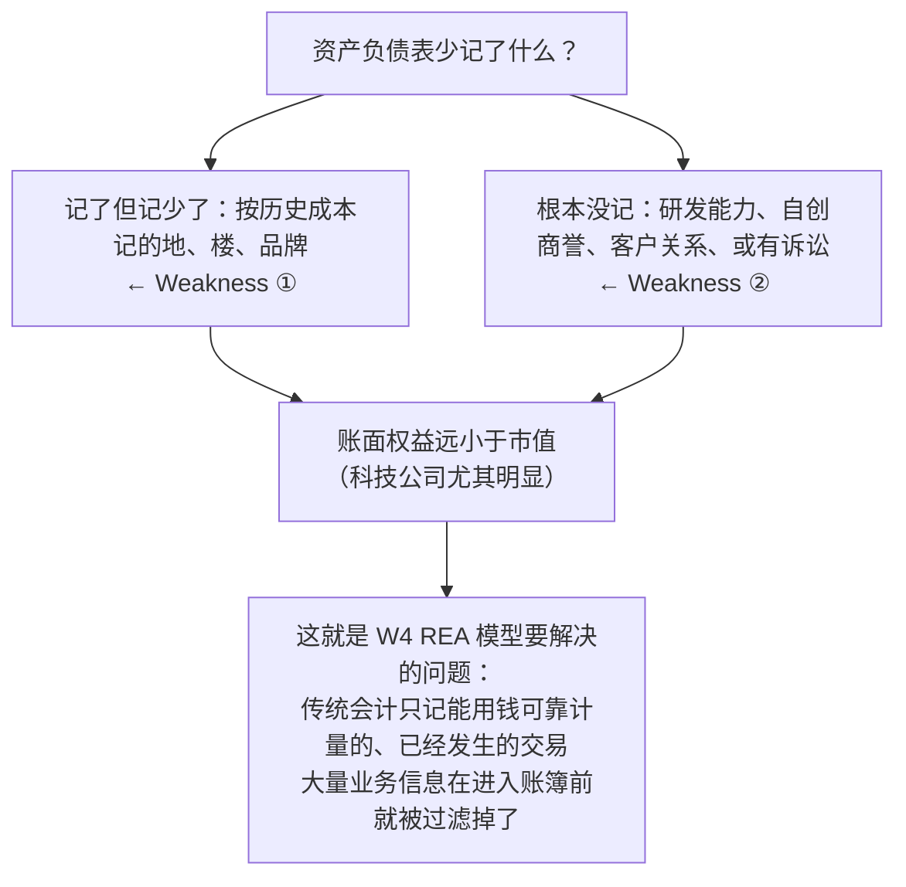
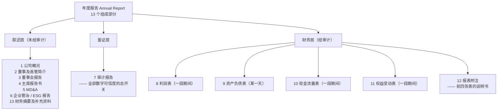
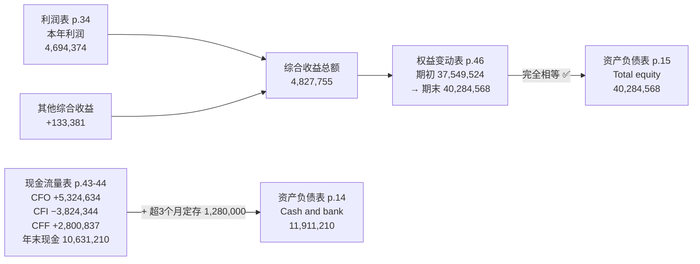
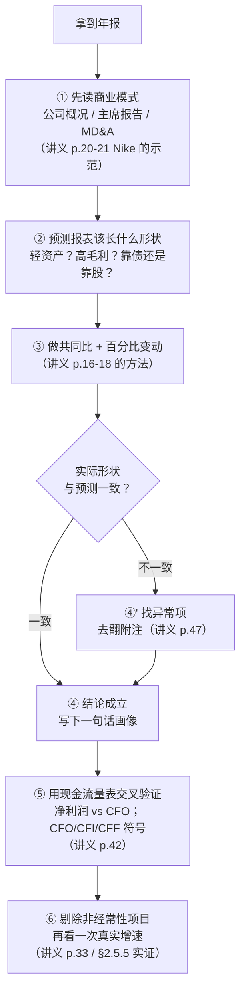

# M03 · 年报分析（Annual Report Analyses）

> **本讲一句话**：M01 教你四张报表**叫什么**，M02 教你数字**怎么进去**；这一讲教你拿到一份真实的年报，**怎么把它读出意思来**——每一行是什么、哪些行不可信、以及怎么把不同大小、不同货币的公司放在同一把尺子上比。
> **原始材料**：`Week 3 PPT.pptx`（47 页） ｜ **转录**：`pending`（本课只有 W01 有录音转录，W03 暂无）

> ⚠️ **本笔记为 v0.9**：全部内容来自讲义本身，**没有任何课堂转录**。七格微结构里的「🎙️ 课堂补充」一律写着"待转录补充"——这是**有意留下的欠债标记**，转录到手后要回填的具体问题列在 [[#9.2 课上讲了但课件没有|§9.2]]。
>
> ⚠️ **正因为没有转录，我把讲义的每一页都吃透了**：47 页里，除 1 页封面外，**其余 46 页全部在 §2 正文里有实质讲解**，包括 5 页章节分隔页（它们承担了"分段"这一实际功能，我在对应小节开头交代）、11 页纯图片页（已转 PDF 视觉复核并重画成表格）。逐页归属见 [[#8. 讲义页码映射|§8]]。

> 🔴 **期中考（2026-10-14 19:30–21:30，闭卷）范围是 W1–W5，本讲在范围内。** §6 按备考写。

---

## 0. 三分钟速览

**这一讲讲了什么**

前两讲做的事是**造账**：从一笔交易，到分录，到总账，到试算表。这一讲做的事是**读账**——而且读的是**别人的账**，一份已经装订好、经过审计、公开发布的**年度报告（Annual Report）**。

讲义的结构非常规整，是一个"**先给地图，再逐张报表精读，每张报表配一个真实案例**"的四层结构：

1. **地图**（p.2）：一份年报由 13 个部分组成。财务报表只是其中 4 个，其余 9 个是叙述性的、鉴证性的、治理性的内容。
2. **逐表精读**（p.3–15、p.28–34、p.39–44、p.45–46、p.47）：资产负债表 → 利润表 → 现金流量表 → 权益变动表 → 附注。每张报表都按同一个模板讲：**它报什么 → 它有哪些行 → 它能告诉你什么（Key information）→ 它有什么骗不了人也骗得了人的地方（Weaknesses）**。
3. **一件工具**（p.16–18）：**共同比分析（Common-Size Analysis）**——把绝对金额换算成百分比，从而让"3 百万的公司"和"3 千 5 百万的公司"能放在同一张表里比。
4. **两个真实案例**：**Nike**（p.19–27、p.35–38，美国公司、US GAAP 口径、2014–2016 三年）与一家**未署名的港股上市公司**（p.14–15、p.34、p.43–44、p.46，人民币口径、HKFRS、2019 年）。前者用来练共同比分析，后者用来看真实年报的排版长什么样。

**学完你应该能**

1. **列出**一份年报的 13 个组成部分，并说清哪些是**经过审计**的、哪些不是
2. **逐行读懂**资产负债表：流动/非流动的划分线在哪里、每一类里都有什么、每一项的计量口径是历史成本还是公允价值
3. **解释**商誉是怎么产生的，以及**为什么自创商誉不能上表**
4. **计算并解读**共同比报表与百分比变动报表（会算 66.7% 和 73.5% 是怎么来的）
5. **说清**四张报表之间的**三条勾稽线**，并能在一份真实年报上验证它们
6. **判断**一家公司处在什么阶段（CFO / CFI / CFF 的正负号组合）
7. **指出**每张报表各自的**弱点**——这是本课"为什么 AI 不能替你做判断"的接口

**如果只记三件事**

1. **资产负债表是"某一天"的照片，其余三张是"一整年"的录像。** 这条 M01 说过，但只有在这一讲对着真实年报的表头（"31 December 2019" vs "Year ended 31 December 2019"）看过一遍，才真正装进脑子。
2. **共同比分析的本质是"换分母"**：利润表除以营业收入，资产负债表除以总资产。换完分母，**公司规模、货币单位、通货膨胀这三个干扰项同时消失**。
3. **每张报表的"Weaknesses"一节比"Key information"一节值钱。** 资产负债表按历史成本记账、表外还有东西；利润表的数字可以被操纵；这两条合起来才是"为什么需要现金流量表"的答案，也是**期中考最容易出论述题的地方**。

---

## 1. 开始之前 · 知识衔接

### 1.1 你已经有的

| 概念 | 一句话唤醒 | 回看 |
|---|---|---|
| 会计等式 | `资产 = 负债 + 权益`，永远成立 | [[M01-会计与商业]] §2.7.1 |
| 资产 / 负债 / 权益 | 拥有或控制的资源 ／ 债权人的求偿权 ／ 剩余求偿权 | [[M01-会计与商业]] §2.7.2–2.7.4 |
| 收入 / 费用 / 净利润 | 使权益增加的 ／ 使权益减少的 ／ 两者之差 | [[M01-会计与商业]] §2.7.5 |
| 留存收益 | 历年净利润里没分给股东的累计部分 | [[M01-会计与商业]] §2.7.6 |
| 四张财务报表 | 利润表、权益变动表、资产负债表、现金流量表 | [[M01-会计与商业]] §2.9 |
| 时点 vs 时期 | 资产负债表标"某一天"，其余三张标"某一段" | [[M01-会计与商业]] §2.9 |
| 流动 vs 非流动 | 一年内能变现/用掉的是流动 —— **本讲把这条线画精确** | [[M01-会计与商业]]（L1，🎙️） |
| 计量原则（历史成本） | 按实际支付的成本记账，不按现时市价 | [[M01-会计与商业]] §2.6.3 |
| 收入确认原则 | 商品/服务已交付时确认收入，不是收到现金时 | [[M01-会计与商业]] §2.6.3 |
| 配比原则 | 费用记在它帮助产生的收入的同一期间 | [[M01-会计与商业]] §2.6.3 |
| 充分披露原则 | 可能影响使用者决策的信息都要披露，通常在附注里 —— **本讲 p.47 就是它的落地** | [[M01-会计与商业]] §2.6.3 |
| 或有负债 | 尚未确定但可能发生的负债（如未判决的诉讼），在附注披露 | [[M01-会计与商业]]（L1，🎙️） |
| 重要性水平 | 只有会影响理性人决策的信息才需要披露 | [[M01-会计与商业]] §2.6.4 |
| 预收收入 | 收了钱还没干活，是**负债** —— 本讲 p.10 叫它 deferred revenue | [[M01-会计与商业]] §2.7.3 |
| 应收账款 / 应付账款 | 该收未收 ／ 该付未付 | [[M01-会计与商业]] §2.7.2–2.7.3 |
| 试算表 | 全部账户余额的清单，借贷两栏必须相等 —— **本讲是它的下一步** | [[M02-交易的会计处理]] §2.7 |
| 审计师 / 审计意见 | 独立第三方，出四档意见（无保留 / 带说明段 / 保留 / 否定） | [[M01-会计与商业]]（L1，🎙️） |
| GAAP / IFRS | 前者规则导向（美国），后者原则导向（欧盟、香港、内地） | [[M01-会计与商业]] §2.6.1–2.6.2 |
| 货币计量假设 | 一切以货币表达 —— **推论是"不能用钱衡量的信息被排除在外"，这正是 W4 REA 的出发点** | [[M01-会计与商业]]（L1） |

> ⚠️ **一处必须提前打的补丁**：M01 与 M02 教的是 `资产 = 负债 + 权益` 的**竖排格式**（先列全部资产，再列全部负债，最后列权益）。**本讲 p.14–15 的真实港股年报用的不是这个格式**，而是 `非流动资产 + 净流动资产 − 非流动负债 = 净资产 = 权益` 的**净资产格式**。两者是同一个等式的移项，但第一次看会以为"等式坏了"。[[#2.2.11 读一份真实的资产负债表（讲义 p.14–15）|§2.2.11]] 会把这个移项一步步拆开。

### 1.2 本讲全新引入的概念

| 概念 | English | 展开于 |
|---|---|---|
| 年度报告 | Annual Report | §2.1 |
| 合并（财务）报表 | Consolidated Financial Statements | §2.1.3 |
| 管理层讨论与分析 | MD&A | §2.1.2 |
| 营业周期 | Operating Cycle | §2.2.2 |
| 物业、厂房及设备 | Property, Plant & Equipment (PP&E) | §2.2.3 |
| 折旧 / 摊销 | Depreciation / Amortization | §2.2.3 |
| 账面价值 | Book Value / Carrying Amount | §2.2.3 |
| 公允价值 | Fair Value | §2.2.3 |
| 无形资产 | Intangible Assets | §2.2.4 |
| 商誉（外购 vs 自创） | Purchased vs Internally Generated Goodwill | §2.2.4 |
| 存货 | Inventories | §2.2.5 |
| 净变现价值 / 成本与可变现净值孰低 | Net Realizable Value / Lower of Cost or NRV | §2.2.5 |
| 减值 | Impairment | §2.2.5 |
| 盈余管理 | Earnings Management | §2.2.5、§2.5.4 |
| 现金及现金等价物 | Cash and Cash Equivalents | §2.2.6 |
| 应计费用 | Accrued Expenses | §2.2.7 |
| 应付债券 | Bonds Payable | §2.2.7 |
| 优先股 | Preferred Stock | §2.2.8 |
| 股本溢价 / 额外实收资本 | Share Premium / Additional Paid-in Capital | §2.2.8 |
| 库存股 | Treasury Stock / Treasury Shares | §2.2.8 |
| 其他综合收益累计额 | Accumulated Other Comprehensive Income (AOCI) | §2.2.8 |
| 已实现 vs 未实现 | Realized vs Unrealized | §2.2.8 |
| 少数股东权益 | Non-controlling Interests (NCI) | §2.2.9 |
| 表外项目 | Off-balance-sheet Items | §2.2.10 |
| 使用权资产 | Right-of-use Assets | §2.2.11 |
| 联营公司 | Associates | §2.2.11 |
| 共同比分析 | Common-Size Analysis | §2.3 |
| 百分比变动分析 | Percentage Change Analysis | §2.4.3 |
| 销货成本 / 毛利 | Cost of Revenue / Gross Profit | §2.5.2 |
| 分销 / 管理 / 财务费用 | Distribution / Administration / Finance Costs | §2.5.3 |
| 营业利润 / 税前利润 | Profit from Operations / Profit before Tax | §2.5.2 |
| 每股收益 | Earnings Per Share (EPS) | §2.5.2 |
| 利得与损失 | Gains and Losses | §2.5.1 |
| 经常性 vs 非经常性项目 | Recurring vs Nonrecurring Items | §2.5.4 |
| 盈余质量 | Quality of Earnings | §2.5.4 |
| 直接法 / 间接法 | Direct / Indirect Method | §2.7.1 |
| CFO / CFI / CFF | Cash Flow from Operating / Investing / Financing | §2.7.2 |
| 缴入资本 vs 赚得资本 | Contributed vs Earned Capital | §2.8.1 |
| 报表附注 | Notes to the Accounts | §2.9 |
| 《公司条例》 | Companies Ordinance | §2.9 |

### 1.3 为什么这一讲放在这里 · 重排说明

**承接**：M02 的终点是**试算表**——一张按科目排列、借贷两栏相等的清单。但试算表**不是财务报表**：它是给会计自己看的校验工具，科目顺序是账号顺序，没有小计、没有分类、没有可比期间，外人读不了。从试算表到"可以拿给投资者看的报表"，标准教科书中间还有一章**调整分录（Adjusting Entries）**——**AC6761 的讲义直接跳过了这一章**（见 [[Artificial_Intelligence_Accounting/_meta/知识层级台账|知识层级台账]] 的预告表）。所以从 M02 到 M03，读者会感到一个跳跃：**试算表怎么变成了资产负债表？**

> 💡 **补上这个缺口（笔记补充）**：中间少的三步是 ①**调整分录**（把预付费用按已耗用的月份转成费用、把预收收入按已提供的服务转成收入、计提折旧、计提应计费用）→ ②**调整后试算表** → ③**结账**（把收入费用类账户清零、余额并入留存收益）。做完这三步，剩下的资产、负债、权益类账户余额**直接就是资产负债表的行**，被结掉的收入费用**就是利润表的行**。本课不考这三步，但你要知道它们存在，否则会觉得 M02 和 M03 之间断了。

**铺路**：本讲是**期中考 W1–W5 范围里唯一一讲"读别人的报表"**，也是全课后半段（W9–W10 "AI in Financial Statement Analyses"）的直接前置——AI 分析财报，分析的就是本讲这些行。此外，本讲 p.13 的 "Weaknesses"（历史成本、表外项目）与 p.33 的 "Weaknesses"（数字可被操纵）是 **W4 REA 模型的动机**：REA 之所以要抛开借贷科目、直接记录业务事件，正是因为传统报表把太多信息压缩掉了。

**重排说明**：讲义的页码顺序**基本就是学习顺序**，我做的调整很小：

| 讲义原顺序 | 本笔记 | 理由 |
|---|---|---|
| p.14–15 真实年报（资产负债表）**夹在** p.13 与 p.16 共同比之间 | 放在 §2.2 的**最后**（§2.2.11），作为资产负债表一节的收尾 | 讲义把真实年报插在"资产负债表讲完"和"共同比开始"之间，位置是对的；我只是把它明确标成 §2.2 的一部分，而不是一个孤立的图片页 |
| p.16–18 共同比 → p.19–27 Nike 案例 | 保持 | 先给工具再用工具，顺序正确 |
| p.34 真实年报（利润表）在 p.33 之后、p.35 Nike 分隔页之前 | 归入 §2.5（利润表）末尾 | 同上 |
| — | **新增 §2.10「四张报表的勾稽验算」** | 讲义**从头到尾没有一页**把四张报表串起来验算。但它给出的这份真实年报**四张表齐全且数字完全自洽**，是难得的练手材料。我用它做了一遍完整勾稽（含一处会让初学者卡住的"现金对不上"），标 💡 |

对应关系逐页可查，见 [[#8. 讲义页码映射|§8 讲义页码映射]]。

---

## 2. 正文

### 2.0 封面（讲义 p.1）

讲义 p.1 是封面：**AC6761 Artificial Intelligence Accounting ／ Chapter 3 Annual report analyses**。

课程大纲 `AC6761 Outline 2627.docx` 的 Tentative Schedule 里，Week 3 的主题正是 **"Annual Report Analyses"**，与封面一致。本讲**没有单独的学习目标页**（对比 M02 的讲义有 7 页学习目标分隔页），所以本笔记 §0 的「学完你应该能」是我从内容反推的，标 💡。

---

### 2.1 年报是什么，由哪些部分组成（讲义 p.2）

#### 2.1.1 是什么

**年度报告（Annual Report）** 是一家公司在每个会计年度结束后，向股东和公众发布的**一份综合性文件**。它不等于"财务报表"——财务报表只是它中间的一部分。

讲义 p.2 一次性列出了 **13 个组成部分**（原文照抄，顺序不变）：

| # | 英文原文（讲义 p.2） | 中文 | 是什么 | 经审计？ |
|---|---|---|---|---|
| 1 | Corporate Profile | 公司概况 | 公司做什么生意、在哪些地方经营、股权结构 | ❌ |
| 2 | Directors and Senior Management Profile | 董事及高级管理人员简介 | 每位董事/高管的姓名、年龄、履历、任职年限 | ❌ |
| 3 | Directors' Report | 董事会报告 | 董事会对本年度经营的正式陈述，法定内容（主要业务、股息建议、董事持股、重大关联交易） | ❌（部分内容受法规约束） |
| 4 | Chairman's Statement | 主席报告书 | 董事长以第一人称写的致股东信，讲战略与展望 | ❌ |
| 5 | Management's Discussion and Analysis (MD&A) | 管理层讨论与分析 | **管理层用文字解释数字为什么长这样**：收入为何增长、毛利率为何下滑、下一年的风险 | ❌ |
| 6 | Corporate Governance Report / ESG Report | 企业管治报告 / 环境社会及管治报告 | 董事会构成、审计委员会运作、内部控制自评；ESG 报告披露碳排放、员工、供应链等非财务指标 | ❌（ESG 有时另聘鉴证） |
| 7 | Auditor's Report | 审计报告 | **独立审计师**对财务报表是否"真实公允"发表意见 | — （它本身就是鉴证意见） |
| 8 | Consolidated Statement of Profit or Loss | 合并损益表（利润表） | 见 §2.5 | ✅ |
| 9 | Consolidated Statement of Financial Position | 合并财务状况表（资产负债表） | 见 §2.2 | ✅ |
| 10 | Consolidated Cash Flow Statement | 合并现金流量表 | 见 §2.7 | ✅ |
| 11 | Statement of Changes in Equity | 权益变动表 | 见 §2.8 | ✅ |
| 12 | Notes to the Accounts | 报表附注 | 见 §2.9 | ✅ |
| 13 | Financial Highlights and Supplementary Information | 财务摘要及补充资料 | 通常是五年财务概要、股价走势、物业清单等 | ❌ |

> ⚠️ **"经审计？"这一列是我加的（💡 笔记补充），讲义 p.2 没有。** 但它是读年报时最要紧的一条线：**只有第 8–12 项（四张报表 + 附注）在审计范围内**。主席报告书里"我们对明年充满信心"这句话，审计师不负责。这条区分在 [[M01-会计与商业]] 讲审计师职责时已埋了伏笔，这里落地。

#### 2.1.2 为什么需要它 —— 数字之外的九个部分在干什么

一个只看四张报表的人会问：另外九个部分是不是废话？不是。它们回答的是报表回答不了的问题：

- **报表告诉你"发生了什么"，MD&A 告诉你"为什么"**。收入从 208 亿涨到 242 亿（真实年报 p.34），报表只给这两个数；是因为新药放量、还是因为并购了一家公司、还是因为去年基数低——只有 MD&A 会说。
- **报表是历史，主席报告书是未来**。
- **报表是财务的，ESG 报告是非财务的**。这一点直接连到 [[M01-会计与商业]] 的**货币计量假设**：凡不能用钱衡量的，报表系统性地排除。ESG 报告就是为填这个洞而生的补丁——**而 W4 的 REA 模型是另一种、更彻底的补法**。
- **审计报告是全部数字可信度的总开关**。若审计师出具"保留意见"或"否定意见"，前面所有分析都要打折。

#### 2.1.3 一个必须先搞清的词：Consolidated（合并）

13 项里有 3 项带 "Consolidated" 前缀。**这个词不解释，后面所有真实年报都读不懂。**

**是什么**：一家公司（**母公司 Parent**）如果控制了另一家公司（**子公司 Subsidiary**），会计上就不允许它只报自己那一摊，必须把**子公司的全部资产、负债、收入、费用逐行加到自己表里**，再把内部往来抵销掉，做成一张 **合并报表（Consolidated Financial Statements）**。

**为什么**：因为**会计主体假设**（[[M01-会计与商业]]）说的"主体"是**经济上的主体**，不是法律上的一个个壳。如果母公司能指挥子公司，那么从投资者角度看，它们就是一家公司。若允许只报母公司报表，管理层可以把亏损业务塞进子公司，让母公司的表好看——这就是安然（Enron）当年用特殊目的实体（SPE）干的事。

**⚠️ 关键的反直觉之处**：合并时**子公司的资产负债 100% 全部并入**，哪怕母公司只持有 80%。那剩下 20% 怎么办？答案是在**权益**里单列一行「**少数股东权益**」。这正是讲义 p.12 的内容，见 [[#2.2.9 权益（二）：少数股东权益（讲义 p.12）|§2.2.9]]。

**🎙️ 课堂补充**
待转录补充（本讲无录音转录）。

**💡 换个说法（笔记补充）**
把年报想成一份**体检报告**：
- 四张报表 = 血检、心电图、影像（**有仪器读数、有医生签字** = 经审计）
- MD&A = 主诊医生的分析段落（**解释读数**）
- 主席报告书 = 医生对你说"注意休息，明年应该会好"（**没有仪器背书**）
- 附注 = 每项指标的检测方法与参考区间（**没有它，读数没有意义**）
- 审计报告 = 这家体检中心的资质认证

**⚠️ 常见误解**
- ❌ "年报 = 财务报表"。→ 财务报表只占 13 项中的 4 项，页数上通常只占年报的三分之一。
- ❌ "年报里的每个数字都被审计过"。→ 只有第 8–12 项。财务摘要里的五年数据、ESG 报告里的碳排放，通常在审计范围之外。
- ❌ "Consolidated 就是加总"。→ 是加总**之后再抵销内部交易**。母公司卖货给子公司的那笔收入必须消掉，否则集团可以靠左手倒右手虚增收入。

**与其他概念的关系**
本页是全讲的**目录页**：第 8–11 项对应 §2.2 / §2.5 / §2.7 / §2.8，第 12 项对应 §2.9。第 7 项（审计报告）承接 [[M01-会计与商业]] 的审计师一节。第 6 项（ESG）与第 5 项（MD&A）是 **W9「AI in Financial Statement Analyses – from the Perspective of Stakeholders」的文本分析对象**。

---

### 2.2 资产负债表（Balance Sheet）

> 📄 **讲义 p.3 是本节的分隔页**，整页只有一行标题：**"Balance Sheet (Statement of financial position)"**。
> 这一页本身就有信息量：它把**同一张表的两个名字**并列写出来。`Balance Sheet` 是 US GAAP 与口语习惯用词；`Statement of Financial Position` 是 **IFRS 的正式名称**。本课在香港上课、案例既有美国公司（Nike）也有港股公司，**两个名字都会出现，指的是同一张表**。考试写哪个都对，但要认得出来。

#### 2.2.1 定义与三要素（讲义 p.4）

**是什么**

讲义 p.4 原文：

> *"Snapshot of financial position on a given day"*
> **某一个特定日子的财务状况快照。**

三要素的定义（讲义 p.4 原文 + 中译）：

| 要素 | 讲义原文 | 中文 | 风险与回报 |
|---|---|---|---|
| **Assets 资产** | *"resources that provide probable future economic benefits"*；上表要满足两个条件：**Be owned or controlled by the company**（被公司拥有**或控制**）＋ **Possess expected future benefits**（具有预期未来利益） | 能带来**很可能**的未来经济利益的资源 | — |
| **Liabilities 负债** | *"the claims on assets by creditors"*；*"Fixed return with lower risk – creditors"* | **债权人**对资产的求偿权 | **固定回报、低风险** |
| **Equity 权益** | *"the claims on assets by shareholders"*；*"Residual claim after creditors"*；*"Higher risk – shareholders"* | **股东**对资产的求偿权，是**还完债权人之后剩下的** | **剩余求偿、高风险** |

**为什么需要它**

这一页把 [[M01-会计与商业]] 的会计等式**加上了风险维度**。M01 的 `A = L + E` 只是一个恒等式；p.4 告诉你这个等式的右边**不是两个平等的项**，而是**有先后次序的两层求偿权**：

```
公司清算时，卖掉全部资产得到一笔钱
   ↓ 第一顺位：还给债权人（Liabilities）——金额固定（本金+利息），拿满即止
   ↓ 第二顺位：剩下的全归股东（Equity）——可能很多，也可能是零
```

这就是为什么**债权人拿固定利息但风险低，股东没有固定回报但上不封顶**。理解了这个次序，你才理解后面为什么要关心「负债占总资产多少」（§2.3 共同比分析的核心用途之一）。

**课件原例**

讲义 p.4 对资产的两个条件用的是 "**owned or controlled**"。**"or controlled" 这三个字是有意加的**：租入的设备你并不"拥有"，但你控制它、它给你带来收益，所以在现行准则（IFRS 16）下它也上表——这就是 §2.2.11 真实年报里那行 "Right-of-use assets（使用权资产）"的来历。

**🎙️ 课堂补充**
待转录补充。

**💡 换个说法（笔记补充）**

用买房类比整张资产负债表：
- 你买了一套 800 万的房（**资产 800 万**）
- 其中 500 万是银行按揭（**负债 500 万**，银行拿固定利息，房价涨跌与它无关）
- 剩下 300 万是你的首付＋已还本金（**权益 300 万**，房价涨跌全归你）
- 房价跌到 700 万：银行仍然要收回 500 万，你的权益从 300 万变成 200 万 —— **风险全部由权益承担**，这就是 "residual claim"。

**⚠️ 常见误解**
- ❌ "资产就是公司拥有的东西"。→ 定义里是 "owned **or controlled**"。经营租赁的门店、融资租赁的设备都不归你所有，但都在你表上。
- ❌ "权益就是公司值多少钱"。→ 权益是**账面**的剩余求偿权（按历史成本算），不是市值。一家市值 3000 亿的公司，账面权益可能只有 300 亿。见 §2.2.10 的 Weaknesses。
- ❌ "负债越少越好"。→ 负债是**低成本**的资金来源（利息可税前扣除，且不稀释股权）。共同比分析要看的是负债结构是否与资产结构匹配，不是越少越好。

**与其他概念的关系**
承接 [[M01-会计与商业]] §2.7 会计等式；这里加的"风险—回报次序"是 §2.3 共同比分析、以及 §2.7.3「公司处在什么阶段」判断的基础。

---

#### 2.2.2 流动与非流动：那条线画在哪里（讲义 p.5）

**是什么**

讲义 p.5 原文：

> **Current Assets（流动资产）**：*"can be converted to cash within one year **or one operating cycle, whichever is longer**"*
> **Non-Current Assets（非流动资产）**：*"cannot be easily converted to cash"*

划分线不是"一年"，而是「**一年**」与「**一个营业周期**」**取较长者**。

**营业周期（Operating Cycle）** 的定义，讲义 p.5 给得很完整：

> *"operating cycle is the time for a firm to convert cash back into cash (i.e., purchase material, manufacture product, sell product, and collect cash)"*
> **企业把现金变回现金所需的时间**：买原料 → 生产 → 卖出 → 收回货款。

**为什么需要它**

因为"一年"这条线对某些行业毫无意义。

**💡 笔记补充的两个例子**：
- 一家**威士忌酒厂**：橡木桶陈酿 12 年才装瓶。它的营业周期 = 12 年。若硬用"一年"划线，则酒厂的存货全部变成非流动资产，而它明明是它唯一的、终将卖掉的商品。所以准则说"取较长者"——酒厂的存货仍然是流动资产。
- 一家**便利店**：进货到卖出可能只要 3 天，营业周期远短于一年。这时"较长者"是**一年**，所以按一年划线。

**⇒ 结论：绝大多数公司的营业周期 < 1 年，所以实务上就是按一年划线；"whichever is longer" 这半句是为造船、建筑、酿酒、房地产这类长周期行业留的口子。**

**课件原例**

讲义 p.5 给的两组例子：

| 类别 | 讲义列举 | 中文 |
|---|---|---|
| Current Assets | inventories, accounts receivables, cash and cash equivalents | 存货、应收账款、现金及现金等价物 |
| Non-Current Assets | plant property & equipment (PP&E), investments, intangibles | 物业厂房及设备、投资、无形资产 |

**注意讲义列举的顺序**：流动资产是 `存货 → 应收 → 现金`，这是**营业周期的自然顺序**（先有货，卖出变应收，收款变现金）；但真实报表通常按**流动性从高到低**倒过来排（US GAAP：现金在最上）或**从低到高**排（IFRS/港股：非流动资产在最上）。这个排序差异在 §2.2.11 会看到实例。

**🎙️ 课堂补充**
待转录补充。

**💡 换个说法（笔记补充）**
流动/非流动这条线回答的问题是：「**明年这家公司拿什么还明年到期的债？**」流动资产是"明年能变成钱的东西"，流动负债是"明年必须还的钱"。两者一比就是**流动比率**——讲义 p.13 说的 "How much cash or quick assets the firm has on hand to repay the debt due next year"。

**⚠️ 常见误解**
- ❌ "流动 = 一年内"。→ 是"一年**或**一个营业周期，取**较长**者"。少写"whichever is longer"在考试里是扣分点。
- ❌ "非流动资产就是不能变现的"。→ 讲义原文是 *"cannot be **easily** converted to cash"*，是**不容易**，不是不能。一栋楼可以卖，只是要几个月并且可能折价。

**与其他概念的关系**
这条线同时切负债（§2.2.7），切完之后**流动资产与流动负债的差额**叫 **净流动资产（Net Current Assets）**，也叫营运资金（Working Capital）——它是 §2.2.11 那张港股报表的一个显式行项目。

---

#### 2.2.3 非流动资产（一）：PP&E 与投资（讲义 p.6）

**是什么**

讲义 p.6 把非流动资产拆成两块，第三块（无形资产）留到 p.7。

**① Plant, Property & Equipment（PP&E，物业、厂房及设备）**，讲义 p.6 原文四条：

> - *"Tangible, fixed asset (usually illiquid); Percentage of PP&E to total assets varies by industry"*
> - *"If at historical cost, subject to depreciation policy"*
> - *"Most at historical cost and different from market value"*

逐条拆开：

**（a）有形、固定、通常不易变现。** 厂房、机器、办公楼、车辆。

**（b）PP&E 占总资产的比例因行业而异。** 这一句是本讲最重要的**共同比分析的用途预告**：钢厂的 PP&E 可能占总资产 60%，而 Nike 只占 13.9%~16.5%（§2.4）。**看到一个反常的比例，就要去问为什么**——这正是 p.26 那道练习题的解法。

**（c）按历史成本入账 ⇒ 要计提折旧。**

> **折旧（Depreciation）** ⭐ **这个词在 M01/M02 都没有展开过，这里必须讲清楚。**
>
> **是什么**：一台机器花 100 万买来，能用 10 年。**配比原则**（[[M01-会计与商业]] §2.6.3）要求"费用记在它帮助产生收入的同一期间"。这台机器帮 10 年赚钱，所以不能在买它的那一年一次性记 100 万费用，而要**每年分摊 10 万**。这个分摊过程就叫折旧。
>
> **怎么记**（用 M02 的借贷语言）：每年年末做一笔分录
> ```
> Dr. Depreciation Expense （折旧费用）      100,000
>     Cr. Accumulated Depreciation （累计折旧）    100,000
> ```
> 借方是**费用**（进利润表，使权益减少）；贷方是**累计折旧**，它是一个**资产的抵减账户（contra-asset）**——挂在资产那一侧但方向相反，用来把 PP&E 的账面数往下压。
>
> **等式怎么保持平衡**：资产侧净减 10 万（PP&E 原值不动，累计折旧增加 10 万），权益侧因费用增加而净减 10 万。`A ↓10万 = L 不变 + E ↓10万` ✅ 平衡。
>
> **账面价值（Book Value / Carrying Amount）** = 原值 − 累计折旧。买入时 100 万，第 3 年末账面 70 万。真实年报上的 PP&E 一律是**净额**（Nike 的表头写着 "Property, plant, and equipment, **net**"）。
>
> **摊销（Amortization）** 是同一件事用在**无形资产**上的名字（专利、软件）。有形叫折旧，无形叫摊销。**土地既不折旧也不摊销**（寿命无限）。
>
> **讲义 p.25 给了 Nike 的真实折旧政策**：*"Depreciation is determined on a **straight-line basis** for buildings and leasehold improvements over **2 to 40 years** and for machinery and equipment over **2 to 15 years**."* 直线法 = 每年折同样多。

**（d）多数按历史成本记，因此与市价不同。** 一栋 1995 年花 2 亿买的楼，2026 年市值 20 亿，表上仍然是 2 亿减去折旧后的净额。这是 p.13 "Weaknesses" 那一条的具体来源。

**② Investments（投资）**，讲义 p.6 原文四条：

> - *"Expected to hold more than one year or operating cycle"*（持有超过一年或一个营业周期）
> - *"Long-term equity investments in subsidiaries or others"*（对子公司或其他公司的长期**股权**投资）
> - *"Long-term debt investments with long maturity"*（长期限的**债权**投资，如持有到期的债券）
> - *"Investment property for price increase"*（为**升值**而持有的投资性房地产）
> - *"Could bear risk of market fluctuation in value"*（可能承担市值波动风险）

> 💡 **一个必须点破的对照**：PP&E 的"物业"是**自用**的（我在里面办公、生产）；Investment Property 的"物业"是**为出租或升值**而持有的。同一栋楼，用途不同，会计处理不同——**投资性房地产通常允许按公允价值计量**，涨了就在表上体现；自用的 PP&E 按历史成本减折旧，涨了也不体现。这就是为什么讲义在 Investments 里特意加了 "Could bear risk of market fluctuation in value" 这一句：**这一类资产的账面数会跟着市场跳**。

> **公允价值（Fair Value）** ⭐ 新概念：市场参与者在计量日、有序交易中出售一项资产会收到的价格——**通俗说就是"现在的市价"**。它与历史成本是两套并存的计量口径。真实年报里的 "at fair value through profit or loss（以公允价值计量且变动计入损益）" 和 "at fair value through other comprehensive income（……计入其他综合收益）" 两个长名字，就是在说这项资产按市价记、且市价的波动记到哪张表里。见 §2.2.8 与 §2.2.11。

**🎙️ 课堂补充**
待转录补充。

**💡 换个说法（笔记补充）**
折旧的直觉：你花 1 万块买了一台笔记本电脑打算用 5 年。**会计不认为你"花掉了 1 万"，只认为你"把 1 万块现金换成了一台价值 1 万的资产"**（等式两边没变化，只是资产内部换形态）。真正的费用是每年"用掉的那 2000 块电脑寿命"。这就是折旧。

**⚠️ 常见误解**
- ❌ "折旧是为了攒钱换新设备"。→ 折旧**不产生现金流**，它是纯粹的账面分摊。这也是现金流量表间接法要把折旧**加回**净利润的原因（§2.7.1）。
- ❌ "累计折旧是负债"。→ 它挂在资产侧，是资产的**抵减项**，不是欠谁的钱。
- ❌ "PP&E 少 = 公司差"。→ 见 §2.4.5 Nike 的答案：轻资产是商业模式选择，不是弱点。

**与其他概念的关系**
折旧 ← [[M01-会计与商业]] 配比原则；折旧 → §2.7.1 现金流量表间接法的第一笔调整；PP&E 占比 → §2.3 共同比分析 → §2.4.5 Nike 练习题的答案。

---

#### 2.2.4 非流动资产（二）：无形资产与商誉（讲义 p.7）

**是什么**

讲义 p.7 原文：

> **Intangibles**
> - *"Patents, trademarks, copyrights, etc."*
> - *"**Purchased goodwill** in M&A transactions：purchase price – fair value of target's net asset"*
> - *"**Internally generated goodwill is generally not shown as an asset**：e.g., customer relationship, trained employee skills, reputation built in the market；hard to identify and value in a reliable way"*

**无形资产（Intangible Assets）** = 没有实体形态、但能带来未来利益的资产：专利、商标、版权、特许权、软件。

**商誉（Goodwill）** 是无形资产里最特殊的一项，讲义给了它一条**可计算的公式**：

```
外购商誉 = 收购付出的价格 − 被收购方可辨认净资产的公允价值
Purchased Goodwill = Purchase Price − Fair Value of Target's Net Assets
```

**💡 用数字走一遍（笔记补充，讲义只给了公式没给数）**

A 公司花 **1,000 万** 收购 B 公司 100% 股权。B 公司的账上：

| B 公司 | 账面价值 | 公允价值（重新评估后） |
|---|---|---|
| 厂房 | 300 万 | 500 万（地段涨了） |
| 存货 | 100 万 | 100 万 |
| 专利 | 0（自创的，没上表） | 200 万（可单独辨认、可估值） |
| **资产合计** | 400 万 | **800 万** |
| 银行贷款（负债） | 200 万 | 200 万 |
| **可辨认净资产** | 200 万 | **600 万** |

- 付出价格：1,000 万
- 可辨认净资产公允价值：600 万
- **商誉 = 1,000 − 600 = 400 万** ⇒ A 公司的合并报表上多出一行 `Goodwill 400 万`

**这 400 万是什么？** 是 A 愿意为 B 的**说不清、分不开、卖不掉**的东西付的钱：客户关系、团队默契、品牌口碑、协同效应。

**为什么"自创商誉不上表"**

讲义 p.7 说得很直接：*"hard to identify and value in a reliable way"*（难以可靠地辨认和计价）。

**💡 展开这条（笔记补充）**：可口可乐的品牌值几千亿，但可口可乐的资产负债表上**几乎没有品牌这一行**——因为它是自己一年年做广告做出来的，没有一笔交易给它定过价。而如果百事可乐明天花 3000 亿把可口可乐买下来，那 3000 亿减去可辨认净资产之后的差额**立刻就变成百事表上的商誉**。

> ⚠️ **同一件东西，自己养大的不算资产，买来的算资产。** 这个不对称是财务报表最著名的软肋之一，也是 p.13 "Weaknesses" 里 "intangible assets developed within the firm" 那一条的意思。它也是**科技公司账面权益远小于市值**的主因。

**课件原例**

讲义 p.25 给了 Nike 的原话定义：*"Identifiable Intangible Assets and Goodwill: This account represents the **excess of the purchase price of acquired businesses over the market values of identifiable net assets**"* —— 与 p.7 的公式逐字对应（`market values` 即 `fair value`）。Nike 的商誉常年是 **131 百万美元**（2014/2015/2016 三年一分不变，见 §2.4.2），只占总资产 0.6%——**说明 Nike 基本不靠并购增长**。

**🎙️ 课堂补充**
待转录补充。

**💡 换个说法（笔记补充）**
商誉 = **"溢价"的账面化**。你买二手车，车况值 10 万，你付了 12 万因为卖家是熟人、有完整保养记录、还送你一年保险。多付的 2 万在会计上就是商誉。它**不能单独卖掉**——你不能把"熟人关系"从车上拆下来出售。

**⚠️ 常见误解**
- ❌ "商誉是公司名声好"。→ 商誉是**一个残差数字**，是收购价减去可辨认净资产公允价值的差。名声好不好与它没有直接关系；一次买贵了的收购同样产生大额商誉。
- ❌ "商誉会像设备一样每年摊销"。→ 现行 IFRS 与 US GAAP 下**商誉不摊销**，而是每年做**减值测试（impairment test）**：一旦被收购业务表现不及预期，就一次性冲掉一大块，直接砸利润表。这是大额商誉公司最大的地雷。（§2.2.11 那家港股公司的商誉高达 138.97 亿元，占总资产 23.8%——**这是一个应当引起警惕的数字**。）
- ❌ "无形资产 = 商誉"。→ 商誉只是无形资产的一种。专利、商标是**可辨认**无形资产，可以单独买卖、单独估值、单独摊销。

**与其他概念的关系**
商誉 ← §2.1.3 合并报表（商誉只在合并层面产生）；无形资产的"不上表"问题 → §2.2.10 Weaknesses → **W4 REA 模型的动机之一**。

---

#### 2.2.5 流动资产（一）：存货（讲义 p.8）

**是什么**

讲义 p.8 原文四条：

> **Inventories**
> - *"Sizable item for manufacturing / retailing corporations"*
> - *"Essential for business, but tie up capital: putting in warehouses before being sold"*
> - *"Conservatively reported at the **lower of historical cost or net realizable value**."*
> - *"Could be an easy item for **earnings management or even fraud** (e.g., delay impairment, fake inventories)"*

**存货（Inventories）** = 为出售而持有的商品、在产品、以及生产用的原材料。

逐条拆：

**（a）对制造业和零售业是大项。** Nike 的存货占总资产 20.1%~22.6%（§2.4.2），是它最大的单一资产。

**（b）业务必需，但占用资本。** 存货躺在仓库里的每一天都是**已经付出去的钱还没赚回来**。这是"营业周期"（§2.2.2）的中段。

**（c）计量口径：成本与可变现净值孰低（Lower of Cost or Net Realizable Value）** ⭐

> **净变现价值（Net Realizable Value, NRV）** = 预计售价 − 预计还要发生的完工与销售费用。
>
> **规则**：账上记 `min(历史成本, NRV)`。
>
> **💡 走一遍（笔记补充）**：你花 1,000 元进了一批手机壳。
> - 情形一：市场好，能卖 1,500 元。→ 账上仍记 **1,000**（历史成本原则，不许把没实现的利润提前记上）。
> - 情形二：新机型上市，这批壳只能卖 600 元，还要花 50 元清仓促销。NRV = 600 − 50 = **550**。→ 账上必须调到 **550**，同时确认 **450 元的存货减值损失**（进利润表）。
>
> **注意这条规则是不对称的**：涨了不记，跌了必须记。这个不对称有个名字叫**谨慎性 / 稳健性（Conservatism / Prudence）**——讲义 p.8 用的词正是 "**Conservatively** reported"。

> **减值（Impairment）** ⭐ 新概念：当一项资产的**可收回金额低于账面价值**时，把账面价值调低到可收回金额，差额计入当期损失。存货、PP&E、商誉、应收账款都可能减值。**减值是单向的**（对多数资产而言，减了之后即使回升也不能随意转回，商誉的减值绝对不能转回）。

**（d）容易被用来做盈余管理甚至舞弊。** 讲义点了两种手法：

| 手法 | 讲义原文 | 机制 | 后果 |
|---|---|---|---|
| **拖延减值** | *"delay impairment"* | 明知这批货卖不掉了，就是不计提减值 | 当期费用少记 ⇒ 利润虚高；资产虚高 |
| **虚构存货** | *"fake inventories"* | 仓库里根本没有那批货，账上有 | 资产虚增；且因为 `期末存货 ↑ ⇒ 销货成本 ↓ ⇒ 利润 ↑` |

> **盈余管理（Earnings Management）** ⭐ 新概念：在准则允许的弹性范围内（或越界），通过会计估计与时点选择，把报告利润调整到管理层想要的水平。**它与舞弊（fraud）是一条连续谱，不是两个互斥的类别**——"晚三个月计提减值"是灰的，"仓库里没有货"是黑的。

**💡 为什么"期末存货多记 ⇒ 利润多"（笔记补充，讲义没解释这条机制，但它是理解舞弊动机的关键）**

销货成本有一个恒等式：

```
销货成本 = 期初存货 + 本期采购 − 期末存货
Cost of Goods Sold = Beginning Inventory + Purchases − Ending Inventory
```

期初存货和本期采购都是已经发生的、有凭证的；**唯一有弹性的是"期末存货"**（要靠盘点和估值）。把期末存货虚增 100 万，销货成本就自动少 100 万，毛利就多 100 万，净利润就多 100 万。**而且资产负债表照样平衡**——这就是为什么存货舞弊在历史上如此常见（如 1990 年代的 Phar-Mor 案）。

**🎙️ 课堂补充**
待转录补充。

**⚠️ 常见误解**
- ❌ "存货越多说明生意好"。→ 存货增速持续快于收入增速，通常是**卖不动**的信号。
- ❌ "存货按市价记"。→ 是 `min(成本, NRV)`。涨价不体现。
- ❌ "NRV 就是售价"。→ 要**减去**还要发生的完工成本和销售费用。

**与其他概念的关系**
存货 ← 营业周期（§2.2.2）；`min(成本, NRV)` ← [[M01-会计与商业]] 的计量（成本）原则 + 谨慎性；盈余管理 → §2.5.4 利润表的 Weaknesses → §2.7.3「用现金流交叉验证利润」。

---

#### 2.2.6 流动资产（二）：应收账款与现金（讲义 p.9）

**是什么**

讲义 p.9 只有两小段，字数最少，但两句话都有分量：

> **Accounts Receivables**
> *"Normally readily available within a short period without significantly affecting the presented value"*
>
> **Cash and Cash Equivalents**
> *"The prime item to verify liquidity"*

**（a）应收账款（Accounts Receivable）**：客户已经拿走货但还没付的钱（[[M01-会计与商业]] 已引入）。讲义这里补的信息是它的**变现质量**：通常很快就能收到，而且**收到的金额与表上列示的金额不会差太多**（"without significantly affecting the presented value"）。

> 💡 **"不会差太多"这半句其实藏着一个概念（笔记补充）**：应收账款在表上列示的是**净额**——真实年报里写作 "Accounts receivable, **net**"（Nike 的表就是这么写的，见 §2.4.1）。净额 = 应收总额 − **坏账准备（Allowance for Doubtful Accounts）**。公司预先估计有一部分客户会赖账，提前把这部分扣掉。所以"不会差太多"是**因为已经预扣过了**，不是因为客户都很守信。

**（b）现金及现金等价物（Cash and Cash Equivalents）**：*"The prime item to verify liquidity"*——**验证流动性的首要项目**。

> **现金等价物（Cash Equivalents）** ⭐ 新概念：期限**极短（通常原始期限 ≤ 3 个月）**、流动性极高、价值变动风险极小的投资，如三个月以内的国库券、货币市场基金。它们"几乎就是现金"，所以与现金合并列示。
>
> ⚠️ **这个 3 个月的界线在 §2.10 会制造一个非常经典的困惑**：某港股年报的资产负债表写 `Cash and bank balances 11,911,210`，而它的现金流量表写 `Cash and cash equivalents at end of year 10,631,210`，**两个数差了 1,280,000**。差额正是**原始期限超过 3 个月的定期存款**——它在资产负债表上算"现金及银行结余"，在现金流量表上**不算**现金等价物。这不是印错，是两张表的口径不同。

**为什么这一页只有两句**

因为这两项是**最不需要估计判断**的资产：现金就是现金，应收账款有合同和发票。讲义把篇幅留给了需要判断的项目（存货、PP&E、无形资产）。**这个篇幅分配本身就是信息：会计里最容易出问题的地方，永远是需要估计的地方。**

**🎙️ 课堂补充**
待转录补充。

**⚠️ 常见误解**
- ❌ "现金多 = 公司好"。→ 现金持续堆积而不投资也不分红，可能说明**没有好项目**。§2.7.3 的"健康成熟公司"判据里，CFF 是**负**的（在还债、在分红），不是攒着。
- ❌ "现金及现金等价物 = 银行账户里的钱"。→ 受限制的存款（如保证金）、超过 3 个月的定期，都不算现金等价物。

**与其他概念的关系**
现金 → §2.7 现金流量表的期末余额；坏账准备 → §2.2.5 的减值是同一逻辑用在不同资产上。

---

#### 2.2.7 负债：流动与非流动（讲义 p.10）

**是什么**

讲义 p.10 原文：

> **Current Liabilities**：*"settled within one year or operating cycle, whichever is longer"*
> - accounts payable（应付账款）
> - short-term debt; **long-term debt comes to due**（短期借款；**一年内到期的长期借款**）
> - accrued expenses（应计费用）
> - deferred revenue（递延收入 / 预收收入）
>
> **Non-Current Liabilities**
> - long-term debt（长期借款）
> - bonds payable（应付债券）

划分线与资产**完全对称**：一年或一个营业周期，取较长者。

逐项拆（**四项里有两项是新概念**）：

| 项目 | 中文 | 是什么 | 状态 |
|---|---|---|---|
| Accounts payable | 应付账款 | 已收货未付款 | [[M01-会计与商业]] 已有 |
| Short-term debt | 短期借款 | 一年内到期的银行贷款 | 直觉可懂 |
| **Long-term debt comes to due** | **一年内到期的长期负债** | 一笔 5 年期贷款，第 5 年时它的剩余部分**从非流动重分类到流动** | ⭐ 需要解释 |
| **Accrued expenses** | **应计费用** | **已经发生、还没付钱、也还没收到账单**的费用 | ⭐ 新概念 |
| Deferred revenue | 递延收入 | = 预收收入。收了钱没干活，**是负债** | [[M01-会计与商业]] 已有（那里叫 unearned revenue） |
| Long-term debt | 长期借款 | 一年以上的银行贷款 | 直觉可懂 |
| **Bonds payable** | **应付债券** | 公司**直接向公众发行**债券融资形成的负债 | ⭐ 新概念 |

**⭐ 一年内到期的长期负债（Current portion of long-term debt）**
一笔 2022 年借的 5 年期贷款，在 2022–2025 年的报表上是非流动负债；到了 **2026 年的报表**，它明年就要还了，必须**挪到流动负债**。Nike 的共同比表上就有这一行：`Current portion of long-term debt`，2014 年 0.0%、2015 年 0.5%、2016 年 0.2%（§2.4.3）。**看到这一行突然变大，意味着一大笔债明年到期，要立刻去看公司手里有没有足够现金。**

**⭐ 应计费用（Accrued Expenses）**
> **是什么**：本期已经**消耗**了、但期末还没付款（往往连账单都还没来）的费用。典型是**已发生未支付的工资、水电、利息**。
>
> **为什么必须记**：这是 [[M01-会计与商业]] **权责发生制 / 配比原则**的直接后果——12 月份的工资帮公司在 12 月赚了钱，就必须记在 12 月，哪怕 1 月 5 日才发。
>
> **怎么记**（M02 的语言）：
> ```
> Dr. Salaries Expense （工资费用）      50,000
>     Cr. Accrued Salaries Payable （应付工资）  50,000
> ```
> 权益 ↓50,000（费用），负债 ↑50,000。`A 不变 = L ↑50,000 + E ↓50,000` ✅ 平衡。
>
> **与应付账款的区别**：应付账款有**对方开来的发票**；应计费用**通常没有单据，是自己估出来的**——所以它是一个可以被操纵的科目。

**⭐ 应付债券 vs 银行借款**
- **银行借款（Bank Loan）**：向一家银行借，条款一对一谈。
- **应付债券（Bonds Payable）**：把债务切成很多小份（面值 1,000 元一张）卖给公众投资者，可以在市场上转让。规模更大、期限更长、但要走发行程序和信息披露。

**🎙️ 课堂补充**
待转录补充。

**💡 换个说法（笔记补充）**
负债的四类流动项对应四种"欠"：
- 欠**供应商**的货款 → 应付账款
- 欠**银行**的钱 → 短期借款 + 一年内到期的长期借款
- 欠**员工/水电公司/债主**的、还没结账的 → 应计费用
- 欠**客户**的**服务**（不是钱）→ 递延收入

最后一条最反直觉：**你欠客户的是"还没提供的服务"，但它照样是负债**。

**⚠️ 常见误解**
- ❌ "deferred revenue 里有 revenue 所以是收入"。→ **是负债**。这是 [[M01-会计与商业]] 就强调过的第一大坑。
- ❌ "长期借款一直是非流动负债"。→ 每过一年就有一块滑到流动侧。
- ❌ "应计费用和应付账款一回事"。→ 前者靠估计、无单据；后者有发票。

**与其他概念的关系**
流动负债 vs 流动资产 → 净流动资产（§2.2.11）；应计费用 ← 权责发生制（[[M01-会计与商业]]）；递延收入 ← 收入确认原则。

---

#### 2.2.8 权益（一）：五个组成部分（讲义 p.11）

**是什么**

讲义 p.11 列出权益的五项：

> - **Common or Preferred Stock (share capital)** 普通股或优先股（股本）
> - **Additional Paid-in Capital (share premium)** 额外实收资本（股本溢价）
> - **Treasury Stock** 库存股
> - **Retained Earnings** 留存收益
> - **Accumulated other comprehensive income/loss** 其他综合收益累计额
>   - *"unrealized and usually related to the market price change of long-term holdings"*
>   - 讲义原例：*"e.g., unrealized gains or losses on available-for-sale securities: buy at \$100 and the price increases to \$150 at year-end. the \$50 is not realized as the security has not been sold. but needs to reflect such value change in the long-term held security."*

逐项（**五项里四项是新概念，只有留存收益 M01 讲过**）：

**① 普通股 / 优先股（Common / Preferred Stock）**

| | 普通股 Common Stock | 优先股 Preferred Stock |
|---|---|---|
| 股息 | 不固定，董事会决定，可以不发 | **固定股息率**，通常必须先发给优先股才能发普通股 |
| 投票权 | 有 | 通常**没有** |
| 清算顺位 | **最后** | 排在债权人之后、普通股之前 |
| 上涨收益 | 全部归你 | 通常有上限 |

> 💡 优先股是**介于债与股之间**的混血品种：拿固定回报（像债），但排在债权人后面（像股）。它在 §2.2.1 那张风险—回报次序图里插在中间一层。

**② 额外实收资本 / 股本溢价（Additional Paid-in Capital / Share Premium）** ⭐

> **是什么**：股东买股票时**超出股票面值**的那部分钱。
>
> **💡 走一遍（笔记补充，讲义只给名字没给例子）**：
> 公司发行 10,000 股，**面值（par value）每股 \$1**，实际以**每股 \$15** 卖给投资者，收到现金 \$150,000。分录是：
> ```
> Dr. Cash （现金）                              150,000
>     Cr. Common Stock, $1 par （股本，按面值）      10,000
>     Cr. Additional Paid-in Capital （股本溢价）   140,000
> ```
> **为什么要拆成两行**：面值是公司章程和公司法上的一个法定数字（在一些法域下与最低资本、可分配利润有关），与公司实际值多少钱**毫无关系**。所以会计上老老实实把它单列，多收的部分全部塞进"溢价"。
>
> ⚠️ **关键结论：股本（Common Stock）这一行的数字几乎没有分析价值。** 真正代表"股东投进来多少钱"的是 `股本 + 股本溢价` 两行之和。看 Nike 的共同比表（§2.4.3）：Class A 与 Class B 普通股都是 **0.0%**，而 `Capital in excess of stated value`（= 股本溢价）是 **31.5%~36.4%**——全部的股东投入都在第二行。

**③ 库存股（Treasury Stock / Treasury Shares）** ⭐

> **是什么**：公司**回购自己已发行的股票**并持有（没有注销）。
>
> **为什么它在权益里是负数**：回购花掉了公司的现金，等于**把资本退还给了部分股东**。所以它是权益的**抵减项**，在表上以**括号（负数）**列示。§2.2.11 那张港股表上写着 `Treasury shares (412,837)`——带括号，就是负的。
>
> **公司为什么要回购**：①认为股价被低估；②把多余现金还给股东（比分红更灵活、税负可能更低）；③**提高每股收益 EPS**（分母股数变少，EPS 自动变高）——第三条是它容易被滥用的地方。

**④ 留存收益（Retained Earnings）** —— [[M01-会计与商业]] 已讲：历年净利润里没有以股利分掉的累计部分。`期初 + 本期净利 − 股利 = 期末`。§2.8 的权益变动表就是这条公式的表格化。

**⑤ 其他综合收益累计额（Accumulated Other Comprehensive Income, AOCI）** ⭐ **本页最难的一项，也是讲义唯一配了完整例子的一项。**

> **讲义原例逐步拆解（讲义 p.11）**：
> 1. 公司花 **$100** 买了一支**打算长期持有**的证券（讲义说的是 available-for-sale securities，可供出售金融资产）。
> 2. 年末，这支证券的**市价涨到 $150**。
> 3. **但公司没有卖它**。所以这 **$50 是"未实现（unrealized）"的**。
> 4. 讲义原话：*"but needs to reflect such value change in the long-term held security"*——**账上还是要反映这个价值变化**。
>
> **于是问题来了：这 $50 记到哪里？**
> - 记进**利润表**？不行——它还没卖，把没实现的浮盈算成今年的利润，会让利润随股市涨跌乱跳。
> - 干脆不记？也不行——那资产就还挂着 $100，与市价严重脱节。
>
> **准则的解法是开第三条路**：资产账面调到 $150（+\$50），对应的 \$50 **不进利润表，而是直接进权益的一个专门格子**，这个格子就叫**其他综合收益（Other Comprehensive Income, OCI）**；历年累积起来就是 **AOCI**。
>
> **等式检查**：资产 ↑\$50 = 负债不变 + 权益 ↑$50（AOCI）✅ 平衡。
>
> **将来真的卖掉时**：$50 才变成"已实现（realized）"，从 AOCI 转出、进入利润表。
>
> **⇒ 一句话记住：AOCI 是"账面上已经涨了、但利润表还不认账"的那些钱的暂存处。**

> **已实现 vs 未实现（Realized vs Unrealized）** ⭐ 这一组对立是理解 AOCI 的钥匙：
> - **已实现** = 交易已完成、对价已确定（卖掉了）
> - **未实现** = 价值变了但交易没发生（还拿在手里）
> 传统会计只认已实现的（这是[[M01-会计与商业]] 计量原则的精神）；公允价值会计要求认未实现的；AOCI 是两者妥协的产物。

**🎙️ 课堂补充**
待转录补充。

**⚠️ 常见误解**
- ❌ "Common Stock 这一行 = 股东投入总额"。→ 只是**面值部分**。要加上股本溢价。
- ❌ "Treasury Stock 是公司持有的别人的股票"。→ 是**自己的**股票，且是权益的**负数**项。
- ❌ "AOCI 是收入的一种，所以影响净利润"。→ **不影响净利润**，只影响**综合收益（Comprehensive Income）** 和权益总额。净利润 + 其他综合收益 = 综合收益。§2.8.2 的真实报表把这两层关系画得很清楚。

**与其他概念的关系**
本页五项 → §2.8 权益变动表的**列**（那张表的每一列就是这里的每一项）；AOCI ← §2.2.3 公允价值；库存股 → §2.5.2 每股收益的分母。

---

#### 2.2.9 权益（二）：少数股东权益（讲义 p.12）

**是什么**

讲义 p.12 用一个从头到尾的数字例子讲清了这一项，原文（分行照抄）：

> - *"parent firm A owns 80% of subsidiary firm B"*
> - *"net assets of subsidiary firm B is $100"*
> - *"equity by parent firm A is $80"*
> - *"remaining $20 is owned by others"*
> - *"consolidated financial statement includes firm B's assets and liabilities, and lists the $20 equity owned by other non-controlling holders of firm B"*
> - *"similarly, if firm B's net profit is \$10, then list \$2 for non-controlling interests on income statement"*

**逐步走完这个例子（把讲义的六行拆开）**

| 步 | 事实 | 合并报表上的处理 |
|---|---|---|
| 1 | A 持有 B **80%** 的股权 ⇒ A **控制** B | B 必须被并表 |
| 2 | B 的**净资产**（= B 的资产 − B 的负债）= **$100** | — |
| 3 | 这 \$100 里，属于 A 的是 **\$80** | 属于母公司股东的权益 |
| 4 | 剩下的 **\$20** 属于 B 的**其他股东**（少数股东） | 单列一行 **Non-controlling interests \$20** |
| 5 | 合并报表把 **B 的资产与负债 100% 全部并进来** | ⚠️ 不是按 80% 并 |
| 6 | B 本年净利润 \$10，其中 **$2（20%）** 归少数股东 | 利润表底部单列 **"Attributable to: Non-controlling interests \$2"** |

**为什么要这么做（讲义没解释，💡 笔记补充）**

因为**"控制"是全有全无的，"所有"是按比例的**。
- 从**控制**的角度：A 能指挥 B 的全部资产做任何事，所以合并报表必须把 B 的资产**全部**列出来，否则读者会低估这个集团实际操控的资源。
- 从**所有权**的角度：B 的 20% 确实不归 A 的股东。所以在权益侧诚实地标出来："这 $20 虽然在我表上，但不是我股东的。"

**⇒ 结论：少数股东权益是"合并时把资产 100% 并入"这个决定所必须付出的配平代价。**

**在真实报表上长什么样**

§2.2.11 那张港股资产负债表的最底部（讲义 p.15）：

```
Equity attributable to owners of the parent          31,111,658   ← 母公司股东的
Non-controlling interests                             9,172,910   ← 少数股东的
Total equity                                         40,284,568
```

少数股东权益占总权益的 **22.8%** —— 说明这家公司有相当一部分业务是通过**非全资子公司**做的。

利润表（讲义 p.34）底部同样分两行：

```
Attributable to:
  Owners of the parent      2,706,794
  Non-controlling interests 1,987,580
                            4,694,374
```

> ⚠️ **这里有一个极其实用的观察点（💡 笔记补充）**：这家公司 2019 年净利润 46.94 亿，但**只有 27.07 亿归母公司股东**，少数股东拿走了 19.88 亿（**42.3%**）。如果你只看"净利润 46.94 亿"就去算市盈率，会把公司的盈利能力高估近一倍。**做估值时用的永远是"归母净利润"。** 讲义 p.30 的利润表结构里那句 *"Profit after tax, attributable to Shareholders of the company => **Earnings per share**"* 说的就是这件事：**EPS 的分子只用归母的部分**。

**🎙️ 课堂补充**
待转录补充。

**💡 换个说法（笔记补充）**
你和朋友合开一家奶茶店，你出 80%、他出 20%，由你说了算。现在你要向银行提交"你控制的全部生意"的报表：
- 奶茶店的全部设备、全部存货、全部欠款，**统统写进你的表**（因为你说了算）
- 但在"这些东西归谁"那一栏，你必须写明：其中 20% 归你朋友

那 20% 就是少数股东权益。

**⚠️ 常见误解**
- ❌ "持股 80% 就并 80% 的资产"。→ **并 100%**，用少数股东权益配平。（按比例并入的是**合营**，不是子公司。）
- ❌ "少数股东权益是负债"。→ **是权益**。它是别人的**剩余求偿权**，不是欠别人的固定金额。（历史上曾长期列在负债与权益之间的"夹层"，现行准则明确归入权益。）
- ❌ "净利润就是股东能分的钱"。→ 要看"归属于母公司股东"那一行。

**与其他概念的关系**
少数股东权益 ← §2.1.3 合并报表；→ §2.5.2 利润表底部结构与 EPS；→ §2.8 权益变动表的最后两列。

---

#### 2.2.10 资产负债表能告诉你什么、不能告诉你什么（讲义 p.13）

这一页是资产负债表一节的**总结页**，也是本讲**最可能出论述题的三页之一**（另两页是 p.33 与 p.42）。讲义把它分成 Key information 与 Weaknesses 两栏。

**Key information（六条，讲义 p.13 原文）**

| # | 讲义原文 | 中文 | 具体去看哪几行 |
|---|---|---|---|
| 1 | *Major assets owned* | 主要拥有哪些资产 | 资产侧金额最大的两三行 |
| 2 | *Size of the company (total assets or net assets after liabilities)* | 公司规模（总资产，或扣负债后的净资产） | Total assets / Net assets |
| 3 | *How assets are financed (debt, equity and internal financing)* | 资产靠什么融来的：**债 / 股 / 内部积累** | 负债合计 vs 股本+溢价 vs 留存收益 |
| 4 | *How much debt the firm must repay next year* | 明年必须还多少债 | 流动负债，尤其"一年内到期的长期借款" |
| 5 | *How much cash or quick assets the firm has on hand to repay the debt due next year* | 手上有多少现金/速动资产来还它 | 现金及等价物 + 应收账款 |
| 6 | *Trends or abrupt changes in major assets, liabilities and equity during a period of time* | 一段时间内主要项目的**趋势或突变** | 需要**至少两年**的数据 ⇒ 这就是 §2.4.3 百分比变动分析的用途 |

> 💡 **第 3 条里的"三种融资"是一个非常好用的框架（笔记补充）**：
> - **债务融资（debt）** = 借来的，要还，有利息，不稀释控制权
> - **股权融资（equity）** = 股东投的，不用还，稀释控制权 ⇒ 看 `股本 + 股本溢价`
> - **内部融资（internal financing）** = 自己赚的没分掉的 ⇒ 看 `留存收益`
>
> 拿 Nike 的共同比表（§2.4.3）套一下：Total liabilities 41.8%~42.7%，Capital in excess of stated value 31.5%~36.4%，Retained earnings 19.4%~26.2%。**⇒ Nike 大致是"四成靠债、三成靠股东投入、两成靠自己赚"**。这个一句话结论，就是共同比分析的产出。

**Weaknesses（两条，讲义 p.13 原文）**

> **① *"Book value based on historical cost and depreciation is reliable but not representative of the current fair value at the market"***
> **账面价值基于历史成本与折旧，可靠，但不代表当前市场公允价值。**

注意讲义的措辞是 "**reliable but not representative**"——这是 [[M01-会计与商业]] 质量特征里 **相关性（relevant）与可靠性（reliable）的经典权衡**：
- 历史成本**可靠**（有发票、可验证、无法操纵）但**不相关**（与今天的决策脱节）
- 公允价值**相关**（反映今天）但**不可靠**（要估、可被操纵、没有活跃市场时纯靠模型）

准则的选择是：**大部分资产用历史成本，少数（金融资产、投资性房地产）用公允价值。**

> **② *"Some assets and liabilities are not recognized on the balance sheet. e.g., research and development ability, intangible assets developed within the firm, contingent lawsuits with uncertainty"***
> **有些资产和负债根本不在表上**：研发能力、自创无形资产、结果不确定的或有诉讼。

> **表外项目（Off-balance-sheet Items）** ⭐ 新概念：经济上真实存在、但按现行准则不满足确认条件（无法可靠计量、或不满足"很可能"的门槛），因而不出现在资产负债表正表上的项目。**它们通常在附注里披露**——这正是 §2.9「附注」存在的理由，也是 [[M01-会计与商业]] **充分披露原则**与**或有负债**的落点。

**💡 把这两条 Weakness 连起来（笔记补充）**：



**🎙️ 课堂补充**
待转录补充。

**⚠️ 常见误解**
- ❌ "资产负债表能告诉你公司值多少钱"。→ 它告诉你**账面**净资产，与市值可以差十倍。
- ❌ "表外就是藏起来了"。→ 表外**不等于**不披露。合规的表外项目在附注里；违规的表外（如安然的 SPE）才是舞弊。

**与其他概念的关系**
本页 → §2.5.4（利润表的 Weakness）→ §2.7.3（现金流量表怎么交叉验证）；→ **W4 REA 的动机**；→ W9/W10「AI 分析财报」时 AI 同样看不见表外的东西。

---

#### 2.2.11 读一份真实的资产负债表（讲义 p.14–15）

> 📄 **p.14 与 p.15 是两张纯图片页**（`python-pptx` 提取文本为空）。已转 PDF 后**视觉复核**，内容是一家**港股上市公司 2019 年度的合并财务状况表**，人民币千元（RMB'000），按 **HKFRS**（香港财务报告准则）编制。**讲义没有标明公司名称**。下文称 **A 公司**。

**p.14 —— 资产侧**

**Consolidated Statement of Financial Position ｜ 31 December 2019 ｜ 单位：RMB'000**

| | Notes | 2019 | 2018 |
|---|---|---:|---:|
| **NON-CURRENT ASSETS 非流动资产** | | | |
| Property, plant and equipment 物业、厂房及设备 | 13 | 6,913,728 | 5,804,369 |
| Investment properties 投资物业 | 14 | 563,395 | 367,664 |
| **Right-of-use assets 使用权资产** | 15 | 1,293,478 | – |
| Prepaid land lease payments 预付土地租赁款 | 15 | – | 1,222,099 |
| **Goodwill 商誉** | 16 | 13,896,976 | 13,896,976 |
| Intangible assets 无形资产 | 17 | 7,703,642 | 8,349,174 |
| Investments in associates 于联营公司的投资 | 18 | 808,443 | 326,329 |
| Equity investments designated at FVOCI 指定以公允价值计量且变动计入其他综合收益的权益投资 | 19 | 1,211,084 | 743,280 |
| Deferred tax assets 递延税项资产 | 30 | 580,944 | 470,559 |
| Prepayments 预付款项 | 24 | 414,466 | 61,633 |
| **Total non-current assets 非流动资产总计** | | **33,386,156** | 31,242,083 |
| **CURRENT ASSETS 流动资产** | | | |
| Inventories 存货 | 22 | 1,658,597 | 1,209,160 |
| Trade and bills receivables 应收账款及应收票据 | 23 | 2,712,209 | 2,924,045 |
| Prepayments, other receivables and other assets | 24 | 6,903,251 | 5,728,193 |
| Amounts due from related parties 应收关联方款项 | 38 | 151,588 | – |
| Equity investments at FVPL 以公允价值计量且变动计入损益的权益投资 | 21 | 491,357 | 146,814 |
| Financial assets at FVPL | 20 | 1,084,883 | 1,853,871 |
| **Cash and bank balances 现金及银行结余** | 25 | 11,911,210 | 6,676,042 |
| **Total current assets 流动资产总计** | | **24,913,095** | 18,538,125 |

**这一页要读出来的五件事**

1. **排序方向与 M01/M02 教的相反。** 港股/IFRS 惯例是**非流动在上、流动在下**（流动性从低到高）；Nike 的美式报表（§2.4.1）是**现金在最上**（流动性从高到低）。**同一张表，两种排法，都对。** 考试给你哪种就读哪种。
2. **每一行右边都有一个 Note 编号。** 13、14、15…… 这就是 §2.9 附注的接口：想知道 PP&E 里到底有什么，翻附注 13。**这是"报表是索引、附注是正文"的具体体现。**
3. **`Right-of-use assets 1,293,478` 是 2019 年新出现的，而 `Prepaid land lease payments` 从 1,222,099 变成 0。** 这不是业务变化，是**会计准则变化**——HKFRS 16（租赁）从 2019 年 1 月 1 日起实施，把原来分散的租赁权益统一改记为"使用权资产"。**这正是 §2.2.1 讲的 "owned **or controlled**" 落地：租来的地不归你所有，但你控制它，所以上表。** ⚠️ 跨年比较时看到这种"一行归零、另一行冒出来"，第一反应应当是"准则变了吗"，而不是"业务出事了"。
4. **商誉 13,896,976，两年一分未变。** 占总资产 **23.8%**（13,896,976 ÷ 58,299,251）。§2.2.4 说过：商誉不摊销、只做减值测试。**两年不变 = 公司认为没有减值。** 但 23.8% 是一个很高的比例，任何一次减值都会重创利润——这是分析这家公司时的头号风险点。
5. **`Investments in associates 联营公司投资`** ⭐ 新概念：持股比例通常在 20%~50% 之间、有**重大影响**但**没有控制**的被投资公司。**不并表**（所以不出现少数股东权益），而是用**权益法**：按持股比例把对方的利润确认为自己的一行收益（利润表上那行 `Share of profits and losses of associates 111,385` 就是它）。

**p.15 —— 负债与权益侧**

| | Notes | 2019 | 2018 |
|---|---|---:|---:|
| **CURRENT LIABILITIES 流动负债** | | | |
| Trade and bills payables | 26 | 1,809,445 | 1,832,166 |
| Tax payable | | 189,873 | 246,498 |
| Other payables and accruals | 27 | 5,433,879 | 4,684,382 |
| Interest-bearing bank borrowings | 28 | 666,749 | 2,905,575 |
| Lease liabilities | 15 | 23,079 | – |
| **Total current liabilities** | | **8,123,025** | 9,668,621 |
| **NET CURRENT ASSETS 净流动资产** | | **16,790,070** | 8,869,504 |
| **TOTAL ASSETS LESS CURRENT LIABILITIES** | | **50,176,226** | 40,111,587 |
| **NON-CURRENT LIABILITIES 非流动负债** | | | |
| Deferred government grants | 29 | 480,652 | 532,941 |
| Interest-bearing bank borrowings | 28 | **7,884,802** | 507,066 |
| Lease liabilities | 15 | 41,270 | – |
| Deferred tax liabilities | 30 | 1,484,934 | 1,522,056 |
| **Total non-current liabilities** | | **9,891,658** | 2,562,063 |
| **Net assets 净资产** | | **40,284,568** | 37,549,524 |
| **EQUITY 权益** | | | |
| Share capital 股本 | 31 | 278,451 | 278,846 |
| **Treasury shares 库存股** | | **(412,837)** | (457,288) |
| Reserves 储备 | 33 | 31,246,044 | 29,391,280 |
| **Equity attributable to owners of the parent** | | **31,111,658** | 29,212,838 |
| **Non-controlling interests 少数股东权益** | | **9,172,910** | 8,336,686 |
| **Total equity 权益总计** | | **40,284,568** | 37,549,524 |

**⭐ 关键：这张表用的不是 `A = L + E` 的排法**

它用的是**净资产格式**，一步步做的其实是移项：

| 步骤 | 项目 | 金额（RMB'000） |
|---|---|---:|
| | 非流动资产 | 33,386,156 |
| ＋ | 净流动资产（流动资产 − 流动负债 = 24,913,095 − 8,123,025） | 16,790,070 |
| **＝** | **资产总额 − 流动负债** | **50,176,226** |
| − | 非流动负债 | 9,891,658 |
| **＝** | **净资产** | **40,284,568** |
| **＝** | **权益总计** | **40,284,568 ✅** |

**💡 验证它仍然是 `A = L + E`（笔记补充，讲义没做这一步）**

- 资产总计 = 33,386,156 + 24,913,095 = **58,299,251**
- 负债总计 = 8,123,025 + 9,891,658 = **18,014,683**
- 权益总计 = **40,284,568**
- 检验：58,299,251 − 18,014,683 = **40,284,568** ✅ **完全相等。**

> **⇒ 结论：格式变了，等式没变。** M01 的 `A = L + E` 在真实港股年报上一分不差地成立，只是表的排法把它写成了 `A − CL − NCL = E`。**这是本笔记为读者补的最重要的一次翻译。**

**💡 这张表还能立刻读出三条结论（笔记补充）**

1. **负债结构在 2019 年发生了剧变。** 流动的 interest-bearing bank borrowings 从 2,905,575 降到 666,749（−77%），而**非流动的从 507,066 暴增到 7,884,802（+1455%）**。合计从 34.1 亿变成 85.5 亿。**⇒ 公司在 2019 年大举借入长期贷款，同时把短债换成了长债。** 这个动作在 §2.7.4 的现金流量表上会得到完全一致的印证（New bank loans 8,394,993）。
2. **净流动资产从 88.7 亿翻到 167.9 亿。** 短期偿债能力大幅增强——但主要不是靠经营，而是靠上面那笔长期借款。
3. **库存股 (412,837) 带括号，是权益的减项**（§2.2.8）。2019 年从 (457,288) 变成 (412,837)，减少了 44,451——说明**注销了一部分库存股**。这一步在 §2.8.2 的权益变动表上有专门一行 `Cancellation of treasury shares`，且**三个数字加起来正好为零**（见 §2.8.2）。

**🎙️ 课堂补充**
待转录补充。**这两页是纯图片、没有任何讲解文字，教授在课上必然是口头讲的——转录到手后这里会有最大的信息增量。**

**⚠️ 常见误解**
- ❌ 看到"净资产格式"以为等式坏了。→ 只是移项，见上面的验证。
- ❌ 把 `Cash and bank balances 11,911,210` 当成现金流量表的期末现金。→ **差 1,280,000**，原因见 §2.10。
- ❌ 把 `Reserves 31,246,044` 当成一个单一科目。→ Reserves（储备）是一个**汇总栏**，里面包含股本溢价、资本储备、资产重估储备、AOCI、留存收益等等。它的明细就是 §2.8.2 权益变动表的那一排列。

**与其他概念的关系**
本页综合了 §2.2.2–§2.2.9 的全部概念，是资产负债表一节的落地；与 §2.5.5（利润表）、§2.7.4（现金流量表）、§2.8.2（权益变动表）来自**同一家公司同一年的年报**，因此可以做 §2.10 的四表勾稽。

---

### 2.3 共同比分析（讲义 p.16–18）

#### 2.3.1 是什么（讲义 p.16）

讲义 p.16 原文三条：

> - *"Common-size analysis converts financial statement line items into percentages of either **total sales** (for income statement) or **total assets** (for balance sheet)."*
> - *"Allows comparing financial statements **across firms** and **across time** for the same size."*
> - *"Help evaluating financial statements reported with **different currencies**, or financial statements of firms of **different size**"*

**一句话**：把报表上的每一行**除以一个共同的分母**，全表变成百分比。

| 报表 | 分母 | 结果 |
|---|---|---|
| 利润表 | **营业收入总额**（total sales） | 每一行 = 占收入的百分之几 |
| 资产负债表 | **资产总额**（total assets） | 每一行 = 占总资产的百分之几 |

#### 2.3.2 为什么需要它

因为**绝对金额不可比**。三个干扰项同时被"换分母"这一个动作消掉：

| 干扰 | 例子 | 换分母后 |
|---|---|---|
| **规模不同** | A 公司总资产 300 万，B 公司 3,500 万 | 都变成 100% |
| **货币不同** | Nike 报美元，A 公司报人民币 | 百分比无量纲 |
| **时间不同（通胀、扩张）** | 同一家公司 2014 vs 2016，总资产涨了 15% | 每年都是 100% |

> 💡 **一个更根本的说法（笔记补充）**：共同比分析把"这家公司**有多大**"这个问题**丢掉**，只留下"这家公司**长什么形状**"。而**形状**才是商业模式：轻资产还是重资产、靠债还是靠股、毛利高还是走量。

#### 2.3.3 讲义原例：两家公司的资产负债表（讲义 p.17–18）

讲义用两家规模差 11.7 倍的公司做对比，专门演示"共同比怎么把大小不同的公司放到同一把尺子上比较"。先看原始金额：

**p.17 —— 原始金额**

| | Company A | Company B |
|---|---:|---:|
| Current Assets | \$2,000,000 | \$25,000,000 |
| Non-current Assets | \$1,000,000 | \$10,000,000 |
| Current Liabilities | \$500,000 | \$3,000,000 |
| Non-current Liabilities | \$1,500,000 | \$12,000,000 |
| Shareholders' Equity | \$1,000,000 | \$20,000,000 |

**先做两步准备（讲义省略了，💡 笔记补充）**：

- A 的总资产 = 2,000,000 + 1,000,000 = **3,000,000**；A 的负债+权益 = 500,000 + 1,500,000 + 1,000,000 = **3,000,000** ✅ 等式成立
- B 的总资产 = 25,000,000 + 10,000,000 = **35,000,000**；B 的负债+权益 = 3,000,000 + 12,000,000 + 20,000,000 = **35,000,000** ✅ 等式成立

**⇒ B 的规模是 A 的 11.7 倍。直接看金额，除了"B 大"什么也读不出来。**

**p.18 —— 共同比（讲义给出的结果）**

| | Company A | Company B |
|---|---:|---:|
| Current Assets | 66.7% | 71.4% |
| Non-current Assets | 33.3% | 28.6% |
| Current Liabilities | 16.7% | 8.6% |
| Non-current Liabilities | 50% | 34.3% |
| Shareholders' Equity | 33.3% | 57.1% |

**💡 每一个数字是怎么算出来的（讲义只给结果，不给算式；这是本节唯一需要动手的地方）**

分母一律是**总资产**：A 用 3,000,000，B 用 35,000,000。

| 行 | A 的算式 | A | B 的算式 | B |
|---|---|---:|---|---:|
| Current Assets | 2,000,000 ÷ 3,000,000 | 66.7% | 25,000,000 ÷ 35,000,000 | 71.4% |
| Non-current Assets | 1,000,000 ÷ 3,000,000 | 33.3% | 10,000,000 ÷ 35,000,000 | 28.6% |
| Current Liabilities | 500,000 ÷ 3,000,000 | 16.7% | 3,000,000 ÷ 35,000,000 | 8.6% |
| Non-current Liabilities | 1,500,000 ÷ 3,000,000 | 50.0% | 12,000,000 ÷ 35,000,000 | 34.3% |
| Shareholders' Equity | 1,000,000 ÷ 3,000,000 | 33.3% | 20,000,000 ÷ 35,000,000 | 57.1% |

**两条自检**（做完共同比一定要验）：
- 资产侧：A 66.7% + 33.3% = 100% ✅；B 71.4% + 28.6% = 100% ✅
- 负债权益侧：A 16.7% + 50.0% + 33.3% = 100% ✅；B 8.6% + 34.3% + 57.1% = 100% ✅

**💡 结论：这两家公司长得完全不一样（笔记补充，讲义没有做解读，这一步是分析的全部意义所在）**

| 维度 | Company A | Company B | 读出什么 |
|---|---|---|---|
| **资产结构** | 流动 66.7% / 非流动 33.3% | 流动 71.4% / 非流动 28.6% | 差别不大，都是**轻资产** |
| **融资结构** | 负债 66.7%，权益 33.3% | 负债 42.9%，权益 57.1% | ⭐ **A 的杠杆高得多**：A 每 1 元资产里有 0.67 元是借的，B 只有 0.43 元 |
| **负债期限** | 长期 50% vs 短期 16.7% ⇒ **长债为主** | 长期 34.3% vs 短期 8.6% ⇒ **同样长债为主** | 两家都不靠短债滚动，短期偿债压力不大 |
| **短期偿债能力** | 流动资产 66.7% vs 流动负债 16.7% ⇒ **约 4 倍** | 71.4% vs 8.6% ⇒ **约 8.3 倍** | B 的安全垫厚一倍 |

**一句话**：**A 是一家高杠杆公司，B 是一家保守型公司。**——这个结论**在 p.17 的原始金额表上完全看不出来**，只有换了分母才浮现。这就是共同比分析的全部价值。

**🎙️ 课堂补充**
待转录补充。

**💡 换个说法（笔记补充）**
共同比分析 = **给报表拍 X 光**。X 光片不告诉你这个人多高多重（那是绝对金额），它告诉你骨骼比例正不正常。姚明和一个孩子的 X 光片放在一起没法比身高，但可以比"股骨与胫骨的比例"。

**⚠️ 常见误解**
- ❌ "共同比就是算比率"。→ 财务比率（流动比率、ROE）是**两个不同项目相除**；共同比是**全表除以同一个分母**。前者是点，后者是整张结构图。
- ❌ "共同比能取代绝对金额"。→ 不能。一家总资产 300 万的公司和一家 350 亿的公司，即使共同比一模一样，**抗风险能力完全不同**。共同比消掉的规模信息是真实的信息，只是暂时被搁置。
- ❌ "分母可以随便选"。→ 讲义写死了：利润表用 **total sales**，资产负债表用 **total assets**。考试要照这个口径。

**与其他概念的关系**
共同比 → §2.4（Nike 资产负债表的应用）、§2.6.2（Nike 利润表的应用）；与 §2.4.3 的**百分比变动分析**是一对：**共同比看"结构"（纵向占比），百分比变动看"趋势"（横向增长率）**，Nike 的表把两者并排放在一起。

**所以呢**：两家虚构公司的练习讲完了方法，下面用一家真实公司——Nike——把共同比分析真正跑一遍。

---

### 2.4 案例一：Nike 的资产负债表（讲义 p.19–27）

> 📄 **讲义 p.19 是本节的分隔页**，整页只有两行：**"Case : Nike"** / **"Analyzing Balance Sheet"**。
> 它标志着讲义从"讲概念"切换到"练分析"。本节的教学设计是：**先给商业模式（p.20–21）→ 再给数据（p.22–24）→ 再给会计政策（p.25）→ 最后提两个问题（p.26–27）**。**这个顺序本身就是标准的财报分析流程**，值得单独记住。

#### 2.4.1 Nike 是一家什么公司（讲义 p.20–21）

> 💡 **为什么分析报表要先读这两页？** 因为**同一个数字在不同商业模式下含义相反**。PP&E 只占 15% 对钢厂是灾难，对 Nike 是正常。**不先读懂生意，共同比分析就是无意义的数字游戏。** 讲义把商业模式放在数据前面，是有意的。

**p.20 —— 业务与生产模式**（讲义原文要点，来源标注 `https://investors.nike.com/Home/default.aspx.`）

> - *"design, development, and worldwide marketing of athletic footwear, apparel, equipment, accessories, and services"* —— 设计、开发、全球营销运动鞋服器材
> - *"the largest seller of athletic footwear and apparel in the world"* —— 全球最大的运动鞋服销售商
> - 销售渠道：零售客户（批发）、自营门店与官网、独立经销商与被许可方
> - ⭐ *"Nike **outsources its production**: Nearly all of Nike's footwear and apparel products are produced in Asia (**Vietnam, China, and Indonesia**) and elsewhere outside of the United States by **independent manufacturers**, while equipment products are produced both in the United States and abroad."*

**⭐ 最后这一条是 p.26 那道题的答案，讲义已经在六页之前埋好了。**

**p.21 —— 战略与增长方式**（讲义原文要点）

> - 目标客户：**专业运动员 + 休闲运动者**
> - 品类扩张路径：从跑步/训练/篮球/足球/休闲鞋 → 运动服、包、器材、球、眼镜、手表、配件 → 再扩到游泳、棒球、啦啦队、橄榄球、高尔夫、长曲棍球、网球、排球、滑板
> - 地域：近年**强调美国以外的增长**
> - 并购：收购了 **Cole Haan、Converse、Hurley、Umbro**
> - 研发：在 **Oregon 州 Beaverton** 设研究设施，持续改进产品线

**💡 从这两页能预先推断出的四条财务特征（笔记补充——这是"先读生意再看数"的示范）**

| 商业模式事实 | 预期在报表上看到什么 | §2.4.2 的实测结果 |
|---|---|---|
| 生产外包给独立制造商 | **PP&E 占比很低** | ✅ 13.9%~16.5% |
| 品牌驱动、要养大量库存铺货 | **存货占比高** | ✅ 20.1%~22.6% |
| 主要通过批发卖给零售商 | **应收账款占比高** | ✅ 15.1%~18.5% |
| 收购的是**中小品牌**、不是巨额并购 | **商誉很小** | ✅ 0.6%~0.7%（131 百万，三年不变） |

**⇒ 四条全部命中。这说明"读生意 → 预测报表形状 → 用共同比验证"是一条可以稳定复现的分析路径，也是本讲最值得带进考场的方法。**

**🎙️ 课堂补充**
待转录补充。

---

#### 2.4.2 Nike 的资产负债表原始数字（讲义 p.22）

> 📄 **p.22 是纯图片页**，已视觉复核并重画如下。⚠️ **讲义只给了资产侧**——标题就写着 "Nike: Balance Sheet (**Assets**)"，**负债与权益侧的原始金额在整份讲义里从未出现过**（p.24 只给了它的百分比）。这是讲义的一处缺口，见 §9.3。

**Nike, Inc. ｜ At Fiscal Year End, May 31 ｜ 单位：百万美元**

| ASSETS | 2014 | 2015 | 2016 |
|---|---:|---:|---:|
| Cash and equivalents | 2,220 | 3,852 | 3,138 |
| Short-term investments | 2,922 | 2,072 | 2,319 |
| Accounts receivable, net | 3,434 | 3,358 | 3,241 |
| Inventories | 3,947 | 4,337 | 4,838 |
| Prepaid expenses and other current assets | 818 | 1,968 | 1,489 |
| **Total current assets** | **13,341** | **15,587** | **15,025** |
| Property, plant, and equipment, net | 2,834 | 3,011 | 3,520 |
| Identifiable intangible assets, net | 282 | 281 | 281 |
| Goodwill | 131 | 131 | 131 |
| Deferred income taxes and other assets | 2,006 | 2,587 | 2,439 |
| **TOTAL ASSETS** | **18,594** | **21,597** | **21,396** |

**先注意三件排版层面的事**（都是真实报表的常识，讲义没说）：

1. **"At Fiscal Year End, May 31"** —— Nike 的**会计年度不是自然年**，而是每年 6 月 1 日到次年 5 月 31 日。这叫**财政年度（fiscal year）**。所以 "FY2016" 指的是 2015-06-01 至 2016-05-31。⚠️ 跨公司比较时必须先对齐会计期间。
2. **"Accounts receivable, **net**" 与 "Property, plant, and equipment, **net**"** —— 两个 net 的含义不同：应收的 net 是扣了**坏账准备**，PP&E 的 net 是扣了**累计折旧**（§2.2.3、§2.2.6）。
3. **排序是流动性从高到低**（现金在最上），与 §2.2.11 那张港股表**正好相反**。

**💡 先自己验一遍加总（笔记补充）**：
2014 年流动资产 = 2,220 + 2,922 + 3,434 + 3,947 + 818 = **13,341** ✅
2014 年总资产 = 13,341 + 2,834 + 282 + 131 + 2,006 = **18,594** ✅

**🎙️ 课堂补充**
待转录补充。

---

#### 2.4.3 Nike 的共同比资产负债表：资产侧（讲义 p.23）

> 📄 **p.23 是纯图片页**，已视觉复核并重画。这张表**同时给了两样东西**：左边三列是**共同比（Common-Size）**，右边两列是**百分比变动（Percentage Change）**。

| ASSETS | 共同比 2014 | 共同比 2015 | 共同比 2016 | 变动% 2015 | 变动% 2016 |
|---|---:|---:|---:|---:|---:|
| Cash and equivalents | 11.9% | 17.8% | 14.7% | 73.5% | (18.5%) |
| Short-term investments | 15.7% | 9.6% | 10.8% | (29.1%) | 11.9% |
| Accounts receivable, net | 18.5% | 15.5% | 15.1% | (2.2%) | (3.5%) |
| Inventories | 21.2% | 20.1% | 22.6% | 9.9% | 11.6% |
| Prepaid expenses and other current assets | 4.4% | 9.1% | 7.0% | 140.6% | (24.3%) |
| **Total current assets** | **71.7%** | **72.2%** | **70.2%** | **16.8%** | **(3.6%)** |
| Property, plant, and equipment, net | 15.2% | 13.9% | 16.5% | 6.2% | 16.9% |
| Identifiable intangible assets, net | 1.5% | 1.3% | 1.3% | (0.4%) | 0.0% |
| Goodwill | 0.7% | 0.6% | 0.6% | 0.0% | 0.0% |
| Deferred income taxes and other assets | 10.8% | 12.0% | 11.4% | 29.0% | (5.7%) |
| **TOTAL ASSETS** | **100.0%** | **100.0%** | **100.0%** | **16.2%** | **(0.9%)** |

**⭐ 百分比变动分析（Percentage Change Analysis）** ⭐ 新概念，讲义**没有给定义**，只给了这两列数字。补上：

> **是什么**：$(\text{本期} - \text{上期}) \div \text{上期} \times 100\%$，衡量**同一项目在时间上的增长率**。
> **与共同比的分工**：
> - **共同比 = 纵向切片**，回答"这一年，这家公司的结构是什么样"
> - **百分比变动 = 横向切片**，回答"这个项目，一年里变了多少"
> **括号 ( ) 表示负数**——这是财报的通用排版惯例，不是打错。

**💡 验算三个数（笔记补充，讲义只给结果）**

| 数字 | 算式 | 结果 |
|---|---|---|
| 2014 年现金的共同比 11.9% | 2,220 ÷ 18,594 | 11.94% ✅ |
| 2015 年现金的变动 73.5% | (3,852 − 2,220) ÷ 2,220 | 73.51% ✅ |
| 2016 年现金的变动 (18.5%) | (3,138 − 3,852) ÷ 3,852 | −18.54% ✅ |

**💡 从这张表读出四条结论（笔记补充）**

1. **Nike 是一家极端的轻资产公司。** 流动资产常年 **70%~72%**，PP&E 只有 **13.9%~16.5%**。对一家"全球最大的运动鞋服销售商"来说，这只能有一个解释——**它不拥有工厂**（p.20）。
2. **存货是最大的单一资产，而且在持续增长。** 22.6%（2016），且连续两年增长（+9.9%、+11.6%），**快于总资产的增速**（+16.2%、−0.9%）。⚠️ 存货增速持续快于收入增速是一个需要盯的信号（§2.2.5），但 Nike 同期收入增长 10.1%、5.8%（§2.6.2），2016 年存货 +11.6% vs 收入 +5.8%——**存货确实跑在了收入前面**，值得追问。
3. **`Prepaid expenses and other current assets` 2015 年暴涨 140.6% 又在 2016 年跌 24.3%。** 这种大起大落的"其他"类科目，**正是应该去翻附注的地方**（§2.9）。
4. **商誉与无形资产几乎不动**（131 三年不变，变动 0.0%）。⇒ **Nike 靠内生增长，不靠并购。** 与 p.21 说的"收购了 Cole Haan、Converse、Hurley、Umbro"并不矛盾——那些收购规模相对总资产太小了（合计商誉才占 0.6%）。

---

#### 2.4.4 Nike 的共同比资产负债表：负债与权益侧（讲义 p.24）

> 📄 **p.24 也是纯图片页**，已视觉复核并重画。⚠️ **只有百分比，没有原始金额**（讲义从未提供 Nike 的负债与权益的美元数字）。

| LIABILITIES AND SHAREHOLDERS' EQUITY | 共同比 2014 | 共同比 2015 | 共同比 2016 | 变动% 2015 | 变动% 2016 |
|---|---:|---:|---:|---:|---:|
| Current portion of long-term debt | 0.0% | 0.5% | 0.2% | 1,429% | (58.9%) |
| Notes payable | 0.9% | 0.3% | 0.0% | (55.7%) | (98.6%) |
| Accounts payable | 10.4% | 9.9% | 10.2% | 10.4% | 2.8% |
| Accrued liabilities | 13.4% | 18.3% | 14.2% | 58.5% | (23.1%) |
| Income taxes payable | 2.3% | 0.3% | 0.4% | (83.6%) | 19.7% |
| **Total current liabilities** | **27.0%** | **29.3%** | **25.0%** | **26.0%** | **(15.4%)** |
| Long-term debt | 6.4% | 5.0% | 9.4% | (10.0%) | 86.3% |
| Deferred income taxes and other liabilities | 8.3% | 6.8% | 8.3% | (4.2%) | 19.7% |
| **TOTAL LIABILITIES** | **41.8%** | **41.2%** | **42.7%** | **14.4%** | **2.8%** |
| Common stock at stated value: Class A convertible | 0.0% | 0.0% | 0.0% | na | na |
| Common stock at stated value: Class B | 0.0% | 0.0% | 0.0% | 0.0% | 0.0% |
| Capital in excess of stated value | 31.5% | 31.4% | 36.4% | 15.5% | 15.0% |
| Accumulated other comprehensive income | 0.5% | 5.8% | 1.5% | 1,365.9% | (74.5%) |
| Retained earnings | 26.2% | 21.7% | 19.4% | (3.8%) | (11.4%) |
| **TOTAL SHAREHOLDERS' EQUITY** | **58.2%** | **58.8%** | **57.3%** | **17.4%** | **(3.5%)** |
| **TOTAL LIABILITIES AND SHAREHOLDERS' EQUITY** | **100.0%** | **100.0%** | **100.0%** | **16.2%** | **(0.9%)** |

**💡 六条读法（笔记补充）**

1. **股本面值那两行是 0.0%，全部股东投入在 "Capital in excess of stated value" 里（31.5%~36.4%）。** 这就是 §2.2.8 说的"股本行几乎没有分析价值"的实证。（`stated value` 是 `par value` 的变体，实质相同。）
2. **Nike 的融资结构：债 42%、股东投入 36%、自赚 19%。** 套用 p.13 Key information 第 3 条的三分法（§2.2.10），一句话就能概括这家公司怎么融资。
3. **Notes payable 三年从 0.9% 归零（2016 年 −98.6%）。** Notes payable 是短期票据融资。**Nike 在主动清掉短期债务。**
4. **Long-term debt 2016 年 +86.3%，占比从 5.0% 跳到 9.4%。** ⇒ **Nike 在 2016 年把短债换成了长债**（与第 3 点是同一个动作的两面）。⚠️ 注意这与 §2.2.11 那家港股公司 2019 年做的事**方向完全一样**——短债换长债是成熟公司常见的资本结构管理动作。
5. **AOCI 2015 年 +1,365.9%，2016 年 −74.5%。** §2.2.8 说过 AOCI 装的是"未实现"的价值变动，**它本来就会大幅波动**，因为它跟着汇率和市价走。⚠️ **看到 AOCI 剧烈波动不要惊慌**，它不影响净利润。
6. **Retained earnings 占比连年下降**（26.2% → 21.7% → 19.4%），且 2015/2016 年绝对额下降（−3.8%、−11.4%）。**但 Nike 明明在盈利**（净利润 26.93 亿 → 32.73 亿 → 37.60 亿，§2.6.1）。**留存收益怎么会下降？** 答案：`期末留存收益 = 期初 + 净利润 − 股利 − 回购注销`。Nike 大量回购股票并派息，分掉的比赚的还多。**⇒ 这是"回购"这个动作在资产负债表上的痕迹**（§2.2.8 库存股）。

---

#### 2.4.5 Nike 的会计政策摘录（讲义 p.25）

讲义 p.25 摘录了 Nike 附注里的两段原文：

> **Property, Plant and Equipment and Depreciation**：*"Property, plant and equipment are recorded at cost. Depreciation is determined on a **straight-line basis** for buildings and leasehold improvements over **2 to 40 years** and for machinery and equipment over **2 to 15 years**."*
>
> **Identifiable Intangible Assets and Goodwill**：*"This account represents the **excess of the purchase price of acquired businesses over the market values of identifiable net assets**"*

**这一页在教什么（讲义没明说，💡 笔记补充）**

它在示范 §2.9「附注」的用法：**报表正文只给一个数（PP&E, net = 3,520），附注告诉你这个数是怎么算出来的**。

- **"recorded at cost"** ⇒ 历史成本，不是市价（§2.2.3、§2.2.10 Weakness ①）
- **"straight-line basis"** ⇒ 直线法折旧：每年折 $(\text{原值} - \text{残值}) \div \text{使用年限}$，各年金额相同。（另一类是加速折旧法，前几年折得多。）
- **"2 to 40 years"** ⇒ 这是**会计估计**，由管理层决定。**同样一栋楼，估 20 年和估 40 年，每年的折旧费用差一倍，利润也差一大截。** ⚠️ **这就是 §2.5.4 说"利润可以被操纵"的一个具体入口**——不需要造假，改一个估计就够了。所以**比较两家公司时必须先看它们的折旧年限是否可比**。
- **Goodwill 那句与 p.7 的公式逐字对应**（`market values` = `fair value`），见 §2.2.4。

**🎙️ 课堂补充**
待转录补充。

---

#### 2.4.6 两道分析题（讲义 p.26–27）· ⚠️ 讲义未给答案

> ⚠️ **重要**：讲义 p.26 与 p.27 各是一整页，**每页只有一个问题，答案栏完全空白**。
> 这与 Week 1 讲义 p.47/p.48 的情况一样（见 [[M01-会计与商业]] §9）：**答案只存在于课堂上**，而**本讲没有转录**。
> 下面的答案是 **💡 笔记推断**，依据全部来自讲义自身的其他页面。转录到手后请核对。

---

**【题 1】（讲义 p.26 原文）**

> *"Refer to the common-size and percentage change balance sheets for Nike at the end of 2014, 2015, and 2016. **What is the likely explanation for the relatively small percentages for property, plant, and equipment?**"*
>
> 参考 Nike 2014–2016 年的共同比与百分比变动资产负债表。**物业、厂房及设备占比相对较小，最可能的解释是什么？**

<details><summary>💡 笔记推断的参考答案</summary>

**一句话**：因为 **Nike 把生产整个外包出去了，它不拥有工厂。**

**完整作答（考试可直接套用的结构）**

1. **摆事实（引数据）**：PP&E 占总资产仅 **15.2% / 13.9% / 16.5%**（讲义 p.23），而流动资产占 **70%~72%**。对一家全球最大的鞋服制造品牌而言，这个比例异常低。
2. **给原因（引讲义 p.20 原文）**：*"Nike **outsources its production**: Nearly all of Nike's footwear and apparel products are produced in Asia (Vietnam, China, and Indonesia) … by **independent manufacturers**."* 工厂、生产线、模具全部属于那些独立制造商，**不出现在 Nike 的资产负债表上**。
3. **说清 Nike 的资产实际是什么**：Nike 需要的资产是**存货**（22.6%）、**应收账款**（15.1%）、**现金与短期投资**（25.5%）——都是流通环节的营运资金，不是生产设备。它自有的 PP&E 主要是**总部、研发中心（Beaverton, Oregon）、自营门店与配送中心**。
4. **补一句更深的**：Nike 真正的核心资产是**品牌**，而品牌是**自创的**，按 §2.2.4 的规则**不能上表**。所以它最值钱的东西恰恰不在这张表里 —— 这正是 §2.2.10 Weakness ② 的活例。
5. **（可加分）指出这是商业模式选择而非弱点**：轻资产模式让 Nike 能快速切换产地、规避关税与劳动力成本上升、把资本投在营销与设计而非固定资产上。

**⚠️ 不要答成**："因为 Nike 是服务业"（错，它卖实物商品）或"因为设备折旧完了"（错，若如此 PP&E 不会在 2016 年 +16.9%）。

</details>

---

**【题 2】（讲义 p.27 原文）**

> *"**What is the likely explanation for the relatively small percentages for notes payable and long-term debt?**"*
>
> **应付票据与长期借款占比相对较小，最可能的解释是什么？**

<details><summary>💡 笔记推断的参考答案</summary>

**一句话**：因为 **Nike 赚得多、赚的是现金、而且资本开支小，所以基本不需要外部举债——它用自己的钱就够了。**

**完整作答**

1. **摆事实**：Notes payable **0.9% → 0.3% → 0.0%**；Long-term debt **6.4% → 5.0% → 9.4%**；两者合计最高不到 10%，而**股东权益占 57%~59%**（讲义 p.24）。
2. **原因一 —— 盈利能力强，内部现金充裕**：Nike 的净利率是 **9.7% / 10.7% / 11.6%** 且逐年上升（讲义 p.37，§2.6.2）。持续的高利润意味着持续的经营现金流入，**不必向银行借钱周转**。
3. **原因二 —— 资本开支需求小**：承接题 1，生产外包 ⇒ 不需要建厂、不需要买生产线 ⇒ **没有大额资本支出需要靠长期借款去配**。举债通常是为了买大件资产；Nike 没有大件要买。
4. **原因三 —— 手上现金本来就多**：现金及等价物 + 短期投资合计 **27.6% / 27.4% / 25.5%**（讲义 p.23）。一家握着四分之一总资产的现金的公司，没有借钱的理由。
5. **原因四 —— 融资结构上以股权与留存为主**：`Capital in excess of stated value` 31.5%~36.4% + `Retained earnings` 19.4%~26.2%（讲义 p.24）。
6. **（可加分）解释 2016 年 long-term debt +86.3% 这个反例**：同年 notes payable −98.6%。⇒ 这不是"开始缺钱了"，而是**主动把短期债务置换成长期债务**（锁定当时的低利率、降低再融资风险）。总负债占比只从 41.2% 微升到 42.7%，**整体杠杆水平几乎没变**。

**⚠️ 不要答成**："因为 Nike 没钱所以借不到"（完全相反）或"因为运动品牌不需要负债"（不是行业属性，是这家公司的具体选择）。

</details>

**🎙️ 课堂补充**
待转录补充。**⚠️ 这两页是本讲最需要转录的地方**：教授在课上一定给了答案，而讲义上一个字都没有。

---

### 2.5 利润表（Income Statement）

> 📄 **讲义 p.28 是本节的分隔页**，整页只有两行：**"Income Statement"** / **"(Statement of profit or loss)"**。
> 与 p.3 一样，它把**同一张表的两个名字**并列：`Income Statement` 是 US GAAP 与口语用词，`Statement of Profit or Loss` 是 **IFRS 正式名称**。港式中文常叫**损益表**，内地叫**利润表**（见 [[Artificial_Intelligence_Accounting/_meta/术语表|术语表]] §0 三地译法）。

#### 2.5.1 定义与四个要素（讲义 p.29）

**是什么**

讲义 p.29 原文：

> - *"Shows financial performance **over a given period**"*
> - *"**Net Income = Revenues – Expenses + Gains – Losses**"*
> - *"Revenues (Expenses) represent the resources **Generated (Consumed)** by a firm"*
> - *"**Gains and losses** typically result from **non-operating or incidental activities** that are outside of the core business"*
> - *"When using the income statement to assess a firm's profitability, it is important to focus not only its current and past profitability, but also **the likeliness of sustainable earnings in the future**."*

**⭐ 注意公式变长了。** [[M01-会计与商业]] 教的是 `净利润 = 收入 − 费用`。这里变成四项：

```
Net Income = Revenues − Expenses + Gains − Losses
   净利润   =   收入   −  费用   + 利得  − 损失
```

**多出来的 Gains / Losses 是什么** ⭐ 新概念：

| | 来自 | 例子 | 中文 |
|---|---|---|---|
| **Revenues / Expenses** | **核心业务**（core business） | 卖鞋收到的钱／买原料、发工资 | 收入 / 费用 |
| **Gains / Losses** | **非经营或偶发活动**（non-operating or incidental） | 卖掉一栋闲置办公楼赚了 500 万；打官司赔了 200 万；汇兑损失 | 利得 / 损失 |

**为什么要把它们分开**

因为**只有前者会重复发生**。讲义最后一句说得很直白：分析盈利能力时，不能只看当期和历史利润，还要看**"未来盈利可持续的可能性"（the likeliness of sustainable earnings in the future）**。一笔卖楼利得让今年的净利润翻倍，但明年没有第二栋楼可卖。

> 💡 **这条原则在 §2.5.5 会得到一个教科书级别的实证**：那家港股公司 2018 年净利润 107.3 亿、2019 年只有 46.9 亿，**看起来暴跌 56%**；但 2018 年里有一笔 **65.99 亿的一次性利得**。剔除后，2019 年其实是**增长的**。**这是整份讲义里最值钱的一个数字练习**，而讲义自己没有做。

**🎙️ 课堂补充**
待转录补充。

**💡 换个说法（笔记补充）**
把公司想成一个上班族：
- **Revenue** = 工资
- **Expenses** = 房租、吃饭、交通
- **Gain** = 中了彩票、卖掉旧车赚了点
- **Loss** = 手机丢了、被罚款

年终算"今年赚了多少"要把四项都算进去；但预测"明年能赚多少"**只能靠工资减开销**。

**⚠️ 常见误解**
- ❌ "Gain 就是 Revenue 的同义词"。→ Revenue 来自核心业务、可重复；Gain 来自偶发活动、不可重复。**考试里混用会失分。**
- ❌ "净利润是一段时间还是一个时点？" → **一段时间**（over a given period）。资产负债表才是时点。

**与其他概念的关系**
← [[M01-会计与商业]] 收入/费用定义；→ §2.5.4「盈余质量」与「经常性 vs 非经常性」；→ §2.7.3 用现金流验证利润。

---

#### 2.5.2 利润表的标准结构（讲义 p.30）

**讲义 p.30 给的是一份完整的 IFRS 式多步式利润表骨架**，原文照抄并逐行注解：

| 讲义原文行 | 中文 | 说明 |
|---|---|---|
| `Revenue (Sales, Turnover)` | 营业收入（销售额、营业额） | 三个词是同义词，不同公司用词不同 |
| `– Cost of revenue (Cost of sales, Cost of goods sold)` | − 营业成本（销货成本、销售成本） | **只包含直接与卖出的商品相关的成本**：原料、直接人工、制造费用 |
| `= Gross profit` | **= 毛利** | 第一层利润 |
| `+ Other income and gains` | + 其他收入及利得 | 利息收入、政府补助、处置资产利得（§2.5.1 的 Gains） |
| `– Distribution / administration / other expenses` | − 分销 / 管理 / 其他费用 | 详见 §2.5.3 |
| `= Profit from operations` | **= 营业利润** | 第二层利润 |
| `– Finance costs` | − 财务费用 | 主要是利息支出 |
| `= Profit before tax` | **= 税前利润** | 第三层利润 |
| `– Tax expense` | − 所得税费用 | |
| `= Profit after tax, attributable to:` | **= 税后利润，归属于：** | 第四层利润 |
| `  Shareholders of the company => Earnings per share` | 　母公司股东 ⇒ **每股收益** | ⭐ EPS 的分子**只用这一行** |
| `  Non-controlling interests` | 　少数股东 | ← §2.2.9 |

**⭐ 为什么要分四层（讲义没解释，💡 笔记补充）**

这叫 **多步式（multi-step）利润表**。每一层剥掉一类因素，让你能定位问题出在哪：

| 利润层级 | 再减掉什么 | 反映什么 |
|---|---|---|
| 毛利 | 只受"卖价 vs 成本"影响 | 定价能力、成本控制 |
| 营业利润 | 再减掉销售与管理的日常开销 | 经营效率 |
| 税前利润 | 再减掉利息 | 资本结构（借了多少债） |
| 净利润 | 再减掉税 | 税务筹划与所在地税率 |

**如果一家公司毛利率稳定但营业利润率下滑，问题在费用；如果毛利率就在下滑，问题在产品本身。** 这个定位能力就是多步式的价值。

**⭐ 每股收益（Earnings Per Share, EPS）** ⭐ 新概念：

$$\text{EPS} = \text{归属于母公司普通股股东的净利润} \div \text{加权平均在外普通股股数}$$

| 符号（讲义原文即符号） | 是什么 | 本例取值 |
|---|---|---|
| 归属于母公司普通股股东的净利润 | 分子，已知 | Nike 2016 财年 \$3,760 百万 |
| 加权平均在外普通股股数 | 分母，讲义未直接给出 | 待推算 |
| EPS | 要算的结果 | 讲义直接给出 \$2.21（基本） |

**代入 Nike 2016 财年的数字倒推一遍**（💡 笔记推算，讲义只给了 EPS 的结果没给股数）：讲义 §2.6.1 给出 Nike 2016 年净利润 \$3,760 百万、基本 EPS \$2.21，代入公式反解：加权平均股数 ≈ 3,760 ÷ 2.21 ≈ **1,701 百万股**。

三个要点：
1. **分子是"归母"的**，不含少数股东那部分（§2.2.9）——讲义的箭头 `Shareholders of the company => Earnings per share` 画的就是这件事。
2. **分母是"加权平均"**：年中增发或回购的股票要按在外的月份加权。
3. **基本 vs 稀释（Basic vs Diluted）**：稀释 EPS 假设所有可转债、期权都被行使，股数变多、EPS 变小。**稀释 EPS 是更保守的数**。Nike 的表上两个都有（§2.6.1：2016 年 basic \$2.21、diluted \$2.16）。

**🎙️ 课堂补充**
待转录补充。

**⚠️ 常见误解**
- ❌ "Gross profit 就是利润"。→ 它只减了成本，还没减销售、管理、利息、税。
- ❌ "Turnover 是周转率"。→ 在这里 `Turnover` = **营业额**（英式用法）。中文的"周转率"是另一个词（turnover **ratio**）。
- ❌ "EPS 高的公司好"。→ EPS 受股数影响。回购股票可以在利润不变的情况下拉高 EPS（§2.2.8）。

---

#### 2.5.3 收入侧与费用侧的明细（讲义 p.31–32）

**p.31 —— 收入侧（Revenues）**，讲义原文：

> - **Revenue**：*"Magnitude of mainstream source of income"*；*"Sometime called net revenue, turnover, or sales"*
> - **Gross profits**：*"GP = Revenue – Cost of Revenue"*；*"**Ability to generate profits from revenue**"*
> - **Other revenues**：*"Income from other sources"*

三个要点：
1. **Revenue 衡量的是"主流收入来源的量级"**（magnitude of mainstream source）。看一家公司先看这一行有多大。
2. **毛利衡量的是"从收入中制造利润的能力"**（ability to generate profits from revenue）。⇒ 所以真正要看的不是毛利额，而是**毛利率 = 毛利 ÷ 收入**——这正是共同比利润表的第一行（§2.6.2）。
3. **"net revenue"里的 net** 指的是扣除了销售退回、销售折让、商业折扣之后的净额。

**p.32 —— 费用侧（Expenses）**，讲义原文四类：

| 讲义原文 | 中文 | 是什么 | 典型内容 |
|---|---|---|---|
| *"**Distribution** – costs incurred while delivering products for sales"* | **分销费用** | 为把产品送到客户手上而发生的成本 | 运费、仓储、销售人员薪酬、广告推广 |
| *"**Administration** – costs to maintain daily operations, such as salary expense"* | **管理费用** | 维持日常运营的成本 | 行政人员工资、办公室租金、审计费、折旧 |
| *"**Others** – other operational expenses not classified as distribution or administration"* | **其他费用** | 前两类装不下的经营性费用 | ⚠️ §2.5.5 那家港股公司把 **研发费用 23.99 亿** 放在这里 |
| *"**Finance** – costs incurred in maintaining debt finances (bank loans, etc.)"* | **财务费用** | 维持债务融资的成本 | 利息支出、银行手续费 |

**⭐ 为什么财务费用要单独拎出来放在营业利润之后（💡 笔记补充）**

因为**利息不是经营的结果，是融资决策的结果**。两家经营完全相同的公司，一家全靠股东出钱、一家借了一半，**营业利润一样，税前利润差一大截**。把 finance costs 放在 `Profit from operations` 之下，就能让读者**先比较经营，再比较融资**。这是多步式利润表的设计意图。

**⚠️ 一个提醒**：`Other expenses`（其他费用）是**费用侧最需要去翻附注的一行**——它是个筐，什么都可能装。§2.5.5 的实例里，它装着占收入 9.9% 的研发费用。

**🎙️ 课堂补充**
待转录补充。

---

#### 2.5.4 利润表能告诉你什么、不能告诉你什么（讲义 p.33）

与 p.13 同构，这一页是利润表一节的**总结页**，也是**论述题高发页**。

**Key information（讲义 p.33 原文）**

> **Magnitudes and trends（量级与趋势）：**
> - *Profitability (net income or loss) for the period* —— 本期盈利/亏损
> - *Sales revenue for the period* —— 本期营业收入
> - *Major expenses* —— 主要费用项
> - *Income from operations* —— 营业利润
> - *Earnings per share (EPS)* —— 每股收益
>
> **How is the firm generating most of its income?（这家公司的钱主要从哪来？）**
> - *Through main business or **other activities**?* —— 靠主业还是靠其他活动？
> - *Through **recurring or nonrecurring** items?* —— 靠**经常性**项目还是**非经常性**项目？

**⭐ 经常性 vs 非经常性（Recurring vs Nonrecurring）** ⭐ 新概念（讲义只给了词，没给定义）：

| | 定义 | 例子 | 对估值的意义 |
|---|---|---|---|
| **经常性项目** | 会在未来持续发生的 | 卖鞋的收入、员工工资、租金 | **可以外推到未来** |
| **非经常性项目** | 一次性的、偶发的 | 处置子公司利得、诉讼赔偿、重组费用、资产减值 | **不能外推**，分析时要剔除 |

**Weaknesses（讲义 p.33 原文，只有一条但极重）**

> *"Figures (revenues, expenses, gains and losses) **could be manipulated**: the **quality of earnings** may be low."*
> 收入、费用、利得、损失这些数字**可能被操纵**，**盈余质量**可能很低。

**⭐ 盈余质量（Quality of Earnings）** ⭐ 新概念（讲义只给了词）：

> **是什么**：报告的净利润在多大程度上**真实、可持续、且有现金支撑**。
> **高质量盈余**：来自主业、可重复、伴随相应的经营现金流入、会计估计保守。
> **低质量盈余**：靠一次性利得、靠放宽会计估计（拉长折旧年限、少提坏账）、有利润没现金。

**💡 利润为什么比资产负债表更容易被操纵（笔记补充）**

因为利润表**每一行都依赖两个判断**：

1. **时点判断**（什么时候确认）——收入确认原则允许在"控制权转移"时确认，但"转移"的判定有弹性。提前一天发货，收入就落到本季度。
2. **金额判断**（确认多少）——折旧年限（§2.4.5 Nike 的 "2 to 40 years"）、坏账比例、存货减值、商誉减值……**全部是估计**。

再加上 §2.2.5 那条恒等式 `COGS = 期初存货 + 采购 − 期末存货`：**只要动一下期末存货，利润就动。**

**⇒ 所以才需要第三张表：现金流量表。** 现金收付有银行流水佐证，**估计的空间小得多**。这正是 §2.7 存在的理由，也是 p.42 那一页的核心。

**🎙️ 课堂补充**
待转录补充。

**⚠️ 常见误解**
- ❌ "被操纵 = 造假"。→ 讲义用的词是 *manipulated*，覆盖从"合法的会计政策选择"到"违法造假"的整条谱系。大部分操纵是合法的。
- ❌ "净利润是最重要的一个数"。→ 本页明确要你问："这些利润**从哪来**、**能不能重复**"。一个来自主业、有现金支撑的 1 亿，胜过一个靠卖楼得来的 5 亿。

**与其他概念的关系**
← §2.2.5 存货舞弊、§2.4.5 折旧估计；→ §2.7.3「净利润与 CFO 的差异是红旗」；→ **W9/W10 AI 分析财报时，AI 同样无法自动识别盈余质量**——它只会读到数字。这是本课主线"AI 是放大器不是替代品"的关键论据之一。

---

#### 2.5.5 读一份真实的利润表（讲义 p.34）

> 📄 **p.34 是纯图片页**（提取文本为空），已转 PDF 视觉复核。与 p.14–15 是**同一家 A 公司**的 2019 年报。

**Consolidated Statement of Profit or Loss ｜ Year ended 31 December 2019 ｜ RMB'000**

| | Notes | 2019 | 2018 |
|---|---|---:|---:|
| **REVENUE 营业收入** | 5 | **24,234,030** | 20,888,584 |
| Cost of sales 销售成本 | | (4,926,268) | (4,196,932) |
| **Gross profit 毛利** | | **19,307,762** | 16,691,652 |
| Other income and gains 其他收入及利得 | 5 | 862,603 | **7,443,161** |
| Selling and distribution costs 销售及分销费用 | | (9,319,541) | (8,078,544) |
| Administrative expenses 管理费用 | | (2,589,219) | (2,189,501) |
| Other expenses 其他费用 | | (2,559,218) | (2,344,333) |
| *Including: Research and development costs 其中：研发费用* | | *(2,398,712)* | *(2,090,567)* |
| Finance costs 财务费用 | 7 | (229,950) | (153,264) |
| Share of profits and losses of associates 应占联营公司损益 | | 111,385 | 59,910 |
| **PROFIT BEFORE TAX 税前利润** | 6 | **5,583,822** | 11,429,081 |
| Income tax expense 所得税费用 | 10 | (889,448) | (696,236) |
| **PROFIT FOR THE YEAR 本年利润** | | **4,694,374** | **10,732,845** |
| **Attributable to 归属于：** | | | |
| 　Owners of the parent 母公司股东 | | 2,706,794 | 9,046,347 |
| 　Non-controlling interests 少数股东 | | 1,987,580 | 1,686,498 |
| | | 4,694,374 | 10,732,845 |
| **EPS（基本及摊薄）** | 12 | **RMB21.58 cents** | RMB73.16 cents |

**💡 先验算（笔记补充，讲义没做）**

- 毛利：24,234,030 − 4,926,268 = **19,307,762** ✅
- 税前利润：19,307,762 + 862,603 − 9,319,541 − 2,589,219 − 2,559,218 − 229,950 + 111,385 = **5,583,822** ✅
- 本年利润：5,583,822 − 889,448 = **4,694,374** ✅
- 归属分拆：2,706,794 + 1,987,580 = **4,694,374** ✅

**💡 共同比（分母 = 营业收入 24,234,030）** —— 讲义没做，这里补上，因为它是读懂这家公司的钥匙：

| 项目 | 2019 金额 | 占收入 | 读出什么 |
|---|---:|---:|---|
| 营业收入 | 24,234,030 | 100.0% | |
| 销售成本 | (4,926,268) | (20.3%) | |
| **毛利** | 19,307,762 | **79.7%** | ⭐ **接近 80% 的毛利率**——这是制药、软件、奢侈品才有的水平 |
| 销售及分销费用 | (9,319,541) | (38.5%) | ⭐ **销售费用占收入近四成**，是销售成本的近两倍 |
| 管理费用 | (2,589,219) | (10.7%) | |
| 其中：研发 | (2,398,712) | (9.9%) | ⭐ 研发投入约一成 |
| **税前利润** | 5,583,822 | 23.0% | |
| **本年利润** | 4,694,374 | 19.4% | |
| **归母利润** | 2,706,794 | **11.2%** | ⚠️ 少数股东拿走了 42.3% |

**⇒ 三句话画像**：高毛利（79.7%）＋ 高销售费用（38.5%）＋ 高研发（9.9%）＋ 少数股东占比大（42.3%）。**这是一家典型的、通过多家非全资子公司经营的研发驱动型企业。**

**⭐⭐ 本讲最重要的一次数字练习：2018 → 2019 的利润"暴跌"是真的吗？**

表面看：本年利润 **10,732,845 → 4,694,374**，跌了 **56.3%**。归母利润 9,046,347 → 2,706,794，跌了 **70.1%**。EPS 从 73.16 分跌到 21.58 分。

**但同时，收入是涨的**：20,888,584 → 24,234,030，**+16.0%**。毛利也是涨的：16,691,652 → 19,307,762，**+15.7%**。

**⇒ 主业在增长，利润却腰斩。哪里出了问题？**

看 `Other income and gains` 这一行：**2018 年 7,443,161，2019 年只有 862,603**，少了 **65.8 亿**。

**这 65.8 亿是什么？** 翻到现金流量表（讲义 p.43，§2.7.4）的调整项，有一行：

```
Gain on deemed disposal of an associate    2019: –    2018: (6,598,691)
（视同处置一家联营公司的利得）
```

**⇒ 2018 年的利润里有一笔 65.99 亿的一次性利得，2019 年没有。**

**剔除这笔一次性利得后重算（💡 笔记推断）**：

| | 2018 调整后 | 2019 | 变化 |
|---|---:|---:|---|
| 税前利润（报告数） | 11,429,081 | 5,583,822 | −51.1% |
| 减：一次性处置利得 | (6,598,691) | — | |
| **税前利润（剔除后）** | **4,830,390** | **5,583,822** | **+15.6%** ✅ |

**⇒ 剔除一次性因素后，税前利润增长 15.6%，与收入增速（+16.0%）和毛利增速（+15.7%）高度一致。这家公司的主业其实非常平稳地在增长，"利润腰斩"完全是 2018 年基数里那笔一次性利得造成的错觉。**

> ⭐ **这就是 p.33 那句 *"Through recurring or nonrecurring items?"* 的全部意义。** 一个只看"净利润跌了 56%"的人会得出完全错误的结论；一个按讲义要求追问"这些利润从哪来、能不能重复"的人会得出正确结论。**这个练习讲义自己没有做，但它给的四张报表足够你做出来——考试很可能考这个思路。**

**🎙️ 课堂补充**
待转录补充。**⚠️ 这一页是纯图片，教授在课上必然逐行读过，转录到手后要重点回填。**

---

### 2.6 案例二：Nike 的利润表（讲义 p.35–38）

> 📄 **讲义 p.35 是本节的分隔页**：**"Case: Nike"** / **"Analyzing Income Statement"**。
> 结构与 §2.4 完全平行：先给数据（p.36–37）→ 再给会计政策（p.38）。⚠️ **与资产负债表那一节不同的是：这一节讲义没有留练习题。**

#### 2.6.1 Nike 的利润表原始数字（讲义 p.36）

> 📄 **p.36 是纯图片页**，已视觉复核并重画。

**Nike, Inc. ｜ For the Fiscal Year Ended May 31 ｜ 单位：百万美元**

| | 2014 | 2015 | 2016 |
|---|---:|---:|---:|
| Revenues 营业收入 | 27,799 | 30,601 | 32,376 |
| Cost of sales 销售成本 | 15,353 | 16,534 | 17,405 |
| **Gross profit 毛利** | **12,446** | **14,067** | **14,971** |
| **Demand creation expense 需求创造费用** | 3,031 | 3,213 | 3,278 |
| Operating overhead expense 运营管理费用 | 5,735 | 6,679 | 7,191 |
| **Operating Income 营业利润** | **3,680** | **4,175** | **4,502** |
| Interest (expense) income, net 净利息（费用）收入 | (33) | (28) | (19) |
| Other income (expense), net 其他净收入（费用） | (103) | 58 | 140 |
| **Income before income taxes 税前利润** | **3,544** | **4,205** | **4,623** |
| Income tax expense 所得税费用 | 851 | 932 | 863 |
| **NET INCOME 净利润** | **2,693** | **3,273** | **3,760** |
| Earnings per common share – Basic 基本每股收益 | \$1.52 | \$1.90 | \$2.21 |
| Earnings per common share – Diluted 稀释每股收益 | \$1.49 | \$1.85 | \$2.16 |
| Dividends declared per common share 每股宣派股利 | \$0.47 | \$0.54 | \$0.62 |

**三处与 §2.5.2 标准结构的对照（💡 笔记补充）**

1. **`Demand creation expense`（需求创造费用）是 Nike 自创的科目名**，不是通用术语。讲义 p.38 的附注告诉你它是什么（见 §2.6.3）。在标准结构里它属于 **Distribution（分销费用）**。
2. **`Operating overhead expense`** 大致对应标准结构的 **Administration（管理费用）**。
3. **Nike 的表里没有"少数股东"那两行**——说明 Nike 的子公司基本都是**全资**的，没有少数股东权益。（对照 §2.5.5 的 A 公司，少数股东拿走 42.3%。）

**💡 验算（笔记补充）**：
2016 年毛利 = 32,376 − 17,405 = **14,971** ✅
2016 年营业利润 = 14,971 − 3,278 − 7,191 = **4,502** ✅
2016 年税前 = 4,502 − 19 + 140 = **4,623** ✅
2016 年净利 = 4,623 − 863 = **3,760** ✅

**💡 三个可以直接读出的观察（笔记补充）**

- **股利在涨**（\$0.47 → \$0.54 → \$0.62），但**留存收益占比在跌**（26.2% → 19.4%，§2.4.4）。⇒ Nike 把赚的钱大量还给了股东（分红 + 回购）。
- **稀释 EPS 始终低于基本 EPS**（\$2.16 vs \$2.21），差约 2%。⇒ 存在期权等潜在稀释工具，但规模不大。
- **利息费用净额在缩小**（33 → 28 → 19）。⇒ 与 §2.4.4 看到的"清掉短期债务"一致。

---

#### 2.6.2 Nike 的共同比利润表（讲义 p.37）

> 📄 **p.37 是纯图片页**，已视觉复核并重画。同样是**共同比 + 百分比变动**并排。

| For the Fiscal Year Ended May 31 | 共同比 2014 | 共同比 2015 | 共同比 2016 | 变动% 2015 | 变动% 2016 |
|---|---:|---:|---:|---:|---:|
| Revenues | 100.0% | 100.0% | 100.0% | 10.1% | 5.8% |
| Cost of sales | (55.2%) | (54.0%) | (53.8%) | 7.7% | 5.3% |
| **Gross profit** | **44.8%** | **46.0%** | **46.2%** | **13.0%** | **6.4%** |
| Demand creation expense | (10.9%) | (10.5%) | (10.1%) | 6.0% | 2.0% |
| Operating overhead expense | (20.6%) | (21.8%) | (22.2%) | 16.5% | 7.7% |
| **Operating Income** | **13.2%** | **13.6%** | **13.9%** | **13.5%** | **7.8%** |
| Interest (expense) income, net | (0.1%) | (0.1%) | (0.1%) | (15.2%) | (32.1%) |
| Other income (expense), net | (0.4%) | 0.2% | 0.4% | (156.3%) | 141.4% |
| **Income before income taxes** | **12.7%** | **13.7%** | **14.3%** | **18.7%** | **9.9%** |
| Income tax expense | (3.1%) | (3.0%) | (2.7%) | 9.5% | (7.4%) |
| **NET INCOME** | **9.7%** | **10.7%** | **11.6%** | **21.5%** | **14.9%** |

**⭐ 注意分母换了**：利润表的共同比分母是 **Revenues**（讲义 p.16 明写），所以第一行永远是 100.0%。

**💡 验算三个数（笔记补充）**

| 数字 | 算式 | 结果 |
|---|---|---|
| 2016 毛利率 46.2% | 14,971 ÷ 32,376 | 46.24% ✅ |
| 2016 净利率 11.6% | 3,760 ÷ 32,376 | 11.61% ✅ |
| 2015 收入变动 10.1% | (30,601 − 27,799) ÷ 27,799 | 10.08% ✅ |

**💡 这张表读出五条（笔记补充——这是共同比利润表的标准读法，值得当模板背）**

1. **毛利率连续三年上升**：44.8% → 46.0% → 46.2%。⇒ **定价能力在增强或成本在下降**（对应销售成本占比 55.2% → 53.8%）。
2. **净利率连续三年上升**：9.7% → 10.7% → 11.6%，且**上升幅度大于毛利率**。⇒ 说明改善不只来自毛利，还来自下面的环节。
3. **但管理费用占比在上升**：20.6% → 21.8% → 22.2%（三年 +1.6 个百分点）。⇒ 这是**负面**因素。
4. **需求创造（广告）费用占比在下降**：10.9% → 10.5% → 10.1%。⇒ **Nike 在减少相对营销投入，收入却还在涨**——品牌力增强的迹象。
5. **净利率上升的最大功臣其实是税**：所得税占收入从 3.1% 降到 2.7%，2016 年税费**绝对额下降 7.4%**（863 vs 932），而税前利润却上升 9.9%。⇒ **有效税率下降**（851/3,544 = 24.0% → 863/4,623 = **18.7%**）。⚠️ **这是低质量的利润改善**——税率下降通常来自税务筹划或一次性税务事项，**不可持续**。

> ⭐ **第 5 条正是 p.33 教你问的问题的直接应用**：净利率从 9.7% 涨到 11.6% 看起来很棒，但拆开看，其中有相当一部分来自**税率下降而非经营改善**。**这种拆解是本讲最核心的能力，也是最可能被考的能力。**

**🎙️ 课堂补充**
待转录补充。

---

#### 2.6.3 Nike 的收入与费用政策摘录（讲义 p.38）

讲义 p.38 摘录了 Nike 附注的两段原文：

> **Revenue Recognition（收入确认）**：*"Nike recognizes **wholesale revenues after the ownership of the products, along with the related risks and benefits, have been passed to the customer**, based on the terms of sale. This occurs **upon shipment or upon receipt by the customer** depending on the country of the sale and the agreement with the customer. **Retail store revenues are recorded at the time of sale** and **online store revenues are recorded upon delivery to the customer**. Provisions for post-invoice sales discounts, returns and miscellaneous claims from customers are estimated and **recorded as a reduction to revenue at the time of sale**."*
>
> **Demand Creation Expense（需求创造费用）**：*"Demand creation expense consists of **advertising and promotion costs, including costs of endorsement contracts, television, digital and print advertising, brand events and retail brand presentation**. Advertising production costs are **expensed the first time an advertisement is run**."*

**⭐ 第一段是 [[M01-会计与商业]]「收入确认原则」在真实公司的完整落地**（💡 笔记补充）：

| 渠道 | 确认时点 | 依据 |
|---|---|---|
| **批发**（卖给零售商） | **所有权及相关风险与报酬转移给客户时** —— 具体是**发货时**还是**客户收货时**，**取决于销售国与合同条款** | 控制权转移 |
| **自营门店** | **销售发生时**（当场付款当场交货） | 同时点 |
| **官网** | **送达客户时**（不是下单时、不是付款时） | 控制权在送达时才转移 |

**⇒ 同一家公司、同一批鞋，三个渠道有三个不同的确认时点。** 这就是为什么 [[M01-会计与商业]] 强调"收入不是在收到现金时确认"——**收到现金和确认收入是两件独立的事**。官网买鞋，你今天付款，Nike 要等快递签收才记收入。

**⭐ 最后一句藏着一个重要动作**：*"Provisions for post-invoice sales discounts, returns and miscellaneous claims … are **estimated** and recorded as a **reduction to revenue** at the time of sale."*
——预计会有多少退货和折让，**在销售当时就估出来、从收入里直接扣掉**。

> ⚠️ **注意 "estimated" 这个词。** 这是 §2.5.4 说的"利润可被操纵"的又一个入口：**把退货率估低一点，当期收入就高一点**。这不是造假，是估计。**这正是为什么附注必须读。**

**⭐ 第二段解释了 `Demand creation expense` 到底是什么**：广告与推广，**包括代言合同成本**（Nike 签的那些运动员）、电视/数字/平面广告、品牌活动、零售品牌陈列。

以及一条会计政策：*"Advertising production costs are **expensed the first time an advertisement is run**."* —— 广告**制作**成本在**第一次投放时**一次性费用化，**不资本化、不分摊**。

> 💡 **为什么不资本化？** 因为一则广告未来能带来多少收益无法可靠计量（同 §2.2.4 自创商誉不上表的逻辑）。⇒ **Nike 每年 32 亿美元的品牌投入，全部当期费用化，一分钱不留在资产负债表上。** 这是 §2.2.10 Weakness ② "自创无形资产不上表"最生动的例子：**Nike 最值钱的东西是品牌，而它的品牌在报表上的账面价值是零。**

**🎙️ 课堂补充**
待转录补充。

---

### 2.7 现金流量表（Statement of Cash Flows）

> 📄 **讲义 p.39 是本节的分隔页**：**"Cash Flow Statement"** / **"(Statement of Cash Flow)"**。
> 这张表是四张表里唯一一张"数字不易被会计估计操纵"的表——这是它存在的全部理由。（IFRS 正式名是 *Statement of Cash Flows*，带复数 s；讲义两处都写成单数。）

#### 2.7.1 直接法与间接法（讲义 p.40）

**是什么**

讲义 p.40 原文：

> - *"Shows **cash inflows and outflows** over a given period."*
> - *"**Direct** vs. **Indirect** method"*
> - *"**Direct method** partitions cash receipts and cash payments into logical categories, such as cash collected from customers, paid to suppliers, and paid to employees."*
> - *"**Indirect method** reconciles reported net income to cash flows from operations by **"unraveling" noncash (i.e., accrual) components of earnings**."*
> - *"**Almost all firms use the indirect method**"*
> - *"**Link net income to the change in cash on the balance sheet**"*

| | 直接法 Direct | 间接法 Indirect |
|---|---|---|
| **起点** | 现金收付流水本身 | **净利润**（或税前利润） |
| **做法** | 把现金收付按类别归集：向客户收到的、付给供应商的、付给员工的 | 从净利润出发，**把非现金的、权责发生制的成分一层层"拆开"（unravel）** |
| **可读性** | ✅ 直观，像银行流水 | ❌ 需要理解每一项调整 |
| **实务** | 极少用 | ⭐ **"Almost all firms use the indirect method"** |

**⭐ 为什么几乎所有公司都用间接法（讲义没解释，💡 笔记补充）**

因为**直接法需要重新按现金口径归集全部交易**，成本高；而**间接法可以直接从已有的利润表和资产负债表推出来**，几乎零额外成本。

而且间接法有一个直接法没有的好处，正是讲义最后一句写的：**"Link net income to the change in cash"** —— 它把"账面赚了多少"和"实际收到多少现金"这两个数**用一串明确的调整项连起来**，读者可以逐项看到差在哪里。**这个"差在哪里"正是 §2.7.3 判断盈余质量的依据。**

**💡 间接法的调整分三类（笔记补充，这是读懂 §2.7.4 那张真实报表的钥匙）**

| 步骤 | 调整内容 | 为什么调 |
|---|---|---|
| 起点 | 净利润（或税前利润） | — |
| ① 加回非现金费用 | ＋ 折旧、＋ 摊销、＋ 减值损失 | §2.2.3：折旧只是账面分摊，没花现金 |
| ② 剔除非经营损益 | − 利息收入、− 投资收益、＋ 财务费用、± 处置资产损益 | 它们属于投资/筹资活动，不属于经营 |
| ③ 调整营运资金变动 | − 存货增加、− 应收增加、＋ 应付增加…… | 赚了但没收到钱 ⇒ 现金比利润少 |
| **＝ 结果** | **经营活动产生的现金流量净额（CFO）** | |

**🎙️ 课堂补充**
待转录补充。

**⚠️ 常见误解**
- ❌ "间接法算出来的 CFO 和直接法不一样"。→ **完全一样**，只是列示路径不同。两种方法算出的 CFO 必须相等。
- ❌ "折旧要加回是因为折旧是收入"。→ 折旧是**费用**，它减少了利润但**没有减少现金**，所以在从利润倒推现金时要**加回**。

---

#### 2.7.2 三类现金流：CFO / CFI / CFF（讲义 p.41）

**是什么**

讲义 p.41 原文：

> *"Classifies cash flows by main activities:"*
>
> **Operating Activities (CFO)**
> - *"Regular business activities involving the production and delivery of goods or services"*
> - *"Include net income from the income statement and adjust non-cash items"*
>
> **Investing Activities (CFI)**
> - *"Relate to the acquisition and disposal of assets, such as plant and equipment, and investments in securities."*
> - *"**Negative value reflects spending cash on investment**"*
>
> **Financing Activities (CFF)**
> - *"Relate to cash received from and paid to capital providers such as banks, other lending institutions, and shareholders."*
> - *"**Reflect capital structure management**"*

| | 中文 | 装什么 | 一句话 |
|---|---|---|---|
| **CFO** | 经营活动现金流 | 生产与交付商品/服务的日常活动 | **主业赚不赚现金** |
| **CFI** | 投资活动现金流 | 买卖长期资产、买卖证券 | **在扩张还是在收缩**（负值 = 在花钱投资） |
| **CFF** | 筹资活动现金流 | 与银行、其他放贷机构、股东之间的现金往来 | **在借钱/融资还是在还钱/分红**（反映资本结构管理） |

**💡 三类的边界怎么记（笔记补充）**

看**这笔现金的对手方是谁**：
- 对手方是**客户、供应商、员工、税务局** ⇒ **CFO**
- 对手方是**设备卖家、被投资公司、证券市场** ⇒ **CFI**
- 对手方是**银行、债券持有人、股东** ⇒ **CFF**

**⚠️ 三个容易放错的项目**：
- **利息支出**：IFRS 允许放 CFO 或 CFF（§2.7.4 那家公司放在 **CFF**，写作 `Interest paid (339,602)`）
- **股利支付**：通常放 CFF
- **利息收入 / 投资收益**：通常放 CFI（§2.7.4 那家放在 CFI，写作 `Interest received 246,360`）

⇒ **跨公司比 CFO 之前，先确认利息的分类口径是否一致。**

**🎙️ 课堂补充**
待转录补充。

---

#### 2.7.3 现金流量表的用途：两把尺子（讲义 p.42）

这是现金流量表一节的**总结页**，也是**本讲三大论述题高发页的第三页**。讲义 p.42 原文：

> **Potential use of the Statement of Cash Flows:**
>
> **① Assess extent to which earnings represent economic reality.**（评估盈余在多大程度上反映经济现实）
> - *"Identify discrepancies between **net income and cash flow from operations**."*
> - *"**Ratio of net income to CFO**"*
> - *"**Directions and rates of change** of net income and CFO"*
> - *"**Increased discrepancy represents a red flag for further investigation**"*
>
> **② Assess health and maturity of firms:**（评估企业的健康程度与成熟度）
> - *"**Healthy, mature firms** are likely to have **positive CFO, negative or positive CFI, and negative CFF**."*
> - *"**Start-up firms** are likely to have **negative CFO, negative CFI and positive CFF**."*

**⭐ 尺子一：净利润 vs CFO —— 盈余质量的照妖镜**

| 情形 | 含义 |
|---|---|
| CFO ≈ 或 > 净利润 | ✅ 利润有现金支撑，质量高 |
| CFO << 净利润，且**差距在拉大** | 🚩 **红旗**。利润在增长、现金没跟上 ⇒ 可能是赊销太猛（应收暴增）、存货堆积、或收入确认过于激进 |
| 净利润在涨、CFO 在跌（**方向相反**） | 🚩🚩 讲义特别点名 *"Directions and rates of change"* —— **方向背离比水平差异更危险** |

> 💡 **为什么这把尺子有效（笔记补充）**：§2.5.4 讲过，利润表的每一行都依赖估计；而**现金收付有银行流水**。你可以把收入确认早三个月，但你没法让客户提前三个月把钱打过来。**⇒ 长期看，利润必须由现金兑现；短期的背离就是信号。**
>
> 🔗 **外部佐证（笔记补充，获取自公开的财务舞弊常识，未见于讲义）**：历史上多数大型财务舞弊案在暴露前，都长期表现为"**净利润高增长 + CFO 停滞或为负**"。这正是讲义所说 *"Increased discrepancy represents a red flag"* 的现实版本。

**⭐ 尺子二：三个符号读公司的生命阶段**

讲义只给了两种，我把常见的补全（**💡 笔记补充**，标注清楚哪两行是讲义原文）：

| 阶段 | CFO | CFI | CFF | 故事 | 来源 |
|---|:---:|:---:|:---:|---|---|
| **健康的成熟公司** | **＋** | **− 或 ＋** | **−** | 主业赚现金；在投资或在变现旧资产；**在还债、在分红** | 📄 讲义 p.42 |
| **初创公司** | **−** | **−** | **＋** | 主业还在烧钱；在买设备扩张；**靠融资活着** | 📄 讲义 p.42 |
| 高速成长期公司 | ＋ | − | ＋ | 主业开始赚钱，但赚的不够扩张用，还要借 | 💡 补充 |
| 衰退 / 困境公司 | − | ＋ | − | 主业失血；**在卖资产求生**；同时被迫还债 | 💡 补充 |

**⚠️ 关键在 CFF 的符号**：
- **CFF 为负 = 好事**（在还钱给资金提供者：还本、付息、分红、回购）
- **CFF 为正 = 在拿钱**（借新债、增发股票）——初创期正常，成熟期就要问为什么

**⭐ 用这把尺子量一下 §2.7.4 的 A 公司（💡 笔记补充）**

A 公司 2019 年：**CFO = +5,324,634 ／ CFI = −3,824,344 ／ CFF = +2,800,837**

⇒ 符号组合是 **(＋, −, ＋)**，**不是**讲义说的"健康成熟公司"（那要求 CFF 为负），而是我补的第三行「**高速成长期**」。

**故事**：主业赚了 53 亿现金（健康）；花了 38 亿去投资（扩张）；同时**净融入 28 亿**——主要来自 `New bank loans 8,394,993`。

**⇒ 这与 §2.2.11 从资产负债表看到的"非流动银行借款从 5.07 亿暴增到 78.85 亿"完全吻合。两张表互相印证。**

**这是不是问题？** 不一定。CFO 是正的且大于净利润（5,324,634 vs 4,694,374，**比率 1.13**），说明**盈余质量好**。借钱是为了投资扩张而不是补窟窿。**但杠杆确实上去了，需要跟踪。**

**🎙️ 课堂补充**
待转录补充。

**⚠️ 常见误解**
- ❌ "CFI 为负是坏事"。→ **恰恰相反**，讲义原文 *"Negative value reflects spending cash on investment"*。CFI 为正往往意味着在**卖资产**。
- ❌ "现金流量表不能造假"。→ 难度大得多，但不是不可能（虚构销售收款、把经营支出挪到投资活动分类）。**它是最可信的一张，不是绝对可信的一张。**

**与其他概念的关系**
← §2.5.4 盈余质量；→ §2.10 四表勾稽；→ **本页是全讲最容易出"为什么需要三张报表而不是一张"这类论述题的地方。**

---

#### 2.7.4 读一份真实的现金流量表（讲义 p.43–44）

> 📄 **p.43 与 p.44 都是纯图片页**，已转 PDF 视觉复核。仍是 A 公司 2019 年报，**用的是间接法**。

**p.43 —— 经营活动（CFO）｜ RMB'000**

| CASH FLOWS FROM OPERATING ACTIVITIES | Notes | 2019 | 2018 |
|---|---|---:|---:|
| **Profit before tax 税前利润**（⚠️ 起点是税前利润，不是净利润） | | **5,583,822** | 11,429,081 |
| *Adjustments for 调整项：* | | | |
| Finance costs 财务费用 | 7 | 229,950 | 153,264 |
| Share of profits and losses of associates | | (111,385) | (59,910) |
| Bank interest income 银行利息收入 | 5 | (245,359) | (145,868) |
| Interest income on convertible bonds | 5 | (12,350) | (16,855) |
| Investment income 投资收益 | 5 | (295,159) | (383,310) |
| Dividend income from equity investments at FVOCI | 5 | (3,888) | (12,156) |
| **Depreciation of property, plant and equipment 折旧** | 13 | **541,471** | 426,151 |
| Revaluation (appreciation)/deficit of PP&E | 6.14 | (5,031) | 1,421 |
| Depreciation of investment properties | 6 | 26,206 | 22,860 |
| Depreciation of right-of-use assets / prepaid land lease | 6.15 | 93,178 | 34,100 |
| **Amortisation of intangible assets 无形资产摊销** | 6.17 | **898,351** | 727,113 |
| Loss on disposal of items of PP&E | 5,6 | 14,785 | 3,374 |
| **Gain on deemed disposal of an associate 视同处置联营公司利得** | | **–** | **(6,598,691)** |
| Loss on disposal of equity investments at FVOCI | | 3,313 | – |
| Gain on disposal of financial assets at FVPL | | (77,244) | – |
| Fair value (gain)/loss, net: equity investments at FVPL | | 9,232 | 53,671 |
| Fair value (gain)/loss, net: financial assets at FVPL | 5,6 | (4,544) | (10,239) |
| Impairment of an investment in an associate 减值 | 6 | 6,500 | 41,448 |
| Impairment of trade and bills receivables 应收减值 | 6 | 15,527 | 8,908 |
| Impairment of prepayments, deposits and other receivables | 6 | 38,003 | 15,250 |
| **小计（营运资金变动前）** | | **6,705,378** | 5,689,612 |
| Increase in inventories 存货增加 | | (449,437) | (102,160) |
| Increase/(decrease) in trade and bills receivables | | 196,309 | (436,208) |
| Increase in prepayments, other receivables and other assets | | (199,253) | (466,652) |
| (Decrease)/increase in trade and bills payables | | (90,915) | 875,983 |
| Increase in other payables and accruals | | 316,935 | 377,842 |
| Decrease in deferred government grants | | (52,289) | (5,506) |
| **Cash generated from operations 经营活动产生的现金** | | **6,426,728** | 5,932,911 |
| Profits tax paid 已付所得税 | | (1,102,094) | (838,547) |
| **Net cash flows from operating activities（CFO）** | | **5,324,634** | 5,094,364 |

**💡 用 §2.7.1 的三类调整框架读这张表（笔记补充）**

| 类别 | 这张表里的行 | 为什么调 |
|---|---|---|
| **① 加回非现金费用** | 折旧 541,471 ＋ 投资物业折旧 26,206 ＋ 使用权资产折旧 93,178 ＋ 无形摊销 898,351 ＋ 各项减值 60,030 | 减了利润但没花现金 ⇒ **加回**。合计约 **16.19 亿** |
| **② 剔除非经营损益** | ＋ 财务费用 229,950；− 利息收入 245,359；− 投资收益 295,159；− 应占联营损益 111,385；− 2018 年的 **处置利得 6,598,691** | 这些属于投资/筹资 ⇒ **反向剔除** |
| **③ 营运资金变动** | 存货增加 (449,437)、应付减少 (90,915)…… | 存货增加 = 现金变成了货 ⇒ **减** |

**⭐ 三个必须注意的细节**

1. **起点是"税前利润"而不是"净利润"。** IFRS 允许两种起点。因为起点是税前，所以**已付所得税 (1,102,094) 在表的最后单独扣**。⚠️ 与美式报表（从 net income 起）对照时要小心。
2. **折旧 + 摊销合计约 15.59 亿，超过全年净利润 46.94 亿的三分之一。** 这解释了为什么 **CFO(53.25 亿) > 净利润(46.94 亿)**。
3. **`Gain on deemed disposal of an associate (6,598,691)` 只出现在 2018 年列。** 这就是 §2.5.5 用来解释"利润腰斩之谜"的那笔钱。**注意它在这里是被减掉的**——因为它是**投资活动**产生的利得，不属于经营。⇒ **现金流量表的调整项本身就是识别一次性损益的最佳清单。**

**p.44 —— 投资活动与筹资活动（CFI / CFF）｜ RMB'000**

| | 2019 | 2018 |
|---|---:|---:|
| Net cash flows from operating activities（承上） | 5,324,634 | 5,094,364 |
| **CASH FLOWS FROM INVESTING ACTIVITIES** | | |
| Interest received 已收利息 | 246,360 | 145,868 |
| Investment income received | 295,159 | 383,310 |
| Dividends received from unlisted investments | 3,888 | 12,156 |
| **Purchases of items of PP&E 购建固定资产** | **(1,449,485)** | (1,549,979) |
| Purchases of equity investments at FVOCI | (468,921) | (231,271) |
| Proceeds from disposal of equity investments at FVOCI | 27,420 | – |
| **Net cash (outflow)/inflow for acquisition of a subsidiary 收购子公司** | **(219,303)** | 1,058,548 |
| Decrease in wealth management products (FVPL) | 591,689 | 985,637 |
| **Increase in wealth management products (other receivables) 理财产品增加** | **(1,276,570)** | (2,220,940) |
| (Increase)/decrease in equity investments at FVPL | (310,326) | 743,241 |
| Proceeds from disposal of items of PP&E | 63,094 | 17,161 |
| Additions to intangible assets 无形资产增加 | (252,819) | (127,040) |
| Investment in associates 对联营公司投资 | (172,363) | – |
| Loan to an associate | (62,061) | 3,500 |
| Increase in prepaid land lease payments | (31,659) | (15,720) |
| Increase in other investing prepayments | (139,460) | (18,654) |
| **(Increase)/decrease in time deposits with original maturity of more than three months 超三个月定期存款** | **(838,987)** | 55,083 |
| Proceeds from disposal of a subsidiary | 170,000 | 143,000 |
| **Net cash flows used in investing activities（CFI）** | **(3,824,344)** | (616,100) |
| **CASH FLOWS FROM FINANCING ACTIVITIES** | | |
| **New bank loans 新增银行借款** | **8,394,993** | 398,484 |
| **Repayment of bank loans 偿还银行借款** | **(3,196,025)** | (93,819) |
| Dividends paid 已付股利 | (819,688) | (710,328) |
| Interest paid 已付利息 | (339,602) | (153,264) |
| Payment of lease liability 支付租赁负债 | (33,959) | – |
| Dividends paid to non-controlling shareholders 付给少数股东的股利 | (1,201,171) | (1,041,959) |
| Repurchase of shares 回购股份 | (32,050) | (604,419) |
| Contribution from non-controlling shareholders 少数股东注资 | 28,339 | 27,561 |
| **Net cash flows from/(used in) financing activities（CFF）** | **2,800,837** | (2,177,744) |
| **NET INCREASE IN CASH AND CASH EQUIVALENTS 现金净增加** | **4,301,127** | 2,300,520 |
| Cash and cash equivalents at beginning of year 年初现金 | 6,235,029 | 3,692,044 |
| Effect of foreign exchange rate changes, net 汇率变动影响 | 95,054 | 242,465 |
| **CASH AND CASH EQUIVALENTS AT END OF YEAR 年末现金** | **10,631,210** | 6,235,029 |

**💡 验算（笔记补充，讲义没做）**

- CFO + CFI + CFF = 5,324,634 − 3,824,344 + 2,800,837 = **4,301,127** ✅ = 现金净增加
- 年初 6,235,029 + 净增加 4,301,127 + 汇率 95,054 = **10,631,210** ✅ = 年末现金

**💡 四条读法（笔记补充）**

1. **CFF 从 2018 年的 −21.78 亿翻成 2019 年的 +28.01 亿**，转折点是 `New bank loans` 从 3.98 亿跳到 **83.95 亿**。⇒ 与 §2.2.11 资产负债表看到的"非流动银行借款 5.07 亿 → 78.85 亿"**互相印证**。
2. **CFI 从 −6.16 亿扩大到 −38.24 亿**，主因不是买厂房（1,449,485，反而比 2018 年少），而是 **理财产品净增加 12.77 亿 + 超三个月定期存款增加 8.39 亿**。⇒ **借来的钱有相当部分先放进了理财和定存**，不是马上投产。这是一个值得追问的现象。
3. **付给少数股东的股利 12.01 亿 > 付给自己股东的股利 8.20 亿。** ⇒ 再次印证 §2.2.9 的观察：这家公司的非全资子公司贡献了大部分利润，也分走了大部分现金。
4. **有 `Effect of foreign exchange rate changes` 一行。** ⇒ 公司持有外币现金，汇率变动会让现金余额变化，**但它既不是经营也不是投资筹资**，所以单列。

**🎙️ 课堂补充**
待转录补充。

---

### 2.8 权益变动表（Statement of Changes in Equity）

#### 2.8.1 定义与内容（讲义 p.45）

**是什么**

前三张表分别回答"某一天的家底"（资产负债表）、"这段时间赚了多少"（利润表）、"这段时间现金动了多少"（现金流量表）；第四张表补的是"这段时间股东权益具体是怎么一步步变化的"——这就是权益变动表。严谨地说，讲义 p.45 原文：

> - *"Shows major changes in the interests of company's shareholders **over time**."*
> - *"Major changes in **contributed capital** and **earned capital**:"*
>   - *"**Contributed capital** consists of common stock, preferred stock, additional paid in capital, and treasury stock."*
>   - *"**Earned capital** consists of retained earnings and accumulated other comprehensive income (AOCI)."*
> - *"Additional key information:"*
>   - *"Amount of **dividends declared** during period"*
>   - *"Number of shares and **cost of shares repurchased** during period"*
>   - *"Number of shares and **price of shares issued** during period"*

**⭐ 这一页给了 §2.2.8 那五项一个更好的二分法**：

| | 缴入资本 Contributed Capital | 赚得资本 Earned Capital |
|---|---|---|
| **来源** | **股东投进来的**（以及退还给股东的） | **公司自己赚的**（含未实现的价值变动） |
| **包含**（讲义原文） | 普通股、优先股、**额外实收资本**、**库存股** | **留存收益**、**AOCI** |
| **怎么变** | 增发（+）、回购（−） | 净利润（+）、股利（−）、其他综合收益（±） |

> 💡 **这个二分法回答了一个很实际的问题（笔记补充）**：股东权益增长了 100 亿，是**股东又投了钱**，还是**公司自己赚出来的**？前者不代表经营好，后者才代表。**看缴入资本 vs 赚得资本的变化就能分辨。**

**⭐ 三条"额外关键信息"是这张表独有的**（资产负债表和利润表都给不了）：

1. **本期宣派的股利金额** —— 利润表上没有股利（股利不是费用！），只有这张表和现金流量表能看到。
2. **回购的股数与成本** —— 印证 §2.2.8 的库存股。
3. **发行的股数与价格** —— 印证 §2.2.8 的股本溢价。

**🎙️ 课堂补充**
待转录补充。

**⚠️ 常见误解**
- ❌ "股利是费用，所以在利润表上"。→ **股利是利润的分配，不是费用**。它出现在权益变动表和现金流量表（CFF），**不出现在利润表**。
- ❌ "权益变动表就是留存收益表"。→ 留存收益只是其中**一列**。这张表把权益的**每一个组成部分**都各给一列。

**与其他概念的关系**
本页 = §2.2.8 + §2.2.9 的**动态版本**：资产负债表给权益的**期末余额**，这张表给**从期初到期末的全过程**。

**所以呢**：定义讲完了，下面用 A 公司真实的权益变动表验证一遍——它虽然列数最多、看起来最吓人，但每一列、每一行都能对上账。

---

#### 2.8.2 读一份真实的权益变动表（讲义 p.46）

> 📄 **p.46 是纯图片页**，已转 PDF 视觉复核。仍是 A 公司 2019 年报。这是四张表里**列数最多、最吓人**的一张，但结构其实极其简单：**每一列是权益的一个组成部分，每一行是一个让权益发生变化的事件。**

**Consolidated Statement of Changes in Equity ｜ Year ended 31 December 2019 ｜ RMB'000**

**列（归属于母公司股东部分，共 10 列 + 小计）**：Share capital 股本 ｜ Share premium account 股本溢价 ｜ Treasury shares 库存股 ｜ Capital reserve 资本储备 ｜ Asset revaluation reserve 资产重估储备 ｜ Fair value reserve of financial assets at FVOCI 公允价值储备 ｜ Contributed surplus 缴入盈余 ｜ Reserve funds 储备基金 ｜ Exchange fluctuation reserve 汇兑波动储备 ｜ Retained profits 留存利润 ｜ **Total 小计**
**再加两列**：**Non-controlling interests 少数股东权益** ｜ **Total equity 权益总计**

**行（关键项，金额为 RMB'000）**：

| 行 | 归母小计 | 少数股东 | 权益总计 |
|---|---:|---:|---:|
| **At 31 December 2018 期初** | 29,212,838 | 8,336,686 | **37,549,524** |
| Effect of adoption of HKFRS 16（采用新租赁准则的影响） | – | – | – |
| **At 1 January 2019 (restated) 重述后期初** | 29,212,838 | 8,336,686 | **37,549,524** |
| Profit for the year 本年利润 | 2,706,794 | 1,987,580 | 4,694,374 |
| 　OCI：金融资产公允价值变动 | 23,632 | – | 23,632 |
| 　OCI：房屋重估增值 | 31,713 | 20,787 | 52,500 |
| 　OCI：境外经营汇兑差额 | 50,871 | 689 | 51,560 |
| 　OCI：联营公司汇兑差额 | 5,689 | – | 5,689 |
| **Total comprehensive income 综合收益总额** | **2,818,699** | **2,009,056** | **4,827,755** |
| Contribution from non-controlling shareholders | – | 28,339 | 28,339 |
| Dividends paid to non-controlling shareholders | – | (1,201,171) | (1,201,171) |
| Repurchase of shares for cancellation 回购注销 | (32,051) | – | (32,051) |
| **Cancellation of treasury shares 注销库存股**（明细：股本 −395 ／ 股本溢价 −76,107 ／ 库存股 +76,502） | **–** | – | **–** |
| Final 2018 dividend declared 2018 末期股利 | (221,957) | – | (221,957) |
| Interim 2019 dividend 2019 中期股利 | (665,871) | – | (665,871) |
| Transfer from retained profits 从留存利润转入储备基金 715,814 | – | – | – |
| **At 31 December 2019 期末** | **31,111,658** | **9,172,910** | **40,284,568** |

**💡 四次验算（笔记补充，讲义没做——但这正是这张表的意义所在）**

**① 权益总额从期初走到期末**

```
   期初                                  37,549,524
 + 综合收益总额                            4,827,755
 + 少数股东注资                               28,339
 − 付给少数股东的股利                      (1,201,171)
 − 回购注销                                  (32,051)
 − 2018 末期股利                            (221,957)
 − 2019 中期股利                            (665,871)
 ─────────────────────────────────────────────────
 = 期末                                   40,284,568  ✅
```
**与资产负债表 p.15 的 `Total equity 40,284,568` 完全一致。**

**② 综合收益 = 净利润 + 其他综合收益**（把 §2.2.8 的 AOCI 概念坐实）

```
   本年利润（来自利润表 p.34）              4,694,374
 + OCI：金融资产公允价值变动                  23,632
 + OCI：房屋重估增值                          52,500
 + OCI：境外经营汇兑差额                      51,560
 + OCI：联营公司汇兑差额                       5,689
 ─────────────────────────────────────────────────
 = 综合收益总额                             4,827,755  ✅
```
> ⭐ **注意这四项 OCI 全部是"未实现"的**：金融资产没卖、房子没卖、汇率只是账面换算。它们**不进净利润**，但**进权益**。§2.2.8 讲的 AOCI 逻辑，在这里看到了实物。

**③ 留存利润这一列自己走一遍**

```
   期初留存利润                            14,460,456
 + 本年归母利润                             2,706,794
 − 2018 末期股利                             (221,957)
 − 2019 中期股利                             (665,871)
 − 转入储备基金                              (715,814)
 ─────────────────────────────────────────────────
 = 期末留存利润                            15,563,608  ✅
```
> ⭐ 这正是 [[M01-会计与商业]] 教的 `期初 + 净利 − 股利 = 期末` 公式，只是多了一项"转入法定储备基金"（内地子公司按法规须从税后利润提取法定盈余公积——这笔钱**仍在权益里**，只是从"可分配"挪到"不可分配"）。

**④ `Cancellation of treasury shares` 三个数加起来正好是 0**

```
  Share capital        −395
  Share premium     −76,107
  Treasury shares   +76,502
  ────────────────────────
  合计                    0   ✅
```
> 💡 **为什么是零？** 因为注销库存股只是**在权益内部搬家**：把原来"回购但没注销"（库存股的负数）转成"股本和溢价的正式减少"。**公司总权益不变，没有任何现金进出。** 这印证了 §2.2.8 说的库存股是权益抵减项。

**🎙️ 课堂补充**
待转录补充。

**⚠️ 常见误解**
- ❌ "列太多，读不了"。→ **只需要盯三样**：`Total equity` 那一列（走通就行）、`Retained profits` 那一列（利润去哪了）、`Non-controlling interests` 那一列（少数股东拿了多少）。其余列是明细。
- ❌ "OCI 也是利润，所以要加进 EPS"。→ **不加**。EPS 的分子只有净利润，不含 OCI。

---

### 2.9 报表附注（讲义 p.47）

**是什么**

四张报表上的每一行都只是一个汇总数字，比如"无形资产 7,703,642"——这个数里专利占多少、商标占多少，报表正文不会告诉你。**报表附注就是把这些汇总数字拆开、讲清楚计算方法和假设的地方**，是年报里篇幅最长、信息量最大的部分。严谨地说，讲义 p.47（本讲最后一页）原文：

> - *"Provide **details** about items that appear in the financial statements"*
> - *"Specified by the **Companies Ordinance**"*
> - *"**Note 1 (sometimes Note 2) summarizes the firm's accounting policies** such as valuation method"*
> - *"**Breakdown** of financial statement items with detailed explanation and elaboration"*
> - *"Whenever you are curious about the aggregated numbers in financial statements, you can always look at their notes for detailed composition, assumption on valuation, etc."*

**四条要点**

1. **附注提供报表项目的细节。** §2.2.11 那张表每一行右边的 Note 编号（13、14、15…）就是索引。
2. **附注的内容由《公司条例》规定** ⭐ —— **Companies Ordinance（香港《公司条例》）** 是香港的公司法。这一句提醒你：**附注不是"公司愿意多说点"，而是法定强制披露**。（对照 [[M01-会计与商业]] 的**充分披露原则**——那是会计原则，这是法律要求；两者在此重叠。）
3. **⭐ Note 1（有时是 Note 2）是会计政策汇总。** 这是全份附注里**最应该先读的一条**：它告诉你这家公司用什么方法计价（存货用先进先出还是加权平均、PP&E 折旧多少年、收入什么时候确认）。§2.4.5 与 §2.6.3 摘录的 Nike 那两段，就是从它的会计政策附注里来的。
4. **附注给报表项目的明细拆解。** 报表正文写 `Intangible assets 7,703,642` 一个数，附注 17 会告诉你其中多少是专利、多少是商标、多少是软件、各自的摊销年限。

**为什么需要它**

因为**报表正文的每一行都是高度汇总的**。讲义最后那句说得很实在：*"Whenever you are curious about the aggregated numbers … you can always look at their notes"* —— **报表是目录，附注才是正文。**

> 💡 **一个量级感（笔记补充）**：一份港股年报里，四张报表通常只占 **4–6 页**，而附注常常有几十上百页。**你在报表上看到的所有困惑，答案几乎都在附注里。** 本讲反复出现的几个"要去翻附注"的地方：
> - §2.4.3 Nike 的 `Prepaid expenses and other current assets` 一年暴涨 140.6% —— 翻附注
> - §2.5.3 A 公司的 `Other expenses` 里装着 23.99 亿研发 —— 附注拆出来的
> - §2.6.3 Nike 的退货折让 *"estimated"* 用了什么假设 —— 翻附注
> - §2.2.11 A 公司的 `Reserves 31,246,044` 由哪些储备构成 —— 附注 33（也就是 §2.8.2 那张权益变动表）

**🎙️ 课堂补充**
待转录补充。

**💡 换个说法（笔记补充）**
报表 = **药盒上的"主要成分：布洛芬 0.3g"**；附注 = **说明书**（适应症、禁忌、不良反应、辅料清单）。只看药盒能知道吃什么，不能知道能不能吃。

**⚠️ 常见误解**
- ❌ "附注是补充材料，可看可不看"。→ 它是**法定组成部分**，与四张报表同样**经过审计**（§2.1.1 的表）。
- ❌ "或有负债不在表上，所以不用管"。→ 它在**附注**里。[[M01-会计与商业]] 的或有负债、§2.2.10 的表外项目，落点都是这里。

**与其他概念的关系**
附注 ← [[M01-会计与商业]] 充分披露原则 + 或有负债；← §2.2.10 表外项目；← §2.4.5 / §2.6.3 会计政策摘录；→ **W9/W10 的 AI 财报分析**：附注是**非结构化文本**，正是大语言模型最有用武之地、也最容易产生幻觉的地方（[[M01-会计与商业]] 的"AI 会漏掉附注"）。

**所以呢**：四张报表 + 附注，年报里"有审计"的部分全部讲完了。最后一节把它们放在一起，验证同一家公司的四张真实报表是不是真的互相对得上。

---

### 2.10 💡 四张报表的勾稽验算（笔记补充，讲义无对应页）

> ⚠️ **本节没有对应的讲义页码。** 讲义给了 A 公司完整的四张报表（p.14–15、p.34、p.43–44、p.46），却**从头到尾没有一页把它们串起来**。但四张报表相互勾稽是财报分析的地基，而且这份材料的数字**完全自洽**，是难得的练手素材。以下全部是 💡 笔记验算。

#### 三条主勾稽线

**① 利润表 → 权益变动表**
利润表的 `Profit for the year 4,694,374` **逐字出现**在权益变动表的 `Profit for the year` 行（归母 2,706,794 + 少数股东 1,987,580）。✅

**② 权益变动表 → 资产负债表**
权益变动表期末 `Total equity 40,284,568` = 资产负债表 p.15 的 `Total equity 40,284,568`。✅

**③ 现金流量表 → 资产负债表** ⚠️ **这一条对不上，而且这正是最有教学价值的地方**

| | 金额（RMB'000） |
|---|---:|
| 现金流量表 p.44：`CASH AND CASH EQUIVALENTS AT END OF YEAR` | **10,631,210** |
| 资产负债表 p.14：`Cash and bank balances` | **11,911,210** |
| **差额** | **1,280,000** |

**这不是印错。** 原因是两张表的**口径不同**（§2.2.6）：

- 资产负债表的 `Cash and bank balances` 包含**全部**银行存款
- 现金流量表的 `Cash and cash equivalents` **只包含原始期限 ≤ 3 个月**的部分

**💡 验证这个解释（这一步能把猜测变成结论）**

2018 年的同一组数：BS `Cash and bank balances 6,676,042` vs CF `期初现金 6,235,029`，差额 **441,013**。

若解释成立，则 2019 年的差额减去 2018 年的差额，应当等于**当年"超过三个月的定期存款"的净增加额**：

```
1,280,000 − 441,013 = 838,987
```

而现金流量表投资活动里正好有一行：

```
(Increase)/decrease in time deposits with original maturity of more than three months   (838,987)
```

**⇒ 838,987 = 838,987，完全吻合。✅ 解释成立。**

> ⭐ **这个练习值得单独记住**：当两张报表的"现金"对不上时，**差额一定能在现金流量表的投资活动里找到对应的定期存款/受限存款科目**。这是财报分析最常见的第一道坎，讲义完全没有提。

#### 其他可验证的交叉印证

| 观察 | 报表 A | 报表 B | 结论 |
|---|---|---|---|
| 大举借入长期贷款 | 资产负债表：非流动银行借款 507,066 → 7,884,802 | 现金流量表：`New bank loans 8,394,993`、`Repayment (3,196,025)` | ✅ 互相印证（§2.2.11 / §2.7.4） |
| 库存股减少 | 资产负债表：(457,288) → (412,837)，减 44,451 | 权益变动表：注销库存股 +76,502、回购注销 −32,051 → 净 **+44,451** | ✅ 完全对上 |
| 少数股东权益增长 | 资产负债表：8,336,686 → 9,172,910，增 **836,224** | 权益变动表：+2,009,056（综合收益）+28,339（注资）−1,201,171（股利）= **+836,224** | ✅ 完全对上 |
| 利润腰斩之谜 | 利润表：`Other income and gains` 7,443,161 → 862,603 | 现金流量表：2018 年调整项 `Gain on deemed disposal of an associate (6,598,691)` | ✅ 解释成立（§2.5.5） |
| 折旧摊销的规模 | 现金流量表：折旧 541,471 + 摊销 898,351 + 其他折旧 119,384 ≈ **1,559,206** | 利润表：**看不见**（被摊进了各项费用） | ⚠️ **利润表看不到折旧总额，只有现金流量表能看到** |

> 💡 **最后一行是一条非常实用的经验**：多步式利润表把折旧摊销分摊进了销售成本、管理费用等各行，**表面上看不见**。想知道一家公司折旧摊销有多少，**去现金流量表的调整项里找**。

**🎙️ 课堂补充**
待转录补充。教授是否在课上做过这类勾稽演示，转录到手后核对。

---

## 3. 一图看懂

### 图 1 · 年报的解剖：13 个部分分三层（对应讲义 p.2）



**这张图在说**：年报里只有三分之一是数字，而只有那三分之一（第 8–12 项）经过审计。**读年报第一件事是先分清哪些内容有审计背书。**

---

### 图 2 · 四张报表的勾稽（用 A 公司 2019 年报的真实数字，对应 §2.10）



**这张图在说**：**利润表的结果流进权益变动表，权益变动表的期末等于资产负债表的权益**——这条线严丝合缝。而**现金流量表的年末现金与资产负债表的现金差 1,280,000**，差额来自口径（§2.10 已验证）。**四张表不是四份独立文件，是同一套账的四个投影。**

---

### 图 3 · 一份报表拿到手，按什么顺序读（本讲方法论的总结，💡 笔记补充）



**这张图在说**：讲义 p.19–27 的教学顺序（商业模式 → 数据 → 会计政策 → 提问）不是随便排的，**它就是一套可复用的分析流程**。把这张图背下来，任何一份年报都可以照着走一遍。

---

## 4. 速查表

### 4.1 四张报表一页对照

| | 资产负债表 | 利润表 | 现金流量表 | 权益变动表 |
|---|---|---|---|---|
| **IFRS 正式名** | Statement of Financial Position | Statement of Profit or Loss | Statement of Cash Flows | Statement of Changes in Equity |
| **时间属性** | **时点**（某一天） | 时期 | 时期 | 时期 |
| **回答什么** | 有什么、欠什么、剩什么 | 赚了多少 | 现金从哪来到哪去 | 股东的钱怎么变的 |
| **核心恒等式** | `A = L + E` | `NI = Rev − Exp + Gains − Losses` | `CFO+CFI+CFF = Δ现金` | `期初 + 综合收益 ± 股东交易 = 期末` |
| **讲义 Key info 页** | p.13 | p.33 | p.42 | p.45 |
| **主要弱点** | 历史成本 ／ 表外项目 | **数字可被操纵**、盈余质量 | 讲义未列（最难操纵） | 讲义未列 |
| **本讲小节** | §2.2 | §2.5 | §2.7 | §2.8 |

### 4.2 资产负债表逐项速查

| 大类 | 项目 | 关键点 | 小节 |
|---|---|---|---|
| **流动资产** | 现金及现金等价物 | 验证流动性的首要项；等价物 = 原始期限 ≤3 个月 | §2.2.6 |
| | 应收账款 | 表上是**净额**（已扣坏账准备） | §2.2.6 |
| | 存货 | **成本与 NRV 孰低**；最易做盈余管理 | §2.2.5 |
| **非流动资产** | PP&E | 历史成本 − 累计折旧 = 账面价值；占比因行业而异 | §2.2.3 |
| | 投资 / 投资性房地产 | 可能按公允价值计量，会随市价波动 | §2.2.3 |
| | 无形资产 | 专利、商标、版权，可辨认、可摊销 | §2.2.4 |
| | **商誉** | `收购价 − 可辨认净资产公允价值`；**不摊销、只减值**；**自创的不上表** | §2.2.4 |
| **流动负债** | 应付账款 / 短期借款 / **一年内到期的长期借款** / **应计费用** / 递延收入 | 递延收入是**负债**；应计费用**靠估计、无单据** | §2.2.7 |
| **非流动负债** | 长期借款 / **应付债券** | 债券 = 向公众发行、可转让 | §2.2.7 |
| **权益（缴入）** | 普通股/优先股 · **股本溢价** · **库存股（负数）** | 股本行只有面值；库存股是**减项** | §2.2.8 |
| **权益（赚得）** | 留存收益 · **AOCI** | AOCI = **未实现**的价值变动的暂存处，不进净利润 | §2.2.8 |
| **权益（他人）** | **少数股东权益** | 合并时资产 100% 并入，用它配平 | §2.2.9 |

### 4.3 共同比与百分比变动

| | 共同比 Common-Size | 百分比变动 Percentage Change |
|---|---|---|
| **公式** | 每一行 ÷ 共同分母 | $(\text{本期} - \text{上期}) \div \text{上期}$ |
| **分母** | 利润表 → **营业收入**；资产负债表 → **总资产** | 上期同项 |
| **消掉什么** | 规模、货币、通胀 | 规模（对同一公司） |
| **回答** | **结构**：这家公司长什么形状 | **趋势**：这一项变了多少 |
| **自检** | 各分项之和 = 100% | 与总额的变动率对比，看谁跑得快 |
| **讲义页** | p.16–18、p.23–24、p.37 | p.23–24、p.37（**讲义未给定义**） |

### 4.4 现金流量表三符号速查

| CFO | CFI | CFF | 判断 | 来源 |
|:---:|:---:|:---:|---|---|
| ＋ | − 或 ＋ | **−** | **健康的成熟公司** | 📄 p.42 |
| **−** | − | ＋ | **初创公司** | 📄 p.42 |
| ＋ | − | ＋ | 高速成长（借钱扩张）← **A 公司 2019 年就是这一档** | 💡 |
| − | ＋ | − | 衰退/困境（卖资产求生） | 💡 |

**另一把尺子**：`净利润 vs CFO` —— 差距拉大或方向背离 = 🚩 红旗（讲义 p.42 原文 *"Increased discrepancy represents a red flag for further investigation"*）

### 4.5 本讲三张"总结页"（论述题高发）

| 讲义页 | 报表 | Key information | Weaknesses |
|---|---|---|---|
| **p.13** | 资产负债表 | 6 条（主要资产、规模、**融资方式**、明年到期债、手上现金、趋势与突变） | ① 历史成本 ≠ 公允价值 ② **有些资产负债根本不上表**（研发能力、自创无形、或有诉讼） |
| **p.33** | 利润表 | 量级与趋势 5 条 + **"钱从哪来：主业还是其他？经常还是非经常？"** | **数字可被操纵，盈余质量可能低** |
| **p.42** | 现金流量表 | ① 评估盈余是否反映经济现实（NI vs CFO） ② 评估企业健康与成熟度（三符号） | 讲义未列 |

---

## 5. 双语术语卡

| 中文 | English | 考试可用的英文定义（优先讲义原句） | 首现 |
|---|---|---|---|
| 年度报告 | Annual Report | A comprehensive report published annually, comprising corporate profile, directors' and chairman's statements, MD&A, governance/ESG reports, the auditor's report, four financial statements, notes, and supplementary information. | §2.1 |
| 合并财务报表 | Consolidated Financial Statements | Statements that combine 100% of a subsidiary's assets and liabilities with the parent's, eliminating intra-group transactions, with the portion not owned by the parent shown as non-controlling interests. | §2.1.3 |
| 管理层讨论与分析 | Management's Discussion and Analysis (MD&A) | The management's narrative explanation of the reported figures, results and outlook; not audited. | §2.1.2 |
| 资产 | Assets | Resources that provide probable future economic benefits; must be **owned or controlled** by the company and possess expected future benefits. | §2.2.1 |
| 负债 | Liabilities | The claims on assets by creditors; fixed return with lower risk. | §2.2.1 |
| 权益 | Equity | The claims on assets by shareholders; a **residual claim** after creditors; higher risk. | §2.2.1 |
| 营业周期 | Operating Cycle | The time for a firm to convert cash back into cash (purchase material, manufacture product, sell product, and collect cash). | §2.2.2 |
| 流动资产 | Current Assets | Assets that can be converted to cash within **one year or one operating cycle, whichever is longer**. | §2.2.2 |
| 非流动资产 | Non-Current Assets | Assets that cannot be easily converted to cash. | §2.2.2 |
| 物业、厂房及设备 | Property, Plant & Equipment (PP&E) | Tangible fixed assets, usually illiquid; mostly carried at historical cost and subject to depreciation, hence different from market value. | §2.2.3 |
| 折旧 | Depreciation | The systematic allocation of the cost of a tangible fixed asset over its useful life, in line with the matching principle; a **non-cash** expense. | §2.2.3 |
| 摊销 | Amortisation | Depreciation applied to intangible assets. | §2.2.3 |
| 账面价值 | Book Value / Carrying Amount | Original cost less accumulated depreciation (and impairment). | §2.2.3 |
| 公允价值 | Fair Value | The price that would be received to sell an asset in an orderly transaction between market participants at the measurement date. | §2.2.3 |
| 无形资产 | Intangible Assets | Non-physical assets such as patents, trademarks and copyrights. | §2.2.4 |
| 外购商誉 | Purchased Goodwill | In an M&A transaction, **purchase price − fair value of the target's identifiable net assets**. | §2.2.4 |
| 自创商誉 | Internally Generated Goodwill | Customer relationships, trained employee skills and market reputation; **generally not shown as an asset** because they are hard to identify and value in a reliable way. | §2.2.4 |
| 存货 | Inventories | Goods held for sale; conservatively reported at the **lower of historical cost or net realizable value**; an easy item for earnings management or fraud. | §2.2.5 |
| 净变现价值 | Net Realizable Value (NRV) | Estimated selling price less the estimated costs of completion and of sale. | §2.2.5 |
| 减值 | Impairment | Writing an asset down to its recoverable amount when that is below carrying value; the loss goes to the income statement. | §2.2.5 |
| 盈余管理 | Earnings Management | Adjusting reported earnings toward a desired level using accounting estimates and timing choices, e.g. delaying impairment. | §2.2.5 |
| 现金及现金等价物 | Cash and Cash Equivalents | The prime item to verify liquidity; equivalents are highly liquid investments with an original maturity of about three months or less. | §2.2.6 |
| 应计费用 | Accrued Expenses | Expenses already incurred but not yet paid or invoiced, recognised under the accrual basis. | §2.2.7 |
| 递延收入 | Deferred / Unearned Revenue | Cash received before goods or services are provided; a **liability**. | §2.2.7 |
| 应付债券 | Bonds Payable | Long-term debt raised by issuing transferable bonds to public investors. | §2.2.7 |
| 优先股 | Preferred Stock | Shares carrying a fixed dividend and priority over ordinary shares in dividends and liquidation, usually without voting rights. | §2.2.8 |
| 股本溢价 | Additional Paid-in Capital / Share Premium | The amount subscribers pay in excess of the par (stated) value of the shares. | §2.2.8 |
| 库存股 | Treasury Stock / Treasury Shares | The company's own shares repurchased and held; a **deduction** from equity, shown in brackets. | §2.2.8 |
| 其他综合收益累计额 | Accumulated Other Comprehensive Income (AOCI) | Cumulative **unrealized** gains/losses, usually related to market price changes of long-term holdings; recorded in equity, **not in net income**. | §2.2.8 |
| 已实现 / 未实现 | Realized / Unrealized | Realized: the transaction has been completed. Unrealized: value has changed but the asset has not been sold. | §2.2.8 |
| 少数股东权益 | Non-controlling Interests (NCI) | The portion of a subsidiary's equity not owned by the parent; presented within equity, with the corresponding share of profit shown separately on the income statement. | §2.2.9 |
| 表外项目 | Off-balance-sheet Items | Economically real items not recognised on the balance sheet, e.g. R&D ability, internally generated intangibles, contingent lawsuits; disclosed in the notes. | §2.2.10 |
| 使用权资产 | Right-of-use Assets | An asset representing the lessee's right to use a leased item, recognised under HKFRS/IFRS 16 from 2019. | §2.2.11 |
| 联营公司 | Associates | Investees over which the investor has **significant influence but not control**; accounted for using the equity method, not consolidated. | §2.2.11 |
| 共同比分析 | Common-Size Analysis | Converts financial statement line items into percentages of either **total sales** (income statement) or **total assets** (balance sheet), allowing comparison across firms, across time, across currencies and across sizes. | §2.3 |
| 百分比变动分析 | Percentage Change Analysis | $(\text{current period} - \text{prior period}) \div \text{prior period}$; measures growth of an item over time. | §2.4.3 |
| 毛利 | Gross Profit | `Revenue − Cost of revenue`; reflects the ability to generate profits from revenue. | §2.5.2 |
| 销货成本 | Cost of Revenue / Cost of Sales / COGS | The direct cost of the goods or services sold. | §2.5.2 |
| 营业利润 | Profit from Operations / Operating Income | Gross profit plus other income and gains, less distribution, administration and other expenses. | §2.5.2 |
| 财务费用 | Finance Costs | Costs incurred in maintaining debt finances (bank loans, etc.). | §2.5.3 |
| 每股收益 | Earnings Per Share (EPS) | Profit attributable to ordinary equity holders **of the parent**, divided by the weighted average number of shares outstanding; reported as basic and diluted. | §2.5.2 |
| 利得 / 损失 | Gains / Losses | Results of **non-operating or incidental activities** outside the core business. | §2.5.1 |
| 经常性 / 非经常性项目 | Recurring / Nonrecurring Items | Items that will / will not repeat in future periods; only recurring items can be extrapolated. | §2.5.4 |
| 盈余质量 | Quality of Earnings | The extent to which reported earnings are real, sustainable and backed by cash; low when figures could be manipulated. | §2.5.4 |
| 直接法 | Direct Method | Partitions cash receipts and payments into logical categories, e.g. cash collected from customers, paid to suppliers, paid to employees. | §2.7.1 |
| 间接法 | Indirect Method | Reconciles reported net income to cash flows from operations by "unraveling" noncash (accrual) components of earnings; **almost all firms use it**. | §2.7.1 |
| 经营活动现金流 | Cash Flow from Operating Activities (CFO) | Cash from regular business activities involving the production and delivery of goods or services. | §2.7.2 |
| 投资活动现金流 | Cash Flow from Investing Activities (CFI) | Cash relating to the acquisition and disposal of assets such as plant, equipment and securities; a **negative value reflects spending cash on investment**. | §2.7.2 |
| 筹资活动现金流 | Cash Flow from Financing Activities (CFF) | Cash received from and paid to capital providers such as banks, other lending institutions and shareholders; reflects capital structure management. | §2.7.2 |
| 缴入资本 | Contributed Capital | Common stock, preferred stock, additional paid-in capital and treasury stock. | §2.8.1 |
| 赚得资本 | Earned Capital | Retained earnings and accumulated other comprehensive income. | §2.8.1 |
| 报表附注 | Notes to the Accounts | Details about items appearing in the financial statements, specified by the **Companies Ordinance**; Note 1 (sometimes Note 2) summarises accounting policies. | §2.9 |

---

## 6. 考点预判与答题框架

### 6.1 可信度分级

| 级别 | 含义 | 本讲数量 |
|---|---|---|
| 🔴 教授明示 | 转录里教授明确说过会考 / 要记 | **0 条** —— **本讲无转录，无法产生 🔴 级** |
| 🟡 CILO 反推 | 对应官方 CILO 或期中考 Rubric，口径上必须考核 | 7 条 |
| ⚪ 笔记推断 | 根据内容重要性、页面篇幅、题型惯例的判断 | 8 条 |

> ⚠️ **本讲最高只能到 🟡。** [[M01-会计与商业]] 有 5 条 🔴，是因为 W01 有录音转录。W03 没有。**转录到手后，本节要重做。**

**本讲挂靠的官方口径**（来自 `AC6761 Outline 2627.docx`）：
- **CILO 1**：*"Describe and explain the **basic accounting concepts** and the automation of financial analyses using contemporary AI technologies."*
- **期中考 Rubric**：*"Ability to explain the concepts, types, and implementation of AI, as well as **the knowledge related to basic accounting concepts**"*
- **期中考描述**：*"Students are required to explain the concepts, types, and implementation of AI, as well as the knowledge related to basic accounting concepts."* ⇒ **注意"explain"这个动词：期中考是解释题，不是计算题。**

### 6.2 考点清单

| 可信度 | 考点 | 依据 | 对应小节 |
|---|---|---|---|
| 🟡 | **年报由哪些部分组成**，四张报表在其中的位置 | CILO 1「basic accounting concepts」；讲义用整页 p.2 列出 13 项 | §2.1 |
| 🟡 | **四张报表各报什么、时点还是时期、核心恒等式** | CILO 1；讲义每张表都配了独立的定义页 | §2.2.1 / §2.5.1 / §2.7.1 / §2.8.1 |
| 🟡 | **流动与非流动的划分标准**（含 "whichever is longer"） | CILO 1；讲义 p.5、p.10 两处对称给出 | §2.2.2 / §2.2.7 |
| 🟡 | **共同比分析的定义、分母、用途** | CILO 1；讲义用 p.16–18 三页 + 三个案例页反复演示 | §2.3 |
| 🟡 | **三张总结页的 Key information / Weaknesses** | CILO 1；期中考 Rubric 的 "explain" | §2.2.10 / §2.5.4 / §2.7.3 |
| 🟡 | **CFO / CFI / CFF 的定义与三符号判断** | CILO 1；讲义 p.41–42 两整页 | §2.7.2–2.7.3 |
| 🟡 | **商誉的计算公式与"自创商誉不上表"** | CILO 1；讲义 p.7 + p.25 两处给出，且 p.25 是 Nike 附注原文 | §2.2.4 |
| ⚪ | **Nike 的两道分析题**（PP&E 占比低、负债占比低的原因） | 讲义**专门留了两页**提问且**没给答案** ⇒ 高概率是课堂讨论题，也高概率进考卷 | §2.4.6 |
| ⚪ | **少数股东权益的产生机制**（80%/20% 例题） | 讲义 p.12 用整页给了一个完整数字例题 | §2.2.9 |
| ⚪ | **AOCI 的例子**（\$100 买入涨到 \$150，\$50 未实现） | 讲义 p.11 是全讲**唯一**配了完整数字例子的权益项 | §2.2.8 |
| ⚪ | **存货为什么容易被用于盈余管理** | 讲义 p.8 点名 "delay impairment, fake inventories" | §2.2.5 |
| ⚪ | **给一组共同比数据，解读公司特征** | p.17–18 + p.23–24 + p.37 共 5 页都是这个动作 | §2.3.3 / §2.4.3–2.4.4 / §2.6.2 |
| ⚪ | **区分经常性与非经常性项目**，说明为什么重要 | 讲义 p.29 与 p.33 两处呼应 | §2.5.1 / §2.5.4 |
| ⚪ | **附注的作用与 Note 1 的内容** | 讲义 p.47 是全讲最后一页（收尾位置通常重要） | §2.9 |
| ⚪ | **为什么需要现金流量表**（利润可被操纵 → 现金难以操纵） | 由 p.33 Weakness → p.42 用途构成一条完整论证链 | §2.5.4 → §2.7.3 |

### 6.3 答题框架

#### 框架 A · "描述某张报表 / 某个项目"型（最可能的题型）

期中考 Rubric 的动词是 **explain**，所以答题结构固定为四段：

```
1. 定义      —— 用讲义原句（英文），一句话
2. 组成/分类 —— 列出它的主要构成，用讲义的分类
3. 用途      —— 它能告诉使用者什么（对应讲义的 Key information）
4. 局限      —— 它有什么弱点（对应讲义的 Weaknesses）★ 这一段最能拉开分数
```

**示范**（题：*"Explain what a balance sheet tells users and what its limitations are."*）

> **Definition.** A balance sheet, also called the statement of financial position, is a **snapshot of financial position on a given day**. It is built on the accounting equation `Assets = Liabilities + Equity`.
> **Components.** Assets are resources providing probable future economic benefits, owned or controlled by the company; they are split into current (convertible to cash within one year or one operating cycle, whichever is longer) and non-current. Liabilities are the claims on assets by creditors, carrying a fixed return with lower risk. Equity is the residual claim of shareholders after creditors, with higher risk.
> **Key information.** It shows the major assets owned, the size of the company, **how the assets are financed** (debt, equity and internal financing), how much debt must be repaid next year, how much cash is on hand to repay it, and trends or abrupt changes over time.
> **Weaknesses.** First, book value is based on historical cost and depreciation: it is **reliable but not representative of current fair value**. Second, **some assets and liabilities are not recognised at all** — research and development ability, internally generated intangibles, and contingent lawsuits with uncertainty. These appear only in the notes, if at all.

#### 框架 B · "给数据做分析"型

```
1. 先说商业模式（若题干给了背景段落，一定要用）
2. 算/引共同比与百分比变动的关键数字（引具体数值，不要只说"较高"）
3. 逐条解释异常项：为什么这个比例是这样
4. 用另一张报表交叉验证（现金流量表最好用）
5. 给一句话结论
```

**示范骨架**（Nike 题 1 的作答已完整写在 §2.4.6）。

#### 框架 C · "为什么需要 X"型（论述题）

```
1. 先说没有 X 会怎样（缺口）
2. 说 X 提供了什么（能力）
3. 说 X 自己也有局限（诚实）
4. 结论：三张/四张表互相补充，缺一不可
```

**示范**（题：*"Why is the statement of cash flows necessary when the income statement already reports profit?"*）

> **The gap.** The income statement's figures — revenues, expenses, gains and losses — **could be manipulated**, so the quality of earnings may be low. Every line depends on two judgements: when to recognise, and how much to recognise. Depreciation lives (Nike discloses 2 to 40 years), bad-debt rates, inventory write-downs and returns provisions are all estimates.
> **What cash flows add.** Cash receipts and payments are evidenced by bank records, so they are far harder to estimate away. The statement lets a user **identify discrepancies between net income and cash flow from operations**; an increased discrepancy is **a red flag for further investigation**. It also reveals the firm's stage: healthy mature firms show positive CFO, negative or positive CFI and negative CFF, while start-ups show negative CFO, negative CFI and positive CFF.
> **Its own limits.** Classification choices still exist (e.g. whether interest paid sits in CFO or CFF), and cash flow says nothing about profitability or about assets that never reach the balance sheet.
> **Conclusion.** The four statements are projections of one set of books. The balance sheet gives position, the income statement gives performance, the cash flow statement tests whether that performance is real, and the statement of changes in equity ties them together.

---

## 7. 自测

**概念题**

**1.** 流动资产的划分标准是什么？请写出完整的英文表述。

<details><summary>答案</summary>

*"can be converted to cash within **one year or one operating cycle, whichever is longer**"*（讲义 p.5）

**关键在 "whichever is longer" 这半句**，漏掉就不完整。营业周期 = *"the time for a firm to convert cash back into cash (i.e., purchase material, manufacture product, sell product, and collect cash)"*。

**为什么要有这半句**：造船、酿酒、房地产开发这类行业的营业周期超过一年，若硬按一年划线，它们的存货会被错误地归入非流动资产。→ §2.2.2

</details>

**2.** A 公司花 800 万收购 B 公司 100% 股权。B 的可辨认净资产账面价值 300 万，公允价值 500 万。请计算商誉，并说明这 300 万代表什么。

<details><summary>答案</summary>

**商誉 = 800 − 500 = 300 万。**

⚠️ **分母用的是"可辨认净资产的公允价值 500 万"，不是账面价值 300 万**（讲义 p.7：*purchase price – **fair value** of target's net asset*）。用 800 − 300 = 500 万是最常见的错误。

**这 300 万代表**：A 为 B 那些**说不清、分不开、无法单独辨认**的东西所付的溢价——客户关系、团队、品牌口碑、协同效应。

**⚠️ 追加考点**：这些东西如果是 B 自己养出来的，在 B 自己的报表上**一分钱都没有**（自创商誉不上表）；一旦被收购，它们**立刻变成 A 报表上的资产**。同一件东西，自己养的不算，买来的算。→ §2.2.4

</details>

**3.** 公司花 \$100 买入一支打算长期持有的证券，年末市价 \$150，尚未出售。这 \$50 记在哪里？为什么不记进利润表？

<details><summary>答案</summary>

**记进权益里的「其他综合收益累计额（AOCI）」**（讲义 p.11 的原例）。

**为什么不进利润表**：因为这 $50 是 **unrealized（未实现）** 的——证券还没卖，钱还没到手。若把浮盈计入净利润，利润会随市价上下乱跳，失去可持续性含义。

**为什么又不能不记**：不记的话资产还挂在 $100，与市价严重脱节。讲义原话：*"but needs to reflect such value change in the long-term held security."*

**等式检查**：资产 +\$50 = 负债不变 + 权益（AOCI）+\$50 ✅

**将来卖掉时**：$50 变成 realized，从 AOCI 转出、进入利润表。→ §2.2.8

</details>

**4.** 母公司 A 持有子公司 B 的 80%，B 的净资产 100，本年净利润 10。合并报表上：（a）B 的资产按多少并入？（b）权益里怎么体现？（c）利润表底部怎么体现？

<details><summary>答案</summary>

（a）**B 的资产与负债 100% 全部并入**，不是按 80% 并。因为 A **控制** B，从经济主体角度看它们是一家公司。
（b）权益里单列一行 **Non-controlling interests = 20**（讲义 p.12：*remaining $20 is owned by others*）。
（c）利润表底部分两行：`Attributable to: Owners of the parent 8 / Non-controlling interests **2**`（10 × 20%）。

**⚠️ 实务含义**：做估值时用的是"归属于母公司股东的净利润"，不是"本年利润"。§2.5.5 的 A 公司，少数股东拿走了 42.3% 的利润，若按合并净利润估值会高估近一倍。→ §2.2.9

</details>

**5.** 共同比分析的分母是什么？两张表分别是什么？它同时消掉了哪三个干扰项？

<details><summary>答案</summary>

- **利润表 → total sales（营业收入）**
- **资产负债表 → total assets（总资产）**
（讲义 p.16 明写，考试要照这个口径）

**消掉的三个干扰**：①**规模不同** ②**货币不同**（"different currencies"）③**时间不同**（通胀、扩张）。讲义 p.16 原话：*"Allows comparing financial statements across firms and across time for the same size"*，以及 *"Help evaluating financial statements reported with different currencies, or financial statements of firms of different size"*。

**自检**：做完之后各分项之和必须 = 100%。→ §2.3

</details>

**6.** 一家公司 CFO 为正、CFI 为负、CFF 为负。这是什么阶段？如果 CFF 变成正的，说明什么？

<details><summary>答案</summary>

**(＋, −, −) = 健康的成熟公司**（讲义 p.42 原文：*"Healthy, mature firms are likely to have positive CFO, negative or positive CFI, and negative CFF"*）。

主业赚现金 → 拿去投资 → 还有余力还债和分红。

**CFF 变正**：说明公司**在净融入资金**（借新债或增发）。这本身不一定是坏事——初创公司就是 (−, −, ＋)，而处于扩张期的成熟公司可能是 (＋, −, ＋)。**关键要看借来的钱用在哪**：若 CFI 同时大幅为负（在投资），是扩张；若 CFO 同时转负（主业失血），则是靠融资续命，危险。

**⚠️ 讲义只给了两种组合，其余是推断。** → §2.7.3

</details>

**案例分析题**

**7.**（讲义 p.26 原题）参考 Nike 2014–2016 的共同比与百分比变动资产负债表，PP&E 占比相对较小最可能的解释是什么？

<details><summary>参考思路</summary>

**完整作答见 §2.4.6 题 1。骨架：**

1. **摆数据**：PP&E 只占 15.2% / 13.9% / 16.5%，流动资产占 70%~72%
2. **给原因（引 p.20 原文）**：*"Nike outsources its production … produced in Asia by independent manufacturers"* —— **工厂不是 Nike 的**
3. **说清它的资产实际是什么**：存货、应收、现金 —— 流通环节的营运资金
4. **更深一层**：Nike 真正的核心资产是**品牌**，而品牌是自创的，按 §2.2.4 的规则**不能上表**（p.38 还说了广告制作成本第一次投放就全部费用化）
5. **定性**：这是商业模式选择，不是弱点

⚠️ **讲义没给答案**，以上为 💡 笔记推断。

</details>

**8.** A 公司 2018 年净利润 107.3 亿、2019 年 46.9 亿，跌了 56%；但同期收入从 208.9 亿涨到 242.3 亿。请解释这个矛盾，并给出剔除一次性因素后的真实增速。

<details><summary>参考思路</summary>

**第一步：定位差异来源。** 逐行比对利润表，`Other income and gains` 从 **7,443,161** 掉到 **862,603**，少了 65.8 亿——恰好能解释全部的利润下滑。

**第二步：查这 65.8 亿是什么。** 去现金流量表的调整项里找（**这是识别一次性损益最快的地方**），有一行 `Gain on deemed disposal of an associate 2018: (6,598,691)`。

**第三步：重算。**
```
2018 税前利润（报告）        11,429,081
减：一次性处置利得            (6,598,691)
2018 税前利润（剔除后）        4,830,390
2019 税前利润                  5,583,822
真实增速 = 5,583,822 / 4,830,390 − 1 = +15.6%
```

**第四步：交叉验证。** +15.6% 与收入增速 +16.0%、毛利增速 +15.7% 高度一致 ⇒ 结论可靠。

**结论**：主业稳健增长约 16%，"利润腰斩"完全是 2018 年基数里的一次性利得造成的错觉。这正是讲义 p.33 *"Through recurring or nonrecurring items?"* 要你做的动作。

⚠️ 全部为 💡 笔记推断，讲义未做此练习。→ §2.5.5

</details>

**9.** A 公司资产负债表的 `Cash and bank balances` 是 11,911,210，但现金流量表的期末现金是 10,631,210。差了 1,280,000。这是印错了吗？

<details><summary>参考思路</summary>

**不是印错，是口径不同。**

- 资产负债表的 `Cash and bank balances` 包含**全部**银行存款
- 现金流量表的 `Cash and cash equivalents` **只含原始期限 ≤3 个月**的部分

**怎么证明这个解释成立**（这一步是关键）：
- 2018 年同样对不上：6,676,042 vs 6,235,029，差 **441,013**
- 两年差额之差：1,280,000 − 441,013 = **838,987**
- 现金流量表投资活动里恰好有一行：`(Increase) in time deposits with original maturity of more than three months **(838,987)**`
- **完全吻合 ⇒ 解释成立** ✅

**通用经验**：两张表的现金对不上时，差额一定能在现金流量表投资活动的定期存款/受限存款科目里找到。→ §2.10

</details>

**10.** 期中考若出一道 *"Explain the weaknesses of the balance sheet and how other statements compensate for them."*，你怎么组织？

<details><summary>参考思路</summary>

用 §6.3 框架 C：

**1. 资产负债表的两条弱点（讲义 p.13 原文）**
- 历史成本 + 折旧的账面价值 *"reliable but not representative of the current fair value"*
- *"Some assets and liabilities are not recognized"* —— 研发能力、自创无形资产、或有诉讼

**2. 其他三张表怎么补**
- **利润表**补"这一年发生了什么"（资产负债表只是两个时点的照片，中间发生了什么它不说）
- **权益变动表**补"权益的变化是股东投的还是自己赚的"（缴入资本 vs 赚得资本）
- **现金流量表**补"利润是不是真的"（NI vs CFO 的差异是红旗）

**3. 但它们各自也有弱点**
- 利润表：*"could be manipulated: the quality of earnings may be low"*
- 现金流量表：分类口径有弹性（利息放 CFO 还是 CFF）

**4. 还有谁也补不上的**
- **自创无形资产与研发能力，四张表都装不下**（Nike 的品牌账面价值是 0）
- 只能靠**附注**（讲义 p.47）与 MD&A 用文字描述
- **⇒ 这正是 W4 REA 模型要解决的根本问题**：传统会计只记"能用钱可靠计量的已发生交易"，大量业务信息在进账前就被过滤了

**加分点**：能把话题引到 REA 与货币计量假设，说明你把 W1→W3→W4 的线串起来了。

</details>

---

## 8. 讲义页码映射

> 逐页可查。「类型」列标出**封面页**与**分隔页**；「课堂覆盖」列**整列为 `—`**，因为本讲无转录。

| 讲义页 | 类型 | 内容 | 笔记小节 | 课堂覆盖 |
|---|---|---|---|---|
| p.1 | **封面页** | AC6761 / Chapter 3 Annual report analyses | §2.0 | — |
| p.2 | 内容 | Components of Annual Report（13 项） | §2.1 | — |
| p.3 | **分隔页** | Balance Sheet (Statement of financial position) | §2.2 开头（两个名字的说明） | — |
| p.4 | 内容 | 资产负债表定义；资产/负债/权益三要素与风险次序 | §2.2.1 | — |
| p.5 | 内容 | 流动 vs 非流动资产；营业周期 | §2.2.2 | — |
| p.6 | 内容 | 非流动资产：PP&E、Investments | §2.2.3 | — |
| p.7 | 内容 | 非流动资产：Intangibles、商誉（外购 vs 自创） | §2.2.4 | — |
| p.8 | 内容 | 流动资产：存货、成本与 NRV 孰低、盈余管理 | §2.2.5 | — |
| p.9 | 内容 | 流动资产：应收账款、现金及现金等价物 | §2.2.6 | — |
| p.10 | 内容 | 流动负债与非流动负债 | §2.2.7 | — |
| p.11 | 内容 | 权益五项：股本、股本溢价、库存股、留存收益、AOCI（含 $100→\$150 例题） | §2.2.8 | — |
| p.12 | 内容 | 权益：少数股东权益（80%/20% 数字例题） | §2.2.9 | — |
| p.13 | 内容 | **资产负债表 Key information（6 条）与 Weaknesses（2 条）** | §2.2.10 | — |
| **p.14** | **图片页** ✅已视觉复核 | A 公司 2019 合并财务状况表（资产侧），RMB'000 | §2.2.11 | — |
| **p.15** | **图片页** ✅已视觉复核 | A 公司 2019 合并财务状况表（负债与权益侧） | §2.2.11 | — |
| p.16 | 内容 | 共同比分析的定义与三大用途 | §2.3.1–2.3.2 | — |
| p.17 | 内容（表格） | Company A / B 的原始金额 | §2.3.3 | — |
| p.18 | 内容（表格） | Company A / B 的共同比百分比 | §2.3.3 | — |
| p.19 | **分隔页** | Case: Nike — Analyzing Balance Sheet | §2.4 开头（说明本节的四步教学设计） | — |
| p.20 | 内容 | Nike 战略（一）：业务、渠道、**生产外包** | §2.4.1 | — |
| p.21 | 内容 | Nike 战略（二）：目标客户、品类扩张、并购、研发 | §2.4.1 | — |
| **p.22** | **图片页** ✅已视觉复核 | Nike 资产负债表（**仅资产侧**）2014–2016 | §2.4.2 | — |
| **p.23** | **图片页** ✅已视觉复核 | Nike 共同比 + 百分比变动（资产侧） | §2.4.3 | — |
| **p.24** | **图片页** ✅已视觉复核 | Nike 共同比 + 百分比变动（负债与权益侧） | §2.4.4 | — |
| p.25 | 内容 | Nike 附注摘录：PP&E 与折旧政策、无形资产与商誉 | §2.4.5 | — |
| p.26 | 内容（**练习，无答案**） | 问：PP&E 占比为何这么小？ | §2.4.6 题 1（💡 推断答案） | — |
| p.27 | 内容（**练习，无答案**） | 问：应付票据与长期借款占比为何这么小？ | §2.4.6 题 2（💡 推断答案） | — |
| p.28 | **分隔页** | Income Statement (Statement of profit or loss) | §2.5 开头（两个名字的说明） | — |
| p.29 | 内容 | 利润表定义；`NI = Rev − Exp + Gains − Losses`；可持续盈利 | §2.5.1 | — |
| p.30 | 内容 | 多步式利润表的完整结构（毛利→营业利润→税前→税后→EPS/NCI） | §2.5.2 | — |
| p.31 | 内容 | 收入侧：Revenue、Gross profit、Other revenues | §2.5.3 | — |
| p.32 | 内容 | 费用侧：Distribution / Administration / Others / Finance | §2.5.3 | — |
| p.33 | 内容 | **利润表 Key information 与 Weaknesses（数字可被操纵、盈余质量）** | §2.5.4 | — |
| **p.34** | **图片页** ✅已视觉复核 | A 公司 2019 合并损益表 | §2.5.5 | — |
| p.35 | **分隔页** | Case: Nike — Analyzing Income Statement | §2.6 开头（说明本节与 §2.4 的结构对称） | — |
| **p.36** | **图片页** ✅已视觉复核 | Nike 利润表 2014–2016（含基本/稀释 EPS、每股股利） | §2.6.1 | — |
| **p.37** | **图片页** ✅已视觉复核 | Nike 共同比 + 百分比变动利润表 | §2.6.2 | — |
| p.38 | 内容 | Nike 附注摘录：收入确认政策（三渠道）、需求创造费用 | §2.6.3 | — |
| p.39 | **分隔页** | Cash Flow Statement | §2.7 开头（IFRS 正式名的复数问题） | — |
| p.40 | 内容 | 现金流量表定义；直接法 vs 间接法 | §2.7.1 | — |
| p.41 | 内容 | CFO / CFI / CFF 三类定义 | §2.7.2 | — |
| p.42 | 内容 | **现金流量表的两大用途：盈余质量红旗、三符号判断企业阶段** | §2.7.3 | — |
| **p.43** | **图片页** ✅已视觉复核 | A 公司 2019 合并现金流量表（经营活动） | §2.7.4 | — |
| **p.44** | **图片页** ✅已视觉复核 | A 公司 2019 合并现金流量表（投资与筹资活动、期末现金） | §2.7.4 | — |
| p.45 | 内容 | 权益变动表：缴入资本 vs 赚得资本；三条额外关键信息 | §2.8.1 | — |
| **p.46** | **图片页** ✅已视觉复核 | A 公司 2019 合并权益变动表（13 列全表） | §2.8.2 | — |
| p.47 | 内容 | 报表附注：《公司条例》、Note 1 会计政策、明细拆解 | §2.9 | — |
| —（无对应页） | 💡 笔记补充 | 四张报表的勾稽验算 | §2.10 | — |

**页面统计**

| 类型 | 页数 | 页码 |
|---|---|---|
| **封面页** | **1** | p.1 |
| **学习目标页** | **0** | 本讲**没有**学习目标页（与 M02 的 7 页不同） |
| **章节分隔页** | **5** | p.3, p.19, p.28, p.35, p.39 —— **全部已在 §2 对应小节开头实质讲解**（说明两个名字、说明该节的教学设计） |
| **纯图片页**（提取文本为空/极少） | **11** | p.14, p.15, p.22, p.23, p.24, p.34, p.36, p.37, p.43, p.44, p.46 —— **全部转 PDF 视觉复核，并重画成 Markdown 表格** |
| 文字内容页 | 30 | 其余 |
| **合计** | **47** | |

> ### ✅ 全部 47 页已覆盖
>
> - **§2 正文里有实质讲解的页数：46 / 47**（唯一例外是 p.1 封面页，它在 §2.0 有单独说明，只是不含教学内容）
> - **只出现在本映射表、正文没有展开的页数：0**
> - 5 页分隔页**不是**被跳过的：每一页都在对应小节开头有实质说明（IFRS/US GAAP 的两个名称、该节的教学结构）
> - 11 页纯图片页**全部**已用 `Read(W3.pdf, pages=N)` 视觉复核，内容重画为可搜索的 Markdown 表格，并做了讲义自己没做的验算

---

## 9. 延伸与勘误

### 9.1 课件有但课上略过

**本讲无转录，无法判断。**

### 9.2 课上讲了但课件没有

**本讲无转录，无法判断。**

> ⏳ **转录到手后要做的事（v0.9 → v1.0 清单）**
>
> 本讲有 **34 处**「🎙️ 课堂补充 —— 待转录补充」需要回填。按价值排序，**转录到手后优先搜索以下问题**：
>
> 1. **🔴 最高优先：p.26 与 p.27 两道练习题的答案。** 讲义答案栏完全空白，答案只可能在课堂上。我在 §2.4.6 给了 💡 推断答案，必须核对。（与 W1 的 p.47/p.48 情况完全相同。）
> 2. **p.14–15、p.34、p.43–44、p.46 这六页纯图片。** 教授必然是口头逐行讲的，这里信息增量最大。**特别要搜：他有没有点明这家 A 公司是谁？**
> 3. **教授是否做过四张报表的勾稽演示**（§2.10 是我补的，讲义没有）。
> 4. **教授是否讲了"现金对不上"这个坑**（BS 现金 11,911,210 vs CF 10,631,210）。
> 5. **搜索关键词 `exam` / `midterm` / `remember` / `important`**，提取 🔴 级考点（本讲目前 🔴 为 0）。
> 6. **搜索 `common-size` / `common size`**，看教授强调了哪些用法。
> 7. **搜索 `Nike`**，看两道练习题之外还讲了什么。
> 8. **教授是否补讲了调整分录**（M02 → M03 之间的缺口，见 §1.3）。
> 9. **是否布置了个人作业**（课堂参与占 10%）。
> 10. **小组名单（3–5 人）的提交渠道**——[[Artificial_Intelligence_Accounting/_meta/作业与DDL|作业与DDL]] 记录"第 3 周末"但**渠道未说明**，W3 的课上很可能说了。
> 11. frontmatter 改 `transcript: merged`、`status: v1.0`；§6.1 重做分级；回写 [[Artificial_Intelligence_Accounting/_meta/知识层级台账|知识层级台账]] 的「来源」列。

### 9.3 课件自身的问题

> 本讲讲义整体质量**明显高于 W1/W2**（结构规整、每张报表都有 Key info + Weaknesses 的对称设计）。以下 **9 处** 是发现的问题，按严重程度排序。

**① 🔴 两道练习题（p.26、p.27）完全没有答案**
整页只有一个问题，下方大片空白。与 Week 1 的 p.47/p.48 是同一模式。**答案只存在于课堂录音里，而本讲没有转录。** 本笔记 §2.4.6 给了 💡 推断答案，转录到手后必须核对。

**② 🔴 Nike 的负债与权益侧从未给出原始金额**
p.22 标题写着 "Nike: Balance Sheet (**Assets**)"，只给了资产侧的美元数字。**p.24 直接跳到负债与权益的百分比**，中间缺了一页"Nike: Balance Sheet (Liabilities and Shareholders' Equity)"。
**后果**：学生无法自己验算 p.24 的任何一个百分比，只能被动接受。（对比资产侧：p.22 给了金额，p.23 给了百分比，可以自己验算——本笔记 §2.4.3 就验了三个。）

**③ 🟡 那家真实年报公司（p.14–15、p.34、p.43–44、p.46 共 6 页）没有署名**
六页真实报表，**没有任何一处写公司名称、也没有写数据来源**。对照 Nike 案例——p.20/p.21 明确标了来源 `https://investors.nike.com/Home/default.aspx.`——这是明显的不一致。
**后果**：学生无法去查原始年报核对，也无法读附注（而讲义 p.47 恰恰在教"要去翻附注"）。
（我的推断见 §9.5 待核对。）

**④ 🟡 讲义从头到尾没有把四张报表串起来**
四张报表全部齐备、数字完全自洽，**却没有一页讲它们之间的勾稽关系**。这是财报分析最基础的一环（"利润表的净利润流进权益变动表"），讲义完全没提。本笔记 §2.10 补上了。

**⑤ 🟡 「百分比变动分析」出现了三次却从未被定义**
p.23、p.24、p.37 三页的右半边都是 "Percentage Change" 列，但讲义**只在 p.16 定义了 common-size，没有定义 percentage change**。学生看到 `1,429%` 和 `(58.9%)` 这样的数字，不知道分母是什么。本笔记 §2.4.3 补了定义。

**⑥ 🟡 现金流量表的 "Weaknesses" 一栏缺失**
资产负债表（p.13）和利润表（p.33）都有对称的 `Key information / Weaknesses` 两栏，**唯独现金流量表（p.42）只有 "Potential use"，没有 Weaknesses**。权益变动表（p.45）同样没有。
**这会让学生误以为现金流量表没有弱点。** 实际上分类口径（利息放 CFO 还是 CFF）就是一个实实在在的可比性问题。

**⑦ ⚪ p.18 的百分比格式不一致**
Company A 的 Non-current Liabilities 写作 **"50%"**，而同一列其他数字都是一位小数（66.7%、33.3%、16.7%）。应为 "50.0%"。纯排版问题。

**⑧ ⚪ 分隔页把 IFRS 报表名写成了单数**
p.39 写 `Cash Flow Statement (Statement of Cash Flow)`。IFRS 的正式名称是 **Statement of Cash Flow**s**（带 s）**。p.3、p.28 的两个名称都写对了，只有这一处漏了复数。小问题，但考试写英文名时要注意。

**⑨ ⚪ 权益变动表一节只有 1 页文字 + 1 页图，明显偏薄**
资产负债表用了 11 页文字，利润表 5 页，现金流量表 3 页，**权益变动表只有 p.45 一页**。而 p.46 那张真实的权益变动表有 13 列、20 多行，是四张表里最复杂的一张。**教学投入与难度严重不匹配。** 本笔记 §2.8.2 做了四次验算来补这个缺口。

### 9.4 课外补充

- 🔗 **香港《公司条例》（Companies Ordinance, Cap. 622）** —— 讲义 p.47 说附注内容 *"Specified by the Companies Ordinance"*，但没给章号。这是香港公司法的主体法例，其中关于董事报告与账目的要求就是附注强制披露的法律依据。（获取日期 2026-09-09；讲义未提供任何法条引用。）
- 🔗 **HKFRS 16 / IFRS 16「租赁」** —— §2.2.11 那张表 2019 年突然出现 `Right-of-use assets`、`Prepaid land lease payments` 归零，正是这项准则 2019-01-01 生效的结果。**讲义完全没有提到准则变更这件事**，但它是解释那两行数字的唯一原因。（获取日期 2026-09-09。）
- 💡 **本课跳过了「调整分录」章节** —— 见 §1.3。M02 的试算表到 M03 的财务报表之间缺三步（调整分录 → 调整后试算表 → 结账）。**期中考按讲义范围出题应当不考**，但知道这个缺口的存在，能避免"我是不是漏学了什么"的困惑。
- 💡 **与 [[M01-会计与商业]] 的一处口径升级** —— M01 教 `净利润 = 收入 − 费用`，M03 p.29 升级为 `Net Income = Revenues − Expenses + Gains − Losses`。**考试用 M03 的四项版本**，因为它区分了经常性与非经常性。
- 📝 **2026-09-11 按「预习可读性」规则重写 §2** —— 零基础试读逐节过了一遍 §2 全部 `###`/`####` 小节，对 §2.3.3、§2.8.1、§2.9 三个直接以表格/英文定义开头的小节补上"人话 + 具体例子"再接"严谨地说"的正式定义，并各补了"所以呢"收尾；把 §2.2.10、§2.2.11、§2.5.2、§2.7.1 四处用代码块画的示意图改成表格/Mermaid；给 §2.5.2 的 EPS 公式补上缺失的符号表与数字例子（用 Nike 2016 财年净利润与讲义给出的 EPS 倒推股数，标 💡 笔记推算）。**原内容一字未删，只改写法与呈现顺序。** 本讲其余小节试读后判定已符合"人话开头 + 术语就地解释"，未动。检查结果见 [[Artificial_Intelligence_Accounting/_meta/可读性返工进度|可读性返工进度]]。

### 9.5 待核对

| # | 项目 | 说明 |
|---|---|---|
| 1 | **p.26 / p.27 两道练习题的标准答案** | 讲义空白。§2.4.6 的答案是 💡 笔记推断，**转录到手后必须核对**。⚠️ 这是本讲最大的一处不确定。 |
| 2 | **A 公司的真实身份** | 讲义未署名。💡 **笔记推断**：从数字特征看，极可能是 **中国生物制药有限公司（Sino Biopharmaceutical, 1177.HK）2019 年年报**。依据：①2019 年收入 242.34 亿元人民币、归母利润 27.07 亿元、EPS 21.58 分；②2018 年因一笔约 66 亿元的"视同处置联营公司利得"使归母利润达 90.46 亿元；③商誉 138.97 亿元、毛利率 79.7%、销售费用率 38.5%、研发费用率 9.9%——高度符合港股大型制药企业的特征。**⚠️ 这是推断，未经核实，不要写进考卷。** 用途：想读附注原文时可以去查这份年报。 |
| 3 | Nike 负债与权益侧的原始金额 | 讲义缺（§9.3 ②）。若要验算 p.24 的百分比，需要去 Nike 投资者关系页找 FY2016 10-K。 |
| 4 | 教授是否口头补充了权益变动表 | 讲义只有 1 页文字（§9.3 ⑨），课上是否展开，待转录确认。 |
| 5 | 小组名单（3–5 人）的**提交渠道** | [[Artificial_Intelligence_Accounting/_meta/作业与DDL\|作业与DDL]] 记录截止在"第 3 周末"（约 2026-09-16），但**提交渠道从未说明**。W3 的课上很可能提到，也可能要去 Canvas 确认。 |
| 6 | **上课日期 2026-09-16 是推断值** | W1 = 2026-09-02（周三），按每周一次推算 W3 = 09-16。**未经确认**，frontmatter 的 `date` 字段据此填写 |
| 7 | 本讲讲义**没有学习目标页** | M02 的讲义有 7 页 `Learning Objective` 分隔页，本讲一页都没有。**是教授的排版风格变化，还是漏了？** 影响：§0 的「学完你应该能」是我反推的，不是官方 ILO。 |

### 9.6 变更记录

| 日期 | 变更 |
|---|---|
| 2026-09-11 | 链接修复：本文件 5 处 Markdown 形式的同文件锚点（`[§x](#slug)` 写法）改为 Obsidian 双链 `[[#标题原文\|§x]]`——Obsidian 按标题原文匹配，GitHub 式小写连字符 slug 一律点不开（对抗自检清单 9b）。只改链接写法，标题与正文未动 |
