# M05 · REA 业务流程建模（REA Business Process Modeling）

> **本讲一句话**：M04 给了你 REA 的**零件**（资源 / 事件 / 参与者）和**画图的语法**（UML 类图、多重度）；这一讲给你**装配图纸**——一套六步走的固定程序，把任何一段业务叙述变成一张可以直接落成数据库的 REA 模型，并用**采购循环**和**收入循环**两个完整实例走完全程。
> **原始材料**：`Week 5 PPT.pptx`（57 页） ｜ **转录**：`pending`（本课只有 W01 有转录）

> ⚠️ **本笔记为 v0.9**：**完全基于讲义**，无课堂转录。七格微结构里的「🎙️ 课堂补充」一律写「待转录补充」——这是有意留的欠债标记，不是遗漏。转录到手后要回填的具体问题清单见 [[#9.2 课上讲了但课件没有|§9.2]]。
>
> 🔴 **这是期中考范围的最后一周。** 期中考 **2026-10-14（周三）19:30–21:30**，闭卷，考场 AC1 (Yeung) Y4302 & Y4702，范围 **W1–W5**（教授在 W1 课上说了两遍）。本讲和 W4 合起来占了考试范围的 **40%**（五周里的两周），而且是**唯一需要"画东西"的部分**。

---

## 0. 三分钟速览

**这一讲讲了什么**

W4 结束时你手里有：REA 的三类东西（**资源 Resource、事件 Event、参与者 Agent**）、一套画图语法（**UML 类图**：类画成三格方框、关联画成连线、连线两端标**多重度**）、以及一个核心直觉（**二元性 duality**：企业每"得到"一样东西，一定"给出"另一样东西）。

**但你还不会真正建一张图。** 因为没人告诉你：拿到一段业务描述，第一笔该画什么？画到什么程度算完？多重度那些 `0..*`、`1..1` 到底根据什么填？

这一讲就是回答这三个问题的**施工手册**，一共给了四样东西：

1. **零件清单**（p.2–4）—— 把 REA 的类和关联一次列全：三类核心类（资源/资源类型、经济事件的增量与减量、内部/外部参与者）、三条**主关联**（二元性 Duality、存量流 Stockflow、参与 Participation）、三条**次关联**（保管 Custody、指派 Assignment、责任 Responsibility）。
2. **六步法**（p.5–8）—— `① 找经济交换事件 → ② 挂资源 → ③ 挂外部参与者 → ④ 挂内部参与者 → ⑤ 分配属性 → ⑥ 分配多重度`。这六步是**答题模板**，考场上按顺序走就不会漏。
3. **两个核心模式与一个完整实例**（p.9–21）—— 采购循环（acquisition cycle）和收入循环（revenue cycle）的标准骨架；再用 **Robert Scott Woodwind Shop（RSWS）**这家乐器店把六步完整走一遍，包括**从四句业务叙述反推出全部 18 个多重度**（p.19–20）。
4. **扩展模型**（p.22–57）—— 核心模型只画"钱货两清"的那一瞬间。真实业务在它前面还有**起因事件**（有人提出需求）和**承诺事件**（签了单但还没交货），后面还有**冲销事件**（退货）。这三类事件加上七条新关联，构成完整的扩展模型；然后再把扩展模型分别实例化成**扩展采购循环**（p.38–47）和**扩展收入循环**（p.48–57）。

**学完你应该能**

1. **说清** Resource 与 Resource Type 的区别，并判断一个具体资源该建成哪个
2. **默写**六步法，并对任意一段业务叙述**独立画出核心 REA 模型**
3. **说清** 13 条关联（Duality / Stockflow / Participation / Custody / Assignment / Responsibility / Fulfillment / Reversal / Reciprocal / Proposition / Reservation / Typification / Linkage）各自连接哪两类东西、什么时候才用
4. **判断**一个属性该挂在**类**上还是挂在**关联**上，并说明为什么
5. **从业务叙述反推多重度** —— 这是本讲最可能被考的技能
6. **画出**采购循环与收入循环的扩展模型，并解释两者为什么是**镜像**关系
7. **区分**起因事件 / 承诺事件 / 经济事件 / 冲销事件，并对号入座具体单据

**如果只记三件事**

1. **六步法的顺序不能乱**：先事件、再资源、再外部参与者、再内部参与者、最后属性和多重度。**为什么是这个顺序**：REA 是**以事件为中心**的模型，事件是骨架，资源和参与者都是挂在事件上的枝叶。先画枝叶你会不知道往哪挂。
2. **多重度必须"看对面"**：标在类 A 旁边的那个数字，说的是**"一个 B 的实例连着几个 A"**（W4 p.31 原话："Minimum participation of employee = 0 (**put next to dept**)"）。读反了整题就废了。
3. **采购循环与收入循环是同一件事的两面**：你卖东西给客户 = 客户从你这里采购。所以两个模型的结构**完全对称**，只是**增量与减量互换了位置**——采购循环里"收货"是增量、"付钱"是减量；收入循环里"收钱"是增量、"发货"是减量。

---

## 1. 开始之前 · 知识衔接

### 1.1 你已经有的

> ⚠️ **本表的 M03 / M04 链接是占位**。W3、W4 的笔记由另外两位 agent 同时产出，文件名与小节锚点在本笔记写作时尚未确定。**待 M03/M04 落盘后须核对链接名**（见 [[#9.5 待核对|§9.5]]）。

| 概念 | 一句话唤醒 | 回看 |
|---|---|---|
| 会计等式 | `资产 = 负债 + 权益`，永远成立 | [[M01-会计与商业#2.7.1 会计等式（讲义 p.38, p.49）\|M01 §2.7.1]] |
| 交易分析 · 🔴 三列答题格式 | 三列 `Assets / Liabilities / Equity`，**每个数字必须带 + 或 −** | [[M01-会计与商业#2.8.3 🔴 教授规定的答题格式（本讲最重要的应试信息）\|M01 §2.8.3]] |
| 应付账款 / 赊购 | 已买入但还没付钱；`on account` = **不涉及现金** | [[M01-会计与商业#2.7.3 负债（讲义 p.40）\|M01 §2.7.3]] |
| 复式记账、借与贷 | 每笔交易借贷金额相等；借 = 左、贷 = 右 | [[M02-交易的会计处理#2.4.2 复式记账系统（讲义 p.15–16）\|M02 §2.4.2]] |
| 货币计量假设 | 一切以货币单位表达 —— **其推论是：不能用钱衡量的信息被系统性排除**，这正是 REA 的出发点 | [[M01-会计与商业#2.6.4 四大假设（讲义 p.34–35）\|M01 §2.6.4]] |
| 存货 / 销货成本 | 待售的商品；卖出时结转为成本 | [[M03-年报分析]]（占位） |
| REA 模型的动机 | 复式记账只记"影响会计等式且能用钱衡量"的事，把**谁做的、在哪做的、用了哪台设备**全部丢掉了 | [[M04-REA会计模型]]（占位） |
| 资源 / 事件 / 参与者（REA 三要素） | 事件回答 what/when/where，资源回答 what，参与者回答 who | [[M04-REA会计模型]]（占位） |
| 二元性 duality | REA 的核心：一对事件，一个"给出"、一个"得到" | [[M04-REA会计模型]]（占位） |
| 概念模型 / 逻辑模型 / 物理模型 | 三层建模：先画概念图（UML），再转成关系表，最后落成真实数据库 | [[M04-REA会计模型]]（占位） |
| UML 类图的四个构件 | 类（三格方框）、关联（连线）、属性、多重度 | [[M04-REA会计模型]]（占位） |
| 刻板印象 stereotype | 方框第一格里 `<<...>>` 包起来的那个词，表示"这个类属于哪一大类" | [[M04-REA会计模型]]（占位） |
| 多重度的读法 | **标在对面**：写在类 A 旁边的数字，说的是"一个 B 连着几个 A" | [[M04-REA会计模型]]（占位） |
| 主键 PK | 唯一标识一行记录的属性 | [[M04-REA会计模型]]（占位） |
| 多对多关联要单独建表 | `0..*—0..*` 的关联在关系数据库里必须变成一张独立的表 | [[M04-REA会计模型]]（占位） |

### 1.2 本讲全新引入的概念

| 概念 | English | 展开于 |
|---|---|---|
| 资源类型（与资源的区别） | Resource Type vs Resource | §2.1.1 |
| 经济增量事件 / 经济减量事件 | Economic Increment / Decrement Event | §2.1.2 |
| 内部参与者 / 外部参与者 | Internal / External Agent | §2.1.3 |
| 存量流 | Stockflow（Inflow / Outflow） | §2.2.2 |
| 参与 | Participation | §2.2.3 |
| 保管 | Custody | §2.3.1 |
| 指派 | Assignment | §2.3.2 |
| 责任 | Responsibility | §2.3.3 |
| 类属性 vs 关联属性 | Class vs Association Attributes | §2.4 |
| 多重度的三条默认规则 | Default multiplicity rules | §2.5.2 |
| 核心 REA 模型六步法 | Six steps to a core model | §2.6 |
| 采购/付款循环 | Acquisition / Payment Cycle | §2.7 |
| 收入（销售/收款）循环 | Revenue / Sales-Collection Cycle | §2.8 |
| 起因事件 | Instigation Event | §2.10.2 |
| 承诺事件 / 相互承诺事件 | Commitment Event / Mutual Commitment Event | §2.10.2 |
| 经济冲销事件 | Economic Reversal Event | §2.10.3 |
| 履行 | Fulfillment | §2.10.4 |
| 冲销（关联） | Reversal | §2.10.4 |
| 对等 | Reciprocal | §2.10.4 |
| 提议 | Proposition | §2.10.5 |
| 预留 | Reservation | §2.10.5 |
| 类型化 | Typification | §2.10.7 |
| 构成 | Linkage | §2.10.7 |
| 采购申请 / 采购订单 / 采购退回 | Purchase Requisition / Order / Return | §2.12 |
| 销售拜访 / 销售订单 / 销售退回 | Sales Call / Sale Order / Sale Return | §2.14 |

### 1.3 为什么这一讲放在这里 · 重排说明

**往回看**：M01–M03 教的是**主流范式**——把业务压缩成"影响会计等式的、能用钱衡量的"那一小部分，编码成借贷分录，汇总成四张报表。M04 指出这套范式丢掉了大量信息（谁做的、什么时候、在哪台机器上、还没成交的订单），并给出替代方案 REA，同时把画图的语法（UML 类图 + 多重度）教完了。

**这一讲**是 M04 的**施工阶段**：M04 告诉你"锤子长这样、钉子长这样"，M05 告诉你"房子按这个顺序盖"。

**往后看**：M06 的 ACCESS 上机，就是把本讲画出来的**概念模型**转成真实的数据库表、建关系、写查询。**本讲的每一个方框将来都会变成一张表，每一条连线将来都会变成一个外键或一张连接表。** 所以画图时的每个决定（这是 Resource 还是 ResourceType？这个属性挂类还是挂关联？）都会在 M06 变成实实在在的表结构。

> 💡 换句话说：**W4 是语法课，W5 是作文课，W6 是把作文打进电脑。** 期中考只考到 W5，所以考的是"能不能写出正确的作文"，不考"会不会用 ACCESS"。

**重排说明**

讲义的原顺序是：

```
p.1        封面
p.2–6      零件清单（类 → 主关联 → 次关联 → 属性 → 多重度）
p.7–8      六步法
p.9–11     采购循环核心模式
p.12–20    RSWS 完整实例（六步）
p.21       收入循环核心模式          ← 被夹在实例后面
p.22–37    扩展模型（讲一段 → 高亮一次全景图，交替 8 轮）
p.38       扩展采购循环全图          ← 图在定义之前
p.39–47    采购循环各事件的逐个定义    ← 定义在图之后
p.48       扩展收入循环全图          ← 同样，图在定义之前
p.49–57    收入循环各事件的逐个定义
```

**本笔记做了三处调整：**

1. **把 p.21（收入循环核心模式）提到 RSWS 实例之前**（本笔记 §2.8），与 p.9–11 的采购循环核心模式并排。理由：这两页讲的是**同一件事的两个方向**，放在一起对照能立刻看出镜像结构；讲义把它甩到实例后面，读者会以为它是新东西。
2. **把 p.39–47 的事件定义提到 p.38 的全图之前讲**（本笔记 §2.12 在 §2.11 之后，但正文里先解释每个方框的含义再读图）。理由：讲义先甩一张有 14 个方框、21 条连线的大图，再花 9 页解释方框里的词是什么意思——**顺序反了**。收入循环（p.48–57）同理。
   > ⚠️ 但**笔记的小节编号仍按讲义页序**（§2.11 = p.38，§2.12 = p.39–47），这样 §8 的映射表才好查。正文里我会在读图之前先把生词交代掉。
3. **把 p.22/24/26/28/29/30/32/33/34/36/37 这 11 张"同一张全景图、不同高亮"的幻灯片，逐张说明它高亮了什么**，而不是只贴一次图。理由：这 11 页**文字提取出来一模一样**，差别**只在颜色**——如果只看文本提取会以为是重复页而跳过，那就漏掉了讲义组织这一段的全部逻辑（它是在用高亮做"逐层加法"的教学动画）。

对应关系见 [[#8. 讲义页码映射|§8 讲义页码映射]]。

---

## 2. 正文

### 2.0 先把话说在前面：这一讲在画的到底是什么

在进入零件清单之前，先花两分钟把**目标物**说清楚，否则后面每一页你都会问"我画这个干嘛"。

**你在画的是一张数据库设计图。**

- 图上每个**方框**（类，class）→ 将来数据库里的**一张表**
- 方框里列的每个**属性**（attribute）→ 表里的**一个字段**
- 每条**连线**（关联，association）→ 将来的**外键**（一对多）或**一张独立的连接表**（多对多）
- 连线两端的**多重度**（`0..*`、`1..1`）→ 将来数据库的**完整性约束**：允不允许空、能不能重复

**为什么会计课要画数据库图？** 因为 REA 的主张是：**不要先把业务压成分录再存起来，而是直接把业务事件本身存起来，报表和分录都是从事件算出来的。**（M04 主线）要"直接存事件"，你就得先有一张能容纳事件全部细节的表结构——这张表结构就是 REA 模型。

**⚠️ 常见误解**：以为 REA 模型是"另一种记账方法"。不是。**它是一种数据组织方式。** 记账（借贷分录）在 REA 里变成了一个**从事件数据算出来的视图**，而不是原始记录。

**所以呢**

目标物（一张数据库设计图）说清楚了，下一节开始逐个介绍图上会用到的零件——先从三类核心构件开始。

---

### 2.1 核心 REA 类（讲义 p.2）

> 本页把 REA 的三类核心构件一次列全。**这一页是全讲的字典**，后面 55 页都在用这里定义的词。

**是什么**

讲义 p.2 标题 `Core REA Classes`，正文分三块：

| 类别 | 讲义原文 |
|---|---|
| **Resources and Resource Types** | *"Whether the individual instances will be interchangeable, for example cookies (resource type) and diamonds (resource)"* |
| **Economic Events** | *"Events in which a resource is either given up or taken"*<br>*"Increment economic event results in resource inflow — in quantity or value"*<br>*"Decrement economic event results in resource outflow — in quantity or value"* |
| **Agents** | *"Internal agents act on behalf of the enterprise"*<br>*"External agents are external business partners"* |

⚠️ **讲义这一页的第一条是残缺的**。`Whether the individual instances will be interchangeable` 是一个**判据的半句话**，不是定义——它没说"资源"和"资源类型"分别是什么，只说了"用什么标准区分它们"。下面我把完整的说法补上（[[#9.3 课件自身的问题|§9.3]] 已把这条登记为讲义缺陷）。

#### 2.1.1 资源与资源类型（Resource / Resource Type）

**是什么**

- **资源（Resource）** —— 企业**拥有或控制、有经济价值**的东西：库存商品、现金账户、设备、原材料、可提供的服务。在 REA 图里用 `<<Resource>>` 标注。
- **资源类型（Resource Type）** —— 资源的**种类**，而不是具体的某一个。用 `<<ResourceType>>` 标注。

**判据（讲义 p.2 唯一给的那句话）**：**这一类东西的各个个体之间，是否可以互换？**

- **可以互换 → 建成 Resource Type。** 讲义的例子是**曲奇饼干（cookies）**。你买 100 块曲奇，数据库里没必要给每一块曲奇一个编号——它们完全一样，你只需要知道"曲奇这个品类，现在还有 100 块"。所以曲奇是一个**类型**，表里只有一行（`曲奇`），带一个"库存数量"字段。
- **不可以互换 → 建成 Resource。** 讲义的例子是**钻石（diamonds）**。每一颗钻石的克拉、净度、切工都不同，价格差十倍。数据库里必须**一颗一行**，每颗有自己的编号。所以钻石是**资源**，表里一颗一行。

**为什么需要它**

这是一个**纯粹为了数据库设计而做的区分**，但它决定了两件事：

1. **表里有几行**：资源类型 → 一个品类一行；资源 → 一个个体一行。
2. **多重度会不一样**（讲义 p.6 明说，见 §2.5.2）：一颗特定的钻石**最多只能被卖掉一次**（`0..1`），而"曲奇"这个品类**可以被卖无数次**（`0..*`）。这个差别会直接写进图里。

> 💡 **换个说法（笔记补充）**：这就是会计上**先进先出 / 加权平均**（可互换商品）与**个别计价法**（不可互换商品）的区别，只不过 REA 把它提前到了**数据建模阶段**就做掉。你去金铺买一条 999 足金链子，店家按克重收钱（可互换 → 类型）；你去买一颗鸽血红宝石，店家给你一张带编号的证书（不可互换 → 资源）。

> 💡 **一个更贴近课程的例子**：本讲实例里的 RSWS 是家**乐器店**。如果他们卖的是**簧片**（reeds，消耗品，一盒盒的），那是 Resource Type；如果他们卖的是**手工定制单簧管**（每支有序列号），那是 Resource。讲义的 RSWS 模型把库存建成了 `<<ResourceType>> Inventory Type`，说明它把库存当成可互换商品处理。

**⚠️ 常见误解**

- ❌ "Resource Type 是 Resource 的父类，像面向对象的继承。" —— **不是继承关系，是"型 / 例"关系**（type / instance）。在扩展模型里两者会被一条叫 **Typification（类型化）** 的关联连起来（§2.10.7）：`<<ResourceType>> Inventory Type` ←→ `<<Resource>> Inventory`。
- ❌ "现金一定是 Resource Type，因为钞票可以互换。" —— 讲义的做法是把 **`<<Resource>> Cash Account`**（现金账户）建成资源，因为你要区分"汇丰的活期账户"和"中银的支票账户"——**它们不能互换**（一个账户余额不够不能拿另一个顶）。⚠️ 讲义在 RSWS 例子里把 Cash 标成了 `<<ResourceType>>`，与其他 4 处不一致，见 [[#9.3 课件自身的问题|§9.3 ①]]。

**🎙️ 课堂补充**
待转录补充。

**与其他概念的关系**

Resource 对应传统会计里的**资产**（[[M01-会计与商业#2.7.2 资产（讲义 p.39）|M01 §2.7.2]]），但**范围更宽**：REA 里的"服务"（Service）也是资源，而传统会计不把"我能提供的服务"记成资产。

**所以呢**

资源与资源类型这对"型/例"区分定下来了，下一节看 REA 三类构件里的第二类——让资源发生增减的经济事件。

---

#### 2.1.2 经济事件与增量 / 减量（Economic Event, Increment / Decrement）

**是什么**

**经济事件** = *"Events in which a resource is either given up or taken"* —— **一次资源的得到或给出**。

REA 把它分成两种，方向相反：

| | 英文 | 讲义原文 | 通俗说法 | 采购循环的例子 | 收入循环的例子 |
|---|---|---|---|---|---|
| **增量事件** | Economic **Increment** Event | *"results in resource **inflow** — in quantity or value"* | 企业**得到**了某样资源 | 收货（Purchase） | 收款（Cash Receipt） |
| **减量事件** | Economic **Decrement** Event | *"results in resource **outflow** — in quantity or value"* | 企业**给出**了某样资源 | 付款（Cash Disbursement） | 发货（Sale） |

图上用 `<<EconomicIncrement>>` 和 `<<EconomicDecrement>>` 两个刻板印象标注。

**为什么需要它**

因为 REA 的第一原理是：**天下没有白得的东西。** 企业不会平白拿到资源，一定是拿别的资源换的。所以经济事件**永远成对出现**——一个增量配一个减量，这一对就叫**二元性（duality）**（§2.2.1）。

> 讲义原文里那句 `in quantity or value`（在数量上，或在价值上）值得注意：资源的流入流出**可以是数量的变化，也可以是价值的变化**。比如设备折旧没有任何东西离开厂房，但资源"价值"减少了——这也可以建成减量事件。

**⚠️ 常见误解（本讲第一大坑）**

> ❌ **"增量 = 好事、减量 = 坏事"**，或者 **"增量 = 收入、减量 = 费用"**。

**都不对。** 增量/减量说的是**这一次交换里，资源是流进还是流出**，与好坏、损益毫无关系。看这张表就明白了：

| 循环 | 增量事件（流入） | 减量事件（流出） |
|---|---|---|
| **采购/付款** | **收货** Purchase（货进来了） | **付款** Cash Disbursement（钱出去了） |
| **销售/收款** | **收款** Cash Receipt（钱进来了） | **销售** Sale（货出去了） |

**注意"销售"在 REA 里是 `<<EconomicDecrement>>`**——这是最反直觉的一点。在传统会计里销售是"收入"，是好事；在 REA 里它是**减量**，因为**货离开了企业**。REA 关心的是**物流方向**，不是损益方向。

> 💡 **换个说法（笔记补充）**：把企业想成一个仓库。增量 = 有东西搬进仓库，减量 = 有东西搬出仓库。搬出去的是货（销售）还是钱（付款），仓库管理员不关心，他只记"进"和"出"。

**🎙️ 课堂补充**
待转录补充。

**所以呢**

增量、减量这对方向定义清楚了（尤其"销售是减量"这个反直觉的地方），下一节看三类构件里的最后一类——谁参与了这些事件。

---

#### 2.1.3 参与者：内部与外部（Internal / External Agent）

**是什么**

- **内部参与者（Internal Agent）** —— *"act on behalf of the enterprise"*，代表企业行事的人：采购员、收货员、应付账款会计、销售员、出纳、部门主管、经理。图上标 `<<InternalAgent>>`。
- **外部参与者（External Agent）** —— *"are external business partners"*，企业外部的业务伙伴：供应商、客户。图上标 `<<ExternalAgent>>`。

**为什么需要它**

这是 REA 相对复式记账**最直接的增益**。M04 的主线论点里，第一条局限就是复式记账**记不下"谁做的"**：一张 `借：存货 / 贷：应付账款` 的分录里，没有任何位置能写"这批货是张三采购的、李四签收的"。

REA 把参与者建成**一等公民**（独立的类），于是下面这些问题变成了一句 SQL 就能回答的查询：

- 张三这个月采购了多少金额？（业绩考核）
- 哪个收货员经手的批次退货率最高？（内控与舞弊线索）
- 同一笔付款的申请人和批准人是不是同一个人？（**职责分离** segregation of duties 的自动检查）

> 💡 **换个说法（笔记补充）**：最后一条是**内部控制**（[[M01-会计与商业#2.5.3 SOX 法案（讲义 p.26）|M01 §2.5.3]]）的核心手段——"申请的人不能是批准的人"。在传统总账里你查不出来，因为总账根本不存人；在 REA 数据库里这是一条 `WHERE 申请人 = 批准人` 的查询。**这是 REA 与 W1 会计伦理/SOX 那一段最实在的接口，论述题很好用。**

**⚠️ 常见误解**

- ❌ "内部/外部是按'在不在公司里上班'分的。" —— 更准确的说法是**"这个人是代表企业一方，还是代表交易对手一方"**。一个外包的清洁公司员工在你的厂房里干活，但他在"采购清洁服务"这个事件里是**外部参与者**。
- ❌ "一个事件只能有一个参与者。" —— 恰恰相反，通常**至少两个**：一个外部（交易对手）、一个或多个内部（经手人、批准人）。讲义 p.11 的采购事件就挂了 3 个参与者。

**🎙️ 课堂补充**
待转录补充。

**所以呢**

资源、事件、参与者三类构件都齐了，下一节看把它们两两连起来的三条主关联。

---

### 2.2 核心 REA 主关联（讲义 p.3）

> 讲义 p.3 标题 `Core REA Primary Associations`，给出三条关联。"主"（primary）的意思是：**任何一个核心 REA 模型都必须有这三条**，缺一条模型就不完整。

三条主关联恰好对应三种"两两配对"：**事件↔事件、事件↔资源、事件↔参与者**。

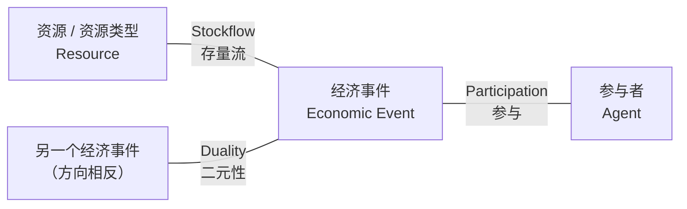

> 这张图在说：**核心 REA 模型 = 一对事件（Duality 相连）+ 每个事件各自挂上资源（Stockflow）和参与者（Participation）**。就这三根线，没有别的。

#### 2.2.1 二元性（Duality）

**是什么**

讲义 p.3 原文：*"Duality — Links increment and decrement economic events"*。

**把增量事件和减量事件连起来的那条线。** 它表达的是"这一得一失是一笔交换"。

**为什么需要它**

因为 duality **就是复式记账的"借贷相等"在 REA 里的对应物**（M04 已论证）。复式记账用"左边金额 = 右边金额"来保证等式平衡；REA 用"每个增量事件必须能连到一个减量事件"来保证**没有白拿的资源**。

区别在于：

| | 复式记账 | REA 的 duality |
|---|---|---|
| 连的是什么 | 两个**账户**的金额 | 两个**事件**的实例 |
| 时间信息 | 丢失（分录只有一个日期） | 保留（两个事件各有自己的日期） |
| 能不能一对多 | 不能（一笔分录就是一笔） | **能** —— 一次付款可以清多张采购单 |

**课件原例**

RSWS 的 duality 连的是 `Purchase` ↔ `Cash Disbursement`（讲义 p.12），多重度是 `0..* — 0..*`（讲义 p.20），意思是**赊购、分期付、合并付都允许**（详见 §2.9.5）。

**💡 换个说法（笔记补充）**

想象一根扁担：一头挑着"我得到了什么"，一头挑着"我付出了什么"。Duality 就是那根扁担。**扁担断了 = 有东西凭空出现或凭空消失 = 账不对了。**

**⚠️ 常见误解**

- ❌ "duality 一定是 1 对 1。" —— 只有在"一手交钱一手交货、绝不赊账、绝不分期"的极简业务里才是 `1..1—1..1`（这正是 **W4 Exercise 1** 的那张图）。现实里几乎总是多对多。
- ❌ "duality 连的是资源。" —— 不，**连的是事件**。资源是靠 stockflow 挂上去的。

**🎙️ 课堂补充**
待转录补充。

**所以呢**

二元性把"这一得一失是一笔交换"钉死了，下一节看图上另一条主关联——事件怎么和它搬动的资源连起来。

---

#### 2.2.2 存量流（Stockflow）

**是什么**

讲义 p.3 原文：

> *"Stockflow — Links economic events and resources or resource types.
> **Inflow** links increment event to resource or resource type.
> **Outflow** links decrement event to resource or resource type."*

**把事件和它涉及的资源连起来的那条线。** 一条 stockflow 回答的是："这次事件搬动的是**哪样**东西？"

它有两个方向，但**在图上是同一种线，只是根据它连的事件类型自动获得方向**：

| 名称 | 连接 | 含义 |
|---|---|---|
| **流入 Inflow** | 增量事件 ↔ 资源 | 这样资源流**进**企业 |
| **流出 Outflow** | 减量事件 ↔ 资源 | 这样资源流**出**企业 |

**为什么需要它**

没有 stockflow，事件就是一句空话。"2026-09-30 发生了一次采购"——采购了什么？Stockflow 回答这个问题。

**课件原例**

RSWS 有三条：`Stockflow1 = Inventory Type ↔ Purchase`（流入）、`Stockflow2 = Overhead ↔ Purchase`（流入）、`Stockflow3 = Cash ↔ Cash Disbursement`（流出）（讲义 p.13）。

> ⚠️ 注意**编号只是画图时的顺序标号，不是类型标记**。Stockflow1/2/3 里 1、2 是流入，3 是流出——但编号本身不含这个信息。考试若问"哪条是 outflow"，要看**它连的是不是减量事件**。

**💡 换个说法（笔记补充）**

Stockflow 就是仓库出入库单上的"品名"那一栏。事件是"什么时候、谁、进还是出"，stockflow 是"到底是哪样货"。

**⚠️ 常见误解**

- ❌ "一个事件只能有一条 stockflow。" —— RSWS 的 Purchase 事件就有**两条**（存货 + 制造费用）。一次采购当然可以既买货又买服务。
- ❌ "Inflow / Outflow 是两种不同的关联，图上要用不同的线。" —— 讲义图上**都写 `Stockflow`**，方向由所连事件决定。

**🎙️ 课堂补充**
待转录补充。

**所以呢**

存量流回答了"搬的是哪样东西"，下一节看三条主关联的最后一条——事件和经手它的人怎么连起来。

---

#### 2.2.3 参与（Participation）

**是什么**

讲义 p.3 原文：*"Participation — Links economic events and agents (internal and external)"*。

**把事件和经手它的人连起来的那条线。**

**为什么需要它**

见 §2.1.3——这是 REA 相对复式记账最直接的信息增量。

**课件原例**

RSWS 的 Purchase 事件挂了 2 个参与者（Purchase Agent、Supplier），Cash Disbursement 挂了 3 个（Supplier、A/P Clerk、Manager），共 5 条 participation（讲义 p.15）。

**💡 换个说法（笔记补充）**

Participation 就是单据上的**签名栏**。一张采购单上有"申请人"、"审批人"、"供应商盖章"三个签名，就是三条 participation。

**⚠️ 常见误解**

- ❌ "participation 只连内部参与者。" —— 讲义括号里明写 `(internal and external)`。**外部参与者也靠 participation 连**。
- ❌ "同一个事件到同一个人只能有一条 participation。" —— 如果一个人在同一事件里有**两个不同角色**（既是申请人又是审批人），严格建模应画两条并给它们不同的名字。讲义没展开这一点。

**🎙️ 课堂补充**
待转录补充。

**所以呢**

三条主关联（必须画、缺一不可）讲完了，下一节看三条次关联——它们只在特定条件下才画，条件本身就是考点。

---

### 2.3 核心 REA 次关联（讲义 p.4）

> 讲义 p.4 标题 `Core REA Secondary Associations`。"次"（secondary）的意思是：**这三条是可选的**，只在特定条件下才画。讲义对每一条都给了**明确的启用条件**，这些条件是考点。

三条次关联都不碰事件，它们连的是**资源↔参与者**和**参与者↔参与者**：

| 关联 | 连接 | 讲义原文的启用条件 |
|---|---|---|
| **保管 Custody** | 参与者 ↔ 资源 | *"such that agent has physical control over the resource or controls access to the resource"* |
| **指派 Assignment** | 内部参与者 ↔ 外部参与者 | *"Use only when relationship between internal agent and external agent exists **independently of their mutual participation in an event**"* |
| **责任 Responsibility** | 内部参与者 ↔ 内部参与者 | *"Use when one internal agent is responsible for another, **independent of their mutual participation in an event**"* |

**⚠️ 三条里有两条的启用条件是同一句话，而且这句话是本页的全部要点：**

> **"independently of their mutual participation in an event"** —— 只有当这个关系**脱离具体事件也依然存在**时，才画这条线。

#### 2.3.1 保管（Custody）

**是什么**

**某个参与者对某样资源有实际控制权或访问权。**

**为什么需要它**

因为"谁经手了这次交易"（participation）和"谁平时管着这批东西"（custody）是**两件事**。

- 仓库里的存货，平时归**仓管员**保管 —— 这是 custody，**跟有没有发生交易无关**，一天没有出入库这个关系也在。
- 某次出库是**发货员**办的 —— 这是 participation，**只在那次事件里成立**。

**为什么这个区分重要**：盘点亏了少了一批货，你要找的是 **custody** 那个人，不是那次 participation 的人。

**课件原例**

讲义 p.34 在全景图上把 custody 高亮出来，连的是 `<<ResourceType>>` 和第一个 `<<InternalAgent>>`。
⚠️ **这与 p.4、p.31 的文字定义矛盾**：文字说 custody 连 **resource** 和 internal agent，图上却连的是 **ResourceType**。见 [[#9.3 课件自身的问题|§9.3 ④]]。

**💡 换个说法（笔记补充）**

Custody = **钥匙在谁手里**。保险柜的钥匙归财务主管，这是 custody；今天他开柜子取了三万块，这是 participation。

**⚠️ 常见误解**

- ❌ "有 participation 就不用画 custody。" —— 反了。**大多数情况下不画 custody**（讲义把它列为"次"关联就是这个意思）；只有当"谁负责保管"需要**独立追踪**时才画。

**🎙️ 课堂补充**
待转录补充。

**所以呢**

保管（人对物）讲完了，下一节看次关联里的另一条——指派（人对人，但内外之间）。

---

#### 2.3.2 指派（Assignment）

**是什么**

**把一个内部参与者和一个外部参与者绑定起来**，且这个绑定**不依赖任何具体事件**。

**典型场景**：公司给每个客户指定一个**专属客户经理**。张经理负责 A、B、C 三家客户——**哪怕这三家这个月一单没下**，这个负责关系也在。

**为什么需要它**

如果不画 assignment，你只能从"谁和谁一起参与过某个事件"倒推关系，这是**事后的、间接的**。而业务上很多关系是**事先约定的**：负责区域、指定联络人、专属采购员。

**⚠️ 判断关键（讲义写死的条件）**

> **"Use only when relationship ... exists independently of their mutual participation in an event."**

考试判断法：**问自己"如果这两个人从来没在同一笔交易里出现过，这条关系还存在吗？"**
- 存在 → 画 assignment
- 不存在 → 不画，那只是 participation 的副产品

**课件原例**

讲义 p.32 在全景图上高亮 assignment，连 `<<InternalAgent>>`（第二个）和 `<<ExternalAgent>>`。RSWS 的核心模型里**没有** assignment（核心模型只用三条主关联）。

**💡 换个说法（笔记补充）**

Assignment = **通讯录里的"对口人"字段**。你手机里存着"招行 · 客户经理王某"，你这个月没去过银行，但这个对口关系一直在。

**🎙️ 课堂补充**
待转录补充。

**所以呢**

指派（内外之间、脱离事件也成立）讲完了，下一节看次关联的最后一条——同样脱离事件、但连的是内部与内部。

---

#### 2.3.3 责任（Responsibility）

**是什么**

**一个内部参与者对另一个内部参与者负责**（上下级、汇报线），同样**不依赖具体事件**。

**为什么需要它**

组织架构本身是有用的数据：审批权限（超过 5 万要经理批）、业绩汇总（部门业绩 = 下属业绩之和）、责任追溯（出了事查到哪一级）。

**课件原例**

讲义 p.33 高亮 responsibility，连两个 `<<InternalAgent>>`。

**💡 换个说法（笔记补充）**

Responsibility = **组织架构图上的那根竖线**。

**⚠️ 常见误解**

- ❌ "responsibility 就是 custody 的人对人版。" —— 不是。custody 是**人对物**（谁管着东西），responsibility 是**人对人**（谁管着人）。

**🎙️ 课堂补充**
待转录补充。

**所以呢**

三条主关联、三条次关联都讲完了，下一节把六条放进一张表里合起来记，方便考前速查。

---

#### 2.3.4 六条核心关联的一览（把 p.3 + p.4 合起来）

| # | 关联 | English | 连接 | 主/次 | 什么时候画 |
|---|---|---|---|---|---|
| 1 | 二元性 | Duality | 增量事件 ↔ 减量事件 | 主 | **总是**（核心模型必有） |
| 2 | 存量流 | Stockflow | 经济事件 ↔ 资源/资源类型 | 主 | **总是** |
| 3 | 参与 | Participation | 经济事件 ↔ 参与者 | 主 | **总是** |
| 4 | 保管 | Custody | 参与者 ↔ 资源 | 次 | 需要独立追踪"谁保管"时 |
| 5 | 指派 | Assignment | 内部参与者 ↔ 外部参与者 | 次 | 关系**脱离事件**也成立时 |
| 6 | 责任 | Responsibility | 内部参与者 ↔ 内部参与者 | 次 | 有独立于事件的汇报关系时 |

> 🟡 **这张表极可能被考**：给一条关联名，要你说出它连哪两类东西；或给一个场景，要你说该用哪条关联。**次关联的三条要背它们的启用条件原句。**

**所以呢**

类和关联这两种"零件"都齐了，下一节看第三种零件——属性——该往哪里挂。

---

### 2.4 分配属性（讲义 p.5）

**是什么**

讲义 p.5 标题 `Assigning Attributes`，正文四条：

> *"Determine whether the attribute describes just **one thing (class)** or a **combination of things (association)**"*
> - *"**Resource** attributes typically include an identifier, description, and attributes indicating value or dimensions"*
> - *"**Event** attributes typically include an identifier, a date/time (or beginning and ending dates/times), and attributes indicating value or other dimensions"*
> - *"**Agent** attributes typically include an identifier, name, address, telephone, other contact information"*

这一页有**两层意思**，第一层是判据，后三条是模板。

**第一层（最重要）：属性该挂在类上，还是挂在关联上？**

判据只有一句：**这个属性描述的是"一样东西"，还是"一个组合"？**

- 描述**一样东西** → 挂在**类**上。例：供应商的电话号码 —— 只跟供应商有关，跟任何一次采购无关 → 挂 `Supplier` 类。
- 描述**一个组合** → 挂在**关联**上。例：**这次采购里，这个品类买了多少件** —— 只说"采购"不够（一次采购买了三个品类，数量各不同），只说"品类"也不够（这个品类被采购过十次，每次数量不同）。**它只有在"这次采购 × 这个品类"这一对上才有确定的值** → 挂在 `Stockflow1` 关联上。

**为什么需要它**

因为挂错了会**丢数据或存重复**。这是 W4 讲过的 **"One Fact–One Place"** 原则的直接应用：

- 如果把 `item-qty-purch`（本次采购的该品类数量）挂在 `Purchase` 类上 → 一次采购买了 3 个品类，你只有一个字段，**存不下**。
- 如果挂在 `Inventory Type` 类上 → 这个品类被采购过 10 次，你只有一个字段，**存不下**。
- 挂在关联上 → 关联在数据库里会变成一张独立的表，每一行是"一次采购 × 一个品类"，**刚好一格一个数**。

> 💡 **换个说法（笔记补充）**：这跟 Excel 的道理一样。"客户电话"应该放在客户表；"这张单里这个货品买了几件"必须放在**明细行**表里，因为它属于"单号 + 货号"这个组合。**REA 的关联属性 = 单据的明细行。**

**第二层：三类东西各自的标准属性模板**

| 类别 | 讲义给的标准属性 | RSWS 里的实例（讲义 p.17） |
|---|---|---|
| **资源 Resource** | 标识符（identifier）、描述（description）、表示**价值或量纲**的属性 | `Inventory Type`：Item-id (PK)、Item-desc、Item-std-cost、Item-list-price、Item-qoh |
| **事件 Event** | 标识符、**日期/时间**（或起止时间）、表示价值或其他量纲的属性 | `Purchase`：Acq-ID (PK)、Acq-date、Acq-amt |
| **参与者 Agent** | 标识符、姓名、地址、电话、其他联系方式 | `Supplier`：SupNum (PK)、Sup-name、Sup-add、Sup-rating |

> 🟡 **考点**：**事件属性一定有日期**，资源和参与者属性一般没有。这是 REA "以事件为中心、保留时间信息"的直接体现——你在图上看到一个方框里有 `-date`，它八成是个事件。

**⚠️ 常见误解**

- ❌ "关联属性是可选的装饰。" —— 不是。**多对多关联上的属性无处可去**，不挂关联就只能丢掉。
- ❌ "所有关联都能挂属性。" —— 能挂，但**通常只有多对多关联需要**。一对多关联的属性可以挪到"多"的那一端的类上（RSWS 的 `Stockflow3` 就没有属性，因为 `Cash 1..1 — 0..* Cash Disbursement` 不是多对多，金额直接放在 `Cash Disbursement.CD-amt` 里了）。

**🎙️ 课堂补充**
待转录补充。

**所以呢**

属性该挂类还是挂关联的判据定了，下一节讲最后一种零件、也是全讲最容易出题的一种——多重度该怎么分配。

---

### 2.5 分配多重度（讲义 p.6）

> **这一页是全讲最容易出考题的地方。** 它只有两块内容，但两块都关键。

#### 2.5.1 多重度从哪里来（讲义 p.6 上半）

讲义原文只有一行：

> *"Narrative descriptions / business common sense / reasonable assumptions"*

翻译过来是**三个来源**，按优先级：

| 优先级 | 来源 | 说明 |
|---|---|---|
| **1** | **业务叙述**（narrative descriptions） | 题面里明写的话。**有就必须照做，不能自己发挥。** |
| **2** | **商业常识**（business common sense） | 叙述没说、但常识上只有一种合理答案。例："一次采购来自几个供应商？"——常识答案是 1 个。 |
| **3** | **合理假设**（reasonable assumptions） | 前两者都不管用时自己定，但**答题时必须把假设写出来**。 |

> 🟡 **答题技巧**：考试给你一段 narrative，你的第一个动作应该是**把叙述逐句拆开，每句话对应到图上的哪一条线的哪一端**。RSWS 的四句叙述（p.19）刚好覆盖了 18 个多重度中的一大半，剩下的用常识补。完整推导见 §2.9.5，那是本讲的核心练习。

**所以呢**

三个来源按优先级排好了（叙述 > 常识 > 假设），下一节看还有一条捷径——三条"通常成立"的默认规则，能直接省掉大半判断。

#### 2.5.2 三条"通常成立"的默认规则（讲义 p.6 下半）

讲义原文：

> *"Rules that **usually (but don't always) apply**:*
> - *Resource Type `1..*` – `0..*` Economic Event*
> - *Resource `1..*` – `0..1` Economic Event*
> - *Economic Event `0..*` – `1..1` Agent"*

**先回忆读法**（M04 p.31 原话："Minimum participation of employee = 0 — **put next to dept**"）：

> **写在类 X 旁边的多重度，说的是"另一端那个类的一个实例，连着几个 X"。** 也就是**"看对面"**。

按这个读法逐条翻译：

| 讲义写法 | 逐字翻译 | 通俗说法 | 为什么 |
|---|---|---|---|
| `Resource Type 1..* – 0..* Economic Event` | 一个经济事件涉及 **1 到多个**资源类型；一个资源类型出现在 **0 到多个**事件中 | 一次交易至少动了一种货；一个货品可能从没被交易过（刚建档） | 事件必须有内容；资源类型可以先入库存档案 |
| `Resource 1..* – 0..1 Economic Event` | 一个经济事件涉及 **1 到多个**资源；**一个具体资源最多出现在 1 个事件中** | 一颗特定的钻石最多被卖掉一次 | **这就是 Resource 与 Resource Type 的差别落到图上的地方** |
| `Economic Event 0..* – 1..1 Agent` | 一个参与者参与 **0 到多个**事件；**一个事件恰好有 1 个（某角色的）参与者** | 一次采购只有一个采购员签字；一个采购员可以采购很多次，也可能一次没有 | 单据上每个签名栏只签一个人 |

**⚠️ "usually but don't always" 这句话是个陷阱预告**

讲义**自己**在 RSWS 例子里就打破了第一条：p.20 上 `Inventory Type` 与 `Purchase` 之间是 **`0..* – 0..*`**，不是规则说的 `1..* – 0..*`。

**为什么可以打破**：RSWS 的一次采购可能**只买制造费用、不买存货**（因为图上还有一条 `Overhead` 的 stockflow）。所以"一次采购至少涉及 1 个存货品类"不成立，最小值降为 0。

> 🟡 **这是一道极好的考题**：给出 `Inventory Type 0..* – 0..* Purchase`，问"为什么这里不是 p.6 说的 `1..*`？"标准答案：**因为存在只含制造费用的采购，此时该采购不关联任何存货品类，故最小值为 0。**

**💡 换个说法（笔记补充）**

三条默认规则可以浓缩成一句口诀：

> **事件必须有料（资源端最小 1），资源可以待字闺中（事件端最小 0）；专属的资源只能卖一次（`0..1`），批量的资源能卖很多次（`0..*`）；一个事件一个签名（`1..1`），一个人签很多单（`0..*`）。**

**⚠️ 常见误解**

- ❌ 把多重度读成"标在 A 旁边就是 A 的个数"。**这是本讲最致命的错误**，一读反整张图的语义全反。牢记 W4 的原话：**put next to dept**（描述 employee 的数字，写在 dept 旁边）。
- ❌ 以为最小值 0 是"可以不填"。不是。**最小值 0 = 允许这一端的实例孤零零存在**；最小值 1 = **强制**必须有配对。

**🎙️ 课堂补充**
待转录补充。

**所以呢**

类、关联、属性、多重度四种零件全部讲完了，下一节把它们组装成一套可以在考场上照抄的施工顺序——建模型的六步法。

---

### 2.6 建核心模型的六步法（讲义 p.7–8）

> 讲义 p.7–8 两页共同构成一份完整的施工顺序，标题里的 `*Core*` 用红色标出，是在强调：**这六步建的是核心模型，不含扩展部分**（扩展部分在 §2.10）。
> **这六步就是答题模板。** 考场上照抄这个顺序，每一步写一行标题再画，改卷人一眼能看到你的结构。

#### 六步原文与解读

| 步 | 讲义原文（p.7–8） | 做什么 | 产出 |
|---|---|---|---|
| **1** | *"Identify Economic Exchange Events — Create each economic exchange event as a class and create a **duality** association between them"* | 找出这段业务里"一得一失"的那**一对**事件，各建一个类，中间连 duality | 2 个方框 + 1 条线 |
| **2** | *"Attach Resources to the Economic Events — Create each resource as a class and create a **stockflow** association between it and the related economic event"* | 问每个事件："你搬动的是什么？"每样答案建一个资源类，连 stockflow | +N 个方框 +N 条线 |
| **3** | *"Attach **External** Agents to Economic Events — Create as a class the external agent **from whom** resources are obtained in each economic **increment** event ... Create as a class the external agent **to whom** resources are transferred in each economic **decrement** event ..."* | 问："资源从谁那儿来 / 给了谁？"建外部参与者类，连 participation | +1~2 个方框 |
| **4** | *"Attach **internal** agents to economic events — Create as classes the internal agents who **process, accomplish, or authorize** each economic increment / decrement event ..."* | 问："企业这边谁**经办、完成或批准**了它？"建内部参与者类，连 participation | +N 个方框 |
| **5** | *"Assign attributes to classes and associations"* | 给每个方框填第二格；给多对多关联挂关联属性 | 属性 |
| **6** | *"Assign multiplicities"* | 按 §2.5 的三个来源填每条线的两端 | 多重度 |

**所以呢**

六个步骤各自做什么已经列全，下一节说明这个顺序为什么不能打乱——这决定了考场上先画什么、后画什么。

#### 为什么是这个顺序

**⭐ 这是本讲最值得理解的设计**（讲义没有解释，以下为笔记补充）：

1. **先事件，因为 REA 是事件中心的模型。** 资源和参与者都是**挂在事件上**的——没有事件，你不知道该建哪些资源、哪些人。反过来先列资源，你会列出一堆跟这段业务无关的东西。
2. **先外部再内部，因为外部参与者是从"资源从哪来/到哪去"直接读出来的**（step 3 的原文就是这么写的：`from whom` / `to whom`），几乎不需要判断；而内部参与者要判断"谁 process / accomplish / authorize"，是**主观的**、需要业务知识的。**先做确定的，再做需要判断的。**
3. **属性和多重度放最后**，因为它们是**对已有结构的标注**。结构没定就标注，改结构时全要重来。

> 💡 **换个说法（笔记补充）**：这跟盖房子一样——先立柱（事件），再砌墙（资源、参与者），最后刷漆（属性）和装门锁（多重度）。你不会先刷漆再立柱。

**所以呢**

顺序背后的道理讲完了，下一节把 Step 3、Step 4 里最容易记混的几个介词单独拎出来对比。

#### Step 3 与 Step 4 的原文要害

Step 3 的两句话是**对称**的，务必背下这组介词：

- 增量事件（资源流**入**）：外部参与者是资源**来源** —— *"the external agent **from whom** resources are obtained"*
- 减量事件（资源流**出**）：外部参与者是资源**去向** —— *"the external agent **to whom** resources are transferred"*

Step 4 的三个动词也要记：内部参与者是那些 **process（经办）、accomplish（完成）、authorize（批准）** 事件的人。**"批准"是最容易漏的一个**——RSWS 的 `Manager` 就是靠 authorize 才进入模型的（付款需要经理批准）。

**⚠️ 常见误解**

- ❌ "step 1 只建一个事件。" —— **必须成对**。原文 `Create each economic exchange event as a class and create a duality association **between them**`，`them` 是复数。
- ❌ "外部参与者在增量和减量事件里是同一个，所以只连一条线。" —— 是同一个类（比如都是 Supplier），但**要连两条 participation**，因为它参与了两个不同的事件。RSWS 的 Supplier 就连了两条（p.15 的 Participation2 和 Participation3）。

**🎙️ 课堂补充**
待转录补充。

**与其他概念的关系**

这六步的产物（核心模型）在 §2.10 会被扩展成完整模型；在 M06 会被转成 ACCESS 表。**六步法本身不会变**，扩展只是在第 1 步和第 2、3、4 步里多加几类事件和关联。

**所以呢**

六步法这套通用施工顺序讲完了，下面两节各用一次真正的循环把它跑一遍，先看采购循环。

---

### 2.7 采购循环的核心 REA 模式（讲义 p.9–11）

> ⚠️ **先补三个业务名词**（讲义默认你懂，但本笔记的读者会计零基础）：
> - **采购循环 / 采购—付款流程（Acquisition / Payment Process）** —— 企业"花钱买东西"这一整套活动：发现需要 → 下单 → 收货 → 付款 →（可能）退货。
> - **供应商（Supplier / Vendor）** —— 卖东西给你的公司。
> - **制造费用（Overhead）** —— 不能直接算到某件产品上的间接支出：水电、租金、设备维护。RSWS 把它建成了一个 `<<ResourceType>>`。

#### 2.7.1 增量事件：三选一（讲义 p.9）

讲义 p.9 标题 `Core REA Modeling of Acquisition`，讲的是**增量事件那一半**：

> **Economic Increment Event** —— 根据"你到底得到了什么"，事件的名字有三个选项：
>
> | 事件名 | 讲义给的启用条件 | 通俗解释 |
> |---|---|---|
> | **Purchase**（receipt of goods） | *"If **title** to goods transfers from vendor to enterprise"* | 货的**所有权**转到了你名下 → 这是"采购" |
> | **Rental** | *"If enterprise acquires **temporary right to use** goods"* | 只拿到**临时使用权**，东西还是人家的 → 这是"租赁" |
> | **Service Acquisition**（或 G&A Service Acquisition） | *"If **services or utilities** are acquired"* | 买的是服务或水电 → 这是"服务采购" |
>
> 配套的另外三样（讲义同页）：
> - **Resource / Resource Type**：`Inventory, Inventory Type, Service, operating assets etc.`（存货、存货类型、服务、经营性资产等）
> - **External Agent**：`Vendor or Supplier`（供应商）
> - **Internal Agent**：`Purchasing Agent or Buyer`（采购员）

**为什么要分三种**

因为 **REA 建的是"真实发生了什么"的模型，不是"记什么账"的模型**。租一台机器和买一台机器，在传统会计里可能都进"费用"或"资产"，但在业务上是完全不同的两件事：租的东西你不能卖、到期要还、有租金条款。REA 要求你在**建模阶段**就把它们区分开。

> 🟡 **考点**：给一个场景（"公司向某公司支付了一年的写字楼租金"），问该建成哪个增量事件。答案：**Rental**（只取得临时使用权，所有权未转移）。如果题目说的是"支付一年的清洁服务费"，答案是 **Service Acquisition**。

**⚠️ 常见误解**

- ❌ "只要付了钱就是 Purchase。" —— 判据是 **title（所有权）转不转移**，不是钱付没付。
- ❌ "G&A 是另一种事件。" —— `G&A` = General & Administrative（一般及行政），只是 Service Acquisition 的一个子类叫法，不是新事件类型。

**所以呢**

增量端的三选一（Purchase / Rental / Service Acquisition）分清楚了，下一节看减量端——好消息是它几乎只有一种情况。

#### 2.7.2 减量事件：几乎总是付款（讲义 p.10）

讲义 p.10 同标题，讲**减量事件那一半**，内容极简：

> **Economic Decrement Event**
> - **Cash Disbursement**（现金付款）
> - Resource / Resource Type：**Cash**
> - External Agent：**Vendor or Supplier**
> - Internal Agent：**Cashier or Accounts Payable Clerk**（出纳或应付账款会计）

**为什么减量端这么简单**：因为企业买东西**几乎总是用钱付**。（理论上可以以物易物，那样减量事件就是另一个 Purchase 的镜像，但讲义不展开。）

> ⚠️ **注意内部参与者的角色分工**：增量端是 **采购员**（Purchasing Agent / Buyer），减量端是 **出纳或应付会计**（Cashier or A/P Clerk）。**这两组人不同**——这正是内部控制里的**职责分离**：**下单的人不能同时是付钱的人**。讲义没点破这一层，但这是理解为什么模型要分开画两组内部参与者的关键（💡 笔记补充）。

**所以呢**

增量端、减量端的事件、资源、参与者都定好了，下一节把它们拼成一张完整的图，看六步法的产物长什么样。

#### 2.7.3 采购循环的核心模式全图（讲义 p.11）

讲义 p.11 是一张纯图（无标题栏），左上角写着 `For Inventory (merchandise, raw materials, or supplies)` ——意思是"以采购**存货**（商品／原材料／耗材）为例"。

**图的内容**（视觉复核所得，讲义 p.11）：

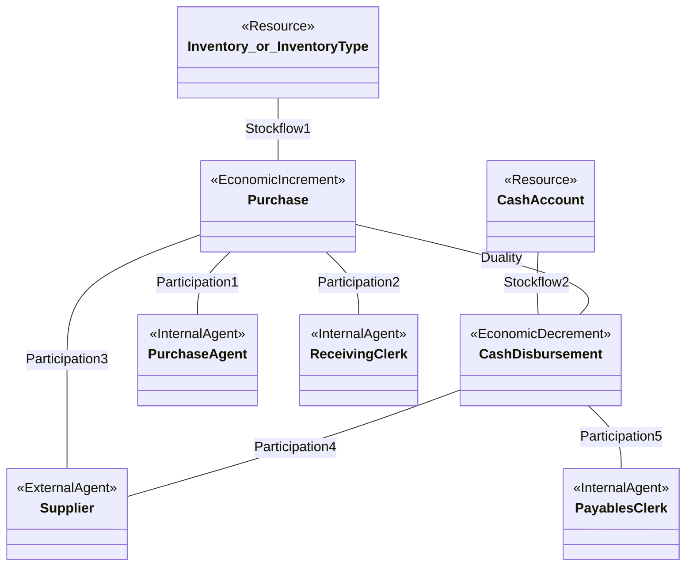

**逐条读这张图**（这是六步法的产物，按步骤对照）：

| 六步 | 图上对应 |
|---|---|
| Step 1 | `Purchase` ↔ `Cash Disbursement`，中间 **Duality** |
| Step 2 | `Inventory / Inventory Type` —Stockflow1— `Purchase`（流入）；`Cash Account` —Stockflow2— `Cash Disbursement`（流出） |
| Step 3 | `Supplier` 连两条：Participation3（货从他那来）+ Participation4（钱付给他） |
| Step 4 | `Purchase Agent`（下单）、`Receiving Clerk`（收货）挂 Purchase；`Payables Clerk`（付款）挂 Cash Disbursement |
| Step 5–6 | **这张图没画属性、没画多重度** —— 它只是"骨架模板" |

**三个值得注意的细节**

1. **`<<Resource>> or <<ResourceType>>`** —— 讲义在第一个方框里**同时写了两个刻板印象**，提醒你：建成哪个取决于货品可不可互换（§2.1.1）。
2. **`Cash Account` 标的是 `<<Resource>>`**（不是 ResourceType）—— 因为具体的银行账户不可互换。⚠️ RSWS 例子里却标成了 ResourceType，见 [[#9.3 课件自身的问题|§9.3 ①]]。
3. **Purchase 挂了两个内部参与者**（采购员 + 收货员），**Cash Disbursement 只挂一个**（应付会计）。这是标准的职责分离设计。

**🎙️ 课堂补充**
待转录补充。

**所以呢**

采购循环的核心模式画完了，下一节看它的镜像——收入循环，两者一对照记忆量会小很多。

---

### 2.8 收入循环的核心 REA 模式（讲义 p.21）

> **本笔记把讲义 p.21 提到这里**，与 §2.7 的采购循环并排。讲义原本把它放在 RSWS 实例之后（见 §1.3 重排说明 1）。

> ⚠️ **先补两个业务名词**：
> - **收入循环 / 销售—收款流程（Revenue / Sales–Collection Process）** —— 企业"卖东西收钱"的一整套活动：拜访客户 → 接单 → 发货 → 收款 →（可能）退货。
> - **出纳（Cashier）** —— 负责收钱的人。

讲义 p.21 标题 `Revenue Core Pattern`，图的内容（视觉复核所得）。
⚠️ 讲义原图上，货那一侧的方框写的是 `<<Resource>> or <<ResourceType>> / Goods or Services`（二选一，同 p.11），减量事件方框写的是 `<<EconomicDecrement>> / Sale or Service Engagement or Rental`（三选一，同 p.9 的镜像）。下图为便于渲染各取其一：

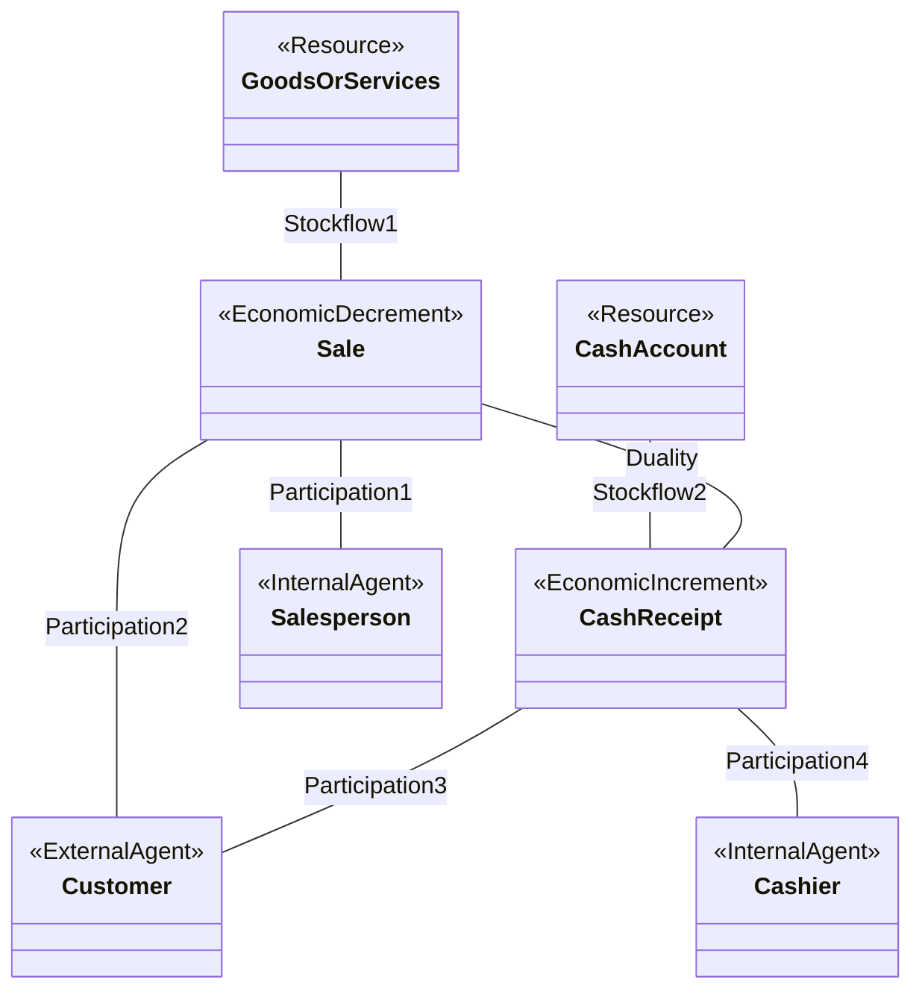

**⭐ 与采购循环逐项对照**（这张对照表是本讲最值钱的一页）：

| | 采购/付款循环（p.11） | 收入/销售循环（p.21） |
|---|---|---|
| **增量事件**（流入） | **Purchase** 收货 | **Cash Receipt** 收款 |
| **减量事件**（流出） | **Cash Disbursement** 付款 | **Sale**（或 Service Engagement / Rental）发货 |
| **货那一侧的资源** | Inventory / Inventory Type | Goods or Services |
| **钱那一侧的资源** | Cash Account | Cash Account |
| **外部参与者** | Supplier 供应商 | Customer 客户 |
| **内部参与者（货侧）** | Purchase Agent 采购员 + Receiving Clerk 收货员 | Salesperson 销售员 |
| **内部参与者（钱侧）** | Payables Clerk 应付会计 | Cashier 出纳 |

**⭐ 核心洞见：增量与减量互换了位置。**

- 采购循环：**货是增量**（进来了），**钱是减量**（出去了）
- 收入循环：**钱是增量**（进来了），**货是减量**（出去了）

**为什么**：因为**同一笔生意，在买方和卖方眼里方向相反**。你把货卖给客户，这笔交易在客户的账本里就是一次采购。REA 模型是**站在企业自己这一侧**画的，所以方向以"资源进出我这家企业"为准。

> 💡 **换个说法（笔记补充）**：把两张图并排放，然后把其中一张**左右翻转**——你会发现它们几乎重合。这就是为什么后面 §2.11 和 §2.13 的扩展模型也是镜像的。**期中考如果只给一个循环让你画另一个，靠的就是这个对称性。**

**⚠️ 常见误解**

- ❌ "Sale 是收入，收入是好事，所以 Sale 应该是增量。" —— **最常见的错误**。再说一次：增量/减量看的是**资源进出方向**，不是损益方向。**Sale 是减量**（货出去了）。
- ❌ "p.21 少画了 Shipping Clerk（发货员），是漏了。" —— 严格说这是核心模式的**简化**，讲义在采购侧画了 Receiving Clerk 而销售侧没画对应的 Shipping Clerk（不对称）。但到了扩展模型 p.48 就补上了 Shipping Clerk。见 [[#9.3 课件自身的问题|§9.3 ⑦]]。

**🎙️ 课堂补充**
待转录补充。

**与其他概念的关系**

`Sale or Service Engagement or Rental` 这三选一，是 p.9 采购侧 `Purchase / Rental / Service Acquisition` 的**完全镜像**：卖货 / 提供服务 / 出租。判据也一样——**所有权转不转移**。

**所以呢**

两个核心模式都过了一遍，下一节用一个真实案例——乐器店 RSWS——把六步法从头到尾完整走一次，这是本讲最重要的练习。

---

### 2.9 完整实例：Robert Scott Woodwind Shop 走完六步（讲义 p.12–20）

> **这是本讲的核心练习，也是最可能被考的部分。** 讲义用 9 页把六步法在一家乐器店身上完整走了一遍。
>
> **建议读法**：每一步先自己想，再看讲义给的答案。下面每个小节我都用 `<details>` 把"讲义的答案"折叠起来，方便你先自测。

**背景**：`Robert Scott Woodwind Shop (RSWS)` 是一家**木管乐器店**（woodwind = 单簧管、长笛、萨克斯这类）。讲义没有给完整的公司叙述，只给了四句用于确定多重度的业务描述（p.19）。**我们要建的是它的采购/付款循环核心模型。**

---

#### 2.9.1 Step 1：识别经济交换事件（讲义 p.12）

**题面**：RSWS 买乐器进货，这段业务里"一得一失"的一对事件是什么？

<details><summary>讲义的答案（p.12）</summary>

> *"Step 1: Economic Exchange Events — Purchase / Cash Disbursement"*

图上：两个方框，中间一条线标 `Duality`。

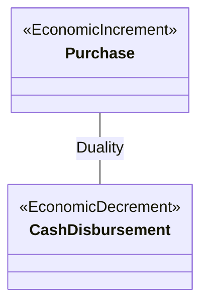

**注意此时方框的第二、三格是空的** —— 属性要到 Step 5 才填。UML 类图的三格结构（第一格：刻板印象 + 类名；第二格：属性；第三格：操作，本课永远留空）在 M04 讲过。

</details>

**为什么是这两个**：RSWS 得到了乐器（增量），付出了现金（减量）。**注意此时还没有出现任何资源、任何人**——六步法要求你先只画事件。

**⚠️ 常见误解**：想在 Step 1 就把"存货"画出来。忍住。存货是 Step 2 的事。

**🎙️ 课堂补充**
待转录补充。

**所以呢**

一对事件（Purchase / Cash Disbursement）先立住了骨架，下一步给它们挂上各自搬动的资源。

---

#### 2.9.2 Step 2：给事件挂上资源（讲义 p.13）

**题面**：这两个事件各自搬动了哪些资源？

<details><summary>讲义的答案（p.13）</summary>

> *"Step 2: Attach Resources to Events — **Cash** to Cash Disbursement；**Inventory Type and Overhead** to Purchase"*

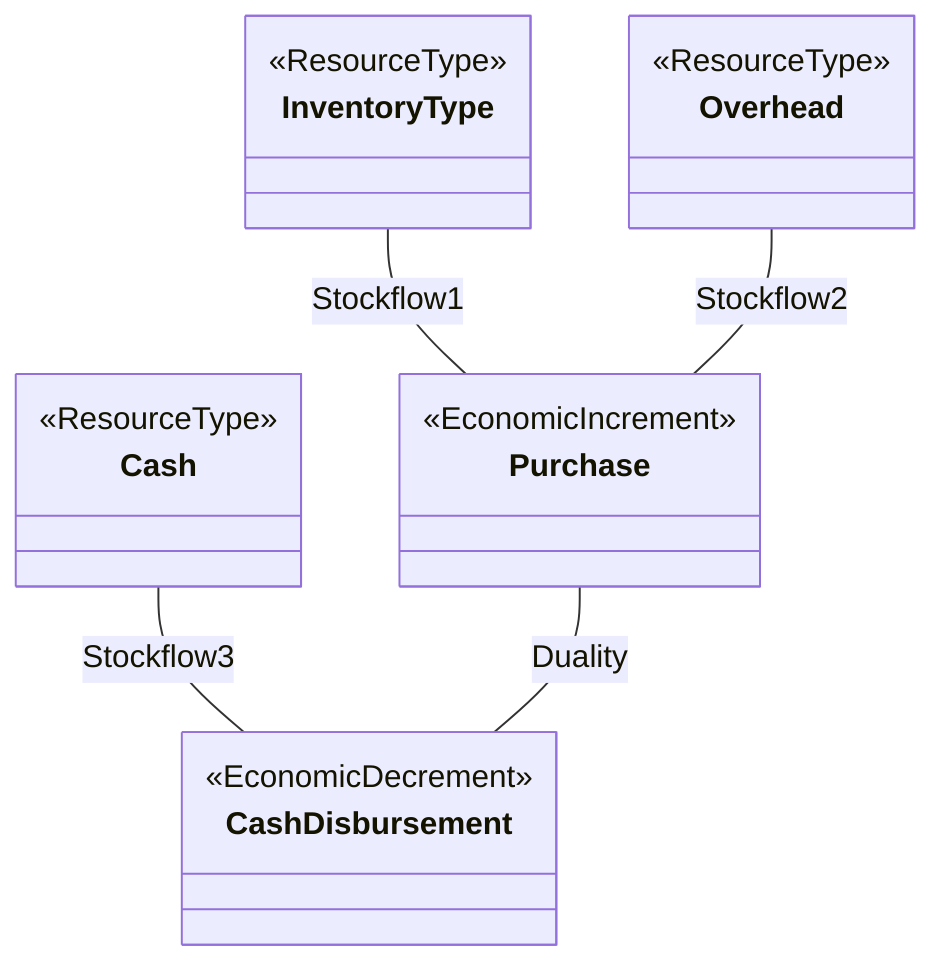

</details>

**三个要点**

1. **Purchase 挂了两条 stockflow**（Inventory Type + Overhead）。这说明 RSWS 的一次"采购"事件既可能是进乐器，也可能是买水电耗材——**这个建模决定会在 Step 6 直接导致多重度的最小值变成 0**（见 §2.9.5）。
2. **`Overhead`（制造费用）被建成了一个资源类型。** 对零基础读者：这里的 Overhead 指的是**间接费用类目**（水电、租金、维修），把它当成一个"品类档案表"，每一行是一种间接费用。
3. **Cash 被标成了 `<<ResourceType>>`** —— ⚠️ 与讲义 p.11 和 p.21 的 `<<Resource>> Cash Account` 不一致。见 [[#9.3 课件自身的问题|§9.3 ①]]。

**💡 换个说法（笔记补充）**：Step 2 就是在给每个事件回答"**买的是啥 / 付的是啥**"。答案有几样，就画几条 stockflow。

**🎙️ 课堂补充**
待转录补充。

**所以呢**

事件挂上资源之后，骨架已经知道"搬了什么"，下一步补上"谁经手的"——内部与外部参与者。

---

#### 2.9.3 Step 3 与 Step 4：挂上参与者（讲义 p.14–15）

**题面**（讲义 p.14）：谁是外部参与者？谁是内部参与者？

<details><summary>讲义的答案（p.14 文字 + p.15 图）</summary>

> *"Steps 3 and 4: Agents —*
> *External = **Supplier***
> *Internal = **Purchase Agent** for Purchase, **A/P Clerk and Manager** for Cash Disbursement"*

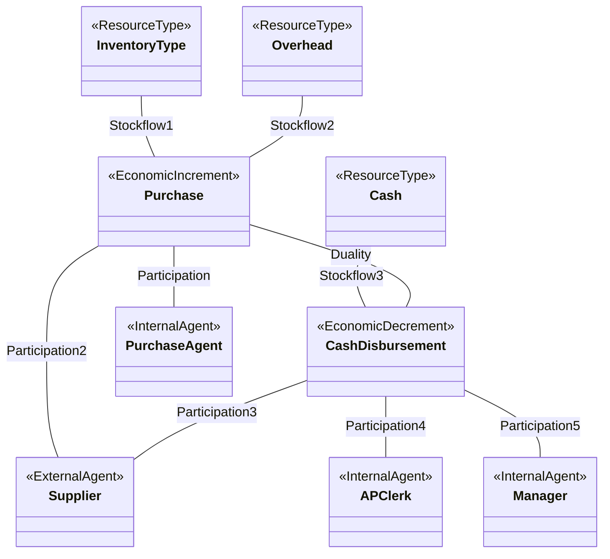

（讲义 p.15 是一张整页的图，无标题栏。第一条 participation 在图上写作 `Participation`，没有编号 1，后面依次 2–5。）

</details>

**逐条解读**

| 关联 | 连接 | 依据（六步法的哪一句） |
|---|---|---|
| Participation（1） | Purchase ↔ Purchase Agent | Step 4："谁 **process** 了这个增量事件" → 采购员下的单 |
| Participation2 | Purchase ↔ Supplier | Step 3："资源 **from whom**" → 货从供应商来 |
| Participation3 | Cash Disbursement ↔ Supplier | Step 3："资源 **to whom**" → 钱付给供应商 |
| Participation4 | Cash Disbursement ↔ A/P Clerk | Step 4："谁 **accomplish**" → 应付会计执行付款 |
| Participation5 | Cash Disbursement ↔ Manager | Step 4："谁 **authorize**" → **经理批准付款** |

> ⭐ **Manager 这一条是最容易漏的**。它之所以在模型里，唯一的理由是 Step 4 原文里的第三个动词 **authorize**。如果你只想"谁干的活"，就会漏掉"谁签的字"。**内部控制的核心正是"干活的人 ≠ 签字的人"**，所以这条线在业务上极其重要。

**⚠️ 与 p.11 通用模式的差异（重要）**

| | p.11 通用采购模式 | p.15 RSWS 实例 |
|---|---|---|
| Purchase 的内部参与者 | Purchase Agent + **Receiving Clerk** | 只有 Purchase Agent |
| Cash Disbursement 的内部参与者 | **Payables Clerk** | A/P Clerk + **Manager** |
| Participation 编号含义 | 1=采购员, 2=收货员, 3=供应商, 4=供应商, 5=应付会计 | 1=采购员, 2=供应商, 3=供应商, 4=A/P 会计, 5=经理 |

**同样叫 Participation3，在两张图上指的是完全不同的两条线。** 编号只是画图时的顺序标签，**不携带语义**。考试时若题目引用 "Participation3"，必须回到那张具体的图去看它连的是谁。（这一点讲义没有提醒，见 [[#9.3 课件自身的问题|§9.3 ⑥]]。）

**🎙️ 课堂补充**
待转录补充。

**所以呢**

类、关联的骨架全部搭好了（事件、资源、参与者都有了），下一步给每个方框填上具体属性。

---

#### 2.9.4 Step 5：分配属性（讲义 p.16–17）

**题面**（讲义 p.16）：给每个类填属性；并注意有四个属性**不属于任何单一的类**。

讲义 p.16 原文：

> *"Step 5 — Assign Attributes*
> *Special cases: **association attributes***
> - *item-qty-purch (stockflow1)*
> - *-item-unit-cost (stockflow1)*
> - *oh-qty-purch (stockflow2)*
> - *-cd-acq-applied (duality)"*

<details><summary>讲义 p.17 给出的完整属性表</summary>

**类属性**

| 类 | 刻板印象 | 属性 | 含义（笔记补充） |
|---|---|---|---|
| `Inventory Type` | ResourceType | **Item-id (PK)**、Item-desc、Item-std-cost、Item-list-price、Item-qoh | 品类编号／描述／标准成本／标价／**库存数量**（qoh = quantity on hand） |
| `Overhead` | ResourceType | **OH-id (PK)**、OH-desc | 费用类目编号／描述 |
| `Cash` | ResourceType | **AcctNum (PK)**、AcctType、AcctLoc、AcctBal | 账号／账户类型／开户地／**账户余额** |
| `Purchase` | EconomicIncrement | **Acq-ID (PK)**、Acq-date、Acq-amt | 采购编号／**采购日期**／采购金额 |
| `Cash Disbursement` | EconomicDecrement | **CD-id (PK)**、CD-date、CD-amt | 付款编号／**付款日期**／付款金额 |
| `Purchase Agent` | InternalAgent | **PA-id (PK)**、PA-name、PA-limit | 工号／姓名／**采购权限额度** |
| `Supplier` | ExternalAgent | **SupNum (PK)**、Sup-name、Sup-add、Sup-rating | 供应商编号／名称／地址／**评级** |
| `A/P Clerk` | InternalAgent | **AP-id (PK)**、AP-name、AP-bond | 工号／姓名／**保证金（bond）** |
| `Manager` | InternalAgent | **Mgr-id (PK)**、Mgr-name、Mgr-degree | 工号／姓名／学历 |

**关联属性**（讲义 p.17 画成虚线挂在关联上的小方框）

| 关联 | 属性 | 含义 |
|---|---|---|
| `Stockflow1`（Inventory Type ↔ Purchase） | **item-qty-purch**、**item-unit-cost** | 本次采购中该品类的**数量**与**单价** |
| `Stockflow2`（Overhead ↔ Purchase） | **oh-qty-purch** | 本次采购中该费用类目的数量 |
| `Duality`（Purchase ↔ Cash Disbursement） | **cd-acq-applied** | 这笔付款中**分配给这张采购单的金额** |

</details>

**⭐ 为什么这四个属性必须挂关联，不能挂类**（这是 p.5 判据的实战检验，**极可能考**）：

| 属性 | 挂在类上会怎样 | 所以必须挂关联 |
|---|---|---|
| `item-qty-purch` | 挂 `Purchase` → 一次采购买了 3 个品类，只有一个数量字段，存不下<br>挂 `Inventory Type` → 这个品类被采购过 10 次，每次数量不同，存不下 | 它属于 **"这次采购 × 这个品类"** 这一对 |
| `item-unit-cost` | 同上。而且**单价每次都可能不同**（这次进货 800，下次 850），不能写死在品类档案里 | 同上 |
| `oh-qty-purch` | 同上 | 属于"这次采购 × 这个费用类目" |
| `cd-acq-applied` | 挂 `Cash Disbursement` → 一次付款清了 3 张采购单，各清多少存不下<br>挂 `Purchase` → 这张采购单被 2 次付款清完，各清多少存不下 | 属于 **"这次付款 × 这张采购单"** 这一对 |

> ⭐ **`cd-acq-applied` 是全讲最精彩的一个设计**。它解决的是传统会计很难表达的问题：**部分付款与合并付款**。
> - 采购单 A 金额 1000，先付 400 再付 600 → duality 表里两行：`(CD1, A, 400)`、`(CD2, A, 600)`
> - 一次付款 1500 同时清了采购单 A(1000) 和 B(500) → 两行：`(CD3, A, 1000)`、`(CD3, B, 500)`
>
> 在复式记账里你只会看到 `借：应付账款 / 贷：现金`，**哪笔钱对应哪张单是丢失的**（要靠账龄分析表另行维护）。REA 把它直接建进了模型。

**⚠️ 为什么 `Stockflow3` 没有关联属性？**

因为 `Cash 1..1 — 0..* Cash Disbursement` **不是多对多**：一次付款只对应一个现金账户（叙述 2）。所以"这次付款从这个账户扣了多少"这个信息，**直接放在 `Cash Disbursement.CD-amt` 就够了**——不需要额外的组合。

> 🟡 **一条可直接背的规律**：**只有多对多（`*..*`）的关联才需要关联属性。** 一对多的关联，属性放在"多"的那一端的类上即可。

**⚠️ 讲义的小毛病**：p.16 的四个属性里，`item-qty-purch` 和 `oh-qty-purch` 前面没有连字符，而 `-item-unit-cost` 和 `-cd-acq-applied` 前面有。UML 里属性前的 `-` 表示"私有"，这里显然只是复制粘贴时的不一致。见 [[#9.3 课件自身的问题|§9.3 ⑤]]。

**🎙️ 课堂补充**
待转录补充。

**所以呢**

图上的方框和属性都填满了，只剩最后一步——也是全讲最难的一步：给每条线的两端标上多重度。

---

#### 2.9.5 Step 6：从业务叙述反推多重度（讲义 p.18–20）⭐

> **这是本讲最重要的一节。** 讲义 p.18 只写了 `Step 6 — Assign Multiplicities`（整页只有这一行），p.19 给出四句业务叙述，p.20 给出答案图（18 个多重度）。
>
> **推荐做法：先遮住 p.20，只看 p.19 的四句话，自己填 18 个格子。**

**讲义 p.19 的四句业务叙述（原文）**

> 1. *"Information on company resources and agents can be stored in database **prior to any transactions**."*
> 2. *"Cash disbursement can be linked to **one and only one** cash account."*
> 3. *"**Credit purchase** is allowed; **partial and combined payment** is allowed; company needs cash to pay **other utilities**."*
> 4. *"**Both purchase and cash disbursement can be handled by one and only one internal agent.**"*

**先把四句话翻译成人话**（零基础读者请先读这里）：

1. **资源和参与者可以先建档，再发生交易。** ——你可以先把供应商档案、商品档案录进系统，那时它们还没有任何一笔交易。
2. **一笔付款只能从一个现金账户出。** ——不允许"这笔一万块从工行扣 6000、从建行扣 4000"。
3. 三件事：
   - **允许赊购**（credit purchase）：收了货可以先不付钱（就是 [[M01-会计与商业#2.7.3 负债（讲义 p.40）|M01]] 里的 `on account`）。
   - **允许分期付与合并付**（partial and combined payment）：一张单可以分几次付清；一次付款可以清几张单。
   - **公司还要用现金付其他公用事业费**（other utilities）：有些付款**跟供应商采购无关**（比如交电费）。
4. **一次采购、一次付款各自只由一个内部经办人处理。**

---

##### 逐条推导（18 个多重度）

**先复习读法**：写在类 X 旁边的数字 = **"另一端的一个实例连着几个 X"**。

**① 叙述 1 决定了所有"事件端"的最小值 = 0**

> *"Information on company resources and agents can be stored in database prior to any transactions."*

这句话说的是：一个资源实例或参与者实例，**可以关联 0 个事件**。而"一个资源连着几个事件"这个数字，是写在**事件那一端**的。

所以：**凡是资源↔事件、参与者↔事件的连线，事件那一端的最小值都是 0。**

| 关联 | 事件端多重度 | 读作 |
|---|---|---|
| Stockflow1 | `Purchase` 端 **0..\*** | 一个存货品类可以出现在 0 到多次采购中 |
| Stockflow2 | `Purchase` 端 **0..\*** | 一个费用类目可以出现在 0 到多次采购中 |
| Stockflow3 | `Cash Disbursement` 端 **0..\*** | 一个现金账户可以有 0 到多笔付款 |
| Participation1 | `Purchase` 端 **0..\*** | 一个采购员可以经手 0 到多次采购 |
| Participation2 | `Purchase` 端 **0..\*** | 一个供应商可以有 0 到多次采购 |
| Participation3 | `Cash Disbursement` 端 **0..\*** | 一个供应商可以收到 0 到多笔付款 |
| Participation4 | `Cash Disbursement` 端 **0..\*** | 一个 A/P 会计可以经手 0 到多笔付款 |
| Participation5 | `Cash Disbursement` 端 **0..\*** | 一个经理可以批准 0 到多笔付款 |

**（8 个格子已填）**

**② 叙述 2 决定 Stockflow3 的 Cash 端 = `1..1`**

> *"Cash disbursement can be linked to one and only one cash account."*

"一笔付款连着几个现金账户" = 写在 **Cash 端**的数字 = **`1..1`**。

**（第 9 个格子）**

**③ 叙述 3 决定 Duality 的两端都是 `0..*`，并顺带决定 Participation3 的 Supplier 端**

| 叙述片段 | 推出 |
|---|---|
| **允许赊购** | 一张采购单可以**暂时没有任何付款** → "一次采购连着几笔付款"的最小值 = 0 → `Cash Disbursement` 端最小 = **0** |
| **允许分期付** | 一张采购单可以对应**多笔**付款 → `Cash Disbursement` 端最大 = **\*** |
| **允许合并付** | 一笔付款可以清**多张**采购单 → `Purchase` 端最大 = **\*** |
| **公司要付其他公用事业费** | 有些付款**不对应任何采购单** → `Purchase` 端最小 = **0** |

→ **Duality = `Purchase 0..*` — `0..* Cash Disbursement`**（第 10、11 个格子）

同一句话还有一个后果：**既然有些付款是付公用事业费、不是向供应商采购，那么"一笔付款连着几个供应商"的最小值就是 0** → `Participation3` 的 **Supplier 端 = `0..1`**（第 12 个格子）。

> ⚠️ 这一条是四句叙述里**最需要动脑筋**的推理，讲义没有明说。逻辑链是：`utilities 付款 → 不是向 supplier 的采购付款 → 该付款实例可以不关联任何 supplier → 最小值 0`。最大值仍是 1（一笔付款不会同时付给两个供应商）。

**④ 叙述 4 决定三条内部参与者关联的 Agent 端 = `1..1`**

> *"Both purchase and cash disbursement can be handled by one and only one internal agent."*

| 关联 | Agent 端 | 读作 |
|---|---|---|
| Participation1 | `Purchase Agent` 端 **1..1** | 一次采购恰好由 1 个采购员经手 |
| Participation4 | `A/P Clerk` 端 **1..1** | 一笔付款恰好由 1 个 A/P 会计经手 |
| Participation5 | `Manager` 端 **1..1** | 一笔付款恰好由 1 个经理批准 |

**（第 13、14、15 个格子）**

**⑤ 剩下 3 个格子靠"商业常识"（讲义 p.6 的第二个来源）**

| 关联 | 端 | 值 | 常识依据 |
|---|---|---|---|
| Participation2 | `Supplier` 端 | **1..1** | 一次采购只向一个供应商下单 |
| Stockflow1 | `Inventory Type` 端 | **0..\*** | 一次采购可以买多个品类（最大 `*`）；**也可能一个存货品类都不买**（只买 overhead），所以最小是 **0** |
| Stockflow2 | `Overhead` 端 | **0..\*** | 对称：一次采购可能一个费用类目都不涉及（纯进货） |

**（第 16、17、18 个格子）**

---

##### 讲义 p.20 的答案图（视觉复核所得）

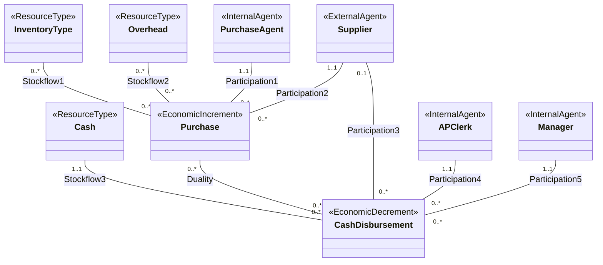

**完整答案表（可直接背）**

| # | 关联 | A 端（含多重度） | B 端（含多重度） | 决定它的叙述 |
|---|---|---|---|---|
| 1 | Stockflow1 | Inventory Type `0..*` | Purchase `0..*` | 常识 + 叙述 1 |
| 2 | Stockflow2 | Overhead `0..*` | Purchase `0..*` | 常识 + 叙述 1 |
| 3 | Stockflow3 | Cash `1..1` | Cash Disbursement `0..*` | **叙述 2** + 叙述 1 |
| 4 | Duality | Purchase `0..*` | Cash Disbursement `0..*` | **叙述 3** |
| 5 | Participation1 | Purchase Agent `1..1` | Purchase `0..*` | **叙述 4** + 叙述 1 |
| 6 | Participation2 | Supplier `1..1` | Purchase `0..*` | 常识 + 叙述 1 |
| 7 | Participation3 | Supplier `0..1` | Cash Disbursement `0..*` | **叙述 3（utilities）** + 叙述 1 |
| 8 | Participation4 | A/P Clerk `1..1` | Cash Disbursement `0..*` | **叙述 4** + 叙述 1 |
| 9 | Participation5 | Manager `1..1` | Cash Disbursement `0..*` | **叙述 4** + 叙述 1 |

**⚠️ 三个必须注意的点**

1. **Stockflow1 打破了 p.6 的默认规则。** p.6 说 `Resource Type 1..* – 0..* Economic Event`，这里是 `0..* – 0..*`。原因：**存在只买 overhead 的采购**。讲义 p.6 早就预告了 "usually (but don't always) apply"。
2. **Participation3 的 `0..1` 是全图唯一的 `0..1`。** 它是叙述 3 最后半句（`company needs cash to pay other utilities`）的唯一产物。**改卷人最可能盯这一个格子。**
3. **`0..*` 出现了 11 次，`1..1` 出现了 4 次，`0..1` 出现 1 次，没有任何 `1..*`。** 如果你的答案里出现了 `1..*`，回头检查是不是把叙述 1 漏了。

**💡 换个说法（笔记补充）**

四句叙述其实在回答四个不同的问题：

| 叙述 | 在回答 | 影响图上的哪一类端点 |
|---|---|---|
| 1 | "**能不能先有档案、后有交易？**" | 所有**事件端**的最小值 |
| 2 | "**钱从哪个口袋出？**" | Stockflow3 的资源端 |
| 3 | "**钱货可不可以不同步？**" | Duality 两端 + Participation3 |
| 4 | "**一件事几个人签字？**" | 内部参与者端 |

> 🟡 **答题框架（可直接套用）**：见 [[#6.3 答题框架|§6.3 框架 B]]。

**🎙️ 课堂补充**
待转录补充。

**与其他概念的关系**

这一节直接复用 M04 的 **Interpret Multiplicities Exercise 1–4**（W4 讲义 p.32–35）。特别是 **Exercise 2**：`Sale 1..1 — 0..1 Cash Receipt`，讲义给的解释是 *"sales may be made on credit with **no partial payments or combined payments** accepted"* ——**和 RSWS 的 `0..*—0..*` 恰好构成对照**：RSWS 允许分期与合并，所以两端的最大值从 1 放宽到 `*`。**把这两张图并排记，多重度就再也不会填错。**（⚠️ M04 链接名待核对，见 [[#9.5 待核对|§9.5]]）

**所以呢**

六步法把 RSWS 的核心模型完整建了一遍，但核心模型只画了"钱货两清"那一瞬间；下一节看讲义如何把它前后的起因、承诺、退货也纳入进来，变成扩展模型。

---

### 2.10 从核心模型到扩展模型（讲义 p.22–37）

> **这一段是全讲最长的一块（16 页），也是最容易被"文本提取"骗过去的一块。**
>
> 讲义在这里用了**一种固定的节奏**：讲一段文字（p.23、25、27、31、35）→ 立刻回到**同一张全景图**上把刚讲的东西**用红色高亮**出来（p.24、26、28、29、30、32、33、34、36、37）。
>
> **这 11 张"全景图"页的文字内容完全一样，差别只在颜色。** 如果只看 `python-pptx` 提取的文本，会以为是重复页而全部跳过——那就漏掉了讲义组织整段内容的教学逻辑。本笔记逐页说明**每一张高亮了什么**。

#### 2.10.0 为什么核心模型不够用

核心模型只画了**"钱货两清"的那一瞬间**。但真实业务在它前后还有一大截：

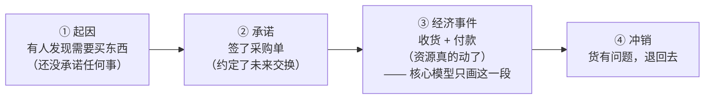

**核心模型只覆盖 ③。** 但 ①②④ 里全是企业真正关心的信息：

- **① 起因**：市场活动的效果如何？哪次促销带来了订单？
- **② 承诺**：**在手订单有多少？**（这是最重要的一个——签了单还没交货的金额，传统会计**根本不记账**，因为它还没影响会计等式，但它是判断一家公司未来景气最关键的数字）
- **④ 冲销**：退货率多少？哪个供应商的货质量差？

> ⭐ **这正是 M04 主线论点的实证**：传统复式记账"**不影响会计等式的事项一律不记**"，于是把在手订单、销售拜访、报价这些**极有价值但尚未成交**的信息全部排除在系统之外。REA 的扩展模型把它们全部纳入。**期末论述题极可能落在这里。**

**扩展模型加了什么**（一句话版本）：

| 加的东西 | 数量 | 内容 |
|---|---|---|
| **新的事件类** | 3 | 起因事件、承诺事件、经济冲销事件 |
| **新的关联** | 7 | Fulfillment、Reversal、Reciprocal、Proposition、Reservation、Typification、Linkage |
| **新的参与关联** | 6 | 新事件各自的 participation |

**所以呢**

核心模型不够用的原因说清楚了，下一节看扩展模型的全景图长什么样、新增的部分具体加在哪里。

---

#### 2.10.1 扩展模型全景图（讲义 p.22）

讲义 p.22 标题：`Expansions to the Core REA Business Process level model (core = green)`。

**"core = green" 是读这张图的钥匙**：图上**绿色**的部分是你在 §2.7 已经学过的核心模型；**黑色**的部分是本节要加的新东西。

**绿色（核心）部分**：`<<Resource>>` ×2、`<<EconomicIncrement>>`、`<<EconomicDecrement>>`、`<<ExternalAgent>>`、`<<InternalAgent>>` ×2、以及 Stockflow1、Stockflow2、Duality、Participation5–8。

**黑色（新增）部分**：`<<InstigationEvent>>`、`<<CommitmentEvent>>`、`<<EconomicReversal>>`、`<<ResourceType>>`、另外 3 个 `<<InternalAgent>>`、以及 Proposition、Reservation1、Reservation2、Fulfillment1–3、Reversal、Stockflow3、Typification、Responsibility、Assignment、Participation1–4、Participation9–10。

**全景图的完整结构**（视觉复核 p.22 所得，拆成三张 Mermaid 图以便阅读）：

**图 A — 事件主干（从起因到冲销）**

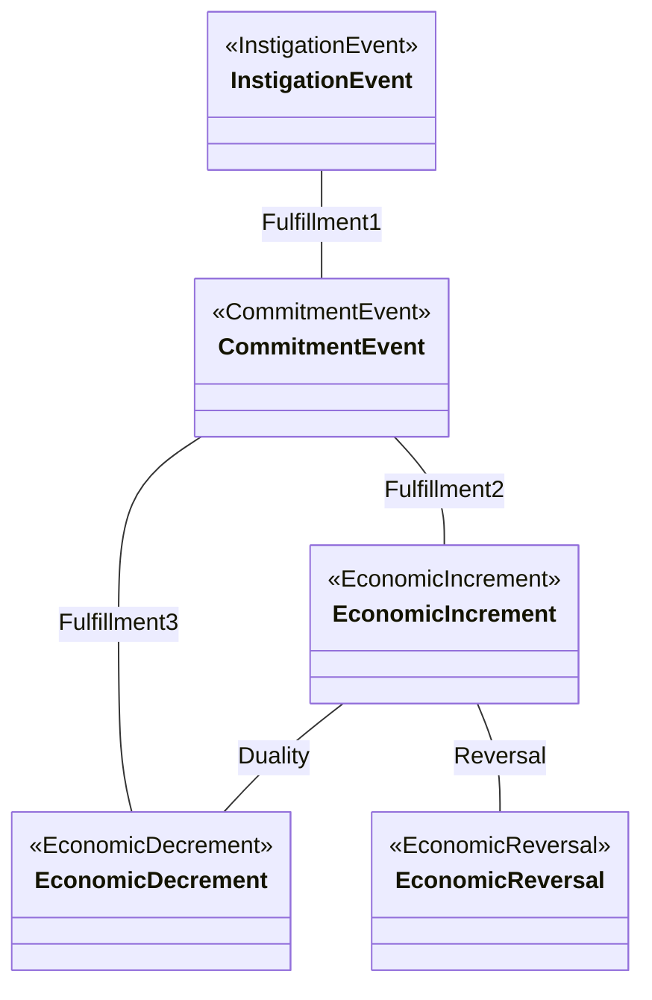

**图 B — 事件与资源**

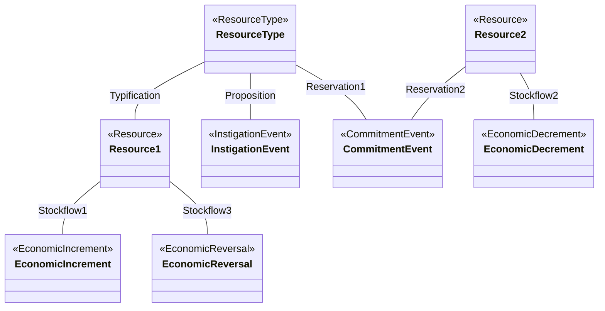

**图 C — 事件与参与者、参与者之间**

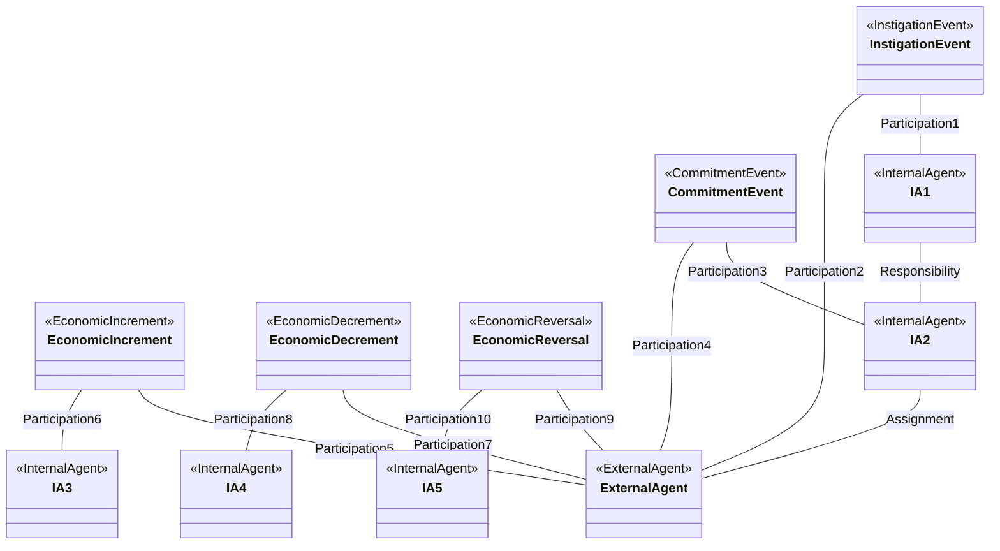

> ⚠️ **注意 p.22 的全景图并没有画出全部 13 条关联**：`Reciprocal` 没画（讲义 p.30 明说 "Reciprocal not shown"）、`Linkage` 没画（p.36 明说 "Linkage not shown"）、`Custody` 在 p.34 才补上高亮。

**🎙️ 课堂补充**
待转录补充。

**所以呢**

全景图的整体轮廓有了，下面几节逐段拆开讲：先看新增的三个事件类里的前两个。

---

#### 2.10.2 新增事件类之一、二：起因事件与承诺事件（讲义 p.23，图 p.24）

**讲义 p.23 原文**

> **Additional Events**
> - **Instigation Event** —— *"An event that **initiates** activities in the business process; may be **internally instigated** (e.g. a marketing event) or **externally instigated** (call from supplier's salesperson)"*
> - **Commitment Event** —— *"An event in which **commitments are made** by the enterprise or by one of its external business partners **for part of a future economic exchange**"*
>   - *"Often the commitments by the enterprise and its partner are combined into a **Mutual Commitment Event**"*

**① 起因事件（Instigation Event）**

**是什么** —— **启动整段业务流程的那个事件**。它本身**没有承诺任何东西**，只是"事情开始了"。

**两种来源**：

| | 讲义的例子 | 采购循环里 | 收入循环里 |
|---|---|---|---|
| **内部发起** internally instigated | 一次市场活动（marketing event） | **采购申请**（部门主管说"我们要买纸"） | **销售拜访**（销售员打电话给客户） |
| **外部发起** externally instigated | **供应商的销售员打电话来** | 供应商上门推销，你才想起该补货 | **客户主动询价** |

**为什么需要它** —— 因为"生意从哪来"是**营销与内控都关心**的问题。传统会计里，一次没成交的销售拜访**不留下任何痕迹**；REA 把它记下来，于是可以算"拜访 → 订单"的转化率。

**⚠️ 常见误解**：以为起因事件必须成功。**不必**。一次拜访没谈成，它仍然是一个起因事件，只是后面没有 Fulfillment 连出去。**这恰恰是它的价值**——失败的线索也被记录了。

**② 承诺事件（Commitment Event）**

**是什么** —— **双方（或一方）对未来的一次经济交换做出承诺**的那个事件。**注意 "for part of a future economic exchange"：承诺的是未来的交换，此刻资源还没动。**

**相互承诺事件（Mutual Commitment Event）** —— 讲义说"通常"企业和伙伴的承诺会**合并成一个事件**。为什么？因为一张**采购订单**同时包含两个承诺：

- 供应商承诺"我会把货送来"
- 企业承诺"我会按约定价格付钱"

它们写在同一张纸上、同时生效，所以建模时合成一个类就够了，不必画成两个。

**为什么需要它** —— **这是扩展模型里最有商业价值的一个类**。

> 对零基础读者：一张已签未交的采购订单，在传统会计里**不做任何分录**（还没有资源转移、不影响会计等式）。但它是"公司下个月要花多少钱"的最直接证据。反过来，销售订单（sale order）是"公司下个月能收多少钱"的证据，上市公司财报里叫 **backlog（在手订单）**，分析师极其看重。**传统总账里没有这个数，REA 数据库里有。**

**⚠️ 常见误解**

- ❌ "签了合同就该记账。" —— 传统会计里**不记**（除非是 IFRS 下的某些特殊合同）。REA 记，但它记的是**事件**，不是分录。
- ❌ "承诺事件和经济事件可以合并。" —— 不能。**时间不同、金额可能不同、可能根本不会发生**（订单被取消）。

**讲义 p.24 高亮的是什么**

p.24 是 p.22 的同一张全景图，用**红色粗框**高亮了两个方框：`<<InstigationEvent>>` 和 `<<CommitmentEvent>>`。**只高亮类，不高亮线** —— 因为 p.23 讲的是"新增了哪两个类"，连线要到 p.27–28 才讲。

**🎙️ 课堂补充**
待转录补充。

**所以呢**

起因事件和承诺事件讲完了，下一节看第三个新增事件类——处理退货的经济冲销事件。

---

#### 2.10.3 新增事件类之三：经济冲销事件（讲义 p.25，图 p.26）

**讲义 p.25 原文**

> **Economic Reversal Events**
> - *"**Economic increment reversal** events reverse economic increment events (e.g. a **purchase return** reverses a purchase event)"*
> - *"**Economic decrement reversal** events reverse economic decrement events (e.g. a **sale return** reverses a sale event)"*

**是什么** —— **把一个已经发生的经济事件抵销掉的事件**，也就是**退货**。

它分两种，取决于被抵销的是增量还是减量：

| 类型 | 抵销的是 | 例子 | 发生在哪个循环 |
|---|---|---|---|
| **增量冲销** increment reversal | 增量事件（资源本来流入） | **采购退回**（Purchase Return）——把买来的货退给供应商 | 采购循环 |
| **减量冲销** decrement reversal | 减量事件（资源本来流出） | **销售退回**（Sale Return）——客户把货退给你 | 收入循环 |

**为什么需要它** —— 三个理由：

1. **信息完整**：一笔"买了又退"的交易，如果只是把原记录删掉，你就永远不知道这个供应商出过质量问题。REA 保留**两条事件记录**（原采购 + 退回），历史完整。
2. **它是内控与舞弊检测的重点**：虚假退货是常见的舞弊手法（[[M01-会计与商业#2.5.2 三个丑闻（讲义 p.22–25）|M01 §2.5.2]] 的会计丑闻里就有类似手法）。
3. **对应传统会计的红字冲销**：会计上叫 `sales returns and allowances`（销售退回与折让），是收入的抵减项。

> 💡 **换个说法（笔记补充）**：REA 的做法相当于"**不允许改历史，只允许追加一条反向记录**"——这跟 [[M02-交易的会计处理#2.5.1 日记账（讲义 p.22–23）|M02 §2.5.1]] 的日记账 append-only 原则、以及区块链的思路是同一回事。**这条是很好的论述题素材。**

**⚠️ 常见误解**

- ❌ "冲销事件和 duality 里的那对事件是三角关系。" —— 不是。冲销事件通过 **Reversal 关联**只连到**被它抵销的那一个事件**（见 §2.10.4）。
- ❌ "冲销 = 撤销 = 数据被删除。" —— 恰恰相反，**原记录一个字都不动**。

**讲义 p.26 高亮的是什么**

p.26 用红框高亮了全景图上唯一的 `<<EconomicReversal>>` 方框。

> ⚠️ **注意讲义的一处简化**：p.25 说冲销有**两种**（增量冲销和减量冲销），但 p.22 的全景图上**只画了一个 `<<EconomicReversal>>` 方框**，而且它（在 p.29 高亮时可以看到）只连到 `<<EconomicIncrement>>`。这是把两种冲销**合并成一个泛化的框**来画。到了具体模型里：采购循环的 `Purchase Return` 冲的是**增量**（p.38），收入循环的 `Sale Return` 冲的是**减量**（p.48）。见 [[#9.3 课件自身的问题|§9.3 ⑧]]。

**🎙️ 课堂补充**
待转录补充。

**所以呢**

三个新事件类（起因、承诺、冲销）都齐了，下一节看新增的关联怎么把它们串起来——先看事件与事件之间的关系。

---

#### 2.10.4 新增关联之一组：事件—事件关系（讲义 p.27，图 p.28–30）

**讲义 p.27 原文**

> **Additional Associations · Event-Event relationships**
> - *"**Fulfillment** (link instigation events to commitment events and link commitment events to economic events)"*
> - *"**Reversal** (link economic events to the events that reverse them)"*
> - *"**Reciprocal** (link increment and decrement **commitment** events)"*
>   - *"Is the **commitment-level equivalent of duality**"*

三条事件之间的关联：

**① 履行（Fulfillment）**

**是什么** —— **"这件事把前一件事兑现了"**。它连两处：

- 起因事件 → 承诺事件（**Fulfillment1**）：一次销售拜访最终变成了一张订单
- 承诺事件 → 经济事件（**Fulfillment2 / Fulfillment3**）：一张采购订单最终变成了收货、变成了付款

**为什么需要它** —— 它把**流程串起来**，于是可以回答：

- 这张订单交货了没有？（未被 fulfillment 连出去的承诺事件 = **未履约订单**）
- 这次营销活动带来了几张订单？（起因事件连出去的 fulfillment 数量 = **转化数**）

> ⭐ **"未被 fulfillment 连出去的承诺事件"就是在手订单（backlog）。** 一条 SQL 就能查出来。这是扩展模型最实用的一个查询，值得记住。

**② 冲销（Reversal）**

**是什么** —— *"link economic events to the events that reverse them"*，把经济事件和抵销它的冲销事件连起来。

**⚠️ 注意 Reversal 有两个含义，别混**：
- **Economic Reversal Event**（一个**类**）= 退货这件事本身
- **Reversal**（一条**关联**）= 把退货连到被退的那笔交易的那根线

**③ 对等（Reciprocal）**

**是什么** —— *"link increment and decrement **commitment** events"*，也就是**承诺层面的 duality**。

**什么意思**：如果企业和伙伴的承诺**没有**合并成一个"相互承诺事件"，而是分成两个（比如"供应商承诺发货"是一个事件，"我方承诺付款"是另一个事件），那就需要一条线把这两个承诺连起来——那条线叫 **Reciprocal**。

**它和 Duality 的对照**：

| | 层面 | 连接 |
|---|---|---|
| **Duality** | 经济事件层 | 增量**经济**事件 ↔ 减量**经济**事件 |
| **Reciprocal** | 承诺层 | 增量**承诺**事件 ↔ 减量**承诺**事件 |

> 🟡 **考点**：讲义原句 *"Is the commitment-level equivalent of duality"* 值得背——一句话说清 Reciprocal 是什么。

**讲义 p.28–30 三张高亮图分别高亮了什么**

| 页 | 高亮内容 | 说明 |
|---|---|---|
| **p.28** | **Fulfillment1、Fulfillment2、Fulfillment3** 三条线，以及它们串起来的 `<<InstigationEvent>>` → `<<CommitmentEvent>>` → `<<EconomicIncrement>>` / `<<EconomicDecrement>>` | 展示"履行"是怎么把整条流程从头串到尾的。注意 **Fulfillment3 在图上是一条绕道的折线**，从 CommitmentEvent 左侧向下绕到 EconomicDecrement——只是布线，不影响语义 |
| **p.29** | **Reversal** 这一条线 + `<<EconomicIncrement>>` + `<<EconomicReversal>>` 两个方框 | 展示冲销事件挂在哪 |
| **p.30** | `<<CommitmentEvent>>`、`<<EconomicIncrement>>`、`<<EconomicDecrement>>` 三个方框 + Fulfillment2、Fulfillment3、Duality 三条线；页面底部有一行红字说明 | 讲 Reciprocal——但**图上并没有 Reciprocal 这条线** |

**⭐ p.30 底部那行红字是本页的全部信息，必须读**：

> *"**Reciprocal not shown**; instead, commitment event is a **mutual commitment**, fulfilled by **both** economic increment and decrement events"*

**翻译**：这张图里没画 Reciprocal，因为图上的承诺事件已经是**相互承诺事件**（mutual commitment，见 §2.10.2）——两个承诺已经合并成一个方框了，自然不需要一条线把它们连起来。取而代之的是：**这一个承诺事件用两条 Fulfillment（2 和 3）分别连到增量事件和减量事件**。

> 💡 **换个说法（笔记补充）**：如果你把订单拆成"卖方承诺"和"买方承诺"两个方框，中间就要画 Reciprocal；如果你把订单画成一个方框（现实中就是一张纸），Reciprocal 就自动消失了，代价是这一个方框要往下连两条 Fulfillment。**两种画法等价，讲义选了后者。**

**🎙️ 课堂补充**
待转录补充。

**所以呢**

事件—事件的三条关联讲完了，下一节看事件怎么连到它涉及的资源——提议与预留。

---

#### 2.10.5 新增关联之二组：事件—资源关系（讲义 p.27 下半，图见 p.28 同页）

**讲义 p.27 原文（续）**

> **Event-Resource relationships**
> - *"**Proposition** (link instigation events to resources or resource types)"*
> - *"**Reservation** (link commitment events to resources or resource types)"*

**① 提议（Proposition）**

**是什么** —— 把**起因事件**和它涉及的资源连起来。

**例子**：销售员这次拜访**推销的是哪几款产品**？采购申请**要买的是哪个品类**？

**为什么需要它** —— 才能回答"我们推了 A 产品 100 次，成交了几次"。**没有 Proposition，起因事件就是一条没有内容的记录。**

**② 预留（Reservation）**

**是什么** —— 把**承诺事件**和它涉及的资源连起来。

**为什么叫"预留"** —— 因为一旦签了订单，那批货就**被这张订单占住了**，不能再卖给别人。这是仓储系统里非常实在的一个概念：**可用库存 = 实际库存 − 已预留**。

**为什么需要它** —— 超卖（oversell）是电商最常见的事故：库存显示有 10 件，同时接了 12 张订单。**Reservation 就是防止超卖的数据基础。**

**Reservation1 与 Reservation2 的区别**（看 p.22 全景图）：

| | 连接 | 含义 |
|---|---|---|
| **Reservation1** | `<<ResourceType>>` ↔ `<<CommitmentEvent>>` | 订单预留的是一个**品类**（"订 100 支 3 号簧片"） |
| **Reservation2** | `<<Resource>>` ↔ `<<CommitmentEvent>>` | 订单预留的是一个**具体资源**（"订那台序列号 12345 的机器"；在采购循环里，p.38 用它预留**现金账户**） |

**⚠️ 常见误解**：把 Proposition 和 Reservation 搞反。记忆法：

> **Proposition = 提议（还只是嘴上说说，起因事件）；Reservation = 预留（已经占位了，承诺事件）。** 承诺比提议"实"，所以占位的那个是 Reservation。

**🎙️ 课堂补充**
待转录补充。

**所以呢**

事件—资源的两条关联讲完了，下一节回到 §2.3 的三条次关联，看它们在扩展模型里的位置。

---

#### 2.10.6 新增关联之三组：参与者—参与者、资源—参与者（讲义 p.31，图 p.32–34）

**讲义 p.31 原文** —— 与 p.4 几乎逐字相同，但**多了一条 Custody**：

> **Additional Associations**
> - **Agent-Agent relationships**
>   - *"**Assignment** (link internal agent to external agent) — Use only when relationship between internal agent and external agent exists independently of their mutual participation in an event"*
>   - *"**Responsibility** (link internal agent to internal agent) — Use when one internal agent is responsible for another, independent of their mutual participation in an event"*
> - **Resource-Agent relationships**
>   - *"**Custody** (link resource and internal agent) — Use when an internal agent's **responsibility for a resource** needs to be tracked **independently of any event**"*

这三条**就是 §2.3 讲过的三条次关联**，讲义在这里重复了一遍，因为它们也属于"核心之外的扩展"。定义和启用条件见 [[#2.3 核心 REA 次关联（讲义 p.4）|§2.3]]，此处不重复。

> ⚠️ **p.31 与 p.4 的措辞差异**：p.4 说 Custody 是 *"Links **Agents** and Resources such that agent has **physical control** over the resource or **controls access** to the resource"*；p.31 说是 *"link **resource and internal agent**"*，并补充启用条件 *"when an internal agent's responsibility for a resource needs to be tracked independently of any event"*。**p.31 把"Agents"收窄成了"internal agent"**——这是更准确的说法（外部参与者保管你的资源属于寄存，是另一回事）。

**讲义 p.32–34 三张高亮图**

| 页 | 高亮内容 | 要点 |
|---|---|---|
| **p.32** | **Assignment** 这条线 + 它两端的 `<<InternalAgent>>`（第二个）和 `<<ExternalAgent>>` | 指派连的是**内部↔外部** |
| **p.33** | **Responsibility** 这条线 + 两个 `<<InternalAgent>>`（第一个和第二个） | 责任连的是**内部↔内部** |
| **p.34** | **Custody** 这条线（从图的左上角绕一大圈到右上角）+ `<<ResourceType>>` 和第一个 `<<InternalAgent>>` | ⚠️ **图上连的是 ResourceType，文字说的是 resource** —— 见 [[#9.3 课件自身的问题\|§9.3 ④]] |

> 💡 **三条线的记忆法（笔记补充）**：按"连接的两端"排成一个梯子——
> **Responsibility（内 ↔ 内）→ Assignment（内 ↔ 外）→ Custody（人 ↔ 物）**。
> 前两条的启用条件是同一句话（"脱离事件也成立"），第三条是"需要独立追踪保管责任"。

**🎙️ 课堂补充**
待转录补充。

**所以呢**

参与者之间、资源与参与者之间的关联讲完了，下一节看最后一组新增关联——资源与资源之间，以及类型化。

---

#### 2.10.7 新增关联之四组：资源—资源关系与类型化（讲义 p.35，图 p.36）

**讲义 p.35 原文**

> **Additional Associations**
> - **Resource-Resource relationships**
>   - *"**Linkage** (link two resources) — Use to identify resource **made up of** another resource"*
> - **Typification**
>   - *"Each **resource, event, or agent** can be related to a **resource type, event type, or agent type**"*
> - *"**Event-Agent relationships** between the added events and internal and agents who participate in them"*（⚠️ 原文如此，`internal and agents` 显然漏了 `external`，见 [[#9.3 课件自身的问题|§9.3 ③]]）

**① 构成（Linkage）**

**是什么** —— **一个资源由另一个资源构成**时，把两者连起来。

**例子（笔记补充）**：一支组装好的萨克斯（资源）由吹嘴、管体、按键组（都是资源）构成；一个产品套装由若干单品构成。制造业里这叫 **BOM（物料清单，Bill of Materials）**。

**为什么需要它** —— 生产制造循环（conversion cycle）离不开它：你要知道做一支萨克斯要领用哪些零件。**本课不讲生产循环**，所以 Linkage 只是提一句。

**讲义 p.36 明说 `Linkage not shown`** —— 全景图上没画这条线（因为图上只有 Resource 到 Event 的连线，两个 Resource 之间没有线）。

**② 类型化（Typification）**

**是什么** —— *"Each resource, event, or agent can be related to a resource type, event type, or agent type"*，即把**具体实例**和它的**种类**连起来。

**注意讲义在这里把 Typification 推广了**：不只是资源，**事件和参与者也可以有"类型"**。

| 层面 | 具体 | 类型 | 例子 |
|---|---|---|---|
| 资源 | Resource | Resource Type | 序列号 12345 的这支单簧管 ↔ "B♭ 单簧管"这个品类 |
| 事件 | Event | Event Type | 这次编号 A001 的采购 ↔ "紧急采购"这种类型 |
| 参与者 | Agent | Agent Type | 张三 ↔ "VIP 客户"这个客户等级 |

**为什么需要它** —— 因为**属性该挂在哪一层**是个真问题：单簧管的"标价"属于**品类**（所有 B♭ 单簧管标价一样），"序列号"属于**具体那一支**。Typification 让你可以把两层信息分表存放，然后连起来。

**讲义 p.36 高亮的是什么**

p.36 用红框高亮了 `<<ResourceType>>` 和 `<<Resource>>`（第一个）两个方框，以及中间的 **Typification** 那条线；同时页面左上角有一行红字 `Linkage not shown`。

**⚠️ 常见误解**：以为 Typification 是继承（inheritance）。**不是。** 继承是"子类是父类的一种"（萨克斯 is-a 乐器）；Typification 是"实例属于某个类型"（这一支 is-an-instance-of B♭ 单簧管）。在数据库里，Typification 会变成一个**外键**（Resource 表里有一列指向 ResourceType 表）。

**🎙️ 课堂补充**
待转录补充。

**所以呢**

四组新增关联全部讲完了，最后补一条容易被忽略的规则——新加的事件类也要挂参与者，下一节收尾。

---

#### 2.10.8 新增事件的参与关联（讲义 p.37）

讲义 p.37 是全景图的最后一张高亮，**没有配套的文字页**——它对应的是 p.35 最后那一行 *"Event-Agent relationships between the added events and internal and [external] agents who participate in them"*。

**p.37 高亮了什么**：用红色高亮了 **Participation1、2、3、4、9、10** 六条线，以及它们连接的 `<<InstigationEvent>>`、`<<CommitmentEvent>>`、`<<EconomicReversal>>` 三个新事件类，和 `<<InternalAgent>>`（第一个）、`<<ExternalAgent>>`、`<<InternalAgent>>`（最后一个）三个参与者类。

**意思是**：**新加的三个事件类，也各自要挂参与者。**

| 新事件 | 内部参与者 | 外部参与者 |
|---|---|---|
| `<<InstigationEvent>>` | Participation1 | Participation2 |
| `<<CommitmentEvent>>` | Participation3 | Participation4 |
| `<<EconomicReversal>>` | Participation10 | Participation9 |

（核心模型原有的 Participation5–8 是绿色的，属于增量/减量事件。）

> ⭐ **这一页看似只是补线，但它说明了一个原则**：**任何事件都要挂参与者**——不管是起因、承诺、经济还是冲销。参与是 REA 的**主关联**（p.3），对所有事件一视同仁。

**至此扩展模型讲完。完整清单**：

| # | 关联 | 连接 | 首次出现在讲义 |
|---|---|---|---|
| 1 | Duality | 增量事件 ↔ 减量事件 | p.3（核心） |
| 2 | Stockflow | 经济事件 ↔ 资源 | p.3（核心） |
| 3 | Participation | 事件 ↔ 参与者 | p.3（核心） |
| 4 | Custody | 内部参与者 ↔ 资源 | p.4 / p.31 |
| 5 | Assignment | 内部参与者 ↔ 外部参与者 | p.4 / p.31 |
| 6 | Responsibility | 内部参与者 ↔ 内部参与者 | p.4 / p.31 |
| 7 | **Fulfillment** | 起因→承诺、承诺→经济事件 | p.27 |
| 8 | **Reversal** | 经济事件 ↔ 冲销事件 | p.27 |
| 9 | **Reciprocal** | 增量承诺 ↔ 减量承诺 | p.27（图上未画） |
| 10 | **Proposition** | 起因事件 ↔ 资源/资源类型 | p.27 |
| 11 | **Reservation** | 承诺事件 ↔ 资源/资源类型 | p.27 |
| 12 | **Linkage** | 资源 ↔ 资源 | p.35（图上未画） |
| 13 | **Typification** | 实例 ↔ 类型 | p.35 |

**🎙️ 课堂补充**
待转录补充。

**所以呢**

扩展模型的全部零件（新事件类 + 13 条关联）都讲完了，下一节把它们组装成一张完整的图，看采购循环的扩展模型实际长什么样。

---

### 2.11 扩展的采购循环模型（讲义 p.38）

> ⚠️ 讲义把这张全图放在 p.38，而图里各个方框的**定义**要到 p.39–47 才逐个讲。本笔记先在这里读图（因为它是 §2.10 全景图的直接实例化），**图里出现的业务名词在 §2.12 逐个解释**。若你读到不懂的词，先跳到 §2.12 查，再回来。

讲义 p.38 标题 `Expanded Acquisition Cycle REA model`。它就是把 §2.10.1 的全景图**逐个方框填上采购循环的具体名字**：

| 全景图上的泛化类 | 采购循环里的具体类 |
|---|---|
| `<<InstigationEvent>>` | **Purchase Requisition**（采购申请） |
| `<<CommitmentEvent>>` | **Purchase Order**（采购订单） |
| `<<EconomicIncrement>>` | **Purchase**（采购／收货） |
| `<<EconomicDecrement>>` | **Cash Disbursement**（现金付款） |
| `<<EconomicReversal>>` | **Purchase Return**（采购退回） |
| `<<ResourceType>>` | **Inventory Type**（存货品类） |
| `<<Resource>>`（货） | **Inventory**（存货） |
| `<<Resource>>`（钱） | **Cash Account**（现金账户） |
| `<<ExternalAgent>>` | **Supplier**（供应商） |
| `<<InternalAgent>>` ×5 | **Department Supervisor**（部门主管）、**Purchase Agent**（采购员）、**Receiving Clerk**（收货员）、**Payables Clerk**（应付会计）、**Shipping Clerk**（发货员） |

**完整关联表**（视觉复核 p.38 所得）：

| 关联 | 从 | 到 |
|---|---|---|
| Proposition | Purchase Requisition | Inventory Type |
| Fulfillment1 | Purchase Requisition | Purchase Order |
| Participation1 | Purchase Requisition | **Department Supervisor** |
| Participation2 | Purchase Requisition | **Purchase Agent** |
| Reservation1 | Purchase Order | Inventory Type |
| Reservation2 | Purchase Order | **Cash Account** |
| Participation3 | Purchase Order | Purchase Agent |
| Participation4 | Purchase Order | Supplier |
| Fulfillment2 | Purchase Order | Purchase |
| Typification | Inventory Type | Inventory |
| Stockflow1 | Inventory | Purchase |
| Stockflow2 | Cash Account | Cash Disbursement |
| Duality | Purchase | Cash Disbursement |
| Participation5 | Purchase | **Supplier** |
| Participation6 | Purchase | **Receiving Clerk** |
| Participation7 | Cash Disbursement | **Supplier** |
| Participation8 | Cash Disbursement | **Payables Clerk** |
| Reversal | Purchase | Purchase Return |
| Stockflow3 | Inventory | Purchase Return |
| Participation9 | Purchase Return | **Supplier** |
| Participation10 | Purchase Return | **Shipping Clerk** |

**用 Mermaid 重画**（拆成两半以便阅读）：

**上半：从申请到订单**

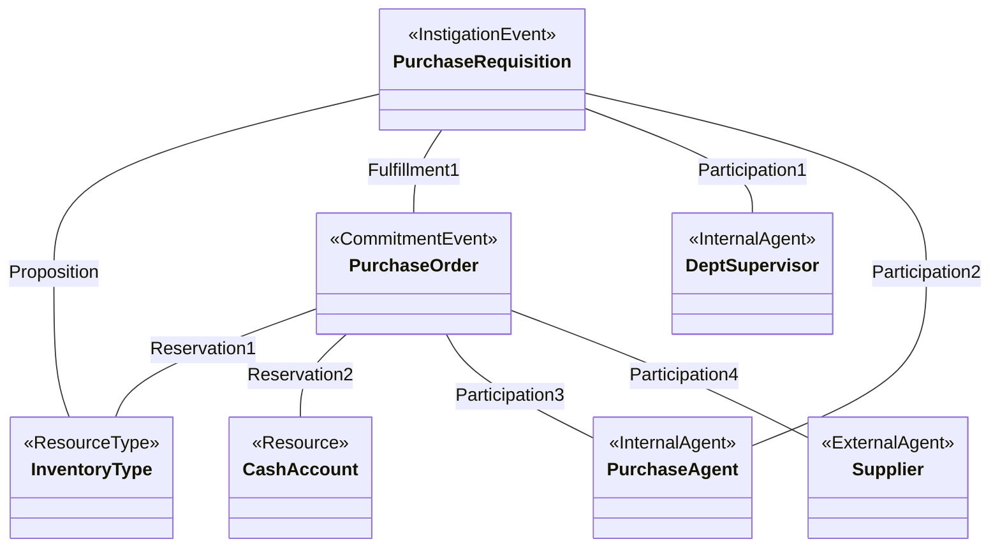

**下半：从收货到付款到退货**

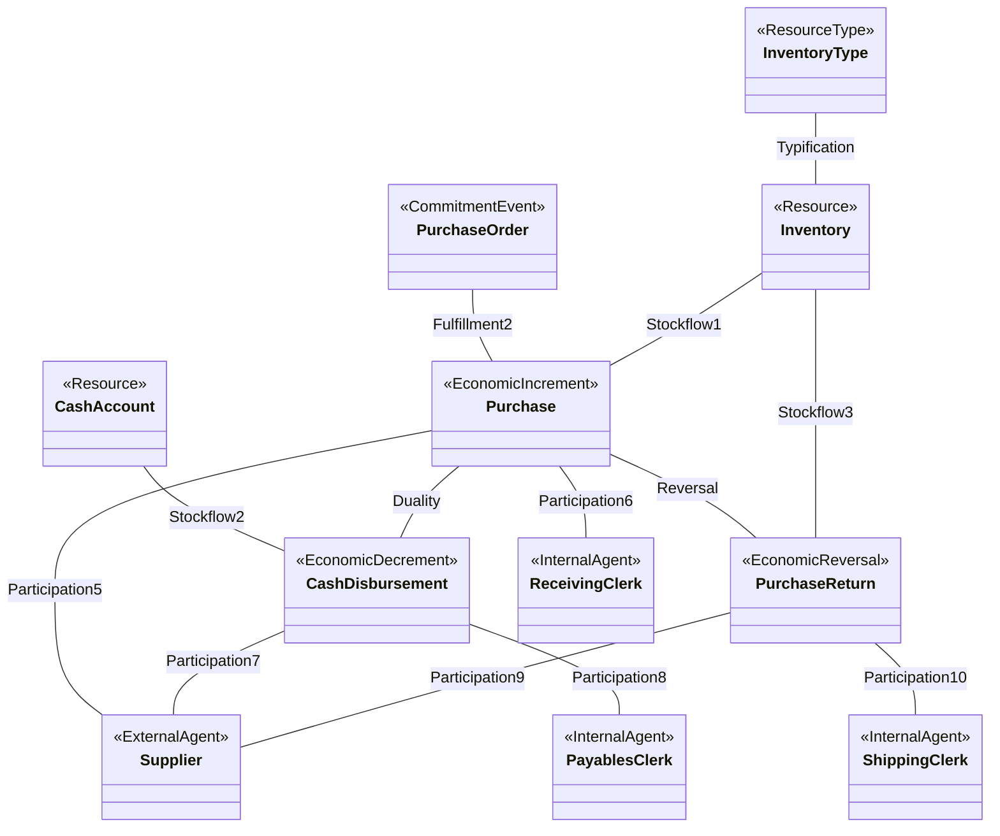

**⭐ 读这张图必须注意的五个细节**

1. **采购员（Purchase Agent）没有参与 Purchase 事件。** 它只参与了 `Purchase Requisition`（P2）和 `Purchase Order`（P3）。**收货**由 `Receiving Clerk` 负责（P6）。这是**职责分离**：下单的人不能同时是验收的人（否则可以虚假验收）。
2. **`Reservation2` 预留的是现金账户**，不是存货。含义：签了订单就等于**承诺了未来这笔钱**，所以要在现金账户上"占住"这个金额（业务上叫资金计划）。
3. **`Stockflow3` 连的是 `Inventory` 和 `Purchase Return`**，而不是 `Purchase Return` 和 `Inventory Type`。因为退回去的是**具体的那批货**。
4. **退货由 `Shipping Clerk`（发货员）经手** —— 因为退货时**货要从企业发出去**，所以是发货员而不是收货员。**这一条极容易在考试里被反着问。**
5. **`Purchase Return` 冲销的是 `Purchase`（增量事件）** —— 对应 p.25 说的 "economic increment reversal"。

**⚠️ 与核心模型（p.11）的对照**

| | 核心模型 p.11 | 扩展模型 p.38 |
|---|---|---|
| 事件数 | 2 | **5** |
| 关联数 | 8 | **21** |
| 参与者数 | 4 | **6** |
| 资源数 | 2 | **3**（多了 Inventory Type，并与 Inventory 用 Typification 连接） |
| 有没有"未成交"的信息 | ❌ | ✅（Requisition、Order） |
| 有没有退货 | ❌ | ✅ |

**🎙️ 课堂补充**
待转录补充。

**所以呢**

扩展的采购循环全图画完了，图上出现的每个业务名词下一节逐个给出正式定义。

---

### 2.12 采购/付款流程的各个事件（讲义 p.39–47）

> 讲义用 9 页把 p.38 图上的五个事件方框逐个下定义。**这 9 页每页只有一两句话，但每句话都是可以直接默写进考卷的定义。**
>
> 排版规律：**偶数功能页**（p.39, 41, 43, 45, 46）讲"这一类事件在采购循环里长什么样"，**紧跟的那一页**（p.40, 42, 44, 47）给出**具体单据的定义**。

#### 2.12.1 起因事件（讲义 p.39）与采购申请（讲义 p.40）

**讲义 p.39**（标题 `Acquisition Cycle Instigation Events`）

> *"Are usually **internally instigated**; triggered by an **identified need**"*
> *"**External instigation is possible**, e.g. need may be identified as result of **supplier visit**"*

**解读**：采购循环的起因**通常来自企业内部**——某个部门发现"我们没纸了"。这与收入循环形成对比（收入循环的起因是销售员主动出击，见 §2.14.1）。但**也可能由外部触发**：供应商上门推销，你才想起该补货。

**讲义 p.40**（标题 `Purchase Requisition Event`）

> *"An **instigation event that is entirely internal**; typically involves a **department supervisor** identifying a need for a **type of good or service** and communicating that need to the **purchasing department**"*

**采购申请（Purchase Requisition）** —— 对零基础读者：这是一张**内部单据**，部门主管填"我们要买 20 令 A4 纸"，交给采购部。**它不是订单**，供应商根本看不到它。

**三个要记的点**：

1. **"entirely internal"** —— 全程在公司内部，**没有外部参与者**。⚠️ 但 p.38 的图上 `Purchase Requisition` **只连了两个内部参与者**（Department Supervisor P1、Purchase Agent P2），**确实没有连 Supplier**——图和文字一致 ✅。
2. **发起人是 `department supervisor`** —— 这解释了 p.38 图上为什么会冒出一个 `Department Supervisor` 类。
3. **申请的是 "a **type** of good or service"** —— 注意是**类型**！这解释了 p.38 图上 `Proposition` 为什么连的是 `Inventory Type` 而不是 `Inventory`：**申请阶段你只知道"要 A4 纸"，还不知道会拿到哪一批具体的纸。**

> ⭐ 第 3 点是讲义**唯一一处**把"文字定义"和"图上的连线选择"直接对应起来的地方，很可能被考："为什么 Proposition 连的是 Inventory Type 而不是 Inventory？"

**🎙️ 课堂补充**
待转录补充。

**所以呢**

起因事件（采购申请）定义完了，下一节看流程往前走一步——双方正式签字的相互承诺事件（采购订单）。

#### 2.12.2 相互承诺事件（讲义 p.41）与采购订单（讲义 p.42）

**讲义 p.41**（标题 `Acquisition/Payment Process Events`）

> **Mutual Commitment Events in the Acquisition/Payment Process**
> *"Involve the enterprise and an external business partner **agreeing to exchange resources at a defined future time**"*

**要点**：`at a defined future time` —— **约定了未来的时点**。这是承诺事件区别于经济事件的关键：**经济事件是"现在资源动了"，承诺事件是"约好将来动"。**

**讲义 p.42**（标题 `Purchase Order Event`）

> *"A **mutual commitment event** whereby a **supplier agrees to provide goods** to the enterprise **and** the **enterprise agrees to pay an ascertained price** for those goods"*

**采购订单（Purchase Order, PO）** —— 对零基础读者：这是发给供应商的**正式订货单**，双方都受它约束。

**注意定义里的"双向"结构**（这正是 mutual 的含义）：

| 谁 | 承诺什么 |
|---|---|
| 供应商 | 提供货物 |
| 企业 | 按**已确定的价格**（ascertained price）付款 |

**"ascertained price" 这个词很重要**：价格必须**已经确定**。如果只是"我们打算买点纸，价格再谈"，那还是 requisition，不是 order。

> 💡 **换个说法（笔记补充）**：requisition 是"我想要"，order 是"我要了，签字画押"。前者是内部意向，后者是**对外的法律承诺**。在传统会计里两者**都不做分录**，但它们的法律效力天差地别。

**🎙️ 课堂补充**
待转录补充。

**所以呢**

承诺阶段（申请、订单）讲完了，下一节看承诺兑现之后的第一个经济事件——真正收货的那一刻。

#### 2.12.3 经济增量事件（讲义 p.43）与采购事件（讲义 p.44）

**讲义 p.43**（标题 `Acquisition/Payment Process Events`）

> **Economic Increment Events in the Acquisition Cycle**
> *"Represent the **receipt of goods or services** for which the enterprise **will give up some other resource** (usually cash)"*

**要点**：`will give up`（将会付出）—— **用的是将来时**。这就是赊购：货已经收到，钱还没付。REA 通过 duality 的最小值 0 来表达这一点（§2.9.5）。

**讲义 p.44**（标题 `Purchase (aka Acquisition) Event`）

> *"Economic increment event in which **title (ownership)** of one or more products is transferred from a supplier to the enterprise. The transfer may take place **in person** (e.g., purchase agent goes to **Office Depot** to buy paper, or supplier **hand-delivers** goods to enterprise) **or via transit** (supplier **shipped** goods to enterprise)"*

**采购事件（Purchase / Acquisition）** —— 判据是 **title（所有权）转移**（与 p.9 一致）。

**讲义特意区分了两种交付方式**：

| 方式 | 例子 | 为什么重要 |
|---|---|---|
| **当面**（in person） | 采购员亲自去 Office Depot 买纸；供应商送货上门 | 所有权在交货那一刻转移，**时点明确** |
| **在途**（via transit） | 供应商发货，走物流 | 所有权在**哪一刻**转移取决于合同条款（FOB 起运地 / FOB 目的地），**时点可能不是收货那天** |

> 💡 **换个说法（笔记补充）**：这个区分在会计上有真实后果。年底 12 月 30 日供应商发货、1 月 3 日你收到——这批货算不算今年的存货？**取决于所有权什么时候转移**。REA 把交付方式建进模型，就是为了能回答这个问题；传统总账里只有一个入库日期。
> （🔗 FOB 条款属于会计常识，本课讲义未展开，2026-09-09）

**`aka` = also known as**（又称）。讲义标题 `Purchase (aka Acquisition) Event` 是在提醒你：**Purchase 和 Acquisition 在本课里是同一个东西**——这解释了为什么 p.17 的属性叫 `Acq-ID`、`Acq-date`、`Acq-amt` 而类名叫 `Purchase`。

**🎙️ 课堂补充**
待转录补充。

**所以呢**

收货（增量）讲完了，下一节看它配对的减量事件——付款。

#### 2.12.4 经济减量事件（讲义 p.45）

**讲义 p.45**（标题 `Acquisition/Payment Process Events`）

> **Economic Decrement Events in the Acquisition Cycle**
> *"**Almost always** is a **Cash Disbursement** event"*
> *"An economic decrement event whereby the enterprise **transfers ownership of cash (or equivalent)** to a supplier"*

**要点**：

1. **`Almost always`** —— 采购循环的减量事件几乎总是付款。（"几乎"是给以物易物留的口子。）
2. **`cash or equivalent`** —— 现金**或现金等价物**。对零基础读者：现金等价物指支票、银行转账、三个月内到期的短期存款这类"随时能当钱用"的东西。
3. **注意它同样用 "transfers ownership"** —— 与 Purchase 的 "title transfers" 对称。**REA 一贯用"所有权转移"作为经济事件的判据。**

> ⚠️ 讲义 p.45 **没有再给一页单独的 "Cash Disbursement Event" 定义页**（不像 requisition/order/purchase/return 都各有一页）。付款事件的定义就写在这一页里。这是讲义排版的一处不对称。

**🎙️ 课堂补充**
待转录补充。

**所以呢**

一对经济事件（收货、付款）都定义完了，最后补上流程末尾可能发生的例外——退货。

#### 2.12.5 经济增量冲销事件（讲义 p.46）与采购退回（讲义 p.47）

**讲义 p.46**（标题 `Acquisition/Payment Process Events`）

> **Economic Increment Reversal Events**
> *"Events in which previous economic increment events are **reversed or negated**"*

**讲义 p.47**（标题 `Purchase Return Event`）

> *"Economic event in which **title (ownership) for goods previously transferred from a supplier to the enterprise are transferred back from the enterprise to the supplier**"*

**采购退回（Purchase Return）** —— 把买来的货退回给供应商，**所有权原路返回**。

**注意定义的写法**：它是把 p.44 的 Purchase 定义**整句反过来写**：

| | Purchase（p.44） | Purchase Return（p.47） |
|---|---|---|
| 所有权方向 | **from a supplier to the enterprise** | **from the enterprise to the supplier** |
| 事件性质 | 经济增量 | 增量的冲销 |
| 经手的内部参与者 | Receiving Clerk（收货） | **Shipping Clerk**（发货） |

> 🟡 **考点提示**：这种"镜像定义"的写法在本讲出现了四次（Purchase/Purchase Return、Sale/Sale Return、Purchase/Sale、Cash Disbursement/Cash Receipt）。**考试很可能给你一个，要你写另一个。** 方法：**把介词短语的方向调转，其余照抄。**

**🎙️ 课堂补充**
待转录补充。

**所以呢**

采购/付款流程的五个事件全部定义完了，下一节看它的镜像——扩展的收入循环模型长什么样。

---

### 2.13 扩展的收入循环模型（讲义 p.48）

讲义 p.48 标题 `Expanded Revenue Cycle REA model`。结构与 p.38 完全对称，但**多了一条参与关联**（11 条 vs 10 条）。

| 全景图上的泛化类 | 收入循环里的具体类 |
|---|---|
| `<<InstigationEvent>>` | **Sales Call**（销售拜访） |
| `<<CommitmentEvent>>` | **Sale Order**（销售订单） |
| `<<EconomicDecrement>>` | **Sale**（销售／发货） |
| `<<EconomicIncrement>>` | **Cash Receipt**（现金收款） |
| `<<EconomicReversal>>` | **Sale Return**（销售退回） |
| `<<ResourceType>>` | **Goods or Services Inventory Type** |
| `<<Resource>>`（货） | **Goods or Services Inventory** |
| `<<Resource>>`（钱） | **Cash Account** |
| `<<ExternalAgent>>` | **Customer**（客户） |
| `<<InternalAgent>>` ×4 | **Salesperson**（销售员）、**Shipping Clerk**（发货员）、**Cashier**（出纳）、**Receiving Clerk**（收货员） |

**完整关联表**（视觉复核 p.48 所得，并对图中三处交叉线做了放大复核）：

| 关联 | 从 | 到 |
|---|---|---|
| Proposition | Sales Call | Goods or Services Inventory Type |
| Fulfillment1 | Sales Call | Sale Order |
| Participation1 | Sales Call | **Salesperson** |
| Participation2 | Sales Call | **Customer** |
| Reservation1 | Sale Order | Goods or Services Inventory Type |
| Reservation2 | Sale Order | **Cash Account** |
| Participation3 | Sale Order | **Salesperson** |
| Participation4 | Sale Order | **Customer** |
| Fulfillment2 | Sale Order | Sale |
| Typification | Inventory Type | Inventory |
| Stockflow1 | Goods or Services Inventory | Sale |
| Stockflow2 | Cash Account | Cash Receipt |
| Duality | Sale | Cash Receipt |
| **Participation5** | **Sale** | **Salesperson** ← 采购循环没有的那一条 |
| Participation6 | Sale | **Customer** |
| Participation7 | Sale | **Shipping Clerk** |
| Participation8 | Cash Receipt | **Customer** |
| Participation9 | Cash Receipt | **Cashier** |
| Reversal | Sale | Sale Return |
| Stockflow3 | Goods or Services Inventory | Sale Return |
| Participation10 | Sale Return | **Customer** |
| Participation11 | Sale Return | **Receiving Clerk** |

**用 Mermaid 重画**：

**上半：从拜访到订单**

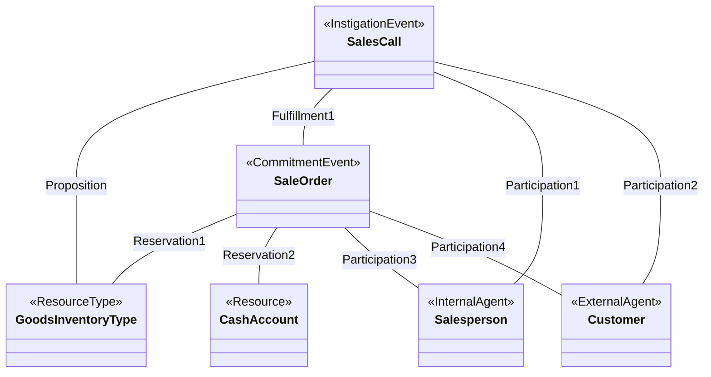

**下半：从发货到收款到退货**

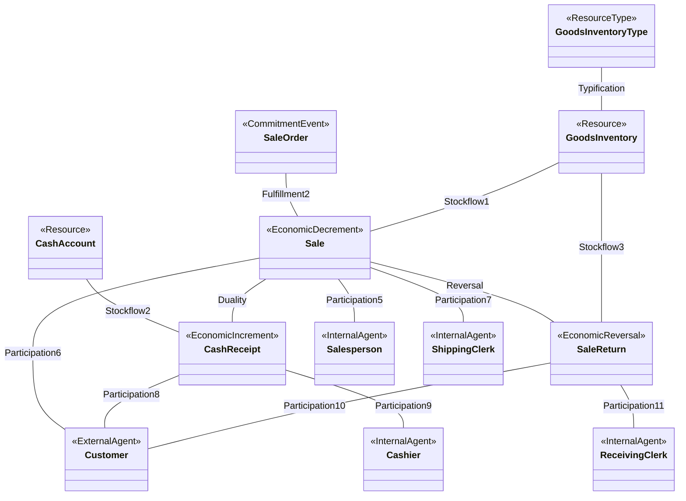

**⭐ 三个必须注意的细节**

1. **`Sale` 挂了三个参与者**（Salesperson、Customer、Shipping Clerk），而采购循环的 `Purchase` 只挂了两个（Supplier、Receiving Clerk）——**销售员参与了销售事件，但采购员没有参与采购事件**。
   **为什么合理**（笔记补充）：销售员要**按成交额拿提成**，所以"这笔销售是谁做成的"必须记在销售事件上；而采购员的工作在下 PO 时就结束了，收货是另一个人的事。
   **但这仍是两个"镜像"模型之间的一处不对称**，见 [[#9.3 课件自身的问题|§9.3 ⑨]]。
2. **退货由 `Receiving Clerk` 经手** —— 客户退货，货**进**企业，所以是收货员。**与采购退回（Shipping Clerk，货出去）刚好相反。** 这一对是本讲最容易被反着考的细节。
3. **`Reservation2` 预留现金账户** —— 与采购循环一样。含义：接了订单就等于**预期这笔钱会进来**。

**🎙️ 课堂补充**
待转录补充。

**所以呢**

扩展的收入循环全图画完了，下一节像 §2.12 一样，把图上每个业务名词逐个给出正式定义。

---

### 2.14 销售/收款流程的各个事件（讲义 p.49–57）

> 与 §2.12 完全平行的 9 页。同样是"功能页 + 单据定义页"交替。

#### 2.14.1 起因事件（讲义 p.49）与销售拜访（讲义 p.50）

**讲义 p.49**（标题 `Sales/Collection Process Events`）

> **Instigation Events in the Revenue Cycle**
> *"May be **internally instigated** (marketing events such as **sales calls, advertising campaigns, or promotions**)"*
> *"May be **externally instigated** (**customer inquiries**)"*

**⭐ 与采购循环的对照**（讲义 p.39）：

| | 采购循环（p.39） | 收入循环（p.49） |
|---|---|---|
| 主要来源 | *"**usually** internally instigated"* —— **通常**内部 | *"**May be** internally... **may be** externally"* —— **两者并列** |
| 内部例子 | 部门发现需要（identified need） | 销售拜访、广告投放、促销活动 |
| 外部例子 | 供应商上门 | **客户主动询价** |

**为什么不一样**（笔记补充）：采购是"我需要什么我自己知道"，所以内部发起为主；销售是"客户可能主动找上门，也可能要我去找他"，两条路都很常见。**讲义在措辞上的这点差别是有意的**，值得注意。

**讲义 p.50**（标题 `Sales Call Event`）

> *"An instigation event that is **internally initiated**; typically involves a **sales representative calling on a customer**, either via **telephone or in person**, to **describe the features** of one or more products or services"*

**销售拜访（Sales Call）** —— 销售员打电话或当面拜访客户，介绍产品特性。

**三个要点**：
1. **"internally initiated"** —— 与采购申请的 "entirely internal" 措辞不同：采购申请**全程**内部（没有外部参与者），销售拜访是**内部发起**但**有外部参与者**（客户）。
   ✅ **这与图完全一致**：p.38 的 `Purchase Requisition` 没连 Supplier；p.48 的 `Sales Call` 连了 Customer（Participation2）。**这个措辞差别是有信息量的，不是随手写的。**
2. **"telephone or in person"** —— 与 Purchase 的 "in person or via transit" 呼应：讲义习惯给出交付/接触的两种形态。
3. **"describe the features of one or more products or services"** —— 一次拜访可以推**多个**产品，所以 Proposition 的多重度在产品端可以是 `1..*`。

**🎙️ 课堂补充**
待转录补充。

**所以呢**

起因事件（销售拜访）讲完了，下一节看它推进一步、双方签字之后的相互承诺事件——销售订单。

#### 2.14.2 相互承诺事件（讲义 p.51）与销售订单（讲义 p.52）

**讲义 p.51**（标题 `Sales/Collection Process Events`）

> **Mutual Commitment Events in the Revenue Cycle**
> *"Involve the enterprise and an external business partner **agreeing to exchange resources at a defined future time**"*

⚠️ **这一页与 p.41 一字不差**（只是标题从 `Acquisition/Payment` 换成了 `Sales/Collection`）。讲义在这里刻意用重复来强调**两个循环共享同一套抽象**。

**讲义 p.52**（标题 `Sale Order Event`）

> *"A mutual commitment event whereby **the enterprise agrees to deliver goods to a customer** and **that customer agrees to pay an ascertained price** for those goods"*

**销售订单（Sale Order）** —— 与 p.42 的采购订单**逐字镜像**：

| | 采购订单 p.42 | 销售订单 p.52 |
|---|---|---|
| 谁承诺交货 | **supplier** agrees to provide goods **to the enterprise** | **the enterprise** agrees to deliver goods **to a customer** |
| 谁承诺付钱 | **the enterprise** agrees to pay an ascertained price | **that customer** agrees to pay an ascertained price |

> ⭐ **这一对定义是"镜像写法"的最佳范例。** 把主语和宾语互换，其余照抄。考试若考"写出销售订单事件的定义"，直接按这个结构写。

**🎙️ 课堂补充**
待转录补充。

**所以呢**

承诺阶段（拜访、订单）讲完了，下一节看承诺兑现之后的经济事件——为什么"卖东西"在 REA 里反而是减量。

#### 2.14.3 经济减量事件（讲义 p.53）与销售事件（讲义 p.54）

**讲义 p.53**（标题 `Sales/Collection Process Events`）

> **Economic Decrement Events in the Revenue Cycle**
> *"Represent the **revenue generating activities**; the **giving up of one or more resources in order to get some other resource** (usually cash)"*

**⭐ 这一句话解决了 §2.8 提到的最大认知障碍**：销售明明是"赚钱"的活动，为什么是**减量**？

讲义的说法非常精确：*"the **giving up** of one or more resources **in order to get** some other resource"* —— **为了得到别的东西而先付出**。**销售这个事件本身，付出的是货**；得到钱是**另一个事件**（Cash Receipt）的事。

> 💡 **换个说法（笔记补充）**：REA 把"一手交钱一手交货"**拆成了两个独立事件**。传统会计的一张分录 `借：应收账款 / 贷：销售收入` 把两件事糊在一起；REA 分开记，于是"发了货还没收到钱"这件事在数据上一目了然（= 有 Sale 但 duality 连出去的 Cash Receipt 金额不足）。**这就是应收账款账龄分析在 REA 里的自然实现。**

**讲义 p.54**（标题 `Sale Event`）

> *"An economic decrement event in which **title (ownership) of one or more products is transferred from the enterprise to a customer**. The transfer may take place **in person** (e.g. a sale of a **t-shirt at a campus bookstore**) or **in transit** (e.g. a shipment of a **video game from an enterprise with a web-based storefront**)"*

**销售事件（Sale）** —— 与 p.44 的 Purchase 定义**逐字镜像**（方向相反）。

两个例子值得记：
- **当面**：在校园书店买一件 T 恤 —— 一手交钱一手交货，所有权当场转移
- **在途**：网店发一份电子游戏 —— 所有权在运输途中的某一刻转移

**🎙️ 课堂补充**
待转录补充。

**所以呢**

减量事件（发货）讲完了，下一节看它配对的增量事件——收款。

#### 2.14.4 经济增量事件（讲义 p.55）

**讲义 p.55**（标题 `Sales/Collection Process Events`）

> **Economic Increment Events in the Revenue Cycle**
> *"**Almost always** is a **Cash Receipt** event"*
> *"An economic increment event in which **an external agent transfers ownership of cash (or a cash equivalent) to the enterprise**"*

**现金收款（Cash Receipt）** —— 与 p.45 的 Cash Disbursement **逐字镜像**：

| | 付款 p.45 | 收款 p.55 |
|---|---|---|
| 事件类型 | 经济**减量** | 经济**增量** |
| 所有权方向 | **the enterprise** transfers ownership of cash **to a supplier** | **an external agent** transfers ownership of cash **to the enterprise** |
| 措辞 | "Almost always is a Cash Disbursement event" | "Almost always is a Cash Receipt event" |

⚠️ 同样地，讲义**没有给 Cash Receipt 单独一页定义**，定义就写在 p.55 里。

**🎙️ 课堂补充**
待转录补充。

**所以呢**

一对经济事件（发货、收款）都定义完了，最后补上流程末尾的例外情况——客户退货。

#### 2.14.5 经济减量冲销事件（讲义 p.56）与销售退回（讲义 p.57）

**讲义 p.56**（标题 `Sales/Collection Process Events`）

> **Economic Decrement Reversal Events**
> *"Events in which previous economic decrement events are **reversed or negated**"*

⚠️ 与 p.46 的措辞一字不差，只把 `increment` 换成 `decrement`。

**讲义 p.57**（标题 `Sale Return Event`，全讲最后一页）

> *"An economic event in which **title (ownership) for products that were previously transferred from seller to buyer is transferred back from buyer to seller**"*

**销售退回（Sale Return）** —— 客户把货退回来。

> ⚠️ **注意用词的细微变化**：p.47 的采购退回用的是 `from a supplier to the enterprise` → `from the enterprise to the supplier`（具体角色）；p.57 用的是 `from seller to buyer` → `from buyer to seller`（**抽象角色**）。同一件事的两种写法。**考试用哪种都对**，但抽象写法更通用。

**🎙️ 课堂补充**
待转录补充。

**所以呢**

销售/收款流程的五个事件全部定义完了，两个循环（采购、销售）都讲完了；下一节把它们并排对照，压成一张可以直接考前速记的表。

---

### 2.15 两个循环的完整镜像对照（笔记综合，跨 p.38–57）

> 💡 **本节是笔记补充**，讲义没有这张表。但它是把 20 页内容压成一页的最有效方式，**也是最可能出简答题的地方**。

| 维度 | 采购/付款循环（p.38–47） | 销售/收款循环（p.48–57） |
|---|---|---|
| **英文名** | Acquisition / Payment Process | Sales / Collection Process（Revenue Cycle） |
| **起因事件** | Purchase Requisition 采购申请<br>（**全程内部**，无外部参与者） | Sales Call 销售拜访<br>（**内部发起，但有客户参与**） |
| **起因的典型发起人** | Department Supervisor 部门主管 | Salesperson 销售员 |
| **承诺事件** | Purchase Order 采购订单 | Sale Order 销售订单 |
| **谁承诺交货** | 供应商 | **企业自己** |
| **谁承诺付钱** | **企业自己** | 客户 |
| **经济增量事件**（资源流入） | **Purchase 收货** | **Cash Receipt 收款** |
| **经济减量事件**（资源流出） | **Cash Disbursement 付款** | **Sale 发货** |
| **冲销事件** | Purchase Return 采购退回<br>（冲的是**增量**） | Sale Return 销售退回<br>（冲的是**减量**） |
| **冲销由谁经手** | **Shipping Clerk** 发货员（货出去） | **Receiving Clerk** 收货员（货回来） |
| **外部参与者** | Supplier 供应商 | Customer 客户 |
| **货侧内部参与者** | Receiving Clerk 收货员 | Shipping Clerk 发货员 + Salesperson 销售员 |
| **钱侧内部参与者** | Payables Clerk 应付会计 | Cashier 出纳 |
| **参与关联总数** | **10** | **11**（多了 Sale ↔ Salesperson） |
| **资源** | Inventory Type / Inventory / Cash Account | Goods or Services Inventory Type / Inventory / Cash Account |
| **Reservation2 预留的是** | Cash Account（承诺未来要付的钱） | Cash Account（预期未来要收的钱） |

**⭐ 三条可以直接背的"翻译规则"**

把采购循环的任何一句话翻译成收入循环，只要做三件事：

1. **Supplier ↔ Customer**（外部参与者对调）
2. **增量 ↔ 减量对调**（货的事件从 increment 变 decrement，钱的事件从 decrement 变 increment）
3. **Receiving ↔ Shipping 对调**（货进来找收货员，货出去找发货员——**在正常流程和退货流程里都成立，但方向是反的**）

**⚠️ 第 3 条的完整形态（最容易错，务必记住）**

| 流程 | 货的方向 | 经手人 |
|---|---|---|
| 采购（Purchase） | 进 | **Receiving** Clerk |
| 采购退回（Purchase Return） | 出 | **Shipping** Clerk |
| 销售（Sale） | 出 | **Shipping** Clerk |
| 销售退回（Sale Return） | 进 | **Receiving** Clerk |

> **一句话口诀：看货往哪走，不看是买还是卖。**

**所以呢**

两个循环的镜像关系压成一张表了，最后一节把整讲拉回起点——REA 模型与 M01–M02 学过的复式记账到底怎么接上，这是期中考最可能考的连接点。

---

### 2.16 REA 模型与复式记账的接口（笔记补充，为期中考准备）

> 💡 **本节完全是笔记补充**，讲义没有。但期中考范围是 W1–W5，**很可能出一道把两套体系连起来的题**（M04 的"主线 A"论述题就是这个类型）。这里给出可直接套用的对照。

#### 2.16.1 同一笔交易，两种表示

**场景**：RSWS 于 2026-09-30 向供应商 Yamaha 赊购 5 支单簧管，单价 HK$8,000，共 HK$40,000。

**表示一：传统会计的三列交易分析**（🔴 **教授指定的期中考格式**，见 [[M01-会计与商业#2.8.3 🔴 教授规定的答题格式（本讲最重要的应试信息）|M01 §2.8.3]]）

> 🔴 教授原话（W1 转录 `01:54:08`–`01:54:55`）：
> > *"since you are not accounting students, we make it simple. We just decide whether it affects assets, or it affects liabilities, or it affects equity. But **you need to determine whether it's positive or negative**. **That is my request for you** when you answer such questions. **You must indicate whether it's positive or negative.**"*

| 交易 | Assets | Liabilities | Equity |
|---|---|---|---|
| ① 9/30 赊购单簧管 HK$40,000 | **+40,000**（存货） | **+40,000**（应付账款） | 0 |
| **余额** | **+40,000** | **+40,000** | **0** |

**验算**：`+40,000 = +40,000 + 0` ✅ 等式平衡。

> ⚠️ **格式要求逐条核对**：三列（不细分子科目）✅；**每个数字都带正负号** ✅；每笔之后写余额 ✅。**不要用课件 W1 p.55–76 的多列格式。**

**表示二：REA 模型里存了什么**

同一件事，在 REA 数据库里变成**几张表的几行记录**：

| 表（类/关联） | 新增的行 |
|---|---|
| `Purchase`（EconomicIncrement） | `Acq-ID = A001, Acq-date = 2026-09-30, Acq-amt = 40000` |
| `Stockflow1`（Inventory Type ↔ Purchase） | `(A001, 单簧管品类, item-qty-purch = 5, item-unit-cost = 8000)` |
| `Participation`（Purchase ↔ Supplier） | `(A001, Yamaha)` |
| `Participation`（Purchase ↔ Purchase Agent） | `(A001, 张三)` |
| `Duality`（Purchase ↔ Cash Disbursement） | **没有任何行** ← 这就是"赊购"在 REA 里的表示 |

**两套体系的对照**

| 问题 | 传统三列表能回答吗 | REA 能回答吗 |
|---|---|---|
| 资产增加了多少？ | ✅ +40,000 | ✅（把 Purchase 的金额汇总即可算出） |
| 会计等式还平衡吗？ | ✅ 直接可见 | ✅（duality 缺口 = 应付账款余额） |
| 买了**几支**？单价多少？ | ❌ 只有金额 | ✅ Stockflow1 的关联属性 |
| 向**谁**买的？ | ❌ | ✅ Participation |
| **谁**经手的？ | ❌ | ✅ Participation |
| 还欠多少？什么时候欠的？ | 部分（应付账款总额） | ✅（每张单各欠多少，精确到笔） |
| 有没有对应的**采购订单**？ | ❌ 完全没有 | ✅ Fulfillment2 |

> ⭐ **这张表就是 M04"主线 A"论述题的证据。** 题面若是 *"Discuss the limitations of the traditional double-entry system and explain how the REA model addresses them"*，把这张表展开写就是满分答案。

**所以呢**

同一笔交易在两套体系里的表示法对照完了，下一节回答一个更尖锐的问题：连"应付账款"这个账户本身都不存在了，那这个数字去哪了？

#### 2.16.2 应付账款在 REA 里去哪了

**这是一个非常好的理解检查点。**

传统会计有一个叫**应付账款（Accounts Payable）**的账户。REA 的采购循环模型里**根本没有这个类**。它去哪了？

**答案：它不是被存起来的，而是被算出来的。**

$$\begin{aligned}
&\text{某供应商的应付账款余额} \\
&= \sum \text{（该供应商所有 Purchase 的 Acq-amt）} \\
&- \sum \text{（该供应商所有 Cash Disbursement 通过 Duality 分配过来的 cd-acq-applied）} \\
&- \sum \text{（该供应商所有 Purchase Return 的金额）}
\end{aligned}$$

| 符号 / 项 | 是什么 | 已知 / 待求 |
|---|---|---|
| `Acq-amt` | 每一笔向该供应商采购的金额（§2.9.4 Purchase 类的属性） | 已知，直接读 Purchase 表 |
| `cd-acq-applied` | 每一笔付款里**分配给某一张采购单**的金额（§2.9.4 Duality 关联属性） | 已知，直接读 Duality 关联表 |
| 采购退回金额 | 该供应商所有 Purchase Return 的金额 | 已知，直接读 Purchase Return 表 |
| 应付账款余额 | 三项加总后的结果 | **待求**——它不是存在任何一张表里的字段，是查询算出来的数 |

**代入 §2.16.1 的例子**：RSWS 向 Yamaha 赊购 5 支单簧管共 HK\$40,000（Purchase A001），此后没有任何付款、也没有退货。代入公式：

$$40{,}000 - 0 - 0 = 40{,}000$$

——RSWS 欠 Yamaha 的应付账款余额是 HK\$40,000，与传统三列表里 `Liabilities +40,000` 完全对得上。**假设**（原故事没有的情节，用于演示公式）RSWS 后来对这张采购单支付了 HK\$25,000（即这笔 Cash Disbursement 通过 Duality 分配给 A001 的 `cd-acq-applied = 25,000`），且没有退货，则余额变为：

$$40{,}000 - 25{,}000 - 0 = 15{,}000$$

——还欠 HK\$15,000。**这两个数字都不是存在数据库里的字段，而是每次要看时现查现算的结果。**

> ⭐ **这是 REA 最核心的主张的具体化**：**账户余额是从事件数据推导出来的视图，而不是原始记录。** 传统系统存"余额"，REA 存"事件"，余额随时可以算。
>
> **好处**：想看什么口径就算什么口径（按供应商、按品类、按经办人、按日期区间），不需要事先设计好科目。
> **代价**：算起来比直接读一个数慢（这正是 M06 要教 ACCESS 查询的原因）。

**⚠️ 常见误解**：以为 REA 系统"不出财务报表"。**恰恰相反**，REA 的主张是财报**可以**从事件数据生成，而且能生成得比传统系统更细。REA 不是要取消报表，是要取消"只存报表口径的数据"这件事。

**🎙️ 课堂补充**
待转录补充。

**所以呢**

应付账款"消失又复原"的机制讲清楚了，这也是本讲全部内容的落点：REA 把复式记账压缩掉的信息（谁、何时、哪张单）全部还原回来，代价是报表要靠查询现算。§2 到此结束，下面用几张图把整讲的骨架收束一遍。

---

## 3. 一图看懂

### 图 1 · 业务流程的四段与 REA 的四类事件

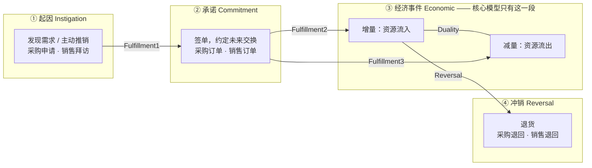

> **这张图在说**：核心模型只画 ③，扩展模型把 ①②④ 补齐。**"传统会计只记 ③，而且只记它的金额"** —— 这是本讲与 M04 的连接点。

### 图 2 · 13 条关联按"连接的两端"分类

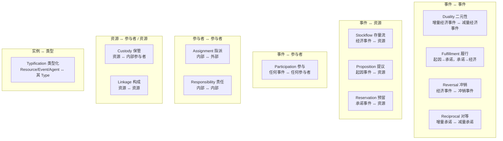

> **这张图在说**：13 条关联不需要死记，**按"它连的是哪两类东西"归类，一共只有六格**。考试问"某某关联连什么"，先想它在哪一格。

### 图 3 · 六步法与图上元素的对应

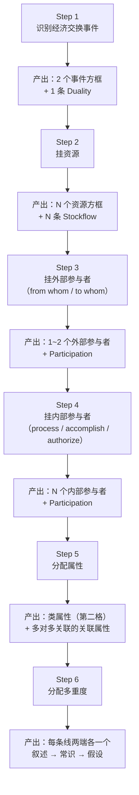

> **这张图在说**：**考场上把这六个标题当小标题写下来，逐个填**，改卷人一眼看到结构，就算某一步填错也不至于全丢。

---

## 4. 速查表

### 4.1 五类事件

| 事件类 | 刻板印象 | 一句话 | 采购循环 | 收入循环 |
|---|---|---|---|---|
| 起因事件 | `<<InstigationEvent>>` | 启动流程，**不承诺任何东西** | Purchase Requisition | Sales Call |
| 承诺事件 | `<<CommitmentEvent>>` | 约定**未来**的交换 | Purchase Order | Sale Order |
| 经济增量 | `<<EconomicIncrement>>` | 资源**流入**企业 | **Purchase** | **Cash Receipt** |
| 经济减量 | `<<EconomicDecrement>>` | 资源**流出**企业 | **Cash Disbursement** | **Sale** |
| 经济冲销 | `<<EconomicReversal>>` | 抵销一个已发生的经济事件 | Purchase Return（冲增量） | Sale Return（冲减量） |

### 4.2 13 条关联

| 关联 | English | 连接 | 核心/扩展 | 讲义页 |
|---|---|---|---|---|
| 二元性 | Duality | 增量经济事件 ↔ 减量经济事件 | 核心·主 | p.3 |
| 存量流 | Stockflow | 经济事件 ↔ 资源/资源类型 | 核心·主 | p.3 |
| 参与 | Participation | 事件 ↔ 参与者 | 核心·主 | p.3 |
| 保管 | Custody | 资源 ↔ 内部参与者 | 核心·次 | p.4 / p.31 |
| 指派 | Assignment | 内部参与者 ↔ 外部参与者 | 核心·次 | p.4 / p.31 |
| 责任 | Responsibility | 内部参与者 ↔ 内部参与者 | 核心·次 | p.4 / p.31 |
| 履行 | Fulfillment | 起因→承诺；承诺→经济事件 | 扩展 | p.27 |
| 冲销 | Reversal | 经济事件 ↔ 经济冲销事件 | 扩展 | p.27 |
| 对等 | Reciprocal | 增量承诺 ↔ 减量承诺（= 承诺层的 duality） | 扩展 | p.27（未画） |
| 提议 | Proposition | 起因事件 ↔ 资源/资源类型 | 扩展 | p.27 |
| 预留 | Reservation | 承诺事件 ↔ 资源/资源类型 | 扩展 | p.27 |
| 构成 | Linkage | 资源 ↔ 资源（BOM） | 扩展 | p.35（未画） |
| 类型化 | Typification | 实例 ↔ 其类型 | 扩展 | p.35 |

### 4.3 多重度速查

**读法**：写在类 X 旁边的数字 = **"另一端的一个实例连着几个 X"**（看对面）

| 三条默认规则（讲义 p.6，"usually but don't always"） | 翻译 |
|---|---|
| `Resource Type 1..* – 0..* Economic Event` | 一次事件至少涉及 1 个品类；一个品类可以 0 次交易 |
| `Resource 1..* – 0..1 Economic Event` | 一次事件至少涉及 1 个具体资源；**一个具体资源最多进 1 次事件** |
| `Economic Event 0..* – 1..1 Agent` | 一个参与者可以 0 到多次；**一次事件恰好 1 个（该角色的）参与者** |

| 常见业务叙述 | 对应多重度 |
|---|---|
| "资源/参与者可以先建档" | 所有**事件端**最小值 = **0** |
| "允许赊购/赊销" | Duality 中**对手事件端**最小值 = **0** |
| "允许分期付款" | Duality 中**付款端**最大值 = **\*** |
| "允许合并付款" | Duality 中**采购端**最大值 = **\*** |
| "一笔付款只从一个账户出" | 资源端 = **`1..1`** |
| "一件事只由一个内部人处理" | 内部参与者端 = **`1..1`** |
| "有些付款与供应商无关" | 外部参与者端最小值 = **0** → `0..1` |

### 4.4 六步法（考场默写用）

```
Step 1  Identify Economic Exchange Events   →  两个事件 + Duality
Step 2  Attach Resources                    →  Stockflow
Step 3  Attach External Agents              →  from whom / to whom
Step 4  Attach Internal Agents              →  process / accomplish / authorize
Step 5  Assign Attributes                   →  类属性 + 关联属性（只有 M:N 才需要）
Step 6  Assign Multiplicities               →  叙述 > 常识 > 假设
```

### 4.5 属性归属判据

| 属性描述的是 | 挂在 | 例子 |
|---|---|---|
| **一样东西** | **类** | Supplier 的电话；Purchase 的日期 |
| **一个组合** | **关联** | 这次采购 × 这个品类的**数量与单价**；这次付款 × 这张单的**分配金额** |

**判断法**：问"这个值需要几个东西才能唯一确定？"—— 一个 → 类；两个 → 关联。
**补充规律**：只有**多对多**关联才需要关联属性。

---

## 5. 双语术语卡

| 中文 | English | 考试可用的英文定义（优先讲义原句） | 首现 |
|---|---|---|---|
| 资源 | Resource | An economic resource owned or controlled by the enterprise; modelled individually when its instances are **not interchangeable** (e.g. diamonds). | §2.1.1 |
| 资源类型 | Resource Type | A category of resource whose individual instances **are interchangeable** (e.g. cookies). | §2.1.1 |
| 经济事件 | Economic Event | Events in which a resource is either **given up or taken**. | §2.1.2 |
| 经济增量事件 | Economic Increment Event | An economic event that **results in resource inflow**, in quantity or value. | §2.1.2 |
| 经济减量事件 | Economic Decrement Event | An economic event that **results in resource outflow**, in quantity or value. | §2.1.2 |
| 内部参与者 | Internal Agent | Agents who **act on behalf of the enterprise**. | §2.1.3 |
| 外部参与者 | External Agent | Agents who are **external business partners**. | §2.1.3 |
| 二元性 | Duality | An association that **links increment and decrement economic events**. | §2.2.1 |
| 存量流 | Stockflow | An association that **links economic events and resources or resource types**; **inflow** links an increment event to a resource, **outflow** links a decrement event to a resource. | §2.2.2 |
| 参与 | Participation | An association that **links economic events and agents (internal and external)**. | §2.2.3 |
| 保管 | Custody | An association that **links agents and resources such that the agent has physical control over the resource or controls access to it**; use when responsibility for a resource must be tracked **independently of any event**. | §2.3.1 |
| 指派 | Assignment | An association that **links an internal agent to an external agent**; use **only when the relationship exists independently of their mutual participation in an event**. | §2.3.2 |
| 责任 | Responsibility | An association that **links an internal agent to an internal agent**; use when one is responsible for another **independent of their mutual participation in an event**. | §2.3.3 |
| 关联属性 | Association Attribute | An attribute that describes **a combination of things** rather than just one thing, and therefore belongs to the association rather than to either class. | §2.4 |
| 多重度 | Multiplicity | How many times an instance of a class is allowed to participate in an association; the value is **written next to the class at the other end**. | §2.5 |
| 起因事件 | Instigation Event | An event that **initiates activities in the business process**; may be **internally instigated** (e.g. a marketing event) or **externally instigated** (e.g. a call from a supplier's salesperson). | §2.10.2 |
| 承诺事件 | Commitment Event | An event in which **commitments are made by the enterprise or by one of its external business partners for part of a future economic exchange**. | §2.10.2 |
| 相互承诺事件 | Mutual Commitment Event | A single event combining the commitments of **both** the enterprise and its partner. | §2.10.2 |
| 经济冲销事件 | Economic Reversal Event | An event in which a **previous economic event is reversed or negated**. | §2.10.3 |
| 履行 | Fulfillment | An association that **links instigation events to commitment events and commitment events to economic events**. | §2.10.4 |
| 冲销（关联） | Reversal | An association that **links economic events to the events that reverse them**. | §2.10.4 |
| 对等 | Reciprocal | An association that **links increment and decrement commitment events**; it **is the commitment-level equivalent of duality**. | §2.10.4 |
| 提议 | Proposition | An association that **links instigation events to resources or resource types**. | §2.10.5 |
| 预留 | Reservation | An association that **links commitment events to resources or resource types**. | §2.10.5 |
| 构成 | Linkage | An association that **links two resources**; use to identify a resource **made up of** another resource. | §2.10.7 |
| 类型化 | Typification | An association relating **each resource, event, or agent to a resource type, event type, or agent type**. | §2.10.7 |
| 采购申请 | Purchase Requisition | An **instigation event that is entirely internal**; typically a **department supervisor** identifying a need for a **type** of good or service and communicating it to the purchasing department. | §2.12.1 |
| 采购订单 | Purchase Order | A **mutual commitment event** whereby a supplier agrees to provide goods to the enterprise and the enterprise agrees to pay an **ascertained price** for those goods. | §2.12.2 |
| 采购（取得） | Purchase / Acquisition | An economic increment event in which **title (ownership) of one or more products is transferred from a supplier to the enterprise**, in person or via transit. | §2.12.3 |
| 现金付款 | Cash Disbursement | An economic decrement event whereby the enterprise **transfers ownership of cash (or equivalent) to a supplier**. | §2.12.4 |
| 采购退回 | Purchase Return | An economic event in which title for goods previously transferred from a supplier to the enterprise **is transferred back from the enterprise to the supplier**. | §2.12.5 |
| 销售拜访 | Sales Call | An **instigation event that is internally initiated**; a sales representative calling on a customer via telephone or in person to **describe the features** of products or services. | §2.14.1 |
| 销售订单 | Sale Order | A mutual commitment event whereby **the enterprise agrees to deliver goods to a customer** and that customer agrees to pay an **ascertained price**. | §2.14.2 |
| 销售 | Sale | An economic **decrement** event in which **title (ownership) of one or more products is transferred from the enterprise to a customer**. | §2.14.3 |
| 现金收款 | Cash Receipt | An economic increment event in which **an external agent transfers ownership of cash (or a cash equivalent) to the enterprise**. | §2.14.4 |
| 销售退回 | Sale Return | An economic event in which title for products previously transferred **from seller to buyer is transferred back from buyer to seller**. | §2.14.5 |
| 采购/付款循环 | Acquisition / Payment Process | The business process covering requisition → order → receipt of goods → payment → return. | §2.7 |
| 销售/收款循环 | Sales / Collection Process（Revenue Cycle） | The business process covering sales call → order → delivery → collection → return. | §2.8 |
| 制造费用 | Overhead | Indirect costs (utilities, rent, maintenance) modelled in RSWS as a `<<ResourceType>>`. | §2.9.2 |
| 库存数量 | Quantity on Hand (qoh) | Attribute of a resource type recording how many units are currently held. | §2.9.4 |

---

## 6. 考点预判与答题框架

### 6.1 可信度分级

| 级别 | 含义 | 本讲数量 |
|---|---|---|
| 🔴 教授明示 | 转录里教授明确说过会考 / 要记 —— **引用原话** | **0 条**（本讲无转录，**最高只能到 🟡**） |
| 🟡 CILO 反推 | 对应官方 CILO，口径上必须考核 | 9 条 |
| ⚪ 笔记推断 | 根据内容重要性、页数分配、题型惯例的判断 | 7 条 |

> ⚠️ **本讲没有 🔴 级考点，不是因为不重要，而是因为没有转录。** 本课六份 pptx 里只有 W01 录了音。**W5 的课上到之后请立刻录音并导出转录**，届时按 [[#9.2 课上讲了但课件没有|§9.2]] 的清单回填。
>
> 🔴 **但有一条从 M01 继承过来的、适用于整个期中考的硬性要求**，见 §6.3 框架 C。

### 6.2 考点清单

| 可信度 | 考点 | 依据 | 对应小节 |
|---|---|---|---|
| 🟡 | **给一段业务叙述，画出核心 REA 模型** | CILO 1（"basic accounting concepts"）＋ Outline 摘要明写 *"develops students' ability to **model business processes** and develop accounting information database"* | §2.6, §2.9 |
| 🟡 | **给一张 REA 图 + 一段叙述，填多重度**；或反过来给多重度，要求用中文/英文解释它的业务含义 | 同上；且讲义花了 3 页（p.18–20）只讲这一件事 | §2.5, §2.9.5 |
| 🟡 | **解释某一条关联**（13 条中任意一条）连接哪两类东西、什么时候用 | 讲义 p.3/4/27/31/35 全部是定义页；扩展模型 16 页里有 5 页是关联定义 | §2.2, §2.3, §2.10.4–7 |
| 🟡 | **区分 Resource 与 Resource Type**，并判断一个具体资源该建成哪个 | 讲义 p.2 首条；且它直接决定多重度（p.6 第 2 条规则） | §2.1.1 |
| 🟡 | **区分四类事件**（起因/承诺/经济/冲销），对号入座具体单据 | 讲义 p.23/25 + p.39–47 + p.49–57 共 20 页全在做这件事 | §2.10.2–3, §2.12, §2.14 |
| 🟡 | **写出某个事件的英文定义**（Purchase / Sale / Purchase Order / Sale Order / Cash Receipt / Cash Disbursement / Purchase Return / Sale Return / Purchase Requisition / Sales Call） | 讲义用 18 页逐个下定义，每页只有一句话——**这种排版就是"要你背"** | §2.12, §2.14, §5 |
| 🟡 | **判断属性该挂类还是挂关联**，并说明理由 | 讲义 p.5 是唯一的判据页；p.16–17 是它的实例 | §2.4, §2.9.4 |
| 🟡 | **采购循环 ↔ 收入循环的镜像对照**：给一个，写另一个 | 讲义把两个循环写成逐字镜像（p.42↔p.52、p.44↔p.54、p.45↔p.55、p.47↔p.57） | §2.15 |
| 🟡 | **核心模型 vs 扩展模型**：扩展模型多了什么，为什么需要 | 讲义 p.22 的 "core = green" 全部 11 页高亮图都在做这个对比 | §2.10 |
| ⚪ | **六步法默写**（顺序 + 每步产出） | 讲义 p.7–8 用红字强调 `*Core*`，是全讲唯一的"程序性知识" | §2.6 |
| ⚪ | **为什么 Proposition 连 Resource Type 而不是 Resource** | 讲义 p.40 的 "a **type** of good or service" 与 p.38 的连线是唯一一处文字—图形的显式呼应 | §2.12.1 |
| ⚪ | **退货由谁经手**（Purchase Return → Shipping Clerk；Sale Return → Receiving Clerk） | 两张扩展图的这一处最容易被反着问 | §2.15 |
| ⚪ | **Reciprocal 为什么在图上没画** | 讲义 p.30 专门加了一行红字解释，**加红字 = 讲义作者知道这里会被问** | §2.10.4 |
| ⚪ | **关联属性 `cd-acq-applied` 的作用**（部分付款与合并付款） | 它是全讲唯一一个真正体现"REA 优于复式记账"的技术细节 | §2.9.4 |
| ⚪ | **REA 里没有"应付账款"这个类，余额怎么来** | 与 M04 主线 A 直接相接；论述题的好素材 | §2.16.2 |
| ⚪ | **Instigation Event 的两种来源**（内部 / 外部）及两个循环的措辞差异 | 讲义 p.39 与 p.49 的措辞差别是有意的 | §2.12.1, §2.14.1 |
| ⚪ | **为什么核心模型不画多重度、实例才画** | 反映"模式（pattern）vs 实例（instance）"的区别 | §2.7.3 |

### 6.3 答题框架

#### 框架 A · "给一段业务叙述，画出 REA 模型"

**这是本讲最可能的大题。按六步法逐步写，每步写一个小标题。**

```
Step 1 — Economic exchange events
  · 增量事件：<名称>（<<EconomicIncrement>>）  ← 企业得到了什么
  · 减量事件：<名称>（<<EconomicDecrement>>）  ← 企业付出了什么
  · Duality 连接两者

Step 2 — Resources
  · 对增量事件：它搬进来的是什么？→ <Resource / ResourceType> + Stockflow
  · 对减量事件：它搬出去的是什么？→ <Resource / ResourceType> + Stockflow
  · ⚠️ 说明为什么选 Resource 还是 ResourceType（个体可否互换）

Step 3 — External agents
  · 增量事件：resources obtained FROM WHOM → <外部参与者> + Participation
  · 减量事件：resources transferred TO WHOM → <外部参与者> + Participation

Step 4 — Internal agents
  · 谁 process / accomplish / AUTHORIZE 增量事件 → + Participation
  · 谁 process / accomplish / AUTHORIZE 减量事件 → + Participation
  · ⚠️ 别忘了"批准"的那个人

Step 5 — Attributes
  · 每个类：identifier(PK) + 该类型的标准属性（事件必带 date）
  · 关联属性：凡是 M:N 的关联，问"这个数字需要两个东西才确定吗"

Step 6 — Multiplicities
  · 先把叙述逐句拆开，标出每句管哪条线的哪一端
  · 剩下的用商业常识
  · 仍不确定的，**写出你的假设**
```

**⚠️ 三个失分点**
1. 事件只画一个（忘了 duality 必须成对）
2. 忘了"批准"角色的内部参与者
3. 多重度读反（写在 A 旁边的数字描述的是 **B 的一个实例连着几个 A**）

#### 框架 B · "从业务叙述反推多重度"

**四步固定动作**（照着 §2.9.5 的推导做）：

```
① 先问："资源/参与者能不能先建档、后交易？"
   能 → 所有【事件端】的最小值 = 0

② 逐句扫描叙述，每句话只管一两个端点：
   "one and only one X"        → X 端 = 1..1
   "credit / on account 允许"   → duality 对手端最小值 = 0
   "partial payment 允许"       → duality 付款端最大值 = *
   "combined payment 允许"      → duality 采购端最大值 = *
   "还有别的用途/例外"           → 该端最小值降为 0（如 0..1）

③ 叙述没覆盖的，用商业常识补
   一次交易一个交易对手 → 对手端 = 1..1
   一次交易可涉及多个品类 → 品类端最大值 = *

④ 写出你的假设（如果用了第三来源）
```

**验算**：数一数图上有几条线，答案应该恰好有 **2×线数** 个多重度。RSWS 是 9 条线 → 18 个多重度。

#### 框架 C · 🔴 交易分析题的答题格式（从 M01 继承，整个期中考通用）

> 🔴 **教授原话**（W1 转录 `01:53:06` / `01:54:08`–`01:54:55`）：
> > *"in the future exercise or **the midterm or the final examination**, if we are testing such transaction analysis, **let's follow this format**."*
> > *"...**you need to determine whether it's positive or negative**. **That is my request for you** when you answer such questions. **You must indicate whether it's positive or negative.**"*

**格式**：

| 交易 | Assets | Liabilities | Equity |
|---|---|---|---|
| ① … | **+X** / **−X** | **+X** / **−X** | **+X** / **−X** |
| ② … | | | |
| **余额** | **±总额** | **±总额** | **±总额** |

**四条硬性要求**
1. **只用三列** `Assets / Liabilities / Equity`，**不细分子科目**（不要用 W1 课件 p.55–76 的多列格式）
2. **每一个数字都必须带 `+` 或 `−`**
3. 每笔之后写出**余额**
4. 最后验算 `Assets = Liabilities + Equity`

**⚠️ 本讲怎么可能考到这个格式**：如果题目要求你**先用三列表分析一笔采购交易，再画出它的 REA 表示**（W1–W5 的综合题），就必须两套都会。范例见 [[#2.16.1 同一笔交易，两种表示|§2.16.1]]。

#### 框架 D · 论述题："传统复式记账的局限与 REA 如何弥补"

```
1. 立论：传统系统的准入规则是"影响会计等式 + 能用货币计量"，这条规则同时是它的三重局限
2. 局限一：丢掉了 who（参与者不进系统）
   → REA：Agent 是一等公民，Participation 把每个事件与经手人绑定
   → 后果：职责分离可以自动检查（申请人 = 批准人？）
3. 局限二：丢掉了 non-monetary 信息（货币计量假设）
   → REA：Stockflow 的关联属性记数量、Resource 记规格
4. 局限三：丢掉了"尚未影响等式"的事项（订单、拜访、报价）
   → REA：Instigation Event、Commitment Event
   → 后果：在手订单 backlog 可查（= 未被 Fulfillment 连出去的承诺事件）
5. 局限四：账户余额是被存起来的，口径事先写死
   → REA：余额是从事件算出来的视图（§2.16.2 的应付账款公式）
6. 收尾：REA 不取消财务报表，它取消的是"只保存报表口径的数据"
```

---

## 7. 自测

**概念题**

1. 讲义说 cookies 是 resource type、diamonds 是 resource。请说出这个区分的判据，并说明它会怎样影响图上的多重度。

<details><summary>答案</summary>

**判据**：个体实例**是否可以互换**（interchangeable）。可互换 → Resource Type（一个品类一行，带库存数量）；不可互换 → Resource（一个个体一行，各有编号）。

**对多重度的影响**（讲义 p.6 的两条默认规则）：
- `Resource Type 1..* – **0..*** Economic Event` —— "曲奇"这个品类可以被交易**很多次**
- `Resource 1..* – **0..1** Economic Event` —— 某一颗特定的钻石**最多只能被交易一次**（卖掉就没了）

也就是说：**事件端的最大值，Resource 是 1，Resource Type 是 `*`。**

</details>

2. 为什么 REA 把「销售（Sale）」建成 `<<EconomicDecrement>>`？它明明是赚钱的事。

<details><summary>答案</summary>

因为**增量/减量说的是资源的流入流出方向，不是损益方向**。销售事件本身，企业**交出了货**（资源流出）→ 减量。收到钱是**另一个事件**（Cash Receipt），那个才是增量。

讲义 p.53 的原句最清楚：销售是 *"the **giving up** of one or more resources **in order to get** some other resource (usually cash)"* —— 先付出，为了得到。

**推论**：采购循环里收货是增量、付款是减量；收入循环里收款是增量、发货是减量。**同一笔生意在买卖双方眼里方向相反。**

</details>

3. 一张 REA 图上写着 `Cash "1..1" — "0..*" Cash Disbursement`。请用中文说出这两个数字各自的意思。

<details><summary>答案</summary>

读法是**看对面**（W4 p.31：*"Minimum participation of employee = 0 — **put next to dept**"*）：

- 写在 **Cash 旁边的 `1..1`** → **一笔现金付款恰好关联 1 个现金账户**（不多不少）
- 写在 **Cash Disbursement 旁边的 `0..*`** → **一个现金账户可以关联 0 到多笔付款**（0 = 刚开的户还没付过款）

对应 RSWS 的业务叙述 2：*"Cash disbursement can be linked to one and only one cash account."*

**⚠️ 如果你读成"一个现金账户只能有一笔付款"，就是把方向读反了。**

</details>

4. Assignment 和 Participation 都能把内部参与者和外部参与者联系起来。什么时候必须画 Assignment？

<details><summary>答案</summary>

讲义 p.4 / p.31 写死了条件：

> *"Use **only when** relationship between internal agent and external agent exists **independently of their mutual participation in an event**."*

**判断法**：问"如果这两个人**从来没有**在同一笔交易里出现过，这条关系还存在吗？"
- **存在** → 画 Assignment（例：公司给每个客户指定专属客户经理，哪怕客户这个月一单没下）
- **不存在** → 不画，那只是 participation 的副产品

同样的条件也适用于 Responsibility（内部↔内部）。

</details>

5. 什么是"相互承诺事件"（Mutual Commitment Event）？为什么讲义的全景图上没有画 Reciprocal？

<details><summary>答案</summary>

**相互承诺事件** = 把企业的承诺和伙伴的承诺**合并成一个事件**（讲义 p.23：*"Often the commitments by the enterprise and its partner are combined into a Mutual Commitment Event"*）。一张采购订单同时含两个承诺：供应商承诺发货、企业承诺付款。

**Reciprocal** 是"连接增量承诺事件与减量承诺事件"的关联，是**承诺层面的 duality**（讲义 p.27：*"Is the commitment-level equivalent of duality"*）。

**为什么图上没画**（讲义 p.30 的红字）：

> *"Reciprocal not shown; instead, commitment event is a mutual commitment, fulfilled by both economic increment and decrement events"*

既然两个承诺已经合并成**一个**方框，就没有两个东西可连了。代价是：**这一个承诺事件要用两条 Fulfillment（2 和 3）分别连到增量事件和减量事件。**

</details>

6. `item-unit-cost`（本次采购该品类的单价）为什么必须挂在 Stockflow1 这条关联上，而不能挂在 `Inventory Type` 类上？

<details><summary>答案</summary>

因为它描述的是**一个组合**，不是一样东西（讲义 p.5 的判据）。

- 挂 `Inventory Type` → 同一个品类**每次进货单价都可能不同**（这次 800、下次 850），一个字段存不下历史
- 挂 `Purchase` → 一次采购可能买了 3 个品类，单价各不相同，一个字段也存不下
- 它只有在 **"这次采购 × 这个品类"** 这一对上才有唯一确定的值 → 属于关联

**一般规律**：只有**多对多**关联才需要关联属性。`Stockflow3`（Cash `1..1` — `0..*` Cash Disbursement）不是多对多，所以金额直接放在 `Cash Disbursement.CD-amt` 上就够了。

</details>

7. 采购退回（Purchase Return）由哪个内部参与者经手？销售退回（Sale Return）呢？为什么？

<details><summary>答案</summary>

- **采购退回 → Shipping Clerk（发货员）**：货要从企业**发出去**还给供应商
- **销售退回 → Receiving Clerk（收货员）**：货从客户那里**回到**企业

**口诀：看货往哪走，不看是买还是卖。**

完整四格：

| 流程 | 货的方向 | 经手人 |
|---|---|---|
| Purchase | 进 | Receiving Clerk |
| Purchase Return | 出 | **Shipping Clerk** |
| Sale | 出 | Shipping Clerk |
| Sale Return | 进 | **Receiving Clerk** |

</details>

8. REA 的采购循环模型里没有「应付账款」这个类。企业欠供应商多少钱，怎么知道？

<details><summary>答案</summary>

**算出来，不是存出来。**

$$\begin{aligned}
&\text{某供应商的应付账款余额} \\
&= \sum \text{（该供应商所有 Purchase 的 Acq-amt）} \\
&- \sum \text{（通过 Duality 分配给这些 Purchase 的 cd-acq-applied）} \\
&- \sum \text{（该供应商所有 Purchase Return 的金额）}
\end{aligned}$$

这体现了 REA 的核心主张：**账户余额是从事件数据推导出来的视图，而不是原始记录。**

**好处**：口径可以随时换（按供应商 / 按品类 / 按经办人 / 按期间），不必事先设计科目。
**代价**：查询更复杂（这正是 M06 要教 ACCESS 查询的原因）。

</details>

**案例分析题**

1. **（多重度）** 某公司的销售/收款循环有以下业务叙述：
   > ① 客户和商品资料可以在没有任何交易前先录入系统。
   > ② 一笔收款只能存入一个银行账户。
   > ③ **不允许赊销**：所有销售必须当场付清；但**允许一次付款同时结清多笔销售**（例如客户一次结清当天的三张小票）。
   > ④ 每笔销售由一名销售员负责；每笔收款由一名出纳负责。
   >
   > 请写出 `Duality（Sale ↔ Cash Receipt）` 两端的多重度，并解释。

<details><summary>参考思路</summary>

**逐句拆解**：

| 叙述 | 管哪一端 | 结论 |
|---|---|---|
| ① | 所有**事件端**最小值 | = 0（但 duality 两端都是事件，本条不适用于 duality） |
| ③ 前半"不允许赊销" | duality 的 **Cash Receipt 端最小值** | 每笔销售**必须**有收款 → 最小值 = **1** |
| ③ 前半"必须当场付清" | duality 的 **Cash Receipt 端最大值** | 不分期 → 最大值 = **1** |
| ③ 后半"允许合并结清" | duality 的 **Sale 端最大值** | 一笔收款可对应多笔销售 → 最大值 = **\*** |
| 常识 | duality 的 **Sale 端最小值** | 一笔收款是否可能不对应任何销售？叙述没说公司还有别的现金来源 → 取 **1** |

**答案**：

```
Sale "1..*" —— Duality —— "1..1" Cash Receipt
```

**读作**：
- 写在 Cash Receipt 旁的 `1..1` → **一笔销售恰好对应 1 笔收款**（不赊、不分期）
- 写在 Sale 旁的 `1..*` → **一笔收款对应 1 到多笔销售**（允许合并结清）

**⚠️ 如果叙述里补一句"公司也可能收到与销售无关的现金（如利息）"，Sale 端最小值就要降到 0**，变成 `0..*`。

**与 RSWS 对照**：RSWS 是 `0..* — 0..*`（赊购 + 分期 + 合并 + 有非采购付款），本题是 `1..* — 1..1`（不赊、不分期、可合并、无其他现金来源）。**两端的每一个数字都能追溯到叙述里的一句话。**

</details>

2. **（建模）** 一家健身房的业务：会员先来试课（试课不收费），试课后签一年期会籍合同并约定分 12 期扣款；每月扣款一次；会员可以在 7 天内退会并退款。请用六步法列出这家健身房**收入循环**的扩展 REA 模型里应该有哪些类和关联（不必画图，列表即可）。

<details><summary>参考思路</summary>

**Step 1 — 经济交换事件（一对）**
- `<<EconomicDecrement>> Service Delivery`（提供健身服务；讲义 p.21 给的三选一里，服务对应 **Service Engagement**）
- `<<EconomicIncrement>> Cash Receipt`（每月扣款）
- Duality 连接两者

**Step 2 — 资源**
- `<<ResourceType>> Membership Service Type`（会籍种类：年卡/月卡/私教课）——**可互换 → ResourceType**
- `<<Resource>> Cash Account`（银行账户）——**不可互换 → Resource**
- Stockflow1：Service Type ↔ Service Delivery（outflow）
- Stockflow2：Cash Account ↔ Cash Receipt（inflow）

**Step 3 — 外部参与者**
- `<<ExternalAgent>> Member`（会员）
- Participation：Service Delivery ↔ Member；Cash Receipt ↔ Member

**Step 4 — 内部参与者**
- `<<InternalAgent>> Trainer`（教练，提供服务）
- `<<InternalAgent>> Cashier / Finance Clerk`（处理扣款）
- `<<InternalAgent>> Manager`（**批准**退款——别忘了 authorize 这个角色）
- 各自 Participation

**扩展部分**
- `<<InstigationEvent>> Trial Class`（试课）——**内部发起的营销事件**，不收费所以不是经济事件
  - Fulfillment1 → 会籍合同
  - Proposition → Membership Service Type（试的是哪种课）
  - Participation → Member、Trainer
- `<<CommitmentEvent>> Membership Contract`（会籍合同，**相互承诺事件**：健身房承诺提供一年服务，会员承诺付 12 期）
  - Fulfillment2 → Service Delivery
  - Fulfillment3 → Cash Receipt
  - Reservation1 → Membership Service Type
  - Reservation2 → Cash Account
  - Participation → Member、销售/前台
- `<<EconomicReversal>> Refund / Membership Cancellation`（7 天退会退款）
  - **⚠️ 这里要判断它冲的是哪一个**：退的是**钱**，所以它冲销的是 `Cash Receipt`（增量）→ 属于 **economic increment reversal**
  - Reversal → Cash Receipt
  - Stockflow3 → Cash Account
  - Participation → Member、Manager

**Step 5 — 属性要点**
- `Service Delivery`：ID(PK)、date、duration
- `Cash Receipt`：ID(PK)、date、amount
- **Duality 的关联属性**：`receipt-service-applied`（这期扣款对应哪几节课）——因为一次扣款覆盖一个月的多次服务，是**多对多**
- **Stockflow1 的关联属性**：`sessions-used`

**Step 6 — 多重度要点**
- 试课后**可能不签约** → Fulfillment1 的 Commitment 端最小值 = **0**
- 合同**必然**产生扣款 → Fulfillment3 的 Cash Receipt 端最小值 = **1**、最大值 = **\***（12 期）
- 每笔扣款一个账户 → Cash Account 端 = `1..1`
- 退款是**例外** → Reversal 的冲销端最小值 = **0**

**评分要点**：能否识别出「试课 = 起因事件」「合同 = 承诺事件」「退款冲的是增量不是减量」这三点。

</details>

3. **（综合，W1–W5 跨周）** RSWS 于 2026-09-30 向 Yamaha 赊购 5 支单簧管，单价 HK$8,000。
   (a) 用教授规定的格式做交易分析。
   (b) 说明这笔交易在 RSWS 的 REA 模型里会产生哪些记录。
   (c) 指出 (a) 中丢失了哪些 (b) 保留下来的信息。

<details><summary>参考思路</summary>

**(a) 三列交易分析（🔴 教授指定格式）**

| 交易 | Assets | Liabilities | Equity |
|---|---|---|---|
| ① 9/30 赊购单簧管 5 支 @ 8,000 | **+40,000** | **+40,000** | **0** |
| **余额** | **+40,000** | **+40,000** | **0** |

验算：`+40,000 = +40,000 + 0` ✅

⚠️ 格式检查：三列 ✅、每个数字带正负号 ✅、给出余额 ✅、不细分子科目 ✅。

**(b) REA 模型里产生的记录**

| 表 | 新增的行 |
|---|---|
| `Purchase` | `A001, 2026-09-30, 40000` |
| `Stockflow1`（Inventory Type ↔ Purchase） | `(A001, 单簧管品类, qty=5, unit-cost=8000)` |
| `Participation2`（Purchase ↔ Supplier） | `(A001, Yamaha)` |
| `Participation1`（Purchase ↔ Purchase Agent） | `(A001, <采购员工号>)` |
| `Duality` | **无行** ← "赊购"在 REA 里就表现为 duality 上暂时没有对应记录 |

**(c) (a) 丢失了什么**

| 信息 | 三列表 | REA |
|---|---|---|
| 买了几支、单价多少 | ❌ 只有 40,000 | ✅ qty=5, unit-cost=8000 |
| 向谁买的 | ❌ | ✅ Yamaha |
| 谁经手的 | ❌ | ✅ 采购员 |
| 具体是哪个品类 | ❌ | ✅ 单簧管品类 |
| 有没有对应的采购订单 | ❌ | ✅ 通过 Fulfillment2 可查 |
| 这笔欠款单独还欠多少 | ❌ 只汇总进"负债 +40,000" | ✅ 精确到单 |

**收尾一句**：这正是 M04 说的"传统复式记账把业务压缩成金额，REA 保留业务本身"的具体体现。

</details>

---

## 8. 讲义页码映射

| 笔记小节 | 讲义页 | 页面性质 | 课堂覆盖 |
|---|---|---|---|
| （标题页） | **p.1** | **📕 封面页**（唯一一页仅登记不展开） | — |
| §2.1 核心 REA 类 | p.2 | 文字 | — |
| §2.2 核心主关联 | p.3 | 文字 | — |
| §2.3 核心次关联 | p.4 | 文字 | — |
| §2.4 分配属性 | p.5 | 文字 | — |
| §2.5 分配多重度 | p.6 | 文字 | — |
| §2.6 六步法（步骤 1–3） | p.7 | 文字 | — |
| §2.6 六步法（步骤 4–6） | p.8 | 文字 | — |
| §2.7.1 采购增量事件三选一 | p.9 | 文字 | — |
| §2.7.2 采购减量事件 | p.10 | 文字 | — |
| §2.7.3 采购核心模式全图 | **p.11** | 🖼️ 纯图（已视觉复核并重画） | — |
| §2.9.1 RSWS Step 1 | p.12 | 文字 + 图 | — |
| §2.9.2 RSWS Step 2 | p.13 | 文字 + 图 | — |
| §2.9.3 RSWS Step 3–4（文字） | p.14 | 文字 | — |
| §2.9.3 RSWS Step 3–4（图） | **p.15** | 🖼️ 纯图（已视觉复核并重画） | — |
| §2.9.4 RSWS Step 5（关联属性清单） | p.16 | 文字 | — |
| §2.9.4 RSWS Step 5（属性全图） | **p.17** | 🖼️ 纯图（已视觉复核，属性已全部转写成表） | — |
| §2.9.5 RSWS Step 6（标题） | p.18 | 文字（整页仅一行） | — |
| §2.9.5 RSWS 的四句业务叙述 | p.19 | 文字 | — |
| §2.9.5 RSWS Step 6 答案图（18 个多重度） | **p.20** | 🖼️ 纯图（已用 `pdftotext -bbox` 逐个定位多重度并复核） | — |
| §2.8 收入核心模式全图 | **p.21** | 🖼️ 纯图（已视觉复核并重画） | — |
| §2.10.1 扩展模型全景图（core = green） | **p.22** | 🖼️ 纯图（已视觉复核，拆成 3 张 Mermaid） | — |
| §2.10.2 起因事件与承诺事件（定义） | p.23 | 文字 | — |
| §2.10.2 全景图高亮：两个新事件类 | **p.24** | 🖼️ 高亮图（红框：InstigationEvent、CommitmentEvent） | — |
| §2.10.3 经济冲销事件（定义） | p.25 | 文字 | — |
| §2.10.3 全景图高亮：EconomicReversal | **p.26** | 🖼️ 高亮图（红框：EconomicReversal） | — |
| §2.10.4 事件—事件关联 · §2.10.5 事件—资源关联（定义） | p.27 | 文字 | — |
| §2.10.4 全景图高亮：Fulfillment1/2/3 | **p.28** | 🖼️ 高亮图 | — |
| §2.10.4 全景图高亮：Reversal | **p.29** | 🖼️ 高亮图 | — |
| §2.10.4 全景图高亮：Reciprocal（+ 红字说明"未画"） | **p.30** | 🖼️ 高亮图 + 关键红字 | — |
| §2.10.6 参与者—参与者、资源—参与者关联（定义） | p.31 | 文字 | — |
| §2.10.6 全景图高亮：Assignment | **p.32** | 🖼️ 高亮图 | — |
| §2.10.6 全景图高亮：Responsibility | **p.33** | 🖼️ 高亮图 | — |
| §2.10.6 全景图高亮：Custody | **p.34** | 🖼️ 高亮图（⚠️ 连的是 ResourceType，与文字矛盾） | — |
| §2.10.7 资源—资源关联与类型化（定义） | p.35 | 文字 | — |
| §2.10.7 全景图高亮：Typification（+ 红字"Linkage not shown"） | **p.36** | 🖼️ 高亮图 + 关键红字 | — |
| §2.10.8 全景图高亮：新事件的 Participation 1/2/3/4/9/10 | **p.37** | 🖼️ 高亮图 | — |
| §2.11 扩展采购循环全图 | **p.38** | 🖼️ 纯图（已视觉复核 + 局部放大核对交叉线） | — |
| §2.12.1 采购循环起因事件 | p.39 | 文字 | — |
| §2.12.1 采购申请事件（定义） | p.40 | 文字 | — |
| §2.12.2 采购循环相互承诺事件 | p.41 | 文字 | — |
| §2.12.2 采购订单事件（定义） | p.42 | 文字 | — |
| §2.12.3 采购循环经济增量事件 | p.43 | 文字 | — |
| §2.12.3 采购事件（定义） | p.44 | 文字 | — |
| §2.12.4 采购循环经济减量事件 + 现金付款（定义） | p.45 | 文字 | — |
| §2.12.5 采购循环经济增量冲销事件 | p.46 | 文字 | — |
| §2.12.5 采购退回事件（定义） | p.47 | 文字 | — |
| §2.13 扩展收入循环全图 | **p.48** | 🖼️ 纯图（已视觉复核 + 局部放大核对 11 条 Participation） | — |
| §2.14.1 收入循环起因事件 | p.49 | 文字 | — |
| §2.14.1 销售拜访事件（定义） | p.50 | 文字 | — |
| §2.14.2 收入循环相互承诺事件 | p.51 | 文字 | — |
| §2.14.2 销售订单事件（定义） | p.52 | 文字 | — |
| §2.14.3 收入循环经济减量事件 | p.53 | 文字 | — |
| §2.14.3 销售事件（定义） | p.54 | 文字 | — |
| §2.14.4 收入循环经济增量事件 + 现金收款（定义） | p.55 | 文字 | — |
| §2.14.5 收入循环经济减量冲销事件 | p.56 | 文字 | — |
| §2.14.5 销售退回事件（定义） | p.57 | 文字 | — |

> 「课堂覆盖」列整列为 `—`：**本讲无转录**（本课六周只有 W01 录了音），无法判断教授实际讲了哪些页、跳过了哪些页。

**页面统计**

| 类别 | 页数 | 页码 |
|---|---|---|
| **封面页** | **1** | p.1 |
| **学习目标页** | **0** | 本讲义**没有**学习目标分隔页（与 W1/W2 不同） |
| 纯图片页（需视觉复核） | 8 | p.11, 15, 17, 20, 21, 22, 38, 48 |
| 高亮图页（同一张全景图的 11 次高亮） | 10 | p.24, 26, 28, 29, 30, 32, 33, 34, 36, 37 |
| 文字页 | 38 | 其余 |
| **合计** | **57** | |

**✅ 全部 57 页已覆盖，且除封面页 p.1 外的 56 页全部在 §2 正文有实质讲解。**

- **没有任何一页只出现在本映射表里。**
- 讲义**不含学习目标页**，因此不存在"仅合并成一句话"的页面。
- **18 张图片/高亮页（p.11, 15, 17, 20, 21, 22, 24, 26, 28, 29, 30, 32, 33, 34, 36, 37, 38, 48）全部通过「PowerPoint COM 转 PDF → Read 工具逐页视觉复核」处理**，并重画为 Mermaid 类图或 Markdown 表格。其中 p.20 的 18 个多重度另用 `pdftotext -bbox` 提取了每个标签的精确坐标，与 9 条关联的端点逐一配对核验；p.38 与 p.48 的交叉连线另做了 200 dpi 局部放大复核。

---

## 9. 延伸与勘误

### 9.1 课件有但课上略过

**本讲无转录，无法判断。**

### 9.2 课上讲了但课件没有

**本讲无转录，无法判断。**

> ⏳ **转录到手后要做的事（v0.9 → v1.0 清单）**
>
> 1. 把七格微结构里所有「🎙️ 课堂补充 —— 待转录补充」逐条填实（共 **23 处**）
> 2. 填 §8 页码映射表的「课堂覆盖」列
> 3. 在 §6.2 补 🔴 级考点，**重点搜索以下关键词**：
>    - `midterm` / `exam` / `test` —— 教授是否再次划范围、是否点名 REA 要考
>    - `draw` / `diagram` —— **期中考会不会要求画图？** 这是本讲最大的未知数（闭卷手写画 UML 类图是很重的题型）
>    - `multiplicity` / `0..*` / `one and only one` —— 教授讲多重度时的口头判据
>    - `RSWS` / `woodwind` —— 教授是否在课上另外补了 RSWS 的完整业务叙述（讲义只给了 4 句，**不足以支撑一次完整建模**）
>    - `Reciprocal` / `Linkage` / `Custody` —— 这三条讲义图上没画或画错，教授口头怎么说的
> 4. **重点确认**：教授是否解释了 **p.34 的 Custody 连 ResourceType** 是笔误还是有意（见 §9.3 ④）
> 5. **重点确认**：教授是否解释了 **RSWS 例子里 Cash 被标成 `<<ResourceType>>`**（见 §9.3 ①）
> 6. **重点确认**：教授是否给出**收入循环的多重度练习**（讲义只给了采购循环的）
> 7. 检查是否布置了个人作业、是否公布了期中考的题型分布
> 8. 检查是否提到 W1 承诺的 **Word 答题模板**（M01 转录 `01:53:19`）
> 9. frontmatter 改 `transcript: merged`、`status: v1.0`
> 10. 回写 [[Artificial_Intelligence_Accounting/_meta/知识层级台账|知识层级台账]]、[[Artificial_Intelligence_Accounting/_meta/术语表|术语表]]、[[Artificial_Intelligence_Accounting/_meta/考点库|考点库]]

### 9.3 课件自身的问题

> 本课讲义质量一般（M01 发现 9 处、M02 发现 9 处）。本讲发现 **11 处**。

**① 现金资源的刻板印象前后不一致（最实质的一处）**

| 页 | 写法 |
|---|---|
| p.11（采购核心模式） | `<<Resource>> Cash Account` |
| p.21（收入核心模式） | `<<Resource>> Cash Account` |
| p.38（扩展采购循环） | `<<Resource>> Cash Account` |
| p.48（扩展收入循环） | `<<Resource>> Cash Account` |
| **p.13 / p.15 / p.17 / p.20（RSWS 实例）** | **`<<ResourceType>> Cash`** |

**5 处写 `<<Resource>>`，4 处写 `<<ResourceType>>`，指的是同一样东西。**

**证据显示 RSWS 那 4 页是错的**：p.17 给 `Cash` 的属性是 `AcctNum (PK)`、`AcctType`、`AcctLoc`、`AcctBal` —— **账号、账户类型、开户地、账户余额**，这全是**一个具体银行账户**的属性，不是"现金"这个品类的属性。按讲义 p.2 的判据（个体是否可互换），**不同银行账户不可互换 → 应该是 `<<Resource>>`**。

**对读者的影响**：如果考试要你判断某个资源该建成 Resource 还是 ResourceType，**照 p.11/p.21/p.38/p.48 的写法（`<<Resource>> Cash Account`）答**，并说明理由。

**② p.2 关于 Resource / Resource Type 的定义是残句**

原文只有：*"Whether the individual instances will be interchangeable, for example cookies (resource type) and diamonds (resource)"*

这是一个**判据的从句**，没有主句，也没有分别给出两者的定义。零基础读者读完这一行**不知道 resource 是什么**。本笔记 §2.1.1 补齐了完整表述。

**③ p.35 有明显漏字**

原文：*"**Event-Agent relationships between the added events and internal and agents** who participate in them"*

`internal and agents` 显然应为 `internal and **external** agents`。这一点由 p.37 的高亮图印证——那里 6 条新增 Participation 里有 3 条连的是 `<<ExternalAgent>>`。

**④ Custody 的两端：文字说 Resource，图上画的是 ResourceType**

| 出处 | 说法 |
|---|---|
| p.4 | *"Custody — Links **Agents and Resources**..."* |
| p.31 | *"Custody (link **resource and internal agent**)"* |
| **p.34（高亮图）** | 线连的是 **`<<ResourceType>>`** 与 `<<InternalAgent>>` |

按定义应该连 `<<Resource>>`（保管的是**具体那批东西**，不是一个品类概念）。**p.34 的连线位置很可能是画图时接错了端点。**

**⑤ p.16 的属性前缀不一致**

```
item-qty-purch (stockflow1)      ← 无前缀
-item-unit-cost (stockflow1)     ← 有前缀 -
oh-qty-purch (stockflow2)        ← 无前缀
-cd-acq-applied (duality)        ← 有前缀 -
```

UML 里 `-` 表示私有可见性。同一张幻灯片上四个同类属性两种写法，是复制粘贴残留。（p.17 的图上四个都带 `-`。）

**⑥ Participation 的编号在不同图上含义完全不同，讲义未作提醒**

| 编号 | p.11（通用采购模式） | p.15/17/20（RSWS） | p.38（扩展采购） | p.48（扩展收入） |
|---|---|---|---|---|
| Participation1 | Purchase ↔ 采购员 | Purchase ↔ 采购员 | **Requisition ↔ 部门主管** | **Sales Call ↔ 销售员** |
| Participation2 | Purchase ↔ **收货员** | Purchase ↔ **供应商** | Requisition ↔ 采购员 | Sales Call ↔ 客户 |
| Participation3 | Purchase ↔ 供应商 | 付款 ↔ 供应商 | 采购订单 ↔ 采购员 | 销售订单 ↔ 销售员 |

**同一个名字在四张图上指四条不同的线。** 初学者很容易以为 `Participation3` 是个固定概念。**它不是——它只是画图时的顺序编号。**

**⑦ 核心模式的两个循环不对称（p.11 vs p.21）**

- p.11 的采购核心模式给 `Purchase` 挂了 **2 个内部参与者**（采购员 + 收货员），共 5 条 participation
- p.21 的收入核心模式给 `Sale` 只挂了 **1 个内部参与者**（销售员），共 4 条 participation，**没有对应的发货员**

两张"应该镜像"的图，参与者数量不一样。（到 p.48 的扩展模型才把 Shipping Clerk 补上。）

**⑧ 全景图只画了一个 `<<EconomicReversal>>`，但 p.25 说冲销有两种**

p.25 明确区分 **increment reversal**（如采购退回）与 **decrement reversal**（如销售退回），但 p.22 的全景图上只有**一个** `<<EconomicReversal>>` 方框，且从 p.29 的高亮看，`Reversal` 关联连的是 **`<<EconomicIncrement>>`** ——这是**采购口径**的画法。到了 p.48 的收入循环，`Reversal` 连的是 `Sale`（**减量**）。

**全景图是"泛化模板"，不能直接照搬到收入循环。** 讲义没有提醒这一点。

**⑨ 扩展的两个循环参与关联数量不等（10 vs 11）**

p.38 采购循环 10 条 Participation，p.48 收入循环 11 条。差在：**`Sale ↔ Salesperson`（p.48 的 Participation5）存在，但对应的 `Purchase ↔ Purchase Agent` 在 p.38 里不存在。**

业务上讲得通（销售员要按成交额提成，采购员的活在下 PO 时就完了），但**讲义完全没有解释**，读者会以为其中一张漏画了。

**⑩ 11 张"全景图 + 高亮"幻灯片的文本层完全相同**

p.22, 24, 26, 28, 29, 30, 32, 33, 34, 36, 37 的文字提取结果**一字不差**（都是同一组 `<<...>>` 标签和关联名），差别**只在颜色**。

**对处理讲义的人来说这是个陷阱**：任何基于"文本去重"的自动化处理都会把其中 10 页当成重复页丢掉，而那 10 页恰恰承载了这一段全部的教学逻辑（用高亮做逐层加法）。**本笔记逐页说明了每张高亮了什么。**

**⑪ speaker notes 全部为空**

本讲 57 页**没有任何一页写了演讲者备注**（与 W1–W4、W6 一致；本课六份 pptx 共 379 页，一页备注都没有）。

> ✅ **一个正面发现**：与 W1 不同，**W5 的 pptx 里没有任何嵌入的 Excel OLE 对象**（W1 有 19 个），也**没有任何嵌入图片**（`media/` 目录为空，245 个 zip 条目里 0 个 media）。全部图形都是 PowerPoint 原生的文本框 + 443 条 `LINE` 自选图形画出来的。这意味着 `python-pptx` 能取到**全部文字**，但**取不到任何连线关系**——所以视觉复核在本讲不是可选项，是**必须**。

### 9.4 课外补充

**① REA 模型的出处** 🔗

REA 由 **William E. McCarthy** 于 **1982 年**在 *The Accounting Review* 上发表的论文提出（W4 讲义 p.9 提到）。"REA" 三个字母来自 **R**esources、**E**vents、**A**gents。本讲讲的"业务流程层模型"（business process level model）是 REA 三个抽象层次（价值链层 / 业务流程层 / 任务层）中的**中间层**。

**为什么这条对本课有用**：讲义只讲了业务流程层。如果论述题问"REA 能不能描述整个企业"，可以指出它还有**价值链层**（把多个业务流程串起来）。
（🔗 REA 建模的常识性背景，非本课材料，2026-09-09）

**② 本讲讲义的底本** 🔗

讲义的措辞（`stereotype`、`multiplicity`、`Instigation / Commitment / Economic / Reversal` 四类事件、`Proposition / Reservation / Fulfillment / Reciprocal / Typification / Linkage` 这一整套关联名、以及 Robert Scott Woodwind Shop 这个例子）与 **Dunn, Cherrington & Hollander, *Enterprise Information Systems: A Pattern-Based Approach*** 一书高度一致。

**为什么这条有用**：如果讲义某处讲不清（比如 p.2 的残句），可以去查这本书的对应章节。同时也解释了**为什么本讲的英文术语这么固定**——它们是一个成熟教材体系的标准词汇，考试很可能要求原词作答。
（🔗 依据术语与例题的高度吻合推断，2026-09-09）

**③ 在手订单（Backlog）** 🔗

§2.10.2 提到"未被 Fulfillment 连出去的承诺事件 = 在手订单"。在真实的上市公司财报里，backlog 是一个**在附注或 MD&A 里披露、但不在四张报表里**的指标（因为它不满足收入确认原则，见 [[M01-会计与商业#2.6.3 四大原则（讲义 p.32–33 + `Accounting principles.docx`）|M01 §2.6.3]]）。

**为什么这条有用**：它是"REA 能记而复式记账记不了"的**最有商业说服力的例子**，比"记录销售员姓名"更有分量。做 M04 主线 A 的论述题时可以用。
（🔗 财务分析常识，非本课材料，2026-09-09）

**④ 与 M06（ACCESS）的接口预告**

本讲画的每个方框将来都是一张表，每条关联将来是：

| 关联的多重度 | 在关系数据库里变成 |
|---|---|
| `1..1` — `0..*` / `1..*` | **外键**：把"1"那一端的主键放进"多"那一端的表 |
| `0..*` — `0..*`（多对多） | **一张独立的连接表**，主键是两端主键的组合，关联属性作为普通字段 |
| `1..1` — `1..1` | 可以合并成一张表，或任选一端放外键 |

RSWS 的 9 条关联里，**4 条是多对多**（Stockflow1、Stockflow2、Duality，以及广义上 Participation 都是 `1..1—0..*` 属于一对多）——准确地说：`Stockflow1`、`Stockflow2`、`Duality` 三条是 `0..*—0..*`，**将来会各变成一张独立的表**；其余 6 条是一对多，变成外键。

**这也解释了为什么关联属性只出现在这三条上**（§2.9.4）。

> 🔧 **2026-09-11 按「预习可读性」规则重写 §2**：对 §2 全部 50 个 `###`/`####` 小节做了逐节零基础试读。本讲原文与 M04 同一水准（术语随讲随解释、无裸公式、无未说明代码），试读发现的系统性缺口同样是**缺少小节收尾的"所以呢"句**——全部 50 个小节补齐。另外发现 §2.16.2 的应付账款公式只给了公式本身，缺符号表与数字例子，已补上符号表和两步数字代入（沿用 §2.16.1 的 RSWS 向 Yamaha 赊购 HK\$40,000 的例子，并新增一个"假设后续付款 HK\$25,000"的推演）。未发现需要整段重写"是什么"开头的小节。

### 9.5 待核对

| 项 | 说明 |
|---|---|
| **[[M03-年报分析]] / [[M04-REA会计模型]] 的实际文件名与锚点** | ⚠️ W3、W4 的笔记由另外两位 agent 同时产出，**本笔记写作时尚未落盘**。§1.1、§2.9.5、§2.16 等处的双链是**占位**，须在 M03/M04 产出后核对并改成真实文件名与小节锚点 |
| **M04 是否已展开"资源/事件/参与者"与"duality"** | 本笔记按"M04 只给了概念直觉、W5 p.2–4 才给出完整定义"来处理（依据：W4 讲义 p.17–19 只有一页 REA 三要素图和两页 duality 说明，没有 Resource Type / Stockflow / Participation / Custody / Assignment / Responsibility 的定义）。若 M04 笔记已完整展开这些，本笔记 §2.1–§2.3 应改为"回指 + 一句话唤醒"，并同步修改 [[Artificial_Intelligence_Accounting/_meta/知识层级台账\|知识层级台账]] 的首现列 |
| **多重度的读法** | 本笔记采用"**看对面**"（标在类 X 旁的数字描述"另一端一个实例连着几个 X"），依据是 **W4 讲义 p.31** 的原话 *"Minimum participation of employee = 0 (**put next to dept**)"* 与 **p.32 Exercise 1** 的答案 *"No – 1 min **next to CR**"*，并用 W5 p.19 叙述 2 与 p.20 图交叉验证通过。**若 M04 笔记采用了相反的读法，两篇必须统一**——以 W4 p.31/p.32 原文为准 |
| **RSWS 的完整业务叙述** | 讲义只给了 4 句（p.19），不足以从零建出整个模型（比如没说"为什么要建 Overhead 这个资源类型"）。**课上教授很可能口头补了完整案例**，转录到手后回填 |
| **期中考会不会要求手画 UML 类图** | 闭卷手写画图是很重的题型。讲义无从判断，**必须从转录或课上确认** |
| **Reservation2 在采购循环里预留现金账户的业务解释** | p.38 图上确实连了 `Purchase Order ↔ Cash Account`，但讲义没有任何文字解释为什么订单要预留现金。本笔记给的是"资金计划"的推断解释（💡 笔记补充），**待课堂确认** |

### 9.6 变更记录

| 日期 | 变更 |
|---|---|
| 2026-09-11 | 链接修复：本文件 20 处 Markdown 形式的同文件锚点（`[§x](#slug)` 写法）改为 Obsidian 双链 `[[#标题原文\|§x]]`——Obsidian 按标题原文匹配，GitHub 式小写连字符 slug 一律点不开（对抗自检清单 9b）。只改链接写法，标题与正文未动 |
