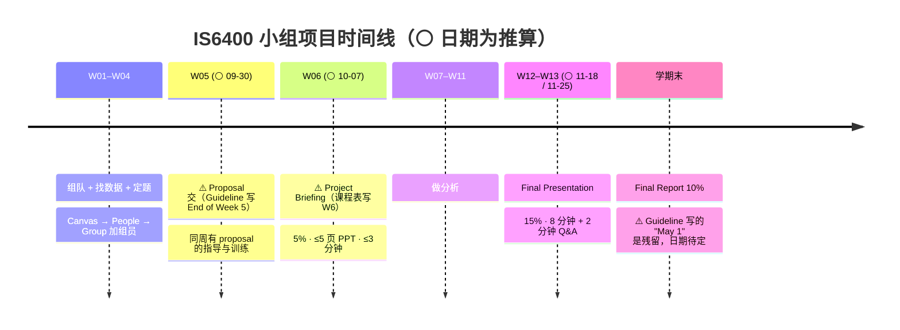

# IS6400 作业与 DDL

> ⚠️ **本文件里的日期分两类**：
> - **✅ 确认** = 材料里白纸黑字写的
> - **⚪ 推算** = 我按周次推算的（第 1 周 = 2026-08-31 至 09-05，逐周 +7 天；**未计入香港公众假期**）
>
> **动手前先用 Canvas 的实际日历核对一遍。** 本课迟交惩罚是五门课里最重的。

---

## ⏰ 最近的截止

### ✅ Tutorial 1 作业（Canvas 名 "Assignment Week 1"）—— 9/11（周四）23:59，已过

> ✅ Canvas 截图（2026-09-16）："Assignment Week 1 · Due Sep 11 at 11:59pm · -/10 pts · Not Yet Graded"——时刻是 **23:59**（不是"上课前"），Canvas 占 10 分，尚未批改。

| 项 | 内容 |
|---|---|
| 题目 | notebook `Tutorial 1 - Introduction to Jupyter Notebook_Prompt.ipynb` **cell 24**，4 题 100 分 |
| 交什么 | **HTML**（"SAVE it as HTML and upload to canvas"），不是 `.ipynb` |
| 逐题攻略 | [[T01-Jupyter入门与Pandas基础#7. 本次作业（notebook cell 24 原文）\|T01-Jupyter入门与Pandas基础 › 7. 本次作业（notebook cell 24 原文）]] —— §7.1 逐题对应 cell，§7.2 **三个坑**，§7.3 导出方法 |

**动手顺序**（照 T01 §7 走，半小时内能做完）：

1. 把 cell 4 的 `StudentID='liujm8'` **换成你自己的**（`liujm8` 是教授的 ID，忘改是最容易丢分的地方）
2. 建表时**直接加上 `score` 列**（第 (3) 题要 expected scores，但第 (2) 题的表原本没有这列）
3. 第二行**重新取一次** `datetime.datetime.now()`，别复用第一行的 `x`
4. 第 (4) 题用 **cell 13 的 `df`**（那张才有 `grade` 列），不是 `mytable`
5. 每处你对题意的解读，**用 markdown 写一句**，避免被当成做错
6. `Kernel → Restart & Run All` 跑一遍，**再**导出 HTML
7. 自己留一份备份

---

### 🔴 Assignment Week 3 —— **9/25（周五）23:59**，Canvas 10 分

> ✅ **来源：Canvas 作业列表截图（2026-09-16 用户提供）**："Assignment Week 3 · Due Sep 25 at 11:59pm · -/10 pts"。题目在 `Week 3 Description.ipynb` cell 44–48（内部 100 分 ↔ Canvas 10 分）。⚠️ 不是我之前推算的 9/23，**比 W2 作业晚一周整**。

| 项 | 内容 |
|---|---|
| 题目 | notebook **cell 44–48**，**3 题 100 分**：Q1 Airbnb 描述性报告（35）· Q2 数据质量 / 可视化 / 与 `log_price` 的关系（45，至少 8 张图）· Q3 **自己的项目数据集**探索（20） |
| 数据 | `Airbnb.csv`（Q1–Q2）+ **你们小组的项目数据**（Q3；组员必须用不同变量） |
| 交什么 | notebook 明写：**`.ipynb` + 导出的 `.html`**（W2 的 Canvas 页限 html + pdf；本周 Canvas 页的文件类型限制截图未显示，**上传前看一眼**） |
| 逐题攻略 | [[T03-数据探索实战-Iris与Airbnb的描述统计#7. 本次作业：Week 3 Assignment（notebook cell 44–48 原文）\|T03 › 7. 本次作业]] —— §7.3 逐题、§7.4 自查 |

**三个坑**（详见 T03 §7.3）：① Q1 要求解释"price 的百分位数**不是** exp(log_price 百分位数)"——**实跑两者完全相等**（单调变换保序），要如实写并解释；② Q2 要求比较 `bedrooms` 的三种填补——**该列没有缺失值**，要说明；③ Q3 需要小组已经选好数据集——**先定项目数据**。

### 🟠 Week 4 Assignment —— ⚪ **10/2（周五）23:59**（Canvas 尚未挂出，按 W2/W3 "上课后第 9 天周五 23:59" 的规律推算）

> 来源：`Week 4 Feature Engineering.ipynb` cell 35（2026-09-16 已放 Canvas 的 Week 4 页，课在 9/23）。**2026-09-16 的 Canvas 作业列表里还没有 Assignment Week 4**——W2 截止 9/18（上课 9/9）、W3 截止 9/25（上课 9/16），都是上课后第 9 天的周五；W4 按此推为 10/2。

| 项 | 内容 |
|---|---|
| 题目 | notebook **cell 35**，**4 题合计 80 分**（Q1 `f_classif` 重做 + filter/wrapper 判断 10 · Q2 三种方法的区别 10 · Q3 `SequentialFeatureSelector` 选前 2 个特征 **40** · Q4 Airbnb 选 3 个最有代表性的特征预测价格 20）。❗ 总分 80 不是 100，待问 |
| 数据 | `iris.txt`（Q1–Q3）+ `Airbnb.csv`（Q4，"on Canvas-Week4 Homepage"） |
| 交什么 | notebook 没写；按 W3 惯例 `.ipynb` + `.html` |
| 逐题攻略 | [[T04-特征选择与PCA实战-Iris#7. 本次作业：Week 4 Assignment（notebook cell 35 原文）\|T04 › 7. 本次作业]] —— 六种估计器 × 前后向的 SFS 结果都是 petal-L / petal-W；Q4 过滤法与前向选择答案不同（`verify_t04.py`） |

### 📋 Week 3 Quiz（课堂小测，Participation 5% 的一次）

> ✅ Canvas 截图："Week 3 Quiz - Wed 12 PM · Due Sep 16 at 2:00pm · -/1 pts"。这就是 Syllabus 说的**随机抽课堂上小测**——W3（9/16）被抽中了，12:00 上课、14:00 截止、1 分。⚪ 推断：以后每次被抽中都会以 "Week N Quiz" 的形式出现在 Canvas，**上课时留意 Canvas 通知**。

⚠️ Week 2（9/18）、Week 3（9/25）、⚪ Week 4（10/2）三份作业**连着三个周五**，且 W3 的 Q3 依赖项目数据——**9/16–10/2 是本课到目前最重的两周半**。

---

### 🔴 Assignment Week 2 —— **9/18（周五）23:59**

> ✅ **来源：Canvas 作业页（2026-09-09 用户截图确认）**。这条不是推算。

| 项 | 内容 |
|---|---|
| 名称 | **Assignment Week 2** |
| 截止 | **Sep 18 by 11:59pm** |
| 占分 | **10 points** |
| 提交方式 | **a file upload** |
| 文件类型 | 🔴 **html 和 pdf** |
| Canvas 页说明 | *"No additional details were added for this assignment."* |

**🔴 提交格式这条最容易踩坑**：文件类型限 **html 和 pdf**，意思是把 Jupyter notebook **导出**成这两种格式上传，**不是交 `.ipynb`**。

操作：`File → Save and Export Notebook As → HTML`；PDF 若直接导出报错（缺 LaTeX 环境很常见），**先导 HTML，再用浏览器打印成 PDF**。

**题目在哪**：Canvas 页面没有题目，**题干在 notebook `Week 2 Regression Analysis_With Prompt.ipynb` 的 cell 38**——4 道题，notebook 内部标注满分 100，对应 Canvas 上的 10 分。

> ⚠️ **没有任何课堂提示可依赖**：🎙️ W02 录音**结尾缺约 13–15 分钟**，cell 38 的作业在整份转录里**从未被提及**（`assignment / homework / due / deadline / submit / grade` 全文检索命中 0）。详见 [[M02-预测分析-线性回归]] §9.5。

**做题前先记住三条**（都来自课堂，讲义没有）：

1. 🔴 **用 `statsmodels` 不要用 `sklearn`** —— 助教明说（`02:33:25`），因为 **sklearn 给不了 p 值**，而本讲考点明确要求会解读系数与 p 值
2. 🔴 **显著性阈值取 0.05 / 0.1**（🎙️ `37:24`）—— 讲义完全没给阈值。落在两者之间的要**分档说**
3. ⚠️ **虚拟变量用 n−1 个**，并说清各系数是"相对基准类别"的比较（🎙️ `01:47:10`，全班几乎无人学过，本讲考试信号最强的技术点）

⚠️ **迟交每天 −20%**（见下），9/18 是周五，**别拖到周末**。

---

## 🔴 0. 最要紧的三条

### ① 个人作业迟交 **每天 −20%**，五天归零

> Syllabus："Assignments are highly related to the lectures and the tutorials conducted in class. **Late submission will result in 20% deduction per day delay.**"
> W1 讲义 p.10："Late submissions will be accepted. (**−20 points per day overdue**)"

| 迟交天数 | 一份满分作业还剩 |
|---|---|
| 0 天 | 100 |
| 1 天 | 80 |
| 2 天 | 60 |
| 3 天 | 40 |
| 4 天 | 20 |
| **5 天** | **0** |

**推论**：写不完也要**先交半成品**。交一份 60 分的完整作业，好过迟交 2 天的 100 分作业（同样是 60 分，但你还多花了两天）。

### ② 截止时刻是「上课开始前」，不是当天 23:59

> W1 讲义 p.10："**Submit before the beginning of the class** on the specified due day."

⚪ 若你在 **S02 & SA2（周三 12:00–14:50）**，那截止时刻就是**周三 12:00**，不是周三晚上。

### ③ ⚠️ 作业很可能是「下周交」

> W1 讲义 p.8："Individual Assignments (25 %) — **5~10 assignments due next WEEK**"

⚪ **最可能的含义**：某周课上发的作业，**下一周上课前交**。

这意味着：
- **Tutorial 1 的作业（notebook cell 24）→ ✅ 截止 2026-09-11**（用户 09-10 确认；⚠️ 具体时刻未知，讲义 p.10 说"上课开始前"，Canvas 可能是 23:59，**请核实**）
- **Tutorial 2 的作业（notebook cell 38）→ ✅ 截止 2026-09-18 23:59**（Canvas 截图确认，Points 10，交 html + pdf）

> ✅ **两份作业的截止日都已核实**（T01 = 9/11，T02 = 9/18）。⚠️ 注意 T02 是 **23:59**，说明"上课开始前"这条通用规则**并非每次都适用**，以 Canvas 为准。

---

## 1. 考核总表

| # | 项目 | 权重 | 次数 | 迟交惩罚 |
|---|---|---|---|---|
| 1 | Class Participation | **5%** | 随机抽课 | 缺课即失去该次机会 |
| 2 | **Individual Assignments** | **25%** | **约 8 次**（讲义说 5~10 次） | **每天 −20%** |
| 3 | Group Project Briefing | 5% | 1 次 | ⚪ 未明说 |
| 4 | Group Project Presentation | **15%** | 1 次 | — |
| 5 | Group Project Report | 10% | 1 次 | **每天 −10%** |
| 6 | **Exam** | **40%** | 期末，**2 小时** | — |

### ⚠️ 官方及格线（Syllabus 完全没写，只有官方目录有）

```
Minimum Continuous Assessment Passing Requirement (%)   30
Minimum Examination Passing Requirement (%)             20
```

**平时分（60% 那部分）至少要拿 30%，考试至少要拿 20%，两条都要过。** 一边高分补不了另一边。

### ✅ GenAI 政策（官方目录明写）

| 评估项 | Allow Use of GenAI? |
|---|---|
| AT1 = Class performance and **assignments** | **Yes** |
| AT2 = **Group Project** | **Yes** |
| Examination | **未标注**（考试不在 ATs 表内。⚪ 按惯例不允许，但没有白纸黑字） |

---

## 2. 个人作业清单

> 本课的作业**直接印在每周 tutorial notebook 的最后一个 markdown cell 里**，不是单独的文件。做作业 = 在同一个 notebook 里补全代码 → 导出 HTML → 传 Canvas。

### W01 个人作业（Tutorial 1）

| 项 | 内容 |
|---|---|
| **出处** | `Tutorial 1 - Introduction to Jupyter Notebook_Prompt.ipynb` **cell 24** |
| **笔记** | [[T01-Jupyter入门与Pandas基础#7. 本次作业（notebook cell 24 原文）\|T01-Jupyter入门与Pandas基础 › 7. 本次作业（notebook cell 24 原文）]] |
| **总分** | 100 分（20 + 20 + 30 + 30） |
| **提交格式** | ✅ **"SAVE it as HTML and upload to canvas"** |
| **截止** | ✅ **2026-09-11**（用户确认；具体时刻待核，见置顶块） |

**题目**（notebook 原文）：

1. **(20 分)** 用 Jupyter 打印：你的学号、姓名、当前时间
2. **(20 分)** 把上面的信息放进一个 pandas DataFrame（第 3 步里的那张表）
3. **(30 分)** **过几秒之后**，加上第二行：你的 id、姓名、时间、expected scores
4. **(30 分)** 用 numpy 做矩阵运算：
   - 把 score 和 grade 两列转成 numpy 矩阵
   - 打印矩阵及其转置
   - 计算并打印所有 score 的总和

**⚠️ 三个坑**（详见 [[T01-Jupyter入门与Pandas基础#7.2 ⚠️ 三个坑|T01-Jupyter入门与Pandas基础 › 7.2 ⚠️ 三个坑]]）：
- 第 (3) 题要 "expected scores"，但第 (2) 题建的表**没有 score 列** → 建表时就多加一列
- 第 (4) 题要 "score and grade columns"，但那张表也**没有 grade 列** → 指的是 cell 13 的 `df`
- "after a few seconds" 意味着两行的 time **必须不同** → 要重新调用 `datetime.datetime.now()`
- ⚠️ 记得把 `StudentID='liujm8'`（**教授本人的 ID**）改成你自己的

### W02 个人作业（Tutorial 2）

| 项 | 内容 |
|---|---|
| **出处** | `Week 2 Regression Analysis_With Prompt.ipynb` **cell 38** |
| **笔记** | [[T02-回归实战-从合成数据到Airbnb定价#8. 本次作业（notebook cell 38 原文）\|T02-回归实战-从合成数据到Airbnb定价 › 8. 本次作业（notebook cell 38 原文）]] |
| **总分** | 100 分（10 + 10 + 40 + 40） |
| **提交格式** | ✅ **"Upload your code and results as an HTML file to Canvas"** |
| **截止** | ✅ **2026-09-18 23:59**（Canvas 截图确认）· **Points 10** · 文件类型 **html + pdf** |

> ### 🔴 转录核实结果（2026-09-09）：**这份作业在整堂课的录音里从未被提及**
>
> 对 W02 转录（631 段，`00:02 → 02:34:37`）用 `assignment / homework / due / deadline / submit / grade / score` 全文检索，**命中数为 0**。
>
> **录音里与"课后要做什么"有关的，只有教授交班时的一句**（`01:48:15`）：
> > 🎙️ "**Please download all the materials on Canvas, including the data and [the] tutorial code template**, on your local desk[top], and you should be able to start from the template."
>
> ⚠️ **但这不能证明"课上没布置作业"**：录音在 `02:34:37`（助教讲到 notebook 的 cell 35）**戛然而止**，而课排到 **14:50**，**结尾缺了约 13–15 分钟**。**作业的宣布很可能就在那一段里。**
>
> 🔴 **必须去 Canvas 确认三件事**：① 截止日期与具体时刻；② 是否真的交 HTML；③ 这一次占 Take-home Assignments（30%）里的多少分。
>
> ⚠️ **按本课"迟交每天 −20%"的规则，宁可早交也不要等确认。** 见 §0 ①。

**🎙️ 助教在 tutorial 里给的五条项目/作业相关规则**（全部只在录音里，notebook 一个字没写）：

| # | 规则 | 原话（时间戳） | 对哪一题有用 |
|---|---|---|---|
| **P1** | ⭐⭐ **做项目/作业时用 `statsmodels` 而不是只用 sklearn，因为 sklearn 给不了 p 值** | `02:33:25` "[sklearn's] `LinearRegression` **is not quite useful, because [it] didn't give you anything about the p-values** … you can import [`statsmodels`] … **so you can [use it] to select the feature[s] that [have an] effect for your model**" | **第 4 题**（要论证新变量有没有用）· 小组项目 |
| **P2** | **特征不够时可以造 `x²`，但别造 `x³`、`x⁴`** | `02:12:08` "the x squared is okay. **Don't do like the x cube[d] or [x] to the power of four — it's too much for your … project.**" | 小组项目（⚠️ 与 notebook 自己造到 x¹⁵ 矛盾——那是**故意的反面教材**） |
| **P3** | **丢哪一个 dummy 都行，不必丢第一个** | `02:26:36` "**it doesn't matter. [You don't] have to drop the first one.**" | **第 4 题**（`cancellation_policy` 造 dummy） |
| **P4** | **训练/测试比例自己定** | `02:31:25` "[Maybe] 30% for the test, like [70] for the training. **It's your design.**" | **第 3、4 题**（⚪ 但报告里要写明用了多少） |
| **P5** | **特征要自己挑，notebook 的 5 个只是示例** | `02:21:53` "**when you do your [group project] you need to think about which feature I should select**" | 小组项目 |
| **P6** | ✅ **可以用 AI 帮你写代码** | `02:34:18`（**录音最后一句**）"if you don't understand and you want to … leverage the [LLM] … **you can just include this kind of [prompt] to the AI and it will help you to generate the code**" | 全部（⚠️ 仍受 syllabus 的 GenAI 政策约束，见 §1） |

**🎙️ 关于第 3 题（40 分）的一条重要空白**：

> ⚠️ **助教在 cell 23 上只停了 37 秒，`sqrt(MAE)` 的 bug 和"在训练集上选 alpha"这两个问题一个都没提。**
> ⚪ 由于**课上没有给出任何相反的口径**，两种做法都能自圆其说。
> ⭐ **风险最小的写法**：照 notebook 的方法做一遍（这样和课堂口径一致），**再加一段说明**"更严谨的做法是从训练集里再切一份验证集来选 alpha，因为在训练集上比较必然选出惩罚最小的那个"。**既不违背课堂，又展示了你懂 [[M02-预测分析-线性回归#2.9.3 验证集 ≠ 测试集（讲义 p.41）⭐ 容易混|M02 §2.9.3]]。**

**题目**（notebook 原文）：

1. **(10 分)** Dataset Generation：按 `y = 10x + 15` 生成训练数据，另生成一份评估数据
2. **(10 分)** 用 **MAE** 评估第 1 题的模型
3. **(40 分)** Ridge Regression：在 "Section 3.4" 里试 `alpha` = **0.001 / 0.01 / 0.1**，比较三个模型的表现，**指出哪个 alpha 最好**
4. **(40 分)** Airbnb Price Prediction：在 "Section 3.6" 里**加入 `cancellation_policy` 作为新的自变量**，评估新模型并**与原模型比较**

**⚠️ 四个坑**（详见 [[T02-回归实战-从合成数据到Airbnb定价#8.1 逐题攻略|T02-回归实战-从合成数据到Airbnb定价 › 8.1 逐题攻略]]）：

| 题 | 坑 |
|---|---|
| 1 | 题目**没写噪声项 ε**。不加噪声的话回归是精确解、MAE = 0，第 2 题就没意义。**必须加噪声并说明** |
| 3 | ⚠️ **notebook cell 23 的做法是错的** —— 它在**训练集**上比较 alpha，必然选出最小的 0.001。**正确做法是切出验证集再比较**。照抄会得出反教学目的的结论 |
| 3 | notebook 里**根本没有 "Section 3.4"**（只有一个 "3.6"）。指的是 Ridge 那一段（cell 16–24） |
| 4 | `cancellation_policy` 有 5 个类别，其中 **`super_strict_60` 只有 8 行**（0.012%）。⚪ 建议先合并稀有类别 |
| 4 | "compare it with the original model" —— **必须给出两个模型的指标对照**，最好再加一个"永远预测中位数"的基线（MAE = 0.5571） |

### W03 / W04 个人作业（已发布，见上方 ⏰ 最近的截止）

| 周 | 上课日 | 作业 | 截止 |
|---|---|---|---|
| W03 | 2026-09-16 | **Assignment Week 3**（3 题 100 分 ↔ Canvas 10 分，Airbnb + 项目数据） | ✅ **2026-09-25（五）23:59** |
| W04 | 2026-09-23 | **Week 4 Assignment**（4 题 80 分，Iris + Airbnb） | ⚪ 2026-10-02（五）23:59（Canvas 未挂出） |

> 📐 **规律**（三次一致）：作业在上课当天挂出，**截止 = 上课后第 9 天（下下周五）23:59**，Canvas 每次 10 分。

### W05–W11 个人作业

⏳ **尚未发布。** 按"约 8 次"推算，每周一次（W06 是 Project Briefing 周，可能跳过）。

> ⚠️ **Syllabus 与 Canvas 的周次错位一周**：Syllabus 写 W03 = Feature Selection / PCA、W04 = Clustering；实际 W3 讲了描述性分析（M03）、W4 讲特征工程（M04）。**下表 W05 起的主题按 Syllabus 顺延一周填写，仍是推算**——是否影响 Proposal（End of Week 5）与 Briefing（W6）的日期待核（§3.2、§6）。

| 周 | ⚪ 推算上课日 | ⚪ 推算作业截止 | 主题（⚪ 按顺延一周推算） |
|---|---|---|---|
| W05 | 2026-09-30 | 2026-10-07 | Clustering (Bisecting KMeans, DBSCAN)（Syllabus 原 W04） |
| W06 | 2026-10-07 | — | **Project Briefing，⚪ 可能无作业**；⚪ 或 Classification (Decision Trees, Ensemble)（Syllabus 原 W05）若顺延 |
| W07 | 2026-10-14 | 2026-10-21 | Time series (1) / Holt's Model（⚪ 若整体顺延则为分类） |
| W08 | 2026-10-21 | 2026-10-28 | Time series (2) / Exponential smoothing |
| W09 | 2026-10-28 | 2026-11-04 | ANN + RNN |
| W10 | 2026-11-04 | 2026-11-11 | Image Mining |
| W11 | 2026-11-11 | 2026-11-18 | Model Assessment / GenAI Competition |

---

## 3. 小组项目（合计 30%）

出处：`IS6400 Project Guideline.pdf`（2 页）+ Syllabus + W1 讲义 p.11

### 3.1 时间线



### 3.2 ⚠️ Briefing 到底是 W5 还是 W6？

| 材料 | 说法 |
|---|---|
| **Project Guideline** | "Group Project Briefing 5% — **Begin: End of Week 5  Due: End of Week 5**"；"Each group must submit a Group Project Proposal **by the end of Week 5**" |
| **同一份 Guideline 下一句** | "detailed instructions, guidance, and training will be provided in **Week 5** (lecture + tutorial)" |
| **同一份 Guideline 再下一句** | "Preview: **Week 6** will be an engaging and meaningful session designed to equip you for success!!!" |
| **Syllabus 课程表** | **Week 6 = Project Briefing** |
| **W1 讲义 p.6 课程表** | 同 Syllabus |

⚪ **最可能的真实安排**：W5 讲怎么写 proposal → **W5 末交书面 proposal** → **W6 上台做 briefing 演示**。

> ✅ **2026-09-16 用户确认：Briefing 顺延**（与讲课进度一起后移；⚪ 按顺延一周计 = W07 · 2026-10-14，Proposal 相应 ⚪ W6 末 ≈ 10/09–10/10）。**具体日期以 Canvas 为准**，Notion 课表库未改。

### 3.3 组队

| 材料 | 人数 |
|---|---|
| **官方课程目录** | "Each team will contain **4 to 6** students" |
| **Project Guideline** | "Please form a project team (with **max 6** students) within your section" |
| **W1 讲义 p.11** | "**Max 6** students in a group" |
| **Syllabus** | "The maximum number of students in a group is **5**" |

⚪ **2 比 1 支持 6，且只有官方写了下限 4** → 建议按 **4–6 人**组队，**不要组 3 人以下**，并课上确认。

**怎么组队**：`Canvas → People → Group` 自己加组员。⚠️ 必须**在自己的 section 内**组队。

### 3.4 Proposal / Briefing（5%）

| 项 | 要求（Guideline 原文） |
|---|---|
| 时机 | 到这一步你**应该已经拿到数据集，或至少已经定位到数据并准备好去取** |
| 长度 | **No more than 5 pages of PPT** |
| 演示 | **No more than 3 minutes** |
| **必含五项** | ① **Business Problem** — 清楚说明项目要解决的商业问题<br>② **Dataset Description** — 说明打算用的数据集，**包括字段名与数据类型**<br>③ **Key Variables** — 打算分析哪些变量<br>④ **BDA Methods** — 打算用什么分析/建模方法<br>⑤ **Potential Contribution** — 预期的商业洞察或贡献 |

> 💡 **这五项正好是 CRISP-DM 的前四步**（见 [[M01-导论-商业数据分析全景与工具链#2.5 ⭐ BDA 流程：CRISP-DM 六步（本讲唯一的核心内容）|M01-导论-商业数据分析全景与工具链 › 2.5 ⭐ BDA 流程：CRISP-DM 六步（本讲唯一的核心内容）]]）。讲义 p.31 也明说："**Your group project may follow this process (except deployment if not applicable)**"。
>
> ⚠️ **第 ② 项要求"字段名与数据类型"意味着 W5 之前必须真的拿到数据**，不能只有一个想法。参照 [[Business_Data_Analytics/_meta/数据集卡片|数据集卡片]] 那种写法。

### 3.5 选题（Guideline 的两类）

| 类型 | 特征 | 期望 |
|---|---|---|
| **① 直接商业应用型** | 数据量可以小、方法可以不复杂，但**解决方案要能被企业直接用**（有 manager 背书更好） | "build some **gold-standard solutions** for the problems you may meet in future" |
| **② 大数据技术型** | 数据量大、技术较复杂，与商业相关但不一定有真实"客户" | 练技术，为行业的大数据趋势做准备 |

**Guideline 原文的偏好**：
> "You can examine problem encountered within your **team, department, student union, company, and family**."
> "**Problems with an application background are more preferred than problems copied from a textbook.**"

**推荐数据源**（W1 讲义 p.11）：
- [Kaggle Datasets](https://www.kaggle.com/datasets) · [Kaggle Competitions](https://www.kaggle.com/competitions)
- [UCI ML Repository](https://archive.ics.uci.edu/ml/index.php)
- [Google Dataset Search](https://datasetsearch.research.google.com/)

⚠️ **本课的 `Airbnb.csv` 也可以直接用**，但注意它**没有任何时间字段**，做不了时间序列（W07–W08）。见 [[Business_Data_Analytics/_meta/数据集卡片#5.6 样本代表性 / 潜在偏见|数据集卡片 › 5.6 样本代表性 / 潜在偏见]]。

### 3.6 Final Presentation（15%）· W12–W13

| 项 | 要求（Guideline 原文） |
|---|---|
| 时长 | **8 mins + 2 min Q&A** |
| 内容 | business problem、data、your analysis、findings、conclusions |
| **口吻** | **"Please pretend that your audiences are managers in your company"** —— 用给经理汇报的方式讲 |
| ⚠️ 全员参与 | **"All team members need to present"** 且 **"All team members need to attend the Q&A session"** |
| 提交 | 组代表在截止前把 slides 传 Canvas |
| 状态 | 到这一步 major findings 应该已完成；报告里还可以做小幅调整 |

> ⚠️ **注意 Presentation（15%）比 Report（10%）分值更高。** 官方 CILO 4（"Creatively communicate analytical procedure and results effectively in **presentations** with oral, written and electronic formats"，权重 10%）就是它的依据。**别把演示当附属品。**
>
> ⚠️ 官方目录的 AT2 备注写的是 "an oral presentation (**about 10 min duration**)"，与 Guideline 的 "8 mins + 2 min Q&A" 合起来正好 10 分钟 ✓ 一致。

### 3.7 Final Report（10%）

| 项 | 要求 |
|---|---|
| **截止** | ⚠️ Guideline 原文写 **"Due by May 1, 11:59PM"** —— **这是上一学年的残留**（本课是 Semester A，9–12 月）。**日期必须以 Canvas 为准**，⚪ 推算在 W13（2026-11-25）之后 |
| 篇幅 | **20–25 页**（**11 号字、双倍行距**）。表格与图放正文，参考文献放附录，**附录计入页数** |
| 提交 | 组代表传电子版到 Canvas。**NO HARD COPY IS NEEDED** |
| 迟交 | **每天 −10%** |

**必含结构**（Guideline 原文逐条）：

1. **A Cover Page** with team members info
2. **An one-page Executive Summary**
3. Description of the specific **business problem**
4. Description of the **data** you collected（含数据收集过程，如果有）
5. **Description of your analytical procedure and related analytical results**
   > 原文举例："you first apply **descriptive statistics** to show XXX, then you apply **regression analysis** to show YYY, after that, you conduct **time series (or text analytics)** to find ZZZ."
   > ⚠️ **"Please interpret your results in the way that a layman can understand."**（要让外行看得懂）
6. **Conclusion**
7. **References**（期刊文章、教科书、网络杂志等；"may not need to be comprehensive since this is not an academic paper"）
8. Any other materials that you think are relevant and interesting

> 💡 **第 5 条那句举例很有用**：它暗示了教授期望的分析链条是 **描述统计 → 回归 → 时间序列/文本分析**，也就是**至少用两三种方法**，不是只跑一个模型。

### 3.8 官方目录的评分 criterion（Syllabus 没有）

| AT | Criterion |
|---|---|
| AT2（小组项目） | ③ **frame the problem to the models… push the ability of the model to a high level**（把问题框成模型；把模型能力推到高水平）<br>④ contribute to the project and deal with issues in collaboration（贡献与协作） |

> 💡 **criterion ③ 说明评分是两块**：**问题建模能力** + **技术深度**。报告写得漂亮但模型简单，或者模型很花哨但和商业问题脱节，都拿不到高分。

---

## 4. Class Participation（5%）

> Syllabus 原文："In **several classes that are chosen randomly**, an **in-class quiz (and signup sheet)** will be conducted during the class. **The portion of times that you conduct quiz correctly (and in class)** will be used to assess your participation grade."

**机制拆解**：

| 要素 | 说明 |
|---|---|
| 抽哪几节课 | **随机**，事先不知道 |
| 抽中时做什么 | **堂上小测（in-class quiz）+ 签到表（signup sheet）** |
| 怎么算分 | **"你答对的次数 ÷ 被抽中的次数"** |
| 缺课的后果 | 那一次直接记 0（分母不变，分子少 1） |

**W1 讲义 p.9 的补充要求**：
> "Regular attendance is **compulsory**. You are **not allowed to check your emails, access Web sites not related to the course** or work on something that is beyond the scope of this course during the class time."

**W1 讲义 p.3 的 Class Policy**：
> - **No Cell Phone in classroom**
> - Pay mutual respect to each other / Do not disturb your fellow classmates
> - **Attend the classes punctually**
> - **Academic Honesty** — "Plagiarism is a **SERIOUS** offense at CityU. Don't do it. If you're in doubt, discuss with your lecturer or tutor"

> ⚠️ **实际含义**：这 5% 不能靠"期末补"。**每一节课都可能是那一次。**

---

## 5. 期末考试（40%）

| 项 | 信息 | 出处 |
|---|---|---|
| 时长 | **2 小时** | 官方课程目录 `Examination Duration (Hours) = 2` |
| 开卷/闭卷 | ✅ **闭卷**（2026-09-09 用户确认：教授课上说了）。W1 讲义 p.8 印的 "2hour (**open/closed book**)" 是模板未删干净 | 🎙️ 教授口述，用户转述 2026-09-09 |
| 语言 | **英文** | 官方 `Medium of Assessment: English` |
| 及格线 | **至少拿 20%** | 官方 `Minimum Examination Passing Requirement (%) 20` |
| **范围** | **"will cover the readings assigned in class as well as the lectures, tutorials, and cases and examples mentioned in class"** | 官方目录 Additional Information for ATs |
| GenAI | **未标注**（不在 ATs 表内） | 官方目录 |

> 🔴 **"the readings assigned in class" 这一句很重要**：讲义每一讲的标题页右侧都写着指定阅读（W1 = **DM Chapter 1 + HM Chapter 1**，W2 = **HM Chapter 4**）。**只看 slides 可能不够。**
>
> - **DM** = Tan, Steinbach, Karpatne, Kumar, *Introduction to Data Mining*（官方列为 **Compulsory Reading**，2019 第 2 版）
> - **HM** = Aurélien Géron, *Hands-On Machine Learning with Scikit-Learn and TensorFlow*（官方列为 **Compulsory Reading**）

**已知的指定阅读**：

| 周 | Reading Material |
|---|---|
| W01 | DM Chapter 1 · HM Chapter 1 |
| W02 | **HM Chapter 4**（Training Models） |
| W03+ | ⏳ 待各讲讲义确认 |

---

## 6. ⏳ 待确认清单

> ⚠️ **2026-09-09 更新**：W02 转录已合并，**下表第 1–10 条中没有任何一条能从录音里得到答案** —— 教授和助教在整堂课里**没有提到过任何日期、任何占分、任何考试形式**。
> **原因有两个**：① 这类行政信息通常在 **W01 讲**（而 W01 无录音，永久缺失）；② W02 录音的**开头缺 p.1–p.2、结尾缺约 13–15 分钟**，作业宣布很可能落在缺口里。
> **→ 因此下表全部仍然待确认，且只能靠 Canvas 或直接问教授。**

| # | 待确认 | 怎么确认 | 紧急度 | 🎙️ 转录里有吗 |
|---|---|---|---|---|
| 1 | ~~T01 作业的真实截止日~~ | — | ✅ **已解决：9/11**（用户确认）。具体时刻待核 | ❌ 无 |
| 2 | **T02 作业的真实截止日** | Canvas / 课上 | 🔴 高 | ❌ **无**（作业本身都没被提到，见 §2 W02） |
| 3 | 作业到底 8 次还是 5~10 次 | 课上 | 🟡 | ❌ 无 |
| 4 | **Project Briefing 是 W5 交还是 W6 演示** | 课上 / Canvas | 🟡（✅ 9/16 已知**顺延**，⚪ 约 W07 10/14；精确日期待 Canvas） | ❌ 无 |
| 5 | **Final Report 的真实截止日**（Guideline 的 "May 1" 是残留） | Canvas | 🟡（学期末） | ❌ 无 |
| 6 | **小组人数**（4–6 / ≤5 / ≤6） | 课上 | 🟡 | ❌ 无 |
| 7 | **期末考开卷还是闭卷** | 课上 | 🟡（影响复习策略） | ❌ **无**。⚠️ W1 讲义 p.8 写的是 "2hour (**open/closed book**)"，两个词都在；转录也没有 → **必须直接问** |
| 8 | 期末考的具体日期与地点 | 学校考试时间表 | 🟢 | ❌ 无 |
| 9 | Participation 抽到几次课 | 无法预知 —— **每节都要到** | — | ❌ 无 |
| 10 | 香港公众假期是否会造成课程顺延 | 校历 | 🟢 | ❌ 无 |
| 11 | ~~Week 3 Assignment 的截止日~~ | — | ✅ **9/25（五）23:59，10 分**（Canvas 截图）；提交文件类型限制待上传时看 | — |
| 12 | **Week 4 Assignment 的截止日、提交格式、总分为何是 80** | Canvas（9/16 尚未挂出）/ 9/23 课上 | 🔴 高（⚪ 推 10/2） | ⏳ 未上课 |
| 13 | **Syllabus 周次顺延一周后，W05 起的主题、Proposal 的精确日期** | 课上 / Canvas | 🟡（✅ Briefing 已确认顺延） | ⏳ |
| 15 | **W03 讲义是否讲完**（9/16 当天课未结束时记录）；若没讲完，W4 是否先补 W3 | 课后 / 转录 | 🟡 | ⏳ |
| 14 | **关联规则（M03 p.35–49）是否属于考试范围** | 课上 | 🟡 | ⏳ |

### ✅ 转录确实带来的三条新信息

| # | 内容 | 出处 |
|---|---|---|
| 1 | **W02 的材料要自己从 Canvas 下载**（数据 + tutorial 代码模板），并在本地跑 | 🎙️ `01:48:15` "Please download all the materials on Canvas, including the data and [the] tutorial code template" |
| 2 | **tutorial 在 2 pm 开始**（教授的讲义部分讲到约 13:48 结束，随后交给助教） | 🎙️ `01:48:41` "At [2] pm. That is all for the lecture part." |
| 3 | **W11 会讲 Model Selection** —— ✅ 与 Syllabus 一致（⚠️ 而 notebook cell 2 写的是 "to be continued in **week 10**"，**以教授口述的 W11 为准**） | 🎙️ `01:30:54` "we will learn that **in week 11** we will have model selection" |

---

## 7. 日历速览（⚪ 全部为推算，需 Canvas 核实）

| 日期 | 事件 |
|---|---|
| 2026-09-02（三） | W01 上课 · T01 作业发布 |
| **2026-09-09（三）** | **W02 上课** · T02 作业发布 |
| **2026-09-11（五）** | 🔴 **T01 作业截止**（✅ 用户确认；时刻待核） |
| **2026-09-16（三）** | W03 上课 · ~~⚪ T02 作业截止（上课前）~~ ✅ 实际 9/18 23:59（见 §2 W02） |
| **2026-09-16（三）** | **W03 上课（M03 描述性分析）** · ✅ **Week 3 Quiz（12:00–14:00，1 分）** · Assignment Week 3 发布 · W4 材料同日放出 |
| **2026-09-18（五）** | 🔴 **Assignment Week 2 截止 23:59** |
| 2026-09-23（三） | W04 上课（M04 特征工程） |
| **2026-09-25（五）** | 🔴 **Assignment Week 3 截止 23:59**（✅ Canvas） |
| 2026-09-30（三） | W05 上课（⚪ 聚类） |
| ⚪ 2026-10-02（五） | ⚪ Week 4 Assignment 截止 23:59（Canvas 未挂出，按规律推） |
| 2026-10-07（三） | W06（⚪ 分类，或 Proposal 讲解）· ⚪ **Proposal 截止顺延至 W6 末（≈ 10/09–10/10）** |
| ⚪ **2026-10-14（三）** | **W07 · Project Briefing（5%）——✅ 已确认顺延，⚪ 按一周计** |
| 2026-10-14（三） | W07 上课 |
| 2026-10-21（三） | W08 上课 |
| 2026-10-28（三） | W09 上课 |
| 2026-11-04（三） | W10 上课 |
| 2026-11-11（三） | W11 上课 · **Competition: GenAI for BDA** |
| **2026-11-18（三）** | **W12 · Group Presentation（15%）** |
| **2026-11-25（三）** | **W13 · Group Presentation（15%）** |
| ⏳ 待定 | **Final Report 截止（10%）** |
| ⏳ 待定 | **期末考试（40%，2 小时）** |

---

## 相关

- [[Business_Data_Analytics/00-课程总览|00-课程总览]] ｜ [[Business_Data_Analytics/_prep/课程前置资料|课程前置资料]]
- 作业原文与逐题攻略：[[T01-Jupyter入门与Pandas基础#7. 本次作业（notebook cell 24 原文）|T01-Jupyter入门与Pandas基础 › 7. 本次作业（notebook cell 24 原文）]] ｜ [[T02-回归实战-从合成数据到Airbnb定价#8. 本次作业（notebook cell 38 原文）|T02-回归实战-从合成数据到Airbnb定价 › 8. 本次作业（notebook cell 38 原文）]] ｜ [[T03-数据探索实战-Iris与Airbnb的描述统计#7. 本次作业：Week 3 Assignment（notebook cell 44–48 原文）|T03 › 7]] ｜ [[T04-特征选择与PCA实战-Iris#7. 本次作业：Week 4 Assignment（notebook cell 35 原文）|T04 › 7]]
- 项目要用的数据：[[Business_Data_Analytics/_meta/数据集卡片|数据集卡片]]
- 考试重点：[[Business_Data_Analytics/_meta/考点库|考点库]]


## 🎙️ M03 转录追加（2026-09-18）· 课堂口头信息（转录追加）

| 事项 | 内容 | 来源 |
|---|---|---|
| 课堂小测（Week 3 Quiz）提交方式与关闭时间 | 拍照上传或 Word 文件上传 Canvas，三分钟内完成、课间也能继续做，2 p.m. 关闭；教授明确要求不要把题目拍照发给缺勤的同学 | 🎙️`42:39`–`43:28`：*"you can write down and take a picture and upload a picture to Canvas… you can also get a word file and type the answer in the word and send the word file to Canvas… The quiz will be closed at 2 p.m."* |
| 期末考允许带 A4 cheat sheet | 教授用"文档数据"举例时确认：期末考可以带一张自己准备的 A4 小抄 | 🎙️`24:20`–`24:26`：*"the A4 cheat sheet you can bring to the final exam is actually a document data"* |
| Q3 出题来源 | 由助教（TA）出题，教授目的是让作业比之前更有挑战性 | 🎙️`02:11:38`–`02:11:51`「this question was prepared by the TAs. I just asked them one time to make the assignment more challenging than what I had before.」 |
| Q3 同组变量规则 | 同一小组若用同一份数据集，组员之间必须使用不同的变量组合（如一人用属性 1/2/3，另一人用 1/2/5），不可提交完全相同的变量选择 | 🎙️`02:12:43`–`02:13:09`「different [group?] members must use different variables... but you cannot use identical attributes[,] in a single group」 |
| Week 3 作业提交方式（口头补充） | 可以直接在 tutorial notebook 基础上继续写，也可以新建一份自己复制代码 | 🎙️`02:10:22`–`02:10:38`「You can just write on top of my tutorial. Or you can generate a new one and copy my command, and the library」 |
