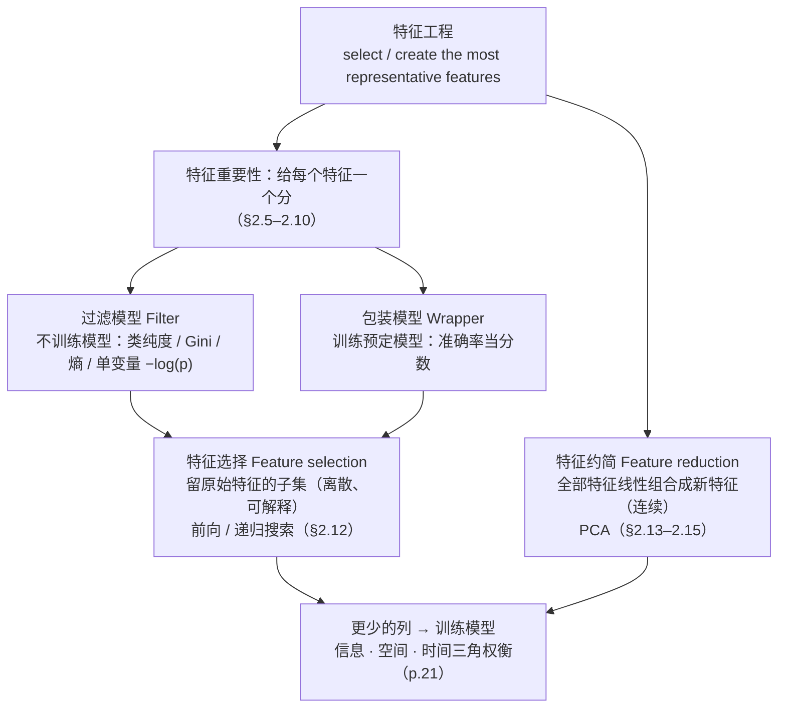
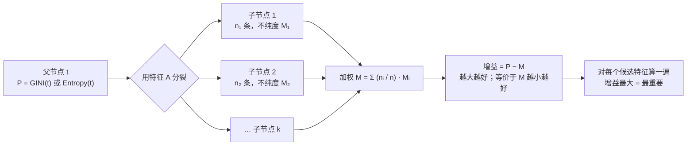
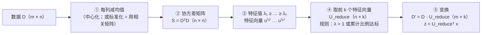

# M04 · 特征工程：特征重要性、特征选择与 PCA

> **本讲一句话**：M03 把数据看清楚了，这一讲回答"**哪些列该留、哪些列该合、能不能造几列新的**"。讲义先用苹果、程序员、垃圾邮件说清"特征"是什么，再给两把尺子衡量一个特征**重不重要**（过滤模型：Gini / 熵 / 信息增益；包装模型：模型准确率），然后讲两条路减少维度——**选一部分原始特征**（特征选择：前向递归搜索）或**把所有特征线性组合成几个新特征**（特征约简：PCA）。
> **原始材料**：`IS6400-W4-Feature.pdf`（69 页，Canvas 标题 "Week 4 - Feature Engineering"）｜ **配套 tutorial**：[[T04-特征选择与PCA实战-Iris]] ｜ **指定阅读**：HM Chapter 8（《Hands-On Machine Learning》第 8 章 Dimensionality Reduction）｜ **转录**：`pending`（W04 预计 9/23 上课，课件已提前发布；🎙️ 各格暂写"待转录补充"，考点 🟡 封顶）
>
> ⚠️ **这是 Syllabus 里的 W03 内容**（"Feature Selection and Dimension Reduction / PCA"），实际排到了 W4；Syllabus 的 W04 聚类预计顺延。T04 notebook 开头还写着 "refer to the 'Feature Engineering' Lecture Note in **Week 3**"——是往年编号的残留。

---

## 0. 三分钟速览

**这一讲讲了什么**

讲义用四张相同的标题页切成四段（p.1、p.6、p.22、p.45，红字标当前段）：

1. **Quick Review（p.1–5）**：机器学习四步（业务问题 → 机器学习任务 → 研究数据 → 选模型训练 → 上线）；M03 的"数据是什么"、"结构化数据四特征"、"投影危险"三页原样重贴。
2. **特征工程导论（p.6–21）**：特征 = 描述一个复杂对象的一组属性（苹果可以用尺寸描述、也可以用 RGB 描述、也可以用子图描述）；**特征工程 = 选出 / 造出最有代表性的特征**，而且**因问题而异**；三大挑战：从原始数据造特征、冗余特征、**维度灾难**（100 万条 × 10 万维 = 800 GB；维度高还会稀疏）；结论是一个三角权衡——**信息 vs 存储空间 vs 计算时间**（CIFAR-10：3072 维准确率 63.1% 要 2 小时，PCA 到 100 维 59.8% 只要 250 秒）。
3. **特征重要性（p.22–44）**：给每个特征打一个"代表性分数"。**过滤模型**不用学习算法，直接看特征能不能把类别分"纯"——**Gini 指数**和**熵**量"不纯度"，分裂前后的差是**增益**；**包装模型**用一个预定模型的准确率当分数。课堂小测：用 sepal length 把 Iris 一分为二，算分裂后的 Gini。
4. **特征选择与降维（p.45–69）**：**特征选择**（选原始特征的子集，离散）vs **特征约简**（把所有特征线性组合成新特征，连续）；子集搜索是组合爆炸，所以用**递归 / 前向选择**贪心地一次加一个；**PCA**——找一组互相正交、依次保留最多方差的新方向，等价于协方差矩阵的特征向量，取前 k 个特征向量做投影；软件输出怎么读（特征值 > 1 的留下）。

**这一讲真正要教的一件事**：**"重要"是可以算出来的**——一个特征能把类别分得多纯（Gini / 熵）、或者一个方向能保留多少方差（PCA 的特征值），都是一个数；有了数，机器就能自动选特征，人只需要决定用哪把尺子和留几个。

**学完你应该能**

1. **说出**特征工程的定义、三大挑战、以及"信息–空间–时间"三角权衡的含义
2. **算出**任一节点的 Gini 指数与熵，以及一次分裂后的加权 Gini / 信息增益，并据此比较两个特征谁更重要
3. **区分**过滤模型与包装模型（谁用学习算法、谁快、谁准）
4. **区分**特征选择与特征约简（子集 vs 线性组合；离散 vs 连续），并说清递归 / 前向选择为什么能避免组合爆炸
5. **说出** PCA 的目标（最小投影误差 = 最大保留方差）、四条性质、算法五步（中心化 → 协方差矩阵 → 特征值分解 → 取前 k 个特征向量 → 投影）
6. **读懂**一张 PCA 软件输出表（特征值、比例、累计），并决定留几个主成分
7. **把这三种方法在 Iris 上的结果对上**：Gini 说花瓣特征纯、SelectKBest 选中花瓣两列、PCA 第一主成分 92.5% 方差——三种方法说的是同一件事

**如果只记三件事**

1. **不纯度公式两个，用法一个**（讲义 p.32–37）：$\text{GINI}(t) = 1 - \sum_j p(j \mid t)^2$，$\text{Entropy}(t) = -\sum_j p(j \mid t)\log_2 p(j \mid t)$；分裂后按**子节点样本数加权平均**，**增益 = 父节点不纯度 − 加权子节点不纯度**，增益最大的特征最重要。课堂小测的答案：用 sepal length 分 Iris，分裂后加权 Gini = 0.111，增益 0.333；用 petal width 分，Gini = 0，增益 0.444——花瓣宽度更重要。
2. **选择 ≠ 约简**（讲义 p.49）：特征选择只留原始特征的一个**子集**（结果仍是"花瓣长度"这种能解释的列）；特征约简（PCA）用**全部**原始特征做线性组合（结果是 $z_1 = u^{(1)\top}x$ 这种没有名字的新列）。前者可解释、后者压得更狠。
3. **PCA 找的是"方差最大的方向"**（讲义 p.56–67）：把数据中心化后算协方差矩阵 $S = D^{\top}D$，它的特征向量就是主成分方向，特征值就是该方向上的方差；**取前 k 个特征向量拼成 $U_{\text{reduce}}$，$z = U_{\text{reduce}}^{\top}x$** 就是降维后的坐标。Iris 四维 → 二维保留 97.8% 方差。

---

## 1. 开始之前 · 知识衔接

### 1.1 你已经有的

| 概念 | 一句话唤醒 | 回看 |
|---|---|---|
| 特征 / 属性 · 特征工程（一句话版） · 降维的危险 | M01 给了定义和那张 3D 投影图；M03 §2.17 列了"降维 / 特征子集选择 / 特征创建"三种手段——**本讲把前两种完整展开** | [[M01-导论-商业数据分析全景与工具链#2.6.1 特征工程与降维的危险（p.33–34）\|M01 §2.6.1]] · [[M03-数据类型与描述性分析#2.17 数据预处理 II：降维、特征子集选择、特征创建（讲义 p.57–59）\|M03 §2.17]] |
| 结构化数据四特征 · 维度灾难 · 稀疏 | M03 p.20 原页在本讲 p.4 重现 | [[M03-数据类型与描述性分析#2.6 数据质量与结构化数据的四个特征（讲义 p.19–20）\|M03 §2.6]] |
| 冗余特征 / 无关特征 | 售价 vs 销售税；学号 vs GPA | M03 §2.17 |
| 协方差、相关系数、协方差矩阵 | $\operatorname{cov}(X,Y)$ 的公式；`df.cov()` 一次算所有列两两的协方差——**PCA 就建立在这个矩阵上** | [[M03-数据类型与描述性分析#2.11 多变量：协方差与相关系数（讲义 p.29–33）\|M03 §2.11]] |
| 标准化 StandardScaler | T03 讲过：减均值除标准差；PCA 前通常要做 | [[T03-数据探索实战-Iris与Airbnb的描述统计]] §3.4 |
| Iris 数据集 · 散点图矩阵 · 平行坐标 | 150 × 4 + 类别；花瓣两个属性能把三类分开、萼片宽度分不开——本讲 p.23–29 的例子 | [[M03-数据类型与描述性分析#2.18 数据探索与可视化：用 Iris 把六种图各画一遍（讲义 p.60–72）\|M03 §2.18]] |
| 过拟合 · 自变量越多越容易过拟合 · Lasso 自带特征选择 | M02 §2.9–2.10：变量多会过拟合；Lasso 把部分系数压到 0——那是"嵌入式"特征选择，本讲讲的是另外两类 | [[M02-预测分析-线性回归#2.10.2 Lasso（L1）（讲义 p.49）\|M02 §2.10.2]] |
| 决策树、集成学习（预告级） | M01 p.38–39 画过；本讲的 Gini / 熵 / 信息增益就是决策树分裂节点的准则，**W05 决策树会再用一遍** | [[M01-导论-商业数据分析全景与工具链#2.6.4 分类与集成学习（p.38–39）\|M01 §2.6.4]] |
| 矩阵转置 $X^{\top}$、矩阵乘法、$(X^{\top}X)$ | M02 §2.8 的正规方程用过；本讲 PCA 的 $S = D^{\top}D$、$z = U^{\top}x$ 是同一套记号 | [[M02-预测分析-线性回归]] §2.8.1 |
| p 值 | M02 §2.6.2；本讲 p.32 的"单变量分数 = −log(p 值)"和 T04 的 `f_classif` 用到 | [[M02-预测分析-线性回归#2.6.2 ⚠️ p 值：讲义把定义写错了\|M02 §2.6.2]] |

> **需要的数学**：Gini 与熵只是平方和与对数（$\log_2$）；PCA 涉及**特征值 / 特征向量**——讲义只用到"协方差矩阵的特征向量 = 主成分方向、特征值 = 该方向的方差"这一层，**不要求会手算特征值分解**。本笔记 §2.14 会用一句话解释什么是特征向量。

### 1.2 本讲全新引入的概念

| 概念 | English | 展开于 |
|---|---|---|
| 机器学习四步 · "中间发生的事" | Machine learning progress · Feature engineering in the middle | §2.1 |
| 特征（描述复杂对象的属性集）· 特征集的代表性 | Feature (a set of attributes to describe a complex object) · Representativeness | §2.2 |
| 特征工程 · 问题相关性 | Feature engineering · Problem-specific | §2.3 |
| 三大挑战 · 维度灾难（存储 / 稀疏）· 信息–空间–时间权衡 | Challenges · Curse of dimension · Trade-off between information, data space and computation time | §2.4 |
| 特征重要性 · 五类评价度量 · 过滤 / 包装模型 | Feature importance · Information / Distance / Dependence / Consistency / Accuracy measures · Filter / Wrapper model | §2.5, §2.9 |
| 类纯度 | Class purity | §2.5 |
| 节点不纯度 · 增益 Gain = P − M | Node impurity · Gain | §2.6 |
| Gini 指数 · 加权 Gini（GINI_split）· 二元 / 多路分裂 | Gini index · GINI_split · Binary / Multi-way split | §2.7 ★ |
| 熵 · 信息增益 · 单变量分数 −log(p) | Entropy · Information gain · Univariate score | §2.8 |
| 特征选择（定义、目标）· 特征约简（映射到低维）· 两者的区别 | Feature selection · Feature reduction · Continuous vs discrete | §2.11 |
| 最优子集 · 子集搜索空间 · 前向 / 后向 · 递归特征选择 | Optimal subset · Subset search · Forward / Backward · Recursive feature selection | §2.12 |
| 主成分分析 · 主成分 · 重构 / 投影误差 · 正交 | PCA · Principal components · Reconstruction / projection error · Orthogonal | §2.13 |
| 协方差矩阵 S · 特征值 λ · 特征向量 u · 变换矩阵 U / U_reduce · z = U_reduce^T x | Covariance matrix · Eigenvalue · Eigenvector · Transformation | §2.14 |
| 特征值 > 1 准则 · 累计方差解释比 | Eigenvalue > 1 rule · Cumulative proportion | §2.15 |

### 1.3 为什么这一讲放在这里 · 重排说明

**承接**：M03 §2.17 用三页列了"降维 / 特征子集选择 / 特征创建"，本讲用 69 页展开前两种。M03 §2.18 用散点图矩阵和平行坐标**看出**花瓣特征能分开三类，本讲把"看出"变成"算出"（Gini / 熵 / F 值）。

**铺路**：Gini、熵、信息增益是 **W05 决策树**分裂节点的准则——本讲先把它们当"特征重要性度量"讲，W05 直接复用；PCA 是 **W04 聚类**（顺延后可能是 W05 之后）和 W10 图像挖掘的前处理；p.2 的"机器学习四步"是小组项目报告的天然大纲。

**重排说明**

讲义顺序：Review（p.1–5）→ 特征工程导论（p.6–21）→ 特征重要性（p.22–44）→ 特征选择与降维（p.45–69）。

我**保留了这个顺序**，只做三处局部调整：

1. **p.24–25（五类评价度量 / 过滤 vs 包装）和 p.43（包装模型）、p.50（两种模型对比）合并成一节（§2.9）**。讲义把"过滤 vs 包装"这对概念拆在四个地方（p.25 提出、p.26 过滤模型图、p.43 包装模型图、p.50 对比），分开读会以为是四件事。
2. **p.44 课堂小测单独成节（§2.10）并给出算例答案**——讲义留了题没给答案，这是本讲最可能被原样拿来考的一页。
3. **p.3–5 的复习页只回指不重讲**（与 M03 p.4、p.20、p.60 完全相同）。

小节 ↔ 页码的完整对应见 [[#8. 讲义页码映射|§8]]。

---

## 2. 正文

### 2.1 机器学习四步与"中间发生的事"（讲义 p.2–7）

**是什么**

先说人话：M02 里你把 Airbnb 的六列直接喂给 `LinearRegression`，好像"数据 → 模型"是一步。其实中间有一步一直被跳过了：**决定拿哪些列、什么形式去喂**。为什么是 `accommodates` 而不是 `id`？为什么 `property_type` 要拆成 0/1 列？为什么目标是 `log_price` 不是 `price`？这些决定都不是模型做的，是人在"数据"和"模型"之间做的——讲义把这一步叫**特征工程**，并且说它是 "something happens in the middle"（中间发生的事）。

讲义 p.2 贴《Hands-On ML》Figure 1-2（Study the problem → Train ML algorithm → Evaluate solution → Launch!，不满意就 Analyze errors 回头），红框圈 **Data**，下面用红星标出四步：

> 1. Transfer the business problem to a machine learning task
> 2. Study the data related to the problem
> 3. Select a model and train it using the data
> 4. Implement the model for future data

| 步 | 用人话 | 本课哪一讲在做 |
|---|---|---|
| ① 把业务问题翻译成机器学习任务 | "老板想知道定价合不合理" → "用房源属性预测 log_price 的回归" | M01 §2.6（任务类型） |
| ② 研究数据 | 认属性类型、描述统计、找缺失和离群点 | **M03 全讲** |
| ③ 选模型并训练 | 回归 / 决策树 / … | M02、W05 起 |
| ④ 上线用于新数据 | 每天给新房源报价 | W11 模型评估之后 |

p.7 在同一张图上加了一个蓝色标签，从 Data 指向 Train ML algorithm 的箭头：**"Feature Engineering — Something happens in the middle"**——就在 ② 和 ③ 之间。

p.3–5 是三页复习，与 M03 完全相同：p.3 = M03 p.4（对象与属性），p.4 = M03 p.20（结构化数据四特征：质量、维度、稀疏、分辨率），p.5 = M03 p.60（3D 点云投影成三角形 / 正方形 / 圆——这一页多了一行原始出处 "Screen dumps of a short video from www.cs.gmu.edu/~jessica/DimReducDanger.htm"）。三页里 p.5 对本讲最重要：**它是 PCA 的反面教材**——随便挑一个方向投影会看到假结构，PCA 是"有原则地挑方向"。p.6 是第二段的分段标题页（Reading Material 展开为书名《Hands-On Machine Learning with Scikit-Learn and TensorFlow; Concepts, Tools, and Techniques》）。

**为什么需要它**

四步是本课所有内容的坐标，也是小组项目报告的天然大纲（⚪ 推断）。更重要的是图上那条 **Analyze errors → 回到 Study the problem** 的箭头：模型效果不好时，常常不是换模型，而是回头改特征——M02 里 `beds` 系数为负，解药不是换 Ridge，是删掉冗余的 `beds`（本讲 §2.4.1）。

**课件原例**

HM Figure 1-2；p.5 的五帧投影截图。

**🎙️ 课堂补充**

待转录补充（本讲尚未上课）。

**💡 换个说法（笔记补充）**

"Something happens in the middle"这句话就是本讲的标题。回头看 M02 / T02 在 Airbnb 上做过的"中间的事"：选了六列（特征选择，本讲 §2.11–2.12）、对房型做 one-hot（特征创建，M03 §2.17）、目标取对数（特征变换）——那些都是特征工程，只是当时没叫这个名字。本讲把这些"凭感觉做的决定"变成"有分数可算的决定"。

另一个角度：把四步想成做菜——①决定做什么菜，②看冰箱里有什么食材，③下锅，④端上桌。特征工程是②和③之间的**备菜**：洗、切、去皮、把两种食材配在一起。没人把整颗带泥的白菜直接下锅，可是很多人把整张原始表直接喂模型。

**⚠️ 常见误解**

- ❌ 以为特征工程是建模前的一次性步骤。→ 图上有一条 Analyze errors 回到 Study the problem 的箭头：模型不好，常常要回去改特征而不是换模型。
- ❌ 以为"研究数据"（②）和"特征工程"是一回事。→ ② 是看清数据（M03），特征工程是根据看清的结果**决定喂什么**（本讲）；先看清才能决定。

**所以呢**：先把"特征"这个词说清楚——它比 M03 的"属性"多了一层意思：**特征是人选出来描述对象的一组属性，而选法不止一种**。

---

### 2.2 什么是特征：苹果、程序员、文档、社交用户（讲义 p.8–12）

讲义用四页、四种对象说同一件事：特征是人选的。§2.2.1 用苹果给定义，§2.2.2 看人、文档、用户怎么变成一行数。

#### 2.2.1 特征的定义：同一个苹果的三种描述法（讲义 p.8–9）

**是什么**

先说人话：M03 说属性是"对象的一个性质"，好像每个对象天生带着一张固定的属性表。本讲说：**不是的，用哪些性质描述一个对象是人选的**。同一个苹果，可以用"多大"描述（尺寸），可以用"什么颜色"描述（RGB 三个数），也可以切成几块小图描述——三种描述都对，都是"特征"，问题只是哪一种对你要做的事最有用。**特征（feature）= 用来描述一个复杂对象的一组属性**，重点在"一组"和"人选的"。

讲义 p.8–9：

> What is Feature? **A set of attributes to describe a complex object.**
> - Feature Set 1：Size: 10 cm × 10 cm
> - Feature Set 2：Color in RGB: 220, 156, 140
> - Feature Set 3：sub-images（把苹果图切成三块局部小图）

| 特征集 | 这个苹果变成了什么 | 维度 |
|---|---|---|
| 1 尺寸 | (10, 10) | 2 |
| 2 颜色 | (220, 156, 140)——红、绿、蓝三个通道各一个 0–255 的数 | 3 |
| 3 子图 | 三张小图，每张是几百个像素 | 几百到几千 |

同一个苹果，三种特征集，三种维度——**对象没变，"数据"变了**。

**为什么需要它**

一旦特征是选出来的，就有"选得好不好"的问题，也就有了"给一组候选特征打分"的需要——这是 §2.3 定义特征工程的前提，也是 §2.5 起所有打分方法（Gini、卡方、PCA）存在的理由。如果特征是数据自带的、不可选，本讲就没有存在的必要。

**课件原例**

苹果三种特征集（p.8–9）。

**🎙️ 课堂补充**

待转录补充。

**💡 换个说法（笔记补充）**

"属性"是数据库的视角（表里有什么列），"特征"是建模的视角（我打算用什么列描述这个对象）。同一列 `id`，作为属性它存在，作为特征它不该被选。两个词讲义混用，但这层"被选"的含义只有"特征"才有。

另一个角度：描述一个人，可以报身份证号，可以报身高体重，可以贴一张照片——三种都是"这个人"的特征集，但办登机用第一种、买衣服用第二种、认人用第三种。没有哪种"更本质"，只有哪种对眼前的事更有用。

**⚠️ 常见误解**

- ❌ "特征就是表里的列。" → 讲义强调的是 **a set**：一个特征集是一种"描述方式"，列是它的实现；p.9 的子图特征集甚至不是列，是三张小图。
- ❌ 以为 M03 的"属性"和本讲的"特征"是两个东西。→ 讲义 M03 p.4 明说它们同义；本讲只是加了"人选出来的一组"这层意思。

**所以呢**：苹果是图像；人、文档、社交用户怎么变成"一行数"？下一子节。

#### 2.2.2 人、文档、社交用户怎么变成一行数（讲义 p.10–12）

**是什么**

先说人话：不只是图片，任何对象都能被"选一组属性"描述成一行数：一个程序员可以用"戴不戴眼镜、穿不穿连帽衫"这样的 0/1 描述；一篇文章可以用"每个关键词出现几次"描述；一个微博用户可以用粉丝数、角色、性别、标签描述。**变成一行数之后，它们才能进模型；选哪些属性去描述，就是特征工程。**

p.10 是一张"THE TECH UNIFORM"漫画（程序员的标准装扮：眼镜、连帽衫、T 恤、信使包、牛仔裤、运动鞋、单速自行车……），旁边问：**Feature of a programmer?**——每一项是一个 0/1 属性，合起来是"程序员"这个对象的一个特征集。

p.11 **怎么描述一篇文档**：贴了一段《Hands-On ML》讲垃圾邮件过滤的原文（"your spam filter is a Machine Learning program…"），把 spam、Machine Learning、emails、class 等词高亮，下面一张表：

| Key | spam | machine | email | class | tree |
|---|---|---|---|---|---|
| Doc1 | 5 | 1 | 4 | 2 | 0 |

——这就是 M03 §2.5.1 的**词频向量**：选定几个关键词当属性，数每个词出现几次，一篇文章就变成一行数 (5, 1, 4, 2, 0)。注意 "tree" 这一列是 0：**选哪些词当属性也是人定的**，选了没用的词就多一列 0。

p.12 **怎么给社交媒体用户画像**：两个微博账号（赵今麦 angel 774.1 万粉、李佳琦 Austin 3063.8 万粉）的截图，下面一张空表 `User | Followers | Role | Gender | Tag`——用户的特征可以是粉丝数（比率）、角色（演员 / 主播，名义）、性别（名义）、标签（一组 0/1）。表是空的，意思是"你来填：你想用哪些属性描述一个用户？"

**为什么需要它**

| 对象 | 可能的特征集 | 本课在哪用 |
|---|---|---|
| 图像（苹果） | 尺寸 / 颜色 / 子图 / 像素 | W10 图像挖掘；p.21 CIFAR-10 用的是 3072 个像素 |
| 文档 | 关键词词频 | M03 §2.5.1 文档数据；维度灾难的典型来源 |
| 人（程序员、用户） | 一组 0/1 或数值属性 | Airbnb 的房源、超市的顾客 |
| 房源 | {accommodates, bedrooms, …} | T02 / T03 / T04 |

任何对象只要能变成"一行数"，就能进模型；变的方法就是特征工程。

**课件原例**

程序员漫画（p.10）；垃圾邮件段落 → 词频表（p.11）；两个微博账号 → 用户表（p.12）。

**🎙️ 课堂补充**

待转录补充。

**💡 换个说法（笔记补充）**

用 Airbnb 想：同一套房源，特征集 1 = {accommodates, bedrooms, beds, bathrooms}（尺寸），特征集 2 = {city, property_type, cancellation_policy}（位置与类型），特征集 3 = 房源描述文本的词频（这份精简数据里没有）。T02 用的是 1 + 2 的一部分。M03 的相关矩阵告诉你特征集 1 内部高度冗余（accommodates 与 beds 0.83）——这是 §2.4.1 "冗余特征"的现成例子。

另一个角度：把对象变成一行数，就像给每个人发一张统一格式的问卷——问卷上问什么（选哪些属性）决定了你事后能分析什么。问卷没问收入，事后再想分析消费能力就没戏了；问了一堆没用的题，只是让表更宽。

**⚠️ 常见误解**

- ❌ 以为图片、文本不能进模型。→ p.9、p.11 演示了怎么把它们变成数：切块、数像素、数词频。
- ❌ 以为特征越多越好。→ p.11 的 "tree" 列全是 0，只增加维度不增加信息；§2.4.2 会算这种"多"的代价。

**所以呢**：特征是选的，那什么叫"选得好"？下一节给定义——最有代表性，且因问题而异。

---

### 2.3 特征工程的定义与"因问题而异"（讲义 p.13–15）

**是什么**

先说人话：苹果和橙子都是 10 cm × 10 cm，用尺寸根本分不开；用颜色一眼就分开——**对"分苹果和橙子"这件事，颜色这组特征比尺寸"有代表性"**。特征工程就是挑出（或造出）**最能把你关心的东西区分开**的那组特征。但"关心的东西"因任务而变：要分"大苹果和小苹果"，尺寸就比颜色有用。**所以没有"万能特征"，只有"对这个任务好的特征"。**

讲义 p.13：

> Feature Engineering: **select/create the most representative features.**

| | Feature 1: length | Feature 2: width |
|---|---|---|
| Apple | 10 cm | 10 cm |
| Orange | 10 cm | 10 cm |

| | RGB 1 | RGB 2 | RGB 3 |
|---|---|---|---|
| Apple | 220 | 156 | 140 |
| Orange | 243 | 194 | 113 |

> Which Feature set is better? **The most representative**

代表性（representative）在这里的意思是：**这组特征下，该分开的对象能不能分开**。尺寸特征集下，苹果和橙子的两行一模一样——无论什么模型都分不开；颜色特征集下两行不同——分得开。

p.14（纯图片，已视觉复核）：一个卷发女孩和一只卷毛可卡犬的并排照片，红框圈眼睛和鼻子、黄框圈两侧的卷发——问 "Which feature set is better?"：**用头发（黄框）分不开人和狗——两者都是一头卷毛；用眼睛鼻子（红框）能分开**。同一张照片，看哪个局部，决定了能不能分类。

p.15 **Feature Engineering is Problem-Specific**：

> - Task 1: find potential sport-game customers
> - Task 2: find potential Covid-19 related news subscribers

配图是同一群用户（绿色小人是目标客户）在二维特征空间里，被虚线分成几块——同样一批人，任务不同，"有用的特征"和分法就不同：找体育客户，"年龄、是否看比赛"有用；找疫情新闻订阅者，"所在城市、是否关注健康话题"有用。

**为什么需要它**

"最有代表性（most representative）"是本讲反复出现的词——§2.5 的特征重要性就是给"代表性"一个数。"因问题而异"解释了为什么本讲不给一张"万能特征表"，也解释了为什么 T04 作业第 4 题让你自己为"价格预测"选 3 个特征、并说明理由：**理由必须落到任务上**（"accommodates 对预测价格有代表性，因为……"）。

"代表性"在本讲后面有三个可算的版本，对应三种"问题"：

| 任务 | "代表性"的可算版本 | 本讲哪节 |
|---|---|---|
| 分类（有标签） | 这个特征能把类别分得多纯 → Gini / 熵 | §2.7–2.8 |
| 任何有监督任务 | 用它训练出的模型准确率多高 → 包装模型 | §2.9 |
| 无监督（没标签） | 这个方向保留了多少方差 → PCA | §2.13 |

**课件原例**

苹果 vs 橙子（尺寸相同、RGB 不同）；女孩 vs 狗（头发相同、五官不同）；体育客户 vs 疫情新闻订阅者。

**🎙️ 课堂补充**

待转录补充。

**💡 换个说法（笔记补充）**

把"代表性"想成"这组特征下，不同类的对象长得像不像"：像（尺寸下的苹果和橙子）就没有代表性；不像（颜色下的苹果和橙子）就有代表性。M03 §2.18 用眼睛看 Iris 的散点图矩阵，发现花瓣两列下三个品种"长得不像"、萼片宽度下"长得像"——那就是在用眼睛判断代表性；本讲要把眼睛换成公式。

另一个角度：特征工程像给证人画像——你问证人"他长什么样"，证人报"两只眼睛一个鼻子"毫无用处（人人都有），报"左脸有一道疤"才有用。有用的特征是**把目标和其他人区分开**的那些，而"其他人是谁"由任务决定：在疤脸帮里找人，疤又没用了。

**⚠️ 常见误解**

- ❌ 以为特征越多越"有代表性"。→ p.19–20 会说维度高的代价；p.21 会说这是权衡。多加一列"无关"的特征不会增加代表性，只会增加噪声。
- ❌ 以为 RGB 比尺寸"本质上"更好。→ 只是对"分苹果和橙子"这个任务更好；分"大苹果和小苹果"就得用尺寸。特征没有绝对的好坏。

**所以呢**：定义有了。做特征工程会遇到三个麻烦——造不出、重复了、太多了——下一节分三个子节讲。

---

### 2.4 三大挑战：造特征、冗余、维度灾难（讲义 p.16–21）

讲义 p.16 列出三大挑战：**Create/Choose Features from Raw Data · Duplicate/Redundant Feature · Curse of dimensionality**。§2.4.1 讲前两个，§2.4.2 讲第三个，§2.4.3 讲讲义给出的总原则——三角权衡。

#### 2.4.1 造特征与冗余特征（讲义 p.16–18）

**是什么**

先说人话：做特征的头两件难事——**① 从一堆原始数据里造出可用的特征**：一段文字有几百个词，哪些该数？一张图有几千个像素，哪些该看？这一步没有公式，靠对业务的理解。**② 两列说的是同一件事却都留着**：知道温度是 35°C 就知道"感觉是热"，第二列没有新信息，这叫冗余（redundant）特征——留着不丢信息，但白占一列，还会让模型糊涂。

**① 造代表性特征（p.17）**：再贴一遍垃圾邮件那段话，问 "What are the representative keywords?"——几百个词里，spam、email、class 能代表主题，the、is、of 不能。M03 §2.17 把这叫"特征创建"。

**② 冗余特征（p.18）**：

> Two Features：Temperature；Feeling: Cold – Warm - Hot
> Is feature "Feeling" useful if we already have feature "temperature"? **"Feeling" is redundant.**

M03 §2.17 的"售价 vs 销售税"、Airbnb 的 `accommodates` vs `beds`（相关 0.83）都是它。

**为什么需要它**

| 挑战 | 不处理会怎样 | 本讲怎么应对 |
|---|---|---|
| 造不出好特征 | 模型只能用原始列，"密度 = 质量 / 体积"这种关系线性模型自己算不出 | 本讲不展开，靠领域知识（M03 §2.17） |
| 冗余不删 | M02 多重共线性：系数不稳、`beds` 变负；存储和计算白费 | 特征选择：删掉分低或重复的（§2.5–2.12） |

**课件原例**

垃圾邮件段落的关键词（p.17）；温度 vs 冷暖感（p.18）。

**🎙️ 课堂补充**

待转录补充。

**💡 换个说法（笔记补充）**

冗余特征像同一条消息用两种语言各说一遍——第二遍没有增加任何内容，只是让文件变长；而且如果两遍稍有出入，读的人反而不知道信哪个（这就是共线性让系数不稳的直觉）。

另一个角度："造特征"和"删冗余"是一增一减：增是把原始数据里藏着的信息挖出来变成列（关键词、密度），减是把重复的列去掉。本讲后面的方法全是"减"（选择、约简），"增"只能靠人。

**⚠️ 常见误解**

- ❌ 把冗余特征当"错误数据"。→ "Feeling" 没错，只是**不增加信息**；删掉不丢信息、留着浪费空间还引入共线性（M02）。
- ❌ 以为两列相关就一定要删一列。→ 相关 0.5 的两列各自还有独立信息；只有相关很高（0.8–0.9 以上）、或一列能由另一列算出来时才算冗余。

**所以呢**：第三个挑战最要紧——列太多。讲义用一个算例和一条理论说明它的代价。

#### 2.4.2 维度灾难：存储、稀疏与样本需求（讲义 p.19–20）

**是什么**

先说人话：列太多有三重代价——**存不下**（一百万篇文档 × 十万个词的表要 800 GB 内存）、**算不动**（每多一列每次计算多一步）、**填不满**（列越多，数据在空间里越稀疏，同样多的样本越不够用，模型学到的是巧合）。这三重代价合起来叫**维度灾难**（curse of dimensionality）。

p.19（图片页，已视觉复核）用文档分类做例子——网页、邮件、数字图书馆（ACM Portal、IEEE Xplore、PubMed）的文档，每个文档用几千个词项（T₁ … T_N）描述成一行词频（D₁ = 12, 0, …, 6），任务是把无标签文档分到 Sports / Travel / Jobs 类，**Challenge: thousands of terms；Solution: apply dimensionality reduction**。p.20 给了两个理由和一个算例：

> Is High dimension always good?
> - **Large Data Space and Storage Requirement**
> - **Cause Sparsity**
>
> Practice：If we have 1,000,000 data with 100,000 dimensions, how much memory do we need? Ans：$10^6 \times 10^5 \times 8 = 8 \times 10^{11}$ (B) = **800 (GB)**
> Noisy Feature：Is every feature useful? Redundancy?
> Theory：Without any assumption, you need $O(1/\epsilon^{d})$ data to achieve $\epsilon$ error for $d$-dimensional data

（三个框都是图片，文字层没有；已用完整 PDF 视觉复核。）

$$\text{内存} = m \times d \times 8 \text{ B}, \qquad \text{所需样本数} \sim O(1/\epsilon^{d})$$

| 符号 | 含义 | 已知 / 要算 |
|---|---|---|
| $m = 10^6$ | 样本数 | 已知 |
| $d = 10^5$ | 维度（列数） | 已知 |
| 8 | 每个浮点数占的字节数（`float64`） | 已知 |
| $\epsilon$ | 目标误差（比如允许 5% 的错） | 已知 |
| $O(\cdot)$ | "量级约为"——只看随 $d$ 增长的方式，不管常数 | — |

**数字例子（手把手）**（`verify_w3w4.py`）：

1. 格子数：1,000,000 × 100,000 = 100,000,000,000（$10^{11}$）个；
2. 每格 8 字节：$10^{11} \times 8 = 8 \times 10^{11}$ 字节；
3. 换算：$8 \times 10^{11} \div 10^{9} = 800$ GB（按十进制 GB）——一台普通电脑的内存是 16–32 GB，**装不下**；
4. 对比：$800 \div 32 = 25$——是一台 32 GB 电脑内存的 25 倍。

样本需求那一行：想把 1 维的一条线"看清"到 $\epsilon$ 的精度，大约要 $1/\epsilon$ 个点；2 维平面要 $(1/\epsilon)^2$ 个；$d$ 维要 $(1/\epsilon)^d$ 个。取 $\epsilon = 0.1$：1 维要 10 个点，2 维要 100 个，10 维要 $10^{10}$ 个——**维度每加 1，需要的数据量乘 10**。

**为什么公式长这样**：内存公式是三个数相乘，因为表是"行 × 列"个格子、每格固定字节。样本公式是指数，因为要"填满"一个 $d$ 维空间，每个维度上都要有足够的点，各维度的需求相乘——这就是"稀疏"在统计意义上的含义：高维空间太大，有限的点撒进去彼此都离得很远，任何模型都在"猜"。

**极端 / 边界情况**：$d = 1$ 时样本需求只是 $1/\epsilon$，一条线上几十个点就够；$d$ 很大时（文本几万维、图像几千维）即使百万样本也"不够"，所以这类数据几乎必须降维；$\epsilon \to 0$（要求零误差）时需求趋于无穷，任何维度都做不到。

**为什么需要它**

维度灾难是 §2.13 PCA 存在的理由，也是 M03 §2.6.2 "稀疏"和 M02 §2.9 "变量越多越容易过拟合"的同一件事的两面：同样 68,000 行数据，15 维够用、15,000 维就极稀疏。p.20 的 800 GB 是本讲最容易被拿来出题的硬数字之一（⚪ 推断）。

**课件原例**

文档 × 词项矩阵（p.19）；800 GB 算例与 $O(1/\epsilon^d)$（p.20）。

**🎙️ 课堂补充**

待转录补充。

**💡 换个说法（笔记补充）**

"维度灾难"两层意思要分开记：**工程层**——存储和时间随维度线性涨（800 GB）；**统计层**——要填满高维空间需要的样本数随维度指数涨。内存可以加，样本量往往加不了，所以统计层才是真正的"灾难"。

另一个角度：想象在一条街上找一个人，问十个人就够了；在一座城市里找，要问一万人；在一个国家里找，要问一亿人——"空间"每大一级，需要的信息量乘一大截。维度就是空间的"级"。

**⚠️ 常见误解**

- ❌ 以为维度灾难只是"内存不够"。→ 更根本的是统计层：数据在高维里稀疏，模型学到的是巧合。
- ❌ 以为算例里的 8 字节是随便定的。→ 是 `float64` 的标准大小；用 `float32` 可减半，但量级不变。

**所以呢**：列多有代价，列少又丢信息——讲义 p.21 用一个真实实验把这个取舍变成数字。

#### 2.4.3 信息、空间、时间的三角权衡（讲义 p.21）

**是什么**

先说人话：砍掉维度会丢一点信息，但省下大量存储和计算时间；**丢多少信息、省多少时间，是一笔可以算的账**。讲义用图像分类的真实实验给出这笔账：3072 维砍到 100 维，准确率只掉 3.3 个百分点，时间缩到 1/29。这就是本讲的总原则——**信息–空间–时间权衡**（trade-off between information, data space and computation time）。

讲义 p.21：

> Select the most representative feature set from raw data. **Trade-off between information, data space, and computation time**

配图是一张实验结果表（图片，视觉复核；图注引 Li & Póczos, "Utilize Old Coordinates: Faster Doubly Stochastic Gradients for Kernel Methods", UAI 2016）：CIFAR-10 图像分类（32 × 32 的彩色小图，10 类），用**原始像素**做特征 + 近似核 SVM：

| Dimensions | Accuracy | Time |
|---|---|---|
| 3072 (all) | 63.1% | ~2 Hrs |
| 100 (PCA) | 59.8% | 250 s |

3072 = 32 × 32 × 3（宽 × 高 × RGB 三通道）——每张图就是 3072 个数。用 PCA（本讲 §2.13）压到 100 维：维度砍到约 1/30；准确率 63.1% → 59.8%，掉 3.3 个百分点；时间 7200 秒 → 250 秒，约 1/29。

**为什么需要它**

这张表把后面所有方法的目的说清楚了：不是为了"更准"，而是为了在**可承受的空间和时间内足够准**。业务上这可能就是"能不能每天重训一次"的差别。p.21 与 p.20 的 800 GB 是本讲仅有的两组硬数字，⚪ 推断容易被拿来出题："为什么要降维？举一个数字说明。"

**课件原例**

CIFAR-10 的 3072 vs 100 维（p.21）。

**🎙️ 课堂补充**

待转录补充。

**💡 换个说法（笔记补充）**

这张表不是说"PCA 比原始像素差 3.3%"，而是说"这 3072 个像素里对分类有用的信息，100 个方向就装下了绝大部分"（准确率保住了 59.8 / 63.1 ≈ 95%）——剩下 2972 个维度大多是噪声和冗余（相邻像素几乎一样）。§2.13 会解释 PCA 为什么能做到这一点。

另一个角度：这是"压缩"的老故事——一张照片压成 JPEG 丢掉肉眼看不出的细节，体积缩到十分之一；音乐压成 MP3 丢掉听不见的频率。特征工程里的降维是同一种取舍：丢掉模型"看不出"的维度，换速度和空间。

**⚠️ 常见误解**

- ❌ 以为 PCA 到 100 维"白丢了 3.3% 准确率"。→ p.21 的重点是**三角权衡**：换来 29 倍的速度。
- ❌ 以为降维总会掉准确率。→ 有时反而升：砍掉的维度里有噪声，模型少学了噪声（M02 过拟合的解药之一）。

**所以呢**：三大挑战都指向同一个操作——**给特征打分、留好的**。下一段（讲义第三部分）讲怎么打分：先用最朴素的"纯度"，再把它精确成 Gini 和熵。

---
### 2.5 特征重要性与类纯度（讲义 p.22–23, p.27–29）

讲义第三部分从 p.22 的分段标题页开始。§2.5.1 给"特征重要性"下定义，§2.5.2 用最朴素的打分法——类纯度——在 Iris 上演示。

#### 2.5.1 特征重要性：给每个特征打一个分（讲义 p.22–23）

**是什么**

先说人话：M03 §2.18 用眼睛看 Iris 的散点图，"觉得"花瓣宽度比萼片长度更能分品种。本讲要把"觉得"变成一个数——**给每个特征打一个分，分越高越"有代表性"**，这个分就叫特征重要性（feature importance）。有了分，机器就能自动挑分高的特征，不用人盯着图看。

讲义 p.23 定义：

> **Feature importance**: Techniques that calculate a score for all the input features to measure the representativeness of different features.
> How to measure the importance of "petal width" and "sepal length" in this classification task? THEN, the machine can use this "importance score" to automatically select the most important feature.

配图是 Iris 的散点图（横轴 petal width、纵轴 sepal length，三色三类）。两句话的关键词：**score**（分数，可比大小）和 **automatically**（自动——分数是给机器用的，不是给人看的）。

**为什么需要它**

| 阶段 | 判断依据 | 谁在判断 |
|---|---|---|
| M03 §2.18 | 散点图上三色分不分得开 | 人眼 |
| §2.5.2 | 切一刀后两堆的计数表 | 人数一数 |
| §2.7–2.8 | 计数表算出一个不纯度数值 | 公式 |
| T04 | `SelectKBest` / `feature_importances_` 直接输出分数 | 代码 |

没有分数，特征选择只能靠人看图；特征有几千个时人看不过来。

**课件原例**

p.23 的 Iris 散点图与提问。

**🎙️ 课堂补充**

待转录补充。

**💡 换个说法（笔记补充）**

特征重要性像给候选人打分：面试官凭印象说"这个人不错"是 M03 的看图，打出"沟通 8 分、专业 9 分"才能排序、才能让 HR 系统自动筛——本讲教的就是打分的规则。

另一个角度："重要"永远是"对这个任务重要"（§2.3）。同一个特征在"分品种"里重要，在"预测花的重量"里可能不重要；所以讲义原话是 "in this classification task"。

**⚠️ 常见误解**

- ❌ 以为"重要性"是特征自带的属性。→ p.23 说的是"in this classification task"：换任务（比如分 Versicolour vs Virginica），重要的特征可能换。
- ❌ 以为分数有绝对含义。→ 分数只用于**同一任务内比较特征**；不同方法的分数（Gini 增益 0.33 vs F 值 1179）之间不能比大小。

**所以呢**：最朴素的打分法：用这个特征切一刀，看两堆纯不纯。

#### 2.5.2 类纯度：切一刀，数两堆（讲义 p.27–29）

**是什么**

先说人话：用一个特征把数据切成两堆（花瓣宽度小于某个值的归左边，其余归右边），然后数每堆里各类有几个。如果每堆里只有一种花，这一刀切得"纯"，这个特征就好；如果两堆都混着几种花，就差。这就是**类纯度**（class purity）——不用任何模型，只数数。

讲义 p.27–29（"Filter: without learning algorithm involvement. A simple measurement: class purity"）：

| 用哪个特征切 | 切法 | Set 1 | Set 2 | 结论（讲义原话） |
|---|---|---|---|---|
| **petal width**（p.27） | 一条竖线（花瓣宽度小于某个值的归左边） | Setosa 50 · Non-Setosa 0 | Setosa 0 · Non-Setosa 100 | The two sets are **pure**! |
| **sepal length**（p.28） | 一条横线（萼片长度小于某个值的归下面） | Setosa 50 · Non-Setosa 10 | Setosa 0 · Non-Setosa 90 | The two sets are **not pure**! |
| 一般形式（p.29） | — | Setosa $n_{10}$ · Non-Setosa $n_{11}$ | Setosa $n_{20}$ · Non-Setosa $n_{21}$ | Class purity = simple counting of distinctiveness. **The purer, the better.** |

**把表读懂**：讲义在这里把三个品种简化成两类——Setosa（50 朵）和 Non-Setosa（另两种合计 100 朵）。用 petal width 切一刀：左边那堆 50 朵**全是** Setosa、右边 100 朵**全不是**——两堆各只有一种，"纯"。用 sepal length 切一刀：下面那堆 60 朵里 50 朵是 Setosa、**混进了 10 朵别的**——"不纯"。

为什么 sepal length 切不干净？回看 M03 §2.18.1 那张均值表：Setosa 的萼片长 5.0、Versicolour 5.9，两者有重叠区（一些 Setosa 长到 5.8，一些 Versicolour 只有 4.9）；而花瓣宽度 Setosa 最大 0.6、Versicolour 最小 1.0，**中间有一段空档**，一刀切在空档里就完全分开。

p.29 的 $n_{ij}$ 表是通用记号：$n_{10}$ = 第 1 堆里第 0 类（Setosa）的个数，以此类推。"The purer, the better"——但"纯"还只是一个形容词，要变成能比大小的数，就需要 §2.7 的 Gini 和 §2.8 的熵。

**为什么需要它**

有了"纯度"这个可比的量，"petal width 比 sepal length 重要"就不再是感觉，而是 (50, 0 / 0, 100) 比 (50, 10 / 0, 90) 更纯。它也是 W05 决策树每个节点在做的事：找一刀，让切出来的堆最纯。

**课件原例**

Iris 散点图两次切分（p.27 竖切、p.28 横切）；p.29 的 $n_{ij}$ 计数表。

**🎙️ 课堂补充**

待转录补充。

**💡 换个说法（笔记补充）**

把 p.27–28 想成"一刀切完，两堆各数一遍"：petal width 一刀，左边全是 Setosa、右边全不是——这个特征把 Setosa 这个类"讲清楚了"；sepal length 一刀，左边混进十个非 Setosa——这个特征讲不清楚。

另一个角度："重要"等于"知道了它就能猜对类别"。知道一朵花的花瓣宽度是 0.3，你能百分百说它是 Setosa；知道萼片长度是 5.5，你只能说"大概率是 Setosa 但也可能不是"。前者的信息量大，后者小——§2.8 的"熵"就是在精确地量这个"能猜对多少"。

注意讲义这里把三分类问题**合并成二分类**（Setosa vs Non-Setosa），是为了让计数表只有 2 × 2、好手算；T04 的 `chi2` / `f_classif` 处理的是原始三类。

**⚠️ 常见误解**

- ❌ 以为纯度只看一堆。→ 要看**切出来的所有堆**：p.28 的 Set 2 是纯的 (0, 90)，但 Set 1 不纯 (50, 10)，整体就不纯。§2.7.2 的加权平均就是为了把所有堆一起算。
- ❌ 以为"切一刀"的位置是随便定的。→ 讲义没说切在哪，但实际算法会试所有可能的切点、取最纯的那一个（W05 决策树）；本讲只关心切完之后怎么打分。

**所以呢**：纯度要成为一个可比的分数，得先说清楚"用什么尺子"（§2.7 Gini、§2.8 熵）；而无论哪把尺子，用法都一样：分裂前算一次、分裂后算一次、看降了多少——下一节。

---

### 2.6 不纯度与增益：分裂前后比一比（讲义 p.30–34）

**是什么**

先说人话：给"纯不纯"取个数，叫**节点不纯度**（node impurity，"节点"就是一堆记录）——全是同一类时是 0（最纯），各类均匀混合时最大（最乱）。比较两个特征谁更重要的办法是：先算**切之前**整堆的不纯度 $P$，再算**切之后**各小堆不纯度的**加权平均** $M$（大堆权重大），两者之差 **增益 = P − M** 就是"这一刀让数据变纯了多少"。增益最大（等价于 $M$ 最小）的特征最重要。

讲义 p.30 给了一个 20 条记录（C0 10 条、C1 10 条，比如"会不会买"两类顾客）的例子，问 "Which test condition is the best?"：

| 特征 | 切法 | 各子节点 (C0, C1) | 一眼看 |
|---|---|---|---|
| Gender | Yes / No | (6, 4) · (4, 6) | 两堆都还是"六四开"，几乎没变纯 |
| Car Type | Family / Sports / Luxury | (1, 3) · (8, 0) · (1, 7) | Sports 那堆全是 C0，纯；另两堆偏向 C1 |
| Customer ID | c1 … c20 | (1, 0) · (1, 0) · … · (0, 1) · (0, 1) | 每堆只有一个人，当然"纯" |

p.31 **How to determine the importance**：

> - **Greedy approach**: Features with purer class distribution are preferred
> - Need a **measure of node impurity**：C0: 5 / C1: 5 → High degree of impurity；C0: 9 / C1: 1 → Low degree of impurity

"Greedy"（贪心）的意思：每次只看"这一刀"能让数据变多纯，选当下最好的，不考虑后面几刀——简单、快，但不保证全局最优（§2.12.2 的前向选择也是贪心）。"node"（节点）是决策树的术语：一堆记录就是一个节点，切一刀就是从父节点分出子节点；本讲借用这套词，W05 决策树会正式用。

p.33 三步：

> 1. Compute impurity measure (**P**) before splitting
> 2. Compute impurity measure (**M**) after splitting：compute impurity measure of each child node → compute the **average** impurity of the children (M)
> 3. Choose the attribute test condition that produces the highest gain **Gain = P – M**, or equivalently, lowest impurity measure after splitting (M)

$$\text{Gain} = P - M, \qquad M = \sum_{i=1}^{k} \frac{n_i}{n}\,\text{Impurity}(i)$$

| 符号 | 含义 | 已知 / 要算 |
|---|---|---|
| $P$ | 分裂前父节点的不纯度 | 要算 |
| $k$ | 切出几堆 | 已知 |
| $n_i$、$n$ | 第 $i$ 堆的记录数、父节点记录数；$n_i / n$ 是权重 | 已知 |
| $\text{Impurity}(i)$ | 第 $i$ 堆的不纯度（用 Gini 或熵算，§2.7–2.8） | 要算 |
| $M$ | 分裂后的加权不纯度 | 要算 |

p.34 是通用示意图：父节点 $(N_{00}, N_{01})$ 不纯度 $P$；特征 A 切成 N1、N2（不纯度 $M_{11}$、$M_{12}$，平均 $M_1$），特征 B 切成 N3、N4（平均 $M_2$）；比较 $P - M_1$ 与 $P - M_2$——谁减得多谁赢。

**数字例子（手把手）**——用 p.30 的三个候选把流程走一遍（用 §2.7 的 Gini 当尺子，`verify_m04r.py`；Gini 公式下一节给，这里先看流程）：

1. 父节点 (10, 10)：$P = 1 - 0.5^2 - 0.5^2 = 0.5$；
2. Gender：两堆 (6,4)、(4,6) 各 $1 - 0.6^2 - 0.4^2 = 0.48$；$M = \tfrac{10}{20} \times 0.48 + \tfrac{10}{20} \times 0.48 = 0.48$；增益 $= 0.5 - 0.48 = 0.02$；
3. Car Type：(1,3) → 0.375，(8,0) → 0，(1,7) → 0.219；$M = \tfrac{4}{20} \times 0.375 + \tfrac{8}{20} \times 0 + \tfrac{8}{20} \times 0.219 = 0.075 + 0 + 0.0875 = 0.163$；增益 $= 0.5 - 0.163 = 0.338$；
4. Customer ID：每堆 (1,0) 或 (0,1)，不纯度全是 0；$M = 0$；增益 $= 0.5$。

Gender 几乎没用（0.02），Car Type 很有用（0.338），Customer ID 增益最大（0.5）——**但 Customer ID 是假的有用**：每个顾客一堆、每堆一个人，"纯"是因为堆太小，不是因为 ID 里有什么规律。来一个新顾客 c21，ID 对他毫无预测力。所以实际答案是 **Car Type**。

**为什么公式长这样**：增益是"减法"，因为要量的是**这一刀带来的变化**而不是分裂后的绝对水平（分裂后 0.163 本身说明不了什么，要和分裂前的 0.5 比）。$M$ 要**按 $n_i / n$ 加权**而不是简单平均，是因为 Car Type 里 Sports 堆有 8 人、Family 堆只有 4 人——8 人堆的纯度应该比 4 人堆说话更有分量；不加权会让一个 1 人的纯堆和一个 100 人的纯堆同样重要，那就掉进 Customer ID 的陷阱。

**极端 / 边界情况**：切出来的每堆都纯 → $M = 0$，增益 = $P$（最大可能值）；切完每堆的类别比例和父节点一样 → $M = P$，增益 0（这一刀白切，Gender 接近这种情况）；每条记录自成一堆 → $M = 0$ 但毫无泛化能力（Customer ID）——增益最大不等于最好特征。

**为什么需要它**

"分裂前后比一比"是本讲所有特征重要性计算的**统一流程**，Gini 和熵只是换尺子，流程不变。它也是 W05 决策树的核心：决策树就是反复做"选增益最大的特征切一刀"，直到每堆都够纯。T04 的 `ExtraTreesClassifier.feature_importances_` 就是把几十棵树里每个特征贡献的增益加起来。

**课件原例**

Gender / Car Type / Customer ID 三个候选（p.30）；p.31 的 (5,5) vs (9,1)；p.33 三步；p.34 的 A? / B? 示意。

**🎙️ 课堂补充**

待转录补充。

**💡 换个说法（笔记补充）**

"增益"就是"用这个特征切一刀，混乱程度降了多少"。用 M03 的话说：分裂前的类别分布是一个直方图（两根柱子一样高 = 最乱），分裂后每堆各一个直方图；不纯度是"柱子有多平"，增益是"平的变尖了多少"。

另一个角度：这像整理一堆混着红球和蓝球的袋子——一个特征就是一种"分袋规则"。按大小分（Gender）分完每袋还是红蓝各半，白分；按品牌分（Car Type）有一袋全是红的，有用；按球的编号分（Customer ID）每袋一个球、当然"纯"，但下次来一个新球你还是不知道它是什么颜色。

**⚠️ 常见误解**

- ❌ 把 $M$ 算成子节点不纯度的简单平均。→ 是**按样本数加权**的平均；大而纯的堆权重大。
- ❌ 认为 Customer ID 是最好特征因为增益最大。→ 见上；这类"每条记录一个值"的列在 M03 §2.3 就说过是标识符，不该进模型。决策树里这叫偏向多值属性，C4.5 用增益率修正（⚪ 推断 W05 会讲）。
- ❌ 以为增益是"分裂后的不纯度"。→ 增益是**分裂前减分裂后**的差。

**所以呢**：不纯度具体怎么算？两把尺子——Gini（下一节）和熵（§2.8）。

---

### 2.7 ⭐ Gini 指数（讲义 p.32, p.35–39）

本讲第一把不纯度尺子。§2.7.1 单节点，§2.7.2 加权与二元分裂，§2.7.3 类别特征的分裂方式。

#### 2.7.1 单节点的 Gini：抽两个不同类的概率（讲义 p.32, p.35–36）

**是什么**

先说人话：Gini 指数用一个很直观的问题来量"乱"：**从这堆里随机抽两个（有放回），它们属于不同类的概率是多少？** 全是一类，抽两个必然同类，概率 0——最纯；两类各半，抽两个不同类的概率是 0.5——最乱。公式 $1 - \sum_j p_j^2$ 就是这个概率。

讲义 p.32 / p.35：

$$\text{GINI}(t) = 1 - \sum_{j} \big[p(j \mid t)\big]^2$$

| 符号 | 含义 | 已知 / 要算 |
|---|---|---|
| $t$ | 一个节点（一堆记录） | 已知 |
| $j$ | 类别编号（两类时 $j = 1, 2$） | 已知 |
| $p(j \mid t)$ | 节点 $t$ 中类 $j$ 的比例（讲义 NOTE 原话：relative frequency of class j at node t）：类 $j$ 的个数 ÷ 这堆的总数 | 数出来 |
| $\sum_j [p(j \mid t)]^2$ | 各类比例的平方和 = 随机抽两个属于同一类的概率 | 要算 |
| $\text{GINI}(t)$ | 不纯度，两类时 0–0.5 | 要算 |

讲义 p.35 两条性质：

> - **Maximum $(1 - 1/n_c)$** when records are equally distributed among all classes, implying least interesting information
> - **Minimum (0.0)** when all records belong to one class, implying most interesting information

（$n_c$ = 类别数；"least interesting"= 完全均匀混合，知道在这堆里对猜类别毫无帮助。）

**数字例子（手把手）**（讲义 p.35–36，`verify_m04r.py` 复算一致）：

| C1 | C2 | $p_1$, $p_2$ | 计算 | Gini | 抽两个不同类的概率 |
|---|---|---|---|---|---|
| 0 | 6 | 0, 1 | $1 - 0^2 - 1^2 = 1 - 0 - 1$ | **0.000** | 0（全是 C2，抽不出不同的） |
| 1 | 5 | 1/6, 5/6 | $1 - (1/6)^2 - (5/6)^2 = 1 - 0.028 - 0.694$ | **0.278** | 0.278 |
| 2 | 4 | 2/6, 4/6 | $1 - (2/6)^2 - (4/6)^2 = 1 - 0.111 - 0.444$ | **0.444** | 0.444 |
| 3 | 3 | 0.5, 0.5 | $1 - 0.25 - 0.25$ | **0.500** | 0.5 |

最右一列和 Gini 一模一样——这就是"Gini = 抽两个不同类的概率"的验证。

**为什么公式长这样**：抽两个都是类 1 的概率是 $p_1 \times p_1 = p_1^2$（有放回，两次独立），都是类 2 的概率是 $p_2^2$……加起来 $\sum p_j^2$ 是"两个同类"的概率；"不同类"是它的反面，所以 1 减去它。为什么要**平方**而不是直接用比例：如果只看"最大类的比例"，(6,4) 和 (9,1) 的差别是 0.6 vs 0.9；平方之后 $1 - 0.36 - 0.16 = 0.48$ vs $1 - 0.81 - 0.01 = 0.18$——平方把"接近纯"和"接近乱"拉得更开，且有明确的概率含义。

**极端 / 边界情况**：全是一类 → 0（最小）；两类各半 → 0.5，三类均分 → $1 - 3 \times (1/3)^2 = 0.667$，一般 $n_c$ 类均分 → $1 - 1/n_c$（最大）；空节点（没有记录）无定义；只有一条记录 → 0。

**为什么需要它**

Gini 是**决策树（CART）默认的分裂准则**，也是 sklearn `DecisionTreeClassifier` / `RandomForestClassifier` / T04 用的 `ExtraTreesClassifier` 的 `criterion='gini'` 默认值。闭卷考试要会手算一个节点：数比例、平方、相加、1 减。

**课件原例**

p.35–36 四个单节点算例。

**🎙️ 课堂补充**

待转录补充。

**💡 换个说法（笔记补充）**

三句话记住 Gini：**纯是 0，乱是 0.5（两类）；越小越纯**。它就是"闭着眼从袋子里摸两个球、摸到不同颜色的概率"——袋子里全是红球，摸不出不同；红蓝各半，一半的机会摸到不同。

另一个角度：Gini 和 M03 §2.8 的频数分布是一回事的两种看法——频数分布是"每类几个"的表，Gini 把这张表压缩成一个数，专门回答"这张表有多平"。

**⚠️ 常见误解**

- ❌ 把 Gini 指数和"基尼系数"（经济学收入不平等）混为一谈。→ 名字来自同一个人（Corrado Gini），公式和用途不同；M04 p.60 的国家表里 "Poverty Index (Gini as percentage)" 就是经济学的那个。
- ❌ 以为 Gini 越大越好。→ 是**不纯度**，越小越纯；"增益"才是越大越好。
- ❌ 算 $p(j \mid t)$ 时分母用了父节点的总数。→ 分母是**这一堆自己的**总数：(5,1) 的 $p_1 = 5/6$，不是 5/12。

**所以呢**：单个节点会算了，切完之后有好几堆，要按人数加权——下一子节。

#### 2.7.2 分裂后的加权 Gini 与二元分裂算例（讲义 p.37–38）

**是什么**

先说人话：切一刀出来两堆（或更多），每堆各算一个 Gini，再**按每堆的人数占比加权平均**——人多的堆说话分量大。这个加权平均就是"分裂后的不纯度"，越小说明这一刀切得越好。讲义 p.38 用一个 12 人的例子算了一遍。

讲义 p.37：

$$\text{GINI}_{\text{split}} = \sum_{i=1}^{k} \frac{n_i}{n}\,\text{GINI}(i)$$

| 符号 | 含义 | 已知 / 要算 |
|---|---|---|
| $k$ | 子节点（分区）个数：二元分裂 $k = 2$，Car Type 多路分裂 $k = 3$ | 已知 |
| $n_i$ | 第 $i$ 个子节点的记录数 | 已知 |
| $n$ | 父节点记录数；$n_i / n$ 是第 $i$ 堆占的比例，即权重 | 已知 |
| $\text{GINI}(i)$ | 第 $i$ 堆自己的 Gini（§2.7.1） | 要算 |
| $\text{GINI}_{\text{split}}$ | 分裂后的加权不纯度 | 要算 |

> Choose the attribute that **minimizes weighted average Gini index** of the children. Gini index is used in decision tree algorithms such as **CART, SLIQ, SPRINT**.

**数字例子（手把手）**（讲义 p.38，"Larger and Purer Partitions are sought for"；`verify_m04r.py`）：父节点 C1 7 / C2 5，按 B 切成 N1 (5, 1)、N2 (2, 4)：

1. 父节点：$1 - (7/12)^2 - (5/12)^2 = 1 - 0.340 - 0.174 = 0.486$；
2. N1：$1 - (5/6)^2 - (1/6)^2 = 1 - 0.694 - 0.028 = 0.278$；
3. N2：$1 - (2/6)^2 - (4/6)^2 = 1 - 0.111 - 0.444 = 0.444$；
4. 加权：$\tfrac{6}{12} \times 0.278 + \tfrac{6}{12} \times 0.444 = 0.139 + 0.222 = 0.361$；
5. 增益：$0.486 - 0.361 = 0.125$。

这一刀让不纯度从 0.486 降到 0.361，有用但不算特别好（N2 那堆还很混）。

**为什么公式长这样**：加权而不是简单平均，是因为"一个 100 人纯度 0.1 的堆"比"一个 2 人纯度 0 的堆"更有价值——p.38 那句 "Larger and Purer Partitions are sought for" 就是这个意思；权重 $n_i / n$ 正好是"随机抽一条记录落进第 $i$ 堆的概率"，所以加权 Gini 仍然可以读成"切完之后，随机抽两个同堆记录、它们不同类的概率"。

**极端 / 边界情况**：两堆都纯 → 0；两堆的类别比例都和父节点一样 → 等于父节点的 Gini（增益 0）；一堆很大很混、一堆很小很纯 → 加权后仍然很混（小堆的纯救不了大堆）。

**为什么需要它**

T04 里 `feature_importances_` 那四个数，就是每个特征在所有树的所有分裂里贡献的"父 Gini − 加权子 Gini"之和，再归一化到总和为 1——**p.38 这一步算了几千次再平均**。闭卷考试要会手算一个二元分裂：父节点一次、两个子节点各一次、加权、相减。

**课件原例**

p.38 父 (7,5) → (5,1)/(2,4)，加权 0.361。

**🎙️ 课堂补充**

待转录补充。

**💡 换个说法（笔记补充）**

加权平均就是"按人头说话"：两个班的平均分合起来算全年级平均，人多的班影响大。切完之后每堆是一个"班"，堆的 Gini 是"班平均"，加权后是"年级平均"。

另一个角度：为什么讲义强调 "Larger and Purer"——一刀切下去，最理想的是"大堆纯"，其次是"小堆纯"；如果只有一个 2 人的小堆纯了、剩下 10 人的大堆还是一团糟，这刀几乎白切。加权就是把这个常识写进公式。

**⚠️ 常见误解**

- ❌ 加权用 $1/k$（几堆就除以几）。→ 权重是各堆的人数占比，不是堆数的倒数；p.38 两堆恰好各 6 人所以看不出区别，p.44 的 60 / 90 就不同了。
- ❌ 以为分裂后的数越小就一定越好、不用看父节点。→ 单看 0.361 说明不了什么，增益要减父节点；比较两个特征时父节点相同，比 $M$ 和比增益等价。

**所以呢**：数值型特征切一刀是两堆；类别型特征（Family / Sports / Luxury）有几个取值，可以切几堆，也可以合并成两堆——下一子节。

#### 2.7.3 类别型特征：多路分裂 vs 二路分裂（讲义 p.39）

**是什么**

先说人话：Car Type 有三个取值，切法有两种——**多路**（multi-way split）分裂：每个取值一堆，三堆；**二路**（two-way split）分裂：把三个取值合并成两组（{Sports, Luxury} 对 {Family}，或 {Sports} 对 {Family, Luxury}……），两堆。二路分裂要**试所有合并方式，取加权 Gini 最小的**。合并谁和谁，决定了纯度保不保得住。

讲义 p.39——CarType 三个取值的计数：Family (1, 3)、Sports (8, 0)、Luxury (1, 7)：

> Two-way split: **find best partition of values**

**数字例子（手把手）**（`verify_m04r.py`）：

1. 各取值的 Gini：Family (1,3) → $1 - 0.0625 - 0.5625 = 0.375$；Sports (8,0) → 0；Luxury (1,7) → $1 - 0.016 - 0.766 = 0.219$；
2. 多路分裂：$\tfrac{4}{20} \times 0.375 + \tfrac{8}{20} \times 0 + \tfrac{8}{20} \times 0.219 = 0.163$；
3. 二路 {Sports, Luxury} / {Family}：合并后 (9,7) → $1 - (9/16)^2 - (7/16)^2 = 0.492$；(1,3) → 0.375；加权 $\tfrac{16}{20} \times 0.492 + \tfrac{4}{20} \times 0.375 = 0.469$；
4. 二路 {Sports} / {Family, Luxury}：(8,0) → 0；(2,10) → $1 - (2/12)^2 - (10/12)^2 = 0.278$；加权 $\tfrac{8}{20} \times 0 + \tfrac{12}{20} \times 0.278 = 0.167$。

| 切法 | 分区 | 加权 Gini（讲义） | 脚本复算 |
|---|---|---|---|
| 多路分裂 | {Family} / {Sports} / {Luxury} | **0.163** | 0.1625 |
| 二路分裂 | {Sports, Luxury} / {Family} | 0.468 | 0.4688（讲义为截断，四舍五入应为 0.469） |
| 二路分裂 | {Sports} / {Family, Luxury} | 0.167 | 0.1667 |

读这张表：{Sports, Luxury} / {Family} 这种合并很差（0.469）——因为把纯的 Sports 和偏 C1 的 Luxury 混在一起，白白把 Sports 的纯度稀释了；{Sports} / {Family, Luxury} 就好得多（0.167），接近多路分裂的 0.163。

**为什么公式长这样**：二路分裂只是把合并后的两堆当作两个节点套 §2.7.2 的公式，没有新公式；"试所有合并方式"是因为公式本身不告诉你怎么合并，只能枚举。三个取值有 3 种二分法（p.39 列了两种，还有 {Luxury} / {Family, Sports}）；取值多时二分法数量爆炸（$2^{v-1} - 1$ 种），实际算法用启发式。

**极端 / 边界情况**：多路分裂的加权 Gini **永远 ≤ 最好的二路分裂**（堆分得越细只会越纯或不变），所以多路看起来总是"更好"——但堆越细越容易过拟合（Customer ID 是极端），CART 只用二路分裂就是为了防这个；两个取值的特征多路和二路是同一件事。

**为什么需要它**

T04 作业和 W05 决策树里，类别型特征（`property_type`、`city`）怎么切是必须回答的问题；sklearn 的树只支持二路分裂且要求特征先编码为数值，所以类别列要 one-hot（M02）——one-hot 之后每一列 0/1 的二路分裂正好对应 "{某一类} vs {其余}" 这种合并。

**课件原例**

p.39 CarType 三种切法。

**🎙️ 课堂补充**

待转录补充。

**💡 换个说法（笔记补充）**

多路分裂像把信按省份分成三十几摞，二路分裂像先分"广东 / 非广东"。前者一步到位但每摞很薄，后者每次只问一个是非题、可以层层问下去（决策树就是这么长的）。

另一个角度：合并取值时的原则是"把长得像的合在一起"——Family 和 Luxury 都偏 C1，合在一起纯度不损失；Sports 全是 C0，跟谁合都是稀释。看计数表就能猜出最好的二分法，不用全试。

**⚠️ 常见误解**

- ❌ 二路分裂只试一种合并。→ 三个取值有 3 种二分法，要都算，取最小。
- ❌ 以为多路分裂"更好"所以总该用多路。→ 多路的加权 Gini 更小是堆分细的必然结果，代价是过拟合与偏向多值属性；CART 用二路正是为此。

**所以呢**：第二把尺子——熵——公式不同，结论几乎相同；但它的直觉（"要问几个是非题"）在信息论和 W09 深度学习里还会再见。

---

### 2.8 熵、信息增益与单变量分数（讲义 p.32, p.40–42）

讲义 p.32 并列了三种度量：Gini（§2.7）、熵、单变量分数。§2.8.1 讲熵，§2.8.2 讲用熵算的增益，§2.8.3 讲第三种——统计检验的 $-\log p$。

#### 2.8.1 熵：猜类别要问几个是非题（讲义 p.32, p.40–41）

**是什么**

先说人话：熵（entropy）也是一个不纯度，直觉是**"猜一条记录的类别，平均要问几个是非题"**。一堆全是 C2，不用问就知道——熵 0；两类各半，要问一个是非题（"是 C1 吗？"）才知道——熵 1（单位叫"比特"，bit）；一类多一类少，平均问不到一个——熵在 0 和 1 之间。

讲义 p.32 / p.40：

$$\text{Entropy}(t) = -\sum_{j} p(j \mid t)\,\log_2 p(j \mid t)$$

| 符号 | 含义 | 已知 / 要算 |
|---|---|---|
| $p(j \mid t)$ | 同 Gini：节点 $t$ 中类 $j$ 的比例 | 数出来 |
| $\log_2$ | 以 2 为底的对数：$\log_2 x$ 是"2 的多少次方等于 $x$"——$\log_2 1 = 0$，$\log_2 (1/2) = -1$，$\log_2 (1/4) = -2$，$\log_2 (1/8) = -3$。比例越小，$\log_2$ 越负、绝对值越大 | 查表或计算器（$\ln x / \ln 2$） |
| 前面的负号 | 比例都在 0–1 之间，$\log_2$ 都是负的，加负号让熵为正 | — |
| 约定 | $0 \log 0 = 0$（p.41 原话 "– 0 log 0 – 1 log 1 = – 0 – 0 = 0"）——不存在的类别不贡献 | — |
| $\text{Entropy}(t)$ | 不纯度，两类时 0–1 bit | 要算 |

p.40 性质：

> - **Maximum $(\log n_c)$** when records are equally distributed among all classes implying least information
> - **Minimum (0.0)** when all records belong to one class, implying most information
> - Entropy based computations are **quite similar to the GINI index computations**

**数字例子（手把手）**（C1 1 / C2 5，`verify_m04r.py`）：

1. 比例：$p_1 = 1/6 = 0.167$，$p_2 = 5/6 = 0.833$；
2. 对数：$\log_2(1/6) = -2.585$，$\log_2(5/6) = -0.263$；
3. 相乘：$0.167 \times (-2.585) = -0.431$，$0.833 \times (-0.263) = -0.219$；
4. 相加取负：$-(-0.431 - 0.219) = 0.65$。

读法：这堆几乎全是 C2，猜"C2"大概率对，平均只要 0.65 个问题。讲义 p.41 的三个例子（脚本复算一致）：

| C1 | C2 | 熵 | 对应 Gini |
|---|---|---|---|
| 0 | 6 | **0** | 0 |
| 1 | 5 | **0.65** | 0.278 |
| 2 | 4 | **0.92** | 0.444 |
| 3 | 3 | **1.00** | 0.5 |

最右两列**单调对应**——熵大的 Gini 也大，所以用哪把尺子给特征排序，结果几乎一样。

**为什么公式长这样**：一个概率为 $p$ 的事件，要用 $-\log_2 p$ 个是非题才能确定（概率 1/8 的东西要问 3 个：$-\log_2 (1/8) = 3$）——这是"信息量"的定义；熵是把每个类别的信息量按它出现的概率加权平均，所以是 $\sum p \times (-\log_2 p)$。用 2 为底是因为一个是非题有两个答案，单位就成了"比特"。

**极端 / 边界情况**：全是一类 → 0；两类均分 → $\log_2 2 = 1$；三类均分 → $\log_2 3 = 1.585$（"一个是非题只能把两种可能分开，三种可能平均要问 1.585 个"）；一般 $n_c$ 类均分 → $\log_2 n_c$（最大）；某类比例为 0 时按约定贡献 0。

**为什么需要它**

熵是 ID3 / C4.5 决策树的分裂准则，也是信息论和 W09 深度学习（交叉熵损失）的基础概念；讲义给两把尺子是因为决策树的两大家族各用一个（CART 用 Gini；ID3 / C4.5 用熵），考试可能指定用哪个。

**课件原例**

p.41 三个单节点的熵。

**🎙️ 课堂补充**

待转录补充。

**💡 换个说法（笔记补充）**

一句话记熵："猜类别要问几个是非题"——全是一类不用问，各半要问一个。

另一个角度是"意外程度"：一堆里绝大多数是同一类，抽到它毫不意外、抽到少数类很意外；熵是平均意外程度。全是一类时永远不意外，熵为零；各半时每次都可能意外，熵最大。

还有一个角度：熵是"压缩"的极限——要把一堆记录的类别标签存下来，平均每条最少要用多少比特；全是一类时一个比特都不用（大家都知道），各半时每条要一个比特。这也是为什么 W09 深度学习的损失函数叫交叉熵：模型猜得越准，需要的比特越少。

**⚠️ 常见误解**

- ❌ 用自然对数算熵再跟讲义对答案。→ 讲义用 $\log_2$；用 $\ln$ 会得到 0.45 / 0.64 / 0.69（数值不同、排序相同）。计算器上没有 $\log_2$ 时用 $\ln x / \ln 2$。
- ❌ 以为熵最大是 1。→ 两类才是 1；$n_c$ 类是 $\log_2 n_c$，三类 1.585。
- ❌ 以为熵和 Gini 会给出不同的特征排序。→ 两者单调对应，排序几乎总是一样；教科书结论是选 Gini 只因为不用算对数、快。

**所以呢**：熵是单节点的尺子；切一刀之后同样要加权、要减——用熵算的增益叫信息增益。

#### 2.8.2 信息增益（讲义 p.42）

**是什么**

先说人话：把 §2.6 的"分裂前减分裂后"用熵来算，得到的增益叫**信息增益**（information gain）："切一刀之后，平均少问几个是非题"。结构和 Gini 的增益完全一样，只是尺子换了。

讲义 p.42：

$$\text{GAIN}_{\text{split}} = \text{Entropy}(p) - \sum_{i=1}^{k} \frac{n_i}{n}\,\text{Entropy}(i)$$

> Parent Node $p$ is split into $k$ partitions; $n_i$ is number of records in partition $i$. Choose the split that achieves most reduction (**maximizes GAIN**). Used in the **ID3 and C4.5** decision tree algorithms.

| 符号 | 含义 | 已知 / 要算 |
|---|---|---|
| $\text{Entropy}(p)$ | 父节点的熵 | 要算 |
| $n_i / n$ | 第 $i$ 堆的权重 | 已知 |
| $\text{Entropy}(i)$ | 第 $i$ 堆的熵 | 要算 |
| $\text{GAIN}_{\text{split}}$ | 信息增益，bit | 要算 |

**数字例子（手把手）**——用 p.30 的 Car Type 算一遍（`verify_m04r.py`）：

1. 父节点 (10,10)：熵 $= -0.5 \log_2 0.5 - 0.5 \log_2 0.5 = 1.0$；
2. 子堆：(1,3) 熵 0.811，(8,0) 熵 0，(1,7) 熵 0.544；
3. 加权：$\tfrac{4}{20} \times 0.811 + \tfrac{8}{20} \times 0 + \tfrac{8}{20} \times 0.544 = 0.162 + 0 + 0.218 = 0.380$；
4. 信息增益 $= 1.0 - 0.380 = 0.620$。

Gender：两堆 (6,4)、(4,6) 熵各 0.971，加权 0.971，增益只有 0.029。**排序和 Gini 一致**（Car Type ≫ Gender）。

**为什么公式长这样**：与 §2.6 的 Gain = P − M 完全同构——减法量"变化"，加权按人头；只是把不纯度换成熵。"增益"这个词在信息论里有确切含义：知道了特征的取值之后，对类别的不确定性减少了多少比特。

**极端 / 边界情况**：切完每堆都纯 → 增益 = 父节点的熵（两类均分时 = 1 bit，是最大可能）；切完各堆比例不变 → 增益 0；每条记录一堆（Customer ID）→ 增益最大但无泛化能力——信息增益比 Gini 更偏向多值属性，C4.5 用"增益率"（增益 ÷ 分裂本身的熵）修正。

**为什么需要它**

信息增益是 ID3 / C4.5 决策树选特征的准则；和 Gini 增益一样，也是 T04 树模型 `feature_importances_` 的一种口径（sklearn 里 `criterion='entropy'`）。考试若指定"用熵"，就按这一节算。

**课件原例**

p.42 GAIN 公式；ID3 / C4.5。

**🎙️ 课堂补充**

待转录补充。

**💡 换个说法（笔记补充）**

信息增益就是"问了这个特征之后，还剩几个问题要问"的减少量：不知道 Car Type 时平均要问 1 个是非题才知道顾客买不买；知道了 Car Type 之后平均只剩 0.38 个——省了 0.62 个问题。

另一个角度：Gini 增益和信息增益像两把刻度不同的尺子量同一根棍子——数值不同（0.338 vs 0.620），长短关系一样。答题时用哪把由题目定，不指定就用 Gini（算得快）。

**⚠️ 常见误解**

- ❌ 以为信息增益是"分裂后的熵"。→ 是**分裂前减分裂后**的差；p.42 的公式整体才是 GAIN。
- ❌ 以为信息增益和 Gini 增益可以直接比大小。→ 单位不同（bit vs 概率），只能各自内部比较特征。

**所以呢**：Gini 和熵都要"切一刀"；第三种度量不切，直接对每个特征做统计检验——下一子节。

#### 2.8.3 单变量分数：−log(p 值)（讲义 p.32）

**是什么**

先说人话：Gini 和熵都要先"切一刀"才能算；对连续特征还得决定切在哪。第三种打分不切刀——**对每个特征单独做一个统计检验**，问"这个特征在各类之间的差异，是真的还是碰巧"，检验给出一个 p 值（"如果其实没关系，看到这么大差异的概率"）；p 值越小，特征越重要。取 $-\log$ 只是把"越小越好"翻成"越大越好"。这就是**单变量分数**（univariate score），T04 `SelectKBest` 用的就是它。

讲义 p.32 第三条：**Univariate Score $= -\log(p\text{-value})$**。p.55 也提到 "ANOVA test, Univariate Score"（ANOVA = 方差分析，检验几组的均值是否有差异，下面解释）。

$$\text{score}(f) = -\log_{10}\big(p\text{-value}(f)\big)$$

| 符号 | 含义 | 已知 / 要算 |
|---|---|---|
| $f$ | 一个特征 | 已知 |
| p 值 | 假设检验的 p 值（M02 §2.6.2）：假设"这个特征与类别无关"成立时，观察到当前差异或更极端差异的概率 | 由检验算出 |
| $-\log_{10}$ | 把 0.01 变成 2、0.0001 变成 4 | 要算 |

两种常用的检验：**方差分析（ANOVA）F 检验**（比较各类的均值差不差——组间方差 / 组内方差，用于连续特征，T04 的 `f_classif`）；**卡方检验**（比较各类的计数分布，用于非负计数特征，T04 的 `chi2`）。

**数字例子（手把手）**（Iris 四个特征对三类做 ANOVA，`verify_t04.py`）：

1. F 值：sepal-L 119.26、sepal-W 47.36、**petal-L 1179.03**、**petal-W 959.32**；
2. p 值：$1.7 \times 10^{-31}$、$1.3 \times 10^{-16}$、$3.1 \times 10^{-91}$、$4.4 \times 10^{-85}$；
3. 取负对数：$-\log_{10}(1.7 \times 10^{-31}) = 31 - \log_{10} 1.7 = 31 - 0.23 = 30.8$；同法得 $15.9$、**$90.5$**、**$84.4$**。

排序 petal-L > petal-W > sepal-L > sepal-W——与 §2.10 用 Gini 得到的结论、与 M03 §2.18 的散点图一致。

**为什么公式长这样**：p 值是"差异是巧合的概率"，越小越说明特征真的有区分力，但 $10^{-91}$ 和 $10^{-31}$ 这种数不好比、不好画，取 $-\log$ 变成 91 和 31，线性可比。

**极端 / 边界情况**：特征与类别毫无关系 → p 值接近 1，分数接近 0；p 值极小时分数可以很大（Iris 的 90）；p = 0（数值下溢）时 $-\log$ 无穷大，软件会截断；样本量越大，同样的差异 p 值越小——所以分数受样本量影响，只能在同一数据内比较特征。

**为什么需要它**

它是**过滤模型里最常用的一族**——不要求特征能"切一刀"，任何连续特征都能算，且不用训练模型、极快，所以 sklearn 的过滤器主要用它。T04 作业第 1 题问 "what does f_classif represent"，答案就是这一节。

**课件原例**

p.32 三种度量并列；p.55 "ANOVA test, Univariate Score"。

**🎙️ 课堂补充**

待转录补充。

**💡 换个说法（笔记补充）**

三把尺子的区别：Gini 和熵问"切一刀之后两堆纯不纯"，单变量分数问"各类在这个特征上的分布差不差得开"——前者像看切完的结果，后者像看切之前的原料。

| 尺子 | 直觉 | 取值范围（两类） | 用在 |
|---|---|---|---|
| Gini | 抽两个不同类的概率 | 0–0.5 | CART；sklearn 树默认；T04 `feature_importances_` |
| 熵 | 平均要问几个是非题 | 0–1 bit | ID3 / C4.5；信息论、深度学习的损失函数 |
| $-\log(p)$ | 检验说"有关系"的把握有多大 | 0–∞ | T04 `SelectKBest` |

另一个角度：p 值在 M02 是用来判断"回归系数是不是 0"的，这里是用来判断"这个特征和类别是不是无关"的——同一个工具，换了一个原假设。

**⚠️ 常见误解**

- ❌ 以为 $-\log(p)$ 里的 $p$ 是类别比例。→ 是**假设检验的 p 值**，跟 $p(j \mid t)$ 完全是两回事，讲义把三条放同一页容易混。
- ❌ 以为分数越高特征就"越好"到可以跨数据比较。→ 分数随样本量涨，只能在同一数据内比较。

**所以呢**：以上都是"不碰学习算法"的过滤法。另一条路是直接用模型准确率——下一节把两大模型对齐讲。

---

### 2.9 过滤模型 vs 包装模型（讲义 p.24–26, p.43, p.50）

讲义把"过滤 vs 包装"这对概念拆在四个地方（p.25 提出、p.26 过滤模型图、p.43 包装模型图、p.50 对比），本节合并讲：§2.9.1 五类度量与两大模型的划分，§2.9.2 包装模型与两者对比。

#### 2.9.1 五类评价度量与过滤模型（讲义 p.24–26）

**是什么**

先说人话：给特征打分的尺子有很多种，讲义 p.24 列了五类文献里的度量，p.25 把它们归成两大阵营——**过滤（filter）**：不训练任何模型，只看数据本身的统计性质（纯度、相关性、检验的 p 值）；**包装（wrapper）**：先定好一个模型，用它训练出来的准确率当分数。前四类度量都是过滤，第五类是包装。

讲义 p.24 五类评价度量（每类给了两篇文献）：

| 度量类别 | 讲义引用 | 意思 | 本讲对应 |
|---|---|---|---|
| Information measures | Yu & Liu 2004；Jebara & Jaakkola 2000 | 特征带来多少信息 | 熵 / 信息增益（§2.8） |
| Distance measures | Robnik & Kononenko 2003；Pudil & Novovičová 1998 | 不同类在这个特征上离得多远 | ⚪ 未展开 |
| Dependence measures | Hall 2000；Modrzejewski 1993 | 特征和类别的相关 / 依赖程度 | 相关系数 / 卡方（M03 §2.11；T04 `chi2`） |
| Consistency measures | Almuallim & Dietterich 1994；Dash & Liu 2003 | 用这组特征能否把类别"无矛盾"地区分开 | ⚪ 未展开 |
| Accuracy measures | Dash & Liu 2000；Kohavi & John 1997 | 训练出的模型准确率 | 包装模型（§2.9.2） |

p.25：

> - **Filter**: Without learning algorithm involvement
> - **Wrapper**: With learning algorithm involvement
> - Same objective: select the optimal feature set.

p.26 是过滤模型的流程图（纯图，已视觉复核：数据 → 评价度量 → 特征排序 / 子集 → 交给学习算法）。**注意顺序**：先选完特征，再给模型；模型完全不参与选。

**为什么需要它**

五类度量本课只展开了信息（熵）、依赖（相关、卡方）和准确率（包装）三类；但"过滤 vs 包装"的划分是本讲的主线之一，也是 T04 作业第 1 题的原题（"Is this a filter model or wrapper model"——`SelectKBest(f_classif)` 是过滤：只做统计检验，没有模型）。

**课件原例**

p.24 五类度量表；p.26 过滤模型流程图。

**🎙️ 课堂补充**

待转录补充。

**💡 换个说法（笔记补充）**

过滤模型像**面试前看简历**：不用真让人干活，凭学历、经历打分，快、不依赖具体岗位，但可能错过实际能干的人。

另一个角度："without learning algorithm involvement"这句话的实际含义是：过滤法算出来的分数**对任何模型都一样**——你换回归、换决策树，`SelectKBest` 选出来的仍是那两列。这既是优点（无偏、可复用）也是缺点（不知道你的模型到底喜不喜欢）。

**⚠️ 常见误解**

- ❌ 以为过滤模型"不准"。→ 它只是**不针对特定模型**优化；数据统计性质强的特征通常对任何模型都有用。Iris 上四种方法选出同样的两列（T04）。
- ❌ 以为五类度量要背全。→ 讲义只展开了其中两三类；记住"前四类不用模型、第五类用模型"这个划分就够。

**所以呢**：另一阵营——包装模型——用模型本身打分，下一子节看它怎么做、和过滤模型怎么取舍。

#### 2.9.2 包装模型与两者对比（讲义 p.43, p.50）

**是什么**

先说人话：包装模型的打分办法最直接——**想知道一组特征好不好，就用它训练一个模型，看准确率**。准，因为分数直接就是你关心的东西；慢，因为每试一组特征就要训练一次，特征多时组合数爆炸。

p.43 包装模型两步：

> Step 1: use a pre-determined learning model to input the feature
> Step 2: use the **model performance** as feature importance score

（配图：候选特征子集 → 学习模型 → 准确率 → 反馈回来选下一个子集，形成闭环。）**注意是闭环**：模型的表现反过来指导下一轮选什么特征；模型是选特征过程的一部分。

p.50 对比（讲义原文）：

| | Filter model | Wrapper model |
|---|---|---|
| 与学习分离？ | Separating feature selection from model learning | Relying on a predetermined machine learning model |
| 依据 | General characteristics of data (information, distance, dependence, consistency) | Predictive accuracy as goodness measure |
| 特点 | **No bias toward any learning algorithm, fast** | **High accuracy, computationally expensive** |

**"expensive"有多贵**：4 个特征，包装模型要试的子集有 $2^4 - 1 = 15$ 个，每个训练一次模型——15 次；40 个特征就是 $2^{40} \approx 10^{12}$ 次，不可能全试（§2.12 的贪心搜索就是为了把它降到几百次）。过滤模型只对每个特征算一次分，40 个特征算 40 次。

**为什么需要它**

对上 T04 的四种代码，作业第 1 题就是这张表：

| T04 代码 | 类型 | 理由 |
|---|---|---|
| `SelectKBest(chi2 / f_classif)` | **过滤** | 只做统计检验，没有模型 |
| `ExtraTreesClassifier` + `SelectFromModel` | 包装（讲义口径）/ 嵌入式（教科书口径） | 分数来自训练好的模型 |
| `RFE` | **包装** | 每轮训练模型、删最差的一个 |
| `SequentialFeatureSelector`（作业 Q3） | **包装** | 每轮训练模型、加最好的一个 |

**课件原例**

p.43 包装模型两步 + 闭环图；p.50 对比页。

**🎙️ 课堂补充**

待转录补充。

**💡 换个说法（笔记补充）**

包装模型像**直接试用一个月**：准、贵、换了岗位要重新试。实践中常先过滤粗筛（几千个特征砍到几十个），再包装精选。

另一个角度：教科书上还有第三类**嵌入式（embedded）**——模型训练过程本身顺带选特征，M02 的 Lasso（把没用的系数压到 0）和 T04 的树模型 `feature_importances_` 都属于这类；讲义没单列，考试按讲义的两分法答即可，答题时可补一句"树的重要性 / Lasso 也可归为嵌入式"。

**⚠️ 常见误解**

- ❌ 以为包装模型给出的是"特征本身"的重要性。→ 它给出的是"**对这个模型**"的重要性，换模型分数会变（RFE 换 `LogisticRegression` 结果可能不同）。
- ❌ 以为"快"和"准"可以兼得。→ p.50 的两行就是取舍：要无偏又快就用过滤，要准就付计算代价。

**所以呢**：讲义在讲完两大模型后留了一道课堂小测——用 Gini 算 p.28 那次"不纯"的切分。这是本讲最可能原样进考卷的一页。

---

### 2.10 课堂小测：用 Gini 评价 sepal length 的切分（讲义 p.44）

**是什么**

先说人话：讲义 p.44 把 p.28 的表贴回来，要求**算分裂后的 Gini 指数**：用 sepal length 切 Iris，Set 1 = (Setosa 50, Non-Setosa 10)，Set 2 = (Setosa 0, Non-Setosa 90)。讲义只给题和两个公式，**没给答案**——下面按 §2.6 的三步走一遍。

$$P = \text{GINI}(\text{父}), \qquad M = \tfrac{n_1}{n}\text{GINI}(\text{Set}_1) + \tfrac{n_2}{n}\text{GINI}(\text{Set}_2), \qquad \text{增益} = P - M$$

| 符号 | 含义 | 已知 / 要算 |
|---|---|---|
| 父节点 | 150 朵：Setosa 50、Non-Setosa 100 | 已知 |
| $n_1 = 60$、$n_2 = 90$ | 两堆的人数 | 已知 |
| $\text{GINI}(\cdot)$ | §2.7.1 的公式 | 要算 |

**数字例子（手把手）**（`verify_m04r.py` 复算）：

1. 分裂前：$P = 1 - (50/150)^2 - (100/150)^2 = 1 - 0.1111 - 0.4444 = 0.4444$；
2. Set 1（分母是本堆的 60）：$1 - (50/60)^2 - (10/60)^2 = 1 - 0.6944 - 0.0278 = 0.2778$；
3. Set 2（分母 90）：$1 - (0/90)^2 - (90/90)^2 = 1 - 0 - 1 = 0$；
4. 加权（权重 60/150 = 0.4、90/150 = 0.6）：$M = 0.4 \times 0.2778 + 0.6 \times 0 = 0.1111$；
5. 增益：$0.4444 - 0.1111 = 0.3333$。

**对照 p.27 的 petal width 切分**：Set 1 = (50, 0)、Set 2 = (0, 100)，两堆 Gini 都是 0，$M = 0$，增益 $= 0.4444$。

| | 分裂前 P | 分裂后 M | 增益 P − M |
|---|---|---|---|
| sepal length（p.44） | 0.4444 | **0.1111** | 0.3333 |
| petal width（p.27） | 0.4444 | **0** | 0.4444 |

**结论：petal width 的增益更大（0.444 > 0.333），更重要**——与 p.27–28 的"纯 / 不纯"直观一致，也与 T04 `SelectKBest` 选中花瓣特征、M03 §2.18 散点图的观察一致。

**为什么公式长这样**：这道题没有新公式，是 §2.6 的流程 + §2.7 的尺子；分母各堆自己的人数、权重各堆占总数的比例、最后用父减子——三处都是"按人头"的思想。

**极端 / 边界情况**：如果 sepal length 也能切成 (50, 0) / (0, 100)，增益同样是 0.4444，两特征打平；如果切成 (25, 50) / (25, 50)（比例和父节点一样），$M = P$，增益 0；三类不合并、按原始三类算，父节点 Gini 是 $1 - 3 \times (1/3)^2 = 0.667$，数值全变但排序不变。

**为什么需要它**

这是讲义里**唯一一道留白的计算题**，也是本讲最可能原样进考卷的一页（🟡 封顶：无录音无法确认老师是否宣布"会考"）。算的时候三件事最容易错：分母是**各堆自己的人数**（60、90，不是 150）；权重是各堆占总数的比例（0.4、0.6，不是 0.5、0.5）；增益要**用父节点减**（0.444 − 0.111），单报 0.111 不算完整答案。

**课件原例**

p.44 = p.28 表 + p.32 / p.37 两个公式。

**🎙️ 课堂补充**

待转录补充（课上老师给的答案和讲法请在转录后核对本节数字）。

**💡 换个说法（笔记补充）**

用熵再算一遍（同一题，换尺子，`verify_m04r.py`）：$P = -\tfrac13\log_2\tfrac13 - \tfrac23\log_2\tfrac23 = 0.918$；Set 1 (50,10) 熵 0.650、Set 2 熵 0；$M = 0.4 \times 0.650 = 0.260$；信息增益 0.658。petal width：信息增益 0.918。**排序相同**。答题若没指定尺子，用 Gini（算得快）并注明。

另一个角度：这道题的 Set 1 (50, 10) 和 p.36 的单节点例子 (1, 5) 是同一个比例（五比一），Gini 都是 0.278——考试时见过的算例可以直接套，不用重算。

再换个角度想这道题在问什么：用萼片长度切一刀，把花分成"矮的一堆"和"高的一堆"，矮的那堆里混进了几朵别的品种——小测问的就是"混得有多厉害"；答案说混得不算厉害，但用花瓣宽度切一刀根本不混，所以花瓣宽度更能分品种。

**⚠️ 常见误解**

- ❌ 只算 Set 1 的 Gini 就交卷。→ 题目问的是"after split"，是**加权平均**。
- ❌ 加权用 1/2、1/2。→ 两堆大小不等（60 vs 90）。
- ❌ 把 0.111 当成"增益"。→ 0.111 是分裂后不纯度，增益要用 0.444 减它。
- ❌ 分母写成 150。→ $p(j \mid t)$ 是**本堆内**的比例：Set 1 的 Setosa 比例是 50/60，不是 50/150。

**所以呢**：会打分了，下一段（讲义第四部分 p.45–69）讲怎么用分数**减少特征数**——选子集，或者干脆换一组新坐标。

---
### 2.11 降维两条路：特征选择 vs 特征约简（讲义 p.45–49）

**是什么**

先说人话：减少列数有两条路。**特征选择**（feature selection）：从原来的列里**挑一部分**留下——Iris 4 列留 2 列，留下的还是"花瓣长度""花瓣宽度"，老板看得懂。**特征约简**（feature reduction）：把**所有**原来的列**线性组合**（每列乘一个系数再相加；M02 的回归式 $\beta_0 + \beta_1 x_1 + \beta_2 x_2$ 就是一个线性组合）成几个新列——4 列变 2 列，新列叫 $z_1$、$z_2$，每个都是四列的加权和（比如 $z_1 = 0.36 \times$ 萼长 $- 0.08 \times$ 萼宽 $+ 0.86 \times$ 瓣长 $+ 0.36 \times$ 瓣宽），没有现成的名字。前者是"选或不选"的**离散**决定，后者是"权重取多少"的**连续**变换。

讲义 p.46 列本段提纲；p.47 **特征选择**：

> **Definition**: A process that chooses an optimal subset of features according to a objective function
> **Objectives**: To reduce dimensionality and remove noise; To improve mining performance——Speed of learning · Predictive accuracy · Simplicity and comprehensibility of mined results

"objective function"（目标函数）就是 §2.5–2.9 的打分：Gini 增益、$-\log p$、模型准确率——按分数挑子集。三个目标里第三个（**可理解性**）是选择独有的优势：留下的是原始列，结论能用业务语言说。

p.48 **特征约简**：

> Feature reduction refers to the **mapping** of the original high-dimensional data onto a lower-dimensional space. Given a set of data points of $p$ variables $\{x_1, x_2, \dots, x_n\}$, compute their low-dimensional representation: $x_i \in \mathbb{R}^d \to y_i \in \mathbb{R}^p\ (p \ll d)$
> Criterion for feature reduction can be different based on different problem settings: **Unsupervised setting: minimize the information loss · Supervised setting: maximize the class discrimination**

| 符号 | 含义 |
|---|---|
| $x_i \in \mathbb{R}^d$ | 第 $i$ 个样本，原始 $d$ 维（$\mathbb{R}^d$ = "$d$ 个实数组成的向量"；Iris $d = 4$） |
| $y_i \in \mathbb{R}^p$ | 它的低维表示，$p$ 维，$p \ll d$（$\ll$ = 远小于；讲义 p.48 的 $p$ 与"p variables"重名，是笔误，见 §9.3） |
| mapping | 一个把 $x_i$ 变成 $y_i$ 的规则；PCA 里是线性的（乘一个矩阵） |

两种设定：没有标签时，只能要求"压缩后丢的信息最少"（PCA）；有标签时，可以要求"压缩后类别分得最开"（LDA，讲义只提一句，T04 导入了但没用）。

p.49 对比：

| | Feature reduction | Feature selection |
|---|---|---|
| 用到哪些原始特征 | **All** original features are used | **Only a subset** of the original features are selected |
| 结果 | The transformed features are **linear combinations** of the original features | 原始特征本身 |
| 性质 | **Continuous** | **discrete** |

**用 Iris 把两条路各走一遍**（T04 实跑）：

| | 特征选择（`SelectKBest`, k=2） | 特征约简（`PCA`, 2 个主成分） |
|---|---|---|
| 输入 | 4 列 + 类别标签 | 4 列（**不用标签**） |
| 输出 | 原来的 petal length、petal width 两列 | 两列新数 $z_1, z_2$，第一朵花是 (−2.68, 0.33) |
| 能解释吗 | 能："花瓣两列最能分品种" | 难：$z_1$ 是四列的加权和，主要由花瓣长度贡献 |
| 保留了多少信息 | 丢掉了萼片两列的全部信息 | 保留 97.8% 的总方差，四列各贡献一点 |

**为什么需要它**

这是本段（也是本讲第四部分）的总纲：§2.12 讲选择怎么做（搜索子集），§2.13–2.15 讲约简怎么做（PCA）。什么时候走哪条路：

| 你的需求 | 走哪条 | 理由 |
|---|---|---|
| 要向老板解释"哪些因素影响价格" | 选择 | 结果是原始列名 |
| 特征有几千个（像素、词频），只想压缩 | 约简 | 压得更狠，且不丢任何一列的信息 |
| 特征之间高度冗余（accommodates / beds / bedrooms） | 都可以：选择删掉重复的；约简把它们合成一个"规模"分数 | M02 共线性的两种解法 |
| 要画图看数据 | 约简到 2 维 | T04 最后一格 |

T04 作业第 2 题（"differences between univariate selection, SelectFromModel and PCA"）就是考这一页。

**课件原例**

p.47 三个目标；p.48 映射记号；p.49 对比。

**🎙️ 课堂补充**

待转录补充。

**💡 换个说法（笔记补充）**

选择像"删列"，约简像"换坐标系"。删列后表变窄、内容不变；换坐标系后表也变窄，但每个格子都变了——旧的四个数被"搅拌"成两个新的数。

另一个角度，用 Airbnb 想：特征选择 = 从 15 列里挑出 {accommodates, bedrooms, city} 3 列进回归；特征约简 = 把 accommodates / bedrooms / beds / bathrooms 这 4 个高度相关的"尺寸"列合成 1 个"房子大小"综合分——回归系数会更稳（M02 多重共线性的解药之一），但你得向老板解释"这个综合分是什么"。

**⚠️ 常见误解**

- ❌ 把 PCA 说成"选出了最重要的几个特征"。→ PCA **不选特征**，它造新特征；每个主成分都用到全部原始列。
- ❌ 以为特征选择只能靠人工。→ p.47 说的是"according to an objective function"：由目标函数（§2.5–2.9 的打分）自动选。
- ❌ 以为无监督设定下不能做特征约简。→ p.48：无监督用"最小信息损失"（PCA），有监督用"最大类别区分"（LDA，讲义未展开）。PCA 全程不看标签。

**所以呢**：先走第一条路——子集怎么搜。难点是子集太多，不能全试。

---

### 2.12 最优子集与递归（前向）特征选择（讲义 p.51–55）

选子集的难点是组合爆炸。§2.12.1 用讲义的五特征例子和 Kohavi & John 的格图说清"为什么不能全试"，§2.12.2 讲讲义给的解法——递归（前向）选择。

#### 2.12.1 最优子集与子集搜索空间（讲义 p.51–53）

**是什么**

先说人话：4 个特征的非空子集有 $2^4 - 1 = 15$ 个，可以全试一遍；10 个特征有 1,023 个；40 个特征有 $2^{40} \approx 1.1 \times 10^{12}$ 个——每个子集训练一次模型，一辈子跑不完。**"最优子集"是存在的，但找它的代价随特征数指数增长**——这就是子集搜索的组合性。

讲义 p.51 列出特征选择的四个视角（subset optimality 定义、subset search 与 feature ranking、评价度量、filter vs wrapper、results validation）。p.52 **最优子集例子**：

> Data set: five Boolean features F1–F5，$C = F_1 \vee F_2$；$F_3 = \neg F_2$，$F_5 = \neg F_4$
> **Optimal subset: {F1, F2} or {F1, F3}**
> Combinatorial nature of searching for an optimal subset

读懂这个例子（8 行真值表）：类别 C 由 "F1 或 F2"决定（$\vee$ = 或；只要 F1、F2 有一个是 1，C 就是 1）；F3 是 F2 的反（$\neg$ = 非；F2 = 1 时 F3 = 0），所以知道 F3 就等于知道 F2——{F1, F3} 和 {F1, F2} 一样够用；F4、F5 与 C 无关且互为反。这个小例子把两种"没用"都放进去了：**F3 是冗余的**（和 F2 重复），**F4、F5 是无关的**（§2.4.1）。最优子集只要 2 个特征，但 5 个特征有 31 个非空子集要检查。

p.53 **子集搜索空间**（Kohavi & John 1997 的格图）：顶端 Empty Feature Set，底端 Full Feature Set，中间每层是含 1、2、3… 个特征的所有子集，相邻层之间"加一个特征"就连一条线；**Forward** 从空集往下加，**Backward** 从全集往上删。问句："How to make feature selection efficient??"——答案就是不走遍整张图，沿一条路贪心地走。

$$\text{非空子集数} = 2^{d} - 1$$

| 符号 | 含义 |
|---|---|
| $d$ | 特征个数 |
| $2^d - 1$ | 每个特征"选 / 不选"两种可能，$d$ 个特征 $2^d$ 种组合，去掉全不选的 1 种 |

**数字例子（手把手）**：$d = 4$：$2^4 - 1 = 16 - 1 = 15$；$d = 10$：$2^{10} - 1 = 1024 - 1 = 1023$；$d = 40$：$2^{40} \approx 1.1 \times 10^{12}$——每个子集训练模型 1 秒，要 3 万多年。

**为什么公式长这样**：每个特征有"选"和"不选"两种可能，$d$ 个特征互相独立地选，组合数是 $2 \times 2 \times \dots \times 2 = 2^d$；减 1 是去掉"一个都不选"这种没有意义的组合。指数增长就是"每多一个特征，组合数翻一倍"。

**极端 / 边界情况**：$d = 1$ 时只有 1 个子集，不用搜；$d = 20$ 时约一百万个，勉强能全试；$d \ge 30$ 时（十亿以上）任何全试都不现实，必须贪心或过滤。

**为什么需要它**

它解释了为什么本讲要讲"搜索"：过滤模型给每个特征打分后按分排序取前 k 不用搜索，但它不考虑组合（F2 和 F3 都会得高分、可能一起被选）；要考虑组合就得评价子集，而子集太多——所以需要 §2.12.2 的贪心。

**课件原例**

p.52 五个布尔特征真值表；p.53 Kohavi & John 格图。

**🎙️ 课堂补充**

待转录补充。

**💡 换个说法（笔记补充）**

子集搜索像点菜：菜单有 40 道菜，"哪几道一起点最好吃"的组合有一万亿种，没人会全试；正常人的做法是先点一道最想吃的，再看"配它什么最好"——这就是下一子节的前向选择。

另一个角度：p.52 的例子说明"最优子集不唯一"（{F1, F2} 和 {F1, F3} 一样好）——因为 F2 和 F3 信息相同，选哪个都行。实践中这意味着两次运行选出不同的列不一定是错，可能只是冗余特征之间的随机选择。

**⚠️ 常见误解**

- ❌ 以为"最优子集"就是"单独分数最高的几个特征"。→ p.52 里 F2 和 F3 单独看一样好，但一起选是浪费；F4、F5 单独看都没用，也确实没用——单独分数只在没有冗余时才等于组合价值。
- ❌ 以为特征少就可以全试。→ 15 个子集可以全试；实际数据几十上百列，指数增长很快超出算力。

**所以呢**：不能全试，就贪心地一次加一个——递归特征选择。

#### 2.12.2 递归（前向）特征选择（讲义 p.54–55）

**是什么**

先说人话：从空集开始，第一轮把每个特征各自单独试一遍、留最好的 1 个；第二轮在它的基础上各加 1 个试一遍、留最好的 2 个；……加到设定的个数为止。每轮只加一个、只看当下最好——**贪心**。评价的分数可以用过滤度量（Gini、F 值）也可以用包装模型的准确率。这就是**递归特征选择**（recursive feature selection，也叫前向选择 forward selection）。

讲义 p.54 **递归特征选择**（Can be implemented on Filter Model and Wrapper Model），全集 {F1, F2, F3, F4}——**编号步骤**：

1. 起点空集 {}。**输入**：4 个候选；**动作**：单独评价 {F1}、{F2}、{F3}、{F4}（4 次）；**输出**：最好的一个，设为 {F2}。
2. 起点 {F2}。**输入**：剩下 3 个候选；**动作**：各加一个评价 {F2,F1}、{F2,F3}、{F2,F4}（3 次）；**输出**：{F2, F3}。
3. 起点 {F2, F3}。**动作**：评价 {F2,F3,F1}、{F2,F3,F4}（2 次）；**输出**：{F2, F3, F1}。
4. 起点 {F2, F3, F1}。**动作**：只剩 {F2,F3,F1,F4}（1 次）；**输出**：全集。
5. **停止并回头比**：把每一轮的结果 {F2}、{F2,F3}、{F2,F3,F1}、全集各评一次，取最好的一个前缀。（讲义原话：Evaluate {F2}, {F2,F3},{F2,F3,F1},{F2,F3,F1,F4}）

**停止条件**：到设定的特征个数（`n_features_to_select`）为止；或加了新特征分数不再提高（sklearn 的 `tol`）。**什么时候别用它**：特征之间有强"异或"型交互（两个特征单独都无用、合起来决定类别）时，前向选择第一轮谁都不会选，会漏掉——那时用后向。

**数字例子（手把手）**——评价次数：$4 + 3 + 2 + 1 = 10$ 次，而不是 15 次；特征 40 个时是 $40 + 39 + \dots + 1 = 820$ 次，而不是 $10^{12}$ 次。

**在 Iris 上实跑**（T04 §7.3，`verify_t04.py`，用 5 折交叉验证准确率做分数）：第一轮单特征准确率 sepal-L 0.753、sepal-W 0.560、petal-L 0.953、**petal-W 0.960** → 先选 petal-W；第二轮在它基础上加 petal-L 最好 → {petal-W, petal-L}。六种估计器 × 前向 / 后向的组合全部给出同样的两列。

p.55 把同一流程套在 Iris 上（{Sepal width, sepal length, petal width, petal length}）：第一轮 "Filter: sepal length is most significant (ANOVA test, Univariate Score, etc) / Wrapper: sepal length provides the highest accuracy"——⚠️ 这一页是把 p.54 的模板改了几个字，"sepal length 最显著"与本讲 p.27–28、p.44 的结论（花瓣特征更纯）以及 T04 的 `f_classif`（F 值 petal length 1179 > petal width 959 > sepal length 119 > sepal width 47）相矛盾，应视为**示例占位**而非事实（见 §9.3）。

**为什么需要它**

这是 T04 作业第 3 题（`SequentialFeatureSelector` 选前 2 个特征，40 分）的原理页：sklearn 的 `SequentialFeatureSelector(direction='forward')` 就是 p.54 的流程，每轮用交叉验证准确率打分（包装模型）；`RFE` 是 backward 版本（从全集开始每轮删最不重要的一个）。三种方法的区别：

| 方法 | 每轮看什么 | 考虑特征组合吗 | 代价 |
|---|---|---|---|
| `SelectKBest`（过滤） | 每个特征**单独**的分数，排序取前 k | 不：F2 和 F3 都会得高分（它们信息一样），可能一起被选 | 最低 |
| 前向选择（p.54） | 在**已选集合的基础上**加一个 | 是：已有 F2 时再加 F3 分数不会提高，F3 不会被选 | 中 |
| 后向 / RFE | 从全集一个个删 | 是 | 中，特征多时比前向贵（第一轮就要训练全特征模型） |

**课件原例**

p.54 三轮前向选择（F1–F4）；p.55 套到 Iris。

**🎙️ 课堂补充**

待转录补充。

**💡 换个说法（笔记补充）**

前向选择像招一支球队——不是把五个单项最强的人凑在一起，而是先招最强的一个，再看"谁和他配合最好"，一个一个加。已经有了一个中锋，再来一个一模一样的中锋（冗余特征）不会让球队更强。

另一个角度是贪心的代价：它**不保证最优**。p.52 里如果第一轮单独看 F2 分数最高、第二轮加 F1，得到 {F2, F1}——恰好是最优；但换一份数据，"单独最好的两个"合起来可能不如"单独一般但互补的两个"。所以 p.54 最后一行要把每一轮的结果都评一遍再选，而不是无脑用最后一轮。

**⚠️ 常见误解**

- ❌ 以为前向选择等于"按单变量分数排序取前 k 个"。→ 那是 `SelectKBest`；前向选择每轮是**在已选集合的基础上**再评价，会考虑互补和冗余。
- ❌ 以为 Backward 一定比 Forward 差 / 好。→ 各有适用：特征很多时 forward 便宜；特征间强交互时 backward 不容易漏。
- ❌ 以为选到设定个数就停、不用回头比。→ p.54 最后一行：四轮的结果都要评，取最好的。

**所以呢**：第二条路——不挑列，换坐标。PCA 的核心只有一句话：**找数据散得最开的方向**。

---

### 2.13 ⭐ PCA 的目标与几何（讲义 p.56–65）

讲义用十页讲 PCA：§2.13.1 目标，§2.13.2 几何图像，§2.13.3 四条性质与小例子。

#### 2.13.1 PCA 的目标：最大方差 = 最小投影误差（讲义 p.56–57）

**是什么**

先说人话：想象操场上站着一群人，位置乱七八糟，你只能用**一根线**报出每个人的位置（把每个人投影到线上，报他在线上的刻度）。线该往哪放？——**沿着人群拉得最长的方向**，这样"线上的刻度"最能区分谁是谁；放在人群最窄的方向，所有人的刻度都挤在一起，报了等于没报。**PCA（主成分分析，principal component analysis）就是找这根线**：第一根线（第一主成分，principal component）指向数据方差最大的方向；如果还允许第二根，就在与第一根垂直的方向里再找方差最大的（第二主成分），依此类推。只保留前几根线，就把维度降下来了。

等价的说法：每个人到线的垂直距离就是"投影误差"（projection error），把每个人只用刻度还原回去时丢掉的就是这段距离，所以也叫重构误差（reconstruction error）；**方差最大的方向，恰好就是投影误差最小的方向**。

讲义 p.56 定义：

> PCA reduces the dimensionality of a data set by finding a new set of variables, smaller than the original set of variables, that **retains most of the sample's information**. By information we mean **the variation present in the sample**, given by the correlations between the original variables. The new variables, called **principal components (PCs)**, are **uncorrelated**, and are **ordered by the fraction of the total information each retains**.

四个关键词：**新变量**（不是原来的列）、**信息 = 方差**（"variation"）、**互不相关**（新变量两两协方差为 0，没有 M02 的共线性）、**按保留的方差排序**（第一个最多）。

p.57 目标函数（讲义原式）：找 $G$ 把 $x \in \mathbb{R}^d$ 映到 $z \in \mathbb{R}^p$，$p \ll d$，$z = Gx$；

$$\min_{G \in \mathbb{R}^{d \times p}} \big\| X - G(G^{\top}X) \big\|_F^2 \quad \text{subject to } G^{\top}G = I_p$$

> The matrix $G$ consisting of the first $p$ eigenvectors of the covariance matrix $S$ solves the following min problem. $\|X - \hat{X}\|_F^2$: **reconstruction error**

| 符号 | 含义 | 已知 / 要算 |
|---|---|---|
| $X$ | 原始数据（每列一个样本，$d$ 维） | 已知 |
| $G$ | $d \times p$ 的投影矩阵——$p$ 根"线"的方向，每列一根；$G^{\top}G = I_p$ 说这些方向**互相垂直且长度为 1** | 要算 |
| $G^{\top}X$ | 投影到 $p$ 维后的坐标（即 $z$，"线上的刻度"） | — |
| $G(G^{\top}X)$ | 用 $p$ 维坐标**重构**回 $d$ 维的近似 $\hat{X}$（"只知道刻度，猜他原来站哪"） | — |
| $\lVert \cdot \rVert_F^2$ | Frobenius 范数平方：矩阵所有元素的平方和，即所有点的重构误差加起来 | — |

一句话读这个式子：**在所有"$p$ 根互相垂直的线"里，找让"投影再重构回去的总误差"最小的那组**——答案是协方差矩阵前 $p$ 个特征向量（§2.14 会说什么是特征向量）。

**数字例子（手把手）**——两种说法为什么等价（勾股定理）：一个点离中心的距离设为 5，它在线上的投影长度是 4，那么到线的垂直距离就是 $\sqrt{5^2 - 4^2} = \sqrt{25 - 16} = 3$；换一根线，投影长度变成 3，垂直距离就变成 $\sqrt{25 - 9} = 4$。每个点"离中心的距离²"是固定的，**投影² + 误差² = 常数**，所以让投影方差最大（沿线散得最开）就是让误差最小。

**为什么公式长这样**：目标函数量的是"重构误差"而不是"方差"，因为误差是更直接的目标（丢了多少信息）；约束 $G^{\top}G = I_p$ 是为了防止作弊——不限制长度的话，把 $G$ 放大就能让误差任意小；限制互相垂直是为了让 $p$ 根线各管一个方向、不重复。

**极端 / 边界情况**：$p = d$（不降维）时误差为 0，只是换了坐标；$p = 0$ 时误差 = 全部方差；数据本来就在一条直线上时 $p = 1$ 就能让误差为 0；数据在各方向散得一样开（球形）时 PCA 无从选择、每个方向都一样好，降维必然丢很多信息。

**为什么需要它**

PCA 是本课后面反复出现的工具：W10 图像挖掘（p.21 的 CIFAR-10 例子）、聚类前的降维 / 可视化（T04 最后一格用 PC1–PC2 画散点）、回归前消共线性（主成分互不相关）。理解"方差最大 = 投影误差最小"这一对等价说法就理解了 p.57 的目标函数和 p.61 的图是同一件事。

**课件原例**

p.56 定义；p.57 目标函数。

**🎙️ 课堂补充**

待转录补充。

**💡 换个说法（笔记补充）**

PCA 是"把冗余合并"：M03 §2.11 说 `accommodates` / `beds` / `bedrooms` 高度相关，意思是这三列大体在说同一件事（"房子多大"），三维数据实际上"几乎是一维的"；PCA 就是把这个"几乎一维"找出来，用一根轴代替三根。CIFAR-10 的 3072 个像素能压到 100 维，也是因为相邻像素高度相关。

另一个角度：拍一张照片就是把三维世界投影到二维。拍一根铅笔，从正上方拍只看到一个圆点（投影误差最大，信息全丢），从侧面拍看到完整的长条（投影误差最小）。PCA 就是自动找到"从侧面拍"的那个角度。

**⚠️ 常见误解**

- ❌ 把 PCA 的"第一主成分"当成"最重要的原始特征"。→ 它是一个**方向**（四个原始特征的加权组合），不是某一列。
- ❌ 以为 PCA 会自动把类分开。→ 它是无监督的；有监督要"最大化类别区分"是 LDA（p.48）。
- ❌ 把 PCA 的线和回归线混为一谈。→ 回归最小化竖直残差（有因变量），PCA 最小化垂直距离（没有因变量，两个方向平等）。

**所以呢**：目标说清了，讲义接着用几页图把"找方向、投影、只留第一根"画出来，并指出线性投影的局限。

#### 2.13.2 几何图像：投影、u 向量与 z 向量、线性的局限（讲义 p.58–64）

**是什么**

先说人话：讲义 p.58–64 用七页图讲同一件事的几个侧面：把二维点云转到新坐标、只留第一根轴（p.58）；线性投影分不开环形结构（p.59）；一张国家表被压成两列（p.60）；投影误差是点到线的垂线（p.61）；降到 $k$ 维就找 $k$ 根线（p.62）；要算的两样东西是"轴的方向 $u$"和"点在轴上的刻度 $z$"（p.63）；第一根轴上散得开、第二根很扁（p.64）。

p.58 **几何图**：二维点云 $(x_1, x_2)$ → 旋转到 $(z_1, z_2)$ → 只留 $z_1$：

> - the 1st PC $z_1$ is a **minimum distance fit to a line** in X space
> - the 2nd PC $z_2$ is a minimum distance fit to a line in the plane **perpendicular** to the 1st PC
> - PCs are a series of linear least squares fits to a sample, each orthogonal to all the previous.

"minimum distance fit to a line"——找一条线让所有点到它的**垂直**距离平方和最小。注意和 M02 回归线的区别：回归线最小化的是**竖直**距离（y 方向的残差，因为 y 是要预测的），PCA 最小化的是**垂直**距离（两个方向平等，没有谁预测谁）。

p.59 **核 PCA 的动机**（图：环形分布的两类点，"Linear projections will not detect the pattern"）——两类点一个在内圈、一个在外圈，无论往哪条直线上投影都混在一起；线性的 PCA 对这种结构无能为力，需要先做非线性映射（核 PCA，讲义仅一页提及，不展开）。

p.60 是一张纯图（Andrew Ng 课的 PCA 示意）：左上二维点云 $(x_1, x_2)$ 压到一维 $z_1$，右上三维点云压到二维 $(z_1, z_2)$；下方一张**国家表**——Canada / China / India / Russia / Singapore / USA 六国 × X(1)–X(6) 六个指标（GDP、人均 GDP、人类发展指数、预期寿命、贫困指数、家庭平均收入）——被压成右侧只有 $z_1, z_2$ 两列的表（Canada 1.6 / 1.2，China 1.7 / 0.3，…）。它说明"多列 → 少列"是对整张表做的：$z_1$ 大致是"国家体量"，$z_2$ 大致是"人均富裕程度"——**主成分没有名字，但常常能事后解释**。

p.61 **投影误差**：二维点投到一条过原点、方向 $u^{(1)}$ 的直线上，每个点到直线的垂线长度就是投影误差；"For 2D–1D, we must find a vector $u^{(1)}$ onto which you can project the data so as to minimize the projection error. ($u^{(1)}$ and $-u^{(1)}$ are the same)"——方向反过来是同一条线，所以主成分的正负号无所谓。p.62：降到 $k$ 维就找 $k$ 个向量 $u^{(1)}, \dots, u^{(k)}$。p.63：要算两样东西——**$u$ 向量**（新的轴，方向）和 **$z$ 向量**（每个点在新轴上的刻度，即新的低维特征）。p.64 **主成分的重要性**：同一团点，$z_1$ 方向散得开、$z_2$ 方向很扁——$z_1$ 保留的信息多，如果只能留一个，留 $z_1$。

**为什么需要它**

这七页把 §2.13.1 的抽象目标变成可以画出来的动作，并给出后面公式的记号：$u^{(i)}$ 是方向、$z$ 是新坐标（§2.14 的 $U_{\text{reduce}}$ 就是把 $u^{(1)} \dots u^{(k)}$ 拼起来）。p.59 则划出 PCA 的适用边界：只能抓**线性**结构。

**课件原例**

p.58 三格几何图；p.59 环形数据；p.60 国家表；p.61 投影误差图；p.64 $z_1$ vs $z_2$。

**🎙️ 课堂补充**

待转录补充。

**💡 换个说法（笔记补充）**

$u$ 和 $z$ 的关系像"经度线"和"经度值"：$u$ 是你画在地图上的那根线，$z$ 是每个城市在这根线上的读数。PCA 先决定画哪几根线（$u$），再把每个点的读数（$z$）报出来；降维就是只报前几根线的读数。

另一个角度看 p.59：线性投影是"拿手电筒照物体看影子"——一个甜甜圈无论从哪个方向照，影子里内圈和外圈的点都混在一起；要分开它们得先"把甜甜圈掰直"（非线性映射），这就是核 PCA 做的事，本课不展开。

**⚠️ 常见误解**

- ❌ 以为主成分的符号有意义。→ $u$ 和 $-u$ 是同一根轴（p.61），不同软件给出的符号可能相反，$z$ 也整体反号，图左右翻转而已。
- ❌ 以为 PCA 能发现任何结构。→ p.59：只能发现线性（直线 / 平面）方向上的结构，环形、螺旋这种要非线性方法。

**所以呢**：几何图像有了，讲义 p.65 把它写成四条可检验的性质；本笔记再用一个 5 个点的小例子把"方差最大的方向"真的算出来。

#### 2.13.3 PCA 的四条性质 · 5 个点的小例子（讲义 p.65）

**是什么**

先说人话：讲义 p.65 用四句话规定了主成分必须满足什么：**互不相关**、**按方差排序**、**第一个方差最大**、**后面的每个都是"剩余方差里最大的"**。这四条合起来就唯一地定义了 PCA（除了符号）。下面用 5 个二维点把这四条算出来看。

p.65 四条性质（讲义原文）：

> PCA is to find a transformation of the data that satisfies the following properties:
> 1. Each pair of new attributes has **0 covariance** (for distinct attributes).
> 2. The attributes are **ordered** with respect to how much of the variance of the data each attribute captures.
> 3. The first attribute captures **as much of the variance** of the data as possible.
> 4. Each successive attribute captures as much of the **remaining** variance as possible.

$$\operatorname{cov}(z_i, z_j) = 0\ (i \neq j), \qquad \operatorname{var}(z_1) \ge \operatorname{var}(z_2) \ge \dots, \qquad \sum_i \operatorname{var}(z_i) = \sum_j \operatorname{var}(x_j)$$

| 符号 | 含义 |
|---|---|
| $z_i$ | 第 $i$ 个主成分（新坐标） |
| $\operatorname{cov}(z_i, z_j) = 0$ | 性质 1：两两不相关（M03 §2.11 的协方差） |
| $\operatorname{var}(z_1) \ge \operatorname{var}(z_2)$ | 性质 2–4：按方差降序 |
| 总方差守恒（第三式，💡 笔记补充） | 旋转坐标不改变总方差，只是重新分配 |

**数字例子（手把手）**（笔记补充，`verify_m04r_pca.py`）：五个二维点 (1,1), (2,1), (3,2), (4,3), (5,3)，均值 (3, 2)。

1. 减去均值后它们大致沿"右上"排成一条带：(−2,−1), (−1,−1), (0,0), (1,1), (2,1)；
2. 原始两列的方差：$x_1$ 方差 $= (4 + 1 + 0 + 1 + 4) / 4 = 2.5$，$x_2$ 方差 $= (1 + 1 + 0 + 1 + 1) / 4 = 1.0$，总方差 $= 3.5$；
3. 算出第一主成分方向 $u^{(1)} = (0.85, 0.53)$（与横轴夹角约 32°，正是那条带的方向），沿它的方差 **3.427**；
4. 第二主成分与它垂直，方差只有 **0.073**；
5. 检验：$3.427 + 0.073 = 3.5$ ✓（总方差守恒）；$3.427 / 3.5 = 0.979$——第一根轴拿走 97.9%，第二根只剩 2.1%；
6. 只留 $z_1$，五个点的刻度是 −2.23, −1.38, 0, 1.38, 2.23；丢掉 $z_2$ 的重构误差总和 $= 0.073 \times 4 = 0.29$——就是那 2.1% 的方差 × $(n-1)$。

**为什么公式长这样**：性质 1 要求新坐标不相关，是因为相关就意味着两根轴在"说同一件事"、有冗余——PCA 的目的正是去冗余；性质 3–4 的"最大方差"就是 §2.13.1 的目标；总方差守恒是因为 PCA 只是旋转坐标系（正交变换），点与点的距离不变。

**极端 / 边界情况**：两列完全相关（点在一条直线上）→ $z_2$ 方差为 0，一维就够；两列独立且方差相等（圆形点云）→ 任何方向方差一样，主成分不唯一；原始各列已经互不相关 → PCA 只是把它们按方差重新排序，方向不变。

**为什么需要它**

四条性质是 §2.14 算法的"验收标准"：算完之后检查新坐标是否两两不相关、方差是否降序、总方差是否守恒——T04 的 `explained_variance_ratio_` 就是性质 2–4 的输出。5 个点的例子在 §2.14.3 会继续用来走完全部五步。

**课件原例**

p.65 四条性质。

**🎙️ 课堂补充**

待转录补充。

**💡 换个说法（笔记补充）**

"总方差守恒、只是重新分配"可以想成一笔固定的预算：原来两列各拿一部分（2.5 和 1.0），PCA 把预算重新分给两根新轴，让第一根拿到最多（3.43）、第二根只剩零头（0.07）——然后把零头砍掉，损失最小。

另一个角度：PCA 是无监督的——它完全不看类别标签，只看点的散布。T04 里 PC1–PC2 散点图能分开三种鸢尾，是因为"散得最开的方向"恰好也是"类间差异的方向"（Setosa 和 Virginica 的花瓣差了 4 cm，这是数据里最大的差异来源），不是 PCA 有意为之。换一份"类别差异在小方差方向上"的数据，PCA 会把类别混在一起。

**⚠️ 常见误解**

- ❌ 忘了 PCA 对量纲敏感。→ 方差大的列会主导方向（把 petal length 从厘米改成毫米，它的方差变成 100 倍，PC1 就几乎只剩它）；p.68 的例子用**相关矩阵**（等价于先标准化）就是为此；T04 的 Iris 四列同为厘米，没标准化，所以 petal length（方差 3.11，最大）主导了 PC1。
- ❌ 以为"互不相关"意味着主成分之间没有任何关系。→ 只是线性不相关（协方差为 0），非线性关系仍可能存在。

**所以呢**：怎么把"方差最大的方向"算出来？答案是协方差矩阵的特征向量——下一节先说清特征向量是什么，再给五步算法，再用这 5 个点把每一步算出来。

---

### 2.14 ⭐ PCA 怎么算：协方差矩阵、特征值、特征向量、变换（讲义 p.66–67）

讲义 p.66–67 是 PCA 的算法页。§2.14.1 先补一个讲义没解释的先修概念——特征值与特征向量，§2.14.2 给五步与变换公式，§2.14.3 用 5 个点和 Iris 两个例子把每一步算出来。

#### 2.14.1 特征值与特征向量是什么（讲义 p.66）

**是什么**

先说人话：一个方阵 $S$ 乘一个向量 $u$，通常会把 $u$ 转个方向、再拉长缩短；但有几个特殊方向，$S$ 乘上去**只拉伸、不转向**：$Su = \lambda u$——$u$ 叫**特征向量**（eigenvector），拉伸的倍数 $\lambda$ 叫**特征值**（eigenvalue）。对协方差矩阵来说，"被拉伸最多的方向"恰好就是"数据方差最大的方向"，拉伸倍数就是那个方差。所以**求特征向量 = 求主成分方向，特征值 = 该方向上的方差**——PCA 不用一个方向一个方向地试，一步解出来。

讲义 p.66（原文）：

> **Eigenvalues of S**: Let $\lambda_1, \dots, \lambda_n$ be the eigenvalues of $S$. The eigenvalues are all non-negative and can be ordered such that $\lambda_1 \ge \lambda_2 \ge \dots \ge \lambda_{m-1} \ge \lambda_m$.
> **Eigenvectors of S**: Let $U = [u^{(1)}, \dots, u^{(n)}]$ be the matrix of eigenvectors of $S$. These eigenvectors are ordered so that the $i$-th eigenvector corresponds to the $i$-th largest eigenvalue.

$$S\,u^{(i)} = \lambda_i\,u^{(i)}$$

| 符号 | 含义 | 已知 / 要算 |
|---|---|---|
| $S$ | $n \times n$ 协方差矩阵（§2.14.2） | 已算出 |
| $u^{(i)}$ | 第 $i$ 个特征向量：长度为 1 的方向，两两正交（垂直） | 要算（软件） |
| $\lambda_i$ | 第 $i$ 个特征值 = 沿 $u^{(i)}$ 方向的方差；全部非负；降序排列 | 要算（软件） |
| $U$ | 把 $n$ 个特征向量按列拼成的 $n \times n$ 矩阵 | — |

**数字例子（手把手）**（§2.13.3 那 5 个点的协方差矩阵，`verify_m04r_pca.py`）：$S = \begin{pmatrix} 2.5 & 1.5 \\ 1.5 & 1.0 \end{pmatrix}$，软件解出 $\lambda_1 = 3.427$、$u^{(1)} = (0.851, 0.526)$。验证它真的"只拉伸不转向"：

1. $S u^{(1)}$ 第一个分量：$2.5 \times 0.851 + 1.5 \times 0.526 = 2.128 + 0.789 = 2.917$；
2. 第二个分量：$1.5 \times 0.851 + 1.0 \times 0.526 = 1.277 + 0.526 = 1.803$；
3. $\lambda_1 u^{(1)}$：$3.427 \times 0.851 = 2.916$，$3.427 \times 0.526 = 1.803$。

两边相等（差在四舍五入）：$S$ 乘 $u^{(1)}$ 得到的仍是 $u^{(1)}$ 的方向，只是长了 3.427 倍。再试一个随便的向量 $(1, 0)$：$S(1,0) = (2.5, 1.5)$，方向变了——它不是特征向量。

**为什么公式长这样**：$Su = \lambda u$ 是"方向不变"的数学写法——右边是 $u$ 的倍数。为什么协方差矩阵的特征向量就是方差最大的方向，讲义不要求证明；直觉是：协方差矩阵描述数据"往哪个方向拉得最长"，把一个向量反复乘以 $S$，它会被越来越拉向那个最长的方向——那个方向就是不再改变的方向，即第一特征向量。

**极端 / 边界情况**：$S$ 是对角矩阵（各列互不相关）→ 特征向量就是原坐标轴，特征值就是各列的方差；两列完全相关 → 一个特征值为 0（那个方向没有方差）；$n \times n$ 的协方差矩阵恰好有 $n$ 个特征值（讲义写成 $\lambda_m$ 是 $m$/$n$ 混用，见 §9.3），且全部 ≥ 0（方差不可能为负）。

**为什么需要它**

这是本讲唯一超出 M02 记号的数学概念（台账 §0.4 列为"不在 L0"），也是 sklearn `PCA` 内部做的事：`pca.explained_variance_` 就是 $\lambda_i$，`pca.components_` 的每一行就是一个 $u^{(i)}$。考试不要求手解特征值，但要会验证 $Su = \lambda u$ 和"特征值之和 = 总方差"。

**课件原例**

p.66 特征值 / 特征向量的定义。

**🎙️ 课堂补充**

待转录补充。

**💡 换个说法（笔记补充）**

特征向量像一块橡皮泥被拉扯时"不歪的那几根纤维"：整块泥被 $S$ 拉扯，大多数方向上的纤维会被扭歪，只有沿着拉扯方向的纤维只是被拉长——那就是特征向量，拉长的倍数是特征值。

另一个角度：特征值告诉你"这个方向值多少"，特征向量告诉你"这个方向朝哪"。PCA 只要把特征值从大到小排，就知道哪些方向值得留——这就是为什么 §2.15 读输出表时只看特征值那一列。

**⚠️ 常见误解**

- ❌ 以为特征向量的长度有意义。→ 约定长度为 1；把 $u$ 放大两倍同样满足 $S(2u) = \lambda(2u)$，所以只有方向有意义。
- ❌ 以为特征值可以是负的。→ 协方差矩阵的特征值是方差，全部 ≥ 0（讲义 p.66 原话 non-negative）。

**所以呢**：有了这个概念，PCA 的算法只是五步流水线——下一子节。

#### 2.14.2 五步算法与变换公式（讲义 p.66–67）

**是什么**

先说人话：PCA 的算法是一条流水线——**① 每列减去自己的均值**（中心化）；**② 算协方差矩阵 $S$**（所有列两两算协方差，排成方阵）；**③ 求 $S$ 的特征值和特征向量**（§2.14.1）；**④ 特征值从大到小排，取前 $k$ 个对应的特征向量，按列拼成矩阵 $U_{\text{reduce}}$**；**⑤ 新坐标 $z = U_{\text{reduce}}^{\top}x$**（每个样本和每根新轴做点乘，得到它在新轴上的刻度）。

讲义 p.66：

> **Covariance Matrix S**: Given an $m$ by $n$ data matrix $D$, whose $m$ rows are data objects and whose $n$ columns are attributes, if the data matrix $D$ is preprocessed so that the mean of each attribute is 0, then $S = D^{\top}D$.

讲义 p.67 变换：

$$D' = DU \quad (D: m \times n,\ U: n \times n,\ D': m \times n)$$
$$D' = DU_{\text{reduce}} \quad (U_{\text{reduce}}: n \times k,\ D': m \times k)$$
$$z = U_{\text{reduce}}^{\top} x \quad (x: n \times 1,\ z: k \times 1),\qquad z_1 = u^{(1)\top} x$$

> The data matrix $D' = DU$ is the set of transformed data that satisfies the conditions posed above. $U$ matrix is also an $[n \times n]$ matrix, turns out the columns of $U$ are the $u$ vectors we want! So to reduce a system from $n$-dimensions to $k$-dimensions, just take the **first $k$ vectors from $U$ (first $k$ columns)**.

| 符号 | 含义 | 已知 / 要算 |
|---|---|---|
| $D$ | $m \times n$ 数据矩阵：$m$ 个样本（行）、$n$ 个属性（列），**每列已减去均值** | 已知 |
| $S = D^{\top}D$ | $n \times n$ 协方差矩阵：第 $(i, j)$ 格是第 $i$ 列和第 $j$ 列的协方差（对角线是各列的方差）。讲义省略了 $1/(m-1)$ 的系数——不影响特征向量，只把特征值放大 $m-1$ 倍 | 要算 |
| $U$ / $U_{\text{reduce}}$ | 全部 / 前 $k$ 个特征向量按列拼成的矩阵，$n \times n$ / $n \times k$ | 要算 |
| $D'$ | 变换后整张表，$m$ 行 $k$ 列 | 要算 |
| $z$ | 单个样本的新坐标，$k$ 个数；$z_1 = u^{(1)\top} x$ 是 $x$ 与第一根轴的点乘（各分量按 $u^{(1)}$ 加权求和） | 要算 |

**编号步骤**：

1. **中心化**。输入：原始表；动作：每列减去该列均值；输出：$D$（每列均值 0）。
2. **协方差矩阵**。输入：$D$；动作：$S = D^{\top}D$（或除以 $m-1$）；输出：$n \times n$ 的 $S$。
3. **特征分解**。输入：$S$；动作：解 $Su = \lambda u$（软件）；输出：$n$ 个特征值（降序）和对应的特征向量。
4. **截断**。输入：特征向量；动作：取前 $k$ 列拼成 $U_{\text{reduce}}$（$k$ 怎么定见 §2.15）；输出：$n \times k$ 矩阵。
5. **投影**。输入：$D$、$U_{\text{reduce}}$；动作：$D' = D U_{\text{reduce}}$；输出：$m \times k$ 的新表。

**停止条件 / 什么时候别用它**：$k$ 由 §2.15 的规则定；数据结构是非线性的（p.59 环形）时别用线性 PCA；各列量纲不同时先标准化再做（§2.15）。

**数字例子（手把手）**（§2.13.3 的 5 个点，`verify_m04r_pca.py`）：

1. 中心化：五个点减去均值 (3, 2) → $D$ 的五行 (−2,−1), (−1,−1), (0,0), (1,1), (2,1)；
2. 协方差：$x_1$ 方差 $= 2.5$，$x_2$ 方差 $= 1.0$，协方差 $= (2 + 1 + 0 + 1 + 2) / 4 = 1.5$ → $S = \begin{pmatrix} 2.5 & 1.5 \\ 1.5 & 1.0 \end{pmatrix}$；
3. 特征分解：$\lambda_1 = 3.427$，$u^{(1)} = (0.851, 0.526)$；$\lambda_2 = 0.073$，$u^{(2)} = (-0.526, 0.851)$；
4. 取 $k = 1$：$U_{\text{reduce}} = u^{(1)}$（2 × 1）；
5. 投影第一个点 (−2, −1)：$z_1 = 0.851 \times (-2) + 0.526 \times (-1) = -1.702 - 0.526 = -2.23$；五个点的 $z_1$ 依次 −2.23, −1.38, 0, 1.38, 2.23。

**为什么公式长这样**：中心化是因为协方差的定义就是"减均值后相乘"（M03 §2.11），不减均值 $D^{\top}D$ 算的不是协方差；$D^{\top}D$ 的每个格子正是"第 $i$ 列 · 第 $j$ 列"的点乘 = 偏差乘积之和，所以它一步算出所有列两两的协方差；$z = U_{\text{reduce}}^{\top}x$ 要转置是因为 $U_{\text{reduce}}$ 的每一**列**是一根轴，要拿轴和样本做点乘得把列变成行；整张表的版本 $D' = DU_{\text{reduce}}$ 不用转置，因为 $D$ 的每一行是一个样本，行乘列正好是点乘。

**极端 / 边界情况**：$k = n$ 时 $D' = DU$ 只是旋转，信息无损；不中心化就做 PCA，第一主成分会指向"均值的方向"而不是"散布的方向"，结果错；$m < n$（样本比列少）时 $S$ 至多 $m - 1$ 个非零特征值，剩下的方向没有方差。

**为什么需要它**

这是 T04 `PCA(n_components=2).fit_transform(X)` 背后做的全部事情：`fit` 做 ①–④（`pca.mean_` 是减掉的均值，`pca.components_` 是 $U_{\text{reduce}}^{\top}$，`pca.explained_variance_` 是 $\lambda_i$），`transform` 做 ⑤。考试层面要会：写出五步、说清 $S$ 怎么来、$U_{\text{reduce}}$ 取哪几列、$z$ 的维度。

**课件原例**

p.66 协方差矩阵定义；p.67 三个维度标注的矩阵式。

**🎙️ 课堂补充**

待转录补充。

**💡 换个说法（笔记补充）**

把 $D' = DU$ 想成"旋转整张表"：$U$ 是正交矩阵（各列互相垂直、单位长），乘上去只是把坐标轴转到主成分方向，点与点的距离不变、总方差不变。"降维"只是转完之后**把后面几列扔掉**——扔掉的列方差最小，所以损失最小。

另一个角度：五步里只有第 ③ 步是"数学"，其余四步都是搬运——减均值、拼矩阵、取前几列、乘一下。软件替你做第 ③ 步，你要负责的是第 ① 步（要不要标准化）和第 ④ 步（留几个）。

**⚠️ 常见误解**

- ❌ 忘了中心化。→ p.66 明确 "preprocessed so that the mean of each attribute is 0"，否则 $D^{\top}D$ 不是协方差矩阵（sklearn 的 `PCA` 内部会自动减均值）。
- ❌ 以为 $U_{\text{reduce}}$ 是"前 $k$ 行"。→ 是**前 $k$ 列**（每列一个特征向量）；$z = U_{\text{reduce}}^{\top}x$ 里的转置就是为了把列变成行去点乘 $x$。
- ❌ 照抄讲义 p.66 的下标，以为特征值有 $m$ 个。→ 特征值的个数等于 $S$ 的阶数 $n$（列数），不是样本数 $m$；讲义写成 $\lambda_{m-1} \ge \lambda_m$ 是 $m$/$n$ 混用（见 §9.3）。

**所以呢**：五步在 5 个点上跑完了；下一子节换真实数据——Iris 四维压到二维，对上 T04 的输出。

#### 2.14.3 数字例子：Iris 4 维 → 2 维（T04 实跑）

**是什么**

先说人话：把五步套到 Iris 上——150 朵花 × 4 列（厘米），压成 2 列。结果：第一主成分独占 92.5% 的方差，前两个合计 97.8%；第一主成分的方向主要由花瓣长度构成；第一朵花的新坐标是 (−2.684, 0.327)——这三个数和 T04 notebook 的输出完全一致。

**数字例子（手把手）**（`verify_w3w4.py` / `verify_m04r_pca.py`；**未标准化**，直接对原始厘米数据做，与 notebook 一致）：

1. 中心化：四列均值 (5.843, 3.054, 3.759, 1.199)；第一朵花 (5.1, 3.5, 1.4, 0.2) 减去均值 → (−0.743, 0.446, −2.359, −0.999)；
2. 协方差矩阵对角线（各列方差）：0.686 / 0.188 / 3.113 / 0.582；petal length 与 petal width 的协方差 1.296（相关 0.963 的来源）；
3. 特征分解：

| 主成分 | 特征值 $\lambda$ | 方差解释比 | 累计 |
|---|---|---|---|
| PC1 | 4.2248 | **0.9246** | 0.9246 |
| PC2 | 0.2422 | 0.0530 | **0.9776** |
| PC3 | 0.0785 | 0.0172 | 0.9948 |
| PC4 | 0.0237 | 0.0052 | 1.0000 |

4. 检验：$4.2248 + 0.2422 + 0.0785 + 0.0237 = 4.569$ = 四列方差之和 $0.686 + 0.188 + 3.113 + 0.582 = 4.569$ ✓；
5. PC1 方向 $u^{(1)} = (0.3616, -0.0823, 0.8566, 0.3588)$（对应 sepal length、sepal width、petal length、petal width）——**主要由 petal length 贡献**（0.86），因为它的方差最大；
6. 投影第一朵花：$0.3616 \times (-0.743) - 0.0823 \times 0.446 + 0.8566 \times (-2.359) + 0.3588 \times (-0.999) = -0.269 - 0.037 - 2.021 - 0.358 = -2.684$——正是 T04 cell 31 输出的 $z_1$。

**为什么需要它**

这就是 T04 §4.1 那段代码的"手算版"，也是作业第 2 题讲"PCA 与选择的区别"时该引用的数字：只留两个主成分保留 97.8% 的方差，而 PC1 的载荷告诉你它"几乎就是花瓣长度"——这解释了为什么 PCA 和 §2.10 的 Gini、T04 的 `SelectKBest` 殊途同归。

**课件原例**

讲义此处无例子（Iris 的 PCA 来自 T04 notebook）。

**🎙️ 课堂补充**

待转录补充。

**💡 换个说法（笔记补充）**

载荷 $u^{(1)} = (0.36, -0.08, 0.86, 0.36)$ 可以读成一个"配方"：新坐标 $z_1$ = 0.36 份萼长 − 0.08 份萼宽 + 0.86 份瓣长 + 0.36 份瓣宽。瓣长的份量最重，所以 $z_1$ 大致就是"这朵花的花瓣有多大"——三个品种在这上面差得最远。

另一个角度：为什么 PC1 能拿走 92%——因为四列里三列（萼长、瓣长、瓣宽）高度正相关（M03 §2.11：瓣长 × 瓣宽 0.963、萼长 × 瓣长 0.872），它们大体在说同一件事"花大不大"；PCA 把这件事合成一根轴。萼片宽度和它们相关很弱，所以主要落到 PC2。

**⚠️ 常见误解**

- ❌ 以为 T04 的 Iris PCA 先标准化了。→ 没有，四列同为厘米直接做；标准化后方差比变成约 0.73 / 0.23（`verify_iris_card.py`），载荷也全变。作业若换做法要说明。
- ❌ 以为 `components_` 的符号和讲义必须一致。→ 符号任意（§2.13.2）；`verify_m04r_pca.py` 里 numpy 给出的 $u^{(1)}$ 全是负号，是同一根轴。

**所以呢**：实际工作里没人手算特征值——用软件跑，然后**读输出表**。最后两页教怎么读、怎么决定留几个。

---

### 2.15 用软件跑 PCA：读输出表、决定留几个（讲义 p.68–69）

**是什么**

先说人话：软件跑完 PCA 会给一张表——每个主成分的**特征值**、**方差比例**、**累计比例**。留几个主成分有两条常用规则：**特征值 > 1 准则**（eigenvalue-greater-than-1 rule，也叫 Kaiser 准则：特征值 > 1 的留下；前提是用相关矩阵：标准化后每个原始变量的方差都是 1，特征值小于 1 的主成分"还不如一列原始变量"）；或者**累计方差解释比**（cumulative proportion of variance，前几个主成分合计保留的方差比例）达到某个阈值（如 70%–90%）。

讲义 p.68–69 的例子（早餐麦片数据，⚪ 依据表格外观推断）：

> 1. Origin dataset **[77 × 13]**（77 种麦片 × 13 个营养 / 评分指标）
> 2. **Correlation matrix** (it is self-standardized)——用相关矩阵而不是协方差矩阵，相当于先把每列标准化
> 3. Get principle components：**Dimension is reduced from 13 to 4**；**Only four of them are having Eigenvalue greater than 1.**

"self-standardized"（自带标准化）：相关系数 = 协方差 ÷ 两个标准差（M03 §2.11），所以相关矩阵 = 每列先除以自己的标准差再算的协方差矩阵。13 个指标单位各不相同（卡路里、克、评分），不标准化的话方差大的指标（卡路里，几百）会淹没方差小的（评分，0–1），用相关矩阵就把它们拉平了。

$$\text{方差解释比}_i = \frac{\lambda_i}{\sum_j \lambda_j}, \qquad \text{累计比例}_k = \sum_{i \le k} \text{方差解释比}_i$$

| 符号 | 含义 |
|---|---|
| $\lambda_i$ | 第 $i$ 个特征值（§2.14.1） |
| $\sum_j \lambda_j$ | 全部特征值之和 = 总方差；用相关矩阵时 = 变量个数（每个标准化变量方差为 1） |
| 累计比例 | 前 $k$ 个主成分合计保留的方差比例 |

**数字例子（手把手）**（p.69 输出表前四行，讲义截图数字；`verify_m04_extra.py`）：

1. 总方差 = 13（13 个标准化变量各 1）；
2. PC1：$3.61 / 13 = 0.278$；PC2：$3.14 / 13 = 0.242$，累计 $0.278 + 0.242 = 0.519$；
3. PC3：$1.82 / 13 = 0.140$，累计 0.659；PC4：$1.06 / 13 = 0.082$，累计 **0.741**（讲义 0.7406，差异来自特征值的四舍五入）；
4. 第五个特征值 < 1，按规则停在 4。

| 主成分 | 特征值 | 单个比例 | 累计比例 |
|---|---|---|---|
| PC1 | 3.61 | 27.8% | 27.8% |
| PC2 | 3.14 | 24.2% | 51.9% |
| PC3 | 1.82 | 14.0% | 65.9% |
| PC4 | 1.06 | 8.2% | **74.1%** |
| PC5 起 | < 1 | — | 停 |

**为什么公式长这样**：特征值就是各主成分的方差，除以总方差就是"占比"；累计是逐个相加。"特征值 > 1"规则的道理：相关矩阵下每个原始变量方差恰好是 1，一个主成分的方差不到 1 就说明它还不如随便拿一列原始变量，不值得留。

**极端 / 边界情况**：所有变量互不相关 → 每个特征值都是 1，规则留不下任何主成分（也没必要做 PCA）；一个变量与其余全部高度相关 → 第一个特征值接近变量个数，一个主成分就够；用协方差矩阵时特征值随量纲变，"1"没有意义，规则不适用。

**为什么需要它**

考试很可能给一张这样的表问"应保留几个主成分、为什么"（🟡）。两条规则要会说：

| 规则 | 怎么用 | 适用前提 | 麦片例子 | Iris 例子 |
|---|---|---|---|---|
| **Kaiser 准则**：特征值 > 1 | 数有几个 λ 超过 1 | **只对相关矩阵 / 标准化数据成立** | 4 个 | 用的是协方差矩阵，**规则不适用** |
| **累计方差阈值** | 从上往下加，到阈值为止 | 通用；阈值看下游任务（画图 2 个够，回归常要 80–90%） | 4 个 = 74% | PC1 就 92.5%，两个 97.8% |
| 碎石图（scree plot，💡 补） | 画特征值折线，找"拐点" | 通用，但主观 | — | 4.22 → 0.24 断崖，留 1 |

两条规则可能给出不同答案；T04 的 Iris notebook 留 2 个是为了画二维图。

**课件原例**

p.68 77 × 13 数据表与相关矩阵截图；p.69 四个主成分。

**🎙️ 课堂补充**

待转录补充。

**💡 换个说法（笔记补充）**

什么时候用协方差矩阵、什么时候用相关矩阵：各列单位相同、且你想让方差大的列更有话语权时用协方差矩阵（Iris 四列都是厘米；图像的像素都是 0–255）；各列单位不同时用相关矩阵（麦片的卡路里 vs 评分；Airbnb 的 accommodates vs review_scores_rating——T04 作业第 4 题若对 Airbnb 做 PCA 必须先标准化）。

另一个角度："留几个"没有唯一正确答案，它是一个业务决定：要画图就留两个，要做回归就留到累计 90%，要给老板讲就留能解释的那几个。规则是帮你说服别人的理由，不是替你做决定的机器。

**⚠️ 常见误解**

- ❌ 把"特征值 > 1"规则用在协方差矩阵上。→ 协方差矩阵的特征值量纲随数据走，"1"没有意义；规则只对相关矩阵成立。
- ❌ 以为累计 74% "太低"。→ 13 维压到 4 维还保留 74% 的方差已经很划算；阈值取多少取决于下游任务。
- ❌ 以为主成分个数是软件定的。→ 软件会算出全部 13 个，留几个是**人**按规则决定的（sklearn 里就是 `n_components` 参数）。

**所以呢**：三种方法在 Iris 上殊途同归——Gini 说花瓣纯、SelectKBest 选花瓣、PC1 主要由花瓣长度构成。§3 的图把它们串起来。

---

## 3. 一图看懂

### 3.1 本讲的地图：打分 → 减维的两条路

这张图说的是：特征工程先要**打分**（两种模型），再**减维**（两条路）；两条路殊途同归——列更少、模型更快，代价是丢一点信息。

### 3.2 一次分裂的增益怎么算

这张图说的是：不管用 Gini 还是熵，流程都一样——父节点算一次、每个子节点算一次、按样本数加权、用父减子。p.44 小测：$0.4444 - 0.1111 = 0.3333$。

### 3.3 PCA 五步

这张图说的是：PCA 的全部计算就是"中心化 → 协方差 → 特征分解 → 截断 → 投影"；软件替你做 ②③，你要决定 ① 用不用标准化和 ④ 留几个。

---

## 4. 速查表

### 4.1 不纯度与增益（讲义 p.32–42）

| 量 | 公式 | 最小 | 最大 | 用在 |
|---|---|---|---|---|
| Gini | $1 - \sum_j p(j \mid t)^2$ | 0（纯） | $1 - 1/n_c$（两类 0.5） | CART, SLIQ, SPRINT；sklearn 树默认 |
| 熵 | $-\sum_j p(j \mid t)\log_2 p(j \mid t)$ | 0（纯） | $\log_2 n_c$（两类 1） | ID3, C4.5 |
| 分裂后（加权） | $\sum_i \frac{n_i}{n}\,\text{Impurity}(i)$ | — | — | 两者通用 |
| 增益 | $P - M$ | — | — | 越大越重要 |
| 单变量分数 | $-\log(p\text{-value})$ | — | — | ANOVA F / 卡方；sklearn `SelectKBest` |

**常用数值**（两类，6 条记录）：(0,6) → Gini 0 / 熵 0；(1,5) → 0.278 / 0.65；(2,4) → 0.444 / 0.92；(3,3) → 0.5 / 1.0。

### 4.2 过滤 vs 包装（讲义 p.25, p.43, p.50）

| | Filter | Wrapper |
|---|---|---|
| 用学习算法？ | 否 | 是（预定模型） |
| 分数来源 | 数据的一般性质：信息 / 距离 / 依赖 / 一致性 | 模型预测准确率 |
| 优点 | 对算法无偏、**快** | **准** |
| 缺点 | 不知道模型喜不喜欢 | **计算贵**；换模型要重来 |
| T04 对应 | `SelectKBest(chi2 / f_classif)` | `RFE`、`SequentialFeatureSelector`；`ExtraTrees` + `SelectFromModel`（严格说是嵌入式） |

### 4.3 选择 vs 约简（讲义 p.47–49）

| | Feature selection | Feature reduction（PCA） |
|---|---|---|
| 结果 | 原始特征的**子集** | **全部**原始特征的线性组合 |
| 性质 | 离散 | 连续 |
| 可解释？ | 是（列名不变） | 否（$z_1, z_2$ 无业务名） |
| 目标 | 降维 + 去噪；速度 / 准确率 / 可理解 | 无监督：最小信息损失；有监督：最大类别区分 |
| 搜索 | 前向 / 后向 / 递归（贪心） | 特征值分解（解析解） |

### 4.4 PCA 记号（讲义 p.57, p.66–67）

| 记号 | 维度 | 含义 |
|---|---|---|
| $D$ | $m \times n$ | 中心化后的数据，行 = 样本 |
| $S = D^{\top}D$ | $n \times n$ | 协方差矩阵（略去 $1/(m-1)$） |
| $\lambda_i$ | 标量 | 第 $i$ 大特征值 = PC$_i$ 的方差；方差比例 $= \lambda_i / \sum\lambda$ |
| $u^{(i)}$ / $U$ | $n \times 1$ / $n \times n$ | 特征向量 = 主成分方向 / 全部拼成的矩阵 |
| $U_{\text{reduce}}$ | $n \times k$ | 前 $k$ 列 |
| $D' = DU_{\text{reduce}}$ | $m \times k$ | 变换后整张表 |
| $z = U_{\text{reduce}}^{\top}x$ | $k \times 1$ | 单个样本的新坐标 |
| $G$（p.57） | $d \times p$ | 同 $U_{\text{reduce}}$，目标 $\min \lVert X - GG^{\top}X \rVert_F^2$ |

**留几个**：相关矩阵 → 特征值 > 1；或累计方差 ≥ 阈值（麦片例：4 个，0.7406；Iris：PC1 0.925、前两个 0.978）。

### 4.5 本讲的硬数字

| 数字 | 出处 |
|---|---|
| $10^6 \times 10^5 \times 8$ B = **800 GB** | p.20 |
| CIFAR-10：3072 维 63.1% / 2 h；PCA 100 维 59.8% / 250 s | p.21 |
| 父 (7,5) Gini 0.486 → 子 (5,1)/(2,4) 加权 0.361 | p.38 |
| CarType 多路 0.163；{S}\|{F,L} 0.167；{S,L}\|{F} 0.468 | p.39 |
| 小测：sepal length 分裂后 **0.111**，增益 0.333；petal width 0，增益 0.444 | p.44 + 本笔记 |
| 麦片 77 × 13 → 4 PC，特征值 3.61 / 3.14 / 1.82 / 1.06，累计 0.7406 | p.69 |

---

## 5. 双语术语卡

| 中文 | English | 考试可用的英文定义 | 首现 |
|---|---|---|---|
| 特征 | Feature | A set of attributes to describe a complex object (e.g. size, RGB, or sub-images of an apple). | §2.2 |
| 特征工程 | Feature engineering | Select / create the most representative features for a problem; it is problem-specific. | §2.3 |
| 代表性 | Representativeness | How well a feature (set) distinguishes the objects the task cares about. | §2.3 |
| 冗余特征 | Redundant feature | A feature that adds no information given another feature already present (e.g. "Feeling" given "Temperature"). | §2.4 |
| 维度灾难 | Curse of dimensionality | High dimensions require large storage, cause sparsity, and (notes) need exponentially more data to reach the same error. | §2.4 |
| 信息–空间–时间权衡 | Trade-off between information, data space and computation time | Selecting fewer features loses some information but saves storage and time (CIFAR-10: 3072 vs 100 dims). | §2.4 |
| 特征重要性 | Feature importance | Techniques that calculate a score for all input features to measure their representativeness, so the machine can select automatically. | §2.5 |
| 类纯度 | Class purity | Simple counting of class distinctiveness in each subset after a split; the purer, the better. | §2.5 |
| 节点不纯度 | Node impurity | A measure of how mixed the classes are at a node; 0 when all records belong to one class. | §2.6 |
| 增益 | Gain | $P - M$: impurity before splitting minus weighted average impurity of the children; choose the split with the highest gain. | §2.6 |
| Gini 指数 | Gini index | $\text{GINI}(t) = 1 - \sum_j p(j \mid t)^2$; max $1 - 1/n_c$ when classes are equally distributed, min 0 when pure. Used in CART, SLIQ, SPRINT. | §2.7 |
| 加权 Gini | GINI_split | $\sum_{i=1}^{k} (n_i/n)\,\text{GINI}(i)$ over the $k$ children; choose the attribute that minimizes it. | §2.7 |
| 多路 / 二路分裂 | Multi-way / Two-way split | Split a categorical attribute into one child per value, or find the best binary partition of values. | §2.7 |
| 熵 | Entropy | $-\sum_j p(j \mid t)\log_2 p(j \mid t)$; max $\log n_c$, min 0. | §2.8 |
| 信息增益 | Information gain | $\text{Entropy}(p) - \sum_i (n_i/n)\,\text{Entropy}(i)$; choose the split that maximizes it. Used in ID3 and C4.5. | §2.8 |
| 单变量分数 | Univariate score | $-\log(p\text{-value})$ of a per-feature statistical test (ANOVA, chi-square). | §2.8 |
| 过滤模型 | Filter model | Feature selection without learning-algorithm involvement, relying on general characteristics of data; unbiased toward any algorithm and fast. | §2.9 |
| 包装模型 | Wrapper model | Feature selection using a predetermined learning model and its predictive accuracy as the goodness measure; high accuracy but computationally expensive. | §2.9 |
| 特征选择 | Feature selection | A process that chooses an optimal subset of features according to an objective function; reduces dimensionality and noise, improves speed, accuracy and comprehensibility. | §2.11 |
| 特征约简 | Feature reduction | Mapping the original high-dimensional data onto a lower-dimensional space; the new features are linear combinations of all original features. | §2.11 |
| 最优子集 | Optimal subset | The smallest feature subset that determines the class (e.g. {F1, F2} or {F1, F3} when $C = F_1 \vee F_2$, $F_3 = \neg F_2$). | §2.12 |
| 前向 / 后向搜索 | Forward / Backward search | Traverse the subset lattice from the empty set adding features, or from the full set removing features. | §2.12 |
| 递归特征选择 | Recursive feature selection | Greedy: evaluate adding one feature at a time to the current set and keep the best; works with filter or wrapper scores. | §2.12 |
| 主成分分析 | Principal component analysis (PCA) | Find a smaller set of new, uncorrelated variables (principal components) ordered by the fraction of total variation each retains. | §2.13 |
| 主成分 | Principal component (PC) | A linear least-squares fit direction, each orthogonal to all previous ones; the 1st PC captures the most variance. | §2.13 |
| 重构 / 投影误差 | Reconstruction / projection error | $\lVert X - G G^{\top} X \rVert_F^2$: the squared distance between data and its projection onto the chosen directions; PCA minimizes it. | §2.13 |
| 协方差矩阵 | Covariance matrix S | For mean-centered $m \times n$ data $D$, $S = D^{\top}D$. | §2.14 |
| 特征值 / 特征向量 | Eigenvalue / Eigenvector | $Su = \lambda u$; eigenvalues of $S$ are non-negative and ordered; the $i$-th eigenvector is the $i$-th PC direction, $\lambda_i$ its variance. | §2.14 |
| 变换矩阵 | $U$ / $U_{\text{reduce}}$ | Matrix of eigenvectors; taking the first $k$ columns gives $D' = DU_{\text{reduce}}$, $z = U_{\text{reduce}}^{\top}x$. | §2.14 |
| 特征值 > 1 准则 | Eigenvalue-greater-than-1 rule | With a correlation matrix, keep components whose eigenvalue exceeds 1 (one original variable's variance). | §2.15 |
| 累计方差解释比 | Cumulative proportion of variance | $\sum_{i \le k}\lambda_i / \sum_i \lambda_i$; e.g. 0.7406 for 4 of 13 components. | §2.15 |

---

## 6. 考点预判与答题框架

### 6.1 可信度分级

| 级别 | 含义 | 本讲 |
|---|---|---|
| 🔴 教授明示 | 转录里教授明确说过会考 / 要记 | **暂无**（W04 尚未上课，🟡 封顶） |
| 🟡 ILO 反推 | 对应官方 CILO / 讲义标题页的 Reading Material / 作业要求 | CILO-2（35%，用工具发现模式）、CILO-3（数据挖掘技术的应用） |
| ⚪ 笔记推断 | 讲义排版信号、作业题型、同类课程惯例 | 见下 |

> 考试范围包含"课上指定的阅读材料"——本讲标题页写 **HM Chapter 8**（《Hands-On Machine Learning》Dimensionality Reduction：维度灾难、投影、PCA、方差解释比、核 PCA）。讲义 p.30–42 的 Gini / 熵来自 Tan 等教材的决策树章节（DM Chapter 3 / 4，视版本），⚪ W05 决策树会重讲。

### 6.2 考点清单

| # | 可信度 | 考点 | 依据 | 小节 |
|---|---|---|---|---|
| 4.1 | 🟡 | ⭐ **给一张分裂前后的计数表，算 Gini / 熵与增益，判断哪个特征更重要** | p.44 课堂小测原题；p.35–42 共 8 页算例；T04 作业第 1 题要重做 `f_classif` | §2.7, §2.8, §2.10 |
| 4.2 | 🟡 | **过滤模型 vs 包装模型**：定义、谁用学习算法、优缺点、各举一种方法 | T04 作业第 1 题原题；讲义 p.25 / 43 / 50 三处 | §2.9 |
| 4.3 | 🟡 | **特征选择 vs 特征约简**：子集 vs 线性组合、离散 vs 连续、可解释性 | T04 作业第 2 题原题；讲义 p.49 专页 | §2.11 |
| 4.4 | 🟡 | ⭐ **PCA 的目标与算法**：最小重构误差 = 最大保留方差；五步；$S = D^{\top}D$、特征向量 = 方向、特征值 = 方差、$z = U_{\text{reduce}}^{\top}x$ | 讲义 p.56–67 共 12 页；HM Ch.8 | §2.13, §2.14 |
| 4.5 | 🟡 | **读 PCA 输出表决定保留几个主成分**（特征值 > 1、累计比例） | 讲义 p.68–69 用真实软件输出 | §2.15 |
| 4.6 | 🟡 | **特征工程的定义、"因问题而异"、三大挑战** | 讲义 p.13–20；CILO-2 | §2.3, §2.4 |
| 4.7 | ⚪ | **维度灾难**：800 GB 算例 + 稀疏；三角权衡（CIFAR-10 数字） | 讲义唯一两组硬数字；"Is high dimension always good?" 自问自答 | §2.4 |
| 4.8 | ⚪ | **递归 / 前向特征选择的流程**（三轮各评什么）与为什么需要它（组合爆炸） | p.53 "How to make feature selection efficient??" + p.54–55 两页流程 | §2.12 |
| 4.9 | ⚪ | **Gini 与熵的性质**：最大值 $1 - 1/n_c$ / $\log n_c$、最小值 0、各用于哪些算法（CART vs ID3/C4.5） | p.35、p.40 各列两条性质并点名算法 | §2.7, §2.8 |
| 4.10 | ⚪ | **多路分裂 vs 二路分裂**：类别属性怎么切、二路要找最佳划分 | p.39 三种切法并列 | §2.7 |
| 4.11 | ⚪ | **PCA 四条性质**（0 协方差、有序、第一个最大、逐次最大剩余） | p.65 整页四条 | §2.13 |
| 4.12 | ⚪ | **Customer ID 为什么增益最大却不是好特征** | p.30 把它放进候选，讲义未答 | §2.6 |
| 4.13 | ⚪ | **相关矩阵 vs 协方差矩阵做 PCA 的区别**（"self-standardized"） | p.68 特意注明 | §2.15 |
| 4.14 | ⚪ | **线性 PCA 的局限与核 PCA 的动机** | p.59 一页；HM Ch.8 有一节 | §2.13 |

### 6.3 答题框架

**题型 A · 不纯度与增益计算**（给父节点与分裂后的计数）

1. 写公式（Gini 或熵，按题目指定；没指定就用 Gini）；2. 算父节点 $P$；3. 每个子节点各算一次，**分母是该子节点的样本数**；4. 按 $n_i/n$ 加权得 $M$；5. 增益 $= P - M$；6. 多个候选特征时列表比较，增益最大者最重要；7. 若候选里有 ID 类特征，加一句"增益最大但无泛化能力，应排除"。**分数先写成分数再化小数**（$1 - (5/6)^2 - (1/6)^2 = 0.278$），阅卷能看到过程。

**题型 B · 过滤 / 包装 / 选择 / 约简的比较论述**

一张 2 × 2 表答完：行 = 定义、是否用学习算法、分数来源、优缺点、代表方法（`SelectKBest` / `RFE`；子集 / PCA）。结尾一句"实践中先过滤粗筛再包装精选"或"要可解释用选择、要压缩用约简"。

**题型 C · PCA 步骤 / 记号题**

1. 中心化（或标准化——说明为什么）；2. $S = D^{\top}D$；3. 特征值分解，降序；4. 取前 $k$ 列成 $U_{\text{reduce}}$（$n \times k$）；5. $D' = DU_{\text{reduce}}$（$m \times k$）或 $z = U_{\text{reduce}}^{\top}x$；6. 标出每个矩阵的维度；7. 说明目标：最小重构误差 ⇔ 最大保留方差；性质：主成分互不相关、按方差排序。

**题型 D · 读 PCA 输出表**

1. 看是相关矩阵还是协方差矩阵；2. 相关矩阵 → 数特征值 > 1 的个数；3. 看累计比例是否达到题目 / 业务阈值；4. 两条规则若冲突，说明取舍理由（下游任务）；5. 一句"保留 $k$ 个主成分即把 $n$ 维降到 $k$ 维，损失 $1 - $ 累计比例的方差"。

---

## 7. 自测

### 概念题

1. 讲义说特征是"a set of attributes to describe a complex object"。用苹果的例子说明为什么同一个对象可以有多组特征，以及"哪组更好"由什么决定。

答案

苹果可以用尺寸（10 cm × 10 cm）、颜色（RGB 220, 156, 140）、子图三组特征描述——特征是**人选的描述方式**，不是数据自带的。哪组更好由**任务**决定（p.15 problem-specific）：分苹果和橙子，尺寸相同、RGB 不同，颜色更"有代表性"；分大苹果和小苹果则相反。→ §2.2–2.3

2. 100 万条 × 10 万维的数据要多少内存？高维还有什么问题？讲义用什么例子说明降维是"权衡"？

答案

$10^6 \times 10^5 \times 8$ B $= 8 \times 10^{11}$ B = 800 GB（p.20）。另两个问题：稀疏（大多数格子为空）、（💡 笔记补充）需要的数据量随维度指数增长。权衡例子：CIFAR-10 用全部 3072 维准确率 63.1% 要 2 小时，PCA 到 100 维 59.8% 只要 250 秒——信息、空间、时间三者取舍（p.21）。→ §2.4

3. 一个节点有 C1 = 3、C2 = 9。算它的 Gini 指数和熵（$\log_2$）。

答案

$p_1 = 0.25$，$p_2 = 0.75$。Gini $= 1 - 0.0625 - 0.5625 = 0.375$。熵 $= -0.25\log_2 0.25 - 0.75\log_2 0.75 = 0.5 + 0.311 = 0.811$。→ §2.7–2.8（脚本 `verify_m04_extra.py` 复算）

4. 父节点 (10, 10)。特征 A 切成 (6, 4) / (4, 6)；特征 B 切成 (1, 3) / (8, 0) / (1, 7)。用 Gini 判断哪个更重要。

答案

父 Gini 0.5。A：每堆 $1 - 0.36 - 0.16 = 0.48$，加权 0.48，增益 0.02。B：(1,3) → 0.375；(8,0) → 0；(1,7) → $1 - 1/64 - 49/64 = 0.219$；加权 $= 0.2 \times 0.375 + 0.4 \times 0 + 0.4 \times 0.219 = 0.163$，增益 0.337。**B（CarType）更重要**。这就是 p.30 的例子（脚本 `verify_m04_extra.py`）。→ §2.6–2.7

5. 用 sepal length 把 Iris 切成 (Setosa 50, Non-Setosa 10) 和 (0, 90)。分裂后的 Gini 是多少？增益是多少？跟用 petal width 切成 (50, 0) / (0, 100) 比呢？

答案

Set 1：$1 - (50/60)^2 - (10/60)^2 = 0.2778$；Set 2：0；加权 $= 0.4 \times 0.2778 = 0.1111$。父节点 $1 - (1/3)^2 - (2/3)^2 = 0.4444$，增益 0.3333。petal width 两堆都纯，分裂后 0，增益 0.4444 > 0.3333，**petal width 更重要**。→ §2.10（p.44 小测）

6. 过滤模型和包装模型各是什么？各说一个优点、一个缺点，并各举 T04 里的一个方法。

答案

过滤：不用学习算法，靠数据的一般性质（信息、距离、依赖、一致性）打分；快、对算法无偏；但不针对具体模型。例：`SelectKBest(f_classif)`。包装：用预定模型的预测准确率打分；准；但计算贵、换模型要重来。例：`RFE`、`SequentialFeatureSelector`。→ §2.9

7. 特征选择和特征约简的三点区别。

答案

① 选择只用原始特征的**子集**，约简用**全部**原始特征做线性组合；② 选择是**离散**的（选或不选），约简是**连续**的变换；③ 选择结果**可解释**（列名不变），约简得到的 $z_1, z_2$ 没有业务含义但压缩更狠。→ §2.11（p.49）

8. 全集 {F1, F2, F3, F4}，前向递归选择的三轮各评价哪些子集？为什么不直接枚举所有子集？

答案

第一轮评 {F1}、{F2}、{F3}、{F4} 选最好（设为 F2）；第二轮评 {F2,F1}、{F2,F3}、{F2,F4}；第三轮评 {F2,F3,F1}、{F2,F3,F4}；最后在 {F2}、{F2,F3}、{F2,F3,F1}、全集里选最好。共评 10 个子集而不是 15 个；特征 40 个时枚举要 $2^{40} \approx 10^{12}$ 次，贪心只要约 800 次。代价是不保证全局最优。→ §2.12（p.54）

9. 写出 PCA 的五步，并标出 $D$、$S$、$U_{\text{reduce}}$、$D'$ 的维度。PCA 的目标用两种等价说法表述。

答案

① 每列减均值（$D$：$m \times n$）；② $S = D^{\top}D$（$n \times n$）；③ 求 $S$ 的特征值 $\lambda_1 \ge \dots \ge \lambda_n$ 与特征向量 $u^{(1)} \dots u^{(n)}$；④ 取前 $k$ 个特征向量拼成 $U_{\text{reduce}}$（$n \times k$）；⑤ $D' = DU_{\text{reduce}}$（$m \times k$），单样本 $z = U_{\text{reduce}}^{\top}x$（$k \times 1$）。目标：**最小化重构 / 投影误差** $\lVert X - GG^{\top}X \rVert_F^2$ ⇔ **最大化保留的方差**（第一主成分方差最大，后续依次最大化剩余方差，两两协方差为 0）。→ §2.13–2.14

10. 一份 13 变量的数据用相关矩阵做 PCA，前五个特征值 3.61、3.14、1.82、1.06、0.85。该保留几个？累计方差多少？如果用的是协方差矩阵，规则还能用吗？

答案

特征值 > 1 的有 4 个 → 保留 4 个；累计 $(3.61 + 3.14 + 1.82 + 1.06)/13 = 0.741$（讲义 0.7406）。协方差矩阵的特征值随原始量纲变化，"1"没有基准意义，**特征值 > 1 规则不适用**，只能用累计比例或碎石图。→ §2.15（p.69）

11. 讲义 p.30 里 Customer ID 每人一堆、每堆纯度 0、增益最大。为什么它不是好特征？

答案

ID 对每条记录取唯一值，训练集上"完美"，但对**新客户**毫无预测力——是记住而不是学到规律（过拟合的极端形式）；不纯度指标偏向取值多的属性。M03 §2.3 把这类列归为标识符，不进模型。→ §2.6

### 案例分析题

1. **Airbnb 价格预测**：T02 用了 `accommodates, bedrooms, beds, bathrooms, city, property_type` 六列。M03 算出 accommodates–bedrooms 相关 0.83、accommodates–beds 0.83。用本讲的概念说明这组特征的问题，并给出两种处理方案（一种选择、一种约简），各说一句代价。

参考思路

问题：accommodates / bedrooms / beds 高度相关 → **冗余特征**（p.18 的"温度 vs 冷暖感"），进回归会造成多重共线性（M02），系数不稳、解释困难。方案 A（特征选择）：用前向选择或 `SelectKBest(f_regression)` 从三列里留一列（大概率 accommodates，它与 log_price 相关最高 0.578）——代价：丢掉 bedrooms / beds 里与 accommodates 不重合的那一点信息。方案 B（特征约简）：把三列（或加 bathrooms）标准化后做 PCA 取 PC1 当"房源规模"综合分——代价：系数不再对应某一列，向老板解释"规模每增加一个单位"要多一句话。收尾：这是 p.21 的三角权衡，任务是可解释的定价建议 → 选 A；任务是纯预测精度 → 可试 B。

2. **课堂小测的延伸**：老师把 Iris 三类合并成 Setosa vs Non-Setosa，用 sepal length 切出 (50, 10) / (0, 90)。一个同学说："分裂后 Gini 0.111 已经很小了，说明 sepal length 是好特征。"你怎么评价？

参考思路

三点：① 0.111 是**分裂后的不纯度**，要跟**分裂前** 0.444 比才有意义（增益 0.333）；② 更要跟**其他候选**比：petal width 分裂后 0、增益 0.444，比 sepal length 好；③ 这是二分类简化，原始三类里 sepal length 对 versicolor vs virginica 几乎没有区分力（M03 §2.18 散点图矩阵、T04 `f_classif` F 值 119 vs petal length 1179）。结论："小"是相对的，重要性是**比较出来的**（p.33 "choose the attribute test condition that produces the highest gain"）。

3. **图像分类项目**：小组想用 CIFAR-10 做课程项目，每张图 3072 维、5 万张训练图，笔记本电脑跑一次 SVM 要 2 小时。用本讲的内容提出一个方案，并说明会损失什么、为什么可以接受。

参考思路

方案：先对像素做 PCA（讲义 p.21 的做法）降到 100 维（或按累计方差 ≥ 90% 定 $k$），再训练 SVM；预计准确率从 63.1% 降到 59.8%，时间从 2 小时降到 250 秒（约 1/29）。损失：3.3 个百分点的准确率 + 主成分不可解释（但图像像素本来也没有业务含义，这点代价几乎为零）。为什么可接受：项目周期内可以**迭代 29 倍**次数（调参、试模型），最终再用全维度跑一次终版；这正是"信息 – 空间 – 时间"三角权衡（p.21）。补一句：PCA 前要中心化，像素同量纲可以不标准化；若用核方法或深度学习则另当别论（p.59 线性投影的局限）。

---

## 8. 讲义页码映射

**总页数：69 页（页脚 "n/69" 与 PDF 页序一致；四张标题页 p.1、6、22、45 与图片页 p.26 页脚只有裸数字）。✅ 68 页在 §2 有实质讲解；例外 p.1（封面）。p.6、p.22、p.45 是三张重复的分段标题页，分别在 §2.1、§2.5、§2.11 一句带过。** 本讲无转录，「课堂覆盖」整列写 `—`。图片页（文字层为空或只有标题）：p.7、10、14、19、20、21、26、60，均已视觉复核（2026-09-16 用重新下载的完整 PDF 二次复核 p.19–21、p.60）。

| 笔记小节 | 讲义页 | 内容 | 课堂覆盖 |
|---|---|---|---|
| —（封面） | p.1 | 标题页：Lecture 4 · Quick Review 红字 · Reading: HM Chapter 8 | — |
| §2.1 | p.2 | Machine Learning Progress：HM Fig 1-2 + 四步红星 | — |
| §2.1 | p.3 | = M03 p.4：What is Data? 对象与属性 | — |
| §2.1 | p.4 | = M03 p.20：结构化数据四特征 | — |
| §2.1 | p.5 | = M03 p.60：3D 投影危险（注明 GMU 视频出处） | — |
| §2.1 | p.6 | 分段标题页：Introduction to Feature Engineering 红字；Reading 展开为书名 | — |
| §2.1 | p.7 | 图：HM Fig 1-2 + "Feature Engineering — Something happens in the middle" | — |
| §2.2.1 | p.8 | What is Feature：苹果 Feature Set 1（尺寸）/ Set 2（RGB） | — |
| §2.2.1 | p.9 | Feature Set 3：sub-images | — |
| §2.2.2 | p.10 | 图：THE TECH UNIFORM 漫画，"Feature of a programmer?" | — |
| §2.2.2 | p.11 | How to describe a document：垃圾邮件段落 → 关键词计数表 | — |
| §2.2.2 | p.12 | How to profile a social media user：两个微博账号 → User 表 | — |
| §2.3 | p.13 | Feature Engineering 定义；苹果 vs 橙子两组特征表；"The most representative" | — |
| §2.3 | p.14 | 图：女孩 vs 狗，"Which feature set is better?" | — |
| §2.3 | p.15 | Problem-Specific：体育客户 vs 疫情新闻订阅者 | — |
| §2.4.1 | p.16 | 三大挑战列表 | — |
| §2.4.1 | p.17 | Create Representative Features：关键词 | — |
| §2.4.1 | p.18 | Duplicate/Redundant：Temperature vs Feeling | — |
| §2.4.2 | p.19 | Curse of Dimension：图（文档 × 词项） | — |
| §2.4.2 | p.20 | 存储与稀疏；Practice 800 GB（图片） | — |
| §2.4.3 | p.21 | Trade-off 三角 + CIFAR-10 表 | — |
| §2.5.1 | p.22 | 分段标题页：Feature Importance 红字 | — |
| §2.5.1 | p.23 | Feature importance 定义；Iris 散点图提问 | — |
| §2.9.1 | p.24 | 五类评价度量 + 文献 | — |
| §2.9.1 | p.25 | Filter / Wrapper 定义；Same objective | — |
| §2.9.1 | p.26 | 图：Filter Model 流程 | — |
| §2.5.2 | p.27 | 类纯度：petal width 切分 (50,0)/(0,100) pure | — |
| §2.5.2 | p.28 | 类纯度：sepal length 切分 (50,10)/(0,90) not pure | — |
| §2.5.2 | p.29 | 类纯度一般形式 $n_{ij}$；The purer, the better | — |
| §2.6 | p.30 | 20 条记录：Gender / Car Type / Customer ID 三种切分 | — |
| §2.6 | p.31 | Greedy approach；node impurity 高 / 低示例 | — |
| §2.7.1, §2.8.1, §2.8.3 | p.32 | 三种度量：Gini、Entropy、Univariate Score | — |
| §2.6 | p.33 | 三步：P、M、Gain = P − M | — |
| §2.6 | p.34 | A? vs B? 示意：$P - M_1$ vs $P - M_2$ | — |
| §2.7.1 | p.35 | GINI 定义、最大 $1 - 1/n_c$、最小 0；四个算例 | — |
| §2.7.1 | p.36 | 单节点 Gini 三个算式 | — |
| §2.7.2 | p.37 | GINI_split 加权公式；CART / SLIQ / SPRINT | — |
| §2.7.2 | p.38 | 二元分裂算例：父 0.486 → 0.361 | — |
| §2.7.3 | p.39 | 类别属性：多路 0.163 / 二路 0.468、0.167 | — |
| §2.8.1 | p.40 | Entropy 定义、最大 $\log n_c$、最小 0 | — |
| §2.8.1 | p.41 | 单节点熵三个算式（0、0.65、0.92） | — |
| §2.8.2 | p.42 | Information Gain 公式；ID3 / C4.5 | — |
| §2.9.2 | p.43 | Wrapper Model 两步 + 闭环图 | — |
| §2.10 | p.44 | In-class Quiz：sepal length 切分后的 Gini | — |
| §2.11 | p.45 | 分段标题页：Feature Selection and Dimension Reduction 红字 | — |
| §2.11 | p.46 | 本段提纲：selection / reduction / differences | — |
| §2.11 | p.47 | Feature Selection 定义与三个目标 | — |
| §2.11 | p.48 | Feature Reduction 定义、映射记号、两种设定 | — |
| §2.11 | p.49 | Reduction vs Selection：全部 / 子集；连续 / 离散 | — |
| §2.9.2 | p.50 | Models of Feature Selection：Filter vs Wrapper 对比 | — |
| §2.12.1 | p.51 | Feature Selection Basics：四个视角 | — |
| §2.12.1 | p.52 | 最优子集例：五个布尔特征，$C = F_1 \vee F_2$ | — |
| §2.12.1 | p.53 | 子集搜索空间（Kohavi & John 1997）；Forward / Backward | — |
| §2.12.2 | p.54 | Recursive Feature Selection 三轮流程（F1–F4） | — |
| §2.12.2 | p.55 | 同流程套 Iris；"sepal length is most significant"（⚠️ §9.3） | — |
| §2.13.1 | p.56 | PCA 定义：新变量、保留信息、不相关、有序 | — |
| §2.13.1 | p.57 | 目标函数 $\min \lVert X - GG^{\top}X \rVert_F^2$，重构误差 | — |
| §2.13.2 | p.58 | 几何图：$(x_1,x_2) \to (z_1,z_2) \to z_1$；最小距离拟合 | — |
| §2.13.2 | p.59 | 核 PCA 动机：环形数据线性投影无效 | — |
| §2.13.2 | p.60 | 图：2D→1D、3D→2D 点云；六国 × 六指标表压成 $z_1, z_2$ 两列 | — |
| §2.13.2 | p.61 | 投影误差；2D → 1D 找 $u^{(1)}$；$\pm u^{(1)}$ 等价 | — |
| §2.13.2 | p.62 | n → k 维：找 k 个向量 $u^{(1)} \dots u^{(k)}$ | — |
| §2.13.2 | p.63 | 要算 u 向量与 z 向量 | — |
| §2.13.2 | p.64 | 主成分的重要性：$z_1$ vs $z_2$ 的散布 | — |
| §2.13.3 | p.65 | PCA 四条性质 | — |
| §2.14.1, §2.14.2 | p.66 | 关键概念：协方差矩阵 $S = D^{\top}D$、特征值、特征向量 | — |
| §2.14.2 | p.67 | 变换：$D' = DU$、$U_{\text{reduce}}$、$z = U_{\text{reduce}}^{\top}x$ 与维度 | — |
| §2.15 | p.68 | 软件跑 PCA：77 × 13 原始表、相关矩阵 | — |
| §2.15 | p.69 | 四个主成分，特征值 > 1，累计 0.7406 | — |

---

## 9. 延伸与勘误

### 9.1 课件有但课上略过

本讲尚未上课（预计 2026-09-23），无转录。转录到位后按 [[转录处理规则]] 回填此节与 §8「课堂覆盖」列。

### 9.2 课上讲了但课件没有

无转录，无法比对。⚠️ 以下几处**很可能**有课堂口述：p.30 "Which test condition is the best?" 的答案（尤其 Customer ID 为什么不行）、p.44 课堂小测的答案与讲法、p.53 "How to make feature selection efficient??"、p.68–69 用的是什么软件、Week 4 作业的截止日期。

### 9.3 课件自身的问题

> 如实记录。这些地方**不要照抄进考卷**。

| # | 页 | 问题 | 应为 / 处理 |
|---|---|---|---|
| ① | **Syllabus vs Canvas** | Syllabus 把 "Feature Selection and Dimension Reduction / PCA" 排在 W03；实际 Canvas 标 Week 4 | 本笔记编号 M04；课程总览周次表已改；W05 起顺延待核 |
| ② | **T04 notebook cell 1** | "refer to the 'Feature Engineering' Lecture Note in **Week 3**" | 往年编号残留；本学期对应本讲（Week 4） |
| ③ | **p.55** | 把 p.54 模板套到 Iris 上，写 "sepal length is most significant (ANOVA test…)" 与 "sepal length provides the highest accuracy" | 与 p.27–28、p.44 及 T04 `f_classif`（petal length F = 1179 最大）矛盾；应视为流程示例的占位文字，**不是**事实结论 |
| ④ | **p.39** | {Sports, Luxury} / {Family} 二路分裂 Gini 写 0.468 | 精确值 0.46875，四舍五入应为 0.469（脚本 `verify_m04_extra.py`）；截断误差，不影响结论 |
| ⑤ | **p.48** | "Given a set of data points of **p** variables… $y_i \in \mathbb{R}^p\ (p \ll d)$" | 原始维度记为 $d$、目标维度记为 $p$，但开头又说"p variables"，同一字母两用；读作"$d$ 个变量" |
| ⑥ | **p.66** | 特征值排序写 $\lambda_1 \ge \lambda_2 \ge \dots \ge \lambda_{m-1} \ge \lambda_m$，但特征值有 $n$ 个（$S$ 是 $n \times n$） | 应为 $\lambda_n$；$m$ / $n$ 混用 |
| ⑦ | **p.66** | $S = D^{\top}D$ 省略了 $1/(m-1)$ | 特征向量不变、特征值同比放大，不影响 PCA 结果；写答案时可注明 |
| ⑧ | **p.32 / p.40** | 熵公式的 $\log$ 未写底数，p.41 才写 $\log_2$ | 本课按 $\log_2$；用 $\ln$ 数值不同、排序相同 |
| ⑨ | **p.68–69** | "principle components" | principal components |
| ⑩ | **p.27–28, p.44** | "1. **User** petal width / sepal length" | Use；内容无误 |
| ⑪ | **p.47** | "according to **a** objective function" | an；内容无误 |
| ⑫ | **p.30** | 三种切分给了计数、没给答案，也没说 Customer ID 的陷阱 | 本笔记 §2.6 补 |
| ⑬ | **p.44** | 课堂小测无答案 | 本笔记 §2.10 算出 0.1111 / 增益 0.3333，待转录核对 |
| ⑭ | **p.3–5** | 三页与 M03 p.4、p.20、p.60 完全相同 | 复习页；视为课程级重点（维度灾难两讲都放） |
| ⑮ | **T04 作业分值** | Q1 10 + Q2 10 + Q3 40 + Q4 20 = **80**，不是 100 | 见 [[T04-特征选择与PCA实战-Iris]] §7；需向老师确认 |

> 💡 **整体评价**：本讲也是**拼接讲义**：p.3–5 是 M03 复习页；p.8–21 是自制的导论（苹果、漫画、微博）；p.24–25、p.46–55 的措辞（"Evaluation Measures for Ranking and Selecting Features"、Kohavi & John 格图、五个布尔特征例）与 Huan Liu 等人的特征选择教程一致；p.30–42 是 Tan 等教材决策树章的 Gini / 熵页原样；p.56–67 是 PCA 的教材页（p.57 目标函数、p.58 几何图与 p.61–64 的 Andrew Ng 式 $u$ / $z$ 记号来自两套不同资料，记号不统一：$G$ vs $U_{\text{reduce}}$、$p$ vs $k$）。**信息密度最高的是 p.32–42（不纯度）、p.49–50（两组对比）、p.65–67（PCA 定义与算法）**；p.7、10、14、19、26、60 六页只有图。

### 9.4 课外补充

| 主题 | 内容 | 来源 |
|---|---|---|
| ⚪ **讲义来源推断** | p.24–25、p.46–55 与 Liu & Motoda《Feature Selection for Knowledge Discovery and Data Mining》及其配套教程讲义一致（五类度量、Kohavi & John 1997 的搜索空间图、$C = F_1 \vee F_2$ 例）；p.30–42 与 Tan/Steinbach/Kumar《Introduction to Data Mining》决策树章讲义一致；p.61–64 的 $u^{(i)}$、$z$、$U_{\text{reduce}}$ 记号与 Andrew Ng 机器学习课的 PCA 讲义一致。**这是按措辞做的推断** | ⚪ 推断，2026-09-16 |
| **CIFAR-10 实验（p.21）** | 图注引用 Li & Póczos, UAI 2016（用随机特征近似核 SVM）；CIFAR-10 = 32 × 32 彩色小图 10 类，3072 = 32 × 32 × 3 像素 | 讲义 p.21 图注（完整 PDF 复核） |
| **嵌入式方法** | 教材上过滤 / 包装之外的第三类：模型训练时顺带选特征——Lasso（M02 §2.10.2）、树模型的 `feature_importances_`（T04）。讲义按两分法讲，答题可补充 | 🔗 机器学习通识，2026-09-16 |
| **增益率与多值属性偏向** | 信息增益偏向取值多的属性（p.30 的 Customer ID）；C4.5 用增益率 $= \text{Gain} / \text{SplitInfo}$ 修正，其中 $\text{SplitInfo} = -\sum_i (n_i/n)\log_2(n_i/n)$。⚪ W05 决策树可能讲 | 🔗 Tan 等教材，2026-09-16 |
| **Kaiser 准则与碎石图** | "特征值 > 1"叫 Kaiser 准则（Kaiser 1960），只对相关矩阵成立；碎石图（scree plot）看特征值折线的拐点；三种规则可能给不同答案 | 🔗 多元统计通识，2026-09-16 |
| **HM Chapter 8 内容** | 维度灾难、投影 vs 流形学习、PCA（保留方差、主成分、投影到 d 维、explained variance ratio、选维数、压缩、随机化 / 增量 PCA）、核 PCA、LLE。讲义 p.59 的核 PCA 动机和 p.21 的权衡都对应本章；**流形学习、LLE 讲义未提** | 讲义标题页 Reading |
| **sklearn 对应** | `PCA(n_components=k)`：`components_` = $U_{\text{reduce}}^{\top}$，`explained_variance_` = $\lambda_i$，`explained_variance_ratio_` = $\lambda_i / \sum\lambda$；`fit_transform` 内部先减均值（不标准化）。过滤：`SelectKBest(chi2 / f_classif)`；包装：`RFE`、`SequentialFeatureSelector`；嵌入：`SelectFromModel` | [[T04-特征选择与PCA实战-Iris]] |
| **本讲的 Iris 数字** | Gini / 熵 / 小测 / CarType / 麦片累计用 `verify_w3w4.py` 与 `verify_m04_extra.py` 复算；PCA 特征值、方差比、载荷、$z$ 首行与 T04 notebook 输出一致；数据集卡片见 [[Business_Data_Analytics/_meta/数据集卡片\|数据集卡片]] | 本库 |
| **跨课链接** | 冗余特征 / 共线性 ↔ [[M02-预测分析-线性回归]] §2.10（正则化）；特征选择的"代理变量"风险 ↔ IS5113 [[M03-偏见与公平]]（邮编作为种族代理——特征重要性高不等于该用）；维度灾难 ↔ M03 §2.6 | 本库 |

### 9.5 待核对

| # | 事项 | 说明 |
|---|---|---|
| ① | **上课日期** | frontmatter 记为 2026-09-23（周三，W04）；课件与 notebook 于 9/16 已放 Canvas。⚠️ 推算，未经确认 |
| ② | **转录** | 本讲尚未上课。录音到位后回填 29 处"待转录补充"（扩写后每个子节一格）、§8 课堂覆盖列、§9.1–9.2，并把教授强调的条目升为 🔴 |
| ③ | **课堂小测答案** | §2.10 的 0.1111 / 0.3333 是笔记算的，待课上核对 |
| ④ | **Syllabus 周次顺延** | 实际 W3 = 描述性分析、W4 = 特征工程，比 Syllabus 各晚一周；W05 起是否顺延影响 Proposal 截止日——见 [[Business_Data_Analytics/_meta/作业与DDL\|作业与DDL]] |
| ⑤ | **Week 4 作业的截止日与总分** | notebook 给了题目，没有日期；总分 80；Canvas 9/16 尚未挂出，按 W2/W3 规律推 ⚪ 10/2（五）23:59 |
| ⑨ | **W03 是否讲完** | 用户 9/16 课中反馈"W03 还没上完"；若 W3 讲义有剩余，9/23 可能先补 W3 再讲本讲，本讲的 🎙️ 回填可能跨两次课 |
| ⑥ | **p.55 的 "sepal length" 表述** | 是占位还是教授真这么认为，待课上确认 |
| ⑦ | **本笔记补充的内容** | 增益率、Kaiser 准则、嵌入式方法是讲义没写的 💡，考试以讲义与 HM Ch.8 为准 |
| ⑧ | **原始 PDF 完整性** | 2026-09-16 12:42 后 `course_files_export/IS6400-W4-Feature.pdf` 与 `IS6400-W3-DataMining.pdf` 在本地被截断（无 `%%EOF`，`pdfinfo` 报 "Couldn't read xref table"），非本笔记流程所改；本笔记基于此前完整提取的文字层与视觉复核。**建议从 Canvas 重新下载覆盖** |

### 9.6 反方视角（对抗自检第 12 项）

1. **最薄弱的一节**：§2.13（PCA 几何，p.56–65）。十页里六页是图或一两句话（p.58–64），我的解释（勾股定理、操场比喻、"方差最大 = 误差最小"）都是 💡 推断；教授课上用哪套记号（$G$ 还是 $U_{\text{reduce}}$）、要不要求推导，一无所知。
2. **现在答不上来的考点**：如果考试要求**手算一个 2 × 2 协方差矩阵的特征值 / 特征向量**——讲义没给算例，我也没补（判断为不要求）；如果考 HM Ch.8 里讲义没提的流形学习 / LLE——本笔记只在 §9.4 列了标题。
3. **"因为材料没有所以推断"的判断**：① 课堂小测的答案（0.1111）——算法无歧义，但老师可能按三分类算或用熵；② p.55 "sepal length 最显著"判为占位——若教授坚持，考试按讲义答；③ Customer ID 的陷阱——讲义未答，我按决策树教材补，教授可能只想让学生选 Car Type；④ 讲义来源推断（Liu & Motoda、Tan、Andrew Ng）——若错只影响补充读物；⑤ Week 4 作业总分 80、截止 10/2（按规律推）——两者都未确认；⑥ T04 树模型重要性归为"包装 / 嵌入式"——讲义两分法下老师可能直接归包装。

#### 9.6.1 零基础试读（rubric）

> 执行者：独立 sonnet 子代理（只给笔记 §2，不给讲义、不给写作过程），2026-09-16 晚；题目与及格线见 [[笔记质量规范]] §8（≥ 5 分及格，Q1 / Q3 为 0 直接不及格）。

| 小节 | Q1 | Q2 | Q3 | Q4 | Q5 | Q6 | 分 | 不及格原因 / 备注 |
|---|---|---|---|---|---|---|---|---|
| 2.1 机器学习四步与"中间发生的事" | 1 | 1 | 1 | 1 | 1 | 1 | 6 | — |
| 2.2.1 特征的定义：苹果的三种描述法 | 1 | 1 | 1 | 1 | 1 | 1 | 6 | — |
| 2.2.2 人/文档/社交用户怎么变成一行数 | 1 | 1 | 1 | 1 | 1 | 1 | 6 | — |
| 2.3 特征工程的定义与"因问题而异" | 1 | 1 | 1 | 1 | 1 | 1 | 6 | — |
| 2.4.1 造特征与冗余特征 | 1 | 1 | 1 | 1 | 1 | 1 | 6 | — |
| 2.4.2 维度灾难：存储、稀疏与样本需求 | 1 | 1 | 1 | 1 | 1 | 1 | 6 | — |
| 2.4.3 信息/空间/时间的三角权衡 | 1 | 1 | 1 | 1 | 1 | 1 | 6 | — |
| 2.5.1 特征重要性：给每个特征打一个分 | 1 | 1 | 1 | 1 | 1 | 1 | 6 | — |
| 2.5.2 类纯度：切一刀，数两堆 | 1 | 1 | 1 | 1 | 1 | 1 | 6 | — |
| 2.6 不纯度与增益：分裂前后比一比 | 1 | 1 | 1 | 1 | 1 | 1 | 6 | — |
| 2.7.1 单节点的 Gini | 1 | 1 | 1 | 1 | 1 | 1 | 6 | — |
| 2.7.2 分裂后的加权 Gini 与二元分裂算例 | 1 | 1 | 1 | 1 | 1 | 1 | 6 | — |
| 2.7.3 类别型特征：多路 vs 二路分裂 | 1 | 1 | 1 | 1 | 1 | 1 | 6 | — |
| 2.8.1 熵：猜类别要问几个是非题 | 1 | 1 | 1 | 1 | 1 | 1 | 6 | — |
| 2.8.2 信息增益 | 1 | 1 | 1 | 1 | 1 | 1 | 6 | — |
| 2.8.3 单变量分数：−log(p 值) | 1 | 1 | 1 | 1 | 1 | 1 | 6 | — |
| 2.9.1 五类评价度量与过滤模型 | 1 | 1 | 1 | 1 | 1 | 1 | 6 | — |
| 2.9.2 包装模型与两者对比 | 1 | 1 | 1 | 1 | 1 | 1 | 6 | — |
| 2.10 课堂小测：用 Gini 评价 sepal length | 1 | 1 | 1 | 1 | 1 | 1 | 6 | — |
| 2.11 特征选择 vs 特征约简 | 1 | 1 | 1 | 1 | 1 | 1 | 6 | — |
| 2.12.1 最优子集与子集搜索空间 | 1 | 1 | 1 | 1 | 1 | 1 | 6 | — |
| 2.12.2 递归（前向）特征选择 | 1 | 1 | 1 | 1 | 1 | 1 | 6 | — |
| 2.13.1 PCA 的目标：最大方差=最小投影误差 | 1 | 1 | 1 | 1 | 1 | 1 | 6 | — |
| 2.13.2 几何图像：u 向量、z 向量、线性局限 | 1 | 1 | 1 | 1 | 1 | 1 | 6 | — |
| 2.13.3 PCA 四条性质·5 个点的小例子 | 1 | 1 | 1 | 1 | 1 | 1 | 6 | — |
| 2.14.1 特征值与特征向量是什么 | 1 | 1 | 1 | 1 | 1 | 1 | 6 | — |
| 2.14.2 五步算法与变换公式 | 1 | 1 | 1 | 1 | 1 | 1 | 6 | — |
| 2.14.3 数字例子：Iris 4 维→2 维 | 1 | 1 | 1 | 1 | 1 | 1 | 6 | — |
| 2.15 用软件跑 PCA：读输出表、决定留几个 | 1 | 1 | 1 | 1 | 1 | 1 | 6 | — |

不及格小节：0 个（共 29 节）；没有明显扣分点——所有小节都满分通过。
> 29 节全部 6/6，无返工。

### 9.7 变更记录

| 日期 | 变更 |
|---|---|
| 2026-09-16 | v0.9 建稿（课前）：讲义 69 页全覆盖（p.1 封面、p.6/22/45 分段标题页除外）；6 个图片页视觉复核；Gini / 熵 / 小测 / CarType / PCA 特征值 / 麦片累计全部用 `verify_w3w4.py`、`verify_m04_extra.py` 复核；无转录，15 处 🎙️ 待补，考点 🟡 封顶；记录原始 PDF 被截断的问题（§9.5 ⑧） |
| 2026-09-16（晚） | **按 [[笔记质量规范]] 整篇扩写 §2**（用户反馈"不如 M02 透彻"）：§2 从 0.87 万字扩到约 2.4 万字；leaf 小节 15 → 29（§2.2 / 2.4 / 2.5 / 2.7 / 2.8 / 2.9 / 2.12 / 2.13 / 2.14 拆子节，每个子节独立七格）；每个公式型小节补「数字例子（手把手）」「为什么公式长这样」「极端 / 边界情况」；新增讲义没有的先修重讲——特征向量 / 特征值（§2.14.1，用 5 个点验证 $Su = \lambda u$）、$\log_2$、条件概率、线性组合；PCA 五步在 5 个二维点上全部手算（`verify_m04r_pca.py`），Iris 投影逐项代入对上 T04 输出；用完整 PDF 二次复核 p.19–21、p.60 并回填 p.20 理论框、p.21 引用。`note_quality.py --strict` PASS |

---

## 相关

- 配套 tutorial：[[T04-特征选择与PCA实战-Iris]] ｜ 上一讲：[[M03-数据类型与描述性分析]] ｜ 下一讲：M05（待定，⚪ 分类 / 决策树）
- 课程入口：[[Business_Data_Analytics/00-课程总览|00-课程总览]] · [[Business_Data_Analytics/_meta/知识层级台账|知识层级台账]] · [[Business_Data_Analytics/_meta/术语表|术语表]] · [[Business_Data_Analytics/_meta/考点库|考点库]] · [[Business_Data_Analytics/_meta/作业与DDL|作业与DDL]] · [[Business_Data_Analytics/_meta/数据集卡片|数据集卡片]]
