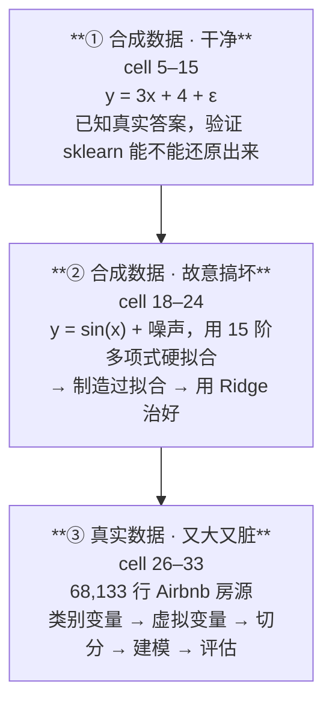
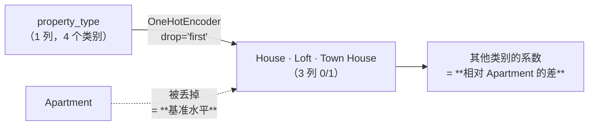
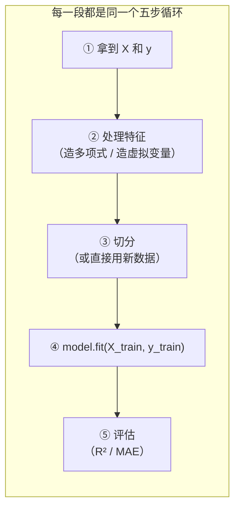

# T02 · 回归实战：从合成数据到 Airbnb 定价

> **本讲一句话**：这个 notebook 把 [[M02-预测分析-线性回归]] 的每一个概念都跑了一遍 —— 先用自己造的干净数据验证"回归确实能还原真实参数"，再用 15 阶多项式**故意制造过拟合**、用 Ridge 把它治好，最后把整套流程搬到 **68,133 行真实 Airbnb 数据**上。**代码只有 19 个 cell，但坑很多，其中三个是讲义/代码本身的错误。**
> **原始材料**：`Week 2 Regression Analysis_With Prompt.ipynb`（39 cells）｜ **配套讲义**：[[M02-预测分析-线性回归]]｜ **数据**：[[Business_Data_Analytics/_meta/数据集卡片#Airbnb.csv|数据集卡片 › Airbnb.csv]] ｜ **转录**：`merged`
>
> 🎙️ **这一段课是谁讲的**：`01:48:45` 教授讲完讲义后交班——"[our] **co-instructor** will deliver the [tutorial] using Python"。**tutorial 全程由助教（co-instructor）带跑**，风格与教授完全不同：她**逐行念代码、当场改 bug、补 Python 基础、反复给小组项目建议**。
> **本笔记的 🎙️ 全部来自 `01:48:45–02:34:37` 这 46 分钟。** 讲义部分的课堂内容在 [[M02-预测分析-线性回归]]。
>
> ⚠️ **录音在 `02:34:37` 讲到 cell 35 时截断** —— cell 36 的 Summary 只讲到 statsmodels 一条，**cell 38 的 Week 2 作业（4 题 100 分）从未被宣布过**。见 [[#10.5 待核对|§10.5]]。

---

## 0. 这个 notebook 在教什么

notebook 自己在 cell 2 列了四条：

> #### You will learn:
> 1. Linear regression models
> 2. Linear regression models with **regularizations**
> 3. Linear regression for **real data analysis**
> 4. **Evaluation metrics** for regression analysis

结构是**三段递进**，难度和"脏"的程度逐段上升：



**为什么这个顺序是对的**：
- 第 ① 段你**知道正确答案**（真实斜率 = 3、截距 = 4），所以能验证工具靠不靠谱
- 第 ② 段你**知道真实函数是 sin**，所以能一眼看出多项式在瞎拟合
- 第 ③ 段**没有正确答案**，只能靠评估指标 —— 这才是真实工作的样子

**cell 2 还给了一张"工具箱清单"**（notebook 原文，写着 "for review purposes"）：

| # | 用途 | 库与文档 |
|---|---|---|
| 1 | 可视化 | `matplotlib` — [plot types](https://matplotlib.org/stable/plot_types/index.html) |
| 2 | 线性回归（OLS 与 Ridge） | `from sklearn.linear_model import LinearRegression` — [linear_model 文档](https://scikit-learn.org/stable/modules/linear_model.html) |
| 3 | 类别变量处理 | `from sklearn.preprocessing import OneHotEncoder` |
| 4 | 数据切分 | `from sklearn.model_selection import train_test_split`（notebook 写 "to be continued in **week 10**"，⚠️ 但 Syllabus 的 Model Selection 在 **W11**） |

---

## 1. 前置

### 1.1 需要哪些库

| 库 | 用途 | Anaconda 自带？ |
|---|---|---|
| `numpy` | 生成随机数、数值运算 | ✅ |
| `pandas` | 读 CSV、处理 DataFrame | ✅ |
| `matplotlib` | 画散点图与拟合线 | ✅ |
| **`scikit-learn`（sklearn）** | **本讲的主角**：回归、Ridge、编码、切分、评估 | ✅ |

若不是 Anaconda：`pip install numpy pandas matplotlib scikit-learn`（注意**安装时叫 `scikit-learn`，import 时叫 `sklearn`**）。

⚠️ **还需要 `Airbnb.csv` 与 notebook 放在同一目录**，因为 cell 26 写的是相对路径 `pd.read_csv('Airbnb.csv')`。用 Colab 的话要先上传这个文件。

### 1.2 对应哪一讲的理论

| notebook 段落 | 对应 [[M02-预测分析-线性回归]] |
|---|---|
| cell 3 标题 "Linear regression using the **Normal Equation**" | §2.8.3 正规方程 $\hat{\theta} = (X^{\top}X)^{-1}X^{\top}Y$（讲义 p.34） |
| cell 5–11 拟合 y = 3x + 4 | §2.5.1 简单线性回归（讲义 p.14） |
| cell 13 用新数据预测 | §2.9.4 留出法（讲义 p.45 **就是这个 cell 生成的图**） |
| cell 15 R² / MAE | §2.9 模型评估 |
| cell 18–20 多项式 → 过拟合 | §2.9.2 欠拟合 vs 过拟合（讲义 p.40）、§2.10.5（讲义 p.51–52） |
| cell 21–24 Ridge | §2.10.3 Ridge 回归（讲义 p.50） |
| cell 27–30 类别变量 → 虚拟变量 | §2.7.2 虚拟变量与 n−1 规则（讲义 p.25） |
| cell 31 `train_test_split` | §2.9.4 留出法（讲义 p.43–44） |
| cell 31 系数解读 | §2.7.3 解读虚拟变量系数（讲义 p.26） |

### 1.3 sklearn 的两条铁律（第一次接触 sklearn 必读）

**铁律一：所有模型都走 `fit` → `predict` 两步**

```python
model = SomeModel(超参数=...)     # ① 建模型，只填「超参数」（如 alpha）
model.fit(X, y)                   # ② 用数据学「参数」（如 coef_）
y_pred = model.predict(X_new)     # ③ 预测
```

**参数 vs 超参数**（[[M02-预测分析-线性回归#2.9.4 留出法 Hold-out（讲义 p.43 → p.42 → p.44–45）|M02 §2.9.4]] 的两层优化）：

| | 谁定的 | 例子 | 在哪一步 |
|---|---|---|---|
| **超参数** | **你定**（或用验证集选） | `Ridge(alpha=0.1)` 的 `alpha` | 建模型时填进括号 |
| **参数** | **数据学出来** | `coef_`、`intercept_` | `fit()` 之后才有 |

**铁律二：学出来的东西，属性名带一个尾随下划线 `_`**

```python
lin_reg.coef_          # ✅ 系数（fit 之后才存在）
lin_reg.intercept_     # ✅ 截距
lin_reg.n_features_in_ # ✅ 见过几个特征
lin_reg.fit_intercept  # ← 没有下划线：这是你设的超参数，不是学出来的
```

> 💡 **这个命名约定是 sklearn 全库统一的。** 看到 `xxx_` 就知道"这是训练出来的"，看到 `xxx` 就知道"这是我设的"。cell 10 的 `print(lin_reg.__dict__)` 把两类混在一起打印出来了，正好可以对照。

**铁律三：X 必须是二维的**

sklearn 要求特征矩阵 `X` 的形状是 **`(n_samples, n_features)`**，**即使只有一个特征**也必须是 `(100, 1)` 而不是 `(100,)`。

这就是 cell 5 写 `rnd.rand(100, **1**)` 而不是 `rnd.rand(100)` 的原因。

---

## 2. 逐块讲解 · 第一段：合成数据（cell 5–15）

### 2.1 【cell 5】造一批已知答案的数据

**这块在干什么**：人工生成 100 个点，真实关系是 `y = 3x + 4`，再加上正态噪声。

```python
import numpy.random as rnd # This is a library for random number generation
X = 2 * rnd.rand(100, 1)
y = 4 + 3 * X + rnd.randn(100, 1)
```

**逐行**

| 部分 | 说明 |
|---|---|
| `rnd.rand(100, 1)` | 生成 100×1 的**均匀分布** [0, 1) 随机数 |
| `2 * rnd.rand(100,1)` | 乘 2 → X 落在 **[0, 2)** ⚠️ **记住这个范围，cell 13 会出问题** |
| `rnd.randn(100, 1)` | **标准正态分布** N(0,1) 的随机数 —— 就是 [[M02-预测分析-线性回归#2.5.1 公式与三个符号（讲义 p.14–15）\|M02 §2.5.1]] 的噪声项 **ε** |
| `y = 4 + 3*X + …` | 真实模型：**截距 β₀ = 4，斜率 β₁ = 3** |

**⚠️ `rand` 与 `randn` 的差别（一个字母，完全不同）**

| 函数 | 分布 | 取值 | 用途 |
|---|---|---|---|
| `rnd.rand(n, 1)` | 均匀 Uniform[0,1) | 0 到 1 | 生成**自变量 X** |
| `rnd.randn(n, 1)` | 标准正态 N(0, 1) | 可正可负，多数在 ±3 内 | 生成**噪声 ε** |

**为什么这么写 · 为什么要先用合成数据**

因为**你知道正确答案**。真实斜率是 3、真实截距是 4。跑完回归如果得到 3.09 和 3.88，你就确认了：
1. sklearn 用对了
2. 回归确实能在有噪声的情况下逼近真实参数
3. **偏差有多大是"正常"的**（这个感觉在真实数据上很难建立）

**🔴 ⚠️ 最大的坑：这个 cell 没有设随机种子**

```python
np.random.seed(42)     # ← notebook 里没有这一行
```

**后果**：**你每次运行都会得到不同的数据、不同的系数、不同的 R²。** notebook 里保存的 `3.088464 / 3.876417` 是某一次运行的结果，**你跑出来一定不一样**。

⚠️ 这会造成两个具体问题：
1. 你以为自己写错了（其实只是随机数不同）
2. 交作业时你的数字和同学的都不同（**这是正常的**，但要在报告里说明）

> 💡 **对比**：cell 18 就**设了种子** `np.random.seed(10)`。同一份 notebook 里一半设一半不设，⚪ 应该是疏漏。**自己做作业时建议在 cell 5 前面加一行 `import numpy as np; np.random.seed(42)`，让结果可复现。**

**🎙️ 课堂补充**（转录 `01:49:32–01:52:22`）

🎙️ **助教教了一个可迁移的技能：用 `help()` 查函数**（讲义和 notebook 里都没有）：

> "Like the method[s] … [in this] tutorial, **you can use the `help` to get to know more about the detailed information of the functions** … [for example] how … we call the random package. So let's see what … [is] mean[t] by the `rand` — **using the `help` and … find the `rand`. You can see here `rand` represents [values] uniformly distributed.**"（`01:50:28–01:50:57`）

→ ⭐ **这就是本笔记 §2.1 那张 `rand` vs `randn` 对照表的来源之一。** 助教是**当场在 notebook 里查文档**的，不是背下来的。⚪ **做作业时遇到不认识的函数，`help(函数名)` 是最快的路。**

🎙️ **助教对 `rnd.rand(100,1)` 那两个参数的解释**（`01:50:57–01:51:35`）：

> "For the `rnd.rand`, actually we [would] like to **randomly generate the values from the uniform [distribution]** … and … generate like **100 groups, and for each group we only have … one value**. So … it's more like **the number of rows times the columns**. So **the one represents … the features — we only have [one] feature**."

→ ⭐ **"第一个数 = 行数（样本数），第二个数 = 列数（特征数）"** —— 这正是 §1.3 sklearn 两条铁律里"特征矩阵必须是二维"的具体含义。**助教把 `(100, 1)` 直接读成了"100 个样本、1 个特征"。**

🎙️ **助教明确指出了第二次调用 `rand` 是噪声**（`01:51:58`）：

> "And you can see [we] call[ed] `rand` [for] another time, and this one … represents the **error term**."

→ ✅ 对应讲义 p.14 的 **ε**。⚪ 有意思的是：**教授在讲义部分从没提过 ε，助教在代码里反而点了出来。**

**⏭️ 助教没有提"没设随机种子"这件事。** 她在 cell 9–11 那里说"**every time you run [it] you have … different value[s] because it's randomly generated**"（`01:57:42`，见 §2.3 🎙️），但**没有把它当成一个应该修的问题**，也没有在 cell 5 里加种子。⚪ 上面那条建议（自己加 `seed`）仍然成立——**尤其做作业时，结果不可复现会让你没法和同学对答案。**

**所以呢**：数据造好了（真实答案是斜率 3、截距 4），下一步在真正拟合之前，先按老规矩把它画出来看一眼。

---

### 2.2 【cell 7】画散点图

**这块在干什么**：拟合之前先睁眼看看数据长什么样——把 cell 5 造出来的 100 个点画成散点图，横轴 X、纵轴 y。

```python
import matplotlib.pyplot as plt
from matplotlib.pylab import rcParams
rcParams['figure.figsize'] = 10, 8
## "b." blue dots
plt.plot(X, y, "b.")
#plt.plot(X, y, color="blue", marker=".")
# $...$ tells Matplotlib to interpret the text as mathematical notation using its mathtext system
plt.xlabel("$x_1$", fontsize=18)
plt.ylabel("$y$", rotation=0, fontsize=18)
plt.axis([0, 2, 0, 15])
plt.savefig("generated_data_plot.png")
plt.show()
```

**逐行**

| 行 | 说明 |
|---|---|
| `rcParams['figure.figsize'] = 10, 8` | **全局**设定图的尺寸（10×8 英寸）。设一次，之后所有图都用这个尺寸 |
| **`"b."`** | **格式串**：`b` = blue（蓝），`.` = point marker（点）。注释里给了等价写法 `color="blue", marker="."` |
| `"$x_1$"` | 美元符号包起来 = **mathtext**，让 matplotlib 按数学公式排版，显示成下标的 x₁ |
| `rotation=0` | y 轴标签**不旋转**（默认会转 90°竖着写） |
| `plt.axis([0, 2, 0, 15])` | 手动设定坐标范围：**x ∈ [0,2]，y ∈ [0,15]** ⚠️ **记住这行，cell 13 会因为它出问题** |
| `plt.savefig("…png")` | 存成图片文件 |
| `plt.show()` | 显示 |

**⚠️ 易错点**

1. **`savefig` 必须在 `show` 之前**。`plt.show()` 会清空当前画布，之后再 `savefig` 会得到一张空白图。notebook 的顺序是对的 ✅
2. **`plt.axis` 是"我只看这个范围"，不是"数据只有这个范围"**。范围外的点会被裁掉，**你会以为它们不存在**
3. matplotlib 的格式串很省事但可读性差。`"b."`、`"r--"`、`"g^"` 分别是"蓝点""红虚线""绿三角"

**🎙️ 课堂补充**（转录 `01:52:22–01:55:56`，助教在画图上花了 3 分半，是第一段里最久的一块）

🎙️ **★ 助教补了一个 notebook 里没有、但极实用的对比：`rcParams` vs `plt.figure(figsize=…)`**（`01:52:40–01:53:49`）：

> "We import another thing[:] **`rcParams`**, and this one just … [sets] the figure size to **10 × 8**. And … there's another way to do it — to use the … [`figsize`] … [it] is also do[ing] the same thing … to set the size of the figure.
> **But the difference [is] that for the `rcParams`, it will set all the figure [sizes] for all the graphs in this Jupyter notebook.** … So for this graph and also for this figure, all the size[s] will [become] … 10 × 8. **So you only need to [set it once].**
> **But if you [use] the `plt.[figure]`, you need … to set th[ese] parameters each time for each graph that you want to draw.**"

| 写法 | 作用范围 | 什么时候用 |
|---|---|---|
| `plt.rcParams['figure.figsize'] = (10, 8)` | **整个 notebook 的所有图** | 一次设好，全篇统一 |
| `plt.figure(figsize=(10, 8))` | **只对紧接着画的那一张图** | 某一张图需要特殊尺寸 |

> ⭐ **这是本讲最实用的一条"课上才有"的操作知识。** 写报告时统一图表尺寸，用 `rcParams` 一行就够，不用每张图都写。

🎙️ **助教鼓励当场改参数试**（`01:54:06–01:54:48`）：

> "The `'b.'` … **`b` means the blue** … it's the … color. And **you can also … change it to the `y` and … try it. … Then it will become the yellow.** And also you can try different colors. And this **`.` just means the dots** … [and you] can … change [it] to … [`'*'`] … and also try it. Then … [it] will show you the coordinate[s] … represent[ed] by the asterisk."

→ 💡 **助教的教学方式是"改一个字母，看看变成什么"** —— 这正是本笔记 §6「自己动手」那一节的思路。

🎙️ **助教对 `plt.axis` 的解释**（`01:55:03`，⚠️ **和 cell 13 的坑直接相关**）：

> "And also sets the range for the ax[e]s. And **the first two is for the [x] axis and the last two, 0 to 15, is for the y axis.**"

→ ⚠️ **助教讲清楚了这四个数字的含义，但没有预告"cell 13 会因为 `[0,2]` 而裁掉一部分点"。** 见 §3.3。

🎙️ **`savefig` 存到哪里**（`01:55:31`）：

> "And when you just run this code … you will see that under the same … directori[es] — just with your … notebook — [it] generates [the] … plot[s] for you."

→ ⚪ 图片存在**和 notebook 同一个目录**下。这和 cell 26 读 `Airbnb.csv` 的路径问题是同一件事（见 §4.1 🎙️）。

**所以呢**：图看过了（散点图上大致有条下降/上升的趋势），下一步让 sklearn 把这条线真正拟合出来，看它学出来的数字准不准。

---

### 2.3 【cell 9–11】拟合模型，取出系数

**这三个 cell 在干什么**：正式让 sklearn 拟合这条线——建一个模型、喂数据训练、把学出来的截距和斜率读出来打印成人话。因为 §2.1 已经知道真实答案是斜率 3、截距 4，这里能直接验证 sklearn 有没有学对。

**cell 9 · 建模并训练**

```python
from sklearn.linear_model import LinearRegression
lin_reg = LinearRegression() # Define your model
lin_reg.fit(X, y)  # Fit your model using the data
```

输出：`LinearRegression()` —— 这是模型对象的 repr，**不是结果**。真正的结果在属性里。

**cell 10 · 把模型内部全打印出来**

```python
print(lin_reg.__dict__)
```

输出：
```
{'fit_intercept': True, 'copy_X': True, 'n_jobs': None, 'positive': False,
 'n_features_in_': 1, 'coef_': array([[3.08846435]]), 'rank_': 1,
 'singular_': array([5.78736847]), 'intercept_': array([3.87641727])}
```

**逐项**（⭐ 这个 cell 是理解 §1.3 两条铁律的最好教材）

| 键 | 有没有 `_` 后缀 | 是什么 |
|---|---|---|
| `fit_intercept: True` | 无 | **超参数**：要不要拟合截距。`True` 表示 sklearn 会**自动帮你加那一列全 1**（[[M02-预测分析-线性回归#2.8.1 记号翻译表（讲义 p.30）\|M02 §2.8.1]] 讲的截距约定） |
| `copy_X: True` | 无 | 超参数：是否复制 X（不改动原数据） |
| `n_jobs: None` | 无 | 超参数：用几个 CPU 核 |
| `positive: False` | 无 | 超参数：是否强制系数为正 |
| **`n_features_in_: 1`** | ✅ 有 | **学到的**：训练时见过 1 个特征 |
| **`coef_: [[3.08846435]]`** | ✅ 有 | **学到的斜率**（真实值 3 ✓） |
| `rank_: 1` | ✅ 有 | 设计矩阵 X 的秩 |
| `singular_: [5.787]` | ✅ 有 | X 的奇异值。⚪ 说明 sklearn 内部用的是 **SVD**，不是直接对 $X^{\top}X$ 求逆（数值上更稳） |
| **`intercept_: [3.87641727]`** | ✅ 有 | **学到的截距**（真实值 4 ✓） |

**cell 11 · 用人话打印出来**

```python
print('Slope is %f, Intercept is %f'%(lin_reg.coef_[0][0], lin_reg.intercept_[0]))
print('Linear Function is y=%f * x + %f'%(lin_reg.coef_[0][0], lin_reg.intercept_[0]))
```

输出：
```
Slope is 3.088464, Intercept is 3.876417
Linear Function is y=3.088464 * x + 3.876417
```

**⚠️ 为什么是 `coef_[0][0]` 两层方括号？**

因为 cell 5 里 `y = 4 + 3*X + rnd.randn(100, **1**)` 生成的 y 是 **二维的 `(100,1)`**。sklearn 会认为"你有 1 个输出目标"，于是 `coef_` 的形状是 **`(1, 1)`**（1 个目标 × 1 个特征），必须 `[0][0]` 才能取到那个数。

| 如果 y 的形状是 | `coef_` 的形状 | 取值写法 |
|---|---|---|
| `(100, 1)` 二维 ← **本 notebook** | `(1, 1)` | **`coef_[0][0]`** |
| `(100,)` 一维 | `(1,)` | `coef_[0]` |

⚠️ **这是初学者最常见的 `IndexError` 来源。** 记住：**y 是几维，`coef_` 就多包几层。**

（对比：cell 20 的多项式回归里 `data['y']` 是**一维** Series，所以那里写的是 `linreg.coef_[i]`，只有一层。）

**结果解读**

| | 真实值 | 拟合值 | 差距 |
|---|---|---|---|
| 斜率 β₁ | **3** | 3.088464 | +2.9% |
| 截距 β₀ | **4** | 3.876417 | −3.1% |

✅ **回归成功还原了真实参数。** 差的这几个百分点来自 100 个样本上的随机噪声 —— 这就是 §2.1 说的"建立正常偏差的感觉"。

**🎙️ 课堂补充**（转录 `01:55:56–01:58:20`）

🎙️ **助教把 sklearn 的三步说得很干脆**（`01:56:15`）：

> "The first … [thing] we do here is to **define [the] model**. And then to **utilize X and Y to train the model[s] — to [call] the `fit`**."

→ ✅ 对应 §1.3 的铁律一：**`定义 → fit → predict`**。

🎙️ **★ `lin_reg.__dict__` 的输出逐项解释**（`01:56:29–01:57:25`，notebook 只是打印，没解释）：

> "You can see that they have [a] list like this … Here I have the **coefficients — the coefficients of your features**, that is the coefficient of X — **and the intercept**. And also the **number of features** … we only have … one dimension, so it's one. And also **`rank`, `singular`**."
>
> "**But … for some students['] computers you didn't generate something like that** — you can directly see the outputs. So **another way to do it [is] just to use the attributes** … and it will also output all the attributes … for the linear regression."

→ ⚠️ **助教承认这个 cell 在不同环境下的输出不一样**（有的 Jupyter 版本 `model` 直接回显就够了）。⚪ **如果你运行 cell 10 看到的东西和 notebook 里不同，不是你的错。**
→ 💡 `rank` 和 `singular` 是 sklearn 内部用 SVD 求解时留下的诊断值，⚪ **助教也只是念了名字，没解释**——本课不需要。

🎙️ **★ 助教主动解释了"为什么你的数字和我的不一样"**（`01:57:25–01:58:20`，⭐ **这条直接对应 §2.1 那个"没设随机种子"的坑**）：

> "Since actually … this … X and Y [are] generate[d] by this kind of **randomly** … so **every time you run this `rand` … actually every time you have … different value[s], because it's randomly generated**. So that's … why your output of the coefficients maybe [is] a little bit … different from [mine]. **So it's okay.**
> … So after building the model … **in my PC my model is something like 3.055** …"

→ ⭐ **助教报的是 3.055，notebook 里存的是 3.088464，本笔记的读者跑出来又会是第三个数。** ✅ 三者都对。
→ ⚠️ **但助教说"So it's okay"就带过了，没有提"作业需要可复现"这件事。** ⚪ 做作业时仍建议自己加 `np.random.seed(...)`，理由见 §2.1。

**所以呢**：模型学出来的斜率、截距都验证过了（和真实值 3、4 很接近）。光看两个数字还不够直观，下一步把预测结果画出来，顺便检验模型在没见过的新数据上表现如何。

---

### 2.4 【cell 13】用新数据做预测

**这块在干什么**：造一批模型**没见过**的新数据，让模型对这批新数据做预测，再把"真实值"和"预测值"画在一起对比——这是在检验模型能不能推广到训练时没用过的数据上。

```python
X_new = 3 * rnd.rand(100, 1)      # 生成新的 X
Y_new = 4 + 3 * X_new + rnd.randn(100, 1)   # 生成对应的真实 Y

Y_new_predict = lin_reg.predict(X_new)      # 用模型预测

plt.plot(X, y, "b.", markersize=16)                              # 训练数据：蓝点
plt.plot(X_new, Y_new, "*", color='y', markersize=16)            # 新数据真实值：黄星
plt.plot(X_new, Y_new_predict, "b.", color='black', markersize=16)  # 预测值：黑点
plt.xlabel("$x_1$", fontsize=26)
plt.ylabel("$y$", rotation=0, fontsize=26)
plt.axis([0, 2, 0, 15])
plt.legend(['Training Data','Validation Data','prediction line'], fontsize=26)
plt.show()
```

> 🔗 **这个 cell 生成的图，就是讲义 p.45 那张图**（蓝点 Training Data、黄星 Validation Data、黑点 prediction line）。

**⚠️ 这个 cell 有三个坑**

**坑 1 · 一个警告**

notebook 保存的输出里有一条：
```
UserWarning: color is redundantly defined by the 'color' keyword argument
and the fmt string "b." (-> color='b'). The keyword argument will take precedence.
```

因为第三行同时写了格式串 `"b."`（蓝）和 `color='black'`（黑）—— **两个颜色互相打架**。matplotlib 选了 `color='black'`。⚪ 不影响结果，但正确写法应该是 `"."` 或 `"k."`。

**坑 2 · `plt.axis([0, 2, …])` 把三分之一的新数据裁掉了**

`X_new = 3 * rnd.rand(100,1)` → X_new ∈ **[0, 3)**，但坐标轴只画到 **2**。**约 1/3 的黄星和黑点根本没显示在图上。**

**🔴 坑 3（最重要）：这里违反了讲义自己的外推警告**

见下面 §3.3。

**🎙️ 课堂补充**（转录 `01:58:20–02:00:21`）⭐ **助教当场发现并修掉了坑 1，修法与本笔记完全一致**

> 🎙️ "And yeah, **and there is [an] error** … I think … **there's [an] error here — the plot[,] the third `plt.plot`**.
> Actually … **I have told you … the `b` is the blue dots**, but now I set another col[or] there, so … **it's kind of like overlap**.
> **So you just need to change the `b` to the `k`. That means the `k` represents black, so you don't need to [specify] color again.** So this kind of [is the] error here."（`01:58:55–01:59:42`）

> ✅ **完全印证了本笔记的坑 1**：格式串 `"b."` 与 `color='black'` 互相冲突。
> ⭐ **助教给的修法就是本笔记建议的那个**：把 `"b."` 改成 `"k."`（k = black），然后**删掉多余的 `color='black'`**。
>
> 💡 **这条值得记住的地方在于"为什么会冲突"**：matplotlib 的**格式串**（`"b."`）和**关键字参数**（`color=`）是两套指定颜色的机制，**同时用会打架**，且**关键字参数优先**。⚪ 一般规则：**要么全用格式串，要么全用关键字参数，不要混。**

🎙️ **助教对三组数据的口述**（`01:59:42–02:00:21`，说明了图上三种标记各是什么）：

> "So now we just print — the first[,] print X and Y[,] **represents our training data**. And then about **`X_new` and `y_new` is our … testing data[,] validation data**. And another set … is **`X_new` and [the] predict[ed]** … just to [show] the prediction."

| 图上 | 代码 | 助教的叫法 |
|---|---|---|
| 蓝/黑点 | `X`, `y` | **training data** |
| 黄星 | `X_new`, `y_new` | "**testing data, validation data**"（⚠️ 两个词混用，见 §10.2 的 🔀） |
| 线/黑点 | `X_new`, `y_new_predict` | prediction |

**⏭️ 助教没有提坑 2 和坑 3。**
- **坑 2**（`plt.axis([0,2,…])` 把 1/3 的新数据裁到画布外）——她讲 cell 7 时解释过这四个数字的含义（§2.2 🎙️），但**没有回头指出这里会出问题**
- **坑 3**（$X_{\text{new}} \in [0,3]$ 超出训练范围 `[0,2]`，违反讲义 p.21 的外推警告）——**全程没有提**。教授在讲义部分把外推讲得很重（[[M02-预测分析-线性回归#2.6.3 外推警告（讲义 p.21）|M02 §2.6.3]]），但**两位老师都没有把这条警告和这个 cell 对上**

> ⚪ **判断**：坑 3 **更像疏漏，不像有意设计的教学点**。⭐ 但正因为如此，**在小组报告或作业里主动指出它，是很好的加分材料**——你会显得是真的读懂了讲义 p.21 而不只是背了它。

**所以呢**：图画出来了，但"看着挺准"不是一个能写进报告的结论。下一步把"准不准"换算成两个具体数字。

---

### 2.5 【cell 15】评估：R² 与 MAE

**这块在干什么**：光看图还不够，这段代码把"模型预测得准不准"变成两个具体的数字——R² 和 MAE，方便量化比较。

```python
from sklearn.metrics import r2_score
from sklearn.metrics import mean_absolute_error
evaluation_result=r2_score(Y_new, Y_new_predict)
print('R2=%f' %evaluation_result)
evaluation_result=mean_absolute_error(Y_new, Y_new_predict)
print('Mean absolute error=%f' %evaluation_result)
```

输出：
```
R2=0.870716
Mean absolute error=0.828464
```

**两个指标是什么**

| 指标 | 公式 | 范围 | 怎么读 |
|---|---|---|---|
| **R²**（决定系数） | `1 − SS_res / SS_tot` | (−∞, 1] | **模型解释了因变量多少比例的方差**。1 = 完美；0 = 和"永远预测平均值"一样烂；**负数 = 比平均值还烂** |
| **MAE**（平均绝对误差） | `mean(\|y − ŷ\|)` | [0, ∞) | **平均每次预测偏了多少**。**单位与 y 相同**，直观 |

**这两个数字怎么解读**

- **R² = 0.87**：模型解释了新数据里 87% 的变异。剩下 13% 是 `rnd.randn` 造的噪声 —— **这部分理论上永远解释不了**（[[M02-预测分析-线性回归#2.5.1 公式与三个符号（讲义 p.14–15）|M02 §2.5.1]] 的 ε 项）
- **MAE = 0.83**：平均每次预测偏了 0.83。y 的范围大约是 4 到 14，所以相对误差约 **8%**

> 💡 **为什么 R² 不是 1？** 因为数据里有噪声。噪声的标准差是 1（`randn`），y 本身的标准差约 √(3²×Var(X) + 1) ≈ √(9×0.33+1) ≈ 2.0。所以理论上限 R² ≈ 1 − 1/4 = 0.75… ⚪ 实际算出 0.87 是因为 `X_new` 的范围更宽（[0,3] 而非 [0,2]），y 的方差更大，噪声占比相对更小。**这个"意外的高分"恰好是坑 3 的副作用。**

**⚠️ 常见误区**

- ❌ **"R² 越高模型越好。"** —— R² 只衡量**训练/评估这批数据上**的拟合。过拟合的模型训练 R² 可以到 0.99
- ❌ **"MAE 和 RMSE 差不多。"** —— RMSE 会**放大大误差**（平方），MAE 一视同仁。有离群点时两者差距很大
- ⚠️ **notebook 用的评估数据 `Y_new` 是"验证集"还是"测试集"？** 按 [[M02-预测分析-线性回归#2.9.3 验证集 ≠ 测试集（讲义 p.41）⭐ 容易混|M02 §2.9.3]] 的定义，它更像**测试集**（只用一次、不参与选模型）。但 cell 13 的 legend 写的是 "Validation Data"。⚪ notebook 在这个术语上不严谨

**🎙️ 课堂补充**（转录 `02:00:21–02:01:56`）

🎙️ **助教对两个指标的口头定义**（比 notebook 清楚，可以直接背）：

> **R²**（`02:00:38–02:01:07`）："I'm not sure whether you remember, **if you have learned that R² explain[s] … how much of the variation[s] in the dependent variable[s] can be explained by the model**. So **if the R² is larger, that means … more … variation in the [dependent variable] can be explained by the model — the model is better.**"
>
> **MAE**（`02:01:07–02:01:32`）："**Mean [Absolute] Error is … just to evaluate how far the predicted value [is] from the actual value[s].** … [It's] the opposite one: **if it's larger it means that … the predicted one … has a bigger … difference … from the actual[s].**"
>
> **一句话收束**（`02:01:32`）："**So what we want is … we want the R² [to be] higher, but we want a smaller … mean absolute error.**"

> ⭐ **"R² 越高越好、MAE 越低越好"这个方向要记牢** —— 这是两个指标**唯一容易记反**的地方。
> 💡 助教说 R² 时用的措辞 "**how much of the variation in the DV can be explained by the model**"，**是标准的教科书定义，可以直接写进考卷**。

⚠️ **助教说 "I'm not sure whether you remember, if you have learned that R²…"** —— 说明她**假定 R² 是先修知识**（官方先修确实写了 "basic knowledge on statistics"）。⚪ **她没有讲 R² 的公式，也没讲它的取值范围和"可以为负"这件事**——本笔记 §2.5 补的那部分**全部是笔记补充**。

**⏭️ 助教没有讲 RMSE。** notebook 的 cell 23 里出现了 `rmse` 这个变量名（而且**算错了**，见 §10.3 ①），但**tutorial 全程没提过 RMSE 是什么**。

**所以呢**：第一段（合成的直线数据）走完了一整套"造数据 → 拟合 → 预测 → 评估"的流程，而且模型表现符合预期。下一段换一批更刁钻的数据——真实关系是曲线，看看同样的方法会不会翻车。

---

## 3. 逐块讲解 · 第二段：过拟合与 Ridge（cell 18–24）

### 3.1 【cell 18】造一个非线性数据集 + 造多项式特征

**这块在干什么**：第一段用的是"一条直线就能描述"的干净数据；这段代码换一批**真实关系是曲线（sin 函数）**的数据，再手工造出 $x^2$ 到 $x^{15}$ 共 14 个新列，为下一步"用直线硬套曲线"（制造过拟合）做准备。

```python
import numpy as np
import pandas as pd
import random
import matplotlib.pyplot as plt

#Define input array with angles from 60° to 300°, converted from degrees to radians.
x = np.array([i*np.pi/180 for i in range(60,304,4)])
np.random.seed(10)  #Sets the random seed for NumPy's random-number generator.
# np.random.normal(mean, standard_deviation, number_of_values)
y = np.sin(x) + np.random.normal(0,0.15,len(x))
#column_stack() combines the two arrays side by side as columns.
data = pd.DataFrame(np.column_stack([x,y]),columns=['x','y'])

plt.plot(data['x'],data['y'],"k.",markersize=16)
plt.xlabel('X'); plt.ylabel('Y'); plt.show()

#Create polynomial variables (x^2, x^3, ..., x^{15}) in your DataFrame.
for i in range(2,16):  #power of 1 is already there
    colname = 'x^%d'%i      #new var will be x_powerb
    data[colname] = data['x']**i
print(data.head())
```

**逐部分**

| 部分 | 说明 |
|---|---|
| `range(60, 304, 4)` | 60, 64, 68, …, 300 → **61 个角度**（度） |
| `i*np.pi/180` | 度 → 弧度。x 范围 **[1.047, 5.236]** |
| **`np.random.seed(10)`** | ✅ **这里设了种子**（cell 5 没设！），所以这一段的结果**可复现** |
| `np.random.normal(0, 0.15, len(x))` | 均值 0、标准差 **0.15** 的噪声 |
| `y = np.sin(x) + 噪声` | **真实函数是 sin，不是多项式** —— 记住这点 |
| `np.column_stack([x, y])` | 把两个一维数组并成 61×2 的二维数组 |
| `for i in range(2,16)` | 造 $x^2$ 到 **`x^15`** 共 14 列（加上原来的 `x`，一共 **15 个自变量**） |

**⚠️ 一个数值上的隐患**

x 最大是 **5.236**，那么 $x^{15} = 5.236^{15} \approx 6.1 \times 10^{10}$。

**同一张表里，`x` 这一列的量级是 1，`x^15` 那一列的量级是 10¹⁰ —— 相差一百亿倍。** 这会导致：
1. $X^{\top}X$ 严重**病态（ill-conditioned）**，求逆时数值误差巨大 → cell 22 会跳出 `LinAlgWarning`
2. **Ridge 的惩罚项对不同尺度的特征是不公平的**（惩罚 $\sum a_j^2$ 里，量级大的特征系数天然小，被罚得轻）

⚠️ **正确做法是先做特征标准化**（`StandardScaler`），**notebook 完全没做**。见 §6.3。

**🎙️ 课堂补充**（转录 `02:02:47–02:14:35`，⭐ **这一块助教花了 12 分钟，是整个 tutorial 最长的一段**）

**★ 助教在这里插了一段完全不在 notebook 里的 Python 补课**（`02:02:47–02:06:34`），原因她自己说了：

> 🎙️ "And another thing[:] **since some students didn't have … [any Python background]** … I would just … briefly talk[] about … [the] data structure[s] that we have … [that] we didn't mention before."（`02:02:47–02:03:17`）

| 讲了什么 | 助教的原话 | 时间戳 |
|---|---|---|
| **for 循环** | "**if we want to extract each element … from a list, and to do something — maybe to print or maybe to call [a] function — so we use a for loop to … do the repetitive tasks**" | `02:03:17–02:03:35` |
| **在循环里调用自定义函数** | "you can define [a] function for that, and then to use a for loop to … call the function for each element in the list" | `02:03:35–02:04:05` |
| **`range()` 的三种用法** | "`range(10)` … **[creates] the list … from 0 to 9** … remember I said that **Python always start[s] from 0** … **if you don't want to start at 0, you can … add another input** … like … start from 2 and then it will give you … from 2 to 9 … And … **if you don't want to … every time increase 1, you maybe … increase like 3** … so you can add another … input as the [step] parameter" | `02:04:25–02:05:51` |
| **列表推导式** | "if you want to store [these] … into a list, what you can do … just … [put] the output **in front of the for loop and … add it with … square brackets**" | `02:05:51–02:06:11` |

> ⭐ **这四条全部是理解 cell 18 那两行造列代码的前提**：
> ```python
> for i in range(2, 16):
>     colname = 'x_%d' % i
>     data[colname] = data['x'] ** i
> ```
> ⚪ 如果你已经跟完了 [[T01-Jupyter入门与Pandas基础]]，这一段可以跳过；**如果没有，这 4 分钟是本 tutorial 里最该补的基础。**

---

🎙️ **★ 随机种子：助教在这里才讲，而且给的理由很实在**（`02:08:04–02:09:50`）：

> "So why we need to set the seed[?] … [When] we generate … our X values … [with] `rand`, … it will … randomly generate[] some value[s] each time. **So every time we run it, it will show something different.**
> **But when we're doing our … research or your project, actually we want this kind of result [to be] more stable** … so that's the reason we set the seed[]. … **It could be anything you like** — you can use 10, you can also use … [2]. … **But … each seed value will represent a specific … random set of values.**"

> ⭐ ✅ **这正是本笔记 §2.1「最大的坑」那一条的官方背书**：助教自己说了 "**when doing your project we want the result to be more stable**"。
> ⚠️ **但她没有指出 cell 5 恰恰没设种子** —— 同一份 notebook 里 cell 18 设了、cell 5 没设。**做作业时两处都设。**

🎙️ **助教解释了 `range(60, 300+4, 4)` 里那个 `+4`**（`02:06:34–02:08:04`）：

> "We want to include n [going] from … **60 degree[s] to … 300 degree[s]** … and … that's the reason why we use the range from 60 to **304** … **because … [the range] end[s] … just before [the stop value]** … so that's the reason why we … [go] larger than the 300 — **because we want to include … 300 degrees**. And we use this equation[] to … **convert the degrees to radians**."

→ ⭐ **这是 Python `range` 的"左闭右开"在真实代码里的一个具体后果**：要包含 300，`stop` 必须大于 300。⚪ 这个坑在作业里很容易踩。

---

🎙️ **★ 🔴 助教给了一条明确的小组项目限制**（`02:10:28–02:12:17`）：

> "When you're doing the research project, sometimes you may not find … sufficient features — maybe just … 3 [or] 5 — and you think … you may need more. **One way for you to do it [is] to use … polynomial**: if you only have the [x] you can use the **x squared**, and then it will … give you … something like the **U shape or the [inverted] U shape** … [meaning] as the feature … increase[s], the y … will decrease [up to] some point, but after th[at] point[,] when the x is increasing the y will increase.
> … **If you didn't have … sufficient features … [then] the x squared is okay. Don't do like the x cube[d] or [x] to the power of four — it's too much for your … project.**"

> 🔴 **这是一条可直接执行的项目规则**：
> - ✅ **特征不够时，可以造 `x²`** —— 而且助教给了业务解读："U 形 / 倒 U 形，先降后升或先升后降"
> - ❌ **不要造 `x³`、`x⁴` 或更高次** —— "**it's too much for your project**"
>
> ⚠️ **注意这条与 notebook 本身矛盾**：cell 18 造到了 **x¹⁵**。⚪ 但那是**为了演示过拟合而故意做的反面教材**，不是让你照抄的做法。**两件事要分清。**

**所以呢**：数据和 15 个多项式特征都造好了。下一步真的把它们全塞进一个不加约束的线性回归，亲眼看看"用力过猛"是什么样子。

---

### 3.2 【cell 20】15 阶多项式：故意制造过拟合

**这块在干什么**：把上一步造好的 15 个多项式特征全部塞进普通线性回归（不加任何约束），故意让模型"用力过猛"，亲眼看看过拟合长什么样。

```python
from sklearn.linear_model import LinearRegression
power=15
predictors=['x']
predictors.extend(['x^%d'%i for i in range(2,power+1)])
linreg = LinearRegression()
linreg.fit(data[predictors],data['y'])
y_pred = linreg.predict(data[predictors])

plt.plot(data['x'],y_pred,linewidth=8)
plt.plot(data['x'],data['y'],'.',markersize=16)
plt.title('Polynomial regression of power: %d'%power,fontsize=30)
plt.legend(['predicted','real data'],fontsize=16)
plt.show()

print('Lets take a look at the coefficients:')
print('intercept=%f' %linreg.intercept_)
for i in range(len(linreg.coef_)):
    print('a%d=%f' %(i+1,linreg.coef_[i]))
```

**输出的系数**：
```
intercept=12.367975
a1=-13.257106   a2=-7.140650    a3=5.535653    a4=9.289331    a5=-0.529531
a6=-9.011442    a7=0.253921     a8=8.954160    a9=-8.142741   a10=3.699555
a11=-1.021597   a12=0.179302    a13=-0.019634  a14=0.001228   a15=-0.000034
```

**逐部分**

| 部分 | 说明 |
|---|---|
| `predictors = ['x']` 然后 `.extend([...])` | 造出列名清单 `['x','x^2',…,'x^15']` |
| `linreg.fit(data[predictors], data['y'])` | ⚠️ 注意 X 是 **DataFrame**（15 列），y 是 **Series**（一维）。sklearn 两者都接受 |
| `linreg.predict(data[predictors])` | ⚠️ **在训练数据自己身上预测** —— 这是"训练误差"，不是泛化误差 |
| `linreg.coef_[i]` | **一层索引**（对比 cell 11 的 `[0][0]`），因为这里 y 是一维的 |
| `a%d' % (i+1)` | `coef_[0]` 对应 `x`（一次项）→ 打印成 `a1` ✅ 编号是对的 |

**⭐ 怎么从系数看出过拟合**

看这串系数的**符号和量级**：

```
a1 = -13.26    a2 = -7.14    a3 = +5.54    a4 = +9.29    a5 = -0.53
a6 =  -9.01    a7 = +0.25    a8 = +8.95    a9 = -8.14   a10 = +3.70
```

**正负来回横跳，量级在 10 上下。** 而真实函数 sin(x) 的值域只有 [−1, 1]。

**这些大系数在互相抵消** —— 模型靠"+9.29 减 9.01 加 8.95 减 8.14"这种拉锯来凑出一条能穿过每个训练点的曲线。这正是 [[M02-预测分析-线性回归#2.10.5 多项式回归的例子（讲义 p.51–52）|M02 §2.10.5]] 描述的"巨额相消"。

**⚠️ 它和讲义 p.52 那张表的数字完全不同**（讲义 intercept = −36,247.8，这里 = 12.37），因为用的是不同的随机数据。**别去对照。**

**所以呢**：过拟合亲眼见到了——系数正负横跳、量级奇大。在讲 Ridge 怎么治之前，先插一段题外话：第一段 cell 13 那张"预测图"其实也埋了一个坑，而且和"训练范围之外不可信"这个道理是同一件事。

---

### 3.3 ⚠️ 这里违反了讲义自己的外推警告

**是什么**

模型只在它训练时见过的 X 范围内可信，一旦拿去预测训练范围之外的 X，结果就没有数据支撑——这是 [[M02-预测分析-线性回归#2.6.3 外推警告（讲义 p.21）|M02 §2.6.3]] 讲过的外推风险。**这个 notebook 自己的 cell 13 就踩了这个坑**，回头看一眼那两行代码：

```python
X     = 2 * rnd.rand(100, 1)   # 训练数据：x ∈ [0, 2)
X_new = 3 * rnd.rand(100, 1)   # 评估数据：x ∈ [0, 3)  ← 超出训练范围！
```

**约 1/3 的评估点落在 x ∈ [2, 3)，而模型从未在这个区间见过任何数据。**

而讲义 p.21 用一个红色警告三角明确写着：

> ⚠️ "**don't use any values of X that aren't contained in the sample data**; otherwise the results are subject to a great deal of uncertainty"

**这是本课第二次自我违反**（第一次是讲义 p.9 用 GDP=60,000 外推，见 [[M02-预测分析-线性回归#9.3 课件自身的问题|M02 §9.3 ⑪]]）。

**为什么这次侥幸没出事**：真实关系确实是一条直线，而线性模型在 [2,3) 上外推**恰好还是那条直线**，所以误差没有爆炸。

**但这掩盖了外推的危险性**。如果真实关系在 x > 2 处开始弯曲（比如 §3.1 的 sin 数据），线性外推会错得离谱。

> 💡 **改成正确的做法很简单**：`X_new = 2 * rnd.rand(100, 1)`，或者干脆用 `train_test_split` 从同一批数据里切（就像 cell 31 做的那样）。
>
> 🎙️ **✅ 转录已核实：课上没有任何人点破这一点。**
> - **教授**在讲义部分把外推警告讲得很重（`37:48–40:23`，还举了"价格降到 10 元""价格为 0"两个反例，见 [[M02-预测分析-线性回归#2.6.3 外推警告（讲义 p.21）|M02 §2.6.3]]）
> - **助教**在讲 cell 13 时**只指出了颜色冲突那个 bug**（`01:58:55`），**对 $X_{\text{new}} \in [0,3]$ 超出训练范围 `[0,2]` 只字未提**
> - 两人**都没有把讲义 p.21 和这个 cell 联系起来**
>
> ⚪ **结论：这是疏漏，不是有意设计的教学点。**
> ⭐ **但这反而让它成为很好的报告素材** —— 在作业或小组项目里主动指出"我发现课程 notebook 自己违反了讲义 p.21 的外推警告，所以我把 `X_new` 改成了 `2 * rnd.rand(100,1)`"，既展示了你真读懂了 p.21，又展示了批判性阅读。**这正是官方 CILO 3 要的 "propose original findings"。**

**所以呢**：外推的坑说完了，回到 15 阶多项式过拟合那条主线——下一步看正则化能不能把那条剧烈扭动的曲线"治"回正常。

---

### 3.4 【cell 22】Ridge 出场

**这块在干什么**：换掉普通的 `LinearRegression`，用 `Ridge`（岭回归）重新拟合同一组 15 阶多项式特征，看加了正则化惩罚之后，剧烈扭动的曲线会不会变乖。

```python
from sklearn.linear_model import Ridge
alpha=0.1
#Fit the model
ridgereg = Ridge(alpha=alpha)
ridgereg.fit(data[predictors],data['y'])
y_pred = ridgereg.predict(data[predictors])

plt.plot(data['x'],y_pred,linewidth=8)
plt.plot(data['x'],data['y'],'.',markersize=16)
plt.title('Plot for penalty lambda: %.3g'%alpha,fontsize=30)
plt.show()
print('Lets take a look at the coefficients:')
print('intercept=%f' %ridgereg.intercept_)
for i in range(len(ridgereg.coef_)):
    print('a%d=%f' %(i+1,ridgereg.coef_[i]))
```

**输出**：
```
LinAlgWarning: Ill-conditioned matrix (rcond=4.47936e-24): result may not be accurate.

intercept=0.788751
a1=-0.021043   a2=0.006600    a3=0.063724    a4=0.101482    a5=0.063904
a6=-0.050368   a7=-0.115335   a8=-0.010430   a9=0.172735   a10=-0.149777
a11=0.062788   a12=-0.015190  a13=0.002171   a14=-0.000171 a15=0.000006
```

**⭐ 把两组系数并排看，正则化的作用一目了然**

| | 无正则化（cell 20） | **Ridge α=0.1（cell 22）** |
|---|---|---|
| intercept | **12.37** | **0.79** |
| a1 | **−13.26** | **−0.021** |
| a4 | +9.29 | +0.101 |
| a8 | +8.95 | −0.010 |
| **系数量级** | **~10** | **~0.1** |
| 曲线形状 | 神经质地扭动 | 平滑 |

**系数量级降低了约 100 倍，而曲线反而更贴近真实的 sin 形状。**

**⚠️ 两个坑**

**坑 1 · `alpha` 就是讲义的 `λ`**

sklearn 管正则化强度叫 **`alpha`**，讲义和大多数教科书叫 **`λ`（lambda）**。**同一个东西，两个名字。**
notebook 自己也知道这点 —— 图标题写的是 `'Plot for penalty **lambda**: %.3g' % **alpha**`。

**坑 2 · `LinAlgWarning: Ill-conditioned matrix`**

这个警告的根源是 §3.1 说的：`x` 和 `x^15` 相差一百亿倍，`XᵀX` 病态。`rcond = 4.48 × 10⁻²⁴` 极小，意味着矩阵几乎奇异。

⚠️ **正确做法**：Ridge 之前**必须做特征标准化**：

```python
from sklearn.preprocessing import StandardScaler
from sklearn.pipeline import make_pipeline
model = make_pipeline(StandardScaler(), Ridge(alpha=0.1))
model.fit(data[predictors], data['y'])
```

**为什么必须**：Ridge 的惩罚是 $\lambda \sum a_j^2$，**对不同量级的特征不公平**。`x^15` 的取值到 10¹⁰，它对应的系数天然只需要 10⁻¹⁰ 量级就能起作用，于是几乎不受惩罚；而 `x` 的系数要大得多，被罚得很重。**这不是我们想要的。**

> 💡 **一句话记住**：**正则化之前一定要标准化。** notebook 没做，作业里可以主动做（并说明理由），这是加分点。

**🎙️ 课堂补充**（转录 `02:14:35–02:18:47`）

🎙️ **★ 助教强调了一个非常容易踩的坑：`Ridge` 的 `alpha` 必须自己设**（`02:17:09–02:18:05`）：

> "How we do it[:] we import the … Ridge, and we set the **alpha as … 0.1**. So **first[,] for this Ridge regression you need to set the alpha. Otherwise it will use** … the [default].
> … [Use] the `help` to see … the [documentation] on the Ridge. So **if you don't set … the alpha to … 0.1, then you will automatically use the default** … **and this is 1 — the default is 1**.
> … **Remember to set your al[pha]** and then … to fit the model[] to use the alpha equal to … 0.1."

> ⚠️ **`Ridge()` 的默认 `alpha=1.0`，不是 0。** 也就是说：
> - `Ridge()` ≠ `LinearRegression()` —— **它默认就带着一个不小的惩罚**
> - 如果你忘了设 `alpha`，跑出来的系数会被压得比预期狠得多，**而且不会报错**
>
> 💡 **助教用的排查方法还是 `help()`** —— 和 §2.1 🎙️ 一样。⚪ **`help(Ridge)` 能直接看到所有参数的默认值**，这是查默认值最快的路。

🎙️ **助教鼓励调参对比**（`02:18:38`）：

> "And **you can try … different value[s] for the alpha and … see and … compare the lines**. And also … **if you want to evaluate … the performance of the Ridge with different values of alpha, you can use th[ese] … two [metrics]** — the R² and also the mean absolute error."

→ ⭐ **这正是 Week 2 作业第 3 题要做的事**（试 α = 0.001 / 0.01 / 0.1）。⚪ **助教在这里等于把作业第 3 题的做法演示了一遍，只是没说"这是作业"。**

🎙️ **对 Ridge 效果的口述**（`02:18:21`）：

> "And you can see then you have got something kind of[:] **the line is kind of … more smooth**."

→ ✅ 与讲义 p.52 右图、以及教授说的"系数 become very very small"一致（见 [[M02-预测分析-线性回归#2.10.4 🔴 讲义在这里写错了：Ridge 不会把系数压到 0|M02 §2.10.4]]）。

**⏭️ 助教没有讲**：
- **`LinAlgWarning`（矩阵病态警告）** —— cell 22 跑出来会有这个警告，**她没有提，也没有解释**
- **特征标准化 `StandardScaler`** —— ⚠️ **整个 tutorial 一次都没出现过这个词**。上面那条"正则化之前一定要标准化"**全部是笔记补充**
- **Lasso** —— notebook 的 Summary cell 里有 `from sklearn.linear_model import Lasso`，但**助教全程只讲了 Ridge**

**所以呢**：Ridge 确实把曲线"治"平滑了，但 α=0.1 是怎么选出来的？下一步试几个不同的 α 值，比比看谁更好——顺带看这段代码本身有没有问题。

---

### 3.5 【cell 23】比较三个 alpha —— ⚠️ 这个 cell 有两处问题

**这块在干什么**：既然 alpha（讲义里的 λ）是一个要自己定的超参数，这段代码就试三个不同的值（0.001 / 0.01 / 0.1），用 R² 和一个"RMSE"给它们打分，想找出哪个最好。

```python
alphas = [0.001, 0.01, 0.1]

for alpha in alphas:
    ridge = Ridge(alpha=alpha)
    ridge.fit(data[predictors],data['y'])
    y_pred = ridge.predict(data[predictors])
    r2 = r2_score(data['y'], y_pred)
    rmse = np.sqrt(mean_absolute_error(data['y'], y_pred))
    print(alpha, r2, rmse)
```

**输出**：
```
0.001  0.9758496554501757  0.3058679023154275
0.01   0.9726869604648501  0.3241968215625607
0.1    0.9750721154612126  0.30773850648704004
```

**🔴 问题 1：`rmse = np.sqrt(mean_absolute_error(...))` 是错的**

**RMSE = Root Mean Squared Error = `sqrt(MSE)`**，不是 `sqrt(MAE)`。

正确写法：
```python
from sklearn.metrics import mean_squared_error
rmse = np.sqrt(mean_squared_error(data['y'], y_pred))
# 或直接：mean_squared_error(..., squared=False)
```

**代码里算出来的 0.3059 既不是 RMSE 也不是 MAE**，是 $\sqrt{\text{MAE}}$ —— 一个没有名字、也没有意义的量。

⚠️ **W02 作业第 2 题要求"Use MAE to evaluate"** —— **别抄这一行**。

**🔴 问题 2：在训练数据上比较 alpha，方法论上是错的**

`ridge.fit(data[predictors], data['y'])` 然后 `ridge.predict(data[predictors])` —— **训练和评估用的是同一批数据**。

这直接违反了 [[M02-预测分析-线性回归#2.9.4 留出法 Hold-out（讲义 p.43 → p.42 → p.44–45）|M02 §2.9.4]] 刚教完的留出法：**选超参数（alpha）必须用验证集，不能用训练集。**

**后果**：训练集上的 R² **系统性地偏好小 alpha**（正则化越弱，越能拟合训练数据）。按这个标准选，永远会选最小的 alpha —— **而那恰好是过拟合的方向。**

看输出确实印证了：**alpha = 0.001 的 R²（0.97585）最高。**

> ⚠️ **W02 作业第 3 题（40 分）就是"试这三个 alpha，找出哪个表现最好"。**
> **如果照抄 cell 23 的方法，你会得出"0.001 最好"这个结论，而这正好是本讲想让你避免的错误。**
>
> ✅ **正确做法**：先 `train_test_split` 切出验证集，在**训练集上 fit、在验证集上评估**，再比较三个 alpha：
> ```python
> from sklearn.model_selection import train_test_split
> Xtr, Xva, ytr, yva = train_test_split(data[predictors], data['y'],
>                                       test_size=0.3, random_state=0)
> for a in [0.001, 0.01, 0.1]:
>     m = Ridge(alpha=a).fit(Xtr, ytr)
>     print(a, r2_score(yva, m.predict(Xva)), mean_absolute_error(yva, m.predict(Xva)))
> ```
> **在报告里写明"notebook 原方法在训练集上评估，我改用了验证集"，是明确的加分点。**

**问题 3（次要）：`r2_score` 和 `mean_absolute_error` 在这个 cell 里没有 import**

它们靠的是 cell 15 的 import。**如果你只跑这个 cell（比如重启 kernel 之后），会 `NameError`。** 这是 [[T01-Jupyter入门与Pandas基础#2.0.1 cell · kernel · 执行顺序 ⚠️|T01 §2.0.1]] 那个执行顺序问题的现实版。

**⚠️ 另一个值得注意的现象**：三个 R² 不是单调的（0.9758 → 0.9727 → 0.9751）。按理说 alpha 越大 R² 应该越低。这个非单调**很可能是 §3.4 那个 ill-conditioned 警告的后果** —— 数值不稳定。⚪ 又一个"标准化很重要"的证据。

**🎙️ 课堂补充**（转录 `02:18:47–02:19:24`）⚠️ **助教在这个 cell 上只停了 37 秒，三个问题一个都没提**

助教对这个 cell 的**全部内容**就是一句话：

> 🎙️ "If you want to evaluate … the performance of the Ridge with different values of alpha, you can use th[ese] … two [methods] to do it — **the R squared and also the mean absolute [error]**. So this is about the Ridge regression."

**→ 也就是说，本笔记 §3.5 指出的三个问题，课上一个都没有被提到：**

| 本笔记指出的问题 | 课上有没有说 | 影响 |
|---|---|---|
| 🔴 **① `rmse = np.sqrt(mean_absolute_error(...))` 算错了**（RMSE = √MSE，不是 √MAE） | ❌ **没提**，且**整个 tutorial 从没解释过 RMSE 是什么** | ⚠️ 作业第 2 题要报告误差指标。**建议只用 MAE 和 R²，不要沿用这个 `rmse` 变量**；若要报告 RMSE，用 `mean_squared_error(..., squared=False)` |
| 🔴 **② 在训练集上比较 alpha**（应该用验证集） | ❌ **没提** | ⚠️ **直接关系作业第 3 题（40 分）**。⚪ 由于课上没有给出任何相反的口径，**两种做法都能自圆其说**；⭐ **稳妥的写法是照 notebook 的方法做一遍，然后加一段说明"更严谨的做法是用留出的验证集来选 alpha"** —— 既不违背课堂口径，又展示了你懂 [[M02-预测分析-线性回归#2.9.3 验证集 ≠ 测试集（讲义 p.41）⭐ 容易混\|M02 §2.9.3]] |
| ③ `r2_score` / `mean_absolute_error` 未在本 cell import | ❌ 没提 | ⚪ 只影响单独重跑这个 cell |

> ⚠️ **这是整个 tutorial 里"课堂覆盖最薄"的一个 cell，却是作业分值最高的一题所依赖的 cell。** 复习时要格外小心。

**所以呢**：前两段（合成的直线数据、合成的曲线数据）都是"知道正确答案"的练习赛。下一段换成 68,133 行的真实 Airbnb 房源数据——没有人告诉你真实系数是多少，这才是真正的实战。

---

## 4. 逐块讲解 · 第三段：Airbnb 真实数据（cell 26–33）

> 📌 数据的完整六项概览见 [[Business_Data_Analytics/_meta/数据集卡片#Airbnb.csv|数据集卡片 › Airbnb.csv]]（68,133 行 × 15 列，实跑统计）。这里只讲**代码**。

### 4.1 【cell 26】读数据

**这块在干什么**：前两段用的都是自己造的数据；从这里开始换成 68,133 行的真实 Airbnb 房源数据，第一步永远是把 CSV 读进来、看一眼长什么样。

```python
import pandas as pd
ResearchData=pd.read_csv('Airbnb.csv') #load data as pandas dataframe
ResearchData.head()
```

`head()` 显示前 5 行、全部 15 列。⚠️ **注意第 4 行（index 3）的 `review_scores_rating` 是 `NaN`** —— 真实数据的缺失值第一次露面。

**⚠️ 路径问题**：`'Airbnb.csv'` 是**相对路径**，要求 CSV 与 notebook 在同一目录。用 Colab 的话先上传文件，或改成完整路径。

**🎙️ 课堂补充**（转录 `02:19:24–02:21:15`）⭐ **助教在这里花了 2 分钟，说明这是最常见的报错**

> 🎙️ "The reason why … the address for this [is] simple [is] because it's under the same … **I just put it under the same directory with my notebook**. **But actually if you didn't put it under this … directory[,] [you] need the complete address.**
> **And how to do it?** … [To] find the address for the file … **you can just … open up your terminal[], and for … Windows I think you can open up your CMD** … And then to find the file that you want to import into … Python … **I just [drag] the file to the terminal — and for … Windows[,] [drag] the file to the … CMD — and it will just … give you the address.**
> **Since a lot of people … fail to read … the data because your address is not correct. So just … make sure that you have the correct address.**"（`02:19:34–02:21:15`）

> ⭐ **"a lot of people fail to read the data because your address is not correct"** —— 助教亲口说这是**最高频的报错**。
>
> 💡 **她给的技巧（Windows 版）**：
> 1. 打开 **CMD**（或 PowerShell / Windows Terminal）
> 2. **把 `Airbnb.csv` 文件直接拖进命令行窗口**
> 3. 窗口里会自动出现这个文件的**完整路径**，复制它
> 4. 粘进 `pd.read_csv(r'完整路径')` —— ⚪ **Windows 路径里有反斜杠，建议前面加 `r` 用原始字符串**，否则 `\t`、`\n` 会被当成转义符
>
> ⚪ **最省事的做法仍然是**：把 `Airbnb.csv` 和 `.ipynb` 放在同一个文件夹里，然后用相对路径 `'Airbnb.csv'` —— 这也是助教自己的做法。

**所以呢**：数据读进来了，15 列里也已经看到了缺失值和文字列。下一步要从这 15 列里挑出真正能喂给回归模型的那几列。

### 4.2 【cell 27】选特征与目标

**这块在干什么**：Airbnb 数据有 15 列，不是每一列都能直接喂进回归模型；这段代码手动挑出 5 列当自变量、`log_price` 当因变量，再看一眼那个类别列有哪些取值。

```python
feature=['property_type','accommodates','bathrooms','bedrooms','beds']
target='log_price'
x=ResearchData[feature]
y=ResearchData[target]
x['property_type'].drop_duplicates()
```

输出：
```
0     Apartment
3         House
15         Loft
16    Townhouse
Name: property_type, dtype: object
```

**逐部分**

| 部分 | 说明 |
|---|---|
| `feature = [...]` | **手动白名单**：只用 5 个特征。**这一步同时把 `id` 排除掉了** —— 见 [[Business_Data_Analytics/_meta/数据集卡片#5.7 `id` 不是特征\|数据集卡片 › 5.7 `id` 不是特征]]，`id` 看起来像数字但绝不能当特征 |
| `target='log_price'` | 因变量。**它是价格的自然对数**，见 [[Business_Data_Analytics/_meta/数据集卡片#4.1 它到底是什么\|数据集卡片 › 4.1 它到底是什么]] |
| `x = ResearchData[feature]` | 取出 5 列，得到一个新 DataFrame |
| `.drop_duplicates()` | 去重，用来**看这一列有哪些取值**。输出保留了原始索引（0/3/15/16），说明这四类第一次出现的位置 |

> 💡 **为什么只选这 5 个？** ⚪ 因为它们**全都是零缺失列**（见 [[Business_Data_Analytics/_meta/数据集卡片#3. 缺失率|数据集卡片 › 3. 缺失率]]）。如果加上 `review_scores_rating`（缺失 22.4%），`LinearRegression` 会直接抛 `ValueError: Input contains NaN`。**教授在避坑，但没有说明。**

**🎙️ 课堂补充**（转录 `02:21:15–02:24:39`）

🎙️ **🔴 助教明确把"选哪些特征"推给了学生自己**（`02:21:53`）：

> "**Just to give you a simple example**, like[,] before[,] using this kind of **five features**. **But when you do your … [group project] you need to think about which feature I should select.**"

> 🔴 **这是第二条项目规则**（第一条见 §3.1 🎙️ 的"多项式最多到 x²"）：
> **notebook 里这 5 个特征只是示例，小组项目要自己挑。** ⚪ 而"怎么挑"正是 W03 的主题（Feature Selection and Dimension Reduction）。

🎙️ **助教把 5 个特征分成了两类**（`02:22:09–02:22:39`）：

> "You can see actually **for the `accommodates` [it] is good because it's numeric. For the `bathrooms` [it] is also numeric value[s]. And for the `bedrooms` and also `beds` [it] is numeric.
> **[The] issue is that for the `property_type` [it] is … [a] categor[ical] variable[]. So we need … to translate this kind of categoriz[ed] variables into … numbers. So how we do it? [We] create[] the dummy variables.**"

→ ✅ 这就是 [[M02-预测分析-线性回归#2.7.2 虚拟变量与 n−1 规则（讲义 p.25）⭐⭐ 本讲最可能考的技术点|M02 §2.7.2]] 的落地：**四个数值列直接能用，一个类别列必须先转成虚拟变量。**

🎙️ **★ 助教补了一条 notebook 里没有的探索性分析习惯**（`02:23:18–02:23:47`）：

> "After you import your data you may want to know more about … the basic information — that means the **standard deviation, the distribution** — and **you can use `describe`, like we learned from the tutorial one**.
> **But this works well for the numeric data. But for … something like the `property_type`[,] [which] is the categoriz[ed] one[,] … you [can't] directly use the `describe` to get any useful information.
> What we usually do is … we use … `unique` to get the unique values under the column[] of `property_type`.**"

| 列的类型 | 该用哪个方法 | 得到什么 |
|---|---|---|
| **数值列** | `.describe()` | count / mean / std / min / 四分位 / max |
| **类别列** | `.unique()`（或 `.value_counts()`） | 有哪些取值 |

> ⭐ **这条"看数据的两把钥匙"是本 tutorial 里最实用的通用技能之一**，而且**接上了 [[T01-Jupyter入门与Pandas基础]] 学过的 `describe()`**。
> 💡 ⚪ 补一句助教没说的：**`.value_counts()` 比 `.unique()` 更有用** —— 它不仅告诉你有哪些类别，还告诉你**每类有多少行**。这直接关系到作业第 4 题里"稀有类别怎么处理"的判断（`super_strict_60` 只有 8 行）。

🎙️ **`drop_duplicates()` 的用途**（`02:26:45`）：

> "I think **the purpose of this code is [the] same as the `unique`** — just to [get] the unique values of the property [type]."

→ ✅ 印证本笔记的解读：这一行只是**看这一列有哪些取值**，不是在清洗数据。

**所以呢**：5 个特征选好了，但其中 `property_type` 是文字类别，回归模型看不懂文字。下一步把它转换成模型能吃的 0/1 数字列。

### 4.3 【cell 29】OneHotEncoder：把类别变成 0/1

**这块在干什么**：`property_type` 是文字（"Apartment"、"House"…），线性回归只认数字。这段代码把这一列文字类别转换成几列 0/1 数字，好塞进模型。

```python
from sklearn.preprocessing import OneHotEncoder
enc = OneHotEncoder(drop='first')
enc_f=enc.fit(x[['property_type']])
print(enc_f.categories_)
# It will generate four dummies, alphabetically sorted ['Apartment', 'House', 'Loft', 'Townhouse']
# The first category "Apartment" will be dropped.

enc_df = pd.DataFrame(enc_f.transform(x[['property_type']]).toarray())
enc_df.columns = ['House', 'Loft','Town House']
#columns=enc_f.get_feature_names_out(['property_type'])
enc_df.head()
```

输出：
```
[array(['Apartment', 'House', 'Loft', 'Townhouse'], dtype=object)]

   House  Loft  Town House
0    0.0   0.0         0.0
1    0.0   0.0         0.0
2    0.0   0.0         0.0
3    1.0   0.0         0.0
4    0.0   0.0         0.0
```

**⭐ 这个 cell 是 [[M02-预测分析-线性回归#2.7.2 虚拟变量与 n−1 规则（讲义 p.25）⭐⭐ 本讲最可能考的技术点|M02 §2.7.2]]（虚拟变量与 n−1 规则）的直接实现。逐点对应：**

| 讲义说的 | 代码怎么做的 |
|---|---|
| "Variable with **n** cases can be represented with **n−1** dummy variables" | **`drop='first'`** —— 4 个类别只输出 3 列 |
| "The value **without** a dummy variable is **base level**" | 被丢掉的 **Apartment** 就是基准水平 |
| "indicated with all dummy variables are zero" | 第 0/1/2/4 行三列全 0 → 它们都是 Apartment ✓ |
| （讲义没说：为什么丢的是 Apartment） | **`categories_` 按字母序排**：Apartment < House < Loft < Townhouse。`drop='first'` 丢掉字母序第一个 |

**逐部分**

| 部分 | 说明 |
|---|---|
| `x[['property_type']]` | ⚠️ **双层方括号**！sklearn 要二维输入（[[T02-回归实战-从合成数据到Airbnb定价#1.3 sklearn 的两条铁律（第一次接触 sklearn 必读）\|§1.3]] 铁律三）。写成 `x['property_type']` 是一维 Series，会报错 |
| `enc.fit(...)` | **学习**有哪些类别（存进 `categories_`） |
| `enc_f.transform(...)` | **转换**成 0/1 矩阵 |
| **`.toarray()`** | OneHotEncoder 默认返回**稀疏矩阵**（省内存），要转成普通数组才能塞进 DataFrame |
| `enc_df.columns = ['House','Loft','Town House']` | **手动改列名**。注释里给了更好的写法 `enc_f.get_feature_names_out(['property_type'])`（自动生成 `property_type_House` 这样的名字），但被注释掉了 |

**⚠️ 两个小问题**

1. **列名硬编码**。如果换个数据集、类别不同，这三个名字就全错了，**而且不会报错** —— 列名和实际内容会静默对不上。⚪ 用 `get_feature_names_out()` 更安全
2. **`'Town House'` 有空格，而原始类别是 `'Townhouse'`（没空格）**。纯命名不一致，不影响运行，但看输出时容易困惑

**💡 换个说法**



**🎙️ 课堂补充**（转录 `02:24:39–02:28:10`）⭐ **助教在这里给了第三条项目规则**

🎙️ **助教先手推了一遍 4 个 dummy 的样子**（`02:24:39–02:25:57`）：

> "[We] convert it into the binary … 0 and 1. So we have … [four] type[s]. So we [create] the 4 dumm[ies].
> So for … the rows … [where] the property type is **[apartment]**, then [the] **apartment dummy will be … one**. For the house … **if the property type is house, then for the apartment dummy [it] will be 0, … for the house dummy [it] will be … one, and for the [others] … 0**.
> **But we will usually … drop … any of them** — like **we only use … three dummy variable[s]**."

🎙️ **她给的 n−1 理由，和教授的一样是"信息冗余"**（`02:26:15`）：

> "**Because … if the house and the loft and townhouse dumm[ies] [are] zero, it['s] definitely indicat[ing] … [the] apartment dummy as well.**"

→ ✅ 与 [[M02-预测分析-线性回归#2.7.2 虚拟变量与 n−1 规则（讲义 p.25）⭐⭐ 本讲最可能考的技术点|M02 §2.7.2]] 里教授 `01:00:20` 的说法**一模一样**（"三个 dummy 全为 0 就必然是第四类"）。**两位老师口径完全一致。**

> ### 🔴 项目规则三：丢哪一个 dummy 都行，不必丢第一个
>
> 🎙️ **原话**（`02:26:36`）：
> > "**So when you're doing your group project you can just select any one … you want to drop. Yeah, it doesn't matter. … [You don't] have to drop the first one. … You can just randomly select.**"
>
> ⭐ **这条很有用，因为它回答了一个容易纠结的问题**：`drop='first'` 丢的是**按字母序排第一**的 Apartment，你可能觉得"我想让 House 当基准"。**助教说随便挑。**
>
> 💡 **但要注意两点（笔记补充）**：
> 1. **丢哪个不影响模型的预测能力和 R²**，只影响**系数怎么读**（所有系数都是"相对被丢掉的那一类"）
> 2. ⭐ **选一个"业务上的默认状态"当基准，报告会更好写** —— 比如 Apartment 是最常见的房型（占多数），拿它当基准，其余系数就是"比普通公寓贵/便宜多少"，一句话就能讲清楚。**这正是 [[M02-预测分析-线性回归#2.7.2 虚拟变量与 n−1 规则（讲义 p.25）⭐⭐ 本讲最可能考的技术点|M02 §2.7.2]] 里说的"选最常见的那一类"。**

🎙️ **`OneHotEncoder` 的自动丢弃**（`02:27:45`）：

> "And then we just … create the data frame of this kind of new data after converting to the dummy variables. And **since we will drop the first one, you can see the OneHotEncoder will automatically drop the first one**. So **we only keep the last three: house, loft and townhouse**."

→ ✅ 印证 §5.2：`drop='first'` 丢的是 `categories_` 数组里的第 0 个，也就是**按字母序的第一个**（Apartment）。

**所以呢**：类别列变成三列 0/1 数字了，但它现在还是一张独立的表，没有和其余 4 个数值特征放在一起。下一步把两张表拼成一张完整的特征表。

### 4.4 【cell 30】把虚拟变量拼回去

**这块在干什么**：上一步造出来的三列虚拟变量（`enc_df`）还是一张单独的表，这段代码把它拼回主特征表 `x`，再把原来的文字列删掉——模型才能拿到一张干净的、全是数字的表。

```python
# merge with main df on key values, this will be used as IV
x = x.join(enc_df)
x = x.drop('property_type', axis=1)
x.head()
```

输出：
```
   accommodates  bathrooms  bedrooms  beds  House  Loft  Town House
0             3        1.0         1     1    0.0   0.0         0.0
1             7        1.0         3     3    0.0   0.0         0.0
...
```

**逐部分**

| 部分 | 说明 |
|---|---|
| `x.join(enc_df)` | **按索引**把两张表横向拼接 |
| `x.drop('property_type', axis=1)` | 删掉原来的类别列（`axis=1` = 按列删）。**必须删** —— 它已经被三个虚拟变量替代了，留着模型也用不了字符串 |

**🔴 `.join()` 的致命陷阱**

**`join` 是按 index 对齐的，不是按行的物理位置。**

这里能正常工作，纯粹因为 `x` 和 `enc_df` **恰好都是默认的 0,1,2,…,68132 索引**。

**如果你在此之前做过任何筛选**（比如 `x = x[x['bedrooms'] > 0]`），`x` 的索引会变成不连续的（0, 1, 3, 7, …），而 `enc_df` 仍是 0,1,2,3,…，**join 之后行会静默错位**：某个房源的 `accommodates` 会配上另一个房源的 `property_type`。

**⚠️ 不会报错，不会警告，模型照样跑出结果 —— 只是结果全错。**

✅ **安全写法**：
```python
enc_df.index = x.index            # 强制索引对齐
x = pd.concat([x.reset_index(drop=True),
               enc_df.reset_index(drop=True)], axis=1)   # 或都重置索引
```

**🎙️ 课堂补充**（转录 `02:28:10–02:30:45`）

🎙️ **助教给了两种拼接写法，`concat` 是 notebook 里没有的**（`02:28:36–02:29:07`）：

> "We want to combine our … process[ed] data with the [research] data. So how we do it? **You can use the `join` — to join the X with the [encoded] data frame. And another way I show you [is] the `p[d]` … `concat[enate]`, and … `axis=1`. Then you will just … combine [the] two.** … **This is another way to do it.**"

| 写法 | notebook 用的 | 助教补的 |
|---|---|---|
| `x = x.join(enc_df)` | ✅ | |
| `x = pd.concat([x, enc_df], axis=1)` | | ✅ 🎙️ |

> ⚠️ **两种写法都按索引对齐，都可能踩 §4.4 说的那个索引不匹配的坑。** ⚪ 助教**没有提索引对齐问题**——她只是展示了"还有另一种写法"。上面那段"安全写法"仍然是笔记补充。

🎙️ **为什么要 drop 掉原始列**（`02:30:30`）：

> "And then we drop the property [type] … **because the property type[] is … [textual] information[,] [a] categori[cal] variable, and we already have … [en]coded … [the] dummy variable[s], so we don't need that one.**"

→ ✅ **必须 drop**：`property_type` 这一列是字符串，留着的话 `LinearRegression().fit()` 会直接报错。⚪ 这也是"信息已经被三个 dummy 完整表达了"的直接后果。

**所以呢**：特征表现在是一张干干净净、全是数字的表了。下一步终于可以做第三段真正的重点——把数据切成训练集和测试集，正式训练模型。

### 4.5 【cell 31】切分 + 训练

**这块在干什么**：特征表处理干净了，这一步才真正做第三段最关键的一件事——把数据切成训练集和测试集，只用训练集拟合模型（这一次终于把 §2.3–2.4 走过的弯路走对了）。

```python
from sklearn.linear_model import LinearRegression
from sklearn.model_selection import train_test_split
x_train, x_test, y_train, y_test = train_test_split(x, y, test_size=0.30, random_state=0)

lin_reg = LinearRegression() # define your model
lin_reg.fit(x_train, y_train)

print(lin_reg.coef_)
print(lin_reg.intercept_)
```

输出：
```
[ 0.17000603  0.13795161  0.12490194 -0.05628411 -0.19173624  0.12103869 -0.17429126]
4.057529625004383
```

**逐部分**

| 部分 | 说明 |
|---|---|
| `train_test_split(x, y, ...)` | **必须同时传 x 和 y**，函数会用**同一套随机索引**切它们，保证行对得上 |
| **返回值顺序** | ⚠️ **`x_train, x_test, y_train, y_test`** —— 顺序写错不会报错，只会训练出垃圾模型 |
| `test_size=0.30` | 30% 做测试。**68,133 × 0.30 = 20,440 行**（见 cell 32 的输出 ✓） |
| **`random_state=0`** | **固定随机切分方式**，保证可复现。⚪ 与 cell 5 不设种子形成鲜明对比 |
| `lin_reg.fit(x_train, y_train)` | **只用训练集拟合** ✅ 这次做对了 |
| `coef_` | 这次是**一维数组**（7 个数），因为 `y` 是一维 Series → 用 `coef_[i]` 取值 |

**🔴 最大的问题：这串裸数字，谁是谁？**

```
[ 0.17000603  0.13795161  0.12490194 -0.05628411 -0.19173624  0.12103869 -0.17429126]
```

`coef_` **不带列名**（[[T01-Jupyter入门与Pandas基础#3. 完整流程串讲|T01 §3]] 说过：转成数组就丢了列名）。**必须靠 `x` 的列顺序去对应。**

见 §5.3。

**🎙️ 课堂补充**（转录 `02:30:45–02:31:43`）🔀 **助教在这里把验证集和测试集说成了同一个东西**

> ### 🔀 与讲义 p.41 冲突
>
> 🎙️ **助教原话**（`02:30:45`）：
> > "And then to use our new X and y [to fit] our model[s]. So the first thing we do is not … to directly create[; we] usually do it by just [splitting] this data into the **training data and also the test [set] — which is also called the validation data**."
>
> ⚠️ **但讲义 p.41 有一条红字 Note：*"validation set is **not** the same as test set"*。**
>
> | 来源 | 口径 |
> |---|---|
> | **讲义 p.41** | 验证集 **≠** 测试集 |
> | **教授**（讲义部分） | 全程只说 validation，**没有做这个区分** |
> | **助教**（此处） | **"test set，也叫 validation data"** = 同一个东西 |
>
> **→ 怎么办：**
> - **考试**：按讲义答（验证集用来**选模型**、会被间接看到；测试集**只用一次**、报告最终性能）
> - **做项目 / 作业**：按助教的两分法就行（`train_test_split` 切两份）
> - ⚠️ **但不要在书面报告里写 "validation = test"**
>
> 详见 [[M02-预测分析-线性回归#2.9.3 验证集 ≠ 测试集（讲义 p.41）⭐ 容易混|M02 §2.9.3]] 的 🔀 说明。

🎙️ **助教给了"为什么必须切分"的理由**（`02:31:05`，讲得很实在）：

> "**Because when you're … using the real-world data, actually that's all the data you have.** … **So you cannot use all th[e] data to train the model[], because [then] there is no … data for you to validate the performance of the model[].**"

→ ✅ 与教授 `01:24:23` 那段"我们唯一有的数据已经全部拿去训练了"完全一致（见 [[M02-预测分析-线性回归#2.9.1 问题的提出（讲义 p.39）|M02 §2.9.1]]）。**两人从两个方向说了同一件事。**

🎙️ **🔴 切分比例：助教明说"你自己定"**（`02:31:25`）：

> "**[Maybe] 30% for the test, like [70] for the training. It's your design — you can design [it].**"

> 🔴 **第四条项目规则**：**切分比例不是硬性要求。** notebook 用的 `test_size=0.30`，讲义 p.44 画的是 80/20，**两个都行**。
> ⚪ **所以作业里不必纠结比例**，但**要在报告里写明你用了多少**（可复现性）。

**所以呢**：模型用训练集拟合好了，`coef_` 也打印出来了，但这串裸数字谁对应哪个特征还没有说清楚（见上面"最大的问题"）。下一步先用测试集验证模型准不准，"哪个系数是哪个特征"留到 §5.3 专门讲。

### 4.6 【cell 32–33】预测与评估

**这块在干什么**：用刚训练好的模型对**测试集**（模型没见过的 20,440 行）做预测，把预测值和真实值摆在一起看，再算一个 MAE 给整个第三段收尾。

```python
y_pred=lin_reg.predict(x_test)
comparison_df = pd.DataFrame({"Actual":y_test.tolist(),"Predicted":y_pred})
comparison_df
```
```python
from sklearn.metrics import mean_absolute_error
MAE = mean_absolute_error(y_test,y_pred)
print(MAE)
```

输出：`0.4389203843146883`，`comparison_df` 有 **20,440 行**。

**⚠️ 注意 `y_test.tolist()`**

`y_test` 是一个 Series，它的**索引是原始数据的乱序索引**（比如 40631, 12043, …）。`y_pred` 是一个从 0 开始的普通数组。

如果直接写 `pd.DataFrame({"Actual": y_test, "Predicted": y_pred})`，**pandas 会按索引对齐，结果全是 NaN**。`.tolist()` 把 Series 变成普通列表，丢掉索引，两列才能对齐。

⚪ 这是个不起眼但很实用的小技巧。

**🎙️ 课堂补充**（转录 `02:31:43–02:34:18`）⭐⭐ **tutorial 最后这 2 分半是全场最值钱的一段**

🎙️ **对 cell 32–33 本身，助教讲得很快**（`02:31:43–02:32:43`）：

> "Train[] using our training data X and y to train our model[s]. And you will … [see] the coefficients … and also the intercept. And after getting your model[] then you use your **testing data, your validation data**, to predict … given th[is] model as well as our X … [and get] the predict[ed] value for the y. … [Then] use the actual y and predict[ed] one … [to] generate … the errors and also to generate the **R square** to [evaluate] the performance."

→ ⚠️ **注意她提到了 R²**，但 **notebook 的 cell 33 只算了 MAE，没有算 R²**。⚪ **作业和报告里两个都该有**（见本笔记 §5.6）。

---

> ### 🔴🔴 项目规则五（最重要的一条）：**做项目时改用 `statsmodels`，因为 sklearn 给不了 p 值**
>
> 🎙️ **原话**（`02:32:43–02:34:18`）：
> > "And another thing I want to … talk more about is linear [regression]. … **I think the first step when you're doing your project [is] … [to] create a linear regression.**
> > **[But] the … `LinearRegression` … [in sklearn] is not quite useful, because [it] just … give[s] you the intercept and coefficient — [it] didn't give you anything about the p-value[s].**
> > **So … I think you can try, because there are a lot of models and functions in the Python library[;] [you] can search. And one thing I find is that you can import … [`statsmodels`] to train the X and Y, and it will just … give you the regression result. And you can see … the p [values] … So you can … [use these] to [see] the … significan[t] impact.**
> > **So you can try using this one to select the feature[s] that … [have an] effect for your model.**"
>
> ⭐⭐ **这条填上了本课最大的一个断层**：
>
> | | 讲义要考什么 | sklearn 能不能给 |
> |---|---|---|
> | 系数 | ✅ Take Away 明列 | ✅ `coef_` |
> | **p 值** | ✅ **Take Away 明列**（"Interpretation of the output: coefficient, **p-value**"），教授还专门讲了阈值 0.05/0.1 | ❌ **给不了** |
>
> **→ 也就是说：如果你只用 sklearn，你连讲义 p.20 那张表都复现不出来。**
>
> ```python
> import statsmodels.api as sm
> X = sm.add_constant(x)              # ⚠️ 必须手动加截距列，sm 不会自动加
> model = sm.OLS(y, X).fit()
> print(model.summary())              # 输出与讲义 p.20/p.26 几乎一致的完整表格
> ```
>
> 💡 **助教还给出了它的用途**：**"select the features that have an effect"** —— 用 p 值来筛特征。⚪ 这与 §4.2 🎙️ 里那条"which feature I should select" 是配套的：**先跑 statsmodels 看哪些特征显著，再决定留哪些。**
>
> ⭐ **两条 sklearn vs statsmodels 的分工可以记成一句话**：**sklearn 管预测，statsmodels 管解释。**

**所以呢**：三段代码（合成直线、合成曲线+Ridge、真实 Airbnb 数据）逐块讲解到此结束。下一节把三段串成一条统一的流程，并且把 Airbnb 那组系数真正翻译成能写进商业报告的话。

---

## 5. 完整流程串讲 + 结果解读

### 5.1 三段流程的统一形状



| 步 | 第一段（合成） | 第二段（sin + 多项式） | 第三段（Airbnb） |
|---|---|---|---|
| ① 数据 | cell 5 自己造 | cell 18 自己造 | cell 26 读 CSV |
| ② 特征处理 | 无 | cell 18 造 x²…x¹⁵ | cell 29–30 OneHotEncoder |
| ③ 切分 | cell 13 另造新数据 ⚠️ | **❌ 没切！**（cell 23 的问题 2） | cell 31 `train_test_split` ✅ |
| ④ 训练 | cell 9 | cell 20 / 22 | cell 31 |
| ⑤ 评估 | cell 15（R², MAE） | cell 23（R², ⚠️ 假 RMSE） | cell 33（MAE） |

> ⭐ **三段里只有第三段（Airbnb）把切分做对了。** 这不是偶然 —— 真实数据没法"再造一批新的"，逼得你必须切分。

### 5.2 `OneHotEncoder(drop='first')` 就是讲义的 n−1 规则

| 讲义 p.25 | notebook cell 29 | Airbnb 的具体情况 |
|---|---|---|
| n 个类别 | `categories_` 有 4 个 | Apartment, House, Loft, Townhouse |
| 造 n−1 个虚拟变量 | `drop='first'` → 输出 3 列 | House, Loft, Town House |
| 基准水平 base level | 被丢掉的第一个 | **Apartment**（占 71.58%） |
| 全 0 表示基准 | 三列全 0 = Apartment | cell 29 输出第 0/1/2/4 行 ✓ |
| 系数 = 相对基准的差 | — | 见 §5.4 |

> 💡 **基准选 Apartment 是个好选择**（虽然是字母序碰巧选中的）：它占了 71.58% 的样本，作为"默认状态"最自然。见 [[Business_Data_Analytics/_meta/数据集卡片#2.2 类别列的分布（实跑，含占比）|数据集卡片 › 2.2 类别列的分布（实跑，含占比）]]。

### 5.3 系数和特征怎么对上号

**`x` 的列顺序**（cell 30 的输出）：

```
accommodates | bathrooms | bedrooms | beds | House | Loft | Town House
```

**`coef_` 的顺序与之一一对应**：

| # | 特征 | 系数 |
|---|---|---|
| 0 | `accommodates` | **+0.17000603** |
| 1 | `bathrooms` | +0.13795161 |
| 2 | `bedrooms` | +0.12490194 |
| 3 | **`beds`** | **−0.05628411** ⚠️ |
| 4 | `House` | −0.19173624 |
| 5 | `Loft` | +0.12103869 |
| 6 | `Town House` | −0.17429126 |
| — | `intercept_` | **4.057529625** |

✅ **让 sklearn 帮你对号入座的写法**（强烈建议作业里用）：

```python
import pandas as pd
pd.Series(lin_reg.coef_, index=x.columns).sort_values()
```

### 5.4 ⭐ 系数怎么翻译成生意话

**⚠️ 关键前提：因变量是 `log_price`，不是 `price`。**

所以系数 **b 不是"涨多少美元"，而是"涨百分之多少"**：

$$\text{X 每加 1 单位} \;\Longrightarrow\; \text{价格变化约 } (e^{b} - 1) \times 100\%$$

| 特征 | 系数 b | e^b − 1 | **业务含义** |
|---|---|---|---|
| `accommodates` | +0.17001 | **+18.53%** | **每多能住 1 个人，房价约涨 18.5%** |
| `bathrooms` | +0.13795 | **+14.79%** | 每多 1 个卫生间，约涨 14.8% |
| `bedrooms` | +0.12490 | **+13.30%** | 每多 1 间卧室，约涨 13.3% |
| **`beds`** | **−0.05628** | **−5.47%** | ⚠️ **每多 1 张床，约降 5.5%** ← **反常识！见下** |
| `House` | −0.19174 | **−17.45%** | House **比 Apartment（基准）便宜 17.5%** |
| `Loft` | +0.12104 | **+12.87%** | Loft **比 Apartment 贵 12.9%** |
| `Town House` | −0.17429 | **−16.00%** | Townhouse **比 Apartment 便宜 16.0%** |
| `intercept_` | 4.05753 | e^b = **$57.83** | 所有特征为 0 且是 Apartment 时的价格（**无业务含义**：住 0 人、0 卫生间的房源不存在） |

> 💡 **系数较小时可以直接近似**：0.17 → 约 17%（真实 18.5%，误差 1.5 个百分点）。b 越大误差越明显。**报告里最好写精确值 `(e^b − 1)`。**

**算一个具体预测**：一间 Apartment，能住 4 人、1 个卫生间、2 间卧室、2 张床：

$$\begin{aligned}
\text{log\_price} &= 4.05753 + 0.17001\times 4 + 0.13795\times 1 + 0.12490\times 2 - 0.05628\times 2 \\
&= 5.01274 \\
\text{price} &= e^{5.01274} = $150.32 / \text{晚}
\end{aligned}$$

对照 [[Business_Data_Analytics/_meta/数据集卡片#4.1 它到底是什么|数据集卡片 › 4.1 它到底是什么]]：中位价 \$110、75 分位 \$180 —— **\$150 落在合理区间** ✓

### 5.5 🔴 `beds` 的系数为什么是负的

**"床越多房价越低"违反常识。** 原因是**多重共线性**。

四个"容量类"变量彼此高度相关（[[Business_Data_Analytics/_meta/数据集卡片#5.1 ⭐ 严重多重共线性（做多元回归必踩）|数据集卡片 › 5.1 ⭐ 严重多重共线性（做多元回归必踩）]] 的实跑相关矩阵）：

| | accommodates | bathrooms | bedrooms | beds |
|---|---|---|---|---|
| **accommodates** | 1.000 | 0.523 | 0.724 | **0.829** |
| **beds** | **0.829** | 0.538 | 0.730 | 1.000 |

**`accommodates` 与 `beds` 的相关系数高达 0.829。**

**怎么理解这个负号**：多元回归的系数是"**在其他变量不变的前提下**"的净效应。所以 `beds = −0.056` 的准确读法是：

> **在能住的人数、卫生间数、卧室数都相同的情况下，床更多的房源反而更便宜。**

这其实说得通 —— 同样住 4 个人、2 间卧室，一间摆 2 张床（可能是双人床，情侣/夫妻房），另一间摆 4 张床（上下铺/沙发床，更像青旅）。**后者档次更低。**

⚠️ **但这个解释是事后编的。** 真正的问题是：`beds` 与 `accommodates` 相关到 0.829，它的系数**极不稳定** —— 换个随机种子切分，符号可能就变了。

> 🔗 **这和讲义里的现象是同一类问题**：[[M02-预测分析-线性回归#2.7.4 💡 讲义没讲透的一件事：Egg Price 变得不显著了|M02 §2.7.4]] 里，加入复活节虚拟变量后 Egg Price 的系数从 −553.9 缩到 −170.15 且变得不显著。**两个例子并排看，多元回归的陷阱就很清楚了。**
>
> ✅ **写报告时怎么处理**：① 明确指出这个反常识的符号；② 给出共线性的诊断（相关矩阵或 VIF）；③ 提出对策（删掉 `beds`、或改用 Ridge、或等 W03 学 PCA）。**主动指出问题比藏着掖着得分高得多。**

### 5.6 MAE = 0.4389 —— 这算好还是不好？

**notebook 只给了一个数字，没有任何参照。这是它最大的缺失。**

**参照一：换算回美元**

MAE 是在 **log 尺度**上算的。`e^0.4389 = 1.551`，意味着：

> **典型的预测误差是 ±50% 左右**（预测偏高时约高 55%，偏低时约低 36%）。
> 一间真实价格 \$100 的房源，模型可能预测成 \$155 或 \$64。

**参照二：和"什么都不做"比**

最笨的模型是"永远预测中位数"。用真实数据算出来（[[Business_Data_Analytics/_meta/数据集卡片|数据集卡片]] 同一份数据）：

| 模型 | MAE（log 尺度） |
|---|---|
| **永远预测中位数**（4.7005） | **0.5571** |
| **永远预测均值**（4.7750） | 0.5587 |
| **tutorial 的 7 特征回归** | **0.4389** |

**改善幅度 = (0.5571 − 0.4389) / 0.5571 = 21.2%**

> ⚠️ **结论：这个模型只比"闭着眼睛猜中位数"好 21%。**
>
> 补充：我用 numpy 正规方程在**全量数据**上跑同一组特征，得到 **R² ≈ 0.362** —— 即模型只解释了房价 36% 的变异。（notebook 完全没算 R²。）
>
> **这不是"模型烂"，而是"5 个特征不够"。** 房价还取决于地段（数据里只有城市粒度）、房型（room_type 被精简掉了）、便利设施、季节…… 见 [[Business_Data_Analytics/_meta/数据集卡片#5.6 样本代表性 / 潜在偏见|数据集卡片 › 5.6 样本代表性 / 潜在偏见]]。
>
> ✅ **报告里要写这句话**：不要只报"MAE = 0.44"，要写 **"MAE = 0.44，相比中位数基线（0.56）改善 21%，R² = 0.36"**。**没有基线的指标是没有信息量的。**

---

## 6. 自己动手 —— 改哪个参数会发生什么

| # | 改什么 | 会发生什么 | 学到什么 |
|---|---|---|---|
| 1 | cell 5 前加 `np.random.seed(42)` | 每次跑结果完全一致 | **可复现性**。notebook 缺这一行 |
| 2 | cell 5 改成 `rnd.rand(100)`（去掉 `,1`） | `ValueError: Expected 2D array, got 1D array` | sklearn 要求 X 是二维（§1.3 铁律三） |
| 3 | cell 5 把样本数从 100 改成 20 | 拟合出的斜率/截距偏离 3/4 更多 | **样本越少，估计越不稳** |
| 4 | cell 5 把噪声改成 `5*rnd.randn(100,1)` | R² 大幅下降 | 噪声决定 R² 的**理论上限** |
| 5 | cell 11 改成 `lin_reg.coef_[0]` | 打印出 `[3.088…]` 而不是 `3.088…` | y 是二维 → `coef_` 是 (1,1) |
| 6 | cell 13 改成 `X_new = 2*rnd.rand(100,1)` | R² 略降 | **消除了外推**（§3.3）。R² 降是因为 X 范围窄了、y 方差小了 |
| 7 | cell 13 去掉 `plt.axis([0,2,0,15])` | 图上多出 x ∈ [2,3) 的点 | 之前被裁掉了三分之一的数据 |
| 8 | cell 18 把 `power` 从 15 改成 3 | 拟合曲线变平滑，系数变小 | **降低模型复杂度**也能治过拟合 |
| 9 | cell 22 把 `alpha` 从 0.1 改成 100 | 所有系数被压到接近 0，曲线变成近似水平线 | **λ 太大 → 欠拟合** |
| 10 | cell 22 把 `alpha` 改成 0 | 结果与 cell 20 完全相同 | **λ=0 时 Ridge 退化为普通线性回归**（讲义 p.49 明写） |
| 11 | cell 22 换成 `Lasso(alpha=0.001)` | **一部分系数变成恰好 0.0** | ⭐ **亲手验证 [[M02-预测分析-线性回归#2.10.4 🔴 讲义在这里写错了：Ridge 不会把系数压到 0\|M02 §2.10.4]]：讲义 p.50 说 Ridge 会把系数压到 0 是错的，Lasso 才会** |
| 12 | cell 22 前加 `StandardScaler` | `LinAlgWarning` 消失，系数量级更合理 | **正则化前必须标准化**（§3.4） |
| 13 | cell 23 改用验证集评估 | 最优 alpha 很可能不再是 0.001 | ⭐ **在训练集上选超参数是错的**（§3.5）。**作业第 3 题就靠这个** |
| 14 | cell 23 改成 `np.sqrt(mean_squared_error(...))` | 数值变大 | **RMSE ≠ √MAE**（§3.5） |
| 15 | cell 29 去掉 `drop='first'` | 输出 4 列而不是 3 列；系数变得不唯一 | ⭐ **虚拟变量陷阱**（[[M02-预测分析-线性回归#2.7.2 虚拟变量与 n−1 规则（讲义 p.25）⭐⭐ 本讲最可能考的技术点\|M02 §2.7.2]]） |
| 16 | cell 29 把 `drop='first'` 改成 `drop=['House']` | 基准变成 House，**所有虚拟变量的系数全变** | **基准水平的选择不影响预测，但改变系数的读法** |
| 17 | cell 31 把 `random_state=0` 改成 `1` | 系数略变，MAE 略变 | 切分的随机性也会带来波动 |
| 18 | cell 31 把 `test_size` 从 0.30 改成 0.5 | 训练数据少一半，系数不稳 | "Drawback: Less data available for training" |
| 19 | cell 27 的 `feature` 里加上 `'cancellation_policy'` | **需要再做一次 OneHotEncoder** | ⭐ **这就是作业第 4 题**。⚠️ 注意 `super_strict_60` 只有 8 行（[[Business_Data_Analytics/_meta/数据集卡片#5.3 极端稀有类别（one-hot 之后会变成灾难）\|数据集卡片 › 5.3 极端稀有类别（one-hot 之后会变成灾难）]]） |
| 20 | cell 27 的 `feature` 里加上 `'review_scores_rating'` | **`ValueError: Input contains NaN`** | 该列缺失 22.4%（[[Business_Data_Analytics/_meta/数据集卡片#3. 缺失率\|数据集卡片 › 3. 缺失率]]）。**教授选的 5 个特征恰好零缺失，不是巧合** |
| 21 | cell 27 的 `feature` 里删掉 `'beds'` | 其余系数变化，`accommodates` 的系数上升 | ⭐ 亲眼看到**共线性**（§5.5）：删掉一个相关变量，另一个的系数就吸收了它的影响 |
| 22 | cell 33 后加 `print(r2_score(y_test, y_pred))` | 得到 R² ≈ 0.36 | notebook 没算 R²。**报告里要有** |

> 💡 **优先做 11、13、15、19、21 这五条。** 它们分别验证了本讲最重要的五个知识点：Lasso vs Ridge、超参数选择、虚拟变量陷阱、作业第 4 题、多重共线性。

---

## 7. 一整段 AI Prompt：把整个 notebook 要回来

### 7.1 原文（cell 35，一字不改）

> <div class="alert alert-block alert-success"> 🤖 **AI Prompt (Copy this to AI)**:
> Please generate a complete Jupyter Notebook for a regression analysis tutorial that covers:
>
> 1. Generating synthetic data: y = 3*x + 4 + ε with 100 samples
> 2. Visualizing the data with matplotlib
> 3. Fitting a LinearRegression model using sklearn
> 4. Extracting and displaying coefficients and intercept
> 5. Making predictions on new data (100 samples with x in [0, 3])
> 6. Visualizing training data, test data, and predictions
> 7. Evaluating model performance using R² and MAE
> 8. Generating a sin(x) dataset with noise (60° to 300°, step 4°)
> 9. Creating polynomial features (x² to x¹⁵)
> 10. Fitting polynomial regression (degree 15) to show overfitting
> 11. Implementing Ridge regression with alpha=0.1
> 12. Comparing Ridge regression with different alpha values [0.001, 0.01, 0.1]
> 13. Loading and preprocessing Airbnb dataset
> 14. Encoding categorical variables with OneHotEncoder
> 15. Splitting data for training (70%) and testing (30%)
> 16. Training and evaluating the Airbnb price prediction model
>
> Include all necessary imports, clear comments, and proper formatting for Jupyter Notebook.
> </div>

### 7.2 ⭐ 它和 T01 的七个 prompt 是两种不同的东西

| | [[T01-Jupyter入门与Pandas基础#6. 教授在教你怎么向 AI 提问\|T01 的 7 个 prompt]] | **T02 的这 1 个 prompt** |
|---|---|---|
| 粒度 | **一段代码一个 prompt** | **整个 notebook 一个 prompt** |
| 长度 | 1–3 句 | **16 个编号步骤** |
| 指定变量名 | ✅ 每个都指定（`'x'`、`'df'`、`'matrix'`） | ❌ **一个都没指定** |
| 指定库 | ✅ | ✅（matplotlib、sklearn、OneHotEncoder） |
| 数据内联 | ✅ 全部写进 prompt | ✅ 关键参数写了（100 samples、alpha=0.1、[0.001,0.01,0.1]、70/30） |
| 教什么 | **怎么描述一个动作** | **怎么描述一个项目** |

> 💡 **教授在做的是能力升级**：W01 教你"用一句话说清一个操作"，W02 教你**"用一份清单说清整个分析流程"**。
>
> **注意 16 个步骤的顺序** —— 它就是一次完整数据分析的骨架：
> **造数据 → 可视化 → 建模 → 取参数 → 预测 → 再可视化 → 评估 → （换个更难的问题）→ 造特征 → 制造过拟合 → 正则化 → 调超参数 → 读真实数据 → 处理类别变量 → 切分 → 训练评估**
>
> ⭐ **这个骨架可以直接搬到小组项目的 proposal 里当"BDA Methods"那一节。**

### 7.3 这个 prompt 的两个弱点（值得学的反面教材）

**弱点 1 · 没有指定变量名**

对比 T01 的 "store it in a variable named 'x'"，这个 prompt 一个变量名都没给。**后果**：AI 生成的代码变量名会与讲义、与你同学的都不一样，交叉对照时很痛苦。

**弱点 2 · 第 5 步复制了原 notebook 的缺陷**

> "5. Making predictions on new data (100 samples with **x in [0, 3]**)"

而第 1 步的训练数据是 $y = 3 \times x + 4 + \varepsilon$（原 notebook 里 x ∈ [0,2]）。**这个 prompt 把 §3.3 的外推问题一并交给了 AI。**

> ⚠️ **这正是"用 AI 写代码"的核心风险**：**prompt 里的错误会被忠实地放大成代码里的错误，而且 AI 不会提醒你。**
>
> ✅ **正确的用法**：拿到 AI 的代码后**逐块核对**（用本笔记 §2–§4 的讲解），而不是直接跑。官方允许用 GenAI（`Allow Use of GenAI: Yes`），但**交上去的是你的作品，错了算你的**。

### 7.4 Summary cell（cell 36）里藏的三条信息

> ## Learn how to get linear regression models:
> `from sklearn.linear_model import LinearRegression`
> `from sklearn.linear_model import Ridge`
> **`from sklearn.linear_model import Lasso`** ← ⚠️ **notebook 里从未使用**
>
> ## Learn how to use different evaluation metrics for prediction
> `from sklearn.metrics import r2_score`
> `from sklearn.metrics import mean_absolute_error`
>
> ## Learn how to change the regularization penalties (the alpha)
> **`ridge_reg = Ridge(alpha=1, solver="cholesky")`** ← 用了 `solver` 参数，正文里没出现过
>
> ## After-class reading material:
> Interested students may read this toolbox for alternative linear regression models:
> **`https://www.statsmodels.org/stable/index.html`**

**三条信息**：

1. **`Lasso` 被列入 Summary 但正文没用过** —— 说明教授认为它属于本讲范围。⭐ **建议自己跑一次 `Lasso(alpha=0.001)`**（§6 第 11 条），因为它能亲手证伪讲义 p.50 的错误
2. **`solver="cholesky"`** —— sklearn 的 Ridge 有多种求解器（`auto`/`svd`/`cholesky`/`lsqr`/`sag`…）。`cholesky` 用的正是 [[M02-预测分析-线性回归#2.8.3 正规方程：闭式解（讲义 p.32–34）⭐|M02 §2.8.3]] 的**闭式解**路线；处理大规模数据时会换成 `sag`（随机平均梯度，属于 §2.8.4 梯度下降家族）
3. ⭐ **statsmodels 的链接很重要**：**sklearn 不提供 p 值和标准误**（它是机器学习库，只关心预测），而讲义 p.53 的 Take Away 明确要考 "Interpretation of the output: coefficient, **p-value**"。**想在 Python 里得到讲义 p.20/p.26 那种完整输出表，必须用 statsmodels**：
   ```python
   import statsmodels.api as sm
   X2 = sm.add_constant(x_train)        # 手动加截距列
   print(sm.OLS(y_train, X2).fit().summary())
   ```

**🎙️ 课堂补充**（转录 `02:32:43–02:34:37`）

> ✅ **第 3 条已被课堂证实，而且规格比 notebook 高**：Summary cell 只把 statsmodels 写成 "**After-class reading material**（有兴趣的同学可以读）"，但助教在课上是把它当作**做项目的正式建议**给的（`02:33:25`：*"the first step when you're doing your project…"*）。**详见 §4.6 的 🎙️ 项目规则五。**

**⏭️ 另外两条课上都没讲：**

| Summary 里的内容 | 课上有没有 |
|---|---|
| `from sklearn.linear_model import **Lasso**` | ❌ **助教全程只讲了 Ridge，Lasso 一次没提**（教授在讲义部分讲了 Lasso 的公式与权衡，但没写代码） |
| `Ridge(alpha=1, **solver="cholesky"**)` | ❌ **没提 solver**。助教只强调了"**记得设 alpha，默认是 1**"（见 §3.4 🎙️） |

🎙️ **✅ 关于用 AI 写代码：助教在最后一句给了明确态度**（`02:34:18–02:34:37`，**也是整段录音的最后一句**）：

> "Then we also provide[] … [the prompt] for you. **[If] you don't understand and you want to … leverage the [LLM] to [help] you to do it, you can just … include this kind of [prompt] to the AI and it will help you to generate the code.**"

> ⭐ **这就是 §7 那个"把整个 notebook 要回来"的 prompt 的官方定位**：**不是"看看就好"，是"你可以真的这么用"。**
> ⚠️ **但要注意她说的是"如果你看不懂的时候用它帮你生成代码"** —— 定位是**学习辅助**，不是"代替你做作业"。⚪ 课程 syllabus 的 GenAI 政策仍然适用，见 [[Business_Data_Analytics/_prep/课程前置资料|课程前置资料]]。
>
> ⚠️ **录音在这句话之后就断了**（`02:34:37`），所以**助教是否还说了更多（尤其是作业）无从得知**。见 [[#10.5 待核对|§10.5]]。

---

## 8. 本次作业（notebook cell 38 原文）

> ## Week 2 Assignment
>
> ### 1. Dataset Generation **(10 points)**
> Generate a training dataset based on the equation \(y = 10x + 15\), and generate a separate dataset for evaluation.
>
> ### 2. Model Evaluation Using MAE **(10 points)**
> Use **Mean Absolute Error (MAE)** to evaluate the performance of the model developed in Question 1.
>
> ### 3. Ridge Regression **(40 points)**
> In **Section 3.4, Ridge Regression**, try the following values of `alpha`: **0.001, 0.01, and 0.1**.
> Evaluate the performance of the three Ridge Regression models and compare their results. **Identify which `alpha` value provides the best model performance.**
>
> ### 4. Airbnb Price Prediction **(40 points)**
> In **Section 3.6, Airbnb Price Prediction**, add **`cancellation_policy`** as an additional predictor to the linear regression model.
> Evaluate the performance of the new model and compare it with the original model.
>
> ### Submission
> Upload your **code and results as an HTML file** to **Canvas**.

**总分 100 分。**

### 8.1 逐题攻略

**Q1（10 分）· 生成数据**

对应 cell 5 + cell 13。改两个数字即可：

```python
import numpy as np
np.random.seed(42)                      # ⚠️ notebook 没有，但强烈建议加
X = 2 * np.random.rand(100, 1)
y = 15 + 10 * X + np.random.randn(100, 1)   # 截距 15，斜率 10

X_eval = 2 * np.random.rand(100, 1)     # ✅ 用 2 不用 3（避免外推，§3.3）
y_eval = 15 + 10 * X_eval + np.random.randn(100, 1)
```

> ⚠️ **题目写的是 `y = 10x + 15`，没写 ε。** 如果真的不加噪声，回归会得到**完全精确**的解（斜率 10.000000、MAE = 0），这题就没意义了。⚪ **必须加噪声**，并在 markdown 里写一句"按 tutorial 的做法加入 N(0,1) 噪声项"。

**Q2（10 分）· MAE 评估**

```python
from sklearn.linear_model import LinearRegression
from sklearn.metrics import mean_absolute_error, r2_score
m = LinearRegression().fit(X, y)
pred = m.predict(X_eval)
print('Slope=%f, Intercept=%f' % (m.coef_[0][0], m.intercept_[0]))
print('MAE  = %f' % mean_absolute_error(y_eval, pred))
print('R2   = %f' % r2_score(y_eval, pred))       # 加分：多给一个指标
```

💡 **加分点**：说明"拟合出的斜率 9.97 / 截距 15.06 与真实值 10/15 接近，验证了模型有效"。

**Q3（40 分）· Ridge 的三个 alpha ⚠️ 陷阱题**

> ⚠️ **如果照抄 cell 23，你会做错。** 那个 cell 在**训练集上**评估，必然选出最小的 alpha（§3.5）。

✅ **正确做法**：

```python
from sklearn.model_selection import train_test_split
from sklearn.preprocessing import StandardScaler
from sklearn.pipeline import make_pipeline
from sklearn.linear_model import Ridge
from sklearn.metrics import r2_score, mean_absolute_error

Xtr, Xva, ytr, yva = train_test_split(data[predictors], data['y'],
                                      test_size=0.3, random_state=0)
for a in [0.001, 0.01, 0.1]:
    m = make_pipeline(StandardScaler(), Ridge(alpha=a)).fit(Xtr, ytr)   # 加标准化
    p = m.predict(Xva)
    print(f"alpha={a}: R2={r2_score(yva,p):.4f}  MAE={mean_absolute_error(yva,p):.4f}")
```

**报告里必须写的三点**：
1. **为什么改用验证集**：引用讲义 p.41 "validation set… use for estimating generalization error"，说明在训练集上选超参数会系统性偏好小 alpha
2. **为什么加标准化**：`x` 与 `x^15` 相差 10¹⁰ 倍，Ridge 的惩罚对不同尺度不公平；且原 cell 会跳 `LinAlgWarning`
3. **结论**：哪个 alpha 的**验证误差**最小，以及三者的曲线形状差别

⚠️ **顺带**：题目说的 "Section **3.4**" 在 notebook 里**根本不存在**（只有一个 "3.6"）。指的是 Ridge 那一段（cell 16–24）。见 §9.3。

**Q4（40 分）· 给 Airbnb 加 `cancellation_policy`**

```python
feature = ['property_type','cancellation_policy','accommodates','bathrooms','bedrooms','beds']
x = ResearchData[feature].copy()

from sklearn.preprocessing import OneHotEncoder
enc = OneHotEncoder(drop='first', sparse_output=False)
cat_cols = ['property_type','cancellation_policy']
enc_arr = enc.fit_transform(x[cat_cols])
enc_df  = pd.DataFrame(enc_arr, columns=enc.get_feature_names_out(cat_cols),
                       index=x.index)          # ⭐ index 对齐，避免 §4.4 的坑
x = pd.concat([x.drop(columns=cat_cols), enc_df], axis=1)
```

**这一步会新增 4 列**（`cancellation_policy` 有 5 个类别 → 5−1 = 4 个虚拟变量），基准是字母序第一的 **flexible**。

**⚠️ 三个必须处理的坑**（全部来自 [[Business_Data_Analytics/_meta/数据集卡片|数据集卡片]]）：

| 坑 | 情况 | 怎么处理 |
|---|---|---|
| **稀有类别** | `super_strict_60` **只有 8 行**（0.012%），`super_strict_30` 105 行 | ⚪ 建议合并成 `super_strict`：`x['cancellation_policy'] = x['cancellation_policy'].replace({'super_strict_30':'super_strict','super_strict_60':'super_strict'})`。**并在报告里说明理由** |
| **join 错位** | §4.4 的 `.join()` 陷阱 | 用上面的 `index=x.index` + `pd.concat` |
| **没有基线** | 只报一个 MAE 没信息量 | **必须和原模型比**，且最好再给一个"永远预测中位数"的基线 |

**"compare it with the original model" 的正确做法**：

| 模型 | 特征数 | MAE | R² |
|---|---|---|---|
| 基线（永远预测中位数） | 0 | **0.5571** | 0 |
| 原模型（5 特征 → 7 列） | 7 | **0.4389** | ≈0.36 |
| 新模型（+cancellation_policy） | 11 | **？（你跑）** | **？** |

💡 **加分点**：
- 报告**两个**指标（MAE + R²），不要只报一个
- 指出 `beds` 系数为负的反常识现象及其共线性原因（§5.5）
- 用 $(e^b - 1)\times 100\%$ 把系数翻译成百分比（§5.4）—— **大多数人不会做这一步**
- ⚠️ **诚实地说明**：加了 4 个虚拟变量后 MAE 只降了一点点，说明退订政策对价格的解释力有限（或者被其他变量吸收了）

### 8.2 提交

**"Upload your code and results as an HTML file to Canvas"** —— 交 **HTML**，和 T01 一样。

⚠️ **导出前先 `Kernel → Restart & Run All`**，否则 HTML 里会是空输出或旧输出。详见 [[T01-Jupyter入门与Pandas基础#7.3 提交格式|T01-Jupyter入门与Pandas基础 › 7.3 提交格式]]。

⚠️ **迟交每天扣 20%**，5 天归零。截止时间见 [[Business_Data_Analytics/_meta/作业与DDL|作业与DDL]]（⏳ 待确认）。

> ### 🔴 转录核实结果：**这份作业在录音里从未被提及**
>
> 用 `assignment / homework / due / deadline / submit / grade / score` 对 631 段转录全文检索，**命中数为 0**。教授在 `01:48:15` 交班时只说了：
> > 🎙️ "**Please download all the materials on Canvas, including the data and [the] tutorial code template**, on your local desk[top], and you should be able to start from the template."
>
> ⚠️ **但不能据此认为"课上没布置作业"**：录音在 `02:34:37`（助教讲到 cell 35）**戛然而止**，排课到 14:50，**结尾缺了约 13–15 分钟**。作业的宣布很可能就在那一段里。
>
> 🔴 **必须去 Canvas 确认**：① 截止日期与时间；② 是否真的交 HTML；③ 占分（Take-home Assignments 合计 30%，本次占多少未知）。

---

## 9. cell ↔ 讲义页码映射 · 课堂覆盖

| cell | 类型 | 内容 | 笔记小节 | 对应讲义页 | 🎙️ 课堂覆盖（转录时间） |
|---|---|---|---|---|---|
| 1 | md | 标题 "Tutorial 2– Simple Regressions" | §0 | — | ✅ `01:48:45`（"open up the notebook"） |
| 2 | md | 四条学习目标 + 工具箱清单 | §0, §1.1 | — | ⏭️ **明说"课后自己看"**：*"it is the [outline] … **you can check later after class**"*（`01:49:11`） |
| 3 | md | "# Linear regression using the **Normal Equation**" | §1.2 | **p.34** | ⏭️ **完全没提**（标题里的 "Normal Equation" 一次没被念到） |
| 4 | md | 说明要造 y=3x+4+ε | §2.1 | p.14 | ✅ `01:49:32` |
| **5** | **code** | 生成合成数据 | **§2.1** | p.14 | ✅ **详讲**（`01:49:32–01:52:22`）+ 🎙️ **`help()` 查文档** + 🎙️ `(100,1)` = 行×列 = 样本×特征 |
| 6 | md | 看数据分布 | §2.2 | p.12 | ⚡ 一句带过 |
| **7** | **code** | matplotlib 散点图 | **§2.2** | p.12 | ✅ **详讲 3.5 分钟**（`01:52:22–01:55:56`）+ 🎙️ **`rcParams` vs `figsize` 的作用范围差别** |
| 8 | md | 说明要用 LinearRegression | §2.3 | — | ⚡ 一句带过 |
| **9** | **code** | `LinearRegression().fit()` | **§2.3** | p.19, 28 | ✅ 详讲（`01:55:56–01:56:29`） |
| **10** | **code** | `print(lin_reg.__dict__)` | **§2.3** | — | ✅ **逐项解释输出** + 🎙️ **"有些同学电脑上显示不出来，这正常"**（`01:56:29–01:57:25`） |
| **11** | **code** | 打印 slope / intercept | **§2.3** | p.14, 20 | ✅ + 🎙️ **"每次跑结果都不一样，因为是随机生成的。So it's okay"**（`01:57:25–01:58:20`） |
| 12 | md | 说明要预测新数据 | §2.4 | — | ⚡ 一句带过 |
| **13** | **code** | 预测 + 三色可视化 | **§2.4, §3.3** | **p.45**（就是这张图）· p.21（外推警告） | ✅ 🔧 **助教当场发现并修掉了颜色冲突的 bug**（`01:58:55`："change the `b` to the `k`"）；⏭️ **坑 2、坑 3（外推）都没提** |
| 14 | md | 说明要评估 | §2.5 | — | ⚡ 一句带过 |
| **15** | **code** | `r2_score` / `mean_absolute_error` | **§2.5** | p.39 | ✅ **详讲**（`02:00:21–02:01:56`）+ 🎙️ **两个指标的口头定义与方向（R² 高好、MAE 低好）**；⏭️ **RMSE 全程没讲** |
| 16 | md | "# Deal with model complexity - Ridge Regression" | §3 | p.46 | ✅ `02:01:56`（"just like the professor [explained] in the lecture"） |
| 17 | md | 说明要造 sin 数据 | §3.1 | p.51 | ⚡ 一句带过 |
| **18** | **code** | sin 数据 + 造 x²…x¹⁵ | **§3.1** | p.51 | ✅ **详讲，全场最长的一块（12 分钟）**（`02:02:47–02:14:35`）+ 🎙️🎙️ **插了 4 分钟 Python 补课（for / range / 列表推导式）** + 🎙️ **随机种子** + 🎙️ `range(60,304,4)` 里 `+4` 的原因 + 🔴 **"项目里别做 x³、x⁴"** |
| 19 | md | 多项式回归公式 | §3.2 | **p.51** | ⚡ 一句带过 |
| **20** | **code** | 15 阶多项式（过拟合） | **§3.2** | **p.40, 52 左** | ✅ 详讲（`02:14:35–02:16:53`）："it's just like **exactly fitted** to our … data" |
| 21 | md | Ridge 惩罚说明 | §3.4 | p.50 | ✅ 🔴 **"加惩罚项是为了 avoid / alleviate the overfitting issue. So just keep that in mind."**（`02:02:34`） |
| **22** | **code** | `Ridge(alpha=0.1)` | **§3.4** | **p.50, 52 右** | ✅ **详讲**（`02:16:53–02:18:47`）+ 🎙️ **"必须自己设 alpha，默认是 1"**；⏭️ `LinAlgWarning` 与标准化都没提 |
| **23** | **code** | 比较三个 alpha ⚠️ 有 bug | **§3.5** | p.41–43（应该用验证集） | ⚡ **只停了 37 秒**（`02:18:47–02:19:24`）；⏭️ **三个问题（`sqrt(MAE)` 错、训练集选 alpha、缺 import）一个都没提** |
| 24 | md | "Ridge can regularize model complexity" | §3.4 | p.46 | ⚡ 隐含 |
| 25 | md | "## 3.6 Real Data: Airbnb Price Prediction" + Kaggle 链接 | §4 | — | ✅ `02:19:04`（"let's see how to do it using the real-world data"） |
| **26** | **code** | `pd.read_csv('Airbnb.csv')` | **§4.1** | — | ✅ **详讲 2 分钟**（`02:19:24–02:21:15`）+ 🎙️ **"很多人读不进数据就是路径不对"** + 🎙️ **把文件拖进 CMD 拿完整路径** |
| **27** | **code** | 选 feature / target | **§4.2** | p.5（DV/IV） | ✅ **详讲**（`02:21:15–02:24:39`）+ 🔴 **"项目里要自己想选哪些特征"** + 🎙️ **`describe()` 只对数值列有用，类别列要用 `unique()`** |
| 28 | md | 说明类别变量要造 dummy | §4.3 | **p.24** | ✅ `02:22:25`（"we need to translate … categorical variables into numbers"） |
| **29** | **code** | `OneHotEncoder(drop='first')` | **§4.3, §5.2** | **p.25** | ✅ **详讲**（`02:24:39–02:28:10`）+ 🔴 **"丢哪个 dummy 都行，不必丢第一个"** + 🎙️ **n−1 的理由与教授一致（信息冗余）** |
| **30** | **code** | `join` + `drop` | **§4.4** | p.25 | ✅ + 🎙️ **补了 `pd.concat(..., axis=1)` 这第二种写法**（`02:28:10–02:30:45`）；⏭️ 索引对齐的坑没提 |
| **31** | **code** | `train_test_split` + `fit` | **§4.5** | **p.43–44** | ✅ + 🔀 **"test set，也叫 validation data"（与讲义 p.41 冲突）** + 🔴 **"70/30 是你自己定的"**（`02:30:45–02:31:43`） |
| **32** | **code** | 预测 + 对比表 | **§4.6** | p.45 | ⚡ 快速带过（`02:31:43–02:32:43`）；⏭️ `.tolist()` 的索引技巧没提 |
| **33** | **code** | MAE | **§4.6, §5.6** | p.39 | ⚡ 带过，且**助教说要算 R²，但 notebook 里没有** |
| 34 | md | 分隔线 | — | — | — |
| 35 | md | 🤖 **AI Prompt（16 步）** | **§7** | M01 p.45 | ✅ 🔴 **"看不懂的时候可以把这个 prompt 丢给 AI 帮你生成代码"**（`02:34:18`，**录音最后一句**） |
| 36 | md | Summary（含 Lasso、solver、statsmodels） | §7.4 | p.49, 50 | 🟡 **只讲了 statsmodels 一条，而且升格成了项目建议**（`02:32:43–02:34:18`）；⏭️ **Lasso 与 `solver="cholesky"` 都没提** |
| 37 | md | 分隔线 | — | — | — |
| 38 | md | **Week 2 Assignment**（4 题 100 分） | **§8** | — | ❓ **无录音**（录音在 cell 35 处截断）——**不是"略过"**，见 §8.2 |
| 39 | code | **空**（留给你写作业） | §8 | — | ❓ **无录音** |

**✅ 全部 39 个 cell 已覆盖。** 统计：markdown 20 个（1 大标题 + 1 学习目标 + 12 小节说明 + 1 AI Prompt + 1 Summary + 2 分隔线 + 1 作业 + 1 数据集来源）· code 19 个（18 个有内容 + 1 个空）。

**🎙️ 课堂覆盖统计（39 cells）**

| | cells | 说明 |
|---|---|---|
| ✅ 详讲 | 16 | 主要集中在 cell 5/7/13/15/18/22/26/27/29 |
| ⚡ 简略 / 隐含 | 14 | 多数是 markdown 说明格 |
| ⏭️ **有证据的略过** | **3**（cell 2 的工具箱清单、cell 3 的 Normal Equation 标题、cell 23 的三个问题） | |
| ❓ **无录音** | **2**（cell 38, 39） | 录音在 cell 35 处截断 |
| 🔴 项目规则 | **5 条** | 分别在 cell 18 / 27 / 29 / 31 / 36 处给出，见 §10.2 |

> 💡 **一个有用的观察**：**助教把时间花在"会报错的地方"，不是"数学难的地方"。**
> cell 18（12 分钟）、cell 7（3.5 分钟）、cell 26（2 分钟）三块加起来占了全场三分之一，而它们分别是**Python 语法**、**画图参数**、**文件路径** —— 全是**新手一定会卡住的地方**。
> ⚠️ 相对地，**分值最高的作业第 3 题所依赖的 cell 23，只讲了 37 秒。**

---

## 10. 延伸与勘误

### 10.1 notebook 有但课上略过（⏭️ 可降优先级）

> **判定标准**：转录里完全没有对应内容，且前后 cell 在时间轴上连续衔接。**cell 38–39 落在录音缺口里，不在此列**（见 §10.5）。

| notebook 内容 | 课上情况 | 建议 |
|---|---|---|
| **cell 2 的工具箱清单**（四个库 + 官方文档链接） | ⏭️ 助教明说 *"it is the [outline] … **you can check later after class**"*（`01:49:11`） | ⚪ 那四个链接确实值得课后看一次，尤其 [matplotlib plot types](https://matplotlib.org/stable/plot_types/index.html) |
| **cell 3 的标题 "Linear regression using the Normal Equation"** | ⏭️ **"Normal Equation" 这个词在整个 tutorial 里一次没出现** | ⚪ 而且这个标题本身就名不副实——sklearn 内部用的是 SVD 不是正规方程。⚠️ 教授在讲义部分还**明说了正规方程的矩阵推导不考**（[[M02-预测分析-线性回归#2.8.3 正规方程：闭式解（讲义 p.32–34）⭐\|M02 §2.8.3]] 🔴❌） |
| **cell 23 的三个问题** | ⏭️ 助教只停了 37 秒，`sqrt(MAE)` 的 bug、"在训练集上选 alpha"、缺 import **一个都没提** | ⚠️ **这是最危险的一处略过**：它直接关系作业第 3 题（40 分）。见 §3.5 🎙️ |
| **RMSE 这个指标** | ⏭️ cell 23 里有 `rmse` 变量名，但**tutorial 全程没解释 RMSE 是什么** | ⚪ 报告里建议只用 **MAE + R²**（这两个助教讲过、口径明确） |
| **`Lasso`**（Summary cell 里 import 了） | ⏭️ 助教全程只讲 Ridge，**Lasso 一次没提**（教授在讲义部分讲了公式与权衡，但没写代码） | ⭐ **仍建议自己跑一次 `Lasso(alpha=0.001)`**（§6 第 11 条）——它能亲手证伪讲义 p.50 的错误 |
| **`Ridge(solver="cholesky")`** | ⏭️ 没提 solver | ⚪ 知道 `cholesky` = 闭式解路线即可 |
| **`StandardScaler` / 特征标准化** | ⏭️ **整个 tutorial 一次都没出现过这个词** | ⚠️ §3.1 和 §6.3 里"正则化之前要标准化"**全部是笔记补充**。⭐ 作业里主动做并说明理由，是加分点 |
| **`LinAlgWarning`（矩阵病态警告）** | ⏭️ cell 22 会跳这个警告，助教没提也没解释 | ⚪ 它是 x¹⁵ 量级达到 10¹⁰ 的后果，也是"该标准化"的直接证据 |
| **cell 13 的坑 2（`plt.axis` 裁掉 1/3 的点）与坑 3（外推）** | ⏭️ 助教只修了颜色冲突那个 bug | ⭐ 坑 3 是很好的报告素材，见 §3.3 |
| **cell 30 的索引对齐风险** | ⏭️ 助教展示了 `join` 和 `concat` 两种写法，**没提索引不匹配会静默出错** | ⚪ §4.4 的"安全写法"是笔记补充 |
| **cell 32 的 `.tolist()` 技巧** | ⏭️ 没提 | ⚪ 小技巧，知道就行 |

---

### 10.2 课上讲了但 notebook 没有（🎙️ 最高价值）

> **tutorial 是课上带着跑的，助教补基础、改 bug、给项目建议的过程全部不在 notebook 里。** 这一节是本次转录合并的主要产出，共 **13 条**，其中 **5 条是可直接执行的小组项目规则**。

**A. 🔴 五条小组项目规则（全部只在录音里，notebook 一个字没写）**

| # | 规则 | 原话（时间戳） | 影响 |
|---|---|---|---|
| **1** | ⭐⭐ **做项目时改用 `statsmodels`，因为 sklearn 给不了 p 值** | `02:33:25` *"the first step when you're doing your project [is to] create a linear regression … [but sklearn's] `LinearRegression` **is not quite useful, because [it] didn't give you anything about the p-values** … you can import [`statsmodels`] … and you can see the p [values] … **so you can [use it] to select the feature[s] that [have an] effect for your model**"* | **填上了本课最大的断层**：讲义 Take Away 要考 p 值的解读，而 sklearn 根本不给 p 值。见 §4.6 🎙️ |
| **2** | **特征不够时可以造 `x²`，但不要造 `x³`、`x⁴`** | `02:12:08` *"the x squared is okay. **Don't do like the x cube[d] or [x] to the power of four — it's too much for your … project.**"* | ⚠️ 与 notebook 自己造到 x¹⁵ 矛盾——那是**故意的反面教材**，不是给你抄的 |
| **3** | **丢哪一个 dummy 都行，不必丢第一个** | `02:26:36` *"you can just select any one … you want to drop. **Yeah, it doesn't matter. [You don't] have to drop the first one.**"* | 回答了"我能不能让 House 当基准"这个常见纠结 |
| **4** | **训练/测试的切分比例你自己定** | `02:31:25` *"[Maybe] 30% for the test, like [70] for the training. **It's your design — you can design [it].**"* | notebook 用 70/30、讲义画 80/20，**两个都行**；但报告里要写明用了多少 |
| **5** | **特征要自己挑，notebook 的 5 个只是示例** | `02:21:53` *"Just to give you a simple example … **But when you do your [group project] you need to think about which feature I should select.**"* | 与规则 1 配套：**先用 statsmodels 看 p 值，再决定留哪些特征** |

**B. 🎙️ 八条课堂技能与解释（notebook 里没有）**

| # | 内容 | 时间戳 | 为什么值钱 |
|---|---|---|---|
| **6** | ⭐ **4 分钟 Python 补课**：for 循环 / 在循环里调函数 / `range()` 的三种用法（`range(10)`、`range(2,10)`、带步长）/ **列表推导式** | `02:02:47–02:06:34` | 助教解释原因是"**some students didn't have [any Python background]**"。**这四条是读懂 cell 18 造列代码的前提** |
| **7** | ⭐ **`rcParams` vs `plt.figure(figsize=…)` 的作用范围差别**：前者管整个 notebook 的所有图，后者只管紧接着的一张 | `01:52:40–01:53:49` | **写报告统一图表尺寸时最实用的一条**，notebook 里只用了 `rcParams` 却没说为什么 |
| **8** | ⭐ **`Ridge()` 的默认 `alpha=1`，不设会静默使用它** | `02:17:09–02:18:05` | **不报错、不提示**，只是系数被压得比预期狠。助教连说两遍 "remember to set your alpha" |
| **9** | ⭐ **路径问题是最高频的报错**，以及"把文件拖进 CMD 拿完整路径"的技巧 | `02:19:34–02:21:15` | *"**a lot of people fail to read the data because your address is not correct**"* —— 助教亲口说的 |
| **10** | ⭐ **`describe()` 只对数值列有用，类别列要用 `unique()`** | `02:23:18–02:23:47` | 探索一份新数据的两把钥匙，且接上了 T01 学过的 `describe()` |
| **11** | ⭐ **助教当场修掉了 cell 13 的颜色冲突 bug**（`"b."` 与 `color='black'` 打架 → 改成 `"k."`） | `01:58:55–01:59:42` | ✅ **与本笔记 §2.4 坑 1 给的修法完全一致**。⚪ 一般规则：格式串和关键字参数不要混用 |
| **12** | **随机种子的理由**："when doing your … research or your project we want the result [to be] **more stable**"；种子值随便取，但**每个种子对应一组固定的随机数** | `02:08:04–02:09:50` | ⚠️ 助教在 cell 18 讲了，**但没指出 cell 5 恰恰没设种子** |
| **13** | **`help()` 查函数文档**（她当场查了 `rand` 和 `Ridge`） | `01:50:28`, `02:17:41` | 助教自己排查参数默认值的方法。⚪ **比翻网页快** |

**C. 🔀 一条课件与课堂说法不一致**

| 讲义说 | 助教说 | 该信谁 |
|---|---|---|
| **p.41 红字 Note**："**validation set is not the same as test set**" | `02:30:45`："the **test [set] — which is also called the validation data**" | ⚠️ **考试按讲义**（验证集选模型、测试集只用一次）；**做项目按助教的两分法即可**。⚪ **但不要在书面报告里写 "validation = test"**。详见 [[M02-预测分析-线性回归#2.9.3 验证集 ≠ 测试集（讲义 p.41）⭐ 容易混\|M02 §2.9.3]] |

**D. ✅ 转录印证的三条原有判断**

| 本笔记原先的判断 | 转录里的印证 |
|---|---|
| §2.4 坑 1：`"b."` 与 `color='black'` 冲突 | ✅ 助教当场指出并给了同样的修法（`01:58:55`） |
| §5.2：`drop='first'` 丢的是按字母序第一个（Apartment） | ✅ *"the OneHotEncoder will automatically drop the first one … we only keep the last three: house, loft and townhouse"*（`02:27:45`） |
| §3.3：cell 13 的外推是疏漏而非教学设计 | ✅ **教授和助教都没有把讲义 p.21 和这个 cell 联系起来** |

### 10.3 notebook 自身的问题

本 notebook 有 **10 处**问题，其中 **3 处会直接影响作业得分**（🔴）。

---

**🔴 ① cell 23：`rmse = np.sqrt(mean_absolute_error(...))` 计算错误**

**RMSE = √MSE，不是 √MAE。** 代码算出的 0.3059 是一个没有名字的量。

正确：`np.sqrt(mean_squared_error(y_true, y_pred))`。

⚠️ **W02 作业第 2 题要求用 MAE 评估。别抄这一行。**

---

**🔴 ② cell 23：在训练数据上比较 alpha，方法论错误**

`ridge.fit(data[predictors], data['y'])` 后立刻 `ridge.predict(data[predictors])` —— **训练与评估同一批数据**。

这违反了同一周讲义刚教完的留出法（p.41 "validation set: use for **estimating generalization error**"）。

**后果**：训练集 R² 系统性偏好小 alpha（正则化越弱越贴合训练数据）。**W02 作业第 3 题（40 分）就是让你比较这三个 alpha** —— 照抄会得出"0.001 最好"这个反教学目的的结论。

---

**🔴 ③ cell 13：违反讲义自己的外推警告**

训练 `X = 2*rnd.rand(100,1)` → x ∈ [0,2)；评估 `X_new = 3*rnd.rand(100,1)` → x ∈ [0,3)。**约 1/3 的评估点在训练范围外。**

讲义 p.21 的红色警告：`don't use any values of X that aren't contained in the sample data`。

⚠️ **而且 cell 35 的 AI Prompt 第 5 步把这个缺陷一起交给了 AI**（"100 samples with x in [0, 3]"），会被忠实复制。

---

**⚠️ ④ cell 5 没设随机种子，cell 18 设了**

`np.random.seed(10)` 只出现在 cell 18。cell 5 每次运行结果都不同，notebook 里保存的 `3.088464 / 3.876417` **你复现不出来**。⚪ 应该是疏漏。

---

**⚠️ ⑤ 多项式特征没有做标准化，导致 `LinAlgWarning`**

x 最大 5.236 → $x^{15} \approx 6.1\times 10^{10}$，与 `x` 本身相差一百亿倍。cell 22 与 cell 23 都跳出：

```
LinAlgWarning: Ill-conditioned matrix (rcond=4.47936e-24): result may not be accurate.
```

**两个后果**：① 数值不稳（cell 23 的三个 R² 非单调）② **Ridge 的惩罚对不同尺度的特征不公平**。

正确做法：`make_pipeline(StandardScaler(), Ridge(alpha=...))`。

---

**⚠️ ⑥ cell 13 的 `color` 冲突警告**

```python
plt.plot(X_new, Y_new_predict, "b.", color='black', markersize=16)
```
格式串 `"b."` 说蓝色，`color='black'` 说黑色，matplotlib 报 `UserWarning` 并选了黑色。正确写法：`"."` 或 `"k."`。

同一行的 legend 把它叫 "prediction **line**"，但画出来是**点**不是线。

---

**⚠️ ⑦ cell 30 的 `.join()` 依赖索引恰好对齐**

`x.join(enc_df)` 按 index 拼接。这里能用，纯粹因为两者都是默认 RangeIndex。**若上游做过任何筛选，会静默错位且不报错。** 见 §4.4。

---

**⚠️ ⑧ 作业里引用的 "Section 3.4" 在 notebook 里不存在**

cell 38 写 "In **Section 3.4**, Ridge Regression" 和 "In **Section 3.6**, Airbnb Price Prediction"。

notebook 里**只有一个带编号的标题**：cell 25 的 "## **3.6** Real Data: Airbnb Price Prediction"。Ridge 那一段的标题是 cell 16 的 "# Deal with model complexity - Ridge Regression"，**没有编号**。

⚪ 说明作业题是从另一份带完整章节编号的材料里复制过来的。**Q3 指的就是 cell 16–24。**

---

**⚠️ ⑨ 作业第 1 题没写噪声项**

"Generate a training dataset based on the equation \(y = 10x + 15\)" —— **没有 ε**。不加噪声的话回归是精确解，MAE = 0，第 2 题就没意义了。⚪ 必须加噪声并在报告里说明。

---

**⚠️ ⑩ 零散问题**

| 问题 | 位置 |
|---|---|
| cell 2 写 `train_test_split`"to be continued in **week 10**"，但 Syllabus 的 Model Selection 在 **W11** | cell 2 |
| cell 29 列名硬编码 `['House','Loft','Town House']`，且 `'Town House'` 带空格而原类别是 `'Townhouse'` | cell 29 |
| cell 36 的 Summary 列了 `from sklearn.linear_model import Lasso`，但 **notebook 全篇没用过 Lasso** | cell 36 |
| cell 36 的 `Ridge(alpha=1, solver="cholesky")` 用了正文没出现过的 `solver` 参数 | cell 36 |
| 报错信息里的路径 `C:\Users\**sophi**\anaconda3` 暴露了原作者机器名（⚪ 说明这份 notebook 是助教做的） | cell 13, 22, 23 |
| **notebook 全程没算过 Airbnb 模型的 R²**，只有 MAE，且 MAE 没有任何基线对照 | cell 33 |

### 10.4 课外补充

**① 为什么 sklearn 不给 p 值 🔗**

sklearn 定位是**机器学习库**：目标是**预测准**，不是**统计推断**。所以它只给 `coef_`，不给标准误、t 值、p 值、置信区间。

**想要讲义 p.20 那样的完整输出表，必须用 `statsmodels`**（notebook 的 Summary cell 自己推荐了）：

```python
import statsmodels.api as sm
X2 = sm.add_constant(x_train)          # 加截距列（就是 M02 §2.8.1 的那列 1）
res = sm.OLS(y_train, X2).fit()
print(res.summary())                   # 输出与 R 几乎一致
```

⚠️ **这一点在考试上很关键**：讲义 p.53 的 Take Away 明确要考 "Interpretation of the output: coefficient, **p-value**"，而本课 tutorial 用的 sklearn **根本给不出 p 值**。**这中间有一个断层，statsmodels 是唯一的桥。**

**② `make_pipeline`：把预处理和模型绑在一起 🔗**

```python
from sklearn.pipeline import make_pipeline
from sklearn.preprocessing import StandardScaler
model = make_pipeline(StandardScaler(), Ridge(alpha=0.1))
model.fit(X_train, y_train)
model.predict(X_test)      # 预测时会自动用训练集的均值/标准差做标准化
```

**为什么重要**：如果手动 `scaler.fit_transform(X)` 在切分**之前**做，训练集就"偷看"了测试集的统计量 —— 这叫**数据泄漏（data leakage）**。Pipeline 会自动避免这个问题。⚪ 本课不教，但小组项目值得用。

**③ 多重共线性的正式诊断：VIF 🔗**

§5.5 用相关系数矩阵诊断共线性，更标准的指标是 **VIF（Variance Inflation Factor，方差膨胀因子）**：

```python
from statsmodels.stats.outliers_influence import variance_inflation_factor
[variance_inflation_factor(x.values, i) for i in range(x.shape[1])]
```

**经验判据**：VIF > 5 需要注意，VIF > 10 是严重共线性。⚪ 本课不教，但写进项目报告是明确的加分项。

**④ `train_test_split` 的 `stratify` 参数 🔗**

处理类别极不均衡时（比如 `super_strict_60` 只有 8 行），可以用 `stratify=` 保证每个类别在训练/测试集里的比例一致：

```python
train_test_split(x, y, test_size=0.3, random_state=0, stratify=x['某类别列'])
```

⚪ 对作业第 4 题有用 —— 否则那 8 行有可能全落进测试集，训练集里那一列就成了常数 0。

**⑤ 与 EF5560 Lec02 的交叉 ⏳**

EF5560 的 `Lec02_Regression_Vibe_Coding.pdf` 同周同主题，且同样在教用 AI 写代码。⏳ 待该课笔记产出后，回来对照两门课的 prompt 风格差异。见 [[Business_Data_Analytics/00-课程总览#⭐ 硬交叉：IS6400 W02 ↔ EF5560 Lec02（同周同主题）|00-课程总览 › ⭐ 硬交叉：IS6400 W02 ↔ EF5560 Lec02（同周同主题）]]。

**⑥ 变更记录：2026-09-11 按预习可读性规则重写 §2–§4**

对 §2–§4 全部 16 个逐块讲解小节做了零基础试读：
- **开头改写**：§3.3（原来"回到 cell 13："后直接接代码块，改成先给一句人话说明外推风险是什么，再回头看代码）
- **补"所以呢"收尾**：全部 16 个小节（§2.1–2.5、§3.1–3.5、§4.1–4.6）
- **核实但未改动**：math_audit.py 报的"伪公式行内"（`['x','x^2',…,'x^15']`，§3.2）核对后确认是 `data.columns` 里真实的列名字符串（代码对象，反引号写法正确），不是把数学公式写进了代码——**不算伪公式，保留原状**
- **未改动**：§0/§1（前置）与 §5–§10（串讲/自测/映射/勘误）不在本次范围内；事实、cell 编号、🎙️ 转录原话与时间戳、💡/⚠️/🔴 标注全部保留

### 10.5 待核对

#### ⚠️ 10.5.1 录音缺口

**tutorial 段的录音覆盖 `01:48:45 → 02:34:37`（约 46 分钟），但结尾是截断的。**

最后一句停在助教讲 **cell 35（AI Prompt）**上——句子说完了，话题没结束，之后再无内容。排课到 **14:50**，全场录音只到约 **14:35**（见 [[M02-预测分析-线性回归#9.5 待核对|M02 §9.5]] 的完整缺口分析）。

**→ 后果：`cell 36` 的 Summary 只讲到 statsmodels 一条，`cell 38` 的 Week 2 作业（4 题 100 分）在录音里从未被提及。**

> 🔴 **必须去 Canvas 确认**：作业的截止日期、提交格式、占分。⚠️ **不要因为"录音里没有"就以为没布置。**

#### 10.5.2 转录已回答的问题（v0.9 §10.5 的 13 问）

| # | v0.9 的问题 | 转录给出的答案 |
|---|---|---|
| 1 | cell 23 的 `sqrt(MAE)` bug，课上提了吗？ | ❌ **没有**。助教在 cell 23 只停了 37 秒，**而且整个 tutorial 从没解释过 RMSE 是什么**。⭐ **报告里建议只用 MAE + R²** |
| 2 | cell 23 在训练集上选 alpha，课上怎么说的？ | ❌ **完全没提**。⚪ 由于课上没有任何相反口径，**两种做法都能自圆其说**。⭐ **稳妥写法**：照 notebook 做一遍，再加一段"更严谨的做法是用留出的验证集选 alpha" |
| 3 | 有没有讲特征标准化？ | ❌ **`StandardScaler` 一次都没出现过**。⭐ 作业里主动做并说明理由 = 加分点 |
| 4 | `beds` 系数为负，课上有人问吗？ | ❌ **没有**。⚠️ **整个 tutorial 里没有任何学生提问被录到**（助教问过两次 "any questions?"，`02:01:56` 之后直接接 "Okay good, then we go to…"）。**"共线性 / multicollinearity" 这个词教授和助教都没说过** |
| 5 | cell 13 的外推问题课上提了吗？ | ❌ **没有**。助教只修了颜色 bug。→ ⚪ **判定为疏漏，不是教学设计**；⭐ 反而成了好的报告素材，见 §3.3 |
| 6 | 作业第 3 题的 "Section 3.4" 指哪一段？ | ❓ **无录音**（作业根本没被提到） |
| 7 | 作业第 1 题要不要加噪声？ | ❓ **无录音** |
| 8 | 作业第 4 题稀有类别怎么处理？ | ❓ **无录音**。⚪ 但助教讲了 `unique()`（`02:23:47`），💡 笔记补充：**用 `.value_counts()` 更好**，能看到每类的行数 |
| 9 | W02 作业的截止时间与提交格式 | ❓ **无录音** → 🔴 **去 Canvas** |
| 10 | 有没有讲 `statsmodels`？ | ✅ **讲了，而且规格比 notebook 高**：notebook 只把它写成 "After-class reading material"，助教在课上是当作**做项目的第一条建议**给的（`02:33:25`）。见 §4.6 🎙️ |
| 11 | 有多少人跑不动 notebook？ | 🟡 **间接答案**：助教花 2 分钟讲路径问题，说 *"**a lot of people fail to read the data because your address is not correct**"*（`02:21:00`）；并提到 *"**some students didn't have [any Python background]**"*（`02:02:47`）、*"for some students['] computers you didn't generate something like that"*（`01:56:55`）。→ ⚪ **卡住的人不少，但集中在环境和基础，不在算法** |
| 12 | 怎么定位 cell 35 那个 AI prompt？ | ✅ **明确鼓励使用**：*"if you don't understand and you want to … leverage the [LLM] … you can just include this kind of [prompt] to the AI and it will help you to generate the code"*（`02:34:18`）。⚪ 定位是**学习辅助**，不是代做作业 |
| 13 | 课上有没有算 R²？ | 🟡 **助教口头说了要算 R²**（`02:32:28`："to generate the R square to [evaluate] the performance"），**但 notebook 的 cell 33 只有 MAE**。→ ⭐ **报告里两个都写** |

#### 10.5.3 仍然待核对

| # | 事项 | 说明 |
|---|---|---|
| ① | 🔴 **W02 作业的截止时间、提交格式、占分** | 录音里完全没有，且结尾缺一段。**去 Canvas** |
| ② | **作业第 3 题的 "Section 3.4" 到底指哪一段** | notebook 里没有编号 3.4 的小节。⚪ 从上下文看应指 **Ridge 那一段（cell 21–24）** |
| ③ | **`cell 23` 选 alpha 的口径** | 课上没给任何指引。⭐ 建议按 §3.5 🎙️ 的"两段式写法"提交，风险最小 |
| ④ | ⚠️ **助教的姓名** | 转录里教授只称她为 "**our co-instructor**"（`01:48:15`），**她本人没有自我介绍**（应该在缺失的开头或 T01 里）。⚪ 讲义与 notebook 上也没有署名 |
| ⑤ | **`02:12:17` 那句 "it's too much for your electrical project"** | ASR 原文如此。⚪ 结合上下文（前后都在说 "when you're doing your project"），几乎可以肯定是 "**for your [group] project**"；但也不排除是 "for your practical project"。**结论不受影响** |

#### 10.5.4 本次纠正的 ASR 错误（tutorial 段样本）

> **本笔记正文中所有库名、API 名均已还原为正确拼写。** 完整清单（含讲义段）见 [[M02-预测分析-线性回归]] §9.5.4。

| 转录原文 | 应为 | 备注 |
|---|---|---|
| `the Scaler libraries` | **scikit-learn（sklearn）** | ⭐ 库名 |
| `candles` | **pandas** | ⭐ 库名 |
| `the math plot libraries` / `QR plots` | **matplotlib / `plt.plot`** | 库名 |
| `RC params` / `RC parents` | **`rcParams`** | API |
| `the on stage models` / `Nazana` | **statsmodels** | ⭐ 库名，出现在最关键的一段 |
| `RMD dot rent` / `the rent` / `randomly earthquakes` | **`rnd.rand` / `np.random`** | API |
| `model dot phi` | **`model.fit()`** | API |
| `the dates` | **`__dict__`** | API |
| `one hot equivalent` / `one cortic coder` | **`OneHotEncoder`** | ⭐ API |
| `the radio regressions` / `rich` / `range` / `the rate regression` | **Ridge regression** | ⭐ 全段最高频 |
| `dummy` → `domain` / `varieties` / `Romanians` / `SOMI` / `stomach` / `riots` | **dummy (variable)** | ⭐ 全段最高频 |
| `the overfeeding issues` | **the overfitting issue** | ⭐ |
| `Juvenile notebook` | **Jupyter Notebook** | |
| `the beam is the blue dots` | **the `b` is the blue dots** | ⚠️ 单字母被听成词 |
| `the LGBT` | **ChatGPT / LLM** | ⭐ 出现在录音最后一句 |
| `the harrow term` / `the arrow` | **the error term / error** | ⭐ |
| `mean absolute arrows` / `me absolute error` | **mean absolute error (MAE)** | ⭐ |
| `polynarian regressions` / `poly work` | **polynomial regression** | |
| `the seat / the 6 / the seeds` | **the seed** | ⚠️ 随机种子一段里 seed 被听成 6 |
| `the territory one` | **the tutorial one（Tutorial 1）** | ⚠️ 指 [[T01-Jupyter入门与Pandas基础]] |
| `from Japanese` | **[when you do] your [group] project** | ⚠️ 完全不相干的词 |
| `the RBM B / RBMB` | **Airbnb** | ⭐ |
| `compartments` | **apartments** | ⚠️ 关键类别名 |
| `house locked and townhouse` / `downhouse` | **House, Loft and Townhouse** | ⭐ 三个 dummy 的名字 |
| `PE component catenate` | **`pd.concat`** | API |
| `the property wick / the property tab` | **the `property_type` [column]** | ⭐ |
| `the headware` | **the `head()`** | API |
| `uranium / numerous numbers` | **numeric [values]** | |
| `set off the random` | **set the seed of the random [generator]** | |

### 10.6 变更记录

| 日期 | 变更 |
|---|---|
| 2026-09-11 | 链接修复：本文件 3 处 Markdown 形式的同文件锚点（`[§x](#slug)` 写法）改为 Obsidian 双链 `[[#标题原文\|§x]]`——Obsidian 按标题原文匹配，GitHub 式小写连字符 slug 一律点不开（对抗自检清单 9b）。只改链接写法，标题与正文未动 |

---

> **本笔记状态**：`v1.0`（39 个 cell 全覆盖 · tutorial 段转录 46 分钟全部合并 · 差集 🎙️ 13 条 / ⏭️ 11 条 / 🔀 1 条 / 🔴 项目规则 5 条）
> **⚠️ 已知限制**：录音在 cell 35 处截断，**cell 38 的 Week 2 作业从未被宣布** —— 见 [[#10.5 待核对|§10.5]]
> **回写完成**：[[Business_Data_Analytics/_meta/术语表|术语表]] · [[Business_Data_Analytics/_meta/考点库|考点库]] · [[Business_Data_Analytics/_meta/作业与DDL|作业与DDL]] · [[Business_Data_Analytics/_meta/待并入术语总表|待并入术语总表]]

## 相关

- **配套讲义**：[[M02-预测分析-线性回归]]（本 notebook 的每个 cell 都对应它的某一节）
- 数据：[[Business_Data_Analytics/_meta/数据集卡片#Airbnb.csv|数据集卡片 › Airbnb.csv]]（68,133 × 15 的完整六项概览）
- 前置代码课：[[T01-Jupyter入门与Pandas基础]]（Jupyter、pandas、numpy 的基础）
- 前置理论：[[M01-导论-商业数据分析全景与工具链]]（CRISP-DM）
- **跨课交叉**：[[M02-回归与样本外设计]]（EF5560 同周同主题，✅ 已产出）
- 元数据：[[Business_Data_Analytics/_meta/知识层级台账|知识层级台账]] ｜ [[Business_Data_Analytics/_meta/术语表|术语表]] ｜ [[Business_Data_Analytics/_meta/考点库|考点库]] ｜ [[Business_Data_Analytics/_meta/作业与DDL|作业与DDL]]
- 课程入口：[[Business_Data_Analytics/00-课程总览|00-课程总览]]
