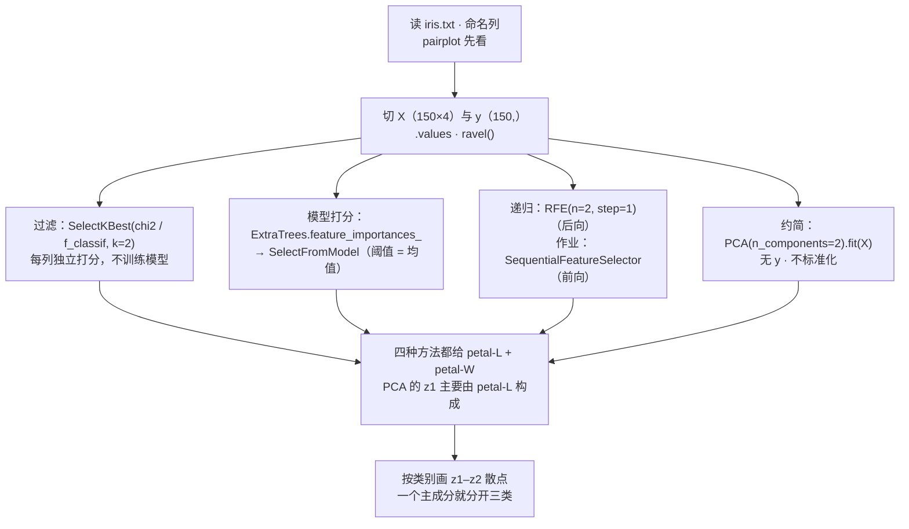

# T04 · 特征选择与 PCA 实战：Iris 的四种降维代码

> **本讲一句话**：这个 notebook 把 [[M04-特征工程-特征重要性与降维]] 的三块内容各变成几行 sklearn——**过滤模型**（`SelectKBest` + `chi2` / `f_classif`，讲义 §2.8 的单变量分数）、**包装 / 模型打分**（`ExtraTreesClassifier.feature_importances_` + `SelectFromModel`；`RFE` 递归剔除，讲义 §2.9、§2.12）、**特征约简**（`PCA(n_components=2)`，讲义 §2.13–2.15）。数据只用 150 行的 Iris，**四种方法都指向同一个答案：petal-L 和 petal-W**。作业第 3 题（40 分）要你读文档自学第五种——`SequentialFeatureSelector`，那就是讲义 p.54 的前向递归选择。
> **原始材料**：`Week 4 Feature Engineering.ipynb`（37 cells）｜ **配套讲义**：[[M04-特征工程-特征重要性与降维]]｜ **数据**：[[Business_Data_Analytics/_meta/数据集卡片#iris.txt|数据集卡片 › iris.txt]]；作业第 4 题用 [[Business_Data_Analytics/_meta/数据集卡片#Airbnb.csv|数据集卡片 › Airbnb.csv]] ｜ **转录**：`pending`（W04 预计 9/23 上课）
>
> ⚠️ **三件事先知道**：① cell 1 写 "refer to the 'Feature Engineering' Lecture Note in **Week 3**"——往年编号残留，本学期是 Week 4 讲义；② 与 T03 一样**没有 `🤖 AI Prompt` 单元格**；③ notebook 元数据显示它是在 **Python 3.7.6** 下跑的（T01–T03 是 3.13.5），代码在新版 sklearn 上仍能跑，但 cell 21 的 `feature_importances_` 数值**每次运行都不同**（没设 `random_state`），别拿 notebook 里的 0.115 / 0.060 / 0.383 / 0.442 当标准答案。见 §9.3。

---

## 0. 这个 notebook 在教什么

一句话：**同一份数据，用四种方法各"选"一次特征，看它们是否给出一致的答案——并学会读 sklearn 的三段式 API（选算法 → 选度量 → 选 k）。**

cell 2 自己列了三件事（univariate feature selection、recursive feature elimination、PCA），cell 3 列了六项工具箱。我按讲义的三块分段：

| 段 | cell | 方法 | 讲义对应 | 结果 |
|---|---|---|---|---|
| **A · 过滤模型** | 4–14 | `SelectKBest(chi2, k=2)`：每个特征单独做卡方检验打分，取前 2 | M04 §2.8 单变量分数、§2.9 过滤模型 | petal-L、petal-W |
| **B · 模型打分 + 递归剔除** | 15–26 | `ExtraTreesClassifier.feature_importances_` → `SelectFromModel`（阈值 = 均值）；`RFE(n_features_to_select=2)` 每轮删最不重要的一个 | M04 §2.7 Gini（树的重要性就是加权 Gini 减少量）、§2.9 包装模型、§2.12 递归选择（backward 版） | petal-L、petal-W |
| **C · 特征约简** | 27–34 | `PCA(n_components=2)` 把 4 列变 2 列，按类别画 z1–z2 散点 | M04 §2.13–2.15 | PC1 保留 92.5% 方差；三类在 z1 轴上分开 |
| D · 作业 | 35 | 4 题 80 分（`f_classif` 重做、三方法比较、`SequentialFeatureSelector`、Airbnb 选 3 个特征） | — | §7 |

**它和 M04 讲义的关系**：讲义 p.23 问"怎么衡量 petal width 和 sepal length 的重要性"，notebook 给了四个可运行的答案；讲义 p.44 小测手算 Gini，notebook cell 21 让 50 棵随机树替你算了几千次 Gini 并平均。讲义没讲卡方 / ANOVA F 的公式，notebook 也没讲——§2.2 会补一句。

---

## 1. 前置

### 1.1 需要哪些库

```python
import pandas as pd
import seaborn as sns                                    # cell 8 配对图
import matplotlib.pyplot as plt
from sklearn.feature_selection import SelectKBest, f_classif, chi2, f_regression   # 过滤
from sklearn.ensemble import ExtraTreesClassifier        # 打分用的树模型
from sklearn.feature_selection import SelectFromModel, RFE                       # 按模型选 / 递归剔除
from sklearn.decomposition import PCA                    # 约简
from sklearn.discriminant_analysis import LinearDiscriminantAnalysis             # cell 28 导入了但没用
```

全部在 Anaconda 自带的 sklearn 里。⚠️ `iris.txt` 要和 notebook 同一文件夹（相对路径）。作业第 3 题要用的 `SequentialFeatureSelector` 在 **sklearn ≥ 0.24** 才有——notebook 的 Python 3.7.6 环境若配的是旧 sklearn 会 `ImportError`，请在自己的 Anaconda（T01 装的）里跑。

### 1.2 对应哪一讲的理论

| notebook 段 | 讲义 M04 | 一句话 |
|---|---|---|
| cell 2 四个特征 + 类别 | §2.5（p.23） | "哪个特征更能分开三类" |
| cell 8 `pairplot` | §2.5（p.27–28）；M03 §2.18 散点图矩阵 | 先用眼睛看一遍 |
| cell 12 `SelectKBest(chi2)` | §2.8 单变量分数 $-\log p$、§2.9 过滤模型（p.32, p.50） | 每个特征单独检验 |
| cell 21 `feature_importances_` | §2.7 Gini、§2.9（p.35–39, p.43） | 树的每次分裂都是一次 Gini 增益 |
| cell 23 `SelectFromModel` | §2.9 包装模型（p.43, p.50） | 分数 ≥ 阈值的留下 |
| cell 25 `RFE` | §2.12 递归选择、后向搜索（p.53–54） | 每轮删一个最差的 |
| cell 30–34 `PCA` | §2.13–2.15（p.56–69） | $z = U_{\text{reduce}}^{\top} x$ |
| 作业 Q3 `SequentialFeatureSelector` | §2.12 前向选择（p.54–55） | 每轮加一个最好的 |

### 1.3 本 notebook 第一次出现的 API（读之前先认识）

| API | 一句话 | 首次出现 |
|---|---|---|
| `SelectKBest(score_func, k)` | "按某个打分函数选前 k 个特征"的选择器；`score_func` 是函数对象（不加括号） | cell 12 |
| `chi2` / `f_classif` / `f_regression` | 三个打分函数：卡方（非负特征 × 分类）、ANOVA F（分类）、F 检验（回归） | cell 5 |
| `sns.pairplot(df, hue=)` | 一行画散点图矩阵，`hue` 按类别上色 | cell 8 |
| `df.values` | DataFrame → numpy 二维数组（丢列名） | cell 18 |
| `arr.ravel()` | (150, 1) → (150,)：把"一列"压成"一维" | cell 18 |
| `ExtraTreesClassifier(n_estimators=)` | 50 棵随机化决策树的集成；`.fit(X, y)` 后有 `.feature_importances_` | cell 21 |
| `SelectFromModel(model, prefit=True)` | 用已训练模型的重要性选特征，默认阈值 = 重要性均值；`.transform(X)` 取列 | cell 23 |
| `RFE(estimator, n_features_to_select, step)` | 递归特征剔除：反复训练、每轮删 `step` 个最不重要的，直到剩 `n_features_to_select` 个 | cell 25 |
| `.fit_transform(X, y)` vs `.fit(X, y)` + `.transform(X)` | 一步 / 两步；返回 numpy 数组 | cell 25–26 |
| `PCA(n_components=)` + `.fit(X).transform(X)` | 主成分分析；`.explained_variance_ratio_`、`.components_` 是两个该看却没看的属性 | cell 30 |
| `df.groupby(col)` 迭代 `for name, group in groups` | 按类别分组后逐组画散点 | cell 34 |

> **sklearn 选择器的三段式**（本 notebook 反复出现）：**① 选算法**（`SelectKBest` / `SelectFromModel` / `RFE` / `PCA`）→ **② 选度量或模型**（`chi2`、`ExtraTreesClassifier`）→ **③ 选 k**（`k=2`、`n_features_to_select=2`、`n_components=2`）。然后 `fit_transform(X, y)` 得到 `(150, 2)` 的 numpy 数组。**返回值没有列名**——要知道选了谁，看前几行的数值跟原表对（notebook 的做法，cell 14）或用 `.get_support(indices=True)`（更可靠，§2.3）。

---

## 2. 逐块讲解 · 段 A：过滤模型 SelectKBest（cell 4–14）

### 2.1 【cell 5–10】导入、读数据、配对图、切 X / y

**这块在干什么**：导入过滤法的三个打分函数，读 Iris 并命名列，画一张配对图先用眼睛看，然后把特征表 `X` 和目标 `y` 分开。

```python
from sklearn.feature_selection import SelectKBest
from sklearn.feature_selection import f_classif, chi2, f_regression
# f_classif: ANOVA F-value between label/feature for classification tasks.
# chi2: Chi-squared stats of non-negative features for classification tasks.
# f_regression: F-value between label/feature for regression tasks.
import pandas as pd

iris = pd.read_csv('iris.txt', header=None)
iris.columns = ['sepal-L', 'sepal-W', 'petal-L', 'petal-W', 'class']

import seaborn as sns
sns.pairplot(iris, hue="class")      # which features are most representative?

features = ['sepal-L', 'sepal-W', 'petal-L', 'petal-W']
target = ['class']
X = iris[features]
y = iris[target]
```

**逐行**：三个打分函数的注释是 notebook 自己写的，值得记——`f_classif` 用于**分类**（ANOVA F 值），`chi2` 用于**分类且特征非负**（Iris 的厘米数满足），`f_regression` 用于**回归**（作业第 4 题 Airbnb 预测价格要用它）。`header=None` 同 T03。`pairplot(hue="class")` 是 M03 §2.18 散点图矩阵的 seaborn 版：4 × 4 格，对角线是每个特征按类别的分布曲线。`X = iris[features]` 用列表取列得到 DataFrame（150 × 4），`y = iris[target]` 也是 DataFrame（150 × 1）。

**输出**：cell 7 打印 150 行 × 5 列（末尾 5 行是 `Iris-virginica`）；cell 8 的图里 petal-L / petal-W 参与的格子三色分离明显，sepal-W 的格子三色混在一起——这就是讲义 p.27–28 的结论，先看图再看数。

**为什么这么写**：notebook 的注释问 "which features are most representative?"——先让你用眼睛猜，后面用四种方法验证。

**⚠️ 易错点**：`y = iris[target]` 得到的是二维 DataFrame，`SelectKBest` 能接受（内部会转），但 cell 18 的树模型会警告，要 `ravel()`——见 §3.1。

### 2.2 【cell 12】SelectKBest：按卡方分数留两列

**这块在干什么**：用卡方统计量给四个特征各打一个分，留分最高的两个。

```python
X_new = SelectKBest(chi2, k=2).fit_transform(X, y)   # chi2 as the criteria, select k=2 best features
X_new.shape                                           # (150, 2)
```

**逐行**：`SelectKBest(chi2, k=2)` 建一个选择器：打分函数 `chi2`（传函数名，不加括号），保留 2 个。`fit_transform(X, y)`：`fit` 对每列算 `chi2(X, y)` 得到 4 个分数，`transform` 只保留分数最高的 2 列。返回 numpy 数组 `(150, 2)`。

**输出**：`(150, 2)`——列数从 4 变 2。

**打分是怎么算的**（notebook 与讲义都没写，💡 补）：`chi2` 把每个特征当"计数"看，对"特征值总和按类别的分布"做卡方检验，分数越大说明该特征在三类之间差异越大；`f_classif` 做单因素方差分析（ANOVA），F = 组间方差 / 组内方差，越大越能分开类。两者都是讲义 p.32 的**单变量分数**思路：分数大 ⇔ p 值小 ⇔ $-\log p$ 大。脚本 `verify_t04.py` 复算：

| 特征 | chi2 分数 | chi2 p 值 | f_classif F 值 | F 的 p 值 |
|---|---|---|---|---|
| sepal-L | 10.82 | 0.0045 | 119.26 | $1.7 \times 10^{-31}$ |
| sepal-W | 3.59 | 0.166 | 47.36 | $1.3 \times 10^{-16}$ |
| **petal-L** | **116.17** | ≈ 0 | **1179.03** | $3.1 \times 10^{-91}$ |
| **petal-W** | **67.24** | ≈ 0 | **959.32** | $4.4 \times 10^{-85}$ |

两种度量排序相同：petal-L > petal-W > sepal-L > sepal-W——**作业第 1 题换成 `f_classif` 会得到同样的两列**。

**为什么这么写**：这是讲义 p.25 / p.50 的**过滤模型**——全程没有训练任何分类器，只做统计检验，快、对后续模型无偏。

**⚠️ 易错点**：① `chi2` 要求特征**非负**（它把特征当频数），Iris 可以，标准化后（有负数）就报错——作业第 4 题 Airbnb 若先标准化则要改用 `f_regression`；② `k` 是人定的，讲义 p.54 的递归法才会"自己决定"；③ 选择器本身**不知道**列名。

### 2.3 【cell 14】看选中了谁

**这块在干什么**：`fit_transform` 只返回数字，得靠前几行对回原表才知道留下的是哪两列。

```python
display(X_new[0:5, :])     # petal-L and petal-W were selected
```

**输出**：`[[1.4, 0.2], [1.4, 0.2], [1.3, 0.2], [1.5, 0.2], [1.4, 0.2]]`——跟 cell 7 前五行的 petal-L（1.4, 1.4, 1.3, 1.5, 1.4）和 petal-W（0.2 × 5）对上，所以是这两列。

**更可靠的写法**（💡 补，作业里建议用）：

```python
selector = SelectKBest(chi2, k=2).fit(X, y)
selector.scores_                                   # 四个分数
[features[i] for i in selector.get_support(indices=True)]   # ['petal-L', 'petal-W']
```

`scores_` 给分数，`get_support(indices=True)` 给被选列的下标——不用肉眼对数。

### 2.4 段 A 小结

三段式对照讲义：

| 步骤 | 代码 | 讲义 |
|---|---|---|
| 选算法 | `SelectKBest` | 过滤模型（p.50 左列） |
| 选度量 | `chi2` / `f_classif` | 单变量分数（p.32） |
| 选 k | `k=2` | 人定 |
| 得结果 | `fit_transform` → `(150, 2)` | petal-L、petal-W |

---
## 3. 逐块讲解 · 段 B：模型打分与递归剔除（cell 15–26）

### 3.1 【cell 16–19】导入树模型、重读数据、转 numpy、压平 y

**这块在干什么**：换一种打分方式——用一个**模型**来算重要性。先导入 `ExtraTreesClassifier` 和 `SelectFromModel`，重新读数据并把 X、y 转成 numpy。

```python
from sklearn.ensemble import ExtraTreesClassifier
# This class implements a meta estimator that fits a number of randomized decision trees
# (a.k.a. extra-trees) on various sub-samples of the dataset and
# uses averaging to improve the predictive accuracy and control over-fitting.
from sklearn.feature_selection import SelectFromModel

iris = pd.read_csv('iris.txt', header=None)
iris.columns = ['sepal-L', 'sepal-W', 'petal-L', 'petal-W', 'class']
features = ['sepal-L', 'sepal-W', 'petal-L', 'petal-W']
target = ['class']
X = iris[features]
y = iris[target]
X = X.values
y = y.values.ravel()   # y is one-dimensional, use ravel() to reshape it to (n,)
y.shape                # (150,)
```

**逐行**：`ExtraTreesClassifier` = "极端随机树"，是 M01 §2.6.4 提过的**集成学习**——训练很多棵决策树（每棵在分裂时随机选特征、随机选阈值），投票预测；这里不用它预测，只用它顺带算出的 `feature_importances_`。`X.values` 把 DataFrame 变成 `(150, 4)` 的数组；`y.values` 是 `(150, 1)`，`ravel()` 压成 `(150,)`——sklearn 的分类器要求 y 是一维，不压会有 `DataConversionWarning`。

**输出**：cell 19 `(150,)`。

**为什么这么写**：notebook 的 markdown（cell 15）说 "This is a kind of Wrapper model"——按讲义 p.43 的定义（用预定模型的表现当分数）可以这么归；严格说树的 `feature_importances_` 是训练过程的副产品，教科书叫**嵌入式**（M04 §2.9 💡）。答题按讲义口径写"包装模型"，可加一句说明。

**⚠️ 易错点**：`ravel()` 这行是**必需的**，T02 的回归没这个问题是因为 `LinearRegression` 对 `(n, 1)` 的 y 宽容。

### 3.2 【cell 21】ExtraTreesClassifier：让 50 棵树给特征打分

**这块在干什么**：训练 50 棵随机树，读出四个特征的重要性分数。

```python
clf = ExtraTreesClassifier(n_estimators=50)   # get the model from library
clf = clf.fit(X, y)                            # fit your data
clf.feature_importances_                       # feature importance score from model
```

**输出（notebook 记录）**：`[0.11489972, 0.05970171, 0.38326999, 0.44212858]`——四个数加起来是 1；petal-W 0.44、petal-L 0.38、sepal-L 0.11、sepal-W 0.06。

**这个数是什么**（接讲义 §2.7）：每棵树的每次分裂都用某个特征把节点切开，带来一个"加权 Gini 减少量"（讲义 p.37–38 的 $\text{GINI}(\text{parent}) - \text{GINI}_{\text{split}}$，按节点样本数加权）；把每个特征在所有树、所有分裂里的减少量加起来再归一化，就是 `feature_importances_`。**讲义 p.44 让你手算一次的东西，这里算了几千次取平均。**

**⚠️ 数值不可复现**：`ExtraTreesClassifier` 每次训练随机性不同，没设 `random_state` 时四个数每次都变。脚本 `verify_t04.py` 用 `random_state=0` 得到 `[0.0783, 0.0646, 0.4202, 0.4369]`——与 notebook 的 0.115 / 0.060 / 0.383 / 0.442 **不同但排序一致**（petal-W ≥ petal-L ≫ sepal-L > sepal-W）。作业里请写 `ExtraTreesClassifier(n_estimators=50, random_state=42)` 并说明"数值因随机性略有差异、排序稳定"。

**为什么这么写**：`n_estimators=50` 是树的棵数——越多越稳（重要性的方差越小），越慢；50 对 150 行数据足够。

### 3.3 【cell 23】SelectFromModel：按分数阈值取列

**这块在干什么**：用刚才的重要性分数选特征——分数 ≥ 阈值的留下。

```python
selection = SelectFromModel(clf, prefit=True)   # clf already fitted
X_new = selection.transform(X)
display(X_new[0:5, :])
```

**逐行**：`prefit=True` 告诉选择器"模型已经训练过了，直接用它的 `feature_importances_`"；不传 `threshold` 时**默认阈值 = 重要性的均值**（四个数平均 = 0.25）。`transform(X)` 保留分数 ≥ 0.25 的列。

**输出**：`[[1.4, 0.2], [1.4, 0.2], ...]`——又是 petal-L、petal-W（0.38、0.44 ≥ 0.25；0.11、0.06 < 0.25）。脚本 `verify_t04.py`：阈值 0.25，选中 petal-L、petal-W。

**为什么这么写**：这是讲义 p.43 包装模型的第二步——"use the model performance as feature importance score"，然后按分数取舍。与 `SelectKBest` 的区别：**这里不指定 k，由阈值决定留几个**（可能留 1 个也可能留 3 个）；要固定 k 用 `SelectFromModel(clf, prefit=True, max_features=2, threshold=-np.inf)`。

**⚠️ 易错点**：新版 sklearn（≥ 1.2）对 `prefit=True` 的选择器要先调用 `.fit(X, y)` 才能访问 `threshold_` 等属性（`transform` 不受影响）——脚本 `verify_t04.py` 在 sklearn 1.5.1 上就遇到了这个差异；notebook 的旧环境没有这个要求。

### 3.4 【cell 25–26】RFE：递归特征剔除

**这块在干什么**：递归特征剔除——训练模型 → 删掉最不重要的 1 个特征 → 用剩下的重新训练 → 再删 → 直到剩 2 个。

```python
from sklearn.feature_selection import RFE
clf = ExtraTreesClassifier(n_estimators=50)
selection = RFE(estimator=clf, n_features_to_select=2, step=1)
selection.fit(X, y)
X_new = selection.transform(X)
display(X_new[0:5, :])

# alternatively, put fit and transform together:
X_new = selection.fit_transform(X, y)
display(X_new[0:5, :])
```

**逐行**：`estimator=clf` 是每轮用来打分的模型（这里仍是极端随机树；线性模型也行，用 `coef_`）；`n_features_to_select=2` 是终点；`step=1` 每轮删 1 个。四个特征 → 三轮：第一轮训练 4 特征模型删最差的（sepal-W），第二轮 3 特征删 sepal-L，剩 petal-L、petal-W。cell 26 是 `fit` + `transform` 合成一步的写法，结果相同。

**输出**：两次都是 `[[1.4, 0.2], ...]`。脚本 `verify_t04.py`（`random_state=0`）：`ranking_` = {petal-L: 1, petal-W: 1, sepal-L: 2, sepal-W: 3}——排名 1 是被选中的，2 是倒数第二轮被删的，3 是第一轮被删的。

**为什么这么写**：这是讲义 p.53–54 递归选择的**后向（backward）**实现：从全集开始一次删一个；作业第 3 题的 `SequentialFeatureSelector(direction='forward')` 是**前向**实现：从空集开始一次加一个。两者都属于讲义 p.50 的包装模型（每轮都要训练模型，计算贵）。notebook cell 24 的英文说明就是 sklearn 文档原文——"the least important features are pruned from current set of features… recursively repeated on the pruned set until the desired number of features to select is eventually reached"。

**⚠️ 易错点**：`RFE` 的 `ranking_` 里 1 表示"选中"，数字越大越早被删——不是"第几重要"。

### 3.5 段 B 小结

两种"用模型选"的对照：

| 步骤 | `SelectFromModel` | `RFE` |
|---|---|---|
| 选算法 | 按模型分数取舍 | 递归剔除 |
| 选模型 | `ExtraTreesClassifier(50)` | 同 |
| 选 k | 不指定，阈值 = 均值 | `n_features_to_select=2` |
| 训练几次 | 1 次 | 3 次（4 → 3 → 2） |
| 讲义 | p.43 包装模型 | p.53–54 后向递归 |
| 结果 | petal-L、petal-W | petal-L、petal-W |

---

## 4. 逐块讲解 · 段 C：PCA（cell 27–34）

### 4.1 【cell 28–31】PCA：4 列变 2 列

**这块在干什么**：不再"选"列，而是把四列**线性组合**成两列新坐标 z1、z2。

```python
import matplotlib.pyplot as plt
from sklearn.decomposition import PCA
from sklearn.discriminant_analysis import LinearDiscriminantAnalysis   # 导入了，没用

iris = pd.read_csv('iris.txt', header=None)
iris.columns = ['sepal-L', 'sepal-W', 'petal-L', 'petal-W', 'class']
features = ['sepal-L', 'sepal-W', 'petal-L', 'petal-W']
X = iris[features].values
pca = PCA(n_components=2)       # PCA with 2 dimensions
z = pca.fit(X).transform(X)
display(z[:5, :])
```

**逐行**：`PCA(n_components=2)` 建模型，只要前 2 个主成分。`fit(X)` 做讲义 p.66–67 的事：**每列减均值 → 协方差矩阵 → 特征值分解 → 取前 2 个特征向量**；`transform(X)` 做 $z = U_{\text{reduce}}^{\top}(x - \bar{x})$。注意 **没有 y**——PCA 是无监督的，类别标签全程没参与（对比前两段的 `fit(X, y)`）。也**没有标准化**：四列都是厘米，直接用协方差矩阵（M04 §2.15 的"相关矩阵 vs 协方差矩阵"）。

**输出**：`z[:5]` = `[[-2.684, 0.327], [-2.715, -0.170], [-2.890, -0.137], [-2.746, -0.311], [-2.729, 0.334]]`——前五朵 setosa 的 z1 都在 −2.7 附近。脚本 `verify_t04.py` 复算完全一致。

**该看却没看的三个属性**（💡 补，作业第 2 题讲"PCA 与选择的区别"要用）：

```python
pca.explained_variance_ratio_   # [0.9246, 0.0530]  → 前两个主成分保留 97.8% 方差
pca.components_                 # [[ 0.3616, -0.0823,  0.8566,  0.3588],
                                #  [ 0.6565,  0.7297, -0.1758, -0.0747]]   = U_reduce 的转置
pca.mean_                       # [5.843, 3.054, 3.759, 1.199]  = 每列均值（讲义 p.66 的中心化）
```

`components_[0]` 就是讲义的 $u^{(1)}$：$z_1 = 0.36\,\text{sepalL} - 0.08\,\text{sepalW} + 0.86\,\text{petalL} + 0.36\,\text{petalW}$（各项已减均值）——**z1 主要是 petal-L**（0.86），这解释了为什么 PCA 和前两段的"选择"殊途同归。验证：第一行 $x - \bar{x} = (-0.743, 0.446, -2.359, -0.999)$，点乘 $u^{(1)}$ 得 $-2.684$ ✓。

**为什么这么写**：`fit(X).transform(X)` 与 `fit_transform(X)` 等价；分开写是为了强调"先学方向、再投影"两步，新数据只需 `transform`。

**⚠️ 易错点**：① 把 z1、z2 当成"最重要的两个原始特征"——它们是**四个特征的加权和**（M04 §2.11）；② `LinearDiscriminantAnalysis` 被导入但没用——LDA 是讲义 p.48 说的"有监督的约简"（最大化类别区分），⚪ 可能是往年版本的残留或老师想让你自己试。

### 4.2 【cell 32–34】把 z1、z2 接回表、按类别画散点

```python
iris['z1'] = z[:, 0]
iris['z2'] = z[:, 1]
iris.head()

groups = iris.groupby("class")
for name, group in groups:
    plt.scatter(group['z1'], group['z2'], marker="o", label=name)
plt.xlabel('z1'); plt.ylabel('z2'); plt.legend(); plt.show()
```

**逐行**：把 numpy 数组的两列接回 DataFrame 当新列（T03 §3.4 接回 scaler 输出的同一手法）。`groupby("class")` 迭代得到 `(类别名, 子表)`，每类画一次 `scatter` 并加 `label`，`legend()` 就有三色图例——这是 T03 §2.4 分组散点的紧凑写法。

**输出（cell 34 图）**：横轴 z1 从 −3 到 4：setosa 独占左侧（z1 ≈ −2.7 附近一团），versicolor 在中间、virginica 在右侧，两者在 z1 ≈ 1.5 处有少量重叠；纵轴 z2 范围只有 −1.5 到 1.5，三类在 z2 上没有分离。**读图**：一个主成分（z1）就把三类基本分开——它保留了 92.5% 的方差，而类间差异恰好也在这个方向上。

**为什么这么写**：这是讲义 p.58、p.64 几何图的实测版；也是作业第 2 题"PCA 与选择有什么不同"的直观证据——横轴不是任何一列原始特征。

**⚠️ 易错点**：PCA 没用标签却分开了类，是**巧合于数据**（类间差异方向 = 方差最大方向），不是 PCA 的功能；换一份"类别差异在小方差方向上"的数据，PCA 可能把类别混在一起——那时要用 LDA。

### 4.3 段 C 小结

约简与讲义记号的对照：

| 步骤 | 代码 | 讲义 |
|---|---|---|
| 选算法 | `PCA` | 特征约简（p.48–49） |
| 选 k | `n_components=2` | 累计方差 97.8%（p.69 的规则） |
| 训练 | `fit(X)`（无 y） | 中心化 → $S$ → 特征分解（p.66） |
| 变换 | `transform(X)` → `(150, 2)` | $z = U_{\text{reduce}}^{\top}x$（p.67） |
| 看方向 | `components_`、`explained_variance_ratio_` | $u^{(i)}$、$\lambda_i / \sum\lambda$ |

---

## 5. 完整流程串讲

把 19 个 code cell（实际有内容的 18 个）串成一条线，就是作业第 1–3 题的骨架：



**三条贯穿的纪律**：① 每个选择器都是"选算法 → 选度量 / 模型 → 选 k → `fit_transform`"，返回 numpy 数组，**用 `get_support(indices=True)` 拿列名**，别肉眼对数；② 涉及随机的模型（ExtraTrees、RFE 用它、SFS 用它）**设 `random_state`**，并在报告里写明"排序稳定、数值略变"；③ 结果要能回答"所以呢"——"petal-L 被四种方法同时选中，说明它对区分三种鸢尾最有代表性；sepal-W 被四种方法同时排在最后，可以删"。

---

## 6. 自己动手与讲义对应

### 6.1 改哪个参数会发生什么

| 改什么 | 改成 | 会看到 | 学到 |
|---|---|---|---|
| cell 12 `chi2` | `f_classif` | 仍选 petal-L、petal-W；`scores_` 从 [10.8, 3.6, 116.2, 67.2] 变 [119, 47, 1179, 959] | 作业第 1 题；两种度量排序一致（`verify_t04.py`） |
| cell 12 `k=2` | `k=1` / `k=3` | 只剩 petal-L / 多出 sepal-L | k 是人定的门槛 |
| cell 12 的 X | 先 `StandardScaler` 再 `chi2` | `ValueError: Input X must be non-negative` | chi2 只吃非负特征 |
| cell 21 `n_estimators=50` | 5 / 500 | 5 棵时重要性每次差很多；500 棵很稳 | 集成的棵数 ↔ 方差 |
| cell 21 无 `random_state` | 加 `random_state=42` | 每次运行数值相同 | 可复现性（作业要求） |
| cell 23 默认阈值 | `threshold=0.1` | 多留下 sepal-L（0.11 ≥ 0.1） | SelectFromModel 由阈值定 k |
| cell 23 | `max_features=2, threshold=-np.inf` | 固定留 2 个 | 与 SelectKBest 等价的用法 |
| cell 25 `n_features_to_select=2` | `1` | 只剩 petal-W 或 petal-L（随机） | 两者重要性接近，最后一轮谁被删看运气 |
| cell 25 `estimator` | `LogisticRegression(max_iter=1000)` | 用 `coef_` 排名，结果可能变 | RFE 的分数来自模型，换模型换答案（包装模型的特点） |
| cell 30 `n_components=2` | `4` | `explained_variance_ratio_` = [0.925, 0.053, 0.017, 0.005] | 讲义 p.69 的"累计比例"表 |
| cell 30 的 X | 先 `StandardScaler` | ratio 变成约 [0.73, 0.23]，z 数值全变 | 相关矩阵 vs 协方差矩阵的 PCA（M04 §2.15） |
| cell 34 | 画 `petal-L` × `petal-W` 原始散点对比 | 三类分离程度相近 | PCA 的 z1 ≈ petal-L 方向 |

---

### 6.2 与讲义理论的对应

| notebook cell | 讲义 M04 页 | 概念 |
|---|---|---|
| 8 pairplot | p.23, p.27–28 | 用眼睛看"哪个特征分得开" |
| 12 SelectKBest(chi2) | p.32（Univariate Score）、p.25 / p.50（Filter） | 单变量分数；过滤模型 |
| 21 feature_importances_ | p.35–38（Gini、GINI_split） | 树的重要性 = 加权 Gini 减少量的累计 |
| 23 SelectFromModel | p.43（Wrapper 两步）、p.50 | 用模型分数取舍 |
| 25 RFE | p.53（Backward）、p.54（递归） | 从全集一次删一个 |
| 作业 Q3 SequentialFeatureSelector | p.53（Forward）、p.54–55 | 从空集一次加一个 |
| 30 PCA.fit | p.66（$S = D^{\top}D$、特征值 / 向量） | 中心化 + 特征分解 |
| 30 PCA.transform | p.67（$z = U_{\text{reduce}}^{\top}x$） | 投影 |
| 31 z 的前五行 | p.63（z 向量）、p.61（投影） | 新的低维特征 |
| 34 z1–z2 散点 | p.58、p.64 | 第一主成分方差最大 |
| explained_variance_ratio_（补） | p.69 | 累计比例、留几个 |
| 作业 Q2 三方法比较 | p.49 | 选择（子集、离散）vs 约简（组合、连续） |

---
## 7. 本次作业：Week 4 Assignment（notebook cell 35 原文）

### 7.1 原文（一字不改）

> # Week 4 Assignment
>
> ## 1. use f_classif as your evaluation measurement and redo the feature selection in Univariate feature selection. what does "f_classif" represent? Is this a filter model or wrapper model? (10 points).
>
> ## 2. Explain the differences among univariate feature selection, SelectFromModel method, and PCA. (10 points)
>
> ## 3. Read documentation of "SequentialFeatureSelector" and use it to select the top TWO features. What is the mechnism of this tool? What are these two optimal features? (40 points)
>
> document: https://scikit-learn.org/stable/modules/generated/sklearn.feature_selection.SequentialFeatureSelector.html
>
> ## 4. Use the Airbnb.csv on Canvas-Week4 Homepage. Select the most representative 3 features from the dataset for price prediction. You may use any feature selection methods but please interpret your steps with codes (20 points).

（cell 36 空 markdown，cell 37 空 code——留给你写答案的位置。）

### 7.2 三件先要知道的事

1. **总分 80，不是 100**（10 + 10 + 40 + 20）。⚪ 可能是老师笔误或按比例折算；提交前问一句，见 §9.5。
2. **没有截止日期、没有提交清单**（T03 的作业有"提交 .ipynb + .html"的说明，本周没有），且 **2026-09-16 的 Canvas 作业列表里还没有 Assignment Week 4**。按 W2 / W3 的规律（上课后第 9 天周五 23:59，Canvas 10 分）推：⚪ **2026-10-02（五）23:59**，提交 `.ipynb` + `.html`；挂出后核实。作业迟交每天 −20%（Syllabus）。
3. **第 3 题 40 分是重头**，考的是"读官方文档自学一个新工具"——评分点大概率是**机制说清楚**（前向 / 后向、每轮用交叉验证评分、贪心）而不只是跑出两个名字。

### 7.3 逐题攻略

**Q1 · `f_classif` 重做（10 分）**

```python
from sklearn.feature_selection import SelectKBest, f_classif
selector = SelectKBest(f_classif, k=2).fit(X, y)
print(selector.scores_)                                   # [119.26, 47.36, 1179.03, 959.32]
print([features[i] for i in selector.get_support(indices=True)])   # ['petal-L', 'petal-W']
```

要写的三句话：① `f_classif` = 对每个特征做**单因素方差分析（ANOVA）的 F 值**——F = 类间方差 / 类内方差，越大说明该特征在三类之间差异越大（p 值越小，对应讲义 p.32 的 Univariate Score $-\log p$）；② 结果与 `chi2` 相同：petal-L、petal-W（数值见 §2.2 表，脚本 `verify_t04.py`）；③ 这是**过滤模型（filter）**——不涉及任何学习算法，只用数据的统计性质打分（讲义 p.25、p.50）。加分：说明 `chi2` 要求非负而 `f_classif` 不要求。

**Q2 · 三种方法的区别（10 分）**

按讲义 p.49–50 组织一张表，每行一句：

| | Univariate（SelectKBest） | SelectFromModel | PCA |
|---|---|---|---|
| 类型 | 特征**选择**，过滤模型 | 特征**选择**，包装 / 嵌入式（用模型的重要性） | 特征**约简** |
| 输入 | X 和 y | X 和 y（要先训练模型） | 只有 X（无监督） |
| 打分 | 每个特征**独立**做统计检验（F / 卡方） | 模型训练得到的重要性（树 = Gini 减少量；线性 = 系数） | 不打分：找方差最大的方向 |
| 输出 | 原始特征的子集（k 个，列名不变） | 原始特征的子集（阈值决定几个） | 新特征 z = 所有原始特征的线性组合，不可解释 |
| 快慢 | 最快 | 要训练一次模型 | 一次特征分解，快 |
| 缺点 | 不考虑特征间的组合 / 冗余 | 依赖所选模型 | 丢掉列名；对量纲敏感 |

结尾一句：三者在 Iris 上殊途同归（前两者选 petal-L / petal-W，PCA 的 z1 主要由 petal-L 构成，§4.1）。

**Q3 · `SequentialFeatureSelector`（40 分）**

机制（文档要点，对应讲义 p.53–55）：给定一个估计器，**前向**（`direction='forward'`，默认）从空集开始，每轮把"加入后交叉验证得分最高"的那个特征加进来，直到 `n_features_to_select` 个；**后向**从全集开始每轮删一个。评分用 `cv` 折交叉验证的 `scoring`（分类默认准确率）。这是**贪心 + 包装模型**：每轮要训练"剩余特征数乘以 cv"次模型。与 `RFE` 的区别：RFE 只用模型的 `coef_` / `feature_importances_` 排名，SFS 直接用**预测表现**；与 `SelectKBest` 的区别：SFS 考虑特征组合（已选集合的基础上再评）。

```python
from sklearn.feature_selection import SequentialFeatureSelector
from sklearn.linear_model import LogisticRegression
est = LogisticRegression(max_iter=1000)
sfs = SequentialFeatureSelector(est, n_features_to_select=2, direction='forward', cv=5).fit(X, y)
print([features[i] for i in sfs.get_support(indices=True)])
```

脚本 `verify_t04.py` 用三种估计器（LogisticRegression、KNN(5)、ExtraTrees random_state=0）× 前向 / 后向共六种组合，**全部得到 petal-L、petal-W**。第一轮各单特征的 5 折准确率（LogReg）：sepal-L 0.753、sepal-W 0.560、petal-L 0.953、**petal-W 0.960** → 先选 petal-W；第二轮在其基础上加 petal-L 最好。报告里把这两轮的分数列出来，就是讲义 p.54 那张三轮表的实测版。加分：跑一次 `direction='backward'` 对比；说明 `n_features_to_select='auto'` + `tol` 可以让它自己决定个数。

**Q4 · Airbnb 选 3 个特征预测价格（20 分）**

目标是 `log_price`（T02 的口径），任务是**回归**，所以打分函数换 `f_regression` / 相关系数 / 回归模型的重要性。建议流程（"interpret your steps with codes"——每步一句解释）：

1. 读数据，`log_price` 为 y；先只用数值列（`accommodates, bathrooms, bedrooms, beds, number_of_reviews, review_scores_rating`），类别列（`city, property_type, room_type` 等）若要用需先 one-hot（T02 §3.2）。
2. 处理缺失（T03 §3.2：`review_scores_rating` 缺 15,275 个，填中位数或先 `dropna`），说明你的选择。
3. 过滤：`SelectKBest(f_regression, k=3)`。脚本 `verify_t04.py`（`dropna` 后 52,858 行）F 值：accommodates 29,208 > bedrooms 17,277 > beds 16,875 > bathrooms 8,316 > review_scores_rating 415 > number_of_reviews 0.7 → **accommodates、bedrooms、beds**；与 T03 的相关系数排序一致（0.578 / 0.483 / 0.470）。
4. 用第二种方法交叉验证：`SequentialFeatureSelector(LinearRegression(), n_features_to_select=3, cv=5)`。脚本 `verify_t04.py` 在同一 52,858 行、6 个数值列上的实跑结果：**accommodates、review_scores_rating、bedrooms**——前向选择**没选 beds**（它与 accommodates 相关 0.83，是冗余特征，M03 §2.11 / M04 §2.4），反而把单变量分数很低的 review_scores_rating 选了进来（它带的是与房源规模无关的**新信息**）。两种方法答案不同正是讲义 p.49–50 / p.52 的要点：**单变量打分不看冗余，包装模型看**。
5. 结论一段：选定的 3 个 + 为什么（业务含义：可住人数、卧室数直接决定定价；beds 与 accommodates 冗余故不重复选；评分带来独立信息），并注明"最有代表性"是相对于**线性预测 log_price** 这个任务（讲义 p.15 problem-specific）。

### 7.4 提交前自查

- [ ] 四题都有**代码 + 输出 + 文字解释**，第 3 题至少一段讲机制
- [ ] 每个随机模型都设了 `random_state`，并说明数值可能与 notebook 不同
- [ ] 选出的特征用 `get_support(indices=True)` 打印了**列名**，不是只贴数组
- [ ] Q1 明确写了 "filter"；Q2 用了"子集 vs 线性组合"、"有监督 vs 无监督"两组对比
- [ ] Q4 说明了目标变量（`log_price`）、缺失处理、类别列处理，至少两种方法对比
- [ ] 导出 `.html`（File → Download as → HTML）与 `.ipynb` 一起交；文件名含学号
- [ ] 到 Canvas 核实截止日期和总分

---

## 8. cell ↔ 讲义页码映射 · 课堂覆盖

**19 个 code cell 中 18 个有内容，全部在 §2–§4 有讲解（cell 37 为空）**；18 个 markdown cell 中，cell 1–4、6、9、11、13、15、17、20、22、24、27、29、33 的内容已并入对应小节，cell 35 见 §7，cell 36 为空。本讲无转录，「课堂覆盖」整列 `—`。

| cell | 类型 | 内容 | 笔记小节 | 讲义页 | 课堂覆盖 |
|---|---|---|---|---|---|
| 1 | md | 标题；"refer to … Week 3"（⚠️ §9.3） | §0 | — | — |
| 2 | md | 四个特征 + 三件要学的事 | §0 | p.23 | — |
| 3 | md | 工具箱六项（编号 1, 2, 4, 4, 5, 6） | §1.3 | — | — |
| 4 | md | 1.0 单变量选择说明 + 文档链接 | §2.1 | p.32 | — |
| 5 | code | import SelectKBest / f_classif / chi2 / f_regression | §2.1 | p.32 | — |
| 6 | md | 1.1 标题 | §2.1 | — | — |
| 7 | code | 读 iris.txt、命名列、显示 | §2.1 | — | — |
| 8 | code | `sns.pairplot(hue="class")` | §2.1 | p.23, p.27–28 | — |
| 9 | md | 1.2 标题 | §2.1 | — | — |
| 10 | code | features / target / X / y | §2.1 | — | — |
| 11 | md | 1.3 说明：算法 / 度量 / k | §2.2 | p.25 | — |
| 12 | code | `SelectKBest(chi2, k=2).fit_transform` | §2.2 | p.32, p.50 | — |
| 13 | md | 1.4 标题 | §2.3 | — | — |
| 14 | code | 看前五行 → petal-L, petal-W | §2.3 | p.27 | — |
| 15 | md | 2. Wrapper model 说明 | §3.1 | p.43, p.50 | — |
| 16 | code | import ExtraTreesClassifier / SelectFromModel | §3.1 | p.43 | — |
| 17 | md | 2.1 标题 | §3.1 | — | — |
| 18 | code | 重读数据、`.values`、`ravel()` | §3.1 | — | — |
| 19 | code | `y.shape` → (150,) | §3.1 | — | — |
| 20 | md | 2.2 标题 | §3.2 | — | — |
| 21 | code | `feature_importances_` | §3.2 | p.35–38 | — |
| 22 | md | 2.3 标题 + 文档链接 | §3.3 | — | — |
| 23 | code | `SelectFromModel(prefit=True).transform` | §3.3 | p.43 | — |
| 24 | md | 2.4 RFE 说明（文档原文） | §3.4 | p.53–54 | — |
| 25 | code | `RFE(...).fit` + `transform` | §3.4 | p.53–54 | — |
| 26 | code | `fit_transform` 合写 | §3.4 | — | — |
| 27 | md | 3. PCA 说明 | §4.1 | p.56 | — |
| 28 | code | import PCA / LDA / plt | §4.1 | — | — |
| 29 | md | "map it to a two dimensional space" | §4.1 | p.62 | — |
| 30 | code | `PCA(n_components=2)`，`fit().transform()` | §4.1 | p.66–67 | — |
| 31 | code | `z[:5]` | §4.1 | p.63 | — |
| 32 | code | z1 / z2 接回表 | §4.2 | — | — |
| 33 | md | "scatter plot … new space of z" | §4.2 | p.58 | — |
| 34 | code | 按类别画 z1–z2 散点 | §4.2 | p.58, p.64 | — |
| 35 | md | Week 4 Assignment（4 题 80 分） | §7 | p.25, 49–55 | — |
| 36 | md | 空 | — | — | — |
| 37 | code | 空 | — | — | — |

---

## 9. 延伸与勘误

### 9.1 notebook 有但课上略过

本讲尚未上课，无转录。转录到位后回填。

### 9.2 课上讲了但 notebook 没有

无转录。⚠️ 很可能有口述：`chi2` / `f_classif` 到底算什么；`feature_importances_` 每次不同怎么办；作业第 3 题的期望深度；第 4 题类别列要不要用；截止日期。

### 9.3 notebook 自身的问题

| # | 位置 | 问题 | 处理 |
|---|---|---|---|
| ① | cell 1 | "refer to the 'Feature Engineering' Lecture Note in **Week 3**" | 往年编号；本学期是 Week 4（M04）。Syllabus 也把它排在 W03——见 M04 §9.3 |
| ② | 元数据 | kernel 记录 **Python 3.7.6**（T01–T03 是 3.13.5，conda-base-py） | 往年文件直接沿用；代码在新版可跑，但 §3.3 的 `prefit` 行为有差异 |
| ③ | cell 21, 25 | `ExtraTreesClassifier` 未设 `random_state`，重要性数值不可复现 | 自己跑加 `random_state`；排序稳定 |
| ④ | cell 3 | 工具箱编号 1, 2, **4, 4**, 5, 6（缺 3） | 无实质影响 |
| ⑤ | cell 15 | 把 `SelectFromModel` + 树重要性称为 "a kind of Wrapper model" | 讲义两分法下可接受；教科书归嵌入式（M04 §2.9） |
| ⑥ | cell 27 | "**Principle** Component Analysis" | Principal（讲义 p.68–69 同错） |
| ⑦ | cell 28 | 导入 `LinearDiscriminantAnalysis` 但未使用 | ⚪ 残留；LDA = 有监督约简（讲义 p.48） |
| ⑧ | cell 30 | PCA 前没有标准化，也没解释为什么 | 四列同为厘米，可接受；换 Airbnb 必须先标准化（M04 §2.15） |
| ⑨ | cell 30–31 | 没有看 `explained_variance_ratio_` / `components_` | §4.1 补了：0.925 / 0.053，PC1 载荷 |
| ⑩ | cell 35 | 作业总分 80（10 + 10 + 40 + 20），无截止日、无提交说明 | 待确认 |
| ⑪ | cell 35 Q3 | "mechnism" | mechanism |
| ⑫ | 整体 | 与 T03 一样没有 `🤖 AI Prompt` 单元格 | 课程 CLAUDE.md 已注明 W3/W4 无提示格 |

### 9.4 课外补充

| 主题 | 内容 | 来源 |
|---|---|---|
| **chi2 与 f_classif 的算法** | sklearn `chi2` 把每个特征按类别求和当观测频数，与期望频数（按类别比例）做卡方检验——所以要求特征非负、并把特征当"计数"看，对连续特征只是近似；`f_classif` 是单因素 ANOVA：F = 组间均方 / 组内均方，自由度 (k−1, n−k) | 🔗 sklearn 文档，2026-09-16 |
| **树模型重要性的两种口径** | `feature_importances_` 是"基于不纯度"的重要性（Mean Decrease in Impurity），偏向取值多 / 连续的特征；另一种是**置换重要性**（`sklearn.inspection.permutation_importance`）——打乱某列看准确率掉多少，更公平但慢 | 🔗 sklearn 文档，2026-09-16 |
| **SequentialFeatureSelector 参数** | `direction='forward'/'backward'`、`n_features_to_select`（整数、比例或 `'auto'` 配 `tol`）、`scoring`、`cv`、`n_jobs`；sklearn ≥ 0.24 | 🔗 sklearn 文档，2026-09-16 |
| **Iris 的 PCA 经典结果** | 未标准化：方差比 0.9246 / 0.0531 / 0.0171 / 0.0052；标准化后约 0.730 / 0.229 / 0.037 / 0.005——两种口径都常见，报告要说明用了哪种 | `verify_w3w4.py`、`verify_t04.py`；标准化值为常识 |
| **Airbnb 特征选择的参考数字** | 数值列对 `log_price` 的 `f_regression` F 值（dropna 后 52,858 行）：accommodates 29,208、bedrooms 17,277、beds 16,875、bathrooms 8,316、rating 415、number_of_reviews 0.7 | `verify_t04.py` |
| **跨课链接** | 特征重要性高 ≠ 该用：IS5113 [[M03-偏见与公平]] 的代理变量（邮编 → 种族）——Airbnb 里 `city` / `neighbourhood` 也可能是收入的代理；PCA 前标准化 ↔ T03 §3.4 | 本库 |

### 9.5 待核对

| # | 事项 | 说明 |
|---|---|---|
| ① | **作业截止日与总分** | notebook 无日期，总分 80；Canvas 9/16 尚未挂出；⚪ 按 W2/W3 规律推 10/2（五）23:59 |
| ② | **第 4 题是否允许类别列 one-hot 后参与** | 题目说 "any feature selection methods"，未说明类别列；建议做并说明 |
| ③ | **第 3 题估计器的选择** | 题目没指定；六种组合结果相同（`verify_t04.py`），任选并说明即可 |
| ④ | **转录** | 上课后回填 §8 课堂覆盖列与 §9.1–9.2 |
| ⑤ | **原始 PDF 完整性** | 见 M04 §9.5 ⑧：`course_files_export/` 下两份 W3/W4 PDF 在 9/16 12:42 后被截断，notebook 文件（.ipynb）完好；建议从 Canvas 重下 PDF |

### 9.6 反方视角（对抗自检第 12 项）

1. **最薄弱的一节**：§7.3 Q4——Airbnb 的"最有代表性 3 个特征"没有标准答案；我跑了过滤（accommodates / bedrooms / beds）和前向选择（accommodates / review_scores_rating / bedrooms）两种，但都只用了 6 个数值列、并把缺评分的 15,275 行直接丢掉；若把类别列 one-hot 进来或改用中位数填补，答案可能再变。老师心里的"标准答案"未知。
2. **现在答不上来的**：老师对 Q3 "mechanism" 的期望深度（要不要讲交叉验证的折数、要不要对比 RFE）；Q1 "what does f_classif represent" 是要 ANOVA 的公式还是一句话。
3. **推断清单**：① 总分 80 是笔误——也可能故意；② 截止 10/2——按规律推，Canvas 未挂出；③ `SelectFromModel` 归包装模型——按 notebook 口径；④ notebook 的 Python 3.7.6 是往年环境——从元数据推断；⑤ LDA 导入是残留——也可能是老师准备课上演示。

### 9.7 变更记录

| 日期 | 变更 |
|---|---|
| 2026-09-16 | v0.9 建稿（课前）：37 cells 全覆盖；chi2 / f_classif 分数、ExtraTrees 重要性（random_state=0）、SelectFromModel 阈值、RFE 排名、六种 SFS 组合、PCA 方差比 / 载荷 / z 首行、Airbnb f_regression 全部用 `verify_t04.py` 复算；作业 4 题原文 + 攻略；无转录 |

---

## 相关

- 配套讲义：[[M04-特征工程-特征重要性与降维]] ｜ 上一次 tutorial：[[T03-数据探索实战-Iris与Airbnb的描述统计]] ｜ 回归口径：[[T02-回归实战-从合成数据到Airbnb定价]]
- 课程入口：[[Business_Data_Analytics/00-课程总览|00-课程总览]] · [[Business_Data_Analytics/_meta/知识层级台账|知识层级台账]] · [[Business_Data_Analytics/_meta/术语表|术语表]] · [[Business_Data_Analytics/_meta/考点库|考点库]] · [[Business_Data_Analytics/_meta/作业与DDL|作业与DDL]] · [[Business_Data_Analytics/_meta/数据集卡片|数据集卡片]]
