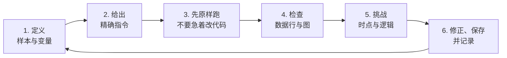
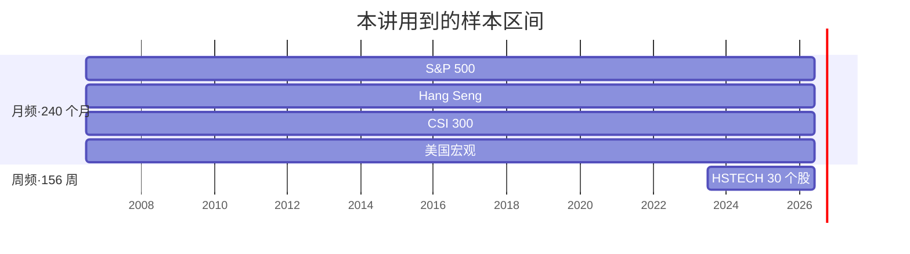
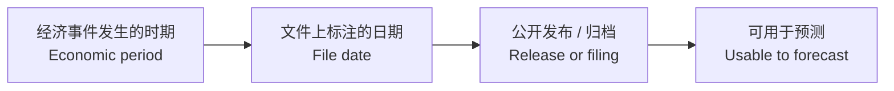
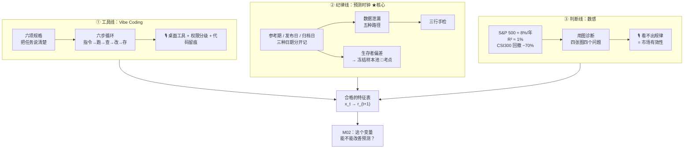
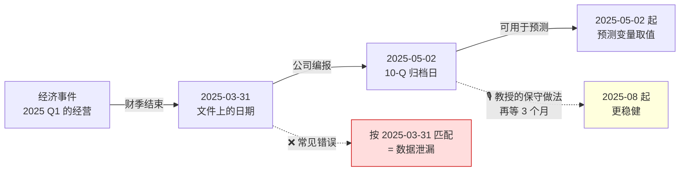

# M01 · 金融数据与 Vibe Coding

> **本讲一句话**：这一讲不教你写代码，也不教你建模型——它教你在**让 AI 替你写代码之前**必须先说清楚的那些事，而其中最要命的一件是：**这个数字，在那一天，投资者到底看不看得见？**
> **原始材料**：`Lec01_Data_and_Vibe_Coding.pdf`（58 页）｜**转录**：`M01-transcript.txt`（`00:01`→`02:15:21`，671 段，完整）｜**状态**：v1.0（讲义 × 转录已合并）

---

## 0. 三分钟速览

**这一讲讲了什么**

讲义表面上讲"怎么用 Codex 下载金融数据"，但真正的主题只有一个：**信息的时间戳**。金融数据里到处埋着"文件上写的日期"和"投资者真正能看到它的日期"之间的落差——宏观数据发布晚一两周、公司财报晚一到三个月、指数成分股名单是事后才知道的。**只要把这两个日期搞混，回测就会做出漂亮但完全不存在的收益。**

AI 辅助编码（Vibe Coding）在这里的角色是：它把"写代码"这件事的成本降到几乎为零，于是**唯一还需要人做的事，就变成了定义问题和检查证据**。教授对这点毫不含糊——课上说了至少四遍"我不教编程、也不考编程"。

配套的第三条线是**数感**：知道 S&P 500 长期年化 8%、收益预测的 R² 只有 1%、CSI 300 曾经回撤 70%。有了这些量级参照，你才有能力在 AI 吐出一个数字时说"这不对劲"。

**学完你应该能**

1. **写出**一条合格的数据指令：语言与包、数据范围、价格口径、预测时钟、变量公式、输出与检查，六项一个不缺
2. **区分**同一个数字上的三种日期——参考期 / 发布（归档）日 / 可用于预测的日期——并说出为什么财务预测变量在归档日之前必须保持缺失
3. **判断**一个回测有没有前视偏差、生存者偏差，并说出"冻结样本池"具体保护了什么
4. **复述**收益率、复权价、波动率、回撤、基准这几个概念，且每个都能报出一个量级参照数字
5. **看懂**讲义里的 6 段 Python 代码在做什么（不要求会写），并说出每一步的输出应该长什么样

**如果只记三件事**

1. **日期 ≠ 可知日期。** 文件里的 `2026-06-01` 是那个月的"参考期"，不是投资者知道这个数的日子。教授原话：「the mistake I see **99.9%** [is] missing the date.」（🎙️`02:00:05`）
2. **数据比模型重要。** 「Data and data and data. **The predictor[s] are way more useful than model[s].**」（🎙️`24:41`）
3. **AI 写完代码要留痕。** Vibe Coding 最大的隐患不是写错，是错了以后**没有代码可查**（🎙️`01:06:31`，讲义完全没提这条）

---

## 1. 开始之前 · 知识衔接

### 1.1 你已经有的

本讲是全课起点，不依赖任何前序 module。只需要具备 [[EF5560_Fintech_and_AI_in_Finance/_meta/知识层级台账#L0 · 入场基线|L0 入场基线]]：AI/机器学习基础（监督学习、训练/验证/测试、线性回归、R²）、基本统计（均值、标准差、相关、箱线图）、以及 **Python 的基础语法**（会看 `a = f(b, c=1)`）。

**金融方面不需要任何基础。** 收益率、复权价、指数、基准、回撤这些词本讲会从零讲起——这是本课台账写死的口径，理由见台账「判断一」。

**pandas / yfinance / akshare 的具体函数也不需要会。** 讲义里出现的每一行都会解释，但重点永远落在"时点对不对"，不在语法。

### 1.2 本讲全新引入的概念

| 概念 | English | 展开于 |
|---|---|---|
| Vibe Coding · 六步循环 · 六项规格 | Vibe Coding / Six-Step Procedure / Six Specifications | §2.2 |
| 桌面编码工具 · 权限分级 · 代码留痕 | Desktop coding tool / Permission levels / Code backup | §2.2 |
| 简单收益 · 对数收益 | Simple return / Log return | §2.3 |
| 复权价 · 拆股 · 现金股利 · 价格指数 | Adjusted close / Stock split / Cash dividend / Price index | §2.3 |
| 波动率 · 回撤 · 基准 · 期限利差 | Volatility / Drawdown / Benchmark / Term spread | §2.3、§2.6、§2.9 |
| 预测时钟 · 数据泄漏 · 前视偏差 | Forecast clock / Data leakage / Look-ahead bias | §2.5 |
| 参考期 vs 发布日 · 归档日 · 数据修订 · 发布滞后 | Reference period vs release date / Filing date / Revision / Release lag | §2.5、§2.6 |
| 生存者偏差 · 冻结样本池 | Survivorship bias / Frozen universe | §2.8 |
| 预测变量 · 特征表 · 横截面 · 面板数据 | Predictor / Feature table / Cross-section / Panel | §2.7 |
| 动量 · 均线偏离 · 技术指标 · 财务比率四件套 | Momentum / MA gap / Technical indicator / Accounting ratios | §2.7 |
| 五种泄漏路径 · 三行手检 | Five leakage channels / Three-row check | §2.7 |
| 市场有效性 · 随机游走 · 反转 · R² 量级 | Market efficiency / Random walk / Reversal / R² magnitude | §2.9 |
| 多空组合 · 美元中性 · 配对交易 | Long-short / Dollar-neutral / Pairs trade | §2.10（⏭️ 课上略过） |

### 1.3 为什么这一讲放在这里 · 重排说明

这是第 1 讲，没有"承接"，只有"铺路"。它铺的路极其具体：

- **§2.5–2.7（时点纪律与特征表）→ 直接是 M02 的输入。** M02 要问"这个变量能不能改善预测"，前提是这个变量本身没作弊。讲义 p.44 明说：「Write both down now, **because Class 3 re-estimates them and the definitions must not move.**」
- **§2.3（数感）→ 是整个 ML 板块的验收标准。** M02 的样本外 R²、M05 的组合业绩，全靠"这个数合不合理"来判断。
- **§2.9（用图诊断）→ 是 M02 第一页的起点。** 讲义 p.58：「We move from constructing and checking data to asking whether a variable improves a return forecast.」

**重排说明**

讲义原顺序是六段拼接：

> A 课程定位与考核（p.1–7）→ **B PDD-JD 配对交易案例 + 六步法（p.8–16）** → C 市场数据下载与检查（p.17–25）→ D 宏观与公司财务（p.26–41）→ E 无泄漏构造预测变量（p.42–48）→ F 用图诊断与收尾（p.49–58）

本笔记调整为：

> §2.1 定位（A）→ §2.2 Vibe Coding 方法论（从 B 里抽出 p.9/10/12，丢掉配对案例）→ §2.3 金融词汇与数感（从 C、F 里抽出）→ §2.4 下载与检查（C）→ **§2.5 预测时钟（把散在 D、E 里的时点内容合并）** → §2.6 宏观与财务的三种时点（D）→ §2.7 造预测变量（E）→ §2.8 冻结样本池（把 p.24–25 从 C 里抽出来单独成节）→ §2.9 用图诊断（F）→ **§2.10 ⏭️ 配对交易（B，课上完全略过，降级到附录位置）** → §2.11 ⏭️ 工作坊与失败诊断表（p.54–55，课上未执行）→ §2.12 收尾

**三个调整的理由**：

1. **把 PDD-JD 配对交易（p.8、11、15、16 共 4 页）从正文主线搬到 §2.10。** 因为**教授在两个多小时里一次都没提到 PDD 或 JD**（转录全文检索 `PDD` / `JD` / `Pinduoduo` / `Temu` / `food delivery` / `long-short` / `dollar neutral`，命中数全部为 0）。这 4 页是讲义准备了却整段跳过的内容。留着，但明确标注优先级。
2. **把"预测时钟"提取成独立的 §2.5，放在所有数据类型之前。** 讲义把时点问题拆散在 p.27、33、39–40、43、47、48，读者要读到第 43 页才看到统一的图示。但这是本讲**唯一真正的主题**，先讲清楚，后面每种数据只是它的一个实例。
3. **把 p.24–25（冻结样本池 + 选择题）单独成 §2.8。** 因为教授在这里明说了「**this is one of the exam questions I design**」（🎙️`01:27:47`）——这是全讲可信度最高的考点，不能埋在"市场数据检查"里。

小节 ↔ 页码的完整对应见 [[#8. 讲义页码映射|§8]]。

---

## 2. 正文

### 2.1 这门课要你学什么（讲义 p.2–7）

#### 2.1.1 两块内容，一个学期

讲义 p.2 给了一张分层表，说明"AI 在金融里能干什么"以及本课各块讲到哪：

| 层 | 典型 AI 应用 | EF5560 讲在哪 |
|---|---|---|
| **信息与文本** | 行情、会计、宏观、交易、申报、新闻、规则数据 | Class 1 的数据纪律；Class 12 的 LLM 文本应用 |
| **预测** | 收益、风险、违约、欺诈、需求、客户行为 | **核心**：Classes 2–4 的回归与线性/非线性 ML |
| **决策与产品** | 组合、定价、额度、支付、借贷、投顾、保险 | Class 5 的投资决策；Classes 10–12 的产品案例 |
| **基础设施与控制** | API、云、区块链、网络安全、RegTech、模型治理 | Classes 6–12 的机制与控制 |

> **Part I：ML in Finance（Classes 1–5）** ｜ **Part II：FinTech（Classes 6–12）**
> 讲义原话：「The two parts share a financial setting but address different questions.」（p.2）

**🎙️ 课堂补充**：教授解释了为什么今年把两部分**调换了顺序**——去年先讲 FinTech 公司案例，学生下课后普遍问"我到底学到了什么"，因为案例课没有"做完一道题"的踏实感；今年改成先讲有明确操作的投资部分（`06:37`）。他还说明本课的由来：**AIB 项目 2025 年成立，请 EF 系为其新开一门课，他去年才开始建，今年幻灯片全部推倒重做，而且是用 AI 重做的**（`00:03`–`00:38`）。→ 含义：**这门课没有往届资料可参考，且明年还会变。**

**所以呢**：知道了这门课讲什么、怎么分两部分，接下来三节继续把"这门课"本身的背景交代完——一个金融 AI 产品还需要哪些层面、两条建造 AI 的路线、以及最终怎么给你打分。

#### 2.1.2 一个金融 AI 产品需要的不只是模型（讲义 p.3）⏭️

上一节的分层表说的是"这门课讲什么"；讲义 p.3 换了一个角度，说的是"做成一个真正能上线的金融 AI 产品，除了模型准不准，还要想清楚哪几件事"——很多学生（以及很多真实项目）只顾着调模型，结果模型很好用却从没改变过任何一个实际决策。讲义把一个产品拆成四层，每层配一个该问的问题，以及不问会有什么后果：

| 层 | 设计问题 | 忽略它会怎样 |
|---|---|---|
| 数据与获取 | 信息是否及时、时点正确、被许可、模型可用？ | 泄漏、输入过期、或数据根本没法上线 |
| 模型与基准 | 任务是预测还是生成？必须打败哪个简单替代方案？ | 输出看着合理，但没有可衡量的决策价值 |
| 决策流程与分发 | 用户拿到的是 API、副驾、自动规则、还是人工复核建议？ | 模型很强，却从没改变过任何一个金融决策 |
| 控制与问责 | 谁验证、谁监控、谁保障安全、谁能覆盖、谁审计？ | 模型风险、责任不清、代价高昂的运营事故 |

> **Keep in mind（讲义 p.3）**：「Financial value comes from the full system: data, model, decision process, distribution, and controls.」

**⏭️ 课上略过**：转录里没有任何一段对应这张表。它是讲义准备的框架，教授当天没展开。**但它值得记**——它正好是第二板块（FinTech 公司案例）的分析骨架，而案例报告占 30%。

**所以呢**：知道了"一个产品需要哪几层"，下一个自然的问题是——**由谁来控制这些层**？这决定了两条建造 AI 路线（下一节）的分野。

#### 2.1.3 两种建造与分发 AI 的路线（讲义 p.4）

讲义用两个人做对照（**肖像是 AI 生成的编辑插图，不是照片**，讲义自己标注了）：

| | **Sam Altman**（CEO, OpenAI） | **梁文锋 Liang Wenfeng**（DeepSeek 创始人；幻方 High-Flyer 联合创始人） |
|---|---|---|
| 路线 | 把前沿研究接到消费产品、开发者 API、企业部署上，跑在自建的中心化基础设施上 | 从量化研究转向基础模型，把 DeepSeek-R1 的代码与权重以 **MIT License** 开源 |
| 金融用户该问 | 模型质量与分发能带来多少价值？产品对算力、定价、访问权、治理的依赖有多深？ | 开放权重与工程效率能带来多少价值？谁来管商业化、运营和模型风险？ |

> **Keep in mind（讲义 p.4）**：「**Which layer a firm controls decides what it can charge for.** Ask that before asking whose model is better.」

**🎙️ 课堂补充（转录 `32:24`–`34:19`、`01:03:33`）**——这段讲义只给了框架，教授给了实操结论：

- **对本课的作业来说，中国 AI 和美国 AI 没有区别**：「we are really working on very simple problems… the [question] is which one is cheaper.」
- **成本**：ChatGPT Pro **$200/月**、Claude Max **$200/月**（教授自己两个都买了，走科研经费）。**建议学生用便宜的**：DeepSeek、通义千问（Qwen）、Kimi 等开源系；豆包（Doubao）是闭源。
- **CityU 已为全校订阅 ChatGPT**，可以直接用（`01:03:33`）。
- 教授对"中国厂商为什么开源"的解读：**芯片短缺**。开源后模型可以部署在腾讯、阿里等平台上，把自家有限的算力留给 AGI 研发（`37:04`）。⚪ 这是他的个人判断，不是课程内容。

**所以呢**：无论选哪条路线，对本课的作业来说结论是一样的——重要的不是哪个模型更强，而是**哪个更便宜、你能不能用**（§2.2.1 还会回到这一点）。

#### 2.1.4 考核（讲义 p.5）

这门课怎么打分，直接决定你该把时间花在哪。讲义 p.5 给出五项加总到 100% 的成绩构成，其中光是期末考试就占了将近一半：

| 考核项 | 权重 |
|---|---|
| FinTech 公司案例报告 | 10% |
| 录像展示 | 20% |
| ML 投资作业 | 20% |
| 参与与课堂表现 | 10% |
| **两小时期末考** | **40%** |

完整规则、DDL、以及官方目录补充的 GenAI 政策见 [[EF5560_Fintech_and_AI_in_Finance/_meta/作业与DDL|作业与DDL]] 和 [[EF5560_Fintech_and_AI_in_Finance/_prep/课程前置资料|课程前置资料]]。

**🎙️ 三条讲义没写的关键信息**：
1. **期末是闭卷手写、禁用一切电子设备**，「I might allow you for **one page for hand written cheat sheet**」（`10:20`）——单页手写小抄可能被允许，待 Canvas 确认。
2. **点名是真的会扣分**：每人起始 5/10 分；答对或推理合理 +1；答错不扣；**被点到人不在 −1**；提前一天请假不扣（`14:43`–`15:37`）。
3. **教授取消了传统作业**，因为「if I give you assignment, everyone [will] get 100」——他女儿用豆包做作业让他意识到这点（`09:37`）。所以分数集中在考试和小组产出上。

**所以呢**：了解了这门课教什么、怎么打分，接下来正式进入本讲的第一项技能——怎么让 AI 帮你写代码，同时不让它替你做本该由你自己做的判断，也就是 Vibe Coding。

---

### 2.2 Vibe Coding：把"写代码"外包，把"定义问题"留下

#### 2.2.1 是什么

以前想下载一份股票数据，你得自己会写 Python：知道去哪装包、怎么调用下载函数、报错了怎么查文档。现在你只需要用一句人话把要求说清楚——"帮我下载苹果最近三年的周收盘价"——AI 就能把代码写出来、跑给你看。**这种"用自然语言指挥 AI 写代码、而不是自己动手敲"的工作方式，就是 Vibe Coding（氛围编码 / AI 辅助编码）。** 严谨地说：

**Vibe Coding（AI 辅助编码）** = 用自然语言把任务描述清楚 → 让 AI 助手写并**运行**一段小 Python 程序 → 检查结果 → 修改指令 → 直到输出通过你事先写好的检查项。

讲义 p.7 把分工写死了：

| **AI 能帮你** | **你仍然要自己决定** |
|---|---|
| 把金融任务翻译成可执行的 Python | 目标、样本、变量、时点 |
| 解释你看不懂的语法 | 每个日期上**什么是可观测的** |
| 报错后修改代码 | 输出在经济上**说不说得通** |

> **Keep in mind（讲义 p.7）**：「Give an instruction → run Python → inspect → revise → save.」

**为什么需要它**

因为编程技能会**折旧**，而金融判断不会。

**🎙️ 教授的原话最有说服力（`39:22`–`41:36`）**：
> 「In the past I spent two or three lectures teaching Python… **Right now I want to spend zero.** Many of you [will] forget [it] after your master study, because you don't use [it]. And I can tell you, I also forget… I'm 48 years old now.
> **If you believe that you are the top 10%, 5% of the student[s], I highly suggest you to master coding. If you believe you are an average student, I would suggest you learn vibe coding**, because you might not use this every day.」

**💡 换个说法（笔记补充）**：Vibe Coding 相当于把程序员从"打字员"变成"审稿人"。你不再需要记住 `df.resample("W-FRI").last()` 这串字符，但你必须知道**"按周五重采样"这个决定本身对不对**——因为 AI 不会替你判断该用周五还是周三。

**所以呢**：知道了 Vibe Coding 是"你审稿、AI 打字"，下一个问题是这个"审稿"具体分几步走——讲义把它画成了一个循环。

#### 2.2.2 六步循环（讲义 p.9）

2.2.1 把 Vibe Coding 概括成"给指令→跑→查→改→存"五个动作，讲义 p.9 把它拆成更具体的六步，而且画成一个**循环**而不是一条直线——因为第 6 步"修正保存"之后，往往会带着新发现的问题回到第 1 步重新定义，一次任务经常要转好几圈这个环：



六步依次是：①先把样本、变量定义清楚，②翻译成一条精确指令（六项规格见 §2.2.3），③先让 AI**原样跑一次、不要手痒去改代码**，④检查跑出来的数据行和图，⑤专挑时点和逻辑的毛病（本讲后半的重点），⑥确认没问题后修正、保存、并记录这次改了什么。

> 讲义 p.9：「The loop is complete only when the output passes **explicit checks**.」
> ⏭️ **课上一带而过**：转录 `46:02` 只有一句「This is the six[-]step for [vibe] coding」，随后就切到实操演示了。但这个环里的第 3 步（**先不要动手改代码**）是有讲究的：先原样运行，你才能知道 AI 的原始理解是什么。

**所以呢**：六步循环的第 2 步是"给出精确指令"，但"精确"到底要写清哪几件事？讲义把它拆成了六项规格。

#### 2.2.3 六项规格：一条合格指令必须写清什么（讲义 p.10）★

2.2.1 说"你仍然要自己决定目标、样本、变量、时点"，但这句话太抽象——具体要写清哪几件事，AI 才不会自作主张地帮你做决定？讲义 p.10 给出一张清单，把一条合格指令拆成六项，每项写漏了会出什么问题都列在最后一列，其中第 4 项（预测时钟）是全讲最容易被忽视、也最致命的一项：

| # | 规格 | 具体要写什么 | 写漏了会怎样 |
|---|---|---|---|
| 1 | **语言与包** | R + `quantmod`，或 Python + `yfinance` + `pandas` | AI 换一个包，结果口径就变了 |
| 2 | **数据** | 代码（ticker）、来源、起始日、结束日、频率 | 拿到的样本区间和你想的不一样 |
| 3 | **价格口径** | 复权（adjusted）还是不复权 | 拆股会被当成暴跌（见 §2.3.3） |
| 4 | **预测时钟** | 信号在什么时候形成、目标是哪一期的收益 | **最致命**——直接产生数据泄漏 |
| 5 | **预测变量** | 精确公式 + 滚动窗口长度 | 同名不同算法，M03 复现不出来 |
| 6 | **输出与检查** | CSV 文件、图、维度、缺失计数、样本行 | 你没有可核对的证据 |

**⚠️ 常见误解**
- ❌「指令写得越详细越啰嗦」→ 恰恰相反。第 6 项（**要求 AI 自己报告行数、首末日期、缺失数**）是成本最低、收益最高的一条。讲义 p.14 的例子就是把它写进指令里的：要求返回「157 weekly prices；156 non-missing returns；a saved, date-sorted file」。
- ❌「AI 报了错才需要检查」→ **最危险的失败是不报错的**。讲义 p.55 把它列成第 6 类失败：「**Logic：it runs, but computes something you did not specify.**」

**所以呢**：六项规格是纸面清单；下面三条是教授在课堂上才补的、清单里没写但动手时立刻用得上的操作细节。

#### 2.2.4 🎙️ 三条只有课堂上才有的操作要点

这三条讲义**完全没有**，但对实际动手非常关键。

**① 必须用"桌面编码工具"，不是聊天机器人（`43:06`–`43:48`）**
> 「**I'm not asking you to use the chatbot.** You are going to download the desktop coding tool… like the Codex I have here, like the Claude Code I have here… **then they can access the local computer.**」

区别在于：聊天机器人只能把代码"打印"给你，桌面工具能**读写你的本地文件、真的执行代码、看到真实报错**。这才使得"运行 → 检查 → 修正"的循环成立。教授还提到豆包也有类似工具。

**② 权限要分级给，从最保守的开始（`43:48`–`45:15`）**
> 「for [Claude], they will have like auto / manual / accept edits / plan / bypass everything… **My suggestion is you try the simple one first. Don't [give] everything to AI**, because… they might send email [on] behalf of you. They might send your money to someone else.」

**③ ★ 每次都要把代码存下来（`01:06:31`–`01:07:31`）**
> 「every time you ask your AI to use the vibe coding for you, **please also save the file for the code**. This is very different [from] manual coding… for vibe coding, if you don't really have the code, then **you don't know where to find the mistake**. So please have a backup for the code… every time you create a figure, have a backup to save all the codes.」

**💡 换个说法（笔记补充）**：手工编程时代码天然留在你的工程里；Vibe Coding 时代码是"一次性"的对话产物，跑完就没了。于是你手上只剩一张图和一个数字，**却无法回答"这个数是怎么算出来的"**——而这恰恰是本课要求的可复现性（syllabus：「Empirical work must preserve the data timing and transformation steps needed to reproduce the reported result.」）。
**操作建议**：给每张进入报告的图配一个 `.py` 文件同名保存。ML 投资作业明确要求交「reproducible code package」，这条不是可选项。

**⚠️ 常见误解**：❌「AI 生成的代码不用管，反正能跑」→ ML 投资作业的评分里**明确包含可复现的代码包**，没有代码等于交不了。

**所以呢**：Vibe Coding 的流程讲完了。但六项规格里第 2、3、5 项（数据、价格口径、预测变量）全都要用到金融词汇——收益率、复权价、指数——下一节从零开始把它们讲清楚。

---

### 2.3 金融数据的最小词汇表（读者零基础，本节从头讲）

讲义把这些概念散在 p.13、19、22 和图注里，本节合并讲清。**每个概念都配一个量级参照**——这是教授说的本课第一优先级（🎙️`02:12:27`）。

#### 2.3.1 收益率：简单收益与对数收益

**是什么**

讲义和课程数据里的"收益率"其实有两种算法，数值上很接近，但混着用会导致后面的累计收益算错（真实踩坑案例见 §9.3 ①）。最直觉的一种：上周五收盘价 100 元，这周五涨到 110 元，"涨了 10%"——这是**简单收益**。金融里还有另一种写法，同一个例子算出来是 9.53%，不完全一样但很接近，叫**对数收益**。两者的差距只有在涨跌幅很大时才会明显拉开。

严谨地说：

- **简单收益（simple return）**：$r_t = P_t / P_{t-1} - 1$
- **对数收益（log return）**：$r_t = \ln(P_t / P_{t-1})$

| 符号 | 是什么 | 已知/待求 |
|---|---|---|
| $P_t$ | 第 $t$ 期（如某一周）的价格 | 已知：下载到的价格序列 |
| $P_{t-1}$ | 上一期的价格 | 已知 |
| $r_t$ | 第 $t$ 期的收益率 | 待求 |

**代入数字**：价格从 100 涨到 110——简单收益 $r_t = 110/100 - 1 = 10\%$；对数收益 $r_t = \ln(1.1) \approx 9.53\%$。

**为什么需要两个**
- **简单收益能跨资产相加**：组合收益 $= \sum_i w_i \times r_i$（$w_i$ 是第 $i$ 个资产的权重，$r_i$ 是它的简单收益）。§2.10 的多空组合就必须用它。
- **对数收益能跨时间相加**：20 年的累计涨幅 = 240 个月度对数收益之和。画长期走势图、算波动率时用它更方便。
- 收益小的时候两者几乎相等（1% 时差 0.005%）；收益大的时候差很多（+50% 时简单 0.50 vs 对数 0.405）。

**课件原例**（讲义 p.19）
> 「From the checked weekly adjusted prices, calculate **r_t = P_t / P_{t−1} − 1**.」——讲义**明文只给了简单收益的公式**。

**🎙️ 课堂补充（`46:42`）**
> 「Probably you don't know that there are **many types of price**, [and] many types of returns. If you don't know those names… if you just type price and return, they will use the [standard] one.」
> → 教授承认这是个坑，并给了实用建议：**不确定时就说"简单收益"，AI 默认给的也是它**。

**⚠️ 常见误解（★ 本讲最容易被坑的一条）**
❌「课程数据集里的收益都是简单收益」——**错**。实测课程给的 8 个 CSV：

| 文件 | 频率 | 实际口径 |
|---|---|---|
| `aapl_weekly_prices_returns_156w.csv` | 周 | **简单收益** ✅ 与 p.19 公式一致 |
| `pdd_jd_pair_example_156w.csv` | 周 | **简单收益** ✅ |
| `market_index_returns_240m.csv` | 月 | **对数收益** ⚠️ |
| `spy_monthly_features_240m.csv` | 月 | **对数收益** ⚠️ |
| `csi300_macro_panel.csv` | 月 | **对数收益** ⚠️ |

（数值验证见 [[EF5560_Fintech_and_AI_in_Finance/_meta/数据集卡片|数据集卡片]]，误差量级 1e-15，是精确匹配；`L01_01` 用 $\exp(\sum r)$ 与价格净值重合做断言，`L01_03` 用 `∏(1+r)` 与周频净值重合做断言，两种口径各自验过。）
讲义 p.20/21 的图注确实写了 "monthly **log** returns"，所以图是自洽的；但**唯一给出的公式（p.19）是简单收益**。**做作业时必须自己确认口径**，尤其是把月度收益复利加总成累计业绩的时候。

**与其他概念的关系**：收益率是 §2.7 特征表里的目标变量（`y`），也是 §2.3.4 波动率的输入。

> 📁 **代码**：[`code/L01_data/01_return_conventions.py`](../code/L01_data/01_return_conventions.py) —— 同一份 S&P 500 月度数据，对数收益正确累加 = 价格净值 5.87×；误当简单收益复利只剩 4.59×（`L01_01`）
> ![[L01_01_return_conventions.png]]

**所以呢**：算收益率要用哪个价格，本身还有讲究——公司拆股、发股利都会让报价"跳一下"，下一节看这个跳动该怎么处理。

#### 2.3.2 复权价 vs 未复权价（讲义 p.22）

**是什么**

同一只股票，只因为公司做了一次"1 股拆 2 股"或者派了一次现金，报价本身就会在某一天突然跳动——但这个跳动跟你到底赚不赚钱毫无关系。比如一只股票从 200 元"跌"到 100 元，可能根本不是亏钱，只是拆股了。金融数据把这类"跳动"分成三种情况处理：

- **拆股（stock split）**：公司把 1 股拆成 2 股，报价从 200 变成 100。**投资者没有任何损失**——你手上从 1 股变成 2 股。
- **现金股利（cash dividend）**：公司发现金，除息日价格会下跌，**但投资者拿到了现金，所以实际是有收益的**。
- **复权价（adjusted close）**：把上述两类事件的影响回填进历史价格，使得不同时点的价格在经济意义上可比。

**课件原例**（讲义 p.22 的四条 + 课堂讨论题）
> - 拆股改变报价但不造成投资者损失
> - 现金股利产生收益，即使除息价下跌
> - 复权序列试图把价格放在可比的经济基础上
> - **包默认值和数据商约定会变；口径要显式写出来**
>
> **Class discussion**：「What would a 2-for-1 split do to a return computed from **unadjusted** closing prices?」
> **答案**：会记录成约 **−50%** 的暴跌。这是纯粹的记账假象。

**🎙️ 课堂补充（`27:28`–`27:46`、`01:21:07`）**
> 「For most stocks, the close price and adjusted close price, they are the same. But for some small[-]cap stocks… **if you don't know the difference, always use the adjusted close price.**」
> 「if you see a price dropped by 4[9]%, there [is] probably a two[-]for[-]one split for the stock.」
> 还有一条讲义没有的具体例子：**债券 ETF 每月初派息**，所以每月你会看到"净值涨了但显示负收益"，如果不用复权价就完全读不懂（`01:21:33`）。

**💡 换个说法（笔记补充）**：把未复权价理解成"股票的标价牌"，复权价理解成"你的账户净值"。标价牌可以因为换算单位而改变，账户净值不会。**做收益计算永远看账户，不看标价牌。**

**⚠️ 常见误解**
❌「复权价就是历史真实成交价」→ **不是**。复权价是被反复重算的：每次新的分红或拆股发生，整段历史都会被重新调整。所以**今天下载的复权价，和一年前下载的同一段历史，数值可能不同**。这与 §2.5.4 的"数据修订"是同一类问题。

**所以呢**：价格口径搞对了，下一步是"用什么去比较不同市场的整体表现"——这就要用到指数和基准。

#### 2.3.3 指数、基准、以及"上证综指"这个坑

**是什么**

如果有人告诉你"我今年赚了 5%"，这句话本身没法判断好坏——5% 算好算差，要看跟什么比、以及这笔钱当初买的是一个多大的公司组合。这里有两个概念决定"跟什么比"：

- **市值加权指数（capitalization-weighted index）**：大公司权重大。🎙️`01:31:29`：「if you [own] Alibaba, you take 8%[；]if [it's] others, you take 0.0[X]%.」
- **基准（benchmark）**：判断一个策略好坏的参照物。没有基准，"我赚了 5%"这句话没有意义。

**🎙️ 课堂补充（`30:19`–`31:52`）——这段完整替代了讲义没讲的部分**
> 「It is not okay [to] just tell you that I'm making money 5% a year. **If you can simply just buy the treasury bond with 4.8% for [the] 10-year… then 5% a year seems [poor]**, because you are taking huge risk investing in the stock market but you're only earning 0.2% more than the treasury bond.」

于是基准是**分市场的**：美股比 S&P 500 和美债；A 股比 CSI 300 和中债。

**🎙️ ★ 一条讲义完全没有、但极其实用的知识（`01:10:59`–`01:11:26`）**
> 「If you read the… financial media, most of them keep [talking about the] **Shanghai Stock Exchange index**… **Th[at] is something not tradable.** …**This is [a] really common mistake for evaluating returns.** But the CSI [300], this is something you can buy [as an] ETF.」

**💡 换个说法（笔记补充）**：媒体天天报的"上证指数 3900 点"是个**统计口径**，你没有办法直接买它；沪深 300（CSI 300）有大量 ETF 跟踪，才是可投资、可作为基准的对象。**做回测和写报告时，基准必须是可交易的东西。**

**所以呢**：口径和参照物都讲清楚了，下一节直接给出几个必须记住的具体数字——没有这些量级参照，你没法判断 AI 吐出来的数字对不对。

#### 2.3.4 数感：必须记住的量级参照 ★★

这一小节是"笔记补充 + 转录"的合成，讲义里没有任何一页集中给这些数字。**教授把这件事列为本课第一优先级**：

> 🎙️`02:12:27`「**Develop a sense for numbers. That's the top priority thing I want [you] to learn from the course.**」

| 量 | 参照值 | 来源 |
|---|---|---|
| S&P 500 长期年化收益 | **≈ 8%/年**（过去一个世纪） | 🎙️`49:53`。💡 用课程数据实测：2006-07→2026-06 S&P 500 价格指数（不含股息）几何年化 **9.26%**（`L01_01`：5.87× 开 20 次方），与"≈ 8%"同一量级；教授说的是百年口径且含股息再投资，两者不必完全相等。⚠️ 本行曾误写为 7.95%——那是把对数收益当简单收益复利到 4.59× 再年化的结果，正是 §9.3 ① 的坑，2026-09-10 按脚本改正 |
| 美国 10 年期国债收益率（2026-09） | **≈ 4.8%**；30 年期约 5.03% | 🎙️`31:01`、`01:47:55` |
| 中国 10 年期国债收益率 | **≈ 1.8%** | 🎙️`31:24` |
| "年化 50% 的策略" | **一定是骗子**：「they will disappear very, very soon」 | 🎙️`51:34` |
| 中国科技股的合理预期 | 比 8% 高，**10% 出头**，不是 50% | 🎙️`52:15` |
| **股票收益预测的 R²** | **平均 ≈ 1%**；到 **2–3%** 对冲基金就能赚大钱 | 🎙️`01:44:05`、`02:09:06` ★ |
| 对比：营销领域的数据挖掘 | R² 能从 **50% 提到 60%**；收益预测只能从 **1% 到 1.2%** | 🎙️`01:44:49` ★ |
| 20 年累计（投 100 元，2006-07→2026-06） | S&P 500 → **≈ 600**；CSI 300 → **≈ 400**；恒生 → **≈ 130** | 🎙️`01:09:28`。💡 实测：587 / 385 / 135（`L01_02`） |
| 最大回撤 | CSI 300 **−70.8%**（2008-10）；恒生 **−59.1%**（2009-02）；S&P 500 **−52.6%**（2009-02） | 🎙️`02:10:16` 说 CSI「more than 70%」、S&P「about 50%」。💡 实测数字见左（`L01_02`） |
| 年化波动率 | S&P 500 ≈ **15%**；恒生 ≈ **22%**；CSI 300 ≈ **27%** | 💡 用 `market_index_returns_240m.csv` 实测（`L01_02`：15.43% / 21.77% / 27.28%） |
| 单月最差 | CSI 300 −29.9%；恒生 −25.5%；S&P 500 −18.6% | 💡 实测（`L01_02`：−29.91% / −25.45% / −18.56%，全在 2008-10） |

**⚠️ 常见误解**
❌「R² 只有 1%，那这门课的模型全是废的」→ 教授的原话恰恰相反：「if you can get R² above two or three percent, **many hedge funds can make huge profits on that**」（`02:09:06`）。**在金融里，1% 的 R² 不是"没用"，而是"这个领域的正常水平"**——因为市场里有无数人在抢同样的信息。用做营销预测的直觉（R² 要 0.5 以上）来评价收益预测，是初学者最典型的误判。

**所以呢**：记住这些量级参照，是为了在下一步真正动手下载、计算数据时，一眼看出"这个数不对劲"。§2.4 开始真正动手。

> 📁 **代码**：[`code/L01_data/02_index_20y.py`](../code/L01_data/02_index_20y.py) —— 四个指数 20 年净值 + 回撤，跑一遍即可复现本表的累计倍数、最大回撤、年化波动、单月最差；另有恒生 2018-01 高点至今差 30%、CSI 300 2007-10 高点 19 年未收复（`L01_02`）
> ![[L01_02_index_20y.png]]
> 📁 R² = 1% 的散点图长什么样，见 [`code/L02_regression/03_r2_scale.py`](../code/L02_regression/03_r2_scale.py)（`L02_03`，图在 [[M02-回归与样本外设计|M02]] §2.9）

---

### 2.4 把数据下下来，并且检查它

#### 2.4.1 样本、变量、日期：本讲的三个数据集（讲义 p.13）

本讲后面会同时用到好几份数据，如果不先弄清楚"谁是月频、谁是周频、各自从哪年到哪年"，很容易在合并数据时把日期对错。讲义 p.13 用一张时间线说清这件事：三个月度指数（标普 500、恒生、沪深 300）和美国宏观数据共用同一条 **240 个月**（2006-07 至 2026-06）的日历；另外恒生科技 30 只个股用的是更密的 **156 周**周频数据（2023-07 至 2026-06）。



> **Keep in mind（讲义 p.13）**：「Markets and macro share **one 240-month calendar**. The later HSTECH 30 exercise uses denser weekly observations, and **every forecasting row uses only information known before its return is realized**.」
> 讲义脚注还有一句诚实的免责：「Free data support teaching. **Research needs point-in-time data with documented revisions and historical constituents.**」

**所以呢**：知道了"谁是月频、谁是周频、各自什么区间"，下一步是先把工具装好，才能真正跑代码。

#### 2.4.2 让 Codex 装环境（讲义 p.12）

Vibe Coding 的第一步甚至不是分析数据，而是让 AI 把开发环境装好——如果这步图省事整个交给 AI 处理，轻则装错版本的包，重则被要求交出不该给的权限（§2.2.4 的"权限分级"就是防这个）。讲义给的示例指令值得照抄：

> 「I use [Windows 11 / macOS]. Check whether Python 3 and R already work. If either is missing, use the official VS Code or RStudio installer. **Before any installation, show the package, destination, and command; then wait for approval.** Install `yfinance`, `pandas`, `matplotlib`, `akshare`, `quantmod`, and `TTR`, and report the installed versions.」

四步：① 先看现有环境 ② 检查来源与安装位置 ③ 批准安装 ④ 验证版本与 import。
**Pause if the scope changes**：不要提供凭据或无关的个人文件。

**🎙️ 课堂补充**：教授现场演示了这一段（`53:29`–`55:48`），问 Codex「Can you tell me whether Python is installed locally?」「Is this the latest version?」「Please help me update」。他还坦承课上网速受 VPN 影响（`54:14`），这在转录里留下了两处内容重复的段落——不是教学内容。

**所以呢**：环境装好之后，才轮到讲义 p.14 那个具体的下载任务——构造 156 周的收益。

#### 2.4.3 构造 156 周的收益（讲义 p.14）

六项规格（§2.2.3）讲的是六条抽象要求；讲义 p.14 给了一个具体样例，把六项规格套在一只真实股票（AAPL，苹果）上——要几年数据、用什么价格口径、日期怎么标，全部写进了下面这条英文指令里：

**示例指令**（讲义原文）
> 「Using Python and **adjusted** AAPL prices, build **Friday-labelled** weekly prices from **30 June 2023** through **26 June 2026** and **simple weekly returns** from 7 July 2023 through 26 June 2026. **Download enough earlier data to calculate the first return.** Run the job, save the table, and report the first date, last date, row count, and missing values.」

| 跑之前先定死 | 只有满足这些才接受结果 |
|---|---|
| 复权价口径 | **157** 个周价格 |
| 周五作为周标签 | **156** 个非缺失收益 |
| 精确的起止日期 | 一个已保存、按日期排序的文件 |

**🎙️ 课堂补充（`47:50`）**——教授把这个检查抽象成一条通用的"挑战式检验"：
> 「if I download… 200 prices there… then I [should] have **199 returns**, because you need to calculate the [difference] between two [prices]. So you need to challenge the output from time to time, **because you understand the logic of the data**.」

他在演示时也确认了「157 prices with 156 returns」（`01:07:31`）。

**💡 验证（笔记补充）**：课程给的 `aapl_weekly_prices_returns_156w.csv` 实测确实是 **157 行价格、156 个非缺失收益、第一个收益为空**，且 `weekly_return` 与 `adjusted_close` 的简单收益公式吻合到 3e-16。**这个数据集是本讲唯一一个可以逐项对上讲义检查清单的样本，值得拿来练手。**

**所以呢**：单一股票、单一数据源的下载练完了；真正的数感表（§2.3.4）需要三个指数、两个数据源拼在一起，下一节看这怎么做。

#### 2.4.4 从两个数据源拼一张表（讲义 p.17–18）

§2.3.4 数感表里标普 500、恒生、沪深 300 三个指数 20 年的表现数字是怎么来的？三个市场分散在两个不同的数据源：美股和港股在 Yahoo Finance 能查到完整历史，沪深 300 只能从 AKShare 拿（原因见下表第 3 行）。下面这段代码示范怎么把它们拼到同一张表上：

```python
import akshare as ak
import pandas as pd
import yfinance as yf

global_px = yf.download(
    ["^GSPC", "^HSI"],
    start="2006-06-01", end="2026-07-01",
    auto_adjust=True, progress=False
)["Close"]
csi = ak.stock_zh_index_daily_em(
    symbol="sh000300", start_date="20060601", end_date="20260630"
)
csi["date"] = pd.to_datetime(csi["date"])
csi_px = csi.set_index("date")["close"]
csi_px.name = "CSI300"
daily = global_px.join(csi_px, how="outer")
```

**逐行说明（不要求会写，要求会读）**

| 行 | 在干什么 | 关键参数为什么这么取 |
|---|---|---|
| `yf.download([...])` | 从 Yahoo Finance 一次下两个指数：`^GSPC` = S&P 500，`^HSI` = 恒生 | `start` 定在 **2006-06**，比目标区间 2006-07 早一个月——就是 p.14 说的「download enough earlier data」，为了能算出第一个收益 |
| `auto_adjust=True` | 返回**复权**价 | 对应六项规格的第 3 项 |
| `ak.stock_zh_index_daily_em(symbol="sh000300")` | 用 AKShare 取沪深 300 | 🎙️`01:07:45`：「the Yahoo Finance ha[s] **[no] full history**」for 中国数据，所以换源 |
| `.join(..., how="outer")` | 按日期对齐三条序列 | `outer` 表示**保留任一市场的交易日**，不强行取交集 |

三条序列现在还按各自市场的原始交易日历堆在一张表里（港股、A股、美股的假期都不一样），下一步要把它们压缩成统一的月度频率，才能对上 §2.4.1 说的那条 240 个月共用日历：

```python
monthly = daily.resample("ME").last()
monthly = monthly.loc["2006-07":"2026-06"]
print(monthly.index.min()); print(monthly.index.max())
print(monthly.shape); print(monthly.isna().sum())
```

**Verified output（讲义 p.18）**：first month `2006-07-31`；last month `2026-06-30`；shape `(240, 3)`；missing months **zero**。

| 行 | 在干什么 |
|---|---|
| `.resample("ME").last()` | 按**月末**（Month End）取当月最后一个观测，把三个市场统一到同一张月度日历上 |
| `.loc["2006-07":"2026-06"]` | 裁到目标的 240 个月 |
| 四个 `print` | 就是六项规格第 6 项要求的"自报维度与缺失" |

> **Keep in mind（讲义 p.18）**：「The shared calendar lines up the dates. **Holidays, trading hours, and index construction rules still differ across the three markets.**」
> 讲义还提醒：「These are **price-index** returns; **dividends are not included**.」

**🎙️ 课堂补充（`01:24:10`–`01:24:34`）**——教授给了跨市场对齐的具体例子：
> 「for the National [Day] break… in mainland China you have seven day[s] break, but in Hong Kong you only have one day break… **for Christmas, there's [no holiday] in mainland China, but there's a break in Hong Kong.**」
> 因此**跨市场表里必然有缺失值**，而这正是他坚持不给学生"洗干净的数据集"的原因：「Other faculties, they will just give you a well[-]clean[ed] data set… But in real world data… you exactly [see] what I show you: **data missing value everywhere.**」（`01:23:47`）

**所以呢**：数据拼好了、也知道了缺失值是常态，但还不能直接拿去算收益——算之前，讲义要求先做四项检查。

#### 2.4.5 算之前先做四项检查（讲义 p.23）

数据拼好了（§2.4.4），还不能马上算收益。讲义坚持要先看一眼数据本身长什么样——列名对不对、有没有缺失、数量级合不合理——这样才能在错误的收益被算出来**之前**发现问题，而不是算完一堆漂亮数字之后才回头怀疑。讲义 p.23 给了一条检查指令，要求 AI 在动手计算前先交出四样东西：

> **Data-checking instruction**：「Before calculating returns, run Python and show: **(1)** table dimensions, **(2)** exact column names and types, **(3)** the first and last three dated rows, and **(4)** missing-value and descriptive-statistic summaries.」

讲义接着写了本讲最重要的一句方法论：

> 「**Reading the output is the part that cannot be delegated.**」

两个问题决定要不要继续：**哪一列是复权后的经济价格？缺失值和数量级对这个市场来说合理吗？**

**⚠️ 常见误解**：❌「AI 说没问题就没问题」→ 🎙️`47:16`：「They are numbers[; ] might be everything might be fake. You don't know.」教授明确说 AI 会编造数字，且 AI 自己也在免责声明里承认这点。

**所以呢**：数据检查完，本讲真正的主题才正式登场——预测时钟，也是全篇最重要的一节。

---

### 2.5 ★ 预测时钟：本讲真正的主题

这是全讲最重要的一节。讲义把它拆散在 p.27、33、39–40、43、47–48，本笔记合并。

#### 2.5.1 预测时钟（Forecast clock）

**是什么**

§2.2.3 六项规格的第 4 项提到过"预测时钟"，说它写漏了后果最致命，但没细讲它到底是什么。它其实是给数据表的每一行做一次"时间戳公证"：这一行里，凡是当**预测变量**用的数字，必须证明自己在"公证时刻"**之前**就已经存在；凡是当**目标**（要预测的收益）用的数字，则必须证明自己是公证时刻**之后**才发生的。用讲义的话说，一条明文规定，说清两件事：**预测变量在什么时刻已经可知；目标收益在什么时刻才实现。** 讲义 p.43 的图示：

$$\underbrace{x_t}_{\text{第 } t \text{ 周收盘后可知}} \quad\longrightarrow\quad \underbrace{r_{t+1} = P_{t+1}/P_t - 1}_{\text{在第 } t+1 \text{ 周内实现}}$$

| 符号 | 是什么 |
|---|---|
| $x_t$ | 预测变量：第 $t$ 周收盘后就已经知道的数（动量、波动率……） |
| $r_{t+1}$ | 目标：下一周（第 $t+1$ 周）内实现的收益，用第 $t+1$ 周末与第 $t$ 周末的价格算 |
| $P_t$ | 第 $t$ 周末的价格 |

**代入一个具体例子**：用 §2.4.1 提到的恒生科技 30 只个股周频数据，假设 $t$ = 2026-06-19 那一周（周五收盘）。$x_t$ 可以是"截至 2026-06-19 收盘算出的过去 4 周动量"——这个数当天收盘后就能算出来，属于**已知**。$r_{t+1}$ 则是下一周的收益 $P_{t+1}/P_t - 1$，要用 2026-06-26 和 2026-06-19 两个周五的收盘价，这笔收益**要等到 2026-06-26 收盘才真正发生**。如果有人在 2026-06-19 当天就已经用上了 2026-06-26 才会出现的信息（哪怕只早一天），这一行数据就已经泄漏——这正是下一节要讲的"数据泄漏"。

配套四条规则（讲义 p.43）：
1. 保存下来的那一行，用**预测周 t+1** 来标注
2. 个股特征只能用**不晚于第 t 周**的价格和成交量
3. 已归档的会计数据可以向后延续；**尚未归档的值必须保持不可用**
4. 多下载一些样本前的数据来构造滚动信号，然后**只保留恰好 156 个预测周**

**为什么需要它**

因为不写清楚，AI 生成的代码有很大概率把方向搞反，而且**不会报错**。

> **Common failure（讲义 p.47）**：「An AI assistant may produce **syntactically valid code with the target shifted in the wrong direction**.」

**🎙️ 课堂补充（`29:01`–`29:59`、`02:00:05`）**
> 「At the time point, for example, 2015, if you want to predict return for Hang Seng index [in] 2015 January, **you can only use predictors up to 2014 December**. The rule seems simple. But when you see the data… you'll find that it is **very, very easy to mix up**.」
> 「**the mistake I see 99.9% [is] missing the date.** It is not the functional form.」

**💡 换个说法（笔记补充）**：把每一行数据想象成一封信，信封上写着"第 t+1 周才准拆"。里面装的所有预测变量，都必须是在封信那一刻（第 t 周末）就已经写好的。**任何一个在第 t+1 周才知道的数字被塞进信封，整封信就作废了。**

**所以呢**：预测时钟定义了"谁在前、谁在后"这条抽象规则；下一节看这条规则被违反时，具体表现是什么——数据泄漏。

#### 2.5.2 数据泄漏、前视偏差与"漂亮的假业绩"

**是什么**
- **数据泄漏（data leakage）**：用了在那个时点还不可能知道的信息。
- **前视偏差（look-ahead bias）**：数据泄漏在回测里的具体表现——用未来信息去评价历史策略。

**🎙️ 课堂补充（`30:06`、`01:35:06`、`01:43:57`）**——教授给了一条**可直接用来自查的经验法则**：
> 「anytime I see students get **crazy returns**, they are [almost] all… data leakage. **This is the [most common] mistake.**」
> 「My tip [is]: **if you see very good prediction, then you must [be] us[ing] future information.**」

**⚠️ 常见误解**
❌「泄漏是个技术 bug，跑通了就没有」→ 泄漏的典型症状恰恰是"跑得特别顺、结果特别好"。**它不会报错，只会让你自我感觉良好。**

**所以呢**：知道了"数据泄漏"这个统称，下一节列出它最常发生的五种具体写法——光知道定义防不住，知道套路才防得住。

#### 2.5.3 五种泄漏路径（讲义 p.48）★

上一节说"数据泄漏"是用了当时不可能知道的信息，但这句话很抽象——具体会在哪些操作里不知不觉发生？讲义 p.48 列出五种最常见的写法，**每一种单独看代码都完全合法、不会报错**，这也是它们危险的原因：

| # | 路径 | 为什么是泄漏 |
|---|---|---|
| 1 | 在划分训练/测试集**之前**用全样本做中心化或标准化 | 测试期的均值和标准差混进了训练期 |
| 2 | 用**居中的**滚动窗口（centered rolling window） | 窗口一半落在未来 |
| 3 | 按**财季期末**对齐会计数据，而不是按发布日 | 见 §2.6.3 |
| 4 | 用**后来才观测到**的值去填补缺失 | 未来值倒灌进历史 |
| 5 | 看完最终测试集表现之后再**回头挑选**预测变量 | 测试集被你用作了选择依据 |

> **Keep in mind（讲义 p.48）**：「**A predictor formula is not complete until its information date is specified.**」

**所以呢**：五种路径里有三种（③④⑤）直接跟"日期"有关；下一节把所有和日期相关的坑，归纳成三种必须分开记的日期。

#### 2.5.4 三种日期，永远分开记（讲义 p.27）★

讲义把"从经济事件到可用信息"画成一条链：



| 数据 | 文件上可见的日期是什么意思 | 什么时候才能用 |
|---|---|---|
| 市场指数 | 交易月或交易日 | 决策只用**更早的**收盘价 |
| 日频利率 | 交易日 | 先**聚合成月频、再滞后**，才能用于该预测月 |
| 月频宏观 | **参考月**（reference month） | **发布公开之后** |
| 公司财务 | **财季期末**（fiscal period end） | **10-Q / 10-K 归档之后** |

> **Keep in mind（讲义 p.27）**：「**A date in a file is not automatically a date when investors could have known the value.**」

**所以呢**：抽象规则、失败案例、日期分类都讲完了；接下来两节看这条规则在宏观数据和公司财务里分别是什么样子的具体坑。

> 📁 **代码**：[`code/L01_data/05_prediction_clock.py`](../code/L01_data/05_prediction_clock.py) —— 预测时钟画成甘特图：预测 2026-06 时，特征表 15 个预测变量各自引用了哪些月份的原始数据（用扰动法实测，不是手写）；全部止于 2026-05，只有目标在红线右边（`L01_05`）
> ![[L01_05_prediction_clock.png]]

---

### 2.6 宏观数据与公司财务：三种时点的具体实例

#### 2.6.1 宏观数据：参考月 ≠ 发布日（讲义 p.28、p.30–33）

§2.5 讲的是抽象规则；宏观数据是这条规则最常踩坑的一类实例。一份标注"2026-06"的失业率数字，那个日期指的是**统计的是哪个月**，不是**投资者哪天能看到这个数**——失业率通常要到下个月中才公布（具体节奏见下文教授的现场演示）。讲义 p.28 给的下载指令，明确要求不要把这两个日期搞混：

**课件原例**——讲义 p.28 的宏观指令：
> 「Download FRED series **DGS10, DFF, UNRATE, CPIAUCSL**. Convert daily rates to **monthly means** and keep monthly series at monthly frequency. Return exactly 240 month rows from 2006-07 through 2026-06, **preserve published missing values**, and plot each series. **Do not treat a reference-month date as its public release date.**」

（`DGS10` = 10 年期美债收益率；`DFF` = 联邦基金利率；`UNRATE` = 失业率；`CPIAUCSL` = CPI。）

讲义 p.33 把这条讲透了：

> 一行标注 `2026-06-01` 的数据，**标的是参考月，不是投资者得知失业率的那一天**。
> - 月度宏观序列通常在参考期**之后**才发布
> - 已发布的值**会被修订**
> - 今天从 FRED 下载到的历史，可能是**修订后**的版本，而不是当年实时看到的版本（vintage）
> - 因此预测练习需要**发布日历**；修订重要时还需要 **ALFRED** 这类实时版本数据
>
> **Do not do this（讲义 p.33）**：「Do not forward-fill a monthly series from the first day of its reference month and call it a real-time predictor.」

**🎙️ 课堂补充（`01:32:10`–`01:34:38`）——教授现场做了一次演示**

他先冷不丁问全班：「**Can anyone tell me what is the CPI for China in August?**」然后自答：

> 「CPI [is] usually released **in the second week of the month**. There's [a lag] to collect the data, to calculate [the] data, to publish the data… So that's the reason **we will not see the CPI of August at the end of August or the first [week] of September**.」
> 「For… GDP, [it's] released in the end of [the] second week or the beginning of the third week, **after the quarter**.」

**🎙️ ★ 教授个人的"保守滞后"做法（`01:41:10`–`01:43:00`、`01:55:59`）——讲义完全没有**
> 「Researchers, they are very conservative — so like me. **I will not use CPI of August until… I will wait till the end of this month to predict the [next] month.** …So I will take a **one[-]month lag**. For [earnings announcements], I will wait for **three months**… Because I guess that most companies, they need one to three months to release their financial information.」

**💡 换个说法（笔记补充）**：讲义教你"用发布日"，教授教你"再多等一点"。前者是正确性下限，后者是稳健性上限。**两者不冲突：前者是必须做到的，后者是研究者的额外保险。** 在作业里，写清楚你用了哪一种就行。

**💡 一个绝佳的真实例子（笔记补充，来自课程数据集）**：`macro_240m.csv` 里 240 个月**只有一个月缺失**——**2025-10**，`unemployment_rate` 和 `inflation_yoy` 同时为空。这正是讲义 p.28 说的「**preserve published missing values**」的实物：数据源那个月确实没有发布，文件如实留空，而没有插值填平。这个缺口按 2 个月滞后传导到 `spy_monthly_features_240m.csv` 的 **2025-12** 行。**如果当初"顺手填一下"，你就永远看不到这个信号。**

**所以呢**：美国的宏观数据讲完了；中国的宏观数据不在同一个数据源里，下一节换一个接口继续讲同一条规则。

#### 2.6.2 AKShare 与中国宏观（讲义 p.29）

上一节讲的是美国的宏观数据源 FRED；中国的宏观数据不在 FRED 里，要换一个接口，叫 AKShare（§2.4.4 拼沪深 300 数据时已经用过）。讲义 p.29 给了一条对应的下载指令，取的是中国的 CPI 同比（和去年同月比的物价涨幅）和官方 PMI（采购经理人指数，一个反映制造业景气度的指数，50 是荣枯线）：

> **示例指令**：「Using AKShare, download China CPI year-on-year and official PMI. Keep 2006-07 through 2026-06, create a 240-month calendar, preserve missing months, and **print the exact column names before selecting fields**. Explain the units and release timing. **Stop if the interface has changed.**」

两条附注（讲义 p.29）：
- **CPI 和 PMI 是月频；GDP 是季频，不能把它"抻"成 240 个假月度观测**
- 做研究要用官方或授权数据源核对

```python
import akshare as ak
import matplotlib.pyplot as plt
cpi = ak.macro_china_cpi_yearly()
pmi = ak.macro_china_pmi()
print(cpi.columns.tolist())     # ← 先打印列名，再选字段
print(pmi.tail())
```

**逐行说明**

| 行 | 在干什么 | 关键参数为什么这么取 |
|---|---|---|
| `ak.macro_china_cpi_yearly()` | 取中国 CPI **同比**数据 | 函数名自带 "yearly"，对应的是同比（与去年同月比），不是环比（与上月比） |
| `ak.macro_china_pmi()` | 取官方 PMI | PMI 是扩散指数，50 是荣枯线：高于 50 表示制造业在扩张 |
| `print(cpi.columns.tolist())` | **先打印列名，再选字段** | 讲义 p.35：「**Package output is not a stable database schema.**」——第三方包的列名会随版本改变，先看清楚再选，才不会静默拿错列 |
| `print(pmi.tail())` | 打印最后几行 | 快速确认数据取到了最新月份，且格式正常 |

**所以呢**：宏观数据的时点坑讲完了；公司财务是另一类更隐蔽的坑，因为财报上印的日期本身就容易让人误以为"到点就能用"。

#### 2.6.3 公司财务：用归档日，不用财季期末（讲义 p.34–41）★

**是什么**

一份"截至 2025-03-31 的季度报表"，并不是 3 月 31 日就能用。它要等到公司把 10-Q 提交给监管机构那天（例如 **2025-05-02**）才成为公开信息。

```
2025-03-31   ──→   2025-05-02   ──→   财务预测变量可用
（财季期末）        （10-Q 归档）        （归档日当天或之后）
```

**课件原例**（讲义 p.39）
> - 这些数值描述的是 3 月结束的那个季度
> - **如果报表 5 月才归档，投资者在 3 月不可能用到里面的字段**
> - **该预测变量在归档日之前必须保持缺失，之后一直沿用到下一次归档**

**日期匹配规则的自然语言写法**（讲义 p.40，可直接抄给 AI）
> 「For each trading date, attach only the **latest** financial statement **whose filing date is on or before that trading date**. Keep both the fiscal period end and filing date in the output. **Do not match on the fiscal period end.** Show three rows around every filing date so I can check when the values change.」

**🎙️ ★ 课堂补充：教授现场打开 Yahoo Finance 演示了这个坑（`01:37:12`–`01:38:40`）**
> 「from Yahoo Finance… **you will only see June 30, March 31, September 30, December 31. This is only [the reference date].** But they did **not** tell you when do they [announce] the June 30 results.」
> 他随即查了腾讯（`0700.HK`）：「**So August 12th.** …This is the reference quarter end… **This is the actual publication date.**」

他还给了同期的三个真实归档日（`01:43:15`）：**腾讯 8 月 12 日；阿里巴巴 8 月 20 日；另一家公司 8 月 21 日**——用来说明**不同公司的发布日各不相同，不能一刀切**。

**🎙️ 一段讲义没有的制度史（`01:38:40`–`01:39:23`）**
> 「before 2000, the SEC [still received] **mails** for the financial report… so once they do the earnings announcement, it still takes **a few weeks**… Right now, when they finish the earnings announcement, you will see the report to the SEC **the other day**.」
> （美国是 SEC，香港是 **SFC**。）
> → **含义**：做长历史回测（教授说他做过 50 年以上的美股研究）时，2000 年前后的"归档滞后"长度完全不同，不能用同一个假设。

**⚠️ 常见误解（★ 教授反复强调）**
❌「财报里的日期就是可以用的日期」→ 🎙️`01:39:37`：「**Most people I see when they do stock prediction, they mismatch the day**… You cannot use [information] which [is] released in August to predict return in July.」

**所以呢**：知道了"用归档日、不用财季期末"，下一步是怎么把归档之后拿到的会计数字，变成能跨公司比较的预测变量。

#### 2.6.4 把会计水平量变成可比的预测变量（讲义 p.38）

苹果一个季度能赚几百亿美元，一家初创公司一个季度可能只赚几百万——利润的绝对金额没法直接比较两家公司谁更会赚钱，因为体量根本不在一个量级。**把绝对金额换成比率**，才能让不同规模的公司放到同一张表里比较，这也是下一节"横截面"分析的前提。讲义 p.38 给了四个候选的会计比率：

| 预测变量 | 公式 | 含义 |
|---|---|---|
| **利润率** Profit margin | 净利润 / 营业收入 | 每一元销售产生多少利润 |
| **账面杠杆** Book leverage | 1 − 股东权益 / 总资产 | 资产中由非股权索取权融资的比例 |
| **资产增长** Asset growth | 总资产 / 上期总资产 − 1 | 会计资产规模的扩张速度 |
| **现金流/资产** Cash flow to assets | 经营活动现金流 / 总资产 | 相对规模的经营现金创造能力 |

**代入数字（假设）**：某公司一个季度营业收入 1 亿元、净利润 2000 万元，利润率 $= 2000/10000 = 20\%$；若总资产 5 亿元、股东权益 2 亿元，账面杠杆 $= 1 - 2/5 = 60\%$（讲义未给具体公司的真实财务数字，这里用整数假设只演示怎么代入）。

> **Keep in mind（讲义 p.38）**：「These are **candidate features for teaching**, not a claim that each one predicts AAPL's next-week active return.」

**🎙️ 课堂补充（`01:51:42`–`01:54:28`）**：教授把这一段直接接到了**案例作业**上：
> 「in the second half of this course you are going to investigate a lot of fintech companies… many of them are **public companies**. …you can [pull] a lot of [their] financials… **The [analysis] I expect from you: you should have some number analysis for the company you introduce.**」
> 他举的例子是 **MicroStrategy（现更名 Strategy）**——那家大量持有比特币的公司：「What will happen to Strategy if there's a bull market for Bitcoin next year?」
> 还回答了学生的提问：**CityU 有 Bloomberg / Wind 终端，但要去机房，本课不需要**（`01:54:28`）。

**所以呢**：价格、宏观、财务三类数据的时点规则都讲完了；下一节把它们真正合并成一张能拿去建模的特征表。

---

### 2.7 无泄漏地造预测变量

#### 2.7.1 一行数据可以装三类信息（讲义 p.41）

前面几节分别讲了价格类、宏观类、财务类数据各自的时点规则；真正要拿去建模时，这些数据要合并成一张**特征表（feature table）**——一行代表"一个预测期"，列是各个预测变量加上目标收益。麻烦在于：同一行里的几列，"新鲜度"完全不同——价格几乎实时可知，财务滞后一个季度，而目标收益压根还没发生。讲义 p.41 用一行示例，列出这一行里装的五类列各自的时点规则：

| 列 | 来源 | 时点规则 |
|---|---|---|
| `mom20d_rank` | 日频复权价 | 只用到**上一周为止**的数据 |
| `rv20d_rank` | 日频收益 | 窗口**结束于预测周之前** |
| `profit_margin` | 财务报表 | **归档日之后**才可用 |
| `market_return` | SPY 或市场指数 | **在预测周 t 内实现** |
| `active_return` | 个股收益 − 市场收益 | 个股减市场 |

> **Keep in mind（讲义 p.41）**：「The row is labelled by the **forecast week**; every predictor must already be known **before that week's return begins**.」

**💡 换个说法（笔记补充）**：这张表的三类信息各有各的"可知时刻"——价格类几乎是实时的，财务类落后一个季度，而目标收益是**唯一一个属于未来的东西**。把它们放进同一行的唯一合法方式，就是让前三类全部停在同一条线之前。

**所以呢**：知道了特征表里各列的"新鲜度"不同，下一节给出三个具体会写进代码的预测变量，看这条规则怎么落到公式上。

#### 2.7.2 三个周频预测变量（讲义 p.44）

§2.5.1 的预测时钟说的是抽象规则；这一节给出三个具体的、真正会写进代码的预测变量，全部只用**第 t 周之前**的价格算出来（记号沿用 §2.5.1：$P_t$ 是第 $t$ 周的价格，$r_t$ 是第 $t$ 周的收益）：

| 变量 | 在第 t 周之前就已知的公式 | 图上应该看到什么 |
|---|---|---|
| **4 周动量** | $P_{t-1} / P_{t-5} - 1$ | 短周期的趋势与反转 |
| **4 周波动率** | $\sqrt{52} \cdot \operatorname{sd}(r_{t-4}, \dots, r_{t-1})$ | 变化中的周度风险 |
| **4 周均线偏离** | $P_{t-1} / \bar P_{t-1,4} - 1$ | 距离近期趋势有多远 |
| （目标）**周收益** | $P_t / P_{t-1} - 1$ | 噪声很大的结果，以及方向对不对 |

**代入数字**：假设第 $t-1$ 周（上周）收盘价是 105 元，第 $t-5$ 周（4 周前）收盘价是 100 元，4 周动量 $= 105/100 - 1 = 5\%$。注意最新只用到 $t-1$（上周），**不含第 $t$ 周**——因为第 $t$ 周的价格要到本周收盘才知道，提前用了就是下一节说的"数据泄漏"。

> **Keep in mind（讲义 p.44）**：「Each of the three has a formula and a window. **Write both down now, because Class 3 re-estimates them and the definitions must not move.**」

**⚠️ 注意讲义内部的一处记号切换**：p.43 用的是「x_t → r_{t+1}」（行按 t+1 标注），p.44/46/47 用的是「预测变量停在 t−1 → 目标 = P_t/P_{t−1}−1」（行按预测周 t 标注）。**两套记号描述的是同一件事，但容易看晕。** 建议统一记成一句话：**"这一行的目标收益是哪一期，这一行所有预测变量就必须停在那一期开始之前"**。

**所以呢**：公式定下来了，下一节看它们怎么变成真正能跑的 Python 代码——这一步最容易在"挪一格"这个细节上出错。

#### 2.7.3 代码怎么落地（讲义 p.46）

§2.7.2 给了三个预测变量的公式；这里看它们怎么变成五行真正能跑的 Python 代码——**关键不在语法本身，在每一行有没有把"只用 t 之前的信息"这条规则真正落实**：

```python
price        = aapl["Close"].resample("W-FRI").last()
return_1w    = price.pct_change()
momentum_4   = price.pct_change(4).shift(1)
volatility_4 = return_1w.rolling(4).std().shift(1) * 52**0.5
target       = return_1w
print(momentum_4.head())
```

**逐行说明**

| 行 | 在干什么 | 时点上为什么这么写 |
|---|---|---|
| `.resample("W-FRI").last()` | 把日频价格压成**周五标注**的周频价 | 对应六项规格第 2 项的"频率" |
| `.pct_change()` | 相邻两期的**简单收益** | 与 p.19 的定义一致 |
| `.pct_change(4)` | 跨 4 期的涨幅 $P_t/P_{t-4}-1$ | 这是**未滞后**的原始动量 |
| **`.shift(1)`** ★ | **整列往后挪一格** | 这一格就是全部的防泄漏机制：挪完之后，第 t 周那行拿到的是 $P_{t-1}/P_{t-5}-1$，**不含第 t 周的价格** |
| `.rolling(4).std()` | 4 期滚动标准差 | 注意是**尾部**窗口，不是居中窗口（对应 p.48 泄漏路径 ②） |
| `* 52**0.5` | 乘 √52 **年化** | 周频 → 年化。月频要乘 √12 |

> **Keep in mind（讲义 p.46）**：「Codex may create **one object per line** so that the calculation is easy to check. In class, inspect the returned columns and timing rather than typing the syntax.」

**💡 验证（笔记补充）**：课程给的 `spy_monthly_features_240m.csv` 完全遵守了这套规则，且**可以逐项验算**：
- `volatility_3/6/12` = $\operatorname{sd}(r_{t-k},\dots,r_{t-1}) \times \sqrt{12}$（样本标准差，`ddof=1`）——**误差为 0**（`L01_04`：≤ 2.1e-15）
- `momentum_3/6/12` = $P_{t-1}/P_{t-k-1} - 1$（用 SPY 价格）——**误差为 0**（`L01_04`：≤ 4.7e-16）
- `ma_gap_3` = $P_{t-1}/\text{mean}(P_{t-3..t-1}) - 1$——**误差为 0**（`L01_04`：≤ 3.7e-16，`ma_gap_6/10` 同）
- `term_spread_lag1` = 宏观表的 `term_spread` 恰好滞后 1 个月；`unemployment_lag2` 恰好滞后 2 个月——**误差为 0**（`L01_04`：精确 0）

**这个数据集是"无泄漏特征表"的标准答案，做 ML 作业时可以拿它当模板对照。**

**所以呢**：代码写对了不代表结果对了；下一节给出唯一真正可靠的验证方式——拿三行数字出来用手核对。

> 📁 **代码**：[`code/L01_data/04_leakage_audit.py`](../code/L01_data/04_leakage_audit.py) —— 15 个预测变量逐列按"只用 t−1 及更早"的规则重构，最大误差 2.1e-15；同一套验算对 7 种故意做错的构造（不滞后、居中窗口、ddof=0、收益连乘……）全部报出 ≥ 1.3e-2 的误差，说明"误差为 0"不是巧合（`L01_04`）
> ![[L01_04_leakage_audit.png]]
> 📁 每个特征的时间窗画成甘特图：[`code/L01_data/05_prediction_clock.py`](../code/L01_data/05_prediction_clock.py)（`L01_05`，图见 §2.5.4）

#### 2.7.4 三行手检：唯一可靠的验证方式（讲义 p.47）★

挑三个连续的预测周，**用手核对**：

| 预测周 | 预测变量里允许出现的信息 | 存为目标的收益 |
|---|---|---|
| $t-1$ | 第 $t-2$ 周之后可观测的值 | $P_{t-1}/P_{t-2} - 1$ |
| $t$ | 第 $t-1$ 周之后可观测的值 | $P_t/P_{t-1} - 1$ |
| $t+1$ | 第 $t$ 周之后可观测的值 | $P_{t+1}/P_t - 1$ |

讲义 p.45 把它写进了指令模板：「show **three consecutive rows with every source price used in the calculation**」。

**⚠️ 常见误解**：❌「我看了代码，`shift(1)` 写了，所以没问题」→ 讲义的整节存在意义就是反对这一点。`shift` 的方向、`pct_change` 的期数、`rolling` 是否居中——三者任一处错，代码都照跑不误。**只有把三行数字摆出来对着价格算一遍，才能确认。**

**所以呢**：手工验证是最后一道防线。但如果一开始就只用自己算得出来的价量指标，是不是就能完全避开"发布滞后"的问题？下一节教授给了答案。

#### 2.7.5 🎙️ 自己造技术指标：一条讲义没写透的策略（`01:56:14`–`02:00:19`）

教授给了一条实操上非常重要的判断：

> 「For macro variables, macro predictors, financial predictors — yes, **we need to wait a few more weeks** to use the data. **But can we construct predictors ourselves? Yes, we can.** …you can calculate a lot [of] technical indicators… **And in this way there will be [no] data leakage, because you can [compute] everything [on] your own.**」

**💡 换个说法（笔记补充）**：宏观和财务数据的时点风险来自**外部发布流程**——你无法控制别人什么时候发布。而价量派生的技术指标（动量、波动、均线偏离）**完全由你自己从历史价格算出来**，只要窗口不越界，就天然不存在"发布滞后"问题。这解释了为什么本讲的三个示范变量全是价量类的。

他还演示了怎么用 AI 扩充变量池：直接问「Can you list commonly used technical predictors, top 30?」并坦承「for those top 30 predictors, **I don't know 20 of them**. But it is okay, because you are going to use a high[-]dimension model」（`01:57:55`）。→ **这就是 ML 板块的动机：变量多到人读不完，才需要机器去挑。**

**⚠️ 常见误解**：❌「自己算就一定没泄漏」→ 讲义 p.48 的路径 ②（居中滚动窗口）和 ④（用未来值填缺失）恰恰是"自己算"时最容易犯的。**自己算只是免疫了"发布滞后"这一类泄漏，不是免疫全部。**

**所以呢**：怎么造无泄漏的预测变量讲完了；下一节回到样本本身一个更根本的问题——如果连"当时有哪些股票"都是用今天的名单去凑的，特征造得再对也没用。

---

### 2.8 ★★ 冻结样本池与生存者偏差（讲义 p.24–25）——教授明示的考题

#### 2.8.1 课件原例：156 周的横截面（讲义 p.24）

讲义 p.24 是一张热力图：**每一行是一只股票，每一列是一个预测周，颜色表示该周收益**（色阶在 ±15% 处截断）。样本是 **2023 年 7 月的恒生科技指数（HSTECH 30）成分股**，且**这份名单在 156 周里始终不变**。

**🎙️ 课堂补充（`01:25:43`–`01:27:28`）**：教授点了成分股名字——**腾讯（0700.HK）、阿里巴巴、美团、京东、小米**——并说明为什么要冻结：
> 「if you happen to know those index[es], they change their stock list from time to time. Some stocks can [be] included, some stocks get excluded… **You will not have the same 30 stocks all the time.**」
他还教了怎么读这张图：整列偏红 = 港股大涨的一周；整列偏蓝 = 大跌的一周。

**所以呢**：这张热力图用的是冻结不变的名单；讲义马上拿它出了一道单选题，专门考"如果不冻结会怎样"。

#### 2.8.2 🔴 讲义 p.25 的选择题——教授明说这是他设计的考题

上一节的热力图用的是冻结不变的 30 只成分股；讲义 p.25 接着这张图出了一道单选题，考的是"如果不冻结、退市了就找新公司来替补，会出什么问题"。教授当堂明说这道题就是他为考试设计的原题：

> 一位研究者以 **2023 年 7 月**的 HSTECH 30 成分股为起点。当其中一只股票退市时，他用一家**2025 年才加入指数**的公司替补，好让每一周都还是 30 只股票。**主要问题是什么？**
>
> **A) 未来的成分股信息改变了历史投资范围**
> B) 存续股票的周收益再也算不出来了
> C) 替补会自动剔除所有极端收益
> D) 市场指数必须变成等权重
>
> **Discuss**：原始成分股退市之后，这个冻结面板应该记录什么？为什么？

**✅ 正确答案：A**

**🔴 教授的原话（`01:27:47`）**——这是本讲可信度最高的一条：
> 「if someone asked me **what might be the question you see in the exam, this is one of the exam questions I design.**」

**教授对每个选项的讲评（`01:30:24`–`01:31:40`）**：
- **A 对**：「**you cannot use future information to predict the historical investment universe**, because you don't know [which] stock will be added in 2025. …future information cannot be used if you want to back[]test your strategy.」他补了个例子：某公司 2026 年才 IPO，你在 2023 年根本不知道它存在。
- **B 错**：任何在指数里（甚至被剔除的）股票，收益都照样算得出来。
- **C 错**：「The replacement will [not] remove extreme returns… they simply just change the stock list.」他还举了反例——2025 年涨了几十倍的股票进了 CSI 300 成分，替换恰恰会**引入**极端收益。
- **D 错**：「**most index[es], they are [value]-weighted** — bigger companies take higher weight, smaller compan[ies] take lower weight. If you [own] Alibaba, you take 8%; [others] 0.0X%.」

**💡 "Discuss" 那问的参考答案（笔记补充）**：冻结面板应当**如实记录该股票退市这件事本身**——保留它直到退市日，退市当期给出退市收益（或按规则处理），之后该行**留空而不是替补**。用后来的成分股填坑，等于把"2023 年我不可能知道的信息"塞回了 2023 年。

**所以呢**：这道题的正确答案（A）背后是一个比"选择题"更大的原则——生存者偏差，下一节把它说清楚。

#### 2.8.3 生存者偏差是什么、为什么它是同一件事

**是什么**：只保留"活到今天"的样本，导致历史业绩被系统性高估。因为死掉的（退市、破产、被剔除）恰恰是表现最差的那批。

**与前视偏差的关系**：**生存者偏差是前视偏差的一个特例**——"谁活下来了"这件事本身，就是一条未来信息。

**⚠️ 常见误解**：❌「我用的是真实历史数据，所以没问题」→ 只要**成分股名单**是今天下载的，你的历史数据就已经被未来污染了。讲义 p.13 的脚注说得很清楚：「Research needs point-in-time data with documented revisions and **historical constituents**.」

**所以呢**：数据本身的两个陷阱（预测时钟、冻结样本池）都讲完了；下一节换一种完全不同的排查方式——不看公式，只看图。

---

### 2.9 用图诊断数据（讲义 p.49–53）

#### 2.9.1 四张图，四个不同的问题（讲义 p.49）

前面几节都在讲"怎么把数据做对"；这一节换个角度——数据做完之后，**用眼睛看**是发现问题最快的方法，比等模型跑完再排查要快得多。讲义 p.49 给了四种图，每种回答一个不同的问题，画错了图就等于问错了问题：

| 图 | 它回答的问题 |
|---|---|
| **价格随时间** | 下载覆盖了想要的样本吗？复权看起来合理吗？ |
| **收益随时间** | 有没有极端观测、缺口、或可疑的零值？ |
| **滚动波动率** | 风险是否如预期般随时间变化？ |
| **预测变量 vs 目标** | 关系可见吗？是非线性、被离群点主导、还是干脆就很弱？ |

> **Keep in mind（讲义 p.49）**：「Each plot answers one question. **Decide which question you are asking before you request the chart.**」

**🎙️ 课堂补充**：教授的版本更直白——「plot, plot and plot」（`02:06:31`），且他反复演示了同一个动作：**画出来之后，先问"这个形状合不合理"**（`01:12:22`、`01:22:11`）。

**所以呢**：知道了四种图各自回答什么问题，下一节直接看讲义已经画好的五张成品图，练习怎么读它们。

#### 2.9.2 讲义的五张成品图在讲什么

上一节讲的是"该画哪种图、每种图回答什么问题"；这一节直接看讲义已经画好的五张图，每张图对应哪个市场、哪段数据、要看出什么结论：

| 讲义页 | 图 | 要点 |
|---|---|---|
| p.20 | 三市场归一化价格（2006-07 = 100）＋ 12 个月滚动波动率 | 20 年后 S&P 500 ≈ 590、CSI 300 ≈ 385、恒生 ≈ 135 |
| p.21 | 三市场月度**对数**收益箱线图 | CSI 300 的离群点最多、箱体最宽；S&P 500 最集中 |
| p.32 | 四张宏观图：失业率、CPI 同比、10Y 美债月均、**期限利差** | 共用同一条 240 个月日历；缺失值**保留可见** |
| p.50 | 240 个月美股预测面板：月收益 / 滞后 12 月波动率 / 滞后 12 月动量 / 动量 vs 下月收益散点 | 「compare the predictor's timing and scale with the return target **before treating any visible pattern as forecast evidence**」 |
| p.51 | 三市场**回撤**曲线 | 同样的累计收益，路径可以完全不同 |
| p.52 | 同一套预测变量配方在三个市场的不同表现 | 「Always inspect before modeling」 |

**🎙️ 课堂补充：几张图的解读，教授给得比讲义细得多**

**① 箱线图（p.21，转录 `01:19:11`–`01:20:33`）**
> 「there are a lot of outliers for the CSI 300… you have like one, two, three, four, five **20% drop[s] in one month**… The S&P 500, it is more stable, most of them from **negative 10% to 10% per month**.」
> 他给了一条实用推论：「if you invest in a stock, **how much you can lose in a month**? …if you buy the stock market in total, then this is the maximum you might lose in the past 20 years… **So it is still manageable.** But if you buy some tiny small cap stocks, then of course it is possible to **lose 99% in one week**.」

**② 回撤（p.51，转录 `02:09:27`–`02:11:22`）**——他先讲了个笑话再讲概念：
> 「my wife would look at my account… **she never asked me how much I [make]. She only asked me how much I lose.** …So she [cares] about **drawdown**.」
> 「the CSI 300 lose more than 70%… **about 70% in 2007–2008**… for [2015] they lose like 60%… The S&P 500 during the financial crisis, they lose about **50%**, but they come back… **most of the time the drawdown is about zero**, which means that [in] the past 12 months they don't lose any money.」

**💡 实测核对（笔记补充）**：用课程数据算最大回撤 → **CSI 300 −70.8%（2008-10）、恒生 −59.1%（2009-02）、S&P 500 −52.6%（2009-02）**（`L01_02`）。教授口述的数字与数据完全对得上。

**③ 期限利差（p.32 右下，转录 `01:48:20`–`01:49:40`）**——讲义只画了图、没给解释，这段全部来自课堂：
> 「the 10-year treasury yield **minus the federal fund rate**. The federal fund rate [is] the interbank rate of commercial banks… this is the long[-]term yield, this is the short[-]term yield. **The difference [reflects] people's expectations [about] the future.** …if you [lend] your money longer term, you require higher compensation. …**We expect this guy to be always positive. But there [were] some period[s] it was negative** — that means that there might be a financial crisis, there might be an economic crisis coming.」

**④ 失业率的尖峰（p.32 左上，转录 `01:45:19`）**——教授把它做成了一道随堂点名题：
> 「Can anyone tell me [why] there's a spike here?」……答案：**疫情**。「we see 14% [unemployment] because people [couldn't work].」（数据实测：`UNRATE` 峰值 **14.8%**。）

**所以呢**：五张成品图看完，最后一张（p.50 的散点图）留了一个悬念——它跟前面几张不一样，几乎"什么都看不出来"。下一节专门讲这件事。

> 📁 **代码**：[`code/L01_data/02_index_20y.py`](../code/L01_data/02_index_20y.py) —— 讲义 p.20 的归一化价格与 p.51 的回撤画在同一张图里（上净值对数坐标、下回撤），三个最大回撤的数字与月份都在 stdout（`L01_02`，图见 §2.3.4）。补一句图上能看到、教授没说的：「most of the time the drawdown is about zero」只对 S&P 500 成立——恒生 2018-01 的高点到 2026-06 仍差 30%（8 年未收复），CSI 300 2007-10 的高点 19 年未收复（`L01_02`）

#### 2.9.3 ★ 散点图上"看不出规律"才是正常的（讲义 p.50 右下，转录 `02:07:24`–`02:09:06`）

讲义 p.50 右下角是"动量 vs 下月收益"的散点图，讲义只写了一句克制的提示。教授把它讲成了本讲的收官思想：

> 「can anyone tell me what patterns you have seen for this figure? **My answer is [no] pattern.** Because the signal is too small… the signal is usually **lower than 1% R²**. If you tell me you find [a pattern] in this plot, then **you are [fooling] yourself**. It is hard to recognize by your eyes.」
> 「**this makes sense to me because I know stock returns are very hard to predict.** If something [is] easy to predict, the traders will [take] all [the] profits and then it become[s] harder to predict. …**this is the market efficiency.**」
> 「But once you accumulate more predictors, **it is possible the black box machine learning can pick up a little bit.** …if you can get R² above two or three percent, many hedge funds can make huge profits.」

**🎙️ 配套的市场有效性小课（`01:01:24`–`01:02:49`）**
> 「the stock price looks like a **martingale or random walk**… **the best predictor for the stock price tomorrow is today's price.** …because I graduated from U Chicago, [in the] Chicago finance school they believe [in] market efficiency… **Eugene Fama** — this is a Nobel prize winner from Chicago… everything [known] up to today [is] already incorporated into the price. …But in reality, you always find some **[slightly] negative** [autocorrelation], so we call it **reversal**.」

**💡 换个说法（笔记补充）**：如果收益率的规律是肉眼可见的，它早就被套利抹平了。**"图上看不出东西"不是你的分析失败，而是市场有效性的直接证据。** 这也解释了为什么本课的 ML 板块不追求 R² 0.5，而追求 R² 从 1% 提到 2%。

**⚠️ 常见误解**：❌「散点图看着有点趋势，说明变量有用」→ 讲义 p.53 的四个反问就是为此准备的：**哪几个观测在驱动这条趋势？单位和年化对不对？滚动统计量有没有偷看未来？散点该用原始值、排序值还是缩尾值？结论有没有说清尺度、基准和预测期限？**

**所以呢**：用图诊断数据讲完了，本讲关于"怎么正确处理数据"的内容也讲完了。接下来两节看两个课上完全没讲、但仍要掌握的案例——先是一个具体的多空组合案例。

> 📁 **代码**：[`code/L02_regression/03_r2_scale.py`](../code/L02_regression/03_r2_scale.py) —— 左图是真实的 SPY 月收益 vs 滞后 12 月波动率（240 个月，R² = 1.01%），右图用同一个 x 合成一个 R² = 50% 的关系，同样点数、同样坐标：R² = 1% 时拟合值的波动只有噪声的 0.10 倍，肉眼确实看不出斜率（`L02_03`）
> ![[L02_03_r2_scale.png]]

---

### 2.10 ⏭️ 课上完全略过：PDD-JD 相对价值交易（讲义 p.8、11、15、16）

**判断依据**：对转录全文检索 `PDD`、`JD`、`Pinduoduo`、`Temu`、`food delivery`、`long-short`、`dollar neutral`、`pair`，**命中数全部为 0**。这 4 页讲义是准备了但整段跳过的。**复习优先级可以降低，但概念本身在 M05（从预测到组合）会重新用到，所以仍需知道。**

#### 2.10.1 案例设定（讲义 p.8）

本节开始的三个小节，讲的是课上完全跳过的一个案例（判断依据见上方说明）。讲义用两家中国电商公司做了一个"押注谁更强"的具体例子：拼多多母公司 PDD Holdings 和京东 JD.com。两家公司当时都面临同一个变量——外卖业务——但处境不同：

| PDD Holdings（PDD） | JD.com（JD） |
|---|---|
| 旗下平台是拼多多和 Temu。投资论点把 PDD 视作**不在外卖竞争之内** | JD 于 **2025 年 2 月**正式上线外卖业务。新业务带来投资与执行风险，但也可能提升客流与交叉销售 |

> **The question（讲义 p.8）**：如果投资者把新增的外卖敞口更多地计入 JD 的定价，**一个美元中性的"做多 PDD / 做空 JD"头寸能否受益？**
> **Keep in mind**：「**The position direction comes from a business hypothesis, not a price z-score.** Historical data must test the hypothesis.」

**所以呢**：设定讲完了，下一节看这个"押注谁更强"的想法具体怎么变成一个可以计算收益的组合。

#### 2.10.2 多空组合怎么算（讲义 p.15）

只做多 PDD，你没法知道赚的钱是因为"PDD 真的比 JD 强"，还是单纯因为"中国电商这几年整体在涨"——要把后一种共同因素剔除，就得**同时做空等额美元的 JD**：两条腿的钱一样多、方向相反，"大盘涨不涨"这个共同因素大致会互相抵消，剩下的才是"PDD 相对 JD"这个纯粹的判断。讲义把这个操作写成公式，在每个周五收盘时，设**等额美元权重**：

$$w_t^\text{PDD} = +0.5, \quad w_t^\text{JD} = -0.5, \qquad r_{t+1}^\text{LS} = 0.5 \cdot r_{t+1}^\text{PDD} - 0.5 \cdot r_{t+1}^\text{JD}$$

| 符号 | 是什么 | 已知/待求 |
|---|---|---|
| $w_t^\text{PDD}$、$w_t^\text{JD}$ | 第 $t$ 周收盘时分配给 PDD、JD 的美元权重 | 已知：固定为 +0.5 / −0.5 |
| $r_{t+1}^\text{PDD}$、$r_{t+1}^\text{JD}$ | 下一周（第 $t+1$ 周）PDD、JD 各自的收益 | 待观测 |
| $r_{t+1}^\text{LS}$ | 多空组合（long-short）在第 $t+1$ 周的收益 | 待求 |

**代入课程数据里的真实两周**（`pdd_jd_pair_example_156w.csv` 前两行，`L01_03` 用的就是这张表）：

| 周 | PDD 周收益 | JD 周收益 | 组合收益 $r^{\text{LS}}$ | 读法 |
|---|---|---|---|---|
| 2023-07-07 | +1.24% | +4.78% | $0.5\times1.24\% - 0.5\times4.78\% = \mathbf{-1.77\%}$ | **两家都涨，组合却亏**——因为 JD 涨得更多；组合赚的不是"涨不涨"，是"PDD 是否比 JD 强" |
| 2023-07-14 | +13.56% | +6.66% | $0.5\times13.56\% - 0.5\times6.66\% = \mathbf{+3.45\%}$ | 两家又都涨，这次 PDD 强得多，组合赚 |

两周都是"中国电商一起涨"，方向相同的那部分被两条腿**互相抵消**了，剩下的只有两者的**差**——这就是"美元中性"（dollar neutral）要达到的效果，也是"相对价值"三个字的字面意思。

每周五**再平衡**回同样的权重。

> **Keep in mind（讲义 p.15）**：「The position is **dollar neutral**, but it does **not** neutralize all China-consumer, currency, regulatory, or business risk.」

**为什么需要它（笔记补充）**：单独做多 PDD，你同时押注了"中国消费好"和"PDD 比 JD 好"。加上做空 JD 之后，第一项大致被对冲掉，剩下的主要是**相对判断**。这就是"相对价值"的含义。

**所以呢**：知道了多空组合怎么算，下一节看这个具体案例在讲义给的历史区间里，实际算出来的收益和回撤是多少。

#### 2.10.3 历史结果（讲义 p.11、16）

| | 数字 |
|---|---|
| 区间 | 2023-07-07 → 2026-06-26，**156 个周收益** |
| 归一化价格（2023-06-30 = 100） | **PDD 110.7｜JD 74.4** |
| 多空组合**累计收益** | **+20.6%** |
| 不含 | 股息、交易成本、融券费、融资成本 |

> **Keep in mind（讲义 p.16）**：「**The window starts before JD Food Delivery launched.** It illustrates long-short return arithmetic, but **cannot establish that food delivery caused the result.**」

**💡 讲义没告诉你的一个数字（笔记补充）**：用课程数据集 `pdd_jd_pair_example_156w.csv` 实测，这个"美元中性"组合的**最大回撤是 −38.7%**（发生在 2025-04-11；`L01_03`：−38.66%，峰 2024-01-19 净值 178.47 → 谷 109.47，峰后 64 周）。**+20.6% 的累计收益背后，是一段接近腰斩的净值曲线**，而且到 2026-06-26 终点仍处于 −32.4% 的回撤中、高点从未收复（`L01_03`）。讲义只报了终点，没报路径——这恰好是 §2.9.2 讲的"回撤才是客户真正经历的东西"。**做作业报告业绩时，只给累计收益是不合格的。**

**所以呢**：这个案例课上虽然跳过了，但"多空组合""美元中性""只看终点不看路径"这几个概念，在 M05（从预测到组合）会重新出现。

> 📁 **代码**：[`code/L01_data/03_drawdown.py`](../code/L01_data/03_drawdown.py) —— 跑一遍即可复现本节全部数字：终点 +20.62%（断言 = 讲义 p.16）、归一化终值 110.7 / 74.4（= 讲义 p.11）、最大回撤 −38.66% 与发生日期（`L01_03`）
> ![[L01_03_drawdown.png]]

---

### 2.11 ⏭️ 课上未执行的现场工作坊与失败诊断表（讲义 p.54–55）

> 这两页在课上**没有执行**——教授把 p.54 的现场工作坊改成"课后自己练"（🎙️`02:13:16`）。但按本库的预习规则，**课上略过恰恰意味着这两页只能靠笔记学**，而 p.55 那张表是你做 ML 作业、自己 vibe coding 时最先用到的东西。

#### 2.11.1 现场工作坊：三道自练题（讲义 p.54）

讲义原设计是**全班选一道题，教授现场贴 prompt、跑一遍、一起看证据**。三道题各对应本讲前面的一节，题面按讲义原文：

| # | 题目（讲义 p.54） | 练的是哪一节 | 做的时候要卡住什么 |
|---|---|---|---|
| 1 | 比较 **HSTECH 30 成分股里任意两只**的周收益，**保留同样的 156 个预测周** | §2.4.3（156 周收益）、§2.8（冻结样本池） | 成分股名单要用**期初冻结**的那份，不能用今天的；两只股票的周历必须对齐到同一条 156 周日历 |
| 2 | 往 240 个月的宏观日历里**加一条 FRED 序列**，并**说明它的发布时间问题** | §2.6.1（参考月 ≠ 发布日） | 写清这条序列的参考期、发布滞后、是否有修订；月度序列不能前填成"实时预测变量" |
| 3 | 从 AAPL 周频序列里**再造一个基于价格的预测变量** | §2.7.2（三个周频预测变量）、§2.7.5（🎙️ 自己造技术指标） | 只能用 `t` 及之前的价格；造完用 §2.7.4 的三行手检验一次 |

**讲义 p.54 的 Keep in mind**（原文大意）：先把**样本、变量定义、日期、检查项**四件事定下来，然后才贴 prompt、跑代码、一起看证据；「**You do not need to type Python in class.**」

💡 **这页真正在教什么**：不是三道题本身，而是**做题的顺序**——先定规格（p.10 的六项规格）再跑代码。三道题都刻意要求"保留同样的 156 周 / 同一条 240 月日历"，就是在逼你把 §2.8 的冻结样本池和 §2.5 的预测时钟当成**前置条件**而不是事后检查。

**所以呢**：知道了"先定规格、再跑代码"的顺序，下一节看真正动手时最常见的失败长什么样、以及怎么在不猜语法的情况下诊断它。

📁 **代码**：题 2 的"发布时间问题"可以直接对照 [`code/L01_data/05_prediction_clock.py`](../code/L01_data/05_prediction_clock.py) 的预测时钟图（`L01_05`）——加进去的新序列应该和图上现有的 15 个特征一样，全部落在决策线左侧。

#### 2.11.2 失败诊断表：报错时先打印什么（讲义 p.55）★

讲义 p.55 的标题是 **"If the Live Run Fails, Read the Evidence"**——现场跑失败时，**先打印证据，再猜原因**。六类失败按讲义原表整理：

| 失败类型 | 猜原因之前先打印什么 | 通常的原因 |
|---|---|---|
| **Network 网络** | 原始响应，或者那个空的 DataFrame | 数据源拒绝、限流，或什么都没返回 |
| **Ticker 代码** | 你请求的代码 vs 返回的代码 | 退市、改名，或代码补零补错（💡 如港股 `0700.HK` 少写成 `700`） |
| **Column 列** | `df.columns` | 字段改名了，或返回的是多级列（multi-level frame） |
| **Date 日期** | 首尾两个索引值**和它们的类型** | 日期还是没解析的字符串，或两套日历被拼到了一起 |
| **Type 类型** | `df.dtypes` | 数值列以文本形式到达，算术运算被静默阻断 |
| **Logic 逻辑** | 出错那一行**之前**的那个对象 | **代码跑通了，但算的不是你要的东西** |

**讲义 p.55 的收尾句**：「**Change one input, rerun from the top, and record the fix.** The task is to diagnose the evidence, not to guess Python syntax.」——每次只改**一个**输入、从头重跑、把修复记下来；任务是诊断证据，不是猜 Python 语法。

**⚠️ 常见误解**：❌「没报错 = 没问题」→ 表里最后一类 **Logic** 就是为此设的：它**不报错**。§2.2.4 里教授反复强调的"检查日期"、§2.7.4 的三行手检，都是在对付这一类。

💡 **本库代码库里的一次真实案例**（`L01_01`）：写 [`01_return_conventions.py`](../code/L01_data/01_return_conventions.py) 时，断言 `exp(Σr) == P_T/P_0` **失败**了。按 p.55 的做法——不猜、先打印收益文件的前两行——发现 `market_index_returns_240m.csv` 的**第一行不是 NaN 而是一个真实收益**（用了价格文件里没有的 2006-06 价格），属于表里的 **Date/Logic** 混合型：两份文件的"第 0 期"定义不同。修复只改一个输入（首行置 0 作基期），从头重跑，断言通过；修复记录写在脚本的"关键决定"栏。

> 🔗 与 IS6400 的对照：IS6400 的 Tutorial 1 也在教同一件事的初级版（Jupyter 的执行顺序 ≠ 排列顺序，见 [[T01-Jupyter入门与Pandas基础]] §7.2）。两门课都在说：**AI 生成的代码，出错的形态和人写的不一样——最危险的是跑通了但算错了。**

---

### 2.12 收尾：讲义版与教授版的"记住三件事"

这一讲讲了课程结构、Vibe Coding、金融词汇、下载与检查数据、预测时钟、冻结样本池、用图诊断——内容很多，但收尾的"记住三件事"其实有**两份**，讲义写的和教授现场说的侧重点并不一样：讲义偏"操作清单"，教授偏"这门课到底想让你学会什么"。两份都要记，原因见下文。

**讲义 p.57 的版本**
1. 在用代码之前，先定义样本、变量和**信息日期**
2. 把交易日、宏观发布日、财报归档日**分开记**；用手核对一个 lead 或 lag
3. **在拟合模型之前，先用图诊断数据**

**讲义 p.56 的四个自查问题**（现场检查表，可直接用于作业）
1. 一行代表什么？哪个日期属于预测变量、哪个属于目标？
2. 价格是复权的吗？这个选择是怎么验证的？
3. 每个宏观或会计数值，用的是它的**发布日 / 归档日**吗？
4. 这段代码能从一个**干净环境**重新生成这张表和这张图吗？

**🎙️ 教授版的收尾（`02:12:27`–`02:13:41`）**——重点完全不同：
> 「**Develop a sense for numbers. That's the top priority thing I want [you] to learn from the course.** …**This is not the course to teach you which model is most powerful, because my answer [is] that most of them are garbage** when [applied to] stock return prediction tests.
> So it is hard to find [something] useful, but **it is important to remember some historical events and what [happened]**… all those [events] cannot be picked up by machine learning. Machine learning statistical models, **they cannot [predict a] financial crisis**.」

**🎙️ 第一周的"作业"（`02:13:16`）**——不计分，但教授明说了：
> 「after class, you can try yourself: find some stock[s] in the Hang Seng index, in the Hang Seng Tech index, in CSI 300, in S&P 500, and then **vibe cod[e]**… plot the data, see what happens, download the financial[s], see what happens. …**Take home assignment: just play with [it] yourself and then try to see if you like this kind of thing[s] or not.**」

**讲义 p.58 预告 M02**
> 「We move from constructing and checking data to asking whether a variable **improves a return forecast**. …**The next question is not whether a pattern exists, but whether it improves a decision.**」
> 三条具体目标：读散点图与拟合线而不混淆相关与预测；把简单回归、多元回归和 **12 个月移动平均基准**作比较；解读预测误差、样本外表现和跨时间的稳定性。
> → 见 [[M02-回归与样本外设计]]，以及跨课对照 [[M02-预测分析-线性回归]]（IS6400 W02，同周同主题）。

---

## 3. 一图看懂

### 3.1 本讲的骨架：三条线



**这张图在说**：Vibe Coding 只是把"打字"这件事拿走了，它没有拿走任何判断。剩下的两条线——时点纪律和数感——才是本讲真正要交付的能力，也是 M02 之后所有内容的地基。

### 3.2 一个数字的一生：从事件到可用



**这张图在说**：讲义 p.39 的例子。同一份财报有四个可能的日期，**只有第三个是合法的**，第一个是最常见的错误，第四个是教授的额外保险。

---

## 4. 速查表

### 4.1 六项规格（写指令前对照）

| # | 规格 | 一句话检查 |
|---|---|---|
| 1 | 语言与包 | R+`quantmod` / Python+`yfinance`+`pandas`？ |
| 2 | 数据 | ticker、来源、起、止、频率，五项齐了吗？ |
| 3 | 价格口径 | 复权还是不复权？**写出来** |
| 4 | 预测时钟 | 信号何时形成？目标是哪一期？ |
| 5 | 预测变量 | 公式 + 窗口，两样都写 |
| 6 | 输出与检查 | 让它自报：维度、首末日期、行数、缺失数 |

### 4.2 三种日期 · 四类数据

| 数据 | 文件上的日期 | 合法可用时点 | 教授的保守做法 |
|---|---|---|---|
| 市场指数 | 交易日/月 | 只用更早的收盘价 | — |
| 日频利率 | 交易日 | 先聚合月均、再滞后 | — |
| 月频宏观 | 参考月 | 公开发布后 | **再 +1 个月** |
| 公司财务 | 财季期末 | 10-Q/10-K 归档后 | **再 +3 个月** |

### 4.3 五种泄漏路径 + 一条检验

| # | 路径 | 关键词 |
|---|---|---|
| 1 | 全样本标准化 | 划分前不能用全样本统计量 |
| 2 | 居中滚动窗口 | 只能用**尾部**窗口 |
| 3 | 按财季期末对齐 | 必须按**归档日** |
| 4 | 用后来的值填缺失 | 缺失就让它缺着 |
| 5 | 看完测试集再选变量 | 测试集只能用一次 |
| ✅ | **三行手检** | 挑连续三期，手工核对预测变量与目标 |

### 4.4 数感速查（考前必背）

| 量 | 数字 |
|---|---|
| S&P 500 长期年化 | **≈ 8%** |
| 美债 10Y / 中债 10Y（2026-09） | **≈ 4.8% / 1.8%** |
| 收益预测 R² | **≈ 1%**；2–3% 已是巨大优势 |
| 20 年累计（100 起投） | S&P≈600｜CSI300≈400｜恒生≈130 |
| 年化波动率 | S&P≈15%｜恒生≈22%｜CSI300≈27% |
| 最大回撤 | CSI300 **−71%**｜恒生 **−59%**｜S&P **−53%** |
| "年化 50% 的策略" | **骗子** |

### 4.5 收益率口径速查

| | 公式 | 能沿什么相加 | 课程数据里谁用它 |
|---|---|---|---|
| 简单收益 | `P_t/P_{t−1} − 1` | **跨资产**（组合） | 周频文件（AAPL、PDD-JD） |
| 对数收益 | `ln(P_t/P_{t−1})` | **跨时间**（累计） | **月频文件（三个）** |

---

## 5. 双语术语卡

| 中文 | English | 考试可用的英文定义 | 首现 |
|---|---|---|---|
| AI 辅助编码 / 氛围编码 | Vibe Coding / AI-assisted coding | Describe the task in plain language, let an AI assistant write and run a small Python job, inspect the result, and revise until the output passes explicit checks. | §2.2 |
| 预测时钟 | Forecast clock | The stated rule for when a signal is formed and which future return is the target. | §2.5.1 |
| 数据泄漏 | Data leakage | Using information in a predictor that was not observable at the time the forecast was made. | §2.5.2 |
| 前视偏差 | Look-ahead bias | Evaluating a historical strategy with information that only became available later. | §2.5.2 |
| 生存者偏差 | Survivorship bias | Keeping only the assets that survived to today, which systematically overstates historical performance. | §2.8.3 |
| 冻结样本池 | Frozen universe | Fixing the index membership as of a historical date so that later membership changes cannot enter the historical sample. | §2.8 |
| 时点数据 | Point-in-time data | Data recorded as it stood on each date, rather than the currently revised series. | §2.5.4 |
| 参考期 | Reference period / observation month | The period a statistic describes — not the day investors could see it. | §2.5.4 |
| 发布日 / 归档日 | Release date / Filing date | The date a value became public, or the date a 10-Q / 10-K was filed with the regulator. | §2.6.3 |
| 数据修订 / 实时版本 | Revision / Vintage (ALFRED) | A current download may contain revised history rather than the vintage seen in real time. | §2.6.1 |
| 复权收盘价 | Adjusted close | A price series adjusted for splits and dividends to place prices on a comparable economic basis. | §2.3.2 |
| 拆股 | Stock split | A split changes the quoted price without creating an investor loss. | §2.3.2 |
| 简单收益 | Simple return | `r_t = P_t / P_{t−1} − 1` | §2.3.1 |
| 对数收益 | Log return | `r_t = ln(P_t / P_{t−1})` | §2.3.1 |
| 波动率（年化） | Annualized volatility | Standard deviation of returns scaled by the square root of the number of periods per year. | §2.3.4 |
| 回撤 / 最大回撤 | Drawdown / Maximum drawdown | The cumulative loss from the running peak; the part a client actually lives through. | §2.9.2 |
| 基准 | Benchmark | The reference return a strategy must beat before its performance means anything. | §2.3.3 |
| 期限利差 | Term spread | Long-term yield minus short-term rate; a negative spread is read as a recession signal. | §2.9.2 |
| 市值加权 | Capitalization-weighted | Bigger companies take higher weight in the index. | §2.8.2 |
| 动量 | Momentum | `P_{t−1}/P_{t−k−1} − 1`, the cumulative price change known before the forecast period. | §2.7.2 |
| 均线偏离 | Moving-average gap | `P_{t−1} / mean(P_{t−k..t−1}) − 1`, distance from the recent trend. | §2.7.2 |
| 主动收益 | Active return | Stock return minus market return. | §2.7.1 |
| 特征表 | Feature table | One row per forecast period (and asset), with predictors known before the period and the realized return as target. | §2.7.1 |
| 横截面 | Cross-section | The set of assets observed at one point in time. | §2.8.1 |
| 多空组合 / 美元中性 | Long-short / Dollar-neutral | Equal dollar weights long and short, so the net dollar exposure is zero. | §2.10.2 |
| 相对价值交易 | Relative-value trade | A position whose payoff depends on the relative performance of two related assets. | §2.10.1 |
| 再平衡 | Rebalance | Resetting portfolio weights to their targets each period. | §2.10.2 |
| 市场有效性 | Market efficiency | All information up to today is already incorporated into the price. | §2.9.3 |
| 随机游走 / 鞅 | Random walk / Martingale | The best predictor of tomorrow's price is today's price. | §2.9.3 |
| 反转 | Reversal | The slight negative autocorrelation found in realized returns. | §2.9.3 |
| 另类数据 | Alternative data | Non-public datasets bought by investors to obtain information beyond public sources. | §2.7.5 |
| 买卖价差 | Bid-ask spread | A simple proxy for transaction cost. | §2.3 / 🎙️ 问答 |

---

## 6. 考点预判与答题框架

### 6.1 可信度分级

| 级别 | 含义 |
|---|---|
| 🔴 教授明示 | 转录里教授明确说会考 / 要记 —— **引用原话** |
| 🟡 ILO 反推 | 对应 syllabus ILO / 官方 CILO，官方口径上必须考核 |
| ⚪ 笔记推断 | 我根据内容重要性与同类课程惯例的判断 |

### 6.2 考点清单

| 可信度 | 考点 | 依据 | 对应小节 |
|---|---|---|---|
| 🔴🔴 | **冻结样本池 / 前视偏差的选择题**（讲义 p.25 原题） | 🎙️`01:27:47`「**this is one of the exam questions I design**」 | §2.8.2 |
| 🔴 | **考试形式**：无编码题；MCQ 占**上限 60%**；ML 部分给**简单计算题**；FinTech 部分给**简答题**，问公司的商业模式 | 🎙️`01:15:10`–`01:15:42`「there's no coding test… in CityU we are only allowed to give **60% for multiple[-choice] questions**… I'll also give you some **simple calculation question** for the investment part or some **short question** for the fintech part… I want you to tell me the **business model** for the company」 | 全篇 |
| 🔴 | **何时该用哪个模型**（不是模型推导） | 🎙️`04:24`「I'm the one trying to teach you **when to use those model[s]**… **And of course you will see this in the exam.** …But I will not [ask] you technical hardcore statistic[al] methods」 | M02–M04 |
| 🔴 | **数感**：给一个数字判断合不合理 | 🎙️`02:12:27`「Develop a sense for numbers. **That's the top priority**」；`01:18:35`「understanding of numbers… **what kind of product [returns] we expect**」 | §2.3.4、§4.4 |
| 🔴 | **参考期 vs 发布日 / 归档日** | 🎙️`02:00:05`「the mistake I see **99.9%** [is] missing the date」；`01:39:37`「Most people… **they mismatch the day**」 | §2.5.4、§2.6 |
| 🟡 | 定义一个金融数据任务的六项规格 | syllabus ILO 1「organize, visualize, and **check the timing** of financial data」 | §2.2.3 |
| 🟡 | 复权 vs 未复权、拆股对收益的影响（讲义 p.22 是**课堂讨论题**） | ILO 1；讲义明标 "Class discussion" | §2.3.2 |
| 🟡 | 五种泄漏路径 | ILO 1 的 "check the timing"；讲义整节 | §2.5.3 |
| ⚪ | 收益率两种口径的区别与各自用途 | 数据集里两种口径并存，且讲义只给了一种 | §2.3.1 |
| ⚪ | 期限利差为什么会转负、代表什么 | 讲义只画图不解释，全靠课堂；且是宏观常识题的常见形式 | §2.9.2 |
| ⚪ | 多空 / 美元中性组合的收益公式 | 讲义 p.15 给了公式，虽课上略过，但 M05 会用 | §2.10.2 |
| ⚪ | Vibe Coding 的风险与控制（权限、留痕） | 课堂强调三次，但不在任何书面 ILO 里 | §2.2.4 |

### 6.3 答题框架

**框架 A · "这个回测有没有问题？"（最可能的题型）**

按四问顺序检查，每问一句话，能拿满结构分：

1. **样本池**：成分股名单是哪一天的？退市的怎么处理？（→ 生存者偏差）
2. **时点**：每个预测变量在目标收益开始之前就可知吗？宏观用发布日了吗？财务用归档日了吗？（→ 前视偏差）
3. **口径**：价格复权了吗？收益是简单还是对数？年化用对系数了吗？
4. **基准**：跟什么比？这个基准可交易吗？（→ 上证综指 vs 沪深 300）

**框架 B · "给你一个数字，判断合不合理"**

1. 先归到**年化**（周 ×52 / 月 ×12；波动率乘 √）
2. 对照 §4.4 的量级表
3. 若明显偏高 → **第一嫌疑永远是数据泄漏**（🎙️「if you see very good prediction, then you must [be] us[ing] future information」）
4. 若明显偏低 → 检查口径（是不是把对数当简单、是不是漏了股息）

**框架 C · "简答：这家 FinTech 公司的商业模式"（第二板块的题型）**

用讲义 p.3 的四层：**数据与获取 → 模型与基准 → 决策流程与分发 → 控制与问责**，再加一句"谁付钱、收入怎么来"。🎙️`01:16:00`：「What kind of business model they rely on? What might be the expected revenue? **Which part of the customer[s] are they earning their money [from]?**」

---

## 7. 自测

### 概念题

**1.** 一份季度报表的期末是 2025-03-31，10-Q 在 2025-05-02 归档。若你在特征表里把这份报表的利润率匹配到 2025 年 4 月的交易日上，犯了什么错？会造成什么后果？

<details><summary>答案</summary>

犯的是**按财季期末对齐会计数据**的错误——讲义 p.48 五种泄漏路径的第 3 条，属于**数据泄漏 / 前视偏差**。

**后果**：4 月的每一天，模型都在使用一份要到 5 月 2 日才存在的公开信息。回测会显示出"财务变量很有预测力"，但这个预测力完全来自于偷看未来。真实交易时这个变量根本不存在。

**正确做法（讲义 p.39–40）**：该变量在 2025-05-02 之前保持**缺失**，从 2025-05-02 当天或之后开始取值，并**一直沿用到下一次归档**。
</details>

**2.** 为什么"看到一个策略年化 50%"应该先怀疑数据，而不是先高兴？给出两个量级参照。

<details><summary>答案</summary>

因为它远超任何合理的量级参照：

- **S&P 500 长期年化 ≈ 8%**（🎙️`49:53`），一个世纪的美国股市就这个水平
- **股票收益预测的 R² 平均只有约 1%**（🎙️`01:44:05`）；R² 到 2–3% 就已经足以让对冲基金赚大钱

教授的两句原话可以直接引用：
- 「if those people can make 50 a year for multiple years, **they will not be your friend. They will disappear very, very soon**」（`51:45`）
- 「**if you see very good prediction, then you must [be] us[ing] future information**」（`01:43:57`）

**第一嫌疑：数据泄漏。** 其次才是过拟合、幸存样本、忽略交易成本。
</details>

**3.** 简单收益和对数收益各自"能沿什么方向相加"？为什么这件事在本课的数据集上特别要小心？

<details><summary>答案</summary>

- **简单收益能跨资产相加**：组合收益 = Σ(权重 × 各资产简单收益)。多空组合公式 `0.5·r^PDD − 0.5·r^JD` 必须用简单收益。
- **对数收益能跨时间相加**：`ln(P_T/P_0) = Σ ln(P_t/P_{t−1})`。算 20 年累计、画长期走势、算波动率用它更方便。

**为什么要小心**：课程 8 个数据集**两种口径混用**——三个月频文件（`market_index_returns_240m`、`spy_monthly_features_240m`、`csi300_macro_panel`）是**对数收益**，两个周频文件（AAPL、PDD-JD）是**简单收益**。而讲义 p.19 唯一给出的公式是简单收益。

**如果把对数收益当简单收益去复利累乘**，20 年下来 S&P 500 会算出 4.59 倍而不是正确的 5.87 倍——差了一大截。
</details>

**4.** `momentum_4 = price.pct_change(4).shift(1)` 里的 `.shift(1)` 删掉会怎样？为什么代码不会报错？

<details><summary>答案</summary>

删掉 `.shift(1)` 之后，第 t 周那一行的动量变成 `P_t / P_{t−4} − 1`——**它包含了第 t 周的收盘价**。而这一行的目标恰恰是 `P_t/P_{t−1} − 1`，也用到了 `P_t`。

于是预测变量和目标共享同一个价格，回归会显示出很强的"预测力"，**但那只是同一个数字在等号两边出现**。

**为什么不报错**：语法完全合法，维度也对得上。这正是讲义 p.47 说的 **Common failure**——「An AI assistant may produce **syntactically valid code with the target shifted in the wrong direction**」，以及 p.55 的第 6 类失败「**Logic: it runs, but computes something you did not specify**」。

**唯一可靠的发现方式**：三行手检（§2.7.4）——把连续三周的预测变量、用到的原始价格、目标收益全部打印出来对一遍。
</details>

**5.** 教授说散点图上"看不出规律"是正常的。用一句话解释为什么，并说明这对 ML 板块意味着什么。

<details><summary>答案</summary>

**为什么**：市场有效性。任何肉眼可见的规律都会被交易者迅速套利抹平，剩下的信号必然极其微弱——**R² 低于 1% 时，人眼根本分辨不出来**（🎙️`02:07:58`）。

**对 ML 板块的含义**：
1. **不要用"R² 要 0.5 以上"的直觉来评价收益预测模型**。金融和营销不是一回事——营销领域数据挖掘能把 R² 从 50% 提到 60%，收益预测只能从 1% 提到 1.2%（🎙️`01:44:49`）。
2. **单个变量看不出来，不代表一堆变量组合起来看不出来**：「once you accumulate more predictors, it is possible the black box machine learning can pick up a little bit」（`02:09:06`）。这就是 M03/M04 存在的理由。
3. **评价标准必须是"相对基准的改进"，而不是绝对拟合优度**——这正是 M02 的样本外 R² 和 MA(12) 基准要解决的问题。
</details>

### 案例分析题

**6.**（讲义 p.25 原题，🔴 教授明示这是他设计的考题）一位研究者以 2023 年 7 月的 HSTECH 30 成分股为起点。当其中一只股票退市时，他用一家 2025 年才加入指数的公司替补，好让每一周都还是 30 只。**主要问题是什么？** 并回答讲义的追问：**原始成分股退市之后，这个冻结面板应该记录什么？为什么？**

<details><summary>参考思路</summary>

**选 A：未来的成分股信息改变了历史投资范围。**

**为什么是 A**：2023 年 7 月做决策的投资者**不可能知道**哪家公司会在 2025 年加入指数——那家公司当时可能还没上市、或者规模还不够。把它塞进 2023 年的样本，等于用未来信息重新定义了历史的可投资范围。这是**前视偏差**，而且它的特例形式是**生存者偏差**：能在 2025 年被选入指数的公司，通常是这两年表现好的公司。

🔴 教授原话：「you cannot use future information to predict the historical investment universe, because **you don't know [which] stock will be added in 2025**… future information cannot be used if you want to backtest your strategy.」（`01:29:47`）

**为什么排除其余三项**（教授逐条讲评过）：
- **B（收益算不出来了）**：错。任何股票——包括被剔除的——收益照样算得出来，"仍在指数内"不是计算收益的前提。
- **C（自动剔除极端收益）**：错，而且方向反了。教授举了反例：2025 年涨了几十倍的股票才会被选进指数，**替换恰恰会引入极端收益**。
- **D（指数必须变成等权）**：错。「most index[es] are [value]-weighted」——市值加权，大公司权重大（阿里 8%，小公司 0.0X%）。成分股变动与加权方式无关。

**追问的答案**：冻结面板应当**如实记录退市这件事本身**——
1. 保留该股票到它的**最后一个可交易周**，给出最终收益（或按退市清算规则处理）；
2. 之后该行**留空**，让面板在那一周变成 29 只股票，**不要替补**；
3. 记录下退市日期与原因，作为面板的元数据。

**为什么**：留空是**诚实的**——它反映了当时投资者真实面对的处境（手上这只股票没了）。替补则是在伪造一个"永远有 30 只好股票"的历史，把最坏的结果从样本里抹掉了。**你的策略在真实世界里会承受退市带来的损失，回测就必须也承受。**

**加分点**：指出这和讲义 p.13 脚注的呼应——「Research needs point-in-time data with documented revisions and **historical constituents**」。免费数据只有"今天的成分股名单"，做严肃研究必须买历史成分股数据。
</details>

**7.**（综合题）你的组员交来一个周频选股回测：用"4 周动量 + 最新一期的利润率 + 上月 CPI 同比"预测下周主动收益，2023-07 至 2026-06，样本是今天从 Yahoo Finance 下载的 HSTECH 30 名单，年化收益 42%，夏普 2.1。**你要在提交前问哪些问题？**

<details><summary>参考思路</summary>

**先用框架 B 判断量级**：年化 42%、夏普 2.1，远超 §4.4 的任何参照（港股 20 年年化约 1.7%，S&P 500 约 8%）。→ **第一嫌疑：数据泄漏。** 不是"我们很厉害"。

**然后用框架 A 逐项排查，四类问题：**

**① 样本池（→ 生存者偏差）★ 最可疑**
- 名单是**今天下载**的 HSTECH 30 → 这就是第 6 题的错误。2023-07 时的成分股与今天不同。
- 这三年退市或被剔除的公司完全不在样本里，而它们通常是表现最差的。
- **要做的**：换成 2023-07 的历史成分股名单并冻结；退市的留空而非替补。

**② 时点（→ 前视偏差）**
- **"最新一期的利润率"**：是按财季期末匹配的还是按 10-Q/中报归档日匹配的？港股是半年报制度，滞后更长。若按期末匹配，就是泄漏路径 ③。
- **"上月 CPI 同比"**：CPI 大约在次月第二周发布（🎙️`01:32:53`）。若在 t 月直接用了 t−1 月的 CPI，在 t 月上旬就已经泄漏。教授的做法是**再多滞后一个月**。
- **"4 周动量"**：有没有 `.shift(1)`？做三行手检。

**③ 口径**
- 价格复权了吗？港股同样有拆股和分红。
- 收益是简单还是对数？年化用的 ×52 还是 ×√52（收益乘 52，波动率乘 √52，别搞反）。
- **主动收益的市场基准用的是什么？** 恒生指数还是恒生科技指数？用错基准，主动收益整体会有系统性偏移。

**④ 基准与成本**
- 夏普 2.1 的分母里，无风险利率取了什么？港元还是美元？
- **交易成本一分没扣**：周度调仓 156 次，30 只股票。🎙️`02:03:48` 教授说过，本课默认"小土豆投资者"、忽略交易成本，**但写报告时必须说明这个假设**。
- **只报了收益，没报回撤。** 参照 §2.10.3：PDD-JD 那个"美元中性"组合累计 +20.6%，最大回撤却是 −38.7%。**必须报最大回撤。**

**⑤ 可复现性**
- 代码存了吗？（🎙️`01:06:31`）ML 投资作业明确要求交可复现代码包。
- 能从干净环境重跑出同一张表吗？（讲义 p.56 第 4 问）

**结论怎么写**：不要说"结果是假的"，要说"**在排除 ① ② 之前，这个结果不可采信**"，并给出具体的重跑方案。syllabus 明确要求：「report weak results as weak」。
</details>

---

## 8. 讲义页码映射

| 笔记小节 | 讲义页 | 课堂覆盖 | 转录时间 |
|---|---|---|---|
| §2.1.1 两块内容 | p.2 | ✅ 详讲 + 🎙️ 大量课外展开（课程由来、顺序调换） | `00:03`–`06:56` |
| §2.1.2 金融 AI 产品四层 | p.3 | ⏭️ **课上略过**（转录无对应） | — |
| §2.1.3 两种 AI 路线 | p.4 | ✅ 详讲 + 🎙️ 成本、开源动因、CityU 订阅 | `32:24`–`38:17`、`01:03:33` |
| §2.1.4 考核 | p.5 | ✅ 详讲 + 🎙️ 手写小抄、点名规则、取消传统作业 | `09:21`–`16:37` |
| §2.2.1 Vibe Coding 是什么 | p.6, 7 | ✅ 详讲 + 🎙️ "top 10% 学编程，其余学 vibe coding" | `08:22`、`39:22`–`41:55` |
| §2.2.2 六步循环 | p.9 | ⏭️ 一句带过 | `46:02` |
| §2.2.3 六项规格 | p.10 | 🎙️ 用现场演示替代（腾讯数据的例子） | `46:02`–`47:10` |
| §2.2.4 桌面工具/权限/留痕 | **讲义无** | 🎙️ **课外展开** ★ | `43:06`–`45:15`、`01:06:31`–`01:07:31` |
| §2.3.1 收益率口径 | p.19（部分） | 🎙️ 课外补充"有很多种收益" | `46:42` |
| §2.3.2 复权价 | p.22 | ✅ 详讲 + 🎙️ 小盘股、债券 ETF 派息例子 | `27:28`、`01:20:47`–`01:21:33` |
| §2.3.3 指数与基准 | **讲义无独立页** | 🎙️ **课外展开** ★ 上证综指不可交易 | `30:19`–`31:52`、`01:10:59` |
| §2.3.4 数感量级表 | **讲义无** | 🎙️ **课外展开** ★★ | `49:40`–`52:26`、`01:44:05` |
| §2.4.1 样本与日期 | p.13 | ⏭️ 略讲 | — |
| §2.4.2 装环境 | p.12 | ✅ 现场演示 | `53:29`–`55:48` |
| §2.4.3 156 周收益 | p.14 | ✅ 详讲 + 🎙️ "200 价格→199 收益"检验 | `47:50`–`48:21`、`01:07:31` |
| §2.4.4 两个数据源 | p.17, 18 | ✅ 详讲 + 🎙️ 跨市场假期差异 | `01:07:45`–`01:09:17`、`01:24:10` |
| §2.4.5 四项检查 | p.23 | ✅ 详讲 | `01:23:00`–`01:23:36` |
| §2.5.1 预测时钟 | p.43 | ✅ 详讲 | `29:01`–`29:59`、`01:59:44` |
| §2.5.2 泄漏与前视偏差 | p.19（部分） | ✅ 详讲 + 🎙️ "crazy returns = leakage" | `30:06`、`01:35:06`、`01:43:57` |
| §2.5.3 五种泄漏路径 | p.48 | ⏭️ 只强调了第 3 条（日期错配） | `02:00:05` |
| §2.5.4 三种日期 | p.27 | ✅ 详讲 | `01:32:10`–`01:34:38` |
| §2.6.1 宏观时点 | p.28, 30, 31, 32, 33 | ✅ 详讲 + 🎙️ 中国 CPI/GDP 发布节奏、+1 月保守滞后 | `01:32:53`–`01:50:14` |
| §2.6.2 AKShare | p.29 | ✅ 讲了 | `01:40:04`–`01:40:40` |
| §2.6.3 归档日 | p.34, 35, 36, 39, 40 | ✅ **详讲，现场演示 Yahoo Finance** ★ + 🎙️ 腾讯 8/12、阿里 8/20、SEC 2000 年前后 | `01:36:59`–`01:39:37`、`01:55:19` |
| §2.6.4 财务比率 | p.37, 38 | ✅ 详讲 + 🎙️ 接到案例作业、MicroStrategy | `01:51:42`–`01:54:28` |
| §2.7.1 三类信息 | p.41 | ✅ 讲了（XT→YT+1 表格） | `01:23:13`、`02:00:35` |
| §2.7.2 三个预测变量 | p.44 | ✅ 讲了 | `01:57:23` |
| §2.7.3 代码落地 | p.45, 46 | ✅ 讲了 | `01:58:11`–`02:00:19` |
| §2.7.4 三行手检 | p.47 | ⏭️ 未逐条讲，但反复强调"检查日期" | `02:00:05` |
| §2.7.5 自造技术指标 | p.44（延伸） | 🎙️ **课外展开** ★ 自己算=无发布滞后 | `01:56:14`–`01:58:11` |
| §2.8.1 HSTECH 热力图 | p.24 | ✅ **详讲** + 🎙️ 成分股名字、怎么读图 | `01:25:43`–`01:27:28` |
| §2.8.2 冻结样本池选择题 | p.25 | 🔴 **详讲 + 明示是考题 + 逐项讲评** | `01:27:47`–`01:31:48` |
| §2.9.1 四张图 | p.49 | ✅ 讲了（"plot, plot and plot"） | `02:06:31` |
| §2.9.2 五张成品图 | p.20, 21, 32, 50, 51, 52 | ✅ **详讲** + 🎙️ 箱线图解读、回撤故事、期限利差、疫情尖峰 | `01:09:28`–`01:13:50`、`01:19:11`、`01:45:19`、`01:48:20`、`02:09:27` |
| §2.9.3 无模式散点 | p.50（右下）, p.53 | ✅ **详讲** + 🎙️ 市场有效性、Fama、反转 | `01:01:24`–`01:02:49`、`02:07:24`–`02:09:06` |
| §2.10 PDD-JD 配对交易 | **p.8, 11, 15, 16** | ⏭️ **完全略过**（4 页，转录 0 命中） | — |
| §2.12 收尾 | p.56, 57, 58 | 🔀 教授给了**不同的**三条（数感 / 历史事件 / 模型多为 garbage） | `02:12:27`–`02:13:41` |
| — | p.26, 42（章节分隔页） | 无内容 | — |
| §2.11 工作坊与失败诊断表 | p.54, 55 | ⏭️ **未执行**——教授改成"课后自己练"；正文已按讲义完整展开（2026-09-10 补） | `02:13:16` |
| — | p.1（封面） | — | — |

**页面统计**：讲义共 **58 页**。课程行政与定位 6 页（10%）｜Vibe Coding 方法论 5 页｜数据下载与检查 12 页｜宏观与公司财务 15 页｜无泄漏构造变量 7 页｜诊断图与收尾 9 页｜配对交易案例 4 页｜章节分隔与封面 3 页。

**✅ 覆盖率声明：58 页全部已读并纳入。**
- 无纯图片页被跳过。**全部 58 页已用 Read 工具按页视觉复核**（3 批：1–20、21–40、41–58），文本提取字符数偏低的图表页（p.11、13、16、20、21、24、32、37、50、51、52）均已逐张读图并在正文或本映射表中转写为文字/表格。
- **明确未纳入正文的只有 3 页**：p.1（封面）、p.26 与 p.42（章节分隔页，各只有一行标题），三页均无实质内容。

**「课堂覆盖」列的判读依据**：标 ⏭️ 的条目，均已对转录全文做过关键词检索（如 PDD/JD/pair、"six step"、五种泄漏路径的措辞）确认无对应内容，而非仅凭印象。判断标准见 [[转录处理规则]] §2。

---

## 9. 延伸与勘误

### 9.1 课件有但课上略过

| 讲义页 | 内容 | 判断依据 | 复习建议 |
|---|---|---|---|
| **p.8, 11, 15, 16** | **PDD-JD 相对价值交易全案例**（4 页） | 转录全文检索 `PDD`/`JD`/`Pinduoduo`/`Temu`/`food delivery`/`long-short`/`dollar neutral`/`pair`，**命中 0** | ⬇️ 降低优先级。但多空权重公式在 **M05（从预测到组合）** 会重新用到，概念要懂 |
| **p.3** | 金融 AI 产品的四层（数据/模型/决策分发/控制问责） | 转录无对应讨论 | ⬆️ **反而建议留意**——它是第二板块**案例报告**的现成分析骨架，而案例报告 + 录像占 30% |
| p.9 | 六步循环图 | 仅 `46:02` 一句带过 | 记住即可，图很简单 |
| p.10 | 六项规格 | 未逐条讲，用现场演示替代 | ⬆️ **仍要记**——直接对应 syllabus ILO 1 |
| p.47 | 三行手检表 | 未逐条讲，但"检查日期"被反复强调 | ⬆️ 仍要记，是唯一可靠的验证手段 |
| p.53 | Read an Explanation against the Evidence（五个反问） | 转录无对应 | 中等优先级 |
| p.54, 55 | 现场 Prompt 工作坊 + 失败诊断表 | **未执行**。教授改成课后自己练（`02:13:16`） | ⬆️ p.55 的失败分类表实操价值高——已在 §2.11 完整展开，做 ML 作业前读一遍 |
| p.56 | 全班四问自查 | 转录无对应 | ⬆️ 适合当作业自查表 |

> ⚠️ **"略过"的判读边界**：本讲转录**完整无缺口**（`00:01`→`02:15:21`，671 段连续），因此"略过"的判断是可靠的，不存在"录音漏了"的可能。但注意教授大量使用**现场演示**代替讲幻灯片——他常常直接跳到 Codex 窗口做同一件事。所以 ⏭️ 的准确含义是"**没有照着这一页讲**"，不一定是"这个知识点没提到"。

### 9.2 课上讲了但课件没有 🎙️（本讲最高价值的部分）

按价值排序：

**① ★★ 数感量级表**（`49:40`–`52:26`、`01:44:05`–`01:45:19`、`02:07:58`）
S&P 500 长期 8%/年、美债 4.8%、中债 1.8%、**收益预测 R² ≈ 1%（vs 营销领域的 50%→60%）**、"年化 50% = 骗子"。讲义**一个数字都没给**，而教授把这列为本课第一优先级学习目标。→ §2.3.4、§4.4

**② ★★ Vibe Coding 的三条操作纪律**（`43:06`–`45:15`、`01:06:31`）
必须用**桌面编码工具**而非聊天机器人；权限**分级授予、从最保守开始**；**每次都要把代码存档**。讲义 p.12 只讲了装环境，完全没讲工具形态、权限和留痕。**留痕这条直接关系到 ML 作业要交的"reproducible code package"。** → §2.2.4

**③ ★★ 上证综指不可交易**（`01:10:59`–`01:11:26`）
媒体常报的上证综指没有可投资载体，CSI 300 才有 ETF。教授称这是"评估收益时的常见错误"。讲义完全没有。→ §2.3.3

**④ ★ 宏观与财务的保守滞后做法**（`01:41:10`–`01:43:00`）
宏观数据 **+1 个月**、公司财务 **+3 个月**。讲义只说"用发布日"，没给具体的稳健性余量。→ §2.6.1

**⑤ ★ 真实归档日案例 + Yahoo Finance 现场演示**（`01:36:59`–`01:39:23`）
Yahoo Finance 财报页**只显示报告期末**（Jun 30 / Mar 31 / Sep 30 / Dec 31），**不显示公告日**；腾讯 `0700.HK` 8/12 发中报、阿里 8/20、另一家 8/21。另附制度史：**2000 年前美国 SEC 收纸质邮寄财报，从公告到入库要几周**。→ §2.6.3

**⑥ ★ 市场有效性 / 随机游走 / Fama / 反转**（`01:01:24`–`01:02:49`）
"明天价格的最佳预测就是今天的价格"、Chicago 学派、Eugene Fama、以及实证上的轻微负自相关。讲义完全没有理论背景。→ §2.9.3

**⑦ ★ 自造技术指标天然无泄漏**（`01:56:14`–`01:58:11`）
宏观/财务受制于外部发布流程，价量派生指标由自己算，只要窗口不越界就没有发布滞后问题。这解释了讲义为什么只选价量类示范变量。→ §2.7.5

**⑧ 课堂问答带出的三个概念**（`02:01:14`–`02:05:20`）
- **另类数据（alternative data）**：对冲基金买非公开数据集；数据商赞助投资论坛；"无论牛熊 Bloomberg 都赚钱"
- **交易成本与市场冲击**：**买卖价差是交易成本最简单的代理**；本课假设读者是"tiny potato investor"，行为不影响价格
- 学生原问：**"公司发新模型这类非周期性事件怎么办？"** 教授答：技术指标只是最简单的公开信息演示，真实机构会买另类数据补足
→ §2.7.5、§2.3、术语卡

**⑨ 课程元信息**（`00:03`–`14:31`、`22:21`–`23:21`）
AIB 项目 2025 年成立后请 EF 系新开此课；**今年顺序调换**（去年先 FinTech）；**今年只有 12 讲**（10/01 国庆停课）；**取消现场展示，改录像**；无教材；教授简历（Chicago 2017、金融 + DAO 联合聘任、FBAC 中心主任）。→ [[EF5560_Fintech_and_AI_in_Finance/_prep/课程前置资料|课程前置资料]]

**⑩ 图表的口头解读**（`01:19:11`、`01:45:19`、`01:48:20`、`02:09:27`）
箱线图怎么读、疫情失业率尖峰、**期限利差的完整解释**（讲义只画了图！）、回撤的具体数字与"太太只问我亏了多少"的段子。→ §2.9.2

**⑪ 考试形式**（`01:15:03`–`01:15:42`）
见 §6.2 的 🔴 条目。**讲义与 syllabus 都只说"两小时笔试"，MCQ 上限 60%、无编码题、FinTech 考商业模式简答，这三条只有课堂上说过。**

### 9.3 课件自身的问题

**① ⚠️ 收益率口径：讲义与数据集不一致**
讲义 p.19 唯一给出的公式是**简单收益** `r_t = P_t/P_{t−1} − 1`，但三个月频数据集（`market_index_returns_240m.csv`、`spy_monthly_features_240m.csv`、`csi300_macro_panel.csv`）里的收益**全部是对数收益**（实测误差 1e-15，精确匹配）。讲义 p.20/p.21 的**图注**确实写了 "monthly log returns"，所以图是自洽的——**但正文从未定义过对数收益，也从未说明为什么月频改口径**。
**影响**：直接把月频收益当简单收益复利累乘，20 年会算错约 22%（S&P 500：4.59 倍 vs 正确的 5.87 倍；`L01_01`：终点低估 21.8%）。**做 ML 作业时必须先确认口径。**

> 📁 **代码**：[`code/L01_data/01_return_conventions.py`](../code/L01_data/01_return_conventions.py) —— 三条净值曲线并排：价格净值 / 对数收益正确累加（重合）/ 误当简单收益复利（4.59×），断言前两者一致到 1e-10（`L01_01`，图见 §2.3.1）

**② ⚠️ p.44 的记号与 p.43 不一致**
p.43 用「x_t → r_{t+1}」，且明说「The saved row is labelled by forecast week **t+1**」；p.44/46/47 改用「预测变量停在 t−1、目标 = P_t/P_{t−1}−1」，行按预测周 **t** 标注。两者描述同一件事，但**同一份讲义里切换了行的标注约定**，初学者极易读错。见 §2.7.2 的提醒。

**③ ⚠️ p.54 的列表被版式截断**
"Live Prompt Workshop" 列出三项候选任务，第 3 项以「**or**」结尾，说明原本应该有第 4 项，但被下方的 "Keep in mind" 红框盖住了。**这是排版事故，不是内容设计**。

**④ p.44 的标题与表格行数对不上**
标题是 "**Three** Weekly Stock Predictors"，表里却有四行。第四行 "Weekly target" 是目标不是预测变量，所以严格说标题没错，但表格没有把目标行与三个预测变量视觉分开，容易数错。

**⑤ p.4 的肖像是 AI 生成的**
讲义自己在脚注标明：「Portraits are **AI-generated editorial illustrations, not photographs**.」这条本身没问题，但值得记一笔——**一门讲"检查证据"的课，在自己的讲义里演示了这种披露习惯**，案例报告里引用图片时应当照做（案例 brief 也明确要求「Cite every… borrowed chart or image」）。

**⑥ p.2 与 p.3 的表格在 `pdftotext` 下会行错位**
两张表的首列标签跨行，纯文本提取后标签与内容会串行。**做笔记时必须视觉复核**，否则会把 "Prediction" 的应用写到 "Information and text" 行上。本笔记的表格已按图像校正。

**⑦ 官方课程目录与本讲内容脱节**
官方 CILO 里**没有任何一条**对应本讲的"AI 辅助编码 + 数据时点纪律"，而官方 Keyword Syllabus 里的「Unsupervised Learning and Clustering」在 2026/27 的 12 讲主题里根本不存在。详见 [[EF5560_Fintech_and_AI_in_Finance/_prep/课程前置资料|课程前置资料]] §3.3。

### 9.4 课外补充

**① 🔗 关于 R² ≈ 1% 这个数字的出处（笔记补充，⚪ 我的推断）**
教授说的"收益预测 R² 平均 1%"与资产定价文献中的常见量级一致（月度收益预测的样本外 R² 通常在 0.5%–1% 量级）。他本人的研究方向正是这一领域，且他在课上多次提到自己做"return prediction for equities, bonds, currency"（`01:38`）。
⚪ **这是我根据领域常识做的对照，教授没有给具体文献。** 若考试要求引用，只引用他的口头量级即可。

**② 💡 一个可以自己跑的验证练习（笔记补充）**
`spy_monthly_features_240m.csv` 是一张**已经做对了的**无泄漏特征表。建议自己写十行代码验一遍：
```
volatility_12[t] == std(market_return[t-12:t], ddof=1) * sqrt(12)   # 应该完全相等
momentum_12[t]  == US_SPY_price[t-1] / US_SPY_price[t-13] - 1        # 应该完全相等
term_spread_lag1[t] == macro.term_spread[t-1]                        # 应该完全相等
unemployment_lag2[t] == macro.unemployment_rate[t-2]                 # 应该完全相等
```
四条我都验过，误差均为 0。**验一遍你就真的懂了"滞后"是什么意思**，比读十遍讲义有用。

> 📁 **代码**：这四条（以及其余 11 列）已写成 [`code/L01_data/04_leakage_audit.py`](../code/L01_data/04_leakage_audit.py)，15 列最大误差 2.1e-15（`L01_04`）。两个只有跑过才知道的细节：① `momentum_12[t]` 在 2007-07 那行要用 2006-06 的价格，价格表里没有，但可以用收益表首行反推（P = 88.13）；② `momentum_12` 用 $\exp(\sum \log r) - 1$ 也能精确复现（误差 1.6e-15）——对不上的只是 `∏(1+r) − 1`，因为收益是对数的

**③ 💡 `macro_240m.csv` 里那个唯一的缺失月**
240 个月里只有 **2025-10** 的失业率和通胀为空。这是"保留已发布的缺失值、不做静默插值"（讲义 p.28、p.32 图注）的实物证据，也顺带演示了缺失如何按 2 个月滞后传导到特征表的 2025-12 行（`L01_04`：两个宏观列各只能比较 227 行，缺的就是 2025-12）。**做作业时不要顺手 `fillna()`。**

**④ 🔗 ALFRED（讲义 p.33 提到但没展开）**
FRED 的"实时版本"数据库（ALFRED = **A**rchival FRED）。FRED 给你的是**修订后的当前版本**，ALFRED 给你的是**每个历史日期上当时可见的版本**。做严肃的宏观预测回测必须用后者。讲义只提了一个名字，没说是什么。
（🔗 圣路易斯联储公开数据库，常识性补充，非课程材料）

**⑤ 变更记录：2026-09-11 按预习可读性规则重写 §2**
按 [[笔记模板]]「★ 预习可读性」六条硬要求，对 §2 全部 42 个 `###`/`####` 小节做了逐节零基础试读，并做了以下改写（不改标题、不删事实，只增补写法）：
- §2.3.2（复权价）、§2.3.3（指数与基准）：原来"是什么"后直接跳进术语列表，补了一句不含新术语的人话开头再进入定义
- §2.10.2（多空组合怎么算）：原来公式后没有符号表、没有代入数字，现在补齐符号表 + 一组标注"假设"的代入数字（讲义未给某一具体周的真实涨跌数字）
- §2.6.4（会计比率表）：补一组标注"假设"的代入数字（利润率、账面杠杆各一例）
- §2.4.2（让 Codex 装环境）、§2.12（收尾）：原来开头过薄，补了一句说明"为什么这一步/这一节存在"
- 其余全部小节：补齐小节结尾"所以呢"（这个概念在漏斗里的位置、为什么接下一节），共新增 40 处；已经合格的小节（如 §2.3.1、§2.11.1、§2.11.2 已有等价的收尾句）未动
详见任务对话记录；本次改写未发现新的事实错误。

### 9.5 待核对

| # | 事项 | 说明 |
|---|---|---|
| 1 | **期末是否允许一页手写小抄** | 🎙️`10:20`「I **might** allow you for one page for hand written cheat sheet. So this thing I will tell you later.」——教授明说待定，**以 Canvas 为准** |
| 2 | ML 投资作业的实际发布日 | syllabus 说"Week 5 课后"，讲义 p.5 说"Class 5 后"，TA 辅导定在 **9/27**，教授说"late September"——三者在 10/01 停课后无法自洽。见 [[EF5560_Fintech_and_AI_in_Finance/_meta/作业与DDL\|作业与DDL]] |
| 3 | 上课日期 2026-09-03（周四，晚间班） | ⚪ 由文件时间戳 + 转录里的 "8:45 休息" 反推，未经确认 |
| 4 | 🎙️`02:05:20` 附近学生问答有多处 ASR 严重失真 | 提问者的原话「adjust for the market impact… because the price」可辨，但中间数句无法还原。已按上下文写入 §2.7.5，**未还原的部分没有写进笔记** |
| 5 | `01:37:56` 教授口述的第三家公司名 | ASR 作 "Zihu"，可能是知乎（`ZH`）或其他公司，**无法确认，笔记里已回避具体公司名** |
| 6 | 讲义 p.37 图中的季度标签 | 图像上看似 `2025Q1…2026Q1`，但分辨率所限无法百分百确认。**未把具体数值写进笔记**，只写了变量与量级 |
| 7 | 教授说的"MSF and MS[?]E"（`02:22`） | ASR 不清。指下午班学生的项目来源，与本笔记内容无关 |

### 9.6 变更记录

| 日期 | 变更 |
|---|---|
| 2026-09-11 | 链接修复：本文件 1 处 Markdown 形式的同文件锚点（`[§x](#slug)` 写法）改为 Obsidian 双链 `[[#标题原文\|§x]]`——Obsidian 按标题原文匹配，GitHub 式小写连字符 slug 一律点不开（对抗自检清单 9b）。只改链接写法，标题与正文未动 |

---

## 相关

- [[EF5560_Fintech_and_AI_in_Finance/00-课程总览|00-课程总览]]
- [[EF5560_Fintech_and_AI_in_Finance/_meta/知识层级台账|知识层级台账]] · [[EF5560_Fintech_and_AI_in_Finance/_meta/术语表|术语表]] · [[EF5560_Fintech_and_AI_in_Finance/_meta/考点库|考点库]]
- [[EF5560_Fintech_and_AI_in_Finance/_meta/数据集卡片|数据集卡片]] —— 本讲用到的 8 个 CSV 的完整统计
- [[EF5560_Fintech_and_AI_in_Finance/_meta/作业与DDL|作业与DDL]]
- [[EF5560_Fintech_and_AI_in_Finance/_prep/课程前置资料|课程前置资料]]
- 下一讲：[[M02-回归与样本外设计]]
- 跨课：[[M02-预测分析-线性回归]]（IS6400 W02）—— 与本课 [[M02-回归与样本外设计]] 同周同主题，且同样在教"用 GenAI 写代码"；课程口径见 [[IS6400_Business_Data_Analytics/_prep/课程前置资料|IS6400 课程前置资料]]
