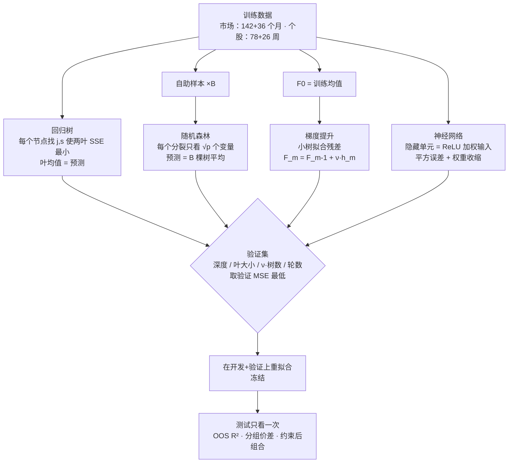
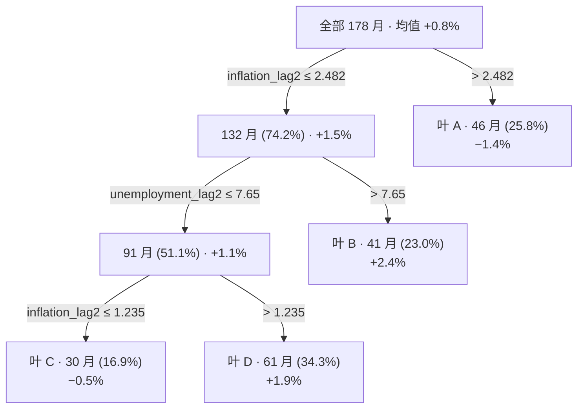
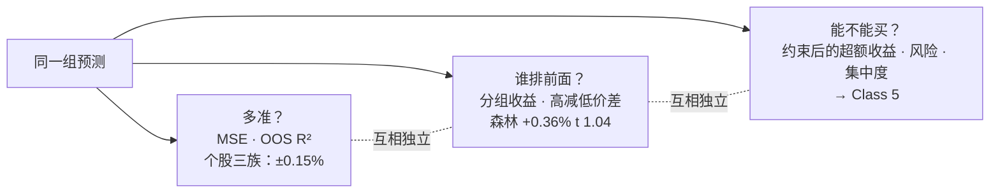

# M04 · 非线性机器学习与收益预测

> **本讲一句话**：M03 用的全是"一条直线"（斜率固定的线性组合）；这一讲允许**一个信号的作用随它自己的水平、或随另一个信号而变**——树把样本切成几个"状态"各给一个预测，森林和提升把很多棵树合起来，神经网络学信号的非线性组合。结论和 M03 一样诚实：**市场层面三个市场里只有一个变好，个股层面三族非线性模型的测试 OOS $R^2$ 全部在 ±0.15% 内、和"猜零"打平**，多出来的灵活性"改变的是哪些特征在驱动预测，而不是测试期的增益"。
> **原始材料**：`Lec04_Nonlinear_Machine_Learning.pdf`（54 页）+ `course_files_export/class04/class04/` 数据包。**转录**：`merged`（2026-09-26，本地 Whisper large-v3；同一晚场的两份录音互补）。源 A = `M04-transcript-A-partial.txt`（有道 WAV，A `00:00`→`02:07:31`，1011 段）；源 B = `M04-transcript-B-partial.txt`（`新录音(1).m4a`，B `00:00`→`01:53:39`，837 段）。A/B 的时间戳各从自己的录音开头计，不能相加；引用前的 A/B 是来源标签。**状态**：v1.0（讲义 54 页仍全覆盖；课堂实际讲至 p.39，p.40–54 明确顺延）。

> ⭐ **这份数据包有两件事比讲义本身还重要**：
> 1. **class03 缺失的 `../shared/` 四个面板终于来了**（`market_excess_return_panel.csv`、`hsi_stock_excess_return_panel.csv`、`technical_characteristics_dictionary.csv`、`risk_free_yields_monthly.csv`，外加成分股名单）——这意味着 M03 / M04 的模型可以**从头重训**而不只是读结果表。本笔记的 `code/L04_nonlinear/02_refit_trees.py` 已把讲义 p.8 / p.10 / p.43 三棵树逐位长了出来（阈值 2.482 / 2.456 / 0.150、叶子人数、验证 MSE、测试 OOS $R^2$ 全部对上）。
> 2. ✅ **同时发现 `class03/class03/stock_linear_test_predictions.csv` 曾被同步截断（358 / 4,108 行），2026-09-22 已用 Canvas 重下的 `class03.zip` 恢复**：重下的包是更新版（15 个文件，五个共享面板与 class04 的逐字节相同），`L03_01` / `02` 重跑后 M03 §2.8.1 的个股数字全部复核成立。截断根因是 Remotely Save 经代理上传停滞 + dufs 就地写半截 + 下一轮同步把半截拉回（见根 README 待办）。

---

## 0. 三分钟速览

**讲义内容与课堂进度**：以下 54 页全部保留供自学；两份录音互补后，确认本堂课实际讲至 p.39，p.40–54 留到下一讲。

M03 结束时留下一个问题（M03 §2.9.4）：线性模型的斜率是固定的——"通胀每高 1 个百分点，下月超额收益就低 β"，不管通胀是 1% 还是 5%、不管当时失业率高不高。金融里很多关系不是这样：动量在低波动时有用、在高波动时反过来；通胀低于某个门槛时市场表现好、高于门槛时差。这一讲换三类能表达这种"随状态而变"的模型，仍然用 M03 的两个任务、同一套时间线、同一个基准：

1. **回归树**（p.4–16）：把样本按某个预测变量的门槛切成几片"叶子"，每片叶子的预测就是那片叶子里训练观测的平均收益。深度和最小叶大小在验证集上选。讲义用美国宏观数据长出一棵"通胀 ≤ 2.48%" 的树，用香港数据长出几乎同一个门槛的树——**门槛相似，预测价值却不同**（美国 OOS $R^2$ −2.6%，香港 +4.7%）。
2. **随机森林与梯度提升**（p.17–28）：森林 = 在很多个自助样本上各长一棵树、每次分裂只看随机的一小撮变量、最后取平均；提升 = 从样本均值出发，一棵小树一棵小树地拟合剩下的误差，每步只加一小步（学习率）。两者的调参都在验证集上做，早停是"一棵一棵地做同一个决定"。
3. **神经网络**（p.29–35）：隐藏单元 = 对输入加权求和再过一个非线性激活；目标函数 = 平方误差 + 权重收缩；训练时长用早停选。讲义明说**课程结果只用了线性模型和树集成，没有神经网络的预测结果**——这一节是"可能的扩展"，配一个手算例子和一个"面板有 12,281 行但只有 156 个独立周"的提醒。
4. **市场证据**（p.36–39）：非线性模型在三个市场的测试 OOS $R^2$——美国梯度提升 +6.3%（线性 LASSO −16.3%），香港决策树 +4.7%（线性弹性网 +8.4%），中国内地随机森林 −36.4%（线性 LASSO −0.6%）。**多一层灵活性没有让三个市场都变好**；CSI 300 在 2024 年 9 月 24 日政策公告后的一个月涨了 18.9%，任何模型都没预测到。
5. **个股证据**（p.40–54）：恒指 80 只成分股的周度面板上，验证集把三族模型分得很开吗？不——验证 MSE 26.30 / 26.25 / 26.64（×10⁴），随机森林以万分之一的优势被选中；测试 OOS $R^2$ 三族都在 ±0.15% 内，与 M03 的 PCR（+0.02%）打平；按预测分五组，森林和提升的高减低价差 +0.36% / +0.34%（周），t 只有 1.04 / 0.87。**精度、排序、投资授权是三种不同的评价**，要在开测试集之前选定用哪一种。

**学完你应该能**

1. **说清**回归树怎么预测（走到叶子、取叶均值）、怎么长（每个节点找让两片叶子平方误差之和最小的变量与门槛）、用什么控制它（深度、最小叶大小），并**手算**一个六个月的例子
2. **解释**为什么把很多棵树平均能降方差（共同相关的部分降不掉）、为什么随机森林还要随机选变量、提升与森林在构造上的根本差别，并**手算**一步 bagging 和一步 boosting
3. **读**一棵拟合好的树（p.8、p.43）：门槛、样本占比、叶子预测；并判断一个门槛"可不可投资"（叶子支持、叶大小敏感性、时间稳定性）
4. **复述**神经网络的目标函数三部分、早停的读法、以及"12,281 行不等于 12,281 个独立观测"的理由
5. **用**验证 MSE 而不是测试 MSE 选模型，并说清"测试期赢家不能替换验证冻结的模型"
6. **比较**线性与非线性在两个任务上的测试结果，说出讲义的结论：市场任务"看问题和样本"、个股任务"灵活性改变的是驱动特征而不是增益"
7. **区分**三种评价（MSE / OOS $R^2$ → 预测精度；分组价差 → 排序；约束后的组合收益 → 投资授权），并解释负 OOS $R^2$ 与正价差为什么能同时出现

**如果只记三件事**

- **树 = 按状态给预测，叶均值就是预测**；深度和叶大小不是"越细越好"，验证集决定"数据能支持几个区分"（p.11–13）。**一个只有四个月支持的高通胀叶子，是噪声不是规律**（p.26）。
- **森林靠平均降方差，提升靠连续修正降偏差**；两者的共同纪律是**设置在验证集上冻结、测试只看一次**（p.24、p.46–47）。验证 MSE 相差万分之一时，"选中"不等于"更好"（p.45）。
- **多一层灵活性换来的很少**：市场任务一好一平一坏（p.38），个股任务三族与零打平（p.47、p.50）；能排出一点次序（p.51），但 t < 1.1。讲义的解释是**信息集**——三十个技术指标高度重叠、阈值可能只描述一小段时期、缺的预测变量再灵活的算法也补不上（p.54）。

> 🎙️ **课堂实况**（2026-09-24 晚场）：A `00:00` 已在处理 TA Zoom 与作业问题，`04:00`–`28:48` 以 M03 回顾、市场指数与个股区别、桌面 AI 操作问答为主；`28:48` 才从 M04 p.4 进入回归树。A 在 `01:09:33` 休息后剪掉 bagging，B `01:09:44`–`01:14:46` 完整补 p.18–19；B 随后缺 boosting 和 p.26–28，这两段以 A `01:19:30`–`01:39:39` 回补。 双源同讲：A `01:43:48`–`02:01:30`／B `01:29:42`–`01:47:32` 讲神经网络与按日期切分；A `02:01:30`–`02:07:15`／B `01:47:32`–`01:53:07` 讲三市场结果和政策冲击。两轨均在 p.39 的投资者含义处明确说下周继续，故 p.40–54 是顺延范围，不是被略过。

---

## 1. 开始之前 · 知识衔接

### 1.1 你已经有的

本讲每一页都建立在 M02 / M03 的时间线与评价方法上。下表按本讲出现顺序列出，每条附一句话唤醒——不必真的跳回去。

| 概念 | 一句话唤醒 | 回看 |
|---|---|---|
| 超额收益 · 无风险代理 | 目标是 $r^e = r - r_f$；美 / 港用美国 3 个月国债、内地用中债，取上月末值折算 | [[M03-线性机器学习与收益预测#2.6.5 超额收益与无风险代理（讲义 p.33–34）\|M03 §2.6.5]] |
| 冻结时间线 142 / 36 / 60 | 市场任务：开发 2006-09 → 2018-06、验证 2018-07 → 2021-06、测试 2021-07 → 2026-06 | [[M03-线性机器学习与收益预测#2.2.3 冻结时间线：142 / 36 / 60（讲义 p.8）\|M03 §2.2.3]] |
| 训练 / 验证 / 测试各干各的 | 估计 / 挑选 / 只评一次；看完测试集再改模型，测试集就作废了 | [[M02-回归与样本外设计#2.6.3 训练 / 验证 / 测试各干各的（讲义 p.38–40）\|M02 §2.6.3]] |
| 样本外 $R^2$ · 滞后 MA(12) 基准 | $1 - \text{SSE}_{\text{model}} / \text{SSE}_{\text{bench}}$；市场任务的基准是过去 12 个月超额收益均值，个股任务的基准是零 | [[M03-线性机器学习与收益预测#2.5.1 计算题：对滞后 MA(12) 的样本外 R 方（讲义 p.22）\|M03 §2.5.1]]、[[M02-回归与样本外设计#2.7.3 基准必须与预测目标匹配（讲义 p.44）★★\|M02 §2.7.3]] |
| 均方误差 MSE · 验证曲线 | $\frac{1}{T}\sum (r - \hat r)^2$；验证 MSE 随复杂度呈 U 形，最低点定超参数 | [[M03-线性机器学习与收益预测#2.4.5 读两张图：系数路径与验证曲线（讲义 p.19–20）\|M03 §2.4.5]] |
| 超参数 | λ、K、深度这类不由拟合估计、只能在验证集上选的设定 | [[M03-线性机器学习与收益预测#2.4.1 惩罚项的一般形式（讲义 p.12）\|M03 §2.4.1]] |
| 四个美国宏观变量与滞后 | term_spread_lag1、fed_funds_lag1、unemployment_lag2、inflation_lag2；三个市场共用 | [[M03-线性机器学习与收益预测#2.1.3 四个美国宏观变量与它们的滞后（讲义 p.5）\|M03 §2.1.3]] |
| 股-周面板 · 固定股票池 · 六族技术指标 · 中心化排名 | 80 只 2023-07 恒指成分股 × 156 周；30 列排名取值 −0.5～+0.5；开发 78 / 验证 26 / 测试 52 周 | [[M03-线性机器学习与收益预测#2.6.1 观测单位变了：市场问题 vs 个股问题（讲义 p.29）\|M03 §2.6.1]]、[[M03-线性机器学习与收益预测#2.6.4 从日频数据到无泄漏的周度预测行：中心化排名（讲义 p.32）\|M03 §2.6.4]] |
| 常数预测 | 全部斜率为零、每只股票同一预测；MSE 上不吃亏但无法排序 | [[M03-线性机器学习与收益预测#2.8.4 常数预测：MSE 上不吃亏，但排不了序（讲义 p.51）\|M03 §2.8.4]] |
| 预测分组排序 · 高减低价差 · t 统计量 | 每周按预测分五组、Q5 − Q1 的实现超额收益；t 统计量 = 52 周均值 ÷（标准差 / √52）；M03 Ridge +0.48%、t 1.46 | [[M03-线性机器学习与收益预测#2.9.1 按预测分五组的四个步骤（讲义 p.53）\|M03 §2.9.1]]、[[M03-线性机器学习与收益预测#2.9.3 Ridge：预测精度弱，分组价差为正（讲义 p.55）\|M03 §2.9.3]] |
| 预测精度与排序的分离 | MSE 看水平、分组看次序；同一组预测两种评价可背离 | [[M03-线性机器学习与收益预测#2.9.2 量级与排名的分离：一个三行例子（讲义 p.54）\|M03 §2.9.2]] |
| 阈值 · 交互（M03 预告） | 斜率随其他变量变化——线性模型做不到；这一讲兑现 | [[M03-线性机器学习与收益预测#2.9.4 留给非线性的问题（讲义 p.56）\|M03 §2.9.4]] |
| 训练集标准化 | $z = (x - \bar x_{\text{train}}) / s_{\text{train}}$；神经网络的输入要先标准化（p.31–32） | [[M02-回归与样本外设计#2.6.3 训练 / 验证 / 测试各干各的（讲义 p.38–40）\|M02 §2.6.3]] |
| 残差 | 实现值减预测值 $r - \hat r$；梯度提升拟合的就是它 | [[M02-回归与样本外设计#2.4.6 残差是数据，不是废料（讲义 p.25）\|M02 §2.4.6]] |
| 对数收益 | 市场面板的 `market_total_return` 是 $\ln(P_t / P_{t-1})$，个股面板的 `stock_return` 是简单收益 | [[M01-金融数据与Vibe-Coding#2.3.1 收益率：简单收益与对数收益\|M01 §2.3.1]] |
| 数据泄漏 · 前视偏差 · 生存者偏差 | 只用预测时点之前的信息；固定 2023-07 股票池防生存者偏差 | [[M01-金融数据与Vibe-Coding#2.5.2 数据泄漏、前视偏差与"漂亮的假业绩"\|M01 §2.5.2]] |
| 相关系数（L0 唤醒） | 两列数一起变的程度，−1 到 +1；本讲用它描述"树与树的预测误差有多像"（p.18 的 ρ） | L0 |
| 方差 · 标准差（L0 唤醒） | 一列数离均值有多远的平方均值、及其平方根；本讲 bagging 的方差公式与置换重要性的 sd 列 | L0 |
| 梯度（L0 唤醒） | 函数往哪个方向变化最快；"梯度提升"的名字来自"每一步沿误差下降最快的方向加一小步"，本讲不推导 | L0 |
| 分位数 / 百分位（L0 唤醒） | 把一列数从小到大排后某个位置的值；p.44 的"第 65 百分位"、五分组的"五分位" | L0 |
| 显著性 · p 值（L0 唤醒） | t 统计量绝对值大于约 2 才算"不太可能是零"；本讲的价差 t 只有 1.04 / 0.87 | L0 |

L0 入场基线（监督学习、训练 / 验证 / 测试、过拟合、MSE、神经网络与深度学习的基本概念、Python 基础语法）见 [[EF5560_Fintech_and_AI_in_Finance/_meta/知识层级台账|知识层级台账]]。**本课口径**：金融概念一律不在 L0；本讲新用到的两个非金融背景词——自助抽样（bootstrap）与激活函数——在正文就地解释。

### 1.2 本讲全新引入的概念

| 概念 | English | 展开于 |
|---|---|---|
| 回归树 · 叶子 · 叶均值预测 | Regression tree · Leaf · Leaf-mean forecast | §2.2.2 |
| 分裂准则 | Split criterion (j, s) | §2.2.3 |
| 截面分裂 vs 时序分裂 · Cong-Feng-He-Li-Zhang 论文 | Cross-sectional vs time-series splits · Asset Heterogeneity and Uncommon Factors | §2.2.4 |
| 深度 · 最小叶大小（验证集选） | Depth · Minimum leaf size | §2.2.7、§2.2.8 |
| 交互效应（动量看波动率）· 只做多的超配 / 低配 | Interaction · Long-only overweight / underweight | §2.2.9、§2.2.10 |
| bagging · 自助样本 · 方差分解 | Bagging · Bootstrap sample · Variance of an average | §2.3.1 |
| 随机森林 · 随机预测变量子集 | Random forest · Random predictor subsets（⌊√30⌋ = 5） | §2.3.2 |
| 梯度提升 · 残差修正 · 学习率 | Gradient boosting · Residual correction · Learning rate ν | §2.3.3 |
| 早停 | Early stopping | §2.3.4、§2.4.4 |
| 神经网络 · 隐藏单元 · ReLU · 权重收缩 | Neural network · Hidden unit · ReLU · Weight shrinkage | §2.4.1–2.4.3 |
| 独立日期数（面板 ≠ 独立观测） | Number of independent dates | §2.4.5 |
| 置换重要性 | Permutation importance | §2.5.1、§2.7.1 |
| 政策转折与预测（CSI 300 2024-09-24） | Policy announcement and prediction | §2.5.2 |
| 成交额趋势排名 | Dollar-volume-trend rank | §2.6.3 |
| 验证平局 · 冻结模型（不按测试换） | Validation near-tie · Preselected evaluation model | §2.6.4、§2.6.5 |
| 精度 / 排序 / 投资授权三种评价 | Accuracy · Ranking · Investment mandate | §2.7.5 |
| 信息集缺失（增益弱的解释） | Missing predictive variable · Information set | §2.7.6 |

### 1.3 为什么这一讲放在这里 · 重排说明

M02 立了纪律（按日期切分、验证选模、只评一次测试），M03 在同一纪律下换了估计方法（收缩、降维），结论是"线性模型很弱，但弱预测仍可能排得出好坏股"。这一讲是同一条线的第三步：**换掉"线性"本身**。它故意不换任何别的东西——同样的四个宏观变量、同样的 30 个排名、同样的 142 / 36 / 60 与 78 / 26 / 52、同样的 MA(12) 与零基准（p.2、p.41）——所以两讲的结果可以并排放在一张表里（p.38、p.50）。这也是本课"vibe coding"的一贯做法：**先把评价规格冻结，再让 AI 或自己去换模型**。Class 5 会把这些预测变成组合权重（p.16、p.39）。

**重排说明**：讲义四段（树 → 森林与提升 → 神经网络与市场证据 → 个股证据）的顺序就是学习顺序，本笔记**保留讲义顺序**，只做三处局部调整：

1. p.14（六个月手算）并入 §2.2.2 作为"叶均值预测"的数字例子，p.6 的分裂准则单独成节（§2.2.3）并用同一个六个月例子把"为什么门槛选在 2.5%"算出来（讲义没算，笔记补充）。
2. p.26–28 三道题合成一节（§2.3.6），因为它们分别考树的可信度、读树、随机森林的原理，正好收束第二段。
3. p.36（四张图）的解读拆到两处：市场 OOS $R^2$ 与美国预测曲线在 §2.5.1，CSI 300 那一格接 p.37 在 §2.5.2。

**§8 里标为非内容页的 5 页**：p.1 封面；p.3、17、29、40 四张章节标题页（整页只有段落标题）。其余 49 页全部在 §2 有讲解。对应关系见 [[#8. 讲义页码映射|§8 讲义页码映射]]。

**关于数字来源**：讲义标 *"Illustrative"* 的是假数（p.11、14、15、19、23、32、33、46、53），笔记一律标「讲义示例（假数）」；真数（p.9、10、36–38、44–51）全部从 `class04/` 结果表重算、并用共享面板把三棵树重新长出（`code/L04_nonlinear/01_reproduce_lecture.py`、`02_refit_trees.py`），森林与提升因随机数与实现差异只能近似复现（§9.5）。

---

## 2. 正文

### 2.1 本讲的地图：同一批问题，让信号的作用随状态而变（讲义 p.2）

**是什么**

M03 的每个模型都可以写成"预测 = 截距 + Σ 斜率 × 变量"，斜率是固定数字。这一讲问：如果"通胀高 1 个百分点对下月收益的影响"本身取决于通胀现在有多高、或取决于失业率高不高，线性模型就表达不出来。p.2 用三句话说明三类能表达它的模型各自的角度：

> Class 3 used linear combinations of predictors. Here we allow a signal's effect to change with its level or with other characteristics.
> **Trees**: forecasts differ across observable regimes. **Forests and boosting**: combine trees to stabilize or refine a forecast. **Neural networks**: learn combinations of signals and their interactions.
> We compare market excess-return forecasts and weekly stock excess-return forecasts using Class 3's dates and benchmarks.（讲义 p.2）

三句话对应三种"非线性"：**树**——预测随"可观测的状态"（regime，比如通胀高低）而不同；**森林与提升**——把树合起来，前者让预测更稳、后者让预测更精；**神经网络**——学信号的组合与交互。最后一句是本讲的方法纪律：**两个任务、日期、基准全部沿用 M03**，不然两讲的结果没法比。

**为什么需要它**

它给了整讲一个固定的问题——"允许效应随状态而变，样本外能好多少？"——和一个固定的答案形式：p.38（市场）与 p.50（个股）两张"线性 vs 非线性"对照表。读后面每一页时都可以问"这一页在为哪张表提供哪个格子"。它也解释了为什么本讲不重讲数据（p.41 一张表带过）：数据和评价都是 M03 的，新东西只有模型。

**课件原例**

见上引文（讲义 p.2）。讲义此处无数字。

**🎙️ 课堂补充**（A `11:27`–`13:23`、`28:48`–`31:22`；A · 课上展开）

- 教授先复盘高维变量、简单均值基准，再引出第三个动机：*"The last one, that is nonlinearity."*（A `11:42`）。他把利率上行与下行、通胀高与低称作不同的宏观状态，强调 *"your predictive model should be different"*（A `31:06`）。
- **这段改变了什么**：本讲非线性的起点是金融状态可能改变预测关系，不是为了让模型更复杂；课上从树讲起，直到 `28:48` 才进入 p.4。

**💡 换个说法（笔记补充）**

- 线性模型像一张"每涨 1 度电费加 0.6 元"的固定价目表；树像阶梯电价——用电在 200 度以下一个价、以上另一个价；森林像把十几张不同人定的阶梯表取平均；提升像先给一个粗价目表、再一次次微调"哪一档定贵了"。神经网络则是让电脑自己找"温度 × 用电量"这类组合项。
- "用 Class 3 的日期和基准"这句话看起来是废话，其实是本课最反复强调的纪律（M02 §2.7.3）：换了模型不能顺手换基准，否则你永远不知道变好是因为模型还是因为基准变弱了。

**⚠️ 常见误解**

- ❌ "非线性模型更复杂，所以预测一定更准。"→ p.38 与 p.50 的结论恰恰是**不一定**：美国变好、香港变差、内地变得很差；个股三族都与零打平。灵活性换来的只是"驱动预测的特征变了"（p.50）。
- ❌ "树、森林、提升是三种不同的模型。"→ 森林和提升都是**把树组合起来**的方法（p.2 "combine trees"），基本单元还是回归树；所以 §2.2 先把树讲透，后面两节只讲"怎么合"。

**与其他概念的关系**

M03 §2.9.4（阈值与交互的预告）、M03 §2.2.3（时间线）、M02 §2.7.3（基准）；本讲 §2.5.3 / §2.7.3（两张对照表）、§2.7.6（增益弱的解释）。

**所以呢**：先把最基本的单元——一棵树——从"怎么预测"讲到"怎么长"。

---

### 2.2 回归树：按状态给预测（讲义 p.3–16）

p.3 是章节标题页 "Regimes and Nonlinear Forecasts"，无内容。

#### 2.2.1 一条线 vs 一棵树：同一份数据、两种规则（讲义 p.4）

<!-- 类型: 图表读法型 -->

**是什么**

同一组 178 个训练月（2006-09 → 2021-06，美国），横轴是滞后两个月的通胀率，纵轴是下个月 SPY 的超额收益。p.4 的散点图上画了两条拟合规则：一条**蓝色直线**（线性回归：通胀越高、预测越低，斜率固定），一条**红色台阶**（深度一的树：通胀在某个门槛以下预测约 +1.5%，以上约 −1.4%）。图的副标题写明 "One predictor, two fitted rules: 178 pre-test months"。

页底的 Keep in mind 是这一页要你带走的唯一一句：

> A line uses one slope; a tree uses discrete regimes. The fitted rule must predict well on later data.（讲义 p.4）

"discrete regimes"（离散的状态）就是这一讲的关键词：树不问"通胀每高一点收益低多少"，只问"通胀在门槛哪一边"，然后给那一边一个固定的预测。第二句是本课的老纪律——**拟合得像不像不算数，要在后面的数据上预测得好才算**。

**为什么需要它**

它把 M03 §2.9.4 预告的"阈值"画成了图：直线和台阶在这 178 个点上看起来都"差不多能穿过点云"，肉眼分不出谁更好——这正是为什么后面要靠验证集（p.11）和测试集（p.10）来判，而不是看图。读这张图时要注意散点的纵向范围是 −20% 到 +10%，两条规则的预测都挤在 −2% 到 +2% 之间：**任何规则都只解释了一小部分波动**，这与 M02 讲的"金融 OOS $R^2$ 几个百分点就算好"一脉相承。

**课件原例**

p.4 的散点图（读图：红色台阶的断点在通胀约 2.5% 处，左段约 +1.5%、右段约 −1.4%；这两个数在 p.9 给出精确值 +1.5% / −1.4%，门槛 2.48%）。

**🎙️ 课堂补充**（A `28:48`–`34:24`；A · 课上展开）

- 教授把蓝色线性预测和红色两段台阶对照：高、低通胀时分别用各自历史收益均值；*"We calculate two average."*（A `32:51`）。红线在训练数据上通常更灵活，但他随后提醒切得过细会样本外过拟合（A `35:55`–`36:11`）。
- **这段改变了什么**：台阶图是按状态换平均预测的直观入口；不能凭训练图判断样本外胜负。

**💡 换个说法（笔记补充）**

- 直线说"通胀是一根连续的油门"，树说"通胀是一个开关"。哪种描述更接近真实的市场，讲义不预设——它让验证和测试数据说话。
- 图上还能看出一件事：台阶的两段都很"平"，说明树在每个状态内**不再区分**通胀是 1% 还是 2%——这是树的代价（状态内没有斜率），也是森林和提升要弥补的地方（很多棵不同门槛的树平均之后，台阶会变得像斜坡）。

**⚠️ 常见误解**

- ❌ "台阶穿过更多的点，所以树更好。"→ 这是训练期的图；p.10 会给出这棵美国树在测试期的 OOS $R^2$ 是 **−2.6%**——输给 MA(12)。看图选模型正是 M02 §2.6.3 禁止的事。
- ❌ "树的预测是一条水平线，等于常数预测。"→ 常数预测（M03 §2.8.4）是**全样本一个数**；树是**每个状态一个数**，至少两片叶子两个数，能区分状态、也能排序（p.44 的树桩就把股票分成了两组）。

**与其他概念的关系**

M03 §2.9.4（阈值预告）、M02 §2.4.1（拟合线在选什么）、M02 §2.6.3（不看图选模型）；本讲 §2.2.2（叶均值）、§2.2.5（这棵树的完整版）、§2.3.1（平均之后台阶变斜坡）。

**所以呢**：台阶上的每一段数字是怎么来的？——叶子里训练收益的平均。

#### 2.2.2 叶子与叶均值：树的预测式（讲义 p.5、p.14）

<!-- 类型: 公式型 -->

**是什么**

一棵树把训练观测切成若干组，每组叫一片**叶子**（leaf）；对落进某片叶子的新观测，**预测就是这片叶子里所有训练观测的平均收益**。这是**回归树**（regression tree）的全部预测逻辑——没有斜率、没有截距，只有"你在哪片叶子"和"那片叶子的均值"。p.5 的定义：

> A tree divides observations into groups called **leaves**. In leaf $R_\ell$, the forecast is the mean training return.（讲义 p.5）

$$\hat c_\ell = \frac{1}{n_\ell}\sum_{i \in R_\ell} y_i$$

| 符号 | 是什么 | 已知还是要算 |
|---|---|---|
| $R_\ell$、$\ell$ | 第 $\ell$ 片叶子（一组训练观测，由一串"变量 ≤ 门槛"的条件定义） | 树长好之后是已知的 |
| $n_\ell$ | 这片叶子里的训练观测个数 | 已知（数一数） |
| $y_i$ | 第 $i$ 个训练观测的下期超额收益 | 已知（训练数据） |
| $\hat c_\ell$ | 这片叶子的预测值 = 叶内训练收益的平均 | 要算的 |

p.5 还给了三条使用说明：**什么时候有用**——关系在某个门槛处改变、或取决于另一个预测变量；**怎么预测**——沿着拟合好的分裂条件走到一片叶子，用它的均值；**复杂度**——深度（depth）与最小叶大小（minimum leaf size）限制树把数据切得多细。

**数字例子（手把手）**（讲义 p.14，示例假数；`code/L04_nonlinear/01_reproduce_lecture.py` A 段复算）：六个训练月按滞后通胀切在 2.5%：

| 滞后通胀 | 1.0% | 1.8% | 2.2% | 3.0% | 3.6% | 4.4% |
|---|---|---|---|---|---|---|
| 下月收益 | 3% | 1% | 2% | 0% | −1% | −2% |

1. 左叶（通胀 ≤ 2.5%）三个月：$\hat r_{\text{low}} = (3 + 1 + 2) / 3 = 2\%$
2. 右叶（通胀 > 2.5%）三个月：$\hat r_{\text{high}} = (0 - 1 - 2) / 3 = -1\%$
3. 一个新月份滞后通胀 2.0% → 走左叶 → 预测 **2%**；滞后通胀 3.5% → 右叶 → **−1%**。

讲义的最后一句把"谁决定什么"说清了："The lagged inflation observation determines the branch. The leaf average comes from training returns."——**走哪条枝由新观测的预测变量决定，叶子的数值由训练收益决定**。

**为什么公式长这样**：为什么叶子的预测是"平均"而不是别的数？因为在一片叶子内部，树不再用任何变量区分观测，此时最小化平方误差的常数就是均值——这和 M02 §2.4.1 讲的"OLS 在只有截距时拟合值 = 样本均值"是同一件事。所以树可以看成"**分段的历史均值**"：先按状态分段，每段用历史均值预测。

**极端 / 边界情况**：
- 只有一片叶子（深度 0）：预测 = 全部训练收益的均值——就是历史均值基准，也是 M03 §2.8.4 的常数预测。
- 叶子小到只有一个观测（最小叶大小 = 1、深度不限）：每片叶子的均值就是那一个月的收益，训练误差为零，但预测纯属噪声——p.13 说"a high-return leaf based on a few months is a noisier estimate"。
- 一片叶子里全是同一个数：均值就是那个数，方差为零，看起来"完美"，通常是样本太小。

**为什么需要它**

它是本讲所有模型的最小单元：森林是很多这样的叶均值取平均，提升是一串这样的叶均值累加，连 p.44 的个股树桩也只是两片叶子两个均值。考试的计算题（M03 🔴 35 那一类"给简单数字手算"）在本讲最可能的形式就是 p.14——给六个月、一个门槛，算两个均值、给一个新月份的预测。对项目：ML 作业若用树，报告里要能说清"这片叶子的预测是几个月的平均"。

**课件原例**

见上表（讲义 p.14，标注 "Illustrative training observations."）。

**🎙️ 课堂补充**（A `35:00`–`37:14`、`01:05:42`–`01:06:41`；A · 课上展开）

- 课堂把叶子解释为分组平均：*"The group average, the leaf average, that is the forecast"*（A `36:49`）。教授现场口算 p.14 的六个月例子：通胀 2.0% 进左叶、预测 2%；3.5% 进右叶、预测 −1%（A `01:05:48`–`01:06:28`）。
- **🔴 考试信号**：教授说这类题 *"this might be the questions there"*（A `01:05:42`），并说 *"I will not allow you to use calculator"*（A `01:06:35`），会用简单数字。**这段改变了什么**：六个月算例不只是理解叶均值，更是需手算的题型。

**💡 换个说法（笔记补充）**

- 叶子像餐厅按"工作日 / 周末"两档定的翻台率：工作日的预测就是历史上工作日的平均，周末同理；不管今天是周二还是周四，只要是工作日就给同一个数。树只是把"工作日 / 周末"换成了"通胀 ≤ 2.5% / > 2.5%"，而且**门槛是从数据里找出来的**（下一节）。
- 从这个式子能直接看出树的两个性格：① 它的预测永远落在训练收益的范围内（均值不会超出极值），所以不会像 OLS 那样在极端输入上给出离谱的外推；② 它对叶子里的少数极端月份很敏感——一片 12 个月的叶子里混进一个 +18% 的月份，均值就被抬高 1.5 个百分点。

**⚠️ 常见误解**

- ❌ "叶子的预测值是拟合出来的参数。"→ 它就是**算术平均**，没有估计过程；树里唯一"拟合"的是分裂的变量和门槛（§2.2.3）。
- ❌ "预测时要把新月份的收益也放进叶子重新平均。"→ 新月份的收益是要预测的东西，还没发生；叶均值只用训练收益（p.14 最后一句），这是 M01 预测时钟的老规矩。

**与其他概念的关系**

M02 §2.4.1（均值最小化平方误差）、M03 §2.8.4（常数预测 = 深度 0 的树）、M01 §2.5.1（预测时钟）；本讲 §2.2.3（门槛怎么选）、§2.2.8（叶大小与噪声）、§2.3.1（很多棵树的均值再平均）。

**所以呢**：叶子里的均值好算，难的是**门槛切在哪、用哪个变量切**——下一页给出准则。

#### 2.2.3 怎么长树：每个节点找让两片叶子误差之和最小的变量与门槛（讲义 p.6）

<!-- 类型: 公式型 -->

**是什么**

上一节假设门槛 2.5% 是给定的。树自己怎么找门槛？p.6 的规则叫**分裂准则**（split criterion）：在当前节点，把每个预测变量 $j$ 的每个候选门槛 $s$ 都试一遍，把观测分成左右两组，各用组内均值预测，**选让两组平方误差之和最小的那一对** $(j, s)$：

> At each node, choose predictor $j$ and threshold $s$ to minimize:（讲义 p.6）

$$(j^*, s^*) = \arg\min_{j,s}\left[\sum_{i \in R_L(j,s)} (y_i - \bar y_L)^2 + \sum_{i \in R_R(j,s)} (y_i - \bar y_R)^2\right]$$

| 符号 | 是什么 | 已知还是要算 |
|---|---|---|
| $j$ | 候选的预测变量（本讲市场任务 4 个、个股任务 30 个） | 遍历 |
| $s$ | 候选门槛（通常取相邻观测值的中点） | 遍历 |
| $R_L(j,s)$、$R_R(j,s)$、$L$、$R$ | 左组（$x_{ij} \le s$）与右组（$x_{ij} > s$）的观测集合 | 由 $(j,s)$ 决定 |
| $\bar y_L$、$\bar y_R$ | 左右两组各自的训练均值（= 两片叶子的预测） | 先算 |
| $y_i$、$x_{ij}$ | 第 $i$ 个观测的下期超额收益、第 $j$ 个预测变量的取值 | 已知 |
| $(j^*, s^*)$ | 让方括号里的和最小的那一对 | 要算的结果 |

然后三步（p.6）：① 在左右两个子节点里**重复**同样的搜索，直到碰到深度或叶大小的限制；② 这些限制**在按时间顺序切出的验证集上选**，选定后**在测试之前重新拟合**；③ 对新观测，**只用它的预测变量**沿着分裂条件走到叶子。

**数字例子（手把手）**（用 p.14 的六个月，💡 笔记补充，`L04_01` C 段算出）：只有一个变量（滞后通胀），候选门槛取相邻值中点，逐个算"两叶 SSE 之和"：

1. 门槛 1.4%：左 {3}，右 {1, 2, 0, −1, −2}（均值 0）→ $\text{SSE} = 0 + 10 = 10.00$
2. 门槛 2.0%：左 {3, 1}（均值 2），右 {2, 0, −1, −2}（均值 −0.25）→ $2 + 8.75 = 10.75$
3. **门槛 2.6%：左 {3, 1, 2}（均值 2），右 {0, −1, −2}（均值 −1）→ $2 + 2 = 4.00$** ← 最小
4. 门槛 3.3%：左 {3, 1, 2, 0}（均值 1.5），右 {−1, −2}（均值 −1.5）→ $5 + 0.5 = 5.50$
5. 门槛 4.0%：左 {3, 1, 2, 0, −1}（均值 1），右 {−2} → $10 + 0 = 10.00$

所以树自己会把门槛放在 2.2% 与 3.0% 之间（讲义写成 2.5%），**因为那里两组内部最"齐"**。p.23 的 boosting 例子说"The 2.5% threshold wins again"，指的就是这个搜索。

**为什么公式长这样**：为什么是"两组平方误差之和"而不是别的？因为叶子的预测是组内均值（§2.2.2），组内均值的平方误差就是"如果用这片叶子预测，训练期会错多少"；两组相加就是"切了这一刀之后整棵树在训练期的总误差"。取最小 = 找一刀让训练误差降得最多。为什么每次只切一刀（贪心）而不是一次找最优的整棵树？因为后者的组合数是天文数字；贪心加上验证集限制深度，是可算又不过拟合的折中。

**极端 / 边界情况**：
- 门槛切在最边上（左组只有一个观测）：左组 SSE 恒为 0，看起来"很好"，但那片叶子只靠一个月支撑——这就是**最小叶大小**存在的理由（p.13）。
- 所有候选门槛的 SSE 之和都差不多：说明这个变量在这个节点没有信息，树会选别的变量；如果所有变量都如此，这个节点不该再分（验证集会把深度压回去）。
- 两个变量给出几乎相同的最小 SSE：树只能选一个，另一个被"遮住"——这是 p.28 讲随机森林要随机选变量的伏笔。

**为什么需要它**

没有它，树就只是"一张人为画的分组表"；有了它，门槛是数据自己找出来的——这也是 p.9 "门槛是拟合出来的预测规则"这句话的技术含义。它还解释了本讲两个后续现象：为什么美国树和香港树的门槛几乎相同（切的是同一条通胀时间轴，§2.2.6），以及为什么随机森林要在每个节点随机限制候选变量（否则每棵树的第一刀都会落在同一个最强变量上，§2.3.2）。

**课件原例**

讲义 p.6 只给公式与三步，无算例；上面的算例是笔记补充。

**🎙️ 课堂补充**（A `47:29`–`51:29`；A · 课上展开）

- 教授问为何切 2.5 而非 2.4、2.3，解释要逐个试变量与门槛并算左右叶平方误差；他的示意规模是 5 个候选变量 × 每个 40 个门槛 = 200 个候选（A `48:55`–`49:21`）。*"You need to calculate everything, there's no closed form formula"*（A `51:29`）。
- **这段改变了什么**：分裂是逐节点搜索，不是教授主观先定 2.5%；200 只是课堂举例，不是本课程真实数据的固定候选数。

**💡 换个说法（笔记补充）**

- 像切一块有深浅两色的木板：你要一刀切下去，让两边各自"颜色尽量均匀"。试每一个下刀位置，量两边的杂色程度（平方误差），挑最干净的一刀；切完的两块各自再来一刀。什么时候停？不是"切到每块都纯色"（那会切成碎屑），而是**验证集告诉你"再切下去在新木板上反而更杂"**。
- 第 ③ 步"只用预测变量路由"是防泄漏的写法：新观测的收益还没发生，树只能看它的通胀、失业率，不能偷看它属于哪片"高收益叶子"。

**⚠️ 常见误解**

- ❌ "树会找到全局最优的划分。"→ 每个节点只贪心地找**当前**最好的一刀，先切的刀影响后面的选择；所以两个门槛非常接近的树（p.8 vs p.10）可能来自不同的变量组合。
- ❌ "深度和叶大小是在训练集上选的。"→ p.6 第 ② 步明确：在**按时间顺序**的验证数据上选，选完在测试前重新拟合（用开发 + 验证共 178 个月）。训练集上选会一直选最深的树（p.11 训练 MSE 单调下降）。

**与其他概念的关系**

§2.2.2（叶均值）、§2.2.7 / §2.2.8（深度与叶大小的验证选择）、§2.3.2（随机选变量打破"遮住"）、§2.3.3（提升每步都用这个搜索拟合残差）；M02 §2.6.3（验证集的角色）、M03 §2.4.1（超参数）。

**所以呢**：门槛可以切在时间轴上（哪些月份），也可以切在股票之间（哪些公司）——下一页区分这两种切法，并引出教授自己的论文。

#### 2.2.4 截面分裂与时序分裂，以及教授的论文（讲义 p.7）

<!-- 类型: 对比型 -->

**是什么**

同样是"按门槛把观测分组"，切的对象可以是两种（p.7）：

| | 截面分裂：切股票 | 时序分裂：切月份 |
|---|---|---|
| 做法 | 在同一个月里，按某个特征（如市值）把公司分开 | 对同一个市场，按某个状态（如滞后通胀）把月份分开 |
| 含义 | 不同的股票组可以有不同的收益关系 | 不同的市场状态可以有不同的收益关系 |
| 本讲对应 | 个股任务（§2.6–2.7，按 30 个排名切股-周行） | 市场任务（§2.2.5–2.2.6，按宏观变量切月份） |

p.7 下半页介绍教授的论文 **"Asset Heterogeneity and Uncommon Factors"**（Cong, Feng, He, Li, and Zhang, 2026 working paper）：把**股票组的树**与**变量选择**结合——某个特征可以进入一部分股票组的收益模型、而不进入另一部分；再分别在扩张期与衰退期拟合，比较这些模式在商业周期不同状态下的差异（衰退期的划分用的是事后确定的 NBER 日期）。

"NBER dates" 就地解释：美国国家经济研究局（NBER）事后宣布的衰退起止日期——它是**回头看**才知道的，所以论文用它做的是"比较"而不是"预测"（脚注特意说 retrospective）。

**为什么需要它**

这一页把树从"一个算法"提升到"一种研究视角"：**异质性**（heterogeneity，不同资产的收益关系本来就不同）与**非共同因子**（uncommon factors，只对一部分资产有用的信号）——这正是线性模型（M03）做不到的：线性模型给所有股票同一组斜率。对考试而言，这是一道现成的辨析题："截面分裂与时序分裂的区别是什么、本讲两个任务各用哪一种"。它也是教授研究方向的信号（本课多处强调"哪些股票对哪些信号有反应"）。

**课件原例**

论文标题与一句话摘要（讲义 p.7）。

**🎙️ 课堂补充**（A `55:06`–`57:44`；A · 课上展开，含反向考试信号）

- 教授用股-期面板说明既能按高低通胀切时间，也能按市值、价值/成长、波动率切股票截面（A `55:16`–`56:22`）；价值股与成长股、高低通胀期未必共用同一预测函数（A `57:09`–`57:35`）。
- **🔴 反向信号**：讲到自己的论文时明确说 *"I'm okay if you don't read that, this will not be tested"*（A `57:40`）。**这段改变了什么**：掌握截面/时序分裂概念；论文全文阅读降为选读，不按必考文献准备。

**💡 换个说法（笔记补充）**

- 判断口诀：**切的是"谁"就是截面，切的是"什么时候"就是时序。** "小盘股和大盘股对动量的反应不同"是截面；"高通胀月份和低通胀月份对利率的反应不同"是时序。个股面板两种都能切（一行既有"谁"也有"何时"），市场面板只能切时间（一个市场一行）。
- 论文的思路用本讲的话翻译：先用树把股票分组（截面分裂），再在每组内用 M03 的变量选择（LASSO 那一类）看哪些特征有用——**树负责"对谁"，收缩负责"用什么"**。

**⚠️ 常见误解**

- ❌ "本讲的个股树是在切月份。"→ 个股任务的树按 30 个**排名特征**切股-周行，切出来的是"成交额趋势高的股票 vs 低的股票"（p.43），是截面分裂；只是 §2.6.2 会提醒：同一片叶子里的股-周行可能来自很多不同的周。
- ❌ "用 NBER 衰退日期做预测变量。"→ 它是事后公布的，用它预测就是 M01 §2.5.2 的前视偏差；论文只用它做**事后比较**。

**与其他概念的关系**

M03 §2.6.1（市场问题 vs 个股问题的观测单位）、M03 §2.3（前向选择 / 变量选择）、M01 §2.5.2（前视偏差）；本讲 §2.2.5（时序分裂实例）、§2.6.3（截面分裂实例）、§2.4.5（同一周的股票不独立）。

**所以呢**：理论说完，看讲义真的用美国数据长出来的那棵树。

---

#### 2.2.5 美国宏观树：一次通胀分裂，四片叶子（讲义 p.8–9）

<!-- 类型: 定义型 -->

**是什么**

用 M03 的四个美国宏观变量和 178 个训练月（2006-09 → 2021-06）长一棵树、在验证集上选深度与叶大小，得到 p.8 的图 "Validation-tuned U.S. macro decision tree"。读图（`code/L04_nonlinear/02_refit_trees.py` 用共享面板把它逐位长了出来，六个节点全部一致）：

| 节点 | 条件 | 样本占比 | 叶均值（月度超额收益） |
|---|---|---|---|
| 根 | 全部 178 个月 | 100% | +0.8% |
| 第一刀 | `inflation_lag2` ≤ 2.482 → 左 | 74.2%（132 个月） | +1.5% |
| | `inflation_lag2` > 2.482 → **叶 A** | 25.8%（46 个月） | **−1.4%** |
| 第二刀（左枝内） | `unemployment_lag2` ≤ 7.65 → 继续 | 51.1% | +1.1% |
| | `unemployment_lag2` > 7.65 → **叶 B** | 23.0% | **+2.4%** |
| 第三刀 | `inflation_lag2` ≤ 1.235 → **叶 C** | 16.9% | **−0.5%** |
| | `inflation_lag2` > 1.235 → **叶 D** | 34.3% | **+1.9%** |

汇总表记录的设置：深度 3、最小叶大小 24 个月、验证 MSE 25.99（×10⁴）。p.9 只讲第一刀：

> The validation-tuned U.S. tree asks whether two-month-lagged inflation is at most 2.48%. … Inflation ≤ 2.48%: 132 months, +1.5%; Inflation > 2.48%: 46 months, −1.4%.
> The threshold is a fitted forecast rule, not an estimate of the causal effect of inflation.（讲义 p.9）

最后一句是本页的考点：**门槛是拟合出来的预测规则，不是"通胀导致收益"的因果估计**——和 M02 §2.4.2 "说关联不说导致"一脉相承。

**为什么需要它**

这是本讲第一个真实结果，也是 p.4 那条红色台阶的完整版（台阶只画了第一刀）。四片叶子的读法很有金融味：通胀高于 2.48% 的月份，下月平均超额收益是负的（叶 A）；通胀低但失业率高于 7.65% 的月份（衰退后期，叶 B）反而最好（+2.4%）；通胀极低（≤ 1.235%，通缩边缘，叶 C）也不好。**这棵树在讲一个"通胀适中、就业疲软时股市最好"的故事**——听起来合理，但 p.10 会告诉你它的测试 OOS $R^2$ 是 −2.6%。故事讲得通与预测得好是两回事（M02 §2.8 的教训）。

**课件原例**

p.8 的树图（已视觉复核并转写为上表）；p.9 的两行表。

**🎙️ 课堂补充**（A `37:41`–`44:37`、`54:08`–`55:06`；A · 课上展开）

- 教授现场从根节点沿条件读美国树：*"If the inflation less than equal to 2.482 ... you go to the left side"*（A `37:49`）；低通胀才再看失业率，高通胀一枝不再问失业率（A `40:17`–`41:47`），由此展示非对称交互。
- **这段改变了什么**：p.8 的三次分裂不是所有变量同时对所有月份起作用；只有到达相应枝条才使用下一个变量。教授觉得 2.48 接近央行约 2% 目标（A `38:34`），这是解释性直觉，不推翻讲义 p.9 的非因果警告。

**💡 换个说法（笔记补充）**

- 读一棵树的口诀：**从根往下走，每个问题答"是"就往左、"否"就往右，走到没有问题的方块就是预测**。一个新月份：滞后通胀 2.0%（≤ 2.482 左走）、滞后失业率 4.0%（≤ 7.65 左走）、通胀 2.0%（> 1.235 右走）→ 叶 D → 预测 +1.9%。
- 样本占比与叶均值一起读才有意义：叶 B（+2.4%）只有 23% 的月份、约 41 个月，而且集中在 2009–2013 这类失业率超过 7.65% 的时期（⚪ 按美国失业率历史推断）——这就是 p.13 说的"一个状态需要多少证据"，也是 p.26 短答题的靶子。
- 换个角度看这棵树的"叙事"：它把十几年的宏观史压成三个问题——通胀高不高、失业多不多、通胀是不是低到通缩边缘——每片叶子都是一段可以用文字讲出来的时期。可读性正是树在业界受欢迎的原因，也正是讲义接下来要警告的东西：讲得出故事，不等于讲对了未来。

**⚠️ 常见误解**

- ❌ "树说明通胀是收益的原因。"→ p.9 原话：fitted forecast rule, not … causal effect；门槛 2.482 只是让训练期两组最"齐"的那一刀（§2.2.3），换一段样本它会变（p.26 "time stability"）。
- ❌ "深度 3 是教授挑的。"→ 汇总表与验证表显示它是**验证 MSE 最小**的设置（`L04_01` B4 段：候选深度 1–5 × 叶大小 12 / 24 / 36，深度 3 + 叶 24 得 25.99）；p.10 的香港树验证选出的是深度 1，说明选择随市场变。

**与其他概念的关系**

§2.2.1（台阶图）、§2.2.3（分裂准则）、§2.2.7 / §2.2.8（深度与叶大小）、§2.2.6（香港对照）、§2.3.6（p.26 可信度诊断）、§2.5.1（这棵树的测试结果 −2.6%）；M02 §2.4.2（关联 ≠ 因果）、M02 §2.8（故事讲得通 ≠ 预测好）。

**所以呢**：换成香港市场，同样的四个变量、同样的验证流程，会长出什么？

#### 2.2.6 相似的门槛、不同的结果：香港（讲义 p.10）

<!-- 类型: 定义型 -->

**是什么**

用同一套美国宏观变量预测**恒生指数**的月度超额收益，验证集这次选了**深度 1、最小叶大小 36 个月**，根节点仍然切在美国通胀上、门槛 **2.456%**（p.10 图；`L04_02` 重拟合一致）：

| 训练区域 | 月数 | 叶均值 |
|---|---|---|
| `inflation_lag2` ≤ 2.456% | 131（73.6%） | +1.1% |
| `inflation_lag2` > 2.456% | 47（26.4%） | −2.4% |

然后是 Keep in mind：

> The U.S. tree has test OOS $R^2 = -2.6\%$ versus MA(12), compared with $+4.7\%$ for HKSAR. Similar fitted thresholds can have different forecasting value.（讲义 p.10）

两棵树的第一刀几乎一样（2.482% vs 2.456%），但在 60 个测试月上，美国树输给 MA(12)（−2.6%），香港树赢了（+4.7%）。`L04_01` B4 段用 180 行测试预测逐月重算：美国 −2.6% ✅、香港 +4.7% ✅。

**为什么需要它**

它是本讲最重要的方法论警告之一：**门槛"看起来合理且稳定"（两个市场都找到 2.5% 左右）不等于"预测有价值"**。同一个规则在一个市场有效、另一个市场无效，说明 p.39 的结论——宏观变量与后续股票收益的关系"随市场和时期而变"。对项目 / 考试：报告一棵树时必须同时报告它的**测试 OOS $R^2$**，而不是只展示树图。

**课件原例**

p.10 的树图与两行表；两个 OOS $R^2$（讲义 p.10；`code/L04_nonlinear/01_reproduce_lecture.py` B4 段、`02_refit_trees.py` 复算）。

**🎙️ 课堂补充**（A `58:23`–`01:01:19`；A · 课上展开）

- 香港树仍用美国宏观量，教授联系港元与美元的联系汇率解释为何美国利率可能影响香港市场（A `58:28`–`58:50`）。他明确对比 *"the R-squared is negative 2.6%, but for Hong Kong stock returns, positive 4.7%"*（A `01:00:23`）。
- **这段改变了什么**：相似门槛与不同样本外成绩要并读；教授的资金流动解释是课堂机制叙述，不能由树门槛直接推出因果。

**💡 换个说法（笔记补充）**

- 两棵树像两个用同一本教科书学开车的人：教科书说"超过 2.5% 就减速"，一个在美国路况下减速减错了时候，一个在香港路况下减对了。规则文本一样，价值取决于路况——而路况（市场）不是规则能选的。
- 反过来想更有启发：为什么香港市场对**美国**通胀的门槛有反应？港元盯住美元、利率跟随美联储，美国通胀高 → 加息预期 → 港股承压——这个传导链讲得通（⚪ 笔记推断，讲义未解释）。但 p.9 已经警告：讲得通不是证据。

**⚠️ 常见误解**

- ❌ "香港树 +4.7% 说明树在香港'有效'。"→ 60 个月的 +4.7% 与 M03 弹性网的 +8.4%（p.38）相比更低；且验证 MSE 上决策树与梯度提升在香港**并列**（都是 23.41，`L04_01` B4），选中决策树带有偶然性。
- ❌ "两棵树门槛接近，说明 2.5% 是宏观规律。"→ 两棵树用的是**同一组美国通胀数据**切时间，门槛接近几乎是必然的——它们切的是同一条时间轴，只是目标市场不同。

**与其他概念的关系**

§2.2.5（美国树）、§2.5.1 / §2.5.3（三个市场的完整结果）、§2.5.4（对投资者的含义）、§2.3.6（p.26 可信度）；M03 §2.5.2（线性模型的三市场结果）。

**所以呢**：深度 3 和深度 1 是怎么被选出来的？回到"用验证集选复杂度"。

#### 2.2.7 深度：验证集决定数据能支持几个区分（讲义 p.11–12）

<!-- 类型: 定义型 -->

**是什么**

树能切多细由两个旋钮控制，第一个是**深度**（depth，从根到叶最多问几个问题）。p.11 用一张示例表说明怎么选：

| 最大深度 | 1 | 2 | 4 | 8 |
|---|---|---|---|---|
| 训练 MSE ×10⁴ | 24 | 21 | 16 | 9 |
| 验证 MSE ×10⁴ | 28 | **26** | 29 | 35 |

"Choose depth two. Deeper trees fit the development returns more closely but make worse forecasts on the validation months."——训练 MSE 随深度单调下降（切得越细越贴合），验证 MSE 先降后升，最低点在深度 2；**选深度 2，在测试前用选定的深度重新拟合**。p.11 脚注：这是示例数字，不是课程数据的结果。

p.12 把深度翻译成金融含义：**深度一**——一个问题给两个预测；**深度二**——第二个问题可以在"波动率状态"内部再区分"动量的行为"（即 §2.2.10 的交互）；**更深**——更窄的组描述更局部的模式，但每组的观测更少。最后一句是原则："Validation chooses how many distinctions the data can support."

**为什么需要它**

它就是 M03 §2.4.5 验证曲线的树版：横轴从 λ 换成深度，形状同样是 U 形。考试上这是一道现成的计算 / 选择题（给一张这样的表问选哪个深度）。更深的含义在 p.12：深度不是技术参数，而是"**数据能支持几个金融状态**"——四个宏观变量、178 个月，验证集在美国支持到深度 3、在香港只支持深度 1（§2.2.5–2.2.6）。

**课件原例**

p.11 的示例表（假数）；p.12 的三条解释。

**🎙️ 课堂补充**（A `01:01:27`–`01:04:09`；A · 课上展开）

- 教授沿 p.11 表指出训练 MSE 随树变深下降，验证 MSE 却会回升；*"too complicated does not mean the model is good"*（A `01:03:12`）。深度属于调参，与上讲 PCR 的主成分个数同类（A `01:03:55`）。
- **这段改变了什么**：选深度看验证误差谷底；教授口头一度说“切一次可能最好”（A `01:02:34`），与 p.11 假数表中深度 2 最低不符，精确例题仍按讲义表选 2。

**💡 换个说法（笔记补充）**

- 深度像问卷的题数：一题分两组、两题分四组、八题分 256 组；178 个月分成 256 组，每组不到一个月——"组均值"就没有意义了。验证集的作用是告诉你"问到第几题，新来的人就答不准了"。
- 训练 MSE 一路下降这件事本身就是一个警告：**凡是"越复杂越好"的指标，都是在训练集上算的**；M02 §2.6.3 说验证集和测试集各干各的，这里验证集干的就是"给复杂度踩刹车"。

**⚠️ 常见误解**

- ❌ "验证 MSE 最低点是 26，所以这棵树的预测误差是 26。"→ 26 是**验证期**的误差，用来选深度；报告的误差应来自测试期，而且测试前还要用选定深度在开发 + 验证上重新拟合（p.11 "Refit at the chosen depth before the test"）。
- ❌ "深度 8 训练 MSE 只有 9，说明它学到了更多规律。"→ 它学到的是训练期的噪声；验证 MSE 35 比深度 1 还差。

**与其他概念的关系**

M03 §2.4.5（验证曲线）、M02 §2.6.3（验证集角色）；本讲 §2.2.8（第二个旋钮）、§2.2.10（深度二的交互）、§2.3.4（提升的树数与学习率同样在验证集选）、§2.4.4（神经网络的早停是同一件事）。

**所以呢**：第二个旋钮——一片叶子至少要有多少观测。

#### 2.2.8 叶大小：一个状态需要多少证据（讲义 p.13）

<!-- 类型: 定义型 -->

**是什么**

第二个旋钮是**最小叶大小**（minimum leaf size）：一片叶子至少要有多少个训练观测。p.13 的取舍：

- **小叶子**：能表示罕见的危机或流动性状态，但它的平均收益很噪（noisy）。
- **大叶子**：每个状态的估计更稳，但可能把一个真实存在的罕见状态藏起来。
- **本课市场任务的候选**：最小叶大小 12、24、36 个月，由验证集选（美国选了 24，香港选了 36——§2.2.5–2.2.6）。

Keep in mind："A high-return leaf based on a few months is a noisier estimate than a similar leaf observed repeatedly."——**一片只靠几个月支撑的高收益叶子，比一片反复出现的类似叶子噪声大得多**。

**为什么需要它**

它和深度一起决定树能切多细，但角度不同：深度限制"问几个问题"，叶大小限制"每个答案要有多少人"。金融上后者更直观——一片 4 个月的叶子给出 +5% 的预测，其实是 4 个数的平均，标准误大得离谱。p.26 的短答题正是围绕它出的（"只有四个月支持高通胀叶子"）。个股任务里同样的旋钮变成 30 / 60 / 120 个股-周（p.42），但那里要额外问"这些行来自几个不同的周"（§2.6.2）。

**课件原例**

候选叶大小 12 / 24 / 36 个月（讲义 p.13）；美国树选 24、香港树选 36（`class04/market_nonlinear_model_summary.csv`）。

**🎙️ 课堂补充**（A `01:04:17`–`01:05:27`；A · 课上展开）

- 教授解释叶子里观测太少就难把叶均值算稳：*"You don't want the leaf to be too small"*（A `01:04:43`）。深度与叶大小都应在验证集上选，选好后重拟合（A `01:04:48`–`01:05:27`）。
- **这段改变了什么**：叶大小是估计每个状态平均收益所需的证据门槛，和深度一起限制过拟合。

**💡 换个说法（笔记补充）**

- 叶大小像民调的最小样本量：问了 4 个人说"80% 支持"和问了 400 个人说"80% 支持"，可信度天差地别。最小叶大小 24 就是"每个结论至少问两年的月份"。
- 它和 M02 §2.4.3 标准误的直觉一样：均值的标准误 ≈ 标准差 / √n。月度超额收益的标准差约 4–5%，n = 4 时标准误约 2%，一片 +2.4% 的叶子和零几乎分不开；n = 36 时标准误约 0.7%，才勉强能说点什么（⚪ 笔记按量级推算）。

**⚠️ 常见误解**

- ❌ "叶大小越大越保守，所以总该选最大的。"→ 大叶子会把真实的罕见状态平均掉（p.13 第二条）；验证集选 24 而不是 36（美国）说明"再大一点"在验证期反而差。
- ❌ "叶大小只影响树，不影响森林和提升。"→ 三族模型的汇总表都有 `min_samples_leaf` 列（美国森林 5、提升 8）；它是所有基于树的模型的旋钮。

**与其他概念的关系**

§2.2.3（切在边上的叶子 SSE 为零的陷阱）、§2.2.7（深度）、§2.3.6（p.26 诊断）、§2.6.2（个股面板的叶大小与独立周数）；M02 §2.4.3（标准误）。

**所以呢**：深度二"可以在波动率状态内区分动量"——这句话里藏着树最有金融价值的能力：交互。

#### 2.2.9 交互：动量的效应随波动率翻转（讲义 p.15）

<!-- 类型: 定义型 -->

**是什么**

p.15 给一张假设的周度超额收益预测表（示例假数）：

| 市场状态 | 低动量 | 高动量 | 高减低 |
|---|---|---|---|
| 低波动 | 0.0% | 0.6% | **+0.6%** |
| 高波动 | 0.0% | −0.2% | **−0.2%** |

"The momentum effect changes sign with volatility."——动量的效应在低波动时为正、高波动时为负。**一个只有"动量 + 波动率"两个加法项的回归表达不出这张表**：加法模型里动量的效应是一个固定数字，不可能一会儿 +0.6%、一会儿 −0.2%。"A tree can first split on volatility, then on momentum within each branch."——树先按波动率切、再在每个分支内按动量切，两刀就把这张表画出来了。这就是**交互效应**（interaction）：一个变量的效应取决于另一个变量的取值。

**为什么需要它**

这是 M03 §2.9.4 预告的"交互"的正式定义，也是线性模型真正的短板：M03 的所有模型（包括 PCR / PLS）都是加法的。金融里交互很常见——动量策略在高波动期崩溃（2009 年的"动量崩盘"）是经典案例（⚪ 笔记补充，讲义未提）。深度 2 的树（§2.2.7）就是最简单的交互模型；p.12 "distinguish momentum behavior within a volatility regime" 说的正是这张表。

**课件原例**

见上表（讲义 p.15，标注 "Illustrative fitted forecasts, not estimates from the course panel."）。

**🎙️ 课堂补充**（A `01:06:43`–`01:08:31`；A · 课上展开）

- 教授用动量 × 波动率说明策略收益会随状态变；*"some factors, they only work ... in some regimes, not all regimes"*（A `01:08:15`）。低波动时动量价差 +0.6%，高波动时变负，均是讲义教学示数。
- **这段改变了什么**：交互不仅是数学项，而是同一动量信号在不同市场状态下可能翻转。

**💡 换个说法（笔记补充）**

- 加法模型像"药效 = 药 A 的效果 + 药 B 的效果"；交互像"药 A 单用有效，和药 B 同服反而有害"。加法模型永远算不出"同服有害"，因为它没有"同服"这个项。
- 线性模型其实也能表达交互——手动加一个"动量 × 波动率"的乘积项。区别是：线性模型要**你事先想到**加哪个乘积项，树**自己从数据里找**哪两个变量该组合（先切谁、再切谁）。

**⚠️ 常见误解**

- ❌ "高波动时动量为负，说明高波动时应该做反向动量。"→ 这是示例假数；且即使是真数，也要看叶子的支持月数与测试期表现（§2.2.8、§2.2.6）。
- ❌ "树能自动发现所有交互。"→ 树只能发现**沿着分裂顺序**的交互，且受深度限制；三十个变量两两交互有 435 对，深度 2 的树只能表达其中一对。

**与其他概念的关系**

M03 §2.9.4（预告）、M03 §2.6.3（动量、波动率是六族指标里的两族）；本讲 §2.2.7（深度二）、§2.2.10（用交互选股）、§2.4.1（神经网络"学交互"的另一条路）、§2.3.6（p.27 的读树题就是这张表的变体）。

**所以呢**：交互对投资意味着什么？同一个动量筛选，在不同状态下会给出不同的仓位。

#### 2.2.10 用交互选股，以及给 Class 5 的伏笔（讲义 p.16）

<!-- 类型: 定义型 -->

**是什么**

p.16 把 p.15 的表翻译成一个组合经理的动作：一只高动量股票在低波动时预测 $\hat r^e = 0.6\%$、在高波动时 $\hat r^e = -0.2\%$。"A long-only manager might overweight the first stock and underweight the second."——一个只做多的经理会**超配**前者、**低配**后者。两个要点：

- **同一个动量筛选，在不同状态下产生不同的仓位**——这是交互对投资的直接含义。
- **交互有没有用，看它是否改善了后续的排序或组合收益**（"The interaction is useful if it improves later rankings or portfolio returns."）——不看它在训练期多好看。

最后一句预告："Class 5 considers how these forecasts become constrained weights."——预测怎么变成带约束的权重，是下一讲。

"只做多"（long-only）就地解释：只能买入持有、不能卖空的组合；所以"看空一只股票"只能表现为**少买**（低配），不能表现为负仓位。"超配 / 低配"（overweight / underweight）指相对于基准（如指数权重）多持或少持。

**为什么需要它**

它把本讲的评价标准提前立了起来：**交互的价值要用排序或组合收益来判**——正是 §2.7 的三种评价（精度 / 排序 / 投资授权）。它也解释了为什么讲义在 p.51 报"高减低价差"而不只报 MSE：对经理有用的是"谁排前面"。

**课件原例**

见上（讲义 p.16）。

**🎙️ 课堂补充**（A `01:08:31`–`01:09:33`；A · 课上展开）

- 教授把交互转成只做多经理的说法：高动量股票在低波动期才可能考虑超配；但立刻澄清 *"all these numbers I make them up"*（A `01:09:03`），不是投资建议。
- **这段改变了什么**：p.15–16 例子用于理解条件决策，不可把 +0.6% / −0.2% 当成已验证交易策略；Class 5 还会讲。

**💡 换个说法（笔记补充）**

- 像天气对同一件外套的建议：同一件外套（动量信号），预报晴天（低波动）时"带上"，预报大风（高波动）时"别带"。外套没变，建议随天气变；**评价这条建议好不好，看穿了之后舒不舒服（组合收益），不看预报模型在历史数据上拟合得多准**。
- "只做多"这个约束在 Class 5 才正式处理，但它已经暗示了一件事：负的预测在只做多组合里只能变成"不买"，信息被截断——所以同一份预测在不同授权下价值不同（§2.7.5）。

**⚠️ 常见误解**

- ❌ "预测 −0.2% 就该做空。"→ 讲义的经理是 long-only，只能低配；做空是另一种授权，Class 5 讨论。
- ❌ "交互改善了训练拟合，就该用。"→ p.16 的判据是**后续**排序或组合收益，即样本外。

**与其他概念的关系**

§2.2.9（交互表）、§2.7.4 / §2.7.5（排序证据与投资授权）、§2.5.4（Class 5 预告的另一处）；M03 §2.9.1（分组排序）；台账预告清单 M05（从预测到组合权重）。

**所以呢**：一棵树能表达状态和交互，但它很不稳（换一段样本门槛就变，p.26）。第二段讲怎么把很多棵树合起来。

---

### 2.3 随机森林与梯度提升：把树合起来（讲义 p.17–28）

p.17 是章节标题页 "Random Forests and Boosting"，无内容。

#### 2.3.1 Bagging：为什么把很多棵树平均（讲义 p.18–19）

<!-- 类型: 公式型 -->

**是什么**

一棵树的问题是**不稳**：训练样本稍微变一点，门槛和叶子就可能大变。降不稳的经典办法是**多做几棵、取平均**。但训练数据只有一份，怎么"多做几棵"？p.18 的做法叫 **bagging**（bootstrap aggregating）：从训练数据里**有放回地抽样**（bootstrap，自助抽样：每次抽一个、放回去、再抽，抽满原样本量为一份**自助样本**（bootstrap sample），其中有的观测重复出现、有的没被抽到），抽 B 份，每份独立长一棵树，预测取平均：

$$\hat f_{\text{bag}}(x) = \frac{1}{B}\sum_{b=1}^{B} \hat f_b(x)$$

为什么平均能降噪？p.18 给了方差公式——若每棵树的预测方差都是 $\sigma_f^2$、任意两棵树之间的相关系数都是 $\rho$，则平均后的方差是

$$\operatorname{Var}\!\left(\frac{1}{B}\sum_b \hat f_b(x)\right) = \sigma_f^2\left[\rho + \frac{1-\rho}{B}\right]$$

| 符号 | 是什么 | 已知还是要算 |
|---|---|---|
| $\hat f_b(x)$、$b$ | 第 $b$ 棵树对输入 $x$ 的预测；$b = 1,\dots,B$ | 每棵树长好后已知 |
| $B$ | 树的棵数（本课森林验证期 300、重拟合 500，p.21） | 你定 |
| $\hat f_{\text{bag}}(x)$、$f$ | B 棵树预测的平均 | 要算的 |
| $\sigma_f^2$、$\sigma$ | 单棵树预测的方差（不稳的程度） | 概念量 |
| $\rho$ | 任意两棵树预测之间的相关系数（它们"犯同样错"的程度） | 概念量 |
| $x$ | 新观测的预测变量 | 已知 |

"Why average: more trees reduce the uncorrelated part of prediction variance. **Shared errors remain.**"——树多了，方差里**不相关的那部分** $(1-\rho)/B$ 被压掉；**大家共同犯的错** $\rho$ 那部分不会消失。最后一句是纪律："Resampling uses training data only; validation dates stay later in time."

**数字例子（手把手）**（p.19，示例假数；方差公式的代入是 💡 笔记补充，`L04_01` A / C 段算出）：

1. 三棵树对下月收益的预测分别是 0.8%、−0.2%、0.3% → bagged 预测 $= (0.8 - 0.2 + 0.3) / 3 = 0.3\%$（p.19）。
2. 方差公式代入：设 $\sigma_f^2 = 1$。若树之间**不相关**（$\rho = 0$），$B = 10$ 棵 → 方差 $= 0 + 1/10 = 0.10$，$B = 100$ → $0.01$：树越多越准。
3. 若树之间相关 $\rho = 0.5$：$B = 10$ → $0.5 + 0.5/10 = 0.55$；$B = 100$ → $0.505$——**再加树也压不到 0.5 以下**。
4. 若 $\rho = 0.9$：$B = 100$ 也只有 $0.901$——几乎白忙。

**为什么公式长这样**：平均 B 个方差相同、两两相关为 ρ 的量，方差 = 自己那份 $\sigma^2/B$ 加上两两协方差 $\rho\sigma^2 \cdot (B-1)/B$（协方差 = 两个量"一起波动"的程度，等于相关系数 × 两者的标准差之积；这里两者标准差都是 $\sigma$，所以是 $\rho\sigma^2$），合并后就是 $\sigma^2[\rho + (1-\rho)/B]$。直觉：B 个人各自独立猜错的部分会互相抵消，但如果他们都看了同一份错误的资料，那部分错怎么平均都在。

**极端 / 边界情况**：
- $\rho = 1$（所有树完全一样）：方差 $= \sigma_f^2$，平均毫无作用。
- $\rho = 0$、$B \to \infty$：方差趋于 0，理想情形——但实际上同一份训练数据长出来的树不可能不相关。
- $B = 1$：就是一棵树，方差 $\sigma_f^2$。

**为什么需要它**

单棵树的不稳是 p.26 三项诊断里"换一段样本分裂就变"的根源；bagging 是对症的第一味药。更重要的是那个方差公式：它告诉你**平均的极限在哪**（共同误差 ρ 那部分），从而解释了为什么随机森林还要多做一件事（§2.3.2），也解释了为什么 p.45 三族模型的验证 MSE 那么接近——它们共享的误差（信号本身很弱）不是任何合并方法能平均掉的。

**课件原例**

p.19 的三棵树例子（0.8%、−0.2%、0.3% → 0.3%）。

**🎙️ 课堂补充**（B `01:09:44`–`01:14:46`；B · 课上展开，填补 A 缺段）

- **双源互补**：A 在 `01:09:33` 宣告休息，`01:09:52` 已跳至 p.20–21；B 完整保留了中间 p.18–19。教授解释 bootstrap 是从训练行有放回抽样，某些行重复、某些缺席（B `01:10:49`–`01:11:10`），每份样本训练一棵树，预测后简单平均：*"bagging simply just takes the average"*（B `01:12:11`）。
- 他用相关性 ρ 解释平均后的共同误差降不掉（B `01:12:53`–`01:13:50`），并做三树手算：0.8%、−0.2%、0.3% 平均为 0.3%（B `01:14:01`–`01:14:25`）。**这段改变了什么**：p.18–19 确实在课上详讲，若只看 A 会误判未录到；bagging 是降树间不稳定性，不是保证每棵树都更准确。

**💡 换个说法（笔记补充）**

- 像让十个评委打分再取平均：评委各自的偏差会抵消（不相关部分），但如果十个评委都从同一份有错的评分表出发，平均分照样错（共同部分）。"自助抽样"是让每个评委看到略不同的一批作品，好让他们的偏差不那么一致。
- 公式里最值得记住的是那个 $\rho$：它解释了下一节为什么随机森林还要"随机选变量"——目的就是把 $\rho$ 压低，让平均更有效（p.20）。

**⚠️ 常见误解**

- ❌ "树越多越好，B 越大预测越准。"→ 只对不相关的部分成立；$\rho$ 那部分与 B 无关（p.18 "Shared errors remain"）。
- ❌ "自助抽样可以抽到验证期的月份。"→ p.18 最后一句：重抽样只用训练数据，验证日期保持在后面——否则就是泄漏（M01 §2.5.2）。

**与其他概念的关系**

§2.2（单棵树的不稳）、§2.3.2（随机森林 = bagging + 随机选变量）、§2.3.3（提升是另一种合并：不是平均而是累加）、§2.3.6（p.28 的选择题就是问 ρ）；M01 §2.5.2（泄漏）；L0 唤醒：方差、相关系数（§1.1）。

**所以呢**：怎么把 $\rho$ 压低？让每棵树在每次分裂时只能看一小撮随机挑出的变量——这就是随机森林。

#### 2.3.2 随机森林：再加一层"随机选变量"（讲义 p.20–21）

<!-- 类型: 定义型 -->

**是什么**

**随机森林**（random forest）= bagging + 每个节点只在一个**随机预测变量子集**（random predictor subset）里找最好的分裂（p.20）：

1. 对训练行做自助抽样，每份长一棵树；
2. **在每个节点，从一个新抽的随机子集里搜索最好的分裂**——本课的个股模型每次只看 30 个变量里的 **5** 个（$\lfloor\sqrt{30}\rfloor = 5$，p.21）；
3. 对新观测，B 棵树的预测取平均：$\hat f_{\text{RF}}(x) = \frac{1}{B}\sum_b \hat f_b(x)$（与上一节同一个式子）。

"Random predictor selection can reduce correlation between trees, making averaging more effective."——随机选变量能**降低树与树之间的相关**，让平均更有效（正是 §2.3.1 的 $\rho$）。

p.21 给出个股任务的具体流程：① 从开发行（6,123 行）抽自助样本，每个分裂只看随机子集；② 在接下来的 **26 个验证周**上比较树深度与最小叶大小，**同一周的所有股票留在同一边**；③ 用选定设置在 **104 个测试前的周**（78 + 26）上重新拟合，对每只测试股票平均各树的预测。实现细节：验证期用 300 棵树，最终重拟合用 500 棵。

**为什么需要它**

它回答了 §2.3.1 留下的问题：如果所有树的第一刀都切在最强的那个变量上（比如通胀），树与树高度相关，平均无用。随机子集**强迫**一部分树用别的变量开刀，从而"看到"被最强变量遮住的信号（§2.2.3 的"遮住"问题）。这也是 p.28 选择题的答案（B）。汇总表里三个市场的森林设置是深度 5 / 叶 5（美、港）与深度 3 / 叶 10（内地），个股是深度 2 / 叶 60（`L04_01` B4、B7）。

**课件原例**

$\lfloor\sqrt{30}\rfloor = 5$ 个变量 / 分裂；300 / 500 棵树（讲义 p.21）。

**🎙️ 课堂补充**（B `01:14:46`–`01:21:09`、A `01:09:52`–`01:12:35`、`01:38:53`–`01:39:39`；A/B · 课上展开）

- B 保留森林从 bagging 过渡的关键段：*"bagging plus the random predictor selection as a second level for randomness"*（B `01:16:19`）。每个节点只从随机变量子集找门槛，目的是使树与树 *"less correlated, then reduce the prediction variance"*（A `01:10:36`）；在 p.28 又解释若只 bootstrap，根节点可能反复由同一强变量占据（A `01:39:04`–`01:39:24`）。
- **这段改变了什么**：随机选变量不是让每棵树训练更准，而是使平均预测更有效；具体子集大小课堂上称可按软件包惯例（A `01:12:11`–`01:12:35`）。

**💡 换个说法（笔记补充）**

- 像组建评审团时规定"每个评委只能看 5 个随机指定的维度打分"：没有人能只盯着最抢眼的那个维度，评委之间的分歧变大（$\rho$ 降低），平均分反而更可靠。
- "同一周的所有股票留在同一边"是本课特有的纪律（p.21 第 2 步、p.33、p.42）：如果验证集里混进了某周的一半股票、训练集里有另一半，那周的市场冲击就同时出现在两边——验证误差被低估。M02 §2.6.2 讲"金融时间序列必须按日期排"，个股面板多了一条"按周整块切"。
- 随机森林的"随机"有两层：抽哪些行（自助样本）和看哪些列（变量子集）。两层随机的目的都是让每棵树尽量"不一样"——不一样的树平均起来才有意义，一模一样的树平均再多次还是那一棵。
- 用 §2.3.1 的公式算一遍"降 $\rho$ 值多少钱"（笔记补充，`L04_01` C 段同一公式）：设 500 棵树。只做 bagging、树间相关 $\rho = 0.6$：$0.6 + 0.4 ÷ 500 = 0.6008$，平均后方差是单棵树的 60.1%；每个节点只看 5 个变量把 $\rho$ 压到 0.3：$0.3 + 0.7 ÷ 500 = 0.3014$，降到 30.1%——**树数从 500 加到 5,000 只把 0.6008 变成 0.6001，降相关比加树有效得多**，这就是随机子集那一步的价值。

**⚠️ 常见误解**

- ❌ "随机森林里每棵树都用全部 30 个变量。"→ 每棵树的**每个节点**只从 5 个随机变量里选；整棵树累计可能用到很多变量，但单个分裂的候选被限制了。
- ❌ "300 棵和 500 棵是两个模型。"→ 同一设置（深度、叶大小、5 个变量）下的棵数只影响平均的稳定性（§2.3.1 的 $B$）；验证期用 300 棵省算力，重拟合用 500 棵更稳，不是在验证集上比较过 300 vs 500。

**与其他概念的关系**

§2.3.1（bagging 与 ρ）、§2.2.3（贪心分裂的"遮住"）、§2.6.4（个股验证结果：森林 26.25）、§2.7.1（森林的置换重要性）、§2.3.6（p.28）；M02 §2.6.2（按日期切）。

**所以呢**：森林是"很多棵树各自完整地长、最后平均"；提升是另一条路——"一棵小树接一棵小树，每棵只修上一步的错"。

---

#### 2.3.3 梯度提升：从均值出发，一步步修正残差（讲义 p.22–23）

<!-- 类型: 公式型 -->

**是什么**

森林是"很多棵树平行地长、最后平均"；**梯度提升**（gradient boosting）是"一棵接一棵地长，每棵只负责修上一步剩下的错"——即**残差修正**（residual correction）。p.22 用三行递推写它：

$$F_0 = \bar y_{\text{train}}, \qquad e_{im} = y_i - F_{m-1}(x_i), \qquad F_m = F_{m-1} + \nu\, h_m$$

| 符号 | 是什么 | 已知还是要算 |
|---|---|---|
| $F_0$、$F$ | 起点：训练收益的样本均值（一个常数预测） | 先算 |
| $\bar y_{\text{train}}$、$y$ | 训练期收益的均值 | 已知 |
| $e_{im}$、$e$ | 第 $m$ 步时第 $i$ 个观测的**残差**：实现值减去当前预测 | 每步算 |
| $F_{m-1}(x_i)$、$x$ | 走了 $m-1$ 步之后的预测 | 上一步的结果 |
| $h_m$、$h$ | 第 $m$ 棵**小树**（通常很浅），拟合的是当前残差而不是收益本身 | 每步长一棵 |
| $\nu$ | **学习率**（learning rate），每步只加上小树预测的一小部分 | 你定，验证集选 |
| $F_m$ | 第 $m$ 步之后的预测 = 上一步 + ν × 这一步的修正 | 递推 |

"ν: learning rate. Choose it, tree count, and depth on validation data. A forest averages trees; boosting adds successive corrections."——学习率、树数、深度三个都在验证集上选；**森林是平均，提升是累加**。p.22 左侧是一幅四格漫画（读图）：① 从一个简单预测（训练均值）出发；② 算残差（实现减预测）；③ 对残差长一棵小树；④ 把小树的预测乘学习率加回去；重复，"choose settings on validation"。

**数字例子（手把手）**（p.23，用 p.14 的六个月，示例假数；`L04_01` A / C 段复算）：

1. $F_0 = $ 六个收益的均值 $= (3 + 1 + 2 + 0 - 1 - 2) / 6 = 0.5$。
2. 残差 $r_t - F_0$：$+2.5,\ +0.5,\ +1.5,\ -0.5,\ -1.5,\ -2.5$。
3. 对残差长一棵**树桩**（stump，深度 1 的树）：§2.2.3 的搜索再次选中 2.5% 的门槛，两片叶子的残差均值 $= (2.5 + 0.5 + 1.5)/3 = +1.5$ 与 $(-0.5 - 1.5 - 2.5)/3 = -1.5$。
4. 学习率 $\nu = 0.1$：$F_1 = 0.5 + 0.1 \times (\pm 1.5) = 0.65$（低通胀月）或 $0.35$（高通胀月）。
5. （💡 笔记补充，多走一步）新残差 $= +2.35, +0.35, +1.35, -0.35, -1.35, -2.35$，同一树桩再切一次得 ±1.35，$F_2 = F_1 + 0.1 \times (\pm 1.35)$——每一步都朝 p.14 的 2% / −1% 靠近一点，但每步只走十分之一。

"Later trees fit the remaining errors. Validation selects the number of updates."

**为什么公式长这样**：为什么从均值出发？因为均值是"什么都不知道时"最好的常数预测（§2.2.2）。为什么拟合残差而不是收益？因为残差就是"当前预测还没解释的部分"，对它长树是在**专门修错**。为什么乘一个小的 ν 而不是整个加上？一步加满会把这一棵树在训练期的偶然性全部吃进来；每次只走一小步、走很多步，让很多棵小树分摊——这是提升版本的"防过拟合"，与深度、叶大小、树数一起在验证集上定。名字里的"梯度"：平方误差的下降方向恰好就是残差方向（L0 唤醒见 §1.1），所以"沿梯度走一小步" = "拟合残差再乘 ν"。

**极端 / 边界情况**：
- $\nu = 1$ 且只走一步：$F_1 = F_0 + h_1$，等于直接用一棵树拟合去均值后的收益——回到单棵树。
- $\nu \to 0$：每步几乎不动，需要极多棵树才能拟合——树数与学习率必须一起调（p.24）。
- 树数无限：训练残差可以被压到零，但验证 MSE 会掉头上升——早停（§2.3.4）。
- 本课选中的设置：市场任务 ν = 0.03（美、港）/ 0.01（内地），200 棵，深度 2；个股 ν = 0.01，150 棵，深度 1（汇总表，`L04_01` B4 / B7）。

**为什么需要它**

它是本讲市场任务的最终赢家（美国 +6.3%，p.38）和个股任务测试 MSE 最低的候选（21.88，p.47）所用的方法；也是 p.24 "学习率与树数一起调"和"早停"这两条纪律的对象。理解"每步只加一小步"才能理解为什么提升有三个旋钮而森林只有两个，以及为什么 p.46 那道题里提升会成为"测试期赢家"的诱惑。

**课件原例**

p.23 的六个月算例（假数）；p.22 四格图。

**🎙️ 课堂补充**（A `01:19:30`–`01:26:12`；A · 课上展开，口头公式待勘误）

- 教授用图说明先有简单预测，计算实际减预测的残差，再用小树拟合残差作修正：*"current forecast plus correction times learning weight"*（A `01:21:07`）。p.23 的六个月示例也按 F0 → 残差 → 修正树 → F1 顺序讲（A `01:24:32`–`01:25:33`）。
- **勘误边界**：A `01:23:15`–`01:24:08` 口头把第 2/3 棵修正树权重说成 ν²/ν³，并推断 ν=0.1 时 1–2 棵足够；这与讲义 p.22–24 的每一步同一 ν 的递推冲突。**按讲义递推作答**，在 §9.3 记录口头不一致，不把口误写成算法。

**💡 换个说法（笔记补充）**

- 像调一锅汤：先按"平均口味"下料（$F_0$），尝一口记下"还差什么"（残差），补一小撮（ν × 小树），再尝再补。每次只补一小撮是因为一口尝出来的"差什么"可能是偶然的；补几十次之后，锅里的味道由几十次小修正共同决定。什么时候停？让没喝过这锅汤的人（验证集）说"再补就过了"。
- 森林与提升的区别用一句话：**森林是很多独立的厨师各做一锅然后混合，提升是一个厨师一锅汤反复微调**。前者靠"独立"降噪，后者靠"小步"防止一次调过头。

**⚠️ 常见误解**

- ❌ "提升的每棵树都在预测收益。"→ 只有 $F_0$ 是收益的均值，后面每棵 $h_m$ 拟合的都是**残差**（p.22 "small tree fitted to current training residuals"）。
- ❌ "学习率 0.1 就是每棵树权重 10%。"→ 它是每步加上的比例，不是归一化权重；200 棵 × 0.03 累计可以远超 1，最终预测 $F_M$ 不是各树的加权平均而是逐步累加的和。

**与其他概念的关系**

§2.2.2 / §2.2.3（起点是均值、小树用同一分裂搜索）、§2.3.1（与平均的对照）、§2.3.4（三个参数一起调）、§2.3.5（对比表）；M02 §2.4.6（残差是数据）；L0 唤醒：残差、梯度（§1.1）。

**所以呢**：学习率、树数、深度三个旋钮怎么一起调？以及"早停"为什么是同一个决定。

#### 2.3.4 学习率与树数一起调；早停 = 一棵一棵地做同一个决定（讲义 p.24）

<!-- 类型: 定义型 -->

**是什么**

p.24 的四条：① 预先指定一个**小网格**（几个学习率 × 几个树数）；② 每对组合在**同一个按时间顺序的验证样本**上比较；③ 偏好一片"稳定的好区域"而不是一个孤立的最低点；④ **在打开测试期之前冻结**这一对。然后一句把"早停"接上：

> Early stopping is the same decision made one tree at a time: track validation loss as trees are added and stop when it no longer falls.（讲义 p.24）

**早停**（early stopping）：一棵一棵加树、每加一棵看一次验证损失，不再下降就停——它不是另一种方法，而是"用验证集选树数"这个决定的**逐步版本**。

"网格"（grid）就地解释：把候选值列成表格逐格试，比如学习率 {0.01, 0.03, 0.1} × 树数 {100, 200, 300} 共 9 格。`class04/market_nonlinear_validation.csv`（90 行）就是三个市场 × 三族模型的全部候选格及其验证 MSE。

**为什么需要它**

第 ③ 条是本页最有经验的一句：如果 9 格里只有一格特别好、周围都差，那一格很可能是验证期的偶然（M02 §2.7.2 讲的"稳定性"）；宁可选"一片都不错"的区域中间。第 ④ 条是 M02 §2.6.3 "看完测试再改就作废"的重申，p.46 的选择题专门考它。早停那句把神经网络（§2.4.4）和提升统一在同一个原则下：**复杂度（树数 / 训练轮数）由验证损失的最低点决定**。

**课件原例**

讲义 p.24 无数字；本课实际网格见 `market_nonlinear_validation.csv`（`L04_01` B4 段打印了各族最小格：美国提升 ν 0.03 × 200 棵 × 深度 2 = 23.35）。

**🎙️ 课堂补充**（A `01:26:30`–`01:27:17`；A · 简讲，含口头公式冲突）

- 教授说学习率与树数相关，应在验证样本上一起选择：*"these two parameters they're related ... choose them based on the validation sample"*（A `01:27:06`）。
- **这段改变了什么**：验证集选超参数得到课堂确认；A `01:26:30`–`01:27:05` 反复说小 ν 只需更少树是承袭前述 ν 幂次口误，早停与树数仍以讲义 p.24 为准。

**💡 换个说法（笔记补充）**

- 学习率与树数像"每步多大"与"走多少步"：步子小就要多走，步子大就少走——所以不能只调一个。网格搜索就是把几种步幅 × 几种步数都走一遍，看谁在验证集上离终点最近。
- "偏好稳定区域"像选停车位：两个空位，一个四周都空、一个夹在两辆歪停的车中间，哪怕后者离入口近一米，也选前者——因为你估计位置（验证期）的误差比一米大。

**⚠️ 常见误解**

- ❌ "早停用测试集的损失来停。"→ 用**验证**损失；测试集只在冻结后看一次（p.24 第 ④ 条，p.46）。
- ❌ "网格越大越好。"→ 网格越大，在验证集上"碰巧最好"的格越多（数据挖掘偏差，M02 转录 🎙️）；讲义说的是"小网格 + 稳定区域"。

**与其他概念的关系**

§2.2.7（深度的验证选择）、§2.3.3（三个参数）、§2.4.4（神经网络早停）、§2.6.4 / §2.6.5（验证冻结 vs 测试）；M02 §2.6.3、M02 §2.7.2（稳定性）。

**所以呢**：森林和提升各有一套旋钮，什么时候用哪个？

#### 2.3.5 森林还是提升？（讲义 p.25）

<!-- 类型: 对比型 -->

**是什么**

p.25 的对照表：

| | 随机森林 | 梯度提升 |
|---|---|---|
| 构造 | 拟合很多棵**随机化**的树 | **顺序**地拟合修正 |
| 适用 | 单棵树不稳的时候 | 一个简单预测留下**系统性**误差的时候 |
| 预测 | 各树的平均 | 一串小修正的和 |
| 主要控制 | 深度、叶大小、特征抽样 | 学习率、树数、深度 |

结论句："The investment use is the same: forecast a return or rank stocks. Compare validation performance under the same target and information set."——**投资用途相同**（预测收益或给股票排序），选谁看**同一目标、同一信息集下的验证表现**。

**为什么需要它**

这张表是考试辨析题的标准答案，也是 p.45 / p.47 结果的解读框架：森林治"不稳"（方差），提升治"系统性偏差"；本课数据上两者验证 MSE 只差万分之一（26.25 vs 26.64），说明**两种病在这个面板上都不严重——真正的病是信号弱**（p.54）。

**课件原例**

见上表（讲义 p.25）。

**🎙️ 课堂补充**（A `01:27:24`–`01:29:53`；A · 课上展开）

- 教授抓两者差别：*"for bagging, we grow multiple models and then we take a simple average"*（A `01:28:12`）；boosting 的后续模型按顺序纠正先前残差（A `01:28:37`–`01:28:50`）。他强调这两种集成思路也能套在树以外的方法上（A `01:29:19`–`01:29:53`）。
- **这段改变了什么**：考概念时先讲“独立训练再平均”与“顺序修正”的区别；细枝末节不如主线重要（A `01:29:15`）。

**💡 换个说法（笔记补充）**

- 判断口诀：**预测东摇西晃 → 森林（平均掉）；预测总是往一个方向偏 → 提升（一步步纠）。** 分不清就都试，让验证集裁判——讲义就是这么做的。
- 两者共享的部分比差异重要：都以树为单元、都在验证集上选设置、都在测试前冻结、都不看训练拟合。所以"森林还是提升"在本课是次要问题，"有没有守住验证纪律"是主要问题。

**⚠️ 常见误解**

- ❌ "提升总是比森林准。"→ 本课市场任务三个市场各选了不同的赢家（美国提升、香港树、内地森林，p.38），个股任务森林以万分之一胜出（p.45）；没有普遍优劣。
- ❌ "森林和提升不能比较，因为构造不同。"→ p.25 最后一句：在同一目标、同一信息集、同一验证样本上比 MSE 就能比；构造不同不妨碍评价相同。

**与其他概念的关系**

§2.3.1–2.3.3（两种构造）、§2.5.3（市场任务三个赢家）、§2.6.4（个股验证）、§2.7.6（真正的瓶颈）。

**所以呢**：第二段用三道题收束：一个门槛可不可投资、怎么读一棵树、为什么要随机选变量。

#### 2.3.6 三道题：门槛可信吗、读树、为什么随机选变量（讲义 p.26–28）

<!-- 类型: 定义型 -->

**是什么**

**p.26 短答题：这个门槛可投资吗？** 一棵树切在通胀 = 2.5%，测试前的诊断：

| 诊断 | 证据 |
|---|---|
| 叶子支持 | 高通胀叶子只有 **4 个月**支持 |
| 叶大小敏感性 | 最小叶大小设为 12 就**没有这个分裂**了 |
| 时间稳定性 | 用稍后的测试前样本重新拟合，分裂**变了** |

**讲义 p.26 三个小问与逐问作答**（⚪ 笔记推断；讲义只给题目和页底提示，未附标准答案）：

1. **指出两个警告信号。** 第一，高通胀叶只有 **4 个月**：叶均值由极少数月份决定，容易被一个异常月拉动。第二，用较晚的测试前样本重新拟合后，**分裂位置变了**：2.5% 不是稳定重现的界线。还有第三项旁证：最小叶大小调到 12 时，这个分裂直接消失，说明结论对建树设定敏感。
2. **2.5% 门槛可信到可以指导金融决策吗？** **目前不可信，不能仅凭这条规则配置资金。** 三项诊断分别指出样本支持少、对叶大小敏感、跨时间不稳定；图上能清楚解释“通胀超过 2.5% 走哪片叶”，并不能证明未来也存在这个收益状态。讲义页底明确提醒：*“Interpretability alone does not establish a stable regime.”* 在进一步验证前，不能把训练期分裂当成可靠的投资门槛。
3. **不看冻结测试集，还能增加哪一项检查？** 做**按时间向前的验证**：在冻结测试期之前，反复用较早的月份拟合树，再把已固定的规则应用到随后、未参与该轮拟合的验证月份；比较其预测误差（若要投资，也比较扣除交易成本后的表现）与简单基准。记录高通胀状态在这些后续月份是否仍有足够样本、是否持续胜过基准。这样检查的是**前向预测表现**，比题目已给的“重拟合后分裂变了”多一个维度；冻结测试集始终不参与挑门槛或修改规则。

**p.27 选择题：读一棵树。** 周度规则：波动率 > 2% → −0.8%；波动率 ≤ 2% 且动量 > 0 → +0.6%；波动率 ≤ 2% 且动量 ≤ 0 → −0.2%。一只股票波动率 1.5%、动量 −0.4%：**答案 C（−0.2%）**——先看波动率 1.5% ≤ 2% 进第二层，再看动量 −0.4% ≤ 0 走第三行（`L04_01` A 段）。

**p.28 选择题：为什么随机选变量？** 很多棵自助树几乎都用同一个最强变量做第一刀、误差高度相关。答案 **B**：随机子集能降低树间相关，让平均更有效（§2.3.1 的 ρ、§2.3.2）。A（降低每棵树训练误差）错——限制候选变量只会让单棵树更差；C（保证最强变量在根）恰恰相反；D（不再需要验证选复杂度）错——森林的深度、叶大小仍在验证集选。

**为什么需要它**

三道题分别对应本讲三个考点类型：**可信度诊断**（叶子支持 / 敏感性 / 稳定性，这是 p.9 "不是因果"的操作版）、**机械读树**（沿条件走到叶子）、**集成原理**（ρ）。p.26 是最像期末简答的一道：它要求你把 §2.2.8 与 §2.3.4 的原则变成具体的检查动作。

**课件原例**

三道题原文（讲义 p.26–28）。

**🎙️ 课堂补充**（A `01:30:05`–`01:39:39`；A · 三题均当堂讨论）

- **p.26**：教授说期末短答会从选择题移去选项，答案要短，超过两句可能扣分（A `01:30:05`–`01:30:23`）。他肯定一名学生提出改变最小叶大小来检查敏感性（A `01:31:46`–`01:32:03`）；对第③问则说 *"Actually, I don't know what might be the best answer now"*（A `01:35:03`），随后称这题不太好（A `01:35:31`）。**没有教授标准答案**；上文三问仍是 ⚪ 笔记参考作答。≤2 句考试版：① 高通胀叶仅 4 个月且改叶大小后分裂消失，说明样本支持和设定稳定性不足。② 不用冻结测试集，可在较早时点拟合、后续验证窗口评估误差与阈值稳定性；这是笔记建议，不是教授当堂确认的唯一答案。
- **p.27**：波动率 1.5% ≤ 2% 后再看动量 −0.4% ≤ 0，教授口头走到 *"negative 0.2%"*（A `01:38:18`），对应 C。**p.28**：随机变量子集降低树间相关、提升平均收益预测稳定性（A `01:38:53`–`01:39:39`），对应 B。
- **这段改变了什么**：p.26 的课堂价值是警告信号和答题长度，第三问仍有答案不确定性；p.27/28 的原笔记选项逻辑获课堂印证。

**💡 换个说法（笔记补充）**

- **四个月的平均数像四个人的民调**：哪怕树把规则画得很清楚，换一个月或换一项建树设定，结论就可能翻转。因此“规则看得懂”和“规则靠得住”是两件事。
- **投资需要向前走一步**：已知的三项诊断在问“这条线稳不稳”，第 ③ 问新增的验证则问“在随后没参与拟合的月份，它有没有实际预测价值”。两关都过了，才值得进一步评估交易成本和资金风险。

**⚠️ 常见误解**

- ❌ "树可解释，所以比黑箱模型更可信。"→ p.26 页底原话：可解释本身不能建立一个稳定的状态；可信来自叶子支持、敏感性与稳定性检查。
- ❌ "p.27 先看动量。"→ 树的条件有**顺序**（先波动率后动量），动量 −0.4% 在"波动率 > 2%" 的分支里根本不会被问到。

**与其他概念的关系**

§2.2.5–2.2.6（真实的树与门槛）、§2.2.8（叶大小）、§2.2.9（p.27 的规则就是交互表）、§2.3.1–2.3.2（p.28）；M02 §2.6.4（窗口设计）、M02 §2.7.2（稳定性标准）。

**所以呢**：第三段换一类模型——不切状态、而是学信号的非线性组合：神经网络。

---

### 2.4 神经网络：学信号的非线性组合（讲义 p.29–35）

p.29 是章节标题页 "Neural Networks and Market Evidence"，无内容。

#### 2.4.1 隐藏单元：对加权输入做一次非线性变换（讲义 p.30）

<!-- 类型: 定义型 -->

**是什么**

p.30 的图：左边是**输入层**（两个标准化后的预测变量：动量 $m$、波动率 $v$），中间是**隐藏层**（三个圆圈 $h_1, h_2, h_3$），右边是**输出**（下周超额收益的预测）。每根连线是一个权重。一句话定义：

> Hidden units apply a nonlinear activation to weighted inputs. Training learns the connection weights and intercepts.（讲义 p.30）

一个**隐藏单元**（hidden unit）做两件事：先把输入加权求和再加截距（这一步和线性回归一样），再把结果过一个**非线性激活函数**（activation，比如 p.32 的 ReLU：负数归零、正数原样输出）。输出再把几个隐藏单元的值加权求和。**训练学的是全部连线的权重和截距**。图注："Standardized predictors → Nonlinear combinations → Forecast"。

**为什么需要它**

树表达非线性的方式是"切状态"，神经网络的方式是"叠加几个弯折的线性组合"——两条不同的路到同一个目的地（交互、阈值）。讲义把它放在这里是为了完整（p.2 列了三类），但 p.34 明说**课程结果没有神经网络**，所以这一段只要求你会读结构、会手算一个隐藏单元、懂早停与"独立日期"两个纪律。读者 L0 里有"神经网络的基本概念"，这里补的是**它在收益预测里长什么样、哪些地方和树共用同一套纪律**。

**课件原例**

p.30 的两输入 / 三隐藏单元 / 一输出示意图（已视觉复核）。

**🎙️ 课堂补充**（A `01:43:48`–`01:51:01`，约 7.2 分钟，A · 课上展开；B `01:29:42`–`01:36:56` 同段互证）

- 教授先把网络与上一讲的线性回归对照：*"Neural network tries to transform the predictors a little bit"*（A `01:44:11`）。动量、波动率先变成隐藏特征，再用于预测；多层就是重复这种变换。**这段改变了什么**：讲义图中的圆圈是自动构造的特征，不是先验经济变量。
- 课外比喻：研究者从过去收益人工构造 momentum、reversal 等因子，类似前向变换；网络再根据预测损失反馈调整组合。教授把这称作 *"backward propagation"*（A `01:47:49`）。这是一种直观类比，不能把“人工尝试公式”当作反向传播的数学定义。
- 他还表达对网络在个股研究中的兴趣；但兴趣不是本课提供了网络模型的实证成绩，p.34 的课程结果范围仍以讲义为准。

**💡 换个说法（笔记补充）**

- 一个隐藏单元 = "一条线性回归 + 一个开关"：ReLU 就是"低于零的部分不算数"。几个这样的单元叠起来，能拼出台阶、拐角、交互——树用"切"做的事，网络用"折"来做。
- 与树的一个直观对照：树的预测是**分段常数**（台阶），网络的预测是**分段线性再叠加**（折线），所以网络的预测能在状态内部继续有斜率——弥补了 §2.2.1 提到的树的短板；代价是参数多得多、更难在 238 个月上估准（§2.4.5）。

**⚠️ 常见误解**

- ❌ "隐藏单元越多越好。"→ 隐藏单元数是超参数，在验证周上选（p.31 第 2 步）；本课面板只有 156 个独立周（§2.4.5），支持不了大网络。
- ❌ "神经网络不需要标准化输入。"→ p.30 图注与 p.32 都写明输入已标准化；p.31 第 1 步 "Fit scaling … on development weeks"——缩放参数也只能用开发期算（M02 的训练集标准化）。

**与其他概念的关系**

§2.2.9（交互的另一种表达）、§2.4.2（目标函数）、§2.4.3（手算）、§2.4.5（数据量）；M02 §2.6.3（训练集标准化）；M03 §2.7（PCR / PLS 也是"先组合再回归"，但组合是线性的）。

**所以呢**：结构清楚了，怎么估这些权重？——最小化"平方误差 + 权重收缩"，用 M03 的老配方。

#### 2.4.2 拟合一个小网络：目标函数与三步流程（讲义 p.31）

<!-- 类型: 公式型 -->

**是什么**

p.31 的目标函数：

$$\hat\theta = \arg\min_{\theta}\left\{\frac{1}{2n}\sum_{i=1}^{n}\bigl(a_i - f_\theta(z_i)\bigr)^2 + \frac{\lambda}{2}\sum_{w \in \mathcal W} w^2\right\}$$

| 符号 | 是什么 | 已知还是要算 |
|---|---|---|
| $\theta$、$\hat\theta$ | 网络的全部参数（连线权重 + 截距）及其估计值 | 要算的 |
| $a_i$、$a$ | 第 $i$ 个训练观测的超额收益（讲义这一页用 $a$ 表示目标） | 已知 |
| $z_i$、$z$ | 第 $i$ 个观测的**标准化**输入 | 已知（开发期缩放） |
| $f_\theta(z_i)$、$f$ | 网络对该观测的预测 | 由参数决定 |
| $\lambda$ | **权重收缩**（weight shrinkage）的强度，与 M03 的岭惩罚同形 | 验证集选 |
| $w$、$\mathcal W$ | 单根连线的权重、全部连线权重的集合；**截距不罚** | 参数的一部分 |

"This combines squared error with weight shrinkage."——**平方误差 + 权重收缩**，和 M03 §2.4.2 岭回归的目标函数一模一样，只是 $f_\theta$ 从线性换成了网络。三步流程：① 在开发周上拟合缩放与候选网络；② 在**之后的验证周**上选隐藏单元数、惩罚 λ、训练时长；③ 用选定的时长在测试前的周上重拟合，**只在测试上评一次**。最后一句："Compare random initializations during development, before opening the test."——网络的训练从随机初始值出发、结果会随初始值变，要在开发期比较几个初始值（同样不碰测试）。

**数字例子（手把手）**（💡 笔记补充：用 p.32 的两只股票把"平方误差"那一项算出来）：设网络对 A、B 的预测是 0.30% 与 0.10%（p.32），若实现超额收益分别是 0.50% 与 −0.30%，则

1. 误差：$0.50 - 0.30 = 0.20$，$-0.30 - 0.10 = -0.40$（百分点）
2. 平方和：$0.20^2 + (-0.40)^2 = 0.04 + 0.16 = 0.20$
3. 平方误差项：$\frac{1}{2n}\times 0.20 = \frac{0.20}{4} = 0.05$（$n = 2$）
4. 收缩项：p.32 的连线权重是 $+1$、$-1$、$0.40$，$\sum w^2 = 1 + 1 + 0.16 = 2.16$；取 $\lambda = 0.01$ → $\frac{0.01}{2}\times 2.16 = 0.0108$。目标函数 $= 0.05 + 0.0108 = 0.0608$。训练就是调权重让这个数最小；λ 越大，权重被压得越小。

**为什么公式长这样**：$\frac{1}{2n}$ 里的 2 只是为了求导时约掉平方的系数，不影响最小值位置；$\frac{\lambda}{2}\sum w^2$ 是岭惩罚，理由与 M03 §2.4.2 相同——网络参数多、样本少，不罚会过拟合；**截距不罚**是因为截距只平移预测、不放大噪声（M03 §2.4.1 同一条）。

**极端 / 边界情况**：
- $\lambda = 0$、隐藏单元很多：训练误差可以压到接近零（记住每个月），验证误差大。
- $\lambda \to \infty$：所有权重归零，网络只剩截距 = 常数预测（又回到 M03 §2.8.4）。
- 隐藏单元 = 0：$f_\theta$ 退化为线性，目标函数就是岭回归。

**为什么需要它**

它把"神经网络"从一个黑箱名词还原成"目标函数 + 验证流程"：考试若问"网络怎么训练、怎么防过拟合"，答案就是这一页的三项（平方误差、权重收缩、验证选时长）。它也为 p.34 的判断提供依据——参数多、独立观测少，所以本课没有报告网络的结果。

**课件原例**

讲义 p.31 只给公式与三步；算例为笔记补充（数字取自 p.32 的示例权重）。

**🎙️ 课堂补充**（A `01:51:01`–`01:54:18`，约 3.3 分钟，A · 课上展开；B `01:36:56`–`01:40:14` 同段互证）

- 教授把目标函数接回 M03：*"The loss function, again, is very similar to the one you see for ridge regression or for lasso regression."*（A `01:51:01`）。平方误差项仍在，网络的预测函数变成 $f_	heta$，参数多时还要给权重加收缩惩罚。**这段改变了什么**：复杂网络仍按“拟合损失 + 防过拟合”来读，不是另一套评价标准。
- 他用多层、多隐藏单元会产生数百甚至上千参数解释为何需要惩罚（A `01:51:45`–`01:52:35`）；又用 GPU 善于并行矩阵计算解释网络技术近年普及的背景（A `01:52:55`–`01:54:12`）。这些是课堂背景说明，不能据此推出本课小样本适合大网络。

**💡 换个说法（笔记补充）**

- 这一页最该看出来的是**没有新东西**：目标函数是 M03 的岭回归换了个 $f$，流程是 M02 的"开发—验证—测试"，纪律是 M01 的"缩放只用开发期"。神经网络在本课不是新范式，是老纪律下的又一个候选模型。
- "比较随机初始化"是网络特有的一条：同一设置跑两次结果不同（森林也有这个问题，§2.3.2），所以报告一个网络的验证 MSE 时要说明是几次初始化里的哪个——否则又是一种"挑最好的一次"。

**⚠️ 常见误解**

- ❌ "训练时长（epoch 数）越长拟合越好，所以越长越好。"→ 它是第 ② 步在验证周上选的超参数，p.33 会展示验证 MSE 先降后升。
- ❌ "λ 罚的是所有参数。"→ 只罚连线权重 $\mathcal W$，截距不罚（p.31 "biases are unpenalized"）。

**与其他概念的关系**

M03 §2.4.1–2.4.2（惩罚项、岭回归）、M02 §2.6.3（三段各干各的）；本讲 §2.4.3（一个隐藏单元的算术）、§2.4.4（训练时长的选择）、§2.3.4（同一个早停原则）。

**所以呢**：公式抽象，p.32 用一个隐藏单元、两只股票把它算给你看。

#### 2.4.3 手算一个隐藏单元（讲义 p.32）

<!-- 类型: 公式型 -->

**是什么**

p.32 的最小网络：两个标准化输入（动量 $m$、波动率 $v$）→ 一个隐藏单元 $h$ → 输出。连线权重：$m$ 到 $h$ 是 $+1$，$v$ 到 $h$ 是 $-1$；激活是 ReLU；$h$ 到输出的权重是 $0.40\%$，输出截距 $+0.10\%$：

$$h = \max(0,\ m - v), \qquad \hat r^e = 0.10\% + 0.40\% \times h$$

| 符号 | 是什么 | 已知还是要算 |
|---|---|---|
| $m$、$v$ | 标准化后的动量、波动率（无单位） | 已知（输入） |
| $h$ | 隐藏单元的值：先算 $m - v$，负数归零 | 先算 |
| $\max(0,\cdot)$ | **ReLU** 激活（rectified linear unit）：正数原样、负数变零 | 规则 |
| $\hat r^e$、$r$ | 预测的周超额收益 | 要算的 |

**数字例子（手把手）**（讲义 p.32，示例权重；`L04_01` A 段复算）：

| 股票 | $m$ | $v$ | $h = \max(0, m - v)$ | $\hat r^e = 0.10\% + 0.40\% \times h$ |
|---|---|---|---|---|
| A | 1.0 | 0.5 | $\max(0, 1.0 - 0.5) = 0.5$ | $0.10 + 0.40 \times 0.5 = 0.30\%$ |
| B | 1.0 | 1.5 | $\max(0, 1.0 - 1.5) = 0$ | $0.10 + 0.40 \times 0 = 0.10\%$ |

"Higher volatility lowers this forecast, holding momentum fixed."——动量相同，波动率高的那只预测更低。注意 B 的 $h$ 被 ReLU 截成 0：**波动率再高，预测也不会低于 0.10%**——这就是"非线性"在起作用（线性模型会一直往下降）。

**为什么公式长这样**：$m - v$ 是"动量减波动率"这个线性组合（权重 +1 / −1 是讲义随手设的示例）；ReLU 让它只在 $m > v$ 时起作用——等价于一个"动量是否高过波动率"的开关，与树的门槛异曲同工，只是开关之后还保留斜率（0.40% × h）。多个隐藏单元就是多个这样的开关叠加。

**极端 / 边界情况**：
- $m = v$：$h = 0$，预测 = 截距 0.10%。
- $m \ll v$（高波动低动量）：$h = 0$，预测锁在 0.10%——网络对这类股票"不区分"。
- $m \gg v$：预测随 $m - v$ 线性上升，无上限（树不会外推，网络会）。

**为什么需要它**

它是本讲最可能的"网络计算题"：给权重、给两只股票的输入，算隐藏单元与预测（题型 A）。更重要的是它让你看见网络怎样表达 p.15 那种交互——不靠切状态，靠一个"开关 + 斜率"的组合；这是回答"树和网络有什么不同"的具体依据。

**课件原例**

见上表（讲义 p.32，"Illustrative weights. Inputs m and v are standardized."）。

**🎙️ 课堂补充**（A `01:54:18`–`01:57:17`，约 3.0 分钟，A · 课上展开；B `01:40:14`–`01:43:12` 同段互证）

- 转录把 ReLU 误识为 “WETLOO / wet-loose”；按讲义 p.32 的书面拼写校正。教授口头算了两只股票：A 的 $m=1,v=0.5$，$h=0.5$，预测 **0.30%**（A `01:55:58`）；B 的 $m=1,v=1.5$，$h=0$，预测 **0.10%**：*"m is less than v, so you output 0"*（A `01:56:16`）。**这段改变了什么**：讲义手算题的两步在课上得到确认，先算隐藏单元，再代入输出层。
- 教授接着说不必纠结激活函数名称，认为多层结构更重要（A `01:56:27`–`01:57:17`）；这是对本讲学习权重的口头取舍，不等于所有任务中激活函数选择都不重要。
- 教授另以 Softmax 近似个股排序为自己的论文例子（A `01:54:59`–`01:55:34`；B `01:40:53`–`01:41:30`）。这是课堂新增例子，不是 p.32 的 ReLU 手算，也不是本课报告了神经网络收益预测成绩。

**💡 换个说法（笔记补充）**

- 把 §2.2.9 的交互表和这个式子放一起看：树用两刀（先波动率再动量）画出"低波动时动量有用、高波动时没用"；这个隐藏单元用一个开关（$m > v$ 才有用）做到了类似的事。两种模型在表达什么上是同一目标，差别在怎么从数据里学出来。
- "标准化输入"在这里不是可选项：$m - v$ 要有意义，动量和波动率必须在同一尺度上——原始的"12 个月动量 8%" 减 "年化波动率 20%" 是没有意义的。
- 把隐藏单元想成一盏只在"动量强过波动率"时才亮的指示灯：灯不亮时输出就是底价，灯亮了才按亮度加价。一个网络里有很多盏这样的灯，各自盯着不同的组合条件，叠在一起就能拼出复杂的形状。

**⚠️ 常见误解**

- ❌ "隐藏单元 = 0 说明模型没学到东西。"→ 它是 ReLU 对这只股票的正常输出，含义是"这个开关对 B 关着"；换一只 $m > v$ 的股票它就开了。
- ❌ "0.40% 是波动率的系数。"→ 0.40% 是**隐藏单元到输出**的权重；波动率进隐藏单元的权重是 −1。两层权重相乘才是波动率对预测的总影响（且只在 $m > v$ 时成立）。

**与其他概念的关系**

§2.4.1（结构）、§2.4.2（这些权重是目标函数的解）、§2.2.9（交互）、§2.2.1（树不外推、网络会）；M02 §2.6.3（标准化）。

**所以呢**：训练要跑多久？p.33 用一张损失表回答。

#### 2.4.4 早停：读训练损失与验证损失（讲义 p.33）

<!-- 类型: 定义型 -->

**是什么**

p.33 的示例表（假数）：

| 训练轮数（epoch） | 训练 MSE | 验证 MSE |
|---|---|---|
| 10 | 0.0025 | 0.0027 |
| 30 | 0.0021 | **0.0023** |
| 60 | 0.0018 | 0.0026 |

"The 30-epoch fit has the lowest validation error. Additional training lowers training error but worsens prediction on later observations."——训练 MSE 随轮数单调下降，验证 MSE 在 30 轮最低、60 轮回升；**选 30 轮**。两条纪律："Select the stopping rule before final testing. Use chronological validation with every stock from each date kept together."——停止规则在测试前定；验证按时间顺序、**同一日期的所有股票放在一起**。

"epoch"就地解释：把全部训练数据过一遍算一轮；网络的训练是一轮轮迭代逼近目标函数的最小值，轮数越多训练误差越低。

**为什么需要它**

它和 p.11（树的深度）、p.24（提升的树数）是**同一张 U 形图**的第三个版本：横轴换成训练轮数。三处放在一起看，本讲真正反复教的只有一件事——**复杂度由验证损失的最低点决定，训练损失永远在骗你**。"同一日期的股票放在一起"则是 §2.3.2 已出现、§2.4.5 要正式解释的纪律。

**课件原例**

见上表（讲义 p.33，"Illustrative losses, not course-panel neural-network results."）。

**🎙️ 课堂补充**（A `01:57:17`–`01:58:47`，约 1.5 分钟，A · 课上展开；B `01:43:12`–`01:44:49` 同段互证）

- 教授对这页给出显式重视信号：*"this slide is important here"*（A `01:57:17`）。随后定义 epoch 为一次完整循环，说明防过拟合要 *"try early stopping"*（A `01:57:57`）。**这段改变了什么**：早停是课堂明确强调的判断题型；应按验证误差最低选择，不按训练误差最低选择。
- 讲课把 10、30、60 轮的训练误差递降和验证误差先降后升口头读了一遍（A `01:58:11`–`01:58:30`）；讲义 p.33 的精确表格支持选 **30 轮**。转录数字缺零，精确数值仍以讲义为准。

**💡 换个说法（笔记补充）**

- 像背单词：背 10 遍能默写 70%，30 遍 85%，60 遍 90%（训练），但换一套没见过的卷子，30 遍那次反而考得最好——因为 60 遍时你背的是"这套题的答案顺序"而不是单词本身。
- 三个 U 形（深度 / 树数 / 轮数）对应三种模型，但对考试它们是一道题：给一张"复杂度 × 训练误差 × 验证误差"的表，问选哪个——答"验证最低那个，然后在测试前用它重拟合"。

**⚠️ 常见误解**

- ❌ "60 轮的模型训练误差最低，所以它最好。"→ 训练误差最低的永远是最复杂的那个；验证误差 0.0026 > 0.0023，说明多训练的 30 轮在学噪声。
- ❌ "早停是神经网络专用技巧。"→ p.24 已把它定义为"一棵一棵地做同一个决定"，对提升同样适用；本质是验证选复杂度。

**与其他概念的关系**

§2.2.7（深度）、§2.3.4（树数 / 早停定义）、§2.4.2（训练时长是第 ② 步选的超参数）、§2.4.5（按日期整块切）；M02 §2.6.3。

**所以呢**：为什么讲义反复说"同一日期的股票放在一起"？因为 12,281 行不是 12,281 个独立观测。

#### 2.4.5 面板大小 ≠ 独立日期数（讲义 p.34–35）

<!-- 类型: 定义型 -->

**是什么**

p.34 的对照表（真数，`L04_01` B1 段核对）：

| 课程例子 | 可用观测 | 不同日期数 |
|---|---|---|
| 市场预测 | 238 | 238 个月 |
| 个股预测 | 12,281 | **156 周** |

"Stocks in the same week share news, funding conditions, and market shocks. Thousands of rows therefore provide fewer independent market episodes than the row count suggests."——同一周的股票共享新闻、融资条件和市场冲击，所以几千行提供的**独立市场事件**远少于行数。然后是本段的范围声明："Neural networks illustrate a possible extension here. **Our reported course results use linear models and tree ensembles.**"——课程结果只有线性模型和树集成，没有神经网络。

p.35 把它出成短答题：一个分析师有 30 只股票 × 156 周 = 4,680 行，**随机**切成训练和测试，然后说"样本大，可以用大网络"。问：① 为什么 4,680 行不是 4,680 个独立事件；② 为什么随机切分不适合评价对未来收益的预测；③ 更好的切分是什么、怎么选网络大小。

**讲义 p.35 逐问作答**（⚪ 参考作答，讲义未附标准答案）：

1. **为什么不是 4,680 个独立事件？** 同一周 30 只股票一起受市场新闻、利率和流动性冲击；30 行不是 30 次互不相关的市场实验。时间维度只有 **156 周**，可用于检验跨时间泛化的独立信息远少于 4,680 行；相邻周也未必完全独立。
2. **随机按行切分为什么不行？** 它可能把同一周的一些股票放进训练、另一些放进测试，让模型在训练中已见到测试周的共同冲击；也可能用较晚的周训练，却声称在较早的周做“未来预测”。这种测试不模拟真实投资者只能用过去预测后来的时钟，误差会显得过于乐观。
3. **如何切分、如何选网络大小？** **按整周、按时间顺序**划分开发 / 验证 / 冻结测试期；讲义 p.41 的例子为 78 / 26 / 52 周，同一周的全部股票只能进同一段。只在开发期训练，用验证周比较小到大的网络、收缩强度和早停轮数，选定后冻结规格，再在测试周评一次；网络容量要按有效周数而非面板行数判断，不能因 4,680 行就认定大网络可靠。

**为什么需要它**

它是本讲对"深度学习需要大数据"这句流行语的金融回应：**个股面板看起来有 12,281 行，但只有 156 个"周"是独立的**——一场市场暴跌会同时打在 80 只股票上，那 80 行说的是同一件事。这决定了：① 不能随机切（会把同一周的股票分到两边，M02 §2.6.2 的按日期排在面板上变成"按周整块切"）；② 模型大小要按 156 而不是 12,281 来想（所以本课的树深度只到 2、叶大小 60、提升只有 150 棵）；③ 这也是 p.42 "数支持一条规则的独立周数"的理由。

**课件原例**

p.34 的表；p.35 的题。

**🎙️ 课堂补充**（A `01:58:54`–`02:01:30`，约 2.6 分钟，A · 课上展开；B `01:44:49`–`01:47:32` 同段互证）

- 教授说市场月度数据只有约 200–300 个月，而网络可能有几百参数，因此口头建议市场预测用较简单的树；*"So for market return, forget about neural network. Try simple models like tree"*（A `01:59:21`）。他自己的网络研究偏向有数千行的个股面板（A `01:59:10`–`01:59:28`）。**这段改变了什么**：本讲没有市场网络成绩是一项有数据量理由的设计选择，不要把他做过个股网络研究误读为 class04 数据包报告了网络成绩。
- 他又强调股票同周受共同冲击，应该关注日期而非跨股票随机切分：*"We focus on the date."*（A `02:00:53`），并举同业股票同涨同跌的口头例子（A `02:00:13`–`02:01:26`）。这支持 p.35 第 ①、②、③ 问的现有参考答案：有效时间事件少、按行随机切会泄漏共同冲击、应按整周顺序分开发／验证／测试。教授未逐题报出标准答案，题解仍标“参考作答”。

**💡 换个说法（笔记补充）**

- 把同一周的 30 行想成 30 个学生同时经历一场暴雨：人数是 30，但“这场暴雨会不会出现”只发生了一次。用行数冒充独立市场事件，会把可学习的数据量夸大。
- 按行随机切像把同一场暴雨的学生分进训练与考试；按周向前切才像先学过去几周、再预测真正未发生的几周。验证周负责选模型，冻结测试周只负责最后评分。

**⚠️ 常见误解**

- ❌ "12,281 行足够训练一个深度网络。"→ 独立事件只有 156 个量级；p.34 明说课程结果不含神经网络，是有意为之。
- ❌ "随机切分只是不够严谨，结果差不多。"→ 它会让测试误差**系统性偏低**（同一周的冲击两边都有），得出的"预测很准"是假的——这是 M01 §2.5.2 泄漏的面板版。

**与其他概念的关系**

M01 §2.5.1–2.5.2（预测时钟、泄漏）、M02 §2.6.2（按日期排）、M03 §2.6.1（股-周面板）；本讲 §2.3.2（"同一周留在同一边"）、§2.6.1（p.41 的切分表）、§2.6.2（叶子的独立周数）。

**所以呢**：第三段的后半是市场任务的真实结果——非线性模型在三个市场的测试表现。

---

### 2.5 市场证据：非线性模型在三个市场（讲义 p.36–39）

#### 2.5.1 四张图：非线性的市场超额收益预测样本外挣扎（讲义 p.36）

<!-- 类型: 图表读法型 -->

**是什么**

p.36 是本讲第一张真数图，标题直接给结论 "Nonlinear Market Excess-Return Forecasts Struggle Out of Sample"，四格（读图 + `L04_01` B4 / B6 段重算）：

| 格 | 内容 | 读到的数字 |
|---|---|---|
| 左上 | 三个市场 × 三族非线性模型的测试 OOS $R^2$（对 MA(12)）柱状 | 美国：树 −2.6%、森林 −6.8%、提升 **+6.3%**；香港：树 **+4.7%**、森林 +2.6%、提升 −3.6%；内地：树 **−176.3%**、森林 −36.4%、提升 −60.0% |
| 右上 | 美国测试期：实现超额收益（灰）vs 验证选中的梯度提升预测（红） | 实现在 ±10% 间剧烈波动，预测贴在 −2% ~ +2% 的窄带里 |
| 左下 | 美国梯度提升的**置换重要性**（permutation importance） | inflation_lag2 约 210、fed_funds_lag1 约 88、term_spread_lag1 约 35、unemployment_lag2 约 −5（单位：测试 MSE 增量 ×10⁶） |
| 右下 | 三个市场"相对 MA(12) 的累计 MSE 增益" | 美国与香港的曲线在零附近小幅上下；内地曲线 2024 年中之后**一路跌到 −600 左右**（×10⁴） |

**置换重要性**就地解释：把测试集里某一列的值随机打乱、其他列不动，看模型的测试 MSE 变差多少——变差越多，说明模型越依赖这一列。它量的是"模型用了多少"，不是回归系数、也不是因果效应（class04 README 原话："it is not a regression coefficient or a causal effect"）。美国提升几乎只靠通胀，失业率的重要性是负的（打乱后 MSE 反而略降——说明它在测试期是噪声）。

**怎么读**：横轴是市场 / 时间、纵轴是 OOS $R^2$ 或 MSE 增益；柱子高于零 = 赢了 MA(12)。内地的树柱子（−176%）远远伸出图外，图用截断显示。

**图会怎么骗人**：① 左上图的纵轴被内地的 −176% 拉得很长，美国 / 香港那些 ±5% 的柱子看起来"差不多"——其实 +6.3% 与 −6.8% 在金融里是天壤之别；② 右下图累计增益的斜率取决于起点，2021 年 7 月之前没有信息；③ 右上图预测线"平"不代表模型没用——MA(12) 也平，比的是谁更接近实现。

**本课数据画出来长什么样**：`code/L04_nonlinear/03_nonlinear_sort.py` 的 `L04_03_market.png`——左图把线性（M03 的 OLS / LASSO / 弹性网）与非线性六个模型并排，右图重画美国的实现 vs 提升 vs MA(12)。

**为什么需要它**

这四格是 p.38 对照表的数据来源，也回答了 §2.2.6 留下的疑问：验证选中的树在美国是 −2.6%，但验证选中的**提升**在美国是 +6.3%——验证集在美国选的最终赢家不是树而是提升（汇总表：提升验证 MSE 23.35 < 树 25.99 < 森林 25.41）。内地那格是本讲最惨的数字，p.37 专门解释。

**课件原例**

p.36 四格图（已视觉复核并转写；数字由 `class04/market_nonlinear_model_summary.csv` 与 `market_nonlinear_feature_importance.csv` 逐格核对，`L04_01` 用 180 行预测重算的 12 个 OOS $R^2$ 全部一致）。

**🎙️ 课堂补充**（A `02:01:30`–`02:03:04`，约 1.6 分钟，A · 课上展开；B `01:47:32`–`01:48:59` 同段互证）

- 教授重点解释内地模型负值的可能机制：本例拿美国预测变量预测内地市场，两个经济体所处周期不同；*"The U.S. is inflation, the mainland China is deflation"*（A `02:01:58`）。这是教授对该样本结果的解释，不是课件数字本身证明了因果关系。**这段改变了什么**：读 p.36 的内地极端负值时，先查信息集是否适配本地经济周期。
- 他对香港的口头解释是其与美国市场联系紧，通胀与联邦基金利率信号或能传导（A `02:02:25`–`02:02:46`）；讲义 p.36 的三市场 OOS $R^2$ 精确数仍由结果表决定，不能用口头解释替代数字。

**⚠️ 常见误解**

- ❌ "重要性高的变量就是有预测力的变量。"→ 置换重要性只说"模型依赖它"；美国提升最依赖通胀，测试 OOS $R^2$ 也只有 +6.3%；内地森林最依赖的两个变量重要性是**负**的（−606、−668，`L04_01` B6）——模型依赖了在测试期有害的变量。
- ❌ "内地 −176% 说明树模型坏了。"→ 它说明**2021-06 冻结的模型遇到了完全不同的 2024–2026**（p.37）；同一棵树在验证期是三族里不差的（27.39）。

**与其他概念的关系**

§2.2.5–2.2.6（美国、香港的树）、§2.5.2（内地的解释）、§2.5.3（对照表）、§2.7.1（个股的置换重要性）；M03 §2.5.2（线性模型的同一张图）、M02 §2.7.4（三市场结果的读法）。

**所以呢**：内地那条曲线为什么从 2024 年中开始崩？p.37 把镜头对准 2024 年 9 月 24 日。

#### 2.5.2 CSI 300 与 2024 年 9 月 24 日的政策公告（讲义 p.37）

<!-- 类型: 定义型 -->

**是什么**

p.37 把 CSI 300 的测试期缩到最近 36 个月（2023-07 → 2026-06），画出实现超额收益（黑）、MA(12)（灰虚）、OLS（蓝）、决策树（红虚）、随机森林（青）、梯度提升（紫点）。竖线标着 "24 Sep 2024: policy announcement"；黑线在那之后的一个月冲到约 +19%。图例里的数字是各模型在这 36 个月里相对 MA(12) 的 OOS $R^2$（`L04_01` B5 段用预测表子窗口重算，与 `csi300_recent_window_summary.csv` 逐个一致）：

| 模型 | 36 个月 OOS $R^2$ |
|---|---|
| OLS | −43.1% |
| 决策树 | **−180.1%** |
| 随机森林 | −67.3% |
| 梯度提升 | −96.1% |

"Models retain their June 2021 fits."——**模型仍是 2021 年 6 月冻结的那一版，没有重训**；这是原测试期的一个子窗口，不是新实验。实现超额收益最大的一个月是 **2024-09-30，+18.9%**（`L04_01` B5）；MA(12) 在这个子窗口的 MSE 是 25.52（×10⁴）。读图还能看到：决策树在 2023 年下半年到 2024 年 9 月之前一直给出约 +11% 的预测（那条红虚线的高台阶），实现却在 −5% ~ +5% 间——它落进了训练期某片"高收益叶子"，而那个状态在测试期不再成立。

"2024-09-24 政策公告"就地解释：中国人民银行等部门在那天宣布了一揽子货币与资本市场支持措施（降准、降息、支持股市的新工具），A 股随后几个交易日大涨（⚪ 笔记补充背景，讲义只标了日期）。

**为什么需要它**

它是 p.39 第一句"宏观变量与后续收益的关系随市场和时期而变"的具体证据，也是 M02 §2.7.2 "稳定性"标准的极端案例：**一个在 2006–2021 拟合的规则，遇到一次政策转折就整段失效**。对建模的含义是 p.54 的第二条："A fitted threshold may describe a relationship concentrated in a short period."——树的门槛可能只描述了一小段历史。对投资的含义在 p.39：可解释的门槛未必能预测，一个"平"的、强收缩的预测反而可能更好。

**课件原例**

p.37 图与四个 OOS $R^2$（`class04/csi300_recent_window_summary.csv`；重算见 `code/L04_nonlinear/01_reproduce_lecture.py` B5）。

**🎙️ 课堂补充**（A `02:03:04`–`02:05:05`，约 2.0 分钟，A · 课上展开；B `01:48:59`–`01:51:04` 同段互证）

- 教授回忆 2024-09-24 政策公告后内地和香港市场短期急升，并解释为什么在图上标这一天：*"This is something you'd never expect linear, nonlinear model can pick up."*（A `02:04:17`）。**这段改变了什么**：p.37 不只是说“树失败”，还在提醒：政策突变若未进入训练信息集，换成更灵活的算法也不能自动预见。
- 教授对投资给出范围提醒：*"You need to learn politics, too."*（A `02:05:00`）。这是教授的投资判断，笔记不把它写成可验证的收益因果结论；图中 2024-09-30 的 **+18.9% 月超额收益**仍取讲义数据，不用口头的“超过 20% / 30%”替换。

**💡 换个说法（笔记补充）**

- 像用 2006–2021 年的天气规律预报 2024 年的天气，中间气候变了：规则不是"错了"，是"过期了"。而树比线性模型更容易过期——它记住的是几片具体的"状态—收益"对应，状态一变、叶子的均值就是历史的幻影（决策树 −180% vs OLS −43%）。
- 这一页也解释了为什么讲义在 p.13 要谈"罕见状态"：政策转折就是罕见状态，训练期没有、或只有几个月，任何靠历史均值预测的方法都拿它没办法——不是换算法能解决的（p.54 第三条）。

**⚠️ 常见误解**

- ❌ "这四个 OOS $R^2$ 是重新训练后的成绩。"→ 讲义原话 "Models retain their June 2021 fits"；README 也说 "This is a subperiod of the original test, not a refitted model."
- ❌ "−180% 意味着预测比乱猜差 180%。"→ OOS $R^2$ 是相对 MA(12) 的比值：模型 SSE 是基准的 2.8 倍；负值可以无限大，读法是"比基准差多少倍"，不是百分比准确率。

**与其他概念的关系**

§2.5.1（四格图的内地格）、§2.5.4（对投资者）、§2.7.6（阈值只描述短期）、§2.2.8（罕见状态）；M02 §2.7.2（稳定性）、M03 §2.5.2（线性模型在内地的结果）。

**所以呢**：把三个市场的线性赢家与非线性赢家放进同一张表。

#### 2.5.3 线性与非线性在同一测试上（讲义 p.38）

<!-- 类型: 对比型 -->

**是什么**

p.38 的表（真数；线性列来自 class03 汇总表，非线性列来自 class04 汇总表，`L04_01` B4 段打印）：

| 市场 | 线性选中 | OOS $R^2$ | 非线性选中 | OOS $R^2$ |
|---|---|---|---|---|
| 美国 | LASSO | −16.3% | 梯度提升 | **+6.3%** |
| 香港 | 弹性网 | **+8.4%** | 决策树 | +4.7% |
| 中国内地 | LASSO | −0.6% | 随机森林 | −36.4% |

"Each entry uses the family selected on that class's validation sample. Full test: July 2021–June 2026, 60 months per market, against lagged MA(12)."——每格都是**该讲验证集选中的那族**在完整测试期（60 个月）对 MA(12) 的成绩。结论："Added flexibility does not improve all three markets. The comparison depends on the prediction problem and the available sample."——**多一层灵活性没有让三个市场都变好**；比较结果取决于问题与样本。

三行三种情形：美国**变好**（−16.3 → +6.3），香港**变差**（+8.4 → +4.7），内地**变得很差**（−0.6 → −36.4）。

**为什么需要它**

这是本讲市场任务的最终答案，也是论述题最直接的素材："非线性模型是否优于线性模型？"——答案必须是"看市场、看样本"，并引这三行。它还揭示了一个方法论细节：**两讲各自在验证集上选族**，所以这不是"六个模型同台竞技"，而是"两个流程各交一个答案"；表里没出现的组合（比如美国的弹性网、内地的树）在 §2.5.1 / M03 §2.5.2 能查到。

**课件原例**

见上表（讲义 p.38）。

**🎙️ 课堂补充**（A `02:05:09`–`02:06:11`，约 1.0 分钟，B · 讲了同讲义；B `01:51:04`–`01:52:14` 同段互证）

- 教授按香港、内地、美国三行口头比较线性和非线性结果，认为美国样本中非线性更好、内地尤其森林很差（A `02:05:25`–`02:05:52`）。他限定结论范围：*"these are evidence from our sample, from our sample in these five years"*（A `02:05:52`）。**这段改变了什么**：这张表是本课五年测试窗的比较证据，不是“非线性总比线性好”的普遍规律。

**💡 换个说法（笔记补充）**

- 判断口诀：**灵活性是放大器，不是修正器**——信号真的非线性（美国：通胀门槛在测试期仍成立）它放大收益；信号不稳（内地）它放大亏损。线性模型的"死板"在这里反而是保护。
- 表里最值得记的其实是**幅度**：三个市场的线性 vs 非线性差距分别是 22.6、3.7、35.8 个百分点——比任何一个模型自身的 OOS $R^2$ 都大。这说明"选线性还是非线性"的影响大于"选哪个线性 / 哪个非线性"。

**⚠️ 常见误解**

- ❌ "美国用非线性、香港用线性、内地用线性，问题解决了。"→ 这是**看了测试结果之后**再选，正是 p.46 禁止的事；正确做法是在验证集上把六族一起比、冻结、再看测试。
- ❌ "内地 −36.4% 是随机森林的问题。"→ 内地三族非线性全部惨败（树 −176、提升 −60）；问题在 §2.5.2 的样本变化，不在某个算法。

**与其他概念的关系**

§2.5.1（非线性三族完整结果）、§2.5.2（内地）、§2.7.3（个股任务的对照表）、§2.6.5（不能按测试换模型）；M03 §2.4.6 / §2.5.2（线性列的来源）。

**所以呢**：这些结果对一个真的要拿它做决定的投资者意味着什么？p.39 三句话。

#### 2.5.4 对投资者意味着什么（讲义 p.39）

<!-- 类型: 定义型 -->

**是什么**

p.39 一段话三个点：

> The U.S. macro predictors describe economic conditions, but their relationship with subsequent equity returns changes across markets and periods.
> ▸ A readable inflation split is easy to explain, yet may forecast poorly. ▸ A flat, strongly regularized forecast can outperform a detailed regime rule. ▸ Class 5 tests whether these forecasts change market exposure profitably.（讲义 p.39）

翻成本讲的语言：① 宏观变量描述的是经济状况，它们与**随后**股票收益的关系随市场、随时期变（§2.2.6、§2.5.2）；② 一个**可读的**通胀门槛容易解释，却可能预测得差（美国树 −2.6%）；③ 一个**平的、强收缩的**预测（比如 M03 里几乎把所有斜率压到零的 LASSO、或本讲预测贴在窄带里的提升）可能胜过一个细致的状态规则；④ Class 5 会测试这些预测能否**有利可图地**改变市场敞口（exposure，指组合里投在市场上的比例——择时的意思）。

**为什么需要它**

这是市场任务的"所以呢"：讲了树、森林、提升，最后的投资建议却是**"别迷信可解释的规则、平的预测可能更好"**——与 M03 §2.9.4 的结论（弱预测仍可能有用）呼应，也是 p.26 "可解释不等于稳定"的投资版。第 ④ 点接 M02 §2.2 五种可预测性的第 ⑤ 层"经济价值"，class02 数据包里已经附了择时策略的成绩单（`three_market_timing_scorecard.csv`，数据集卡片 §12），Class 5 会讲。

**课件原例**

见上引文（讲义 p.39）。

**🎙️ 课堂补充**（A `02:06:21`–`02:07:15`，约 0.9 分钟，A · 课上展开；B `01:52:14`–`01:53:07` 同段互证；投资含义未讲完）

- 教授提出三市场模型结果“对投资者意味着什么”，先给边界：*"do not rely too much on models"*（A `02:06:41`）；模型能提供经济条件的参考与理解确认，却不足以直接授权交易。**这段改变了什么**：现有笔记 p.39 的策略解释仍来自讲义，不能全部写作当堂结论。
- 他明确说 *"I will continue more discussion about this next week."*（A `02:07:08`），紧接着 *"this is where I stop"*（A `02:07:15`）。所以投资者意义的后续讨论，以及 p.40–54 的个股任务，属于**明确顺延至下一讲**，不标“课上略过”；现有讲义题解继续作为参考作答。

**💡 换个说法（笔记补充）**

- "可读 ≠ 可靠"像一句好听的投资口号："通胀过 2.5% 就减仓"人人听得懂，但它在美国 60 个测试月上输给了"过去一年平均"这个傻基准。讲义不反对可解释，反对的是**把可解释当证据**。
- "平的预测能赢"的直觉：当信号很弱时，任何试图"精细刻画状态"的模型都在学噪声；一条几乎不动的线虽然什么都没说，但它也不会说错——MSE 上它就赢了。

**⚠️ 常见误解**

- ❌ "既然平的预测更好，那就用常数预测。"→ 常数预测在 MSE 上不吃亏但无法择时、无法排序（M03 §2.8.4）；p.39 说的是"强收缩"，不是"零信息"。
- ❌ "Class 5 会证明这些预测能赚钱。"→ 原话是 "tests whether"——测试能否，不预设结论；从 §2.7.4 的 t 值看，答案未必乐观。

**与其他概念的关系**

§2.2.6（可读门槛预测差）、§2.5.2（关系随时期变）、§2.7.5（投资授权）、§2.2.10（Class 5 伏笔）；M03 §2.9.4、M02 §2.2（经济价值层）；数据集卡片 §12（class02 择时成绩单）。

**所以呢**：第四段换到个股任务——同样的验证逻辑，观测单位从"月"变成"股-周"。

---

### 2.6 个股任务：同样的验证逻辑，换观测单位（讲义 p.40–47）

p.40 是章节标题页 "Nonlinear Stock Return Forecasts"，无内容。

#### 2.6.1 保留验证逻辑，改变观测（讲义 p.41）

<!-- 类型: 对比型 -->

**是什么**

p.41 把两个任务并排成一张表（真数；`L04_01` B1 段用共享面板核对了行数与拆分）：

| 要素 | 宏观 → 市场 | 特征 → 个股 |
|---|---|---|
| 行 | 238 个月 | 12,480 个网格行；**12,281 行可用** |
| 特征 | 四个滞后宏观变量 | 30 个滞后技术排名 |
| 目标 | 月度市场超额收益 | 周度个股超额收益 |
| OOS $R^2$ 基准 | 滞后 MA(12) 超额收益 | **零**超额收益 |
| 开发 | 142 个月 | 78 个日历周（6,123 行） |
| 验证 | 36 个月 | 26 个日历周（2,050 行） |
| 测试 | 60 个月 | 52 个日历周（4,108 行） |

Keep in mind："Market models compete with a feasible MA(12) forecast; stock models compete with zero excess return. Every stock from the same week stays together."

两个任务的区别只在"一行是什么"：市场任务一行是一个市场的一个月，个股任务一行是一只股票的一个周。**验证逻辑（按时间切、验证选、测试只看一次）完全不变**——这是本讲标题里"keep the validation logic"的意思。12,480 − 12,281 = 199 行不可用，是有些股票某些周缺目标或缺排名（README："Keep unavailable observations blank rather than replacing them with zero."——缺就留空，不要填零）。

**为什么需要它**

它是 M03 §2.6.1 那张表的非线性版，也是读后面六页（p.42–47）的坐标：每个数字都要问"是验证 26 周还是测试 52 周、对零还是对 MA(12)"。基准不同这一点尤其重要——个股的 OOS $R^2$ 对零，所以 +0.01% 和 −0.14% 都是"和猜零差不多"，而市场的 +6.3% 是"比过去一年平均好 6.3%"，两者不能直接比大小。

**课件原例**

见上表（讲义 p.41）。

**🎙️ 课堂补充**

↪️ **p.41 的两任务对照表明确顺延至下一讲，不可降权。**A `02:07:08`–`02:07:15`、B `01:52:59`–`01:53:07` 均记录教授明确说下周继续讨论并结束本次课。现有正文仅依据讲义与数据包；其中练习题答案仍为“参考作答”，不能称教授当堂确认。待下一讲录音检索顺延并回填。

**💡 换个说法（笔记补充）**

- 判断口诀：**看到"个月"就是市场任务、对 MA(12)；看到"股-周"就是个股任务、对零。** 混着读会把 p.47 的 +0.0% 误当成失败——它是"和零打平"，在个股任务里这是常态（M03 六个线性模型也全在 ±0.6% 内）。
- 为什么个股的基准是零而不是 MA(12)：个股周度超额收益的历史均值几乎没有预测力、且噪声极大（M02 §2.7.3 "基准必须与目标匹配"）；零是"我对这只股票下周没有看法"，是一个诚实且可行的基准。

**⚠️ 常见误解**

- ❌ "12,480 行都进了模型。"→ 只有 12,281 行有完整的目标与 30 个排名；缺失保持缺失，不填零。
- ❌ "测试 52 周 × 80 只 = 4,160 行。"→ 实际 4,108 行、79 只股票（一只成分股在测试期没有可用行；`L04_01` B7 段"股票数 79"）。

**与其他概念的关系**

M03 §2.6.1–2.6.4（面板、股票池、排名）、M02 §2.7.3（基准匹配）；本讲 §2.4.5（156 个独立周）、§2.6.2–2.6.5（六页个股结果）。

**所以呢**：个股面板上"一片叶子要多少数据"这个问题比市场任务多一层——行数多，独立的周数少。

#### 2.6.2 一片个股叶子要多少数据：数行数，也数周数（讲义 p.42）

<!-- 类型: 定义型 -->

**是什么**

p.42：个股树的候选最小叶大小是 **30、60、120 个训练股-周**。三点提醒：

- 一片叶子把特征相似的股-周行归为一组，这些行可以**散布在很多不同的日期**；
- 但**同一周的几只股票可能共享同一个收益冲击**；
- 所以除了数股-周行数，还要**数支持一条规则的不同周数**。

"The validation exercise keeps all stocks from the same week together."

`L04_02` 用共享面板重长了 p.43 的树桩，顺手数了两片叶子各自覆盖的周数：≤ 阈值的叶子覆盖全部 104 个训练周，> 阈值的叶子也覆盖 104 周——这棵树的两片叶子都有充足的独立周支撑；但如果一片叶子的行全来自 2024 年某三周（比如"极高波动率"那一片），它名义上有 200 行、实际上只有 3 个独立事件。

**为什么需要它**

它把 §2.2.8（叶大小 = 一个状态需要多少证据）和 §2.4.5（独立日期数）合在一起：在市场任务里"24 个月"就是 24 个独立事件；在个股任务里"60 行"可能是 60 个独立事件、也可能是 1 周的 60 只股票。最小叶大小 30 / 60 / 120 看起来比市场任务的 12 / 24 / 36 大，但按独立周算未必更严格。这是 p.35 短答题第 ③ 问"怎么选模型大小"的具体答案之一。

**课件原例**

候选叶大小 30 / 60 / 120（讲义 p.42）；本课验证选中：树 30、森林 60、提升 30（汇总表，`L04_01` B7）。

**🎙️ 课堂补充**

↪️ **p.42 的个股叶大小与独立周明确顺延至下一讲，不可降权。**A `02:07:08`–`02:07:15`、B `01:52:59`–`01:53:07` 均记录教授明确说下周继续讨论并结束本次课。现有正文仅依据讲义与数据包；其中练习题答案仍为“参考作答”，不能称教授当堂确认。待下一讲录音检索顺延并回填。

**💡 换个说法（笔记补充）**

- 像问卷调查 60 份，全来自同一个班的话，其实只调查了一个班；来自 60 个班每班一份，才是 60 个独立样本。个股叶子里的行数是"份数"，周数是"班数"。
- 这也解释了为什么讲义在个股任务里把树深度压到 1–2：每多一层，叶子里的独立周数就可能减半，而周数总共只有 104 个（测试前）。

**⚠️ 常见误解**

- ❌ "叶大小 120 比市场任务的 36 严格得多。"→ 单位不同：120 个股-周可能只来自两周；要按独立周数比。
- ❌ "同一周的股票放一起只是验证时的要求。"→ 它在自助抽样（§2.3.2）、验证切分、叶子支持三处都适用；原因都是同一周股票共享冲击。

**与其他概念的关系**

§2.2.8（叶大小）、§2.4.5（独立日期）、§2.3.2（同一周留在同一边）、§2.6.3（树桩的两片叶子）；M03 §2.6.1（面板）。

**所以呢**：验证选出来的个股树长什么样？只有一刀，切在成交额趋势上。

#### 2.6.3 个股树桩：成交额趋势排名 ≤ 0.150（讲义 p.43–44）

<!-- 类型: 定义型 -->

**是什么**

p.43 的图 "Validation-tuned Hang Seng Index tree for excess returns"：根节点 `dolvol_trend_rank <= 0.15`，samples 100%、value 0.001；左叶 64.4% 行、value −0.0；右叶 35.6% 行、value 0.004。p.44 用表读它（真数；`L04_01` B3 段在 8,173 个训练行上按阈值直接数、`L04_02` 用 sklearn 重长，阈值 0.1497、占比与均值全部一致）：

| 训练组 | 行占比 | 周超额收益预测 |
|---|---|---|
| 排名 ≤ 0.150 | 64.4% | −0.01% |
| 排名 > 0.150 | 35.6% | +0.43% |

"The fitted tree splits the centered dollar-volume-trend rank at about 0.150, roughly the 65th percentile."——**成交额趋势**（dollar-volume trend，`technical_characteristics_dictionary.csv` 里属于"活跃度"族：近期成交额相对更长期成交额的变化）的**中心化排名**（M03 §2.6.4：同一周在股票池内的百分位减 0.5，取值 −0.5～+0.5）切在 0.150，约第 65 百分位——即**成交额趋势排在当周前 35% 的股票**预测 +0.43%，其余 −0.01%。"The rule associates stronger trading-activity trends with higher subsequent returns in the fitted sample. Its test OOS $R^2$ is −0.1% against zero."——训练期里"交易活跃度上升的股票随后收益更高"；测试 OOS $R^2$ **−0.1%**（精确 −0.142%）。

页底两次强调："The displayed tree is the validation-tuned tree candidate. Random forest is the selected nonlinear family."——这棵树是**树这一族**在验证集上的最优候选，不是三族的总冠军；总冠军是随机森林（p.45）。

**为什么需要它**

它是本讲唯一一棵能"看见"的个股规则，且 p.44 的读法是标准答案：门槛在排名的哪个分位、两片叶子各占多少、各预测多少、测试上表现如何。它也和 p.48 左下 / §2.7.1 的置换重要性呼应——随机森林最依赖的特征同样是 `dolvol_trend_rank`（重要性 1.11 ×10⁻⁶，第二名 `beta_mkt60d_rank` 0.55，`L04_01` B9）：**树桩和森林看中了同一个信号**，但它在测试期几乎没有预测精度。

**课件原例**

p.43 树图、p.44 表（`class04/hsi_stock_excess_return_panel.csv` 重算：`code/L04_nonlinear/01_reproduce_lecture.py` B3、`02_refit_trees.py` 第 2 段）。

**🎙️ 课堂补充**

↪️ **p.43–44 的个股树桩明确顺延至下一讲，不可降权。**A `02:07:08`–`02:07:15`、B `01:52:59`–`01:53:07` 均记录教授明确说下周继续讨论并结束本次课。现有正文仅依据讲义与数据包；其中练习题答案仍为“参考作答”，不能称教授当堂确认。待下一讲录音检索顺延并回填。

**💡 换个说法（笔记补充）**

- 这棵树桩说的是一句很朴素的市场观察："最近成交突然放大的股票，下周平均多涨 0.4 个百分点"。听起来像技术分析里的"放量上涨"；讲义没有给它任何解释，只给了它的测试成绩——−0.1%——**故事好听，预测无用**（p.39 第 ② 条在个股上的翻版）。
- 0.150 的位置有个直觉：中心化排名 0.15 ≈ 第 65 百分位，所以这一刀把股票分成"前 35% 活跃"与"其余"——不是对半分。树自己选了一个不对称的切法，因为 §2.2.3 的准则只管两组内部齐不齐，不管两组大小。

**⚠️ 常见误解**

- ❌ "+0.43% 是这类股票的预期周收益。"→ 是**训练期**（2023-07 → 2025-06，104 周）这片叶子的历史均值；测试期它对零的 OOS $R^2$ 为负，说明这个均值在 2025-07 之后没有兑现。
- ❌ "这棵树是本讲个股任务的最终模型。"→ p.43–44 两次说明它只是树这一族的候选；最终选中的是随机森林（p.45、p.47）。

**与其他概念的关系**

M03 §2.6.3（六族指标，活跃度族）、M03 §2.6.4（中心化排名）；本讲 §2.2.3（不对称的切法）、§2.6.2（两片叶子的周数）、§2.6.4（验证选族）、§2.7.1（森林的重要性榜首）。

**所以呢**：树、森林、提升三族在验证集上到底谁赢？——赢了，但只赢万分之一。

#### 2.6.4 验证几乎分不开三族（讲义 p.45–46）

<!-- 类型: 定义型 -->

**是什么**

p.45 的表（真数，`class04/stock_nonlinear_model_summary.csv` 与 `stock_nonlinear_validation.csv`，`L04_01` B7）：

| 族 | 深度 | 最小叶 | 学习率 | 树数 | 验证 MSE ×10⁴ |
|---|---|---|---|---|---|
| 决策树 | 1 | 30 | – | 1 | 26.30 |
| **随机森林** | 2 | 60 | – | 300 | **26.25** |
| 梯度提升 | 1 | 30 | 0.01 | 150 | 26.64 |

Keep in mind："Validation selects Random forest, but all three losses are close. Report the numbers and treat small differences cautiously; the table alone provides little basis for a strong claim that one nonlinear family is superior."——验证选了随机森林，但三个损失非常接近（26.25 vs 26.30，差 0.05 个单位，约 0.2%）；**报出数字、对小差距保持谨慎**，这张表不足以支持"某族更优"的强结论——这就是**验证平局**（validation near-tie）。`L04_02` 用同一设置重训：树的验证 MSE 逐位一致（26.30），森林 26.26（随机数差异），提升 26.26（sklearn 实现与讲义不同）——**三者的差距小到实现细节就能翻转**。

p.46 把这个情境出成选择题（示例假数）：三个模型的验证 MSE 0.0024 / **0.0021** / 0.0022，测试 MSE 0.0019 / 0.0023 / **0.0018**。问哪个应作为"预选的评价模型"报告——**答案 B（随机森林，验证 MSE 最低）**；A、C 看的是测试 MSE，D 是在看了测试结果后再组合——都违反"先选后测"。Discuss："Separate model selection from final evaluation. Why cannot the test-period winner replace the model frozen after validation?"

**Discuss 直接答案（⚪ 参考作答）**：模型选择发生在验证阶段，所以应在看到测试结果**之前**固定随机森林及其设置；测试阶段只评价这一个预选规则。提升虽以 0.0018 成为题设的测试期赢家，但若因此换报提升，就用同一测试集做了第二轮模型选择，最后的 0.0018 不再是对“未参与选择的数据”的诚实评价。可以如实附报其他模型测试数供描述，不能把事后赢家改称事前选中的模型；若要重新选择，必须另有全新的未见数据作最终评价。

**为什么需要它**

这两页是本讲方法论的核心考点："验证平局"怎么处理 + "测试期赢家不能替换冻结模型"为什么。前者的答案是 p.45 最后一句（报数字、慎下结论），后者的答案在 p.47：一旦允许按测试结果换模型，测试集就变成了第二个验证集，你报出的"测试成绩"就是挑出来的最好一次（M02 §2.6.3 "看完测试再改就作废"、M02 转录里的数据挖掘偏差）。

**课件原例**

p.45 真数表；p.46 假数题。

**🎙️ 课堂补充**

↪️ **p.45–46 的验证表与 p.46 选择题明确顺延至下一讲，不可降权。**A `02:07:08`–`02:07:15`、B `01:52:59`–`01:53:07` 均记录教授明确说下周继续讨论并结束本次课。现有正文仅依据讲义与数据包；其中练习题答案仍为“参考作答”，不能称教授当堂确认。待下一讲录音检索顺延并回填。

**💡 换个说法（笔记补充）**

- 验证平局像三个候选人的面试分 85.2 / 85.3 / 84.9：规则说选最高分，你就选 85.3 那位，但**别宣称他"明显更强"**——换一个面试官（随机种子）名次就会变。讲义的态度是：程序上选、口头上谨慎。
- p.46 的 C 选项为什么诱人又为什么错：提升的测试 MSE 最低，"事后看"它就是最好的；但你之所以知道它最好，是因为你偷看了测试卷——这份成绩不再是"没见过的数据上的表现"，而是"三份成绩里挑出的最高分"。用它报告，等于把测试集当第二次验证。

**⚠️ 常见误解**

- ❌ "验证 MSE 最低 = 最好的模型。"→ p.45 明说差距小到不足以支持强结论；它只是**程序上被选中**的模型。
- ❌ "既然三族差不多，就把它们平均一下。"→ p.46 的 D 选项：在观察测试结果之后做组合，同样是用测试集选模型；如果要组合，得在验证阶段决定。

**与其他概念的关系**

§2.3.4（验证冻结）、§2.3.5（森林 vs 提升的取舍）、§2.6.5（冻结模型的测试结果）、§2.5.3（市场任务也是各族在验证集上选）；M02 §2.6.3、M02 转录（数据挖掘偏差）。

**所以呢**：验证选中的随机森林，在冻结的测试期上表现如何？——和零打平。

#### 2.6.5 验证赢家在测试期与零打平（讲义 p.47）

<!-- 类型: 定义型 -->

**是什么**

p.47 的表（真数；`L04_01` B7 段用 4,108 行测试预测重算 OOS $R^2$ 与 MSE，全部一致）：

| 冻结模型 | 测试 MSE ×10⁴ | 测试 OOS $R^2$ |
|---|---|---|
| 随机森林（选中） | 21.89 | +0.0%（精确 +0.011%） |
| 梯度提升 | 21.88 | +0.0%（精确 +0.043%） |
| 决策树 | 21.92 | −0.1%（精确 −0.142%） |

零预测（基准）的测试 MSE 是 21.89——三族与它的差别在小数点后第二位。表头的**冻结模型**（preselected evaluation model）指验证选中后不再改动、拿到测试期只评一次的模型。Keep in mind："**Do not switch after the test.** Random forest remains the validation-selected model. Its test OOS $R^2$ is only slightly positive, so the economic evidence remains weak."

一个细节：p.47 把随机森林与提升都显示为 +0.0%，p.50 又把它们显示为 +0.01% / +0.04%——**同一组数字两种舍入**（§9.3）。按精确值，提升的测试 MSE（21.88）略好于选中的森林（21.89），这正是 p.46 那道题的真实版：**测试期赢家是提升，但报告的仍是森林**。

**为什么需要它**

它是个股任务的正式答案，与 M03 §2.8.1 并排：M03 六个线性模型全在 ±0.6% 内，本讲三族非线性全在 ±0.15% 内——**换掉"线性"没有改变结论**。"Do not switch after the test" 是把 p.46 的原则用在真数据上，读者能亲眼看到"诱惑"是什么（提升略好）以及为什么不能换。

**课件原例**

见上表（讲义 p.47；`class04/stock_nonlinear_model_summary.csv`；`code/L04_nonlinear/01_reproduce_lecture.py` B7 重算）。

**🎙️ 课堂补充**

↪️ **p.47 的个股测试成绩明确顺延至下一讲，不可降权。**A `02:07:08`–`02:07:15`、B `01:52:59`–`01:53:07` 均记录教授明确说下周继续讨论并结束本次课。现有正文仅依据讲义与数据包；其中练习题答案仍为“参考作答”，不能称教授当堂确认。待下一讲录音检索顺延并回填。

**💡 换个说法（笔记补充）**

- 三个模型的测试 MSE 21.88 / 21.89 / 21.92 与零预测的 21.89 排在一起，像四个人在 100 米赛跑里差 0.01 秒——裁判能判出名次，但没人会说谁"快得多"。讲义的 "economic evidence remains weak" 就是这个意思。
- 预测的分散程度也说明问题（`L04_01` B7）：三族预测的标准差只有 0.15%–0.21%，而实现超额收益的标准差是 4.68%——模型预测的波动只有实现的二十分之一；它们几乎都在说"下周大概是零"。
- "不按测试换"的另一种说法：测试集是一次性的考试，考完就作废。如果允许看完分数再挑考生，下一次真正的考试——上线后的真实市场——就没有任何可信的成绩可以参考了。

**⚠️ 常见误解**

- ❌ "+0.011% 是正的，说明随机森林有预测力。"→ 对零的 OOS $R^2$ 万分之一，与 M03 的 PCR +0.024% 同一量级，讲义自己说 "economic evidence remains weak"；要看 §2.7.4 的排序证据才知道它有没有用。
- ❌ "既然提升的测试 MSE 更低，下次就用提升。"→ 这就是"按测试换模型"；正确做法是保留森林作为本次报告的模型，若要改，重新走一遍验证流程（新的验证期）。

**与其他概念的关系**

§2.6.4（验证选择）、§2.7.3（与 M03 线性模型并排）、§2.7.4（排序证据）；M03 §2.8.1（六个线性模型）。

**所以呢**：精度上三族与零打平；排序上呢？第五段看四张图、一只股票、两张表。

---

### 2.7 排序证据、投资授权与"为什么增益这么弱"（讲义 p.48–54）

#### 2.7.1 四张图：验证、测试、重要性、分组（讲义 p.48）

<!-- 类型: 图表读法型 -->

**是什么**

p.48 标题 "Nonlinear Stock Return Forecasts Also Remain Weak"，四格（读图 + `L04_01` B7 / B9 段重算）：

| 格 | 内容 | 读到的数字 |
|---|---|---|
| 左上 | 三族的验证 MSE（×10⁴）柱状 | 26.30 / 26.25 / 26.64——三根柱子几乎等高 |
| 右上 | 三族的测试 OOS $R^2$（对零）柱状 | 树 −0.14%、森林 +0.01%、提升 +0.04% |
| 左下 | 选中模型（随机森林）的置换重要性热图：30 个特征各一条色带 | 最深的一条是 `dolvol_trend`（成交额趋势），其次 `beta_mkt60d`（60 日市场贝塔，对本地指数的敏感度）、`high52w_gap`（距 52 周高点的距离）、`mom20d`（20 日动量）、`rv_ratio_20_60`（20 日 / 60 日已实现波动率之比；五个名字的定义见 class04 `technical_characteristics_dictionary.csv`，六族见 M03 §2.6.3）（`L04_01` B9：1.11 / 0.55 / 0.38 / 0.30 / 0.28 ×10⁻⁶）；**10 个特征的重要性 ≤ 0** |
| 右下 | 按预测分五组（低 → 高）的测试期均值周超额收益，三条线 | 森林：−0.33 / −0.14 / +0.17 / +0.15 / +0.04（%）；提升：−0.21 / +0.03 / −0.13 / +0.06 / +0.13；树：+0.15 / −0.17 / −0.21 / −0.04 / +0.14 |

**怎么读**：右下图横轴 1 → 5 是"模型预测从低到高"的五组，纵轴是各组在 52 个测试周里的平均实现超额收益；一条**从左下到右上单调上升**的线才说明"预测高的股票真的涨得多"。森林的线大体上升但 Q5 反而低于 Q3 / Q4；提升的线锯齿状；树的线是 U 形——树只有两个预测值（`L04_01` B9："决策树预测只有 2 个取值"），分五组是硬切，"排序"没有意义。

**图会怎么骗人**：① 左上三根柱子等高不等于三族"一样好"，只说明验证集分不开它们；② 右上纵轴范围是 −0.2% ~ +0.1%，柱子看起来有高有低，其实全在零附近；③ 热图的颜色深浅是相对的，最深的 `dolvol_trend` 也只有 1.1 ×10⁻⁶ 的 MSE 增量——绝对值极小；④ 右下图没画误差范围，p.51 的 t 值才是判断"上升"是否可信的依据。

**本课数据画出来长什么样**：`code/L04_nonlinear/03_nonlinear_sort.py` 的 `L04_03_stock.png`——右上、右下两格与重要性前 15 的柱状版；`03` 的输出表 `L04_03_nonlinear_sort.csv` 记录了三族五组均值、价差与 t。

**为什么需要它**

它是 p.45（左上）、p.47（右上）、p.43–44（左下的榜首）与 p.51（右下）的总汇，一页看完个股任务的四个维度。对复习最有用的是左下与右下：**森林最依赖的特征与树桩选的是同一个（成交额趋势），而按它排出的五组并不单调**——这为 p.54 "三十个指标信息重叠、阈值可能只描述短期"提供了图像。

**课件原例**

p.48 四格图（已视觉复核并转写；数字来自 `class04/` 四张表，`L04_01` 重算一致）。

**🎙️ 课堂补充**

↪️ **p.48 的四张个股结果图明确顺延至下一讲，不可降权。**A `02:07:08`–`02:07:15`、B `01:52:59`–`01:53:07` 均记录教授明确说下周继续讨论并结束本次课。现有正文仅依据讲义与数据包；其中练习题答案仍为“参考作答”，不能称教授当堂确认。待下一讲录音检索顺延并回填。

**⚠️ 常见误解**

- ❌ "重要性排第一说明成交额趋势是最强的信号。"→ 重要性只说森林最依赖它；森林的测试 OOS $R^2$ 是 +0.01%，说明"最依赖"的信号也几乎没有样本外精度。
- ❌ "五组均值从 −0.33% 到 +0.04% 说明森林排序有效。"→ 要看 p.51 的 t 值（1.04）；且 Q5 < Q3，"最看好的那组"并不是最好的。

**与其他概念的关系**

§2.6.3（树桩与榜首特征）、§2.6.4 / §2.6.5（左上、右上的来源）、§2.7.4（右下的数字版）、§2.5.1（市场任务的置换重要性）；M03 §2.9.3（Ridge 五组从 −0.28% 单调升到 +0.20%——线性模型排得更"齐"）。

**所以呢**：把镜头缩到一只股票、一个周，看一个预测和一个实现是什么样子。

#### 2.7.2 读一个周度预测：Techtronic，2025-10-31 那一周（讲义 p.49）

<!-- 类型: 定义型 -->

**是什么**

p.49 用创科实业（Techtronic Industries，0669.HK）在 2025 年 10 月 31 日结束的那一周做例子，数字四舍五入到一位小数：

$$\underbrace{0.3\%}_{\hat r^{e,\text{RF}}_{i,t}} \quad \text{versus} \quad \underbrace{-8.4\% - 0.1\% = -8.5\%}_{r^e_{i,t}\ \text{realized}}$$

即：随机森林预测这只股票当周超额收益 +0.3%；实际股票收益 −8.4%，减去当周无风险收益 0.1%，实现超额收益 −8.5%。`L04_01` B8 段从 `stock_nonlinear_test_predictions.csv` 取出这一行：股票收益 −8.38%、无风险 +0.08%、实现超额 −8.45%、森林预测 +0.29%（提升 −0.04%、树 +0.43%），这一行的 `forecast_quintile` 是 **5**——森林把它排在当周最看好的一组。

Keep in mind："The selected model misses both sign and magnitude here. **Evaluate it over all 52 test weeks, not this observation alone.**"

**为什么需要它**

它把 p.47 那个"+0.0%"翻译成读者能感受的尺度：预测 +0.3%、实现 −8.5%，**符号和量级都错**——而且这不是罕见情形，实现超额收益的标准差 4.68% 本来就是预测标准差（0.15%）的三十倍。但讲义立刻纠正读者的下一个错误：**不能用一个观测评价模型**（M01 §2.9.1 / M02 §2.7 反复讲的"一批输出的分布"）。这一页也顺手复习了超额收益的算法（M03 §2.6.5）：无风险收益 0.08% 是月度年化收益率 4.4% ÷ 100 ÷ 52 折算到周的结果。

**课件原例**

见上式（讲义 p.49；`class04/stock_nonlinear_test_predictions.csv` 中 `0669.HK` × `2025-10-31` 一行）。

**🎙️ 课堂补充**

↪️ **p.49 的Techtronic 个股周度预测明确顺延至下一讲，不可降权。**A `02:07:08`–`02:07:15`、B `01:52:59`–`01:53:07` 均记录教授明确说下周继续讨论并结束本次课。现有正文仅依据讲义与数据包；其中练习题答案仍为“参考作答”，不能称教授当堂确认。待下一讲录音检索顺延并回填。

**💡 换个说法（笔记补充）**

- 一个天气预报说"明天 +0.3 度的小暖"，结果来了一场 −8.5 度的寒潮：单看这一天预报错得离谱，但评价预报员要看一整年——一年里它平均比"永远说零度"好一点点（+0.01%），这才是 p.47 的意思。
- 这只股票被排在 Q5（最看好）却跌了 8.5%，正是 §2.7.1 右下图森林 Q5 均值反而不高的一个具体成因；一周里一只股票 −8.5% 就能把当周 Q5 组（约 16 只）的均值拉低 0.5 个百分点。
- 单个观测的教训在于它提醒你预测与实现的量级差别：模型说的是"平均而言略偏正"，市场给的是一次真实的暴跌。把两者放在同一把尺子上比本身就是误读——评价模型要看它在整个测试期上比基准好多少，而不是看它在某一天有没有猜中。

**⚠️ 常见误解**

- ❌ "这个例子证明随机森林没用。"→ 讲义原话：要在 52 周上评价，不能只看一个观测；一个观测既不能证明有用也不能证明没用。
- ❌ "−8.4% 是超额收益。"→ −8.4% 是股票收益，减去无风险 0.1% 才是超额收益 −8.5%；个股面板的 `stock_return` 是简单收益，与市场面板的对数收益口径不同（§1.1）。

**与其他概念的关系**

M03 §2.6.5（超额收益）、M03 §2.8.2（M03 同样用"一周里的三只股票"做例子）、M02 §2.7（分布式评价）；本讲 §2.6.5（52 周的总成绩）、§2.7.1（Q5 不高）。

**所以呢**：52 周上，线性与非线性的个股预测放在一起比。

#### 2.7.3 线性与非线性个股预测同台（讲义 p.50）

<!-- 类型: 对比型 -->

**是什么**

p.50 的表（真数；PCR 行来自 class03 汇总表，其余来自 class04；`L04_01` B7）：

| 模型 | 角色 | 测试 MSE ×10⁴ | OOS $R^2$ |
|---|---|---|---|
| PCR | 线性选中 | 21.89 | +0.02% |
| 随机森林 | 非线性选中 | 21.89 | +0.01% |
| 梯度提升 | 其他候选 | 21.88 | +0.04% |

"Both classes use the same 52 test weeks and 4,108 stock-week outcomes. PCR is selected within the linear families, and Random forest within the nonlinear families."——两讲用同一套 52 周、4,108 个股-周结果；PCR 是线性族里验证选中的，随机森林是非线性族里选中的。结论："In this panel, the extra flexibility does not deliver a larger test gain. **It changes which characteristics drive the fitted forecast.**"——在这个面板上，额外的灵活性没有带来更大的测试增益；**它改变的是哪些特征在驱动预测**。

最后半句可以对照两讲的"重要特征"：M03 的 PCR 第一主成分载荷集中在趋势 / 振荡器类（台账 H 组），本讲的森林最依赖成交额趋势与市场 beta（§2.7.1）——两种模型"看"的是不同的列，但样本外都只比零好万分之一。

**为什么需要它**

它是个股任务的"线性 vs 非线性"对照表，与 p.38 一起构成本讲最终结论的两半：市场任务"取决于问题与样本"，个股任务"没有更大增益、只是换了驱动特征"。考试若问"非线性模型在个股预测上是否优于线性"，答案就是这一页：MSE 21.89 vs 21.89，OOS $R^2$ +0.02% vs +0.01%——**分不出**；然后引 p.54 解释为什么。

**课件原例**

见上表（讲义 p.50）。⚠️ M03 的 PCR 那一行原本可以用 class03 的 4,108 行预测重算，但该文件已损坏（358 行），本笔记只引汇总表的数字（§9.5）。

**🎙️ 课堂补充**

↪️ **p.50 的线性与非线性个股对照明确顺延至下一讲，不可降权。**A `02:07:08`–`02:07:15`、B `01:52:59`–`01:53:07` 均记录教授明确说下周继续讨论并结束本次课。现有正文仅依据讲义与数据包；其中练习题答案仍为“参考作答”，不能称教授当堂确认。待下一讲录音检索顺延并回填。

**💡 换个说法（笔记补充）**

- 判断口诀：**问"更准了吗"看 MSE 那一列，问"换了什么"看重要性 / 载荷**。这一页两列都给了答案：没更准，换了驱动特征。
- 两讲的一致性本身是最强的证据：两种完全不同的模型族、两套不同的调参流程，在同一份数据上都得到"约等于零"——说明问题不在模型，在数据里有多少可预测的信号（p.54）。

**⚠️ 常见误解**

- ❌ "提升 +0.04% 是三者中最好的，应该选它。"→ 它是"其他候选"，验证没选中它；按 p.47 不能按测试换。
- ❌ "线性和非线性看的是同一批特征。"→ p.50 最后一句明说驱动特征变了；这也是为什么"平均两类模型"的想法在 p.46 被列为错误选项——它们错的方式不同，但都错在同一件事：信号弱。

**与其他概念的关系**

§2.6.5（三族测试结果）、§2.5.3（市场任务的对照表）、§2.7.1（森林的驱动特征）、§2.7.6（解释）；M03 §2.8.1（PCR 的来源）、M03 §2.7.2（PCR 载荷）。

**所以呢**：精度分不出，排序呢？p.51 给三族的高减低价差。

#### 2.7.4 排序证据：森林与提升的高减低价差为正，但 t 只有 1（讲义 p.51）

<!-- 类型: 定义型 -->

**是什么**

p.51 的表（真数；`class04/stock_nonlinear_forecast_spreads.csv`，`L04_01` B9 段用 4,108 行预测按周分五组重算，价差与 t 逐位一致）：

| 模型 | 周均高减低价差 | t 统计量 |
|---|---|---|
| 决策树 | −0.01% | −0.06 |
| 随机森林 | **+0.36%** | 1.04 |
| 梯度提升 | **+0.34%** | 0.87 |

脚注："52 test weeks. Equal-weight top-minus-bottom quintiles, unit exposure per side. Transaction costs ignored."——每周按预测分五组、Q5 等权做多、Q1 等权做空、每边一单位敞口、不计交易成本。"Positive ensemble spreads have small t-statistics. Ranking and MSE evaluate different forecast properties."——两个集成模型的价差为正，但 t 值小（1.04 / 0.87，都不到 2）；**排序和 MSE 评价的是预测的不同性质**。

对比 M03：Ridge 的价差 +0.48%、t 1.46；PCR +0.46%、t 1.41（class03 spreads 表）——**线性模型的排序证据反而略强于非线性**。`L04_01` B9 还算了命中率（价差为正的周占比）：森林 59.6%、提升 55.8%、树 48.1%；以及前后半段均值：森林前 26 周 −0.26%、后 26 周 +0.98%——**正价差几乎全来自测试期的后半段**。

**为什么需要它**

它是 M03 §2.9.3 的非线性版，也是 p.53 短答题的素材："OOS $R^2$ ≈ 0 与价差 +0.36% 同时成立"——因为 MSE 看的是每个预测值离实现值多远（量级），价差看的是预测的**次序**有没有信息（M03 §2.9.2 的三行例子）。但 t = 1.04 意味着这个 +0.36% 与零在统计上分不开：52 周里价差的标准差约 2.5%（⚪ 由 t 反推：0.36 / (2.5 / √52) ≈ 1.0），一年的样本判不出。

**课件原例**

见上表（讲义 p.51）。

**🎙️ 课堂补充**

↪️ **p.51 的高减低排序价差明确顺延至下一讲，不可降权。**A `02:07:08`–`02:07:15`、B `01:52:59`–`01:53:07` 均记录教授明确说下周继续讨论并结束本次课。现有正文仅依据讲义与数据包；其中练习题答案仍为“参考作答”，不能称教授当堂确认。待下一讲录音检索顺延并回填。

**💡 换个说法（笔记补充）**

- 像一个选股顾问：他推荐的股票平均比他不推荐的每周多涨 0.36%（好消息），但 52 周里只有 31 周是这样、另外 21 周反过来，而且几乎全靠下半年（坏消息）。t = 1.04 就是"这可能是运气"的统计说法。
- 决策树的 −0.01% 不是"排序反了"，是**排不了序**：它只有两个预测值（+0.43% 与 −0.01%），分五组时同一预测值的股票靠行序硬切，Q5 与 Q1 的差别是随机的（`L04_01` B9）——这是 M03 §2.8.4 常数预测问题的"两值版"。
- 排序证据像给一群学生按模拟考排名再看正式考：名次靠前的学生正式考也普遍靠前，排名就有信息；但只考了一次、而且是下半学期才开始对得上，你就不敢据此发奖学金——这就是"价差为正但 t 小"的处境。

**⚠️ 常见误解**

- ❌ "+0.36% 一周，年化约 20%，很可观。"→ 忽略交易成本（每周换仓两边）、忽略 t = 1.04、忽略前半段为负——三个"忽略"任何一个都能把它抹平；Class 5 讲的就是这些（p.16、p.39）。
- ❌ "排序有信号说明 OOS $R^2$ 的评价错了。"→ 两个指标量不同的东西（p.51 最后一句）；一个模型完全可以"排得对一点、算得不准"，M03 §2.9.2 的三行例子已经演示过。

**与其他概念的关系**

M03 §2.9.1–2.9.3（分组排序、量级与排名分离、Ridge 结果）、M03 §2.8.4（常数预测排不了序）；本讲 §2.7.1（右下图）、§2.7.5（三种评价）、§2.2.10（交互有用与否看排序）；L0 唤醒：t 统计量、显著性（§1.1）。

**所以呢**：精度、排序之外还有第三种评价——真的拿去建组合。三者要在测试前选定。

#### 2.7.5 精度、排序与投资授权：三种评价，三种证据（讲义 p.52–53）

<!-- 类型: 对比型 -->

**是什么**

p.52 的表：

| 预测的用途 | 相关证据 | 评的是什么 |
|---|---|---|
| **预期收益估计** | MSE、OOS $R^2$ | 数值预测的精度 |
| **股票排序** | 分组收益、高减低价差 | 后续收益的次序 |
| **只做多组合** | 超额收益、风险、集中度 | **加上仓位约束之后**的价值 |

"A model can perform differently under these objectives. **Choose the objective on development and validation data before the final test.**"——同一个模型在三种目标下表现可以不同；**目标要在开发与验证阶段就选定**，不能测完再挑一个对自己有利的指标。

**投资授权**（investment mandate）就地解释：客户或机构给基金经理的规则——能不能做空、单只股票最多占多少、行业集中度上限等。第三行说的是：把预测变成一个**满足这些约束的**组合之后，还剩多少价值——负预测在只做多组合里只能变成"不买"，排序信息被截掉一半（§2.2.10）。

p.53 把它出成短答题：一个个股模型测试 OOS $R^2$ 是 −1%（对零），高减低组合周均 +0.08%（税前）。① 解释负 OOS $R^2$ 与正均值组合收益怎么共存；② 正均值够不够推荐投资？再给两个检查并说明各自能告诉你什么。

**讲义 p.53 逐问作答**（⚪ 参考作答，讲义未附标准答案）：

1. **两项结果为何共存？** OOS $R^2=-1\%$ 表示逐只股票的预测值在**数值误差**上比“都预测为零”还差；高减低组合均值 $+0.08\%$ 则只说明按预测值从高到低**排序**后，最高组减最低组在这段测试期平均为正。一个模型可以把收益大小猜错，却把部分相对次序排对；两项指标回答的不是同一个问题。
2. **足以推荐投资吗？不够。给两个额外检查：**① 用测试期**逐周**高减低价差算标准误、t 值或置信区间（根据逐周波动估计均值可能落入的范围），判断 $+0.08\%$ 是否可能只是周度波动造成的偶然；题目没给周度序列或波动率，所以**不能凭均值断言显著**。② 按可执行仓位计算**扣交易成本、滑点及做空成本后的净价差**，看这 $0.08\%$ 是否还剩正收益；税前均值不等于可落地利润。若策略只能做多，还须另查该投资授权下的表现（讲义 p.52），但这不是题目要求的两个检查之一。

**为什么需要它**

它是本讲的方法论收尾，把 M02 §2.2 "可预测性的五种含义"落到三种可操作的评价上，并加了一条本讲特有的纪律：**评价目标也要在测试前冻结**——否则"OOS $R^2$ 不行就报价差、价差不行就报组合收益"又是一种在测试集上挑最好看的。p.53 的题就是 §2.7.4 的数字翻版（真数据：森林 OOS $R^2$ +0.01%、价差 +0.36%、t 1.04）。

**课件原例**

p.52 表；p.53 题。

**🎙️ 课堂补充**

↪️ **p.52–53 的三种评价与 p.53 短答明确顺延至下一讲，不可降权。**A `02:07:08`–`02:07:15`、B `01:52:59`–`01:53:07` 均记录教授明确说下周继续讨论并结束本次课。现有正文仅依据讲义与数据包；其中练习题答案仍为“参考作答”，不能称教授当堂确认。待下一讲录音检索顺延并回填。

**💡 换个说法（笔记补充）**

- OOS $R^2$ 像问“每只股票的预测金额猜得准不准”，分组价差像问“能不能把相对更好的排在前面”。金额猜得不准，排名仍可能略有用；反过来也可能成立。
- $+0.08\%$ 是一张尚未扣费的平均成绩单。没有逐周波动就不知道它稳不稳；没有交易成本就不知道投资者最终拿不拿得到，不能直接写“可投资”。

**判断口诀**：**看到"多准"用 MSE，看到"谁排前面"用价差，看到"能不能买"用约束后的组合收益；三个问题三种证据，测试前先说清你要答哪个。**

**⚠️ 常见误解**

- ❌ "OOS $R^2$ 为负的模型一定没有投资价值。"→ p.53 第 ① 问的答案：可能有排序价值；但要另外用价差与 t 值证明。
- ❌ "价差为正就可以推荐。"→ p.53 第 ② 问：还要 t 值、成本、稳定性、约束后的价值；p.52 明说三种目标下表现可以不同。

**与其他概念的关系**

M02 §2.2（五种可预测性）、M03 §2.9.2（量级与排名分离）；本讲 §2.7.4（真数据版）、§2.2.10（只做多）、§2.6.4（目标也要冻结）、§2.5.4（Class 5 的择时）。

**所以呢**：为什么这么多模型、这么多灵活性，样本外增益还是这么弱？讲义最后一页给三个原因。

#### 2.7.6 解读弱增益：信息集、短期阈值与缺失变量（讲义 p.54）

<!-- 类型: 定义型 -->

**是什么**

p.54 的结论页："Test gains from additional flexibility are limited." 三个原因：

1. **三十个技术指标的信息高度重叠**（"overlap substantially in the information they contain"）——M03 §2.7.1 已经画过它们的相关热图与方差累计图：三个主成分就占 61% 的方差；三十列问的其实是六个问题（六族），再灵活的模型也变不出第七个。
2. **一个拟合出来的阈值可能只描述一小段时期集中出现的关系**（"concentrated in a short period"）——§2.5.2 的 CSI 300 树、§2.7.4 森林价差几乎全来自后半段，都是例子。
3. **更多的灵活性不能补上一个缺失的预测变量**（"cannot compensate for a missing predictive variable"）——如果决定下周收益的信息（比如盈利公告、资金流、政策）根本不在这 30 列里，换什么算法都没用。

最后一句指向下一步："The next research question concerns the information set and the stability of the relationship, as well as the algorithm."——下一个研究问题是**信息集**、**关系的稳定性**、以及算法——顺序有意把算法放最后。

**为什么需要它**

这是两讲（M03 + M04）共同的结论，也是本课对"机器学习能不能预测股票"的回答：**瓶颈在信息集与稳定性，不在算法**。对小组项目（FinTech 公司案例）和期末论述题，这三条是现成的分析框架：拿到任何一个"AI 选股"的宣传，先问它用的是哪些信息（是否与人人都有的技术指标重叠）、关系是否只在某段时期成立、有没有关键变量根本不在数据里。

**课件原例**

见上三条（讲义 p.54）。

**🎙️ 课堂补充**

↪️ **p.54 的弱增益解释明确顺延至下一讲，不可降权。**A `02:07:08`–`02:07:15`、B `01:52:59`–`01:53:07` 均记录教授明确说下周继续讨论并结束本次课。现有正文仅依据讲义与数据包；其中练习题答案仍为“参考作答”，不能称教授当堂确认。待下一讲录音检索顺延并回填。

**💡 换个说法（笔记补充）**

- 三条原因对应三种"没救"：**食材重复**（三十个指标都是同一块肉切的片）、**菜谱过期**（阈值描述的是去年的口味）、**缺主料**（真正决定味道的东西不在厨房里）——换厨师（算法）解决不了任何一条。
- 顺序值得记：讲义把"算法"放在句尾，是对本讲标题的一种自我限定——花了 54 页讲非线性算法，结论是"下一步先别再换算法"。这与 IS5542 M03 讲 agent 时的立场（"模型通常不是第一个该换的"）异曲同工：**先查信息和纪律，再换模型**。

**⚠️ 常见误解**

- ❌ "增益弱是因为模型还不够复杂（该上深度学习）。"→ p.54 第三条直接否定：灵活性补不上缺失变量；p.34 又说面板只有 156 个独立周，撑不起大模型。
- ❌ "三十个指标重叠，所以应该删到只剩几个。"→ 删列不会增加信息（信息集没变），只是让模型更省、更稳（M03 §2.7 降维的思路）；要增加信息得换数据源。

**与其他概念的关系**

M03 §2.7.1（相关热图、61%）、M03 §2.6.3（六族）、M02 §2.7.2（稳定性）；本讲 §2.5.2（短期阈值）、§2.7.4（价差集中在后半段）、§2.4.5（数据量）；IS5542 M03（"先查 harness 再换模型"的类比）；台账预告 M05（组合权重、换手率、夏普）。

**所以呢**：讲义到此结束。§3 起是复习层：一图看懂、速查表、术语卡、考点、自测、页码映射、勘误。

---

## 3. 一图看懂

### 3.1 三类非线性模型怎么从数据到预测

树、森林、提升、网络四条路的入口和出口是一样的：都从同一份训练数据出发，都在验证集上定复杂度，都在测试前冻结、只评一次。**本讲教的"新东西"只在中间那一格里**。

### 3.2 一棵树怎么读（讲义 p.8 美国宏观树）

从根往下走、每个问题答"是"往左，走到叶子就是预测。这棵树验证 MSE 25.99（×10⁴，三族里不是最低），测试 OOS $R^2$ −2.6%（`L04_02` 重长一致；各叶月数按占比 × 178 推算，⚪ 四舍五入）。

### 3.3 三种评价问的是三个问题（讲义 p.52）

三个问题的答案可以互相矛盾（负 OOS $R^2$ + 正价差）；**测试前先定要答哪个**。

---

## 4. 速查表

### 4.1 四类模型一页纸

| 模型 | 预测怎么来 | 非线性怎么来 | 旋钮（验证集选） | 本课选中设置 | 讲义页 |
|---|---|---|---|---|---|
| 回归树 | 走到叶子，取叶内训练均值 | 按门槛切状态 | 深度、最小叶大小 | 美 3 / 24；港 1 / 36；内地 2 / 12；个股 1 / 30 | p.5–14 |
| 随机森林 | B 棵自助树的平均 | 树 + 平均把台阶变斜坡 | 深度、叶大小、每分裂变量数（5）、树数（300 / 500） | 美港 5 / 5；内地 3 / 10；个股 2 / 60 | p.18–21 |
| 梯度提升 | 均值 + Σ ν × 小树（拟合残差） | 一串小修正 | 学习率、树数、深度 | 美港 ν 0.03 × 200 × 深 2；内地 0.01 × 200；个股 0.01 × 150 × 深 1 | p.22–24 |
| 神经网络 | 隐藏单元（ReLU 加权输入）再加权 | 折线叠加、交互 | 隐藏单元数、λ、训练轮数（早停） | **课程无结果** | p.30–33 |

### 4.2 讲义的全部真实数值结果（class04 数据包重算）

| 页 | 结果 | 数值 | 脚本 |
|---|---|---|---|
| p.9 | 美国树根节点 | 通胀 ≤ 2.482%：132 月 +1.5%；> 2.482%：46 月 −1.4% | `L04_01` B2、`L04_02` |
| p.10 | 香港树 | 通胀 ≤ 2.456%：131 月 +1.1%；> 2.456%：47 月 −2.4%；美 −2.6% / 港 +4.7% | 同上 |
| p.36 / 38 | 市场三族 OOS $R^2$ | 美：树 −2.6 / 森 −6.8 / 升 **+6.3**；港：树 **+4.7** / 森 +2.6 / 升 −3.6；内地：树 −176.3 / 森 **−36.4** / 升 −60.0；线性：LASSO −16.3 / EN +8.4 / LASSO −0.6 | `L04_01` B4 |
| p.36 | 美国提升置换重要性 ×10⁶ | 通胀 210 / 联邦基金 88 / 期限利差 35 / 失业 −5 | `L04_01` B6 |
| p.37 | CSI 300 近 36 月 | OLS −43.1 / 树 −180.1 / 森 −67.3 / 升 −96.1；2024-09-30 实现 +18.9% | `L04_01` B5 |
| p.41 | 个股面板 | 12,480 格 / 12,281 可用：6,123 / 2,050 / 4,108；79 只测试股票 | `L04_01` B1 |
| p.44 | 个股树桩 | dolvol_trend_rank ≤ 0.150（第 64.4 百分位）：64.4% 行 −0.01%；35.6% 行 +0.43%；测试 −0.142% | `L04_01` B3、`L04_02` |
| p.45 | 验证 MSE ×10⁴ | 树 26.30 / 森 **26.25** / 升 26.64 | `L04_01` B7、`L04_02` |
| p.47 / 50 | 测试 MSE ×10⁴、OOS $R^2$ | 森 21.89 / +0.011%；升 21.88 / +0.043%；树 21.92 / −0.142%；PCR 21.89 / +0.024%；零 21.89 | `L04_01` B7 |
| p.48 / 49 | 重要性榜首；Techtronic | dolvol_trend 1.11 ×10⁻⁶（10 个 ≤ 0）；0669.HK 2025-10-31：预测 +0.29%，实现 −8.45%，Q5 | `L04_01` B8、B9 |
| p.51 | 高减低价差 / t | 树 −0.01% / −0.06；森 +0.36% / 1.04；升 +0.34% / 0.87；命中率 48 / 60 / 56% | `L04_01` B9、`L04_03` |

### 4.3 讲义示例（假数）算例速查

| 页 | 算例 | 答案 |
|---|---|---|
| p.11 | 深度 1 / 2 / 4 / 8 验证 MSE 28 / 26 / 29 / 35 | 选深度 2 |
| p.14 | 六个月按 2.5% 切 | 左 2%、右 −1%；通胀 2.0% → 2%，3.5% → −1% |
| p.15 | 交互表 | 低波动 +0.6%、高波动 −0.2% |
| p.19 | 三棵树 0.8 / −0.2 / 0.3 | 平均 0.3% |
| p.23 | 提升一步 | F0 = 0.5；残差 ±2.5 … ；树桩 ±1.5；F1 = 0.65 / 0.35 |
| p.27 | 波动率 1.5%、动量 −0.4% | −0.2%（C） |
| p.28 | 为什么随机选变量 | B：降低树间相关 |
| p.32 | 隐藏单元 | A：h 0.5 → 0.30%；B：h 0 → 0.10% |
| p.33 | epoch 10 / 30 / 60 验证 MSE 27 / 23 / 26（×10⁻⁴） | 选 30 |
| p.46 | 验证 24 / 21 / 22，测试 19 / 23 / 18（×10⁻⁴） | B：森林（验证最低） |

### 4.4 时间线与拆分（与 M03 相同）

| 任务 | 行 | 开发 | 验证 | 测试 | 基准 |
|---|---|---|---|---|---|
| 市场（月） | 238 × 3 | 2006-09 → 2018-06（142） | 2018-07 → 2021-06（36） | 2021-07 → 2026-06（60） | 滞后 MA(12) 超额收益 |
| 个股（股-周） | 12,281 | 2023-07-07 → 2024-12-27（78 周，6,123） | 2025-01-03 → 2025-06-27（26 周，2,050） | 2025-07-04 → 2026-06-26（52 周，4,108） | 零 |

### 4.5 五组高频辨析

| 辨析 | 一句话 |
|---|---|
| 树 vs 线性 | 分段常数（按状态给均值）vs 一个固定斜率；树能表达阈值与交互，但状态内没有斜率 |
| 森林 vs 提升 | 平行长很多随机化的树取平均（降方差）vs 顺序长小树修残差累加（降系统误差） |
| 验证选中 vs 测试最好 | 报告的永远是验证选中的；测试期赢家不能替换（p.46–47） |
| 行数 vs 独立日期数 | 12,281 行只有 156 周独立；同一周股票整块切 |
| MSE / OOS $R^2$ vs 分组价差 vs 约束后组合 | 精度 / 排序 / 投资授权，三种目标测试前选定 |

---

## 5. 双语术语卡

| 中文 | English | 考试可用的英文定义 | 首现 |
|---|---|---|---|
| 回归树 | Regression tree | A tree divides observations into groups called leaves; in leaf $R_\ell$ the forecast is the mean training return. Forecasts differ across observable regimes. | §2.2.2 |
| 叶子 | Leaf | A terminal group of training observations defined by a sequence of splits; its mean return is the forecast for any observation routed to it. | §2.2.2 |
| 分裂准则 | Split criterion | At each node choose predictor $j$ and threshold $s$ to minimize the sum of squared deviations from the two child means; repeat within each child subject to depth and leaf-size limits. | §2.2.3 |
| 截面分裂 | Cross-sectional split | In the same month, separate firms by a characteristic such as size; different stock groups can have different return relations. | §2.2.4 |
| 时序分裂 | Time-series split | For the same market, separate months by a state such as lagged inflation; different market states can have different return relations. | §2.2.4 |
| 深度 | Depth | The maximum number of successive questions from root to leaf; chosen on chronological validation data — deeper trees fit development returns more closely but forecast validation months worse. | §2.2.7 |
| 最小叶大小 | Minimum leaf size | The smallest number of training observations a leaf may contain; a high-return leaf based on a few months is a noisier estimate than a similar leaf observed repeatedly. | §2.2.8 |
| 交互效应 | Interaction | The effect of one signal depends on another (the momentum effect changes sign with volatility); a regression with only additive terms cannot reproduce it, a tree can split on volatility then momentum. | §2.2.9 |
| 只做多 · 超配 / 低配 | Long-only · Overweight / underweight | A manager who cannot short expresses a negative view by holding less than the benchmark weight; Class 5 turns forecasts into constrained weights. | §2.2.10 |
| bagging | Bagging (bootstrap aggregating) | Fit B trees independently on bootstrap samples drawn from training data with replacement and average their forecasts; more trees reduce the uncorrelated part of prediction variance, shared errors remain. | §2.3.1 |
| 自助样本 | Bootstrap sample | A resample of the training rows drawn with replacement, the same size as the original; resampling uses training data only. | §2.3.1 |
| 随机森林 | Random forest | Bagging plus, at each node, a search for the best split among a fresh random subset of predictors (5 of 30 here); random predictor selection reduces correlation between trees, making averaging more effective. | §2.3.2 |
| 随机预测变量子集 | Random predictor subset | The $\lfloor\sqrt{p}\rfloor$ predictors considered at each split of a random-forest tree. | §2.3.2 |
| 梯度提升 | Gradient boosting | $F_0 = \bar y_{\text{train}}$, $e_{im} = y_i - F_{m-1}(x_i)$, $F_m = F_{m-1} + \nu h_m$: fit corrections sequentially with small trees on current residuals; a forest averages trees, boosting adds successive corrections. | §2.3.3 |
| 残差修正 | Residual correction | Each boosting step fits a small tree to the residuals of the current forecast and adds a scaled version of it. | §2.3.3 |
| 学习率 | Learning rate ν | The fraction of each correction tree's forecast added at every boosting step; chosen together with tree count and depth on validation data. | §2.3.3 |
| 早停 | Early stopping | Track validation loss as trees (or epochs) are added and stop when it no longer falls — the same decision as choosing complexity on validation, made one step at a time. | §2.3.4 |
| 神经网络 | Neural network | Hidden units apply a nonlinear activation to weighted inputs; training learns the connection weights and intercepts; parameters minimize squared error plus weight shrinkage. | §2.4.1 |
| 隐藏单元 | Hidden unit | A weighted sum of standardized inputs passed through a nonlinear activation, e.g. $h = \max(0, m - v)$. | §2.4.1 |
| ReLU | ReLU activation | $\max(0, \cdot)$: negative inputs become zero, positive inputs pass unchanged. | §2.4.1 |
| 权重收缩 | Weight shrinkage | The penalty $\frac{\lambda}{2}\sum_{w\in\mathcal W} w^2$ on connection weights (biases unpenalized), the same form as ridge. | §2.4.2 |
| 训练轮数 | Epoch | One pass through the training data; the number of epochs is chosen by early stopping on validation weeks. | §2.4.4 |
| 独立日期数 | Number of independent dates | Stocks in the same week share news and market shocks, so 12,281 stock-week rows provide only 156 independent weekly episodes; keep every stock from a date together when splitting. | §2.4.5 |
| 置换重要性 | Permutation importance | The increase in test MSE when one predictor's values are shuffled; it records how much the selected model relies on that predictor — not a regression coefficient or a causal effect. | §2.5.1 |
| 政策公告（2024-09-24） | Policy announcement (24 Sep 2024) | The CSI 300 excess return of +18.9% in September 2024 that no June-2021 model anticipated; models retain their earlier fits, OOS $R^2$ in the recent 36-month window ranges from −43% to −180%. | §2.5.2 |
| 成交额趋势排名 | Dollar-volume-trend rank | The centered cross-sectional rank of the trading-activity trend; the validation-tuned stock tree splits it at about 0.150 (65th percentile), test OOS $R^2$ −0.1% against zero. | §2.6.3 |
| 验证平局 | Validation near-tie | All three nonlinear families have validation MSE within 26.25–26.64 (×10⁴); report the numbers and treat small differences cautiously. | §2.6.4 |
| 冻结模型 | Preselected evaluation model | The model chosen on validation and reported on the test; do not switch after the test even if another candidate has lower test MSE. | §2.6.5 |
| 投资授权 | Investment mandate | The constraints a manager operates under (long-only, concentration, risk); a model can perform differently under accuracy, ranking and mandate objectives — choose the objective before the final test. | §2.7.5 |
| 信息集（缺失变量） | Information set · Missing predictive variable | More flexibility cannot compensate for a missing predictive variable; thirty overlapping indicators and short-period thresholds explain the limited test gains. | §2.7.6 |

> 英文定义优先取讲义原句；"自助样本""训练轮数"为本讲用到的非金融背景词。跨课对照见 [[术语总表]]。

---

## 6. 考点预判与答题框架

### 6.1 可信度分级

| 级别 | 含义 |
|---|---|
| 🔴 教授明示 | 本讲两录音逐源核实的考试／复习取舍信号 **5 条**（含 2 条反向降权；源 A/B 时间戳见 §6.2） |
| 🟡 ILO 反推 | 对应 syllabus 2026/27 的 ILO 2（compare selected regression and ML methods … **including the limits of coefficients, feature importance, and response profiles**；course purpose 加了 **compare linear and nonlinear models, interpret model outputs**——这两句 2026-09-09 版新增的话几乎是为本讲写的） |
| ⚪ 笔记推断 | 据讲义排版信号（四选一、短答题、Keep in mind 框、真数表）与 M02 / M03 的先例 |

### 6.2 考点清单（编号接 M03 的 54，从 55 起）

| 可信度 | # | 考点 | 依据 | 对应小节 |
|---|---|---|---|---|
| 🔴 | 73 | **叶均值与给定门槛手算：期末可能考、不可用计算器** | A `01:05:42` *"exam, this might be the questions there"*；A `01:06:35` *"I will not allow you to use calculator"*；p.14 六个月、2.5% 分裂、左 2% / 右 −1% | §2.2.2 |
| 🔴 | 74 | **期末有简答题：可由选择题去掉选项，回答勿超过两句** | A `01:30:05` *"I will also have short answer questions in the final exam"*；A `01:30:23` *"if you're writing more than two sentences, it must be wrong"* | §2.3.6 |
| 🔴（反向） | 75 | **p.7 教授个人论文不要求阅读、不会考论文内容** | A `57:40` *"I'm okay if you don't read that, this will not be tested"*；截面与时序分裂概念仍在讲义 p.7，不随论文全文阅读降权 | §2.2.4 |
| 🔴 | 76 | **神经网络早停页被教授明示重视** | 🎙️ A `01:57:17`：*"this slide is important here"*；A `01:57:57`：*"we usually try early stopping"* | §2.4.4 |
| 🔴（反向） | 77 | **激活函数名称选择在本讲被降权** | 🎙️ A `01:57:08`：*"multi-layer is important the choices for this is not important"*；需和 p.32 的 ReLU 算法题区分 | §2.4.3 |
| 🟡 | 55 | **回归树的预测式与分裂准则**：叶均值 $\hat c_\ell = \frac{1}{n_\ell}\sum y_i$；每个节点选 $(j,s)$ 使两叶 SSE 之和最小；p.14 六个月手算（2% / −1%） | ILO 2；讲义 p.5–6 两个公式 + p.14 算例；M03 🔴 35 同款"简单数字手算" | §2.2.2–2.2.3 |
| 🟡 | 56 | **深度与最小叶大小在验证集上选**：训练 MSE 单调降、验证 MSE U 形（p.11 选深度 2）；"验证决定数据能支持几个区分"；叶子小 = 噪声 | ILO 2；p.11–13；与 M03 🟡 45 同一纪律 | §2.2.7–2.2.8 |
| 🟡 | 57 | **读一棵拟合好的树**（p.8 美国树四叶 / p.43 个股树桩）：门槛、样本占比、叶均值；p.27 四选一（答 C，−0.2%）；"门槛是预测规则不是因果" | 讲义两棵真树 + 一道四选一（M02 🔴 20a 题型） | §2.2.5、§2.6.3、§2.3.6 |
| 🟡 | 58 | **交互效应**：动量效应随波动率变号（p.15 表），加法回归表达不出，树先切波动率再切动量；只做多经理据此超配 / 低配（p.16） | ILO 2 "response profiles"；p.15–16 | §2.2.9–2.2.10 |
| 🟡 | 59 | **bagging 为什么有效**：$\text{Var} = \sigma_f^2[\rho + (1-\rho)/B]$，树多只压不相关部分、共同误差留下；p.19 三树平均 0.3%；p.28 四选一（答 B：随机子集降低树间相关） | ILO 2；p.18–20 + 四选一 | §2.3.1–2.3.2、§2.3.6 |
| 🟡 | 60 | **梯度提升三行递推**：$F_0$ = 训练均值、$e_{im}$ = 残差、$F_m = F_{m-1} + \nu h_m$；p.23 手算 F1 = 0.65 / 0.35；学习率、树数、深度一起在验证集上调；早停 = 一棵一棵地做同一个决定 | ILO 2；p.22–24 公式 + 算例 | §2.3.3–2.3.4 |
| 🟡 | 61 | **森林 vs 提升对照表**（构造 / 适用 / 预测 / 主要控制），"投资用途相同，看同一目标同一信息集下的验证表现" | ILO 2 "compare … ML methods"；p.25 整页表 | §2.3.5 |
| 🟡 | 62 | **验证选中 ≠ 测试最好；不按测试换模型**：p.46 四选一（答 B）+ Discuss；p.47 真数据（提升测试 MSE 略好但仍报森林） | M02 🔴 20a 题型；p.46–47 两页 | §2.6.4–2.6.5 |
| 🟡 | 63 | **线性 vs 非线性两张对照表**：市场 p.38（美 −16.3 → +6.3、港 +8.4 → +4.7、内地 −0.6 → −36.4）"看问题和样本"；个股 p.50（PCR +0.02 vs 森林 +0.01）"改变驱动特征而非增益" | course purpose "compare linear and nonlinear models"；两张真数表 | §2.5.3、§2.7.3 |
| 🟡 | 64 | **置换重要性的读法**：打乱一列看测试 MSE 增量；"模型依赖它"而非系数或因果；美国提升靠通胀、个股森林靠成交额趋势且 10 个特征 ≤ 0 | ILO 2 "feature importance"（2026-09-09 版新增）；p.36 / p.48 | §2.5.1、§2.7.1 |
| 🟡 | 65 | **精度 / 排序 / 投资授权三种评价**（p.52 表）+ p.53 短答：负 OOS $R^2$ 与正价差共存的原因、两个额外检查（t 值 / 成本与分段稳定性） | ILO 2 "response profiles"；p.51–53；接 M03 🟡 48 | §2.7.4–2.7.5 |
| 🟡 | 66 | **面板行数 ≠ 独立日期数**：12,281 行 / 156 周；同一周股票整块切、不随机切；p.35 短答三问 | p.34–35 + 一道短答；M02 按日期切的面板版 | §2.4.5、§2.6.2 |
| ⚪ | 67 | **p.26 短答：门槛可投资吗**——四个月叶子、叶大小 12 消失、换样本分裂变 → 不可信；再加一个不碰测试集的检查（滚动窗口重拟合 / 换叶大小 / 时间聚集） | 讲义唯一带三问的短答题；"可解释 ≠ 稳定" | §2.3.6 |
| ⚪ | 68 | **神经网络目标函数三部分**（平方误差 + 权重收缩、截距不罚）、隐藏单元手算（A 0.30% / B 0.10%）、早停表（选 30 轮）；课程结果不含神经网络 | p.30–34 四页但明说无结果，考机制不考结果 | §2.4.1–2.4.4 |
| ⚪ | 69 | **CSI 300 政策转折**：2021-06 冻结的模型在 2023-07 → 2026-06 子窗口全部惨败（树 −180%）；2024-09-30 +18.9%；"阈值可能只描述短期" | p.37 单独一页 + p.54 第二条 | §2.5.2、§2.7.6 |
| ⚪ | 70 | **弱增益的三个解释**（指标信息重叠 / 阈值只在短期成立 / 缺失变量灵活性补不上）；"下一步先看信息集与稳定性，再看算法" | p.54 结论页；论述题收尾句 | §2.7.6 |
| ⚪ | 71 | 截面分裂 vs 时序分裂；教授论文 Asset Heterogeneity and Uncommon Factors（树分组 + 变量选择、扩张 / 衰退分别拟合、NBER 事后日期） | p.7；教授自己的研究，课上大概率展开 | §2.2.4 |
| ⚪ | 72 | 个股任务三族验证 MSE 26.30 / 26.25 / 26.64 几乎并列，"报数字、慎结论"；随机森林每分裂 5 个变量、300 / 500 棵 | p.45 Keep in mind；p.21 | §2.6.4、§2.3.2 |

> 本讲转录已融合。§6.2 的 🔴 只对应教授实际说到的题型或复习取舍；p.26 第③问没有教授标准答案，p.35 未逐题公布答案，p.46/p.53 留到下一讲，笔记解法仍是 ⚪ 参考作答。

### 6.3 答题框架

**题型 A · 简单计算（M03 🔴 35 同款）**：给一张小表要你算叶均值（p.14）、bagging 平均（p.19）、提升一步（p.23：均值 → 残差 → 树桩 → × ν）、隐藏单元（p.32：max(0, m−v) → 截距 + 权重 × h）、或从两个 SSE 算 OOS $R^2$（M03）。**每步写一行算式**，最后一句说明数字的含义（"预测 −1% 意味着高通胀月份的历史平均"）。

**题型 B · 四选一 + Discuss（M02 🔴 20a）**：p.27（读树 → C）、p.28（随机子集 → B）、p.46（验证选中 → B）。Discuss 的通用骨架：**先说验证 / 测试各自的角色，再说"为什么不能按测试换"（测试集变第二个验证集 → 报出的成绩是挑出来的），最后给正确的做法（重新走验证流程）**。

**题型 C · 短答（p.26 / p.35 / p.53）**：先按原题逐问作答，不套固定“三步”或自行增加检查数量。**p.26 要两个警告信号、一个可信度判断、一个额外验证检查**：可答“4 个月叶子 + 换样本分裂变 → 不足以投资 → 只用冻结测试前数据做按时间向前的验证，比较后续误差与基准”。p.35 / p.53 的检查数量分别以各自讲义题干为准；结尾说明测试集不参与调参，或收益统计显著性尚不足。

**题型 D · 论述：非线性模型是否优于线性？** 骨架：① 定义"优于"（哪个任务、哪个评价、对什么基准）；② 引 p.38 三行（一好一平一坏）与 p.50（分不出）；③ 解释为什么（p.54 三条 + p.37 政策转折）；④ 结论：灵活性放大信号也放大噪声，问题在信息集与稳定性；⑤ 一句"因此下一步该做什么"（换数据源 / 检查稳定性 / Class 5 看经济价值）。**只答"非线性更强"或"更弱"都拿不到分——讲义的答案是"取决于问题与样本"。**

---

## 7. 自测

**概念题**

1. 一棵回归树怎么给一个新月份做预测？叶子的数值是怎么来的？

答案

只用新月份的预测变量（如滞后通胀）沿拟合好的分裂条件走到一片叶子，预测 = 那片叶子里**训练**观测的平均超额收益（$\hat c_\ell = \frac{1}{n_\ell}\sum_{i\in R_\ell} y_i$）。叶子的数值来自训练收益，走哪条枝由新观测决定；新月份自己的收益不参与（p.5、p.14；§2.2.2）。

2. 用 p.14 的六个月（通胀 1.0 / 1.8 / 2.2 / 3.0 / 3.6 / 4.4，收益 3 / 1 / 2 / 0 / −1 / −2）说明为什么树会把门槛放在 2.5% 附近。

答案

对每个候选门槛算两叶 SSE 之和：1.4% → 10.00；2.0% → 2 + 8.75 = 10.75；**2.6% → 2 + 2 = 4.00**（最小）；3.3% → 5.50；4.0% → 10.00。切在 2.2 与 3.0 之间时两组内部最齐，所以分裂准则选它（§2.2.3，`L04_01` C 段）。

3. p.11 的表里训练 MSE 随深度单调下降、验证 MSE 在深度 2 最低。该选哪个深度、选完之后做什么、为什么不能看训练 MSE？

答案

选深度 2；在测试前用深度 2 在开发 + 验证样本上重新拟合；训练 MSE 随复杂度永远下降（更深的树贴合训练期噪声），只有验证 MSE 反映对后续数据的预测（p.11；§2.2.7）。

4. 为什么把很多棵树平均能降低预测方差？什么样的误差降不掉？随机森林为此加了什么？

答案

$\text{Var} = \sigma_f^2[\rho + (1-\rho)/B]$：树越多，不相关的部分 $(1-\rho)/B$ 越小；树之间共同的部分 $\rho\sigma_f^2$ 与 B 无关，降不掉。随机森林在每个节点只从随机的变量子集（30 个里的 5 个）里找分裂，降低树间相关 $\rho$，让平均更有效（p.18、p.20；§2.3.1–2.3.2）。

5. 写出梯度提升的三行递推，并用 p.23 的数字算出 $F_1$。

答案

$F_0 = \bar y_{\text{train}}$，$e_{im} = y_i - F_{m-1}(x_i)$，$F_m = F_{m-1} + \nu h_m$。六个月收益均值 $F_0 = 0.5$；残差 +2.5 / +0.5 / +1.5 / −0.5 / −1.5 / −2.5；树桩在 2.5% 切开，叶均值 ±1.5；$\nu = 0.1$ → $F_1 = 0.5 \pm 0.15 = 0.65$（低通胀月）或 $0.35$（高通胀月）（§2.3.3）。

6. p.46：验证 MSE 24 / 21 / 22，测试 MSE 19 / 23 / 18（×10⁻⁴）。该报告哪个模型？为什么测试期赢家（提升）不能替换？

答案

随机森林（验证最低，B）。一旦按测试结果换模型，测试集就变成了第二个验证集，报出的"测试成绩"是三个里挑出的最好一个，不再是未见数据上的表现；讲义 p.47 的真数据正是这种情形（提升 21.88 略好于森林 21.89，仍报森林）（§2.6.4–2.6.5）。

7. 一个隐藏单元 $h = \max(0, m - v)$，输出 $0.10\% + 0.40\% \times h$。股票 A（m 1.0，v 0.5）与 B（m 1.0，v 1.5）的预测各是多少？B 为什么"锁"在 0.10%？

答案

A：$h = 0.5$，预测 $0.10 + 0.20 = 0.30\%$；B：$m - v = -0.5$，ReLU 归零，$h = 0$，预测 $0.10\%$。B 被锁住是因为激活函数把负数截成零——波动率再高预测也不再下降，这是非线性（p.32；§2.4.3）。

8. 个股面板有 12,281 行，为什么讲义说它"提供的独立市场事件远少于行数"？这对切分和模型大小各意味着什么？

答案

同一周的股票共享新闻、融资条件和市场冲击，一周 80 行说的是同一件事，独立的"事件"只有 156 周量级。切分必须按周整块、按时间顺序（不随机切，否则同一周的冲击两边都有、测试误差被低估）；模型大小按 156 而不是 12,281 来想，所以本课树深度只到 2、无神经网络结果（p.34–35；§2.4.5）。

9. 解释置换重要性是什么、不是什么。美国梯度提升和个股随机森林各最依赖哪个特征？

答案

把测试集里某一列随机打乱、看测试 MSE 增加多少；它量的是"模型依赖这一列的程度"，不是回归系数、不是因果效应。美国提升：inflation_lag2（约 210 ×10⁻⁶）；个股森林：dolvol_trend_rank（1.11 ×10⁻⁶，30 个里有 10 个 ≤ 0）（p.36、p.48；§2.5.1、§2.7.1）。

10. 一个模型测试 OOS $R^2$ 为 −1%（对零），高减低组合周均 +0.08%。两者怎么共存？够不够推荐投资？

答案

OOS $R^2$ 量预测值离实现值的距离（量级），价差量预测的次序；一个把预测都压在零附近但次序略对的模型，距离上不比猜零好、次序上却有一点信息。不够：要看 t 值（本课森林 +0.36% 也只有 1.04）、扣交易成本、前后半段是否同号、只做多约束后还剩多少（p.53；§2.7.4–2.7.5）。

**案例分析题**

1. 你在做 ML 投资作业，用恒指周度面板跑了树 / 森林 / 提升，验证 MSE 26.30 / 26.25 / 26.64，测试 OOS $R^2$ −0.14% / +0.01% / +0.04%。请写"模型选择与结论"一段。

参考思路

① 报告验证选中的是随机森林（26.25），但三者相差不到 0.4%，明确写"验证差异很小、不构成某族更优的证据"（p.45）；② 测试期提升略好（+0.04%）但**不换**，理由是冻结原则（p.46–47）；③ 三族 OOS $R^2$ 都在 ±0.15% 内、与零打平，与 M03 的 PCR（+0.02%）同量级——写"额外的灵活性没有带来测试增益"（p.50）；④ 补充排序证据：森林价差 +0.36%、t 1.04、前半段为负——"有微弱的排序信息但统计上分不开、且不稳"（p.51）；⑤ 结论落在 p.54：瓶颈在信息集与稳定性，下一步换数据而非换算法。

2. 一位同学展示了一棵在 2006–2021 美国数据上长出的树："通胀 > 2.48% 时减仓"，并说它在 2022–2026 的 CSI 300 上应该也有效。用本讲的证据评价。

参考思路

① 这棵树在美国自己的测试期 OOS $R^2$ 是 −2.6%（p.10），门槛可读但预测差（p.39）；② 香港用几乎相同的门槛得 +4.7%——同一规则跨市场价值不同（p.10）；③ CSI 300 的非线性模型在 2023–2026 子窗口全部惨败（树 −180%），2024-09-24 政策转折是任何 2021 年冻结的规则都没见过的状态（p.37）；④ p.26 的三项诊断：高通胀叶子的月数、换叶大小是否保留、换样本是否稳定；⑤ 结论：不能外推，且"可解释 ≠ 稳定"。

3. Class 5 之前的预习题：如果把森林的预测变成一个只做多的港股组合，哪些 p.52 的第三行"证据"会变差、为什么？

参考思路

只做多截掉了负预测那一半信息（Q1 不能做空，只能不买），价差 +0.36% 里来自空头端的部分消失；每周换仓的交易成本（p.51 忽略了）会吃掉一部分；集中度约束（单只上限）会限制对 Q5 的超配。所以"约束后的超额收益"会明显低于 +0.36%，风险与换手率成为新的评价维度——这正是 p.16 / p.39 预告 Class 5 要讲的（⚪ 笔记推断）。

---

## 8. 讲义页码映射

**课堂覆盖读法**：源 A/B 是同一晚场的重叠录音，A `01:09:33` 后缺约 11 分钟 bagging，由 B `01:07:28`–`01:18:46` 补；B `01:27:08` 后缺约 22 分钟 boosting/三题，由 A `01:18:27`–`01:41:09` 补。✅ = 讲到；↪️ = 教授明确留到下一讲；❓ = 双源均缺证据；⚪ = 封面／分隔页。两个时钟不能相加，§9.5 记了对齐与残余不确定性。

| 笔记小节 | 讲义页 | 课堂覆盖 | 备注 |
|---|---|---|---|
| —（封面） | p.1 | — | 封面页，例外 |
| §2.1 | p.2 | ✅ 简讲 A `11:27`–`13:23`，`28:48` 起衔接本讲 | 本讲地图 |
| —（章节标题页） | p.3 | — | "Regimes and Nonlinear Forecasts"，整页只有标题 |
| §2.2.1 | p.4 | ✅ 详讲 A `28:48`–`34:24` | 线 vs 树的散点图（读图） |
| §2.2.2 | p.5 | ✅ 详讲 A `35:00`–`37:14`；手算 A `01:05:42`–`01:06:41` | 叶均值公式 |
| §2.2.3 | p.6 | ✅ 详讲 A `47:29`–`51:29` | 分裂准则公式 + 三步 |
| §2.2.4 | p.7 | ✅ 讲概念 A `55:06`–`57:44`；🔴 论文阅读不考 A `57:40` | 截面 / 时序分裂；教授论文 |
| §2.2.5 | p.8–9 | ✅ 详讲 A `37:41`–`44:37`、`54:08`–`55:06` | 美国树图（已视觉复核，`L04_02` 重长一致）+ 第一刀表 |
| §2.2.6 | p.10 | ✅ 详讲 A `58:23`–`01:01:19` | 香港树图 + Keep in mind |
| §2.2.7 | p.11–12 | ✅ 详讲 A `01:01:27`–`01:04:09` | 深度表（假数）+ 三条解释 |
| §2.2.8 | p.13 | ✅ 简讲 A `01:04:17`–`01:05:27` | 叶大小 |
| §2.2.2 | p.14 | ✅ 详讲 + 🔴 考题 A `01:05:42`–`01:06:41` | 六个月手算（并入叶均值一节作数字例子） |
| §2.2.9 | p.15 | ✅ 详讲 A `01:06:43`–`01:08:31` | 交互表（假数） |
| §2.2.10 | p.16 | ✅ 简讲 A `01:08:31`–`01:09:33` | 只做多与 Class 5 伏笔 |
| —（章节标题页） | p.17 | — | "Random Forests and Boosting" |
| §2.3.1 | p.18–19 | ✅ 详讲 B `01:09:44`–`01:14:46`；填补 A 休息剪接缺段 | bagging 公式 + 三树例子 |
| §2.3.2 | p.20–21 | ✅ 详讲 B `01:14:46`–`01:21:09`、A `01:09:52`–`01:12:35`、`01:38:53`–`01:39:39` | 随机森林 + 个股流程 |
| §2.3.3 | p.22–23 | ✅ 详讲 A `01:19:30`–`01:26:12`（ν 幂次口误见 §9.3） | 提升递推（p.22 含四格插图，已复核）+ 手算 |
| §2.3.4 | p.24 | ✅ 简讲 A `01:26:30`–`01:27:17` | 网格 / 早停 |
| §2.3.5 | p.25 | ✅ 详讲 A `01:27:24`–`01:29:53` | 对照表 |
| §2.3.6 | p.26–28 | ✅ 当堂讨论 A `01:30:05`–`01:39:39`；p.26 第③问无标准答案 | 短答 + 两道四选一 |
| —（章节标题页） | p.29 | ⚪ 章节标题；A `01:43:48` 进入神经网络；B `01:29:42` 进入同段 | "Neural Networks and Market Evidence" |
| §2.4.1 | p.30 | ✅ 详讲 A `01:43:48`–`01:51:01`；B `01:29:42`–`01:36:56` | 网络示意图（已复核） |
| §2.4.2 | p.31 | ✅ 详讲 A `01:51:01`–`01:54:18`；B `01:36:56`–`01:40:14` | 目标函数 + 三步 |
| §2.4.3 | p.32 | ✅ 详讲并口算 A `01:54:18`–`01:57:17`；B `01:40:14`–`01:43:12` | 隐藏单元手算（含图，已复核） |
| §2.4.4 | p.33 | ✅ 详讲 A `01:57:17`–`01:58:47`；B `01:43:12`–`01:44:49` | 早停表（假数） |
| §2.4.5 | p.34–35 | ✅ p.34 详讲、p.35 问题原则简讲 A `01:58:54`–`02:01:30`；B `01:44:49`–`01:47:32` | 独立日期表 + 短答 |
| §2.5.1 | p.36 | ✅ 简讲市场差异 A `02:01:30`–`02:03:04`；B `01:47:32`–`01:48:59` | 四格真数图（已复核并转写；`L04_01` B4 / B6） |
| §2.5.2 | p.37 | ✅ 详讲政策冲击 A `02:03:04`–`02:05:05`；B `01:48:59`–`01:51:04` | CSI 300 近 36 月图（已复核；`L04_01` B5） |
| §2.5.3 | p.38 | ✅ 简讲三市场比较 A `02:05:09`–`02:06:11`；B `01:51:04`–`01:52:14` | 线性 vs 非线性市场表 |
| §2.5.4 | p.39 | ✅ 开题并明确顺延 A `02:06:21`–`02:07:15`；B `01:52:14`–`01:53:07` | 对投资者 |
| —（章节标题页） | p.40 | ⚪ 章节标题；A `02:07:15` 已停课，后续顺延；B `01:53:07` 同证 | "Nonlinear Stock Return Forecasts" |
| §2.6.1 | p.41 | ↪️ 明确顺延至下一讲；A `02:07:08`–`02:07:15`；B `01:52:59`–`01:53:07` 同证 | 两任务对照表 |
| §2.6.2 | p.42 | ↪️ 明确顺延至下一讲；A `02:07:08`–`02:07:15`；B `01:52:59`–`01:53:07` 同证 | 叶大小与独立周 |
| §2.6.3 | p.43–44 | ↪️ 明确顺延至下一讲；A `02:07:08`–`02:07:15`；B `01:52:59`–`01:53:07` 同证 | 个股树桩图（已复核，`L04_02` 重长一致）+ 表 |
| §2.6.4 | p.45–46 | ↪️ 明确顺延至下一讲；A `02:07:08`–`02:07:15`；B `01:52:59`–`01:53:07` 同证 | 验证表（真数）+ 四选一（假数） |
| §2.6.5 | p.47 | ↪️ 明确顺延至下一讲；A `02:07:08`–`02:07:15`；B `01:52:59`–`01:53:07` 同证 | 测试表 |
| §2.7.1 | p.48 | ↪️ 明确顺延至下一讲；A `02:07:08`–`02:07:15`；B `01:52:59`–`01:53:07` 同证 | 四格真数图（已复核并转写；`L04_01` B7 / B9、`L04_03`） |
| §2.7.2 | p.49 | ↪️ 明确顺延至下一讲；A `02:07:08`–`02:07:15`；B `01:52:59`–`01:53:07` 同证 | Techtronic 一周 |
| §2.7.3 | p.50 | ↪️ 明确顺延至下一讲；A `02:07:08`–`02:07:15`；B `01:52:59`–`01:53:07` 同证 | 线性 vs 非线性个股表 |
| §2.7.4 | p.51 | ↪️ 明确顺延至下一讲；A `02:07:08`–`02:07:15`；B `01:52:59`–`01:53:07` 同证 | 价差表 |
| §2.7.5 | p.52–53 | ↪️ 明确顺延至下一讲；A `02:07:08`–`02:07:15`；B `01:52:59`–`01:53:07` 同证 | 三种评价表 + 短答 |
| §2.7.6 | p.54 | ↪️ 明确顺延至下一讲；A `02:07:08`–`02:07:15`；B `01:52:59`–`01:53:07` 同证 | 结论页 |

**课堂覆盖统计**（49 个讲义内容页）：✅ 本次有课堂证据 **35 页**（p.39 后半明确顺延）；↪️ **14 页**（p.41–54）明确留到下一讲；p.40 是章节标题页。课件 p.26–28 的题在 A 中讨论，p.35 仅讲原则，p.46/p.53 本讲无课堂答题。

**低文本页复核**：`pdftotext` 提取 < 150 字符的页共 **5 页**（p.1 封面、p.3 / 17 / 29 / 40 章节标题页），全部 Read 看图确认只有标题；另有 **9 页以图为主**（p.4、8、10、22、30、32、36、37、43、48）逐页看图并把图中数字抄录进正文，其中 p.8 / p.10 / p.43 三棵树用 `code/L04_nonlinear/02_refit_trees.py` 在共享面板上重新长出，节点、阈值、占比、叶均值全部一致。**非内容页 5 页**（封面 1 + 章节标题页 4）；**内容页 49 页，每页都在 §2 有讲解。**

**课堂时间分配**（同课 A/B 按内容去重，约 2 小时 18 分钟；各源独立时钟，按时间戳）：

| 内容块 | 时间戳 | 用时 | 占比 |
|---|---|---|---|
| A 早段行政、M03 回顾与桌面 AI 演示 | A `00:00`–`28:48` | ~28.8 min | 20.9% |
| A 树：p.4–16 | A `28:48`–`01:09:33` | ~40.8 min | 29.6% |
| B 补 A 缺的 bagging 与森林开头：p.18–20 | B `01:07:28`–`01:18:20` | ~10.9 min | 7.9% |
| A 森林后段、boosting 与三道题：p.20–28（夹杂行政） | A `01:09:52`–`01:43:48` | ~33.9 min | 24.6% |
| 神经网络：变换、目标函数、手算、早停、有效日期 | A `01:43:48`–`02:01:30`／B `01:29:42`–`01:47:32` | ~17.7 min | 12.8% |
| 三市场结果、政策冲击与线性／非线性比较 | A `02:01:30`–`02:07:15`／B `01:47:32`–`01:53:07` | ~5.8 min | 4.2% |

---

## 9. 延伸与勘误

### 9.1 课件有但课上略过／❓ 双源缺失／↪️ 明确顺延

| 讲义页 | 内容 | 判定 | 依据 | 建议 |
|---|---|---|---|---|
| p.39 后半、p.40–54 | 投资者含义后续与个股任务 | ↪️ 明确顺延至下一讲 | A `02:07:08` 说下周继续、`02:07:15` 停课；B `01:52:59`–`01:53:07` 同证 | 不可降权；保留讲义解读并在下一讲检索顺延 |

### 9.2 课上讲了但课件没有

| # | 内容 | 时长 | 时间戳 | 小节 | 为什么值钱 |
|---|---|---|---|---|---|
| 1 | 🔴 p.14 树叶均值手算可能考，考试不准计算器 | ~1.0 min | A `01:05:42`–`01:06:41` | §2.2.2 | 讲义只给练习，课堂明确考试题型与作答条件 |
| 2 | 🔴 p.26 短答长度与第三问的答案不确定性 | ~7.0 min | A `01:30:05`–`01:37:05` | §2.3.6 | 教授肯定叶大小敏感性，却未给第三问标准答案 |
| 3 | 状态依赖与美国树的非对称交互 | ~6.8 min | A `37:41`–`44:37` | §2.2.5 | 解释低通胀枝才问失业率，高通胀枝不问 |
| 4 | 🔴 反向：p.7 论文全文不考 | ~2.6 min | A `55:06`–`57:44` | §2.2.4 | 降论文阅读优先级，保留截面/时序分裂概念 |
| 5 | B 补 A 缺的 bagging：bootstrap、ρ 与三树平均 | ~5.0 min | B `01:09:44`–`01:14:46` | §2.3.1 | A 录音缺整段；B 保留课程唯一完整讲法和 0.3% 手算 |
| 6 | Bagging 与 boosting 课堂对照及 boosting 口误边界 | ~10.4 min | A `01:19:30`–`01:29:53` | §2.3.3–2.3.5 | B 缺此段；A 保有，学习率幂次口述与课件冲突须勘误 |
| 7 | 桌面 AI 下载 Apple 近三个月股价并画图 | ~4.5 min | A `17:53`–`22:23` | §0 / §9.2 | 作为本周练习建议帮助准备作业，**非正式提交题面** |
| 8 | **政策冲击难由既有线性／非线性模型预见** | ~2.0 min | A `02:03:04`–`02:05:05` | §2.5.2 | p.37 竖线的课堂解释；区别样本结果与因果断言 |
| 9 | **人工构造因子与网络变换／误差反馈的类比** | ~6.2 min | A `01:44:11`–`01:50:26` | §2.4.1 | 讲义 p.30 的三个圆圈由口头例子变具体 |
| 10 | 🔴 **早停重要、激活函数选择较次要的学习权重** | ~1.5 min | A `01:56:46`–`01:58:30` | §2.4.3–2.4.4 | 教授口头给出了复习优先级 |

### 9.3 课件自身的问题

- **p.47 与 p.50 对同一组数字用了两种舍入**：p.47 把随机森林 / 提升的 OOS $R^2$ 显示为 +0.0% / +0.0%，p.50 显示为 +0.01% / +0.04%；精确值 +0.011% / +0.043%（`L04_01` B7）。读者容易以为两页说的不是同一次测试。
- **p.44 "roughly the 65th percentile"**：按训练行直接数，0.150 在第 64.4 百分位（`L04_01` B3）——"约 65" 没错，但门槛 0.150 是中心化排名的值（−0.5～+0.5），不是百分位本身；讲义两个数并列容易混。
- **p.9 / p.10 的"training region"**：这里的"训练"指开发 + 验证共 178 个月（重拟合样本），不是开发期的 142 个月；p.41 的 "Development 142" 与它不是同一个数，讲义未说明。
- **p.36 左上图纵轴被 CSI 300 的 −176% 拉长**，美国 / 香港 ±7% 的柱子几乎看不出差别；讲义没有截断处理。
- **p.10 香港的树与提升在验证集上并列**（都是 23.41 ×10⁻⁴，`class04/market_nonlinear_model_summary.csv`），讲义只说"validation picks depth 1"，未提并列与如何打破。
- **p.37 图例的 OLS 曲线在 2024-09 后的走势与 p.36 右下图的 CSI 300 累计 MSE 增益曲线同时读才完整**，单看 p.37 不知道非线性模型在 2023 年之前是否也差。
- **神经网络四页（p.30–34）没有任何课程数据结果**，p.34 自己承认；考试若考"本课神经网络的表现"，正确答案是"没有报告"。
- **class04 README 的 "Neural-network diagrams and loss examples in the lecture are illustrative"** 与讲义一致；但 README 说 `stock_nonlinear_quintiles.csv` "not a weekly time series"——它是 15 行的均值表，笔记 §2.7.1 用它核对了右下图。
- **数据包层面（不是讲义）**：`class03/class03/stock_linear_test_predictions.csv` 已损坏（本地 98,250 B / 358 行 vs manifest 1,127,308 B / 4,108 行，mtime 2026-09-17 19:48；class01 / 02 / 04 全部 sha256 一致）。见 §9.5 与 M03 §9.5。

- **p.22–24 梯度提升学习率口述与讲义不一致**：A `01:23:15`–`01:27:06` 曾把后续修正树权重说成 $\nu^2$、$\nu^3$ 并说小学习率只需 1–2 棵；讲义 p.22–24 的递推是每一步都用同一 $\nu$ 乘新树，树数由验证集选。**公式与答题以讲义为准**，口头幂次不当作正确算法。
- **p.11 深度示例口头与表格不一致**：A `01:02:34` 曾说切一次可能最好；讲义 p.11 的示意验证 MSE 最低在深度 2。计算／读表题按讲义数值选深度 2。

### 9.4 课外补充

- **与 IS5542 M03 的"先查 harness 再换模型"同形**：两门课同一周得出了形状相同的结论——EF5560 p.54 说"下一步看信息集与稳定性，算法放最后"，IS5542 Lec03 p.22 说"agent 失败时模型通常不是第一个该换的"。跨课论述题可以互相引用（⚪ 笔记补充）。
- **2024-09-24**：中国人民银行、金融监管总局、证监会当日联合发布会宣布降准、降息、创设支持股市的两项新工具等一揽子政策，随后一周 CSI 300 大幅上涨（🔗 常识性背景，2026-09-21 记录，讲义只标了日期与那一个月 +18.9% 的实现超额收益）。
- **class02 数据包补发的 8 张官方结果表**（2026-09-21）：`code/L02_regression/05_official_scorecards.py` 逐格对照 M02 笔记的 22 个数字，**全部一致**；其中 `three_market_timing_scorecard.csv` 是 Class 5 "经济价值"层的预告数据（三市场择时 vs 买入持有的年化收益 / 夏普 / 在市月数），已登记到数据集卡片 §12，M02 未改。

### 9.5 待核对

- ~~**`class03/stock_linear_test_predictions.csv` 损坏**（358 / 4,108 行）~~ ✅ 2026-09-22 已用重下的 `class03.zip` 恢复，`L03_01` / `02` 重跑通过，M03 §2.8.1 / §2.9.3 复核成立（M03 §9.5 #14）。
- **随机森林 / 梯度提升只能近似复现**（`L04_02`）：树逐位一致；森林验证 MSE 25.38 vs 表 25.41（美）、个股 26.26 vs 26.25——随机种子差异；提升 24.28 vs 23.35（美）、个股 26.26 vs 26.64——sklearn `GradientBoostingRegressor` 与讲义实现（可能有子采样或不同的树数 / 早停）不同，测试 OOS $R^2$ 美国 +2.0% vs +6.3%。**讲义的提升结果无法用现有信息精确复现**，笔记里的提升数字一律取结果表。
- **p.36 右下"累计 MSE 增益"图的精确数值**（读图：内地约 −600 ×10⁴），未逐点重算。
- **p.8 各叶的月数**（§3.2 按占比 × 178 四舍五入：91 / 41 / 30 / 61）——`L04_02` 的 `export_text` 只给占比，精确整数待补打印。
- **OpenClaw / 教授论文的 NBER 分期细节**、**Class 5 是否讲 Sharpe 与换手**——待课堂。

| # | 事项 | 说明 |
|---|---|---|
| 1 | ✅ **两份转录登记** | `M04-transcript-A-partial.txt`：A `00:00`→`02:07:31`，1011 段，101,346 B；`M04-transcript-B-partial.txt`：B `00:00`→`01:53:39`，837 段，90,016 B。均由本地 Whisper large-v3 对用户所给原音频转写，分别 scan：无时序倒退，**时间戳上**均为 0 处 ≥120 秒空档；两源是同课重叠录音，时长不得相加。 |
| 2 | ✅ **音频跳接逐处核查** | B 起点比 A 晚约 3 分 23 秒；A `15:15` 前后另少约 1 分钟课堂 AI 互动，B 补；A `01:09:33`→`01:09:52` 的课间剪接实际少 p.17–20 约 11 分钟，B `01:07:28`–`01:18:46` 补；B `01:27:08` 跳到论文网页，少 p.22–28 约 22 分钟，A `01:18:27`–`01:41:09` 补；A 最后少数秒由 B `01:53:32`–`01:53:39` 的两人组说明和下课语补。判断基于相同课堂语句与音频波形，细节记录在库外融合工作记录。 |
| 3 | ⚠️ **合并后完整性边界** | A 第一句已在讲 TA Zoom，无法证明更早的行政开场是否存在；B `01:53:39` 有明确下课语。本讲讲义 p.2–39 的实际授课可以对齐；p.40–54 是教授明说下讲继续（A `02:07:08`、B `01:52:59`），不是录音缺失或 ⏭️ 略过；下一讲须核对回填。 |
| 4 | ⚠️ **ASR 与复核口径** | ASR 词典新增 6 条本讲错例；专名以讲义为准。两份自动过滤都删了 p.37 的中英混合政策句，已对两份原音频短片做无后过滤重转，能确认讨论政策冲击，却仍不能可靠分辨机构和具体措施，故正文不把该句当逐字证据。`transcript_check.py audit` 对多源取并集，另以 `transcript_source_check.py` 在 2026-09-26 融合验收时核了 479 个 A/B 时间戳和 45 条逐源引文；新增 Canvas 截止信息属课后证据，不冒作转录引文。 |
| 5 | ⚠️ Boosting 口头递推与讲义冲突 | A `01:23:15`–`01:27:05` 称后续树权重 ν²/ν³、小 ν 仅需 1–2 棵；讲义 p.22–24 写每步同一 ν 乘新修正树。建议以讲义公式为准，§9.3 显式勘误。 |
| 6 | ⚠️ p.26 第三问课堂未给标准答案 | A `01:35:03` 教授称不知道最佳答案，`01:35:31` 认为题目不佳；笔记保留 ⚪ 参考解法，不标教授确认。学生 rolling 方案 A `01:34:15` 未获认可。 |
| 7 | ✅ p.7 论文阅读降权 | A `57:40` 明确不要求读论文、不会考；p.7 截面/时序分裂的课程概念仍需掌握。 |
| 8 | ✅ 双录音互补证据 | A `00:00` 已在讲 TA office hour，开头可能缺；A `01:09:33`–`01:09:52` 剪掉 p.18–19，B `01:09:44`–`01:14:46` 完整补上。B `01:27:01` 左右又缺 boosting 与 p.26–28，A 可补。 |
| 9 | ⚠️ p.11 深度表的口述与表格不同 | A `01:02:34` 说切一次可能最好，但讲义 p.11 教学假数表的验证 MSE 最低点在深度 2（26 ×10⁴）；笔记 §2.2.7 已说明以讲义表算例为准。 |
| 10 | p.35 三道短答 | A `01:58:54`–`02:01:30`、B `01:44:49`–`01:47:32` 讲独立日期与时间切分原则，但未逐题报标准答案；现有答案仍标参考作答。 |
| 11 | p.46／p.53 练习题 | A `02:07:08`–`02:07:15`、B `01:52:59`–`01:53:07` 已停课并说下周续讲，故两题本次无课堂答案；不能将讲义参考答案误写为教授确认。 |
| 12 | p.37 政策措施细节 | A/B 自动清洗均误删中英混合句；A `02:03:46`–`02:04:07`、B `01:49:41`–`01:50:07` 相邻段之间的 dropped.json 可找回 ASR，但细则与机构名仍待回听。 |
| 13 | ✅ **ML Investment Project 截止时刻已获 Canvas 证实** | 用户 2026-09-26 提供的 Canvas「Upcoming Assignments」截图显示 `Due Oct 15 at 2:00pm`、满分 100 pts；按 2026/27 本学期记为 **2026-10-15 14:00**。这是课后 Canvas 信息，**不是教授在本讲录音里宣布**；截图未显示时区、正式发布日期或提交细节，参见 [[EF5560_Fintech_and_AI_in_Finance/_meta/作业与DDL\|作业与DDL]] §2.2／§4。 |

### 9.6 ⚠️ 反方视角（对抗自检第 12 项）

- **最弱的一节**：p.40–54 的个股非线性预测已按课件详细自学，但这堂课明确留到下讲，暂无教授口头说明；下讲录音到位后需查其验证表、排序和 p.46/p.53 原题。
- **我答不上的考点**：p.26 第③问教授没有给唯一标准答案；p.46/p.53 没有课堂答案，现有参考解必须以讲义与数据核对。森林／提升的精确实现仍无法从课件重现，不能用课堂解释补造参数。
- **哪些是推断**：① p.26 / p.35 / p.53 三道短答的参考思路；② 2024-09-24 政策的背景描述；③ §2.2.6 港元联系汇率的传导链（虽有 M03 🔴 36 支持）；④ §3.2 各叶月数（占比 × 178）；⑤ §2.7.4 由 t 反推的价差标准差 2.5%；⑥ "灵活性是放大器"的口诀。
- **双录音仍有的风险**：A 开头已经在行政说明，无法断言最初几分钟是否有其他宣布；A/B 都把一段 9·24 政策中英混合语从正式 txt 过滤掉，机构与措施细节只在 `dropped.json` 的候选 ASR 中，尚不能按逐字原话引用。p.40–54 是明确顺延，不以未讲为考试降权。
- ~~**一处未能完成的复核**~~：2026-09-22 class03 预测文件恢复后，M03 §2.8.1 / §2.9.3 已重算复核；本笔记 p.50 的 PCR 行引汇总表的 +0.02% 与重算的 +0.024% 一致。

#### 9.6.1 零基础试读（rubric）

<!-- 由独立 sonnet 子代理只读本笔记逐小节打分后回填；见 _meta/笔记质量规范 §8 -->

**2026-09-21 · sonnet 子代理只读本笔记（未开其他文件、未联网），逐小节六问打分（Q1 看得懂吗 / Q2 术语都解释过吗 / Q3 例子能跟上吗 / Q4 能合上笔记重算吗 / Q5 误解写清了吗 / Q6 所以呢落地吗）**

- 评分对象：§2 下 **36 个 `####` 小节**（`note_quality.py` 报 37 leaf 是把 §2.1 的短引言也算作一个 leaf）。
- 结果：**36 / 36 及格**（≥ 4 分）；33 个满分，3 个 5 分。
- 5 分小节与已做的修补：
  1. §2.3.1（Q2）："两两协方差" 首次出现却没定义——已在"为什么公式长这样"里补一句括号定义（= 相关系数 × 两者标准差之积）。
  2. §2.3.2（Q4）：只有流程与参数、没有可以合上笔记重算的数字——已在"换个说法"加一条用 §2.3.1 公式算 $\rho$ 从 0.6 降到 0.3 的算例（500 棵：60.1% → 30.1%）。
  3. §2.7.1（Q2）：热图里 `beta_mkt60d` 等四个变量代码没有中文含义——已逐个加括号翻译，并指向 class04 变量字典与 M03 §2.6.3 六族。
- 试读者最困惑的第 3 处是 §2.6.5 已自述的 p.47 / p.50 两种舍入（+0.0% vs +0.01% / +0.04%）——笔记已说明是同一组数字。2026-09-26 双录音核对未见教授专门讨论舍入，暂无课堂补充。
- 未改动之处：其余 33 个小节无扣分项。

### 9.7 变更记录

| 日期 | 变更 |
|---|---|
| 2026-09-21 | 建稿 v0.9（课前预习版）：`Lec04_Nonlinear_Machine_Learning.pdf` 54 页全覆盖（内容页 49，非内容页 5），9 张图页视觉复核；class04 数据包 16 个文件 sha256 一致，5 个共享面板首次到位；`code/L04_nonlinear/01–03` 复算讲义全部真数（12 + 4 个 OOS R²、CSI 300 子窗口、三棵树、价差与 t）、`L04_02` 重长三棵树逐位一致；发现 class03 预测文件损坏并在 M03 §9.5 加勘误；37 个 §2 小节、七格齐全；术语 30 条；考点 12 🟡 + 6 ⚪（编号 55–72）；转录 pending，🎙️ 格全部待回填 |
| 2026-09-22 | class03 恢复：`class03.zip` 重下后 §1 提示 2、§9.5 两条改为已解决；本笔记数字无变化 |
| 2026-09-24 | 按讲义 p.26 原题把 §2.3.6 改为三问三答；第 ③ 问用冻结测试期前的时间顺序验证，避免重复题干已有的叶大小 / 重拟合诊断；同步修正 §6.3 答题框架 |
| 2026-09-21 | **零基础试读回填**（§9.6.1）：36 / 36 及格；按试读修三处——§2.3.1 补协方差定义、§2.3.2 加 $\rho$ 降低的数字算例、§2.7.1 四个变量代码加中文含义；strict 重跑 PASS |
| 2026-09-26 | **合并 M04 同课双录音**：A 1011 段、B 837 段互补，37 个 🎙️ 格逐格回填；B 补 A 缺的 bagging，A 补 B 缺的 boosting 与 p.26–28；新增 5 条 🔴／反向考点，§8 课堂覆盖与时间分配，p.40–54 标 ↪️ 下讲顺延；转录 `merged`、状态 v1.0，具体证据与残余缺口见 §9.1/9.5。 |
| 2026-09-26 | **Canvas 截止时间回补**：用户提供的 Upcoming Assignments 截图确认 ML Investment Project 截止为 10/15 14:00、作业页满分 100 pts；§9.5 #13 与课程作业台账／README 同步，正式发布日期、时区和详细提交说明仍待 Canvas 作业详情核对。 |
