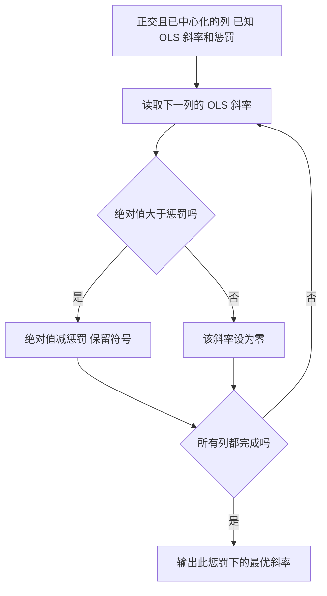
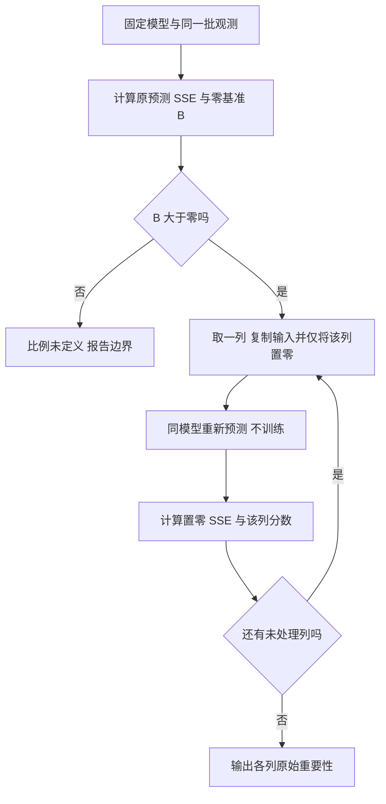
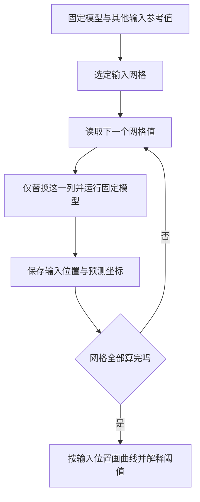
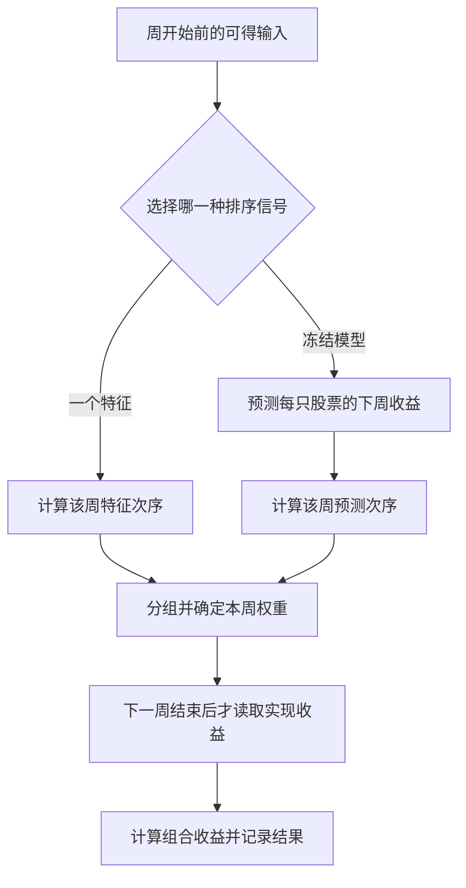
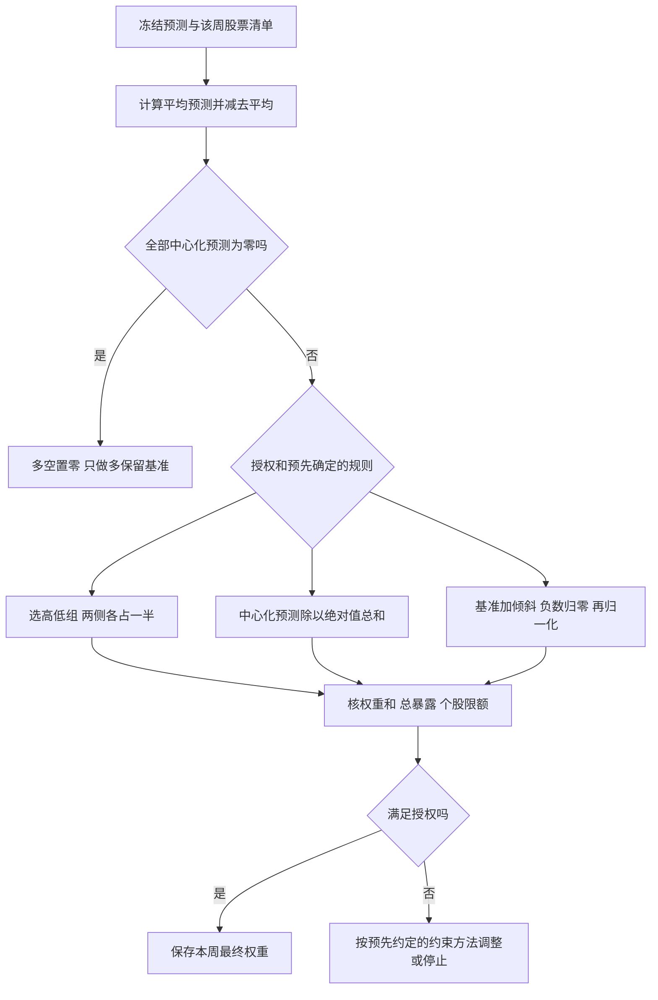
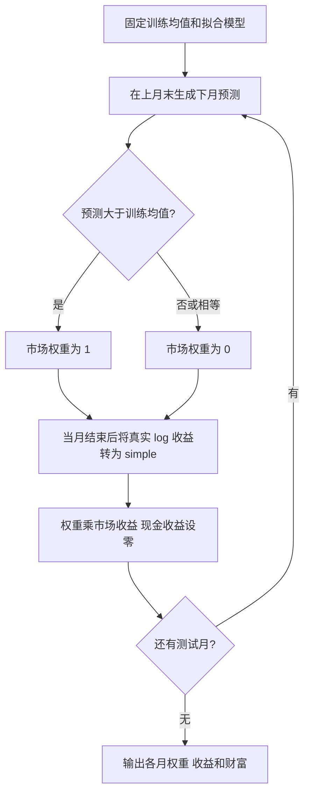
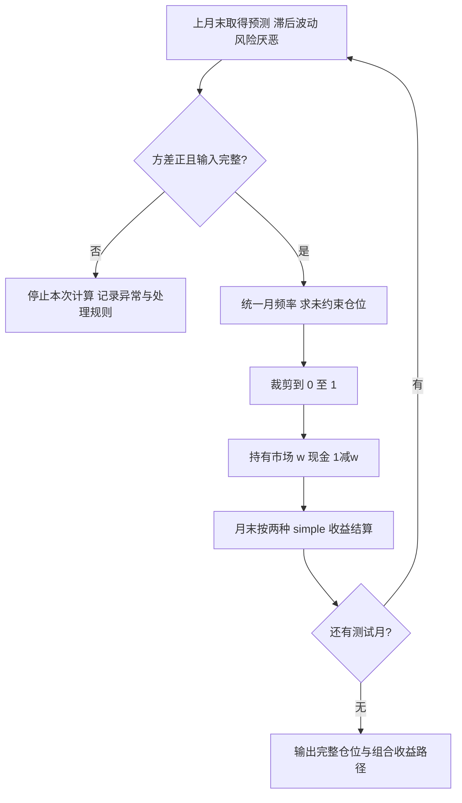
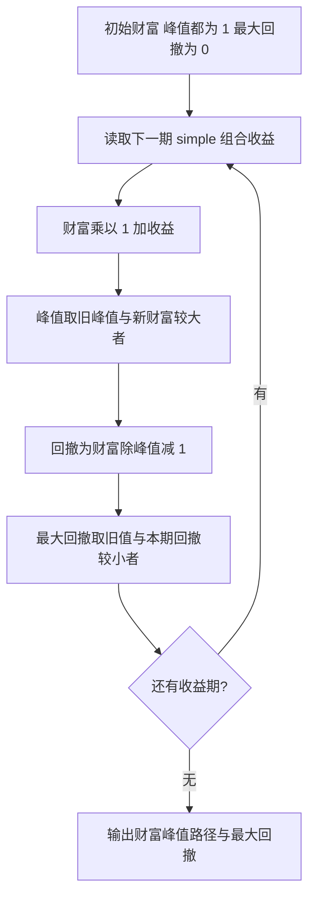
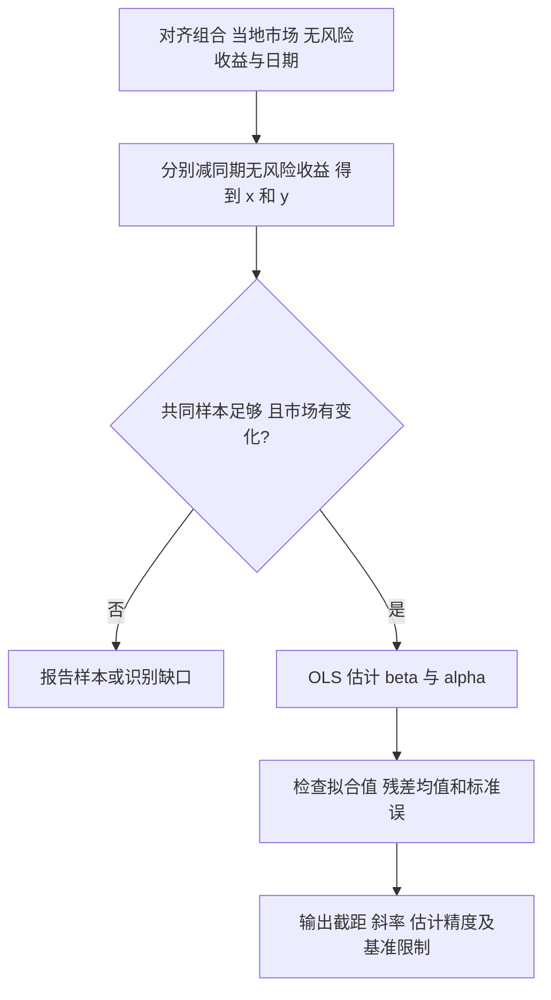
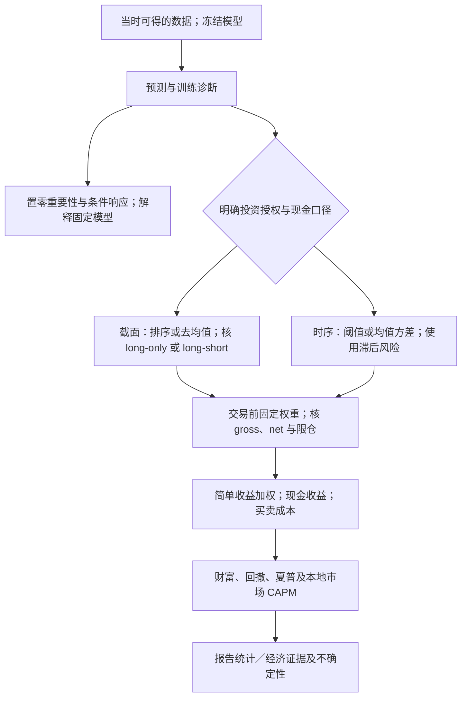

# M05 · 可解释机器学习与投资组合决策

> 一句话：模型可以预测股票可能赚多少，但投资者还要决定买哪只、买多少。本讲先解释模型的预测，再把预测变成持仓，最后检查实际赚了多少、亏得有多大、交易费会拿走多少钱。
>
> 材料为讲义 54 页及 Class 05 数据；本讲尚无本地转录，因此是讲义与数据版，所有课堂补充待回填。本文的题目答案是明确标注的参考作答，不能视为教师确认。

## 0. 三分钟速览

读完以后，你应能做到以下五件可以检查的事：

1. 看懂模型怎样使用动量、波动率等输入，并算出每项输入给预测加了多少。能说清“系数显著”“变量被 LASSO 留下”“变量重要”为什么不是同一件事。
2. 不重新训练模型，只把一项输入改成零，看看预测误差变大还是变小。再改变这项输入，画出预测怎样跟着变；能解释为什么这不等于现实中的因果关系。
3. 把每只股票的预测减去这一周的平均预测，再算买入和做空的比例。检查两边持仓金额有多大；如果账户只允许买入，能改用符合限制的分配办法。
4. 用实际收益算出本金最终变成多少、途中从最高点亏掉多少，以及扣去交易费后还剩多少收益。计算夏普比率时，能说明平均收益和风险分别怎样取得。
5. 在下个月开始前，用当时的预测和过去已知的风险决定投多少钱。评价结果时，用当地市场作比较，区分随市场涨跌赚到的钱、平均额外表现和某一周的偶然偏离。

先记住两套数据不要混用。Class 05 的月度预测用对数收益记录，这是模型计算时的一种记账方式；真正算投资赚了多少钱时，要换回普通的简单收益。周度股票数据已经用简单收益，具体区别会在正文中用数字说明。

讲义 p.53 的评分作业另有一套模拟数据：80只股票、17个信号。本讲解释真实股票时用了30个指标；这些数据不能拿来替代作业文件。

## 1. 开始之前 · 知识衔接

### 1.1 你已有的

本讲会使用前几讲的方法。下面只先提醒它们在做什么；遇到需要实际计算的地方，正文会再按步骤说明。

| 概念 | 一句话唤醒 | 回链 |
|---|---|---|
| 收益和超额收益 | 见下方「收益和超额收益 · 一句话唤醒」 | [[M01-金融数据与Vibe-Coding]] |
| 训练／验证／测试 | 先用训练数据学预测，再用验证数据选模型，最后用没参与选择的测试数据检查效果。不能看到测试谁赢，再说自己原先选了它 | [[M02-回归与样本外设计]] |
| OLS 与标准化 | OLS调整系数，让训练数据上的预测错误尽量小。标准化把一项输入改写成“比训练平均高低多少个标准差” | [[M02-回归与样本外设计]] |
| LASSO 与 PCR | LASSO可以把某项输入的系数压到零，让模型不再使用它。PCR先把多个输入合成较少的综合量，再用它们预测 | [[M03-线性机器学习与收益预测]] |
| 树与森林 | 树按输入的大小把股票分到不同组，用同组训练收益的平均值预测。森林让多棵树分别预测，再把结果平均 | [[M04-非线性机器学习与收益预测]] |
| 截面排名 | 同一周把股票的一个指标排位，中心化后零是参考位置，不表示原指标为零 | [[M03-线性机器学习与收益预测]] |
| 均值、方差与标准差 | 均值是平均水平，方差是平方偏离的平均，标准差回到原收益单位；4% 的标准差平方为 0.0016 | [[M02-回归与样本外设计]] |
| p 值与拟合 R² | p值检查看到的结果在假定“系数为零”时有多不寻常，不是系数为零的概率。R²比较模型和指定基准各自错得有多大 | [[M02-回归与样本外设计]] |
| 矩阵与协方差 | 矩阵就是按行列排的数据；协方差衡量两列偏离均值是否一起升降，正负号表示同向或反向 | [[M02-回归与样本外设计]] |
| 导数与指数函数 | 导数表示变量微小变化时目标怎样变；exp 是自然指数，本讲用 exp(log收益)−1 恢复简单收益，例如 log 为 0 时 simple 为 0 | [[M02-回归与样本外设计]] |

**收益和超额收益 · 一句话唤醒**

简单收益表示本期赚了或亏了本金的多少比例。

超额收益再减去同期现金可赚的收益。

对数收益须换回简单收益，才能算持仓结果

**所以呢**：我们先把模型定下来，再解释和使用它的预测。决定买卖时只能用当时已知的数据，不能提前看下周的结果。

### 1.2 本讲全新概念

本讲要做三件新事情：看看模型到底在用哪些信息；根据预测决定每只股票买多少；拿实际赚到的钱和风险作比较。下面是这三件事会用到的名称。

| 新概念组 | 在哪里展开 | 本讲要完成的动作 |
|---|---|---|
| drop-to-zero、条件响应曲线 | §2.5–2.8 | 模型不变，逐项改变输入，看看预测和误差怎样变化 |
| 净／毛敞口、预测加权、只做多倾斜、风险缩放 | §2.9–2.15 | 把预测换成持仓比例，再检查账户是否允许这样买卖 |
| 复利、年化夏普、成本与最大回撤 | §2.15–2.18、§2.28–2.30 | 每期先算真实赚亏，再算本金增长、风险和费用 |
| 均值方差仓位与风险厌恶 | §2.25–2.27.1 | 预期赚得多就考虑多投；风险高就少投，并算没投入的钱能赚多少 |
| CAPM、alpha、beta、异常收益 | §2.31–2.34.1 | 检查收益中有多少来自跟随当地市场，多少是市场以外的平均表现 |

**所以呢**：暂时记住每组术语是在解决什么问题。读到正文时先跟着做一遍，再用速查表记公式。

### 1.3 为什么这一讲放在这里与重排说明

M03、M04检查模型能不能预测。M05接着问：有了这些预测，我们该买哪些股票、买多少？

正文先解释模型，再看它选出的股票是否比其他股票赚得多；接着检查账户允许怎样买卖，算持仓和收益，最后加入成本、风险和市场基准。与讲义相邻的公式、例子和题目放在同一节讲清楚，原页码仍可在§8查到。

p.1 是整页课程封面；p.2、p.13、p.28、p.45 是四个章节标题页，没有另藏题目、数值或理论内容。后三类标题所表示的学习转折也在 §2 就地解释。本次没有把任何图表页当成分隔页；尤其 p.12、p.33–34、p.39–40、p.44 已视觉查看并讲解。

Class 05 里有三个时间窗口：156 周动量图、52 周模型预测排序，以及 60 月市场投资实验。它们都是真实课堂示例，但不是同一策略或同一时间范围，不能直接按最终财富评模型优劣。比较这些结果前，先确认它们用了什么数据、持有多长时间、怎样记收益。

**所以呢**：两种办法谁更合适，要先说比较的是什么。预测更准、赚得更多、亏得更少可能分别由不同办法做到。

## 2. 正文

### 2.1 系数大小与显著性回答不同问题（讲义 p.2–3）

模型拿到一只股票过去的涨跌、波动等信息后，会预测它下周的收益。我们先弄清楚：改变其中一项信息，模型会把预测提高还是降低？然后再问：用这批数据估出来的关系，证据有多强？这就是 p.2 分隔页引出的学习任务。

**是什么**：普通最小二乘（OLS）会为每项输入估计一个系数。先保持股票的其他输入不变，再把这一项输入增加一个单位；模型预测增加或减少的数量，就是这一项的系数。p.3 的英文定义是 “A coefficient measures how the forecast changes when one input rises, holding the others fixed.” 中文是“固定其他输入，一个输入增加时，系数度量预测如何变化”。

但这里的“一个单位”要先讲清楚。动量表示股票过去一段时间涨跌了多少，波动率表示这段时间的收益起伏有多大。讲义没有直接把原始动量和波动率放入回归，而是先分别减去训练数据中的平均值，再除以训练数据中的标准差。这一步叫训练样本标准化：

$z=(x-\mu_{\mathrm{train}})/\sigma_{\mathrm{train}}$。

标准化把原指标换成“离训练平均值有几个标准差”。这里的统计量始终来自训练数据。

| 符号 | 含义与单位 |
|---|---|
| $x$ | 股票原来的指标值，沿用该指标单位 |
| $\mu_{\mathrm{train}}$ | 训练指标的平均值，与 $x$ 同单位 |
| $\sigma_{\mathrm{train}}$ | 训练指标的标准差，衡量围绕平均值的起伏 |
| $z$ | 标准化后的输入，无单位 |

读数时，$z=0$ 表示原指标等于训练平均值。$z=1$ 表示比训练平均值高一个训练标准差。

例如动量原值为 12%、训练平均值为 4%、训练标准差为 8 个百分点，那么先算 $12-4=8$ 个百分点，再算 $z=(12-4)/8=1$（笔记补充）。预测新股票时继续使用这组训练均值和标准差，不能重新用未来测试数据计算，否则当时尚未出现的信息就进入了预测。

**为什么需要它**：标准化以后，两项输入的“增加 1”都表示“增加一个训练标准差”，我们才知道系数是在比较什么。系数的正负号告诉我们模型把预测往哪边改，系数的大小告诉我们改多少。另一个问题是：如果换一批训练数据，估出来的系数会不会差很多？标准误和 p 值帮助我们回答后一个问题。

**课件原例**：p.3 的一行对应一个输入。先读动量这一行，再用同样的办法读波动率。

| 标准化输入 | 系数 | 标准误 | p 值 |
|---|---:|---:|---:|
| 动量 | $+0.30$ | $0.10$ | $0.003$ |
| 波动率 | $-0.20$ | $0.25$ | $0.42$ |

第一列说明模型接收的是哪项输入，两项均已按训练数据标准化。第二列的单位是“输入增加一个训练标准差，预测周收益改变多少个百分点”。因此动量的 $+0.30$ 表示：其他输入不变，动量的 $z$ 增加 1，预测提高 $0.30$ 个百分点；波动率的 $-0.20$ 则表示预测降低 $0.20$ 个百分点。

第三列的标准误，描述用有限训练数据估计这个系数会有多不准。设想从同一种数据产生过程反复取得样本、每次重新估计，得到的系数会有起伏；标准误就是这种起伏大小的估计。它与系数使用相同单位。因此动量标准误 $0.10$ 是每训练标准差对应 $0.10$ 个预测收益百分点，波动率为 $0.25$。这里不是在说股票每周收益的标准差；一个度量“系数估得准不准”，另一个度量“股票收益起伏大不大”。

第四列的 p 值来自一个假设检验。我们暂时假设这一项的真实系数为零，也就是没有线性关系；再问：如果这个假设成立，而且检验所用的误差与样本假设成立，出现当前这样大或更极端的估计偏离，有多常见？p 值回答这个问题。它是 0 到 1 之间的概率数，没有收益单位。$0.003$ 表示在这些条件下出现同样或更极端偏离的概率为 $0.3\%$；$0.42$ 表示 $42\%$，后者并不罕见。

**用标准误衡量离零多远**：检验“系数等于零”时，用估计系数除以它的标准误。

$$t=\widehat b/\mathrm{SE}(\widehat b).$$

这里 $\widehat b$ 是表里的估计系数；分母是该系数的标准误，与系数同单位。相除后的 $t$ 没有百分比单位。

1. 动量：$0.30/0.10=3$，估计离零有 3 个标准误。
2. 波动率：$-0.20/0.25=-0.8$，估计在零下方，距离为 0.8 个标准误。

绝对值越大，估计离零的距离相对于估计误差越大。精确 p 值还取决于检验分布、自由度及单侧或双侧设定；本表沿用讲义 p 值。

若事先采用 5% 的显著性阈值，我们比较 p 值与 $0.05$：动量 $p=0.003<0.05$，拒绝“系数为零”的假设，称为在 5% 水平显著；波动率 $p=0.42>0.05$，这批证据不足以拒绝零系数假设，称为不显著。若股票或周之间的误差彼此相关，标准误的计算必须处理这种相关；不能把任意软件给出的标准误都当作可靠答案。

**🎙️ 课堂补充**：待转录补充。

**💡 换个说法（笔记补充）**：动量估计离零有 3 个标准误那么远，波动率估计离零只有 0.8 个标准误那么远。后者虽然估计为负，但我们还不能凭这批数据确信真实关系就是负的。现在有一个负估计，与有足够证据确认负关系，是两件事。

**常见误解**：$p=0.42$ 不是“真实系数有 42% 的概率等于零”；我们计算 p 值时已经暂时把零系数当作假设。波动率不显著，也不表示回归程序已经删除这一项。动量显著只说明在检验条件下有反对零系数的证据，不能据此说提高动量会造成真实收益增长，也不能保证模型预测未来股票更准。

**与其他概念的关系**：[[M02-回归与样本外设计]] 讨论了怎样判断回归估计；这里把判断用在股票输入上。接下来我们先不重新估计系数，而是把一只股票的输入代进去，看看每项给预测加了多少。

**所以呢**：读表时分别问“预测往哪边改”“每单位改多少”“这条关系的证据有多强”，然后才能计算具体股票的预测。

### 2.2 从系数到一只股票的预测贡献（讲义 p.4）

模型已经估好系数后，给不同股票作预测时，系数暂时不变，变化的是每只股票的输入。动量系数相同，两只股票的动量位置不同，动量给它们预测加上的数量就不同。

**是什么**：我们把“系数乘上这一只股票的输入”叫预测贡献（Forecast contribution）。把所有输入的贡献加起来，再加上截距，就得到模型预测。

本例预测的是周超额收益。先取股票一周的收益，再减去同期无风险收益，得到超额收益。例如股票周收益为 1.2%、同期无风险收益为 0.1%，那么超额收益为 $1.2\%-0.1\%=1.1\%$（笔记补充）。公式中 $r$ 表示收益，上标 $e$ 表示已经减掉无风险收益；$\widehat r^e$ 上面的帽子表示模型给出的预测，还不是这一周最后实现的收益。

**为什么需要它**：只看到一个正系数，还不知道这只股票得到多少正贡献。我们必须同时看输入。如果该项标准化输入为零，乘积就是零；若输入为负，乘上正系数后，贡献反而为负。逐项计算还可以检查是否把百分比、百分点或正负号读错。

**课件原例**：p.4 给定如下预测规则，计算时不再改变这些系数：

$$
\widehat r^e=0.10\%+0.30\%z_{\mathrm{momentum}}-0.20\%z_{\mathrm{volatility}}.
$$

$z_{\mathrm{momentum}}$ 是这只股票的标准化动量输入，$z_{\mathrm{volatility}}$ 是标准化波动率输入，都没有收益单位。$0.10\%$ 是截距：两项输入都为零时，模型给出的预测就是它。两项斜率分别告诉我们输入增加 1，预测会改变 $+0.30$ 和 $-0.20$ 个百分点。

这只股票的动量输入是 1，波动率输入是 0.5。预测按贡献相加：

1. 动量贡献：$0.30\%\times1=+0.30\%$。
2. 波动率贡献：$-0.20\%\times0.5=-0.10\%$。
3. 加截距：$0.10\%+0.30\%-0.10\%=0.30\%$。

结果是模型预计股票下周超过无风险收益的部分。

上一节说波动率不显著，但 OLS 预测式仍然保留它，所以这里仍要减去 $0.10\%$。显著性检验没有自动修改预测规则。

**🎙️ 课堂补充**：待转录补充。

**💡 换个说法（笔记补充）**：你拿到的是一张已经定好的计算表。先填入这只股票的两项输入，分别乘上固定系数，再把三项相加。算完得到这只股票的预测，不需要为了这一只股票再训练一次模型。

**常见误解**：动量项贡献 $+0.30\%$，不是在断言真实收益中有 $0.30\%$ 是动量造成的。若两个输入经常一起升降，模型可能在它们之间分配相似信息；换一批训练数据，各自系数就可能改变。即使在计算中固定其他已记录输入，数据里仍可能漏掉同时影响输入与收益的因素，所以不能从这项贡献推出因果关系。

**与其他概念的关系**：[[M03-线性机器学习与收益预测]] 给出了线性预测式；这里把每项计算展开。下一节换成 LASSO，输入相同也可能得到不同预测，因为训练时学出的系数变了。

**改条件练习（笔记补充）**：只把动量改为 $z=2$，其余不动，预测多少？

答案与过程

动量项变为 $0.30\%\times2=0.60\%$。波动项仍是 $-0.10\%$，截距仍为 $0.10\%$，所以总预测是 $0.60\%$。相对原来上升 $0.30$ 个百分点，恰好是动量输入增加 1 对应的变化。

**所以呢**：系数告诉我们怎样计算；贡献告诉我们某只股票代入之后加了多少。要判断模型总体多依赖一个输入，还需要另一种比较。

### 2.3 LASSO 怎样把某些贡献压到零（讲义 p.5）

OLS 会尽量把训练数据中的误差降下来，即使某个输入带来的改善很小，也可能给它留下非零系数。LASSO 多加了一项要求：使用较大的系数要付出惩罚。因此模型可能把一部分系数缩小，甚至直接设为零。

**是什么**：LASSO 在计算预测误差之外，还计算所有斜率绝对值的总和。训练程序要找到一组系数，使两项加起来尽可能小。对 $n$ 行、$p$ 列训练输入，目标为：

$$
\min_{a,b}\;\frac1{2n}\sum_{i=1}^n(y_i-a-\sum_{j=1}^p b_jz_{ij})^2+\lambda\sum_{j=1}^p|b_j|.
$$

先认出一行训练记录，再计算该行的预测。符号按下表读。

| 符号 | 对应对象 |
|---|---|
| $i$、$n$ | 训练行的编号、训练行总数 |
| $j$、$p$ | 输入列的编号、输入列总数 |
| $y_i$ | 第 $i$ 行实际实现的收益目标 |
| $z_{ij}$ | 第 $i$ 行、第 $j$ 列标准化输入，无单位 |
| $b_j$ | 第 $j$ 列的斜率，以目标收益单位表示 |
| $a$ | 截距，以目标收益单位表示 |

1. 对一行，计算各列贡献并加截距：$a+\sum_{j=1}^p b_jz_{ij}$。这就是预测。
2. 用实际值减预测，再平方。正负误差都会增加损失，较大误差的代价也更大。
3. 把各行平方误差相加，再除以 $2\cdot n$，得到左边的误差项。

右边 $\sum_{j=1}^p|b_j|$ 是把每个斜率不论正负都按大小加起来。$\lambda\ge0$ 是惩罚强度：它越大，同样大小的斜率增加的惩罚越多；截距 $a$ 不在这项里，所以不受罚。最前面的 $\min_{a,b}$ 要求程序改变截距和斜率，寻找总目标最小的一组值。这里 $p$ 是输入列数，与上一节的 p 值不是一个符号用途。收益若用小数或百分数值表示，会改变目标和合适惩罚数值，不能换了收益单位却原样套用惩罚。

**为什么需要它**：一个输入如果只能让误差减少很少，留下它的斜率却要增加惩罚，总目标反而可能更大。把这个系数设为零就可能更划算。这解释了为什么 LASSO 的零来自预测目标，而不是来自 p 值。

下面给一个能算到底的简化推导（笔记补充）。假设每列已经减去均值，各列相互正交，也就是任意两列逐行相乘后加总为零；每列自身平方和为 $n$。在这些条件下，各列的系数可以分别求。对于其中一列，目标可化为 $\tfrac12(b-b_{\mathrm{OLS}})^2+\lambda|b|$ 加上不随 $b$ 改变的常数。$b$ 是要找的 LASSO 斜率，$b_{\mathrm{OLS}}$ 是这列的 OLS 斜率；第一项要求 $b$ 不要离原来的 OLS 斜率太远，第二项要求 $b$ 不要太大。

在 $b$ 非零时，对这两项求导并令导数为零，得到 $b=b_{\mathrm{OLS}}-\lambda\operatorname{sign}(b)$。$\operatorname{sign}$ 表示符号：正数取 $+1$，负数取 $-1$。

因此正系数减去惩罚强度，负系数向零增加同样大小。如果 OLS 系数的绝对值连惩罚强度都没有超过，最小值就落在零。

合起来是：$b=\operatorname{sign}(b_{\mathrm{OLS}})\max(|b_{\mathrm{OLS}}|-\lambda,0)$。$\max$ 要求取两个数中较大的一个，避免把缩过头的系数推到相反方向。

这个操作叫软阈值。

**课件原例**：p.5 在验证数据中选定惩罚后，动量由 $+0.30$ 缩小为 $+0.24$，波动率由 $-0.20$ 变为 $0$。单位仍是每训练标准差对应的预测收益百分点。动量输入为 1 时，预测为 $0.10\%+0.24\%\times1=0.34\%$；波动率现在不再增加或减少预测，因为乘上零后贡献始终为零。讲义没有提供训练矩阵、惩罚数值和求解过程，所以我们可以读这个结果，不能声称已经重新求出了这组系数，也不能从波动率的 p 值反推出它为什么归零。

**🎙️ 课堂补充**：待转录补充。

**💡 换个说法（笔记补充）**：沿用上述正交条件，收益用百分数值表示。两个 OLS 斜率为 $0.30,-0.20$，惩罚取 $\lambda=0.06$。

1. 动量的绝对值超过门槛。保留正号，计算 $0.30-0.06=0.24$。
2. 波动率的绝对值也超过门槛。先算 $0.20-0.06=0.14$，再放回负号，得到 $-0.14$。

两列都已得到这个目标的精确最优值，计算结束。结果为 $0.24,-0.14$，与课件的 $0.24,0$ 不同；这组简化假设不能代替课件未公开的训练过程。

读这张图时，先确认输入满足上述正交条件，再按列执行判断。两列完成后，沿“所有列都完成”的出口停止。真实数据的列通常相互相关，改变一列的系数也会影响其他列能解释的误差；求解程序要保留当前预测与实际值的差，轮流更新系数，再检查是否已经足够接近最优值，或者是否达到最大迭代次数。若程序只是因为次数用尽而停止，就不能把最后结果说成精确最优解。

**常见误解**：LASSO 选出的输入，不等于通过了显著性检验。两个输入经常一起变化时，模型可能留下其中一个来使用共同信息；换样本后留下的可能是另一个。惩罚如果太强，全部斜率都可能归零，所有股票只得到同一个截距预测，也就无法按预测区分高低。应查看验证误差、还剩哪些非零系数，并比较不同训练时段是否仍留下相似输入。减小惩罚能留下更多输入，但也可能让模型重新学到训练数据的偶然波动。

**与其他概念的关系**：[[M03-线性机器学习与收益预测]] 讲过先在验证数据中选惩罚，再固定模型。这里解释的是已经选定之后的系数；不能看到测试成绩后再回头挑一个惩罚，把这个测试结果说成事先选好的模型表现。

**改条件练习（笔记补充）**：同一正交例改 $\lambda=0.25$，哪些斜率留下？

答案与过程

动量原斜率 $b_{OLS}=0.30>0.25$，先减去 $0.25$，得到 $b=0.05$。波动率绝对值 $0.20\le0.25$，被压到零。若 $\lambda\ge0.30$，两者皆零。这是给定惩罚和正交条件下的计算结果，是否在验证数据中预测最好，还要另算验证误差。

**所以呢**：看到一个 LASSO 系数为零，先理解为“这个惩罚下，训练程序没有留下这一项”。不要把它翻译成“统计检验证明这项没有用”。

### 2.4 中心化排名先描述输入的位置（讲义 p.6）

某只股票过去涨得最多，说明它的过去表现排在前面，还不能说明模型预测它下周赚得最多。现在我们只做第一件事：把每只股票的过去动量放到同一周的股票中排个位置。

![[EF5560_Fintech_and_AI_in_Finance/notes/figures/m05/momentum-ranks.svg]]

**是什么**：先把同一周有数据的股票，按某一项指标从小到大排；再把名次除以可用股票数，得到百分位；最后减去 $0.5$。这个新输入叫中心化截面排名（Centered cross-sectional rank），“截面”在这里就是同一周的不同股票。

本课用“名次除以有效股票数，再减去 0.5”形成输入：$m_i=q_i/N-0.5$。

| 符号 | 读法 |
|---|---|
| $i$ | 股票编号 |
| $q_i$ | 该股票按指标从低到高的名次 |
| $N$ | 该周这项指标有数据的股票数 |
| $m_i$ | 中心化排名，无收益或金额单位 |

同值股票取它们所占名次的平均数。缺失指标保留缺失，不赋假名次。这个计算没有使用训练均值或标准差，因此与 §2.1 的标准化输入 $z$ 不同。

**为什么需要它**：比如动量用涨跌幅表示，成交额用金额表示，原数值很难放在同一尺子上读。改成排名后，都可以问“这只股票在本周其他股票中处在什么位置”。不过排名只保留次序，丢掉了原值相差多远的信息：第一名比第二名仅多一点，或多出很多，它们在排名尺子上的间距仍相同。

**课件原例**：p.6 用 2026-06-26 这一预测周的 60 日动量排名。图的纵向每行是一家公司；横轴是刚才算的 $m_i$。向右的正条表示排名高于 50% 参考位置，向左的负条表示低于该位置。原讲义用红色表示正条、蓝色表示负条；判断高低要看横轴与正负号，不只看颜色。

该周有 79 个可用值。联想是最高名次，算 $79/79-0.5=0.500$。舜宇是下一名，算 $78/79-0.5\approx0.487$。中升是最低名次，算 $1/79-0.5\approx-0.487$。图展示的是这 79 个值中最高五家和最低五家，不是在十只股票内重新排名。

为什么最低不是 $-0.5$？因为最低名次为 1，除以 79 后仍大于零，再减 $0.5$ 就略大于 $-0.5$。零表示百分位为 50% 的参考位置；按本课的名次除以股票数算法，奇数样本里居中的那只股票也未必刚好得到零。所有动量都要在持有这一周之前就能知道，不能看完这一周的涨跌再回头排出所谓事前输入。

**🎙️ 课堂补充**：待转录补充。

**💡 换个说法（笔记补充）**：若本周只有四个可用指标值，已经从小到大排好，名次为 $1,2,3,4$。分别除以 4，再减 $0.5$，得到 $-0.25,0,0.25,0.50$。这些数只告诉我们位置，不告诉我们下一周的收益。

**常见误解**：$+0.5$ 不表示预计赚 50%，也不表示模型最依赖这个指标。缺失不能补成零：补零等于告诉模型“这只股票在中间参考位置”，但我们其实没有它的指标值。

**与其他概念的关系**：[[M03-线性机器学习与收益预测]] 规定了输入在何时可知、怎样按周排名。后面的置零检查会把一列排名改成零，意思是把所有股票这一项都放在 50% 参考位置，而不是把它们的原始动量都改成零收益。

**所以呢**：先把“股票这项指标排在哪里”读明白，再问模型怎样使用这个位置。

### 2.5 固定模型置零重要性的操作与算例（讲义 p.7–8）

我们已经有一个训练好的模型。现在想检查：如果模型拿不到每只股票原来的动量高低差异，预测会变差多少？做法是保持模型和实际收益不动，只把每只股票的动量排名都改成零，再让同一个模型预测一次。

**是什么**：置零重要性（Drop-to-zero importance）比较两次预测的误差。第一次用原输入，第二次只改一列输入。每列算一个分数，表示改这一列后误差增加或减少了多少。

输入数据中的一行是一只股票在一个周的记录。我们保留同一批 $n$ 行、相同的实际周超额收益和已经学好的模型，只改变指定列。因为这里用的列是中心化排名，零表示中间参考位置，不表示股票真实没有波动或没有成交。

**为什么需要它**：在线性式中可以直接读一个斜率，随机森林却通过许多树的分支组合输入，通常没有一个适用于所有股票的动量斜率。我们仍可以对模型做同样的输入改动，观察预测误差怎样变化。p.7 的四格图就是：先记录原预测误差，把一列置零，运行同一个模型，再比较误差；图中的锁提醒我们不能重新训练。

**课件原例**：先说误差怎样算。对每行，用实际收益减去模型预测，平方后加总，得到 $\mathrm{SSE}$，即平方误差和。它的单位是所用收益单位的平方，不能把这个总数直接当成某一周收益。

比较基准是：每只股票每周都预测超额收益为零。零预测下，每行误差就是实际超额收益自身。

$$B=\sum_{i,t}(r^e_{i,t})^2.$$

下表逐项说明哪一条股票周记录参与求和，以及总误差用什么单位。

| 符号 | 含义 |
|---|---|
| $i$、$t$ | 股票编号、周编号 |
| $r^e_{i,t}$ | 该股票该周的实际超额收益 |
| $\sum_{i,t}$ | 把同一批股票与周的记录全部相加 |
| $B$ | 零预测的总平方误差，单位为收益单位的平方 |

我们先把模型误差除以 $B$，再用 1 减去它，得到相对于零预测基准的 $R^2$。最后比较置零前后：

$$
\Delta R_j^2=\frac{\mathrm{SSE}_{j=0}-\mathrm{SSE}_{\mathrm{full}}}{B}=R^2_{\mathrm{full}}-R^2_{j=0},\quad R^2=1-\mathrm{SSE}/B.
$$

置零实验比较两种输入状态，模型参数保持不变。下标与差值按下表读。

| 记号 | 含义 |
|---|---|
| $j$ | 被检查的输入列 |
| $\mathrm{full}$ | 保留全部原输入的预测 |
| $j=0$ | 仅将第 $j$ 列输入改为零后的预测 |
| $\Delta$ | 两种状态的差 |

先算置零后多出的误差：$\mathrm{SSE}_{j=0}-\mathrm{SSE}_{\mathrm{full}}$。再除以同一个基准误差 $B$，得到无单位比例。

这里的 $R^2$ 使用零超额收益预测作基准。它的分母与传统回归的“实际值减样本均值后的平方和”不同。

p.8 给 $B=20$，原模型 $\mathrm{SSE}=9.6$，动量置零后 $\mathrm{SSE}=11.2$。三者必须用同一批记录和相同收益单位计算。

先算原模型：$1-9.6/20=0.52$，得到 $R^2=0.52$，表示比恒预测零的基准减少了基准误差的 52%。再算置零后：$1-11.2/20=0.44$，只减少了 44%。

两种算法可以互查：

1. 直接相减：$0.52-0.44=0.08$，即 $R^2$ 损失 8 个百分点。
2. 先算新增误差：$11.2-9.6=1.6$；再除以 20，得到 $0.08$。
3. 反查误差金额：原误差 $9.6$ 加新增误差 $1.6$，正好是 $11.2$。

读流程图时，第一步先固定模型、输入记录与实际收益，再算原误差和基准误差。计算某一列时，复制原输入，只改这列，然后重新预测、算分数。检查下一列时，要再次从原输入复制，不能保留上一列被置零的状态。本例只检查动量，输出 $0.08$ 就结束；完整重要性表才逐列重复。

**🎙️ 课堂补充**：待转录补充。

**💡 换个说法（笔记补充）**：你不是让模型重新学习“没有动量时怎么办”，而是让原来那套预测规则，在动量全部被改到中间位置时再运行一次。这样才是在检查当前模型用了多少动量信息。

**常见误解**：置零分数有以下四个边界。

- **负分数**：若置零后误差为 $8.8$，分数为 $(8.8-9.6)/20=-0.04$。这次改动改善了预测，不能直接归为“无关”。
- **零分母**：所有实际超额收益都为零时，$B=0$，比例没有定义。
- **少见的输入组合**：动量与另一列通常一起变时，只将动量置零可能产生训练中少见的组合。分数可能反映模型对这种组合的反应。
- **重新训练**：重新拟合允许模型改用其他信息，回答的是“能否训练一个少一列的新模型”，与固定模型的置零实验不同。

**与其他概念的关系**：[[M04-非线性机器学习与收益预测]] 的置换重要性把一列的股票次序打乱；这里把一列全部改成零。上一种例子看测试误差，这里看训练误差，操作和数据都不同，不能直接把两个分数放在一起比较大小。

**所以呢**：这个分数说明当前模型在这批记录里多依赖一项输入；分数大并没有告诉我们输入增加时预测会上升还是下降。

### 2.6 怎样读真实模型的重要性条形图（讲义 p.9）

对 30 项输入分别做上面的置零检查后，我们可以把分数从大到小画出来。最长的一条表示：把这一项都放回中间位置，当前模型的训练预测误差增加得最多。

![[EF5560_Fintech_and_AI_in_Finance/notes/figures/m05/importance.svg]]

**是什么**：p.9 的每条横条对应随机森林的一项输入。模型参数固定，输入逐列置零，实际收益保持原样；横条长度表示训练 $R^2$ 减少多少。这个图问的是“当前模型依赖谁”，还没有问“未来预测准不准”。

**为什么需要它**：我们不能同时细读 30 条响应曲线，先看哪些输入的置零影响较大，就可以从这些项开始检查预测方向和转折。但靠这张排序图还不能决定买哪只股票，因为图没有给预测的方向，也没有给当前股票的完整预测。

**课件原例**：横轴的单位是 $R^2$ 的百分点，不是收益百分比。纵轴的每个名称是一项输入。前三条分别是市场 beta、成交额趋势和短长波动率比：

- 市场 beta 描述股票收益跟随市场涨跌的程度；这里用 60 日数据算原指标，再在股票之间排名。它的原始 $\Delta R^2$ 为 $0.00067455$，乘 100 后为 $0.06746$ 个百分点，横条约到 $0.067$。读成一句话就是：“把所有股票的市场 beta 排名改成零，固定模型的训练 $R^2$ 减少约 $0.06746$ 个百分点。”
- 成交额趋势比较最近一段的交易金额与较长期水平，模型用的是这个指标的排名。原始分数 $0.00056194$，乘 100 后为 $0.05619$ 个百分点，图上约 $0.056$。
- 短长波动率比比较 20 日和 60 日收益起伏的大小，再把这个比值转成排名。原始分数 $0.00055988$，乘 100 后为 $0.05599$ 个百分点，图上也约 $0.056$。两条看起来接近，是分数本来接近，不代表它们是同一个指标。

图只呈现排在前八位的输入，模型仍用了 30 列。这些分数没有除以所有输入分数的总和，因此不是各输入占“总重要性”的百分比。

**🎙️ 课堂补充**：待转录补充。

**💡 换个说法（笔记补充）**：假如两个指标经常一起升降，模型可能从两列都拿到相似信息。将其中一列改成零后，另一列仍在，预测未必改变很多。因此单列分数小，只能说这个模型在这种改法下损失不大，不能说两列共同提供的信息没有用。

**常见误解**：市场 beta 排第一，不表示 beta 越高预测越高：向上与向下的影响都可能增加置零误差，所以重要性分数不包含方向。$0.06746$ 个百分点是训练 $R^2$ 的损失，不是股票预计赚多少，也不是模型在未来测试数据上的 $R^2$。模型还可能在训练期学到偶然噪声并反复使用；要知道这种关系能否预测未来，需要另外看验证和测试数据上的误差。

**与其他概念的关系**：[[M04-非线性机器学习与收益预测]] 的森林通过分支一起使用多项输入。下一节保留同一个模型，把某一输入逐步调高，就可以查看哪些位置会提高或降低预测。

**所以呢**：用条形长度确定先检查哪项输入，再查看那项输入的响应曲线；不要直接把最长一条变成买入理由。

### 2.7 响应曲线如何运行与为什么有阈值（讲义 p.10–11）

我们把其他输入先固定在指定位置，只改变动量这一项。每改一个值就让同一个模型预测一次，把“动量值、预测收益”记下来。按动量从低到高排列这些点，就看见预测是上升、下降，还是暂时不变。

![[EF5560_Fintech_and_AI_in_Finance/notes/figures/m05/response-example.svg]]

**是什么**：这些点连成的图叫响应曲线（Response curve），也称条件响应曲线。“条件”指其他输入已经固定在我们选定的参考值；换一组参考值，曲线也可能变。

响应曲线每次只改变一列输入，其余列固定：

$$g_j(u)=f(u,\mathbf x_{-j}^{\mathrm{ref}}).$$

下表区分被改变的输入、固定参考值和模型输出。每行对应公式中的一个对象。

| 符号 | 读法与单位 |
|---|---|
| $f$ | 已训练好的预测模型 |
| $j$ | 本次改变的输入列编号 |
| $u$ | 依次填入该列的值，沿用输入单位 |
| $\mathbf x$ | 一组输入 |
| $-j$ | 除第 $j$ 列以外的所有列 |
| $\mathrm{ref}$ | 为其余列选定的参考值 |
| $g_j(u)$ | 在这组输入下的预测，单位为预测收益 |

右边说明往模型填什么，左边记录模型吐出的预测。改变 $u$ 后重复此操作，就得到曲线上的下一个点。

本课把其他中心化排名都设为零，然后扫描指定列。这是在计算一组指定输入下的预测，不是逐只股票预测后再求平均。很多股票的其他输入原本并不是零，不能把这条曲线当作它们真实输入对应预测的平均数。

**为什么需要它**：p.10 的三个示意面板，横轴都是某项输入从低到高，纵轴是模型预测收益。灰虚线表示受到惩罚的线性模型：在这个设定里，输入每增加相同数量，预测的变化数量固定。蓝线表示非线性模型：变化幅度会随位置改变。

先读动量图，蓝线总体向上，但中段上升快、两端较缓；再读波动率图，蓝线向下，高波动区下降更快；交易活跃度图的两条线近乎平坦，表示在这个参考设定下调高输入，预测改变很少。这些示意图没有具体数字刻度，所以可以读方向和弯曲，不能算精确收益差或宣布精确转折位置。

**课件原例**：p.11 给出可逐步计算的固定规则：

$$\widehat r^e=0.10\%+0.40\%\max(0,m-v).$$

两个输入分别是动量中心化排名 $m$、波动率中心化排名 $v$，均无收益单位。输出为预测周超额收益。

先算两项排名之差，再与零比较并取较大者。基础预测是 $0.10\%$；差为正时，再加上 $0.40\%$ 乘这个差。

固定波动率排名为零，逐点计算动量变化的结果。表中每行就是曲线上的一个点。

| 动量 $m$ | 差 $m-v$ | 截为非负数 | 预测周超额收益 |
|---|---|---|---|
| $-0.5$ | $-0.5$ | $0$ | $0.10\%$ |
| $0$ | $0$ | $0$ | $0.10\%$ |
| $+0.5$ | $+0.5$ | $0.5$ | $0.30\%$ |

最后一列按“第三列乘 $0.40\%$，再加 $0.10\%$”计算。横轴放动量排名，纵轴放预测；前两点同高，最后一点升高，所以曲线先平后升。

开始上升的位置为什么是 $m=v$？当动量不超过固定波动率时，$m-v\le0$，最大值只取零，预测停在基础值。动量超过波动率后，差成为正数，模型开始加预测。这就是本例的阈值；不是只说“非线性会有门槛”，而是这个最大值操作决定了门槛。

沿图从选定参考输入开始，依次填入三个动量值，每次保存一个坐标。第三个值算完，就沿“网格全部算完”的出口画曲线；模型在过程中没有重新训练，也没有从中挑一个“最优收益”当作实际投资结果。

**🎙️ 课堂补充**：待转录补充。

**💡 换个说法（笔记补充）**：现在只改我们固定的波动率，把它从零改为 $v=0.25$。再依次填入同三个动量位置，输出改为 $0.10\%,0.10\%,0.20\%$，开始上升的位置移到 $m=0.25$。原因是模型先比较动量与波动率；波动率固定得更高，动量就必须升得更高才能留下正差。这种“动量的作用取决于波动率”的关系叫交互。

**常见误解**：画图只改变模型收到的数字，没有让现实股票经历一次“人为提高动量”的实验。所以图描述模型怎样预测，不能证明动量会造成真实收益变化。其次，其他各项都在参考值的组合，可能在真实股票中很少同时出现；模型对这种组合的反应未必可靠。最后，若模型包含交互，改变参考值会改变曲线；不要用这一条曲线替所有股票作结论。

**与其他概念的关系**：[[M04-非线性机器学习与收益预测]] 讲过阈值和交互，这里逐点算出它们会形成怎样的曲线。置零重要性比较整批预测误差；响应曲线则问“其他输入固定在这里时，这一列改变会怎样改预测”，两者回答的问题不同。

**改条件练习（笔记补充）**：$v=0.25,m=0.10$ 时为何仍是 $0.10\%$？若据曲线宣布“动量必然使真实收益增长”，错误在哪里？

答案与过程

先算 $0.10-0.25=-0.15$，所以 $m-v=-0.15$。再与零取较大值，得到零，所以总预测保留截距 $0.10\%$。断言“必然增长”有三个错误：把模型预测误当成真实收益的因果结果；没有看到阈值左侧预测本来不响应；还把指定参考输入下的一条曲线套给了所有股票。

**所以呢**：读响应方向之前，先看其他输入固定在哪里；再沿横轴找预测何时开始变、变多少，最后保留“这是模型输出”的界限。

### 2.8 四条真实响应曲线与条件截面的边界（讲义 p.12）

p.12 把刚才的方法用在真实随机森林上，分别改变四项输入。四个图的预测形状不同：有的逐步增加，有的多数位置不变，到了很高排名才明显下降。我们按坐标把这些变化读出来。

**是什么**：每个面板只改变标题中那一项，其他 29 个中心化排名都固定为零。这样的图叫条件截面：它只展示这一组固定条件下，模型怎样随一项输入改变预测。

四个图的横轴都用百分位 0–100 展示排名，50 对应模型输入的零。这里 80 是“该指标排在第 80 百分位附近”，不是原指标的值。纵轴是预测周超额收益，单位为 %；例如 $0.16\%$ 表示模型预计这只指定输入的股票，一周收益比同期无风险收益高约 $0.16$ 个百分点。纵轴没有记录实际赚了多少，也不是上一节重要性图的 $R^2$ 损失。

**为什么需要它**：简单公式只有一个转折点，森林却有许多树，每棵树在不同位置作判断。改变输入时，有些树先改变预测，有些树后改变；把它们的输出平均，就可能出现多个小台阶。因此不能给整条曲线只配一个“正系数”或“负系数”。中段平坦也不表示这项输入没有重要性：模型可能只在其他排名区间改变预测，或在另一组输入条件下才使用它。

**课件原例**：下面是查看 p.12 原图后的读法。数字都是目测近似，不是从原始曲线点表精确算出来的。

- 市场 beta 面板：从左向右看，大部分低、中排名的预测约为 $0.16\%$。到第 80 百分位附近，预测明显下降，最高排名端约为 $0.09\%$。这表示在其他输入固定零时，模型对很高的市场跟随程度给出较低预测；不是说原始 beta 的值等于 80。
- 成交额趋势面板：从较低排名向较高排名移动，预测总体从约 $0.11\%$ 增加到 $0.22\%$。有些区间暂时不变，随后又增加，不能说输入每升一格预测都增加同样多。
- 短长波动率比面板：约第 30–35 百分位附近，预测从约 $0.11\%$ 抬到 $0.15\%$，后面较缓地上升。30–35 是这个比值的排名位置，不是波动率为 35%。
- 标准化真实波幅 NATR 面板：多数排名区间的预测约为 $0.16\%$，到极高端才突然下降，最后接近零。NATR 先按每日价格范围计算真实波幅，再平均并除以价格，反映相对价格的波动范围；它不等于对收益求标准差的波动率。这个面板标题中的“标准化”也不能理解为 §2.1 的训练均值标准化，模型此处仍使用 NATR 的中心化排名。

**🎙️ 课堂补充**：待转录补充。

**💡 换个说法（笔记补充）**：假如我们想问“波动率本来很高时，动量提高会怎样”，就不能直接照搬当前动量曲线。应先把波动率固定在一个明确的高排名，再逐个改变动量、重新让模型预测。这里重新计算的是固定模型的预测，不是重新训练模型；这样才得到了另一个条件下的曲线。

**常见误解**：四图收益轴相同，可以比较预测高度。但极高端下降还不足以确立长期经济规律，需要继续检查：

1. 极端输入组合在训练记录中有多少例？样本很少时，个别分裂可能左右曲线。
2. 换其他输入的参考值后，转折是否仍在？这检查结果对固定条件的依赖。
3. 换训练时段后，新模型是否保留类似形状？这检查关系是否稳定。

这些检查仍不构成现实中的因果实验。课程数据没有提供逐点预测表和可执行模型；本笔记保留原图读法，不声称复算了真实森林曲线。

**与其他概念的关系**：[[M04-非线性机器学习与收益预测]] 检查每个叶子有多少训练记录、改变样本后规则是否变化；这里要把相同检查用于曲线转折。后面投资者决定组合时，还要看每只股票完整输入对应的预测、风险和约束，不能只凭这一项的曲线下单。

**所以呢**：先用重要性图找到值得检查的输入，再读给定条件下的预测方向与转折。能解释模型怎样给预测，还需要独立的预测表现和风险信息，才谈得上怎样使用这些预测投资。

复算与来源记录（不影响学习主线）

本块数值复算脚本：`E:\app-data\codex\scratchpad\ef5560-m05-20261008\recompute-interpretation.py`；结果为同目录 `recompute-interpretation-results.json`。课程排名和重要性回源 `class05/class05/` 的只读 CSV。79 个排名复算与课程文件最大绝对差为 `9.02e−17`；此误差只说明这次算法复算与文件一致，不是可读性或预测有效性的证明。

三个 SVG 的可编辑图源为 `EF5560_Fintech_and_AI_in_Finance/notes/figures/m05/generate.py`，计算输出为同目录 `results.json`。`momentum-ranks.svg` 使用课程 CSV 的周排名，`importance.svg` 使用课程保存的置零分数，`response-example.svg` 按 p.11 明示的规则绘制。前两张没有重新训练随机森林；第三张是明示公式例，不是 p.12 的真实森林响应曲线。p.12 目测值不冒充精确重算。

p.3 的系数、标准误与 p 值来自讲义，t 比率在正文按系数除以标准误计算；本轮未从未知自由度重新估算 p 值。正文补了零系数假设与检验条件，没有把 p 值解释成假设为真的概率。

本轮新增显示换算用 `E:\app-data\codex\scratchpad\ef5560-readable-20261008\recompute-interpretation-readable.py` 保存并运行，结果为同目录 `recompute-interpretation-readable-results.json`。它计算 p 值转为 0.3%/42%、t 比率 3/−0.8、零预测基准下误差减少 52%/44%，以及迁移例 $0.10-0.25=-0.15$，没有重新拟合或重新计算精确 p 值。

重要性前三项按原顺序，原分数为 $0.00067455,0.00056194,0.00055988$，乘 100 后为 $0.06746,0.05619,0.05599$ 个百分点；对应图上近似读数为 $0.067,0.056,0.056$。旧稿的分组数字完整保留，主线改为逐项说明。

本轮未改变任何原始数据或模型，没有新增实验结果。未做 Q/R 盲读或真人试读，不声称可读性已经验收。三个 Mermaid 源码与三个 SVG 嵌入保持输入版本原样；本轮保留既有图源；文件安全与新增公式显示的核对范围见§9.7。

### 2.9 把“按一个输入排队”换成“按预测收益排队”（讲义 p.13、p.15）

假设下周可以买几十只股票。我们得先决定：哪几只值得多买，哪几只应该少买？有两种排队办法。一种看股票过去涨了多少，另一种看模型预测它下周会赚多少。这两种办法选出的股票可能不同。

**是什么**

先看第一种办法：查每只股票过去 60 天涨跌了多少，再从低到高排列。我们只看“过去 60 天涨跌”这一个输入，这叫特征排序（characteristic sort）；本例这个输入叫动量。

第二种办法先让模型读取多项资料。例如模型同时看动量、波动率等 30 个输入，给每只股票算出一个下周超额收益预测。然后按这些预测从低到高排列，这叫预测排序（forecast sort）。超额收益是股票收益减同期无风险收益，回答“比不承担股票风险的收益多了多少”。

讲义 p.13 是这个章节的标题页。“横截面组合决策”指在同一个时点比较不同股票，再决定各买多少。这里没有把同一家公司的不同周放在一起排队。

**为什么需要它**

模型告诉我们 A 的预测高于 B，还没有告诉我们要买多少 A。我们先根据预测把股票排队，再决定分哪些组、每只股票分配多少钱。这样才能从预测走到买卖。

如果想比较这两种排队办法，就要在相同日期挑股票、持有相同的一周、分成相同数量的组。否则，一种办法可能恰好用了上涨的一年，另一种用了下跌的一年；收益差别便不能只归于排队办法。

**课件原例**

讲义 p.15 比较的正是这两种方法。还要把“预测数字准不准”与“股票顺序排得对不对”分开：MSE 是均方误差，比较每只股票每周的预测数字与实际数字；高组减低组则比较模型排在前面的股票，后来是否真的比后面的股票赚得多。

每周按下面的顺序做，不能交换最后两步：

1. 周开始前，在 $t-1$ 查看当时已经知道的股票资料。
2. 用已经定好的模型计算 $\hat r^e_{i,t}$。测试期间不再修改模型，这里称为“冻结模型”。
3. 把这一周的股票按预测排列，分组并决定各买卖多少。
4. 等周 $t$ 结束，才取得股票的实际收益 $r_{i,t}$，再算组合赚亏多少。

一条“股票周”记录表示某只股票在某一周的情况。先分清日期和预测记号。

| 记号 | 读法 |
|---|---|
| $i$ | 股票编号 |
| $t$、$t-1$ | 收益发生的周、上一时点 |
| 帽子 $\widehat{\phantom r}$ | 事前预测 |
| 上标 $e$ | 超额收益，即超过无风险收益的部分 |
| $r_{i,t}$ | 没有帽子，表示实际股票收益 |

预测与实际收益都按周度小数记录，例如 $0.01=1\%$。

从图顶端往下读：先取得周开始前的资料，再选“看一个输入”或“让模型综合预测”。两条路之后都要分组、定权重、等待下一周收益。图没有让实际收益返回去决定本周选谁，因为选股时还不知道下一周赚亏多少。

**🎙️ 课堂补充**

待转录补充。

**💡 换个说法（笔记补充）**

三只股票下周实际赚 $(1,2,3)\%$，模型却预测 $(10,20,30)\%$。模型把所有收益都夸大了，但第三只最高、第一只最低，顺序仍然排对。

若检查数字误差，先分别算预测减实际、把三个误差平方，再求平均：MSE 为 $[(0.10-0.01)^2+(0.20-0.02)^2+(0.30-0.03)^2]/3=0.0378$，模型的数值预测很差。若只检查两端的顺序，模型选出的最高股票实际赚 3%，最低股票实际赚 1%，相减为 $3\%-1\%=2\%$。因此可以同时说“数字偏差很大”和“这个小例的两端顺序正确”。

**⚠️ 常见误解**

每周只能把这一周可选的股票放在一起排列。若把全年的记录混在一起，某组可能同时放进去年与今年的股票记录，而投资者在一个时点并不能买到这些不同时点的收益。

还要分清三个问题：动量很高，是说这只股票过去涨得多；动量很重要，是说模型预测时依赖动量；预测收益很高，是说模型判断这只股票下一周会赚得多。前两个结论都不能直接当成第三个。遇到两个预测相同，应先约定如何处理；不能看谁后来赚钱再把谁排到前面。

**与其他概念的关系**

[[EF5560_Fintech_and_AI_in_Finance/notes/M03-线性机器学习与收益预测|M03]] 已经把训练、验证与测试分开：先用训练和验证数据定模型，再观察模型在未用来选它的测试数据中表现如何。本节保留这个顺序，下一节实际比较最高与最低组赚亏多少。

**所以呢**：先说清股票按什么排队，再算排在前后的股票实际赚亏多少。数字预测误差与组合收益都要报告，因为它们回答两个不同问题。

### 2.10 最高组减最低组：暴露单位和六模型证据（讲义 p.14、p.16）

本节先读设定，再做两件独立计算：金额怎样变成周价差，周价差怎样变成跨周统计量。

| 项目 | 本节设定 |
|---|---|
| 样本 | HSI 个股；2025-07-04 至 2026-06-26，52 周 |
| 信号 | 周开始前，冻结模型给每只股票预测 |
| 收益 | 简单周收益；高组均值减低组均值 |
| 金额与分母 | 买高 100 万、空低 100 万；用 100 万作收益分母 |
| 成本 | 未扣交易/借券/融资；执行条件仍待另核 |

金额账每行是一边头寸，正/负表示买入/做空。绝对金额列只为算总暴露。

| 一边 | 有符号金额（万元） | 绝对金额（万元） |
|---|---:|---:|
| 高组 | +100 | 100 |
| 低组 | −100 | 100 |

两边绝对金额相加 200，再除分母 100，得到总暴露 2；保留符号相加为 0，得到净暴露 0。两次加法的问题不同，不能把净零称为没有风险。

跨周计算另按三个动作读：先看 52 个价差自身的样本标准差；再估这 52 周平均值的标准误；最后检验平均值离零几个标准误。下面所有 $t$ 时间下标标周，检验统计量写 $t_{\mathrm{stat}}$。

这一实验看恒生指数（HSI）成分股，一共观察 52 周。每周开始前，模型预测每只股票下一周的收益，再把股票从预测最低排到最高。我们想知道：模型挑到最前面的那批股票，后来是否真的比最后面的那批赚得多？

**是什么**

先把排好队的股票分成五组，每组大致占股票总数的 20%。这叫五分位分组。股票数不一定能被 5 整除，所以“大致”不是保证每组人数完全相同。

最末一组包含预测最低的股票，叫低组 $L$；最前一组包含预测最高的股票，叫高组 $H$。中间三组在这次两端比较中不持有。注意，高组是模型预测高，不是事后赚得最多。

然后分别给高组和低组算收益。每组内部把金额平均分给各只股票，这叫等权。如果高组有 16 只股票，组内每只分到该组金额的十六分之一；组收益就是这 16 只股票收益的平均数。最后用高组收益减低组收益，得到高减低价差（top–bottom spread）。讲义 p.14 把上述动作写成：

$$
r_t^{H-L}=\frac{1}{n_H}\sum_{i\in H}r_{i,t}-\frac{1}{n_L}\sum_{i\in L}r_{i,t}.
$$

高组和低组各自先算平均收益，再相减。公式记号与操作一一对应。

| 记号 | 对应操作 |
|---|---|
| $n_H,n_L$ | 分别数高组、低组有多少只股票 |
| $r_{i,t}$ | 读取股票 $i$ 在周 $t$ 的实际简单收益，0.02 表示 2% |
| $\sum_{i\in H}$ | 将高组实际收益相加，再除以 $n_H$ 得高组平均 |
| 上标 $H-L$ | 用高组平均减低组平均 |
| 下标 $t$ | 周编号；与后面检验统计量表中的 $t$ 列含义不同 |

低组同样按本组股票数求平均。组内每只股票等权，不要求两组股票数相同。

上方金额表以 100 万元为收益记账基准：高组买入 100 万元，低组做空 100 万元。因此多头暴露为 1，空头暴露为 −1，绝对金额合计对应总暴露 2，带符号相加对应净暴露 0。

做空的动作是借入股票、卖出，再买回归还。低组上涨时空头亏损，下跌时空头赚钱；这正是收益中减去低组平均的原因。

收益分母不等于实际融资门槛。真实交易仍需满足借券、保证金与融资条件，不能据此认定只需拿出 100 万元现金。

若账户或比较要求把总暴露改为 1，就改为买高组 50 万元、做空低组 50 万元。每只股票的金额和组合收益都减半：$r^{G=1}_{p,t}=r_t^{H-L}/2$。不能把金额减半，却继续报告原来的收益。

**为什么需要它**

我们想检验的是模型能否把相对更好的股票放进高组。即使模型把所有股票的预测收益都写得过高，只要高组后来比低组赚得多，它仍可能提供选股顺序。相反，一个模型给所有股票相同预测，数字误差可能不大，却没有告诉投资者哪只该先买。

研究价差只比较高低两组表现。要判断真实账户能否赚到这笔钱，还得扣除交易和借券成本，并确认股票确实借得到、账户允许做空。

**课件原例**

讲义 p.16 对六个模型分别重复上述操作，日期为 2025-07-04 至 2026-06-26，共 52 周。模型在测试开始前已经确定，测试期间不再根据收益修改。这就是本表“冻结测试”的意思。

表内一行是一个模型，不是一只股票，也不是某一周。每个可排序模型先得到 52 个周价差，再汇总成表里的数字。所有价差按上面“买高组 100 万、做空低组 100 万，相对 100 万计算基准”的比例记账；它们都是总暴露 2 的结果，不是减半后的总暴露 1。

六列从左到右分别看什么：

- **模型**：哪一种预测方法给股票排队。OLS 是普通最小二乘线性回归，Ridge 是岭回归，LASSO 和 Elastic Net 是会收缩系数的线性方法，PCR 是主成分回归，PLS 是偏最小二乘回归。这里只比较它们已经形成的预测，不重新训练。
- **平均周价差**：把该模型 52 周的高减低价差相加，再除以 52。它回答“每周高组平均比低组多赚多少”。OLS 的 $+0.32\%$ 表示这 52 周中，高组平均比低组多赚约 0.32 个百分点；按 100 万元计算基准，平均每周的价差收益约为 3,200 元。它不保证某只高组股票或下一周都会赚这么多。正号表示高组平均高于低组，负号则表示低于。
- **$t$**：这里是 *t 统计量*，用来检查“平均周价差与零的距离，相对于我们估平均值的不确定性，是否够大”。它是一个比值，没有百分比单位，不是 1.03% 收益，也不是时间下标 $t$。具体计算在表后展开。
- **正收益周比例**：先数 52 周中有几周的高减低价差大于零，再除以 52。这就是本表的 hit rate。OLS 有 29 周价差为正，所以 $29/52\approx55.8\%$；不是每周赚 55.8%，也不是个股预测正确率。
- **前半周均值**：只取最前面的 26 周，周价差之和除以 26。OLS 的 $-0.07\%$ 表示这一段高组平均比低组少赚约 0.07 个百分点；买高、空低的研究价差平均为负。
- **后半周均值**：只取后面的 26 周，周价差之和除以 26。OLS 的 $+0.71\%$ 表示这一段高组平均比低组多赚约 0.71 个百分点。这是另一段时间的均值，不是前半期之后又增加了 0.71%。

表里的“—”表示没有形成可解释的模型排序，因而没有报告该项价差统计，不是收益为零。百分号属于周收益或周数比例，$t$ 列没有百分号；表中所有显示值都经过四舍五入。

| 模型 | 平均周价差 | $t$ | 正收益周比例 | 前半周均值 | 后半周均值 |
|---|---:|---:|---:|---:|---:|
| OLS | $+0.32\%$ | 1.03 | $55.8\%$ | $-0.07\%$ | $+0.71\%$ |
| Ridge | $+0.48\%$ | 1.46 | $53.8\%$ | $+0.13\%$ | $+0.83\%$ |
| LASSO | 常数预测，所有斜率为 0 | — | — | — | — |
| Elastic Net | 常数预测，所有斜率为 0 | — | — | — | — |
| PCR | $+0.46\%$ | 1.41 | $55.8\%$ | $-0.33\%$ | $+1.26\%$ |
| PLS | $+0.42\%$ | 1.26 | $57.7\%$ | $-0.35\%$ | $+1.19\%$ |

先把 OLS 一行读成完整的话：这 52 周中，OLS 每周选的高组平均比低组多赚约 0.32 个百分点；52 周里有 29 周高组收益更高。但最前 26 周的平均价差是负的，后面 26 周才是正的，只报全年平均便会把这段差别藏起来。

接着拆开 $t=1.03$。我们已经观察到均值大于零，但还要问：这点正均值会不会只是这 52 周恰好运气好？要回答这个问题，先区分两个“分散程度”：

1. **周价差的样本标准差**看每一周的价差与 52 周平均相差多少。它描述一周赚亏的起伏。OLS 的周标准差为 $2.255580\%$，不是表内均值 $0.322723\%$。
2. **均值的标准误**看我们只观察有限周数时，对“平均价差”的估计可能有多不准。如果能观察许多相互独立的周，平均值会比单周结果更稳定。按独立周的计算，均值标准误等于周标准差除以周数的平方根。

令 $x_t$ 为第 $t$ 周的高减低价差，$\bar x$ 为 52 周均值，$s_x$ 为这 52 个周价差的样本标准差。表里检验的假设是“真实平均价差为零”，所以计算：

**第一步：周价差怎样起伏。** 每周减去样本均值，平方相加后除以 51，再开方。

$$s_x=\sqrt{\frac{\sum_{t=1}^{52}(x_t-\bar x)^2}{52-1}}.$$

**第二步：均值估得有多不准。** 按独立周假设，将周标准差除以样本数的平方根。

$$SE(\bar x)=\frac{s_x}{\sqrt{52}}.$$

**第三步：均值离零多远。** 用观察均值减原假设的零，再除以均值标准误。

$$t_{\mathrm{stat}}=\frac{\bar x-0}{SE(\bar x)}.$$

这里 $SE$ 是 standard error，即标准误；公式中的下标 $t$ 仍标周，$t_{\mathrm{stat}}$ 才是整段样本的统计量。$\bar x,s_x,SE(\bar x)$ 都使用周收益率单位；最后相除后单位消掉。

用未四舍五入的 OLS 数字代入：

先求均值标准误，保留未舍入输入：

$$SE(\bar x)=\frac{2.255579589\%}{\sqrt{52}}=0.312792610\%.$$

再用均值除以上一步结果，得到距零的标准误倍数：

$$t_{\mathrm{stat}}=\frac{0.322723184\%}{0.312792610\%}=1.031748\approx1.03.$$

也就是说，观察到的正均值只比“估平均值的不确定性”大约高出 1.03 倍。若各周相互独立，且正态假设适用（或独立样本近似足够好），双侧 5% 检验比较的是正或负两个方向偏离零的证据。

查 t 检验临界值时，还要指定自由度。自由度在这里表示算样本起伏时，多少个偏差可以各自变化。52 个周价差减去已算出的样本平均以后，52 个偏差加起来固定为零。因此前 51 个偏差若已经确定，最后 1 个必须补到总和为零，不能任意变化。这里的自由度便是 $52-1=51$，这也是样本标准差分母用 $n-1$ 的原因；$n$ 表示样本周数。

在上述检验条件下，51 个自由度的双侧 5% 临界绝对值为 $2.007584$，常被粗略说成“约 2”。OLS 的 $t_{\mathrm{stat}}=1.03<2.007584$，本表其他三个值也低于该数，因此在这个检验设定下，不能据此拒绝均值为零。不能把“没有足够证据”改写成“真实均值一定是零”。

如果连续几周的收益受同一冲击影响，各周便可能相关。此时 $s_x/\sqrt{52}$ 未必正确描述均值的标准误，需要考虑时间相关后再检验；不能只看到一个 $t$ 数字就保证结果显著或不显著。

再看模型比较：Ridge 在这 52 周观察到的平均价差最高。但测试开始前，我们在验证数据中选定的是 PCR。后来看到 Ridge 测试赚得更多，也不能回头声称原先选的是 Ridge；那样就用了测试结果帮自己挑模型。可以报告 Ridge 的表现，但须说明这是测试后观察到的比较。PCR 的前 26 周平均价差为 $-0.33\%$，后 26 周为 $+1.26\%$；全年 $+0.46\%$ 没有告诉读者这两段表现相差很大。

最后两条“常数预测”的意思是：LASSO 与 Elastic Net 给所有股票同一个预测值，所有斜率都为零。模型没有说哪只更好，就不能硬从相同预测中挑高低组。随意按文件行次序分组，也只是在比较行次序，不是在检验模型选股。

**🎙️ 课堂补充**

待转录补充。

**💡 换个说法（笔记补充）**

继续用 100 万元作计算基准。高组只有两只股票，就各买 50 万元；低组也有两只，就各做空 50 万元。高组股票实际赚 $2\%,4\%$，买入一侧分别赚 1 万和 2 万元，合计 3 万元。低组股票实际赚 $-1\%,1\%$，空头一侧先赚 0.5 万、再亏 0.5 万，合计为零。

高组均值 $3\%$、低组均值 $0\%$，因此组合净赚 3 万元，相对 100 万元基准，单位每侧价差 $3\%$。若所有头寸减半，改为每只买入或做空 25 万元，四个权重为 $+0.25,+0.25,-0.25,-0.25$；赚钱也减半到 1.5 万元，收益为 $1.5\%$。这解释了为什么换暴露大小必须一起改变收益数字。本例仍未计借券与保证金相关费用。

**⚠️ 常见误解**

买入与做空金额相同，只抵消金额。如果买入的股票随市场上涨得更多，做空的股票上涨得较少，市场上涨时，多头赚钱与空头亏损仍不相等。因此净暴露零，不表示市场风险零；股票跟随市场涨跌的程度称为 beta。若两组来自不同的行业，行业变化也可能使两侧盈亏不相抵。

正收益周过半，也不保证平均赚得多。例如很多周小赚，少数周大亏，均值仍可能为负。还要一起看每周赚亏幅度，不能只数赢了几周。

**与其他概念的关系**

[[#2.9 把“按一个输入排队”换成“按预测收益排队”（讲义 p.13、p.15）|§2.9]] 先排出了股票次序，本节则实际比较两端股票的收益。下一节继续问：账户是否允许做空？如果不允许，便不能照搬这里的高买低空头寸。

**所以呢**：先说明每周怎么选高低组、金额怎么记，再读平均收益、命中周数与均值检验。测试里哪条收益最高，与测试前已经选好哪个模型，是两件事。

### 2.11 同一排序，在只做多与多空授权下怎样使用（讲义 p.17）

模型觉得 D 股票最差，投资者可以不买 D，也可能想做空 D。这两种动作不同：不买只是没有 D 的持仓；做空要先借股票卖出，等以后买回归还。账户是否允许做空，决定了我们能用哪种办法。

**是什么**

完全投资的只做多（fully invested long-only）账户只买股票，不做空，而且把全部投资资本分给股票。例如 100 万元要分配完，每只股票分到的金额都不能是负数。因此各股票权重非负，总和为 1。

美元中性的多空（dollar-neutral long-short）账户允许买入和做空，并要求两边金额相等。美元中性在这里讲的是金额相抵，即使用港元记账也可以谈同一种金额中性关系。买入金额算正，做空算负，加起来为零，所以权重总和为 0。

权重 $w_i$ 是第 $i$ 只股票的头寸金额除以计算基准资本。$w_i=-0.2$ 表示做空相当于基准资本 $20\%$ 的金额；若基准为 100 万元，就做空 20 万元。它不是少买 20 万元，而是一个要借股票才能建立的负头寸。

**为什么需要它**

投资授权就是账户规定“允许做哪些交易、必须满足哪些限制”。评价结果时要按这些规定来问问题。

只做多账户通常比较自己与规定基准赚了多少，看多买看好股票、少买看差股票有没有帮助。多空账户则比较高买低空的收益，并检查它还会怎样跟着市场或行业涨跌。如果账户禁止做空，用允许借券的研究价差来代表它的成绩，会把账户做不到的交易算成已经做到了。

**课件原例**

讲义 p.17 把只做多写成 $w_i\ge0,\sum_iw_i=1$：第一条是不做空，第二条是钱全部分配到股票。多空写成 $\sum_iw_i=0$ 且允许卖空：把全部买入与做空权重相加，必须刚好相抵。

两种账户都不能只查权重总和。只做多可能规定每只股票最多占多少资本，避免钱过分集中到一家公司。多空还要查是否借得到低组股票、要交多少保证金、借股票收多少费用。借出方可能要求把股票还回来，这叫召回；即使投资者仍觉得股票会跌，也可能必须买回归还。

挑不同股票也会改变账户跟着市场涨跌的程度。只做多不是每个组合都跟市场一样，多空金额相等也不是两边市场风险自动相消，原因与上一节的例子相同。

**🎙️ 课堂补充**

待转录补充。

**💡 换个说法（笔记补充）**

四只股票的基准各分 $25\%$。模型更看好 A、更不看好 D。

只做多账户可以把钱改分成 $(40,30,20,10)\%$：A 多买一些，D 少买一些，但 D 仍然买了资本的 10%，没有做空。四个权重加起来为 1。

允许多空的账户可以用 $(30,20,-20,-30)\%$：A、B 是买入，C、D 是做空，买入 50% 与做空 50% 相抵，净暴露为 0。如果只做多账户还规定每只股票上限 $30\%$，前一种方案给 A 的 40% 就违规，必须把超出的部分按允许的办法重新分配。

**⚠️ 常见误解**

相对基准少买，叫低配（underweight）。例如基准买 D 25%，我们买 10%，D 是低配，但仍在持有 D。只有 D 权重小于零才是卖空。

权重 $(1,-1)$ 与 $(0.5,-0.5)$ 都净零，但前一种两边各做了一倍资本，后一种各做了半倍资本。零净金额没有规定总交易规模。若现实中借不到股票，就不能把纸面空头收益记成已实现结果；应说明策略不能照此执行，或按账户允许的其他规则重新计算。

**与其他概念的关系**

[[#2.10 最高组减最低组：暴露单位和六模型证据（讲义 p.14、p.16）|§2.10]] 算出了研究中的高减低收益。本节检查账户是否能做这些买卖。下一节给同一份预测三种分钱办法，其中第三种才把负权重去掉、保持只做多。

**所以呢**：先读账户允许买卖什么，再决定每只股票分多少钱。禁止做空或限制个股金额，都可能改变最后的收益。

### 2.12 三种权重规则：只用次序，使用幅度，或围绕基准倾斜（讲义 p.18）

要算权重，先分清信号和资金比例。预测或中心化差用周收益小数；最终权重才是本金比例。

| 符号 | 对象/动作 | 单位 | 何时已知 | 本例/边界 |
|---|---|---|---|---|
| $\hat r^e_i$ | 本周股票收益预测 | 周收益小数 | 持有周前 | 四股0.008等 |
| $s_i$ | 预测减同周预测均值 | 周收益小数 | 形成权重前 | A为0.007 |
| $b_i$ | 原基准分配 | 本金比例 | 形成权重前 | 各0.25 |
| $u_i$ | 倾斜后负数截零的分数 | 比例尺度 | 中间结果 | D可被截零 |
| $w_i$ | 最终买/空比例 | 无单位 | 实现收益前 | 正买、负空 |
| $\eta$ | 倾斜强度 | 随输入尺度确定 | 事前固定 | 10或50教学例 |

下方箭头是控制顺序。用 $\eta=50$ 的例子走“只做多”：先得 D=−0.10，再截成零，此时总和1.10；除1.10后 A=54.545%，还要走个股限额检查。归一化不是限额核验。

读图自测：A归一后超过账户上限，能否因为总和已为1而直接保存？

不能。流程还须走授权判断；只按事前约定的方法调整或停止，不按本周已经实现的收益回调。

知道 A 预测最高，还没有决定把 10 万还是 40 万元分给 A。讲义给三种分钱办法：只买高组、空低组；按预测高低的差距分配；或者在原有基准上多买看好的股票、少买看差的股票。

**是什么**

先求这一周所有股票预测的平均：把预测加起来，再除以股票数。然后每只股票的预测减去这个平均，剩下的差叫中心化预测，也叫去均值信号：$s_i=\hat r^e_{i,t}-\overline{\hat r^e_t}$。平均的公式为 $\overline{\hat r^e_t}=\sum_i\hat r^e_{i,t}/n$。

去平均是将每只股票的预测与同周股票预测平均比较。符号按下表读。

| 符号 | 含义 |
|---|---|
| $n$、$i$ | 该周可交易股票数、股票编号 |
| $t$ | 将要持有的周 |
| $\hat r^e$ | 事前预测的周超额收益 |
| 上方横线 | 对同周股票取平均 |
| $s_i$ | 减去平均后的预测差，仍为周收益率单位 |

所有差相加为零，即 $\sum_i s_i=0$。某股的差为正，只表示它高于同周预测平均；这不保证其总收益为正。

**为什么需要它**

假设本周模型给所有股票的预测都比上周高。我们还需要知道：在本周这批股票里，哪只高于大家的平均，哪只低于平均。先减平均就把这件事单独拿出来了。

用 $s_i$ 给股票分钱，是在比较股票之间的相对高低。至于整个市场要买多大仓位，是另一个问题。两者都必须用周开始前已知资料决定，不能等这周涨跌结果出来后再改。

**课件原例**

讲义 p.18 给下面三种规则。表内一行是一种分钱办法，不是一个模型。第一列给规则名称；第二列给每只股票的权重计算；第三列解释公式实际用了预测的哪些内容。前两种安排买入总额 50%、做空总额 50%，所以总暴露为 1；第三种只买股票并把全部资本分配完，总暴露与净暴露都为 1。

| 规则 | 怎么算 | 保留什么信息 |
|---|---|---|
| 五分位价差 | 高组每只 $1/(2n_H)$，低组每只 $-1/(2n_L)$，其他为 0 | 两端的次序，不区分组内幅度 |
| 预测幅度加权 | $w_i=s_i/\sum_j\lvert s_j\rvert$ | 高低次序与离平均的幅度 |
| 只做多倾斜 | $u_i=\max(0,b_i+\eta s_i)$，$w_i=u_i/\sum_ju_j$ | 基准权重与预测倾斜 |

逐行把公式读成操作：

1. **五分位价差**：照上一节先排成五组。把资本的 50% 平均分给高组，每只得 $1/(2n_H)$；做空低组也平均分配 50%，每只为 $-1/(2n_L)$。$n_H,n_L$ 是两组人数，负号表示做空；中间股票的 0 表示不持有。高组内预测特别高的股票，也不会比其他高组股票分得更多。
2. **预测幅度加权**：先取各个 $s_j$ 的绝对值，再把这些绝对值相加，最后每个 $s_i$ 除以这个总和，得到 $w_i=s_i/\sum_j\lvert s_j\rvert$。$j$ 只是求和时遍历所有股票的编号；绝对值让正负不能抵消。这样，高于平均的股票分正权重，低于平均的分负权重，离平均越远，头寸绝对金额越大。
3. **只做多倾斜**：从基准比例开始，根据预测差距调整，再把负数截为零，最后分完资金。

| 符号 | 作用 |
|---|---|
| $b_i$ | 股票 $i$ 的基准比例，非负且各股加总为 1 |
| $\eta\ge0$ | 倾斜幅度，同一预测差距下，值越大则改动越大 |
| $u_i$ | 截掉负数后得到的临时分数 |
| $w_i$ | 归一化后的最终资金比例 |

先算 $b_i+\eta s_i$，增加或减少基准配置。再取 $u_i=\max(0,b_i+\eta s_i)$，保证临时分数非负。

最后算 $w_i=u_i/\sum_j u_j$，这一步叫归一化，使资金刚好分完。分母必须为正；单股权重上限仍需另查，归一化本身没有实施上限。

收益数字用小数还是百分数，会影响 $\eta$。例如 0.007 与 0.7 都在表示 0.7%，但直接乘相同的 $\eta$ 会差 100 倍。若把输入数字从小数换成百分数，$\eta$ 要除以 100，才保留同样的分钱结果。

做完公式还要逐步检查：先核对本周哪些股票有可用预测，再算均值与 $s$，然后选账户允许且事前已确定的规则。计算中要查分母、处理相同预测，算好权重后再查个股上限，最后按股票代码与周日期保存。

如果所有 $s_i=0$，就是本周没有一只股票高于或低于平均。讲义要求两种多空规则都跳过，权重设 0；只做多则继续按 $b_i$ 持有基准。不能用 $0/0$ 算权重，也不能从完全相同的预测中编出高低组。如果股票没有预测，意思是资料不够，不是模型预测收益为零；先查缺失原因，资料不足以分组时停止这周形成。

图从计算平均开始，然后判断本周是否所有预测相同。若相同，就直接采用规定的回退结果；若不同，才进入三种分钱办法。三条路最后都查账户限制。若不满足限制，只能按事前已经规定的办法调整或停止，不能反复尝试直到这周实际收益最高。这里不是重新训练模型，没有拟合循环。

**🎙️ 课堂补充**

待转录补充。

**💡 换个说法（笔记补充）**

用下一节的四只股票演示第三种办法。每只原来分 25%，即 $b_i=0.25$。四个预测减平均后的差为 $s=(0.7,0.3,-0.3,-0.7)\%$；计算时写成小数 $s=(0.007,0.003,-0.003,-0.007)$。

先设 $\eta=10$。对 A 算 $0.25+10\times0.007=0.32$，B、C、D 分别算出 0.28、0.22、0.18，合起来是 $(0.32,0.28,0.22,0.18)$。没有负数，所以不必改为零；总和已经为 1，所以这些分数直接就是最终权重。

再把强度改成 $\eta=50$。先得到 $(0.60,0.40,0.10,-0.10)$，D 变成负数。只做多账户不允许这一项，于是先改为 $(0.60,0.40,0.10,0)$。现在总和 1.10，比资本多出 10%；把每项除以 1.10，才得到 $(54.545,36.364,9.091,0)\%$。A 已经占一半以上资本，若账户上限低于这个比例，还得继续按规定分配，不能把归一化当作所有限制都检查完。

**⚠️ 常见误解**

第二种规则必须用绝对值相加作分母。若直接把正负 $s_i$ 相加，它们会抵消到零，便没有可用分母。

第二种规则也更依赖预测差距可信。某只股票的预测若错误地特别大，它的 $s_i$ 也可能特别大，于是公式会把大量资金分给它。第一种只分组，不按差距继续加钱，能少受这种极端幅度影响，但也不再区分同组内谁更强。

第三种必须先把负分数改为零，再除以改过后的总和。若先除原总和，再改负数，最终权重往往就不会加到 1。

**与其他概念的关系**

[[#2.11 同一排序，在只做多与多空授权下怎样使用（讲义 p.17）|§2.11]] 规定了账户能买卖什么，本节按这些规定算出各只股票分多少钱。下一节再检查总金额，以及这些头寸可能起伏多大。

**所以呢**：同一份预测可以算出不同持仓。先选分钱办法，再检查相同预测、缺失资料和账户限制，才能得到可执行的最终权重。

### 2.13 总暴露、净暴露与事前波动率缩放（讲义 p.19）

先算资金规模，再估收益起伏；这两项不能替代。符号按五列读，分子分母的频率必须一致。

| 符号 | 是什么 | 单位 | 何时已知 | 本例 |
|---|---|---|---|---|
| $G$ | 绝对权重和 | 无单位 | 定权重后 | 原1 |
| $N$ | 有符号权重和 | 无单位 | 定权重后 | 多空0 |
| $\hat\sigma_{p,t-1}$ | 策略此前收益估出的起伏 | 周标准差 | 本周前 | A为2% |
| $\sigma_{target}$ | 希望安排的起伏 | 周标准差 | 事前给定 | 1% |
| $k$ | 目标除以估计起伏 | 无单位 | 缩放前算 | A为0.5 |

A 的全部头寸乘0.5，原总暴露1变0.5；B 乘1.25则需核融资。不能用A的历史风险替B算分母，也不能用未来已实现的风险决定本周权重。

买入 50 元股票，同时做空 50 元股票，金额相减是零。但市场价格还会让这两边分别赚钱或亏钱，不能说没有持仓。我们要用两个数字记录：两边一共持有多少股票金额，以及买入减做空还剩多少金额。

**是什么**

先把每只股票的金额除以计算基准资本，变成权重。买入权重为正，做空权重为负。计算总暴露（gross exposure，也叫毛敞口）时，先去掉负号，再把全部比例相加，表示两边头寸一共多大。计算净暴露（net exposure，也叫净敞口）时保留负号相加，表示买入减做空后还剩多少。讲义 p.19 写为：

$$
G=\sum_i\lvert w_i\rvert,\qquad N=\sum_iw_i.
$$

$G$ 表示总暴露，$N$ 表示净暴露；$\lvert w_i\rvert$ 表示去掉第 $i$ 只股票权重的正负号，$\sum_i$ 表示遍历全部股票相加。两者都无单位，可以写为小数或百分数。

例如四个权重为 $(0.30,0.20,-0.25,-0.25)$。总暴露为 $G=1$，意思是买入与做空金额合计等于计算基准资本；净暴露为 $N=0$，意思是买入与做空金额相等。完全投资的只做多没有负权重，资本全部分给股票，因此 $G=N=1$。

两条策略即使 $G$ 一样，也不一定风险一样。若其中一条选的股票更爱大涨大跌，或往往一起涨跌，它的组合收益就可能起伏更大。总暴露只加金额，没有计算这种起伏。

**为什么需要它**

如果策略 A 的收益高一些，但每周亏赚幅度也是策略 B 的两倍，单看收益就少了风险这一面。账户若允许改变总仓位，可以给每条策略设同一个风险目标，风险太大就少买一些，风险较小就增加一些。这叫波动率目标（volatility targeting）。增加仓位可能需要借钱，减少仓位可能要留现金，所以操作之前还要查账户是否允许。

**课件原例**

讲义 p.19 先用周开始前的历史资料估计策略风险，再计算整条策略的仓位要乘几倍：

$$
k_{p,t-1}=\frac{\sigma_{\mathrm{target}}}{\hat\sigma_{p,t-1}},\qquad w^{\mathrm{scaled}}_{p,t-1}=k_{p,t-1}w_{p,t-1}.
$$

风险缩放用决策前的波动估计，决定原权重整体乘几倍。

| 符号 | 含义 |
|---|---|
| $p$ | 策略编号 |
| $t-1$ | 决定本周权重的时点 |
| $\hat\sigma_{p,t-1}$ | 用此前已发生收益估出的策略波动率，帽子表示估计 |
| $\sigma_{\mathrm{target}}$ | 希望达到的波动率，须与估计使用同频率 |
| $k_{p,t-1}$ | 要乘的无单位倍数 |
| $w^{\mathrm{scaled}}$ | 已乘倍数的新权重，scaled 表示已缩放 |

分子与分母必须都用周风险，或都用月风险，收益单位也要相同。不能拿年风险除以周风险。若把某条策略所有权重都乘一个固定正数 $k$，同样股价变化产生的赚亏也会乘 $k$；在这种线性关系下，收益标准差同样乘 $k$。因此用“目标风险÷原先估计风险”得到的倍数，可以让新头寸的估计风险接近目标。

每条策略必须用自己的风险算倍数。例如 A 风险高就减仓，B 风险低可能加仓，不能用 A 的分母替 B 也算一遍。由于下一周的风险尚未发生，这只是按历史估计安排仓位，不保证未来风险正好达到目标。

执行时先保留上一节的原权重。用截止 $t-1$ 的收益估风险，确认历史资料足够且分母不是零，再算 $k$。把原权重乘这个倍数之后，重新检查是否需要融资、能否留现金、个股是否超上限，最后才保存本周权重。下一周结束再看收益。每周倍数都可能改变，全年实现风险也不能直接用某一周目标代替。

**🎙️ 课堂补充**

待转录补充。

**💡 换个说法（笔记补充）**

两条策略过去估计的周风险分别为 $2\%$ 与 $0.8\%$，现在希望都按 $1\%$ 目标安排。

A 的倍数是 $1\%/2\%=0.5$，即 $k=0.5$，所有头寸减半。B 的倍数是 $1\%/0.8\%=1.25$，即 $k=1.25$，所有头寸增加四分之一。原来总暴露都是 1，现在分别变为 0.5 与 1.25。

若两者原来都是完全投资的只做多，按 100 万元资本看，A 从买 100 万元减到买 50 万元，其余 $50\%$ 资本要留现金。B 则要买 125 万元股票，超过资本的部分通常要借款。若账户既禁止融资，又要求全部资本都投股票，那么 B 不能加到 125 万，A 也不能留一半现金；不能因为想对齐风险就忽略这些限制。

**⚠️ 常见误解**

本周开始前不能知道本周最终波动多少。用本周结束后算出的风险来定本周仓位，就是提前使用未来资料。

如果历史估计风险接近零，目标除以这个很小的数会得到极大倍数。应按事先规定的风险下限、杠杆上限或回退办法处理，必要时停止形成，不能真的建立无限仓位。若很多股票突然一起跌，过去的风险估计也可能过低；应检查股票共同涨跌的关系或个股波动是否变了，而不是说有风险目标就不会大亏。

**与其他概念的关系**

[[#2.12 三种权重规则：只用次序，使用幅度，或围绕基准倾斜（讲义 p.18）|§2.12]] 已经决定各股票相对买卖多少；本节决定整份头寸是否一起增减。评价收益前，还要说明剩余现金赚什么收益，以及借款和交易成本如何处理。

**所以呢**：总金额相同不代表收益起伏相同。若要按风险调整仓位，必须用周开始前的估计，并重新检查调整后的头寸是否合法。

### 2.14 从预测到权重再到实现收益：原例与三问完整计算（讲义 p.20、p.21）

先用预测决定四只股票各买卖多少。下一周结束，看到四只股票实际涨跌，再分别计算各头寸带来的赚亏，最后相加。本节完整走一遍这个过程。

**是什么**

假设把资本的一部分分给 A，A 的涨跌只作用在这一部分金额上。因此 A 对整个组合的影响，等于 A 权重乘 A 实际收益。四只股票都这样算，再把结果相加：$r_{p,t}=\sum_iw_{i,t-1}r_{i,t}$。

组合收益把每只股票的实际收益，按周开始前已定的权重加总。

| 符号 | 含义与单位 |
|---|---|
| $r_{p,t}$ | 组合第 $t$ 周简单收益，小数 |
| $w_{i,t-1}$ | 周开始前定好的股票 $i$ 权重，无单位 |
| $r_{i,t}$ | 该股票本周实际简单收益，小数 |
| $\sum_i$ | 对所有股票相加 |

一只股票的“权重乘收益”是它对基准资本的收益贡献。把这些贡献加起来，才得到组合收益。

对买入与做空金额相等的组合，这里仍以规定的资本基准作分母计算价差收益。本页不计交易成本；抵押现金利息、融资与借券费用也需要另有规则，不能把省略这些项目的算例当成完整真实账户结果。

**为什么需要它**

买入后股票上涨会赚，做空后股票下跌也会赚。公式里的两个负号相乘为正，正好把后一种情况记下来。反过来，做空的股票上涨会造成亏损。

预测负责决定权重，实际涨跌负责计算最后赚亏。若又用预测乘权重，只是在算预计结果，没有回答下一周实际赚了多少。

**课件原例**

讲义 p.20 已给出预测减平均后的四个差：$s=(0.3,0.1,-0.1,-0.3)\%$，按 A、B、C、D 顺序排列。先把差的绝对值相加，得到 $0.8\%$。各差分别除以这个总和，权重为 $(37.5,12.5,-12.5,-37.5)\%$：买 A、B，做空 C、D。

下一周四股实际收益为 $(2,1,-1,-2)\%$。按股票逐项乘权重，得到贡献 $(0.75,0.125,0.125,0.75)$ 个百分点，最后相加得到 $1.75\%$。例如 C 的贡献是 $(-0.125)(-0.01)=0.00125=0.125\%$。C 股票本身跌了 1%，但我们做空了资本的 12.5%，因此给整个组合赚到 0.125 个百分点；不能说 C 股票涨了 $0.125\%$。

讲义 p.21 三问，以下均为 ⚪ 参考作答（笔记推断）；支撑为 p.18–p.21 权重公式与题面，未见官方答案。

第 1 问要求先算平均，再算每只股票偏离平均多少，最后得到权重。四股预测相加后除以 4，均值是 $\overline{\hat r^e}=(0.8+0.4-0.2-0.6)\%/4=0.1\%$。

下表一行是一只股票，按 A、B、C、D 与题面对应。第二列是模型给出的下一周超额收益预测；第三列 $s_i$ 是第二列减去共同平均 $0.1\%$；第四列把第三列除以绝对值总和 $2.0\%$；第五列是最终资本比例，正数买入、负数做空。例如 A 的预测 0.8% 减平均 0.1% 剩 0.7%，再除以 2.0%，得到买入权重 35%。第四列略去分子与分母共同的百分号，不是在把 0.7 个百分点直接除以 2 元。

| 股票 | 预测周超额收益 | 减 $0.1\%$ 后的 $s_i$ | 权重计算 | 最终权重 |
|---|---:|---:|---:|---:|
| A | $0.8\%$ | $0.7\%$ | $0.7/2.0$ | $35\%$ |
| B | $0.4\%$ | $0.3\%$ | $0.3/2.0$ | $15\%$ |
| C | $-0.2\%$ | $-0.3\%$ | $-0.3/2.0$ | $-15\%$ |
| D | $-0.6\%$ | $-0.7\%$ | $-0.7/2.0$ | $-35\%$ |

把第三列的正负号先去掉，再相加，分母是 $0.7+0.3+0.3+0.7=2.0\%$。因为分子与分母都用同一种收益单位，所以相除后百分号相消，得到无单位权重。若保留正负号检查四个差，总和 $0.7+0.3-0.3-0.7=0$；这是减平均后应有的结果。

第 2 问分别算两种暴露。总暴露要去掉做空的负号：$G=0.35+0.15+0.15+0.35=1$。净暴露则保留方向：$N=0.35+0.15-0.15-0.35=0$。买入 A、B 一共 $50\%$，做空 C、D 也一共 $50\%$，因此总额为 100%，买入减做空为零。

第 3 问用题面下一周实际收益 $(2,-1,1,-3)\%$。现在权重已经定好，不再根据这些涨跌改持仓。分别相乘再相加：

$$
r_p=0.35(2\%)+0.15(-1\%)-0.15(1\%)-0.35(-3\%)=1.45\%.
$$

四项贡献依次为 $+0.70,-0.15,-0.15,+1.05$ 个百分点。A 买入后上涨，给组合赚钱；B 买入后下跌，亏掉 0.15 个百分点；C 做空后上涨，买回股票要花更多钱，也亏掉 0.15 个百分点；D 做空后下跌，买回更便宜，赚到 1.05 个百分点。相加得到 1.45%。股票预测为负，不保证最后空头赚钱，还要看它后来实际上涨还是下跌。

**🎙️ 课堂补充**

待转录补充。

**💡 换个说法（笔记补充）**

按 100 万元计算基准看第 3 问：买 A 35 万、买 B 15 万、做空 C 15 万、做空 D 35 万。下一周这四项依次赚 7,000 元、亏 1,500 元、亏 1,500 元、赚 10,500 元，总赚 14,500 元。除以 100 万元，就是 1.45%。这是把同一份权重换成金额读法，没有改变实验或加上费用。

迁移题：全部预测同时加 1 个百分点，权重会变吗？若 D 下周改为上涨 3%，收益变多少？

每只预测都加 1 个百分点，四股平均也加 1 个百分点。两边相减，这个共同增加量消掉，$s_i$ 不变，权重也不变。

改变 D 的实际涨跌，可检验空头如何亏损：

1. D 的实际收益从 $-3\%$ 改成 $+3\%$，事前做空权重仍为 −35%。
2. D 的贡献从 $+1.05$ 变成 $-1.05$ 个百分点。
3. 其余三项不变，总收益从 $1.45\%$ 变为 $-0.65\%$。

去平均改变了信号形成方式，没有让账户避开后来的涨跌。

**⚠️ 常见误解**

如果忘记先减平均，正负预测未必相抵，算出的权重就不保证净零。如果乘收益前把负权重去掉，则把原来的做空误算成买入，方向改变了。

计算时还要把 A 权重乘 A 收益、B 权重乘 B 收益。两份文件的股票排列若不同，应按股票代码和周日期找对应记录；直接按行号相乘可能把 A 权重乘到 D 的收益，结果再漂亮也是另一笔投资。

**与其他概念的关系**

这三问依次用了 [[#2.12 三种权重规则：只用次序，使用幅度，或围绕基准倾斜（讲义 p.18）|§2.12]] 的分钱办法、[[#2.13 总暴露、净暴露与事前波动率缩放（讲义 p.19）|§2.13]] 的金额核对，最后得到一周收益。下一节把每一周的结果接起来，看初始资本最终变成多少。

**所以呢**：先定各股金额，再用下一周实际涨跌逐项算赚亏。算完一周后，还要让这一周结束的钱成为下一周的起点。

### 2.15 累积财富：每周结束的钱成为下一周起点（讲义 p.22）

先从一单位的钱开始投资。第一周结束后，赚到的钱或亏剩的钱都成为第二周的起点。我们逐周记录账户还剩多少，就能看到三年里什么时候赚钱、什么时候亏损，以及最后剩多少。

![[EF5560_Fintech_and_AI_in_Finance/notes/figures/m05/momentum-wealth.svg]]

先读图的坐标：横轴是周结束日期，纵轴是初始一单位钱在当时变成多少。纵轴 1 表示回到起点，1.3 表示变成初始资本的 1.3 倍。四条线分别记录低、中、高动量组及高减低价差；每条线都按本节的逐周乘法计算，具体分组与金额解释在下文。

**是什么**

每一周先看上一周结束的钱，再按本周涨跌比例更新。这叫累积财富（cumulative wealth）。讲义 p.22 给 $W_T=\prod_{t=1}^{T}(1+r_{p,t})$，意思是把第一周、第二周直到最后一周的收益因子逐个相乘。也可以每次只更新一步：$W_t=W_{t-1}(1+r_{p,t})$，初始 $W_0=1$。

财富递推把上周的钱乘以本周增长倍数。各符号含义如下。

| 符号 | 含义 |
|---|---|
| $W_{t-1}$、$W_t$ | 上周留下的财富、本周结束的财富 |
| $r_{p,t}$ | 本周组合简单收益 |
| $T$ | 最后一个已观察周的编号 |
| $\prod$ | 逐周连乘 |

财富以初始资本的倍数表示。$W=1.3$ 表示：从 1 港元开始，现有 1.3 港元；从 100 万元开始，现有 130 万元。

**为什么需要它**

一个平均收益数字不会告诉我们哪几周先亏、何时回到起点。逐周财富曲线把这些时间变化留下来。例如两条线最后可能都在 1.3，但其中一条中间曾跌到 0.7，另一条始终高于 0.95；投资者经历的损失很不一样。后面计算回撤，就是进一步衡量从过去最高财富跌下多少。

**课件原例**

讲义 p.22 原图标“Growth of \$1”，就是一单位初始资本如何增长。这里每周按动量排列 HSI 股票，分成大致各占三分之一的低、中、高三组，叫动量三分位组合。Low 线记录低组，Middle 记录中组，High 记录高组；High–Low 则先逐周计算高组减低组，再把这个价差逐周复利。

样本是 2023-07-07 至 2026-06-26，共 156 周。终值分别为 Low $0.972242$、Middle $1.371405$、High $1.362139$、High–Low $1.287520$。例如 Middle 终值约 1.3714，意思是一单位初始资本最后变成约 1.3714 单位，三年累计增长约 37.14%，不是每周赚 37.14%。Low 终值低于 1，表示整个期间最后低于起点。

这张图与 p.16 不是同一套选股结果。p.16 用六个模型的收益预测分成五组，观察 52 周；这里用一个动量输入分成三组，观察 156 周。不能因为都写 High–Low 就把两份结果当成同一策略。

实际计算时，每周先算 $1+r$，再乘上上一周结束的财富，直到数据末周。例如第一周 High 为 $-2.722344\%$、Low 为 $-2.491632\%$；高组跌得更多，高减低价差为 $-0.230711\%$。把这个简单收益写成小数，第一周财富为 $1(1-0.0023071128)=0.9976928872$。

第二周价差为 $-0.715092\%$。现在起点已经不是 1，而是上一周的 0.9976928872，所以再乘 $1-0.0071509235$，得到约 0.9905584616。不能仍从最初的 1 减去第二周百分比。后续每周重复同一动作。

上方图按这份动量组合的周收益重画。High–Low 仍采用“买高组一份、做空低组一份”的比例，也就是总暴露 2；交易成本与融资如何支付没有在本页展开。图中没有混入六模型预测排序结果。

**🎙️ 课堂补充**

待转录补充。

**💡 换个说法（笔记补充）**

月收益先 $+10\%$ 后 $-10\%$：100 元先赚 10 元，变成 110 元；下一月跌 10%，跌的是这 110 元的 10%，即 11 元，最后剩 99 元。第二次计算用的是新的资本，所以两个相反百分比不会刚好抵消。

图中的多空价差也按讲义规定的资本分母记账，再把每期结果乘下去。真实账户还须说明抵押、借券与融资条件。$G=2$ 的图表示两边合计头寸为资本的两倍，不能称为没有融资问题的完全只做多账户。

**⚠️ 常见误解**

买入与做空金额相等，描述的是头寸相抵；设 $W_0=1$，描述的是用哪一份资本作收益分母。两者回答不同问题，因此研究价差仍可以从 1 开始画财富。

如果一周简单收益 $r=-1$，就亏掉全部资本，财富归零。若带杠杆结果低于 $-1$，表示亏损超过原资本，普通“拿剩余正资本继续投资”的过程已经不能照常解释。需要说明违约、破产或账户停止规则，不能继续把曲线当成正常账户增长。

**与其他概念的关系**

[[#2.14 从预测到权重再到实现收益：原例与三问完整计算（讲义 p.20、p.21）|§2.14]] 算每一周赚亏多少，本节让这些收益逐周作用于资本。下一节再把“每期平均收益”与“终值对应的年增长”分开计算。

**所以呢**：每期都用上一期结束的钱重新算收益。读财富图时先看时间、资本倍数和买卖规模，才能判断终值究竟表示赚了多少。

### 2.16 平均收益、年化波动与复合年收益的不同分母（讲义 p.23、p.24）

两个问题需要两种算法：“观察的这些月，平均每月赚多少？”要把月收益相加后求平均；“这笔钱最后增长多少，换成每年是多少？”要从实际终值倒推。讲义用先涨 10%、后跌 10% 说明两种答案可以不同。

**是什么**

先把每期收益相加、再除以期数，就是算术平均收益。它描述样本中的平均一期。

再看收益起伏：每一期减去平均，便得到“这一期离平均有多远”；用这些距离计算标准差，就是这里的波动率。标准差大，说明各期结果围绕平均起伏得较大。

最后用实际财富终值，倒推若每年都按同一比例增长，需要多大比例才得到这个终值，就是复合年收益。讲义 p.23 以 $K=12$ 表示一年 12 个月，以 $K=52$ 表示一年 52 周：

平均收益与波动先分别算：

$$\bar r_p=\frac1T\sum_{t=1}^{T}r_{p,t},\quad s(r_p)=\sqrt{\frac{\sum_{t=1}^{T}(r_{p,t}-\bar r_p)^2}{T-1}}.$$
然后才把三种量分别换算到年度：

$$\text{年化算术均值}=K\bar r_p,\quad \text{年化波动}=\sqrt K\,s(r_p),\quad \text{复合年收益}=W_T^{K/T}-1.$$

两条式子分别求平均和起伏，使用相同的各期组合收益。

| 符号 | 含义 |
|---|---|
| $r_{p,t}$ | 第 $t$ 期组合收益 |
| $T$ | 观察期数 |
| $\bar r_p$ | 各期收益平均值 |
| $\sum$ | 逐期相加 |
| $s(r_p)$ | 样本标准差，单位与该频率收益一致 |

标准差计算按五步走：每期减平均、平方、相加、除以 $T-1$、开方。分母使用样本口径；开方将平方收益单位还原为收益率单位。

年化算术均值把一期平均乘每年期数 $K$；年化波动把一期标准差乘 $\sqrt K$。复合年收益里的 $W_T$ 是上一节算出的最后财富倍数；指数 $K/T$ 把样本长度换成一年。例如观察 24 个月，覆盖两年，终值用 $12/24=1/2$ 次方，得到平均一年增长的倍数，再减 1 得到收益率。

这些输入必须同频率且为简单收益。月收益用 12，周收益用 52；同一次计算不要把周、月、年混在一起。

**为什么需要它**

平均收益乘 $K$ 相当于把平均一期收益重复相加，它没有让每期赚到的钱再参加下一期。复合年收益则从已经连续投资的终值出发，所以两者不能代替。

风险为什么不是也乘 $K$？若各期涨跌彼此不相关、风险大小相近，各期收益相加时，方差近似相加为 $Ks^2$。波动率是方差的平方根，所以变成 $\sqrt K s$。若连续几期受到同一冲击，会额外出现共同变化的项，称为协方差；此时直接相加各期方差不够。因此讲义说明平方根年化忽略了序列依赖，不是无条件成立。

**课件原例**

讲义 p.24 的月收益是 $(10,-10)\%$。先算平均：一正一负相加为零，除以两个月，平均月收益是 $0\%$。再算终值：$1.10\times0.90=0.99$，初始一单位资本只剩 0.99，所以实际损失 $1\%$。

若报告年化算术均值，仍然是 $12\times0=0$。若把这两个月的终值按复合公式换算一年，则是 $0.99^{12/2}-1=-5.851985\%$（笔记补充计算）。这只是在转换这两个月已经发生的结果，不是预测未来一年一定亏这么多。

风险也可以逐步算。两个月平均为零，因此两个偏差为 0.1 和 -0.1。平方、相加、除以 $2-1$、开方，月样本标准差为 $\sqrt{(0.1^2+(-0.1)^2)/(2-1)}=14.142136\%$；再乘 $\sqrt{12}$ 得年化约 $48.989795\%$。只有两个观测，这个数字用于演示公式，不足以说明长期风险稳定在这个水平。

**🎙️ 课堂补充**

待转录补充。

**💡 换个说法（笔记补充）**

初始 100 元先赚 $10\%$，变成 110 元。要回到 100 元，只需再亏 10 元。10 元相对于当前 110 元，比例是 $1/1.1-1=-9.090909\%$，不需要再亏 $-10\%$。这就是先涨再跌不能只把两个百分比相加的原因。

迁移题：两个月都赚 1%，平均月收益与复合年收益各是多少？若周收益相互正相关，平方根年化会怎样？

两个月各赚 1%，相加除以 2，平均月收益 $1\%$；乘 12，年化算术均值 $12\%$。实际钱先乘 1.01，再乘 1.01，两月终值 $1.01^2=1.0201$。样本两个月换一年，指数为 6，所以复合年收益 $(1.0201)^6-1=1.01^{12}-1\approx12.682503\%$。复合数字略高，因为前面赚的钱也参加后面投资。

若连续周收益有正协方差，意思是一些周的变化往往同向，年收益和的方差会比仅相加得到的 $52s^2$ 大。此时简单平方根年化会低估这个收益和口径的风险，需要把这些共同变化算进去或采用合适的时间依赖估计；不是任意把 52 改成更大的数。

**⚠️ 常见误解**

周平均不能乘 12 年化，月波动也不能乘 $\sqrt{52}$。先读数据每行是周还是月，再选每年期数。

若只有一个观测，$T-1$ 为零，样本标准差算不出来。若日期缺了若干周，也不能把剩余行数当成连续周数随意换成年数。还要区分股票总收益与扣无风险后的超额收益，下一节 Sharpe 要用后者。

**与其他概念的关系**

[[#2.15 累积财富：每周结束的钱成为下一周起点（讲义 p.22）|§2.15]] 算出了钱最后变成多少，本节把这个结果换成每年增长率，并把它与算术平均分开。下一节用平均超额收益除以收益波动，比较赚取超额收益时承担了多大起伏。

**所以呢**：先说每行是一周还是一月，再说要算平均一期还是资本增长。年化能转换单位，不能让短样本变可靠，也不能让相邻时期突然独立。

### 2.17 Sharpe：赚过无风险收益的部分有多大，波动又有多大（讲义 p.23、p.25）

假设不买股票、按本例规定持有无风险资产，一周也能赚 0.05%。股票策略一周平均赚 0.30%，那么超过无风险收益的部分只有 0.25%。我们要把这部分收益与策略的起伏比较，而不是把 0.30% 全当成承担风险的回报。

**是什么**

每周先算策略收益减同期无风险收益，得到超额收益。然后求这些周的平均超额收益与标准差，再把平均除以标准差。这叫夏普比率（Sharpe ratio）。讲义 p.23 将这个周或月比率按每年期数的平方根换算成年化：

$$
SR_{\mathrm{annual}}=\sqrt K\frac{\overline{r_p-r_f}}{s(r_p-r_f)}.
$$

Sharpe 先扣掉同一期现金收益，再比较超额收益的平均与起伏。

| 符号 | 含义与单位 |
|---|---|
| $r_{p,t}$、$r_{f,t}$ | 策略收益、同一期无风险收益，均为小数 |
| 上方横线 | 将逐期超额收益取平均 |
| $s(r_p-r_f)$ | 超额收益的样本标准差，与平均值同单位 |
| $K$ | 每年期数：周度 52，月度 12 |
| $SR_{\mathrm{annual}}$ | 年化 Sharpe，无百分号单位 |

分子分母相除后收益单位抵消。年化倍数要按数据频率选取，并遵守下文的年化假设。

若每周无风险收益都相同，每个周收益都减去同一数，平均也减去同一数。因此每一期离平均的距离没有改变，标准差不变，即 $s(r_p-r_f)=s(r_p)$。若无风险收益每周不同，各周减掉的数便不同，超额收益标准差必须重新算，不能直接拿总收益标准差替代。

**为什么需要它**

两条策略平均都赚 0.25% 超额收益，其中一条周收益起伏很大，另一条起伏较小。把均值除以各自的波动，就能把这种差别写进比较，而不是只报两条都一样赚多少。

比较时还要用相同日期、相同频率和相同成本处理。Sharpe 本身不告诉我们最严重的一次亏损有多大，也不告诉我们能否借到股票。高 Sharpe 仍不能代替最大回撤、账户限制和费用检查。

**课件原例**

讲义 p.25 选择题给三个周度数字：策略的平均总收益 $0.30\%$，每周都一样的无风险收益 $0.05\%$，策略收益标准差 $1.80\%$。题目忽略周之间相关性，问年化 Sharpe。

⚪ 参考作答（笔记推断）：选 B，约 1.00。按三个动作算：第一，扣无风险得到周平均超额 $0.30\%-0.05\%=0.25\%$；第二，除以周波动，得到周 Sharpe $0.25/1.80=0.1388889$；第三，乘 $\sqrt{52}=7.2111026$ 转成年化。用小数写完整代入是：

$$
SR=\frac{0.003-0.0005}{0.018}\sqrt{52}=1.001542\approx1.00.
$$

A 的 0.14 对应第二步的周 Sharpe，还没做第三步。B 的 1.00 对应正确年化结果。C 的 1.20 与 D 的 7.22 分别来自下面两种错误。展示选项时可以四舍五入，但计算时先保留原精度，避免逐步舍入改变最后答案。

Discuss 第 1 问：使用总收益有什么错误？若直接拿 $0.30\%$ 作分子，就把不冒股票风险也能得到的 $0.05\%$ 一起算成冒险的回报。错误算法是 $0.003/0.018\times\sqrt{52}=1.201850$，所以对应 C 的约 1.20，比正确的约 1.00 高。正确处理是在收益分子扣无风险，不是从波动率也减去 $0.05\%$；减常数不会让起伏变小。

Discuss 第 2 问：为什么不能把周 Sharpe 乘 52？按照题目忽略相关的设定，把收益和波动都换成年时，平均超额收益乘 52，波动乘 $\sqrt{52}$。这两个年化数再相除，只留下 $52/\sqrt{52}=\sqrt{52}$ 的倍数。因此年化 Sharpe 只乘 $\sqrt{52}$。

若直接把周 Sharpe 乘 52，就是只放大收益，却仍用周波动衡量风险，错误得到 $0.1388889\times52=7.222222$，对应 D。两个 Discuss 答案均为 ⚪ 参考作答（笔记推断），依据 p.23、p.25，未见官方答案。

**🎙️ 课堂补充**

待转录补充。

**💡 换个说法（笔记补充）**

把高买低空头寸都减半，赚亏金额也减半，收益的平均和波动同样减半。在零现金收益、无成本且始终按同一个正数缩放的价差例子中，收益与波动都乘 $k>0$，相除时这个倍数消掉，Sharpe 不变。注意，只是比值相同，实际赚亏金额和波动都小了。

若剩余现金会赚利息、放大头寸要支付借款利率，或费用不按同一倍数变化，收益便不是简单整体乘 $k$。此时必须重算超额收益与标准差，不能照搬“减半 Sharpe 不变”。

迁移题：周无风险收益改为 0.10%，其余不变，年化 Sharpe 是多少？若样本波动为零呢？

先按新条件扣无风险：0.30% 减 0.10%，周超额为 $0.20\%$。周波动仍为 1.80%，所以 $SR=(0.002/0.018)\sqrt{52}=0.801234$。其他条件相同，但可归于承担风险的收益变少，Sharpe 因此下降。

若样本收益完全不变，标准差为零，就无法做这个除法。应报告不可计算，并检查是否用了常数数据、样本太短或读错列；不能填一个极大的数说策略特别好。

**⚠️ 常见误解**

Sharpe 用平均超额收益，不用上一节的复合年增长率。把复合年收益除以年风险，算出的就不再是本节定义的 Sharpe。

比较两条策略时，还要确认都扣了同一种成本、用了同频无风险收益，并覆盖同一时间。若相邻周收益相关，$\sqrt K$ 年化也可能不合适，需要另检查相关性，不能因为公式能算就忽略题目条件。

**与其他概念的关系**

本节用了 [[#2.16 平均收益、年化波动与复合年收益的不同分母（讲义 p.23、p.24）|§2.16]] 的平均、标准差与年化规则，再加上“先减同期无风险收益”。下面两道题继续练习：先明确要算什么，再代入并检查正负号和分母。

**所以呢**：先逐期扣无风险，再用平均超额收益除以超额收益波动，最后按正确频率年化。三个动作都做对，才得到题目所问的 Sharpe。

### 2.18 两道核对题：重要性分母与空头收益方向（讲义 p.26、p.27）

第一题把模型中的一个输入改为零，问模型原来的解释能力减少多少。第二题给四个买卖头寸和下一期涨跌，问一共持有多少金额、赚了多少。两题都先写操作，算完后再选字母。

**是什么**

讲义 p.26 保留已经拟合好的模型，也保留原来的观测，只把一个中心化特征列全改为零。然后重新产生预测并计算误差，比较误差多了多少。这个差相对固定基准换算成 $R^2$ 的减少，叫输入归零重要性。

讲义 p.27 则不改变权重：先把全部头寸绝对金额加起来，再让每只股票的实际收益作用于自己的头寸。做空时保留负号，因为股票下跌与上涨会产生相反结果。

**为什么需要它**

第一题想知道原模型使用这个输入后，误差减少了多少。如果归零后又重新训练，其他输入可能补回失去的信息，回答的就变成另一个问题。这个分数也没有把各变量重要性加起来当作 100%，所以不能解释成“它占全部重要性的多少份”。

第二题中，买入金额与做空金额可能相等，但两边股票涨跌不同。金额相抵并没有让每项赚亏自动相抵，所以仍要分别算总暴露和收益。

**课件原题与逐问答案**

讲义 p.26 已给三个误差数字。零预测基准的做法是每条收益都预测为零，它的平方误差为 200；原模型的误差为 80；把某个中心化输入归零但不重新训练，误差上升到 100。题目问 $R^2$ 少了多少，而不是问归零后 $R^2$ 还剩多少。

⚪ 参考作答（笔记推断）：选 A，$0.10$，即 10 个百分点。先用同一个 200 作分母，分别算改动前后模型相对零预测减少了多少误差，再相减：

$$
R^2_{\mathrm{full}}=1-\frac{80}{200}=0.60,\quad R^2_{j=0}=1-\frac{100}{200}=0.50,
$$
$$
\Delta R_j^2=0.60-0.50=\frac{100-80}{200}=0.10.
$$

公式下标 full 表示原模型，$j=0$ 表示第 $j$ 个输入被设成零；$\Delta$ 表示两次结果的差。第一行算得原模型 $R^2=0.60$、归零后 $R^2=0.50$，第二行得到减少 0.10。三组误差都来自相同观测、相同收益单位，因此除以共同基准后没有单位。

B 的 0.20 可能是把误差增加 20 错除以归零后的 100；但本题分母始终是零预测基准 200。C 的 0.40 是 $80/200$，只算了原误差占基准多少，没有算减少。D 的 0.50 是归零后还剩下的 $R^2$，也没有算前后差。

$R^2$ 从 $60\%$ 到 $50\%$，相减是 10 个百分点。若说相对原来的 60% 降低多少，则要另除以 60%，结果不是 $10\%$；若说占总重要性的 $10\%$，还需要另一个“所有重要性总和”的分母，本题没有这样定义。

讲义 p.27 按第一、第二、第三、第四只股票的顺序，给权重 $(0.30,0.20,-0.25,-0.25)$，下一期收益 $(2,4,-2,0)\%$，忽略成本。前两只买入，后两只做空。每个权重只能乘对应那一只股票的收益。

⚪ 参考作答（笔记推断）：选 B，总暴露 1.00、收益 $1.90\%$。先检查净暴露：$0.30+0.20-0.25-0.25=0$，买入 50% 与做空 50% 相等。题目问的是总暴露，要去掉负号再加：$0.30+0.20+0.25+0.25=1$。随后逐只乘权重与实际收益：

$$
r_p=0.30(2\%)+0.20(4\%)-0.25(-2\%)-0.25(0\%)=1.90\%.
$$

第一只贡献 0.60 个百分点，第二只贡献 0.80；第三只股票下跌 $2\%$，我们做空 $-25\%$，两个负号相乘，所以赚 0.50 个百分点。第四只股价不变，收益为零，贡献也为零。四项合起来为 $0.60,0.80,0.50,0$ 个百分点，总共 1.90%。

第四只虽然没涨跌，但仍有 25% 的做空金额，因此计入总暴露。A 与 D 把净暴露零误写为总暴露零；C 的 $0.90\%$ 来自把第三项错算成负 $0.50$ 个百分点，相当于忘了做空方向。

**🎙️ 课堂补充**

待转录补充。

**💡 换个说法（笔记补充）**

第一题像保持机器的其他按钮不动，只关闭一个按钮，看输出变差多少。若关掉后又重新调其他按钮，就在测试其他按钮能否补回来，不再测原机器对这个按钮有多依赖。

第二题的第三项可以按金额看：以 100 万元作基准，做空第三只股票 25 万元；股票下跌 2%，买回归还时少花 5,000 元，相对基准赚 0.50 个百分点。这解释负头寸乘负收益为何为正，仍未计借券成本。

迁移题：归零后误差反而为 70，重要性是多少？第三只股票改为上涨 2%，组合收益是多少？

归零后误差由原来的 80 降到 70，用同一个基准 200 计算，重要性为 $(70-80)/200=-0.05$，即负 5 个百分点。这个输入被归零后误差反而减少，说明在这个固定模型与样本中，原来使用它没有帮助拟合；不是负概率，也不能推成这个特征对经济有负的因果作用。

第二个改动只换第三只股票的涨跌，没有换权重。做空股票现在上涨，买回变贵，第三项贡献从 $+0.50$ 变为 $-0.50$ 个百分点。组合收益因此变为 $0.90\%$，而 $G=1,N=0$ 不变。在这个改过的行情里，才会得到原选择题 C 的收益数字。

**⚠️ 常见误解**

比较归零前后时，要保留同一批记录、同一个 200 分母和同一个已拟合模型。换了其中任何一项，就不是这题定义的输入归零比较。若基准误差本来为零，重要性分母为零，也无法这样计算。

算空头收益时，不要对最后赚亏再取绝对值。做空遇到上涨应该记亏损；取绝对值会把真实亏损改成赚钱。

**与其他概念的关系**

第一题用本讲前半部分的模型解释方法，第二题用 [[#2.13 总暴露、净暴露与事前波动率缩放（讲义 p.19）|§2.13]] 的金额定义与 [[#2.14 从预测到权重再到实现收益：原例与三问完整计算（讲义 p.20、p.21）|§2.14]] 的收益计算。两题都先把对象、分母和方向固定，再做加减乘除。

**所以呢**：先说明谁被改动、谁保持不变，再算每个中间结果。这里的答案已按题面推算，但参考作答仍不等于教师或官方确认。

§2.9–§2.18 复算与来源记录（不影响正文学习顺序）

本块原始数字来自 Lec05 p.13–p.27 和只读 Class05 数据。p.21 三问、p.25 选择与两项 Discuss、p.26 选择、p.27 选择共 8 个作答单元，均保留“⚪ 参考作答（笔记推断）”，没有添加官方或课堂确认。

六模型排序数据使用 `stock_linear_test_predictions.csv`，4,108 行、52 个周日期。复现时，每个测试周各模型用 `rank(method="first")`，相同预测按已有行次序拆平局，再 `qcut(...,5)` 分组，组内等权计算 `stock_return` 高减低。

这个实现规则能重现保存结果，但行次序不是经济意义；将来形成交易规则时应事前确定可重复的平局办法。常数模型不能用这种拆平局强造选股信号。

4 个可排序模型的均值与保存表最大差小于 $5\times10^{-17}$；LASSO 与 Elastic Net 的预测均为约 $0.1496\%$，各模型所有股票的预测相同。

本次新增 OLS t 计算脚本为 `E:\app-data\codex\scratchpad\ef5560-readable-20261008\portfolio-t-recompute.py`，结果为同目录 `portfolio-t-recompute.json`。实际运行得到周均值 0.322723184%、样本周标准差 2.255579589%、均值标准误 0.312792610%、t=1.031748、正收益29周；自由度51的双侧5% t临界值为2.007583770。这套普通 t 计算本身没有校正时间相关；正文保留独立周与分布近似的条件。

既有算例脚本 `E:\app-data\codex\scratchpad\ef5560-m05-20261008\recompute-portfolio.py` 与同目录 JSON 已覆盖原题和迁移数字，本轮复用这些真实结果，没有改实验。数据来源包括 `stock_linear_forecast_spreads.csv`、`stock_linear_model_summary.csv` 与 `weekly_momentum_sort_returns.csv`。

动量文件共156周，逐周 High–Low 等于 High 减 Low，最大数值误差小于 $1.2\times10^{-16}$。它与52周六模型预测排序是不同策略。财富SVG保留原嵌入，图源为 `EF5560_Fintech_and_AI_in_Finance/notes/figures/m05/generate.py`，输入与计算结果见同目录 `results.json`。本图只用 p.22 对应动量 CSV，不是 p.11 response profile 规则。

本轮只在任务 scratch 写候选与计算结果，没有写 vault、原始课件、个人评分作业或 Notion，没有提交/推送，也没有制作独立 Q/R 评分或声称真人已看懂。

### 2.19 从选股票转到决定何时持有市场（讲义 p.28–29）

前面的问题是“这一周，哪只股票应该买得多一点”。现在的问题改成“下个月，手里的钱要有多少放在整个股票市场”。例如，即使每次都买同一个市场基金，也可以有些月全买、有些月只买一部分、有些月完全不买。不同月份买入的金额不同，最后赚赔的结果就会不同。

**是什么**：市场择时（market timing）就是在不同时间改变买入整个市场的资金比例。选股则是在同一个时间比较不同股票，决定哪只买得多、哪只买得少。p.28 的“Market Timing and Risk”是这一部分的标题；p.29 开始对照这两种任务。这里的“市场”由一个指数或跟踪指数的基金代表，后面美国例子用 SPY，香港用恒生，内地用 CSI 300。

**为什么需要它**：假设模型找到了本周“跌得最少”的股票，模型可能把股票排对了，但这些股票仍可能全在跌。选股成绩不能回答“本周应该有多少资金放在股票里”。反过来，如果所有股票一起上涨，只存现金就可能错过这次上涨。因此，要先分清是在比较股票，还是在决定进入或退出整个市场，再选相应的比较对象。

**课件原例**：p.29 的择时问题是“how much market exposure now?”，也就是“现在有多少资金跟着市场涨跌”。择时数据的一行记录一个市场的一个日期；模型预测这个市场下一期的对数收益，之后把预测转成那一期持有市场的资金比例。选股问题是“which assets should receive more weight?”：一行记录某日期的一只股票；模型预测这只股票下一期比现金多赚多少，再比较同一日期的股票。两种数据的一行代表的对象不同，不能拿它们的行数或命中率直接作比较。

**🎙️ 课堂补充**：待转录补充；分隔页不能证明课堂实际上讲到或略过了哪里。

**💡 换个说法（笔记补充）**：如果这个月要投股票，选股决定 100 元中哪些股票各分多少；择时先决定这 100 元有多少投股票、多少留现金。二者可以配合，但前一步得到股票排名，不会自动给出后一步的入场金额。

**常见误解**：你必须在下个月开始前决定下个月的仓位。“仓位”在这里就是投入市场的资金比例。先看见下个月市场涨了，再说自己上月已经全买，是把答案偷放进了决策；这样的成绩不能证明模型能提前作出决定。

**与其他概念的关系**：承接本篇 §2 前半的组合权重；预测样本外设计可回看 [[EF5560_Fintech_and_AI_in_Finance/notes/M02-回归与样本外设计|M02]]，其核心是预测时只能使用当时已知信息。

**所以呢**：要知道进入或退出市场是否有用，先比较“每个月都把钱投在市场里”会得到什么结果。

### 2.20 买入并持有：统一投资基准与收益单位（讲义 p.30）

要检验“有些月不买股票”是否帮助赚钱，先给出一个不需要预测的做法：每个月都持有同一个市场基金。然后，让择时策略和这个做法面对相同月份的市场涨跌。

**是什么**：买入并持有（buy-and-hold，BH）在本例中把全部资金投入市场，每月的市场权重都为 1。权重 1 表示 100 元全部买市场，权重 0.5 才表示只买 50 元。计算这 100 元月底变成多少时，必须使用简单收益：它直接表示本金增加或减少的比例。对数收益把“月底金额÷月初金额”取自然对数，方便建模，却不能直接当作本金增幅。

**为什么需要它**：我们要比较两件不同的事。第一件是模型预测的数字离真实收益有多远；第二件是按模型交易以后，账户比一直持有市场多赚了还是少赚了。第一件看预测误差，第二件看账户回报。两者都要把收益单位用对：对数收益相加得到跨期的对数增长；账户的钱则每期乘以“1 加简单收益”，得到下一期本金。

**课件原例**：p.30 先把当月真实市场对数收益换成简单收益，再计算一直持有市场的组合回报。设市场为 $m$、组合为 $p$，当月为 $t$，下式中的 $\exp$ 是自然指数函数。它和自然对数相互还原：先还原月底相对月初的金额倍数，再减 1 才得到增幅。

$$
r_{m,t}=\exp(\ell_{m,t})-1,\qquad w^{BH}_{t-1}=1,\qquad r^{BH}_{p,t}=r_{m,t}.
$$

BH 在上月末就决定本月全买市场。日期和资产下标如下。

| 记号 | 含义 |
|---|---|
| $m$、$p$ | 市场、组合 |
| $t-1$、$t$ | 上月末决策时点、本月收益实现期 |
| $w^{BH}_{t-1}=1$ | 决策时已定本月市场比例为 100% |
| $r^{BH}_{p,t}=r_{m,t}$ | 全仓市场，因此组合与市场简单收益相等 |
| $\ell$、$r$ | 月对数收益、月简单收益，均用小数但通常数值不同 |

讲义用同一市场代理、同一 60 个测试月，比较 Class 2 三变量 OLS 择时与 BH。两者都不计交易费；本例现金月收益假设为零（p.30）。

**🎙️ 课堂补充**：待转录补充。

**💡 换个说法（笔记补充）**：如果模型数据写月对数收益 0.02，先算 $\exp(0.02)=1.020201$，这是钱增长的倍数；再减 1 得简单收益 0.020201，即约 2.0201%。因此 100 元月底变成 $100\exp(0.02)=102.0201$ 元，而非精确 102 元。

再看跨期：先涨 10%，100 元成为 110 元；随后跌 10%，亏的是新本金 110 元的 10%，最后是 99 元。写成初始 1 元就是 $1\times1.1\times0.9=0.99$。

两月收益算术平均为零，账户却损失 1%，因为第二月的计算本金已经变了。

**常见误解**：不能把对数收益 $\ell$ 直接塞进 $1+\ell$ 当作金额倍数；正确倍数是 $\exp(\ell)$。一直持有市场不需要模型预测，但仍会跟着市场下跌；“不用预测”不等于“不会亏钱”。

**与其他概念的关系**：[[EF5560_Fintech_and_AI_in_Finance/notes/M01-金融数据与Vibe-Coding|M01]] 介绍价格与收益；本节把该区别落实到资金运算。

**所以呢**：单位统一后，下一节才能把预测变成每个月真正执行的 0/1 仓位。

### 2.21 0/1 择时规则：训练均值是仓位门槛（讲义 p.31）

每个月开始前，我们只选一个动作：把钱全部投入市场，或者全部留在现金账户。模型负责预测下个月的收益，另一个事先写好的判断规则负责把预测变成这个动作。

先用训练数据算出平均对数收益，把这个数定为买入门槛。测试开始后不再因测试成绩好坏改门槛；否则就让测试答案参与选择了交易规则。

**是什么**：在上月末，先拿到模型对本月市场对数收益的预测，再和训练期平均对数收益比较。预测更高，市场权重 $w$ 取 1，100 元全买市场；预测没有更高，$w$ 取 0，100 元全留现金。“指示函数” $I$ 只是用 1 或 0 记录判断结果。下面给这两步写上符号：

$$
w_{t-1}=I\{\hat\ell_{m,t}>\bar\ell_{train}\},\qquad
r^{timing}_{p,t}=w_{t-1}[\exp(\ell_{m,t})-1].
$$

择时先比较预测与训练平均，再确定市场仓位。按下面的记号区分预测、事实和资金比例。

| 符号 | 读法 |
|---|---|
| $\hat\ell_{m,t}$ | 帽子表示本月市场对数收益预测 |
| $\bar\ell_{train}$ | 横线表示训练期月对数收益平均 |
| $\ell_{m,t}$ | 本月真实市场对数收益 |
| $w_{t-1}$ | 上月末决定的本月市场资金比例 |

前三项都为月对数收益，可以相互比较。权重是资金比例，单位与收益不同。

月底先将真实对数收益换成简单收益：$\exp(\ell_{m,t})-1$。再乘事前权重；本例现金不计息，所以零市场权重对应零组合收益。

**为什么需要它**：模型给的预测数不是买入金额，因此需要单独规定怎样交易。这里还有两个容易混淆的参照。训练均值决定本月买市场还是留现金。MA(12) 则是另一种预测：用此前 12 个月的收益平均值预测下一月，我们在评价时比较模型与 MA(12) 谁的误差更小。把训练均值换成 MA(12) 会改变买入的月份；只把误差比较对象换掉，会改变报告的 OOS $R^2$。二者改动的位置不同。

**课件原例**：p.31 的“Fit and evaluate in log returns; invest using simple returns.”告诉我们：训练模型和比较预测误差时用对数收益；计算本月账户赚赔时，把真实对数收益转为简单收益。课件另行明确：买入门槛是训练均值，不是 MA(12)。

**🎙️ 课堂补充**：待转录补充。

**💡 换个说法（笔记补充）**：固定训练均值为 0.4%。月末预测 0.6% → 仓位 1；下月实际对数收益 −2% → 简单收益 $\exp(-0.02)-1=-1.9801\%$，组合承受该损失。次月末预测 0.3% → 仓位 0；再下一月市场实际上涨 3% → 组合仍赚 0%。两个决策先做、两个真实结果后揭示，完整运行到测试期末才统计表现。

从图上方开始：先定训练均值和模型，再在每个月开始前预测。预测 0.6% 大于门槛 0.4%，走“是”分支全买；预测 0.3% 小于门槛，走“否”分支留现金。月底才揭示真实收益并计算账户回报。反馈边表示继续下一个月，不表示看了测试答案后重新训练。预测缺失时无法判断是否过门槛，必须记录缺口及处理规则，不能悄悄当作 0；预测恰好等于门槛时，课件的严格大于条件不成立，因此也是留现金（p.31）。

**常见误解**：预测为正仍可能不够高。例如预测 0.3% 虽然表示预计上涨，却低于 0.4% 门槛，所以本规则仍留现金。若测试结束后再挑一个赚得最多的门槛，就已经用测试结果替自己改规则，不能再把那次测试叫作提前决定规则后的检验。

**与其他概念的关系**：样本外误差见 [[EF5560_Fintech_and_AI_in_Finance/notes/M02-回归与样本外设计|M02]]；本节给预测到动作的独立映射。

改条件练习：预测和训练均值都为 0.4%，市场后来涨 2%，本月收益是多少？

仓位为 0，因为条件是严格大于；现金收益假设为零，所以组合收益为 0。若规则改为大于等于，仓位才变为 1，结果随之改变。

**所以呢**：规则明确了，还要把统计预测成绩和真实持仓成绩分开看。

### 2.22 三市场成绩：误差改善不保证投资改善（讲义 p.32）

三个市场都用同样的判断规则：预测超过训练均值就买，否则留现金。结果是三个市场的预测误差都比 MA(12) 小，但美国和香港的账户回报仍低于一直持有市场。为什么会这样，要把表里的预测指标和账户指标分开读。

**是什么**：p.32 的前三列在问“模型预测得怎样”，后三列在问“按预测交易以后，钱赚得怎样”。OLS 是本例用来预测的线性回归模型；MA(12) 是用最近 12 个月均值预测的比较模型。BH 是每个月全买市场，择时则按 §2.21 决定哪些月买。

**为什么需要它**：预测误差是在每个月逐一比较预测数字和真实数字；账户收益只发生在实际买入的月份。模型如果在很多普通月份少错一点，可以降低整体误差，但若把一个大涨月判成留现金，就会错过较多收益。因此，误差变小并不保证按这个买入规则也赚得更多。上涨月份多的市场还有一个很简单的猜法：每次都猜上涨。命中率必须和这个猜法比较，才能知道模型有没有提供额外帮助。

**课件原例**：每个市场使用 167 个完整的测试前月份来准备模型和规则，然后共同测试 2021 年 7 月至 2026 年 6 月，共 60 个月。预测与误差计算用对数收益；账户收益用简单收益。这里现金利息和交易费都按零处理。一行代表一个市场在这 60 个月中的结果，不是一只股票，也不是一个月。

这六列表头按以下方法读：

**市场**：指实际投资和比较的市场代理。SPY 代表美国市场，恒生代表香港，CSI 300 代表内地；同一行的 BH 与择时买的是同一市场。
**对 MA(12) 的 OOS $R^2$**：只用未参加拟合的测试月，比较 OLS 与 MA(12) 的总平方预测误差。

先逐月算“真实对数收益减预测”，平方后求和。对两个模型分别执行，再算 $1-\text{模型总平方误差}/\text{MA(12)总平方误差}$。

美国 6.7% 表示 OLS 总平方误差是 MA(12) 的 93.3%。因此相对 MA(12) 少了 6.7% 的平方误差。这个数没有收益单位，也不是账户收益；若 MA(12) 总平方误差为零，比例没有定义。
**命中率 / 正收益基准率**：斜线前是模型预测涨跌方向正确的月份数除以 60；斜线后是真实市场上涨月份数除以 60，也就是每次都猜上涨能得到的命中率。美国 63.3% / 63.3% 表示两个猜法在本样本命中比例相同。这个比例不是每月收益，也不是未来预测正确的保证。
**BH / 择时年化算术均值**：先分别把 60 个组合月简单收益加起来除以 60，再乘 12；斜线前为一直持有，后为择时。美国 13.8% / 7.1% 表示这两种策略的平均月回报按同一月频率换算后的结果。它不是把五年最终财富折算成固定年复合增长率。
**BH / 择时 Sharpe**：先求每月组合超额收益的均值，再除以它的样本标准差，最后乘 $\sqrt{12}$。本例现金利息为零，所以超额收益就是组合收益。0.87 / 0.51 表示一直持有的平均收益相对其波动更高；这是比值，没有百分号。Sharpe 怎样扣现金和计算，见 §2.27、§2.29。
**择时持仓比例**：市场权重为 1 的月份数除以 60。美国 75.0% 是 45/60 月买市场，其他月留现金；不是每个月都买 75% 的资金。

把美国整行读成一句话：OLS 的测试平方误差比 MA(12) 少 6.7%，方向命中率却没有超过总猜上涨；按照预测交易时有 75% 的月份在市场里，年化平均回报 7.1%、Sharpe 0.51，都低于一直持有的 13.8%、0.87。三类数字在问不同问题，不能用第一列的改善代替后面的投资比较。

| 市场 | 对 MA(12) 的 OOS $R^2$ | 命中率 / 正收益基准率 | BH / 择时年化算术均值 | BH / 择时 Sharpe | 择时持仓比例 |
|---|---:|---:|---:|---:|---:|
| 美国 SPY | 6.7% | 63.3% / 63.3% | 13.8% / 7.1% | 0.87 / 0.51 | 75.0% |
| 香港恒生 | 4.4% | 41.7% / 46.7% | −1.7% / −4.7% | −0.07 / −0.24 | 41.7% |
| 内地 CSI 300 | 4.3% | 51.7% / 48.3% | 0.6% / 1.8% | 0.03 / 0.11 | 83.3% |

年化算术均值是月简单收益均值乘 12，不是五年财富的年复合增幅。例如美国择时年化 7.0984% 对应月均约 $7.0984\%/12=0.5915\%$。

**🎙️ 课堂补充**：待转录补充。

**💡 换个说法（笔记补充）**：假设两个月预测误差分别从 2、2 降至 1、1，误差评分改善了；但若交易规则在阈值附近把一次大涨误判成现金，资金结果仍可能恶化。分数和交易之间还有一道决策门槛。

**常见误解**：美国 63.3% 命中不比总猜上涨的 63.3% 更高；正 OOS $R^2$ 不是正 alpha，也不是交易可盈利证据。

**与其他概念的关系**：[[EF5560_Fintech_and_AI_in_Finance/notes/M03-线性机器学习与收益预测|M03]] 的模型误差比较与本节投资比较共用预测，但评判对象不同。

**所以呢**：下一步必须看每月何时持有，以及收益怎样一路复利。

### 2.23 同一开关怎样形成不同财富路径（讲义 p.33–34）

只看最后赚了多少，会漏掉资金中途的变化。这里沿着每个月的账户金额看：哪几个月买了市场，哪几个月留现金，错过的月份有没有涨得较多。

![[EF5560_Fintech_and_AI_in_Finance/notes/figures/m05/timing-wealth.svg]]

图中横轴是测试月份，纵轴是初始 1 元的账户金额，线条表示每个月结算后的余额。读图时以图例中的 “Buy and hold” 与 “OLS timing” 标签确认两条线，再找择时线变平的日期；不要仅凭颜色（不同渲染器可能改变黑/橙显示）判断线的身份。本例留现金没有利息，所以这些日期账户金额不变。图源与复算文件放在本块末尾的“复算与来源”中。

**是什么**：p.33 的三个小图分别是美国、香港和内地。每个小图的横轴是测试日期，纵轴是“初始 1 元，现在变成多少元”；黑线始终持有市场，彩色线按 OLS 预测决定是否买入。p.34 上图把美国策略的每月决定画成两档：SPY 表示全买，Cash 表示全留现金；下图显示这些决定最后怎样改变账户金额。

**为什么需要它**：同样是持有 45/60 月，结果要看漏掉的是哪些月。如果没买的月份恰好上涨，就少赚了这些月的收益，后续可以拿来复利的本金也更少。美国策略有 75% 的月份买市场，但没有参与全部上涨，因此在本样本中回报低于始终持有。

**课件原例**：美国择时策略的年化算术均值是 7.1%，始终持有为 13.8%（p.34）。从初始 1 元逐月结算到最后，BH 得到 1.866561 元，择时得到 1.359130 元，分别累计增加约 86.66% 和 35.91%。不能拿 13.8% 或 7.1% 简单乘 5 来恢复这些终值：账户每月赚赔后，本金都会改变。

**🎙️ 课堂补充**：待转录补充。

**💡 换个说法（笔记补充）**：先涨 10%，再涨 10%，BH 从 1 到 1.1 再到 1.21；只持有第一月从 1 到 1.1 再停在 1.1。少参与一次上涨就少一次复利。若第二月跌 10%，现金反而让财富停在 1.1，BH 降至 0.99；效果取决于漏掉哪月。

**常见误解**：三个小图的纵轴范围不同，同样高度的下跌不一定表示同样百分比的损失。不能比较哪条线看起来更陡来判断跨市场风险。留现金时线变平，是因为这个例子设现金利息为零；换成有利息的现金账户，余额仍可增长。

**与其他概念的关系**：财富计算接本篇前半累计财富公式；风险还需后面的回撤，而非只看终值。

**所以呢**：持仓频率解释不了全部结果，下一节比较被持有和被跳过的月份。

### 2.24 香港与内地：关键是选中了哪几个月（讲义 p.35）

香港策略只买了 25 个月，内地策略买了 50 个月。单看次数，还不知道为什么结果相反；要进一步看“买了的月份市场怎样涨跌”和“没买的月份又怎样涨跌”。

**是什么**：等 60 个月测试结束后，按当时已作出的买入决定，把每个市场的月份分为两组。第一组是买了市场的月份，第二组是留了现金的月份。再分别计算两组月份的真实市场平均收益。“现金月的市场收益”是在问：如果那些月本来买了市场，会赚多少；它不是现金账户实际赚到的利息。

**为什么需要它**：策略在买入月承受股票市场的涨跌，在现金月不承受。本例恒生策略买入的月份平均下跌，没买的月份却平均上涨，所以它亏得比一直持有更多。CSI 300 策略买入的月份平均上涨，没买的月份平均下跌，所以退出这些月份帮助了本例的最终财富。

**课件原例**：恒生持有 25 月，持有月市场平均 −0.9%；留现金 35 月，那些月市场本来平均 +0.4%。BH 终值为 0.79，择时为 0.72。CSI 300 持有 50 月，持有月市场平均 +0.2%；留现金 10 月，那些月市场本来平均 −0.6%。BH 终值为 0.95，择时为 1.02（p.35）。这些“平均”只概括一组月份，不表示组内每一个月都涨或都跌。

要恢复择时的平均月收益，先把持有月的收益总和与现金月的零收益相加，再除以全部 60 月。恒生用未舍入持有月均值计算：$12(25/60)(-0.9463265\%)=-4.7316\%$；CSI 300 为 $12(50/60)(0.1833528\%)=1.8335\%$。

为什么要乘 $25/60$ 或 $50/60$？持有月平均只平均了买入那一组；乘上该组占全部月份的比例，才得到全部月份的平均。

为什么再乘 12？把月平均按本课方法年化。

这个步骤可以恢复算术均值，却不能恢复终值；终值要把每个月的真实增长倍数依次相乘。原 CSV 未舍入终值见块末核验记录。

**🎙️ 课堂补充**：待转录补充。

**💡 换个说法（笔记补充）**：恒生“在现金时市场平均 +0.4%”的人话是：没有买市场的那些月，市场本来平均涨了 0.4%。本策略在那些月赚的是 0%，不是 +0.4%。

**常见误解**：这是测试后解释，不是允许事后用组均值决定哪些月买；平均避开负收益也不保证每个避开的月都下跌。

**与其他概念的关系**：连接 §2.21 的决策时点与 §2.22 的统计/投资差异。

**所以呢**：开关只能全进全出，下面改成让预测强度和风险共同决定连续仓位。

### 2.25 均值—方差仓位：收益奖励与风险惩罚（讲义 p.36）

如果下个月预计会上涨，是否一定要把 100 元全投进去？不一定。相同预测下，市场可能上下波动得很大，投资者也可能更怕亏损；这两种情况都可以成为少投一点、多留现金的理由。

这里让投资者选择市场资金比例 $w$：例如 $w=0.75$ 表示 100 元中 75 元买市场、25 元留现金。“风险厌恶”表示投资者愿意少赚一些预期收益，来减少账户收益的不确定性。用 $\gamma$ 记录这种偏好的强弱；$\gamma$ 越大，同样的风险在投资者眼中越不划算。

**是什么**：均值—方差（mean–variance）方法为每个候选资金比例打一个分。先算预计比现金多赚多少，作为奖励；再算组合回报有多大波动，乘风险厌恶系数，作为要扣掉的惩罚。我们在允许的 0–100% 市场比例中，选择奖励减惩罚最高的比例。下式第一项是奖励，第二项是惩罚：

$$
\max_{0\le w\le1}\left[w\hat\mu_t-\frac{\gamma}{2}w^2\hat\sigma_t^2\right],\qquad
w^*_{t-1}=\max\left(0,\min\left(1,\frac{\hat\mu_t}{\gamma\hat\sigma_t^2}\right)\right).
$$

均值—方差仓位把预计奖励与风险惩罚放在同一月频下比较。

| 符号 | 含义与单位 |
|---|---|
| $w$、$1-w$ | 市场资金比例、现金比例 |
| $\hat\mu_t$ | 上月末预测的本月超额收益，月度小数 |
| $\hat\sigma_t$ | 用过去数据估计的月收益标准差 |
| $\hat\sigma_t^2$ | 月收益方差，标准差的平方 |
| $\gamma>0$ | 投资者给定的风险厌恶系数 |
| 星号 $*$ | 按该目标求得的最优仓位 |

所有输入都应在本月开始前取得。预测用月收益，惩罚也必须用月方差；月预测除以年方差会混合不同期间。

**为什么需要它**：把资金比例从 $w$ 增大一点，可以多拿一点预期市场超额收益，但也会让账户更随市场起伏。组合超额收益是 $w(r_m-r_f)$：100 元中只有比例 $w$ 承担市场涨跌，所以预期超额收益乘 $w$。标准差也乘 $w$，而方差是标准差的平方，所以组合方差乘 $w^2$。这解释了目标式为什么一项是 $w$，另一项是 $w^2$。

接下来找在哪个比例继续加仓已不值得。对目标式求一阶导数，得到 $\hat\mu-\gamma w\hat\sigma^2$；它表示再加一点仓位时，预计多赚的部分减去新增风险惩罚。

让它等于零，得到 $\tilde w=\hat\mu/(\gamma\hat\sigma^2)$。$\tilde w$ 的波浪号表示暂时还没有检查持仓限制。

二阶导数 $-\gamma\hat\sigma^2<0$ 表明目标越过这个点后会下降，因此它是最大值。若算出 $\tilde w>1$，只允许全买，改成 1；若小于 0，本例不许做空，改成 0。

这就是公式中先取 min、再取 max 的原因。

在其他数不变时，增大 $\gamma$ 会放大同一仓位的风险惩罚。原先值得买入的一部分资金现在不再划算，最优比例因此降低；这不是模型改变了收益预测，而是投资者更重视损失风险了。

**课件原例**：讲义使用验证期选好的美国 LASSO 和 Gradient boosting 预测；每个月开始前，用此前 12 个月的 SPY 收益估计波动。测试仍是 2021 年 7 月至 2026 年 6 月。与前面的 0/1 例不同，这里的现金按同期美国三个月国债折算的月收益计息，市场没买满时，剩余资金仍会赚现金利息。

**来源口径限制**：class05 README 明确预测仍是 log excess-return，即对数超额收益。课件和 CSV 在算仓位时，直接把它当作简单超额收益的均值放进分子，没有作精确转换。

收益较小时两者接近，这里是教学近似，不能说完全相等。算真实账户收益时，仍使用已经转好的简单收益。

也不能自行改变分子的转换方式后继续把新结果说成课件原结果。尤其 $\exp(E[\ell])-1$ 一般不等于 $E[\exp(\ell)-1]$：$E$ 表示平均/期望，“先平均再取指数”和“先对每个可能结果取指数再平均”会得到不同数，精确转换还要知道未来收益的分布。

**🎙️ 课堂补充**：待转录补充。

**💡 换个说法（笔记补充）**：预测为 0.6%、月波动率 4%、$\gamma=5$，未约束仓位 $0.006/(5\times0.04^2)=0.75$；限制内无需裁剪。若预测翻倍为 1.2%，原值 1.5 截为 1；若预测 −0.6%，原值 −0.75 截为 0。

顺着图看：先拿上月末已经有的预测和风险估计，检查数据能否计算，再换成同一月频率、求比例、限制到 0–1，最后等月底揭示真实市场与现金收益。异常检查是笔记补充。方差为零时不能除以零：此时公式对应的目标只剩 $w\hat\mu$，理论上正预测选 1、负预测选 0、零预测时各比例得分相同。但实际历史数据估出零风险也可能是数据不足或出错，不能据此保证未来没有风险。缺失值也要先说明处理方法，不能把未知风险填成零。

**常见误解**：分母需要方差，也就是波动率平方。把波动率直接代进去，会改变风险惩罚的增长方式。4% 要写成 0.04，不能写成 4；否则仓位会差很多。这个例子只有“一个市场加现金”，没有比较多只股票一起涨跌的关系，也没有扣交易费或专门惩罚预测误差。

**与其他概念的关系**：验证选模型见 [[EF5560_Fintech_and_AI_in_Finance/notes/M04-非线性机器学习与收益预测|M04]]；此处再加投资者风险偏好，模型预测本身不包含该偏好。

迁移：上述 0.6% 预测、4% 波动率不变，风险厌恶从 5 增至 10，仓位怎样变？

比例变为 $0.006/(10\times0.04^2)=0.375$。风险惩罚加倍使内部解减半；若原解已截到 1，增加风险厌恶不一定马上令实际仓位减半，要先看新的未约束解。

**所以呢**：下面用一个真实月份检查频率转换、裁剪和现金收益是否都接上。

### 2.26 2023 年 8 月：从预测走到组合回报（讲义 p.37）

这个月模型预计 SPY 上涨，于是拿一部分钱买 SPY；后来 SPY 实际下跌，剩余现金却赚了利息。要知道整个账户究竟赚赔多少，必须把这两部分按各自金额合起来。

**是什么**：p.37 用 2023 年 8 月演示：boosting 预测该月收益 0.337%，此前数据估出的年化波动率为 19.09%，投资者的风险厌恶系数 $\gamma=5$。本例只允许投入市场 0–100%，其余放在现金。0.337% 是收益预测，不是要投入的金额比例；金额比例要按 §2.25 另算。

**为什么需要它**：本月预测对应一个月，风险也必须对应一个月。课件给的是年化标准差，不能直接代作月方差。本课按平方根时间规则处理：一年包含 12 月，年方差约为月方差的 12 倍，因此年标准差约为月标准差的 $\sqrt{12}$ 倍。先除 $\sqrt{12}$ 得月标准差，再平方，才能放进分母。这是本课的简化方法；如果各月收益明显相互相关，不能自动沿用这项换算。

**课件原例**：先求每一步留下的数：

1. 月波动率 $19.09\%/\sqrt{12}\approx5.51\%$，用小数写约 0.0551。
2. 把它平方，月方差约 0.003037。这个数衡量的是一个月，而不是一年。
3. 乘风险厌恶系数 5，风险惩罚分母约 $5\times0.003037=0.015185$。
4. 预测先由 0.337% 写成 0.00337，再相除：$0.00337/0.015185\approx0.222$。它在 0–1 之间，不用再裁剪。

$w=0.222$ 的实际动作是：100 元约拿 22.2 元买 SPY，77.8 元留现金。这不是预计赚 22.2%。月底，SPY 真实简单总收益为 −1.63%，现金月收益为 +0.45%。先分别算两部分赚赔，再相加，得到下面的组合收益式：

$$
r_{p,t}=w_{t-1}r_{m,t}+(1-w_{t-1})r_{f,t}
=r_{f,t}+w_{t-1}(r_{m,t}-r_{f,t}).
$$

这里 $r_{f,t}$ 是本月现金实际简单收益，$r_{m,t}$ 是本月 SPY 实际简单总收益；$r_{p,t}$ 是两部分合计相对于初始账户金额的收益。第一项 $w r_m$ 算买 SPY 部分对总账户的贡献，第二项 $(1-w)r_f$ 算现金部分的贡献。

代入课件显示值：$0.222(-1.63\%)+0.778(0.45\%)=-0.0118\%$，四舍五入到两位小数为 −0.01%。用 100 元看更直接：股票约亏 0.3619 元，现金约赚 0.3501 元，合计略亏。

等价式 $r_f+w(r_m-r_f)$ 则是先让全账户赚现金利息，再加上买市场部分相对现金多赚或少赚的部分。原始数据未舍入的数见块末折叠，不必先读文件路径才理解这一步。

**🎙️ 课堂补充**：待转录补充。

**💡 换个说法（笔记补充）**：100 元里约 22.16 元承担 SPY 下跌，其余 77.84 元获得现金利息；两项几乎抵消。22.16% 是分配资金，0.3366% 是预测收益，不能把两者互相替换。

**常见误解**：预测正不代表真实收益正；把预测当真实 SPY 收益会虚造组合盈利。平方根规则依赖收益相关性等简化条件，真实序列有自相关时不能自动成立。

**与其他概念的关系**：接 §2.25 的输入输出；现金计息口径与 §2.21 的现金零收益不同。

**所以呢**：同一计算逐月执行 60 次，才得到策略整体收益和风险。

### 2.27 连续仓位的整体成绩：复合增长与 Sharpe（讲义 p.38）

把每个月的“买多少、留多少、月底赚赔多少”连起来，就能评价整个五年。这里要分别问：钱最终长了多少、月回报起伏多大、比现金多赚的部分相对起伏是否划算、以及仓位改变了多少。

![[EF5560_Fintech_and_AI_in_Finance/notes/figures/m05/continuous-performance.svg]]

图把三种策略放在相同测试期比较。比较年复合收益时，读的是账户增长；比较 Sharpe 时，读的是扣除同期现金收益后的平均回报与波动的比值。图源及数值复算信息放块末“复算与来源”。

**是什么**：p.38 比较三种策略：BH 每月全买 SPY；LASSO 和 boosting 各用自己的收益预测决定 SPY 与现金的比例。它们面对同样市场涨跌，却给出了不同资金分配。本表一行就是一种策略在 2021 年 7 月至 2026 年 6 月的 60 个月中的汇总结果。

**为什么需要它**：现金也会增长，所以评价账户最终财富时，要把股票和现金收益一起计算。评价“承担股票风险是否值得”时，则先扣掉本来存现金能赚的收益；扣后的超额收益，才进入 Sharpe。否则，一个几乎不买股票、只赚现金利息的策略也可能被误说成获得了较高的风险奖励。

**课件原例**：本例三种策略都使用同样 60 个测试月，现金计息，交易费为零。下表同时给账户增长、回报波动、相对现金的风险调整结果和仓位变化；任何一列都不能替代其他列。

逐列读法如下：

- **策略**说明每个月怎样分配资金，不是三个不同股票市场；三行都投 SPY 加现金。
- **年复合收益**先把每月金额倍数 $(1+r_{p,t})$ 相乘，得到五年终值，再求一个“连续五年每年都增长这么多，会得到相同终值”的年收益。BH 13.3% 是这个固定年增长率，不是简单月均乘 12。
- **年化总收益波动率**先算 60 个月总收益的样本标准差，再乘 $\sqrt{12}$。标准差先计算每月收益比平均值高或低多少，再把这些偏离平方、平均并开平方；样本计算的分母为 $T-1$。BH 的 15.9% 是月波动按本课平方根规则换成年尺度，不能读成账户必然上下波动 15.9%。
- **年化 Sharpe**先把每月组合总收益减同月现金收益，求超额收益均值 $\bar e$ 和标准差 $s(e)$，最后算 $\sqrt{12}\bar e/s(e)$。boosting 的 0.81 是“每单位超额收益波动对应的平均超额收益”按月频率年化后的比值，没有百分号。它不是 81% 命中率。超额收益标准差为零时，这个比值不能照常计算。
- **平均换手**：保存表用相邻测试月目标市场比例的变化，描述仓位调整幅度。

1. 从第二月起，计算本月目标比例减上月目标比例的绝对值。
2. 首月变化记为零，再对 60 个月取平均。

boosting 的 23.2% 表示目标仓位月间变化较大，并非月收益。首月记零也不代表实际入场免费。

该诊断不是“买入额加卖出额”的收费基数，也未处理涨跌后的全部交易细节。估真实费用前，仍须确认实际交易定义。

例如，把 boosting 行读成完整一句：按 boosting 预测分配 SPY 与现金后，账户五年增长折算成年复合收益为 11.1%；总月收益的起伏按年尺度表示为 9.1%；扣现金后的平均收益相对其波动得到 Sharpe 0.81；市场目标比例的月间变化平均为 23.2%。它比 BH 的 13.3% 增长低，但 Sharpe 比 BH 的 0.65 高，因此“赚得更多”和“相对波动更划算”不能混成一句“更好”。

| 策略 | 年复合收益 | 年化总收益波动率 | 年化 Sharpe | 平均换手 |
|---|---:|---:|---:|---:|
| BH | 13.3% | 15.9% | 0.65 | 0.0% |
| LASSO | 4.9% | 2.3% | 0.57 | 4.6% |
| Gradient boosting | 11.1% | 9.1% | 0.81 | 23.2% |

下面分别计算固定年增长率和年化 Sharpe。两者共用 60 个月，却使用不同运算。

| 符号 | 含义 |
|---|---|
| $T=60$ | 观察月数 |
| $r_{p,t}$ | 第 $t$ 月总收益 |
| $e_t=r_{p,t}-r_{f,t}$ | 本月比现金多赚的收益 |
| $\bar e$、$s(e)$ | 60 月超额收益平均、样本标准差 |
| $\prod$ | 逐月相乘，得到金额增长倍数 |

增长率用指数 $12/T=1/5$，将五年金额倍数折成一年。Sharpe 则乘 $\sqrt{12}$，进行月频年化；两种年化动作不能互换。

复合年收益只使用逐月财富增长：

$$CAGR=\left[\prod_{t=1}^{T}(1+r_{p,t})\right]^{12/T}-1.$$

Sharpe 单独使用月度超额收益的平均与标准差：

$$SR_{ann}=\sqrt{12}\frac{\bar e}{s(e)}.$$

以 BH 为例，初始 1 元最后为 1.866561 元，固定年增长率是 $1.866561^{1/5}-1=13.2944\%$。boosting 从 1 元到 1.696256 元，年复合收益 11.1471%、Sharpe 0.814789；因此本样本里它赚得比 BH 少，但平均超额回报相对其波动更高。注意表中的波动列算的是总收益，而 Sharpe 分母算的是扣现金后的超额收益。现金收益逐月变化时，两种标准差可以不同，不能随手把波动列塞进 Sharpe 式。

**🎙️ 课堂补充**：待转录补充。

**💡 换个说法（笔记补充）**：钱增长多少像走了多远，风险调整指标像每单位颠簸换来多少距离；后者高不代表终点一定更远。

**常见误解**：不能用 13.3%/15.9% 直接恢复 Sharpe；分子是超额算术平均、13.3% 却是总收益复合率。这里换手是教学表中的仓位变化诊断，不自动等于两边交易额之和，也不能直接乘后面的成本率。

**与其他概念的关系**：[[EF5560_Fintech_and_AI_in_Finance/notes/M04-非线性机器学习与收益预测|M04]] 的 boosting 预测在这里接受投资评价；模型选择和事后投资排名分开。

**所以呢**：表格压缩了五年过程，下面把仓位、财富和回撤路径重新展开。

### 2.27.1 同样市场，为什么财富和回撤不一样（讲义 p.39–40）

市场这五年怎样涨跌，对三种策略都一样。差别是某个月每 100 元有多少买了 SPY、多少留现金。把这串买入金额画出来，再对照账户金额和回撤，就能看见模型改变结果的具体途径。

![[EF5560_Fintech_and_AI_in_Finance/notes/figures/m05/continuous-weights.svg]]

本图横轴是测试月份，纵轴是投入 SPY 的资金占账户比例。读 20% 时，可以把它说成“每 100 元约拿 20 元买 SPY”；不要把权重纵轴读成收益率。先找某月权重，再对应查看该月市场涨跌，才能解释组合账户怎样变化。图源和复算信息见块末。

**是什么**：p.39 左图按日期画账户金额：初始 1 元逐月变成多少；右图按相同日期画回撤：当前金额比过去最高金额少了百分之多少。黑线是 BH，蓝线是 LASSO，红线是 boosting。p.40 改画每月市场资金比例，纵轴 0–100%：0% 表示每 100 元全留现金，100% 表示全部买 SPY。

**为什么需要它**：先看资金比例，再看收益，就能连接前因与结果。LASSO 很多月不买 SPY，那些月主要获得现金利息；现金计息让账户缓慢增长，同时不承受那些月 SPY 的涨跌。boosting 更多月份持有较多 SPY，上涨时参与得更多，下跌时也可能亏得更多。不同权重逐月产生不同收益，这些收益再改变下一月本金，最终形成不同财富和回撤线。

**课件原例**：p.40 的规则是：预测为正时，估计方差越大，同样预测对应的买入比例越小；预测为负时市场比例为零，资金留现金。p.39 中 LASSO 最后约 1.27 元、boosting 约 1.70 元、BH 约 1.87 元；精确终值分别 1.273230、1.696256、1.866561。路径最深回撤分别约 −0.86%、−8.07%、−23.93%，计算方法见 §2.30。这些是该五年样本的结果，不是未来保证。

**🎙️ 课堂补充**：待转录补充。

**💡 换个说法（笔记补充）**：预测和风险厌恶 $\gamma$ 不变，月波动率从 4% 增至 8% 是翻倍；方差从 $0.04^2$ 到 $0.08^2$ 是四倍。因为仓位公式用方差作分母，未触及 0–1 限制时，买入比例从 75% 降为 18.75%。具体动作是每 100 元原买 75 元，后来只买 18.75 元，其余转现金。这里不是只把比例减半。

**常见误解**：仓位频繁变化不自动说明适应市场更好，也可能反映预测噪声；忽略成本时较高 Sharpe 不能直接外推到收费交易。图中现金财富上涨与早先零收益现金的横线属于不同实验，不能混用。

**与其他概念的关系**：接 §2.25 的权重公式与 §2.27 的汇总指标；回撤补足均值/标准差看不到的资金路径风险。

**所以呢**：仓位调整会产生买卖，下一节把交易费从理想收益中扣掉。

### 2.28 交易成本：买入与卖出都要计费（讲义 p.41）

下面用交易账看为什么净投入没有增加，仍然有成本。所有金额相对同一个调仓前账户价值；一行是一笔实际买卖。

| 动作 | 交易金额（元） | 费率 | 费用（元） |
|---|---:|---:|---:|
| 买入 A | 200000 | 0.001 | 200 |
| 卖出 B | 200000 | 0.001 | 200 |
| 合计 | 400000 | 同费率 | 400 |

资金账户为100万元。总交易额除账户得0.40，再乘0.001得0.0004，即0.04%=4bp。买/卖在金额净变化中可以相抵，收费基数却把两笔绝对金额相加。

文字替代：分别算买了多少、卖了多少，把二者相加收费。此账对应讲义扣费前权重变化教学例，不包含真实滑点与固定费用。

读账自测：只计算买入，会少报多少费用？

少报卖出200元，即账户的2bp；本例总费应为400元。

A 从买一半资金变成买七成，B 从买一半变成买三成。这次调整虽然没有增加总投入，却要卖掉一部分 B、再买入一部分 A；买卖两笔都可能收费。

**是什么**：交易成本是在实际买卖时从账户扣掉的钱。基点（basis point，bp）用来写很小的费率：1 bp 是 0.01%，10 bp 就是 0.10%，写成小数是 0.001。若每笔交易按金额比例 $c$ 收费，先把买入和卖出金额加起来，再乘 $c$。公式 $C=cq$ 中，$q$ 是总交易金额占整个账户价值的比例，$C$ 是费用占整个账户的比例。

**为什么需要它**：买和卖虽然方向相反，收费不会相互抵消。为了知道实际买卖多少，应比较“交易前现在持有多少”和“交易后目标持有多少”。市场先涨跌时，交易前的资金比例可能已改变，所以不能总把上次目标和这次目标直接相减，假装那就是实际交易额。

**课件原例**：p.41 的权重都是扣费前的比例。A 由 50% 增至 70%，要买账户价值的 20%；B 由 50% 减至 30%，要卖账户价值的 20%。所以总交易额比例 $q=0.20+0.20=0.40$。费率 $c=0.001$，费用占账户 $C=0.001\times0.40=0.0004=0.04\%=4\text{ bp}$。如果账户为 HK\$1,000,000，买卖交易额合计 HK\$400,000，乘 0.001 后费用为 HK\$400。账户的钱没有变多，仍发生了两笔收费交易。

**🎙️ 课堂补充**：待转录补充。

**💡 换个说法（笔记补充）**：像卖一件物品要付手续费、买另一件也要付手续费；银行卡净余额变化可能为零，收费仍发生。若以“单边换手”记作交易额总和的一半，此例是 20%，须先乘 2 才匹配每笔买卖费率。

**常见误解**：把 10 bp 当 10% 会放大 100 倍；只计买入会漏掉半数成本。真实收费还有固定费用、买卖价差和市场冲击，本页只展示比例费率，没有证明全部现实摩擦已计入。

**与其他概念的关系**：§2.27 的平均换手是诊断；只有定义明确、和收费基数对应，才能转成净收益。

**所以呢**：费用先降低收益均值，下一节看它如何改变 Sharpe。

### 2.29 净收益与 Sharpe：逐问完成成本练习（讲义 p.42–43）

先扣交易费，得到账户实际净收益；再减去本来存现金能赚的收益，得到净超额收益。本题每周扣同样比例的费用，所以各周收益之间的差距不变，才允许继续沿用原标准差。

**是什么**：毛收益（gross return）是还没扣交易费的收益；净收益（net return）是已经扣费的收益。总收益回答账户赚了多少，超额收益回答比同一周留现金多赚多少。

p.42 给的是毛“超额”周收益均值 0.20%、标准差 2.00%，不是还要再扣一次现金的总收益。每周买入加卖出合计账户的 40%，每笔费率 10 bp，故周成本 0.04%，净超额均值剩 0.16%。

于是毛/净年化 Sharpe 是 $\sqrt{52}(0.20/2.00)=0.7211$、$\sqrt{52}(0.16/2.00)=0.5769$，显示为 0.72 和 0.58。52 是一年约有 52 个周收益期，不是样本必然只有 52 周。

**为什么需要它**：标准差看每周收益离平均收益多远。如果每周都扣同一个常数，平均收益也会扣掉这个常数，所以“本周减新平均”仍和扣费前相同，标准差不变。例如从每周收益都扣 0.04%，新均值同样降低 0.04%，两者差距不变。费用若随交易量每周改变，各周被扣掉的量不同，收益差距也可能改变，必须重新算净收益标准差。

**课件原例**：p.43 给每周买 30%、卖 30%，每笔费率 10 bp。题目这次给的是毛“总收益”均值 0.30%、标准差 1.80%，并另给固定现金周收益 0.05%。因此从总收益到超额收益时必须扣这 0.05%。题目要求成本、净总/超额均值、毛/净年化 Sharpe，下面逐问作答。三问均为 **⚪ 参考作答（笔记推断）**，未取得官方解答。

1. **每周成本为 0.06%，即 6 bp**。先把两边交易加起来：$q=0.30+0.30=0.60$，表示每 100 元账户合计买卖 60 元。再乘每笔费率：$C=0.001\times0.60=0.0006$，也就是账户每 100 元扣 0.06 元。这个 0.06% 是整个账户的费用比例，不是某一笔买卖的费率。
2. **净总收益均值为 0.24%，净超额均值为 0.19%**。先从毛总收益扣成本：$0.30\%-0.06\%=0.24\%$。这是实际净赚多少。再扣掉原本留现金可赚的 0.05%：$0.24\%-0.05\%=0.19\%$，这是比现金多赚多少。先求毛超额 $0.30\%-0.05\%=0.25\%$ 再扣 0.06%，也得到 0.19%。
3. **毛/净年化 Sharpe 约 1.00 / 0.76**。毛超额均值 0.25%，所以 $SR_{gross}=\sqrt{52}(0.25\%/1.80\%)=1.001542$；净超额均值 0.19%，所以 $SR_{net}=\sqrt{52}(0.19\%/1.80\%)=0.761172$。$SR$ 是均值除标准差的比值，没有百分号，不能读成赚 1.00% 或命中 76%。本题现金收益和费用都是固定常数，扣掉它们不改变各周偏离平均数的大小，因此两个分母都仍为 1.80%。如果任何一项逐周变化，就要重算相应标准差。

**🎙️ 课堂补充**：待转录补充。

**💡 换个说法（笔记补充）**：把每周收入都固定扣同样金额，收入之间的差距不会改变；这里扣的是固定收益比例，逻辑相同。费用若在糟糕周特别高，就会改变均值和波动，不能说仅影响分子。

**常见误解**：用 0.30% 直接作 Sharpe 分子漏减无风险收益；只用买入 30% 得成本 0.03% 漏计卖出；周数据用 $\sqrt{12}$ 则混错频率。

**与其他概念的关系**：连接 §2.28 的收费基数和 §2.27 的风险调整收益；本题是独立假设例，不能把它算出的成本直接扣到原实证表。

改条件：每笔费率增至 20 bp，其他题面不变，净 Sharpe 是多少？

周成本 $0.002\times0.60=0.12\%$，净总均值 0.18%、净超额 0.13%，年化 Sharpe $\sqrt{52}(0.13/1.80)\approx0.5208$。改变的是成本和分子；题面固定成本，标准差仍不变。

**所以呢**：均值和 Sharpe 之外，还要问账户从高点跌到低点曾损失多少。

### 2.30 最大回撤：初始财富 1 也必须纳入峰值（讲义 p.44）

假设账户曾经有 110 元，后来只剩 88 元，即使最初投入只有 100 元，投资者也经历了从高点跌掉 22 元的过程。回撤就是按这种“从已经达到的最高金额跌下多少”来记录损失。

**是什么**：回撤（drawdown）比较当前账户金额和此前已经到过的最高金额。先求“当前金额÷过去最高金额”，再减 1，得到相对高点的损失比例。最大回撤则从所有日期中找最负的那个回撤。为了统一尺度，初始账户金额设为 $W_0=1$；月收益为 $r_{p,t}$ 时，下一月金额为 $W_t=W_{t-1}(1+r_{p,t})$。截至本月的最高金额为 $P_t=\max(1,W_1,\ldots,W_t)$，因此：

$$
DD_t=\frac{W_t}{P_t}-1,\qquad MDD=\min_{0\le t\le T}DD_t.
$$

$W$ 和 $P$ 是初始 1 元的财富倍数，$DD$ 为无量纲小数，乘 100 变百分比。顺序必须是“更新财富 → 更新峰值 → 算回撤”；新高时回撤归零。全程结束才取得最大回撤。

**为什么需要它**：收益标准差把许多月的起伏压成一个数，不能直接告诉你账户曾连续跌得多深。回撤保留每个月先后发生的顺序，显示已经拥有的钱曾跌掉多少。第一月若亏钱，初始 1 元就是已有的高点；不把它放进比较，算法会把亏损后的金额误当第一座高点，把首月损失漏掉。

**课件原例**：p.44 横轴为测试月份，纵轴为回撤百分比；黑色 BH、蓝色 LASSO、红色 boosting。在线上找到最低点，就是该策略最大回撤。0% 表示当时账户已达到截至该月最高金额，并不表示账户月收益为零。本例最大回撤为 BH −23.9272%、LASSO −0.8595%、boosting −8.0701%；必须看整条路径，不能只拿最后一月的回撤。

**🎙️ 课堂补充**：待转录补充。

**💡 换个说法（笔记补充）**：四期简单收益为 −10%、+10%、+10%、−20%，完整状态如下。

下面一行代表例子中的一个结算时点。“期”是步骤编号；0 是还没获得任何收益的初始时点。“初始/当期收益”表示这期本金增长比例，0 行写“初始”，不能把它当未知收益或零收益观测。“财富 $W_t$”是当期结算后的金额，以初始 1 元为尺度；例如 0.99 表示初始 100 元只剩 99 元。“含初始 1 的峰值 $P_t$”是在初始金额与此前各期金额中取最大数。最后“回撤”用本行 $W_t/P_t-1$ 计算，百分比的分母是历史峰值，而不是初始本金。

例如第三个结算时点（期 2）：$W_2=0.9\times1.1=0.99$，虽然这期涨 10%，仍比历史高点 1 少 1%；所以 $P_2=1$，回撤 $0.99/1-1=-1\%$。这解释了“当期上涨”与“仍处于回撤”可以同时发生。

| 期 | 初始/当期收益 | 财富 $W_t$ | 含初始 1 的峰值 $P_t$ | 回撤 |
|---|---:|---:|---:|---:|
| 0 | 初始 | 1 | 1 | 0% |
| 1 | −10% | 0.9 | 1 | −10% |
| 2 | +10% | 0.99 | 1 | −1% |
| 3 | +10% | 1.089 | 1.089 | 0% |
| 4 | −20% | 0.8712 | 1.089 | −20% |

首期亏损后涨 10% 尚未恢复本金；第三期才创新高并重设峰值。最深是 −20%。若只观察前三期，最大回撤为 −10%，不是第二期的 −1%。

图对应 p.44 的公式和上表状态：第一期峰值保留 1，第三期峰值更新为 1.089；沿反馈边进入第四期后最大回撤更新为 −20%。初始化与循环顺序是笔记补充的实施说明，不增加未来信息。

**常见误解**：把最大回撤写成所有月份最大负收益，只测单期冲击，漏掉连续损失；不含初始 1 会漏记开头损失。若某期 simple 收益小于 −100%，正财富假设不成立，须先检查数据或杠杆负债，不能照抄普通财富公式解释。

**与其他概念的关系**：接 §2.27 的复利；回撤与 Sharpe 各测不同风险，低回撤也不证明未来不会发生大跌。

迁移：初始 1 后连续两月 −10%，最大回撤是多少？

财富依次 0.9、0.81，历史峰值始终为 1；回撤 −10%、−19%，最大回撤 −19%。不能把两月损失简单相加成 −20%。

**所以呢**：看完绝对资金风险，下面问回报中有多少只是承担市场暴露获得的。

### 2.31 Alpha 与 Beta 的历史入口（讲义 p.45–46）

市场上涨时，跟着市场买入的投资者通常也会赚钱。因此看到某个策略赚钱，还要进一步问：有多少只是因为它参与了市场上涨，有多少是在这一部分之外取得的？p.45 的“Alpha and Beta”引入这个问题。

**是什么**：p.46 介绍两位与本讲框架有关的研究者。

Harry Markowitz 研究资产如何搭配，才能更好地取舍预期收益与风险。他对应组合选择、均值—方差分散和有效前沿。

有效前沿是一条可行组合边界：在同样风险下，没有其他组合预计赚得更多。

William Sharpe 对应 CAPM、beta、切点组合和市场基准。他的框架帮助比较回报与承担的市场风险。

切点组合是在同时考虑现金与风险资产时，确定风险资产分配的重要基准。本讲随后实际做绩效回归，不在此计算完整的多资产有效前沿或切点。

**为什么需要它**：选择持仓与评价持仓是两个步骤。均值—方差方法先问“多拿一点股票收益，要多承担多少风险”；CAPM 绩效回归在赚赔已经发生后，问“这份回报能有多少由跟随市场解释”。先讲这个区分，后面才不会把“风险更大所以赚得多”自动说成特殊投资能力。

**课件原例**：讲义把 Markowitz 和 Sharpe 标作 1990 laureate，并注明该年奖项由两人与 Merton Miller 共同分享；这里按课件记录，未另行联网核对。p.46 还明确说人像是 **AI-generated editorial illustrations，非照片**。因此可以把这些图当作课堂插图，不能说看到了历史人物的真实照片。

**🎙️ 课堂补充**：待转录补充。

**💡 换个说法（笔记补充）**：先定如何分配风险，再问赚到的钱是否超出了已承担的风险所能解释的部分。历史人物只是这个学习转折的入口，图像不是理论成立的证明。

**常见误解**：获奖不证明某个现代交易模型可以稳定赚钱；均值—方差单资产仓位也不等于已经实施多资产分散。

**与其他概念的关系**：连接 §2.25 的风险惩罚与下一节市场暴露回归；完整历史背景属于背景级，不替代后面的公式执行。

**所以呢**：下一节把市场贡献和超出市场贡献的平均部分拆成可估计的量。

### 2.32 CAPM 回归：Beta 是斜率，Alpha 是平均截距（讲义 p.47–48）

下面的图只回答几何问题：截距、斜率、单月残差在一条拟合线上分别在哪里。使用正文三点教学数据，不是原真实策略回归结果。

![[EF5560_Fintech_and_AI_in_Finance/notes/figures/readability-v2/capm-example.svg]]

横轴为市场月超额收益，纵轴为组合月超额收益，两轴用%。每个点是同一个月的两项收益；线是三点 OLS 拟合，不是时间箭头或因果关系。

1. 从横轴0找拟合线高度，得到月 alpha=0.2%。
2. 市场横移1个百分点，线纵移1.05个百分点，所以 beta=1.05，无单位。
3. 中间月实际组合为0.1%，线在0.2%；实际减拟合是−0.1个百分点，这才是这个月残差。

文字替代：alpha是跨月拟合线在市场超额0处的高度，beta是线的变化率，残差是单点到线的有符号竖距。一个月残差不改变这三个点共同估计的截距。

| 符号 | 是什么 | 单位 | 何时已知 | 三点例 |
|---|---|---|---|---|
| $x_t$ | 市场总收益减同月现金收益 | 月收益 | 月末后 | −1%、0、1% |
| $y_t$ | 组合总收益减同月现金收益 | 月收益 | 月末后 | −0.8%、0.1%、1.3% |
| $\hat\beta_M$ | 拟合市场斜率 | 无单位 | 多月拟合后 | 1.05 |
| $\hat\alpha$ | 拟合截距 | 月收益 | 多月拟合后 | 0.2% |
| $\hat\varepsilon_t$ | 实际减拟合 | 月收益 | 拟合后 | 中间月−0.1% |

前提是同日期、同频率、当地市场和现金口径；不由此教学线证明投资能力。可编辑图源在 `notes/figures/readability-v2/plots_calc.py`，计算输入与结果在同目录 `important-calculations.json`。

读图自测：中间月低于线，是否意味着alpha为负？

不是。中间月残差为−0.1个百分点，整条线在x=0处的截距仍为+0.2%。这两个量的对象不同。

先想两笔回报：本月市场比现金多赚了多少，你的账户又比现金多赚了多少。如果账户往往随市场一起涨跌，我们先计算这部分关系，再看还有哪些平均收益和单月波动没有被市场解释。

资本资产定价模型（CAPM）提供了用市场风险解释回报的框架。本节用它的回归形式评价已发生的收益：beta 记录跟随市场变化的程度，alpha 记录样本中超出估计市场贡献的平均部分，残差则记录某个月实际结果比拟合结果多了或少了多少。这三个数分工不同，下面逐步拆开。

**是什么**：每个月先从组合总收益减现金收益，得到 $y_t$；也从当地市场总收益减同一现金收益，得到 $x_t$。我们想找一条直线，让它根据 $x_t$ 尽量接近该月 $y_t$。直线的斜率 $\beta_M$ 是 beta，截距 $\alpha$ 是 alpha；$y_t$ 没落到直线上的那部分是 $\varepsilon_t$，称残差。下式写的是“真实组合超额收益 = 平均截距 + 当月市场贡献 + 当月剩余差额”：

$$
y_t=r_{p,t}-r_{f,t}=\alpha+\beta_M x_t+\varepsilon_t,
\qquad x_t=r_{m,t}-r_{f,t}.
$$

$r_{p,t}$ 是组合本月总收益，$r_{m,t}$ 是当地市场本月总收益，$r_{f,t}$ 是同月现金收益，均用简单收益小数。下标 $t$ 是月份，$M$ 提醒我们解释的是市场关系。

$x_t$ 与 $y_t$ 是扣现金后的两列月收益。$\beta_M$ 是一个比值，没有收益率单位：beta 1.10 表示市场超额增加 1 个百分点，直线给出的组合超额增加 1.10 个百分点。

$\alpha$ 则有月收益单位；它是直线在市场超额为零时的高度，也等于全样本平均组合超额减平均市场贡献。$\varepsilon_t$ 也是月收益，表示这一月偏离直线多少。

把 alpha、beta 定好后，残差可以每个月不同，不能拿某一月残差替代 alpha。

**为什么需要它**：如果策略多买股票，市场上涨时它可能赚得较多，市场下跌时也可能亏得较多。仅比较收益均值，没有区分这种市场跟随程度。OLS 先选择 alpha 和 beta，让每月“实际超额收益减直线预测值”的平方加总尽量小。平方让正负误差不能互相抵消，也会更重视较大的偏差。

为什么 alpha 等于平均组合超额减 beta 乘平均市场超额？拟合时允许直线整体上下移动。若残差平均还是正的，把直线稍微上移就能减少整体偏差；若平均为负，把直线下移会更好。包含截距的 OLS 最终把残差平均调整到零，数学上由对截距求导得到 $\sum_t\hat\varepsilon_t=0$。把回归式两边取平均，就有 $\bar y=\hat\alpha+\hat\beta_M\bar x$，移项得到下面的 alpha 公式。残差平均零，只表示剩余误差已经在直线上下平衡，不表示截距必须在零。

$$
\hat\beta_M=\frac{\sum_t(x_t-\bar x)(y_t-\bar y)}{\sum_t(x_t-\bar x)^2},\qquad
\hat\alpha=\bar y-\hat\beta_M\bar x.
$$

横线表示同一组月份的平均，帽子表示用这组数据估计的系数。beta 的计算按以下动作读：

1. 每月先算市场偏离其平均多少，再算组合偏离其平均多少。
2. 将两项偏离相乘并累加，得到分子。同向偏离通常给正乘积，反向通常给负乘积。
3. 将市场偏离自身平均的平方累加，得到分母。
4. 相除后，回答“市场变化一单位，组合通常跟着变化多少”。

**边界**：市场各月完全相同时，分母为零，无法唯一分出斜率与截距。若还有行业、其他因子或动态仓位影响，alpha 可能包含模型遗漏部分，不能自动解释为投资能力。

**课件原例**：p.48 设月 alpha 为 0.2%，beta 为 1.10。市场超额为 −2% 时，市场贡献是 $1.10\times(-2\%)=-2.2\%$，再加平均截距 +0.2%，拟合组合超额为 −2.0%。市场超额为 0% 时，市场贡献零，拟合超额仍为 +0.2%。市场超额为 +2% 时，市场贡献 +2.2%，拟合超额为 +2.4%。三次都先乘 beta，再加 alpha；如果要拟合总收益，还要加同月现金收益。实际收益与这个拟合数的差，就是本月残差。

**🎙️ 课堂补充**：待转录补充。

**💡 换个说法（笔记补充）**：三个月的市场超额收益 $x=(-1,0,1)\%$，组合超额收益 $y=(-0.8,0.1,1.3)\%$。用这三个点完整找一次直线：

1. 先算均值：市场 $\bar x=0$，组合 $\bar y=(-0.8+0.1+1.3)/3=0.2\%$。
2. 求偏离平均的数：市场仍是 −1、0、1 个百分点；组合是 −1.0、−0.1、+1.1 个百分点。这样只比较一起变化的部分，而不是金额的原有高度。
3. 代入 beta：分子 $(-1)(-1.0)+0(-0.1)+1(1.1)=2.1$，分母 $1+0+1=2$，所以 beta 为 1.05。这些乘积同用百分点，单位在相除时抵消。
4. 再求 alpha：$0.2\%-1.05\times0=0.2\%$。市场平均零，所以该样本平均组合超额直接留下为截距。
5. 回到三个实际月份检查：直线给 −0.85%、+0.2%、+1.25%；实际值减直线值依次为 +0.05%、−0.10%、+0.05%。这三个残差和为零，但 alpha 仍是 +0.2%。

先确定这三个系数/误差的角色，才不会把一个月“赚得比直线多”误称为长期正 alpha。

实际做绩效回归，先保证输入能放在同一行比较：

1. 对齐同一个月的组合、当地市场和现金收益。
2. 分别扣现金，形成市场超额收益 $x$ 与组合超额收益 $y$。
3. 检查共同观测数，并确认市场收益有变化。
4. 拟合直线，计算残差和系数标准误。标准误描述有限数据下的系数估计精度，见 §2.34。

用美国市场替代香港市场，会改变所解释的市场关系。把周组合收益配月市场收益，则混淆了期间；两者都属于输入错误，后续精算无法补救。

回归 $R^2$ 描述直线解释了多少组合波动。它不能替代 alpha 的大小或显著性。

图由 p.47 的回归和笔记补充的输入检查构成；从日期对齐开始，走到多期估计结束，没有未来预测循环。上面的三观测例走“是”；若三个市场收益全相同，走“否”，不能输出唯一 beta。

**常见误解**：beta 1.10 表示市场超额移动 1 个百分点时拟合组合移动 1.10 个百分点，不是“总收益固定为市场的 1.10 倍”；alpha 是跨期平均截距，不是一周赚的钱。

**与其他概念的关系**：[[EF5560_Fintech_and_AI_in_Finance/notes/M02-回归与样本外设计|M02]] 的 OLS 在这里用于绩效解释，未承担预测下一月的任务。

迁移：月 alpha 0.2%、beta 1.10、市场超额 2%、无风险收益 0.3%，真实残差 −0.5%，拟合与真实总收益各多少？

拟合超额 2.4%，拟合总收益 2.7%；真实总收益加残差后为 2.2%。不把 −0.5% 残差叫作估计 alpha。

**所以呢**：单期可以算市场基准差额，但它与长期 alpha 必须分开。

### 2.33 p.49 三问：单周异常收益不等于 Alpha（讲义 p.49）

这一周账户赚了 1.40%，看起来不错。但如果它本来就较强地跟随市场，而市场也上涨，应该先扣掉现金和市场贡献，再问剩下多少；剩下一个正数，也不能立刻说长期投资能力为正。

本题把真实总收益减去 CAPM 给出的基准总收益，称为这一周的异常收益。它只记录这一周超出基准多少，不记录许多周平均是否也这样。

**是什么**：题目给定本周四项数据，先区分总收益与已扣现金的收益。

| 已知量 | 值 | 读法 |
|---|---|---|
| 现金收益 $R_f$ | $0.10\%$ | 本周持有现金的收益 |
| 市场超额收益 $MKT-RF$ | $1.00\%$ | 已经扣掉现金 |
| 市场 beta | $1.10$ | 对市场超额收益的暴露倍数 |
| 组合总收益 $R_p$ | $1.40\%$ | 本周实际总收益 |

$R$ 表示收益，下标 $f$ 表示现金，$p$ 表示组合。计算 CAPM 基准时，先算 beta 对应的市场贡献，再加现金收益；不预先加入尚未证明的 alpha。

**为什么需要它**：计算基准回答“按已知市场跟随程度，本周对应多少总收益”；用真实结果减基准回答“本周多了多少”。估计 alpha 则要把许多期放在一起，找它们平均超过市场贡献多少。一个月或一周可能偶然赚得多，因此单期差额和跨期平均不能互相替代。

**课件原例**：下列三问按 p.49 的输入计算，均为 **⚪ 参考作答（笔记推断）**，不是教师官方解答。先算基准，再算差额，最后解释这个差额能够和不能够说明什么。

1. **CAPM 基准总收益为 1.20%**。$R^{CAPM}=R_f+\beta_M(MKT-RF)=0.10\%+1.10\times1.00\%=1.20\%$。$MKT-RF$ 已是超额收益，不再减一次 $R_f$。
2. **单周异常收益为 +0.20%**。$R_p-R^{CAPM}=1.40\%-1.20\%=0.20\%$，即 0.20 个百分点或 20 bp，表示这一周超过市场暴露基准的部分。
3. **不能据此建立正 CAPM alpha**。在带 alpha 的回归中，单期基准差额为 $\alpha+\varepsilon_t$。只观察 +0.20%，无法区分平均截距与当周随机残差。需要足够多共同频率观测、同期无风险收益和当地市场，估计截距及标准误，再判断其是否能与零区分；仍受样本和遗漏风险暴露限制。

**🎙️ 课堂补充**：待转录补充。

**💡 换个说法（笔记补充）**：一次考试超出预期不等于长期水平永远高于预期。同理一周异常 +0.20% 可以出现在 alpha 为零、当周残差为 +0.20% 的策略中。

**常见误解**：用 $1.10\times1.00\%=1.10\%$ 当总收益漏了无风险部分；把真实 1.40% 全叫 alpha 则还漏了市场贡献。

**与其他概念的关系**：§2.32 的截距和残差区别正是第三问的依据；成本若纳入真实收益，异常收益也随之降低。

改条件：市场超额收益变为 −1%，其他输入不变，基准与异常收益是多少？能据此证明 alpha 吗？

基准为 $0.10\%-1.10\%=-1.00\%$，真实 1.40% 对应异常 +2.40%。差额变大仍只是单周结果，不能独立建立长期正 alpha。

**所以呢**：下节用 60 个月的当地市场回归，而不是用单周表现判断 alpha。

### 2.34 当地市场基准与 Alpha 估计精度（讲义 p.50–51）

香港市场这几个月怎样涨跌，可能和美国很不一样。评价香港策略时，应先扣它对香港市场的跟随收益。扣完得到的平均剩余收益，还要检查：用这 60 个月估出的数，是否可能只是样本波动。

**是什么**：当地市场基准（local market benchmark）就是用与策略投资对象相对应的市场来解释回报。美国用调整后的 SPY，香港用恒生，内地用 CSI 300（p.50）。各自先形成每月市场超额收益，再按 §2.32 估 beta 和 alpha。p.51 进一步问 alpha 估得多准：有限月份可能让估计值偏离真实长期平均，所以必须看标准误和 $t$ 值。

**为什么需要它**：假设估出一个小正 alpha，它既可能来自确实较高的平均收益，也可能来自这批月份运气较好。标准误 $SE(\hat\alpha)$ 用数据估计“如果换到另一组类似月份，截距估计可能变动多大”。它不是每月收益的标准差：标准差看月回报本身起伏，标准误看我们用有限月份估平均截距会有多不准。把估计 alpha 除以其标准误，才知道这个估计值相对于不确定性是否足够大。

**课件原例**：本表每行评估一个市场的 OLS 0/1 择时策略，使用 2021 年 7 月至 2026 年 6 月的 60 个月。它不是 LASSO 或 boosting 的连续仓位策略。回归输入是每月组合与当地市场扣同月现金收益后的两列收益，成本为零。

本表五列分别回答以下问题：

**当地市场**：用哪个市场解释策略回报。美国这行投资 SPY，也用调整后 SPY 作参照；不是把三种策略都套同一个美国基准。
**年化 alpha**：按 §2.32 估出的月截距乘 12，用百分数展示。它回答“扣除估计市场贡献后，样本平均还剩多少”，不是账户年复合增长率。美国 −4.05% 表示月截距为负，按月均乘 12 表示为约 −4.05%；内地 +1.10% 表示截距估计为正，还没有回答是否足够可信。
**$t(\alpha)$**：检验本策略 CAPM 截距是否为零。

$$t(\alpha)=\hat\alpha/SE(\hat\alpha).$$

分母是截距标准误，与截距都用月收益单位。相除后的统计量无单位，与月份下标含义不同。

美国 −1.23 表示负截距距零约 1.23 个标准误。负号说明估计在零下方，并非“检验失败 1.23%”。

本列只检验 CAPM 截距是否为零，不检验收益均值、beta 或预测准确性。本表使用普通 OLS 标准误；后面五股表使用 Newey–West(4)，两者需分开读。
**beta**：OLS 直线的市场斜率，没有收益单位。美国 0.74 表示市场超额收益移动 1 个百分点，拟合组合超额移动约 0.74 个百分点；它不是平均市场持仓比例 74%，动态仓位与收益一起变化时二者不必相等。
**回归 $R^2$**：先算 $SST=\sum_t(y_t-\bar y)^2$，即组合超额收益相对自身均值的总变化；再算 $SSE=\sum_t(y_t-\hat y_t)^2$，即直线拟合后仍剩的平方误差。$R^2=1-SSE/SST$。美国 72.6% 表示直线解释了样本组合超额收益变化的约 72.6%，还剩约 27.4% 未解释。它没有收益率单位；不是预测命中 72.6%、不是赚 72.6%，也不是前面相对于 MA(12) 的 OOS $R^2$。若组合超额收益全相同，$SST=0$，这个解释比例无法照常算。

**美国行的截距检验代入**

用美国数据把 $t$ 列算一次：月 alpha 估计为 −0.337482%，截距标准误约 0.2751%，所以 $-0.337482\%/0.2751\%\approx-1.23$。这并不是用 −0.337482% 除以股票月收益的波动率。若将截距和其标准误都乘 12，二者比值也不会改变，因此表里虽然 alpha 年化，$t$ 仍是同一个比值。关于 $t$ 的一般判断可回看本篇 §2.10；这里要记住被检验的是 CAPM alpha，分母来自这条回归的截距估计。

**检验界值与推断条件**

为什么通常说绝对值约 2 才有较强证据？我们先假设真实 alpha 为零，按所用标准误和检验分布衡量这么大的正或负偏离是否少见。双侧 5% 检验把两端都算作偏离；样本足够大且相应条件成立时，界值约为 2。$|t|$ 小于这个数，就没有足够证据拒绝“alpha 为零”；这不是证明真实 alpha 精确为零。普通 OLS 标准误还依赖残差关系的设定，若月残差相关或波动明显不等，推断精度可能变差；换基准、漏风险因素、看完很多策略才选最好的一条，也会影响解读。

**美国行的解释比例代入**

用美国同一组月数据代入 $R^2$：组合超额收益围绕自身均值的总平方变化约 0.09272843，直线拟合后剩余平方误差约 0.02544411，所以 $1-0.02544411/0.09272843\approx0.725606$，乘 100 后为约 72.6%。两个平方和都来自同一组月收益小数，单位在比值中抵消。

把美国一行读成完整中文：这 60 个月中，市场超额收益增加 1 个百分点时，拟合策略超额收益约增加 0.74 个百分点，所以 beta 估为 0.74。扣去估计的市场贡献后，剩余月平均截距按年表示约 −4.05%。但这个负估计只有约 1.23 个标准误，按通常双侧 5% 判断，没有足够证据确认它不同于零。直线解释了约 72.6% 的组合超额收益变化；这个解释比例高，也不会让前面的 alpha 自动显著。

| 当地市场 | 年化 alpha | $t(\alpha)$ | beta | 回归 $R^2$ |
|---|---:|---:|---:|---:|
| 美国调整后 SPY | −4.05% | −1.23 | 0.74 | 72.6% |
| 香港恒生 | −4.77% | −0.92 | 0.67 | 66.9% |
| 内地 CSI 300 | +1.10% | +0.40 | 0.87 | 87.4% |

内地这一行年化 alpha 虽为 +1.10%，但 $t=0.40$，估计只约等于其标准误的四成，因此这 60 个月没有提供足够证据确认长期截距为正。美国与香港的 $t$ 也都离通常双侧 5% 的约 2 界值较远。本表三组都不能把 alpha 与零区分；结论是“证据不足”，不是“已经证明三组 alpha 都为零”。月 alpha 乘 12 是收益单位换算，不是把截距逐月复利。各组未舍入复算值集中见块末。

**🎙️ 课堂补充**：待转录补充。

**💡 换个说法（笔记补充）**：用一把有较大刻度误差的尺测到 +1 mm，不能据此断言物体真实变长。标准误是模型条件下的估计精度，不是给未来收益加减一个保证区间。

**常见误解**：不显著不证明真实 alpha 精确为零；高 $R^2$ 也不等于统计显著 alpha。频繁试很多策略再只报最好的 alpha，会引入选择问题，单个常规 $t$ 值不能解决它。

**与其他概念的关系**：§2.22 的正 OOS $R^2$、§2.27 的 Sharpe 与本节 alpha 分别回答预测误差、总风险调整回报和市场调整截距。

**所以呢**：同样分析也能用于单股票，但必须保留其特定日期、基准和标准误口径。

### 2.34.1 五只恒生大盘股：别把权重、Beta、Alpha 混为一列（讲义 p.52）

先分两个时点读取，不能把一张表里的数字都当同一次投资决定。

| 信息组 | 所指时间 | 回答的问题 |
|---|---|---|
| 指数权重 | 2026-08-31 | 当天指数如何组成 |
| 收益与回归 | 2023-07至2026-06，156周 | 历史均值/市场关系及估计精度 |

**先沿汇丰一行逐列读**：这些数字对应不同问题，详细算法在下面各列说明中展开。

- 指数权重 8.91%：只说 2026-08-31 当日的指数组成。
- 年化均值 39.0%：将样本周总收益平均乘以 52。
- beta 0.53：市场超额收益变化 1 个百分点，拟合的股票超额收益变化 0.53 个百分点。
- alpha 32.4%：将周回归截距乘以 52，表示市场关系之外的拟合截距。
- $t=3.61$：截距除以 Newey–West(4) 标准误。该标准误允许周误差波动不同，并考虑最多相隔 4 周的误差联系。
- $R^2=29.0\%$：样本内直线解释的股票超额收益变异比例。

后五项使用 2023-07 至 2026-06 的 156 周。它们不使用 2026-08-31 的指数权重来重建历史仓位，也不能合并为“汇丰更好”的单一结论。

汇丰在恒生指数中的比例比腾讯大，但这不能告诉我们它跟着市场涨跌得更多还是更少。下面逐列看五只股票：指数里占多少、实际平均赚多少、多少可由恒生涨跌解释、剩下的平均部分是否只是估计噪声。

本表仍先用 OLS 找 alpha 和 beta，但计算“这些系数估得有多不准”时，允许周与周之间的误差有一定联系。这个修正叫 Newey–West 标准误，具体做什么和括号中的 4 怎样读，在表前逐项解释。

**是什么**：p.52 每行是一家公司，代码如 0005.HK 用来识别股票。指数权重取 2026 年 8 月 31 日，而回归使用 2023 年 7 月至 2026 年 6 月的 156 个周观测。权重在回答某一天“它在指数里占多少”，其他统计列在回答这三年“它的周收益怎样”。日期不同，不能把当日指数权重倒用成历史每周实际仓位。

**为什么需要它**：同一家公司可以在指数中占较多比例，却不特别敏感地跟随恒生；也可以实际平均收益很高，但其中部分只是市场上涨带来的。因此，表里先保留总收益均值，再计算 beta 所解释的市场贡献，留下 alpha，最后检查 alpha 相对于估计不确定性是否够大。每列都是不同问题的答案。

**课件原例**：五股都是相对于同期恒生超额收益进行 OLS 回归。$t(\alpha)$ 用 Newey–West(4) 标准误，和 §2.34 的普通 OLS 标准误不同。样本仍有 156 周，括号中的 4 不是只看四周：它规定估标准误时，把误差之间直到相隔四周的联系纳入考虑。下面逐列说明后再读原表。

各列的计算和读法如下：

- **公司**是被解释收益的股票，括号/代码只识别资产，不参与收益相加。公司与恒生、现金收益须同周对齐。
- **8 月指数权重**来自 2026 年 8 月 31 日的恒生指数权重资料，单位为指数中的资金比例。汇丰 8.91% 是那一天指数构成里占 8.91%，不是汇丰在本回归中的 beta，也不是股票赚了 8.91%。
- **年化均值**把 156 个周简单总收益相加除以 156，再乘 52，单位为年化算术收益百分比。汇丰 +39.0% 说明这批周收益的平均按一年 52 周表示为约 39.0%，不是三年每年都保证赚 39.0%，也不是三年复合年增长率。
- **年化 alpha**把周回归截距乘 52。先用股票与恒生各自扣同周现金的超额收益估 OLS；再按“平均股票超额减 beta 乘平均恒生超额”得周截距。汇丰 +32.4% 是这一截距的年化表示，不是直接把 39.0% 减一个随手挑的市场年收益。
**$t(\alpha)$**：仍用截距除以截距标准误，检验真实截距是否为零。这里使用 Newey–West(4) 标准误。

汇丰 3.61 表示正截距距零约 3.61 个标准误。它既不是收益率，也不是预测命中率。

按表中舍入值反算，年化截距标准误约为 $32.4\%/3.61\approx8.98\%$。换回周单位时，截距与标准误都除以 52，比值仍为 3.61。

这个标准误衡量截距估计精度，区别于单周股票收益的波动率。
- **恒生 beta**记录股票超额收益对恒生超额收益的拟合变化率，没有百分号。腾讯 1.19 表示同周恒生超额变化 1 个百分点时，拟合腾讯超额变化约 1.19 个百分点。汇丰 0.53 则表示约 0.53 个百分点。它们不能直接等同于指数权重。
- **$R^2$**仍是 $1-SSE/SST$：$SST$ 把股票周超额收益偏离自身平均的平方加总，$SSE$ 把实际股票超额与 OLS 直线拟合值的差平方加总。汇丰 29.0% 表示恒生直线关系解释了其样本超额收益变化约 29%，没有解释的仍约 71%；腾讯 68.6% 表示解释比例较高。高低只说明跟这条市场直线的关系，不能据此判断谁更有投资能力。

**为什么使用 Newey–West(4)**：误差大小可能随周变化，连续几周的误差也可能同向。若普通标准误忽略这些联系，就可能低估系数的不确定性。

Newey–West 允许各周误差波动不同，并纳入最多相隔 4 周的共同变化。越远的联系被赋予越低权重。

这种调整改变标准误与 $t$，保留已经拟合的 OLS 直线。同一数据下的 alpha、beta、$R^2$ 不会因此另换一套。

**适用边界**：4 个滞后是一项推断设定。更久的联系、遗漏因子、事后选股和样本变化仍需另行考虑。

用汇丰同一组周数据算 $R^2$：$SST\approx0.13853991$，$SSE\approx0.09834779$，故 $1-0.09834779/0.13853991\approx0.290112$，即约 29.0%。这些平方和按周收益小数计算；因为分子和分母都用相同单位，不把平方和当作股票赚到的钱。

把汇丰一行读成完整中文：2026 年 8 月 31 日，汇丰在恒生指数中占 8.91%；这是当日指数构成。另看 2023 年 7 月至 2026 年 6 月这批周收益，它的总收益平均按年表示为 39.0%，不意味着每年都赚同样多。

恒生超额收益变化 1 个百分点时，拟合汇丰超额收益约变化 0.53 个百分点；扣掉这项市场贡献后，剩余周截距按年表示为 32.4%。该截距约为 Newey–West(4) 标准误的 3.61 倍，在上述检验条件下提供了正截距证据；恒生直线则解释了约 29.0% 的周超额收益变化，其余变化仍未解释。

这四句话分别说清指数比例、样本收益、市场跟随与平均剩余部分、估计精度和解释比例，不能压成一句“汇丰指标更好”。

每行仍是同一家公司；先看当日构成与历史总收益，第二张表再看历史市场回归。

| 公司 | 8 月指数权重（%） | 年化均值（%） |
|---|---:|---:|
| HSBC 0005.HK | 8.91 | +39.0 |
| Tencent 0700.HK | 7.67 | +13.2 |
| Alibaba 9988.HK | 7.11 | +13.0 |
| CCB 0939.HK | 5.47 | +27.1 |
| AIA 1299.HK | 4.79 | +4.9 |

下面沿同一个公司代码，比较截距、精度、斜率和解释比例。年化alpha单位为%，beta和t无单位。

| 公司 | 年化 alpha（%） | $t(\alpha)$ | 恒生 beta | $R^2$（%） |
|---|---:|---:|---:|---:|
| HSBC 0005.HK | +32.4 | 3.61 | 0.53 | 29.0 |
| Tencent 0700.HK | +4.0 | 0.37 | 1.19 | 68.6 |
| Alibaba 9988.HK | +2.2 | 0.13 | 1.59 | 63.5 |
| CCB 0939.HK | +20.3 | 2.19 | 0.58 | 37.8 |
| AIA 1299.HK | −4.1 | −0.32 | 1.15 | 52.9 |

按常见大样本双侧 5% 检验作粗略判断，$|t|$ 约超过 2 才有较强证据把截距与零区分。这里汇丰 3.61、建行 2.19 提供较强正截距证据；腾讯 0.37、阿里 0.13、友邦 −0.32 没有。这里的绝对值是检验向零两侧偏离多远，负号只说明估计方向为负。约 2 是在相应检验假设下的近似界值，不是所有样本和标准误方法的固定保证，也不保证这些股票未来仍有相同 alpha。

**🎙️ 课堂补充**：待转录补充。

**💡 换个说法（笔记补充）**：五只股票指数权重合计 33.95%，这只表示五行是部分大盘股，不表示把它们按该比例买入已得到完整、满仓组合。2026 年权重也不能倒灌进 2023 年交易决策。

**常见误解**：较高 beta 不等于较高 alpha，较低 $R^2$ 不自动表示更好。五股选择用于课堂展示，不是独立验证的投资推荐；样本显著也不保证未来持续。

**与其他概念的关系**：回归机制接 §2.32；投资组合约束接前半的净/总暴露，单股指数权重不能替代策略的实际目标权重。

**所以呢**：最后把这些评价思路对应到课程投资项目的通用规则，个人评分答案另行保存。

### 2.35 ML 投资项目：公开规则、私人答案与待核行政条件（讲义 p.53–54）

课程项目要求你先比较模型，再让模型给每周 80 只股票分配资金，最后交报告、逐周权重文件和能够重做结果的代码。本节只讲公开要求与操作顺序，个人评分答案仍保存在私有作业区。

**是什么**：p.53 的数据有 80 只股票、17 个模拟信号。模型要预测下周股票总收益减现金收益 $r-r_f$，即股票比现金多赚多少。每行记录一只股票在某一周的数据；不是每行都代表一只新的股票。第 1–78 周给训练，共 6,240 股周行；第 79–104 周给公开验证，共 2,080 行；第 105–260 周是私人评估，共 12,480 行，后者的下一周真实收益不提供给学生。同一周的股票必须放进同一个数据阶段，不能把一些放训练、另一些放测试来提前看这一周的答案。

**为什么需要它**：先用训练期拟合模型，再用公开验证期决定参数和方案；真正隐藏的私人评估期用来检查方案面对未见答案时的表现。比较预测误差时，本项目用零预测当参照：问模型是否比每次都预测超额收益为零少错。比较账户时，参照则是每周把资金平均分给全部 80 股。每股 $1/80=1.25\%$ 是等权基准的分配，不是策略的最高允许比例；策略可改变比例，但每股最多 10%。

**课件原例**：p.53 要求只买股票、不做空，资金全部投出，每股最多 10%。每个私人评估周都重新决定 80 股比例；每个比例不得负，80 个相加必须为 1，最大一个不得超过 0.10。这样每 100 元都分完且没有单股拿超过 10 元。私人评估有 156 周，p.54 要求权重文件 156 行、81 列，通常一列标识周次/日期加 80 股权重；正式列名和排列仍须按当前模板，不能自行猜。交易费按题面忽略，换手可作为诊断报告，不能因此说现实交易也免费。

p.54 展示的行政要求是：此项目占课程 20%，团队最多 3 人，Class 4 后发布，截止 2026 年 10 月 15 日 14:00 HKT。交 PDF 报告、权重文件、可重跑的 R/Python 代码 ZIP，代码 ZIP 不超过 10 MB。模型比较要包含 OLS、LASSO，以及 random forest 或 boosting；提交前运行 checker，并真实披露 AI 协助。checker 用来发现它覆盖的文件格式和权重限制问题，不能证明模型没有用未来答案，也不能证明报告的结论正确。

本页评分各项是项目总分 100 中的分值，不是收益百分比：数据与基准 10 分、模型比较 35 分、解释 15 分、组合证据 15 分、可复现 5 分、私人表现 20 分。合计 100 分；项目得到多少分还要按课程权重 20% 计入课程成绩。不要把“私人表现 20 分”读成要求投资赚 20%。

**行政冲突须保留**：新课件 p.54 写“PDF report: max. 8 pages + optional appendix”；旧作业包 brief 的口径为 8 页含封面加 1 页附录，两者附录限制已有差异。本次实际读到本地邮件核验记录的“10 月 5 日报告格式公告”：正文最多 15 页，必需表图放正文，字体 10–12 pt，行距 1.0–1.5，额外附录不限页数；原记录对应 [Canvas 公告](https://canvas.cityu.edu.hk/courses/70898/announcements/637830)，并注明当时要求附件未打开。

本次 Canvas 登录受阻，当前项目/公告入口未重核。因此这里不能自行选择 8 页或 15 页，也不能仅凭课件日期更晚认定其撤销公告；需要当前题面/公告或教师澄清。

上述截止、文件格式、大小与评分是 p.54 展示，正式条件按实际核定；本节不把项目登记成“可提交”。

**🎙️ 课堂补充**：待转录补充；不能把课件展示的发布时点写成已看到当次课堂口头确认。

**💡 换个说法（笔记补充）**：一周 80 股等权是 80 个 1.25%，和为 100%；若把一股提高至 10%，必须从其余股票移走合计 8.75 个百分点，才能仍满仓。checker 可查格式与限制，却不能证明权重来自无泄漏模型、报告判断正确或本人已经学会。

**常见误解**：17 个模拟信号不能混称课堂实证面板的 30 个技术特征。

私人 156 周不能混称本讲股票模型的 52 周测试。

作业忽略交易费是题面评价设定，不表示现实成本为零。

看到 checker 通过不等于行政冲突解决，更不等于已经提交。

**与其他概念的关系**：通用规则登记见 [[EF5560_Fintech_and_AI_in_Finance/_meta/作业与DDL|作业与 DDL]]；详细提交与私人学习材料按 [[作业规范]] 和 [[EF5560_Fintech_and_AI_in_Finance/_meta/EF5560作业制作规范|本课作业制作规范]] 分开维护。

**所以呢**：做投资时，先让模型用已经知道的数据预测，再在下一期开始前决定每个投资对象分到多少钱，并检查这些金额是否符合限制。等下一期真实涨跌出现，再算账户实际赚赔，随后看费用扣掉多少、账户曾从高点跌掉多少，以及收益中有多少能由当地市场解释。课程项目要把这些操作和结果交代清楚；真正准备提交时，还必须先解决报告页数等当前要求的冲突。

复算与来源：数字、图源和未核限制

本次修改只重写解释方式，不改模型、市场数据、日期、公式、六问答案或页数冲突。既有数字沿用上一轮实际复算结果；没有新增课堂转录或官方题解。

- 既有复算脚本为 `E:\app-data\codex\scratchpad\ef5560-m05-20261008\recompute-timing-capm.py`，输出 `E:\app-data\codex\scratchpad\ef5560-m05-20261008\recompute-timing-capm-results.json`。它读取原始 class05/class05 数据，未改原件。
- §2.24 对应 scorecard 未舍入终值：恒生 BH/择时为 0.793710/0.716930，CSI 300 为 0.953176/1.023812。
- §2.26 原 CSV 2023 年 8 月预测 0.3365671%、年波动率 19.0923134%、仓位 22.1597990%、组合简单收益 −0.0089730%，仍显示 −0.01%。课件显示值先舍入，故代入近似仓位 0.222 得 −0.0118%；这是输入舍入差异，不是另一个月份。
- §2.34 原始 180 行分成三组各 60 行。美国月 alpha −0.337482%、beta 0.741010、$t=-1.226651$；内地月 alpha +0.091503%、beta 0.873712、$t=0.404311$。月 alpha 乘 12 得年化截距，残差平均数在数值精度内为零；不能将其误写成 alpha 为零。
- 图源保留 `EF5560_Fintech_and_AI_in_Finance/notes/figures/m05/generate.py`，输入/结果保留同目录 `results.json`。本块的 `timing-wealth.svg`、`continuous-performance.svg`、`continuous-weights.svg` 嵌入和四个 Mermaid 源块保持原样。重画图的语义仍按各小节的市场、时期、现金和坐标说明，图源信息不表示用户已经学会。
- p.43 三问为成本 0.06%、净总均值 0.24%、净超额均值 0.19%、毛/净 Sharpe 1.001542/0.761172；p.49 三问为基准 1.20%、单周异常 +0.20%、单周不能建立长期 alpha。以上均是参考推断，并已在上一轮脚本核算；未标成官方答案。
- 新写的表格教学代入（美国误差比 93.3%、$R^2$ 剩余变化比例 27.4%/71%、汇丰截距年化标准误约 8.98%、100 元分仓两项金额）实际复算记录见本轮 `timing-new-calculations.json`。这些只把既有数写出步骤，不产生新模型证据。
- 作业数据乘法仍是 $78\times80=6240$、$26\times80=2080$、$156\times80=12480$；权重文件行列是提交结构，不要求初学者先读完日志再理解投资规则。
- p.46 获奖历史按课件所述，未联网重核；AI 人像仍是插图，非照片。p.54 的 8 页与 10 月 5 日邮件记录 15 页冲突，及不同附录口径，继续按正文保留；当前 Canvas 登录受阻，未自行裁决。

## 3. 一图看懂

下面把这一讲串起来：模型先给预测，我们再决定买卖比例，最后根据真实收益评价结果。图中的每一步都有先后顺序，但走完这些步骤不保证赚钱。

读图时可以沿两条路走。第一条路比较同一周的多只股票，决定每只买多少；第二条路只看一个市场，决定下个月是否持有、投入多少。CAPM放在最后，是用已发生的收益检查表现；投资时还不知道未来的alpha，不能提前拿它选仓位。

## 4. 速查表

这张表用来复习，左列是要做的事情，中列是计算办法，右列提醒容易错在哪。完整符号解释和算例在正文相应段落；先读懂正文，再用它查公式。

收益计算统一代入小数，例如0.3%写成0.003。周收益要配周风险和周无风险收益，月收益配月数据；不能把不同频率的数直接相除。

| 动作 | 计算／判断 | 最容易错的边界 |
|---|---|---|
| 线性贡献 | $\hat r=b_0+\sum_j b_jz_j$ | 标准化单位和原输入单位不同；不显著不自动从 OLS 删除 |
| 置零重要性 | $(SSE_{j=0}-SSE_{full})/\sum r^2$ | 同模型同样本，不重拟合；乘 100 才是百分点 |
| 条件响应 | 一列扫网格，其余固定参考值 | 不等于全样本平均或因果效应 |
| 预测加权 | $s_i=\hat r_i-\overline{\hat r}$，$w_i=s_i/\sum_j\lvert s_j\rvert$ | 常数预测分母为零，不能按股票编号伪造排序 |
| 敞口 | $G=\sum_i\lvert w_i\rvert$，$N=\sum_iw_i$ | $N=0$ 不表示没风险；同 $G$ 不表示同波动 |
| 年化夏普 | $\sqrt K\,\overline{r_p-r_f}/s(r_p-r_f)$ | 固定无风险收益才可用总收益标准差替代；序列相关会改变年化 |
| 复利财富 | $W_t=W_{t-1}(1+r_{p,t})$，$W_0=1$ | 月度 log 先转 simple；算术均值不能替代复利 |
| 市场择时 | 预测 log 高于冻结训练均值才持有 | 训练阈值不等于 MA(12) 损失基准；权重在实现前定 |
| 均值方差 | $w=\max(0,\min(1,\hat\mu/(\gamma\hat\sigma^2)))$ | 预期收益和方差同频；估计方差为零时不能硬除 |
| 买卖成本 | $c\sum_i\lvert w_i^{after}-w_i^{before}\rvert$ | before 是调仓前漂移权重；同时计买和卖 |
| 回撤 | $DD_t=W_t/\max(1,W_1,\ldots,W_t)-1$ | 初始资本 1 也在高点集合；最大回撤报最负点 |
| CAPM | $r_p-r_f=\alpha+\beta(r_m-r_f)+\varepsilon$ | 本地市场、同期无风险收益；单周偏离不证明 alpha |

## 5. 双语术语卡

以下英文定义为笔记整理的考试表达，不冒充讲义逐字原句；正文保留原词与页码。

| 中文 | English | 考试可用的英文定义 | 首现位置 |
|---|---|---|---|
| 预测贡献 | Forecast contribution | A contribution is a coefficient multiplied by the observed input. | §2.2 |
| 置零重要性 | Drop-to-zero importance | It is the loss in fitted R-squared from setting an input to zero without refitting. | §2.5 |
| 条件响应曲线 | Reference-value response curve | It varies one input while holding the others at reference values. | §2.7 |
| 预测排序 | Forecast sort | Assets are ranked by a fitted return forecast at each formation date. | §2.9 |
| 最高减最低价差 | Top-bottom spread | It is the return of the high-forecast group minus that of the low-forecast group. | §2.10 |
| 只做多授权 | Long-only mandate | Weights are nonnegative and sum to one for a fully invested portfolio. | §2.11 |
| 金额中性 | Dollar neutrality | Net dollar exposure is zero, but market beta need not be zero. | §2.11 |
| 去均值信号 | Demeaned forecast | It is an asset forecast minus the cross-sectional mean forecast. | §2.12 |
| 预测加权 | Forecast weighting | Demeaned forecasts are divided by their total absolute magnitude. | §2.12 |
| 只做多倾斜 | Long-only tilt | Benchmark weights are tilted toward positive relative signals and renormalized. | §2.12 |
| 毛敞口 | Gross exposure | Gross exposure is the sum of absolute portfolio weights. | §2.13 |
| 净敞口 | Net exposure | Net exposure is the sum of signed portfolio weights. | §2.13 |
| 波动率目标 | Volatility targeting | Positions are scaled using a lagged estimate of strategy volatility. | §2.13 |
| 累计财富 | Cumulative wealth | Wealth compounds simple portfolio returns through time. | §2.15 |
| 年化算术均值 | Annualized arithmetic mean | It is the periodic arithmetic mean multiplied by periods per year. | §2.16 |
| 复合年收益 | Compound annual return | It is the annual growth rate implied by compounded wealth. | §2.16 |
| 夏普比率 | Sharpe ratio | It is mean excess return divided by excess-return volatility at the same frequency. | §2.17 |
| 市场择时 | Market timing | A time-series forecast determines exposure to a market before returns are realized. | §2.19 |
| 持仓阈值 | Timing threshold | A frozen training mean determines the long-or-cash position in this exercise. | §2.21 |
| 风险厌恶 | Risk aversion | A positive parameter penalizes portfolio variance in a mean-variance objective. | §2.25 |
| 均值方差仓位 | Mean-variance position | The position balances forecast excess return against estimated portfolio variance. | §2.25 |
| 基点 | Basis point | One basis point is one hundredth of a percentage point. | §2.28 |
| 换手率 | Turnover | Turnover measures traded value relative to portfolio value under a stated convention. | §2.28 |
| 最大回撤 | Maximum drawdown | It is the most negative wealth decline relative to a previous peak including initial wealth. | §2.30 |
| 资本资产定价模型 | CAPM | A CAPM benchmark relates expected excess return to market beta and the market risk premium. | §2.32 |
| 市场 beta | Market beta | Beta measures sensitivity to market excess return. | §2.32 |
| CAPM alpha | CAPM alpha | Alpha is the average excess return beyond the fitted market contribution. | §2.32 |
| 单期异常收益 | One-period abnormal return | It is realized return minus the CAPM benchmark return for that period. | §2.33 |
| Newey–West 标准误 | Newey-West standard error | It adjusts inference for heteroskedasticity and autocorrelation up to a chosen lag. | §2.34.1 |

## 6. 考点预判与答题框架

本讲没有转录，不能声称老师亲口强调哪些题会考。下表“🟡”表示根据课程学习目标推测应掌握，“⚪”表示笔记推断；右列告诉你回哪一页、怎样开始回答。

| 可信度 | 考点 | 来源与答题步骤 |
|---|---|---|
| 🟡 | 系数、变量选择与重要性的差别 | p.3–11：先说问题，注明单位和固定条件，再给贡献或 SSE 变化 |
| 🟡 | 排序、敞口与权重 | p.14–21：明确授权→预测去均值→归一→$G/N$→下一期收益 |
| 🟡 | 财富与夏普 | p.22–27：区分算术／几何→超额收益→同频标准差→平方根年化 |
| 🟡 | 择时与仓位 | p.29–40：阈值、损失基准、现金假设分别写；风险用滞后值，权重裁剪 |
| 🟡 | 成本和回撤 | p.41–44：买卖交易量相加；财富逐期乘，高点含初始值 |
| 🟡 | CAPM | p.47–52：本地市场→beta 贡献→截距／残差→显著性与遗漏暴露 |
| ⚪ | 六页原题的计算和概念判断 | p.21、p.25–27、p.43、p.49：完整参考答案已放 §2，非官方确认 |

计算题用“已知量和单位 → 对应公式 → 逐项代入 → 最终结果 → 条件变化”五步。讨论题用“证据评的是什么 → 什么结论成立 → 哪个结论超出证据 → 最小追加核验”四步。例如 $R^2_{OOS}>0$ 说明模型在测试数据上比指定预测基准错得少。但预测以后怎样买卖是另一件事；不能因此就说这套买卖办法比一直持有市场赚得更多。

## 7. 自测

以下为笔记补充迁移题，答案经过实际计算；它们不替代 §2 的原题答案，也不代表本人已经学会。

1. 同样本 $SSE_{full}=40$、$SSE_{j=0}=36$、零预测基准平方和为 100。重要性是多少？该怎样解释？

答案

$(36-40)/100=-0.04$，即 −4 个百分点。置零后拟合反而更好，说明固定模型使用该输入在这个样本上有害；不能证明该变量在所有模型或未来都没信息。若重拟合就换了实验。

2. 股票预测为 $(2,1,0)$%，算预测加权，再把预测同时加 5 个百分点。权重改变吗？

答案

原均值 1%，去均值 $(1,0,-1)$%，分母 2%，权重 $(0.5,0,-0.5)$。全部加 5 后均值为 6%，去均值不变，所以 $G=1$、$N=0$ 和权重都不变。此规则只利用相对信号；若全为 2% 则置零不交易。

3. 月预期超额收益 0.4%、月标准差 4%、风险厌恶 5，算限制在 $[0,1]$ 的仓位；风险厌恶改为 10 会怎样？

答案

$0.004/(5\times0.04^2)=0.5$，改为 10 得 0.25。分子保持同频、方差为 0.0016。若预期收益改为 −0.4%，无约束值负，裁剪到零；现金赚多少由实验设定决定。

4. 两周 simple 收益为 −10%、+10%，求财富和最大回撤；若不放初始资本 1 会错在哪？

答案

$W_0=1,W_1=0.9,W_2=0.99$，高点一直为 1，回撤分别 −10%、−1%，最负为 −10%。忘记 $W_0$ 会把首周 0.9 当成新高，错报首周回撤为零。

5. 一周总收益 1.0%，无风险 0.1%，市场超额 0.5%，beta=1.2，异常收益是多少？如果月均 alpha 的 $t=0.4$，可称跑赢市场有显著证据吗？

答案

CAPM 基准 $0.1\%+1.2\times0.5\%=0.7\%$，单周异常收益 $1.0\%-0.7\%=0.3\%$。不能从一周推出平均 alpha；$t=0.4$ 也不支持通常双侧 5% 显著性。还须检查基准与暴露、标准误和样本。

## 8. 讲义页码映射

页码采用 PDF 的 1–54 页。课堂覆盖统一为“—（无转录）”，不推断哪些页实际讲过。标题页也解释了学习衔接，只有 p.1 封面不要求七格正文。

| 笔记小节 | 讲义页 | 内容与原题 | 课堂覆盖 |
|---|---|---|---|
| —（封面） | p.1 | 课程、主题与教师 | —（无转录） |
| §2.1 | p.2 | 章节标题页；正文解释学习衔接 | —（无转录） |
| §2.1 | p.3 | OLS Coefficients: Size and Statistical Significance | —（无转录） |
| §2.2 | p.4 | Linear Coefficients: Calculating Forecast Contributions | —（无转录） |
| §2.3 | p.5 | LASSO Coefficients: Selected or Set to Zero | —（无转录） |
| §2.4 | p.6 | A Weekly Momentum Ranking | —（无转录） |
| §2.5 | p.7 | Drop-to-Zero Importance: Which Inputs Does the Model Use? | —（无转录） |
| §2.5 | p.8 | Drop-to-Zero Importance: A Worked Calculation | —（无转录） |
| §2.6 | p.9 | Characteristic Importance in Our Fitted Model | —（无转录） |
| §2.7 | p.10 | Response Curves: How Predictions Change | —（无转录） |
| §2.7 | p.11 | Response Curves: Calculating One Curve | —（无转录） |
| §2.8 | p.12 | Response Curves in Our Fitted Stock Model | —（无转录） |
| §2.9 | p.13 | 章节标题页；正文解释学习衔接 | —（无转录） |
| §2.10 | p.14 | A Top-Bottom Spread Tests a Ranking | —（无转录） |
| §2.9 | p.15 | Replace the Characteristic with a Forecast | —（无转录） |
| §2.10 | p.16 | Class 3’s Six Forecasts, Sorted | —（无转录） |
| §2.11 | p.17 | Long-Only and Long-Short Answer Different Mandates | —（无转录） |
| §2.12 | p.18 | Three Ways to Turn One Forecast into Weights | —（无转录） |
| §2.13 | p.19 | Put the Three Rules on the Same Footing | —（无转录） |
| §2.14 | p.20 | Worked Example: Forecast-Weighted Positions | —（无转录） |
| §2.14 | p.21 | Calculation Question: Forecast-Weighted Positions | —（无转录） |
| §2.15 | p.22 | Cumulative Wealth Shows the Path, Not Just the Average | —（无转录） |
| §2.16 / §2.17 | p.23 | Return and Risk at a Common Frequency | —（无转录） |
| §2.16 | p.24 | Worked Example: Average Return and Compounded Wealth | —（无转录） |
| §2.17 | p.25 | Multiple-Choice Question: Annualized Sharpe Ratio | —（无转录） |
| §2.18 | p.26 | Multiple-Choice Question: Drop-to-Zero Importance | —（无转录） |
| §2.18 | p.27 | Multiple-Choice Question: Portfolio Weights and Exposure | —（无转录） |
| §2.19 | p.28 | 章节标题页；正文解释学习衔接 | —（无转录） |
| §2.19 | p.29 | Switching from Stock Selection to Market Timing | —（无转录） |
| §2.20 | p.30 | Buy-and-Hold as the Investment Benchmark | —（无转录） |
| §2.21 | p.31 | One Forecast Sets Next Month’s Market Weight | —（无转录） |
| §2.22 | p.32 | One Forecast, Two Benchmarks, Three Markets | —（无转录） |
| §2.23 | p.33 | One Timing Rule Creates Three Investment Paths | —（无转录） |
| §2.23 | p.34 | U.S. Timing Still Trails Buy-and-Hold | —（无转录） |
| §2.24 | p.35 | Hang Seng and CSI 300: The Same Rule, Opposite Outcomes | —（无转录） |
| §2.25 | p.36 | Position Sizing with the Current Market Excess-Return Forecasts | —（无转录） |
| §2.26 | p.37 | Worked Example: Forecast and Risk Determine the Weight | —（无转录） |
| §2.27 | p.38 | Continuous Weights Change Return and Risk | —（无转录） |
| §2.27.1 | p.39 | Portfolio Outcomes over the Same Market Path | —（无转录） |
| §2.27.1 | p.40 | Forecasts and Volatility Jointly Determine Weights | —（无转录） |
| §2.28 | p.41 | Transaction Costs: A 10 bp Example | —（无转录） |
| §2.29 | p.42 | Gross and Net Sharpe Ratios | —（无转录） |
| §2.29 | p.43 | Calculation Question: Trading Costs and Sharpe Ratios | —（无转录） |
| §2.30 | p.44 | Maximum Drawdown Measures the Largest Peak-to-Trough Loss | —（无转录） |
| §2.31 | p.45 | 章节标题页；正文解释学习衔接 | —（无转录） |
| §2.31 | p.46 | Two People behind the Portfolio Framework | —（无转录） |
| §2.32 | p.47 | Alpha and Beta Separate Performance from Market Exposure | —（无转录） |
| §2.32 | p.48 | Beta Moves with the Market; Alpha Shifts the Fitted Return | —（无转录） |
| §2.33 / §2.33 | p.49 | Calculation Question: What Is the CAPM Benchmark Return? | —（无转录） |
| §2.34 | p.50 | CAPM Alpha Must Use a Local Market Benchmark | —（无转录） |
| §2.34 | p.51 | Interpreting Estimated CAPM Alpha | —（无转录） |
| §2.34.1 | p.52 | Alpha and Beta for Five Large HSI Constituents | —（无转录） |
| §2.35 | p.53 | Assignment Data and Portfolio Rules | —（无转录） |
| §2.35 | p.54 | The ML Investment Assignment | —（无转录） |

## 9. 延伸与勘误

### 9.1 课件有但课上略过

本讲无转录，无法判断。M04 历史上明确顺延的 p.40–54 也不能据此推断本次全部补讲；需本堂录音作为独立来源。p.1 封面、p.2／p.13／p.28／p.45 章节标题页的分类依据是实际查看整页，没有隐藏表、题或图。

### 9.2 课上讲了但课件没有

待 M05 转录。正文中的七格全部保留“待转录补充”，未以过往课程引文冒充本堂教师原话。本文的数字复算、类比和推导明确属于数据核对或笔记补充。

### 9.3 课件自身的问题与口径差异

1. **作业页数冲突**：10 月 8 日课件 p.54 写 PDF 最多 8 页 + optional appendix；旧发布包 brief p.4 写 8 页含封面 + 1 页附录。本次已读到本地邮件知识库对 **2026-10-05 17:10 教师格式公告**的正文核验记录：正文最多 15 页、必需表图在正文、字体 10–12 pt、行距 1.0–1.5、附录不限。公告入口为 [Canvas 格式公告](https://canvas.cityu.edu.hk/courses/70898/announcements/637830)，[要求附件](https://canvas.cityu.edu.hk/courses/70898/files/16095479?wrap=1) 在邮件核验当时未打开。本次 Canvas 到达登录页，未取得当前公告或附件。不能仅凭较新课件日期推断教师撤回 15 页规则。保留三种记录，提交前以当前 Canvas 明示核定。
2. **现金口径不同**：p.30–35 的 0/1 OLS 择时让现金赚零；p.36–40 的连续仓位让现金赚同期国债收益。两套夏普的分子不同，即使买入持有的收益相同，也不能不加说明横向比较 0.87 与 0.65。
3. **log 预测近似**：p.36–37 将月度 log 超额预测直接作均值方差的预期超额收益输入；数据 README 也保留 log 预测。教学近似与 simple 实现收益分开写，不把近似说成精确恒等式。
4. **排序和图的范围**：p.16 为 52 周模型预测五分位，p.22 为 156 周动量三分位；p.14 单边单位敞口的 spread 是 gross=2，p.18–21 的权重 gross=1。比较前须匹配，不能把图终值当六模型成绩。
5. **图片数据限制**：p.12 经验响应曲线有原图，但包中无对应网格点表或序列化森林。本文解释方向和阈值，只将目测值称近似，不声称逐点重现该模型。可重现的响应数值图使用 p.11 明示玩具规则，另有补充参考值，标注清楚。
6. **历史成分与当时可知性**：p.52 用 2026 年 8 月权重选 5 家大股作历史 CAPM 示例，不能把该名单说成 2023 年事前投资策略；p.46 头像是课件标明的 AI 插图，不是真人照片。

### 9.4 课外补充

🔗 [Gu、Kelly 与 Xiu（2020）作者提供的正式论文](https://dachxiu.chicagobooth.edu/download/ML.pdf)，本次 2026-10-08 定向读取 §1.9 与 §2.3：方法用固定模型将一列输入置零，并用其余列参考值为零的截面看预测变化。论文样本、尺度与本课不同，不能将论文整体收益结论搬到 Class 05 数据。

🔗 [Nobel Prize 1990 官方说明](https://www.nobelprize.org/prizes/economic-sciences/1990/summary/)，2026-10-08 核对三位共享获奖者为 Markowitz、Miller 与 Sharpe。只用于 p.46 背景人物，不构成策略绩效证据。

### 9.5 待核对与来源边界

- M05 课堂实际日期、教师强调、原题答案和略过页，待本堂转录；下载日期不等于已录音。
- Canvas Assignments、Announcements、Files、Modules 本次未完成核验：作业直达页被导向 CityU SSO 登录，后三入口未打开，不能写“未发布”。评分作业并未被本次笔记制作标为可提交。
- p.12 森林条件响应的精确网格与原模型缺失；p.9 包内分数可核，但未提供原森林及训练预测，因此不能冒称从原模型重算全部重要性。
- 本地邮件记录只证明先前已核到 10/5 公告正文，本次未重读原邮件或要求附件。正文冲突单列并已登记作业元信息。
- 原始课件、原始 CSV、作业源码、已提交稿和其他会话既有改动均受保护；本人“已通读／自测通过”不由本任务代勾。

### 9.6 原题逐问覆盖

| 页码 | 原题及小问 | 正文位置 | 实际计算结论 | 来源／状态 |
|---|---|---|---|---|
| p.21 | 权重计算①均值/信号/权重②G/N③实现收益（3 项） | §2.14 | 均值0.1%；权重(0.35,0.15,−0.15,−0.35)；G=1,N=0；1.45% | ⚪参考作答；过程与改条件例已核、官方待核 |
| p.25 | 选择年化夏普；Discuss总收益/超额、52/根号52（3 项） | §2.17 | B≈1.00；错用总收益≈1.20；错乘52≈7.22 | ⚪参考作答；过程与改条件例已核、官方待核 |
| p.26 | 置零重要性选择（1 项） | §2.18 | A，0.10=10个百分点 | ⚪参考作答；过程与改条件例已核、官方待核 |
| p.27 | 敞口与收益选择（1 项） | §2.18 | B，G=1.00、收益1.90% | ⚪参考作答；过程与改条件例已核、官方待核 |
| p.43 | 成本①周成本②净/超额③成本前后夏普（3 项） | §2.29 | 成本0.06%；净0.24%、净超额0.19%；SR≈1.00/0.76 | ⚪参考作答；过程与改条件例已核、官方待核 |
| p.49 | CAPM①基准②异常③不证明alpha（3 项） | §2.33 | 基准1.20%；单周异常0.20%；一周不证明平均alpha | ⚪参考作答；过程与改条件例已核、官方待核 |

答案均为“⚪ 参考作答（笔记推断）”，依据相邻讲义公式和题面计算。没有教师答案键或 M05 转录，所以“过程已核”与“官方已核”分开。评分作业 p.53–54 只讲通用任务与行政规则，不公开个人完整成品。

### 9.7 本次制作与核验记录

共 54 页：正文关联 53 页（含 4 章标题页的衔接说明），另 1 页封面；37 个正文学习单元，29 条双语卡，6 道原题／14 个作答单元。全 54 页已通过联系表视觉查看，图表与低文本重点页另作放大核对。20 个 CSV 已读取字段、行列、缺失与范围；manifest 的 20 项 SHA-256 与字节数一致。

原始图读法、7 张数值图和全部新增 Mermaid 的检查见 `notes/figures/m05/核对记录.md`。重要计算使用任务 scratch 中 `recompute-interpretation.py`、`recompute-portfolio.py`、`recompute-timing-capm.py` 和 `generate.py`，结果以实际保存文件为准；复算路径 `E:/app-data/codex/scratchpad/ef5560-m05-20261008/`。

采用 2026-10-02 简化流程：正文机制、完整小例与改条件题、必要计算/来源/图示/结构/链接和文件安全检查；未做独立 Q/R 盲读、未记录虚构读者评分。L 合规与 G 指标按修复后日志核验；旧 strict E 标签检查不等于机制理解，未宣称整套 strict PASS。Notion 与文件完整性以收尾回读记录为准。

本次收尾：L 合规 0 问题，G 全项通过（正文密度约 490 字/内容页，37 leaf，「所以呢」覆盖 100%）；旧 strict E 标签诊断未全过，整体 strict 判定仍为 FAIL，按现行简化方式作范围验收，未冒称 strict PASS。全库链接、README 检查与完整性 verify 均为 0 问题。首次完整性诊断发现图示核对记录缺结尾二级标题，已修正该记录并重核通过；没有笔记截断。

[Notion M05 学习进度](https://app.notion.com/p/3f38310b259681f2b44bf93fbfb2187e)：创建成功后已逐页 fetch 回读，状态为笔记v0.9、课件和笔记生成已勾；路径/备注与请求语义一致，通读/自测/转录未代确认，日期未猜写。

文件安全：外部备份 `D:/上课资料/CityU_backups/CityU-20261008-1923.zip`（543 文件，约 501.8 MB，原有备份保留）；开工快照 179 个 Markdown。原始材料与私人作业逐文件 SHA-256 与开工一致，课程内容无预期外变动；另外检测到 `.obsidian/workspace.json` 界面状态在期间改变，未由本任务脚本写入，也未回滚该变化。没有提交或推送。

**2026-10-08 可读性修订（用户实读反馈后）**：上面的首轮数字、图示、L/G检查是当时实际做过的事，不能据此认定句子好懂或表格完整。用户明确指出§2.10难懂、t说明不足，旧“可读性已验收”的结论撤回；数值来源记录保留。

本轮对37个§2学习单元作一次实质改写，导读和复习框架也改为具体对象与动作。§2.10先讲每周排五组、高低组选股、组内平均与100万元头寸，再逐列解释原表；t从检验平均值是否为零、每周标准差与均值标准误的区别、完整OLS代入到双侧检验条件展开。§2.1的系数/标准误/p值表和§2.34/§2.34.1的CAPM表也逐列解释，后者区分普通OLS与Newey–West(4)。核验代码、行数、浮点误差和脚本路径集中折叠，数据单位、时点、费用和真实局限仍在计算附近。

新增教学数字已实际计算，见本轮任务目录 `E:/app-data/codex/scratchpad/ef5560-readable-20261008/` 的 `portfolio-t-recompute.json`、`recompute-interpretation-readable-results.json` 与 `timing-new-calculations.json`。原37标题、10个Mermaid、7个SVG嵌入、22个原显示公式和6原题14作答单元保留；额外2显示公式展开周标准差/标准误/t。本轮没有重训模型或改原数据。

本次按[[教学语言与表格完整性规范]]定向查看用户指出的t表、CAPM两表和资金计算段，核具体对象、步骤、中间理由、每列含义及数字读法；这是实际修改与核对，不是独立Q/R评分，也没有声称用户已看懂修订稿。语言状态为`readability_review: revised`，材料仍为v0.9/pending。

收尾记录：新增2个显示公式与§2.10表格读法已用同源本地HTML/MathJax实际查看，无公式错误或表格错列；未重绘原10个Mermaid或7个SVG（源码/嵌入与前稿逐字符串相同）。L合规无问题、G指标全过，旧strict E标签诊断仍未全过，未宣称strict PASS；这些检查也不证明真人已看懂。链接、README与完整性均0问题。

Notion M05备注已追加用户反馈及修订范围，并fetch回读确认内容一致（Notion将段落换行显示为` `，还原换行后与请求文本一致）；本人通读/自测及录音/转录、材料版本字段与更新前一致。文件安全：本轮外部备份554文件（约501.9MB）与181 Markdown快照；原始材料、私人作业、图源未改，无非预期课程内容变动。没有提交/推送。完整证据及逐块改写记录在本轮scratch。

另外 `.obsidian/workspace.json` 界面状态在期间变化，本任务未写入或回滚它。

### 9.8 变更记录

| 日期 | 变更 |
|---|---|
| 2026-10-08 | 首次制作 M05：讲义与 Class 05 数据版，逐页正文与原题解析；转录待补。采用 2026-10-02 简化流程，未做独立 Q/R 盲读、未补造评分 |
| 2026-10-08 | 用户反馈后全文改写教学句子，并补t/SE/标准差/自由度/表格逐列解释；采用sentence-table-v1，旧可读性验收撤回，保留当时数值检查事实 |
