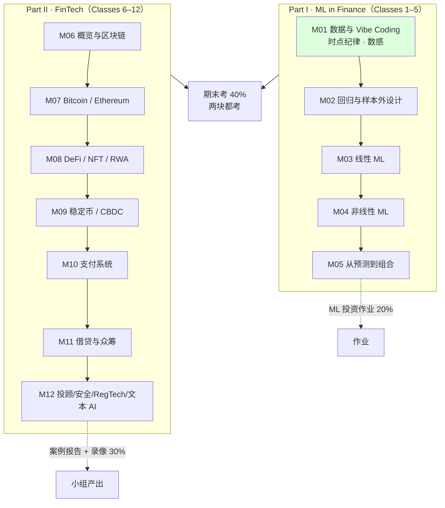

# EF5560 · FinTech and AI in Finance · 课程总览

> 本课入口。找什么都从这里点。

**一句话**：MScAIB（P85）的 **商业核心课**（3 学分，9 学分组内选一），12 次三小时研讨，**Prof. FENG Guanhao Gavin（冯冠豪）** 主讲。两个半程拼成一门课：**Classes 1–5 用 AI 辅助编码做投资预测**，**Classes 6–12 拆 FinTech 公司的商业模式**。教授的核心主张只有一句——**"数据比模型重要，而数据里最要命的是时点"**。

---

## 🔴 现在最要紧的事

**★ 本周内（下次上课之前）必须在 Canvas 上组队（≤3 人）**
🎙️ 教授原话（转录 `02:15:07`）：「**This is the only thing I require. You have to finish before our [next class].**」
⚠️ **同一个组要一起做 ML 投资作业（20%）和 FinTech 案例 + 录像（30%），合计 50% 的成绩**，选人要慎重。
👉 完整规则见 [[Fintech_and_AI_in_Finance/_meta/作业与DDL|作业与DDL]] §2.1。

**下一个硬性日期：2026-09-27（周日 10:00）TA tutorial #1 — ML 投资作业准备（Zoom，有录像）**

---

## 笔记

| Class | 主题 | 笔记 | 状态 |
|---|---|---|---|
| 1 | Financial data and vibe coding in R and Python | [[M01-金融数据与Vibe-Coding]] | ✅ **v1.0** · 讲义 58 页全覆盖 + 转录已合并 · 2026-09-11 已按预习可读性规则重写 §2 |
| 2 | Regression, return predictability, and out-of-sample design | [[M02-回归与样本外设计]] | ✅ **v1.0** · 讲义 54 页 · 两段转录已合并（2026-09-11） |
| 3 | Linear machine learning for return prediction | [[M03-线性机器学习与收益预测]] | ✅ **v1.0**（2026-09-17，转录已合并，`quality_spec: v1` strict PASS）· 讲义 56 页全覆盖 + `class03/` 5 个 CSV 全部重算 · 35 个 🎙️ 格全部回填，7 条 🔴 |
| 4 | Nonlinear machine learning for return prediction | | 待课件 |
| 5 | Interpretable machine learning and portfolio decisions（09-09 版 syllabus 改名） | | 待课件 |
| 6 | FinTech overview and blockchain | | 待课件 |
| 7 | Bitcoin and Ethereum | | 待课件 |
| 8 | DeFi, NFTs, and real-world assets | | 待课件 |
| 9 | Stablecoins and CBDCs | | 待课件 |
| 10 | Payment systems | | 待课件 |
| 11 | Lending and crowdfunding | | 待课件 |
| 12 | Robo-advising, cybersecurity, RegTech, AI applications to financial text + 课程总结 | | 待课件 |

> **编号约定**：讲义与 syllabus 用 `Class N`，本库统一用 `M0N`（[[转录处理规则]] §5 的全库规定）。两者一一对应，无偏移。
> **转录**：`transcripts/M01-transcript.txt`（`00:01`→`02:15:21`，671 段，**完整连续，是全库质量最好的一份**）。

---

## 元数据

| 文件 | 用途 |
|---|---|
| [[Fintech_and_AI_in_Finance/_meta/知识层级台账\|知识层级台账]] | ★ **写笔记前必读**。含本课写死的两条口径判断（金融概念不在 L0；Python 语法在 L0、库 API 不在） |
| [[Fintech_and_AI_in_Finance/_meta/术语表\|术语表]] | 中英对照 + 统一译名 + 三处已裁定的译名分歧 |
| [[Fintech_and_AI_in_Finance/_meta/考点库\|考点库]] | 三档可信度；含 **🔴 教授亲口说的考试形式** |
| [[Fintech_and_AI_in_Finance/_meta/作业与DDL\|作业与DDL]] | 全部截止日 + 提交规则 + 一处必须核对的时间冲突 |
| [[Fintech_and_AI_in_Finance/_meta/数据集卡片\|数据集卡片]] | 8 个 CSV 的实跑统计（六项固定格式） |
| [[Fintech_and_AI_in_Finance/_meta/待并入术语总表\|待并入术语总表]] | 51 条跨课术语，✅ **2026-09-10 已并入**根 [[术语总表]]（R² 量级、Vibe Coding 双别名、Benchmark 三义都在总表 §2.2） |

## 前置资料

| 文件 | 用途 |
|---|---|
| [[Fintech_and_AI_in_Finance/_prep/课程前置资料\|课程前置资料]] | **官方目录 × syllabus 逐项对校**。及格线、GenAI 政策、CILO 差异、教师背景都在这里 |

---

## 代码库 `code/`

> 对 8 个 CSV 的**可复现分析**。笔记里每一个由数据算出来的数字，都能在某个脚本的 stdout / `output/*.csv` 里找到；笔记里的 `📁 代码：` 行直接点到脚本。

| 入口 | 用途 |
|---|---|
| [`code/README.md`](code/README.md) | ★ **设计说明**：怎么跑、目录约定、三条硬规则（单一数据入口 / 不改原始数据 / 固定 docstring）、**脚本 ↔ 笔记映射表** |
| [`code/run_all.py`](code/run_all.py) | 按编号跑全部 9 个脚本，2026-09-10 实跑 9/9 ✅ |
| [`code/common/load.py`](code/common/load.py) | 唯一的数据入口，8 个 loader 各写死收益率口径（周频简单收益 / 月频对数收益） |
| `code/output/` | 9 张图 + 12 张表，笔记用 `![[L01_03_drawdown.png]]` 嵌入 |

**脚本一览**（详表见 README §4）：`L01_01` 两种收益口径差 21.8% · `L01_02` 四指数 20 年 · `L01_03` PDD-JD 回撤 · `L01_04` 特征表逐列泄漏审计（15 列误差 ≤ 2e-15）· `L01_05` 预测时钟 · `L02_01` 复现讲义 54 个数字 · `L02_02` 滚动 vs 扩展窗口 OOS R² · `L02_03` R² = 1% 长什么样 · `L02_04` 命中率 vs 多数类基线

**跑之前**：`cd code` → `PYTHONIOENCODING=utf-8 /d/python/python run_all.py`。规则出处：[[材料处理规则]] §8b。

---

## 一分钟必知

**考核构成**

| 项 | 权重 | 关键约束 |
|---|---|---|
| FinTech 公司案例报告 | 10% | ≤10 页（含图表附录），Week 12 |
| 录像展示 | 20% | ≤10 分钟，一个 MP4 ≤80 MB，**每人至少讲 2 分钟**，Week 12 |
| ML 投资作业 | 20% | 报告 + 权重 CSV + **可复现代码包**，Class 5 后发、两周后交 |
| 参与与课堂表现 | 10% | 起始 5/10；**点名不在 −1**；答对 +1；答错不扣 |
| **期末考** | **40%** | **2 小时，线下手写闭卷**，禁 AI / 手机 / 电脑 |
| 持续评估合计 | **60%** | |

**及格线**：⚠️ **本课不存在** IS5113 那种"持续评估 ≥25% 且笔试 ≥25%"的双门槛——官方目录同一版式文件在该位置为空。已核实，不是没查。详见 [[Fintech_and_AI_in_Finance/_prep/课程前置资料|课程前置资料]] §3.1。

**GenAI 政策**（官方目录原文，syllabus 没写全）
- ✅ 作业与小组项目**可以用** GenAI 帮助理解概念、分析数据
- ❌ **但最终版必须是自己的作品，不能复制粘贴 AI 的答案**
- ❌ 期中考 / 小测 / **期末考一律禁用**
- ⚠️ syllabus 另加一条：**实质性使用必须披露（disclosed）**

**🔴 期末考形式（只有课堂上说过，三份书面文件都没有）**
- **完全没有编码题**
- **选择题占比最高 60%**（学校规定的上限）
- ML 板块出**简单计算题**；FinTech 板块出**简答题，问公司的商业模式**
- **可能允许一页手写小抄**（教授说"待定，以后告诉你们"）
- 🎙️ **第 2 讲补充**：**题型就是每讲讲义里那道"四选一 + Discuss"**（「These are the questions you will see」）；期末前给 practice exam；**做完全部作业 + 出席考试就很难挂**（三年挂 3 人，都是缺考或没做展示）
👉 全部原话见 [[Fintech_and_AI_in_Finance/_meta/考点库|考点库]] §0。

---

## 课程的骨架

**两半的性质完全不同（这决定了怎么复习）**

| | Part I（1–5） | Part II（6–12） |
|---|---|---|
| 结构 | **层层叠加**——syllabus 明说「Classes 1–5 build on each other, so regular attendance is important」 | **公司案例串讲**，彼此独立 |
| 缺一节的代价 | 大 | 小 |
| 考法 | 简单计算 + 概念判断 | 简答：这家公司的商业模式 |
| 产出 | ML 投资作业（20%） | 案例报告 + 录像（30%） |

**🎙️ 今年与去年的三处不同**（转录 `00:03`–`14:31`，讲义与 syllabus 都没写）
1. **两半的顺序调换了**——去年先讲 FinTech，今年先讲投资。官方课程目录里的课程简介**仍然是去年的顺序**
2. **只有 12 讲**——⚪ 因为 **2026-10-01（周四）国庆停课**
3. **取消现场展示**，改成交录像

---

## 跨课链接

| 链接 | 内容 | 怎么用 |
|---|---|---|
| ★★★ **[[M02-回归与样本外设计]] ↔ IS6400 W02（线性回归）** | **同周、同主题，且两门课都在教"用 AI 写代码"**——本课叫 **Vibe Coding**，IS6400 叫 **GenAI for BDA**。这是全库最强的交叉点 | 见下方专段 |
| ★★ **EF5560 ↔ [[M01-导论-AI与伦理\|IS5113]] W8「AI in Finance & Risk Management」** | 同一批技术的**伦理与监管视角**：算法交易的问责、信贷模型的公平性、模型风险治理 | 本课教"怎么做"，IS5113 教"该不该这么做"。案例报告的"风险与监管"一节（占评分七项之一）可以直接搬 IS5113 的框架 |
| ★★ **EF5560 M12（RegTech）↔ IS5113 W9（全球 AI 治理与监管）** | RegTech 是监管科技的产品化，IS5113 讲的是监管本身 | M12 写到时建双链 |
| ★ **EF5560 M01（财报归档日、财务比率）↔ AC6761（AI in Accounting）** | 10-Q/10-K、利润率、账面杠杆、资产增长、经营现金流——**是同一批科目，两门课看的角度不同** | EF5560 把它们当**预测变量**（关心什么时候可知）；AC6761 把它们当**会计信息**（关心怎么算出来的） |
| ★ **EF5560 M01（Vibe Coding 工具与权限）↔ IS5542（GenAI in Business）** | 桌面编码工具、开源 vs 闭源、AI 幻觉 | 术语已登记进 [[Fintech_and_AI_in_Finance/_meta/待并入术语总表\|待并入术语总表]] §B |

### ★★★ EF5560 Lec02 ↔ IS6400 W02：全库最强的交叉点

**同一周（2026-09-09 / 09-10），同一个主题（线性回归），同一种教学取向（让 AI 写代码）。**

| | **EF5560 Class 2** | **IS6400 Week 2** |
|---|---|---|
| **笔记** | [[M02-回归与样本外设计]] | **[[M02-预测分析-线性回归]]**（已产出，v0.9） |
| 讲义 | `Lec02_Regression_Vibe_Coding.pdf`（54 页） | `L2-Linear_Regression.pdf`（53 页）＋ `Week 2 Regression Analysis_With Prompt.ipynb` ＋ 指定阅读 HM Ch.4 |
| **侧重** | **数据时点纪律 + 样本外评价**——回归只讲到 OLS 与标准误，篇幅全在"这个结果算不算数" | **系数解读 + MLE 推导 + 正则化**——正规方程、梯度下降、Lasso/Ridge、虚拟变量陷阱 |
| AI 编码的叫法 | **Vibe Coding** | **GenAI for BDA**（notebook 里的 `🤖 AI Prompt (Copy this to AI)` 单元格） |
| 数据 | 金融时间序列（SPY 240 个月、CSI 300 宏观面板） | 商业截面数据（Airbnb） |
| **切分方式** | **必须按时间切**（讲义 p.37「Keep financial time series in **date order**」） | 通常随机切 |
| **R² 的期望量级** | **1% 就算好**（🎙️ 教授：营销能到 50→60%，收益预测只能 1→1.2%） | 商业分析里 R² 0.5 才算好 |
| 关注的偏差 | **前视偏差、生存者偏差**（时点问题） | 多重共线性、异常值、选择偏差 |
| 基准 | **滞后 12 个月移动平均**（数据集 `csi300_macro_panel.benchmark_ma12`） | 通常与均值模型比 |
| 评价 | **样本外 R² + 方向准确率 + 与基准的对比**（三条跨 Classes 2–4 固定不变） | R²、RMSE、系数显著性 |

**⚠️ 三处口径冲突，做笔记时必须显式指出（否则两门课连读会打架）**
1. **R² 的好坏标准完全相反**——见 [[Fintech_and_AI_in_Finance/_meta/待并入术语总表|待并入术语总表]] §E①
2. **标准化的时机**：EF5560 Lec02 p.31 明确要求「Standardize using **training data only**」，这在金融时间序列里是硬约束；IS6400 若用全样本标准化，在本课语境下就是泄漏路径 ①
3. **benchmark ≠ baseline**——见 [[Fintech_and_AI_in_Finance/_meta/待并入术语总表|待并入术语总表]] §E③

**💡 两讲是互补的，不是重复的**：**IS6400 把回归的数学讲透**（最小二乘闭式解、极大似然、梯度下降、正则化），**EF5560 几乎不碰数学，全部篇幅用在"这个结果算不算数"上**（按时间切分、只用训练集标准化、冻结规格、样本外 R² 与基准命中率）。**而 IS6400 的 Lasso / Ridge 正好是 EF5560 Class 3 的内容**——本课讲义 L2 p.28 / p.30 两次预告「Class 3 keeps the sink and adds a penalty」「shrink the slopes, or replace them with a few combinations」。**先读 IS6400 的正则化，EF5560 M03 会省一半力气。**

👉 IS6400 的课程口径见 [[Business_Data_Analytics/_prep/课程前置资料|IS6400 课程前置资料]]；对应笔记 [[M02-预测分析-线性回归]]。

---

## 材料清单

`course_files_export/`

| 文件 | 页/数量 | 状态 |
|---|---|---|
| `syllabus_EF5560_2026.pdf` | 3 页 | ✅ 已读 → [[Fintech_and_AI_in_Finance/_prep/课程前置资料\|课程前置资料]] |
| `EF5560_FinTech_Company_Case_Requirements.pdf` | 1 页 | ✅ 已读 → [[Fintech_and_AI_in_Finance/_meta/作业与DDL\|作业与DDL]] §2.3 |
| `Lec01_Data_and_Vibe_Coding.pdf` | 58 页 | ✅ **全部 58 页已视觉复核** → [[M01-金融数据与Vibe-Coding]] |
| `Lec02_Regression_Vibe_Coding.pdf` | 54 页 | ✅ **全部 54 页已视觉复核** → [[M02-回归与样本外设计]]（**v1.0**） |
| `Lec03_Linear_Machine_Learning.pdf` | 56 页 | ✅ **56 页全覆盖、9 页图视觉复核** → [[M03-线性机器学习与收益预测]]（**v1.0**） |
| `class03/class03/*.csv` ×5 + `manifest.json` + `README.md` | 5 个结果表 | ✅ sha256 校验 + 全部数字重算 → [[Fintech_and_AI_in_Finance/_meta/数据集卡片\|数据集卡片]] §11；❗ README 引用的 `shared/` 四个面板缺失（Canvas 也没有，2026-09-17 核实） |
| `syllabus_EF5560_2026.pdf`（2026-09-09 更新版） | 3 页 | ✅ 已对照：只改 Class 5 主题与 ILO 2 措辞 → [[Fintech_and_AI_in_Finance/_prep/课程前置资料\|课程前置资料]] §8 |
| `data/*.csv` | 8 个 | ✅ 全部实跑统计 → [[Fintech_and_AI_in_Finance/_meta/数据集卡片\|数据集卡片]]；✅ 可复现分析 → `code/`（见上文「代码库」） |
| `course_image/canvas_course_card_2026.png` | 1 | 杂项，忽略 |

`transcripts/`

| 文件 | 覆盖 | 状态 |
|---|---|---|
| `M01-transcript.txt` | `00:01`→`02:15:21`，671 段 | ✅ 已合并进 M01 v1.0 |
| `M03-transcript.txt` | `00:56`→`02:24:04`，587 段 | ✅ 2026-09-17 已合并进 M03 v1.0；缺开头约 1 分钟、缺结尾（p.56 总结未完） |
| `M02-transcript-part1.txt` + `-part2.txt` | 课间前 `00:01`→`01:22:15`（379 段）+ 课间后 `00:01`→`01:04:47`（260 段） | ✅ 2026-09-11 已合并进 M02 v1.0；part1 首句为半句，开头可能缺 1–3 分钟 |

---

## 规则

- 全库方法论：[[CLAUDE]]（根） · [[笔记模板]] · [[材料处理规则]] · [[转录处理规则]]
- 本课特有规则：`Fintech_and_AI_in_Finance/CLAUDE.md` / `AGENTS.md`

---

## 进度追踪

| 项 | 状态 |
|---|---|
| 官方目录对校 | ✅ 完成（2026-09-09） |
| 知识层级台账 | ✅ 建表，M01 的 60 个概念已登记 |
| M01 笔记 | ✅ **v1.0**，58 页全覆盖，双源比对完成 |
| M02 笔记 | ✅ **v1.0**（2026-09-11）：两段转录合并 + 正文按「预习可读性」规则重写（25.5k 字，公式全部 LaTeX，6 条 🔴） |
| 数据集卡片 | ✅ 8/8 完成，数字全部实跑 |
| 术语表 / 考点库 / 作业与DDL | ✅ 完成（覆盖 M01） |
| 待并入术语总表 | ✅ 51 条，✅ 2026-09-10 已并入根术语总表 |
| M03 笔记 | ✅ **v1.0**（2026-09-17）：56 页全覆盖，§2 共 36 个 leaf 小节、3.1 万字，strict PASS；转录已合并（35 个 🎙️ 格、7 条 🔴、audit PASS） |
| 代码库 `code/` | ✅ **11 个脚本（2026-09-17 加 `L03_linear_ml/` 两个），`run_all.py` 11/11 通过**；笔记 M01 / M02 / 数据集卡片共 25 处 `📁 代码` 链接；脚本发现并改正了 M01 §2.3.4（年化 7.95% → 9.26%）和 M02 §2.8.3（"不如永远猜涨 56.7%" → 打平 48.3%，56.7% 是 MA(12)）两处笔记错误 |
| Notion 同步 | ⏳ **由主 agent 负责**，本 agent 未动 |

**下一步该做的三件事**
1. ~~用户导出 M02 转录 → 把 M02 升到 v1.0~~ ✅ 2026-09-11 完成
2. 盯 Canvas 确认 ML 投资作业的实际发布日（见 [[Fintech_and_AI_in_Finance/_meta/作业与DDL|作业与DDL]] §4 的时间冲突；M03 转录只剧透了内容——改窗口长度重跑排序，没给新发布日）
3. 与 IS6400 W02 笔记互建双链，并在两边显式写出上表的三处口径冲突
4. ~~Lec03 讲义到手后，在 `code/L03_.../` 加脚本、README §4 加行、笔记加 `📁 代码` 链接~~ ✅ 2026-09-17 完成（`L03_linear_ml/01_reproduce_lecture.py`、`02_forecast_sort.py`）
5. `shared/` 四个面板文件 Canvas 上也没有（2026-09-17 核实）——**M03 转录也没有点名它**（教授只说数据在 Dropbox / Canvas）；等 ML 作业发布或问 TA
6. ~~M03 转录到手后合并~~ ✅ 2026-09-17 完成（v1.0，audit/note_quality/link_check 全 PASS）
