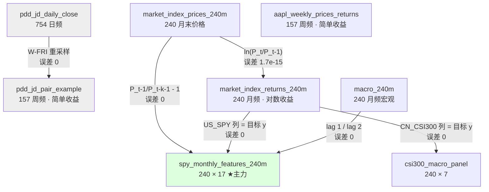

# EF5560 数据集卡片（8 个 CSV + class03 数据包 5 个 CSV）

> 按 [[材料处理规则#7. `.csv` / `.xlsx` 数据文件 ✅|材料处理规则 › 7. `.csv` / `.xlsx` 数据文件 ✅]] §7.1 的**固定六项**逐个建卡：规模／字段清单／缺失率／目标变量／已知坑／与讲义的对应。
> **所有数字均由 `pandas` 实跑得出**（Python 3 + pandas 2.3.3，脚本在 scratchpad，不落库），**没有一个是估计的**。
> **只做描述性概览，不做分析**（§7.3）。原始文件只读，未做任何修改，也未生成清洗副本。
> 文件名遵循任务指定的 `数据集卡片.md`；库规则 §7.2 的默认名是 `数据集.md`，二者为同一物。

---

## 0. 总览

| # | 文件 | 行 × 列 | 大小 | 频率 | 时间跨度 | 用在哪一讲 |
|---|---|---|---|---|---|---|
| 1 | `aapl_weekly_prices_returns_156w.csv` | 157 × 3 | 7.8 KB | 周（周五） | 2023-06-30 → 2026-06-26 | **M01** p.14/19/46 |
| 2 | `pdd_jd_daily_close_2023-06-26_2026-06-26.csv` | 754 × 3 | 17.8 KB | 日（交易日） | 2023-06-26 → 2026-06-26 | **M01** p.11（⏭️ 课上略过） |
| 3 | `pdd_jd_pair_example_156w.csv` | 157 × 9 | 18.0 KB | 周（周五） | 2023-06-30 → 2026-06-26 | **M01** p.15/16（⏭️ 课上略过）；M05 |
| 4 | `market_index_prices_240m.csv` | 240 × 5 | 16.6 KB | 月（月末） | 2006-07-31 → 2026-06-30 | **M01** p.17/18/20/51 |
| 5 | `market_index_returns_240m.csv` | 240 × 5 | 22.7 KB | 月（月末） | 2006-07-31 → 2026-06-30 | **M01** p.19/21；**M02** |
| 6 | `macro_240m.csv` | 240 × 6 | 20.2 KB | 月（月末） | 2006-07-31 → 2026-06-30 | **M01** p.28/32/33 |
| 7 | `spy_monthly_features_240m.csv` | 240 × 17 | 76.4 KB | 月（月末） | 2006-07-31 → 2026-06-30 | **M01** p.44–48/50；**M02**（主力）；M03/M04 |
| 8 | `csi300_macro_panel.csv` | 240 × 7 | 25.9 KB | 月（月末） | 2006-07-31 → 2026-06-30 | **M02** p.34/35/51 |

**⚠️ 全局第一坑：收益率口径两套并存**

| 口径 | 哪些文件 | 验证 |
|---|---|---|
| **简单收益** `P_t/P_{t−1} − 1` | ①③（**周频**） | 与简单收益公式误差 ≤ 1e-16 |
| **对数收益** `ln(P_t/P_{t−1})` | ⑤⑦⑧（**月频**） | 与对数公式误差 ≤ 1.7e-15；与简单公式误差最大达 **4.06 个百分点** |

讲义 p.19 **只给了简单收益的公式**，从未定义对数收益（p.20/21 的图注里才出现 "log returns"）。**把月频当简单收益复利累乘会把 S&P 500 的 20 年累计从正确的 5.87 倍算成 4.59 倍。** 详见 [[M01-金融数据与Vibe-Coding#9.3 课件自身的问题|M01-金融数据与Vibe-Coding › 9.3 课件自身的问题]]。

**全局第二坑：日期列都是字符串**，读进来必须 `pd.to_datetime()`，否则排序和切片都会按字典序而不是时间序。

---

## 1. `aapl_weekly_prices_returns_156w.csv`

**① 规模**：**157 行 × 3 列**，7,830 字节。

**② 字段清单**

| 字段 | 类型 | 含义 | 取值范围 |
|---|---|---|---|
| `week_end` | 字符串（日期） | 周标签，**全部是周五**（157 个不重复值，间隔恰好 7 天，无重复无缺口） | 2023-06-30 → 2026-06-26 |
| `adjusted_close` | float | **复权**周收盘价（美元） | min **165.00**（2024-04-19）｜中位 222.50｜max **312.06**（2026-05-29）｜均值 222.35｜sd 36.13 |
| `weekly_return` | float | **简单**周收益 | min **−13.55%**（2025-04-04）｜中位 +0.33%｜max **+13.33%**（2025-08-08）｜均值 +0.31%｜sd 3.71% |

**③ 缺失率**：`week_end` 0%｜`adjusted_close` 0%｜`weekly_return` **0.64%（恰好 1 个）**——第一行按构造必然缺失。**没有一列 >5%。**

**④ 目标变量**：`weekly_return` 是讲义 §2.7.2 里的 **Weekly target**（`P_t/P_{t−1} − 1`）。本文件不含预测变量，预测变量要按 p.46 的代码自己从 `adjusted_close` 派生。

**⑤ 已知坑**
- **这个文件是讲义 p.14 检查清单的标准答案**：157 个价格、156 个非缺失收益、按日期排序、第一个收益为空——**四项全部对上**。适合拿来练"检查 AI 输出"。
- 实测 `weekly_return` 与 `adjusted_close` 的简单收益公式吻合到 **3.19e-16**，即口径确定无疑是简单收益。
- **复权价会被回溯重算**：今天下载的历史与一年前下载的可能不同（见 M01 §2.3.2）。
- 三年累计 **+46.3%**，年化波动率 **26.8%**——比 S&P 500 的 15% 高出不少，这是单只股票的正常水平。
- 156 周窗口跨越 2024-04 的低点与 2026-05 的高点，**样本内含一次接近翻倍的行情**，直接用它估动量参数会偏乐观。

**⑥ 与讲义的对应**：M01 讲义 **p.14**（构造指令与验收标准）、**p.19**（收益定义与两张图）、**p.44/45/46**（三个预测变量的原料）。→ [[M01-金融数据与Vibe-Coding#2.4.3 构造 156 周的收益（讲义 p.14）|§2.4.3]]

> 📁 **代码**：暂无专用脚本（本文件只在 M01 p.14 的手检清单里用到；`code/common/load.py` 的 `aapl_weekly()` 已封装读取与行数自检）

---

## 2. `pdd_jd_daily_close_2023-06-26_2026-06-26.csv`

**① 规模**：**754 行 × 3 列**，17,785 字节。

**② 字段清单**

| 字段 | 类型 | 含义 | 取值范围 |
|---|---|---|---|
| `date` | 字符串（日期） | 交易日，**仅周一至周五**（周一 143／周二 156／周三 154／周四 149／周五 152） | 2023-06-26 → 2026-06-26 |
| `PDD` | float | PDD Holdings 日收盘价（美元） | min **67.69**｜中位 113.68｜max **157.57**｜均值 114.26｜sd 19.07 |
| `JD` | float | JD.com 日收盘价（美元） | min **21.44**｜中位 30.63｜max **47.08**｜均值 31.51｜sd 5.11 |

**③ 缺失率**：**三列全部 0%**。

**④ 目标变量**：无。这是**原料文件**，用于派生 ③ 号文件的周频序列。

**⑤ 已知坑**
- **日期间隔非等距**：中位 1 天、最大 4 天（周末 + 假日）。`min=1, max=4` 说明**没有任何连续 5 天以上的空档**，数据连续性良好。
- **每年交易日数**：2023 年 131 天（自 6/26 起）｜2024 年 **252**｜2025 年 **250**｜2026 年 121 天（至 6/26）。符合美股约 250 个交易日/年。
- **周一最少（143）**——美国公众假期多落在周一。这是正常现象，不是缺数。
- **列名没写清楚是不是复权价**。从 ③ 号文件的周频价与本文件 `W-FRI` 重采样结果**完全一致（误差 0）**可知两者同源；但**是否复权无法从文件本身判断**，讲义 p.11 的图注只说 "Nasdaq daily closing prices… This is a price comparison, **not a total-return comparison**"，暗示**未含股息**。→ **作业里若用它算收益，必须注明这一点。**
- PDD 与 JD 都是**中概股 ADR**，存在汇率、监管、退市等本文件无法体现的风险。

**⑥ 与讲义的对应**：M01 讲义 **p.11**（归一化价格走势图）。⏭️ **课上完全略过**。→ [[M01-金融数据与Vibe-Coding#2.10 ⏭️ 课上完全略过：PDD-JD 相对价值交易（讲义 p.8、11、15、16）|§2.10]]

> 📁 **代码**：暂无专用脚本；周频派生版本的分析见 [`code/L01_data/03_drawdown.py`](../code/L01_data/03_drawdown.py)（`L01_03`，归一化终值 110.7 / 74.4 在其 stdout）

---

## 3. `pdd_jd_pair_example_156w.csv`

**① 规模**：**157 行 × 9 列**，17,966 字节。

**② 字段清单**

| 字段 | 类型 | 含义 | 取值范围 |
|---|---|---|---|
| `week` | 字符串（日期） | 周标签，**全部周五**，间隔恰好 7 天 | 2023-06-30 → 2026-06-26 |
| `pdd_close` | float | PDD 周收盘（= 日频文件的 `W-FRI` 最后一个值，误差 **0**） | 69.14 – 157.57，中位 113.49 |
| `jd_close` | float | JD 周收盘（同上） | 21.78 – 46.97，中位 30.34 |
| `pdd_return` | float | PDD **简单**周收益 | min **−31.29%**（2024-08-30）｜max **+35.52%**（2024-09-27）｜均值 +0.36%｜sd 7.71% |
| `jd_return` | float | JD **简单**周收益 | min −14.18%（2024-05-24）｜max **+39.75%**（2024-09-27）｜均值 +0.005%｜sd 6.45% |
| `pdd_weight` | float | 多头权重 | **恒为 +0.5**（sd = 0） |
| `jd_weight` | float | 空头权重 | **恒为 −0.5**（sd = 0） |
| `long_pdd_short_jd_return` | float | 组合周收益 | min −15.96%（2024-08-30）｜max +13.97%（2023-12-01）｜均值 +0.18%｜sd 3.37% |
| `long_pdd_short_jd_wealth` | float | 净值（起点 100） | min **98.23**（2023-07-07）｜max **178.47**（2024-01-19）｜**终点 120.62** |

**③ 缺失率**：三个收益列各缺 **0.64%（1 个）**——第一行按构造缺失。其余全部 0%。**没有一列 >5%。**

**④ 目标变量**：`long_pdd_short_jd_return` 是被解释的组合收益；`long_pdd_short_jd_wealth` 是它的累计版本。本文件是**演示文件**，不是建模数据集（没有预测变量）。

**⑤ 已知坑**
- **组合公式已验证**：`long_pdd_short_jd_return = 0.5·pdd_return − 0.5·jd_return`，误差 **1.04e-16**。
- **累计 +20.62%**（净值 100 → 120.62），与讲义 p.16 的 "+20.6%" 完全一致。
- **归一化终值**：PDD **110.72**、JD **74.39**，与讲义 p.11 的 "110.7 / 74.4" 完全一致。
- **⚠️ 讲义没告诉你的数字：这个"美元中性"组合的最大回撤是 −38.66%**（峰值 178.47 @2024-01-19 → 谷底 @2025-04-11）。**+20.6% 的终点数字掩盖了一段近乎腰斩的净值曲线。** 讲义只报终点、不报路径，正好违反了它自己在 p.51 教的"回撤才是客户真正经历的东西"。
- **不含**股息、交易成本、融券费、融资成本（讲义 p.16 图注已声明）。**周度再平衡 156 次，实际成本不可忽略。**
- **权重恒定 ±0.5**，意味着这是"每周重置回等额美元"的策略，不是买入持有。
- 2024-09-27 那一周 PDD +35.5%、JD +39.8% **同时暴涨**（对应中国 924 政策行情），组合当周反而小幅亏损——是"美元中性不等于风险中性"的现成教材。

**⑥ 与讲义的对应**：M01 讲义 **p.15**（权重与收益公式）、**p.16**（历史结果）。⏭️ **课上完全略过**。多空权重的概念会在 **M05（从预测到组合）** 重新用到。→ [[M01-金融数据与Vibe-Coding#2.10 ⏭️ 课上完全略过：PDD-JD 相对价值交易（讲义 p.8、11、15、16）|§2.10]]

> 📁 **代码**：[`code/L01_data/03_drawdown.py`](../code/L01_data/03_drawdown.py) —— 断言组合公式（0.5·r_PDD − 0.5·r_JD）、简单收益复利与净值列一致、终点 +20.62%；输出净值 + 回撤图，最大回撤 −38.66%（峰 2024-01-19 → 谷 2025-04-11，峰后 64 周），终点仍在 −32.4% 的回撤中（`L01_03`）
> ![[L01_03_drawdown.png]]

---

## 4. `market_index_prices_240m.csv`

**① 规模**：**240 行 × 5 列**，16,587 字节。

**② 字段清单**

| 字段 | 类型 | 含义 | 取值范围（含极值月份） |
|---|---|---|---|
| `month` | 字符串（日期） | **月末**标签，240 个连续月，无重复、无缺月 | 2006-07-31 → 2026-06-30 |
| `US_S&P500` | float | 标普 500 **价格指数**（不含股息） | min **735.09** @2009-02｜max **7580.06** @2026-05 |
| `HK_HangSeng` | float | 恒生指数 | min **12811.57** @2009-02｜max **32887.27** @**2018-01** |
| `US_SPY` | float | SPY ETF **复权**价（`auto_adjust=True`，**含股息**） | min **53.93** @2009-02｜max **754.54** @2026-05 |
| `CN_CSI300` | float | 沪深 300 指数 | min **1294.33** @**2006-07**｜max **5688.54** @**2007-10** |

**③ 缺失率**：**五列全部 0%**——与讲义 p.18 的 "missing months: zero" 一致。

**④ 目标变量**：无。这是价格原料，收益在 ⑤ 号文件。

**⑤ 已知坑**
- **⚠️ `US_S&P500` 是价格指数、`US_SPY` 是全收益（含股息）**——两者放在同一张表里，**不能混用**。20 年累计：**SPY 8.44 倍 vs S&P500 5.87 倍**，差距 2.57 倍**全部来自股息**。讲义 p.18 只写了一句 "These are price-index returns; dividends are not included"，没解释为什么 SPY 列不一样。
- **⚠️ 两个市场至今没回到历史高点**：**恒生的最高点在 2018-01（32887），2026-06 只有 22881，还差 30%**；**CSI 300 的最高点在 2007-10（5688），2026-06 只有 4979，19 年后仍未收复**。任何用"长期一定涨"做假设的策略在这两个市场都会被证伪。
- **CSI 300 的最小值就在样本第一行**（2006-07 = 1294.33），说明样本起点恰好接近该指数的历史低位——**样本区间的选择本身会影响结论**。
- 三个市场的交易日历不同（讲义 p.18 明说 "Holidays, trading hours, and index construction rules still differ"），**月末对齐掩盖了这个差异，但没有消除它**。
- 最大回撤（用本文件算）：**CSI 300 −70.8%（2008-10）｜恒生 −59.1%（2009-02）｜S&P 500 −52.6%（2009-02）**。与 🎙️ 教授课上口述的"CSI 超过 70%"、"S&P 约 50%"完全对得上。

**⑥ 与讲义的对应**：M01 讲义 **p.17/18**（下载与检查的代码）、**p.20**（归一化价格图）、**p.51**（回撤图）。→ [[M01-金融数据与Vibe-Coding#2.4.4 从两个数据源拼一张表（讲义 p.17–18）|§2.4.4]]、[[M01-金融数据与Vibe-Coding#2.9.2 讲义的五张成品图在讲什么|§2.9.2]]

> 📁 **代码**：[`code/L01_data/02_index_20y.py`](../code/L01_data/02_index_20y.py) —— 本卡 ⑤ 的全部数字（5.87× / 8.44×、恒生 2018-01 高点差 30.4%、CSI 300 2007-10 高点 18.7 年未收复、三个最大回撤）都在其 stdout 并有断言（`L01_02`；股息差按未舍入值算是 2.56×，本卡的 2.57 是用舍入后的 8.44 − 5.87 得到的）；[`01_return_conventions.py`](../code/L01_data/01_return_conventions.py) 用本文件的 `US_S&P500` 做价格净值基准（`L01_01`）
> ![[L01_02_index_20y.png]]

---

## 5. `market_index_returns_240m.csv`

**① 规模**：**240 行 × 5 列**，22,678 字节。

**② 字段清单**

| 字段 | 类型 | 含义 | 取值范围（含极值月份） |
|---|---|---|---|
| `month` | 字符串（日期） | 同 ④ 号文件 | 2006-07-31 → 2026-06-30 |
| `US_S&P500` | float | **月度对数收益** | min **−18.56%** @2008-10｜中位 +1.42%｜max +11.94% @2020-04 |
| `HK_HangSeng` | float | 同上 | min **−25.45%** @2008-10｜中位 +0.77%｜max **+23.60%** @2022-11 |
| `US_SPY` | float | 同上（含股息） | min −18.05% @2008-10｜中位 +1.52%｜max +11.95% @2020-04 |
| `CN_CSI300` | float | 同上 | min **−29.91%** @2008-10｜中位 +0.53%｜max **+24.63%** @2007-04 |

**③ 缺失率**：**五列全部 0%**。

**④ 目标变量**：本文件的四个收益列都是**候选目标**。`US_SPY` 是 ⑦ 号文件的目标，`CN_CSI300` 是 ⑧ 号文件的目标（两者与本文件对应列**误差为 0**，即完全同源）。

**⑤ 已知坑（本卡最重要的一条）**
- **🔴 这是对数收益，不是简单收益。** 逐行验证 `ln(P_t/P_{t−1})`，**239 行全部匹配，最大误差 1.7e-15**；而与简单收益公式的最大偏离达 **4.06 个百分点**（CSI 300，2006-12）。另一条铁证：`exp(Σ log return)` 精确等于价格比值（S&P 500：5.8742 = 5.8742）。
- **第一行有值**（2006-07-31 的收益不是 NaN），说明生成时**多下载了一个月的前置数据**（2006-06）——正是讲义 p.14 说的 "Download enough earlier data to calculate the first return"。**但文件里看不到这个前置月，无法自行核对第一行。**
- 年化统计（用对数收益）：

| 指数 | 年化对数均值 | 折算年化简单 | 年化波动率 | 20 年累计（100 起投） |
|---|---|---|---|---|
| US_S&P500 | 8.88% | 9.28% | **15.43%** | **587** |
| US_SPY | 10.68% | 11.28% | 15.37% | **844** |
| HK_HangSeng | **1.71%** | 1.72% | **21.77%** | **135** |
| CN_CSI300 | 6.37% | 6.57% | **27.28%** | **385** |

  → 恒生 20 年年化仅 **1.7%**（价格指数，不含股息），**低于同期任何一个国债收益率**。这正是 🎙️ 教授说"我很想说港股能赚钱，但那是非常特殊的情况"（`01:12:16`）的数据依据。
- **2008-10 是四个指数同时的最差月**——高度相关的尾部风险，分散化在危机时失效。

**⑥ 与讲义的对应**：M01 讲义 **p.19**（收益定义）、**p.21**（箱线图，图注写的正是 "monthly **log** return"）；**M02** 的回归目标。→ [[M01-金融数据与Vibe-Coding#2.3.1 收益率：简单收益与对数收益|§2.3.1]]

> 📁 **代码**：[`code/L01_data/01_return_conventions.py`](../code/L01_data/01_return_conventions.py) —— 断言 `exp(Σr)` 与价格净值重合（对数收益的铁证），并画出误当简单收益复利的 4.59×（`L01_01`）；[`02_index_20y.py`](../code/L01_data/02_index_20y.py) 用本文件算年化波动率与单月最差（`L01_02`）；[`04_leakage_audit.py`](../code/L01_data/04_leakage_audit.py) 用本文件的 `US_SPY` 列重构特征表，并用首行那个"多算的一期"反推出价格表里没有的 2006-06 价格 88.13（`L01_04`）

---

## 6. `macro_240m.csv`

**① 规模**：**240 行 × 6 列**，20,228 字节。

**② 字段清单**

| 字段 | 类型 | 含义 | 取值范围（含极值月份） |
|---|---|---|---|
| `month` | 字符串（日期） | 月末标签，**这是参考月，不是发布日** | 2006-07-31 → 2026-06-30 |
| `dgs10_monthly_mean` | float | 10 年期美债收益率，**当月日频均值**（%） | min **0.62** @2020-07｜中位 2.76｜max **5.10** @2007-06 |
| `dff_monthly_mean` | float | 联邦基金利率，当月日频均值（%） | min **0.049** @2020-04｜中位 0.40｜max **5.33** @2023-08 |
| `unemployment_rate` | float | 美国失业率（%，FRED `UNRATE`） | min 3.4 @2023-04｜中位 4.9｜max **14.8** @**2020-04** |
| `inflation_yoy` | float | CPI 同比（%，由 `CPIAUCSL` 派生） | min **−1.96** @2009-07｜中位 2.18｜max **8.98** @2022-06 |
| `term_spread` | float | **期限利差** = `dgs10 − dff`（百分点） | min **−1.48** @**2023-05**｜中位 1.35｜max 3.65 @2010-04 |

**③ 缺失率**

| 列 | 缺失 |
|---|---|
| `unemployment_rate` | **0.42%（1 个）** —— **2025-10** |
| `inflation_yoy` | **0.42%（1 个）** —— **2025-10** |
| 其余四列 | 0% |

**没有一列 >5%。**

**④ 目标变量**：无。本文件是**预测变量的来源**，被 ⑦ 号文件按滞后引用。

**⑤ 已知坑**
- **🔴 `month` 是参考月，不是发布日。** 讲义 p.33 用整页讲这件事：一行标 `2026-06-01` 只说明它描述 6 月，**不代表投资者 6 月就知道**。用它做预测**必须**先加发布滞后。
- **★ 那唯一一个缺失月（2025-10）是本课最好的教学实物**：数据源那个月确实没有发布，文件**如实留空而没有插值**——正是讲义 p.28 要求的 "preserve published missing values" 和 p.32 图注 "Published missing values are retained rather than silently interpolated"。这个缺口按 2 个月滞后传导到 ⑦ 号文件的 **2025-12** 行。**做作业时不要顺手 `fillna()`。**
- **日频序列已被聚合成月均值，而不是月末值**——讲义 p.31 的检查项之二就是问这个（"Did daily rates become **monthly means** rather than month-end values?"）。✅ 本文件做对了。
- **`term_spread` 是派生列**，实测 = `dgs10_monthly_mean − dff_monthly_mean`。它在 2023-05 达到 **−1.48** 的历史最深倒挂，与教授课上讲的"利差转负预示危机"（🎙️`01:49:36`）对得上。
- **这是"当前版本（current vintage）"，不是实时版本**：FRED 的失业率和 CPI 都会被事后修订，今天下载到的历史与当年看到的不同。做严肃回测要用 **ALFRED**（讲义 p.33 提到但未展开）。
- 极值全部可与真实历史对上（2020-04 失业率 14.8%、2022-06 通胀 8.98%、2023-08 联邦基金 5.33%），说明数据本身可信。

**⑥ 与讲义的对应**：M01 讲义 **p.28**（FRED 指令：DGS10/DFF/UNRATE/CPIAUCSL）、**p.30/31**（对齐与检查）、**p.32**（四张宏观图）、**p.33**（参考月 ≠ 发布日）。→ [[M01-金融数据与Vibe-Coding#2.6.1 宏观数据：参考月 ≠ 发布日（讲义 p.28、p.30–33）|§2.6.1]]

> 📁 **代码**：[`code/L01_data/04_leakage_audit.py`](../code/L01_data/04_leakage_audit.py) —— 验证 `term_spread` 滞后 1 个月、`unemployment_rate` / `inflation_yoy` 滞后 2 个月与特征表精确相等（误差 0），2025-10 的缺口按 2 个月滞后落到特征表 2025-12 行、未填补（`L01_04`）；[`05_prediction_clock.py`](../code/L01_data/05_prediction_clock.py) 用扰动法证明三个宏观特征各只依赖一个参考月（`L01_05`）

---

## 7. `spy_monthly_features_240m.csv` ★ 本课主力数据集

**① 规模**：**240 行 × 17 列**，76,448 字节（8 个文件里最大）。

**② 字段清单**

| 字段 | 类型 | 含义 | 取值范围 |
|---|---|---|---|
| `forecast_month` | 字符串（日期） | **预测月**标签——这一行的目标收益就在这个月实现 | 2006-07-31 → 2026-06-30 |
| `market_return` | float | **目标 y**：SPY 当月**对数**收益 | −18.05% ~ +11.95%，均值 +0.89% |
| `return_lag1/2/3` | float | 前 1/2/3 个月的收益 | 同上量级 |
| `momentum_3/6/12` | float | 3/6/12 个月动量 | m3 −29.6%~+26.1%｜m6 −41.8%~+40.4%｜m12 **−43.4%~+56.2%** |
| `volatility_3/6/12` | float | 3/6/12 个月**年化**波动率 | v3 1.15%~**46.3%**｜v6 2.35%~32.7%｜v12 3.80%~31.3% |
| `ma_gap_3/6/10` | float | 相对 3/6/10 月均价的偏离 | g3 −14.8%~+9.1%｜g6 −21.0%~+14.3%｜g10 −30.5%~+17.7% |
| `term_spread_lag1` | float | 期限利差，**滞后 1 个月** | −1.48 ~ +3.65 |
| `unemployment_lag2` | float | 失业率，**滞后 2 个月** | 3.4 ~ 14.8 |
| `inflation_yoy_lag2` | float | CPI 同比，**滞后 2 个月** | −1.96 ~ +8.98 |

**③ 缺失率**

| 列 | 缺失 |
|---|---|
| `unemployment_lag2` | **0.42%（1 个）** —— **2025-12** |
| `inflation_yoy_lag2` | **0.42%（1 个）** —— **2025-12** |
| 其余 15 列 | **0%** |

**没有一列 >5%。** 那一个缺失完全来自 ⑥ 号文件 2025-10 的缺口 + 2 个月滞后。

**④ 目标变量**：**`market_return`** —— SPY 的当月对数收益，与 ⑤ 号文件的 `US_SPY` 列**误差为 0**。其余 **15 列**全部是预测变量（`forecast_month` 是索引、`market_return` 是目标，17 列 − 2 = 15；`L01_04` 逐列验算的就是这 15 列）。

**⑤ 已知坑 —— 这张表是"无泄漏特征表"的标准答案，且每一条都可以验算**

我把 4 类滞后规则全部实跑验证，**误差均为 0**：

| 列 | 实际构造规则 | 验证结果 |
|---|---|---|
| `return_lag1[t]` | `market_return[t−1]` | ✅ 误差 0 |
| `volatility_k[t]` | `sd(market_return[t−k … t−1], ddof=1) × √12` | ✅ 误差 0（**样本标准差，不是总体标准差**） |
| `momentum_k[t]` | `SPY_price[t−1] / SPY_price[t−k−1] − 1` | ✅ 误差 0（**用价格算，不是收益连乘**） |
| `ma_gap_3[t]` | `SPY_price[t−1] / mean(SPY_price[t−3 … t−1]) − 1` | ✅ 误差 0 |
| `term_spread_lag1[t]` | `macro.term_spread[t−1]` | ✅ 误差 0 |
| `unemployment_lag2[t]` | `macro.unemployment_rate[t−2]` | ✅ 误差 0 |
| `inflation_yoy_lag2[t]` | `macro.inflation_yoy[t−2]` | ✅ 误差 0 |

**含义**：**这一行的所有 15 个预测变量，没有任何一个用到了 `forecast_month` 当月的信息。** 这正是讲义 p.43 的预测时钟落到实处的样子。

**其余的坑**
- **⚠️ `momentum_k` 用价格算、不是把收益连乘**。若你自己用 `market_return` 连乘 t−1…t−k 去复现，**对不上**（2026-06 的 `momentum_12`：文件 0.29821 vs 收益连乘 0.28533），因为文件里的收益是对数收益、且价格来自 SPY 含股息序列。**复现前先想清楚源头。**
- **⚠️ 前 12 行的滚动统计量并不是 NaN**——`momentum_12`、`volatility_12` 在第 1 行（2006-07）就有值，说明生成时用了**样本前的额外数据**。这在方法上是对的（讲义 p.43 第 4 条），但**文件里看不到那些前置数据，无法自行核对最早几行**。
- **两种滞后长度并存**：利差 1 个月、失业率与通胀 2 个月。⚪ 我的推断：利差由**日频**数据聚合，发布几乎无延迟；失业率与 CPI 是**月频统计**，次月才发布，所以多留一个月。这与 🎙️ 教授说的"宏观取 1 个月保守滞后"（`01:41:24`）方向一致但更保守。
- **没有交易成本、没有换手率约束**。M05 讲组合时要自己加。
- **变量高度相关**：`momentum_3` 与 `ma_gap_3`、`return_lag1` 与 `momentum_3` 构造上就重叠。这正是 **M02 p.29/30**「相关的预测变量让单个系数不稳定」要讲的问题。

**⑥ 与讲义的对应**：M01 讲义 **p.44–48**（预测变量定义与防泄漏）、**p.50**（240 个月预测面板图）；**M02** 的全部回归示例（p.9–33、37–50）；M03/M04 会继续用它。→ [[M01-金融数据与Vibe-Coding#2.7.3 代码怎么落地（讲义 p.46）|§2.7.3]]

> 📁 **代码**（本文件是 6 个脚本的输入）：
> - [`code/L01_data/04_leakage_audit.py`](../code/L01_data/04_leakage_audit.py) —— 本卡 ⑤ 的逐列验算写成代码：15 个预测变量最大误差 2.1e-15，7 种故意做错的构造全部被抓到（`L01_04`）。⚠️ 本卡 ①/④ 说"16 列预测变量"：实际是 17 列 = `forecast_month` + 目标 `market_return` + **15** 个预测变量（脚本里有断言）
> - [`code/L01_data/05_prediction_clock.py`](../code/L01_data/05_prediction_clock.py) —— 预测 2026-06 时每个特征引用的月份窗口（甘特图；`L01_05`）
> - [`code/L02_regression/01_reproduce_lecture.py`](../code/L02_regression/01_reproduce_lecture.py) —— Lec02 的 54 个数字（`L02_01`）；[`02_oos_rolling.py`](../code/L02_regression/02_oos_rolling.py) 滚动 vs 扩展窗口（`L02_02`）；[`03_r2_scale.py`](../code/L02_regression/03_r2_scale.py) R² = 1% 长什么样（`L02_03`）；[`04_hit_rate.py`](../code/L02_regression/04_hit_rate.py) 命中率 vs 多数类（`L02_04`）
> ![[L01_04_leakage_audit.png]]
> ![[L01_05_prediction_clock.png]]

---

## 8. `csi300_macro_panel.csv`

**① 规模**：**240 行 × 7 列**，25,870 字节。

**② 字段清单**

| 字段 | 类型 | 含义 | 取值范围（含极值月份） |
|---|---|---|---|
| `forecast_month` | 字符串（日期） | 预测月标签 | 2006-07-31 → 2026-06-30 |
| `market_return` | float | **目标 y**：CSI 300 当月**对数**收益 | min **−29.91%** @2008-10｜max **+24.63%** @2007-04 |
| `exports_yoy_lag2` | float | 中国出口同比（%），**滞后 2 个月** | min **−42.83** @2020-04｜中位 8.13｜max **+152.55** @2021-04 |
| `imports_yoy_lag2` | float | 中国进口同比（%），滞后 2 个月 | min **−42.11** @2009-03｜中位 4.68｜max +88.13 @2010-03 |
| `cli_gap_lag2` | float | 领先指标缺口（Composite Leading Indicator gap），滞后 2 个月 | min **−14.47** @2020-05｜中位 0.31｜max 6.48 @2007-11 |
| `reer_12m_lag2` | float | 实际有效汇率 12 个月变化（%），滞后 2 个月 | min −9.87 @2023-09｜中位 1.20｜max +18.91 @2009-01 |
| `benchmark_ma12` | float | **12 个月移动平均基准**（M02 的对照基线） | min −10.25% @2008-11｜中位 +0.21%｜max +11.50% @2007-10 |

**③ 缺失率**

| 列 | 缺失 |
|---|---|
| `benchmark_ma12` | **5.00%（12 个）** —— **恰好是最早的 12 个月**（2006-07 至 2007-06） |
| 其余六列 | 0% |

> ⚠️ **`benchmark_ma12` 是唯一一列缺失率达到 5% 的字段**（§7.1 要求标出 >5% 的列——本列恰好等于 5%，是边界情况）。缺失原因是**滚动窗口预热**，不是数据质量问题。

**④ 目标变量**：**`market_return`** —— CSI 300 当月对数收益，与 ⑤ 号文件的 `CN_CSI300` 列**误差为 0**。四个 `*_lag2` 列是预测变量，`benchmark_ma12` 是**基准**而不是预测变量。

**⑤ 已知坑**
- **★ `benchmark_ma12` 已验证 = `market_return.shift(1).rolling(12).mean()`**（误差 9.8e-17）。**注意那个 `.shift(1)`**：它是过去 12 个月（不含当月）收益的平均，**因此本身也是无泄漏的**。这正是 M02 p.44/46 要用的 "lagged MA(12)" 基准。
- **四个宏观变量统一滞后 2 个月**，与 ⑦ 号文件的宏观滞后一致。验证方式：`exports_yoy_lag2` 在 2021-04 达到 **+152.55%**，对应参考月 **2021-02**——正是中国出口因 2020 年 2 月疫情停摆造成的低基数而暴涨的那个月。**滞后关系对得上真实历史。**
- **`cli_gap_lag2` 的含义在文件里没有说明**。⚪ 我的推断：OECD 综合领先指标（CLI）相对趋势的缺口。**做作业引用时应当注明来源不明，或问 TA 确认。** 这是 8 个文件里**唯一一个含义需要靠猜的字段**。
- **CSI 300 的目标收益是对数收益**（与 ⑤ 号文件同源）。**`benchmark_ma12` 也因此是对数收益的均值**——比较预测与基准时口径自然一致，但**换算成累计业绩时要先转回简单收益**。
- **中国宏观数据的发布滞后比美国长且不规律**（🎙️`01:32:53`：CPI 约在次月第二周，GDP 在季后第二周末到第三周初）。**统一滞后 2 个月是简化处理**，实务中不同指标的发布日不同。
- 极值全部对得上真实历史（2008-10 崩盘、2020-04/05 疫情、2009 进口崩塌），数据本身可信。

**⑥ 与讲义的对应**：**M02** 讲义 **p.34/35**（CSI 300 案例：中国宏观数据能否预测下月收益）、**p.51**（对 MA(12) 基准的样本外评估）。M01 未使用。→ [[M02-回归与样本外设计]]

> 📁 **代码**：[`code/L02_regression/01_reproduce_lecture.py`](../code/L02_regression/01_reproduce_lecture.py) —— 断言 `benchmark_ma12` = `market_return.shift(1).rolling(12).mean()`，复现 p.35（进口 β −0.151 pp、p 0.0014、F 检验 p 0.026、R² 6.08%）与 p.51（OOS R² −13.17%、命中率 48.3% vs MA(12) 56.7%、MSE 31.65 vs 27.97）（`L02_01`）
> ![[L02_01_reproduce_lecture.png]]

---

## 9. 八个数据集之间的关系

**读这张图的要点**：
1. **月频那条链（价格 → 对数收益 → 特征表）全部可以逐项验算**，误差量级 1e-15 或 0。这不是巧合——它是讲义"可复现性"要求的实物示范。
2. **周频的两个文件（AAPL、PDD-JD）是独立的**，用的是**简单收益**，与月频链不通口径。
3. **灰色的两个文件（PDD-JD）课上完全略过**。

---

## 11. `class03/` 数据包（Lec03，2026-09-17）★ 结果表，不是原始面板

> 五个文件 + `manifest.json`（含每个文件的 sha256、行数、列名、日期范围，**五个 sha256 本地校验全部一致**）+ `README.md`。数字由 `code/L03_linear_ml/01_reproduce_lecture.py` 与 scratchpad `card_class03.py` 实跑（pandas）。
> ⚠️ **它们是模型跑完之后的"结果表"**：验证 / 测试指标、测试期预测、分组价差。**训练用的原始面板**在 README 引用的 `../shared/` 四个文件里（`market_excess_return_panel.csv`、`hsi_stock_excess_return_panel.csv`、`technical_characteristics_dictionary.csv`、`risk_free_yields_monthly.csv`），**导出包里没有，Canvas 上也没有**（2026-09-17 核实：Lecture 3 只有 PDF + `class03.zip`）——见 [[Fintech_and_AI_in_Finance/_meta/作业与DDL#6. 待确认清单|作业与DDL §6 #9]]。
> 读法与全部数字的解释在 [[M03-线性机器学习与收益预测]] §2.4.6、§2.5.2、§2.8.1、§2.9.3；loader 在 `code/common/load.py` 的 `c03_*`。

### 11.1 `market_linear_model_summary.csv`

**① 规模**：15 行 × 9 列，1,559 字节。3 个市场 × {MA(12), OLS, Ridge, LASSO, Elastic Net}。
**② 字段**：`market`（U.S. / HKSAR / Chinese Mainland）、`model`、`validation_mse`（小数平方；讲义 ×10⁴ 显示）、`alpha`（软件惩罚参数）、`l1_ratio`（Elastic Net 的 ρ；Ridge 0、LASSO 1）、`test_mse`、`oos_r2`（对滞后 MA(12)，小数）、`forecast_correlation`（预测与实现的相关系数）、`nonzero_coefficients`。
**③ 缺失**：MA(12) 行的 `validation_mse` / `forecast_correlation` 为空（3/15 = 20%）；OLS 与 MA(12) 行的 `alpha` / `l1_ratio` 为空（40%）——都是"不适用"，不是质量问题。
**④ 取值范围**：`oos_r2` −1.482（内地 OLS）～ +0.101（香港 LASSO）；`validation_mse` 0.002415～0.003168；`alpha` 0.001～100。
**⑤ 目标变量**：无（汇总表）。**⑥ 用在哪**：M03 §2.4.2（p.14）、§2.4.6（p.21）、§2.5.2（p.23）。

### 11.2 `market_linear_test_predictions.csv`

**① 规模**：180 行 × 8 列，26,860 字节 = 60 个测试月（2021-07-31 → 2026-06-30，月末）× 3 市场。
**② 字段**：`forecast_month`（字符串日期，读入须 `to_datetime`）、`market`、`actual`（月度**超额**收益，小数）、`MA(12)`（滞后 12 月超额收益均值 = 基准）、`OLS` / `Ridge` / `LASSO` / `Elastic Net`（各模型预测）。
**③ 缺失**：0。**④ 范围**：`actual` −16.2%～+23.3%；`MA(12)` −4.65%～+2.95%；四个模型的预测 −17.6%～+6.6%（OLS 最分散）。
**⑤ 目标**：`actual`；基准列 `MA(12)`。**⑥ 用在哪**：M03 §2.5.1–2.5.2（用它逐月重算 12 个 OOS $R^2$，全部与 11.1 一致）。

### 11.3 `stock_linear_model_summary.csv`

**① 规模**：7 行 × 9 列，821 字节。恒指面板 × {Zero, OLS, Ridge, LASSO, Elastic Net, PCR, PLS}。
**② 字段**：同 11.1，`universe` 替代 `market`；`oos_r2` 对零超额收益；**PCR / PLS 的 `alpha` 列存的是成分数 K（5 / 1）**，`l1_ratio` 空。
**③ 缺失**：Zero 行的 `validation_mse` 空；`forecast_correlation` 在 Zero / LASSO / EN 三行为空（常数预测无相关系数）——均为"不适用"。
**④ 范围**：`oos_r2` −0.0053（OLS）～ +0.00054（PLS）；`validation_mse` 0.002620～0.002662（极差仅 1.6%）；`nonzero_coefficients` 0（LASSO、EN）～ 30。
**⑤ 目标**：无。**⑥ 用在哪**：M03 §2.8.1（p.47）。

### 11.4 `stock_linear_test_predictions.csv` ★ 数据包里唯一的大表

**① 规模**：4,108 行 × 17 列，1,127,308 字节 = 52 个测试周（2025-07-04 → 2026-06-26，周五）× 79 只恒指成分股（每只恰 52 周、每周恰 79 只；第 80 只恒生银行无数据）。
**② 字段**：`forecast_week`（字符串日期）、`universe`、`ticker`（`0001.HK` 等）、`stock_return`（周总收益）、`market_return`（恒指周收益）、`risk_free_yield_pct`（3.67～4.41，年化 %）、`risk_free_return`（≈ `risk_free_yield_pct`/100/52，0.069%～0.083%）、`actual`（= `stock_return` − `risk_free_return`，验证误差 1e-16）、`Zero`（全 0）、`OLS` / `Ridge` / `LASSO` / `Elastic Net` / `PCR` / `PLS`（各模型预测超额收益）、`predicted_excess_return`（= `PCR` 列，验证选中模型）、`forecast_quintile`（按它每周分五组：1 = 最低；每周 16/16/15/16/16 → 全期 832/832/780/832/832）。
**③ 缺失**：0。**④ 范围**：`actual` −26.4%～+52.3%（标准差 4.68%）；各模型预测 −1.41%～+1.47%（OLS 最宽），**`LASSO` 与 `Elastic Net` 全列恒为 0.1496%**（常数预测）；`market_return` −5.2%～+3.9%。
**⑤ 目标**：`actual`；基准 `Zero`。**⑥ 用在哪**：M03 §2.8.1–2.8.2、§2.9.1、§2.9.3（重算 6 个 OOS $R^2$、Ridge 五组均值 −0.28/−0.12/+0.03/+0.05/+0.20、价差 +0.48%、t 1.46、p.49 三只股票）。

### 11.5 `stock_linear_forecast_spreads.csv`

**① 规模**：6 行 × 11 列，890 字节，每个模型一行。
**② 字段**：`universe`、`model`、`sortable`（布尔；LASSO / EN 为 False）、`weeks`（52）、`mean_weekly_spread`（Q5−Q1 周均值，小数）、`t_statistic`、`annualized_sharpe`（数值上与 t 相同：均值/标准差×√52）、`hit_rate`（价差为正的周占比）、`first_half_mean` / `second_half_mean`（前后 26 周）、`note`。
**③ 缺失**：不可排序的两行除 `note` 外全空（33%）；`note` 只有这两行有值。
**④ 范围**：`mean_weekly_spread` 0.32%（OLS）～ 0.48%（Ridge）；`t` 1.03～1.46；`hit_rate` 0.538～0.577；`first_half_mean` −0.35%～+0.13%，`second_half_mean` +0.71%～+1.26%。
**⑤ 目标**：无。**⑥ 用在哪**：M03 §2.9.3（p.55）；`code/L03_linear_ml/02_forecast_sort.py` 逐格复算一致。

---

## 10. 质量检查点（对照 [[材料处理规则#7.5 质量检查点|材料处理规则 › 7.5 质量检查点]]）

- [x] 8 个数据集**六项齐全**
- [x] **缺失率逐列检查**：唯一 ≥5% 的列是 `csi300_macro_panel.benchmark_ma12`（恰好 5.00%，滚动窗口预热，非质量问题）；其余最高 0.64%
- [x] **已指出目标变量**：④⑥ 号无目标（原料文件）；①③⑤⑦⑧ 已逐个指明
- [x] **已链接到对应的 module 笔记与讲义页码**
- [x] 原始文件未做任何修改，未生成清洗副本
- [x] 未生成任何统计图（遵守 §7.4：Mermaid 画不了统计图，一律用表格描述）
