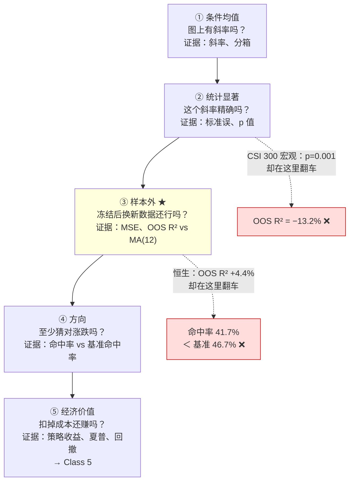
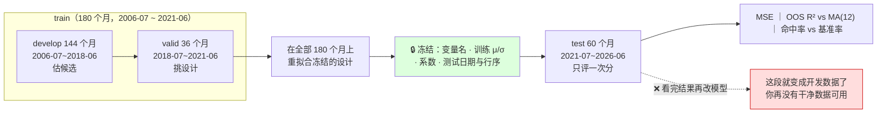

# M02 · 回归与样本外设计

> **本讲一句话**：M01 把数据造对了，这一讲问下一个问题——**这个变量到底能不能改善预测？** 答案分五层，而只有最后两层（样本外、经济价值）才算数。
> **原始材料**：`Lec02_Regression_Vibe_Coding.pdf`（54 页）｜**转录**：`transcripts/M02-transcript-part1.txt`（课间前，`00:01`→`01:22:15`，379 段）+ `M02-transcript-part2.txt`（课间后，`00:01`→`01:04:47`，260 段）｜**状态**：**v1.0**（2026-09-11 合并转录并按「预习可读性」规则重写正文）

> ✅ **v1.0**：讲义 54 页全部视觉复核 + 两段转录全部合并 + **§2 正文按"第一次见这个概念的人也能读懂"重写**（每节先人话再定义、公式用 LaTeX 并配符号表与数字例子、代码配逐行说明）。转录标注：🎙️`P1 mm:ss` = 课间前那段，🎙️`P2 mm:ss` = 课间后那段。
> - 两段录音合起来约 2 小时 27 分，中间是课间。⚠️ part1 首句是半句（"Because the main goal I want to teach…"），**开头可能缺 1–3 分钟**——但从 `02:58` 起就在复习 M01，讲义 p.2–3 的内容都在，缺的最多是寒暄；part2 以闲聊开场、以"end of lecture"收尾，完整。
> - 课堂与讲义的差集见 §9.1 / §9.2；🔴 教授明示考点见 §6.2（**本讲 6 条**，含期末题型与及格线）。

---

## 0. 三分钟速览

**这一讲讲了什么**

M01 花两小时讲"怎么把数据的时点搞对"。这一讲拿着那张做对了的表，去问真正的问题：**动量、波动率、均线偏离，能不能预测下个月的市场收益？**

讲义的回答方式很克制：它先把"可预测"这个词拆成**五种不同的含义**（条件均值 / 统计显著 / 样本外 / 方向 / 经济价值），然后指出——**样本内拟合得再好、故事讲得再顺，都回答不了"能不能用"这个问题**。

于是全讲的结构就是一条不断收紧的漏斗：**画图 → 拟合 → 读系数与标准误 → 加变量 → 冻结规格 → 只在从没碰过的后 60 个月上评一次分**。中间穿插的每一条纪律（按日期切分、只用训练集标准化、验证集选模型、测试集只能用一次），都是为了让最后那一次评分**说的是真话**。

最后的结果很诚实：**三个市场的样本外 R² 都只有 4–7%，而方向准确率几乎打不过"永远猜涨"**；那个在训练样本里 p = 0.001 的中国进口增长变量，到样本外直接变成 **OOS R² = −13.2%**。

**学完你应该能**

1. **区分**"收益可预测"的五种含义，并说出每一种要看什么证据
2. **用经济单位读**一个回归系数（"动量上升 10 个百分点，拟合的下月收益高 6.3 个基点"），并说出为什么不能说成"导致"
3. **解释**为什么金融时间序列**不能随机切分**，以及训练 / 验证 / 测试各自能干什么、不能干什么
4. **写出**样本外 R² 与命中率的定义，并说明**为什么基准必须与预测目标匹配**
5. **判断**一个"训练样本里显著"的结果为什么可能在样本外是负的

**如果只记三件事**

1. **样本内的 p 值不是排序工具，样本外的表现才是。** 讲义 p.24 的红框：「**p-values are not a predictor ranking**」
2. **样本外 R² 没有脱离基准的含义。** 讲义 p.44：「OOS R² has **no target-free meaning**: always state the target, benchmark forecast, and information date together.」
3. **方向准确率要跟"基准命中率"比，不是跟 50% 比。** SPY 测试期 63.3% 的命中率看着不错——但"永远猜涨"也是 63.3%。

> 🎙️ **教授的收尾只有一句**（P2 `01:04:40`）：「**Create the clock, create a plot.**」——先定预测时钟，再把数据画出来。他没有像 M01 那样给一版自己的"三件事"，但整堂课反复回到三点：**关联不是因果、样本外是唯一算数的评价、命中率要跟猴子比**。

---

## 1. 开始之前 · 知识衔接

### 1.1 你已经有的

| 概念 | 一句话唤醒 | 回看 |
|---|---|---|
| **预测时钟** | 预测变量在何时可知、目标收益在何时实现，必须写死 | [[M01-金融数据与Vibe-Coding#2.5.1 预测时钟（Forecast clock）\|M01-金融数据与Vibe-Coding › 2.5.1 预测时钟（Forecast clock）]] |
| **数据泄漏 / 前视偏差** | 用了当时不可能知道的信息去预测过去 | [[M01-金融数据与Vibe-Coding#2.5.2 数据泄漏、前视偏差与"漂亮的假业绩"\|M01-金融数据与Vibe-Coding › 2.5.2 数据泄漏、前视偏差与"漂亮的假业绩"]] |
| **动量 / 波动率 / 均线偏离** | 三个价量派生的预测变量，公式与窗口在 M01 已写死 | [[M01-金融数据与Vibe-Coding#2.7.2 三个周频预测变量（讲义 p.44）\|M01-金融数据与Vibe-Coding › 2.7.2 三个周频预测变量（讲义 p.44）]] |
| **特征表** | 一行 = 一个预测期，预测变量停在该期开始之前 | [[M01-金融数据与Vibe-Coding#2.7.1 一行数据可以装三类信息（讲义 p.41）\|M01-金融数据与Vibe-Coding › 2.7.1 一行数据可以装三类信息（讲义 p.41）]] |
| **R² 的量级** | 股票收益预测 R² 平均约 1%，到 2–3% 就是巨大优势 | [[M01-金融数据与Vibe-Coding#2.3.4 数感：必须记住的量级参照 ★★\|M01-金融数据与Vibe-Coding › 2.3.4 数感：必须记住的量级参照 ★★]] |
| **基准必须可交易** | 上证综指不可买，沪深 300 才是可用基准 | [[M01-金融数据与Vibe-Coding#2.3.3 指数、基准、以及"上证综指"这个坑\|M01-金融数据与Vibe-Coding › 2.3.3 指数、基准、以及"上证综指"这个坑]] |
| **对数收益 vs 简单收益** | 课程月频数据是**对数收益**，讲义公式写的是简单收益 | [[M01-金融数据与Vibe-Coding#2.3.1 收益率：简单收益与对数收益\|M01-金融数据与Vibe-Coding › 2.3.1 收益率：简单收益与对数收益]] |

L0 层面另需：最小二乘、R²、标准误、p 值的基本含义（见 [[Fintech_and_AI_in_Finance/_meta/知识层级台账|台账]] L0）。**但"金融里怎么读它们"不在 L0**，本讲展开。

### 1.2 本讲全新引入的概念

| 概念 | English | 展开于 |
|---|---|---|
| 收益可预测性的五种含义 | Five meanings of return predictability | §2.1 |
| 条件均值 | Conditional mean $E[r_t \mid x_{t-1}]$ | §2.1 |
| 有效市场假说 | Efficient Market Hypothesis (EMH) | §2.1 🎙️ |
| 相关系数与 $R^2$ 的关系 | $R^2 = \operatorname{corr}^2$（简单回归） | §2.3.4 🎙️ |
| F 检验（联合显著性） | F-test for joint significance | §2.5.0 🎙️ |
| 数据挖掘偏差 · 发表后偏差 | Data mining / post-publication bias | §2.6.1 🎙️ |
| 等频分箱 | Equal-count bins | §2.3 |
| 系数的经济单位解读 | Interpreting coefficients in units | §2.4.2 |
| 标准误 / p 值在金融里的读法 | Standard error / p-value | §2.4.3 |
| 多元回归 · 多重共线性 | Multiple regression / Multicollinearity | §2.5 |
| 训练集标准化 | Standardize using training data only | §2.5.3 |
| 厨房水槽回归 | Kitchen sink（Welch & Goyal 2008） | §2.5.1 |
| 按日期切分 · 训练/验证/测试三分 | Chronological split / train-validation-test | §2.6 |
| 固定 / 扩展 / 滚动窗口 | Fixed / expanding / rolling window | §2.6.3 |
| 冻结规格 | Frozen design | §2.6.4 |
| MSE · 样本外 R² · 命中率 | MSE / OOS R² / Hit rate | §2.7 |
| 滞后 MA(12) 基准 | Lagged MA(12) benchmark | §2.7.2 |
| 基准命中率 | Positive-return base rate | §2.7.3 |
| 六条评价标准 | Six evaluation criteria | §2.7.1 |

### 1.3 为什么这一讲放在这里 · 重排说明

讲义 p.2 自己画了这条线：

| Class 1：把数据造出来 | Class 2：预测并评价 |
|---|---|
| 建 240 个月的市场与宏观表 | 区分收益可预测性的几种含义 |
| 定义预测时钟 | 估计一个**透明的**回归预测 |
| 构造动量、波动率、趋势预测变量 | **只在更晚的观测上检验它** |
| 画原始数据与特征 | 把**冻结的**预测带到 Class 5 做组合构建 |

> **Keep in mind（讲义 p.2）**：「Start with the fitted relation and its statistical precision. Then ask whether the fitted model **improves forecasts and investment decisions in later data**.」

**往后铺的路**：讲义 p.28 明说 **Class 3「keeps the sink and adds a penalty」**（保留全部变量但加惩罚项 → 岭回归 / Lasso）；p.30 说 Class 3「shrink the slopes, or replace them with a few combinations」（收缩或主成分）；p.43 说 **MSE / OOS R² / 命中率这三条标准在 Classes 2–4 固定不变**；p.54 说 Class 5 把冻结的预测拿去做组合并与买入持有比较。

**重排说明**

讲义原顺序已经很接近学习顺序，本笔记**基本保留**，只做两处调整：

1. **把 p.36（章节页）的两篇论文提出来单独讲**（→ §2.6.1）。该页在 `pdftotext` 下只提取出标题 6 个字，**实际上整页贴着两篇 2008 年 RFS 论文的书目信息**——这是本讲的理论出处，不能当分隔页跳过。
2. **把 p.34–35（CSI 300 宏观案例）从"多元回归"章节末尾移到 §2.8，与 p.51 的样本外结果合并**。讲义把这个案例的"训练样本显著"和"样本外为负"隔了 16 页，**而这两半合起来才是它的全部意义**。

小节 ↔ 页码对应见 [[#8. 讲义页码映射|§8]]。

---

## 2. 正文

> **怎么读这一节**：每个小节都从"人话"开始，再给定义；公式后面都有符号表和一个代入了课程数据的数字例子；代码块前后都有说明。你**不需要先懂回归**——§2.2.1 会从头把它捡起来。转录标注：🎙️`P1 mm:ss` = 课间前那段录音，🎙️`P2 mm:ss` = 课间后那段。

### 2.1 「收益可预测」有五种意思（讲义 p.3）★

> 📄 **承接页（讲义 p.2）**：上一讲（Class 1）做的是"把数据造出来"——建 240 个月的市场与宏观表、定义预测时钟、构造动量/波动率/趋势三个预测变量、把原始数据画出来。这一讲（Class 2）做"预测并评价"——区分"可预测"的几种含义、估一个透明的回归预测、**只在更晚的观测上检验它**、把冻结的预测带到 Class 5 做组合。p.2 的 Keep in mind——「先看拟合关系和它的统计精度，再问它在更晚的数据里有没有改善预测和投资决策」——就是本讲 §2.1→§2.8 的顺序。

**是什么**

先想一个日常问题：朋友说"我发现一个规律，能预测股市"。你该问他什么？这一页讲义说，"能预测"这句话其实可以有**五种完全不同的意思**，门槛一层比一层高，而大多数人说的只是最低的那一两层。

具体说，你可以问他五个问题——每一层用不同的证据来回答：

| 层 | 含义 | 问的问题（人话） | 看什么证据 |
|---|---|---|---|
| ① | **条件均值** Conditional mean | 知道了你那个信号之后，下个月收益的"平均水平"会跟着变吗？ | 散点图上的斜率、分箱图 |
| ② | **统计显著** Statistical | 这个"会变"是真的，还是 180 个月里碰巧看出来的？ | 标准误、置信区间、p 值 |
| ③ | **样本外** Out-of-sample | 把规则**先定死**，拿到**从没看过**的一段新数据上，它比一个最笨的预测强吗？ | MSE、样本外 R²，对比滞后 MA(12) |
| ④ | **方向** Direction | 至少能猜对下个月是涨是跌吗？ | 命中率，对比"正收益的基准比例" |
| ⑤ | **经济价值** Economic | 按它交易，扣掉成本，真的多赚了吗？ | 策略收益、风险、夏普比率、回撤、敞口 |

**为什么需要它**

因为**日常语言里的"能预测"是含混的**。前两层只需要在历史数据上拟合一条线就能"达到"；第三层要求你**先把规则定死**再去新数据上打分；第五层还要扣掉交易成本。**一个变量完全可能通过前两层、栽在第三层**——§2.8 的中国宏观案例就是活生生的例子：训练样本里 p = 0.001（千分之一的巧合概率），样本外却输给了最笨的基准。

**🎙️ 课堂补充**（P1 `05:41`–`29:30`——讲义只有这一页，教授讲了 24 分钟，是全讲第一重点）

- **为什么大多数人认为收益根本不可预测**：这叫**有效市场假说**（Efficient Market Hypothesis，EMH，芝加哥大学 Fama 提出；教授本人也毕业于芝加哥，读博一年级修过 Fama 的课，2013 年 Fama 得诺奖时合过影）。教授的立场：「his theory is always true, but this is true **on average, in the long run**」（`07:22`）——看 50–70 年的美国数据，市场确实有效；「if you look at data for every day, for every month, then you will see that the market might be inefficient **almost every day**」（`07:44`）。这就是主动投资这个行业存在的理由。但信号只能活几天到几个月，**一旦被发现并被大家交易，就会消失**（`08:13`）——所以"能不能预测"这件事本身每年都在变。
- **"样本 → 总体"在这里意味着什么**（`19:27`–`25:33`）：统计 101 教你从小样本推断总体。教授的例子：这间教室男女比 6:4 是样本，全校的比例是总体。**收益预测的"总体"是全部未来的数据**（2027 年、2037 年、2047 年……），我们手里的历史只是一个样本（中国股市 1990 年才有，才 36 年）。从历史推未来依赖一个假设——**过去和未来服从同一个数据生成过程**（统计课上叫 IID）——「This is a very, very strong belief. **No one believes that.**」（`24:05`）。他举的反例：中国市场每隔几年就改规则；投资者结构从散户主导变成机构占约 70%（`24:15`–`25:16`）。**正因为没人相信这个假设，才需要第三层"样本外"**：定一个策略（比如"用过去五个月的均值预测下月"，他叫它 MA5），在后面的数据上一步一步评它。
- **方向准确率的"猴子基准"**（`27:43`–`28:37`）：美国市场约 60% 的月份是涨的，所以「even for a monkey [that says 'up' every month]… we can make **60%**」；「many economists, their performance might be **worse than 60%** because they are thinking [in a] more sophisticated way」。→ 这就是第 ④ 层里"基准比例"的口语版，§2.7.3 会给公式。
- **第 ⑤ 层留到 Class 5**（`29:04`–`30:16`）：把统计量翻译成美元——每月再平衡、累计一两三年的收益、夏普比率、回撤。「today's lecture I'll talk about the first four」。

**💡 换个说法（笔记补充）**

把它想成五道逐级收紧的关卡：
1. 图上看得出斜率吗？→ 2. 这个斜率精确吗？→ 3. **换一段没碰过的数据还成立吗？** → 4. 至少方向猜得对吗？→ 5. 扣掉成本还赚钱吗？

**前两关几乎人人能过，第三关刷掉绝大多数，第五关才是钱。** 教授在 M01 说"大多数模型是 garbage"（🎙️ M01 `02:12:58`），说的就是第三、五关。

**⚠️ 常见误解**

❌「p 值小 = 有预测能力」→ 讲义 p.22 直接反驳：「A small p-value would **not** prove stability, causality, or economic value.」p 值只回答第 ② 层。

**所以呢**：接下来的 §2.2–§2.5 都在第 ①② 层（拟合与读数），§2.6–§2.8 才进入第 ③④ 层（样本外评价）。读的时候随时问自己"现在在第几层"。

---

### 2.2 用 AI 做回归：先把问题说清楚

#### 2.2.1 回归到底在干什么——先把它捡起来（讲义 p.6）

**是什么**

先用人话：你有 180 个月的数据，每个月记两个数——"上个月末已经知道的一个信号"（比如过去一年涨了多少）和"这个月实际的收益"。把 180 个点画在纸上，**回归就是在这堆点里画一条最"贴"的直线**，然后用这条直线回答一个问题：**信号高一点的时候，收益平均会高多少？**

严谨地说，对在预测月 $t$ 之前就已知的信息 $x_{t-1}$，简单线性回归写成：

$$r_t = \alpha + \beta\,x_{t-1} + \varepsilon_t$$

| 符号 | 是什么 | 在本讲的例子里 |
|---|---|---|
| $r_t$ | 目标：预测月 $t$ 内**实现**的收益 | 下个月 SPY 的收益，单位是 % |
| $x_{t-1}$ | 预测变量：截至月末 $t-1$ 已知的信息 | 过去 12 个月的动量（价格涨幅，用小数表示，0.10 = 涨了 10%） |
| $\alpha$ | 截距：当 $x_{t-1}=0$ 时这条线给出的月收益 | 动量为零时"平均"的月收益 |
| $\beta$ | 斜率：$x_{t-1}$ 每变动一个单位，线上的收益变多少 | **这就是"信号有没有用"的那个数** |
| $\varepsilon_t$ | 残差：这条线**没解释掉**的部分 | 现实与直线之间的上下偏差 |

**代入课程数据**（用 `spy_monthly_features_240m.csv` 前 180 个月算的，`L02_01`）：

$$\hat r_t\ (\%) = 0.772 + 0.628 \times \text{momentum}_{t-1}$$

读法：动量为 0 时，这条线说下个月收益约 0.77%；动量每高 1（即 100 个百分点），线上的收益高 0.63 个百分点；所以动量高 0.10（10 个百分点）时，线上的收益只高 $0.628\times0.10 = 0.063$ 个百分点 = **6.3 个基点**。（这就是讲义 p.21 那个 6.3 bp 的来历，§2.4.2 会再讲怎么用英文表述它。）

**这条线告诉你的和没告诉你的**

- 它描述的是**"本样本内的条件关联"**——在这 180 个月里，信号高的月份收益平均高一点点。
- 它**没有**说：这个关系是不是因果的、明年还在不在、按它交易能不能赚钱。

> **Questions that still remain（讲义 p.6）**：「Is the relation **causal, stable, tradable, or useful in a genuinely new period**?」
> 四个词分别对应四个不同的追问，**回归本身一个都没回答**。

**🎙️ 课堂补充**（P1 `37:28`–`39:12`）：$\beta \ne 0$ 只说明「a predictor **might** be useful」，而且「we cannot build any causal relationship for that… **There's no explanation here. There's only association here.**」（`38:18`–`38:57`）。教授顺手举例：本周五美国公布 CPI、下周 FOMC 议息——「we don't know」，回归不会告诉你利率会怎样影响股市，它只告诉你历史上两者是否**一起动**。

**⚠️ 常见误解**：❌「β 是正的，说明动量**导致**收益上涨」→ 回归只能说"一起动"（association），不能说"因为所以"（causation）。这个措辞区别会在 §2.4.2 里变成一道考试级的写法要求。

**所以呢**：知道了回归在画一条线，下一步自然是——**怎么让 AI 帮你画这条线，而且画对**。

#### 2.2.2 一条合格的回归指令要说五件事（讲义 p.7）

**是什么**

上一讲教过：让 AI 写代码之前，要先把"要做什么"说清楚（M01 的六项规格）。这一页是它在**回归任务**上的特化版——告诉 AI 五件事，它才不会自作主张：

| # | 要素 | 你要写清的内容 | 为什么 |
|---|---|---|---|
| 1 | **问题** | 探索**关联**，不宣称因果 | 让 AI 的措辞不越界 |
| 2 | **行** | 一行一个预测月，从 2006-07 排到 2026-06 | 行 = 预测期，不是交易日 |
| 3 | **目标与预测变量** | 目标是月份 $t$ 内实现的收益；用**截至月末 $t-1$ 已知**的信息去预测 | 预测时钟（M01 §2.5.1） |
| 4 | **模型与输出** | 截距 + 具名预测变量；要图、系数表、拟合统计量、残差检查、以及**保存的文件** | 有文件才能复现 |
| 5 | **验证** | **用按日期的切分；绝不打乱行序** | 本讲后半段的全部理由 |

**💡 与 M01 的对应（笔记补充）**：第 5 条是新增的，也是最要害的——**"never shuffle rows" 这五个字就是 §2.6 的全部理由**：金融数据有时间顺序，随机打乱会让"未来"混进"过去"。

**🎙️ 课堂上的做法与讲义不同**（P1 `39:26`–`43:48`）：教授没有逐条讲这五要素，而是**现场用 Codex 跑了一个回归**并把提示词历史投在屏幕上（「I would try to share the prompt history with you guys」`40:49`）：拿 Apple 2006–2026 的月度收益，用上个月的收益 $r_{t-1}$ 预测这个月的 $r_t$，「display the regression table」。同一个提示词他又丢给了豆包（Doubao）做对照——**两个 AI 的截距、斜率几乎一致但不完全相同**，他让 AI 自己解释差异，猜测是一方含了股息（Apple 每年派息约 1–2%）（`47:24`–`49:40`）。要点：「the data you use AI to download, they must be [right]. You do not need to worry about [it]」（`49:40`）；**前提是本机装好 Python**（`41:38`，M01 的那条要求）。

**所以呢**：指令写好了，AI 会把数据读进来、画图、拟合。但在拟合之前，讲义先插了一页"人物"——因为它想先告诉你回归在整个投资流程里的位置。

#### 2.2.3 Jim Simons：预测是一个"过程"，不是一个模型（讲义 p.5）

**是什么**

Jim Simons 是一位数学家，1978 年离开学术界创办了后来的 Renaissance Technologies——历史上最成功的量化对冲基金之一。讲义放他不是为了讲故事，而是为了说一件事：**他赚钱靠的不是某一个回归公式，而是一整套流程**。

| | 内容 |
|---|---|
| **研究模式** | 把数学建模用于交易市场 |
| **研究团队** | 招募数学家、物理学家和计算机科学家，围绕**一个共享的研究流程**组织起来 |
| **我们从中学什么** | **保护时点、在更晚的数据上检验预测、把预测接到一个被持续监控的投资规则上** |

> **Keep in mind（讲义 p.5）**：「A regression matters **only inside a process** that protects timing, testing, execution, and monitoring.」
> （讲义标注：肖像是 AI 生成的编辑插图，非照片。来源：Simons Foundation。）

**🎙️ 课堂补充**（P1 `30:16`–`37:28`，讲了 7 分钟，比讲义一页多得多）

- **Simons 的用人哲学**：石溪大学数学教授出身，离开学术界建对冲基金；「he only hire[s] mathematician[s], physicists, computer scientists」，**不要经济学家**——「if you ask a financial economist, they will tell you the market is efficient」（`30:49`–`31:22`）。教授的观察：他的金融圈朋友都买指数基金，**统计圈的朋友在挑小盘股**。
- **这个方向叫什么**（`32:00`–`34:09`）：不是金融工程/金融数学——那是**绝对定价**，给期权、衍生品算一个"公平价格"（业内叫 Q 测度，Q-quant）。本课做的是**相对定价 / 收益预测**（P 测度，P-quant，"predictive"），教授称之为 **financial machine learning / financial statistics**。他的一句话：「I focus on the change of the price, not the price.」
- **⚠️ 一段坦白的职业预警**（`34:09`–`37:28`）：纯粹坐在电脑后面做定价、做预测模型的 quant 岗位「can be easy to [be] replaced [by AI]」；他自己从年初用 Codex / Claude Code 以来「I feel myself **much dumber than half year ago**」——开会第一反应是"ChatGPT 会怎么建议"。给学生的建议原话：「**use [AI] as much as you can until you find the point that your brain rots. Then you stop.**」（`37:15`）

**所以呢**：记住"过程"这个词——§2.6 的训练/验证/测试、冻结规格、只评一次分，全都是这个"过程"的零件。

#### 2.2.4 重新载入特征表（讲义 p.9）

**是什么**

上一讲已经造好了一张 240 行的"特征表"（每行一个预测月，列是各种预测变量和下月收益）。这一页说：**开始分析之前，把文件重新读一遍、检查一遍**，不要假设它还是对的。下面这段代码就是在做这件事。

```python
d = pd.read_csv(
    "market_features.csv",
    parse_dates=["forecast_month"],
).sort_values("forecast_month")
assert len(d) == 240
train = d[d["forecast_month"] < "2021-07-01"].copy()
```

| 行 | 在干什么 | 为什么这么写 |
|---|---|---|
| `pd.read_csv(...)` | 读 CSV 文件 | — |
| `parse_dates=["forecast_month"]` | 把日期列真的解析成日期 | 否则日期是字符串，排序按字典序，切片全错（M01 §2.4 的老坑） |
| `.sort_values("forecast_month")` | **显式**按日期排序 | 不要假设文件本来就是有序的 |
| `assert len(d) == 240` | **断言**行数正好 240 | 让"文件不对"立刻报错，而不是静默算出错误结果 |
| `d["forecast_month"] < "2021-07-01"` | 取 2021 年 7 月之前的行 = 前 180 个月 | 这 180 个月叫**训练集**；后 60 个月被保护起来，§2.6 用 |

> **Keep in mind（讲义 p.9）**：「**Recheck the file at the point of use.** A correct Class 1 script does not guarantee that the loaded file is correct.」

**💡 笔记补充**：这里的 `market_features.csv` **就是课程给的 `spy_monthly_features_240m.csv`**——240 行、列名逐一对上（`momentum_12`、`volatility_12`、`ma_gap_10`、`return_lag1`、`term_spread_lag1`、`market_return`）。**本讲的全部数字我都用它跑通了**，见 §2.9（脚本 `L02_01`）。

**⏭️ 课上没讲这页代码**：教授用现场演示替代了（见 §2.2.2 的 🎙️）。预习时读懂上面的表即可。

#### 2.2.5 重申预测时钟（讲义 p.10）

**是什么**

"预测时钟"是上一讲的核心概念：**你用来预测的信息，必须在预测那个月开始之前就已经知道**。这一页把本讲要用的四列在时钟上排好：

在月末 $t-1$ 这个时点，$x_{t-1}$ 已知，用它去预测 $r_t = P_t/P_{t-1} - 1$：

| 列名 | 是什么（人话） | 在时钟上的位置 |
|---|---|---|
| `momentum_12` | **动量**：截至 $t-1$ 的 12 个月价格变化，"过去一年涨了多少" | 月末 $t-1$ 已知 |
| `volatility_12` | **波动率**：截至 $t-1$ 的 12 个月收益的标准差（年化），"过去一年有多颠簸" | 月末 $t-1$ 已知 |
| `ma_gap_10` | **均线偏离**：月末价格相对其前 10 个月均价高了/低了多少 | 月末 $t-1$ 已知 |
| `market_return` | **目标**：在预测月 $t$ 内实现的收益 | 月末 $t$ 才知道 |

> **Keep in mind（讲义 p.10）**：「The row is labeled by the forecast month; **its predictors stop one month earlier.**」——一行的标签是预测月，但它的预测变量**停在一个月之前**。

**🎙️ 课堂补充**（P1 `03:32`–`04:34`，开场复习 M01 时讲的）：教授用当周的新闻做例子——「the CPI for August was released **this week**… for China, 0.8%」（`03:32`）。所以**不能用 8 月 CPI 去预测 8 月或 9 月初的收益**，8 月时你根本还不知道这个数。他给的"保守做法"：**把宏观预测变量再多滞后两三个月**（「we wait two months, we wait three months」`04:12`）；本讲后面的 CSI 300 宏观案例用 $t-2$ 就是这个原则（§2.8.1）。他还给了一条判断标准：「If you see something very strong, that means you might have look-ahead bias… If you see something very [good], then you might have [a] bug in your data.」（`05:11`–`05:23`）——**在这个领域，结果好得离谱，第一反应是查数据**。

**所以呢**：数据读对了、时钟对了，接下来讲义没有直接拟合，而是先要求你**把数据画出来看一眼**。

---

### 2.3 先画图，再拟合（讲义 p.11–16）

#### 2.3.1 散点图的四个选择（讲义 p.11）

**是什么**

拟合之前先画一张**散点图**：横轴放信号（动量），纵轴放下个月的收益，180 个月就是 180 个点。看一眼点云的形状，比任何统计量都先告诉你"有没有关系"。这段代码画的就是它：

```python
plt.scatter(train["momentum_12"], train["market_return"], s=24, alpha=0.55)
plt.xlabel("Lagged 12-month momentum")
plt.ylabel("Next-month market return")
```

| 行 | 在干什么 | 讲义强调的"选择" |
|---|---|---|
| `plt.scatter(x, y, ...)` | 画散点：x 是训练集里的动量，y 是下月收益 | **横轴放滞后的预测变量**（不是同期的），**纵轴放已实现的收益** |
| `alpha=0.55` | 点半透明 | 点重叠的地方颜色更深，**密集区一眼可见** |
| `xlabel` / `ylabel` | 轴标签 | **标签保留单位与时点**（"Lagged 12-month"、"Next-month"）——读图的人才知道时钟 |

四个选择都不是装饰：它们决定这张图能不能被正确地读。

**🎙️ 课堂补充**（P1 `05:28`）：「before you do any analysis, always plot the data」——教授在开场复习时又重复了 M01 的这条纪律。

#### 2.3.2 同一个回归问题，三个市场三副样子（讲义 p.12）

**是什么**

讲义 p.12 把 SPY（美国）、恒生（香港）、CSI 300（中国 A 股）的"滞后动量 vs 下月收益"散点画在一起，每张图上叠一条分箱均值折线（分箱是什么，下一小节讲）。第一眼的观察：**三张图的横轴量程差别巨大**——SPY 约 −40%~+60%，恒生约 −60%~+60%，**CSI 300 到 +300%**（2007 年的大泡沫）。

> **Keep in mind（讲义 p.12）**：「The same lagged-momentum regression produces **three noisy clouds**. The binned relation and fitted slope **do not travel automatically across markets.**」——同一个回归在三个市场得到三团噪声云；在美国看出来的斜率**不能自动搬到**另一个市场。

**🎙️ 课堂补充**（P1 `53:41`–`55:31`）：教授先放 Apple 的 $r_{t-1}$ vs $r_t$ 散点（「it seems that there are some momentum [effect]」），再放讲义这三张 12 个月动量的图：「if you don't check my [reference] line… **no pattern, no pattern, no pattern**」（`54:21`）。加了分箱参考线之后：美国那张「slightly positive」，恒生 / CSI 300「kind of like flat」→ **β 可能就是零**。他强调这是收益数据的常态：「the noise[s] are always huge, even though you have a very strong predictor」（`55:45`）——**在这个领域，"图上看不出规律"才是正常的**（M01 §2.9.3 也讲过）。

**所以呢**：既然点云看不出东西，就需要一个工具把噪声压下去——分箱。

#### 2.3.3 等频分箱（讲义 p.13–14）

**是什么**

散点图上 180 个点乱成一团，看不出趋势。**分箱**（binning）的做法是：把这 180 个月按"上个月的动量"从小到大排队，每 18 个一组切成十组，**每组只画一个"平均点"**——横坐标是这组的平均动量，纵坐标是这组的平均下月收益。噪声被平均掉之后，趋势才露出来。

严谨地说，把第 $j$ 组（共 $n_j$ 个月）的两个均值写成：

$$\bar x_j = \frac{1}{n_j}\sum_{t\in j} x_{t-1}, \qquad \bar r_j = \frac{1}{n_j}\sum_{t\in j} r_t$$

| 符号 | 是什么 |
|---|---|
| $j$ | 第几组（1 到 10） |
| $n_j$ | 这一组里有几个月（等频分箱下每组约 18 个，180 ÷ 10） |
| $\bar x_j$ | 这一组的**平均动量** |
| $\bar r_j$ | 这一组的**平均下月收益** |

"等频"（equal-count）的意思是**每组的月份数一样多**，而不是每组的动量区间一样宽——这样每个平均点背后的样本量相同，可比。

**为什么需要它**

单点被噪声淹没；十个组均值把噪声平均掉，**能看出单调性（是不是一直往上）、曲率（是直线还是弯的）、以及尾部有没有个别观测在主导**。

**代码在做什么**：先按动量把每一行分到 1–10 组，再按组求均值。

```python
train["bin"] = pd.qcut(train["momentum_12"].rank(method="first"), 10, labels=False) + 1
bins = train.groupby("bin")[["momentum_12", "market_return"]].mean()
```

| 行 | 在干什么 |
|---|---|
| `.rank(method="first")` | 先把动量换成名次（1、2、3…），**重复值也能分出先后**——否则 `qcut` 遇到相同值会分不出组 |
| `pd.qcut(..., 10, labels=False)` | 按名次切成 **10 个等频组**，组号 0–9 |
| `+ 1` | 组号改成 1–10，好读 |
| `.groupby("bin")[...].mean()` | 每组算动量和下月收益的均值——就是上面的 $\bar x_j$、$\bar r_j$ |

> 讲义 p.13 的警告：「**Binning is a diagnostic, not a substitute for reporting the raw data.**」——分箱是诊断工具，**不能拿它代替原始数据来报告结果**。

**🎙️ 为什么要分箱、为什么是十组**（P1 `56:19`–`58:27`，教授用的是 240 个月的全样本，每组 24 个）：「for each group you calculate the predictor, the x bar… and the corresponding r bar」。目的只有一个——**把噪声平均掉**：「This guy is very, very noisy… how to smooth the noise? **Take the average.**」（`57:24`）。背后是中心极限定理：取均值后收敛到期望、近似正态，「that's why finance people love to use average, they love to use regression models」（`58:04`–`58:27`）。

**⚠️ 常见误解**：❌「分箱图看着单调上升，说明关系强」→ 分箱把噪声抹掉了，**图会比真实关系好看得多**。讲义 p.50 的仪表盘特意用「**unstable bins**」形容这张图。

**所以呢**：分箱让你"看到"趋势，但看到不等于量化。下一步用一个数字来量——相关系数。

#### 2.3.4 相关系数：第一眼的量级（讲义 p.15）

**是什么**

**相关系数**（correlation）是一个 −1 到 +1 之间的数，量的是"两个量一起动的程度"：+1 是完全同向、−1 是完全反向、0 是毫无线性关系。它是看一个信号有没有用时**最快的一眼**。

$$\operatorname{corr}(x, r) = \frac{\operatorname{cov}(x, r)}{\operatorname{sd}(x)\cdot\operatorname{sd}(r)}$$

| 符号 | 是什么 |
|---|---|
| $\operatorname{cov}(x,r)$ | 协方差：$x$ 高于均值时 $r$ 是否也高于均值（同向为正、反向为负） |
| $\operatorname{sd}(\cdot)$ | 标准差：各自的波动大小；除以它们是为了把协方差变成**没有单位**的数 |

**代入课程数据**（180 个月的训练样本，2006-07 ~ 2021-06）：

| | 动量 | 波动率 | 均线偏离 |
|---|---|---|---|
| **与下月市场收益的相关系数** | **0.02** | **0.12** | **0.05** |

三个数都很小——最大的 0.12 也只是"微弱的正相关"。

> **Keep in mind（讲义 p.15）**：「All three linear associations are small. **Short-horizon returns behave this way, so read the size as information about the problem itself.**」——短期收益就是这样，**把"小"读成这个问题本身的性质**，而不是你做错了。

**🎙️ 课堂上的一道加分题**（P1 `58:53`–`01:00:36`）：「the correlation is kind of small, 0.02, 0.12, 0.05… **which parameter for the simple regression corresponds to the correlation?**」有同学答 β——错；答案是 **$R^2$**：**简单回归里 $R^2 = \operatorname{corr}^2$**（$0.12^2 \approx 1.4\%$，正对上 p.24 波动率那行的 1.5%）。「This is only true for simple regression.」教授接着说为什么相关系数注定小：「if the correlation is huge, then the predictor will be killed」——机构一交易，信号就消失；剩下的小信号「might not surpass the transaction cost」（`01:00:36`–`01:01:11`）。

**💡 与 M01 的呼应（笔记补充）**：相关系数 0.02 意味着 $R^2 \approx 0.04\%$。这正是 M01 里教授反复说的"$R^2$ 只有 1%"的同一件事的另一种表述。**这不是模型不行，这是这个领域的常态。**

#### 2.3.5 尺度与离群值（讲义 p.16）

**是什么**

拟合之前还有两个"读数前的常识"：**尺度**（一个变量的"1"是多大）和**离群值**（那几个特别极端的月份怎么办）。

- **尺度**：动量变动 0.01 意味着**一个百分点**，不是一个整单位（所以 §2.2.1 那条线的 0.628 要乘 0.10 才是"动量高 10 个百分点"的效应）；**波动率是年化的，而目标是月度收益**——两者的时间尺度不同，系数不能直接比大小。
- **离群值**：少数几个危机月份（比如 2008 年 10 月）离群很远，会在"平方误差"里占很大权重，**可以主导整条回归线**；但**裁剪或删除观测会改变被估计的量，必须披露**。

> **Class discussion（讲义 p.16）**：让 AI 列出**绝对值最大的五个收益**。应该删掉哪些吗？什么证据能支持这个决定？

**🎙️ 教授当堂给了答案：不删**（P1 `01:02:16`–`01:04:00`）：金融数据里的离群值——COVID、金融危机、「Liberation Day」（2025 年 4 月的关税日）——「**we do not drop [outliers]**… We keep all data set we have. We might understand that there are some data points more than three standard deviation[s]… but we still keep them」。理由：这不是可重复的实验（医学、工程可以丢掉第 3 只老鼠再做一遍），「we are stacking the data from the real world… the data will not change」；金融危机本来就少，**要靠它们学会危机时什么能预测**。「The job for us is to explain this, not to drop [it].」

**💡 用课程数据看看那几个点是谁（笔记补充）**：SPY 240 个月里最极端的是 **2008-10（−18.05%）** 和 **2020-04（+11.95%）**（`L01_02` 打印四个指数的单月最差，全在 2008-10）——它们是金融危机和疫情，是真实事件，不是数据错误。**唯一正当的删除理由是"这条记录本身是错的"**（如拆股未复权），而且必须写进报告。

**🎙️ 尺度那一条的实操版**（P1 `01:01:25`–`01:02:16`）：CPI、失业率是百分数，PMI 是 50 上下的指数——**斜率 $\beta$ 本身依赖尺度，t 统计量不依赖**（「the t statistic… is scale free. But beta itself is not」）。比较不同预测变量时看 t（§2.4.3），要比 $\beta$ 就先标准化（§2.5.3）。

**所以呢**：画过图、看过相关、知道尺度和离群值怎么处理，现在可以正式拟合那条线了。

---
### 2.4 简单回归（讲义 p.17–26）

#### 2.4.1 拟合线：OLS 到底在选什么（讲义 p.18–19）

**是什么**

180 个点，能画无数条直线。**最小二乘法**（OLS，ordinary least squares）选的那一条，是让**每个点到直线的竖直距离的平方加起来最小**的那条。"平方"是为了让正负偏差不互相抵消，也让离得远的点受到更大的惩罚。

写成公式，就是在所有可能的截距 $a$ 和斜率 $b$ 里，挑出让平方残差之和最小的一对，记作 $\hat\alpha$、$\hat\beta$（帽子表示"估出来的"）：

$$(\hat\alpha, \hat\beta) = \arg\min_{a,b}\ \sum_{t\in S}\left(r_t - a - b\,x_{t-1}\right)^2$$

$$\hat r_t = \hat\alpha + \hat\beta\,x_{t-1}, \qquad \hat\varepsilon_t = r_t - \hat r_t$$

| 符号 | 是什么 |
|---|---|
| $S$ | 用来拟合的那些月份（训练集，180 个月） |
| $\hat\alpha, \hat\beta$ | 估出来的截距和斜率（**加帽子 = 从数据算出来的估计值**，不是真实值） |
| $\hat r_t$ | **拟合值 / 预测值**：把 $x_{t-1}$ 代进直线得到的数 |
| $\hat\varepsilon_t$ | **残差**：实际收益减拟合值，"直线没解释掉的部分" |

**数字例子（课程数据里的真实月份，`L02_01`）**：§2.2.1 那条 $\hat r_t = 0.772 + 0.628\,x_{t-1}$ 就是 OLS 在 180 个月上选出来的线。2017 年 2 月这一行：动量 0.200、实际收益 +3.85%，则拟合值 $0.772 + 0.628\times0.200 = 0.90\%$，残差 $3.85 - 0.90 = +2.96$ 个百分点——**这一个月的残差就是整条线"预测幅度"的三倍多**，后面你会一直看到这种对比。

> **Keep in mind（讲义 p.18）**：「The fitted line summarizes **this sample**. Whether the same line holds next year is a separate question, **and one we have not asked yet.**」

**四个该问的问题（讲义 p.19）**——回归软件会打印一大堆数字，讲义说你只需要看能回答下面四个问题的那几个：

| 问题 | 人话 | 该看哪个输出 |
|---|---|---|
| **方向与量级** | 信号高一点，收益高多少？往哪边？ | 用**有经济含义的单位**表达的斜率估计（§2.4.2） |
| **不确定性** | 这个斜率靠谱吗，还是碰巧？ | 标准误与置信区间（§2.4.3） |
| **拟合** | 这条线解释了多少上下波动？ | 拟合值、残差、$R^2$（§2.4.4） |
| **能不能用来预测** | 换新数据还行吗？ | 一个**不重新拟合就能接受后续预测变量行**的方法（§2.6） |

> **Keep in mind（讲义 p.19）**：「Decide which outputs answer your economic and forecasting question, **then read only those.** A full summary print is where you **start** looking.」

**🎙️ 课堂演示：把预测和实际画在一起**（P1 `01:04:34`–`01:08:15`）：教授让 Codex「create a plot: regression forecast and actual return」，先让大家猜图长什么样：「my guess is simple. The actual returns [are] very volatile… The forecast is very stable」——因为「the coefficient is extremely small」。图出来：实际收益在 **−30% ~ +10%** 之间跳，预测「about 1%, about point something」几乎一条水平线。他的比喻：全班体重 100–200 磅，你对每个人都猜 150——「people will think you are so crazy」。**这就是"most models are wrong"的图像证据**，「but some models can be useful」（`01:08:00`）。

**所以呢**：线画出来了，第一个要读的数就是斜率——但**要用经济单位读**，这是下一小节。

#### 2.4.2 ★ 用经济单位读系数（讲义 p.20–21）

**是什么**

斜率 0.628 本身没有意义，直到你把它翻译成"**信号变多少，收益变多少**"这种人能理解的句子。这一页教的就是这个翻译，以及翻译时**不能说过头**。

在 180 个月预测试样本上估计 $r_t = \alpha + \beta\cdot\text{Momentum}_{t-1} + \varepsilon_t$，讲义给出（四舍五入后）：

$$\hat r_t\ (\%) = 0.8 + 0.6\cdot\text{momentum}_{t-1,12}$$

动量上升 0.10（= 10 个百分点）时，拟合的下月收益变化：

$$0.6\times0.10 \approx 0.063\ \text{个百分点} = 6.3\ \text{个基点}$$

（讲义注明：**最终换算要用未四舍五入的系数**——用 0.628 算才是 6.28 bp，用 0.6 算是 6.0 bp。一个**基点**（basis point，bp）= 0.01 个百分点。）

> **❌ 差的表述**：「Momentum **causes** next month's market return to rise.」
> **✅ 好的表述**：「**Within this pre-test sample**, a 10-percentage-point increase in lagged 12-month momentum **is associated with** a 6.3-basis-point higher **fitted** next-month market return.」

**💡 换个说法（笔记补充）**：好表述里有四个限定词，**每一个都在挡掉一种过度解读**——`within this pre-test sample`（不是普遍规律）、`is associated with`（不是因果）、`fitted`（是模型拟合值，不是实际会发生的事）、`6.3-basis-point`（量级极小，别当成能赚钱）。**考试要写英文，这句话值得整句背下来当模板。**

**🎙️ 课堂补充**（P1 `01:08:25`–`01:09:23`；`01:11:41`–`01:12:12`）：读斜率先看**符号是否符合预期**——「if you understand your predictor, it's momentum, then you are not only looking for a [non-zero] beta, you are looking for a **positive** beta」；波动率同理，「higher risk, higher return… we do not believe that higher risk, lower return, then no one will buy the stock」。数字他当堂代入：$0.8 + 0.6\times0.10$，「all of you can calculate this」。

**⚠️ 常见误解**：❌「6.3 个基点太小，说明没用」→ 也不能这么说。它小到**在这个样本里说明不了什么**（见下面的标准误），但"有没有用"要留到样本外和组合层面回答。

#### 2.4.3 读标准误与 p 值（讲义 p.22）

**是什么**

斜率 0.6 是从这 180 个月里算出来的；换另外 180 个月，算出来的斜率会不一样。**标准误**（standard error，SE）就是"如果同一个过程反复生成样本，这个估计会跳动多大"。有了它才能判断"0.6"到底是一个可靠的数，还是随便晃一晃就变成 −1 或 +2。

从标准误可以算出两个常见的判断量：

$$t = \frac{\hat\beta}{\operatorname{SE}(\hat\beta)}, \qquad p\text{ 值} = \text{在"真实斜率其实是 0"的假设下，看到这么大（或更大）的 } |t| \text{ 的概率}$$

| 系数 | 估计 | 标准误 | t 统计量 | p 值 |
|---|---|---|---|---|
| Momentum | **0.6 pp** | **2.1 pp** | **0.31** | **0.76** |

读法：$t = 0.6/2.1 = 0.31$——估计值只有自身不确定性的三分之一；$p = 0.76$——就算真实斜率是零，也有 76% 的概率碰巧看到这么大的估计。所以**这个样本里"动量有用"没有统计证据**。

讲义给的五条读法：
1. **标准误描述的是**：如果同一个过程反复生成样本，这个估计会有多大变动
2. **这个估计相对于它的抽样不确定性来说很小**（0.6 vs 2.1）
3. **大的 p 值不能证明真实关系恰好是零**
4. **小的 p 值也不能证明稳定性、因果性或经济价值**
5. **月度金融残差可能仍然违反最简单的标准误假设**（异方差、自相关——残差的大小随时间变、前后月相关；§2.4.6 会看到）

**🎙️ 课堂补充**（P1 `01:12:12`–`01:13:03`；阈值在 `46:32`–`47:05`）：「0.31 [is] lower than 1.96… p value 0.76 higher than 0.05, we cannot reject [the] null hypothesis that the beta is 0… we can[not] say momentum is a useful predictor for SPY in this sample.」教授用的口径：**$|t|$ 看 1.96、$p$ 看 0.05；$p$ 在 0.05–0.1 之间叫"marginally significant"**（Apple 演示里 $p = 0.08$ 就被他称为 marginal）。★ 与 IS6400 W02 教授说的 0.05 / 0.1 两档完全一致（见根 [[术语总表]] §2.2）。

**所以呢**：斜率小、还不显著。那这条线到底"解释"了多少？看 $R^2$。

#### 2.4.4 $R^2$ 是方差摘要（讲义 p.23）

**是什么**

$R^2$（决定系数）回答一个问题：**收益的上上下下，有多大比例能被这条线"说清楚"？** 它把两种预测拿来比——用直线预测（条件均值）vs 干脆用 180 个月的平均收益预测（无条件均值）——看直线的误差比"平均值"的误差小了多少：

$$R^2 = 1 - \frac{\sum_t \hat\varepsilon_t^{\,2}}{\sum_t (r_t - \bar r)^2}$$

| 符号 | 是什么 |
|---|---|
| $\sum_t \hat\varepsilon_t^{\,2}$ | 分子：**用直线预测**的平方误差总和 |
| $\sum_t (r_t-\bar r)^2$ | 分母：**用平均值 $\bar r$ 预测**的平方误差总和（= 收益的总变异） |
| $R^2$ | 直线比"平均值"好多少的比例：1 = 全解释，0 = 一点没多解释 |

**数字例子**：简单动量回归的 $R^2 \approx 0.1\%$——直线只比"每个月都猜平均值"少了千分之一的误差。换句话说，**拟合线几乎没有解释掉预测试期的收益变异**。

> **Keep in mind（讲义 p.23）**：「**Low R² is normal for short-horizon returns.** It says the signal is weak relative to the noise. Whether a weak signal is still worth trading is a **portfolio question, and Class 5 answers it.**」

**🎙️ 教授对这个公式的读法**（P1 `01:13:03`–`01:14:49`）：分子是**条件均值**（回归预测）的误差，分母是**无条件均值**（样本均值）的误差，「this R square is simply just compare… the conditional mean versus the unconditional mean」；样本内条件均值**永远**不会更差，「0.1% means that the conditional mean is only better than the unconditional [by] 0.1%」。**记住这个读法：§2.7.2 的样本外 $R^2$ 只是把分母换成了另一个预测（基准）。**

**⚠️ 跨课提醒**：IS6400 的回归作业里 $R^2$ 动辄 0.5、0.8——那是房价、销量这类可预测的目标。**金融收益预测 $R^2 = 1\%$ 就算好**，两门课的标尺完全不同（见 §2.9 的 `L02_03` 图，把 1% 和 50% 画在一起）。

#### 2.4.5 三个简单回归的比较（讲义 p.24）

**是什么**

把三个预测变量各自单独跑一遍简单回归，得到三行数：

| 预测变量 | 斜率（pp） | 标准误（pp） | p 值 | $R^2$ |
|---|---|---|---|---|
| 12 个月动量 | 0.6 | 2.1 | 0.76 | **0.1%** |
| 12 个月波动率 | **8.5** | 5.2 | **0.11** | **1.5%** |
| 10 个月均线偏离 | 3.0 | 4.2 | 0.48 | 0.3% |

第一眼：波动率那行 p 值最小、$R^2$ 最大。**然后讲义用一个红框阻止你下结论**：

> **🔴 红框（讲义 p.24）**：「**p-values are not a predictor ranking.** The three variables have **different units**, are **correlated with one another**, and were **examined in the same sample**.」

**⚠️ 常见误解（本讲最重要的一条）**：❌「波动率的 p 值最小、$R^2$ 最大，所以它最好」→ 三条理由说明不能这么排名：① 三个变量**单位不同**（动量是比例、波动率是年化标准差、均线偏离是比例），斜率 8.5 和 0.6 不可比；② 它们**互相高度相关**（§2.5.2：动量与均线偏离相关 0.74），单独的 p 值不是独立信息；③ **都是在同一个样本里被翻看过的**——挑"p 值最小的那个"本身就是一次选择，用掉了样本信息。这是 M01 五种泄漏路径第 ⑤ 条（"看完表现再挑变量"）的温和版本。

**🎙️ 课堂补充**（P1 `01:15:22`–`01:17:09`）：教授只对波动率那行多说了几句——$R^2$ 1.5%「is high」（在这个领域），系数 8.5 为正符合"高风险高收益"，而且**波动率有持续性**（「if [volatility] for yesterday is high, then… for today might be high too」），$p = 0.11$「marginal significance」。他把图上三条线指给大家看：绿色水平线 = 无条件均值，红线 = 条件均值（回归），黑点 = 实际——「it beats the unconditional [mean] by about 1%」。**他没有说"波动率最好"**，红框那句话是讲义替他说的。

#### 2.4.6 残差是数据，不是废料（讲义 p.25）

**是什么**

**残差**就是每个月"实际收益 − 直线预测"的那个差。很多人拟合完就把它扔了，讲义说：**残差里有信息，画出来看**。讲义 p.25 画了两张图：**残差随时间**（"Residuals remain clustered through time"——大残差扎堆出现在某些时期）和**残差 vs 拟合值**（"Large misses occur near similar fitted values"——大的失误发生在拟合值差不多的地方）。

> **Keep in mind（讲义 p.25）**：「**The fitted values stay in a narrow range while realized errors cluster in stressful periods.** Ask the AI to list the largest residual dates, but **use external evidence before attaching an economic story.**」

**💡 这两张图在说什么（笔记补充）**：右图的横轴（拟合的月度收益）只在 **0% ~ 2.5%** 这个极窄的区间里动，纵轴（残差）却在 **−15% ~ +10%** 之间。**模型几乎在预测一个常数，而现实在剧烈波动。** 这就是"$R^2$ 只有 1%"的图像版本。

**🎙️ 课堂补充：残差是信号，不是噪声**（P1 `01:17:09`–`01:19:13`）：标准回归课假设残差 IID 正态（独立、同分布、钟形）；「But for our case, this can be signals. **Residuals can be signals.**」看图：2008–09 有 −18% 左右的残差，COVID 期间 +14% / −11%，中间一大段很平静——**方差随时间变**，"同分布"被打破；残差与预测变量之间可能还有非线性模式（波动率与收益的关系本来就在"二阶矩"——方差——上）。这一段是 M03/M04 非线性模型的伏笔。

> ⚠️ **讲义此处有一个绘图 bug，见 [[#9.3 课件自身的问题|§9.3]]。** 教授在课上说了一句：「**I have updated a slide. On the slide previously the time frame is wrong.**」（`01:17:45`）——**他已经发现并修了这张图的横轴问题**，我们手里的 PDF 可能是旧版。

#### 2.4.7 讲义 p.26 的选择题 🔴

> 一个波动率回归在三个预测变量里有**最高的样本内 $R^2$**，而且有一个说得通的经济故事。**哪一条证据最直接地支持把它用于实时的市场收益预测？**
>
> A) 它的样本内系数是正的
> B) 它的残差在拟合样本里平均约等于零
> **C) 它后来的预测，在每个预测日只使用当时可得信息的前提下，相对滞后 MA(12) 基准取得了正的样本外 $R^2$**
> D) 它的预测变量数值尺度最大
>
> **Discuss**：为什么"样本内拟合"和"一个说得通的故事"，回答的是与"实时预测表现"不同的问题？

**✅ 正确答案：C**

**为什么其余三个都不对（笔记补充）**：
- **A**：系数为正只说明方向，不说明精度，更不说明它在新数据上还成立。而且**符号在多元回归里可能翻转**（§2.5.2）。
- **B**：**OLS 的残差在拟合样本里必然平均为零**（只要模型有截距）。这是算法的数学性质，**不是任何证据**。这是四个选项里最有迷惑性的一个。
- **D**：数值尺度大只反映单位（波动率是年化的），与预测能力毫无关系——正是 p.24 红框说的"different units"。
- **C**：它同时满足了三件事——**冻结的规格**、**更晚的数据**、**每个预测日只用当时可得信息**。这正是 p.3 五层含义里的第 ③ 层。

**Discuss 的参考答案**：样本内拟合回答的是"这条线概括了这段历史吗"，故事回答的是"这个关系讲得通吗"。**两者都不涉及"在没见过的数据上"这个条件**，而这正是实时预测的定义。§2.8 的中国宏观案例给了一个反例：**p = 0.001 且故事完全讲得通（进口增长反映内需），样本外却是 −13.2%。**

**🔴 教授当堂做了这道题，并明说这就是考试题型**（P1 `01:19:13`–`01:21:35`）：
- 讲评：「**C is correct**」；A「in sample [is] positive, that does not mean out of sample… you can still use this」；B「the average [residual] approximately zero, this is **forced by regression estimation**. If you use OLS, the residual mean… they are always zero」；D「the scale might look better, you need to look at some **scale-free** parameters, for example a t statistic」。
- **考试形式**：「students ask me what kind of questions you might see in final exam. **These are the questions you will see.**」（`01:21:08`）题目是他**用 AI 按讲义生成的**题库里的（「I keep asking them [to] show me questions from this [lecture]… I have many multiple[-choice]」）。「**At the end of the semester, I will show you [a] practice exam.** If you want to do more of them, I always have more.」（`01:21:35`）
- **及格线的口头说明**（`01:21:47`）：「As long as you **finish all homework and show up in exam**, it is very hard for me to fail you.」过去三年只挂了 3 人：两个没来考试，一个没做项目展示。

→ 与 M01 p.25 那道题合起来，**每讲一道"四选一 + Discuss"就是期末的样子**。

**所以呢**：简单回归讲完了。但现实里信号不止一个——三个变量一起放进去会怎样？这就是多元回归，也是共线性这个麻烦登场的地方。

---
### 2.5 多元回归（讲义 p.27–35）

#### 2.5.0 🎙️ 课堂现场：美债收益率变动能预测 SPY 吗？（讲义没有，P2 `01:36`–`15:32`）

**是什么**

课间回来，教授没有直接翻讲义，而是用**当天的新闻**现场做了一遍"简单回归 → 多元回归"的全过程。讲义上没有这段，但它把 §2.4 的全部概念和 §2.5 即将讲的"多个变量放在一起会出什么问题"串成了一个真实例子，**先读它，再读讲义的 p.28–30 会顺很多**。

背景：前一天（9/9）美国财政部宣布买入长期国债，30 年期国债收益率跳到约 5.33%–5.4%。教授的问题：**国债收益率的变动能不能预测第二天 SPY 的收益？**

| 步骤 | 他做了什么 | 结果 | 教授的解读 |
|---|---|---|---|
| ① 起因 | 看新闻，先有经济预期（`01:52`–`02:07`） | — | 「usually when the treasury yield go[es] up… [stocks] go down」——**先想清楚方向，再看数据** |
| ② 日频简单回归 | 用**前一天**的收益率变动预测**当天** SPY 收益：$\text{SPY}_t = \alpha + \beta\,\Delta y_{t-1}$ | **系数为负，极小，但显著**（`04:26`） | 「as I expect」；但预测 vs 实际的图上「the variation is very huge」 |
| ③ 换频率 | 周频（周三到周三，避开周末效应） | 仍为负，**边际显著；$R^2$ 变高**（`06:30`–`06:42`） | 「in a lower [frequency], usually the R squared becomes higher」 |
| | 月频 | 正号、不显著（`08:22`） | 「if you want to see how treasury yield[s] affect SPY returns, probably you need… higher frequency, say weekly」 |
| ④ 多元回归 | 周频，右边**同时**放 30y / 20y / 10y / 5y / 2y / 1y 六个期限的收益率变动（`08:37`–`09:27`） | 截距显著；**六个斜率没有一个显著**；$R^2$ 上升（`13:08`–`13:52`） | 「if you are putting more regressors… the R squared always go[es] up. **But it does not mean anything.**」 |
| ⑤ F 检验 | 看整张表的 F 统计量（`13:52`–`15:12`） | **F 显著（$p < 0.05$）** | 「**Jointly** these six guys together, they can predict SPY return. But if you look at the single predictor coefficients… they cannot predict anything」 |
| ⑥ 为什么单个都不显著 | 算六个变动的方差–协方差表和相关表（`20:14`–`23:53`） | 相关系数 **0.67–0.92** | 「I cannot believe this p value. I cannot believe this F statistic」——各期限收益率**同涨同跌**，只是幅度不同 → **多重共线性**（§2.5.2） |

**先解释两个新词**：
- **F 检验**：t 检验一次只问"**这一个**斜率是不是零"；F 检验问"**所有**斜率**同时**是不是零"。两者可以给出看似矛盾的答案——**六个变量合起来有预测力（F 显著），但说不清是哪一个在起作用（t 全不显著）**——这两句话不矛盾，而且正是共线性的教科书症状。
- **多重共线性**（multicollinearity）：几个预测变量彼此高度相关（这里是六个期限的收益率变动一起涨跌），回归能算出它们**合起来**的效应，但**分不清该记在谁头上**，于是每个单独的斜率都不稳、标准误都变宽。§2.5.2 展开。

**💡 这段演示在教什么（笔记补充）**：讲义 p.28–30 用三个价量变量讲多元回归与共线性，教授用六个几乎同源的收益率把同一件事推到极端。还有三个附带知识点：
- 长期收益率的方差比短期大，因为**水平更高**（30 年期约 4.6–5.1% vs 3 个月期约 3.8%），变动的绝对值自然更大——这是 §2.5.3 要标准化的又一个理由（`21:23`–`22:35`）。
- 一道加分题（`11:15`–`12:31`）：3 个月期国债 ETF 的价格图为什么是锯齿状？——**ETF 每月派息**，除息日价格跳下去。⚠️ 教授特别声明这不是投资建议。
- 顺手换了左边：用美债收益率变动预测 CSI 300 ETF（沪市 510300；美股对应 ASHR）的次日收益——**截距 $t \approx 1.2$ 不显著（A 股波动太大），六个斜率也全不显著**：「The US treasury yield do not predict anything for CSI 300」（`35:12`–`36:30`）。他又让 Codex 换成中国国债收益率去跑，下课前没等到结果。

**所以呢**：多元回归"加变量"很容易，麻烦在于**读数**——讲义接下来三页就是在讲怎么读。

#### 2.5.1 为什么要加变量（讲义 p.28）

**是什么**

简单回归一次只看一个信号。但现实里你手上有好几个信号（动量、波动率、均线偏离），它们又互相有关系——**多元回归就是把几个信号同时放进一个方程**：

$$r_t = \alpha + \beta_1\cdot\text{Momentum}_{t-1} + \beta_2\cdot\text{Volatility}_{t-1} + \beta_3\cdot\text{MAgap}_{t-1} + \varepsilon_t$$

| 符号 | 是什么 |
|---|---|
| $\beta_1, \beta_2, \beta_3$ | 三个斜率。**含义变了**：$\beta_1$ 是"**在另外两个变量固定不变的情况下**，动量高一单位，收益高多少" |
| 其余 | 同 §2.2.1 |

**为什么需要它**

- 一个简单斜率会把**这个变量自己的关系**和**与它相关的其他变量的关系**混在一起（动量高的月份往往均线偏离也高，简单回归分不清功劳是谁的）
- 多元回归问的是：**在其他变量固定的情况下**，收益随这一个变量怎么变
- 所以**加入控制变量可能改变一个斜率的符号和大小**
- 但变量越多，**估计噪声和研究者的自由裁量空间也越大**

> **Keep in mind（讲义 p.28）**：把所有能拿到的变量全塞进一个回归，就是 **Welch and Goyal (2008 RFS) 说的「kitchen sink」（厨房水槽）**。在他们的数据里，这种做法**样本内拟合最好，样本外却大幅输给"历史均值"这个最笨的预测**。今天的三变量模型是个小号的水槽；**Class 3 保留水槽，但加上惩罚项。**

**💡 「kitchen sink」这个词（笔记补充）**：英文习语 "everything but the kitchen sink" = "除了厨房水槽什么都带上了"，形容不加选择地全塞进去。**Welch & Goyal 用它来讽刺"变量越多越好"的做法**，它现在是资产定价文献里的标准术语。→ 记进 [[Fintech_and_AI_in_Finance/_meta/术语表|术语表]]。

**🎙️ 课堂补充**（P2 `15:32`–`17:14`）：Welch & Goyal「document[ed] many academic proposed market return predictors… **even the weather**」，所以「one lazy way… they call kitchen sink regression: just simply put all predictors there, don't think about anything」——这就是学多元回归的动机。但系数含义变了：「beta 1, beta 2, beta 3… they represent [the] effect **by controlling other predictors**, the marginal effect」。

#### 2.5.2 我们的预测变量彼此高度相关（讲义 p.29–30）

**是什么**

讲义 p.29 是一张**相关系数热力图**：五个候选预测变量两两之间的相关系数（预测试样本，180 个月）。读出来的完整矩阵：

| | Return lag 1 | Momentum 12 | Volatility 12 | MA gap 10 | Term spread |
|---|---|---|---|---|---|
| **Return lag 1** | 1.00 | 0.29 | 0.06 | **0.54** | −0.00 |
| **Momentum 12** | 0.29 | 1.00 | **−0.44** | **0.74** | −0.03 |
| **Volatility 12** | 0.06 | −0.44 | 1.00 | −0.13 | **0.30** |
| **MA gap 10** | 0.54 | 0.74 | −0.13 | 1.00 | 0.00 |
| **Term spread** | −0.00 | −0.03 | 0.30 | 0.00 | 1.00 |

最扎眼的一格：**动量与均线偏离相关 0.74**——这不奇怪，两者都是"最近价格涨没涨"这一件事的两种算法。

> **Keep in mind（讲义 p.29）**：「**Momentum and the moving-average gap have a 0.74 pre-test correlation.** Their multiple-regression slopes should not be read like independent bets.」

**相关的预测变量让单个斜率变得不稳定（讲义 p.30）**

| | 内容 |
|---|---|
| **你会看到** | 某个系数在简单回归与多元回归之间**改变符号或大小**，它的标准误变宽，**而 $R^2$ 几乎没动** |
| **为什么** | 两个变量同向移动时，数据无法说清效应归谁；**拟合线本身是确定的，但它在两者之间怎么分配是不确定的** |
| **怎么检查** | 换一个子样本重新拟合，或者**去掉这对里的一个**，看剩下的系数还在不在原位 |
| **在这里该怎么做** | **报告预测，而不是单个斜率**；不要再把某一个系数当成"发现" |

> **Keep in mind（讲义 p.30）**：「**Correlated predictors are not a defect in the data. They are the normal state of financial predictors**, and Class 3 answers them directly: shrink the slopes, or replace them with a few combinations.」

**💡 换个说法（笔记补充）**：两个人一起抬一个包，你知道包的总重量，但不知道各自出了多少力——动量和均线偏离就是这两个人。回归能确定"最近涨没涨"这件事整体贡献多少（拟合线确定），**但没法确定该记在哪一个变量头上**（单个斜率不确定）。所以标准误变宽的是**单个系数**，不是**整条拟合线**——**这也解释了为什么讲义说"报告预测而不是斜率"**。

**🎙️ 教授给的判据：你在乎共线性吗，取决于你要什么**（P2 `17:48`–`18:58`；`01:03:06`–`01:04:40`）
> 「once predictors are correlated… **the beta might be misleading, the inference for beta [and] the t statistic for beta might also be misleading. But it does not affect your r hat**, [the] prediction on the left hand side.」
> 「if your goal is to **predict** something on the left hand side… then you do not care. But if your goal is to **test** whether inflation can predict stock return by controlling others, then you care.」

课程结尾他又回到这一点（`01:03:21`）：预测变量高度相关时，回归表里 **t 统计量那一列不能信，预测值那一列没问题**；下一讲会有几百上千个预测变量，「multicollinearity is always a big problem for [inference]… however, if you only focus on prediction, that one is not affected」。

**⚠️ 标准化不能治共线性**（`23:53`–`24:26`）：「Standardizing the data does not [fix] this problem… it will not change this problem. And we'll talk about this problem in **Class 3**」——用 ridge / lasso「shrink the coefficient a little bit」。

**所以呢**：既然斜率不能直接比（单位不同），又不能当独立证据（相关），讲义给了一个至少解决"单位"问题的办法——标准化。

#### 2.5.3 ★ 只用训练集做标准化（讲义 p.31）

**是什么**

**标准化**（standardize）是把每个变量换算成"离自己的平均值有几个标准差"——这样动量、波动率、均线偏离就都变成了同一把尺子上的数，斜率才能互相比大小。做法：每个变量减去它的均值、再除以它的标准差：

$$z_{j,t} = \frac{x_{j,t} - \bar x_{j,\text{train}}}{s_{j,\text{train}}}$$

| 符号 | 是什么 |
|---|---|
| $x_{j,t}$ | 第 $j$ 个预测变量在第 $t$ 月的原始值 |
| $\bar x_{j,\text{train}}$ | 它在**训练集**（180 个月）上的均值 |
| $s_{j,\text{train}}$ | 它在**训练集**上的标准差 |
| $z_{j,t}$ | 标准化后的值：均值 0、标准差 1；**"一个单位"现在意味着"一个训练样本标准差"** |

**数字例子（`L02_01` 实测）**：训练集里动量的均值是 0.109、标准差是 0.160；2017 年 2 月动量 0.200，则 $z = (0.200-0.109)/0.160 = 0.57$——"比平均高 0.57 个标准差"。标准化后的斜率读作"动量高一个标准差，收益高多少"，三个变量就可比了。

**这一页真正的重点是下标里的 "train"**：
- **在测试观测上要用同一个训练均值和标准差**（不要用测试集自己的）
- **在全样本上重新计算它们，会泄漏未来的分布信息**——一个 2021 年 7 月的预测者不可能知道 2021–2026 年的均值和波动

**⚠️ 这就是 M01 五种泄漏路径的第 ① 条**（[[M01-金融数据与Vibe-Coding#2.5.3 五种泄漏路径（讲义 p.48）★|§2.5.3]]：「centering or scaling with the full sample before the train/test split」）。M01 只是列了一条，**这里给出了具体的操作规范**。

> ★ **跨课注意**：IS6400 W02 的通用做法可能在全样本上标准化（`StandardScaler().fit_transform(X)`）。**在本课语境下那是泄漏。** 见 [[Fintech_and_AI_in_Finance/00-课程总览|00-课程总览]] 的跨课对照表。

**🎙️ 课堂补充**（P2 `19:13`–`20:14`）：标准化的动机是**让 $\beta$ 可比**——「you want those x1, x2, x3… in the same scale… so you can compare beta 1, beta 2, beta 3, [an] apple-to-apple comparison」；用**训练样本**的均值和标准差（「standardized with the training sample mean and the training sample standard deviation」），标准化后每个 $z$ 均值 0、标准差 1。

#### 2.5.4 多元回归结果（讲义 p.32–33）

**是什么**

用标准化后的三个变量一起估计 $r_t = \alpha + \beta_1 z^{\text{mom}} + \beta_2 z^{\text{vol}} + \beta_3 z^{\text{gap}} + \varepsilon_t$，得到：

| 标准化预测变量 | 斜率 | 标准误 | p 值 |
|---|---|---|---|
| Momentum | 0.4% | 0.6% | 0.50 |
| **Volatility** | **0.7%** | **0.4%** | **0.07** |
| MA gap | 0.0% | 0.5% | 0.95 |

**$R^2_{\text{train}} = 2.2\%$**

读法：现在三个斜率单位相同（都是"高一个标准差 → 收益高百分之几"），波动率的 0.7% 最大，且 $p = 0.07$ 边际显著；均线偏离掉到了 0.0。

> **Keep in mind（讲义 p.33）**：「The volatility coefficient becomes the largest standardized slope, and **its uncertainty stays substantial**. Conditioning on the other predictors moves the estimate, and **the standard error tells you how far to trust the new position.**」

**💡 三个数字之间的关系（笔记补充）**：
- 简单回归里三个 $R^2$ 分别是 0.1% / 1.5% / 0.3%，**加起来 1.9%**；多元回归的 $R^2$ 是 **2.2%**——**几乎没有增加**。这正是 p.30 说的"$R^2$ 几乎没动"。
- 均线偏离的标准化斜率掉到了 **0.0%**（简单回归时是 3.0 pp）。**它的信息被动量吸收了**（两者相关 0.74）——"抬包"的功劳记到了动量头上。
- 讲义 p.32 特别强调：「Estimating it on one sample and rescaling it on another would **silently change the question**.」

**🎙️ 课堂补充**（P2 `24:26`–`26:30`）：「once we run a multiple regression, **the second guy [volatility] has the largest beta**… marginally significant. The third guy and the [first] guy, they don't quite work」——「so we focus on the second one」。接着一道加分题：**把 $x$ 换成标准化的 $z$，$R^2$ 变吗？**「Nothing has changed… because you change the scale, the scale just moved to beta. The product… [is] the same. Epsilon [is] the same.」——**标准化只改斜率的单位，不改拟合值、不改残差、不改 $R^2$**。

**所以呢**：到这里为止，全部结论都是"在这 180 个月里"。讲义接下来用整整一章回答：**怎么知道它在没见过的数据上还成立？**

---

### 2.6 样本外设计（讲义 p.36–41）★ 本讲的方法论核心

#### 2.6.1 理论出处：两篇 2008 年的论文（讲义 p.36）

**是什么**

这一页看起来像章节分隔页，其实贴着两篇论文的书目——它们是本讲"只看样本外"这套做法的**出处**：

| 论文 | 作者 | 出处 |
|---|---|---|
| **Predicting Excess Stock Returns Out of Sample: Can Anything Beat the Historical Average?** | John Y. Campbell, Samuel B. Thompson | *The Review of Financial Studies*, Vol. 21, Issue 4, July 2008, pp. 1509–1531 |
| **A Comprehensive Look at The Empirical Performance of Equity Premium Prediction** | Ivo Welch, Amit Goyal | *The Review of Financial Studies*, Vol. 21, Issue 4, July 2008, pp. 1455–1508 |

⚠️ 这一页在文本提取里只剩标题，**按文本长度筛选会把它当成空页跳过**——见 §9.3 ③。

**🎙️ 教授把两篇论文都讲了，而且讲了 5 分钟**（P2 `29:51`–`34:59`）
- **Campbell & Thompson**：「Their message is very clear from the title: can anything beat the historical average? … **The answer is no.** It is hard to beat the average.」"历史均值"的意思：**所有 $\beta$ 都为零时，$\alpha$ 就是样本均值——条件均值退化成无条件均值**（`30:35`–`31:22`）。也就是说，"什么都不预测、每个月都猜历史平均"这个最笨的办法，居然很难被打败。
- **Welch & Goyal**：收集了 15–20 个学术界提出的预测变量（数据在他们网站上），逐个测、再做 kitchen sink——「**most predictors are useless out of sample**」。教授给的两个原因（`31:43`–`34:30`）：
  1. **数据挖掘（data mining，这里是贬义）**：$p = 0.05$ 的意思是 100 次里有 5 次纯属巧合——「You have like 100 PhD students testing predictor[s] one by one, then **at least five of them can get p value [below] 0.05**, even though all those predictors might be useless」；研究者和 quant 为了发论文、为了向基金经理交差，「try 100 different ways, and then they always get five ways with significant two stars」。⚠️ 注意一词两义：**机器学习课里 "data mining" 是褒义（= 从数据里挖知识），在实证金融里是贬义（= 试到显著为止）**。
  2. **发表后偏差（post-publication bias）**：变量本来管用，但「once a predictor was discovered, traders trade on this, investors invest on this, and then the signal can disappear」——不是变量在样本外失效，是**被交易掉了**。
- 结论原话（`34:30`）：「**Out of sample design, out of sample evaluation might be the only evaluation for financial [statistics].** If you only [do] in-sample analysis… yes, that's a beautiful star, but so what? You cannot create [an] investment strategy [from] there.」

（🔗 期刊信息取自讲义页面截图，2026-09-09；论文正文本人未读，以上为教授的口头概括。）

**所以呢**：如果"样本外"是唯一算数的评价，那怎么切分数据、怎么评分就成了本讲最重要的技术细节。

#### 2.6.2 金融时间序列必须按日期排（讲义 p.37）

**是什么**

要评价"没见过的数据上表现如何"，得先把数据分成"用来拟合的"和"用来评价的"两部分。通用机器学习课的做法是**随机**分——随便抽 25% 当测试集。讲义说：**金融时间序列不能这样做**。

| 设计 | 模型看到了什么 | 为什么重要 |
|---|---|---|
| **随机切分** | 早期和晚期月份混在一起 | **一个 2010 年的测试月，可能被一个用了 2025 年数据拟合出来的模型来评估**——现实里 2010 年的你不可能知道 2025 年的事 |
| **按时间切分** | 早期日期用于拟合，晚期日期用于评估 | **复现了一个真实预测者面对的信息顺序** |

> 讲义 p.37 底部：「Keep rows in date order, and **estimate transformations, feature choices, and coefficients before evaluating later observations.**」——变换（如标准化）、变量选择、系数，**全部在评价更晚的观测之前定好**。

**⚠️ 常见误解（★ 跨课冲突点）**：❌「用 K 折交叉验证更稳健」→ 在时间序列上，标准 K 折**必然**把未来数据放进训练折。这是 IS6400 那类通用 ML 课程的默认做法，**在本课语境下是泄漏**。

**🎙️ 课堂补充**（P2 `36:51`–`37:36`）：「if you go to any machine learning [or] data mining course… they are data samples from biology, from medical, from engineering, **they do not care about how to split the sample**… But for our case it's different because we do have **time order**. We only focus on future. We do not want to predict the past very well. **That's not [the] goal at all.**」——先写下你的切分日期，哪段训练、哪段测试。

#### 2.6.3 训练 / 验证 / 测试各干各的（讲义 p.38–40）

**是什么**

按时间把数据切成三段，每段只能干一件事：

| 样本 | 用它来 | **不要**用它来 |
|---|---|---|
| **训练 Training** | 估计系数、均值、标准差 | 报告最终表现 |
| **验证 Validation** | 挑选预测变量、变换方式、调参设置 | 反复重写经济问题 |
| **测试 Test** | **对冻结的设计评一次分** | 挑模型，或者补救一个不好看的结果 |

> 讲义 p.38 底部（**本讲最锋利的一句**）：「**Changing a model after inspecting the test result turns that period into development data.**」
> 💡 换句话说：**你一旦看了测试集再改模型，那段数据就不再是测试集了**，你也就再没有干净的数据可用了。

**本讲用的固定时间线（讲义 p.39）**

| 段 | 区间 | 月数 | 用途 |
|---|---|---|---|
| develop | 2006-07 ~ 2018-06 | 144 | 估候选模型 |
| validate | 2018-07 ~ 2021-06 | 36 | 挑设计 |
| （train = develop + validate） | 2006-07 ~ 2021-06 | **180** | 重拟合冻结的设计 |
| **test** | 2021-07 ~ 2026-06 | **60** | **只评一次分** |

流程：**在 144 个月上开发 → 在 36 个月上挑选 → 在全部 180 个预测试月上重新拟合冻结的设计 → 在最后 60 个月上评一次分**。对预测月 $t$，基准 MA(12) 只用 $r_{t-12},\dots,r_{t-1}$（§2.7.3）。

**三种回测设计（讲义 p.40）**——"拟合一段、评价一段"可以有三种排法：

| 设计 | 做法 | 特点 |
|---|---|---|
| **固定留出 Fixed holdout** | 早期一段拟合，晚期一段评估，只做一次 | 最简单的第一道检查（本讲用的就是它） |
| **扩展窗口 Expanding window** | 训练集不断向后延长，每次多预测一步 | 预测次数多，更接近实盘的滚动再估计 |
| **滚动窗口 Rolling window** | 训练窗口长度固定，整体向后平移 | 只用近期数据，能反映参数漂移 |

> **Keep in mind（讲义 p.40）**：「A fixed holdout is the simplest first check. Expanding and rolling designs make more forecasts, but **every valid design preserves time order and fits before evaluating.**」

**🎙️ 课堂补充**（P2 `37:36`–`41:43`）
- **验证集在本讲用不到，Class 3 才用**：「for this class, we do not have validation. But for [the next] class, we will have validation」——那时要调**调节参数（tuning parameter）**，「[a] tuning parameter is equivalent to 10 models」，用验证集从 10 个模型里挑一个，再拿留出的测试集评这一个——「**the frozen design**」。他举的比例：12 年估 10 个模型、3 年选、5 年测（正对上讲义 p.39 的 144 / 36 / 60）。
- **扩展窗口 vs 滚动窗口的人话版**：预测 2010 用 2010 之前全部数据、预测 2012 就多两年——扩展；预测 2012 只用 2007–2011 五年、预测 2014 用 2009–2013——滚动（`39:38`–`40:24`）。「Usually I prefer the last one」——⚪ 从上下文看指的是带验证集的三段式设计，但转录此处含混。
- **切分点怎么定**：「They might choose this randomly. Usually **either January 1st or July 1st**」（`41:24`）。讲义用的 2021-07-01 就是"7 月 1 日"这一条。
- 数据在 Canvas 上（`41:03`）。

#### 2.6.4 按日期切分的代码（讲义 p.41）与"冻结"的含义（p.45）

**是什么**

上一小节的三段切分，落到代码上就是四个筛选：

```python
develop = d[d["forecast_month"] <  "2018-07-01"].copy()
valid   = d[(d["forecast_month"] >= "2018-07-01") &
            (d["forecast_month"] <  "2021-07-01")].copy()
train   = d[d["forecast_month"] <  "2021-07-01"].copy()
test    = d[d["forecast_month"] >= "2021-07-01"].copy()
```

| 对象 | 取的行 | 用来 |
|---|---|---|
| `develop` | 2018-07 之前（144 个月） | 估计候选模型 |
| `valid` | 2018-07 ~ 2021-06（36 个月） | 挑设计 |
| `train` | 2021-07 之前（180 个月 = develop + valid） | 重拟合冻结的设计 |
| `test` | 2021-07 起（60 个月） | **评一次分** |

然后把训练集的均值 `mu`、标准差 `sd` 用到测试集上，再预测：

```python
test_z = test.copy()
test_z[["momentum_z", "volatility_z", "ma_gap_z"]] = (test[predictors] - mu) / sd
test["prediction"] = fit3.predict(test_z)
```

| 行 | 在干什么 | 关键决定 |
|---|---|---|
| `(test[predictors] - mu) / sd` | 用**训练集**的 `mu` / `sd` 标准化测试集 | **不要**在 `test` 上重算均值和标准差——这就是 §2.5.3 那条规则的代码形态 |
| `fit3.predict(test_z)` | 用在训练集上拟合好的 `fit3` 直接预测 | **不重新拟合**——系数是冻结的 |

> **What must stay frozen（讲义 p.45）**：**预测变量名字｜训练集的均值与标准差｜拟合出来的系数｜测试日期与行序**。四样都锁住，测试集上的分数才是"样本外"。

**⏭️ 课上未逐行讲这段代码**，但「frozen design」这个词教授说了（P2 `38:22`）；p.45 的四样清单课上没有展开——预习时照讲义记，做作业时当自查表。

> 📁 **代码**：[`code/L02_regression/02_oos_rolling.py`](../code/L02_regression/02_oos_rolling.py) —— 讲义 p.40 的三种设计跑给你看：同一个三变量模型，固定留出（讲义）OOS $R^2$ 6.56%；逐月重估的扩展窗口（从 60 个月起）在同一测试期得 5.49%、滚动 180 得 7.32%，但滚动 120 只剩 0.71%、滚动 60 变成 −10.39%——窗口越短，系数噪声越大，输给 MA(12)（`L02_02`）
> ![[L02_02_oos_rolling.png]]

**所以呢**：数据切好了、规格冻结了，剩下的问题是——**拿什么尺子给测试集上的预测打分**。

---
### 2.7 怎么给一个收益预测评分（讲义 p.42–48）

#### 2.7.1 六条标准（讲义 p.42）

**是什么**

一个预测"好不好"没有单一答案——讲义列了六个角度，每个角度回答的问题不同：

> 「**No single statistic settles whether returns are predictable.**」

| # | 标准 | 问的问题 | 对应 §2.1 的哪一层 |
|---|---|---|---|
| 1 | **样本内关联** | 斜率多大、多确定、样本内 $R^2$ 多少 | ①② |
| 2 | **预测误差** | 在未被碰过的观测上，MSE、RMSE、MAE 多大 | ③ |
| 3 | **相对精度** | 相对一个**明确说出来的基准**改进了多少 | ③ |
| 4 | **方向** | 预测与实现的符号是否一致，**且要相对基准命中率** | ④ |
| 5 | **稳定性** | 结果在时间上、在合理的其他设计下能不能保持 | （贯穿） |
| 6 | **经济价值** | 一个**可执行的**组合扣掉成本后是否受益 → **Class 5** | ⑤ |

**🎙️ 课堂补充**（P2 `41:43`–`42:42`）：教授只点了其中三条——「how good [is] your r hat [at] predict[ing] r」（误差）、「direction predictions」、「economic value… I will talk about this later in Class 5」。第 5 条"稳定性"课上没提，但它正是 §2.8 那个案例的答案。

#### 2.7.2 三条固定不变的标准（讲义 p.43）★

**是什么**

上面六条里，讲义挑出三条写成公式，**并声明它们在 Classes 2–4 保持不变**——也就是说 M03 的岭回归 / Lasso、M04 的非线性模型，全部用同一把尺子来量。设有 $T$ 个未被碰过的测试月，模型预测 $\hat r_t$，基准预测 $\hat r^{\,b}_t$：

$$\text{MSE}_{\text{model}} = \frac{1}{T}\sum_{t}\left(r_t - \hat r_t\right)^2$$

$$R^2_{\text{OOS}} = 1 - \frac{\sum_t (r_t - \hat r_t)^2}{\sum_t (r_t - \hat r^{\,b}_t)^2}$$

$$\text{HitRate} = \frac{1}{T}\sum_t \mathbb{1}\{\operatorname{sign}(\hat r_t) = \operatorname{sign}(r_t)\}$$

| 符号 | 是什么 |
|---|---|
| $T$ | 测试月数（本讲 60） |
| $r_t$ | 第 $t$ 个测试月**实际**的收益 |
| $\hat r_t$ | 模型对它的预测（用冻结的系数算的） |
| $\hat r^{\,b}_t$ | **基准**预测——一个最笨但可行的预测，本讲用滞后 MA(12)（§2.7.3） |
| $\mathbb{1}\{\cdot\}$ | 指示函数：括号里成立记 1，否则记 0 |
| $\operatorname{sign}(\cdot)$ | 取正负号 |

**三个数怎么读**：
- **MSE**：越低误差越小（它就是 §2.4.4 里 $R^2$ 的分子再除以 $T$）。
- **样本外 $R^2$**：分子是模型的平方误差，分母是**基准**的平方误差。**正 = 模型比基准准；负 = 比基准还差**（和样本内 $R^2$ 不同，它可以是负数）。
- **命中率**：猜对涨跌的比例。**必须和"正收益月的比例"比，不是和 50% 比**（§2.7.3）。
- **模型在验证集上选定；这三条标准在未被碰过的测试集上只报一次。**

**数字例子（讲义 p.51 的 CSI 300 宏观模型）**：测试期模型 MSE = 31.65、基准 MA(12) 的 MSE = 27.97（都 ×10⁴），则
$$R^2_{\text{OOS}} = 1 - \frac{31.65}{27.97} = 1 - 1.132 = -13.2\%$$
——模型的误差比基准**大 13%**，样本外 $R^2$ 为负。

**🎙️ 教授对这三个公式的讲法**（P2 `42:42`–`45:59`）：
- **MSE 就是 $R^2$ 分子去掉 $1/T$**：「you will find [this] very familiar… previously I talk about the standard R squared formula… you have both 1 over T in the numerator [and] denominator, they get cancelled」。
- **样本内 $R^2$ 比的是"条件均值 vs 无条件均值"；样本外 $R^2$ 比的是"方法 A vs 方法 B"**：「this out of sample R square is to compare two different method[s], A and B. Method A calculate[s] mean square error, method B calculate[s] mean square error… for the method B, because we put this in [the] denominator, we call this **benchmark**」。这一句把 §2.4.4 和这里连成了一条线。
- 「This [is] something I like most」——OOS $R^2$ 是他最偏爱的指标；方向和经济价值「I will talk about this later in Class 5」。

#### 2.7.3 基准必须与预测目标匹配（讲义 p.44）★★

**是什么**

样本外 $R^2$ 的分母是"基准"的误差，所以**基准选什么，直接决定这个数是正是负**。讲义规定：基准必须是一个**当时就能做出来的、最笨的预测**，而且要**和预测目标配套**：

| 预测目标 | 基准预测 | 经济含义 |
|---|---|---|
| **月度市场收益** | $\hat r^{\,b}_{m,t} = \dfrac{1}{12}\sum_{j=1}^{12} r_{m,t-j}$ | **滞后 MA(12)**：过去 12 个月市场收益的平均值——一个由月份 $t$ 之前已知的 12 个收益构成的、可行的预测 |
| **周度个股主动收益** | $\hat a^{\,b}_{i,t} = 0$ | **零**：表示"个股预期与它所在的市场持平"；Classes 3–4 问的是特征能不能改进这个中性预测 |

| 符号 | 是什么 |
|---|---|
| $r_{m,t-j}$ | 市场 $m$ 在 $t-j$ 月的收益（$j = 1\ldots12$，即过去一年） |
| $\hat a^{\,b}_{i,t}$ | 个股 $i$ 的**主动收益**（相对市场的超额收益）的基准预测 |

> **Keep in mind（讲义 p.44）**：「**OOS R² has no target-free meaning**: always state the **target**, **benchmark forecast**, and **information date** together.」

**💡 换个说法（笔记补充）**：样本外 $R^2$ 是个**比值**，分母是基准的误差。**换个基准，同一个模型的 OOS $R^2$ 可以从正变负。** 所以"我的 OOS $R^2$ 是 5%"这句话本身没有信息量，必须说成"**相对滞后 MA(12)，在 2021-07 至 2026-06 的 60 个月上，预测 SPY 月度收益的 OOS $R^2$ 是 5%**"。
另外注意 MA(12) 的滞后性：它只用 $t-12$ 到 $t-1$，**所以它本身也是无泄漏的**——不然这个比较就不公平了。课程数据集 `csi300_macro_panel.csv` 的 `benchmark_ma12` 列就是这个东西（实测吻合到 1e-16；`L02_01` 里有断言）。

**🎙️ 课堂补充：基准怎么选**（P2 `45:59`–`46:11`；`49:37`–`50:30`）：单一资产用移动平均——「Moving average for the past 12 months. Moving average for the past 24 months」；**多资产时（Class 5 有几百只股票）干脆把基准设为零**：「you can simply make the benchmark as zero. This is easier… if the benchmark is the same, then we focus on the relative value」——分母一样，比较模型时只看分子。这正是上表第二行的口语版。

**🎙️ 课堂演示：Apple 的滞后收益模型 vs MA(12)**（P2 `46:11`–`52:40`，`57:02`–`58:47`，讲义没有）
教授让 Codex 用 Apple 20 年月度数据跑六个模型——用 1 / 3 / 6 / 12 / 24 个月的滞后收益做回归，加 MA(12)、MA(24) 两个基准——**2005–2020 估计，2021–2025 评价**（「I use 16 years of data to estimate six different models… then I see how do they perform in the recent five years」）。结果：四个回归模型相对 MA(12) 的样本外 $R^2$ **都是正的，但只赢一点点**（「they all outperform the MA12 a little bit」），**12 阶滞后最好**；画出来，回归预测「seems horizontal」，MA(12) 反而更会动；逐月看谁赢，「seems half half」。⚠️ 这是演示，数字没有落到讲义上，不要引用具体值。

#### 2.7.4 三个市场的样本外结果（讲义 p.46–48）

**是什么**

把 §2.5.4 那个三变量模型冻结，在 SPY、恒生、CSI 300 三个市场各自的 60 个测试月上评分：

**p.46 的柱状图**：三个市场的 OOS $R^2$ 都为正——**SPY ≈ 6.6%、恒生 ≈ 4.4%、CSI 300 ≈ 4.3%**；但方向精度差别很大——**SPY ≈ 63%、恒生 ≈ 42%、CSI 300 ≈ 52%**。

> **Keep in mind（讲义 p.46）**：「The common OLS specification has **modestly positive OOS R² versus MA(12) in all three markets**. This loss comparison **does not replace** the directional base rate or an investment benchmark.」

**SPY 的方向结果（讲义 p.47）**

| 预测 | 方向命中率 |
|---|---|
| 三变量回归 | **63.3%** |
| 滞后 MA(12) 预测 | 61.7% |
| **"永远猜涨"** | **63.3%** |

> **Keep in mind（讲义 p.47）**：「MA(12) benchmarks MSE. **Sign accuracy instead competes with the majority sign**: positive returns occur in **38 of 60 months, or 63.3%.**」
> **讲义脚注（重要）**：「**SPY is an adjusted total-return series and includes distributions. The Hang Seng and CSI 300 series are price indices**, so the U.S. column carries dividend income that the other two do not.」
> 💡 这条脚注很诚实——**它自己承认三列不完全可比**。这与 [[Fintech_and_AI_in_Finance/_meta/数据集卡片|数据集卡片]] §4 实测到的"SPY 20 年 8.44 倍 vs S&P 500 价格指数 5.87 倍"是同一件事。

**恒生与 CSI 300 的方向结果（讲义 p.48）**

| 市场 | OOS $R^2$ vs MA(12) | 命中率 | 正收益月基准率 |
|---|---|---|---|
| Hang Seng | **4.4%** | **41.7%** | **46.7%** |
| CSI 300 | **4.3%** | **51.7%** | **48.3%** |

> **Keep in mind（讲义 p.48）**：「The Hang Seng forecast **beats MA(12) on MSE yet calls the sign right in 25 of 60 months, fewer than the 28 positive months**, so an always-positive guess would have scored higher. The CSI 300 forecast clears its base rate **by two months**, and **SPY only matched its own**. **A positive OOS R² and a useful direction call are different claims.**」

**⚠️ 常见误解（★ 本节最重要的）**：❌「命中率 63% > 50%，说明模型能判断涨跌」→ **完全错**。测试期里 60 个月有 38 个月是涨的，**闭着眼睛全猜涨就是 63.3%**（`L02_04`）。模型只是**打平**了这个最笨的规则。恒生更糟：模型 41.7%，**永远猜涨是 46.7%，模型输了**。**"跟 50% 比"是散户级的错误，本课明确禁止。**

**🎙️ 教授对三个市场的口头判词**（P2 `52:40`–`57:02`）
- 「the predictors… might work quite well for the US market. But for the Asian market and for [the] Hong Kong market, they're okay but not very well」——OOS $R^2$ 三个都正，「these two are not very good, but okay because they are still positive」。
- **方向准确率不能跨市场比**：「this is something you cannot compare apple to apple」——美国约 60% 的月份涨，恒生「only 40-something percent are up」。所以 SPY 的 63.3%「is okay, but **not impressive**… because it is the same as the monkey」；恒生 41.7%「**way worse than the monkey**」；CSI 300 51.7% vs 48.3%「does [it] very well」。
- **哪个市场更好预测？**「the findings are mixed… for some criterion the Hong Kong market [is] easier, for some criterion the Asia market [is] easier… the US case seems easier than both of them.」

> 📁 **代码**：[`code/L02_regression/04_hit_rate.py`](../code/L02_regression/04_hit_rate.py) —— 每月预测方向 vs 实际方向的条纹图 + 与多数类基线 / MA(12) / 抛硬币的对比（`L02_04`）。跑出来比"打平"更彻底：三变量回归在 60 个测试月的预测**全部为正**（+0.59% ~ +1.87%），方向判断与"永远猜涨"**逐月完全相同**，22 个下跌月一个都没识别出来；二项检验 38/60 对 50% 的 $p = 0.026$（错误基线下"显著"）、对 63.3% 多数类的 $p = 0.56$、对训练期正收益占比 67.8% 的 $p = 0.81$
> ![[L02_04_hit_rate.png]]

**💡 SPY 的另外两张图（讲义 p.49–50）**
- **p.49（预测几乎不动）**：把已实现收益（黑）、回归预测（红）、MA(12)（蓝虚）画在一起——**已实现收益在 ±10% 间剧烈波动，两条预测线都紧贴 0~2% 的窄带**。下面一排柱子是逐月的 MSE 差，"低于零 = 这个月回归赢了基准"。**60 个月里输赢互见，累计下来 OOS $R^2$ = 6.6%。**
- **p.50（完整仪表盘）**：四格，顺时针读——**弱的拟合关系 → 不稳定的分箱 → 很小的预测 → 相对滞后 MA(12) 的、温和的累计 MSE 改进**。

**🎙️ 那张"不稳定的分箱"图，教授看出了另一层意思**（P2 `59:23`–`01:01:24`）：拟合线几乎水平、但分箱均值不是一条直线——「momentum might be a useful predictor **but not in a linear way**… linear regression might not capture patterns like this. So what kind of method can capture? **Machine learning.**」——这是 M03/M04 非线性模型的第二个伏笔。顺带一提，按这个预测做交易的累计收益图「about 80% something」（几年内，交易的是 SPY 指数、**未扣成本**；个股会更低）。

**所以呢**：三个市场都是"MSE 小赢、方向打平或输"。讲义留了一个更狠的反例在下一节——一个**样本内非常漂亮**的模型，样本外直接翻车。

---

### 2.8 ★★ CSI 300 宏观案例：显著 ≠ 有用（讲义 p.34–35 + p.51）

**这是全讲最有教育意义的一个反例。** 讲义把它的两半隔了 16 页，本笔记合并。

#### 2.8.1 设定（讲义 p.34）

**是什么**

换一个市场、换一类信号：用四个**中国宏观数据**预测 CSI 300 下月收益。

$$r^{\text{CSI300}}_t = \alpha + \boldsymbol\beta^{\prime}\mathbf{x}_{t-2} + \varepsilon_t$$

| 符号 | 是什么 |
|---|---|
| $r^{\text{CSI300}}_t$ | CSI 300 在预测月 $t$ 内的**对数收益** |
| $\mathbf{x}_{t-2}$ | 四个宏观变量在 $t-2$ 月的值（向量），$\boldsymbol\beta^{\prime}\mathbf{x}$ 就是 $\beta_1 x_1 + \beta_2 x_2 + \beta_3 x_3 + \beta_4 x_4$ 的简写 |

**四个中国宏观预测变量**：出口同比增长｜进口同比增长｜**OECD 综合领先指标相对 100 的缺口**｜12 个月实际有效汇率变化

**预测时钟**
- 使用**截至 $t-2$ 的宏观参考月数值**（两个月的可得性滞后——宏观数据公布得晚，见 §2.2.5 的 🎙️）
- 在 **2006 年 7 月–2021 年 6 月**上估计固定的模型
- **保留 2021 年 7 月–2026 年 6 月**做后续的样本外检验

> 讲义脚注（诚实且重要）：「Two-month availability lag; **later data revisions remain, so this is not a real-time vintage test.**」
> 💡 呼应 M01 §2.6.1：统计局给的是**修订后**的当前版本，真正的实时检验要用 vintage 数据（ALFRED 那类）。**讲义主动承认了这个局限。**

**🎙️ 为什么是 $t-2$**（P2 `26:30`–`27:44`）：「I download data from the National [Bureau of Statistics]… **I'm a very conservative guy. So I use t minus two.** Okay, you can use t minus one, but I do see minus two… because I understand for export and import, sometimes they take more than one month to report the data.」——这就是 M01 §2.6.1 "参考月 ≠ 发布日"的实操。估计用前 15 年，留最后 5 年做样本外（`27:32`–`27:54`）。

#### 2.8.2 训练样本里的结果：非常漂亮（讲义 p.35）

| 训练样本（180 个月）的证据 | 这一阶段的解读 |
|---|---|
| **进口增长：$\hat\beta = -0.15$ 个百分点**（进口增长每上升 1 个百分点，下月收益低 0.15 个百分点），**$p = 0.001$** | 进口增长的估计**在统计上可与零区分**，且是在控制其余预测变量之后 |
| **联合 F 检验 $p = 0.026$** | 联合检验**拒绝**了"四个斜率系数全为零"的假设（F 检验是什么，见 §2.5.0） |
| **训练样本 $R^2 = 6.1\%$** | 在这个领域算很高 |
| | 这些都是**传统的样本内结果**。它们**尚未确立**在更晚时期的表现 |

> **Keep in mind（讲义 p.35）**：「First ask whether the fitted sample contains a precise relation. **Next, test the frozen specification on later data.**」

**🎙️ 课堂补充**（P2 `27:54`–`28:35`）：「the beta hat for the import growth is negative… **highly significant. The F test is highly significant.** So which means that this[e] four predictors, they can predict CSI 300, particularly for this guy… The R squared for [the] training sample is 6.1%.」⚠️ 转录把系数听成了"negative 0.5%"，讲义与脚本复现都是 **−0.15 个百分点**（§2.9），以讲义为准。

#### 2.8.3 样本外结果：翻车（讲义 p.51）

> **Keep in mind（讲义 p.51）**：「On the untouched test, **OOS R² = −13.2% versus MA(12)**, and the hit rate is **48.3% versus 56.7%**. **The significant training-sample coefficient did not improve later forecasts.**」

讲义 p.51 的右图用 MSE（×10,000）直接对比：**中国宏观回归 31.65 vs 滞后 MA(12) 27.97**——模型的误差比最笨的基准**大了 13%**（§2.7.2 的数字例子就是它）。

**💡 这个案例值多少（笔记补充）**：
- 训练样本：$p = 0.001$（千分之一），$R^2 = 6.1\%$，故事完全讲得通（进口反映内需）
- 样本外：**OOS $R^2 = -13.2\%$（输给 MA(12)），方向命中率 48.3%，输给滞后 MA(12) 的 56.7%、与"永远猜涨"的 48.3% 打平**（`L02_01`：56.7% 是 MA(12) 的命中率；CSI 300 测试期正收益月占比 = 48.3%，即 p.48 的基准率。⚠️ 本行曾误写成"不如永远猜涨的 56.7%"，2026-09-10 按脚本改正：模型没有输给永远猜涨，是**和它一样差**）

**同一个变量，同一个模型，换一段数据，结论完全反过来。** 这就是 §2.4.7 那道选择题为什么选 C，也是 §2.6.3 那句"看了测试集再改模型就毁了测试集"为什么必须遵守。

**🎙️ 教授怎么解释负的样本外 $R^2$**（P2 `01:01:24`–`01:03:06`）：「the macro forecast… has R squared negative. What does negative out of sample R square mean? **It means that it underperform[s] the benchmark**」——分子的 MSE（31.65）比分母的（27.97）大，1 减一个大于 1 的数就是负；「this is something you do not see in standard regression analysis, [where] R square is always positive… **this guy can be negative**… this is a very important concept because we are comparing two different methods.」

> 📁 **代码**：本案例 p.35 / p.51 的全部数字（$\beta = -0.151$ pp、$p = 0.0014$、F 检验 $p = 0.026$、$R^2_{\text{train}}$ 6.08%、OOS $R^2$ −13.17%、MSE 31.65 vs 27.97）由 [`code/L02_regression/01_reproduce_lecture.py`](../code/L02_regression/01_reproduce_lecture.py) 复现并断言（`L02_01`，图见 §2.9 右下格）。

**⚠️ 常见误解**：❌「p 值 0.001 都不行，那统计学没用了」→ 不是统计学没用，是**p 值回答的问题不是你想问的问题**。$p = 0.001$ 说的是"在这 180 个月里，这个关系不太可能是巧合"；它**没说**这个关系在下一个 60 个月里还在。金融数据的分布本身会漂移（政策、周期、结构变化），**这是"稳定性"那条标准（p.42 第 5 条）要处理的事**。

---

### 2.9 💡 全讲数字的独立复核（笔记补充）★

**我用课程给的两个 CSV 把讲义的每一个数字都跑了一遍，全部对得上。** 这说明：**这份讲义是完全可复现的，你可以自己动手把它重做一遍。**（脚本化版本：`L02_01`，54 个数字逐个 assert 到讲义的小数位，对照表在 `output/L02_01_reproduce_lecture.csv`）

| 讲义页 | 讲义写的 | 我用 `spy_monthly_features_240m.csv` / `csi300_macro_panel.csv` 跑出来的 |
|---|---|---|
| p.15 | 相关 0.02 / 0.12 / 0.05 | **0.0229 / 0.1206 / 0.0533** ✅（`L02_01`） |
| p.29 | 动量–均线偏离 0.74；动量–波动率 −0.44；lag1–gap 0.54 | **0.74 / −0.44 / 0.54** ✅（全矩阵一致；`L02_01` 验了 10 个格子） |
| p.24 | 斜率 0.6/8.5/3.0 pp；se 2.1/5.2/4.2；p 0.76/0.11/0.48 | **0.63/8.49/2.99 pp；2.06/5.24/4.21；0.760/0.105/0.477** ✅（`L02_01`） |
| p.21 | $\hat r(\%) = 0.8 + 0.6\cdot\text{mom}$；+0.10 → 6.3 bp | **$0.772 + 0.628\cdot\text{mom}$；6.28 bp** ✅（讲义特意说"用未四舍五入的系数"——正好对上；`L02_01`） |
| p.33 | 标准化斜率 0.4/0.7/0.0%；se 0.6/0.4/0.5；p 0.50/0.07/0.95；$R^2_{\text{train}}$ 2.2% | **0.39/0.71/0.03%；0.58/0.39/0.52；0.497/0.069/0.952；2.19%** ✅（`L02_01`） |
| p.47/49 | SPY OOS $R^2$ 6.6%；命中率 63.3%；MA(12) 61.7%；38/60 为正 | **6.56%；63.3%；61.7%；38/60** ✅（`L02_01`、`L02_04`） |
| p.35 | 进口 $\beta = -0.15$ pp，$p = 0.001$；$R^2_{\text{train}}$ 6.1% | **−0.151 pp，$p = 0.0011$；6.08%** ✅（`L02_01`：t 分布下 $p = 0.0014$，0.0011 是正态近似；讲义的 0.001 两种算法都对得上） |
| p.51 | CSI 300 宏观模型 OOS $R^2 = -13.2\%$；命中率 48.3% vs 56.7% | **−13.17%；48.3% vs 56.7%** ✅（`L02_01`） |

**唯一一处不完全一致**：p.23/p.24 说简单动量回归 $R^2 \approx 0.1\%$，实测是 **0.05%**（`L02_01`：0.052%；四舍五入到一位小数确实是 0.1%，但看着像 0.1 其实更接近 0.05）。**不影响任何结论。**

> 📁 **代码**：[`code/L02_regression/01_reproduce_lecture.py`](../code/L02_regression/01_reproduce_lecture.py) —— 上表 8 组、共 54 个讲义数字的复现与断言，四格图各对应一页讲义（p.18/21、p.33、p.49、p.51）（`L02_01`）
> ![[L02_01_reproduce_lecture.png]]
> 📁 **代码**：[`code/L02_regression/03_r2_scale.py`](../code/L02_regression/03_r2_scale.py) —— 跨课口径冲突的图像版：真实 SPY 月收益 vs 滞后波动率（$R^2 = 1.01\%$）与同一个 x 合成的 $R^2 = 50\%$ 并排，同样 240 个点、同样坐标；$R^2 = 1\%$ 时拟合值的波动只有噪声的 0.10 倍，这就是"金融 1% 算好、IS6400 0.5 才正常"的直观含义（`L02_03`）
> ![[L02_03_r2_scale.png]]

**⚠️ 一个前提**：这些复核**用的是数据文件里的对数收益**，而讲义 p.10 和 p.16 写的公式是**简单收益**（$P_t/P_{t-1} - 1$、"a monthly simple return"）。**既然用对数收益能精确复现讲义的每一个数字，说明讲义实际上用的就是对数收益，文字表述与数据不一致。** 见 [[#9.3 课件自身的问题|§9.3]]。

**💡 建议的动手练习**：

1. 读 `spy_monthly_features_240m.csv`，按 2021-07-01 切成 180 / 60
2. 在 180 上跑三个简单回归 → 对照 p.24 的表
3. 用 train 的均值和标准差做标准化 → 跑多元回归 → 对照 p.33
4. 用 train 的 mu/sd 变换 test（不要重算！）→ 预测 → 算 OOS $R^2$ 与命中率 → 对照 p.47
5. 把第 3 步的标准化改成"用全样本" → 看 OOS $R^2$ 变了多少 → 这就是泄漏路径 ① 的代价

**第 5 步是最值钱的**：它让你亲眼看到"全样本标准化"这种看起来无害的操作会怎么虚增业绩。

---

### 2.10 出错时怎么办 · 收尾（讲义 p.52–54）

**回归输出看起来不对时，按这个顺序查（讲义 p.52）**

1. 打印**确切的列名**和回归用到的**前五行**
2. **手工核对三行的目标与预测变量日期**（← 就是 M01 的三行手检）
3. 检查缺失值、重复、单位、极端观测
4. **先拟合最简单的单变量模型**
5. 比较两种 Python 实现，或者**用公式手算一遍斜率**
6. **只有到这一步，才去加变换或加变量**

> 讲义 p.52 底部：「**Start with dates, rows, and units before changing the model.**」

**课堂检查（讲义 p.53）**：针对一个候选预测变量，要拿出五样证据——① 一张散点图和一张分箱均值图 ② 一张简单回归与多元回归的系数表 ③ 一张与基准比较的可预测性记分卡 ④ **一段解释：为什么预测精度本身不能确立投资价值** ⑤ 一段平实语言的解读。
最后追问：**哪一条证据会让你改变结论？**
💡 这五样就是 ML 投资作业报告的骨架（[[Fintech_and_AI_in_Finance/_meta/作业与DDL|作业与DDL]] §2.2）。

**讲义 p.54 的三条**
1. **先画图，并用经济单位读系数**
2. **让基准与问题匹配**：市场收益预测用滞后 MA(12)，方向判断用正收益基准率
3. **用验证集做选择，在更晚的数据上只评一次分**，并把冻结的预测带到 Class 5 做组合构建、与买入持有比较

**🎙️ 课堂上的收尾与讲义不同**（P2 `01:03:06`–`01:04:47`）
- **回归结果看起来不对时**，教授的第一招是「ask a different AI」——再让另一个模型跑一遍对照（他整堂课都在 Codex 和豆包之间切换）；第二招是查共线性：「if we want to do inference for these predictors, they're highly correlated… **you cannot trust any numbers from this column** [t 统计量]… this column [预测值] is fine」。
- **他没有给"记住三件事"**。整堂课的最后一句（`01:04:40`）：「**We make the clock, create the clock, create a plot.** This is one way to understand whether you have a data [error]… this is the suggestion I have.」——先把预测时钟定下来，再把数据画出来。讲义 p.54 的三条，课上一条都没念。
- p.52 的六步排错、p.53 的课堂检查清单，课上**都没讲**——预习时照讲义记，做作业时按 p.52 的顺序查。

---
## 3. 一图看懂

### 3.1 可预测性的五级漏斗



**这张图在说**：门槛是逐级升高的，**而讲义特意给了两个"过了前一关、栽在下一关"的真实例子**。任何关于"可预测"的说法，都要先问清楚它指的是哪一级。

### 3.2 样本切分与"冻结"



**这张图在说**：`mu` 和 `sd` 来自 **train** 而不是 test，这一个细节就是 M01 五种泄漏路径第 ① 条的具体防线。而右下那条虚线是本讲最锋利的一句警告的图像版。

---

## 4. 速查表

### 4.1 五种"可预测"

| 层 | 问题 | 证据 |
|---|---|---|
| 条件均值 | 均值随预测变量变吗 | 斜率、分箱、拟合关系 |
| 统计显著 | 这个估计精确吗 | 标准误、置信区间、p 值 |
| **样本外** | 冻结后能打败简单预测吗 | **MSE、OOS R² vs 滞后 MA(12)** |
| 方向 | 能识别正/高收益月吗 | **命中率 vs 基准命中率** |
| 经济价值 | 可执行规则能改善结果吗 | 策略收益、风险、夏普、回撤、敞口 |

### 4.2 三个必背公式（Classes 2–4 通用）

| | 公式 | 怎么读 |
|---|---|---|
| MSE | $\frac{1}{T}\sum_t (r_t - \hat r_t)^2$ | 越低越好 |
| **OOS $R^2$** | $1 - \dfrac{\sum_t (r_t-\hat r_t)^2}{\sum_t (r_t-\hat r^{\,b}_t)^2}$ | **> 0 = 打败了基准**；基准必须说明白 |
| 命中率 | $\frac{1}{T}\sum_t \mathbb{1}\{\operatorname{sign}(\hat r_t)=\operatorname{sign}(r_t)\}$ | **要跟基准命中率比，不是 50%** |

### 4.3 讲义的全部数值结果

**SPY 三变量模型（训练 180 月 / 测试 60 月）**

| 简单回归 | 斜率(pp) | se(pp) | p | R² |
|---|---|---|---|---|
| 12 月动量 | 0.6 | 2.1 | 0.76 | 0.1% |
| 12 月波动率 | 8.5 | 5.2 | 0.11 | 1.5% |
| 10 月均线偏离 | 3.0 | 4.2 | 0.48 | 0.3% |

| 多元（标准化） | 斜率 | se | p |
|---|---|---|---|
| 动量 | 0.4% | 0.6% | 0.50 |
| 波动率 | 0.7% | 0.4% | 0.07 |
| 均线偏离 | 0.0% | 0.5% | 0.95 |
| **R²_train** | **2.2%** | | |

**三市场样本外（同一规格，同 60 个月）**

| 市场 | OOS R² vs MA(12) | 命中率 | 基准命中率 | 判断 |
|---|---|---|---|---|
| **SPY** | **6.6%** | 63.3% | 63.3% | MSE 赢，方向**打平** |
| **Hang Seng** | **4.4%** | 41.7% | 46.7% | MSE 赢，方向**输** |
| **CSI 300** | **4.3%** | 51.7% | 48.3% | MSE 赢，方向**小赢 2 个月** |
| **CSI 300 宏观模型** | **−13.2%** | 48.3% | 48.3%（MA(12) 为 56.7%） | MSE **输**，方向与永远猜涨**打平**、输 MA(12) |

### 4.4 相关系数矩阵（训练 180 月）

| | lag1 | mom12 | vol12 | gap10 | term |
|---|---|---|---|---|---|
| lag1 | 1.00 | 0.29 | 0.06 | **0.54** | −0.00 |
| mom12 | | 1.00 | **−0.44** | **0.74** | −0.03 |
| vol12 | | | 1.00 | −0.13 | 0.30 |
| gap10 | | | | 1.00 | 0.00 |
| term | | | | | 1.00 |

### 4.5 时间线

| 段 | 区间 | 月数 | 用途 |
|---|---|---|---|
| develop | 2006-07 ~ 2018-06 | 144 | 估候选 |
| validate | 2018-07 ~ 2021-06 | 36 | 挑设计 |
| （train = develop + validate） | 2006-07 ~ 2021-06 | **180** | 重拟合冻结设计 |
| **test** | 2021-07 ~ 2026-06 | **60** | **只评一次分** |

---

## 5. 双语术语卡

| 中文 | English | 考试可用的英文定义 | 首现 |
|---|---|---|---|
| 条件均值 | Conditional mean | Does $E[r_t \mid x_{t-1}]$ change with the predictor? | §2.1 |
| 样本外 | Out-of-sample (OOS) | Does the frozen forecast beat a simple forecast later? | §2.1 |
| 等频分箱 | Equal-count bins | Sort by the predictor, split into ten groups of similar size, and average x and r within each group. | §2.3.3 |
| 拟合线 | Fitted line | OLS chooses α̂ and β̂ to minimize squared residuals. | §2.4.1 |
| 标准误 | Standard error | How much an estimate would vary across repeated samples generated by the same process. | §2.4.3 |
| 决定系数 | $R^2$ | $1 - \sum\hat\varepsilon^2 / \sum(r-\bar r)^2$; low $R^2$ is normal for short-horizon returns. | §2.4.4 |
| 残差 | Residual | $\hat\varepsilon_t = r_t - \hat r_t$; residuals are data, not waste. | §2.4.6 |
| 多元回归 | Multiple regression | How returns vary with one predictor while holding the others fixed. | §2.5.1 |
| 厨房水槽（回归） | Kitchen sink | Putting every available predictor into one regression — Welch and Goyal (2008 RFS); fits best in sample, loses badly out of sample. | §2.5.1 |
| 多重共线性 | Correlated predictors / multicollinearity | When two predictors move together, the fitted line is well determined but the split between them is not. | §2.5.2 |
| 训练集标准化 | Standardize using training data only | $z = (x - \bar x_{\text{train}})/s_{\text{train}}$; recomputing on the full sample leaks future distribution information. | §2.5.3 |
| 按时间切分 | Chronological split | Earlier dates for fitting, later dates for evaluation; reproduces the information order faced by a real forecaster. | §2.6.2 |
| 训练 / 验证 / 测试 | Training / Validation / Test | Estimate / choose / evaluate once. Changing a model after inspecting the test result turns that period into development data. | §2.6.3 |
| 固定 / 扩展 / 滚动窗口 | Fixed holdout / Expanding / Rolling window | Every valid design preserves time order and fits before evaluating. | §2.6.3 |
| 冻结规格 | Frozen design | Predictor names, training means and standard deviations, fitted coefficients, and test dates and row order all stay fixed. | §2.6.4 |
| 均方误差 | MSE | $\frac{1}{T}\sum_t (r_t - \hat r_t)^2$ | §2.7.2 |
| 样本外 $R^2$ | Out-of-sample $R^2$ | $1 - \sum_t(r_t-\hat r_t)^2 / \sum_t(r_t-\hat r^{\,b}_t)^2$; positive means beating the stated benchmark. | §2.7.2 |
| 命中率 | Hit rate | $\frac{1}{T}\sum_t \mathbb{1}\{\operatorname{sign}(\hat r_t)=\operatorname{sign}(r_t)\}$ | §2.7.2 |
| **基准命中率** | Positive-return base rate | The share of months with a positive return; directional accuracy must beat this, not an automatic 50%. | §2.7.3 |
| 滞后 MA(12) 基准 | Lagged MA(12) benchmark | $\hat r^{\,b}_{m,t} = \frac{1}{12}\sum_{j=1}^{12} r_{m,t-j}$, a feasible forecast formed from returns known before month $t$. | §2.7.3 |
| 中性预测（个股） | Zero active-return benchmark | $\hat a^{\,b}_{i,t} = 0$: stock $i$ is expected to match its local market. | §2.7.3 |
| 有效市场假说 | Efficient Market Hypothesis (EMH) | Public information is priced in within seconds, so patterns vanish — true on average in the long run, not month by month (🎙️ P1 `07:22`). | §2.1 |
| F 检验 | F-test (joint significance) | Tests whether **all** slopes are zero at once; can be significant while every single t-test is not — the signature of multicollinearity. | §2.5.0 |
| 数据挖掘（贬义） | Data mining (as p-hacking) | Trying many predictors until one clears p < 0.05; 100 useless predictors still yield about 5 "significant" ones (🎙️ P2 `32:42`). | §2.6.1 |
| 发表后偏差 | Post-publication bias | Once a predictor is published, traders trade on it and the signal fades. | §2.6.1 |
| 历史均值基准 | Historical average | The forecast with all slopes set to zero — Campbell & Thompson (2008): hard to beat out of sample. | §2.6.1 |

---

## 6. 考点预判与答题框架

### 6.1 可信度分级

| 级别 | 含义 |
|---|---|
| 🔴 教授明示 | 转录里教授亲口说的，**附原话与时间戳**（P1 = 课间前，P2 = 课间后） |
| 🟡 ILO 反推 | 对应 syllabus ILO 2 / 官方 CILO 3 |
| ⚪ 笔记推断 | 我根据内容重要性与 M01 的出题模式的判断 |

### 6.2 考点清单

| 可信度 | 考点 | 依据 | 小节 |
|---|---|---|---|
| 🔴🔴 | **期末题型 = 讲义里的四选一 + Discuss**（p.26 这道选 C） | 「students ask me what kind of questions you might see in final exam. **These are the questions you will see.**」（P1 `01:21:08`）；题库由他用 AI 按讲义生成；期末前会给一份 practice exam（`01:21:35`） | §2.4.7 |
| 🔴 | **样本外评价是金融统计里唯一算数的评价** | 「Out of sample design, out of sample evaluation might be **the only evaluation** for financial [statistics]」（P2 `34:30`）；配合 Welch & Goyal 的两个原因（数据挖掘、发表后偏差） | §2.6.1 |
| 🔴 | **共线性影响推断不影响预测**（t 那列不能信，预测那列可以） | 「if you only focus on prediction, that one is not affected」（P2 `01:04:20`）；课上用六个美债收益率现场演示了 F 显著、t 全不显著 | §2.5.0、§2.5.2 |
| 🔴 | **方向准确率跟"猴子"比**（永远猜涨的基准率），且不能跨市场比 | 「even for a monkey… we can make 60%」（P1 `28:10`）；「this is something you cannot compare apple to apple」（P2 `54:42`） | §2.1、§2.7.4 |
| 🔴 | **金融数据不删离群值**；**比较预测变量看 t 不看 β**（t 是无尺度的） | 「we do not drop [outliers]… we still keep them」（P1 `01:02:42`）；「the t statistic… is scale free. But beta itself is not」（P1 `01:02:04`） | §2.3.5 |
| 🔴 | **及格线**：做完全部作业 + 出席考试 → 「very hard for me to fail you」 | P1 `01:21:47`；三年挂 3 人：2 人缺考、1 人没做项目展示 | §2.4.7 |
| 🟡 | **五种可预测性含义**，及各自的证据（🎙️ 课上讲了 24 分钟） | syllabus ILO 2「interpret and compare selected regression and ML methods for return prediction… **using out-of-sample evidence**」；讲义 p.3 是全讲目录 | §2.1 |
| 🟡 | **样本外 R² 的定义与基准匹配** | ILO 2 明写 "out-of-sample evidence"；讲义 p.43/44 各一整页 | §2.7.2–2.7.3 |
| 🟡 | **为什么金融时间序列不能随机切分** | ILO 2；讲义 p.37 整页 + p.7 第 5 条「never shuffle rows」 | §2.6.2 |
| 🟡 | **训练 / 验证 / 测试各自的职责** | ILO 2；讲义 p.38 整页 | §2.6.3 |
| 🟡 | **用经济单位解读系数**（含"关联 ≠ 因果"的措辞） | ILO 4「communicate an evidence-based analysis」；讲义 p.21 用红/绿框对照 | §2.4.2 |
| ⚪⚪ | **命中率必须对比基准命中率，不是 50%** | 讲义用了 p.46/47/48 三页讲这一件事，且给了"模型输给永远猜涨"的反例 | §2.7.3–2.7.4 |
| ⚪⚪ | **"显著但样本外为负"的 CSI 300 案例** | 讲义唯一一个完整的反例，跨 3 页 | §2.8 |
| ⚪ | **只用训练集标准化，为什么全样本标准化是泄漏** | 讲义 p.31 整页；且它是 M01 五种泄漏路径的第 ① 条 | §2.5.3 |
| ⚪ | **多重共线性**：症状、原因、检查方法、该怎么做 | 讲义 p.30 用四行结构化地讲 | §2.5.2 |
| ⚪ | **p 值不是预测变量排序工具**（讲义唯一的红框标题） | 讲义 p.24 把它做成红框标题，级别高于普通 "Keep in mind" | §2.4.5 |
| ⚪ | 简单计算：给 MSE 算 OOS $R^2$，或给命中数算命中率；**简单回归里 $R^2 = \operatorname{corr}^2$**；**标准化不改 $R^2$** | 🔴 M01 转录里教授说 ML 部分会考 "simple calculation question"；后两条是本讲课堂加分题（P1 `58:53`、P2 `25:28`） | §4.2、§2.3.4、§2.5.4 |
| ⚪ | 等频分箱的作用与局限 | 讲义 p.13/14 两页 | §2.3.3 |

> ✅ 转录已合并（2026-09-11）。教授**没有**对 CSI 300 案例或 Welch & Goyal 说"这个会考"，但 p.26 那道题他明说是考试题型，而 CSI 300 案例正是这道题 Discuss 部分的标准答案素材；Welch & Goyal 是"为什么只看样本外"的标准答案。

### 6.3 答题框架

**框架 E · "这个变量能预测收益吗？"（本讲的标准题型）**

按五层顺序答，每层一句：

1. **条件均值**：斜率是多少？用经济单位说（"动量 +10pp → 拟合收益 +6.3bp"）
2. **统计**：标准误多大？估计相对不确定性小不小？**但要加一句"p 值不能证明稳定性或经济价值"**
3. **样本外**：冻结规格后，相对**说明白的**基准（滞后 MA(12)）的 OOS R² 是多少？
4. **方向**：命中率对比**正收益基准率**，不是 50%
5. **经济价值**：扣掉成本还剩多少？（本讲不答，指向 Class 5）

**结尾必须有一句限定**：这是在 XX 到 XX 这段样本上的关联，不是因果，也不保证在新时期成立。

**框架 F · "这个样本外评价设计有没有问题？"**

1. **行序**：按日期排了吗？有没有打乱/随机切分？
2. **标准化与变换**：均值/标准差是**只用训练集**算的吗？
3. **选择**：模型是在**验证集**上选的，还是看着测试集选的？
4. **冻结**：变量名、μ/σ、系数、测试日期与行序，四样都锁住了吗？
5. **基准**：说明白了吗？它本身无泄漏吗？（MA(12) 只用 $t-12$ 到 $t-1$）
6. **方向**：拿命中率跟基准命中率比了，还是跟 50% 比？

---

## 7. 自测

### 概念题

**1.** 讲义 p.24 用红框写着「p-values are not a predictor ranking」。给出三个理由。

<details><summary>答案</summary>

讲义自己给了三条：
1. **三个变量单位不同**——动量是比例（0.01 = 1 个百分点），波动率是年化标准差，均线偏离是比例。斜率大小不可直接比。
2. **它们彼此相关**——动量与均线偏离的训练期相关系数是 **0.74**。相关变量的单独 p 值不是独立信息。
3. **它们是在同一个样本里被翻看的**——挑"p 值最小的那个"本身就是一次选择，而这次选择用掉了样本信息。这是 M01 五种泄漏路径第 ⑤ 条（看完表现再挑变量）的温和形式。

**加分点**：讲义 p.22 还补了两条——大 p 值不证明关系为零；小 p 值不证明稳定性、因果或经济价值。
</details>

**2.** 为什么样本外 R² 必须和"目标 + 基准 + 信息日期"一起说？

<details><summary>答案</summary>

因为 **OOS $R^2$ 是一个比值**：$1 - \sum(r-\hat r)^2 / \sum(r-\hat r^{\,b})^2$，**分母来自基准**。换一个更差的基准，同一个模型的 OOS R² 就会变大；换一个更好的基准，可能直接变负。

讲义 p.44 的原话：「**OOS R² has no target-free meaning**: always state the target, benchmark forecast, and information date together.」

三样各自的作用：
- **目标**：预测月度市场收益，还是周度个股主动收益？两者的基准不同（前者用滞后 MA(12)，后者用 0）
- **基准**：必须是**可行的**——MA(12) 只用 $r_{t-12},\dots,r_{t-1}$，本身无泄漏
- **信息日期**：每个预测日只能用当时可得的信息，否则整个比较是假的

**反例**：讲义 p.48 里恒生的 OOS R² 是 +4.4%（打败了 MA(12)），但命中率 41.7% 输给了"永远猜涨"的 46.7%。**换一把尺子，结论就反了。**
</details>

**3.** 一个模型在 60 个测试月里方向命中率 63.3%。这算好吗？

<details><summary>答案</summary>

**不算，它只是打平。**

因为那 60 个月里**有 38 个月是正收益**（38/60 = **63.3%**）。也就是说，**闭着眼睛全部猜"涨"，命中率也是 63.3%**。模型没有提供任何额外的方向信息。

讲义 p.47 的原话：「MA(12) benchmarks MSE. **Sign accuracy instead competes with the majority sign.**」

**更极端的反例**（p.48）：恒生的模型命中 25/60 = 41.7%，而正收益月有 28/60 = 46.7%。**模型不但没赢，还输给了永远猜涨。** 但同一个模型的 OOS R²（+4.4%）却是正的。

**结论**：**「正的 OOS $R^2$」和「有用的方向判断」是两个不同的主张**（讲义 p.48 原话：「A positive OOS R² and a useful direction call are different claims.」）。
</details>

**4.** 为什么"用全样本算均值和标准差来标准化"是数据泄漏？它属于 M01 五条路径的哪一条？

<details><summary>答案</summary>

因为**测试期的分布信息被带进了训练**。全样本的均值和标准差里包含了 2021–2026 年的数据，而一个真实的 2021 年 7 月的预测者不可能知道后面五年的波动水平。

标准化后的预测变量取值 $z = (x - \bar x)/s$，若 $\bar x$ 和 $s$ 来自全样本，那么**每一个训练期的 z 值都已经"知道"了未来的分布**。

**属于 M01 五条路径的第 ①（centering or scaling with the full sample before the train/test split）**，见 [[M01-金融数据与Vibe-Coding#2.5.3 五种泄漏路径（讲义 p.48）★|M01-金融数据与Vibe-Coding › 2.5.3 五种泄漏路径（讲义 p.48）★]]。

**正确做法（讲义 p.31、p.45）**：`mu` 和 `sd` 只从 `train` 算，然后**原封不动地**用到 `test` 上——`test_z = (test[predictors] - mu) / sd`。

**⚠️ 跨课提醒**：通用 ML 课程（如 IS6400）常在全数据上做 `StandardScaler().fit_transform(X)`。在金融时间序列语境下，那是泄漏。
</details>

**5.** CSI 300 宏观模型在训练样本里 p = 0.001、R² = 6.1%，在样本外 OOS R² = −13.2%。用一段话解释这不矛盾。

<details><summary>答案</summary>

**因为 p 值和 OOS R² 回答的是两个不同的问题。**

- **p = 0.001** 说的是：在 2006-07 到 2021-06 这 180 个月里，"进口增长与下月 CSI 300 收益无关"这个假设很难成立。**它是一个关于这段历史的陈述。**
- **OOS R² = −13.2%** 说的是：把这个拟合好的关系冻结起来，拿到 2021-07 至 2026-06 这 60 个月上去预测，它的平方误差**比"过去 12 个月的平均收益"这个最笨的基准还大 13%**。**它是一个关于另一段历史的陈述。**

两者不矛盾，因为**没有任何统计定律保证一段样本里的关系会延续到下一段**。金融数据的分布本身会漂移——政策变化、经济周期、结构转型都会改变宏观变量与市场的关系。这正是讲义 p.42 第 5 条"稳定性"要处理的问题。

**这也是讲义 p.35 那句 Keep in mind 的意思**：「First ask whether the fitted sample contains a precise relation. **Next, test the frozen specification on later data.**」——两步，缺一不可，**第二步才有资格下结论**。
</details>

### 案例分析题

**6.**（讲义 p.26 原题）一个波动率回归在三个预测变量里有最高的样本内 R²，而且有一个说得通的经济故事。**哪一条证据最直接地支持把它用于实时的市场收益预测？** 并回答讲义的追问：**为什么"样本内拟合"和"一个说得通的故事"回答的是不同的问题？**

<details><summary>参考思路</summary>

**选 C**：「Its later forecasts deliver positive OOS R² relative to the lagged MA(12) benchmark **using information available at each forecast date**.」

**为什么是 C**：这个选项同时满足三个条件——① **later forecasts**（更晚的、没参与拟合的数据）② **相对一个明确说出来的基准**（滞后 MA(12)）③ **每个预测日只用当时可得的信息**（无泄漏）。这正是 p.3 五层含义里的第三层"样本外"。

**为什么其余三个都不对**：
- **A（样本内系数为正）**：只是第一层"条件均值"，而且符号在多元回归里可能翻转（p.28：「Adding controls can change a slope's sign and magnitude」）。
- **B（残差在拟合样本里平均约为零）** ← **最有迷惑性**：只要 OLS 模型带截距，**残差的样本均值在数学上恒等于零**。这是算法的性质，不是任何关于预测能力的证据。
- **D（预测变量数值尺度最大）**：只反映单位（波动率是年化的），与预测能力无关——正是 p.24 红框说的「different units」。

**追问的答案**：
- **样本内拟合**回答的是"这条线概括了这段已经发生过的历史吗"。**它必然是乐观的**，因为系数就是为了让这段历史的误差最小而选出来的。
- **一个说得通的故事**回答的是"这个关系在经济学上讲不讲得通"。故事**永远可以事后编出来**——事实上，波动率与收益的关系（风险–回报权衡）是标准的金融理论，故事非常好讲。
- **实时预测表现**回答的是"把它冻结起来，在一段完全没碰过的数据上，它比最笨的基准强吗"。**只有这一问强制了"数据没被用过"这个条件。**

**必须提到的实例（加分点）**：讲义 p.34–35 + p.51 的 CSI 300 宏观模型就是完美反例——**p = 0.001（统计极显著）+ 故事完全讲得通（进口增长反映内需）+ 训练 R² = 6.1%**，样本外却是 **OOS R² = −13.2%，命中率 48.3% 输给基准率 56.7%**。**前两项全过，第三项直接翻车。**
</details>

**7.**（综合题）你的组员按下面的流程做了 ML 投资作业：把 240 个月的数据用 `train_test_split(X, y, test_size=0.25, random_state=42)` 随机切分，在训练集上用 `StandardScaler().fit_transform(X_train)`、在测试集上用 `fit_transform(X_test)`，试了 8 个模型选出测试集上 R² 最高的那个，报告"样本外 R² = 18%，方向命中率 71%"。**列出全部问题，并给出修改方案。**

<details><summary>参考思路</summary>

**先判断量级**：OOS R² 18%、命中率 71%。对照 M01 §4.4——**收益预测 R² 平均约 1%，2–3% 就足以让对冲基金赚大钱**。18% 高出一个数量级。**第一嫌疑：数据泄漏**（M01 🎙️`01:43:57`「if you see very good prediction, then you must be using future information」）。

**逐项问题（按框架 F）**

**① `train_test_split(..., random_state=42)` —— 随机切分 🔴 致命**
讲义 p.37：随机切分会让"一个 2010 年的测试月，被一个用了 2025 年数据拟合出来的模型评估"。这直接违反 p.7 第 5 条「**never shuffle rows**」。
**改**：`train = d[d.forecast_month < "2021-07-01"]`，`test = d[d.forecast_month >= "2021-07-01"]`。

**② 测试集上用 `fit_transform` 🔴 致命**
`fit_transform(X_test)` 会**用测试集自己的均值和标准差**重新标准化。这既泄漏了测试期分布，又让训练出的系数与测试期的 z 值不在同一个尺度上——**模型在做一件它没被训练过的事**。
**改**：`mu, sd = X_train.mean(), X_train.std()`；`X_test_z = (X_test - mu) / sd`（讲义 p.31、p.45）。

**③ 试 8 个模型、按测试集 R² 选 🔴 致命**
讲义 p.38：「**Changing a model after inspecting the test result turns that period into development data.**」看着测试集挑出来的"最好"模型，它的测试集表现**已经不是样本外表现**了。这也是 M01 五种泄漏路径的第 ⑤ 条。
**改**：切出 `develop`(144) / `valid`(36) / `test`(60)。**8 个模型全在 valid 上比**，选定一个，在全部 180 个月上重拟合，**在 test 上只评一次分**。

**④ "样本外 R² = 18%" 没说基准 🟡**
讲义 p.44：OOS R² 没有脱离基准的含义。18% 是相对什么算的？如果分母用的是"测试集自己的均值"（`sklearn` 的 `r2_score` 默认），那它**根本不是本课定义的 OOS R²**——本课的分母必须是**滞后 MA(12) 的误差**。
**改**：明确写成 `1 − Σ(r−r̂)²/Σ(r−r̂^MA12)²`，并说明目标、基准、信息日期。

**⑤ "命中率 71%" 没对比基准命中率 🟡**
讲义 p.47：要跟**正收益月占比**比。先算测试期有多少个月是涨的。
**改**：报成「命中率 71% vs 正收益基准率 XX%」。

**⑥ 缺少的东西**
- **可复现代码包**（作业硬性要求，见 [[Fintech_and_AI_in_Finance/_meta/作业与DDL|作业与DDL]] §2.2）
- **组合权重 CSV**（同上）
- **回撤**（M01 §2.10.3：PDD-JD 那个"+20.6%"的组合最大回撤是 −38.7%，只报收益不合格）
- **交易成本假设的声明**（本课假设"小土豆投资者"，但要写出来）

**结论怎么写**：三条致命问题（①②③）各自都足以让 18% 这个数字失效，**三条叠在一起，这个结果不可采信**。给出重跑方案，并预期真实的 OOS R² 会落在个位数百分点甚至为负——**syllabus 明确要求「report weak results as weak」**。
</details>

---

## 8. 讲义页码映射

| 笔记小节 | 讲义页 | 课堂覆盖 |
|---|---|---|
| §1.3 承上启下 · §2.1 开头 | p.2 | 🎙️ 开场复习 M01 替代（P1 `02:58`–`05:41`） |
| §2.1 五种可预测性 | p.3 | ✅ **详讲 24 分钟**（P1 `05:41`–`29:30`）+ 🎙️ EMH、样本→总体、IID、猴子 60% |
| §2.2.3 Jim Simons | p.5 | ✅ 讲了 7 分钟（P1 `30:16`–`37:28`）+ 🎙️ quant 职业与 AI |
| §2.2.1 回归告诉你什么 | p.6 | ✅（P1 `37:28`–`39:12`）关联 ≠ 因果 |
| §2.2.2 五要素指令 | p.7 | ⏭️ 未逐条讲，用 Codex 现场演示替代（P1 `39:26`–`50:46`） |
| §2.2.4 重新载入特征表 | p.9 | ⏭️ 代码未讲 |
| §2.2.5 重申预测时钟 | p.10 | ✅ 开场用 8 月 CPI 例子（P1 `03:32`–`04:34`） |
| §2.3.1 散点图四选择 | p.11 | ⚡ 只说"先画图"（P1 `05:28`） |
| §2.3.2 三市场散点 | p.12 | ✅（P1 `53:41`–`55:31`） |
| §2.3.3 等频分箱 | p.13, 14 | ✅ 讲了原理与 CLT（P1 `56:19`–`58:42`），代码未讲 |
| §2.3.4 相关系数 | p.15 | ✅ + 🎙️ 加分题 $R^2 = \operatorname{corr}^2$（P1 `58:42`–`01:01:11`） |
| §2.3.5 尺度与离群值 | p.16 | ✅ **两点都讲了**：t 无尺度、不删离群值（P1 `01:01:25`–`01:04:00`） |
| §2.4.1 拟合线 · 四个问题 | p.18, 19 | ✅ p.18（P1 `01:04:00`–`01:04:34`）+ 🎙️ 预测 vs 实际图；p.19 ⚡ 只讲了符号、不确定性、拟合度三项（`01:08:25`–`01:09:41`） |
| §2.4.2 经济单位解读 | p.20, 21 | ✅ 代入数字（P1 `01:10:36`–`01:12:12`）；红/绿框措辞未念 |
| §2.4.3 标准误 | p.22 | ✅（P1 `01:12:12`–`01:13:03`） |
| §2.4.4 R² | p.23 | ✅ 详讲分子分母含义（P1 `01:13:03`–`01:14:49`） |
| §2.4.5 三个简单回归 | p.24 | ✅（P1 `01:15:22`–`01:17:09`）；红框那句未念 |
| §2.4.6 残差 | p.25 | ✅ + 🎙️ "残差是信号"、幻灯片已更新（P1 `01:17:09`–`01:19:13`） |
| §2.4.7 选择题 | p.26 | 🔴 **当堂做了 + 明说是考试题型**（P1 `01:19:13`–`01:21:35`） |
| §2.5.0 美债收益率演示 | 🎙️ **无对应讲义页** | P2 `01:36`–`15:32` |
| §2.5.1 为什么加变量 · kitchen sink | p.28 | ✅（P2 `15:32`–`17:14`） |
| §2.5.2 相关矩阵与不稳定斜率 | p.29, 30 | ✅（P2 `17:14`–`18:58`；`01:03:06`–`01:04:40`） |
| §2.5.3 训练集标准化 | p.31 | ✅（P2 `19:13`–`20:14`；`23:53`–`24:26`） |
| §2.5.4 多元回归结果 | p.32, 33 | ✅ + 🎙️ 加分题 $R^2$ 不变（P2 `24:26`–`26:30`） |
| §2.8.1 CSI 300 设定 | p.34 | ✅ + 🎙️ "I'm a very conservative guy, t−2"（P2 `26:30`–`27:54`） |
| §2.8.2 CSI 300 训练结果 | p.35 | ✅（P2 `27:54`–`28:35`） |
| §2.6.1 两篇 2008 RFS 论文 | **p.36** ★ | ✅ **两篇都讲了 5 分钟**（P2 `29:51`–`34:59`） |
| §2.6.2 按日期排 | p.37 | ✅（P2 `36:51`–`37:36`） |
| §2.6.3 三分与时间线 | p.38, 39, 40 | ✅ p.38 / p.40 详讲，p.39 只说"15 年 + 5 年"（P2 `37:36`–`41:43`） |
| §2.6.4 切分代码 · 冻结 | p.41, 45 | ⏭️ 代码未讲；"frozen design"一词提到（P2 `38:22`） |
| §2.7.1 六条标准 | p.42 | ⚡ 只点了 MSE / 方向 / 经济价值三条（P2 `41:43`–`42:42`） |
| §2.7.2 三个公式 | p.43 | ✅ 详讲（P2 `42:42`–`45:59`） |
| §2.7.3 基准匹配 | p.44 | ✅ + 🎙️ 多资产基准设 0（P2 `45:59`–`50:30`） |
| §2.7.3 Apple 滞后模型演示 | 🎙️ **无对应讲义页** | P2 `46:11`–`52:40`、`57:02`–`58:47` |
| §2.7.4 三市场结果 | p.46, 47, 48 | ✅（P2 `52:40`–`57:02`） |
| §2.7.4 SPY 两张图 | p.49, 50 | ✅ + 🎙️ 非线性 → 机器学习（P2 `58:07`–`01:01:24`） |
| §2.8.3 CSI 300 样本外 | p.51 | ✅（P2 `01:01:24`–`01:03:06`） |
| §2.10 排错顺序 | p.52 | ⚡ 只说"ask a different AI"+ 查共线性（P2 `01:03:06`） |
| §2.10 课堂检查 | p.53 | ⏭️ 未讲 |
| §2.10 记住三件事 | p.54 | ⏭️ 未念；教授的收尾是一句"create the clock, create a plot"（P2 `01:04:40`） |
| — | p.1（封面）、p.4 / p.8 / p.17 / p.27（章节分隔页） | — |

> 图例：✅ 讲了｜⚡ 一笔带过｜⏭️ 未讲｜🔴 教授明示与考试相关｜🎙️ 课上有而讲义没有。**转录 part1 首句为半句，开头可能缺 1–3 分钟**——但从 `02:58` 起就在复习 M01，p.2–3 的内容都在，缺的最多是寒暄。

**页面统计**：讲义共 **54 页**。承上启下与可预测性含义 2 页｜AI 辅助回归 5 页｜先探索再拟合 6 页｜简单回归 9 页｜多元回归 8 页（含 CSI 300 案例 2 页）｜样本外设计与评价 16 页｜排错与收尾 3 页｜封面与章节分隔 5 页。

**✅ 覆盖率声明：54 页全部已读并纳入；转录两段全部合并。**
- **全部 54 页已用 Read 工具按页视觉复核**（3 批：1–20、21–40、41–54）。
- ★ **一个必须记录的教训**：**p.36 在 `pdftotext` 下只提取出 223 个字符（就是标题），看起来像章节分隔页，实际上整页贴着两篇 2008 年 RFS 论文的完整书目**（Campbell & Thompson；Welch & Goyal）。**如果按文本长度判断而跳过它，就会漏掉本讲的全部理论出处。** 这正是 [[材料处理规则]] §3 里 IS5113 那条教训的复现。
- **明确未纳入正文的只有 5 页**：p.1（封面）、p.4 / p.8 / p.17 / p.27（章节分隔页，各只有一行标题，已确认无其他内容）。

---

## 9. 延伸与勘误

### 9.1 课件有但课上略过

| 讲义页 | 内容 | 判断依据 | 复习建议 |
|---|---|---|---|
| p.7 | 回归指令的五要素 | 教授用现场演示替代，五条一条没念（P1 `39:26` 起） | ⬆️ **仍要记**——第 5 条 "never shuffle rows" 是后半讲的全部理由，且直接对应 ML 作业要求 |
| p.9、p.11、p.41 | 三段代码 | 转录无对应；教授整堂课用 Codex 生成代码，不讲代码 | 读懂即可，作业时让 AI 写，但要能看出 `mu/sd` 来自 train |
| p.19 | 四个该问的问题 | 只讲了前三项，"能不能用来预测"那一项归到了后半讲 | 记表格 |
| p.21 | ❌/✅ 两种措辞 | 未念，只代入了数字 | ⬆️ **仍要背**——考试要写英文，这是现成模板 |
| p.24 红框 | "p-values are not a predictor ranking" | 未念这句话；但 §2.5.0 的现场演示（F 显著、t 全不显著）就是这句话的活例子 | ⬆️ 记 |
| p.39 | 144 / 36 / 60 时间线 | 只说"first 15 years… last five years"（P2 `27:32`） | 记住三段的边界日期 |
| p.42 | 六条评价标准 | 只点了 MSE、方向、经济价值三条 | 记全六条，"稳定性"那条是 CSI 300 案例的答案 |
| p.45 | 四样必须冻结的东西 | 只提到 "frozen design" 一词 | ⬆️ 记——作业自查表 |
| p.52 | 六步排错顺序 | 只说"ask a different AI" | 做作业时按顺序查 |
| p.53 | 课堂检查（五样证据） | 未讲 | 这就是 ML 作业报告的骨架，⬆️ |
| p.54 | 记住三件事 | 未念，教授收尾是一句 "create the clock, create a plot" | 记讲义版 |

> ⚠️ **"略过"的判读边界**：part1 首句为半句、开头可能缺 1–3 分钟；除此之外两段转录连续、收尾完整（"end of lecture"）。上表的判断在这个前提下可靠。**教授的模式很清楚：讲义上的清单类页面（p.7/19/42/45/52/53/54）他一概不念，用演示和例子替代——但考试题是按讲义出的（🔴 §2.4.7），所以这些清单预习时要自己记。**

### 9.2 课上讲了但课件没有 🎙️（本讲最高价值的部分）

| 时间戳 | 内容 | 价值 | 已并入 |
|---|---|---|---|
| P1 `05:41`–`08:50` | **有效市场假说的"平均有效、逐日无效"**：Fama 的理论长期成立，但逐月看市场几乎天天无效，信号只活几天到几个月 | ★★★ 全讲的世界观 | §2.1 |
| P1 `19:27`–`25:33` | **样本→总体 + IID 假设**：收益预测的总体是全部未来；"过去和未来同一个过程"没人相信（中国改规则、散户→机构 70%） | ★★★ 样本外设计的动机 | §2.1 |
| P1 `27:43`–`28:37` | **猴子基准**：美股 60% 月份涨，永远猜涨得 60%；经济学家可能不如猴子 | ★★★ 命中率基准率 | §2.1、§2.7.4 |
| P1 `30:16`–`37:28` | **Simons 只雇数学家不雇经济学家；Q-quant vs P-quant；AI 替代 quant 的职业预警；"用到脑子锈掉为止"** | ★★ 世界观 + 职业 | §2.2.3 |
| P1 `39:26`–`50:46` | **Apple 回归的 Codex 现场演示**：提示词历史公开；豆包对照；两个 AI 结果差异 ← 股息；Kelly 准则的学生提问（"那是体育博彩用的，我们做回测来评估"） | ★★ 方法 | §2.2.2 |
| P1 `51:28`–`53:28` | **股息怎么处理**：讲义的收益不含股息；高息股投资者盯着股息，某公司宣布不派中期息股价跌 8%；"有更好的办法把股息摊到每个月，问 AI" | ★ 数据细节 | §9.4 ⑤ |
| P1 `58:53`–`01:00:36` | **加分题：简单回归里 $R^2$ = 相关系数²** | ★★ 考试级 | §2.3.4 |
| P1 `01:01:25`–`01:02:16` | **β 有尺度、t 无尺度**：比较预测变量看 t | ★★ 🔴 | §2.3.5 |
| P1 `01:02:16`–`01:04:00` | **金融数据不删离群值**（对比医学/工程） | ★★ 🔴 | §2.3.5 |
| P1 `01:04:34`–`01:08:15` | **预测 vs 实际的图**：预测几乎一条水平线；"猜每个人都 150 磅" | ★★ $R^2$=1% 的图像 | §2.4.1 |
| P1 `01:17:09`–`01:19:13` | **残差是信号**：方差随时间变、非线性模式 → 后面讲 ML；**幻灯片时间轴已更新** | ★★ 伏笔 | §2.4.6 |
| P1 `01:19:13`–`01:22:15` | 🔴 **考试题型、practice exam、及格线、加分点** | ★★★ | §2.4.7、§6 |
| P2 `01:36`–`15:32` | **美债收益率现场演示**：日/周/月频；六期限多元回归 F 显著 t 全不显著；国债 ETF 锯齿 = 月度派息 | ★★★ 共线性的活例子 | §2.5.0 |
| P2 `17:48`–`18:58`、`01:03:06`–`01:04:40` | **共线性：推断不能信、预测不受影响**；标准化治不了，Class 3 用 ridge/lasso | ★★★ 🔴 | §2.5.2 |
| P2 `25:28`–`26:30` | **加分题：标准化后 $R^2$ 不变** | ★★ 考试级 | §2.5.4 |
| P2 `27:08`–`27:44` | **"I'm a very conservative guy, I use t−2"** | ★★ | §2.8.1 |
| P2 `29:51`–`34:59` | **两篇论文的口头版**：C&T "答案是 No"；W&G 的两个原因——数据挖掘（100 个博士生总有 5 个 p<0.05）、发表后偏差；**样本外可能是唯一算数的评价** | ★★★ 🔴 | §2.6.1 |
| P2 `36:51`–`41:43` | **验证集留给 Class 3 的调参**（一个调节参数 = 10 个模型）；切分点 1 月 1 日或 7 月 1 日 | ★★ | §2.6.3 |
| P2 `42:42`–`45:59` | **MSE = $R^2$ 分子；样本内 $R^2$ 比条件 vs 无条件，样本外 $R^2$ 比方法 A vs B** | ★★★ 考试级 | §2.7.2 |
| P2 `49:37`–`50:30` | **多资产时基准设 0**（Class 5） | ★★ | §2.7.3 |
| P2 `46:11`–`58:47` | **Apple 1/3/6/12/24 阶滞后 vs MA(12)/MA(24)**：2005–2020 估、2021–2025 评；都略胜 MA(12)，12 阶最好 | ★ 演示 | §2.7.3 |
| P2 `52:40`–`57:02` | **三个市场的判词**：美国"不 impressive，跟猴子一样"；恒生"比猴子差得多"；哪个好预测——mixed | ★★ | §2.7.4 |
| P2 `59:23`–`01:01:24` | **分箱不是直线 → 动量可能非线性有用 → 机器学习** | ★★ 伏笔 | §2.7.4 |
| P2 `01:04:40` | **收尾：create the clock, create a plot** | ★ | §2.10 |

**🎙️ 课程行政信息（讲义与 syllabus 都没有）**
- **加分点只有一条路**：课上回答或提出问题（「This might be the only way you get bonus point」P1 `16:20`）；课上点名核对出席（`09:28`），缺席要先发邮件
- **期末**：题型 = 每讲一道四选一 + Discuss；期末前给 practice exam；题库 AI 生成（P1 `01:21:08`–`01:21:35`）
- **及格线**：做完全部作业 + 出席考试 → 很难挂（P1 `01:21:47`）
- **Class 3 预告**：调节参数、验证集选模型、ridge / lasso、几百上千个预测变量（P2 `24:06`、`38:10`、`01:03:55`）；**Class 5 预告**：经济价值、夏普、回撤、多资产基准设 0（P1 `29:04`；P2 `49:50`）
- 数据在 Canvas（P2 `41:03`）

### 9.3 课件自身的问题

**① ⚠️ 收益口径：文字说"简单收益"，数据是对数收益**
- **p.10**：`x_{t−1} ⟶ r_t = P_t/P_{t−1} − 1`（简单收益）
- **p.16**：「Volatility is annualized, while the target is a monthly **simple** return.」
- **但**：课程数据 `spy_monthly_features_240m.csv` 的 `market_return` 与 `csi300_macro_panel.csv` 的 `market_return` **都是对数收益**（实测与 `ln(P_t/P_{t−1})` 的误差 ≤ 1.7e-15）；`csi300_macro_panel` 的 p.34 公式甚至明写「the CSI 300 **log** return」。
- **而且**：我用对数收益**精确复现了讲义的每一个数字**（见 §2.9；`L02_01` 54 个数字全部对上）——**说明讲义实际用的就是对数收益，p.10 和 p.16 的文字表述与数据不一致。**
- **影响**：月度收益小的时候两者差异很小（讲义的结论不受影响），但**在报告里必须写清用的是哪一种**。这与 M01 §9.3 ① 是同一个问题在第二讲的延续。

**② ⚠️ p.25 左图的横轴是未格式化的日期序号（绘图 bug）**
"Residuals remain clustered through time" 那张图的横轴标签是 **`13879.0 / 15340.0 / 16801.0 / 18262.0`**，而轴名写的是 "Forecast month"。
这些是 **matplotlib 的日期序数（自 1970-01-01 起的天数）**：13879 ≈ 2008-01，15340 ≈ 2012-01，16801 ≈ 2016-01，18262 ≈ 2020-01。**画图时忘了做日期格式化。**
> 💡 **讽刺的是**：这张图所在的这一讲，正在教"labels that preserve units and timing"（p.11）和"Read an explanation against the evidence"（M01 p.53）。**这本身就是一个很好的课堂反例。**
> 🎙️ **后续**：教授在课上说「I have updated a slide. On the slide previously the time frame is wrong」（P1 `01:17:45`）——**这个 bug 他自己发现并修了**，Canvas 上可能已有新版 PDF。本笔记基于旧版；若新版横轴改成了日期，此条作废。

**③ ⚠️ p.36 的排版陷阱（不算错误，但会坑到人）**
该页只有两条论文书目、没有任何正文，**视觉上和 p.4/p.8/p.17/p.27 这些纯章节分隔页几乎一样**，文本提取后更是只剩标题。**任何靠文本长度筛选页面的流程都会漏掉它。**

**④ p.24 的 R² 有轻微舍入偏差**
讲义写简单动量回归 $R^2 pprox 0.1\%$（p.23、p.24），实测是 **0.05%**（`L02_01`：0.052%）。四舍五入到一位小数没错，但读者会以为是 0.1 而不是 0.05。**不影响结论**（两者都是"几乎为零"）。

**⑤ p.5 的肖像同样是 AI 生成的**
讲义脚注已声明：「Portrait is an AI-generated editorial illustration, not a photograph.」与 M01 p.4 的做法一致。**做案例报告引用图片时应照做**（案例 brief 要求「Cite every… borrowed chart or image」）。

**⑥ p.3、p.19、p.37、p.38、p.44 的表格在 `pdftotext` 下会行错位**
这五张表的首列标签跨行，纯文本提取后标签与内容串行（例如 p.3 会把 "Conditional mean" 的问题接到 "Statistical" 行上）。**必须视觉复核**。本笔记的表格已按图像校正。

**⑦ 转录与讲义的一处数字出入（以讲义为准）**
P2 `27:54` 转录把 CSI 300 进口增长的系数记成「negative 0.5%」，讲义 p.35 与脚本复现（`L02_01`）都是 **−0.15 个百分点**，且训练 $R^2$ 6.1% 两边一致——判定为语音转写误差，不是教授说错。

### 9.4 课外补充

**① 💡 讲义完全可复现（笔记补充）★**
我用课程给的两个 CSV 把 §2.9 那张表里的 **8 组数字全部跑通**，包括 p.21 的 6.3 个基点、p.33 的三个标准化斜率、p.47 的 63.3% 命中率、p.51 的 −13.2%（脚本化后是 `L02_01` 的 54 个断言）。**这在教学材料里是很少见的**——它意味着你可以把整讲当作一个可执行的作业来做。**做 ML 投资作业前，强烈建议先把这一讲复现一遍**，因为作业用的就是同一套评价标准。

> 📁 **代码**：整讲的复现与延伸共 4 个脚本——[`L02_regression/01_reproduce_lecture.py`](../code/L02_regression/01_reproduce_lecture.py)（讲义数字）、[`02_oos_rolling.py`](../code/L02_regression/02_oos_rolling.py)（滚动 vs 扩展窗口）、[`03_r2_scale.py`](../code/L02_regression/03_r2_scale.py)（R² 尺度）、[`04_hit_rate.py`](../code/L02_regression/04_hit_rate.py)（命中率 vs 多数类）；`cd code && python run_all.py` 一次跑完，图与表在 `code/output/`

**② 🔗 Welch & Goyal (2008) 与 Campbell & Thompson (2008)**
两篇同期发表在 *Review of Financial Studies* 21(4) 的论文，是收益可预测性文献的分水岭。Welch & Goyal 系统检验了几十年来提出的股权溢价预测变量，发现绝大多数**在样本外输给"历史均值"**；Campbell & Thompson 论证加上经济约束后仍存在微弱可预测性。**"kitchen sink"这个说法出自前者。**
（🔗 书目信息取自讲义 p.36 页面截图，2026-09-09；论文正文本人未读，⚪ 上述概括为常识性描述。）

**③ 💡 `sklearn` 的 `r2_score` ≠ 本课的 OOS R²**
`sklearn.metrics.r2_score(y_true, y_pred)` 的分母是 $\sum(y - ar y_{	ext{test}})^2$（测试集自己的均值），而本课定义的分母是 $\sum(y - \hat r^{\,b})^2$（滞后 MA(12) 的误差）。**两者数值完全不同**，而且前者用了测试集的均值（一个未来量）。**作业里必须自己写这个公式，不能直接调库。**

**④ 💡 与 IS6400 W02 对照时的三处坑**
见 [[Fintech_and_AI_in_Finance/00-课程总览|00-课程总览]] 的跨课对照表：R² 的好坏标准相反｜标准化的时机不同｜benchmark ≠ baseline。**IS6400 的通用回归讲法可以直接借来理解数学，但它的三条工程习惯在本课语境下都是错的。**

**⑤ 🎙️ 股息与收益口径（P1 `51:28`–`53:28`）**
讲义/数据集的收益**不含股息**（`market_index_prices` 是价格指数；SPY 例外，见 p.47 脚注）。教授的补充：对高息股（他举汇丰在恒生指数里的权重、本地投资者"主要看股息"），不含股息的收益会系统性低估；某公司两周前宣布不派中期息，股价当天跌 8%，比股息本身多得多——**股息预期本身就是价格的一部分**。「there's actually a better way to [spread] the dividend for each month… ask AI how to do this yourself.」做 ML 作业时若用 Yahoo 的 `Adj Close`，就已经含了股息再投资（M01 §2.3.2）。

### 9.5 待核对

| # | 事项 | 说明 |
|---|---|---|
| 1 | ~~本讲转录~~ | ✅ 2026-09-11 已合并（part1 + part2） |
| 2 | 上课日期 2026-09-10（周四） | ✅ 转录导出于 9/11 凌晨；教授说"明天飞大连"参加周末的学生婚礼——与周四吻合 |
| 3 | 恒生与 CSI 300 的三变量特征表 | **课程数据集里没有**——只给了 SPY 的特征表和 CSI 300 的宏观面板。p.46/48 的恒生、CSI 300 结果**无法自行复现**。教授说"数据在 Canvas 上"（P2 `41:03`），去看一眼有没有另外两个市场的表 |
| 4 | `cli_gap_lag2` 的确切定义 | 讲义 p.34 说是「OECD composite leading-indicator gap **from 100**」，比数据文件里的裸列名清楚，但**原始序列与单位仍需向 TA 确认**。见 [[Fintech_and_AI_in_Finance/_meta/数据集卡片\|数据集卡片]] §8 |
| 5 | p.39 时间线里 develop/validate 的具体用途 | 🎙️ 已部分解答：本讲不用验证集，Class 3 调参时才用（P2 `37:36`）；但三变量规格怎么定下来的，讲义与课堂都没交代 |
| 6 | **Canvas 上是否有更新版 Lec02 PDF** | 教授说已修了 p.25 那张图的时间轴（P1 `01:17:45`）。若有新版，替换 `course_files_export/` 里的文件并重跑视觉复核 |
| 7 | 3 个月期国债 ETF 的代码 | 课上投屏的 ETF 名称转录没听清（P2 `10:33`–`11:15`），不影响内容 |

### 9.6 变更记录

| 日期 | 变更 |
|---|---|
| 2026-09-11 | 链接修复：本文件 3 处 Markdown 形式的同文件锚点（`[§x](#slug)` 写法）改为 Obsidian 双链 `[[#标题原文\|§x]]`——Obsidian 按标题原文匹配，GitHub 式小写连字符 slug 一律点不开（对抗自检清单 9b）。只改链接写法，标题与正文未动 |

---

## 相关

- 上一讲：[[M01-金融数据与Vibe-Coding]]
- [[Fintech_and_AI_in_Finance/00-课程总览|00-课程总览]]
- [[Fintech_and_AI_in_Finance/_meta/知识层级台账|知识层级台账]] · [[Fintech_and_AI_in_Finance/_meta/术语表|术语表]] · [[Fintech_and_AI_in_Finance/_meta/考点库|考点库]]
- [[Fintech_and_AI_in_Finance/_meta/数据集卡片|数据集卡片]] §7（`spy_monthly_features_240m.csv`）、§8（`csi300_macro_panel.csv`）——本讲的两个主力数据集
- [[Fintech_and_AI_in_Finance/_meta/作业与DDL|作业与DDL]] §2.2（ML 投资作业用的就是本讲的评价标准）
- **跨课 ★★**：[[M02-预测分析-线性回归]]（IS6400 W02）—— **同周、同主题、同样在教用 AI 写代码**。分工很清楚：**IS6400 讲数学**（正规方程、极大似然、梯度下降、Lasso/Ridge、虚拟变量陷阱），**本讲讲纪律**（按时间切分、只用训练集标准化、冻结规格、样本外 R² 与基准命中率）。**IS6400 的正则化那一节正好是本课 Class 3 的预习**（讲义 L2 p.28 / p.30 两次预告）。三处口径冲突（R² 好坏标准 / 标准化时机 / benchmark ≠ baseline）见 [[Fintech_and_AI_in_Finance/00-课程总览|00-课程总览]]
