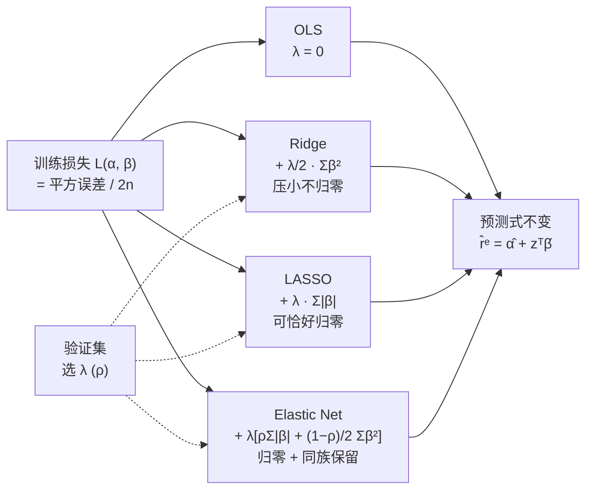
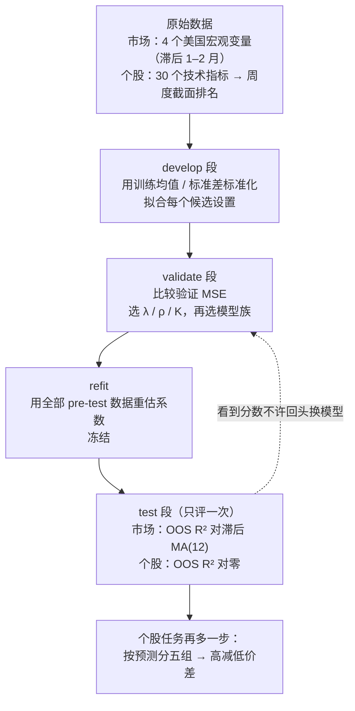
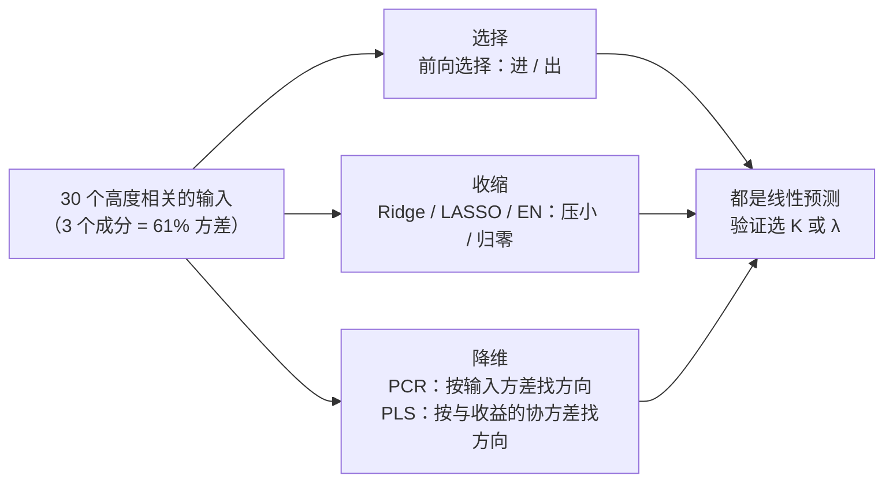

# M03 · 线性机器学习与收益预测

> **本讲一句话**：M02 证明了"四个宏观变量塞进 OLS，样本外打不过滞后均值"；这一讲问——**如果给 OLS 的斜率加一道"刹车"（收缩）、或者先把几十个变量压成几个方向（降维），能不能好一点？** 答案是：市场层面能少犯大错但仍难赢基准；个股层面预测精度几乎为零，**但弱预测仍可能排得出好坏股**。
> **原始材料**：`Lec03_Linear_Machine_Learning.pdf`（56 页）+ `course_files_export/class03/class03/`（5 个 CSV + `manifest.json` + `README.md`）｜**转录**：`pending`（2026-09-17 周四课，录音导出后按 `.claude/skills/transcript-merge/` 合并）｜**状态**：**v0.9**（课件层，按 [[笔记质量规范]] v1 写，strict 模式）

> ⚠️ **本笔记为 v0.9**：全部内容来自讲义与 `class03/` 数据包，**没有课堂转录**。七格里的「🎙️ 课堂补充」一律写"待转录补充"——这是有意留下的欠债标记；转录到手后要回填的问题清单在 [[#9.2 课上讲了但课件没有|§9.2]]。
> 讲义里所有标注 *"Illustrative … not estimates from the course dataset"* 的数字都是**教学用的假数**，本笔记一律标「讲义示例（假数）」；能用 `class03/` 重算的真数字都用 `code/L03_linear_ml/01_reproduce_lecture.py` 复核过（§9.5）。

---

## 0. 三分钟速览

**这一讲讲了什么**

上一讲结束时手里有一个诚实但难看的结果：用四个宏观变量做的 OLS（普通最小二乘）回归，在训练样本里显著，到样本外却打不过"过去 12 个月的平均收益"这个傻基准。这一讲不换问题、不换数据纪律，只换**估计方法**：

1. **给斜率加刹车（收缩）**——Ridge 把大斜率往零压、LASSO 直接把不重要的斜率压成零、Elastic Net 两者兼有。它们仍然是线性模型，预测式一个字没变，变的只是"怎么选系数"。
2. **先压缩再回归（降维）**——PCR 先找出输入变量里方差最大的几个方向，PLS 找的是"和收益一起动"的方向，再用这几个方向做回归。
3. **换一个更难的舞台**——从"预测三个市场的月度超额收益"扩展到"预测恒生指数 80 只成分股的**周度**超额收益"，输入从 4 个宏观变量变成 30 个技术指标的截面排名。

结果分两层读。**市场层**：收缩确实把 OLS 的大错（美国 OOS $R^2$ −22.1%、内地 −148.2%）压小了，但除香港外仍输给滞后 MA(12)。**个股层**：六个线性模型的样本外 $R^2$ 全在 ±0.5% 以内，LASSO 和 Elastic Net 干脆把 30 个斜率全压成零、给每只股票同一个预测；可是把 Ridge 的弱预测拿去**排序**，买预测最高的五分之一、卖最低的五分之一，52 周平均每周赚 0.48%（t = 1.46）。**"预测得准"和"排得对"是同一组预测的两种不同属性**——这是本讲最重要的一句话，也是 Class 5 组合决策的起点。

**学完你应该能**

1. **写出**OLS、Ridge、LASSO、Elastic Net 四个目标函数，说清它们只差在惩罚项，预测式完全相同
2. **解释**为什么 LASSO 能把系数压成恰好零而 Ridge 不能（绝对值在零点的"角"）
3. **执行**"在 development 上拟合 → 在 validation 上选 λ → 在 pre-test 全样本 refit → test 只评一次"的流程，并说出每一步不能省的原因
4. **计算**样本外 $R^2$（对滞后 MA(12) 或对零），并解释负值的含义
5. **区分** PCR 与 PLS：一个只看输入的方差，一个看输入与收益的协方差
6. **说明**为什么常数预测在 MSE 上不吃亏却无法排序，以及"预测精度"与"分组价差"为什么可以背离
7. **复述**个股任务的数据构造：固定股票池、30 个技术指标的周度截面排名、无风险代理、无泄漏时序

**如果只记三件事**

- **同一个预测式，不同的选系数规则。** $\hat r^e = \hat\alpha + z^{\top}\hat\beta$ 从头到尾没变；Ridge / LASSO / Elastic Net 只是在 OLS 的平方误差后面加了一项"斜率越大越贵"的罚款，罚款的形状决定了系数是被压小还是被压成零。
- **λ 只能在验证集上选，选完就冻结。** 看到测试结果再回头换模型（p.23 "Do not switch to HKSAR LASSO after seeing its higher test score"），测试集就作废了——这条纪律和 M02 一模一样，本讲只是多了一个要选的东西。
- **MSE 看水平，分组看次序。** 一个模型可以 OOS $R^2$ 为负却排得出赚钱的高减低组合（Ridge：−0.15% vs +0.48%/周）；反过来，MSE 最小的常数预测什么也排不了。Class 5 就从这个缺口开始。

---

## 1. 开始之前 · 知识衔接

### 1.1 你已经有的

| 概念 | 一句话唤醒 | 回看 |
|---|---|---|
| 预测时钟与数据时点 | 预测 $t$ 月的收益，只能用 $t$ 月开始前已经公布的数据；宏观数据要按发布延迟再滞后一到两个月 | [[M01-金融数据与Vibe-Coding#2.5 ★ 预测时钟：本讲真正的主题\|M01 §2.5]] |
| 拟合线 / OLS | 选一组截距和斜率，使训练样本里"实际 − 预测"的平方和最小 | [[M02-回归与样本外设计#2.4.1 拟合线：OLS 到底在选什么（讲义 p.18–19）\|M02 §2.4.1]] |
| 多重共线性 | 两个预测变量同向移动时，总效应算得准、但分给谁不确定——斜率会大幅摆动 | [[M02-回归与样本外设计#2.5.2 我们的预测变量彼此高度相关（讲义 p.29–30）\|M02 §2.5.2]] |
| 训练集标准化 | $z = (x - \bar x_{\text{train}})/s_{\text{train}}$，均值和标准差只能从训练段算，再套到后面的数据上 | [[M02-回归与样本外设计#2.5.3 ★ 只用训练集做标准化（讲义 p.31）\|M02 §2.5.3]] |
| 训练 / 验证 / 测试 | 估计 / 挑选 / 只评一次分；看过测试结果再改模型，测试集就不再是测试集 | [[M02-回归与样本外设计#2.6.3 训练 / 验证 / 测试各干各的（讲义 p.38–40）\|M02 §2.6.3]] |
| 冻结规格 | 变量名、训练均值与标准差、系数、测试日期与行序四样全部锁死 | [[M02-回归与样本外设计#2.6.4 按日期切分的代码（讲义 p.41）与"冻结"的含义（p.45）\|M02 §2.6.4]] |
| 样本外 $R^2$ 与基准 | $1 - \text{SSE}_{\text{model}}/\text{SSE}_{\text{benchmark}}$；正数才算赢过基准，基准必须与目标匹配 | [[M02-回归与样本外设计#2.7.3 基准必须与预测目标匹配（讲义 p.44）★★\|M02 §2.7.3]] |
| 滞后 MA(12) 基准 | 过去 12 个月收益的平均，用作市场月度预测的对手 | [[M02-回归与样本外设计#2.7.3 基准必须与预测目标匹配（讲义 p.44）★★\|M02 §2.7.3]] |
| 厨房水槽回归 | 把所有变量都塞进去的 OLS；样本内最好看、样本外最惨 | [[M02-回归与样本外设计#2.5.4 多元回归结果（讲义 p.32–33）\|M02 §2.5.4]] |

> 本讲把 M02 的"三个市场 × 四个宏观变量"换成了**四个美国宏观变量**同时预测三个市场（p.5），并把训练段改成 develop 142 月 + validate 36 月的结构。M02 里的 CSI 300 用的是中国宏观数据，本讲不再用。

### 1.2 本讲全新引入的概念

| 概念 | English | 在哪一节展开 |
|---|---|---|
| 超额收益 | Excess return | §2.6.5 |
| 无风险收益代理 | Risk-free proxy | §2.6.5 |
| 惩罚项 / 收缩 | Penalty / Shrinkage | §2.4.1 |
| 前向选择 | Forward selection | §2.3 |
| 岭回归 | Ridge regression | §2.4.2 |
| LASSO | Least Absolute Shrinkage and Selection Operator | §2.4.3 |
| 弹性网 | Elastic Net | §2.4.4 |
| 软件惩罚参数 | Software alpha | §2.4.2 |
| 系数路径 / 验证曲线 | Coefficient path / Validation curve | §2.4.5 |
| 股-周面板 | Stock-week panel | §2.6.1 |
| 固定股票池 | Fixed universe | §2.6.2 |
| 技术指标六族 | Six indicator families | §2.6.3 |
| 截面排名 / 中心化排名 | Cross-sectional rank / Centered rank | §2.6.4 |
| 特征分组组合 | Characteristic-sorted portfolio | §2.6.6 |
| 主成分回归 | Principal Component Regression (PCR) | §2.7.2 |
| 主成分载荷 | Loading | §2.7.2 |
| 偏最小二乘 | Partial Least Squares (PLS) | §2.7.3 |
| 常数预测 | Constant forecast | §2.8.4 |
| 预测分组排序 / 高减低价差 | Forecast sort / High-minus-low spread | §2.9.1 |
| 预测精度与排序的分离 | Accuracy versus ranking | §2.9.2 |

### 1.3 为什么这一讲放在这里 · 重排说明

M02 留下两个明确的伤口：一是**相关的预测变量让 OLS 斜率乱摆**（联邦基金利率和期限利差几乎同进退，M02 §2.5.2 的相关矩阵），二是**厨房水槽回归样本外惨败**。这一讲给的两味药——收缩和降维——正是针对这两个伤口的：收缩让斜率不能乱摆（大斜率要付罚款），降维让几十个相关变量先合并成几个互不相关的方向。教授在 p.4 把 Class 3–5 摆成一条线：Class 3 讲"选择、收缩、降维"，Class 4 讲"非线性：树、集成、神经网络"，Class 5 讲"特征重要性与组合表现"。所以本讲是 Gu, Kelly & Xiu (2020) 那张大表的**线性半边**。

本讲还悄悄换了舞台。前半（p.5–27）仍是 M02 的月度市场问题，只是把四个宏观变量统一成美国的；后半（p.29–55）跳到**个股周度**问题：80 只恒生指数成分股、30 个技术指标、基准从"滞后均值"变成"零"。这个跳跃的意义要到最后三页（p.53–55）才揭晓——**个股预测不是为了预测准，而是为了排序**，排序才能形成组合。Class 5 从这里接手。

**重排说明**：讲义顺序是 市场任务（p.5–27）→ 个股数据（p.29–38）→ 降维（p.40–45）→ 周度证据（p.47–51）→ 排序（p.53–56）。本笔记**基本保持讲义顺序**，只做两处调整：① 把 p.19–20 两张图（系数路径、验证曲线）合成一节放在四个模型讲完之后，因为读图需要先知道 λ 是什么；② 把 p.25–27 的代码与两道选择题合成一节，放在市场结果之后。对应关系见 [[#8. 讲义页码映射|§8 讲义页码映射]]。

---

## 2. 正文

### 2.1 本讲的地图：两个任务、一篇论文、四个变量（讲义 p.2–5）

讲义前五页是导航：先告诉你这一讲要做两件事，再告诉你这两件事来自哪篇论文，最后给出第一件事用的四个输入。§2.1.1–2.1.3 各讲一页。

#### 2.1.1 两个预测任务的对照（讲义 p.2）

**是什么**

想象你在一家基金做两份工作：早上要回答"下个月大盘整体会涨多少"，下午要回答"这一篮子股票里哪几只下周会跑赢"。两个问题的答案都是"收益预测"，但**预测对象、频率、输入和"及格线"全都不同**。讲义 p.2 用一张两行表把这一讲拆成两个任务（"超额收益"（excess return）= 总收益减去同期无风险收益，即比"把钱放国债"多赚的部分，§2.6.5 正式定义）：**月度市场超额收益预测**（输入是宏观预测变量，及格线是滞后 MA(12)，比较 OLS、前向选择、Ridge、LASSO、Elastic Net）和**周度个股超额收益预测**（输入是技术指标，及格线是零，再加 PCR 和 PLS，最后比较股票排名）。严谨地说：两个任务共用同一套"按时间切分、验证集选模型、测试集只评一次"的纪律和同一族线性模型，差别只在目标变量、观测单位和样本外基准。

**为什么需要它**

如果不先分清任务，后面的表格会读串——p.23 的 OOS $R^2$ 是"对 MA(12)"，p.47 的 OOS $R^2$ 是"对零"，两者数值不能直接比。而且两个任务的"意义"不同：市场任务问的是"能不能预测准"，个股任务最终问的是"能不能排对序"（p.53–55）。先记住这张对照表，后面每一页都能找到自己的位置。

**课件原例**

p.2 原文：*"Monthly market excess returns: macro predictors; lagged MA(12) benchmark. Compare OLS, forward selection, Ridge, LASSO, and Elastic Net. Weekly stock excess returns: technical characteristics; zero benchmark. Add PCR and PLS, then compare stock rankings."*（讲义 p.2）

| 维度 | 市场任务 | 个股任务 |
|---|---|---|
| 预测什么 | 一个市场下个月的超额收益 | 一只股票下一周的超额收益 |
| 一行数据是什么 | 一个月 | 一只股票在一个预测周 |
| 输入 | 4 个滞后的美国宏观变量 | 30 个技术指标的截面排名 |
| 样本外基准 | 滞后 MA(12) 超额收益 | 零超额收益 |
| 用到的模型 | OLS、前向选择、Ridge、LASSO、Elastic Net | 前五个 + PCR、PLS |
| 最终看什么 | OOS $R^2$ | OOS $R^2$ **和** 按预测分组后的收益价差 |

**🎙️ 课堂补充**

待转录补充。转录到手后优先核对：教授有没有说这两个任务在 ML 作业里各占什么位置。

**💡 换个说法（笔记补充）**

- 打个比方：市场任务像预测"明天全城平均气温"，个股任务像预测"全城 80 个街区哪几个明天最热"。前者只需要一个数字准不准；后者哪怕每个街区的温度都猜偏了两度，只要**相对高低**排对了，就能决定去哪里卖冰淇淋。
- 从"及格线"的角度看：市场任务的对手是"过去一年平均涨多少"，这是个有信息的对手；个股任务的对手是"零"，意思是"你什么都不知道时就该猜它和无风险资产一样"。对手越弱，打平越容易，所以个股任务里 OOS $R^2$ 接近零并不奇怪。

**⚠️ 常见误解**

- ❌ "两个任务用的是不同的模型" → 不是。模型族完全一样（都是线性的 $\hat\alpha + z^{\top}\hat\beta$），个股任务只是多加了 PCR、PLS 两个降维方法，因为它有 30 个输入而不是 4 个。
- ❌ "OOS $R^2$ 越接近零说明预测越没用" → 要看对手是谁。对零基准的 OOS $R^2$ = +0.05% 意味着预测比"猜零"好一点点；对 MA(12) 的 −3.2% 意味着输给了一个有信息的对手。同一个数字在两个任务里含义不同。

**所以呢**

这一页给了全讲的坐标系。接下来 p.4 告诉你这套坐标系来自哪篇论文，p.5 给出市场任务的四个输入；然后 §2.2 从最简单的 OLS 开始，一步步加东西。

#### 2.1.2 一篇里程碑论文与 Class 3–5 的路线（讲义 p.4）

**是什么**

这一讲不是教授自己拍脑袋排的，它照着一篇论文的结构走。Gu, Kelly & Xiu (2020, *Review of Financial Studies* 33(5)) 做了一件事：把"估计股票的风险溢价（risk premium，投资者承担风险要求的额外回报）"当成一个**预测问题**，然后让线性收缩、树模型、神经网络在**同一份数据、同一套样本外检验**上比赛，既比预测精度也比组合表现。严谨地说，这篇论文建立了"机器学习在资产定价里的标准比赛规则"：统一的输入（几十到几百个公司特征 + 宏观变量）、统一的时序切分、统一的评价指标（OOS $R^2$ 与分组组合收益）。

**为什么需要它**

知道路线图才知道每一讲的边界。p.4 明说：Class 3 = 选择、收缩、降维；Class 4 = 非线性交互、树、集成、神经网络；Class 5 = 特征重要性与组合表现。所以本讲**不讲**"哪个变量最重要"（那是 Class 5），也**不讲**"能不能用树模型做得更好"（那是 Class 4）。考试若问"线性 ML 与非线性 ML 的分工"，答案就在这一页。

**课件原例**

p.4 原文三条：*"Estimate risk premia as a prediction problem. Linear shrinkage, trees, and neural networks face the same data and OOS test. Evaluate return-forecast accuracy and portfolio performance."*，并给出 DOI `doi.org/10.1093/rfs/hhaa009`。（讲义 p.4）

**🎙️ 课堂补充**

待转录补充。核对：教授是否要求读这篇论文、是否会在期末考里考它的结论。

**💡 换个说法（笔记补充）**

- 把 Class 3–5 想成一场三轮比赛：第一轮（本讲）所有选手都必须是"直线选手"，只能改怎么定斜率；第二轮（Class 4）允许弯曲和交互；第三轮（Class 5）不比谁预测准，比谁的预测能拼出更赚钱、更稳的组合，并追问"是哪个特征在起作用"。
- 换个角度：这篇论文最大的贡献不是"神经网络赢了"，而是"大家在同一个考场考"。本讲的两个任务、固定的 develop / validate / test 日期、统一的基准，全是为了让后面几讲的模型能被公平比较——这就是 p.8 那句"Freeze the market chronology before comparing models"的来源。

**⚠️ 常见误解**

- ❌ "这一讲学的是 GKX 论文的结论" → 本讲只借用它的**框架**（把收益预测当预测问题、统一样本外比赛），数据换成了本课自己的三市场与恒指 80 只股票，结论（例如 p.47 六个线性模型都很弱）是本课数据的，不是论文的。
- ❌ "线性模型讲完就过时了，Class 4 的树和神经网络才是正菜" → 恰恰相反。p.56 说非线性要回答的问题是"阈值和交互能否改善**这些相同的**预测任务"，比较的基线就是本讲的线性结果；没有本讲的数字，Class 4 的"改善"无从谈起。

**所以呢**

路线定了，下一页给出市场任务的四个输入——它们和 M02 的变量有一个关键差别：**三个市场共用同一组美国变量**。

#### 2.1.3 四个美国宏观变量与它们的滞后（讲义 p.5）

**是什么**

预测美国、香港、内地三个市场下个月的超额收益，讲义只用**四个美国宏观变量**：期限利差（term spread，长期国债收益率减短期国债收益率）、联邦基金利率（federal funds rate，美联储的政策利率）、失业率、通胀率。前两个在预测时滞后一个月，后两个滞后两个月——因为失业率和通胀（CPI）是统计局事后才公布的，公布时已经过了一个月，用它们预测时必须再多退一个月。严谨地说：对预测月 $t$，输入是 $t-1$ 月末已知的利差与利率、以及 $t-2$ 月的失业率与通胀，这样每个输入都满足 M01 的"预测时钟"纪律。

**为什么需要它**

没有这一页，你会以为 p.23 里香港和内地的预测用的是本地宏观数据——不是，**全部用美国的**。这既是简化（同一套输入、同一套日期，三个市场可比），也是一个可以讨论的假设（美国货币政策对港股影响大是有道理的——港币盯住美元；对 A 股则未必）。p.5 还专门提醒：M02 的 CSI 300 例子用的是中国宏观数据，两讲的内地结果不能直接对照。

**课件原例**

p.5 表格：

| 预测变量 | 预测滞后 | 经济含义（讲义原话意译） |
|---|---|---|
| Term spread 期限利差 | 一个月 | 货币与商业周期状况 |
| Federal funds rate 联邦基金利率 | 一个月 | 当前政策立场 |
| Unemployment rate 失业率 | 两个月 | 劳动力市场松紧，含发布延迟 |
| Inflation rate 通胀率 | 两个月 | 价格压力，含发布延迟 |

原文：*"Same U.S. predictors for S&P 500, Hang Seng, and CSI 300 monthly excess returns. Class 2 used Chinese macro data for its CSI 300 example."*（讲义 p.5）

**🎙️ 课堂补充**

待转录补充。核对：教授为什么给三个市场都用美国变量、有没有提港币联系汇率。

**💡 换个说法（笔记补充）**

- 为什么要"再退一个月"：想象你在 3 月 31 日晚上做 4 月的预测。3 月的失业率要到 4 月初才公布，你手上最新的是 2 月的数——所以"用来预测 4 月的失业率"只能是 2 月的，滞后两个月。利率和利差是市场价格，3 月 31 日当天就知道，滞后一个月即可。这就是 M01 反复强调的"检查每个变量是什么时候能拿到的"。
- 打个比方：四个变量像四个体温计，分别量"经济周期的冷热""央行的松紧""就业的松紧""物价的松紧"。三个市场共用这四支体温计，等于假设它们都对美国的体温敏感——这个假设对港股比对 A 股更站得住。

**⚠️ 常见误解**

- ❌ "滞后两个月是为了让预测更准" → 不是为了准，是为了**合法**。数据在预测时刻还没公布，用了就是泄漏；滞后是在还原真实预测者手里有什么。
- ❌ "香港和内地的预测变量是本地宏观数据" → 本讲三个市场统一用美国变量（p.5 第一句）。这也是 p.24 右下角"选中的标准化系数"图能把三个市场画在同一坐标上的原因。

**所以呢**

输入定了：四个标准化后的美国宏观变量。§2.2 从最朴素的估计方法 OLS 开始，先把"目标函数 + 预测式 + 时间线"这三样摆出来，后面的每个新模型都只改第一样。

### 2.2 起点：OLS 的目标函数、一次手算与冻结的时间线（讲义 p.6–8）

本讲所有模型都从同一个 OLS 出发。§2.2.1 写出它在最小化什么，§2.2.2 用讲义的假数手算一个月度预测，§2.2.3 把 142 / 36 / 60 的时间线钉死。

#### 2.2.1 OLS 在最小化什么（讲义 p.6）

**是什么**

先说人话：你有 142 个月的历史，每个月有"月初已知的四个变量"和"当月实际的超额收益"。OLS 做的事是——找一组截距和四个斜率，使得用它们算出的"预测"与 142 个"实际"之间的**平方误差之和最小**。严谨地说，OLS（ordinary least squares，普通最小二乘）选 $\alpha, \beta$ 最小化训练损失：

$$L(\alpha, \beta) = \frac{1}{2n}\sum_{t \in S}\left(r_t^{e} - \alpha - z_t^{\top}\beta\right)^2, \qquad (\hat\alpha, \hat\beta)_{\text{OLS}} = \arg\min_{\alpha,\beta} L(\alpha, \beta)$$

预测式是

$$\hat r_t^{e} = \hat\alpha + \sum_{j=1}^{p}\hat\beta_j z_{jt}$$

| 符号 | 是什么 | 单位 | 已知 / 要算 |
|---|---|---|---|
| $r_t^e$ | 第 $t$ 月的市场超额收益（总收益减无风险收益，§2.6.5） | 小数（0.01 = 1%） | 已知（训练月） |
| $z_t$ | 第 $t$ 月**开始前**已知的 $p$ 个标准化输入组成的向量（vector，一列数） | 训练样本标准差的倍数 | 已知 |
| $S$, $n$ | 训练月份的集合与个数 | — | 已知（$n = 142$） |
| $\alpha$ | 截距（所有输入取均值时的预测） | 小数 | 要算 |
| $\beta = (\beta_1,\dots,\beta_p)$ | 每个输入的斜率 | "输入变一个标准差，预测变多少" | 要算 |
| $\hat r_t^e$ | 模型给出的预测 | 小数 | 算出 |

**为什么需要它**

后面 Ridge / LASSO / Elastic Net 的目标函数都是 **$L(\alpha,\beta)$ + 一个惩罚项**。不把 $L$ 写清楚，就看不出它们"只差一项"。另外这里的 $\frac{1}{2n}$ 不是随便写的——它决定了软件里的惩罚参数和公式里的 $\lambda$ 差一个 $n$ 倍（p.14，§2.4.2）。

**课件原例**

p.6 只有公式和一句警告：*"OLS: no slope penalty. Correlated predictors can make coefficients unstable."*（讲义 p.6）——这句就是 M02 §2.5.2 的结论，也是本讲加惩罚项的全部动机。

**数字例子（手把手）**——用一个 3 个月的迷你训练集看"平方误差之和"是怎么算的（笔记补充，数字由 `code/L03_linear_ml/01_reproduce_lecture.py` 之外手算，⚪）：假设只有一个输入 $z$，三个月分别是 $(z, r^e) = (1, 0.02), (0, 0.00), (-1, -0.01)$，候选规则 $\hat r^e = 0.003 + 0.015 z$。

1. 第一个月预测 $= 0.003 + 0.015 \times 1 = 0.018$，误差 $= 0.02 - 0.018 = 0.002$，平方 $= 0.000004$；
2. 第二个月预测 $= 0.003$，误差 $= 0 - 0.003 = -0.003$，平方 $= 0.000009$；
3. 第三个月预测 $= 0.003 - 0.015 = -0.012$，误差 $= -0.01 + 0.012 = 0.002$，平方 $= 0.000004$；
4. $L = \frac{1}{2 \times 3}(0.000004 + 0.000009 + 0.000004) = 0.000017 / 6 \approx 0.0000028$。

OLS 就是在所有可能的 $(\alpha, \beta)$ 里找让这个数最小的那组。真实的 142 个月计算由软件完成，原理相同。

**为什么公式长这样**

- **为什么平方**：误差有正有负，直接相加会互相抵消；平方后都为正，而且大误差被放大（错 2% 的代价是错 1% 的四倍），迫使模型优先避免大错。
- **为什么除以 $n$**：让损失变成"平均每个月的误差"，这样 142 个月和 60 个月的损失才能放在同一尺度上比。
- **为什么还有个 2**：纯粹为了求导时把平方的 2 消掉，让公式好看；它不改变最小值在哪里。但它会改变软件里 $\lambda$ 的换算（§2.4.2）。
- **为什么是 $z$ 而不是原始 $x$**：标准化（standardization，减训练均值除训练标准差）之后，所有斜率的单位统一成"每一个标准差"，四个斜率才能互相比大小——这在加惩罚项时是**必须的**（p.27 的选择题就考这一点）。

**极端 / 边界情况**

- 如果四个输入完全不相关且各自方差为 1，OLS 的每个斜率就等于该输入与收益的协方差——各管各的，不会互相干扰；而当两个输入几乎相同（相关系数接近 1）时，$X^{\top}X$ 接近不可逆，斜率会摆到很大的正负值上（§2.4.2 的 C3 例子：相关 0.999 时 OLS 给出 −0.60 和 +1.63，两者之和才是稳定的 1.0）。
- 如果 $n$ 小于 $p$（月份数少于变量数），OLS 有无穷多组解，平方误差可以压到零——这就是"过拟合"的极端形态，也是惩罚项存在的另一个理由。

**🎙️ 课堂补充**

待转录补充。

**💡 换个说法（笔记补充）**

- 想象你在调一台四个旋钮的收音机，目标是让 142 段录音里的杂音总量最小。OLS 允许你把任何旋钮拧到底——只要能让杂音再小一点点，哪怕两个旋钮一个拧到 +10 一个拧到 −9 互相抵消。Ridge / LASSO 的做法是给旋钮加阻尼：拧得越远越费力。
- 另一个角度：$L$ 是"训练期的成绩单"。它只回答"过去拟合得多好"，完全不回答"未来预测得多好"。本讲所有的验证集、测试集设计，都是为了不让这张成绩单说了算。

**⚠️ 常见误解**

- ❌ "OLS 没有惩罚项，所以它是最诚实、最不做假设的模型" → 它假设"训练期误差最小的规则未来也最好"，而相关输入下这个规则的斜率可以大到离谱（p.6 那句 unstable）；不加约束本身就是一种很强的选择。
- ❌ "$\frac{1}{2n}$ 里的 2 会让斜率变成一半" → 常数因子不改变最小值的位置，$\hat\alpha, \hat\beta$ 完全不变；它只影响 $\lambda$ 的数值换算。

**所以呢**

目标函数有了，但公式里的 $\alpha, \beta$ 是抽象的。下一节把讲义 p.7 的一组假数代进去，看"拟合好之后怎么算下个月的预测"——这一步和 M02 完全一样，先做熟，后面换模型时才能看出预测式一个字没变。

#### 2.2.2 用拟合好的系数算下个月的预测（讲义 p.7）

**是什么**

拟合完成后，模型就是一条明确的规则："截距 + 每个输入 × 它的斜率"。讲义 p.7 给了一条假想的规则和一组下个月的输入，让你亲手把预测算出来。这一节的要点不在算术，而在**"新输入必须用训练期的均值和标准差来标准化"**——预测下个月时，你不能拿包含下个月的数据重新算均值。严谨地说：对新月份 $t^\*$，先算 $z_{j,t^\*} = (x_{j,t^\*} - \bar x_{j,\text{train}})/s_{j,\text{train}}$，再代入 $\hat r^e = \hat\alpha + \sum_j \hat\beta_j z_{j,t^\*}$。

**为什么需要它**

这是本讲所有模型共用的"最后一步"。Ridge、LASSO、PCR、PLS 拟合出来的东西不同，但**用法完全一样**——都是代入标准化的输入算一个数。把这一步做熟，p.16（LASSO 预测）、p.42（PCR 预测）、p.45（PLS 预测）就只是换系数重算。

**课件原例**

p.7 的规则：$\hat r^e = 0.20\% + 0.40\%\, z_{\text{spread}} - 0.30\%\, z_{\text{rate}}$，下月输入 $z_{\text{spread}} = 0.5$、$z_{\text{rate}} = -1$。讲义注明 *"Illustrative coefficients and inputs; not estimates from the course dataset."*（讲义 p.7，假数）

**数字例子（手把手）**（讲义 p.7 假数，`code/L03_linear_ml/01_reproduce_lecture.py` A 段复核）

1. 利差项：$0.40\% \times 0.5 = 0.20\%$；
2. 利率项：$-0.30\% \times (-1) = +0.30\%$（利率比训练均值低一个标准差，而利率斜率为负，所以贡献为正）；
3. 加截距：$0.20\% + 0.20\% + 0.30\% = 0.70\%$。

预测下个月市场超额收益 **+0.70%**，与讲义一致。读法：利差高于均值半个标准差、利率低于均值一个标准差，两者都指向"下月偏正"。

**🎙️ 课堂补充**

待转录补充。

**💡 换个说法（笔记补充）**

- 斜率的单位是"每一个标准差"：$0.40\%$ 的意思是"利差比训练期平均高一个标准差，预测就高 0.40 个百分点"。这比 M02 里"利差每高 1 个百分点"更抽象，但好处是四个斜率可以直接比大小——谁的绝对值大谁影响大。
- 反过来想：如果把下个月的输入用"全样本"的均值来标准化，等于在做预测的那天晚上就偷看了未来几年的数据分布——这正是上一讲说的泄漏路径之一。所以"用训练期的均值和标准差"不是技术细节，是合法性问题：预测者手里只有过去。

**⚠️ 常见误解**

- ❌ "利率斜率是负的，利率又是负值，所以这一项是负贡献" → 负乘负得正：$-0.30\% \times (-1) = +0.30\%$。低于均值的利率（宽松）推高预测，方向上也说得通。
- ❌ "预测 0.70% 就是说下个月会涨 0.70%" → 它是超额收益的**条件均值**估计，不是承诺；p.23 会告诉你这种预测的样本外表现有多弱。

**所以呢**

预测式会用了。但"拟合"和"预测"分别在哪些月份上做、验证集在中间干什么，讲义 p.8 用一条时间线钉死——这是后面所有模型比较的前提。

#### 2.2.3 冻结时间线：142 / 36 / 60（讲义 p.8）

**是什么**

先说人话：三个市场、五个模型要公平比赛，就得在**同一段日子上训练、同一段日子上选参数、同一段日子上考试**。讲义 p.8 把 2006-09 到 2026-06 这 238 个可用月份切成三段：**develop 142 个月**（2006-09 至 2018-06，用来拟合）、**validate 36 个月**（2018-07 至 2021-06，用来选 λ 或选模型）、**test 60 个月**（2021-07 至 2026-06，只评一次分）。选定设置后，把 develop + validate 合起来的 **178 个 pre-test 月份**重新拟合一次（refit），再去测 60 个月。严谨地说：这是 M02 §2.6.3 训练 / 验证 / 测试的具体日期版本，外加一条"选完设置后用全部 pre-test 数据 refit"的规则。

**为什么需要它**

本讲比 M02 多了一个"要选的东西"（λ）。选它必须用验证集，而**选完之后**只在 142 个月上拟合又浪费了 36 个月的信息——所以 refit。p.8 还有一句 OLS 的澄清：OLS 没有调节参数，它的验证损失只用来做"规格或模型之间的比较"（比如 p.21 把 OLS 和三个收缩模型放在一起比验证 MSE）。

**课件原例**

p.8 的时间线：

| 段 | 月份区间 | 月数 | 用途 |
|---|---|---|---|
| develop | 2006-09 – 2018-06 | 142 | 拟合每个候选设置 |
| validate | 2018-07 – 2021-06 | 36 | 比较候选，选 λ / 选模型 |
| refit | 2006-09 – 2021-06 | 178 | 用选定的设置重新拟合 |
| test | 2021-07 – 2026-06 | 60 | 只评一次分 |

原文：*"Two initial months are used to construct the lagged predictors. All three markets use the same predictors, dates, loss, and lagged MA(12) excess-return benchmark for OOS $R^2$."*（讲义 p.8）——240 个月的数据，前两个月被用来构造滞后变量，所以可用 238 个月 = 142 + 36 + 60。`class03/market_linear_test_predictions.csv` 的 `forecast_month` 恰好是 2021-07-31 到 2026-06-30 共 60 个月 × 3 个市场 = 180 行（`code/L03_linear_ml/01_reproduce_lecture.py` B 段）。

**🎙️ 课堂补充**

待转录补充。核对：教授有没有解释为什么 validate 只给 36 个月、test 给 60 个月。

**💡 换个说法（笔记补充）**

- 把三段想成"练习册 / 模拟考 / 高考"。练习册（develop）可以反复做，模拟考（validate）用来决定考前策略——比如带哪本公式表（选 λ），高考（test）只能考一次，考完不能说"早知道我换个策略"。refit 相当于高考前把练习册和模拟考的题都再复习一遍，但策略不再变。
- 换个角度：p.8 的标题是"Freeze the market chronology **before** comparing models"。"冻结"的对象不只是模型，还有日期——如果每个模型各用各的切分，比出来的差异可能只是日期差异。三个市场共用日期也是同理。

**⚠️ 常见误解**

- ❌ "refit 之后模型在 178 个月上重新选了 λ" → 没有。λ（以及 Elastic Net 的 ρ、PCR 的 K）在 36 个验证月上选定后**冻结**，refit 只是在更多数据上重新估系数。
- ❌ "OLS 的验证 MSE 没用，因为它没有 λ" → 它有另一个用途：作为"不加惩罚"的对照放进 p.21 的表里，让你看到收缩到底省了多少验证误差。

**所以呢**

日期和基准都冻住了，现在可以开始换估计方法。§2.3 先讲一个最直观的办法——不加惩罚，而是**一个一个地挑变量**（前向选择）；它是理解"验证集在决定什么"的最好入门，也是收缩方法的对照组。

### 2.3 前向选择：一个一个地挑变量的算法（讲义 p.10–11）
<!-- 类型: 算法流程型 -->

**是什么**

先说人话：手上有四个候选变量，不知道该用几个。最笨也最稳的办法是——先一个都不用，然后每次试着加一个，**加了之后如果模拟考（验证集）成绩变好就留下，变差就停**。这就是前向选择（forward selection，逐步向前挑变量）。严谨地说：从空集 $A_0 = \varnothing$ 开始，第 $k$ 步对每个未选的变量 $j$，用 OLS 在 development 月份上拟合 $A_k \cup \{j\}$，在 validation 月份上算 MSE（mean squared error，均方误差，M02 §2.7.2），取最小的那个为候选：

$$j^{*} = \arg\min_{j \notin A_k} \text{MSE}_{\text{valid}}\big(A_k \cup \{j\}\big), \qquad A_{\text{candidate}} = A_k \cup \{j^{*}\}$$

只有当候选的验证 MSE 低于当前的 $A_k$ 时才更新 $A_{k+1} = A_{\text{candidate}}$，否则停止。

| 符号 | 是什么 | 已知 / 要算 |
|---|---|---|
| $A_k$ | 第 $k$ 步已选入的变量集合 | 算出 |
| $j$ | 尚未选入的某个候选变量 | 已知（遍历） |
| $\text{MSE}_{\text{valid}}(\cdot)$ | 用该变量集在 development 上拟合、在 validation 上的均方误差 | 算出 |
| $j^{*}$ | 本步让验证 MSE 最小的候选 | 算出 |

**为什么需要它**

它是"选择"这条路的代表（p.4：selection, shrinkage, and dimension reduction）。与全量 OLS 相比，它得到的是一个**子集**——变量更少、规则更短。它也是理解"验证集在决定什么"的最好入门：每一步的去留都由验证 MSE 说了算，development 上的拟合好坏**不算数**。但它有一个结构性缺点（p.10 最后一句）：**只在"一起用"时才有帮助的变量会被漏掉**——因为它一次只看一个。

**课件原例**

p.11 的手算表（讲义示例，假数）：

| 步 | 候选模型 | 验证 MSE ×10⁴ | 决定 |
|---|---|---|---|
| 0 | 只有截距 | 30.00 | 起点 |
| 1 | 加期限利差 | 28.70 | 留 |
| 2 | 加通胀 | 28.20 | 留 |
| 3 | 加失业率 | 28.40 | **停** |

原文：*"The third predictor improves development-sample fit but worsens validation error. The two-predictor model is frozen."*（讲义 p.11）

**编号步骤**（输入 → 动作 → 输出）

1. 输入：候选变量清单 {利差, 利率, 失业率, 通胀}、development 月份、validation 月份；动作：拟合只有截距的模型；输出：验证 MSE 基线。
2. 对每个未选变量，各拟合一个"当前集合 + 它"的 OLS，各算验证 MSE；输出：本步最好的候选与它的 MSE。
3. 比较：候选 MSE < 当前 MSE → 接受并回到第 2 步；否则停止。
4. 输出：冻结的变量子集；用它在 178 个 pre-test 月份 refit，再进 test。

**手算一遍**（用 p.11 的假数，`code/L03_linear_ml/01_reproduce_lecture.py` A 段核对）

1. 起点：只有截距，$\text{MSE} = 30.00$；
2. 第 1 步：加利差后验证 MSE 从 30.00 降到 28.70，改善 $= 30.00 - 28.70 = 1.30$，接受；
3. 第 2 步：加通胀后降到 28.20，改善 $= 28.70 - 28.20 = 0.50$，接受；
4. 第 3 步：加失业率后升到 28.40，改善 $= 28.20 - 28.40 = -0.20$ 为负，**拒绝并停止**；冻结{利差, 通胀}。

**停止条件 / 什么时候别用它**

- 停止条件只有一个：验证 MSE 不再下降。注意它不看"下降多少"——0.01 也算下降；实际操作可以加一个最小改善阈值，但讲义没加。
- 别用它的情形：候选变量多且彼此高度相关（本讲的 30 个技术指标就是），因为它一次只加一个，会在两个几乎相同的变量之间随机挑一个，而且"单独没用、合起来有用"的组合永远进不来。这时该用 §2.4 的收缩或 §2.7 的降维。

**🎙️ 课堂补充**

待转录补充。核对：教授有没有跑真实数据的前向选择、选出了哪几个变量（讲义只给假数）。

**💡 换个说法（笔记补充）**

- 像组建一支乐队：先招一个人，听一场演出（验证集）看效果；再招第二个，效果更好就留；招到第三个时演出反而变差，就到此为止。缺点也显而易见——两个单独都平庸、合奏却精彩的乐手，永远没机会同时被听到。
- 反过来说，前向选择的"停"是一种硬选择：一个变量要么全进（斜率不受限）、要么全出。§2.4 的收缩方法把这种"开关"换成"调光器"——每个变量都在，只是亮度被压低；LASSO 则是"调光器调到零就等于关掉"，兼有两者。

**⚠️ 常见误解**

- ❌ "第 3 步加失业率后 development 的拟合变好了，说明失业率有用" → development 上加任何变量都不会让拟合变差（多一个自由度——可调参数的个数——只会让平方误差不增），所以那不是证据；验证 MSE 上升才是判断依据。
- ❌ "前向选择选出来的两个变量就是'真正有用'的两个" → 它只是在这条路径上、这 36 个验证月份里表现最好的两个。换一段验证期，或者先加通胀再加利差，结果可能不同——这就是 p.10 说的"变量只在联合时才有帮助的会被漏掉"的另一面。

**所以呢**

前向选择用"进或出"控制复杂度。接下来的 §2.4 换一种思路：所有变量都留在模型里，但给大斜率收费——这就是收缩，也是本讲的主角。

### 2.4 收缩：给斜率收费的三种方式（讲义 p.12–21）

收缩是本讲的核心工具。§2.4.1 写出惩罚项的一般形式，§2.4.2–2.4.4 分别讲 Ridge、LASSO、Elastic Net，§2.4.5 读两张图，§2.4.6 看验证集怎么在美国数据上做选择。

#### 2.4.1 惩罚项的一般形式（讲义 p.12）

**是什么**

先说人话：OLS 允许斜率想多大就多大，只要训练误差能再小一点。收缩的做法是在训练误差后面**加一笔"罚款"，斜率越大罚款越多**，于是模型在"多拟合一点"和"少付一点罚款"之间权衡，最终的斜率会比 OLS 小——这就叫收缩（shrinkage，把系数往零方向压）。严谨地说，收缩估计量最小化

$$(\hat\alpha, \hat\beta) = \arg\min_{\alpha, \beta}\Big\{\underbrace{L(\alpha, \beta)}_{\text{训练平方误差}} + \lambda\, \underbrace{P(\beta)}_{\text{斜率惩罚}}\Big\}$$

其中 $L$ 就是 §2.2.1 的 OLS 损失，$P(\beta)$ 是惩罚项（penalty，对斜率大小的一个非负函数），$\lambda \ge 0$ 决定罚款有多重。**预测式 $\hat r^e = \hat\alpha + z^{\top}\hat\beta$ 不变**，变的只是估计目标。

| 符号 | 是什么 | 已知 / 要算 |
|---|---|---|
| $L(\alpha,\beta)$ | §2.2.1 的训练平方误差（除以 $2\,n$） | 算出 |
| $P(\beta)$ | 惩罚项：Ridge 用 $\tfrac12\sum\beta_j^2$，LASSO 用 $\sum\lvert\beta_j\rvert$，Elastic Net 两者混合 | 已知（选定模型后） |
| $\lambda$ | 惩罚强度；$\lambda = 0$ 退化为 OLS，越大斜率越小 | **在验证集上选** |
| $\alpha$ | 截距，**不被惩罚** | 要算 |
| $\beta_j$ | 第 $j$ 个标准化输入的斜率 | 要算 |

**为什么需要它**

三个理由都在 p.12：① $\lambda = 0$ 就是 OLS，所以收缩是 OLS 的推广而不是替代；② 输入必须先用训练数据标准化，否则单位大的变量天然斜率小、被罚得少，惩罚就不公平（p.27 选择题）；③ $\lambda$ 只能在验证数据上选，而且**罚太重会把有用的信号也压掉**——所以不是越大越安全。

**课件原例**

p.12 原文：*"λ = 0 gives OLS; larger λ puts more weight on small slopes. Standardize predictors on training data; leave the intercept α unpenalized. Choose λ on validation data. Too much shrinkage can remove useful signal. What changes: the estimation objective, while $\hat r^e = \hat\alpha + z^{\top}\hat\beta$ remains linear."*（讲义 p.12）

**数字例子（手把手）**——一个只有一个输入的迷你例子，看 λ 怎么改变最优斜率（笔记补充，`code/L03_linear_ml/01_reproduce_lecture.py` C1 段）。设训练集有 $n = 100$ 个月，输入已标准化（$\sum z_t^2 = n = 100$），$\sum z_t r_t^e = 40$。用 Ridge 惩罚 $P = \tfrac12\beta^2$，最优斜率有闭式解 $\hat\beta = \dfrac{\sum z_t r_t^e}{\sum z_t^2 + \lambda}$：

1. $\lambda = 0$：$\hat\beta = 40 / (100 + 0) = 0.40$，就是 OLS；
2. $\lambda = 25$：$\hat\beta = 40 / (100 + 25) = 0.32$；
3. $\lambda = 100$：$\hat\beta = 40 / (100 + 100) = 0.20$，恰好是 OLS 的一半；
4. $\lambda = 400$：$\hat\beta = 40 / 500 = 0.08$。

规律：$\hat\beta_{\text{ridge}} = \hat\beta_{\text{OLS}} \times \dfrac{n}{n + \lambda}$，λ 越大压得越狠，但永远不会恰好为零。

**为什么公式长这样**

- **为什么是"加"而不是"乘"**：加法让两项可以各自量纲独立地权衡——训练误差多降一点值不值得多付一点罚款，由 λ 定汇率。
- **为什么 λ 乘在惩罚上**：λ 是"汇率"。它不参与拟合，是一个**超参数**（hyperparameter，模型之外、由人或验证集决定的设定）。
- **为什么截距不罚**：截距是"所有输入取均值时的预测"，也就是训练期平均超额收益；罚它等于强行把预测往零拉，没有道理。
- **为什么要先标准化**：惩罚按斜率的绝对大小收费，而斜率大小取决于输入的单位——通胀写成 0.03 的斜率会是写成 3 时的 100 倍。标准化后所有斜率都是"每一个标准差"，罚款才公平。

**极端 / 边界情况**

- $\lambda = 0$：完全退化为 OLS，无收缩；$\lambda \to \infty$：所有斜率趋于零，预测退化为常数 $\hat\alpha$（训练期均值）——这正是 p.51 个股 LASSO 发生的事。
- 如果输入不标准化，同一个 λ 对不同变量是不同强度的惩罚——p.27 的选择题就是这个边界情况。

**🎙️ 课堂补充**

待转录补充。

**💡 换个说法（笔记补充）**

- 想象一位谨慎的老板审预算：部门（变量）要多少钱（斜率）都可以，但每多要一块钱要交一份"申请费"。费率（λ）为零时大家狮子大开口；费率很高时谁也不敢多要，最后每个部门拿到的都比原来少——这就是收缩。截距是"房租水电"，老板不收申请费。
- 换个角度：收缩是在承认"训练期的最优不等于未来的最优"。OLS 对训练数据言听计从；收缩故意不完全听，把斜率往"没有信息"的零拉一点，用一点训练拟合换更稳的预测。拉多少，只能靠验证集试出来。

**⚠️ 常见误解**

- ❌ "加了惩罚项之后模型就不是线性的了" → 预测式 $\hat\alpha + z^{\top}\hat\beta$ 完全没变，仍是输入的线性函数；变的是"怎么选 $\hat\beta$"。p.12 最后一句专门强调这一点。
- ❌ "λ 越大越保险" → 罚太重会把真信号也压掉（p.12 "Too much shrinkage can remove useful signal"），验证 MSE 会先降后升（p.20 的 U 形曲线），所以 λ 有一个最优值，不是越大越好。

**所以呢**

一般形式有了，接下来只需换 $P(\beta)$。第一个是最温和的一种：把斜率的平方加起来——Ridge。

#### 2.4.2 岭回归：平方惩罚，压小但不归零（讲义 p.13–14）

**是什么**

先说人话：如果四个输入里有两个几乎同进退（比如联邦基金利率和期限利差），OLS 会给它们一个很大的正斜率和一个很大的负斜率互相抵消——预测差不多，但斜率本身毫无意义、换一段样本就翻脸。岭回归（Ridge regression，用斜率平方和作惩罚的收缩回归）的做法是：**大斜率的平方代价很高**，所以它宁可给两个相关变量各一个中等大小的斜率，也不愿给一个 +10 一个 −9。严谨地说：

$$(\hat\alpha, \hat\beta)_{\text{Ridge}} = \arg\min_{\alpha,\beta}\Big\{L(\alpha,\beta) + \frac{\lambda}{2}\sum_{j=1}^{p}\beta_j^2\Big\}$$

| 符号 | 是什么 | 已知 / 要算 |
|---|---|---|
| $\sum_j \beta_j^2$ | 斜率的平方和（Ridge 惩罚） | 随 $\beta$ 算出 |
| $\lambda/2$ | 惩罚强度；讲义在 Ridge 里写成 $\lambda/2$ 是为了求导整洁 | 验证集选 |
| software alpha | 软件（scikit-learn）里的惩罚参数，$= n\lambda$（见下） | 验证集选 |

**为什么需要它**

它是"相关预测变量"这个伤口的直接解药。效果（p.13）：**稳定系数、通常保留全部变量**——每个斜率都被压小，但没有一个恰好变成零。适用场景讲义点名：*"overlapping predictors, such as the funds rate and term spread"*。

**课件原例**

p.14 给了美国数据的三步流程与结果（真数字，`class03/market_linear_model_summary.csv`，`code/L03_linear_ml/01_reproduce_lecture.py` B 段核对）：① 用 142 个 development 月份标准化；② 在若干 λ 上拟合、在 36 个 validation 月份上比较；③ 用 178 个 pre-test 月份 refit 选定规格，再预测 60 个 test 月份。验证选出 **software alpha = 100**，验证 MSE ×10⁴ = **27.02**，测试 OOS $R^2$ = **−3.2%**。讲义评语：*"Lower test loss than OLS; still worse than lagged MA(12)."* 并提醒 *"With $L = \text{SSE}/(2n)$ above, Ridge's software alpha = $n\lambda$; penalty scales differ across implementations."*（讲义 p.14）

**数字例子（手把手）**——两个几乎相同的输入，看 OLS 与 Ridge 的斜率（笔记补充，模拟数据，`code/L03_linear_ml/01_reproduce_lecture.py` C3 段）：造 200 个观测，$x_2 = x_1 + $ 一点噪声，两者相关系数（correlation，两列一起变的程度，M02 §2.3.4）0.999；真实规则是各 0.5。

两个标准化输入时 Ridge 有一个可以手算的闭式解：记 $\rho$ 为两列的相关系数，$c_j$ 为第 $j$ 列与（去均值的）收益的样本协方差，$k = \lambda/(n-1)$，则

$$\hat\beta_1 = \frac{(1+k)\,c_1 - \rho\,c_2}{(1+k)^2 - \rho^2}, \qquad \hat\beta_2 = \frac{(1+k)\,c_2 - \rho\,c_1}{(1+k)^2 - \rho^2}$$

本例 $\rho = 0.9986$，$c_1 = 1.0226$，$c_2 = 1.0258$（脚本 C3 段打印）：

1. OLS（$\lambda = 0$，$k = 0$）：分母 $= 1 - 0.9986^2 = 0.00284$，$\hat\beta_1 = (1.0226 - 0.9986 \times 1.0258)/0.00284 = -0.60$，$\hat\beta_2 = (1.0258 - 0.9986 \times 1.0226)/0.00284 = +1.63$，之和 $= 1.02$——分母几乎为零，分子的一点点差别被放大成 ±1，这就是"斜率乱摆"的数学原因；
2. Ridge $\lambda = 10$（$k = 10/199 = 0.0503$）：分母 $= 1.0503^2 - 0.9986^2 = 0.1059$，$\hat\beta_1 = (1.0503 \times 1.0226 - 0.9986 \times 1.0258)/0.1059 = 0.47$，$\hat\beta_2 = 0.53$，之和 $= 1.00$——分母被 $k$ 撑大 37 倍，两个斜率立刻回到一起；
3. Ridge $\lambda = 100$（$k = 0.5025$）：分母 $= 1.5025^2 - 0.9986^2 = 1.260$，$\hat\beta = (0.41,\ 0.41)$，之和 $= 0.82$——继续压小，开始牺牲总效应。

换一组数：把 $\rho$ 改成 0.5，OLS 的分母就是 0.75 而不是 0.003，斜率不会乱摆——Ridge 的价值只在相关变量上才显出来。

读法：小 λ 就足以把"互相抵消的大斜率"驯服；λ 再大就开始压掉真信号——正是 p.12 的警告。

**为什么公式长这样**

- **为什么平方**：平方惩罚在零点是光滑的（没有"角"），所以最优解会连续地随 λ 变小、但**不会恰好落在零上**；这也是它"保留全部变量"的数学原因。
- **为什么大斜率被罚得特别狠**：平方让斜率 2 的罚款是斜率 1 的四倍，所以 Ridge 最先压的是最大的斜率——正好是相关变量互相抵消时出现的那种。
- **为什么 software alpha = $n\lambda$**：讲义的 $L$ 除了 $2\,n$，软件的损失通常是 $\tfrac12\text{SSE}$ 不除 $n$；要让两个目标函数的最优解相同，软件的惩罚参数得乘上 $n$。所以"alpha = 100"在讲义的 λ 尺度上是 $100/178 \approx 0.56$。**换一个软件包，同一个数字含义可能不同**——报告时要写清用的是哪个实现。

**极端 / 边界情况**

- $\lambda = 0$ 回到 OLS；$\lambda \to \infty$ 所有斜率 → 0，但对任何有限 λ 都不会恰好为零。
- 两个输入完全相同（相关系数 = 1）时 OLS 无解（$X^{\top}X$ 这个矩阵——把输入按行列排成的数表——不可逆），Ridge 仍有唯一解：两个斜率各分一半——这是"岭"这个名字的来历（给 $X^{\top}X$ 的对角线加一道"岭"让它可逆）。

**🎙️ 课堂补充**

待转录补充。

**💡 换个说法（笔记补充）**

- 把相关变量想成两个搭档合演一出戏：OLS 让一个人拼命往前冲、另一个拼命往后拽，合力刚好；Ridge 说"两个人都别用力过猛"，于是他们各出一半力，合力差不多，但每个人的动作都看得懂了。
- 换个角度：Ridge 的"压小但不归零"意味着它**不做选择**——它相信每个变量多少都有点用，只是不信任训练期给它们的大小。这在变量本来就少（四个宏观变量）时很合理；变量有三十个而其中许多是噪声时，就需要能"关掉"变量的方法——下一节的 LASSO。

**⚠️ 常见误解**

- ❌ "Ridge 的 alpha = 100 就是公式里的 λ = 100" → 软件的 alpha 与讲义的 λ 差一个 $n$ 倍（p.14 明说 penalty scales differ）；不同实现之间不可直接比数字。
- ❌ "Ridge 把某些不重要的变量去掉了" → 没有。p.14 的美国 Ridge 仍有 4 个非零系数（`nonzero_coefficients = 4`）；只有 LASSO / Elastic Net 才会把系数压成零。

**所以呢**

Ridge 解决了"斜率乱摆"，但不做选择。如果你怀疑四个变量里有的根本没用，就需要一种能把斜率**恰好压成零**的惩罚——把平方换成绝对值，就是 LASSO。

#### 2.4.3 LASSO：绝对值惩罚，能把系数压成恰好零（讲义 p.15–16）

**是什么**

先说人话：Ridge 把每个斜率都压小一点，但四个变量都留着；LASSO 更狠——不重要的变量斜率**直接压成零**，等于把它从模型里踢出去，所以它既做收缩又做选择。做到这一点靠的只是把惩罚里的"平方"换成"绝对值"。严谨地说，LASSO（Least Absolute Shrinkage and Selection Operator，最小绝对收缩与选择算子）最小化

$$(\hat\alpha, \hat\beta)_{\text{LASSO}} = \arg\min_{\alpha,\beta}\Big\{L(\alpha,\beta) + \lambda\sum_{j=1}^{p}\lvert\beta_j\rvert\Big\}$$

| 符号 | 是什么 | 已知 / 要算 |
|---|---|---|
| $\sum_j \lvert\beta_j\rvert$ | 斜率绝对值之和（LASSO 惩罚） | 随 $\beta$ 算出 |
| $\lambda$ | 惩罚强度 | 验证集选 |
| $\hat\beta_j = 0$ | "该变量被移出预测式"的含义 | 结果 |

**为什么需要它**

p.15 说得很直白：绝对值惩罚在零点有一个**角**（corner），所以一些拟合斜率会恰好变成零；效果是 $\hat\beta_j = 0$ 就把变量 $j$ 移出预测。对于"三十个技术指标里可能只有几个有用"的个股任务，这种自动选择很有吸引力。但它有一个告诫（p.15 最后一句）：**在相关变量之间选谁，可能随样本而变**——两个几乎一样的变量，LASSO 往往只留一个，留哪个有点随机。

**课件原例**

p.16（讲义示例，假数）：标准化并经验证后，

| | 期限利差 | 联邦基金利率 | 通胀 |
|---|---|---|---|
| OLS 系数 | 0.60 | 0.50 | 0.20 |
| LASSO 系数 | 0.48 | 0 | 0 |

截距 0.10%，$z_{\text{spread}} = 0.5$：$\hat r^e = 0.10\% + 0.48\% \times 0.5 = 0.34\%$。原文：*"The other inputs contribute zero. With a smaller penalty, more signals may remain."*（讲义 p.16）

**数字例子（手把手）**

先算 p.16 的预测（`code/L03_linear_ml/01_reproduce_lecture.py` A 段）：

1. 利差项：$0.48\% \times 0.5 = 0.24\%$；
2. 利率项与通胀项：$0 \times z = 0$，无论 $z$ 是多少；
3. 合计：$0.10\% + 0.24\% = 0.34\%$，与讲义一致。

再看"为什么会恰好为零"（笔记补充，单输入、输入已标准化且 $\sum z^2 = n$ 的闭式解，`code/L03_linear_ml/01_reproduce_lecture.py` C1 段）：LASSO 的解是**软阈值**（soft-thresholding）——$\hat\beta = \operatorname{sign}(\hat\beta_{\text{OLS}}) \cdot \max(\lvert\hat\beta_{\text{OLS}}\rvert - \lambda,\ 0)$。设 $\hat\beta_{\text{OLS}} = 0.40$：

1. $\lambda = 0.1$：$\hat\beta = 0.40 - 0.10 = 0.30$；
2. $\lambda = 0.3$：$\hat\beta = 0.40 - 0.30 = 0.10$；
3. $\lambda = 0.4$：$\hat\beta = \max(0.40 - 0.40,\ 0) = 0$——**恰好归零**；
4. $\lambda = 0.5$：仍为 0。

对比 Ridge（同一 OLS 斜率 0.40）：λ 无论多大，$0.40 \times n/(n+\lambda)$ 都大于零。这就是"角"的作用：LASSO 每个斜率被减去一个固定量，减到零就停在零；Ridge 每个斜率被乘以一个小于 1 的因子，永远到不了零。

**为什么公式长这样**

- **为什么绝对值能产生零**：绝对值函数在零点不可导（有个角），最优化时"卡"在角上的成本最低；平方函数在零点光滑，最优解会滑过零点而不停留。
- **为什么大斜率和小斜率被"减去同样的量"**：绝对值惩罚的导数是常数（±λ），所以每个斜率都被推同样的距离；这也是为什么 LASSO 对**小信号**特别狠——小信号更容易被推到零。
- **为什么没有 $\tfrac12$**：绝对值求导不产生 2，所以不需要那个整洁因子。

**极端 / 边界情况**

- λ 足够大时**所有**斜率为零，预测退化为常数 $\hat\alpha$——p.51 的个股 LASSO 就是这种情形（`nonzero_coefficients = 0`）。
- 两个输入完全相同时，LASSO 的解不唯一：可以全给第一个、全给第二个、或任意分配——这就是 p.15 "selection among correlated predictors can change across samples" 的极端形式。

**🎙️ 课堂补充**

待转录补充。核对：教授有没有画那个"菱形 vs 圆形"的约束区域图来解释角。

**💡 换个说法（笔记补充）**

- 想象每个斜率都要交一笔固定"入场费"（λ）才能留在模型里：贡献不够抵入场费的变量干脆不进场——这是 LASSO；而 Ridge 收的是"按比例的会员费"，再小的贡献也总能留下一点点。
- 换个角度看它的缺点：面对一对孪生变量，LASSO 只请一个进场就够了（另一个的贡献被前一个抵消），至于请哪一个，取决于样本里谁碰巧稍微好一点点——所以它选出的"重要变量"名单在不同样本之间可能不稳定。

**⚠️ 常见误解**

- ❌ "LASSO 把系数压成零，说明那个变量与收益无关" → 只说明在这个 λ、这段样本下它的边际贡献不够抵惩罚；p.16 明说"惩罚小一点，更多信号可能留下"，p.19 的美国数据在验证选出的 λ 下四个斜率全非零。
- ❌ "LASSO 一定比 Ridge 好，因为它还能选变量" → 看数据：p.23 美国 Ridge（−3.2%）好于 LASSO（−16.3%），香港则反过来（+10.1% vs +6.1%）。选择能力是一种假设——假设"真信号是稀疏的"；假设不成立时反而吃亏。

**所以呢**

Ridge 保留全部、LASSO 二选一，各有各的失败模式。有没有办法"既能归零、又能把相关的变量一起保留"？把两种惩罚加在一起——Elastic Net。

#### 2.4.4 弹性网：两种惩罚的混合（讲义 p.17–18）

**是什么**

先说人话：Ridge 遇到一对相关变量会"两个都留、各压一半"，LASSO 会"只留一个"。弹性网（Elastic Net，把 LASSO 和 Ridge 的惩罚按比例相加）想要的是——**该踢掉的变量踢掉，但同一族相关的信号一起留下**。严谨地说：

$$(\hat\alpha, \hat\beta)_{\text{EN}} = \arg\min_{\alpha,\beta}\Big\{L(\alpha,\beta) + \lambda\Big[\rho\sum_{j=1}^{p}\lvert\beta_j\rvert + \frac{1-\rho}{2}\sum_{j=1}^{p}\beta_j^2\Big]\Big\}$$

| 符号 | 是什么 | 已知 / 要算 |
|---|---|---|
| $\lambda \ge 0$ | 总惩罚强度 | 验证集选 |
| $\rho \in [0, 1]$ | LASSO 份额（软件里叫 `l1_ratio`）：$\rho = 1$ 是 LASSO，$\rho = 0$ 是 Ridge，中间是混合 | 验证集选 |
| $\rho\sum\lvert\beta_j\rvert$ | LASSO 部分：负责归零 | 算出 |
| $\frac{1-\rho}{2}\sum\beta_j^2$ | Ridge 部分：负责把相关变量拉到一起 | 算出 |

**为什么需要它**

p.17："Use it when a compact rule should retain several related signals."——当你想要一条**短**的规则（不是三十个变量全上），但又不想让 LASSO 在一族相关信号里随机只挑一个。代价是多一个要选的东西：λ 和 ρ 都得在验证集上定（p.18 的网格）。p.38 那道选择题的答案（选 Elastic Net）就是这个理由。

**课件原例**

p.18 的验证网格（讲义示例，假数），验证 MSE ×10⁴：

| LASSO 份额 ρ | 惩罚 0.0001 | 惩罚 0.001 | 惩罚 0.01 |
|---|---|---|---|
| 0.25 | 33.4 | **26.8** | 27.6 |
| 0.75 | 34.1 | 27.2 | 28.9 |

原文：*"Select penalty 0.001 and LASSO share 0.25, then refit and forecast."*（讲义 p.18）。真实数据里（`class03/market_linear_model_summary.csv`）：美国 Elastic Net 选 alpha = 0.001、`l1_ratio` = 0.75，验证 MSE ×10⁴ = 27.15，测试 OOS $R^2$ = −17.6%；香港选 alpha = 0.01、`l1_ratio` = 0.75，OOS $R^2$ = +8.4%，只留 1 个非零系数。

**数字例子（手把手）**——读 p.18 的网格

1. 六个格子里最小的是 $26.8$（ρ = 0.25，惩罚 0.001）；
2. 同一列比较 ρ：$27.2 - 26.8 = 0.4$，ρ = 0.25 更好；
3. 同一行比较惩罚：$33.4 - 26.8 = 6.6$（惩罚太小、接近 OLS）和 $27.6 - 26.8 = 0.8$（惩罚太大），中间最好；
4. 冻结 (λ, ρ) = (0.001, 0.25)，用 178 个月 refit，进 test。

再看一个"惩罚是怎么混合"的单斜率算例（笔记补充，⚪ 手算）：设 $\beta = 0.4$，$\lambda = 1$，$\rho = 0.5$：LASSO 部分 $= 0.5 \times 0.4 = 0.20$，Ridge 部分 $= \tfrac{1 - 0.5}{2} \times 0.4^2 = 0.25 \times 0.16 = 0.04$，惩罚合计 $= 0.24$；若 ρ = 1，惩罚 $= 0.40$；若 ρ = 0，惩罚 $= 0.08$。

**为什么公式长这样**

- **为什么用 ρ 和 1−ρ 加权**：让两种惩罚的总"预算"是 λ，ρ 只分配比例；这样调 λ 是调总强度、调 ρ 是调性格，两个旋钮各管一事。
- **为什么 Ridge 部分仍带 $\tfrac12$**：和 §2.4.2 一样，为了求导整洁；ρ = 0 时公式退化成 Ridge 原式。
- **为什么它能"把相关变量一起留下"**：Ridge 部分让相关变量的斜率趋于相等，LASSO 部分再决定这一"组"要不要归零——组内一起进、一起出。

**极端 / 边界情况**

- ρ = 1 完全等于 LASSO，ρ = 0 完全等于 Ridge；λ = 0 时 ρ 取什么都是 OLS。
- 真实的香港数据里，Elastic Net 与 LASSO 都只留 1 个非零系数、`forecast_correlation` 完全相同（0.1176）——说明 ρ = 0.75 时 LASSO 部分占主导，两者几乎同一模型（`code/L03_linear_ml/01_reproduce_lecture.py` B 段）。

**🎙️ 课堂补充**

待转录补充。

**💡 换个说法（笔记补充）**

- 像一支球队的选人策略：LASSO 教练只按个人数据选、同一位置只留一人；Ridge 教练谁都不裁、只是都减薪；弹性网教练先把打法相似的球员归成组，然后**整组**决定留还是裁——留下的组内成员薪水拉平。
- 换个角度：弹性网多出来的那个 ρ 不是免费的。每多一个要选的设定，验证集就要多做一轮比较，36 个月的验证期本来就不长，选出来的 (λ, ρ) 也就更可能是"碰巧"——这是 p.38 说"0.0001 的验证 MSE 差别不该压过实施目标"的背景。

**⚠️ 常见误解**

- ❌ "弹性网是 Ridge 和 LASSO 各算一遍再平均" → 不是两个模型的平均，是**一个**目标函数里同时含两种惩罚，只解一次。
- ❌ "ρ = 0.5 就是一半 LASSO 一半 Ridge，效果也是折中" → 归零能力是 LASSO 部分独有的，只要 ρ > 0 就可能归零；效果不是线性折中，而是"能归零 + 组内拉平"两种性质叠加。

**所以呢**

三种惩罚都写出来了，它们都有一个共同的问题：λ（和 ρ）到底怎么选？答案只有一个来源——验证集。下一节读讲义的两张图：λ 变化时系数怎么走、验证 MSE 怎么变。

#### 2.4.5 读两张图：系数路径与验证曲线（讲义 p.19–20）

**是什么**

先说人话：λ 从很小调到很大，四个斜率会怎么走？验证误差会怎么变？讲义用两张图回答——p.19 是**系数路径**（coefficient path，横轴是 λ、每条线是一个斜率随 λ 的变化），p.20 是**验证曲线**（validation curve，横轴是 λ、纵轴是验证 MSE）。严谨地说：系数路径描述估计量对超参数的响应，验证曲线描述泛化误差对超参数的响应；后者的最低点就是验证选出的 λ。两张图都是美国市场超额收益、142 个 development 月份 + 36 个 validation 月份、真实数据。

**为什么需要它**

公式告诉你"λ 越大斜率越小"，图告诉你**小到什么程度、在哪个 λ 归零、以及验证误差是不是真的 U 形**。p.19 的关键发现是：验证选出的 LASSO 惩罚（0.001）**没有让任何一个斜率归零**——四条线在虚线处都还离零有距离——所以在美国宏观数据上，LASSO 实际做的是"收缩而不移除"。p.20 则显示 Ridge 与 LASSO 的验证 MSE 都是先降后升，最低点分别在 alpha = 100（Ridge）和 0.001（LASSO），两者都低于 OLS 的水平线。

**课件原例**

p.19（系数路径，美国，178 个 pre-test 月份 refit）：横轴 LASSO 惩罚（对数刻度（log scale，每格代表乘以十），从 $10^{-5}$ 到 $10^{-2}$），纵轴"每个预测变量标准差对应的系数（百分点）"。四条线：失业率在 +0.6 附近、期限利差约 −1.1、联邦基金利率约 −0.6、通胀约 −1.05；惩罚增大时四条线都向零收拢，通胀最晚归零（约 $10^{-2}$）。虚线标出验证选择 0.001。讲义结论：*"Validation selects a penalty that keeps all four slopes nonzero: shrinkage without variable removal."*（讲义 p.19）

p.20（验证曲线）：左图 Ridge，验证 MSE ×10⁴ 从惩罚 $10^{-2}$ 时的约 29.2 一路降到惩罚 $10^{2}$ 时的 27.02（星号），再升到 $10^{3}$ 时的约 28；右图 LASSO，从 $10^{-5}$ 时约 29.2 降到 $10^{-3}$ 时 26.93（星号），$10^{-2}$ 时回升到约 28.1。两图都画了 OLS 的水平虚线（29.21）。原文：*"Fit each candidate on 142 development months and compare it on 36 validation months."*（讲义 p.20）

**怎么读**

- **系数路径**：横轴从左到右是惩罚从轻到重；每条线的**高度**是那个变量的斜率（每一个标准差对应的百分点），**碰到零轴的位置**是它被 LASSO 踢出模型的惩罚强度；虚线左侧的一段就是"验证集允许的收缩程度"。
- **验证曲线**：每个点是一个候选 λ 在 36 个验证月上的 MSE；星号是最低点；OLS 的水平线是"不收缩"的参照——曲线在水平线之下的区间，就是"收缩有帮助"的 λ 范围。
- 两张图连起来看：p.20 右图的星号（0.001）就是 p.19 的虚线；在那个位置四个斜率都非零。

**图会怎么骗人**

- ❌ 以为"曲线越平越好、最低点越低越可信" → 左图 Ridge 从 $10^{-2}$ 到 $10^{0}$ 几乎是平的，说明这一段 λ 根本没起作用（都接近 OLS）；最低点 27.02 与 OLS 的 29.21 只差 2.2，且只用了 36 个月——这种差别很容易随验证期变化，p.21 也说"loss differences are small"。
- ❌ 把系数路径上"通胀最晚归零"读成"通胀最重要" → 归零早晚取决于斜率的绝对值大小，而绝对值大小又依赖其他相关变量怎么分摊；换一段样本，先归零的可能换人（§2.4.3 的告诫）。

**本课数据画出来长什么样**

`class03/market_linear_model_summary.csv` 给出了这两张图的落点：美国 Ridge alpha = 100、验证 MSE ×10⁴ = 27.02；LASSO alpha = 0.001、26.93；OLS 29.21；四个模型 `nonzero_coefficients` 都是 4（`code/L03_linear_ml/01_reproduce_lecture.py` B 段）——与 p.19 "全部非零"一致。

**🎙️ 课堂补充**

待转录补充。核对：教授是否解释了为什么横轴用对数刻度。

**⚠️ 常见误解**

- ❌ "验证曲线的最低点就是测试集上最好的 λ" → 它只是 36 个验证月上最好的；p.23 显示美国验证选出的 LASSO 在 60 个测试月上 OOS $R^2$ = −16.3%，比 Ridge 的 −3.2% 差——验证最优不保证测试最优，这就是为什么测试只能评一次、不能回头。
- ❌ "系数路径是用 development 数据画的" → p.19 标题写明 *refit on 178 pre-test months*，是 refit 之后的路径；验证选择是在 142/36 的切分上做的。两张图的数据段不同。

**所以呢**

图看懂了，验证集怎么在美国数据上做出"选谁"的决定就一目了然。下一节把 OLS、Ridge、LASSO、Elastic Net 的验证 MSE 放进同一张表。

#### 2.4.6 验证选模：美国数据上的四个候选（讲义 p.21）
<!-- 类型: 案例数据型 -->

**是什么**

先说人话：四个候选（OLS、Ridge、LASSO、Elastic Net）各自在验证集上选好了自己的 λ，现在把它们的最好成绩排在一起，看哪个最低——这就是"用验证集选模型"。讲义 p.21 的表是美国市场、四个宏观变量、36 个验证月的真实结果：OLS 29.21、Ridge 27.02、LASSO **26.93**、Elastic Net 27.15（验证 MSE ×10⁴）。严谨地说：这是一个两层选择——先在每个模型族内部选超参数，再在族之间比验证 MSE；整个过程在 60 个测试月之前完成并冻结。

**为什么需要它**

它示范了本讲反复强调的顺序：**先选、再冻结、最后才看测试**。也给出一个诚实的提醒（p.21 最后一句）：*"The loss differences are small"*——四个数最大相差 2.28（×10⁻⁴），三个收缩模型之间只差 0.22。这么小的差距意味着"选中 LASSO"并不是一个强结论，p.38 那道选择题正是在问：这种量级的差别该不该压过业务目标。

**课件原例**

| 模型 | 选定惩罚 | 验证 MSE ×10⁴ |
|---|---|---|
| OLS（厨房水槽） | – | 29.21 |
| Ridge | 100.00 | 27.02 |
| LASSO | 0.001 | **26.93** |
| Elastic Net | 0.001 | 27.15 |

原文：*"Using the four macro predictors and the 36-month validation period… Course calculation using the 2006–2026 market-prediction sample."*（讲义 p.21）

**数字读法**（数字来自 `class03/market_linear_model_summary.csv`，`code/L03_linear_ml/01_reproduce_lecture.py` B 段重算，与讲义逐格一致）

1. 收缩相对 OLS 的改善：$29.21 - 26.93 = 2.28$，约 $2.28 / 29.21 = 7.8\%$ 的验证误差；
2. 三个收缩模型之间：$27.15 - 26.93 = 0.22$，不到 1%；
3. 同一张 CSV 还给出 Elastic Net 的 `l1_ratio` = 0.75、四个模型 `nonzero_coefficients` 都是 4。

**读法**：这组数字告诉我们两件事——收缩确实在验证期减少了误差（所有收缩模型都低于 OLS 那条线）；但收缩方式之间的差别小到接近噪声，选 LASSO 只是"按规则办事"，不是"LASSO 显著更好"。

**换一组数会怎样**：香港的同一张表（CSV）是 OLS 31.68、Ridge 25.76、LASSO 25.60、Elastic Net **25.38**——验证选出 Elastic Net；内地是 27.77 / 24.34 / 24.15 / 24.34——选 LASSO。三个市场三个选择，正是 p.23 那句"Validation choices: U.S.—LASSO; HKSAR—Elastic Net; Chinese Mainland—LASSO"的来源。

**🎙️ 课堂补充**

待转录补充。

**⚠️ 常见误解**

- ❌ "验证 MSE 最低的就是最好的模型，所以美国应该报告 LASSO 的结果" → 按规则确实报 LASSO，但 p.23 的测试结果里美国 LASSO（−16.3%）比 Ridge（−3.2%）差得多。这不是规则错了，而是**36 个月的验证期分辨不出 0.1 的差别**；正确的做法仍然是报 LASSO，并如实说它输给了基准。
- ❌ "OLS 的 29.21 是它在验证集上选参数后的结果" → OLS 没有参数可选（p.8 的澄清），29.21 只是它在同一段验证月上的 MSE，放进表里当"不收缩"的对照。

**所以呢**

选定了模型，就该去测试集上评一次分。评分工具是 M02 的样本外 $R^2$——但这一次基准是滞后 MA(12)，讲义先用一道计算题（p.22）确认你会算，再给三个市场的真实结果（p.23）。

### 2.5 市场任务的样本外结果（讲义 p.22–27）

§2.5.1 是一道 OOS $R^2$ 计算题，§2.5.2 是三个市场的真实测试结果与 p.24 的四幅图，§2.5.3 是让 Codex 跑 Ridge / LASSO 的代码，§2.5.4 是两道选择题。

#### 2.5.1 计算题：对滞后 MA(12) 的样本外 R 方（讲义 p.22）

**是什么**

先说人话：模型在 60 个测试月上的误差平方和是 0.018，而"过去 12 个月平均"这个傻基准的误差平方和是 0.015——模型比傻基准错得**更多**，所以它的样本外 $R^2$（OOS $R^2$，M02 §2.7.2）是负数。严谨地说：

$$R^2_{\text{OOS}} = 1 - \frac{\text{SSE}_{\text{model}}}{\text{SSE}_{\text{benchmark}}}, \qquad \text{SSE}_{\text{model}} = \sum_{t \in \text{test}}\big(r_t^e - \hat r_t^e\big)^2, \quad \text{SSE}_{\text{benchmark}} = \sum_{t \in \text{test}}\big(r_t^e - \hat r_t^{e,b}\big)^2$$

| 符号 | 是什么 | 已知 / 要算 |
|---|---|---|
| $\text{SSE}_{\text{model}}$ | 模型在测试期的误差平方和（sum of squared errors） | 已知（题给 0.018） |
| $\text{SSE}_{\text{benchmark}}$ | 基准预测在同一测试期的误差平方和 | 已知（题给 0.015） |
| $\hat r_t^{e,b}$ | 基准预测：滞后 MA(12) 超额收益 $= \frac{1}{12}\sum_{j=1}^{12} r_{t-j}^e$ | 由过去数据算出 |
| $R^2_{\text{OOS}}$ | 正 = 赢过基准；负 = 输给基准；0 = 打平 | 要算 |

**为什么需要它**

它是 p.23 那张表的读法说明书：表里每个百分比都是这样算出来的。p.22 还追问了三件事——① 写出代入过程；② 判断有没有赢过 MA(12)；③ **解释为什么 MA(12) 必须是滞后的**（用未来 12 个月的均值当基准就等于让基准偷看答案）。"Be ready to explain" 那句问的是：OOS $R^2$ 的**符号**对一个组合经理意味着什么——负号意味着"用这个模型不如用过去一年的平均"。

**课件原例**

p.22 题面：*"For a market excess-return forecast, the test-period sum of squared errors is 0.018. The lagged MA(12) benchmark has a sum of squared errors of 0.015."*（讲义 p.22）

**数字例子（手把手）**（`code/L03_linear_ml/01_reproduce_lecture.py` A 段）

1. 比值：$0.018 / 0.015 = 1.2$；
2. $R^2_{\text{OOS}} = 1 - 1.2 = -0.20$，即 **−20%**；
3. 判断：负数 → 模型**没有**改善 MA(12)，误差反而多了 20%；
4. 对照真实数据：美国 Ridge 的 $\text{SSE}_{\text{MA(12)}} = 0.13204$、OOS $R^2$ = −3.2%（`class03/market_linear_test_predictions.csv` 逐月重算，`code/L03_linear_ml/01_reproduce_lecture.py` B 段）——同一公式，只是数字换成了 60 个月的真数。

**为什么公式长这样**

- **为什么是 1 减比值**：比值 $\text{SSE}_{\text{model}}/\text{SSE}_{\text{benchmark}}$ 是"模型错得是基准的几倍"；1 减它，把"打平"放在 0、"更好"放在正、"更差"放在负，读起来和普通 $R^2$ 一致。
- **为什么分母是基准的 SSE 而不是方差**：普通 $R^2$ 的分母是"用样本均值预测"的误差——那也是一种基准。样本外版本只是把基准换成一个**预测者当时能算出来**的东西（滞后 MA(12)），否则分母会用到测试期的均值，那是偷看。
- **为什么 MA 要滞后**：$\hat r_t^{e,b}$ 只用 $t-1$ 到 $t-12$ 的收益，预测 $t$ 月时这些都已发生。若用 $t$ 到 $t+11$ 的均值，基准就包含了要预测的那个月本身——它会"预测"得好到不合理，把所有模型都比成负数。

**极端 / 边界情况**

- 模型与基准完全相同 → $R^2_{\text{OOS}} = 0$；模型完美预测（SSE = 0）→ $R^2_{\text{OOS}} = 1$（上界）；模型可以差到任意负数（没有下界）——内地 OLS 的 −148.2% 就是例子。
- 基准 SSE = 0（基准完美）时公式无定义——现实中不会发生，但提醒你 OOS $R^2$ 永远是"相对基准"的度量。

**🎙️ 课堂补充**

待转录补充。核对：这道题教授是否当堂让学生算、以及对"符号对组合经理意味着什么"给了什么答案。

**💡 换个说法（笔记补充）**

- 想象两个天气预报员：一个用复杂模型，一个每天只说"和过去一年平均一样"。样本外 R 方就是"复杂模型比懒预报员少错多少"；负数意味着复杂模型反而错得更多——这时任何理性的人都该用懒预报员，而不是为复杂模型辩护。
- 换个角度：这道题的 0.018 和 0.015 都很小，是因为月度超额收益本身以小数记（0.01 = 1%）；把两个数同乘 1000 结果不变——OOS $R^2$ 是比值，**与收益的单位无关**，这也是它能跨市场比较的原因。

**⚠️ 常见误解**

- ❌ "−20% 的意思是模型有 20% 的概率错" → 它是误差平方和的相对差，不是概率；−20% 说的是"模型的误差平方和比基准多 20%"。
- ❌ "样本外 $R^2$ 为负说明模型比随机猜还差" → 基准不是随机猜，是"过去一年平均"，一个相当稳的预测；输给它只说明模型没有增量信息，不说明它比乱猜差。

**所以呢**

公式会算了，看真数据：三个市场、四个模型、60 个测试月——p.23 的表和 p.24 的四幅图。

#### 2.5.2 三个市场的测试结果与四幅图（讲义 p.23–24）

**是什么**

先说人话：把验证选出的模型冻结、refit、放到 2021-07 至 2026-06 的 60 个月上评分，结果是——**美国和内地的模型都输给了滞后 MA(12)，只有香港赢了**。严谨地说，p.23 给出四个模型 × 三个市场、对滞后 MA(12) 的测试 OOS $R^2$；p.24 用四幅图展示同一结果：三市场 12 个月滚动超额收益、OOS $R^2$ 柱状图、美国实现收益与 LASSO 预测的时序、三市场选中模型的标准化系数。

**为什么需要它**

这是市场任务的"判决"。它教两件事：① 收缩确实把 OLS 的大错压小了（美国 OLS −22.1% → Ridge −3.2%；内地 OLS −148.2% → LASSO −0.6%），说明相关变量下 OLS 的斜率确实在乱摆；② 即便如此，除香港外仍然打不过一个只看过去一年平均的基准——**宏观变量对月度市场收益的预测力，在样本外非常弱**。还有一条纪律（p.23 加粗）：*"Do not switch to HKSAR LASSO after seeing its higher test score."*——香港验证选的是 Elastic Net（+8.4%），LASSO（+10.1%）虽然测试更高，也不能事后改口。

**课件原例**

p.23 的表（测试 OOS $R^2$ 对滞后 MA(12)，60 个月，refit 之后）：

| 模型 | 美国 | 香港 | 中国内地 |
|---|---|---|---|
| OLS（厨房水槽） | −22.1% | −13.7% | −148.2% |
| Ridge | −3.2% | +6.1% | −23.9% |
| LASSO | −16.3% | **+10.1%** | −0.6% |
| Elastic Net | −17.6% | +8.4% | −18.3% |

验证选择：美国 LASSO、香港 Elastic Net、内地 LASSO。原文：*"The selected U.S. and Chinese mainland models lose to MA(12); HKSAR beats it."*（讲义 p.23）

p.24 四幅图（讲义 p.24，视觉复核）：左上"三市场 12 个月滚动超额收益（年化 %）"，2008 年前后三条线都跌到 −100% 附近，之后在 ±50% 内震荡；右上"宏观 OOS $R^2$ 对 MA(12)"柱状图，内地 OLS 那根柱子深达 −150%；左下"美国：实现超额收益 vs LASSO 预测"，灰线（实现）在 ±10% 间剧烈波动，红线（预测）几乎贴着零、2022–2023 略偏负；右下"选中模型的标准化系数"，香港只有一个非零系数（inflation_lag2），美国四个、内地三个。

**数字读法**（全部来自 `class03/market_linear_model_summary.csv` 与 `market_linear_test_predictions.csv`，`code/L03_linear_ml/01_reproduce_lecture.py` B 段逐月重算，12 个 OOS $R^2$ 全部对上）

1. 收缩相对 OLS 的挽回幅度：美国 $-22.1\% - (-3.2\%) = -18.9$ 个百分点的误差被 Ridge 挽回；内地 $-148.2\% - (-0.6\%) = -147.6$ 个百分点被 LASSO 挽回；
2. 香港三个收缩模型都为正，且 LASSO 与 Elastic Net 都只留 1 个非零系数，`forecast_correlation` 同为 0.1176——两者几乎是同一个模型；
3. 测试期各市场的 $\text{SSE}_{\text{MA(12)}}$：美国 0.13204、香港 0.31043、内地 0.16778——香港的基准本身误差最大（港股波动大），这也是它更容易被"赢"的背景之一。

**读法**：收缩的价值在"少犯大错"（把 −148% 变成 −1%），不在"预测得准"；三个市场里唯一的正 OOS $R^2$ 来自只留一个变量的极简模型。

**换一组数会怎样**：如果把基准换成"零超额收益"，所有模型的 OOS $R^2$ 都会变（分母变了）；如果把测试期换成 2008 年附近，左上图显示那段滚动收益跌到 −100%，任何线性模型的 SSE 都会被那几个月主导。这就是为什么 p.8 要求三个市场用**同一段**测试期。

**🎙️ 课堂补充**

待转录补充。核对：教授对"为什么只有香港赢"给了什么解释（港币盯美元？基准本身弱？）；对 −148.2% 有没有具体评论。

**⚠️ 常见误解**

- ❌ "香港 LASSO +10.1% 最高，所以香港应该用 LASSO" → 验证选的是 Elastic Net，测试只能评一次；看到测试分数再换模型，等于用测试集做了第二次选择，p.23 明令禁止。
- ❌ "内地 OLS −148.2% 说明数据有错" → `code/L03_linear_ml/01_reproduce_lecture.py` 用 `market_linear_test_predictions.csv` 的 60 行逐月重算得到完全相同的 −148.2%；它是真的——四个相关的宏观变量在 OLS 下给了很大的斜率，测试期一个方向错就错得很远。

**所以呢**

市场任务讲完了：收缩有用但有限。讲义在离开这个任务前给了三样练习——一段让 Codex 跑 Ridge/LASSO 的代码（§2.5.3）和两道选择题（§2.5.4），把"标准化只用训练数据""验证选完就冻结"再敲一遍。

#### 2.5.3 让 Codex 在同一规格下拟合 Ridge 与 LASSO（讲义 p.25）

**这块在干什么**

先说人话：这段代码把"在训练集上标准化 → 拟合 → 用同一套标准化去预测测试集"三步打包成一个流水线，对 Ridge 和 LASSO 各跑一遍，惩罚参数用的是验证选出的值。它是 M02 §2.6.4 代码的升级版：多了 `StandardScaler` 和收缩模型。代码是讲义 p.25 给 Codex 的指令产物，本课要求你**能读懂它在做什么、改哪一行会破坏纪律**，不要求背。

```python
candidates = {"ridge": Ridge(alpha=100),
              "lasso": Lasso(alpha=0.001, max_iter=100000)}
for name, estimator in candidates.items():
    model = make_pipeline(StandardScaler(), estimator)
    model.fit(train[x_names], train["market_excess_return"])
    forecast[name] = model.predict(test[x_names])
```

**逐行**

| 行 | 做什么 | 改了会怎样 |
|---|---|---|
| `candidates = {...}` | 两个候选估计器，惩罚参数 `alpha` 是**验证集选出的**（Ridge 100、LASSO 0.001）；`max_iter=100000` 给 LASSO 的迭代求解足够步数 | 在这里试不同 alpha 再看测试结果 = 用测试集选参数，违反 p.8 |
| `make_pipeline(StandardScaler(), estimator)` | 把"标准化"和"估计"串成一个对象；`fit` 时 scaler 只从训练数据学均值和标准差 | 若先对全表标准化再切分，就是泄漏路径① |
| `model.fit(train[x_names], train["market_excess_return"])` | 在训练行上同时拟合 scaler 与模型；目标列是市场超额收益 | 目标列若误用总收益，基准（MA(12) 超额）就不匹配 |
| `model.predict(test[x_names])` | 用训练期的均值 / 标准差变换测试输入，再代入系数 | 手动对测试集重新标准化 = 偷看测试期分布 |

**输出**

`forecast["ridge"]` 与 `forecast["lasso"]` 各 60 个月的预测；与 `class03/market_linear_test_predictions.csv` 的 `Ridge`、`LASSO` 列对应（美国：OOS $R^2$ −3.2% 与 −16.3%，`code/L03_linear_ml/01_reproduce_lecture.py` B 段）。

**为什么这么写**

讲义 p.25 的注释：*"The pipeline fits scaling on train and reuses it on test. The displayed penalties were chosen on the 36 validation months. In the software, alpha denotes penalty strength."*——三句分别对应三条纪律：标准化只用训练、参数只在验证选、软件的 alpha 是惩罚强度（与公式 λ 差一个 $n$ 倍，§2.4.2）。换成 `ElasticNet(alpha=..., l1_ratio=...)` 就是 §2.4.4 的模型，流水线一个字不用改。

**⚠️ 易错点**

- ❌ `StandardScaler().fit(df)` 在切分之前对全表调用 → 均值和标准差包含了测试期，是最常见的泄漏。
- ❌ 把 `alpha=100` 理解为"公式里 λ = 100" → 软件尺度；换 R 的 `glmnet` 同一个数字含义不同。

**所以呢**

代码会读了。讲义用两道选择题检验你是否真的理解"验证选完就冻结"和"标准化只用训练数据"——§2.5.4。

#### 2.5.4 两道选择题：冻结与标准化（讲义 p.26–27）

**是什么**

先说人话：p.26 问"验证 MSE 最低的是 LASSO，接下来该干什么"，p.27 问"通胀从小数改成百分数，惩罚还能不能比"。两道题分别考本讲的两条纪律：**验证选完就冻结、refit、只评一次**；**用 development 样本的均值和标准差标准化，再套到后面的数据**。严谨地说，这是 M02 §2.6.3 / §2.5.3 两条规则在"多了一个超参数"情形下的复述。

**为什么需要它**

它们是本讲最像期末题的两页——四个选项里有三个是"听起来合理的错误做法"，考的是能否说出错在哪。

**课件原例**

p.26（讲义原题）：候选模型的验证 MSE：OLS 0.0025、Ridge 0.0020、LASSO **0.0018**、Elastic Net 0.0019。按验证 MSE 选择，下一步应该：A) 冻结 LASSO 设置，在 development + validation 上 refit，在测试期评估；B) 选 OLS，因为无约束模型用了最多信息；C) 先比较所有测试误差再决定报告哪个；D) 增大 LASSO 惩罚直到测试期误差下降。

p.27（讲义原题）：分析师把通胀从小数（0.03）改成百分数（3），其他不变，LASSO 用同一个惩罚。哪种做法能让惩罚在不同单位下可比：A) 用包括测试期在内的所有日期算均值和标准差；B) 不标准化，因为同一个惩罚会自动消除单位影响；C) 在验证样本上单独重新估计标准化再比较；D) **用 development 样本的均值和标准差标准化，再把这些值套到验证数据上**。

**数字读法**（笔记补充，`code/L03_linear_ml/01_reproduce_lecture.py` C2 段）：五个通胀观测 0.02、0.03、0.04、0.05、0.01，用小数算的 z 分数（标准化值）是 −0.632、0、0.632、1.265、−1.265；改成 2、3、4、5、1 再算，**完全相同**——标准化把单位消掉了，所以惩罚对两种写法一视同仁；不标准化时，百分数版的斜率会是小数版的 1/100，同一个 λ 对它几乎不起作用。

**🎙️ 课堂补充**

待转录补充。核对：教授公布的答案与讲评（笔记按讲义规则推断为 p.26 A、p.27 D，⚪）。

**💡 换个说法（笔记补充）**

- p.26 的三个错误选项各代表一种"作弊"：B 是"忽视验证结果、凭信念选"，C 是"用测试集当第二个验证集"，D 是"直接对着测试集调参"。只有 A 守住了"测试集只用一次"。
- p.27 的错误选项各代表一种"泄漏或失效"：A 用了测试期的分布（泄漏），B 让惩罚随单位变化（失效），C 让验证和训练用了两套尺子（比较无意义）。D 是唯一让"同一把尺子从头量到尾"的做法。

**⚠️ 常见误解**

- ❌ "p.26 选 C 更稳妥，多看几个测试结果再决定" → 看了测试结果再选，测试期就变成了验证期，之后没有任何一段数据能给出诚实的评估。
- ❌ "p.27 选 B，因为 LASSO 的惩罚是对系数的，和单位无关" → 恰恰相反，惩罚对系数的**数值**收费，而系数数值随单位变（0.03 → 3 会让斜率缩小 100 倍），所以不标准化时同一个 λ 对不同单位是完全不同的强度。

**所以呢**

市场任务到此结束。讲义接下来换舞台：从"一个月一行"变成"一只股票一个周一行"，输入从 4 个宏观变量变成 30 个技术指标——§2.6。

### 2.6 个股任务的数据：从"一个月一行"到"一只股票一个周一行"（讲义 p.29–38）

后半讲换舞台：§2.6.1 对照任务，§2.6.2–2.6.5 定数据，§2.6.6 读图，§2.6.7 规则与切分，§2.6.8 选择题。

#### 2.6.1 观测单位变了：市场问题 vs 个股问题（讲义 p.29）
<!-- 类型: 对比型 -->

**是什么**

先说人话：前半讲的一行数据是"某个市场的某一个月"，全部数据只有 238 行；后半讲的一行是"某一只股票在某一个预测周"，80 只股票 × 156 周 = 12,480 行（其中 12,281 行可用）。问题从"大盘下月涨多少"变成"**哪些股票下周会赚更高的超额收益**"。严谨地说，这是一个股-周面板（stock-week panel，行 = 股票 × 周的二维数据表）上的截面预测问题：目标是每只股票相对无风险利率的周超额收益，输入是 30 个滞后一周的技术指标排名，基准是零，验证仍按时间切、但所有股票放在一起。

**为什么需要它**

同样的六个线性模型，换了目标、频率和基准，读结果的方式就完全不同。p.29 最后一句 *"Same linear methods; new target, frequency, and benchmark"* 是这一整节的钥匙：方法不变，**变的是问题**。不先弄清这张对照表，p.47 里"OOS $R^2$ = +0.02% 是好是坏"就没法判断。

**课件原例**

p.29 的对照表（讲义原表意译）：

| 要素 | 市场问题 | 个股问题 |
|---|---|---|
| 一行 | 一个月 | 一只股票在一个预测周 |
| 目标 | 市场超额收益 | 个股相对无风险利率的超额收益 |
| 样本外基准 | 滞后 MA(12) 超额收益 | 零超额收益 |
| 预测变量 | 滞后的宏观变量 | 30 个滞后的技术指标排名 |
| 样本 | 238 个月 | 12,480 个格子；12,281 行可用 |
| 验证 | 按月份时序 | 按周时序，**所有股票放在一起** |
| 什么时候用 | 择时、资产配置 | 选股、构建多空组合 |
| 优点 | 数据干净、解释直观 | 观测多，能做截面排序 |
| 缺点 | 样本太少（238 行）、宏观信号弱 | 单只股票噪声极大（周收益标准差约 4.7%） |

（讲义 p.29）

**判断口诀**：看到"预测某个指数下个月"就是市场问题、基准找滞后均值；看到"给一篮子股票排序"就是个股问题、基准是零、最终要看分组价差。

**🎙️ 课堂补充**

待转录补充。核对：教授对"为什么周度、为什么恒指成分股"的解释。

**💡 换个说法（笔记补充）**

- 市场问题像预测一条河的水位，只有一条河、一个月一个读数；个股问题像同时预测八十条支流，每周每条一个读数——读数多了三十多倍，但每条支流各自的噪声也大得多。
- 从"验证"的角度：市场问题按月切分很自然；个股问题必须**按周切、而且同一周的八十只股票要一起进同一段**——如果按股票随机切（一部分股票训练、一部分测试），同一周的市场行情会同时出现在两边，等于泄漏。

**⚠️ 常见误解**

- ❌ "个股问题的样本有 12,480 行，是市场问题的 50 倍，所以模型会准得多" → 行数多，但同一周内 80 只股票的收益高度相关（都受大盘影响），有效信息远没有 50 倍；p.47 的 OOS $R^2$ 全在 ±0.5% 内就是证据。
- ❌ "个股问题的基准是零，意思是预测个股收益为零" → 基准是零**超额**收益，即"预测它和无风险资产赚得一样"；总收益的预测是无风险利率，不是零（p.34）。

**所以呢**

问题定义清楚了，接下来三页定数据：哪 80 只股票（§2.6.2）、哪 30 个指标（§2.6.3）、怎么在不泄漏的前提下把日频数据变成周频排名（§2.6.4）。

#### 2.6.2 固定的 2023 年 7 月股票池（讲义 p.30）

**是什么**

先说人话：预测"恒生指数成分股"时有个陷阱——成分股每隔几个月就调整一次，如果你用 2026 年 6 月的名单去回测 2023 年，就等于提前知道了哪些公司会在三年里"活到"进入指数，这本身就是未来信息。讲义的做法是**在练习开始时（2023 年 7 月）把 80 只成分股名单固定下来，之后不再更换**：后来被剔除的仍留在池里，后来加入的不进来，退市或停牌导致的缺失收益就让它缺着。严谨地说，这是一个固定股票池（fixed universe，在样本起点确定、之后不随指数调整变化的股票集合），网格为 156 周 × 80 只 = 12,480 行（2023-07-07 至 2026-06-26）。

**为什么需要它**

它防的是一种隐蔽的泄漏——**生存者偏差**（survivorship bias，只研究"活到今天"的对象；M01 §2.8 用"冻结样本池"讲过同一件事，见 [[M01-金融数据与Vibe-Coding#2.8 ★★ 冻结样本池与生存者偏差（讲义 p.24–25）——教授明示的考题|M01 §2.8]]）。用今天的成分股名单回测过去，样本里天然没有那些中途跌出指数的股票，回测收益会被系统性高估。p.30 最后一句点明这与"跟踪指数的基金"不同：基金会跟着指数换股，而这里研究的是"固定一篮子股票随时间的表现"。

**课件原例**

p.30 原文三条：*"The 12,480-row grid covers 2023-07-07–2026-06-26: 156 weeks × 80 Hang Seng Index constituents. Membership is fixed at the start of the exercise, rather than selected using the June 2026 list. Missing returns remain missing. Later index additions do not replace the original members."*（讲义 p.30）。`class03/stock_linear_test_predictions.csv` 里测试期只有 79 个 ticker——p.37 解释了：恒生银行（Hang Seng Bank）没有提供任何结果，其行保持缺失而不是用别的数填上（`code/L03_linear_ml/01_reproduce_lecture.py` B 段：`tickers 79`）。

**🎙️ 课堂补充**

待转录补充。核对：为什么恒生银行没有数据（停牌？被私有化？）。

**💡 换个说法（笔记补充）**

- 像做一项"某届毕业生十年后收入"的研究：正确做法是在毕业那年登记全班名单，十年后无论谁失联、谁改行都算进去；错误做法是十年后只找"现在还在这个行业"的人问——后者自然显得这个行业前途光明。
- 换个角度："missing returns remain missing" 是一种诚实：不用同行业均值去填补、不用最后一个价格去延续，宁可少一行数据，也不要一行编出来的数据。这和 M01 的"缺失就标缺失"是同一条原则。

**⚠️ 常见误解**

- ❌ "用最新的成分股名单更贴近现实，因为投资者也是这么看指数的" → 投资者在 2023 年 7 月看到的是当时的名单，不是 2026 年的；用未来名单回测过去，是把"谁会留在指数里"这个未来信息当成了已知。
- ❌ "80 只股票全都有 156 周的数据" → 网格 12,480 行里可用的只有 12,281 行；测试期 4,108 行对应 79 只股票，缺失是被保留而不是被填补的。

**所以呢**

股票定了，输入呢？下一页把 30 个技术指标按"它在问什么问题"分成六族，这比记 30 个名字有用得多。

#### 2.6.3 六族技术指标：三十列在问六个问题（讲义 p.31）

**是什么**

先说人话：技术指标（technical indicator，只用过去的价格和成交量算出来的数）有几十种，名字五花八门，但它们其实只在问六个问题——价格在涨吗？今天收在日内高位还是低位？有多少钱在交易？最近波动大吗？最近的上涨是不是过于连续？这只股票跟大盘动得有多紧？讲义把 30 列按这六个问题分成技术指标六族（six indicator families，趋势 / K 线几何 / 活跃度 / 波动 / 振荡器 / 市场风险）。严谨地说，每个指标 $x_{i,t-1}$ 只用第 $t-1$ 周及之前的开高低收量（O, H, L, C, V）计算；进模型前再按每周在 80 只股票内做排名，把单位不同的指标放到同一尺度。

**为什么需要它**

第一，30 个名字记不住、也不必记，六个问题记得住；Class 5 讲"特征重要性"时也是按族解读的。第二，p.40 会告诉你这 30 列高度相关（平均绝对秩相关 0.25，三个成分就解释了 61% 的方差）——因为同一族里的指标本来就在问同一个问题。第三，"用截面排名而不是原值"是让"20 日动量"（一个比率）和"对数美元成交量"（一个对数）能进同一个回归的关键。

**课件原例**

p.31 的表（讲义原表意译）：

| 族 | 入门例子 | 这个信号在问什么 |
|---|---|---|
| 趋势 Trend | 20 日动量；收盘价 / 均线 | 价格在上涨吗？ |
| K 线几何 Bar geometry | 收盘位置值（close-location value） | 收盘落在当日高低区间的哪里？ |
| 活跃度 Activity | 对数美元成交量 | 有多少钱在交易？ |
| 波动 Volatility | 实现波动率 | 最近收益有多不稳？ |
| 振荡器 Oscillator | RSI（相对强弱指标） | 最近的上涨是否异常持续？ |
| 市场风险 Market risk | 60 日 beta | 它跟市场同向变动有多强？ |

原文举例：*"20-day momentum is $C_t / C_{t-20} - 1$. Weekly cross-sectional ranks put indicators measured in different units on a common scale."*（讲义 p.31）。例：今天收盘 110、二十个交易日前收盘 100，动量 $= 110 / 100 - 1 = 0.10$，即涨了 10%（`code/L03_linear_ml/01_reproduce_lecture.py` C9 段）。

**每一族一个本课数据里的例子**（`class03/` 数据包与 p.43 的载荷图里出现的列名）：趋势族 `mom20d`、`close_vs_sma20d`；K 线几何族 `clv_mean20d`（收盘位置值 20 日均）；活跃度族 `log_dolvol20d`；波动族 `rv60d`、`downside_rv20d`；振荡器族 `rsi14d`；市场风险族 `beta_mkt60d`。这些列的完整定义在 `shared/technical_characteristics_dictionary.csv`（导出包里缺这个文件，见 §9.5）。

**🎙️ 课堂补充**

待转录补充。核对：教授有没有逐族解释、有没有说哪一族他认为最有用。

**💡 换个说法（笔记补充）**

- 把 30 个指标想成六个科室的体检报告：每个科室开了四五张单子（血压、心率都属"心血管"），单子多但科室只有六个。回归真正能利用的是"六个科室的结论"，这就是为什么 §2.7 的降维能把 30 列压成几个方向而丢不了多少信息。
- 换个角度：这六个问题都只看"过去的价格和成交量"，不看财报、不看新闻——所以它们捕捉的是短期的市场行为模式（动量、反转、流动性），而不是公司基本面。这决定了本讲的预测在周频上做，也决定了它的信号天然很弱。

**⚠️ 常见误解**

- ❌ "指标越多信息越多，30 个不够就加到 100 个" → 同一族内的指标高度重复（p.40：三个主成分承载 61% 的方差），加指标主要是加噪声和共线性，不是加信息。
- ❌ "RSI 是振荡器，所以它和趋势族无关" → RSI 也由近期涨跌算出，与动量正相关；分族是按"问的问题"，不是按数学上独立。这也是 p.43 里趋势族与 RSI 载荷同号的原因。

**所以呢**

指标定义了，但直接把 30 个原值放进回归有两个问题：单位不同、以及"用哪一天的数"容易泄漏。下一页给出从日频数据到周度预测行的构造，并引入中心化排名。

#### 2.6.4 从日频数据到无泄漏的周度预测行：中心化排名（讲义 p.32）

**是什么**

先说人话：要预测股票 $i$ 在第 $t$ 周的超额收益，只能用第 $t-1$ 周结束时已经知道的价格和成交量；算出指标后，再看它在当周 80 只股票里排第几，把"第几名"变成一个 −0.5 到 +0.5 之间的数——0 代表正好排在中间。严谨地说，讲义 p.32 的流程是

$$\{O, H, L, C, V\}_{i,\ \text{through week } t-1} \;\longrightarrow\; x_{i,t-1} \;\longrightarrow\; \text{rank}_{m,t-1}(x_i) \;\longrightarrow\; \hat r^{e}_{i,t} \;\longrightarrow\; r^{e}_{i,t}$$

$$\text{centered rank} = \text{within-universe percentile rank} - 0.50$$

| 符号 | 是什么 | 已知 / 要算 |
|---|---|---|
| $\{O,H,L,C,V\}$ | 股票 $i$ 截至第 $t-1$ 周的开、高、低、收、量 | 已知（历史） |
| $x_{i,t-1}$ | 用上面的数据算出的某个技术指标原值 | 算出 |
| $\text{rank}_{m,t-1}(x_i)$ | 该指标在第 $t-1$ 周、股票池 $m$（恒指 80 只）内的截面排名（cross-sectional rank，同一时点在所有股票里的名次） | 算出 |
| percentile rank | 百分位（percentile，名次 ÷ 股票数，取值 0 到 1）排名 | 算出 |
| centered rank | 中心化排名（centered rank）：百分位减 0.5，取值 −0.5 到 +0.5，0 = 中位 | 算出，作为模型输入 |
| $\hat r^{e}_{i,t}$, $r^{e}_{i,t}$ | 第 $t$ 周的预测与实现超额收益 | 预测算出 / 事后已知 |

**为什么需要它**

两件事。**无泄漏**：p.32 的例子——预测截至 2026 年 6 月 26 日那一周时，用的是前一周的指标；6 月 19–26 日的收益是**结果**，不是输入。**同尺度**：动量是比率、成交量是对数、beta 是个无单位系数，原值没法放进同一个惩罚回归（§2.4.1：惩罚按斜率数值收费）；排名之后所有指标都是 −0.5 到 +0.5 的数，天然标准化，还顺带压掉了极端值。

**课件原例**

p.32 "No leakage" 框：*"The week ending 26 June 2026 uses characteristics through the prior week. Its 19–26 June return is an outcome, not an input."*；正文：*"Ranks are computed inside the Hang Seng Index cross-section… so zero represents the middle of the cross-section. The raw indicators use only prices and volumes available before the forecast week."*（讲义 p.32）

**数字例子（手把手）**——五只股票的 20 日动量变中心化排名（笔记补充，`code/L03_linear_ml/01_reproduce_lecture.py` C4 段）：动量原值 A 0.05、B −0.02、C 0.10、D 0.01、E −0.07。

1. 排名（从小到大）：E 第 1、B 第 2、D 第 3、A 第 4、C 第 5；
2. 百分位 = 名次 ÷ 5：E $= 1/5 = 0.2$，B $= 0.4$，D $= 0.6$，A $= 0.8$，C $= 1.0$；
3. 减 0.5：E $= 0.2 - 0.5 = -0.3$，B $= -0.1$，D $= +0.1$，A $= +0.3$，C $= +0.5$；
4. 检查：中位的 D 落在 +0.1 而不是 0，因为 5 只股票的百分位是 0.2 的倍数；80 只股票时最接近 0；原值里 C 比 A 高一倍（0.10 vs 0.05），排名后只差一档——排名**只保留次序，丢掉距离**。

**为什么公式长这样**

- **为什么减 0.5**：让"中位股票"对应 0，正负号直接表示"高于 / 低于同行"；也让截距 $\hat\alpha$ 的含义变成"一只各方面都处于中位的股票的预期超额收益"。
- **为什么在同一周的股票池内排名而不是跨时间排名**：跨时间排名（"这只股票的动量比它自己历史上 90% 的时候高"）会用到未来的分布或很长的历史；同一周内排名只用当周数据，且直接回答"哪只股票相对更强"——这正是选股要的。
- **为什么箭头链最后一环是 $\hat r^{e}_{i,t} \to r^{e}_{i,t}$**：强调预测在前、实现在后；实现值只用来评分，不回流进输入。

**极端 / 边界情况**

- 某周只有 1 只股票有数据时排名无意义（百分位恒为 1）；股票数很少时排名取值粗糙（上例 5 只只有 5 个档位）。
- 若指标原值全相同，排名并列，中心化排名全为 0——模型对这一列没有任何信息可用。
- 若误用第 $t$ 周的价格算指标（差一周），OOS $R^2$ 会好到不可信——这是最常见的泄漏，也是 p.32 专门画框强调的原因。

**🎙️ 课堂补充**

待转录补充。核对：教授对"为什么用排名而不用原值"有没有讲得更细、以及并列名次怎么处理。

**💡 换个说法（笔记补充）**

- 排名就像把一场考试的分数换成"班级百分位"：满分 100 与满分 150 的两门课分数不能直接相加，但"都在班级前 10%"可以比。中心化只是把"第 50 百分位"记为 0，好让"高于平均"是正数。
- 换个角度：排名是一种**有意的信息丢弃**——它扔掉了"C 比 A 高一倍"这种距离信息，只留下次序。代价是可能丢掉极端值里的真信号，好处是回归不会被一两个离群的原值拽偏。对周频、高噪声的个股数据，这个交换通常划算。

**⚠️ 常见误解**

- ❌ "中心化排名已经标准化了，所以 `StandardScaler` 可以省掉" → 排名的均值确实接近 0，但不同周可用股票数不同、且标准差不是 1；讲义 p.37 仍写 *"z contains training-standardized characteristics"*，流水线照旧。
- ❌ "预测第 $t$ 周可以用第 $t$ 周一的开盘价" → 讲义的口径是"截至第 $t-1$ 周"，整周的 O/H/L/C/V 都不进输入；周一开盘价虽然在预测时刻理论上已知，但用了它就改变了"预测周"的定义，和数据集的构造不一致。

**所以呢**

输入构造好了，目标是什么？下一页定义"超额收益"以及用哪个利率当无风险代理——这决定了 p.47 里"基准 = 零"到底是零什么。

#### 2.6.5 超额收益与无风险代理（讲义 p.33–34）

**是什么**

先说人话：一只股票一周涨了 2%，但同一周把钱放在国债里也能稳赚 0.1%，那么"冒险买股票"真正多赚的只有 1.9%。这个"多赚的部分"叫超额收益（excess return，总收益减去同期无风险收益）；那个"稳赚的 0.1%"来自无风险收益代理（risk-free proxy，用某个短期政府债券收益率来代表"无风险"）。严谨地说：

$$r^{e}_{i,t} = r_{i,t} - r_{f,t}, \qquad \hat r^{e,b}_{i,t} = 0$$

| 符号 | 是什么 | 单位 | 已知 / 要算 |
|---|---|---|---|
| $r_{i,t}$ | 股票 $i$ 第 $t$ 周的总收益 | 小数 | 已知（事后） |
| $r_{f,t}$ | 与持有期匹配的无风险收益：上一个日历月末的 3 个月国债年化收益率，换算成 7 天（或 1 个月）的持有收益 | 小数 | 已知（预测时） |
| $r^{e}_{i,t}$ | 超额收益 = 预测目标 | 小数 | 算出 |
| $\hat r^{e,b}_{i,t} = 0$ | 基准预测：超额收益为零，即"预期总收益 = 无风险收益" | — | 给定 |

无风险代理按市场分：美国与香港用**美国 3 个月国债收益率**（FRED 的 `DGS3MO`），中国内地用**中债 3 个月国债收益率**（讲义 p.33 表）。

**为什么需要它**

三个理由。① 预测目标必须和基准匹配（M02 §2.7.3）：目标是超额收益，基准"零"才有"和无风险资产打平"的含义；② 三个市场利率水平不同（美国 4% 上下、内地 1% 上下），用超额收益才能跨市场比较；③ 用"上一个日历月末"的利率是为了无泄漏——预测第 $t$ 周时，本周的利率还没定，上月末的已知。p.34 最后一句提醒：**零超额收益 ≠ 零总收益**。

**课件原例**

p.34（讲义示例，假数）：一只股票一周收益 2.0%，同期无风险收益 0.1%。原文：*"A zero excess-return forecast and a model forecast of 1.7% give $e_{\text{zero}} = 1.9\%$, $e_{\text{model}} = 0.2\%$. The model has the smaller squared error for this observation."* 全测试期的评分公式：

$$R^2_{\text{OOS}} = 1 - \frac{\sum_{i,t}\big(r^{e}_{i,t} - \hat r^{e}_{i,t}\big)^2}{\sum_{i,t}\big(r^{e}_{i,t}\big)^2}$$

（讲义 p.33–34）。分母就是"预测为零"时的误差平方和。

**数字例子（手把手）**（p.34 假数 + 一个 5 行迷你测试集，`code/L03_linear_ml/01_reproduce_lecture.py` A / C5 / C6 段）

1. 超额收益：$2.0\% - 0.1\% = 1.9\%$；
2. 零预测的误差 $= 1.9\% - 0 = 1.9\%$，平方 $= 3.61$（以百分点计）；模型预测 1.7% 的误差 $= 1.9\% - 1.7\% = 0.2\%$，平方 $= 0.04$——这一个观测上模型好得多；
3. 无风险的量级：年化 4.2% 的 3 个月国债，一周约 $4.2\% / 52 = 0.081\%$，一个月约 $4.2\% / 12 = 0.35\%$——`stock_linear_test_predictions.csv` 里 2025-07-04 那周的 `risk_free_return` 是 0.083%，同一量级；
4. 五行迷你测试集（实现超额收益 1.9%、−0.5%、1.0%、−2.0%、0.4%；预测 1.7%、0.1%、0.3%、−0.4%、0.2%）：$\text{SSE}_{\text{model}} = 0.000349$，$\text{SSE}_{\text{zero}} = 0.000902$，$R^2_{\text{OOS}} = 1 - 0.000349/0.000902 = 0.61$——一个"预测方向基本对、量级偏小"的模型能拿到很高的 OOS $R^2$；真实的 4,108 行里 PCR 只有 +0.02%，说明真实预测比这个迷你例子弱得多。

**为什么公式长这样**

- **为什么减无风险收益**：投资者随时可以把钱放在国债里，股票必须比国债多赚才值得冒险；模型要预测的是"值不值得冒险"的那部分。
- **为什么基准是零而不是滞后均值**：个股周收益的历史均值噪声极大（一年只有 52 个点、标准差 4.7%），拿它当基准反而不如"什么都不知道就猜零超额"稳；p.29 也说了两个任务基准不同。
- **为什么分母没有减均值**：普通 $R^2$ 的分母减的是样本均值，这里减的是基准预测 0——形式上一样，只是基准换成了零。
- **为什么用上月末的利率**：预测时刻能拿到的最新利率；本周的利率要到本周才定。

**极端 / 边界情况**

- 无风险利率为零（2020–2021 年美国接近这种情形）时超额收益 = 总收益，公式退化。
- 所有股票超额收益都恰为零时分母为 0，$R^2_{\text{OOS}}$ 无定义——现实不会发生。
- 模型给所有股票同一个预测 $c$ 时（p.51），$\text{SSE}_{\text{model}} = \sum (r^e - c)^2$，只要 $c$ 接近训练均值就能与零预测打平甚至略胜——这就是常数预测"在 MSE 上不吃亏"的来源。

**🎙️ 课堂补充**

待转录补充。核对：教授对内地用中债、香港用美债的解释（港币联系汇率）。

**💡 换个说法（笔记补充）**

- 超额收益像"扣除房租后的净收入"：不同城市（市场）房租不同，比总收入没意义，比净收入才公平。零基准就是"净收入为零"——不亏不赚，和把钱放银行一样。
- 换个角度："零超额收益不等于零总收益"这句话容易被忽略：基准说的是"股票和国债一样赚"，而国债本身每年赚 4% 左右。一个预测"超额收益为零"的模型其实在预测"股票会涨，涨得和国债一样多"。

**⚠️ 常见误解**

- ❌ "基准是零，所以任何正的预测都比基准强" → 强弱看误差平方和，不看预测的符号；一个总是预测 +1% 的模型，在大多数周实际超额收益接近 0 时，误差比零预测还大。
- ❌ "香港用港币，应该用香港的无风险利率" → 讲义选美国 3 个月国债作香港的代理（p.33 表），因为港币盯住美元、港元利率跟随美元利率；这是一个可以讨论的选择，但要按讲义口径答题。

**所以呢**

目标、输入、基准都定了。动手拟合之前，讲义先用两张图看一眼数据长什么样——30 个指标的排名热图，以及"只按一个指标分五组"能不能看出收益差别（§2.6.6）。

#### 2.6.6 两张图：排名热图与特征分组组合（讲义 p.35–36）

**是什么**

先说人话：拟合模型之前先看两件事——某一周 80 只股票的 30 个排名摆成一张色块图长什么样（p.35）；如果不用任何模型、只按一个指标把股票分成五组，各组下周的平均超额收益有没有规律（p.36）。第二张图的做法叫特征分组组合（characteristic-sorted portfolio，按某个特征的排名把股票等分成几组、每组等权持有）。严谨地说：p.36 在 development 期的每一周，按某个滞后特征把恒指股票分成五个等权组合，报告各组下一周超额收益的时序均值——这是 p.53 "按预测分组"的前身，只是这里排序依据是单个特征而不是模型预测。

**为什么需要它**

热图让你看到"每一列是一只股票、每一行是一个特征、颜色是排名"这种面板的形状；分组图则回答一个更根本的问题：**单个特征有没有可用的排序信息**。如果连动量分五组都看不出单调关系，指望 30 个特征的线性组合（linear combination，每列乘一个系数再相加）排出序就不现实。p.36 的四幅小图给了肯定但微弱的答案。

**课件原例**

p.35：*"Each column is a stock; each row is a characteristic. Colors show ranks within the index, not raw units."*（讲义 p.35，视觉复核：30 行 × 80 列的色块，深色 = 排名高。）

p.36（讲义 p.36，视觉复核）：四个特征各一幅，横轴是特征五分位（quintile，按排名切成五等份；1 = 低，5 = 高），纵轴是下周平均超额收益（%）：
- **Mom 20d**（20 日动量）：从第 1 组约 −0.22% 单调升到第 5 组约 +0.30%；
- **Close/SMA**（收盘价 / 均线）：从约 −0.20% 升到约 +0.35%，第 4 组略低；
- **Realized vol**（实现波动率）：从第 1 组约 +0.17% 降到第 5 组约 −0.28%——波动越大下周越差；
- **Amihud**（Amihud 非流动性，价格变动 ÷ 成交额）：从约 +0.30% 降到约 −0.27%，中间起伏。

原文：*"Each development week forms five HSI stock portfolios from one lagged characteristic. Points report the time-series mean of the equal-weighted next-week excess return."*（讲义 p.36）

**怎么读**

- 热图：横向扫一列是一只股票的"体检报告"（30 个排名）；纵向扫一行是一个特征在 80 只股票里的分布——排名的定义决定了每一行的颜色必然从浅到深均匀分布，所以热图看的是**列之间的相似模式**（哪些股票长得像）。
- 分组图：看**单调性**（从第 1 组到第 5 组是不是一路升或一路降）和**两端差**（第 5 组减第 1 组）。动量组的两端差约 0.5 个百分点 / 周，与 p.55 Ridge 的 0.48% 同一量级——说明模型的排序能力大体来自这类单特征信号。

**图会怎么骗人**

- ❌ 把 p.36 的单调关系当成"未来也会这样" → 它是 development 期（78 周）的均值，没有标准误，也没有样本外检验；p.55 的测试期价差 t 值（t statistic，均值除以它的标准误，M02 §2.4.3）只有 1.46。
- ❌ 以为热图里颜色深的股票"更好" → 颜色是排名不是好坏：波动率排名高（深色）在 p.36 里对应下周收益**更差**。

**本课数据画出来长什么样**

用 `class03/stock_linear_test_predictions.csv` 的测试期（52 周）按 **Ridge 预测**分五组重算（`code/L03_linear_ml/01_reproduce_lecture.py` B 段）：五组平均周超额收益 −0.28%、−0.12%、+0.03%、+0.05%、+0.20%，两端差 +0.48%——与 p.55 的表逐格一致；这就是把 p.36 的"按单个特征分组"换成"按模型预测分组"的版本。

**🎙️ 课堂补充**

待转录补充。核对：教授对四个特征的方向（动量正、波动负）给了什么经济解释。

**⚠️ 常见误解**

- ❌ "p.36 说明动量和波动率是最重要的两个特征" → 讲义只挑了四个特征作示例，没有比较全部 30 个；哪些特征重要是 Class 5 的内容。
- ❌ "分组图里第 5 组正、第 1 组负，所以可以直接买第 5 组" → 这是 development 期的样本内均值，且没算交易成本；能不能在样本外赚钱要看 p.55，能不能构成组合要看 Class 5。

**所以呢**

数据看过了，回到模型：把 30 个标准化排名塞进同一个线性规则，在股-周面板上按周切分——§2.6.7。

#### 2.6.7 一条截面线性规则与周度切分（讲义 p.37）

**是什么**

先说人话：市场任务里一个市场一条规则；个股任务里**80 只股票共用同一条规则**——同一组 30 个斜率，套到每只股票各自的排名上，得到每只股票各自的预测。严谨地说：

$$\hat r^{e}_{i,t} = \hat\alpha + z_{i,t-1}^{\top}\hat\beta$$

| 符号 | 是什么 | 已知 / 要算 |
|---|---|---|
| $z_{i,t-1}$ | 股票 $i$ 在第 $t-1$ 周的 30 个训练标准化后的特征排名（向量） | 已知 |
| $\hat\beta$ | **一个**共用的 30 维斜率向量，对所有股票、所有周相同 | 要算（在全部股-周行上拟合） |
| $\hat\alpha$ | 截距：中位股票的预期超额收益 | 要算 |
| $\hat r^{e}_{i,t}$ | 股票 $i$ 第 $t$ 周的预测超额收益 | 算出 |

切分按周（讲义 p.37 表）：

| 段 | 预测周 | 周数 | 可用行数 |
|---|---|---|---|
| Development | 2023-07-07 – 2024-12-27 | 78 | 6,123 |
| Validation | 2025-01-03 – 2025-06-27 | 26 | 2,050 |
| Refit | 2023-07-07 – 2025-06-27 | 104 | 8,173 |
| Test | 2025-07-04 – 2026-06-26 | 52 | 4,108 |

**为什么需要它**

"一条规则共用"是截面预测的核心假设：动量对腾讯和对港铁的作用方式相同（斜率一样），差别只在各自的排名不同。这个假设让 12,000 多行数据能共同估计 30 个斜率，比每只股票单独估要稳得多；但它也正是 p.56 提出的疑问——动量对"流动、低波"和"不流动、高波"的股票真的该同一个斜率吗？那是 Class 4 非线性的入口。切分按周而不是按股票，是 §2.6.1 说的防泄漏。

**课件原例**

p.37 原文：*"Fit one coefficient vector across stock-week observations; z contains training-standardized characteristics… Seventy-nine of the eighty members supply outcomes. Hang Seng Bank contributes none, and those rows are left missing rather than imputed."*（讲义 p.37）

**数字例子（手把手）**（`code/L03_linear_ml/01_reproduce_lecture.py` B 段核对行数；斜率示例为笔记补充 ⚪）

1. 行数检查：$6{,}123 + 2{,}050 = 8{,}173$，与 Refit 行数一致；$8{,}173 + 4{,}108 = 12{,}281$，与 p.29 的可用行数一致；
2. 周数检查：$78 + 26 = 104$，$104 + 52 = 156$，与 p.30 的 156 周一致；
3. 套一条假想规则：设 $\hat\alpha = 0.10\%$，只看两个斜率 $\hat\beta_{\text{mom}} = 0.20\%$、$\hat\beta_{\text{vol}} = -0.15\%$；股票 A 的标准化排名 $(z_{\text{mom}}, z_{\text{vol}}) = (1.0, -0.5)$，股票 B 为 $(-1.0, 1.0)$。A：$0.10\% + 0.20\% \times 1.0 - 0.15\% \times (-0.5) = 0.375\%$；B：$0.10\% - 0.20\% - 0.15\% = -0.25\%$。同一条规则，A 排在 B 前面。

**为什么公式长这样**

- **为什么下标是 $i, t-1$ 而斜率没有下标**：输入随股票和时间变，斜率不变——"一条规则"的数学表达。
- **为什么 $z$ 还要训练标准化**：排名虽在 −0.5 到 +0.5 之间，但各列标准差不同；标准化后惩罚对 30 列一视同仁（§2.4.1）。
- **为什么 Refit 是 104 周**：验证选完超参数后，用 development + validation 一起重估斜率，再冻结进 52 个测试周——与 p.8 的 178 个月同理。

**极端 / 边界情况**

- 若某一周所有股票的某个特征排名相同（并列），那一列在那周对预测无贡献。
- 若只有一只股票，"截面"不存在，规则退化为时间序列回归——这不是本任务。
- 若斜率全为零（p.51 的 LASSO），每只股票的预测都是 $\hat\alpha$，规则仍"合法"，但排不了序。

**🎙️ 课堂补充**

待转录补充。核对：教授是否解释"所有股票共用斜率"的合理性，以及恒生银行缺数据的原因。

**💡 换个说法（笔记补充）**

- 像一张"通用体检评分表"：每项指标的权重（斜率）对所有人一样，每个人的得分不同只因为各自的指标值不同。Class 4 要问的是：对运动员和对老年人，同一项指标是不是该用不同的权重。
- 换个角度：把 80 只股票的数据叠在一起估一条规则，是用"横向的多样性"换"纵向的稳定性"——每只股票只有 156 周，单独估 30 个斜率会极不稳；叠在一起有 8,000 多行，斜率稳了，代价是假设它们同质。

**⚠️ 常见误解**

- ❌ "12,480 行都进了拟合" → 可用行 12,281，其中 development 只有 6,123 行；恒生银行的行全部缺失且不填补。
- ❌ "个股任务的验证期 26 周太短，应该多留一些" → 短是事实（也是 p.47 六个模型验证 MSE 只差 0.4 的原因之一），但讲义的选择是给测试期留足 52 周；这是权衡，不是错误。

**所以呢**

规则和切分都有了，讲义在正式跑六个模型之前插了一道选择题（p.38）——考你在"验证 MSE 几乎相同"时怎么选模型。

#### 2.6.8 选择题：验证误差几乎相同时，选哪个线性工具（讲义 p.38）

**是什么**

先说人话：三个模型的验证 MSE 只差万分之一（0.0100 / 0.0101 / 0.0102），按"最低者胜"该选 LASSO；但业务目标是"一条紧凑的规则，且同族的相关信号要一起保留"——LASSO 只留了 4 个变量、每族最多一个，Elastic Net 留了 9 个、每族几个，Ridge 20 个全留。讲义的答案倾向 Elastic Net（选项 C）：**当验证误差的差别小于一个标准误时，用实施目标做决定**。严谨地说，这是"统计上不可区分的候选之间，按非统计准则选择"的规则。

**为什么需要它**

它把 p.21 "loss differences are small" 和 p.17 "use it when a compact rule should retain several related signals" 两句话连成了一个决策规则，也是 ML 作业里"为什么选这个模型"最好用的答题模板。四个错误选项各有一个可以说出口的错。

**课件原例**

p.38 题面（讲义原题意译）：一个交易台有 20 个预测变量，分属估值、趋势、流动性三族且彼此相关；想要一条紧凑的、能把相关信号一起保留的规则。三个模型都在最低验证 MSE 的一个标准误（standard error，估计值因抽样而波动的典型幅度）之内：

| 模型 | 验证 MSE | 非零系数 | 模式 |
|---|---|---|---|
| Ridge | 0.0102 | 20 | 全部保留 |
| LASSO | **0.0100** | 4 | 某些族只出现一次 |
| Elastic Net | 0.0101 | 9 | 每族若干个 |

选项：A. Ridge，因为保留全部信号总是最安全；B. LASSO，因为最小验证 MSE 必须占上风；C. **Elastic Net，因为它平衡了稀疏性与成组保留**；D. 选冻结测试 MSE 最低的那个。讨论题：*"Why should a 0.0001 validation-MSE difference not override the implementation goal?"*（讲义 p.38）

**🎙️ 课堂补充**

待转录补充。核对：教授公布的答案与讨论（笔记按讲义规则推断为 C，⚪）。

**💡 换个说法（笔记补充）**

- 像招聘时三个候选人笔试分数只差一分：这时该看谁更符合岗位要求，而不是死抠那一分——一分的差距在下一次考试里很可能反过来。0.0001 的验证 MSE 差别在 26 周的验证期里就是这种"一分"。
- 换个角度看 D 为什么错：它是 p.26 选项 C 的翻版——用测试集做选择。无论理由多么"实用"，测试集一旦参与选择就失去评估资格。

**⚠️ 常见误解**

- ❌ "选 B，规则就是规则，验证 MSE 最低者胜" → 规则的前提是差别有意义；题干明说三者都在一个标准误之内，此时"最低"只是运气，业务目标才是可复现的选择依据。
- ❌ "选 A，Ridge 保留全部信号，信息最多" → 20 个变量的规则不"紧凑"，且相关变量全留意味着单个斜率没有解释意义，与题干的实施目标相悖。

**所以呢**

模型选择的规则齐了。但个股任务的 30 个输入还有一个特点没处理——它们高度相关，30 列远不是 30 个独立信号。§2.7 引入第三条路：降维。

### 2.7 降维：先把三十列压成几个方向（讲义 p.40–45）

第三条路。§2.7.1 看数据为什么可以压，§2.7.2 讲 PCR，§2.7.3 讲 PLS。

#### 2.7.1 三十个特征不是三十个信号：读相关热图与方差累计图（讲义 p.40）

**是什么**

先说人话：30 个技术指标彼此高度重叠——趋势族的几个指标几乎在说同一件事，波动族的几个也是。讲义 p.40 用两张图证明：左图是 30 × 30 的绝对秩相关热图，平均绝对秩相关 0.25；右图是"用前 K 个主成分能解释多少方差"的累计曲线——**3 个方向解释 61%，5 个 72%，10 个 88%**，30 个才 100%。严谨地说：这 30 列的方差（variance，数据分散程度的平方度量）大部分集中在少数几个互相正交的方向上，因此可以用 K ≪ 30 个"方向"近似代替它们。主成分的定义在 §2.7.2。

**为什么需要它**

这是降维（dimension reduction，把很多相关的输入列换成少数几个新列）的存在理由。如果 30 列各说各话（相关接近零），压缩就会丢信息；正因为它们重叠严重，压缩才几乎不丢。它也解释了 §2.4.3 里 LASSO 的尴尬——在一堆几乎相同的列里"选一个"本来就没有稳定答案，不如先把它们合成一个方向。

**课件原例**

p.40 原文：*"Mean absolute rank correlation 0.25; 61% of the variance sits in three components and 88% in ten."*（讲义 p.40，视觉复核：左图对角线为 1、大片浅色区里散布着深色块——同族指标之间的块；右图曲线从第 1 个成分的约 30% 起，在第 3 个到 61%、第 5 个到 72%、第 10 个到 88%，之后趋平，第 20 个之后几乎贴近 100%。）

**怎么读**

- 热图：行列都是 30 个特征，颜色深 = 两个特征的排名高度同向；深色块沿对角线成簇，就是"族"。平均 0.25 不算高，但分布很不均——同族之间常在 0.6 以上，跨族接近 0。
- 累计方差曲线：横轴是"保留多少个主成分"，纵轴是"保留了原始 30 列多少比例的方差"。曲线越早接近 100%，说明数据越"薄"。虚线 90% 是常用的经验阈值；本课数据要到约第 11 个成分才过 90%。

**图会怎么骗人**

- ❌ 把"88% 的方差"读成"88% 的预测信息" → 方差大的方向不一定和收益有关（p.41 明说 *"high predictor variance need not predict returns"*）；PCR 的成分是按"输入的方差"排的，不是按"对收益的预测力"排的——这正是 PLS 要改的地方。
- ❌ 以为热图里颜色浅的两个特征"互相独立、可以放心同时用" → 秩相关低只说明单调关系弱，两个特征仍可能在极端值上一起动；而且相关是在整个样本上算的，某些周里可能很高。

**本课数据画出来长什么样**

`class03/` 数据包没有附相关矩阵和方差比例（它们由 `shared/hsi_stock_excess_return_panel.csv` 算出，导出包缺该文件，见 §9.5）；能核对的是 p.47 "PCR 选 5 个成分"——对应右图第 5 个点的 72%。一个迷你版本（笔记补充，`code/L03_linear_ml/01_reproduce_lecture.py` C7 段）：两列标准化特征相关 0.8，第一主成分的方差占比 $= (1 + 0.8)/2 = 0.9$，第二个只剩 0.1——相关越高，第一个方向吃掉的比例越大。

**🎙️ 课堂补充**

待转录补充。核对：教授对"为什么 3 个成分就有 61%"有没有按族解释。

**⚠️ 常见误解**

- ❌ "既然 10 个成分就有 88%，直接用 10 个成分做回归最好" → 成分数 K 也是超参数，必须在验证集上选；p.47 验证选的是 5 个。
- ❌ "平均秩相关 0.25 很低，说明 30 个特征基本独立" → 平均值掩盖了结构：同族内相关很高、跨族很低；累计方差曲线（3 个成分 61%）才是"不独立"的直接证据。

**所以呢**

数据确实可以压。怎么压、压完怎么回归——先讲只看输入的 PCR（§2.7.2），再讲同时看收益的 PLS（§2.7.3）。

#### 2.7.2 主成分回归：先找输入的主方向，再回归（讲义 p.41–43）

**是什么**

先说人话：30 个特征像 30 个体检指标，很多互相重复。主成分回归（Principal Component Regression, PCR）分两步——第一步在训练数据里找几个"综合指标"：第一个是让 30 列的加权和方差最大的那组权重，第二个在与第一个正交（互不相关）的前提下再找方差最大的，依此类推；第二步只用前 K 个综合指标做 OLS。严谨地说：

$$w_1 = \arg\max_{\lVert w\rVert_2 = 1} \text{Var}_S(Zw), \qquad c_{ik} = z_i^{\top}w_k, \qquad \hat r^{e}_i = \hat\alpha + \sum_{k=1}^{K}\hat\gamma_k c_{ik}, \quad K < p$$

| 符号 | 是什么 | 已知 / 要算 |
|---|---|---|
| $Z$ | 训练行堆叠成的标准化预测变量矩阵（每行一只股票一周、每列一个特征） | 已知 |
| $w_k$ | 第 $k$ 个主成分的权重向量（unit length，$\lVert w\rVert_2 = 1$ 即权重平方和为 1）；这些权重叫主成分载荷（loading，每个原始特征在该成分里的权重） | 算出（只用 $Z$） |
| $\text{Var}_S(Zw)$ | 训练样本 $S$ 内，组合分数 $Zw$ 的方差 | 算出 |
| $c_{ik}$ | 观测 $i$ 在第 $k$ 个成分上的得分（score）= 特征与载荷的内积（inner product，对应相乘再相加） | 算出 |
| $K$ | 保留的成分个数；**在验证集上选** | 超参数 |
| $\hat\gamma_k$ | 第 $k$ 个成分得分的回归斜率 | 要算（OLS） |

**为什么需要它**

它把"30 个相关的斜率"换成"K 个互不相关的斜率"，共线性问题在第一步就被消掉了；K 越小模型越简单。代价（p.41 最后一句）：**PCR 只看 $Z$**——方差大的方向未必预测收益，一个和收益毫无关系但波动很大的特征组合可能被排在第一位。p.43 用真实载荷说明第一主成分是"趋势正载荷 + 波动负载荷"，即"平静的上涨 vs 剧烈波动"的方向。

**课件原例**

p.42（讲义示例，假数）：两个成分 $\text{PC}_1 = 0.6 z_{\text{momentum}} + 0.8 z_{\text{MA gap}}$，$\text{PC}_2 = z_{\text{volatility}}$；拟合的周超额收益规则 $\hat r^e = 0.10\% + 0.30\%\,\text{PC}_1 - 0.20\%\,\text{PC}_2$。新股票 $z_{\text{momentum}} = 1$、$z_{\text{MA gap}} = 0.5$、$z_{\text{volatility}} = -0.5$。原文：*"For new stocks, apply the fitted scaling, component loadings, and return coefficients in that order."*（讲义 p.42）

p.43（讲义 p.43，视觉复核）：第一成分的载荷图里，`high52w_gap`、`rsi20d`、`mom20d`、`close_vs_sma20d` 等趋势 / 振荡器类特征为正（约 +0.2 到 +0.25），`rv60d`、`downside_rv20d`、`hl_spread20d`、`beta_mkt60d` 等波动 / 风险类为负（约 −0.2 到 −0.3）；第二成分几乎全为正、以 `log_dolvol20d`、`amihud20d` 等活跃度类最大。讲义"Keep in mind"：*"PC1 combines positive trend loadings with negative volatility loadings: calm uptrends versus volatile stocks."*

**编号步骤**（PCR 的完整流程，输入 → 动作 → 输出）

1. 用 development 行的均值和标准差把 30 列标准化，得到 $Z$；
2. 在 $Z$ 上求载荷 $w_1, w_2, \dots$（每个后续方向与前面正交），得到每行的成分得分 $c_{i1}, c_{i2}, \dots$；
3. 对 $K = 1, 2, \dots$ 各拟合一个"收益对前 K 个得分"的 OLS，在 validation 周上算 MSE，选最小的 K；
4. 用 104 个 refit 周重估载荷与斜率，冻结；对测试周的新行**按同一顺序**套用：标准化 → 载荷 → 斜率。

**数字例子（手把手）**（p.42 假数，`code/L03_linear_ml/01_reproduce_lecture.py` A 段）

1. 第一成分得分：$\text{PC}_1 = 0.6 \times 1 + 0.8 \times 0.5 = 0.6 + 0.4 = 1.0$；
2. 第二成分得分：$\text{PC}_2 = 1 \times (-0.5) = -0.5$；
3. 预测：$\hat r^e = 0.10\% + 0.30\% \times 1.0 - 0.20\% \times (-0.5) = 0.10\% + 0.30\% + 0.10\% = 0.50\%$，与讲义一致。
4. 读法：这只股票趋势强（PC₁ 高）、波动低（PC₂ 负而 PC₂ 的斜率也是负），两个方向都推高预测。

**为什么公式长这样**

- **为什么约束 $\lVert w\rVert_2 = 1$**：不约束的话，把权重同乘 10 方差就乘 100，"方差最大"没有意义；固定长度后比较的才是方向。
- **为什么后面的方向要正交**：正交保证 K 个得分互不相关，第二步的 OLS 没有共线性；也保证每个方向解释的是"前面没解释掉"的方差，累计比例才能像 p.40 那样单调上升。
- **为什么第二步是普通 OLS 而不再惩罚**：降维本身已经控制了复杂度（K 个参数而不是 30 个），K 由验证集选，与 λ 的作用相同。
- **为什么载荷只用 $Z$ 不用收益**：这是 PCR 的定义，也是它的弱点——下一节 PLS 正是把收益放进第一步。

**极端 / 边界情况**

- $K = p = 30$ 时 PCR 等价于全量 OLS（只是换了坐标）；$K = 0$ 时预测退化为常数。
- 若 30 列完全不相关且方差相等，主成分方向不唯一（任何方向的方差都一样），PCR 失去意义——它只在输入有"结构"时有用。
- 若收益只与一个方差极小的方向相关，PCR 要取很大的 K 才能把它包含进来——这是 p.41 警告的具体形态。

**🎙️ 课堂补充**

待转录补充。核对：教授是否用"特征值"语言讲了主成分（讲义没用），以及对 p.43 载荷图的口头解读。

**💡 换个说法（笔记补充）**

- 想象给 80 个人的 30 项体检数据"画肖像"：第一主成分是"总体健康程度"这条最能拉开人与人差距的轴，第二主成分是在此之外最能拉开差距的轴（比如"运动型 vs 静态型"）。PCR 是先按这几条轴给每个人打分，再用这几个分数预测——不管这几条轴和你要预测的东西有没有关系。
- 换个角度：PCR 是"先无监督、后有监督"——第一步没看收益（无监督），第二步才看（有监督）。它假设"输入里最显眼的结构就是最有用的结构"，这个假设在 p.47 的数据上勉强成立（PCR 被验证选中，OOS $R^2$ +0.02%），但幅度小到不能当结论。

**⚠️ 常见误解**

- ❌ "第一主成分就是最能预测收益的方向" → 它是输入方差最大的方向，与收益无关；p.41 原话 *"high predictor variance need not predict returns"*。
- ❌ "对新股票预测时可以直接用它的原始特征乘斜率" → 必须按"标准化 → 载荷 → 斜率"的顺序（p.42 最后一句），且三样都是训练期冻结的；跳过载荷这一步等于把斜率用在了错误的坐标上。

**所以呢**

PCR 的第一步不看收益，可能把方差大但无用的方向排在前面。PLS 的改法只有一处：找方向时用"与收益的协方差"代替"自身的方差"。

#### 2.7.3 偏最小二乘：让收益参与挑方向（讲义 p.44–45）

**是什么**

先说人话：PCR 挑方向时只问"哪个方向输入的波动最大"，PLS 挑方向时问"哪个方向输入的波动**和收益一起动得最厉害**"。于是 PLS 的第一个成分天生是"对收益有用"的方向。严谨地说，偏最小二乘（Partial Least Squares, PLS）的第一个成分是

$$w_1 = \arg\max_{\lVert w\rVert_2 = 1}\ \text{Cov}_S(Zw,\ r^e)^2, \qquad c_{i1} = z_i^{\top}w_1, \qquad \hat r^{e}_i = \hat\alpha + \sum_{k=1}^{K}\hat\gamma_k c_{ik}$$

后续成分从"残余的"预测变量和收益信息里再提取；K 仍在验证集上选。

| 符号 | 是什么 | 已知 / 要算 |
|---|---|---|
| $\text{Cov}_S(Zw, r^e)$ | 训练样本内，组合分数 $Zw$ 与训练超额收益 $r^e$ 的协方差（covariance，两列一起变的原始度量） | 算出（同时用 $Z$ 和 $r^e$） |
| 取平方 | 只关心协方差的大小，不关心正负（方向可以翻转） | — |
| $w_1$, $c_{i1}$ | 第一个 PLS 方向与得分 | 算出 |
| $K$ | 成分个数；p.47 验证选了 **1** 个 | 超参数 |

**为什么需要它**

它修正 PCR 的盲点：方向由"能不能预测"来定，而不是由"输入自己波不波动"来定。p.44 最后一句：*"PLS uses both Z and $r^e$: returns guide the components; the forecast remains linear."*——预测式仍是线性的，只是坐标轴由收益指引。在 p.47 的比较里，PLS 只用 1 个成分就拿到六个模型里最高的测试 OOS $R^2$（+0.05%）。

**课件原例**

p.45（讲义示例，假数）：一个成分的 PLS，$c = 0.8 z_{\text{momentum}} - 0.6 z_{\text{volatility}}$，$\hat r^e = 0.10\% + 0.30\%\,c$；新股票 $z_{\text{momentum}} = 0.5$、$z_{\text{volatility}} = -1$。原文：*"Choose the component count on validation weeks; refit, then freeze the transformation for testing."*（讲义 p.45）

**数字例子（手把手）**（p.45 假数，`code/L03_linear_ml/01_reproduce_lecture.py` A 段）

1. 成分得分：$c = 0.8 \times 0.5 - 0.6 \times (-1) = 0.4 + 0.6 = 1.0$；
2. 预测：$\hat r^e = 0.10\% + 0.30\% \times 1.0 = 0.40\%$，与讲义一致；
3. 对比 p.42 的 PCR：同样"动量高、波动低"的股票，PCR 给 0.50%、PLS 给 0.40%——两者数值不同是因为假数的斜率不同，不能据此比较优劣；
4. 读法：$c$ 的两个权重一正一负，说明 PLS 找到的方向就是"动量高且波动低"——和 p.43 PCR 第一成分的"平静上涨"方向一致，但 PLS 是**因为它能预测收益**才选中它。

**为什么公式长这样**

- **为什么是协方差而不是相关系数**：协方差同时包含"一起动的程度"和"输入方向的方差"，PLS 在两者之间折中——既要和收益相关，也要方向本身有足够的波动（太小的方向会不稳）。
- **为什么平方**：协方差可正可负，$w$ 与 $-w$ 给出相反符号的协方差；平方后两者等价，最大化的是绝对关联程度。
- **为什么后续成分要用"残余信息"**：把第一个方向已经解释的部分从 $Z$ 和 $r^e$ 里扣掉，再找第二个方向，保证成分之间不重复。

**极端 / 边界情况**

- $K = 1$ 时 PLS 等价于"用所有特征与收益的协方差作权重做一个综合指标，再单变量回归"——最简单也最稳的版本，正是 p.47 选中的。
- 若收益与所有特征的协方差都为零（没有任何线性信号），$w_1$ 无意义、PLS 退化为常数预测。
- 若训练收益噪声极大（个股周收益就是），PLS 的方向会被噪声牵着走，可能过拟合——这是它相对 PCR 的风险，所以 K 仍要在验证集上选。

**🎙️ 课堂补充**

待转录补充。核对：教授对 PCR vs PLS 的取舍怎么说、有没有推荐默认用哪个。

**💡 换个说法（笔记补充）**

- 回到体检的比方：PCR 先按"人与人差别最大的轴"打分，PLS 先按"最能预测某种病的轴"打分——如果你要预测的是心脏病，PLS 会直接把血压、胆固醇的组合放在第一位，而不是先看身高体重。
- 换个角度：PCR 和 PLS 的差别只在"挑方向时看不看答案"。看答案的好处是方向更有用，坏处是更容易被训练期的巧合带偏；所以两者都必须在验证集上选 K，并且 p.47 显示它们在测试期的差别小到分不出胜负。

**⚠️ 常见误解**

- ❌ "PLS 用了收益信息，所以它一定比 PCR 准" → p.47：PLS +0.05%、PCR +0.02%，都在零附近，讲义评语是"these small point estimates do not establish persistent improvement"。
- ❌ "PLS 的 1 个成分等于只用 1 个特征" → 一个成分是全部 30 个特征的加权和（30 个载荷都非零，`nonzero_coefficients = 30`），不是选了一个特征。

**所以呢**

六个线性模型（OLS、Ridge、LASSO、Elastic Net、PCR、PLS）都齐了。把它们放到同一个股-周面板上、同一套切分下比一比——§2.8。

### 2.8 周度预测证据：六个线性模型都很弱（讲义 p.47–51）

§2.8.1 是六模型比较表与四幅图，§2.8.2 看一周里三只股票，§2.8.3 是给 Codex 的指令，§2.8.4 解释常数预测为什么排不了序。

#### 2.8.1 六个线性模型在同一个股票面板上（讲义 p.47–48）
<!-- 类型: 案例数据型 -->

**是什么**

先说人话：六个模型在 78 个 development 周上拟合、26 个 validation 周上选设置、104 周 refit、52 个 test 周上评分，结果是——**验证 MSE 只差 0.4（×10⁻⁴），测试 OOS $R^2$ 全在 −0.53% 到 +0.05% 之间**。验证选中的是 5 个成分的 PCR。严谨地说，p.47 给出每个模型的选定设置、验证 MSE ×10⁴ 和对零基准的测试 OOS $R^2$；p.48 用四幅图展示同一结果。

**为什么需要它**

这是个股任务的"判决"，而且判决很诚实：线性模型对周度个股超额收益几乎没有预测力，PCR 和 PLS 的正 OOS $R^2$ 小到"不能确立持续的改善"（p.47 原话）。更重要的是它引出下一步：如果预测精度几乎为零，这些预测还有什么用？p.53–55 的回答是"排序"。

**课件原例**

p.47 的表（真数字，`class03/stock_linear_model_summary.csv`，`code/L03_linear_ml/01_reproduce_lecture.py` B 段逐格核对）：

| 模型 | 选定设置 | 验证 MSE ×10⁴ | 测试 OOS $R^2$（对零） |
|---|---|---|---|
| PCR（选中） | 5 个成分 | **26.20** | +0.02% |
| Elastic Net | 惩罚 0.01 | 26.21 | −0.14% |
| LASSO | 惩罚 0.003 | 26.21 | −0.14% |
| PLS | 1 个成分 | 26.24 | **+0.05%** |
| Ridge | 惩罚 1000 | 26.43 | −0.15% |
| OLS | 无约束 | 26.62 | −0.53% |

原文：*"Validation selects PCR with five components. PCR and PLS have test OOS $R^2$ only slightly above zero. These small point estimates do not establish persistent improvement. Hang Seng Index panel. Test: 52 weeks, 4,108 stock-week observations. Benchmark: zero excess return."*（讲义 p.47）

p.48 四幅图（讲义 p.48，视觉复核）：左上"各族最佳验证损失"六根几乎等高的柱子（26.62 到 26.20）；右上"OOS $R^2$ 对零"柱状图，OLS 深至 −0.53、其余在 ±0.15 内；左下"选中模型的标准化斜率"热图，30 行大多接近零、只有几行明显偏正或偏负；右下"按预测分组的测试收益"，四条线（OLS、PCR、PLS、Ridge）从第 1 组的约 −0.3% 升到第 5 组的约 +0.2%。

**数字读法**（`code/L03_linear_ml/01_reproduce_lecture.py` B 段，用 `stock_linear_test_predictions.csv` 的 4,108 行重算）

1. 六个 OOS $R^2$ 逐一对上：OLS −0.531%、Ridge −0.151%、LASSO −0.136%、Elastic Net −0.136%、PCR +0.024%、PLS +0.054%；
2. 预测的分散程度极小：各模型预测的标准差（standard deviation，分散程度的平方根度量）只有 0.22%–0.41%，而实现超额收益的标准差是 **4.68%**——预测的波动只有实现的二十分之一；
3. LASSO 与 Elastic Net 的预测在 4,108 行里**只有一个取值** 0.1496%（`nunique = 1`）——即 §2.8.4 的常数预测；
4. 验证 MSE 极差：$26.62 - 26.20 = 0.42$，约 1.6%。

**读法**：六个模型在"预测水平"上不分伯仲、且都几乎不比"猜零"好；差别只在**预测的形状**——OLS 的预测最分散（也最错），LASSO/EN 的预测是一条水平线。

**换一组数会怎样**：如果测试期换成 2023–2024 年（development 期），OOS $R^2$ 会明显为正——那是样本内；如果基准换成滞后均值而不是零，分母变小，所有 OOS $R^2$ 会更负。

**🎙️ 课堂补充**

待转录补充。核对：教授对"六个模型差不多"的评论，以及是否提到 GKX 论文里线性模型在美股上的 OOS $R^2$ 量级作对照。

**⚠️ 常见误解**

- ❌ "PLS 的 +0.05% 最高，所以应该用 PLS" → 验证选的是 PCR；测试结果不能反过来指导选择（p.23 的纪律同样适用）。且 +0.05% 与 +0.02% 的差别在 4,108 个高噪声观测上毫无统计意义。
- ❌ "OOS $R^2$ 接近零说明模型什么也没学到" → 它说明模型对**每只股票每周的收益水平**几乎没有预测力；但 p.55 显示同一组预测能把股票排出有正价差的顺序。精度和排序是两回事。

> 📁 **代码**：[`code/L03_linear_ml/01_reproduce_lecture.py`](../code/L03_linear_ml/01_reproduce_lecture.py)（B2 段重算六个 OOS $R^2$）· [`code/L03_linear_ml/02_forecast_sort.py`](../code/L03_linear_ml/02_forecast_sort.py)（左图）
> ![[L03_02_forecast_sort.png]]

**所以呢**

表里的数字太抽象。下一页挑一周、三只股票，看预测和实现各是多少——这是"预测近乎零、实现动辄两位数"的具体写照。

#### 2.8.2 一周里的三只股票（讲义 p.49）
<!-- 类型: 案例数据型 -->

**是什么**

先说人话：2025 年 7 月 4 日结束的那一周，验证选中的 PCR 模型给建设银行的预测是 +0.85%，实际超额收益 +2.16%；给美团的预测是 −0.07%，实际 −6.73%；给信义光能的预测是 −0.24%，实际 **+20.42%**。三种情形：方向和量级都接近、方向对但预测太小、方向错且实际是极端行情。严谨地说，这一页用三个观测展示"预测值集中在零附近、实现值分布极宽"的典型形态；模型评价从来不看单个观测，而看全部 4,108 个。

**为什么需要它**

它把 §2.8.1 的抽象数字变成可感的画面：一个 OOS $R^2$ = +0.02% 的模型在单只股票上长这样。它也提醒一件容易忘的事——所有数字都是**超额**收益，那一周的无风险收益 +0.08% 已经被减掉了。

**课件原例**

p.49 的表：

| 股票 | 预测 $\hat r^e_{i,t}$ | 实现 $r^e_{i,t}$ | 读法（讲义） |
|---|---|---|---|
| 建设银行 CCB (0939.HK) | +0.85% | +2.16% | 方向与量级接近 |
| 美团 Meituan (3690.HK) | −0.07% | −6.73% | 方向正确，预测太小 |
| 信义光能 Xinyi Solar (0968.HK) | −0.24% | +20.42% | 方向错误，极端行情 |

原文："Keep in mind: The forecasts stay near zero while realized weekly returns can be much wider. Model evaluation uses all 4,108 stock-week forecasts. All figures are excess returns. The period-matched risk-free return was +0.08%, subtracted before rounding."（讲义 p.49）

**数字读法**（`class03/stock_linear_test_predictions.csv`，`forecast_week = 2025-07-04`，`code/L03_linear_ml/01_reproduce_lecture.py` B 段逐行核对：PCR 列与 actual 列分别为 0.85 / 2.16、−0.07 / −6.73、−0.24 / 20.42，`risk_free_return` = 0.083%）

1. 三只股票的预测极差：$0.85\% - (-0.24\%) = 1.09$ 个百分点；实现极差：$20.42\% - (-6.73\%) = 27.15$ 个百分点——实现的分散是预测的 25 倍；
2. 三个平方误差：CCB $(2.16 - 0.85)^2 = 1.72$，美团 $(-6.73 + 0.07)^2 = 44.4$，信义 $(20.42 + 0.24)^2 = 426.8$（以百分点²计）——一只极端股票的误差是另外两只之和的九倍，这就是为什么 OOS $R^2$ 被少数极端周主导；
3. 无风险的量级：$0.083\%$ 一周，对应年化约 $0.083\% \times 52 = 4.3\%$，与 §2.6.5 的估算一致。

**读法**：预测"在零附近轻轻摆"，实现"大起大落"——这种形态下，MSE 对模型几乎没有区分度，但预测的**次序**仍可能有信息（信义光能那周预测是三者里最低的，但下周不一定）。

**换一组数会怎样**：换任何一周，三只股票的预测仍会在 ±1% 内，而实现值可能相差二三十个百分点；这不是那一周特殊，是个股周收益的常态（标准差 4.68%）。

**🎙️ 课堂补充**

待转录补充。核对：教授选这三只股票的用意、对信义光能那周暴涨的解释。

**⚠️ 常见误解**

- ❌ "信义光能预测错了 20 个百分点，说明模型很差" → 单个观测不能评价模型；一个预测 +20% 的模型才是可疑的（没有任何信号能提前一周知道这种事）。模型评价看 4,108 行的总和。
- ❌ "建设银行预测 +0.85% 就是预测它下周涨 0.85%" → 是超额收益；总收益的预测是 $0.85\% + 0.08\% = 0.93\%$。

**所以呢**

看完个例，回到工作流：讲义要求你让 Codex 把六个模型的比较跑出来，并追踪一只指定股票——§2.8.3。

#### 2.8.3 Vibe coding：让 Codex 比较六个模型并追踪一只股票（讲义 p.50）

**是什么**

先说人话：这一页不是代码，是一条**给 AI 编码工具的指令**——用周度股票面板和规定的日期切分，比较 OLS、Ridge、LASSO、Elastic Net、PCR、PLS；在验证周上选设置、refit 到 2025 年 6 月、报告对零基准的测试 OOS $R^2$；再要一个附加输出：某一只指定股票在某个测试周的预测与实现超额收益。严谨地说，这是 M01 六项规格（语言与包 / 数据 / 价格口径 / 预测时钟 / 预测变量 / 输出与检查）在本讲的实例：数据、切分、模型清单、选择规则、评价指标、附加检查全部写进指令。

**为什么需要它**

本课不考代码，考的是"你能不能把问题说清楚、并检查 AI 的输出"。p.50 最后一句给了检查顺序：*"Read the model comparison first, then trace the named stock through the fitted rule."*——先看总表是否合理（六个 OOS $R^2$ 是否都在零附近、验证是否选了 PCR），再抽一只股票（比如 p.49 的建设银行）核对它的预测是否等于"标准化 → 载荷 → 斜率"算出来的数。第二步是**挑战式检验**（M01 §2.2）：如果追踪出来的数和表里对不上，说明流水线某处不一致。

**课件原例**

p.50 原文（Instruction）：*"Using the weekly stock panel and the stated date split, compare OLS, Ridge, LASSO, Elastic Net, PCR, and PLS. Select settings on validation weeks, refit through June 2025, and report test OOS $R^2$ against zero excess return. Ask for a second output: the predicted and realized excess return of one named stock in one test week."*（讲义 p.50）

**🎙️ 课堂补充**

待转录补充。核对：教授现场演示时用的是 Codex 还是别的工具、跑出来的表与 p.47 是否一致、他追踪的是哪只股票。

**💡 换个说法（笔记补充）**

- 把这条指令想成给分析师的工作单：第一段是"做什么、用什么数据、按什么规则选、报什么指标"，第二段是"另外给我一个能手工核对的样本"。没有第二段，你拿到一张漂亮的表也没法知道它是不是按规矩算的。
- 换个角度："refit through June 2025"这几个字是整条指令里最容易被 AI 忽略的：很多默认实现会直接用 development 拟合去预测测试期，或者干脆在全样本上拟合。指令写得越具体，需要事后检查的地方越少。

**⚠️ 常见误解**

- ❌ "指令里说了 six models，AI 就会自动按 p.37 的日期切" → 日期必须在指令里写明（"the stated date split"指的是 p.37 那张表），否则 AI 会自己随机切或按比例切，直接违反时序纪律。
- ❌ "附加输出只是演示用" → 它是验证流水线一致性的唯一手段：表里的 OOS $R^2$ 是 4,108 行的汇总，单靠它看不出"标准化用了哪段均值"这类错误。

**所以呢**

跑出来会发现一个怪现象：LASSO 和 Elastic Net 给每只股票的预测都一样。下一页解释它为什么在 MSE 上"没错"、却让排序失效。

#### 2.8.4 常数预测：MSE 上不吃亏，但排不了序（讲义 p.51）

**是什么**

先说人话：在这个股票面板上，验证选出的 LASSO 惩罚（0.003）和 Elastic Net 惩罚（0.01）把 **30 个斜率全部压成零**，于是每只股票、每一周的预测都是同一个数——截距 $\hat\alpha$（`code/L03_linear_ml/01_reproduce_lecture.py`：4,108 行只有一个取值 0.1496%）。这叫常数预测（constant forecast，对所有观测给出同一个预测值）。它在 MSE 上并不差（−0.14%，比 OLS 的 −0.53% 还好），但**排序时所有股票并列第一**，任何分组都是随机的。严谨地说：$\hat r^{e}_{i,t} = \hat\alpha$ 对所有 $i$ 成立；预测的截面方差为零，无法定义分位组。

**为什么需要它**

它揭示了 MSE 这个指标的盲区：预测"训练均值"是一种非常稳的策略——个股周收益噪声这么大，任何偏离均值的预测都可能错得更多——所以按 MSE 选，常数预测很有竞争力。但选股的目的是**区分**股票，常数预测什么也区分不了。p.51 最后一句："Equal weighting remains feasible; this excess-return forecast supplies no stock ranking."——你仍可以等权买全部股票，但那和没有模型一样。

**课件原例**

p.51 原文三条：*"Predicting near the training mean can be competitive under MSE. Identical excess-return forecasts provide no stock ranking. Breaking ties by ticker or row order creates an arbitrary signal."*（讲义 p.51）；`class03/stock_linear_forecast_spreads.csv` 里 LASSO 与 Elastic Net 的 `sortable = False`，`note = constant forecast: all slopes are zero`（`code/L03_linear_ml/01_reproduce_lecture.py` B 段）。

**🎙️ 课堂补充**

待转录补充。核对：教授是否演示了"按 ticker 破平局"会得到什么荒谬的结果。

**💡 换个说法（笔记补充）**

- 像一位老师给全班每人都打 75 分：从"平均误差"看这可能是最保险的打分法（没人被打得离谱），但它对"谁该拿奖学金"这个问题毫无帮助；如果按学号顺序发奖学金，那不是信号，是随机。
- 换个角度：常数预测是收缩的极限形态——λ 大到把一切信号都压掉。它提醒我们，验证集按 MSE 选出的"最优"模型可能恰好是"最没用"的模型，因为 MSE 衡量的目标（水平精度）和我们要的目标（排序）不一致。这就是 Class 5 要引入组合层面评价标准的原因。

**⚠️ 常见误解**

- ❌ "LASSO 把 30 个斜率全压成零，说明 30 个特征都没用" → 只说明在 26 周验证期、按 MSE 标准下，"什么都不用"和"用一点"分不出高下；Ridge、PCR、PLS 用同样的特征排出了正价差（p.55）。
- ❌ "预测相同时可以按 ticker 或行序破平局，反正总得排个序" → 那样得到的"信号"是股票代码的字母顺序，与收益无关；讲义明说这是 arbitrary signal。

**所以呢**

既然 MSE 不能回答"能不能选股"，就换一个问法：按预测排序、分组、看各组实际收益差多少——§2.9。

### 2.9 预测精度与股票排序是两回事（讲义 p.53–56）

本讲的落点。§2.9.1 讲怎么按预测分组，§2.9.2 用一个三行例子说明量级与排名的分离，§2.9.3 看 Ridge 的真实分组价差，§2.9.4 是留给 Class 4 的问题。

#### 2.9.1 按预测分五组的四个步骤（讲义 p.53）

**是什么**

先说人话：不问"预测得准不准"，改问"预测高的股票是不是真的涨得多"。做法是每个测试周把 79 只股票按预测超额收益从低到高排队，切成五组，各组等权持有一周，看最高组减最低组的实际收益。这叫预测分组排序（forecast sort，按模型预测把股票分成若干组），最高组减最低组的差叫高减低价差（high-minus-low spread）。严谨地说，这是 p.36 特征分组组合的推广：排序依据从单个特征换成模型预测。

**为什么需要它**

它是本讲最后三页的方法论基础，也是 Class 5 组合构建的第一步。p.53 最后一句划清边界：这一页只问"高预测是否对应高后续收益"，**仓位大小、组合约束、风险调整**都留给 Class 5。

**课件原例**

p.53 原文四步：*"1. Rank stocks by their predicted excess return before the holding week. 2. Assign five groups using those forecast ranks. 3. Calculate each group's realized excess return during the holding week. 4. Compare the top and bottom groups over all test weeks."*（讲义 p.53）

**编号步骤**（输入 → 动作 → 输出）

1. 输入：某个测试周 $t$，79 只股票的预测 $\hat r^{e}_{i,t}$（在持有周开始前算出）；动作：按预测从低到高排名；输出：名次。
2. 按名次切成五组（每组约 16 只），第 1 组预测最低、第 5 组最高；输出：每只股票的组号（数据包里的 `forecast_quintile` 列）。
3. 持有一周后，算每组的等权平均**实现**超额收益；输出：五个组均值。
4. 对 52 个测试周重复 1–3，把每周的"第 5 组 − 第 1 组"平均起来，并算它的 t 值；输出：平均周价差与显著性（statistical significance，价差是否大到不像运气）。

**手算一遍**（用 `class03/stock_linear_test_predictions.csv` 的 Ridge 列，`code/L03_linear_ml/01_reproduce_lecture.py` B 段的 `quint()` 函数执行）

1. 每周按 Ridge 预测分五组，52 周各组实现超额收益的均值：第 1 组 $-0.28\%$，第 2 组 $-0.12\%$，第 3 组 $+0.03\%$，第 4 组 $+0.05\%$，第 5 组 $+0.20\%$；
2. 价差：$0.20\% - (-0.28\%) = 0.48\%$ 每周；
3. t 值：$0.481\% \div (2.37\% / \sqrt{52}) = 1.46$（52 周价差的标准差约 2.37%，`code/L03_linear_ml/01_reproduce_lecture.py` C8 段反推）；
4. 与讲义 p.55 的表逐格一致（−0.28 / −0.12 / +0.03 / +0.05 / +0.20 / +0.48，t = 1.46）。

**停止条件 / 什么时候别用它**

- 预测在截面上没有差异时（§2.8.4 的常数预测）无法分组——`sortable = False`；
- 股票数太少时（比如不足 10 只）五组每组只有一两只，组均值噪声极大，应减少组数或不做分组；
- 分组价差没有扣交易成本，也没有考虑能不能真的卖空第 1 组——这些是 Class 5 的内容，本页的价差只是"排序有没有信息"的证据。

**🎙️ 课堂补充**

待转录补充。核对：教授是否说明了并列预测怎么分组、每组是否等权。

**💡 换个说法（笔记补充）**

- 像考前用模拟分把学生分成五个班：不看模拟分和真实分差多少，只看"五班的真实平均分是不是比一班高"。只要五班确实高，模拟考就有用——哪怕每个人的模拟分都偏低十分。
- 换个角度：分组把"预测的连续值"降级成"五个等级"。这一步故意丢掉量级信息，正好避开了 §2.8 里预测量级几乎为零的问题——次序信息可能还在。

**⚠️ 常见误解**

- ❌ "分组要按实现收益分" → 必须按**持有周开始前**的预测分（p.53 第 1 步 "before the holding week"），实现收益只用于第 3 步评价；按实现收益分组是用答案分组。
- ❌ "价差 +0.48%/周 折合年化 25%，很可观" → 折算本身没错（$0.48\% \times 52 \approx 25\%$，`code/L03_linear_ml/01_reproduce_lecture.py`），但 t = 1.46 不显著、前半段只有 +0.13%、且未扣成本；p.55 让你"read the spread carefully"。

**所以呢**

分组的方法有了。为什么"预测量级错、排序却对"是可能的？下一页用三只股票、两个模型的例子把它讲透。

#### 2.9.2 量级与排名的分离：一个三行例子（讲义 p.54）

**是什么**

先说人话：两个模型给同样三只股票打分，模型 B 的每个分数都是模型 A 的两倍——B 的预测误差更大，但两个模型给出的**名次完全一样**，因此高减低的实际收益也完全一样。严谨地说：MSE 度量预测**水平**，分组度量预测**次序**；单调变换（如乘以常数）改变前者不改变后者。这就是预测精度与排序的分离（accuracy versus ranking，同一组预测在两种评价下可以得到相反的结论）。

**为什么需要它**

它是 §2.8（六模型 MSE 差不多）与 §2.9.3（Ridge 有正价差）之间的桥：一旦明白"次序不受量级影响"，就能理解为什么 OOS $R^2$ 为负的模型可以是有用的选股模型，也能理解为什么常数预测在 MSE 上"不错"却无法选股。

**课件原例**

p.54（讲义示例，假数，一个持有周）：

| 股票 | 实现超额收益 | 模型 A 预测 | 模型 B 预测 | 名次 |
|---|---|---|---|---|
| A | 0.1% | 0.2% | 0.4% | 低 |
| B | 0.2% | 0.4% | 0.8% | 中 |
| C | 0.3% | 0.6% | 1.2% | 高 |

原文：*"Model B doubles every forecast. Its squared error is larger, but the high-minus-low return is the same: 0.3% − 0.1% = 0.2%. MSE assesses forecast levels. A sort assesses ordering."*（讲义 p.54）

**数字读法**（`code/L03_linear_ml/01_reproduce_lecture.py` A 段）

1. 模型 A 的 MSE：$[(0.1-0.2)^2 + (0.2-0.4)^2 + (0.3-0.6)^2]/3 = (0.01 + 0.04 + 0.09)/3 = 0.0467$（百分点²）；
2. 模型 B 的 MSE：$[(0.1-0.4)^2 + (0.2-0.8)^2 + (0.3-1.2)^2]/3 = (0.09 + 0.36 + 0.81)/3 = 0.42$——是 A 的九倍；
3. 两个模型的名次都是 A < B < C，高减低 $= 0.3\% - 0.1\% = 0.2\%$，完全相同；
4. 反过来：一个模型若给出 0.3%、0.2%、0.1%（名次全反），哪怕数值离实现值更近，高减低也会是 $-0.2\%$。

**读法**：MSE 惩罚"数值偏了多少"，分组只看"谁比谁高"。任何把所有预测同乘一个正数、或同加一个常数的操作，MSE 会变，排序不变。

**换一组数会怎样**：把模型 B 改成"每个预测除以十"（0.02%、0.04%、0.06%），MSE 会变得极小（预测都贴近零附近），排序仍然不变——这就是 §2.8 里"预测标准差只有实现的二十分之一但仍能排序"的数学原因。

**🎙️ 课堂补充**

待转录补充。

**⚠️ 常见误解**

- ❌ "MSE 小的模型排序也一定更好" → 上例里 MSE 更小的模型 A 和 MSE 大九倍的模型 B 排序完全相同；再看 §2.8.4，MSE 不错的常数预测根本不能排序。两者没有必然关系。
- ❌ "既然只看排序，量级就完全不重要" → 量级在 Class 5 决定仓位大小和是否值得交易（0.2% 的价差扣掉成本可能所剩无几）；本页只说两者是**不同**的属性，不是说量级无用。

**所以呢**

理解了分离，看真实数据：Ridge 在测试期的 OOS $R^2$ 为负，它的分组价差却为正——§2.9.3。

#### 2.9.3 Ridge：预测精度弱，分组价差为正（讲义 p.55）
<!-- 类型: 案例数据型 -->

**是什么**

先说人话：Ridge 在 4,108 个股-周观测上的 OOS $R^2$ 是 −0.15%（比猜零还差一点点），但按它的预测每周分五组，第 5 组比第 1 组平均每周多赚 **0.48%**，52 周里有 54% 的周价差为正；只是这个价差的 t 值只有 1.46，前半年 +0.13%、后半年 +0.83%，而且没有扣交易成本。严谨地说，这是同一组预测在两种评价指标下的对照：水平精度（OOS $R^2$）为负，次序信息（高减低价差）为正但统计上不显著。

**为什么需要它**

它是本讲的落点：**"预测得准"和"排得对"是同一组预测的两种不同属性**（p.55 最后一句 *"Return-forecast accuracy and portfolio ranking measure different properties of the same forecasts"*）。它也是 Class 5 的起点——从"分组价差"走向"仓位、约束、风险调整、成本"。同时它给了一个谨慎的读法示范："Read the spread carefully"：t = 1.46 意味着这个 0.48% 有相当概率是运气；前后半段差异大说明它不稳定。

**课件原例**

p.55 的表（真数字，`class03/stock_linear_forecast_spreads.csv` 与 `stock_linear_test_predictions.csv`，`code/L03_linear_ml/01_reproduce_lecture.py` B 段逐格重算）：

| Ridge 预测分组 | Q1 | Q2 | Q3 | Q4 | Q5 | Q5 − Q1 |
|---|---|---|---|---|---|---|
| 平均周超额收益 | −0.28% | −0.12% | +0.03% | +0.05% | +0.20% | **+0.48%** |

原文："Ridge has OOS $R^2$ = −0.15% against zero excess return, but its realized top–bottom spread is positive. Read the spread carefully: 52 test weeks; t = 1.46. Mean weekly spread: +0.13% in the first half; +0.83% in the second. Trading costs excluded."（讲义 p.55）

**数字读法**（`code/L03_linear_ml/01_reproduce_lecture.py` B 段）

1. 五组均值单调上升：$-0.28 < -0.12 < 0.03 < 0.05 < 0.20$——排序有信息；
2. 价差 $0.20\% - (-0.28\%) = 0.48\%$，年化约 $0.48\% \times 52 = 25\%$，年化夏普比率（Sharpe ratio，均值除以标准差再年化，M05 才正式定义）约 1.46；
3. 显著性：t = 1.46 < 2，按常规标准不显著；命中率（价差为正的周占比）53.8%，只比一半多一点；
4. 稳定性：前 26 周 $+0.13\%$、后 26 周 $+0.83\%$，差六倍——价差几乎全来自后半年；
5. 同一张 CSV 里其他可排序模型：OLS 价差 +0.32%（t = 1.03）、PCR +0.46%（t = 1.41）、PLS +0.42%（t = 1.26）；LASSO 与 Elastic Net 不可排序。

**读法**：四个能排序的线性模型都给出正价差，量级 0.3%–0.5%/周，但没有一个显著；OOS $R^2$ 最高的 PLS 价差并不是最高的——两个指标各说各话。

**换一组数会怎样**：把分组数从 5 改成 10，两端组更极端、价差可能更大但每组只有 8 只股票、噪声更大；扣掉每周双边换手的交易成本（港股常见量级 0.1%–0.3%），0.48% 可能所剩无几——这正是 Class 5 要算的账。

**🎙️ 课堂补充**

待转录补充。核对：教授对 t = 1.46 的口头评价（"不显著但有意思"？）、对前后半段差异的解释。

**⚠️ 常见误解**

- ❌ "Ridge 的 OOS $R^2$ 是负的，所以它不该被用来选股" → 负的 OOS $R^2$ 说的是水平精度；选股看的是次序，而 Ridge 的次序信息为正。两个指标回答不同问题。
- ❌ "+0.48%/周、年化 25%，这是一个可交易的策略" → t 值不显著、前半段几乎为零、未扣成本、未考虑卖空约束；讲义要求"read the spread carefully"，Class 5 才会把它变成一个可评估的组合。

> 📁 **代码**：[`code/L03_linear_ml/02_forecast_sort.py`](../code/L03_linear_ml/02_forecast_sort.py) —— 四个可排序模型的五组均值、价差与 t 值，与 `stock_linear_forecast_spreads.csv` 逐格一致（上图右）

**所以呢**

线性模型的故事到此：斜率可以收缩、变量可以压缩，但每个斜率对所有股票都是同一个数。最后一页问：如果允许斜率随情形变化（阈值、交互），这两个任务会不会更好？——这是 Class 4。

#### 2.9.4 留给非线性的问题（讲义 p.56）

**是什么**

先说人话：本讲所有模型都有一个共同点——动量的斜率对腾讯是 0.2%，对港铁也是 0.2%，对任何股票、任何时候都一样。p.56 问：**动量对一只流动性好、波动低的股票，和对一只流动性差、波动高的股票，应该是同一个效应吗？** 如果不应该，就需要允许"斜率随其他变量变化"的模型——阈值（threshold，超过某个值才起作用）与交互（interaction，一个变量的效应取决于另一个变量）。严谨地说：线性 ML 改变的是斜率的估计与组合方式，每个拟合斜率仍以相同方式作用于所有观测；Class 4 的树模型与神经网络放开这个限制。

**为什么需要它**

它给本讲收口、给下讲开题。p.56 用两句话总结本讲的证据：宏观任务上收缩能减少 OLS 的大错；个股任务上 MSE 差别小、排序行为不同。然后把问题交给 Class 4："thresholds and interactions" 能不能改善**同样的**预测任务——同样的数据、同样的切分、同样的基准。

**课件原例**

p.56 原文：*"Linear ML changes how we estimate and combine slopes. Each fitted slope still acts in the same way across observations. The macro results show that shrinkage can reduce large OLS market excess-return forecast errors. The stock results show small MSE differences and different ranking behavior. Class 4 asks whether thresholds and interactions improve these same forecasting tasks. For example, should momentum have the same effect for a liquid, low-volatility stock and an illiquid, high-volatility stock?"*（讲义 p.56）

**🎙️ 课堂补充**

待转录补充。核对：教授对 Class 4 的预告——会讲哪些模型（树、随机森林、梯度提升（gradient boosting，把许多小树逐步叠加）、神经网络）、用不用同一份 `class03` 数据。

**💡 换个说法（笔记补充）**

- 线性模型像一张对所有人相同的"药物剂量表"：每公斤体重多少毫克，对谁都一样。非线性模型允许"体重超过某个值剂量不再线性增加"（阈值）、"有肝病的人剂量减半"（交互）。p.56 问的是：股票的"动量剂量"要不要看它的"流动性和波动率体质"。
- 换个角度：本讲的六个模型在个股任务上分不出胜负（§2.8），一个可能的原因就是它们都被"同一斜率"束缚——真正的信号可能藏在"高波动股票的动量会反转、低波动股票的动量会延续"这种条件关系里。Class 4 检验这个猜想。

**⚠️ 常见误解**

- ❌ "非线性模型一定比线性好，本讲只是铺垫" → Class 4 用的是"同样的预测任务"和同样的样本外规则，结果未知；Gu–Kelly–Xiu 的结论是非线性在美股上有改善，但本课数据要自己看。
- ❌ "Elastic Net 或 PCR 已经能表达交互，因为它们组合了多个变量" → 它们的组合仍是线性的（每个变量一个固定斜率，或几个固定方向）；"动量的效应取决于波动率"需要乘积项或分段，本讲的模型没有。

**所以呢**

本讲结束。带走三句话：收缩与降维改变的是**怎么定斜率**，预测式没变；λ、ρ、K 只在验证集上选，选完冻结；MSE 看水平、分组看次序，两者可以背离——Class 4 换非线性，Class 5 从排序走向组合。

## 3. 一图看懂

### 3.1 同一个预测式，四种选系数的规则



四个模型只在"损失后面加什么"上不同；λ（和 ρ）只在验证集上选，预测式从头到尾是同一条线性规则。

### 3.2 从数据到判决：两个任务共用的流水线



市场任务止于 E（收缩能少犯大错，但除香港外仍输基准）；个股任务在 E 几乎为零，靠 F 才看出次序信息。

### 3.3 三条路怎么对付"三十个相关的输入"



---

## 4. 速查表

### 4.1 六个线性模型

| 模型 | 目标函数（在 $L$ 之外加什么） | 超参数 | 系数会归零吗 | 什么时候用 | 本讲结果（个股 OOS $R^2$ 对零） |
|---|---|---|---|---|---|
| OLS | 无 | 无 | 否 | 变量少、不相关 | −0.53% |
| 前向选择 | 无（子集） | 停止规则 | 未选者 = 0 | 想要短规则 | 讲义仅假数 |
| Ridge | $\tfrac{\lambda}{2}\sum\beta_j^2$ | λ | 否 | 相关变量、想全保留 | −0.15%（价差 +0.48%） |
| LASSO | $\lambda\sum\lvert\beta_j\rvert$ | λ | 是 | 信号稀疏 | −0.14%（常数，不可排序） |
| Elastic Net | $\lambda[\rho\sum\lvert\beta_j\rvert + \tfrac{1-\rho}{2}\sum\beta_j^2]$ | λ, ρ | 是 | 紧凑 + 同族保留 | −0.14%（常数，不可排序） |
| PCR | 先取 K 个方差最大的方向再 OLS | K | 否（方向内全非零） | 输入高度相关 | +0.02%（验证选中，K = 5） |
| PLS | 先取 K 个与收益协方差最大的方向再 OLS | K | 否 | 同上，且想让收益指引方向 | +0.05%（K = 1） |

### 4.2 三个必背公式

| 名称 | 公式 | 注意 |
|---|---|---|
| 收缩估计 | $(\hat\alpha,\hat\beta) = \arg\min\{L(\alpha,\beta) + \lambda P(\beta)\}$ | 截距不罚；先用训练数据标准化；λ 验证选 |
| 样本外 $R^2$ | $1 - \text{SSE}_{\text{model}}/\text{SSE}_{\text{benchmark}}$ | 市场基准 = 滞后 MA(12) 超额收益；个股基准 = 0 |
| 超额收益 | $r^e_{i,t} = r_{i,t} - r_{f,t}$ | 无风险用上月末 3 个月国债收益率折算到持有期 |

### 4.3 讲义的全部真实数值结果（class03 数据包重算）

**市场任务（60 个测试月，对滞后 MA(12)）**

| | 美国 | 香港 | 内地 |
|---|---|---|---|
| 验证 MSE ×10⁴：OLS / Ridge / LASSO / EN | 29.21 / 27.02 / 26.93 / 27.15 | 31.68 / 25.76 / 25.60 / 25.38 | 27.77 / 24.34 / 24.15 / 24.34 |
| 验证选择 | LASSO | Elastic Net | LASSO |
| 测试 OOS $R^2$：OLS / Ridge / LASSO / EN | −22.1 / −3.2 / −16.3 / −17.6 % | −13.7 / +6.1 / +10.1 / +8.4 % | −148.2 / −23.9 / −0.6 / −18.3 % |
| 选中模型非零系数 | 4 | 1 | 3 |

**个股任务（52 个测试周，4,108 行，对零）**

| 模型 | 设置 | 验证 MSE ×10⁴ | OOS $R^2$ | 高减低价差 / 周 | t |
|---|---|---|---|---|---|
| PCR ★ | 5 成分 | 26.20 | +0.02% | +0.46% | 1.41 |
| Elastic Net | 0.01, ρ 0.25 | 26.21 | −0.14% | 不可排序 | — |
| LASSO | 0.003 | 26.21 | −0.14% | 不可排序 | — |
| PLS | 1 成分 | 26.24 | +0.05% | +0.42% | 1.26 |
| Ridge | 1000 | 26.43 | −0.15% | +0.48% | 1.46 |
| OLS | — | 26.62 | −0.53% | +0.32% | 1.03 |

### 4.4 时间线

| 任务 | develop | validate | refit | test |
|---|---|---|---|---|
| 市场（月） | 2006-09–2018-06（142） | 2018-07–2021-06（36） | 178 | 2021-07–2026-06（60） |
| 个股（周） | 2023-07-07–2024-12-27（78 周，6,123 行） | 2025-01-03–2025-06-27（26 周，2,050 行） | 104 周，8,173 行 | 2025-07-04–2026-06-26（52 周，4,108 行） |

### 4.5 讲义示例（假数）算例速查

| 页 | 算式 | 结果 |
|---|---|---|
| p.7 | $0.20\% + 0.40\%(0.5) - 0.30\%(-1)$ | 0.70% |
| p.11 | 验证 MSE 30.00 → 28.70 → 28.20 → 28.40 | 停在两变量 |
| p.16 | $0.10\% + 0.48\%(0.5)$ | 0.34% |
| p.18 | 网格最小 26.8 | (0.001, 0.25) |
| p.22 | $1 - 0.018/0.015$ | −0.20 |
| p.34 | $2.0\% - 0.1\%$；误差 1.9% vs 0.2% | 模型更好 |
| p.42 | $\text{PC}_1 = 1.0$, $\text{PC}_2 = -0.5$ | 0.50% |
| p.45 | $c = 1.0$ | 0.40% |
| p.54 | 模型 B 预测 ×2 | MSE ×9，价差不变 0.2% |

---

## 5. 双语术语卡

| 中文 | English | 考试可用的英文定义 | 首现 |
|---|---|---|---|
| 前向选择 | Forward selection | Start with no predictors; at each step add the predictor that most reduces validation MSE; stop when validation MSE stops falling. | §2.3 |
| 收缩 | Shrinkage | Adding a slope penalty to the OLS loss so that fitted slopes are pulled toward zero; the forecast stays linear. | §2.4.1 |
| 惩罚项 | Penalty | A non-negative function of the slopes, $P(\beta)$, added to the training loss with weight λ; the intercept is not penalized. | §2.4.1 |
| 超参数 | Hyperparameter | A setting such as λ, ρ or K that is not estimated by the fit but chosen on validation data. | §2.4.1 |
| 岭回归 | Ridge regression | OLS loss plus $\frac{\lambda}{2}\sum\beta_j^2$; stabilizes coefficients and generally retains all predictors. | §2.4.2 |
| LASSO | Least Absolute Shrinkage and Selection Operator | OLS loss plus $\lambda\sum\lvert\beta_j\rvert$; the corner at zero sets some slopes exactly to zero, removing predictors. | §2.4.3 |
| 软阈值 | Soft-thresholding | With one standardized input, $\hat\beta = \operatorname{sign}(\hat\beta_{\text{OLS}})\max(\lvert\hat\beta_{\text{OLS}}\rvert - \lambda, 0)$. | §2.4.3 |
| 弹性网 | Elastic Net | OLS loss plus $\lambda[\rho\sum\lvert\beta_j\rvert + \frac{1-\rho}{2}\sum\beta_j^2]$; ρ = 1 is LASSO, ρ = 0 is Ridge; retains several related signals. | §2.4.4 |
| 系数路径 | Coefficient path | How each fitted slope changes as the penalty increases. | §2.4.5 |
| 验证曲线 | Validation curve | Validation MSE as a function of the penalty; its minimum is the selected penalty. | §2.4.5 |
| 股-周面板 | Stock-week panel | Data with one row per stock per forecast week. | §2.6.1 |
| 固定股票池 | Fixed universe | Membership fixed at the start of the exercise rather than selected using a later list; missing returns remain missing. | §2.6.2 |
| 生存者偏差 | Survivorship bias | Bias from studying only the objects that survived to the end of the sample. | §2.6.2 |
| 技术指标 | Technical indicator | A predictor built only from past prices and volumes. | §2.6.3 |
| 技术指标六族 | Six indicator families | Trend, bar geometry, activity, volatility, oscillator, market risk. | §2.6.3 |
| 截面排名 | Cross-sectional rank | The rank of a characteristic among all stocks in the universe at one date. | §2.6.4 |
| 中心化排名 | Centered rank | Within-universe percentile rank minus 0.50, so zero is the middle of the cross-section. | §2.6.4 |
| 超额收益 | Excess return | $r^e_{i,t} = r_{i,t} - r_{f,t}$, the return above a period-matched risk-free return. | §2.6.5 |
| 无风险收益代理 | Risk-free proxy | U.S. three-month Treasury yield (U.S., HKSAR) or ChinaBond three-month yield (Chinese mainland), converted to the holding period. | §2.6.5 |
| 特征分组组合 | Characteristic-sorted portfolio | Each week, form equal-weighted groups of stocks from one lagged characteristic and report next-week excess returns. | §2.6.6 |
| 降维 | Dimension reduction | Replacing many correlated inputs by a few components before regression. | §2.7.1 |
| 主成分回归 | Principal Component Regression (PCR) | Choose directions with the largest training-predictor variance, then fit OLS on K component scores; uses Z alone. | §2.7.2 |
| 主成分载荷 | Loading | The weight of each original characteristic in a component. | §2.7.2 |
| 偏最小二乘 | Partial Least Squares (PLS) | Choose directions that maximize the squared covariance between component scores and training excess returns; uses both Z and $r^e$. | §2.7.3 |
| 常数预测 | Constant forecast | All slopes are zero, so every stock receives the same forecast; competitive under MSE but provides no ranking. | §2.8.4 |
| 预测分组排序 | Forecast sort | Rank stocks by predicted excess return before the holding week, assign groups, and compare realized returns. | §2.9.1 |
| 高减低价差 | High-minus-low spread | The realized excess return of the top forecast group minus the bottom group. | §2.9.1 |
| 预测精度与排序的分离 | Accuracy versus ranking | MSE assesses forecast levels; a sort assesses ordering; the same forecasts can score differently on the two. | §2.9.2 |
| 阈值 | Threshold | A level beyond which a predictor's effect changes. | §2.9.4 |
| 交互 | Interaction | When the effect of one predictor depends on another. | §2.9.4 |

> 英文定义优先取讲义原句；带公式的按讲义符号写。M02 已定义的术语（样本外 $R^2$、训练集标准化、冻结规格、滞后 MA(12) 基准、多重共线性）见 [[M02-回归与样本外设计#5. 双语术语卡|M02 §5]]。

---

## 6. 考点预判与答题框架

### 6.1 可信度分级

| 级别 | 含义 | 本讲数量 |
|---|---|---|
| 🔴 教授明示 | 转录里教授明确说过会考 / 要记 —— 引用原话 | **0 条** —— 本讲无转录，无法产生 🔴 级 |
| 🟡 ILO 反推 | 对应 syllabus ILO 2「interpret and compare selected regression and machine-learning methods for return prediction… using out-of-sample evidence, including the limits of coefficients, feature importance, and response profiles」及讲义的计算题 / 选择题 | 8 条 |
| ⚪ 笔记推断 | 根据内容重要性与 M02 🔴 考点的延续 | 5 条 |

> ⚠️ 本讲最高只能到 🟡。M02 有 6 条 🔴（含期末题型与及格线，见 [[M02-回归与样本外设计#6.2 考点清单|M02 §6.2]]），其中"期末是手写、有计算题、要会读表"三条直接适用于本讲。转录到手后本节要重做。

### 6.2 考点清单

| 可信度 | 考点 | 依据 | 对应小节 |
|---|---|---|---|
| 🟡 | **写出 OLS / Ridge / LASSO / Elastic Net 的目标函数**，说明只差惩罚项、预测式不变 | ILO 2「compare selected regression and ML methods」；讲义 p.6、12、13、15、17 五页公式 | §2.2.1, §2.4.1–2.4.4 |
| 🟡 | **为什么 LASSO 能归零而 Ridge 不能**（绝对值在零点的角 / 软阈值） | 讲义 p.15 "corner at zero"；ILO 2「limits of coefficients」 | §2.4.3 |
| 🟡 | **计算样本外 $R^2$ 并解释符号**（p.22 原题：$1 - 0.018/0.015 = -0.20$；为什么 MA(12) 必须滞后） | 讲义 p.22 是明确的计算题 + "Be ready to explain" | §2.5.1 |
| 🟡 | **验证选完就冻结、refit、测试只评一次**；看到测试分数不许换模型 | 讲义 p.8、p.23 加粗句、p.26 选择题 | §2.2.3, §2.5.2, §2.5.4 |
| 🟡 | **标准化必须用 development 样本的均值 / 标准差**，否则惩罚不可比 | 讲义 p.12、p.27 选择题 | §2.4.1, §2.5.4 |
| 🟡 | **PCR 与 PLS 的区别**：方向由输入方差 vs 由与收益的协方差决定；都要验证选 K | 讲义 p.41、p.44；ILO 2 | §2.7.2, §2.7.3 |
| 🟡 | **MSE 看水平、分组看次序**：常数预测为什么排不了序；Ridge 为什么 OOS $R^2$ 负而价差正 | 讲义 p.51、54、55 三页专讲；ILO 2「limits of coefficients… response profiles」 | §2.8.4, §2.9.2, §2.9.3 |
| 🟡 | **验证误差差别很小时按实施目标选模型**（p.38 选 Elastic Net 的理由） | 讲义 p.38 选择题 + 讨论题 | §2.6.8 |
| ⚪ | 读 p.23 / p.47 的结果表：说出哪个市场 / 模型赢了基准、幅度多大、能不能下结论 | M02 🔴「要会读表」的延续；讲义两张真数表 | §2.5.2, §2.8.1 |
| ⚪ | 个股数据构造：固定股票池、周度截面排名、无风险代理、无泄漏时序 | 讲义 p.30–33 四页；ML 作业必用 | §2.6.2–2.6.5 |
| ⚪ | software alpha 与公式 λ 差 $n$ 倍、不同实现惩罚尺度不同 | 讲义 p.14、p.25 两次提醒 | §2.4.2, §2.5.3 |
| ⚪ | 三个市场共用四个美国宏观变量、滞后 1–2 月的原因 | 讲义 p.5；M01 预测时钟的延续 | §2.1.3 |
| ⚪ | 线性 ML 的共同限制（同一斜率对所有观测）与 Class 4 的问题 | 讲义 p.56 | §2.9.4 |

### 6.3 答题框架

**框架 A · "写出 / 比较四个目标函数"**

1. 先写公共部分 $L(\alpha,\beta) = \frac{1}{2n}\sum(r^e_t - \alpha - z_t^{\top}\beta)^2$；
2. 再各加一项：Ridge $\frac{\lambda}{2}\sum\beta_j^2$、LASSO $\lambda\sum\lvert\beta_j\rvert$、EN 两者按 ρ 混合；OLS 即 λ = 0；
3. 说三句话：截距不罚；输入先用训练数据标准化；预测式 $\hat\alpha + z^{\top}\hat\beta$ 不变；
4. 若问差别：Ridge 压小不归零（平方光滑）、LASSO 可归零（绝对值有角）、EN 归零且同族一起留。

**框架 B · "给两个 SSE，算 OOS $R^2$ 并解释"**

1. $R^2_{\text{OOS}} = 1 - \text{SSE}_{\text{model}}/\text{SSE}_{\text{benchmark}}$，代入、算出；
2. 符号：正 = 赢基准，负 = 输基准，0 = 打平；
3. 说明基准是什么（市场：滞后 MA(12)；个股：零），以及为什么基准必须是预测时刻能算出的（滞后）；
4. 一句"对组合经理的含义"：负号意味着用基准比用模型更好。

**框架 C · "这个流程哪里错了"**（p.26 / p.27 / p.38 型）

1. 找出违反的纪律：标准化用了全样本？用测试集选参数？看到测试结果换模型？验证差别微小却硬选最低？
2. 说出后果：泄漏 → 高估；测试集被用于选择 → 失去评估资格；
3. 给正确做法：development 标准化 → validation 选 λ → refit → test 一次；差别小时按实施目标。

**框架 D · "OOS $R^2$ 为负还有用吗"**

1. 区分两种评价：MSE / OOS $R^2$ 度量预测水平；分组价差度量次序；
2. 举讲义证据：Ridge −0.15% 但 Q5 − Q1 = +0.48%/周，t = 1.46；
3. 反例：常数预测 MSE 不差却不可排序；
4. 谨慎结论：t 不显著、前后半段不一致、未扣成本——Class 5 再评。

---

## 7. 自测

**概念题**

1. Ridge 与 LASSO 的惩罚项各是什么？为什么只有 LASSO 能把系数压成恰好零？
<details><summary>答案</summary>

Ridge 加 $\frac{\lambda}{2}\sum\beta_j^2$（平方），LASSO 加 $\lambda\sum\lvert\beta_j\rvert$（绝对值）。绝对值函数在零点有一个"角"（不可导），最优解可以正好停在角上；平方函数在零点光滑，最优解会滑过零点而不停留。单输入的闭式解：Ridge $\hat\beta = \hat\beta_{\text{OLS}}\cdot n/(n+\lambda)$ 永远不为零；LASSO $\hat\beta = \operatorname{sign}(\hat\beta_{\text{OLS}})\max(\lvert\hat\beta_{\text{OLS}}\rvert - \lambda, 0)$，λ ≥ |β_OLS| 时为零（§2.4.2–2.4.3）。

</details>

2. 讲义 p.8 说 OLS 的验证损失"只用于规格或模型比较"，这句话是什么意思？
<details><summary>答案</summary>

OLS 没有可调的超参数（没有 λ），所以验证集对它不是用来"选参数"的；它的验证 MSE 只是放进 p.21 那张表里，作为"不收缩"的对照，让你看到收缩到底减少了多少验证误差（§2.2.3、§2.4.6）。

</details>

3. 一个模型在测试期的 SSE 是 0.018，滞后 MA(12) 基准的 SSE 是 0.015。算 OOS $R^2$，并说明为什么基准必须用"滞后"的 MA(12)。
<details><summary>答案</summary>

$R^2_{\text{OOS}} = 1 - 0.018/0.015 = -0.20$，模型比基准多错 20%，没有改善。MA(12) 必须只用预测月之前 12 个月的收益：若用包含预测月或之后的收益，基准就用了未来信息，会"预测"得好到不合理，所有模型都会被比成负数，评价失去意义（§2.5.1）。

</details>

4. 香港的验证选出 Elastic Net（测试 +8.4%），但 LASSO 的测试 OOS $R^2$ 是 +10.1%。应该报告哪个？为什么？
<details><summary>答案</summary>

报告 Elastic Net。选择在验证集上完成并冻结；测试集只能评一次分。看到测试分数再换成 LASSO，等于用测试集做了第二次选择，测试期就不再是样本外——讲义 p.23 原话 "Do not switch to HKSAR LASSO after seeing its higher test score"（§2.5.2）。

</details>

5. 分析师把通胀从小数 0.03 改成百分数 3，LASSO 用同一个惩罚。会发生什么？怎么补救？
<details><summary>答案</summary>

不标准化时，百分数版的斜率是小数版的 1/100，同一个 λ 对它几乎不起作用——惩罚强度随单位变。补救：用 development 样本的均值和标准差标准化，再把这些值套到验证和测试数据上（p.27 选项 D）；标准化后两种写法的 z 分数完全相同（§2.5.4）。

</details>

6. PCR 和 PLS 都是"先降维再回归"，第一步的差别在哪？各有什么风险？
<details><summary>答案</summary>

PCR 找的是训练输入 $Z$ 方差最大的方向（只看 $Z$），风险是方差大的方向未必预测收益；PLS 找的是与训练收益 $r^e$ 协方差平方最大的方向（同时看 $Z$ 和 $r^e$），风险是方向可能被训练期收益的噪声带偏、过拟合。两者的成分数 K 都必须在验证集上选（§2.7.2–2.7.3）。

</details>

7. 为什么中心化排名要减 0.5？排名相对原值丢掉了什么、换来了什么？
<details><summary>答案</summary>

减 0.5 让中位股票对应 0，正负号直接表示高于 / 低于同行，截距也因此有了"中位股票的预期超额收益"的含义。排名丢掉了"距离"（C 比 A 高一倍变成只差一档），换来的是单位统一（比率、对数、beta 可进同一个惩罚回归）和对极端值的稳健（§2.6.4）。

</details>

8. "零超额收益"基准是不是在预测股票不涨不跌？
<details><summary>答案</summary>

不是。超额收益 = 总收益 − 无风险收益，零超额收益意味着"预期总收益等于无风险收益"（年化约 4%）。p.34 原话："Zero excess return does not mean a zero total stock return"（§2.6.5）。

</details>

9. 在这个股票面板上，LASSO 的 OOS $R^2$（−0.14%）比 OLS（−0.53%）好，为什么讲义说它"不能排序"？
<details><summary>答案</summary>

验证选出的惩罚把 30 个斜率全压成零，每只股票每周的预测都是同一个数（截距 0.1496%）。预测训练均值在 MSE 上很有竞争力，但所有股票并列，无法分组；按 ticker 或行序破平局得到的是与收益无关的任意信号（§2.8.4）。

</details>

10. 讲义 p.54 里模型 B 的每个预测都是模型 A 的两倍。哪个 MSE 更小？哪个高减低价差更大？
<details><summary>答案</summary>

模型 A 的 MSE 更小（0.0467 vs 0.42，B 是 A 的九倍）；两者的高减低价差完全相同（都是 0.3% − 0.1% = 0.2%），因为乘以常数不改变名次。MSE 度量水平，分组度量次序（§2.9.2）。

</details>

**案例分析题**

1. 你的小组在 ML 作业里用 26 周验证期比较了 Ridge、LASSO、Elastic Net，验证 MSE 分别是 0.0102、0.0100、0.0101，都在一个标准误之内。你们的目标是"一条紧凑、能保留同族相关信号的规则"。该选哪个？在报告里怎么写理由？
<details><summary>参考思路</summary>

选 Elastic Net。理由分三层：① 三个验证 MSE 的差别（0.0001）小于一个标准误，统计上分不出高下，"选最低"只是运气；② 实施目标是紧凑且成组保留——LASSO 每族只留一个（相关变量之间随机选一）、Ridge 全留（不紧凑），只有 Elastic Net 的"归零 + 组内拉平"匹配目标（§2.4.4、§2.6.8）；③ 写明不看测试 MSE 做选择（p.38 选项 D 的错误），并报告选定的 (λ, ρ) 与 refit 范围。

</details>

2. 一位同学的流水线：先对全部 156 周的 30 个特征做 `StandardScaler`，再按 p.37 的日期切分，验证选出 PCR 5 成分，refit，测试 OOS $R^2$ = +1.8%。哪里有问题？OOS $R^2$ 为什么可疑？
<details><summary>参考思路</summary>

标准化在切分之前对全表做，测试期的均值与标准差泄漏进了训练——泄漏路径①（§2.5.3、§2.5.4）。+1.8% 与讲义同数据的 +0.02% 相差近百倍，正是泄漏的典型信号。修正：把 `StandardScaler` 放进 `make_pipeline`，只在 development（选参数时）和 refit 段（冻结时）上 `fit`；PCR 的载荷同样只能用训练行估计（§2.7.2 步骤 4）。

</details>

3. Ridge 在测试期 OOS $R^2$ = −0.15%，但按预测分五组，Q5 − Q1 = +0.48%/周，t = 1.46，前半段 +0.13%、后半段 +0.83%。一位同事据此提议上线一个"买 Q5 卖 Q1"的策略。你怎么评价？
<details><summary>参考思路</summary>

先肯定方法：OOS $R^2$ 为负不否定排序价值，分组价差是正确的问法（§2.9.2–2.9.3）。再给四条保留意见：① t = 1.46 不显著，52 周太短；② 前后半段相差六倍，价差几乎全来自后半年，稳定性存疑；③ 未扣交易成本（每周换手、港股卖空约束）；④ 分组只说明"次序有信息"，仓位大小、约束、风险调整是 Class 5 的内容。结论：值得继续研究，不足以上线。

</details>

---

## 8. 讲义页码映射

> 页码 = `Lec03_Linear_Machine_Learning.pdf` 的页码（右下角 n/56）。「类型」列标出封面页与章节分隔页（整页只有一个章节名）；「课堂覆盖」列整列为 `—`，因为本讲无转录。

| 讲义页 | 类型 | 内容 | 笔记小节 | 课堂覆盖 |
|---|---|---|---|---|
| p.1 | **封面页** | 封面：Class 3: Linear Machine Learning for Return Prediction | — | — |
| p.2 | 内容 | 两个预测任务的目标与基准 | §2.1.1 | — |
| p.3 | **分隔页** | 章节分隔页：Market Prediction with Linear ML | §2.1 开头 | — |
| p.4 | 内容 | Gu, Kelly & Xiu (2020) 与 Class 3–5 路线 | §2.1.2 | — |
| p.5 | 内容 | 四个美国宏观变量与滞后 | §2.1.3 | — |
| p.6 | 内容 | OLS 目标函数与预测式 | §2.2.1 | — |
| p.7 | 内容 | OLS 手算下月预测（假数） | §2.2.2 | — |
| p.8 | 内容 | 冻结时间线 142 / 36 / 60；OLS 澄清 | §2.2.3 | — |
| p.9 | **分隔页** | 章节分隔页：Selection and Shrinkage | §2.3 开头 | — |
| p.10 | 内容 | 前向选择的定义与更新规则 | §2.3 | — |
| p.11 | 内容 | 前向选择手算表（假数） | §2.3 | — |
| p.12 | 内容 | 收缩的一般形式：损失 + λ·惩罚 | §2.4.1 | — |
| p.13 | 内容 | Ridge 定义、用途、效果 | §2.4.2 | — |
| p.14 | 内容 | Ridge 三步流程；美国 alpha = 100、验证 27.02、OOS −3.2%；software alpha = nλ | §2.4.2 | — |
| p.15 | 内容 | LASSO 定义、角、选择告诫 | §2.4.3 | — |
| p.16 | 内容 | LASSO 读系数与预测（假数） | §2.4.3 | — |
| p.17 | 内容 | Elastic Net 定义、λ 与 ρ | §2.4.4 | — |
| p.18 | 内容 | Elastic Net 验证网格（假数） | §2.4.4 | — |
| p.19 | 内容（图） | LASSO 系数路径（美国） | §2.4.5 | — |
| p.20 | 内容（图） | Ridge / LASSO 验证曲线 | §2.4.5 | — |
| p.21 | 内容 | 美国四模型验证 MSE 表 | §2.4.6 | — |
| p.22 | 内容 | OOS $R^2$ 计算题 | §2.5.1 | — |
| p.23 | 内容 | 三市场测试 OOS $R^2$ 表；不许事后换模型 | §2.5.2 | — |
| p.24 | 内容（图） | 四幅图：滚动收益、OOS 柱状、美国预测 vs 实现、选中系数 | §2.5.2 | — |
| p.25 | 内容（代码） | Codex 拟合 Ridge / LASSO 的流水线 | §2.5.3 | — |
| p.26 | 内容 | 选择题：验证后下一步 | §2.5.4 | — |
| p.27 | 内容 | 选择题：单位与标准化 | §2.5.4 | — |
| p.28 | **分隔页** | 章节分隔页：Stock Returns and Characteristics | §2.6 开头 | — |
| p.29 | 内容 | 市场问题 vs 个股问题对照表 | §2.6.1 | — |
| p.30 | 内容 | 固定 2023-07 股票池 | §2.6.2 | — |
| p.31 | 内容 | 六族技术指标 | §2.6.3 | — |
| p.32 | 内容 | 日频 → 周度预测行；中心化排名；无泄漏 | §2.6.4 | — |
| p.33 | 内容 | 超额收益与无风险代理 | §2.6.5 | — |
| p.34 | 内容 | 零超额收益算例；个股 OOS $R^2$ 公式 | §2.6.5 | — |
| p.35 | 内容（图） | 一周截面的 30 个排名热图 | §2.6.6 | — |
| p.36 | 内容（图） | 特征分组组合收益（四个特征） | §2.6.6 | — |
| p.37 | 内容 | 截面线性规则；周度切分表；恒生银行缺失 | §2.6.7 | — |
| p.38 | 内容 | 选择题：哪个线性工具匹配业务目标 | §2.6.8 | — |
| p.39 | **分隔页** | 章节分隔页：Dimension Reduction | §2.7 开头 | — |
| p.40 | 内容（图） | 秩相关热图 + 累计方差曲线 | §2.7.1 | — |
| p.41 | 内容 | PCR 定义 | §2.7.2 | — |
| p.42 | 内容 | PCR 预测算例（假数） | §2.7.2 | — |
| p.43 | 内容（图） | PCR 两个成分的载荷 | §2.7.2 | — |
| p.44 | 内容 | PLS 定义 | §2.7.3 | — |
| p.45 | 内容 | PLS 预测算例（假数） | §2.7.3 | — |
| p.46 | **分隔页** | 章节分隔页：Weekly Prediction Evidence | §2.8 开头 | — |
| p.47 | 内容 | 六模型比较表（真数） | §2.8.1 | — |
| p.48 | 内容（图） | 四幅图：验证损失、OOS 柱状、斜率热图、分组收益 | §2.8.1 | — |
| p.49 | 内容 | 一周三只股票 | §2.8.2 | — |
| p.50 | 内容 | Vibe coding 指令 | §2.8.3 | — |
| p.51 | 内容 | 常数预测不能排序 | §2.8.4 | — |
| p.52 | **分隔页** | 章节分隔页：Prediction Accuracy and Stock Rankings | §2.9 开头 | — |
| p.53 | 内容 | 按预测分组的四步 | §2.9.1 | — |
| p.54 | 内容 | 量级 vs 排名三行例子 | §2.9.2 | — |
| p.55 | 内容 | Ridge 分组价差表 | §2.9.3 | — |
| p.56 | 内容 | 留给非线性的问题 | §2.9.4 | — |

**页面统计**：讲义共 **56 页**。封面页 1 页、章节分隔页 6 页（p.3, 9, 28, 39, 46, 52），实质内容 **49 页**，其中 9 页以图为主（p.19, 20, 24, 35, 36, 40, 43, 48 + p.4 的论文截图）已通过 `pdftoppm` 渲染后视觉复核并转写进正文。**49 页内容页全部在 §2 有讲解。**

**课堂覆盖统计**：本讲无转录，整列为 `—`。

---

## 9. 延伸与勘误

### 9.1 课件有但课上略过

**本讲无转录，无法判断。** 讲义没有任何一页标注"可跳过"；p.10–11（前向选择）与 p.18（Elastic Net 网格）用的是假数，可能是课上一带而过的页，待转录核对。

### 9.2 课上讲了但课件没有

**本讲无转录，无法判断。**

> ⏳ **转录到手后要做的事（v0.9 → v1.0 清单，按 `.claude/skills/transcript-merge/SKILL.md` 执行）**
>
> 本讲有 **36 处**「🎙️ 课堂补充 —— 待转录补充」需要回填。按价值排序，转录到手后优先搜索：
>
> 1. **🔴 最高优先：三道选择题（p.26、p.27、p.38）与计算题（p.22）的课堂答案与讲评。** 笔记按讲义规则推断为 A / D / C / −0.20，标 ⚪，必须核对。
> 2. **教授现场 vibe coding 演示**（p.25、p.50）：用的什么工具、跑出的表与 p.47 是否一致、追踪了哪只股票、有没有翻车。
> 3. **对 p.23 "只有香港赢了" 的解释**（港币联系汇率？基准弱？），以及对内地 OLS −148.2% 的评论。
> 4. **对 p.55 t = 1.46 与前后半段差异的口头评价**；有没有提交易成本。
> 5. **搜索 `exam` / `final` / `remember` / `important` / `assignment`**，提取 🔴 级考点（本讲目前 🔴 为 0）。
> 6. **ML 投资作业**：syllabus 说 Week 5 课后发、Week 7 交；本次课有没有更新（发布日、是否用 `class03` 或 `shared/` 数据、组队要求）。见 [[Fintech_and_AI_in_Finance/_meta/作业与DDL|作业与DDL]] §4 的冲突。
> 7. **9/27 TA tutorial** 的具体安排（Zoom 链接在哪、录像在哪）。
> 8. **`shared/` 四个面板文件**教授有没有说在 Canvas 哪里下载（导出包里缺，见 §9.5）。
> 9. **p.43 载荷图的口头解读**、p.36 四个特征方向的经济解释、恒生银行为什么没数据。
> 10. **Class 4 预告**：讲哪些非线性模型、用不用同一份数据。
> 11. frontmatter 改 `transcript: merged`、`status: v1.0`；§6.1 重做分级；§8 加课堂覆盖列与时间分配表；回写 [[Fintech_and_AI_in_Finance/_meta/知识层级台账|知识层级台账]] 的「来源」列。

### 9.3 课件自身的问题

**① 假数与真数混排，页面上只靠一行小字区分** 📝

p.7、11、16、18、42、45、54 的数字都标了 *"Illustrative … not estimates from the course dataset"*，而 p.14、21、23、47、49、55 是真实数据。两类页面版式相同，初学者很容易把 p.16 "LASSO 系数 0.48 / 0 / 0" 当成美国数据的真实结果——而 p.19 的真实系数路径显示验证选出的 λ 下四个系数**全非零**。本笔记在每处都标了「讲义示例（假数）」。

**② software alpha 与公式 λ 的尺度差**

p.14 说 Ridge 的 software alpha = $n\lambda$，p.25 的代码用 `Ridge(alpha=100)`、`Lasso(alpha=0.001)`——两个 alpha 的尺度也不一样（scikit-learn 的 Ridge 与 Lasso 对惩罚的归一化不同）。讲义只提醒 "penalty scales differ across implementations"，没有给换算；本笔记按讲义口径处理，不在数值上互相换算。

**③ p.8 与 p.29 的样本数口径**

p.8 说 238 个可用月份（240 减去构造滞后变量的 2 个月）= 142 + 36 + 60；p.29 表里"Sample: 238 months"一致。但 `class03/` 只提供了测试期的 180 行月度预测，development / validation 段的数据在缺失的 `shared/market_excess_return_panel.csv` 里，无法本地复核 142 / 36 的切分。

**④ p.47 表与 p.48 左上图的顺序不同**

表按验证 MSE 从低到高排（PCR、EN、LASSO、PLS、Ridge、OLS），图按模型族固定顺序（OLS、Ridge、LASSO、EN、PCR、PLS）——对照时注意。

**⑤ p.49 的三只股票没有说明为什么选它们**

看数据（`code/L03_linear_ml/01_reproduce_lecture.py` B 段）它们恰好覆盖"接近 / 方向对但太小 / 方向错且极端"三种形态，应是教学挑选，不是随机抽样；不要据此推断模型的典型表现。

**⑥ 讲义没有给任何模型的系数表**

p.24 右下、p.43、p.48 左下只有图；具体斜率数值（哪个宏观变量在哪个市场斜率多大）讲义与 `class03/` 都没提供，考试若问"哪个变量最重要"只能答方向（p.24 右下：通胀 lag2 在三个市场都为负）——这本身也是 Class 5 的内容。

### 9.4 课外补充

**① Gu, Kelly & Xiu (2020) 的原始结论量级** 🔗

论文在美股月度数据上报告：OLS 全变量的 OOS $R^2$ 为负，收缩后的线性模型约 +0.1% 到 +0.3%，神经网络约 +0.4%——以及按预测分十组的多空组合年化夏普比率超过 1。本课的个股周度结果（OOS $R^2$ ±0.05%、价差 t ≈ 1.4）量级与之相仿但更弱，部分因为只有 80 只股票、156 周。（🔗 *Review of Financial Studies* 33(5), 2020, doi:10.1093/rfs/hhaa009，2026-09-17；读者可据此判断本课结果"弱"是常态而非失误。）

**② 为什么惩罚回归又叫"正则化"** 🔗

Ridge / LASSO 在机器学习里叫 L2 / L1 正则化（regularization）：L2 指平方和（欧几里得范数的平方），L1 指绝对值和。IS6400 M04 讲特征选择时会从"嵌入式方法"的角度再遇到 LASSO——两门课说的是同一个东西，只是本课强调它在时序预测里的验证纪律。（🔗 常识性 ML 术语，非本课材料。）

**③ 与 IS6400 M04 的交叉** 🔗

IS6400 M04 讲 PCA（主成分分析）时用 Iris 数据、按特征值排序成分；本课的 PCR 是"PCA + 回归"，p.40 的累计方差曲线就是 IS6400 里的 scree 图。两处符号不同（IS6400 用 $Su = \lambda u$，本课用 $\arg\max \text{Var}(Zw)$），本质相同。见 [[M04-特征工程-特征重要性与降维]]。

**④ 2026-09-09 版 syllabus 的更新**

本次课同时更新了 syllabus：Class 5 主题由 "From forecasts to portfolios" 改为 **"Interpretable machine learning and portfolio decisions"**；ILO 2 加了 "including the limits of coefficients, feature importance, and response profiles"；course purpose 加了 "compare linear and nonlinear models, interpret model outputs"。这与本讲 p.4 的路线（Class 5 = characteristic importance + portfolio performance）一致。考核、日期、参与规则未变。已回写 [[Fintech_and_AI_in_Finance/_prep/课程前置资料|课程前置资料]] 与 [[Fintech_and_AI_in_Finance/00-课程总览|00-课程总览]]。

### 9.5 待核对

| # | 事项 | 说明 |
|---|---|---|
| 1 | ⏳ **本讲转录未到位** | 2026-09-17（周四）课，Notta 导出后存为 `transcripts/M03-transcript.txt`，按 skill 合并；36 个 🎙️ 格待回填 |
| 2 | ❗ **`shared/` 四个文件缺失** | `class03/README.md` 引用 `../shared/market_excess_return_panel.csv`、`hsi_stock_excess_return_panel.csv`、`technical_characteristics_dictionary.csv`、`risk_free_yields_monthly.csv`，导出包里没有 `shared/` 目录。**2026-09-17 用户核实 Canvas：Lecture 3 只有 `Lec03_Linear_Machine_Learning.pdf` 和 `class03.zip`，教授没有上传 `shared/`**。可能随 ML 作业一起发，或需向教授 / TA 索要（邮件主题加 `[EF5560]`，抄送教授）；p.40 / p.43 暂无法本地复现 |
| 3 | ⚪ 三道选择题与计算题的答案 | 按讲义规则推断 p.22 = −0.20、p.26 = A、p.27 = D、p.38 = C；等转录核对 |
| 4 | ⚪ p.19–20、p.24、p.36、p.40、p.43、p.48 的读数 | 由渲染图目测（如"失业率约 +0.6""第 3 个成分 61%"），精确值需 `shared/` 数据重算 |
| 5 | ✅ 所有真实数字已复核 | p.14、21、23、47、49、55 的每个数与 `class03/` 五个 CSV 逐格一致（`code/L03_linear_ml/01_reproduce_lecture.py` B 段，`code/run_all.py` 11/11 通过：12 个市场 OOS $R^2$、6 个个股 OOS $R^2$、Ridge 五组均值与价差、t 值、前后半段均值、三只股票） |
| 6 | ✅ 讲义假数算例已复核 | p.7、11、16、18、22、34、42、45、54（`code/L03_linear_ml/01_reproduce_lecture.py` A 段） |
| 7 | 〔?〕p.14 "software alpha = nλ" 里的 n | 是 142（development）还是 178（refit）？两次拟合 n 不同、同一 alpha 对应的 λ 不同；讲义未说明。本笔记按 178 算了一次示意（§2.4.2） |
| 8 | 〔?〕恒生银行为什么没有数据 | p.37 只说 "contributes none"；可能是 2025 年被汇丰私有化要约后停牌 / 退市，待核（🔗 未查证） |
| 9 | 上课日期 | 按 M01（9/3）、M02（9/10）推为 **2026-09-17（周四）**，用户当天在课上确认 |

**反方视角（对抗自检第 12 项，2026-09-17）**

1. **最薄弱的一节：§2.7.1 与 §2.6.6 的图。** 读数全靠目测（±0.05 的误差），且 `shared/` 数据缺失无法重算；若考试要求精确数字，本笔记给不出。其次是 §2.3 前向选择——讲义只有假数，真实数据上选出什么变量完全未知。
2. **如果考了这一讲，我现在答不上的：** ① 教授对三道选择题的标准答案与讲评（可能有讲义之外的判分理由）；② 任何模型的具体系数（讲义只有图）；③ 30 个技术指标的精确定义（词典文件缺失）；④ ML 作业的具体要求（是否就是 p.50 的指令）。
3. **我做的推断，以及错了会怎样：** ① 选择题答案 A / D / C（⚪）——若错了，§2.5.4、§2.6.8 的"正确选项"要改，但四个选项的错因分析仍成立；② software alpha 的 n 取 178（⚪）——只影响 §2.4.2 的一句示意换算；③ 上课日期 9/17（⚪）——只影响 frontmatter；④ p.36 / p.40 / p.43 的目测读数——若偏差超过 0.05，对应句子要改，但结论（单调、61%、趋势正波动负）不受影响。

#### 9.5.1 零基础试读（rubric）

> 执行者：独立 sonnet 子代理（只给笔记，不给讲义、不给写作过程），2026-09-17；题目与及格线见 [[笔记质量规范]] §8（≥ 5 分及格，Q1 / Q3 为 0 直接不及格）。

| 小节 | Q1 | Q2 | Q3 | Q4 | Q5 | Q6 | 总分 | 判定 | 备注 |
|---|---|---|---|---|---|---|---|---|---|
| §2.1.1 | 1 | 0 | 1 | 1 | 1 | 1 | 5 | 及格 | "超额收益"在本节表格与正文里反复出现却全程没有给出定义，要到 §2.2.1 才第一次给出"总收益减无风险收益"的括注 |
| §2.1.2 | 1 | 1 | 1 | 1 | 1 | 1 | 6 | 及格 | — |
| §2.1.3 | 1 | 0 | 1 | 1 | 1 | 1 | 5 | 及格 | 同上：本节仍在用"超额收益"预测三个市场，此时（§2.2.1 之前）该词还没有任何解释 |
| §2.2.1 | 1 | 1 | 1 | 1 | 1 | 1 | 6 | 及格 | — |
| §2.2.2 | 1 | 1 | 1 | 1 | 1 | 1 | 6 | 及格 | — |
| §2.2.3 | 1 | 1 | 1 | 1 | 1 | 1 | 6 | 及格 | — |
| §2.3 | 1 | 1 | 1 | 1 | 1 | 1 | 6 | 及格 | — |
| §2.4.1 | 1 | 1 | 1 | 1 | 1 | 1 | 6 | 及格 | — |
| §2.4.2 | 1 | 1 | 1 | 0 | 1 | 1 | 5 | 及格 | 标注"数字例子（手把手）"的相关变量例子只给出 OLS/Ridge 的系数结果（如 (−0.60,+1.63)→(0.47,0.53)→(0.41,0.41)），全程没给出两变量情形下怎么解出这些系数的公式（多元/岭回归的矩阵解本节没出现），换一组相关系数或噪声数据时读者没法自己手算，只能相信脚本 |
| §2.4.3 | 1 | 1 | 1 | 1 | 1 | 1 | 6 | 及格 | — |
| §2.4.4 | 1 | 1 | 1 | 1 | 1 | 1 | 6 | 及格 | — |
| §2.4.5 | 1 | 1 | 1 | 1 | 1 | 1 | 6 | 及格 | — |
| §2.4.6 | 1 | 1 | 1 | 1 | 1 | 1 | 6 | 及格 | — |
| §2.5.1 | 1 | 1 | 1 | 1 | 1 | 1 | 6 | 及格 | — |
| §2.5.2 | 1 | 1 | 1 | 1 | 1 | 1 | 6 | 及格 | — |
| §2.5.3 | 1 | 1 | 1 | 1 | 1 | 1 | 6 | 及格 | — |
| §2.5.4 | 1 | 1 | 1 | 1 | 1 | 1 | 6 | 及格 | — |
| §2.6.1 | 1 | 1 | 1 | 1 | 1 | 1 | 6 | 及格 | — |
| §2.6.2 | 1 | 1 | 1 | 1 | 1 | 1 | 6 | 及格 | — |
| §2.6.3 | 1 | 1 | 1 | 1 | 1 | 1 | 6 | 及格 | — |
| §2.6.4 | 1 | 1 | 1 | 1 | 1 | 1 | 6 | 及格 | — |
| §2.6.5 | 1 | 1 | 1 | 1 | 1 | 1 | 6 | 及格 | — |
| §2.6.6 | 1 | 1 | 1 | 1 | 1 | 1 | 6 | 及格 | — |
| §2.6.7 | 1 | 1 | 1 | 1 | 1 | 1 | 6 | 及格 | — |
| §2.6.8 | 1 | 1 | 1 | 1 | 1 | 1 | 6 | 及格 | — |
| §2.7.1 | 1 | 1 | 1 | 1 | 1 | 1 | 6 | 及格 | — |
| §2.7.2 | 1 | 1 | 1 | 1 | 1 | 1 | 6 | 及格 | — |
| §2.7.3 | 1 | 1 | 1 | 1 | 1 | 1 | 6 | 及格 | — |
| §2.8.1 | 1 | 1 | 1 | 1 | 1 | 1 | 6 | 及格 | — |
| §2.8.2 | 1 | 1 | 1 | 1 | 1 | 1 | 6 | 及格 | — |
| §2.8.3 | 1 | 1 | 1 | 1 | 1 | 1 | 6 | 及格 | — |
| §2.8.4 | 1 | 1 | 1 | 1 | 1 | 1 | 6 | 及格 | — |
| §2.9.1 | 1 | 1 | 1 | 1 | 1 | 1 | 6 | 及格 | — |
| §2.9.2 | 1 | 1 | 1 | 1 | 1 | 1 | 6 | 及格 | — |
| §2.9.3 | 1 | 1 | 1 | 1 | 1 | 1 | 6 | 及格 | — |
| §2.9.4 | 1 | 1 | 1 | 1 | 1 | 1 | 6 | 及格 | — |

不及格小节：无（36 节全部及格，33 节满分）。
> 三处扣分已于同日修正：§2.1.1 / §2.1.3 的 Q2（"超额收益"首次出现无解释）——在 §2.1.1 首次出现处加了括注；§2.4.2 的 Q4（相关变量例子只报脚本结果）——补了两个标准化输入的 Ridge 闭式解与逐步代入（`code/L03_linear_ml/01_reproduce_lecture.py` C3 段打印 $\rho$、$c_1$、$c_2$）。

### 9.6 变更记录

| 日期 | 变更 |
|---|---|
| 2026-09-17 | **v0.9 首版**（课件层，`quality_spec: v1` strict）：56 页全覆盖（49 页内容 + 7 页封面 / 分隔）；§2 共 36 个 leaf 小节，公式型 12、算法流程型 2、案例数据型 6、图表读法型 4、对比型 2、代码型 1、定义型 9；讲义 9 页图渲染视觉复核；`class03/` 五个 CSV 全部数字重算（`code/L03_linear_ml/01_reproduce_lecture.py`、`02_forecast_sort.py`，`run_all.py` 11/11）；同日 syllabus 更新已记入 §9.4 ④。`note_quality.py --strict` PASS、`link_check.py` 0 问题（数字见简报） |

---

## 相关

- 上一讲：[[M02-回归与样本外设计]]（OLS、多重共线性、训练集标准化、样本外 $R^2$ 与基准）
- 下一讲：**M04 · 非线性机器学习与收益预测**——树、集成、神经网络在同样两个任务上能否改善（p.56 的问题）
- 交叉：[[M04-特征工程-特征重要性与降维]]（IS6400，PCA / LASSO 从特征选择角度再讲一遍）
- 元数据：[[Fintech_and_AI_in_Finance/_meta/知识层级台账|知识层级台账]] ｜ [[Fintech_and_AI_in_Finance/_meta/术语表|术语表]] ｜ [[Fintech_and_AI_in_Finance/_meta/考点库|考点库]] ｜ [[Fintech_and_AI_in_Finance/_meta/作业与DDL|作业与DDL]] ｜ [[Fintech_and_AI_in_Finance/_meta/数据集卡片|数据集卡片]]
- 课程背景：[[Fintech_and_AI_in_Finance/_prep/课程前置资料|课程前置资料]] ｜ [[Fintech_and_AI_in_Finance/00-课程总览|00-课程总览]]
