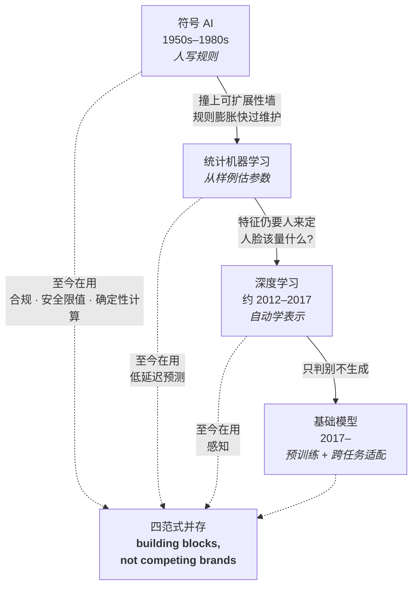
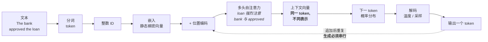
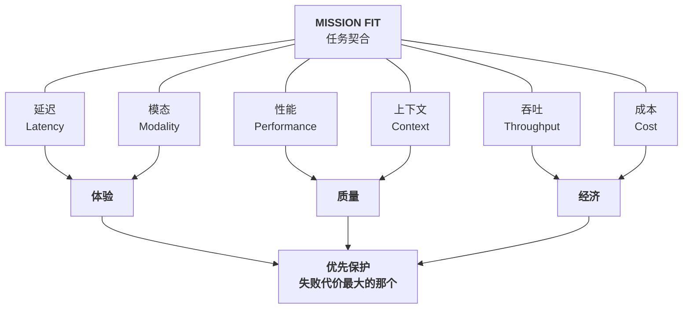
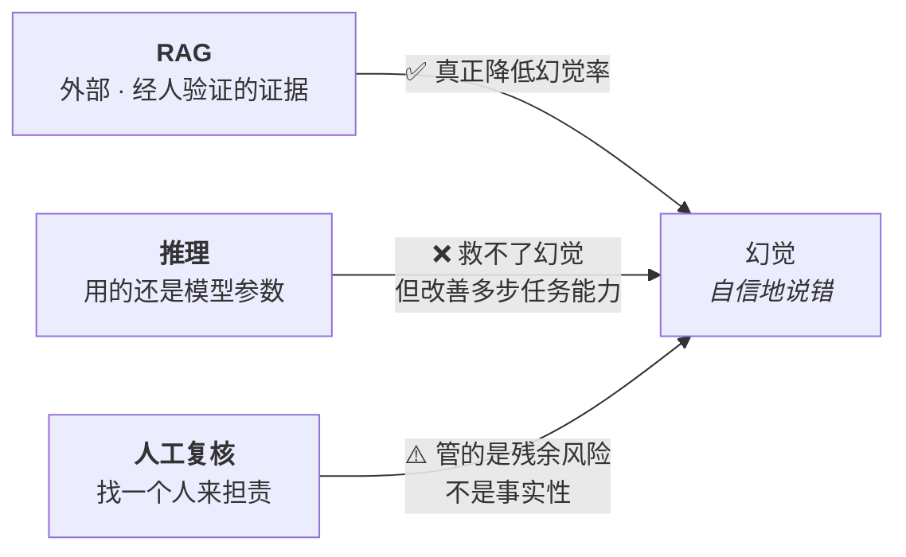

# M01 · 导论：生成式 AI 基础与企业落地

> **本讲一句话**：这一讲不教你怎么用 ChatGPT，它教你**在会议室里判断一个生成式 AI 方案值不值得做**——先给你一张从符号 AI 到 Transformer 的技术地图，再给你六个必须同时权衡的工程向量，最后给你一套在"输出不确定"的前提下仍然可以问责的治理语言。
> **原始材料**：`GenAI in Business IS5542-Lecture 1.pptx`（117 页） ｜ **转录**：`merged`（267 段，`00:00→02:04:19`，完整）

---

## 0. 三分钟速览

**这一讲讲了什么**

讲义分四部分，但它们回答的是同一个问题的四个层次：*一个不写代码的人，凭什么判断一个生成式 AI 方案靠不靠谱？*

- **Part 1（p.13–58）技术地图**——先拆掉四个最常见的误解，再沿着"符号 AI → 统计机器学习 → 深度学习 → 基础模型"四个范式走一遍，落到 Transformer 与 LLM 的内部机制。目的不是让你会推公式，而是让你**说对词**：说错词就会选错评估指标、买错技术。
- **Part 2（p.59–87）架构权衡**——企业选模型不是看排行榜，是一道**六向量多目标优化题**（模态、延迟、性能、成本、吞吐、上下文）。这一部分给了本课最可套用的框架。
- **Part 3（p.88–110）治理概率式系统**——传统软件同样输入必得同样输出，生成式 AI 不是。于是测试、审计、问责的整套方法都得换。
- **Part 4（p.111–117）NIST AI RMF**——把上面的东西装进一套四功能的通用风险语言：Govern / Map / Measure / Manage。

教授在开场就把这门课的坐标钉死了（转录 `00:00`）：**"It's more like a discussion of course for AI product manager."**

**学完你应该能**

1. **拆解**"这是不是生成式 AI"这类问题——区分**界面**（chatbot）、**产品**（ChatGPT）、**模型族**（LLM）、**范式**（生成式 vs 判别式）四个层次
2. **复述**四个 AI 范式各自的强项、边界与仍然在用的场景，并举出一个符号 AI 至今在生产环境中的真实例子
3. **说清**一句话从进入模型到吐出第一个字经过了哪几步（token → embedding → 位置 → 注意力 → 上下文向量 → 下一 token 分布 → 解码）
4. **用六向量框架**给一个具体业务场景（语音客服 vs 财报分析）推出两套不同的架构，并说明主约束是什么
5. **判断**一个"AI 出错了"的案例该用 RAG、推理、还是人工复核去治理——并说清为什么**推理救不了幻觉**
6. **套用 NIST AI RMF 四功能**对一个 AI 项目做一次结构化的风险体检

**如果只记三件事**

1. **"最好的模型"不等于"参数最多的模型"。** 企业架构是六向量的多目标优化，改善一个向量往往损害另一个——**优先保护失败代价最大的那个**。（教授全程重复了三次，见 §2.8.1）
2. **流畅 ≠ 理解，界面 ≠ 架构，输出可信 ≠ 系统可信。** 这三条同构：都是"看到表层就推断底层"的错误。ELIZA 在 1966 年就证明了第一条，今天的产品经理还在犯。
3. **目标是可接受风险，不是零风险。** 概率式系统消不掉不确定性，能做的是把残余风险压到明示的容忍线内、并持续监控。（讲义 p.117，全讲最后一页）

---

## 1. 开始之前 · 知识衔接

### 1.1 你已经有的

本讲是 IS5542 的起点，不依赖本课任何前序 module，只需具备 [[GenAI_in_Business/_meta/知识层级台账#L0 · 入场基线|L0 入场基线]]（监督/无监督学习、训练集、模型、准确率、神经网络、LLM 的直觉概念）。

**但本讲与 IS5113 M01 有大量重叠**，以下四个概念**已由 IS5113 完整展开，本笔记只回指 + 一句话唤醒**（规则见 [[GenAI_in_Business/_meta/知识层级台账#跨课复用规则|知识层级台账 › 跨课复用规则]]）：

| 概念 | 一句话唤醒 | 回看 | 本课视角有什么不同 |
|---|---|---|---|
| 图灵测试 | 若审问者分不出对面是人是机器，就算它有智能——**测的是"像不像人"，不是"聪不聪明"** | [[M01-导论-AI与伦理#2.2.1 图灵测试（Turing Test）\|IS5113 M01 §2.2.1]] | IS5113 问"智能能否被行为定义"；**IS5542 只关心一件事：用户会误判，而误判本身就是产品风险**（→ §2.3） |
| 达特茅斯会议 | 1956 年夏，McCarthy / Minsky / Shannon 等人在 Dartmouth College，AI 作为学科的起点 | [[M01-导论-AI与伦理#2.7 商业 AI 全景速通（讲义 p.36–59）\|IS5113 M01 §2.7]] | IS5113 当史实节点；**IS5542 用它论证"每一代 AI 都受限于当时的算力/数据/工程"**，从而解释范式为什么会切换（→ §2.4） |
| AI ⊃ ML ⊃ DL | AI 是目标，ML 是达成方式之一，DL 是 ML 的子集 | IS5113 M01 的 L0 基线 | **IS5542 加了一层实操含义：用错词就会选错评估指标**（→ §2.4.4） |
| 责任无法由 AI 承担 | 没有心灵的东西无法承担道德责任，责任必须回落到人 | IS5113 M01 §2.2.2 → W5 | IS5113 当伦理推论；**IS5542 把它变成架构要求**："高影响决策必须升级到有资质的人"（→ §2.9.3） |

> 💡 **两课的分工可以一句话概括**：IS5113 问「**该不该**这么做」，IS5542 问「**该怎么判断**能不能做」。同一批史料，落点完全不同。

商业、管理、系统工程、法律方面**不需要任何基础**——本讲全部就地解释。

### 1.2 本讲全新引入的概念

| 概念 | English | 展开于 |
|---|---|---|
| 生成式 AI（严格定义） | Generative AI | §2.2 |
| ELIZA / ELIZA 效应 | ELIZA / ELIZA Effect | §2.3.2 |
| 符号 AI · 专家系统 · AI 寒冬 · 可扩展性墙 | Symbolic AI · Expert System · AI Winter · Scalability Wall | §2.4.1 |
| 统计机器学习 · 半监督学习 | Statistical ML · Semi-supervised Learning | §2.4.2 |
| 表示学习 · 特征工程 · AlexNet · 残差连接 | Representation Learning · Feature Engineering · AlexNet · Residual Connection | §2.4.3 |
| 基础模型 · 四范式并存 | Foundation Model · Four Paradigms | §2.4.4 |
| 权重 · 偏置 · 激活函数 | Weights · Bias · Activation Function | §2.5 |
| one-hot · token · 嵌入 · 位置编码 · 上下文向量 | One-Hot · Token · Embedding · Positional Encoding · Contextual Vector | §2.5.2 |
| 自注意力 · 多头注意力 · Transformer | Self-Attention · Multi-Head Attention · Transformer | §2.5.3 |
| LLM · 预训练 · 适配 · 自回归生成 · 解码策略 · 温度 | LLM · Pretraining · Adaptation · Autoregressive Generation · Decoding · Temperature | §2.6 |
| 不透明性 · 可信 AI 三支柱 · 神经符号 AI | Opacity · Capability/Evidence/Control · Neuro-Symbolic AI | §2.7.2–2.7.4 |
| 六向量权衡 · 任务契合 | Six Vectors · Mission Fit | §2.8.1 |
| TTFT · ITL · 预填充/解码 | Time to First Token · Inter-Token Latency · Prefill/Decode | §2.8.3 |
| 有效上下文 · 中间迷失 | Effective Context · Lost in the Middle | §2.8.5 |
| 吞吐 · 批处理 · 总拥有成本 | Throughput · Batching · TCO | §2.8.6 |
| 复合 AI · 路由器 | Compound AI · Router | §2.8.7 |
| 确定性 vs 概率性 · 分布式评估 | Deterministic vs Probabilistic · Distributional Evaluation | §2.9.1 |
| 幻觉 · 接地 · RAG | Hallucination · Grounding · RAG | §2.9.2–2.9.3 |
| 证据链 ≠ 思维链 | Evidence Chain vs Chain of Thought | §2.9.4 |
| 提示注入 · 检索投毒 · 纵深防御 · 红队 | Prompt Injection · Poisoned Retrieval · Defence in Depth · Red Teaming | §2.9.5 |
| 记忆式相似 · 训练数据风险 vs 输出风险 | Memorized Similarity · Training-Data vs Output Risk | §2.9.6 |
| NIST AI RMF · 可接受风险 · 残余风险 | NIST AI RMF · Acceptable Risk · Residual Risk | §2.10 |

完整登记见 [[GenAI_in_Business/_meta/知识层级台账#M01 引入（本讲）|知识层级台账 › M01 引入（本讲）]]。

### 1.3 为什么这一讲放在这里 · 重排说明

这是第 1 讲，没有"承接"，只有"铺路"。它铺的路很具体：

- **§2.5–2.6（Transformer 与 LLM 机制）→ 直接是 L2 的前置**。L2 讲 prompt engineering、fine-tuning、RAG、function calling，这四样全都建立在"模型是自回归地从概率分布里取 token"这个事实上。不懂 §2.6，L2 只能死记
- **§2.8（六向量）→ 是 Module 2「GenAI 战略」的核心工具**。10 月 10 日复课后整个模块都在这个框架里跑
- **§2.9–2.10（治理）→ 是 11 月 21 日 Responsible AI 那一讲的骨架**。教授明说 Part 3/4 是"提前给的框架"，11/21 会把它做实
- **§2.4（四范式）→ 是小组项目的判断依据**。要你论证"为什么这个业务问题该用生成式 AI 而不是一条 if-then 规则"

**重排说明**

讲义的实际顺序是：

```
课程行政 p.1–12
→ 四个误解 p.13–15
→ AI 不是新的（视频 + 达特茅斯照片）p.16–17
→ chatbot vs ChatGPT + ELIZA p.18–21
→ 四范式 p.22–29
→ 神经网络/监督学习 p.30–31
→ 深度学习 p.32–40
→ 语言与 Transformer p.41–52
→ 模型全景/神经符号/可信 p.53–58
→ Part 2 六向量 p.59–87
→ Part 3 治理 p.88–111
→ Part 4 NIST p.112–117
```

本笔记做了**两处调整**：

1. **把 p.16–17（AI 不是新的 / 达特茅斯）从 ELIZA 之前挪到 §2.4 开头**。理由：p.16–17 是"四范式"这条历史线的起点，讲义把它和 ELIZA 那段插在一起，导致历史线被切断两次。合并后 §2.4 是一条完整的时间线。
2. **把 p.30（神经元图）与 p.41–48（语言表示与 Transformer）合并成 §2.5**。理由：讲义把神经元图放在"深度学习"之前、把语言表示放在 AlexNet 之后，中间隔了 10 页图像识别内容。但从"学会看懂 LLM"的角度，**神经元 → 词向量 → 注意力**是一条连续的路，中间不该被 CNN 打断。

其余顺序保留。小节 ↔ 页码的完整对应见 [[#8. 讲义页码映射|§8]]。

---

## 2. 正文

### 2.1 这门课怎么运作（先把实用信息说完）

这一小节对应讲义 p.1–12，不是"知识"，但决定你怎么分配精力，所以一次说完。

#### 考核结构（讲义 p.10、p.12，数字经[[GenAI_in_Business/_prep/课程前置资料|官方课程目录]]核实）

先把最现实的问题摆上桌面：这门课的总成绩从哪来、你该把时间往哪儿投。一句话概括——**总分对半分：一半来自平时的持续评估（反思 + 项目），一半来自期末那场 2 小时笔试**；而平时分里，六次课后反思几乎占满了大头，小组项目单独占三成。具体拆解如下：

| 部分 | 权重 | 说明 |
|---|---|---|
| **Participation and exercises** | **20%** | ＝ **6 次课后反思 × 3% ＝ 18%** ＋ **参与 2%** |
| **Group project** | **30%** | Project presentation |
| **Written examination** | **50%** | **2 小时**，英文作答 |

考试内部结构（讲义 p.12，**Syllabus 完全没有**）：

| 题型 | 占考卷 | 考什么 |
|---|---|---|
| Multiple choice | **20%** | — |
| Short answer | **30%** | — |
| **Essay** | **50%** | ① Concepts covered in the lectures ② **Case study questions on how to apply those concepts** |

> ⚠️ 讲义 p.12 自己标了 "Exact question format will be confirmed by the instructor"，所以 20/30/50 是暂定值。但**论述占一半、且明写案例应用**这个信号足够稳，复习策略应据此定：**练"拿框架套场景"，不是背名词。**

> ❗ **三条讲义没写、但官方目录写死的规则**（来源：官方课程目录，抓取 2026-09-09）：
> 1. **持续评估（20%+30%=50%）至少要拿到其 30%**
> 2. **笔试（50%）至少要拿到其 20%**
> 3. **"Students must pass BOTH coursework and examination in order to get an overall pass in this course."** ——一边高分补不了另一边
>
> 另外：**官方目录把 AT1（Assessment Task 1）记作 10%、AT2（Assessment Task 2）记作 40%**，与讲义的 20/30 不一致——**两者具体各自对应哪一项，官方目录本身没写清楚**，这正是三源冲突之一。两者的 CA 合计都是 50%，及格线按 CA 整体判，**所以不影响及格**，但可能影响最终分数。详见 [[GenAI_in_Business/_prep/课程前置资料#3. ⚠️ 考核结构 —— 三源冲突，必须看清|课程前置资料 › 3. ⚠️ 考核结构 —— 三源冲突，必须看清]]。

> ❗ **GenAI 使用政策**：官方目录的 AT 表里 **AT1 与 AT2 的 "Allow Use of GenAI?" 都是 Yes**。参与练习和小组项目**都明确允许用生成式 AI**。教授在课上更进一步：用 AI 写项目代码是**被鼓励**的。

**所以呢**：三大块权重心里有数之后，还有一件讲义完全没写、却直接决定你要不要每周来教室的事——教授把"出勤"这件事悄悄改了。

#### 🎙️ 最该注意的一条：教授自己的课不计出勤分

> "…and that means **the attendance and the participation in my lectures will not be graded.** I totally understand that many of you are busy with internships, job applications, interviews or assignments from other courses, so I have designed this attendance policy selectively."（转录 `12:34`–`13:07`）

**讲义 p.10 完全没有这句话。** 也就是说：**只有 6 场客座讲座的出勤、提问、讨论会被计分**（那 2% 就在这里），教授本人的 L1–L3 与 11/21 的课不计出勤。

但他随即用了近 4 分钟劝你还是要来听客座讲座（转录 `13:38`–`17:16`），理由有三层：

1. 课堂学的框架与产业实际之间**存在落差**，客座讲者补的正是这一层
2. 系里投入了大量资源请**资深**从业者，"before applying for job, many students usually try to arrange a coffee chat with industry practitioners, but usually **our guests are very senior — it's hard for you to directly find them**"
3. 每场都留了 **Q&A** 时间

> 🎙️ 他还讲了自己的经历作为佐证（转录 `16:10`）：读博时为了建立产业合作，**投了至少 100 个大厂岗位**，"I used one interview after another as an opportunity to speak with the team leader to explore whether there might be opportunities for collaboration"。逻辑是"投 100 家，总有一家会给机会"。
>
> 以及一条职业建议（转录 `02:06`）：**不要追最热的方向或最热的岗位，要找你真正想做的。**

**所以呢**：出勤政策和客座讲座讲完了，接下来是另一件直接影响你精力分配的事——怎么在小组项目里拿到分数。

#### 小组项目（讲义 p.11 + 转录 `18:26`–`23:34`）

讲义 p.11 的标题很关键：**"Group Project: Defensible GenAI Application"**——**defensible（站得住脚的）**，不是 impressive。页脚标语 **PROBLEM • WORKFLOW • DEMO**。

| 要求 | 来源 |
|---|---|
| 5–7 人一组，**同伴互评**确保贡献公平 | Syllabus + 讲义 p.11 |
| 定义**具体**业务问题 + **谁受影响** | 讲义 p.11 |
| 设计 GenAI 工作流、数据来源、rollout 计划 | 讲义 p.11 |
| 评估**业务价值、模型质量、成本、风险**四项 | 讲义 p.11 |
| 演示须含：业务背景与目标用户 / 架构、评估指标、预期结果 / **Demo, or storyboard** | 讲义 p.11 |
| ❗ **必须有真正跑得起来的 agent，不能只是概念提案** | 🎙️ 转录 `19:03` |
| 可以**录视频**提交 | 🎙️ 转录 `17:54` |

> 🎙️ **教授把讲义留的退路口头收紧了**：讲义写 "Demo, **or storyboard**"，转录里他说
> "this is not only a conceptual proposal… **your project should include an actual AI agent and a working demo of that agent.**"
> **按最严的口径准备。**

> 🎙️ **明确鼓励用 AI 写代码**（转录 `19:03`）：
> "with today's web coding tools, you don't need to write every line of code manually in the traditional way and **that is old fashioned**."
> 但**仍需你自己做的**：定义业务问题、设计工作流、指明数据来源、决定 agent 用什么工具、说明它如何在真实商业中落地（`19:43`）。
>
> 以及一句很实在的提醒（`21:54`）：**"the practical skill cannot be developed simply by listening"**——L2、L3 只给基础，动手要靠课后自己试。

**所以呢**：考核和项目的"游戏规则"说完了，最后一条元指令决定了你该怎么读接下来的正文。

#### 🎙️ 教授对"这一讲该怎么学"的明确指示

> "you don't need to memorize every definition, but **the main purpose of today's lecture is just to help you build a conceptual map**. So by the end of the class, I hope you can **distinguish several terminologies in AI**."（转录 `03:59`）

**这句话是本讲最重要的元指令**：考的不是定义本身，是**术语之间的区分**。所以本笔记的每个概念都会附一格「⚠️ 常见误解」——那一格才是考点密度最高的地方。

---

### 2.2 先把四个误解拆掉（讲义 p.13–15）

**是什么**

讲义 p.14 用一个 Gemini 生成的"AI 大脑"图开场，p.15 贴了四张图（来源：*Forbes*，Bernard Marr，2024-07-30，"Generative AI Myths: The 5 Biggest Misunderstandings"），对应四个问题。**p.15 是纯图片页，正文一个字都没有——四个问题的答案全在演讲者备注里。**

> **讲义 p.15 演讲者备注原文**
> *Is it ChatGPT?* — No, GenAI is not just ChatGPT or only a Chatbot
> *Is it Intelligent?* — Yes and No, depends on how you look at it, **it's a function of probability that predicts what is the most likely next word based on the training dataset**
> *It only creates words and pictures?* — No, it can create music, video, model, and many different forms of data
> *Is it New?* — No it's not new, we have a long history of AI and the concepts of AI chatbots can trace back to the 1950s

**为什么需要它**

因为这四个误解**各自会导致一个具体的商业错误**。教授把这层说得很直白：

> "so for managers this distinctions are practical. So **if we mislead the task, we may buy the wrong technology**."（转录 `26:01`）

| # | 误解 | 事实 | 会导致什么商业错误 |
|---|---|---|---|
| 1 | 生成式 AI ＝ ChatGPT | ChatGPT 只是**一个产品、一种对话界面**；生成式 AI 这个品类还包括文本、图像、语音、音乐、视频、代码、科学设计 | 把"上 AI"等价于"接 ChatGPT API"，忽略了更合适的模态与更便宜的方案 |
| 2 | 有聊天窗口 ＝ 就是生成式 AI | 聊天窗背后可能是**固定规则、检索、预测模型**，也可能是 LLM。**界面不揭示架构** | 采购时被界面骗；或反过来，以为自家规则机器人已经"有 AI 了" |
| 3 | 输出流畅 ＝ 具备类人理解 | 模型是**从训练中学到的模式 + 运行时给的上下文**里预测**看起来合理的续写**。这能产生像推理的行为，**也能自信地产生错误陈述** | 把模型输出当事实用，不加验证 → 见 §2.9.2 幻觉 |
| 4 | AI 是 2023 年突然出现的 | 今天的进展是**数据、算力、模型结构、训练方法**长期累积的结果 | 高估"这次不一样"，低估历史上同样的乐观—失望循环 |

**课件原例**

讲义 p.14 的标题是 *"What is Generative AI?"*，配图的提示词直接写在图上：**"Gemini Prompt: Create an image of an AI Brain"**。

> ⚠️ 这张图和 p.2、p.15 一样带 Google Slides 的图形 ID（`Google Shape;1448;p160`），说明**这三页是从一份 Google Cloud 的外部演示文稿里搬过来的**。详见 [[#9.3 课件自身的问题|§9.3]]。

**🎙️ 课堂补充**

转录 `24:02` 教授在讲第三个误解前，先给了生成式 AI 的**机制定义**：

> "the image is not normally copied as one complete item from the training data, and **the model just produced an output by using the representations learned during training**."

这句很重要：它同时否掉了两种直觉——**既不是从训练集里检索一张现成的图**，**也不是"真的理解了"**，而是**用训练中学到的表示重新组装**。

**💡 换个说法（笔记补充）**

第 2 条最容易被绕进去，可以用一个类比：**"有方向盘"不代表"是汽车"**——碰碰车、模拟器、赛车都有方向盘。方向盘是**交互形式**，不是**动力系统**。

同理，"聊天窗"是交互形式。**要判断底层是什么，你得问四个问题**（这四问来自转录 `40:18`，讲义没有）：

1. **是哪个组件产生了这个输出？**（规则？检索？模型？）
2. **系统用了什么数据？**
3. **它能采取什么动作？**（只回话？还是能改数据库、能退款？）
4. **出问题时它受什么约束？**

> 🎙️ 这四问是教授即兴给的，讲义 p.19 只有一句 "Do not infer the architecture or capability of a system from the word chatbot alone."。**四问版本比讲义那句可操作得多，值得背下来当答题模板。**

**⚠️ 常见误解**

- ❌ **"生成式 AI 就是不准，所以不能用在严肃场景。"** —— 讲义 p.49 的原话是 "Fluent generation is **probabilistic pattern completion**—not guaranteed factual understanding"。它说的是**不保证**，不是**必然错**。治理手段（§2.9.3）正是为了把"不保证"压到可接受范围
- ❌ **把"AI 不是新的"理解成"现在没什么突破"。** 教授明确否掉了两个极端（转录 `32:24`）："the right conclusion is **neither** that early AI was naive **nor** that today's systems have solved intelligence"。正确的说法是：**能力、规模、可及性、商业影响是新的；"造出能执行智能任务的机器"这个志向已经存在约 70 年**（转录 `34:24`）

**与其他概念的关系**

这四个误解是全讲的目录：
- 误解 ①② → §2.3（ELIZA：界面不揭示架构）
- 误解 ④ → §2.4（四范式的历史线）
- 误解 ③ → §2.6（自回归生成）+ §2.9.2（幻觉）

---

### 2.3 ELIZA 与"界面不揭示架构"（讲义 p.18–21）

#### 2.3.1 chatbot 是品类，ChatGPT 是产品

**是什么**（讲义 p.19）

你手机里点开的"聊天窗口"，可能是完全不同的两种东西：十年前那种只会按关键词弹政策页的客服机器人，和 ChatGPT 这样能自己组织语言回答问题的产品，界面看上去都是"一个打字框"，背后的技术却天差地别。**chatbot（聊天机器人）是一整类对话式软件的统称，ChatGPT 只是这一类里一款具体的产品**——一个是品类，一个是牌子，混着说会让你误判系统的真实能力。

| | **Chatbot** | **ChatGPT** |
|---|---|---|
| 是什么 | **一大类**对话式软件 | **一个**基于 OpenAI 模型的具体对话产品 |
| 底层 | 可能是脚本规则、菜单、检索、机器学习 | 从**学到的语言分布**中生成回答 |
| 能力 | **取决于界面背后的系统** | 可与检索、工具、业务控制组合 |

> **讲义 p.19 的结论句**："Do not infer the architecture or capability of a system from the word *chatbot* alone."

**🎙️ 课堂补充：同一句话，四种架构（转录 `39:11`–`40:18`）**

教授用一个具体请求把四种实现摊开了——**这是全讲最好用的一个例子，讲义完全没有**：

用户说：**"Can I cancel my order?"**

| 实现方式 | 它实际做了什么 | 能力边界 |
|---|---|---|
| **传统关键词机器人** | 匹配到 `cancel` 这个词，弹出政策页 | 只会给你看文档，不知道你的订单 |
| **工作流机器人** | 先做身份认证，再查订单状态，调用订单管理 API | 知道你的订单，但只会走预设流程 |
| **生成式系统** | 用自然语言解释政策 | 会说人话，但**可能说错**，也不一定真能取消 |
| **完整业务系统** | **规则**判定资格 ＋ **检索**取当前政策 ＋ **工具**执行取消 ＋ **语言模型**解释结果 | 四者各司其职 |

> 💡 **这张表是本课"复合 AI"（§2.8.7）的预告**：最后一行就是 compound AI 的雏形。教授在 Part 1 就埋了这个伏笔。

**⚠️ 常见误解**

- ❌ **"用了 LLM 的一定比规则机器人强。"** —— 第 4 行说明恰恰相反：**最强的方案是把规则留在该留的地方**。规则做资格判定既快又可审计，让 LLM 去做这件事是浪费且危险

**所以呢**：知道了"界面不能代表架构"，下一步自然要问——**为什么人会被界面骗**？答案要回到六十年前一个几乎没有任何智能的程序：ELIZA。

---

#### 2.3.2 ELIZA 与 ELIZA 效应

**是什么**（讲义 p.20–21）

**ELIZA** 是 Joseph Weizenbaum 于 **1964–1966** 年在 MIT 写的规则式对话程序。它最著名的脚本叫 **DOCTOR**，模仿一位"反射式"心理治疗师。

它的机制只有三步（讲义 p.20 的三个标签）：**PATTERN MATCHING（模式匹配）→ SCRIPTED RULES（脚本规则）→ REFLECTIVE REPLY（反射式回应）**。

| 它怎么工作（讲义 p.21 左栏） | 它为什么重要（讲义 p.21 右栏） |
|---|---|
| 匹配关键词与脚本模式 | 用户把**共情与智能**归因给它 —— **ELIZA 效应** |
| 把用户的短语改写成反问 | 这个反应引出了人机交互的伦理问题 |
| **不理解意义，也不从对话中学习** | 后续系统：PARRY、ALICE、虚拟助手、LLM 聊天机器人 |

> **讲义 p.21 的结论句**："ELIZA's power came from **the user's interpretation**, not genuine understanding."

**课件原例 + 🎙️ 课堂视频**

课上放了一段历史影像（讲义 p.18 的嵌入视频），转录 `35:58`–`37:27` 记下了完整对白。这是本讲**最值得记住的一段材料**：

```
用户：Men are all alike.              （男人都一个样。）
ELIZA：In what way?                   （怎么说？）
用户：They're always bugging us about something or other.
ELIZA：Can you think of a specific example?
用户：Well, my boyfriend made me come here.
ELIZA：Your boyfriend made you come here.   ← 只是把人称换了、原句复读
用户：He says I'm depressed much of the time.
ELIZA：I'm sorry to hear that you're depressed.
用户：It's true, I am unhappy.
ELIZA：Do you think coming here will help you not to be unhappy?
```

旁白点破了机制：*"The computer's replies seem very understanding, but this program is merely triggered by certain phrases to come out with stock responses."*

然后是那个决定性的故事（转录 `37:06`，Weizenbaum 本人讲述）：

> "…**Weizenbaum's secretary fell under the spell of the machine.** She sat down at the keyboard and then she began to type. I looked over her shoulder to make sure that everything was operating properly. After two or three interchanges with the machine, she turned to me and she said, **'Would you mind leaving the room?'** …and yet she knew that Eliza didn't understand a single word that could be typed into it."

**为什么需要它**

因为它证明了一件反直觉的事：**"让人觉得被理解"这件事，所需要的技术水平，远低于"真的理解"。**

秘书**知道**它不懂，**仍然**要求隐私。这说明 ELIZA 效应不是无知造成的，是**人际交往本能**造成的——只要对方以对话形式回应，人就会自动补上"对面有个心智"这个假设。

**🎙️ 教授的总结（转录 `37:43`、`41:41`）**

> "the ELIZA is just a chatbot based on the keyword. **She or it cannot explain or understand the input and explain its output.** It just based on the keyword… **Does it understand?**"

> "there was no learned language model, **no semantic representation** compared with even the representation in the Transformer architecture, and **no genuine comprehension of user's intention**, but many users experienced the conversation as meaningful because **people naturally interpret a responsive dialogue with a social flavor**. So this tendency became known as the ELIZA effect."

**💡 换个说法（笔记补充）**

ELIZA 效应可以理解成**社交层面的"视错觉"**。视错觉里，你明知两条线一样长，还是看着不一样长——**知道不改变感知**。ELIZA 效应同理：秘书知道那是程序，**知识没有覆盖掉本能**。

这解释了为什么"在界面上写一行免责声明"通常没用。要真正管住它，得改**交互设计**本身（不用第一人称、主动暴露不确定性、在高风险场景强制转人工）——这正是讲义 p.21 结尾和 p.108 讲的事。

**⚠️ 常见误解**

- ❌ **"ELIZA 只是历史趣闻，跟今天的 LLM 无关。"** —— 教授明确反驳（转录 `42:04`）："this lesson remains highly relevant because **modern systems are far more capable, but users sometimes still attribute the certainty, the intention or even authority to systems on the basis of fluent output**."。今天的问题**更严重**，因为流畅度高了几个数量级
- ❌ **"ELIZA 通过了图灵测试。"** —— 没有。ELIZA 只是**触发了 ELIZA 效应**。两者不是一回事：图灵测试是有意识的辨别任务，ELIZA 效应是无意识的投射。顺带一提，在 Jones & Bergen 2025 年的正式三方图灵测试中，**ELIZA 只有 23% 被判为人类**（见 [[M01-导论-AI与伦理#2.2.1 图灵测试（Turing Test）|IS5113 M01 §2.2.1]]）
- ❌ **把 ELIZA 效应等同于"用户笨"。** —— 秘书是 Weizenbaum 本人的秘书，天天看着他写这个程序

**与其他概念的关系**

ELIZA 是**符号 AI 的一个具体样本**（§2.4.1）——纯规则、可追溯、零学习。同时它是误解 ②③ 的历史证据。讲义 p.108 讲"医疗聊天机器人听起来很权威"时，讲的是同一件事在 60 年后的版本。

> 🔗 **课外补充**：ELIZA 效应与 John Searle 1980 年的**中文房间论证**（Chinese Room）是同一枚硬币的两面——ELIZA 效应说的是**外部观察者会误判**，中文房间说的是**内部确实只有符号操作**。IS5113 M01 §9.4 已展开该论证。（🔗 常识性哲学内容，非本课材料）

---

### 2.4 AI 不是新的：四个范式（讲义 p.16–17、p.22–29、p.32–40）

#### 2.4.0 起点：1956 年达特茅斯（讲义 p.16–17）

讲义 p.16 嵌了一段 YouTube 视频（`youtu.be/5Ur-Nf85ARw`，从 3:07 开始），p.17 是**整页的达特茅斯 1956 年合影**（纯图片页，文本提取为空，已视觉复核）——照片上是七位年轻研究者坐在 Hanover 校园的草地上。

讲义 p.17 的三句话：

> **1956** ｜ "The term *artificial intelligence* entered the research agenda decades before today's generative models." ｜ **"AI is not new; today's capabilities are the result of several paradigm shifts."**

**🎙️ 视频内容（转录 `27:39`–`31:08`，讲义只有一张照片）**

视频讲了达特茅斯会议的三位关键人物，这段内容**只有到场才听得到**：

| 人物 | 带来了什么 | 视频原话要点 |
|---|---|---|
| **John McCarthy** | **"AI 之父"**，**创造了 "artificial intelligence" 这个词** | 他想探索**语言与智能的关系**；主张人类行为的复杂性可通过更高层的抽象来模拟，尤其是以语言为工具；提议开发一种能让机器进行**猜想与自指**的人工语言 —— 这为后来的编程语言和 AI 通信协议奠基 |
| **Marvin Minsky** | 神经网络与数学 | 他已经造出了最早的神经网络模拟机之一：**SNARC（Stochastic Neural Analog Reinforcement Calculator）**；关注让机器通过**感知与运动抽象**产生**目标寻求行为**；他的工作暗示了机器可以建立**对环境的内部模型** |
| **Claude Shannon** | **"信息时代之父"** | 数字电路设计理论与电信；他关于**信息处理与传输**的理论为 AI 奠基；强调**数学模型**对理解复杂系统的重要性 |

会议提案的目标（视频原话）：探索机器**使用语言、形成抽象概念、解决复杂问题、以及自我改进**的可能性。

> 💡 视频特别点出：**"self-improvement in machines"（机器自我改进）** 这个想法在 1956 年就提出来了——今天的自主系统与机器学习正是它的实现。

**🎙️ 教授对这段历史的解读（转录 `31:25`–`34:54`）——比视频重要**

> "as we watch this historical context, it's important [to note the] **gap between the capability and aspiration**. The researchers had important ideas about symbolic reasoning and machine intelligence, but they did not have… **the GPUs and the cloud platform or the large pre-trained models**. So **that gap helps explain the cycle of optimism and disappointment** that later became known as AI winters."

> "each generation **works within a particular combination of the technology they have, compute and engineering**. So the current generative AI wave is therefore a **new stage in the long history**, but not the beginning of that history."

**这是本讲的一个主论点**：范式切换不是因为有人变聪明了，是因为**可用资源（算力/数据/工程）变了**。教授把这条线索一直拉到了 §2.4.3 的 AlexNet（"三种资源同时到位"）。

---

#### 2.4.1 范式一：符号 AI（讲义 p.25–27）

**是什么**

设想最早期的一台信贷审批系统：工程师直接把审批标准写死成一条条"如果…就…"的语句——"如果过去 6 个月逾期次数 ≥ 2，就拒绝"——系统不"学习"任何东西，只是精确执行人写好的规则。这就是最早一代 AI 的做法。严谨地说，**符号 AI（Symbolic AI）**：用**符号、逻辑、if–then 规则**显式地表示知识。1950s–1980s 的主流范式。

三种典型做法（讲义 p.25 左栏）：

| 做法 | 说明 |
|---|---|
| **基于规则的推理** | 显式的 if–then 逻辑 |
| **搜索与规划** | 在定义好的状态空间里找一条动作序列 |
| **专家系统（Expert System）** | 把专家知识编码成规则，用于可重复的决策 |

> **讲义 p.25 结论**："Strength: **transparency**. Limitation: **brittle** performance when rules cannot cover real-world ambiguity."

**为什么需要它**

因为在**结构化、必须可审计**的场景里，符号 AI 至今没有替代品。讲义 p.25 右栏列的适用场景是：规则清晰的分类与规划、金融与医疗这类结构化领域、**每一步推理都必须可追溯的审计场景**。

**🎙️ 课堂补充：平安保险的百万条规则（转录 `44:57`、`48:13`）——本讲最值钱的例子之一**

讲义只说符号 AI"在结构化领域好用"，教授给了一个至今仍在运行的真实案例：

> "actually this if-then rules is **quite popular in like Ping An insurance company**. So actually when I first work with them, **I was shocked that they still rely on this if-then rules**, but they told me: **humans, in the end, would take the responsibility to end the decision, so they prefer to use the tools that they can control, and they know clearly why the decision is yes or no.**"

> "in the fintech company like Ping An, we have like **millions of gift rules** in the sub-company of the group, based on this **30 years experience**."

> ❗ **这段的价值不在"平安还在用规则"，而在那个理由**：
> **人最终要为决策负责，所以人偏好自己能控制、且知道为什么的工具。**
> 这一句同时解释了三件事：① 为什么符号 AI 没死 ② 为什么金融业对黑箱模型抵触 ③ 为什么 §2.7 的"可信 AI"必须包含 **Control** 这一支柱。**极可能出现在案例题里。**

> 🎙️ 他还补了一句邀请（转录 `45:48`）："if you are curious about my experience in company, I'm happy to talk with you during the break."

**🎙️ 另一个课堂例子：混合式贷款工作流（转录 `43:39`）**

> "in business practice, **the most reliable design is often hybrid**, for example a loan application workflow might use **a classifier** to route applications from consumers and **a regression model** to estimate the loss and **retrieval** to help the consumers find the current policy and… explain the results."

**⏭️ 边界（讲义 p.26–27，课上讲了但压缩得很快）**

| 商业价值（p.26 左） | 边界（p.26 右） |
|---|---|
| 结构化领域中可重复的决策 | **规则必须由人来写和维护** |
| 透明的逻辑与可追溯的推理 | 歧义与非结构化数据难以处理 |
| 适用于专家系统、规划、合规 | **例外一多，覆盖率就退化** |

**可扩展性墙（Scalability Wall，讲义 p.27）**——符号 AI 最终撞上的那堵墙：

| 为什么性能停滞（p.27 左） | 这个领域学到了什么（p.27 右） |
|---|---|
| **规则库膨胀的速度超过团队维护的速度** | 光靠知识工程无法规模化 |
| 感知与语音仍不可靠 | **从数据中学习**变得越来越重要 |
| 算力与数据受限 | 符号方法在需要显式约束时**仍然有用** |

> **讲义 p.27 结论**："The lesson was **not that rules were useless**; rules alone could not cover the real world."

**🎙️ 教授补的三个具体失效点（转录 `48:41`–`50:31`）**

1. **规则互相冲突**："a rule for one case could potentially conflict with another rule… at this time, the [system] would switch from the rule to the human being to make the final decisions"
2. **非结构化输入无法符号化**："error structure has speech, images like **the vehicle damage** were difficult to reduce to reliable symbols" —— 车损照片没法写成规则
3. **对抗性环境下覆盖率崩塌**："a rule-based fraud system can block an impossible transaction, but **thousands of handwritten rules cannot easily capture every changing behavior of the fraud users among millions of users**"
4. **成本**（转录 `50:04`）："another disadvantage of the symbolic models is **it can only be maintained manually** and it's not [a] cost effective strategy"

**AI 寒冬（AI Winter）**：当"例外超出了系统能力、资金随之退潮"时，这个领域经历的低谷期（讲义 p.27）。

> 🎙️ 教授从这段历史里抽出两条教训（转录 `51:32`）：
> 1. **技术进步依赖一整个生态**（方法 + 数据 + 算力 + 工程支持），**光有好想法不够**
> 2. **旧方法在主导范式切换后仍然有价值**——"explicit rules still matter these days for compliance, safety limits and deterministic calculations"

**⚠️ 常见误解**

- ❌ **"符号 AI 已经被淘汰了。"** —— 讲义 p.24 明说四范式 "**continue to coexist**"，p.56 专门讲神经符号 AI。平安的例子是活证据
- ❌ **"AI 寒冬是因为想法错了。"** —— 教授明确说失败的是**"手写知识足以覆盖真实世界复杂性"这个假设**（转录 `52:03`），不是符号方法本身

**所以呢**：符号 AI 撞墙的原因是"规则得靠人一条条写"。下一个范式换了个思路——不写规则，让算法自己从样例里估计参数。

---

#### 2.4.2 范式二：统计机器学习（讲义 p.28、p.31）

**是什么**

不再要求程序员写下每一条决策规则，而是**给出样例、让算法估计参数**（讲义 p.28）。

| 变了什么（p.28 左） | 新增了什么依赖（p.28 右） |
|---|---|
| 模型从样例中学习特征或参数 | **有代表性且合法可用的数据** |
| 性能可在**留出数据（held-out data）**上度量 | 足够的算力与工程 |
| **泛化能力变成一个经验问题** | 对**漂移（drift）** 与环境变化的监控 |

> **讲义 p.28 结论**："The paradigm traded explicit rules for **data-dependent performance**."

**为什么需要它**

讲义 p.28 的动机句：机器学习"estimates patterns from examples **instead of requiring every decision rule to be hand-coded**"。它直接回应了 §2.4.1 的可扩展性墙。

**课件原例：监督学习的两类任务（讲义 p.31）**

监督学习内部还分两种"考法"：答案是**选择题**（比如"这封邮件是不是垃圾邮件"）还是**填空题**（比如"这笔外卖还要等多少分钟"）。前者叫分类，后者叫回归：

| | **分类 Classification** | **回归 Regression** |
|---|---|---|
| 预测什么 | 一个**类别** | 一个**连续数值** |
| 例子 | 邮件是否垃圾、交易是否欺诈、用户是否流失 | 送餐预计到达时间、等待时长、下一季度营收 |

> **讲义 p.31 结论**："The **target type** determines the model objective and evaluation metric."（目标变量的类型决定了目标函数和评估指标）

**🎙️ 课堂补充 ①：欺诈检测里准确率会骗人（转录 `01:05:32`）——讲义完全没有**

> "in applications like fraud detection or medical diagnosis, **the accuracy alone may be misleading**. This is because the positive cases are often rare. For example in the fraud detection cases, **in the data usually only 0.8% is the fraud cases**. So if accuracy is the only evaluation metric, then we just predict all the cases as not fraud [and] we can get the accuracy level above 99%."

> "because the fraud cases is very rare, we cannot just use accuracy… **we need to combine the recall to find more fraud cases** — that [is] the target of the company. **We don't care about the precision or accuracy.**"

> ❗ 这段有两层价值：① 类别极度不平衡时准确率无意义（这是 L0 里有的常识，但 **0.8% 这个具体数字来自他的产业经验**）② **"公司只在乎召回率"是一个业务判断，不是技术判断**——因为漏掉一笔欺诈的代价远高于误报一笔。这正是 §2.8 "优先保护失败代价最大的那个向量"的早期版本。

回归的评估指标（转录 `01:06:30`）：**MSE**（均方误差）及其变体 **MAE / RMSE**。

**🎙️ 课堂补充 ②：半监督与无监督学习（转录 `01:06:30`–`01:10:42`）——讲义整段没有**

讲义 p.31 只画了监督学习。教授花了 4 分钟补完另外两类，起因是一句很实在的观察：

> "the real world data are rarely as clean and complete as the data we see in the textbooks. So in company we usually have **a very large amount of data, but only a small percentage may be labeled and clean** enough to be used for our training process."

| 类型 | 训练数据 | 典型任务 | 教授给的商业例子 |
|---|---|---|---|
| **监督学习** | 全部有标签 | 分类、回归 | 欺诈检测、送餐 ETA |
| **半监督学习**<br>Semi-supervised | **少量有标签 ＋ 大量无标签** | 先用无标签数据学表示，再用少量标签引导具体任务 | 只知道一小部分客户的性别/收入/位置，用它去帮着给其余客户分类 |
| **无监督学习**<br>Unsupervised | **完全没有标签** | **聚类**、离群点检测 | 在没有预设客户类型的情况下，按购买频次或产品偏好把客户分群，再由业务经理解读每群的特征、**决定给哪群发多少优惠券** |

> 💡 教授的原话把无监督学习的商业逻辑说得很清楚（转录 `01:09:53`）："the business manager can then examine these clusters and **interpret the cluster characteristics and design the differentiated strategy for each group, like how much coupons you want to send to this group**."
>
> **注意这里的分工**：模型只负责"分出来"，**"这群是什么人、该怎么对待"是人来解读的**。这是无监督学习在商业场景里的标准用法。

**🎙️ 课堂补充 ③：美团送餐 ETA 为什么不用 Transformer（转录 `55:01`）**

> "the statistical machine learning approach is very popular when we predict… the estimated arrival [time] on the food delivery platform… **most algorithms they just use the statistical [approach]** to predict this time because **the response time must be within one second**. And the disadvantage of the transformer models is **it takes more time** than this simple statistical machine learning approach."

> ❗ **这是全讲第一次出现"延迟约束反过来决定技术选型"**——正是 §2.8.3 的核心。教授在 Part 1 就用一个真实案例把它演示了一遍。

**⚠️ 常见误解**

- ❌ **"有了机器学习就不需要人的判断了。"** —— 讲义 p.28 与转录 `54:33` 都强调：**模型没有消除人的判断，只是把人的判断挪了位置**——挪到了**数据选择、目标定义、评估、部署、监控**上
- ❌ **"准确率高的模型就是好模型。"** —— 见上面 0.8% 的例子
- ❌ **把"漂移 drift"当成模型坏了。** —— 讲义 p.28 说的是"behaviors may change after a promotion or a market shock"（转录 `54:09`）：**是世界变了，不是模型坏了**

**所以呢**：统计机器学习还是要靠人先想好"该看哪些特征"（年龄、金额……）。下一个范式解决的正是这一步——让模型自己从原始数据里学出该看什么。

---

#### 2.4.3 范式三：深度学习与表示学习（讲义 p.32–40）

**是什么**

想让机器认出照片里是谁，以前的做法要靠人先想好"该量哪些指标"——量眼距？量鼻子形状？量肤色纹理？这一步叫**人工特征工程**，下文的思想实验会具体展开它有多难。**深度学习（Deep Learning）**换了个做法：用多层神经网络**直接从数据里学出"表示"**，不再需要人工先设计指标。讲义把它的活跃期定在**约 2012–2017**（讲义 p.32）。

| 核心范式（p.32 左） | 关键使能条件（p.32 右） |
|---|---|
| 多层网络逐层提取越来越复杂的特征 | **大数据**提供多样的训练样例 |
| 目标通常是**判别式的**：识别、分类、预测 | **GPU** 让大规模并行计算变得可行 |
| 例：人脸识别、预测、医学影像 | 更好的优化方法与网络结构稳定了训练 |

> **讲义 p.32 结论**："Deep learning **reduced the need for explicit feature engineering, but increased dependence on data and compute**."

**关键概念：表示学习（Representation Learning）**

**表示（representation）＝ 模型内部组织信息的方式。** 教授的解释（转录 `01:16:04`）比讲义清楚：

> "a raw image consists of pixels, speech consists of sound waves, and text consists of tokens. **A model cannot understand those inputs in the same way that a human can**, so it must convert this raw data with different modality into **numerical representations** that it can process. **In traditional machine learning, humans usually decide how the data should be represented. In deep learning, a multi-layer neural network can learn useful representations directly from the large dataset.**"

层级是这样的（讲义 p.33 + 转录 `01:17:46`）：

```
早期层 → 边缘、颜色、线条
中间层 → 纹理、形状、局部结构
后期层 → 人脸、汽车、动物这类抽象概念
```

**🎙️ 教授的思想实验：人脸识别该手工定义什么特征？（转录 `01:12:07`）——讲义没有**

> "if we want a traditional model to recognize the face, **what feature should we manually define?** Should we measure the **distance between the eyes**? or the **shape of the nose**? or the **position of eyes on the face**? or the **texture of the skin**? …real images contain so many complex patterns that [it is] almost impossible to specify all the relevant features by hand."

> 💡 **这是解释"为什么需要表示学习"最好的一段**，比讲义的抽象表述有力得多。答题时可以直接用。

**课件原例：AlexNet（讲义 p.34–35）**

深度学习不是一直都被看好，它靠一场比赛的压倒性胜利才翻身——2012 年的 ImageNet 图像识别大赛，冠军模型 AlexNet 用下面这些数字证明了自己：

| 项 | 值 |
|---|---|
| 任务 | ImageNet：给一张没见过的 **224×224** 图，从 **1000 个类别**里排出最可能的标签 |
| 结构 | **5 个卷积层 + 3 个全连接层**，约 **6000 万参数**，GPU 训练 |
| 关键技术 | Conv + **ReLU** → Pooling → Conv blocks → Fully connected → 1000 类 |
| 成绩 | **ImageNet 2012：top-5 错误率 15.3%** |
| top-5 错误率的定义 | **只有当正确标签不在模型给出的 5 个最可能答案里，才算一次错误** |

讲义 p.35 给了一个示意的 top-5 输出：

| 排名 | 预测 | 概率 |
|---|---|---|
| 1 | Golden retriever | 72% |
| 2 | Labrador retriever | 18% |
| 3 | Kuvasz | 4% |
| 4 | Tennis ball | 2% |
| 5 | Other dog breed | 1% |

> **讲义 p.34 结论**："The breakthrough came from **architecture + compute + data**—not from one ingredient alone."

**🎙️ 课堂补充：亚军的成绩（转录 `01:20:35`）**

> "in the 2012 ImageNet competition, AlexNet achieved a top-five error of above 15%, while the **runner-up was around 26%**. …**a gap of more than 10 percentage points was dramatic at that time**."

> ❗ **26% 这个数字讲义上没有**，但它才是 AlexNet 意义的关键——**不是"错误率 15% 很低"，而是"比第二名低了 10 个百分点"**。在一个逐年只挪动一两个点的比赛里，这是断层式领先。

> ⚠️ **转录此处有一个数字错误**：教授口述 AlexNet 参数量为 "roughly like 6,000,000"（600 万），但讲义 p.35 白纸黑字写 **"≈60M parameters"**（6000 万）。**以讲义为准，AlexNet 约 6000 万参数。** 详见 [[#9.5 待核对|§9.5]]。

**残差连接（Residual Connection，讲义 p.36）**

**问题**（转录 `01:21:26`）：网络越深越难训——"information and gradients must pass through many layers, and during the process **the gradient may become extremely small or very unstable**. As a result, the earlier layers may learn very slowly, and **adding more layers may actually make the performance worse**."

**两个解法**（教授提了两个，讲义只画了第二个）：

1. **Inception 模块**——让网络用**多条并行的操作**处理同一个输入（转录 `01:22:23`，讲义 p.36 标题提到但没画）
2. **残差连接 / 捷径连接（shortcut connection）**——讲义 p.36 画的就是它：

```
        ┌──────────── identity shortcut ────────────┐
        │                                            ↓
   x ──→ Conv + ReLU ──→ Conv ──→ F(x) ──────────→  (+)  ──→ F(x) + x
```

**为什么有效**（转录 `01:24:03`，比讲义详细）：

> "without the shortcut, the block must learn **the complete mapping** from the input to the desired output. With this shortcut line, **the block only needs to learn the residual — that is, what needs to change relative to the input.** …if the input is already good and already contains useful information, the block does not need to modify too much. So instead of reconstructing the entire input, **the block can just learn the small adjustment**. In the simplest case it can make F(x) close to 0, allowing the original information x to pass through almost unchanged."

> **讲义 p.36 结论**："Residual connections **preserve information** and make much deeper networks trainable."

**三种资源互相强化（讲义 p.37）**

| 资源 | 作用 |
|---|---|
| **GPUs** | 并行硬件让大型网络训练快得多 |
| **大数据集** | ImageNet 级别的标注数据让"比较"和"泛化"变得可测量 |
| **架构** | 卷积、ReLU、dropout，以及后来的残差连接改善了优化 |

> 🎙️ 教授把这三者的**互相制约**说得比讲义更清楚（转录 `01:26:06`）："**more data without appropriate model may not produce useful learning**, and **a larger model without enough compute may be impossible to train**, and **more compute without representative data may simply scale the wrong objective**."
>
> 💡 三句话构成一个三角：任意缺一角，另外两角就白费。**这是很好的简答题素材。**

**Geoffrey Hinton（讲义 p.38–39）**

讲义 p.38 是文字页，p.39 是**整页信息图**（纯图片，已视觉复核）：

| 项 | 内容 |
|---|---|
| 生平 | 1947-12-06 生于伦敦；1970 剑桥实验心理学学士；**1978 爱丁堡大学 AI 博士**；Sussex 与 UC San Diego 博士后 |
| 履历 | 1982–1987 卡内基梅隆；**1987 至今 多伦多大学**；1998–2001 UCL Gatsby 计算神经科学中心创始主任；2004–2013 CIFAR 的 NCAP 项目主任；**2013–2023 Google Brain 副总裁兼工程院士**（Google 收购其创业公司 DNNresearch） |
| 主要贡献 | 人工神经网络；**1986 反向传播**（合著奠基论文）；**1983–85 玻尔兹曼机**；其团队的 **AlexNet（2012）** 革新了计算机视觉；分布式表示、专家混合、深度信念网络 |
| 奖项 | **2024 诺贝尔物理学奖**（与 John Hopfield 共享）；**2018 图灵奖**（与 Yoshua Bengio、Yann LeCun 共享） |
| ⚠️ | **2023 年离开 Google，以便自由地谈论 AI 快速发展的生存性风险** |

> 🎙️ 教授只讲了一句，但那句是重点（转录 `01:26:43`）："as you look at Geoffrey's career, **notice the persistence required to work on the neural network ideas during periods when they were not the dominant approach** over decades. But in the end, he won the Nobel Prize and the Turing Award."

**⚠️ 常见误解**

- ❌ **"深度学习是第一种能从数据里学习的方法。"** —— 教授专门澄清了这一点（转录 `01:11:07`）："**deep learning was not the first approach that allowed machines to learn from data**. In traditional machine learning models, we can also learn patterns from data. **The major change was how the features or representations were produced.**" —— 变的是**特征从哪来**，不是"会不会学"
- ❌ **"层越多越好。"** —— 见残差连接那段：不加捷径的话，加层反而更差
- ❌ **把这一阶段的深度学习等同于生成式 AI。** —— 讲义 p.32 明说这一时期的目标"usually **discriminative**: identify, classify, or predict"。**判别式 ≠ 生成式**，这是范式三与范式四的分界

**所以呢**：符号 AI、统计 ML、深度学习——到目前为止三个范式都只会"识别、分类、预测"，没有一个能凭空生成新内容。第四个范式第一次做到了这件事。

---

#### 2.4.4 范式四：基础模型，以及"四范式并存"（讲义 p.22–24、p.29、p.52、p.55）

**是什么**

前三个范式各自都只会做一件事：符号 AI 执行写死的规则，统计 ML 预测一个数值或类别，深度学习认出图里是猫是狗——**都不生成新内容**。第四个范式第一次做到"无中生有"：给一句话能续写一段文章、给一个提示能画一张图。严谨地说，**基础模型（Foundation Model）**：大规模**预训练**（用海量数据预先训练出通用能力，§2.6.2 细讲）、可跨任务跨**模态**（文本、图像、语音等不同媒介，§2.8.2 细讲）**适配**（用提示词、微调等手段把通用能力调整到具体任务，§2.6.2 细讲）的生成式模型（讲义 p.24）。

**⚠️ 讲义在这里给了两套并存的分法，必须分清**：

| | **三里程碑**（讲义 p.22–23） | **四范式**（讲义 p.24） |
|---|---|---|
| 1 | **Symbolic AI**：显式规则与可追溯推理 | **SYMBOLIC AI**：显式规则与搜索；透明，但例外一多就脆 |
| 2 | **Deep Learning**：从数据学统计模式 | **STATISTICAL ML**：从数据学预测模式；性能取决于样例是否有代表性 |
| 3 | **Generative AI**：自主产出文本、图像、代码、音频 | **DEEP LEARNING**：从非结构化数据学表示；需要大量数据与算力 |
| 4 | — | **FOUNDATION MODELS**：预训练的生成式模型，可跨任务、跨模态、跨业务流程适配 |

讲义 p.23 自己解释了差异："These milestones summarize major capability shifts; **the four-paradigm view separates Statistical ML from Deep Learning.**"

> ⚠️ **考试注意**：同一份讲义里相邻几页给了"三个"和"四个"两种数法。**问"AI 经历了几个范式"时，先说清你用的是哪套**。四范式那套更细，且 p.24 明确说四者 "continue to coexist"，所以本笔记以四范式为准。

**为什么需要它**

因为 §2.4.1–2.4.3 的三个范式**都不生成新内容**——符号 AI 执行规则，统计 ML 预测数值/类别，深度学习做判别。**"产出新内容"是范式四才有的能力。**

讲义 p.52 把 2017 年之后的转变拆成两栏：

| 技术转变（p.52 左） | 商业转变（p.52 右） |
|---|---|
| 自注意力与并行训练 | **自然语言界面** |
| 大规模预训练 | 文本、代码、图像、音频生成 |
| **可跨多任务复用的模型** | **模型成为共享平台** |

> **讲义 p.52 结论**："**2017 marks the Transformer era—not the beginning of all generative modeling.**"

**AI ⊃ ML ⊃ DL（讲义 p.29）**

> "Each term is a narrower subset of the one before it. AI is the broad goal; ML learns from data; deep learning learns layered representations."

这条在 [[M01-导论-AI与伦理|IS5113 M01]] 的 L0 基线里已有，本课只加一层**实操含义**（转录 `56:11`–`57:35`）：

> "these three categories should not be used [inter]changeably. **A rule-based expert system may be AI without being machine learning**; a linear regression model… **is machine learning without being deep learning**; and a convolutional neural network is deep learning, machine learning and AI at the same time."

> "**using precise terms helps us select the right evaluations** — we evaluate a classifier differently from a text generator, even if both appear inside the same AI product."

> ❗ **最后这句是"为什么要分清术语"的答案**：不是学术洁癖，是因为**评估方法跟着范式走**。分类器看 accuracy/precision/recall/F1，生成器根本不能这么评。同一个产品里两者并存时，用错指标就会得出错误结论。

**课件原例：模型全景（讲义 p.55）**

讲义 p.55 排了七个 logo：**ChatGPT、Gemini、Claude、Copilot、Qwen、DeepSeek、Grok**。

> **讲义 p.55 结论**："Treat product names as **time-stamped examples**; use **durable decision categories**."（把产品名当作有时间戳的例子，要用的是经得起时间的决策范畴）

**🔀 课堂纠正：Copilot 不是基础模型（转录 `01:39:03`）——教授当场改了自己的讲义**

> "the generative AI landscape should be viewed as a portfolio, but… **Copilot is just one product** compared with GPT, Gemini, Claude, Qwen, DeepSeek and Grok — that's the foundation model. **Copilot itself is not a foundation model** because it's [a] famous product. So I put it here, but actually **it's totally different from the rest of the 6 foundation models**."

> ❗ **这是双源比对里最典型的一处**：讲义把七个东西平铺在一页上，看起来是同类；教授口头指出**其中一个不是同类**。
> Copilot 是**构建在其他厂商基础模型之上的产品**，与另外六个不在同一层。
> **这个层次混淆正是误解 ① 的翻版**（"生成式 AI ＝ ChatGPT"），而讲义自己在这一页犯了一次。

**⚠️ 常见误解**

- ❌ **"基础模型取代了前三个范式。"** —— 讲义 p.24 明说四者 "continue to coexist"，且 "Modern enterprise systems often combine **rules, predictive models, foundation models, retrieval, and tools**"。教授的措辞更狠（转录 `44:24`）：**"the paradigms are building blocks, not competing brands."**
- ❌ **"生成式 AI 是 2022 年 ChatGPT 发布时开始的。"** —— 讲义 p.52 把技术起点定在 **2017 年的 Transformer**，把商业起点定在"广泛可及的聊天界面出现之后"。两者差 5 年
- ❌ **看到 logo 就以为是同一层的东西。** —— 见上面的 Copilot 纠正

**与其他概念的关系**

四范式是本讲的骨架。§2.5–2.6 是范式四的内部机制，§2.7 是它带来的新问题（不透明），§2.8 之后全部是"在企业里怎么用它"。

---

### 2.5 从词到向量：语言为什么难表示（讲义 p.30、p.41–48）

> 本节把讲义 p.30（神经元）与 p.41–48（语言表示到 Transformer）合并，理由见 [[#1.3 为什么这一讲放在这里 · 重排说明|§1.3]]。

> ⚪ **关于 p.30**：这一页是两张神经元结构示意图，**纯图片、无文字信息，课上也没有展开**（见 [[#8. 讲义页码映射|§8]]）。下面这一小段是**💡 笔记补充**——按预习规则，讲义有的页就要能从笔记学会，所以把图上那套机制用最短的篇幅讲一遍；§2.5 真正展开的是 p.41–48：**语言这种数据，为什么连神经网络都不能直接吃**。

**💡 p.30 那张图在画什么：一个"神经元"就是一道加权求和题（笔记补充）**

人话版：一个神经元收到几个数字（输入），给每个数字乘一个"重要程度"（**权重**，weight），加起来，再加一个可调的基准值（**偏置**，bias），最后把结果丢进一个"开关函数"（**激活函数**，activation function）决定输出多大。神经网络就是成千上万个这样的单元层层相连。

$$y = f\Big(\sum_{i=1}^{n} w_i x_i + b\Big)$$

| 符号 | 是什么 | 谁决定 |
|---|---|---|
| $x_i$ | 第 $i$ 个输入（比如一张图的某个像素、上一层某个神经元的输出） | 数据 |
| $w_i$ | 第 $i$ 个输入的**权重**：这个输入对结果的重要程度，可正可负 | **训练学出来的** |
| $b$ | **偏置**：加在加权和上的常数，让"多大算大"这个门槛可以移动。⚠️ 与 §2.9.7 的"算法偏见"（bias）**是同一个英文词、完全不同的意思** | 训练学出来的 |
| $f(\cdot)$ | **激活函数**：把加权和压成输出的非线性函数，最常见的 ReLU 就是 $\max(0, z)$——负数归零、正数原样通过 | 人设计的 |
| $y$ | 输出，传给下一层 | — |

**代入数字（假设）**：两个输入 $x_1 = 2, x_2 = -1$，权重 $w_1 = 0.5, w_2 = 1.0$，偏置 $b = 0.3$。加权和 $= 0.5\times2 + 1.0\times(-1) + 0.3 = 0.3$；过 ReLU 得 $y = \max(0, 0.3) = 0.3$。若偏置改成 $-0.5$，加权和变成 $-0.5$，ReLU 输出 $0$——**偏置决定了"要多强的信号才能被传下去"**。

**为什么要有激活函数**：没有它，每一层都只是"加权求和"，而若干次线性运算叠起来仍然等价于一次线性运算——堆多少层都学不到弯的、复杂的关系。§2.4.3 说深度学习靠"层层抽象"，非线性正是"层"有意义的前提。

**所以呢**：p.30 的图讲的是**数值输入**怎么被处理。接下来 p.41 问的是——**文字不是数值**，怎么办？这就是 §2.5.1。

#### 2.5.1 语言与数值特征表的根本差别（讲义 p.41）

**是什么**

前面统计机器学习处理的是**固定的数值特征向量**（年龄、金额、距离）。语言不是。讲义 p.41 列了两组困难：

| 同形不同义（Same form, different meaning） | 顺序为什么重要（Why sequence matters） |
|---|---|
| 一个词可以有多个义项 | **词序改变意义** |
| 代词与指代依赖前文 | 长距离依赖连接相隔很远的短语 |
| 语气与意图可能是隐含的 | **小的理解偏差会在整篇文档里累积放大** |

> **讲义 p.41 结论**："Language models need representations that capture **both token identity and surrounding context**."（既要表示"是哪个词"，又要表示"周围是什么"）

**🎙️ 课堂补充：bank 的两个义项**（转录 `01:27:33`）

教授全程用同一个例子贯穿 §2.5，**建议你也用它当记忆锚点**：

> - "The bank approved the loan." → bank ＝ **银行**
> - "We sit on the riverbank." → bank ＝ **河岸**
>
> "**The letters are the same and the surrounding words determine the relevant sense.**"

**💡 换个说法（笔记补充）**

统计机器学习的特征表里，"年龄 ＝ 35"这一格的含义**与旁边那一格无关**。语言不是这样：**同一个 token 的含义由它的邻居决定**。这一条差别，直接导致了后面的一切——one-hot 不够用（§2.5.2）、需要注意力（§2.5.3）、上下文长度成为一个架构向量（§2.8.5）。

---

#### 2.5.2 one-hot → token → 嵌入 → 上下文向量（讲义 p.42–43）

**是什么：为什么 one-hot 不够用（讲义 p.42）**

想让计算机处理"词"，最直接的一个笨办法是：把词表里的每个词都单独分配一个位置，像点名册一样——点到谁的名字，谁那一位就是 1，其余全是 0。这就是**one-hot 编码**：给词表里每个 token 一个唯一位置，该位置为 1、其余为 0：

| token | 向量 |
|---|---|
| bank | `1 0 0 0 0` |
| river | `0 1 0 0 0` |
| money | `0 0 1 0 0` |
| loan | `0 0 0 1 0` |
| water | `0 0 0 0 1` |

**两个致命缺陷**（讲义 p.42 标注）：

1. **稀疏**——向量长度等于词表大小，教授说**约 10 万维**（转录 `01:28:48`），其中只有一个 1
2. **没有语义距离**——在这个表示下，`bank` 与 `money` 的距离，和 `bank` 与 `water` 的距离**完全一样**。而我们知道前一对显然更近

> **讲义 p.42 结论**："Embeddings replace **isolated identity codes** with **dense, learned representations**."

**是什么：四步流水线（讲义 p.43）**

一句话要变成模型能算的向量，中间要经过四道工序——从原始文字，切成小块，再变成数字向量，最后再让每个向量"知道"自己在句子里的上下文。讲义 p.43 把这条流水线画成一行：

```
TEXT              TOKENS                EMBEDDINGS          CONTEXT
"Generative AI" → Gener | ative | AI  → 稠密向量         → 位置 + 注意力
```

讲义 p.43 的一句话总结：**"Tokens are discrete units; embeddings encode features; context changes meaning."**

**🎙️ 课堂补充：教授把这四步讲得比讲义细**（转录 `01:29:12`–`01:30:51`）

| 步 | 发生了什么 | 教授的补充 |
|---|---|---|
| ① **分词（tokenize）** | 字符串切成离散单元 | "**depending on the vocabulary, 'generative' might be 1 token or maybe split into three pieces**" —— ⚠️ **同一个词在不同模型里可能是 1 个也可能是 3 个 token**，这直接影响计费和上下文占用（→ §2.8.5、§2.8.6） |
| ② **转成整数 ID** | 每个 token 映射到一个整数 | 讲义没写这一步 |
| ③ **嵌入（embedding）** | 查表把 ID 变成稠密向量 | "**this embedding alone does not tell the model where the token appears**" —— 嵌入只有"是什么"，没有"在哪" |
| ④ **加位置 + 注意力** | 位置信息被加进去，注意力让每个 token 吸收其他位置的信息 | 结果叫**上下文向量（contextual vector）** |

**最关键的一句**（转录 `01:30:13`）：

> "**The word 'bank' will therefore receive a different representation** in 'the riverbank' and 'the bank loan', **even though the initial token identifier is the same**."

> ❗ **这句话是理解 LLM 的分水岭**：token ID 相同，**最终参与计算的向量不同**。one-hot 时代做不到这件事，这正是 §2.5.3 注意力要解决的问题。

**⚠️ 常见误解**

- ❌ **"一个 token ＝ 一个词。"** —— 不是。`Generative` 在讲义 p.43 的例子里被切成 `Gener | ative`。**英文常见词多为 1 token，长词和中文常被切成多个。** 这是估算成本和上下文占用时最常见的误算来源
- ❌ **"嵌入就是上下文向量。"** —— 嵌入是**查表得到的静态向量**（同一个 token 永远同一个嵌入）；上下文向量是**经过位置编码和注意力之后的动态向量**（随句子变化）。**两者差一整个 Transformer**
- ❌ **"one-hot 已经被淘汰了。"** —— 它在类别特征编码里仍在用。被淘汰的是**用它来表示语言**

**所以呢**：token 有了上下文向量，但向量是怎么"吸收"到周围信息的？答案是注意力机制——也是循环网络当年过不去的那道坎。

---

#### 2.5.3 循环网络的瓶颈与 Transformer（讲义 p.44–46、p.48）

**是什么：循环模型为什么丢长上下文（讲义 p.44）**

在 Transformer 出现之前，处理句子的主流做法是"从左到右读一遍，边读边记笔记"——读到第 10 个词时，前 9 个词的信息全部压缩在一份"笔记"（隐状态）里往后传。这就是**循环神经网络（RNN）**：逐个 token 处理，把隐状态一路往后传：

```
Token 1 → 隐状态 → Token 2 → 隐状态 → … → Token n
                   ← 很长的依赖路径 →
```

**🎙️ 教授的解释**（转录 `01:30:51`）：

> "the information from **the beginning of the long document must survive many sequential updates** before it can affect a token near the end."

两个后果：① 远距离信息容易在传递中衰减；② **训练无法并行**（必须等前一步算完）。

> **讲义 p.44 结论**："The search for **global context and parallel training** set the stage for the Transformer."

**是什么：自注意力（讲义 p.45–46）**

**Transformer** 用**在全序列上做注意力**替代了循环。核心机制是**多头自注意力（Multi-Head Self-Attention）**：

> **讲义 p.46 的例子**：句子 `The bank approved the loan`，"**loan** 强烈地注意到 **bank** 和 **approved**"。
> **结论句**："Attention weights are **learned relationships—not fixed dictionary meanings**."（注意力权重是学出来的关系，不是词典里固定的义项）

**🎙️ 教授把这个例子讲透了**（转录 `01:33:12`）：

> "to understand the token **loan**, the model considers all the other tokens and determines which one provides useful information. **Bank is important because it establishes the financial context**, while **approved describes what happens to the loan**… And this relationship is **not taken from a fixed dictionary**, [it is] learned from the training data and **recalculated for each sentence**. **That's why the same word can have different meaning in different contexts.**"

> 💡 **注意这里闭环了**：§2.5.1 提出的问题（bank 有两个义项）→ §2.5.2 说明 one-hot 解决不了 → §2.5.3 给出答案（注意力从上下文里选义项）。**这三节是一条完整的论证，不是三个知识点。**

**训练并行 vs 生成串行（讲义 p.48）** —— ⚠️ **极易混淆，必考级区分**

| | **循环模型** | **Transformer** |
|---|---|---|
| 结构 | A → B → C → D 顺序依赖 | 所有 token ↔ 注意力 |
| 训练 | 难以并行 | **并行训练** |
| 长距离 | 路径长、易衰减 | **直接连接** |

> **讲义 p.48 结论**（这句必须原样记住）：
> "**Training becomes parallel, while generation still proceeds token by token.**"
> **训练是并行的，生成仍然是一个 token 一个 token 的。**

**🎙️ 教授的对应表述**（转录 `01:35:02`）：

> "a transformer **removes that recurrent dependency** [in] the sequential training process, so **all the token positions can participate in attention within the same layer**, which allows much more parallel computation and creates direct paths between [distant] parts of the sequence."

**课件原例：论文出处（讲义 p.45–46 的 Sources）**

> **《Attention Is All You Need》**，2017，arXiv:1706.03762 / NeurIPS 2017。**Transformer 架构的原始论文。**

**🎙️ 教授对这篇论文的评价**（转录 `01:31:59`）：

> "In 2017, researchers published a famous paper called **Attention is all you Need**… it's a very famous and instructive paper in computer science… **Transformer is the foundation of generative AI**."

> ⚠️ 教授口述了一个引用量数字，ASR 记成了 "about 26267 thousand"，**无法还原**。见 [[#9.5 待核对|§9.5]]。**答题不要引用具体引用量。**

**⚠️ 常见误解**

- ❌ **"Transformer 让生成也并行了。"** —— **最常见的错误。** 讲义 p.48 明说 generation **still proceeds token by token**。并行的只有**训练**。生成必须串行，因为第 n+1 个 token 的概率依赖于已经生成的前 n 个（→ §2.6.1）。**这条直接决定了 §2.8.3 的 ITL（token 间延迟）为什么消不掉。**
- ❌ **"注意力就是查词典。"** —— 讲义 p.46 专门否掉了：权重是**学出来的、且每句重算**
- ❌ **"Transformer ＝ LLM。"** —— Transformer 是**架构**，LLM 是**用这个架构训练出来的大规模模型**。讲义 p.47 明说 "Scalability comes from **the whole architecture**—not attention or parameter count alone"

**所以呢**：Transformer 解决了"怎么表示一句话"。下一步是"有了表示，模型是怎么真的一个字一个字吐出回答的"。

---

### 2.6 LLM 怎么生成一句话（讲义 p.47、p.49–52）

#### 2.6.1 自回归生成与解码（讲义 p.49–50）

**是什么**（讲义 p.49）

LLM **一次只产生一个 token**。每一步：

```
Prompt → 上下文状态 → 下一 token 的概率分布 → 选一个 token → 追加 → 重复
```

> **讲义 p.49 结论**（本讲最该背的一句）：
> "**Fluent generation is probabilistic pattern completion—not guaranteed factual understanding.**"
> 流畅的生成是**概率性的模式补全**，不是有保障的事实性理解。

**课件原例：解码（讲义 p.50）**

给定 `The cat sat on the…`，模型输出一个分布：

| 候选 | 概率 |
|---|---|
| mat | **80%** |
| hat | 15% |
| floor | 5% |

**解码（decoding）** 决定"怎么从这个分布里挑一个"。

> **讲义 p.50 结论**："**Temperature and sampling expose a controllable trade-off between consistency and diversity.**"
> **温度（temperature）与采样策略，是一个"一致性 ↔ 多样性"之间可控的权衡旋钮。**

**💡 换个说法（笔记补充）**

把温度理解成**"要不要总选第一名"**：

| 温度 | 行为 | 适合 |
|---|---|---|
| 低（→0） | 几乎总选概率最高的（上例永远选 mat） | 抽取、分类、结构化输出、要可复现的场景 |
| 高 | 更愿意选低概率候选（可能选 floor） | 创意写作、头脑风暴 |

> ❗ **这个旋钮是 §2.9.1「概率式系统难测试」的直接来源**：温度不为 0 时，**同样的输入不保证同样的输出**，传统的"跑一遍看对不对"式测试就失效了。

**⚠️ 常见误解**

- ❌ **"模型是从训练集里检索一段现成的文本。"** —— §2.2 的 🎙️ 已经否掉了（转录 `24:02`）："the model just produced an output **by using the representations learned during training**"
- ❌ **"温度设成 0 就完全确定了。"** —— 温度 0 让**采样**确定，但**模型版本更新、上下文差异、批处理实现差异**仍会改变输出。讲义 p.90 列的四个变异来源里，采样只是其中之一
- ❌ **"概率最高的 token 就是最正确的。"** —— 概率高只意味着**在训练分布下最像是接下来会出现的词**。这正是幻觉的机制（→ §2.9.2）

---

#### 2.6.2 LLM 的定义：规模 · 预训练 · 适配（讲义 p.51）

**是什么**（讲义 p.51 三栏）

前面几节一直在用"LLM（大语言模型）"这个词，但"大"到底大在哪、它凭什么"看起来会说话"？讲义没有给一个参数量门槛（比如"超过多少亿参数才算 LLM"），而是给了三个必须同时满足的条件——规模、预训练的方式、以及后续怎么被适配到具体任务，三者缺一个都不完整。

| | 内容 |
|---|---|
| **SCALE 规模** | 可观的参数量、数据量与算力，支撑广泛的模式学习 |
| **PRETRAINING 预训练** | **自监督目标**学到可复用的语言与任务表示 |
| **ADAPTATION 适配** | **提示、检索、微调、工具**把行为特化到具体业务任务 |

> **讲义 p.51 结论**："General-purpose adaptation is common, **but it is not part of the formal definition of every LLM**."

**🎙️ 教授的三点补充**（转录 `01:36:45`–`01:37:40`）

1. **"Large" 没有数字门槛**："there is **no single numerical threshold** that defines the category"
2. **自监督是什么**："labels are **derived from the data itself**"——目标就是**预测被遮住的词或下一个词**，不需要人工标注。💡 这解释了为什么预训练能吃下整个互联网：**数据自带标签**
3. 🔴 **两处明确的范围声明**：
   > "**I will not go deeper in the pre-training stage because it's closely related to the AI infra. That's not the [concern of] students in Business School.**"（`01:37:15`）
   > "adaptation — I'll discuss the [prompt] engineering, retrieval, fine-tuning and the external tools **in the next lecture**."（`01:37:40`）

> ❗ **这两句是很硬的复习指引**：**预训练的技术细节不是本课重点**；**适配的四种手段是 L2 的正题**。§1.3 说的"§2.6 是 L2 的前置"，依据就是这句。

**与其他概念的关系**

讲义 p.52 把 2017 之后的转变分成技术与商业两栏（已在 §2.4.4 引用）。**"模型成为共享平台"这一条是 Part 2 的前提**：正因为同一个基础模型可以被无数业务复用，企业才需要 §2.8 的六向量去挑选和配置它。

---

### 2.7 不透明性与可信 AI（讲义 p.53–58）

#### 2.7.1 两段视频（讲义 p.53–54）⏭️

讲义安排了两段视频：

| 页 | 标题 | 讲义给的思考题 |
|---|---|---|
| p.53 | *What Makes AI Generative?*（CAPABILITY CHECK） | 把解释与 **token、解码、多模态**联系起来 |
| p.54 | *Why Can AI Feel Alive?*（HUMAN INTERPRETATION） | **要有什么样的证据，才能做出更强的断言？** |

讲义 p.54 的结论句值得记：**"Fluent conversation can trigger anthropomorphism, but social behavior is not evidence of consciousness or genuine understanding."**（流畅对话会触发拟人化，但社交行为不构成意识或真正理解的证据）—— 这是 §2.3 ELIZA 效应的正式表述。

> ⏭️ **转录里没有播放这两段视频的痕迹**，教授从 p.52 直接跳到了 p.55 的模型全景。**可自行观看，优先级不高。**

#### 2.7.2 不透明性：可信从哪里来（讲义 p.57）

**是什么**

模型内部的表示**难以被完整解释**，但**围绕模型的系统仍然可以被问责**。讲义 p.57 把这件事拆成两栏——**这张表是本讲最实用的一页**：

| **难以观察（Hard to observe）** | **可以审计（Can be audited）** |
|---|---|
| 某一个具体输出的内部成因 | **来源、提示词、模型版本** |
| 更新之后行为的变化 | **工具调用、规则、审批** |
| 单条训练样本的影响 | **评估、事故、监控结果** |

> **讲义 p.57 结论**（建议原样背下来）：
> "Trust comes from **evidence and controls around the model**—not a claim that its hidden reasoning is visible."

**🎙️ 教授的补充**（转录 `01:39:30`–`01:40:30`）

> "a traditional rule can often be [inspected] directly, but a large neural model contains **billions of learned parameters**. [That does] not mean the system is impossible to be evaluated by human experts. It means **trust must come from several forms of evidence rather than one simple explanation**."

他给的四条具体做法：**记录整个训练过程与评估数据 / 在有代表性的场景上测试 / 计算每个子群体的表现 / 保留检索到的来源**。

> 💡 "**计算每个子群体的表现**"这条直接连到 §2.9.7 的公平性——**分组评估是公平性的操作定义**。

#### 2.7.3 可信 AI 三支柱（讲义 p.58）

**是什么**

上一节说模型内部"说不清"（不透明），但这不代表企业就没法判断一个 AI 系统该不该信。讲义把"可信"拆成三根柱子，缺一根都不算数——就像一张三条腿的凳子，少一条腿就站不稳：

| 支柱 | 内容 |
|---|---|
| **Capability 能力** | 在**有代表性的工作负载**上度量任务准确率、鲁棒性、延迟与成本 |
| **Evidence 证据** | 把输出**接地**到经批准的数据上，保存来源、版本与评估结果 |
| **Control 控制** | 按风险施加**权限、监控、人工复核、事故响应** |

> **讲义 p.58 结论**："**A strong model is only one component of a trustworthy business system.**"

**🎙️ 教授特别点了第三支柱**（转录 `01:41:00`）：

> "**the control is easy to be ignored, but it's very important.**"

> ❗ **三支柱是本讲后半的目录**：
> **Capability → §2.8 六向量**（怎么度量并权衡能力）
> **Evidence → §2.9.2–2.9.4 接地、RAG、证据链**
> **Control → §2.9.5–2.9.6 安全与数据 + §2.10 NIST**
>
> 而且它回答了 §2.4.1 平安的那个问题——**为什么金融机构偏好可控的工具？因为 Control 是可信的三分之一，黑箱模型只满足 Capability。**

#### 2.7.4 神经符号 AI（讲义 p.56）

**是什么**

把神经网络与符号方法**组合**起来：

| **神经的强项** | **符号的强项** |
|---|---|
| 高容量的感知与模式识别 | **显式的规则与约束** |
| 灵活的内容生成 | **可追溯的推理路径** |
| 从大规模非结构化数据中学习 | 在结构化领域里可靠执行 |

> **讲义 p.56 结论**："Hybrid systems aim to combine neural flexibility with **interpretable, controllable logic for high-stakes use**."

> 💡 **这一页是 §2.4.1 那句"the paradigms are building blocks, not competing brands"的兑现**，也是 §2.8.7 复合 AI 的理论版本。**平安的百万条规则 + 现代模型，就是神经符号在产业里的样子。**

**⚠️ 常见误解**

- ❌ **"不透明 ＝ 不可问责。"** —— 讲义 p.57 整页就是在拆这个等号。**内部不可见，不妨碍外围可审计。**
- ❌ **"可解释性（explainability）＝ 可信（trustworthy）。"** —— 讲义 p.58 说可信要三样，可解释性最多算 Evidence 的一部分

**所以呢**：Part 1 到这里讲完了整张技术地图（四范式 → 语言表示 → LLM 生成 → 可信 AI）。Part 2 开始把这张地图变成一套能直接拿去开会用的决策框架。

---
### 2.8 ★ 六向量：企业架构是一道多目标优化题（讲义 p.59–87）

> **这是本讲最可套用的框架，也是 Module 2 的核心工具。** 小组项目和案例题都要用它。

#### 2.8.1 框架本身（讲义 p.59–63、p.86–87）

**是什么**

> **讲义 p.60 的核心命题**："Choosing an enterprise LLM architecture is **an optimization problem, not a model leaderboard contest**."
> 选企业 LLM 架构是一道**优化题**，不是**排行榜比赛**。

六个向量（讲义 p.61，围绕中心的 **MISSION FIT 任务契合**）：

| 向量 | English | 问什么 | 展开于 |
|---|---|---|---|
| **模态** | Modality | 输入输出是文本、图像、语音还是视频？ | §2.8.2 |
| **延迟** | Latency | 用户等多久？分首字延迟和后续速度 | §2.8.3 |
| **性能** | Performance | 输出够不够准、够不够可靠 | §2.8.4 |
| **上下文** | Context | 能吃进多少证据、**并且真的用得上** | §2.8.5 |
| **吞吐** | Throughput | 整个系统每秒能处理多少请求 | §2.8.6 |
| **成本** | Cost | 全部拥有成本，不只是 token 单价 | §2.8.6 |

> **讲义 p.61 结论**（★ 全讲最重要的一句）：
> "**Improving one vector can weaken another; prioritize the dominant business failure cost.**"
> **改善一个向量往往损害另一个；优先保护"失败代价最大"的那个。**

讲义 p.62 把六个向量归成三组，更好记：

| 组 | 向量 | 决定什么 |
|---|---|---|
| **体验 Experience** | 模态 + 延迟 | 用户**怎么**跟系统交互 |
| **质量 Quality** | 性能 + 有效上下文 | 输出**有没有用、可不可靠** |
| **经济 Economics** | 吞吐 + 成本 | 这套架构**能不能规模化** |

**为什么需要它**

因为"选最强的模型"这个直觉是错的。讲义 p.63 把两种思维方式并排放：

| **排行榜思维（Benchmark mindset）** | **任务约束思维（Mission constraints）** |
|---|---|
| 问"哪个模型在公开榜单上最聪明/最大" | 定义**模态、准确率、延迟、上下文、吞吐、成本、隐私、风险** |

> **讲义 p.63 结论**："The best enterprise model is the one that **meets the mission within operational and governance constraints**."

**🎙️ 课堂补充**（转录 `01:41:24`–`01:42:25`）

> "we cannot only consider the capability [and] just use the best foundation model like GPT or Claude. **We should also consider the cost, the governance issues and also the latency, throughput and the context.**"
> "**it's not a performance-driven decision**, it's a comprehensive decision including the six vectors."

以及一句很实际的（转录 `01:42:25`）：

> "usually when the company [has a fixed] cost [budget], **we already have limited choices to select**."
> **预算先把候选集砍掉一大半——这才是企业选型的真实起点。**

**💡 换个说法（笔记补充）**

这道题的数学形式是**约束优化**，不是**求最大值**：

$$\text{不是：}\ \max\ (\text{模型能力})$$

$$\text{而是：}\ \max\ (\text{对本业务而言的输出质量})\quad \text{s.t.}\quad \text{延迟} \le L,\ \text{成本} \le C,\ \text{吞吐} \ge T,\ \text{合规} = \text{通过}$$

| 符号 | 是什么 |
|---|---|
| $\max(\cdot)$ | 在可选方案里挑让括号里那个量最大的 |
| $\text{s.t.}$ | "subject to"，受约于——后面列的是**必须满足**的硬条件 |
| $L, C, T$ | 业务给定的延迟上限、成本上限、吞吐下限 |

**代入一个假设的例子**（讲义没给具体数字，这里用一个典型场景带入，帮你看懂约束怎么筛掉候选，**下面的数字是假设，非讲义或转录原文**）：某电商要上线一个客服问答机器人，业务方定的硬指标是——**延迟**不超过 3 秒（$L = 3\text{s}$）、**成本**不超过每次对话 0.5 元（$C = 0.5$ 元）、**吞吐**至少能扛住每秒 50 个并发请求（$T = 50\ \text{次/秒}$）。这时候"选哪个模型"不是先看排行榜，而是**先把不满足 $L, C, T$ 里任何一条的模型全部剔除，剩下的候选里再比谁的输出质量最高**——这就是"约束优化"和"求最大值"的区别。

**"优先保护失败代价最大的那个向量"就是在说：先识别哪个约束一旦破了后果最严重，把它设成硬约束。**

**⚠️ 常见误解**

- ❌ **"六向量是六个要一起最大化的指标。"** —— 讲义 p.61 明说改善一个会损害另一个。**这是权衡，不是清单**
- ❌ **"参数量大 ＝ 性能好 ＝ 该选它。"** —— 讲义 p.62 标题就是 "The Best Model Is Not the Biggest Model"

**所以呢**：框架本身讲完了，接下来六节逐个拆开这六个向量——先从最直观的一个开始：模态。

---

#### 2.8.2 向量一 · 模态（讲义 p.64–66）⏭️

**是什么**

如果一个 AI 系统既要"看"用户上传的照片，又要"听"用户口述的经过——比如理赔时用户上传事故照片、同时口头描述经过——这种**多模态**（同时处理文本、图像、语音等不同媒介的数据）系统，架构上有两条路可选：把每种媒体交给专门的模型分别处理、最后再拼到一起，或者干脆用一个模型同时学会处理所有媒体。两条路的取舍如下：

| | **管线式（Pipeline）** | **原生多模态（Native）** |
|---|---|---|
| 做法 | 文本/图像/音频/视频各用**专门的编码器**，再交给 LLM + 工具 | **一个模型**内部学到**联合表示** |
| 优点 | **模块化、可控**，能定位是哪一段出了问题 | 交互更简单 |
| 代价 | **集成开销 + 额外延迟** | **组件级控制变弱** |

讲义 p.66 给了什么时候该上多模态的判据：

> "Use multimodality **when it materially improves the task**—not simply because a model accepts more media types."

以及一个具体场景（p.66 页脚）：**理赔照片 + 表单 → 案件记录**。

> ⏭️ **课上几乎跳过**：转录 `01:42:57` 只说了一句 "here is the pipeline. the speech may be converted to the text by the automatic [speech recognition]"，随即 `01:43:22` 就跳到了延迟。**p.65 原生多模态、p.66 商业界面完全没讲。**
> ⚪ 但 p.64/65 的**对比表**结构清晰，仍可能出选择题或简答，建议记住"模块化 vs 联合表示"这条主轴。

**所以呢**：模态解决的是"输入输出是什么形式"，下一个问题是"用户要等多久"——六向量里最直观的一个：延迟。

---

#### 2.8.3 向量二 · 延迟：TTFT 与 ITL（讲义 p.67–69）

**是什么**（讲义 p.67–68，两页内容相同）

用户感受到的延迟有**两个**成分：

```
请求 →[ PREFILL 预填充 ]→ 第一个 token →[ DECODE 解码 ]→ T2 T3 T4 T5 …
        ←──── TTFT ────→              ←──── ITL ────→
```

| 指标 | 全称 | 含义 |
|---|---|---|
| **TTFT** | **Time To First Token** | 从发出请求到**吐出第一个字**的等待 |
| **ITL** | **Inter-Token Latency** | 后续 token **一个接一个出现的节奏** |

> **讲义 p.67 结论**："**Optimize TTFT and ITL separately** against the workload's service objective."

**🎙️ 教授的说明**（转录 `01:43:22`）：

> "the **time to first token** is the delay before the response begins, and… the **inter-token latency or token generation rate** determines how quickly the rest of the answer appears. So TTFT and ITL are **two different measures of latency**."

> ❗ **为什么必须分开优化**：TTFT 由**预填充**决定（跟提示词长度、检索耗时强相关）；ITL 由**解码**决定（跟 §2.5.3 的"生成必须串行"这个事实绑死）。**堆硬件能压 TTFT，但 ITL 有下限——因为第 n+1 个 token 必须等第 n 个算完。**

**两种推理模式（讲义 p.69）** —— 这一页是**路由决策的依据**

| | **快速生成（Fast generation）** | **深思推理（Deliberate reasoning）** |
|---|---|---|
| 机制 | 主要靠学到的模式与统计回忆 | 额外步骤去**规划、检查、回溯** |
| 适合 | 摘要、起草、抽取、头脑风暴 | **数学、代码、多步分析** |
| 代价 | 延迟与成本较低 | **更慢、更贵** |

> **讲义 p.69 结论**："**Route each task to the least expensive pattern that still meets its accuracy and risk requirements.**"
> 把每个任务路由到**仍然满足其准确率与风险要求的、最便宜的那种模式**。

**🎙️ 教授的对应说法**（转录 `01:44:35`）：

> "the key difference between these two [patterns] depends on the latency: **whether you just want a quick answer but not that accurate, or you want a deliberate reasoning answer with more waiting time**."

> 💡 **回看 §2.4.2 的美团 ETA 例子**：响应必须在 1 秒内 → 延迟是硬约束 → 所以不用 Transformer 用统计模型。**教授在 Part 1 就演示了这一页的逻辑。**

**所以呢**：延迟决定了用户等多久。下一个向量决定了——就算用户愿意等，系统给出来的答案本身够不够准。

---

#### 2.8.4 向量三 · 性能：检索 ≠ 推理（讲义 p.70）

**是什么**

讲义 p.70 把两件常被混为一谈的事分开：

| **检索 RETRIEVAL** | **推理 REASONING** |
|---|---|
| 找到**经批准的证据** | **分解**任务 |
| 保留**来源元数据** | 应用规则或工具 |
| 改善**可追溯性** | 检查中间输出 |
| 减少**无依据的记忆式回答** | 综合成一个决策 |

> **讲义 p.70 结论**："**Do not equate retrieval with reasoning; reliable systems often need both.**"
> 检索**提供证据**，推理**组织使用证据的过程**。

**🎙️ 教授说得更清楚**（转录 `01:45:15`）：

> "**retrieval is to find the relevant external evidence from the external knowledge base** like the approved policy, the product record or the report, and **reasoning [works on] the information [already] in the pre-trained [parameters] of the model** — comparing the options, decomposing the question, applying a rule… **based on the learned parameters in the model instead of using the external knowledge base**."

> ❗ **区别的本质是"信息从哪来"**：
> **检索 → 信息来自外部、可验证的知识库**
> **推理 → 信息来自模型参数内部**
> **这一条是 §2.9.4「为什么推理救不了幻觉」的直接前提**——推理再多步，用的还是同一批可能出错的参数。

---

#### 2.8.5 向量四 · 上下文：最大 ≠ 可用（讲义 p.71–73）

**是什么：中间迷失（讲义 p.71）**

厂商都爱宣传自己的模型"上下文窗口"能塞进多少万字，但**塞得进不等于用得好**。讲义指出一个具体的现象：**把关键证据放在一份长文档的最中间，模型比放在开头或结尾时更容易"漏看"它**——这个现象叫"中间迷失"（lost in the middle）。证据放在文档不同位置时，模型的关注强度大致是这样：

| 位置 | 文档开头（PRIMACY） | 文档中部（MIDDLE） | 文档结尾（RECENCY） |
|---|---|---|---|
| 模型的关注强度 | 强 | 弱 | 强 |

> **讲义 p.71 结论**："Maximum context is **a capacity limit—not a guarantee of uniform retrieval accuracy**."
> 最大上下文是**容量上限**，不是**在任何位置都同样好用**的保证。

**🎙️ 教授给了讲义没有的两个成因**（转录 `01:46:01`–`01:46:58`）：

> 1. **架构本身**："one reason is because the transformer structure itself [has] this issue"
> 2. **训练数据的结构**："when we write one article, **always the beginning and the end are the most important part**. So when the model learns the structure, they start focusing more on the beginning and the end instead of the middle content."

以及一句很有价值的坦白：

> "**actually this middle issue, I think, still [does] not have very good solutions**, and it's also a [current] research trend for the CS researcher."（`01:46:33`）

> ❗ **这是一个"已知未解"的问题**。答题时说"把关键证据放在开头或结尾"是对的，但**要点明这是缓解不是解决**。

**是什么：怎么测有效上下文（讲义 p.72）**

厂商标称的窗口大小不可信，那该信什么？讲义给的答案是：**自己动手测**——把证据放在不同位置、变化文档长度，实测这个模型在你的任务上到底能稳定用到多少上下文：

| **评估协议** | **设计上的应对** |
|---|---|
| 把证据**扫过开头、中间、结尾** | 检索、排序、压缩证据 |
| 变化文档长度与干扰内容 | 保留来源元数据 |
| 测**任务准确率、引用质量、拒答率** | 为目标任务**重排或分块** |

> **讲义 p.72 结论**："Use effective context as **an internal benchmark, not a standardized model specification**."（有效上下文是你自己测出来的内部基准，不是厂商的标称规格）

**是什么：比较上下文窗口要小心（讲义 p.73）**

讲义举了三个模型标称 26k / 43k / 62k tokens，然后列出四个会让这个数字失真的因素：**分词器 · 模态 · 证据位置 · 任务准确率**。

> **讲义 p.73 结论**："**Compare context windows with task-level accuracy, not token count alone.**"

**🎙️ 教授的补充**（转录 `01:47:43`）：

> "providers may report a maximum token capacity, but **the tokenizer, the model version, the configuration, and the task all affect the practical results**."

> 💡 **回看 §2.5.2**："generative" 在不同模型里可能是 1 个也可能是 3 个 token。**分词器不同，同样一份文档占用的 token 数就不同**——所以 62k 的窗口不一定比 43k 装得多。

**⚠️ 常见误解**

- ❌ **"上下文窗口越大越好。"** —— 三页讲义都在拆这个等号
- ❌ **"把所有资料一股脑塞进上下文就行。"** —— p.72 明说关键证据被"埋在干扰项之间"时任务表现会下降。**检索 + 重排 + 压缩，比无脑塞满更有效**

**所以呢**：上下文决定了"证据能不能被模型看到"，下一组向量决定了"系统能不能撑住量"——吞吐与成本。

---

#### 2.8.6 向量五、六 · 吞吐与成本（讲义 p.74–78）

**是什么：延迟 ≠ 吞吐（讲义 p.74）**

一家餐厅"上菜快"（低延迟）和"一小时能接待多少桌客人"（高吞吐），是两件不同的事——上菜快不保证翻台率高，后者还取决于后厨产能、桌位周转这些系统层面的因素。企业选 AI 架构时最容易把这两件事混为一谈：

| | **低延迟 LOW LATENCY** | **高吞吐 HIGH THROUGHPUT** |
|---|---|---|
| 度量的是 | **一个用户**的等待时间 | **整个机群**完成的工作量 |
| 层级 | **用户级指标** | **系统级指标** |
| 手段 | 快速首字、小队列、交互式服务 | 每秒更多请求、更高利用率、**批处理** |

**批处理的权衡（讲义 p.75）**：

> "**Batching raises fleet utilization but can add waiting time for each request.**"
> 批处理提高机群利用率，**但会给每个请求增加等待**。
> **结论**："Choose a batching policy that matches **service-level objectives**, not peak throughput alone."

**🎙️ 教授的补充**（转录 `01:48:42`）：**GPU 只有在有足够的活可干、能吃满并行能力时才划算**（相比 CPU）。动态批处理就是短暂等待、把兼容的请求合并起来。

**是什么：成本的隐藏乘数（讲义 p.76–78）**

> **总成本 = 输入 token + 输出 token + 检索与工具 + 托管 + 人力与控制**（讲义 p.76–77）

讲义 p.78 拆成两类：

| **可变使用成本** | **部署总拥有成本（TCO）** |
|---|---|
| 输入与输出 token | API vs 自建基础设施 |
| **推理步骤、重试、检索、工具调用** | 硬件、能耗、人员、监控 |
| 各厂商定价差异 | **不存在通用的盈亏平衡点** |

> **讲义 p.76 结论**："**Falling model prices do not automatically produce a low-cost GenAI system.**"

**🎙️ 教授给了一个讲义完全没有的反直觉点**（转录 `01:49:11`）：

> "maybe the token is **very cheap**, but **because the model cannot achieve your proposed goal, the total cost will be very high, because you have to keep prompting the model to work on your task**."

> ❗ **便宜的弱模型可能比贵的强模型更贵**——因为你要反复试、反复改提示词、反复重试。**成本必须和性能一起算，不能单看单价。** 这是很好的案例题素材。

**⚠️ 常见误解**

- ❌ **"降低延迟和提高吞吐是同一件事。"** —— 讲义 p.74 整页在拆这个。**批处理正是"牺牲单请求延迟换机群吞吐"的典型**
- ❌ **"token 单价降了，系统成本就降了。"** —— 见上

**所以呢**：六个向量逐个拆完了。最后一步是把它们合起来——遇到一个具体业务场景，怎么决定该重哪几个向量、轻哪几个。

---

#### 2.8.7 从任务出发：两个架构与复合 AI（讲义 p.79–85）

**是什么：先定主约束（讲义 p.79）**

六个向量不是同时展开逐一打分，而是先问"这个业务任务最怕出什么问题"，用答案锁定一两个**主约束**，其余向量再在这个前提下优化。讲义把要问的问题分成三类：

| 需求类别 | 要问什么 |
|---|---|
| **用户需求** | 需要什么模态、什么响应速度、怎么嵌进工作流 |
| **质量需求** | 准确率、推理深度、上下文、**可接受的失败模式** |
| **运营需求** | 流量规模、单位经济性、治理与部署约束 |

> **讲义 p.79 结论**："**Architecture follows mission priorities; secondary vectors are optimized within those constraints.**"

**课件原例：两个任务，两套架构（讲义 p.80–83）** ⏭️

> **讲义 p.80 结论**："**There is no universally optimal GenAI stack.**"

| | **实时语音客服** | **财务分析** |
|---|---|---|
| **主约束** | **延迟 + 交互** | **证据 + 准确率** |
| 上下文 | 短 | **长** |
| 关键组件 | 流式语音 | **RAG + 计算工具** |
| 兜底 | **转人工** | **人工审批** |
| 架构（p.82/p.83） | 语音输入 → 流式 ASR → **快模型** → 流式 TTS → 人工兜底 | 问题 → 检索证据 → **LLM + 计算器** → **引用核查** → 人工审批 |

两页各有一句克制的话，值得注意：

- p.82：**"Set response thresholds through user testing; no universal sub-500 ms rule applies."**（响应阈值靠用户测试定，**没有普适的 500 毫秒规则**）
- p.83：**"Latency is secondary to accuracy in this mission—but it is still measured."**（延迟次要，**但仍然要测**）

> ⏭️ **这四页课上完全没讲**：转录 `01:49:39` 讲完 p.79 的三种需求后，`01:50:23` 直接跳到了复合 AI。
> ❗ **但不能因此降优先级**——这是全讲**唯一一处把六向量落到具体架构上的地方**，而 §0「学完你应该能」第 4 条正是它。**案例题极可能考"给一个场景，说出主约束并推架构"。**

**是什么：复合 AI 与路由器（讲义 p.84–85）**

与其让一个大模型独自扛下所有请求，不如先判断"这是个什么问题"，再分给最合适、最便宜的那个组件去处理——简单问题不必动用最贵的模型。这就是**复合 AI（Compound AI）**，负责"先判断再分派"的组件叫**路由器（Router）**：

```
用户请求 → [ ROUTER 路由器 ] ┬→ 小模型
                            ├→ 知识 + RAG
                            ├→ 代码 / 工具
                            └→ 人工复核
```

> **讲义 p.84 结论**："Compound AI improves cost and control **through selective allocation—not merely a larger model**."

**🎙️ 教授把路由规则讲全了**（转录 `01:50:23`–`01:51:10`）：

| 请求类型 | 路由到 | 理由 |
|---|---|---|
| 简单问答、分类 | **小模型** | **降成本** |
| 知识型问题 | **检索 / RAG** | 要有据可查 |
| 计算、数据库查询 | **代码 / 函数调用** | 确定性任务交给确定性工具 |
| 前面几种都答不了的复杂问题 | **人工复核** | 兜底 |

> 💡 **这张表就是 §2.3.1「同一句话四种架构」最后一行的完整版**。教授在开场 40 分钟埋的伏笔，在这里收了。
> 💡 也是 §2.7.4 神经符号 AI 的工程形态：**规则/工具做确定性的部分，模型做语言的部分。**

**⚠️ 常见误解**

- ❌ **"复合 AI 就是多调用几个模型。"** —— 关键在 **selective allocation（选择性分配）**：把每个请求交给**能胜任的最便宜的**组件。省的是成本，得的是控制力
- ❌ **"有了强模型就不需要路由器。"** —— 讲义 p.84 明说改善来自分配而非更大的模型

**所以呢**：Part 2 的架构权衡讲完了。Part 3 换一个角度——不管架构多合理，生成式系统的输出本身是不确定的，这件事该怎么管？

---

### 2.9 治理概率式系统（讲义 p.88–110）

> ⚠️ **Part 3 是本讲与 11 月 21 日 Responsible AI 那一讲的接口**（见 §1.3）。教授在这一部分讲得比 Part 2 更细。

#### 2.9.1 确定性 vs 概率性：为什么整套测试方法要换（讲义 p.88–90）

**是什么**

传统软件测试的逻辑是"跑一遍，对了就是对了，以后也一直对"——同样的输入，永远得到同样的输出。生成式 AI 打破了这个假设：同一个问题问两次，答案可能不一样。这个差别决定了整套测试方法都要换：

| | **确定性系统** | **概率式系统** |
|---|---|---|
| 输入输出 | 同样的有效输入**走同样的预定逻辑** | 输出会随**采样、上下文、模型更新**变化 |
| 测试 | **可复现，可穷举测试** | **必须测"结果的分布"** |
| 故障溯源 | 通常能追到代码、数据或显式配置 | 能力来自**广泛而不完美的数据**中学到的模式 |

> **讲义 p.89 结论**："Practical mastery requires moving **from speed-to-market toward accountable risk management**."

**变异的四个来源 vs 企业的四种应对（讲义 p.90）**

| **什么造成了变异** | **企业怎么应对** |
|---|---|
| 采样与解码选择 | **跨场景的分布式评估** |
| 提示词与上下文差异 | **监控漂移与事故** |
| 模型更新 | **高影响决策交人工复核** |
| 数据本身的局限 | |

> **讲义 p.90 结论**："Creativity and risk **share mechanisms**, but randomness and data are **not the only causes of failure**."
> **创造力和风险是同一个机制的两面**——你不能只要前者不要后者。

**📝 讲义 p.88 演讲者备注**（这是全讲 6 页有实质备注的页面之一，值得原样引用）：

> "We cannot rely only on deterministic testing. We need **distributional evaluation, monitoring, and controls that address a range of possible outcomes** rather than one expected response."
> "**A single successful demonstration tells us almost nothing about reliability.**"

> ❗ **最后这句是小组项目的直接警告**：你的 demo 跑通一次，**不构成任何可靠性证据**。演示时主动说明你做了多少次、失败率多少，反而是加分项。

**🎙️ 教授的说法**（转录 `01:51:10`）：

> "traditional software generally follows explicit logic — even the same input and configuration, the same code, we set the same seed and the same code path, produce the same results, and a failure can often be traced… **but generative AI models estimate probability distributions over possible outputs, so their behavior can change with prompt wording, context, sampling, and model updates.**"

**所以呢**：既然输出会变，最需要盯防的一种变化就是——模型编造了一个听起来完全合理、实际不存在的事实。

---

#### 2.9.2 幻觉（讲义 p.91）

**是什么**

如果你问 AI"某某法律条文第几条怎么规定"，它一本正经地给你编了一个根本不存在的条文号——语气笃定，格式规范，但**纯属编造**。这种现象叫**幻觉**。原因不是模型"想骗你"，而是它的训练目标本来就是**看起来合理的续写**，不是**客观真实**：

> **幻觉（Hallucination）**：语言模型优化的是**看起来合理的续写**，不是**客观真实**，因此**错误陈述可以被非常自信地说出来**。（讲义 p.91）

> **讲义 p.91 结论**："**Fluency must never be treated as evidence**; high-stakes outputs require grounding and verification."

**课件原例：两个真实案例（讲义 p.91）** ⏭️ **课上跳过了**

幻觉不是纸上谈兵——讲义举了两个真实闹上法庭/仲裁庭的案子，一个在法律行业，一个在企业客服：

| 案例 | 内容 |
|---|---|
| **法律：Mata v. Avianca** | 律师提交了 ChatGPT 生成的**虚构判例引用**。联邦法院因其**未加核实**而对律师作出制裁 |
| **企业：Air Canada（2024 BCCRT 149）** | 客服聊天机器人称丧亲票价**可在出行后申请**，而航司**公开政策说不可以**。仲裁庭认定**航司要为通过自家服务渠道发出的信息负责** |

**📝 讲义 p.91 演讲者备注（有实质内容，讲义正文没有的一层）**：

> "The British Columbia Civil Resolution Tribunal treated the chatbot **as part of Air Canada's website** and found **negligent misrepresentation**. The business lesson is that **a company cannot treat an automated channel as outside its own accountability boundary**; policy grounding, monitoring, and escalation are **operational controls, not optional extras**."

> ❗ **这条是全讲最强的商业论点之一**：**你不能说"那是机器人说的，不算我们说的"。** 自动化渠道在法律上属于你的问责边界之内。
> 💡 与 IS5113 M05「问责与责任」直接对接：**责任无法外包给 AI，也无法外包给"渠道"。**

**🔀 课件与课堂不一致（重要）**

**教授讲幻觉时没用讲义 p.91 的这两个案例**，而是用了 p.97 的 **Chevrolet 一美元卖车**（转录 `01:52:20`）：

> "when someone uses some prompt techniques to guide the AI [to] output that you can purchase one car using only $1.00 — these kinds of words. **Actually, that's the hallucination.** … no company would sell one car [for] just one dollar."

> ⚠️ **两个法律案例（Mata v. Avianca、Air Canada）课上完全没提**，但它们**写在讲义正文里、且有实质备注**。
> ⚪ **建议按考的准备**：讲义正文里的东西默认在考试范围内，何况这一页是 Part 3 的核心页。
> ⚠️ 另注意：**Chevrolet 那个例子在讲义 p.97 里被归为"提示注入（prompt injection）"而不是"幻觉"**。教授把它当幻觉讲，**分类与讲义不一致**。答题时按讲义分类更安全：**幻觉是"自信地说错"，提示注入是"被诱导做出未授权承诺"**——两者机制不同。

**⚠️ 常见误解**

- ❌ **"幻觉是模型的 bug，以后会修好。"** —— 它是**机制的副产品**：模型优化的目标本来就是"合理的续写"而非"真"。§2.9.3 的做法是**围堵**，不是**修复**
- ❌ **"输出得很自信，说明它有把握。"** —— 讲义 p.91 标题就是 "Hallucinations Can Look **Convincingly** Correct"

**所以呢**：幻觉修不好，只能围堵。下一节的四层控制，就是具体怎么围。

---

#### 2.9.3 接地：四层控制（讲义 p.92–93）

**是什么**（讲义 p.92）

按**时间顺序**分三段：

```
生成前  →  把答案接地到经批准的证据
生成中  →  记录来源、工具调用、校验、审批
生成后  →  核实重要断言与计算
```

页脚口诀：**GROUND · LOG · VALIDATE · ESCALATE**（接地 · 记录 · 校验 · 升级）

> **讲义 p.92 结论**："**No single control is sufficient**; reliable systems use **layers** of prevention, detection, and review."

**三种控制各治什么（讲义 p.93）**

| 控制 | 作用 | 治的是 |
|---|---|---|
| **RAG** | 接地到证据 | **事实性** |
| **REASONING** | 分解 + 验证 | **可审计**（留下可观察的步骤） |
| **HUMAN REVIEW** | 高影响决策的审批 | **残余风险 + 问责**（残余风险＝前两层控制都上了之后仍然剩下的那部分风险，§2.10 展开） |

> **讲义 p.93 结论**："Grounding improves factuality; workflow supports audit; **review manages residual risk**."

**🎙️ ★ 教授在这里给了本讲最锋利的一个判断**（转录 `01:54:31`）：

> "**reasoning cannot mitigate the hallucination**, because the reasoning is still… the rationale is **also generated based on the parameters of the pre-trained model**. But [in] the RAG system we use the **external knowledge database that is verified by human beings**. So **connecting with a RAG system can significantly reduce the hallucination rate**."

> ❗❗ **这是 §0「如果只记三件事」之外最该记住的一条**：
> **推理救不了幻觉，因为推理用的还是那批可能出错的参数。**
> **只有引入外部的、经人验证的证据（RAG），才真正降低幻觉率。**
> 这一条直接由 §2.8.4「检索 ≠ 推理」推出来——**信息从哪来，决定了它能不能治幻觉。**

**🎙️ 以及人工复核的本质**（转录 `01:55:04`）：

> "**human review is a process to find a human to take this responsibility.** Once the system [has a] bug, we need to find one person to deal with this issue."

以及（转录 `01:53:38`）：

> "if the evidence is missing or the decision is high impact, **escalate to a qualified person, because AI cannot take any responsibility for their outputs**."

> 💡 **这两句把 IS5113 的伦理结论变成了架构要求**："责任无法由 AI 承担"（IS5113 M01）→ 所以系统里**必须有一个人在**。见 [[M01-导论-AI与伦理|IS5113 M01]] §2.2.2 与 M05。

---

#### 2.9.4 证据链 ≠ 思维链（讲义 p.94）

**是什么**

> **讲义 p.94 的核心命题**："A generated rationale may be useful, **but it is not guaranteed to faithfully describe the model's internal decision process**."
> 模型生成的"理由"**不保证真实反映它内部实际的决策过程**。

**该审计什么**：

| 层 | 内容 |
|---|---|
| **有据的来源** | 检索经批准的证据，保留来源出处，**要求引用或拒答** |
| **可观察的动作** | 记录工具调用、校验、中间产物、**模型版本**、策略决定 |
| **人的问责** | 高影响决策与例外，指派**有资质的**复核与审批 |

> **讲义 p.94 结论**（★ 建议原样背）：
> "**Audit what the system did and what evidence it used; do not treat hidden reasoning as an audit record.**"
> 审计**系统做了什么、用了什么证据**；**不要把隐藏的推理当成审计记录。**

**🎙️ 教授的重述**（转录 `01:55:33`）：

> "the generated [rationale] may be… somewhat correct, but **it may not [be] guarantee[d] to [reflect] the ground truth, because it's still based on the parameters of the pre-trained model** instead of the ground truth we saved in the external knowledge database."

> 💡 **这一页和 §2.9.3 是同一个论证的两个面**：
> §2.9.3 说"推理救不了**事实性**"；§2.9.4 说"推理也救不了**可审计性**"。
> **原因相同：思维链是生成出来的，不是记录下来的。**
> 而 §2.7.2 的表已经给了答案——可审计的是**来源、版本、工具调用、审批**，那些是**真实发生过的事件**。

**⚠️ 常见误解**

- ❌ **"让模型解释一下它为什么这么答，就有可解释性了。"** —— 这正是讲义 p.94 要拆的。**生成的解释也是生成物**
- ❌ **"思维链（chain of thought）没有用。"** —— 讲义说它 "may be useful"，只是**不能当审计记录**。它能改善多步任务的正确率（§2.8.3 深思推理），但那是**能力**，不是**证据**

**所以呢**：接地和证据链管的是"说得对不对、说得能不能查"。还有一类问题更主动——有人**故意**诱导系统做错事，这是下一节的安全议题。

---

#### 2.9.5 安全：攻击面变大了（讲义 p.95–98）

**是什么：四类新攻击路径（讲义 p.95、p.98 内容相同）**

自然语言界面为**指令、数据、工具滥用**打开了新入口：

| 攻击 | 含义 |
|---|---|
| **提示注入 Prompt injection** | 用精心构造的输入诱导模型做出未授权行为 |
| **检索投毒 Poisoned retrieval** | 污染知识库，让"经批准的证据"本身有毒 |
| **工具滥用 Tool abuse** | 借模型之手调用它不该调用的工具 |
| **身份漏洞 Identity gaps** | 无法验证对面是谁 |

> **讲义 p.95 结论**："Treat **the model, tools, retrieved data, and user interface as one security boundary**."
> 把模型、工具、检索数据、用户界面当作**一个整体的安全边界**。

**纵深防御的四件套（讲义 p.96）**

**RED TEAM（红队）· CONTENT PROVENANCE（内容溯源）· INPUT/OUTPUT FILTERS（输入输出过滤）· PERMISSION BOUNDARIES（权限边界）**

> **讲义 p.96 结论**："Security is **a lifecycle discipline—not a one-time model evaluation**."

**🎙️ 教授强调四个都要**（转录 `01:56:20`）："we need **all four components** to make sure that the system is secure."

**课件原例：两个事故（讲义 p.97）**

自然语言界面被滥用不是纸上谈兵，讲义举了两个真实发生过的事故——一个是聊天机器人被话术套出不该说的承诺，一个是有人用 AI 换脸/换声冒充他人：

| 类型 | 事件 |
|---|---|
| **提示注入** | 一个 **Chevrolet 聊天机器人**被诱导声称愿意 **1 美元卖车**；**并没有真的成交** |
| **深度伪造冒充** | 香港警方通报 **2024 年一起预录深度伪造视频会议诈骗，损失约 2 亿港元** |

> **讲义 p.97 结论**（★ 很硬的一句）：
> "**Treat models as untrusted decision participants unless identity, authority, and consequences are controlled.**"
> 除非身份、权限与后果都受控，**否则把模型当作不可信的决策参与者**。

企业对策（p.97）：**限制工具权限 · 带外验证交易 · 记录动作 · 高价值变更需审批**。

**🎙️ 教授的补充**（转录 `01:56:49`）：Chevrolet 那个回复"**did not itself [constitute] a legally binding sale**, but it exposed the [reputational and operational] risk of an interface that could be **manipulated into making unauthorized commitments**."

> 💡 **对比 Air Canada（p.91）**：那一起**法院判了航司要负责**，这一起**没有成交**。两者的差别正好说明"**后果是否受控**"有多重要——同样是机器人乱承诺，一个赔钱，一个只是丢脸。

**所以呢**：攻击针对的是"系统会不会被诱导做错事"。还有一类风险不需要任何攻击者主动出手——数据本身怎么被收集、用了谁的版权，天天都在发生。

---

#### 2.9.6 数据与知识产权（讲义 p.99–104）

**是什么：全生命周期的数据保护（讲义 p.99）**

数据保护不是"上线前查一次"就完事，而是从收集那一刻到系统下线都要管。讲义把这条生命线拆成五个阶段，每个阶段各自对应一个动作：

```
COLLECT   →  PREPARE   →  TRAIN/RETRIEVE →  DEPLOY        →  MONITOR
最小化       去标识化      隔离              控制访问权限     审计 + 删除
```

> **讲义 p.99 结论**："Combine **technical controls with access policy, training, logging, and incident response**."

**🎙️ 教授逐段讲了**（转录 `01:57:30`–`01:58:37`）：采集时**只收任务必需的**；准备时**移除不必要的标识符**；训练与检索时**隔离敏感资源、沿用原有访问权限**；部署时**明确定义授权用户、控制哪个模型和工具能看哪些数据**；监控时**应用留存与删除策略**。

**课件原例：三星事件（讲义 p.100）** ⏭️ **课上跳过了**

> 员工把**专有代码与会议信息**粘贴进了**未经批准的公共服务**。
>
> **讲义 p.100 的定性（这是重点）**：
> "**THE GOVERNANCE FAILURE — Sensitive data left the controlled environment before any downstream model behavior needed to be assumed.**"
> **敏感数据在离开受控环境的那一刻问题就已经发生了，根本不需要去假设下游模型会拿它做什么。**
> **结论**："**Govern the data sent to external services; do not overstate unverified downstream model behavior.**"

> ❗ **这一页教的是一种论证纪律**：出事的是**数据外流**这个可证实的事实，不是"模型会不会拿去训练"这个未经证实的猜测。**答题时不要把未证实的下游行为当论据**——讲义专门警告了这一点。
> ⏭️ 转录里没有这个案例，但**它是 p.100 整页的主题，且结论句很硬**。⚪ 建议按考的准备。

**知识产权的两侧（讲义 p.101–102）**

版权问题不止"训练时用了别人的数据"这一面，模型**吐出来**的东西同样可能侵权——两头都要管：

| **训练数据侧风险** | **输出侧风险** |
|---|---|
| 来源与授权 | **记忆式相似（memorized similarity）** |
| 受版权保护的来源 | 受保护的角色或代码 |
| 个人与敏感数据 | 商标与诽谤 |
| 退出（opt-out）义务 | 使用与审批流程 |

> **讲义 p.101 结论**："**IP risk begins with data provenance and continues through model outputs and downstream use.**"
> **讲义 p.102 结论**："Treat **model procurement, training data, generated content, and publication as connected IP decisions**."

**🎙️ 教授对输出侧风险举的例子**（转录 `01:59:02`，讲义没有）：

> 中国的大模型生成的结果与他国闭源模型**高度相似**——可能是因为用了相似的训练数据。他补了一句："**it's actually debatable whether two different models can generate quite similar results.**"

> ⏭️ **讲义 p.103（授权/赔偿/技术信号）与 p.104（管辖权差异）教授明确跳过了**——转录 `01:59:42` 原话："**So I skip.**"
> ⚪ 但 p.103 的三条（**Licensing 取得授权数据集 · Indemnification 向供应商争取赔偿条款 · Technical and legal signals 把 robots.txt 等机器可读偏好当治理输入**）与 p.104 的三条（**Provenance · Contracts · Technical signals**）结构清晰，**仍可能出简答**。
> **p.104 的结论句尤其值得记**："Copyright governance requires **qualified legal analysis**, documented provenance, and operational controls." —— **版权问题要请律师，不是工程师能定的。**

**所以呢**：数据和版权风险伤害的是"外部的人"（原作者、被收录数据的人）。下一节的公平性问题，伤害的是"系统的用户自己"。

---

#### 2.9.7 公平性（讲义 p.105–107）

**是什么：偏见的五个入口（讲义 p.105）**

偏见不是只从"训练数据有偏见"这一个地方混进来的——从数据到用户反馈的每一环都可能引入或放大偏差。讲义列了五个入口：

```
DATA        MODEL       METRICS      DEPLOYMENT    FEEDBACK
表征         目标函数     误差差距      可及性         纠正
```

> **讲义 p.105 与 p.106 共用的结论**（★）：
> "**No single fairness metric is universally correct; goals and trade-offs must be documented.**"
> **不存在普适正确的公平性指标；目标与权衡必须被写下来。**

**公平是一个持续过程（讲义 p.106–107）**

正因为没有一个放之四海而皆准的公平指标，公平就不能是"上线前测一次"，而要变成贯穿数据、评估、反馈、治理四个环节的持续动作：

| 环节 | 做什么 |
|---|---|
| **数据策划** | 重采样、过滤、**记录数据集**，改善人群代表性 |
| **评估指标** | 选**与决策情境匹配**的度量，如 **demographic parity（人口均等）** 或 **equalized odds（机会均等）**，并**分组测试** |
| **人类反馈** | 专家复核、**多样化的评分者**、显式的行为准则；**但人类反馈本身也无法保证公平** |
| **治理**（p.107） | 记录权衡、让**领域专家与受影响方**参与、监控、**提供申诉渠道（recourse）** |

**🎙️ 教授的补充**（转录 `01:59:42`–`02:01:11`）：

> 指标的选择是"**normative and operational choice, not [a] purely mathematical choice**"（规范性与运营性的选择，不是纯数学选择）
> "**human raters also have bias and may not represent all the affected communities.**"

> 💡 **与 IS5113 的接口**：IS5113 M03 专讲"偏见与公平"，会从**伦理**角度问"什么是公平"；IS5542 从**运营**角度问"怎么把公平做成一个可监控的流程"。**两课互补，写小组项目时可以互引。**

**所以呢**：幻觉、安全、数据、公平——这四节讲的都是"模型本身或紧贴模型的问题"。最后一节把镜头拉远：责任的边界其实比模型大得多。

---

#### 2.9.8 责任 AI 超出模型边界（讲义 p.108–110）

**是什么**（讲义 p.108 三条）

前面几节都在讲"模型输出对不对、公不公平"，但责任 AI 的边界比这大得多——训练模型要耗电耗水、供应链里的第三方可能藏着风险、用户会不会误信一个态度权威的聊天机器人，这些都不是"改一下模型参数"能解决的：

| 议题 | 内容 |
|---|---|
| **环境影响** | 训练与推理消耗能源、水、硬件；**要测量具体工作负载，而不是引用平均值** |
| **价值链不透明** | 第三方模型、数据、基础设施会**隐藏来源、劳工、安全与合规风险** |
| **人机交互** | **医疗聊天机器人即使在不确定时也可能听起来很权威**。高影响建议需要临床医生复核与明确的升级路径 |

> **讲义 p.108 结论**："Govern the full **socio-technical** system: suppliers, infrastructure, interfaces, users, and decisions."

**环境影响要测不要平均（讲义 p.109）**

> "Report **workload, region, utilization, and uncertainty**—not a universal per-query number."
> 报告**工作负载、地区、利用率与不确定性**，而不是一个通用的"每次查询耗多少"。

**价值链全覆盖（讲义 p.110）**

| | 内容 |
|---|---|
| **供应链** | 模型与数据文档、**AIBOM / SBOM** 实践、供应商评估、来源记录 |
| **人机交互** | 把权限、复核、升级、反馈、**申诉**、可及性设计进工作流 |
| **披露** | 在情境、组织政策、合同或法律要求时**披露 AI 的参与** |

> **讲义 p.110 结论**："**Responsibility does not stop at the model boundary; it follows the business process and its impacts.**"

> 💡 **p.108 的医疗聊天机器人例子，是 §2.3.2 ELIZA 效应在 60 年后的版本**——讲义自己在 §2.3 就埋了这个呼应（"讲义 p.108 讲'医疗聊天机器人听起来很权威'时，讲的是同一件事"）。

**所以呢**：Part 3 把治理拆成了幻觉、安全、数据、公平、责任边界五个具体问题。Part 4 只做一件事——把它们收进同一套语言里，方便你跟法务、技术、风控团队用同一套词沟通。

---

### 2.10 NIST AI RMF：把上面的东西装进一套语言（讲义 p.111–117）

**是什么**

前面五节讲的治理动作（接地、审计、红队、数据保护、公平流程……）各管一段，但公司里技术、法务、风控团队沟通时需要一套共同的词汇，否则"我们做了治理"这句话每个部门理解都不一样。**NIST AI 风险管理框架（AI Risk Management Framework）**就是这样一套通用语言，把风险工作组织成**四个相互关联的功能**：

**📝 讲义 p.112 演讲者备注（有实质内容）**：

> "The NIST AI Risk Management Framework is **voluntary and non-sector-specific**. It gives business, technical, legal, and risk teams **a shared vocabulary** for discussing AI across the lifecycle… **The framework is not a certification or a one-time checklist.** Its value comes from helping diverse teams organize ongoing risk work consistently."

**四个功能（讲义 p.115–116）**

四个功能各回答一个问题——谁负责、管什么范围、拿什么证据、下一步怎么办：

| # | 功能 | 定位 | 内容 |
|---|---|---|---|
| 1 | **GOVERN 治理** | **贯穿性的** | 归属、政策与角色、问责结构、**升级权** |
| 2 | **MAP 映射** | 定**上下文** | 目的与情境、利益相关者与危害、收益与限度、**风险容忍度** |
| 3 | **MEASURE 度量** | 出**证据** | 指标与测试集、安全与公平、**不确定性**、持续监控 |
| 4 | **MANAGE 管理** | 转成**行动** | 排定处置优先级、部署控制、指派负责人、**接受残余风险** |

> **讲义 p.115 结论**："**Good governance decides who is accountable; good mapping decides what is in scope.**"
> **讲义 p.116 结论**："Measurement informs action; management records what is **treated, transferred, accepted, or escalated**."（处置、转移、接受、升级——**这四个动词是风险管理的标准词汇**）

**🎙️ 教授的说明**（转录 `02:01:59`–`02:03:12`）：

> "It provides **a common language** for organizing AI risk work and **it's commonly used in the company**."

> ⚠️ 教授口述四功能时把 GOVERN 说成了 "government"、并且把 MAP 和 MANAGE 说岔了一次（"govern map manager and manage"）。**正确的四个是 Govern / Map / Measure / Manage**，以讲义为准。

**最后一页：可接受风险，不是零风险（讲义 p.117）**

概率式系统的不确定性消不掉，所以整套框架的终点不是"把风险降到零"，而是在**接受、复核、降低**之间循环，直到剩下的风险落在公司明说的容忍线以内：

```
        ACCEPT  ─┬─  REVIEW  ─┬─  REDUCE
                 └── 风险容忍度 ──┘
```

> **讲义 p.117 结论**（全讲最后一句）：
> "**Probabilistic systems cannot eliminate uncertainty, but organizations can govern it to explicit tolerances.**"
> "Select architecture and controls so that **residual risk is explicit, monitored, and acceptable**."

**🎙️ 教授的收尾**（转录 `02:03:12`）：

> "the goal is actually **acceptable risk, not zero risk**. A probabilistic system cannot eliminate uncertainty, **and conventional systems also carry operational or security or human risk**. So the wise choice is: we just find one risk tolerance for the company… and try to make the risk of the whole process **controllable**."

> ❗ **注意教授加的那半句**：**传统系统也有风险。** 这是对"AI 有风险所以不能用"这种论证的反驳——**参照系不是"零风险"，是"现有做法的风险"**。这是案例题里很有力的一步。

**与其他概念的关系**

NIST AI RMF **不是新内容，是给前面所有内容的一套统一语言**：

| NIST 功能 | 对应本讲哪一节 |
|---|---|
| **GOVERN** | §2.7.3 Control 支柱、§2.9.3 人工复核与问责 |
| **MAP** | §2.8.1 任务契合与主约束、§2.8.7 从任务出发 |
| **MEASURE** | §2.7.3 Capability 支柱、§2.8.5 有效上下文的实测、§2.9.1 分布式评估、§2.9.7 分组公平性测试 |
| **MANAGE** | §2.9.3 接地四层、§2.9.5 纵深防御、§2.9.8 价值链 |

> 💡 **IS5113 M09 也会讲 NIST AI RMF**（见 [[README]] 的跨课交叉点）。**两课讲同一个框架，但 IS5113 会把它放在 GDPR / EU AI Act / 中国 AI 法规的监管语境里。** 做小组项目时两边的笔记可以互相调用。

**所以呢**：技术地图（Part 1）、架构权衡（Part 2）、治理（Part 3）、统一语言（Part 4）——四条线到这里全部闭合，正好对应 [[#0. 三分钟速览|§0]]开头那句"一个不写代码的人，凭什么判断一个生成式 AI 方案靠不靠谱"。下面用一张图把整讲的逻辑收一遍。

---
## 3. 一图看懂

**图 1 · 四个范式与它们各自解决的问题**



> 关键不是"后一个取代前一个"，而是**每一次切换都因为可用资源（算力/数据/工程）变了**，且**旧范式并未退场**。

**图 2 · 一句话从输入到输出**



> ⚠️ 注意那条虚线回路：**训练可以并行，生成不行。** 这条事实一路决定了 §2.8.3 的 ITL 消不掉。

**图 3 · 六向量与主约束（答题模板）**



**图 4 · 三种控制各治什么（幻觉治理）**



> 🎙️ 教授原话：*"reasoning cannot mitigate the hallucination, because the reasoning is still generated based on the parameters of the pre-trained model."*（`01:54:31`）

---

## 4. 速查表

### 4.1 四个范式

| 范式 | 时期 | 机制 | 强项 | 边界 | 今天还在哪用 |
|---|---|---|---|---|---|
| **符号 AI** | 1950s–1980s | 显式 if–then 规则、搜索、专家系统 | **透明、可追溯** | 规则要人写、例外一多就崩、无法处理非结构化 | **合规、安全限值、确定性计算**；平安的百万条规则 |
| **统计机器学习** | — | 从样例估参数 | 可在留出数据上度量、泛化成为经验问题 | 依赖有代表性的数据、要监控**漂移** | **低延迟预测**（美团 ETA、欺诈检测） |
| **深度学习** | 约 2012–2017 | 多层网络自动学**表示** | 免去人工特征工程 | 更依赖数据与算力；**目标是判别式的** | 感知、图像、语音 |
| **基础模型** | 2017– | 大规模预训练 + 跨任务适配 | **能生成**、可复用 | 概率式、不透明、成本与治理复杂 | 本课主角 |

### 4.2 六个向量

| 向量 | 关键指标 / 概念 | 最容易踩的坑 |
|---|---|---|
| **模态** | 管线式 vs 原生多模态 | 因为模型"支持"就上多模态，而非因为**实质改善任务** |
| **延迟** | **TTFT**（首字）· **ITL**（token 间） | 只看总耗时；**ITL 有下限因为生成必须串行** |
| **性能** | 检索 ≠ 推理 | 把两者混为一谈 |
| **上下文** | 最大窗口 ≠ **有效上下文**；**中间迷失** | 只比标称 token 数；**分词器不同不可直接比** |
| **吞吐** | 批处理提升利用率 | 与延迟混淆；**批处理牺牲单请求延迟** |
| **成本** | **TCO**：输入+输出 token+检索工具+托管+人力控制 | 只看 token 单价；**弱模型反复重试反而更贵** |

### 4.3 治理工具箱：哪个工具治哪种病

| 失败模式 | 主要控制 | 为什么是它 | 不该用什么 |
|---|---|---|---|
| **幻觉**（自信地说错） | **RAG / 接地** | 引入外部、经人验证的证据 | ❌ 加推理步骤——用的还是同一批参数 |
| **不可审计** | **证据链**：来源 + 工具调用 + 模型版本 + 审批 | 这些是**真实发生过的事件** | ❌ 思维链——它也是生成物 |
| **提示注入 / 工具滥用** | **纵深防御**四件套：红队 · 内容溯源 · 输入输出过滤 · 权限边界 | 安全是生命周期纪律 | ❌ 一次性模型评估 |
| **数据外流** | 全生命周期：最小化 · 去标识 · 隔离 · 控访问 · 审计删除 | 三星事件：**离开受控环境的那一刻问题就发生了** | ❌ 拿"下游模型行为"当论据 |
| **不公平** | 数据策划 + 分组评估 + 多样化评审 + **申诉渠道** | 公平是过程不是指标 | ❌ 找一个"公平性指标"一测了事 |
| **残余风险** | **人工复核**（高影响决策升级） | **找一个人来承担责任** | ❌ 指望模型自己担责 |

### 4.4 六组高频辨析

| 组 | 一句话区分 |
|---|---|
| **训练并行 vs 生成串行** | Transformer 让**训练**并行；**生成仍然一个 token 一个 token** |
| **嵌入 vs 上下文向量** | 嵌入是**查表得来的静态向量**；上下文向量是**经位置编码与注意力后的动态向量** |
| **检索 vs 推理** | 检索的信息来自**外部知识库**；推理的信息来自**模型参数** |
| **最大上下文 vs 有效上下文** | 前者是**容量上限**（厂商标称）；后者是**你自己测出来的内部基准** |
| **延迟 vs 吞吐** | 延迟是**一个用户**的等待（用户级）；吞吐是**整个机群**的产能（系统级） |
| **证据链 vs 思维链** | 证据链是**记录下来的事件**（可审计）；思维链是**生成出来的文本**（不可当审计记录） |

### 4.5 教授的三层"不要把 X 当成 Y"

| 看到什么 | 别推断什么 | 出处 |
|---|---|---|
| **流畅** | 理解 | §2.2 误解③、§2.6.1 |
| **界面（chatbot）** | 架构 | §2.3.1 讲义 p.19 |
| **输出可信** | 系统可信 | §2.7.3 三支柱 |

---

## 5. 双语术语卡

| 中文 | English | 考试可用的英文定义 | 首现 |
|---|---|---|---|
| 生成式 AI | Generative AI | AI that produces new outputs from learned probability distributions rather than selecting only from fixed responses. | §2.2 |
| ELIZA 效应 | ELIZA Effect | Users attributing empathy and understanding to a system whose power came from **the user's interpretation, not genuine understanding**. | §2.3.2 |
| 符号 AI | Symbolic AI | Representing knowledge explicitly with symbols, logic and if–then rules. Strength: transparency. Limitation: brittle when rules cannot cover real-world ambiguity. | §2.4.1 |
| 专家系统 | Expert System | Encoding expert knowledge as rules for repeatable decisions. | §2.4.1 |
| 可扩展性墙 | Scalability Wall | The point where rule bases grow faster than teams can maintain them. | §2.4.1 |
| AI 寒冬 | AI Winter | A period of retreat in funding and interest when exceptions exceeded system capability. | §2.4.1 |
| 统计机器学习 | Statistical Machine Learning | Estimating patterns from examples instead of requiring every decision rule to be hand-coded; trades explicit rules for **data-dependent performance**. | §2.4.2 |
| 漂移 | Drift | Change in the data-generating environment after deployment; the world changed, not the model. | §2.4.2 |
| 半监督学习 | Semi-supervised Learning | Learning from a small labelled set plus a large unlabelled set. | §2.4.2 |
| 表示学习 | Representation Learning | Multi-layer networks learn useful representations directly from large datasets, instead of humans deciding how data should be represented. | §2.4.3 |
| 残差连接 | Residual Connection | A shortcut path letting a block learn only **the residual**—what needs to change relative to the input—making much deeper networks trainable. | §2.4.3 |
| 基础模型 | Foundation Model | A large pretrained generative model adaptable across tasks, modalities and business processes. | §2.4.4 |
| one-hot 编码 | One-Hot Encoding | A vocabulary-size vector identifying a token but conveying **no semantic distance**. | §2.5.2 |
| token | Token | A discrete unit of text; one word may be one token or several depending on the vocabulary. | §2.5.2 |
| 嵌入 | Embedding | A dense learned vector representing a token; it encodes features but **not position**. | §2.5.2 |
| 上下文向量 | Contextual Vector | The representation after position and attention; **the same token identifier yields different vectors in different sentences**. | §2.5.2 |
| 自注意力 | Self-Attention | Each token attends to other tokens with learned, per-sentence weights—**not fixed dictionary meanings**. | §2.5.3 |
| Transformer | Transformer | An architecture replacing recurrence with attention over the full sequence: **training becomes parallel, while generation still proceeds token by token**. | §2.5.3 |
| 自回归生成 | Autoregressive Generation | At each step the model predicts a distribution over the next token, selects one, appends it and repeats. | §2.6.1 |
| 解码 / 温度 | Decoding / Temperature | How a probability distribution becomes the next token; exposes a controllable trade-off between **consistency and diversity**. | §2.6.1 |
| 大语言模型 | Large Language Model (LLM) | A large, pretrained language model; scale + self-supervised pretraining + adaptation. There is **no single numerical threshold** for "large". | §2.6.2 |
| 预训练 | Pretraining | Self-supervised objectives that learn reusable representations; **labels are derived from the data itself**. | §2.6.2 |
| 适配 | Adaptation | Prompting, retrieval, fine-tuning and tools that specialize behaviour for a business task. | §2.6.2 |
| 不透明性 | Opacity | The internal cause of a specific output is hard to observe, but sources, versions, tool calls and approvals **can be audited**. | §2.7.2 |
| 可信 AI 三支柱 | Capability / Evidence / Control | Capability measures accuracy, robustness, latency and cost; Evidence grounds outputs and preserves provenance; Control applies permissions, monitoring, human review and incident response. | §2.7.3 |
| 神经符号 AI | Neuro-Symbolic AI | Hybrid systems combining neural flexibility with interpretable, controllable logic for high-stakes use. | §2.7.4 |
| 任务契合 | Mission Fit | The best enterprise model is the one that meets the mission **within operational and governance constraints**. | §2.8.1 |
| 六向量 | Six Vectors | Modality, latency, performance, context, throughput, cost. **Improving one can weaken another; prioritize the dominant business failure cost.** | §2.8.1 |
| 首字延迟 | Time To First Token (TTFT) | The delay before the response begins (prefill). | §2.8.3 |
| token 间延迟 | Inter-Token Latency (ITL) | How quickly the rest of the answer appears (decode). | §2.8.3 |
| 有效上下文 | Effective Context | The context a model actually uses well; **an internal benchmark, not a standardized model specification**. | §2.8.5 |
| 中间迷失 | Lost in the Middle | Stronger use of information near the beginning and end of a document than in the middle. | §2.8.5 |
| 批处理 | Batching | Grouping requests to raise fleet utilization, **at the cost of per-request latency**. | §2.8.6 |
| 总拥有成本 | Total Cost of Ownership (TCO) | Input tokens + output tokens + retrieval and tools + hosting + people and controls. | §2.8.6 |
| 复合 AI | Compound AI | Routing each request to the least expensive capable component; improves cost and control **through selective allocation—not merely a larger model**. | §2.8.7 |
| 幻觉 | Hallucination | Models optimize plausible continuation, not objective truth, so false statements can be delivered with confidence. **Fluency must never be treated as evidence.** | §2.9.2 |
| 接地 | Grounding | Connecting model output to approved evidence and controlled system actions: **ground, log, validate, escalate**. | §2.9.3 |
| RAG | Retrieval-Augmented Generation | Grounding generation in retrieved, approved external evidence. | §2.9.3 |
| 证据链 | Evidence Chain | Audit **what the system did and what evidence it used**; do not treat hidden reasoning as an audit record. | §2.9.4 |
| 提示注入 | Prompt Injection | Crafted input that induces the model into unauthorized behaviour. | §2.9.5 |
| 纵深防御 | Defence in Depth | Red teaming, content provenance, input/output filters, permission boundaries. **Security is a lifecycle discipline.** | §2.9.5 |
| 记忆式相似 | Memorized Similarity | Output-side IP risk where generated content closely resembles protected training material. | §2.9.6 |
| NIST AI RMF | NIST AI Risk Management Framework | Voluntary, non-sector-specific framework organizing risk work into **Govern, Map, Measure, Manage**; a common language, **not a certification or one-time checklist**. | §2.10 |
| 可接受风险 | Acceptable Risk | Probabilistic systems cannot eliminate uncertainty, but organizations can govern it to **explicit tolerances**. | §2.10 |

---

## 6. 考点预判与答题框架

### 6.1 可信度分级

| 级别 | 含义 |
|---|---|
| 🔴 **教授明示** | 转录里教授明确说过会考 / 要记 / 明确划定范围 —— **引用原话** |
| 🟡 **ILO 反推** | 对应 Syllabus 的 ILO 或官方 CILO，口径上必须考核（见 [[GenAI_in_Business/_prep/课程前置资料\|课程前置资料]]） |
| ⚪ **笔记推断** | 据内容重要性、讲义排版信号、题型惯例的判断 |

### 6.2 考试结构（讲义 p.12，**Syllabus 完全没有**）

| 题型 | 占考卷 | 考什么 |
|---|---|---|
| Multiple choice | 20% | — |
| Short answer | 30% | — |
| **Essay** | **50%** | ① 讲座覆盖的概念 ② **如何应用这些概念的案例分析题** |

> ⚠️ 讲义自标 "Exact question format will be confirmed by the instructor"，20/30/50 是暂定值。
> ❗ **但"论述占一半 + 明写案例应用"这个信号足够稳**：复习重点是**拿框架套场景**，不是背名词。

### 6.3 考点清单

| 可信度 | 考点 | 依据 | 小节 |
|---|---|---|---|
| 🔴 | **本讲的目标是建立概念地图、能区分术语**——不是背定义 | 🎙️ `03:59` "you don't need to memorize every definition, but the main purpose… is just to help you build **a conceptual map**… I hope you can **distinguish several terminologies in AI**" | 全篇 §2 的「⚠️ 常见误解」格 |
| 🔴 | **预训练的技术细节不是本课重点** | 🎙️ `01:37:15` "I will not go deeper in the pre-training stage because it's closely related to the AI infra. **That's not the [concern of] students in Business School**" | §2.6.2 |
| 🔴 | **适配的四种手段（提示/检索/微调/工具）留到 L2** | 🎙️ `01:37:40` "I'll discuss… **in the next lecture**" | §2.6.2 |
| 🔴 | **小组项目必须有真正跑得起来的 agent**，不能只是概念提案 | 🎙️ `19:03` "**your project should include an actual AI agent and a working demo of that agent**" | §2.1 |
| 🔴 | **推理救不了幻觉，RAG 才能** | 🎙️ `01:54:31`（原话见 §2.9.3） | §2.9.3 |
| 🔴 | **人工复核的本质是"找一个人来承担责任"** | 🎙️ `01:55:04`、`01:53:38` "**AI cannot take any responsibility for their outputs**" | §2.9.3 |
| 🟡 | **四个范式**各自的机制、强项、边界，以及"四者并存" | 讲义用 p.22–40 共 19 页；且 p.24 明写 "continue to coexist" | §2.4 |
| 🟡 | **六向量框架**与"优先保护失败代价最大的那个" | 讲义 Part 2 共 29 页；p.61 与 p.86 **同一张图出现两次**（强排版信号） | §2.8.1 |
| 🟡 | **NIST AI RMF 四功能** | 讲义 Part 4 全部内容；且 p.111 与 p.113/114 **同一内容出现三次** | §2.10 |
| 🟡 | **可信 AI 三支柱**（Capability / Evidence / Control） | 讲义 p.58 是 Part 1 的收束页 | §2.7.3 |
| ⚪ | **训练并行 vs 生成串行** | 讲义 p.48 用整页讲；是理解延迟、成本的地基 | §2.5.3 |
| ⚪ | **TTFT vs ITL** | 讲义 p.67/p.68 **重复了两次**（排版信号） | §2.8.3 |
| ⚪ | **最大上下文 ≠ 有效上下文 + 中间迷失** | 讲义用 p.71–73 三页 | §2.8.5 |
| ⚪ | **成本 = TCO 而非 token 单价** | 讲义 p.76/p.77 **重复两次** | §2.8.6 |
| ⚪ | **证据链 ≠ 思维链** | 讲义 p.94 整页，结论句极硬 | §2.9.4 |
| ⚪ | **Air Canada 案：企业要为自家渠道发出的信息负责** | 讲义 p.91 正文 + **有实质演讲者备注**（全讲仅 6 页有） | §2.9.2 |
| ⚪ | **三星事件的定性：治理失败，不是模型行为问题** | 讲义 p.100，结论句是一种论证纪律 | §2.9.6 |
| ⚪ | **ELIZA 效应**及"界面不揭示架构" | 讲义 p.18–21 四页 + 课堂视频 | §2.3 |
| ⚪ | **两个任务两套架构**（语音客服 vs 财务分析） | 讲义 p.80–83 四页，是六向量唯一的落地示范；⏭️ 但课上跳过了 | §2.8.7 |

### 6.4 答题框架

**题型 A：术语辨析（对应 🔴 第 1 条，最可能出选择题与短答）**

```
1. 各自的一句话定义
2. 关键区别落在哪个维度上（机制？信息来源？层级？）
3. 举一个能把两者分开的例子
4. 用错会导致什么后果（选错指标 / 买错技术 / 误判可靠性）
```
> 素材直接取 §4.4 的六组辨析与 §4.5 的三层"不要把 X 当成 Y"。

**题型 B：架构设计案例（对应论述题的 50%，最可能的大题）**

```
① 说清业务任务与用户
② 识别主约束——六向量里哪一个的失败代价最大？为什么？
③ 沿六向量逐条给出选择，并显式写出你牺牲了什么
④ 画出组件链路（是否需要路由器？RAG？工具？人工兜底？）
⑤ 治理：这套系统会怎么失败？对应上哪个控制（§4.3 那张表）
⑥ 用 NIST 四功能收口：谁负责(Govern) / 范围与容忍度(Map) / 怎么测(Measure) / 怎么处置残余风险(Manage)
```
> ⚠️ **第 ③ 步"显式写出牺牲了什么"是拿分点**——讲义 p.61 的核心就是"改善一个会损害另一个"。只说优点不说代价，说明没理解这个框架。

**题型 C：治理/事故分析**

```
① 这属于哪类失败？（幻觉 / 提示注入 / 数据外流 / 不公平 / 身份漏洞）
② 机制上为什么会发生？
③ 三段式控制：生成前接地 / 生成中记录 / 生成后核实
④ 谁来担责、在哪一步升级到人
⑤ 边界声明：这个控制**减少**风险但不**消除**——目标是可接受风险
```

---

## 7. 自测

**1.** 讲义 p.19 说 "Do not infer the architecture or capability of a system from the word *chatbot* alone."。教授给了一个更可操作的版本——是什么？

<details><summary>答案</summary>

判断底层架构的**四个问题**（🎙️ 转录 `40:18`，讲义没有）：

1. **是哪个组件产生了这个输出？**（规则？检索？模型？）
2. **系统用了什么数据？**
3. **它能采取什么动作？**（只回话？还是能改数据库、能退款？）
4. **出问题时它受什么约束？**

配套记忆：同一句 "Can I cancel my order?" 有四种实现——关键词机器人（弹政策页）/ 工作流机器人（认证+查单+调 API）/ 生成式系统（会说人话但可能说错）/ 完整业务系统（规则判资格 + 检索取政策 + 工具执行 + 模型解释）。**最后一行就是复合 AI 的雏形。**

</details>

**2.** 为什么 one-hot 编码不能用来表示语言？嵌入解决了什么、又没解决什么？

<details><summary>答案</summary>

**one-hot 的两个缺陷**（讲义 p.42）：
1. **稀疏**——维度等于词表大小（教授说约 10 万维），只有一个 1
2. **没有语义距离**——`bank` 到 `money` 的距离等于 `bank` 到 `water` 的距离

**嵌入解决了**：用**稠密的、学出来的**向量替代孤立的身份码，于是有了语义距离。

**嵌入没解决的**：🎙️ 教授明说 "**this embedding alone does not tell the model where the token appears**"——嵌入只有"是什么"，**没有"在哪"**。所以还要加**位置编码**，再经**注意力**，才得到上下文向量。

**判据**：只有到了上下文向量这一步，"the bank approved the loan" 和 "we sit on the riverbank" 里的 `bank` 才会得到**不同的表示**。

</details>

**3.** "Transformer 让 AI 变快了，因为它是并行的。" 这句话错在哪？

<details><summary>答案</summary>

**错在没有区分训练与生成。** 讲义 p.48 的结论句：

> "**Training becomes parallel, while generation still proceeds token by token.**"

- **训练并行**：移除了循环的隐状态依赖，所有 token 位置可以在同一层里同时参与注意力
- **生成仍然串行**：第 n+1 个 token 的概率分布依赖已经生成的前 n 个（§2.6.1 的自回归循环）

**为什么这个区分重要**：它是 §2.8.3 **ITL（token 间延迟）有下限**的根本原因。堆硬件能压 TTFT（预填充可以并行），但**压不掉 ITL**——因为必须等上一个 token 算完。

</details>

**4.** 六向量是哪六个？讲义关于它们的核心命题是什么？

<details><summary>答案</summary>

**模态 Modality · 延迟 Latency · 性能 Performance · 上下文 Context · 吞吐 Throughput · 成本 Cost**，围绕中心的 **MISSION FIT**。

**核心命题**（讲义 p.61）：
> "**Improving one vector can weaken another; prioritize the dominant business failure cost.**"

三组记法（讲义 p.62）：**体验**＝模态+延迟；**质量**＝性能+有效上下文；**经济**＝吞吐+成本。

**它反对的是"排行榜思维"**（p.63）：不要问"哪个模型最强"，要问"在延迟、成本、吞吐、合规的约束下，哪套架构最适合这个任务"。

🎙️ 教授的现实补充：**预算通常先把候选集砍掉一大半**（`01:42:25`）。

</details>

**5.** 一个客服系统上线后经常"自信地说错政策"。加更多推理步骤能解决吗？为什么？

<details><summary>答案</summary>

**不能。** 🎙️ 教授明说（`01:54:31`）：

> "**reasoning cannot mitigate the hallucination, because the reasoning is still generated based on the parameters of the pre-trained model.** But [in] the RAG system we use the external knowledge database **that is verified by human beings**."

**机制上的理由**（§2.8.4）：**信息从哪来，决定了它能不能治幻觉。**
- **推理**：信息来自模型参数内部——推理再多步，用的还是同一批可能出错的参数
- **检索/RAG**：信息来自外部、经人验证的知识库——**这才引入了新的、可核对的事实**

**正确的做法**（§2.9.3 三段式）：
- 生成前：**接地**到经批准的证据
- 生成中：**记录**来源、工具调用、校验、审批
- 生成后：**核实**重要断言；证据缺失或高影响决策 → **升级到有资质的人**

**顺带**：推理不是没用——它改善多步任务的**能力**（§2.8.3 深思推理），只是不改善**事实性**，也**不能当审计记录**（§2.9.4）。

</details>

**6.** "我们让模型输出了完整的思考过程，所以这个系统是可审计的。" 评价这句话。

<details><summary>答案</summary>

**不成立。** 讲义 p.94：

> "A generated rationale may be useful, **but it is not guaranteed to faithfully describe the model's internal decision process**."
> "**Audit what the system did and what evidence it used; do not treat hidden reasoning as an audit record.**"

**关键区分**（§4.4）：
- **思维链**是**生成出来的文本**——和答案本身一样，都是从参数里采样出来的，不保证反映真实过程
- **证据链**是**记录下来的事件**——来源与出处、工具调用、中间产物、**模型版本**、策略决定、审批

**该审计什么**（讲义 p.94 三层）：有据的来源（要求引用或**拒答**）/ 可观察的动作 / 人的问责。

**对照 §2.7.2**：讲义 p.57 早就把"难以观察"和"可以审计"分成两栏了——**可审计的全是真实发生过的事件**。

</details>

**7.** ★ **案例题演练**：一家保险公司想上线一个理赔助手，用户可上传**事故照片**并用**语音**描述经过，系统给出初步定损与理赔建议。请用六向量给出架构，并说明治理设计。

<details><summary>参考思路（不是标准答案）</summary>

**① 任务与用户**：出险现场的普通客户，情绪紧张、单手操作、网络可能不稳；下游是理赔审核员。

**② 主约束是什么？**
这里要做一个**判断并说明理由**——这是拿分的地方。

- 交互侧看，语音要求低延迟；
- 但**失败代价最大的是"定损金额说错"**：说高了公司赔钱、说低了客户投诉且可能构成 §2.9.2 那种"渠道承诺"责任（Air Canada 案：**企业要为自家渠道发出的信息负责**）。
- → **主约束是"性能 + 证据"，不是延迟。**

**③ 沿六向量给选择，并写出牺牲**

| 向量 | 选择 | 牺牲了什么 |
|---|---|---|
| **模态** | **管线式**（专用 ASR + 专用图像定损模型 + LLM 组织语言），不用原生多模态 | 集成开销与额外延迟；换来**组件级可控**——出错时能定位是听错了还是看错了 |
| **延迟** | 语音回执走**流式**压 TTFT；定损结论**不追求低 ITL**，明确告知"正在核算" | 用户要多等；换来准确率 |
| **性能** | 定损走**深思推理 + 计算工具**；闲聊走快速生成 | 成本上升；用**路由器**把简单请求分流回小模型 |
| **上下文** | RAG 取**该保单的条款与历史理赔记录**；关键条款放**开头或结尾**规避中间迷失 | 检索延迟；且要承认这是**缓解不是解决**（🎙️ 教授说中间问题"still [does] not have very good solutions"） |
| **吞吐** | 出险有**明显峰值**（暴雨、节假日），用动态批处理扛非交互部分 | 批处理**牺牲单请求延迟**——所以只用在异步的定损核算，不用在语音回执 |
| **成本** | 注意 §2.8.6 的反直觉点：**弱模型反复重试反而更贵**；照片处理是大 token 消耗项 | — |

**④ 组件链路**
```
语音 → 流式 ASR ┐
照片 → 定损模型 ├→ 路由器 → { 小模型(闲聊) | RAG(条款) | 计算工具(金额) } → LLM 组织语言
                 └→ 高金额/证据缺失 → 人工审核员
```

**⑤ 会怎么失败、对应什么控制**（§4.3）

| 失败 | 控制 |
|---|---|
| 编造保单条款（幻觉） | **RAG 接地到该保单**；证据缺失时**拒答并转人工**，不许硬答 |
| 用户诱导它承诺高额赔付（提示注入） | **权限边界**：模型**没有**批准赔付的工具权限；金额只能由计算工具产生；🎙️ 讲义 p.97："treat models as **untrusted decision participants**" |
| 照片里的人脸、车牌等个人信息（数据） | 生命周期控制：**采集最小化 → 去标识 → 隔离 → 控访问 → 留存与删除**；三星事件的教训是**不要把数据送出受控环境** |
| 对某些车型/地区/口音系统性低估（公平） | **分组评估**（§2.7.2 教授说的"计算每个子群体的表现"）；选与决策情境匹配的指标；**提供申诉渠道** |
| 一次 demo 跑通就上线 | 📝 讲义 p.88 备注："**A single successful demonstration tells us almost nothing about reliability**" → **分布式评估 + 漂移监控** |

**⑥ NIST 四功能收口**
- **GOVERN**：谁对定损结论负责（理赔主管）、升级权限怎么定
- **MAP**：适用范围（哪些险种、哪些金额区间）、利益相关者（客户/审核员/监管）、**风险容忍度**
- **MEASURE**：定损误差分布、拒答率、引用质量、**分组表现**、TTFT/ITL、单件成本
- **MANAGE**：高于某金额一律转人工（**处置**）；投保时披露 AI 参与（**披露**，讲义 p.110）；**明示接受**的残余风险区间

**⑦ 收口句**
> 目标是**可接受风险，不是零风险**——而且参照系不是"零风险"，是**现有人工定损流程的风险**（🎙️ 教授：`02:03:12` "conventional systems also carry operational or security or human risk"）。

</details>

**8.** 教授说他自己的课不计出勤，那 20% 的 Participation 分数怎么拿？

<details><summary>答案</summary>

**20% = 6 次课后反思 × 3% ＝ 18% ＋ 参与 2%**（讲义 p.10）。

🎙️ 关键补充（转录 `12:34`，**讲义完全没有**）：
> "**the attendance and the participation in my lectures will not be graded**"

也就是说：**那 2% 的参与分只在 6 场客座讲座上拿**（出勤、提问、讨论）。教授本人的 L1–L3 与 11/21 那一讲不计出勤。

但他花了近 4 分钟劝人还是要来听客座讲座，理由：① 课堂框架与产业实际之间**有落差**，客座讲者补的正是这层；② 系里请的是**资深**从业者，"**it's hard for you to directly find them**"；③ 每场都有 **Q&A**。

⚪ 提醒：**6 次反思 = 18%，是 Participation 里的绝对大头**，别把注意力放错地方。

</details>

---

## 8. 讲义页码映射

**总页数：117 页。✅ 全部已覆盖。**

| 笔记小节 | 讲义页 | 课堂覆盖 |
|---|---|---|
| §2.1 课程行政 | p.1–12 | ✅ 详讲 + 🎙️ **大量口头信息讲义没有**（不计出勤、agent 必须能跑、可录视频） |
| §2.2 四个误解 | p.13–15 | ✅ 详讲；**p.15 是纯图片页，四个答案全在演讲者备注里** |
| §2.4.0 达特茅斯 | p.16–17 | ✅ 详讲 + 🎙️ **视频内容（三位人物）只有到场才听得到** |
| §2.3 ELIZA 与界面 | p.18–21 | ✅ **详讲，且课上远超课件**（四种架构、视频对白、秘书的故事） |
| §2.4.4 三里程碑 / 四范式 | p.22–24 | ✅ 详讲 |
| §2.4.1 符号 AI | p.25–27 | ✅ **详讲 + 平安百万条规则的真实案例**（讲义完全没有） |
| §2.4.2 统计机器学习 | p.28、p.31 | ✅ **详讲 + 三段课外展开**（0.8% 欺诈率、半监督/无监督、美团 ETA） |
| §2.4.4 AI⊃ML⊃DL | p.29 | ✅ 详讲 |
| §2.5 神经元 | p.30 | ⏭️ **纯图片页，课上未展开**（已视觉复核：两张神经元示意图）；权重 / 偏置 / 激活函数的机制由 §2.5 开头的 💡 笔记补充讲清 |
| §2.4.3 深度学习 · AlexNet · 残差 · Hinton | p.32–40 | ✅ 详讲；p.35 top-5 示例、p.39 Hinton 信息图为纯图片页，已视觉复核 |
| §2.5.1 语言的难点 | p.41 | ✅ 详讲（bank 的两个义项） |
| §2.5.2 one-hot → 上下文向量 | p.42–43 | ✅ 详讲，教授比讲义细 |
| §2.5.3 循环瓶颈与 Transformer | p.44–46、p.48 | ✅ 详讲 |
| §2.6.2 LLM 架构 | p.47 | ✅ 简述 |
| §2.6.1 自回归与解码 | p.49–50 | ✅ 详讲 |
| §2.6.2 LLM 定义 | p.51 | ✅ 详讲 + 🔴 **两处明确的范围声明** |
| §2.4.4 / §2.6.2 2017 之后 | p.52 | ✅ 详讲 |
| §2.7.1 两段视频 | p.53–54 | ⏭️ **课上未播放**，从 p.52 直接跳到 p.55 |
| §2.4.4 模型全景 | p.55 | ✅ **详讲 + 🔀 教授当堂纠正讲义**（Copilot 不是基础模型） |
| §2.7.4 神经符号 | p.56 | ⏭️ 课上未单独讲（内容在 §2.4.1 与 §2.8.7 里被间接覆盖） |
| §2.7.2 不透明性 | p.57 | ✅ 详讲 |
| §2.7.3 可信三支柱 | p.58 | ✅ 详讲 + 🎙️ "**control is easy to be ignored, but it's very important**" |
| §2.8.1 六向量框架 | p.59–63 | ✅ 详讲；**p.59 有实质演讲者备注** |
| §2.8.2 模态 | p.64–66 | ⏭️ **几乎跳过**：只说了一句 "here is the pipeline" 就跳到延迟。p.65/p.66 完全没讲 |
| §2.8.3 延迟与两种推理模式 | p.67–69 | ✅ 详讲（p.67 与 p.68 内容重复） |
| §2.8.4 检索 ≠ 推理 | p.70 | ✅ 详讲 |
| §2.8.5 有效上下文 | p.71–73 | ✅ **详讲 + 🎙️ 中间迷失的两个成因**（讲义没有） |
| §2.8.6 吞吐与成本 | p.74–78 | ✅ 详讲 + 🎙️ **"弱模型反复重试反而更贵"**（讲义没有）；p.76 与 p.77 内容重复 |
| §2.8.7 从任务出发 | p.79 | ✅ 详讲 |
| §2.8.7 两个架构 | **p.80–83** | ⏭️❗ **完全跳过**——从 p.79 直接到 p.84。**但这是六向量唯一的落地示范，不可降优先级** |
| §2.8.7 复合 AI 与路由器 | p.84–85 | ✅ **详讲，路由规则比讲义全**（p.84 与 p.85 内容重复） |
| §2.8.1 六原则 / 收束 | p.86–87 | ✅ 简述（p.86 与 p.61 是同一张图） |
| §2.9.1 确定性 vs 概率性 | p.88–90 | ✅ 详讲；**p.88 有实质演讲者备注**（"a single successful demonstration tells us almost nothing"） |
| §2.9.2 幻觉 | p.91 | 🔀 **讲了幻觉，但换了例子**——用 p.97 的 Chevrolet 替代了讲义的 Mata v. Avianca 与 Air Canada。**p.91 有实质演讲者备注** |
| §2.9.3 接地 | p.92–93 | ✅ **详讲 + 🎙️ 最锋利的一条判断**（推理救不了幻觉） |
| §2.9.4 证据链 ≠ 思维链 | p.94 | ✅ 详讲 |
| §2.9.5 安全 | p.95–98 | ✅ 详讲（p.95 与 p.98 内容完全重复，见 §9.3） |
| §2.9.6 数据生命周期 | p.99 | ✅ 详讲，逐段展开 |
| §2.9.6 三星事件 | p.100 | ⏭️ **课上跳过** |
| §2.9.6 训练数据与版权两侧 | p.101–102 | ✅ 简讲 + 🎙️ 中国 LLM 输出相似性的例子（讲义没有） |
| §2.9.6 授权/合同/管辖权 | p.103–104 | ⏭️ **教授明确跳过**——原话 "**So I skip**"（`01:59:42`） |
| §2.9.7 公平性 | p.105–107 | ✅ 详讲 |
| §2.9.8 责任 AI 超出模型 | p.108–110 | ✅ 详讲（环境影响、价值链、医疗聊天机器人） |
| §2.10 NIST 四功能 | p.111、p.113–116 | ✅ 详讲（p.111 与 p.113、p.114 三处内容重复） |
| §2.10 Part 4 扉页 | p.112 | **有实质演讲者备注**（框架是自愿的、非行业特定的、不是认证） |
| §2.10 可接受风险 | p.117 | ✅ 详讲，全讲收尾 |

---

## 9. 延伸与勘误

### 9.1 课件有但课上略过（⏭️ 可降优先级 —— **但有两处例外**）

| 讲义页 | 内容 | 建议 |
|---|---|---|
| **p.80–83** | **语音客服 vs 财务分析两套架构** | ❗ **不要降优先级。** 这是六向量**唯一一处**落到具体架构上的地方，也是 §0「学完你应该能」第 4 条的依据。**案例题极可能考** |
| **p.100** | **三星数据外流事件** | ❗ **不要降优先级。** 它的结论句教的是一种论证纪律：**出事的是"数据离开受控环境"这个事实，不是"模型会不会拿去训练"这个猜测** |
| p.53–54 | 两段视频（What Makes AI Generative? / Why Can AI Feel Alive?） | ⚪ 可自行观看；p.54 的结论句值得记 |
| p.64–66 | 管线式 vs 原生多模态、多模态商业界面 | ⚪ 记住"模块化 vs 联合表示"这条主轴即可 |
| p.103–104 | 授权、赔偿、技术信号、管辖权差异 | ⚪ 教授明说跳过；但结构清晰，可能出简答。**p.104 的"版权治理需要合格的法律分析"值得记** |
| p.56 | 神经符号 AI | ⚪ 课上略过；笔记按讲义在 §2.7.4 展开，§2.4.1 与 §2.8.7 有间接呼应 |
| p.30 | 神经元示意图 | ⚪ 纯图片，无文字信息；图上的机制见 §2.5 开头的 💡 补充 |

### 9.2 课上讲了但课件没有（🎙️ 最高价值）

| 内容 | 时间戳 | 为什么值钱 |
|---|---|---|
| ★ **平安保险至今在用百万条 if–then 规则**，以及那个理由：**人最终要担责，所以偏好自己能控制、且知道为什么的工具** | `44:57`、`48:13` | 一句话同时解释了：符号 AI 为什么没死 / 金融业为什么抵触黑箱 / 为什么可信 AI 必须包含 Control |
| ★ **推理救不了幻觉，RAG 才能** | `01:54:31` | 全讲最锋利的判断，且与 §2.8.4「检索 ≠ 推理」严密咬合 |
| ★ **人工复核的本质是"找一个人来承担责任"** | `01:55:04`、`01:53:38` | 把 IS5113 的伦理结论变成了架构要求 |
| ★ **同一句 "Can I cancel my order?" 的四种架构** | `39:11`–`40:18` | 全讲最好用的例子；最后一行是复合 AI 的雏形 |
| ★ **判断底层架构的四个问题** | `40:18` | 比讲义 p.19 那句话可操作得多，可直接当答题模板 |
| ★ **教授自己的课不计出勤分** | `12:34` | 讲义 p.10 完全没有；直接影响你怎么分配时间 |
| ★ **项目必须有真正跑得起来的 agent** | `19:03` | 把讲义 "Demo, **or** storyboard" 的退路口头收紧了 |
| **欺诈检测中准确率会骗人（欺诈率仅 0.8%）**，以及"公司只在乎召回率" | `01:05:32` | 具体数字来自产业经验；是"优先保护失败代价最大的那个"的早期版本 |
| **半监督与无监督学习**及其商业用法（分群→发多少优惠券） | `01:06:30`–`01:10:42` | 讲义 p.31 只画了监督学习 |
| **美团送餐 ETA 为什么不用 Transformer**（响应必须 <1 秒） | `55:01` | 全讲第一次出现"延迟约束反过来决定技术选型" |
| **人脸识别该手工定义什么特征的思想实验** | `01:12:07` | 解释"为什么需要表示学习"最好的一段 |
| **AlexNet 亚军的成绩是 26%** | `01:20:35` | 讲义只给了 15.3%；**26% 才是它意义的关键** |
| **中间迷失的两个成因**，以及"这个问题目前还没有很好的解决方案" | `01:46:01`–`01:46:58` | 讲义只描述现象不给原因；"未解"这个判断很重要 |
| **弱模型反复重试反而更贵** | `01:49:11` | 讲义只说 TCO 有多项；这条是反直觉的因果 |
| **达特茅斯视频的三位人物**（McCarthy / Minsky 的 SNARC / Shannon） | `27:39`–`31:08` | 讲义 p.17 只有一张照片 |
| **教授的两条职业建议**（投 100 家、不要追最热的方向） | `02:06`、`16:10` | 与考试无关，但是这门课的一部分 |

### 9.3 课件自身的问题

> ⚠️ **本讲义有大量重复页**，这是最突出的问题。以下都不影响内容正确性，但会让你误判"这个点很重要因为出现了三次"。

| # | 页 | 问题 |
|---|---|---|
| ① | **p.67 与 p.68** | **标题不同、正文与配图完全相同**（都是 TTFT/ITL 那张图）。p.67 "Latency Has Two Components"，p.68 "Latency Splits into Prefill and Decode" |
| ② | **p.76 与 p.77** | **正文完全相同**（TOTAL COST 那张图）。p.76 "Cost Has Hidden Multipliers"，p.77 "Model Cost Depends on I/O and Deployment" |
| ③ | **p.84 与 p.85** | **正文完全相同**（路由器那张图）。p.84 "Compound AI Matches Requests to Components"，p.85 "A Router Assigns Work to the Right Specialist" |
| ④ | **p.95 与 p.98** ❗ | **正文与配图完全相同**，但**标题的主题不一样**：p.95 是 "GenAI Expands the Cyber **Attack Surface**"，p.98 是 "How **Sensitive Data** Can Leak"。**p.98 的标题讲数据泄露，内容却是攻击面四件套**——这是真正的错配，不只是重复 |
| ⑤ | **p.111 与 p.113、p.114** | 同一张 NIST 四功能图**出现三次**，结论句一字不差 |
| ⑥ | **p.61 与 p.86** | 六向量图出现两次（p.86 可视为刻意的收束回顾，问题不大） |
| ⑦ | **p.105 与 p.106** | 共用同一句结论 "No single fairness metric is universally correct…" |
| ⑧ | **p.55** | **Copilot 与另外六个基础模型平铺在一页上，暗示同层**。教授当堂纠正："Copilot itself is **not** a foundation model"。**讲义在这一页犯了它自己在 p.13–15 批评的那个错误**（混淆产品与模型族） |
| ⑨ | **p.22–23 vs p.24** | 相邻几页给了**"三里程碑"和"四范式"两种数法**。p.23 自己解释了差异，但答题时**必须先说清你用的是哪一套** |
| ⑩ | **p.2 / p.14 / p.15** | 带 Google Slides 的图形 ID（`Google Shape;1448;p160`），说明这三页搬自一份外部演示文稿 |
| ⑪ | **演讲者备注的真相** ❗ | 117 页里 **106 页"有备注"，但其中 100 页只是 `[Sources]` 引用样板**（多为 "Adapted and neutralized from GenAI in Business IS5542 - Lecture 1-**2025**.pptx, slide XX"）。**真正有教学内容的备注只有 6 页：p.13、p.15、p.59、p.88、p.91、p.112。**<br>💡 顺带说明**这份讲义是从 2025 版改编的**，且改编记录被保留在备注里 |

### 9.4 课外补充

| 主题 | 内容 | 来源 |
|---|---|---|
| **《Attention Is All You Need》** | 2017，arXiv:1706.03762 / NeurIPS 2017。Transformer 架构的原始论文，讲义 p.45–46 的 Sources 明确列出 | 🔗 讲义 Sources，2026-09-09 |
| **Mata v. Avianca** | 讲义 p.91 提到的法律案例：律师提交 ChatGPT 生成的虚构判例被法院制裁。**讲义正文已给要点，本笔记未额外扩充** | 讲义 p.91 |
| **Air Canada / Moffatt（2024 BCCRT 149）** | 仲裁庭把聊天机器人视为**航司网站的一部分**，认定为**过失性虚假陈述** | 📝 讲义 p.91 演讲者备注 |
| **中文房间论证** | 与 ELIZA 效应互为表里：ELIZA 效应说**外部观察者会误判**，中文房间说**内部确实只有符号操作**。IS5113 M01 §9.4 已展开 | 🔗 常识性哲学内容 |
| **NIST AI RMF 与 IS5113 M09** | 同一框架在 IS5113 W9 会放进 GDPR / EU AI Act / 中国 AI 法规的监管语境。**两课笔记可互相调用** | [[README]] 跨课交叉点 |

### 9.5 待核对

| # | 事项 | 说明 |
|---|---|---|
| ① | **AlexNet 参数量** | 教授口述 "roughly like 6,000,000"（600 万），**讲义 p.35 写 "≈60M parameters"（6000 万）**。**以讲义为准。** 疑为口误或 ASR 误识 |
| ② | **《Attention Is All You Need》的引用量** | 教授口述了一个数字，ASR 记成 "about 26267 thousand"，**无法还原**。**答题不要引用具体引用量** |
| ③ | **Chevrolet 案例的归类** | **教授把它当"幻觉"讲**（`01:52:20`），**但讲义 p.97 把它归为"提示注入"**。两者机制不同：幻觉是"自信地说错"，提示注入是"被诱导做出未授权承诺"。**答题按讲义分类更安全** |
| ④ | **NIST 四功能的口误** | 教授口述为 "govern map manager and manage"，正确是 **Govern / Map / Measure / Manage** |
| ⑤ | **上课日期** | frontmatter 记为 2026-09-05（周六），据 [[README]] 课表推算，⚠️ **未经确认** |
| ⑥ | **考试题型比例** | 讲义 p.12 自标 "Exact question format will be confirmed by the instructor"。20/30/50 是**暂定值**，开学后留意 Canvas |
| ⑦ | **官方目录与讲义的考核权重不一致** | 官方目录记 AT1 = 10%、AT2 = 40%，讲义记 20% / 30%。两者 CA 合计都是 50%，**不影响及格判定**，但可能影响最终分数。详见 [[GenAI_in_Business/_prep/课程前置资料\|课程前置资料]] |
| ⑧ | **本讲 ASR 已还原的专名** | `the ontology`→deontology 类错误在本课较少；已还原的有：`Geophane Hilton`→Geoffrey Hinton、`Alex Knight`→AlexNet、`residential learning`→residual learning、`Reg`/`IG`/`AG`→RAG、`Nest AI`→NIST AI、`chain of salt`→chain of thought、`neutral network`→neural network、`through output`→throughput、`TIFT`→TTFT、`compeller`→Copilot、`Tianan DC`→Qwen / DeepSeek。**笔记中一律使用正确术语** |

### 9.6 变更记录

| 日期 | 变更 |
|---|---|
| 2026-09-11 | 按 [[笔记模板]]「★ 预习可读性」六条硬要求，对 §2 每个 `###`/`####` 小节做逐节零基础试读（[[对抗自检清单]] 第 11 项），列出 16 处"以表格/代码块开头"、6 处"定义先行无例子/无铺垫"、20 处"缺'所以呢'收尾"的不合格小节并逐一重写：§2.1（🎙️ 最该注意的一条/小组项目补收尾）、§2.4.1 符号 AI（补生活化例子开头）、§2.4.2/§2.4.3（表格前补铺垫句、补收尾）、§2.4.4 基础模型（把"为什么"前移到开头）、§2.5 引言（新增 p.30 神经元图未展开的说明，避免"承诺展开却没展开"）、§2.5.2/§2.5.3（one-hot、RNN 开头补例子，代码块前补说明，补收尾）、§2.7.4→§2.8 的 Part 1/2 过渡、§2.8.3/§2.8.5–2.8.7、§2.9.1–2.9.8、§2.10（表格/代码块前补铺垫句，逐节补收尾）。全部为增补，未删改任何原有事实、页码、转录原话与数字。公式（LaTeX 符号表+数字例子）、代码块（伪公式扫描）、链接锚点复核见文末状态行对应的自检脚本，结果均为 0 问题 |
| 2026-09-11 | 与 [[GenAI_in_Business/_meta/知识层级台账\|知识层级台账]] 逐行复核后同步：§2.5 开头的 p.30 ⚪ 说明后接 💡 神经元机制补充（公式 + 符号表 + 数字例子），§8 / §9.1 的 p.30 行改为指向它；§9.1 的 p.56 行改为指向 §2.7.4（笔记已按讲义展开，不再说"仅间接覆盖"）；§2.9.3 控制表里"残余风险"首次出现处加一句释义（定义在 §2.10），避免连读时先见词后见定义 |
| 2026-09-11 | 链接修复：本文件 7 处 Markdown 形式的同文件锚点（`[§x](#slug)` 写法）改为 Obsidian 双链 `[[#标题原文\|§x]]`——Obsidian 按标题原文匹配，GitHub 式小写连字符 slug 一律点不开（对抗自检清单 9b）。只改链接写法，标题与正文未动 |

> **回写完成**：[[GenAI_in_Business/_meta/知识层级台账|知识层级台账]] · [[GenAI_in_Business/_meta/术语表|术语表]] · [[GenAI_in_Business/_meta/考点库|考点库]] · [[GenAI_in_Business/_meta/作业与DDL|作业与DDL]]
> **课程入口**：[[GenAI_in_Business/00-课程总览|00-课程总览]] ｜ **下一讲**：L2（提示工程 / 检索 / 微调 / 工具调用）
> **跨课**：[[M01-导论-AI与伦理|IS5113 M01]]（同一批史料，问"该不该"而非"能不能"）
