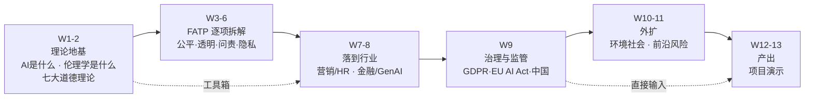

# IS5113 · AI Ethics and Regulations · 课程总览

> 本课入口。找什么都从这里点。

**一句话**：MScAIB 的 **AI 核心必修课**（3 学分），13 周，Prof. Matthew Lee 主讲。表面叫"AI 伦理与监管"，实质是一门**规范伦理学**课——用两百年前的哲学工具，去分析今天 AI 造成的新问题。

---

## 🔴 现在最要紧的事

**2026-09-22（周二）12:00 — 交警 AI 摄像头案例分析作业截止**（1–2 页）
出处 M02 讲义 p.85–86，完整要求与准备提示见 [[IS5113_AI_Ethics_and_Regulations/_meta/作业与DDL#⏰ 最近的截止|作业与DDL › ⏰ 最近的截止]]。
👉 **完整的五理论分析演练见 [[M02-道德理论及其应用]] §7 第 10 题**（含替代方案与信息缺口的答法）；案例的 FATP 快速拆解见 [[M01-导论-AI与伦理#7. 自测|M01-导论-AI与伦理 › 7. 自测]] 第 7 题。
👉 答题框架见 [[M02-道德理论及其应用]] §6.3「题型 C 场景分析」。
👉 **M03（9/15）新增可用工具**：差别性影响（"99% 准确率"是整体数字，各群体误识率可能不同）、程序公平四要素（被罚者有无申诉）、模型卡的"超范围用途"（OSCB 转用）——见 [[IS5113_AI_Ethics_and_Regulations/_meta/作业与DDL#⏰ 最近的截止|作业与DDL]]。

👉 **M04（9/22 课前预习版已就绪）**：[[M04-AI透明-从看得见到信得过]]——透明六构件、透明与信任的 U 形关系与三篇论文、反事实解释、12 个企业案例、伦理 / 法律 / 商业三面。**上课时带着 §6.3 框架 C（案例四步）听案例部分。**

✅ **M03 转录（Notta 30 段粗粒度，`00:01 → 02:02:00`）2026-09-18 已合并：39 格落态（A 18 / B 2 / C 1 / D 18），§6.2 +2 🔴（罗尔斯优先次序、基本自由不可交换）+ 1 🟡（程序 / 分配正义的分析基准，验收后降级），p.32 猴子公平实验视频当堂全程播放、最后通牒博弈给了真实数据；**缺结尾——转录止于 p.52 后的 AI 操纵讨论，p.53–89（偏见来源两套分类、公平性指标、缓解与治理）全部未录到，§2.11–§2.15 标 ❓ 不可降权****。下一讲开头若补讲 p.53–89，按顺延规则回填到 M03。

---

## 笔记

| 周 | 主题 | 笔记 | 状态 |
|---|---|---|---|
| 1 | Introduction to AI and Ethics | [[M01-导论-AI与伦理]] | ✅ v0.9 · 无转录（永久） · 2026-09-11 完成预习可读性重写（§2 共 17 小节补齐"所以呢"） |
| 2 | Ethical Theories, Practical Applications and Limitations | [[M02-道德理论及其应用]] | ✅ **v1.0** · 讲义 86 页全覆盖 + 三段转录已合并 · 2026-09-11 完成预习可读性重写（§2 全部 41 小节补齐"所以呢"） |
| 3 | Bias and Fairness | [[M03-偏见与公平]] | ✅ **v1.0**（转录已合并 2026-09-18；缺结尾，p.53–89 ❓）· 讲义 89 页全覆盖（10 个低文本页逐页视觉复核，5 张图片卡片已誊录） |
| 4 | Transparency and Explainability | [[M04-AI透明-从看得见到信得过]] | ✅ **v0.9 课前预习版**（2026-09-22，strict PASS）· 讲义 50 页全覆盖（内容页 42；12 个低文本 / 纯图片页逐页视觉复核，三篇论文首页、1EdTech 审查三张截图、Adobe 九条承诺等已誊录）· 转录待 9/22 录后合并 |
| 5 | Accountability and Liability | | 待课件 |
| 6 | Privacy and Surveillance | | 待课件 |
| 7 | AI in Marketing, Consumer Behavior, HR & Hiring | | 待课件 |
| 8 | AI in Finance & Risk Management, GenAI & Misinformation | | 待课件 |
| 9 | **Global AI Governance & Regulation** ← 法律含量最高 | | 待课件 |
| 10 | Environmental & Social Impacts | | 待课件 |
| 11 | Emerging Risks and Case Studies | | 待课件 |
| 12–13 | Project Presentation | — | 产出为项目，无笔记 |

---

## 元数据

| 文件 | 用途 |
|---|---|
| [[IS5113_AI_Ethics_and_Regulations/_meta/知识层级台账\|知识层级台账]] | ★ 连贯性机制。L0 入场基线 + L1 概念登记表 |
| [[IS5113_AI_Ethics_and_Regulations/_meta/术语表\|术语表]] | 累积的中英对照 + 可默写的英文定义 |
| [[IS5113_AI_Ethics_and_Regulations/_meta/考点库\|考点库]] | 按可信度分级的考点，按 ILO 归集 |
| [[IS5113_AI_Ethics_and_Regulations/_meta/作业与DDL\|作业与DDL]] | 作业、项目、考试的完整要求 |

## 前置资料

| 文件 | 用途 |
|---|---|
| [[IS5113_AI_Ethics_and_Regulations/_prep/课程前置资料\|课程前置资料]] | 官方课程目录 × Course Outline **逐项对校**；项目定位；教授背景；13 周地图 |
| [[口碑与攻略]] | 网络口碑（目前稀薄）+ 从官方材料推出的精力分配建议 |

## 规则

| 文件 | 用途 |
|---|---|
| [[IS5113_AI_Ethics_and_Regulations/CLAUDE\|课程级 CLAUDE.md]] / [[IS5113_AI_Ethics_and_Regulations/AGENTS\|AGENTS.md]] | 本课特有规则：哲学术语译名规范、已知课件错误 |
| [[笔记模板]] / [[转录处理规则]] / [[材料处理规则]] | 全库通用 |

---

## 一分钟必知

**考核**

| 部分 | 权重 |
|---|---|
| 期末笔试（2 小时，英文） | 50% |
| 小组项目（W12–13 演示） | 40% |
| 课堂参与（含线上讨论区） | 10% |

> ❗ **持续评估 ≥25% 且笔试 ≥25%，两部分都要及格**，一边高分补不了另一边。（官方目录规定，讲义上没写）
> ✅ **Participation 与 Group Project 官方明确允许使用 GenAI。**

**教材**（Outline，官方目录列的是另外五本法律向的书，且注明 Compulsory Readings: Nil）
- Coeckelbergh, *AI Ethics*, MIT Press, 2020
- Boddington, *AI Ethics: A Textbook*, Springer, 2024

**评分维度全都强调 application 与 critical thinking，没有一处提"记忆"。** ⚪ 推断：笔试是场景分析题，不是名词解释。

---

## 课程的骨架

> 💡 W9 是小组项目 (b) 部分（设计治理策略）的**直接输入**，但它在 10/27 才上，而演示在 11/17。**等 W9 之后才开始做项目只剩三周**——建议提前选定行业与公司、先做完研究部分。

---

## 跨课链接

同属 MScAIB (P85) 项目的另外三门课：

- **IS5542 GenAI in Business**（AI 核心）— W8「生成式 AI 与虚假信息」交叉；**M03 §2.11 ↔ IS5542 M01 §2.9.7**（偏见的入口清单互证）、**M03 §2.13.2 ↔ IS5542 M01 §2.7.2 / §2.9.3**（XAI 与人在环路：IS5542 立场更硬——解释不了就找人兜底）
- **EF5560 Fintech & AI in Finance**（商业核心）— W8「金融风控伦理」交叉；M03 §2.12 的信贷公平指标是 W8 的前置
- **IS6400 Business Data Analytics** — M03 §2.11.4 抽样偏见的现成例子：Airbnb 数据只有美国 6 城、NYC+LA 占 75%（[[IS6400_Business_Data_Analytics/_meta/数据集卡片|数据集卡片]] §5.6）
- **AC6761 AI Accounting**（商业核心）— W5「问责」与审计合规交叉

## 进度追踪

Notion：[🎓 CityU 学习进度](https://app.notion.com/p/526a0242e72d40b3aa4f1a26f9ac7f4f) ｜ [📌 CityU 作业与 DDL](https://app.notion.com/p/c4bab444ac4f457fb3516cf13d19517d)
