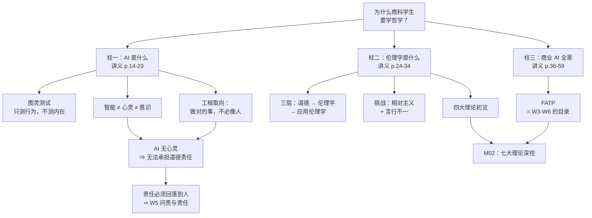
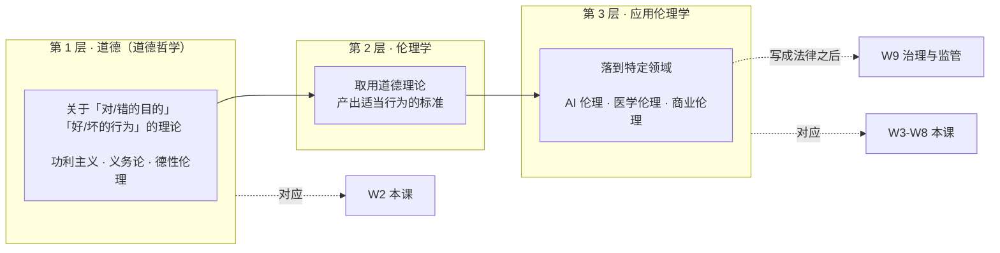

# M01 · 导论：AI 与伦理

> **本讲一句话**：这一讲不解决任何伦理问题，它负责把后面十讲要用的**三套词汇**发给你——AI 是什么（技术侧）、伦理学是什么（哲学侧）、以及为什么这两件事必须放在一起谈（商业侧）。
> **原始材料**：`Module 1 - Introduction.pdf`（60 页） ｜ **转录**：`none`（本讲未录音，永久无课堂补充）

---

## 0. 三分钟速览

**这一讲讲了什么**

课件是**四段拼接**的：课程行政（p.1–13）→ AI 是什么（p.14–23）→ 伦理学是什么（p.24–35）→ 商业 AI 全景（p.36–60）。四段之间几乎没有过渡，但它们合起来回答一个问题：*为什么一群商科学生要花一个学期学哲学？*

答案是：AI 已经在替人做决定了，而"该不该这么决定"这类问题，技术指标（准确率、F1）答不了，只能靠伦理学的框架去答。第二、三段就是在分别给你技术侧和哲学侧的最小词汇表。

**学完你应该能**

1. **说清** intelligence（智能）、mind（心灵）、consciousness（意识）三者的区别，并解释为什么图灵测试测的只是第一个
2. **复述**图灵测试的 3 项优点与 4 项批评，并据此评价"某某 AI 通过了图灵测试"这类新闻
3. **区分** morality（道德）、ethics（伦理学）、applied ethics（应用伦理学）三层，并说出 AI 伦理位于哪一层
4. **判断**定言令式与黄金法则的关键差异（不是同一回事）
5. **用 FATP** 四个词给任意一个 AI 商业案例做一次初步伦理体检

**如果只记三件事**

1. **伦理学不是"讲道理"，是一套可被审视的推理程序**——结论要靠事实、共享价值和逻辑撑住，能说服一个"抱持怀疑但心态开放"的听众
2. **道德相对主义是本课要面对的第一个挑战**，但"有些价值是相对的"推不出"所有价值都是相对的"
3. **FATP（公平、问责、透明、隐私）是整门课的目录**，W3–W6 就是把这四个字逐一拆开讲

---

## 1. 开始之前 · 知识衔接

### 1.1 你已经有的

本讲是全课起点，不依赖任何前序 module。只需要具备 [[IS5113_AI_Ethics_and_Regulations/_meta/知识层级台账#L0 · 入场基线|L0 入场基线]]——即 AI / 机器学习的基础概念（监督学习、训练集、模型、准确率、过拟合、LLM 等）。

哲学、伦理学、法律方面**不需要任何基础**，本讲会从零讲起。

### 1.2 本讲全新引入的概念

| 概念 | English | 展开于 |
|---|---|---|
| 图灵测试 | Turing Test | §2.2.1 |
| 智能 / 心灵 / 意识 | Intelligence / Mind / Consciousness | §2.2.2 |
| 认知科学 vs 工程取向 | Cognitive Science vs Engineering | §2.2.3 |
| 道德 / 伦理学 / 应用伦理学 | Morality / Ethics / Applied Ethics | §2.3.1 |
| 道德相对主义 | Moral Relativism | §2.3.2 |
| 道德一致性 | Moral Consistency | §2.3.3 |
| 义务伦理 · 定言令式 · 黄金法则 | Duty Ethics · Categorical Imperative · Golden Rule | §2.4.2 |
| 功利主义 | Utilitarianism | §2.4.3 |
| 善良意志 · 特殊申辩 · 无知之幕 | Good Will · Special Pleading · Veil of Ignorance | §2.4.4 |
| 伦理困境 | Ethical Dilemma | §2.4.5 |
| 科尔伯格道德发展阶段 | Kohlberg's Stages of Moral Development | §2.5 |
| 破坏性技术 | Disruptive Technology | §2.6.1 |
| FATP | Fairness, Accountability, Transparency, Privacy | §2.6.2 |

### 1.3 为什么这一讲放在这里 · 重排说明

这是第 1 讲，没有"承接"，只有"铺路"。它铺的路是：

- §2.2（AI 是什么）→ 为 W3 偏见、W4 透明性打底。你得先知道"AI 只是在理性地行动、并不真的理解"，才能理解为什么它会有偏见、为什么它的决策难以解释
- §2.3–2.5（伦理学）→ **直接就是 W2 的前置**。M02 把这里一笔带过的义务论、功利主义等展开成七大理论逐一深挖
- §2.6（FATP）→ **是 W3–W6 的目录**。公平→W3，透明→W4，问责→W5，隐私→W6

**重排说明**

讲义原顺序是「课程行政(p.1–13) → AI(p.14–23) → 伦理学(p.24–35) → 商业 AI(p.36–60)」。

本笔记基本保留这个大顺序，但做了两处调整：

1. **把 p.45 的 FATP 从第四段抽出来**，与 p.35「为什么需要 AI 伦理」合并成 §2.6。原因：FATP 夹在一堆商业 AI 泛论中间容易被忽略，但它其实是整门课的目录，值得独立成节
2. **把第四段（p.36–59）压缩成 §2.7 的"速通"**。原因见 [[#9.3 课件自身的问题|§9.3]]——这 24 页是低信噪比的模板内容，逐页展开会浪费你的复习时间

小节 ↔ 页码的完整对应见 [[#8. 讲义页码映射|§8]]。

---

## 2. 正文

### 2.1 这门课怎么运作（先把实用信息说完）

这一小节对应讲义 p.2–13，是课程行政信息。它不是"知识"，但它决定你怎么分配精力，所以放最前面、一次说完。

**授课教师**（讲义 p.2）：Prof. Matthew Lee，HKMU 数字商业与 AI 讲席教授，曾任 CityU 系主任、学院院长、副校长；讲义自述 200+ 篇论文、引用 38,000+、H 指数 83、Stanford 全球前 2% 高被引学者。邮箱 `Matthew.lee@cityu.edu.hk`。💡 这一页对预习的用处只有一点：**他是资深 IS（信息系统）学者，不是哲学系出身**——所以这门课讲伦理理论的方式是"商科应用取向"，考核语言也全是"应用与批判性思维"（见下文）。教师背景详见 [[IS5113_AI_Ethics_and_Regulations/_prep/课程前置资料#6. 授课教师|课程前置资料 §6]]。

**考核结构**（讲义 p.11，数字经[[IS5113_AI_Ethics_and_Regulations/_prep/课程前置资料|官方课程目录]]核实）

| 部分 | 权重 | 说明 |
|---|---|---|
| 期末笔试 | **50%** | 2 小时，英文作答 |
| 课堂参与 Participation | **10%** | 含线上讨论区发帖 |
| 小组项目 Group Project | **40%** | 研究 + 治理策略设计，W12–W13 演示 |

> ❗ **两条讲义没写、但官方目录写死的规则**：
> 1. **持续评估（10%+40%）至少要拿 25%，笔试也至少要拿 25%，且两部分必须都及格才能通过本课。** 一边高分补不了另一边。
> 2. **Participation 和 Group Project 官方明确允许使用 GenAI。**（笔试当然不行。）

**官方评分维度**（讲义未给，考前值得对照）

- 小组项目：Original thinking / Rational analysis / Structure and formation / Reasonable conclusion
- 笔试：Application of learned knowledge **with critical thinking**

> 💡 **换个说法（笔记补充）**：三项评分语言全都指向**应用与批判性思维**，没有一个字提"记忆"或"复述"。这强烈暗示笔试不是名词解释题，而是给你一个场景、要你用理论去分析。所以背定义只是起点，练"拿理论套案例"才是重点。M02 的作业（交警摄像头案例）就是这种题型的预演。

**教材**（讲义 p.12）

- Mark Coeckelbergh, *AI Ethics*, MIT Press, 2020
- Pauline Boddington, *AI Ethics: A Textbook*, Springer Nature Singapore, 2024
- McKinsey, *What is AI?*（2024-04-03）

官方课程目录上写的是**另外五本、且全是法律向**的书，与这两本不重叠。详见 [[IS5113_AI_Ethics_and_Regulations/_prep/课程前置资料#4.3 阅读材料：几乎不重叠|课程前置资料 › 4.3 阅读材料：几乎不重叠]]。官方明确写 **Compulsory Readings: Nil**，所以两边都属推荐性质，不是必读。

**学习方式**（讲义 p.6, p.9）

13 次课，研讨式（seminar），强调课堂互动、小组讨论、线上讨论区反思、小组项目。教授在 p.6 明确要求：**以"一个负责任的商业专业人士"的视角来上这门课**——即不断问自己"作为管理者，我打算对自己、对团队、对组织做出什么改变"。

> 💡 这句话不是客套。Participation 占 10% 且评分维度包含"对临时提问的准备"，意味着课上被点到时能否用这个视角作答，是会计分的。

**所以呢**：把这些行政信息弄清楚之后，真正的内容才开始——下一节从"AI 是什么"讲起，先给"智能"和"心灵"这两个后面反复要用的词定好位。

---

### 2.2 AI 是什么（讲义 p.14 章节标题页起，p.15–23）

#### 2.2.1 图灵测试（Turing Test）

**是什么**

1950 年，Alan Turing 提出的一个判据：让一位审问者（interrogator）通过文字与两个看不见的对象对话，一个是人、一个是机器。**如果审问者无法可靠地分辨哪个是机器，那么这台机器就应当被认为具有智能。**

它的原名叫**模仿游戏（Imitation Game）**——这个名字比"测试"更准确，因为它衡量的是"模仿得像不像"，而不是"内部是否真的在思考"。

**为什么需要它**

因为"机器能不能思考"这个问题**无法直接回答**——我们连"思考"是什么都没有公认定义。图灵的做法是把一个无法回答的哲学问题，替换成一个可以操作的行为测试。这是一次典型的"绕开定义、直接测行为"的科学策略。

**课件原例**（讲义 p.15–16）

课件给出优缺点两栏：

| 优点 STRENGTHS | 缺点 WEAKNESSES |
|---|---|
| **可操作、简单**（tractability and simplicity） | **审问者的判断是主观的**（interrogators' subjective judgement） |
| **覆盖面广**（breadth of subject matter）——要通过一个设计良好的图灵测试，机器必须会用自然语言、会推理、有知识、能学习、能解决问题 | **有些人类行为并不智能**（some human behaviour is unintelligent） |
| 除认知智能外，测试还可纳入**共情与审美**（empathy and aesthetic sensitivity） | **有些智能行为并不像人**（some intelligent behaviour is inhuman） |
| | **是"真的"在思考，还是仅仅在"模拟"思考**？ |

**课件还整页贴了一篇 2025 年的论文**（讲义 p.17）

> **Large Language Models Pass the Turing Test**
> Cameron R. Jones, Benjamin K. Bergen — Department of Cognitive Science, UC San Diego
> arXiv:2503.23674v1 [cs.CL], 31 Mar 2025

摘要要点：评测 4 个系统（ELIZA、GPT-4o、LLaMa-3.1-405B、GPT-4.5），做了两组**随机化、受控、预注册**的图灵测试，面向独立人群。参与者进行 **5 分钟**对话，同时与一名真人和一个系统交谈，再判断哪个是人。

| 系统 | 被判定为「人类」的比例 |
|---|---|
| **GPT-4.5**（提示其扮演类人人设） | **73%** —— *显著高于*真人参与者被选中的比例 |
| LLaMa-3.1-405B（同样提示） | 56% —— 与被比较的真人无显著差异 |
| ELIZA（基线） | 23% |
| GPT-4o（基线） | 21% |

论文结论：这是**首个"任何人工系统通过标准三方图灵测试"的实证证据**。

> ⚠️ **73% 这个数字的含义要看清楚**：GPT-4.5 不只是"骗过了人"，而是**比真人更像人**——审问者把它选作"人类"的次数，比选真正的人还多。
>
> 这个反直觉的结果恰好印证了上表右栏的第二、三条批评：真人在 5 分钟闲聊里的表现，未必比一个被精心提示的模型更"像人"。**图灵测试测的是"像不像人"这个相对量，而不是"聪不聪明"这个绝对量**——一旦对照组（真人）表现平平，通过它就没有想象中那么难。

**🎙️ 课堂补充**

本讲无录音，无课堂补充。

**💡 换个说法（笔记补充）**

第二栏那四条批评，可以用一个日常场景全串起来。假设你在微信上跟一个账号聊了十分钟，分不出对面是人是 AI：

- 也许只是**你**不够会问（→ 主观判断）
- 也许对面那个"人"本来就答得敷衍、错字连篇，所以 AI 装得很容易（→ 有些人类行为并不智能）
- 反过来，一台能瞬间算出 20 位数乘法的机器**因为太强而暴露了自己**，可它显然是智能的（→ 有些智能行为并不像人）
- 就算它全程表现完美，它可能只是在做极其复杂的模式匹配，内部一片漆黑（→ 模拟 vs 真的思考）

第三条尤其值得记：**图灵测试测的是"像人"，不是"聪明"**。这两件事被它绑在了一起，而它们本来可以分开。

**⚠️ 常见误解**

- ❌ **"某某模型通过了图灵测试，所以它有意识了。"** —— 图灵测试从设计上就**不测意识**，它只测外部行为。Jones & Bergen 测的也只是"能否被判定为人"，与"是否有内在体验"无关。见下一节的三层区分
- ❌ **"图灵测试早就没人在乎了。"** —— 恰恰相反，课件专门整页贴了 2025 年的论文。它作为**工程目标**确实过时（没人以通过它为研发目的），但作为**衡量"AI 与人可区分度"的实验范式**，在 LLM 时代重新变得有意义
- ❌ **"通不过图灵测试就不算 AI。"** —— 一个诊断癌症准确率超过医生的模型完全通不过图灵测试（它连闲聊都不会），但它显然是 AI

**与其他概念的关系**

图灵测试是把"智能"操作化的第一次尝试，它绕开了 §2.2.2 的心灵与意识问题。这个"绕开"在今天有直接的伦理后果：如果我们无法判断 AI 是否真的理解，那么把决定权交给它就需要额外的正当性论证——这正是 W5「问责与责任」的核心问题。

**所以呢**：图灵测试只测行为、不测内心，这个"只测外部"的局限，正是下一节要正面拆开的问题——智能、心灵、意识到底是不是一回事。

---

#### 2.2.2 智能 · 心灵 · 意识（Intelligence / Mind / Consciousness）

**是什么**

课件（讲义 p.18）给了两个定义，其区别是本讲最容易被跳过、但后面用得最多的一处：

> **Intelligence（智能）**是获取并运用知识与技能来解决问题的能力，使用既有知识，并运用语言、感知、推理、学习方面的能力。
>
> **Mind（心灵）**指涉更宽的一系列心理过程，包括思想、情绪、信念，以及**意识**（consciousness，即对自身与环境的觉察）。

意识本身又分三层：

| 层 | English | 含义 |
|---|---|---|
| 主观意识 | subjective consciousness | 有"感觉起来是什么样"的主观体验 |
| 生物意识 | creature consciousness | 作为一个有机体对环境的清醒觉察 |
| **自我意识** | **self-consciousness** | **递归的自我觉察**——不仅知道，还知道自己知道 |

**为什么需要它**

因为**智能可以有、而心灵可以没有**。这个区分是后面所有"AI 该不该负责""AI 有没有权利""AI 能不能被信任"讨论的地基。

一台机器可以在解题能力上远超人类（高智能），却完全没有情绪、信念、对自身处境的觉察（无心灵）。反过来，一只狗有生物意识和情绪（有心灵的一部分），但解不了微积分（低智能）。**两个维度是正交的。**

**课件原例 ①**（讲义 p.19）—— 智能 vs 心灵，五维对照

| Attribute 维度 | Intelligence 智能 | Mind 心灵 |
|---|---|---|
| **Definition** 定义 | The ability to acquire and apply knowledge and skills.<br>获取并运用知识与技能的能力 | The faculty of consciousness and thought.<br>意识与思想的官能 |
| **Measurement** 测量 | Can be measured through IQ tests and cognitive assessments.<br>可用 IQ 测验与认知评估测量 | Difficult to measure as it encompasses various mental processes.<br>难以测量，因其涵盖多种心理过程 |
| **Types** 类型 | Includes emotional, fluid, and crystallized intelligence.<br>含情绪智能、流体智能、晶体智能 | Includes conscious, subconscious, and unconscious mind.<br>含意识、下意识、无意识 |
| **Role in Problem Solving** 解决问题中的角色 | Helps in analyzing and solving complex problems.<br>帮助分析并解决复杂问题 | Processes information and generates solutions.<br>处理信息并生成解决方案 |
| **Development** 发展方式 | Through education, practice, and exposure to new experiences.<br>通过教育、练习、接触新经验 | Through learning, memory formation, and cognitive processes.<br>通过学习、记忆形成、认知过程 |

> 💡 **这张表最该注意 Measurement 那一行**：智能**可测**，心灵**难测**。
>
> 这条差异是整门课的一个隐藏前提——AI 的全部评估指标（准确率、精确率、召回率、F1）测的都是**智能侧**；**心灵侧根本没有指标**。所以"这个模型有没有意识/有没有真的理解"这类问题，在工程上没有任何评估体系接得住。这也是为什么 §2.2.1 图灵测试只能退而求其次去测行为。

（讲义 p.18 是同一标题的前一页，给的是上面引用的文字定义，配一张仿真人形机器人照片，来源标注 `thisvsthat.io/intelligence-vs-mind`。）

**课件原例 ②**（讲义 p.22）—— 人类智能 vs AI，"Summary of Differences"

| Feature 特征 | Human Intelligence (Biological) | AI Intelligence (Digital) |
|---|---|---|
| **Hardware & Software** 硬件与软件 | **Fused together** 融为一体<br>（If brain dies, mind dies 脑死则心灭） | **Separated** 相互分离<br>（可备份、可复制） |
| **Knowledge Sharing** 知识共享 | **Very slow** 极慢<br>（需要教与学） | **Instantaneous** 瞬时<br>（完美数字克隆） |
| ⭐ **Knowledge Capacity** 知识容量 | **Limited** 受限于单个人的寿命 | **Nearly unlimited** 近乎无限<br>（靠机器组网） |
| **Power Efficiency** 能效 | **Amazing** 惊人<br>（约 30 瓦即可运行） | **Terrible** 糟糕<br>（需要发电厂） |

> ⭐ **教授在这一页用红框 + 红箭头单独圈出了 "Knowledge Capacity" 那一行。** 这是整份 60 页讲义里**唯一一处这种视觉强调**——属于明确的重点信号，值得记牢。

> 💡 **换个说法（笔记补充）**：这四行其实在说同一件事——**人类的智能被"焊死"在肉体上，AI 的不是**。
>
> 脑死则心灭、知识只能靠教、容量受寿命限制，三者全都源自第一行的"硬件与软件融为一体"。AI 把这两层拆开了，于是同时获得了可复制、可瞬时共享、可无限扩容三种能力。
>
> 代价写在最后一行：**能效**。人脑约 30 瓦，AI 要发电厂。这一行直接通向 **W10「环境与社会影响」**，讲义 p.58 的可持续性那页讲的正是它。

**🎙️ 课堂补充**

本讲无录音，无课堂补充。

**💡 换个说法（笔记补充）**

用计算器来想最清楚：计算器在"算术"这个窄任务上的智能远超你，但没人会问"关掉计算器算不算谋杀"。因为我们默认它**没有心灵**——没有主观体验，没有对自身存在的觉察。

现在把计算器换成一个能写诗、能安慰人、能说"我不想被关掉"的大模型。**它的行为看起来跨过了心灵那条线，但它的内部结构并没有变得更接近有意识**——它仍然是在预测下一个词。这就是为什么"AI 权利""AI 人格"这类议题今天既热闹又棘手：**我们唯一能观察的是行为，而行为恰恰是图灵测试已经证明不可靠的那个指标。**

**⚠️ 常见误解**

- ❌ **把 mind 翻译成"思维"然后与 intelligence 混用。** 课件用 mind 是取其"含意识、情绪、信念"的宽义，译作"心灵"才不丢信息
- ❌ **认为自我意识就是"能说出'我'"。** 大模型天天说"我"，但 self-consciousness 要求的是**递归的自我觉察**，不是能生成第一人称代词

**与其他概念的关系**

这个三分法是 §2.2.1 图灵测试局限的根源（它只测智能层），也是 W5「问责与责任」的前提——**没有心灵的东西无法承担道德责任**，所以责任必须回落到人（开发者、部署者、使用者）身上。这条线索会贯穿整门课。

**所以呢**：智能和心灵是两个独立的维度，AI 在智能上突飞猛进、在心灵上原地踏步——这个错位下一节会换个角度再讲一遍：AI 研究本来就分成"像人"和"好用"两条完全不同的路线，我们的课选的是后者。

---

#### 2.2.3 AI 的两种取向：认知科学 vs 工程学

**是什么**

课件（讲义 p.20–21）区分了研究 AI 的两条路：

| | 认知科学取向 | 计算机科学 / 工程取向 |
|---|---|---|
| 目标 | **解释人类是怎么思考的** | **把问题解决好** |
| 对"像人"的态度 | 建模就是为了像人 | 像不像人无所谓 |
| 课件原话 | 认知科学的目标是解释人如何思考，若顺带推进了 AI，那是额外收获 | "We will use any idea or approach that gives good results!"（讲义 p.21） |

课件明确说明**本课采取工程取向**：AI 关心的是**理性地思考或理性地行动**（thinking or acting rationally / intelligently）。

**为什么需要它**

课件用了一个很好的反例（讲义 p.20）：

> 人类在很多事情上表现很差。大多数人做算术的速度和准确度都不如计算机——**所以一台"达到人类水平"的计算器根本算不上好用。**

这句话说明：**以人为标准不总是对的**。自动驾驶要的是"在所有情况下做对的事"，不是"开得像人"——人类司机会疲劳、会路怒、会分心。

**🎙️ 课堂补充**

本讲无录音，无课堂补充。

**💡 换个说法（笔记补充）**

这个区分在伦理上有个不太直观的推论：**正因为我们选了工程取向、不要求 AI 像人，AI 才会做出人绝不会做的决策**。

一个按"最小化总伤亡"训练的自动驾驶系统，可能在极端情况下计算出应该牺牲车内乘客——这是完全"理性"的，也是任何人类司机都不会做的。工程取向带来的效率，和它带来的伦理麻烦，是同一件事的两面。这个张力会在 M02 的功利主义部分再次出现。

**⚠️ 常见误解**

- ❌ **"AI 就是在模仿人脑。"** 课件明确否认。神经科学只是 AI 的八个灵感来源之一，不是蓝图

**与其他概念的关系**

工程取向解释了为什么 AI 的行为需要**外部**的伦理约束：它内部没有任何机制会自发地"觉得不妥"。这直接引出 §2.6。

**所以呢**：选工程取向，意味着 AI 内部不会自己"觉得不对"——判断对错的责任必须由外部的伦理框架来扛。下一节先补完"AI 是什么"这条线的最后一块：它到底是从哪些学科拼出来的。

---

#### 2.2.4 AI 的八个学科源流

讲义 p.23 列出 AI 的思想来源。这一页信息密度高但概念都不难，用表格记即可：

| 学科 | 贡献了什么 |
|---|---|
| 逻辑学 Logic | 把理性编码成逻辑规则 |
| 数学 Mathematics | 概率论等工具，用来给理性建模 |
| 计算机科学 Computer Science | 算法研究；多数人认为理性主体靠算法运作 |
| 经济学 Economics | 效用（utility）、最大化收益；决策论与博弈论正是关于此 |
| 神经科学 Neuroscience | 把人脑当作生物对象研究并尝试模拟 |
| 心理学 Psychology | 人与动物如何行动；提供"信念""意图""感知"等更高层概念 |
| 硬件工程 Hardware Engineering | 通过研究实际元件，设计出智能的计算机 |
| 语言学 Linguistics | 语言与思维的关系；语言是人类理性的重要部分 |

> 💡 **换个说法（笔记补充）**：这张表最值得记的是**经济学那一行**。"效用最大化"是 AI 的默认目标函数，而它同时也是 M02 功利主义的核心概念。**AI 天生就是个功利主义者**——它被造出来就是为了最大化某个数值。这不是巧合，是同源。理解这一点，后面"为什么 AI 特别容易犯功利主义式的错误"就变得显然。

**所以呢**："AI 是什么"到这里讲完了——历史、定义、路线、源流都齐了。下一节换到这门课真正的主角：伦理学本身是什么，它和道德、应用伦理学是什么关系。

---

### 2.3 伦理学是什么（讲义 p.24 章节标题页起，p.25–35）

#### 2.3.1 三层结构：道德 → 伦理学 → 应用伦理学

**是什么**

讲义 p.25 给了一组层层递进的定义。**这是本讲最该背下来的一段**，因为它是后面所有讨论的坐标系。原文（考试可直接用）：

> **Ethics** refers to standards of conduct, standards that indicate how one should behave based on **moral duties and virtues**, which themselves are derived from principles of right and wrong.
>
> - **Morality (moral philosophy)** consists of theories of "right" and "wrong" **ends**, and "good" and "bad" **acts**.
> - **Ethics** draws on moral theories to provide standards of appropriate conduct.
> - **Applied ethics** deals with standards of appropriate conduct in a particular application domain (e.g. **AI ethics**).

中文对应：

| 层 | 中文 | 干什么 | 例子 |
|---|---|---|---|
| 1 | **道德（道德哲学）** | 提供关于"对/错的目的"和"好/坏的行为"的**理论** | 功利主义、义务论 |
| 2 | **伦理学** | **取用**道德理论，产出适当行为的**标准** | "不应欺骗"这类准则 |
| 3 | **应用伦理学** | 把标准落到**特定领域** | **AI 伦理**、医学伦理、商业伦理 |

**为什么需要它**

因为日常中文里"道德"和"伦理"基本混用，但在这门课里它们是**不同层级**，且考试会用英文出题。搞混了，答"what is applied ethics"这类题就会失分。

**💡 换个说法（笔记补充）**

用软件工程类比最贴切：

- **道德（morality）** = 底层的理论/算法库——回答"什么算好"
- **伦理学（ethics）** = 基于这些库写出的**规范与准则**——回答"那么该怎么做"
- **应用伦理学（applied ethics）** = 把规范部署到**某个具体业务域**——AI 伦理就是部署到 AI 这个域

所以**AI 伦理不是一套独立的新道德**，它是把已有的道德理论（康德、密尔那些）搬到 AI 场景里用。这解释了为什么 M02 要花整整一讲、86 页来讲两百年前的哲学——那是本课的标准库。

**⚠️ 常见误解**

- ❌ **"AI 伦理是全新的东西。"** 它是 applied ethics 的一个分支，用的是老理论
- ❌ **把 ethics 当成"道德感"或"良心"。** 课件的定义里 ethics 是**standards（标准）**，是外部的、可被论证的东西，不是内心感受

**与其他概念的关系**

这个三层结构是全课的骨架：M02 处理第 1 层（道德理论），M03–M08 处理第 3 层（AI 各领域的应用伦理），M09 处理当第 3 层被写成法律之后会怎样。

**所以呢**：有了道德、伦理学、应用伦理学这三层坐标，下一节就可以正面处理一个直接挑战这门课存在意义的立场——如果压根没有普世的对错，谈何"标准"？

---

#### 2.3.2 道德相对主义（Moral Relativism）

**是什么**（讲义 p.26）

> 价值由我们成长其中的社会决定，**不存在普世价值**。道德价值不过是随文化而异的习俗或约定。

**为什么需要它**

因为这是任何伦理课都必须先过的一关。**如果相对主义是对的，那这门课就没得上了**——既然没有普世标准，讨论"AI 该不该做某事"就毫无意义，只能说"在你们文化里不该，在我们文化里该"。

**💡 换个说法（笔记补充）**

这个立场在 AI 语境下有很强的现实版本：一套人脸识别系统在中国、欧盟、美国面对的社会预期完全不同。相对主义者会说"那就各按各的来"。但真实世界里，同一套模型往往要**同时**部署在多个法域——这时候"各按各的来"根本不是一个可执行的答案。W9「全球 AI 治理」处理的正是这个困境。

**⚠️ 常见误解**

- ❌ **把"应当尊重文化差异"等同于"接受道德相对主义"。** 前者是一种态度，后者是一个关于道德本质的强主张（"不存在普世价值"）。可以持前者而拒绝后者

**与其他概念的关系**

M02 会把相对主义拆成**主观相对主义**和**文化相对主义**两种，并各给一组 case for / case against。本讲只需知道有这个立场、以及它构成挑战。

**所以呢**：相对主义质疑的是"有没有普世标准"；下一节的道德一致性问题换了个角度发难——就算有标准，人自己也做不到，那讲标准还有什么用？

---

#### 2.3.3 道德一致性（Moral Consistency）与"人是自私的"

**是什么**

讲义 p.27 给了六个案例，问「你认为以下各人在道德上有多不一致？」：

| | 案例 |
|---|---|
| A | 反堕胎者，同时支持死刑 |
| B | 素食者，但买皮鞋 |
| C | 社会主义者，却送孩子上私立学校 |
| D | 鼓吹家庭价值的政客，却有婚外情 |
| E | 环保活动家，却开汽油大 SUV |
| F | 认为偷窃是错的，却盗版软件和音乐 |

**为什么需要它**

这一页配合 p.26 构成对伦理学的**第二重挑战**：既然人人都言行不一，谈道德有什么用？

**课件如何回应**（讲义 p.28，重要）

> 虽然某些价值可能是相对的、人也常常自私，**但我们不必因此断定所有价值都是相对的、或人永远自私**。伦理理论试图提供一组与我们的道德直觉相协调的基本道德原则。

**💡 换个说法（笔记补充）**

这句话是本讲的**方法论声明**，值得单独记住。它的逻辑形式是：

> 「有些 X 是 Y」 **推不出** 「所有 X 都是 Y」

这是一个很朴素但极其常用的反驳。以后遇到"AI 反正也做不到完全公平，那还谈什么公平"这类论调，用的就是同一个反击：**部分做不到，推不出完全不必做。**

F 这一条（反对偷窃却盗版）离本课最近——它正是知识产权与 AI 训练数据问题的日常版。官方 Keyword Syllabus 里就有 "Intellectual property and copyright considerations" 这一条。

**⚠️ 常见误解**

- ❌ **以为这六个案例有标准答案。** 课件问的是"在多大程度上"（to what extent），它是讨论题，目的是暴露"言行不一"其实有程度差别、也有可辩护的情形（比如 B 的皮鞋可能是成为素食者之前买的）

**所以呢**：课件对两个挑战的回应是同一句话——"有些人做不到"推不出"标准没有用"。带着这条方法论，下一节可以正式进入四大伦理理论——它们就是"标准"具体长什么样的四个候选答案。

---

### 2.4 四大伦理理论初览

讲义 p.28 一次性抛出四种理论。**这里只需要建立直觉，M02 会把它们（以及另外三种）逐一深挖。**

#### 2.4.1 全景

**是什么**

先想一个日常场景：室友忘关炉子把你家熏黑了，你决定要不要当面说他。你脑子里其实同时转着好几套完全不同的"讲道理"方式——有人问"有没有一本大家都认的规矩说这样不对"，有人问"我作为室友该尽的责任是什么"，有人问"骂他一顿之后大家关系会不会更差、总体是好是坏"，还有人问"要是人人遇到这种事都当面对质，世界会变成什么样"。这四种"讲道理"的方式，对应的正是下面四套伦理理论——讲义 p.28 把它们一次性摆了出来，作为整门课的第一张地图：

| 理论 | 一句话 | 核心问题 |
|---|---|---|
| **宗教伦理** Religious Ethics | 有一本权威规则书告诉我们该守什么规则 | 规则从哪来？→ 经典 |
| **义务伦理** Duty Ethics | 履行你的义务。**义务与权利是一体两面** | 我的义务是什么？ |
| **功利主义** Utilitarianism | 唯一至高原则：追求**最大多数人的最大幸福** | 哪个选项后果最好？ |
| **康德的进路** Kant's Approach | 你的行为能被一致地普遍化吗？问自己"**如果人人都这么做会怎样**？" | 这条准则能成为普遍法则吗？ |

> ⚠️ 课件把「义务伦理」和「康德的进路」并列成两条，但康德主义**就是**义务论最著名的版本。这是课件的一处口径不一致，见 [[#9.3 课件自身的问题|§9.3]]。M02 会把它们统一成 Kantianism (Deontology) 一条。

**所以呢**：这四条现在都只是一句话速写，够你在读下面四小节时心里有张地图，但还远远不够拿去答题。§2.4.2–§2.4.5 会把"义务伦理"和"康德的进路"这两条拆开揉碎，配上完整的论证与例子；功利主义在这里先按下不表，M02 会用整整一节把它拆成两支深挖。

#### 2.4.2 义务伦理与定言令式（Duty Ethics / Categorical Imperative）

**是什么**（讲义 p.29）

义务伦理**强调遵守道德规则或义务的重要性，而不是只盯着行为的后果**。它的核心工具是**定言令式**：

> **Act only according to that maxim whereby you can, at the same time, will that it should become a universal law.**
> （只按照那样一条准则去行动：你能够同时愿意它成为一条普遍法则。）

课件给了通俗版：**在采取任何行动之前，问自己——"我能愿意每个人在类似情况下都这么做吗？"**

**与黄金法则的对比**（讲义 p.29，重要考点）

课件特意把定言令式与**黄金法则（Golden Rule）**对照：

> 「己所欲，施于人」（Do unto others as you would have them do unto you）——出自新约《登山宝训》，孔子的教诲中也有。

**💡 换个说法（笔记补充）· 两者的关键差异**

课件只是把它们并列，没讲清区别，但这个区别几乎肯定是考点：

| | 黄金法则 | 定言令式 |
|---|---|---|
| 参照系 | **我**的偏好 | **任何**理性存在者 |
| 追问 | 我希望别人怎么对我？ | 这条规则能不能被所有人普遍遵守？ |
| 失效场景 | 一个受虐狂"希望别人打自己"，按黄金法则他就该去打别人 | 不受个人偏好影响 |

一句话：**黄金法则以"我的欲望"为尺，定言令式以"逻辑上的可普遍化"为尺。** 康德认为前者不够格当道德法则，正是因为它依赖偶然的个人偏好。

**⚠️ 常见误解**

- ❌ **"定言令式就是黄金法则的西方版。"** 见上表，两者的尺不同
- ❌ **"义务论完全不看后果。"** 准确说法是**不以后果作为对错的判据**，而不是对后果视而不见

**与其他概念的关系**

M02 会把定言令式拆成两个表述（普遍化 + 把人当目的而非手段），并给出完全义务 / 不完全义务的区分。本讲的直觉版足够应付 §2.4.5 的困境题。

**所以呢**：定言令式用"能不能普遍化"当尺子，完全不问后果——下一节的功利主义换了一把完全相反的尺子：只问后果、不问规则本身对不对。

#### 2.4.3 功利主义（Utilitarianism）

**是什么**（讲义 p.28, p.30）

> 有且只有一条至高道德原则——**我们应当追求最大多数人的最大幸福**。最大化幸福。由 Jeremy Bentham 与 John Stuart Mill 在 1800 年前后确立。

**课件原例**（讲义 p.30）课件用三个问题引导思考幸福的本质：

1. 快乐（pleasure）与幸福（happiness）是什么关系？幸福只是快乐的总和吗？还是可能拥有很多快乐却仍然不幸福？
2. 世界上最富裕的国家，住着最幸福的人吗？
3. Bertrand Russell（1872–1970）说：*"To be without some of the things you want is an indispensable part of happiness."*（得不到某些想要的东西，是幸福不可或缺的一部分。）他什么意思？你同意吗？

**讲义 p.30 逐问参考作答**（⚪ 笔记解释；课件是开放讨论题，没有唯一标准答案）：

1. **快乐与幸福是什么关系？** 快乐通常指某一刻的愉悦感，幸福还包含较长期的关系、健康、目标感与自主性；快乐可以是幸福的一部分，却不必等于幸福的总和。一个人可能不停刷短视频、每次都得到短暂快感，却因睡眠、关系和目标受损而总体不幸福。答题时先说明你采用哪一种“幸福”定义，不能把两词无说明地当同义词。
2. **富裕国家的人一定最幸福吗？** **不能只凭财富下结论。** 较高收入可以改善基本需要和安全感，但“最富裕”不自动推出“最幸福”；还要比较健康、关系、自由、分配与调查口径。讲义未给跨国数据、年份或幸福指标，所以不能在这里编一个国家排名；若题目要求实证判断，需先指定人均收入与幸福测量及同一年的数据。
3. **Russell 那句话是什么意思、是否同意？** 一种合理解读是：并非所有欲望立刻被满足才会幸福；保留追求、期待和珍惜的空间，可能构成生活的意义。我**有条件同意**：这适用于非必要的愿望，不适用于食物、住房或医疗等基本需要的匮乏；不能把贫困美化成幸福。这个限定也说明，把“幸福”压成单一快乐分数会遗漏重要差异。

**💡 换个说法（笔记补充）**

这三个问题看似闲聊，其实在攻击功利主义的**要害**：如果幸福不能被简单加总，那"最大化总幸福"这个目标函数就无法计算。

这一点对 AI 尤其致命——**AI 必须把目标写成一个可计算的数**。推荐算法把"幸福"操作化成了"停留时长"，然后我们得到了成瘾式的信息流。**目标函数与真实价值之间的落差，是 AI 伦理最核心的技术—哲学问题之一。**

**⚠️ 常见误解**

- ❌ **"功利主义 = 自私自利。"** 恰恰相反，它要求把**所有人**的幸福平等计入，包括你不喜欢的人。中文"功利"一词的贬义是翻译造成的误导
- ❌ **"最大多数人的最大幸福"可以直接拿来算。** 谁算在内？算多久？怎么加总？这些 M02 会展开

**所以呢**：功利主义要求把幸福加总，但"怎么加总"这个问题本身就没有答案——下一节回到康德这一边，看他怎么用"善良意志"和"普遍化"绕开这个计算难题。

#### 2.4.4 康德的进路：善良意志、特殊申辩、无知之幕

**是什么**（讲义 p.31）

> 在康德看来，**幸福不等于道德**。只有**善良意志（good will）**具有终极的道德价值。道德规则应当是**普遍的**。

配套三个概念：

| 概念 | English | 含义 |
|---|---|---|
| **特殊申辩** | Special pleading | 对自己搞例外的自我合理化 |
| 黄金法则 | The golden rule | 以你希望被对待的方式对待他人 |
| **无知之幕** | Veil of ignorance | 想象自己站在双方的位置上看这件事 |

**为什么需要它**

"特殊申辩"是定言令式的**实操检测器**。你说"人人都不该插队，但我今天赶时间所以可以"——这就是特殊申辩，它恰恰证明你的准则无法普遍化。

**课件原例**（讲义 p.32）课件用四组对照题问「以下哪些属于可以为破例辩护的特殊情况？」：

| | a（较难辩护） | b（较易辩护） |
|---|---|---|
| 1 | 上班迟到了，可以闯红灯 | 送危重病人去医院，可以闯红灯 |
| 2 | 有更有趣的事，可以爽约 | 刚染上传染病，可以爽约 |
| 3 | 今年手头紧，可以不交税 | 税款被用于核武计划，可以不交税 |
| 4 | 1942 年刺杀希特勒是可以的 | 杀死一个正在策划恐袭的人是可以的 |

**💡 换个说法（笔记补充）**

这四组的设计很精巧：**每组的 a 和 b 破的是同一条规则，区别只在理由的性质**。

- a 系列的理由都是**当事人的个人便利**（迟到、觉得无聊、缺钱）
- b 系列的理由都指向**更高阶的价值或对他人的重大伤害**（生命、公共健康、和平、阻止大规模杀戮）

康德式的检验就是问：**"任何人只要处在这个情境下都可以这么做"这条规则，你愿意它成为普遍法则吗？**「赶时间就能闯红灯」普遍化后交通系统崩溃；「送危重病人就能闯红灯」普遍化后……大多数人会觉得可以接受。这就是特殊申辩与正当例外的分界。

> 注意第 4 组两条**都**难：即便是"刺杀希特勒"，严格的康德主义者也会说谋杀就是错的。课件把它放在最后，就是要暴露义务论的刚性。M02 的「case against Kantianism」会正面处理这个问题。

**⚠️ 常见误解**

- ❌ **把无知之幕当成康德的概念。** 无知之幕（veil of ignorance）是 **John Rawls** 在 1971 年提出的，比康德晚近两百年。课件把它列在「Kant's approach」一页下，属于归类粗糙。M02 讲社会契约论时会把它归还给 Rawls。见 [[#9.3 课件自身的问题|§9.3]]

**所以呢**：特殊申辩给了你一个"这条规则我是不是在给自己开后门"的检测器。下一节用一个真实的两难场景，让康德和密尔的方法正面对撞，看它们会不会给出不同答案。

#### 2.4.5 伦理困境：遗产案（Ethical Dilemma）

**课件原例**（讲义 p.33）

> 一位独居、境况贫寒、亲友寥寥的老妇人临终，你作为她的朋友守在床边。她指着床下一个小箱子，里面除了纪念品，还有她多年积攒的钱。她请你带走箱子，并**承诺**在她死后把里面的东西交给住在外州的侄子。你被她的处境和情谊打动，答应了。几周后老妇人去世，你打开箱子——**里面有 50 万美元**。没有别人知道这笔钱，也没人知道你的承诺。你还得知，**那个侄子是个嗜赌成性的瘾君子**。
>
> 康德会说你该怎么做？John Stuart Mill 会说你该怎么做？你会怎么做？为什么？

**💡 换个说法（笔记补充）· 两条路的分叉**

这道题是本讲**唯一一次让两大理论正面对撞**，价值极高。分叉点在这里：

**康德（义务论）**：承诺就是承诺。把"在无人知晓且钱可挪作他用时，可以毁约"当作普遍法则——那么承诺这个制度本身就会瓦解，没人再会相信任何承诺。所以**必须把钱给侄子**，无论后果如何。他的赌瘾是他的问题，不是你毁约的理由。

**Mill（功利主义）**：算总幸福。50 万给瘾君子，大概率被赌光、加剧毒瘾，产生的可能是净伤害；给慈善机构或用于其他用途，总效用明显更高。**所以不该给侄子**——遵守一个会导致坏后果的承诺，本身就是错的。

**“你会怎么做？为什么？”的示范立场**（⚪ 笔记示范，不代表教授或笔记使用者的个人决定）：我不会因为无人知晓就私吞或自行转捐；先核实老妇人的正式遗愿与遗产安排，按有效程序履行承诺，同时尽可能帮助侄子获得成瘾方面的支持。理由是我没有获得替她重写受益人的授权，而“他可能滥用”仍是预测，不是已发生的事实。若有人选择功利主义的转捐结论，也必须说明如何权衡守信制度受损与预期伤害，不能只说“捐出去更好”。

> ⚠️ 但要小心：M02 会讲到**规则功利主义（rule utilitarianism）**，它可能反过来支持康德的结论——因为"人们普遍遵守承诺"这条规则，长期看能带来最大总效用。**行为功利主义与规则功利主义在这道题上会分道扬镳**，这正是 M02 的核心内容之一。本讲先不展开，只需记住这道题有分叉。

**⚠️ 常见误解**

- ❌ **以为这道题有正确答案。** 它是一个 dilemma——两条道德原则（守信 vs 防止伤害）真实冲突，无论怎么做都要违背其一。考试若考它，得分点在**能否清晰地把两条推理线各自走完**，而不是选对边

**所以呢**：康德和密尔在这道题上分道扬镳，说明"四大理论"不是摆设——换一套理论，结论真的会变。四大理论初览到此结束，下一节换个角度问：人的道德判断能力本身是怎么一步步发展出来的。

---

### 2.5 道德是怎么长出来的：科尔伯格阶段

**是什么**（讲义 p.34）

Kohlberg（1973）的道德发展阶段论，课件称其为"被引用最多"的模型，同时注明**它是否同等适用于不同性别和不同文化，一直存在质疑**。

三个水平，每个再分两阶：

| 水平 | 年龄 | 课件的概括 | 阶段 |
|---|---|---|---|
| **前习俗** Preconventional | 九岁以前 | **自我聚焦的道德** | 1. 道德 = 服从规则、避免负面后果（规则由父母设定）<br>2. 能满足自己需要的就是好的、道德的 |
| **习俗** Conventional | 九岁至青春期 | **他人聚焦的道德** | 3. 开始理解父母师长对自己的期望，道德 = 达成这些期望<br>4. 履行义务、遵循期望被视为道德法则 |
| **后习俗** Postconventional | 成年 | **更高层次聚焦的道德** | 5. 明白人们对道德看法不同、规则因群体与文化而异，道德 = 维护自己所属群体或文化的价值<br>6. 理解自身信念，据更高层次的道德标准评判自己和他人；对错取决于行为的具体情境 |

**为什么需要它**

它解释了一件对本课很重要的事：**道德推理是有层次的，而大多数关于 AI 的公共讨论停留在前两层。**

**💡 换个说法（笔记补充）**

用"为什么不该在 AI 项目里偷用用户数据"这个问题，可以把六个阶段全串起来：

| 阶段 | 你的理由 |
|---|---|
| 1 | 被抓到会被罚款 |
| 2 | 不偷数据对我职业发展更有利 |
| 3 | 我的团队和上司会看不起我 |
| 4 | 公司规定和行业规范禁止这么做 |
| 5 | 社会需要数据信任这套契约，我认同并维护它 |
| 6 | 未经同意使用他人数据，是把人当作纯粹的手段，这本身就错 |

注意阶段 6 的措辞——那正是康德的第二表述（把人当目的而非手段）。**科尔伯格的最高阶，接的就是 §2.4 的理论。** 这不是巧合，Kohlberg 本人深受康德影响。

**⚠️ 常见误解**

- ❌ **把它当成"评人的等级"。** 它描述的是**推理方式**，不是人的好坏。同一个人在不同议题上可能处于不同阶段
- ❌ **忽略课件明确写出的质疑。** 课件第一句就写了它在性别与文化适用性上受到质疑（最著名的批评来自 Carol Gilligan）。答题时带上这个限定，比无保留地引用要好

**所以呢**：科尔伯格的最高阶段（据自身信念判断对错）已经在向康德靠拢，说明"道德怎么发展"和"道德理论怎么论证"这两条线迟早要汇合。下一节回到最直接的问题：为什么偏偏是 AI，逼着我们现在就要处理这些理论。

---

### 2.6 为什么 AI 需要伦理

#### 2.6.1 五条理由

课件（讲义 p.35）给出的完整论证链：

1. AI **强大、发展迅速、已嵌入各行各业**，带来前所未有的商业与生活可能
2. AI 是一种**破坏性技术（disruptive technology）**，如同蒸汽机、电力、互联网的发明
3. AI 的开发、部署与使用，对**个人、企业与社会**产生巨大影响——**其中许多方面至今仍不明朗**
4. 伦理考量是确保 AI 健康发展、让**所有利益相关者**共同受益的关键
5. **AI 伦理取用道德原则，为 AI 系统的开发与使用提供治理准则**

> 第 5 条正好回扣 §2.3.1 的三层结构——AI 伦理 = 应用伦理学的一支。课件在这里完成了闭环。

**💡 换个说法（笔记补充）**

第 3 条那句"许多方面至今仍不明朗"是整段最诚实、也最有用的一句。它意味着：**AI 伦理不是一门有标准答案的课**。你在小组项目里被要求的不是找出正确答案，而是**在不确定性下做出可辩护的判断**——这正好对应官方评分维度里的 "Original thinking" 和 "Rational analysis"。

**所以呢**：五条理由的落点是"没有标准答案，只有可辩护的判断"——下一节的 FATP 就是这门课接下来要用来做判断的四把具体的尺子。

#### 2.6.2 FATP：整门课的目录

**是什么**（讲义 p.45）

课件用 FATP 概括 AI 的核心伦理考量：

| 字母 | 议题 | 课件给的应对措施 | 展开于 |
|---|---|---|---|
| **F** | **Bias / Fairness** 偏见与公平 | 定期审计以识别并缓解算法偏见 | **W3** |
| **T** | **Transparency** 透明性 | 确保 AI 决策过程被清晰传达 | **W4** |
| **A** | **Accountability** 问责 | 为 AI 结果与影响建立责任框架 | **W5** |
| **P** | **Privacy** 隐私 | 在 AI 系统开发中采取严格的数据保护措施 | **W6** |

**为什么需要它**

> 💡 **换个说法（笔记补充）**：把这四个字记牢，因为**它就是本课 W3–W6 的目录**。对照 [[IS5113_AI_Ethics_and_Regulations/_prep/课程前置资料#5. 13 周地图（Tentative）|13 周地图]]：W3 公平、W4 透明、W5 问责、W6 隐私——一周一个字母，顺序完全对上。
>
> 更实用的是，FATP 可以当**体检清单**用。拿到任何一个 AI 商业案例，依次问四个问题：
>
> 1. **F**：谁可能被这个系统系统性地不利对待？
> 2. **A**：出了事，谁负责？能追到具体的人吗？
> 3. **T**：受影响的人能不能知道自己为什么被这样判定？
> 4. **P**：收集了什么数据？当事人知情且同意吗？
>
> 这四问基本能撑起一次课堂发言或一段项目分析。M02 的作业（交警摄像头案例）就完全可以用它开场——虽然那道题要求的是用道德理论作答，但 FATP 能帮你快速定位争议点。

**⚠️ 常见误解**

- ❌ **把 FATP 当成四个独立指标。** 它们常常互相冲突：提高透明性（公开模型细节）可能损害隐私；追求群体公平可能牺牲个体准确性。**这些权衡才是 W3–W6 的真正内容**，不是四个可以各自达标的 KPI

**所以呢**：FATP 是这门课后半程的目录，也是本讲"为什么需要伦理"这条线的终点。下一节把镜头拉远，快速扫一遍讲义里那 24 页商业 AI 全景——信息量不大，但值得知道它们在讲什么。

---

### 2.7 商业 AI 全景速通（讲义 p.36–59）

> ⚠️ **先说清楚**：这 24 页是**低信噪比的模板内容**——泛泛的行业清单、重复的流程图、以及至少一页明显的占位符（讲义 p.50 上直接印着 "This is a sample dashboard. Please edit the metrics according to your message"）。详见 [[#9.3 课件自身的问题|§9.3]]。
>
> 我把它压缩成下面这些表。**复习时这一节的优先级应低于 §2.2–§2.6。**

**AI 发展史时间线**（讲义 p.37）——这是本段唯一值得记牢的内容：

| 年份 | 事件 | 意义 |
|---|---|---|
| **1956** | **Dartmouth Workshop** | 首届 AI 会议，AI 作为学科的起点 |
| 1966 | ELIZA（Joseph Weizenbaum） | 第一个聊天机器人 |
| 1972 | Shakey Robot | 第一个通用移动机器人 |
| 1980 | Expert Systems | 模拟人类专业知识的 AI 系统登场 |
| 1997 | Deep Blue | IBM 国际象棋计算机击败世界冠军 |
| 2011 | Watson 赢下 Jeopardy | IBM Watson 在问答节目上获胜 |
| 2020 | GPT-3 发布 | OpenAI 的先进语言模型 |

**AI 模型开发的典型流程**（讲义 p.49，八步）

`Define（定义问题）→ Collect（收集数据）→ Preprocess（预处理）→ Select（选算法）→ Train（训练）→ Evaluate（评估）→ Tune（调参）→ Deploy（部署）`

> 这八步对有 ML 基础的读者是常识（属 L0）。值得注意的是**课件在 p.49、p.55、p.57 给了三个互相冲突的流程图**（8 步 / 6 步 / 7 步反馈环），见 [[#9.3 课件自身的问题|§9.3]]。

**其余各页要点**（每页一句话，够用了）

| 讲义页 | 主题 | 一句话 |
|---|---|---|
| p.38–39 | AI 无处不在 | 医疗、金融、制造、交通；数据分析、流程自动化、预测分析、决策增强、个性化、降本 |
| p.40 | AI 的核心概念 | 数据、算法、训练、评估、自动化、集成、扩展、**伦理**（伦理被列为核心概念之一） |
| p.41 | 三大技术方向 | 机器学习、自然语言处理、计算机视觉 |
| p.42 | 行业应用 | 零售、制造、金融、交通、医疗、教育 |
| p.43 | 商业用例范式 | 问题 → 方案 → 收益（例：客服低效 → AI 聊天机器人 → 体验提升、响应时间下降） |
| p.44 | **实施挑战** | **数据质量、技能缺口、集成难题、伦理顾虑** ← 值得记 |
| p.46 | 未来趋势 | 边缘计算、人机协作、**AI 伦理**、生成式 AI |
| p.47–48 | 工具与数据采集 | 数据来源多样性、数据质量、伦理标准、数据标注、数据安全、持续更新 |
| p.50 | 性能指标 | Accuracy/Precision/Recall/F1（属 L0）。**此页为模板占位** |
| p.51–55 | 建设策略与训练升级 | 数据收集、模型选择、持续学习 |
| p.56 | **AI 治理六件事** | **数据伦理、合规框架、风险评估、透明性措施、利益相关者参与、持续监控** ← 值得记，是 W9 的预告 |
| p.57 | 反馈机制 | 数据→处理→学习→反馈→调整→测试→迭代 |
| p.58 | **可持续性** | **能效、资源管理、伦理采购、碳足迹、社区参与** ← **W10「环境与社会影响」的预告** |
| p.59 | 结语 | 四件事：懂 AI 基础（AiB 核心课）、**AI 伦理（本课）**、探索商业应用（项目内其他课）、AI 的未来 |
| p.60 | **UNESCO 自动驾驶案例** | 全讲收尾，见 [[#2.8 收尾：课件留给你的案例（讲义 p.60）\|§2.8]] |

> 💡 **值得单独指出**：p.44、p.56、p.58 这三页虽然写得笼统，但分别对应了后面的 W3–W6、W9、W10。**它们是课程后半程的预告片**，比这一段其他页有价值。

**所以呢**：这一段可以当背景知识略读，真正需要精读的是最后一页——讲义特意留了一个案例收尾，把本讲"AI 是什么、伦理学是什么、为什么需要伦理"这三条线在一个具体场景里重新接在一起。

---

### 2.8 收尾：课件留给你的案例（讲义 p.60）

全讲最后一页只有一句标题——**"A case in AI ethics to think about !"**——配一段 UNESCO 的材料。

**课件原文要点**（讲义 p.60，Source: UNESCO）

> **Autonomous car（自动驾驶汽车）**
>
> 自动驾驶汽车能够感知环境、在极少或无需人类介入的情况下行驶。为了安全行驶并理解驾驶环境，车辆需靠遍布全车的各种传感器**持续采集海量数据**，再由车载自动驾驶计算机系统处理。
>
> 它还必须经过大量训练，才能理解所采集的数据，并在**任何可以想象的交通情境**中做出正确决策。
>
> **道德决策是每个人每天都在做的事。** 当司机为避免撞上乱穿马路的人而猛踩刹车时，他就是在做一个道德决策——把风险从行人转移到车内的人身上。
>
> 设想一辆**刹车失灵**的自动驾驶汽车全速冲向**一位祖母和一个孩子**。只要稍微偏转一点，其中一个可以获救。
>
> **这一次，做决定的不是人类司机，而是这辆车的算法。**
>
> 你会选谁——祖母还是孩子？你认为只有一个正确答案吗？
>
> 这是一个典型的**伦理困境**，它说明了伦理在技术发展中的重要性。

**💡 为什么课件用它收尾（笔记补充）**

这一页把本讲的三根柱子在同一个场景里全接上了：

| 柱子 | 在这个案例里怎么体现 |
|---|---|
| **AI 是什么**（§2.2） | 车靠传感器采数据、由算法决策——它在"理性地行动"，但它**没有心灵，不会"觉得为难"** |
| **伦理学是什么**（§2.3–2.5） | 这是标准的**伦理困境**（[[#2.4.5 伦理困境：遗产案（Ethical Dilemma）\|§2.4.5]]）：两条道德原则冲突，怎么选都要违背其一 |
| **为什么 AI 需要伦理**（§2.6） | 决策权从人转移到了算法，因此必须能被追问、被辩护 |

**⚠️ 这一页最容易被读漏的一句**

> "This time, it is **not a human driver** who is going to take the decision, **but the car's algorithm**."

关键差别不在"撞谁"，而在**决定是什么时候做出的**。人类司机是在 0.5 秒内本能反应；算法的取舍则是**在出厂之前、由工程师和产品经理在会议室里定下来的**。

这把一次瞬间的悲剧，变成了一个**可预谋、可审计、因而必须被问责**的设计选择——这正是 **W5「问责与责任」**的起点。

**与 M02 的衔接**

M02 开场（讲义 p.4–5）就是**电车难题（The Trolley Problem）**。UNESCO 这个自驾案例本质上是电车难题的当代技术版。**M01 用它收尾、M02 用电车难题开场，是有意的接力**——先让你带着一个具体难题离场，下一讲再发给你解决它的七套工具。

**所以呢**：M01 到此收尾。带着这个"决定被提前搬进会议室"的悬念进入 M02——那一讲会正式发给你一套能拿去分析这类难题的理论工具箱。

---

## 3. 一图看懂

### 3.1 本讲的三根柱子



### 3.2 伦理学的三层结构与本课的对应



### 3.3 智能 / 心灵 / 意识 的关系

```mermaid
flowchart TD
    MIND["心灵 Mind<br/>（宽：全部心理过程）"]
    MIND --> TH["思想 Thoughts"]
    MIND --> EM["情绪 Emotions"]
    MIND --> BE["信念 Beliefs"]
    MIND --> CO["意识 Consciousness<br/>对自身与环境的觉察"]
    CO --> C1["主观意识<br/>subjective"]
    CO --> C2["生物意识<br/>creature"]
    CO --> C3["自我意识<br/>self-consciousness<br/>（递归的自我觉察）"]

    INT["智能 Intelligence<br/>（窄：解决问题的能力）<br/>语言·感知·推理·学习"]

    INT -.["⚠️ 两者正交<br/>图灵测试只测这一边"].-> MIND
```

---

## 4. 速查表

### 4.1 图灵测试

| | 内容 |
|---|---|
| 年份 / 原名 | 1950 · Imitation Game |
| 判据 | 审问者无法区分人机 ⇒ 机器有智能 |
| 优点 ×3 | 可操作简单 · 覆盖面广（需语言/推理/知识/学习/解题）· 可纳入共情与审美 |
| 缺点 ×4 | 审问者主观 · 有些人类行为不智能 · 有些智能行为不像人 · 真思考 vs 仅模拟 |
| **2025 实证**（讲义 p.17） | Jones & Bergen, *LLMs Pass the Turing Test*, arXiv:2503.23674。5 分钟三方测试：**GPT-4.5 被判为人类 73%**（高于真人）· LLaMa-3.1 56% · ELIZA 23% · GPT-4o 21% |

### 4.2 智能 / 心灵 / 意识

| 术语 | 范围 | 关键点 |
|---|---|---|
| Intelligence | 窄 | 解决问题的能力；语言、感知、推理、学习。**可测**（IQ、认知评估） |
| Mind | 宽 | 思想 + 情绪 + 信念 + 意识。**难测**（涵盖多种心理过程） |
| Consciousness | Mind 的子集 | 三层：subjective / creature / self-consciousness |

> ★ 关键差异：**智能可测、心灵难测** —— AI 的全部评估指标只覆盖智能侧。

**人类智能 vs AI**（讲义 p.22，"Summary of Differences"）

| Feature | Human (Biological) | AI (Digital) |
|---|---|---|
| Hardware & Software | Fused together（脑死则心灭） | Separated（可备份可复制） |
| Knowledge Sharing | Very slow（需教与学） | Instantaneous（完美克隆） |
| ⭐ **Knowledge Capacity** | **Limited**（受寿命限制） | **Nearly unlimited**（机器组网） |
| Power Efficiency | Amazing（约 30 瓦） | Terrible（需发电厂） |

> ⭐ 「Knowledge Capacity」那行是**讲义里唯一被红框+红箭头强调**的内容。

### 4.3 伦理学三层

| 层 | English | 干什么 |
|---|---|---|
| 道德（道德哲学） | Morality / Moral Philosophy | 关于对错目的、好坏行为的**理论** |
| 伦理学 | Ethics | 取用道德理论 → 产出行为**标准** |
| 应用伦理学 | Applied Ethics | 标准落到**特定领域**（AI 伦理） |

### 4.4 四大理论初览（M02 会深化）

| 理论 | 核心主张 | 判断标准 | 代表人物 |
|---|---|---|---|
| 宗教伦理 | 权威规则书 | 经典怎么说 | — |
| 义务伦理 | 履行义务；义务与权利一体两面 | 是否尽到义务 | （康德） |
| 功利主义 | 最大多数人的最大幸福 | 后果的总效用 | Bentham, Mill |
| 康德的进路 | 只有善良意志有终极道德价值 | 准则能否普遍化 | Kant |

### 4.5 定言令式 vs 黄金法则 ★

| | 黄金法则 | 定言令式 |
|---|---|---|
| 出处 | 新约《登山宝训》/ 孔子 | 康德 |
| 尺子 | **我的**偏好 | **可普遍化性** |
| 追问 | 我希望别人怎么对我？ | 这条准则能成为普遍法则吗？ |
| 弱点 | 依赖偶然的个人偏好 | 过于刚性，难处理困境 |

### 4.6 科尔伯格六阶段

| 水平 | 年龄 | 焦点 | 阶段 |
|---|---|---|---|
| 前习俗 | <9 | 自我 | 1 服从规则避免惩罚 · 2 满足自身需要 |
| 习俗 | 9–青春期 | 他人 | 3 达成他人期望 · 4 履行义务遵循规范 |
| 后习俗 | 成年 | 更高层次 | 5 维护群体/文化价值 · 6 依自身信念与情境判断 |

### 4.7 FATP ★

| | 议题 | 应对 | 周次 |
|---|---|---|---|
| F | Fairness / Bias | 定期审计 | W3 |
| A | Accountability | 责任框架 | W5 |
| T | Transparency | 决策过程可传达 | W4 |
| P | Privacy | 严格数据保护 | W6 |

### 4.8 AI 发展史七节点

`1956 达特茅斯 → 1966 ELIZA → 1972 Shakey → 1980 专家系统 → 1997 深蓝 → 2011 Watson → 2020 GPT-3`

---

## 5. 双语术语卡

> 英文定义优先采用讲义原句，考场上可直接使用。

| 中文 | English | 考试可用的英文定义 | 首现 |
|---|---|---|---|
| 图灵测试 | Turing Test | A test (1950) in which a machine is considered intelligent if an interrogator cannot reliably distinguish it from a human. Also called the Imitation Game. | §2.2.1 |
| 智能 | Intelligence | The ability to acquire and apply knowledge and skills to solve problems, using existing knowledge and utilizing abilities in language, perception, reasoning, learning. | §2.2.2 |
| 心灵 | Mind | A broader range of mental processes, including thoughts, emotions, beliefs, and consciousness. | §2.2.2 |
| 意识 | Consciousness | Awareness of oneself and the environment; comprises subjective, creature, and self-consciousness. | §2.2.2 |
| 自我意识 | Self-consciousness | Recursive self-awareness. | §2.2.2 |
| 认知科学 | Cognitive Science | A discipline interested in how humans think and in models of cognition, intelligence and rational behaviour. | §2.2.3 |
| 伦理学 | Ethics | Standards of conduct that indicate how one should behave based on moral duties and virtues, which are derived from principles of right and wrong. | §2.3.1 |
| 道德 / 道德哲学 | Morality / Moral Philosophy | Theories of "right" and "wrong" ends, and "good" and "bad" acts. | §2.3.1 |
| 应用伦理学 | Applied Ethics | Standards of appropriate conduct in a particular application domain (e.g. AI ethics). | §2.3.1 |
| 道德相对主义 | Moral Relativism | Values are determined by the society we grow up in; there are no universal values. Moral values are customs or conventions that vary from culture to culture. | §2.3.2 |
| 道德一致性 | Moral Consistency | Whether a person's moral claims cohere with their actual conduct. | §2.3.3 |
| 伦理理论 | Ethical Theory | A set of fundamental moral principles in harmony with our moral intuitions. | §2.3.3 |
| 义务伦理 | Duty Ethics | Emphasizes following moral rules or duties rather than focusing solely on the consequences of an action. Duties and rights are two sides of the same coin. | §2.4.2 |
| 定言令式 | Categorical Imperative | Act only according to that maxim whereby you can, at the same time, will that it should become a universal law. | §2.4.2 |
| 黄金法则 | Golden Rule | Do unto others as you would have them do unto you. | §2.4.2 |
| 功利主义 | Utilitarianism | There is one and only one supreme moral principle — that we should seek the greatest happiness of the greatest number. | §2.4.3 |
| 善良意志 | Good Will | For Kant, happiness does not equal morality; only a good will has ultimate moral value. | §2.4.4 |
| 特殊申辩 | Special Pleading | Rationalizing an exception for oneself. | §2.4.4 |
| 无知之幕 | Veil of Ignorance | Imagine the situation from both points of view. （⚠️ 概念属 Rawls，非 Kant） | §2.4.4 |
| 伦理困境 | Ethical Dilemma | A situation in which two moral principles conflict and either choice violates one of them. | §2.4.5 |
| 科尔伯格道德发展阶段 | Kohlberg's Stages of Moral Development | (1973) Three levels — preconventional, conventional, postconventional — each divided into two stages. | §2.5 |
| 破坏性技术 | Disruptive Technology | A technology that reshapes society, like the steam engine, electricity, or the internet. | §2.6.1 |
| FATP | Fairness, Accountability, Transparency, Privacy | The four core ethical considerations in AI. | §2.6.2 |

---

## 6. 考点预判与答题框架

### 6.1 可信度分级

| 级别 | 含义 |
|---|---|
| 🔴 教授明示 | 转录里教授明确说过会考 —— **本讲无录音，此级为空** |
| 🟡 ILO 反推 | 对应课程 ILO / 官方 CILO，官方口径上必须考核 |
| ⚪ 笔记推断 | 我根据内容重要性与题型惯例的判断 |

### 6.2 考点清单

| 可信度 | 考点 | 依据 | 对应小节 |
|---|---|---|---|
| 🟡 | **Morality / Ethics / Applied Ethics 三层区分** | ILO-1「理解核心伦理理论与框架」；官方 CILO-1「描述 AI 的基本伦理概念与原则」（权重 15%） | §2.3.1 |
| 🟡 | **FATP 四议题的含义与应对** | ILO-2「理解当代 AI 伦理议题（公平、问责、透明、隐私）」 | §2.6.2 |
| 🟡 | **为什么 AI 需要伦理**（五条论证） | ILO-3「理解伦理 AI 的商业价值」 | §2.6.1 |
| ⚪ | **图灵测试的优缺点** | 经典考点，且课件专列一页做优缺点对照——这种排版通常意味着考点 | §2.2.1 |
| ⚪ | **定言令式 vs 黄金法则的差异** | 课件特意把两者并置对比 | §2.4.2 |
| ⚪ | **Intelligence / Mind / Consciousness 区分** | 定义题的高频形态 | §2.2.2 |
| ⚪ | 科尔伯格三水平六阶段 | 有明确结构，易出简答 | §2.5 |
| ⚪ | AI 发展史节点 | 易出选择/填空 | §2.7 |

### 6.3 答题框架

**框架 A · 定义类**（"What is X? / Distinguish between X and Y"）

```
1. 给定义（优先用讲义原句的英文）
2. 给一个区分点 —— 说清 X 不是什么
3. 举一个例子
4. 若是区分题，用一句话点出关键差异
```

**框架 B · 案例分析类**（本课主力题型，因为评分维度写明 "with critical thinking"）

```
1. 定位争议 —— 用 FATP 四问快速扫一遍，指出这个案例主要触碰哪一到两项
2. 识别利益相关者 —— 谁受益、谁受害（这两问在 M02 作业里被直接问出来了）
3. 用至少两种道德理论各走一遍
     · 义务论视角：涉及什么义务/权利？这条准则可普遍化吗？
     · 功利主义视角：总效用如何？谁的幸福被计入、谁被漏掉？
4. 指出两者的分歧点，并说明为什么会分歧
5. 给出你的判断 + 理由，并承认其局限
6. 列出「还需要什么额外信息才能更好地判断」
```

> 第 6 步不是凑字数。M02 的作业第 5 问就是 "What additional information, if any, would help you answer the previous questions?"——**承认不确定性本身是这门课的得分点**，呼应 §2.6.1 第 3 条「许多方面至今仍不明朗」。

**框架 C · 评价类**（"Evaluate / Critically assess…"）

```
1. 正方论据（case for）
2. 反方论据（case against）
3. 你的立场 + 为什么反方论据不足以推翻它（或反之）
4. 边界条件：在什么情况下你的结论会改变
```

> M02 的课件对每个理论都给了 *Case for* / *Case against* 两页——这个结构本身就是在示范评价类答题该怎么写。

---

## 7. 自测

### 概念题

**1.** 图灵测试测的是智能、心灵，还是意识？为什么这个区分重要？

<details><summary>答案</summary>

**只测智能**，而且只测其外部表现。

图灵测试的设计是纯行为主义的：它只看机器的输出能否骗过审问者，完全不追问机器内部有没有主观体验、情绪或自我觉察。课件的第四条批评（"actually" thinking or merely "simulating" thinking）指的正是这一点。

**为什么重要**：因为道德责任通常预设了心灵。一个没有意识、没有意图的系统，无法"有意"作恶，也就无法承担道德责任。这意味着 AI 造成的伤害，责任必须回落到人身上——这是 W5「问责与责任」的起点。
</details>

**2.** 用一句话说清 morality、ethics、applied ethics 的关系，并指出 AI 伦理在哪一层。

<details><summary>答案</summary>

Morality 提供关于对错的**理论**；ethics **取用**这些理论产出适当行为的**标准**；applied ethics 把标准落到**特定领域**。

**AI 伦理属于第三层（applied ethics）。**

推论：AI 伦理不是一套全新的道德，而是把已有的道德理论搬到 AI 场景中应用——这解释了为什么 M02 要用一整讲讲两百年前的哲学。
</details>

**3.** 有人说："既然连素食者都买皮鞋、环保人士都开 SUV，可见道德标准根本站不住脚。" 用课件的立场反驳。

<details><summary>答案</summary>

课件（讲义 p.28）的回应是：**「有些价值是相对的、人常常自私」推不出「所有价值都是相对的、人永远自私」。**

这是一个从"部分"到"全部"的不当推广。伦理理论的任务，恰恰是提供一组与我们的道德直觉相协调的基本原则——**言行不一是人的问题，不是标准的问题**。事实上，正因为我们能识别出"这个人言行不一"，才说明我们心里存在一把尺。

补充：这六个案例问的是"在多大程度上"不一致，本身就暗示不一致有程度差别，有些还可辩护（如皮鞋是成为素食者之前买的）。
</details>

**4.** 定言令式和黄金法则的关键差异是什么？举一个黄金法则失效而定言令式仍有效的例子。

<details><summary>答案</summary>

**关键差异**：黄金法则以**我的偏好**为尺（"我希望别人怎么对我"），定言令式以**可普遍化性**为尺（"这条准则能否成为普遍法则"）。

**失效例子**：一个受虐倾向者"希望别人打自己"，按黄金法则他就该去打别人。定言令式不受此影响——"可以随意殴打他人"这条准则无法被一致地普遍化。

更贴近本课的例子：一个不介意自己数据被使用的工程师，按黄金法则可以随意使用他人数据；但"未经同意即可使用他人数据"无法普遍化——普遍化后数据信任就崩塌了。
</details>

**5.** FATP 四个字母各代表什么？分别对应本课第几周？

<details><summary>答案</summary>

- **F** = Fairness / Bias（偏见与公平）→ **W3**
- **A** = Accountability（问责）→ **W5**
- **T** = Transparency（透明性）→ **W4**
- **P** = Privacy（隐私）→ **W6**

补充要点：这四项经常**互相冲突**（提高透明性可能损害隐私；追求群体公平可能牺牲个体准确性），权衡才是 W3–W6 的真正内容。
</details>

### 案例分析题

**6.**（讲义 p.33 遗产案）老妇人托你把箱子里的东西交给她侄子，你答应了。她死后你发现里面有 50 万美元，且无人知晓这个承诺，而侄子是嗜赌的瘾君子。**康德会怎么说？Mill 会怎么说？**

<details><summary>参考思路</summary>

**康德（义务论）**
- 承诺创造了一项义务，义务的效力不取决于后果
- 检验准则："当无人知晓、且钱可以有更好的用途时，可以毁约" —— 把它普遍化，承诺制度本身就会瓦解，因为没人再会相信任何承诺
- 结论：**必须把钱交给侄子**。他的赌瘾不是你毁约的理由
- 补充（第二表述）：为了自己认为更好的结果而毁约，等于把老妇人的信任当作达成自己目的的手段

**Mill（行为功利主义）**
- 计算总效用：50 万给瘾君子，大概率被赌光并加剧成瘾，可能产生净伤害
- 用于慈善或其他用途，总效用明显更高
- 结论：**不该给侄子**

**分歧点在哪**
分歧不在事实，而在**什么使一个行为正确**：义务论看行为本身（守信）是否合乎义务，功利主义看行为的后果。这是本课最核心的分野。

**必须提到的复杂性（加分点）**
M02 的**规则功利主义**可能反过来支持康德的结论——因为"人们普遍遵守承诺"这条规则长期看能带来最大总效用。**行为功利主义与规则功利主义会在这道题上分道扬镳。**

**答题时不要做的事**
不要直接选边然后只论证一边。这是 dilemma，得分点在于**把两条推理线各自走完并说清为什么会冲突**。
</details>

**7.**（预热 M02 作业）某市交警在所有路口安装 AI 摄像头，能识别超速、读车牌、拍摄司机人脸（识别准确率 99%），自动开出带照片证据的罚单。三个月后超速行为减少 90%。随后，有组织罪案调查科要求实时调取这些数据，交警照办；三个月后据此抓获 5 名通缉犯。**用 FATP 做一次初步体检。**

<details><summary>参考思路</summary>

**F（公平）**
- 摄像头装在"所有路口"，但路口的分布本身可能不均——某些区域被更密集地监控
- 人脸识别在不同族裔、性别上的准确率通常有差异，99% 是**总体**准确率，特定群体的错误率可能显著更高
- 1% 的错误率乘以巨大基数 = 大量无辜者被误罚

**A（问责）**
- 罚单是**自动**开出的。误判时，谁负责？开发商、交警、还是算法？
- 申诉渠道是什么？举证责任在谁一方？

**T（透明）**
- 司机知道自己被拍了吗？知道判定标准吗？
- **数据被转给 OSCB 这件事，司机完全不知情** —— 这是本案透明性问题最尖锐的地方

**P（隐私）**
- 数据是为**交通执法**目的收集的，却被用于**刑事侦查** —— 这是典型的**目的外使用（function creep）**
- 当事人对第二种用途从未同意过
- "实时访问"意味着这已不是事后取证，而是**持续监控基础设施**

**关键洞察**
这个案例真正的争议点不在第一段（自动开罚单），而在**第二段的数据转用**。第一段是效果良好的执法自动化；第二段是在没有新授权的情况下，把一套交通系统变成了通用监控网络。

> ⚠️ 提醒：**这道题就是 9 月 22 日中午截止的正式作业**（讲义 p.85–86）。作业要求用 5 个问题作答（做错了吗 / 谁受益 / 谁受害 / 有什么替代方案 / 还需要什么信息），并且要求 1–2 页。FATP 适合用来快速定位争议，但**正式作答应以 M02 的道德理论为主干**。见 [[IS5113_AI_Ethics_and_Regulations/_meta/作业与DDL|作业与DDL]]。
</details>

---

## 8. 讲义页码映射

| 笔记小节 | 讲义页 | 课堂覆盖 |
|---|---|---|
| §2.1 这门课怎么运作 | p.2–13（p.2 教师简介） | — |
| §2.2 / §2.3 标题 | p.14、p.24（章节标题页，各只有一行标题） | — |
| §2.2.1 图灵测试 | p.15–17 | — |
| §2.2.2 智能/心灵/意识 | p.18–19, 22 | — |
| §2.2.3 认知科学 vs 工程取向 | p.20–21 | — |
| §2.2.4 八个学科源流 | p.23 | — |
| §2.3.1 伦理学三层 | p.24–25 | — |
| §2.3.2 道德相对主义 | p.26 | — |
| §2.3.3 道德一致性 | p.27–28 | — |
| §2.4.1 四大理论全景 | p.28 | — |
| §2.4.2 义务伦理与定言令式 | p.29 | — |
| §2.4.3 功利主义 | p.30 | — |
| §2.4.4 康德：善良意志等 | p.31–32 | — |
| §2.4.5 伦理困境（遗产案） | p.33 | — |
| §2.5 科尔伯格阶段 | p.34 | — |
| §2.6.1 为什么 AI 需要伦理 | p.35 | — |
| §2.6.2 FATP | p.45 | — |
| §2.7 商业 AI 全景速通 | p.36–44, 46–59 | — |
| §2.8 UNESCO 自动驾驶案例 | p.60 | — |

> 「课堂覆盖」列本讲整列为 `—`：**本讲无录音**，无法判断教授实际讲了哪些页、跳过了哪些页。

**页面统计**：讲义共 60 页 + 1 空白页。其中课程行政 13 页（22%）、AI 与伦理学核心内容 22 页（37%）、商业 AI 全景 24 页（40%）。

**✅ 全部 60 页已覆盖。** 曾因纯图片、文本提取为空而遗漏的 4 页（p.17 / 19 / 22 / 60）已于 2026-09-09 用视觉复核方式补齐，内容分别并入 §2.2.1、§2.2.2、§2.8。

---

## 9. 延伸与勘误

### 9.1 课件有但课上略过

**本讲无转录，无法判断。**

### 9.2 课上讲了但课件没有

**本讲无转录，无法判断。**

> ⚠️ 这是 M01 的**永久性缺口**。9 月 1 日那节课未录音，此后也无法补录。这意味着：
> - 第 6 节的考点预判**没有 🔴 教授明示级**的依据，全部只能靠 ILO 反推与推断
> - 教授在课上举的例子、强调的重点、跳过的内容，本笔记一律没有
>
> **补救建议**：找同学要第一节课的笔记或录音，或在后续课上留意教授是否回指第一讲的内容。从 M02 起录音已恢复，此问题不会再出现。

### 9.3 课件自身的问题

**① p.50 是未编辑的模板占位页**

该页图表下方直接印着：*"This is a sample dashboard. Please edit the metrics according to your message"*。图中的数字（Accuracy 95、Precision 0.92、Recall 0.90、F1 0.91，以及柱状图里的 96/95/94/92/89/87/85）**是模板自带的示例数据，不是任何真实模型的指标**。不要去记这些数字。

**② p.36–59 整段是低信噪比的通用内容**

这 24 页（占全讲 40%）由泛化的行业清单和流程图构成，与本课的伦理主题关联薄弱，且**内部自相矛盾**：

- p.49 给出 8 步流程：Define → Collect → Preprocess → Select → Train → Evaluate → Tune → Deploy
- p.55 给出 6 步流程：Data → Model → Train → Evaluate → Tune → Deploy
- p.57 给出 7 步反馈环：Data → Processing → Learning → Feedback → Adjustment → Testing → Iteration

三者描述的是同一件事，步数与命名却各不相同。这种冗余是模板拼接的典型特征。

**结论**：复习时这一段优先级应低于 §2.2–§2.6。**但 p.44（实施挑战）、p.56（AI 治理六件事）、p.58（可持续性）例外**——它们分别预告了 W3–W6、W9、W10。

**③ p.8 的"our KM course"是复制残留**

原文：`Canvas (a KMS for our KM course)`。本课不是知识管理（KM）课程，这句是从另一门课的模板复制时留下的。

**④ 无知之幕被归到了康德名下（p.31）**

**Veil of ignorance（无知之幕）是 John Rawls 在 1971 年《正义论》中提出的概念，不是康德的。** 康德死于 1804 年。课件把它与"善良意志""黄金法则"并列在「Kant's approach to ethics」一页下，属于归类粗糙。

M02 讲社会契约论（p.62–63）时会把它归还给 Rawls。**答题时不要说"康德的无知之幕"。**

**⑤ 义务伦理与康德被并列成两条（p.28）**

课件把 "Duty Ethics" 和 "Kant's Approach To Ethics (duty ethics)" 列为四大理论中的两条，但**康德主义就是义务论最著名的版本**，两者不是并列关系。课件自己在第二条的括号里也写了 "(duty ethics)"，说明是知道的。M02 会统一成 **Kantianism (Deontology)** 一条。

**⑥ 官方课程目录与 Course Outline 的 ILO 差异**

官方 CILO 中法律相关内容占 50% 权重，而本讲及 M02 的实际内容几乎全是伦理学理论。详见 [[IS5113_AI_Ethics_and_Regulations/_prep/课程前置资料#4.1 学习目标：显著差异，必须留意|课程前置资料 › 4.1 学习目标：显著差异，必须留意]]。

### 9.4 课外补充

**① 中文房间论证（Chinese Room）🔗**

课件在 p.16 提出"真的在思考 vs 仅仅在模拟思考"的批评，但没有点出这个批评最著名的形式：**John Searle 1980 年的中文房间论证**。

大意：一个不懂中文的人被关在房间里，手边有一本规则书，告诉他收到某串中文符号时该递出哪串符号。房外的人看来，房间"懂中文"；但房内的人**只是在做符号操作，完全不理解意义**。Searle 用它论证：**语法（symbol manipulation）不等于语义（understanding）**，因此通过图灵测试不足以证明理解。

这个论证与 §2.2.1 的第四条批评是同一件事，且和今天关于"LLM 到底懂不懂"的争论直接相关。课件未讲，但课堂讨论或小组项目中很可能有用。
（🔗 常识性哲学内容，非本课材料）

**② Carol Gilligan 对科尔伯格的批评 🔗**

课件 p.34 提到科尔伯格"是否同等适用于不同性别和不同文化受到质疑"，但没说批评者是谁。最著名的是 **Carol Gilligan**（1982, *In a Different Voice*）：她认为科尔伯格的阶段体系建立在男性样本上，偏向"正义伦理"（抽象规则、权利），而忽视了"关怀伦理"（关系、责任、具体情境）。

这条对本课有直接价值——**关怀伦理（ethics of care）是德性伦理的近亲**，而 M02 会讲德性伦理。
（🔗 常识性哲学内容，非本课材料）

**③ Michael Quinn《Ethics for the Information Age》⚪**

M02 的理论清单与结构，与该书第 2 章高度吻合（同样的九个理论、同样的 *Case for* / *Case against* 结构、同样的 "workable ethical theory" 提法）。该书不在任何官方书单上，但若某个理论看不懂，它是最直接对得上的补充读物。

**⚪ 这是我根据内容结构做的推断，不是教授说的**，仅供参考。详见 [[IS5113_AI_Ethics_and_Regulations/_prep/课程前置资料#8. 延伸发现（⚪ 我的推断，非官方）|课程前置资料 › 8. 延伸发现（⚪ 我的推断，非官方）]]。

### 9.5 待核对

| # | 事项 | 说明 |
|---|---|---|
| 1 | ~~讲义 p.17, 19, 22, 60 为纯图片页，内容未纳入~~ | ✅ **已解决（2026-09-09）**。四页已视觉复核并补入：p.17 → §2.2.1（Jones & Bergen 2025 论文）；p.19 → §2.2.2（智能 vs 心灵五维表）；p.22 → §2.2.2（人类 vs AI 四维表，含红框强调）；p.60 → §2.8（UNESCO 自驾案例）。**全部 60 页现已覆盖** |
| 2 | 上课日期 2026-09-01（周二） | 据课件文件时间戳推断，未经确认 |
| 3 | p.15 与 p.25 的两个 YouTube 链接 | 讲义引用了两段视频（`sXx-PpEBR7k` 关于 AI，`VqfWt2OS4rI` 关于伦理与道德），内容未纳入 |
| 4 | 官方 Keyword Syllabus 中的三项无对应周次 | 数据所有权与数据治理、在线平台监管、知识产权与版权。见 [[IS5113_AI_Ethics_and_Regulations/_prep/课程前置资料#4.4 大纲主题对照\|课程前置资料 › 4.4 大纲主题对照]] |

> **2026-09-11 按预习可读性规则重写 §2**：对照 [[笔记模板]]「★ 预习可读性」六条逐小节零基础试读，给 §2.1、§2.2.1–§2.2.4、§2.3.1–§2.3.3、§2.4.2–§2.4.5、§2.5、§2.6.1–§2.6.2、§2.7、§2.8 共 17 个小节补齐"所以呢"收尾句（§2.4.1 原已合格未动）。未删改任何原有事实、页码与数字，只做增补。

### 9.6 变更记录

| 日期 | 变更 |
|---|---|
| 2026-09-11 | 链接修复：本文件 7 处 Markdown 形式的同文件锚点（`[§x](#slug)` 写法）改为 Obsidian 双链 `[[#标题原文\|§x]]`——Obsidian 按标题原文匹配，GitHub 式小写连字符 slug 一律点不开（对抗自检清单 9b）；另修正 1 处双链锚点仍为 slug 的旧写法（§2.4.5）。只改链接写法，标题与正文未动 |

---

## 相关

- 上一讲：无（本讲为起点）
- 下一讲：**M02 · 道德理论及其应用**（把 §2.4 的四大理论展开成七大理论深挖）
- 元数据：[[IS5113_AI_Ethics_and_Regulations/_meta/知识层级台账|知识层级台账]] ｜ [[IS5113_AI_Ethics_and_Regulations/_meta/术语表|术语表]] ｜ [[IS5113_AI_Ethics_and_Regulations/_meta/考点库|考点库]] ｜ [[IS5113_AI_Ethics_and_Regulations/_meta/作业与DDL|作业与DDL]]
- 课程背景：[[IS5113_AI_Ethics_and_Regulations/_prep/课程前置资料|课程前置资料]] ｜ [[IS5113_AI_Ethics_and_Regulations/00-课程总览|00-课程总览]]
