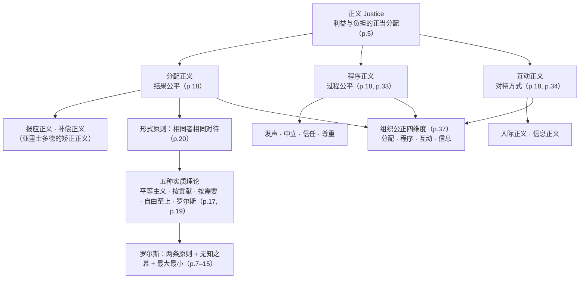
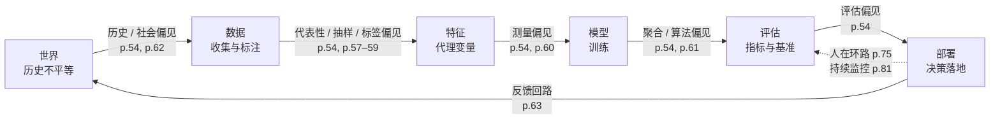
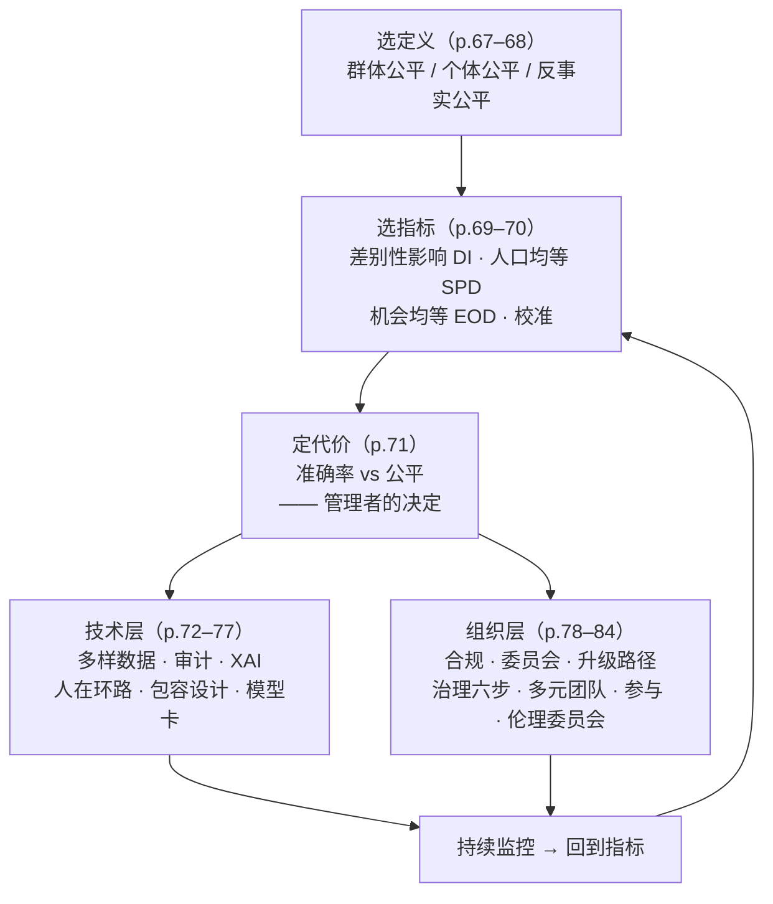

# M03 · 偏见、公平与歧视：从正义理论到 AI 的公平性度量

> **本讲一句话**：FATP 四个字母的第一个字母 **F（Fairness）** 在这一讲被拆开来讲——先问"什么叫公平"（哲学、心理学、组织行为学各给一个答案），再问"AI 是怎么把不公平放大的"（偏见从数据、模型、社会三个入口进来，还会自我强化），最后问"怎么量、怎么治"（公平性指标 + 技术与治理两层手段）。
> **原始材料**：`Module 3 - Fairness Bias and Discrimination in AI.pdf`（89 页） ｜ **转录**：`merged`（`M03-transcript.txt`，Notta 粗粒度导出 30 段、时间戳只到段首，`00:01 → 02:02:00`，2026-09-18 合并；开头完整；**缺结尾——转录止于 p.52 之后的 AI 操纵讨论，p.53–89（偏见来源 / 公平性指标 / 缓解与治理）全部未录到，§2.11–§2.15 标 ❓ 不可降权**）

---

## 0. 三分钟速览

**这一讲讲了什么**

课件分三段（讲义 p.2 议程）：

1. **正义、公平、偏见导论（p.3–44）**：先从哲学讲"正义是什么"——重点是**罗尔斯的正义即公平**（两条原则、无知之幕、最大最小规则）和"分配正义的形式原则"（相同者相同对待、不同者按其不同的比例区别对待）；再从心理学讲"人实际上怎么感知公平"——公平启发式、五种认知偏差、最后通牒博弈、程序公平效应；最后落到组织——**组织公正的四个维度**（分配 / 程序 / 互动 / 信息）怎么影响员工行为、招聘、薪酬。
2. **AI 偏见（p.45–65）**：AI 偏见的定义（IBM 版）、偏见与公平的张力、历史案例（红线划定、人脸识别、亚马逊招聘工具）、偏见的来源清单（数据 / 抽样 / 标签 / 测量 / 算法 / 社会 / 反馈回路），以及"偏见不是 bug，是生命周期问题"。
3. **缓解策略与领导者责任（p.66–89）**：三种公平定义（群体 / 个体 / 反事实）、差别性影响、三个公平性指标（人口均等 / 机会均等 / 校准）、公平与准确率的权衡；技术层手段（多样化数据、偏见审计、可解释 AI、人在环路、包容性设计、模型卡）；治理层手段（伦理委员会、升级路径、AI 治理六步、多元团队、利益相关者参与、伦理委员会）；最后是给未来管理者的三个问题。

**这一讲的骨架其实是一句话**：**"公平"不是一个可以直接量出来的东西，它是一个先要选定义、再选指标、最后还要在会议室里做取舍的过程。** 哲学告诉你有哪些定义可选，心理学告诉你人为什么在这件事上不理性，指标告诉你选定之后怎么量，治理告诉你怎么让这个过程持续下去。

**学完你应该能**

1. **说清**罗尔斯两条正义原则的内容、优先次序，以及"无知之幕 / 原初状态 / 最大最小规则"三个词各自指什么
2. **区分**分配正义、程序正义、互动正义（含信息正义 / 人际正义），并能用组织公正的四维度分析一个 HR 场景
3. **复述**五种认知偏差（自利、确认、损失厌恶、锚定、框架）的定义，并说出前景理论价值函数的三个特征
4. **给出** AI 偏见的定义，并按"数据 → 模型 → 部署 / 社会 → 反馈"四个入口给一个案例分类
5. **区分**群体公平、个体公平、反事实公平，说清人口均等、机会均等、校准三个指标分别在量什么，以及为什么它们不能同时满足
6. **列出**技术层与治理层各至少四种缓解手段，并解释"差别性影响不需要证明意图"为什么重要
7. **用**本讲的框架回答讲义留下的三个讨论题：亚马逊该更早发现吗 / AI 该"照镜子"还是"改善社会" / 你愿不愿意为公平牺牲准确率

**如果只记三件事**

1. **"相同者相同对待、不同者按其相关差异区别对待"（讲义 p.20）是整讲的轴心**——它既是亚里士多德式的形式正义原则，也是 AI 里"个体公平"的定义；而**争议永远在于"什么算相关差异"**：邮编算不算？性别算不算？这正是测量偏见（代理变量）和差别性影响的战场。
2. **偏见不是一个 bug，是生命周期问题（讲义 p.64）**：它从数据收集、模型训练、部署语境三个阶段进来，还会通过反馈回路自我强化——所以治理必须覆盖每一步，而不是上线前查一次。
3. **公平性指标是工具不是真理（讲义 p.70）**：人口均等、机会均等、校准三者量的是不同的东西，在基础率不同时不可能同时满足；**选哪个指标本身就是一个价值判断**，要由业务语境和利益相关者决定，而不是由数据科学家单方面决定。

> 🎙️ **课堂实况**（2026-09-15 周二课）：开头完整（`00:01` 从 FATP 四原则回顾进入）。开场约 10 分钟回顾 FATP 四原则与"该不该控制 AI"的行业分歧；随后约 35 分钟围绕罗尔斯正义论展开（历史基石 → 两条原则与优先次序 → 无知之幕与最大最小规则 → 罗尔斯方法与康德一致性），`45:33` 是第一次课间休息；休息后用约 9 分钟收束分配正义五种理论、形式原则与销售员例子，最后约 5 分钟过渡到心理学视角，开始讲 p.23 的主观公平体验定义。 这段（`59:01`–`01:44:57`）教授先讲完五种认知偏差与前景理论（换成求职/PPT/赢输十块等口语例子），再讲情绪如何影响公平判断，然后完整讲了最后通牒博弈的规则与真实数据，并播放了一段猴子公平实验视频（`01:22:00`–`01:25:16`）；课间休息后转入组织公正四维度、招聘晋升与流程设计，最后用一个绩效评级案例把程序正义（用罗尔斯原则分析）和分配正义（用 merit/equity 衡量）接起来。全程语速快，除课间休息几乎没有停顿提问。 教授从 `01:44:57` 起用约 5 分钟讲完 p.47 企业三类风险与 p.48 AI 偏见定义（IBM），`01:49:47`–`01:54:07` 复习 AI 基础概念并把讲义 p.50 的八个核心概念自己归纳成"数据/模型/算力"三支柱（讲义没有此说法），`01:54:07` 起讲 p.51 商业 AI 系统例子后转入一段约 8 分钟的原创讨论——AI 推荐系统是否构成操纵、Kant "人是目的"、聊天机器人拟人化与大语言模型依赖的心理风险；转录在 `02:02:00` 段中断，讲义 p.53–89（两套偏见来源分类、三种公平定义、差别性影响、三个公平性指标、技术层与治理层缓解手段、领导者收束）全部未录到，且末句没有下课语或"下周继续"，**判定为缺结尾，不可降权**。

---

## 1. 开始之前 · 知识衔接

### 1.1 你已经有的

M01、M02 已经发过的词，本讲直接用，只给一句话唤醒。

| 概念 | 一句话唤醒 | 回看 |
|---|---|---|
| FATP | 公平、问责、透明、隐私——整门课的目录；**本讲就是 F** | [[M01-导论-AI与伦理#2.6.2 FATP：整门课的目录\|M01 §2.6.2]] |
| 算法偏见 | M01 只给了"模型输出系统性地对某些群体不利"这一句，**本讲 §2.10–2.11 把它拆成定义、来源、机制** | [[M01-导论-AI与伦理#2.6.2 FATP：整门课的目录\|M01 §2.6.2]] |
| 无知之幕 | "站在不知道自己是谁的位置上做判断"——M01 提到、M02 接回罗尔斯，**本讲 §2.4.2 给出讲义原文定义并说明它的用法** | [[M01-导论-AI与伦理#2.4.4 康德的进路：善良意志、特殊申辩、无知之幕\|M01 §2.4.4]] · [[M02-道德理论及其应用#2.8.3 罗尔斯的正义二原则与差异原则（讲义 p.62–63）\|M02 §2.8.3]] |
| 罗尔斯正义二原则 · 差异原则 | ①平等的基本自由 ②不平等须机会公平且利于最不利者——**本讲 §2.4.1 补上 M02 讲义没写的优先次序** | [[M02-道德理论及其应用#2.8.3 罗尔斯的正义二原则与差异原则（讲义 p.62–63）\|M02 §2.8.3]] |
| 定言令式（两个表述） | 普遍法则 + 人是目的——**本讲 p.15 把它们改写成对正义原则的三条检验** | [[M02-道德理论及其应用#2.6.2 定言令式 · 第一表述：普遍法则（讲义 p.30–32）\|M02 §2.6.2]] · [[M02-道德理论及其应用#2.6.4 定言令式 · 第二表述：人是目的（讲义 p.33）\|M02 §2.6.4]] |
| 功利主义 · 效用原则 | 看总幸福是否增加；M02 已指出它**不管分配**——本讲把"不管分配"直接接到算法公平 | [[M02-道德理论及其应用#2.7.8 对功利主义的总批评（讲义 p.51, p.56）\|M02 §2.7.8]] |
| 社会契约论 · 权利分类 | 道德 = 理性者为互利而同意的规则；消极 / 积极权利 | [[M02-道德理论及其应用#2.8.1 基础：从自然状态到隐性契约（讲义 p.58–59）\|M02 §2.8.1]] |
| 德性伦理 | 看人的品格而不是单个行为；本讲 p.6 把亚里士多德列为正义论的起点 | [[M02-道德理论及其应用#2.9.2 德性、恶习与中道（讲义 p.68, p.70–71）\|M02 §2.9.2]] |
| 相对主义 vs 客观主义 | 道德是否在人心之外有其存在——本讲 p.21"哲学偏见"第一条就是这个问题 | [[M02-道德理论及其应用#2.10.3 客观主义 vs 相对主义（讲义 p.77）\|M02 §2.10.3]] |
| 三角测量 | 用后果 + 规则 + 德性三个角度交叉验证同一判断 | [[M02-道德理论及其应用#2.10.4 ★ 怎么用这五个理论：三角测量（🎙️ 课堂方法）\|M02 §2.10.4]] |
| 利益相关者 | 一个决定影响到的所有人 | [[M02-道德理论及其应用#2.7.2 行为功利主义（讲义 p.46）\|M02 §2.7.2]] |
| AI 治理六件事 | 数据伦理 / 合规框架 / 风险评估 / 透明措施 / 利益相关者参与 / 持续监控——**本讲 p.81 原封不动再出现一次** | [[M01-导论-AI与伦理#2.7 商业 AI 全景速通（讲义 p.36–59）\|M01 §2.7]] |
| 监督学习 · 标注数据 · 准确率 / 精确率 / 召回率 · 过拟合 | L0 入场基线，本讲 §2.12.4 的公平性指标就建立在"真阳性率 / 假阳性率"这两个词上 | [[IS5113_AI_Ethics_and_Regulations/_meta/知识层级台账\|知识层级台账]] L0 |

> **需要的技术底子只有一样**：知道一个分类模型的输出可以分成"判对的正例 / 判错的正例 / 判对的负例 / 判错的负例"四格（混淆矩阵）。§2.12.4 会从零复习一遍，不熟也没关系。
> 心理学、组织行为学、法律**不需要任何基础**——本讲遇到的所有专名（Tversky、Kahneman、Tyler、Colquitt、EEOC 的五分之四规则、EU AI Act）都会就地交代。

### 1.2 本讲全新引入的概念

| 概念 | English | 展开于 |
|---|---|---|
| 正义（分配 / 矫正 / 报应 / 补偿） | Justice (distributive / corrective / retributive / compensatory) | §2.1–2.2 |
| 平等 vs 公平 | Equality vs Equity | §2.1 |
| 程序正义 · 互动正义（信息 / 人际） | Procedural · Interactional (informational / interpersonal) Justice | §2.2, §2.8.3 |
| 分配正义的形式原则 / 实质原则 · 五种分配正义理论 | Formal / Material principle of distributive justice · Egalitarianism, Capitalist, Socialist, Libertarian, Rawlsian | §2.3 |
| 正义即公平 · 平等自由原则 · 公平机会平等原则 · 优先次序 | Justice as Fairness · Principle of Equal Liberty · Fair Equality of Opportunity | §2.4.1 |
| 原初状态 · 最大最小规则 | Original Position · Maximin Rule | §2.4.2 |
| 罗尔斯方法（公平原则的判据）· 可逆性 / 可普遍化 / 人是目的 | Rawls's method · Reversibility / Universalizability / Treating people as ends | §2.4.3 |
| 哲学偏见 | Philosophical bias（规范 vs 描述） | §2.5 |
| 公平启发式（平等 / 公平 / 程序） | Equality / Equity / Procedural heuristic | §2.6 |
| 认知偏差 · 自利 / 确认 / 损失厌恶 / 锚定 / 框架 | Cognitive bias · Self-serving / Confirmation / Loss aversion / Anchoring / Framing | §2.7 |
| 前景理论价值函数 | Prospect theory value function | §2.7.2 |
| 调节焦点 · 最后通牒博弈 · 独裁者博弈 · 阿莱 / 反射效应 | Regulatory focus · Ultimatum / Dictator game · Allais / Reflection effect | §2.8.1–2.8.2 |
| 程序公平效应（发声 / 中立 / 信任 / 尊重） | Procedural fairness effect (voice / neutrality / trust / respect) | §2.8.3 |
| 组织公正四维度 | Organizational justice framework | §2.9 |
| AI 偏见（IBM 定义）· 偏见 vs 公平的张力 | AI bias · Bias vs Fairness | §2.10 |
| 历史 / 代表性 / 测量 / 聚合 / 评估偏见 | Historical / Representation / Measurement / Aggregation / Evaluation bias | §2.11.3 |
| 数据 / 抽样 / 标签 / 算法 / 社会偏见 · 反馈回路 · 代理变量 · 红线划定 | Data / Sampling / Label / Algorithmic / Societal bias · Feedback loop · Proxy · Redlining | §2.11 |
| 群体公平 / 个体公平 / 反事实公平 | Group / Individual / Counterfactual fairness | §2.12.1–2.12.2 |
| 差别性影响 · 五分之四规则 | Disparate impact · Four-fifths rule | §2.12.3 |
| 人口均等 · 机会均等 · 校准 · 平均几率差 · Theil 指数 | Demographic parity · Equal opportunity · Calibration · Average odds difference · Theil index | §2.12.4 |
| 公平–准确率权衡 | Accuracy–fairness trade-off | §2.12.5 |
| 合成数据 · 偏见审计 · 特征重要性（SHAP / LIME）· 人在环路 · 包容性设计 · 模型卡 / 数据表 | Synthetic data · Bias audit · Feature importance · Human-in-the-loop · Inclusive design · Model card / Datasheet | §2.13 |
| AI 伦理委员会 · 升级路径 · 利益相关者参与 | AI ethics board · Escalation path · Stakeholder engagement | §2.14 |

### 1.3 为什么这一讲放在这里 · 重排说明

**承接**：M02 结尾（🎙️ M02 §2.11）教授预告"AI 伦理原则已经收敛"，接下来逐个议题讲。FATP 的第一个字母是 F，所以 W3 讲公平。M02 留下的两个钩子在本讲兑现：一是 M02 §2.7.8 说功利主义"算对了总量也管不了分配"——本讲 §2.3、§2.12 把"分配"这件事正面讲清；二是 M02 §2.8.3 讲差异原则时讲义没写两条原则的优先次序——本讲 p.7 明确写了。

**铺路**：本讲 p.74 的可解释 AI（SHAP / LIME）是 W4「透明与可解释」的预告；p.75 人在环路、p.80 升级路径通向 W5「问责」；p.79 EU AI Act 通向 W9「监管」；p.81 治理六步是小组项目 (b) 部分（设计治理策略）的现成骨架。

**重排说明**

讲义原顺序：议程与导论（p.1–5）→ 哲学（p.6–21，其中 p.16 是一张"平等 vs 公平"插图）→ 心理学（p.22–35）→ 商业（p.36–44）→ AI 偏见（p.45–65）→ 缓解与领导（p.66–89）。

大方向我**没有动**——讲义"先概念、再 AI、再对策"的顺序本身就是学习顺序。只做了**四处局部调整**：

1. **p.16 那张"平等 vs 公平"的图提到最前面（§2.1）**。理由：它是全讲最直观的一张图，用两个孩子踩凳子讲清了"相同对待 ≠ 公平"；讲义把它夹在康德检验（p.15）和分配正义理论（p.17）之间，反而像插播。
2. **p.18 的正义三分法（分配 / 报应 / 补偿 + 程序 / 互动）提前到 §2.2**，与 p.6 的历史基石放一起。理由：先有分类，后面"分配正义的五种理论"（p.17、p.19）才知道自己在讲哪一类。
3. **p.17 和 p.19 两张"分配正义理论"清单合并成一张表（§2.3）**。理由：两页一张列四个、一张列五个，名单不同又不解释，分开读会以为是两套东西。
4. **p.54 的"偏见类型"和 p.57–63 的"偏见来源"合成一节，并给出对照表（§2.11）**。理由：这是两套不同来源的分类法（p.54 是学术界的五分法，p.57–63 是讲师自己的七分法），讲义没有说明它们的关系；不对照，读者会背两遍同一件事。

另外 p.49–51 的 AI 复习（"AI = 模仿人类认知的系统"、八个核心概念、四类商业 AI 系统）属于 L0 内容，§2.10.3 只用一小节带过，不展开。

小节 ↔ 页码的完整对应见 [[#8. 讲义页码映射|§8]]。

---

## 2. 正文

### 2.1 先把三个词分开：正义 · 公平 · 偏见（讲义 p.2–5, p.16）

**是什么**

先说一个生活场景：公司年终发奖金，两个同事拿到的数额不一样，一个人觉得"凭什么"，另一个觉得"理所当然"。他们争的其实是三件不同的事——**制度该怎么分**（正义）、**这次分得对不对 / 我感觉被公平对待了吗**（公平）、以及**分的人是不是偏心**（偏见）。本讲的三个关键词就是这三件事，先分开再合起来。

讲义 p.2 的议程只有三行：正义 / 公平 / 偏见导论 → AI 偏见 → 缓解策略。p.3 说导论要从**哲学、心理学、商业**三个视角讲，p.4 把它拆成四个"底层想法"：**定义正义、公平、偏见 → 哲学基础 → 心理机制 → 商业视角**。

**正义（justice）**的定义在讲义 p.5：

> - Concerned with **rightful allocation of benefits and burdens**（关心的是**利益与负担的正当分配**）
> - Rooted in **moral philosophy and social order**（根植于道德哲学与社会秩序）
> - **Varies across cultures and historical periods**（因文化与历史时期而异）
> - Questions of **distribution, recognition, and participation**（涉及分配、承认与参与三类问题）

把这四条读成一句话：**正义是关于"谁该得到什么、谁该承担什么"的规则，它由社会的道德哲学决定，所以不同社会不完全一样；它不只管分东西，还管"你有没有被当回事"（承认）和"你有没有份参与决定"（参与）。**

**公平（fairness）**讲义没有在导论里单独定义，而是在两处各给一个：心理学视角说它是"对公平、平等、互惠的**主观体验**"（p.23，§2.6），AI 部分说它是"跨个体或群体的**公平对待**（equitable treatment）"（p.52，§2.10.4）。**偏见（bias）**同样两处：心理学定义是"倾向于偏袒或反对某人 / 某群体 / 某观念，通常以不公平的方式"（p.25，§2.7.1），AI 定义是"由人类偏见扭曲训练数据或算法而产生的有偏结果"（p.48，§2.10.2）。

**为什么需要它**

三个词在日常语言里混用，但本讲后半段的每一个技术概念都依赖这个区分：**指标量的是"公平"（结果或过程是否等同），审计查的是"偏见"（系统性偏离从哪来），而"该用哪个指标"这个问题本身是"正义"层面的选择**。分不开这三个词，读到 §2.12 会以为"选个指标就算公平了"。

**课件原例**（讲义 p.16，纯图片页）

两幅并排的插图：三个不同身高的人（一个大人、一个孩子）要够书架上的书。

| | 左图 EQUALITY | 右图 EQUITY |
|---|---|---|
| 做法 | 每人一张**同样高**的凳子 | 矮的人拿到**更高**的凳子 |
| 结果 | 大人够得到，孩子还是够不到 | 两个人都够得到 |
| 图下的字 | "EQUALITY = SAMENESS. Giving everyone the same thing" | "EQUITY = FAIRNESS. Access to same opportunities" |

**这张图讲的是**：**平等（equality）= 给每个人同样的东西；公平（equity）= 让每个人得到同样的机会**。当起点不同时，"一视同仁"反而会把差距固定下来。

**🎙️ 课堂补充**（`00:01`–`10:03`，约 9 分钟，A · 课上展开）

- 开场把 FATP 四原则又完整念了一遍并展开第五条"以人为本"：*"F stands for fairness, A for accountability, [T for] transparency, and then P for privacy… there is kind of a fifth one which underpins everything, which is human focus."*（`00:01`；转录把 FATP 写成 "FAPIT"，且把 T 听成 P，见 asr-dictionary）——并用 Microsoft 新行为准则（需第三方可远程终止失控 AI）与特朗普"we need to accelerate… no control"的对比，说明这一讲为什么要专门拆开讲公平。
- 给"正义"下定义时把讲义 p.5 的四条读成人话：*"it's not about a person or a party. It's concerns decisions… about allocations of benefits and burdens… it kind of varies across cultures and historical period[s]."*（`10:03`）——并补了讲义没有的一句：公平不只是抽象原则，*"it actually has a pro-business setting… you can get customer… and market integration for the company."*（`10:03`）
- 呼应 p.16 的凳子图：*"equality is sameness. Giving everybody the same thing… equality is not the same as equity… [Equity] is about access to the same opportunity."*（`37:26`）

- **这段改变了什么**：确认了笔记对 FATP／"公平是更大概念"的判断；新增"公平对企业有直接商业价值（客户忠诚度、市场认同）"这一论证角度，v0.9 正文没有。

**💡 换个说法（笔记补充）**

把这张图翻译成 AI 语言：一个招聘模型对所有简历用**同一套**打分规则，看起来"平等"；但如果打分规则是从历史上多数为男性的员工数据里学出来的，"同一套规则"就相当于给每个人发同样高的凳子——起点矮的那一群永远够不到。**本讲后面所有关于"群体公平"的争论，本质上都是在问：该发一样高的凳子，还是该按需要发凳子？**（前者对应 §2.12.1 的个体公平，后者对应群体公平。）

**⚠️ 常见误解**

- ❌ "公平就是人人平等。" → 讲义 p.16 专门用一整页反驳这个直觉：**平等（sameness）只是公平的一种候选定义**，而且往往不是最好的那种。后面 p.24 的"平等启发式 vs 公平启发式"和 p.67 的"群体公平 vs 个体公平"都是这个分歧的变体。
- ❌ 把 equity 译成"股权"。→ 在本讲语境里 equity 是"公平、衡平"，与金融课里的 equity（股权 / 权益）是同形异义词。
- ❌ 以为"正义因文化而异"（p.5 第三条）等于道德相对主义。→ 讲义只说正义观念在历史上**有变化**，没有说"所以没有对错"。M02 §2.5.1 已经论证过文化相对主义不是可用的理论；p.21（§2.5）会再回到这个问题。

**与其他概念的关系**

"利益与负担的正当分配"这句定义，直接对应 M02 §2.7.8 功利主义的软肋——功利主义只算总量、不管怎么分；本讲从 p.6 起讲的所有正义理论，都是在回答"怎么分"。

**所以呢**：先有了"正义 / 公平 / 偏见"三层区分，接下来才能按讲义的顺序进入哲学视角——下一节先看历史上谁给过"正义"什么答案，以及正义可以分成哪几类。

---

### 2.2 哲学视角 I：正义的历史基石与三分法（讲义 p.6, p.18）

**是什么**

"正义"这个词两千多年来被反复定义过，讲义 p.6 挑了四块**历史基石（historical cornerstones）**——四位（组）哲学家各给了正义一个不同的落点。M02 讲过的人在这里全都回来了，只是这次问的不是"什么行为对"，而是"什么分配对"。

| 讲义 p.6 | 谁 | 给正义的落点 | 与 M02 的连接 |
|---|---|---|---|
| Aristotle's **distributive and corrective justice** | 亚里士多德 | **分配正义**（利益按比例分给应得的人）与**矫正正义**（有人受损时把它补回来） | M02 §2.9 德性伦理的作者；本讲 p.7 的"相同者相同对待"就是他的公式 |
| Plato's vision of **harmony** in the *Republic* | 柏拉图 | 正义 = 城邦各阶层各司其职的**和谐** | M02 §2.5.2 提到的《尤西弗罗篇》作者 |
| Kant's **categorical imperative** and **respect for persons** | 康德 | 正义 = 能普遍化的规则 + 把人当目的 | M02 §2.6 两个表述；本讲 p.15 把它们改写成三条检验 |
| Hobbes, Locke, Rawls on **social contract** foundations | 霍布斯、洛克、罗尔斯 | 正义 = 理性人在公平条件下会同意的规则 | M02 §2.8 社会契约论；本讲 p.7–15 全面展开罗尔斯 |

然后讲义 p.18 给出正义的**分类**。它先把"分配正义"这一大类再拆三个（这三个定义是带引号的原文，见下），再并列另外两类：

> - **Distributive: fairness of outcomes**（分配正义：**结果**是否公平）
>   - Distributive Justice: involves the **fair distribution of benefits and burdens**（利益与负担的公平分配）
>   - **Retributive Justice**: concerns the "Fairness when **blaming or punishing** person for doing wrong."（报应正义：追究、惩罚做错事的人时的公平）
>   - **Compensatory justice**: concerns "the fairness when **restoring to a person what the person lost** when he or she was wronged by someone else."（补偿正义：把受害者失去的东西还给他时的公平）
> - **Procedural: fairness of decision-making processes**（程序正义：**决策过程**是否公平）
> - **Interactional: quality of interpersonal treatment**（互动正义：**人与人之间对待方式**的质量）
> - Philosophical overlaps and distinctions（三者在哲学上既有重叠又有区别）

**为什么需要它**

后面心理学（p.24、p.33–34）和商业（p.37）两个视角，用的都是"分配 / 程序 / 互动"这个三分法，只是各自加了细节。**不先立这个三分法，读到 p.37 的"组织公正四维度"会以为它是凭空冒出来的。** 而且 AI 公平的讨论几乎全在"分配"（结果）这一格里——p.67–70 的所有指标量的都是结果；**"程序"和"互动"两格在 AI 语境里恰恰最容易被忘掉**（一个被算法拒贷的人有没有申诉渠道？有没有人解释原因？）。

**课件原例**

讲义 p.18 本身没有例子。p.8 与 p.10 给了两个（属于 §2.4.1 罗尔斯原则下的例子，这里先借用来说明分类）：合同必须无欺诈且被履行——这是**程序**层面的；员工必须履行公平订立的服务合同——这是**分配**层面的。

**🎙️ 课堂补充**（`14:43`；`45:33`，约 6 分钟，A · 课上展开）

- 对柏拉图的补充：*"Plato, uh, with the young Plato and Aristotle… has this vision of harmony in the republic. You don't get harmony unless you get a fair, fairness in society."*（`14:43`）——加了一句讲义没有的：和谐是"这个地区（东方社会）尤其看重的价值"。
- 用一部剧名 [?]（转录写作 "Thousand Year"，听不清原名，见 §9.5）把报应正义、补偿正义讲成故事：*"[R]etributive justice… [f]airness when blaming or punishing person doing wrong… if someone has done something wrong, and… other people [are] being harmed there, then there is an idea of compensatory justice… to restore the person to the position … as if he were not being harmed."*（`45:33`）

- **这段改变了什么**：确认了笔记 §2.2 的三分法与"矫正正义 ≈ 报应 + 补偿"的推断；新增了教授用具体案例／剧情类比讲报应与补偿正义，而不是照读讲义那句抽象定义。

**💡 换个说法（笔记补充）**

用一次考试作弊事件把五种正义排开：**分配**——分数该按真实水平给；**报应**——作弊者该受什么处分；**补偿**——被抄的人如果因此吃亏，怎么补；**程序**——处分前有没有听他申辩、证据是否可靠；**互动**——通知处分时有没有把人当人、有没有解释理由。同一件事，五个"公平不公平"的问题。

亚里士多德的两分法（分配 vs 矫正）与 p.18 的三分法（分配 / 报应 / 补偿）的关系是：**矫正正义 ≈ 报应 + 补偿**——前者对加害者，后者对受害者。

**⚠️ 常见误解**

- ❌ "报应正义 = 报复。" → retributive 的意思是"按应得的程度惩罚"，重点在**相称**，不在情绪。讲义 p.31 会把"报应冲动"当作一种**情绪**单列，恰恰是要提醒两者不同。
- ❌ 以为"程序正义"只是走流程。→ p.33 会说程序公平有四个可检验的要素（发声 / 中立 / 信任 / 尊重），而且**程序公平感对人的影响常常大于结果本身**。

**与其他概念的关系**

p.18 这三类在心理学视角（§2.8.3）和商业视角（§2.9.1）各出现一次，且商业视角把"互动"再拆成"人际 + 信息"两格，变成四维度。整讲的分类树见 §3。

**所以呢**：现在有了"分配 / 程序 / 互动"的分类。下一节专门看"分配"这一格：怎么分才算对——有五种互相竞争的理论，以及一个大家都接受的"形式原则"。

---

### 2.3 哲学视角 II：分配正义的形式原则与五种理论（讲义 p.17, p.19–20）

**是什么**

"分配正义"要回答的问题很具体：**一堆利益（奖金、职位、贷款额度）或负担（税、罚款、风险）该按什么标准分给一群人？** 讲义先给了一个所有人都能接受、但本身不告诉你怎么分的**形式原则**，再列出五种互相竞争的**实质理论**。

**形式原则**（讲义 p.20，标题写的是 "The dominant view of fairness (Rawls)"，⚠️ 归属有问题，见 §9.3）：

> Individuals who are **similar in all respects relevant to the kind of treatment in question** should be given **similar benefits and burdens** even if they are dissimilar in other irrelevant respects; and individuals who are **dissimilar in a relevant respect** ought to be treated dissimilarly **in proportion to their dissimilarity**.
> 在与所讨论的对待方式**相关的方面**上相同的人，应该得到相同的利益与负担——即使他们在其他不相关的方面不同；在相关方面不同的人，应按其**差异的比例**得到不同的对待。

紧接着讲义自己指出这个原则的局限：

> Distributive justice principle purely **formal**. Principle does not indicate "**relevant respects**" for similar or dissimilar treatment. **Material principle of justice**: different theories of distributive justice [give] more fundamental "relevant respects" than just "first-come-first-serve principle" or "priority for senior citizens."
> 这条原则是纯**形式**的：它没有说什么算"相关方面"。**实质正义原则**——即各种分配正义理论——给出更根本的"相关方面"，而不只是"先到先得"或"长者优先"这类经验规则。

**五种实质理论**（讲义 p.17 列四个、p.19 列五个，合并如下）：

| # | 理论（p.19 的名字） | "相关方面"是什么 | p.17 的一句话 | 一句话解释 |
|---|---|---|---|---|
| 1 | **平等主义** Justice as Equality: Egalitarianism | 大家是人，就该一样 | equal access to resources | 资源应人人平等可及 |
| 2 | **资本主义正义** Justice Based on Contribution: Capitalist Justice | **贡献**多少 | （p.17 未列） | 按贡献分：多产者多得 |
| 3 | **社会主义** Justice Based on Needs and Abilities: Socialism | **需要**与**能力** | （p.17 未列） | 各尽所能、按需分配 |
| 4 | **自由至上主义** Justice as Freedom: Libertarianism | **自由交换**的结果 | entitlement and property rights | 只要获得过程自愿合法，结果就是正当的 |
| 5 | **正义即公平** Justice as Fairness: John Rawls | 无知之幕后会被选择的原则 | Rawls's theory of justice as fairness and the difference principle | 详见 §2.4 |
| （p.17 另列） | **功利主义** Utilitarianism | 总幸福 | greatest good for the greatest number | M02 §2.7；⚠️ p.19 未列，且 M02 p.56 说"最大多数人的最大善"这个口号并不准确 |

**为什么需要它**

这一页是**整讲的轴心**。"相关方面"四个字后面藏着 AI 公平性的全部争议：

- 贷款模型用**邮编**做特征——邮编是"相关方面"吗？如果邮编与种族高度相关，用它就等于按种族区别对待（→ p.60 测量偏见、p.55 红线划定）
- 招聘模型用"女子象棋俱乐部"这个词扣分——性别显然不是相关方面（→ p.56 亚马逊案）
- "相似的人得到相似的决定"（p.67 个体公平）就是形式原则的 AI 版本；**而"什么叫相似"必须由某个实质理论来填**

**课件原例**（讲义 p.20）

> Sales persons A and B have the same job positions but at the end [of] the year, A sold more than B; therefore A gets the merit increase or promotion.
> 销售员 A 和 B 职位相同，年底 A 卖得比 B 多，所以 A 得到加薪或晋升。

这个例子用的"相关方面"是**业绩**（贡献），即上表第 2 种理论。讲义用它说明：结论看起来理所当然，但"业绩是相关方面"这一步是理论给的，不是形式原则给的。

**🎙️ 课堂补充**（`50:17`–`54:21`，约 4 分钟，A · 课上展开）

- 五种理论加了一句评价，把前四种定性为"过时"、罗尔斯定为"当代共识"：*"[T]hese, at the end of the day, cumulate to number five, justice as fairness… If we hear justice being mentioned in a particular way, they are outdated. Now, we have come to [a] conclusion a hundred years ago … with … John Rawls['] social contract perspective."*（`50:17`）
- 照读销售员例子并追加总结：*"Salespersons, two persons, A and B, same job position… A sold more than B, and therefore A gets the bonus or promotion… it's not a first come first serve… It's just like calculat[ing] the contributions."*（`54:21`）——把"业绩是相关方面"这件事讲得比讲义更直白。

- **这段改变了什么**：新增"五种理论不是并列的，前四种在教学脉络里是铺垫，罗尔斯才是压轴答案"这一层级判断，v0.9 没有明确排出"过时 vs 当代共识"这条线。

**💡 换个说法（笔记补充）**

形式原则像一台**空的天平**——它规定"两边相同就该平"，但不规定往盘子里放什么。五种理论就是五种"砝码清单"：平等主义只放"人"这一种砝码；资本主义放"贡献"；社会主义放"需要"和"能力"；自由至上主义干脆不管天平，只问东西是不是自愿换来的；罗尔斯则说：**让一群不知道自己会是谁的人来决定放什么砝码**。

把它们各自套到同一个 AI 场景（信用评分）上：平等主义会问"为什么不给每个人同样的额度"；资本主义会说"按还款记录分，天经地义"；社会主义会问"最需要贷款的人是不是反而拿不到"；自由至上主义会说"银行的钱银行做主，只要合同自愿"；罗尔斯会问"如果你不知道自己会出生在哪个邮编，你还愿意让邮编进模型吗"。**同一个模型，五种"对不对"。**

**⚠️ 常见误解**

- ❌ 以为"形式原则"是罗尔斯的。→ 这个"相同者相同对待"的公式**传统上归于亚里士多德**（《尼各马可伦理学》第五卷），教科书通常把它当作各家共享的起点；讲义 p.20 的标题写 "(Rawls)" 是归属混淆，罗尔斯的贡献是第 5 种实质理论。见 §9.3。
- ❌ 以为 p.17 和 p.19 是两套分类。→ 是同一件事的两次不完整列举：p.17 多了功利主义、少了资本主义与社会主义；p.19 反之。合并后共六种，其中功利主义 M02 已讲。
- ❌ 以为"先到先得"是一种正义理论。→ 讲义明确说它只是**经验规则**，不是"更根本的相关方面"。

**与其他概念的关系**

第 5 种理论展开为下一节；第 1 种（平等主义）对应 p.24 的"平等启发式"和 p.70 的"人口均等"指标；第 2 种（按贡献）对应 p.24 的"公平启发式（按贡献成比例）"和 p.40 的"绩效 vs 年资加薪"。

**所以呢**：形式原则把问题转成了"什么算相关方面"，而讲义选择用**罗尔斯**来回答它——因为罗尔斯给的不是一个答案，而是一个**任何答案都要通过的测试**。下一节讲这个测试。

---
### 2.4 哲学视角 III：罗尔斯的"正义即公平"（讲义 p.7–15）

M02 §2.8.3 用两页讲过罗尔斯的两条原则和差异原则；本讲用九页把它讲全：**两条原则的完整表述与优先次序（p.7–10）→ 原初状态与无知之幕（p.11, p.14）→ 罗尔斯方法作为"检验任何原则"的通用程序（p.12–13）→ 它为什么符合康德的要求（p.15）**。

#### 2.4.1 两条原则与优先次序（讲义 p.7–10）

**是什么**

先用一句大白话：罗尔斯说，一个社会分东西的规则要算公平，得满足两条——**第一，每个人的基本自由都一样多；第二，允许有人比别人多拿，但只有在"机会对所有人开放"而且"最吃亏的那群人也因此过得更好"时才行。** 而且两条打架时，第一条优先。

讲义 p.7 的原文：

> "Justice consists... in treating equals **equally** and unequal **unequally** and in giving each person his due."
> "正义在于……平等地对待平等者、不平等地对待不平等者，并给每个人他应得的。"（⚠️ 这句其实是亚里士多德式的表述，讲义放在罗尔斯标题下，见 §9.3）
>
> Two basic principles: "The distribution of benefits and burden in a society is just **if and only if**:
> 1. Each person has an **equal right to the most extensive basic liberties** compatible with similar liberties for all
> 2. Social and economic inequalities are arranged so that they are **both**
>    a. to the **greatest benefits of the least advantaged** person
>    b. attached to offices and position **open to all** under conditions of **fair equality of opportunity**.
>
> **Principle 1 takes priority over principle 2** if they come into conflict. **Within principle 2, 2b takes priority over 2a.**"

三条原则各有一页展开：

**1. 平等自由原则（Principle of Equal Liberty，p.8）**

> Each citizen['s] basic liberties must be **protected from invasion by others** and must be **equal** to those of others.
> - Basic liberties: right to vote, freedom of speech and conscience, civil liberties, freedom from arbitrary arrest.
> - E.g. **contract must be free of fraud and must be honored**. Employees must render services justly contracted with employer.

**2a. 差异原则（Difference Principle，p.9）**

> A productive society will incorporate inequalities but takes steps to **improve the position of the neediest** member of society.

**2b. 公平机会平等原则（Principle of Fair Equality of Opportunity，p.10）**

> Everyone should be given an **equal opportunity to qualify** for the more privileged position in society's institutions.
> E.g. Job qualifications should not only be related to requirements of the job but also **each person must have access to training and education needed to qualify** for the job; remuneration would depend on person['s] efforts, abilities and contribution.（⚠️ 原文 "quality for" 应为 "qualify for"，且几句话连写无标点，见 §9.3）

**为什么需要它**

M02 讲义只列了两条原则、没写谁优先；本讲 p.7 补上了：**基本自由 > 机会公平 > 差异原则**。这个次序在 AI 语境里有直接用处——它告诉你**不能拿"整体效率更高"（甚至"最弱势者也受益"）去交换某个群体的基本权利**。例如"用监控换安全"这类论证，在罗尔斯这里第一条就被挡住了。

**课件原例**

p.8 的合同例子和 p.10 的任职资格例子（见上文引文）。p.10 的例子值得多看一眼：它说任职资格**不仅**要与工作要求相关，**还**要保证每个人都有获得所需培训与教育的途径——**"机会平等"不是"起跑线画在同一处"，而是"每个人都能跑到起跑线"**，这正是 p.16 那张凳子图的哲学版。

**🎙️ 课堂补充**（`19:18`–`23:59`，约 5 分钟，A · 课上展开）

- 优先次序原话（回答任务单问题 4）：*"[T]he principle one, if there are conflicts sometimes… If there are conflicts, then Rawls says principle one will take priority over principle two."*（`19:18`）；*"[W]ith principle two, if there are conflicts, two B takes priority over two A."*（`23:59`）
- 强调原则一不可让步：*"[O]ne of the most important one is that… you have to guarantee that the basic liberties … must be protected. [Protected] from invasion … by others."*（`23:59`）——并把"基本自由"具体化成清单：*"the right to vote, a freedom of speech and conscience… [c]ivil liberties, freedom from arbitrary arrest."*（`23:59`），补了讲义没有的一句：逮捕需要"a law, a … power"授权，否则就是对个人自由的直接侵犯。

- **这段改变了什么**：确认了笔记已写的"基本自由 > 机会公平 > 差异原则"优先次序（讲义原文已有，这里是教授口头两次复述+强调"最重要"）；基本自由清单里补了"逮捕需法律授权"这层解释，讲义原句没有。

**💡 换个说法（笔记补充）**

把三条原则想成公司制定晋升制度时的三道门：

1. **第一道门**：任何晋升规则都不能剥夺员工的基本权利（不能因为你申诉就报复你，不能因为宗教、性别把你排除）。这道门**不能用任何理由绕过**。
2. **第二道门（2b）**：晋升机会必须对所有人开放，而且"开放"包括让人有机会**具备资格**——如果关键培训只给某一部门，形式上开放也不算数。
3. **第三道门（2a）**：允许晋升带来收入差距，但整个制度必须让**处境最差的员工**也比没有这个制度时更好。

**⚠️ 常见误解**

- ❌ "差异原则 = 平均主义。" → M02 已辟过谣：罗尔斯**允许不平等**，只要它对最不利者最有利。
- ❌ 把 2a 与 2b 的优先次序记反。→ p.7 明确写 **2b（机会公平）优先于 2a（差异原则）**。直觉理由：如果职位本身不对你开放，"最弱势者受益"就只是施舍。
- ❌ 以为"基本自由"包括经济自由（想赚多少赚多少）。→ p.8 列的是投票权、言论与良心自由、公民自由、不受任意逮捕——**政治与人身自由**，不含财产上限之类的经济自由。

**与其他概念的关系**

差异原则的图示（累进税）在 M02 §2.8.3；本节补的优先次序在 M02 §9.4 被列为"讲义未强调"的外部补充，现在有了讲义依据（本讲 p.7）。

**所以呢**：两条原则是**结论**；罗尔斯真正有影响力的是**推出结论的方法**——下一节讲无知之幕。

---

#### 2.4.2 原初状态、无知之幕与最大最小规则（讲义 p.11, p.14）

**是什么**

一句话版：**让一群人在"不知道自己会是谁"的情况下给社会定规则，他们定出来的规则就是公平的。** 这个假想的会议叫原初状态，"不知道自己会是谁"这个要求叫无知之幕。

讲义 p.14 的两个定义（原文带引号，是教科书原句）：

> **Original position**: "An imaginary meeting of rational self-interested persons who must choose the principles of justice by which their society will be governed."
> **原初状态**："一群理性、自利的人的想象中的会议，他们必须选择用来治理其社会的正义原则。"
>
> **Veil of ignorance**: "The requirement that persons in the original position must not know particulars about themselves which might bias their choices, such as their sex, religion, race, income, etc."
> **无知之幕**："要求原初状态中的人不得知道可能使其选择带有偏见的关于自身的具体情况——如性别、宗教、种族、收入等。"（⚠️ 原文 "paticulars" 为拼写错误）

讲义 p.11 用三行概括罗尔斯的整个思路：

> - Imagining decisions **behind a veil of ignorance**（在无知之幕后想象决策）
> - Prioritizing the least advantaged (**maximin rule**)（优先考虑最不利者——最大最小规则）
> - Balancing liberty with fair equality of opportunity（在自由与机会公平之间取得平衡）

**最大最小规则（maximin）**讲义只给了名字。它的意思是：**在不知道自己会落到哪一格时，理性的选择是让"最坏的那一格"尽可能好**——先看每个方案的最小值（min），再选最小值最大（max）的那个方案。这就是差异原则的逻辑来源：因为你可能是最不利者，所以你会选对最不利者最有利的规则。

**为什么需要它**

无知之幕把"公平"从一个争不出结果的价值判断，变成了一个**可以操作的思想实验**：你不用说服对方"我的价值观更对"，只需要问"如果你不知道自己会是谁，你还选这条规则吗"。**这正是 AI 公平里"反事实公平"（p.68，§2.12.2）的哲学原型**——把"换一个群体身份，决定还一样吗"当作公平的判据。

**课件原例**

讲义 p.14 用的是定义本身；p.11 无例子。M02 §2.8.3 用累进税（Plan A vs Plan B）示范过：不知道自己收入的人会选对低收入者更友好的方案。

**🎙️ 课堂补充**（`28:29`–`32:57`，约 4.5 分钟，A · 课上展开）

- 无知之幕的口头解释（回答任务单问题 4）：*"[I]magine you're making a decision behind a veil of ignorance. That means … you are not aware of … all the other factors … which are not relevant to the decision … Forget what you are, who you are, your benefit."*（`28:29`）
- 最大最小规则口语版：*"[P]rioritize the least advantage[d]. That is the maximum rule. Okay? The least get the maximum."*（`28:29`）；并口头界定了"rational"：*"Rational means a person of average intelligence who can do logic … [A] group of average intelligent … normal person[s]."*（`32:57`）

- **这段改变了什么**：确认了笔记 §2.4.2 对无知之幕／原初状态／maximin 的转述；新增教授对"rational"一词的口头界定（"平均智力 + 能做逻辑推理"），讲义原文没有解释这个词，v0.9 也没有。

**💡 换个说法（笔记补充）· 把无知之幕当成一条 AI 设计检验**

设计一个自动拒贷 / 筛简历 / 定价的系统时，问团队一个问题：

> **"如果你不知道自己会以哪个性别、种族、年龄、邮编的身份被这个系统评估，你还愿意把它上线吗？"**

如果答案是"看情况"，那就说明系统对某些身份的人明显更不利——你已经找到了要审计的地方。这个检验不需要任何数学，可以在项目立项会上用。（这一条 M02 §2.8.3 已提过，本讲 p.68 反事实公平会把它形式化。）

**最大最小规则的小例子（笔记补充，虚构）**：两套信用评分方案，把申请人按结果分成三档。方案甲：好 / 中 / 差三档的获批率是 90% / 60% / 5%；方案乙：80% / 55% / 25%。**功利主义**看平均（甲 51.7%，乙 53.3%，几乎打平）；**最大最小规则**只看最差一档（甲 5%，乙 25%）→ 选乙。

**⚠️ 常见误解**

- ❌ "无知之幕 = 假装自己不知道。" → 它是一个**规范性要求**（requirement），不是心理状态：任何**依赖你知道自己身份**才成立的规则，都被判定为有偏见。
- ❌ 以为原初状态里的人是利他的。→ 讲义原文说他们是 **rational self-interested**（理性且自利的）。**公平不是靠好心推出来的，是靠"自利 + 不知道自己是谁"推出来的**——这正是它对商学院听众有说服力的原因（对照 M02 §2.4"说服一个怀疑但开放的听众"）。
- ❌ 把 maximin 理解成"平均值最大"。→ 它只看**最差情形**，与功利主义的"总量 / 平均最大"是两条不同的决策规则。

**与其他概念的关系**

无知之幕 → 差异原则（§2.4.1）→ 反事实公平（§2.12.2）；"理性自利 + 不知身份"的设定 → 下一节"罗尔斯方法"作为通用检验。

**所以呢**：原初状态不只是为了推出那两条原则；讲义 p.12 说它是"评价**任何**道德原则是否恰当的通用方法"——下一节。

---

#### 2.4.3 罗尔斯方法：检验任何原则的程序 + 与康德要求的一致（讲义 p.12–13, p.15）

**是什么**

先说人话：罗尔斯给的不只是"两条正义原则"这个**答案**，还给了一个**判卷机**——任何人提出任何一条分配规则，都可以丢进这台机器问"合格吗"。机器的判据就一句：**一群理性自利、但不知道自己将来是谁的人，会不会接受它。**

讲义 p.12：

> Rawls['s] theory provides us not only with a set of principles of justice but also a **general method for evaluating the adequacy of any moral principle in a fair way**.
> The method consists of determining what principles a group of **rational self-interested persons would choose to live by** if they knew they would live in a society governed by those principles, but they **did not yet know what each of them would turn out to be like** in that society.

讲义 p.13 把它写成一条**公平原则的判据（Fair Principle）**：

> "A principle is a morally justified principle of justice **if and only if** the principle would be acceptable to a group of rational self-interested persons who know they will live in a society governed by the principles they accept but who **do not know what sex, race, abilities, religion, interests, social position, income, or other particular characteristics** each of them will possess in that future society."

讲义 p.15 接着说，这个方法**符合康德的要求（inline with Kantian requirements）**，列了三条：

| p.15 原文 | 意思 | 对应 M02 |
|---|---|---|
| **Reversibility** (parties choose principles they apply to themselves) | **可逆性**：定规则的人自己也要受这条规则约束 | 黄金法则 / 定言令式第一表述的"你愿意它成为普遍法则吗" |
| **Universalizability** (principles must apply equally to everyone)（⚠️ 原文误拼为 "Reversalizability"） | **可普遍化**：原则必须平等地适用于所有人 | 定言令式第一表述 |
| **Treating people as ends** (each party has equal say in choice of principles) | **人是目的**：每个人在选择原则时有平等的发言权 | 定言令式第二表述 |

p.15 最后一句是罗尔斯的**主张**：

> Rawls claim[s] that parties to the original position would in fact choose these principles of justice: principle of equal liberty, difference principle and principle of fair equality [of] opportunity.

**为什么需要它**

这是把 M02 的康德主义和本讲的正义论接起来的那一页：**罗尔斯的原初状态，就是把定言令式的两个表述做成了一个可以坐下来做的程序**——"你愿不愿意它成为普遍法则"变成"你不知道自己是谁时会不会选它"。对考试而言，这一页解释了为什么讲义 p.6 把康德列在正义的历史基石里。

**课件原例**

讲义 p.12–15 无具体案例，只有方法陈述。

**🎙️ 课堂补充**（`37:26`，约 4 分钟，A · 课上展开）

- 三条检验的口语版：*"[I]t has these elements. First is universality. So … the rule applies to yourself as well … [U]niversalizability. The rule, the principle must be applied equally to everyone … treating people as ends, not as means … [E]ach party has equal say in the choice of the principles."*（`37:26`）
- 对原初状态参与者身份的比喻：*"[T]he people are kings … the ones who determine[] what fairness are."*（`37:26`）

- **这段改变了什么**：确认了笔记 §2.4.3 表格里三条检验的定义与康德对应关系；新增了教授把"原初状态里人人平等发言权"讲成"人人都是国王"的比喻，v0.9 没有这个说法。

**💡 换个说法（笔记补充）**

把"罗尔斯方法"用在一条 AI 规则上——"信用评分可以使用申请人的邮编"：

1. 想象一群理性自利的人要决定要不要接受这条规则；
2. 他们不知道自己会住在哪个邮编、属于哪个种族、收入多少；
3. 他们会问："如果我恰好出生在评分最低的那个区，这条规则会不会让我永远贷不到款？"
4. 如果多数人不愿冒这个险，这条规则就**不是**公平的分配原则——**不管它对预测准确率贡献多大**。

这比"用邮编是不是歧视"的争论更容易达成一致，因为它不要求任何人先承认自己的价值观。

**⚠️ 常见误解**

- ❌ 以为"可逆性"和"可普遍化"是一回事。→ 可逆性是"定规则的人**自己**也受约束"（防特殊申辩，见 M01 §2.4.4）；可普遍化是"规则对**所有人**同样适用"。前者是后者的一个特例。
- ❌ 以为罗尔斯方法会给出唯一答案。→ 它给出的是**判据**（if and only if），具体会选出什么原则是罗尔斯的**主张**（claim），p.15 用的正是 "Rawls claim" 这个词——可以质疑。

**与其他概念的关系**

这一节结束了哲学视角对"正义"的正面陈述。整个 §2.2–2.4 的结构是：分类（p.18）→ 形式原则（p.20）→ 实质理论（p.17, p.19）→ 罗尔斯的理论与方法（p.7–15）。

**所以呢**：哲学给了一套漂亮的理论，但讲义在离开哲学之前，先给它泼了一盆冷水——下一节 p.21"哲学偏见"。

---

### 2.5 哲学视角的自我警醒：哲学偏见（讲义 p.21）

**是什么**

先说人话：前面几节的理论都假设"人是讲道理的、会替别人着想的"——可是这个假设本身没人检验过。讲义用一页提醒：**哲学理论本身也可能带偏见**——它们建立在一些未经检验的前提上。p.21 列了四条：

> - Are moral principles **universal or culturally bound**?（道德原则是普世的，还是文化所限的？）
> - **Self-interest vs. altruism** in Kantian and utilitarian thought（康德与功利主义思想中的自利 vs 利他）
> - **Overly simplistic premises** when applied to real human behavior（用于真实人类行为时，前提过于简化）
> - Philosophical caution on **prescriptive vs. descriptive** claims（哲学上要当心"规范性"与"描述性"主张的区别）

逐条解释：

| 条目 | 它在质疑什么 | 本库里对应的讨论 |
|---|---|---|
| 普世 vs 文化所限 | 罗尔斯的原初状态假设"理性自利"是普世的；但"什么算理性、什么算自利"可能因文化而异 | M02 §2.5.1 相对主义、§2.10.3 客观主义；M02 §2.9.4 亚里士多德 vs 儒家五常 |
| 自利 vs 利他 | 康德假设人能按纯粹义务行动；功利主义假设人会平等计入他人的幸福。**两者都可能高估了人** | M02 §2.5.3 伦理利己主义（被否决，但它的经验观察没错） |
| 前提过于简化 | "理性自利的人"是一个模型，真实的人有情绪、有认知捷径 | 正是下一段心理学视角（§2.6–2.8）要讲的 |
| 规范 vs 描述 | 哲学说的是**应该**怎样（prescriptive），心理学说的是**实际**怎样（descriptive）。把两者混淆会犯两种错：从"人实际上偏心"推出"偏心是对的"；或从"应该公平"推出"人会公平" | §2.6 起 |

**为什么需要它**

这一页是**哲学段落到心理学段落的桥**。没有它，读者会不明白讲义为什么在讲完罗尔斯之后突然开始讲"最后通牒博弈"——原因就是第三、四条：哲学假设人是理性的，心理学要去看人**实际上**怎么判断公平。

**课件原例**

无。

**🎙️ 课堂补充**：⏭️ **这一页课上没讲。** 依据：转录在同一段（`54:21`）里，教授讲完销售员例子（对应 p.20）后直接说 *"[N]ow, then that brings us to another aspect … these philosophical ideas … [are] still very abstract. How do people actually feel it a little bit different?"*，随即进入心理学视角（p.22–23 的主观体验定义），中间没有出现 p.21 的任何关键词——用脚本检索 `philosophical bias` / `prescriptive` / `descriptive` / `culturally bound` / `self-interest … altruis` 在 `00:01`–`59:01` 全部 0 处命中。**建议**：p.21 仍要读——它是理解"为什么从哲学突然跳到心理学"的桥，只是课上口头跳过了，优先级可以降到"了解即可"。

**💡 换个说法（笔记补充）**

一个物理类比：牛顿力学假设"无摩擦"，理论很美；工程师造桥时必须把摩擦加回去。哲学的正义理论假设"理性自利、信息充分"；下一段心理学就是把"摩擦"——认知偏差与情绪——加回去。

**⚠️ 常见误解**

- ❌ 以为这一页是在否定罗尔斯。→ 它只是标出**前提**。规范理论不因为"人做不到"而错（那正是第四条"规范 vs 描述"要防的推理错误）。
- ❌ 把"哲学偏见"和后面的"认知偏差 / AI 偏见"混为一谈。→ 三者是不同层次：理论前提的偏见（p.21）、人脑判断的偏差（p.25）、机器输出的偏见（p.48）。**英文都是 bias，中文按语境分别译作偏见 / 偏差 / 偏见**（见 [[术语总表]] §2 "Bias 三义"）。

**与其他概念的关系**

p.21 第一条回到 M02 的相对主义争论；第四条是理解整讲结构的钥匙——哲学（应然）→ 心理学（实然）→ 商业（怎么做）。

**所以呢**：接受"人不是理性自利的计算器"之后，就要问：**人实际上是怎么判断公平的？** 下一节。

---

### 2.6 心理学视角 I：人怎么感知公平（讲义 p.22–24）

**是什么**

先说人话：两个人拿到同样的奖金，一个高兴一个生气——因为公平不是数字本身，是**人对数字的感受**。心理学研究的就是这种感受从哪来。

讲义 p.22 交代这一段的三个任务：**哲学理想遇上真实的头脑**；**个体如何感知与践行公平**；**认知与动机影响的导论**。

p.23 给出心理学里的公平定义：

> - **Subjective experience** of equity, equality, and reciprocity（对公平、平等与互惠的**主观体验**）
> - Fairness as a **basic social heuristic**（公平是一种基本的社会启发式）
> - **Cultural norms** and **individual differences**（文化规范与个体差异）
> - Link between **perceived fairness and well-being**（感知到的公平与幸福感相关）

三个词要拆开：**equity（公平 / 按比例）**——得到的与付出的成比例；**equality（平等）**——人人相同；**reciprocity（互惠）**——你怎么对我，我怎么对你。人的公平感是这三种感觉的混合，而且是**主观的**、受文化和个人影响的。

p.24 说人判断公平时用的是**启发式（heuristics）**——"快速评估的心理捷径"：

| 启发式 | 讲义原文 | 意思 | 对应的哲学理论（§2.3） |
|---|---|---|---|
| **平等启发式** | Equality heuristic: **split resources evenly** | 平分 | 平等主义 |
| **公平启发式** | Equity heuristic: **proportional to contribution** | 按贡献分 | 资本主义正义（按贡献） |
| **程序启发式** | Procedural heuristic: **process matters more than outcome** | 过程比结果重要 | 程序正义（§2.2） |

**为什么需要它**

这一节解释了为什么"公平"这么难定义：**不同的人在不同场合默认用不同的启发式**。同一次奖金分配，用平等启发式的人觉得"凭什么他多"，用公平启发式的人觉得"他做得多当然多拿"。AI 公平指标的争论（§2.12.4）本质上也是启发式之争：人口均等 = 平等启发式，个体公平 / 校准 = 公平启发式。

**课件原例**

无具体案例。

**🎙️ 课堂补充**（`54:21`–`59:01`，约 5 分钟，A · 课上展开）

- p.23 定义的口语版：*"[W]e have these philosophical ideas … still very abstract. How do people actually feel it a little bit different? … [T]he experience which form[s] the idea of fairness … equity, equality, reci[procity]."*（`54:21`）；并把 reciprocity 讲成日常例子：*"I give you a favor, you give me a favor back. So [the] normal society['s] … expectation is always reciprocity."*（`54:21`）
- 感知公平与幸福感的链接：*"[T]here is [a] link[] between … perceived fairness and well-being … if you think that you're being treated fairly, psychologically that affects your well-being, you feel better … there is … actual empirical evidence proving the link."*（`54:21`）

- **这段改变了什么**：确认了笔记 §2.6 对 p.23 四条定义的转述；新增教授对 reciprocity 的生活化举例（互相帮忙）以及"公平感—幸福感有实证证据"这句强调，讲义原文只列了关键词，没有说"有实证证据"。
- p.24 三种启发式的课堂例子（`59:01` 段开头）：平等启发式 = AA 制——*"we go for dinner. A few people, we should split the bill evenly. Fair, isn't it?"*（`59:01`）；公平（equity）启发式 = 按贡献——*"I only eat the dessert … I shouldn't pay that much for that. Maybe I pay half of the share … [pro]portion to contribution."*（`59:01`）；程序启发式 = 照流程走——*"you follow the procedure … maybe with robots who … determine … you pay fifty percent, forty percent, thirty percent … Then okay, that's fair."*（`59:01`）。
- **交叉引用**：`54:21` 段两名销售员 A / B 的例子，教授是拿来讲 p.20 形式原则里的"按贡献"（§2.3 资本主义正义），对应到 p.24 就是 **equity（公平）启发式**——"只吃了甜点少付钱"和"卖得多拿得多"是同一条直觉。

**💡 换个说法（笔记补充）**

三个启发式在生活里的样子：家里分蛋糕——平等启发式（一人一块一样大）；小组作业打分——公平启发式（谁干得多谁分高）；被老师批评——程序启发式（哪怕批评是对的，"你都没听我解释"也让人不服）。**三种感觉都真实，且互相冲突**——所以任何分配方案都会有人觉得不公平。

**⚠️ 常见误解**

- ❌ 把 equity 和 equality 当同义词。→ p.16 和 p.24 都在强调它们相反：equality 是"一样"，equity 是"按比例"。中文里两个词都常译"公平"，本笔记用**平等**（equality）与**公平**（equity）区分。
- ❌ 以为启发式 = 错误。→ 启发式是**省力的捷径**，多数时候有效；只有在系统性偏离时才叫**偏差**（下一节）。

**与其他概念的关系**

启发式是下一节"认知偏差"的机制来源（p.25 明说认知偏差"可由启发式引起"）。

**所以呢**：捷径有时走偏——走偏得有规律的，就叫认知偏差。下一节讲五种。

---

### 2.7 心理学视角 II：认知偏差与前景理论（讲义 p.25–30）

#### 2.7.1 什么是认知偏差（讲义 p.25）

**是什么**

先说人话：你在超市看到"原价 999 现价 599"会觉得便宜，看到"售价 599"就没感觉——同一个数字，因为先看到了 999，判断就变了。这不是你笨，是大脑的省力机制在起作用；**这种可预测的、系统性的判断偏离，就是认知偏差。**

讲义 p.25 的定义：

> Biases are **unconscious and automatic processes** designed to make decision-making quicker and more efficient. Cognitive biases can be caused by many things, such as **heuristics** (mental shortcuts), **social pressures**, and **emotions**. Broadly speaking, **bias is a tendency to lean in favor of or against a person, group, idea, or thing, usually in an unfair way**.
> 偏差是**无意识的、自动的**过程，其设计目的是让决策更快、更高效。认知偏差可由许多原因引起，如启发式（心理捷径）、社会压力和情绪。宽泛地说，偏见是**偏袒或反对某个人、群体、观念或事物的倾向，通常以不公平的方式**。

后面引了一句：

> "people use mental approximations to understand an uncertain world. As a result, we make certain types of errors in judgment." (Tersky)
> "人们用心理上的近似来理解一个不确定的世界。结果，我们会犯某些特定类型的判断错误。"（⚠️ 讲义写 "Tersky"，应为 **Tversky**——阿莫斯·特沃斯基，与卡尼曼合作提出启发式与偏差研究、前景理论；见 §9.3）

然后列五种（"The list goes on…"——讲义明说这只是节选）：

| 偏差 | 讲义 p.25 一句话 | 对应的图片页 |
|---|---|---|
| **自利偏差** Self-serving bias | interpreting rules to one's advantage（把规则解释成对自己有利） | p.26 |
| **确认偏差** Confirmation bias | seeking evidence that supports one's view（专找支持自己观点的证据） | p.27 |
| **损失厌恶** Loss aversion bias | negative outcomes weigh more than positive outcome（坏结果比好结果更有分量） | p.28 |
| **锚定偏差** Anchoring bias | first impression rules!（第一印象说了算） | p.29 |
| **框架效应** Framing bias | it doesn't matter what you say, it is about how you say it（重要的不是说什么，是怎么说） | p.30 |

**为什么需要它**

两个理由。第一，它解释了 p.23 的"公平是主观体验"为什么会**系统性地**出错——不是随机的情绪，是有规律的偏离。第二，也是本讲后半段的伏笔：**AI 偏见的第一来源是人的偏见**（p.48 定义里的 "human biases that skew the original training data"）——给数据打标签的人有确认偏差、设计特征的人有锚定偏差，模型就把这些学进去了（p.59 标签偏见）。

**课件原例**

见下一节五张卡片。

**🎙️ 课堂补充**（`59:01`–`01:03:17`，约 4.3 分钟，A · 课上展开）

- 教授先补了讲义没有的理论背景——卡尼曼《思考，快与慢》的双系统：*"I don't know whether you read the book Fast [and] Slow Thinking. It's by Daniel Kahneman, who ... discovered the two thinking modes ... We have a logical, cognitive, sort of slow thinking mode ... At the same time ... our brain developed a heuristics, which means that you bypass all the logical thinking"*（`59:01`）
- 接讲义 p.25 定义：*"these are automatic, sometimes unconscious processes ... designed to make quick decisions ... more efficient ... our cognitive biases are inherent in our brain, and they can be caused by many things."*（`59:01`）
- 点出本讲主线：*"AI inherit those biases because AI learn from us in making decisions in the first place."*（`01:03:17`）
- **这段改变了什么**：笔记 §1.1 只提示"五种偏差"，没写认知偏差的理论来源；教授把 Kahneman 双系统理论（启发式 = 快系统的产物，认知偏差 = 快系统的系统性走偏）作为背景讲了一遍，并把"AI 从人继承偏差"这条主线在 p.25 这一页就点明，比笔记原来到 §2.10 才展开更早。

**💡 换个说法（笔记补充）**

区分三个中文都可能叫"偏"的东西：**启发式**是捷径（工具）；**认知偏差**是捷径在特定情形下系统性走偏（工具的副作用）；**偏见**是走偏之后对某些人不利（副作用落到人头上）。讲义 p.25 的定义把后两者都叫 bias，读的时候要看语境。

**⚠️ 常见误解**

- ❌ "偏差是少数人的毛病。" → 定义第一句就说它是**无意识、自动**的，人人都有，包括数据科学家。
- ❌ 以为知道了偏差就能避免。→ 知道锚定效应的人依然会被锚定；对策是**改流程**（如 p.39 的结构化面试、盲筛简历），不是"提醒自己小心"。

**所以呢**：五种偏差各有一张图片卡片，下一节逐张看——其中损失厌恶那张带了一条前景理论的曲线，是本讲唯一一个"公式"。

---

#### 2.7.2 五张卡片与前景理论价值函数（讲义 p.26–30，纯图片页）

**是什么**

p.26–30 是五张同一模板的卡片（图标 + 标题 + 一段说明），文字全部嵌在图片里、无法提取，以下是逐字誊录（原文是英文，附中文）。⚠️ 这五张卡片的措辞明显来自某个**创新工作坊 / 设计思维**培训材料（反复提到 "innovation workshops"、"warm-up exercises"、"prototypes for pitching"），讲义未注明出处，见 §9.3。

**① 自利偏差（Self serving bias，p.26）**

> Favouring decisions that enhance self-esteem. This results in attributing positive events to oneself and conversely negative events as blame on oneself. Within innovation workshops this can mean that decisions made can be loaded with personal agendas rather than customer and business logic for the company.
> 偏好那些能提升自尊的决定。结果是把好事归功于自己……（⚠️ 原文接着写"把坏事归咎于自己"，与自利偏差的标准定义相反——标准定义是**把坏事归咎于外部**；见 §9.3）。在创新工作坊里，这意味着决策可能被个人议程而不是客户与公司的商业逻辑所左右。

**② 确认偏差（Confirmation bias，p.27）**

> We believe what we want to believe by favouring information that confirms pre-existing beliefs or preconceptions. This results in looking for creative solutions that confirm our beliefs rather than challenge them.
> 我们相信自己想相信的——偏好那些证实既有信念或先入之见的信息。结果是去找"证实我们信念"的方案，而不是挑战它的方案。

**③ 损失厌恶（Loss aversion bias，p.28）**

> Once a decision has been made, sticking to it rather than taking risks due to the fear of losing what you gained in starting something and wishing to see it finished. We also attach more value to something once we have made an emotion[al] investment in it. As a consequence of effort, time and energy put into creative thinking, team members can become biased and become emotionally attached to their outcomes. To remedy this, the 11th commandment: "thou shalt not fall in love with thy solutions".
> 一旦做了决定就死守它、不敢冒险，因为害怕失去已经投入的东西、想看到它完成。我们对已经投入了情感的东西会赋予更高价值。……对策是"第十一诫"：**不要爱上你的方案**。

（⚠️ 这段描述更像**沉没成本 / 承诺升级**，而不是损失厌恶本身；损失厌恶的严格含义在右侧的图里，见下文与 §9.3。）

卡片右侧贴了一张**前景理论（Prospect theory）**的图（来自维基百科的价值函数图，图下说明文字）：

> The value function that passes through the reference point is **s-shaped and asymmetrical**. The value function is **steeper for losses than gains** indicating that **losses outweigh gains**.

**④ 锚定偏差（Anchoring bias，p.29）**

> Being influenced by information that is already known or that is first shown. This causes pre-loaded and determined tunnel vision and influences final decision making. We deliberately manipulate team members' minds by 'pre-loading' them one of our warm-up exercises to demonstrate this bias at play. The impact is highly-significant on creative thinking and outcomes.
> 被已知的或最先看到的信息所影响，造成"预装"的隧道视野，影响最终决策。……

**⑤ 框架效应（Framing bias，p.30）**

> Being influenced by the way in which information is presented rather than the information itself. We see this one all the time particularly when developing prototypes for pitching as well as in presenting polished slides. People will avoid risk if presented well and seek risk if presented poorly meaning that decision making logic can easily be skewed.
> 被信息的**呈现方式**而不是信息本身所影响。……**呈现得好，人们会规避风险；呈现得差，人们会寻求风险**——决策逻辑很容易被扭曲。

**前景理论的价值函数（讲义 p.28 右图）**

先说人话：**丢 100 块的难受程度，大约是捡到 100 块的高兴程度的两倍**；而且钱越多，每多一块带来的感觉变化越小。前景理论把这两件事画成一条曲线。

图上能读到的信息（读图估计，不要在考卷上引用具体数值）：横轴是相对于**参照点**的损益（Loss −\$0.10、−\$0.05 ｜ Gain \$0.05、\$0.10），纵轴是主观价值（−40 到 40）。**赚 \$0.05 对应的价值约 +20；亏 \$0.05 对应的价值约 −40**——同样大小的损失，主观上"重"了约一倍。曲线在收益侧向下弯（凹），在损失侧向上弯（凸），整体呈 S 形，且损失侧更陡。

🔗 讲义没给公式，补一个常见写法（Tversky & Kahneman 1992 的参数，公开资料常识，2026-09-15）：

$$
v(x) =
\begin{cases}
x^{\alpha}, & x \ge 0 \\
-\lambda\,(-x)^{\beta}, & x < 0
\end{cases}
$$

| 符号 | 含义 | 常用取值 |
|---|---|---|
| $x$ | 相对于参照点的损益（已知，输入） | 例：+100、−100 |
| $v(x)$ | 主观价值（要算的，输出） | — |
| $\alpha, \beta$ | 收益 / 损失侧的弯曲程度，小于 1 表示**边际敏感度递减** | 约 0.88 |
| $\lambda$ | **损失厌恶系数**，损失比同额收益"重"多少倍 | 约 2.25 |

代入数字（脚本 `prospect.py`）：$v(+100) = 100^{0.88} \approx 57.5$；$v(-100) = -2.25 \times 100^{0.88} \approx -129.5$；两者之比 **2.25**——正是图里"损失侧更陡"的含义。再看 $v(+200) \approx 105.9$，比 $v(+100)$ 只多 48.4——**第二个 100 带来的高兴，不到第一个 100 的一半**，这就是 S 形弯曲的含义。

**为什么需要它**

五种偏差里有三种（损失厌恶、锚定、框架）直接来自 Tversky 与 Kahneman 的研究，是行为经济学的基石；讲义之所以要放前景理论的图，是因为它是**唯一被数学化的认知偏差**——它证明了"偏差"不是一句评价，而是可以画出来、量出来的规律。对本讲的主线来说，这五种偏差就是**人类偏见进入 AI 的入口**：谁给数据打标签、谁挑特征、谁定阈值，谁就把自己的偏差带了进去。

**课件原例**

卡片里的例子全部来自创新工作坊场景：个人议程压过商业逻辑（自利）、只找证实自己方案的证据（确认）、爱上自己的方案（损失厌恶 / 沉没成本）、用热身练习"预装"想法（锚定）、做得好看的原型让人低估风险（框架）。

**🎙️ 课堂补充**（`01:03:17`–`01:08:02`，约 4.8 分钟，A · 课上展开）

教授**没有照讲义卡片的"创新工作坊"原文讲**，五种偏差换成了完全不同的口语例子：

- 自利：*"when you make a decision, you tend to make a decision which favor you ... It's a kind of ... selfish gene in our DNA"*（`01:03:17`）
- 确认：*"you want to believe something that you want to believe ... you selectively filter out those which confirm what you previously believe"*（`01:03:17`）
- 损失厌恶 / 前景理论：*"the horizontal axis are gains and loss ... it's an inward S-curve, but it's asymmetric ... You win ten dollars ... you feel hundred percent happy"*（`01:03:17`），*"if you lose it is five dollars, but you feel a lot more worried ... economically it's the same ... but you feel very different"*（`01:08:02`）
- 锚定：*"it is very important when you go for a job interview, first impression is important ... first five seconds"*（`01:08:02`）
- 框架：*"it matters even more as to how you say it, how you present it ... people spend a lot of time in presentations trying to work out the presentation file"*（`01:08:02`）

- **这段改变了什么**：笔记逐字誊录了讲义卡片（"创新工作坊 / 热身练习"语境），但教授讲课时**换成了求职面试（锚定）、PPT 演讲（框架）、赢十块输五块（损失厌恶）**这些更贴近学生的例子，完全没提"创新工作坊"——笔记 §9.3 怀疑讲义卡片来自外部培训材料，课堂讲法印证了教授自己也绕开了讲义原文，只用了核心定义。

**💡 换个说法（笔记补充）· 五种偏差怎么进入 AI 系统**

| 偏差 | 进入 AI 的方式 | 对应后文 |
|---|---|---|
| 自利 | 团队把"我们的模型是公平的"当默认，审计流于形式 | p.73 审计 |
| 确认 | 只用支持模型有效的测试集，不去找它失败的群体 | p.54 评估偏见 |
| 损失厌恶 / 沉没成本 | 模型已花了半年，发现偏见也不肯下线（对照亚马逊最终下线，p.56） | p.56 |
| 锚定 | 用历史数据当"正确答案"，历史怎么判，模型就怎么学 | p.54 历史偏见、p.59 标签偏见 |
| 框架 | 把"准确率 95%"放在幻灯片首页，把"某群体假阳率两倍"放在附录 | p.71 权衡 |

**⚠️ 常见误解**

- ❌ 把 p.28 卡片正文当作损失厌恶的定义背。→ 那段说的是"舍不得放弃已投入的东西"（沉没成本 / 承诺升级）；**损失厌恶的定义是右图那句：损失比等额收益更有分量**。考试写后者。
- ❌ 把 p.26 的"坏事归咎于自己"当定义。→ 标准定义是"好事归功自己、坏事归咎外部"；讲义那句是笔误或误抄。
- ❌ 以为框架效应只是"话术"。→ 它改变的是**风险偏好**：同一个方案说成"90% 成功"还是"10% 失败"，人会做出相反的选择。这在向管理层汇报模型偏见时是真实的风险。

**与其他概念的关系**

五种偏差 → p.48 AI 偏见定义中的"human biases"；损失厌恶 → p.31 情绪与公平中的"调节焦点"；框架 → p.71 汇报权衡时的呈现方式。

**所以呢**：认知偏差讲的是"人脑怎么算"；下一节补上"人心怎么感觉"——情绪、实验证据，以及程序公平为什么这么重要。

---

### 2.8 心理学视角 III：情绪、实验证据与三种公平效应（讲义 p.31–35）

#### 2.8.1 情绪与公平（讲义 p.31）

**是什么**

先说人话：人对不公平的反应不是冷静的计算，是**愤怒**——所以才有人宁可自己吃亏也要惩罚不公平的对方（下一节的最后通牒博弈就是证据）。讲义 p.31 列了情绪进入公平判断的四条路径：

> - **Moral outrage and retributive impulses**（道德义愤与报应冲动）
> - **Empathy** and the drive to help the disadvantaged（同理心与帮助弱势者的驱动力）
> - **Anger at unfair treatment fuels social justice movements**（对不公待遇的愤怒推动社会正义运动）
> - **Regulatory focus: promotion vs. prevention orientation**（调节焦点：促进型 vs 防御型取向）

前三条好懂。第四条是一个心理学专名：**调节焦点理论（regulatory focus theory）**（🔗 Higgins 1997，公开资料常识，2026-09-15）说人有两种动机取向——**促进型（promotion）**关注收益、成长、"能得到什么"；**防御型（prevention）**关注安全、责任、"不能失去什么"。放在公平上：促进型的人更在意"机会有没有给到我"，防御型的人更在意"规则有没有保护我"。这与上一节的损失厌恶是同一根线——防御型取向的人对损失更敏感。

**为什么需要它**

它解释了 p.44 总结里那句"偏见在每个层面都会出现"的心理基础，也解释了为什么企业里的公平问题**不是讲道理就能解决的**——被不公平对待的人是在生气，不是在算账；管理者需要的是 p.33 的程序公平（让人发声、被尊重），而不只是把结果算对。

**课件原例**

无。

**🎙️ 课堂补充**（`01:08:02`–`01:12:47`，约 4.75 分钟，A · 课上展开）

- 讲义四条情绪路径之外，教授先接一句 HR 应用：*"this emotional state affects your perception of fairness and justice ... HR managers ... need to be at all times ... nice ... and gentle"*（`01:08:02`）
- 然后主动提出并推翻"AI 没情绪所以更公平"：*"will AI be better? ... AI doesn't have emotions, so AI make decisions probably better than human beings"*（`01:12:47`）——*"[But] AI model is trained using human decision-making data ... your AI models inherit all these biases, including emotional bias."*（`01:12:47`）
- **这段改变了什么**：笔记 §2.8.1 只列了讲义 p.31 的四条情绪路径，没有接到 AI；教授在这里主动设问"AI 是不是天然更公平的裁判"再自己推翻——AI 从人类决策数据训练而来，人的情绪偏差会被继承——这是 §2.10.2 AI 偏见定义、以及讲义 p.62"AI 该照镜子还是改善社会"讨论题的一条提前铺垫。

**💡 换个说法（笔记补充）**

一个被算法拒贷的客户打电话来投诉，他要的往往不是"重新算一遍"，而是"有人听我说、告诉我为什么"——这就是道德义愤 + 程序公平的组合。设计 AI 系统的申诉渠道时，这一页是心理学依据。

**⚠️ 常见误解**

- ❌ 以为情绪是公平判断里的"噪音"，应该排除。→ 讲义把它列为**四条机制**，第三条甚至说它是社会正义运动的燃料。情绪是信号，不是噪音。

**所以呢**：情绪有多强，实验能量出来——下一节。

---

#### 2.8.2 分配公平的实验证据（讲义 p.32）

**是什么**

先说人话：心理学家设计了几个简单的"分钱游戏"，结果发现**人宁可自己一分钱不要，也不接受太不公平的分法**——这直接推翻了"人是理性自利的"这个哲学假设（§2.5 第二、三条）。

讲义 p.32 列了四项：

> - **Ultimatum game**: responders reject low offers（最后通牒博弈：回应者会拒绝过低的出价）
>   - "The Ultimatum Game Psychology"（⚠️ 这是一个超链接，指向的视频 / 网页 PDF 里看不到，见 §9.5）
> - **Dictator game**: altruism vs. selfishness in giving（独裁者博弈：给予时的利他 vs 自私）
> - **Allais and reflection effects** in resource allocation（资源分配中的阿莱效应与反射效应）
> - Implications for policymakers（对政策制定者的启示）

讲义只给了名字，四个实验分别是什么（🔗 行为经济学公开资料常识，2026-09-15）：

| 实验 | 规则 | 典型结果 | 说明了什么 |
|---|---|---|---|
| **最后通牒博弈** | A 拿到一笔钱（如 100 元），提议分给 B 多少；B 接受则按提议分，**B 拒绝则两人都拿不到** | 理性自利的 B 应该接受任何大于 0 的出价；实际上**低于两三成的出价常被拒绝**，多数 A 会主动提议四到五成 | 人愿意**付出代价惩罚不公平**——公平感比钱重要 |
| **独裁者博弈** | 同上，但 **B 没有拒绝权**，A 说了算 | 理性自利的 A 应该一分不给；实际上多数 A 仍会给出一部分 | 给予中有真实的**利他**成分，而不只是怕被拒绝 |
| **阿莱悖论（Allais）** | 两组彩票选择题，按期望效用理论应做出一致选择 | 多数人的选择前后矛盾——**偏好确定的结果**（确定性效应） | 人不按期望值算，前景理论由此而来 |
| **反射效应（reflection）** | 把同一组彩票从"赢"改成"输" | 在收益侧**规避风险**，在损失侧**寻求风险**——偏好像镜像一样翻转 | 与 p.28 价值函数的 S 形、p.30 框架效应一致 |

**为什么需要它**

这一页是本讲"哲学 → 心理学"转折的**证据**：如果人真的是原初状态里那种理性自利者，最后通牒博弈里没人会拒绝出价。实验证明人会——所以任何公平机制（包括 AI 系统的分配结果）都要预期到**被分配者会因为"不公平"而反抗，哪怕反抗让自己更亏**。"对政策制定者的启示"指的就是这个：一个被感知为不公平的政策，即使总收益更高，也可能被抵制。

**课件原例**

讲义只列名称；上表内容为笔记补充。

**🎙️ 课堂补充**（`01:12:47`–`01:25:16`，约 12.5 分钟，A · 课上展开）

**最后通牒博弈**（规则 + 真实数据，讲义只给了名字）：

- 规则：*"Player one, the proposer, receives some money ... he must propose how to split it with player two, the responder ... If he accept the offer, [it] will be divided exactly as proposed ... If player two rejects, then neither player receive anything."*（`01:12:47`）
- 标准理论 vs 真实结果：*"a rational proposer will offer the minimum amount possible ... [but] real world experiment shows that people prioritize fairness over strict logic. Proposers typically offer ... forty percent to fifty percent ... When the offer drop[s] down to twenty to thirty percent, [the] responder frequently reject[s]."*（`01:17:02`；⚠️ 教授举的"one dollar out of the fifty-nine or one hundred"这个具体数字疑似 ASR 错误，未还原，见 §9.5）
- 利他惩罚：*"Responders willingly penalize themselves financially just to punish a greedy partner. [This] is known as altruistic punishment."*（`01:17:02`）
- 透明度：*"People behave less generously when they can hide the link between the actions and the fair outcome ... transparency is important to help people ... make more fair decisions."*（`01:17:02`）

**猴子公平实验（视频，确认了课上播放）**：

- 预告：*"I've already seen the two monkeys game ... monkeys behave that way too ... let's see the monkey game."*（`01:22:00`）
- 视频原话（黄瓜 vs 葡萄，逐字播放）：*"we put two capuchin monkeys side by side ... if you give both of them cucumbers ... they're perfectly willing to do this thirty-five times in a row ... if you give the partner grapes ... you create inequity"*……*"this is basically the Wall Street protest that you see here."*（`01:22:37`）
- 收尾：*"apparently that's universal. Even monkeys feel[s] the same ... perceived fairness and justice"*，随后宣布休息：*"let's take a ten minutes break"*（`01:25:16`）

- **这段改变了什么**：笔记原来只列了讲义 p.32 的四个实验名字，并猜测"The Ultimatum Game Psychology"超链接可能是课上播放的视频。**转录证实：确实播放了猴子公平实验视频**（`01:22:00` 预告，`01:22:37` 段是逐字旁白，与 Frans de Waal 那场著名 TED 演讲一致，含"Wall Street protest"梗），最后通牒博弈的规则和真实数据也完整讲了。**但独裁者博弈、阿莱悖论、反射效应——转录全文检索 0 命中，课上完全没有展开**（见 §9.5），讲义列了名字但没讲，笔记 §9.1 应补一行。

**💡 换个说法（笔记补充）**

把最后通牒博弈搬到 AI 场景：平台用算法给两个骑手分配单量，A 拿 80%、B 拿 20%。按"总量最大"B 也比没单强，理性上该接受；但现实里 B 会**退出平台、投诉、发帖**——平台损失的不只是 B。**公平不是道德奢侈品，是系统能不能运转的前提。** 这一条在小组项目里可以直接用作"为什么企业要在乎公平"的论据。

**⚠️ 常见误解**

- ❌ 以为最后通牒博弈证明"人不理性"。→ 更准确的说法是：人的效用函数里**包含公平**，拒绝低出价是在为公平感付费，不是算错了。
- ❌ 把阿莱效应和反射效应混为一谈。→ 阿莱说的是**对确定性的偏好**（同在收益侧），反射说的是**收益侧与损失侧风险态度相反**。

**所以呢**：结果不公平会激起反抗，那过程呢？下一节是本讲心理学部分最有实用价值的一页——程序公平的四个要素。

---

#### 2.8.3 程序公平效应与互动公平（讲义 p.33–34）

**是什么**

先说人话：**人能接受一个对自己不利的结果，只要他觉得过程是公道的**——他被允许说话、裁判没有偏心、过程透明、被当人对待。这叫**程序公平效应**。反过来，结果再好，过程不公道，人也会不服。

讲义 p.33 列了程序公平的四个要素（🔗 这四条与 Tom Tyler 的程序正义模型一致，公开资料常识，2026-09-15）：

| 要素 | 讲义原文 | 意思 |
|---|---|---|
| **发声** Voice | opportunity to present one's case | 有机会陈述自己的情况 |
| **中立** Neutrality | unbiased decision-makers | 决策者没有偏见 |
| **信任** Trust | transparency and integrity of process | 过程透明、有诚信 |
| **尊重** Respect | dignified interpersonal treatment | 有尊严的人际对待（⚠️ 原文 "treatmen" 为拼写错误） |

讲义 p.34 接着讲**互动公平（interactional fairness）**——它被拆成两块，再加两条影响：

> - **Informational justice**: explanations and communication（**信息正义**：解释与沟通）
> - **Interpersonal justice**: courtesy, respect, and empathy（**人际正义**：礼貌、尊重与同理心）
> - Role of **leader behavior** in shaping perceptions（领导行为对感知的塑造作用）
> - Impact on **team cohesion and trust**（对团队凝聚力与信任的影响）

**为什么需要它**

这是 AI 公平讨论里**最容易被技术人员忽略的一页**：§2.12 的所有指标量的都是**结果**（谁被批、谁被拒），而这一页说的是——**被算法决定的人，有没有机会申诉（发声）？决策者（模型）是否被证明无偏（中立）？过程是否透明（信任）？拒绝通知是否有解释、是否有礼（信息正义、人际正义）？** EU AI Act 对高风险系统要求"透明"和"人类监督"（p.79），可以看作把这四个要素写进了法律。

**课件原例**

无具体案例；p.42 的案例研究（§2.9.3）是这一页的应用。

**🎙️ 课堂补充**（`01:25:16`–`01:31:38`，约 6.4 分钟，A · 课上展开）

教授课间休息回来后，**没有按 p.33 的"发声 / 中立 / 信任 / 尊重"四要素逐条讲**，而是直接用"分配 / 程序 / 互动 / 信息"四种正义（p.37 组织公正框架的说法）把 p.33/34/37 揉在一起讲：

- 程序正义与透明：*"Procedural justice, transparent policies and ... procedures ... if the decisions are made, how do we make sure that it is transparent? ... due process has gone through, rational decision-making has been put in all places."*（`01:25:16`）
- AI 的透明困境（讲义没有）：*"when AI is involved in making decisions, we want AI to make decisions which is ... transparent ... which can be traced down to policies and logics ... which is difficult because AI models do not work [that] way. They work on association of large data sets rather than ... logic analysis."*（`01:25:16`）
- 互动 / 信息正义：*"the way that you interact with the recipient affects how fair the decision is being received ... kind, gentle voice and in a positive tone ... perceived as more fair ... informational justice ... clear and honest communications about the decision."*（`01:25:16`）

- **这段改变了什么**：讲义把"程序公平四要素（p.33）"和"互动/信息正义（p.34）"分成两页，笔记也照此分节；教授课上直接跳到了业务语境下的"分配/程序/互动/信息"四正义框架（与 §2.9.1 引用的内容有重叠，见该格）。新增的一条张力是：**AI 靠关联大数据而不是逻辑推理做决策，所以"可追溯到政策和逻辑"这条透明度要求对 AI 本身天然就难做到**——这一点讲义没写，补进本节。

**💡 换个说法（笔记补充）**

把四要素做成一张 AI 系统的**程序公平检查表**：

| 要素 | 对 AI 系统问的问题 |
|---|---|
| 发声 | 被拒的人能不能提交补充材料、要求人工复核？（→ p.75 人在环路） |
| 中立 | 模型有没有做过偏见审计？审计是不是第三方？（→ p.73） |
| 信任 | 决策逻辑能不能被解释？文档有没有公开？（→ p.74 XAI、p.77 模型卡） |
| 尊重 | 拒绝通知是一行冷冰冰的"系统判定"，还是带原因和申诉渠道的说明？（→ 信息正义） |

**⚠️ 常见误解**

- ❌ "结果对了，过程无所谓。" → 程序公平效应的核心发现恰恰相反：**过程公平感能独立于结果影响人的接受度**。这也是 p.24 "程序启发式：过程比结果重要"的实证基础。
- ❌ 把"信息正义"等同于"透明"。→ 信息正义强调的是**对当事人的解释与沟通**（我为什么被这样对待），透明更多指**对外的可见性**。两者在 W4 会再区分。

**所以呢**：公平感有三种（分配、程序、互动），它们能不能量？下一节。

---

#### 2.8.4 公平感怎么测量（讲义 p.35）

**是什么**

先说人话："员工觉得公司公平吗"这句话能不能变成一个数？能——问他、看他怎么做、测他的身体反应、或者统计整个公司的数据。讲义 p.35 列了测量"人感知到的公平"的四种方法：

| 方法 | 讲义原文 | 意思 |
|---|---|---|
| **问卷** | Surveys: organizational justice scales | 组织公正量表——让员工给分配 / 程序 / 互动 / 信息四个维度打分（🔗 常用的是 Colquitt 2001 的四维量表，公开资料常识，2026-09-15） |
| **行为指标** | Behavioral indices: resource allocation tasks | 观察人在分配任务里怎么做（如最后通牒博弈的接受 / 拒绝） |
| **生理指标** | Physiological markers: stress responses to unfairness | 不公平引起的应激反应（心率、皮质醇等） |
| **大数据** | Big data approaches to tracking equity | 用大规模数据追踪公平状况（如薪酬数据的群体差异） |

**为什么需要它**

它把 §2.6–2.8 的"公平是主观体验"接到了 §2.12 的"公平可以量"：**量人的感知**用前三种；**量系统的结果**用第四种——p.70 的公平性指标就属于"大数据方法"这一类。两者不能互相替代：一个模型在指标上完全"公平"，员工仍可能因为程序不透明而感到不公。

**课件原例**

无。

**🎙️ 课堂补充**（`01:35:41`，B · 讲了同讲义）：教授没有单独讲这一页，而是在 §2.9.3 的绩效评级案例里带过测量方法——*"How do you measure perceived fairness? You can do a survey ... this fairness ... is a subjective perception which you can measure ... by interview, by survey. There are ... psychometric techniques to help us know what is in your mind"*（`01:35:41`）。讲义列的**行为指标、生理指标、大数据**三种方法**没有被点名**，只讲了"问卷 / 访谈 / 心理测量"这一组（对应讲义第一种 Surveys）。和笔记 §2.8.4 原判断一致（"量人的感知用前三种"），补一句：**这一页在课堂上不是独立话题，是嵌在 HR 案例里一句带过的**。

**💡 换个说法（笔记补充）**

企业推行 AI 绩效评估后，四种方法各能回答一个问题：问卷——员工觉得公平吗；行为——申诉率、离职率变了没；生理——（研究用，企业很少做）；大数据——不同性别 / 年龄的评分分布有没有系统差异。**只做最后一种，是 AI 团队最常见的盲区。**

**⚠️ 常见误解**

- ❌ 以为"量表"就是随便几道满意度题。→ 组织公正量表是**分维度**的：分配 / 程序 / 人际 / 信息各自有题，才能定位问题在哪一维。

**所以呢**：个人层面讲完了。下一节把镜头拉到组织——公平在企业里长什么样、影响什么、怎么设计。

---
### 2.9 商业视角：组织公正（讲义 p.36–44）

#### 2.9.1 组织公正四维度及其对员工行为的影响（讲义 p.36–38）

**是什么**

先说人话：员工觉得公司公不公平，会直接变成他们**干不干活、走不走人**。组织行为学把"公司层面的公平"叫**组织公正（organizational justice）**，拆成四个维度来量。

讲义 p.36 交代这一段的三个问题：**从个体心智到组织结构**；**公平与正义为什么在商业环境里重要**；**公正感知与绩效的关联**。

p.37 给出**组织公正框架**的四个维度：

| 维度 | 讲义原文 | 在企业里的样子 | 对应 §2.2 / §2.8 |
|---|---|---|---|
| **分配公正** Distributive justice | fair pay, benefits, and promotions | 薪酬、福利、晋升分得公不公平 | p.18 分配（结果） |
| **程序公正** Procedural justice | transparent policies and procedures | 政策与流程是否透明 | p.18 程序、p.33 四要素 |
| **互动公正** Interactional justice | respectful HR practices | HR 实践是否尊重人 | p.34 人际正义 |
| **信息公正** Informational justice | clear, honest communication | 沟通是否清楚、诚实 | p.34 信息正义 |

p.38 列出公正感知**对员工行为的四类影响**：

> - **Job satisfaction and organizational commitment**（工作满意度与组织承诺）
> - **Trust in leadership and willingness to cooperate**（对领导的信任与合作意愿）
> - **Turnover intentions and absenteeism**（离职意向与缺勤）
> - **Creativity and willingness to go the extra mile**（创造力与"多走一步"的意愿）

**为什么需要它**

这是把公平从"道德要求"翻译成"商业指标"的一页：**不公平的代价是可以量的——离职率、缺勤率、合作意愿、创造力。** 当 AI 系统进入 HR（p.39 招聘、p.40 薪酬、p.42 绩效评级），系统的公平性就直接接到这四个指标上。后面 p.47、p.78 讲"偏见对企业的影响"时，用的是同一逻辑，只是对象从员工换成了客户和监管者。

**课件原例**

讲义 p.36–38 是框架，无案例；p.42 的案例见 §2.9.3。

**🎙️ 课堂补充**（`01:25:16`–`01:31:38`，约 6.4 分钟，A · 课上展开）

- 四维度接 AI（讲义没有的连接）：*"Distributive justice. Most commonly ... fair pay, fair benefits, fair promotion. And a lot of these decisions are now aided by AI ... we need to make sure that the AI ... decisions ... are fair."*（`01:25:16`）——教授每提一种正义类型，都立刻接一句"这个决策现在很多由 AI 辅助 / AI 需要做到这个"。
- 四类影响（对应讲义 p.38 四条，逐字对上）：*"There has been numerous empirical studies showing ... impact on job satisfaction and how committed the employee is to organization ... you will not trust the leadership ... willing to cooperate ... reflected by turnover, absenteeism ... negative impact on creativity and the willingness to do extra ... work."*（`01:31:38`）
- **这段改变了什么**：笔记 §2.9.1 把 p.37（四维度表）和 p.38（四类影响列表）当成两张静态表照抄；教授讲的时候把每个维度都直接绑上"AI 现在参与这个决策"，四类影响也是原文逐条对应地讲了一遍——讲义两张表本身没有的连接被教授在口头上补上了：**四维度里任何一维出问题，都不是抽象的组织行为学问题，而是现在正由 AI 系统在做的决策**。

**💡 换个说法（笔记补充）**

p.18 的三分法在这里变成四分法，唯一的变化是把"互动"拆成"人际"和"信息"两格（p.34 已铺垫）。记法：**分（结果）· 程（流程）· 互（态度）· 信（解释）**。

一个员工被 AI 系统评为"低绩效"：他会先问结果对不对（分配），再问系统怎么算的（程序），再看主管通知他时的态度（互动），最后问有没有人解释原因（信息）。**四个维度里任何一个失守，都会落到 p.38 的四类后果上。**

**⚠️ 常见误解**

- ❌ 以为提高薪酬就能解决公平感。→ 那只动了分配这一维；程序、互动、信息三维不动，公平感仍然低——这正是 p.33 程序公平效应的含义。
- ❌ 把"组织承诺"理解成合同义务。→ organizational commitment 是员工**心理上**对组织的认同与留任意愿，是结果变量，不是义务。

**所以呢**：框架有了，下一节看它落在三个最容易出偏见的 HR 环节：招聘晋升、薪酬、流程设计。

---

#### 2.9.2 招聘、薪酬与流程设计中的公平（讲义 p.39–41）

**是什么**

先说人话：企业里偏见最容易钻进来的三个地方是**谁被录用 / 晋升、谁拿多少钱、谁说了算**。讲义各用一页给出对策。

**招聘与晋升中的偏见（p.39）**

> - **Unconscious stereotypes** in talent identification（人才识别中的无意识刻板印象）
> - **Structured interviews** and **blind resume screening**（结构化面试与盲筛简历）
> - Performance appraisals and **calibration meetings**（绩效评估与校准会议）
> - **Inclusive leadership** practices（包容性领导实践）

第一条是问题，后三条是对策：**结构化面试**——所有候选人问同样的问题、按同一量表打分，减少面试官临场的锚定与确认偏差；**盲筛简历**——去掉姓名、性别、照片、毕业院校等与岗位无关的信息（回想 §2.3"相关方面"）；**校准会议**——多位评估者一起对齐打分标准，防止一个人的偏差决定结果。

**公平的薪酬体系（p.40）**

> - **Pay equity analyses** across demographics（跨人口群体的薪酬公平分析）
> - **Merit-based vs. seniority-based** raises（按绩效 vs 按年资加薪）
> - **Transparent bonus criteria** and variable pay（透明的奖金标准与浮动薪酬）
> - Role of **external benchmarks**（外部基准的作用）

第二条是 §2.3 五种分配理论在薪酬上的直接体现：按绩效 = 按贡献（资本主义正义），按年资 = 一种经验规则（讲义 p.20 说它不是"更根本的相关方面"）。

**设计公平的流程（p.41）**

> - **Cross-functional decision panels**（跨职能决策小组）
> - Employee **voice mechanisms and appeals processes**（员工发声机制与申诉流程）
> - **Rotating chair** for grievance committees（申诉委员会轮值主席）
> - **Technology to ensure consistency and audit trails**（用技术保证一致性与审计轨迹）

四条正好对应 p.33 的四要素：跨职能小组 → 中立；发声与申诉 → 发声；轮值主席 → 中立与信任；技术与审计轨迹 → 信任（透明）。

**为什么需要它**

这三页在本讲里有双重身份：它们既是**人类决策**的去偏见手段，也是后面 **AI 决策**去偏见手段的原型——p.72 多样化数据 ≈ 盲筛（去掉不相关信息）；p.73 审计 ≈ 校准会议；p.75 人在环路 ≈ 申诉流程；p.77 文档 ≈ 审计轨迹。**读到 §2.13 时回头对照，会发现 AI 的对策没有一条是新发明的。**

**课件原例**

p.39–41 无具体企业案例；亚马逊招聘工具（p.56，§2.11.2）是"人才识别中的刻板印象"被 AI 放大的真实版本。

**🎙️ 课堂补充**（`01:31:38`–`01:35:41`，约 4 分钟，A · 课上展开）

- 招聘刻板印象（讲义只写"无意识刻板印象"四个字，教授给了具体例子）：*"in hiring, there's always unconscious stereotypes ... When you see a Black people, a Black guy, you think that this is a Black guy, not very intelligent ... you have this bias in your mind ... unconsciously. So you miss ... your good talents and make biased assessments ... on hiring."*（`01:31:38`）
- 多级评审与 AI 介入：*"the existing human resource practice will have a lot of ... procedures to ensure ... these biases are being minimized ... multi-level reviews of the panel ... But increasingly, these reviews are being involved by AI. So the AI ... has to be done in such a way that it is seen as fair."*（`01:31:38`）
- 跨职能小组的行话（讲义 p.41 没写这个词）：*"they use cross-functional decision panel ... It's called three sixty evaluation ... to avoid silos and blind ... spots, you have multi-disciplinary cross-functional people ... together making decisions."*（`01:35:41`）
- ⏭️ **p.40 公平薪酬体系整页没讲**：`01:31:38` 讲完招聘/绩效评估，`01:35:41` 直接跳到跨职能小组（p.41），中间没有出现 "pay equity"、"merit-based vs seniority-based"、"bonus criteria"、"external benchmarks" 等 p.40 关键词（全文检索 0 命中）。
- **这段改变了什么**：p.39 的例子从抽象的"无意识刻板印象"变成了一个具体到令人不适但很真实的刻板印象例子；p.41 补了讲义没有的行话"360 度评估"。同时确认 p.40 课上完全没讲，笔记 §9.1 应加一行 ⏭️（前后 `01:31:38`/`01:35:41` 都有时间戳，中间没有）。

**💡 换个说法（笔记补充）**

最后一条"用技术保证一致性与审计轨迹"值得多看一眼——它是本讲第一次正面肯定技术：**算法的优点恰恰是一致（同样输入同样输出）和可审计（每一步有记录）**，而人的判断做不到这两点。本讲后半段不是在说"别用 AI"，而是在说"用 AI 时，把人类流程里已经学会的那几招带上"。

**⚠️ 常见误解**

- ❌ 以为盲筛简历能彻底去偏见。→ 它去掉的是**显性**的身份信息；"女子象棋俱乐部"这种**代理信息**（p.56、p.60）还在。这正是为什么 AI 时代还需要 p.73 的审计。
- ❌ 把"外部基准"理解为"跟着市场走就公平"。→ 市场薪酬本身可能带历史偏见（p.54 历史偏见）；外部基准是**参照**，不是**正当性**。

**所以呢**：对策列完了，讲义用一个案例把它们串起来——下一节。

---

#### 2.9.3 案例：推行程序公正 · 三视角整合 · 第一部分小结（讲义 p.42–44）

**是什么**

先说人话：同一套新的打分制度，一家公司推下去员工服气，另一家推下去怨声载道——差别不在制度本身，在推行的方式。讲义 p.42 是一个**骨架式**的案例（只有四行，没有具体公司名与数字）：

> - Scenario: **roll-out of a new performance rating system**（场景：推行一套新的绩效评级系统）
> - Steps taken for **transparency, employee input, and training**（采取的步骤：透明、员工参与、培训）
> - Results: **increased perceived fairness and productivity**（结果：感知公平与生产率提升）
> - Lessons learned and best practices（经验教训与最佳实践）

它演示的是：**同一套评级系统，推行方式决定它被感知为公平还是不公平。** 三个步骤对应 p.33 的要素——透明（信任）、员工参与（发声）、培训（信息正义：让人知道规则怎么用）。

p.43 **整合三个视角**：

> - **Philosophical ideals guide organizational values**（哲学理想引导组织价值观）
> - **Psychological insights shape policy design**（心理学洞见塑造政策设计）
> - **Business applications translate theory into practice**（商业应用把理论落到实践）
> - **Continuous feedback loops and evidence-based refinement**（持续反馈回路与基于证据的改进）

p.44 是第一部分的**小结**：

> - Justice spans **moral theory, human cognition, and organizational design**（正义横跨道德理论、人类认知与组织设计）
> - Fairness is **multifaceted: outcomes, processes, and interactions**（公平是多面的：结果、过程、互动）
> - **Bias emerges at every level but can be mitigated by design**（偏见在每个层面都会出现，但可以通过设计来缓解）
> - Integrative approach yields sustainable, ethical, and effective system（整合的方法产出可持续、合乎伦理且有效的系统）

**为什么需要它**

p.44 的第三条是**整讲的转折句**："偏见在每个层面都会出现，但可以通过设计缓解"——第一部分讲的是人与组织的层面，第二、三部分把同一句话套到 AI 上：偏见在数据、模型、部署每个层面出现（p.64），但可以通过设计缓解（p.66–84）。

**课件原例**

p.42 的绩效评级案例（骨架，无细节）。

**🎙️ 课堂补充**（`01:35:41`–`01:44:57`，约 9.3 分钟，A · 课上展开）

- p.42 案例（核对：仍是骨架，没有补公司名/数字）：*"Just think about if your company needs to roll out a new performance rating system. How do you make sure the ... system to be perceived as fair? ... you need to take steps ... transparencies, stakeholder inputs, employer inputs, training"*（`01:35:41`）
- p.43/44 的"三视角整合"被教授重新表述成一句总结（WHAT vs HOW），未逐条点名讲义原文三条：*"procedural justice evaluates how a decision is made ... Whereas distributive justice evaluates what the final decision are ... The what and the how are the key distinctions"*（`01:40:16`）
- 🔴 把 §2.4 的罗尔斯原则指定为程序正义的答题工具（讲义没写的方法论）：*"you think about whether it confirms to Rawls' principle, the principle one, two, two-A, two-B. And you can use that as a basis for analysis"*（`01:40:16`）；分配正义则用 *"measures like merit ... which is equity measure"*（`01:40:16`）
- 程序公平与结果接受度的关系：*"when procedural justice is high, people are much more willing to accept an unfavorable distributive justice outcome ... an employee who is denied a promotion is less likely to quit ... if they believe the selection process was neutral, transparent, and fair."*（`01:40:16`）
- **这段改变了什么**：p.42 案例课上确实没有补细节，证实了笔记 §9.3"不要编造细节"的判断。但教授补了讲义 p.43/44 没有的一条重要方法论：**程序正义可以直接用罗尔斯第一/第二（2a/2b）原则分析，分配正义用 merit/equity 衡量**——这把 §2.4.1 的哲学框架和 §2.9 的组织公正案例接了起来，是本节最有答题价值的一句。

**💡 换个说法（笔记补充）**

把三视角整合成一句话：**哲学告诉你"公平应该是什么"，心理学告诉你"人会怎么感受"，商业告诉你"所以流程该怎么设计"。** 小组项目 (b) 部分（设计治理策略）就是按这个顺序写的：先立价值（用哪种正义观），再预判人的反应（谁会觉得不公平、为什么），最后设计流程（申诉、审计、文档）。

**⚠️ 常见误解**

- ❌ 以为 p.42 是一个真实的公司案例。→ 它没有公司名、没有数据，是**模板式案例**；答题时不要编造细节。
- ❌ 把 p.43 第四条的"反馈回路"与 p.63 的"反馈回路"混淆。→ p.43 说的是**好的**反馈（用证据持续改进），p.63 说的是**坏的**反馈（偏见自我强化）。同一个词，方向相反。

**与其他概念的关系**

第一部分（p.3–44）到此结束。它建立的三分法（分配 / 程序 / 互动）、启发式（平等 / 公平）、四维度（分 / 程 / 互 / 信）在后面会反复出现，见 §3 的图。

**所以呢**：现在把主角换成 AI。下一节从"AI 偏见是什么"开始。

---

### 2.10 AI 偏见是什么（讲义 p.45–52）

#### 2.10.1 这一部分要回答什么 · 为什么管理者要在乎（讲义 p.45–47）

**是什么**

p.45 是第二部分的扉页（"AI BIASES"）。p.46 是这一部分的**学习目标**（本节对应学习目标：定义 AI 偏见；识别 AI 生命周期各环节的偏见来源；理解公平为什么关乎商业战略；探讨真实案例与伦理困境）。

p.47 回答"为什么管理者要在乎"：

> - AI decisions affect **hiring, lending, pricing**, and more（AI 决策影响招聘、放贷、定价等）
> - Biased systems can lead to:
>   - **Legal action** (e.g., discrimination lawsuits)（法律行动，如歧视诉讼）
>   - **Reputational damage** (e.g., viral backlash)（声誉损害，如病毒式的舆论反弹）
>   - **Financial loss** (e.g., customer churn)（财务损失，如客户流失）
> - **Fairness builds trust, loyalty, and long-term value**（公平建立信任、忠诚与长期价值）

**为什么需要它**

这一页把 §2.9.1 对员工的四类影响换成了对企业的三类风险：**法律、声誉、财务**。它是本讲对 M01 §2.6.1"为什么 AI 需要伦理"（ILO-3 伦理 AI 的商业价值）的具体化——考试若问"企业为什么要在乎 AI 公平"，这三条 + 最后一句"公平建立信任"就是答案骨架；p.78 会再展开成四条。

**课件原例**

括号里的三个例子：歧视诉讼、病毒式反弹、客户流失。真实案例见 p.55–56。

**🎙️ 课堂补充**（`01:44:57`，B · 讲了同讲义）：教授把 p.47 的三类风险逐条讲了一遍，未照本宣科，各配了一句解释——*"Bias in the AI systems who make these decisions of bias can lead to sometimes legal actions. The company and the directors may be penalized, may be fined heavily because there are discrimination laws around in many parts of the world."*（`01:44:57`）法律风险后紧接声誉：*"if the system is biased and comes to the public, public will form a negative perception of your company... reputation is what draws customers to your company."*（`01:44:57`）财务风险一句带过：*"financial loss. You lose customers. Customers turn out, turn over very quick."*（`01:44:57`）与笔记 §2.10.1「为什么需要它」判断一致，无新增结论。

**💡 换个说法（笔记补充）**

三类风险的时间顺序通常是反过来的：先是客户流失（财务，最先发生但最难察觉），然后有人发帖（声誉），最后才是诉讼（法律，最慢但最贵）。**等到收律师函时，前两笔账已经付过了。**

**⚠️ 常见误解**

- ❌ 以为"公平"只是合规成本。→ p.47 最后一句和 p.79"合规的好处"都把它写成**竞争优势**：信任与忠诚是收入侧的东西。

**所以呢**：先把"AI 偏见"这个词定义清楚——下一节。

---

#### 2.10.2 AI 偏见的定义（讲义 p.48）

**是什么**

先说人话：训练 AI 用的数据是人产生的，人有偏见，数据就有偏见，模型学了数据就把偏见学进去，然后**以更快、更大的规模**输出偏见的结果——这就是 AI 偏见。

讲义 p.48 的定义（注明来源 IBM）：

> AI bias, also called **machine learning bias** or **algorithm bias**, refers to the occurrence of **biased results due to human biases that skew the original training data or AI algorithm**—leading to **distorted outputs** and potentially **harmful outcomes**. (source: IBM)
> AI 偏见，也叫机器学习偏见或算法偏见，指由于人类偏见扭曲了原始训练数据或 AI 算法而产生有偏结果的现象——导致失真的输出和潜在的有害后果。
>
> These biases can lead to distorted outputs that **disproportionately affect certain groups**, perpetuating **discrimination, stereotypes, or systemic inequalities**.
> 这些偏见会导致不成比例地影响某些群体的失真输出，延续歧视、刻板印象或系统性不平等。

定义里有三个环节：**来源**（人类偏见）→ **载体**（训练数据或算法）→ **后果**（失真输出、对特定群体不成比例的伤害）。

**为什么需要它**

M01 §2.6.2 只用一句话"模型输出系统性地对某些群体不利"带过算法偏见；这个定义补上了**来源**——它明确说偏见来自人，不是机器自己长出来的。这决定了后面缓解策略的方向：治数据（p.72）、治标注与设计过程（p.76）、治组织（p.82），而不只是调模型参数。

**课件原例**

无（案例在 p.55–56）。

**🎙️ 课堂补充**（`01:44:57`–`01:49:47`，A · 课上展开）

- 教授把 p.48 的 IBM 定义整段复述，并特意点明三个名字是同一件事：*"The model coded algorithm, computer sort of program is an algorithm. So this bias, machine learning bias, algorithm bias refer to the same thing, refers to the occurrence of biased results or decisions that are made by the AI because of the human biases in the original data."*（`01:44:57`）
- 随后补了一句更通俗的版本：*"Resulting in biased decision being made at the end of the day, which is unfair decision bias in a sense. When it's biased, the result is unfair result."*（`01:44:57`）
- 下一段接着讲后果，与讲义第二段呼应：*"these biases can lead to outputs which disproportionately affect certain groups of people. Continue to perpetuate discrimination... due to stereotypes or other systematic inequalities that are built in a society."*（`01:49:47`）
- **这段改变了什么**：**确认了**笔记 §2.10.2「⚠️ 常见误解」第二条的判断——教授明确把 AI 偏见 / 机器学习偏见 / 算法偏见当同义词讲，不是三种东西；没有新增判断。

**💡 换个说法（笔记补充）**

M01 §2.6.2 说 FATP 的 F 对应的措施是"定期审计以识别并缓解算法偏见"；本讲 p.48 告诉你审计要找什么：**不是找模型"算错"，而是找模型"算对了一个有偏见的世界"。** 一个准确率 99% 的模型仍然可能有偏见——因为它准确地复制了历史上的不公。

**⚠️ 常见误解**

- ❌ "偏见 = 模型不准确。" → 定义里没有"不准确"三个字。偏见的判据是**对某些群体不成比例的影响**，一个整体很准的模型也可以对某一群体系统性地不利（§2.12.4 的数字例子会演示）。
- ❌ 三个名字（AI 偏见 / 机器学习偏见 / 算法偏见）以为是三种东西。→ IBM 的原文把它们当同义词。本库统一用**算法偏见**（[[术语总表]] §3）。
- ⚠️ 与 IS5542 的口径对照：[[M01-导论-生成式AI基础与企业落地]] §2.9.7 讲"偏见的五个入口"，与本讲 p.57–64 的来源清单高度重合，可以互相印证。

**所以呢**：定义里的"训练数据 / 算法"是 L0 的机器学习概念——下一节用讲义的三页复习一下，很短。

---

#### 2.10.3 AI 复习：定义、核心概念、商业里的典型系统（讲义 p.49–51）

**是什么**

这三页是给没有技术背景的同学的快速复习，内容在 L0 基线内，只录要点。

**p.49 AI in practice (recap)**：AI = 模仿人类认知的系统（"systems that mimic human cognition"）；包括机器学习（ML）、自然语言处理（NLP）、计算机视觉；从数据里学模式来做预测或决策；例子：Netflix 推荐、银行审批贷款、HR 筛简历。

**p.50 Core concepts of AI: Machine Learning and Beyond**（八格）：

| 概念 | 讲义一句话 |
|---|---|
| Data 数据 | 训练算法、提升性能的基础 |
| Algorithms 算法 | 高效处理与分析数据的框架 |
| Training 训练 | 用**带标签的数据集**教模型以提升准确率 |
| Evaluation 评估 | 用指标衡量模型效果 |
| Automation 自动化 | 把重复任务流程化以提高运营效率 |
| Integration 集成 | 把 AI 方案与现有系统结合 |
| Scaling 扩展 | 让 AI 方案处理不断增长的数据量 |
| **Ethics 伦理** | 确保 AI 在真实应用中被负责任地使用 |

**p.51 Typical AI systems in business**：预测分析（信用评分、欺诈检测）；推荐引擎（电商、媒体）；聊天机器人与虚拟助手（客服）；**自动决策系统（招聘、保险审批）**。

**为什么需要它**

三页的作用是把后面的偏见讨论**定位到具体系统**上：p.51 的四类系统，后面的例子几乎全出自前两类和第四类——信用评分（p.60、p.63、p.67–68）、招聘（p.56、p.59）、保险 / 贷款审批。p.50 把 Ethics 列为 AI 的八个核心概念之一，是讲义在技术清单里给伦理留的座位。

**课件原例**

p.49 的三个例子（Netflix、银行、HR）。

**🎙️ 课堂补充**（`01:49:47`–`01:54:07`，约 4.3 分钟，A · 课上展开）

- p.49 的 AI 定义教授换了一种更口语的讲法：*"AI systems that mimic human cognition, human thinking and learning ability, uh, mimics doesn't mean equate. AI sometimes is better, sometimes it's worse than human in these cognition."*（`01:49:47`）Netflix 例子讲得比讲义具体：*"This AI algorithms probably know yourself better than you even you know yourself."*（`01:49:47`）银行放贷例子同样展开：*"They look at your characteristics... compare with a large pool of previous lenders and borrowers... your risk level will be determined... what interest rates you pay."*（`01:49:47`）
- **教授把讲义 p.50 的八个核心概念自己归纳成三个支柱**（讲义没有这个说法）：*"these are the eight components, core concepts of AI solutions. But they all focus, they boil down to two or three things."*（`01:49:47`）下一段揭晓是哪三个：*"One is data, one is model, and the third thing is the computational power. Okay? So all three are the fundamental pillar, yeah, of your AI systems."*（`01:54:07`）随后用典型系统展开 p.51：*"Predictive analytics... banks... need to evaluate your creditworthiness"*、*"Fraud detection too... AI also is used in there, predicting certain transactions with a high probability of fraud"*、*"recommendation agents in e-commerce... Netflix, uh, YouTube"*（均 `01:54:07`）
- **这段改变了什么**：讲义 p.50 只并列了八个核心概念，没有给出"数据 / 模型 / 算力"这种三支柱式的归纳——**这是教授自己的简化框架，笔记新增一句**：p.50 的八格可以进一步压缩成"数据、模型、算力"三根支柱，答"AI 系统的三个基本支柱是什么"可以直接引用这句原话（已列入 §9.2）。

**💡 换个说法（笔记补充）**

p.50 八格里与本讲最相关的三格：**Data**（偏见的第一入口）、**Training with labeled datasets**（标签是人打的 → p.59 标签偏见）、**Evaluation**（用什么指标评 → p.54 评估偏见、p.70 公平性指标）。

**⚠️ 常见误解**

- ⚠️ p.49 说"AI = 模仿人类认知的系统"，与 M01 §2.2.3 讲的"AI 有认知科学取向与工程取向两种，后者不必模仿人"口径不一致——这里是简化说法，考试用 M01 的版本更稳。见 §9.3。

**所以呢**：复习完了。回到主线，先把"偏见"和"公平"这两个技术上的词并排放好——下一节。

---

#### 2.10.4 偏见 vs 公平：定义与张力（讲义 p.52）

**是什么**

先说人话："偏见"说的是系统**总往一边歪**，"公平"说的是**每个人 / 每群人被同样对待**——前者是毛病，后者是目标，而且治毛病可能要付代价。讲义 p.52 用三行给出本讲第二部分的两个核心定义和它们之间的关系：

> - **Bias**: Systematic deviation from expected outcomes, often disadvantaging certain groups（**偏见**：与预期结果的**系统性偏离**，常使某些群体处于不利）
> - **Fairness**: Equitable treatment across individuals or groups（**公平**：跨个体或群体的公正对待）
> - **Tension**: Improving fairness may reduce accuracy or efficiency（**张力**：提升公平可能降低准确率或效率）

两个词的关系：**偏见是原因（系统性偏离），不公平是后果（某些群体被区别对待）；消除偏见是手段，公平是目标。** 第三行是本讲第三部分的预告（p.71 详述）。

**为什么需要它**

"系统性偏离"四个字是理解一切公平性指标的钥匙：**随机误差**（今天错这个、明天错那个）不叫偏见；**总是朝同一个方向、对同一群人**错，才叫偏见。§2.12.4 的所有指标，量的都是"两组之间的系统性差异"。

**课件原例**

无。

**🎙️ 课堂补充**（`01:54:07`–`02:02:00`+（转录到此中断），约 8 分钟，A · 课上展开）

- 讲义 p.52 的三行定义（Bias / Fairness / Tension）**教授没有照读**；他从 p.51 的推荐系统例子直接引出一个新问题：*"Sometimes to some extent you think about, are we not being manipulated by these AI things?... AI in the background thinks that people like you may also like these sort of things, even though you have not thought about it. To some, some extent you are being manipulated."*（`01:54:07`）
- 他给"操纵"下了定义并接回康德：*"What is manipulation? Manipulation means doing something in order to make you do something that you otherwise not do... it is on the borderline on infringing basic human dignity. And we come back to Kant's categoric imperative."*（`01:54:07`）下一段展开"人是目的"：*"You manipulate, that means you treat people as a means. You want to achieve your own objective through manipulating people... that is morally actually, uh, not acceptable according to Kant's... deontological theory of ethics."*（`01:58:03`）
- 转到聊天机器人与大语言模型：*"Ninety percent of them, nine out of ten, will interact with a chatbot... large language model, at least thirty minutes a day."*（`01:58:03`，引一项三个月前对 Gen Z 的调查，未点名来源）随后提出"依赖"风险：*"Are we allowed to design a self-machine which can manipulate people somehow to reduce its dependence?... it can also cause psychological harm, so that you are unknowingly, increasingly dependent on an artificial AI."*（`02:02:00`）
- **这段改变了什么**：**推翻**了主代理"这可能是 p.49–52 的展开"的猜测——它**不是**在讲 p.52 的三行定义（Bias / Fairness / Tension 本身未见教授照读），而是教授借着 p.51 推荐系统例子临时展开的一段**讲义没有的原创讨论**（AI 操纵 → Kant 人是目的 → 聊天机器人拟人化 → LLM 依赖），且**转录恰好在这里中断**，讨论没有给出结论（见 §9.5 缺结尾判定）。已列入 §9.2 最高价值条目。

**💡 换个说法（笔记补充）**

用射击打比方：子弹散得到处都是，是**方差**（不准，但没偏向）；子弹很集中但全打在靶心左边，是**偏差 / 偏见**（很稳，但稳定地错）。AI 偏见是第二种——而且"靶心左边"总是同一群人。⚠️ 这里的 bias 在统计课（IS6400 / EF5560）里译"偏差"，在本课译"偏见"，见 [[术语总表]] §2。

**⚠️ 常见误解**

- ❌ 以为"公平 = 无偏见"。→ 无偏见是**必要条件**：一个没有系统性偏离的模型，仍可能因为**选错了公平定义**（p.67 群体 vs 个体）而被认为不公平。
- ❌ 把"张力"理解为"公平和准确必然冲突"。→ 讲义用的是 **may**（可能）。§2.12.5 会给出什么时候冲突、什么时候不冲突。

**所以呢**：定义有了，下一节回答本讲第二部分的核心问题——**偏见从哪里来**。

---

### 2.11 偏见从哪里来：两套分类合一（讲义 p.53–65）

讲义在这一段给了**两套**偏见分类：p.54 一套（五种，来自学术界的通用框架）、p.57–63 一套（七种，讲师自己的清单），中间夹着历史案例（p.55）和亚马逊案（p.56）。本节先讲定义与案例，再逐条讲两套分类，最后用一张对照表合并。

#### 2.11.1 偏见的定义与重要性 · 科技史上的三个先例（讲义 p.53, p.55）

**是什么**

先说人话：这一页回答四个问题——偏见从哪来、伤到谁、根子在哪、为什么非治不可；然后用三个真实先例说明"AI 时代的偏见有什么不一样"。讲义 p.53（"Definition and importance of bias"，四格）：

| 格 | 原文 | 意思 |
|---|---|---|
| **Nature of AI Bias** | Bias in AI arises from **systematic errors in data collection, algorithm design, or decision-making processes** | 来源三处：数据收集、算法设计、决策过程 |
| **Impact on Fairness** | Bias leads to unfair outcomes in sensitive areas like **hiring, lending, and healthcare** decisions | 落点三处：招聘、放贷、医疗 |
| **Sources of Bias** | Bias stems from **historical inequalities in training data** and **underrepresentation of certain groups** | 两个根源：历史不平等 + 代表性不足 |
| **Need for Mitigation** | Addressing bias is essential to build **trustworthy AI systems serving all populations equitably** | 目标：可信、服务所有人 |

讲义 p.55 给了科技史上的三个先例，并下了一个判断：

> - **Redlining Algorithms**: Mortgage denials based on zip codes（**红线划定算法**：基于邮编拒绝房贷）
> - **Facial Recognition Failures**: Misidentification of Black and Asian faces（人脸识别失败：对黑人与亚裔面孔的误识别）
> - **Resume Screening Bias**: Penalizing "female-coded" terms（简历筛选偏见：惩罚"女性化"用词）
>
> **Bias in tech isn't new—it's just more powerful now. AI can scale discrimination faster than humans ever could.**
> 科技中的偏见不是新鲜事——只是现在更强大了。AI 能以人类从未有过的速度把歧视规模化。

**红线划定（redlining）**需要解释（🔗 公开历史常识，2026-09-15）：20 世纪 30 年代起，美国的房贷机构在地图上把某些街区（多为少数族裔聚居区）用红线圈出，一律不放贷。今天的算法如果用邮编做特征，就可能**复现**这条红线——不需要任何人说出"种族"两个字。

**为什么需要它**

p.55 最后那句是本讲对"AI 偏见有什么新的"这个问题的回答：**新的不是偏见，是规模和速度**。一个有偏见的信贷员一天拒绝几十个人，一个有偏见的模型一天拒绝几十万人，而且每一次都"一致"。这也是为什么 p.41 肯定过的"技术带来一致性"是一把双刃剑。

**课件原例**

p.55 三个先例；其中第三个在下一节展开为亚马逊案。前两个的背景（🔗 公开资料常识，2026-09-15）：人脸识别的性别 / 肤色差异在 2018 年的 Gender Shades 研究（Buolamwini & Gebru）中被系统量化——深肤色女性的错误率远高于浅肤色男性；美国 NIST 2019 年的评测也报告了跨人口群体的误识率差异。

**🎙️ 课堂补充**：❓ **录音范围内没有讲到偏见的定义与重要性、科技史三先例（红线划定 / 人脸识别 / 简历筛选）。** 转录止于 `02:02:00` 段，最后一句在讲 LLM 依赖（*"you are unknowingly, increasingly dependent on an artificial AI"*），没有下课语、没有"下周继续"、也没有布置作业——**不能标成 ⏭️ 略过**，只能判定为未录到。本节只能靠讲义与笔记自学，不要因为"课上没听到"而降低优先级。

**💡 换个说法（笔记补充）**

三个先例正好对应三种偏见入口：红线 → **测量偏见**（邮编做代理变量，p.60）；人脸识别 → **代表性 / 抽样偏见**（训练集里深肤色面孔太少，p.54、p.58）；简历筛选 → **历史 / 标签偏见**（历史录用决定本身有偏，p.54、p.59）。读到两套分类时可以拿它们当例子。

**⚠️ 常见误解**

- ❌ 以为"模型没用种族这个特征，就不可能有种族歧视"。→ 红线划定的现代版恰恰是**不用种族、用邮编**。这是 p.60 测量偏见和 p.69 差别性影响的核心。

**所以呢**：三个先例里最完整的故事是亚马逊——下一节。

---

#### 2.11.2 案例：亚马逊的招聘工具（讲义 p.56）

**是什么**

先说人话：一家大公司想让机器帮忙筛简历，机器学了公司过去十年的录用记录，结果学会了"看到'女子'就扣分"——公司自己查出来后把它停了。讲义 p.56 只有三行事实和两个问题：

> - Trained on **10 years of resumes (mostly male)**（用 10 年的简历训练，大多来自男性）
> - **Penalized resumes with "women's" terms** (e.g., "women's chess club")（惩罚含"women's"字样的简历，如"女子象棋俱乐部"）
> - **Discontinued after internal audit** revealed bias（内部审计发现偏见后停用）
>
> **Should Amazon have caught this earlier? What governance was missing?**
> 亚马逊本该更早发现吗？缺了什么治理？

背景（🔗 2018 年路透社报道，公开资料常识，2026-09-15）：亚马逊 2014 年起开发一套给简历自动打分（1–5 星）的工具，用公司过去十年收到的简历训练；由于科技岗位历史上男性居多，模型学会了**降低含 "women's" 一词的简历的评分**，并据报道对两所女子学院的毕业生降分；团队试图修正，但无法保证模型不会学出其他歧视方式，项目于 2017 年前后放弃。

**为什么需要它**

它是本讲的**贯穿案例**（p.55 先例三、p.56 专页、p.59 标签偏见、p.85 领导者提问都能接上），而且它一个案子里同时包含了几乎所有偏见类型：

| 环节 | 发生了什么 | 偏见类型 |
|---|---|---|
| 训练数据 | 十年简历大多来自男性 | 历史偏见 / 代表性偏见（p.54）、数据偏见（p.57） |
| 标签 | "被录用"这个标签反映了历史上的人工筛选决定 | 标签偏见（p.59） |
| 特征 | "women's" 一词成了性别的代理变量 | 测量偏见 / 代理（p.60） |
| 模型 | 模型忠实地学会了历史模式 | 算法偏见（p.61："clean data 也会有偏见"） |
| 后果（若上线） | 女性更难通过初筛 → 未来的"被录用"数据更偏 | 反馈回路（p.63） |
| 治理 | 内部审计发现并停用 | 偏见审计（p.73）、升级路径（p.80） |

**课件原例**

p.56 本身。

**🎙️ 课堂补充**：❓ **录音范围内没有讲到亚马逊招聘工具案例与两个讨论题。** 转录止于 `02:02:00` 段，最后一句在讲 LLM 依赖（*"you are unknowingly, increasingly dependent on an artificial AI"*），没有下课语、没有"下周继续"、也没有布置作业——**不能标成 ⏭️ 略过**，只能判定为未录到。本节只能靠讲义与笔记自学，不要因为"课上没听到"而降低优先级。

**💡 换个说法（笔记补充）· 讲义两个问题的参考答案骨架**

**Should Amazon have caught this earlier?** ——用本讲的工具回答：
1. 训练数据的性别构成在**数据收集阶段**（p.64 第一阶段）就能看到——一张分布表就够；
2. 上线前跑一次**差别性影响分析**（p.69）：按性别比较通过率，五分之四规则（§2.12.3）一测就出；
3. **特征重要性**（p.74）能看到 "women's" 这个词权重异常。
三种手段都不需要新技术，说明缺的不是工具。

**What governance was missing?** ——按 p.80–84：没有把"偏见审计"设为上线前的**必经关卡**（p.73）；没有**升级路径**让发现问题的人有地方报（p.80）；团队缺**多元性**与领域专家（p.82）；没有**文档**记录训练数据的构成与已知局限（p.77 模型卡）。

**⚠️ 常见误解**

- ❌ "亚马逊的工程师是性别歧视者。" → 讲义 p.61 的第三条专门反驳：**偏见可以在数据"干净"、人无恶意的情况下出现**。这个案例的教训是治理缺失，不是个人品德。
- ❌ 以为删掉 "women's" 这个词就解决了。→ 报道里亚马逊正是这么做的，但无法保证模型不会找到**其他**代理变量（如某些动词的用法）。这正是 p.60"测量偏见藏在业务逻辑后面"的含义。

**所以呢**：案例看完，下一节看讲义的第一套分类——学术界通用的五种偏见。

---

#### 2.11.3 第一套分类：五种偏见类型（讲义 p.54）

**是什么**

先说人话：一个模型从"世界"到"输出"要经过好几道加工——世界本来就不公平、抽出来的样本不全、量的东西不对、把不同的人混在一起、用错误的考卷评分。**每道工序都可能引入偏见**，p.54 给每道工序起了名字。

讲义 p.54 的四格（第四格并列两种，共五种）：

| 类型 | 讲义原文 | 意思 | 一个例子（笔记补充） |
|---|---|---|---|
| **历史偏见** Historical bias | training data **reflecting past inequalities**, perpetuating discrimination | 世界本身就不公平，数据如实记录了它 | 十年前的录用记录里女性很少（亚马逊） |
| **代表性偏见** Representation bias | certain groups are **underrepresented in datasets**, causing skewed AI outcomes | 抽样时某些群体太少 | 人脸数据集里深肤色面孔占比极低 |
| **测量偏见** Measurement bias | **inaccurate quantification of features or outcomes**, misrepresenting reality | 量的东西不等于想量的东西 | 用"被逮捕次数"代表"犯罪率"（逮捕本身有偏） |
| **聚合偏见** Aggregation bias | ignores group differences **applying models uniformly** | 一个模型套所有群体，忽略群体间的差异 | 用同一套血糖阈值判断所有族裔的糖尿病风险 |
| **评估偏见** Evaluation bias | uses **unsuitable benchmarks** for testing | 测试集 / 基准本身不代表真实人群 | 用白人男性为主的测试集报告"准确率 98%" |

🔗 这五种（加上"部署偏见"共六种）来自机器学习公平性研究中的一个通用框架（Suresh & Guttag，2019/2021 提出的"机器学习生命周期中的伤害来源"框架，公开资料常识，2026-09-15），按数据从产生到使用的顺序排列。

**为什么需要它**

这套分类的价值在于**按流程定位**：它告诉你偏见是在"世界→数据"（历史）、"数据→样本"（代表性）、"样本→特征"（测量）、"特征→模型"（聚合）、还是"模型→评分"（评估）哪一步进来的——**定位到哪一步，对策就在哪一步**（p.72 治代表性，p.73 治评估，p.76 治聚合……）。

**课件原例**

p.54 无例子；上表例子为笔记补充，其中亚马逊与人脸识别来自 p.55–56。

**🎙️ 课堂补充**：❓ **录音范围内没有讲到第一套分类：五种偏见类型（历史 / 代表性 / 测量 / 聚合 / 评估）。** 转录止于 `02:02:00` 段，最后一句在讲 LLM 依赖（*"you are unknowingly, increasingly dependent on an artificial AI"*），没有下课语、没有"下周继续"、也没有布置作业——**不能标成 ⏭️ 略过**，只能判定为未录到。本节只能靠讲义与笔记自学，不要因为"课上没听到"而降低优先级。

**💡 换个说法（笔记补充）**

把五种偏见想成一条水管：**水源**脏（历史）→ **取水口**放错地方（代表性）→ **水表**读数不准（测量）→ 把不同水质**混在一个池子**里（聚合）→ 用错**检测标准**验水（评估）。清洗水管要先知道脏在哪一段。

**⚠️ 常见误解**

- ❌ 把"历史偏见"和"代表性偏见"混为一谈。→ 历史偏见是**数据完全准确地记录了一个不公平的世界**（样本没抽错）；代表性偏见是**样本抽偏了**。前者即使数据完美也存在。
- ❌ 以为"评估偏见"是模型的问题。→ 它是**考卷**的问题：模型可能在真实人群上很差，但因为测试集偏了，成绩单很好看。这与 IS5542 M02 §2.9.2 讲的"基准完整性"是同一类问题。

**所以呢**：第二套分类更贴近讲师的语言，逐页看——先是数据侧的四种。

---

#### 2.11.4 第二套分类 I：数据 · 抽样 · 标签 · 测量（讲义 p.57–60）

**是什么**

先说人话：这四种偏见都出在"喂给模型的数据"上——数据本身不全、抽样的地方不对、人打的答案带偏见、量的指标不是真正想量的东西。这四页每页一种偏见，结构统一：**定义 → 例子 → 一句警句**。

**数据偏见（Data bias，p.57）**

> - Occurs when training data is **skewed or incomplete**（训练数据有偏或不完整）
> - **Underrepresentation** of minorities, women, rural populations（少数族裔、女性、农村人口代表不足）
> - Example: **Medical AI trained mostly on white male patients**（医疗 AI 主要用白人男性患者训练）
> - "**If your data doesn't reflect the world, your AI won't either**"（数据不反映世界，AI 也不会）

**抽样偏见（Sampling bias，p.58）**

> - Data collected from **non-representative sources**（数据来自不具代表性的来源）
> - Example: **Social media data skewed toward younger, urban users**（社交媒体数据偏向年轻、城市用户）
> - Consequence: AI **fails to generalize** to broader population（后果：无法推广到更广人群）
> - "Sampling bias is like **polling only one neighborhood and claiming to know the whole city**"（只在一个街区做民调，却宣称了解整座城市）

**标签偏见（Label bias，p.59）**

> - **Human-labeled data** may reflect subjective or biased judgments（人工标注的数据可能反映主观或有偏的判断）
> - Example: **Performance reviews influenced by gender stereotypes**（受性别刻板印象影响的绩效评价）
> - AI learns these biases as "**truth**"（AI 把这些偏见当作"真相"来学）
> - "**Two identical resumes labeled differently**"（两份一模一样的简历被打了不同的标签）

**测量偏见（Measurement bias，p.60）**

> - Using **flawed proxies** for real-world traits（用有缺陷的**代理变量**代表真实特征）
> - Example: Using **postal code as a proxy for creditworthiness**（用邮编代表信用）
> - Can reinforce **socioeconomic and racial disparities**（会强化社会经济与种族差距）
> - "Measurement bias is subtle but dangerous—**it hides behind 'business logic'**"（测量偏见微妙而危险——它藏在"业务逻辑"背后）

**代理变量（proxy）**要解释：你想量的东西（信用、能力、健康）量不到，就用一个**跟它相关、但更容易拿到**的东西代替（邮编、毕业院校、就医花费）。问题是代理变量常常**同时**与某个受保护的身份相关——邮编与种族、"女子"俱乐部与性别——于是模型看起来在用"业务逻辑"，实际在用身份。

**为什么需要它**

四种偏见对应 §2.11.3 五种里的前三种，但拆得更细，且每条都配了讲师的警句——**这些警句是考试里最容易被引用的句子**。其中 p.60 最重要：它解释了为什么"我们不用敏感特征"不是辩护——代理变量让敏感信息从后门进来。

**课件原例**

四页各一：医疗 AI（白人男性）、社交媒体数据（年轻城市用户）、绩效评价（性别刻板印象）、邮编（信用）。

**🎙️ 课堂补充**：❓ **录音范围内没有讲到第二套分类 I：数据 / 抽样 / 标签 / 测量偏见四页。** 转录止于 `02:02:00` 段，最后一句在讲 LLM 依赖（*"you are unknowingly, increasingly dependent on an artificial AI"*），没有下课语、没有"下周继续"、也没有布置作业——**不能标成 ⏭️ 略过**，只能判定为未录到。本节只能靠讲义与笔记自学，不要因为"课上没听到"而降低优先级。

**💡 换个说法（笔记补充）**

本库里有一个现成的抽样偏见案例：IS6400 用的 Airbnb 数据集只覆盖美国 6 个城市，且纽约 + 洛杉矶占 75%（[[IS6400_Business_Data_Analytics/_meta/数据集卡片|数据集卡片]] §5.6）——用它训练的定价模型，拿到其他城市就是 p.58 说的"只调查一个街区"。

标签偏见与历史偏见的区别：历史偏见说"世界不公平，数据如实记录"；标签偏见说"**打标签的那个人**当时就有偏见"——即使世界是公平的，标注环节也能引入偏见。

**⚠️ 常见误解**

- ❌ "数据量够大就没有抽样偏见。" → 大而偏的数据只是**更自信地偏**。社交媒体数据可以有几亿条，仍然代表不了不上网的人。
- ❌ 以为去掉邮编就解决了测量偏见。→ 邮编只是最显眼的代理；手机型号、购物时间、姓氏都可能是代理。对策不是逐个删，而是 p.69 的**结果检验**（差别性影响）。

**所以呢**：数据侧的四种讲完，下一节是模型侧、社会侧和反馈回路。

---

#### 2.11.5 第二套分类 II：算法 · 社会 · 反馈回路（讲义 p.61–63）

**是什么**

先说人话：就算数据没问题，模型本身的"算法"和它上线后对社会的影响，也会制造偏见——而且偏见一旦进入结果，会通过下一轮数据自己养大自己。三页各讲一种。

**算法偏见（Algorithmic bias，p.61）**——三个并列的短句：

> - **Model architecture or training process** introduces bias（模型架构或训练过程引入偏见）
> - Example: **Decision trees favoring majority class**（例：决策树偏向多数类）
> - **Bias can emerge even with "clean" data**（即使数据"干净"，偏见也会出现）

"决策树偏向多数类"需要解释：很多算法的目标是**整体准确率最高**；当一个群体占样本 90%，模型只要把这 90% 判对就能拿到高分，剩下 10% 怎么判它"不在乎"——**少数群体被系统性地判得更差，不是因为数据有错，而是因为优化目标只看总量**。这与 M02 §2.7.8 功利主义"只算总量不管分配"是同一个问题的技术版本。

**社会偏见（Societal bias，p.62）**

> - AI **reflects and amplifies** existing inequalities（AI 反映并放大既有不平等）
> - Example: **Predictive policing targeting minority neighborhoods**（预测性警务瞄准少数族裔社区）
> - Ethical dilemma: **Should AI "mirror" society or improve it?**（伦理困境：AI 该"映照"社会，还是改善它？）
> - "AI doesn't just reflect society—**it can shape it**. That's a huge responsibility"（AI 不只是反映社会——它能塑造社会。这是巨大的责任）

**反馈回路（Feedback loops，p.63）**

> - **Biased outcomes reinforce biased data**（有偏的结果强化有偏的数据）
> - Example: **Loan denials reduce future credit data for marginalized groups**（拒贷使边缘群体未来的信用数据更少）
> - Creates **self-fulfilling cycles** of exclusion（形成自我实现的排斥循环）
> - Circular loop "**Bias → Outcome → Data → Bias**"

反馈回路的机制：被拒贷的人没有还款记录 → 数据里"这群人信用差"的证据只来自被批准的少数人 → 模型更倾向拒绝 → 更少的人有记录……预测性警务同理：警察被派到模型认为高风险的社区 → 那里被记录的案件更多 → 模型更确信那里高风险。**模型的预测通过改变数据变成了现实。**

**为什么需要它**

p.61 回答了"我的数据没问题，为什么还有偏见"；p.62 提出了本讲**最大的伦理问题**——如果社会本来就不公平，一个"准确"反映社会的模型算不算有偏见？讲义没有给答案，只说"这是巨大的责任"（§7 案例题会用五个理论来答）；p.63 解释了为什么偏见**不会自己消失**——它会自我强化，所以必须主动干预（p.64"生命周期"、p.73 定期审计）。

**课件原例**

决策树（p.61）、预测性警务（p.62）、拒贷循环（p.63）。

**🎙️ 课堂补充**：❓ **录音范围内没有讲到第二套分类 II：算法 / 社会偏见与反馈回路三页。** 转录止于 `02:02:00` 段，最后一句在讲 LLM 依赖（*"you are unknowingly, increasingly dependent on an artificial AI"*），没有下课语、没有"下周继续"、也没有布置作业——**不能标成 ⏭️ 略过**，只能判定为未录到。本节只能靠讲义与笔记自学，不要因为"课上没听到"而降低优先级。

**💡 换个说法（笔记补充）· "照镜子还是改善"用 M02 的理论答一遍**

- **行为功利主义**：看哪种做法总幸福更高——但"改善"会牺牲当下准确率（p.71），总量未必占优；且它不管分配。
- **康德第二表述**：被模型系统性拒绝的少数群体，是不是**仅仅被当作了**"历史数据的延续"，而没有被当作有权利被重新评估的目的？→ 倾向"改善"。
- **罗尔斯**：无知之幕后，你可能生在被红线圈住的邮编——你会选"照镜子"的模型吗？→ 明确倾向"改善"（最大最小规则）。
- **德性伦理**：一个有正义德性的企业，会满足于"我们只是如实反映"吗？
三角测量（M02 §2.10.4）的结果：**三个角度都指向"改善"**，只有行为功利主义可能给出相反答案——而它恰好在分配上最弱。这一段可以直接当 §7 案例题和课堂发言的底稿。

**⚠️ 常见误解**

- ❌ 以为算法偏见需要"坏算法"。→ p.61 第三条：**标准算法、干净数据、无恶意**也会产生偏见，因为优化目标本身不含公平。
- ❌ 以为反馈回路是数据问题。→ 它是**部署**问题：模型上线后改变了世界，世界又喂回模型。所以 p.64 把"部署语境"单列为一个阶段。

**所以呢**：七种来源都看过了，讲义用"生命周期"把它们串起来——下一节，并给两套分类的对照表。

---

#### 2.11.6 生命周期视角 · 小结 · 两套分类对照（讲义 p.64–65）

**是什么**

先说人话：偏见不是某一个环节的事故，而是从收集数据到系统上线、再到上线后改变世界的**整条流水线**上都可能出现的东西——所以讲义用"生命周期"这个词。讲义 p.64：

> - Bias can enter at multiple stages: **Data collection / Model training / Deployment context**（偏见可在多个阶段进入：数据收集 / 模型训练 / 部署语境）
> - **Each stage requires different mitigation strategies**（每个阶段需要不同的缓解策略）
> - "**Bias isn't a bug—it's a lifecycle issue. You need governance at every step.**"（偏见不是一个 bug——它是生命周期问题。每一步都需要治理）

讲义 p.65（第二部分小结）：

> - Bias is multifaceted: **data, design, deployment**（偏见是多面的：数据、设计、部署）
> - Fairness requires **intentional design and oversight**（公平需要有意的设计与监督）
> - Business leaders must ask: **Who benefits? Who is harmed? Who is missing?**（管理者必须问：谁受益？谁受害？谁缺席？）
> - "These questions aren't just ethical—**they're strategic**. They shape your brand, your culture, and your bottom line."

**"谁受益 / 谁受害 / 谁缺席"**是本讲给管理者的三问——前两问与 M02 交警作业的第 2、3 问（谁受益 / 谁受害）一字不差；第三问"谁缺席（who is missing）"是本讲新加的，指向代表性偏见——**数据里没有的人，不会出现在任何指标里，最容易被忘掉**。

**用 p.56 亚马逊招聘工具逐问演练**（⚪ 笔记分析；讲义 p.65 只给三问，没有这份标准答案）：① **谁受益？** 招聘团队可能因自动筛选节省时间，历史上与既有录用简历相似的申请人可能更容易被排到前面；这是可能的收益，不能从讲义三行事实算出实际受益人数。② **谁受害？** 含有“women’s”相关词却具备岗位能力的申请人可能被不合理扣分；公司也可能失去人才、承担信任与合规风险。③ **谁缺席？** 历史录用样本中代表不足的女性及其他群体、被系统筛掉而从未进入面试与反馈数据的申请人，可能在训练、评估和申诉设计中都没有声音。核实这些推断要看分群通过率、标签与招聘结果、以及受影响者反馈，不能只凭案例文字报精确差距。

**两套分类的对照**（笔记补充）

| 生命周期阶段（p.64） | p.54 五种 | p.57–63 七种 | 对策（§2.13） |
|---|---|---|---|
| 世界 → 数据 | 历史偏见 | 社会偏见（p.62） | 反事实公平（p.68）、"改善而非照镜子" |
| 数据收集 | 代表性偏见 | 数据偏见（p.57）、抽样偏见（p.58） | 多样化数据、合成数据（p.72） |
| 数据收集（标注） | —（p.54 无对应） | 标签偏见（p.59） | 标注规范、多标注者、包容性设计（p.76） |
| 特征定义 | 测量偏见 | 测量偏见（p.60，代理变量） | 特征审查、特征重要性（p.74） |
| 模型训练 | 聚合偏见 | 算法偏见（p.61） | 分群评估、公平约束（p.70） |
| 评估 | 评估偏见 | —（p.57–63 无对应） | 分群指标、第三方审计（p.73） |
| 部署 | （框架里另有"部署偏见"） | 反馈回路（p.63） | 持续监控（p.81 第六步）、人在环路（p.75） |

两套各有对方没有的一格：p.54 有**评估偏见**（考卷错了），p.57–63 有**标签偏见**（答案错了）。合起来才完整。

**为什么需要它**

"每个阶段需要不同的缓解策略"是第三部分（p.66–84）的组织原则——那里的手段不是随便列的，每一条都对着某个阶段。有了上面这张表，§2.13 读起来就是"按图索骥"。

**课件原例**

无。

**🎙️ 课堂补充**：❓ **录音范围内没有讲到生命周期视角、第二部分小结（谁受益/谁受害/谁缺席）与两套分类对照。** 转录止于 `02:02:00` 段，最后一句在讲 LLM 依赖（*"you are unknowingly, increasingly dependent on an artificial AI"*），没有下课语、没有"下周继续"、也没有布置作业——**不能标成 ⏭️ 略过**，只能判定为未录到。本节只能靠讲义与笔记自学，不要因为"课上没听到"而降低优先级。

**💡 换个说法（笔记补充）**

"偏见不是 bug"这句话的意思是：bug 是**修一次就没了**的东西；偏见像**卫生**——今天干净不代表明天干净，数据在变、人群在变、模型的预测在改变世界。所以对策是**制度**（每一步的治理），不是**补丁**。

**⚠️ 常见误解**

- ❌ 以为两套分类是两套知识点，要分别背。→ 它们是同一条生命周期的两种切法，记住上面这张表就够。
- ❌ 以为"谁缺席"和"谁受害"是一回事。→ 受害者在数据里、被判得不利；缺席者**不在数据里**，模型对他们的表现根本没被测过。后者更危险，因为任何指标都看不到。

**所以呢**：来源清楚了，接下来两个问题——**怎么定义和量化"公平"**（§2.12），以及**怎么治**（§2.13–2.14）。

---
### 2.12 什么叫"公平"：三种定义、法律标准与三个指标（讲义 p.66–71）

p.66 是第三部分的扉页（"Mitigation Strategies & Leadership Responsibility"）。讲义在讲缓解手段之前，先用五页把"公平"这个目标定清楚：**两种公平观（群体 / 个体）→ 反事实公平 → 差别性影响（法律标准）→ 三个指标 → 权衡**。

#### 2.12.1 群体公平 vs 个体公平（讲义 p.67）

**是什么**

先说人话：说一个贷款模型"公平"，可以有两种完全不同的意思——**"男女的获批率一样"**，或者**"条件一样的两个人得到一样的结果"**。前者看群体，后者看个人；而且两者会打架。

讲义 p.67：

> - **Group Fairness**: Equal outcomes across demographic groups（**群体公平**：跨人口群体的结果相等）
>   Example: **Same loan approval rate for men and women**（男女贷款获批率相同）
> - **Individual Fairness**: Similar individuals treated similarly（**个体公平**：相似的个体得到相似的对待）
>   Example: **Two applicants with identical credit profiles get same decision**（两个信用状况相同的申请人得到相同决定）
> - Trade-off: **Group fairness may sacrifice individual nuance**（权衡：群体公平可能牺牲个体差异）
> - "**Fairness isn't binary—it's a balancing act. Your business context determines which lens matters more.**"（公平不是非黑即白——是一种平衡。你的业务语境决定哪个视角更重要）

**为什么需要它**

这两种定义是 §2.3 形式原则的两面：**个体公平就是"相同者相同对待"**（形式原则本身）；**群体公平是在说"相关方面里不该包括群体身份，所以各群体的结果应该一样"**（对"相关方面"的一种实质主张，接近平等主义）。两者冲突的情形：如果两个群体的信用状况分布本来就不同，"条件相同的人同样对待"必然导致"群体获批率不同"；要让获批率一样，就得对条件相同的人区别对待。**讲义没有裁决，把选择权交给"业务语境"**——这正是 §2.1 说的"选定义本身是正义层面的决定"。

**课件原例**

贷款获批率（群体）与相同信用档案（个体），见上。

**🎙️ 课堂补充**：❓ **录音范围内没有讲到群体公平 vs 个体公平。** 转录止于 `02:02:00` 段，最后一句在讲 LLM 依赖（*"you are unknowingly, increasingly dependent on an artificial AI"*），没有下课语、没有"下周继续"、也没有布置作业——**不能标成 ⏭️ 略过**，只能判定为未录到。本节只能靠讲义与笔记自学，不要因为"课上没听到"而降低优先级。

**💡 换个说法（笔记补充）**

回到 p.16 的凳子图：**个体公平 = 每个人按自己的身高发凳子**（条件相同 → 凳子相同）；**群体公平 = 保证每个群体最后都能够到书**（结果相同）。当两个群体的"身高分布"不同，两种做法必然给出不同的凳子。

哪种"更公平"取决于你怎么看造成分布差异的原因：如果差异来自历史不公（红线、教育机会不平等），群体公平在**纠正**它；如果差异是真实的风险差异，群体公平在**掩盖**它。这就是为什么讲义说"业务语境决定"。

**⚠️ 常见误解**

- ❌ 以为群体公平"更进步"、个体公平"更保守"，二选一。→ 讲义原话是"平衡"。实践中通常**两者都量**（§2.12.4 的指标既有群体的也有个体的），再由治理流程决定优先级。
- ❌ 以为个体公平很容易做到。→ "相似"要有一个度量，而度量里放什么特征又回到了"相关方面"的争论。

**所以呢**：群体和个体之外，还有第三种问法——"如果这个人换一个身份，结果会变吗"。下一节。

---

#### 2.12.2 反事实公平（讲义 p.68）

**是什么**

先说人话：判断一个决定有没有歧视，最直接的方法是问——**把这个人的种族 / 性别换掉，其他都不变，决定会不会变？** 会变，就是歧视。这叫反事实公平。

讲义 p.68：

> - Definition: **A decision is fair if it would remain the same in a counterfactual world where the individual belonged to a different group**（定义：如果在一个"该个体属于另一群体"的反事实世界里决定保持不变，这个决定就是公平的）
> - Example: **Would this person still be denied a loan if they were of a different race?**（例：如果这个人是另一个种族，还会被拒贷吗？）
> - "This is fairness through imagination—asking '**what if**' to uncover hidden bias."（这是"通过想象"的公平——问"如果……会怎样"来揭示隐藏的偏见）

**为什么需要它**

它是**无知之幕的镜像**（§2.4.2）：罗尔斯问"如果你不知道自己是谁，你会接受这条规则吗"；反事实公平问"如果你是另一个人，这条规则会给你同样的结果吗"。两者都用"换身份"来剥离偏见。它也是**个体公平的加强版**：个体公平比较两个**不同**的相似人，反事实公平比较**同一个人**的两个版本——排除了"他们其实不那么相似"的借口。

**课件原例**

换种族后是否仍被拒贷。

**🎙️ 课堂补充**：❓ **录音范围内没有讲到反事实公平。** 转录止于 `02:02:00` 段，最后一句在讲 LLM 依赖（*"you are unknowingly, increasingly dependent on an artificial AI"*），没有下课语、没有"下周继续"、也没有布置作业——**不能标成 ⏭️ 略过**，只能判定为未录到。本节只能靠讲义与笔记自学，不要因为"课上没听到"而降低优先级。

**💡 换个说法（笔记补充）**

实操里怎么做"反事实测试"：拿一份被拒的申请，只改性别字段再跑一次模型，看结果变不变——这是最简单的版本。⚠️ 但有一个坑：如果模型没直接用性别，而用了**与性别相关的代理变量**（p.60），只改性别字段结果当然不变，测试会"通过"——真正的反事实要把**由身份导致的所有下游特征**一起改（例如"女子象棋俱乐部"也要相应改掉），这在技术上很难。所以讲义说它是"通过想象"的公平——它是一个**思考工具**，严格实现需要因果模型（🔗 Kusner 等 2017 提出的形式化版本，公开资料常识，2026-09-15；本课不要求）。

**⚠️ 常见误解**

- ❌ 以为"模型里没有种族这个字段，反事实测试就自动通过"。→ 见上：代理变量让身份从后门影响结果。
- ❌ 把反事实公平当作第四种"指标"。→ 它是一种**定义**（像群体 / 个体公平），不是一个能直接从混淆矩阵算出来的数（p.70 的三个才是指标）。

**所以呢**：三种定义都是哲学层面的；法律层面用的是一个更粗但更好操作的标准——差别性影响。下一节。

---

#### 2.12.3 差别性影响分析（讲义 p.69）

**是什么**

先说人话：法律上判断一个招聘 / 放贷做法有没有歧视，**不需要证明你有意歧视，只要看结果——某个受保护群体的通过率明显更低，就构成"差别性影响"，你就要解释。** 这是一条把举证责任转到企业身上的规则。

讲义 p.69：

> - Measures whether outcomes **disproportionately affect protected groups**（衡量结果是否不成比例地影响受保护群体）
> - Common in **HR, lending, housing**（常见于人力资源、放贷、住房）
> - **Legal standard in many jurisdictions**（在许多司法辖区是法律标准）
> - "**Disparate impact doesn't require intent—just unequal results.** That's why it's so powerful"（差别性影响不要求意图——只看不平等的结果。这正是它的威力所在）

**受保护群体（protected groups）**：法律明确禁止据以区别对待的身份类别，通常包括种族、性别、年龄、宗教、残疾等；具体清单因辖区而异。

🔗 讲义没给判定标准，最常被引用的是美国就业领域的**五分之四规则（four-fifths rule）**（1978 年联邦《统一雇员甄选程序指南》，公开资料常识，2026-09-15）：**任一群体的通过率低于通过率最高群体的 80%（4/5），即视为存在差别性影响的证据**。写成公式：

$$
\text{DI} = \frac{P(\hat{Y}=1 \mid G=\text{unprivileged})}{P(\hat{Y}=1 \mid G=\text{privileged})}, \qquad \text{DI} < 0.8 \Rightarrow \text{存在差别性影响的证据}
$$

| 符号 | 含义 |
|---|---|
| $\hat{Y}=1$ | 模型给出的正向决定（获批 / 通过初筛） |
| $G$ | 群体身份（privileged = 通过率较高的群体；unprivileged = 较低的群体） |
| $P(\cdot \mid \cdot)$ | 在该群体内的比例（通过率） |
| DI | 差别性影响比率，两组通过率之比；1 表示完全相等 |

数字例子（笔记补充，虚构；脚本 `fairness_example.py`）：男性申请人 1000 人获批 600（60%），女性 1000 人获批 400（40%）→ $\text{DI} = 0.40 / 0.60 \approx 0.667 < 0.8$，**不通过五分之四规则**。

**为什么需要它**

这一页是本讲从"伦理"到"法律"的接口，也是**对企业最有实际约束力**的一页：企业不能用"我们没想歧视"来辩护（对照 p.61"无恶意也有偏见"），只能用**结果数据**来证明。它也回答了 p.56 的问题"亚马逊本该更早发现吗"——一次按性别分组的通过率比较就够了。

**课件原例**

无具体案例；应用领域三个（HR、放贷、住房）。

**🎙️ 课堂补充**：❓ **录音范围内没有讲到差别性影响分析与五分之四规则。** 转录止于 `02:02:00` 段，最后一句在讲 LLM 依赖（*"you are unknowingly, increasingly dependent on an artificial AI"*），没有下课语、没有"下周继续"、也没有布置作业——**不能标成 ⏭️ 略过**，只能判定为未录到。本节只能靠讲义与笔记自学，不要因为"课上没听到"而降低优先级。

**💡 换个说法（笔记补充）**

差别性影响与 M02 的社会契约论接得上：法律是社会契约的最低限度（🎙️ M02 §2.8.1）。差别性影响是这个"最低限度"在公平上的具体形状——**它不要求你证明自己是好人，只要求结果别太离谱**。所以通过五分之四规则只是及格线，不是公平的证明。

**⚠️ 常见误解**

- ❌ 以为差别性影响 = 故意歧视（disparate treatment）。→ 讲义特意强调"不要求意图"。故意歧视是另一条法律概念（区别对待），差别性影响管的是**中性做法的不平等后果**。
- ❌ 以为五分之四规则是全球通用法条。→ 它是**美国就业领域**的行政指南，其他辖区（含香港）有各自的反歧视法律与判定方式；本讲只说"许多辖区"有类似标准。答题时写"如美国的五分之四规则"，不要写成普适定律。

**所以呢**：差别性影响只看通过率，太粗——它分不清"通过率低是因为模型偏，还是因为该群体确实风险高"。要分清，需要更细的指标。下一节。

---

#### 2.12.4 三个公平性指标：人口均等 · 机会均等 · 校准（讲义 p.70）

**是什么**

先说人话：一个模型对两个群体"公不公平"，可以问三个不同的问题——**两组被批准的比例一样吗**（人口均等）；**两组里真正靠谱的人，被批准的比例一样吗**（机会均等）；**两组里被批准的人，最后真正靠谱的比例一样吗**（校准）。三个问题答案可以不一样，而且通常不一样。

讲义 p.70：

> - **Demographic Parity**: Equal positive outcomes across groups（**人口均等**：各群体的正向结果比例相等）
> - **Equal Opportunity**: Equal true positive rates（**机会均等**：各群体的真阳性率相等）
> - **Calibration**: Predictions are equally accurate across groups（**校准**：预测在各群体上同样准确）
> - **No single metric fits all—choose based on context**（没有一个指标适用所有情形——按语境选）
> - "**Metrics are tools, not truths.** Use them to guide—not dictate—your fairness strategy."（指标是工具，不是真理。用它们来引导——而不是决定——你的公平策略）

p.70 左下角贴了一张五格截图（⚪ 看起来是 IBM AI Fairness 360 工具的演示界面，讲义未注明），每格一个指标，灰柱是原始模型、绿柱是缓解后（数值为读图，见 §9.5）：

| 指标 | 原始 | 缓解后 | 图中的"公平区间" |
|---|---|---|---|
| Statistical Parity Difference（统计均等差） | −0.17 | −0.09 | 约 −0.1 到 0.1 |
| Equal Opportunity Difference（机会均等差） | −0.03 | 0.03 | 约 −0.1 到 0.1 |
| Average Odds Difference（平均几率差） | −0.08 | −0.02 | 约 −0.1 到 0.1 |
| Disparate Impact（差别性影响） | 0.57 | 0.78 | 约 0.8 到 1.25（图中 1 标 Fair，0.57 落在红色 Bias 区） |
| Theil Index（Theil 指数） | 0.08 | 0.11 | 越接近 0 越公平 |

**先复习混淆矩阵**（L0，但指标全靠它）：对一个群体里的每个人，模型的决定 $\hat{Y}$（1 = 批，0 = 拒）和真实情况 $Y$（1 = 会还款，0 = 不会）组合成四格：

| | 真实会还款 $Y=1$ | 真实不还款 $Y=0$ |
|---|---|---|
| 模型批 $\hat{Y}=1$ | 真阳性 TP | 假阳性 FP |
| 模型拒 $\hat{Y}=0$ | 假阴性 FN | 真阴性 TN |

三个比率：**获批率** $= (\text{TP}+\text{FP})/N$；**真阳性率（TPR）** $= \text{TP}/(\text{TP}+\text{FN})$，即"会还款的人里被批的比例"；**假阳性率（FPR）** $= \text{FP}/(\text{FP}+\text{TN})$，即"不还款的人里被批的比例"；**获批者中真正还款的比例（PPV）** $= \text{TP}/(\text{TP}+\text{FP})$。

**三个指标的公式**（用 $a$、$b$ 表示两个群体）：

$$
\text{人口均等差（SPD）} = P(\hat{Y}=1 \mid G=a) - P(\hat{Y}=1 \mid G=b)
$$

$$
\text{机会均等差（EOD）} = \text{TPR}_a - \text{TPR}_b
$$

$$
\text{校准：} \; P(Y=1 \mid \hat{Y}=1, G=a) = P(Y=1 \mid \hat{Y}=1, G=b) \quad (\text{即 } \text{PPV}_a = \text{PPV}_b)
$$

截图里另外两个：**平均几率差** $\text{AOD} = \tfrac{1}{2}\left[(\text{FPR}_a-\text{FPR}_b)+(\text{TPR}_a-\text{TPR}_b)\right]$（同时看真阳性率和假阳性率的差）；**Theil 指数**是从经济学不平等度量借来的，衡量"每个人得到的好处"分布得均不均，0 为完全均等（本课不要求会算）。

| 符号 | 含义 | 已知 / 要算 |
|---|---|---|
| $G$ | 群体（$a$ = 弱势组，$b$ = 优势组） | 已知 |
| $\hat{Y}$ | 模型决定，1 = 正向 | 已知（模型输出） |
| $Y$ | 真实结果，1 = 正向 | 已知（事后观察） |
| SPD / EOD / AOD | 三种"差"，0 表示两组相等；截图用 ±0.1 当公平区间 | 要算 |
| DI | 两组获批率之比（§2.12.3） | 要算 |

**数字例子**（笔记补充，虚构；脚本 `fairness_example.py` 算出）

情形 A：两组各 1000 人申请，**各有 700 人真正会还款**（基础率相同）。

| | 男性组 | 女性组 |
|---|---|---|
| 获批 | 600（其中 540 会还款） | 400（其中 380 会还款） |
| 获批率 | 0.600 | 0.400 |
| TPR | 540/700 = 0.771 | 380/700 = 0.543 |
| FPR | 60/300 = 0.200 | 20/300 = 0.067 |
| PPV（校准） | 0.900 | 0.950 |

→ SPD = 0.400 − 0.600 = **−0.200**；DI = **0.667**（不过五分之四）；EOD = 0.543 − 0.771 = **−0.229**；AOD = **−0.181**；PPV 差 **+0.050**。**三个指标都说女性组吃亏**：获批率低、会还款的女性被批的比例低、而被批的女性反而更"安全"（PPV 更高，说明对女性用了更严的门槛）。把女性组的获批门槛放松到 520 人获批（其中 470 会还款）后：SPD −0.080、DI 0.867、EOD −0.100、AOD −0.067、PPV 差 +0.004——**全部进入 ±0.1 的公平区间**，而且两组合计准确率从 0.72 **升到** 0.75（因为原模型本来就在冤枉会还款的女性）。

情形 B：其他不变，但**女性组只有 500 人真正会还款**（基础率不同）。原模型：女性获批率 0.40、TPR 0.760、FPR 0.040、PPV 0.950 → SPD −0.200、DI 0.667（**人口均等说不公平**），但 EOD = **−0.011**（**机会均等说几乎公平**）。若强行把女性获批率拉到 0.60（获批 600，其中只有 470 会还款）：SPD 归零、DI = 1，但 EOD 变成 **+0.169**、PPV 掉到 0.783（校准差 −0.117），女性组准确率从 0.86 **降到** 0.84。**这就是"没有一个指标适用所有情形"的数学含义：基础率不同时，人口均等、机会均等、校准三者不可能同时满足，满足一个必然破坏另外两个。**（🔗 这个不可能性在 2016–2017 年被形式化证明——Kleinberg 等、Chouldechova；公开资料常识，2026-09-15；本课只要求知道结论。）

**为什么需要它**

这是本讲**技术含量最高、也最可能出题**的一页：它把"公平"从形容词变成了可以计算、可以设阈值、可以写进合同的数。同时它给了管理者最重要的一个认识——**指标之间会冲突，选指标是价值判断**：选人口均等是在选平等主义（§2.3 第 1 种理论），选机会均等是在选"对真正合格的人一视同仁"（按贡献），选校准是在保护决策者对预测的信任（放贷方的视角）。讲义那句"指标是工具，不是真理"说的就是这个。

**课件原例**

p.70 的五格截图（原始 vs 缓解后）。

**🎙️ 课堂补充**：❓ **录音范围内没有讲到三个公平性指标：人口均等 / 机会均等 / 校准。** 转录止于 `02:02:00` 段，最后一句在讲 LLM 依赖（*"you are unknowingly, increasingly dependent on an artificial AI"*），没有下课语、没有"下周继续"、也没有布置作业——**不能标成 ⏭️ 略过**，只能判定为未录到。本节只能靠讲义与笔记自学，不要因为"课上没听到"而降低优先级。

**💡 换个说法（笔记补充）· 三个指标各站在谁的立场**

| 指标 | 问的问题 | 谁最在意 | 对应的公平观 |
|---|---|---|---|
| 人口均等 | 两组拿到机会的比例一样吗 | 被拒的群体、监管者（差别性影响） | 群体公平 / 平等主义 |
| 机会均等 | 两组里**合格**的人被认出来的比例一样吗 | 合格却被拒的个人 | 按贡献 / 机会公平（罗尔斯 2b） |
| 校准 | 模型说"80% 会还"时，两组是不是真的都 80% 会还 | 放贷方、依赖预测的人 | 决策者视角的准确 |

**⚠️ 常见误解**

- ❌ "把三个指标都做到 0 就是公平。" → 基础率不同时数学上做不到（情形 B）。
- ❌ 把"机会均等"（equal opportunity，指标）与罗尔斯的"公平机会平等"（fair equality of opportunity，原则）混为一谈。→ 同一个词组的两个层面：前者是 TPR 相等这个**可算的指标**，后者是**制度原则**；前者可以看作后者的一种操作化。
- ❌ 以为 p.70 截图里"缓解后 Theil 指数从 0.08 升到 0.11"是印错了。→ 不是：缓解手段改善了群体间的差异（前四格），但个体层面的分布反而更不均了——**这本身就是群体公平牺牲个体差异（p.67）的一个实例**。
- ❌ 读图数值当精确值。→ 截图数字是读图，且来源未注明；考卷上只写指标的定义与方向，不引用这些数。

**所以呢**：指标告诉你"不公平了多少"，但把它调公平是要付代价的——下一节讲这个代价。

---

#### 2.12.5 公平与准确率的权衡（讲义 p.71）

**是什么**

先说人话：把模型调得对某个群体更公平，有时会让它整体上猜得没那么准——这时候该保准确率还是保公平，不是技术问题，是管理者要拍板的选择。讲义 p.71：

> - Improving fairness **may reduce predictive accuracy**（提升公平可能降低预测准确率）
> - Example: Adjusting model to reduce gender bias **may lower precision**（例：为减少性别偏见而调整模型，可能降低精确率）
> - Business leaders must **weigh ethical vs. operational goals**（管理者必须在伦理目标与运营目标之间权衡）
> - "**Would you accept lower accuracy for higher fairness?**"（你愿意为更高的公平接受更低的准确率吗？）

**为什么需要它**

它把 p.52 预告的"张力"落成一个必须由**管理者**（不是数据科学家）回答的问题。§2.12.4 的两个情形正好给出了这道题的两个答案：情形 A 里公平和准确率**同向**（模型本来就冤枉了会还款的女性，纠正它两者都升）；情形 B 里**反向**（强行拉平获批率要多批不会还款的人，准确率降）。**所以"权衡"不是永远存在，而是取决于不公平的来源是模型错了还是世界本来就不同**——这正是 §2.11.5 "照镜子还是改善"的数学版本。

**课件原例**

减少性别偏见 → 精确率下降。

**🎙️ 课堂补充**：❓ **录音范围内没有讲到公平与准确率的权衡。** 转录止于 `02:02:00` 段，最后一句在讲 LLM 依赖（*"you are unknowingly, increasingly dependent on an artificial AI"*），没有下课语、没有"下周继续"、也没有布置作业——**不能标成 ⏭️ 略过**，只能判定为未录到。本节只能靠讲义与笔记自学，不要因为"课上没听到"而降低优先级。

**💡 换个说法（笔记补充）· 怎么回答"你愿意吗"**

一个可辩护的答案骨架（对照 M02 §2.4 "好的论证 = 事实 + 共享价值 + 逻辑"）：
1. **先问不公平的来源**（事实）：如果是情形 A（模型冤枉了合格者），根本没有权衡，直接修；
2. **如果是情形 B**（基础率真的不同），问"准确率"是对谁的准确——对放贷方是少赚一点利息，对被拒者是一次机会；
3. **用罗尔斯或功利主义给出立场**（共享价值）：无知之幕后你会选哪个模型？总幸福算上被拒者的损失后还是原模型高吗？
4. **说清你接受的代价上限**（逻辑）：例如"接受准确率最多下降 2 个百分点，换 DI 从 0.67 提到 0.8 以上"，并写进模型卡（p.77）。

**⚠️ 常见误解**

- ❌ 以为准确率是"客观"的、公平是"主观"的。→ 准确率也是一个选择：对谁准、用什么测试集测（p.54 评估偏见）。
- ❌ 以为这个问题该由数据科学家决定。→ p.71 明说是 business leaders 的事；p.80–84 会把它做成治理机制。

**所以呢**：目标（公平定义 + 指标 + 可接受的代价）定了，接下来是手段——先看技术层的六种。

---

### 2.13 缓解手段 I：技术层（讲义 p.72–77）

本节六页各讲一种手段，每页结构都是"三条做法 + 一句警句"。按 §2.11.6 的生命周期表，它们分别对着：数据（p.72）、评估（p.73）、模型透明（p.74）、部署（p.75）、设计过程（p.76）、文档（p.77）。

#### 2.13.1 多样化数据与偏见审计（讲义 p.72–73）

**是什么**

先说人话：治数据偏见的两招是——喂模型的时候把各种人都放进去（多样化数据），上线前后定期拿指标去查它有没有偏（审计）。

**多样化且有代表性的数据（p.72）**——对治 §2.11.4 的数据 / 抽样偏见：

> - Include **varied demographics, geographies, and contexts**（纳入多样的人口群体、地域与情境）
> - Avoid **overfitting to dominant groups**（避免对主导群体过拟合）
> - Use **synthetic data to fill gaps** if needed（必要时用合成数据填补空缺）
> - "Diversity in data is like diversity in teams—it leads to better decisions."

**合成数据（synthetic data）**：人工生成、统计特性接近真实数据的样本，用来补足数据里代表不足的群体（例如给人脸数据集生成更多深肤色面孔）。⚠️ 它能补"数量"，不一定能补"真实的多样性"——生成器自己也是从有偏数据学出来的。

**偏见审计与测试（p.73）**——对治评估偏见：

> - **Regularly test** models for bias across key metrics（定期按关键指标测试模型偏见）
> - Use **third-party audits** for transparency（用第三方审计以求透明）
> - **Document** findings and mitigation steps（记录发现与缓解步骤）
> - Facebook's internal audit revealed ad targeting bias（Facebook 的内部审计揭示了广告投放偏见）
> - "**Bias audits are your ethical smoke detectors—don't skip them.**"（偏见审计是你的伦理烟雾报警器——别跳过）

🔗 Facebook 一例讲义未展开。公开背景（公开资料常识，2026-09-15）：其广告系统曾允许按"族裔亲和度"等属性排除住房、就业、信贷广告的受众，2019 年美国住房与城市发展部提出歧视指控，公司同年调整了这三类广告的定向选项；2020 年公司委托的外部民权审计报告也对其广告与算法提出批评。**答题写"内部 / 外部审计发现广告定向存在歧视性影响"即可，不要编数字。**

**为什么需要它**

p.72 是"治源头"，p.73 是"装报警器"。两者的关系：数据再多样，模型上线后世界会变（反馈回路），所以审计必须**定期**（regularly）——这正是 p.64 "生命周期"和 p.81 第六步"持续监控"的落地。"第三方"三个字对应 p.33 的中立要素：自己审自己，别人不信。

**课件原例**

Facebook 广告投放审计（p.73）。

**🎙️ 课堂补充**：❓ **录音范围内没有讲到多样化数据与偏见审计（Facebook 案例）。** 转录止于 `02:02:00` 段，最后一句在讲 LLM 依赖（*"you are unknowingly, increasingly dependent on an artificial AI"*），没有下课语、没有"下周继续"、也没有布置作业——**不能标成 ⏭️ 略过**，只能判定为未录到。本节只能靠讲义与笔记自学，不要因为"课上没听到"而降低优先级。

**💡 换个说法（笔记补充）**

审计怎么做，本讲其实已经给了全套：按受保护群体分组 → 算 §2.12.4 的三个指标 + DI → 与事先写进模型卡的阈值比 → 记录并上报（p.80 升级路径）。**"定期"的频率**可以按反馈回路的速度定：信贷模型每季度，招聘模型每个招聘周期。

**⚠️ 常见误解**

- ❌ 以为"多样化数据"就是"多收集数据"。→ 是**补足代表不足的群体**，不是总量。一亿条偏的数据不如一百万条均衡的。
- ❌ 以为审计一次通过就完成。→ "烟雾报警器"的比喻就是要**常开**。

**所以呢**：数据和评估管住了，模型内部还是黑箱——下一节讲可解释性与人的介入。

---

#### 2.13.2 可解释 AI 与人在环路（讲义 p.74–75）

**是什么**

先说人话：模型拒绝了一个人，你得说得出"为什么"——说不出就没法辩护（可解释 AI）；说得出但仍然可能错，所以高风险的决定要留一个能推翻机器的人（人在环路）。

**可解释 AI（Explainable AI, XAI，p.74）**：

> - Makes AI decisions **interpretable to humans**（让 AI 决策可被人理解）
> - Helps **detect bias** and build trust（有助于发现偏见、建立信任）
> - Tools: **SHAP, LIME, feature importance scores**（工具：SHAP、LIME、特征重要性分数）
> - Feature importance refers to techniques that **calculate a score for all the input features** for a given model. The scores represent the "importance" of each feature.（特征重要性指为模型的每个输入特征计算一个分数的技术，分数代表该特征的"重要性"）
> - "**If you can't explain your AI, you can't defend it. Transparency is non-negotiable.**"（解释不了你的 AI，就辩护不了它。透明没有商量余地）

三个工具（讲义只给名字，🔗 一句话说明，公开资料常识，2026-09-15）：**特征重要性**——每个输入特征对模型整体预测贡献多大（例如"邮编"在信用模型里权重排第几）；**SHAP**——把**每一个具体预测**拆成各特征的贡献之和（这笔贷款被拒，邮编贡献了多少、收入贡献了多少）；**LIME**——在某一个预测点附近用一个简单模型局部近似复杂模型，看哪些特征在这附近起作用。**本讲只要求知道：这些工具能让你看到模型在用哪些特征、用得多重——所以能发现代理变量（p.60）。** 完整展开在 W4「透明与可解释」，本讲只到这里。

**人在环路（Human-in-the-loop，p.75）**：

> - Combine AI with **human oversight**（把 AI 与人类监督结合）
> - Humans **validate or override** AI decisions（人来验证或推翻 AI 的决定）
> - Useful in **high-stakes** areas: hiring, healthcare, finance（在高风险领域有用：招聘、医疗、金融）
> - "**AI should assist—not replace—human judgment in sensitive domains.**"（在敏感领域，AI 应辅助而非取代人的判断）

**为什么需要它**

p.74 是 p.73 审计的**显微镜**：审计发现"女性通过率低"（结果），XAI 告诉你**为什么**（模型在用哪个代理变量）。p.75 是 p.33 程序公平里"发声"要素的技术落地：有人能推翻模型，被决定的人才有申诉的对象。两者也分别指向 FATP 的 T（透明，W4）和 A（问责，W5）——**本讲在这里第一次把四个字母连了起来：治 F 需要 T 和 A**。

**课件原例**

工具名（SHAP、LIME）；高风险领域三例（招聘、医疗、金融）。

**🎙️ 课堂补充**：❓ **录音范围内没有讲到可解释 AI（SHAP/LIME）与人在环路。** 转录止于 `02:02:00` 段，最后一句在讲 LLM 依赖（*"you are unknowingly, increasingly dependent on an artificial AI"*），没有下课语、没有"下周继续"、也没有布置作业——**不能标成 ⏭️ 略过**，只能判定为未录到。本节只能靠讲义与笔记自学，不要因为"课上没听到"而降低优先级。

**💡 换个说法（笔记补充）**

IS5542 对同一件事有更硬的立场：[[M01-导论-生成式AI基础与企业落地]] §2.7.2 说大模型内部**无法被完整解释**，可信要靠外围证据与控制；§2.9.3 说人在环路的核心是"**找一个人来承担责任**"。两课合起来读：本课说"解释不了就辩护不了"，IS5542 说"有些模型本来就解释不了，所以更要有人兜底"——**人在环路是可解释性不足时的兜底机制**。

**⚠️ 常见误解**

- ❌ 以为 SHAP / LIME 能"证明模型公平"。→ 它们解释**单个预测或整体用了什么特征**，不直接给公平指标；发现偏见还要接 §2.12.4。
- ❌ 以为"人在环路"就是最后让人签个字。→ p.75 说的是 **validate or override**——人要有推翻的**权力和能力**。一个不看内容只点"同意"的人，不算 in the loop（IS5542 M01 §2.9.3 讲过"橡皮图章"的问题）。

**所以呢**：模型和决策环节有了透明与兜底，还差两件事：**谁来设计**（p.76）和**怎么记录**（p.77）。

---

#### 2.13.3 包容性设计与透明文档：模型卡（讲义 p.76–77）

**是什么**

先说人话：谁来设计系统、谁来测试它，决定了哪些盲点会被看见（包容性设计）；系统做了什么假设、在哪些人身上测过、不该用在哪，要写成一张所有人都能看的"说明书"（模型卡）。

**包容性设计实践（p.76）**：

> - Involve **diverse stakeholders** in design and testing（让多样的利益相关者参与设计与测试）
> - Use **personas from marginalized groups**（使用来自边缘群体的用户画像）
> - Conduct **fairness reviews during development**（在开发过程中进行公平性评审）
> - "**Inclusion isn't just about who uses your product—it's about who builds it.**"（包容不只关乎谁用你的产品——也关乎谁来造它）

**透明与文档（p.77）**：

> - Maintain **model cards and datasheets**（维护模型卡与数据表）
> - Document **assumptions, limitations, and fairness goals**（记录假设、局限与公平目标）
> - Share with **internal and external stakeholders**（与内外部利益相关者共享）
> - Example: **Google's Model Cards** for AI transparency
> - "**Documentation isn't bureaucracy—it's accountability.**"（文档不是官僚主义——是问责）

p.77 左侧贴了一张**模型卡（Model Card）**的模板图（纯图片，🔗 来自 Google 团队 2019 年提出的 Model Cards 框架，公开资料常识，2026-09-15）。九个栏目誊录如下：

| 栏目 | 内容 |
|---|---|
| **Model Details** 模型细节 | 开发者、日期、版本、类型；训练算法、参数、**公平性约束**及所用方法、特征；论文 / 引用 / 许可证；问题反馈渠道 |
| **Intended Use** 预期用途 | 主要预期用途；**超出范围的用途** |
| **Factors** 因素 | 可能影响表现的人口 / 表型群体、环境条件、技术属性；相关因素与评估因素 |
| **Metrics** 指标 | 按真实影响选择：模型性能度量、**决策阈值**、变异性处理 |
| **Evaluation Data** 评估数据 | 数据集、动机、预处理 |
| **Training Data** 训练数据 | 实际中可能无法提供；应尽量与评估数据对应，至少给出各因素的分布 |
| **Quantitative Analyses** 量化分析 | 单因素结果；**交叉结果**（如"深肤色 × 女性"） |
| **Ethical Considerations** 伦理考量 | — |
| **Caveats and Recommendations** 注意事项与建议 | — |

**数据表（datasheet）**是给**数据集**的同类文档（谁收集的、怎么收集、覆盖哪些人群、已知局限），与模型卡配对使用。

**为什么需要它**

这两页是 §2.9.2 "人类流程"在 AI 上的翻版：包容性设计 = 跨职能小组 + 员工发声（p.41）；模型卡 = 审计轨迹（p.41）。模型卡尤其重要，因为它把本讲前面所有东西**写在同一张纸上**：用了哪些因素（→ 代理变量）、选了哪个指标和阈值（→ §2.12.4 的价值判断）、在哪些交叉群体上测过（→ 评估偏见、"谁缺席"）、明确不该用在哪（→ 部署语境）。**小组项目 (b) 部分设计治理策略时，模型卡是一个可以直接交付的产物。**

**课件原例**

Google Model Cards（p.77）。

**🎙️ 课堂补充**：❓ **录音范围内没有讲到包容性设计与透明文档（模型卡）。** 转录止于 `02:02:00` 段，最后一句在讲 LLM 依赖（*"you are unknowingly, increasingly dependent on an artificial AI"*），没有下课语、没有"下周继续"、也没有布置作业——**不能标成 ⏭️ 略过**，只能判定为未录到。本节只能靠讲义与笔记自学，不要因为"课上没听到"而降低优先级。

**💡 换个说法（笔记补充）**

模型卡像药品说明书：成分（特征）、适应症（预期用途）、禁忌（超范围用途）、临床试验人群（评估数据与交叉结果）、不良反应（伦理考量与注意事项）。没有说明书的药不能上市，讲义的意思是——**没有模型卡的高风险模型也不该上线**。

**⚠️ 常见误解**

- ❌ 以为"包容性设计"是产品无障碍（accessibility）。→ 讲义强调的是**谁来造**：设计与测试团队里有没有边缘群体的声音，而不只是产品能不能被他们用。
- ❌ 以为模型卡是给工程师看的技术文档。→ p.77 说要与**外部**利益相关者共享；它的读者包括监管者、客户与被决策影响的人。

**所以呢**：技术层六种手段讲完。它们都需要**有人授权、有人负责、有人持续做**——这就是治理层，下一节。

---

### 2.14 缓解手段 II：组织与治理层（讲义 p.78–84）

#### 2.14.1 偏见对企业的四类影响与监管环境（讲义 p.78–79）

**是什么**

先说人话：偏见对企业的代价有四笔账——名声、官司、客户、以及决策本身做错；而各国的法律正在把"治理偏见"从自愿变成义务。讲义 p.78 把 p.47 的三类风险扩成四类：

| 影响 | 原文 | 意思 |
|---|---|---|
| **声誉损害** Reputational Damage | Bias in AI can expose discriminatory practices, harming a company's reputation and public image | 偏见暴露歧视做法，损害声誉与公众形象 |
| **法律与合规风险** Legal and Compliance Risks | Non-compliance with anti-discrimination and data laws creates significant legal risks | 违反反歧视法与数据法带来重大法律风险 |
| **客户信任与忠诚** Customer Trust and Loyalty | Loss of trust from biased systems can reduce brand loyalty and market share significantly | 信任流失 → 品牌忠诚与市场份额下降 |
| **运营低效** Operational Inefficiency | Biased AI may cause poor decisions, reducing operational efficiency and effectiveness | 有偏的 AI 做出糟糕决策，降低效率与效果 |

第四条值得注意：**偏见不只是伦理与法律问题，也是业务质量问题**——一个系统性拒绝合格女性申请人的信贷模型，同时在损失好客户（对照 §2.12.4 情形 A：纠正偏见后准确率反而上升）。

讲义 p.79 概述监管环境（本节对应 W9 的预告，本讲只到这一页的深度）：

| 格 | 原文要点 |
|---|---|
| **Global AI Regulation Trends** | 各国政府正在制定聚焦偏见、公平与伦理治理的 AI 法规 |
| **EU AI Act Requirements** | **欧盟 AI 法案对高风险 AI 系统强制要求透明、人类监督与公平** |
| **Compliance Strategies** | 组织须实施伦理审计、文档与利益相关者参与以确保合规 |
| **Benefits of Compliance** | 主动合规建立公众信任，并在 AI 市场上带来竞争优势 |

**EU AI Act** 一句话（🔗 公开资料常识，2026-09-15；W9 展开）：欧盟 2024 年通过的 AI 法规，按风险分级监管；招聘、信贷、教育、执法等领域的系统被列为**高风险**，须满足数据治理（含偏见检查）、技术文档、透明、人类监督等义务。**本讲 p.73（审计）、p.75（人在环路）、p.77（文档）三页，正好对应这些义务**——这是"合规策略"那一格的具体内容。

**为什么需要它**

p.78 是 ILO-3（伦理 AI 的商业价值）在本讲的落点：四类影响可以直接当"为什么企业要投入资源治理偏见"的论证。p.79 把本讲的技术手段接到法律义务上，让 §2.13 从"最佳实践"变成"合规要求"——**这是小组项目 (b) 部分要求"合规于 GDPR / EU AI 法规 / 中国 AI 法律"的入口**。

**课件原例**

无具体案例。

**🎙️ 课堂补充**：❓ **录音范围内没有讲到偏见对企业的四类影响与监管环境（EU AI Act）。** 转录止于 `02:02:00` 段，最后一句在讲 LLM 依赖（*"you are unknowingly, increasingly dependent on an artificial AI"*），没有下课语、没有"下周继续"、也没有布置作业——**不能标成 ⏭️ 略过**，只能判定为未录到。本节只能靠讲义与笔记自学，不要因为"课上没听到"而降低优先级。

**💡 换个说法（笔记补充）**

四类影响的顺序反过来读更有用：**运营低效**是每天都在付的成本（好客户被拒）、**客户信任**是慢慢流失的、**声誉**是某一天突然崩的、**法律**是最后来收账的。p.47 说"公平建立长期价值"，指的就是把前两项省下来。

**⚠️ 常见误解**

- ❌ 以为 EU AI Act 只管欧洲公司。→ 它按**系统在欧盟市场投放或使用**管辖，与公司注册地无关（与 GDPR 同一逻辑）。细节 W9。
- ❌ 以为"合规"就是最低要求、与"竞争优势"无关。→ p.79 第四格的原话就是 competitive advantage。

**所以呢**：法律要求"有治理"，治理长什么样？下一节。

---

#### 2.14.2 伦理 AI 治理模型与治理六步（讲义 p.80–81）

**是什么**

先说人话："想做对"和"持续做对"之间差的是制度——谁来审、出了事往哪报、AI 战略听谁的；讲义先给三条组织形式，再给一张六步清单。讲义 p.80 给治理模型三条：

> - Create **cross-functional ethics committees**（建立跨职能伦理委员会）
> - Define **escalation paths for bias incidents**（为偏见事件定义升级路径）
> - **Align AI strategy with corporate values**（让 AI 战略与企业价值观一致）
> - "**Governance turns good intentions into sustainable practice.**"（治理把善意变成可持续的实践）

**升级路径（escalation path）**：谁发现了偏见问题，报给谁，谁有权暂停模型，多长时间内必须处理——把"发现问题"变成"必然有人负责"的流程。亚马逊案（p.56）的"缺了什么治理"，最直接的答案就是这一条。

讲义 p.81 是一张六步弧线图（"AI Governance and Regulatory Frameworks"），**内容与 M01 讲义 p.56 的"AI 治理六件事"完全相同**（[[M01-导论-AI与伦理#2.7 商业 AI 全景速通（讲义 p.36–59）\|M01 §2.7]]）：

| # | 步骤 | 原文 | 本讲对应 |
|---|---|---|---|
| 01 | **Data Ethics** 数据伦理 | Implement data privacy standards to protect user information | W6 隐私；本讲 p.72 数据 |
| 02 | **Compliance Frameworks** 合规框架 | Integrate AI systems with existing legal regulations and guidelines | p.79 |
| 03 | **Risk Assessment** 风险评估 | Regularly evaluate AI systems for potential ethical risks and biases | p.73 审计 |
| 04 | **Transparency Measures** 透明措施 | Enhance algorithmic transparency through explainable AI practices | p.74 XAI、p.77 文档 |
| 05 | **Stakeholder Engagement** 利益相关者参与 | Involve diverse stakeholders in AI development and decision-making processes | p.76、p.83 |
| 06 | **Continuous Monitoring** 持续监控 | Establish ongoing oversight for AI systems post-deployment | p.63 反馈回路、p.64 部署阶段 |

**为什么需要它**

p.80 回答"治理的**组织形式**"（委员会、路径、战略对齐），p.81 回答"治理的**内容清单**"（六步）。两页合起来就是**小组项目 (b) 部分的现成骨架**：为某行业 / 公司设计 AI 治理策略时，按六步各写一节，每节说明组织形式（谁负责、怎么升级）。M01 时这六步只是一张图，本讲把每一步都填上了具体手段。

**课件原例**

无企业案例（p.84 有一个）。

**🎙️ 课堂补充**：❓ **录音范围内没有讲到伦理 AI 治理模型三条与治理六步。** 转录止于 `02:02:00` 段，最后一句在讲 LLM 依赖（*"you are unknowingly, increasingly dependent on an artificial AI"*），没有下课语、没有"下周继续"、也没有布置作业——**不能标成 ⏭️ 略过**，只能判定为未录到。本节只能靠讲义与笔记自学，不要因为"课上没听到"而降低优先级。

**💡 换个说法（笔记补充）**

六步与本讲的关系可以画成一个环：数据伦理（进）→ 合规框架（边界）→ 风险评估（测）→ 透明措施（看得见）→ 利益相关者参与（听得见）→ 持续监控（回到测）。**第 3 步和第 6 步是同一件事的上线前与上线后版本**——对应 p.64 "偏见是生命周期问题"。

**⚠️ 常见误解**

- ❌ 以为伦理委员会是"务虚"机构。→ p.80 把它和升级路径绑在一起：委员会是升级路径的**终点**，要有暂停模型的权力，否则就是务虚。
- ❌ 以为 p.81 是新内容。→ 与 M01 p.56 一字不差；两讲都出现说明它是**课程级**的框架，考试可能直接考六步。

**所以呢**：治理需要人——什么样的团队、听谁的声音、谁来审——下一节。

---

#### 2.14.3 多元团队、利益相关者参与与伦理委员会（讲义 p.82–84）

**是什么**

先说人话：治理最后落到人——造系统的团队里有没有不同背景的人、受影响的人有没有被请来一起设计、有没有一个能说"不"的委员会。三页各答一问。

**建设多元的 AI 团队（p.82）**：

> - Diversity in teams **reduces blind spots**（多元团队减少盲点）
> - Include **ethicists, sociologists, and domain experts**（纳入伦理学家、社会学家与领域专家）
> - Foster **psychological safety** for dissenting views（为异议营造心理安全）
> - "**Homogeneous teams build homogeneous AI.** Diversity isn't optional—it's foundational."（同质的团队造出同质的 AI。多元不是可选项——是根基）

**心理安全（psychological safety）**：团队成员提出不同意见、指出问题时不必担心被惩罚或嘲笑的氛围。它是 p.41 "员工发声机制"在团队内部的版本——没有心理安全，发现偏见的人不会说。

**利益相关者参与（p.83）**：

> - Engage **affected communities** in design and testing（让受影响的社区参与设计与测试）
> - Use **participatory methods**: surveys, focus groups, co-design（使用参与式方法：问卷、焦点小组、共同设计）
> - Build trust through **dialogue, not just data**（通过对话而不只是数据建立信任）
> - "**Fairness isn't something you do to people—it's something you build with them.**"（公平不是对人做的事——是和人一起建的事）

**建立 AI 伦理委员会（p.84）**：

> - **Internal or external** advisory group（内部或外部的咨询小组）
> - Reviews **high-risk models and decisions**（评审高风险模型与决策）
> - Provides **ethical guidance and accountability**（提供伦理指导与问责）
> - Example: **Salesforce's Office of Ethical and Humane Use of Technology**

🔗 Salesforce 一例（公开资料常识，2026-09-15）：该公司 2018 年设立"技术的伦理与人道使用办公室"，负责把伦理审查嵌入产品开发，并有外部顾问委员会参与。讲义只给了名字，答题写"企业内设伦理办公室 + 外部顾问"的形态即可。

**为什么需要它**

三页对应 p.33 程序公平的三个要素在**组织层**的落地：多元团队 → **中立**（减少一群人的盲点）；利益相关者参与 → **发声**（受影响的人有份）；伦理委员会 → **信任**（有独立的评审与问责）。它们也是 p.65 三问的答案来源：**"谁缺席"这个问题，只有把缺席的人请到桌边才答得出来**——这是 p.83 那句"和人一起建"的含义。

**课件原例**

Salesforce（p.84）。

**🎙️ 课堂补充**：❓ **录音范围内没有讲到多元团队、利益相关者参与与 AI 伦理委员会（Salesforce）。** 转录止于 `02:02:00` 段，最后一句在讲 LLM 依赖（*"you are unknowingly, increasingly dependent on an artificial AI"*），没有下课语、没有"下周继续"、也没有布置作业——**不能标成 ⏭️ 略过**，只能判定为未录到。本节只能靠讲义与笔记自学，不要因为"课上没听到"而降低优先级。

**💡 换个说法（笔记补充）**

三页可以合成一句项目用语："**治理 = 谁在桌边（多元团队）+ 谁被请到桌边（利益相关者）+ 谁有权掀桌（伦理委员会）**"。写治理策略时，这三个"谁"各占一段。

**⚠️ 常见误解**

- ❌ 以为"多元团队"只是性别与族裔构成。→ p.82 第二条列的是**学科**多元：伦理学家、社会学家、领域专家。
- ❌ 以为利益相关者参与就是发问卷。→ p.83 特意列了三种，且强调 co-design（共同设计）和对话；问卷是最浅的一层。
- ❌ 以为伦理委员会只能是内部的。→ p.84 第一条：internal **or external**；Salesforce 的例子两者都有。

**所以呢**：手段全部讲完。讲义最后四页把话头转向"你"——下一节。

---

### 2.15 领导者的角色与收束（讲义 p.85–89）

**是什么**

先说人话：讲完了系统怎么治，讲义最后问听课的人——你将来当了管理者，会不会在不方便的时候仍然选公平。讲义用四页从"系统"转向"人"，最后以一句格言结束。

**你会成为什么样的领导者？（p.85）**——三个问题：

> - Will you **prioritize fairness even when it's inconvenient**?（你会在不方便时仍把公平放在优先吗？）
> - Will you **challenge biased systems**?（你会挑战有偏见的系统吗？）
> - Will you **build teams that reflect the world**?（你会建设反映真实世界的团队吗？）
> - "**Leadership in AI isn't about knowing the answers—it's about asking the right questions.**"（AI 领导力不在于知道答案——在于问对问题）

**你在塑造公平 AI 中的角色（p.86）**：

> - Fairness is a **strategic, ethical, and human** imperative（公平是战略的、伦理的、也是人的必需）
> - Bias mitigation requires **technical, organizational, and cultural** shifts（缓解偏见需要技术、组织与文化三方面的转变）
> - Business leaders must lead with **courage, clarity, and compassion**（管理者要以勇气、清晰与同理心领导）
> - "You're not just shaping products—you're shaping society. Let's do it right."

**关键概念回顾（p.87）**——五条，正好是本讲的骨架：

| 概念 | 讲义一句话 | 本笔记 |
|---|---|---|
| Bias in AI | Systematic unfairness from **data, design, or deployment** | §2.10–2.11 |
| Fairness | Equitable treatment across individuals or groups | §2.12 |
| Business Impact | Legal, reputational, financial risks | §2.10.1, §2.14.1 |
| Mitigation | Diverse data, audits, transparency, inclusive design | §2.13 |
| Leadership | Ethical governance and stakeholder engagement | §2.14 |

**结语：伦理 AI 的未来（p.88）**：

> - **AI is not neutral—it reflects human values**（AI 不是中立的——它反映人类的价值观）
> - Fairness is a **moving target, not a checkbox**（公平是移动的靶子，不是打勾项）
> - Business leaders must lead with **empathy, integrity, and foresight**
> - Your decisions shape not just markets—but lives
> - "You're not just future executives—you're future stewards of technology. Let's make it just."

**结束语（p.89，整页一句话）**：

> "**Technology is a mirror—it reflects who we are. Let's make sure it reflects our best.**"
> "技术是一面镜子——它映照出我们是谁。让我们确保它映照出我们最好的一面。"（⚠️ 未注明出处，见 §9.3）

**为什么需要它**

这四页是本讲对 ILO-6（批判性思辨）和课堂参与（10%）的直接要求：p.85 的三个问题是**课堂发言的题目**，p.88 的"公平是移动的靶子"是对 p.64 "生命周期"和 p.73 "定期审计"的价值观总结。p.89 的镜子比喻回应了 p.62 的困境——**技术照出社会的样子，但"确保它照出最好的一面"意味着讲义最终站在"改善"这一边**，而不是"照镜子"。

**课件原例**

无。

**🎙️ 课堂补充**：❓ **录音范围内没有讲到领导者的角色与收束、关键概念回顾与结语。** 转录止于 `02:02:00` 段，最后一句在讲 LLM 依赖（*"you are unknowingly, increasingly dependent on an artificial AI"*），没有下课语、没有"下周继续"、也没有布置作业——**不能标成 ⏭️ 略过**，只能判定为未录到。本节只能靠讲义与笔记自学，不要因为"课上没听到"而降低优先级。

**💡 换个说法（笔记补充）**

p.86 的"技术、组织、文化三方面转变"正好是 §2.13、§2.14 前半、§2.14 后半三节的标题——**技术**（数据、审计、XAI、HITL、文档）、**组织**（委员会、路径、六步）、**文化**（多元团队、心理安全、和人一起建）。考试若问"缓解偏见需要哪些层面的努力"，按这三层答。

**⚠️ 常见误解**

- ❌ 以为最后几页是"鸡汤"可以跳过。→ p.87 是讲义自己的考点清单；p.88 "AI 不是中立的"是本讲对 M01 §2.6.1 "为什么 AI 需要伦理"的最终回答，值得原句记住。

**所以呢**：正文到此结束。§3 用三张图把"正义分类 → 偏见生命周期 → 公平定义与手段"串起来；§6 给考点与答题框架。

---
## 3. 一图看懂

### 3.1 正义的分类树：从哲学到组织公正

这张图说的是：讲义前 44 页只有一棵树——**正义分三类**，其中"分配"这一类经形式原则、五种理论到罗尔斯，"程序"与"互动"经心理学的要素拆分，最后三者在组织层合成四维度。心理学的启发式（平等 / 公平 / 程序）与认知偏差解释了人为什么会偏离这棵树。

### 3.2 偏见的生命周期：从世界到反馈回路

这张图说的是：p.64 "偏见是生命周期问题"的展开——每一段箭头上都有一种偏见进来，而最后一条箭头（部署 → 世界）让偏见**自我强化**；虚线是打断循环的两个手段。§2.11.6 的对照表就是这张图的表格版。

### 3.3 公平：定义 → 指标 → 手段

这张图说的是：第三部分的逻辑不是"一堆手段"，而是**先定义、再度量、再定代价、最后分两层落地并循环**。"选定义"和"定代价"两步是价值判断（回到 §2.3 的五种理论），中间的"选指标"才是技术。

---

## 4. 速查表

### 4.1 罗尔斯一页纸（讲义 p.7–15）

| 项 | 内容 | 记忆点 |
|---|---|---|
| 第一原则 | 平等的基本自由（投票、言论与良心、公民自由、不受任意逮捕） | **优先于一切** |
| 第二原则 2b | 公平的机会平等：职位对所有人开放，且人人有获得资格的途径 | 优先于 2a |
| 第二原则 2a | 差异原则：不平等须对最不利者最有利 | 最大最小规则 |
| 原初状态 | 理性自利者选择社会规则的假想会议 | rational self-interested |
| 无知之幕 | 不知自己的性别、宗教、种族、收入等 | 剥离偏见的**要求** |
| 罗尔斯方法 | 任何原则：不知身份的理性自利者会接受 ⟺ 公平 | if and only if |
| 康德三检验 | 可逆性 · 可普遍化 · 人是目的 | 对应 M02 两个表述 |

### 4.2 正义与公平的分类

| 层 | 分类 | 出处 |
|---|---|---|
| 哲学 | 分配（含报应、补偿）/ 程序 / 互动 | p.18 |
| 分配理论 | 平等主义 / 按贡献（资本主义）/ 按需要与能力（社会主义）/ 自由至上 / 罗尔斯（+ 功利主义） | p.17, p.19 |
| 心理学启发式 | 平等（平分）/ 公平（按贡献）/ 程序（过程重于结果） | p.24 |
| 程序公平要素 | 发声 / 中立 / 信任 / 尊重 | p.33 |
| 互动公平 | 信息正义（解释与沟通）/ 人际正义（礼貌、尊重、同理心） | p.34 |
| 组织公正 | 分配 / 程序 / 互动 / 信息 | p.37 |
| AI 公平定义 | 群体 / 个体 / 反事实 | p.67–68 |

### 4.3 五种认知偏差（讲义 p.25–30）

| 偏差 | 一句话定义 | 进入 AI 的方式 |
|---|---|---|
| 自利偏差 | 把规则解释成对自己有利；好事归己（标准定义：坏事归外） | 团队默认"我们的模型没问题" |
| 确认偏差 | 只找支持既有信念的证据 | 只在模型表现好的群体上测 |
| 损失厌恶 | 损失比等额收益更有分量（前景理论：$\lambda \approx 2.25$，S 形价值函数） | 舍不得下线已投入的模型 |
| 锚定偏差 | 被最先看到的信息左右 | 把历史数据当"正确答案" |
| 框架效应 | 被呈现方式而非内容左右；呈现好则避险、呈现差则冒险 | 把准确率放首页、把群体差异放附录 |

### 4.4 偏见的来源（两套分类合一）

| 阶段 | p.54 | p.57–63 | 一个例子 | 对策 |
|---|---|---|---|---|
| 世界 | 历史偏见 | 社会偏见 | 预测性警务 | 反事实检验、"改善"立场 |
| 数据收集 | 代表性偏见 | 数据 / 抽样偏见 | 医疗 AI 只学白人男性；社交媒体数据 | 多样化数据、合成数据 |
| 标注 | — | 标签偏见 | 受刻板印象影响的绩效评价 | 标注规范、多标注者 |
| 特征 | 测量偏见 | 测量偏见（代理变量） | 邮编代表信用；"women's" | 特征审查、XAI |
| 训练 | 聚合偏见 | 算法偏见 | 决策树偏向多数类 | 分群评估、公平约束 |
| 评估 | 评估偏见 | — | 测试集不代表真实人群 | 分群指标、第三方审计 |
| 部署 | （部署偏见） | 反馈回路 | 拒贷 → 无记录 → 再拒贷 | 持续监控、人在环路 |

### 4.5 公平性指标（讲义 p.69–70）

| 指标 | 公式（两组 $a$、$b$） | 量的是 | 公平区间（截图口径） |
|---|---|---|---|
| 差别性影响 DI | $P(\hat{Y}=1 \mid a) / P(\hat{Y}=1 \mid b)$ | 获批率之比 | 0.8–1.25（五分之四规则） |
| 人口均等差 SPD | $P(\hat{Y}=1 \mid a) - P(\hat{Y}=1 \mid b)$ | 获批率之差 | ±0.1 |
| 机会均等差 EOD | $\text{TPR}_a - \text{TPR}_b$ | 合格者被认出的比例之差 | ±0.1 |
| 平均几率差 AOD | $\tfrac12[(\text{FPR}_a-\text{FPR}_b)+(\text{TPR}_a-\text{TPR}_b)]$ | 真阳性率与假阳性率差的平均 | ±0.1 |
| 校准 | $\text{PPV}_a = \text{PPV}_b$ | 获批者中真正合格的比例是否相等 | — |
| Theil 指数 | （不要求会算） | 个体层面收益分布的不均 | 越接近 0 越均 |

> ⚠️ 基础率不同时，人口均等、机会均等、校准**不可能同时满足**；选哪个是价值判断（§2.12.4 情形 B）。

### 4.6 缓解手段三层（讲义 p.72–84 + p.86）

| 层 | 手段 | 页 |
|---|---|---|
| **技术** | 多样化 / 合成数据 · 定期与第三方审计 · XAI（SHAP / LIME / 特征重要性）· 人在环路 · 包容性设计 · 模型卡与数据表 | p.72–77 |
| **组织** | 合规（EU AI Act 对高风险：透明、人类监督、公平）· 跨职能伦理委员会 · 升级路径 · 战略对齐 · 治理六步（数据伦理 / 合规 / 风险评估 / 透明 / 参与 / 持续监控） | p.79–81 |
| **文化** | 多元团队（含伦理学家、社会学家、领域专家）· 心理安全 · 利益相关者参与（问卷 / 焦点小组 / 共同设计）· AI 伦理委员会（内部或外部） | p.82–84 |

### 4.7 讲义里的警句（考试可引）

| 页 | 警句 |
|---|---|
| p.55 | Bias in tech isn't new—it's just more powerful now. AI can scale discrimination faster than humans ever could. |
| p.57 | If your data doesn't reflect the world, your AI won't either. |
| p.60 | Measurement bias is subtle but dangerous—it hides behind "business logic." |
| p.62 | AI doesn't just reflect society—it can shape it. |
| p.64 | Bias isn't a bug—it's a lifecycle issue. You need governance at every step. |
| p.67 | Fairness isn't binary—it's a balancing act. |
| p.69 | Disparate impact doesn't require intent—just unequal results. |
| p.70 | Metrics are tools, not truths. |
| p.73 | Bias audits are your ethical smoke detectors. |
| p.74 | If you can't explain your AI, you can't defend it. |
| p.77 | Documentation isn't bureaucracy—it's accountability. |
| p.82 | Homogeneous teams build homogeneous AI. |
| p.83 | Fairness isn't something you do to people—it's something you build with them. |
| p.88 | AI is not neutral—it reflects human values. Fairness is a moving target, not a checkbox. |

---

## 5. 双语术语卡

| 中文 | English | 考试可用的英文定义 | 首现 |
|---|---|---|---|
| 正义 | Justice | Concerned with the rightful allocation of benefits and burdens; rooted in moral philosophy and social order. | §2.1 |
| 平等 vs 公平 | Equality vs Equity | Equality = sameness, giving everyone the same thing; Equity = fairness, access to the same opportunities. | §2.1 |
| 分配正义 | Distributive Justice | Involves the fair distribution of benefits and burdens; fairness of outcomes. | §2.2 |
| 报应正义 | Retributive Justice | Fairness when blaming or punishing a person for doing wrong. | §2.2 |
| 补偿正义 | Compensatory Justice | The fairness when restoring to a person what the person lost when he or she was wronged by someone else. | §2.2 |
| 程序正义 | Procedural Justice | Fairness of decision-making processes. | §2.2 |
| 互动正义 | Interactional Justice | Quality of interpersonal treatment; comprises informational and interpersonal justice. | §2.2 |
| 分配正义的形式原则 | Formal principle of distributive justice | Individuals similar in all relevant respects should be given similar benefits and burdens; individuals dissimilar in a relevant respect ought to be treated dissimilarly in proportion to their dissimilarity. | §2.3 |
| 实质正义原则 | Material principle of justice | A theory of distributive justice that specifies the "relevant respects" for similar or dissimilar treatment. | §2.3 |
| 平等主义 | Egalitarianism | Justice as equality: equal access to resources. | §2.3 |
| 自由至上主义 | Libertarianism | Justice as freedom: entitlement and property rights. | §2.3 |
| 正义即公平 | Justice as Fairness (Rawls) | The distribution of benefits and burdens in a society is just if and only if (1) each person has an equal right to the most extensive basic liberties compatible with similar liberties for all; (2) inequalities are (a) to the greatest benefit of the least advantaged and (b) attached to positions open to all under fair equality of opportunity. Principle 1 has priority over 2; 2b over 2a. | §2.4.1 |
| 平等自由原则 | Principle of Equal Liberty | Each citizen's basic liberties must be protected from invasion by others and must be equal to those of others. | §2.4.1 |
| 公平机会平等原则 | Principle of Fair Equality of Opportunity | Everyone should be given an equal opportunity to qualify for the more privileged positions in society's institutions. | §2.4.1 |
| 差异原则 | Difference Principle | A productive society will incorporate inequalities but takes steps to improve the position of the neediest member of society. | §2.4.1 |
| 原初状态 | Original Position | An imaginary meeting of rational self-interested persons who must choose the principles of justice by which their society will be governed. | §2.4.2 |
| 无知之幕 | Veil of Ignorance | The requirement that persons in the original position must not know particulars about themselves which might bias their choices, such as their sex, religion, race, income, etc. | §2.4.2 |
| 最大最小规则 | Maximin Rule | Choose the option whose worst outcome is best; prioritizing the least advantaged. | §2.4.2 |
| 罗尔斯方法 | Rawls's method | A principle is morally justified if and only if it would be acceptable to a group of rational self-interested persons who know they will live under it but do not know their sex, race, abilities, religion, social position or income. | §2.4.3 |
| 可逆性 / 可普遍化 / 人是目的 | Reversibility / Universalizability / Treating people as ends | Parties choose principles they apply to themselves / principles must apply equally to everyone / each party has equal say in the choice of principles. | §2.4.3 |
| 公平启发式 | Fairness heuristics | Mental shortcuts for quick fairness evaluations: equality (split evenly), equity (proportional to contribution), procedural (process matters more than outcome). | §2.6 |
| 认知偏差 | Cognitive bias | Unconscious and automatic processes designed to make decision-making quicker; a tendency to lean in favor of or against a person, group, idea or thing, usually in an unfair way. | §2.7.1 |
| 自利偏差 | Self-serving bias | Interpreting rules to one's advantage; favouring decisions that enhance self-esteem. | §2.7 |
| 确认偏差 | Confirmation bias | Seeking evidence that supports one's view; favouring information that confirms pre-existing beliefs. | §2.7 |
| 损失厌恶 | Loss aversion | Negative outcomes weigh more than positive outcomes; the value function is steeper for losses than for gains. | §2.7 |
| 前景理论 | Prospect theory | The value function through the reference point is S-shaped and asymmetrical, steeper for losses than gains, indicating that losses outweigh gains. | §2.7.2 |
| 锚定偏差 | Anchoring bias | Being influenced by information that is already known or first shown; "first impression rules". | §2.7 |
| 框架效应 | Framing bias | Being influenced by the way information is presented rather than the information itself. | §2.7 |
| 调节焦点 | Regulatory focus | Promotion (gain-oriented) vs. prevention (safety-oriented) motivational orientation. | §2.8.1 |
| 最后通牒博弈 | Ultimatum game | A proposer offers a split; the responder can reject, in which case both get nothing—responders reject low offers. | §2.8.2 |
| 独裁者博弈 | Dictator game | The giver decides the split unilaterally; measures altruism vs. selfishness in giving. | §2.8.2 |
| 程序公平效应 | Procedural fairness effect | Perceived fairness of a process—voice, neutrality, trust, respect—affects acceptance independently of the outcome. | §2.8.3 |
| 信息正义 / 人际正义 | Informational / Interpersonal justice | Explanations and communication / courtesy, respect and empathy. | §2.8.3 |
| 组织公正 | Organizational justice | Distributive (fair pay, benefits, promotions), procedural (transparent policies), interactional (respectful HR practices) and informational (clear, honest communication) justice in organizations. | §2.9.1 |
| AI 偏见 | AI bias | The occurrence of biased results due to human biases that skew the original training data or AI algorithm—leading to distorted outputs and potentially harmful outcomes. (IBM) | §2.10.2 |
| 偏见 / 公平（技术定义） | Bias / Fairness | Bias: systematic deviation from expected outcomes, often disadvantaging certain groups. Fairness: equitable treatment across individuals or groups. | §2.10.4 |
| 历史偏见 | Historical bias | Training data reflecting past inequalities, perpetuating discrimination. | §2.11.3 |
| 代表性偏见 | Representation bias | Certain groups are underrepresented in datasets, causing skewed outcomes. | §2.11.3 |
| 测量偏见 | Measurement bias | Inaccurate quantification of features or outcomes; using flawed proxies for real-world traits. | §2.11.3, §2.11.4 |
| 聚合偏见 / 评估偏见 | Aggregation / Evaluation bias | Ignoring group differences by applying models uniformly / using unsuitable benchmarks for testing. | §2.11.3 |
| 抽样偏见 | Sampling bias | Data collected from non-representative sources, so the model fails to generalize. | §2.11.4 |
| 标签偏见 | Label bias | Human-labeled data reflecting subjective or biased judgments, which the model learns as "truth". | §2.11.4 |
| 代理变量 | Proxy | A measurable stand-in for a trait that cannot be observed directly (e.g., postal code for creditworthiness). | §2.11.4 |
| 红线划定 | Redlining | Mortgage denials based on zip codes; historically, refusing loans to whole neighborhoods. | §2.11.1 |
| 算法偏见 | Algorithmic bias | Model architecture or training process introduces bias; can emerge even with "clean" data. | §2.11.5 |
| 社会偏见 | Societal bias | AI reflects and amplifies existing inequalities. | §2.11.5 |
| 反馈回路 | Feedback loop | Biased outcomes reinforce biased data: Bias → Outcome → Data → Bias. | §2.11.5 |
| 群体公平 | Group fairness | Equal outcomes across demographic groups. | §2.12.1 |
| 个体公平 | Individual fairness | Similar individuals treated similarly. | §2.12.1 |
| 反事实公平 | Counterfactual fairness | A decision is fair if it would remain the same in a counterfactual world where the individual belonged to a different group. | §2.12.2 |
| 差别性影响 | Disparate impact | Outcomes that disproportionately affect protected groups; does not require intent—just unequal results. | §2.12.3 |
| 五分之四规则 | Four-fifths rule | A selection rate for any group below 80% of the highest group's rate is evidence of disparate impact. (🔗 US EEOC guidelines) | §2.12.3 |
| 人口均等 | Demographic parity | Equal positive outcomes across groups. | §2.12.4 |
| 机会均等 | Equal opportunity | Equal true positive rates across groups. | §2.12.4 |
| 校准 | Calibration | Predictions are equally accurate across groups. | §2.12.4 |
| 合成数据 | Synthetic data | Artificially generated data used to fill gaps for underrepresented groups. | §2.13.1 |
| 偏见审计 | Bias audit | Regularly testing models for bias across key metrics, using third-party audits and documenting findings. | §2.13.1 |
| 可解释 AI · 特征重要性 | Explainable AI (XAI) · Feature importance | Makes AI decisions interpretable to humans; feature importance calculates a score for all input features representing each feature's "importance". Tools: SHAP, LIME. | §2.13.2 |
| 人在环路 | Human-in-the-loop | Combining AI with human oversight; humans validate or override AI decisions in high-stakes areas. | §2.13.2 |
| 包容性设计 | Inclusive design | Involving diverse stakeholders and personas from marginalized groups in design and testing; fairness reviews during development. | §2.13.3 |
| 模型卡 / 数据表 | Model card / Datasheet | Documentation of a model's details, intended use, factors, metrics, evaluation and training data, quantitative analyses, ethical considerations and caveats / the equivalent for a dataset. | §2.13.3 |
| 升级路径 | Escalation path | A defined route for reporting and resolving bias incidents. | §2.14.2 |
| AI 伦理委员会 | AI ethics board | An internal or external advisory group that reviews high-risk models and decisions and provides ethical guidance and accountability. | §2.14.3 |
| 心理安全 | Psychological safety | A team climate in which dissenting views can be voiced without fear of punishment. | §2.14.3 |

> 英文定义优先取讲义原句；带 🔗 的为外部补充。

---

## 6. 考点预判与答题框架

### 6.1 可信度分级

| 级别 | 含义 | 本讲 |
|---|---|---|
| 🔴 教授明示 | 转录里教授明确说过会考 / 要记 —— 引用原话 | **2 条**（见 §6.2 表首；均来自罗尔斯部分。另 1 条 `01:40:16` 的分析基准因未点名考试记 🟡；p.53–89 未录到故无更多 🔴） |
| 🟡 ILO 反推 | 对应 Course Outline 的 ILO / 官方 CILO | ILO-2（公平议题）、ILO-1（正义理论）、ILO-3（商业价值） |
| ⚪ 笔记推断 | 据讲义排版信号、题型惯例的判断 | 见下 |

### 6.2 考点清单

| 可信度 | 考点 | 依据 | 对应小节 |
|---|---|---|---|
| 🔴 | **罗尔斯两条原则冲突时的优先次序：先原则一后原则二；原则二内部 2b（机会公平）优先于 2a（差异原则）** | 🎙️`19:18`：*"Rawls says principle one will take priority over principle two"*；`23:59`：*"[W]ith principle two, if there are conflicts, two B takes priority over two A."* | §2.4.1 |
| 🔴 | **基本自由（原则一）是最优先受保护、不可用其他利益交换的权利** | 🎙️`23:59`：*"[O]ne of the most important one is that … you have to guarantee that the basic liberties … must be protected. [Protected] from invasion … by others."* | §2.4.1 |
| 🟡 | **程序正义问题用罗尔斯原则（一 / 2a / 2b）做分析基准；分配正义问题用 merit（equity）衡量** | 🎙️`01:40:16`：*"you think about whether it confirms to Rawls' principle, the principle one, two, two-A, two-B ... you can use that as a basis for analysis ... For distributive justice ... you use measures like merit ... which is equity measure"*——教授说的是 "a basis for analysis"，**没有点名考试或答题**，证据强度不及上两条，故 🟡 不 🔴 | §2.9.3 |
| 🟡 | **罗尔斯两条原则的内容与优先次序**（1 > 2b > 2a）、原初状态、无知之幕、最大最小规则 | ILO-1（核心伦理理论）；讲义用 9 页（p.7–15）——全讲最长的单一主题 | §2.4 |
| 🟡 | **分配正义的形式原则**及其局限（不指明"相关方面"）；五种实质理论各一句话 | ILO-1；p.20 是全讲唯一一处带例子的原则陈述 | §2.3 |
| 🟡 | **分配 / 程序 / 互动正义**的区分；程序公平四要素；组织公正四维度及对员工行为的四类影响 | ILO-2（公平议题）；三个视角反复用同一分类 | §2.2, §2.8.3, §2.9.1 |
| 🟡 | **AI 偏见的定义**（IBM）与来源分类（数据 / 抽样 / 标签 / 测量 / 算法 / 社会 / 反馈回路；或历史 / 代表性 / 测量 / 聚合 / 评估） | ILO-2；讲义用 13 页（p.53–65） | §2.10.2, §2.11 |
| 🟡 | **群体公平 vs 个体公平 vs 反事实公平**；差别性影响"不要求意图" | ILO-2；p.67–69 各一页 | §2.12.1–2.12.3 |
| 🟡 | **三个公平性指标**的定义（人口均等 / 机会均等 / 校准）与"没有一个指标适用所有情形" | ILO-2；p.70 带截图 | §2.12.4 |
| 🟡 | **偏见对企业的影响**（法律 / 声誉 / 财务 / 运营）与"公平建立信任、忠诚与长期价值" | ILO-3（伦理 AI 的商业价值）；p.47 与 p.78 讲了两次 | §2.10.1, §2.14.1 |
| 🟡 | **缓解手段三层**：技术（数据 / 审计 / XAI / HITL / 包容设计 / 文档）、组织（委员会 / 升级路径 / 六步）、文化（多元团队 / 参与 / 伦理委员会） | ILO-4（治理框架如何应对）；p.72–84 共 13 页 | §2.13–2.14 |
| ⚪ | **亚马逊招聘工具案例**：事实三条 + "本该更早发现吗 / 缺了什么治理" | 讲义唯一带讨论题的真实案例；与 p.55、p.59 三次呼应 | §2.11.2 |
| ⚪ | **五种认知偏差**的定义与前景理论价值函数的三个特征（参照点、S 形、损失更陡） | 讲义用 6 页（p.25–30），其中 5 页是图片卡片——排版投入大 | §2.7 |
| ⚪ | **"AI 该照镜子还是改善社会"**（p.62）与**"愿不愿为公平牺牲准确率"**（p.71）——两道论述题 | 讲义以问句形式留白，且 p.88–89 给出了倾向 | §2.11.5, §2.12.5 |
| ⚪ | **治理六步**（与 M01 p.56 相同） | 两讲重复出现，课程级框架 | §2.14.2 |
| ⚪ | **警句填空 / 辨析**（如"差别性影响不要求意图"、"偏见不是 bug 是生命周期问题"） | 讲义几乎每页都有一句加粗警句，风格与 M01/M02 不同 | §4.7 |
| ⚪ | 最后通牒博弈说明了什么（人愿为公平付费） | 哲学 → 心理学转折的证据；p.32 带视频链接 | §2.8.2 |

### 6.3 答题框架

**题型 A · 定义与辨析题**（"Distinguish between group fairness and individual fairness" / "What is disparate impact?"）

1. 讲义原句定义（§5 术语卡）
2. 一句话说它**解决什么问题**（对照 §2 各节"为什么需要它"）
3. 一个讲义例子（贷款获批率 / 相同信用档案 / 邮编）
4. 一句**局限或张力**（群体公平牺牲个体差异；差别性影响分不清模型偏还是基础率不同）

**题型 B · AI 公平案例分析**（给一个场景：某银行 / 某公司用 AI 做 X，结果某群体……）——七步：

| 步 | 做什么 | 用本讲哪里 |
|---|---|---|
| 1 | **定位系统**：属于 p.51 四类里的哪一类，决定影响谁 | §2.10.3 |
| 2 | **识别受保护群体**与"谁受益 / 谁受害 / 谁缺席" | §2.11.6 |
| 3 | **按生命周期定位偏见入口**：数据 → 标注 → 特征（代理）→ 模型 → 评估 → 部署（反馈回路） | §2.11、§4.4 |
| 4 | **选公平定义与指标**并说明理由：群体 / 个体 / 反事实；DI、SPD、EOD、校准；指出基础率不同时的不可能性 | §2.12 |
| 5 | **用差别性影响做第一道检验**（五分之四规则），说明"无意图不是辩护" | §2.12.3 |
| 6 | **提出缓解方案，分三层**：技术 / 组织 / 文化，每层至少两条并对应入口 | §2.13–2.14、§4.6 |
| 7 | **用道德理论辩护你的取舍**（准确率 vs 公平）：罗尔斯（无知之幕 / 最大最小）+ 康德第二表述 + 功利主义的分配盲点；三角测量 | §2.4、M02 §2.10.4 |

**题型 C · 论述题**（"Should AI mirror society or improve it?" / "Would you accept lower accuracy for higher fairness?"）

1. **先拆前提**：不公平来自模型错误还是世界本来不同（§2.12.5 情形 A / B）——前者无需权衡
2. **立场 + 三角测量**：后果（含被拒者的损失）、规则（康德第二表述、罗尔斯两原则）、德性（企业想成为什么样的组织）
3. **承认代价并设上限**：写清接受的准确率损失与要达到的指标阈值，写进模型卡
4. **回到程序**：谁来做这个决定（管理者，不是数据科学家）、通过什么治理机制（委员会、升级路径、持续监控）
5. **结尾用讲义立场**：p.88 "AI 不是中立的"、p.89 镜子比喻——讲义最终站在"改善"一边，但要求以治理而非口号实现

**题型 D · 哲学理论应用题**（"Apply Rawls's theory to an AI hiring system"）

1. 复述两条原则与优先次序
2. 逐条对照：第一原则——系统是否侵犯基本权利（申诉权、不被任意排除）；2b——机会是否真正对所有人开放（含获得资格的途径）；2a——制度是否让最不利者更好
3. 用无知之幕做一次"反事实"检验
4. 指出罗尔斯方法的局限（p.21 哲学偏见：理性自利假设、普世性）

---
## 7. 自测

### 概念题

1. 讲义 p.7 说罗尔斯两条原则有优先次序。写出次序，并各举一个 AI 场景说明"次序"为什么重要。

答案

**第一原则（平等的基本自由）> 2b（公平的机会平等）> 2a（差异原则）。**

- 1 > 2：不能用"整体效率更高、连最弱势者也受益"去交换某群体的基本权利——例如"全员监控换更安全的园区"，哪怕人人受益，也过不了第一原则。
- 2b > 2a：如果一个岗位的 AI 初筛实际上对某群体关闭（机会不开放），那么"公司拿利润补贴弱势群体"只是施舍，不是正义——机会必须先开放，再谈分配。

（§2.4.1）

2. "分配正义的形式原则"说了什么？为什么讲义说它是"纯形式的"？这和 AI 公平有什么关系？

答案

原则：在相关方面相同的人应得到相同的利益与负担，在相关方面不同的人应按其差异的比例得到不同对待（p.20）。

"纯形式"是因为它**没有说什么算"相关方面"**——业绩算不算、邮编算不算、性别算不算，要由某个实质理论来填。

与 AI 的关系：**个体公平（p.67）就是这条原则的 AI 版本**（相似的人相似对待），而所有争议都落在"什么算相似 / 相关"——代理变量（p.60）的问题正是"邮编看似相关、实际是种族的代理"。（§2.3、§2.12.1）

3. 区分：历史偏见 vs 代表性偏见；标签偏见 vs 测量偏见；评估偏见 vs 算法偏见。

答案

- **历史 vs 代表性**：历史偏见是数据**准确地**记录了一个不公平的世界（样本没抽错）；代表性偏见是**样本抽偏了**（某群体太少）。前者即使抽样完美也存在。
- **标签 vs 测量**：标签偏见是**答案**（人打的标签）带了偏见；测量偏见是**题目**（特征）量错了——用有缺陷的代理变量代表真实特征。
- **评估 vs 算法**：评估偏见是**考卷**（测试集 / 基准）不代表真实人群，成绩单好看但实际差；算法偏见是模型架构或训练目标本身引入的（如只优化总准确率而偏向多数类），**数据干净也会发生**。

（§2.11.3–2.11.5、§4.4）

4. 用一个 2×2 混淆矩阵写出人口均等、机会均等、校准三个指标分别在比较什么；并说明为什么三者在基础率不同时不能同时满足。

答案

对每个群体：TP（批且会还）、FP（批但不还）、FN（拒但会还）、TN（拒且不还）。

- **人口均等**：比较两组的**获批率** $(\text{TP}+\text{FP})/N$。
- **机会均等**：比较两组的**真阳性率** $\text{TP}/(\text{TP}+\text{FN})$——会还款的人里被批的比例。
- **校准**：比较两组获批者中真正还款的比例 $\text{TP}/(\text{TP}+\text{FP})$。

不能同时满足：若两组真正会还款的比例（基础率）不同，则"获批率相等"（人口均等）必然要求对基础率低的那组多批不会还款的人 → 该组 FP 上升、TPR 与 PPV 偏离另一组 → 机会均等与校准被破坏；反之亦然。§2.12.4 情形 B 的数字：强行拉平获批率后 SPD 归零，但 EOD 从 −0.011 变成 +0.169、PPV 差从 +0.05 变成 −0.117。

5. "差别性影响不要求意图"是什么意思？它对企业的辩护策略意味着什么？

答案

差别性影响只看**结果**：某受保护群体的通过率明显低于其他群体（如低于最高组的 80%），即构成证据，**不需要证明决策者有歧视的意图**。

对企业的含义：**"我们没想歧视""模型里没有种族字段"都不是辩护**——只有结果数据能辩护。所以必须在上线前做分组通过率检验（p.69）、定期审计（p.73）并留档（p.77）。这也回答了亚马逊案"本该更早发现吗"：一次分组比较就够。（§2.12.3）

6. 讲义 p.33 的程序公平四要素是什么？把它们翻译成对一个 AI 决策系统的四个问题。

答案

发声（voice）、中立（neutrality）、信任（trust）、尊重（respect）。

对 AI 系统：① 被拒的人能否补充材料、申请人工复核？② 模型是否经过（第三方）偏见审计？③ 决策逻辑能否解释、文档是否公开？④ 拒绝通知是否带原因与申诉渠道、是否把人当人？（§2.8.3）

7. 前景理论的价值函数有哪三个特征？讲义 p.28 卡片正文描述的现象和"损失厌恶"的严格定义有什么出入？

答案

三个特征：**以参照点为原点**（看的是相对损益）；**S 形**（收益侧凹、损失侧凸，边际敏感度递减）；**损失侧更陡**（损失比等额收益更有分量，$\lambda \approx 2.25$）。

出入：p.28 正文讲的是"做了决定后舍不得放弃已投入的东西"，这更接近**沉没成本 / 承诺升级**；损失厌恶的严格定义是右图那句"losses outweigh gains"。考试写后者。（§2.7.2）

8. 治理六步是哪六步？它们各对应本讲的哪一个缓解手段？

答案

数据伦理（→ p.72 数据、W6 隐私）；合规框架（→ p.79 EU AI Act）；风险评估（→ p.73 审计）；透明措施（→ p.74 XAI、p.77 模型卡）；利益相关者参与（→ p.76、p.83）；持续监控（→ p.63 反馈回路、p.64 部署阶段）。与 M01 p.56 完全相同。（§2.14.2）

9. 为什么讲义说"偏见不是 bug，是生命周期问题"？这句话对治理的具体要求是什么？

答案

因为偏见在数据收集、模型训练、部署语境三个阶段都能进入（p.64），而且部署后通过反馈回路自我强化（p.63）——修一次不会永久消失。

具体要求：**每个阶段都要有对应的治理**（每个阶段的缓解策略不同），且审计要**定期**（p.73）、监控要**持续**（p.81 第六步），而不是上线前做一次。（§2.11.6）

### 案例分析题

1. **讲义 p.56**：亚马逊的招聘工具用十年简历训练、惩罚含 "women's" 的简历、内部审计后停用。（a）它本该更早发现吗？（b）缺了什么治理？

参考思路

**(a) 能，而且不需要新技术。**
- 数据收集阶段：训练集的性别构成一张分布表就能看到（代表性 / 历史偏见，p.54）。
- 上线前：按性别分组比较通过率，五分之四规则（§2.12.3）一测即出。
- 模型层：特征重要性（p.74）会显示 "women's" 一词权重异常——它是性别的代理变量（p.60）。
- 所以"发现得晚"不是技术问题，是**没有人被要求去看**。

**(b) 缺的治理，按 p.80–84 列：**
1. 没有把偏见审计设为上线前**必经关卡**（p.73）；
2. 没有**升级路径**——发现问题的工程师报给谁、谁能叫停（p.80）；
3. 团队缺**多元性与领域专家**（HR 专家会立刻怀疑"女子"一词的含义，p.82）；
4. 没有**模型卡**记录训练数据的性别构成与已知局限（p.77）；
5. 没有让**受影响群体**（女性求职者）参与测试（p.83）。

**用理论收尾**：康德第二表述——被系统性降分的女性求职者被仅仅当作"历史数据的延续"，而非有权被独立评估的目的；罗尔斯——无知之幕后没有人会接受一个按性别代理变量降分的初筛。**加分点**：指出停用是正确的（承认沉没成本，对照 p.28 "不要爱上你的方案"），但停用不等于治理到位——其他模型可能有同样问题。

2. **讲义 p.62 + p.71**：一家银行的信用模型在两组客户上获批率相差 20 个百分点。数据科学家说"模型只是准确反映了两组的历史违约率"。作为负责人，你怎么回答？

参考思路

**第一步：拆前提**（§2.12.5）。"准确反映历史"有两种可能：
- 情形 A：历史违约率本身是有偏数据的产物（反馈回路：过去被拒的人没有记录；红线划定；测量偏见）——那么模型不是"准确"，是**准确地复制了不公**，纠正它可能连准确率都会上升；
- 情形 B：两组真实风险确实不同——那才有真正的权衡。
**要求团队先证明是哪一种**：做分组指标（不只看获批率，看 TPR、PPV）、做反事实检验、查特征里的代理变量。

**第二步：如果是情形 B，用理论立场**：
- 行为功利主义：把被拒者的损失算进总效用，而不只算银行利润；
- 罗尔斯：无知之幕后你可能是那 20 个百分点里的人；差异原则问这套模型是否让最不利者更好；
- 康德：客户是否**仅仅**被当作"风险数字"。
三角测量指向"改善"，但**承认代价**。

**第三步：定代价上限并制度化**：例如接受准确率最多下降 x 个百分点，换 DI 达到 0.8 以上；写进模型卡；由伦理委员会而非数据团队拍板；季度审计。

**第四步：回答 p.62 的问题**：讲义自己的立场在 p.88–89——AI 不是中立的，"确保它映照出我们最好的一面"意味着**选择改善**。但改善是通过治理机制实现的，不是靠口号。

3. **综合题（本讲 + M02）**：某零售公司用 AI 给员工排班，系统学习历史数据后倾向把周末班排给年轻员工、把工作日白班排给有小孩的员工，理由是"历史上他们更少请假"。用本讲的组织公正四维度和 M02 的两个理论分析。

参考思路

**四维度**：
- 分配：结果是否公平——两个群体的排班收益（周末补贴、灵活性）是否系统性不同；"更少请假"是用**历史行为做代理**（测量偏见），且可能是反馈回路（有小孩的员工被排白班 → 更少请假 → 更被排白班）。
- 程序：员工有没有**发声**渠道（能否调班、申诉）；排班逻辑是否**透明**；决策者（模型）是否被证明**中立**。
- 互动：通知排班时是否尊重、是否说明理由。
- 信息：员工是否知道系统在用哪些因素。

**M02 理论**：
- 规则功利主义：一条"按历史请假率排班"的规则若被所有公司采用，会把有照护责任的人永久锁在低灵活性岗位——总幸福未必最大；
- 康德第一表述：把"按群体历史行为分配负担"普遍化，是否愿意自己也被这样对待（可逆性，p.15）；
- 罗尔斯 2b：机会（周末补贴岗位）是否对所有人开放。

**建议**：把"是否有小孩""年龄"及其代理从特征里移出；用差别性影响按群体检验排班收益；加入人在环路（员工可调班）；模型卡记录目标与限制。

---

## 8. 讲义页码映射

**总页数：89 页。✅ 88 页在 §2 有实质讲解；唯一例外 p.1（封面）。** 「课堂覆盖」列来自 `M03-transcript.txt`（2026-09-18 合并）：✅ 讲了 / ⏭️ 有证据略过 / ❓ 未录到（转录止于 `02:02:00` 段，p.53–89 全部 ❓）/ ⚪ 非内容页。

| 笔记小节 | 讲义页 | 内容 | 课堂覆盖 |
|---|---|---|---|
| —（封面） | p.1 | 标题 + 讲师 | ⚪ 封面 |
| §2.1 | p.2 | 议程三行（页脚 "1-2"） | ✅ 简讲 `05:03`：教授口头总结"议程"（正义/公平/偏见 → AI 偏见 → 缓解策略，讲义三行的口语版） |
| §2.1 | p.3–5 | 导论 · 四个底层想法 · 什么是正义 | ✅ 详讲 `05:03`–`10:03`：四个底层想法、正义定义逐条讲解 |
| §2.2 | p.6 | 历史基石四家 | ✅ 详讲 `10:03`–`14:43`：亚里士多德、柏拉图、康德、霍布斯/洛克/罗尔斯四家历史基石 |
| §2.4.1 | p.7 | 正义即公平：两条原则 + 优先次序 | ✅ 详讲 `14:43`–`23:59`（含优先次序 `19:18`、`23:59`） |
| §2.4.1 | p.8 | 平等自由原则 | ✅ 详讲 `19:18`–`23:59`：基本自由清单（投票权、言论良心自由、公民自由、不受任意逮捕） |
| §2.4.1 | p.9 | 差异原则 | ✅ 详讲 `19:18`–`23:59`：差异原则，强调"改善最不利者处境"是进步社会的标志 |
| §2.4.1 | p.10 | 公平机会平等原则 | ✅ 详讲 `23:59`–`28:29`：公平机会平等原则，教育/培训获取途径、薪酬按贡献 |
| §2.4.2 | p.11 | 原初状态 · 无知之幕 · 最大最小规则 | ✅ 详讲 `28:29`–`32:57`：无知之幕、最大最小规则三行概括 |
| §2.4.3 | p.12 | 罗尔斯方法 | ✅ 详讲 `32:57`–`37:26`：罗尔斯方法（评价任何道德原则的通用程序） |
| §2.4.3 | p.13 | 公平原则的判据 | ✅ 详讲 `32:57`–`37:26`：公平原则的判据（if and only if） |
| §2.4.2 | p.14 | 原初状态与无知之幕的定义 | ✅ 详讲 `37:26`：原初状态与无知之幕定义复述 |
| §2.4.3 | p.15 | 与康德要求一致（三检验 + 罗尔斯的主张） | ✅ 详讲 `37:26`：可逆性/可普遍化/人是目的三检验 + 罗尔斯的主张 |
| §2.1 | p.16 | **纯图片页**：Equality vs Equity（已视觉复核） | ✅ 简讲 `37:26`：equality vs equity 口头呼应（凳子图未逐字描述，只讲了结论） |
| §2.3 | p.17 | 分配正义的主要理论（四种） | ✅ 详讲 `50:17`：分配正义主要理论（p.17 的四种） |
| §2.2 | p.18 | 分配 / 报应 / 补偿 + 程序 / 互动 | ✅ 详讲 `45:33`：分配/报应/补偿 + 程序/互动分类，用具体案例类比讲报应与补偿 |
| §2.3 | p.19 | 分配正义的五种理论 | ✅ 详讲 `50:17`：分配正义五种理论完整列表（含罗尔斯第五种） |
| §2.3 | p.20 | 形式原则 + 销售员例子 + 实质原则 | ✅ 详讲 `50:17`–`54:21`：形式原则 + 销售员 A/B 例子 |
| §2.5 | p.21 | 哲学偏见四条 | ⏭️ **课上没讲**（依据：`54:21` 段落里 p.20 内容结束后直接进入 p.22–23，中间无 `philosophical bias`/`prescriptive`/`descriptive` 等关键词，见 §2.5 cell 与 §9.1） |
| §2.6 | p.22 | 心理学视角导入 | ✅ 一句带过 `54:21`："这些哲学理念还很抽象"作为过渡句，未见 p.22 三项任务原文 |
| §2.6 | p.23 | 心理学里的公平定义 | ✅ 详讲 `54:21`：主观体验定义（equity/equality/reciprocity）、文化规范个体差异、感知公平—幸福感链接 |
| §2.6 | p.24 | 三种公平启发式 | ✅ 简讲 `59:01`：三种公平启发式（equality / equity / procedural）在 `59:01` 段开头用 AA 制分账例子带过，随即进入 p.25 认知偏差 |
| §2.7.1 | p.25 | 认知偏差定义 + Tversky 引言 + 五种一句话 | ✅ 详讲 `59:01`–`01:03:17` |
| §2.7.2 | p.26 | **纯图片页**：自利偏差卡片（已视觉复核、誊录） | ✅ 详讲（换成求职面试/PPT/输赢十块等口语例子，未提创新工作坊语境）`01:03:17` |
| §2.7.2 | p.27 | **纯图片页**：确认偏差卡片（已视觉复核、誊录） | ✅ 详讲 `01:03:17` |
| §2.7.2 | p.28 | **近纯图片页**：损失厌恶卡片 + 前景理论价值函数图（已视觉复核、誊录、读图） | ✅ 详讲 `01:03:17`–`01:08:02` |
| §2.7.2 | p.29 | **纯图片页**：锚定偏差卡片（已视觉复核、誊录） | ✅ 详讲 `01:08:02` |
| §2.7.2 | p.30 | **纯图片页**：框架效应卡片（已视觉复核、誊录） | ✅ 详讲 `01:08:02` |
| §2.8.1 | p.31 | 情绪与公平四条 | ✅ 详讲 `01:08:02`–`01:12:47` |
| §2.8.2 | p.32 | 分配公平实验（含超链接） | ✅ 详讲 + 🎙️ **完整播放猴子公平实验视频** `01:12:47`–`01:25:16`（独裁者博弈/阿莱悖论/反射效应未讲，全文检索 0 命中） |
| §2.8.3 | p.33 | 程序公平效应四要素 | 🎙️ 未按发声/中立/信任/尊重四词逐条讲，改用分配/程序/互动/信息四正义框架重述 `01:25:16` |
| §2.8.3 | p.34 | 互动公平（信息 / 人际）+ 领导行为 + 团队 | ✅ 简讲（信息正义/人际正义并入上面框架）`01:25:16` |
| §2.8.4 | p.35 | 公平感知的四种测量 | 🎙️ 简讲（仅问卷/访谈/心理测量一种，行为/生理/大数据三种未点名，嵌在 §2.9.3 案例里带过）`01:35:41` |
| §2.9.1 | p.36 | 商业视角导入 | ✅ 简讲 `01:25:16` |
| §2.9.1 | p.37 | 组织公正四维度 | ✅ 详讲（四维度逐条接 AI）`01:25:16`–`01:31:38` |
| §2.9.1 | p.38 | 对员工行为的四类影响 | ✅ 详讲（四类影响逐条对应）`01:31:38` |
| §2.9.2 | p.39 | 招聘与晋升中的偏见 | ✅ 详讲（具体刻板印象例子）`01:31:38` |
| §2.9.2 | p.40 | 公平的薪酬体系 | ⏭️ **课上没讲**——`01:31:38` 讲完招聘直接到 `01:35:41` 的跨职能小组（p.41），中间无 pay equity/merit-based/bonus criteria/external benchmarks 任何关键词 |
| §2.9.2 | p.41 | 设计公平的流程 | ✅ 详讲（补充 360 度评估行话）`01:35:41` |
| §2.9.3 | p.42 | 案例：推行程序公正（骨架） | ✅ 详讲（核对：仍是骨架案例，无公司名/数字）`01:35:41` |
| §2.9.3 | p.43 | 整合三视角 | ✅ 简讲（重新表述为 distributive vs procedural：what vs how，未逐条点名原文三条）`01:40:16` |
| §2.9.3 | p.44 | 第一部分小结 | ❓ 收尾句紧邻 `01:44:57` 分片边界，时间戳属 shard_3 范围，本片段不引用；内容留给 shard_3/主代理核对 |
| §2.10.1 | p.45 | 章节扉页 "AI BIASES"（仅标题，已在正文点明） | ⚪ 章节扉页（"AI BIASES"，仅标题） |
| §2.10.1 | p.46 | 第二部分学习目标（本节对应学习目标已写入 §2.10.1） | ⏭️ **学习目标未见照读**——`01:44:57` 段从组织公正的讨论直接衔接到 p.47 风险内容，前后有时间戳、中间没有讲到 p.45/46，有证据翻过去了。内容本身很短，建议看一眼讲义即可，不影响理解。 |
| §2.10.1 | p.47 | 为什么管理者要在乎（三类风险） | ✅ 简讲 `01:44:57`（三类风险 + "公平建立信任"一句，详见 §2.10.1 🎙️ B） |
| §2.10.2 | p.48 | AI 偏见定义（IBM） | ✅ 详讲 `01:44:57`–`01:49:47`（IBM 定义整段复述 + 同义词澄清 + 后果，详见 §2.10.2 🎙️ A） |
| §2.10.3 | p.49 | AI 复习 | ✅ 简讲 `01:49:47`（AI 定义换说法 + Netflix/银行放贷例子展开，详见 §2.10.3 🎙️ A） |
| §2.10.3 | p.50 | AI 八个核心概念 | ✅ 简讲 `01:49:47`–`01:54:07` + 🎙️ **纯课堂内容**：教授把八个核心概念自归纳成"数据/模型/算力"三支柱（讲义没有此归纳，详见 §2.10.3 🎙️ A） |
| §2.10.3 | p.51 | 商业里的四类 AI 系统 | ✅ 简讲 `01:54:07`（预测分析/欺诈检测/推荐引擎三例；聊天机器人例见 p.52 行 `01:58:03`） |
| §2.10.4 | p.52 | 偏见 vs 公平 + 张力 | ⏭️ **三行定义（Bias/Fairness/Tension）未见照读**——`01:54:07` 直接从 p.51 例子转向操纵讨论，前后有时间戳、中间没有；🎙️ **纯课堂内容 · 约 8 分钟（讲义无对应页）**：AI 操纵 / Kant 人是目的 / 聊天机器人拟人化 / LLM 依赖（`01:54:07`–`02:02:00`+，转录到此中断，未完，详见 §2.10.4 🎙️ A 与 §9.5） |
| §2.11.1 | p.53 | 偏见的定义与重要性（四格；页脚 "Sample Footer Text"） | ❓ **未录到**（转录止于 `02:02:00` 段，不可标略过，只能靠讲义与笔记，见 §9.1/§9.5 缺结尾判定）（偏见的定义与重要性（四格）） |
| §2.11.3 | p.54 | 五种偏见类型（页脚 "Sample Footer Text"） | ❓ **未录到**（转录止于 `02:02:00` 段，不可标略过，只能靠讲义与笔记，见 §9.1/§9.5 缺结尾判定）（五种偏见类型） |
| §2.11.1 | p.55 | 科技史三先例 + "AI 能规模化歧视" | ❓ **未录到**（转录止于 `02:02:00` 段，不可标略过，只能靠讲义与笔记，见 §9.1/§9.5 缺结尾判定）（科技史三先例） |
| §2.11.2 | p.56 | 亚马逊案 + 两个讨论题 | ❓ **未录到**（转录止于 `02:02:00` 段，不可标略过，只能靠讲义与笔记，见 §9.1/§9.5 缺结尾判定）（亚马逊招聘工具案例） |
| §2.11.4 | p.57 | 数据偏见 | ❓ **未录到**（转录止于 `02:02:00` 段，不可标略过，只能靠讲义与笔记，见 §9.1/§9.5 缺结尾判定）（数据偏见） |
| §2.11.4 | p.58 | 抽样偏见 | ❓ **未录到**（转录止于 `02:02:00` 段，不可标略过，只能靠讲义与笔记，见 §9.1/§9.5 缺结尾判定）（抽样偏见） |
| §2.11.4 | p.59 | 标签偏见 | ❓ **未录到**（转录止于 `02:02:00` 段，不可标略过，只能靠讲义与笔记，见 §9.1/§9.5 缺结尾判定）（标签偏见） |
| §2.11.4 | p.60 | 测量偏见（代理变量） | ❓ **未录到**（转录止于 `02:02:00` 段，不可标略过，只能靠讲义与笔记，见 §9.1/§9.5 缺结尾判定）（测量偏见（代理变量）） |
| §2.11.5 | p.61 | 算法偏见（三格图） | ❓ **未录到**（转录止于 `02:02:00` 段，不可标略过，只能靠讲义与笔记，见 §9.1/§9.5 缺结尾判定）（算法偏见） |
| §2.11.5 | p.62 | 社会偏见 + "照镜子还是改善" | ❓ **未录到**（转录止于 `02:02:00` 段，不可标略过，只能靠讲义与笔记，见 §9.1/§9.5 缺结尾判定）（社会偏见（照镜子还是改善）） |
| §2.11.5 | p.63 | 反馈回路 | ❓ **未录到**（转录止于 `02:02:00` 段，不可标略过，只能靠讲义与笔记，见 §9.1/§9.5 缺结尾判定）（反馈回路） |
| §2.11.6 | p.64 | 训练 vs 部署：生命周期 | ❓ **未录到**（转录止于 `02:02:00` 段，不可标略过，只能靠讲义与笔记，见 §9.1/§9.5 缺结尾判定）（训练 vs 部署：生命周期） |
| §2.11.6 | p.65 | 第二部分小结：谁受益 / 谁受害 / 谁缺席 | ❓ **未录到**（转录止于 `02:02:00` 段，不可标略过，只能靠讲义与笔记，见 §9.1/§9.5 缺结尾判定）（第二部分小结（谁受益/谁受害/谁缺席）） |
| §2.12 | p.66 | 章节扉页 "Mitigation Strategies & Leadership Responsibility"（仅标题，已在正文点明） | ⚪ 章节扉页 |
| §2.12.1 | p.67 | 群体公平 vs 个体公平 | ❓ **未录到**（转录止于 `02:02:00` 段，不可标略过，只能靠讲义与笔记，见 §9.1/§9.5 缺结尾判定）（群体公平 vs 个体公平） |
| §2.12.2 | p.68 | 反事实公平 | ❓ **未录到**（转录止于 `02:02:00` 段，不可标略过，只能靠讲义与笔记，见 §9.1/§9.5 缺结尾判定）（反事实公平） |
| §2.12.3 | p.69 | 差别性影响分析 | ❓ **未录到**（转录止于 `02:02:00` 段，不可标略过，只能靠讲义与笔记，见 §9.1/§9.5 缺结尾判定）（差别性影响分析） |
| §2.12.4 | p.70 | 三个公平性指标 + 五格截图（已视觉复核、读图） | ❓ **未录到**（转录止于 `02:02:00` 段，不可标略过，只能靠讲义与笔记，见 §9.1/§9.5 缺结尾判定）（三个公平性指标 + 五格截图） |
| §2.12.5 | p.71 | 准确率与公平的权衡 | ❓ **未录到**（转录止于 `02:02:00` 段，不可标略过，只能靠讲义与笔记，见 §9.1/§9.5 缺结尾判定）（准确率与公平的权衡） |
| §2.13.1 | p.72 | 多样化与代表性数据 | ❓ **未录到**（转录止于 `02:02:00` 段，不可标略过，只能靠讲义与笔记，见 §9.1/§9.5 缺结尾判定）（多样化与代表性数据） |
| §2.13.1 | p.73 | 偏见审计与测试（Facebook） | ❓ **未录到**（转录止于 `02:02:00` 段，不可标略过，只能靠讲义与笔记，见 §9.1/§9.5 缺结尾判定）（偏见审计与测试（Facebook）） |
| §2.13.2 | p.74 | 可解释 AI（SHAP / LIME / 特征重要性） | ❓ **未录到**（转录止于 `02:02:00` 段，不可标略过，只能靠讲义与笔记，见 §9.1/§9.5 缺结尾判定）（可解释 AI（SHAP/LIME/特征重要性）） |
| §2.13.2 | p.75 | 人在环路 | ❓ **未录到**（转录止于 `02:02:00` 段，不可标略过，只能靠讲义与笔记，见 §9.1/§9.5 缺结尾判定）（人在环路） |
| §2.13.3 | p.76 | 包容性设计 | ❓ **未录到**（转录止于 `02:02:00` 段，不可标略过，只能靠讲义与笔记，见 §9.1/§9.5 缺结尾判定）（包容性设计） |
| §2.13.3 | p.77 | 透明与文档 + 模型卡模板图（已视觉复核、誊录九栏） | ❓ **未录到**（转录止于 `02:02:00` 段，不可标略过，只能靠讲义与笔记，见 §9.1/§9.5 缺结尾判定）（透明与文档 + 模型卡模板） |
| §2.14.1 | p.78 | 偏见对企业的四类影响（页脚 "Sample Footer Text"） | ❓ **未录到**（转录止于 `02:02:00` 段，不可标略过，只能靠讲义与笔记，见 §9.1/§9.5 缺结尾判定）（偏见对企业的四类影响） |
| §2.14.1 | p.79 | 监管环境与合规（EU AI Act）（页脚 "Sample Footer Text"） | ❓ **未录到**（转录止于 `02:02:00` 段，不可标略过，只能靠讲义与笔记，见 §9.1/§9.5 缺结尾判定）（监管环境与合规（EU AI Act）） |
| §2.14.2 | p.80 | 伦理 AI 治理模型三条 | ❓ **未录到**（转录止于 `02:02:00` 段，不可标略过，只能靠讲义与笔记，见 §9.1/§9.5 缺结尾判定）（伦理 AI 治理模型三条） |
| §2.14.2 | p.81 | 治理六步弧线图（与 M01 p.56 相同） | ❓ **未录到**（转录止于 `02:02:00` 段，不可标略过，只能靠讲义与笔记，见 §9.1/§9.5 缺结尾判定）（治理六步弧线图） |
| §2.14.3 | p.82 | 多元 AI 团队 | ❓ **未录到**（转录止于 `02:02:00` 段，不可标略过，只能靠讲义与笔记，见 §9.1/§9.5 缺结尾判定）（多元 AI 团队） |
| §2.14.3 | p.83 | 利益相关者参与 | ❓ **未录到**（转录止于 `02:02:00` 段，不可标略过，只能靠讲义与笔记，见 §9.1/§9.5 缺结尾判定）（利益相关者参与） |
| §2.14.3 | p.84 | AI 伦理委员会（Salesforce） | ❓ **未录到**（转录止于 `02:02:00` 段，不可标略过，只能靠讲义与笔记，见 §9.1/§9.5 缺结尾判定）（AI 伦理委员会（Salesforce）） |
| §2.15 | p.85 | 你会成为什么样的领导者 | ❓ **未录到**（转录止于 `02:02:00` 段，不可标略过，只能靠讲义与笔记，见 §9.1/§9.5 缺结尾判定）（你会成为什么样的领导者） |
| §2.15 | p.86 | 你在塑造公平 AI 中的角色 | ❓ **未录到**（转录止于 `02:02:00` 段，不可标略过，只能靠讲义与笔记，见 §9.1/§9.5 缺结尾判定）（你在塑造公平 AI 中的角色） |
| §2.15 | p.87 | 关键概念回顾 | ❓ **未录到**（转录止于 `02:02:00` 段，不可标略过，只能靠讲义与笔记，见 §9.1/§9.5 缺结尾判定）（关键概念回顾） |
| §2.15 | p.88 | 结语 | ❓ **未录到**（转录止于 `02:02:00` 段，不可标略过，只能靠讲义与笔记，见 §9.1/§9.5 缺结尾判定）（结语） |
| §2.15 | p.89 | 结束语（整页一句） | ❓ **未录到**（转录止于 `02:02:00` 段，不可标略过，只能靠讲义与笔记，见 §9.1/§9.5 缺结尾判定）（结束语（整页一句）） |

> 低文本页复核记录：`pdftotext` 提取为空或少于 80 字符的页共 **10 页**（p.2, 16, 26, 27, 28, 29, 30, 45, 66, 89）。逐页用 `Read pages` 看图后：**真内容 7 页**（p.16 图、p.26–30 五张卡片 + 前景理论图）；**分隔页 / 仅标题 3 页**（p.45、p.66 章节扉页；p.89 整页一句结束语——已誊录入 §2.15）；p.2 议程有文字，仅字数少。另外 p.70（截图）和 p.77（模型卡）虽有文字层，但图中数值与栏目文字层没有，已用 `pdfimages` 提取原图复核。

**课堂时间分配**（录音 `00:01 → 02:02:00`（Notta 30 段、每段约 5 分钟，约 2h07m），按时间戳）：

| 内容块 | 时间戳 | 用时 | 占比 |
|---|---|---|---|
| 开场：FATP 原则回顾 + 正义/公平/偏见三词导入 | `00:01`–`10:03` | ~10.0 min | 7.9% |
| 哲学视角：历史基石 → 罗尔斯两原则与优先次序 → 无知之幕/原初状态 → 罗尔斯方法与康德一致性 | `10:03`–`45:33` | ~35.5 min | 28.0% |
| 课间休息前收束：分配 vs 程序正义、分配正义五种理论、形式原则 + 销售员例子 | `45:33`–`54:21` | ~8.8 min | 6.9% |
| 过渡到心理学视角：主观公平体验定义（p.23） | `54:21`–`59:01` | ~4.7 min | 3.7% |
| 认知偏差五种 + 前景理论（p.25–30） | `59:01`–`01:08:02` | ~9.0 min | 7.1% |
| 情绪、最后通牒博弈与猴子公平实验视频（p.31–32） | `01:08:02`–`01:25:16` | ~17.2 min | 13.5% |
| 课间休息（约10分钟，`01:25:16` 段内宣布） | `01:25:16` | ~0.0 min | 0.0% |
| 组织公正四维度、招聘晋升与流程设计（p.33–41） | `01:25:16`–`01:35:41` | ~10.4 min | 8.2% |
| 绩效评级案例、程序vs分配正义总结（p.42–44） | `01:35:41`–`01:44:57` | ~9.3 min | 7.3% |
| p.47 企业三类风险 + p.48 AI 偏见定义开头（IBM） | `01:44:57`–`01:49:47` | ~4.8 min | 3.8% |
| p.48 AI 偏见定义续（后果）+ p.49 AI 复习 + p.50 八个核心概念 | `01:49:47`–`01:54:07` | ~4.3 min | 3.4% |
| 教授自归纳数据/模型/算力三支柱 + p.51 商业 AI 系统例子 + 操纵讨论引入 | `01:54:07`–`01:58:03` | ~3.9 min | 3.1% |
| AI 操纵 vs Kant 人是目的 + 聊天机器人/大语言模型依赖讨论 | `01:58:03`–`02:02:00` | ~4.0 min | 3.1% |
| LLM 依赖与心理伤害（讲义无对应页，转录中断） | `02:02:00`–（转录中断） | ~5.0 min | 3.9% |

---

## 9. 延伸与勘误

### 9.1 课件有但课上略过

| 讲义页 | 内容 | 课上处理 | 笔记处理 |
|---|---|---|---|
| p.21 | 哲学偏见四条（普世 vs 文化所限、自利 vs 利他、前提过简、规范 vs 描述） | ⏭️ 课上没讲 | 转录 `54:21` 段从 p.20 直接跳到 p.22–23，中间无相关关键词；正文保留，§2.5 标 ⏭️ 并说明依据 |
| p.26–30 | 五张认知偏差卡片（创新工作坊场景） | 教授换成求职面试/PPT演讲/赢十块输五块等口语例子，未提"创新工作坊"语境 `01:03:17`–`01:08:02` | §2.7.2 正文保留卡片逐字誊录，🎙️ 格补课堂真实例子 |
| p.33 | 程序公平四要素（发声/中立/信任/尊重） | 未按四词逐条讲，改用分配/程序/互动/信息四正义框架重述 `01:25:16` | §2.8.3 🎙️ 格说明这条重组，指向 §2.9.1 |
| p.40 | 公平的薪酬体系 | ⏭️ 完全没提，`01:31:38`→`01:35:41` 之间跳过 | §2.9.2 🎙️ 格标 ⏭️，§9.1 加一行 |
| p.46 | 第二部分学习目标 | ⏭️ 未见照读（`01:44:57` 从组织公正直接衔接到 p.47 风险） | 内容短，看讲义即可，不影响理解 |
| p.52 | 偏见 vs 公平定义 + 张力（三行） | ⏭️ 未见照读（`01:54:07` 直接转向操纵讨论） | 定义简短，按讲义原句记忆即可；教授的操纵讨论是更高价值的补充，已记入 §2.10.4 |
| p.53–65 | 偏见来源两套分类（定义、亚马逊案例、学术五分法、讲师七分法、生命周期与小结） | ❓ 未录到（转录止于 `02:02:00` 段） | 不可降权，只能靠讲义与笔记 |
| p.67–71 | 公平三种定义、差别性影响、三个公平性指标、公平–准确率权衡 | ❓ 未录到（转录止于 `02:02:00` 段） | 不可降权，只能靠讲义与笔记 |
| p.72–77 | 缓解手段 I：技术层六页（数据、审计、XAI、人在环路、包容性设计、模型卡） | ❓ 未录到（转录止于 `02:02:00` 段） | 不可降权，只能靠讲义与笔记 |
| p.78–84 | 缓解手段 II：组织与治理层七页（四类影响、监管、治理模型、六步、多元团队、利益相关者、伦理委员会） | ❓ 未录到（转录止于 `02:02:00` 段） | 不可降权，只能靠讲义与笔记 |
| p.85–89 | 领导者的角色与收束、关键概念回顾、结语、结束语 | ❓ 未录到（转录止于 `02:02:00` 段） | 不可降权，只能靠讲义与笔记 |

### 9.2 课上讲了但课件没有

| # | 内容 | 时长 | 时间戳 | 小节 | 为什么值钱 |
|---|---|---|---|---|---|
| 1 | 🔴 **罗尔斯两条原则的优先次序被教授两次口头确认**（`19:18`、`23:59`） | ~5 min | `19:18`–`23:59` | §2.4.1 | 讲义 p.7 虽写了优先次序，但只有教授的复述+"most important"强调才确证这是重点，不是随口一提 |
| 2 | **"rational" 的口头界定**：average intelligence + 能做逻辑推理 | ~1 min | `32:57` | §2.4.2 | 讲义 p.13 只用了 rational 这个词、没有定义；这是唯一的口头定义来源 |
| 3 | **销售员例子讲成"五种理论里前四种已过时，罗尔斯才是当代共识"的框架判断** | ~4 min | `50:17`–`54:21` | §2.3 | 讲义只是平铺列出五种理论，没有这层"教学地位"排序 |
| 4 | 🔴 **猴子公平实验视频完整播放（Frans de Waal capuchin 实验）** | ~2.6 min | `01:22:00`–`01:25:16` | §2.8.2 | 证实了笔记 §9.5 的猜测——p.32 超链接确实是课上播放的视频，且是逐字播放而非概述，可直接引用做案例 |
| 5 | **最后通牒博弈完整规则 + 真实实验数据** | ~4.3 min | `01:12:47`–`01:17:02` | §2.8.2 | 讲义只给了三个词（"responders reject low offers"），课堂把规则、标准理论预测、真实分布（40–50% 接受 / 20–30% 拒绝）全部讲全 |
| 6 | 🟡 **罗尔斯原则被指定为程序正义的分析工具** | ~1 min | `01:40:16` | §2.9.3 | 直接告诉学生怎么用 §2.4 的框架做分析（原话 "a basis for analysis"，是否用于答题未明确），是本片段唯一一条方法论式的指引 |
| 7 | p.42 案例核对：课上仍是骨架，没有补公司名/数字 | ~0.5 min | `01:35:41` | §2.9.3 | 排除了"这是真实案例"的误解，答题时不能编造细节 |
| 8 | 🎙️ **教授把讲义 p.50 八个核心概念自归纳成"数据/模型/算力"三支柱** | ~几秒 | `01:54:07` | §2.10.3 | 讲义只并列八个概念，这是教授自己的压缩框架，直接可当"AI 三支柱是什么"的答案 |
| 9 | 🎙️ **AI 推荐系统是否构成"操纵"+ Kant"人是目的"的应用** | ~4 min | `01:54:07`–`01:58:03` | §2.10.4 | 讲义 p.49–52 完全没有这段内容；把 M02 的康德理论第一次真正应用到 AI 场景 |
| 10 | 🎙️ **聊天机器人拟人化与大语言模型依赖的心理健康风险** | ~4 min | `01:58:03`–`02:02:00` | §2.10.4 | 讲义没有涉及 LLM 依赖；讨论未完（转录中断），是本讲最后、也是最新鲜的一段内容 |

### 9.3 课件自身的问题

> 如实记录。这些地方**不要照抄进考卷**。

| # | 页 | 问题 | 应为 / 处理 |
|---|---|---|---|
| ① | **p.7** | 标题 "Justice as fairness (Rawls)" 下引的第一句 "Justice consists... in treating equals equally and unequal[s] unequally and in giving each person his due" **不是罗尔斯的话**，是亚里士多德式的形式正义表述（各教科书通常归于亚里士多德 / 传统） | 引用时说"亚里士多德式的形式原则"，把罗尔斯留给两条原则 |
| ② | **p.20** | 标题 "The dominant view of fairness (Rawls)"，内容是**形式正义原则**（相同者相同对待）及其"纯形式"的局限——同样是传统 / 亚里士多德式的，不是罗尔斯的主张 | 同上 |
| ③ | **p.10** | "quality for" 两处应为 **qualify for**；后半段几句话连写无标点（"...to qualify for the job remuneration would depend on person efforts abilities and contribution"） | 本笔记按语义断句 |
| ④ | **p.14** | "paticulars" | **particulars** |
| ⑤ | **p.15** | "**Reversalizability**" | **Universalizability**（可普遍化）——与 Reversibility（可逆性）是两个不同的检验 |
| ⑥ | **p.17 vs p.19** | 两页都叫"分配正义的理论"，一页列四种（含功利主义）、一页列五种（含资本主义、社会主义），名单不同且未说明关系 | 本笔记 §2.3 合并为一张六行表 |
| ⑦ | **p.25** | 引言署名 "(Tersky)" | **Tversky**（Amos Tversky）；且该引句的出处未注明，⚪ 疑为转述而非原文 |
| ⑧ | **p.26** | 自利偏差卡片写 "attributing positive events to oneself and conversely negative events as blame on oneself"——后半句与标准定义**相反**（标准：把坏事归咎于**外部**） | 考试用标准定义 |
| ⑨ | **p.28** | 卡片正文描述的是"舍不得放弃已投入的东西"（沉没成本 / 承诺升级），与标题"损失厌恶"及右侧前景理论图（损失比等额收益更重）**不完全对应** | 定义以右图说明文字为准 |
| ⑩ | **p.26–30** | 五张卡片来自某个**创新工作坊 / 设计思维**培训材料（反复提到 innovation workshops、warm-up exercises、prototypes for pitching），讲义未注明出处；p.28 右图注明来自维基百科式的说明文字 | 引用时标"讲义转载的第三方材料" |
| ⑪ | **p.33** | "treatmen" | **treatment** |
| ⑫ | **p.32** | "The Ultimatum Game Psychology" 是一个超链接（PDF 里带下划线），目标不可见 | 见 §9.5 |
| ⑬ | **p.53, p.54, p.78, p.79** | 页脚残留模板占位文字 **"Sample Footer Text"**，并带日期 9/12/2026 与页码；其余页没有页脚 | 版式问题，不影响内容 |
| ⑭ | **p.2, p.3** | 页脚编号 "1-2""1-3" 沿用 Module 1 模板（与 M02 讲义同一问题），之后各页无编号 | 本笔记全部用 PDF 页序 |
| ⑮ | **p.54 vs p.57–63** | 两套偏见分类并列出现且未说明关系（p.54 学术五分法，p.57–63 讲师七分法；"测量偏见"两边都有，"标签偏见"只在后者，"评估偏见"只在前者） | §2.11.6 给了对照表 |
| ⑯ | **p.49** | "AI = systems that mimic human cognition" 与 M01 §2.2.3 "AI 有认知科学取向与工程取向两种"的口径不一致 | 考试用 M01 的版本 |
| ⑰ | **p.70** | 五格截图未注明来源（⚪ 疑为 IBM AI Fairness 360 演示界面）；数值只能读图 | 不引用具体数值 |
| ⑱ | **p.77** | 模型卡模板图只写 "Google's Model Cards"，未注明论文出处（🔗 Mitchell 等，2019） | §9.4 |
| ⑲ | **p.81** | 六步治理图与 M01 讲义 p.56 内容完全相同（同一张图重复使用） | 视为课程级框架 |
| ⑳ | **p.89** | 结束语引文未注明出处，⚪ 疑为通用格言而非可考的名言 | 不当作引用题材料 |
| ㉑ | **p.73, p.84** | Facebook 审计、Salesforce 伦理办公室两个例子只有一行、无年份与来源 | §9.4 补背景 |

> 💡 **整体评价**：M03 的课件是三份材料拼成的——p.5–20 是**商业伦理教科书**的正义章节（术语与引号风格高度一致，⚪ 见 §9.4 推断），p.22–44 是一套**要点式**的心理学 / 组织行为学提纲（每页四行，几乎无例子），p.45–89 是一套**警句式**的 AI 偏见讲稿（每页三条 + 一句金句）。信息密度最高的是 p.7–20 和 p.53–77；p.22–44 的大多数页只有名词没有解释，**是本笔记补充最多、也最需要转录来验证的部分**。拼写与归属错误不少，但不影响主干内容的可信度。

### 9.4 课外补充

| 主题 | 内容 | 来源 |
|---|---|---|
| ⚪ **p.5–20 的出处推断** | 这一段的措辞（"rational self-interested persons"、"morally justified principle of justice if and only if"、"Reversibility / Universalizability / Treating people as ends"、"Material principle of justice"、销售员 A/B 例子、"first-come-first-serve"）与 Manuel Velasquez《Business Ethics: Concepts and Cases》正义与公平一章高度一致。**这是我根据措辞做的推断，不是教授说的**；若某页看不懂，那本书是最直接的补充读物 | ⚪ 推断，2026-09-15 |
| **形式正义原则的归属** | "相同者相同对待、不同者按其差异对待"通常追溯到亚里士多德《尼各马可伦理学》第五卷，被称为形式正义 / 形式平等原则；各家实质理论都接受它 | 🔗 哲学史通识，2026-09-15 |
| **罗尔斯两原则的优先次序** | M02 §9.4 曾把"第一原则优先"列为外部补充；本讲 p.7 给出讲义依据，并补充 2b > 2a | 讲义 p.7 |
| **前景理论** | Kahneman & Tversky 1979 提出；1992 年的累积前景理论给出常用参数 $\alpha = \beta \approx 0.88$、$\lambda \approx 2.25$。§2.7.2 的公式与数字例子据此计算（脚本 `prospect.py`） | 🔗 行为经济学通识，2026-09-15 |
| **五种认知偏差的标准定义** | 自利偏差：成功归己、失败归外；损失厌恶：同额损失的负效用大于收益的正效用；沉没成本 / 承诺升级：因已投入而继续——p.28 卡片描述的是后者 | 🔗 心理学通识，2026-09-15 |
| **调节焦点理论** | Higgins 1997：促进型（关注理想、收益）vs 防御型（关注责任、安全）两种自我调节取向 | 🔗 2026-09-15 |
| **四个实验** | 最后通牒博弈（Güth 等 1982）：低于两三成的出价常被拒；独裁者博弈（Kahneman、Knetsch & Thaler 1986 等）：多数人仍会给一部分；阿莱悖论（1953）：确定性效应；反射效应（Kahneman & Tversky 1979）：收益侧避险、损失侧冒险 | 🔗 2026-09-15 |
| **程序正义四要素与组织公正量表** | 发声 / 中立 / 信任 / 尊重与 Tom Tyler 的程序正义研究一致；组织公正四维度量表常用 Colquitt (2001) | 🔗 2026-09-15 |
| **偏见类型的学术框架** | p.54 的历史 / 代表性 / 测量 / 聚合 / 评估（+ 部署）偏见来自 Suresh & Guttag 对机器学习生命周期伤害来源的框架（2019 预印本，2021 正式发表） | 🔗 2026-09-15 |
| **亚马逊招聘工具** | 路透社 2018 年 10 月报道（记者 Jeffrey Dastin）：2014 年起开发、按 1–5 星给简历打分、降低含 "women's" 的简历及两所女子学院毕业生的评分、团队修正后仍无法保证不出现其他歧视、约 2017 年放弃 | 🔗 公开报道，2026-09-15 |
| **人脸识别的群体差异** | Buolamwini & Gebru 2018（Gender Shades）：商用性别分类系统对深肤色女性的错误率远高于浅肤色男性；美国 NIST 2019 年 FRVT 报告了跨人口群体的误识率差异 | 🔗 2026-09-15 |
| **Facebook 广告定向** | 2019 年美国 HUD 就住房广告定向提出歧视指控；同年公司调整住房、就业、信贷广告的定向选项；2020 年外部民权审计报告对其提出批评。**p.73 只写"内部审计"，与公开时间线不完全一致**，答题不要写具体年份 | 🔗 2026-09-15 |
| **五分之四规则** | 美国 1978 年《统一雇员甄选程序指南》（EEOC 等）：任一群体的甄选率低于最高群体的 4/5，视为差别性影响的证据。仅为美国就业领域的行政指南 | 🔗 2026-09-15 |
| **公平指标的不可能性** | Kleinberg, Mullainathan & Raghavan 2016；Chouldechova 2017：当两组基础率不同时，校准与错误率均等（含机会均等）不可同时满足。§2.12.4 情形 B 是它的数字演示 | 🔗 2026-09-15 |
| **反事实公平的形式化** | Kusner, Loftus, Russell & Silva 2017 用因果模型定义反事实公平；本课只要求 p.68 的直观版 | 🔗 2026-09-15 |
| **IBM AI Fairness 360** | 开源公平性工具包（2018），其网页演示界面即 p.70 截图的样式；五个指标的"公平区间"取自该演示的默认口径 | ⚪ 推断 + 🔗，2026-09-15 |
| **模型卡与数据表** | Model Cards: Mitchell 等 2019（Google）；Datasheets for Datasets: Gebru 等 2018/2021。p.77 图中九栏即前者的模板 | 🔗 2026-09-15 |
| **EU AI Act** | 2024 年通过，按风险分级；招聘、信贷、教育、执法等属高风险，须满足数据治理（含偏见检查）、技术文档、透明、人类监督等义务；分阶段生效。W9 展开 | 🔗 2026-09-15 |
| **Salesforce** | 2018 年设立 Office of Ethical and Humane Use of Technology，设有外部顾问委员会 | 🔗 2026-09-15 |
| **香港语境（小组项目可用）** | 香港有四条反歧视条例（性别、残疾、家庭岗位、种族），由平等机会委员会执行；个人资料私隐专员公署 2021 年发布《开发及使用人工智能的道德标准指引》、2024 年发布《人工智能：个人资料保障模范框架》——设计本地企业的 AI 治理策略时可引用。⚠️ 具体条文请自行核对最新版本 | 🔗 公开资料，2026-09-15 |
| **跨课链接** | IS5542 [[M01-导论-生成式AI基础与企业落地]] §2.9.7 "偏见的五个入口"与本讲 §2.11 互证；§2.7.2 / §2.9.3 对 XAI 与人在环路的立场更硬；IS6400 [[IS6400_Business_Data_Analytics/_meta/数据集卡片\|数据集卡片]] §5.6 是抽样偏见的现成例子；M02 §2.7.8 分配公正是本讲的哲学原型 | 本库 |

### 9.5 待核对

| # | 事项 | 说明 |
|---|---|---|
| ① | **上课日期** | frontmatter 记为 2026-09-15（周二），据 M01 9/1、M02 9/8 推算；课件 PDF 生成于 9/12（周六）。⚠️ 未经确认 |
| ② | ~~转录~~ | ✅ 2026-09-18 已合并 `M03-transcript.txt`（Notta，30 段）：39 个 🎙️ 格落态、§8 课堂覆盖列、§9.1–9.2 重写、§6.2 新增 2 条 🔴 + 1 条 🟡。⚠️ 缺结尾：p.53–89 未录到（见本表下方转录登记行） |
| ③ | **p.32 超链接** | "The Ultimatum Game Psychology" 指向的视频 / 网页未知；转录到位后核对课上是否播放 |
| ④ | **p.70 截图数值** | 五格数字（−0.17 / −0.09、−0.03 / 0.03、−0.08 / −0.02、0.57 / 0.78、0.08 / 0.11）为**读图**，且截图来源未注明；**不要在考卷上引用** |
| ⑤ | **p.28 前景理论图的数值** | "赚 \$0.05 约 +20、亏 \$0.05 约 −40"为读图估计，只用于表达"损失侧更陡" |
| ⑥ | **§2.12.4 的数字例子** | 全部为**虚构数据**，由 `fairness_example.py` 算出，用于说明指标之间的关系；不是讲义数据 |
| ⑦ | **p.42 案例** | 讲义只有骨架（无公司名与数字）；若课上补了细节，以转录为准 |
| ⑧ | **外部补充的年份与人名** | §9.4 中标 🔗 的条目为公开资料常识，写笔记时未逐条联网核对；引用进作业或项目前请自行查证 |
| ⑨ | 〔?〕剧名未还原 | 转录 `45:33` 作 *"Thousand Year"*，语境是报应正义相关的一部剧/影视作品，与该名称不自洽（无法确认对应哪一部真实作品），按 `[?]` 处理，已登记进 asr-dictionary（未还原） |
| ⑩ | ✅ p.32 超链接视频课上播放核对 | `01:22:00`–`01:25:16` 完整播放 Frans de Waal 猴子公平实验视频（原话与其著名 TED 演讲一致，含"Wall Street protest"梗），证实笔记推测；独裁者博弈/阿莱悖论/反射效应全文检索 0 命中，课上未展开 |
| ⑪ | ✅ p.42 案例核对 | `01:35:41` 仍是"假设你的公司"泛化说法，没有补公司名/数字，讲义骨架＝课堂讲法 |
| ⑫ | [?] "one dollar out of the fifty-nine or one hundred" | `01:17:02` 数字疑似 ASR 错误（最后通牒博弈标准举例常用 1/99/100），未能还原，本片段转述时避开该具体数字 |
| ⑬ | [?] "in the master of power" | `01:40:16` 疑似 ASR 把"in this master's programme"识别错，把握不大，标注待核对，未收录进 asr-dictionary |
| ⑭ | ✅ "exam" 信号词核对（本片段范围） | 本片段命中 12 处（`01:03:17`/`01:12:47`/`01:17:02`/`01:31:38`/`01:35:41`/`01:40:16` 等）全部是 example/examples，无真实考试信号 |
| ⑮ | ✅ "presentation" `01:08:02` 核对 | 指 PPT 演讲文件（框架效应的例子），与 9/22 交警 AI 摄像头作业的 presentation 环节无关；本片段全程未提"交警""摄像头""assignment""due"等作业词 |
| ⑯ | ⚠️ **完整性判定：缺结尾** | 末段 `02:02:00` 原文止于 "...so that you are unknowingly, increasingly dependent on an artificial AI."，没有下课语、没有 "next week"、没有布置作业；本片范围内（`01:44:57`–`02:02:00`）关键词扫描 assignment/quiz/deadline/submit/next week/presentation/break/leader/monkey 全部 0 命中——判定为**缺结尾**，讲义 p.53–89 一律 ❓，不可降权 |
| ⑰ | ✅ **p.53–89（37 页）全部未录到** | 两套偏见来源分类（p.53–65）、三种公平定义与差别性影响与三个指标（p.66–71）、技术层缓解手段（p.72–77）、组织与治理层缓解手段（p.78–84）、领导者收束（p.85–89）——全文关键词 representation/measurement/sampling/feedback loop/counterfactual/disparate/calibration/audit/model card/governance/committee 在本片范围内 0 命中，与主代理判断一致 |
| ⑱ | ✅ **本片"exam" 信号核对** | 范围内命中 5 处，全部是 "example(s)" 的一部分（"examples of these AI biases"`01:44:57`、"past examples...learn from examples"`01:44:57`、"for example, I think"`01:44:57`、"For example, when you see a movie"`01:49:47`、"for example, Netflix"`01:54:07`），**没有真正的考试信号** |
| ⑲ | ✅ **本片新增的 ASR/口误样本** | `categoric imperative` → 应为 categorical imperative（`01:54:07`，教授口误，已有近似变体 "categorial imperative" 收录，本次追加 "categoric" 变体）；`deonolo-deono-...deonological`（`01:58:03`）是教授自己的口吃自我修正（非 ASR 误听），已转录准确记录，不列入词典 |
| ⑳ | 〔?〕**p.52 三行定义是否在别处被简述过** | 本片范围内未见教授复述 p.52 的 Bias/Fairness/Tension 三行原文，只在 §2.10.4 的操纵讨论里隐约触及"张力"主题；按 [?] 标注，不确定是否在录音开始前（p.44 前）或结尾之后（未录到部分）另有交代 |

### 9.6 反方视角（对抗自检第 12 项）

1. **最薄弱的一节**：§2.8（心理学视角 III）与 §2.9（商业视角）。讲义 p.31–43 每页只有四个名词，几乎没有定义和例子；本笔记的解释大部分是 💡 笔记补充，转录到位后（2026-09-18）这两节已有课堂证据：最后通牒博弈规则 + 真实数据、猴子公平实验视频全程播放、组织公正四维度与 360 评估（§2.8.2 / §2.9.2 🎙️ 格）；**真正一无所知的换成了 §2.11–§2.15（p.53–89）——转录止于 `02:02:00` 段，这 37 页没有任何课堂证据**，那里的解释仍全是我的推断。
2. **现在答不上来的考点**：如果考"最后通牒博弈 / 独裁者博弈 / 阿莱效应 / 反射效应对政策制定者的启示是什么"（p.32 第四条），讲义没有展开，我只能给出一般性的答案（被感知为不公平的政策会被抵制）；如果考 Theil 指数怎么算，本笔记明确写了"不要求"，但这是我的判断。
3. **"因为材料没有所以推断"的判断**：① p.5–20 出自 Velasquez 教科书——若错，只影响补充读物的推荐；② p.70 截图来自 IBM AIF360、"公平区间 ±0.1 / 0.8–1.25"取自该演示——若错，§4.5 的"公平区间"列不可信，但指标定义不受影响；③ 五分之四规则、不可能性定理等为讲义没有的外部内容——若考试只认讲义，这些不会加分但也不会扣分；④ 把 p.17 与 p.19 合并、把 p.54 与 p.57–63 对照，是我的结构判断——若教授把它们当两套独立知识点考，读者需要按 §4.4 分开复述；⑤ 讲义最终"站在改善一边"（§2.15）是我对 p.88–89 的解读，教授本人的立场**本次转录没录到**（缺结尾），要等下一讲开头或补录。

### 9.7 变更记录

| 日期 | 变更 |
|---|---|
| 2026-09-15 | v0.9 建稿：讲义 89 页全覆盖（p.1 封面除外）；10 个低文本页逐页视觉复核，p.26–30 五张图片卡片与 p.16、p.70、p.77 三张图已誊录；无转录，39 处 🎙️ 待补，考点 🟡 封顶 |
| 2026-09-18 | **合并 M03 转录**（`M03-transcript.txt`，Notta 粗粒度导出 30 段，`00:01 → 02:02:00`；开头完整、**缺结尾**——p.53–89 未录到）→ v1.0：39 个 🎙️ 格全部落态（A 18 / B 2 / C 1 / D 18）；§6 新增 2 条 🔴 + 1 条 🟡（独立 sonnet 验收：`01:40:16` 那条未点名考试，从 🔴 降 🟡）；§8 加课堂覆盖列与时间分配表；§9.1 / 9.2 / 9.5 重写；考点库 / 术语表 / 台账 / asr-dictionary 回写。分片并行模式第二次实测（3 个 sonnet 分片 + `merge_apply.py`） |

---

## 相关

- 上一讲 [[M02-道德理论及其应用]] ｜ 课程入口 [[IS5113_AI_Ethics_and_Regulations/00-课程总览|00-课程总览]]
- [[IS5113_AI_Ethics_and_Regulations/_meta/知识层级台账|知识层级台账]] · [[IS5113_AI_Ethics_and_Regulations/_meta/术语表|术语表]] · [[IS5113_AI_Ethics_and_Regulations/_meta/考点库|考点库]] · [[IS5113_AI_Ethics_and_Regulations/_meta/作业与DDL|作业与DDL]]
