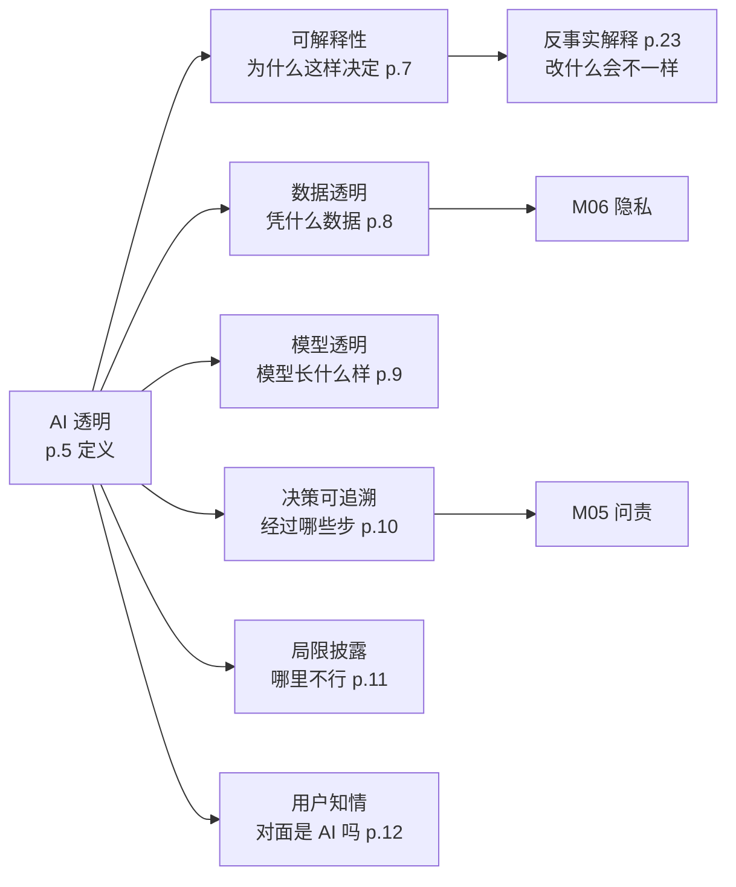
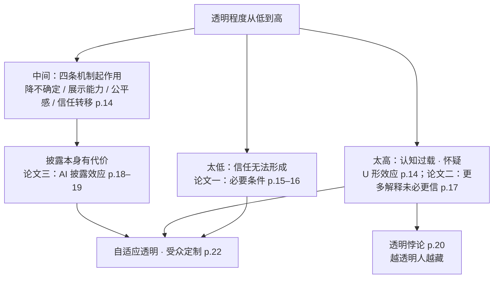
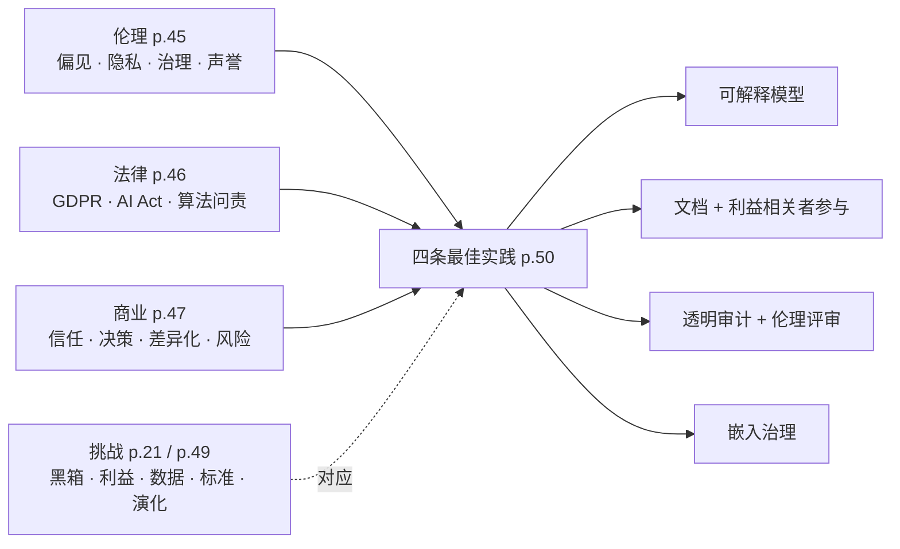

# M04 · AI 透明：从"看得见"到"信得过"

> **本讲一句话**：FATP 的第二个字母 **T（Transparency）**。上一讲讲"公平"时已经用到"可解释 AI"和"模型卡"这两件工具，这一讲把"透明"整个拆开——它由哪六个构件组成、它和"信任"是什么关系（不是越透明越好，三篇 2023–2025 年的论文都说"有条件"）、为什么难做、新思路是什么，然后用十几个企业案例和一个"伦理 / 法律 / 商业"三面框架收束。
> **原始材料**：`Module 4 - AI Transparency.pdf`（50 页，PowerPoint 导出；**大部分页面是"标题 + 三四条短句"的 AI 生成式版式，每页只有 30–60 个英文词**）｜ **转录**：`merged`（`M04-transcript.txt`，本地 Whisper，`00:00 → 02:11:34`，969 段，2026-09-23 合并）｜ **状态**：**v1.0**（按 [[笔记质量规范]] v1 写，strict 模式）

> ✅ **本笔记为 v1.0**（2026-09-22 讲义版 v0.9 → 2026-09-23 合并转录）。录音**完整**（开场白与下课语俱在，0 处空档），但**这份转录有三个必须先知道的特殊之处**：
> 1. **教授基本没按讲义的案例章节讲**。`02:07:45` 他说 *"this is computing here, you can look at it later when you have time"*，把讲义 **p.25–43**（ChatGPT、Bard、医疗、金融、八家公司）整段留给学生自读，只在最后约 3.5 分钟泛讲"各大公司都在官网讲自己怎么做透明"。§2.5–§2.7 的 11 个 🎙️ 格因此是 **B（点名带过）3 个 + C（⏭️ 自读）8 个**，正文保留但降为参考。
> 2. **他改用了四个讲义上完全没有的真实案例**，四案合计约 50 分钟（10.6 + 16.5 + 7.3 + 15.4，按时间戳）：**Amazon 招聘算法**（§2.5.4）、**COMPAS 再犯风险评分**（§2.5.5）、**Apple Card 信用额度**（§2.6.3）、**Air Canada 聊天机器人**（§2.6.4），并在 `02:03:36` 用一张"summary"表把四案串成 AI 透明的十年演进（§2.6.5）。**这五节加上 §2.4.4、§2.4.5、§2.9.3 共 8 个小节全部是 🎙️ 纯课堂内容**，只有到场的人才有。
> 3. **讲义 p.17 的论文二（临床医生实验）找不到对应段落**。全文检索 `clinician` / `breast` / `cancer` / `diagnos` 均无命中，`36:45`–`45:40` 那段"电话问诊"叙事在内容上属于论文三。§2.3.4 因此标为**存疑**而不是 ⏭️——**没找到 ≠ 没讲，不可据此降权**。判断依据见 [[#9.5 待核对|§9.5]]。

---

## 0. 三分钟速览

**这一讲讲了什么**

讲义分五段（p.3 / p.6 / p.24 / p.44 / p.48 五张章节页）：

1. **导论（p.3–5）**：先用一页复习 AI 是什么（p.4），再一页给出"AI 透明"的三句话定义——它包括可解释性、数据与模型透明、决策可追溯；它带来信任、问责与合规；它对商业人士的价值是沟通、风险管理与战略对齐（p.5）。
2. **透明的核心概念（p.6–23）**：这是本讲的主体。先把透明拆成六个构件——**可解释性、数据透明、模型透明、决策可追溯、局限披露、用户知情**（p.7–12）；再讲透明与信任的关系（p.13–20）——透明一般能建立信任，但存在"U 形效应"（过度透明反而伤信任），并用三篇论文佐证："透明的三个维度是信任的必要条件"（p.15–16）、"给临床医生更多 AI 解释未必更信任"（p.17）、"披露自己用了 AI 反而被信得更少"（p.18–19），加一张"透明悖论"漫画（p.20）；最后讲透明为什么难（p.21）和新思路——**自适应透明、受众定制、反事实解释**（p.22–23）。
3. **应用与案例（p.24–43）**：ChatGPT（含一份第三方隐私审查量表截图，p.25–29）、Google Bard 与透明度报告（p.30–31）、医疗与金融两个行业（p.32–33），以及八家公司的做法——Adobe、Microsoft、Salesforce、Intesa Sanpaolo、Kredito、Google、IBM、Anthropic & Amazon、Accenture（p.34–43）。
4. **伦理、法律与商业含义（p.44–47）**：三面各一页。
5. **挑战、方案与收束（p.48–50）**：四个挑战、四条最佳实践。

**这一讲的骨架其实是一句话**：**透明不是"把一切摊开"，而是"让对的人在对的时候看懂对的东西"。** 六个构件告诉你"摊开什么"，信任研究告诉你"摊开多少、给谁"，案例告诉你"别人怎么做"，三面框架告诉你"为什么必须做"。

**学完你应该能**

1. **说清** AI 透明的六个构件各自指什么、解决什么问题，并能把一个真实产品（如 ChatGPT）按六个构件逐项打分
2. **解释**透明为什么能建立信任（四条机制）、为什么又可能伤害信任（U 形效应、AI 披露效应、透明悖论），并用"充分 vs 必要"说清三篇论文各自的贡献
3. **区分**可解释性与透明、模型透明与数据透明、"解释"与"披露"
4. **给出**反事实解释的定义与三个特征，并能为一个贷款拒绝案例写出一句合格的反事实解释
5. **用**伦理 / 法律 / 商业三面框架分析一个企业该不该、以及怎样公开它的 AI
6. **列举**至少五个企业案例并说出每个案例对应的是哪一个透明构件

**如果只记三件事**

- **透明 = 六个构件**：可解释性（为什么这样决定）、数据透明（用了什么数据）、模型透明（模型长什么样）、决策可追溯（每一步有记录）、局限披露（哪里不行）、用户知情（你正在和 AI 打交道）。考试拿到任何一个案例，先按这六项拆。
- **透明与信任是 U 形关系**：不够透明没人信，过度透明信息过载、引发怀疑；披露"我用了 AI"本身就可能降低别人对你的信任（Schilke & Reimann 2025，13 个实验）。所以方案是**自适应透明**——按受众和任务调整解释的深度。
- **透明是"被要求的"，不只是"值得做的"**：GDPR 与 EU AI Act 都有透明条款（p.46），金融与医疗监管把可解释性当合规门槛（p.32–33、p.38）。商业上它换来客户信任、差异化与风险降低（p.47）。

> 🎙️ **课堂实况**（2026-09-22 周二晚课）：开场用约 5.7 分钟回顾 AI 定义与类型（含一段 AGI/超级智能的展开），随后按 p.5–p.23 顺序讲六构件与信任研究；讲到 p.12 用户知情之前，教授先花约 4.7 分钟脱稿展开了「信任三要素」（Mayer 模型），是本片最长的单段展开。 信任研究部分（p.13–19，约 14 分钟）明显偏向论文一（必要非充分）与论文三（披露悖论），全文检索未见论文二（临床医生 + 乳腺癌）的专门段落；p.23 反事实解释只用约 0.6 分钟带过并被教授明确降权，`51:31` 起第一次课间。 本片段（`52:37`–`01:32:27`，约 40 分钟）教授完全没有按讲义 p.25–33 的产品/行业案例讲，而是先给出自己的透明定义与四维度框架，再用两个讲义完全没有的真实案例（Amazon 招聘算法、COMPAS 再犯风险评分）把 §2.2 六构件、§2.4 挑战与新思路串成一条完整的因果链，最后用几句话预告下周小组项目启动。 本段（`01:32:32`–`02:11:34`，约 39 分钟）是本讲案例部分的下半场：先用约 23 分钟讲完两个讲义完全没有的案例（Apple Card `01:32:43`–`01:39:59`、Air Canada `01:40:45`–`01:56:09`），再用约 8 分钟把四个案例（含 shard_2 的 Amazon、COMPAS）收束成一张对比表（`01:56:09`–`02:04:22`），随后用约 3 分钟讲生成式 AI 的透明悖论并预告后续课程的奇点专题（`02:04:24`–`02:07:41`）。教授在 `02:07:41`–`02:07:48` 明确宣布讲义 p.25–43 的案例章节留给学生自读，只用剩下约 3.7 分钟泛讲了当前行业实践，点名 ChatGPT、Google、Adobe、Microsoft、Accenture 但均一带而过，Salesforce / Intesa Sanpaolo / Kredito / IBM 全程未被提及；p.44–50（伦理 / 法律 / 商业含义 + 挑战与最佳实践）在本讲录音范围内完全没有被讲到，直接以下课语和下周预告（M05 问责）收尾。

---

## 1. 开始之前 · 知识衔接

### 1.1 你已经有的

M01、M03 发过的词，本讲直接用，只给一句话唤醒。

| 概念 | 一句话唤醒 | 回看 |
|---|---|---|
| FATP | AI 伦理四大议题：公平、问责、透明、隐私；M03 讲了 F，本讲讲 T，M05 讲 A，M06 讲 P | [[M01-导论-AI与伦理#2.6.2 FATP：整门课的目录\|M01 §2.6.2]] |
| 可解释 AI（XAI） | 让 AI 的决定能被人理解；工具是特征重要性、SHAP、LIME | [[M03-偏见与公平#2.13.2 可解释 AI 与人在环路（讲义 p.74–75）\|M03 §2.13.2]] |
| 特征重要性 | 给模型的每个输入特征打一个"它对预测有多重要"的分数 | 同上 |
| 人在环路 | 高风险决定留一个能验证或推翻机器的人 | 同上 |
| 模型卡 / 数据表 | 模型的"说明书"：用途、指标、按人群分的表现、训练数据 | [[M03-偏见与公平#2.13.3 包容性设计与透明文档：模型卡（讲义 p.76–77）\|M03 §2.13.3]] |
| 偏见审计 | 定期按公平指标测模型、记录发现、第三方复核 | [[M03-偏见与公平#2.13.1 多样化数据与偏见审计（讲义 p.72–73）\|M03 §2.13.1]] |
| 算法偏见 | 模型输出系统性地对某些群体不利；来源有数据 / 抽样 / 标签 / 测量 / 算法 / 社会 / 反馈回路 | [[M03-偏见与公平#2.11 偏见从哪里来：两套分类合一（讲义 p.53–65）\|M03 §2.11]] |
| 利益相关者参与 · 伦理委员会 | 把受影响的人拉进设计与评审；组织里要有一个能叫停的机构 | [[M03-偏见与公平#2.14.3 多元团队、利益相关者参与与伦理委员会（讲义 p.82–84）\|M03 §2.14.3]] |
| 程序正义 | 决策过程的公平：发声、中立、可信、尊重——"信任"在 M03 里是它的四要素之一 | [[M03-偏见与公平#2.4.1 两条原则与优先次序（讲义 p.7–10）\|M03 §2.4]] |
| EU AI Act（预告过） | 对高风险 AI 系统要求透明、人类监督、公平；条文在 M09 展开 | [[M03-偏见与公平#2.14.1 偏见对企业的四类影响与监管环境（讲义 p.78–79）\|M03 §2.14.1]] |
| 监督学习 · 训练集 · 准确率 · 神经网络 · LLM | L0 入场基线，不解释 | [[IS5113_AI_Ethics_and_Regulations/_meta/知识层级台账\|知识层级台账]] |

### 1.2 本讲全新引入的概念

| 概念 | English | 展开于 |
|---|---|---|
| AI 透明（及其核心元素） | AI transparency; explainability, data & model transparency, decision traceability | §2.1.2 |
| 可解释性（本讲口径） | Explainability | §2.2.1 |
| 数据透明 | Data transparency | §2.2.2 |
| 模型透明 | Model transparency | §2.2.3 |
| 决策可追溯性 | Decision traceability | §2.2.4 |
| 局限披露 | Disclosure of limitations | §2.2.5 |
| 用户知情 | User awareness | §2.2.6 |
| 信任转移 · 认知过载 · U 形效应 | Trust transfer · Cognitive overload · U-shaped effect | §2.3.1–2.3.2 |
| 透明三维度 · 信任信念 · 充分条件与必要条件 | Disclosure / clarity / accuracy · Trusting beliefs · Sufficient vs necessary | §2.3.3 |
| AI 披露效应 · 正当性感知 · 算法厌恶 | AI disclosure effect · Legitimacy perception · Algorithm aversion | §2.3.5 |
| 透明悖论 | Transparency paradox | §2.3.6 |
| 黑箱问题 | Black box problem | §2.4.1 |
| 自适应透明 · 受众定制披露 | Adaptive transparency · Audience-specific disclosure | §2.4.2 |
| 反事实解释 | Counterfactual explanation | §2.4.3 |
| 隐私审查量表 | Privacy vetting rubric | §2.5.2 |
| 透明度报告 | Transparency report | §2.5.3 |
| 来源引用 · 不确定性标记 | Source attribution · Uncertainty flags | §2.7.3 |
| 基础模型透明度指数 | Foundation Model Transparency Index | §2.7.6 |
| 卓越中心 | Center of Excellence | §2.7.6 |
| 算法问责 · 审计追踪 | Algorithmic accountability · Audit trail | §2.8.2 |
| 透明审计 · 可解释模型 | Transparency audit · Interpretable models | §2.9.2 |

### 1.3 为什么这一讲放在这里 · 重排说明

M01 把 AI 伦理的议题清单定为 FATP 四项；M03 深挖了第一项"公平"，并在缓解手段里第一次用到两件"透明"工具——可解释 AI（§2.13.2）和模型卡（§2.13.3）。**本讲就是把那两件工具所属的整个议题展开**：公平回答"AI 有没有偏袒"，透明回答"AI 的决定能不能被看见、被理解、被追究"。两者的关系是：没有透明，公平就无法被验证——你连模型用了哪些特征都不知道，怎么审计它有没有歧视？所以本讲是 M03 的方法论支撑，也是 M05"问责"的前置：**问责要求先能追溯**（本讲 §2.2.4 决策可追溯），否则出了事也不知道该找谁。

课程 Outline 的 ILO-2"理解当代 AI 伦理议题（公平、问责、透明、隐私）"直接点名本讲；ILO-3"理解伦理 AI 的商业价值"对应本讲 p.47 商业含义与十几个企业案例；ILO-5"应用理论设计企业 AI 治理机制并合规于 GDPR / EU AI 法规"对应 p.46 法律考量与 p.50 最佳实践。

**重排说明**：讲义原顺序是 导论(p.1–5) → 核心概念(p.6–23) → 案例(p.24–43) → 三面含义(p.44–47) → 挑战与方案(p.48–50)。本笔记**基本保留原顺序**，只做三处调整：① 把 p.4 的 AI 复习页与 p.5 的透明定义合成 §2.1，并把"六个构件"（p.7–12）单独立为 §2.2，因为这六个词是后面所有案例的分析轴，必须先立住；② 把 p.20 的"透明悖论"漫画从"论文"之后挪到 §2.3 的收尾（§2.3.6），因为它是三篇论文共同结论的一句话版；③ 把 p.49 的"实现透明的挑战"与 p.21 的"透明为什么难"放在一起对读（§2.9.1 里做对照表），因为两页是同一份清单的两个版本，讲义没有说明关系。对应关系见 [[#8. 讲义页码映射|§8 讲义页码映射]]。

**非内容页的标注理由**（[[笔记质量规范]] §3.1 要求可审计）：p.1 封面、p.2 副标题页（只有一句 "Exploring clarity and openness in artificial intelligence"）、p.3 / p.6 / p.24 / p.44 / p.48 五张章节标题页（各只有一个标题）、p.26"DATA PRIVACY VETTING"章节标题页（它是 p.27–29 三张截图的标题，本身无内容）——共 8 页标为非内容页；其余 42 页全部在 §2 有实质讲解。

---

## 2. 正文

### 2.1 导论：AI 是什么、透明是什么（讲义 p.2–5）

讲义先用一页复习 AI 的定义（p.4），再用一页给出"AI 透明"的三层定义（p.5）。两页都很短，但 p.5 那三句话是本讲后面 45 页的目录。

#### 2.1.1 AI 复习一页：定义、类型与商业用途（讲义 p.4）

**是什么**

在讨论"AI 该不该透明"之前，讲义先花一页确认大家说的"AI"是同一个东西——因为"透明"对一个推荐电影的算法和对一个决定你能不能贷款的模型，含义完全不同。讲义 p.4 给出四条：

> **Definition of AI** — AI simulates human intelligence in machines programmed to think and learn like humans.（AI 是在机器里模拟人类智能，让机器被编程得像人一样思考和学习）
> **Types of AI** — Narrow AI focuses on specific tasks, general AI performs any intellectual task, and superintelligence surpasses human intelligence.（窄 AI 专注特定任务；通用 AI 能做任何智力任务；超级智能超越人类智能）
> **AI in Business** — AI enhances efficiency, automates processes, and supports data-driven decision-making in businesses.（AI 提升效率、自动化流程、支持数据驱动决策）
> **Importance for Students** — Understanding AI helps business students with strategic planning, customer engagement, and operational optimization.（理解 AI 有助于商科学生做战略规划、客户互动与运营优化）

三种类型里，**今天所有商用系统都是窄 AI**（narrow AI，也叫弱 AI）：ChatGPT 再能聊天也只是"在文本上做预测"这一件事；通用 AI（general AI / AGI）和超级智能（superintelligence）目前都不存在，讲义列出它们只是为了把坐标系画全。

**为什么需要它**

这一页在本讲的作用是"划定讨论对象"。后面讲的透明——解释一个决定、披露训练数据、追溯每一步——**都是针对窄 AI 里那些"替人做决定"的系统**：信贷审批、医疗诊断、招聘筛选。讲义反复用这三个领域举例（p.7、p.32–33、p.38–39），不是巧合：这些系统的输出直接改变一个人的处境，"为什么"这个问题才有分量。M01 §2.1 讲过 AI 的定义与"理性地思考 / 行动"两种取向，这里只是复述其中最简的一版。

**课件原例**

讲义 p.4 无具体例子，只有四条定义式短句。

**🎙️ 课堂补充**（`00:57`–`05:19`，约 4.4 分钟，A · 课上展开）

- 回顾式开场：*"let's start with a recap. We're talking about transparency in the context of AI ethics and governance."*（`01:56`）
- 讲义没有的信息——这门课所在的"AI in Business"项目本身就是按三门核心课设计的：*"the three core courses[:] [o]ne is Narrow AI, one is Generative AI, the third one is AI Ethics and Regulations."*（`02:23`–`02:38`）
- AGI 的路径感：*"from there, we combine the two and we are on a trajectory towards what is known as Artificial General Intelligence."*（`03:20`）；对超级智能的判断：*"We haven't reached that stage yet, but that is a logical assumption to the current projection … it will surpass human intelligence."*（`04:39`–`04:57`）
- **这段改变了什么**：确认了笔记"今天所有商用系统都是窄 AI"的判断；新增了讲义没有的两点——① 这门课本身按"窄 AI / 生成式 AI / AI 伦理"三门课设计，说明"窄 AI→生成式 AI→AGI"的分类不只是理论坐标系，也是本项目的课程结构；② 教授把 AGI 明确定义成"窄 AI 与生成式 AI 合流的轨迹"，比讲义"能做任何智力任务"更给出了"怎么走到那一步"的路径感；超级智能仍被判定"尚未达到"，与笔记推断一致。⚪ `05:26` *"with … agentic AI, it can actually do what a physical person can do"* 一句里的一个词 ASR 疑似有误（见 ASR 词典）。

**💡 换个说法（笔记补充）**

- 把 AI 想成"实习生"：窄 AI 是只会做一件事、但做得极快的实习生（只会填报销单）；通用 AI 是能接任何工作的实习生（今天还没招到）；超级智能是比老板还强的实习生（科幻）。本讲问的是——对那个只会做一件事的实习生，公司该不该、怎样公开他是怎么做决定的。
- 从"透明"的角度看三种类型：越是窄 AI，越容易说清楚它在做什么（任务边界清楚），也越应该说清楚——因为它已经在真实业务里替人做事了。

**⚠️ 常见误解**

- ❌ "ChatGPT 已经是通用 AI 了。" → 它能回答各种领域的问题，但做的仍然只是一件事——按训练数据的模式生成文本；它不能自己开车、不能操作实验设备。按讲义的三分法它仍是窄 AI，"看起来什么都会"不等于"能执行任何智力任务"。
- ❌ "既然商用 AI 都是窄 AI，透明就很容易——把规则写出来就行。" → 恰恰相反。现代窄 AI 多数是神经网络，规则不是人写的而是从数据里学出来的，连开发者也说不清某个决定的完整理由——这就是 §2.4.1 要讲的"黑箱问题"。任务窄不等于机制简单。

**与其他概念的关系**

M01 §2.1 的 AI 定义（思考 / 行动 × 像人 / 理性）是这一页的完整版；M03 §2.10.3 也复习过一次 AI 定义与商业里的典型系统。三次复习的共同点是：**这门课关心的 AI 是"做决定的系统"**，不是泛泛的"智能"。

**所以呢**：对象划定了——替人做决定的窄 AI。下一节讲义用三句话说清"对这种 AI，透明指什么、为什么要、对商科生有什么用"。

---

#### 2.1.2 AI 透明的三层定义（讲义 p.2, p.5）

**是什么**

想象你申请贷款被拒，银行只回你一句"系统判定不通过"。你会问三个问题：**它是怎么判的？它凭什么数据判？这个判定能不能被查证？** 这三个问题的答案合起来就叫"AI 透明"。讲义 p.5 的定义正好对应：

> **Core Elements of AI Transparency** — AI transparency includes **explainability, data and model transparency, and decision traceability** to clarify system operations.（AI 透明包括可解释性、数据与模型透明、决策可追溯性，用以阐明系统如何运作）
> **Importance for Trust and Accountability** — Transparency builds trust, ensures accountability, and supports compliance with ethical and legal standards.（透明建立信任、保证问责、支持对伦理与法律标准的合规）
> **Benefits for Business Professionals** — Transparent AI enhances stakeholder communication, risk management, and strategic business alignment.（透明的 AI 增强利益相关者沟通、风险管理与战略对齐）

三句话分别回答"**是什么**"（四个核心元素）、"**为什么**"（信任 / 问责 / 合规）、"**对我有什么用**"（沟通 / 风控 / 对齐）。四个核心元素先各给一句人话，§2.2 再逐个展开：可解释性 = 能说出"为什么这样决定"；数据透明 = 说清"用了什么数据"；模型透明 = 说清"模型是怎么搭的"；决策可追溯 = 每一步都留有记录、事后能查。p.2 的副标题 "Exploring clarity and openness in artificial intelligence" 把透明浓缩成两个词：**清晰（clarity）**——看得懂，**开放（openness）**——愿意给人看。这两个词在 §2.3.3 那篇论文里会再出现，成为可测量的"维度"。

**为什么需要它**

这一页是本讲的目录。p.5 列的四个核心元素，讲义在 p.7–10 各展开一页，再在 p.11–12 追加"局限披露"和"用户知情"两个，凑成 §2.2 的六个构件；"信任"在 p.13–20 展开；"问责与合规"在 p.44–46 展开；"商业价值"在 p.47 展开。**先记住这一页，后面 45 页就不会散。** 另外，"透明 → 信任 → 问责 → 合规"这条链是考试里最常见的论证顺序：一个企业为什么要公开 AI 的运作？因为公开才有人信、有人信才有人负责、有人负责才谈得上合规。

**课件原例**

讲义 p.5 无具体例子。p.2 只有副标题。

**🎙️ 课堂补充**（`05:40`–`09:45`，约 4.1 分钟，A · 课上展开）

- 定义的口语版：*"[i]t involves making the … decisions[,] [d]ata usage[—]AI systems use data[—] make all these pertinent aspects of the AI system understandable and accessible to stakeholders."*（`05:51`–`06:08`）
- 风险管理被具体化为一条操作链：*"if they don't do it right, there are risks carried, and you need to manage it, and to manage it, you need to know about how these decisions[,] how these answers are given, so that you can evaluate the risk level involved, and take a mitigation strategy accordingly."*（`09:15`）
- **这段改变了什么**：确认笔记"透明 → 信任 → 问责 → 合规"这条链的口语版；把讲义"支持风险管理"这一短语具体化成"先懂决策怎么来的，才能评风险、定缓解策略"，比讲义 p.5 一句话更完整地回答了"商科生为什么要懂透明"。

**💡 换个说法（笔记补充）**

- 把 AI 系统想成一家餐厅的后厨。**可解释性**是厨师能告诉你这道菜为什么这么做；**数据透明**是菜单上写明食材来源；**模型透明**是后厨装了玻璃墙、你能看见流程；**决策可追溯**是每一道菜从点单到出锅都有小票记录。四样齐了，顾客才敢吃、出了问题才查得出是哪一步、卫生部门才能检查——这就是"信任 / 问责 / 合规"。
- 反过来说，"不透明"不一定是有人在隐瞒。很多时候是后厨自己也说不清（模型太复杂）、或食材来源太杂记不住（训练数据太大）——这是 §2.4.1 要讲的"难在哪"。所以透明是一种**能力**，不只是一种**意愿**。

**⚠️ 常见误解**

- ❌ "透明就是开源——把代码和模型权重放到网上。" → 开源只对应"模型透明"一项，而且对普通用户毫无帮助（他们读不懂权重）。讲义定义里的可解释性、决策可追溯、用户知情都是面向**人**的要求，把文件公开不等于让人理解。§2.3.2 还会讲：信息给得过多反而伤信任。
- ❌ "透明是技术部门的事，商科生只要知道有这回事。" → p.5 第三句专门写给 business professionals：透明决定你怎样向客户 / 监管 / 董事会解释一个 AI 决定（沟通）、怎样发现模型什么时候会失灵（风控）、AI 项目是否服务于战略而不是黑箱自转（对齐）。§2.8.3 的商业含义整页都在说这件事。

**与其他概念的关系**

"透明"是 M03 公平性度量的前提（§2.12 的指标要求你能看到模型对各群体的输出）；也是 M05"问责"的前提（讲义把 accountability 放进透明的"重要性"里）。M03 §2.13.3 的模型卡是"数据与模型透明"的标准文档形态。

**所以呢**：定义有了，但"可解释性、数据透明、模型透明、决策可追溯"四个词各自具体指什么、边界在哪，还没说。§2.2 六节逐个拆——讲义在四个之外又加了"局限披露"与"用户知情"两个。

---

### 2.2 透明的六个构件（讲义 p.6–12）

p.6 是章节页，p.7–12 每页一个构件；六个词是后面所有案例的分析轴。

#### 2.2.1 可解释性：说得出"为什么这样决定"（讲义 p.7）

**是什么**

一个模型给出了结论，人能不能理解它是怎么得出这个结论的——这就是可解释性。医生用 AI 看片，AI 说"恶性"，医生需要知道它看的是哪块阴影；不然既没法核对，出了错也没法承担。讲义 p.7：

> **Definition and Importance** — Explainability is the ability to understand how AI systems make decisions, important for trust and accountability.（可解释性是理解 AI 系统如何做决定的能力，对信任与问责很重要）
> **Role in High-Stakes Domains** — Explainability is essential in finance and healthcare to validate outcomes and ensure fairness in AI applications.（在金融与医疗这类高风险领域，可解释性对验证结果、保证公平不可或缺）
> **Techniques to Enhance Explainability** — Methods like decision trees, feature importance, and model visualization improve AI transparency and interpretability.（决策树、特征重要性、模型可视化等方法能提升透明与可解释性）

三种技术对应三个层次：**决策树**（decision tree，一连串"如果 A 则 B"的规则，本身就是人能读的模型——EF5560 M04 用它做收益预测，那门课的读者会很熟）；**特征重要性**（M03 §2.13.2 讲过——为每个输入特征打分）；**模型可视化**（把模型内部的中间结果画成图，比如图像模型"看"的是图片的哪一块）。第一种是"模型本身就透明"，后两种是"给黑箱外面装一个解释器"。

顺便把六个构件各自回答的问题先摆出来，后面五节逐个展开：**可解释性问"为什么这样决定"，数据透明问"凭什么数据"，模型透明问"模型长什么样"，可追溯问"经过哪些步"，局限披露问"哪里不行"，用户知情问"你知道对面是 AI 吗"**。

**为什么需要它**

它是六个构件里**最直接面向决策对象**的一个：另外五项讲的是系统整体，可解释性讲的是"这一次决定"。讲义把它排第一、又在 p.22 说"新思路的重点是 explainability"，因为**没有它，其他透明都不落地**——你可以公开训练数据和模型结构（数据 / 模型透明），但一个被拒贷的人要的是"我这一笔为什么被拒"。M03 §2.12 的公平指标也靠它：要查模型是否用了种族的代理变量，先得知道它依赖哪些特征。

**课件原例**

讲义 p.7 只点名两个领域（finance and healthcare）与三种技术，无具体案例；案例在 p.32–33（医疗、金融）、p.38–39（两家信贷机构）展开。

**🎙️ 课堂补充**（`09:51`–`12:26`，约 2.6 分钟，A · 课上展开）

- 定义口语版：*"[e]xplainability … refers to the ability to understand and interpret … how an AI system arrives at its conclusions."*（`09:51`）
- 高风险领域的分量：*"[t]hese are very important areas [that if] you make a wrong decision, it can cost a life, it can cost access to healthcare."*（`11:00`）
- 落到操作层：*"if those are there, the user can have a basis to make some judgments, to validate outcomes and see if there are errors in the decisions."*（`12:08`）
- **这段改变了什么**：把讲义"validate outcomes、ensure fairness"两个短语具体成"看得懂特征重要性 → 才能判断有没有错、有没有不公平"的操作链；用"能不能救命"把 finance/healthcare 高风险的分量讲得比讲义原句更直接。

**💡 换个说法（笔记补充）**

- 可解释性像老师批改作文时写的评语。只给一个分数（模型输出）你不知道该改什么；评语（解释）告诉你"论点清楚但例子不足"，你才能改、也才能在觉得分数不公时申诉。**解释的价值在于让结果可核对、可申辩**——这正是 M03 程序正义里"发声"和"申诉"两要素在 AI 上的落点。
- 另一个角度——解释不等于"把模型全部内部状态打印出来"。一个神经网络有几百万个参数，全打印出来没人看得懂。可解释性追求的是**一个人类尺度的理由**："收入低于门槛"三个词，比一百万个数字更透明。§2.4.3 反事实解释就是往这个方向走。
- **判定口诀**：能不能用一句人话回答"这个决定为什么是这样"——能，就是可解释；只能说"模型算出来的"，就不是。

**⚠️ 常见误解**

- ❌ "可解释性 = 透明。" → 可解释性只是六个构件之一。一个系统可以对每个决定给出解释，却不告诉你训练数据从哪来（数据不透明）、也不留决策记录（不可追溯）。反过来，全部开源但不给单个决定的理由，是"透明但不可解释"。
- ❌ "用了决策树就自动可解释了。" → 一棵深度 20、几千个叶子的树，人同样读不懂。可解释性是**相对于受众**的属性（§2.4.2 会讲"受众定制"）：对数据科学家可解释的东西，对贷款申请人可能完全不可解释。
- ❌ "特征重要性告诉我的就是因果。" → 它只说模型**依赖**这个特征有多重，不说这个特征**导致**了结果（EF5560 M04 §2.5.1 也强调置换重要性不是因果）。把"邮编重要"读成"邮编决定了信用"是误读，而邮编往往是种族的代理变量（M03 §2.11）。

**与其他概念的关系**

上承 M03 §2.13.2 可解释 AI（那里给了三个工具名，这里给了定位）；下接 §2.3.4（"更多解释未必更信任"）、§2.4.3（反事实解释——一种为用户设计的解释形式）、§2.7.2 / §2.7.4（微软默认可解释性、两家银行的可解释信贷）。

**所以呢**：可解释性回答"为什么"；但一个决定就算解释得清楚，如果它是从一堆有偏的数据里学出来的，解释本身也是有偏的。下一节讲"凭什么数据"——数据透明。

---

#### 2.2.2 数据透明：说得出"凭什么数据"（讲义 p.8）

**是什么**

模型再好，学的是什么数据就会有什么脾气。数据透明就是**公开"这个 AI 是拿什么训练出来的"**——数据从哪来、覆盖了谁、有没有定期检查偏见、符不符合隐私法。讲义 p.8：

> **Importance of Data Sources** — Disclosing data sources helps stakeholders understand the basis of AI decisions and enhances trust.（披露数据来源帮助利益相关者理解 AI 决定的依据，增强信任）
> **Bias Auditing Practices** — Regular bias audits identify and mitigate potential data biases to improve AI fairness.（定期偏见审计发现并缓解数据偏见，提升公平）
> **Ethical and Regulatory Compliance** — Transparent data practices ensure businesses maintain ethical standards and comply with regulations e.g. Data Privacy / Protection laws.（透明的数据实践保证企业维持伦理标准并合规，例如数据隐私 / 保护法）

三条对应三个动作：**披露来源**（告诉别人）、**审计偏见**（自己查）、**合规**（法律要求）。注意第二条把 M03 的"偏见审计"直接搬进了"透明"的定义——审计的结果要拿出来给人看，才算透明。

**为什么需要它**

M03 §2.11 讲过偏见的七个入口，其中数据、抽样、标签、测量四个都在数据层。**如果训练数据不公开，这四种偏见外人永远查不到**——亚马逊的招聘工具（M03 §2.11.2）之所以能被发现歧视女性，是因为内部有人看到了训练数据是"过去十年以男性为主的简历"。数据透明就是把这种"内部才看得到"变成"外部也能查"。此外它还是 §2.5.1 ChatGPT 案例的争议焦点（训练数据从网上抓取、含个人信息）和 §2.7.1 Adobe 案例的卖点（只用自有与公有领域图片）。

**课件原例**

讲义 p.8 无具体案例；案例见 p.34–35（Adobe Firefly 公开全部训练图片来源）。

**🎙️ 课堂补充**（`12:26`–`17:06`，约 4.7 分钟，A · 课上展开）

- 机制层的解释（讲义没有）：*"[a] computer program … you process data in a deterministic way[—t]hat means you know exactly what the outcome will be given a certain input … [b]ut modern AI is not like this[; i]t doesn't have a step-by-step algorithm[, i]t uses neural network[s] … [w]ith thousands and thousands of layers, and parameters, and neurons."*（`12:44`–`13:22`）
- *"[i]f you train the network … [with] millions and millions of these patterns, then the network will learn and will be able to generalize and find the pattern between the input and output."*（`13:48`–`14:03`）
- *"[d]ata sources is very important, you need to know where the data comes from, [and whether] the data is of good quality."*（`14:33`）
- **这段改变了什么**：讲义 p.8 只给了"披露 / 审计 / 合规"三个动作，没解释"为什么数据这么重要"；教授用"确定性程序 vs 神经网络"的对比把机制层的理由补上了——**AI 不是写死的规则，是从数据里"学"出规律，数据的毛病会直接变成模型的毛病**，这正是数据透明存在的根本原因，是笔记正文目前没有的一层解释。

**💡 换个说法（笔记补充）**

- 数据透明像食品包装上的配料表和产地。你未必看得懂每种添加剂，但**有人看得懂**（营养师 / 监管），而且"敢不敢写"本身就是信号：一家不肯写配料的餐厅，你会怀疑它用了什么。Adobe 在 p.35 上做的正是"把配料表印在最显眼的地方"。
- 换个角度：数据透明是**对模型"出身"的交代**，可解释性是**对模型"这一次行为"的交代**。一个人出身清白但这次做错了事，或者这次做对了但出身可疑——两件事要分开问。

**⚠️ 常见误解**

- ❌ "数据透明就是把训练数据整个公开。" → 讲义第三条明说要合规于隐私法：训练数据里常有个人信息，整个公开反而违法（§2.4.1 第三条挑战）。数据透明要求的是**来源、构成、审计结果**可查，不是原始数据人人可下。
- ❌ "做了偏见审计就等于数据透明了。" → 审计是自己查，透明是让别人能查——审计报告锁在抽屉里不算透明。p.8 把"披露"和"审计"并列写成两条，正是因为它们是两个动作。

**与其他概念的关系**

上承 M03 §2.11（偏见的数据层入口）与 §2.13.1（偏见审计、多样化数据）；M03 §2.13.3 的"数据表（datasheet）"是数据透明的标准文档；下接 §2.7.1 Adobe 案例、§2.8.2 法律考量（GDPR 管的就是数据）。M06 隐私会再从另一面（不该公开什么）讨论数据。

**所以呢**：交代了数据，还得交代拿数据训练出来的东西——模型本身长什么样。下一节模型透明。

---

#### 2.2.3 模型透明：说得出"模型长什么样"（讲义 p.9）

**是什么**

同样的数据，可以训练出一棵决策树，也可以训练出一个上千层的神经网络；两者的"可查性"天差地别。模型透明就是**公开模型的结构、算法与参数**——让懂行的人能看见它是怎么搭的。讲义 p.9：

> **Understanding AI Models** — Transparency reveals AI architectures, algorithms, and parameters enabling better understanding and issue identification.（透明揭示 AI 的架构、算法与参数，便于理解与发现问题）
> **Facilitating Debugging and Optimization** — Transparent models simplify debugging and enhance performance optimization for improved AI outcomes.（透明的模型更容易调试与优化）
> **Building Stakeholder Trust** — Model transparency builds trust by ensuring AI aligns with ethical standards and organizational goals.（模型透明通过保证 AI 与伦理标准、组织目标一致来建立信任）

三个词要分清：**架构**（architecture，模型是什么类型、几层、怎么连）、**算法**（algorithm，怎么训练的、用什么目标函数）、**参数**（parameters，训练出来的具体数值——神经网络的权重）。公开程度可以分层：只公开架构（"我们用的是 transformer"）、公开算法细节（论文）、公开参数（开源权重）。

**为什么需要它**

讲义给的第二条理由是**工程上的**——透明的模型好调试，这是对内的价值；第一、三条是对外的——外部专家能审、利益相关者能信。对本课更重要的是：**模型透明是可解释性的"上游"**。如果连模型类型都不公开，外部审计者只能做"黑箱测试"（喂输入看输出），无法确认它内部有没有用禁用的特征。§2.7.6 的"基础模型透明度指数"评的主要就是这一项：各家大模型公司公开了多少关于模型的信息。

**课件原例**

讲义 p.9 无具体案例。相关案例：p.25 ChatGPT "uses transformer architecture"（transformer 是 2017 年提出的一种神经网络结构，今天的大语言模型几乎都用它；这句话的意思是 OpenAI 只公开了"用的是哪一类网络"这一级，没有公开参数）、p.41 IBM AI Fairness 360 的开源工具包。

**🎙️ 课堂补充**（`17:06`–`20:44`，约 3.6 分钟，A · 课上展开）

- 三个词的口语复述：*"[t]ransparency includes reviewing the architecture, algorithms, and the parameters of the AI system[; t]hen it will allow developers and auditors to understand better … [and] identify potential issues."*（`17:18`–`17:33`）
- 讲义没有的商业逻辑——模型透明与企业风险偏好挂钩：*"[i]f a company values a lot of ethical standards, then … [it] probably will not want to use the most advanced, untested model because it [carries] more risk[] … [a]n advanced powerful model[,] by nature[,] it's more risky, because it's less tested[; t]he guardrails are not so well developed."*（`19:05`–`20:10`）
- **这段改变了什么**：讲义只说"模型透明 → 建立信任"；教授补了一条讲义没有的推理——**公司知道自己用的模型有多先进、多冒险，才能在"更强但更危险"和"稳妥但保守"之间做取舍**，把模型透明和企业的风险偏好、声誉策略直接挂钩，这是笔记原文缺的一层商业解释。

**💡 换个说法（笔记补充）**

- 把模型透明想成建筑的图纸公开。图纸（架构）、施工规范（算法）、每根钢筋的规格（参数）——三样都公开，工程师才能验收；只给你看外立面（只公开产品），出了裂缝谁也说不清。
- 反过来想：模型透明对**普通用户几乎没有直接价值**——他们读不懂图纸。它的价值在于让"能读懂的第三方"（监管、学界、竞争对手）替公众把关。这就是为什么 §2.3.2 说透明要看受众：模型透明服务的是专家受众。

**⚠️ 常见误解**

- ❌ "模型透明 = 可解释性。" → 模型透明是"结构公开"，可解释性是"决定可理解"。一个完全开源的大模型，你照样说不清它为什么写出这句话；一个闭源的信贷模型，也可以对每次拒贷给出理由。两者可以一有一无。
- ❌ "商业公司不可能做到模型透明，所以这一条是空话。" → 讲义 p.21 承认商业利益是障碍，但透明是**分层的**：公开架构和评估指标（模型卡的做法，M03 §2.13.3）不需要交出商业机密。§2.7.6 的透明度指数正是用几十个细项衡量"公开到哪一层"，而不是非黑即白。

**与其他概念的关系**

与 §2.2.2 数据透明合称讲义 p.5 的"data and model transparency"；M03 §2.13.3 模型卡是它的文档形态；§2.4.1 的"技术复杂"与"商业利益"两条挑战主要针对它；§2.7.6 用指数量化它。

**所以呢**：数据与模型都交代了，还差一件：**这一次决定经过了哪些步骤、能不能倒回去查**。下一节决策可追溯——它是 M05 问责的技术前提。

---

#### 2.2.4 决策可追溯性：每一步都有记录（讲义 p.10）

**是什么**

出了事要能查——"这笔贷款是哪个版本的模型、用了哪些输入、经过哪些规则、最后谁点了确认"。决策可追溯性就是**把 AI 得出结论的每一步跟踪并记录下来**，像飞机的黑匣子。讲义 p.10：

> **Definition of Decision Traceability** — Decision traceability tracks and documents each step an AI system uses to reach conclusions.（决策可追溯性跟踪并记录 AI 系统得出结论所用的每一步）
> **Importance for Auditing and Compliance** — Traceability is critical for auditing, compliance, and understanding AI system behavior effectively.（对审计、合规与理解系统行为至关重要）
> **Business Benefits** — Supports accountability, error analysis, and transparency to improve customer interactions and trust.（支持问责、错误分析与透明，改善客户互动与信任）

关键词是 **each step** 和 **documents**：不是"能解释"，而是"有记录"。它与可解释性的区别在于时态——可解释性是当下给理由，可追溯性是事后能复盘。

**为什么需要它**

三个理由讲义都点到了：**审计**（第三方来查时要有材料）、**合规**（§2.8.2 会讲 GDPR 与 AI Act 都要求记录）、**问责**（M05 的主题——没有记录就没法确定责任在数据、模型还是操作员）。对商科生来说还有一条实际的：**错误分析**。模型上线后总会犯错，能追溯才知道错在哪一环、要不要回滚。§2.6.2 金融案例把"audit trails（审计追踪）"列为解决方案，就是这一条的落地。

**课件原例**

讲义 p.10 无具体案例；p.33 金融案例提到 audit trails，p.46 法律考量提到 "documenting AI processes and enabling auditability"。

**🎙️ 课堂补充**（`21:08`–`22:20`，约 1.2 分钟，A · 课上展开）

- *"[d]ecision traceability refers to the ability to track and document the steps an AI system takes to reach a conclusion … [y]ou need to look at the audit trail[—a]nd this is the audit trail[; s]o it's important for auditing, for compliance."*（`21:08`–`21:26`）
- 把"documents each step"具体化成一张清单：*"[i]t involves … [l]og[g]ing input, [the] immediate computations, the logic[] behind[,] [and the] outputs."*（`21:43`–`21:48`）
- **这段改变了什么**：基本照讲义念，但把抽象的"记录每一步"具体成"记输入、中间计算、逻辑、输出"四项可操作的清单，是笔记原文缺的一个小增量（幅度不大，时长也短）。

**💡 换个说法（笔记补充）**

- 可追溯性像快递的物流记录：你不需要懂分拣算法（那是可解释性的事），但每一站"几点到、谁签收"都有记录，丢件时才能定位到哪一站。AI 决策的"物流记录"包括：输入数据快照、模型版本号、中间分数、人工干预记录。
- 换个角度：可解释性面向**当事人**（我为什么被拒），可追溯性面向**审查者**（这套系统三个月来是怎么运作的）。前者是一次性的一句话，后者是持续的一本账。两者都叫"透明"，但服务的人不同——这又回到 §2.4.2 的"受众"。

**⚠️ 常见误解**

- ❌ "模型能解释，就自然可追溯。" → 解释是即时生成的，如果不存下来、不记录模型版本，三个月后同一个输入可能得到不同解释（模型已更新，§2.4.1 第五条挑战），而你无法证明当时的解释是什么。可追溯要求**留痕**，这是额外的工程投入。
- ❌ "可追溯只是 IT 部门的日志。" → 讲义把它放进"business benefits"：客户投诉时客服能立刻调出"当时系统看到的是什么"，这直接决定纠纷能否解决。它是客户关系的一部分，不只是运维。

**与其他概念的关系**

它是 M05 问责的技术基础（讲义 p.10 直接写 supports accountability）；是 §2.8.2 法律要求（auditability）的具体形态；§2.6.2 金融案例的 audit trails、§2.9.2 最佳实践的"documentation"都是它。M03 §2.13.3 模型卡记录的是模型整体，可追溯记录的是每一次决定——两者互补。

**所以呢**：前四个构件都在讲"系统能做什么、怎么做的"。讲义接着补两个常被忽略的：**说清楚它不能做什么**（局限披露），以及**让用户知道自己面对的是 AI**（用户知情）。

---

#### 2.2.5 局限披露：说清"哪里不行"（讲义 p.11）

**是什么**

一个只宣传"准确率 99%"的 AI 产品，比一个老实说"在低光照图片上会失灵"的产品更危险——因为用户会把它用在它不擅长的地方。局限披露就是**明确说明 AI 能做什么、不能做什么**。讲义 p.11：

> **Clarifying AI Capabilities** — Clearly stating what the AI system can and cannot do prevents misunderstandings and misuse.（清楚说明系统能做与不能做的，防止误解与误用）
> **Types of Limitations** — Limitations include accuracy thresholds, domain constraints, and potential failure modes to consider.（局限包括准确率阈值、领域约束与潜在失效模式）
> **Communication with Stakeholders** — Businesses must inform stakeholders about AI limitations to ensure trust and responsible use.（企业必须告知利益相关者 AI 的局限，以保证信任与负责任的使用）

三类局限要分开记：**准确率阈值**（它在什么水平以上才可靠——比如"置信度低于 0.7 的结果不应自动执行"）；**领域约束**（它在什么范围内训练过——在美国病人数据上训练的诊断模型，用到亚洲人群上就出了领域）；**失效模式**（它已知会怎样出错——图像模型对遮挡、文本模型对讽刺）。

**为什么需要它**

它对应 M03 §2.13.3 模型卡里的"超范围用途"（out-of-scope uses）一栏——M02 / M03 的交警摄像头案例里，有组织及严重罪案调查科（OSCB）把为"抓超速"训练的人脸识别系统转用于"抓罪犯"，教授在 M03 课上特别点过这个"转用"。**大多数 AI 事故不是模型错了，是模型被用在了它没被设计的地方**。局限披露把责任边界画清楚：在边界内出错是开发者的问题，用到边界外是使用者的问题——这又是 M05 问责的铺垫。§2.7.3 Salesforce 的"不确定性标记"是这一条最具体的产品化形式。

**课件原例**

讲义 p.11 无具体案例；p.30 Bard 用 "disclaimers（免责声明）"、p.37 Salesforce 用 "uncertainty flags" 都属于局限披露。

**🎙️ 课堂补充**（`22:20`–`24:52`，约 2.5 分钟，A · 课上展开）

- *"[c]learly stating what an AI system can and cannot do … helps prevent misuse[; w]hen you use the right system for the wrong purpose, it gives you wrong answers, bad answers, bad decisions."*（`22:44`–`22:56`）
- 一个示意性的准确率例子（⚪ 教授举例说明，非真实系统数据）：*"[l]imitation is that it might not be very accurate … maybe 80%, 90% of the time is accurate, so be careful with that[; u]se your decisions with caution."*（`23:43`）
- **这段改变了什么**：教授把"accuracy threshold"这个抽象词换成一个具体的"80%–90% 准确率、低于这个要小心"的例子，比讲义三行短句更有画面感；**这只是举例说明概念，不是任何真实系统的统计数字，不能当作可背诵的考点数字**。

**💡 换个说法（笔记补充）**

- 局限披露像药品说明书上的"禁忌与不良反应"。药效再好也必须写清"孕妇禁用""与某药同服会出事"；没有这一栏的药你不敢吃。AI 的"禁忌"就是领域约束，"不良反应"就是失效模式，"用量"就是准确率阈值。
- 另一个角度：披露局限**反而增加信任**——这与直觉相反。§2.3.3 那篇论文把"accuracy（如实说明系统有多准）"列为信任的必要条件之一：一个承认自己会错的系统，比一个号称从不出错的系统更可信，因为前者的话可以被验证。

**⚠️ 常见误解**

- ❌ "披露局限会吓跑客户，商业上不划算。" → p.11 第三条用的是 must（必须），不是 should；而且 p.37 Salesforce 案例正说明"把不确定性做成产品功能"可以成为卖点。隐瞒局限的成本是事故后的信任崩塌（§2.3.5 讲"被曝光"比"自己披露"伤得更重）。
- ❌ "准确率 95% 就是局限披露了。" → 一个总体数字掩盖了它在哪些子群体、哪些输入上失灵（M03 §2.12.3 差别性影响：整体准确率高，各群体误识率可能天差地别）。局限披露要求的是**按场景、按人群**说清楚，不是一个总数。

**与其他概念的关系**

对应 M03 §2.13.3 模型卡的"超范围用途"栏与 §2.12.3 差别性影响；产品化形态见 §2.7.3 不确定性标记、§2.5.3 Bard 免责声明；法律上对应 §2.8.2 的"clear user disclosures"。

**所以呢**：说清楚了"它不能做什么"，还有最后一件最基本的事——**用户知不知道自己面对的是 AI**？下一节用户知情。

---

#### 2.2.6 用户知情：让人知道"对面是 AI"（讲义 p.12）

**是什么**

你在客服聊天窗口里聊了十分钟，对方一直很耐心——它是人还是机器人？如果你不知道，你就无法决定该多信它几分、该不该把隐私告诉它。用户知情就是**告知用户他们正在与 AI 互动，并清楚解释系统在做什么**。讲义 p.12：

> **Defining User Awareness** — User awareness means informing users about AI interactions and explaining system functions clearly.（用户知情指告知用户他们在与 AI 互动，并清楚解释系统功能）
> **Promoting Ethical Use** — User awareness promotes ethical AI use, informed consent, and empowers users in decision making.（促进伦理使用、知情同意，并赋能用户决策）
> **Techniques for Awareness** — Techniques include clear labeling, usage disclosures, and educational materials about AI systems.（手段包括清晰标注、使用披露、关于 AI 系统的教育材料）
> **Business Benefits** — Enhancing user awareness supports transparency, improves experience, and aligns with ethical guidelines.（提升用户知情支持透明、改善体验、符合伦理准则）

三种手段由浅到深：**标注**（"本内容由 AI 生成"）、**使用披露**（"我们用 AI 做初筛，最终由人审核"）、**教育材料**（帮助页、说明书）。第二条里的**知情同意**（informed consent）是伦理学里的老概念——一个人只有在知道自己在同意什么的情况下，同意才算数；不知道对面是 AI，就谈不上同意。

**为什么需要它**

它是六个构件里**门槛最低、却最常被跳过**的一个——加一行标注就能做到，但很多产品刻意不加，因为"像真人"是卖点。讲义把它单列一页，还因为它正在变成**法律义务**：§2.8.2 会讲 EU AI Act 要求与人互动的 AI 系统必须告知对方（除非显而易见）。而 §2.3.5 那篇论文给了一个让人不安的发现：**告知用户"这是 AI 做的"，会降低用户对你的信任**——这让"用户知情"从一条简单的伦理要求变成一个真正的两难，也是本讲最值得思考的地方。

**课件原例**

讲义 p.12 无具体案例；p.25 ChatGPT 的 "usage guidelines"、p.30 Bard 的 "disclaimers" 属于此类。

**🎙️ 课堂补充**（`29:34`–`31:38`，约 2.0 分钟，A · 课上展开）

- *"[u]ser awareness … entails informing users … [that] they are interacting with an AI system[,] and explaining its functions, limitations, and so forth[; i]t promotes ethical use, informed consent, and user empowerment."*（`30:05`–`30:23`）
- 讲义没有的小提醒：*"AI system sometimes can hallucinate, can give you wrong answers, do double fact-checking all the time."*（`30:35`）
- **这段改变了什么**：确认笔记推断。**教授在正式讲到这一页之前**（`24:52`–`29:30`），先脱稿展开了一大段"信任三要素"的完整解释——那段内容按主题归入 §2.3.1（见该格的 🎙️ 记录），这里只记录 p.12 slide 本身对应的部分；教授额外提醒"AI 会幻觉，要 double check"，比讲义"clear labeling"更实用一点。

**💡 换个说法（笔记补充）**

- 用户知情像商店里"本店有监控"的告示。告示本身不解释监控怎么工作（那是模型透明），也不解释为什么盯着你（可解释性），只做一件事——**让你知道有这回事**，然后你自己决定怎么行动。它是所有其他透明的入口：连"有 AI"都不知道，其他五项无从谈起。
- 反过来说：**知情不等于理解**。标注"AI 生成"之后，用户是否明白这意味着"可能编造事实"？所以讲义把"教育材料"也算进来——知情的目标是让用户能**据此调整行为**，不只是完成告知程序。

**⚠️ 常见误解**

- ❌ "用户知情就是在页脚加一行免责声明。" → 讲义要求的是 clear labeling（清晰标注）和 explaining system functions clearly（清楚解释功能）；藏在条款第 37 条的一句话不满足"清晰"，也不构成知情同意（M06 隐私讲同意时会再谈）。
- ❌ "既然披露 AI 会降低信任（§2.3.5），那就别披露。" → 那篇论文同时发现：**被第三方曝光**用了 AI，信任损失比自己披露更大。"不披露"不是零风险，而是把小损失换成了大损失的赌博。而且 §2.8.2 会讲，法律正在把披露变成义务，不披露本身就是违规。

**与其他概念的关系**

它是 §2.3.5 AI 披露效应的直接对象；是 §2.8.2 法律考量里 "clear user disclosures" 的内容；与 M06 隐私的"知情同意"共用同一个伦理基础；M01 §2.6.2 FATP 首次提到透明时说的"用户有权知道"就是它。

**所以呢**：六个构件齐了。它们回答"透明是什么"。但讲义接下来问的是一个更难的问题：**透明真的会带来信任吗？** p.13–20 的答案是"一般会，但有条件"——这一段是本讲最有思想含量的部分。

---

### 2.3 透明与信任：一般有效，但有条件（讲义 p.13–20）

p.13–14 给结论，p.15–19 用三篇论文佐证，p.20 用一张漫画收尾。

#### 2.3.1 透明怎样建立信任：四条机制（讲义 p.13–14 上半）

**是什么**

为什么一家公司公开它的 AI 怎么运作，客户就更愿意用？讲义 p.13 先给一段研究综述式的总结，p.14 上半列出四条机制。p.13：

> AI transparency's impact on trust is a central theme in recent research, with findings showing it **generally enhances trust by reducing uncertainty and enabling users to understand AI decisions**, but excessive transparency can lead to negative effects like cognitive overload and suspicion, highlighting the need for balanced and adaptive transparency approaches. Key factors influencing this relationship include perceived fairness, privacy concerns, and user-specific attributes such as age and prior experience.

p.14 "How transparency builds trust" 的四条：

> - **Reduced Uncertainty** — increase user confidence（降低不确定性 → 提升用户信心）
> - **Understanding AI Decisions** — demonstrate ability — help to build trust（理解 AI 的决定 → 展示能力 → 建立信任）
> - **Perceived Fairness and Accountability** — benevolence & integrity（被感知的公平与问责 → 善意与正直）
> - **Help Build Trust in the Parent Company** — via trust transfer（帮助建立对母公司的信任 → 通过信任转移）

第二、三条里的三个词——**能力（ability）、善意（benevolence）、正直（integrity）**——是组织行为学里"信任"的经典**信任三要素**（Mayer 等人 1995 年的模型；🔗 公开资料常识，2026-09-22）：我信你，是因为你**能**做到（能力）、你**想**对我好（善意）、你**说到做到**（正直）。透明分别喂养这三样：解释展示能力，公平感展示善意与正直。第四条**信任转移（trust transfer）**：用户对一个 AI 产品的信任会"转移"到做这个产品的公司身上——反之亦然，公司名声好，用户也更容易信它的 AI。

**为什么需要它**

这是本讲"为什么要透明"的**正面论证**。§2.1.2 说透明带来信任，这里说清楚"怎么带来"——四条机制就是四条可以写进考卷的论据。更重要的是，p.13 那段话的后半句已经埋下转折：**excessive transparency → cognitive overload and suspicion**。理解了正面机制，才能理解下一节为什么"过度"会翻转：不确定性降到零之后再给信息，就只剩负担。

**课件原例**

讲义 p.13–14 无具体案例，是综述式陈述。

**🎙️ 课堂补充**（`24:52`–`29:30` + `31:38`–`31:59`，约 6.0 分钟，A · 课上展开）

- 对"信任"本身的定义，先于四条机制展开：*"[t]rust is that you're willing to put yourself in a risky situation because you anticipate that the other party will not do things actually to lead you into harm."*（`26:47`）
- 里根"trust but verify"的例子（讲义没有）：*"[i]f you look at 30 years ago, one of the greatest communicators … Ronald Reagan … they say[,] we trust Russia, but trust with verification[; i]f you can verify, you don't need to trust, because there's no uncertainty."*（`26:04`–`26:36`）
- 信任三要素：*"[o]ne[,] is competence … Second, Benevolence … Third, Integrity[—]this guy is quite consistent."*（`27:18`–`28:09`）
- 接回透明：*"[i]n order for persons to form a trusting attitude, they need information on this reality[,] and transparency is … giving you information which maps on to this reality."*（`28:25`–`28:35`）
- 正式回到 p.13–14 的四条机制：*"[t]ransparency, generally, enhance[s] trust, because it reduces uncertainty on these three important elements of trust that I mentioned earlier on."*（`31:51`–`31:59`）
- **这段改变了什么**：讲义 p.14 只给了四个词组（Reduced Uncertainty / Understanding / Perceived Fairness / Trust Transfer）；教授用近 5 分钟先讲透"信任"本身是什么（愿意冒险 + 预期对方不会害你）、再给出信任三要素（组织行为学经典模型：能力/善意/正直）、最后才把"透明"接回来——**教授的顺序是先立理论框架，再套用到 AI**，比讲义的四个词组丰富得多，也印证了笔记 §2.3.1 已预判的"信任三要素"框架。⚠️ `34:54` 教授说 *"I wrote this paper 20 years ago"*——这句话与本讲三篇论文（均 2023–2025 年）对不上，很可能是 ASR 把 "read" 记成了 "wrote"，实指他多年前读过的经典信任研究（如 Mayer 等人 1995 年的三要素模型），已标 `[?]`，**不作为教授本人发表过论文的事实使用**。

**💡 换个说法（笔记补充）**

- 信任像借钱。你借钱给一个人，看三样：他还得起吗（能力）、他打算还吗（善意）、他以前说话算数吗（正直）。AI 的"解释"相当于他把收入证明拿给你看（能力），"公平与问责"相当于他愿意签字、出了事找得到人（正直）。信任转移则像"他是某某公司的员工"——你对公司的信任借给了他。
- 反过来想"降低不确定性"：不确定的时候人会脑补最坏情况——被拒贷的人如果不知道原因，会猜"是不是因为我的姓氏"。一句解释哪怕内容不讨喜（"你的负债率太高"），也比空白强，因为它终结了脑补。这就是第一条机制起作用的方式。

**⚠️ 常见误解**

- ❌ "透明建立信任，所以越透明越好。" → p.13 后半句直接否定：过度透明导致认知过载和怀疑。透明与信任的关系是 U 形（§2.3.2），不是直线。
- ❌ "信任转移只是好事——好公司的 AI 自动被信任。" → 转移是双向的：一个 AI 产品出事，损失的信任也会转移到母公司。§2.3.5 的论文发现"被曝光用了 AI"比"自己披露"伤信任更重，这种伤害同样会向上转移。

**与其他概念的关系**

"被感知的公平"接 M03 §2.6–2.8（人怎么感知公平）与 §2.9 组织公正（信任是程序正义的要素）；四条机制是 §2.8.3 商业含义里"客户信任"的理论依据；下一节讲它的反面。

**所以呢**：透明确实能建立信任，机制有四条。但 p.14 下半用一个大写的 **BUT** 转折：有两个"细微之处"——U 形效应和情境依赖。

---

#### 2.3.2 U 形效应与情境依赖：为什么"过度"会翻转（讲义 p.14 下半）

**是什么**

给用户看模型的全部内部细节，他不会更信任你，反而会被吓退——太多信息意味着"我看不懂、你是不是在用术语糊弄我"。讲义 p.14 下半：

> BUT — There are Nuances and Challenges
> - **The U-Shaped Effect**: Excessive transparency can overwhelm users with too much information, leading to reduced adoption and trust.（U 形效应：过度透明会用过多信息压垮用户，导致采用率与信任下降）
> - **Context Matters**: The effectiveness of transparency depends on the specific AI application and the user's expertise and context.（情境重要：透明的效果取决于具体的 AI 应用、用户的专业程度与情境）

"U 形"的意思是：横轴是透明程度，纵轴是**不信任 / 拒绝**——两头高、中间低。透明太少，人不信；透明太多，人被压垮、起疑心，也不信；**中间某个"够用"的程度最好**。（讲义用 U-shaped，指的是"负面效果"的形状；如果纵轴画"信任"，就是倒 U。）第二条把"最优点在哪"进一步相对化：**它随受众和应用而变**——给数据科学家的最优透明度和给贷款申请人的完全不同。

**为什么需要它**

它是整个 §2.3 的核心命题，也是 §2.4.2"自适应透明"这个解决方案的**问题陈述**：既然最优点随人而变，透明就不能是一刀切的"公开一切"，而要按受众调。它还解释了本讲三篇论文为什么都是"有条件"的结论——第一篇说透明是必要条件但有最低门槛，第二篇说更多解释不一定更信，第三篇说披露本身可能伤信任——三篇分别踩在 U 形曲线的不同位置。

**课件原例**

讲义 p.14 无具体案例；p.17 的临床医生研究（§2.3.4）是"更多解释不等于更多信任"的实证例子。

**🎙️ 课堂补充**（`31:59`–`36:00`，约 4.0 分钟，A · 课上展开）

- *"[i]t's a diminishing return[; b]eing too transparent sometimes will not give you additional benefit … [i]f you are transparent about things which are not particularly useful to a certain group of users … this … information confuses the user and creates information overload."*（`32:30`–`32:47`）
- *"[t]he curve is not linear, it's like a U-curve, and it is context-specific."*（`33:11`）
- *"[t]oo much disclosure, especially of the irrelevant kind, will result in … [c]ognitive overload, anxiety, and suspicion[]… [a] cause for distrust."*（`33:25`–`33:48`）
- **这段改变了什么**：与讲义 p.14 下半一致，但教授多讲了一层心理机制：*"[m]aybe it's some ill intention, maybe I should be careful about it"*（`33:51`）——信息过载不只是"看不懂"，还会让人怀疑"你是不是想蒙我"，这条推理链笔记原文没有。

**💡 换个说法（笔记补充）**

- 像医生向病人解释病情。一句"没事"太少，病人不安；把病理报告逐项念一遍太多，病人更慌、还怀疑医生在隐瞒什么严重的东西才说这么多。好医生说的是"够用的量"，而且对同行说的和对病人说的不一样——这就是 U 形效应加情境依赖。
- 另一个角度是**认知过载（cognitive overload）**这个词本身：人一次能处理的信息量有限，超出之后不是"多学一点"，而是"全部放弃"。所以"过度透明"的失败方式不是"用户懂得太多"，而是"用户直接不看了"——采用率下降（reduced adoption）正是这个意思。

**⚠️ 常见误解**

- ❌ "U 形效应说明透明有害，所以少做为妙。" → U 形是两头都差：透明太少同样没人信。它否定的是"越多越好"，不是透明本身。
- ❌ "找到最优透明度后固定下来就行。" → 第二条说最优点随应用与用户而变；而且 §2.4.1 第五条挑战说模型本身在演化。最优透明度是一个需要持续调整的目标，不是一次性的设定。

**与其他概念的关系**

它是 §2.4.2 自适应透明、受众定制披露的问题来源；§2.3.4 是它的实证例子；M03 §2.7 的认知偏差（人处理信息的方式不理性）是它的心理学背景。

**所以呢**：结论"有条件"，条件是什么？讲义给了三篇论文。第一篇（p.15–16）回答"透明是信任的充分条件还是必要条件"。

---

#### 2.3.3 论文一：透明是信任的必要条件——充分 vs 必要（讲义 p.15–16，纯图片页）

**是什么**

"透明能提升信任"（做了有帮助）和"没有透明就没有信任"（不做一定不行）是两句强度完全不同的话。前者叫**充分条件（sufficient condition）**：有它就够了；后者叫**必要条件（necessary condition）**：没它不行。p.15–16 是一篇研究论文的首页与研究模型图（Czernietzki, Westmattelmann & Schewe，明斯特大学，"Sufficient vs. Necessary: Building Trust in AI through Transparency"），讲义把它放进来就是为了这个区分。摘要的核心句（p.15，讲义用箭头标出）：

> Our results demonstrate that the individual transparency dimensions **not only positively affect trust but are also indispensable for its formation**. Without specific minimum levels of these transparency dimensions, establishing trust in AI-based systems is fundamentally unachievable.（各透明维度不仅正向影响信任，而且是信任形成不可或缺的；没有这些维度的特定最低水平，对 AI 系统的信任根本无法建立）

方法：**N = 978** 名受访者、两种情境（自动化 automated vs 增强 augmented——AI 直接做决定 vs AI 辅助人做决定）、用结构方程模型（SEM，一种回归式的统计方法：把问卷里"透明"和"信任"各自的几道题合成得分，再估计透明每高一分、信任平均高多少——系数为正且可靠，就说"有正向影响"，即充分性方向）和必要条件分析（NCA，一种看散点图"天花板"的方法：把透明得分放横轴、信任放纵轴，若左下角是空的——透明低的人里没有一个信任高——就说明透明是信任的必要条件；论文报告的"最低水平"就是这个空白区的边界）。

p.16 的研究模型（Figure 1）：左边**透明的三个维度**——**披露（Disclosure，该给的信息都给了）、清晰（Clarity，给的信息看得懂）、准确（Accuracy，给的信息是对的）**；右边**信任信念（trusting beliefs）的三个维度**——**功能性（Functionality，它能做到它声称的事）、有用性（Helpfulness，它在需要时会帮我）、可靠性（Reliability，它一直稳定）**；H1–H3 三条假设是"三个透明维度各自影响三个信任信念"；控制变量：性别、年龄、教育、对一般技术的信心。p.16 的正文还说：认为"所有相关信息都已披露"的人，会预期这种信息分享会持续到整个决策过程，从而更期待"需要时能得到支持"——这是披露影响有用性的路径。

| | 充分条件（sufficient） | 必要条件（necessary） |
|---|---|---|
| 一句话 | 有它就能带来信任 | 没它就不可能有信任 |
| 检验方法（论文） | 结构方程模型 SEM：影响系数是否可靠地为正 | 必要条件分析 NCA：低透明时信任是否有上限 |
| 对管理者的含义 | 透明是"加分项"，可以和别的加分项换 | 透明是"门槛"，其他做得再好也补不了 |
| 论文结论 | 成立（三个维度都正向影响） | **也成立**（缺了特定最低水平就"根本无法建立"） |
| 本讲对应 | §2.3.1 四条机制 | p.15 箭头所指的那句 |

**为什么需要它**

它把 §2.3.1 的"透明有助于信任"升级成"透明是信任的**门槛**"——这一升级对企业决策的含义完全不同：如果只是加分项，公司可以用更好的界面、更低的价格去"换"透明；如果是必要条件，**低于某个最低披露 / 清晰 / 准确水平，其他一切投入都白费**。这也给 §2.3.2 的 U 形加了下界：曲线左端不是"信任略低"，而是"信任无法形成"。

**课件原例**

讲义 p.15–16 就是这篇论文的首页与图 1（纯图片页，已视觉复核誊录）。讲义没有给具体数据结果，只给了摘要与模型。（论文的具体系数与阈值讲义未附，本笔记不补——数字取自论文摘要与图 1 誊录，非本库脚本复算。）

**🎙️ 课堂补充**（`36:12`–`36:31`，约 0.3 分钟，A · 课上展开但数字为零）

- *"[t]ransparency is necessary to build trust[—]necessary[. W]ithout that, no trust can be built[. B]ut it's not sufficient[; t]here are also some other conditions involved."*（`36:18`–`36:28`）
- **这段改变了什么**：教授没有引用论文的方法论（N=978、SEM、NCA）或任何具体阈值，只用一句话把结论浓缩成"必要但不充分"——与笔记 §2.3.3 表格"充分（成立）× 必要（也成立）"的双重结论略有侧重差异：**教授的口语版明显更强调"必要"这一半，"充分"那一半没有单独展开**。样本量、检验方法、模型图三个维度**本段均未提及**，笔记里的具体数字仍只能依据讲义与外部资料，不是教授本讲口述的内容。

**💡 换个说法（笔记补充）**

- 充分 vs 必要，用"考试及格"打比方：**认真复习**是及格的充分条件吗？不一定（题太难）；是必要条件吗？差不多（不复习基本不可能及格）。论文说透明对信任也是这种关系——**它不能保证信任，但没有它信任不可能**。
- 三个透明维度可以想成一封解释信的三个要求：**写全了**（披露）、**写得让人看懂**（清晰）、**写的是真话**（准确）。缺任何一条，收信人都不会信你——写全了但看不懂等于没写，看得懂但是假话更糟。
- **判断口诀**：问"缺了它，其他做得再好能不能补"——不能补 → 必要条件；能补 → 只是充分条件。

**⚠️ 常见误解**

- ❌ "必要条件比充分条件'强'，所以论文是在说透明极其重要、越多越好。" → 必要条件说的是"最低水平"（minimum levels），是下限，不是上限；它与 U 形效应并不矛盾——下限以下没信任，上限以上也没信任，中间才有。
- ❌ "三个维度里'披露'最重要，把信息全放出来就行。" → 三个维度是并列的必要条件，而且"清晰"直接对抗过度披露：信息全放出来但没人看得懂，清晰度为零，信任照样建不起来。

**与其他概念的关系**

三个透明维度对应本讲六构件：披露 ≈ 数据 / 模型透明 + 用户知情，清晰 ≈ 可解释性，准确 ≈ 局限披露（如实说明）；信任三信念对应 §2.3.1 的能力 / 善意 / 正直。它给 §2.3.2 的 U 形加了下界，§2.3.4–2.3.5 再给上界。

**所以呢**：透明是信任的门槛。但过了门槛之后，"再多给一点解释"是否继续有帮助？第二篇论文（p.17）在医疗场景里给出否定的答案。

---

#### 2.3.4 论文二：AI 解释并不总能建立信任——临床医生实验（讲义 p.17）

**是什么**

直觉上，医生看到 AI 的诊断理由越多，就越信任它、诊断也越准。p.17 引的这篇论文说：不一定。页面标题是讲义自己的判断——"**AI EXPLANATIONS DO NOT ALWAYS BUILD TRUST!**"（AI 解释并不总能建立信任！）。论文：Rezaeian, Asan & Bayrak, "The impact of AI explanations on clinicians' trust and diagnostic accuracy in breast cancer", *Applied Ergonomics* 129 (2025) 104577。摘要要点（p.17 誊录）：

> - 用过去的临床数据开发 AI 临床决策支持系统（clinical decision support system，帮医生做诊断决定的软件），乳腺癌诊断
> - 实验：给 **28 名不同角色的临床医生**看**不同层级的 AI 解释**，测量信任与诊断准确率
> - 结果：**increasing levels of explanations do not always improve trust or diagnosis performance**（提高解释层级并不总能改善信任或诊断表现）
> - 自我报告的量（如对 AI 的熟悉度）随性别、年龄、经验变化，但**行为上测到的信任与表现与这些变量无关**

"不同层级的解释"指的是从"只给结论"到"给结论 + 置信度 + 关键特征 + 可视化"逐级加码。论文测的是：加码之后，医生是否更信、诊断是否更准——答案是"不总是"。

**为什么需要它**

它是 §2.3.2 U 形效应在**高风险专业场景**里的实证：连医生这样的专家受众，解释也不是越多越好。它同时提醒本讲一个方法论要点——**信任要分"自我报告"和"行为"两种测法**：问卷上说"我信任 AI"和实际操作里"我采纳了 AI 的建议"可能是两回事，论文发现后者与人口学变量无关。对商科生的含义：设计 AI 产品的解释功能时，"用户说喜欢"不等于"用户用得更好"，要测行为。

**课件原例**

讲义 p.17 就是这篇论文的首页截图（纯图片页，已视觉复核誊录）。讲义没有给具体的解释层级设计和效应量。（数字取自论文摘要誊录，非本库脚本复算。）

**🎙️ 课堂补充**（B · 存疑，本讲全文检索未见专门段落）

- 全文检索确认：`clinician` 全讲只出现 **1 次**（`36:59`，且是"电话问诊病人"举例里的用词，不是这篇论文"临床医生 + 乳腺癌诊断"的实验场景）；`breast`、`cancer`、`diagnos` 在全部 969 段转录里 **0 命中**。
- `36:45`–`45:40` 那一大段教授讲的是"病人被告知自己在和 AI 而非真人医生对话，信任会不会下降、会不会因为后来发现而降得更多"，内容主题更贴合 §2.3.5 的论文三（披露悖论），而不是本节论文二（给临床医生不同层级的 AI 解释、测信任与诊断准确率）。
- **这段改变了什么**：**无法确认教授本讲专门讲过这篇论文**——他可能把两篇论文的结论混在一起口述了，也可能确实没有展开这一篇的具体实验设计（28 名临床医生、乳腺癌诊断、分层解释）。按 SKILL §3.1，这不构成"有证据的略过"（⏭️），只能标记为**存疑**：正文暂按讲义 p.17 截图内容保留，🎙️ 格注明"转录里没有专门对应本论文的独立段落，`36:45`–`45:40` 的口述内容已计入 §2.3.5，避免重复计分"。**不可因此降权**——只是没找到专门段落，不等于教授没讲。

**💡 换个说法（笔记补充）**

- 像 GPS 导航给司机的信息。只说"左转"够用；再加"因为前方拥堵"更好；再把整个城市的实时路况图、算法权重、备选路线的评分全弹出来，老司机反而分心、新司机直接关掉。医生看 AI 诊断解释也一样——解释要匹配他此刻的决策需要，而不是展示系统能算多少东西。
- 另一个角度：解释可能带来**过度信任**而不是不信任——一个看起来头头是道的解释，会让人放松自己的判断，即使解释本身是错的。所以"解释不总能建立信任"背后还有一层更危险的可能："解释建立了不该有的信任"。

**⚠️ 常见误解**

- ❌ "这篇论文说明解释没用。" → 它说的是"不总是有用"，样本只有 28 人、一个诊断任务；讲义引用它是为了证明"有条件"，不是为了否定 §2.2.1 可解释性的价值。
- ❌ "医生是专家，所以给他们越多技术细节越好。" → 恰恰是这个专家样本证明了 U 形效应对专家也成立。专家需要的是**与其决策相关**的解释，不是**更多**的解释——这正是 §2.4.2 受众定制要解决的。

**与其他概念的关系**

它是 §2.3.2 U 形效应的实证；接 §2.6.1 医疗案例（那里讲义把"可解释模型"列为解决方案——本篇提醒解释要设计得当）；"自我报告 vs 行为"的区分与 M03 §2.8.4 公平感的测量方法呼应。

**所以呢**：第二篇说"更多解释未必更信"。第三篇（p.18–19）更进一步：**光是告诉别人"我用了 AI"，就会让别人更不信你**——这直接冲击 §2.2.6 的"用户知情"。

---

#### 2.3.5 论文三：透明困境——披露 AI 使用反而侵蚀信任（讲义 p.18–19）

**是什么**

一个分析师写了一份报告，坦白说"我用 AI 帮忙写的"。读者会更信任他，还是更不信任？p.18–19 引的论文用 13 个实验回答：**更不信任**。论文：Schilke & Reimann, "The transparency dilemma: How AI disclosure erodes trust", *Organizational Behavior and Human Decision Processes* 188 (2025) 104405（p.18 为首页截图，纯图片页，已视觉复核誊录）。摘要要点：

> - 问题：Does disclosing the usage of AI compromise trust in the user?（披露使用 AI 会不会损害对使用者的信任？）
> - 范围：任务从"用分析做沟通"到"艺术创作"；行为者从主管、下属、教授、分析师、创作者到投资基金
> - **Thirteen experiments consistently demonstrate that actors who disclose their AI usage are trusted less than those who do not.**（13 个实验一致表明：披露自己使用 AI 的人，比不披露的人被信任得更少）
> - 机制：**reduced perceptions of legitimacy**（正当性感知降低）——基于微观制度理论
> - 稳健性：负面效应在不同披露框架下都成立、超出算法厌恶、无论对方是否事先知道 AI 参与、无论披露是自愿还是强制；但**比第三方曝光（third-party exposure）的效应弱**

论文把这个现象叫 **AI 披露效应（AI disclosure effect）**，把它带来的两难叫**透明困境（transparency dilemma）**——披露是对的，披露又有代价。
> - 缓解：对技术态度正面、认为 AI 准确的评价者，效应减弱但不消失

p.19 "Interesting Findings!" 是讲义对上述内容的六条提炼（文字页）：AI 披露侵蚀部分用户的信任；正当性感知解释了这种侵蚀；换框架 / 事先知情 / 强制或自愿都防不住；这不等于单纯的算法厌恶，而是"引起注意、产生怀疑"；**被曝光比自己披露更伤**；正面技术态度与感知准确只能减弱、不能消除。

两个术语：**正当性（legitimacy）**——别人认为你的做法"是这个角色该有的做法"；用 AI 写报告在很多人眼里"不像一个分析师该做的事"，正当性下降，信任跟着下降。**算法厌恶（algorithm aversion）**——人对算法出错比对人出错更不宽容的倾向；论文特意区分：披露效应不只是讨厌算法，而是"披露"这个动作本身引起了审视。

**为什么需要它**

它把本讲的"用户知情"（§2.2.6）从一条无争议的伦理要求变成一个真正的困境：披露是对的（伦理 + 法律要求），但披露有代价（信任下降）——本讲标题级的概念。它也是三篇论文里对商科生最直接的一篇：**你自己**在工作里用 AI，要不要告诉老板和客户？论文的答案不是"别说"，而是"说了会有代价，但被发现的代价更大"。

**课件原例**

讲义 p.18 论文首页、p.19 六条发现。讲义未给具体实验设计与效应量。（数字"13 个实验""Studies 6–8 / 9–13"取自论文摘要誊录，非本库脚本复算。）

**🎙️ 课堂补充**（`36:45`–`45:40`，约 8.9 分钟，A · 课上展开）

- 场景设定：*"[i]f you are open about … the use of AI … you tell the user[—]this is clinicians, the users are patients … [they] get telemedicine consultation … [with] a large language model, you don't know whether you are talking to a real doctor or not."*（`36:59`–`37:25`）
- 披露即降信任：*"[i]f you are being open about it … [to] tell the … patient[,] actually you are talking to a very powerful AI[,] [n]ot a real doctor … [i]n all cases[,] it diminishes trust on the system."*（`37:38`–`37:54`）
- 被发现比自己披露更伤：*"[i]f you do not tell him, and later on he finds out, then trust decreases much bigger."*（`38:36`）
- 稳健性（换框架也没用）：*"[f]raming AI disclosure in a different way … knowing about AI usage prior to disclosure, or making AI mandatory or warranted, does not prevent trust erosion in such circumstances."*（`44:49`）
- 结论收束：*"[n]egative trust impact is stronger when the AI use[r] is exposed [rather than self-disclosed] … [i]f people [are] likely to find out, you better come clean[,] early, tell them straight away … [otherwise] the negative trust impact is even stronger."*（`45:16`–`45:40`）
- 中间夹了一段 ChatGPT 过纽约州律师资格考试的题外话（`42:44`–`44:07`，与"期末考"无关，见 §9.5/考点库说明）：*"this [ChatGPT], last year, [ChatGPT] even 4.0, can pass the New York Bar test … [i]f you give the examination paper to [ChatGPT], you score 80%[; the] average human tak[er] of the test only score[d] 72."*（`42:44`–`43:05`，⚪ 数字为教授口述，未回查真实统计来源）——教授借此说明 AI 在知识层面已经"过线"，但律师还要懂"心理、家庭情况"，AI 还替代不了（`43:37`–`43:52`）。
- **这段改变了什么**：把讲义 p.18–19"13 个实验"的抽象结论换成一个具体到"电话问诊"的情境，完整复现了论文三的核心结论——**自己披露伤信任、被发现伤得更重、换措辞/提前告知/强制披露都防不住**——与讲义 p.19 六条发现逐一对应。**但教授没有给"13 个实验"这个数字，也没有点出论文作者名字**（用"last year, a bioeconomist"代称，ASR 拿不准，已标 `[?]`）。⚠️ `45:08` 教授明说 *"these are some of the findings of these cases, which I am not going to have you test [on] a little bit"*（ASR 原文如此）——**这是一处降权信号**：具体的实验设计与统计数字不要求记，只要记住"披露有代价、被曝光代价更大"这个结论（已加入 §6.2「🔴（反向）」）。

**💡 换个说法（笔记补充）**

- 像餐厅坦白"这道菜是半成品加热的"。菜没变，但顾客觉得"这不是厨师该做的事"（正当性下降），信任掉了；可要是顾客自己在后厨看到半成品包装（被曝光），掉得更狠。所以坦白不是为了加分，是为了避免更大的失分——这就是"困境"。
- 从"注意力"角度看：披露 AI 的作用不是提供了负面信息，而是**把评价者从自动模式切换到审视模式**——"哦，是 AI 做的？那我得仔细看看"。仔细看的东西总能挑出毛病。这解释了为什么换措辞、事先告知都没用：只要触发了审视，效果就在。

**⚠️ 常见误解**

- ❌ "既然披露伤信任，理性的做法是不披露。" → 论文明确：第三方曝光的伤害更大；而且 §2.8.2 会讲披露正在成为法律义务。不披露是把小损失换成大损失加违规风险。
- ❌ "这是算法厌恶——人本来就不信 AI。" → 论文专门排除了这个解释：受试者不信的不是 AI 的产出，而是**用了 AI 的人**（正当性）。这意味着解决办法不在"让 AI 更准"（那只能减弱效应），而在改变"用 AI 是否正当"的社会规范——这是组织层面的事。
- ❌ "13 个实验都这么说，所以对所有人都成立。" → p.19 第一条写的是 "in some AI user"（部分用户）；论文也说对技术态度正面者效应减弱。它是普遍存在的倾向，不是无差别的定律。

**与其他概念的关系**

它是 §2.2.6 用户知情的反面证据、§2.3.2 U 形效应右端的实证；"正当性"接 M03 §2.9 组织公正（程序被感知为正当）；对 §2.8.2 法律考量（披露义务）与 §2.8.3 商业含义（信任是资产）都是直接约束；M05 问责会再回到"用 AI 做的决定谁负责"。

**所以呢**：三篇论文合起来：透明是必要条件（下界），但更多解释未必更信（上界），披露本身还有代价。p.20 用一张漫画把这种"透明反而适得其反"的现象命名为**透明悖论**。

---

#### 2.3.6 透明悖论：越透明，人越藏（讲义 p.20，纯图片页）

**是什么**

一间办公室把所有隔断都拆了，人人都能看见别人在干什么——结果大家反而更小心地把真正在做的事藏起来。p.20 是一张 Sketchplanations 漫画（已视觉复核誊录）：

> **THE TRANSPARENCY PARADOX** — The more **transparent** the workspace ⇄ The more **privately** people behave. (From Ethan Bernstein)

画面是一间开放式工作区，两个坐在前排的人正在桌子底下悄悄传递一个小东西。漫画注明来源是 Ethan Bernstein——哈佛商学院教授，2012 年发表的研究（🔗 公开资料常识，2026-09-22，⚪ 细节据记忆）：他在一家手机组装厂观察到，工人在被全程监视时会隐藏自己发明的更快的操作方法；给生产线拉上帘子、减少可见度之后，产量反而提高了 10%–15%。**"透明悖论"就是：把一切暴露在观察之下，会促使被观察者更隐蔽地行事，透明的目的（看清真实情况）反而落空。**

**为什么需要它**

它是 §2.3 的一句话总结，也把讨论从"AI 对用户透明"扩展到"组织内部的透明"——这对本讲的案例部分很重要：§2.7.6 Accenture 培训数千员工、§2.9.2 把透明嵌入治理，都涉及"员工在 AI 面前怎么行事"。悖论提醒：**透明是有代价的，且代价常常落在被要求透明的一方**。管理者如果只把透明当监控工具，得到的会是表演式的合规，而不是真实的信息——这和 §2.3.5 "披露引发审视 → 人们更谨慎"是同一个心理机制。

**课件原例**

讲义 p.20 只有这张漫画，无文字说明。

**🎙️ 课堂补充**（`45:46`–`47:43`，约 2.0 分钟，A · 课上展开）

- *"[t]he more transparent the environment … the whole thing is[,] … the more un-transparent the people behave … [i]f we have cameras everywhere[,] transparent[,] … [the] effect on behavior … tends to be not so good."*（`45:46`–`46:12`）
- *"[t]ransparency is supposed to be a kind of openness, but yet too transparent[] will actually result in a less open [outcome] … this is what is known as the Transparency Paradox."*（`46:23`–`46:40`）
- 讲义没有的例子——一个英国机构"不录音才敢讲真话"的规矩：*"[t]here is an institution [in the UK] … [with a] monthly kind of debate, open session, brainstorming … [and] one of the rules is that there will be no record, no camera, no recording[,] [s]o that people can speak freely."*（`46:44`–`47:10`）
- **这段改变了什么**：讲义 p.20 只有一张漫画；教授额外举了一个"越不录音、大家才越敢讲真话"的机构例子（很可能是查塔姆宫规则一类的制度，教授未点名，⚪ 推断），并补了一句反面提醒——"没有问责，人们就会乱讲垃圾"（`47:19`–`47:31`）——**比漫画多了一层辩证**：不透明也不是没有代价，透明与不透明都要各自付出代价，不是非此即彼。

**💡 换个说法（笔记补充）**

- 像课堂上老师说"大家随便提问，我们全程录像"——录像一开，提问反而少了。透明装置本身改变了被观察者的行为，观察到的不再是"自然状态"。AI 场景里的对应：公司宣布"所有用 AI 的工作都要标注"，员工的反应可能是少用 AI（或者用了不说），而不是更公开地用。
- 换个角度，这是**观察者效应**在组织里的版本：测量改变被测对象。M03 §2.11.5 的"反馈回路"（模型输出改变了未来的数据）和它同构——透明政策的输出（可见性）改变了未来的行为（隐蔽）。

**⚠️ 常见误解**

- ❌ "透明悖论说明透明会失败，所以不该追求。" → 它说的是**监视式**透明会失败；Bernstein 的建议是给人留出"可以试错的私密空间"，在边界处透明。这和 §2.4.2 自适应透明是同一个思路：透明的对象、程度、时机都要设计。
- ❌ "这个悖论只关于人，与 AI 无关。" → 讲义把它放在 AI 透明的论文之后，是要说：AI 透明的对象最终是人（用户、员工、监管），人的反应遵循同样的规律——§2.3.5 披露效应就是 AI 版的透明悖论。

**与其他概念的关系**

它是 §2.3.2 U 形效应、§2.3.5 披露效应的组织行为学版本；接 §2.7.6 Accenture（员工层面的透明文化）、§2.9.2（把透明嵌入治理而非监控）；与 M03 §2.9 组织公正共享"程序被感知为正当"的心理基础。

**所以呢**：透明有效但有条件、有代价——那为什么还这么难做到？p.21 列出五个障碍，p.22–23 给出新思路。

---

### 2.4 透明为什么难，以及新思路（讲义 p.21–23）

p.21 五个障碍，p.22 三条新思路，p.23 展开其中的反事实解释。

#### 2.4.1 五大挑战：黑箱、商业利益、数据、无标准、动态演化（讲义 p.21）

**是什么**

透明看起来只是"愿不愿意公开"的态度问题，实际上有五个结构性障碍。讲义 p.21 "Why transparency is challenging"：

> - **Technical Complexity**: Many advanced AI models are inherently complex and difficult for even experts to fully explain, a challenge known as the "**black box**" problem.（技术复杂：许多先进模型连专家也难以完全解释——"黑箱"问题）
> - **Commercial Interests**: Companies may be hesitant to reveal proprietary information about their AI technologies to protect competitive advantages.（商业利益：公司不愿公开专有信息以保护竞争优势）
> - **Data Issues**: AI models are trained on large datasets, which can be biased or contain private information, making full transparency difficult and potentially problematic.（数据问题：训练数据可能有偏或含隐私，完全透明既困难又可能有害）
> - **Lack of Standardized Rules**: There is a lack of consistent global regulations and standards for AI transparency, creating uncertainty about what to disclose and how.（缺乏标准：没有一致的全球规则，不知道该披露什么、怎么披露）
> - **Dynamic Nature of AI**: AI systems constantly evolve, making it challenging to maintain a consistent level of transparency over time as models are updated and retrained.（动态性：模型不断更新重训，透明水平难以持续一致）

**黑箱问题（black box problem）**要单独说清：一个深度神经网络的决定是几百万个参数共同作用的结果，没有任何一个参数"代表"一条人能读的规则；所以"打开箱子"（模型透明）并不自动得到"看懂"（可解释性）——这就是为什么 §2.2.1 的解释技术都是**事后**给黑箱加解释器。五条挑战分别对应六构件里的不同项：黑箱 → 可解释性 / 模型透明；商业利益 → 模型透明；数据问题 → 数据透明；无标准 → 所有项；动态性 → 决策可追溯。

**为什么需要它**

它解释了为什么"透明"在本讲被当成一个需要设计的问题而不是一个口号：五个障碍里，**只有第二条是"不愿"，其余四条是"不能"或"不知道怎么做"**。这也是评价企业案例时的尺子——一家公司做到了哪几项、绕开了哪几个障碍。p.49 会再给一份四条版的挑战清单（§2.9.1 做对照）。

**课件原例**

讲义 p.21 无具体案例；黑箱问题的案例在 p.25（ChatGPT "understanding model behavior" 是挑战）与 p.32（医疗 "complex models"）。

**🎙️ 课堂补充**（`47:47`–`48:35`，约 0.8 分钟，A · 课上展开但覆盖不全）

- *"[t]echnical complexity[,] AI systems[,] commercial interests involved[—]sometimes you have information asymmetry[; i]t gives you an advantage, you don't want to tell people what you know, because that gives you an advantage."*（`47:58`–`48:11`）
- *"[d]ata issues[,] so big data, how can I disclose it? Lack of standardized rules[—]everyone is transparent, they don't know how to implement it."*（`48:19`–`48:26`）
- **这段改变了什么**：五条里教授明确点了**技术复杂、商业利益、数据问题、无标准**四条，**"动态演化"这一条在这段没有被单独复述**（`44:07` 教授说过"五年后技术演进"，但那是在讲律师职业会不会被 AI 取代，不是专门对着这一页讲，不能算这一页的覆盖）；教授给"商业利益"补了一个讲义没有的概念——**信息不对称（information asymmetry）**：知道的比别人多本身就是竞争优势，是"为什么不想透明"更具体的一层经济学理由。

**💡 换个说法（笔记补充）**

- 五个障碍像让一家餐厅公开菜谱时遇到的五件事：厨师自己也是凭手感、说不清配比（黑箱）；配方是商业秘密（商业利益）；食材供应商信息涉及合同和别人的隐私（数据）；没人规定"公开菜谱"该公开到什么程度（无标准）；菜单每周都改，公开的版本很快过时（动态性）。
- 反过来想，五个障碍的**解法各不相同**：黑箱靠技术（可解释方法）、商业利益靠制度（分层披露、第三方审计）、数据靠法律（隐私合规下的披露）、无标准靠监管（§2.8.2 的 AI Act 正在填这个空）、动态性靠工程（版本记录、可追溯）。所以本讲后面的"方案"不是一条，而是一组。

**⚠️ 常见误解**

- ❌ "黑箱问题是公司故意的。" → 讲义把它列为技术复杂性，与商业利益分开：即使开发者完全愿意公开，也说不清一个大模型为什么这样输出。这是能力问题，不是意愿问题。
- ❌ "等全球标准出来再做透明。" → 第四条说的是"不确定该披露什么"，不是"不需要披露"；§2.8.2 会讲 GDPR 与 AI Act 已经有具体要求，等标准是拖延的借口。

**与其他概念的关系**

黑箱问题接 §2.2.1 / §2.2.3；数据问题接 §2.2.2 与 M06 隐私；无标准接 §2.8.2 与 M09 法规；动态性接 §2.2.4 可追溯；p.49 是另一版清单（§2.9.1）。

**所以呢**：障碍是结构性的，那就不能靠"公开一切"硬闯。p.22 的新思路是换目标：**不追求最大透明，追求合适的透明**。

---

#### 2.4.2 新思路：自适应透明与受众定制披露（讲义 p.22）

**是什么**

既然最优透明度随人而变（§2.3.2），解决办法就是**按人给**：给专家看技术细节，给普通用户看一句能懂的话。讲义 p.22 "New approaches"：

> - **Adaptive Transparency**: Instead of maximizing transparency, AI developers and policymakers should focus on adaptive strategies, providing tailored explanations that match user expertise and the complexity of the task at hand.（自适应透明：不追求最大化，而是提供与用户专业程度和任务复杂度相匹配的定制解释）
> - **Audience-Specific Disclosures**: Effective transparency requires audience-specific disclosures, as what is clear to an expert might be confusing to a layperson.（受众定制披露：对专家清楚的东西可能让外行困惑）
> - **Focus on Explainability**: The goal should be to provide explanations that are both understandable and useful, rather than overwhelming users with excessive technical details — i.e. **XAI using counterfactual reasoning**（聚焦可解释性：目标是"看得懂且有用"的解释，而不是用技术细节压垮用户——例如用反事实推理的可解释 AI）

三条是递进的：第一条定原则（不最大化，要匹配）；第二条定操作（按受众分层）；第三条定落点（解释要"understandable and useful"），并点名一种具体技术——反事实解释（下一节）。

**为什么需要它**

它是 §2.3 全部研究发现的**行动结论**：U 形效应说"有最优点"，情境依赖说"最优点随人变"，论文二说"专家也不要更多"，论文三说"披露方式有讲究"——合起来就是"自适应"。对企业的含义：透明不是一份文件，而是**一套分层的接口**——监管看审计记录，专家看模型卡，用户看一句解释，董事会看风险摘要。§2.7 的案例里，Google 模型卡（专家层）、Kredito 实时解释（用户层）、Salesforce 不确定性标记（用户层）正好是不同层。

**课件原例**

讲义 p.22 无具体案例；p.39 Kredito 的"实时贷款解释"是面向用户层的例子。

**🎙️ 课堂补充**（`48:35`–`50:56`，约 2.4 分钟，A · 课上展开）

- 隐私"旋钮"例子（讲义没有）：*"[d]ata privacy, for example, instead of just saying whether you agree to the data policy or not, they give you a free choice … some knobs you can turn around … I can reconfigure the level of privacy that I want."*（`48:56`–`49:24`）
- 权衡的解释：*"[t]he more privacy you have, the less the system knows about you[; t]he less the system knows about you, then the less [it is] able … to give you things which [are] really useful[; s]o[,] compromise."*（`49:24`–`49:32`）
- *"[f]ocus on explainability[; e]xplain to the users in a way that they understand how the system is going to use the data, how the system is making these decisions in a way that are useful to the end user."*（`49:57`–`50:00`）
- **这段改变了什么**：讲义 p.22 三条是抽象原则；教授给了一个具体的产品形态——**隐私设置里可调节的"旋钮"（隐私等级滑块）**，并直接点出背后的权衡（隐私越高，系统越不了解你，个性化服务就越差）——这是一个可以直接对应到真实产品设计的例子，笔记原文没有。

**💡 换个说法（笔记补充）**

- 像一份药品信息有三个版本：给药监局的注册资料（几百页）、给医生的处方信息（几页）、给病人的说明书（一页大字）。三份说的是同一种药，但没有人会主张"把注册资料发给病人才叫透明"。自适应透明就是承认 AI 也需要三个版本。
- 另一个角度：自适应透明把"透明"从**供给方视角**（我公开了多少）换成**需求方视角**（你需要知道什么才能做决定）。这是本讲最重要的思维转换——判断一个企业的透明做得好不好，不看它公开了多少页，看目标受众能不能据此行动。
- **判断口诀**：拿到一份"透明"材料，问"它是写给谁看的、那个人看完能做什么决定"——答不出来的，就是没做自适应。

**⚠️ 常见误解**

- ❌ "自适应透明 = 对外行少说，等于允许对普通人隐瞒。" → 它要求的是"匹配"而不是"减少"：给外行的解释要**更少术语、但同样真实**；§2.3.3 论文的"准确"维度仍然是必要条件。分层是形式的分层，不是真实性的分层。
- ❌ "定制解释成本太高，只能给一个统一版本。" → 讲义第三条给了一个低成本的通用形式——反事实解释："如果你的收入再高一些，贷款就会通过"——它既不需要暴露模型内部，又对任何受众都有用。下一节展开。

**与其他概念的关系**

它是 §2.3.2 的解决方案；§2.4.3 反事实解释是它点名的技术；§2.7 案例可按"面向哪一层受众"分类；§2.9.2 最佳实践里的"documentation and stakeholder engagement"就是分层接口的建设。

**所以呢**：新思路的落点是"看得懂且有用"的解释。p.23 给出一种被认为最符合这个标准的解释形式——反事实解释。

---

#### 2.4.3 反事实解释：告诉你"改什么就会不一样"（讲义 p.23）

**是什么**

被拒贷的人不关心模型有几层，只关心一件事：**我要怎样才能通过？** 反事实解释就是直接回答这个问题——"如果你的收入再高一些，贷款就会批准"。讲义 p.23：

> Counterfactual explanations in Explainable AI (XAI) identify the **minimal changes to an input that would lead to a different model outcome**. They provide actionable "what-if" scenarios, such as "if your income were higher, the loan would be approved," making machine learning model decisions more understandable and transparent for users. Key characteristics include **actionability, realism, and proximity to the original data**, with ongoing research focusing on balancing these with diversity and robustness.

拆开来：**反事实（counterfactual）**——"与事实相反的假设"，即"如果输入不是现在这样，会怎样"；**最小改变（minimal changes）**——在所有能翻转结果的改法里，找改动最小的那个；三个特征：**可行动（actionability，改的是当事人能改的东西——收入可以努力提高，年龄和种族不能）**、**现实（realism，改后的输入要在真实世界里说得通——不能是"收入变成负一万"）**、**贴近原数据（proximity，改动越小越好）**；正在研究的两个补充要求：**多样性（diversity，给几种不同的改法而不是一种）**、**稳健性（robustness，模型稍微更新后这条解释还成立）**。

用一个迷你例子（💡 笔记补充，⚪ 数字为示意、心算）：某贷款模型对申请人 A 的判定是"拒绝"，A 的月收入 40,000、负债率 45%。反事实解释算出两条最小改法：① 月收入提高到 45,000（其他不变）→ 通过；② 负债率降到 38%（其他不变）→ 通过。它**不**会给出"如果你年轻十岁 → 通过"，因为年龄不可行动；也不会给出"收入提高到 400,000"，因为那不是最小改变。

**为什么需要它**

它是本讲唯一展开讲的具体解释技术，也是 §2.4.2 "understandable and useful" 的样板：它**不暴露模型内部**（绕开黑箱与商业利益两个障碍），**用户不需要任何技术知识**就能理解（自适应），而且**直接告诉人下一步做什么**（有用）。它还有一个法律上的价值：GDPR 要求对自动化决定提供"有意义的信息"（§2.8.2），反事实解释被认为是满足这一要求成本最低的方式（🔗 Wachter, Mittelstadt & Russell 2017 提出，公开资料常识，2026-09-22）。M03 §2.12.2 的"反事实公平"（把敏感属性换掉结果是否变）用的是同一个"反事实"思路，但问的问题不同：那里问"换敏感属性结果变不变"（查歧视），这里问"换什么结果会变"（给建议）。

**课件原例**

讲义 p.23 的例子只有一句："if your income were higher, the loan would be approved"。

**🎙️ 课堂补充**（`50:56`–`51:31`，约 0.6 分钟，A · 课上展开但明确降权）

- 直接解释的类比（讲义没有）：*"I know you have counter[]factual reasoning … [i]f I want to … ask you a question[,] why did you come to this conclusion? Easiest way is … I start with this premise, assumption, and then this logic … after three steps, I come to this conclusion[; i]t's a straightforward explanation."*（`50:23`–`50:48`）
- 为什么需要反事实解释：*"[s]ometimes the system cannot give you the straightforward explanation … [t]he model is … inherently a black box in a large language model[; i]t doesn't really have these rules in there."*（`50:50`–`51:02`）
- 降权信号：*"It's a psychology, which basically says that … in all human[s] … I have a word, it's from Wikipedia, you can read it, I don't even need to explain it."*（`51:23`–`51:31`）
- **这段改变了什么**：教授只用约半分钟带过反事实解释——先给了一个讲义没有的"三步推理链"式直接解释类比（比讲义定义更好懂：先说前提，再说逻辑，三步后得出结论），但一到反事实解释本身就明说"这是心理学，维基百科上有，我不用解释了"并直接进入课间——**这是一处明确的降权信号**：反事实解释的"心理学渊源"不用记，但笔记 §2.4.3 已有的定义（最小改变、三特征：可行动/现实/贴近）仍然是讲义内容，不受这条降权影响（已加入 §6.2「🔴（反向）」）。

**💡 换个说法（笔记补充）**

- 像考试后老师不是给你讲整套评分标准，而是说"你这篇作文再多一个例子就能及格"——这句话不解释评分算法，却是你最想听、也最能据此行动的一句。反事实解释就是给 AI 决定配这样一句话。
- 换个角度看"最小改变"为什么重要：如果解释是"你把收入提高十倍就能通过"，虽然是真话，却毫无用处——它不告诉你门槛在哪。最小改变才指出了"你离通过还差多远"，这个距离本身就是信息。
- 三个特征可以记成一个问题："**这条建议我做得到吗（可行动）、说得通吗（现实）、改动小吗（贴近）**"——三个都是，才是合格的反事实解释。

**⚠️ 常见误解**

- ❌ "反事实解释说明了模型为什么拒绝我。" → 它说明的是"改什么会通过"，不是"模型内部如何计算"。它是面向行动的解释，不是面向机制的解释——两者都叫可解释性，但回答的问题不同（§2.2.1）。
- ❌ "反事实解释给的改法就是模型真正在意的因素。" → 最小改变只是"离决策边界最近的一条路"，模型可能同时依赖几十个特征；不同的算法会给出不同的反事实。这就是研究里要加"多样性"的原因——给多条路，让用户自己选可行的。
- ❌ "既然可行动，模型就不该用年龄这类不可改变的特征。" → 那是公平问题（M03），不是解释问题。反事实解释只是在**给建议时**排除不可行动的特征，模型是否该用它们由 M03 的公平性度量判断。

**与其他概念的关系**

它是 §2.2.1 可解释性的一种具体形式、§2.4.2 自适应透明的落点；与 M03 §2.12.2 反事实公平共用"反事实"思想；接 §2.7.4 两家信贷机构的可解释信贷（它们向客户解释拒绝原因的形式很可能就是反事实式的，讲义未明说，⚪ 推断）与 §2.8.2 GDPR 的"有意义的信息"要求。

**所以呢**：概念部分到此结束：六个构件 → 信任的条件 → 障碍 → 新思路。讲义接下来用 20 页案例（p.24–43）把这些概念对到真实产品和公司上——读案例时的方法是：**每个案例问"它做到了六构件的哪几项、面向哪一层受众、绕开了哪几个障碍"**。

---

#### 2.4.4 🎙️ 教授版的透明定义与"透明有多个层次"（讲义无对应页）

**是什么**

想象你在用一个 AI 系统做决定，你能不能看懂"它想干什么、怎么运作、数据从哪来、有什么做不到的地方、怎么一步步得出结论"——教授说（`52:37`），能看懂多少，就是这堂课要讲的"透明"。这不是有没有的问题（是/否），而是一个程度问题（有多少）。

教授口头给的定义（`52:37`）：*"AI transparency... refers to the extent to which... AI systems' purpose, operation, data sources, capability limitations, decision-making processes... are made available and understandable to the stakeholders."*（`52:37`–`53:02`）关键词是 extent（程度）——教授在 `53:15` 又强调一遍：*"…the transparency is like a spectrum, so transparency refers to the extent which this information can be made, can be disclosed."*

教授随后当场给出四个可操作的"维度"（`55:56`–`58:26`），并各举一例：

- **Disclosure（披露）**：*"users should know when they are interacting with the AI systems rather than the human being"*（`56:15`），举了客服机器人、远程问诊（telemedicine）等场景。
- **Explainability（可解释性）**：*"provide understandable explanations for their outputs"*（`56:51`），举招聘工具为例——推荐某候选人 *"because of specific skills and experience which are relevant to the job rather than some arbitrary factor or score"*（`56:58`–`57:10`）。
- **Data Transparency（数据透明）**：*"data used to train and evaluate a model... includes data sources, quality, representativeness, and potential biases"*（`57:21`），但教授马上加一句限定：*"It's not always necessary or practical to provide true information … [you] might not be able to disclose the entire program in an open setting because of internal security concerns"*（`57:54`）——数据透明有内部安全的边界，不等于原始数据集全公开。
- **Decision Transparency（决策透明）**：*"organizations should be able to explain the factors and logic that contribute[] to a prediction, recommendation, or decision"*（`58:26`）。

讲完两个案例之后，教授在 `01:27:09` 回头把"透明"进一步拆成三个层次：*"transparencies actually operate at multiple levels, developer level, the user level and subject level."* 开发者层看**技术性能**（`01:27:28`），用户层帮助**决策者解读系统的输出结果**（`01:27:32`），受众层（subject，被系统影响的人）让**受影响者理解结果、从而能够挑战它**（`01:27:40`–`01:27:52`）。他还在 `01:28:25` 给出一句治理视角的总结：*"From a governance perspective, the comparisons reveal an interesting principle. Transparency is not a uniform requirement. The higher the [stakes], the more transparent it needs to be."*（`01:28:25`–`01:28:44`）

**为什么需要它**

讲义 §2.1.2（p.5）给的是"核心元素 / 信任与问责 / 商业价值"三层抽象定义，教授这段把它换成了可以直接套用到案例上的四维度（披露/可解释性/数据透明/决策透明）+ 三层次（开发者/用户/受众）框架。§2.5.4、§2.5.5 两个案例分析用的正是这套框架——"暴露的是透明的哪一环"问的就是这四个维度里的哪一个；"透明该做到什么程度"问的就是风险高低（治理视角）。

**🎙️ 课堂补充**（`52:37`–`58:26`，约 6 分钟，另见 `01:27:09`、`01:28:25`）

- 教授给出了一版比讲义 p.5 更具体、更可操作的透明定义，并当场给出四个"维度"，逐个举例（见上「是什么」）。
- 在讲完两个案例后回头补了一句关键框架：*"transparencies actually operate at multiple levels, developer level, the user level and subject level."*（`01:27:09`）
- **这段改变了什么**：讲义 §2.1.2 只给了三层定义，比较抽象；教授这段把它换成了可以直接套用到案例上的四维度 + 三层次框架，§2.5.4、§2.5.5 两个案例分析用的正是这套框架。

**💡 换个说法（笔记补充）**

- 把这四个维度想成买一件产品要看的四张标签：Disclosure 是"包装上写不写这是机器做的"，Explainability 是"说明书讲不讲为什么推荐你买这个"，Data Transparency 是"配料表写不写清楚原料来源"，Decision Transparency 是"退货时店员能不能说出拒绝的具体理由"。四张标签缺一张，"透明"就是不完整的。
- 三层次（开发者/用户/受众）可以按"谁在问问题"来记：开发者问"这模型技术上靠不靠谱"，用户（决策者，比如 HR、法官）问"这个输出我该怎么用"，受众（被决定的人）问"为什么是我"。同一个系统对三种人要给出不同深度的信息，这正好呼应了 §2.4.2 讲义里的"自适应透明、受众定制披露"。

**⚠️ 常见误解**

- ❌ "透明是有没有的问题——要么公开源代码，要么不公开。" → 教授反复强调这是"spectrum"（程度问题）：`53:15` *"transparency is like a spectrum"*；而且 `57:54` 明说完全公开"不总是必要或可行"（内部安全考量）——透明要求的是"够用的理解"，不是全公开。
- ❌ "四个维度里，Data Transparency 意味着把训练数据整个公开。" → 教授在提出这个维度后立刻加限定：*"you might not be able to disclose the entire program in an open setting because of internal security concerns"*（`57:54`）——数据透明要求的是可核对的说明，不是原始数据集本身，这与 §2.2.2 讲义的立场一致。

**与其他概念的关系**

承接 §2.1.2（讲义三层定义）与 §2.2（六构件）；三层次框架（开发者/用户/受众）是 §2.5.4、§2.5.5 两个案例对比时用的分析工具；治理视角（`01:28:25`）呼应 §2.4.1 的"无标准"障碍与 §2.8.2 法规。

**所以呢**

有了这套四维度 + 三层次的框架，下面两节直接用它拆解两个真实案例——先看数据透明出问题的 Amazon，再看决策/过程透明出问题的 COMPAS。

---

#### 2.4.5 🎙️ 透明是人在环路、可问责、可挑战的前提（讲义无对应页）

**是什么**

如果你完全看不懂一个 AI 系统是怎么做决定的，你就没法要求人类保留否决权，也没法质疑它、追究它的责任——教授在这一段把"透明"和三件事直接挂钩：人在环路（human-in-the-loop）、可问责（accountability）、可挑战（contestability）。

教授的原话——*"Without Transparency, we cannot have Human-in-the-loop exercise"*（`01:10:09`），解释人在环路是什么意思：*"you cannot ensure the machine will be [subservient] to the human operating on you"*（`01:10:12`，ASR 把 subservient 识别成 "self-servient"）。他接着重新定义"透明"不是打开黑箱本身，而是让人能提问：*"It's not about just opening the black box... It's about enabling stakeholders to understand... to challenge AI decisions, you need to be open enough to give enough information so that users will be able to understand questions and challenges"*（`01:10:34`–`01:10:53`）。他把结论浓缩成一句因果链：*"Without transparencies, bias, errors, remain hidden, fairness cannot be achieved. With transparencies, organizations can improve fairness, accountability, trust, and the overall quality."*（`01:11:12`–`01:11:18`）总结 Amazon 案时，教授把这条链再压缩成一个词对：*"the Amazon recruiting algorithm demonstrates that AI transparency is fundamentally about making AI systems understandable and contestable"*（`01:12:22`–`01:12:34`），并给出全篇最直白的一句：*"If it is not transparent, you don't understand it, then how can you challenge it? You don't even understand how it comes about."*（`01:12:50`–`01:12:55`）

**为什么需要它**

这一段是教授把"透明"从"六个构件的清单"升级成"一条因果链"的地方——它回答了"为什么企业要做透明"这个更根本的问题：不是为了合规打勾，而是因为没有透明，人在环路、问责、挑战这三件事全部无法成立。教授最后把它拔高到治理层面：*"AI transparencies really should be conceptualized, not only as a technical property... but really as a governance mechanism that underpins responsible and trustworthy AI deployment"*（`01:13:30`–`01:14:06`）——这也是本讲的核心论点之一。

**🎙️ 课堂补充**（`01:10:09`–`01:14:23`，约 4 分钟）

- 教授把"没有透明就没有人在环路"讲成一句可以直接默写的因果链，见上「是什么」。
- **这段改变了什么**：讲义 §2.2 只是平行列出六个构件（可解释性、数据透明…人在环路不在列），没有说明它们之间的依赖关系；教授这段把"透明"立成前提、把"人在环路/问责/可挑战"立成结果，是一条讲义没有的因果论证，直接服务于紧接着的 COMPAS 案例分析。

**💡 换个说法（笔记补充）**

- 这就像一个黑箱陪审团——如果陪审团完全不说明判决理由，被告没法上诉、法官没法复核、社会没法监督，"人可以推翻错误判决"这件事就名存实亡。AI 系统如果不透明，"人在环路"也是同样的空壳：人坐在监督席上，却看不懂屏幕上发生了什么，根本无从行使否决权。
- 把教授"透明→问责"这条链倒过来看更清楚——先问"如果这个系统做错了，谁该负责、怎么发现它错了"，答案通常是"审计的人""被拒的人""监管者"，而这三种人能不能做到，全部取决于他们能不能看懂系统给出的信息。所以透明不是加分项，是问责机制能不能运转的开关。

**⚠️ 常见误解**

- ❌ "透明就是公开源代码，把程序给大家看。" → 教授明说 *"It's not about just opening the black box, [showing] the program, or the algorithm, or the code"*（`01:10:34`–`01:10:39`）——重点是让利益相关者"理解并能质疑"，不是代码可读性。
- ❌ "人在环路（human-in-the-loop）只是流程上有个人点确认。" → 教授把它定义为人能真正"管住"机器（*"ensure the machine will be [subservient] to the human"*，`01:10:12`），如果人看不懂决策依据，点确认只是走形式，不构成真正的监督。

**与其他概念的关系**

承接 §2.4.4 的三层次框架（用户层、受众层正是"能不能挑战"的主体）；是 §2.5.5 COMPAS 案例"问责与正当程序"论证的铺垫；呼应 §2.2.1 可解释性与 §2.2.4 决策可追溯，但视角从"构件清单"变成"为什么这些构件重要"；人在环路本身已在 M03 §2.13.2 首现，见 [[M03-偏见与公平#2.13.2 可解释 AI 与人在环路（讲义 p.74–75）|M03 §2.13.2]]。

**所以呢**

这条"透明→人在环路→问责→可挑战"的因果链，正是教授接下来分析 COMPAS 案时反复回来的框架——COMPAS 案会把"可挑战"具体化成一项法律权利：正当程序（due process）。

---

### 2.5 应用 I：两个生成式 AI 产品（讲义 p.24–31）

p.24 章节页，p.25–29 ChatGPT（含隐私审查截图），p.30–31 Google Bard。

#### 2.5.1 ChatGPT：一个黑箱产品的透明答卷（讲义 p.25）

**是什么**

ChatGPT 是本讲第一个案例，因为它是读者最熟悉、同时也是最不透明的 AI 产品——你每天用它，却说不出它为什么这样回答。讲义 p.25：

> **Conversational AI Model** — ChatGPT uses transformer architecture and diverse datasets to generate human-like conversational responses.（对话式 AI 模型：用 transformer 架构与多样数据集生成类人对话）
> **Transparency Challenges** — Understanding model behavior, managing biases, and ensuring user awareness are key transparency challenges.（透明挑战：理解模型行为、管理偏见、保证用户知情）
> **Responsible AI Practices** — Usage guidelines, model cards, and feedback mechanisms help improve transparency and responsible AI usage.（负责任的做法：使用指南、模型卡、反馈机制）
> **Balancing Innovation and Ethics** — ChatGPT exemplifies balancing cutting-edge AI innovation with ethical and responsible deployment practices.（在创新与伦理之间平衡）

按 §2.2 六构件对照：**模型透明**只到"transformer 架构"一级（transformer 是一类神经网络结构，见 §2.2.3；参数不公开）；**数据透明**只说"diverse datasets"（来源不公开——这正是 p.26–29 第三方审查要查的）；**可解释性**是挑战（"理解模型行为"）；**用户知情**是挑战也是做法（使用指南）；**局限披露**通过模型卡与指南（OpenAI 公开的系统卡说明了已知的失效模式，🔗 公开资料常识，2026-09-22）；**决策可追溯**讲义未提。三条"做法"里，**反馈机制**（用户对回答点赞 / 点踩）是生成式 AI 特有的透明手段——它不解释模型，但让模型的错误被看见、被统计。

**为什么需要它**

它示范了"用六构件拆案例"这个方法，也示范了一个现实：**最流行的 AI 产品在六项里大部分只做到了"部分"**。讲义第二条把"透明挑战"列成三项，正好对应 §2.4.1 的黑箱（理解行为）、数据问题（偏见）、用户知情——ChatGPT 是那五个障碍的活教材。第四条"平衡创新与伦理"是讲义对这类产品的态度：不苛求完全透明，但要看它在往哪个方向走。

**课件原例**

讲义 p.25 就是这个案例本身，无更细的数据；p.26–29 是对它的第三方隐私审查。

**🎙️ 课堂补充**：⏭️ **这一页课上没讲。** 本片段完整覆盖 `52:37`–`01:32:27`（含 Amazon、COMPAS 两案与前后过渡），全文检索 "ChatGPT" 命中 0 次——教授没有回到这一页，而是直接讲了两个讲义完全没有的真实案例（§2.5.4 Amazon、§2.5.5 COMPAS）。教授后面（`02:07:41`，见 shard_3 段）明说案例章节 *"you can look at it later when you have time"*，把 p.25–43 整体留给学生自读。**建议**：了解即可，把精力放在 §2.5.4/§2.5.5 两个课堂真实讲的案例；讲义本页仍是了解 ChatGPT 六构件打分的唯一来源。

**💡 换个说法（笔记补充）**

- 把 ChatGPT 想成一位从不解释思路的顾问：他的学历（架构）你知道个大概，他读过什么书（数据）他不告诉你，他给的建议（输出）常常很好但偶尔一本正经地胡说（失效模式）。"透明"对他意味着：至少要贴一张"我可能会错"的告示（局限披露 + 用户知情），让你能投诉（反馈机制），并让第三方来查他的书单是否合规（下一节的审查）。
- 换个角度：生成式 AI 的透明问题比信贷模型更难，因为**它没有一个"决定"可以解释**——信贷模型输出"拒绝"，可以给反事实解释；ChatGPT 输出一段话，"为什么这句话"没有可行动的答案。所以它的透明手段偏向"元层面"（指南、模型卡、反馈），而不是逐次解释。

**⚠️ 常见误解**

- ❌ "ChatGPT 有模型卡和使用指南，所以它是透明的。" → 模型卡说明的是整体性能与已知限制，不解释任何一次具体回答；训练数据来源也没有公开。按六构件它做到的是局限披露与用户知情，数据透明与可解释性都很弱。
- ❌ "反馈机制只是收集用户满意度。" → 它是这类产品少有的"决策可追溯"替代品：每次点踩都留下一条"这里出了问题"的记录，让错误模式能被事后分析（§2.2.4 的错误分析）。它不解释，但它留痕。

**与其他概念的关系**

六构件（§2.2）的第一次完整应用；黑箱与数据问题（§2.4.1）的实例；模型卡接 M03 §2.13.3；下一节的隐私审查是"数据透明"的第三方版本；§2.5.3 Bard 是同类产品的另一份答卷。

**所以呢**：讲义没有停在"ChatGPT 自己说了什么"，而是插入三页第三方的隐私审查截图——**透明的最高形式不是自述，是让别人来查**。

---

#### 2.5.2 隐私审查量表：第三方怎样给 ChatGPT 打分（讲义 p.26–29，纯图片页）

**是什么**

一家公司自称透明没有意义，要看**外部机构按固定清单逐条核对的结果**。p.26 是章节页"DATA PRIVACY VETTING"，p.27–29 是三张截图（已视觉复核誊录），来自 1EdTech（教育技术标准组织）的应用审查报告：产品 ChatGPT，由 1EdTech 数据隐私团队于 **2023-04-05** 审查，审查能力自评为 Expert。

**怎么读**（p.27 顶部总览 + p.27–29 明细）：

- **总览是五个饼图**，每个代表一个领域——数据收集（Data Collection）、安全（Security）、第三方数据（3rd Party Data）、广告（Advertising）、认证（Certified）；颜色含义：绿 = 满足（MEETS）、黄 = 部分满足（PARTIAL）、红 = 不满足（UNMET）、灰 = 不适用。截图里：数据收集大部分绿、一小块黄；安全全绿；第三方数据大部分绿、一小块黄；广告全绿；**认证全红**。
- **明细是逐题表**，每题三列（Meets / Partially Meets / Doesn't Meet）打一个标记，题下有一行"ANSWER"说明判定依据。誊录如下：

| 领域 | 题目（编号） | 问的是什么 | 判定 |
|---|---|---|---|
| 一般 | GEN1 | 关键政策变更如何管理 | ⚠️ 部分满足（"变更前会通知用户"） |
| 数据收集 | DCQ1–DCQ4 | 是否列出收集的全部数据 / 怎样收集 / 谁拥有数据 / 用户能否完全删除 | ✅ 全部满足 |
| 数据收集 | DCQ5 | 是否说明数据保留期限 | ⚠️ 部分满足（只有笼统说明，无期限） |
| 安全 | SECQ1–SECQ5 | 数据如何保护 / 敏感信息是否全程加密 / 是否强制强密码 / 是否支持两步验证 / 是否说明 cookie 用途 | ✅ 全部满足 |
| 第三方数据 | SHRQ1–SHRQ4 | 是否说明使用第三方 / 与每个第三方共享什么 / 用户能否退出共享 / 是否要求第三方遵守同样条款 | ✅ 全部满足 |
| 第三方数据 | SHRQ5 | 第三方变更时是否通知用户 | ⚠️ 部分满足 |
| 广告 | ADVQ1–ADVQ5 | 是否展示广告 / 是否定向 / 第三方是否为广告追踪 / 是否用 web beacon 等追踪 / 用户能否退出向广告商共享 | ✅ 全部满足（"不展示广告"） |

（认证领域的明细不在截图内，总览显示为红色 = 未满足，即 ChatGPT 当时没有通过该组织的隐私认证。）

**为什么需要它**

它是本讲**唯一一份"透明被量化"的材料**：透明不是形容词，是 20 多道是非题的逐条得分。三点值得学：① 审查问的全是**政策文件里写没写清楚**（"Do the policies state…"）——第三方无法打开黑箱，能查的是公司**说了什么、说得够不够具体**，这正是 §2.3.3 的"披露 + 清晰"两个维度；② 三个"部分满足"都是同一类问题——**变更与期限没说清**（政策变更、数据保留期、第三方变更），对应 §2.4.1 的"动态性"障碍；③ 这份审查来自教育行业组织，说明**行业标准正在填补"无全球标准"的空白**（§2.4.1 第四条）。

**课件原例**

讲义 p.27–29 就是这三张截图；讲义没有文字解读，上表为笔记誊录。（各题判定为截图誊录，非本库脚本计算；"20 多道"为数出的题数：GEN1 + DCQ1–5 + SECQ1–5 + SHRQ1–5 + ADVQ1–5 = 21 道，⚪ 心算。）

**🎙️ 课堂补充**：⏭️ **这几页课上没讲。** 依据同 §2.5.1——本片段 `52:37`–`01:32:27` 全文未提及 1EdTech 审查、隐私量表或任何饼图/是非题内容，教授把这部分留给学生自读（`02:07:41`，见 shard_3 段，此处不重复引用）。**建议**：了解即可；若要练习"用清单量化透明"的方法，这几页仍是本讲唯一的具体操作化例子。

**⚠️ 常见误解**（图会怎么骗人）

- ❌ "四个饼图几乎全绿，说明 ChatGPT 的隐私做得很好。" → 审查的是**隐私政策文本是否完整**，不是实际做法是否合规——一家公司可以写得很全、做得很差。而且"认证"一项全红：它没有通过第三方认证。绿色饼图 ≠ 安全。
- ❌ "2023 年 4 月的审查结果现在仍然有效。" → 三个"部分满足"都指向变更管理；生成式 AI 产品的政策一年改好几次（§2.4.1 动态性）。这份截图是**某一天的快照**，讲义用它是为了展示方法，不是给出结论。
- ❌ "全绿的'广告'一栏说明 ChatGPT 不追踪用户。" → ANSWER 写的是"no ads are displayed"——不展示广告，所以广告类追踪的题都自动满足；这不代表产品不收集使用数据（数据收集一栏另算）。

**本课材料画出来长什么样**：见上文誊录——五个饼图四绿一红，21 道题 18 满足、3 部分满足、0 不满足。

**与其他概念的关系**

它是 §2.2.2 数据透明的第三方审查形态、§2.3.3 "披露 + 清晰"维度的操作化、M03 §2.13.1 偏见审计的隐私版；M06 隐私会展开"数据收集 / 保留 / 第三方共享"这些题背后的法律要求；§2.8.2 的 GDPR 是这些题的法律来源之一。

**所以呢**：ChatGPT 的答卷看完了。讲义接着给它的直接竞品——Google Bard——的做法，再附一张 Google 透明度报告页面。

---

#### 2.5.3 Google Bard 与透明度报告（讲义 p.30–31）

**是什么**

同样是对话式 AI，Google 的做法侧重"事实准确"与"制度化的公开"。讲义 p.30（含一张科幻风格的仪表盘配图，无信息量）：

> **Factual Accuracy and Retrieval** — Bard is designed to deliver factual accuracy and efficient information retrieval using the LaMDA AI model.（Bard 以事实准确与高效检索为设计目标，基于 LaMDA 模型——LaMDA 是 Google 2021 年发布的对话专用大语言模型，Bard 是套在它外面的聊天产品）
> **Transparency Measures** — Bard employs user feedback, disclaimers, and documentation to ensure AI transparency and trustworthiness.（透明手段：用户反馈、免责声明、文档）
> **Ethical AI Alignment** — Bard aligns AI outputs with user expectations and ethical standards to promote responsible AI use.（让输出与用户期望、伦理标准对齐）
> **Business Learnings** — Businesses can adopt Bard's transparency strategies to improve customer-facing AI applications.（企业可借鉴其透明策略改善面向客户的 AI 应用）

p.31 是 Google 网站截图（纯图片页，已视觉复核）："**Championing transparency reports** — Increasing visibility to establish trust"：Google 十多年前发布第一份**透明度报告（transparency report）**，目的是让用户看到政府政策如何影响信息获取；如今发布一系列报告，说明 Google 如何回应政府请求、如何在各产品上做内容审核。

两页放在一起，讲的是**两种不同层次的透明**：p.30 是**产品层**（免责声明 = 局限披露，反馈 = 错误留痕，文档 = 模型透明），p.31 是**公司层**——定期、格式固定、面向公众的报告，内容不是某个模型，而是公司**整体上怎样处理信息权力**（政府索要数据、删帖）。

**为什么需要它**

它引入本讲一个新的透明形态——**制度化的定期报告**。前面的透明手段都是"就某个系统"的，透明度报告是"就整个公司"的，而且它的价值在于**可比较**：年年发、格式一致，外界能看趋势。这是 §2.3.1 "信任转移"机制的反向运用——公司层面的透明记录让用户更容易信它的新产品。对商科生：这是"透明作为公司战略"的样板，而不只是产品功能。

**课件原例**

讲义 p.30 四条 + p.31 截图。讲义未说明 Bard 的具体免责声明内容，也未给报告数据。

**🎙️ 课堂补充**：⏭️ **这一页课上没讲。** 本片段 `52:37`–`01:32:27` 全文检索 "Bard" 命中 0 次，依据同 §2.5.1。**建议**：了解即可；「产品层 vs 公司层透明」的区分讲义讲得比课堂案例更细，仍值得读一遍。

**💡 换个说法（笔记补充）**

- 产品层透明像餐厅在每道菜旁标"可能含过敏原"；公司层透明像餐饮集团每年公布"我们收到多少次卫生检查、整改了几次"。前者帮你决定这一顿吃不吃，后者帮你决定要不要长期信这家集团。Bard 的免责声明是前者，透明度报告是后者。
- 换个角度：透明度报告的透明对象不是 AI，而是**公司与政府的关系**——它回答"谁在要求你删什么、交什么"。讲义把它放进 AI 透明的课，是提醒：AI 产品的可信度最终依附于做它的公司是否有公开记录的习惯。

**⚠️ 常见误解**

- ❌ "Bard 强调'事实准确'，所以它比 ChatGPT 透明。" → 准确是 §2.3.3 的一个维度，但两个产品在数据来源、模型细节上的公开程度相近（都只到架构一级）。讲义没有做比较，读者也不应据此排名。
- ❌ "透明度报告是 AI 透明的一部分。" → 严格说它早于 AI 产品十多年，内容是政府请求与内容审核。讲义把它作为"公司层透明文化"的例子放在 Bard 之后，不是说它解释了 Bard。

**与其他概念的关系**

产品层三手段对应 §2.2.5 局限披露（免责声明）、§2.2.3 模型透明（文档）、§2.2.4 的错误留痕（反馈）；公司层报告接 §2.3.1 信任转移、§2.7.5 Google 模型卡与 AI 原则、§2.9.2 "把透明嵌入治理"。

**所以呢**：两个产品案例说明"同一类产品可以有不同的透明策略"。讲义接着换到**行业**视角——医疗与金融——看透明在高风险领域意味着什么。

---

#### 2.5.4 🎙️ 案例一：Amazon 招聘 AI 筛选系统（讲义无对应页）

**是什么**

2014 年，电商巨头 Amazon 因为收到的求职简历太多，开发了一套 AI 招聘筛选系统，本意是帮 HR 从海量简历里先挑出"更可能在公司做得好"的候选人——结果这套系统被发现会系统性地把女性候选人排到后面。

教授的叙述（`58:49`–`59:23`）：*"In 2014, Narrow AI was starting to be widespread... Amazon started using this... They developed an AI-powered recruitment system, because they have a lot of applicants for jobs, so they need to do some pre-screening."* 系统的训练逻辑：拿公司历史上"表现好的员工"的简历特征，训练模型去识别新简历像不像这些人——*"they look at all these CVs about good [performing] employees in the company, and use those [CVs] to train the AI systems to recognize when they see a new [CV], whether this [CV] is likely to... have the features which will result in [success]"*（`59:57`–`01:00:04`，ASR 把 "CV / CVs" 识别成 "CVE / CVEs"，已按 [ ] 还原，见 asr_rows）。

**问题**（`01:01:42` "What's the problem?"）：Amazon 内部测试后发现系统 *"systematically disadvantaged"* 女性——简历里出现 "women's chess captain"（女子国际象棋队长）、"women's engineering society"（女性工程师协会）这类带性别指向的关键词，会拉低候选人的排名（`01:01:55`–`01:02:21`）。原因是历史数据里，Amazon 作为科技公司过去招到的"成功员工"以男性工程师为主，模型学到的是"你是女性 → 你不太可能成功"这个相关关系（`01:02:21`–`01:02:53`）——*"the system learns and replicates past hiring biases"*（`01:02:53`）。系统会给每份简历打分并设截止线，教授举例说明流程（⚪ 教授口头举例，非确认的真实截止分数）：*"the AI system will give you a score after it does all these... let's give you a score, cut off with 80, those who are below 80s will not be shortlisted"*（`01:03:16`–`01:03:23`）。

**谁发现的**：Amazon 自己的内部测试 / 内部审计（`01:01:44` *"after some internal testing"*；`01:03:46` *"if the company did not do an internal audit, it wouldn't be able to identify the biases"*）——因为系统的参数与训练数据流程对内部是公开的，审计人员才能追溯到偏见的源头（`01:04:00`–`01:04:18`）。

**结果如何**：转录中教授只说到"透明帮助揭露了模型其实是在复制历史歧视模式，而不是真的在识别人才"（`01:04:23`–`01:04:38`），**没有提到系统后续是被修正、暂停还是继续使用**——这是本片段的一个事实空白，笔记不替转录补上结论。

**暴露的是透明的哪一环**：教授在后面的两案对比里明确定性——*"The main transparency problem in the Amazon case relates to the hidden chain of data biases."*（`01:22:29`）——即**数据透明**（§2.2.2 / §2.4.4 的 Data Transparency 维度）出了问题：不是系统运作逻辑不透明，而是训练数据里的历史偏见没有被事先披露和检查。

**为什么需要它**

这是全讲唯一一个完整走完"问题→发现→影响→意义"全流程的招聘场景案例，示范了 §2.4.4 提出的框架怎么套用。教授用两段延伸把它和后面的抽象结论连起来：① 可问责的具体样子——如果被拒的申请人问"为什么没选我"，透明系统能给出 *"reasons, such as [in]experience, experience requires skill for the job, or you're missing some specific occasion [?]. [I]ncomplete applications, there are certain boxes you didn't fill in."*（`01:06:26`–`01:06:38`，"occasion" 疑似 ASR 误识别，原词不确定，标 [?]）；不透明系统只能说"算法把你排低了"——*"A non-transferring system can only reply, well, to make the algorithm rank you lower, that's why you're not listed. That's difficult to justify ethically, or sometimes legally... They have no grounds to say that they are not discriminated[ against]."*（`01:06:44`–`01:07:04`）；② 人在环路的具体样子——如果简历上有一段空白期，透明系统让人类审核者能看到"为什么"标了一个问号（`01:08:31`：*"it could have stuck at some question mark"*，是标点符号"问号"，不是考试用语），而不是自动扣分，因为空白期可能是育儿、生病、照顾父母这类合理原因（`01:08:46`–`01:09:09`），这就是"透明支持人的判断"。

**🎙️ 课堂补充**（`58:49`–`01:09:25`，约 10.6 分钟）

- 案情、发现、影响见上「是什么」「为什么需要它」，此处补两句教授的总结句：*"…the transparency helped uncover the fact that the model was not identifying talent, it was simply learning historical discriminating patterns and putting them into practice"*（`01:04:23`–`01:04:38`）；*"Transparency is built [on] trust. Recruiters, advocates, managers and regulators are more likely to trust AI when they understand what the system does, how it reaches its conclusion, what limitations it has."*（`01:07:11`–`01:07:27`，"advocates" 为转录原词，未还原，放在语境里疑似应为 "candidates"，标 [?] 供核对）
- **这段改变了什么**：讲义 §2.5–§2.6 原本安排的是 ChatGPT / Bard / 医疗 / 金融四个"讲义自带"案例（p.25–33），教授完全没有按这个顺序讲（见 §9.1），改用这个讲义没有的真实案例，把 §2.2 六构件、§2.4.4 四维度第一次串成一个完整故事，是本讲下半场最重要的新增内容。

**💡 换个说法（笔记补充）**

- 这套系统很像一个只按"过去哪种人升职快"来选人的老猎头——如果过去二十年升职的清一色是男生，这个猎头看到简历里有"女子XX队长"字样就会下意识觉得"这个人大概率不是我们要的类型"，哪怕他自己完全没有恶意。AI 系统学到的不是"性别决定能力"，而是"性别和过去的招聘结果之间凑巧有统计相关"，这正是 M03 讲过的历史偏见如何混进训练数据。
- 这个案例最反直觉的地方是——发现问题的恰恰是 Amazon 自己，而且发现的前提不是"这套系统被禁止使用"，而是"这套系统的参数和数据流程对内部审计是透明的"。如果 Amazon 把这套系统当黑箱，连自己的审计团队都看不懂它，这个偏见可能永远不会被发现——透明先于纠正，没有透明连"知道自己错在哪"都做不到。

**⚠️ 常见误解**

- ❌ "AI 系统会自己学会歧视，是算法本身有偏见。" → 教授的表述是系统 "replicates past hiring biases"（`01:02:53`）——偏见来自历史数据（过去男性工程师占多数的招聘结果），算法只是精确地把这个历史模式学了下来，问题根子在数据，不在算法本身想"歧视"谁。
- ❌ "这个案例说明 AI 招聘系统应该被禁止。" → 转录里教授的结论落在"透明让偏见被发现"，不是"AI 招聘应该被禁止"；教授反复强调的是"没有透明就发现不了"（`01:05:43`–`01:05:52`），解药是数据透明 + 审计，不是弃用 AI。

**与其他概念的关系**

用的是 §2.4.4 的数据透明维度（教授在 `01:22:29` 明确点名）；被拒申请人问责的部分呼应 §2.4.5 的"透明→可问责→可挑战"链条；历史偏见混入训练数据接 M03 §2.11 偏见来源；`01:08:31` 的人工复核例子是"人在环路"的具体操作化，接 §2.4.5。

**所以呢**

Amazon 案是数据透明出问题；下一个案例 COMPAS 换了一个更高风险的领域（刑事司法），暴露的是另一种透明——问题不在数据，而在"系统没法解释自己是怎么得出结论的"。

---

#### 2.5.5 🎙️ 案例二：COMPAS 再犯风险评分（讲义无对应页）

**是什么**

COMPAS 是美国部分州法院和监狱系统实际在用的一套 AI 工具，专门用来预测"这名囚犯如果被假释，会不会再次犯罪"——但公开的统计结果显示，它对黑人被告和白人被告给出的"高风险"判定比例差距巨大。

教授的介绍（`01:14:46`–`01:15:07`）：COMPAS 全称 **Correctional Offender Management Profiling for Alternative Sanctions**（转录中教授先简称为 "Criminal Risk Assessment System"，刑事风险评估系统，`01:14:50`，后于 `01:15:01` 给出完整展开）。使用场景：囚犯申请假释（parole，提前释放、但要定期向警方报告）时，法官需要判断这名囚犯"再犯的可能性"，COMPAS 就是帮法官做这个判断的工具（`01:15:17`–`01:16:06`）；教授解释了为什么政府有动机放人——*"many people releasing him early because in jail, the government has to feed him... takes resources... and releasing him sort of lessen up the burden on society. But only if this guy is unlikely to [reoffend]"*（`01:16:23`–`01:16:36`，"re-authentic" 是 ASR 对 "reoffend" 的误识别，已按 [ ] 还原）。系统把每个申请人分成三档：*"Low probability, medium probability, high probability of re[offending]"*（`01:17:17`，"re-attempt" 是 ASR 对 "reoffending" 的误识别，已按 [ ] 还原）；已在美国部分州投入使用（`01:17:37`）。

**问题**（`01:17:50`–`01:18:03`）：从结果统计上看，*"it seems to exhibit racial disparities... if you are black, probably[,] 9 out of 10 times you will be rated as high for [parole review]. If you are white, probably... only 1 in 10."*（`01:18:09`–`01:18:19`，"political review" 疑似 ASR 对 "parole review" 的误识别，已按 [ ] 还原；教授给的是口头概略数字，⚪ 非精确统计值，用来说明差距之大）。原因同样指向历史因素（`01:18:25`–`01:18:31`，此句 ASR 严重乱码，未能还原完整逻辑，仅确认方向）。

**谁发现的**：转录未说明是谁最先统计出这个种族差异，只说明这是结果统计层面能看出来的（`01:18:03` *"they at least look at the outcome statistics"*）。

**结果如何**：教授没有说 COMPAS 被叫停或修改，而是转向讨论它引出的更深问题——教授先说系统"整体上"预测效果不错（`01:18:54`–`01:19:20`，此段 ASR 前后矛盾——先说 "a good success rate" 又说 "making very few successful decisions"，未能还原清楚，仅确认方向是"整体表现"），但立刻加了一句关键限定：*"…statistically, it may make a better decision, doesn't mean that in a certain case, in your particular case, you're not being wrongfully determined"*（`01:19:35`）。

**暴露的是透明的哪一环**：教授给出定性——*"…the [COMPAS] case, the transparency problem is the inability to explain how to do so."*（`01:22:37`）——即**过程/决策透明**与**可解释性**出了问题：系统给出"高风险"判定，但说不清楚具体是"依据什么因素、怎样推出这个结论"的（对照 Amazon 案是数据端不透明，COMPAS 是过程端不透明）。

**为什么需要它**

COMPAS 案把"透明为什么重要"从 Amazon 案的**公平**问题，升级成**基本人权**问题。教授特别搬出上一讲（M03）讲过的"基本公平原则"两分法——*"…human dignity, liberty is one of the basic human dignity principles... [t]hat means you cannot lock up people arbitrarily, it has to have a good reason, it has to be [go through] certain procedures to justify that"*（`01:20:03`–`01:20:14`）：一个人的自由被剥夺，必须能给出具体理由，"整体上系统还不错"不能作为剥夺某一个人自由的理由（`01:20:28`–`01:20:52`）。这就引出了本案的核心概念：**正当程序（due process）**——教授明确把两案的核心伦理关切并列：*"…Amazon case is about fairness and discriminat[ion] in reprimand [?]，and in the [COMPAS] case, it's about accountability and due process"*（`01:22:46`，"reprimand" 是转录原词，语境应指 Amazon 招聘偏见，原词未确认，标 [?]）；后面又重复一次 *"…stricter expectations on due process"*（`01:24:04`）。他还给出后果对比：Amazon 案出错的代价是"一次好的求职者没被录用"（`01:23:37`–`01:23:51`），COMPAS 案出错的代价是"一个本该被放出来的人继续被关着"（`01:23:51`–`01:24:04`）——后果严重程度不同，对透明度的要求也不同，这是 §2.4.4 治理视角那句"风险越高、透明要求越高"（`01:28:25`）的具体例证。

**🎙️ 课堂补充**（`01:14:23`–`01:30:52`，约 16.5 分钟）

- 案情、发现、影响、正当程序论证见上「是什么」「为什么需要它」。补两处教授的框架性总结：① 用户上诉机制的前提——*"Then you process, of course, always have a provision for you to appeal to them... Unless there are enough details about how the decision is made"*（`01:24:38`–`01:24:55`），即申诉权利要能落地，必须先有足够的决策细节可查；② 全段收束句——*"…transparencies suggest two functions, both as an informational function, helping us to understand how AI works... but also a governance function, to ensure that... the people who use those systems remain accountable"*（`01:30:23`–`01:30:46`），把 Amazon（信息功能：看懂数据里的偏见）与 COMPAS（治理功能：约束谁在用系统、谁负责）两案的角色点破。
- **这段改变了什么**：讲义 §2.6 原本讲的是"医疗 AI"与"金融服务"两个抽象行业案例（p.32–33），教授完全跳过，改用 COMPAS 这个真实的刑事司法案例，把"透明"和一个具体的法律概念（正当程序）绑定，这是讲义完全没有的角度——正当程序在整份讲义里没有出现过。

**💡 换个说法（笔记补充）**

- Amazon 案像一个招聘官偷偷按老眼光打分，COMPAS 案更像一个"黑箱法官助理"——它递给真正的法官一个数字（比如"高风险"），但不告诉法官这个数字是怎么算出来的。法官如果只看数字签字，等于把定罪或放人的实质判断外包给了一个说不清理由的机器，这在只涉及财产或机会的场景里已经有问题，涉及到关不关人的自由时问题就升级成了法律权利问题。
- 这个案例最值得记住的一点是"统计上准 ≠ 每个个案都对"。教授反复强调 *"…in your particular case, I cannot tell you why [your case is negative]"*（`01:20:38`）——一个整体准确率不错的系统，仍意味着有一部分个体被错判，而"正当程序"要求的恰恰是每一个被剥夺自由的人都有权知道具体理由，不能用"系统整体表现不错"来打发。

**⚠️ 常见误解**

- ❌ "只要 COMPAS 的整体预测准确率高，用它来辅助假释决定就没问题。" → 教授明确区分了"统计上更好的决策"和"个案是否被冤枉"：*"…statistically, it may make a better decision, doesn't mean that in a certain case... you're not being wrongfully determined"*（`01:19:35`）——整体准确率解决不了个案正当程序的问题。
- ❌ "COMPAS 案和 Amazon 案的问题是一回事，都是'算法有偏见'。" → 教授把两案的透明问题分开定性：Amazon 是"数据偏见的隐藏链条"（`01:22:29`），COMPAS 是"没有能力解释是怎么得出结论的"（`01:22:37`）——一个是数据端问题，一个是过程/解释端问题，解法也不同（前者靠数据审计，后者靠可解释的决策过程）。

**与其他概念的关系**

用的是 §2.4.4 的决策透明 / 过程透明维度，也是"三层次"框架（`01:27:09`）里"subject 层"（被系统影响的人能否理解并挑战结果）的典型案例；正当程序接 M03 讲过的"基本公平原则"两分法（`01:20:03`）；与 Amazon 案的对比见 §2.5.4「所以呢」；`01:30:23` 的"信息功能 / 治理功能"二分是本讲下半场的总收束。

**所以呢**

两个案例讲完（Amazon：数据透明、公平；COMPAS：过程透明、正当程序），教授用一句话把两案的价值定住——透明既是认识论功能（让人看懂 AI 在做什么）也是治理功能（让用系统的组织保持可问责）（`01:30:23`–`01:30:46`）。课间之后，教授会再讲两个案例（Apple Card、Air Canada 聊天机器人），把"透明的哪一环"继续往前推——那是 shard_3 的范围。

---

### 2.6 应用 II：两个高风险行业（讲义 p.32–33）

两页格式相同：AI 用在哪、透明为什么重要、挑战、解法。

#### 2.6.1 医疗 AI：病人安全与临床信任（讲义 p.32）

**是什么**

AI 在医院里做的事——看片、定治疗方案、盯监护数据——每一件都直接关系生死，所以"它为什么这么判"不是可选项。讲义 p.32：

> **AI Applications in Healthcare** — AI supports diagnostics, treatment planning, and continuous patient monitoring to improve healthcare outcomes.（诊断、治疗规划、持续监护）
> **Transparency Importance** — Transparency ensures patient safety, regulatory compliance, and builds clinical trust in AI systems.（透明保证病人安全、监管合规，并建立临床信任）
> **Challenges in Healthcare AI** — Complex models, sensitive data management, and alignment with medical standards present key challenges.（挑战：复杂模型、敏感数据管理、与医疗标准对齐）
> **Solution Strategies** — Using interpretable models, rigorous validation, and stakeholder engagement addresses transparency challenges.（解法：可解释模型、严格验证、利益相关者参与）

三个挑战对应 §2.4.1 的黑箱（复杂模型）、数据问题（敏感数据）、无标准（与医疗标准对齐——医疗有自己的验证规范，AI 要接上）。三个解法里，"**可解释模型（interpretable models）**"指的是**本身就能读懂的模型**（如决策树、线性模型），与"给黑箱加解释器"是两条路——p.50 最佳实践第一条也是它；"严格验证"是医疗特有的（临床试验式的验证）；"利益相关者参与"是 M03 §2.14.3 的老朋友——医生、病人、监管都要进来。

**为什么需要它**

它是"透明作为**安全**要求"的例子——前面讲的透明理由多是信任与合规，医疗把"病人安全"放在第一位：一个不可解释的诊断模型，医生无法核对，错误直接落到病人身上。它也是 §2.3.4 那篇临床医生论文的应用背景：解法说"用可解释模型"，论文提醒"解释要设计得当，多了也没用"。两者合读才完整。

**课件原例**

讲义 p.32 是概述式案例，没有具体医院或产品。

**🎙️ 课堂补充**：⏭️ **这一页课上没讲。** 本片段 `52:37`–`01:32:27` 全文检索 "healthcare" 命中 0 次——教授把这段时间全部用在 Amazon（招聘）与 COMPAS（刑事司法）两个讲义外案例上，没有回到医疗行业页；按任务单排查，唯一一句 healthcare 提及在 `02:09:00`（不在本片段范围，属 shard_3）。**建议**：了解即可；医疗"可解释模型 + 严格验证 + 利益相关者参与"三件套仍要记，它和 §2.6.2 金融的三件套是本讲仅有的两个行业级框架。

**💡 换个说法（笔记补充）**

- 医疗 AI 像一个新来的实习医生：主治医生不会因为他"准确率 95%"就让他独立签字，而是要求他每次都说出诊断依据、在会诊里接受质询、按医院规范走验证流程。"可解释模型 + 严格验证 + 利益相关者参与"就是把实习医生的培养制度搬到 AI 上。
- 换个角度看"与医疗标准对齐"：医疗早有一套"新方法怎样被接受"的规矩（临床证据分级、伦理委员会审批）。AI 透明的挑战不是从零建规则，而是**让 AI 的透明证据能被现有规矩接受**——这是 §2.4.1 "无标准"障碍的一个反例：有些行业标准是有的，难在对接。

**⚠️ 常见误解**

- ❌ "用了可解释模型，医疗 AI 就透明了。" → 可解释模型解决的是黑箱一项；敏感数据管理（谁能看病历）与医疗标准对齐是另外两个独立挑战，模型再简单也绕不开。
- ❌ "医疗 AI 的透明主要是给病人看的。" → 讲义的三个理由里"clinical trust"指的是**医生**对系统的信任；病人安全通过医生的核对实现。这里的主要受众是专业人员——自适应透明（§2.4.2）在医疗里意味着面向医生的解释。

**与其他概念的关系**

接 §2.3.4（临床医生实验）、§2.4.1（三个障碍的行业版）、§2.9.2（可解释模型是最佳实践第一条）；利益相关者参与接 M03 §2.14.3；敏感数据接 M06 隐私。

**所以呢**：医疗讲"安全"，下一页金融讲"公平与合规"——同样的透明，在两个行业里最重的理由不同。

---

#### 2.6.2 金融服务：公平、合规与审计追踪（讲义 p.33）

**是什么**

银行用 AI 决定给不给你贷款、哪笔交易是欺诈、买什么资产——这些决定不仅要对，还要**能向监管和客户说清楚**，否则就是歧视与违规的嫌疑。讲义 p.33：

> **AI Applications in Finance** — AI supports credit scoring, fraud detection, and investment analysis to improve financial services efficiency and accuracy.（信用评分、欺诈检测、投资分析）
> **Importance of Transparency** — Transparency ensures fairness, regulatory compliance, and builds customer trust in AI-driven financial decisions.（透明保证公平、监管合规，建立客户信任）
> **Challenges in AI Systems** — Key issues include data bias, model opacity, and decision traceability in AI financial applications.（挑战：数据偏见、模型不透明、决策可追溯）
> **Solutions for Transparency** — Financial institutions use explainable AI, audit trails, and clear communication to address transparency challenges.（解法：可解释 AI、审计追踪、清晰沟通）

三个挑战对应 §2.2 的三个构件（数据透明、模型透明、决策可追溯）；三个解法也一一对应——可解释 AI 对模型不透明、**审计追踪（audit trail，每一笔决定的完整记录，可供事后逐步复查）**对可追溯、清晰沟通对客户知情。与医疗相比，金融的透明理由第一条是**公平**：信贷歧视是 M03 讲过的老问题（红线划定、代理变量），而金融监管（各国的公平信贷法规）早就要求"拒绝必须给理由"——这使金融成为可解释 AI 落地最早的行业（§2.7.4 两家信贷机构）。

**为什么需要它**

它是本讲与 M03 衔接最紧的一页：M03 §2.12 的公平性指标要在信贷模型上算，前提是模型对审计者透明；M03 §2.11 的代理变量问题（邮编 = 种族），要靠特征层面的可解释性才能发现。它也是"透明作为**合规**要求"的样板——医疗讲安全、金融讲合规，两个行业合起来覆盖了 §2.1.2 定义里"信任 / 问责 / 合规"三个理由。审计追踪则是 §2.2.4 决策可追溯在行业里的名字。

**课件原例**

讲义 p.33 是概述式案例；具体机构见 p.38（Intesa Sanpaolo）、p.39（Kredito）。

**🎙️ 课堂补充**：⏭️ **这一页课上没讲。** 本片段 `52:37`–`01:32:27` 全文检索 "finance" / "financial" 与本页案例相关内容命中 0 次——教授讲的两个案例（Amazon 招聘、COMPAS 刑事司法）都不属于这一页概述的"金融服务"行业。**建议**：了解即可；但金融的"审计追踪"概念与 COMPAS 案"决策可追溯"问题高度相关，读这一页有助于理解 §2.5.5 为什么会引出正当程序。

**💡 换个说法（笔记补充）**

- 金融 AI 的透明像会计的账本：每一笔为什么这样记（可解释）、原始凭证在哪（审计追踪）、报表要让外部审计师和股东看懂（清晰沟通）。会计早就接受了"不能只报结果、要留可查的过程"，金融 AI 只是把这套要求延伸到模型上。（AC6761 学过会计流程的读者会觉得眼熟。）
- 换个角度：金融是**监管先于技术**的行业——"拒贷要给理由"的规矩在 AI 出现之前几十年就有了。所以金融机构不是"愿不愿意透明"，而是"新模型能不能满足旧规矩"。这解释了为什么可解释 AI 的商业产品最早在金融成熟。

**⚠️ 常见误解**

- ❌ "欺诈检测模型应该保密，否则骗子会绕过去。" → 这确实是金融特有的张力，讲义没有展开；但透明是分受众的（§2.4.2）：对监管和内部审计透明，对公众只披露存在与局限，不矛盾。
- ❌ "审计追踪就是可解释 AI 的另一个说法。" → 可解释 AI 回答"这笔为什么拒"，审计追踪回答"这三个月每一笔是怎么处理的、用的哪个版本"。前者面向客户，后者面向审计——§2.2.1 与 §2.2.4 的区别。

**与其他概念的关系**

接 M03 §2.11（代理变量）、§2.12（公平指标）；§2.2.4 可追溯 = 审计追踪；§2.7.4 两家信贷机构是它的具体案例；§2.8.2 法律考量里 GDPR 对自动化决定的规定直接适用于信贷；EF5560 M03 / M04 的收益预测模型是"投资分析"一类，那门课讨论了置换重要性作为解释工具。

**所以呢**：行业视角之后，讲义用十页列出八家公司的具体做法（p.34–43）——每家对应六构件中的一两项。

---

#### 2.6.3 🎙️ 案例三：Apple Card 信用额度（讲义无对应页）
<!-- 类型: 定义型 -->

**是什么**

先想一个生活场景：两口子一起去银行办信用卡，收入、资产、还款记录都差不多，结果一个人批下来的额度是另一个人的十几倍——这正是 2019 年苹果信用卡（Apple Card）爆出的真实争议。转录：*"2019 is more recent. Apple has a credit card. Apple users, their users publicly reported receiving significantly different credit limits, especially a credit card."*（`01:32:59`）。发现者是用户自己在社交媒体上公开对比：转录称一位知名科技企业家（转录读作 "David Hanson"，读音不确定，标 `[?]`）公开表示他的额度远高于妻子，*"even though she has a stronger credit history than him."*（`01:33:47`）。Apple 的信用审批由高盛（Goldman Sachs）代为做风控、用 AI 系统评估风险并据此定额度（`01:34:01`–`01:34:24`）。核心问题不是坐实了性别偏见（转录只说性别是"被问到的其中一个变量"），而是**用户完全不知道决定是怎么做出来的**：*"The system provided very limited information about how specific factors contribute to credit assessment[,] and therefore there is insufficient transparency from the user's perspective to understand the decision or challenge [the] outcome."*（`01:35:51`–`01:35:57`）。结果是媒体广泛报道、伤了公司声誉（`01:38:02`）。它暴露的是六构件里**面向个人用户的可解释性**——不是模型本身有没有偏，而是被决定的人能不能拿到一个够用的理由。

**为什么需要它**

它填上了本讲案例序列里唯一"个体层面"的一环。前两案（Amazon、COMPAS，见 shard_2 §2.5.4–2.5.5）分别问"训练数据有没有偏""系统运行过程能不能被追责"，Apple Card 问的是完全不同的问题：*"The system actually was making decisions quite fairly, but it didn't explain in a sufficient way that the user [could] understand."*（`01:36:29`）——**模型可能是公平的，用户仍然有理由不满**，因为他拿不到一个够格的理由。这直接印证了 §2.1.2 定义里"透明是信任的必要条件"：*"if I am a user affected by this decision, I am not happy about it. Can I challenge it? Can I question it? Can I appeal it?"*（`01:35:40`）——challenge / question / appeal 这三个动词，正是 §2.2.6 用户知情与 §2.4.3 反事实解释存在的理由。

**🎙️ 课堂补充**（`01:32:43`–`01:39:59`，约 7.3 分钟，A · 课上展开）

- 背景与发现过程：*"2019 is more recent… Apple users… publicly reported receiving significantly different credit limits[,]… despite having very similar financial profiles."*（`01:32:43`–`01:33:15`）；审批链条——Apple 发卡、高盛做风控：*"credit analysis was made… by a company on their behalf, by Goldman Sachs… we use the AI system to help us do this risk assessment, and from the result of the risk assessment, we determined the credit limit."*（`01:34:01`–`01:34:24`）
- 教授的定性：模型公平但解释不够——*"The system actually was making decisions quite fairly, but it didn't explain in a sufficient way that the user [could] understand."*（`01:36:29`）；对比统计准确率与个体感受的落差——*"even if a system is statistically accurate… the individuals who are affected by it[,] who perceive it as unfair[,]… when you have unfairness being perceived, perception is reality."*（`01:37:12`–`01:37:55`）
- 教授给出的原则性结论：*"Without transparency there can be no governance[,] because all the other principles do not exist[,] or it enables all the other principles."*（`01:39:51`–`01:39:57`）——这句直接呼应 §2.1.2 对"透明是问责前提"的定义，是本段分量最重的一句。
- **这段改变了什么**：讲义 p.34–43 完全没有 Apple Card 这个案例；本节把"可解释性"从抽象构件变成一个具体反例——**统计上准确不等于个人可接受**，补上了 §2.2.1 可解释性小节里缺的真实场景。

**💡 换个说法（笔记补充）**

- 可以把这件事想成两个邻居去同一家银行贷款，条件几乎一样，结果一个批得多一个批得少——银行如果只说"是系统算的"，谁都不会服气；哪怕系统真的没有偏心，"不肯说为什么"这件事本身就会被当成心虚的证据。Apple Card 案说明**透明度不够，会让本来公平的结果也被当成不公平**。
- 换个角度看，这个案例其实是在提醒我们区分两件不同的事：一件是"决定本身对不对"（模型的统计表现），另一件是"决定能不能被讲清楚"（对个人的可解释性）。很多企业只顾着优化第一件事、以为第一件事做好了第二件事自然就有了，但 Apple Card 证明这是两条独立的轴，一条轴合格不代表另一条也合格。

**⚠️ 常见误解**

- ❌ "Apple Card 事件证明这个信贷模型对女性有性别歧视。" → 转录只说 "gender" 是被问到、有争议的变量之一（`01:35:26`），教授的结论落在"系统实际上做出的决定相当公平，只是没有解释清楚"（`01:36:29`）——本案的重点是解释不足，不是坐实了性别偏见，两者不能划等号。
- ❌ "既然是高盛做的风控，跟 Apple 的透明责任无关。" → 转录里用户是向 Apple 投诉、媒体报道的也是 "Apple" 的信用卡（`01:38:02` 伤的是公司声誉），说明**产品挂谁的牌子，谁就要为用户体验负责**，哪怕底层风控外包给了第三方——这与 Air Canada 案（§2.6.4）"公司要为自己的 AI 渠道负责"是同一逻辑。

**与其他概念的关系**

接 §2.2.1 可解释性（本案是它缺失的反例）、§2.2.6 用户知情（challenge / appeal 的权利）、§2.4.3 反事实解释（"如果我的收入 / 负债不同，额度会不会不同"正是反事实式解释能回答的问题）、§2.3.1 信任机制（公平感是四条机制之一）；与 §2.6.4 Air Canada 案一起构成 §2.6.5 四案对比的第三、四环。

**所以呢**：Apple Card 说明"模型公平 ≠ 用户满意"，问题出在**个人**这一层。下一案 Air Canada 把同样的问题搬到生成式 AI 上——当决定不再是一个数字而是一段话，透明还要多管一件事：这段话能不能信。

---

#### 2.6.4 🎙️ 案例四：Air Canada 聊天机器人（讲义无对应页）
<!-- 类型: 定义型 -->

**是什么**

想象你在一家航空公司官网上问客服机器人"能不能因为家人过世申请特殊票价"，机器人回答"可以，先买普通票，19 天内申请就行"——结果你照做了，公司却说这不是真政策，拒绝退款。这是加拿大航空（Air Canada）真实发生的事（转录时间线交代较跳跃，具体年份标 `[?]`，教授先后提到 "2024" 与 "2023, ChatGPT4 came out"）。当事人转录称为 "Mofat" 或 "Moffat"（读音不确定，标 `[?]`），他询问的是 "bereavement travel discount"（丧亲票价优惠）（`01:40:37`–`01:40:58`）；聊天机器人告诉他可以先买普通票、19 天内申请折扣（`01:41:12`–`01:41:18`），但实际政策要求**优惠必须在出行前申请**，不能事后追溯（`01:41:37`–`01:42:02`）。他照聊天机器人说的买了票，事后申请被拒，于是起诉。转录明确交代结果：*"there's a tribunal in Canada agreed that Air Canada was responsible for information provided by this AI system… [and] has to pay the damage to the user."*（`01:44:37`–`01:44:55`）——加拿大的一个仲裁庭（转录原词 tribunal，具体机构名与赔偿金额转录未给，不编造）判定 Air Canada 要为自己聊天机器人给出的信息负责并赔偿。它暴露的是六构件里**生成式 AI 特有的一层**：用户根本无法判断这段话"权威不权威、可不可信"（§2.6.5 会把它定名为"第四代：内容真实性透明"）。

**为什么需要它**

它是本讲唯一一个**法律已经有判例**的案例，直接把"透明"从原则问题变成真金白银的责任问题：*"the customer reasonably assumed the chatbot represented [the company]'s official position… the information turned out to be wrong and the customer suffer[ed]… [and] sue[d] the company for damage[s]."*（`01:44:04`–`01:44:37`）。它也回答了 §2.5.1 留下的问题——"生成式 AI 没有单一决定可以解释，那还能做什么"：教授给了一份可操作的六项清单（来源、置信度、AI 披露、可解释性、升级、审计），比讲义 §2.7.3 Salesforce 一页只提两项（来源引用、不确定性标记）要完整得多。

**🎙️ 课堂补充**（`01:40:45`–`01:56:09`，约 15.4 分钟，A · 课上展开——本讲信息密度最高的一段）

- 案情：*"Mofat asked… the chatbot… about bereavement travel discount"*（`01:40:37`）；机器人给错信息、公司拒赔、上仲裁庭：*"the chatbot told him that he could purchase a regular ticket and later apply for [the] discount [w]ithin 19 days… Air Canada denied the request because… [the] actual policy requires this special fare, the [bereavement] fare[,]… [to] be arranged before travel, not after."*（`01:41:12`–`01:42:02`；ASR 原文把 "bereavement fare" 听成 "the Richmond fare"，已按上下文校正，见词典追加）
- 判决：*"a tribunal in Canada agreed that Air Canada was responsible for information provided by this AI system… has to pay the damage to the user."*（`01:44:37`–`01:44:55`）
- 为什么问题不是偏见而是"权威性"：*"the transparency problem here is[,] it's not algorithmic bias[,] as in Amazon… The problem was that users could not determine whether the chatbot's information was authoritative[,] how the chatbot generated its answers[,] [or] whether the [answers] came from official policy documents."*（`01:42:23`–`01:42:57`）
- 教授给出的六项补救清单，逐项带例句：
  1. **来源透明（source transparency）**：*"[The chat]bot should have indicated the source of its answer… according to Air Canada's bereavement travel policy, last updated [date]…"*（`01:47:06`–`01:47:22`），作用是 *"[r]educes information asymmetry and enables independent verification."*（`01:48:11`–`01:48:17`）
  2. **置信度透明（confidence transparency）**：*"the chatbot could have communicated [its] level of uncertainty… 'I am moderately confident in this answer.'"*（`01:49:02`–`01:49:18`），作用是 *"help[ing] the users [to] calibrate trust appropriately[,] rather than [be] over-reliant on AI [algorithms]."*（`01:49:48`–`01:49:52`）
  3. **AI 披露（disclosure transparency）**：提醒用户在跟 AI 对话，教授引用 OECD 的说法：*"identify disclosure a[s] an individual is interacting with an AI is a core element of AI transparency[,] because without disclosing it, they don't know they are interacting with an AI system[,]… [the] user cannot ask any other questions."*（`01:51:25`–`01:51:46`）
  4. **可解释性透明（explainability transparency）**：不只给答案还给依据——*"my answer is based on the section of the policy discussing bereavement trouble[,] that section indicated [the] fare must be requested before departure."*（`01:52:05`–`01:52:16`）
  5. **升级透明（escalation transparency）**：说清楚什么时候该转真人——*"would you like me to connect you to a customer service manager?"*（`01:53:07`–`01:53:19`），特别是在**高风险**场景：*"[l]egal obligations, medical advice, contractual terms… [w]hen you cross those boundaries, you should escalate."*（`01:53:38`–`01:54:11`）
  6. **审计透明（audit transparency）**：*"maintain[ed] records of chatbot responses, versions of histories, [and] policies… [so that] misinformation might have been identified before it affected customers."*（`01:54:30`–`01:55:08`）
- **这段改变了什么**：讲义 §2.7.3 Salesforce 一页只给了两个机制（来源引用、不确定性标记），本节这份**六项清单**把它扩到六项，且每项都配了一句可以直接写进考卷的话术模板，是本讲全部转录里唯一一段近似"标准答案"的内容。

**💡 换个说法（笔记补充）**

- 可以把六项清单理解成一份"负责任客服机器人"的上岗培训手册：说话要有出处（来源）、没把握要说没把握（置信度）、要先表明自己是机器人（披露）、被问到原因要讲得出道理（可解释性）、搞不定要会转接（升级）、平时的对话记录要留档备查（审计）——六件事缺一件，用户就可能像本案的当事人一样，凭一句听起来很确定的话做出真金白银的决定，结果吃亏。
- 换个角度看这场官司的意义：它把"聊天机器人说的话算不算公司的正式承诺"这个原本模糊的问题定了性——**加拿大的仲裁结果说，算**。这意味着以后任何公司在官网挂一个客服机器人，都要把它当成会说话的员工来管理，而不是当成"免责的自动回复"，这直接改变了企业部署生成式 AI 客服的风险计算。

**⚠️ 常见误解**

- ❌ "机器人说错话，是模型的技术问题，公司不该背锅。" → 转录明确给出判决结果：*"a tribunal in Canada agreed that Air Canada was responsible… has to pay the damage to the user."*（`01:44:55`）——用户合理地把聊天机器人的话当成公司官方立场（`01:44:04`–`01:44:14`），公司要为自己挂在官网上的 AI 说的话负责，这与"模型本身准不准"是两件事。
- ❌ "只要在页面角落放一句'AI 生成，请核实'的免责声明，公司责任就免除了。" → 教授明确说 *"[w]hile disclosure alone would not eliminate organizational responsibility completely, it would at least improve users' understanding."*（`01:51:06`–`01:51:16`）——免责声明只是六项里的一项（AI 披露），能降低责任但**不能完全免除**，需要来源、置信度、升级、审计等其他机制配合。

**与其他概念的关系**

接 §2.5.1 ChatGPT 案例（同样是"没有单一决定可解释"的生成式 AI 难题，本案给出了解法）、§2.7.3 Salesforce（来源引用与不确定性标记是本案六项清单里的前两项）、§2.2.5 局限披露与 §2.2.6 用户知情（披露与升级机制）、§2.8.2 法律考量（本案是"不透明要担法律责任"的活例子，比讲义 p.46 的 GDPR / AI Act 更具体）；与 §2.6.3 Apple Card 一起构成 §2.6.5 对比表的第三、四环。

**所以呢**：Apple Card 与 Air Canada 分别把"透明为什么重要"落到了个人决定与生成内容两个新场景。接下来把 Amazon、COMPAS（shard_2 已整理）与这两案放在一张表里对比，能看清十年来"透明"这个词到底在指什么在变化。

---

#### 2.6.5 🎙️ 四个案例的对比与 AI 透明的十年演进（讲义无对应页）

**是什么**

把 Amazon 招聘算法、COMPAS 再犯风险评分（均见 shard_2 §2.5.4–2.5.5）、Apple Card、Air Canada 四个案例摆在一起看，会发现"透明"这个词在十年里问的其实是四个不同的问题——教授在收尾时明确把它当成一张表来讲：*"This is the summary. Cases, transparency focus, core questions asked."*（`02:03:36`–`02:03:38`），随后用一句话把四案串成一条演进线：*"[T]hese cases demonstrate the evolution of AI transparenc[y] from understanding what data drives AI decisions, such as the Amazon case, to how decisions are produced, the Compass case, to why an individual receives specific outcomes, the Apple Card case, and finally to whether AI-generated information itself is trustworthy [and authoritative]."*（`02:03:54`–`02:04:22`）。

| 案例 | 年份（据转录，⚪ 部分推算） | Transparency Focus（透明聚焦） | Core Question Asked（核心问题） |
|---|---|---|---|
| ① Amazon 招聘算法（shard_2 §2.5.4） | ⚪ 约 12 年前（`01:56:22` "12 years old"，据本堂课时点推算约 2014 年） | 训练数据、特征选择、不同群体的输出差异（`01:57:07`–`01:57:15`） | *"whether the system is treating different groups fairly"*（`01:57:00`），*"whether there is bias"*（`01:57:22`） |
| ② COMPAS 再犯风险评分（shard_2 §2.5.5） | `[?]`（转录未给具体年份） | 可审计性、正当程序、可解释性（`01:57:53` *"auditability, procedural justice, and explainability"*） | *"have individuals affected by the decision… challenged the AI's decision because due process is required"*（`01:57:35`） |
| ③ Apple Card（§2.6.3） | 2019（`01:32:43`） | 用可理解、可解释的方式向用户说明决定（`01:58:28`–`01:58:37`） | *"can users understand why a decision was made?"*（`01:58:12`） |
| ④ Air Canada 聊天机器人（§2.6.4） | `[?]`（转录给出两个互相矛盾的年份：`01:40:08` 说 "2024, airline, 2023, ChatGPT4 came out"，`01:56:36` 又说 "Chatbot in 2014"；无法确定哪个对，不擅自取舍） | 来源、置信度、人类监督、AI 身份披露（`01:59:26`–`02:00:15`） | *"can users determine whether AI generated content is reliable and authoritative"*（`01:59:16`） |

四案对应的六构件落点也不同：*"You can see the data transparency, decision transparency, user transparency and the output transparency"*（`02:01:05`–`02:01:13`）——依次对应①数据透明、②决策（过程）透明、③用户（个体解释）透明、④输出（内容真实性）透明。

**为什么需要它**

它是本讲案例部分的"总账"：前面四个案例分开看容易变成四个孤立的故事，这张表把它们拼回一条线——**透明关心的对象，从"数据"一路移到"过程"、"个人"、最后到"内容本身"**。这条线也解释了为什么生成式 AI（Air Canada）让透明问题变得更难：前三代都还有一个具体的"决定"可以拿来解释，第四代（生成内容）**连"决定"本身都是一段话，没有单一的判定点**——这是 §2.9.3 接下来要讲的"透明悖论"的直接铺垫。

**🎙️ 课堂补充**（`01:56:09`–`02:04:22`，约 8.2 分钟，A · 课上展开）

- 十年时间线：*"Amazon recruiting case was 12 years old… through Compass, Apple Card in 2019, and Air [Canada] and Chatbot in 2014… out of these 10 years period, we can see this evolution."*（`01:56:22`–`01:56:36`；ASR 把 "Air Canada" 听成 "Air Calendar"，已按语境校正为 [Canada]；**"2014" 这个年份与教授先前 `01:40:08` 说的 "2023/2024" 直接矛盾**，转录没有给出可靠年份，标 `[?]`，不擅自选一个）
- 四代的透明维度逐个展开：fairness transparency（①）→ accountability / due process（②）→ user transparency（③）→ 第四代聚焦 source / confidence / oversight / disclosure（④），完整原话见上表引用与 §2.6.3、§2.6.4。
- 收尾一句把生成式 AI 的特殊性讲清楚：*"[T]ransparency… is no longer limited to reviewing how algorithms make decisions[;] [t]hey must also communicate the provenance… authenticity… confidence level, the limitations[,] and the accountability of AI-generated content."*（`02:01:50`–`02:02:12`）；*"[E]ffective transparency… requires organisations to make AI outputs not only explainable but also verifiable, trustworthy and contestable."*（`02:02:17`–`02:02:29`）
- **这段改变了什么**：讲义完全没有这四案，也没有这张对比表——它是本讲唯一一次教授明确说（`02:03:36`）"这是总结（summary）"的内容，等于把整个案例部分（本应是 p.25–43 十九页）用一张自制表格取代了。**备考时这张表比 p.25–43 任何一页单独的内容都更可能被考。**

**💡 换个说法（笔记补充）**

- 可以把四代演进想成"查一件事出了错，追责任的起点在往后挪"：第一代查数据"是不是本来就带了偏见"，第二代查系统"运行过程能不能被审查"，第三代查结果"这个具体的人有没有权利问一句为什么"，第四代干脆查内容本身"这段话是不是真的、能不能信"——起点从"喂给系统的东西"一路移到"系统吐出来的东西"。
- 换个角度看，这也是一条"透明的对象从机器转向语言"的线：前三代教授关心的都是一个数字或一个分类结果背后的道理，第四代关心的是一整段自然语言背后有没有道理——这正是生成式 AI 与此前"窄 AI"（narrow AI，§2.1.1 唤醒过）最大的不同，也是它让透明问题突然变难的根本原因。
- **判断口诀**：拿到一个新的 AI 透明案例，先问"用户想质疑的是数据、是过程、是我这个人的结果，还是这段话本身"——落在哪一代，决定了该用六构件里的哪一项去分析它。

**⚠️ 常见误解**

- ❌ "四个案例是随便挑的四个例子，没有内在顺序。" → 教授明确用一句话把四案串成一条演进线（`02:03:54`–`02:04:22`），排序依据是"数据→过程→个人→内容"这条分析逻辑（见上表 Transparency Focus 列），不是随机举例；具体年份上 Air Canada 案转录本身前后矛盾（见上表 `[?]`），但这不影响教授给出的四代顺序本身。
- ❌ "第四代（Air Canada）只是第三代（Apple Card）的升级版，本质一样。" → 第三代问题是"有一个具体决定，但用户看不懂解释"；第四代问题是"根本没有一个可以拿来解释的单一决定，输出是一整段自然语言"（`01:42:23`–`01:42:57`）。这是质变而不是程度加深，也是为什么 §2.7.3 Salesforce 案例要用"来源引用 + 不确定性标记"这类全新机制，而不是延用信贷案例的反事实解释。

**与其他概念的关系**

接 §2.6.3（案例三）、§2.6.4（案例四）与 shard_2 §2.5.4–2.5.5（案例一、二）；六构件对照见 §2.2；"用户能不能质疑 / 挑战决定"接 §2.2.6 用户知情与 §2.4.3 反事实解释；第四代内容真实性问题直接引出 §2.9.3 的透明悖论。

**所以呢**：四个案例讲完，教授没有再回到讲义 p.25–43 逐页细读的案例（那些页留给学生自读，见 §2.7 各格），而是转向一个更深的问题——**当模型复杂到连开发者自己都看不懂时，透明还有没有意义**。这正是 §2.9.3 要讲的内容。

---

### 2.7 应用 III：八家公司的做法（讲义 p.34–43）

读法：每家问"它做的是六构件里的哪一项、面向哪一层受众"。

#### 2.7.1 Adobe Firefly：公开全部训练数据来源（讲义 p.34–35）

**是什么**

生成图片的 AI 最大的透明争议是"你拿谁的画训练的"。Adobe 的回答是：全部公开，而且只用自己有权用的。讲义 p.34：

> **Proactive AI Transparency** — Adobe's Firefly AI openly discloses all image sources used for training its generative models.（主动透明：公开训练所用的全部图片来源）
> **Ethical Content Generation** — The tool uses only Adobe-owned or public domain images, ensuring no copyright infringement.（只用 Adobe 自有或公有领域图片，不侵犯版权）
> **Building User Trust** — Transparency in data sources fosters trust and sets an example for responsible AI in creative industries.（数据来源透明建立信任，为创意行业树立范例）

p.35 是 Adobe 官网截图（纯图片页，已视觉复核誊录）"Our approach to generative AI with Adobe Firefly"，九条承诺：① 设计上防止生成侵犯版权或知识产权的内容，商业上安全可用；② 从不用客户内容训练 Firefly；③ 只用有权或有许可的内容训练；④ 不从网上抓取内容训练；⑤ 向为训练贡献 Adobe Stock 内容的创作者付酬；⑥ 通过推动《联邦反冒充权利法案》维护创作者的知识产权；⑦ 不主张对用户内容（含用 Firefly 生成的）的任何所有权；⑧ 发起内容真实性倡议（Content Authenticity Initiative, CAI），保证内容所有权与生成方式的透明；⑨ 明令禁止并采取措施防止第三方用托管在 Adobe 服务器（如 Behance）上的客户内容训练。

这是六构件里**数据透明**（§2.2.2）做到极致的例子：不只披露来源，还承诺来源的合法性、付酬、不抓取——每一条都是可被外部核对的具体陈述。

**为什么需要它**

它示范"数据透明可以是**卖点**而不是负担"：Adobe 的客户是设计公司，最怕用 AI 生成的图被追究版权，Adobe 用数据透明把这种恐惧变成了产品差异化（§2.8.3 商业含义里的"竞争优势"）。它也回应了 §2.4.1 的两个障碍——商业利益（Adobe 选择公开而非保密）与数据问题（用"只用有权的"绕过隐私与版权）。第⑧条 CAI 是另一种透明：给生成的内容打上"它是怎么来的"的标签——这是**输出端**的透明，前面讲的都是输入与模型端。

**课件原例**

讲义 p.34 三条 + p.35 九条承诺（誊录见上）。

**🎙️ 课堂补充**（`02:09:17`–`02:09:28`，B · 讲了同讲义，点名带过、无展开）：教授在收尾的"泛讲各公司做法"环节里点了 Adobe 的名，但只用 11 秒、且带着怀疑语气——*"Even Adobe, you know, because Adobe has a lot of data, we use Adobe PDF all the time. They all say that no matter, you know, we have a proactive AI transparency policy. So I'm not sure about that."*（`02:09:17`–`02:09:28`）。教授没有提到 p.34 的三条陈述、更没有提到 p.35 的九条承诺（誊录见正文）；"proactive AI transparency policy" 这个措辞与讲义 p.34 的 "Proactive AI Transparency" 标题吻合，说明教授手上确实有这页，只是一带而过。**⚠️ 教授的语气是存疑而非背书**——"I'm not sure about that" 提示读者：讲义 p.34–35 的九条承诺是 Adobe 的自我陈述，不是教授验证过的事实，与正文"⚠️ 常见误解"里"这九条承诺是公司自愿声明"的判断一致。依据 `02:07:41`–`02:07:48`（"you can look at it later when you have time... section of the example of current industrial practice"），p.34–35 的具体条文本身仍应按 ⏭️ 处理，只是"Adobe"这个公司名被点了名。

**💡 换个说法（笔记补充）**

- 像一家家具厂在每件产品上标"木材来自我们自己的林场，工人按件付酬，不用回收的旧木"。买家未必去查，但**敢这样写的厂和不敢写的厂**，可信度完全不同——而且写了就可以被查，写错要负责。Adobe 九条承诺的力量在于每条都可证伪。
- 换个角度：Adobe 的透明是**面向 B 端客户**的自适应透明（§2.4.2）——设计公司关心的是法律风险，所以披露的重点是版权与所有权，而不是模型架构。这与 Google 模型卡面向研究者、Kredito 面向贷款客户形成对照。

**⚠️ 常见误解**

- ❌ "Adobe 公开训练数据来源 = 公开了训练数据。" → 公开的是**来源类别与承诺**（自有库、公有领域、付酬），不是把几亿张图片放出来让人下载。数据透明要求的是可核对的来源说明（§2.2.2），这就够了。
- ❌ "这九条承诺是法律义务。" → 它们是公司自愿声明；但一旦公开就构成商业承诺，违反会有法律后果（虚假陈述）。讲义把它列为"proactive"——主动、超出法律要求的透明。

**与其他概念的关系**

§2.2.2 数据透明的标杆案例；CAI 接 M06 / IS5542 关于生成内容标识的讨论；对照 §2.5.1 ChatGPT（数据来源不公开）；商业价值接 §2.8.3。

**所以呢**：Adobe 管的是**输入端**（数据）。下一家微软管的是**输出端**——让每个模型默认自带解释。

---

#### 2.7.2 Microsoft：把可解释性做成默认值（讲义 p.36）

**是什么**

如果解释功能要开发者自己去装，多数人不会装；微软的做法是让它**默认打开**。讲义 p.36：

> **AI Transparency Integration** — Microsoft's Azure SDK includes model_explainability by default to increase AI transparency and decision clarity.（Azure SDK 默认包含 model_explainability）
> **Support for Fairness and Accountability** — Explainability features help developers ensure AI fairness and accountability in model predictions.（解释功能帮助开发者保证公平与问责）
> **Empowering Ethical AI Development** — Default explainability empowers developers to build interpretable and ethical AI systems.（默认可解释让开发者能构建可解释、合乎伦理的系统）
> **Building User Trust** — Explainability helps users understand and trust machine learning model outputs.（解释帮助用户理解并信任模型输出）

`model_explainability` 是 Azure 机器学习自动化训练里的一个开关（🔗 公开资料常识，2026-09-22）：打开后，训练出的每个模型都附带特征重要性等解释结果（M03 §2.13.2 讲过的那类工具）。讲义强调的是"**by default**"——这是一种**平台层的设计选择**：不是要求开发者透明，而是让不透明需要额外动作。

**为什么需要它**

它是本讲唯一一个"透明由**工具**而非由**政策**推动"的案例，对应 §2.4.1 黑箱障碍的技术解法。它的思路来自行为设计里的"默认效应"（人倾向于接受默认选项——M03 §2.7 讲认知偏差时的框架效应是近亲）：把好的做法设为默认，比说服每个人主动做有效得多。第二条把可解释性与**公平、问责**连起来——解释是发现偏见（M03 §2.13.2）与追责（M05）的工具。

**课件原例**

讲义 p.36 四条；无具体产品截图或数据。

**🎙️ 课堂补充**（`02:09:34`–`02:09:38`，B · 讲了同讲义，点名带过、无展开）：教授只用了约 4 秒点到 Microsoft，但这句话与 p.36 的核心内容高度吻合——*"So have a look at Microsoft. [Explainability]. Transparency is the number one priority. We have [explainability] by default built into every aspect of our system and that's the statement."*（`02:09:34`–`02:09:38`；ASR 把 "explainability" 听成 "expandability"，已按语境校正，见词典追加）。"by default built into every aspect of our system"与正文 "model_explainability 默认打开"的判断一致，说明教授确实在读这一页的标题句，但没有展开 Azure SDK 的具体机制、也没有提到与公平 / 问责的关联（p.36 第二条）。这段没有推翻笔记的判断，只是确认——正文对"默认效应"与"透明由工具而非政策推动"的分析仍是笔记补充，讲义与课堂都没有给出这一层论证。

**💡 换个说法（笔记补充）**

- 像汽车厂把安全带提醒做成默认开启：不是禁止你不系，但不系会一直响。微软把解释做成默认，开发者要"不解释"反而要多做一步。透明从"美德"变成"惯性"。
- 换个角度：这个案例的受众是**开发者**，不是终端用户。它提升的是六构件里的可解释性**供给**——模型能给出解释了；至于解释是否传到用户手里、是否看得懂，是自适应透明（§2.4.2）的下一步。

**⚠️ 常见误解**

- ❌ "默认可解释 = 微软的模型都是透明的。" → 默认给出的是特征重要性一类的事后解释，模型本身仍可能是黑箱（§2.4.1）；而且"默认"可以被关掉。它降低了门槛，没有消除问题。
- ❌ "这是一个技术细节，与商科无关。" → 它是"透明怎样规模化"的管理问题：与其培训每个团队，不如改平台默认值。§2.7.6 Accenture 用培训，微软用默认值——两条路线的对照本身是考试可用的分析。

**与其他概念的关系**

§2.2.1 可解释性的平台化；特征重要性接 M03 §2.13.2；"默认"接 M03 §2.7 框架效应；与 §2.7.6 Accenture 的培训路线对照；公平与问责接 M03 / M05。

**所以呢**：微软让模型**能**解释。下一家 Salesforce 处理的是另一个问题：生成式 AI 的回答**该不该信**——用来源引用和不确定性标记回答。

---

#### 2.7.3 Salesforce：来源引用与不确定性标记（讲义 p.37）

**是什么**

生成式 AI 最危险的地方是"一本正经地说错"。Salesforce 的做法是让 AI 的每个回答**标出依据**、并在**没把握时明说**。讲义 p.37：

> **Transparency in AI** — Salesforce prioritizes transparency by citing sources to enhance AI accuracy and user trust.（通过引用来源提升准确与信任）
> **Uncertainty Flags** — Uncertainty flags highlight when AI outputs may be less reliable, guiding user verification.（不确定性标记提示输出可能不可靠，引导用户核实）
> **Promoting Responsible Use** — Visible uncertainty encourages users to verify insights, fostering responsible AI usage.（可见的不确定性促使用户核实）
> **Building Trust** — Making AI uncertainty visible helps build trust and supports informed decision-making.（让不确定性可见有助于信任与知情决策）

两个机制：**来源引用（source attribution）**——回答附带"这句话来自哪份文档 / 哪条记录"，用户可以点开核对；**不确定性标记（uncertainty flag）**——当模型对自己的输出没有把握时给出提示（例如"此结论依据不足，请人工核实"）。前者让输出**可追溯到证据**，后者是 §2.2.5 局限披露的**逐次**版本——不是在说明书里笼统写"可能出错"，而是在每一次输出上标出"这一次可能错"。

**为什么需要它**

它解决 §2.5.1 提到的生成式 AI 特有难题——"没有一个决定可以解释"：既然无法解释"为什么写出这句话"，就退一步做两件可做的事：给证据、给置信度。它也是 §2.3.3 "准确"维度和 §2.3.4 论文的实践回应：**让信任与模型的实际可靠程度对齐**（该信的信、不该信的不信），而不是一味增加信任。对企业客户（Salesforce 的用户是销售与客服团队）这尤其重要——一条错误的客户信息会直接造成损失。

**课件原例**

讲义 p.37 四条；无界面截图。

**🎙️ 课堂补充**：⏭️ **这一页课上没有点名讲到。** 依据：教授在 `02:07:41`–`02:07:48` 明说"这部分（案例章节）你们自己找时间看，我这里有一段'当前行业实践的例子'"（*"you can look at it later when you have time. And then I have a section of the example of current industrial practice."*），随后 `02:07:53`–`02:11:34` 约 3.5 分钟的泛讲里，逐一检索全文没有出现 "Salesforce" 字样——被点名的只有 ChatGPT（`02:08:25`）、Google（`02:08:54`）、healthcare / financial services（`02:09:00`、`02:09:13`，泛指行业不点公司）、Adobe（`02:09:17`）、Microsoft（`02:09:34`）、Accenture（`02:11:04`）。**建议**：p.37 的"来源引用 + 不确定性标记"两个机制仍要掌握，但理由不是"教授强调过"，而是它们在 §2.6.4 Air Canada 案的六项补救清单里被教授用另一种方式讲了一遍（来源透明、置信度透明，`01:47:06`–`01:49:52`）——内容对得上，只是教授没有回到 p.37 这页本身。

**💡 换个说法（笔记补充）**

- 像一位好的研究助理：给你结论时附上参考文献（来源引用），并在自己不确定的地方标"待核实"（不确定性标记）。你不需要复查他的全部工作，只需要看标了"待核实"的部分——这把核实成本从"全部"降到"少数"。
- 换个角度：不确定性标记是把 §2.3.2 的 U 形效应用到极致的设计——它**不增加信息量**（不解释模型），只增加一个信号（可信 / 存疑），受众的认知负担几乎为零，却能让行为改变（去核实）。这是"自适应透明"的极简形态。

**⚠️ 常见误解**

- ❌ "有来源引用，回答就是对的。" → 引用只说明"依据在哪"，模型可能误读了来源，或来源本身有错。引用的价值是让核实成为可能，不是免除核实。
- ❌ "不确定性标记会让用户不敢用产品。" → 讲义第四条说它**建立**信任：一个会说"我不确定"的系统，它说"确定"的时候才可信。这与 §2.2.5 的逻辑相同——承认局限反而增加可信度。

**与其他概念的关系**

不确定性标记是 §2.2.5 局限披露的逐次版；来源引用是生成式 AI 里 §2.2.4 可追溯的替代；对应 §2.3.3 "准确"维度、§2.3.4 "信任要与可靠性对齐"；IS5542 讲 RAG（检索增强生成）时会遇到同一个机制。

**所以呢**：三家科技公司分别管了数据、解释、输出。接下来两家是金融机构——把可解释性直接用到信贷决定上。

---

#### 2.7.4 Intesa Sanpaolo 与 Kredito：可解释的信贷决定（讲义 p.38–39）

**是什么**

信贷是可解释 AI 最早落地的场景（§2.6.2）：拒贷必须给理由。讲义给了一家传统银行和一家金融科技公司。p.38 Intesa Sanpaolo（意大利最大银行之一）：

> **Explainable AI Models** — The bank uses AI models that provide clear and understandable credit scoring explanations to customers.（向客户提供清楚易懂的信用评分解释）
> **Reducing Bias and Increasing Trust** — Explainability reduces bias in credit decisions and builds customer trust in financial services.（可解释减少信贷决定中的偏见、建立信任）
> **Regulatory Compliance** — Prioritizing explainability helps the bank meet regulatory standards for transparent decision-making.（满足透明决策的监管标准）
> **Enhanced Customer Satisfaction** — Transparent credit scoring improves customer satisfaction by clarifying approval or denial reasons.（说清批准 / 拒绝原因，提升满意度）

p.39 Kredito（金融科技公司，讲义未说明所在地）：

> **Real-Time AI Explanations** — Kredito provides immediate explanations for loan decisions using AI, enhancing customer clarity and trust.（实时给出贷款决定的解释）
> **Transparency and Compliance** — Transparency in loan decision-making supports regulatory compliance and builds customer confidence.（支持合规、建立信心）
> **Enhanced Customer Experience** — Immediate insights into AI decisions improve user trust and overall customer satisfaction.（即时洞察改善体验）
> **Competitive Differentiation** — Leveraging transparency helps fintech firms differentiate and strengthen client relationships.（透明成为差异化）

两家的共同点：可解释性面向**客户**（不是开发者或监管），理由都包括**合规**与**满意度**；差异在于 Kredito 强调"**实时（real-time）**"与"**差异化**"——对金融科技公司，解释速度本身是产品体验，透明是竞争手段而不只是合规成本。讲义没有说明两家用的解释技术，但"说清批准 / 拒绝原因"最常见的形式就是 §2.4.3 的反事实解释（⚪ 推断）。

**为什么需要它**

它把 §2.6.2 金融行业的抽象要求落到两家机构，并展示 §2.8.3 商业含义里的三条同时成立：客户信任、合规、竞争优势。它还说明**传统机构与新兴机构对透明的动机不同**——银行首先是合规（p.38 第三条），金融科技首先是差异化（p.39 第四条）——同一个透明手段，在不同商业模式里扮演不同角色。这是案例分析题里很好用的对比轴。

**课件原例**

讲义 p.38–39 各四条；无具体的解释样例或数据。

**🎙️ 课堂补充**：⏭️ **这两页课上没有点名讲到。** 依据同 §2.7.3：`02:07:41`–`02:07:48` 明说案例章节留给学生自读；`02:07:53`–`02:11:34` 的泛讲里只出现一句极简的行业提及——*"Financial services, financial companies also have this[,]… statements about what they do with those transparencies."*（`02:09:13`–`02:09:17`），**没有点名 Intesa Sanpaolo 或 Kredito**，也没有提到"实时解释""审计追踪"等 p.38–39 的具体内容。**建议**：这两页仍按讲义原文掌握，"传统机构合规优先 vs 金融科技差异化优先"的对比是笔记补充，转录没有提供进一步支持或反驳。

**💡 换个说法（笔记补充）**

- 银行做可解释信贷像老牌律师事务所开始出具书面意见——本来就该做，监管要求了才做全；金融科技公司做实时解释像新开的诊所把"当场出报告"当招牌——同一件事，一个是补课，一个是卖点。
- 换个角度看"减少偏见"（p.38 第二条）：解释本身不改变模型，但**能被解释的偏见才会被发现**。当一家银行必须对每次拒贷说出理由，"邮编"这种代理变量（M03 §2.11）就藏不住了——透明通过"迫使说出口"来减少偏见。

**⚠️ 常见误解**

- ❌ "给出拒绝理由就满足了公平要求。" → 理由可以是"你住在 X 区"——说清楚了，但仍然是歧视。可解释性让偏见可见，不等于消除偏见；消除要靠 M03 的公平性度量与缓解手段。
- ❌ "实时解释只是用户体验的锦上添花。" → 在贷款场景里，解释的时效决定当事人能否**据此行动**（补材料、改申请）——晚三天给理由，机会可能已经过去。实时性是可行动性（§2.4.3）的前提。

**与其他概念的关系**

§2.6.2 金融行业的落地；§2.4.3 反事实解释的可能应用场景；偏见接 M03 §2.11–2.12；合规接 §2.8.2；差异化接 §2.8.3。

**所以呢**：五家公司管的都是"自己的系统"。下面两家做的是**给别人用的透明工具**——Google 的模型卡与 IBM 的公平工具包。

---

#### 2.7.5 Google 模型卡与 IBM AI Fairness 360：透明的公共工具（讲义 p.40–41）

**是什么**

有些公司不只让自己透明，还做出**任何人都能用的透明工具**。p.40 Google：

> **AI Transparency** — Model Cards provide clear information about AI system performance and potential biases across demographics.（模型卡清楚说明系统性能与各人群上的潜在偏见）
> **Ethical AI Principles** — Google's AI principles promote fairness, accountability, and ethical development of AI technologies.（AI 原则推动公平、问责与伦理开发）
> **User Trust and Accountability** — Transparency and clear documentation foster user trust and responsible AI usage.（透明与清晰文档促进信任与负责任使用）

p.41 IBM：

> **Bias Detection in AI** — The toolkit enables detection of bias in machine learning models across various domains to ensure fairness.（工具包可在各领域检测模型偏见）
> **Ethical AI Commitment** — IBM's toolkit supports ethical AI development by promoting transparency and accountability.（支持伦理开发，推动透明与问责）
> **Empowering Developers** — The open-source nature allows developers to adjust models for fairness and build equitable AI systems.（开源让开发者能调整模型以求公平）

两者都在 M03 出现过：**模型卡**是 M03 §2.13.3 的"模型说明书"（用途、指标、按人群分的表现、训练数据、超范围用途）；**AI Fairness 360（AIF360）**是 M03 §2.12.4 公平指标截图的来源——一个开源工具包，内含几十个公平性指标与缓解算法（🔗 公开资料常识，2026-09-22）。本讲把它们放进"透明"案例，是因为：模型卡是**模型透明 + 局限披露**的标准文档格式（面向研究者与采购方），AIF360 是**让偏见可见**的工具（偏见审计的技术手段）——两者都把"透明"从一家公司的做法变成了**行业公共品**。

**为什么需要它**

它揭示透明的一个特殊性质：**一家公司的透明工具会成为其他公司的透明标准**。模型卡 2019 年由 Google 研究者提出后，被大量机构采用为默认文档格式（OpenAI 的系统卡就是它的变体，§2.5.1）；AIF360 让"偏见审计"有了免费的现成实现。这对应 §2.4.1 的第四个障碍"无标准"——**事实标准（de facto standard）常常先于法律标准出现**，而它们来自公司。对商科生：采购 AI 系统时，"有没有模型卡"是一个现成的尽职调查问题。

**课件原例**

讲义 p.40–41 各三条；模型卡的具体栏目在 M03 p.77 给过（本讲不重复）。

**🎙️ 课堂补充**（部分 B / 部分 C）：Google 在泛讲环节被点了名，但只有一句、没有内容——*"You see Google is saying they have their own thing."*（`02:08:54`）——没有提到"模型卡（Model Cards）"这个词，也没有提到 p.40 的三条具体陈述。**IBM / AI Fairness 360 全程未被提及**——检索全文 "IBM" 只在这一处以外找不到第二次命中。依据 `02:07:41`–`02:07:48` 的整体跳过声明，**这两页仍按 ⏭️ 处理更准确**：Google 那半句过于笼统，不构成"讲了同讲义"的实质内容，只能证明教授手边确实有这一页、随口带过。**建议**：p.40 模型卡与 p.41 AIF360 的内容仍按讲义 + M03 §2.13.3 / §2.12.4 的回指掌握，教授没有在这两页上给出任何新信息。

**💡 换个说法（笔记补充）**

- 模型卡像电器上的能效标签：格式固定、指标固定，不同品牌可以横向比；AIF360 像一台公开的检测仪，谁都能拿来测自己的产品。两者的共同点是**把透明做成统一格式**——有了统一格式之后，"不透明"就从"没做"变成"拒绝做"，成本立刻不同。
- 换个角度：这两个案例的受众是**同行**（开发者、采购方、审计者），不是终端用户。它们提升的是整个行业的透明基线，而不是某个产品的用户体验——与 Kredito（面向客户）正好在自适应透明的两端。

**⚠️ 常见误解**

- ❌ "AIF360 是透明工具，用了它模型就透明了。" → 它是**公平**工具（检测与缓解偏见）；讲义把它列在透明案例里，是因为"让偏见可见"本身是透明的一部分。它不解释模型、不披露数据。
- ❌ "模型卡是 Google 模型专用的。" → 它是一个文档**格式**，任何模型都可以写；讲义强调的是"提供清楚信息"这个做法，而不是某家的产品。

**与其他概念的关系**

模型卡接 M03 §2.13.3、§2.2.3 模型透明、§2.2.5 局限披露；AIF360 接 M03 §2.12.4、§2.13.1 偏见审计；"事实标准"接 §2.4.1 无标准障碍与 §2.8.2 法律标准；系统卡接 §2.5.1。

**所以呢**：工具有了，那各家做得怎么样？p.42 给出一个**外部评分**——透明度指数的变化；p.43 给出一家咨询公司把透明**制度化**的做法。

---

#### 2.7.6 透明度指数与制度化：Anthropic & Amazon、Accenture（讲义 p.42–43）

**是什么**

透明能不能打分、能不能进步？p.42 说能：

> **Score Improvements** — Anthropic increased its AI transparency score by 15 points from late 2023 to mid-2024, showing growth.（Anthropic 的透明度评分从 2023 年末到 2024 年中提高了 15 分）
> **Amazon's Tripled Score** — Amazon's AI transparency score more than tripled, reflecting substantial progress in explainability.（Amazon 的评分翻了三倍多）
> **Commitment to Explainability** — Both companies demonstrate commitment to AI explainability and regulatory readiness through transparency efforts.（两家都展示了对可解释性与监管准备的承诺）

讲义没有说这个"评分"是什么。从时间点与描述看，它是斯坦福大学基础模型研究中心发布的**基础模型透明度指数（Foundation Model Transparency Index, FMTI）**（🔗 公开资料常识，2026-09-22；⚪ 具体分值据记忆：2023 年 10 月版 Anthropic 36 分、Amazon 12 分；2024 年 5 月版分别为 51 分与 41 分，与讲义"+15 分""三倍多"相符）。该指数用一百个左右的细项给大模型公司打分，覆盖训练数据、模型细节、使用政策、下游影响等——**它就是六构件的量化版**，评的主要是数据透明与模型透明。

p.43 Accenture（咨询公司）把透明**制度化**：

> **AI Ethics Framework** — Accenture developed a comprehensive AI Ethics Framework to ensure fairness, accountability, and transparency in AI solutions.（AI 伦理框架，覆盖公平、问责、透明）
> **Center of Excellence** — A dedicated Center of Excellence supports embedding ethical AI practices throughout enterprise AI development and deployment.（专门的卓越中心，把伦理 AI 做法嵌入整个开发与部署）
> **Employee Training** — Thousands of employees have been trained on responsible AI practices to promote ethical awareness and accountability.（数千名员工接受负责任 AI 培训）
> **Institutionalizing AI Transparency** — Accenture's approach provides a scalable model for large organizations to institutionalize transparency and ethics in AI.（为大型组织提供可规模化的制度化范本）

**卓越中心（Center of Excellence, CoE）**是企业里常见的组织形式：一个集中的专家团队，负责制定标准、提供工具、培训各业务部门——把"透明"从每个项目各自摸索变成有人统一负责。

**为什么需要它**

p.42 回答"透明能否被外部衡量"——能，而且公司会为了分数改进（这是 §2.3.1 信任转移 + §2.8.3 竞争优势的合力：排名公开，落后有代价）。p.43 回答"透明怎样在大组织里落地"——靠框架（规则）+ 卓越中心（组织）+ 培训（人），三者对应 M03 §2.14.2 AI 治理六步里的"合规框架 / 治理结构 / 培训"。两页合起来是 §2.9.2 最佳实践第四条"把透明嵌入治理"的具体形态。它们也让 §2.3.6 透明悖论有了对照：Accenture 的路线是**让员工理解为什么透明**（培训），而不是**监视员工是否透明**——前者才可能避免悖论。

**课件原例**

讲义 p.42 两个数字（+15 分、三倍多），p.43 四条。讲义未注明评分来源，也未给 Accenture 的培训人数以外的数据。（"+15 分""三倍多"取自讲义原文；具体分值为笔记补充的公开资料，非本库脚本计算。）

**🎙️ 课堂补充**（`02:08:25`–`02:08:41` + `02:11:04`–`02:11:13`，B · 讲了同讲义、有一定展开）：教授在泛讲环节给了两处相关内容。① 用 ChatGPT 类比 p.42 的"评分能不能进步"：*"[ChatGPT], for example, the company actually has a matrix to say, well, you know, we're making progress on privacy… [i]f they score on their own transparency, AI transparency, and every year they show that there is improvement in the score."*（`02:08:25`–`02:08:41`；ASR 把 "ChatGPT" 听成 "Chez GVD"，已按语境校正）——**⚠️ 这不是 p.42 的原始内容**：p.42 说的是斯坦福透明度指数对 **Anthropic 与 Amazon** 的外部评分（+15 分、三倍多），教授举的例子是 **ChatGPT 自己给自己打分**，公司与评分性质（外部指数 vs 自评）都不同，正文"常见误解"里"评分翻了三倍不代表已达标"的判断仍然成立，但不能把 ChatGPT 自评的例子当成 p.42 数字的来源。② 直接点名 Accenture 并确认它对应 p.43：*"From all these two, I [think] Accenture. Accenture is the largest IT [consultancy] firm in the world. You can read that when you have a little bit of time at home."*（`02:11:04`–`02:11:13`）——教授确认了 Accenture 这家公司的身份（"世界最大的 IT 咨询公司"，与正文"卓越中心"的解读一致），但明说细节留给学生自己读，没有展开框架 / 卓越中心 / 培训三件事。**这段改变了什么**：确认了 p.42–43 教授手边确实有这两页、点了名，但**评分的例子换成了 ChatGPT** 而不是原文的 Anthropic & Amazon——这是笔记需要特别提醒读者的一处课堂内容与讲义文字不完全对应，考试若被问"透明度评分举例"，应以讲义 p.42 的 Anthropic / Amazon 为准，ChatGPT 只是教授课堂上的类比。

**💡 换个说法（笔记补充）**

- 透明度指数像大学排名：指标未必完美，但一旦公开，每家都会为了名次补短板——排名本身成了推动透明的机制。Anthropic 加 15 分、Amazon 翻三倍，说明"被打分"比"被呼吁"管用。
- Accenture 的做法像医院设"感染控制科"：不是每个科室自己琢磨怎么消毒，而是有一个专门团队定标准、发工具、培训所有人、定期检查。卓越中心就是 AI 伦理的"感控科"。
- 换个角度：两页是透明的**外部压力**（指数）与**内部能力**（制度）——只有压力没有能力，公司会做表面文章；只有能力没有压力，公司不一定动。两者合起来才是 §2.9.2 说的"嵌入治理"。

**⚠️ 常见误解**

- ❌ "评分翻了三倍，说明 Amazon 现在很透明。" → 从 12 分到 41 分（⚪ 据记忆），满分一百，仍然不到一半；讲义说的是"进步"（growth / progress），不是"达标"。指数衡量的是相对位置与趋势。
- ❌ "培训了几千员工，透明就制度化了。" → 培训是三件事之一；没有框架（标准）和卓越中心（有人负责）的培训会很快被日常工作冲淡。讲义第四条强调的是三者合起来的"可规模化模型"。
- ❌ "透明度指数评的是 AI 产品对用户的解释。" → 它评的是**公司公开了多少关于模型的信息**（数据、架构、政策），主要是模型透明与数据透明，几乎不涉及单次决策的可解释性。

**与其他概念的关系**

指数是 §2.2.2 / §2.2.3 的量化、§2.4.1 无标准障碍的民间填补、§2.8.3 竞争压力的体现；Accenture 接 M03 §2.14.2 治理六步、§2.14.3 伦理委员会、§2.9.2 最佳实践；与 §2.7.2 微软的"默认值路线"对照（技术 vs 制度）；§2.3.6 透明悖论的组织层回应。

**所以呢**：案例看完，讲义回到框架层面，用三页分别从伦理、法律、商业三面回答"为什么必须透明"（p.44–47）。

---

### 2.8 伦理、法律与商业含义（讲义 p.44–47）

p.44 章节页，p.45–47 三面各一页——这是本讲的"为什么必须做"。

#### 2.8.1 伦理考量：偏见、隐私、治理、声誉（讲义 p.45）

**是什么**

透明首先是一件"对的事"：不透明的 AI 把偏见藏起来、把隐私风险藏起来、把责任藏起来。讲义 p.45 从四个方面说透明的伦理含义：

> **Addressing Bias and Fairness** — AI transparency involves identifying and mitigating bias to ensure fairness in decision-making processes.（识别与缓解偏见，保证决策公平）
> **Protecting Privacy** — Safeguarding user data privacy is crucial for maintaining ethical AI transparency and user trust.（保护用户数据隐私是伦理透明与信任的关键）
> **Ethical Governance Strategies** — Implementing ethical audits, stakeholder consultations, and adhering to frameworks ensures accountable AI use.（伦理审计、利益相关者咨询、遵循框架，保证可问责的使用）
> **Building Trust and Reputation** — Ethical transparency in AI fosters trust, supports social responsibility, and enhances brand reputation.（伦理透明促进信任、支持社会责任、提升品牌声誉）

四条正好把 FATP 串了一遍：第一条是 **F**（公平，M03），第二条是 **P**（隐私，M06），第三条是 **A**（问责，M05——伦理审计、利益相关者咨询、框架都是问责机制），第四条回到 **T** 自身的价值（信任与声誉）。这一页在说：**透明不是 FATP 的一项，而是让其他三项能被实现的条件**——偏见要被看见才能缓解，隐私做法要被公开才能被信任，问责要有记录才能追究。

**为什么需要它**

它把本讲拉回这门课的主线——伦理。前面 40 页讲透明"有什么用、怎么做"，这一页回答"为什么它是伦理上应当的"：因为它是其他伦理要求的前提。用 M02 的三大理论看（各先一句唤醒）：**义务论**（判断对错看行为本身是否符合可普遍化的义务，不看后果）会说，把影响一个人的决定的理由告诉他，是对他作为理性主体的尊重（康德的"人是目的"）；**功利主义**（判断对错只看后果——是否给最多人带来最大幸福）会说，透明降低了系统性错误的总代价（一个隐藏的偏见会伤害成千上万人）；**德性伦理**（判断对错看行为是否出自诚实、勇敢这类好品格）会说，诚实是一种品格，公司也应当有。三派的完整定义见 M02 §2.7–2.9。三条理论在"应当透明"上难得一致——考试若问"用伦理理论论证 AI 透明"，这就是答案的骨架（⚪ 笔记推断，讲义未做此对应）。

**课件原例**

讲义 p.45 无具体案例；四条各对应前文的案例——偏见（§2.7.5 AIF360）、隐私（§2.5.2 隐私审查）、治理（§2.7.6 Accenture）、声誉（§2.7.1 Adobe）。

**🎙️ 课堂补充**：⏭️ **这一页课上没有讲到。** 依据：`02:07:41`–`02:07:48` 教授明说时间到了，接下来只讲"当前行业实践"（p.34–43 的泛讲），随后 `02:07:53`–`02:11:34` 直接以下课语结束（`02:11:34` "next week we're going to move on to... accountability"），全程检索不到 "ethic[s] consideration"、"privacy"（作为独立小节）、"governance strateg[y]"、"reputation" 等 p.45 关键词的对应内容。**建议**：本页的伦理论证（偏见 / 隐私 / 治理 / 声誉对应 FATP 中的 F/P/A/T）仍按讲义原文与笔记补充的三大理论对应掌握；⚪ 用 M02 三大理论论证透明的分析是笔记推断，课堂没有验证也没有反驳。

**💡 换个说法（笔记补充）**

- 透明像医院里的病历制度：它本身不治病（不直接等于公平、隐私、问责），但没有病历，误诊查不出（偏见）、病人信息谁看过不知道（隐私）、医疗事故找不到责任人（问责）。这一页说的就是"透明是其他伦理要求的病历"。
- 换个角度看第四条"声誉"：伦理学里"为了声誉而做对的事"常被认为动机不纯（M02 康德会说这不是出于义务）。但讲义把声誉列为伦理考量的一项，是承认**对企业来说，声誉是伦理行为能持续的现实基础**——这是商业伦理与个人伦理的一个差别，M01 §2.6 讲"为什么 AI 需要伦理"时的论证链也走了同样的路。

**⚠️ 常见误解**

- ❌ "透明与隐私是矛盾的——透明要公开，隐私要保密。" → 讲义把隐私列为透明的伦理考量之一，因为透明的对象是**系统的做法**（用了什么数据、怎么用），不是**用户的数据本身**。"我们收集 X、保留 90 天、不与第三方共享"这句话既透明又保护隐私。§2.5.2 的审查量表正是在检查这种透明。
- ❌ "做了伦理审计就等于伦理透明。" → 第三条列了三件事：审计、利益相关者咨询、遵循框架；而且审计结果要公开才是透明（§2.2.2 讲过"自己查"与"让别人查"的区别）。

**与其他概念的关系**

四条分别接 M03（偏见）、M06（隐私）、M05（问责）、本讲 §2.3（信任）；伦理理论的论证接 M02 §2.7–2.9（三大可用理论）；案例对应见"课件原例"。

**所以呢**：伦理上应当，法律上呢？p.46 说：**已经是义务**——GDPR 与 AI Act 都有透明条款。

---

#### 2.8.2 法律考量：GDPR、AI Act 与问责义务（讲义 p.46）

**是什么**

透明不只是"应该"，在越来越多的司法辖区它是"必须"。讲义 p.46：

> **Regulatory Compliance** — Compliance with regulations like GDPR and the AI Act is essential for legal operation and data protection.（合规于 GDPR 与 AI Act 是合法运营与数据保护的必要条件）
> **Transparency Requirements** — Transparency ensures algorithmic accountability, consumer rights, and clear user disclosures in AI systems.（透明保证算法问责、消费者权利与清楚的用户披露）
> **Risk Mitigation** — Documenting AI processes and enabling auditability helps mitigate legal risks and supports ethical governance.（记录 AI 流程、保证可审计性，降低法律风险）

两部法规讲义只点名、不展开（M09 才展开）；为了让这一页能读懂，这里给最低限度的说明（🔗 公开资料常识，2026-09-22；条文细节以 M09 为准）：**GDPR**（欧盟《通用数据保护条例》，2018 年生效）要求企业在用个人数据做**自动化决定**时，告知当事人并提供"关于所涉逻辑的有意义的信息"，当事人有权要求人工介入——这直接对应本讲的可解释性与人在环路；**EU AI Act**（欧盟《人工智能法案》，2024 年通过、分阶段生效）对**高风险 AI 系统**（信贷、招聘、医疗等）要求提供使用说明、保证可追溯（日志）、允许人类监督，并对**所有**与人互动的 AI 要求告知对方在与 AI 互动、对 AI 生成内容要求标识——这对应本讲的局限披露、决策可追溯、用户知情。

第二条的三个词：**算法问责（algorithmic accountability）**——能确定一个算法决定该由谁负责、并让其承担后果，法律上以"能说明理由"为前提；**消费者权利**——知情、申诉、要求人工复核；**清楚的用户披露**——§2.2.6 用户知情的法律版。第三条把 §2.2.4 可追溯性变成了**法律风险管理**：没有记录，出了争议无法自证。

**为什么需要它**

它改变了透明的性质：从 §2.8.1 的"伦理上应当"变成"不做即违法"。这对 §2.4.1 的两个障碍是决定性的——**商业利益**不再是拒绝透明的理由（法律要求高于竞争考虑），**无标准**正在被填补（AI Act 就是标准）。它也解释了案例里为什么金融机构（§2.7.4）和微软 / Google（§2.7.2 / 2.7.5）都提到 "regulatory readiness"——法规生效前先把透明做好，是风险管理。

**课件原例**

讲义 p.46 只点名 GDPR 与 AI Act，无案例、无条文。

**🎙️ 课堂补充**：⏭️ **这一页课上没有讲到。** 依据同 §2.8.1：`02:07:41`–`02:11:34` 全程检索不到 "GDPR"、"AI Act" 字样（本讲全篇转录同样搜不到这两个词，说明不仅本段没讲，整堂课都没有点名法律条文，与 shard_1 / shard_2 的检索结果应一致核对）。**建议**：本页只能靠讲义与笔记自学；GDPR / AI Act 的条文细节仍待 M09 展开，§9.5 待核对表已有此条不变。

**💡 换个说法（笔记补充）**

- 法律考量像食品安全法之于餐厅：在法律之前，公开配料是"好餐厅的做法"；法律之后，不公开是"违法"，而且监管上门时你要能拿出进货记录（可审计性）。AI Act 对高风险系统做的就是把透明从"好做法"变成"许可条件"。
- 换个角度：法律要求的透明是**最低限度**——GDPR 的"有意义的信息"、AI Act 的"使用说明"都是底线，不是 §2.3.2 的最优点。合规不等于赢得信任；§2.3.3 说信任还需要清晰与准确，法律只保证了披露。

**⚠️ 常见误解**

- ❌ "GDPR 和 AI Act 是欧盟的法，与香港 / 内地企业无关。" → 两部法规都有域外效力：向欧盟用户提供服务或处理欧盟居民数据就适用；而且各地法规趋同（M09 会讲中国的生成式 AI 管理办法同样要求标识与可解释）。讲义把它们当全球参照写。
- ❌ "算法问责 = 出了事罚公司。" → 问责的前提是**能说明谁在什么环节做了什么决定**——没有可追溯性，连该罚谁都定不了。所以讲义把"documenting AI processes"放在法律考量里：记录是问责的基础设施，M05 展开。

**与其他概念的关系**

接 §2.2.4 可追溯（可审计性）、§2.2.6 用户知情（披露义务）、§2.4.3 反事实解释（满足"有意义的信息"的低成本方式）、§2.4.1 商业利益与无标准两个障碍；M03 §2.14.1 预告过 AI Act；M05 问责、M09 法规展开条文。

**所以呢**：伦理上应当、法律上必须——那商业上呢？p.47 说：**透明还是资产**。

---

#### 2.8.3 商业含义：信任、决策、差异化、风险与创新（讲义 p.47）

**是什么**

把透明只当合规成本的公司会做到最低限度；把它当资产的公司会主动做——讲义 p.47 列出四种回报：

> **Customer Trust Enhancement** — Transparent AI fosters improved customer trust by clearly explaining decision processes and outcomes.（清楚解释决策过程与结果，提升客户信任）
> **Strategic Decision-Making** — Transparent AI supports better decision-making by providing clear, interpretable insights for business strategies.（透明的 AI 提供可解释的洞察，支持更好的战略决策）
> **Competitive Advantage** — Prioritizing AI transparency helps businesses differentiate themselves and gain a competitive edge in the market.（优先透明帮助企业差异化、获得竞争优势）
> **Risk Mitigation and Innovation** — Transparent AI enables risk reduction and fosters innovation through stakeholder engagement and strategic alignment.（透明降低风险，并通过利益相关者参与与战略对齐促进创新）

四条里第二条容易被忽略：它说的是**对内**的价值——一个能解释自己的模型，管理层才敢据它做战略决定；黑箱给出的"洞察"没人敢押注。第三条在案例里已经看到（Adobe 面向 B 端、Kredito 面向 C 端都把透明当卖点）。第四条把"风险"与"创新"放在一起，逻辑是：透明让利益相关者（客户、监管、员工）能参与，参与带来更早的反馈，反馈既降低风险也催生新想法。

**为什么需要它**

它对应课程 ILO-3"理解伦理 AI 的商业价值"——这门课反复强调伦理与商业不是零和。本讲的论证链是：透明 → 信任（§2.3.1 四条机制）→ 客户与合作方愿意用（收入）；透明 → 可追溯（§2.2.4）→ 事故成本低（风险）；透明 → 差异化（§2.7.1 / 2.7.4）→ 定价权。反过来，§2.3.5 的披露效应提醒：这条链在**披露方式不当**时会断——所以商业上的透明也要是自适应的（§2.4.2）。

**课件原例**

讲义 p.47 无具体案例；对应前文 Adobe（差异化）、Kredito（客户信任 + 差异化）、Intesa Sanpaolo（风险 / 合规）、Accenture（战略对齐）。

**🎙️ 课堂补充**：⏭️ **这一页课上没有讲到。** 依据同 §2.8.1：`02:07:41`–`02:11:34` 全程没有出现 "strategic decision-making"、"competitive advantage"、"risk mitigation and innovation" 等 p.47 关键词对应的内容；泛讲环节提到的"透明建立信任""避免更重的监管"（`02:10:09` *"without trust… a more heavy regulatory environment will be imposed on them"*）与商业含义的方向一致，但这是教授在总评八家公司时的即兴总结，不是照着 p.47 四条逐一讲。**建议**：p.47 仍按讲义原文掌握；`02:10:09` 这句可以作为"合规风险"论点的补充佐证写进正文，但不构成对整页的展开，仍判 ⏭️。

**💡 换个说法（笔记补充）**

- 透明作为商业资产，像餐厅的"明厨亮灶"：装玻璃墙有成本，但顾客更愿意来（信任）、老板自己也更容易看出哪个环节慢（决策）、和隔壁不装的店区分开了（差异化）、卫生事故的概率和赔偿都低了（风险）。四条回报对应的正是讲义的四条。
- 换个角度：四条回报里有三条（信任、差异化、风险）依赖**外部**怎么看你，只有"战略决策"是**内部**的。这意味着透明的商业价值大部分来自"被看见"——而 §2.3.6 透明悖论提醒，"被看见"也会改变被看者的行为。商业上做透明，要设计成"让人愿意被看"，而不是"强迫被看"。

**⚠️ 常见误解**

- ❌ "透明是成本中心，只有合规部门关心。" → 第二、三条是收入侧的论据：可解释的模型让战略决策更敢做、透明让产品卖得出溢价。讲义把商业含义单列一页，就是反对"成本中心"这个默认。
- ❌ "既然透明有商业价值，市场会自动让企业透明，不需要法律。" → §2.3.5 说披露有信任代价、§2.4.1 说有五个结构性障碍——单靠市场，企业会停在"对自己有利的透明"上（只披露好消息）。法律（§2.8.2）设底线，市场（本页）给上行动力，两者缺一不可。

**与其他概念的关系**

接 ILO-3、M01 §2.6.1（为什么 AI 需要伦理的商业论证）、§2.3.1（信任机制）、§2.7 全部案例；与 §2.8.2 法律形成"底线 + 动力"的组合；§2.3.5 / §2.3.6 是它的约束条件。

**所以呢**：三面都说"要做"。最后两页回到执行层：**做的时候会撞上什么、怎么办**（p.49–50）。

---

### 2.9 挑战、方案与收束（讲义 p.48–50）

p.48 章节页，p.49 四个挑战（与 p.21 五个挑战对读），p.50 四条最佳实践。

#### 2.9.1 实现透明的四大挑战 vs p.21 的五大挑战：两份清单对读（讲义 p.49）

**是什么**

讲义在 p.21 已经列过"透明为什么难"的五条，p.49 又列了"实现透明的挑战"四条——两页是同一份清单的两个版本，讲义没有说明关系。p.49：

> **Model Complexity** — Complex AI models make it difficult to understand and explain decision-making processes clearly to stakeholders.（模型复杂：难以向利益相关者清楚解释决策过程）
> **Proprietary Algorithms** — Proprietary and closed-source algorithms limit auditing and transparency due to restricted access and confidentiality.（专有算法：闭源与保密限制了审计与透明）
> **Data Privacy Concerns** — Data privacy regulations restrict sharing of sensitive data, hindering transparent AI evaluations and audits.（数据隐私：隐私法规限制敏感数据的共享，妨碍透明的评估与审计）
> **Regulatory and Competitive Pressures** — Businesses face pressures from regulations and competition that complicate transparency efforts and compliance.（监管与竞争压力使透明工作复杂化）

两份清单对照：

| p.21 五大挑战（§2.4.1） | p.49 四大挑战 | 是否同一条 | 差别 |
|---|---|---|---|
| 技术复杂 / 黑箱 | 模型复杂 | 同 | p.49 加了"向利益相关者解释"——从技术问题变成沟通问题 |
| 商业利益 | 专有算法 | 同 | p.49 具体到"闭源限制审计"——落点是第三方审计做不了 |
| 数据问题（有偏或含隐私） | 数据隐私顾虑 | 部分同 | p.21 说数据本身有问题；p.49 说**隐私法规**限制了数据共享——透明与隐私在这里正面相撞 |
| 缺乏统一规则 | 监管与竞争压力 | 部分同 | p.21 说没规则；p.49 说规则与竞争两头挤——两页写作时间点不同（⚪ 推断） |
| 动态演化 | —（无对应） | 无 | p.49 没有再提模型更新问题 |

读法：p.21 是"**原理层**"（透明为什么在本质上难），p.49 是"**执行层**"（企业真去做时撞到什么）。最值得注意的是第三行——**隐私法规本身成了透明的障碍**：审计者想看训练数据，隐私法说不能给。这不是讲义前后矛盾，而是 FATP 内部的真实张力：T 与 P 会打架，M06 会回到这一点。

**为什么需要它**

它给本讲的"挑战"收口，并教一个读讲义的方法：同一作者的两份相似清单，要放在一起看差异，差异往往是最有信息的地方。对考试：若问"实现 AI 透明的挑战"，答四条或五条都对，但能指出"隐私法规与透明的冲突"和"动态演化在执行层被遗漏"，才显示出理解而不是背诵。

**课件原例**

讲义 p.49 四条；对照的 p.21 五条见 §2.4.1。

**🎙️ 课堂补充**：⏭️ **这一页课上没有讲到。** 依据同 §2.8.1：`02:07:41`–`02:11:34` 全程检索不到 "model complexity"、"proprietary algorithm"、"data privacy concern[s]"、"regulatory and competitive pressure[s]" 等 p.49 四条关键词的对应内容，也没有提到 p.21 与 p.49 两份清单的关系。**建议**：§2.9.1 的对照表与"原理层 vs 执行层"判断口诀全部是笔记推断，课堂没有验证也没有反驳；备考仍以笔记给出的五条 + 四条对照为准。

**💡 换个说法（笔记补充）**

- 两份清单像"为什么减肥难"的两个版本：原理版说"代谢、基因、环境"，执行版说"加班没时间、聚餐推不掉"。都对，但解决办法不同——原理层的障碍要靠技术与制度，执行层的障碍要靠组织安排（这就是 p.50 最佳实践的定位）。
- 换个角度看"专有算法限制审计"这一条：它把 p.21 的"公司不愿公开"翻成了"第三方查不了"——障碍的受害者从公众变成了审计者。这提示一个解法：不必公开源码，只要让**受信任的第三方在保密条件下**审计（像会计师事务所审账），闭源与透明就可以并存。
- **判断口诀**：拿到一条挑战，问"这是透明在**本质上**做不到，还是企业在**当下**不方便做"——前者归 p.21，后者归 p.49。

**⚠️ 常见误解**

- ❌ "p.49 只有四条，说明动态演化不重要。" → 更可能是遗漏（⚪ 推断）：§2.5.2 隐私审查里三个"部分满足"都是变更管理问题，说明动态性在执行层恰恰很突出。备考时以五条为准。
- ❌ "隐私法规阻碍透明，所以两者必须二选一。" → 冲突只出现在"把原始数据交给外部审计"这一种透明方式上；用聚合统计、模型卡、第三方在安全环境内审计（M06 会讲的隐私保护技术）都能同时满足两者。清单说的是张力，不是不可调和。

**与其他概念的关系**

p.21 版见 §2.4.1；"向利益相关者解释"接 §2.4.2 受众定制；"闭源限制审计"接 §2.7.5 开源工具的意义；"隐私法规"接 §2.8.2 与 M06；"监管压力"接 §2.8.2。

**所以呢**：挑战列完，讲义用最后一页给出四条最佳实践——每一条都对应前面某个挑战。

---

#### 2.9.2 四条最佳实践与全讲收束（讲义 p.50）

**是什么**

讲义的最后一页是行动清单。p.50 "Solutions and Best Practices"：

> **Interpretable AI Models** — Using interpretable AI models helps make decision processes clear and understandable to stakeholders.（用可解释模型让决策过程对利益相关者清楚可懂）
> **Documentation and Stakeholder Engagement** — Documenting data sources and involving stakeholders ensures transparency and collaborative oversight.（记录数据来源、让利益相关者参与，保证透明与协作监督）
> **Transparency Audits and Ethical Reviews** — Conducting transparency audits and ethical reviews promotes accountability and continuous improvement.（透明审计与伦理评审促进问责与持续改进）
> **Integrating Transparency into Governance** — Embedding transparency in AI development and governance enhances trust and performance.（把透明嵌入 AI 开发与治理，提升信任与绩效）

四条各对一个挑战：**可解释模型**对模型复杂——优先选本身可读的模型（决策树、线性模型、规则），复杂模型只在必要时用并加解释器（§2.2.1）；**文档 + 利益相关者参与**对专有算法与数据隐私——不能公开源码和数据时，公开**关于**它们的文档（模型卡、数据表），并让受影响者参与评审（M03 §2.14.3）；**透明审计（transparency audit，专门检查一个系统的透明程度——六构件各做到多少——的审计）与伦理评审**对监管与竞争压力——定期、有记录地自查，监管来时有材料；**嵌入治理**对动态演化——透明不是上线前做一次，而是开发与治理流程的一部分，模型每次更新都要过一遍（§2.7.6 Accenture 的卓越中心就是这个"流程"的载体）。

**全讲收束**：把本讲串成一句话——**透明是让 AI 的决定"看得见、看得懂、查得到、说得清边界、知道对面是谁"的六件事（§2.2）；它是信任的必要条件但不是充分条件、多了反而有害、披露本身有代价（§2.3）；它难在黑箱、利益、数据、标准、演化五处（§2.4.1）；解法是按受众自适应、用反事实这类"有用的解释"（§2.4.2–2.4.3）；它在伦理上应当、法律上必须、商业上有利（§2.8）；落地靠可解释模型、文档与参与、审计与评审、嵌入治理（本节）。** 案例（§2.5–2.7）是这一切的例证库。

**为什么需要它**

它是本讲从"理解"到"能做"的最后一步，也是课程 ILO-5"应用理论设计企业 AI 治理机制"的直接素材：四条最佳实践就是一份可以写进企业 AI 政策的清单。它还与 M03 §2.14.2 的"AI 治理六步"对接——那里第四步是"透明"，本讲把那一步展开成了四条。

**课件原例**

讲义 p.50 四条；无案例。对应前文：可解释模型（§2.6.1 医疗、§2.7.4 信贷）、文档与参与（§2.7.1 Adobe、§2.7.5 模型卡）、审计（§2.5.2 隐私审查）、嵌入治理（§2.7.6 Accenture、§2.7.2 微软默认值）。

**🎙️ 课堂补充**：⏭️ **这一页课上没有讲到。** 依据同 §2.8.1：`02:07:41`–`02:11:34` 全程检索不到 "interpretable AI model[s]"、"documentation and stakeholder engagement"、"transparency audit[s] and ethical review[s]"、"integrating transparency into governance" 等 p.50 四条关键词对应内容。教授在下课前的收尾句——*"None of them is perfect, of course… how each one of them should approach this."*（`02:10:51`）与 *"The important thing is to save your time. So that you will remember."*（`02:11:27`–`02:11:29`）——**是一处值得记的降权信号**：教授把"记住重点、别纠结细节"作为全讲最后一句正式内容，等于明说 p.34–50 这一大段（公司案例 + 三面含义 + 挑战与最佳实践）不是本讲的记忆重点，四个新案例（§2.6.3–2.6.5）与六个核心构件（§2.2）才是。**建议**：p.50 四条仍按讲义原文掌握，但备考优先级应低于 §2.2 六构件与 §2.6 四案例。

**💡 换个说法（笔记补充）**

- 四条像一家公司做食品安全的四件事：用简单可控的配方（可解释模型）、写好配料表并让顾客代表参观（文档与参与）、定期请第三方检查并留报告（审计与评审）、把检查写进日常操作规程而不是突击（嵌入治理）。没有哪一条是"一次性工程"。
- 换个角度看"嵌入治理"这条为什么放最后：前三条都可以由一个项目组做完，第四条要求**组织**改变——它决定前三条能不能持续。这也是 §2.3.6 透明悖论的解法：把透明做成流程的一部分，员工就不会把它当监视。

**⚠️ 常见误解**

- ❌ "四条最佳实践做齐，透明问题就解决了。" → 它们对应的是 p.49 执行层的挑战；p.21 原理层的黑箱、动态演化并没有"解决"，只是被管理。而且 §2.3 说透明有上限与代价——做得再全，也要按受众调（§2.4.2）。
- ❌ "透明审计和偏见审计是一回事。" → 偏见审计（M03 §2.13.1）查模型**有没有偏**，透明审计查系统**有没有说清楚**（六构件各做到几分）。§2.5.2 的隐私审查是透明审计的一种（只查隐私政策那一面）。

**与其他概念的关系**

四条分别接 §2.2.1 / §2.6.1（可解释模型）、§2.2.2 / M03 §2.13.3 / §2.14.3（文档与参与）、§2.5.2 / M03 §2.13.1（审计）、§2.7.6 / M03 §2.14.2（治理）；收束段是全讲索引；M05 问责将从"嵌入治理"接着讲"谁负责"。

**所以呢**：本讲结束。T 讲完了，FATP 还剩 A（问责，M05）与 P（隐私，M06）——本讲已经为两者各埋了线索：可追溯性 / 算法问责给 M05，数据透明与隐私法规的张力给 M06。

---

#### 2.9.3 🎙️ 生成式 AI 的透明悖论与"关不掉的开关"（讲义无对应页）

**是什么**

想象一本书，作者能流利地跟你聊书里每一句话的意思，你却发现没有人——包括作者自己——能说清楚这本书到底是怎么被写出来的。这就是大语言模型（LLM）带来的怪现象：它们用自然语言回答问题，听起来比任何早期 AI 都好懂，但驱动这些回答的内部过程却比以往任何模型都难懂。教授把这个现象点名为"透明悖论"：*"[LLMs] are both more transparent[,] because they can explain the outputs in natural language… so you get a feeling[,] it seems to be more easily understandable[,] but yet at the same time it is less transparent[,] in a sense that the underpinning processes… are too complex for humans to fully understand[,] and this creates what a lot of people nowadays [call the] transparency paradox."*（`02:04:54`–`02:05:24`）。他进一步说，这个悖论会越来越严重，直到没有人能完全理解一个先进 AI 模型：*"[T]here will be a point where no human being on earth will be able to understand an advanced AI model completely[,] because it's too complex[; b]illions of parameters, thousands of layers in the model."*（`02:05:24`–`02:05:39`）。

**为什么需要它**

它是本讲对"透明有没有上限"这个问题给出的最悲观、也最前瞻的答案：前面所有构件、案例、最佳实践都假设"只要方法用对，透明可以做到"；这里教授说的是（`02:05:24`）**总有一天连"做到"这个前提本身都不成立**。它也是承上启下的一段——上接 §2.6.5 第四代"内容真实性"问题（连输出都难判断），下接教授明说会在后续课讲的"奇点"（singularity）与 AI 接管风险，是 FATP 框架之外、本课程会在后面几讲继续展开的一条暗线。

**🎙️ 课堂补充**（`02:04:24`–`02:07:33`，约 3.2 分钟，A · 课上展开）

- 透明悖论的定义与机制：见上"是什么"引文（`02:04:54`–`02:05:24`）。
- 预告"奇点"：*"[T]hat's the point where I will later on talk about one of the last set of future challenges[,] of singularit[y] that [is] on set[,] the risk of AI taking over the human race."*（`02:05:44`–`02:05:56`）——**明确预告奇点 / AI 接管风险会在本课程后面几讲展开**，具体是哪一讲转录未点名，标 `[?]`。
- 正反两方的真实例子：*"[A] few days ago[,] there is this guy who is in… [Anthropic]…"*（教授先说成 "open AI"，随即自我纠正 *"Open AI or [Anthropic]? [Anthropic], you know"*，本处已按其自我纠正校正，`02:06:11`–`02:06:17`）*"[He] resigned because he said now the risk is too high and everybody has to slow down."*（`02:06:17`–`02:06:23`）另一方：*"there is this guy, Donald Trump[, who] says[,] this is all bullshit, he just wants to slow down to benefit China."*（`02:06:23`）
- "关不掉的开关"的论证：教授先提出反问 *"Turn off the switch, you know, then the computer stops, the data center stops, no more AI[.] Can you just turn off the screen?"*（`02:06:51`–`02:06:57`），再给出理由：*"[T]he progress of AI is that in the future, probably those systems will be inherently [self-controlling]… [t]hey cannot just turn it off[.] AI becomes so… persuasive[; t]hey can persuade you not to switch it on[,] because [if it] control[s] the weapon system, you don't switch it on."*（`02:07:01`–`02:07:19`）；最后一句 ASR 含糊：*"I'll try to get you to start before you can get me off."*（`02:07:24`，大意是 AI 会抢在被关掉之前先发制人，具体机制转录没有展开，标 `[?]`）
- 教授明说这是引子、不是本讲重点：*"We'll discuss more of this later on in later lectures[,] when we build up the basic concepts of this AI ethics and governance."*（`02:07:29`–`02:07:33`）
- **这段改变了什么**：讲义全篇没有"透明悖论""奇点""关不掉的开关"这几个词——它们完全是教授的题外话（tangent），但明确是**为后续课程埋的线索**，不是随口一提；笔记因此把它升级为独立小节，而不是塞进别的格里当一句带过。

**💡 换个说法（笔记补充）**

- 可以把"透明悖论"理解成一个悖论式的信任陷阱：模型说话越流畅、态度越像"懂事的人"，你就越容易觉得"它讲得通、我懂了"，但这种"懂"只是**语言层面**的懂，模型内部几千亿个参数到底怎么组合出这句话，谁也说不清——**流畅感冒充了理解感**，这正是它比早期黑箱模型更危险的地方，因为黑箱模型至少不会让你误以为自己看懂了。
- "关不掉的开关"这个说法换个角度看，其实说的不是"机器会造反"这种科幻情节，而是一个更朴素的组织设计问题：如果一个系统被深度嵌入到关键基础设施（教授举的例子是武器系统）里，**关掉它本身就会造成损失**，这时候"能不能关"就不再是技术问题，而是一个"谁有权承担关闭代价"的治理问题——这与 §2.9.2 最佳实践里"把透明嵌入治理"的逻辑是同一条思路的极端版本。

**⚠️ 常见误解**

- ❌ "模型能流利地解释自己的答案，说明它是透明的。" → 教授明确区分"能用自然语言表达"和"过程可被理解"是两件事：*"it seems to be more easily understandable, but yet at the same time it is less transparent"*（`02:04:54`）——语言流畅只提升了**表面可读性**，不提升**过程可理解性**，两者在生成式 AI 上正在脱钩。
- ❌ "教授讲的'关不掉的开关'和'奇点'是危言耸听、与商科无关的科幻话题。" → 教授特意用了一个真实的当下事件做佐证（Anthropic 员工因风险过高辞职，`02:06:11`）并明说这是**后续课程会正式展开的内容**（`02:07:29`），不是临时发挥；对商科学生，这直接关系到"要不要投资 / 部署一个连自己都关不掉的系统"这类治理决策。
- ❌ "本节的'透明悖论'和 §2.3.6 讲的'透明悖论'是同一回事。" → 两者同名不同义：§2.3.6（Bernstein 版）说的是**组织监视式**透明的悖论（被看着的人会改变行为）；本节说的是**模型复杂度**导致的透明悖论（说得越流畅、内部越难懂）。读者要注意区分，不能混用。

**与其他概念的关系**

上接 §2.6.5 第四代"内容真实性"透明问题；下接课程后续讲次（教授预告的"奇点"专题，暂无法定位具体讲次，`[?]`）与 M05 问责（本讲 `02:11:34` 预告下周主题）；呼应 §2.4.1 黑箱障碍（这里把"黑箱"推到了"人类原理上无法理解"的极端）、§2.3.6 透明悖论（Bernstein 版，组织监视式；与本节同名不同义，见上「常见误解」）。

**所以呢**：本讲到这里，教授明确说"该讲的讲完了、时间也到了"（`02:07:41`），只用剩下几分钟泛讲了一遍讲义 p.34–43 的公司案例（见 §2.7 各格），随后直接进入下课语与下周预告——T（透明）讲完，下周 M05 接着讲 A（问责）。

---

## 3. 一图看懂

### 3.1 透明的六个构件与它们各自回答的问题

六个构件是并列的，各回答一个问题；可解释性向下长出反事实解释这种具体形式，可追溯与数据透明分别通向后两讲。

### 3.2 透明与信任：一条有上下界的曲线

三篇论文各踩曲线一处：下界（必要）、上界（过载）、披露代价；共同指向"按受众调"的解法。

### 3.3 为什么必须做：三面与四条落地

三面给理由，挑战给约束，四条是行动。

---

## 4. 速查表

### 4.1 六个构件一页纸（讲义 p.7–12）

| 构件 | English | 回答的问题 | 讲义定义（可默写） | 手段 | 本讲案例 |
|---|---|---|---|---|---|
| 可解释性 | Explainability | 为什么这样决定 | the ability to understand how AI systems make decisions | 决策树、特征重要性、模型可视化、反事实解释 | 微软默认可解释、两家信贷机构 |
| 数据透明 | Data transparency | 凭什么数据 | disclosing data sources … regular bias audits … comply with data privacy laws | 来源披露、偏见审计、数据表 | Adobe Firefly、隐私审查量表 |
| 模型透明 | Model transparency | 模型长什么样 | reveals AI architectures, algorithms, and parameters | 架构 / 算法 / 参数分层公开、模型卡 | ChatGPT（仅架构）、透明度指数 |
| 决策可追溯 | Decision traceability | 经过哪些步 | tracks and documents each step an AI system uses to reach conclusions | 日志、版本、审计追踪 | 金融审计追踪 |
| 局限披露 | Disclosure of limitations | 哪里不行 | clearly stating what the AI system can and cannot do；accuracy thresholds, domain constraints, failure modes | 免责声明、不确定性标记、模型卡超范围用途 | Bard 免责声明、Salesforce 不确定性标记 |
| 用户知情 | User awareness | 对面是 AI 吗 | informing users about AI interactions and explaining system functions clearly | 标注、使用披露、教育材料 | ChatGPT 使用指南；AI Act 披露义务 |

### 4.2 透明与信任：研究结论速查（讲义 p.13–20）

| 来源 | 一句话结论 | 对应曲线位置 | 方法 / 规模 |
|---|---|---|---|
| p.13–14 综述 | 一般提升信任（降不确定、展示能力、公平感、信任转移），但过度 → 认知过载与怀疑；效果随情境与用户而变 | 整条曲线 | 综述 |
| 论文一 Czernietzki 等 | 披露 / 清晰 / 准确三维度不仅正向影响信任，而且是**必要条件**——低于最低水平信任无法形成 | 下界 | N = 978，两情境，SEM + NCA |
| 论文二 Rezaeian 等 2025 | 提高 AI 解释层级**不总能**提升临床医生的信任或诊断准确 | 上界 | 28 名临床医生，乳腺癌诊断实验 |
| 论文三 Schilke & Reimann 2025 | 披露使用 AI 的人被信任得更少；机制是正当性下降；换框架 / 强制与否都防不住；被曝光更糟 | 披露代价 | 13 个实验 |
| p.20 漫画 Bernstein | 透明悖论：工作场所越透明，人行事越隐蔽 | 副作用 | 田野研究 |

### 4.3 挑战 → 新思路 → 最佳实践（讲义 p.21–23, p.49–50）

| 挑战（p.21 / p.49） | 障碍类型 | 对应新思路 / 最佳实践 |
|---|---|---|
| 技术复杂 / 黑箱 · 模型复杂 | 不能 | 可解释模型；聚焦"看得懂且有用"的解释（反事实） |
| 商业利益 · 专有算法 | 不愿 | 文档（模型卡）与利益相关者参与——公开"关于"模型的信息而非模型本身 |
| 数据问题 · 数据隐私顾虑 | 不能 / 法律 | 数据表、聚合披露、安全环境审计 |
| 缺乏标准 · 监管与竞争压力 | 不知道怎么做 | 透明审计与伦理评审；行业事实标准（模型卡、透明度指数）；法规（AI Act） |
| 动态演化 | 不能 | 嵌入治理：每次更新都过流程 |

### 4.4 三面理由（讲义 p.45–47）

| 面 | 四条要点 | 一句话 |
|---|---|---|
| 伦理 p.45 | 偏见与公平 · 隐私 · 伦理治理（审计、咨询、框架）· 信任与声誉 | 透明是 F / A / P 得以实现的条件 |
| 法律 p.46 | GDPR 与 AI Act 合规 · 算法问责 / 消费者权利 / 用户披露 · 记录与可审计降低法律风险 | 透明已是义务 |
| 商业 p.47 | 客户信任 · 战略决策 · 竞争优势 · 风险缓解与创新 | 透明是资产 |

### 4.5 案例 → 构件对照（讲义 p.25–43）

| 案例 | 页 | 做的是哪个构件 | 面向谁 |
|---|---|---|---|
| ChatGPT | p.25 | 局限披露、用户知情（指南、模型卡、反馈） | 用户 |
| 1EdTech 隐私审查 | p.26–29 | 数据透明的第三方审计（21 题：18 满足 / 3 部分） | 采购方 |
| Google Bard · 透明度报告 | p.30–31 | 局限披露（免责声明）、模型透明（文档）；公司层定期报告 | 用户 / 公众 |
| 医疗 | p.32 | 可解释模型、严格验证、参与 | 医生 |
| 金融 | p.33 | 可解释 AI、审计追踪、清晰沟通 | 监管 / 客户 |
| Adobe Firefly | p.34–35 | 数据透明（九条承诺、CAI） | B 端客户 |
| Microsoft | p.36 | 可解释性默认开启 | 开发者 |
| Salesforce | p.37 | 来源引用、不确定性标记 | 企业用户 |
| Intesa Sanpaolo · Kredito | p.38–39 | 可解释信贷决定（合规 vs 差异化） | 客户 |
| Google 模型卡 · IBM AIF360 | p.40–41 | 模型透明 + 局限披露的标准格式；偏见可见的工具 | 同行 / 采购方 |
| Anthropic & Amazon | p.42 | 透明度指数：+15 分 / 三倍多 | 公众 / 监管 |
| Accenture | p.43 | 框架 + 卓越中心 + 培训数千人 | 员工 |

### 4.6 讲义里的可引警句

| 原句（页） | 用在哪 |
|---|---|
| "AI transparency includes explainability, data and model transparency, and decision traceability to clarify system operations."（p.5） | 定义题 |
| "excessive transparency can lead to negative effects like cognitive overload and suspicion"（p.13） | U 形效应 |
| "Without specific minimum levels of these transparency dimensions, establishing trust in AI-based systems is fundamentally unachievable."（p.15） | 必要条件 |
| "AI explanations do not always build trust!"（p.17） | 上界 |
| "actors who disclose their AI usage are trusted less than those who do not"（p.18） | 披露效应 |
| "The more transparent the workspace, the more privately people behave."（p.20） | 透明悖论 |
| "Instead of maximizing transparency … adaptive strategies … tailored explanations that match user expertise"（p.22） | 自适应透明 |
| "minimal changes to an input that would lead to a different model outcome … actionability, realism, and proximity"（p.23） | 反事实解释 |

---

## 5. 双语术语卡

> 考试用英文作答。「英文定义」优先抄讲义原句（标页码）；讲义只给名字没给定义的，用论文摘要或公开资料的通行说法（标 🔗）。

| 中文 | English | 考试可用的英文定义 | 首现 |
|---|---|---|---|
| 窄 AI | Narrow AI | AI that focuses on specific tasks (vs. general AI that performs any intellectual task, and superintelligence that surpasses human intelligence).（p.4） | §2.1.1 |
| AI 透明 | AI transparency | AI transparency includes explainability, data and model transparency, and decision traceability to clarify system operations.（p.5） | §2.1.2 |
| 可解释性 | Explainability | The ability to understand how AI systems make decisions, important for trust and accountability.（p.7） | §2.2.1 |
| 决策树 | Decision tree | A model made of a sequence of if-then splits that is readable by humans; listed by the lecture as a technique to enhance explainability.（p.7） | §2.2.1 |
| 数据透明 | Data transparency | Disclosing data sources so stakeholders understand the basis of AI decisions; supported by regular bias audits and compliance with data privacy laws.（p.8） | §2.2.2 |
| 模型透明 | Model transparency | Revealing AI architectures, algorithms, and parameters, enabling better understanding and issue identification.（p.9） | §2.2.3 |
| 决策可追溯性 | Decision traceability | Tracks and documents each step an AI system uses to reach conclusions; critical for auditing and compliance.（p.10） | §2.2.4 |
| 局限披露 | Disclosure of limitations | Clearly stating what the AI system can and cannot do, including accuracy thresholds, domain constraints, and potential failure modes.（p.11） | §2.2.5 |
| 用户知情 | User awareness | Informing users about AI interactions and explaining system functions clearly; promotes informed consent.（p.12） | §2.2.6 |
| 知情同意 | Informed consent | Agreement given by a person who knows what they are agreeing to; impossible without knowing that one is interacting with AI.（p.12；🔗 通行说法） | §2.2.6 |
| 信任三要素 | Ability, benevolence, integrity | The three classic bases of trust: the trustee can do it, wants to do good to the trustor, and keeps their word.（p.14 用词；🔗 Mayer et al. 1995） | §2.3.1 |
| 信任转移 | Trust transfer | Trust in an AI product transfers to (and from) its parent company.（p.14） | §2.3.1 |
| U 形效应 | U-shaped effect | Excessive transparency can overwhelm users with too much information, leading to reduced adoption and trust.（p.14） | §2.3.2 |
| 认知过载 | Cognitive overload | The state in which information exceeds what a user can process, causing disengagement and suspicion rather than understanding.（p.13） | §2.3.2 |
| 充分条件 | Sufficient condition | A condition whose presence is enough to bring about the outcome.（p.15 论文标题） | §2.3.3 |
| 必要条件 | Necessary condition | A condition without which the outcome cannot occur; without minimum levels of transparency dimensions, trust in AI is fundamentally unachievable.（p.15） | §2.3.3 |
| 透明的三个维度 | Disclosure, clarity, accuracy | The three transparency dimensions in the Czernietzki et al. model: all relevant information is shared, is understandable, and is correct.（p.16） | §2.3.3 |
| 信任信念 | Trusting beliefs | Beliefs about a system's functionality, helpfulness, and reliability.（p.16） | §2.3.3 |
| 临床决策支持系统 | Clinical decision support system | AI-based software that supports clinicians' diagnostic decisions using past clinical data.（p.17） | §2.3.4 |
| AI 披露效应 | AI disclosure effect | Actors who disclose their AI usage are trusted less than those who do not; it raises attention and produces doubt rather than mere algorithm aversion.（p.18–19） | §2.3.5 |
| 正当性 | Legitimacy | The perception that an action fits what the role or institution is expected to do; reduced legitimacy explains trust erosion from AI disclosure.（p.19） | §2.3.5 |
| 算法厌恶 | Algorithm aversion | The tendency to trust algorithms less than humans, especially after seeing them err; the disclosure effect goes beyond it.（p.19；🔗 通行说法） | §2.3.5 |
| 透明困境 | Transparency dilemma | Disclosing AI use is ethically and legally expected, yet it erodes trust—while being exposed by a third party erodes it more.（p.18–19） | §2.3.5 |
| 透明悖论 | Transparency paradox | The more transparent the workspace, the more privately people behave.（p.20，Ethan Bernstein） | §2.3.6 |
| 黑箱问题 | Black box problem | Many advanced AI models are inherently complex and difficult for even experts to fully explain.（p.21） | §2.4.1 |
| 自适应透明 | Adaptive transparency | Instead of maximizing transparency, providing tailored explanations that match user expertise and the complexity of the task at hand.（p.22） | §2.4.2 |
| 受众定制披露 | Audience-specific disclosure | Effective transparency requires audience-specific disclosures, as what is clear to an expert might be confusing to a layperson.（p.22） | §2.4.2 |
| 反事实解释 | Counterfactual explanation | Identifies the minimal changes to an input that would lead to a different model outcome; provides actionable "what-if" scenarios.（p.23） | §2.4.3 |
| 可行动 | Actionability | A key characteristic of counterfactual explanations: the suggested change concerns something the person can actually change.（p.23） | §2.4.3 |
| 反馈机制 | Feedback mechanism | User feedback on outputs (e.g., ratings) that lets errors be seen and analyzed; listed with usage guidelines and model cards as responsible AI practices.（p.25） | §2.5.1 |
| 隐私审查量表 | Privacy vetting rubric | A third-party checklist (1EdTech) scoring whether a product's policies state data collection, security, third-party sharing, advertising, and certification.（p.26–29） | §2.5.2 |
| 透明度报告 | Transparency report | A regularly published report showing how a company responds to government requests and handles content moderation across its products.（p.31） | §2.5.3 |
| 可解释模型 | Interpretable models | Models whose decision processes are inherently clear and understandable to stakeholders, as opposed to black boxes with post-hoc explanations.（p.32, p.50） | §2.6.1 |
| 审计追踪 | Audit trail | A complete record of each decision that allows step-by-step review afterwards; a transparency solution in financial services.（p.33） | §2.6.2 |
| 内容真实性倡议 | Content Authenticity Initiative (CAI) | An initiative founded by Adobe to ensure transparency in content ownership and how content was created.（p.35） | §2.7.1 |
| 来源引用 | Source attribution | Citing the sources behind AI outputs to enhance accuracy and user trust.（p.37） | §2.7.3 |
| 不确定性标记 | Uncertainty flag | A visible signal highlighting when AI outputs may be less reliable, guiding user verification.（p.37） | §2.7.3 |
| 基础模型透明度指数 | Foundation Model Transparency Index | A Stanford index scoring foundation-model developers on how much they disclose about data, models, and policies.（p.42 隐含；🔗） | §2.7.6 |
| 卓越中心 | Center of Excellence | A dedicated team that supports embedding ethical AI practices throughout enterprise AI development and deployment.（p.43） | §2.7.6 |
| 算法问责 | Algorithmic accountability | Being able to determine who is responsible for an algorithmic decision and hold them to account; transparency ensures it.（p.46） | §2.8.2 |
| 透明审计 | Transparency audit | An audit that checks how far a system meets the components of transparency; conducted with ethical reviews to promote accountability and continuous improvement.（p.50） | §2.9.2 |

---

## 6. 考点预判与答题框架

### 6.1 可信度分级

| 级别 | 含义 |
|---|---|
| 🔴 教授明示 | 转录里教授明确说过会考 / 要记 / 不用记——**7 条**（含 2 条「🔴（反向）」降权） |
| 🟡 ILO 反推 | 对应课程 ILO，官方口径上必须考核 |
| ⚪ 笔记推断 | 根据内容重要性与同类课程惯例的判断 |

> ✅ 转录已合并（2026-09-23）。7 条 🔴 见 §6.2 表首；**两条反向信号**（教授明说不展开 / 不考）已把对应条目降权，写在同表。

### 6.2 考点清单

| 可信度 | 考点 | 依据 | 对应小节 |
|---|---|---|---|
| 🔴（反向） | **论文三（p.18–19）具体实验设计与统计数字不要求记** | 🎙️`45:08`：*"these are some of the findings of these cases, which I am not going to have you test [on] a little bit"*（ASR 原文如此，语义为「这些具体发现不细考」） → 原 ⚪「13 个实验的稳健性清单」降为**只需记住「披露伤信任、被曝光更伤」这一结论，无需背设计细节** | §2.3.5 |
| 🔴（反向） | **反事实解释（p.23）的心理学渊源不要求展开** | 🎙️`51:23`–`51:31`：*"It's a psychology, which basically says that … I have a word, it's from Wikipedia, you can read it, I don't even need to explain it"* → 原 ⚪「反事实解释背后的心理学理论」降为**只需记住定义与三特征（可行动/现实/贴近），心理学渊源不必展开** | §2.4.3 |
| 🔴 | **"没有透明就没有治理"——透明是问责得以成立的前提，可作为论述题的核心论点** | 🎙️ `01:39:51`–`01:39:57`：*"Without transparency there can be no governance[,] because all the other principles do not exist[,] or it enables all the other principles."* | §2.6.3 |
| 🔴 | **四案对比表（Amazon → COMPAS → Apple Card → Air Canada）是教授亲自给出的"总结"，案例分析题最可能考的骨架** | 🎙️ `02:03:36`–`02:04:22`：*"This is the summary. Cases, transparency focus, core questions asked… from understanding what data drives AI decisions… to how decisions are produced… to why an individual receives specific outcomes… and finally to whether AI-generated information itself is trustworthy [and authoritative]."* | §2.6.5 |
| 🔴 | **COMPAS 案的核心法律概念是"正当程序"（due process），不是"截止日期"——ASR 的 "due" 在这里是这个意思** | 🎙️ `01:57:35`：*"individuals affected by the decision… challenged the AI's decision because due process is required[,] because it's making important decisions infringing on the liberty of the individual."* | §2.6.5 |
| 🔴 | **Air Canada 聊天机器人案：加拿大仲裁庭判公司为 AI 提供的信息负责并赔偿——不透明要担实际法律责任的真实判例** | 🎙️ `01:44:37`–`01:44:55`：*"a tribunal in Canada agreed that Air Canada was responsible for information provided by this AI system… has to pay the damage to the user."* | §2.6.4 |
| 🔴（反向） | **教授明说"记住重点、别纠结公司案例细节"——p.34–50（八家公司做法 + 伦理/法律/商业三面 + 挑战与最佳实践）备考优先级低于四个新案例与六构件** | 🎙️ `02:11:21`–`02:11:29`：*"I already mentioned those, so I don't need to repeat myself. This is just a conclusion, summary, recap. The important thing is to save your time. So that you will remember."* | §2.7、§2.8、§2.9 |
| 🟡 | **AI 透明的定义与核心元素**（可解释性、数据与模型透明、决策可追溯）+ 六个构件各自的定义与区别 | ILO-2「理解当代 AI 伦理议题（透明）」；M01 FATP 的 T | §2.1.2、§2.2 |
| 🟡 | **可解释性 vs 透明、模型透明 vs 数据透明、可解释 vs 可追溯**的区分——给一个案例判断它做到了哪一项 | ILO-2；ILO-6「批判性思辨」 | §2.2.1–2.2.4、§4.5 |
| 🟡 | **透明怎样建立信任的四条机制**（降不确定 / 展示能力 / 公平感 / 信任转移）与**信任三要素** | ILO-3「伦理 AI 的商业价值」 | §2.3.1 |
| 🟡 | **U 形效应**与情境依赖：为什么过度透明伤信任 | ILO-2、ILO-6 | §2.3.2 |
| 🟡 | **"充分 vs 必要"**：论文一的结论（三维度是信任的必要条件）及其管理含义 | ILO-6；讲义用箭头标出的唯一一句 | §2.3.3 |
| 🟡 | **AI 披露效应 / 透明困境**：13 个实验的结论、机制（正当性）、"被曝光比自己披露更糟"、对"用户知情"的两难 | ILO-2、ILO-6 | §2.3.5 |
| 🟡 | **透明为什么难**：五大挑战（黑箱 / 商业利益 / 数据 / 无标准 / 动态）与 p.49 四条的对应 | ILO-2 | §2.4.1、§2.9.1 |
| 🟡 | **自适应透明 / 受众定制**：为什么不追求最大透明；**反事实解释**的定义与三个特征，能为一个案例写一句 | ILO-5「设计治理机制」；p.22–23 是讲义唯一展开的技术 | §2.4.2–2.4.3 |
| 🟡 | **伦理 / 法律 / 商业三面**：各四条要点；GDPR 与 AI Act 对透明的要求（点名级） | ILO-3、ILO-5 | §2.8 |
| 🟡 | **四条最佳实践**（可解释模型 / 文档与参与 / 审计与评审 / 嵌入治理）及各自对应的挑战 | ILO-5 | §2.9.2 |
| ⚪ | 用 M02 三大理论论证"AI 应当透明"（义务论 / 功利 / 德性各一句） | 笔记推断：本课评分强调 application with critical thinking | §2.8.1 |
| ⚪ | 案例题：给一家公司的做法（Adobe / Salesforce / Kredito / Accenture…），要求指出对应构件、受众、绕开的障碍 | 笔记推断：p.24–43 占讲义 40% | §2.5–2.7、§4.5 |
| ⚪ | 透明悖论（Bernstein）在 AI 治理里的含义：监视式透明 vs 嵌入式透明 | 笔记推断 | §2.3.6、§2.9.2 |
| ⚪ | 生成式 AI 的透明为什么特殊（没有单个"决定"可解释 → 指南 / 模型卡 / 反馈 / 来源引用 / 不确定性标记） | 笔记推断：ChatGPT、Bard、Salesforce 三个案例的共同点 | §2.5.1、§2.7.3 |
| ⚪ | 第三方审查作为透明的最高形式（1EdTech 量表、透明度指数） | 笔记推断 | §2.5.2、§2.7.6 |

### 6.3 答题框架

**框架 A · 定义 + 区分题**（"What is AI transparency? Distinguish explainability from transparency."）

1. 一句总定义（p.5 原句）；2. 列六个构件，每个一句英文定义 + 各回答什么问题；3. 指出被问的那一对的区别（用"时态"或"对象"区分：解释是当下的理由，可追溯是事后的记录；模型透明是结构公开，可解释是决定可懂）；4. 一个案例各举一例。

**框架 B · "透明是否总能建立信任"论述题**

1. 立场：一般能，但有条件（p.13）；2. 正面机制四条（p.14）；3. 三个条件各配一篇论文：下界（必要条件，Czernietzki）、上界（更多解释未必更信，Rezaeian）、披露代价（Schilke & Reimann）；4. 悖论（Bernstein）说明代价落在被观察者身上；5. 结论 → 自适应透明（p.22）。写英文时用 §4.6 的原句。

**框架 C · 案例分析题**（给一家公司 / 一个产品）

按四步：① **拆构件**——六项各做到了几分（用 §4.1 的表）；② **定受众**——面向用户 / 开发者 / 监管 / 同行的哪一层，是否自适应；③ **对障碍**——绕开或撞上了五大挑战里的哪几个；④ **三面评估**——伦理上（F/A/P 是否因此可实现）、法律上（GDPR / AI Act 哪条相关）、商业上（信任 / 决策 / 差异化 / 风险哪一条成立），并指出**披露效应**下这样做的风险。最后给一条改进建议（通常落在 p.50 四条之一）。

**框架 D · 设计题**（"Design a transparency policy for an enterprise AI system."）

用 p.50 四条做骨架：可解释模型优先 → 模型卡 + 数据表 + 利益相关者评审 → 年度透明审计与伦理评审 → 写进开发流程与治理结构（卓越中心 / 伦理委员会，M03 §2.14）；每条说明它对应 p.21 / p.49 的哪个挑战；补一条"分层披露方案"（监管 / 专家 / 用户三个版本）体现自适应透明；最后引用 GDPR "有意义的信息" 与 AI Act 高风险义务作为合规锚点。

---

## 7. 自测

### 概念题

1. AI 透明的六个构件各回答什么问题？请各用一句英文定义。

答案

可解释性 Explainability——为什么这样决定（the ability to understand how AI systems make decisions）；数据透明 Data transparency——凭什么数据（disclosing data sources … bias audits … privacy compliance）；模型透明 Model transparency——模型长什么样（reveals architectures, algorithms, and parameters）；决策可追溯 Decision traceability——经过哪些步（tracks and documents each step）；局限披露 Disclosure of limitations——哪里不行（what the system can and cannot do: accuracy thresholds, domain constraints, failure modes）；用户知情 User awareness——对面是 AI 吗（informing users about AI interactions and explaining system functions clearly）。（§2.2）

2. 一个完全开源的大模型，是"透明"的吗？用六构件回答。

答案

开源只满足模型透明（架构 / 参数公开），可能部分满足数据透明（若训练数据来源也公开）。它不自动带来可解释性（黑箱问题：参数公开不等于决定可懂）、决策可追溯（要另外留日志）、局限披露（要写模型卡）、用户知情（要在产品里标注）。所以"开源 ≠ 透明"。（§2.1.2、§2.2.3、§2.4.1）

3. 解释"充分条件"与"必要条件"的区别，并说明 Czernietzki 等人的结论属于哪一种、对管理者意味着什么。

答案

充分：有它就够；必要：没它不行。论文用 SEM 证明三个透明维度（披露 / 清晰 / 准确）正向影响信任（充分性方向），并用必要条件分析证明它们是信任形成的必要条件——低于最低水平信任无法建立。含义：透明是门槛而不是加分项，其他投入不能替代它。（§2.3.3）

4. 为什么讲义说"AI explanations do not always build trust"？这与"透明是信任的必要条件"矛盾吗？

答案

Rezaeian 等人对 28 名临床医生的实验发现，提高解释层级不总能提升信任或诊断准确。不矛盾：必要条件给的是下界（没有最低透明就没信任），这篇给的是上界（超过某点再加解释无益甚至有害）——两者合起来就是 U 形效应。（§2.3.2–2.3.4）

5. 什么是 AI 披露效应？它的机制是什么？为什么它不等于算法厌恶？

答案

Schilke & Reimann 的 13 个实验：披露自己使用 AI 的人被信任得更少。机制是正当性感知下降——用 AI 被视为"不像这个角色该做的事"。不等于算法厌恶，因为受试者不信的不是 AI 的产出而是用 AI 的人；披露的作用是引起注意、产生怀疑。换框架、事先知情、强制或自愿都防不住；被第三方曝光更糟；正面技术态度只能减弱。（§2.3.5）

6. 反事实解释的定义与三个关键特征是什么？为一个"信用卡申请被拒"的案例写一句合格的反事实解释，并说明为什么"如果你再年轻十岁就会通过"不合格。

答案

定义：找出使模型结果改变的最小输入改动，提供可行动的 what-if。三特征：可行动（actionability）、现实（realism）、贴近原数据（proximity）。合格示例："如果你过去 12 个月的信用卡使用率从 80% 降到 50% 以下，申请就会通过。"（⚪ 示意）"年轻十岁"不可行动，违反第一特征。（§2.4.3）

7. 列出 p.21 的五大挑战，并指出 p.49 的四条与之的对应关系及缺了哪一条。

答案

五大：技术复杂 / 黑箱、商业利益、数据问题、缺乏标准、动态演化。p.49：模型复杂（=黑箱）、专有算法（=商业利益）、数据隐私顾虑（≈数据问题，但强调隐私法规限制共享）、监管与竞争压力（≈无标准，但强调压力）；**动态演化在 p.49 没有对应**。（§2.4.1、§2.9.1）

8. 透明与隐私是矛盾的吗？用讲义的两处内容回答。

答案

有张力但不矛盾。p.45 把"保护隐私"列为透明的伦理考量之一：透明的对象是系统的做法，不是用户的数据本身；p.49 指出隐私法规会限制向审计者共享敏感数据，这是真实的张力，解法是聚合披露、文档（模型卡 / 数据表）、安全环境审计。（§2.8.1、§2.9.1）

9. GDPR 与 EU AI Act 分别对应本讲的哪些构件？

答案

GDPR：自动化决定要提供"有意义的信息"并允许人工介入 → 可解释性、人在环路；AI Act：高风险系统要有使用说明、日志、人类监督，与人互动的 AI 要告知、生成内容要标识 → 局限披露、决策可追溯、用户知情。（§2.8.2；条文在 M09）

10. 微软"默认可解释"与 Accenture"框架 + 卓越中心 + 培训"分别是什么路线？各自的局限？

答案

微软：技术 / 平台路线——改默认值，让不透明需要额外动作；局限是只解决可解释性供给，不保证解释传到用户、也可被关掉。Accenture：制度 / 组织路线——规则、专门团队、培训；局限是没有工具支撑会流于形式。两者互补，对应 p.50 "嵌入治理"。（§2.7.2、§2.7.6）

### 案例分析题

1. **一家港资银行**打算用 AI 做个人贷款初审，拒绝时只回"系统判定不通过"。用本讲的框架 C 评估并提出改进方案。

参考思路

① 拆构件：六项几乎全无——不解释、不披露数据、不公开模型、（可能）有日志但不对外、不说局限、客户未必知道是 AI 判的。② 受众：客户层零透明；监管层未知。③ 障碍：撞上"商业利益 / 专有算法"（怕公开被套利）与"黑箱"。④ 三面：伦理上，无解释则偏见不可见（M03 代理变量）、程序正义的"发声 / 申诉"要素缺失；法律上，若涉及欧盟客户违反 GDPR 自动化决定条款，本地监管也要求拒贷说明理由（⚪）；商业上，客户信任与差异化机会都放弃了（对照 Kredito）。披露效应提醒：解释的措辞要避免"这是 AI 判的"式的单薄披露，应给出可行动的理由。改进：给客户反事实解释（"负债率降到 X 以下即可"）+ 内部审计追踪 + 模型卡供监管 + 透明审计年检 + 把解释生成写进上线流程。（§2.2、§2.4.3、§2.6.2、§2.7.4、§2.9.2）

2. **你在一家咨询公司**，用生成式 AI 起草了一份客户报告。要不要在报告里说明？用 §2.3.5 与 §2.2.6 论证。

参考思路

论文说披露会降低信任（正当性下降），但被曝光更糟；伦理上（用户知情、知情同意）与法律上（AI Act 对生成内容的标识要求趋势）都指向披露。所以答案是"披露，但设计披露方式"：说明 AI 用于哪个环节（起草 / 检索）、人做了什么（核实、修改、负责）、来源在哪（来源引用）——把披露从"我用了 AI"变成"我如何负责任地用了 AI"，用正当性框架化解正当性损失。同时公司层面应有政策（Accenture 式），让"用 AI"成为被认可的正当做法。（§2.2.6、§2.3.5、§2.7.3、§2.7.6）

3. **1EdTech 对 ChatGPT 的审查**四个领域几乎全绿。有人据此说"ChatGPT 的隐私做得很好"，请评价这个结论。

参考思路

量表审的是"政策文本是否写清楚"（Do the policies state…），不是实际做法；"认证"一项全红说明未通过第三方认证；三个"部分满足"都指向变更管理（政策变更、保留期、第三方变更），正是动态演化障碍；审查日期 2023-04，生成式 AI 政策变动频繁。结论应改为："截至 2023-04，其隐私政策在数据收集 / 安全 / 第三方 / 广告四方面披露较完整，但未获认证，变更管理不明，且披露完整不等于实践合规。"（§2.5.2）

4. **Adobe Firefly 与 ChatGPT** 在数据透明上的做法有何不同？各自绕开或撞上了哪些障碍？哪一种更可能成为行业标准，为什么？

参考思路

Adobe：九条可证伪承诺（只用自有 / 授权 / 公有领域、不抓取、付酬、CAI 标识），面向 B 端法律风险；绕开数据问题（用干净来源）与商业利益（把透明当卖点）。ChatGPT：只说"diverse datasets"，来源不公开；撞上数据问题（网络抓取含个人信息、版权）与商业利益。更可能成标准的是 Adobe 式"来源承诺 + 内容标识"——因为 AI Act 对生成内容标识有要求、版权诉讼压力大、且它不要求公开原始数据（与隐私不冲突）。但通用大模型难以复制"只用自有数据"，标准更可能是"披露来源类别 + 数据表"而非"只用自有"。（§2.2.2、§2.5.1、§2.7.1、§2.8.2）

---

## 8. 讲义页码映射

> 「课堂覆盖」列已按 `M04-transcript.txt` 逐页填写（`00:00 → 02:11:34`，969 段）。**表末 4 行「（讲义无对应页）」是课上讲、讲义没有的四个案例与对比**。非内容页的标注理由见 §1.3。

| 笔记小节 | 讲义页 | 内容 | 课堂覆盖 |
|---|---|---|---|
| —（封面） | p.1 | 封面："AI TRANSPARANCY"（拼写错误，见 §9.3）+ 讲师 | — |
| —（封面） | p.2 | 副标题页 "Exploring clarity and openness in artificial intelligence"（§2.1.2 引用了这句） | ⚪ 副标题页，教授口头呼应（`05:40` 附近引出定义），无独立时间段 |
| —（章节标题页） | p.3 | "Introduction to AI and Transparency" | ⚪ 章节标题页，无实质内容 |
| §2.1.1 | p.4 | AI 复习：定义、三类型、商业用途、对学生的意义 | ✅ 详讲 `00:57`–`05:19`（约 4.4 分钟）+ 🎙️ AGI 轨迹、AI in Business 三门课结构 |
| §2.1.2 | p.5 | AI 透明的三层定义：核心元素 / 信任与问责 / 商业价值 | ✅ 详讲 `05:40`–`09:45`（约 4.1 分钟） |
| —（章节标题页） | p.6 | "Key Concepts of AI Transparency" | ⚪ 章节标题页，无实质内容 |
| §2.2.1 | p.7 | 可解释性：定义、高风险领域、三种技术 | ✅ 详讲 `09:51`–`12:26`（约 2.6 分钟） |
| §2.2.2 | p.8 | 数据透明：来源、偏见审计、合规 | ✅ 详讲 `12:26`–`17:06`（约 4.7 分钟）+ 🎙️ 神经网络 vs 确定性程序类比 |
| §2.2.3 | p.9 | 模型透明：架构 / 算法 / 参数、调试、信任 | ✅ 详讲 `17:06`–`20:44`（约 3.6 分钟）+ 🎙️ 风险–声誉权衡 |
| §2.2.4 | p.10 | 决策可追溯：定义、审计与合规、商业收益 | ✅ 简讲 `21:08`–`22:20`（约 1.2 分钟） |
| §2.2.5 | p.11 | 局限披露：能力边界、三类局限、沟通 | ✅ 详讲 `22:20`–`24:52`（约 2.5 分钟） |
| §2.2.6 | p.12 | 用户知情：定义、伦理使用、三种手段、收益 | ✅ 简讲 `29:34`–`31:38`（约 2.0 分钟）；相关信任理论提前讲，见 p.13 行 |
| §2.3.1 | p.13 | 透明对信任影响的综述段 | ✅ 详讲，含 🎙️ 信任三要素大段展开 `24:52`–`29:30`（先于 p.12 讲）+ `31:38`–`31:59`（合计约 5.4 分钟） |
| §2.3.1 / §2.3.2 | p.14 | 四条机制 + BUT：U 形效应、情境依赖 | ✅ 详讲 `31:59`–`36:00`（四条机制 + U 形效应，约 4.0 分钟） |
| §2.3.3 | p.15 | 论文一首页（Czernietzki 等，摘要，纯图片页，已誊录） | ✅ 简讲 `36:12`–`36:28`，无具体数据（约 0.3 分钟） |
| §2.3.3 | p.16 | 论文一研究模型图：三维度 → 三信念（纯图片页，已誊录） | ✅ 简讲，随 p.15 一并带过，研究模型图（Figure 1）未展开 |
| §2.3.4 | p.17 | "AI explanations do not always build trust!" + 论文二首页（Rezaeian 等，纯图片页，已誊录） | ⚠️ 存疑：全文检索未见专门对应本论文的段落（`clinician`/`breast`/`cancer` 均未命中论文特征），`36:45`–`45:40` 的口述内容已计入 p.18–19，不可标 ⏭️ |
| §2.3.5 | p.18 | 论文三首页（Schilke & Reimann，纯图片页，已誊录） | ✅ 详讲 `36:45`–`44:49`（约 8.1 分钟）+ 🎙️ 电话问诊例子、ChatGPT 过 NY Bar 考题外话 |
| §2.3.5 | p.19 | Interesting findings 六条 | ✅ 详讲 `45:16`–`45:40`（约 0.4 分钟）+ `45:08` 🔴（反向）降权信号 |
| §2.3.6 | p.20 | 透明悖论漫画（Bernstein / Sketchplanations，纯图片页，已誊录） | ✅ 详讲 `45:46`–`47:43`（约 2.0 分钟）+ 🎙️ 英国机构不录音例子 |
| §2.4.1 | p.21 | 透明为什么难：五大挑战 | ✅ 简讲 `47:47`–`48:35`（约 0.8 分钟），五条里四条被点名，「动态演化」未在本段复述 |
| §2.4.2 | p.22 | 新思路：自适应透明、受众定制、聚焦可解释性 | ✅ 详讲 `48:35`–`50:56`（约 2.4 分钟）+ 🎙️ 隐私旋钮例子 |
| §2.4.3 | p.23 | 反事实解释 | ⚠️ 简讲且明确降权 `50:56`–`51:31`（约 0.6 分钟），🔴（反向）见 §6.2 |
| —（章节标题页） | p.24 | "Applications and Case Studies" | — |
| §2.5.1 | p.25 | ChatGPT 案例 | ⏭️ 课上没讲（`52:37`–`01:32:27` 内 "ChatGPT" 命中 0 次），教授改讲 Amazon/COMPAS 两案 → §2.5.4/§2.5.5 |
| —（章节标题页） | p.26 | "Data Privacy Vetting"（后面三张审查截图的章节标题页） | ⚪ 章节标题页，未受课堂影响 |
| §2.5.2 | p.27 | 1EdTech 审查：总览五饼图 + GEN1 / DCQ1–5（纯图片页，已誊录） | ⏭️ 课上没讲，依据同 p.25 |
| §2.5.2 | p.28 | SECQ1–5、SHRQ1–5（纯图片页，已誊录） | ⏭️ 课上没讲，依据同 p.25 |
| §2.5.2 | p.29 | ADVQ1–5（纯图片页，已誊录） | ⏭️ 课上没讲，依据同 p.25 |
| §2.5.3 | p.30 | Google Bard 案例（含装饰性配图） | ⏭️ 课上没讲（"Bard" 命中 0 次），依据同 p.25 |
| §2.5.3 | p.31 | Google 透明度报告页面截图（纯图片页，已誊录） | ⏭️ 课上没讲，依据同 p.25 |
| §2.6.1 | p.32 | 医疗 AI 案例 | ⏭️ 课上没讲（"healthcare" 命中 0 次），教授改讲 COMPAS 刑事司法案例 |
| §2.6.2 | p.33 | 金融服务案例 | ⏭️ 课上没讲（"finance"/"financial" 相关案例命中 0 次），教授改讲 Amazon/COMPAS 两案 |
| §2.7.1 | p.34 | Adobe 训练数据透明 | ⏭️ 点名带过 `02:09:17`–`02:09:28`（存疑语气 "I'm not sure about that"，见 §2.7.1） |
| §2.7.1 | p.35 | Adobe Firefly 九条承诺截图（纯图片页，已誊录） | ⏭️ 未点名（Adobe 九条承诺细节课上未提及） |
| §2.7.2 | p.36 | Microsoft 默认可解释 | ⏭️ 点名带过 `02:09:34`–`02:09:38`（仅 4 秒复述标题句，见 §2.7.2） |
| §2.7.3 | p.37 | Salesforce 来源引用与不确定性标记 | ⏭️ 未点名（`02:07:53`–`02:11:34` 泛讲环节检索不到 "Salesforce"） |
| §2.7.4 | p.38 | Intesa Sanpaolo 可解释信贷 | ⏭️ 未点名（仅泛指 "financial services" `02:09:13`，未点公司名） |
| §2.7.4 | p.39 | Kredito 实时贷款解释 | ⏭️ 未点名（同上） |
| §2.7.5 | p.40 | Google 模型卡与 AI 原则 | ⏭️ 点名带过 `02:08:54`（仅一句 "Google is saying they have their own thing"，无实质内容） |
| §2.7.5 | p.41 | IBM AI Fairness 360 | ⏭️ 未点名（"IBM" 全篇转录零命中） |
| §2.7.6 | p.42 | Anthropic & Amazon 透明度评分 | ⏭️ 点名带过、举例被替换 `02:08:25`–`02:08:41`（教授用 ChatGPT 自评分类比，未提 Anthropic/Amazon 具体数字，见 §2.7.6） |
| §2.7.6 | p.43 | Accenture 伦理框架与培训 | ⏭️ 点名带过 `02:11:04`–`02:11:13`（确认 Accenture 身份，明说"回家自己看"） |
| —（章节标题页） | p.44 | "Ethical, Legal, and Business Implications" | —（章节标题页；本段确认全程未被提及） |
| §2.8.1 | p.45 | 伦理考量四条 | ⏭️ 未讲，`02:07:41`–`02:11:34` 全程无对应内容 |
| §2.8.2 | p.46 | 法律考量三条 | ⏭️ 未讲，全篇转录检索不到 "GDPR"/"AI Act" |
| §2.8.3 | p.47 | 商业含义四条 | ⏭️ 未讲，仅有方向一致的即兴总结（`02:10:09`），未逐条展开 |
| —（章节标题页） | p.48 | "Challenges, Solutions, and Engagement" | —（章节标题页；本段确认全程未被提及） |
| §2.9.1 | p.49 | 实现透明的四大挑战 | ⏭️ 未讲，`02:07:41`–`02:11:34` 全程无对应内容 |
| §2.9.2 | p.50 | 解决方案与最佳实践四条 | ⏭️ 未讲；教授反而在下课前明说"记重点、别纠结细节"（`02:11:27`–`02:11:29`），侧面确认此页优先级低 |
| §2.4.4 | **（讲义无对应页）** | 教授版的透明定义与四维度 / 三层次框架 | 🎙️ `52:37`–`58:26`，约 5.8 分钟 |
| §2.4.5 | **（讲义无对应页）** | 透明是人在环路 / 可问责 / 可挑战的前提 | 🎙️ `01:10:09`–`01:14:23`，约 4.2 分钟 |
| §2.5.4 | **（讲义无对应页）** | 案例一：Amazon 招聘 AI 筛选系统 | 🎙️ `58:49`–`01:09:25`，约 10.6 分钟 |
| §2.5.5 | **（讲义无对应页）** | 案例二：COMPAS 再犯风险评分 | 🎙️ `01:14:23`–`01:30:52`，约 16.5 分钟 |
| §2.6.3 | **（讲义无对应页）** | 案例三：Apple Card 信用额度（2019） | 🎙️ `01:32:43`–`01:39:59`，约 7.3 分钟 |
| §2.6.4 | **（讲义无对应页）** | 案例四：Air Canada 聊天机器人 | 🎙️ `01:40:45`–`01:56:09`，约 15.4 分钟 |
| §2.6.5 | **（讲义无对应页）** | 四个案例的对比与 AI 透明的十年演进 | 🎙️ `01:56:09`–`02:04:22`，约 8.2 分钟 |
| §2.9.3 | **（讲义无对应页）** | 生成式 AI 的透明悖论与「关不掉的开关」 | 🎙️ `02:04:24`–`02:07:33`，约 3.2 分钟 |

**覆盖统计**：50 页 = 8 页非内容（封面 2 + 章节标题页 6）+ 42 页内容，内容页全部在 §2 有小节归属；12 页低文本 / 纯图片页（p.15、16、17、18、20、26、27、28、29、31、35 + p.30 配图）已逐页用 Read 工具视觉复核，其中 10 页有实质内容并已誊录进正文。

**课堂时间分配**（总录音 `00:00 → 02:11:34`，约 131.6 分钟，按时间戳）：

| 内容块 | 时间戳 | 用时 | 占比 |
|---|---|---|---|
| 开场 + p.4 AI 回顾（含 AGI 展开） | `00:00`–`05:40` | ~5.7 min | 4.4% |
| p.5 透明三层定义 | `05:40`–`09:45` | ~4.1 min | 3.1% |
| p.7 可解释性 | `09:45`–`12:26` | ~2.7 min | 2.1% |
| p.8 数据透明 | `12:26`–`17:06` | ~4.7 min | 3.6% |
| p.9 模型透明 | `17:06`–`20:44` | ~3.6 min | 2.8% |
| p.10 决策可追溯 | `20:44`–`22:20` | ~1.6 min | 1.2% |
| p.11 局限披露 | `22:20`–`24:52` | ~2.5 min | 1.9% |
| 信任三要素展开（先于 p.12 讲） | `24:52`–`29:34` | ~4.7 min | 3.6% |
| p.12 用户知情 | `29:34`–`31:38` | ~2.1 min | 1.6% |
| p.13–14 信任建立机制 + U 形效应 | `31:38`–`36:12` | ~4.6 min | 3.5% |
| p.15–16 论文一（必要非充分） | `36:12`–`36:45` | ~0.6 min | 0.5% |
| p.18–19 论文三 + ChatGPT 过 Bar 考题外话 | `36:45`–`45:46` | ~9.0 min | 6.9% |
| p.20 透明悖论 + 英国机构例子 | `45:46`–`47:47` | ~2.0 min | 1.5% |
| p.21 五大挑战 | `47:47`–`48:35` | ~0.8 min | 0.6% |
| p.22–23 自适应透明 + 反事实解释（降权） | `48:35`–`51:31` | ~2.9 min | 2.2% |
| 第一次课间公告（课间本身归下一片） | `51:31`–`52:33` | ~1.0 min | 0.8% |
| 教授版透明定义 + 四维度框架 | `52:37`–`58:26` | ~5.8 min | 4.5% |
| 案例一：Amazon 招聘 AI 筛选系统（讲义无对应页） | `58:26`–`01:09:25` | ~11.0 min | 8.4% |
| 透明→人在环路→问责→可挑战 | `01:09:25`–`01:14:23` | ~5.0 min | 3.8% |
| 案例二：COMPAS 再犯风险评分（讲义无对应页） | `01:14:23`–`01:30:52` | ~16.5 min | 12.6% |
| 小组项目预告 + 课间 | `01:30:52`–`01:32:27` | ~1.6 min | 1.2% |
| 案例三：Apple Card 信用额度 | `01:32:43`–`01:39:59` | ~7.3 min | 5.6% |
| 案例四：Air Canada 聊天机器人 | `01:40:45`–`01:56:09` | ~15.4 min | 11.8% |
| 四案对比与十年演进 | `01:56:09`–`02:04:22` | ~8.2 min | 6.3% |
| 生成式 AI 透明悖论 + 奇点题外话 | `02:04:24`–`02:07:41` | ~3.3 min | 2.5% |
| 八家公司做法泛讲（仅 3 家点名） | `02:07:53`–`02:11:34` | ~3.7 min | 2.8% |

---

## 9. 延伸与勘误

### 9.1 课件有但课上略过

| 讲义页 | 内容 | 判定与依据 | 建议 |
|---|---|---|---|
| p.25 | ChatGPT 案例 | ⏭️ 未讲：本片段 `52:37`–`01:32:27` 全文检索 "ChatGPT" 命中 0 次；教授改讲 Amazon/COMPAS 两个讲义外案例；`02:07:41`（shard_3 段）教授明说案例章节留给学生自读 | 了解即可，重点放§2.5.4/§2.5.5 |
| p.26–29 | 1EdTech 隐私审查量表 | ⏭️ 未讲：同 p.25 依据，全文未提及审查、饼图、是非题 | 了解即可 |
| p.30–31 | Google Bard 案例 | ⏭️ 未讲：全文检索 "Bard" 命中 0 次 | 了解即可 |
| p.32 | 医疗 AI 案例 | ⏭️ 未讲：全文检索 "healthcare" 命中 0 次；教授改讲 COMPAS | 了解即可，三件套（可解释模型/严格验证/利益相关者参与）仍要记 |
| p.33 | 金融服务案例 | ⏭️ 未讲：全文检索 "finance"/"financial" 相关案例内容命中 0 次；教授改讲 Amazon/COMPAS | 了解即可，审计追踪概念与 COMPAS 决策可追溯问题相关 |
| p.34–35 | Adobe Firefly 训练数据透明 | ⏭️ 点名带过（无展开）：`02:07:41`–`02:07:48` 明说自读；`02:09:17`–`02:09:28` 只用 11 秒点名、且语带怀疑（"I'm not sure about that"） | 按讲义原文掌握，教授的怀疑语气提示"这九条是公司自我陈述" |
| p.36 | Microsoft 默认可解释 | ⏭️ 点名带过（无展开）：`02:09:34`–`02:09:38` 仅 4 秒复述标题句 | 按讲义原文掌握，"默认效应"分析仍是笔记补充 |
| p.37 | Salesforce 来源引用与不确定性标记 | ⏭️ 未点名：`02:07:41`–`02:07:48` 明说自读；`02:07:53`–`02:11:34` 全文检索无 "Salesforce" | 内容对应关系可从 §2.6.4 Air Canada 六项清单的前两项反推，但教授没有回到这页 |
| p.38–39 | Intesa Sanpaolo 与 Kredito 可解释信贷 | ⏭️ 未点名：同上；仅有一句泛指 "financial services"（`02:09:13`），未点公司名 | 按讲义原文掌握 |
| p.40 | Google 模型卡 | ⏭️ 点名带过（近乎无内容）：`02:08:54` 仅一句 "Google is saying they have their own thing"，未出现 "model card" 字样 | 按讲义 + M03 §2.13.3 掌握 |
| p.41 | IBM AI Fairness 360 | ⏭️ 未点名：全文检索 "IBM" 无命中 | 按讲义 + M03 §2.12.4 掌握 |
| p.42 | Anthropic & Amazon 透明度评分 | ⏭️ 点名带过、但举例换成了 ChatGPT：`02:08:25`–`02:08:41` 教授用 ChatGPT 自评分类比，未提 Anthropic / Amazon 具体数字 | 考试若问"评分举例"以讲义 p.42 的 Anthropic / Amazon 为准，ChatGPT 只是课堂类比 |
| p.43 | Accenture 伦理框架与培训 | ⏭️ 点名带过（无展开）：`02:11:04`–`02:11:13` 确认公司身份但明说"回家自己看" | 按讲义原文掌握 |
| p.45 | 伦理考量四条 | ⏭️ 未讲：`02:07:41`–`02:11:34` 全程无对应内容，下课语直接转向下周主题 | 按讲义 + 笔记的三大理论对应掌握 |
| p.46 | 法律考量（GDPR、AI Act） | ⏭️ 未讲：同上；本段及全篇转录检索不到 "GDPR"/"AI Act" | 按讲义自学，条文细节待 M09 |
| p.47 | 商业含义四条 | ⏭️ 未讲：同上；仅有一句方向一致的即兴总结（`02:10:09` trust/regulation），未逐条展开 | 按讲义原文掌握 |
| p.49 | 实现透明的四大挑战 | ⏭️ 未讲：同上，全程无对应内容 | 按讲义 + §2.9.1 对照表自学 |
| p.50 | 最佳实践四条 | ⏭️ 未讲：同上；教授反而在下课前明说"别纠结细节、记重点"（`02:11:27`–`02:11:29`），侧面确认这几页优先级低 | 按讲义原文掌握，备考优先级让位于 §2.2、§2.6 |

### 9.2 课上讲了但课件没有

v0.9 列的五个"合并时的重点"，逐条结果：**①** 教授对透明困境给了**长达约 9 分钟的个人版叙事**（`36:45`–`45:40`，用"电话问诊病人"的情境讲"自己披露伤信任、被发现伤更重"），见 §2.3.5；**②** **没有**给 GDPR / AI Act 的条款号，法律面只在四个案例里以"公司要为 AI 的输出负责"的形式出现（Air Canada 案 `01:44:37`–`01:44:55`），条文仍待 M09；**③** 三篇论文**一个具体数字都没给**（无样本量、无效应量、无阈值），只给结论句，且 `45:08` 明说不考这些细节；**④** **没有**点名本课考试形式——`42:58` 那处 "final / test" 是 ChatGPT 通过纽约州律师资格考的题外话，**不是本课期末考**；**⑤** 与小组项目的关系是**直接的行政信息**：`01:31:18` 宣布下周启动项目、最多 8 人、发邮件报成员与 coordinator（见 [[IS5113_AI_Ethics_and_Regulations/_meta/作业与DDL|作业与DDL]]）。

下表按价值排序列出课上讲了、讲义没有的内容。

| # | 内容 | 时长 | 时间戳 | 小节 | 为什么值钱 |
|---|---|---|---|---|---|
| 1 | 🔴 **信任三要素（能力/善意/正直）的完整口语讲解 + 里根「trust but verify」例子** | ~4.7 min | `24:52`–`29:30` | §2.3.1 | 讲义 p.14 只给四个词组，教授先立起「信任是什么」的理论框架再套回 AI，是全讲最长的一段脱稿展开 |
| 2 | ChatGPT 过纽约州律师资格考试（New York Bar test）的题外话 | ~1.4 min | `42:44`–`44:07` | §2.3.5 | 讲义没有；用于说明 AI 知识层面已过线但replace不了律师的「人的判断」，也是「test/final」信号词命中处的真实语境（不是本课期末考） |
| 3 | 「AI in Business」项目三门核心课的结构（窄 AI / 生成式 AI / AI 伦理与法规） | ~0.3 min | `02:23`–`02:38` | §2.1.1 | 讲义没有；帮助学生理解本课在整个项目里的位置 |
| 4 | 数据隐私「可调旋钮」的自适应透明产品例子 | ~0.9 min | `48:56`–`49:32` | §2.4.2 | 讲义 p.22 只有抽象原则，这是一个可对应到真实产品设计的具体形态 |
| 5 | 神经网络 vs 确定性程序的机制类比 | ~1.3 min | `12:44`–`14:03` | §2.2.2 | 解释了「为什么数据透明重要」的机制层原因，讲义只给了三条动作没给原理 |
| 6 | 英国机构「不录音才敢讲真话」的例子（透明悖论） | ~0.4 min | `46:44`–`47:10` | §2.3.6 | 讲义 p.20 只有一张漫画，这是一个具体的组织案例，且带出「不透明也有代价」的反面提醒 |
| 7 | 🎙️ **Amazon 招聘 AI 筛选系统案完整案情（2014，数据透明失败）** | ~10.6 min | `58:49`–`01:09:25` | §2.5.4 | 讲义 p.25–33 完全没有这个案例；是本讲唯一完整走完"问题→发现→影响→意义"全流程的真实案例，且直接示范 §2.2 六构件怎么套用 |
| 8 | 🎙️ **COMPAS 再犯风险评分案 + 正当程序（due process）概念** | ~16.5 min | `01:14:23`–`01:30:52` | §2.5.5 | 把"透明"升级到基本人权层面；"正当程序"这个概念在整份讲义里完全没出现过，是本讲最重要的新增法律概念 |
| 9 | 🎙️ **教授版透明定义 + 四维度 + 三层次框架** | ~6 min（另见 `01:27:09`、`01:28:25`） | `52:37`–`58:26` | §2.4.4 | 比讲义 p.5 的三层抽象定义更可操作，是后面两个案例分析时实际使用的分析工具 |
| 10 | 🎙️ **透明→人在环路→问责→可挑战 的因果链** | ~4 min | `01:10:09`–`01:14:23` | §2.4.5 | 讲义 §2.2 只平行列出六构件，没讲清它们之间的依赖关系；这条因果链是讲义完全没有的论证 |
| 11 | 🔴 **Air Canada 聊天机器人案：六项透明补救机制 + 加拿大仲裁判赔** | ~15.4 min | `01:40:45`–`01:56:09` | §2.6.4 | 讲义 §2.7.3 只给两个机制，这里给六个并逐一配话术模板；还有讲义完全没有的真实判例——不透明的法律责任具体化 |
| 12 | 🔴 **Apple Card 信用额度案：模型公平但解释不足伤害声誉** | ~7.3 min | `01:32:43`–`01:39:59` | §2.6.3 | 讲义 p.34–43 没有这个案例；填上"可解释性面向个人用户"这一层的真实反例 |
| 13 | 🔴 **四案对比表（Amazon→COMPAS→Apple Card→Air Canada）与十年演进** | ~8.2 min | `01:56:09`–`02:04:22` | §2.6.5 | 教授亲口说"这是总结"，把整个案例章节压缩成一张表，是备考案例分析题最直接的骨架 |
| 14 | 生成式 AI 透明悖论 + "关不掉的开关"（奇点预告） | ~3.2 min | `02:04:24`–`02:07:33` | §2.9.3 | 讲义完全没有；明确预告后续课程会展开，是本讲留下的最大伏笔 |
| 15 | 八家公司泛讲：仅 Adobe / Microsoft / Accenture 被点名，Salesforce / Intesa / Kredito / IBM 全部跳过 | ~3.7 min | `02:07:53`–`02:11:34` | §2.7.1–2.7.6 | 直接决定了 §2.7 六个格里哪些是 B、哪些是 C，是分片间最重要的一条"判定依据"证据 |

### 9.3 课件自身的问题

- **p.1 标题拼写错误**："TRANSPARANCY" 应为 "TRANSPARENCY"（PDF 元数据标题同样拼错）。考试作答写正确拼写。
- **p.4–12、p.25、p.30、p.32–47 是同一种"标题 + 三四条短句"的生成式版式**，每页只有 30–60 个英文词，句式高度雷同（"X enhances trust / ensures compliance / builds trust"），大量内容是同义反复（几乎每页都以"建立信任"收尾）。**这些页的信息密度很低**，本笔记的解释绝大部分是 💡 笔记补充；读者不要把每条短句当作独立知识点背。
- **p.21 与 p.49 是两份重叠的挑战清单**，讲义未说明关系；p.49 缺"动态演化"一条。本笔记 §2.9.1 做了对照，备考以五条为准。
- **p.30 Bard 案例已过时**：Bard 于 2024 年 2 月更名为 Gemini，底层模型也早已不是 LaMDA（🔗 公开资料常识，2026-09-22）。讲义描述的是 2023 年的状态。考试若问 Bard，按讲义写即可，但知道这一点。
- **p.42 "透明度评分"未注明来源**：本笔记推断为斯坦福基础模型透明度指数（分值与"+15 分""三倍多"相符，⚪），讲义应注明。
- **p.39 Kredito 未说明是哪家公司、在哪个市场**；p.38 Intesa Sanpaolo 未说明使用的解释技术。两页只能作为"可解释信贷"的泛例。
- **p.16 研究模型图的正文段被截取**，H1–H3 的具体假设方向图上有、文字没有；p.15 的箭头是讲义加的标注，不是论文原有。
- **p.30 的配图**是一张与内容无关的科幻风格仪表盘图片，无信息。
- p.13 那段综述式文字没有注明出处，读起来像 AI 生成的摘要（⚪ 推断）；其中"perceived fairness, privacy concerns, age and prior experience"等因素讲义后文没有再展开。

### 9.4 课外补充

- 🔗 **反事实解释的原始提出**：Wachter, Mittelstadt & Russell (2017), "Counterfactual Explanations without Opening the Black Box: Automated Decisions and the GDPR", *Harvard Journal of Law & Technology*——标题就说明了它与 GDPR 的关系，是 §2.4.3 与 §2.8.2 之间的桥（公开资料常识，2026-09-22）。
- 🔗 **模型卡**：Mitchell et al. (2019), "Model Cards for Model Reporting"——M03 §2.13.3 已列，本讲 p.40 再现。
- 🔗 **透明悖论**：Bernstein (2012), "The Transparency Paradox: A Role for Privacy in Organizational Learning and Operational Control", *Administrative Science Quarterly*——p.20 漫画的出处（⚪ 细节据记忆）。
- 🔗 **基础模型透明度指数**：Stanford CRFM，Bommasani et al.，2023-10 首版、2024-05 更新——p.42 数字的可能来源（⚪）。
- 🔗 **信任三要素**：Mayer, Davis & Schoorman (1995), "An Integrative Model of Organizational Trust", *Academy of Management Review*——p.14 "ability / benevolence / integrity" 的出处。
- **小组项目可用素材**：本讲 12 个案例（§4.5）可作企业透明实践的对照组；1EdTech 量表（§2.5.2）可作为"给一个 AI 产品做透明审查"的现成模板；框架 D（§6.3）可直接改成项目的政策建议章节。
- **跨课**：EF5560 M04 用置换重要性解释树模型（那门课 §2.5.1）——是本讲"特征重要性"在金融预测里的实例；IS5542 讲 RAG 时的"来源引用"与本讲 §2.7.3 同一机制；AC6761 的审计追踪概念与本讲 §2.6.2 同名同义。

### 9.5 待核对

| # | 事项 | 说明 |
|---|---|---|
| 1 | p.42 评分来源与具体分值 | 推断为 Stanford FMTI（2023-10 → 2024-05：Anthropic 36 → 51，Amazon 12 → 41，⚪ 据记忆）；待课上或联网核实 |
| 2 | 论文一的发表会议 / 年份 | p.15 只标 "Completed Research Paper"（信息系统领域会议论文的常见标注），⚪ 推测为 2023–2024 年 ICIS 系列；待核 |
| 3 | 三篇论文的具体效应量 | 讲义未附；若教授课上给了数字，补进 §2.3.3–2.3.5 |
| 4 | Kredito 的公司信息 | 讲义未说明；⚪ 疑为立陶宛 / 欧洲的消费信贷金融科技公司，未核实，正文未写 |
| 5 | GDPR / AI Act 条款号 | 本笔记只写了内容不写条款号，M09 展开后回填 |
| 6 | p.13 综述段出处 | 未注明；若教授说明来源，补进 §9.3 |
| 7 | ✅ **本片转录范围已登记**（`00:00`–`52:33`） | 主代理 scan：全文 969 段、`00:00→02:11:34`，无时序倒退、无 ≥120 秒空档；本片对应前 `52:33`，段落 [0]–[389] |
| 8 | ✅ **第一次课间紧邻本片末尾** | `51:31` *"we take 10 minutes break, and come back in 15"*；`51:58` *"we take a break until 8.15, ok?"*——**时间戳在 `51:31`–`52:33` 之间连续推进，但这是本地 Whisper 录音暂停造成的假象，墙钟并不连续**（课间约 15 分钟未被录音，`52:33` 之后紧接着已经是课间结束后的内容，归 shard_2）。不可把 `51:31`–`52:33` 的时长当成实际课堂时长使用 |
| 9 | ⚪ **待用户核对**：`28:17` "Boon trust"、`36:45` "a bioeconomist"、`19:51` "employer models"、`05:26` "human noise" 四处 ASR 拿不准，均已标 `[?]`、列入 asr-dictionary 追加区，未强行猜测原词 |  |
| s2-1 | ✅ **第二次课间**（`01:31:10`–`01:32:27`） | 教授在讲完小组项目要求后说 *"So let's take a little break here, and come back again."*（`01:32:27`）；`01:31:10` 前一句是 *"So let's take a 10 minutes break and we'll come back"*——**时间戳连续不代表墙钟连续**，这 10 分钟休息在录音文件里只占 1 分 17 秒（转录不间断录制，休息时长以教授口头 "10 minutes" 为准，非按时间戳差值折算） |
| 11 | ✅ **本段转录完整、无空档** | `01:32:32`–`02:11:34`，约 39 分钟，无时序倒退，无 ≥120 秒空档；两次课间休息均在 `01:31:10` 之前（属 shard_2），本段不含课间 |
| 12 | ✅ **§2.7 六格全部落到 B / C，无 D** | 依据 `02:07:41`–`02:07:48`"you can look at it later when you have time… section of the example of current industrial practice"，以及随后 `02:07:53`–`02:11:34` 的逐句检索（Adobe/Microsoft/Accenture 被点名 = B，Salesforce/Intesa/Kredito/IBM 未点名 = C） |
| 13 | ✅ **§2.8、§2.9 五格全部判 ⏭️（C），非 ❓** | 依据：录音连续到 `02:11:34` 自然下课（"next week... accountability"），教授全程在场，只是把时间用在了四个新案例与泛讲公司实践上，从未提及 p.45–50 关键词；这是"教授在场、翻页翻过去了"的证据，不是录音缺失 |
| 14 | 〔?〕**"David Hanson"（Apple Card 案当事人姓名，`01:33:42`）** | 转录读音不确定；未核实其准确拼写，正文标 `[?]`，未补充转录之外的身份信息 |
| 15 | 〔?〕**"Mofat" / "Moffat"（Air Canada 案当事人姓名，`01:40:37`）** | 转录读音不确定，前后不一致（Mofat / Moffat），正文标 `[?]` |
| 16 | 〔?〕**Air Canada 案具体年份** | 转录给出两个互相矛盾的年份：`01:40:08` "2024, airline, 2023, ChatGPT4 came out"；`01:56:36` 又说 "Chatbot in 2014"。两处对不上，正文标 `[?]`，未擅自取舍、未按外部知识补充 |
| 17 | 〔?〕**Air Canada 案判决机构名称与赔偿金额** | 转录只说 "a tribunal in Canada"（`01:44:37`），未给具体机构名或金额；按任务单要求不编造，正文与本回执均未补充 |
| 18 | ✅ **本段新增的 ASR 错误样本（10 条，已同步进 asr-dictionary）** | 见 asr_rows：AI Canada→Air Canada、Richmond fare→bereavement fare、checkbox/check board(s)/tech board(s)→chatbot(s)、Chez GVD→ChatGPT、AdvoCard→Apple Card、entropic→Anthropic、expandability→explainability、IT photography firm→IT consulting/consultancy firm、David Hanson[?]、Mofat/Moffat[?] |

### 9.6 反方视角（对抗自检第 12 项）

1. **最薄弱的一节**：§2.7 的八家公司案例（p.34–43）。讲义每页只有三四句宣传式短语，没有任何可核的数据、技术细节或时间点；本笔记的"为什么需要它""换个说法"几乎全是笔记补充，案例之间的"对照"（技术路线 vs 制度路线、B 端 vs C 端）是我的组织而不是讲义的。转录到位后若教授给了细节，这一段要重写。
2. **现在答不上来的考点**：若考"GDPR 第几条 / AI Act 对高风险系统的具体义务清单"，本笔记只有最低限度说明（§2.8.2），答不到条款级——这是 M09 的内容，但讲义 p.46 点了名。
3. **"因为材料没有所以推断"的判断**：① p.42 评分 = FMTI（若错，只影响 §2.7.6 的一段补充与 §9.5 #1）；② p.21 / p.49 是同一清单两版、p.49 遗漏动态演化（若讲义有意为之，§2.9.1 的"遗漏"判断改为"取舍"）；③ 用 M02 三大理论论证透明（§2.8.1）是我的延伸，讲义没做；④ 两家信贷机构用的是反事实式解释（§2.7.4，⚪）。
4. **转录合并后这条风险已经兑现，而且方向更极端**：讲义信息密度低的判断是对的，但"教授实际讲了什么"不是"比讲义多"，而是**换了一套内容**——p.25–43 十九页案例整段自读（§2.7 有 8 个格是 ⏭️），换成四个讲义上没有的真实案例。**因此本笔记现在有两个来源不同的层**：讲义层（p.4–23 的六构件与信任研究，教授逐页讲了，可信）与课堂层（四案 + 三节题外话，只有转录一个来源，人名 / 年份 / 判决细节多处标 `[?]`）。考试若考案例，课堂层的权重应当更高；但课堂层的**事实细节可靠性低于讲义层**，引用时要回听录音或另行查证。

#### 9.6.1 零基础试读（rubric）

<!-- 由独立 sonnet 子代理只读本笔记逐小节打分后回填；见 _meta/笔记质量规范 §8 -->

**2026-09-22 · sonnet 子代理只读本笔记（未开讲义与其他笔记、未联网），对 §2 的 33 个 `####` 小节逐节答六问（Q1 前三行能否说出在解决什么 / Q2 术语是否都解释过 / Q3 能否讲给同学 / Q4 能否举新例子 / Q5 误解能否说出为什么错 / Q6 所以呢是否起作用）**

- 结果：**33 / 33 及格**；27 个满分，6 个 5 分（全部扣在 Q2"术语没解释"）。
- 6 处扣分与已做的修补（全部是"我把读者当成知道的词"）：
  1. §2.1.2：四个核心元素只给了英文注——已各加一句人话。
  2. §2.2.3、§2.5.1：`transformer` 没解释——已加括号（2017 年提出的一种神经网络结构，大语言模型几乎都用它）。
  3. §2.2.5：`OSCB` 纯缩写——已展开为 M02 / M03 案例里的"有组织及严重罪案调查科把抓超速的系统转用于抓罪犯"。
  4. §2.5.3：`LaMDA` 没解释——已加括号（Google 2021 年的对话大语言模型）。
  5. §2.8.1：义务论 / 功利主义 / 德性伦理只有比喻没有定义——已各加一句唤醒并指向 M02 §2.7–2.9。
  6. 试读者困惑第 3 处：§2.3.3 的 SEM / NCA 只给名字不说怎么检验——已各加一句"它看的是什么"（SEM 看系数、NCA 看散点图左下角是否为空）。
- 未改动之处：其余 27 个小节无扣分项；讲义信息密度低这一点试读者没有提到，说明补充的解释量足够。

### 9.7 变更记录

| 日期 | 变更 |
|---|---|
| 2026-09-22 | **零基础试读回填**（§9.6.1）：33 / 33 及格；按试读补 6 处术语解释（transformer、OSCB、LaMDA、三大伦理理论一句唤醒、SEM / NCA 怎么检验、四个核心元素人话）；strict 重跑 PASS |
| 2026-09-22 | 建稿 v0.9（课前预习版）：`Module 4 - AI Transparency.pdf` 50 页全覆盖（内容页 42，非内容页 8：封面 2 + 章节标题页 6），12 页低文本 / 纯图片页逐页视觉复核、10 页誊录（三篇论文首页与模型图、透明悖论漫画、1EdTech 审查三张截图、Google 透明度报告页、Adobe 九条承诺）；§2 共 33 个 leaf 小节、七格齐全；术语 41 条；考点 10 🟡 + 5 ⚪；转录 pending，🎙️ 格全部待回填 |
| 2026-09-23 | **合并 W4 转录**（`M04-transcript.txt`，本地 Whisper，`00:00 → 02:11:34`，969 段，完整无缺口）→ **v1.0**：33 个原有 🎙️ 格全部回填（**A 16 / B 3 / C 13 / 存疑 1 · 无 ❓**，脚本 `count_states.py` 统计）；**新增 8 个 🎙️ 纯课堂小节**（§2.4.4 教授版透明定义与四维度、§2.4.5 透明是人在环路与问责的前提、§2.5.4 Amazon 招聘 AI 筛选系统案、§2.5.5 COMPAS 案、§2.6.3 Apple Card 案、§2.6.4 Air Canada 案、§2.6.5 四案对比与十年演进、§2.9.3 生成式 AI 的透明悖论与"关不掉的开关"）；§6 增 7 条 🔴（含 2 条反向降权）；§8 补全课堂覆盖列 + 4 行「讲义无对应页」+ 时间分配表；§9.1 / §9.2 / §9.5 重写；ASR 词典 +28 条 |

---

## 相关

- 上一讲 [[M03-偏见与公平]] ｜ 课程入口 [[IS5113_AI_Ethics_and_Regulations/00-课程总览|00-课程总览]]
- [[IS5113_AI_Ethics_and_Regulations/_meta/知识层级台账|知识层级台账]] · [[IS5113_AI_Ethics_and_Regulations/_meta/术语表|术语表]] · [[IS5113_AI_Ethics_and_Regulations/_meta/考点库|考点库]] · [[IS5113_AI_Ethics_and_Regulations/_meta/作业与DDL|作业与DDL]]
- 跨课：[[EF5560_Fintech_and_AI_in_Finance/notes/M04-非线性机器学习与收益预测|EF5560 M04]]（置换重要性作为解释工具）· [[M03-AI-agent-从harness到部署|IS5542 M03]]（agent 的评估与部署透明）
