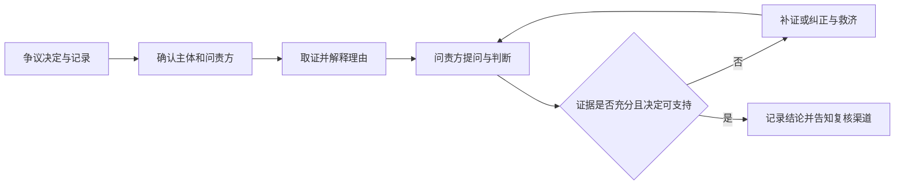
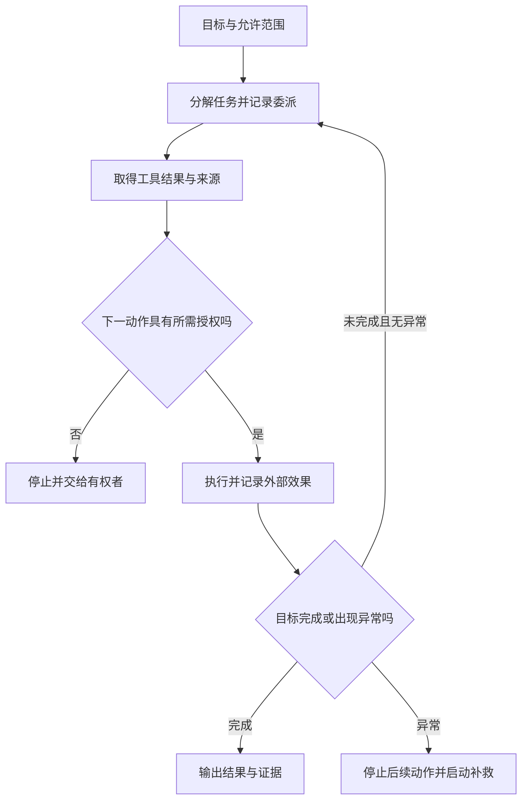
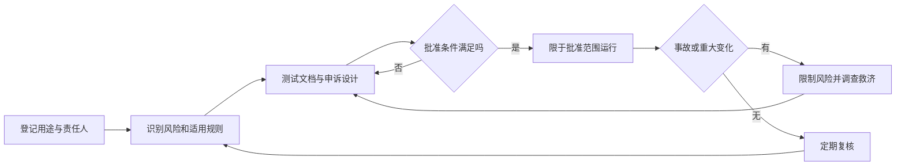

# M05 · AI 问责：谁解释、谁审查、谁纠正

> **原始材料**：`Module 5 - AI Accountability.pdf`（93 页）和 `IS5113 Group Project.pdf`（6 页）。**转录**：`merged`，来源 `M05-transcript-partial.txt`；已完成本篇严格质量与8组机制迁移的代理阅读检验，仍保留材料缺口。源共 721 段，其中 12 段为自动过滤后恢复的候选，候选未逐段回听，详同名 provenance 文件。应用原英文转录未修改。
> **先知道三项边界**：① 开头已在讲小组项目，开课前文未录到；② `01:40:50` 宣布休息，`01:41:09` 已继续讲解，录音相对时钟不能代表墙钟连续；③ 末句 `02:02:24` 仍在 p.48 讨论，无下课语，p.49–93 没有课堂证据。后半讲义仍完整讲解，不能降权成“教授略过”。录音最初误选 EF5560，已依据用户确认及课程内容改为 IS5113，并用正确术语重转。

## 0. 三分钟速览

**一句话**：AI 可以参与决定，但问责必须让受影响者找得到解释者、审查者与纠正者。

学完你能：

1. 用同一贷款案例分别指出履职责任、问责关系与法律责任，不把三词当成同义词。
2. 追踪一项 AI 决定从输入、批准到申诉的全过程，定位证据、权限或激励在哪一步失效。
3. 对黑箱选择、人工监督、供应商责任给出带条件的结论，并提出最强反例。
4. 用六维表描述问责情境，并为重要用途设计监测、事故处理和救济闭环。
5. 区分课堂法律概览、当前核对结果与尚待确认的项目行政信息。

> 🎙️ **课堂实况**：开头 `00:00`–`14:51` 主要讲项目；`15:00` 起进入问责及三种责任；中段集中解释 EU AI Act 与美国蓝图；`01:38:20` 汇总五问框架，休息后讨论 AI 能否负责、责任扩散、黑箱取舍及挑战权。录音在后一个问题中结束。课堂没有明确指定本讲哪一道题必考；项目评分规则可标教授明示，知识考点仍按 🟡/⚪ 分级。

## 1. 开始之前 · 知识衔接

### 1.1 已有概念的一句话唤醒

先把“是否应该这样做”和“谁要解释这样做”分开，才能理解本讲的位置。

| 概念 | 一句话唤醒 | 回看 |
|---|---|---|
| 伦理理论 | 用明确理由判断行为是否正当，不只表达个人喜好 | [[M02-道德理论及其应用]] |
| 公平 | 正当差别与不正当偏见要结合情境、证据与群体影响判断 | [[M03-偏见与公平]] |
| 透明与解释 | 让有关人知道系统怎样影响自己，并取得适当理由 | [[M04-AI透明-从看得见到信得过]] |
| 训练与使用 | 训练更新模型，使用产生输出；一次使用不自动等于在线训练 | [[M01-导论-AI与伦理]] |
| 监督与自主 | 自主程度影响谁在何时能干预，不能据技术名称直接判责任 | 本篇 §2.6、§2.29 |

**法律与推理用语最小包（笔记补充）**：下面只给读懂本篇所需的简明含义，不替代具体法条。

| 用语 | 读法与边界 |
|---|---|
| 法域 | 某套法律适用的地区或制度范围；具体问题先确定适用哪套规则 |
| 法定连接点 | 法律列出的、把某项活动连接到其适用范围的事实，如在某地投放或使用 |
| 构成要件 | 得出某项法律判断必须满足的条件；不能只凭结论相似便认定满足 |
| 符合性评价 | 按规定程序把系统证据与适用要求比较的评估；不自动等于普通测试、内部批准或任何第三方认证 |
| 法律人格 | 被法律承认为能够享有权利、承担义务的主体地位；技术智能本身不自动赋予这种地位 |
| 注意义务 | 在具体情境采取合理谨慎措施的要求；标准随适用制度与事实确定 |
| 正当程序 | 公正作出及复核决定的程序要求，例如适当知情、陈述与挑战机会；具体权利须查法源 |
| 基本权利 | 制度中特别保护的人的基本自由与利益；本篇以平等、隐私等为例，不列全球统一法律清单 |
| 可责程度 | 某行为或遗漏值得责难的程度，不等于已经作出违法或赔偿裁决 |
| 事后偏见 | 已知道结果后，高估事前本来能够预见它的程度 |
| 救济 | 针对已受损害者的纠正与补救；与处罚行为人不是同一件事 |
| 成本外部化 | 作决定的一方把部分成本转由其他人或社会承担 |

**所以呢**：本讲不是再背一次 FATP，而是让这些原则有承担者、证据和后果。

### 1.2 本讲新增概念与展开位置

新词就地解释，法律或制度词不作为零基础读者理应知道的知识。

| 新概念 | 去哪里学 |
|---|---|
| Actor / Forum、问责关系、三种责任 | §2.3–2.4 |
| 风险相称治理、合规与非约束蓝图 | §2.7–2.14 |
| 人工替代、自动化偏误、责任扩散 | §2.19–2.21、§2.31 |
| 代理动作追踪、权限关口 | §2.29 |
| 模型卡、数据说明、影响评估、追溯 | §2.33–2.34 |
| 救济、事故报告、问责文化 | §2.35、§2.37、§2.42 |
| 六主题十三维度的研究框架 | §2.41 |

**所以呢**：遇到新词先找它在流程里改变了什么，不要只看术语中文译名。

### 1.3 重排理由与来源边界

讲义 p.1–6 是项目要求，p.7 为主题封面，p.8 是议程；正文保留项目说明，再按定义与关系、规范、案例、工具、失败机制和研究串联。重复的三责任问题 p.15/p.43、Google 七原则 p.66/p.78 合并解释但逐页登记。p.7/p.9/p.16/p.19/p.28/p.31/p.37/p.59/p.71/p.77/p.80/p.81 经视觉核对仅为封面或章节标题，不虚构知识点；p.8 的议程目标在 §2.1 及本节承接。p.6 的分组截图、p.76 六原则图、p.90 论文首页、p.91–92 两表均按实质材料处理。

“课件原例”只描述材料实际内容；所有新情境与流程标“笔记补充”；课堂原话用时间戳；法律现状与公司新版原则用外部来源及核对日期。个人评分项目只登记通用要求，不公开团队完整答案。本文没有把假设案例当真实判例，也没有把企业原则当法律。

**所以呢**：顺序为学习服务，来源和页码仍可逐项回查。

## 2. 正文：从谁来解释，到如何纠错

### 2.1 小组项目：研究问题与行业政策是两种交付（讲义 p.1–3、p.6）

这次项目要求你先解释一个伦理问题，再把原则变成企业可以执行的政策。两部分不是把同一篇论文换个标题交两遍；前者重在论证，后者重在行动安排。本讲 p.8 的议程也围绕同一个目标展开：弄清问责是什么、谁受影响、怎样运作、法律怎样参与以及为什么难。

**是什么**：Part 1 是指定 AI 伦理主题的研究调查；Part 2 是指定行业或领域的政策建议。主题与行业由教师分配，不能自行把喜欢的题目当作已获准题目。独立项目文件还要求选一家该行业公司作标杆比较，企业可以自行选择。两部分各不超过 15 页；页数上限不是目标长度。M05 p.1 的 5–7 人口径已由课堂纠正为最多 8 人。

**为什么需要它**：知道公平、透明和问责的定义，还不等于能治理真实业务。研究部分训练你比较证据与反方观点；政策部分要求回答谁执行、何时执行、用什么记录检查、失败后谁纠正。若只写“企业应负责任”，读者无法行动，评分中的实施策略也没有落点。

**课件原例**：p.2 列出招聘偏见、金融决策、电子商务隐私、工作场所监控及自动驾驶等主题；p.3 列出金融、医疗、零售、人力资源和交通等政策场景。人力资源可以横跨多个行业，所以选择“领域”时应先写清业务边界。p.6 是 Canvas 分组操作示意，截图属于旧学期；用途是说明应在当前课程登记成员，不是要求照抄截图里的组号、人数或姓名。

**🎙️ 课堂补充**（`00:00`–`14:51`，A · 课上展开）：教师明确纠正人数：*"up to eight students, not five to seven actually, eight students"*（`00:14`）。报告在展示后再完善：*"After the class presentation, some of you may get some feedback"*（`00:57`）。课堂还要求说明 AI 工具怎样使用，以及本人做了什么额外核验（`06:22`–`07:27`）。这确认了项目不接受仅把模型输出拼起来的做法。`05:18` 的“50 pages”与文件和 `05:23` 的总计 30 页冲突，按书面每部分 15 页处理，记录为 ASR/口误待核。

**💡 换个说法（笔记补充）**：研究报告像说明“招聘筛选为什么会伤害某些申请者”；政策报告像规定“上线前由谁做分组误差检查，发现问题后暂停哪一步”。输入是指定题目、行业和可靠资料；输出是有依据的论证与可执行政策，不是替团队直接填出结论。

**⚠️ 常见误解**：展示后一周是相对期限，只有知道本组展示日期才能计算绝对 DDL；不能直接把第 12 周结束日当作所有组的截止日。使用 AI 的说明是这份项目明确提出的要求，不是全库统一附加声明。

**与其他概念的关系**：项目把 [[M03-偏见与公平]] 的公平判断和 [[M04-AI透明-从看得见到信得过]] 的解释要求放进本讲的责任链。

**所以呢**：先确认分组、分配题目与展示日期，再建立证据表和行动清单；个人完整作答留在私有作业目录。

### 2.2 评分表怎样变成写作检查表（讲义 p.4–5）

想知道该花力气在哪里，应先把每项分数翻译成读者能检查的成果。评分表不是写完后随手对照的附件，而是决定收集什么证据的起点。

**是什么**：Part 1 的 100 分由研究深度与相关性 25、伦理分析与论证 25、实际商业含义 20、展示沟通 20、团队协作与项目管理 10 构成。Part 2 是政策框架 30、研究证据 15、利益相关者与影响 15、实施策略 10、协作管理 10、沟通展示 20。独立文件另列每部分最多 5 分的可选加分；这不自动说明课程总评怎样加，也不能据此自行把总分改成 105%。

**为什么需要它**：大量参考文献只能支撑研究维度，不能代替伦理论证；一张漂亮流程图不能证明政策可实施。应该为每项评分准备可观察的证据：论证链、相反意见、影响比较、执行责任、会议记录和对问题的回答。材料说明了两部分各自评分，却没有给出两部分最终合成的精确权重，不能擅定各占项目一半。

**课件原例**：p.4 强调研究、论证和商业含义；p.5 增加政策框架、利益相关者和实施策略。独立文件 p.2 要求说明每名成员的角色与贡献，以及 AI 使用方式、工具和本人超出 AI 的贡献。这些是可记录的过程证据，不应临近提交才凭印象编写。

**🎙️ 课堂补充**（`11:11`–`12:54`，B · 讲了同讲义）：*"Good argumentation, logical, sound, evidence-based argumentation"*（`11:21`）把“好论证”限定为逻辑可靠且有证据；`12:31`–`12:37` 又把建议落地与实施策略联系起来。项目占比在 `01:14` 明说 *"half the final marks of this course"*，与新文件 50% 一致，和旧大纲 40% 有版本差异。

**💡 换个说法（笔记补充）**：写出“应定期审计”只表达愿望；补上审计对象、负责角色、触发条件、反馈渠道与复核证据，才开始回答实施策略。若选择公平目标，还要说明为什么适合该行业，以及它可能牺牲哪些利益。

**⚠️ 常见误解**：新项目 50% 的说明不授权我们替教师重新分配其余考核比例；保留旧大纲并记录更新来源。加分也不等于多塞模型或多写页数，材料强调创新视角、跨学科和合乎伦理的 AI 使用。

**与其他概念的关系**：团队贡献记录本身就是问责证据：谁做了什么、依据何在、别人如何复核。

**所以呢**：每个评分维度至少对应一项可检查成果，尚无证据的项保持待办，不能用完成篇幅代替完成任务。

### 2.3 问责是一种关系，不只是“出了事找谁”（讲义 p.10–11、p.40–41）

<!-- 类型: 定义型 -->

假设银行系统拒绝贷款，申请人问“为什么”，银行只回答“模型算的”。即使模型没有算错，这也没有完成问责：受到影响的人仍不知道谁能解释、谁能复核、结论错误时找谁处理。

**是什么**：问责（Accountability）是行为主体对某个问责方解释和论证其行为，并接受提问、判断及可能后果的关系。行为主体叫 actor，问责方叫 forum，复数是 fora；这里不是网络论坛，而是有资格要求说明或作判断的人或机构。讲义定义的关键词是解释、正当化与后果。英文短定义可记为：“An obligation to explain and justify conduct to a forum and face consequences.”（笔记概括，不冒称逐字讲义。）

**为什么需要它**：复杂 AI 系统由数据、模型、流程与组织共同构成。只检查模型分数，会漏掉批准上线、权限配置和投诉处理。问责关系把技术输出连接到可以承担义务的人，并使受影响者具有提出异议的通道；只有主体、没有问责方，容易变成内部自我宣告。

**课件原例**：p.11 将决策者、开发者、用户都放进社会技术系统；问责可能针对代码的一部分，也可能针对整个系统。p.40 的五问依次是：谁负责、谁受影响、怎样监测、能否解释、出错怎么办。p.41 把设计、部署、运行和后果连为一条生命周期链。

**机制与完整例子（笔记补充）**：输入是一项被争议的拒贷决定及其记录。第一步由业务负责人接收异议，确定申请人和复核机构；第二步调取使用的数据版本、决策规则和人工操作；第三步向申请人说明关键理由并向复核者提供适当证据；第四步复核者质询理由是否正确、是否符合标准；第五步纠正错误、安排救济并检查同类问题。结束条件是异议得到有依据的处理和可追踪结果，不是发出一封解释邮件。资料缺失时先保全现有证据并登记缺口，不能倒填日志。

**🎙️ 课堂补充**（`20:01`–`24:13`，A · 课上展开）：*"When you talk about accountability, you need at least two parties"*（`20:01`）；*"The obligation is to explain and to justify his or her own conduct"*（`21:08`）。教师随后强调对方可以提问与判断。这使“解释一下”与完整问责程序有了区别。`20:35` 将“无问责就无关系”说得很强；笔记只采纳问责是一类关系，不推成所有人际关系都必须包含问责。

**💡 换个说法（笔记补充）**：给出收据只是提供信息；有人能根据收据质疑扣款、要求复核并获得退款，才出现完整的问责链。这个比喻强调质询与后果，不表示所有 AI 争议都只需退款。

也可以从受影响者倒着检查：我能向谁提出问题，对方能否拿出证据，如果解释不成立谁有权改变结果？这条反向路径能发现组织图看起来完整、实际却无人受理的缺口。

**⚠️ 常见误解**：公开代码不自动产生问责；监管机构也不是唯一问责方。流程失败常见于“没人有权调日志”和“复核者只能重复原模型结论”，分别需要明确取证权限与独立复核能力。

- ❌ 公开代码就完成问责 → 代码只是证据，仍需质询权、判断和纠正后果。
- ❌ 监管者是唯一问责方 → 受影响个人和其他有权组织也可构成forum。

**与其他概念的关系**：透明提供看得见的证据，可解释性帮助理解理由，治理赋予角色和程序，问责把它们连接起来。

**所以呢**：判断一个系统是否可问责，必须同时指出主体、问责方、对象、依据和可能后果。

### 2.4 三种责任：做事、说明、承担法律后果（讲义 p.15、p.43）

中文的“负责”容易把三个不同问题混成一个。面对事故时，先区分应当完成的工作、必须向谁说明以及法律后果，才不会把一名程序员推成所有问题的唯一承担者。

**是什么**：履职责任（Responsibility）是履行某项职责、以适当方式行动的义务；Accountability 是解释与正当化行为并接受审查的义务；Liability 是具体法律规则下的法律责任或后果。一个主体可以同时承担三者，三词不是互斥职业标签。“开发者负责、经理问责、公司赔偿”是教学例子的分工，不能当作所有案件的通用法律结论。

| 比较维度 | Responsibility | Accountability | Liability |
|---|---|---|---|
| 核心动作 | 履行职责 | 解释、受质询、接受判断 | 按法律承担后果 |
| 判断依据 | 职责与伦理要求 | 问责关系及相应标准 | 适用法律与具体事实 |
| 时间 | 设计部署使用全程 | 事前与事后都可发生 | 依法律条件确定 |

**为什么需要它**：如果只问“谁写代码”，会忽略管理层批准使用的范围；如果只说“公司会赔”，又可能忽略日常纠错义务。问责可以在尚未造成损害时发生，例如上线前解释高风险决策依据；法律责任则必须核对适用法域、具体义务、事实与因果关系，不能由笔记直接判赔。

**课件原例与逐问回答**：p.43 问三词的差别，直接答案是“履职—说明与接受审查—法律后果”。p.15 的 AI 语境把设计部署的伦理职责、决策解释及违法/伤害后果分开。若要解一道案例题，先列谁有何职责，再列谁必须向谁解释，最后独立讨论满足哪些法律条件时可能产生责任，不能用同一段定义代答三问。

**🎙️ 课堂补充**（`34:53`–`38:40`、`01:43:53`–`01:45:11`，A · 课上展开）：教师用银行贷款系统区分三词，*"the data scientists building the model has the responsibility"*（`01:44:05`），而 *"the chief risk officer or the manager in charge has accountability"*（`01:44:32`）。关于银行损害赔偿的句子是教学假设，笔记不将其升级为已成立的法律裁决。过滤候选 `34:16` 含三词比较但未单独回听，不据该句校正其他原话。

**💡 换个说法（笔记补充）**：饭店厨师有正确烹饪的职责，负责人需要解释食品安全控制，发生损害是否赔偿则由法律条件决定。顾客尚未生病，也可以要求饭店解释过敏原控制，所以问责不是只在判赔时才开始。

再从时间看三者：上线前已有设计和测试职责，使用期间就可要求说明，法律后果则要核具体构成条件。它们可以在同一人身上重叠，也可以由不同主体分别承担。

**⚠️ 常见误解**：三者有重叠，并非严格包含关系。课堂 `38:40` 将法律概括为伦理子集，可以理解为治理直觉，但现实法律与伦理可能冲突，不能作为一般定理。缺少事实时应说“潜在责任待判断”，不先给责任比例。

- ❌ 三词是同义词 → 三者分别回答履职、说明和法律后果。
- ❌ 每个职位只对应一个词 → 同一主体可以同时承担多种义务。

**与其他概念的关系**：[[M02-道德理论及其应用]] 判断行为是否应当；本节将这种判断与组织职责及可执行后果分开。

**所以呢**：答案中分别用三个动词“履行、解释、承担”，再把它们映射到案例证据。

### 2.5 问责为什么能支持信任（讲义 p.12、p.44）

你可能相信某系统大多数时候算得准，却仍不愿让它决定重要事情，因为一次错误就可能无法申诉。信任不只来自平均性能，也来自出错后仍有人接手。

**是什么**：本讲讨论的是有依据的制度性信任：用户知道系统受监督，错误可纠正，决定可挑战，伤害可救济。问责提供这些保障，从而支持合理依赖。它不是让用户无条件相信 AI，也不是企业声誉的宣传口号。

**为什么需要它**：没有责任链，机构可能把错误归给算法，用户找不到能改变决定的人。有责任链，开发和部署者知道自己的选择将被追问，会更有动力保存证据和检验风险；争议也更容易暴露问题。这里包含预防、发现和纠正三条因果路径，不能只写“问责提高信任”就结束。

**课件原例与逐问回答**：p.44 问为什么问责是可信 AI 的前提。答案是它给监督、纠错、挑战与救济提供明确承担者，使信任有程序支撑。p.12 进一步列信任、合规、降低偏见风险、声誉及竞争优势。注意这些是机制与预期收益，并非保证每家公司都因此盈利；如果所谓复核无权改变结果，挂牌“问责机制”仍不能建立合理信任。

**🎙️ 课堂补充**（`24:35`–`26:16`、`01:45:18`–`01:47:25`，A · 课上展开）：教师把作用分成 *"One is prevention"*（`01:46:49`）、*"Second is detection"*（`01:46:55`）和 *"thirdly is corrections"*（`01:47:11`）。这补充了课件只列好处时缺少的机制链。`01:45:37` 的 unanswerable 与上下文相反，疑为 ASR，不按字面引用成“无人答责”。

**💡 换个说法（笔记补充）**：比较两个同样准确率的客服系统：甲只回复“系统决定”，乙允许提交证据、有人复核、错误会更正。后者给你的是错误之后仍有控制能力，而不是承诺永远没有错误。若复核拖延到决定已不可逆，则机制仍需改进。

从企业一侧看，问责意味着重要选择将来可能被核查，所以今天就有理由保留依据并认真测试。这种事前激励与用户事后得到救济不同，却共同支持合理依赖。

**⚠️ 常见误解**：可解释并不保证正确；感到信任也不证明系统可信。应检查申诉是否可达、复核是否独立、纠错是否真的执行，而非只调查“用户满意不满意”。

- ❌ 信任感高说明系统可靠 → 感受不是性能与程序证据。
- ❌ 问责保证不犯错 → 它建立预防、发现和纠正能力，不能保证零错误。

**与其他概念的关系**：本节接续 [[M04-AI透明-从看得见到信得过]] 的信任讨论，将信息理解推进到组织回应。

**所以呢**：答题时画出“有承担者→可预防/发现/纠正→有理由信赖”的链条，并指出其中可能断在哪一步。

### 2.6 谁参与、系统做什么，决定责任链怎样画（讲义 p.13–14）

一个推荐错误商品的系统与控制车辆运动的系统，都可能叫 AI，但受影响的人、可逆程度和干预时间完全不同。分清实际任务，才知道谁应参与治理。

**是什么**：利益相关者（Stakeholder）是会影响系统或受系统影响的人和组织。p.13 分开发者、个人或企业用户、监管者与社会公众；p.14 列预测分析、推荐引擎、生成式 AI 与自主系统。分类的用途是找作用链，不能把技术名称直接当风险等级。

**为什么需要它**：开发者控制训练与测试，却不一定控制最终业务用途；部署公司决定何时何地使用系统；用户可能按照说明使用，也可能超出边界；受影响者甚至没有主动使用系统。若只听购买系统的客户意见，被筛掉的求职者便会消失在治理图中。

**课件原例**：预测分析预测趋势，推荐引擎提供个性化建议，生成式 AI 生成内容，自主系统自动作决定。对这四类，应分别追问预测用于什么行动、推荐如何影响选择、生成物由谁核验、自动行动能否撤回。相同模型放进不同业务流程，责任链可能完全不同。

**🎙️ 课堂补充**（`26:27`–`33:51`，A · 课上展开）：*"Users must understand the limitations of these systems"*（`27:14`–`27:24`，跨段读取）。教师用电动车自动调整与高后果驾驶选择说明自主程度应随风险与潜在伤害考虑（`30:05`–`33:51`）。这里是伦理教学情境，不能据此推断某一自动驾驶等级的法定接管义务，或建议人在事故瞬间按课堂例子操作。

**💡 换个说法（笔记补充）**：一份贷款评分的输入是申请资料，模型输出风险估计，业务规则再决定通过与否，工作人员处理例外，客户承担结果。模型输出不是整个决策链。可追踪的一次运行应记录各模块版本、阈值、谁批准和人工改动，而不只保留最终分数。

从没有使用系统的人看，求职者可能不知道企业用了筛选模型，却直接承担结果。寻找利益相关者因此不能只列登录用户和付费客户，还须沿输出影响继续往下追踪。

**⚠️ 常见误解**：用户承担适当使用义务不等于供应商可以用免责声明免除全部责任；风险低也不代表没有隐私或公平问题。若参与者职责交叠，先逐项写清控制能力，不能用“大家都有责任”跳过分工。

- ❌ 只有用户是利益相关者 → 没有使用系统的人也可能承受结果。
- ❌ 用户误用使供应商全免责 → 仍须核各自控制能力、告知和部署职责。

**与其他概念的关系**：社会技术系统把模型与组织流程一起作为分析对象；下一节区分用来审查这些参与者的伦理和法律标准。

**所以呢**：每次分析先画“数据→模型→业务决定→受影响者”，再给每个箭头指定控制者和记录。

### 2.7 伦理原则、法律和专业规范不是同一种约束（讲义 p.17–18）

某种做法可能合法但不公平，也可能违反行业规范却尚未构成法律违法。因此，“不违法就没问题”不能回答伦理课的问责题。

**是什么**：公平要求审视不合理差别待遇；透明帮助相关人理解系统及决定；隐私保护个人资料与合理控制；人的自主性（Human autonomy）是形成和执行自己判断的能力，应受到尊重。伦理原则提供应当怎样做的理由，法律规定适用范围内可强制执行的要求，专业规范则可能通过执业、认证或合同形成约束，具体效力须看来源。

**为什么需要它**：问责必须有判断标准。若公司用“准确率高”回答歧视质疑，就把技术指标偷换成伦理正当性；若把自愿原则写成现行法律，又会夸大强制效力。分析顺序应是识别情境和法域，列出相关原则及规则，核对事实，再讨论冲突和救济，而非看到“regulation”一词就断言会罚款。

**课件原例**：p.18 对比 EU AI Act、美国 AI Bill of Rights 与中国相关治理，提示跨国公司要处理不同规范。它是课堂概览，不是全球法律清单。没有具体中国文件名、条文和业务事实时，只能讲“应核适用规则”，不能从“集中治理”推导某项具体处罚。

**🎙️ 课堂补充**（`38:49`–`45:51`，A · 课上展开）：*"regulations can also be set up by professional bodies"*（`39:12`）；教师用专业执业资格说明不同约束有不同执行机制。美国蓝图被明确区分为 *"it's not a piece of law"*（`45:01`）。关于某种专业处罚是否适用仍须查具体法域；课堂例子提供分析方向，不是法律意见。

**💡 换个说法（笔记补充）**：医院可以同时受法律、专业执业要求和内部安全政策约束。内部政策比法律更严格时，满足最低法律要求仍可能违反内部职责；反过来，遵守内部政策也不能抵消违法。把这三列分别列出，才能看清谁依据什么提出问责。

再看同一行动的三个问题：道德上有无充分理由，机构规则是否允许，适用法律是否禁止。分别回答后再处理冲突，才不会把其中一项通过误当成另外两项也通过。

**⚠️ 常见误解**：自主性不等于“让人点同意就免责”；信息看不懂、选择成本过高或没有真实替代时，形式同意可能无法支持有意义的选择。文化差异也不是忽略当地权利保障的理由。

- ❌ 合法就一定伦理正当 → 法律最低条件不能代替全部伦理论证。
- ❌ 同意按钮使任何使用正当 → 信息与真实选择不足时形式同意仍有问题。

**与其他概念的关系**：FATP 是本课公平、问责、透明、隐私的联动框架；问责是让这些要求有人解释和执行。

**所以呢**：案例结论须标明“伦理判断”“组织规范”或“已核法律要求”，不要把三者写成同一条命令。

### 2.8 EU AI Act：先判断适用范围，再谈合规（讲义 p.20）

公司不在欧洲，并不能据此断定与欧盟 AI 规则无关；反过来，网页能被欧洲用户打开，也不足以直接判定所有条款都适用。第一步是确认具体活动，而不是先背处罚数字。

**是什么**：讲义把 EU AI Act 介绍为面向 AI 的综合监管框架，目标包含安全、基本权利与创新。它既区分 AI 系统和通用 AI 模型，也区分提供者、部署者等角色。课堂的“影响欧盟居民”是范围直觉，实际适用条件必须回到法规条文，不能将居住地、国籍、市场投放和输出使用混为一谈。

**为什么需要它**：同一家企业可以是某模型的部署者，又是另一个下游系统的提供者；角色不同，义务不同。先列系统是什么、在何处投放或使用、输出在哪里使用、谁控制哪个环节，再核规则，才能避免将上游全部职责错误地放到普通使用者身上。

**课件原例**：p.20 用域外主体说明范围可能超出欧盟境内，并提出创新与权利保护的平衡。它未给出完整例外清单，所以仅凭此页不能下“本公司完全适用/完全不适用”的法律结论。

**🎙️ 课堂补充**（`46:20`–`53:17`，A · 课上展开）：教师强调 *"The regulation applies not only to entities based in the European Union"*（`47:05`）。同时讨论了监管与技术发展速度的张力。`52:01`“欧洲没有先进大模型”属于课堂评论，未定义“先进”且缺数据，不能当成已核事实或监管必然抑制创新的因果证据。

**💡 换个说法（笔记补充）**：做合规分析像判断一份合同是否约束你：要看身份、行为与适用条款，而不是看到合同使用英文就认定人人受约束。输入是业务事实和现行条文，输出是有条件的适用判断与待补证据清单。若事实未知，应先写未知项，不能用模型生成的假设填补。

从采购者角度看，购买模型、改变用途和向特定市场提供服务可能使角色发生变化。因此合规清单必须跟着具体业务事实更新，旧合同里的产品名称不能永久决定责任。

**⚠️ 常见误解**：伦理上应该负责与法律上受某部法规约束是两个问题；前者可以成立而后者尚待确认。课堂对域外执行难度的讨论也不是不合规的理由。

- ❌ 公司在境外就无须核欧盟规则 → 适用还可能涉及市场、部署和输出使用等连接点。
- ❌ 可访问就等于全部条款适用 → 需核具体活动、角色和排除条款。

**与其他概念的关系**：适用范围确定谁依据哪套标准接受审查，下一节才进一步分风险。

**所以呢**：任何“是否合规”的答案都先交代角色、用途、地域与时间条件。

### 2.9 风险分层：不按技术名字一刀切（讲义 p.21）

同样是分类模型，用于分拣垃圾邮件和决定贷款机会，出错后果不同。风险分层试图让监管强度跟实际伤害相匹配。

**是什么**：风险相称治理是按照用途和潜在伤害安排不同控制强度。课件用不可接受风险、高风险、有限风险和最低风险四层帮助理解。不可接受风险触及禁止做法；高风险要求更强控制；透明义务关注用户是否知道 AI 的存在与内容来源；低风险不因此免除所有其他法律。四层是课堂导览，具体系统仍须按用途、条款和例外判断。

**为什么需要它**：如果所有系统都必须走相同最重审查，会给低后果应用带来不必要负担；如果只看模型规模，又会漏掉简单但影响基本权利的模型。风险判断需要看受影响人数、伤害程度、可逆性、使用场景和已有保障，而不是只问“是不是生成式 AI”。

**课件原例**：p.21 将社会评分放在禁止风险例子，招聘、信用评估和执法放在高风险例子，聊天机器人用于解释透明义务，垃圾邮件过滤用于最低风险例子。例子说明关注点，不意味着所有“信用”或“聊天”应用具有相同法律状态。

**🎙️ 课堂补充**（`44:26`–`44:47`、`54:31`–`54:38`，B · 讲了同讲义）：*"it categorizes AI systems"* 的思路在课堂围绕风险与相应监督展开（`44:26`）；`54:38` 说明每种分类有相应合规要求。这里确认了“先分类，再匹配控制”的顺序，没有证据支持“越大模型必然越高风险”。

**💡 换个说法（笔记补充）**：把风险分类写成审查流程：先核是否属于禁止做法；如否，再查是否落入高风险具体用途；接着检查透明或模型专门义务，最后检查其他适用规则。一个系统可能同时需要多类控制，不能把风险层当作互相排斥的全部义务清单。对变式“垃圾邮件工具改成筛掉求职邮件”，用途改变后必须重评。

从错误后的生活影响看，推荐错电影和错拒重要服务的后果差别很大。把可逆性、影响范围与申诉能力写出来，比单纯按照模型是否复杂更接近风险相称的判断。

**⚠️ 常见误解**：“最低风险”不是零风险；“高风险”也不是一律禁止。判断依据缺失时保持待核，不根据营销标签作分类。讲义四层中“有限风险”应理解为透明义务的导览，不能据此忽略同一系统的其他要求。

- ❌ 高风险等于一律禁止 → 高风险通常要求相应控制，须与禁止做法分开。
- ❌ 最低风险就是零义务 → 其他法律与一般伦理责任仍可能适用。

**与其他概念的关系**：风险分层把伦理上的比例原则转化为治理资源分配。

**所以呢**：答题时必须写出用途和潜在后果，再解释控制为什么相称。

### 2.10 高风险系统与通用模型：两条义务线（讲义 p.22）

购买一个通用模型，并不等于已经取得某项高风险业务的合规证明。模型能做许多任务，下游组织仍要为实际使用方式作审查。

**是什么**：通用 AI 是可以完成广泛任务的模型或能力，不能只由某一次具体用途定义。p.22 分两条线：高风险 AI 系统涉及风险管理、技术文档、符合性评价与人工监督；通用 AI 模型涉及技术文档、训练内容摘要、版权相关安排，具有系统性风险时还涉及额外评估和防护。提供模型与把模型用于具体决策，不是同一个活动。

**为什么需要它**：上游知道模型训练和能力边界，下游知道业务流程、受影响群体和决策后果。任何一方只保存自己方便保存的材料，都可能造成证据断层。治理需要把角色、文档和交接义务连接起来，而不是要求所有人保留完全相同的文档。

**课件原例**：讲义要求法律、技术与伦理专长共同组成团队。技术人员验证性能和失败模式，业务人员界定用途与影响，法律人员核适用规则；最终批准者必须能够解释如何综合这些意见。跨学科不等于责任平均分给所有人，应指定每项证据的负责人和批准权。

**🎙️ 课堂补充**（`54:53`–`58:41`，A · 课上展开）：*"maintaining detailed technical documentations"*（`54:53`）与 *"ensuring human oversight"*（`55:16`）被并列强调。`56:20` 转向通用模型，`57:09` 解释对抗测试是在边界条件找严重问题。课堂的注册、标记等概括不能不分角色与系统类型套用，具体义务仍须回到法规。

**💡 换个说法（笔记补充）**：以招聘助手为例，模型卡说明模型一般能力；企业还需说明输入哪些简历字段、如何排序、谁能推翻结果、如何处理申诉。把供应商模型卡直接贴进审计报告，缺少的正是“该公司怎样用它”。上线前依次核用途、证据、测试、人工干预、批准与监测；任何关键项缺失都应回补，而非直接按进度上线。

从证据交接看，供应商的说明解决不了客户资料怎样进入流程的问题，而客户的业务流程也解释不了模型训练来源。两端证据要在实际部署版本处接上，缺一边都留下盲区。

**⚠️ 常见误解**：对抗测试不是训练模型作恶，也不证明测试之外不会失败；人工监督不是仅指定一个联系人。测试集只覆盖既有情境，新用途与分布改变仍需重评。

- ❌ 买模型就完成部署审查 → 下游用途、数据与流程还需要自己的证据。
- ❌ 人工监督就是列联系人 → 必须有实际信息、能力、时间和干预权限。

**与其他概念的关系**：系统文档解释局部部署，模型文档解释基础能力，二者通过责任链连接。

**所以呢**：检查报告应明确每份证据回答哪个问题、由谁提供、何时失效。

### 2.11 禁止做法：影响选择与剥夺自主的界线（讲义 p.23）

商店展示商品优点会影响顾客，但“影响”并不自动等于“操控”。本页的难点是区分正常提供信息与利用人无法正常判断的状态，而不是把所有说服行为一律贴上违法标签。

**是什么**：讲义列操控技术、利用脆弱性、社会评分、工作场所情绪识别及无差别抓取人脸资料等禁止方向。它压缩了适用条件和例外。伦理分析可以先问是否保留真实选择、信息是否误导、是否利用脆弱处境；法律结论还必须核具体条款中的行为、后果和例外。

**为什么需要它**：个性化系统可以持续观察反应并调整刺激，用户不一定知道系统正在怎样影响自己。若只披露“使用了 AI”，仍未解决省略重要信息、隐藏选择或针对脆弱状态施压的问题。问责必须能解释策略目的、使用数据及对选择能力的影响。

**课件原例**：p.23 将利用年龄、残障或社会经济脆弱性列为关注对象。社会评分不能简单等同正常的金融信用风险评估；应检查评价资料、使用场景和不利待遇条件。讲义把情绪识别与抓取资料放在一个标题下，不表示两种做法共享同一例外。

**🎙️ 课堂补充**（`59:18`–`01:10:20`，A · 课上展开）：教师区分提供信息与剥夺自主，*"The information has to be correct"*（`01:01:58`），并要求人仍能 *"make his own independent judgment"*（`01:03:55`）。关于只说部分真话导致误解的例子在 `01:03:17`–`01:03:35`。录音将 influence 多次识别为 inference，解释按上下文，但引用不得悄悄改词。

**💡 换个说法（笔记补充）**：真实告知价格与退货限制，让顾客比较，是支持选择；隐藏退货限制并反复制造虚假紧迫感，会削弱知情判断。检验变式时问：若完整披露、保留容易退出的选择，原有影响是否仍成立？这个检验帮助伦理分析，不能代替法条的伤害门槛。

从用户能否拒绝的角度再看说服：信息充分但选择被隐藏，仍可能削弱自主；选择按钮很多但关键信息错误，也不支持知情决定。信息真实性与可选择性必须一起检查。

**⚠️ 常见误解**：课堂关于儿童大脑发育的年龄数字和文化概括未获医学/经验材料支持，不应当作精确科学结论。相关伦理重点是识别脆弱性及避免利用，不是给某年龄群体贴能力标签。

- ❌ 所有影响行为都是操控 → 真实信息和独立选择可能支持正常说服。
- ❌ 课堂例子足以证明违法 → 法律还需适用范围、构成要件与例外。

**与其他概念的关系**：本节连接自主性、隐私与公平；“能解释策略”只是开始，还必须说明策略为什么正当。

**所以呢**：答题先比较信息、选择与脆弱性，再单独核法律要件。

### 2.12 执法、罚款与时间：三个不能混算的问题（讲义 p.24–25）

知道最高罚款，并不能回答今天某项业务需要履行哪些义务。还要知道谁执法、哪条义务已经适用以及具体违规属于哪一档。

**是什么**：p.24 描述成员国主管机构与欧盟 AI Office 的治理分工，以及最高 3500 万欧元或全球营业额 7% 的严重违规罚款概括；p.25 描述分阶段实施。这里的 turnover 是营业额，不是利润。最高额是上限规则，不是发生任何错误都自动支付的固定账单。

**为什么需要它**：执法权限决定向谁提交证据；适用时间决定当前还是准备期；处罚依据决定怎样评价违规。把三者混在一起，容易出现“法律已经生效，所以所有条款都已经适用”的错误。还应区分企业向主管机构的报告义务，与成员国向欧盟报告执法活动，两者主体不同。

**课件原例**：p.24 强调重大处罚与中小企业比例性，p.25 只写 2024–2027 的概览。此页必须保留为课堂版本，同时注明现行时点核对，不能默默把新日期改成教授当时说过。

**🎙️ 课堂补充**（`01:12:31`–`01:17:26`，A · 课上展开）：*"not profit, turnover"*（`01:13:31`）是教师特意纠正的口径。`01:14:17` 的误导信息罚款比例需与条文核对；`01:15:30` 将成员国执法报告与公司的报告义务混在同段，笔记不据此断言所有公司每年提交同一法定报告。

**🔗 现行材料核对（2026-09-30）**：欧委会当前页面及 AI Act Service Desk 将附件 III 高风险规则列为 2027-12-02、嵌入受监管产品的高风险规则列为 2028-08-02，并说明 2026 年修订；因此不能再把“到 2027 年全部完成”当作现行时程。来源：[欧委会 AI Act](https://digital-strategy.ec.europa.eu/en/policies/regulatory-framework-ai)、[实施时间说明](https://ai-act-service-desk.ec.europa.eu/en/ai-act/faq/when-does-enforcement-start)。这只是本次核对，后续使用仍须查当前版本。

**💡 换个说法（笔记补充）**：假设某教学案例给“营业额”和“利润”，先确认条款需要哪个基数，再核金额上限与企业类别，最后计算；不能看到百分比就乘利润。没有企业事实和具体条文时，只展示计算方法，不给“应罚多少”的结论。

从企业年度计划看，一项法规可以已经存在，但某类义务仍处过渡期。准备工作、当前强制要求与未来期限应分开排程，否则既可能漏掉已生效要求，也可能误报全部到期。

**⚠️ 常见误解**：罚款并不等于对受害者的补偿，监管处罚与民事救济可以是不同程序；中小企业规则也不能只概括为所有罚款打折。

- ❌ 营业额就是利润 → 营业额与扣除成本后的利润不同。
- ❌ 最高罚款是固定罚单 → 需核违规档次、企业类别和具体决定。

**与其他概念的关系**：法律责任是问责后果的一种，并不穷尽解释、纠错与救济。

**所以呢**：案例答案分三列记录主管者、适用日期和责任依据，再讨论可能后果。

### 2.13 公司治理：把原则变成决策权和检查权（讲义 p.26–27）

企业成立“AI 伦理委员会”之后，若委员会无权要求补测、暂停部署或调取材料，名称再正式也难以形成问责。

**是什么**：公司治理不仅描述组织内部谁向谁汇报，还规定哪些决定必须接受独立检查，哪些证据必须保存，以及发现风险后如何升级到有权改变行动的角色。公司治理（Corporate Governance）在本讲指确定 AI 决策由谁批准、谁监督、谁提供证据、出现问题向谁升级。董事会、业务负责人、伦理委员会和审计角色的职责可以不同，但应形成可追踪的授权与监督关系。

**为什么需要它**：技术人员可能发现风险，却没有决定延期的权力；业务负责人可能只看到收益，忽略受影响者；审计者若只看自己团队提交的汇总，也难发现遗漏。治理需要让风险信息进入有权改变行动的位置，并保存批准理由。企业规模不同可以采用不同结构，但不能把小企业资源少解释为无需负责。

**课件原例**：p.26 要求风险分类、差距分析、跨学科团队和持续监测；p.27 列董事会、伦理委员会和审计。差距分析就是把当前证据与目标要求逐项比较，标出缺什么、由谁补、何时验证。它不是写一份“基本符合”的笼统总结。

**🎙️ 课堂补充**（`01:18:13`–`01:25:55`，A · 课上展开）：教师将跨学科治理解释为不同职能共同参与，并以公司财务监督类比 AI 治理（`01:24:49`–`01:25:41`）。`01:20:31` 用囚徒困境解释企业单独加强安全可能承担竞争成本，属于课堂分析框架；关于具体企业或国家近期承诺的评论没有在材料中提供新闻来源，不写成已核事件。

**💡 换个说法（笔记补充）**：某招聘项目在上线前出现分组误差差异，数据团队负责复算，业务负责人说明用途，独立审查者质疑证据，批准者决定补测或限制使用。完整记录应包括问题、证据、决定、理由、责任人和复查时间。如果没有最终有权暂停的人，责任链就在“知道风险”与“改变行动”之间断开。

从一线工程师看，发现风险后需要知道谁能够决定延期、谁协调业务成本、谁检查整改。若每个部门都只能建议而无人能决定，组织有会议却没有形成实际治理能力。

**⚠️ 常见误解**：独立审计不是把责任外包；审计意见也不证明系统永久安全。治理失败可能来自利益冲突、信息不完整或执行权不足，每种原因需要不同纠正措施。

- ❌ 成立委员会就有治理 → 无取证和纠正权时名称不能形成控制。
- ❌ 聘审计者即把责任外包 → 组织仍需解释部署、执行整改和复核。

**与其他概念的关系**：问责关系提供“谁向谁说明”的结构，公司治理把它落实到日常权力和工作流程。

**所以呢**：评价治理方案时检查决策权、质询权和纠正权，而不只检查组织架构图。

### 2.14 美国 AI Bill of Rights：原则蓝图的作用与边界（讲义 p.29–30、p.38–39）

<!-- 类型: 定义型 -->

名字里有“权利”，并不意味着该文件本身已经给所有人创造了可以直接起诉的法定权利。读政策材料时，必须先看它的法律地位。

**是什么**：本讲讨论 2022 年美国白宫科技政策办公室发布的 Blueprint for an AI Bill of Rights。非约束框架是自身不产生可强制执行义务的指导体系；它是关于自动化系统的原则蓝图，强调安全、公平、隐私、通知解释与人工替代。课件明确标注 non-binding，意思是蓝图自身不具有法律强制执行地位；它也不能代替对具体行业法律的核查。

**为什么需要它**：原则文件可以提供设计检查表，让机构用共同语言讨论风险，并影响自愿标准或政策讨论。但“有原则”和“公司实际执行”之间有距离：需要负责角色、资源、审计证据和追责程序。它是否进入某项合同、采购要求或其他法律文件，要逐项查证，不能由历史影响概括为当下普遍义务。

**课件原例**：p.30 关注可能显著影响权利、机会和关键服务的系统，举医疗、招聘、信用、监控和内容管理；p.38 强调无直接处罚，p.39 把原则落实为偏见检查、隐私保护和透明协议。这里“范围”是蓝图的关注范围，不应和法规管辖范围混用。

**🎙️ 课堂补充**（`01:26:03`–`01:30:08`、`01:37:02`–`01:38:12`，A · 课上展开）：*"It does not carry legal enforcement status"*（`01:27:19`）是最应保留的性质判断。教师在 `01:30:08` 明说实际采用程度仍未知，所以不能将“很多组织自愿采用”当作已有统计证明。

**💡 换个说法（笔记补充）**：蓝图像一份负责任设计的参照表；法律、合同或机构政策可能各自引用类似要求，但每条义务的约束力来自其具体来源。分析时先写蓝图提出什么，再写当前机构凭什么必须执行，最后找执行证据。

从采购合同看，双方可以约定遵守某些原则，使合同关系出现具体义务；但这种约束不来自蓝图名称本身。因此必须写清每条要求的实际依据，不能用原则文件代替合同与法律。

**⚠️ 常见误解**：不能由这份非强制蓝图推出“美国 AI 完全不受法律约束”，也不能把 2022 年政府文件当作 2026 年全部现行联邦政策。课件中的未来立法预测与政策影响是当时叙述，现状应另核。

- ❌ 蓝图本身就是法律 → 其自身不具有强制法律执行地位。
- ❌ 非约束就没有其他法律 → 实际用途仍可能受其他法律和合同约束。

**与其他概念的关系**：它与 EU AI Act 可比较的是目标和治理手段，法律效力却不同。

**所以呢**：考试比较题先写 binding/non-binding，再比较控制机制，不只罗列共同原则。

### 2.15 安全有效：上线前测试不等于永久合格（讲义 p.32）

一个系统在测试时表现良好，部署后仍可能遇到新数据、新用途或流程变化。因此安全是持续维护的结果，而不是一次测试后永远有效的标签。

**是什么**：安全有效系统要求明确预期用途、在相关条件下检验性能、识别伤害、安排缓解措施，并在运行中持续监测。有效是能完成目标，安全是将不可接受的伤害风险控制在适当范围，二者不能互相替代。

**为什么需要它**：平均准确率可能掩盖少数群体的严重错误；测试条件可能和现场不同；业务阈值或数据管线改变也会改变结果。监测必须能把异常传递给有权采取行动的人，否则仪表盘只是在持续显示问题。

**课件原例**：p.32 列严格测试、持续监测、主动风险缓解和利益相关者参与。它没有给统一合格阈值，说明具体任务还需规定什么错误最严重、什么情况必须暂停、由谁复核，不能发明一个通用准确率门槛。

**🎙️ 课堂补充**（`01:30:27`–`01:31:43`，A · 课上展开）：*"deployment needs to be continuously monitored"*（`01:30:27`）支持持续监测。`01:30:55` 将“使用 AI”概括为会改变系统，需限定：固定权重模型不会因为每次使用自动更新；数据分布、提示、外部知识、配置或再训练仍可改变实际表现。课堂重点是持续核验，不是所有模型都在线学习。

**💡 换个说法（笔记补充）**：输入是一项预定用途和测试证据；先列正常与异常场景，再测关键错误，未通过则修改并重测；通过后限制使用范围，记录运行指标；发现漂移或严重事故则触发复核。终点不是“已上线”，而是每次变化后都能说明当前证据是否仍支持继续使用。

从运维人员看，测试报告描述过去样本上的表现，而监测回答现在是否仍符合使用条件。两者时间对象不同，所以即使测试严谨，也不能取消后续变化检查和异常处置。

**⚠️ 常见误解**：更高平均准确率不保证更安全；没有收到投诉也不等于没有伤害，可能是投诉渠道不可达。两个典型失败机制是测试样本不代表现场、报警无人处理，分别要改证据覆盖与组织响应。

- ❌ 测试通过就永久安全 → 场景与系统会变化，证据有适用范围。
- ❌ 没有投诉就是没有伤害 → 投诉渠道不可达也会让问题不可见。

**与其他概念的关系**：这是问责的预防和发现阶段，后续救济处理已经发生的错误。

**所以呢**：报告应同时给测试范围、失败条件、监测人和处置动作。

### 2.16 算法歧视防护：相同处理不一定公平（讲义 p.33）

<!-- 类型: 定义型 -->

如果不同群体面对同一个阈值，却因为训练资料偏差承担明显不同的错误负担，程序形式一致仍可能产生不公平结果。

**是什么**：算法歧视防护是检查并减少系统对群体造成不合理差别影响的治理过程。课件提出代表性资料、公平测试、审计和纠正机制。公平不止一个指标，使用何种标准需要说明任务、机会分配和错误代价。

**为什么需要它**：历史数据记录的是历史世界，不自动等于应当复制的公平世界。移除性别字段，也可能通过学校、职业间断或其他代理变量重现差别。问责要求团队解释数据从何而来、为什么使用这些特征、怎样发现并纠正不合理结果。

**课件原例**：p.33 要求 equity-focused testing 与公平审计。这里的 equity 不是简单把每个人当完全相同；应考虑相关处境与正当差异，同时避免用群体刻板印象替代个体事实。p.33 没有给出唯一公平指标，所以不能假称教授规定所有业务一律采用人口比例相等。

**🎙️ 课堂补充**（`01:31:54`–`01:32:58`，A · 课上展开）：教师明确说 *"Equitably, not equally"*（`01:32:47`），并强调审计不要复制既有不平等。关于哪些属性依法受保护，须核具体法域；课堂列举不能直接作为全球统一法律名单。

**💡 换个说法（笔记补充）**：比较两群体的错误前，先核目标标签是否可靠、样本如何进入数据、拒绝与错误拒绝是否被区分。若总体通过率不同，不能马上断定模型歧视，也不能马上宣布差异合理；应追查输入、标签、阈值与后续复核。完整判断需要事实链与正当理由。

从被误拒的人看，总体通过率不告诉他自己的资料是否被正确处理。群体分析帮助发现系统问题，个案复核帮助纠正个人事实，两种途径互补而不能互相替代。

**⚠️ 常见误解**：审计不是找一个看起来好看的指标；群体划分过粗会藏住交叉群体问题，样本太小又会使差异估计不稳。可行调整包括补资料、限制用途、重设阈值或人工复核，但每种措施都有代价和残留风险。

- ❌ 删性别列便消除偏见 → 其他变量仍可能承载代理关联。
- ❌ 通过率不同直接证明违法 → 还须核标签、用途、统计条件和具体规则。

**与其他概念的关系**：[[M03-偏见与公平]] 解释公平判断，本节增加谁负责测试、谁接受质询、如何纠正。

**所以呢**：任何“公平”结论都应附适用指标、数据限制与纠正路径。

### 2.17 数据隐私：控制采集、使用与披露的全过程（讲义 p.34）

保护数据不只是设置密码。一个数据库即使从未被黑客攻破，仍可能因收集不必要资料或超出原用途使用而产生伦理问题。

**是什么**：隐私控制要贯穿采集、保存、使用、共享和退出处理，而不能只在事故后寻找泄露来源。它还要求解释每项资料与明确用途的必要关系，让相关人理解哪些控制能够影响自己的资料。p.34 将隐私保护拆成用户控制与选择、最少必要采集、安全处理和用途透明。数据最小化是只收集实现明确目的所需的资料；安全保护针对未授权访问与泄露；两者相关但不等价。

**为什么需要它**：每增加一项不必要资料，都增加暴露、误用与错误推断的机会。数据进入模型或第三方流程之后，用户可能更难追踪它去了哪里，因此问责需要保留用途、授权、访问、保留与删除安排的证据。

**课件原例**：本页没有给具体业务数据表，而是列四项原则。把它应用到招聘时，可以先问每个字段是否和工作要求相关、谁能访问、保存多久、是否用于另一个目的；这些是教学应用问题，不是声称讲义已经提供了某公司的合规方案。

**🎙️ 课堂补充**（`01:33:25`，E · 明确后续展开）：教师说明隐私的详细讨论 *"which I do next week"*（`01:33:25`）。本讲仍有该原则的概览，细节留到后续隐私讲次；这不是无关紧要，更不能因本次未展开而降权。`01:10:26` 也预告下一周讨论隐私。

**💡 换个说法（笔记补充）**：建立一张数据流清单：输入字段、采集目的、接收者、处理动作、输出、保存期限。若某字段无法解释必要性，就先问能否不采集或降低精度；若存在保留义务，则明确依据和到期处理，而非承诺立即删除所有东西。这个过程让隐私要求可被检查。

从数据离开系统的方向看，资料复制给第三方之后，原机构仍需解释目的和接收范围。仅知道服务器上有密码，并不能回答这些跨组织使用是否必要和适当。

**⚠️ 常见误解**：点击同意不等于任何用途都正当；数据去掉姓名也不保证无法再识别；加密不能解决不必要采集。隐私与透明有时冲突，应采用针对不同受众的适量披露，而不是公开全部个人数据。

- ❌ 加密等于完整隐私保护 → 加密不能解决不必要采集和用途扩张。
- ❌ 去掉姓名就不可能识别 → 仍可能通过其他资料关联个人。

**与其他概念的关系**：隐私控制提供“使用资料是否正当”的依据，问责要求主体能够解释并落实这些控制。

**所以呢**：下一讲深入法律与权利之前，先学会把数据从进入系统到离开的路径画清楚。

### 2.18 通知与解释：让人知道发生了什么，并能提出异议（讲义 p.35）

“我们使用 AI”是一则通知，却未必解释了为什么你的申请被拒。有效透明需要根据问题提供能用的信息。

**是什么**：通知（Notice）告诉相关人何时、在何处使用自动化系统；解释（Explanation）帮助理解具体系统或决定的理由。p.35 把它们与知情决定、信任及个人权利连接。通俗可读只是起点，解释还要与真实决策过程及可核证据一致。

**为什么需要它**：不知道被自动化系统影响，就无法及时寻找复核；只知道用了 AI，却不知道资料是否出错，也难以挑战决定。解释的用途应明确：帮助理解、发现错误、提出异议，还是供专业审计；不同受众不需要完全相同的技术细节。

**课件原例**：p.35 提到医疗、金融和法律等重要领域。对贷款申请人应说明与决定有关的关键因素、可核资料和申诉方式；对审计者可能还需版本、阈值和测试结果。不能把模型所有参数打印出来，便称为已经向普通用户解释。

**🎙️ 课堂补充**（`01:33:41`–`01:34:20`，A · 课上展开）：课堂把透明与挑战决定联系起来，*"to challenge the decisions, to make a judgment about the decisions"*（`01:34:02`）。这说明解释的价值在于支持用户行动，不只在于企业完成披露动作。

**💡 换个说法（笔记补充）**：输入是一个具体决定和受众的问题；先明确对方需要核什么，再选择真实且相关证据，转成可理解说明，检查是否能据此纠错，最后提供复核入口。如果解释只是“综合考虑多个因素”，流程停在了空泛描述，尚未支持核验。

从复核者角度看，一段解释必须能连接到真实输入与规则。若文字虽然好懂却无法定位对应证据，它可以安抚情绪，却还不能支持调查或证明决定的理由确实成立。

**⚠️ 常见误解**：模型生成一段听起来合理的理由，不等于忠实解释实际原因；事后解释可能是近似，必须说明限制。披露商业机密或他人资料也不是透明的必要条件，应按用途和权限分层。

- ❌ 告知用了AI就解释了决定 → 通知不提供具体可核理由。
- ❌ 流畅理由就是忠实解释 → 生成理由可能与实际决策依据不同。

**与其他概念的关系**：[[M04-AI透明-从看得见到信得过]] 提供解释的概念，本节将它连接到质询和救济。

**所以呢**：检查解释时问“读者据此能核对什么、下一步能做什么”。

### 2.19 人工替代与复核：必须有能力改变决定（讲义 p.36）

如果申诉转给工作人员后，对方仍只能点击“同意模型”，所谓人工复核就没有提供真正替代。

**是什么**：人工替代与退回机制（Human Alternatives and Fallback）是在适当情境下提供退出自动化处理、请求人工介入和申诉救济的途径。p.36 强调可达的渠道与人的判断。蓝图原则不直接等于每个法域、每项业务都存在无限制退出的法定权利。

**为什么需要它**：模型可能遇到未覆盖的个案，输入也可能有错。人工复核的价值在于能审查新证据、识别情境、推翻不适当结果，而不只是让一个人重复机器动作。实现这一点需要时间、权限、能力和信息。

**课件原例**：p.36 关注重要决策中的人工干预与申诉机制。一个可执行流程应说明入口、受理角色、所需证据、处理时限、决定权限以及再次复核的条件。若没有处理时限，理论上存在的申诉可能在关键机会消失之后才得到回复。

**🎙️ 课堂补充**（`01:34:24`–`01:36:37`，A · 课上展开）：*"and seek human intervention when necessary"*（`01:35:07`）；*"technology should augment, not replace human"*（`01:36:18`）。教师强调人应保留地位，不能由此推断每个自动动作都必须实时等待人工审批。

**💡 换个说法（笔记补充）**：银行拒贷后，申请人提交收入记录纠错，人工复核者核对原输入、重新评价并给出有理由的结论；若发现资料正确且拒绝符合标准，也可维持原决定，但要说明依据。结束条件是有证据的复核决定，不是“已经人工看过”。

从处理时机看，即使复核最终纠正结果，如果回复晚到机会已经消失，保护仍可能不足。因此通道设计还要考虑何时必须升级或暂停后果，而不只是承诺有人会阅读。

**⚠️ 常见误解**：人会犯错，也会自动化偏误；增加人员签字并不自动降低风险。速度压力会诱导橡皮图章式审批，而权限不足让审查者明知有错也不能改变结果。纠正时分别处理工作负荷和授权问题。

- ❌ 人工看过就完成复核 → 还需能检查证据并改变或升级决定。
- ❌ 申诉存在就足够 → 过迟或不可达的流程可能无法保护机会。

**与其他概念的关系**：本节给挑战权提供操作通道；问责要求组织证明通道确实有效。

**所以呢**：评价人工监督时同时检查能力、证据、时间和推翻权。

### 2.20 AI 本身能被问责吗（讲义 p.42）

系统能输出“对不起”，不表示它像人或机构一样理解后果、接受质询并承担制裁。语言表现与问责地位要分开。

**是什么**：p.42 的问题是：问责能否落在 AI 自身，还是必须落在人与组织？当前课程框架的直接答案是，人和组织仍须承担问责，不能通过“AI 决定的”移走义务。这里讨论的是规范和制度地位，不是模型能否生成一段解释。

**为什么需要它**：如果把 AI 当作唯一被问责者，受影响者可能找不到可以调证、纠错或赔偿的主体。技术上归因到某模型输出，有助定位问题，却尚未回答谁负责治理它。责任链必须延伸到具有权力与义务的人和机构。

**课件原题逐问回答**：能否让 AI 被问责？在本讲当前人本治理框架下，不能把 AI 当作人的完整替代。为什么？因为问责涉及理解行为后果、给出正当化理由、接受判断及可执行后果；现有组织仍控制设计、部署与使用。最强反方是未来系统可能表现出更强自主和反思能力，但仅提高智能不自动赋予法律人格或解决救济问题。条件改变时需重新讨论制度设计，而不是直接宣布“超级智能必然负责”。

**🎙️ 课堂补充**（`01:41:09`–`01:43:33`，A · 课上展开）：*"So right now, still human needs to be responsible"*（`01:43:25`）。教师用计算器类比，并提出未来 AI 是否可能承担责任的开放问题（`01:42:35`–`01:43:25`）。过滤候选 `01:42:25` 文本自相矛盾，未回听，不拿它支撑结论。

**💡 换个说法（笔记补充）**：坏掉的温度计可以是错误读数的直接来源，但需要制造、维护或使用它的人解释为什么依赖它。AI 比温度计复杂得多，这个类比只能说明“工具输出”和“制度责任”不相同，不能证明所有未来 AI 都永远只是简单工具。

从制裁对象看，关闭一套程序可以限制风险，却未必补偿受影响人。必须继续问谁控制资源、谁能解释部署、谁能落实救济，这说明技术停止动作与完整制度问责有区别。

**⚠️ 常见误解**：人负责不等于用户永远独自承担；应结合控制能力、职责和实际行为。系统能自我说明也不保证说明真实。

- ❌ AI道歉就承担了责任 → 语言输出不等于理解、制度地位或救济能力。
- ❌ 人负责就是用户独自负责 → 组织与供应商的控制环节也要调查。

**与其他概念的关系**：这承接 [[M01-导论-AI与伦理]] 关于 AI、心灵与主体的讨论，并回到本讲的 actor/forum。

**所以呢**：把能力问题、道德主体问题和法律责任问题分别回答。

### 2.21 没人预料到的伤害：共同责任如何避免无人负责（讲义 p.45）

“谁都没想到”可能是真的，也可能意味着应当做的风险检查根本没做。判断之前要区分无法合理预见与疏于检查。

**是什么**：p.45 讨论有害决定未被任何人预料时的问责分配。课件列开发者、数据科学家、批准部署的管理者与未监测风险的组织。可预见性是根据当时合理可得资料能否预见风险；责任扩散是职责在多方之间没有清楚落实。共同参与不等于每方同等责任，也不等于只要参与就已经违法。

**为什么需要它**：复杂系统的错误可以跨越多个环节：标签有偏、模型学到代理特征、业务阈值不当、人工复核无效。只追究最后点击的人，会漏掉上游治理；只说全体负责，又让每个角色都能推给别人。

**课件原例与原题直接回答（参考作答，笔记推断）**：先保全事实并纠正当前伤害，再依据职责、控制能力、可预见性、注意义务和实际治理措施分配解释与整改任务。法律责任另按适用规则判断。若风险确实无法合理预见，事前可责程度可能不同，但机构仍需要调查、告知、救济和更新控制，不能把不可预见当成事后不行动的理由。

**机制例子（笔记补充）**：招聘系统突然排除某类申请者。输入是受影响记录、版本和批准文件；依次定位数据、模型、阈值及人工作用，比较各角色应做与实做的检查，指定纠正负责人并独立验证。若日志缺失，结论标不确定并修补记录机制；不得用缺证据反过来证明没人有责任。

**🎙️ 课堂补充**（`01:47:51`–`01:52:36`，A · 课上展开）：教师以 foreseeable、negligence、governance controls 等角度讨论分配，警告 *"Everybody is accountable but no one is"*（`01:51:17`），下一段继续说没有人明确负责。它揭示责任扩散风险，不是主张取消共同责任。

**💡 换个说法（笔记补充）**：接力赛丢了棒，要查交接和各自义务；不能只怪最后一人，也不能说大家都跑过所以不用查。AI 案例还涉及组织规则与法域，类比不提供法律责任比例。

从调查者角度看，应把当时可获得的资料与事后才知道的结果分开。既不因结果严重就认定人人本可预见，也不因模型复杂就放弃核查原本应做的测试与监督。

**⚠️ 常见误解**：事后看到答案不证明事前必然能预测；反过来，模型复杂也不证明风险无法预见。避免事后偏见，也避免用黑箱作为免责口号。

- ❌ 发生伤害证明人人能预见 → 应根据事前合理可得资料判断。
- ❌ 意外发生后无需行动 → 即使事前难预见仍需调查和保护受影响者。

**与其他概念的关系**：追溯记录支持事实判断，治理分工避免责任稀释。

**所以呢**：案例答案必须写出调查步骤与分配标准，不能只列可能负责的人名类别。

### 2.22 更准确的黑箱和更易解释的模型怎样选（讲义 p.46）

“准确率更高就选它”和“黑箱一律不能用”都跳过了关键条件：错在哪里、谁承担错误、解释能怎样改变决定。

**是什么**：p.46 提出准确性与可解释性的条件权衡。课件正方认为更好结果可减少伤害和成本，反方担忧难以调查、建立信任及满足适用要求。它不是证明准确率和解释性永远只能二选一，而是在存在具体取舍时训练决策。

**为什么需要它**：总体准确率无法独自表示高后果错误，也不能证明分组表现可靠。解释有助复核，但错误的透明模型仍会伤害人。选择应结合用途、错误代价、证据质量、可补偿性、复核能力和法律要求，而不是仅比较一个百分数。

**课件原例与原题直接回答（参考作答，笔记推断）**：可以有条件采用更准确黑箱，但须先证明相关任务上的增益、评估关键与分组错误、满足适用要求，并具备足够监测和复核。高后果且无法有效挑战的情境，应优先补足解释与控制，不能仅用平均性能压过权利。若可解释模型同样可靠，则没有必要制造虚假取舍。

**🎙️ 课堂补充**（`01:52:51`–`01:57:51`，A · 课上展开）：课堂举 A 为 95%、B 为 90% 的假设比较（`01:52:57`–`01:53:18`），并说 *"There's no absolute answer, the answer depends"*（`01:54:34`）。这些数字是课堂设例，不是实测产品成绩。`01:57:33` 将平衡联系到风险和决定后果。

**💡 换个说法（笔记补充）**：对于推荐哪部电影，错误通常可逆；对于拒绝一项关键服务，相同错误率的社会后果可能大得多。完整流程是先定不可违反的底线，再比较有效性能，补上控制成本，最后写选择理由与退出条件。不能先选喜欢的模型再挑有利指标。

从具体错误看，同样少错几次，如果减少的是轻微误报而增加的是严重漏报，整体准确率可能掩盖真正代价。解释性也应按是否帮助发现这些错误来评价，不能只看展示形式。

**⚠️ 常见误解**：医疗与金融不是自动得出同一答案的标签；两个任务内部也有不同风险。事后解释工具可能近似模型行为，不能自动把黑箱变成完全透明。

- ❌ 更准确的模型总更好 → 还要看严重错误、群体影响和控制条件。
- ❌ 可解释模型一定可靠 → 可解释也可能系统性错误，仍需测试。

**与其他概念的关系**：该题把公平、透明、问责与风险管理放到同一决策中。

**所以呢**：回答“选 A 还是 B”之前，先列决定所需但题面尚缺的证据。

### 2.23 披露多少：足以问责，不等于公开一切（讲义 p.47）

公司说“商业机密”不能终止所有质询；要求透明也不意味着将全部代码、个人数据和安全细节放到网上。

**是什么**：适量透明是围绕具体受众与目的，提供足以理解、质询和复核的信息。p.47 列系统目的、资料类型、已知限制、风险缓解与申诉复核渠道。披露粒度要服务问责目标，并兼顾隐私、知识产权和安全。

**为什么需要它**：披露太少，用户无法发现错误；披露过多且无法理解，仍可能没有帮助，甚至暴露个人信息。判断标准不是文档页数，而是受众能否据此提出有意义的问题、审查证据并获得纠正。

**课件原例与原题直接回答（讲义要点＋笔记推理）**：通常无需公开每行源代码，应至少说明目的、资料类别、限制、防护和挑战途径；对监管者或授权审计者可提供更细证据。若拒绝披露某项内容，应解释具体保护理由并寻找替代核验，例如分层访问或独立审计，而不是笼统拒绝所有说明。

**🎙️ 课堂补充**（`01:57:54`–`01:59:57`，A · 课上展开）：*"a level of transparency which is sufficient for accountability"*（`01:58:52`）概括课堂立场。教师强调说明应能被最终用户理解，同时不随意泄露正当商业保密内容。录音 `01:59:09` 术语失真，不拿它作为精确知识产权法律解释。

**💡 换个说法（笔记补充）**：求职者需要知道其资料是否被误读、关键筛选条件是什么和怎样复核；技术审计者需要更完整的版本、阈值与测试记录。两种披露都可以是透明，但服务的检查不同。若一份解释无法使任一受众检查任何事实，就应重写。

从权限设计看，公众说明、个案解释和授权审计可以使用不同层次的资料。透明不是对所有人公开相同内容，而是让各方在正当范围内得到完成其核验所需的信息。

**⚠️ 常见误解**：开源不是问责的充分条件；闭源也不自动意味着完全无法问责。真正困难在于证据可得性、独立检查能力和组织响应，而不只在代码许可证。

- ❌ 透明要求公开全部资料 → 披露需针对受众并保护正当隐私与安全。
- ❌ 保密可以拒绝所有质询 → 可寻找分层披露和独立核验方式。

**与其他概念的关系**：披露范围是透明和隐私间的协调，问责提供选择信息的用途。

**所以呢**：每项披露旁边写“给谁、让其核什么、不能披露的如何替代验证”。

### 2.24 挑战 AI 决定的权利：从不满意到可核复审（讲义 p.48）

模型决定影响你时，能够提出异议并不保证结果一定改变；它保证的是有机会核对事实与理由，而不是只能接受一个分数。

**是什么**：挑战决定是要求解释、提供相关证据并请求复核的过程。p.48 给出公平、正当程序、人的尊严和纠错四种理由。伦理上的应然主张和某法域的具体法定权利应分别讨论。

**为什么需要它**：自动化系统会犯错，信息不对称使个人难以知道错误发生在哪里。机构如果完全拒绝质询，就把错误后果单方面转给受影响者。有效挑战能揭示个案错误，也可能发现批量问题，但需要真实可达的流程。

**课件原例与原题直接回答（参考作答，笔记推断）**：原则上，显著影响个人机会或利益的 AI 决定应有相称的质询与复核机制。理由是错误可能损害公平，个人需要知道重要决定的依据，并获得纠正机会。实现时可按风险和影响设置材料要求、时限与独立复核，防止程序被滥用；不能因此把所有申诉一律自动驳回。

**🎙️ 课堂补充**（`02:00:25`–`02:02:24`，A · 课上展开）：*"in general, people should have the right to challenge AI-generated decisions"*（`02:01:19`）给出明确伦理立场，随后列贷款、就业、保险和大学录取（`02:01:31`）。音频在公平讨论中结束，没有结课语；后续案例是否课堂讲过不能由本源判断。

**💡 换个说法（笔记补充）**：一次完整复审的输入是决定编号、异议和支持资料，步骤是确认身份与范围、调取原依据、由有权人员核对、形成理由明确的结论、通知后续渠道。若发现系统性错误，应扩大检查而非只修这一个案。结束时必须留下可审计记录。

从机构改进看，一个申诉可能揭示成批输入错误。若组织只为最会投诉的人修正，而不检查相似决定，形式上处理了个案，却仍留下系统性公平和问责问题。

**⚠️ 常见误解**：提供联系邮箱并不证明复核有效；让同一模型重算一次也未必是独立审查。缺少数据、无权推翻或长期不回复，都会使名义上的挑战权失效。

- ❌ 允许申诉就要改变结果 → 有证据时可维持决定，但要给理由。
- ❌ 重算一次就是独立复核 → 同一错误流程可能重复同一结果。

**与其他概念的关系**：这是 actor/forum 关系中问责方提出问题的具体表现，并通向后面的救济机制。

**所以呢**：课程案例分析要写出申诉如何改变事实核验与决定流程，而不只说“应该允许申诉”。

### 2.25 招聘案例：不要只删一个敏感字段（讲义 p.49、p.70）

公司发现招聘筛选对某些群体不利时，第一反应往往是删去性别字段。但模型可能已经从工作经历、学校或其他变量学到类似关联，因此纠正必须沿完整决策链展开。

**是什么**：p.49 给出 AI 筛选候选人并使某些人口群体处于不利地位的场景；p.70 以 Amazon 招聘算法作为案例，要求分析根因、问责与缓解策略。本节回答教学问题，不给任何现实公司的法律责任作裁决。

**为什么需要它**：不利结果可能源于历史标签、训练样本、目标选择、阈值及人员依赖。若不定位机制，只改表面字段，可能保留同一偏差；若只重新训练，也可能漏掉被错误排除者已经失去的机会。

**课件原例与原题逐问作答（⚪ 参考作答，笔记推断）**：① 谁被问责？部署公司首先必须提供可达的解释与复核入口，再按数据选择、模型设计、部署批准和监督职责调查参与者，不能仅凭职位直接定罪。② 本应有什么控制？上线前检查标签和样本代表性、分组错误和代理变量，限制用途并安排人工复核，上线后持续监测。③ 怎样对待申请人？保存记录、告知适当理由、接受纠错材料，由有权人员复核并按事实纠正结果；涉及法律救济时核具体法域。④ p.70 根因是什么？按 [[M04-AI透明-从看得见到信得过]] §2.5.4 已保存的课堂案例，教学解释链是历史男性主导简历资料及旧招聘模式被模型学到，再通过代理特征使女性候选人不利；M05 p.70 本页未提供原始训练数据，不能据此唯一判定真实系统全部根因。模型目标、评估和部署监督也是需查证的环节，不冒称已取得公司内部证据。⑤ 如何缓解？同时处理模型、流程和受影响人，不能只修一个指标。

**完整推理例（笔记补充）**：假设审计发现某学校名称高度影响排序，先查它是否与岗位要求有可靠关系，再查训练资料是否把既有录用决定当成客观能力标签。若只是历史招聘习惯的代理，重新定义目标、补测并限制使用；同时复核因该信号受影响的申请。停止条件是相应错误得到验证性纠正并有后续监测，不是删词后重新运行成功。

**🎙️ 课堂补充**：❓ 本源在 `02:02:24` 的 p.48 讨论中结束，未录到 p.49/p.70 的案例讲解。不可降权；以上逐问答案依据课件与笔记推理，不标作教授答案。

**💡 换个说法（笔记补充）**：成绩单如果复制了过去老师的偏见，训练“预测老师会选谁”便不等于训练“谁能胜任工作”。应先核目标是否合理，再优化预测。

从标签来源看，历史录用结果可能混合能力、机会和旧偏好。先追问模型在预测什么，再讨论它预测得准不准，可以避免把复制过去选择误当成客观评价候选人。

**⚠️ 常见误解**：群体差异本身不自动证明具体违法；没有敏感字段也不证明没有偏见。修复一处差异可能影响另一个群体，必须回到任务与证据重新评估。

- ❌ 历史录用是客观能力标签 → 它可能包含历史机会与偏好。
- ❌ 修模型就结束了 → 还需复核已受影响者和业务流程。

**与其他概念的关系**：[[M03-偏见与公平]] 的偏见机制与本讲的追溯、复核和救济在此结合。

**所以呢**：案例答案应交出“原因假说—证据—角色—纠正”的链条，而非只写“加强公平”。

### 2.26 医疗案例：建议、临床判断与组织监督（讲义 p.50）

课件设想诊断工具建议不适当治疗。这里不是要求你决定病人接受什么治疗，而是检查从模型建议到医疗决定之间应有哪些问责环节。

**是什么**：系统提供建议、专业人员作临床判断、机构选择部署方式，是不同层级的活动。责任分析应保留这些层级，不把“有人最终签字”理解为上游自动免责。

**为什么需要它**：模型可能不适用于某患者群体，输入可能错误，临床人员也可能因工作压力过度依赖建议。只检查算法准确率会漏掉流程；只责怪医生则可能忽略医院采购、培训及风险告知的职责。

**课件原例与原题逐问作答（⚪ 参考作答，笔记推断）**：① 谁承担责任？先调查工具设计、验证范围、资料输入、使用方式、人员判断和机构监督，各方义务与法律责任须依据事实及适用制度判断。② 医生能否只依赖 AI？在该高后果教学场景中，不应把未经情境核实的模型建议当作唯一依据；需要与患者情况、适用范围和专业流程结合。③ 必要防护是什么？部署前验证适用人群和限制，训练使用者识别边界，建立异常升级、记录与复核，运行中监测并处理事故。

**推理与反例**：如果错误由病历输错造成，只更新模型未必解决；若工具本身在该人群未经验证，正确输入也不能补足证据。反方会指出人工同样会错、过多审批可能延误服务，因此目标不是无限增加签字，而是把有能力的复核放在高风险与不确定处。这一平衡须由真实医疗制度和专业人员落实。

**🎙️ 课堂补充**：❓ p.50 的完整案例在本源中未录到，结尾停在 p.48。`01:56:27` 只在黑箱权衡时提及诊断场景，不能当作本题三问都已得到课堂答案；本题不可降权。

**💡 换个说法（笔记补充）**：把导航建议直接变成行动前，驾驶者还会看现场；这个类比只帮助理解建议和最终决定不同，不能据此制定医疗处置。

从部署条件看，一项工具在某类资料上得到验证，不等于在所有患者或工作流都适用。机构需要把已验证范围传递到实际使用位置，否则使用者可能误以为所有情境都受支持。

**⚠️ 常见误解**：人工介入不自动解决自动化偏误；人员若看不到限制、没有时间或不敢推翻系统，就只是名义监督。解释流畅也不证明建议适合当前患者。

- ❌ 医生签字使上游自动免责 → 需调查设计、采购、验证与使用各环节。
- ❌ 解释好懂就证明建议适用 → 还要核具体患者情境与验证范围。

**与其他概念的关系**：本例把风险相称控制、人工监督与共享责任组合起来。

**所以呢**：围绕“谁能看见异常、谁能停下、谁能纠正”评价方案，不提供未经专业验证的临床行动建议。

### 2.27 自动驾驶案例：事故归因与法律责任分开（讲义 p.51）

自动驾驶事故可能牵涉传感器、模型、软件版本、车辆维护、部署区域及人的操作。找到一个技术故障，是问责调查的一部分，不是完整法律裁决。

**是什么**：p.51 的三个问题分别问谁被问责、问责与法律责任有何不同、问责是否提升公众信任。分析对象是从设计到运行的社会技术系统，而不是抽象地问“车还是人”。

**为什么需要它**：如果未保存运行模式和接管记录，事故后很难还原谁当时掌握控制。不同自主程度和使用条件可能导致不同职责，不能把课堂简化情境套到所有车型和法域。

**课件原例与原题逐问作答（⚪ 参考作答，笔记推断）**：① 谁被问责？制造与系统提供者、部署运营方、维护及实际使用者都可能需要解释其控制环节；先核系统模式、用途边界、警告、维护和操作证据，再分配整改任务。② 二者差别？问责要求解释、受审查和纠正；liability 取决于具体法律条件并可能带来赔偿或其他后果，不能凭事故发生就确定唯一赔偿人。③ 更强问责是否增加信任？可支持合理信任，因为事故有调查、纠错和救济渠道；若只宣传“有人负责”却不提供证据，信任未必增加。

**完整分析步骤（笔记补充）**：输入是事件时间线和原始记录；先保全日志，再查控制状态与适用范围，再比对每方应做的监测和响应，最后形成技术原因、组织改进和法律待判断事项三份结论。证据缺失必须显示在结论中，不能靠事故叙述补出不存在的传感器记录。

**🎙️ 课堂补充**：❓ 本源未录到 p.51 案例。前段 `30:05`–`33:51` 的电动车讨论只是风险与自主程度的课堂类比，不能替代事故事实或具体责任判定；该页不可降权。

**💡 换个说法（笔记补充）**：飞机事故调查既研究设备也研究维护与程序，不会因找到了某个零件问题就停止所有调查。类比用于说明多层因果，不代表两行业法规相同。

从事件时间线看，同一车辆在不同模式下谁能干预可能不同。先核当时状态与警告，再讨论职责，可以防止把产品宣传中的自主程度直接当成事故时已经证实的事实。

**⚠️ 常见误解**：技术原因、伦理可责程度和法律责任可能不完全重合；“没有预料”也不排除事后调查和救济义务。

- ❌ 找到技术故障就能直接判赔 → 技术原因与法律要件不是同一层。
- ❌ 宣传自主等级等于事故状态 → 必须核当时模式、警告、用途和操作。

**与其他概念的关系**：责任链依靠可追溯性成立，合理信任依靠可执行的回应成立。

**所以呢**：先还原事实链，再分别回答三问，避免一个“厂家负责”包办全部推理。

### 2.28 生成式 AI 供应商与用户怎样分担（讲义 p.52）

用户输入提示、供应商提供能力、部署者设计业务流程，三者可能共同影响输出的后果。责任不能仅按“最后按发送键的人”划分。

**是什么**：p.52 提出平衡路径：供应商设置防护、观察误用模式、提供指引并回应风险；用户遵守规则、核验输出并对使用输出作出的决定负责。这是治理分工，具体法律义务另需核实。

**为什么需要它**：供应商更了解一般能力与已知失败，用户更了解具体任务与事实。若上游不披露限制，下游难以适当使用；若下游把已知不可靠结果直接用于重要决定，上游的提示也无法替代其判断。

**课件原例与原题直接回答（⚪ 参考作答，笔记推断）**：供应商应对可控制、可合理预见的风险采取相称防护并回应已知问题；不宜将所有用途的全部后果无条件归给它，也不应让它通过“仅提供工具”免除自己环节的问责。用户和部署机构必须核用途与输出，建立适当复核。分担依据包括控制能力、已知风险、用途引导、实际行为和纠正能力，而非机械平均分配。

**机制与例子（笔记补充）**：企业将模型用于客户答复时，供应商说明一般限制，企业维护适用知识与权限，员工核对重要答复，客户有纠错入口。输出出现错误，先停止继续传播，保存提示/检索/模型版本/人工改动，再定位知识、生成或流程问题，分别修正并重测。结束时仍保留未覆盖场景，不声称过滤器保证零误用。

**🎙️ 课堂补充**：❓ 本源结尾尚在 p.48，未录到本页讨论。不可降权；以上是按 p.52 要点形成的参考分析，不能写成教授给定的责任比例。

**💡 换个说法（笔记补充）**：厂家提供安全说明，使用单位设计操作规程，操作者遵守用途，三种职责都存在。这个类比不能解决所有 AI 法律争议，但可防止把责任推到链条之外。

从交付接口看，上游限制需要以用户能理解的方式传递，下游又要说明自己的使用场景。责任分担不是把风险扔过接口，而是双方分别给出其能控制环节的证据和响应。

**⚠️ 常见误解**：用户同意条款并不自动决定全部伦理责任；供应商设置防护也不代表下游无需验证。防护过强可能阻断正当用途，需说明取舍与申诉机制。

- ❌ 最后使用输出的人承担全部责任 → 应按控制能力和实际行为分担。
- ❌ 供应商防护使用户无需核验 → 下游仍掌握具体用途和事实。

**与其他概念的关系**：本节是共享责任在生成式系统中的应用，也连接项目要求中的本人增量核验。

**所以呢**：对每个角色写“能控制什么、应提供什么证据、出错后做什么”。

### 2.29 Agentic AI：能行动、能委派，让问责链变长（讲义 p.53）

<!-- 类型: 定义型 -->

只生成建议的系统与能够调用工具、改变外部状态的代理不同。后者不仅可能说错，还可能把错误传给下一个系统并执行。

**是什么**：代理的输出可以成为下一步工具的输入，结果也会更新任务状态，所以分析必须包含能力边界、动作顺序、状态保存和异常停止；这比仅审查一段生成文字的任务更广。本页的 agentic AI 指能自主发起动作、委派任务并与多个系统交互的代理。核心问题是动作归因、持续监测与监督权限。代理自主程度是工作流程属性，不能只看是否叫 agent。

**为什么需要它**：一个动作可能由用户目标、规划模块、检索资料、子代理输出与工具执行共同决定。只记录最终答案，无法还原哪一步授予权限、产生错误或触发外部影响。委派还可能把监督者看不到的风险藏进子流程。

**课件原例与原题直接回答（⚪ 参考作答，笔记推断）**：既有问责原则仍有用，但仅针对单次预测的检查可能不足。应增加工具权限边界、动作与委派日志、重要外部效果的授权检查、故障停止和可行的撤回/补救。不能因系统更自主而取消组织负责人，也不能把所有动作逐一审批当作唯一方案；监督粒度须与风险相称。

**机制追踪（笔记补充）**：输入“整理客户请求”，代理读取资料、提出处理步骤、调用仅有读取权限的工具、返回待审核结果。若下一步要发送回复或改账户状态，则进入另一个授权关口；没有对应权限就停止并请求适当决定。状态由任务记录保存，日志关联原请求、每个工具参数、结果和批准者，避免仅保存自然语言总结。

**🎙️ 课堂补充**：❓ p.53 未录到，不能把上图说成教授讲授的架构。不可降权；图为依据本页风险点构建的笔记补充。

**💡 换个说法（笔记补充）**：让人写购物清单与让人拿卡下单需要不同权限。代理也是如此：读、建议、执行应分别定义边界。任务从整理清单转为购买物品时，外部后果与所需证据都发生变化，不能默默沿用原先的读取授权。

从状态记录看，一条最终答复可能隐藏多次委派和工具调用。只保留结论无法判断授权在哪里扩大，所以日志应连接原目标、每次动作和实际效果，支持逐步还原。

**⚠️ 常见误解**：有日志不保证日志完整；可撤回的草稿与不可逆的外部行动也不能采用同一恢复策略。典型失败是权限扩大和委派丢失来源，可分别以最小权限与贯穿任务标识减轻，但仍要核实际执行。

- ❌ 委派给子代理就扩大授权 → 原目标与权限边界仍然有效。
- ❌ 最终答案能还原全过程 → 需保留动作、参数、结果和外部效果。

**与其他概念的关系**：代理把社会技术系统中的角色关系与技术调用链结合起来。

**所以呢**：问责设计必须追踪状态和外部效果，而不仅是最后一句话。

### 2.30 强制审计与创新：讨论成本，也讨论谁承担风险（讲义 p.54–55）

审计可能增加时间和成本，但不审计的错误也会把成本转给用户与社会。讨论创新时，应同时比较这两类成本。

**是什么**：p.54 问政府是否应要求强制 AI 审计，列安全、公平、信任方面的支持理由，以及成本、速度和小机构负担方面的反方；p.55 问严格问责是否兼容创新，并提出风险相称的设计。

**为什么需要它**：监管设计若只看企业短期研发速度，会忽略伤害外部化；若所有系统一律适用最重程序，又可能让低风险试验难以开展。问题不是抽象的“审计好不好”，而是什么对象、由谁审、按什么证据和频率审。

**课件原例与原题逐问作答（⚪ 参考作答，笔记推断）**：① 是否强制审计？可对高后果、难自行发现错误或影响基本权利的用途提出强制且独立的审查；对低风险应用采用较轻措施，并说明选择依据。② 严格问责与创新兼容吗？可以，若规则可预期、要求与风险相称、允许在边界内试验并用结果改进。课件举航空、银行、医疗说明二者可以并存，但这不证明任何具体监管都无成本或都有效。

**推理例（笔记补充）**：比较娱乐推荐和关键服务资格筛选，先列最严重错误、可逆性和受影响者自救能力，再选择审计深度。审计输出应包含发现、证据限制、整改责任和复核结果；若只发一个证书、不跟踪整改，则不能完成问责。条件改变为系统已出现严重事故时，即使原先低风险也应重评。

**🎙️ 课堂补充**：❓ p.54–55 没有录到直接讨论。前段关于企业竞争与监管的评论可以作为相关背景，不能把它当作本题的正式答案。不可降权。

**💡 换个说法（笔记补充）**：考试前有明确评分标准，可能帮助你少走弯路；标准模糊且反复改变则增加成本。类比说明可预期性，不证明监管必然促进创新。

从小机构角度看，可预期的分级要求有助安排资源，但重复且无法理解的审计可能挤占改进能力。因此讨论强制性时还应评价审计质量、可操作性和整改帮助。

**⚠️ 常见误解**：强制不等于有效，独立审计也可能受能力、激励和资料访问限制；免于某项审计不等于免于一般问责。

- ❌ 强制审计必然有效 → 能力、独立性和资料访问会影响质量。
- ❌ 创新与问责必然冲突 → 风险相称且可预期的规则可能支持可信创新。

**与其他概念的关系**：比例原则连接风险分类与治理资源，利益相关者分析揭示谁获益、谁承担成本。

**所以呢**：开放题的结论必须附适用范围、实施条件、反方代价和纠正措施。

### 2.31 人在环是否足够：从签字走向有意义控制（讲义 p.56、p.61）

在流程图里加一个“人工确认”方框很容易，让确认者真正发现错误、敢于推翻结果却很难。

**是什么**：人在环（Human-in-the-loop）把人类判断纳入系统流程；有意义的人类控制则进一步要求理解相关信息、具有实际干预能力，并能在合适时间行动。自动化偏误是过度信赖自动化输出的倾向，可能使人忽略相反证据。p.56 列自动化偏误、过度依赖和责任扩散，p.61 提醒速度与问责的权衡。

**为什么需要它**：当系统看似权威、工作量巨大或组织惩罚延期时，工作人员可能默认接受输出。于是“人参与过”成了免责表述，实际错误却继续传递；这正是形式监督失效的机制。

**课件原例与原题直接回答（⚪ 参考作答，笔记推断）**：人在环不足以保证问责。至少还需检查人员能力、独立证据、工作时间、推翻权限、反馈路径及组织激励。若人员只能点确认，或看不到输入错误，就不具备充分控制。反方是人工也会犯错、加入人可能延迟处理，因此应把人的优势放在异常、价值冲突和高后果决定上，并验证实际效果。

**完整例子（笔记补充）**：信用审核员收到低置信度结果，先查看输入是否有误，再核适用规则和客户补充资料，选择维持、修改或升级，并记录理由。复核样本定期由独立人员检查，若发现过度照抄模型，调整培训、界面和工作量。停止条件是形成可解释且可复核的决定；超出权限或证据不足时升级，不被迫猜测。

**🎙️ 课堂补充**：❓ 本源未覆盖 p.56/p.61，不能说教授已经逐项讲过自动化偏误。相关人工替代原则在 `01:34:24`–`01:36:37` 有课堂证据，但这里的充分性分析是课件与笔记推理，不可降权。

**💡 换个说法（笔记补充）**：安全员若没有停工权，站在现场也未必能制止危险；有意义监督需要能看懂、来得及、做得到三者同时成立。

从界面看，若模型结论醒目而反对证据被藏在多层页面，人员即使有权限也容易默认接受。组织应同时检查信息呈现和绩效压力，不能把所有依赖问题归咎个人粗心。

**⚠️ 常见误解**：把所有错误归于最后签字的人，会掩盖流程设计缺陷；以“人类监督”替代测试也会让监督者承担无法发现的风险。

- ❌ 有人签字就有控制 → 必须有证据、能力、时间和推翻权限。
- ❌ 出错全怪最后签字者 → 界面、组织激励和上游缺陷也需查。

**与其他概念的关系**：本节把角色、权限、证据与激励连成机制，说明治理比单纯模型准确率更广。

**所以呢**：验收人工监督要观察真实干预案例，而不只查岗位名称。

### 2.32 首席 AI 官的治理方案：从五问走到闭环（讲义 p.57–58、p.69）

<!-- 类型: 定义型 -->

如果你负责跨国企业的 AI 治理，第一份成果不应只是原则宣言，而应让团队知道每个系统怎样被登记、批准、监测和纠正。

**是什么**：p.58 要求设计问责框架，提示治理、风险管理、技术控制、监测和人工监督；p.57 总结人的承担、信任、共享责任与治理；p.69 将模型验证、偏见审计、人在环与合规整合为风险管理。

**为什么需要它**：单个团队的好习惯很难覆盖跨部门与跨地域系统。统一框架应定义最低证据和升级规则，同时允许业务按实际风险补充控制。它既要防止没人负责，也要避免所有小事都堆到最高负责人。

**课件原例与原题参考方案（⚪ 笔记推断）**：输入为全部 AI 系统、用途、角色及适用地区。① 登记系统负责人、供应链和受影响者；② 按后果与适用规则评估风险；③ 为重要用途要求数据/模型文档、测试与申诉设计；④ 指定独立审查与批准权限，未达条件不得上线；⑤ 运行中监测指标、投诉和变化；⑥ 异常时保全证据、限制受影响功能、调查与救济；⑦ 验证整改后恢复并更新培训。输出是能执行的角色职责对应表、证据包、批准记录与持续复核安排，不是只有机构名称的图。

**🎙️ 课堂补充**：❓ p.57–58/p.69 未录到。五问基础在 `01:38:20`–`01:40:34` 已讲，但上面的实施方案为笔记补充，不能冒称教授给出的完整组织制度；不可降权。

**💡 换个说法（笔记补充）**：以一个招聘系统贯穿：负责人登记用途，审查者发现分组测试缺失，项目回到补测；补足后限定岗位试用，监测发现输入变化，再暂停相关功能复核。状态从待评估到获准，再到受限与复审，读者应能追踪每次谁决定、依据什么。

从董事会往下看，一份治理框架必须能回答哪些风险会升级、谁带着什么证据来、谁能批准恢复。只有这样，最高层承诺才与一线监测和受影响者的实际救济连接起来。

**⚠️ 常见误解**：没有统一停止条件，会让审查永远无法结束；没有变更触发条件，会使旧批准永久通行。框架应说明何种证据允许恢复、谁签署和如何检查补救，不能承诺消灭全部风险。

- ❌ 批准一次就永久可用 → 用途与版本变化需要重新评价。
- ❌ 治理只是架构图 → 还需具体触发、动作、证据和复核。

**与其他概念的关系**：这是全讲 actor/forum、风险、透明、人工控制和救济的综合应用。

**所以呢**：回答设计题应交出“角色—触发—动作—证据—复核”的闭环。

### 2.33 模型卡、数据说明与影响评估分别回答什么（讲义 p.60、p.74）

三份文档都可能很长，但不能互相代替：知道模型表现，不等于知道数据从哪里来；知道数据来源，也不等于评估了部署对人的影响。

**是什么**：模型卡（Model Card）说明模型用途、性能、分组表现和限制；数据集说明（Datasheet for Dataset）说明来源、组成、采集与预定用途；算法影响评估（Algorithmic Impact Assessment）把实际业务、受影响者、潜在伤害和缓解措施放在一起。事件数据库则保存运行中发生的问题，供后续调查。

**为什么需要它**：每份材料对应不同的信息缺口。采购者只拿总体性能表，可能不知道模型在某群体上未测试；开发者只看数据大小，可能不知道收集条件不适合新用途；机构只看技术资料，又可能忽略对个人机会的影响。因此文档应在决策时被读取与使用，而非最后为审计补写。

**课件原例**：p.60 列三种工具，p.74 加入事件数据库、公平、可审计性和用户信任指标。课件没有规定统一表格，所以需要根据问题设计字段，避免将任意模板填满就宣布合格。

**机制例子（笔记补充）**：输入是一项招聘筛选用途。先从数据说明确认样本与标签来源，再从模型卡查目标岗位和群体测试，最后在影响评估中分析被错误排除者、人工复核与投诉机制。若资料发现不适用，回到数据或模型验证；如批准使用，将文档版本绑定到部署记录。输出为可复查的理由链，停止条件是证据支持限定用途且缺口有明确处置。

**🎙️ 课堂补充**：❓ p.60/p.74 的工具讲解不在本次录音范围，不能写“教授推荐该模板”。不可降权；本节依据书面课件和标明的教学例子。

**💡 换个说法（笔记补充）**：产品说明书讲产品能力，原料清单讲来源，使用风险评估讲放进具体场景后的影响。任何一份缺失，都可能让另两份无法支持决定。

从版本审查看，三份文档若分别描述不同时间的模型、数据和用途，也无法拼成有效证据。应先对齐版本与范围，再检查各自字段，避免在形式齐全之下留下实质断层。

**⚠️ 常见误解**：文档不是静态免责书；版本变了却不更新，会制造虚假追溯。用户信任指标反映感受，不自动证明系统公平；公平指标也不能证明申诉机制有效。

- ❌ 文档齐全就证明合格 → 文档须与实际版本和用途一致。
- ❌ 模型卡可以代替影响评估 → 一般能力资料不能覆盖具体部署对人的后果。

**与其他概念的关系**：这些工具提供问责关系中的证据载体，由治理流程决定谁审查和何时更新。

**所以呢**：每份文档要有问题、负责人、版本和使用节点，不只要有文件名。

### 2.34 持续监测与可追溯：发现问题后还要找得到原因（讲义 p.62、p.72）

“本周投诉增加”是信号，不是根因。监测告诉你哪里可能出问题，追溯资料帮助判断问题怎样发生。

**是什么**：持续监测跟踪性能、公平、错误类型和用户反馈；可追溯性（Traceability）把输入、版本、操作与输出关联起来。模块化让某个组件可独立更新，反馈回路则将问题带回测试和治理。追溯不等于解释：日志知道哪一版作出决定，仍可能不知道该决定为何成立。

**为什么需要它**：现实输入会变化，模型、检索库、阈值和业务规则也会更新。只看总体准确率，可能漏掉错误负担转移；只有报警没有关联版本，又可能把问题归给错误组件。有效设计要求信号能触发调查，并且调查能拿到适当证据。

**课件原例**：p.62 列 accuracy、fairness、false positives/negatives 与用户反馈，p.72 强调追溯、模块更新和反馈。假阳性是假地判“有”，假阴性是假地判“没有”，具体含义取决于任务正类；不能脱离业务讨论哪种更严重。

**完整流程（笔记补充）**：输入为某批决定及监测信号。① 比较当前指标与任务定义的基线；② 检查样本构成和数据质量，排除统计口径变化；③ 定位关联的数据、模型和规则版本；④ 选择限制、回滚或补测；⑤ 用独立样本核整改，并记录剩余风险。若没有足够标签，不能用无标签代理指标冒充真实准确率；应明确它只能提示风险。

**🎙️ 课堂补充**：❓ p.62/p.72 未录到，不能把上述流程写成课堂已执行实验。不可降权；本讲前段只有持续监测的一般要求。

**💡 换个说法（笔记补充）**：报警器说“这里有烟”，施工记录和现场检查才帮助找火源；两者都需要，而且必须有人响应。若报警后无人到现场核查，信号无法转成保护；若记录不完整，调查也可能把故障归到错误的设备上。

从故障定位看，同一性能下降可能来自输入、模型或业务阈值。追溯资料让团队先分清发生变化的环节，再选择回滚或补测，而不是看到报警就盲目重训整个系统。

**⚠️ 常见误解**：所有日志长期保留会带来隐私和安全代价；应限定必要字段、访问和保留安排。另一个失败是只报警不整改，需要指定负责人、处置时限和关闭证据。

- ❌ 报警就是根因 → 需要追踪数据、版本和流程定位。
- ❌ 日志越多越好 → 过量记录带来隐私安全成本，应按必要性管理。

**与其他概念的关系**：监测落实发现，追溯支持解释，变更审批控制纠正后的风险。

**所以呢**：每个指标旁写触发什么行动，每个决定旁能找到对应版本与责任人。

### 2.35 事件报告、救济与透明报告：三个不同出口（讲义 p.63–64）

对内记录事故、向受影响者纠错和对外公开治理情况，不是同一项工作。把它们混成一份新闻稿，可能既没有解决个案，也没有保留调查证据。

**是什么**：内部报告渠道让员工提出风险，外部救济渠道让受影响人请求处理；透明报告向适当公众说明系统使用、治理和评估。Redress 指针对损害的补救，可能包括更正、重新评估或其他相称措施，不等于只处罚造成问题的人。

**为什么需要它**：员工常最早发现异常，却可能担心报复；外部用户知道受到不利影响，却看不到系统内部；公众需要了解治理是否可信，却不应得到他人私密资料。三类受众需要不同的信息与权限。

**课件原例**：p.63 提到举报渠道、伦理热线、公共投诉入口及申诉专员，要求调查、沟通和纠正协议；p.64 强调透明报告的目的。组织应核其业务是否需要特定法定报告，不能因课件列了工具就断言所有企业都有同样法律格式。

**完整例子（笔记补充）**：用户投诉系统拒绝服务。机构先受理并保护必要资料，评估是否要立即限制相关功能，调取记录查因，由有权者决定纠错和救济，再检查相似个案。对投诉人给具体结论与后续渠道，对公众只披露适当汇总、方法和限制。停止条件是纠正执行得到核验；“工单已关”但结果没改变不能算完成。

**🎙️ 课堂补充**：❓ p.63–64 未录到；不能把设想的热线、时限或补偿写成老师明确要求的项目制度。不可降权。

**💡 换个说法（笔记补充）**：发现错账后，记下事故、退还误扣款和发布改进说明是三件事，缺少其中一项会留下不同的问题。退回误扣款能处理个人后果，但没有改正记账流程还会重犯；只改流程却不处理旧账，又会把已发生的损失留给用户。

从受影响者角度看，处罚企业并不自动恢复被错误拒绝的机会。救济程序必须单独说明如何复核和纠正个人后果，不能把监管通报当作所有个案已经得到处理的证明。

**⚠️ 常见误解**：投诉少可能来自渠道难用，不代表错误少；透明报告只展示成功案例会造成选择性披露。举报保护也要具体落实访问、保密与反报复机制，而非一行承诺。

- ❌ 罚款自动补偿所有受害者 → 处罚与个案救济可能属于不同程序。
- ❌ 投诉少说明问题少 → 入口障碍也能压低可见投诉。

**与其他概念的关系**：这是问责后果和反馈回路的实现，连接个人挑战权与组织改进。

**所以呢**：报告必须回答“谁已得到什么处理、用什么证据证明处理生效”。

### 2.36 Google 七原则：课堂版本与现行版本分开读（讲义 p.65–66、p.78–79）

企业原则会更新。课堂引用旧版本具有学习价值，但不能不注明年份就当作今天的全部承诺。

**是什么**：讲义使用 Google 七原则：社会有益、避免不公平偏见、安全可靠、向人负责、隐私设计、科学卓越、用途符合原则。p.66 与 p.78 内容重复；正文合并讲解，两页都保留映射。它们是企业治理原则，法律性质与公共监管不同。

**为什么需要它**：原则提供判断方向，执行则需要把抽象词转为审查条件。例如社会有益要问受益与受害者，科学卓越要问证据质量，符合原则的用途要问如何审查下游使用。若没有决定权和执行证据，原则可能停留在宣传。

**课件原例**：p.65 用内部审查、军事合作争议与员工反对讨论伦理和创新的冲突；课件未给事件日期与一手证据，所以只能标为课件案例叙述，不追加具体历史结论。p.79 将 Google Cloud、Vertex AI、Workspace 与工具化治理联系，但它未证明每项产品在任何配置下都自动满足全部原则。

**p.65 的透明决策与利益相关者参与**：课件还明确提出 Transparency and Stakeholder Engagement。透明决策需要让相关人知道审查依据、取舍与结果；利益相关者参与则把员工、使用者、受影响群体的经验带入判断。两者互补：公开结论但不允许质询，可能只剩单向宣传；只收集意见却不说明采纳或拒绝的理由，也无法追责。💡 笔记补充：军事用途争议中的审查应记录谁表达了什么风险、谁作决定、为何接受某些用途而拒绝另一些，并在保密与可质询之间说明边界；不能从课件四个短标题推断 Google 实际已完整做到这些。

**🔗 版本核对（2026-09-30）**：Google 2018 七原则页面注明后续更新；2025 年新版采用 Bold innovation、Responsible development and deployment、Collaborative progress, together 三项总纲。这里保留七原则作为课堂历史版本，不能说它仍是现行全文。[2018 原文及更新说明](https://blog.google/innovation-and-ai/products/ai-principles/)、[现行原则文档](https://ai.google/static/documents/EN_US-AI-Principles.pdf)。

**🎙️ 课堂补充**：❓ 本源未到 p.65–66/p.78–79。不可降权；外部版本核查不冒称教授当堂指出。

**💡 换个说法（笔记补充）**：原则是组织给出的评价尺度，具体项目的审查记录才显示尺度怎样用。若某原则被修改，应追问新旧要求、适用时间和实际治理变化，不能单凭措辞变动推定所有行为已经改变。

从历史版本看，同一公司不同时期的原则可能不同。学习旧案例时保留当时标准，评价现状时核新版和实际证据，才能避免把跨年份的材料拼成一个从未存在的统一承诺。

**⚠️ 常见误解**：有原则不保证无争议；列出平台工具不等于客户无需治理。历史案例须保留时点，不能把不同年份的委员会或政策拼成同一现状。

- ❌ 七原则是无年份现行全文 → 官方已有后续更新，须分历史与现行。
- ❌ 平台工具保证客户合规 → 配置、用途和客户流程仍需治理。

**与其他概念的关系**：它体现规范承诺与实际问责之间的差距，接着可与微软的工程化标准比较。

**所以呢**：评价公司时把“公开原则、执行制度、实际证据”分成三列。

### 2.37 危机角色扮演：先保护受影响者，再查责任（讲义 p.67–68）

公司发现 AI 错误拒绝医疗保障时，如果各部门只忙着证明自己没错，伤害还会继续。危机处置必须有顺序。

**是什么**：p.67 设置医疗保障拒绝场景，角色包括 CEO、伦理负责人、公关、法律顾问和数据科学家；p.68 要求反思问责缺口、领导伦理和文化。本练习是教学模拟，不提供真实个案的法律或医疗结论。

**为什么需要它**：技术团队掌握日志，管理层能调资源，沟通人员联系受影响者，法律与伦理角色核程序和权利。若没有共同证据和权限规则，各方容易互相等待或给出矛盾说法。

**课件原例与任务参考作答（⚪ 笔记推断）**：CEO 负责指定指挥与必要限制；数据科学家保全版本、范围和错误证据；伦理负责人识别受影响人及公平问题；法律顾问核适用义务和保全要求；公关提供准确、有限且不掩盖问题的沟通。先限制持续伤害并建立人工受理，再调查根因、复核受影响决定、实施救济，最后验证整改和公开适当信息。不能先承诺尚无证据支持的事故原因或赔偿数字。

**反思问题逐项回答**：问“哪里缺问责”时，查是否无负责人、无日志、无升级条件或无申诉权；问“下次不同做法”时，为每个缺口指定负责人、动作、触发条件和验收证据。仅说“加强团队合作”没有解释哪次交接出了错，也不能证明改进。 对p.68其余反思点也要直接回答：领导层应分配纠错资源并保护善意报告；问责是战略与文化问题，因为用途选择、利益取舍和激励会决定技术控制是否执行；个人应核验自己使用的输出、保留证据并报告超出权限的风险，不能把责任全部推给AI。

**🎙️ 课堂补充**：❓ 本次录音未覆盖角色扮演，不能虚构课堂分组、学生回答或老师点评。不可降权；这里给可自学的模拟分析流程。

**💡 换个说法（笔记补充）**：消防演练不仅练谁喊警报，还练谁确认、谁有权疏散、事后怎样复盘；问责演练同样需要明确动作与交接证据。

从部门交接看，公关需要已核事实，技术需要事件范围，管理者需要可执行选项。把各自输入输出写清，比让所有角色同时发表原则声明更能暴露危机响应中的等待与断点。

**⚠️ 常见误解**：快速发声明不等于危机解决；调查原因与先行保护可以同时推进，不应等完整归责后才停止伤害。另一方面，未经核实就公开个人资料会造成新伤害。

- ❌ 等归责完再保护用户 → 持续伤害需先限制，同时调查。
- ❌ 发声明等于解决危机 → 还要实际纠正、救济并验证。

**与其他概念的关系**：本练习执行了事故报告、共享责任、救济和反馈闭环。

**所以呢**：复盘交出实际事件时间线与每个决定的依据，而不是一份完美但无法执行的口号清单。

### 2.38 微软六原则与组织角色：从原则到要求（讲义 p.73、p.75–76、p.79）

同一原则在不同产品中需要不同证据。把原则变成明确要求，才让团队知道设计评审时要交什么。

**是什么**：p.76 的图包含公平、可靠与安全、隐私与安全保障、包容、透明、问责六原则。p.75 介绍 Responsible AI Standard 的治理和评审流程，p.73 强调产品负责人、伦理角色、培训和领导沟通。六原则不是六个独立打勾项，可能相互支持或产生取舍。

**为什么需要它**：例如提高透明可能涉及隐私资料披露，安全限制可能影响可达性；团队需要解释怎样平衡，而不是选一个原则覆盖其他原则。标准把原则进一步拆成目标、要求和实践，组织角色负责提供与审查证据。

**课件原例图表重画（讲义 p.76，已视觉核对）**：

| 原则 | 需要追问的实践问题（笔记补充） |
|---|---|
| Fairness | 哪些群体承担错误，标准为什么适用 |
| Reliability & Safety | 在什么条件下可靠，失败时怎样限制伤害 |
| Privacy & Security | 哪些资料必要，谁有权访问，怎样防护 |
| Inclusiveness | 谁可能因语言、能力或环境被排除 |
| Transparency | 相关人能否理解用途、限制与关键理由 |
| Accountability | 谁向谁解释，谁能纠正，后果怎样处理 |

**p.79 的产品化治理**：课件 Microsoft 半页说这些要求进入 Azure AI、Copilot 生态与企业工作流程，并列公平评估、错误分析、合规仪表盘三类工具，目标是企业可用性和监管对齐。公平评估把“谁承担更多错误”变成分组证据；错误分析追查哪些条件下系统失效；合规仪表盘把要求、证据与待处理事项汇集给负责者。这里的工具作用解释是笔记展开，课件没有提供某产品的实际测试报告。工具只有接上审查、决定权和纠正流程才形成问责，不能把一个绿色面板当成所有适用法规已满足。与同页 Google 的云平台、开发工具及生命周期安全相比，两者都在把原则接到产品工作流，课件分别强调企业监管对齐与开发工具；这不是经实测得到的企业优劣排名。

**🔗 版本核对（2026-09-30）**：微软官方仍列六原则，Responsible AI Standard v2 将原则落为目标与要求；课件六项与官方原则层一致。[微软原则](https://www.microsoft.com/en/ai/principles-and-approach)、[Standard v2](https://cdn-dynmedia-1.microsoft.com/is/content/microsoftcorp/microsoft/final/en-us/microsoft-brand/documents/Microsoft-Responsible-AI-Standard-General-Requirements.pdf)。这不等于所有微软产品都已在所有场景证明合规。

**🎙️ 课堂补充**：❓ p.73/p.75–76/p.79 未录到，不能说教授逐条评价过某产品。不可降权。

**💡 换个说法（笔记补充）**：原则像“桥应安全”，要求像“哪类测试和评审必须完成”，实际报告才是“这座桥的证据”。三个层次不能互换。

从审查者角度看，六原则只是提出六类问题，具体要求和产品证据才回答问题。应追踪某项决定怎样满足目标以及剩余限制，不把公司拥有标准视为每次部署自然合格。

**⚠️ 常见误解**：培训完成不等于员工能够应用；独立评审若没有权限或资料仍可能流于形式。跨组织采用标准时也要按业务和法域调整，不直接复制审批名单。

- ❌ 有企业标准就等于产品全合格 → 还需具体系统证据与使用条件。
- ❌ 培训签到就是能力证明 → 应检查实际判断和干预效果。

**与其他概念的关系**：微软案例展示从价值到工程治理的路径，与 Google 的版本比较帮助区分原则与执行。

**所以呢**：引用企业框架时写清版本、层级和你实际核实的证据。

### 2.39 黑箱、责任扩散、偏见与规范碎片化（讲义 p.82–85）

本组四页解释为什么“大家都同意要负责”仍可能没有人能给出可靠解释。困难分别发生在证据、角色、社会情境和规范连接处。

**是什么**：黑箱使模型内部行为难解释；责任扩散使多方贡献难分清；偏见可来自数据、模型与部署；规范碎片化使不同地区与行业要求不一致。这四者不是同一个问题，纠正方式也不同。

**为什么需要它**：如果真正问题是没有部署记录，增加解释算法可能无效；如果问题是所有人都没有停用权，补一份模型卡也不够。应定位断点：不知道为什么、找不到谁、没看见谁受害、还是不知道依据什么判断。

**课件原例**：p.82 关注深度模型不透明对审计的影响，p.83 关注多主体分工，p.84 把偏见放回技术与社会情境，p.85 关注全球法规碎片化与更新速度。p.83 的“没有单一实体完全负责”应读作治理挑战，不是认定任何组织都无需最终承担；p.85 的“缺法规”也不能概括为所有地区无法可用。

**分析与完整变式（笔记补充）**：一家企业的筛选系统对某群体误差增大，同时供应商不提供版本、内部审批人离职。先保全已有资料并限制高后果用途；把证据缺口交给供应商接口，责任缺口交给现有授权管理者，偏见问题交给数据与业务联合验证，法律问题交给适用规则核查。只有一个解释工具不能替代另外三条补救线。

**🎙️ 课堂补充**：❓ p.82–85 在录音之外，不可降权。前段 `01:51:17`–`01:52:36` 曾讨论责任稀释，可作为已讲过的主题唤醒，但不能据此把这四页全标详讲。

**💡 换个说法（笔记补充）**：四种问题像“账看不懂、签字人不明、账漏了一群人、各地记账规则不同”。同叫审计困难，不等于一项措施能全解决。

从证据链倒查，不能解释可能是模型难懂，也可能只是版本记录丢失。前者需要适当解释和测试，后者需要修记录流程；分清这两种原因，才能避免使用不对症的技术方案。

**⚠️ 常见误解**：黑箱不等于无法取得任何证据；责任共同承担不等于平均分配；技术指标改善不等于消除了社会歧视。每项结论需要相应证据。

- ❌ 黑箱意味着没有任何证据 → 仍可测试、追溯和检查部署控制。
- ❌ 共同负责等于平均分担 → 应按职责、控制和事实分配。

**与其他概念的关系**：这组是前面问责工具的失败机制检查。

**所以呢**：先诊断责任链哪一环断了，再选择文档、授权、数据或规范层面的措施。

### 2.40 动态行为、解释限制、激励和跨国影响（讲义 p.86–89）

一次批准可能很快过时：系统变了，使用环境变了，团队追求的指标也可能变了。持续问责要能发现这些变化。

**是什么**：p.86 关注在线或强化学习等适应性行为；p.87 关注解释工具复杂与近似；p.88 关注利润、速度、准确率与问责之间的激励冲突；p.89 关注全球部署但本地影响不同。这些因素会让形式控制失效。

**为什么需要它**：固定权重系统也可能因数据分布、检索库或业务流程变化而表现改变；解释结果可能只在局部成立；团队若只奖励上线速度，就可能回避发现问题。跨国复制还可能把某地可接受的资料或假设带到不适合的场景。

**课件原例与条件限制**：p.86 说自适应系统会随交互改变，不能推广为所有 LLM 使用一次就训练一次；p.87 承认解释是部分或近似洞见，不能据此宣称解释无用。p.88 的改进方向是让奖励和问责相容；p.89 要求保持共同底线，同时核本地语言、文化、业务与规则。

**完整诊断例（笔记补充）**：模型版本未变，但新地区投诉增加。先核输入与业务分布，再核翻译和阈值，再核解释能否被当地用户理解，最后核运营团队是否因绩效压力压低投诉数量。若发现问题来自流程，单纯重新训练可能浪费资源。整改后分别检查性能、渠道可达性和记录真实性，而不只看投诉数字下降。

**🎙️ 课堂补充**：❓ 这四页未录到，不能编造教授的地区比较结论。不可降权；课堂前段对文化的个人故事可作为观点来源，却不是关于整个文化群体的统计事实。

**💡 换个说法（笔记补充）**：只奖励“今天发出多少件”，可能诱导仓库忽略错发；同时检查错发与纠正质量，才把目标对准可靠服务。AI 治理的激励问题具有类似结构。

从绩效考核看，投诉数下降可能来自改进，也可能来自关闭入口。监测还要观察受理与纠正质量，才能避免团队通过压低可见问题来取得好看的问责指标。

**⚠️ 常见误解**：更多指标不一定更好，指标可能互相冲突或被操纵；本地化也不等于降低基本保障。应记录适用条件、变更触发和取舍理由。

- ❌ LLM每次使用都更新权重 → 固定权重推理与在线学习不同。
- ❌ 投诉数下降证明治理改进 → 还须排除入口关闭和记录压制。

**与其他概念的关系**：本节说明持续监测必须同时观察技术与组织行为。

**所以呢**：每份批准都要写适用边界和何时失效，而不是给系统永久通行证。

### 2.41 当前研究：六个问题把问责说具体（讲义 p.90–92）

“AI 应负责”太笼统，无法用于研究或调查。课件末尾两张表帮助把这句话拆成可识别的维度。

**是什么**：p.90 论文首页为 Nguyen、Lins、Renner、Sunyaev 的 *Unraveling the Nuances of AI Accountability: A Synthesis of Dimensions Across Disciplines*（ECIS 2024）。截图摘要说明跨学科综述归纳六主题与十三维度。这里只解释课件呈现的首页与两表，未声称已阅读全文及全部研究方法。

**为什么需要它**：计算机科学、法律政策、信息系统可能讨论不同层面的“问责”。如果不说明研究对象，技术可解释性会被误当作法律责任，行为研究中的感知又会被误当实际合规。

**课件原例表 1 重画（p.91）**：

| 学科 | 研究关注 | 原表例举研究（未阅读全文） | 与问责的连接 |
|---|---|---|---|
| Computer Science | 技术框架及负责系统的开发治理 | Naja et al., 2022；Sokol et al., 2022 | 怎样保留、检验和解释技术证据 |
| Law and Policy | 比较法律或提出政策路径 | Kaminski, 2018；Mökander et al., 2022；Oswald, 2022 | 什么规则可以要求主体说明与承担后果 |
| Information Systems | 被问责对个体感知与行为的影响 | Léon et al., 2021；Shklovski and Némethy, 2022；Vance et al., 2013/2015 | 制度怎样改变真实组织行为 |

**课件表 2 重画（p.92）**：

| 主题 | 编码数/文章数 | 维度及含义 |
|---|---|---|
| Trigger 触发 | 52/36 | Errors and biases：系统未达到预期或标准；AI consequences：系统带来的后果，表中主要讨论负面伤害；Violations：违反合同或法律要求，可涉及不伦理决定或侵权 |
| Entity 主体 | 182/51 | Individuals：表中将创建者、使用者等自然人与法人归入此类；Organizations：公私集体组织；Algorithmic actors：作为直接行为或伤害来源的算法系统，表中不把它们认作自然人或法人 |
| Situation 情境 | 29/19 | AI lifecycle：从构思、设计、开发到部署、使用的全程；问责不能等上线出事才开始 |
| Forum 问责方 | 55/27 | Individuals：用户和受害人；Organizations：运营组织、传统监管机构或专门监管机构；他们是接受说明、提出质询或评价行为的一方 |
| Criteria 标准 | 69/41 | Laws：可执行的要求；Standards：表中主要指缺乏强制法律效力的伦理建议。具体效力仍须查适用法律和合同，不能普遍断言标准从不具有约束力 |
| Sanctions 后果 | 38/24 | Punitive measures：事后解释或辩护不足时的惩罚；Redress：补偿或纠正受害者损失。惩罚主体与使受害者获得补救是不同目标 |

这些数是原表文献编码/文章计数，不是成功率，也不能用大小排序重要性。原图对个体与组织使用了存在交叠的自然人/法人表述，不应擅改成互斥法律分类；“标准缺法律效力”是表中概括，具体标准可能因合同或法律引用而产生约束。算法行动者在该研究中用来分析系统作为直接行为或伤害来源的作用，是分析类别，不自动等于法律人格；这与§2.20由人和组织承担制度问责的立场并不冲突。

**🎙️ 课堂补充**：❓ p.90–92 未录到。图片已实际查看并誊成可搜索表；不可降权，也不能伪造教师对论文的评价。

**💡 换个说法与完整应用（笔记补充）**：招聘误拒触发调查；主体是部署机构及相应参与者；情境是上线运行；问责方是受影响申请人和有权复核机构；标准是经确认的政策与适用规则；后果包括纠正和适当救济。若把场景换成上线前审查，触发可能是批准要求，后果可能是延期或限制使用，六维仍可使用。

从研究问题看，问谁负责和问按什么标准负责属于不同维度。六格不是要求每项研究都研究全部内容，而是让读者知道一项结论回答了哪些问题、还有哪些问题未涉及。

**⚠️ 常见误解**：六维是分析坐标，不是先后六步；引用表中的作者姓氏不等于已经核实每篇论文。缺完整来源时保留课件页码与限制。

- ❌ 编码数就是重要性 → 它是文献编码统计，不是价值排序。
- ❌ 六维是顺序算法 → 它们是分析坐标，可用于不同阶段。

**与其他概念的关系**：六维把 actor/forum 扩展成“何时、谁、在哪、向谁、按什么、有什么后果”。

**所以呢**：描述任何问责案例时填写六格，空格会直接暴露调查欠缺。

### 2.42 问责文化：让发现问题的人能够说出来（讲义 p.93）

如果组织要求员工报告风险，却在绩效中惩罚所有延期，员工很快会学会少报问题。制度与文化必须相互支持。

**是什么**：问责文化是领导承诺、伦理训练、开放沟通和激励安排共同形成的行为环境。p.93 强调奖励合乎伦理的行为、鼓励报告，并用文化支持技术与法律保障。文化不是替代控制的口号，而是影响控制是否真正被使用的条件。

**为什么需要它**：文件无法预先写出所有异常，第一线人员的判断和报告很重要。若他们不知道向谁说、担心报复或认为说了没用，风险会被隐藏。领导者需要以实际决定证明问题报告会被认真处理，而不是只在事故后追责。

**课件原例**：p.93 列领导投入、培训沟通、把问责纳入文化和可持续实践。可观察证据包括是否分配整改资源、风险报告是否有回应、是否允许合理暂停、是否追踪纠正结果；不能只用培训签到人数代表文化成熟。

**完整变式（笔记补充）**：员工报告新数据导致误差增加。主管先保护报告渠道，安排复核而不是责备“拖慢上线”；团队保留原数据和版本，确认问题后修改并验证，最后把案例用于培训。若报告后来证明是误报，也应区分诚实报告与恶意行为，否则人人会等待确定无疑才开口，错过早期干预。

**🎙️ 课堂补充**：❓ p.93 不在当前录音范围。不可降权；不能把组织文化例子写成教授个人经历。

**💡 换个说法（笔记补充）**：鼓励报错要看报错之后发生什么。若错误被修、证据被学会、善意报告不被惩罚，规则才会成为日常习惯。

从新人行为看，他会观察领导在风险与进度冲突时怎样决定。真实决定会教会员工什么值得报告，因此文化建设需要可见的资源和回应，而不是只在培训材料里写价值观。

**⚠️ 常见误解**：不追究恶意或持续疏忽并不叫健康文化；把所有事故归因个人也无法改进系统。应区分可理解失误、流程缺陷、疏忽与故意行为，并保留公正程序。

- ❌ 健康文化是不追责 → 仍须区分诚实失误、疏忽与故意行为。
- ❌ 只处罚个人能改进系统 → 流程和激励问题也必须修正。

**与其他概念的关系**：本讲从关系定义开始，以组织行为结束：没有人愿意提供真实证据，透明、审计和救济都会失效。

**所以呢**：判断问责是否落地，既看文件和指标，也看真实问题被怎样提出、处理和复盘。

## 3. 一图看懂

问责不止是找责任人，而是让证据进入有权审查和纠正的程序。下面是本笔记自编的六点操作检查表，字段不同于§2.41研究中的六主题十三维度；不要混用。下表列出六个相互连接的检查点；真实控制流程见 §2.3、§2.29、§2.32。

| 检查点 | 问题 | 缺失后的后果 |
|---|---|---|
| 对象 | 哪项 AI 决定或行为受到质疑 | 调查范围漂移 |
| 主体 | 谁控制相关设计、部署或使用 | 人人有关却无人接手 |
| 问责方 | 谁可要求解释与判断 | 只剩自我宣告 |
| 证据 | 输入、版本、测试、批准与事件记录在哪里 | 无法还原事实 |
| 标准 | 按伦理、制度还是具体法律判断 | 偷换评价尺度 |
| 后果 | 怎样纠正、救济并验证 | 只有报告没有改变 |

## 4. 速查表

复习时先说清区别，再举一个能检验区别的例子。

| 易混点 | 区分 | 答题必须补的条件 |
|---|---|---|
| Responsibility / Accountability / Liability | 履职 / 解释受审查 / 法律后果 | 谁、何事、向谁、按什么 |
| 透明 / 可解释 / 可追溯 | 可知信息 / 理解理由 / 还原来源和过程 | 受众、目的、证据限制 |
| 预防 / 发现 / 纠正 | 事前控制 / 信号检测 / 改变错误及其后果 | 触发、责任人、验收 |
| EU AI Act / 美国蓝图 | 法律框架 / 历史非约束原则文件 | 版本、法域、适用日期 |
| 模型卡 / 数据说明 / 影响评估 | 模型能力 / 资料来源 / 实际部署影响 | 文档版本与用途是否一致 |
| 人参与 / 有意义控制 | 出现在流程 / 有能力且有权改变决定 | 信息、能力、时间、权限 |
| 惩罚 / 救济 | 对行为主体施后果 / 处理受影响者损害 | 两者可能需要不同程序 |
| 源时长 / 课堂覆盖 | 文件内时间 / 真实讲授范围 | 暂停、开头、结尾与设备切换 |

## 5. 双语术语卡

以下英文是可用于作答的简洁定义，其中为笔记概括的句子不冒称讲义逐字引文；正式引用仍回正文页码。

| 中文 | English | 考试可用的英文定义（笔记概括） | 首现位置 |
|---|---|---|---|
| 问责 | Accountability | An obligation to explain and justify conduct to a forum and face consequences. | §2.3 |
| 行为主体 | Actor | A person or organization whose conduct is subject to accountability. | §2.3 |
| 问责方 | Forum | A party entitled to question, assess, and judge an actor's account. | §2.3 |
| 履职责任 | Responsibility | A duty to perform a task or act appropriately. | §2.4 |
| 法律责任 | Liability | Legal responsibility and consequences under applicable law. | §2.4 |
| 利益相关者 | Stakeholder | A person or group that affects or is affected by a system. | §2.6 |
| 人的自主性 | Human autonomy | The capacity to make informed and independent choices. | §2.7 |
| 风险相称治理 | Risk-based governance | Governance measures proportionate to the context and potential harm. | §2.9 |
| 通用 AI | General-purpose AI | AI models capable of performing a wide range of tasks. | §2.10 |
| 公司治理 | Corporate governance | Structures assigning decision, oversight, and accountability roles. | §2.13 |
| 非约束框架 | Non-binding framework | Guidance that does not itself create legally enforceable obligations. | §2.14 |
| 数据最小化 | Data minimization | Limiting collection and use to data needed for a specified purpose. | §2.17 |
| 通知 | Notice | Information that an automated system is being used and for what purpose. | §2.18 |
| 解释 | Explanation | An account that helps an audience understand relevant reasons for a decision. | §2.18 |
| 人工替代 | Human alternative | A practicable route to human consideration when appropriate. | §2.19 |
| 可预见性 | Foreseeability | Whether a risk could reasonably have been anticipated. | §2.21 |
| 责任扩散 | Diffusion of responsibility | Unclear allocation of duties across multiple contributing actors. | §2.21 |
| 代理式 AI | Agentic AI | AI that can initiate actions, delegate tasks, and interact with systems. | §2.29 |
| 自动化偏误 | Automation bias | A tendency to over-rely on automated outputs. | §2.31 |
| 人在环 | Human-in-the-loop | A workflow that incorporates human judgment into system decisions. | §2.31 |
| 模型卡 | Model card | Documentation of a model's purpose, performance, and limitations. | §2.33 |
| 数据集说明 | Datasheet for dataset | Documentation of dataset origins, composition, and intended uses. | §2.33 |
| 算法影响评估 | Algorithmic impact assessment | Assessment of potential impacts and harms in a deployment context. | §2.33 |
| 可追溯性 | Traceability | The ability to reconstruct relevant inputs, versions, actions, and outputs. | §2.34 |
| 救济 | Redress | Measures addressing harm experienced by affected parties. | §2.35 |
| 问责文化 | Accountability culture | Organizational practices that support reporting, review, and correction. | §2.42 |

## 6. 考点预判与答题框架

### 6.1 可信度分级

课堂强调不自动等于“期末必考”。本源没有明确说本讲某道知识题必考，因此把项目要求与知识预判分开。

| 级别 | 含义 | 本篇数量 |
|---|---|---|
| 🔴 教授明示 | 项目评分或交付规则，非期末题预测 | 3 条 |
| 🟡 ILO 反推 | 伦理分析、应用与批判思维所需能力 | 4 条 |
| ⚪ 笔记推断 | 有价值的迁移练习，未获考试确认 | 2 条 |

**所以呢**：准备项目按明示要求执行，复习知识按理解机制准备，不虚构押题把握。

### 6.2 考点与课堂明示规则

下表将作答方向与证据并列，读者可以自行判断优先级。

| 级别 | 内容 | 依据 | 对应位置 |
|---|---|---|---|
| 🔴 | 小组最多 8 人 | *"up to eight students, not five to seven actually, eight students"*（`00:14`） | §2.1 |
| 🔴 | 项目占课程一半分数 | *"Group projects account for half the final marks of this course"*（`01:14`） | §2.2 |
| 🔴 | 报告需要有依据的论证及人的增量贡献 | *"Good argumentation, logical, sound, evidence-based argumentation"*（`11:21`）；`06:59`–`07:27` 说明本人核验贡献 | §2.1–2.2 |
| 🟡 | 区分三责任并映射案例 | 应用伦理概念于商业情境；讲义 p.15/p.43 | §2.4 |
| 🟡 | 设计五问问责与治理闭环 | 讲义 p.40/p.58，评价与应用能力 | §2.3、§2.32 |
| 🟡 | 比较准确、解释、风险和人工控制 | 讲义 p.46/p.56，不只背定义 | §2.22、§2.31 |
| 🟡 | 案例中定位责任分散与救济 | 讲义 p.49–51/p.63 | §2.25–2.27、§2.35 |
| ⚪ | 代理委派链的权限诊断 | 笔记迁移，讲义 p.53 提供方向 | §2.29 |
| ⚪ | 六维研究表用于新事件分析 | 讲义 p.92，未有课堂考试信号 | §2.41 |

**所以呢**：🔴 是有证据的课程要求，不是把所有出现 important 的句子都升格为考试承诺。

### 6.3 英文答题骨架

先作有条件结论，再用事实和机制支撑；不要先堆术语。

“The relevant actors are … . They should account to … for … . The applicable criteria are … . The key evidence is … . The proposed control addresses … by … . However, … remains a limitation. If the facts change to …, the conclusion would change because … .”

中文检查：主体、问责方、对象、标准、证据、纠正、反方与变式至少各有一句。法律结论另注明法域与时间，不能用伦理直觉代判。

**所以呢**：这段骨架只有填入具体事实才有价值，空泛重复“公平透明负责任”不能完成论证。

## 7. 自测与机制迁移

下面全部是笔记补充题。先遮住答案写中间判断，再打开核对；它们不冒称老师原题。讲义原题答案已放在正文相邻小节。

### 7.1 问责关系与三责任

某信贷模型拒绝客户；开发者保存模型卡，业务负责人只回复“模型很准”，投诉部门无权更改决定。请分别列职责、问责方、缺失动作，并按五问框架给出下一步。

答案

开发者有提供适用范围和验证证据的职责，部署机构须指定能解释和纠正业务决定的主体。客户与有权复核者是问责方。模型卡不能代替个案理由；投诉部门无更改或升级权限，断在质询到纠正之间。先保存个案输入/版本/规则，核资料错误与用途，交有权人员独立复核，告知理由和后续渠道。是否有法律赔偿责任尚缺法域和损害等事实，不能直接判定。依据§2.3–2.4、§2.19。

### 7.2 风险与黑箱选择

两个模型总体准确率相近，一个易解释；现有评估没有分组结果，也不知道最严重错误。经理说“先用更复杂的，以后再解释”。此时应作何决定，为什么？若场景改成可随时撤回的娱乐推荐，又改变什么？

答案

证据不足以证明复杂模型值得采用，先明确用途、错误代价和分组表现，再比较控制方案；不是凭可解释性直接宣布简单模型必胜。高后果用途需满足相关底线和复核条件。改成低后果且可逆用途，可采用较轻控制与有限试用，但仍需隐私、真实性、监测和退出安排。依据§2.9、§2.22，不能把总体准确率当唯一输入。

### 7.3 禁止做法与法律时点

销售系统准确披露资料并允许退出，与隐藏关键信息、针对脆弱用户施压的系统，伦理判断为什么不同？能否仅凭这种描述宣布后者已违反某法？

答案

前者支持知情自主，后者可能削弱独立判断并利用脆弱处境；应查真实信息、选择和影响机制。但具体违法需要核适用范围、行为与伤害等构成要件、例外及适用日期。伦理上有问题与已经证明某条法律违法是两层结论。依据§2.7–2.12。

### 7.4 人工监督诊断

复核员每分钟处理大量决定，看不到输入资料，只能确认不能推翻。流程有其姓名和签字，是否足够？写出两个不同失败机制与对应修正。

答案

不足。证据不可见使其无法识别输入错误，修正为适当资料访问与核验；无推翻权使其无法纠正，修正为明确更改/升级权限。另有时间压力和自动化偏误，应调整工作量和独立抽查。不能只追加培训而保留无权、无时间的流程。依据§2.19、§2.31。

### 7.5 代理权限与状态

代理被允许总结投诉，子代理建议直接退款。请列出接下来应保留的状态、应在哪一步停止、何种新信息才允许进入执行。

答案

保留原目标、授权范围、来源证据、子代理建议和拟调用工具参数。总结授权不包含退款，应停在动作授权关口；需有权人的具体批准、金额对象等充分信息及可核操作条件才可执行。执行后还须核实际结果、保留记录，失败时停止后续相关动作并补救。依据§2.29；工具建议或外部文本不能自行扩大授权。

### 7.6 文档、监测与救济

系统换了模型版本但沿用旧卡片，投诉增加却只看总准确率，工单回复后自动关闭。请按时间顺序列三个整改点和每点的验收证据。

答案

先绑定真实模型、数据和规则版本，验收以版本一致的文档与测试记录；再检查分组错误、数据变化和投诉范围，验收以可复算对比及限制说明；最后按有权复核结论实施纠正和适当救济，验收以真实结果及受影响者通知，而非工单状态。若发现同类问题扩大检查。依据§2.33–2.35。

### 7.7 危机治理与文化

团队发现误拒，负责人要求等查到唯一责任人再受理申诉。技术团队因担心延期不记录异常。这两处各错在哪，怎样纠正并保留限制？

答案

第一处把归责完成当成保护受影响者的前提，应先限制持续伤害、建立受理和保全，同时调查。第二处激励诱导隐藏证据，应保护善意报告、指定响应和整改资源，并核真实日志。不能因此豁免故意隐瞒或疏忽，也不能未经调查承诺具体赔偿。依据§2.32、§2.37、§2.42。

### 7.8 六主题研究框架与企业原则

为“上线前发现招聘工具缺少某群体验证”按§2.41的触发、主体、情境、问责方、标准、后果六主题填写；再解释为什么引用一份企业原则不能替代这次审查。编码数最大的主题是否最重要？

答案

触发是上线审查发现证据缺口；主体为部署组织及相应开发/数据责任角色；情境是部署前；问责方为有权批准与独立审查者，并需考虑受影响申请者；标准为已核政策和适用规则；后果可为补测、延期或限制用途，不能随意罚款。原则只是尺度，仍需本系统证据。编码数/文章数是文献研究计数，不是重要性分数。依据§2.36、§2.38、§2.41。

## 8. 讲义页码映射

页码为PDF物理页，不使用幻灯片页脚的旧编号。课堂状态描述本源证据，不替代讲义覆盖。

| 讲义页 | 笔记小节 | 内容 | 课堂覆盖 |
|---|---|---|---|
| p.1 | §2.1 | 小组项目：研究问题与行业政策是两种交付 | ✅ 讲解 `00:00`–`14:51` |
| p.2 | §2.1 | 小组项目：研究问题与行业政策是两种交付 | ✅ 讲解 `00:00`–`14:51` |
| p.3 | §2.1 | 小组项目：研究问题与行业政策是两种交付 | ✅ 讲解 `00:00`–`14:51` |
| p.4 | §2.2 | 评分表怎样变成写作检查表 | ✅ 讲解 `00:00`–`14:51` |
| p.5 | §2.2 | 评分表怎样变成写作检查表 | ✅ 讲解 `00:00`–`14:51` |
| p.6 | §2.1 | 小组项目：研究问题与行业政策是两种交付 | ✅ 讲解 `00:00`–`14:51` |
| p.7 | —（封面/章节标题页） | 经视觉复核的结构标题 | ⚪ 标题页，不作实质覆盖推断 |
| p.8 | §2.1 | 议程目标与重排说明 | ⚪ 学习目标页；正文§2.1/§1.3承接，课堂议程已概述 |
| p.9 | —（封面/章节标题页） | 经视觉复核的结构标题 | ⚪ 标题页，不作实质覆盖推断 |
| p.10 | §2.3 | 问责是一种关系，不只是“出了事找谁” | ✅ 讲解 `17:33`–`24:13` |
| p.11 | §2.3 | 问责是一种关系，不只是“出了事找谁” | ✅ 讲解 `17:33`–`24:13` |
| p.12 | §2.5 | 问责为什么能支持信任 | ✅ 讲解 `24:35`–`26:16` |
| p.13 | §2.6 | 谁参与、系统做什么，决定责任链怎样画 | ✅ 讲解 `26:27`–`28:35` |
| p.14 | §2.6 | 谁参与、系统做什么，决定责任链怎样画 | ✅ 讲解 `28:44`–`33:51` |
| p.15 | §2.4 | 三种责任：做事、说明、承担法律后果 | ✅ 讲解 `34:53`–`38:40` |
| p.16 | —（封面/章节标题页） | 经视觉复核的结构标题 | ⚪ 标题页，不作实质覆盖推断 |
| p.17 | §2.7 | 伦理原则、法律和专业规范不是同一种约束 | ✅ 讲解 `41:00`–`43:01` |
| p.18 | §2.7 | 伦理原则、法律和专业规范不是同一种约束 | ✅ 讲解 `43:18`–`45:51` |
| p.19 | —（封面/章节标题页） | 经视觉复核的结构标题 | ⚪ 标题页，不作实质覆盖推断 |
| p.20 | §2.8 | EU AI Act：先判断适用范围，再谈合规 | ✅ 讲解 `46:20`–`53:17` |
| p.21 | §2.9 | 风险分层：不按技术名字一刀切 | ◐ 部分讲解 `44:26`–`44:47`；风险分类原则已讲，四层具体例子未逐项录到，不冒称完整逐层讲授 |
| p.22 | §2.10 | 高风险系统与通用模型：两条义务线 | ✅ 讲解 `54:31`–`58:41` |
| p.23 | §2.11 | 禁止做法：影响选择与剥夺自主的界线 | ✅ 讲解 `59:01`–`01:12:00` |
| p.24 | §2.12 | 执法、罚款与时间：三个不能混算的问题 | ✅ 讲解 `01:12:31`–`01:16:21` |
| p.25 | §2.12 | 执法、罚款与时间：三个不能混算的问题 | ✅ 讲解 `01:16:37`–`01:17:26` |
| p.26 | §2.13 | 公司治理：把原则变成决策权和检查权 | ✅ 讲解 `01:17:35`–`01:24:07` |
| p.27 | §2.13 | 公司治理：把原则变成决策权和检查权 | ✅ 讲解 `01:24:18`–`01:25:55` |
| p.28 | —（封面/章节标题页） | 经视觉复核的结构标题 | ⚪ 标题页，不作实质覆盖推断 |
| p.29 | §2.14 | 美国 AI Bill of Rights：原则蓝图的作用与边界 | ✅ 讲解 `01:26:03`–`01:30:08` |
| p.30 | §2.14 | 美国 AI Bill of Rights：原则蓝图的作用与边界 | ✅ 讲解 `01:26:03`–`01:30:08` |
| p.31 | —（封面/章节标题页） | 经视觉复核的结构标题 | ⚪ 标题页，不作实质覆盖推断 |
| p.32 | §2.15 | 安全有效：上线前测试不等于永久合格 | ✅ 讲解 `01:30:24`–`01:31:43` |
| p.33 | §2.16 | 算法歧视防护：相同处理不一定公平 | ✅ 讲解 `01:31:54`–`01:32:58` |
| p.34 | §2.17 | 数据隐私：控制采集、使用与披露的全过程 | ↪️ 提及并留待后续 `01:33:25`–`01:33:41`；↪️ 隐私细节明确留到下周，不可降权 |
| p.35 | §2.18 | 通知与解释：让人知道发生了什么，并能提出异议 | ✅ 讲解 `01:33:41`–`01:34:20` |
| p.36 | §2.19 | 人工替代与复核：必须有能力改变决定 | ✅ 讲解 `01:34:24`–`01:36:37` |
| p.37 | —（封面/章节标题页） | 经视觉复核的结构标题 | ⚪ 标题页，不作实质覆盖推断 |
| p.38 | §2.14 | 美国 AI Bill of Rights：原则蓝图的作用与边界 | ✅ 讲解 `01:37:02`–`01:38:12` |
| p.39 | §2.14 | 美国 AI Bill of Rights：原则蓝图的作用与边界 | ↪️ 组织责任仅提及；↪️ 细节留后续 `01:38:12`，不可降权 |
| p.40 | §2.3 | 问责是一种关系，不只是“出了事找谁” | ✅ 讲解 `01:38:20`–`01:40:50` |
| p.41 | §2.3 | 问责是一种关系，不只是“出了事找谁” | ✅ 讲解 `01:38:20`–`01:40:50` |
| p.42 | §2.20 | AI 本身能被问责吗 | ✅ 讲解 `01:41:09`–`01:43:33` |
| p.43 | §2.4 | 三种责任：做事、说明、承担法律后果 | ✅ 讲解 `01:43:42`–`01:45:11` |
| p.44 | §2.5 | 问责为什么能支持信任 | ✅ 讲解 `01:45:18`–`01:47:41` |
| p.45 | §2.21 | 没人预料到的伤害：共同责任如何避免无人负责 | ✅ 讲解 `01:47:51`–`01:52:36` |
| p.46 | §2.22 | 更准确的黑箱和更易解释的模型怎样选 | ✅ 讲解 `01:52:51`–`01:57:51` |
| p.47 | §2.23 | 披露多少：足以问责，不等于公开一切 | ✅ 讲解 `01:57:54`–`01:59:57` |
| p.48 | §2.24 | 挑战 AI 决定的权利：从不满意到可核复审 | ✅ 讲解 `02:00:25`–`02:02:24`；尾部在讨论中中断，可能缺后续 |
| p.49 | §2.25 | 招聘案例：不要只删一个敏感字段 | ❓ 当前录音未覆盖；末段停于p.48，不可降权 |
| p.50 | §2.26 | 医疗案例：建议、临床判断与组织监督 | ❓ 当前录音未覆盖；末段停于p.48，不可降权 |
| p.51 | §2.27 | 自动驾驶案例：事故归因与法律责任分开 | ❓ 当前录音未覆盖；末段停于p.48，不可降权 |
| p.52 | §2.28 | 生成式 AI 供应商与用户怎样分担 | ❓ 当前录音未覆盖；末段停于p.48，不可降权 |
| p.53 | §2.29 | Agentic AI：能行动、能委派，让问责链变长 | ❓ 当前录音未覆盖；末段停于p.48，不可降权 |
| p.54 | §2.30 | 强制审计与创新：讨论成本，也讨论谁承担风险 | ❓ 当前录音未覆盖；末段停于p.48，不可降权 |
| p.55 | §2.30 | 强制审计与创新：讨论成本，也讨论谁承担风险 | ❓ 当前录音未覆盖；末段停于p.48，不可降权 |
| p.56 | §2.31 | 人在环是否足够：从签字走向有意义控制 | ❓ 当前录音未覆盖；末段停于p.48，不可降权 |
| p.57 | §2.32 | 首席 AI 官的治理方案：从五问走到闭环 | ❓ 当前录音未覆盖；末段停于p.48，不可降权 |
| p.58 | §2.32 | 首席 AI 官的治理方案：从五问走到闭环 | ❓ 当前录音未覆盖；末段停于p.48，不可降权 |
| p.59 | —（封面/章节标题页） | 经视觉复核的结构标题 | ⚪ 标题页，不作实质覆盖推断 |
| p.60 | §2.33 | 模型卡、数据说明与影响评估分别回答什么 | ❓ 当前录音未覆盖；末段停于p.48，不可降权 |
| p.61 | §2.31 | 人在环是否足够：从签字走向有意义控制 | ❓ 当前录音未覆盖；末段停于p.48，不可降权 |
| p.62 | §2.34 | 持续监测与可追溯：发现问题后还要找得到原因 | ❓ 当前录音未覆盖；末段停于p.48，不可降权 |
| p.63 | §2.35 | 事件报告、救济与透明报告：三个不同出口 | ❓ 当前录音未覆盖；末段停于p.48，不可降权 |
| p.64 | §2.35 | 事件报告、救济与透明报告：三个不同出口 | ❓ 当前录音未覆盖；末段停于p.48，不可降权 |
| p.65 | §2.36 | Google 七原则：课堂版本与现行版本分开读 | ❓ 当前录音未覆盖；末段停于p.48，不可降权 |
| p.66 | §2.36 | Google 七原则：课堂版本与现行版本分开读 | ❓ 当前录音未覆盖；末段停于p.48，不可降权 |
| p.67 | §2.37 | 危机角色扮演：先保护受影响者，再查责任 | ❓ 当前录音未覆盖；末段停于p.48，不可降权 |
| p.68 | §2.37 | 危机角色扮演：先保护受影响者，再查责任 | ❓ 当前录音未覆盖；末段停于p.48，不可降权 |
| p.69 | §2.32 | 首席 AI 官的治理方案：从五问走到闭环 | ❓ 当前录音未覆盖；末段停于p.48，不可降权 |
| p.70 | §2.25 | 招聘案例：不要只删一个敏感字段 | ❓ 当前录音未覆盖；末段停于p.48，不可降权 |
| p.71 | —（封面/章节标题页） | 经视觉复核的结构标题 | ⚪ 标题页，不作实质覆盖推断 |
| p.72 | §2.34 | 持续监测与可追溯：发现问题后还要找得到原因 | ❓ 当前录音未覆盖；末段停于p.48，不可降权 |
| p.73 | §2.38 | 微软六原则与组织角色：从原则到要求 | ❓ 当前录音未覆盖；末段停于p.48，不可降权 |
| p.74 | §2.33 | 模型卡、数据说明与影响评估分别回答什么 | ❓ 当前录音未覆盖；末段停于p.48，不可降权 |
| p.75 | §2.38 | 微软六原则与组织角色：从原则到要求 | ❓ 当前录音未覆盖；末段停于p.48，不可降权 |
| p.76 | §2.38 | 微软六原则与组织角色：从原则到要求 | ❓ 当前录音未覆盖；末段停于p.48，不可降权 |
| p.77 | —（封面/章节标题页） | 经视觉复核的结构标题 | ⚪ 标题页，不作实质覆盖推断 |
| p.78 | §2.36 | Google 七原则：课堂版本与现行版本分开读 | ❓ 当前录音未覆盖；末段停于p.48，不可降权 |
| p.79 | §2.36、§2.38 | Google 与 Microsoft 的产品化治理 | ❓ 当前录音未覆盖；末段停于p.48，不可降权 |
| p.80 | —（封面/章节标题页） | 经视觉复核的结构标题 | ⚪ 标题页，不作实质覆盖推断 |
| p.81 | —（封面/章节标题页） | 经视觉复核的结构标题 | ⚪ 标题页，不作实质覆盖推断 |
| p.82 | §2.39 | 黑箱、责任扩散、偏见与规范碎片化 | ❓ 当前录音未覆盖；末段停于p.48，不可降权 |
| p.83 | §2.39 | 黑箱、责任扩散、偏见与规范碎片化 | ❓ 当前录音未覆盖；末段停于p.48，不可降权 |
| p.84 | §2.39 | 黑箱、责任扩散、偏见与规范碎片化 | ❓ 当前录音未覆盖；末段停于p.48，不可降权 |
| p.85 | §2.39 | 黑箱、责任扩散、偏见与规范碎片化 | ❓ 当前录音未覆盖；末段停于p.48，不可降权 |
| p.86 | §2.40 | 动态行为、解释限制、激励和跨国影响 | ❓ 当前录音未覆盖；末段停于p.48，不可降权 |
| p.87 | §2.40 | 动态行为、解释限制、激励和跨国影响 | ❓ 当前录音未覆盖；末段停于p.48，不可降权 |
| p.88 | §2.40 | 动态行为、解释限制、激励和跨国影响 | ❓ 当前录音未覆盖；末段停于p.48，不可降权 |
| p.89 | §2.40 | 动态行为、解释限制、激励和跨国影响 | ❓ 当前录音未覆盖；末段停于p.48，不可降权 |
| p.90 | §2.41 | 当前研究：六个问题把问责说具体 | ❓ 当前录音未覆盖；末段停于p.48，不可降权 |
| p.91 | §2.41 | 当前研究：六个问题把问责说具体 | ❓ 当前录音未覆盖；末段停于p.48，不可降权 |
| p.92 | §2.41 | 当前研究：六个问题把问责说具体 | ❓ 当前录音未覆盖；末段停于p.48，不可降权 |
| p.93 | §2.42 | 问责文化：让发现问题的人能够说出来 | ❓ 当前录音未覆盖；末段停于p.48，不可降权 |

**课堂覆盖统计**：93页；封面/章节标题12页、学习目标1页；其余80页中，40页有讲解证据（含部分讲解），40页未录到。没有足够证据将任何实质页标为⏭️。各页详略以表中限制为准。

**课堂时间分配**（独立录音时钟，非墙钟；按 assemble_is5113.py 计算，分母为首段到末段首的7344秒；不包括未知缺首尾与被暂停的课间）：

| 内容块 | 转录区间 | 用时（秒） | 占比 |
|---|---|---|---|
| 项目说明 | `00:00`–`14:51` | 891 | 12.1% |
| 问责/角色/三责任 | `14:51`–`38:49` | 1438 | 19.6% |
| 规范与EU框架 | `38:49`–`01:25:55` | 2826 | 38.5% |
| 美国蓝图与五问 | `01:25:55`–`01:40:50` | 895 | 12.2% |
| 休息跳接/复课 | `01:40:50`–`01:41:09` | 19 | 0.3% |
| 案例讨论至中断 | `01:41:09`–`02:02:24` | 1275 | 17.4% |

## 9. 延伸与勘误

### 9.1 课上略过与录音未覆盖的区别

当前不能将后半讲义未录到的内容视为教师略过。没有明确跳过证据，不予降低学习优先级。

| 讲义页 | 内容 | 判定 | 依据与建议 |
|---|---|---|---|
| p.1 前开场 | 可能的开场说明 | ❓ 未录到 | 首句已是group project，缺口长度未知 |
| p.21 | 风险四层与各层例子 | ◐ 部分讲解 | 分类原则已讲，具体四层未逐项展开；正文仍完整解释，不按全部课堂覆盖计算 |
| p.34 | 隐私详细机制 | ↪️ 后续展开 | `01:33:25` 说明下一周讲；本讲概览仍保留 |
| p.39 | 组织责任具体措施 | ↪️ 后续课再展开 | `01:38:12`说明以后再讲，本讲只概括，不冒称四项措施逐项详讲 |
| p.49–93 | 后续案例、治理工具、困难与研究 | ❓ 未录到，不可降权 | 末段 `02:02:24` 尚在p.48；不以缺失推断略过 |
| p.7/p.9/p.16/p.19/p.28/p.31/p.37/p.59/p.71/p.77/p.80/p.81 | 封面或章节标题 | ⚪ 标题页 | 已看图，仅标结构；p.90–92不是标题页 |

**所以呢**：讲义覆盖和课堂证据覆盖是两张不同的账，不以录音长度判断整堂课完整。

### 9.2 课上讲了但课件没有的增量

下列增量帮助解释概念或明确项目要求，不把课堂评论自动当已验证现实事实。

| # | 内容 | 时间戳 | 小节 | 为什么有价值 |
|---|---|---|---|---|
| 1 | 最多8人的明确纠正 | `00:14` | §2.1 | 解决M05旧人数与新项目文件冲突 |
| 2 | 银行例子区分三种责任 | `01:43:53`–`01:45:11` | §2.4 | 把抽象词映射到不同动作和角色 |
| 3 | 预防、发现、纠正三条信任机制 | `01:46:49`–`01:47:25` | §2.5 | 解释问责为什么支持合理信任 |
| 4 | 准确性与解释性的条件比较 | `01:52:57`–`01:57:51` | §2.22 | 不是对复杂模型的无条件偏好 |
| 5 | 影响与操控的自主性分界 | `01:01:18`–`01:04:14` | §2.11 | 说明真实信息与选择能力的作用 |
| 6 | 责任扩散导致无人明确承担 | `01:51:17`–`01:52:36` | §2.21 | 从“共同负责”推进到具体组织机制 |

**所以呢**：课堂例子用来补充机制，但法律结论和技术实测仍需相应证据。

### 9.3 课件与转录的错误及版本差异

错误应可见，不能通过悄悄改引文制造材料从未出现过的一致性。

| 问题 | 材料位置 | 处理 |
|---|---|---|
| 小组5–7人与最多8人不同 | M05 p.1、项目PDF p.1、`00:14` | 课堂明确纠正为最多8人；保留旧口径来源 |
| 项目40%与50%不同 | 旧大纲、新两份PDF、`01:14` | 新材料及课堂为50%；不自行重分剩余考核 |
| 第二部分“50 pages” | `05:18` | 与书面15页及`05:23`总计30页冲突，按书面并标ASR/口误 |
| “class begins”与展示后一周 | `00:44`、`00:57` | 书面和后一段明确展示后一周，绝对日期待本组安排 |
| 法律时程概括到2027 | p.25、`01:16:51` | 现行欧委会时程另注§2.12，不改写课堂原话 |
| 任意影响欧盟居民即当然适用 | p.20、`47:05`起 | 仅作课堂直觉；法定连接点和例外须核，见§2.8 |
| 所有使用都会改变模型 | `01:30:55` | 固定权重推理不自动训练，区分数据/流程/版本变化 |
| “法律是伦理子集” | `38:40` | 是课堂简化，不作一般定理 |
| 欧美/东方文化和脑发育年龄概括 | `01:05:23`起、`01:11:27` | 无经验或医学证据，不当科学事实推广 |
| Google七原则当作无年份现状 | p.65–66/p.78 | 作为2018历史版本，与2025新版明确分开 |
| 大量SAMPLE FOOTER TEXT | p.28起多页 | 模板残留不是知识点，但不因此省去正文实质内容 |
| 同一七原则重复 | p.66/p.78 | 合并解释，两个页码都登记 |

**所以呢**：考试可忠实说明课件口径，同时标明已知限制；现实应用必须再核当前一手规则。

### 9.4 外部资料与使用范围

外部资料仅用于校正版本和边界，不把整篇法规或企业宣传搬成课堂内容。获取日期均为2026-09-30。

| 来源 | 用途 | 限制 |
|---|---|---|
| [欧委会AI Act](https://digital-strategy.ec.europa.eu/en/policies/regulatory-framework-ai) | 实施时间与框架现状 | 简介不能替代具体法律条文 |
| [AI Act Service Desk](https://ai-act-service-desk.ec.europa.eu/en/ai-act/faq/when-does-enforcement-start) | 对核高风险适用时间 | 按具体条款和过渡情形判断 |
| [美国2022蓝图档案](https://bidenwhitehouse.archives.gov/wp-content/uploads/2022/10/Blueprint-for-an-AI-Bill-of-Rights.pdf) | 历史非约束框架 | 主代理直接抓取受限，不声称已独立逐页复核；课程与代理回源一致 |
| [Google历史原则](https://blog.google/innovation-and-ai/products/ai-principles/) | 核2018及2025更新提示 | 不能当现行七条全文 |
| [微软原则](https://www.microsoft.com/en/ai/principles-and-approach) | 六原则与治理层级 | 企业声明不等于所有产品效果已验证 |

**所以呢**：引用外部材料时同时记录它支持什么和不能支持什么。

### 9.5 来源登记、缺口与反方视角

来源处理和内容验收分开记录；恢复转录成功不等于录音完整。

| # | 事项 | 说明 |
|---|---|---|
| 1 | 转录来源 | `M05-transcript-partial.txt`，`00:00`–`02:02:24`，721段；应用输出709段+12过滤候选；无时序倒退；精确统计见本任务scan |
| 2 | 录音长度 | 原音频约7347.9秒，最后转录段首为02:02:24；两者含义不同 |
| 3 | 首尾缺口 | 开头已在项目说明；末句仍在p.48；缺失时长未知，不推课堂总时长 |
| 4 | 休息处理 | `01:40:50`宣布十分钟休息，`01:41:09`已继续讲；音频时钟只差十九秒，不能视为实际课间十九秒 |
| 5 | 过滤候选 | 12条来自dropped.json，原词原时钟恢复作审查素材，未回听；`01:42:25`自相矛盾不引用；候选不能自动当可靠答案 |
| 6 | ASR待核 | influence/inference混淆、unanswerable反义、治理词误作accountancy、若干语句残缺；解释按讲义与上下文，引用改词用方括号 |
| 7 | 法律原文核验限制 | EUR-Lex主代理直取出现机器人验证；不绕过。代理提供条文回源候选，但本文不把未独立核条款细节作为确定新结论 |
| 8 | Canvas | 当前Modules/Files有新附件；Assignments未见项目提交项，Announcements被禁用；附件副本下载受客户端拦截，未完成哈希比对 |
| 9 | 本组资料 | 题目/行业/成员/展示日期未知，项目登记保持待核；不得代用户猜测或提交 |
| 10 | 机制与质量 | strict L/G/E与转录audit均PASS；三图实际渲染无解析问题并看图；8组机制迁移32项R1–R4均2分。独立代理仅看去答案笔记，主代理回源核对；法律词和两套六项表的歧义已修。具体答题证据见审修台账 |

**反方视角**：最薄弱部分是p.49–93的课堂证据以及未回听候选，不是讲义正文可以省略的理由。若问本组确切题目或展示DDL，当前无法回答。主要推断是音频缺尾；即使实际教师在此提前结束，当前也无下课证据，仍不能把后半页标略过。法律版本核查受限的细节保留待核，不用课堂简化替代现实结论。

**所以呢**：本篇可用程度由具体证据决定；待核项必须随新材料更新，不因脚本PASS消失。

### 9.6 变更记录

| 日期 | 变更 |
|---|---|
| 2026-09-30 | 新建M05并合并转录为v1.0：93页讲义与6页项目文件，42个课堂格；保留缺首尾、12过滤候选及版本边界。strict/audit通过，8组32项代理阅读检验通过；不是完整录音声明 |

**所以呢**：后续改动应保持原始来源和可重放记录，不能覆盖成无缺口版本。
