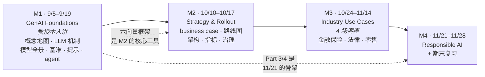

# IS5542 · GenAI in Business · 课程总览

> 本课入口。找什么都从这里点。

**一句话**：MScAIB 的 **AI 核心必修课**（3 学分），13 周，**Miao 教授**主讲。教授在开场就把坐标钉死了——🎙️ **"It's more like a discussion course for AI product manager."** 它不教你写模型，教你**在会议室里判断一个生成式 AI 方案值不值得做**。

---

## 🔴 现在最要紧的事

**小组项目截止 11/28（最后教学日），交录像 + slides，无现场演示**（Canvas 公告 9/11）。现在就该动的三件事：

1. **组队（5–7 人）—— ⚠️ Canvas 组队 9/30 截止，无有效小组将随机分配**（Notion DDL 库登记的 9/5 邮件，请核实）—— 项目占 30%，🎙️ 教授明说**必须交出真正跑得起来的 agent**；同伴互评（Google Form）决定个人分。
2. **用 M02 的评测协议写"模型选择理由"** —— 项目模板要求"模型选择及理由"与"与基线对比"，[[M02-模型全景-基准评测与提示设计]] §2.10 的四步协议 + 每接受任务成本就是格式。
3. **10/10 起六场客座：强制出席、每场一份反思（3% × 6）、内容进期末**（Canvas 公告 9/11）。

⚠️ **L2 实际讲的不是 M01 预告的 prompt / RAG / fine-tuning / function calling**，而是模型全景 + 基准评测 + 提示与上下文；🎙️ L2 转录确认 **9/19 讲 agent + RAG**，微调 / 工具调用仍无着落。

💡 🎙️ 从 L2 起的新惯例：**每节课开头介绍一位影响 AI 产业的人物**（L2 是李飞飞）；L2 教授划的重点是「不用背基准名字，要会按任务挑类别」，并把 p.80 评测协议和 p.81 讨论题都说成了「面试会遇到的问题」（见 M02 §6.2 🔴）。

完整任务与时间点见 [[IS5542_GenAI_in_Business/_meta/作业与DDL|作业与DDL]]。

---

## 笔记

| 日期 | 模块 | 主题 | 笔记 | 状态 |
|---|---|---|---|---|
| **9/5** | M1 | Intro to GenAI | [[M01-导论-生成式AI基础与企业落地]] | ✅ **v1.0** · 117 页全覆盖 + 转录已合并 · §2 预习可读性重写完成（2026-09-11） |
| **9/12** | M1 | 模型全景 · 十类基准评测 · 提示与上下文 | [[M02-模型全景-基准评测与提示设计]] | ✅ **v1.0** · 88 页全覆盖 + 转录 552 段已合并（2026-09-15）· 🔴 4 条 |
| 9/19 | M1 | Agentic AI + **RAG**（🎙️ L2 转录明说；微调 / 工具调用未提） | M03 | 待课件 |
| — | — | **停课约两周**（中秋 + 10/3 大学非教学日） | — | — |
| 10/10 | M2 | Guest：**Design Thinking** | M04 | 待 |
| 10/17 | M2 | Guest：**Venture Capitalist** | M05 | 待 |
| 10/24 | M3 | Guest：**Marketing** | M06 | 待 |
| 10/31 | M3 | Guest：**Financial Services** | M07 | 待 |
| 11/7 | M3 | Guest：**Digital Native** | M08 | 待 |
| 11/14 | M3 | Guest：**Legal Industry** | M09 | 待 |
| **11/21** | M4 | **Responsible AI**（教授本人） | M10 | 待 |
| 11/28 | M4 | 期末复习 ｜ **项目录像 + slides 截止** | M11 | 待 |

> ⚠️ **10/10 起六场客座都在 CMC M3017，9:00–12:00；强制出席；每场一份反思（3%）；内容进期末；预计有 Zoom 链接并可能录像**（Canvas 公告 9/11）。M01 时担心的"两场合并"没有出现——六场、六个日期、六个主题。
> ✅ **"只有 11 次课，但 Syllabus 写 13 周"已解开**：项目改为**录像 + slides 提交，11/28 截止，无现场演示**（Canvas 公告 9/11）。背景见 [[IS5542_GenAI_in_Business/_prep/课程前置资料#4.3 ⚠️ 周数对不上：11 vs 13|课程前置资料 › 4.3 ⚠️ 周数对不上：11 vs 13]]。
> 💡 笔记编号约定：教授三讲 M01–M03，六场客座按日期 M04–M09，11/21 = M10，11/28 = M11。

---

## 元数据

| 文件 | 用途 |
|---|---|
| [[IS5542_GenAI_in_Business/_meta/知识层级台账\|知识层级台账]] | ★ 连贯性机制。L0 入场基线 + L1 概念登记 + **跨课复用规则**（哪些概念由 IS5113 承担首现） |
| [[IS5542_GenAI_in_Business/_meta/术语表\|术语表]] | 累积的中英对照 + 可默写的英文定义 |
| [[IS5542_GenAI_in_Business/_meta/考点库\|考点库]] | 按可信度分级的考点，按 CILO 归集 |
| [[IS5542_GenAI_in_Business/_meta/作业与DDL\|作业与DDL]] | 反思、项目、考试的完整要求 |

## 前置资料

| 文件 | 用途 |
|---|---|
| [[IS5542_GenAI_in_Business/_prep/课程前置资料\|课程前置资料]] | 官方目录 × Syllabus × 讲义 × 转录 **四源对校**；**7 处冲突清单**；CILO 权重；教师背景 |

---

## 一分钟必知

**考核**

| 部分 | 权重 | 拆解 |
|---|---|---|
| Participation and exercises | **20%** | **6 次课后反思 × 3% ＝ 18%**（✅ 公告确认，每场客座一份）＋ 参与 **2%**（客座**强制出席**，积极提问可加分） |
| Group project | **30%** | ✅ **录像 + slides，11/28 截止，无现场演示**；模板 15 分钟 = 2 + 7 + 4 + 2 |
| Written examination | **50%** | **2 小时**，英文 |

> ❗ **官方及格线（讲义与 Syllabus 都没写）**
> - 持续评估（50%）至少拿到**其 30%**
> - 笔试（50%）至少拿到**其 20%**
> - **两部分必须都及格**才能通过本课
>
> ⚠️ 官方目录记 AT1 = 10% / AT2 = 40%，与讲义的 20% / 30% 不一致。**两者 CA 合计都是 50%，不影响及格判定**，但可能影响最终分数。

> ✅ **GenAI 政策**：官方目录 AT1 与 AT2 的 "Allow Use of GenAI?" **都是 Yes**。🎙️ 教授更进一步——**用 AI 写项目代码是被鼓励的**（"you don't need to write every line of code manually… **that is old fashioned**"）。

**🎙️ 出勤政策（讲义完全没有，只在录音里）**

> "**the attendance and the participation in my lectures will not be graded**"（转录 `12:34`）

**教授本人的 L1–L3 与 11/21 那一讲不计出勤**；那 2% 的参与分**只在 6 场客座讲座上拿**。但他花了 4 分钟劝人还是要去——系里请的是**资深**从业者，"it's hard for you to directly find them"，每场都有 Q&A。

**考试结构**（讲义 p.12，Syllabus 没有）

| 题型 | 占考卷 |
|---|---|
| Multiple choice | 20% |
| Short answer | 30% |
| **Essay** | **50%**（含**案例应用题**） |

> ⚪ 讲义自标 tentative，但"**论述占一半 + 明写案例应用**"这个信号足够稳：**复习练"拿框架套场景"，不是背名词。**

---

## 官方 CILO 与复习优先级

| CILO | 权重 | 内容 | 落在哪 |
|---|---|---|---|
| **1** | **30%** | 生成式 AI 与对话 agent 的**理论基础与原理** | **M01 Part 1 全部**、M02 §2.3 / §2.8.1 |
| 2 | 20% | LLM 在不同商业领域的应用 | M01 Part 2、M2 模块（客座） |
| **3** | **20%** | **设计、训练、评估** GenAI 模型 | M01 Part 1 后半 + Part 2、**M02 整讲**（十类基准 + 评测协议 + 提示） |
| 4 | 10% | 伦理与法律考量 | M01 Part 3–4、M02 §2.8.9、11/21 |
| 5 | 10% | 自动化客户交互与决策支持 | M01 Part 2、M02 §2.11 |
| 6 | 10% | 对商业战略与客户体验的影响 | M2 模块（客座）、M02 §2.4 |

> ★ **CILO-1 + CILO-3 合计 50%，全都落在教授本人的 M01–M02 两讲上。** 这是这两讲值得精读的官方依据。客座内容进期末（Canvas 公告），CILO-2 / 6 靠 M04–M09。
>
> ⚠️ **CILO-1 的动词写错了**：官方写 "**Design** the theoretical foundations and principles"——理论基础不能被"设计"。对照其余五条的动词与 Syllabus 的对应条目（"Understand the fundamentals"），**实际含义是 Describe / Explain**。
> **这条错误有实际影响**：它权重最高（30%），按字面理解会误判考试重心。**真实考法是定义题、机制题、概念辨析题**——正是 M01 §2 每个概念下的「⚠️ 常见误解」那一格。

---

## 课程的骨架

> 💡 🎙️ 教授明说 **M01 的 Part 3/4 是"提前给的框架"，11/21 会把它做实**。所以 M01 §2.9–2.10 现在看不懂没关系，但**别跳过**——11/21 会直接接着讲。

---

## 跨课链接

**★ IS5542 W1 ↔ [[M01-导论-AI与伦理|IS5113 M01]]** —— 全库最强的重叠之一。同一批史料（图灵测试、达特茅斯、AI⊃ML⊃DL、责任归属），**但落点完全相反**：

> **IS5113 问「该不该这么做」，IS5542 问「该怎么判断能不能做」。**

四个概念已由 IS5113 承担首现，本课只回指 + 一句话唤醒，规则见 [[IS5542_GenAI_in_Business/_meta/知识层级台账#跨课复用规则|知识层级台账 › 跨课复用规则]]。

其余交叉：

| 交叉 | 说明 |
|---|---|
| IS5542 M01 §2.9.2 ↔ **IS5113 M05** | Air Canada 案：**企业要为自家自动化渠道发出的信息负责**——责任无法外包给 AI，也无法外包给"渠道" |
| IS5542 M01 §2.9.7 ↔ **IS5113 M03** | 公平性：IS5113 从**伦理**问"什么是公平"，IS5542 从**运营**问"怎么做成可监控的流程" |
| IS5542 M01 §2.10 ↔ **IS5113 M09** | **NIST AI RMF 两课都讲**；IS5113 会把它放进 GDPR / EU AI Act / 中国 AI 法规的监管语境 |
| IS5542 M02 §2.8.9 ↔ **IS5113 M09** | 安全基准与前沿安全框架：本课讲"定量阈值绑发布决策"，IS5113 讲欧盟 AI 法案的对抗测试义务 |
| IS5542 M02 §2.10 ↔ **EF5560 M02** | 评测协议的"固定任务集 + 留出集"与金融课的"样本外纪律"是同一种思维 |
| IS5542 M4 ↔ IS5113 W8 | 生成式 AI 与虚假信息 |

## 进度追踪

Notion：[🎓 CityU 学习进度](https://app.notion.com/p/526a0242e72d40b3aa4f1a26f9ac7f4f) ｜ [📌 CityU 作业与 DDL](https://app.notion.com/p/c4bab444ac4f457fb3516cf13d19517d)
