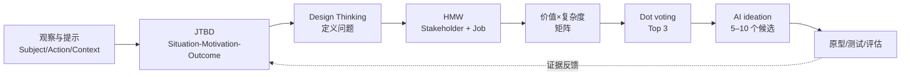

# M04 嘉宾工作坊：用 AI 发现机会、定义问题与构思方案

> ✅ 发布元数据保留为 v1.0 / transcript: merged；但本稿中的转录仍是 ASR 候选，Jim、若干工具名、HMW 词和五处长间隔尚未人工回听。以下限制优先于“merged”标签，不能把未经核听的内容当作确定事实。讲义是 `2026 CityU AI Ideation - Google Slides (1).pdf`，共 71 页；录音为 `新录音 8.m4a` 的 `faster-whisper large-v3` ASR 候选稿。录音仍有小组活动空档与 ASR 疑点，不能把本稿当作已人工听校的 v1.0。
>
> 身份边界：录音 `00:49–01:21` 中说话者**自称**“Michael Yong”及 “strategic advisor of Google Cloud”；课件没有姓名或职务。开头 `00:00–00:22` 提到 Jim 的介绍，但 Jim 是否本场发言人、全名和身份均待核。文中不把这些说法升级为已核实事实。

> 转录登记：`M04-transcript.txt`，644 段，`00:00`–`01:44:07`；媒体实际时长约 `01:44:35.7`，尾部约 28.7 秒及五处活动间隔待人工核听。嘉宾自称 Michael Yong、Google Cloud strategic advisor；Jim 身份待核。

**🎙️ 课堂实况**（`02:07–03:28`）：录音前段为嘉宾介绍与提示练习，随后依次完成 JTBD、Design Thinking/HMW、2×2 与 AI ideation。小组活动期间出现五处长间隔，笔记保留讲义任务和“不可据此推断个人产出”的限制。

## 0. 三分钟速览

本讲把“有一个模糊想法”变成可讨论、可排序、可继续试验的 AI 用例：先用 **Prompt / Context Engineering** 把任务、对象、受众和约束写清，再用 **Jobs To Be Done（JTBD）** 从用户想完成的工作寻找机会，最后用 **Design Thinking** 写成 **How Might We（HMW）** 问题，按价值与实施复杂度排序，挑出前三，再让 AI 提出候选方案。

学完你能：

1. 读一张图片并把对象、动作、环境、风格和技术细节组织成提示词。
2. 用 persona、audience、constraints、examples、output format 改写业务提示词，并解释为何输出更可控。
3. 把一个需求改写为 `When [Situation], I want to [Motivation], so I can [Expected Outcome]` 的 job story。
4. 把 job story 变成面向 stakeholder 的 HMW，使用价值 × 实施复杂度矩阵和 dot voting 选出 Top 3。
5. 给 AI 提供 HMW、stakeholder 与 job，让它产生 5–10 个候选方案；同时说明这些是待验证的想法，不是事实或承诺。

## 1. 开始之前 · 知识衔接

### 1.1 你已有的

| 已有概念 | 一句话唤醒 | 回指 |
|---|---|---|
| 提示工程（prompt engineering） | 通过指令和上下文影响模型输出；M02 已讲提示结构、示例与输出契约。 | [[M02-模型全景-基准评测与提示设计#2.11 Part 2 · 提示与上下文（讲义 p.82–87）\|M02 §2.11]] |
| 上下文工程（context engineering） | 应用决定每次请求给模型看什么、以何种顺序和边界呈现；本讲把它用于创意任务。 | [[M03-AI-agent-从harness到部署#2.3.4 成熟期 2026：饱和的基准、翻倍的时间跨度、两门新学科（讲义 p.12）\|M03 §2.3.4]] |
| 人工复核与评估 | 模型输出须按目标、约束和证据检查；本讲的矩阵、投票和汇报是早期的人类判断门。 | [[M03-AI-agent-从harness到部署#2.7.14 V · 评估与验证：环内验证与离线评估（讲义 p.38 右栏）\|M03 §2.7.14]] |

### 1.2 本讲全新概念

JTBD 把“买了什么”改问“用户要完成什么”；job story 用情境、动机、结果固定表达；Design Thinking 提供同理、定义、构思、原型、测试的循环；HMW 把机会写成开放但有边界的问题；价值 × 复杂度矩阵与 dot voting 把一堆想法变成下一轮候选。正文中的核心主题均补足对象、动作、理由、例子、失败边界和“所以呢”。

### 1.3 为什么这一讲放在这里 + 重排说明

M01–M03 已说明模型、提示、agent 与上下文边界；嘉宾课把这些能力放到业务机会发现。为了让零基础读者先理解“为什么问问题”，正文按“提示 → JTBD → Design Thinking/HMW → AI ideation”重排；讲义的课堂时间表、分隔页、活动页仍逐页在第 2 节说明，并在第 8 节给出映射。课件页 21、66、68 等的 `Proprietary + Confidential` 是版面/权限提示，不是业务结论。

## 2. 正文

### 2.1 开场与工作坊路线 讲义 p.1至3

**是什么**：p.1 是 CityU AI Workshop / Use Case Ideation 标题页，p.2 是举手、拍手、倒数喊名字的热身，p.3 给出五段路线：Improve Your Prompts（15 分钟）、Identify Opportunities with JTBD（30 分钟）、Define Problem Statements with Design Thinking（45 分钟）、分享 Top 3（30 分钟）、AI 构思方案（15 分钟），再结尾与下一步。

**为什么需要它**：创意工作坊若没有共同节奏，很容易直接跳到“我想做一个聊天机器人”。路线先把观察和问题定义做完，再让 AI 扩展方案。

**课件原例**：p.2 的动作练习和 p.3 的时间表（📄讲义 p.2–3）。

**🎙️嘉宾原话**：说话者在 `02:07–03:28` 解释本场要用 AI 生成想法、JTBD 找机会、Design Thinking 定义问题，并说明因课堂不是固定团队，部分练习会个人完成。

**💡换个说法（笔记补充）**：把流程看成漏斗：先增加输入质量，再缩小问题范围，最后才增加方案数量。

**常见误解**：路线中的“15/30/45 分钟”是课堂安排，不是完成一个真实产品所需的工程工期。

**与其他概念的关系**：路线把 [[M02-模型全景-基准评测与提示设计|提示设计]]、[[M03-AI-agent-从harness到部署|上下文管理]] 和业务设计方法串起来。

**所以呢**：先学会流程边界，后面每个模板才知道自己解决哪一步。

### 2.2 Prompt 与上下文工程 讲义 p.4至30
> 讲义页码：p.4–30；ASR 时间：03:33–28:30。

#### 2.2.1 从人类 15 秒观察到 AI 5 秒观察（p.4–14）

**是什么**：p.4 是 A 部分分隔页。p.5 要求 15 秒描述图片。p.6–10 展示 AI 对 McLaren Formula 1 图像的分层观察。观察项包括车型、papaya orange 与黑色涂装、Google Chrome 等赞助商、轮毂彩虹效果、夜间赛道与灯光、运动模糊和底盘火花。p.11 把观察合成一条图像提示。p.12–14 展示生成结果，并提醒“excellent and useful, but not 100% the same”。

**为什么需要它**：图像生成不是“说一个名词就完事”。对象、动作、环境、镜头和光线缺一项，模型就会自行补空白，结果无法复现。

**课件原例**：p.11 的 prompt 原文包含 `side-profile`、`cinematic action shot`、`floodlit desert circuit`、papaya orange、cyan accents、rainbow neon wheel covers、titanium skid block sparks、motion blur、8k sports photography（📄讲义 p.11）。

**🎙️嘉宾原话**：在 `04:21–05:59` 说 AI 五秒内能看到车型、涂装、赞助商、环境、速度与动作，若想生成相似图像，提示至少要达到这种细节；录音提到的赞助商个别词与课件拼写不完全一致，正文以讲义书面拼写为准。

**💡换个说法（笔记补充）**：提示像给摄影师的拍摄单：先说拍谁，再说正在做什么、在哪、什么光、用什么镜头。每一项都减少一次猜测。

**常见误解**：AI 能识别很多细节不等于生成图会逐像素复现；课件明确写的是 useful、not 100% the same（p.14）。夜景地点“可能是 Bahrain 或 Saudi Arabia”是图像推断，不是照片元数据。

**与其他概念的关系**：这是 M02 的提示结构和 M03 的上下文选择在多模态任务中的例子。

**所以呢**：先把观察拆成可操作字段，才能解释为什么“更详细”会改善结果，同时仍要保留不确定性。

#### 2.2.2 图像、视频与 storyboard prompt 的骨架（p.15–17）

**是什么**：p.15 图像提示五格为 Subject、Action/Context、Environment/Background、Style & Lighting、Composition & Technical Details。p.16 视频提示为 Subject、Action、Scene、Camera Movement、Style & Lighting。p.17 展示一个 prompt 返回多张 storyboard 图像，并可继续生成视频、旁白。

**为什么需要它**：图像重点是静态构图与技术细节；视频还必须说明动作和镜头如何移动。把两者混成一段静态形容词会丢掉时间信息。

**课件原例**：p.17 “young boy becoming a superhero and saving people”作为故事起点，创意空间交给模型（📄讲义 p.17）。

**🎙️课堂互动**：录音 `06:00–08:30` 对 p.11 提示的组合进行口头解释；没有足够清晰的逐字问答记录，不能补写学生具体发言。

**💡换个说法（笔记补充）**：视频 prompt 可写成“谁 + 做什么 + 在哪里 + 镜头怎样跟 + 氛围怎样”，其中“镜头怎样跟”就是视频和图片最容易漏掉的差异。

**常见误解**：`style` 不是保证某个艺术家或品牌风格的法律许可；它只描述视觉效果，仍需检查版权和输出质量。

**与其他概念的关系**：视频 storyboard 是从文本到多模态输出的任务分解，和 M03 的工具调用、可观测性边界相连。

**所以呢**：把媒体类型写进 prompt 结构，模型才知道哪些词描述内容、哪些词描述拍摄过程。

#### 2.2.3 商业提示与 AI brainstorming 七项（p.18–19）

**是什么**：p.18 的业务 prompt 依次加入 persona、audience、constraints、task information，可选 examples、wild ideas，再规定 output format。p.19 将其概括为七项：Use personas；Define audience；Add constraints；Encourage wild ideas（可选）；Give examples（可选）；Format output；Get visual（可选）。

**为什么需要它**：业务问题的“好答案”取决于谁在做、服务谁、预算/时间/市场边界是什么，以及最后要交什么格式；只写一个动词会让模型优化错目标。

**课件原例**：p.18–19 的七项列表（📄讲义 p.18–19）。

**🎙️嘉宾原话**：`08:30–12:00` 录音反复强调 persona、受众、约束和输出格式；此处仅能确认主题强调，具体口头措辞仍以 ASR 候选为准。

**💡换个说法（笔记补充）**：persona 是“你扮演谁”，audience 是“结果给谁用”，constraints 是“不能违反什么”，output format 是“我怎样验收结果”。

**常见误解**：增加字段不等于永远更好；无关背景会挤占上下文、掩盖真正约束。wild ideas 只放宽探索阶段，进入实施阶段要重新加边界。

**与其他概念的关系**：这把 M02 的 output contract 与 M03 的上下文预算、渐进披露连接起来。

**所以呢**：商业提示的质量来自“可判断的输入和验收格式”，不是来自更长的形容词。

#### 2.2.4 练习：把 21 英寸登机箱 prompt 变成可验收任务（p.20–30）

**是什么**：persona 是代表性用户角色；audience 是输出的使用者；constraints 是时间、成本、尺寸等边界。p.20 原题只有 `Design a 21” carry-on suitcase`；p.21 是机密页；p.22–23 逐步加入 Casetify Travel accessories designer persona、年轻 IT 专业人士 audience、可定制颜色/Logo/字体、TSA-approved lock、易取 laptop、材料自由、输出 3 个有编号和 catchy name 的 feature lists；p.24–26 让 AI 改进原 prompt；p.27–29 给出三种方向；p.30 总结“Context is key! Use AI to improve your prompt”。

**为什么需要它**：同一句“设计箱子”可能要工业设计、潮流外观或解决安检/过度打包问题。persona 与 audience 先确定优化目标，约束确保建议可用，格式使三种方向可比较。

**课件原例**：p.27 工业设计方向要求 hardshell、business traveler、space efficiency、durability、外置 laptop compartment、静音 360° spinner wheels、modular compression，并写材料和技术规格；p.28 生活方式方向面向 Gen Z、极简大胆、USB-C、digital weight scale、unboxing；p.29 问题解决方向处理过度打包、安检快速取物、可持续材料和航空尺寸（📄讲义 p.27–29）。

**🎙️课堂互动**：p.20 的任务是用 Gemini 设计并测试 prompt，录音 `12:00–28:30` 描述了在场尝试和结果展示；录音空档不能证明每位同学都完成，也不能把任何个人输出写成标准答案。

**💡换个说法（笔记补充）**：把改写看成一次“需求规格化”：原句是目标名词，改写后增加角色、用户、约束、交付格式，模型才有评价维度。

**常见误解**：AI 给出的三种方向是候选概念，不是材料安全、TSA 合规、重量或成本已经验证；需要后续工程与用户测试。

**与其他概念的关系**：此练习把 prompt/context engineering 接到后文 JTBD：箱子的功能是否重要，最终要回到用户要完成的 job。

**所以呢**：先把模糊请求写成可比较的输出契约，后面的创意才有共同评判尺度。

### 2.3 JTBD 与工作故事 讲义 p.31至46
> 讲义页码：p.31–46；ASR 时间：28:30–57:00。

#### 2.3.1 Job 与“奶昔”案例（p.31–38）

**是什么**：p.31 是 B 部分分隔页。p.32 把 JTBD 接到 Design Thinking。p.33 问 “What is a Job?”。p.34 定义 job 为客户想完成的具体任务或结果。

用户“hire”产品完成 job，课件并给出 job story 三段式。p.35–36 用“早上 drive-thru 买奶昔后开车上班”追问真正 job、挣扎和替代方案。p.37 说技术会变但 jobs 相对稳定。p.38 是小结页。

**为什么需要它**：如果只问“客户买了什么”，团队会围绕产品特征竞争；问“客户在什么情境下想完成什么”，才能发现替代品和未满足机会。

**课件原例**：奶昔案例的事实是早上购买并带去上班；课件没有给出唯一 job 答案，要求继续问 struggles 和 alternatives（📄讲义 p.35–36）。

**🎙️嘉宾原话**：在 `28:30–35:30` 说 JTBD 用来识别工作机会，并强调不要停在产品名称；录音中“milkshake”故事用于追问行为背后的 job。具体研究来源没有在课件或录音中给出，不能补成商业案例定论。

**💡换个说法（笔记补充）**：通勤者可能要“在路上获得可持续的早餐体验”，奶昔只是候选方案；若换成香蕉、咖啡或播客也能满足同一部分结果，job 就比产品稳定。

**常见误解**：job 不是一句广告口号，也不等于“用户喜欢这个品牌”；它必须包含情境、想做的进展和期望结果。

**与其他概念的关系**：JTBD 为 HMW 提供 stakeholder 的实际目标，也帮助判断 prompt 里哪些约束真的重要。

**所以呢**：先把“买什么”改写成“完成什么”，机会空间才会从单一产品扩展到替代方案。

#### 2.3.2 Job story 的结构与例子（p.39–41）

**是什么**：p.39 给出 `When [Situation], I want to [Motivation], so I can [Expected Outcome]`；p.40 是内容创作者在拍 vlog/长曝光日落时需要兼容 tripod/MagSafe 的手机壳；p.41 是夜店/演唱会场景下放 ID 和一张信用卡、免带钱包的手机壳。

**为什么需要它**：三段式迫使团队写出触发情境、想完成的动作和成功结果，避免只列功能。

**课件原例**：逐字模板和两条手机壳例子（📄讲义 p.39–41）。

**🎙️课堂互动**：录音 `35:30–41:30` 解释 job story 的三个空位；没有可靠记录说明某个学生例子，因此只保留课件例子。

**💡换个说法（笔记补充）**：`When` 回答“什么时候卡住”，`I want` 回答“想推进哪一步”，`so I can` 回答“完成后得到什么”。

**常见误解**：`I want` 不是产品功能清单；若写成“我想要一个带 USB 的箱子”，没有说明使用情境和结果，就还不是完整 job story。

**与其他概念的关系**：job story 是从观察到 HMW 的中间表示，可作为 AI 生成和人工筛选的共同输入。

**所以呢**：一条好的 job story 让不同角色围绕同一个进展讨论，而不是争论功能名词。

#### 2.3.3 用 AI 扩展 job stories（p.42–46）

**是什么**：p.42 给出角色化 prompt：你是 XYZ 国际手机配件公司中的某个 designer，请按 job story 模板产出；角色包括 mobile phone case、travel suitcase、Airpod case、Pixel 11 Pro Fold designer。p.43 要团队/个人用 Gemini 生成、记录编号，并在 10 分钟内选最重要一条；p.44 是“每组/个人输出最重要 job story”；p.45 要复制到 clipboard/notebook；p.46 总结“job 是任务/结果，AI 帮助探索机会”。

**为什么需要它**：AI 能快速枚举多个情境，但“最重要”涉及价值、证据和战略，仍需要人判断。

**课件原例**：p.42–43 的角色与 prompt；p.43 的记录、编号、10 分钟、选一条要求（📄讲义 p.42–45）。

**🎙️嘉宾原话**：在 `41:30–56:30` 引导用 Gemini 生成 job stories，并要求把结果写下后选最重要的一条；录音中的工具名称如有 ASR 疑点，按讲义保留 Gemini。

**💡换个说法（笔记补充）**：AI 是“发散助手”，不是裁判。先让它列出 10 条，再用明确标准（频率、痛点、组织价值、可验证性）筛选。

**常见误解**：模型生成的 job story 不代表真实客户已经说过；它只是待访谈/待观察的假设。不能把“最重要”理解成模型排在第一条。

**与其他概念的关系**：此处把 M02 的 persona 和 output format 与 JTBD 结合，下一节再将选中的 job 转成 HMW。

**所以呢**：先让 AI 扩展情境，再由人保留一条可解释、可验证的机会陈述。

### 2.4 设计思维与 HMW 讲义 p.47至66
> 讲义页码：p.47–66；ASR 时间：57:00–01:33:00。

#### 2.4.1 五阶段与 20 分钟工作坊（p.47–52）

**是什么**：p.47 是 C 分隔页。p.48 再次连接 JTBD 与问题定义。p.49–50 显示“五阶段 Design Thinking”图示。图中文字仍需视觉核对。常见对应是 empathize、define、ideate、prototype、test。

p.51–52 给出 20 分钟流程。Step 1 用 10 分钟大量起草。Step 2 用 5 分钟确定优先级，再 presentation。p.52 图中显示 10/5 分钟。

**为什么需要它**：设计思维把“理解人—定义问题—产生方案—做原型—测试”当成可回环过程，而不是一次性拍脑袋。课件此处的流程时间只规定课堂活动，不保证方案已经被验证。

**课件原例**：p.51 的 Draft as many Problem Statements as possible → Prioritize to select top 3 → Present your Selected Solution（📄讲义 p.51）。

**🎙️课堂互动**：录音 `57:00–01:09:21` 说明本组练习会个人完成、先大量写再排序；`01:09:21–01:11:50` 有 149 秒活动空档，是否录音暂停待核。

**💡换个说法（笔记补充）**：20 分钟不是要做完产品，而是完成一个“问题候选集 + 下一步选择”的小循环。

**常见误解**：五阶段不是必须线性走完一次；也不能把“提出问题”当成“已经找到解决方案”。

**与其他概念的关系**：JTBD 提供用户进展，Design Thinking 提供从观察到验证的过程，HMW 是 define 阶段的表达格式。

**所以呢**：先把活动顺序和决策门说清，后面的数量、优先级和汇报才有共同含义。

#### 2.4.2 HMW 模板与大量发散（p.53–60）

**是什么**：HMW（How Might We，如何才能）是保持开放的问题句。它要写行动、stakeholder（受影响或受益的相关方）和要完成的 job。p.53 标题为 C1 Problem (How Might We) Statements；p.54 给出 `How Might We (Action/What) / For (Stakeholder) / In order to (What change?)`，例子是为 executive 改进手机壳以增加收入；p.55–56 将最后一格改成 `In order to (Achieve What Job)`，用 job story 的结果替代空泛的 change；p.57 要求 go for quantity、go for big ideas、write headlines、be judgemental later；p.58 是大量输出页；p.59 要“尽可能多写 HMW”。p.60 是 C2 分隔页。

**为什么需要它**：`How Might We` 把问题保持为开放问题，既给行动方向，又不提前锁死方案。stakeholder 说明为谁创造改变，job 说明改变服务哪个用户进展。

**课件原例**：`How Might We improve the design of the product / For executive / In order to Achieve Job A`（📄讲义 p.55–56）。

**🎙️嘉宾原话**：在 `01:11:50–01:29:00` 强调先追求数量、暂不评判，再写标题和筛选；ASR 中出现“how I reach statement / Harmony Restatement”等疑似误识，正文以课件明确的 HMW 为准并把疑点记入审查。

**💡换个说法（笔记补充）**：把“我们要做一个 AI 箱子”改为“我们如何为经常出差的年轻 IT 专业人士减少安检取电脑的摩擦，以便完成快速通勤 job？”这仍是问题，不是方案。

**常见误解**：HMW 不是把“如何”换成“我们应该做什么功能”；过早写具体产品会缩小探索空间。数量优先也不等于无条件接受所有句子，下一步仍要排序。

**与其他概念的关系**：HMW 同时承接 JTBD 的 job、业务提示中的 stakeholder/persona 和 Design Thinking 的 define/ideate 边界。

**所以呢**：先用开放格式增加选择，再把选择交给价值与复杂度的明确判断。

#### 2.4.3 价值 × 实施复杂度矩阵与 dot voting（p.60–66）

**是什么**：价值×复杂度矩阵用纵轴表示组织价值，用横轴表示实施复杂度。persona 是代表目标角色的简化画像。p.61–62 要画 2×2 矩阵：纵轴是对组织的价值（站在 executive sponsor 角度），横轴是实施复杂度；复杂度要问数据是否可得、是否涉及多方、能否在 3/6/9/12 个月完成。绿色象限是优先，蓝色可作长期战略项目，黄色是低垂果实，红色绕开。p.63 说明先看绿色；若多于 3 条用 dot voting 选前三，少于 3 条可从蓝色补足；p.64–65 是输出与操作步骤；p.66 小结。

**为什么需要它**：价值高但做不到的想法无法落地，容易做但没有价值的想法也不值得优先。矩阵把“想做”拆成两个可辩论维度。

**课件原例**：p.62 展示五张 HMW 便签放入矩阵（仅为布局示例，不是可复用的真实数值）。

**🎙️课堂互动**：录音 `01:29:00–01:40:00` 说明按 sponsor 视角判断并可询问 IT/Google 员工；`01:23:48–01:26:50` 前后有 182 秒空档，可能对应计时练习，需回听确认。

**💡换个说法（笔记补充）**：把每条 HMW 当一张便签：先问“成功会带来多少价值”，再问“需要多少数据、权限、系统改造和时间”。两项都高，不自动进绿色。

**常见误解**：象限颜色是决策提示，不是数学定理；没有数据和 IT 评估时，复杂度只能标为初步估计。dot voting 聚合团队偏好，不等于客户验证或财务批准。

**与其他概念的关系**：矩阵是 M03 的人类审批/评估门；top 3 会成为下一节 AI ideation 的输入。

**所以呢**：排序让创意从“列表”变成“下一步可验证的工作队列”。

### 2.5 分享与 AI 构思 讲义 p.67至71
> 讲义页码：p.67–71；ASR 时间：01:33:00–01:44:07。

**是什么**：p.67 是 C3“Time To Present Your Opportunity and Top HMW Statements”；p.68 标出四类角色（mobile phone case、travel suitcase、Airpod case、Pixel 11 Pro Fold）及每组输出；p.69 是 D 分隔页；p.70 要用 AI ideate possible solution，输入 HMW、stakeholder 与 achieve what job；p.71 为致谢。

**为什么需要它**：只有先选定问题，AI 才能针对目标生成多个方案；否则模型会把模糊目标包装成漂亮但无法比较的点子。

**课件原例**：p.70 的 HMW 模板作为方案生成 prompt 的骨架（📄讲义 p.70）。

**🎙️嘉宾原话**：录音 `01:33:00–01:40:00` 要求分享 opportunity 与 top HMW；`01:40:00–01:44:07` 提出下一步可让 AI 基于 HMW、stakeholder、job 产生 5–10 个方案，甚至继续做图像/视频、原型和测试计划。录音末尾 `01:44:07` 为 Thank you；媒体时长多约 28.7 秒，尾部状态待核。

**💡换个说法（笔记补充）**：一个最小 ideation prompt 可以是：“基于这条 HMW、目标 stakeholder 和 job，提出 5 个互相不同的方案；每条写机制、依赖、风险、验证实验和估计复杂度。”

**常见误解**：AI 方案不是已批准路线；“生成图像/视频”只是沟通和原型工具，不等于可生产、合规或盈利。

**与其他概念的关系**：这是从 M02 prompt → M03 harness/tool → 本讲 HMW 的端到端练习；后续应接离线评估、原型测试和成本边界。

**所以呢**：AI 最适合在问题已被人定义后扩大方案空间，最终取舍仍要回到证据和责任。

## 2.6 核心机制证据与逐问练习

本节把四条工作流写成可复算的 D1–D8 证据。每个例子都区分讲义事实、嘉宾观点和笔记补充；现场没有保存的个人产出只写参考作答。

### 2.6.1 Prompt 与上下文工程的 D1至D8 讲义 p.20至30

**是什么**：D1–D8 是本笔记对流程机制的八个检查角度。
**为什么需要它**：逐步记录能让读者复算并发现返工点。
💡 换个说法（笔记补充）：把 prompt 当成一张验收单。
⚠️ 常见误解：有输出不等于任务成功。

- D1 输入与输出：输入是 p.20 的原句 `Design a 21-inch carry-on suitcase`。再输入 persona（年轻 IT 专业人士）、audience（需要审阅方案的产品团队）、constraints（21 英寸、可放电脑、预算待定）和 output format（编号的 3 个方向，每个含功能清单）。输出是改写后的 prompt 与 3 个候选方向。
- D2 状态步骤：先保存原 prompt；再逐项加入角色、受众、约束和格式；运行一次；记录模型输出；人工比较；只修改一个缺口后再运行。中间结果是“同一任务、上下文更完整”的第二版 prompt。
- D3 流程：原 prompt → 上下文组装 → 模型输出 → 格式检查 → 人工比较 → 接受或返工。格式检查失败时回到上下文组装。
- D4 原理：上下文把隐含假设变成可检查条件，输出格式把“好答案”变成可观察字段。它不能保证图像逐像素一致，也不能把模型生成规格变成事实。
- D5 完整例：原句只指定产品。第二版要求生成 3 个方向，分别是 industrial、lifestyle、problem-solver；每条写材料、开合机制和适用情境。比较时检查 3 条是否编号、是否都回应 21 英寸和电脑访问。
- D6 停止边界：输出缺少编号、违反尺寸或无法比较时停止接受并返工。工具不可用时保存 prompt 和人工候选；约束冲突时标出冲突，不能偷偷删掉约束。
- D7 失败机制：约束太多会让方向同质化；品牌或规格可能是幻觉；输出漂亮不等于可生产。证据不足时降级为“待验证假设”。
- D8 迁移题与答案：把任务换成“设计旅行保险客服回复”。应新增客户类型、赔付政策、语气、禁止承诺的边界和 JSON 字段。若只写“请给一个好回复”，缺口仍在受众、政策和验收格式。

练习 p.20 逐问：输入是原 prompt；动作是加入 persona、audience、constraints、任务和输出格式；产出是原版与改写版及生成结果；选择理由是让差异可比较。课堂个人生成结果未保存，以下只能算参考作答。

### 2.6.2 JTBD 与 Job Story 的 D1至D8 讲义 p.31至46

**是什么**：本单元的 D1–D8 追踪从情境到可验证 job 的状态变化。
**为什么需要它**：否则模型列出的 feature 会被误当成用户工作。
💡 换个说法（笔记补充）：先问“要推进哪一步”，再问“用什么产品”。
⚠️ 常见误解：模型第一条 story 不代表最重要。

- D1 输入与输出：输入是角色、情境、动机和预期结果。输出是候选 job stories 与选定的一条。job story 的固定句式是 `When [Situation], I want to [Motivation], so I can [Expected Outcome]`。
- D2 状态步骤：先写角色和时段；再写 3 条候选；检查是否写成 outcome；按频率、痛点、组织价值和可验证性排序；保留选择理由。
- D3 流程：角色/情境 → 候选 stories → 去除 feature 句 → 按证据筛选 → 选定 job → 进入 HMW。
- D4 原理：产品只是被“雇用”的手段。同一奶昔在通勤司机的早餐情境中支持单手、不弄脏车辆；下午家长买给孩子时，job 是提供甜食或陪伴。产品相同，job 不同。
- D5 完整例：通勤司机输入“赶时间、不能弄脏车”。job story 输出“When I drive to work, I want a durable one-hand breakfast, so I can keep moving without spills”。下午家长必须重新写情境和结果，不能复制这条。
- D6 停止边界：10 分钟结束仍可保留未筛选列表；少于 3 条要标“候选不足”；Airpod 被模型写成 headphone 时先回到角色和产品边界。
- D7 失败机制：把 feature 当 job、把模型第一条当最重要、没有用户证据。修复方法是访谈、观察或调查；在证据到位前只能叫假设。
- D8 迁移题与答案：为“带幼儿家庭的登机箱”写一条 story。情境应包含安检和照看幼儿，动机是快速取物，结果是保持队伍移动；“增加 USB-C”是 feature，不能直接当 job。

练习 p.43–45 逐问：输入是四个角色和 job story 模板；动作是生成、编号、记录、按标准筛选；产出是完整候选列表、选定一条和理由。现场列表未保存，本文不声称个人完成，只给上述奶昔和通勤例作参考。

### 2.6.3 Design Thinking 与 HMW 的 D1至D8 讲义 p.47至60

**是什么**：本单元的 D1–D8 追踪从 job 到开放问题的流程。
**为什么需要它**：开放问题保留多种方案，便于后续原型测试。
💡 换个说法（笔记补充）：HMW 是问题篮子，不是产品规格。
⚠️ 常见误解：写出 HMW 不等于找到答案。

- D1 输入与输出：输入是已选 job 和 stakeholder。输出是 HMW 问题句，字段为 Action、Stakeholder、Change 或 Achieve What Job。
- D2 状态步骤：先写数量；给每条加短标题；暂不评判；再检查是否缺 stakeholder 或 job；最后进入排序。HMW 的首现解释是“如何才能”，它保持探索空间。
- D3 流程：empathize → define → ideate → prototype → test；本课压缩在 define 和 ideate，测试失败可回到 define。
- D4 原理：HMW 把 outcome 变成开放问题。数量优先能减少过早否定，但不保证答案正确。
- D5 完整例：选定“通勤时快速取电脑”后写 3 条 HMW。例一：How Might We reduce airport unpacking for young IT professionals in order to access the laptop quickly。例二改变 stakeholder 为带幼儿家庭，并重写情境。每条都标出 Action、Stakeholder、Job。
- D6 停止边界：缺 stakeholder、写成具体产品或超过活动时间时停止发散，转入筛选。不能把“做一个 AI 箱子”当 HMW，因为它已经指定方案。
- D7 失败机制：过早评判、action 含糊、与 job 无关。修复是回到 job，并把“做什么功能”改成“帮助谁完成什么进展”。
- D8 迁移题与答案：把 stakeholder 从内部 executive 换成客服员工，Action 应改为减少重复输入，Job 应写为更快处理客户请求；不应只替换名词。

练习 p.51–65 逐问：输入是选定 job 和 stakeholder；动作是先写多条 HMW，再标三字段、放入矩阵并投票；产出是候选集、象限位置和 Top 3。现场个人 HMW 未保存，本文给出参考例，不冒称课堂结果。

### 2.6.4 价值复杂度矩阵与 dot voting 的 D1至D8 讲义 p.61至66

**是什么**：本单元的 D1–D8 追踪从候选问题到排序结果。
**为什么需要它**：价值和复杂度必须同时出现，不能只凭喜好。
💡 换个说法（笔记补充）：矩阵像两把尺，先量价值，再量实施难度。
⚠️ 常见误解：颜色不是永恒的优先级。

- D1 输入与输出：输入是每条 HMW、组织价值证据、实施复杂度证据。输出是 Green、Blue、Yellow 或 Red 象限及 Top 3。
- D2 状态步骤：逐条估计价值；检查数据、权限、参与方和 3/6/9/12 个月时间；放入矩阵；若多于 3 条投票，少于 3 条可从 Blue 补足，恰好 3 条直接保留。
- D3 流程：HMW → 价值证据 → 复杂度证据 → 象限 → `>3 / =3 / <3` 分支 → dot voting → Top 3。
- D4 原理：矩阵把“值得做”和“做得到”分开。Google 先选 Yellow 是嘉宾经验，不是普遍规则。投票聚合团队偏好，也不等于客户验证。
- D5 完整例：5 条 HMW 中，A 高价值低复杂度进 Green；B 高价值高复杂度进 Blue；C 低价值低复杂度进 Yellow；D 低价值高复杂度进 Red；E 证据不足暂记“待核”。若 A、B、E 获票，Top 3 仍需说明 E 的证据缺口。
- D6 停止边界：价值或复杂度没有证据时不得写精确分数；先标暂定并询问 IT。红区通常绕过，但不能写成永远不做。
- D7 失败机制：主观评分、颜色被当绝对顺序、老板先投造成从众。可改用匿名投票、加权评分或小规模试点。
- D8 迁移题与答案：换成监管严格的组织后，复杂度权重上升，原 Green 可能变 Yellow 或 Blue；理由必须引用权限、审计和数据可得性，而不是颜色本身。

练习 p.61–65 逐问：输入是 HMW 和组织判据；动作是逐条写价值/复杂度理由、放置、按人数分支投票；产出是矩阵和 Top 3。现场 dot 票结果未保存，因此只提供虚拟五条例子作为参考作答。

### 2.6.5 AI Ideation 与设计思维闭环的 D1至D8 讲义 p.67至70

**是什么**：本单元的 D1–D8 追踪 AI 候选到原型测试的闭环。
**为什么需要它**：生成只是起点，证据反馈才决定是否继续。
💡 换个说法（笔记补充）：AI 是发散助手，人负责取舍和验证。
⚠️ 常见误解：生成图像不是上线证据。

- D1 输入与输出：输入是 Top HMW、stakeholder 和 job。输出是 5–10 个候选方案，以及每个方案的机制、依赖、风险和验证实验。
- D2 状态步骤：写提示；生成候选；人工去重和筛选；做低成本 prototype；测试；根据反馈回到 define 或 ideate。
- D3 流程：HMW + stakeholder + job → AI 候选 → 人工筛选 → prototype → test → 证据反馈 → 回到 define/ideate。
- D4 原理：AI 扩大选择空间，不能替代用户研究、合规判断和原型测试。生成图像或视频只说明沟通方向，不代表生产可行。
- D5 完整例：以“减少机场取电脑摩擦”为 HMW，让 AI 生成 5 个机制。选“外层快速访问袋”后做纸板 prototype，测试 5 名用户的取物时间和误取率；指标不改善就回到 define。
- D6 停止边界：方案数量不足 5 条、包含敏感数据、依赖未授权系统或测试失败时停止继续生成，先解决边界或回退。
- D7 失败机制：方案同质化、没有用户证据、品牌和隐私风险。应增加反例、约束和验证实验，而不是继续堆 prompt。
- D8 迁移题与答案：换成客服分流 HMW，候选必须说明客户生命周期价值的使用依据、PII 处理和人工升级条件；无法说明时回到 empathize，不能直接上线。

练习 p.68–70 逐问：输入是 Top HMW、stakeholder、job；动作是生成 5–10 个候选、选一项、写 prototype/test；产出是候选表和测试计划。课上没有保存个人方案，以下旅行箱方案只是参考作答。

## 3. 一图看懂

读图时从左到右：先改善输入表达，再把产品名改成用户进展，再写成开放问题，最后才让 AI 扩展方案。回箭头表示测试结果可能重新定义 job；它不是课件画出的自动闭环，而是依据讲义流程与 M03 评估原则作的学习辅助图（💡笔记补充）。

## 4. 速查表

| 环节 | 输入 | 动作 | 输出 | 失败边界 |
|---|---|---|---|---|
| 图像/视频 prompt | 对象、动作、环境 | 加风格、镜头、技术细节 | 可比较的生成请求 | 不能保证逐像素一致 |
| Business prompt | persona、audience、constraints | 加任务、例子、格式 | 可验收业务输出 | 背景过多会稀释目标 |
| JTBD | 行为与情境 | 问“要完成什么进展” | job story | 不等于产品功能或已验证事实 |
| HMW | job + stakeholder | `How Might We ... For ... In order to ...` | 问题候选集 | 过早写具体方案会锁死探索 |
| 矩阵 | HMW 候选 | 评估价值与复杂度 | Green/Blue/Yellow/Red | 无数据时只是初估 |
| Dot voting | 多于 3 条候选 | 每人投票选 Top 3 | 下一步队列 | 不是客户或财务批准 |
| AI ideation | Top HMW、stakeholder、job | 生成 5–10 个方向 | 候选方案与验证计划 | 不是上线承诺 |

## 5. 双语术语卡

| 中文 | English | 考试可用的英文定义 | 首现位置 |
|---|---|---|---|
| 上下文工程 | Context engineering | Managing what information is presented to a model at each request. | §2.2 |
| 工作待完成 | Jobs To Be Done (JTBD) | The specific task or outcome a customer is trying to achieve. | §2.3.1 |
| 工作故事 | Job story | When [Situation], I want to [Motivation], so I can [Expected Outcome]. | §2.3.2 |
| 设计思维 | Design Thinking | A human-centred process linking understanding, problem definition, ideation, prototyping and testing. | §2.4.1 |
| 如何才能 | How Might We (HMW) | An open problem statement specifying an action, stakeholder and intended change/job. | §2.4.2 |
| 价值×复杂度矩阵 | Value–complexity matrix | A 2×2 prioritisation lens comparing organisational value with implementation difficulty. | §2.4.3 |
| 点投票 | Dot voting | A lightweight group method for selecting a small number of preferred options. | §2.4.3 |
| 人设/角色 | Persona | A role or perspective assigned to guide the output. | §2.2.3 |
| 受众 | Audience | The people who will use or benefit from the output. | §2.2.3 |
| 约束 | Constraints | Business boundaries such as time, cost, market or required features. | §2.2.3 |

## 6. 考点预判与答题框架

> 本讲是嘉宾工作坊；PDF 没有官方测验答案，录音也没有可核的“必考”原话。以下为 ILO/讲义反推与笔记推断，不能写成教授明示。

1. **提示改写题（ILO/讲义反推）**：先指出原 prompt 的缺口，再按 persona → audience → constraints → task → examples/wild ideas → output format 重写，最后写一个可观察的验收条件。
2. **JTBD 短答题（讲义直接定义）**：区分 product 与 job；用 When / I want / so I can 三段，并解释为何 outcome 可被替代方案满足。
3. **HMW 设计题（讲义模板）**：写 Action/What、For Stakeholder、In order to achieve What Job；说明它保持开放、未预设方案。
4. **优先级案例（讲义流程）**：列出价值和复杂度证据；把候选放入 2×2；优先绿色，必要时蓝色；多于 3 条再 dot vote。
5. **AI ideation 方案题（笔记推断）**：给 HMW、stakeholder、job，要求 5–10 个不同方向，并为每个方向写依赖、风险、验证实验与停止条件。

## 7. 自测

### 概念题

1. 为什么“Design a 21-inch carry-on suitcase”不足以作为业务 prompt？
2. job story 的三个空位分别回答什么？
3. HMW 为什么不能直接写成“做一个 AI 产品”？
4. 红色象限和绿色象限分别意味着什么？

答案

1. 缺 persona、audience、constraints、任务边界和 output format，模型无法知道优化目标或验收方式（📄讲义 p.18–23）。
2. When 是情境，I want 是想推进的动机，so I can 是期望结果（📄讲义 p.39）。
3. 那已经预设方案，失去 HMW 的开放性；HMW 应写行动、stakeholder 和要帮助完成的 job（📄讲义 p.54–56）。
4. 绿色是高价值且相对可实施的优先候选；红色按课件建议绕开。实际边界仍需数据和 IT 核验（📄讲义 p.61–63）。

### 案例题：旅行箱

题目（📄讲义 p.20）：仅有“Design a 21-inch carry-on suitcase”。请写一条 HMW 并给出下一步。

⚪ 参考作答（笔记推断）

HMW：How Might We improve access to a 21-inch carry-on suitcase for young IT professionals? 目标是让旅客在安检时快速取出电脑。它对应的 job story 是“When I am moving through airport security, I want to access my laptop without unpacking the whole suitcase, so I can keep the journey on schedule”。下一步先让 AI 生成 5–10 个不同机制。再按组织价值、数据与供应链复杂度、3–6–9–12 个月可行性放入矩阵。没有 TSA、成本和用户访谈数据前，不宣称某方案可行。

改条件练习：若 stakeholder 从年轻 IT 专业人士改成带幼儿家庭，`When`、期望结果和复杂度证据都要重新写；“增加 USB-C”不能直接保留为必需功能。

## 8. 讲义页码映射

| 笔记小节 | 讲义页码 | 课堂覆盖/备注 |
|---|---:|---|
| §2.1 开场与路线 | 1–3 | p.1 标题；p.2 热身；p.3 议程 |
| §2.2.1 图像观察 | 4–14 | p.4 分隔；p.5–13 图像练习与生成；p.14 限制总结 |
| §2.2.2 媒体 prompt | 15–17 | 图像/视频骨架与 storyboard |
| §2.2.3 商业 prompt | 18–19 | 七项提示建议 |
| §2.2.4 旅行箱练习 | 20–30 | p.21 机密页功能说明；p.22–29 逐步改写；p.30 小结 |
| §2.3.1 JTBD 入门 | 31–38 | 分隔、job、奶昔、稳定性、小结 |
| §2.3.2 Job story | 39–41 | 模板与两例 |
| §2.3.3 AI 生成 job stories | 42–46 | 角色、Gemini、记录和选择 |
| §2.4.1 Design Thinking | 47–52 | 分隔、五阶段图、20 分钟流程 |
| §2.4.2 HMW | 53–60 | C1、模板、发散、C2 |
| §2.4.3 矩阵与投票 | 61–66 | 2×2、象限、dot voting、小结 |
| §2.5 分享与 ideation | 67–71 | C3、角色输出、D、AI 方案、致谢 |

逐页功能核对：p.1–71 均在上述正文单元有实质说明；p.21、p.24、p.31、p.32、p.38、p.47、p.48、p.53、p.60、p.67、p.69、p.71 等低文本/分隔页按其课堂功能说明，不能视为空页。p.49–50 的五阶段图、p.12–13/24/33/37–38/49–50/61–62 等视觉页需在最终发布前按原图实际查看，候选稿只采用可从抽取和 findings 确认的文字。

## 9. 延伸与勘误

### 9.1 课件有但课上略过或未能确认

| 讲义页 | 判定 | 依据与建议 |
|---|---|---|
| p.49–50 | ❓视觉与 ASR 待核 | 录音提到五阶段，但图片细节须回看原页；不可降权。 |
| p.61–66 | ❓活动过程待核 | 长间隔可能是分组活动；保留完整讲义流程。 |

### 9.2 课上讲了但课件没有

| # | 内容 | 时间戳 | 价值 |
|---|---|---|---|
| 1 | 嘉宾以企业工作坊经验解释提示与用例筛选 | `08:25–20:37` | 将提示改写连接到业务决策。 |
| 2 | 嘉宾强调先发散、再用价值与复杂度筛选 | `57:25–01:28:21` | 解释 HMW 与矩阵的先后关系。 |
| 3 | 嘉宾说明后续反思与参与记录 | `01:41:46–01:44:07` | 属于课程行政信息，不能当作方法论。 |

### 9.5 反方视角与材料限制

- 最薄弱部分：五处活动间隔中的实际学生产出未录入，不能声称个人完成。
- 可能答不上：若题目要求逐条复现现场 HMW 或 dot voting 结果，现有材料不足；只能回答流程与参考例。
- 可能错误：ASR 将 HMW、milkshake、Airpod 等词识别错误；所有相关表述以讲义书写为准，并保留待核标记。

### 9.6 变更记录

| 日期 | 变更 |
|---|---|
| 2026-10-10 | 合并 M04 转录候选（644 段），补齐 D1–D8、逐问练习、首现术语解释和 ASR/视觉限制；保留 v1.0 元数据，仍要求人工回听与阅读视图复核。 |

### 9.7 录音间隔与视觉核对记录

录音含多处 122–182 秒空档（`36:28–38:30`、`39:08–41:16`、`42:50–45:00`、`01:09:21–01:11:50`、`01:23:48–01:26:50`）。上下文像小组活动/等待，但未人工回听，不能判定“课上略过”或“录音缺失”。讲义中的所有模板与页面仍保留。

### 9.2 课上讲了但课件没有

录音补充：嘉宾自称 Michael Yong、Google Cloud strategic advisor（`00:49–01:21`）；强调 AI 可在五秒内完成细粒度观察、提示需至少同等详细（`04:21–05:59`）；说明个人完成练习、未来工作需生成新想法（`02:07–03:28`）；提出下一步用 AI 做 5–10 个方案、图像/视频、原型和测试计划（`01:40:00–01:44:07`）。这些均标为 🎙️，未升级为课程教授明示。

### 9.3 课件自身的错误与口径不一致

1. PDF 未写 IS5542、M04、日期或讲者姓名；M04 归属来自课程总览与用户提供的“邀请嘉宾”信息，状态仍是 `probable_pending_confirmation`。
2. p.22–23 的文本抽取有 Added Context / Updated Prompt 串行排版；正文按可读列重述，发布前仍需回看原页。
3. p.49–50 五阶段图在文本抽取中没有阶段名称；候选稿不把常见 Design Thinking 五阶段当作已从本页视觉确认的课件文字。
4. PDF 末尾存在空尾页（抽取 p.72 为空），findings 记为 71 页；正文按 71 页处理。
5. ASR 疑点：`00:17:28` “JTBD 2.5 image”、`00:18:55` “nano by nano”、约 `01:29–01:40` 的 HMW 相关词，均保留疑点，未强行改写。

### 9.4 课外补充

本稿只提供标明为 💡 的学习辅助例子，不引入外部事实。发布 v1.0 前可补充：真实客户访谈问题、HMW 评估量表、原型成功指标、数据/权限/成本检查表；这些需要课程或项目来源才能升级为 📄/🎙️/📚。

### 正式发布前仍需人工核听和视觉复核的限制

- 五处长间隔（00:36:28–00:38:30、00:39:08–00:41:16、00:42:50–00:45:00、01:09:21–01:11:50、01:23:48–01:26:50）仍只能标“活动/等待候选”，不能写成已确认课堂活动。
- 视觉复核已覆盖 p.12–14、p.22–24、p.49–50、p.61–62；其余关键页和正式 Obsidian 阅读视图仍待查看。
- ASR 中的 Jim、Michael Yong、工具名和 HMW 词保持来源分层；未经回听不得升级。

**候选状态与待核清单**

- [ ] 原音频回听开头 `00:00–00:22`，确认 Jim 全名、职务及是否本场发言。
- [ ] 回听 `00:49–01:21`，核对 Michael Yong 与 Google Cloud 自称信息。
- [ ] 逐页实际查看低文本视觉页，尤其 p.49–50 五阶段图、p.61–62 矩阵。
- [ ] 运行 `note_quality.py`、`link_check.py` 和 `readme_check.py`；候选稿未宣称通过。
- [ ] 若转录人工核听完成，再由管理者生成 `transcript: merged` 的正式候选并进行集中教学/视觉验收。

本节发布状态：v1.0。
