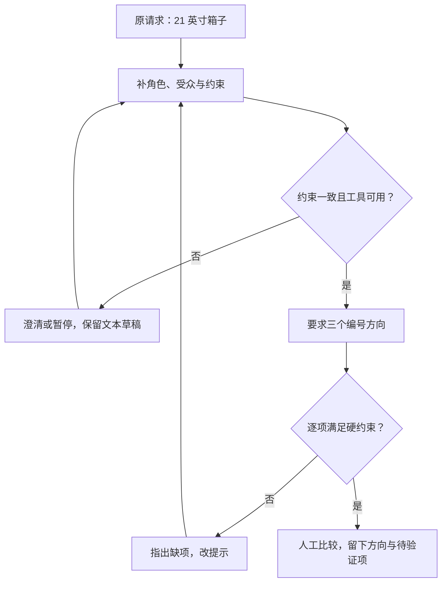
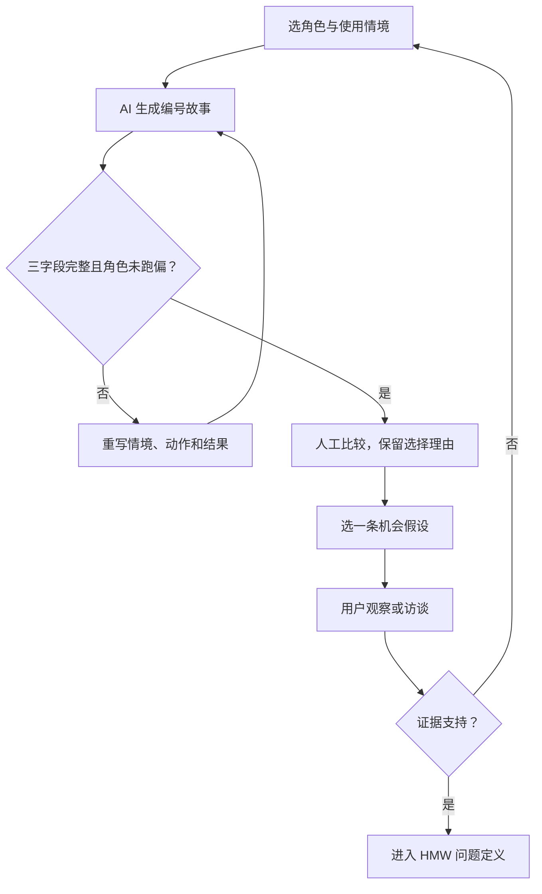
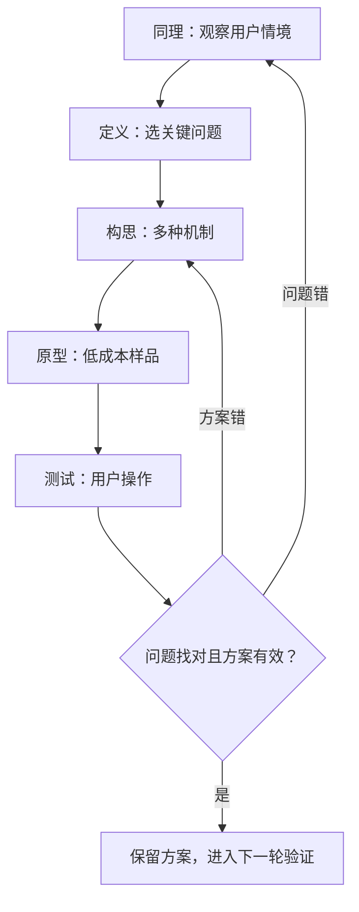
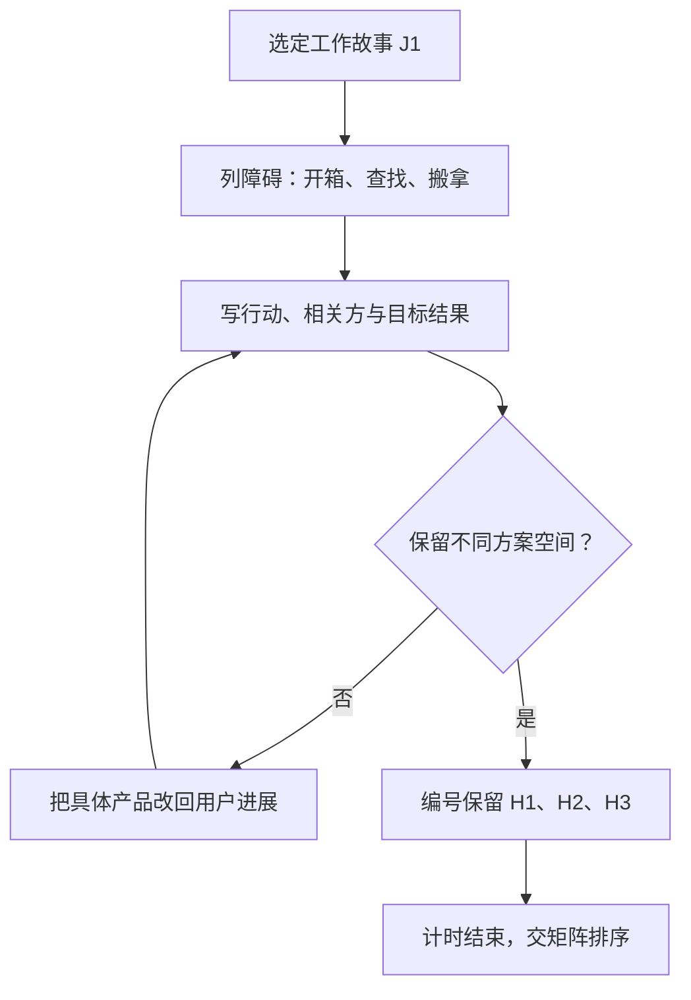
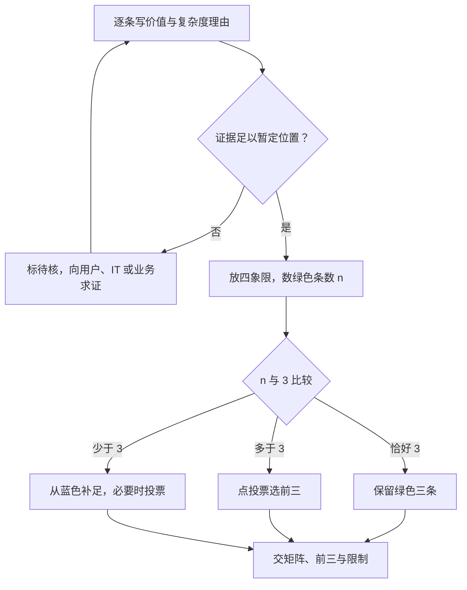
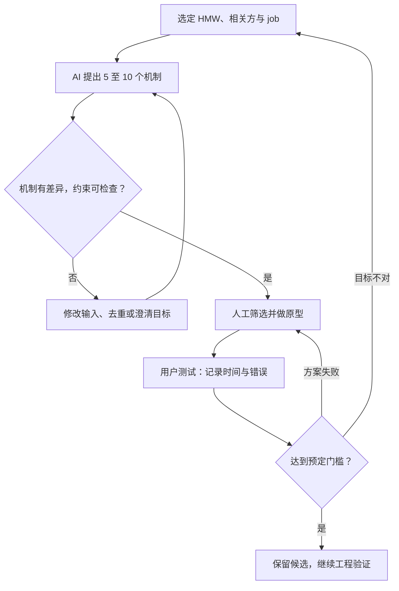
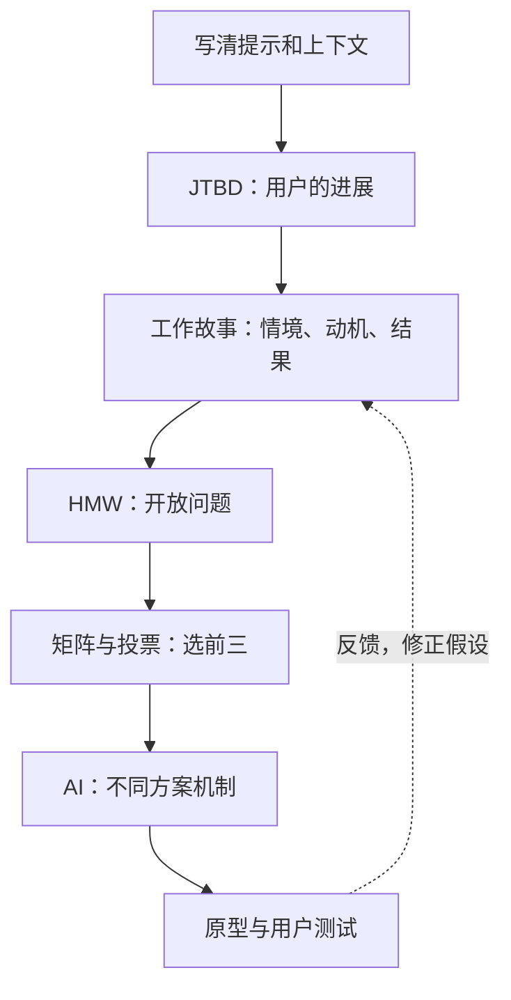

# M04 设计思维：业务机会识别与 AI 创意工作坊

> 材料 v1.0：讲义 71 页与 `M04-transcript.txt` 已融合。转录有 644 段、642 个不同时间戳，范围 `00:00`–`01:44:07`。这是自动语音识别（ASR）文本，未经逐声人工听校。
>
> 本稿保留既有 `transcript: merged`，它只表示材料融合。嘉宾姓名、工具名、活动间隔及媒体尾段的限制见 §9.5，不能把标签当作来源已经全部确认。
>
> 本地讲义标题是 CityU AI Workshop / Use Case Ideation，日期写 October, 2026。PDF 未写课程码、M04 或姓名。课程归属沿用库内登记；ASR 中说话者自称 Michael Yong、Google Cloud strategic advisor，身份未独立核实。

## 0. 三分钟速览

先弄清用户要完成什么，再定义问题，最后才选择 AI 方案。本讲交出的第一件成果是可解释的问题清单，随后才是方案与试验计划。

学完你能：

1. 将赛车观察拆成对象、动作、场景、光线和镜头，并说明生成图为何仍会不同。
2. 为旅行箱补角色、受众、约束和输出格式，逐项验收三个设计方向。
3. 用情境、动机和结果写工作故事，区分用户目标与具体功能。
4. 将一个工作故事改写为开放问题，并按价值和实施复杂度选前三项。
5. 追踪候选方案如何走到原型、测试和返工，指出每一步需要谁提供证据。

**🎙️ 课堂实况**：开场介绍到 `03:33`，提示练习到 `20:53`。JTBD 的解释、个人练习和分享到 `54:00`；之后进入设计思维、HMW 和排序。`01:28:23` 起分享问题，`01:39:24` 起简讲方案构思，`01:41:21` 后收尾与行政提醒。五处长间隔处在练习上下文，期间发生什么仍不能逐声确认。

## 1. 开始之前 · 知识衔接

### 1.1 你已有的

提示词是给模型的任务指令；上下文是模型作答时能看到的信息。M02 已讲怎样指定输出，M03 已讲应用怎样管理上下文。本讲用这两项能力帮助人发现业务问题。

- [[M02-模型全景-基准评测与提示设计|M02]]：唤醒角色、示例和输出契约。契约就是预先约定交付长什么样。
- [[M03-AI-agent-从harness到部署|M03]]：唤醒人工评估。模型产生候选，人核来源、成本和风险。

### 1.2 本讲全新概念

- 工作待完成（Jobs To Be Done，JTBD）：用户在某种情境中想完成的任务或结果，§2.3 展开。
- 工作故事（job story）：将情境、动机和结果写成一句可讨论的话，§2.4 展开。
- 设计思维（Design Thinking）：理解人、定义问题、构思方案、做原型、测试，§2.6 展开。
- 如何才能（How Might We，HMW）：为某个相关方提出开放问题，§2.7 展开。
- 价值与复杂度矩阵、点投票（dot voting）：先判断值得做和做得成，再筛选候选，§2.8 展开。

### 1.3 为什么这一讲放在这里

会调用模型之后，还要决定把它用在哪里。因此正文按“提示 → 用户进展 → 问题 → 排序 → 方案”组织。个人练习和课堂分享紧跟对应方法；讲义页码保持在原位置可查。

讲义的分隔页和计时页也有教学作用。它们说明当前要交什么、给多少练习时间；不把它们误当空白业务材料。

## 2. 正文

### 2.1 工作坊路线 讲义 p.1至3

**是什么**

如果一开始就说“做一个聊天机器人”，团队已经提前选了方案。工作坊先改善描述，再发现机会、定义问题和挑选下一步。

p.1 是标题页。p.2 用举手、拍手、喊名字唤醒参与者。p.3 安排提示 15 分钟、JTBD 30 分钟、问题定义 45 分钟、分享 30 分钟、方案构思 15 分钟。合计 135 分钟，不包含未标时长的介绍和结尾。

**为什么需要它**

不同阶段交不同东西：JTBD 交用户进展。HMW 交问题。构思才交解决办法。分开能防止“我喜欢这个工具”替代“用户确实需要”。

**课件原例**

p.3 的路线是 Prompt / Context Engineering → JTBD → Design Thinking → Share the Top 3 → Ideate Possible Solutions。这里的时间是计划，不能据此反推实际课堂时长。

**🎙️ 课堂补充**（`00:00`–`03:33`，A · 课上展开）

*"Since the setup is not a team setup, so I may need you to do some exercise all by yourself"*（`03:08`）。意思是本场座位安排使部分活动改为个人练习。它改变了讲义中的团队要求，不能把所有任务写成已分组完成。

**💡 换个说法（笔记补充）**

先决定要解决哪种生活不便，再讨论买什么工具。选工具容易，说明问题为什么值得解决才是本课的主线。

**常见误解**

计划中的 15 分钟不代表真实产品 15 分钟就能完成。产品开发还需要权限、材料、成本和用户测试。

**与其他概念的关系**

[[M03-AI-agent-从harness到部署|M03]] 的模型评估延伸到这里：业务问题也要有可检查的目标。

**所以呢**：每次练习先问要交的是问题还是方案，再开始生成。

### 2.2 提示和上下文 讲义 p.4至30

#### 2.2.1 从赛车观察到生成图 讲义 p.4至14

**是什么**

想生成一辆类似的赛车，只有“橙色赛车”不够。还要说明车的动作、所在场景、拍摄角度和视觉效果。提示工程就是把这些要求表达给模型；上下文提供模型需要的参照与条件。

**为什么需要它**

缺少一个字段，模型就要自行补一个选择。若没说侧面构图，它可能画正面；没说夜间灯光，它可能画白天。补字段减少歧义，但不能消除生成变化。

**课件原例**

p.4 切入提示练习。p.5 要求 15 秒描述图片。以下逐页观察来自讲义文字及原图，仍须区分看到的特征与 AI 的推测：

- p.6：侧面高速赛车图，文字识别为 McLaren Formula 1，MCL36 或后续演化车型。
- p.7：papaya orange 是车身橙色；黑色部分与青色点缀组成涂装。Logo 拼写为 Android、Google Chrome、Tezos、Dewalt、Alteryx。
- p.8：轮罩有彩虹圆环效果，讲义关联到 Chrome 配色。
- p.9：泛光灯与深色背景支持“夜间赛道”。Bahrain 或 Saudi Arabia 是讲义中的 likely 推测。
- p.10：跟拍让车较清楚、背景横向模糊。文字将底盘火花解释为钛制滑块接触赛道，属于本页说明。

p.11 将字段合成提示。这里完整保留其文本，方便复用后逐项检查。

```text
A side-profile, cinematic action shot of a modern Formula 1 car racing at night on a floodlit desert circuit.

The car features a vibrant matte papaya orange and carbon fiber black livery with cyan accents. The wheel covers are glowing with a futuristic, circular rainbow neon effect.

Sparks are flying from the titanium skid block underneath the chassis.

The background is a high-speed motion blur of track barriers and stadium lights, captured with a long exposure aesthetic, ultra-realistic, 8k resolution, sports photography style.
```

逐部分读法：

- 第一段定对象、侧面角度、运动与夜间赛道。
- 第二段定车身和轮罩的外观。
- 第三段定底部火花这个局部动作。
- 第四段定背景模糊和摄影风格。`8k` 是生成请求，不能据此确认输出像素。

p.12 先放原图。p.13 加生成图形成对照。p.14 才写限制。两图都保留侧面橙黑赛车和轮罩色彩，但车身细节、背景和图像尺度不同。讲义结论是 **"excellent and useful content, but not 100% the same"**。

**🎙️ 课堂补充**（`03:33`–`08:25`，B · 讲了同讲义）

*"if you want to use a prompt to generate this image, you should be at least that detailed."*（`05:03`）。意思是提示需要达到观察清单的细度。`06:42` 明确说明详细提示仍不保证完全相同；没有证据支持逐像素复现。

**💡 换个说法（笔记补充）**

给摄影师只说“拍车”与写明“侧面、夜间、背景模糊”会得到不同交付。模型也需要拍摄单，不过它生成的是新图，而非复制摄像机拍到的画面。

**常见误解**

- “描述用了 5 秒，所以准确率已测过。”这只是嘉宾演示速度，无独立评测数据。
- “likely 就是已确认地点。”这里没有照片元数据，地点仍是推测。

**与其他概念的关系**

观察字段是后面业务提示的起点：先将模型需要猜的内容显式化，再验收输出。

**所以呢**：先建立检查清单，生成后逐项比较；“看起来很像”不等于所有要求都满足。

#### 2.2.2 图片、视频和分镜 讲义 p.15至17

**是什么**

图片回答“这一瞬间怎样看”；视频还回答“动作和镜头怎样随时间变化”。分镜（storyboard）先把故事拆成连续画面，便于检查前后关系。

**为什么需要它**

只写“漂亮、电影感”没告诉视频模型怎样移动镜头。先确定拍谁，再确定动作和镜头，才有可判断的过程。

**课件原例**

- p.15 图片五项：Subject 是主体。Action/Context 是动作或位置。Environment 是环境。Style/Lighting 是风格与灯光。Technical Details 是构图和摄影细节。
- p.16 视频五项：Subject、Action、Scene、Camera Movement、Style/Lighting。镜头可慢推进、跟拍、左摇或低角度。
- p.17 用男孩成为英雄并救人的故事，返回多幅分镜。下排图把发现、变化和行动串起来；页面还显示视频播放标识。

```text
Create an image storyboard for young boy becoming a superhero
and saving people. I give you the creative freedom to make up the story.
```

第一句规定主角与故事结果，第二句开放具体情节。页面静态图不能证明视频实际播放质量。

**🎙️ 课堂补充**（`08:25`–`11:27`，A · 课上展开）

*"You can use your text prompt to generate the storyboard at the bottom."*（`10:06`）。意思是先生成底部的分镜。随后谈到图像、视频、音乐和文字转语音，新增了从一个故事到多种媒体的制作链。

**💡 换个说法（笔记补充）**

一个可操作小例：主角在路边发现晶石 → 镜头靠近手部 → 下一个画面保持同一衣服和面部。人先检查这三项一致性，再交给视频模型。生成后若主角变了，回到分镜修正，而不直接拼接成片。

**常见误解**

多张图不自动构成连贯故事。要查主角外貌、动作衔接和场景方向；陌生工具名以 §9.5 的 ASR 限制为准。

**与其他概念的关系**

这是任务分解：一个大目标拆成可检查的中间交付，业务流程也需要这种状态。

**所以呢**：视频先查时间连续性，图片先查单帧字段，验收尺度各不相同。

#### 2.2.3 商业提示的字段 讲义 p.18至19

**是什么**

“设计箱子”还没有说明谁设计、给谁用、什么条件必须满足。商业提示先确定判断标准，再让模型提出内容。

**为什么需要它**

同一个箱子，设计师关心外观，旅客关心取物，企业关心成本。若没有共同标准，三个答案都可能漂亮却无法比较。

**课件原例**

p.18 的必需信息与 p.19 的七项建议按下面读：

1. 角色（persona）：模型扮演谁，如配件设计师。它是生成视角，不是模型真的取得专业资质。
2. 受众（audience）：输出服务谁，如年轻 IT 专业人士。IT 指信息技术行业。
3. 约束（constraints）：成本、市场、时间等不能违反的边界。
4. 任务信息：具体做什么，如设计 21 英寸登机箱。
5. 大胆想法：可选地放宽探索范围，但注明哪些硬约束仍保留。
6. 示例：可选地给参照，避免模型猜错格式或方向。
7. 输出格式：编号、列表或结构化字段，便于验收。

p.19 另外把 Get visual 列为可选建议：要求图像辅助沟通。它没有代替任务信息，不能把两页列表机械当作完全相同的七字段。

**🎙️ 课堂补充**（`11:27`–`12:59`，A · 课上展开）

*"exactly tell them what AI, what role he should play, and the output is targeted to who."*（`12:10`）。意思是明确角色和输出受众。嘉宾用学生给教授作答举例，新增了“同一任务因受众不同而改变表达”的解释。

**💡 换个说法（笔记补充）**

提示是一张委托单。角色规定工作视角，受众规定使用者，约束规定不可越过的范围，格式规定怎么收货。

**常见误解**

无关背景会挤掉真正目标。给同一字段两条冲突要求，例如“只输出文字”和“必须生成图片”，应先澄清，别无限重试。

**与其他概念的关系**

JTBD 会检验受众真正需要什么，因此这里的用户与约束只是初步设定。

**所以呢**：一个字段要改变输出的选择或验收，才值得放进上下文。

#### 2.2.4 登机箱逐步改写 讲义 p.20至30

**是什么**

p.20 给出原请求，要求设计提示并用 Gemini 测试。目标是将一句模糊话变成能比较的任务。

```text
Design a 21” carry-on suitcase
```

**为什么需要它**

这句话只给尺寸和品类，模型不知道要优先满足取物、外观还是耐用。每次补一个字段，就增加一个检查条件。

**课件原例与逐问参考作答**

原题有两个动作：设计提示。测试提示。下面的改写取自 p.22–23。实际测试结果使用课件展示，不冒称本人运行过 Gemini。

```text
You’re Casetify Travel accessories designer and going to design 21” carry-on suitcase.
The target customers are those young IT professionals.
The new design suitcase shall be able to customize the color, the logo and font on the front of the suitcase.
In addition, there be a TSA-approved lock and easy to retrieve laptop computer.
Free to suggest the suitcase materials.
Please generate 3 ideas, each expressed in a separate list of features.
Number each idea and give it a catchy name.
The name and idea should be separated by a dash.
```

逐步追踪输入怎样变：

1. 原状态只有尺寸和品类。加入 Casetify 配件设计师，模型取得设计视角。
2. 加入年轻 IT 专业人士，选择开始围绕笔记本取物和外观定制。
3. 加入颜色、Logo、字体、锁和易取电脑，留下可逐项核查的功能要求。
4. 开放材料选择，同时要求三个编号方向和各自功能清单，输出变得可比较。
5. 对输出逐条查硬约束，再查三个方向是否真正不同。缺一项就指出缺项后重写。

TSA 是美国 Transportation Security Administration。课件用 TSA-approved 描述锁的需求；它没有提供认证文件。21 英寸只是名义尺寸，不能据此确认所有航空公司允许。

p.21 实际是 **05:00 倒计时图**，对应试做时间，不是纯空白机密页。p.22 左列是新增上下文，右列是更新提示。p.23 继续增加材料自由与输出格式，模型输入是右列完整委托单。

p.24 展示三张生成概念图：

- Cyber-Matte Deployer：深色硬壳、橙色前开电脑区域、CODELIFE 定制字样；文字标注锁和材料。
- Pixel-Glaze Swift：紫蓝外观、猫图与 USER_01；顶端取电脑的示意强调不用打开主仓。
- Tech-Knit Hybrid：深色软硬混合外观、前方快速访问仓与 STACK 字样。

这些是课件输出，不是经测试产品。图中小字、尺寸、锁与材料规格都还需要实物核验。

p.25–26 提供另一动作：让 AI 改善提示。输入变成下面这样，输出是新提示，不是箱子成品。

```text
Please improve the prompt below:
Design a 21” carry-on suitcase
```

p.27–29 展示三种改写方向，每一方向都有不同优化目标：

- 工业设计：频繁商务旅客，耐用与空间效率；外置电脑仓、静音轮和压缩内仓服务该目标。
- 生活方式：Gen Z 旅客的外观和开箱体验；单色哑光、USB-C 充电接口与把手秤属于候选功能。
- 问题解决：减少过度打包和安检延迟；快取液体与电子用品、回收材料和内部容量服务该目标。

p.30 收束为上下文关键、AI 可帮助改提示。三个方向都需要人重新选择目标，而不能拼成一条互相冲突的规格。

**🎙️ 课堂补充**（`12:59`–`20:53`，A · 课上展开）

*"I will give you 3-5 minutes to try it out."*（`13:29`）。意思是先尝试几分钟，随后 `13:44` 又收紧为三分钟。计时图与口头调整应分开记录。

*"if you don't know how to master the AI, ask the AI to help"*（`20:14`）。意思是可让 AI 帮忙改写输入，新增了“改善提示本身也是任务”的思路。

**💡 换个说法（笔记补充）**

参考选择：优先外层电脑仓，因为它直接对应安检取物。保留可定制外观满足课件边界，把 USB-C 暂列可选，避免功能太多增加重量和复杂度。这是人工判断，未代表实际客户偏好。

控制流程如下。它表示参考验收方法，返回边来自输出检查，不表示课上每个同学都进行了迭代。



走图例：缺“易取电脑”时，在 F 走“否”，将缺项交回 B。若工具不可用，在 C 暂停；不会把没生成的图写成成功。到 H 时只完成概念选择，生产安全仍在图外。

读图自测：三个输出只有颜色不同，应该在哪里处理？在 E 后的人工作品比较中要求机制不同，因为三个编号不等于三个独立方向。

**常见误解**

- 模型写“认证锁”不能充当认证证据，材料规格也需工程测试。
- 无限改提示不解决目标冲突。若尺寸、电脑仓和重量不能兼得，应先决定取舍。

**与其他概念的关系**

输出格式解决“怎么比较”；下一节 JTBD 解决“为什么这个功能重要”。

**所以呢**：测试这道题应留下提示、输出、缺项与选择理由；没有运行记录就明确提供参考解析。

### 2.3 用户到底想完成什么 讲义 p.31至38

**是什么**

一个人买电钻，是为了得到墙上的孔；工具不是最终进展。工作待完成（Jobs To Be Done，JTBD）从用户的任务或结果出发，再判断什么产品能帮助完成。

**为什么需要它**

只围绕奶昔竞争，会问味道和包装；围绕通勤早餐，就会看到单手、饱腹、不掉碎屑等需求。替代方案也从其他奶昔扩大到其他早餐。

**课件原例**

p.31 切入 B 部分；p.32 先高亮“用 JTBD 找机会”，箭头指向后续问题定义。p.33 图中写 Theodore Levitt 的钻孔引文：**"People don't want to buy a quarter-inch drill. They want a quarter-inch hole!"**。意思是用户看重结果，而非工具名称。

p.34 的定义是 **"A job is the specific task or outcome a customer is trying to achieve"**。用户“雇用”产品只是比喻：产品帮助完成结果，不是建立劳动合同。

p.35–36 给出北美员工早晨在 drive-thru 买奶昔后开车上班。drive-thru 指不下车的点餐取餐方式。两页问同样三个问题，p.36 的杯子新增 McDonald's 标识。

**原题逐问答案**

1. What is the Job？课堂解释是驾车时完成早餐，同时能单手操作、不弄脏车。用“喜欢奶昔”回答会遗漏使用情境。
2. What are the struggles？饼干、可颂可能掉碎屑；需要双手或容易洒的食物影响驾驶中的进食。这是嘉宾的情境解释，不推广为安全驾驶建议。
3. What are the alternatives？可参考香蕉、其他便携饮品或先吃完再出发。要比较单手性、饱腹和洒漏；这些替代清单是笔记补充，并非客户调研结果。

**🎙️ 课堂补充**（`20:53`–`31:41`，A · 课上展开）

*"Instead of focusing on the tools, focus on what the customer wants to achieve."*（`23:36`）。意思是把注意力从工具移到客户结果，直接说明本节判断规则。

*"What is the Jobs To Be Done for Afternoon Milkshake?"*（`29:40`）。`30:03`–`30:10` 接着讲买给孩子，而不是给自己当早餐。下午家长买给孩子，新增了同一产品支持不同 job 的对照。

早晨通勤者重视单手、饱腹和干净；下午接孩子的家长可能重视给孩子甜食。这是课堂案例的说法，未核商业研究或销量数据。ASR 多次把 milkshake 写成 music，正文按讲义和清楚的 `29:40`、`30:03` 还原主题，乱码句不直接引用。

p.37 的图从纸地图、无线电导航、GPS 到 Apps，目的仍是准时到达。GPS 指卫星定位系统，Apps 指手机应用。图中的年份是课件示意节点，不能当技术首次发明日期。

p.38 用 Mario 加产品变为具备新能力的 Mario。卖方卖产品，用户买的是完成新动作的能力。图不是“任何产品都必然提高能力”的因果证明。

**💡 换个说法（笔记补充）**

完整追踪早晨情境：输入“赶路、只能腾一只手、想吃饱” → 整理为早餐目标 → 写不洒漏的结果 → 比较可携食物 → 暂选饮品作为假设 → 观察真实用户后再定需求。

若下午输入变为“接孩子，给孩子一点享受”，就必须重写目标。直接沿用“浓稠、饱腹”会把一个情境的要求错套到另一个。

**常见误解**

- job 不是就业岗位。这里是用户要完成的进展。
- job 相对稳定不等于用户永远不变。新的使用情境或证据会改变结果定义。

**与其他概念的关系**

工作故事下一步把这种理解写成三个字段，让别人检查“情境是否支持目标”。

**所以呢**：先说用户在什么时候卡在哪一步，再问产品，而不是从已有功能反推需求。

### 2.4 把进展写成工作故事 讲义 p.39至41

**是什么**

只说“手机壳要好看”无法解释为何要这个功能。工作故事固定三个空位，让团队知道触发情境、想做的动作与成功结果。

**课件原例**

```text
When [Situation],
I want to [Motivation],
so I can [Expected Outcome].
```

三个字段读法：When 回答何时。I want 回答用户想推进什么。so I can 回答完成后得到什么。p.39 给模板，p.40–41 给两个手机壳情境。

- p.40：拍 vlog 或长曝光日落 → 壳兼容三脚架或 MagSafe 磁吸配件 → 稳定拍摄，减少装架麻烦。vlog 是视频日志。
- p.41：去拥挤酒吧或演唱会 → 壳安全放 ID 和一张信用卡 → 不带笨重钱包，也不丢必需品。ID 指身份证件。

**为什么需要它**

两个情境都用手机壳，成功条件却不同。把字段拆开，就能说明三脚架接口为何服务拍摄、卡槽为何服务出门。

**🎙️ 课堂补充**（`31:41`–`34:14`，B · 讲了同讲义）

*"Because they have different job statements."*（`33:50`）。意思是不同用户有不同工作故事。嘉宾照讲两类手机壳，强调设计应跟随结果，不能只跟随产品名。

**💡 换个说法（笔记补充）**

旅行箱故事可写成：When I am at airport security, I want to take out my laptop without unpacking all my clothes, so I can keep the queue moving. 情境是安检，动作是取电脑，结果是队伍顺畅。

先留这三个字段，才讨论外层电脑仓。把“增加 USB-C”写成动机，会提前锁定一个可能无关的功能。

**常见误解**

课件示例的 I want 确实含具体手机壳能力。可以保留原例，同时将其背后的结果说清；不能因此断言任何含功能的故事都完全无效。

**与其他概念的关系**

job 是要完成的事，job story 是表达这件事的格式。下节用 AI 扩展情境，人检验它有没有偏离用户与角色。

**所以呢**：遇到功能句，先追问它服务的情境和结果，再判断是否需要改写。

### 2.5 生成、筛选与分享故事 讲义 p.42至46

**是什么**

人可能只想到一种情境，AI 可以提供更多候选。工作坊要求先选择角色、编号记录，再选最重要的一条。

**为什么需要它**

生成速度和选择正确是两件事。让 AI 列十条扩大范围；选择时仍要说明证据、受众和为什么现在值得做。

**课件原例与逐问参考作答**

p.42–43 给四个角色：手机壳、旅行箱、Airpod case、Pixel 11 Pro Fold 设计师。XYZ 是题面虚拟公司，Pixel 名称是课件角色设定，不是产品发布事实。

```text
You're a Travel suitcase Designer of XYZ, an international mobile accessories company,
what likely will be the job stories?
Please prepare in the format of "When [situation], I want to [motivation],
so I can [expected outcome]".
```

这是将课件 Role 替换为旅行箱的参考输入。用法是先请求候选，再由人核查：

1. 选角色：旅行箱设计师。边界是旅行取物，不改成耳机本体制造。
2. 生成并编号：保留以下三个完整候选，均为笔记补充。
3. 查三字段与角色边界；删去只写功能或跑题的句子。
4. 选一条并写理由；p.43 给十分钟，p.44 要一条重要故事，p.45 的倒计时也是十分钟。
5. 把选择及原候选复制到剪贴板或 notebook；p.46 再提醒保留记录。

**参考候选与选择**

- J1：When I reach airport security, I want to access my laptop quickly, so I can keep the queue moving.
- J2：When I pack for a long journey, I want to know whether my luggage is overweight, so I can repack before reaching the airport.
- J3：When I collect a suitcase among similar bags, I want to recognise mine quickly, so I can leave without taking someone else's bag.

暂选 J1：它直接对应前一题的“易取电脑”，现场动作也容易观察。J2 同样合理，但是否优先需重量需求与用户频率证据。J3 的识别收益可能较小，仍须用户证据才能比较。

这是完整课堂练习的参考路径；没有保存用户自己的现场输出，不能写“本人已完成”。只有一条候选时，可保留并说明范围不足，不补造另外九条为课堂事实。

下面的流程把 AI 输出变成可验证的机会；访谈这一步是现实验证，不是本课堂已执行动作。



走 J1：B 得到安检故事，C 确认三字段，E 因为取物可观察而暂选，F 留下假设。G 未执行时停在 F，不能跳到“用户确实最需要”。

读图自测：模型给了耳机降噪功能，但角色是耳机盒设计师，应在 C 返回。因为它改变了产品对象，后面的取舍建立在错误边界上。

**🎙️ 课堂补充**（`34:14`–`54:00`，A · 课上展开）

*"check out those job stories generated by AI,"*（`38:51`）。后段 `38:54` 要检查是否合理；`39:04` 谈到客户调查。它明确补上了人工判断，不能把 AI 第一条等同最重要。

*"it sounds like you are a headphone designer, not a Casetify designer, right?"*（`46:28`）。嘉宾指出学生从耳机盒偏到了耳机本体，这就是角色边界的实际反例。

分享中还有浴室把手机固定到镜面、行李称重、提前取得 CAD 文件等。CAD 指计算机辅助设计文件。折叠手机型号与若干专名 ASR 不清，保留情境、不推广为已发布产品事实。

**💡 换个说法（笔记补充）**

AI 提供的是“可能有人需要”，用户研究才回答“谁确实需要、频率多高”。两者分别留下候选和证据，便于下一轮修正。

**常见误解**

通勤故事若从耳机盒变成耳机音质，改善提示词之前应先修产品对象。大量同义故事也不会增加真实机会数量。

**与其他概念的关系**

选定的 J1 成为下节 HMW 的输入。需求未验证的标签也随它一起带到下一阶段。

**所以呢**：到计时结束留下“候选、选择、理由、待验证项”，比只留一句漂亮话更有用。

### 2.6 五阶段为什么先散后收 讲义 p.47至52

**是什么**

有了 J1，仍不知道哪种方案最有效。设计思维（Design Thinking）是一种围绕人的迭代设计过程。团队先理解问题、再选重要问题、展开方案、做原型和测试。

**课件原例**

p.47 切入 C，p.48 高亮问题定义。p.49 图中五阶段依次是 Empathise、Define、Ideate、Prototype、Test。第一组菱形理解问题，第二组寻找方案。

- Empathise：观察和研究用户，扩大可见情境。
- Define：从多种情境收束成关键问题。
- Ideate：围绕问题展开不同解决办法。
- Prototype：把部分办法变成可触摸或可操作样品。
- Test：让用户试用，取得反馈后保留或返工。

p.50 的黄色虚线主要圈出 Define 与 Ideate，边界贴近前后阶段，并不证明课堂完成了完整研究或原型。每个阶段圆周的小箭头表示局部往返，菱形宽度是发散与收敛的示意。

**为什么需要它**

理解问题时过早收束会漏掉用户；构思方案时过早锁定产品会漏掉替代机制。先散后收让选择有可比较的集合，但数量本身不能证明质量。

本课压缩活动在 p.51–52：先大量写问题，再排序选前三，最后汇报。p.52 给起草十分钟、排序五分钟，其余介绍与汇报并未各写精确分钟。

**🎙️ 课堂补充**（`54:00`–`57:35`，A · 课上展开）

*"And today, we will focus on these two, define and ideate"*（`56:18`）。意思是本场重点为定义与构思。`54:32` 明说跳过部分步骤，所以本课的 AI 候选不能冒称完整用户研究。

**💡 换个说法（笔记补充）**

J1 走五阶段：观察安检取物 → 定义“不翻衣物取电脑” → 想外层袋、抽取托盘等方案 → 做纸板仓 → 请人试取。若用户说问题其实是找证件，就回定义；若问题正确但袋口卡电脑，就回方案或原型。



这是按五阶段重画的学习流程。测试返工边是笔记补充，不是课件原图逐线复制；“有效”需先约定操作指标。

按 J1 从 A 走到 E 时，输入不断由用户情境变成问题、候选和样品。G 仍不代表量产。读图自测：用户根本不需要带电脑，应走“问题错”，而非只换一种拉链。

**常见误解**

嘉宾说 AI 压缩前期时间是工作坊经验。AI 没有接触真实用户时，无法替代研究证据；“一小时”不能当等效调研结论。

**与其他概念的关系**

JTBD 提供要完成的结果，HMW 将结果写成开放问题；两者支撑 Define。

**所以呢**：返工先诊断错在问题还是办法，不能把所有失败都归为提示词不够长。

### 2.7 从工作故事到开放问题 讲义 p.53至59

**是什么**

J1 是前面选定的安检故事。如何才能（How Might We，HMW）问团队如何帮助用户快速取电脑。相关方（stakeholder）是受问题影响或从改变中受益的人。

**课件原例**

```text
How Might We [Action / What]
For [Stakeholder]
In order to [What change? / Achieve What Job]
```

第一行说明要改变什么。第二行说明帮助谁。第三行说明改变服务哪个结果。p.53 是 C1 子部分分隔，p.54 用为 executive 改手机壳以增加收入举例。executive 是管理层，未必是实际使用者。

p.55 把泛泛的 change 改成 achieve what job；p.56 补 Job A 的故事占位符。占位符不是实际客户研究，不照抄 xxxx、yyyy、zzzz 当答案。

**为什么需要它**

“增加收入”可能是组织目标，却没说明用户为何购买。把选定 job 带入 HMW，才能检查方案如何服务用户，而不仅是内部收入愿望。

**原题逐问参考作答**

p.57–59 要大量写简短 HMW、暂缓评判并保留结果。对 J1 可交以下三条完整问题，都是笔记补充：

- H1：How might we reduce unpacking for young IT travellers so they can retrieve laptops quickly at security?
- H2：How might we help young IT travellers identify essential electronics so they can prepare for security without searching?
- H3：How might we reduce handling steps for young IT travellers so they can move through security smoothly?

H1 的动作是减少开箱，相关方是年轻 IT 旅客，结果是快速取电脑。H2 改查找步骤，H3 改搬拿步骤，三条没有预设同一种仓门。

操作过程是 J1 → 抽出障碍 → 为每种障碍写 Action → 补 Stakeholder 和结果 → 检查是否已锁方案 → 编号保留。发散阶段暂不按成本删除，计时结束再转矩阵。



按 H1 走图，“减少开箱”保留多种结构，在 D 走是。若写成“安装 AI 仓”，在 D 走否并重写行动；它已经锁定技术。图是课件模板的学习重画，不能保证真实用户需求已验证。

读图自测：只把 executive 换成家庭而保留“增收入”，在哪里检查？在 C 查相关方与结果，因为家庭使用进展尚未说明。

p.57 的糖豆表示数量，新闻图表示短标题，舞台图表示大胆想法，评分表表示稍后评判。p.58 要多条输出；p.59 是十分钟倒计时和模板，不是新官方答案。

**🎙️ 课堂补充**（`57:35`–`01:15:52`，A · 课上展开）

*"The stakeholders can be the users."*（`01:02:55`）。意思是相关方可以是用户。`01:03:26` 接着说明可以服务内部或外部，本练习先跟随前一题的外部客户。

*"All you need to do is just prepare as many, how may we statement as possible"*（`01:07:33`）。意思是先多写问题，随后再排序。引文保留 ASR 的 how may we，正文术语以讲义 HMW 为准。

**💡 换个说法（笔记补充）**

反例：“How might we install an AI laptop compartment？”已经锁定 AI 仓。改成 H1 后，外层袋、可拆托盘、取物提示都能成为后续方案。

**常见误解**

- 短标题仍须保留对象与目标。写“更方便”无法判断帮谁解决哪一步。
- 大量 HMW 若完全不服务 J1，应回故事边界；延迟成本评判不等于放弃问题相关性。

**与其他概念的关系**

HMW 保留问题空间，矩阵决定先投入哪一项；它不是进入产品开发的批准书。

**所以呢**：先验证三字段与故事一致，再在下一阶段比较价值、成本和实施条件。

### 2.8 值得做与做得成 讲义 p.60至66

**是什么**

五条问题只能先做三条，需要把“价值”和“难度”分开。矩阵是在横纵两条轴上排列问题的分类表。价值看组织获得什么；复杂度看数据、权限、参与方、预算和时间需要多少协调。

**课件原例**

p.60 切入 C2 子部分，即第二个活动。p.61–62 的纵轴向上是价值增加，横轴向右是复杂度增加。四象限按下表读；颜色只是辅助标签。

| 组织价值 | 低复杂度，左侧 | 高复杂度，右侧 |
|---|---|---|
| 高价值，上方 | Green 绿色 | Blue 蓝色 |
| 低价值，下方 | Yellow 黄色 | Red 红色 |

读第一行：高价值问题若容易实施在左上绿色；难实施在右上蓝色。

逐列读法：组织价值列决定纵向位置，没有金额单位；左列与右列用相对难度区分，依据数据和协作条件，没有统一工期门槛。一个组织的“低复杂度”不自动适用另一组织。

p.61 要站在 executive sponsor，即支持项目的管理者视角看价值。复杂度检查数据可得性、多方参与及 3、6、9、12 个月能否完成；这不是四个区间的固定分界。

p.62 原图把 #1、#3 放绿色，#2 放蓝色，#4 放黄色，#5 放红色。编号仅是占位问题，并没有给这些问题的具体内容或真实成本。需要时询问 IT 团队或 Googlers，不能凭图的位置倒推出业务事实。

**为什么需要它**

一种方案能省时间，却要接入十个系统，可能不宜先做。另一种只换颜色很容易，但没解决核心障碍。二维判断让团队明确争议在收益还是实施条件。

**参考完整例与逐问答案**

以下五个 HMW 延续 J1。收益和难度理由是假设，所有位置为暂定，不是用户调查或供应商报价。

1. P1：如何减少安检时翻开主仓？假设频繁发生，普通前仓可实现 → 高价值、低复杂度，绿色。
2. P2：如何让物品位置自动显示？假设能明显省查找，但需要传感器和电源 → 高价值、高复杂度，蓝色。
3. P3：如何区分电脑与其他物品？假设隔层标识足以减少翻找 → 高价值、低复杂度，绿色。
4. P4：如何让箱体装饰更容易更换？假设用户收益较小、现成面板可用 → 低价值、低复杂度，黄色。
5. P5：如何让箱子自主跟随旅客？假设该用户收益较小，却需导航、电源和安全工程 → 低价值、高复杂度，红色。

P1 和 P3 先进入队列，绿色只有两条。按 p.63 从蓝色补一条 P2，输出 P1、P3、P2；同时留下 P2 的实施调查，不能把“补足前三”当作可立即开发。

假设后来发现 P3 需要全新模具和多供应商协调，P3 改到蓝色。它的用户收益未变，所以只向右移动，不下降到黄色。该变化说明两轴独立。

**p.63 的三个分支**

- 绿色恰好三条：直接保留三条。
- 绿色多于三条：用点投票选前三。
- 绿色少于三条：从蓝色补足，需要时再投票。

若蓝色也不足，输出不足三条与缺口，不编造问题凑数。无价值或复杂度证据时标“待核”，先询问有关人员；不要画精确坐标冒充计算结果。



图按 p.61–63 和参考限制重画。P1–P5 走少于三条分支，输出两绿一蓝。读图自测：绿色四条但管理者已选好三条，可直接跳 F 吗？不能按本练习这样跳；应走 G，并说明投票规则。

**点投票的可复算小例（笔记补充）**

点投票（dot voting）是每人用标记表达选择，再按票数形成队列。票数反映成员偏好，需要结合前面的证据。

这里用 G1–G4 编号代表四条绿色候选。若原有 G1、G2，再新增 G3、G4，就有四条。假设四人每人两票、每条最多一票，这是本例规则，不是课件规定票数。

- 甲投 G1、G2。乙投 G1、G3。丙投 G2、G3。丁投 G1、G4。
- 合计 G1 三票、G2 两票、G3 两票、G4 一票，总数八票。
- 取 G1、G2、G3；G2 与 G3 虽同票，二者都在前三，本例无截断平局。
- 若第三名与第四名同票，应再讨论证据或补投；课件没规定统一平局法。

p.64 要一个矩阵和三个问题。p.65 要画、放、选，并给五分钟倒计时。p.66 总结 HMW、矩阵和可选投票。没有保存现场票数，本文票数只是教学例。

**🎙️ 课堂补充**（`01:15:52`–`01:28:23`，A · 课上展开）

*"some companies like Google, we start from yellow"*（`01:17:54`）。意思是嘉宾举 Google 的 AI 普及场景，先从黄色小项目让员工理解 AI。这是自述经验，不是全部企业通用顺序。

*"if in your team you have manager or your boss, ask them to vote the last."*（`01:20:37`）。意思是让管理者最后投票，减少下属跟随已显露偏好的压力。这是讲义没有的具体投票条件。

**💡 换个说法（笔记补充）**

矩阵先回答要不要投入，投票才回答团队先选哪条。老板先投、其他人跟投时，票数只是权力影响的结果，不能解释为独立意见。

**常见误解**

- 用户获益不自动等于组织收入增加。要说明获益如何改变购买、成本或服务指标。
- 缺权限或数据会使复杂度上升。匿名投票能减少可见从众，但也不能消除共同错误假设。

**与其他概念的关系**

HMW 仍是问题，矩阵位置依赖可能的实施路径。进入 ideation 后若新方案改变难度，应再更新位置。

**所以呢**：交出理由和待核条件，让下一个人能修正位置，而不是只交颜色。

### 2.9 汇报问题与检验课堂判断 讲义 p.67至68

**是什么**

汇报要让别人听懂角色、问题和绿色判断依据。p.67 是 C3 子部分分隔，即分享活动；p.68 列四个角色，并给每队五分钟的计时图。

**为什么需要它**

说“高价值、低复杂度”没有证据。汇报把假设公开，别人才能追问是否已存在类似产品、有没有实际制造依据。

**课件原例与参考作答**

旅行箱角色可汇报：我们暂选 J1。前三问题是 P1、P3、P2。绿色依据是现成结构能减少开箱，蓝色依据是传感器依赖。正式报价与用户验证未做，因此没有承诺实施。

这是 p.67–68 交付要求的参考示范。与 p.3 计划分享三十分钟相比，p.68 是每队计时；本场实际为个人分享，不能强行让两种时间相等。

**🎙️ 课堂补充**（`01:28:23`–`01:39:24`，A · 课上展开）

*"what's the implementation? Is it difficult?"*（`01:30:16`）。嘉宾对食品容器问题追问实施难度，说明对用户有价值还不够。

*"It's not just focusing on whether you can solve the problem, but whether it aligns with your brand and tone."*（`01:36:52`）。另一位发言者谈客服时补充品牌与语气。它改变了“只用省人工成本判断客服”的片面尺度。

分享还涉及音乐识别、耳机盒挂带、座椅、敏感信息可见性。音乐识别“低复杂度”来自学生引用 AI 的理由，未经独立评测；已有功能也不证明该方案已实现。座椅等跑出原角色，嘉宾在 `01:34:59`–`01:35:10` 追问为什么与手机或箱子无关。

客服讨论提出先分流、再按问题复杂度等条件转人工。客户终身价值指对客户关系未来收益的估计。该课堂建议没有提供模型、公平性或合法性证据，不作为默认上线规则。PII 指能识别个人的信息。嘉宾称其平台会阻挡 PII，没有范围与实测依据，不能推广成所有 AI 的能力。

**💡 换个说法（笔记补充）**

听到“简单”先问谁能证明。音乐数据库授权、访问权限或复杂投诉兜底都可能使难度上升；改变条件后要回矩阵，不只修改汇报措辞。

**常见误解**

嘉宾经验、学生案例和官方政策属于不同证据。把课堂发言写成“平台保证不会泄露个人信息”会越过材料范围。

**与其他概念的关系**

汇报是一次人工质询，帮助修正矩阵；它仍不能替代用户测试和法律核验。

**所以呢**：一项有用的反馈应改变某个理由、位置或下一步验证，而不只是说“好想法”。

### 2.10 从问题到原型和测试 讲义 p.69至71

**是什么**

选出问题后，才让 AI 提供不同解决办法。p.69 切入 D。p.70 把 HMW、相关方、job 交给 AI。p.71 致谢，表示工作坊结束。

**为什么需要它**

问题句保留目标，方案句提出机制。多个机制让人能比较成本和失败原因，再用原型检验，避免第一幅漂亮图直接变开发计划。

**课件原例与逐问参考作答**

以 P1 为输入，以下是笔记补充的完整练习，不声称实际生成或试验过。

```text
For young IT travellers, explore the problem of retrieving a laptop
at airport security without unpacking the main luggage compartment.
Provide 5 distinct mechanisms. For each, state how it works,
what it depends on, one failure risk, and one prototype test.
Keep the 21-inch carry-on constraint. Mark feasibility assumptions.
```

第一段保留 HMW 对应目标。第二段要求机制、依赖、风险和测试。第三段保留尺寸与假设。输出既服务用户，也方便人核验。

五个参考方向：

1. 外层电脑袋：独立口直接取电脑。依赖袋口尺寸。风险是碰撞保护弱。用模型测取物与固定性。
2. 上抽托盘：电脑沿导轨抽出。依赖导轨和锁定结构。风险是卡住。测不同电脑宽度。
3. 可拆内套：整包取出。依赖扣件。风险是漏装回去。测取出和回装步骤。
4. 平铺折开仓：局部翻开而不暴露衣物。依赖铰链。风险是排队占空间。测狭窄通道操作。
5. 可见分区与标识：让使用者快速定位。依赖简单隔层。风险是只改善寻找、不改善取出。分别测两段时间。

人工先排除目标不相关方向，比较剩余方案的结构和风险。暂选方向一，因为最低成本纸板模型就能测试“减少翻衣物”；这不证明最终防盗或承重已满足。

**原型实验的完整过程（笔记补充）**

1. 用同一电脑、相同衣物和两种仓设计，准备正常主仓与外层袋样品。
2. 先约定初步门槛：五名自愿者都能取出。中位取物时间下降。没有电脑掉落。这是教学设定。
3. 让每人完成两种取物，交替先后次序，记录秒数和错误。交替可减少第二次更熟练的影响。
4. 假设主仓耗时为 40、35、45、30、50 秒，外袋为 20、25、18、22、15 秒。排序后中位分别为 40 秒、20 秒。
5. 假设外袋有一人电脑掉落，虽中位时间减少 20 秒，仍不满足零掉落条件。停止推进这个版本，回原型加固定结构再测试。

这是可复算的虚拟数据，不是实测。中位数是排序后的中间值；五人的第三个就是中位。小样本只用于发现明显问题，无法证明全体用户或真实安检效果。



用上例走图，F 取得两组秒数和掉落一次，G 走“方案失败”，返回 E。图中的 H 仍须合规、强度和航空尺寸检查；未经授权系统、敏感数据或工具不可用时先暂停。

读图自测：时间改善但掉落一次能走 H 吗？不能，因为质量门槛是并列条件，速度改善不能抵消安全失败。

**🎙️ 课堂补充**（`01:39:24`–`01:41:21`，A · 课上展开）

*"find some test user to test this prototype"*（`01:40:33`）。意思是找用户测试原型，补上生成之后的验证动作。`01:39:42` 提到请求五或十个办法；嘉宾同时说明不再在本场展开，不能写成学生已完成该轮输出。

**💡 换个说法（笔记补充）**

AI 交菜单，人决定做哪道，用户试吃才提供反馈。菜单丰富不证明成品可用；原型要测试导致失败的那一步。

**常见误解**

- 五个同一袋子的不同颜色不是五种机制，需要按作用步骤去重。
- 原型有效也不代表量产有效，规模、材料强度和权限会改变边界。

**与其他概念的关系**

测试结果回到设计思维和矩阵，修改需求、方案或复杂度；AI 构思因此形成可解释的反馈链。

**所以呢**：停止条件要在测试前写，才能防止看到漂亮结果后临时改变成功定义。

## 3. 一图看懂

这张图回答“各阶段交什么”。它是讲义路线与正文参考闭环的概览，不能代替局部的分支判断。



从 J1 走图：安检情境 → 快取电脑故事 → 减少翻主仓问题 → P1 进入前三 → 外层袋方案 → 掉落使方案返工。箭头表示交付依赖；反馈边是笔记补充。

图外仍有正式调研、工程、合规与量产。读图自测：AI 输出十个点子位于 F，不是 B 的用户研究证据。

## 4. 速查表

每行是一种当前交付；字段由讲义方法及正文实例整理，不含时间或金额单位。

| 阶段 | 输入 | 输出 | 立即检查 |
|---|---|---|---|
| 提示 | 任务与约束 | 可比较候选 | 缺项、冲突、格式 |
| JTBD | 用户情境 | 进展假设 | 对象与结果 |
| 工作故事 | 情境与进展 | 三字段故事 | 是否跑偏 |
| HMW | 选定故事 | 开放问题集 | 是否锁死方案 |
| 矩阵 | 价值、难度理由 | 象限与前三 | 是否有证据 |
| 原型测试 | 方案与门槛 | 反馈及下一步 | 时间与失败同时查 |

读第一行：有任务与约束后，先交候选，再检查缺项；并非直接交量产产品。

逐列读法：阶段是当前动作。输入是开始必须拿到的资料。输出是该动作留下的状态。立即检查是下一步前的判断。四列均为类别描述，不可加总。

## 5. 双语术语卡

下表一行对应一个术语。英文定义是笔记整理的考试表达，只有 JTBD 定义和故事模板直接取自讲义。

| 中文 | English | 英文定义 | 首现位置 |
|---|---|---|---|
| 工作待完成 | Jobs To Be Done | A task or outcome a customer tries to achieve. | §2.3 |
| 工作故事 | Job story | When situation, I want motivation, so I can achieve outcome. | §2.4 |
| 设计思维 | Design Thinking | Understand people, define, ideate, prototype and test. | §2.6 |
| 如何才能 | How Might We | An open question naming action, stakeholder and intended job. | §2.7 |
| 点投票 | Dot voting | Team members use dots to select preferred options. | §2.8 |
| 原型 | Prototype | A testable representation of a proposed solution. | §2.10 |

读第一行：JTBD 是客户尝试完成的任务或结果，不能译成招聘岗位。

逐列读法：中文列帮助辨认概念。English 列用于对应课件。定义列用于作答，不替代正文解释。位置列是本篇回指。各列都无数量单位。

## 6. 考点预判与答题框架

### 6.1 可信度

本讲没有可核的“必考此题”课堂原话。嘉宾强调重要，也不自动等于教授考试明示。

- 🔴 教授考试明示：0 条。
- 🟡 课程目标和讲义反推：4 类，提示改写、JTBD、HMW、优先级分析。
- ⚪ 笔记推断：1 类，方案到测试的完整设计题。

### 6.2 答题链

1. 提示改写：指出输入缺口 → 补字段 → 写格式 → 给验收与返工条件。
2. JTBD：情境 → 用户进展 → 困难 → 替代办法 → 证据限制。
3. HMW：Action → For whom → Achieve what job → 说明仍保持哪些方案空间。
4. 优先级：分别给价值与复杂度理由 → 放四象限 → 数绿色 → 三分支选前三。
5. 方案题：给不同机制 → 比较依赖与风险 → 做原型 → 用预定门槛解释保留或返工。

可用英文收束：The output is an opportunity hypothesis, not validated demand. Test the user outcome and implementation assumptions before committing resources.

## 7. 自测

### 7.1 预测中间状态

1. 原提示只有“设计箱子”，输出三个箱子只改颜色。下一次输入加什么，为什么？
2. 一条故事写“每天地铁通勤，我想要 ANC，享受音乐”，角色却是耳机盒设计师。在哪一步返回？ANC 指主动降噪。
3. 模型给十条 HMW，九条都指定同一种 AI 仓。数量满足是否代表发散完成？

<details><summary>参考答案及理由</summary>

1. 加受众和使用目标，要求三个不同机制并分别列功能。编号解决格式，机制要求解决同质化，见 §2.2.4。
2. 在角色边界检查返回，重新写耳机携带、保护或取用结果。耳机音质是耳机本体属性，见课堂 `46:28` 与 §2.5。
3. 没完成开放探索。先改问题句为用户进展，再允许不同方案；九条颜色变化不会增加问题空间，见 §2.7。

</details>

### 7.2 改条件与失败诊断

1. 绿色四条，三个人投票后第三、第四同票。接下来怎么做？
2. 绿色只有两条，蓝色一条依赖尚未获得的系统权限。要不要直接当作获准项目？
3. 将 J1 的用户改为带幼儿家庭，写新故事与 HMW。
4. 外袋取物中位时间下降，但电脑掉落一次，应该停止在哪？

<details><summary>参考答案及理由</summary>

1. 先保留平局事实，再讨论证据或补投，课件没有规定统一平局法。不得悄悄选自己喜欢的那条。
2. 课件允许从蓝色补足队列，但权限仍是实施缺口。可以交“两绿一蓝，蓝色待核”，不宣布批准，见 §2.8。
3. 故事：When I travel with a toddler, I want to retrieve documents and childcare essentials with one hand, so I can keep the child close while moving through security. HMW：How might we reduce searching for families with toddlers so they can retrieve essentials while supervising the child? 对象与结果变化后，原电脑仓不再自动必需。
4. 停在当前原型推进处，增加固定结构再测。零掉落与速度改善是并列门槛，见 §2.10 的完整数据例。

</details>

## 8. 讲义页码映射

每行覆盖连续页面；时间是内容对齐区间，不是每页独立停留时长。✅ 指主题在转录有证据，⚪ 指封面或转场，❓ 指无法逐页确认。

| 笔记小节 | 讲义页 | 转录区间 | 课堂覆盖 |
|---|---|---|---|
| §2.1 | p.1–3 | `00:00`–`03:33` | ✅ 热身与路线；p.1 封面 |
| §2.2.1 | p.4–10 | `03:33`–`05:59` | ✅ 图片观察；p.4 转场 |
| §2.2.1 | p.11–14 | `05:59`–`08:25` | ✅ 提示、两图与限制 |
| §2.2.2 | p.15–17 | `08:25`–`11:27` | ✅ 图片、视频和分镜 |
| §2.2.3 | p.18–19 | `11:27`–`12:59` | ✅ 业务字段，简讲 |
| §2.2.4 | p.20–21 | `12:59`–`17:44` | ✅ 试做；p.21 五分钟计时图 |
| §2.2.4 | p.22–24 | `17:44`–`19:26` | ✅ 改提示与生成箱子 |
| §2.2.4 | p.25–30 | `19:26`–`20:53` | ✅ AI 改提示，三方向与小结 |
| §2.3 | p.31–34 | `20:53`–`25:58` | ✅ job 定义、钻孔；转场页 |
| §2.3 | p.35–36 | `25:58`–`31:16` | ✅ 早餐与下午奶昔，主题明确 |
| §2.3 | p.37–38 | `31:16`–`31:41` | ❓ 总结可对齐，p.37 未逐页确认 |
| §2.4 | p.39–41 | `31:41`–`34:14` | ✅ 故事模板与两类手机壳 |
| §2.5 | p.42–46 | `34:14`–`54:00` | ✅ 指令、练习与学生分享 |
| §2.6 | p.47–50 | `54:00`–`56:48` | ✅ 五阶段，聚焦定义和构思 |
| §2.6 | p.51–52 | `56:48`–`57:35` | ✅ 十分钟起草、五分钟排序 |
| §2.7 | p.53–56 | `57:35`–`01:01:06` | ✅ 模板；课堂插入学习建议 |
| §2.7 | p.57–59 | `01:01:06`–`01:15:52` | ✅ 发散与个人练习，空档受限 |
| §2.8 | p.60–62 | `01:15:52`–`01:19:53` | ✅ 矩阵、两轴和颜色 |
| §2.8 | p.63–66 | `01:19:53`–`01:28:23` | ✅ 投票、练习、收束 |
| §2.9 | p.67–68 | `01:28:23`–`01:39:24` | ✅ 个人汇报；五分钟图非实耗 |
| §2.10 | p.69–70 | `01:39:24`–`01:41:21` | ✅ 简讲下一步；未做整轮生成 |
| §2.10、§9.5 | p.71 | `01:41:21`–`01:44:07` | ⚪ 致谢与课程收尾 |

读第一行：开场主题对应 p.1–3，时间区间含介绍，不是封面讲了三分钟。

逐列读法：小节列定位教学解释。页列取原 PDF 的物理页。时间列取转录主题边界。覆盖列说明证据强度。区间之间可衔接，不把一组时间平均分给每页。

**课堂覆盖统计**：71 页全都回源并在正文解释功能。按主题分组，68 页有课堂主题或转场依据。p.37–38 两页的独立停留未能逐页确认。p.71 为致谢。这个数字不是“68 页逐页完整口述”的证明。没有将不明空档记为 ⏭️。

**课堂时间分配**（按转录首尾 `00:00`–`01:44:07`，共 6,247 秒）：

| 内容块 | 区间 | 秒数 | 占转录跨度 |
|---|---|---:|---:|
| 开场 | `00:00`–`03:33` | 213 | 3.4% |
| 提示练习 | `03:33`–`20:53` | 1,040 | 16.6% |
| JTBD 与故事 | `20:53`–`54:00` | 1,987 | 31.8% |
| 设计思维与 HMW | `54:00`–`01:15:52` | 1,312 | 21.0% |
| 矩阵与投票 | `01:15:52`–`01:28:23` | 751 | 12.0% |
| 问题分享 | `01:28:23`–`01:39:24` | 661 | 10.6% |
| 方案下一步 | `01:39:24`–`01:41:21` | 117 | 1.9% |
| 收尾行政 | `01:41:21`–`01:44:07` | 166 | 2.7% |

读第一行：开场跨度 213 秒，占全部 6,247 秒的约 3.4%。

逐列读法：内容块按主题归并。区间按相邻边界相减。秒数是跨度，含等待。占比是该秒数除 6,247 再乘 100%，保留一位小数。总秒数可加，圆整占比合计可能有误差。计算见任务 scratch 的 `verify_examples.py`。

## 9. 延伸与勘误

### 9.1 课件页与录音证据的边界

| 页面或内容 | 判定 | 依据与学习建议 |
|---|---|---|
| p.37 导航技术图 | ❓ 未逐页确认口述 | `31:16`–`31:41` 是总结；不能据缺专词标略过。按 §2.3 自学，不降权 |
| p.38 Mario 图 | ✅ 总结主题，逐图口述受限 | `31:20` 起谈产品帮助客户达期待；图细节来自原 PDF |
| p.49–50 的原型、测试实作 | ⏭️ 本场未完整执行 | `54:32` 说跳部分步骤，`56:18` 聚焦 define/ideate；仍学完整五阶段 |
| p.70 整轮方案生成 | ⏭️ 留作下一步 | `01:39:42` 明说不再占用本场时间，简讲五或十个想法；仍会解参考题 |
| 五处长间隔 | ❓ 区间内内容不明 | 练习上下文只支持时间用途推断，不能恢复现场对话或私人产出 |

### 9.2 课上讲了但课件没有

| 价值顺序 | 增量 | 时间区间 | 为什么有用 |
|---|---|---|---|
| 1 | 耳机盒故事跑成耳机本体，嘉宾纠正 | `45:42`–`46:45` | 让角色边界成为可操作检查 |
| 2 | 管理者最后投票，减少从众 | `01:20:37`–`01:21:03` | 补充投票有效条件 |
| 3 | 上午早餐、下午给孩子的两种奶昔 job | `25:58`–`31:16` | 同一产品不等于同一目标 |
| 4 | Google 为 AI 普及先选黄色 | `01:17:54`–`01:19:39` | 顺序依组织目标，嘉宾经验 |
| 5 | 客服应考虑品牌语气和分流 | `01:36:47`–`01:37:39` | 省人工只是一个评价维度 |
| 6 | 用 AI 帮助思考，而非直接交答案 | `58:51`–`01:00:06` | 课堂学习建议，不当考试题证据 |

各区间为内容跨度，不能累加为独立有效发言时间。前三项分别在 §2.5、§2.8、§2.3 实质展开。

### 9.3 课件与旧稿的勘误

1. PDF 共 71 页。文本提取末尾的空 form-feed 不是第 72 页，物理页以 `pdfinfo` 为准。
2. 旧稿把 p.21 写成机密空页，实际是五分钟计时图；p.45、59 是十分钟，p.65、68 是五分钟图。
3. p.33 包含 Theodore Levitt 引文。p.37 是导航工具变化。p.38 是用户得到新能力的 Mario 图，不能只列“问题页、小结页”。
4. p.22–23 的左右列必须分别读；右列完整提示不能按抽取行序穿插成两套指令。
5. p.51 用 Selected Solution 描述汇报，但前后要求选 HMW 问题。这里按上下文区分问题和方案，并保留措辞差异。
6. p.19 和 p.18 的七项建议并非完全一致；Get visual 是前者的可选项。
7. 旧稿 JTBD、故事和 HMW 的多段时间错位已按全文修正；不把旧的 28 分 30 秒等估计当作主题起点。

### 9.4 课外补充的范围

本文的 J1–J3、H1–H3、P1–P5、投票与原型数字都是标明的教学补充。没有进行真实客户访谈、Gemini 实跑、航空认证、量产或客服部署；它们仅帮助读者重做判断。

### 9.5 转录登记、行政与材料限制

**转录登记**

`M04-transcript.txt` 有 644 个时间戳段、642 个不同时间戳。`58:29` 与 `01:42:41` 各出现两段，属于同秒的两个发言，不能去重为丢掉两段内容。时间没有倒退；`00:00` 起已处于介绍中途，不能证明开场完整。

最后 ASR 段始于 `01:44:07`，媒体时长约 `01:44:35.7`。这约 28.7 秒可能包含最后一段余音及结束，不等于已证明缺失了 28.7 秒讲话。没有人工听校，内容性质未定。

**五处长间隔**

| 相邻段起点 | 间隔秒数 | 可见前后证据 | 限定判断 |
|---|---:|---|---|
| `36:28`–`38:30` | 122 | time starts now → 问品牌 | JTBD 练习期，期间声轨未核 |
| `39:08`–`41:16` | 128 | AI 与客户调查 → 哪条合理 | 同练习期，不能断定静音 |
| `42:50`–`45:00` | 130 | 逐条选最好 → ready | 选故事等待，私人产出未保存 |
| `01:09:21`–`01:11:50` | 149 | 询问十条 → 给 HMW 提示 | HMW 练习期，声轨未核 |
| `01:23:48`–`01:26:50` | 182 | Five → minutes should be enough | 排序练习期，不能恢复期间谈话 |

这些数字是相邻段起点之差，不是用波形测到的无声时长。转录删除过五个候选段，历史记录为四个重复幻觉与一个非英文段；当前未重转，也不证明所删全部无价值。

**专名和 ASR 限制**

- `00:00`–`00:22` 介绍提到 Jim，ASR 写 customer engineer architect。仅记介绍中出现这个称呼；全名与是否本场另一个发言者未确认。
- `01:13` ASR 写 Michael Yong、strategic advisor of Google Cloud。仅写自称，不独立确认职业身份。
- `04:43` 的 Tesla 与 PDF Tezos 不一致，书面品牌按 PDF；直接引文不偷偷改成品牌确认。
- `09:05`、`10:11`、`17:28`、`18:55` 的媒体工具名识别不可靠。正文保留方法，不猜具体版本或 Nano Banana。
- milkshake/music、empathise/Amplify、HMW/Harmony 等按讲义与上下文作主题对齐；乱码句不用作直引。
- 耳机、折叠手机、音乐识别与座椅的现场细节只保留可辨主题。不会据此核实产品型号、安全或商业效果。

**课程行政（课堂记录与 Canvas 已核）**

`49:33`–`49:40`、`01:29:32` 和 `01:44:07` 提醒回答问题的同学联系 TA 记录参与。本稿没有替用户发送或确认得分。

`01:41:57` 提到将发布反思作业，内容是学到什么以及思考怎样改变。主会话在 2026-10-10 实际核对 Canvas：Reflection for Guest lecture1，作业 ID `337533`，截止 2026-10-24 23:59，3 分，文件上传。公告 ID `639030` 要每场一页反思，在两周内经 Canvas 提交。正文不是用户的私人反思答卷。

`01:42:23` 与 `01:42:50` 提到下一周十点开始。后续提到 FDE 和 VC 嘉宾。FDE 为前线部署工程师，VC 为风险投资。主会话已核同一公告：下周嘉宾课 10:00，CMC M3017。组队 finalized，项目截止 11 月 28 日。课件预期一天内发布，不等于现在所有未来材料已取得。

官方入口：[Canvas 课程 71410](https://canvas.cityu.edu.hk/courses/71410/)。以上行政源由主会话实际打开核验，本执行者未重复登录，也没有替用户上传作业。

**顺延边界**

全文未发现足以支持本场开头补讲 M03 agent、RAG 或 function calling 的内容，因此不回填 M03。尾部对以前讲过 FDE 的回顾，只是行政衔接，不是 M03 顺延教学。

**反方视角**

1. 最薄弱处是现场私人产出与未听校专名；已有方法解析不能恢复每个人的实际方案。
2. 若考试要求复现精确现场票数或未经确认产品名，现有材料答不上。反思的页数、入口与截止已由 Canvas 核实，不能继续列为未知。
3. 矩阵收益、原型数据与返工策略是教学假设。真实证据不同就修改位置或方案，不坚持参考答案。

### 9.6 变更记录

| 日期 | 变更 |
|---|---|
| 2026-10-10 | 保留历史材料 v1.0；本轮合并转录并通读 644 段，重做时间对齐、课堂引文、逐问解析和局部流程；修 p.21、33、37、38 的视觉遗漏及重复 §9.2。没有人工听校声轨，未变造个人学习状态 |

### 9.7 本轮核对与同步边界

全部 71 页原 PDF 已在本地渲染后实际查看，重点原图另放大。候选全篇按 2026-10-02 简化流程做一次实质核对，未做独立 Q/R 盲读或真人评分。13 个正文课堂格含 19 条短直引，7 幅 Mermaid 在同源本地浏览器实际查看，中文、分支和返回边可读。Obsidian 阅读视图未直接查看。

候选语义、R 疑点、来源限制和门禁的绑定记录在任务 scratch 的 `review.md`、`review.json`。声轨未经人工听校，材料限制继续有效；本轮没有把身份或猜测工具名升级为确认事实。

本篇候选交由管理者决定发布。正式写回、README、课程总览、术语、考点、台账、DDL、Notion 与 Git 是独立状态，未完成同步时不能称全任务完成。用户已通读、自测和提交状态不因本稿改变。
