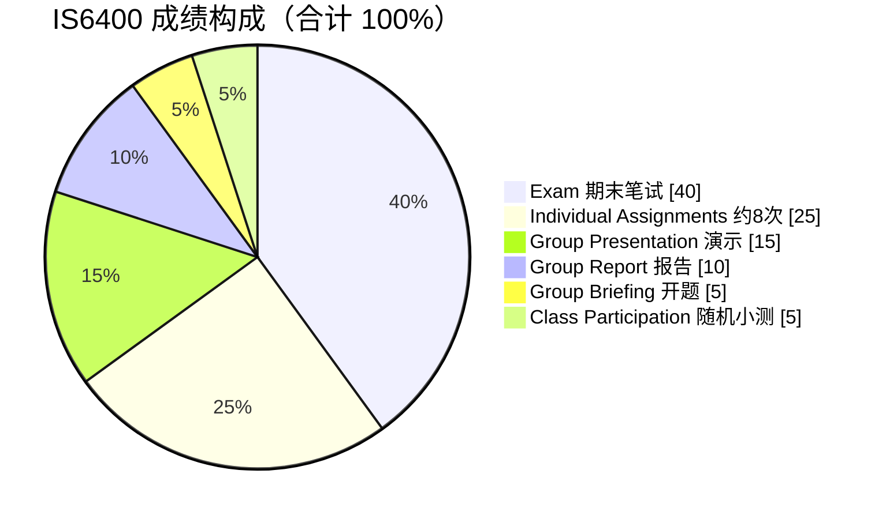
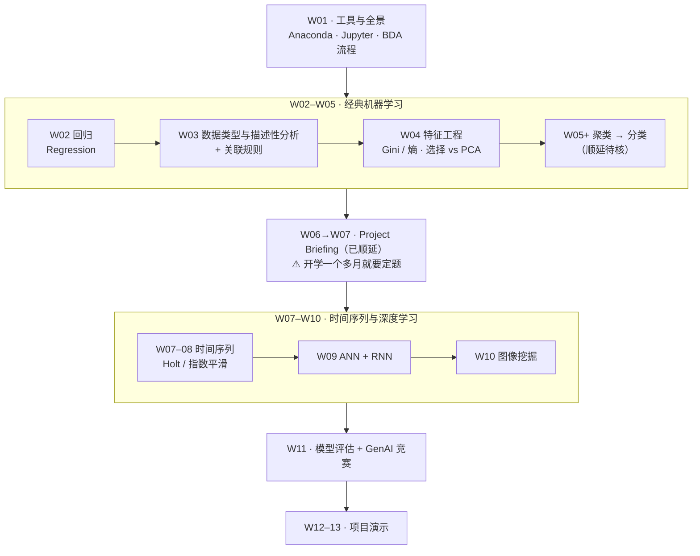
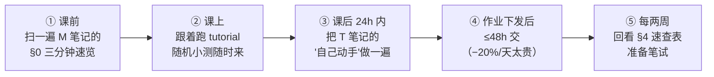

# IS6400 · Business Data Analytics —— 课程总览

> **一句话**：这是本 vault 五门课里**唯一动手写代码的课**。别的课教你判断该不该用 AI，这门课教你**把模型建出来、跑出来、并把系数翻译成一句老板听得懂的话**。

---

## 1. 这门课在干什么

| | |
|---|---|
| 官方定位 | 教授商业数据分析的**流程、模型、工具**，覆盖金融、营销、会计等场景 |
| 官方先修 | **Basic knowledge on statistics**（统计学基础）—— **不是 Python** |
| 学分 / Level | **3 学分** · P5, P6 研究生 |
| 授课语言 | 英文（**考试也用英文作答**） |
| 教师 | **Dr. LIU Junming**（junmiliu@cityu.edu.hk，AC3 6-277）· Office hour 周一 12:00–14:00，需邮件预约 |
| 助教 | **QIN Yaxue**（W1–W5 tutorial）· **SHUAI Yanqin**（W7–W11 tutorial）· Yu Shujing |
| 课时结构 | **每周近 3 小时 = Lecture + Hands-on Tutorial 两段** |
| 平台 | Canvas（交作业、组队）；Anaconda / Jupyter Notebook（写代码） |

**它跟一门"机器学习课"的差别在哪**：ML 课关心模型精度，这门课关心**"这个系数在业务上意味着什么"**。官方 CILO 里权重最高的一条（35%）是"用 Python 在数据里**发现模式**去解决选定的问题"，第二高的（30%）是"**创造性地**改造模型，为真实组织问题提出**原创发现**"。**没有一条 CILO 在讲"把 accuracy 调高"。**

---

## 2. 考核构成 —— 先看这个，它决定你怎么分配时间

| 项目 | 权重 | 关键信息 |
|---|---|---|
| **Exam** | **40%** | **2 小时**（官方目录）。开卷/闭卷**未定**（W1 讲义 p.8 两个都写着）。范围**明确包含 assigned readings**，不只是 slides |
| **Individual Assignments** | **25%** | **约 8 次**（W1 讲义 p.8 写 "5~10"）。⚠️ **迟交每天扣 20%**，5 天归零 |
| **Group Project** | **30%** | Briefing 5% + Presentation 15% + Report 10%。⚠️ 报告迟交每天扣 10% |
| **Class Participation** | **5%** | **随机抽课做堂上小测 + 签到**，按"你答对的次数占比"计分。**不知道哪节课抽** |

### ⭐ 两条只在官方目录里、Syllabus 完全没写的硬规则

> **① 及格线是两道门，都要过**
> `Minimum Continuous Assessment Passing Requirement = 30%`
> `Minimum Examination Passing Requirement = 20%`
> 平时分（60% 那部分）至少拿 30 分制的 30%，考试至少拿 20%。**一边高分补不了另一边。**
>
> **② GenAI 政策：平时作业和小组项目，官方明确写 `Allow Use of GenAI? — Yes`**
> 考试不在 ATs 表里，**没有标注**（按惯例不允许，但**没有白纸黑字**）。

完整三方对校见 [[IS6400_Business_Data_Analytics/_prep/课程前置资料#2. 官方目录 × Syllabus × W1 讲义 —— 三方对校总表|课程前置资料 › 2. 官方目录 × Syllabus × W1 讲义 —— 三方对校总表]]。

---

## 3. 周次地图

`M<NN>` = 讲义笔记，`T<NN>` = tutorial 代码笔记。⚪ 日期为推算（未核对香港公众假期）。

| 周 | ⚪ 日期 | Lecture | Tutorial | 笔记 | 状态 |
|---|---|---|---|---|---|
| **W01** | 09-02 | Course Introduction | Software installation | [[M01-导论-商业数据分析全景与工具链]] · [[T01-Jupyter入门与Pandas基础]] | ✅ v0.9（M01 §2、T01 §2 已按预习可读性规则重写，2026-09-11） |
| **W02** | 09-09 | **Predictive Analytics: Multivariate regression** | Regression Analysis | [[M02-预测分析-线性回归]] · [[T02-回归实战-从合成数据到Airbnb定价]] | ✅ **v1.0**（转录已合并；M02 §2、T02 §2–4 已按预习可读性规则重写，2026-09-11） |
| **W03** | 09-16 | **Data Types & Descriptive Analytics**（⚠️ Syllabus 写的是 Feature Selection / PCA） | Data Description（Iris + Airbnb） | [[M03-数据类型与描述性分析]] · [[T03-数据探索实战-Iris与Airbnb的描述统计]] | ✅ v0.9（无转录；M03 已按 [[笔记质量规范]] 整篇扩写、strict PASS，2026-09-16 晚；Week 3 Assignment 截止 9/25） |
| **W04** | 09-23 | **Feature Engineering: Feature Importance / Selection / PCA**（⚠️ Syllabus 写的是 Clustering） | Feature Selection & PCA（Iris） | [[M04-特征工程-特征重要性与降维]] · [[T04-特征选择与PCA实战-Iris]] | ✅ v0.9（课前建稿，2026-09-16；M04 已按 [[笔记质量规范]] 整篇扩写、strict PASS；Week 4 Assignment Canvas 未挂出） |
| **W05** | 09-30 | **Clustering: K-means / Hierarchical / DBSCAN**（✅ Canvas Lecture 5 课件已到；Syllabus 原 W04） | ⚪ Clustering Methods（notebook 未到） | [[M05-聚类-Kmeans层次与DBSCAN]] | ✅ **v0.9 课前预习版**（2026-09-22，strict PASS）· 转录待 9/30 · ⚠️ **Proposal 交（是否顺延待核）** |
| W06 | 10-07 | ⚪ 分类 Decision Trees / Ensemble（Syllabus 原 W05）；⚪ Proposal 讲解 | — | — | ⏳ ⚪ **Proposal 交（顺延后 ≈ W6 末）** |
| W07 | 10-14 | **Project Briefing（✅ 用户 9/16 确认顺延，⚪ 按一周计）**；Syllabus 原 W07 = Time series (1) / Holt's Model 相应后移（⚪ 待核） | — | — | ⏳ ⚠️ **开题演示** |
| W08 | 10-21 | Time series analysis (2) | Exponential smoothing | — | ⏳ |
| W09 | 10-28 | Deep Learning: ANN and RNN | Nonlinear Time Series | — | ⏳ |
| W10 | 11-04 | Deep Learning: Image Mining | Image Recognition | — | ⏳ |
| W11 | 11-11 | Model Assessment ／ 🟨 **Competition: GenAI for BDA** | Model Selection | — | ⏳ |
| W12–13 | 11-18 / 11-25 | 🟦 **Group Project Presentation** | — | — | ⏳ |

> 🟨🟦 = 讲义 p.6 的原始高亮颜色。教授在唯一一张课程表上只高亮了这两行，**这是有意的信号**。
>
> ⚠️ **2026-09-16 发现 Syllabus 与 Canvas 周次错位**：Syllabus 的 W03 = Feature Selection / PCA、W04 = Clustering，但 Canvas 的 Week 3 是描述性分析、Week 4 是特征工程——**实际进度比 Syllabus 晚一周**。W05 起按顺延填写，Proposal / Briefing 是否顺延待课上确认（[[IS6400_Business_Data_Analytics/_meta/作业与DDL\|作业与DDL]] §6）。

**课程的三段式结构**

---

## 4. 笔记索引

### 讲义笔记（M 系列）

| 笔记 | 主题 | 讲义 | 转录 | 核心概念 |
|---|---|---|---|---|
| [[M01-导论-商业数据分析全景与工具链]] | 课程运作规则 · 数据分析是什么 · CRISP-DM 六步 · 全课技术地图 · Anaconda/Jupyter/Colab | `IS6400-Week1.pdf`（57 页） | `pending` | 数据分析、机器学习 vs 人工规则、CRISP-DM、特征、聚类/分类/预测、LLM |
| [[M02-预测分析-线性回归]] | 预测建模 · 简单/多元线性回归 · 虚拟变量 · 参数训练（正规方程 + 梯度下降） · 过拟合与正则化 | `L2-Linear_Regression.pdf`（53 页） | ✅ **`merged`**（631 段，`00:02 → 02:34:37`；⚠️ 开头缺 p.1–p.2、结尾截断） | 因变量/自变量、β 系数、p 值、虚拟变量、最小二乘、MLE、正规方程、梯度下降、过拟合、验证集、Ridge/Lasso |
| [[M03-数据类型与描述性分析]] | 对象与属性 · 四种属性类型 · 数据集类型 · 数据质量 · 描述统计（集中趋势 / 分位数 / 偏度峰度 / 协方差相关）· 相关 ≠ 因果 · **关联规则（支持度 / 置信度 / 提升度）** · 聚合与抽样 · 降维预告 · 用 Iris 画六种图 | `IS6400-W3-DataMining.pdf`（72 页；三份材料拼接） | ✅ **merged**（2026-09-18；缺开头，p.2–3/p.5 ❓） | 名义 / 序数 / 区间 / 比率、IQR、偏度、峰度、相关系数、支持度、置信度、提升度、代表性样本、冗余特征 |
| [[M05-聚类-Kmeans层次与DBSCAN]] | 聚类定义与三种类型 · 欧氏距离与归一化（Homer / Burns）· **K-means 四步 + 初始化敏感 + K-means++ + 三种失灵与补救 + 二分 K-means** · 层次聚类（树状图、凝聚六步、**五种簇间距离**、**单链接手算与 p.60 小测**）· **DBSCAN**（核心 / 边界 / 噪声、算法、何时好用） | `IS6400-L5-Clustering.pdf`（67 页） | `pending`（9/30 课） | 簇内近簇间远、质心、SSE、树状图、Eps / MinPts；全部数字 `verify_m05_cluster.py` 复算 |
| [[M04-特征工程-特征重要性与降维]] | 特征与特征工程的定义 · 三大挑战与维度灾难 · 特征重要性（类纯度 / **Gini / 熵 / 信息增益**）· 过滤 vs 包装 · 特征选择 vs 特征约简 · 递归前向选择 · **PCA**（目标 / 几何 / 协方差矩阵特征分解 / 读输出表） | `IS6400-W4-Feature.pdf`（69 页） | `pending`（课在 9/23） | Gini、熵、增益、过滤 / 包装模型、特征选择 / 约简、主成分、特征值 / 特征向量、$U_{\text{reduce}}$ |

### 代码笔记（T 系列）

| 笔记 | 主题 | notebook | 数据 |
|---|---|---|---|
| [[T01-Jupyter入门与Pandas基础]] | Jupyter 怎么用 · `datetime` · pandas DataFrame · `describe()` · `apply()` · numpy 矩阵运算 · **7 个 AI Prompt** | `Tutorial 1 - Introduction to Jupyter Notebook_Prompt.ipynb`（25 cells） | 自造小表 |
| [[T02-回归实战-从合成数据到Airbnb定价]] | sklearn `LinearRegression` · R²/MAE · 多项式过拟合 · `Ridge` · `OneHotEncoder` · `train_test_split` · **Airbnb 房价预测** · **1 个整段 AI Prompt** | `Week 2 Regression Analysis_With Prompt.ipynb`（39 cells） | [[IS6400_Business_Data_Analytics/_meta/数据集卡片#Airbnb.csv\|数据集卡片 › Airbnb.csv]] |
| [[T03-数据探索实战-Iris与Airbnb的描述统计]] | 描述统计函数 · 分位数 / 偏度峰度 · 分组 · 四种图 · **缺失值三种填补** · **IQR vs Z 离群点** · StandardScaler / RobustScaler · 相关矩阵热力图 · **Week 3 Assignment（3 题 100 分）** · ⚠️ 无 AI Prompt 格 | `Week 3 Description.ipynb`（48 cells） | [[IS6400_Business_Data_Analytics/_meta/数据集卡片#iris.txt\|iris.txt]] · Airbnb.csv |
| [[T04-特征选择与PCA实战-Iris]] | `SelectKBest(chi2 / f_classif)` · `ExtraTrees.feature_importances_` + `SelectFromModel` · `RFE` · `PCA` · **Week 4 Assignment（4 题 80 分，含 `SequentialFeatureSelector` 自学题）** · ⚠️ 无 AI Prompt 格、kernel Python 3.7.6 | `Week 4 Feature Engineering.ipynb`（37 cells） | iris.txt · Airbnb.csv（作业 Q4） |

### 元数据文件

| 文件 | 作用 |
|---|---|
| [[IS6400_Business_Data_Analytics/_meta/知识层级台账\|知识层级台账]] | ⭐ **写笔记前必读**。L0 入场基线（**本课的 Python 口径写在这里**）+ L1 概念登记表 |
| [[IS6400_Business_Data_Analytics/_meta/术语表\|术语表]] | 本课双语术语，含考试可用的英文定义 |
| [[IS6400_Business_Data_Analytics/_meta/考点库\|考点库]] | 按 module 汇总的潜在考点，带三档可信度 |
| [[IS6400_Business_Data_Analytics/_meta/作业与DDL\|作业与DDL]] | 所有作业、截止日期、提交格式 |
| [[IS6400_Business_Data_Analytics/_meta/数据集卡片\|数据集卡片]] | `Airbnb.csv` 与 `iris.txt` 的六项数据集卡（真实跑出来的统计） |
| [[IS6400_Business_Data_Analytics/_meta/待并入术语总表\|待并入术语总表]] | 需由主 agent 合并进根 `_meta/术语总表.md` 的跨课条目 |
| [[IS6400_Business_Data_Analytics/_prep/课程前置资料\|课程前置资料]] | 官方目录 × Syllabus × 讲义三方对校；所有硬规则的出处 |

---

## 5. 这门课的三个"只有本课有"的特点

### 5.1 教授**要求**你用 AI 写代码

Tutorial notebook 里每个 code cell 后面都跟一个 markdown 单元格：

> 
 🤖 <b>AI Prompt (Copy this to AI)</b>: 
> Write Python code to import the 'datetime' module, get the current time, store it in a variable named 'x', and print 'x'. 

**这不是噪音，是教学设计。** Syllabus ILO 第 3 条明写 "Manage GenAI tools for BDA proposal and Python programming"；官方目录在两项平时评估上都标 `Allow Use of GenAI? Yes`；W11 还有一场 "Competition: GenAI for BDA"。

**所以 T 系列笔记必须保留这些 prompt，并分析"教授期望你怎么向 AI 提问"** —— 这是会被考核的能力。⚠️ **但 W3、W4 的 notebook 里一个 AI Prompt 格都没有**（T03 / T04 §0 已注明）——是否从 W3 起取消了这个设计，待课上观察。详见 [[T01-Jupyter入门与Pandas基础#6. 教授在教你怎么向 AI 提问|T01-Jupyter入门与Pandas基础 › 6. 教授在教你怎么向 AI 提问]] 与 [[T02-回归实战-从合成数据到Airbnb定价#7. 一整段 AI Prompt：把整个 notebook 要回来|T02-回归实战-从合成数据到Airbnb定价 › 7. 一整段 AI Prompt：把整个 notebook 要回来]]。

### 5.2 W6 就要定题，开学一个月出头

Project Briefing 原定 **W6**（2026-10-07），✅ **2026-09-16 已确认顺延**（⚪ 约 W7 · 10-14），proposal 按 Guideline 在 Briefing 前一周末交（⚪ 顺延后约 10/09–10/10）。也就是说：**W02 讲完回归、W03 讲完降维，你就得开始想题目了。**

Proposal 必须包含 **Dataset Description（字段名 + 数据类型）** —— 这意味着 **W5 之前必须已经拿到数据**，不能只有一个想法。

### 5.3 迟交惩罚是五门课里最重的

个人作业 **−20%/天**（5 天归零），小组报告 **−10%/天**。别的课通常是 −5% 或按小时算。

---

## 6. 学习路径建议 ⚪（笔记推断，非教授明示）

**每周的正确姿势**

**两条分线复习**

| 目标 | 看什么 | 为什么 |
|---|---|---|
| **应付 40% 的笔试** | M 笔记的 §4 速查表、§5 术语卡、§6 考点，加上 **DM / HM 指定章节** | 官方明写考试 "will cover the **readings assigned in class**"。笔试要写英文定义、解释系数、判断过拟合，**不考你能不能敲代码** |
| **应付 25% 作业 + 30% 项目** | T 笔记的逐块讲解与"改哪个参数会怎样" | 作业就是把 tutorial 的 cell 改几个参数重跑。项目是把整条链路走一遍 |

---

## 7. 跨课交叉

### ⭐ 硬交叉：IS6400 W02 ↔ EF5560 Lec02（同周同主题）

**EF5560 的 `Lec02_Regression_Vibe_Coding.pdf` 与 IS6400 的 `L2-Linear_Regression.pdf` 是同一周、同一主题（线性回归），并且两门课都在教"用 AI 写代码"。**

| | IS6400 W02 | EF5560 Lec02 |
|---|---|---|
| 笔记 | [[M02-预测分析-线性回归]] · [[T02-回归实战-从合成数据到Airbnb定价]] | **[[M02-回归与样本外设计]]**（EF5560，✅ 已产出） |
| 讲义 | `L2-Linear_Regression.pdf`（53 页） | `Lec02_Regression_Vibe_Coding.pdf` |
| AI 写代码的叫法 | **GenAI for BDA** | **Vibe Coding** |
| 教学侧重 | ⚪ 建模全链路：从 β 系数解释 → MLE 推导 → 正则化 | ⚪ 待该课笔记产出后补 |

> ⏳ **待办（主 agent）**：EF5560 的 Lec02 笔记产出后，回来补齐上表右列的"教学侧重"，并在 [[M02-预测分析-线性回归#9. 延伸与勘误|M02-预测分析-线性回归 › 9. 延伸与勘误]] 加一节对照。**同一套数学被两位老师讲两遍，差集就是各自的重点。**

### 软交叉

| 交叉点 | 本课在哪 | 对方课 |
|---|---|---|
| LLM / Transformer / Attention | [[M01-导论-商业数据分析全景与工具链#2.6.6 深度学习、GenAI 与 LLM（p.43–45）\|M01-导论-商业数据分析全景与工具链 › 2.6.6 深度学习、GenAI 与 LLM（p.43–45）]] | IS5542（GenAI in Business）—— 那门课整学期讲这个 |
| "用 AI 写代码是否算学术不端" | 本课官方 `Allow GenAI: Yes` | IS5113（AI Ethics）—— 那门课讲 GenAI 使用的边界 |
| 模型输出用于金融决策 | [[M02-预测分析-线性回归#2.2 预测建模：管理者为什么需要回归\|M02 §2.2]] | EF5560 · AC6761 |
| 算法偏见 / 数据代表性 | [[IS6400_Business_Data_Analytics/_meta/数据集卡片#5. 已知坑\|数据集卡片 › 5. 已知坑]]（Airbnb 只有 6 个城市、property_type 只剩 4 类） | IS5113 W03 偏见与公平 |

---

## 8. 命名对照

本 vault 统一用 `M<NN>` / `T<NN>` 前缀。本课原始材料的命名对应如下：

| 本库命名 | 课程原始命名 | 原始文件 |
|---|---|---|
| M01 | Lecture 1 / Week 1 | `IS6400-Week1.pdf` |
| T01 | Tutorial 1 | `Tutorial 1 - Introduction to Jupyter Notebook_Prompt.ipynb` |
| M02 | Lecture 2 / Week 2 | `L2-Linear_Regression.pdf` |
| T02 | Tutorial 2 / Week 2 | `Week 2 Regression Analysis_With Prompt.ipynb` |
| M03 | Lecture 3 / Week 3 - Descriptive Analytics | `IS6400-W3-DataMining.pdf` |
| T03 | Week 3 Description | `Week 3 Description.ipynb`（`.html` 同内容，忽略） |
| M04 | Lecture 4 / Week 4 - Feature Engineering | `IS6400-W4-Feature.pdf` |
| T04 | Week 4 Feature Engineering | `Week 4 Feature Engineering.ipynb`（`.html` 同内容，忽略） |
| M05 | Lecture 5 - Clustering | `IS6400-L5-Clustering.pdf` |
| 数据 | Week 3 / Week 4 附件 | `iris.txt`、`Airbnb.csv`（同一文件，两周重复挂出） |

转录按 [[转录处理规则#5. 文件约定|转录处理规则 › 5. 文件约定]] 命名为 `transcripts/M<NN>-transcript.txt`。现有：`M02-transcript.txt`（Notta，已合并 M02 / T02）、`M03-transcript.txt`（本地 Whisper，2026-09-18 已合并 M03 / T03）。

---

## 9. 当前欠债清单

| # | 欠什么 | 影响 | 何时能补 |
|---|---|---|---|
| 1 | **W01 转录** | M01/T01 的 🎙️ 格全空；考点无 🔴 级 | ⚠️ W01 未录音，**可能永久缺失** |
| 2 | ~~**W02 转录**~~ | ✅ **2026-09-09 已合并**，M02/T02 升到 **v1.0**：新增 🎙️ 差集 31 条、🔴 教授明示考点 8 条、🔴 助教项目规则 5 条、🔀 冲突 3 处 | 已完成 |
| 2b | ⚠️ **W02 录音的两处缺口** | **开头缺讲义 p.1–p.2**（第一句已在 p.3 句中）、**结尾在 tutorial 讲到 cell 35 时截断**（合计约 15 分钟）。→ **Week 2 作业从未在录音里被宣布**；**考试开卷/闭卷仍无信息** | ❌ **永久缺失**，只能去 Canvas 或直接问 |
| 3 | Briefing 究竟 W5 还是 W6 | 影响定题时间表 | ✅ 9/16 确认**顺延**；精确到哪周待 Canvas |
| 4 | Report 真实截止日 | Guideline 写的 "May 1" 是残留 | Canvas |
| 5 | 期末开卷/闭卷 | 影响复习策略 | 课上确认 |
| 6 | 第一次作业截止日 | −20%/天，不能猜 | Canvas |
| 7 | 官方目录仍是 2025/26 版 | GenAI 相关 CILO 可能未更新 | 下学年 |
| 8 | ~~W03 转录~~ | ✅ 2026-09-18 已合并（本地 Whisper，1361 段）：M03 28 格 + T03 9 格回填；**关联规则会考计算题**（`01:26:36`）；小测 = 属性类型判断；同组不同变量规则 | 已完成 |
| 9 | **W04 转录** | M04 / T04 课前建稿，29 处 🎙️ 待补；课堂小测答案待核 | 9/23 上课后 |
| 10 | ~~Week 3 作业截止日~~ ✅ 9/25 23:59（Canvas 截图）；**Week 4 作业 Canvas 尚未挂出**（⚪ 10/2），总分 80 待问 | −20%/天 | Canvas |
| 11 | **Syllabus 周次顺延** | ✅ W05 = 聚类已由 Canvas 课件确认（2026-09-22）；Proposal / Briefing 日期仍待核 | 课上确认 |
| 13 | **W05 转录 + tutorial notebook** | M05 课前建稿，29 处 🎙️ 待补；W5 notebook 未挂出，T05 待写；p.60 小测答案待核 | 9/30 上课后 |
| 12 | ~~两份 W3 / W4 PDF 被截断~~ | ✅ 用户 9/16 重新下载到 `Downloads/`，`pdfinfo` 72 / 69 页、文字层与笔记所用完全一致（`diff` 无差异）；**待用户自行复制覆盖 `course_files_export/`** | 已解决 |

---

## 相关

- 课程背景与三方对校：[[IS6400_Business_Data_Analytics/_prep/课程前置资料|课程前置资料]]
- 连贯性机制：[[IS6400_Business_Data_Analytics/_meta/知识层级台账|知识层级台账]]
- 全库方法论：`CityU/CLAUDE.md` · 材料规则：[[材料处理规则]] · 转录规则：[[转录处理规则]]
