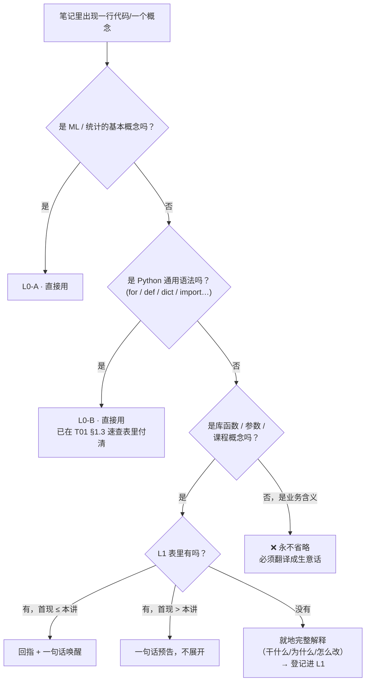

# IS6400 知识层级台账

> **这是本课连贯性的机制文件。写任何笔记前必读，写完后必须回写。**

## 使用规则

写 M(N) / T(N) 笔记时，正文里每出现一个概念，按下表判断：

| 情况 | 怎么处理 |
|---|---|
| 在 **L0 入场基线** 里 | 直接用，不解释 |
| 在 **L1** 里且 `首现 ≤ N` | 直接用 + `[[回指]]` + **一句话唤醒** |
| 在 **L1** 里但 `首现 > N` | 只给一句话预告，标明"第 X 讲展开"，不提前展开 |
| **不在表里** | **必须在本笔记就地完整展开**，然后登记回 L1 |

**验收**：把 M01 → T01 → M02 → T02 → M03 → T03 → M04 → T04 连读，不应出现"没定义过、这里也没解释"的词。

---

# ⭐ 第一部分：L0 基线的判定（本课特有，先读这里）

## 0.1 问题是什么

全库的默认读者假设是「**只有 AI/ML 基础，其余零基础**」。这条假设在其他四门课（伦理、金融、会计、GenAI 应用）能直接用，**但在 IS6400 会卡住**，因为本课要读代码：

- 如果把「Python 语法」当零基础，那每篇代码笔记都要解释 `for` 循环和 `def`，笔记会变成一本 Python 入门书，且 M02、T02 的真正难点（回归的数学、系数的业务含义）会被淹没；
- 如果把「Python + pandas + sklearn」全当 L0，那笔记会跳过 `OneHotEncoder(drop='first')` 里的 `drop='first'` 为什么必须写 —— 而这恰恰是 W02 的核心考点（虚拟变量陷阱）。

**所以必须先划线，且这条线决定后续所有笔记的详略。**

## 0.2 三条外部证据

在做判断之前，先看材料本身怎么说：

| # | 证据 | 出处 | 指向 |
|---|---|---|---|
| 1 | 官方目录唯一的先修是 **"Basic knowledge on **statistics**"**，Prerequisites 里**没有 Python、没有编程** | 官方课程目录 Part I（🔗 抓取 2026-09-09） | **学校不假设你会 Python** |
| 2 | W1 讲义 **57 页里有 11 页（p.47–57，19%）** 在教怎么下载 Anaconda、怎么点 Jupyter 的 Run、怎么 `print("Hello IS6400")`，最后一页是"用手机也能写代码吗？**YES!**" | `IS6400-Week1.pdf` p.47–57 | **教授也不假设你会** |
| 3 | Tutorial 1 从 `import datetime` 开始，代码注释是 "we need to find a tool we need from a library"（我们要从库里找一个需要的工具） | `Tutorial 1…ipynb` cell 4 | **教学起点在"什么是库"这一层** |
| 4 | 每个 code cell 后面都跟一个 `🤖 AI Prompt (Copy this to AI)` 单元格，把这段代码用自然语言重述一遍 | 两个 notebook，共 8 处 | **教授的立场是：你不必会写，但必须会说清楚你要什么** |

证据 4 尤其关键。**教授的教学法本身就假定"学生不会手写代码"**，并把解决方案定为"教你向 AI 描述需求"。这意味着：**笔记的价值不在替读者背 API，而在让读者能判断"AI 给我的这段代码对不对、参数该填什么"。**

## 0.3 ⭐ 最终判断（本课的 L0 口径）

我**不完全采纳**"Python 基础语法直接列入 L0、不解释"这个方案 —— 它与证据 1–3 冲突（官方和教授都没假设读者会 Python）。但我也不采纳"逐处解释语法"（会毁掉笔记）。

**采用三层划分，把欠债集中还一次：**

| 层 | 内容 | 笔记里怎么处理 |
|---|---|---|
| **L0-A** · ML 与统计概念 | 监督学习、训练/验证/测试、过拟合、模型/参数/训练、准确率一类指标、正态分布、均值与方差、"线性回归是拟合一条线"的直觉 | **直接用，不解释**。依据：全库 L0 + 官方先修 "basic statistics" |
| **L0-B** · Python 通用语法 | 变量赋值、`print`、字符串格式化、`if/elif/else`、`def` 函数、`for` 循环、`list`/`dict` 字面量、`import X as Y`、点号调用 `obj.method()`、索引与切片 | **正文里直接用，不逐处解释。但在 [[T01-Jupyter入门与Pandas基础#1.3 本课用得到的 Python 语法 · 一次性速查表\|T01-Jupyter入门与Pandas基础 › 1.3 本课用得到的 Python 语法 · 一次性速查表]] 给一张一次性速查表**，此后不再回头解释 |
| **L1** · 库 API 与本课概念 | **每一个第一次出现的库函数、方法、参数、返回值形状**，加上所有课程概念 | **必须就地解释一次**（这行在干什么 / 为什么用它而不是别的 / 换数据集要改哪里），然后**登记进下面的 L1 表** |
| **❌ 永不在 L0** | **业务解读** —— "这个系数在生意上意味着什么" | **必须讲透**。这是本课的最终产出，也是官方 CILO 3（30%）和 CILO 4（10%）的落点 |

### 为什么是这个方案，而不是"Python 全算 L0"

1. **它不假装问题不存在。** 官方先修只写了统计，讲义从 `print()` 教起。直接宣布"Python 算已知"会让真正零编程基础的读者在 T01 第一页就卡住，而这个读者是存在的（本课招的是商科研究生）。
2. **它把成本收敛到一处。** 一张 ~40 行的速查表放在 T01 §1.3，一次付清；之后 M02、T02 及后续所有笔记都可以放心地只讲库 API 和业务含义。散着解释才是灾难。
3. **它与官方口径不打架。** L0-A 直接对应官方 Prerequisites "basic knowledge on statistics"；L0-B 是速查表覆盖的、被显式承认的欠债；两者都不越界。
4. **它与教授的教学法同向。** 教授不考你能不能默写 `for` 循环，他考你能不能**说清楚你要 AI 做什么**、以及**看懂输出对不对**。这正好落在 L1（参数与语义）和「业务解读」上。
5. **它让详略有可执行的标准。** 遇到一行代码时的判断流程见下图，不需要每次临时权衡。

## 0.4 ❌ 明确**不在** L0 里（凡涉及必须解释）

| 领域 | 具体项 | 首次出现 |
|---|---|---|
| **线性代数记号** | 向量转置 `θᵀx`、矩阵乘法、`XᵀX`、矩阵求逆 `(XᵀX)⁻¹`、梯度符号 `∇` | M02 §2.6 |
| **微积分** | 导数 `dy/dx`、链式法则、"令导数为 0 求极值" | M02 §2.6 |
| **统计推断细节** | 标准误、t 值、**p 值的正确含义**、置信区间、显著性星号 | M02 §2.4 |
| **概率密度** | 正态分布的密度函数写法、条件分布 `p(y\|x)`、似然与极大似然 | M02 §2.6 |
| **课程流程框架** | CRISP-DM 六步 | M01 §2.4 |
| **一切库 API** | pandas / numpy / matplotlib / sklearn 的每个函数与参数 | T01 起 |
| **业务解读** | 系数怎么翻译成商业结论、log 因变量的系数怎么读 | M02 §2.5、T02 §5 |

> 💡 **特别提醒**：官方先修写的是 "basic knowledge on statistics"，看起来 p 值应该属于 L0。**但本课讲义 p.20 把 p 值定义错了**（写成"真实斜率为 0 的概率"），所以笔记**必须**把正确定义讲一遍，否则读者会把错的背下来。见 [[M02-预测分析-线性回归#9.3 课件自身的问题|M02-预测分析-线性回归 › 9.3 课件自身的问题]]。

---

# 第二部分：L0 · 入场基线（清单）

读者进门时**已经具备**的知识。以下内容在笔记里可直接使用。

**L0-A · ML / 统计概念**
- 机器学习：监督学习、无监督学习、训练集 / 验证集 / 测试集、标注数据
- 模型、算法、参数、训练、推理、部署
- 过拟合 / 欠拟合的**直觉**（细致定义仍在 M02 展开）
- 评估指标的存在：准确率、精确率、召回率、F1
- 神经网络、深度学习的基本概念
- 大语言模型（LLM）、生成式 AI 的基本概念（**本课 M01 仍会给课程自己的定义**）
- 线性回归"就是拟合一条线"的直觉
- 统计：均值、中位数、方差/标准差、分位数、正态分布长什么样、相关性的直觉
- 数据的基本概念：结构化 / 非结构化、缺失值、数据清洗

**L0-B · Python 通用语法**（速查表见 [[T01-Jupyter入门与Pandas基础#1.3 本课用得到的 Python 语法 · 一次性速查表|T01-Jupyter入门与Pandas基础 › 1.3 本课用得到的 Python 语法 · 一次性速查表]]）
- 变量赋值、`print()`、注释 `#`
- 字符串、字符串格式化（`%s` / `%f` / f-string）
- `list`、`dict`、索引与切片
- `if / elif / else`、`for` 循环、`range()`
- `def` 定义函数、`return`
- `import X`、`import X as Y`、`from X import Y`
- 点号调用 `object.method(...)`、属性访问 `object.attr`

**一般常识**
- 基本商业词汇（公司、客户、定价、成本、营销、库存）
- 会自己下载安装软件、会用浏览器

---

# 第三部分：L1 · 概念登记表

`首现` 列指该概念**第一次被完整展开**的笔记。

## 3.1 课程概念（M 系列）

| 概念 | English | 首现 | 一句话定义 | 依赖 |
|---|---|---|---|---|
| 商业数据分析 | Business Data Analytics (BDA) | M01 | 用统计与机器学习方法从商业数据中自动发现有用信息，并支持决策 | L0-A |
| 数据分析（课程定义） | Data Analytics | M01 | "the process of automatically discovering useful information in large data repositories" —— 把传统数据分析方法与处理大规模数据的复杂算法结合起来 | — |
| 人工写规则 vs 机器学习 | Human Learning vs Machine Learning | M01 | 前者是人研究问题→写规则→评估→改规则；后者把"写规则"换成"用数据训练算法" | L0-A |
| 大数据时代的动因 | The Age of Big Data | M01 | 数据量超出人的处理能力，必须让机器代为处理并支持决策 | — |
| 跨学科定位 | Interdisciplinary Study | M01 | ML 位于统计学、商业管理、AI/模式识别三者的交叠处；数据挖掘是其中一块 | — |
| **CRISP-DM 六步** | Cross Industry Standard Process for Data Mining | M01 | 1990 年代由欧洲联盟体提出的数据挖掘标准流程：业务理解→数据理解→数据准备→建模→测试评估→部署，**可反复回退**，**前三步占约 80% 工时** | — |
| 数据科学三角色 | Data Engineer / Data Scientist / Business Stakeholder | M01 | 分别负责"让数据可用"、"从数据里造知识"、"用数据做决策"，三者交叠处是假设开发、变现与治理 | — |
| 特征 | Feature | M01 | "the element that you use to describe an object" —— 你用来描述一个对象的那些元素 | — |
| 特征工程 | Feature Engineering | M01（W03 深化） | 挑选、构造、变换特征，使模型更容易学到规律 | 特征 |
| 降维的危险 | Danger of Dimensionality Reduction | M01 | 把高维投影到低维（如 3D 物体投出 2D 影子）可能凭空造出原数据里不存在的"结构" | 特征工程 |
| 聚类（两个用途） | Clustering | M01（W04 深化） | 无监督地把相似对象分组。用途一 **Understanding**（理解结构），用途二 **Summarization**（压缩数据规模） | L0-A |
| 分类 | Classification | M01（W05 深化） | 用其他属性的取值为"类别属性"找一个模型 | L0-A |
| 集成学习 | Ensemble Learning | M01（W05 深化） | 三步：从原始训练集造多个数据子集 → 各训一个分类器 → 把多个分类器合并成一个 | 分类 |
| 序列模型 | Sequential Model | M01（W09 深化） | 用 encoder-decoder + LSTM 处理带时间顺序的数据，可接入天气/节假日等外部因子 | L0-A |
| 语言模型 | Language Model | M01 | 能生成、理解或操作自然语言文本/语音的模型 | L0-A |
| 注意力机制 | Attention | M01 | 不逐词读，而是同时看多个词并理解它们之间的**关系** | 语言模型 |
| Transformer | Transformer | M01 | 基于注意力的神经网络架构，是 LLM 的底座 | 注意力机制 |
| 大语言模型（课程定义） | Large Language Model (LLM) | M01 | 用 Transformer、在大规模文本语料上训练的大模型，如 GPT | Transformer |
| 预测建模 | Predictive Modeling | M02 | 用变量之间的关系做预测，替代管理者凭直觉判断 | — |
| 因变量 / 自变量 | Dependent / Independent Variable | M02 | 你想预测的那个 = 因变量；你拿来预测的那些 = 自变量。三个学科三套叫法（见术语表） | — |
| 简单线性回归 | Simple Linear Regression | M02 | 用**一个**自变量预测**一个**因变量：`Y = β₀ + β₁X + ε` | 因变量/自变量 |
| 截距 | Intercept $\beta_0$ | M02 | X 全为 0 时 Y 的预测值 | 简单线性回归 |
| 斜率 / 回归系数 | Slope / Coefficient $\beta_1$ | M02 | X 每增加 1 个单位，Y 的预测值变化多少 | 简单线性回归 |
| 随机误差项 | Random Error $\varepsilon$ | M02 | 模型解释不了的部分，假定服从 `N(0, σ²)` | 简单线性回归 |
| 线性回归四假设 | Assumptions of Linear Regression | M02 | ① X 与 Y 线性 ② 每个 X 处 Y 服从正态 ③ 每个 X 处 Y 的方差相同（同方差）④ 观测相互独立 | 简单线性回归 |
| 同方差 | Homogeneity of Variances / Homoscedasticity | M02 | 假设 ③：残差的离散程度不随 X 变化 | 线性回归四假设 |
| 曲线拟合 | Curve Fitting | M02 | 选一组参数使模型与数据之间的误差最小 | 简单线性回归 |
| 残差 | Residual / Deviation | M02 | 实际观测值 − 模型预测值 | 曲线拟合 |
| 最小二乘 | Least Sum of Squares / OLS | M02 | 让**残差平方和**最小的那组参数 | 残差 |
| 标准误 | Standard Error | M02 | 系数估计值本身的波动幅度；系数 ± 2×标准误 ≈ 95% 置信区间 | 斜率 |
| p 值 | p-value | M02 | **在"真实系数 = 0"成立的前提下**，观察到当前或更极端结果的概率。**不是"系数为 0 的概率"** | 标准误 |
| 显著性星号 | Significance codes `***` | M02 | R 输出的惯例：`***` p<0.001，`**` p<0.01，`*` p<0.05，`.` p<0.1 | p 值 |
| 外推风险 | Extrapolation | M02 | 在训练数据 X 的取值范围之外做预测，结果高度不可靠 | 简单线性回归 |
| 离群点 | Outlier | M02 | 远离数据主体的观测。处理有两条路：删掉，或**找出还有什么变量能解释它** | — |
| 多元线性回归 | Multiple Linear Regression | M02 | 用**多个**自变量预测**一个**因变量 | 简单线性回归 |
| 虚拟变量 | Dummy Variable | M02 | 用 0/1 列表示类别变量；**n 个类别只造 n−1 个虚拟变量** | 多元线性回归 |
| 基准水平 | Base Level / Reference Category | M02 | 没有专属虚拟变量的那个类别；所有虚拟变量取 0 时代表它。**其他类别的系数都是"相对基准的差"** | 虚拟变量 |
| 虚拟变量陷阱 | Dummy Variable Trap | M02（笔记补充） | 若造满 n 个虚拟变量，它们之和恒为 1，与截距完全共线，矩阵不可逆 | 虚拟变量 |
| 条件似然 | Conditional Likelihood `p(y\|x)` | M02 | 给定 x 时 y 的概率密度；线性模型下 `Y ~ N(θᵀx, σ²)` | 线性回归四假设 |
| 极大似然估计 | Maximum Likelihood Estimation (MLE) | M02 | 选一组参数，使观测到的这批数据出现的概率最大。**高斯噪声下 MLE ≡ 最小二乘** | 条件似然 |
| 正规方程 | Normal Equations | M02 | 令梯度为 0 解出的闭式解 `θ̂ = (XᵀX)⁻¹XᵀY` | MLE |
| 梯度下降 | Gradient Descent | M02 | 参数不停沿"下坡方向"迈小步：`θ⁽ᵗ⁺¹⁾ = θ⁽ᵗ⁾ − ρ∇` 直到收敛。用于 `(XᵀX)⁻¹` 算不动时 | 正规方程 |
| 学习率 | Learning Rate $\rho$ | M02 | 每步迈多大。太小走不到，太大会震荡发散 | 梯度下降 |
| 凸函数 | Convex Function | M02 | 只有一个最低点的碗形函数；梯度下降在凸函数上必到全局最优 | 梯度下降 |
| 过拟合 / 欠拟合（严格定义） | Overfitting / Underfitting | M02 | 欠拟合 = 训练误差大；过拟合 = **训练误差小但测试误差大** | L0-A |
| 泛化误差 | Generalization Error | M02 | 模型在**没见过的数据**上的误差 | 过拟合 |
| 验证集 ≠ 测试集 | Validation set is NOT test set | M02 | 验证集从**训练数据**里切出来，用于选模型；测试集是最后才动的、完全独立的数据 | L0-A |
| 留出法 | Hold-out Method | M02 | 把数据按比例（如 80/20）随机切成训练集与验证集，用验证误差挑模型 | 验证集 |
| 正则化 | Regularization | M02 | 训练时加约束 `R(a) ≤ r`，等价于在目标函数上加惩罚项 `λ·R(a)`，以防过拟合 | 过拟合 |
| 正则化参数 | Regularization Parameter $\lambda$（sklearn 里叫 `alpha`） | M02 | 惩罚力度。λ=0 退化为普通回归；λ 太大所有系数被压到 0 | 正则化 |
| Lasso 回归（L1） | Lasso Regression | M02 | 惩罚项 `Σ\|aⱼ\|`。**会把部分系数压到恰好 0**，因此自带特征选择 | 正则化 |
| Ridge 回归（L2） | Ridge Regression | M02 | 惩罚项 `Σaⱼ²`。**把系数压小但一般不压到恰好 0** | 正则化 |
| 多项式回归 | Polynomial Regression | M02 | 把 `x, x², …, x¹⁵` 都当成自变量做线性回归；阶数越高越容易过拟合 | 多元线性回归 |

### 3.1b 🎙️ 只在课堂上出现的概念（W02 转录带出，讲义没有）

> **2026-09-09 新增。** 这些概念**讲义上找不到**，但教授在课上用了，而且都是理解正文所必需的。
> **按 L1 规则，它们已在 [[M02-预测分析-线性回归]] 就地展开，并登记于此。**

| 概念 | English | 首现 | 一句话定义 | 依赖 |
|---|---|---|---|---|
| **模型容量** | **Model Capacity** | M02（🎙️ `01:27:12`） | 模型能表达多复杂关系的上限。**过拟合 = 模型容量远高于真实函数的复杂度**；正则化 = 给模型容量加惩罚 | 过拟合 |
| **拉格朗日乘子** | **Lagrangian Multiplier** | M02（🎙️ `01:36:50`） | 把带约束的最小化转成无约束的最小化的方法；**正则化里的 λ 就是它** | 正则化 |
| **显著性水平** | **Significance Level (α)** | M02（🎙️ `37:24`） | 判定"显著"的 p 值阈值。**本课取 0.05 或 0.1**（⚠️ 讲义没写这个数） | p 值 |
| **假设检验** | **Hypothesis Test** | M02（🎙️ `37:48`） | 用 p 值判断"斜率是不是 0"这个原假设该不该被拒绝 | p 值、显著性水平 |
| **时间序列预测模型** | **Time-series Prediction Model** | M02（🎙️ `29:19`，**预告级**） | 观测**不独立**时（如股价）不能用线性回归，要换成专门处理时间依赖的模型。⚠️ **只做一句话预告，M07–M08 展开** | 独立性假设 |
| **模型选择** | **Model Selection** | M02（🎙️ `01:30:10`，**预告级**） | 用同一份验证集给多个候选模型打分，挑最好的。⚠️ **教授明确说 M11 展开** | 验证集 |
| **促销的四阶段需求效应** | (pre- / during- / post-promotion demand) | M02（🎙️ `44:26`） | 一次促销把时间切成"平常 / 节前囤货 / 节中暴涨 / 节后低谷"四段，**每段对需求的影响不同** —— 这是"为什么一个节日要造 3 个虚拟变量"的业务解释 | 虚拟变量 |
| **回归 = 有损压缩** | — | M02（🎙️ `17:24`） | 回归把 N 个数据点压缩成 2 个数（截距 + 斜率），压缩后原始数据可以扔掉；**丢掉的那部分就是残差** | 简单线性回归、残差 |

### 3.1c M03 · 数据类型与描述性分析（2026-09-16 登记，无转录）

| 概念 | English | 首现 | 一句话定义 | 依赖 |
|---|---|---|---|---|
| 数据对象 / 属性 / 属性值 | Object / Attribute / Attribute value | M03 | 一行是对象，一列是属性；同一属性不同对象取不同值 | — |
| 四种属性类型 | Nominal / Ordinal / Interval / Ratio | M03 | 按"区分 / 顺序 / 加减 / 乘除"四种性质累加划分；决定能用哪些统计量与图 | 属性 |
| 离散 / 连续属性 · 二元 · 非对称二元 | Discrete / Continuous · Binary · Asymmetric binary | M03 | 有限可数 vs 实数；只有 1 有意义的二元属性（购买 / 出勤）是关联分析的输入 | 四种属性类型 |
| 数据集三大类 | Record / Graph / Ordered data | M03 | 记录（数据矩阵、文档词项向量、交易）/ 图 / 有序（时序、序列、空间） | 属性 |
| 数据质量三类问题 · 结构化数据四特征 | Noise & outliers / Missing / Duplicate · Quality / Dimensionality / Sparsity / Resolution | M03 | 讲义 p.19–20；p.20 在 M04 p.4 原样重现 | — |
| 描述性分析（三种探索方式） | Descriptive analytics: summary statistics / tables / visualization | M03 | 数、表、图 | — |
| 集中趋势 · 分位数 · IQR · 方差 / 标准差 | Mean / Median / Mode · Percentile · IQR · Variance / Std | M03 | 描述统计量；IQR = Q3 − Q1 | L0-A |
| 偏度 · 峰度 | Skewness · Kurtosis | M03 | 分布形状：不对称方向 / 尾部厚薄（pandas 口径正态峰度 = 0） | 标准差 |
| 协方差 · 相关系数 | Covariance · Correlation coefficient | M03 | 两变量共同变动；相关系数把协方差除以两标准差，落在 [−1, 1]，只抓线性 | 方差 |
| 相关 ≠ 因果 · 实验 / 准实验 | Correlation ≠ Causality · Experiment / Quasi-experiment | M03 | 混杂变量；确认因果要实验 | 相关系数 |
| 关联规则：项集、支持度、置信度、频繁项集、提升度 | Itemset · Support · Confidence · Frequent itemset · Lift | M03 | $s = \sigma(X \cup Y)/\lvert T \rvert$，$c = \sigma(X \cup Y)/\sigma(X)$，lift $= c / P(Y)$；两个门槛 minsup / minconf | 交易数据 |
| 聚合 · 抽样（有 / 无放回、分层）· 代表性样本 | Aggregation · Sampling · Representative sample | M03 | 预处理手段 I | — |
| 降维 · 特征子集选择 · 特征创建（三法） | Dimensionality reduction · Feature subset selection · Feature creation | M03（M04 展开） | 预处理手段 II；冗余 / 无关特征 | 特征 |
| 六种图 | Histogram / Box plot / Scatter matrix / Parallel coordinates / Star plot / Chernoff face | M03 | 用 Iris 各画一遍；直方图形状随箱数变；平行坐标轴序重要 | 属性类型 |

### 3.1d M04 · 特征工程：特征重要性、特征选择与 PCA（2026-09-16 登记，课前，无转录）

| 概念 | English | 首现 | 一句话定义 | 依赖 |
|---|---|---|---|---|
| 特征（复杂对象的属性集）· 代表性 | Feature (a set of attributes) · Representativeness | M04 | 同一对象可有多组特征（苹果：尺寸 / RGB / 子图）；哪组更好由任务定 | 特征（M01） |
| 特征工程（完整定义）· 问题相关性 | Feature engineering · Problem-specific | M04 | select / create the most representative features；因任务而异 | 特征 |
| 三大挑战 · 维度灾难 · 信息–空间–时间权衡 | Challenges · Curse of dimensionality · Trade-off | M04 | 造特征 / 冗余 / 维度灾难（800 GB 算例、稀疏）；CIFAR-10 3072 vs 100 维 | 结构化数据四特征 |
| 特征重要性 · 类纯度 | Feature importance · Class purity | M04 | 给每个特征一个"代表性"分数；最朴素的分数是切开后各堆的纯度 | 分类 |
| 节点不纯度 · 增益 | Node impurity · Gain = P − M | M04 | 分裂前不纯度减分裂后加权不纯度；增益最大者最重要 | 类纯度 |
| Gini 指数 · 加权 Gini · 多路 / 二路分裂 | Gini index · GINI_split · Multi-way / Two-way split | M04 | $1 - \sum p(j \mid t)^2$；按 $n_i/n$ 加权；CART / SLIQ / SPRINT | 不纯度 |
| 熵 · 信息增益 · 单变量分数 | Entropy · Information gain · Univariate score $-\log p$ | M04 | $-\sum p\log_2 p$；ID3 / C4.5；每特征单独检验的 $-\log(p\text{-value})$ | 不纯度、p 值 |
| 过滤模型 vs 包装模型 | Filter model vs Wrapper model | M04 | 不用 / 用学习算法打分；快且无偏 vs 准但贵；五类评价度量 | 特征重要性 |
| 特征选择 · 特征约简 · 两者区别 | Feature selection · Feature reduction | M04 | 选原始特征子集（离散）vs 全部特征线性组合成新特征（连续） | 降维（M03） |
| 最优子集 · 子集搜索空间 · 前向 / 后向 · 递归特征选择 | Optimal subset · Subset search · Forward / Backward · Recursive selection | M04 | 组合爆炸 → 贪心：每轮加（或删）一个 | 特征选择 |
| 主成分分析 · 主成分 · 重构 / 投影误差 | PCA · Principal component · Reconstruction / projection error | M04 | 找方差最大且互相正交的新方向；等价于最小投影误差；四条性质 | 协方差矩阵 |
| 协方差矩阵 S · 特征值 · 特征向量 · $U_{\text{reduce}}$ · $z = U_{\text{reduce}}^{\top}x$ | Covariance matrix · Eigenvalue / Eigenvector · Transformation | M04 | 中心化后 $S = D^{\top}D$；特征向量 = 方向、特征值 = 方差；取前 k 列投影 | 矩阵记号（M02） |
| 特征值 > 1 准则 · 累计方差解释比 | Eigenvalue > 1 rule · Cumulative proportion | M04 | 相关矩阵下留特征值 > 1 的主成分；或累计比例达阈值 | PCA |
| 嵌入式方法 · 增益率 · Kaiser 准则 / 碎石图 | Embedded · Gain ratio · Kaiser / Scree plot | M04（💡 笔记补充，讲义无） | 见 M04 §9.4 | — |

### 3.1e M05 · 聚类：K-means、层次与 DBSCAN（2026-09-22 登记，课前，无转录）

> 笔记：[[M05-聚类-Kmeans层次与DBSCAN]]。⚠️ Syllabus / Notion 原排 W05 = 决策树，Canvas Lecture 5 实为聚类（Syllabus 的 W04 顺延）。全部数字由 `verify_m05_cluster.py` 复算。

| 概念 | English | 首现 | 一句话定义 | 依赖 |
|---|---|---|---|---|
| 聚类分析 · 簇内 / 簇间距离 | Cluster analysis · Intra- / inter-cluster distance | M05 §2.2.1（M01 一句话预告） | 组内相似、组间相异；簇内距离最小化、簇间距离最大化 | 无监督学习（L0-A） |
| 聚类的两个用途 | Understanding · Summarization | M05 §2.2.2 | 理解结构（文档 / 基因 / 股票分组）；压缩数据规模 | — |
| 簇的模糊性 | Notion of a cluster is ambiguous | M05 §2.2.3 | 同一批点可切成 2 / 4 / 6 簇，粒度由用途定 | — |
| 划分 · 层次 · 密度三种类型 | Partitional · Hierarchical · Density-based | M05 §2.2.4 | 不重叠子集 / 嵌套树 / 高密度连续区域 | — |
| 影响聚类的数据特征 | Proximity type · Dimensionality · Attribute type · Autocorrelation · Distribution · Noise | M05 §2.2.5 | 聚类前的检查清单；邻近度度量是核心 | M03 属性类型、M04 维度灾难 |
| 欧氏距离（手算） | Euclidean distance | M05 §2.3.1 | $\sqrt{\sum(x_i-y_i)^2}$；苹果–橙子 51.98 | — |
| 属性归一化 · z 分数 · min-max | Attribute normalization · Standard score · Min-max scaling | M05 §2.3.2（T03 已用 StandardScaler） | 不归一化时平方最大的一列主导距离（Homer / Burns ≈ 10,000） | 均值、标准差（L0-A） |
| K-means 四步 · 质心 | K-means · Centroid | M05 §2.4.1 | 选 K 中心 → 分配最近 → 重算平均 → 直到不变 | 欧氏距离 |
| 初始化敏感 · 次优聚类 · SSE | Initialization sensitivity · Sub-optimal · Sum of squared errors | M05 §2.4.4 | 不同初始点停在不同局部最优；SSE 同 K 下比 | K-means |
| K-means++ | K-means++ | M05 §2.4.5 | 下一个中心按 $D(x)^2/\sum D^2$ 的概率选，分散初始点 | K-means |
| K-means 三种失灵 · 离群点 | Differing sizes / densities / non-globular shapes · Outliers | M05 §2.5.1 | 中心 + 平均 + 中垂线边界只会圆团 | K-means |
| 多簇再拼 | Use many clusters, then put together | M05 §2.5.2 | 切碎成局部圆团再合并 | 层次聚类 |
| 二分 K-means | Bisecting K-means | M05 §2.5.3（预告清单兑现） | 从一簇起每次二分、取 SSE 最低的切法；兼具划分与层次 | K-means、SSE |
| 树状图 · 嵌套簇 | Dendrogram · Nested clusters | M05 §2.6.1 | 记录合并顺序与高度的树；切树得任意簇数 | — |
| 凝聚式 · 分裂式 | Agglomerative · Divisive | M05 §2.6.2 | 自底向上合并 / 自顶向下切分 | — |
| 凝聚六步 · 邻近矩阵更新 | Agglomerative algorithm · Proximity matrix update | M05 §2.6.3 | 找最小 → 合并 → 只重算新簇一行一列 | 欧氏距离 |
| 簇间距离五种定义 | MIN / MAX / Group average / Centroid / Ward | M05 §2.7.1 | 单链接取 min、全链接取 max……换定义换合并顺序 | 邻近矩阵 |
| 单链接手算 · p.60 小测 | Single link worked example · In-class quiz | M05 §2.8 | 六点矩阵：3+6 @0.11 → 2+5 @0.14 → 0.15（平局）→ 0.22 | MIN |
| DBSCAN · Eps · MinPts · 核心 / 边界 / 噪声点 | DBSCAN · Core / Border / Noise | M05 §2.9.1（预告清单兑现） | 邻域含自己 ≥ MinPts 为核心；在核心邻域内为边界；其余噪声 | 欧氏距离 |
| DBSCAN 算法 · 何时好用 | DBSCAN algorithm · When it works | M05 §2.9.2–2.9.3 | 去噪声、从核心点向邻域传染；抗噪声、任意形状；密度不均时失灵 | 三种点 |

## 3.2 工具与库 API（T 系列）

| 项 | 首现 | 一句话说明 | 依赖 |
|---|---|---|---|
| Anaconda | M01 | 打包好 Python + 数据科学库的发行版，装它就不用一个个装包 | L0-B |
| Jupyter Notebook | M01 / T01 | 浏览器里的"代码 + 文字 + 输出"混合文档；按 **Shift + Enter** 运行当前 cell | Anaconda |
| cell（单元格） | T01 | notebook 的基本单位，分 **code** 与 **markdown** 两种 | Jupyter |
| kernel（内核） | T01 | 真正跑代码的后台 Python 进程；变量存活在 kernel 里，与 cell 顺序无关 | Jupyter |
| Google Colab | M01 | 云端的 Jupyter，不用装任何东西，手机也能跑 | Jupyter |
| `import datetime` / `datetime.datetime.now()` | T01 | 取当前时间 | L0-B |
| `pandas` / `pd` | T01 | 表格数据处理库；核心对象是 **DataFrame** | — |
| `pd.DataFrame(columns=[...])` | T01 | 建一张空表并指定列名 | pandas |
| `pd.DataFrame(dict)` | T01 | 用字典建表：键 = 列名，值 = 该列的数据列表 | pandas |
| `.loc[行标签]` | T01 | 按**标签**定位行；`df.loc[0] = [...]` 可整行赋值 | DataFrame |
| `.head()` | T01 | 看前 5 行 | DataFrame |
| `.describe()` | T01 | 一次算出所有数值列的 count/mean/std/min/四分位/max | DataFrame |
| `.apply(函数)` | T01 | 把一个函数逐元素套用到某列上，返回新列 | DataFrame |
| `numpy` / `np` | T01 | 数值计算库；核心对象是 **ndarray**（多维数组） | — |
| `.to_numpy()` | T01 | 把 DataFrame 的若干列转成 numpy 数组 | numpy |
| `.T`（转置） | T01 | 行列互换 | numpy |
| `np.dot(A, B)` | T01 | 矩阵乘法 | numpy |
| `np.sum(a, axis=0)` | T01 | 沿**列**方向求和（`axis=0` 压掉行） | numpy |
| `matplotlib.pyplot` / `plt` | T02 | 画图库 | — |
| `plt.plot(x, y, "b.")` | T02 | 画点/线；`"b."` 是格式串（b=蓝、.=点） | matplotlib |
| `rcParams['figure.figsize']` | T02 | 全局设定图的尺寸 | matplotlib |
| `numpy.random` / `rnd.rand` / `rnd.randn` | T02 | 生成均匀分布 / 标准正态分布随机数 | numpy |
| **随机种子** `np.random.seed(n)` | T02 | 固定随机数序列，让结果可复现。**不设种子 = 每次跑结果都不同** | numpy.random |
| `sklearn` | T02 | 机器学习库；所有模型统一走 **`fit` → `predict`** 两步 | — |
| **sklearn 的 fit/predict 约定** | T02 | `model = Model(超参数)` → `model.fit(X, y)` 学参数 → `model.predict(X_new)` 出预测。**学到的东西存成带下划线后缀的属性**（`coef_`、`intercept_`） | sklearn |
| 特征矩阵形状 `(n_samples, n_features)` | T02 | sklearn 要求 X 是二维的，即使只有一个特征也要 `(n, 1)` | sklearn |
| `LinearRegression()` / `.coef_` / `.intercept_` | T02 | 普通最小二乘回归；系数与截距 | sklearn |
| `r2_score(y_true, y_pred)` | T02 | R²：模型解释了因变量多少比例的方差，1 最好，可为负 | sklearn |
| `mean_absolute_error` (MAE) | T02 | 平均绝对误差，单位与 y 相同 | sklearn |
| RMSE | T02（笔记补充） | 均方根误差 = `sqrt(MSE)`。**≠ `sqrt(MAE)`** —— tutorial 代码在这里写错了 | MAE |
| `Ridge(alpha=…)` | T02 | L2 正则化回归；`alpha` 就是讲义里的 $\lambda$ | sklearn · Ridge 回归 |
| `Lasso` | T02（仅提及） | L1 正则化回归；notebook 的 Summary 提到但没用 | sklearn · Lasso 回归 |
| `OneHotEncoder(drop='first')` | T02 | 把类别列转成 0/1 列；`drop='first'` 就是讲义说的"n 个类别只造 n−1 个" | sklearn · 虚拟变量 |
| `.fit()` / `.transform()` / `.categories_` | T02 | 编码器先 `fit` 记住有哪些类别，再 `transform` 出 0/1 矩阵 | OneHotEncoder |
| `train_test_split(X, y, test_size, random_state)` | T02 | 按比例随机切分；`random_state` 固定切分方式以便复现 | sklearn · 留出法 |
| `df.join(other)` | T02 | 按**索引**把两张表横向拼起来。⚠️ 索引对不上会静默错位 | pandas |
| `df.drop(col, axis=1)` | T02 | 删列（`axis=1` 表示按列） | pandas |
| `.drop_duplicates()` | T02 | 去重，常用来看某列有哪些取值 | pandas |
| **多重共线性 Multicollinearity** | T02（笔记补充） | 自变量之间高度相关，导致系数不稳定、符号可能翻转。⚠️ **教授与助教在课上都没提过这个词** | 多元线性回归 |
| **log 因变量的系数解释** | T02 | 因变量取了对数时，系数 `b` 近似表示 X 每加 1 单位，Y 变化 `(e^b − 1)×100%` | 斜率 |
| **AI Prompt 的四要素** | T01 | 教授的 prompt 都含：① 用什么库 ② 做什么操作 ③ **变量名叫什么** ④ 输出什么。缺一不可 | — |

### 3.2b 🎙️ 只在课堂上出现的库与 API（W02 tutorial 转录带出，notebook 没有）

| 项 | 首现 | 一句话说明 | 依赖 |
|---|---|---|---|
| **`help(obj)`** | T02（🎙️ `01:50:28`） | 在 Jupyter 里直接查函数文档与**参数默认值**。助教当场用它查了 `rand` 和 `Ridge` | Jupyter |
| **`plt.rcParams`** | T02（🎙️ `01:52:40`） | 设置**整个 notebook 所有图**的默认样式；对比 `plt.figure(figsize=…)` **只管紧接着的一张** | matplotlib |
| **列表推导式** | T02（🎙️ `02:05:51`） | `[f(x) for x in lst]` —— "把输出放到 for 循环前面，再用方括号包起来" | Python 基础 |
| **`range(start, stop, step)`** | T02（🎙️ `02:04:25`） | 三种用法：`range(10)` → 0..9；`range(2,10)` → 2..9；`range(60,304,4)` → 步长 4。⚠️ **右开区间**，要包含 300 就得写 304 | Python 基础 |
| **`pd.concat([a,b], axis=1)`** | T02（🎙️ `02:29:07`） | 横向拼接两个 DataFrame，是 notebook 里 `join` 的替代写法 | pandas |
| **`Series.unique()`** | T02（🎙️ `02:23:18`） | 看**类别列**有哪些取值。⚠️ **`describe()` 只对数值列有用** | pandas |
| ⚠️ **`Ridge()` 的默认 `alpha=1`** | T02（🎙️ `02:17:41`） | **不设 alpha 时默认用 1，不是 0** —— 不报错、不提示，系数被压得比预期狠 | Ridge |
| **`statsmodels` 的 `sm.OLS(...).summary()`** | T02（🎙️ `02:33:25`，🔴 项目规则） | **sklearn 给不了 p 值**，做项目要用它。⚠️ 需 `sm.add_constant()` 手动加截距列 | sklearn 对照 |

### 3.2c T03 · 数据探索实战（2026-09-16 登记）

| 项 | 首现 | 一句话说明 | 依赖 |
|---|---|---|---|
| `pd.read_csv(path, header=None)` / `df.columns = [...]` | T03 | 无表头文件；事后命名 | pandas |
| `s.quantile(q)` / `s.mode()` / `s.skew()` / `s.kurt()` | T03 | 分位数 / 众数 / 偏度 / 峰度 | pandas |
| `s.value_counts(normalize=True)` / `df.groupby(col)[cols].agg([...])` | T03 | 类别频数百分比；分组多统计量 | pandas |
| `s.hist(bins=)` / `df.boxplot()` / `plt.scatter()` 分组 / `pd.plotting.parallel_coordinates(df, class_col)` | T03 | 四种图 | matplotlib |
| `df.isna().sum()` | T03 | 每列缺失数 | pandas |
| `SimpleImputer(strategy=)` / `KNNImputer(n_neighbors=)` | T03 | 均值 / 中位数 / KNN 填补 | sklearn |
| **`fit_transform` 约定（预处理器）** | T03 | `fit` 学统计量、`transform` 套用；返回 numpy 数组、列名丢失 | sklearn |
| IQR 规则（1.5×IQR）/ Z 分数规则（\|z\| > 3） | T03 | 两种离群点标记 | IQR、标准差 |
| `StandardScaler()` / `RobustScaler()` | T03 | 减均值除标准差 / 减中位数除 IQR | fit_transform |
| `df.cov()` / `df.corr()` / `sns.heatmap()` / `s.sort_values(key=abs)` | T03 | 协方差矩阵 / 相关矩阵 / 热力图 / 按绝对值排序 | pandas、seaborn |

### 3.2d T04 · 特征选择与 PCA 实战（2026-09-16 登记，课前）

| 项 | 首现 | 一句话说明 | 依赖 |
|---|---|---|---|
| `SelectKBest(score_func, k)` + `.scores_` / `.get_support(indices=True)` | T04 | 按打分函数留前 k 个特征；拿分数 / 拿列下标 | sklearn · 过滤模型 |
| `chi2` / `f_classif` / `f_regression` | T04 | 卡方（非负特征 × 分类）/ ANOVA F（分类）/ F 检验（回归） | 单变量分数 |
| `sns.pairplot(df, hue=)` | T04 | 散点图矩阵 | seaborn |
| `df.values` / `arr.ravel()` | T04 | DataFrame → numpy；(n,1) → (n,) | numpy |
| `ExtraTreesClassifier(n_estimators=)` + `.feature_importances_` | T04 | 随机化决策树集成；重要性 = 加权 Gini 减少量累计 | Gini、集成学习（M01） |
| `SelectFromModel(model, prefit=True)`（默认阈值 = 均值） | T04 | 按模型重要性取舍；新版 sklearn 需先 `.fit` 才能读 `threshold_` | 包装模型 |
| `RFE(estimator, n_features_to_select, step)` + `.ranking_` | T04 | 递归剔除（后向）；排名 1 = 选中 | 递归特征选择 |
| `PCA(n_components=)` + `.fit().transform()` / `.explained_variance_ratio_` / `.components_` / `.mean_` | T04 | 中心化 + 特征分解 + 投影；方差比 = $\lambda_i/\sum\lambda$；`components_` = $U_{\text{reduce}}^{\top}$ | PCA |
| `for name, group in df.groupby(col)` 分组散点 | T04 | 按类别逐组 `plt.scatter` + `legend` | matplotlib |
| **`random_state` 对树模型重要性的影响** | T04 | 不设则每次数值不同、排序稳定 | 随机种子（T02） |
| `SequentialFeatureSelector(estimator, n_features_to_select, direction, cv)` | T04（作业 Q3，自学） | 前向 / 后向贪心 + 交叉验证打分；sklearn ≥ 0.24 | 前向选择 |

---

# 第四部分：预告清单（首现 > 当前进度，只可一句话提及）

| 概念 | 计划首现 | 提前提及时怎么写 |
|---|---|---|
| ~~主成分分析 PCA~~ | ✅ M04 / T04 已展开（2026-09-16；⚠️ Syllabus 写 W03，实际 W4） | — |
| ~~特征选择 Feature Selection~~ | ✅ M04 / T04 已展开 | — |
| ~~Bisecting KMeans~~ | ✅ M05 §2.5.3 已展开（2026-09-22，课前） | — |
| ~~DBSCAN~~ | ✅ M05 §2.9 已展开（2026-09-22，课前） | — |
| 决策树的分裂准则（Gini / 熵 / 信息增益） | ✅ M04 已作为"特征重要性度量"展开；⚪ 决策树那讲复用 | 直接回指 M04 §2.7–2.8 |
| LDA（线性判别分析）· 核 PCA · 流形学习 | 未排期（HM Ch.8 有，讲义仅一句） | 「有监督的约简 / 非线性的约简」一句带过 |
| 决策树 Decision Tree | ⚪ M06 起（W05 实为聚类，2026-09-22 确认） | M01 p.38 画过一棵；分裂准则见 M04；M05 §2.1.2 只作为过滤 / 包装模型的背景重提 |
| Bagging / Boosting / Random Forest | M05 | M01 p.39 给了集成学习三步图，细节留到 W05 |
| 混淆矩阵 / 精确率 / 召回率（分类评估） | M05 | |
| 移动平均 / 加权移动平均 | M07 | M01 p.37 的图里出现过 |
| Holt 模型 / 指数平滑 / 三次指数平滑 | M07–M08 | M01 p.37 图里出现过全套 |
| ANN 结构（输入层/隐藏层/输出层） | M09 | M01 p.40 画过 |
| RNN / LSTM | M09 | M01 p.41 画过 LSTM cell，只说"处理序列的网络" |
| CNN / 图像挖掘 | M10 | |
| 模型选择与评估（完整） | M11 | M02 已给 hold-out，交叉验证等留到 W11。🎙️ **教授在 M02 亲口预告了这一条**（`01:30:54`："we will learn that **in week 11** we will have **model selection**"）⚠️ 而 T02 notebook 的 cell 2 写的是 "week 10" —— **以教授口述的 W11 为准** |
| GenAI for BDA 竞赛 | M11 | |
| 时间序列模型（处理不独立的观测） | M07–M08 | 🎙️ **教授在 M02 讲第四条假设时预告过**（`29:52`）："[if observations are not independent] we need to use **another regression model** … [a] **time-series prediction model** instead of [a] linear regression model" |
| 深度学习的训练 | M09 | 🎙️ **教授在 M02 讲梯度下降时预告过**（`01:16:36`）："the gradient descent … has been applied for linear regression **and for deep learning algorithms** — because it's so efficient" |

---

# 第五部分：回写检查表

写完一篇笔记后逐条勾：

- [ ] 本讲所有新概念都登记进 §3 的 L1 表（含 English 与一句话定义）
- [ ] 所有第一次出现的库函数/参数都进了 §3.2
- [ ] 从预告清单里划掉本讲已展开的项
- [ ] 更新 [[IS6400_Business_Data_Analytics/_meta/术语表|术语表]]、[[IS6400_Business_Data_Analytics/_meta/考点库|考点库]]；有作业则更新 [[IS6400_Business_Data_Analytics/_meta/作业与DDL|作业与DDL]]
- [ ] 跨课术语写进 [[IS6400_Business_Data_Analytics/_meta/待并入术语总表|待并入术语总表]]（**不要直接改根 `_meta/术语总表.md`**）
- [ ] 连贯性自查：从 M01 连读到本讲，没有"没定义过、这里也没解释"的词

---

## 变更记录

| 日期 | 变更 |
|---|---|
| 2026-09-09 | 建表。**确立 L0-A / L0-B / L1 三层口径并写明理由**（§0）。登记 M01 / T01 / M02 / T02 的全部概念与库 API |
| 2026-09-16 | **W3 / W4 材料登记**：新增 §3.1c（M03，14 组概念）、§3.1d（M04，14 组）、§3.2c（T03，10 组 API）、§3.2d（T04，11 组）；预告清单划掉 PCA / 特征选择，Bisecting KMeans / DBSCAN / 决策树顺延（Syllabus 与 Canvas 周次错位一周）；M03 / T03 / M04 / T04 均 v0.9，无转录 |
| 2026-09-22 | **W5 讲义登记**：新增 §3.1e（M05，20 组概念：聚类定义与类型、距离与归一化、K-means 与三种补救、层次聚类与五种簇间距离、DBSCAN）；预告清单兑现 Bisecting KMeans / DBSCAN，决策树改 M06 起。课前，无转录；W5 notebook 未到 |
| 2026-09-09（晚） | **W02 转录合并**（`M02-transcript.txt`，631 段）。新增 **§3.1b**（8 个只在课堂上出现的概念）与 **§3.2b**（8 个只在课堂上出现的 API）；预告清单补 3 条**教授亲口给的预告**（W07–08 时间序列、W09 深度学习、W11 模型选择）。**M02 / T02 升到 v1.0** |

## 🎙️ M03 转录追加（2026-09-18）· 来源回填（转录追加）

| 概念 | 来源 | 出处 |
|---|---|---|
| 对象与属性 · 属性值 | 📄🎙️ | §2.1–2.2，`00:00`–`06:32` |
| 名义 / 序数 / 区间 / 比率属性 | 📄🎙️ | §2.3，`06:42`–`15:06` + `20:54`–`23:04` |
| 离散 / 连续 · 非对称二元属性 | 📄🎙️ | §2.4，`15:06`–`20:52` |
| 数据矩阵 · 文档数据 · 交易数据 | 📄🎙️ | §2.5.1，`23:23`–`31:51` |
| 图数据 · 空间 / 时序数据 | 📄🎙️ | §2.5.2，`25:21`–`32:14` |
| 数据质量三类问题（噪声离群点/缺失/重复） | 📄🎙️ | §2.6.1，`32:21`–`36:01` |
| 结构化数据四特征（质量/维度/稀疏/分辨率） | 📄🎙️ | §2.6.2，`36:01`–`41:57` |
| 描述性分析三种探索方式 | 📄🎙️ | §2.7，`43:41`–`44:08` |
| 频数分布 | 📄🎙️ | §2.8，`44:13`–`45:19` |
| 百分位数与四分位数 | 📄🎙️ | §2.9.2，`46:19`–`49:04` |
| 样本不平衡（imbalanced observation）会让置信度失真，需要用提升度校正 | M03 🎙️ shard_2 | §2.15 `01:16:36`–`01:26:49` |
