# M01 · 导论：商业数据分析全景与工具链

> **本讲一句话**：这一讲不教任何一个模型，它负责干三件事 —— 把游戏规则说清楚（怎么评分、怎么交作业）、把整门课要学的十几种技术在地图上标一遍、再把写代码的环境装起来。**它是目录，不是内容。**
> **原始材料**：`IS6400-Week1.pdf`（57 页）｜ **转录**：`pending`（2026-09-02 那节课暂无录音/转录，待补）

---

## 0. 三分钟速览

**这一讲讲了什么**

讲义是**四段拼接**的，中间用四张一模一样的标题页隔开（p.1 / p.12 / p.29 / p.46）：

1. **p.1–11 课程行政** —— 怎么评分、教材、迟交怎么罚、项目怎么组队
2. **p.12–28 数据分析是什么** —— 定义、为什么要用机器学习、能用在哪、能找什么工作
3. **p.29–45 全课技术地图** —— **CRISP-DM 六步流程** + 后面十二周每一种模型的一页预告
4. **p.46–57 工具链** —— 装 Anaconda、开 Jupyter、或者干脆用 Google Colab

这四段里，**真正需要动脑的只有第 3 段的 CRISP-DM**（p.30–31）。第 2、4 段是常识与操作，第 1 段是规则。但规则那段决定你这学期怎么活，所以放在最前面一次说完。

**学完你应该能**

1. **复述** CRISP-DM 的六个步骤、它们的先后与回退关系，并说出**哪三步吃掉约 80% 的工时**
2. **区分**"人写规则"与"机器学习"这两条解决问题的路径，并说清后者在什么条件下才划算
3. **说清**本课后面十二周要学的五类技术（特征工程 / 聚类 / 预测 / 分类 / 深度学习）各解决什么问题
4. **用课程自己的定义**说出 Data Analytics 是什么，以及 Language Model → Transformer → LLM 的层级关系
5. **独立装好** Anaconda、打开 Jupyter Notebook、跑通 `print("Hello IS6400")`；或者用 Colab 绕过安装

**如果只记三件事**

1. **CRISP-DM 六步**：Business Understanding → Data Understanding → Data Preparation → Model Building → Testing & Evaluation → Deployment。**前三步约占 80% 工时**，而且随时可以回退。教授明确说"你的小组项目可以照这个流程走"
2. **机器学习不是"更好的写规则"，是"换一个人来写规则"** —— 人研究问题写规则，机器从数据里学规则。选哪条路取决于规则能不能被人说清楚
3. **这门课的技术目录 = 特征工程(W3) → 聚类(W4) → 分类(W5) → 时间序列(W7-8) → 深度学习(W9-10) → GenAI(W11)**，全部指向底部那行红字：**End-to-end Business Applications**

---

## 1. 开始之前 · 知识衔接

### 1.1 你已经有的

本讲是全课起点，不依赖任何前序 module。只需要具备 [[IS6400_Business_Data_Analytics/_meta/知识层级台账#第二部分：L0 · 入场基线（清单）|知识层级台账 › 第二部分：L0 · 入场基线（清单）]] 的入场基线：

| 你需要有的 | 用在哪 |
|---|---|
| 机器学习的基本概念（监督/无监督、训练集、模型、过拟合） | §2.3、§2.6 全部 |
| 统计学基础（官方唯一的先修要求） | §2.6.3 起 |
| 基本商业词汇（定价、客户分群、库存、营销） | §2.4 |
| 会自己下载安装软件、会用浏览器 | §2.7 |

> ⚠️ **你不需要会 Python。** 官方课程目录的先修只写了 "Basic knowledge on statistics"，讲义有 11 页专门教装环境和点运行按钮。本课对 Python 的完整口径见 [[IS6400_Business_Data_Analytics/_meta/知识层级台账#⭐ 第一部分：L0 基线的判定（本课特有，先读这里）|知识层级台账 › ⭐ 第一部分：L0 基线的判定（本课特有，先读这里）]]。

### 1.2 本讲全新引入的概念

| 概念 | English | 展开于 |
|---|---|---|
| 数据分析（课程定义） | Data Analytics | §2.2 |
| 人工写规则 vs 机器学习 | Human Learning vs Machine Learning | §2.3 |
| 跨学科定位 | Interdisciplinary Study | §2.4.3 |
| 数据科学三角色 | Data Engineer / Data Scientist / Business Stakeholder | §2.4.4 |
| **CRISP-DM 六步流程** | Cross Industry Standard Process for Data Mining | **§2.5** |
| 特征 · 特征工程 | Feature · Feature Engineering | §2.6.1 |
| 降维的危险 | Danger of Dimensionality Reduction | §2.6.1 |
| 聚类的两个用途 | Clustering: Understanding / Summarization | §2.6.2 |
| 分类 | Classification | §2.6.4 |
| 集成学习 | Ensemble Learning | §2.6.4 |
| 序列模型 | Sequential Model | §2.6.5 |
| 语言模型 · 注意力 · Transformer · LLM | Language Model · Attention · Transformer · LLM | §2.6.6 |
| Anaconda · Jupyter Notebook · Google Colab | — | §2.7 |

### 1.3 为什么这一讲放在这里 · 重排说明

这是第 1 讲，没有"承接"，只有"铺路"。它铺的路是：

- §2.5 的 **CRISP-DM** 是**整门课和整个小组项目的骨架**。后面每一周学的模型，都只是这六步里的**第 4 步（Model Building）**里的一个选项。不先把这张骨架立起来，后面会觉得是在学一堆互不相干的算法
- §2.6 的技术地图是 **W02–W11 的目录**。每一页对应一周
- §2.7 的工具链**直接接** [[T01-Jupyter入门与Pandas基础]]

**重排说明**

讲义原顺序是「行政(p.1–11) → 数据分析是什么(p.12–28) → 技术地图(p.29–45) → 工具(p.46–57)」。

本笔记**保留这个大顺序**（它本来就是合理的学习顺序），只做两处调整：

1. **把 p.20「Why Machine Learning for DA?」提到 §2.3**，与 p.14–15 的「人写规则 vs 机器学习」合并。原因：p.14、p.15、p.20 讲的是同一件事的三个侧面（怎么学 / 学了干嘛 / 为什么非学不可），中间却隔了四页应用图片，拆开看会觉得重复
2. **把 p.16–19、p.21–28 共 13 页（占全讲 23%）的应用与职业图片压缩成 §2.4 的一节**。原因见 [[#9.3 课件自身的问题|§9.3]] —— 这 13 页几乎全是配图，文字含量极低，逐页展开会浪费复习时间

小节 ↔ 页码的完整对应见 [[#8. 讲义页码映射|§8]]。

> 💡 **一个容易被忽略的细节**：四张分隔用的标题页（p.1 / p.12 / p.29 / p.46）**不是完全一样的**。右侧的 "Reading Material" 栏在逐步填充：
>
> | 页 | Reading Material |
> |---|---|
> | p.1 | （空） |
> | p.12 | （空） |
> | p.29 | **DM Chapter 1** |
> | p.46 | **DM Chapter 1 · HM Chapter 1** |
>
> 也就是说，教授用标题页在提示"接下来这一段对应教材的哪一章"。**DM = Introduction to Data Mining，HM = Hands-On Machine Learning**（Géron）。官方目录把这两本列为 **Compulsory Readings**，且期末考试范围明写包含 "the readings assigned in class"。见 [[IS6400_Business_Data_Analytics/_prep/课程前置资料#5. 教材：三份材料给了三个书单|课程前置资料 › 5. 教材：三份材料给了三个书单]]。

---

## 2. 正文

### 2.1 这门课怎么运作（先把规则说完）

对应讲义 p.1–11。这不是"知识"，但它决定你怎么分配一学期的精力，所以放最前面一次说完。

#### 2.1.1 评分与惩罚（讲义 p.8, p.10, p.11）

**是什么**

这门课的总分怎么凑出来、迟交一天要付出多大代价——这些不是可以先放一边的"背景资料"，而是决定你这学期时间该怎么分配的硬约束：作业占的比重比看起来大，迟交的代价也比一般课程重得多。下表把四块分数的权重和讲义原文摆在一起：

| 项 | 权重 | 讲义原文要点 |
|---|---|---|
| Participation | **5%** | "Class attendance and participation, **in-class quiz**, etc." |
| Group Project | **30%** | Briefing 5% + Presentation 15% + Final report 10% |
| Individual Assignments | **25%** | "**5~10 assignments** due next WEEK" |
| Final Exam | **40%** | "**2hour (open/closed book)**" |

> ⚠️ **两处与 Syllabus 不一致**（见 [[#9.3 课件自身的问题|§9.3]]）：讲义说作业 "5~10 次"，Syllabus 说 "about eight"；讲义说考试 "open/closed book"（**两个都写着，等于没定**），Syllabus 干脆没提考试时长。**2 小时**这个数字由官方课程目录确认。

**迟交**（讲义 p.10）：`Late submissions will be accepted. (**-20 points per day overdue**)`
Syllabus 的说法是 `20% deduction per day delay`。若作业满分 100 分，两句话等价；⚪ 但"扣 20 分"和"扣 20%"在数学上只有满分 100 时才相同，**按更狠的那个准备**：**五天不交就归零**。

**关于作业**（讲义 p.10 原话）：

> "You may have discussions with your class members, **but you must submit your own work.** Please be sure to **keep a copy of the assignment by yourself** in case that there is any problem with your hand-in…"
> "**Submit before the beginning of the class** on the specified due day."

三条可执行的规则：① 可以讨论，但必须自己写；② **自己留一份备份**；③ 截止时刻是**上课开始前**，不是当天 23:59。

**出勤**（讲义 p.9）：

> "Regular attendance is **compulsory**. You are **not allowed to check your emails, access Web sites not related to the course** or work on something that is beyond the scope of this course during the class time."

配合 p.3 的 Class Policy：**No Cell Phone in classroom**、准时到、学术诚信（"Plagiarism is a **SERIOUS** offense at CityU"）。

> 💡 **换个说法（笔记补充）**：Participation 那 5% 的真实机制是 Syllabus 写的 —— **随机抽几节课做堂上小测 + 签到表，按"你答对的次数占比"计分**。这意味着：分母是"被抽中的课次"，你缺席那次就直接记 0。**缺 2 次课可能就丢掉这 5% 的一半。**

#### 2.1.2 教材与平台（讲义 p.4–5）

**是什么**

这门课点名了两本参考书，但"到底要不要买""买哪个版本"这两个问题，讲义、Syllabus、官方课程目录三份文件的说法并不一致——版本不对，按"第几章"去找内容就会找错地方。讲义 p.4 标题写的是 **"Required Textbook"**（必读教材，注意不是 optional）：

| 缩写 | 书 | 讲义给的版本信息 |
|---|---|---|
| **DM**（modeling part，讲模型） | *Introduction to Data Mining* — Pang-Ning Tan, Michael Steinbach, Vipin Kumar | ISBN **0-321-32136-7, 2005** ← **第 1 版** |
| **HM**（source codes，讲代码） | *Hands-On Machine Learning with Scikit-Learn & TensorFlow* — Aurélien Géron | 未给版本 |

⚠️ **版本冲突**：Syllabus 与官方目录给的都是 **2019 年第 2 版**（ISBN-13 978-0133128901，作者多一位 Anuj Karpatne）。**按章号找内容前先确认手上是哪一版**，两版章节编号不同。采信 2019 第 2 版。

**平台与库**（p.5）：

- **Anaconda** — "The World's Most Popular Python/R Data Science Platform"，下载页 `https://www.anaconda.com/download`
- **scikit-learn** — `http://scikit-learn.org/stable/`，还特别给了[示例库](http://scikit-learn.org/stable/auto_examples/index.html)
- **TensorFlow** — `https://www.tensorflow.org/`（W09–W10 深度学习会用）

#### 2.1.3 小组项目（讲义 p.11）

**是什么**

这门课 30% 的分数压在一个学期只做一次的小组项目上，讲义只用两句话交代了它的底线要求——数据必须是真实数据、组队人数有上限。原文如下：

> "A course project using any data analytics models using **real word data**."（原文如此，应为 real **world** data）
> "**Max 6 students** in a group."

**四个官方推荐的数据源**：

| 平台 | 网址 | 特点 |
|---|---|---|
| Kaggle Datasets | kaggle.com/datasets | 最大的公开数据集库，多数带说明文档 |
| Kaggle Competitions | kaggle.com/competitions | 带明确任务与评分标准，可对标他人成绩 |
| UCI ML Repository | archive.ics.uci.edu/ml | 经典学术数据集，规模偏小但干净 |
| Google Dataset Search | datasetsearch.research.google.com | 全网数据集的搜索引擎 |

> ⚠️ **人数三方冲突**：讲义 p.11 说 **max 6**，Project Guideline 说 **max 6**，Syllabus 说 **maximum 5**，官方目录说 **4 to 6**。**2 比 1 支持 6，且只有官方写了下限 4**。⚪ 建议按 **4–6 人**组队，并在课上确认。见 [[IS6400_Business_Data_Analytics/_prep/课程前置资料#9.3 ⚠️ Project Guideline 自身的三处矛盾|课程前置资料 › 9.3 ⚠️ Project Guideline 自身的三处矛盾]]。

**🎙️ 课堂补充**

待转录补充。

**⚠️ 常见误解**

- ❌ **"作业只占 25%，可以放弃一两次。"** —— 8 次作业每次约 3.1%，但 25% 是考试 40% 的六成多；且官方规定**平时分不足 30% 直接不及格**（`Minimum Continuous Assessment Passing Requirement = 30%`），作业是平时分的主体
- ❌ **"迟交扣得起。"** —— −20%/天意味着**迟交 1 天，一次满分作业变 80 分；迟交 3 天变 40 分**。写不完也要先交半成品

**所以呢**：规则说完了——知道了怎么算分、用什么教材、项目怎么组队，接下来才轮到这门课真正要教的内容：数据分析到底是什么。

---

### 2.2 数据分析是什么（课程自己的定义）

**是什么**

设想一家连锁超市：以前的"数据分析"是月底有人把销售报表打印出来，人工翻一遍，看出"这个月啤酒比上个月卖得好"；这门课要教的"数据分析"，是让算法直接在几十万行交易记录里——人根本没时间一行行看的规模——自己找出"什么因素让啤酒销量涨"，并预测下个月还会不会涨。讲义 p.13 把这个转变浓缩成一句口号加三条严谨定义：

> **"Tell computers to learn from Data"**（让计算机从数据里学）
>
> - Data Analytics is **the process of automatically discovering useful information in large data repositories.**
>   （数据分析是**在大型数据仓库中自动发现有用信息的过程**。）
> - It is a technology that **blends traditional data analysis methods with sophisticated algorithms for processing large volumes of data.**
>   （它把**传统数据分析方法**与**处理海量数据的复杂算法**结合起来。）
> - It has also opened exciting opportunities for **exploring and analyzing new types of data** and for **analyzing old types of data in new ways.**
>   （它带来两种新机会：**分析新类型的数据**，以及**用新方式分析旧类型的数据**。）

**为什么需要它**

这三句定义每一句都在划一条边界：

| 定义里的词 | 它在排除什么 |
|---|---|
| **automatically**（自动） | 排除"人工翻表格找规律"。规模一大，人就做不动了 |
| **large data repositories**（大型数据仓库） | 排除小样本统计。这不是给 30 个观测做 t 检验 |
| **blends traditional… with sophisticated algorithms** | 说明它**不是**要取代统计学，而是统计学 + 算法 |
| **new types of data / old data in new ways** | 说明价值有两个来源：**新数据**（文本、图像、点击流）和**新方法**（同一份销售数据，以前只做报表，现在能预测） |

**课件原例**（讲义 p.13）

课件没给具体例子，只有这三句定义。⚠️ 这个定义几乎逐字来自教材 DM（*Introduction to Data Mining*）第 1 章对 data mining 的定义 —— 注意教授把原书的 "data mining" 换成了 "data analytics"。⚪ 两个词在本课语境下可视为同义。

**🎙️ 课堂补充**

待转录补充。

**💡 换个说法（笔记补充）**

把"传统数据分析"和"数据分析（analytics）"的差别想成**从"回头看"到"往前看"**：

| | 传统报表 | Data Analytics |
|---|---|---|
| 问的问题 | 上个季度卖了多少？ | **下个季度会卖多少？为什么？** |
| 谁在找规律 | 人（看表格、画图） | **算法**（在人看不过来的维度里找） |
| 数据规模 | 一张能打印出来的表 | 68,133 行 × 15 列（本课的 Airbnb 数据）起步 |
| 产出 | 描述 | **预测 + 决策建议** |

**⚠️ 常见误解**

- ❌ **"Data Analytics 就是 Machine Learning。"** —— 按 p.13 的定义，ML 只是实现 analytics 的**手段之一**；传统统计方法同样在里面（"blends traditional data analysis methods with…"）。本课 W02 的线性回归就是一个"传统统计方法"
- ❌ **"数据越大越好。"** —— 定义说的是 large **repositories**（大型仓库），强调的是"人处理不过来"这个门槛，不是"越大越准"。小组项目 Guideline 明写第一类项目"the amount of data can be **relatively small**"

**与其他概念的关系**

这个定义是整门课的顶层框，§2.5 的 CRISP-DM 是它的**流程展开**，§2.6 的技术地图是它的**方法展开**。

---

### 2.3 为什么要用机器学习：两条解决问题的路径

**是什么**

想判断一封邮件是不是垃圾邮件，你可以自己动手写规则——"标题含'免费''中奖'就拦截"——但发垃圾邮件的人每周都在换花样，规则永远追不上变化。机器学习换了一种做法：不是人去想规则，而是拿一大堆"已经标好是/不是垃圾邮件"的邮件喂给算法，让它自己从数据里总结出规律。讲义 p.14 用一张对照图区分这两条解决问题的路径（图源自教材 HM 第 1 章）：

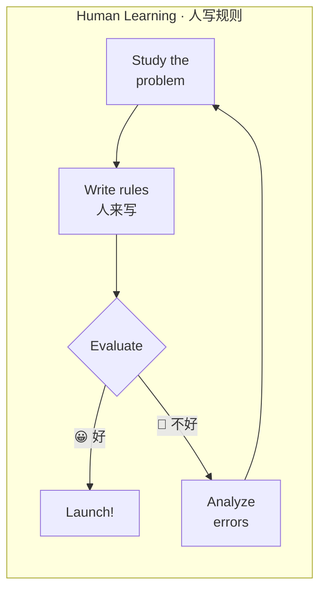

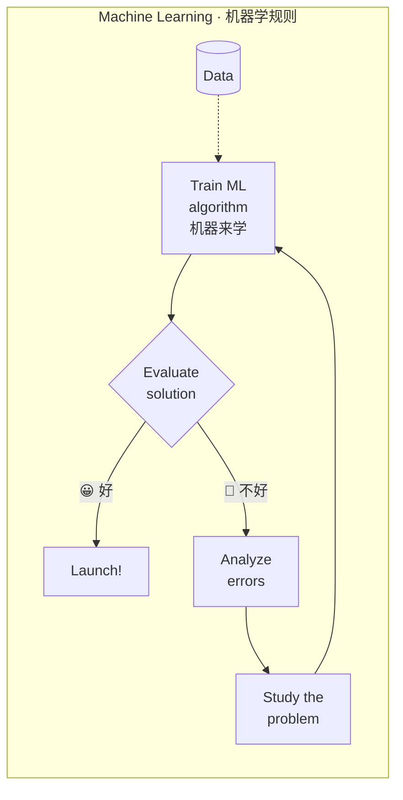

**两张图唯一的差别是中间那个方框**：`Write rules`（人写）换成了 `Train ML algorithm`（喂数据训练）。其余四个环节 —— 研究问题、评估、分析错误、回头改 —— **完全一样**。

**为什么需要它**

这个"只差一个框"的对比，回答了一个很实际的问题：**什么时候该用机器学习？**

答案是：**当规则多到人写不完、或者人根本说不清规则是什么的时候。**
- 判断一封邮件是不是垃圾邮件 —— 你可以写 100 条规则，但垃圾邮件发送者每周都在变，你得一直改（讲义 p.16 的 "Email Spam and Malware Filtering"）
- 判断一张图是狗还是松饼（讲义 p.17 的图）—— 你**根本写不出规则**

**课件原例 ①**（讲义 p.15）—— 机器学习的第二种用法

p.15 的标题是 **"Why use Machine Learning?"**，红字副标题是 **"Help a human learn with a machine"**（借助机器帮**人**学习）。流程图比 p.14 多了一条回路：

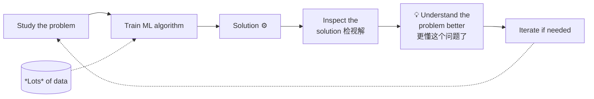

**关键在 `Inspect the solution → Understand the problem better` 这一段。** 机器学习的产出不只是一个能用的模型，还有**模型告诉你的、你原本不知道的事**。

> 💡 **这一条正是本课与"纯 ML 课"的分水岭。** 官方 CILO 3（权重 30%）要求 "propose **original findings** for practical organizational data analysis problems" —— 要的就是这个 "Understand the problem better"。
> 本课 W02 就有现成的例子：Airbnb 数据跑完回归，你会发现 **`beds` 的系数是负的**（[[IS6400_Business_Data_Analytics/_meta/数据集卡片#5.1 ⭐ 严重多重共线性（做多元回归必踩）|数据集卡片 › 5.1 ⭐ 严重多重共线性（做多元回归必踩）]]）。这个反常识的结果逼你回去看数据，才发现四个"容量类"变量高度共线 —— **这就是 "understand the problem better"**。

**课件原例 ②**（讲义 p.20）—— 为什么是现在

p.20 标题 "Why Machine Learning for DA?"，一句话：

> **The Age of Big Data need machine to process data and support decision making**（大数据时代需要机器来处理数据并支持决策）

配了三张图做对比：《华尔街之狼》电影海报 + "Life in 1990's"（交易大厅里一群人在喊叫挥手）vs "Life in 2010's"（同一个纽交所大厅，空荡荡，只剩满墙屏幕）。

> 💡 **这组图的意思**：不是"金融业裁员了"，而是**决策的载体从人换成了机器**。1990 年代的价格发现靠一屋子人吼；2010 年代靠算法。**数据量超过人的带宽之后，"要不要用机器"就不再是选择题。**

**🎙️ 课堂补充**

待转录补充。

**⚠️ 常见误解**

- ❌ **"机器学习比人写规则先进，所以永远该用 ML。"** —— p.14 的两张图是**并列**的，不是"旧 vs 新"。规则清晰、稳定、数量少的场景（增值税怎么算、订单满 300 减 50），人写规则更准更快更好解释。ML 的代价是：需要大量数据、结果难解释、要持续维护
- ❌ **"`Analyze errors` 那一步 ML 就不需要了。"** —— 恰恰相反，两张图里这一步**都在**。ML 只是把"写规则"自动化了，"看模型错在哪、回头改问题定义"这件事仍然是人的活

**与其他概念的关系**

p.15 那条 `Understand the problem better` 的回路，就是 §2.5 CRISP-DM 里那些**指回上游的红色虚线箭头**。两张图讲的是同一件事。

---

### 2.4 它能用在哪：应用全景、学科定位与职业

这一节压缩了讲义 p.16–19、p.21–28 共 13 页。这些页**几乎全是配图**，文字含量极低，但骨架是清楚的。

#### 2.4.1 通用应用（讲义 p.16–19）

p.16 是一张"Applications of Machine Learning"的十二瓣轮盘图：

| | | |
|---|---|---|
| Automatic Language Translation | Medical Diagnosis | Stock Market trading |
| Image Recognition | Online Fraud Detection | Virtual Personal Assistant |
| Speech Recognition | Email Spam and Malware Filtering | Self driving cars |
| Traffic Prediction | Product recommendations | |

三个被单独展开的例子：

| 页 | 例子 | 内容 |
|---|---|---|
| p.17 | **Image recognition** | 左：一张卷发女性照片与一只可卡犬并排（发型极像）；右：著名的"吉娃娃 vs 蓝莓松饼"十六宫格。**说明"人一眼能分、规则写不出来"的任务正是 ML 的主场** |
| p.18 | **Stock Market** | AAPL 股价 + **社交媒体情绪（Social Sentiment: Strong Buy 64% / Buy 15% / Hold 9% / Sell 3% / Strong Sell 9%）** + Chatter Volume 的叠加图，来源 `theoreti.ca/?p=5032`（数据是 2013 年的） |
| p.19 | **Clustering — Social Network Segmentation** | 一张社交网络图被 **DBSCAN（Density-Based Spatial Clustering of Applications with Noise）** 分成两团，下方是人群图标被圈成大小不等的几组 |

> 💡 p.18 那张图值得记：它不是"用历史价格预测未来价格"，而是**把社交媒体情绪当成一个特征**去解释股价。这正是 §2.2 定义里说的"分析**新类型**的数据"。⚪ 若小组项目做金融方向，这是一个现成的思路。

#### 2.4.2 商业应用（讲义 p.23–24）

p.23 是本讲**信息密度最高的一页文字**，五类商业应用：

| 应用 | 讲义原文 | 中文 |
|---|---|---|
| **Pricing** | setting prices for consumer and industrial goods, government contracts, and maintenance contracts | 为消费品、工业品、政府合同、维保合同定价 |
| **Customer segmentation** | identifying and targeting key customer groups in retail, insurance, and credit card industries | 在零售、保险、信用卡行业识别并锁定关键客户群 |
| **Merchandising** | determining brands to buy, quantities, and allocations | 决定进什么牌子、进多少、怎么分配 |
| **Location** | finding the best location for bank branches and ATMs, or where to service industrial equipment | 银行网点/ATM 选址、工业设备服务点选址 |
| **Social Media** | understand trends and customer perceptions; assist marketing managers and product designers | 理解趋势与顾客认知，辅助市场经理与产品设计师 |

p.24 是技术视角的五条：Market analysis · Risk analysis and management · **Fraud detection and detection of unusual patterns (outliers)** · Text mining (news group, email, documents) and Web mining · Stream data mining

> ⚠️ 注意 p.24 里的 **Text mining** 和 **Stream data mining** 在 13 周教学计划里**没有对应的周次**。它们出现在官方 Keyword Syllabus 里（Text Analytics），但本学期不教。见 [[IS6400_Business_Data_Analytics/_prep/课程前置资料#4.3 三处必须留意的差异|课程前置资料 › 4.3 三处必须留意的差异]]。

#### 2.4.3 学科定位（讲义 p.25–26）

p.25 用三个交叠的椭圆定位机器学习：

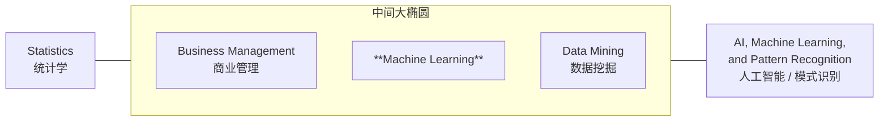

**读法**：ML 位于**统计学**与**AI/模式识别**之间，而这块交叠区域**同时被商业管理覆盖** —— 也就是说，本课要的不是纯统计、也不是纯 AI，而是**三者的交集**。这与官方 CILO 的措辞完全一致（既要 "employ Python to discover patterns"，又要 "support decision making in finance, marketing…"）。

p.26 标题 **"You Play in everyone's sandbox"**（你能在所有人的沙坑里玩），一张彩色词云列了 15 个行业：Transportation & Logistics、Automotive、Education、Energy、Insurance、Information Technology、Entertainment、Consulting、Telecommunications、Government、Food Processing、Electronics、Retail Trade、Banking、Manufacturing。底下一句下划线的话：

> "**The best thing about analytics is that it lets you play in everyone's sandbox**"
> （数据分析最棒的一点，是它让你能进入任何一个行业。）

#### 2.4.4 职业（讲义 p.27–28）

p.27 是一张 "Data Science Roles & How They Interact" 三圆维恩图 —— **这页值得看清楚，它定义了三种岗位的边界**：

| 角色 | 一句话职责 | 核心技能（图中列出） |
|---|---|---|
| **Data Engineer** | Enable data access & utilization —— 建并维护基础设施 / "data pipe" 与相关软件工程工作 | Data Ingest & ETL Tools · Database Systems · Hadoop Ecosystem · Data APIs · Unstructured data & Data Modeling · Data Warehousing |
| **Data Scientist** | Optimize & enable data for business & functional value capture —— 分析并解读复杂数字数据，抽取知识、辅助决策 | **Python, R** · Distributed Computing · **Machine & Deep Learning** · **Feature Engineering & Predictive Modeling** · Statistics & Math · Storytelling & Visualization |
| **Business Stakeholder** | Help the business make better decisions through data | Critical Thinking · Business Intelligence · Statistics & Math · Communicate Findings · Data Stewardship & Data Mgt · Storytelling & Visualization |

三圆的**共同交集**是：**Hypothesis Development · Monetization · Governance**（假设开发 · 变现 · 治理）。

> 💡 **本课在训练哪一个？** 看技能表就知道：Python、机器学习、**特征工程与预测建模**、可视化 —— 全部落在 **Data Scientist** 那一圈；而官方 CILO 4（沟通与演示，10%）落在 **Business Stakeholder** 那一圈。**本课训练的是"会讲人话的 Data Scientist"**，不是 Data Engineer（本课完全不碰 Hadoop、ETL、数据仓库）。

p.28 "Career Future" 给了三个数字：

> - Shortage: USA alone faces a shortage of **140,000 to 190,000** people with deep analytical skills
> - Shortage: **1.5 million** managers to analyze big data and make decisions based on their findings
> - **"Data Scientist: The Sexiest Job of the 21st Century" — Harvard Business Review**
> - 最后一行小字："Just to find a good JOB!"

⚠️ **这三条都没标日期，而且都很老**：前两个数字出自 McKinsey Global Institute **2011 年**的报告，HBR 那篇是 **2012 年**的。见 [[#9.3 课件自身的问题|§9.3]]。

**🎙️ 课堂补充**：待转录补充。

**⚠️ 常见误解**

- ❌ **"学了这门课就能做 Data Engineer。"** —— p.27 明确把 ETL、Hadoop、数据仓库划给 Data Engineer，**本课一节都不讲**
- ❌ **"p.28 的数字可以写进求职信/报告。"** —— 15 年前的数字，且没标出处年份。要引用请回原报告核对

**所以呢**：应用场景和职业前景讲完了——知道"这门课有用"之后，下一个问题是"这门课具体怎么把项目做出来"，答案就是下面这套流程。

---

### 2.5 ⭐ BDA 流程：CRISP-DM 六步（本讲唯一的核心内容）

**是什么**

刚接触数据项目的人最容易犯的错，是拿到数据就直接打开 Python 建模——而真正决定一个数据项目成不成的，往往是建模**之前**那几步有没有做扎实（业务目标想没想清楚、数据脏不脏）。**CRISP-DM** 就是一套"数据项目该按什么顺序做"的标准流程，本讲把它当成贯穿全课十二周的骨架：后面每一周学的模型，都只是这套流程里的一个环节。严谨地说，**CRISP-DM = Cr**oss **I**ndustry **S**tandard **P**rocess for **D**ata **M**ining（跨行业数据挖掘标准流程）。讲义 p.31 给了三条事实：

> - Proposed in **1990s** by a **European consortium**（1990 年代由一个欧洲联盟体提出）
> - Composed of **six consecutive phases**（由六个连续阶段构成）
> - **Your group project may follow this process (except deployment if not applicable)**（红字，你的小组项目可以照这个流程走，部署那步不适用可以跳过）

六个阶段与它们的时间占比（p.31 用一个红色大括号把前三步框起来）：

| # | 阶段 | 中文 | 干什么 | 工时 |
|---|---|---|---|---|
| 1 | **Business Understanding** | 业务理解 | 搞清楚要解决什么商业问题、成功长什么样 | ⎫ |
| 2 | **Data Understanding** | 数据理解 | 有什么数据、质量如何、能不能回答问题 | ⎬ **约 80%** |
| 3 | **Data Preparation** | 数据准备 | 清洗、处理缺失、造特征、编码类别变量 | ⎭ |
| 4 | **Model Building** | 建模 | 选模型、训练、调参 | ⎫ |
| 5 | **Testing and Evaluation** | 测试与评估 | 用没见过的数据检验，判断够不够好 | ⎬ 约 20% |
| 6 | **Deployment** | 部署 | 上线，让别人真的用起来 | ⎭ |

p.30 用一张流程图强调**它不是单向的**：

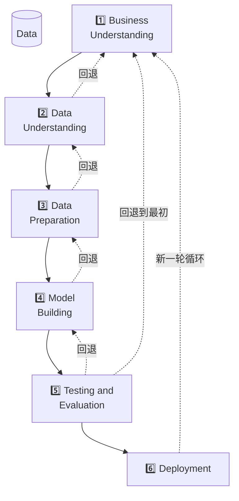

图左侧的红字说明：**"Steps can be repeatedly backtracking for model & performance refinement"**（可以反复回退，以改进模型与性能）。中间画着一个数据库图标 —— **数据在整个循环的中心**。

**为什么需要它**

因为**新手会把 90% 的时间花在第 4 步（挑模型、调参数），而 CRISP-DM 说那只值 20%**。

这个"80% 在前三步"的判断，在本课有极其具体的印证：
- **[[IS6400_Business_Data_Analytics/_meta/数据集卡片|Airbnb 数据集卡]]** 整整一张卡片全部是第 2、3 步的内容（缺失机制、共线性、稀有类别、编码不一致），而真正的建模在 [[T02-回归实战-从合成数据到Airbnb定价]] 里只有 **3 个 cell**
- W02 tutorial 里，读数据 + 处理类别变量用了 5 个 cell，`LinearRegression().fit()` 只用了 1 行

**课件原例**（讲义 p.30–31）

课件没给案例，只给了流程本身。但 p.31 那句红字 —— "Your group project may follow this process" —— **是本讲对小组项目最直接的指导**。

对照 [[IS6400_Business_Data_Analytics/_meta/作业与DDL#3. 小组项目（合计 30%）|作业与DDL › 3. 小组项目（合计 30%）]] 的 Proposal 五项要求，会发现它就是 CRISP-DM 前四步：

| Proposal 要求 | CRISP-DM 步骤 |
|---|---|
| ① Business Problem | **Step 1** Business Understanding |
| ② Dataset Description（字段名 + 数据类型） | **Step 2** Data Understanding |
| ③ Key Variables | **Step 2–3** |
| ④ BDA Methods | **Step 4** Model Building |
| ⑤ Potential Contribution | Step 1 的回照（成功长什么样） |

**🎙️ 课堂补充**

待转录补充。⏳ 转录到手后重点确认：教授在这一页停留多久、有没有举自己咨询项目的例子（p.21–22 展示了他给 PEACEBIRD、inm 乳业、PEAK 做的项目）。

**💡 换个说法（笔记补充）**

把 CRISP-DM 想成**装修房子**：

| 步骤 | 装修类比 |
|---|---|
| 1 Business Understanding | 问业主：你要住几个人？预算多少？最在意什么？ |
| 2 Data Understanding | 量房：承重墙在哪、水电走向、层高多少 |
| 3 Data Preparation | 拆除、找平、防水、布线 |
| 4 Model Building | 刷漆、装家具 |
| 5 Testing & Evaluation | 验收：闭水试验、开关每个都按一遍 |
| 6 Deployment | 入住 |

新手觉得装修就是"选家具"（第 4 步），实际上 80% 的工期和预算在量房和基础施工。**而且量完房发现承重墙位置不对，就得回去改设计** —— 这就是那些回退箭头。

**⚠️ 常见误解**

- ❌ **"六步是一条直线，走完就完了。"** —— p.30 画了大量回退虚线，还有一个最外层的大圆圈表示整体循环。**"Steps can be repeatedly backtracking"** 是原话
- ❌ **"Deployment 是必须的。"** —— p.31 明说 "except deployment **if not applicable**"。学生项目通常没有真的上线环节
- ❌ **"Testing and Evaluation 就是看准确率高不高。"** —— 第 5 步的评估必须回照第 1 步的商业目标。一个 R² 很高但业务上没法用的模型，评估应该是不通过的
- ❌ **"CRISP-DM 是这门课发明的。"** —— 它是 1990 年代的**行业标准**，不是课程独有。在业界写方案时直接说 "we follow CRISP-DM" 是通用语言

**与其他概念的关系**

CRISP-DM 是全课的骨架。后面每一周学的模型（回归、PCA、聚类、决策树、RNN）**全都只是第 4 步里的一个选项**。而 [[M02-预测分析-线性回归]] 的第 2 页会再画一次这张图，并用**红框圈出第 4 步 Model Building** —— 教授在用同一张图告诉你"我们现在走到哪了"。

---

### 2.6 全课技术地图（W02–W11 的目录）

**是什么**

讲义 p.32（**标题被黄色高亮**）把整门课的技术分成两栏：

| Advanced Machine Learning Techniques | Neural Networks and Deep Learning |
|---|---|
| Predictive Analytics — **Week 2** | Artificial Neural Network — **Week 9** |
| Feature Engineering — **Week 3** | Recurrent NN — **Week 9** |
| Clustering Models — **Week 4** | Image Mining — **Week 10** |
| Prediction Models — **Week 5–8** | GenAI and LLM — **Week 11** |

两栏的箭头共同指向底部一个红字大框：**End-to-end Business Applications**（端到端的商业应用）。

> 💡 **这张图的编排逻辑**：左栏是"从数据里找结构"，右栏是"用神经网络处理非结构化数据（序列、图像、文本）"。两栏不是难度递进，而是**处理对象不同**。

下面 p.33–45 是每种技术的一页预告。**这些页在本讲只需要"知道有这么回事"，真正展开在对应周次。**

#### 2.6.1 特征工程与降维的危险（p.33–34）

**是什么**

要教一个模型分清照片里是猫还是狗，模型看不懂"猫"这个字——它需要的是一些能拿来描述这张照片的具体数字，比如耳朵的形状、毛发长度、体型大小。这些"能用来描述一个对象"的具体属性，就叫**特征（Feature）**。讲义 p.33 给出的正式定义（红字）：

> **"Feature is the element that you use to describe an object"**（特征就是你用来描述一个对象的那些元素）

p.33 配了一张裁切过的照片：墙上的 Fevicol 胶水广告前，有两个人形**影子**面对面，看起来像一对情侣要接吻。

**p.34 是同一张照片的完整版** —— 整页只有这张图，底下一行小字：`Original photographer unknown` / `See also www.cs.gmu.edu/~jessica/DimReducDanger.htm` / `(c) eamonn keogh`。

完整照片里根本没有情侣：那是**路过的行人、一辆自行车和一条狗的影子在墙上重叠**造成的错觉。

> ⭐ **这两页在讲一件很深的事，但讲义一个字都没写**：
> **把三维世界投影成二维影子，会凭空造出原本不存在的结构。**
> 特征工程和降维（W03 的 PCA）做的正是"投影"这件事。**投影后看到的模式，可能只是投影角度的产物，不是数据里真实存在的关系。**
>
> 那个链接 `DimReducDanger.htm` 的标题直译就是"降维的危险"。这是数据挖掘教学里的经典例子（出自 UCR 的 Eamonn Keogh 教授）。
>
> ⚠️ **讲义只放图不给文字，如果没听课就完全看不出重点在哪。** 这是本讲最需要转录补充的一页。

**所以呢**：特征是描述一个对象的原材料，降维是把这些原材料压缩、但压缩要小心失真。下一种技术——聚类——则是"不预先分类，让相似的对象自己聚成堆"。

#### 2.6.2 聚类（p.35–36）

**是什么**

想把音乐软件里几千首歌自动分成几种风格，但没有人预先告诉算法"什么算摇滚、什么算民谣"——算法只能自己去看每首歌的特征（节奏快慢、音色、时长），把"听起来像"的歌自动归到一堆。这种**不需要事先标好答案、只靠"相似的凑一堆"来分组**的方法，就叫**聚类（Clustering）**。p.35 给了聚类的**两个用途**（这个二分法值得记）：

| 用途 | 讲义原文 | 例子 |
|---|---|---|
| **Understanding**（理解结构） | Group related documents for browsing, group genes and proteins that have similar functionality, or group stocks with similar price fluctuations | 把相关文档分组便于浏览；把功能相似的基因蛋白质分组；把价格波动相似的股票分组 |
| **Summarization**（压缩规模） | Reduce the size of large data sets | 用少数几个簇代表整个大数据集 |

配图两张：文档聚类示意（两个圈里各有若干文档，各有一个黄色的 "Representative Document"）+ 美国各州的 Cluster plot（Dim1 62% / Dim2 24.7%，分成 3 簇）。

p.36 是一张 20 格的聚类算法家族图：k-means(k=3) · k-means++ · k-means‖ · Fuzzy k-means · k-medoids · k-medians · k-modes · k-prototypes · CLARA · CLARANS · GMM · EM · DMM · **DBSCAN** · OPTICS · DENCLUE，外加一张 CIFAR 图像的 t-SNE 可视化。

> ⚪ **本讲不需要认识这 16 种算法。** W04 只教两个：**Bisecting KMeans** 和 **DBSCAN**。这页的作用是让你知道"聚类不止 k-means 一种"。

**所以呢**：聚类处理的是"没有标准答案、按相似度分组"的问题；下一种技术——预测分析 / 时间序列——处理的是"有历史数据、要猜下一步会怎么变"的问题，两者解决的问题类型完全不同。

#### 2.6.3 预测分析 / 时间序列（p.37）

**是什么**

超市想知道下个月牛奶要进多少货，靠的不是"分组"或"分类"，而是看这个商品过去每个月卖出多少、有没有逐月上涨或每逢节假日就多卖——这种**用过去一串按时间排列的数字，去猜接下来会怎么变**的任务，就是**时间序列预测（time-series prediction）**。p.37 用一张图展示这套方法家族是怎么一代代升级的（W07–W08 的目录）：

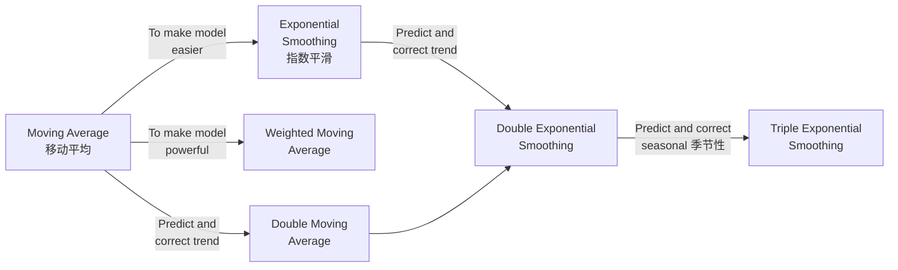

配图是一张销量预测图：左边黑点是 "Historical data"，红色虚线右边是 "Forecasted data"，蓝色带阴影的是预测区间。

> 💡 **这张图的规律值得记**：每一次升级都是在**加一个可以被"预测并修正"的成分** —— 先是趋势（trend），再是季节性（seasonal）。W07–W08 会沿这条线走一遍。

**所以呢**：时间序列处理的是"数据有先后顺序"的预测问题（这也正是 [[M02-预测分析-线性回归#2.5.2 四条假设（讲义 p.17–18，⭐ 必考）|M02 §2.5.2]] 独立性假设被违反时该换的模型）。下一种技术——分类——换一个完全不同的问题：不猜"下一个数字是多少"，而是猜"这个对象属于哪一类"。

#### 2.6.4 分类与集成学习（p.38–39）

**是什么**

银行要不要批一笔贷款，看的是"这个人会不会按时还款"——这只有"会"或"不会"两种答案，不是一个连续变化的数字。像这样**根据已知信息判断一个对象属于哪一类别**的任务，就叫**分类（Classification）**。p.38 给出的正式定义：

> **Find a model for class attribute as a function of the values of other attributes**
> （为"类别属性"找一个模型，它是其他属性取值的函数。）

课件用一个**信用评分**的例子贯穿 p.38–40：

| Tid | Employed | Level of Education | # years at present address | **Credit Worthy**（Class） |
|---|---|---|---|---|
| 1 | Yes | Graduate | 5 | **Yes** |
| 2 | Yes | High School | 2 | **No** |
| 3 | No | Undergrad | 1 | **No** |
| 4 | Yes | High School | 10 | **Yes** |

右边是一棵**决策树**（W05 展开）：

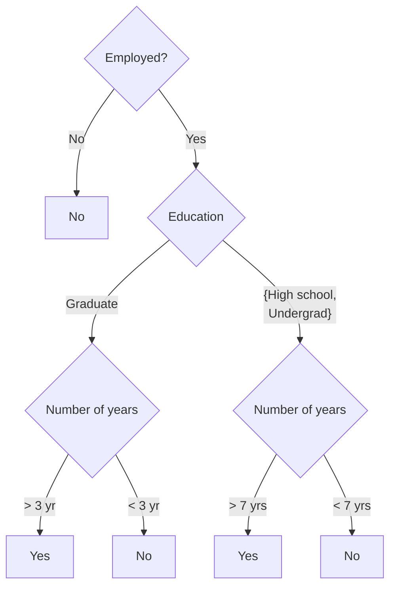

p.39 **Advanced Classification** —— 用**同一份数据、同一个问题**，换成集成学习（"Ensemble Learning to solve the same problem"），三步：

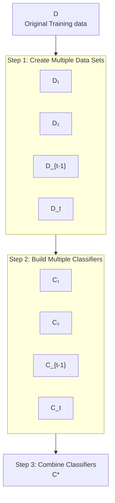

（图注：Figure 5.31 A logical view of the ensemble learning method —— 出自教材 DM 第 5 章。）

**所以呢**：分类和集成学习靠的是"人工设计好的算法"在数据里找规律；接下来的深度学习换了一条路——让一个多层的神经网络自己学出更复杂的规律，处理分类和聚类都搞不定的问题（图像、语音、语言）。

#### 2.6.5 深度学习与神经网络（p.40–42）

**是什么**

决策树和集成学习靠的都是"人先设计好判断步骤"，深度学习换了一条路：把很多个简单的计算单元一层层叠起来（模仿神经元互相连接的样子），让整个网络自己从数据里调整每个连接的强弱，学出复杂到人写不出规则的判断方式。p.40 用**还是那张信用评分表**（§2.6.4 用过的同一个例子）换成一个三层神经网络：5 个输入 X₁…X₅ → Input Layer → Hidden Layer（3 个节点）→ Output Layer（1 个节点）→ y。

> 💡 **p.38 → p.39 → p.40 是同一个例子换了三种模型。** 教授在用最小的认知成本传达一件事：**同一个商业问题（信用评分），可以用决策树、集成、神经网络三种方式解**。这正是 W11 "Model Assessment / Model Selection" 要回答的问题 —— **怎么选？**

p.41 **Sequential Model**：一张 encoder-decoder 结构图（Encoder 侧 LSTM 链吃 x₁…x_t，Decoder 侧吃 Temporal attention + 未来外部因子 Weather Condition / Holidays / Events 的 embedding，输出 y₁…y_t）+ 一张 **LSTM Cell** 内部图（Forget gate / Input gate / Output gate）。图注：*Figure 2: Framework of Deep Sequential Model for Component Consumption Prediction*。

> ⚪ 这张图很可能出自教授自己的论文（p.21–22 展示的正是零售补货预测系统）。W09 会展开。

p.42 是著名的 "A mostly complete chart of Neural Networks"（©2016 Fjodor van Veen, asimovinstitute.org），列了 Perceptron、FF、RBF、DFF、**RNN**、**LSTM**、GRU、AE、VAE、DAE、SAE、Markov Chain、Hopfield、Boltzmann Machine、RBM、DBN 等。**本讲只需知道"神经网络有很多种"。**

**所以呢**：神经网络是一个能自己调参数、拟合复杂规律的通用框架；下一节看这个框架被推到多复杂之后，能做出什么以前做不到的事——生成式 AI 和大语言模型。

#### 2.6.6 深度学习、GenAI 与 LLM（p.43–45）

**是什么**

聊天机器人能对答如流、能把一句话翻译成另一种语言、能看着提示写出一段代码——这些能力背后不是各自独立的技术，而是同一个"深度学习"框架，被推向了更大规模、用在了"生成新内容"这件事上。p.43 用一张层级图厘清"深度学习""生成式 AI""NLP"三者的关系 —— **这是本讲少数需要精确记住的定义关系**：

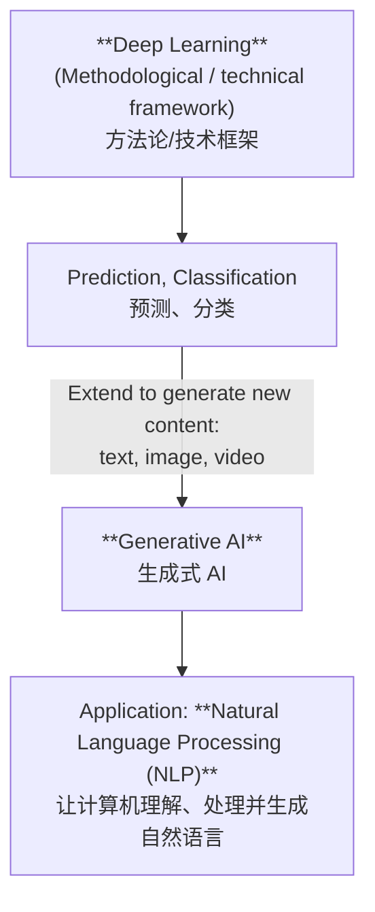

**读法**：深度学习是**框架**；用它做预测与分类是一种用法；**把它扩展到"生成新内容"（文本/图像/视频）就是生成式 AI**；NLP 是其中一个应用方向。

p.44 给出三层定义（**建议整页背下来，这是能直接写进考卷的英文定义**）：

> **Language Model**
> "Models capable of **generating, understanding, or manipulating** text or speech in natural language"
> - Neural network-based models
> - **Transformer models**
>   - **Attention**: "Instead of reading word by word, it can examine **multiple words at once** and understand their **relationships**"
>
> **Large Language Model**
> - Large model using **Transformer**
> - Trained on **large-scale text corpora**
> - e.g. Generative pre-trained transformer (**GPT**)

p.45 列 LLM 应用：**Chatbot** · **Content generation**（Text / Image / Video）· **Sentiment analysis** · **Code development**（配图是一个 AI 编程助手界面）· Translation · Recommendation

> ⭐ **p.45 的 "Code development" 不是随手一提。** 它是本课 tutorial 里那些 `🤖 AI Prompt` 单元格的理论出处，也是 W11 "Competition: GenAI for BDA" 的伏笔。详见 [[T01-Jupyter入门与Pandas基础#6. 教授在教你怎么向 AI 提问|T01-Jupyter入门与Pandas基础 › 6. 教授在教你怎么向 AI 提问]]。

**所以呢**：整张技术地图（特征工程、聚类、时间序列、分类、深度学习、GenAI）到这里讲完了——它们都只是 §2.5 CRISP-DM 第 4 步"选模型"时可选的具体工具。下一节换个话题：这些工具要跑在什么软件环境里。

**🎙️ 课堂补充**

待转录补充。⏳ 转录到手后重点确认：p.33–34 那张影子照片教授到底讲了什么（这是本讲信息缺口最大的一页）。

**⚠️ 常见误解**

- ❌ **"GenAI 是比深度学习更新的技术。"** —— p.43 的图说得很清楚：GenAI 是**深度学习框架下的一类用途**，不是它的替代或升级
- ❌ **"Attention 就是'重点关注某些词'。"** —— p.44 的措辞是 "examine multiple words **at once** and understand their **relationships**"。重点在**同时**与**关系**，不是"加权"这么简单
- ❌ **"p.36 那 16 种聚类算法都要会。"** —— W04 只教 2 种

**与其他概念的关系**

整张技术地图都挂在 §2.5 CRISP-DM 的**第 4 步 Model Building** 下面。地图上的每一格，都是"这一步可以选的一个工具"。

---

### 2.7 工具链：Anaconda / Jupyter / Colab

对应讲义 p.46–57（12 页，占全讲 21%）。**这一段是操作说明，不是知识**，所以本节只给骨架，逐步操作与代码在 [[T01-Jupyter入门与Pandas基础]]。

#### 2.7.1 三条上手路径

**是什么**

装 Python 环境这件事众口不一：有人喜欢在自己电脑上装一整套软件、离线也能用；有人嫌麻烦，只想打开浏览器就能写代码。这门课的讲义把可行的路径归纳成了三条，下面这张图把它们和各自的取舍摆在一起：

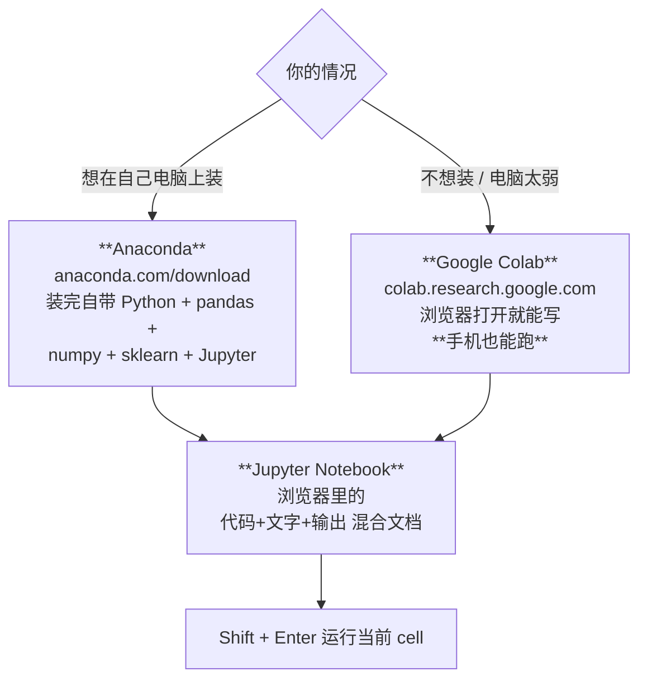

**Anaconda 的两条启动路径**（p.49–50）：
1. **Anaconda Navigator** → 应用面板里点 **Jupyter Notebook** 的 `Launch`
2. Windows 开始菜单 → `Anaconda3 (64-bit)` → 直接点 **Jupyter Notebook**

任一路径都会在浏览器打开 `localhost:8888`，显示你的文件目录树。

**新建 notebook**（p.51）：右上角 `New ▾` → **Python 3**

**写与跑**（p.52–54）：
- 中间那个 `In [ ]:` 框就是 **Coding Area**（p.52）
- 输入 `print("Hello IS6400")`，按 **Shift + Enter**（或点工具栏 ▶ Run）（p.53）
- 代码下方出现 `Hello IS6400`，这就是 **Output**（p.54）；同时 `In [ ]` 变成 `In [1]`

**Google Colab**（p.55–57）：网址 `colab.research.google.com`，同样 Shift + Enter 运行。最后一页 p.57 是手机截图，红字问 **"Use my cell phone to code? YES!"**

**所以呢**：三条路径、装好环境之后能打开的 Jupyter/Colab 界面都清楚了。但讲义这部分的截图是好几年前录的，下一节先说清楚哪些地方对不上、不用慌。

#### 2.7.2 ⚠️ 这 12 页的截图全部过时了

**是什么**

讲义 p.47–57 这 12 页装环境的截图，是好几年前录的——按钮的位置、软件的版本号、甚至截图里显示的文件夹路径都已经不是现在的样子。这不影响你照着操作（**流程本身没有错**），但如果你逐个像素去对照界面找那个按钮，会怀疑自己是不是打开错了软件。下表列出具体哪里过时：

| 讲义内容 | 过时在哪 |
|---|---|
| p.47 引用 **Gartner Peer Insights Customers' Choice 2019** | 6 年前的奖项 |
| p.48 页面写 **"Anaconda Individual Edition"**，URL `anaconda.com/products/individual`，**Python 3.9**，安装包 510 MB | Anaconda 早已弃用 "Individual Edition" 这个名字，该 URL 现在会跳转；当前版本远高于 3.9 |
| p.49 Navigator 里显示 **Jupyter Notebook 6.4.5** | 当前是 Notebook 7 / JupyterLab，界面完全不同 |
| p.50–54 截图路径含 **`Dropbox/Teaching/2022Spring/`** | 2022 年春季的截图 |
| p.57 代码写的是 `print("welcome to **IS4861**")` | **课程代码写错了**，IS4861 是另一门课 |

> 💡 **实际怎么办**：这几页的**流程**是对的（装 Anaconda → 开 Jupyter → Shift+Enter），只是界面变了。照着按钮的**位置和名字**找即可，不要对着截图逐像素比对。
> ⚪ **更省事的建议**：如果只是为了跟上 tutorial，**直接用 Google Colab**（p.55–57）—— 不用装任何东西，不会有版本问题，两个 tutorial notebook 都能直接上传运行。代价是每次要重新上传 `Airbnb.csv`。

**🎙️ 课堂补充**：待转录补充。

**⚠️ 常见误解**

- ❌ **"cell 从上往下写就行，顺序无所谓。"** —— Jupyter 的变量存活在 **kernel** 里，跟 cell 的**排列顺序**无关，只跟**执行顺序**有关。你可以先跑第 5 个 cell 再跑第 2 个，结果会很怪。这是初学者最常见的坑，详见 [[T01-Jupyter入门与Pandas基础#2.0.1 cell · kernel · 执行顺序 ⚠️|T01 §2.0.1]]
- ❌ **"Colab 和 Jupyter 是两个不同的东西。"** —— Colab 就是跑在 Google 服务器上的 Jupyter，`.ipynb` 文件互通

**所以呢**：环境装好了，规则、全景、工具三件事这一讲都交代完了。下面两张图把"这一讲的四段结构"和"CRISP-DM 与十三周课程的对应关系"分别画出来，作为整讲的收尾；真正动手写代码，从 [[T01-Jupyter入门与Pandas基础]] 开始。

---

## 3. 一图看懂

### 图 1 · 本讲的四段结构与信息密度

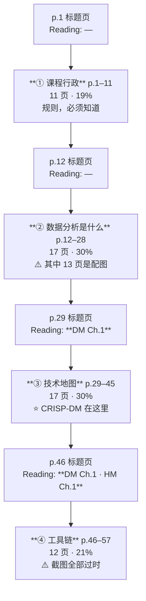

### 图 2 · CRISP-DM 与本课十三周的对应

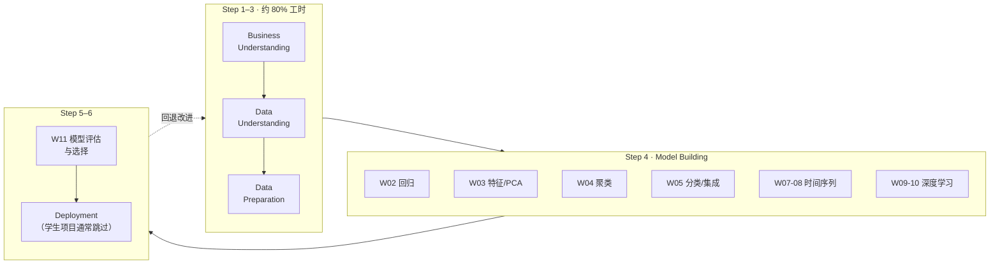

> **这张图是本讲最该带走的东西**：整门课十二周的模型课，全部塞在 CRISP-DM 的**第 4 步**里，而那一步只占 20% 的工时。**小组项目做不好，多半不是模型选错，是第 1–3 步没做扎实。**

---

## 4. 速查表（考前一页纸）

### 4.1 核心定义（英文原句，考试可直接写）

| 概念 | 讲义原句 | 页 |
|---|---|---|
| Data Analytics | "the process of **automatically discovering useful information in large data repositories**" | p.13 |
| Feature | "Feature is **the element that you use to describe an object**" | p.33 |
| Clustering — Understanding | "Group related documents for browsing, group genes and proteins that have similar functionality, or group stocks with similar price fluctuations" | p.35 |
| Clustering — Summarization | "**Reduce the size of large data sets**" | p.35 |
| Classification | "Find a model for **class attribute** as a **function of the values of other attributes**" | p.38 |
| Ensemble Learning | "Ensemble Learning **to solve the same problem**"（三步：Create multiple data sets → Build multiple classifiers → **Combine classifiers**） | p.39 |
| Language Model | "Models capable of **generating, understanding, or manipulating** text or speech in natural language" | p.44 |
| Attention | "Instead of reading word by word, it can examine **multiple words at once** and understand their **relationships**" | p.44 |
| LLM | "**Large model using Transformer**, trained on **large-scale text corpora**, e.g. GPT" | p.44 |
| NLP | "Enabling computers to **understand, process and generate** natural language" | p.43 |

### 4.2 CRISP-DM 一览（**最可能考**）

| # | 英文 | 中文 | 关键点 |
|---|---|---|---|
| 1 | Business Understanding | 业务理解 | ⎫ |
| 2 | Data Understanding | 数据理解 | ⎬ **~80% of total project time** |
| 3 | Data Preparation | 数据准备 | ⎭ |
| 4 | Model Building | 建模 | 后面 12 周全在这一步里 |
| 5 | Testing and Evaluation | 测试与评估 | 要回照第 1 步的商业目标 |
| 6 | Deployment | 部署 | "except deployment **if not applicable**" |

**必记三条**：① 1990s，European consortium ② six consecutive phases ③ **Steps can be repeatedly backtracking**

### 4.3 技术地图 ↔ 周次

| 技术 | 周 | 一句话 |
|---|---|---|
| Predictive Analytics（回归） | W02 | 用自变量预测一个连续的因变量 |
| Feature Engineering / PCA | W03 | 挑选与压缩特征 |
| Clustering（Bisecting KMeans, DBSCAN） | W04 | 无监督分组：Understanding + Summarization |
| Classification（决策树、集成） | W05 | 为类别属性找模型 |
| Time series（Holt、指数平滑） | W07–08 | 加趋势、加季节性 |
| ANN / RNN | W09 | 序列模型、LSTM |
| Image Mining | W10 | 图像 |
| GenAI / LLM | W11 | Transformer、Attention |

### 4.4 三种数据岗位（p.27）

| 角色 | 一句话 | 本课教吗 |
|---|---|---|
| Data Engineer | 让数据可用（管道、ETL、仓库） | ❌ 完全不教 |
| **Data Scientist** | 从数据里造知识（Python、ML、特征工程、可视化） | ✅ **主线** |
| Business Stakeholder | 用数据做决策（批判性思维、沟通、讲故事） | ✅ 官方 CILO 4（10%） |

---

## 5. 双语术语卡

| 中文 | English | 考试可用的英文定义 | 首现 |
|---|---|---|---|
| 商业数据分析 | Business Data Analytics (BDA) | The process, models, and tools for data analysis and analytics in business, such as finance and marketing | §2.2 |
| 数据分析 | Data Analytics | The process of automatically discovering useful information in large data repositories | §2.2 |
| 数据挖掘 | Data Mining | （本课与 Data Analytics 同义使用） | §2.2 |
| 跨行业数据挖掘标准流程 | **CRISP-DM** (Cross Industry Standard Process for Data Mining) | A six-phase data mining process proposed in the 1990s by a European consortium; phases can be repeatedly backtracked | §2.5 |
| 业务理解 | Business Understanding | CRISP-DM Step 1 | §2.5 |
| 数据理解 | Data Understanding | CRISP-DM Step 2 | §2.5 |
| 数据准备 | Data Preparation | CRISP-DM Step 3 | §2.5 |
| 建模 | Model Building | CRISP-DM Step 4 | §2.5 |
| 测试与评估 | Testing and Evaluation | CRISP-DM Step 5 | §2.5 |
| 部署 | Deployment | CRISP-DM Step 6 | §2.5 |
| 特征 | Feature | The element that you use to describe an object | §2.6.1 |
| 特征工程 | Feature Engineering | Selecting, constructing and transforming features so that models can learn more easily | §2.6.1 |
| 聚类 | Clustering | Grouping similar objects without labels; two purposes: Understanding and Summarization | §2.6.2 |
| 分类 | Classification | Find a model for class attribute as a function of the values of other attributes | §2.6.4 |
| 类别属性 | Class Attribute | The attribute to be predicted in a classification task | §2.6.4 |
| 集成学习 | Ensemble Learning | Create multiple data sets → build multiple classifiers → combine them into one | §2.6.4 |
| 序列模型 | Sequential Model | An encoder-decoder architecture (often LSTM-based) for ordered data | §2.6.5 |
| 长短期记忆网络 | LSTM (Long / Short Term Memory) | An RNN cell with forget / input / output gates | §2.6.5 |
| 语言模型 | Language Model | Models capable of generating, understanding, or manipulating text or speech in natural language | §2.6.6 |
| 注意力机制 | Attention | Instead of reading word by word, examine multiple words at once and understand their relationships | §2.6.6 |
| Transformer | Transformer | The attention-based architecture underlying large language models | §2.6.6 |
| 大语言模型 | Large Language Model (LLM) | Large model using Transformer, trained on large-scale text corpora, e.g. GPT | §2.6.6 |
| 生成式 AI | Generative AI | Deep learning extended to generate new content: text, image, video | §2.6.6 |
| 自然语言处理 | Natural Language Processing (NLP) | Enabling computers to understand, process and generate natural language | §2.6.6 |
| 数据工程师 | Data Engineer | Enables data access & utilization; builds the data pipe and infrastructure | §2.4.4 |
| 数据科学家 | Data Scientist | Ascribes value to raw data through original interpretation & modeling | §2.4.4 |
| 业务干系人 | Business Stakeholder | Helps the business make better decisions through data | §2.4.4 |

---

## 6. 考点预判与答题框架

### 6.1 可信度分级

| 级别 | 含义 |
|---|---|
| 🔴 教授明示 | 转录里教授明确说过会考 / 要记 —— **引用原话** |
| 🟡 ILO 反推 | 对应课程 ILO / CILO，官方口径上必须考核 |
| ⚪ 笔记推断 | 我根据内容重要性和同类课程惯例的判断 |

> ⚠️ **本讲无转录，所以最高只能到 🟡。** 转录补上后需重评。

### 6.2 考点清单

| 可信度 | 考点 | 依据 | 对应小节 |
|---|---|---|---|
| 🟡 | **默写 CRISP-DM 六步 + 说明哪三步占 80% 工时 + 说明为什么可以回退** | 官方 CILO 1（25%）"Describe the target and requirements for a spectrum of business data analysis problems"；且讲义明写"你的小组项目可以照这个流程走" | §2.5 |
| 🟡 | 给一个商业场景，判断它属于分类 / 回归 / 聚类哪一类任务，并说明理由 | 官方 CILO 1 + CILO 3 | §2.6 |
| 🟡 | 解释 Language Model → Transformer → LLM → GenAI 的层级关系 | Syllabus ILO 3（GenAI）+ W11 是 GenAI 竞赛 | §2.6.6 |
| 🟡 | 用英文写出 Data Analytics / Classification / Clustering 的定义 | 官方明写考试覆盖 "the readings assigned in class"，这些定义直接来自 DM Ch.1 | §4.1 |
| ⚪ | 区分"人写规则"与"机器学习"，并判断某场景该用哪条路 | 讲义用两页对照图强调，是全讲最反复的一组概念 | §2.3 |
| ⚪ | 聚类的两个用途（Understanding / Summarization） | 讲义把它作为并列的两条列出，是典型的可考二分法 | §2.6.2 |
| ⚪ | 集成学习的三步 | 讲义给了编号 Step 1/2/3，形式上就是可考的 | §2.6.4 |
| ⚪ | 三种数据岗位的分工 | p.27 是整页的结构化内容 | §2.4.4 |
| ⚪ | Anaconda / Jupyter / Colab 的关系与 Shift+Enter | 官方 CILO 2（35%）与 Python 有关；但操作题更可能出现在作业而非笔试 | §2.7 |

### 6.3 答题框架

**题型 A：「请描述数据分析项目的标准流程」（最可能的大题）**

> 1. **点名**：The standard process is **CRISP-DM** — Cross Industry Standard Process for Data Mining, proposed in the 1990s by a European consortium.
> 2. **列六步**（英文原词，按顺序）：Business Understanding → Data Understanding → Data Preparation → Model Building → Testing and Evaluation → Deployment
> 3. **给每步一句话**：说清这一步的输入和产出
> 4. **两个加分点**：
>    - **前三步约占总工时的 80%**
>    - **流程不是单向的**："steps can be repeatedly backtracking for model and performance refinement"
> 5. **落到场景**：如果题目给了具体商业问题，把六步套上去，尤其**第 1 步要写出具体的业务目标和成功标准**

**题型 B：「给定一个商业场景，你会用什么技术？」**

> 1. **先判断任务类型**：要预测的是**连续值**（→ 回归）、**类别**（→ 分类）、还是**没有标签**（→ 聚类）？
> 2. **再看数据形态**：有时间顺序吗（→ 时间序列）？是图像/文本吗（→ 深度学习/NLP）？
> 3. **给出模型**并说明为什么不选另一个
> 4. **回照商业目标**：这个模型的输出，管理者拿去做什么决策？（**这一步是本课与纯 ML 课的差别，别漏**）

**题型 C：「解释 Attention 为什么重要」**

> 定义（原句） → 与"逐词读"的对比 → 它使 Transformer 成为可能 → Transformer 是 LLM 的底座 → LLM 才有了 §2.6.6 p.45 那些应用（含 **code development**，也就是本课在用的 AI 写代码）

---

## 7. 自测

### 概念题

**1.** CRISP-DM 的六个阶段是什么？哪几步占了大约 80% 的项目工时？为什么？

答案

**六步**：Business Understanding → Data Understanding → Data Preparation → Model Building → Testing and Evaluation → Deployment（讲义 p.31）

**前三步（1–3）占约 80%**。

**为什么**：
- Step 1 要把一个含糊的商业诉求（"我想提高利润"）翻译成一个**可被数据回答的问题**（"预测哪些客户下个月会流失"），这一步做错，后面全白做
- Step 2–3 要面对真实数据的全部脏乱：缺失、编码不一致、稀有类别、共线性。本课的 Airbnb 数据就是活例子——15 列里有 1 列缺失 22%，两列用 `'t'/'f'` 而另一列用 `True/False`，4 个自变量彼此相关到 0.83
- 相比之下 Step 4 在 sklearn 里只是 `model.fit(X, y)` 一行

**补充**：讲义还强调 "Steps can be **repeatedly backtracking**" —— 六步不是单行道，评估不过要退回去改数据甚至改问题定义。

**2.** "人写规则"和"机器学习"这两条路，各自的流程图只差一个方框。是哪个框？这个差别意味着什么？

答案

差的是中间那一步：**`Write rules`（人写规则）** vs **`Train ML algorithm`（喂数据训练算法）**（讲义 p.14）。其余四步——Study the problem / Evaluate / Analyze errors / 回头改——**完全相同**。

**意味着**：
1. **机器学习没有取消"人的工作"**，它只把"写规则"这一环自动化了。定义问题、评估结果、分析错误仍然是人的活
2. **选哪条路取决于规则能不能被人说清楚**。增值税怎么算 → 人写规则；一张图是狗还是松饼 → 必须机器学
3. ML 多了一个输入：**数据**。没有足够的数据，这条路走不通

**加分**：p.15 还给了第三种用法——"Help a human learn with a machine"，即通过检视模型（Inspect the solution）**反过来更懂这个问题**（Understand the problem better）。这正是官方 CILO 3 要的 "original findings"。

**3.** 讲义 p.33–34 放了同一张照片的裁切版和完整版（墙上的影子）。教授想说什么？

答案

**降维（把高维投影到低维）可能凭空造出原数据里不存在的结构。**

裁切版只给你墙上的影子，看起来像一对情侣面对面；完整版显示那只是几个路人、一辆自行车和一条狗的影子在墙上重叠。**"情侣"这个模式只存在于投影里，不存在于三维现实中。**

页脚给的链接标题就是 `DimReducDanger`（降维的危险），出自 UCR 的 Eamonn Keogh 教授。

**为什么重要**：W03 要学的 PCA、特征工程，本质都是"投影"。**投影后看到的漂亮聚类，可能只是投影角度的产物。**

⚠️ 注意：**讲义这两页一个字的文字说明都没有**，全靠图。这是本讲最需要课堂转录补充的一处。

**4.** 用英文写出 Attention 的定义，并说明它和 Transformer、LLM 的关系。

答案

**定义（讲义 p.44 原句）**：
> "**Attention**: Instead of reading word by word, it can examine **multiple words at once** and understand their **relationships**."

**关系链**：
Attention 是一种机制 → **Transformer** 是基于 Attention 的神经网络架构 → **LLM = 用 Transformer 架构、在大规模文本语料（large-scale text corpora）上训练的大模型**（如 GPT）→ LLM 的应用包括 chatbot、内容生成、情感分析、**代码开发**。

**加分**：再往上一层，p.43 说明 **Deep Learning 是方法论框架**，"预测与分类"是它的一种用法，**扩展到生成新内容（text/image/video）就是 Generative AI**，而 NLP 是 GenAI 的一个应用方向。所以完整链条是：
Deep Learning → Generative AI → NLP → Language Model → Transformer (Attention) → LLM → 应用

**5.** 聚类的两个用途是什么？各举一个讲义给的例子。

答案

**① Understanding（理解结构）** —— 把相关的东西分到一起，好让人看懂数据的组织方式。
讲义例子（p.35）：把相关文档分组便于浏览；把功能相似的基因与蛋白质分组；**把价格波动相似的股票分组**。

**② Summarization（压缩规模）** —— "Reduce the size of large data sets"，用少数几个簇代表整个大数据集。

**为什么这个二分法值得记**：它决定你怎么评价一次聚类。若目的是 Understanding，簇必须**能被解释**（"这一簇是高价大户型"）；若目的是 Summarization，只要**代表性**够好就行，可解释性次要。

### 案例分析题

**6.** 一家在香港有 200 家门店的连锁面包店找你做数据项目。他们的痛点是"每天都有卖不掉的面包被扔掉，但有些门店又经常缺货"。请用 CRISP-DM 给出你的项目计划。

参考思路

**Step 1 · Business Understanding**
- 把"扔掉/缺货"翻译成可量化的目标：**最小化 报废成本 + 缺货损失**
- 明确成功标准：例如"报废率从 12% 降到 8%，同时缺货率不上升"
- 确认约束：面包保质期 1 天、当天生产、门店提前一天下单
- ⚠️ **这一步最容易被跳过，但它决定了后面所有事**。比如"目标是降报废"和"目标是降报废但不许缺货"，对应完全不同的模型损失函数

**Step 2 · Data Understanding**
- 要什么数据：逐店逐日逐品类的**销量、订货量、报废量**；天气；节假日；促销记录；门店位置与客群
- 检查：数据有多久？粒度够细吗（到 SKU 还是只到大类）？缺货那天的"销量"其实是**被截断的需求**（卖光了就不再记录），这是个陷阱
- 参照本课的 [[IS6400_Business_Data_Analytics/_meta/数据集卡片|数据集卡片]]，逐列查缺失率、类别数、异常值

**Step 3 · Data Preparation**
- 造特征：星期几、是否节假日、前 7 天移动平均销量、天气、门店类型（写字楼/住宅/景区）
- 类别变量转虚拟变量（门店类型 4 类 → 3 个 dummy，见 [[M02-预测分析-线性回归#4.3 虚拟变量三步走|M02-预测分析-线性回归 › 4.3 虚拟变量三步走]]）
- 处理缺货造成的销量截断

**Step 4 · Model Building**
- 这是**预测一个连续值（明天该做多少个）** → **回归 / 时间序列**
- W02 的多元线性回归可以做基线；W07–W08 的指数平滑能吃趋势和季节性；W09 的 LSTM 能吃多门店多品类的序列
- 门店可以先做 **聚类**（W04），把 200 家分成几类，每类一个模型，避免 200 个模型

**Step 5 · Testing and Evaluation**
- **用没见过的时间段**做验证（时间序列不能随机切分！）
- 评估指标要回照 Step 1：不是看 MAE 多小，而是看**折算成钱的报废成本 + 缺货损失降了多少**

**Step 6 · Deployment**
- 每天自动生成各店订货建议
- 学生项目此步可标 "not applicable"（讲义 p.31 允许）

**必须提到的回退**：Step 2 若发现缺货日的销量数据不可信，要**退回 Step 1** 重新定义目标（改成预测"真实需求"而不是"销量"）。这正是 p.30 那些红色虚线箭头的意义。

**7.** 你的组想做"用社交媒体情绪预测某只股票的次日涨跌"。参照讲义 p.18 和本课的技术地图，评估这个题目的可行性，并指出至少三个风险。

参考思路

**可行性**：题目本身与讲义 p.18 的例子高度一致（AAPL 股价 + Social Sentiment + Chatter Volume），且符合 Project Guideline 第二类项目（数据量大、技术较复杂、不一定有真实客户）。

**任务类型**：预测"涨/跌"是**二分类**（W05）；预测涨跌幅是**回归**（W02）；若要用历史序列则是**时间序列**（W07–08）。

**风险一 · 情感分析本课不教**
官方 Keyword Syllabus 里有 Text Analytics，但 **13 周教学计划里没有**（见 [[IS6400_Business_Data_Analytics/_prep/课程前置资料#4.3 三处必须留意的差异|课程前置资料 › 4.3 三处必须留意的差异]]）。你得自学或直接调用现成的情感分析 API/模型，这会让"你自己做了什么"变得难以说清 —— 而官方 CILO 3 要的是 "**original findings**"。

**风险二 · 数据获取**
Twitter/X、微博的 API 现在多数收费或受限。Guideline 允许小数据量，但情感分析要有量才有信号。

**风险三 · 因果与泄漏**
- 社媒情绪往往**滞后于**股价而非领先（股价先跌，然后大家开始骂）。如果特征里混进了当天收盘后的讨论，就是**数据泄漏**
- 金融时间序列**绝对不能随机切分训练/测试集**，必须按时间切

**风险四 · 评估基准**
股票涨跌的随机基线就是 50%。模型准确率 52% 到底算不算成功？**Step 1 必须先定好"成功长什么样"**，否则 Step 5 无从评估。

**建议的降级方案**：把目标从"预测涨跌"改成"**量化社媒情绪与股价的关系**"（回归 + 系数解释），这样即使预测不准，**系数本身就是 finding**，符合 CILO 3，也符合 §2.3 讲的 "understand the problem better"。

---

## 8. 讲义页码映射

| 笔记小节 | 讲义页 | 课堂覆盖 |
|---|---|---|
| §1.3（标题页 Reading Material 的递进） | p.1, 12, 29, 46 | — |
| §2.1.1 评分、出勤、作业、迟交 | p.3, 8, 9, 10 | — |
| §2.1.2 教材与平台 | p.4, 5 | — |
| §2.1.3 小组项目与数据源 | p.11 | — |
| （教师与助教联系方式） | p.2 | — |
| （课程表 / ILO） | p.6, 7 → 已并入 [[IS6400_Business_Data_Analytics/_prep/课程前置资料#8. 13 周课程表（Tentative）\|课程前置资料 › 8. 13 周课程表（Tentative）]] | — |
| §2.2 数据分析是什么 | p.13 | — |
| §2.3 人写规则 vs 机器学习 | p.14, 15, **20** | — |
| §2.4.1 通用应用 | p.16, 17, 18, 19 | — |
| （教授自己的商业项目） | p.21, 22 | — |
| §2.4.2 商业应用 | p.23, 24 | — |
| §2.4.3 学科定位 | p.25, 26 | — |
| §2.4.4 数据岗位与职业前景 | p.27, 28 | — |
| **§2.5 CRISP-DM** | **p.30, 31** | — |
| §2.6（技术地图总表） | p.32 | — |
| §2.6.1 特征工程 · 降维的危险 | p.33, 34 | — |
| §2.6.2 聚类 | p.35, 36 | — |
| §2.6.3 时间序列 | p.37 | — |
| §2.6.4 分类与集成学习 | p.38, 39 | — |
| §2.6.5 神经网络 | p.40, 41, 42 | — |
| §2.6.6 深度学习 · GenAI · LLM | p.43, 44, 45 | — |
| §2.7.1 工具链上手 | p.47, 48, 49, 50, 51, 52, 53, 54, 55, 56, 57 | — |

> 「课堂覆盖」列整列为 `—`：**本讲无转录**，无法判断教授实际讲了哪些页、跳过了哪些页。

**页面统计**：共 57 页。课程行政 11 页（19%）· 数据分析导论 17 页（30%，其中 13 页为配图）· 技术地图 17 页（30%）· 工具链 12 页（21%）。

**✅ 全部 57 页已覆盖。**
- 文本提取能拿到内容的页：全部 57 页都有标题文本，但其中 **38 页的正文实际上在图片里**（`pdftotext` 只能提到标题和页码）。
- **这 38 页已于 2026-09-09 用 Read 工具按页读成图像逐页视觉复核**（p.6、p.14–27、p.30–45、p.47–57），内容已并入上表对应小节。
- 视觉复核的直接收获：p.6 的助教分工（修正了此前 `pdftotext` 交错造成的错误）、p.27 的三岗位技能表、p.32 的黄色高亮、p.34 的完整照片（裁切版看不出重点）、p.57 的课程代码笔误。

---

## 9. 延伸与勘误

### 9.1 课件有但课上略过

**本讲无转录，无法判断。**

### 9.2 课上讲了但课件没有

**本讲无转录，无法判断。**

> ⚠️ 这是 M01 的**重大缺口**。本讲有多页是**纯图片、零文字说明**（尤其 p.33–34 的影子照片、p.36 的 16 格聚类算法、p.42 的神经网络图谱），**这些页的全部信息都在教授的口头讲解里**，讲义本身接不住。没有转录，这几页只能靠推断。

### 9.3 课件自身的问题

**① p.4「Required Textbook」与 Syllabus「optional」直接冲突，且版本对不上**

- 讲义标题写 **"Required Textbook"**，Syllabus 写 **"Textbook (optional)"**，官方目录把两本列为 **"Compulsory Readings"**。三方两票"必读"。
- 更麻烦的是版本：讲义给的 DM 是 **ISBN 0-321-32136-7, 2005（第 1 版，三作者）**，Syllabus 与官方给的是 **978-0133128901, 2019（第 2 版，四作者，多 Anuj Karpatne）**。**两版章节编号不同**，而讲义每讲都用 "DM Chapter X" 指定阅读范围 —— **按错版本会找错章**。
- Syllabus 的第二本（Albright & Winston）**讲义从未提及**；讲义的第二本（HM = Géron）**Syllabus 从未提及**。两份书单只有一本重合。

**② p.8 的两处含糊**

- 作业次数写 **"5~10 assignments"**，Syllabus 写 **"about eight"**。差距不小（5 次每次 5%，10 次每次 2.5%）
- 期末考写 **"2hour (open/closed book)"** —— **开卷和闭卷两个词都摆在那里，等于没说**。这直接影响复习策略（闭卷要背英文定义，开卷要练查找速度）。必须课上确认

**③ p.10 「−20 points per day」与 Syllabus 的「20% deduction per day」措辞不一致**

只有当作业满分是 100 分时两者才等价。若某次作业满分不是 100，"扣 20 分"和"扣 20%"结果不同。

**④ p.11 小组人数与其他三份材料冲突，且有错别字**

- 人数：讲义 **max 6** / Project Guideline **max 6** / Syllabus **max 5** / 官方目录 **4 to 6**
- 原文 "using **real word** data" 应为 "real **world** data"

**⑤ p.6 课程表里的 "Principle Component Analysis" 拼写错误**

应为 **Principal** Component Analysis（主成分分析）。"Principle" 是"原则"，"Principal" 才是"主要的"。**Syllabus 里同样是这个错**（两份文件同源）。⚠️ 考试写英文时不要跟着错。

**⑥ p.2 列了三位助教，p.6 的课程表只出现两位**

联系方式给了 SHUAI Yanqin、QIN Yaxue、Yu Shujing 三人，但课程表的 Tutor 列只有 **Yaxue Qin（W1–W5）** 和 **Yanqin Shuai（W7–W11）**。**Yu Shujing 负责什么没有说明**（⚪ 推测是批改作业，Syllabus 称三人为 "Co-Instructor (Grader)"）。

**⑦ p.47–57 的截图全部过时（12 页里 11 页）**

| 页 | 过时点 |
|---|---|
| p.47 | 引用 **2019 年 5 月**的 Gartner 奖项 |
| p.48 | **"Anaconda Individual Edition"** 品牌名已弃用；URL `anaconda.com/products/individual` 已跳转；**Python 3.9**、安装包 510 MB |
| p.49 | Navigator 显示 **Jupyter Notebook 6.4.5**；当前是 Notebook 7 / JupyterLab，界面不同 |
| p.50–54 | 浏览器地址栏可见 `Dropbox/Teaching/**2022Spring**/`，是 2022 年春的截图；Jupyter 经典界面 |
| p.57 | ⭐ **代码写错课程代码**：`print("welcome to **IS4861**")`。IS4861 是另一门课，本课是 IS6400。同一份讲义 p.53/54 用的是正确的 `print("Hello IS6400")` |

**⑧ p.28 的三个数字没有年份，且已过时约 15 年**

"USA faces a shortage of 140,000 to 190,000 people with deep analytical skills" 与 "1.5 million managers" 出自 **McKinsey Global Institute 2011** 年的《Big data: The next frontier》；"Data Scientist: The Sexiest Job of the 21st Century" 是 **HBR 2012** 年的文章。讲义**一个日期都没标**，看起来像当下数据。⚠️ 不要在报告或求职材料里引用。

**⑨ p.32 的 "Prediction Models — Week 5-8" 与课程表冲突**

课程表（p.6）里 **W6 是 Project Briefing，没有 lecture**。所以"Week 5–8"实际只有 W5、W7、W8 三周在讲课。

**⑩ p.13 的定义来自教材，但换了词而没说明**

三句定义几乎逐字取自 DM 教材第 1 章对 **data mining** 的定义，讲义把主语换成了 **data analytics**。两个词在本课语境下混用，但**教材里它们不完全等同**（data mining 通常指 KDD 流程中的"发现模式"那一步）。⚪ 答题时按讲义口径即可。

**⑪ 页码格式混乱**

多数页用 `N/57`，但 p.1（"1"）、p.28（"28"）、p.29（"29"）、p.34（"34"）用的是纯数字，且 p.34 的页码在图片右下角、字号不同。这是**从不同来源的 PPT 拼接**的典型痕迹 —— 与 p.33–34（Keogh 的图）、p.36（外部聚类图）、p.38–39（DM 教材的 Figure 5.31）、p.42（asimovinstitute 的图）来源各异吻合。

### 9.4 课外补充

**① CRISP-DM 的准确出处 🔗**

讲义只说 "1990s, European consortium"。准确说：CRISP-DM 由 **Daimler-Benz、ISL（后被 SPSS 收购）、NCR、OHRA** 四家在 **1996 年**发起，**1999 年**发布 1.0 版，得到欧盟 ESPRIT 计划资助。它至今仍是数据挖掘项目最常被引用的流程模型。
（🔗 常识性行业知识，非本课材料。答题时按讲义口径写 "1990s / European consortium" 即可。）

**② p.14/15 的两张流程图出自本课教材 HM 🔗**

它们是 Aurélien Géron *Hands-On Machine Learning* 第 1 章的 **Figure 1-1（传统方法）、Figure 1-2（机器学习方法）、Figure 1-4（机器学习帮人学习）**。讲义未标出处，但 HM 正是官方 Compulsory Reading，且 W1 的 Reading Material 就写着 **HM Chapter 1**。**想看这三张图的完整文字说明，直接读 HM Ch.1。**

**③ "降维的危险"那张照片 🔗**

出自 UCR 的 **Eamonn Keogh** 教授的教学材料，页脚给的链接 `www.cs.gmu.edu/~jessica/DimReducDanger.htm` 是 George Mason 大学 Jessica Lin 教授的页面。这是数据挖掘教学界流传多年的经典例子。W03 学 PCA 时值得回来重看这两页。

**④ 本课不教、但官方 Keyword Syllabus 里有的三块内容 ⚪**

Association Analysis（关联分析 / 购物篮分析）、Text Analytics（情感分析、主题发现）、SQL & Spreadsheet。它们出现在官方目录的 Keyword Syllabus 和推荐读物里，但**不在本学期 13 周计划中**。⚪ 若考卷上出现相关概念题，它在官方口径上是合法的；但按讲义复习不覆盖。详见 [[IS6400_Business_Data_Analytics/_prep/课程前置资料#4.3 三处必须留意的差异|课程前置资料 › 4.3 三处必须留意的差异]]。

**⑤ 变更记录：2026-09-11 按预习可读性规则重写 §2（接续上一轮中断的编辑）**

上一轮（2026-09-11 03:17–03:34）已完成 §2.1、§2.2、§2.3、§2.4.4、§2.5、§2.6.1、§2.6.2、§2.6.4、§2.7.2 的开头改写与"所以呢"收尾（含试读确认，本轮未重做）。本轮补齐剩余部分：
- **补"是什么"式开头 + "所以呢"收尾**：§2.6.3（预测分析/时间序列）、§2.6.5（深度学习与神经网络）、§2.6.6（GenAI 与 LLM）
- **补"所以呢"收尾**（原开头已合格）：§2.7.1（三条上手路径）
- **顺手修正**：编辑 §2.6.6 时一度造成"p.43 用一张层级图厘清…三者的关系"这句话重复出现两次，已发现并删除重复；另在 §2.7.2 的过时截图对照表里发现一处与本次编辑无关的、预先存在的 Markdown 格式问题（`**Gartner Peer Insights Customers' Choice **2019**` 多写了一对 `**`），已顺手修正，不影响事实内容
- **未改动**：§2.1.1/§2.1.2、§2.4.1/§2.4.2/§2.4.3——这些是并列的行政信息/图册型页面（讲义本身文字含量低），沿用本笔记已有的"一组小节共用一个收尾"设计（分别在 §2.1.3 末尾、§2.4.4 末尾），未强行拆成每节一个"所以呢"
- 事实、页码、⚠️/💡 标注、数字全部保留，仅改写法与结构

### 9.5 待转录补充

转录到手后**优先回填这些问题**：

| # | 问题 | 为什么重要 |
|---|---|---|
| 1 | **p.33–34 的影子照片，教授到底讲了什么？** | 这两页零文字，全部信息在口头讲解里。是本讲最大的信息缺口 |
| 2 | **期末考究竟开卷还是闭卷？** | 讲义 p.8 两个词都写着。直接决定要不要背英文定义 |
| 3 | **作业到底 8 次还是 5~10 次？第一次什么时候交？** | 迟交 −20%/天，不能猜 |
| 4 | **小组到底几个人？** | 四份材料给了三个数字 |
| 5 | **教授在 CRISP-DM 那两页停留多久？有没有说"这个会考"？** | 若有明示，考点可升到 🔴 |
| 6 | **教授有没有讲 p.21–22 他自己的商业项目（PEACEBIRD / inm / PEAK）？** | 那是最可能被用作案例题背景的材料 |
| 7 | **p.36 的 16 种聚类算法、p.42 的神经网络图谱，教授说"这些都要会"还是"看看就好"？** | 决定 W04/W09 的复习广度 |
| 8 | **教授对"用 AI 写代码"的口头表态是什么？** | 官方允许，但教授的实际尺度（能不能整段抄 AI 输出）只有课上会说 |
| 9 | 教授有没有提 Yu Shujing 负责什么 | p.2 列了她但课程表没有 |
| 10 | 有没有提到 Canvas 上的具体资源位置 | 讲义只字未提 Canvas，但 Project Guideline 说组队在 Canvas |

### 9.6 变更记录

| 日期 | 变更 |
|---|---|
| 2026-09-11 | 链接修复：本文件 4 处 Markdown 形式的同文件锚点（`[§x](#slug)` 写法）改为 Obsidian 双链 `[[#标题原文\|§x]]`——Obsidian 按标题原文匹配，GitHub 式小写连字符 slug 一律点不开（对抗自检清单 9b）。只改链接写法，标题与正文未动 |

---

## 相关

- 上一讲：无（本讲为起点）
- **配套代码课**：[[T01-Jupyter入门与Pandas基础]]（§2.7 的操作在那里逐步展开）
- 下一讲：[[M02-预测分析-线性回归]]（§2.6.3 "Predictive Analytics — Week 2" 的展开）
- 元数据：[[IS6400_Business_Data_Analytics/_meta/知识层级台账|知识层级台账]] ｜ [[IS6400_Business_Data_Analytics/_meta/术语表|术语表]] ｜ [[IS6400_Business_Data_Analytics/_meta/考点库|考点库]] ｜ [[IS6400_Business_Data_Analytics/_meta/作业与DDL|作业与DDL]] ｜ [[IS6400_Business_Data_Analytics/_meta/数据集卡片|数据集卡片]]
- 课程背景：[[IS6400_Business_Data_Analytics/_prep/课程前置资料|课程前置资料]] ｜ [[IS6400_Business_Data_Analytics/00-课程总览|00-课程总览]]
