# M01 · 导论：商业数据分析全景与工具链

> **本讲一句话**：这讲建立从业务问题、数据、模型到执行与评价的全景。六阶段流程、学习与冻结使用、给定树推断及Notebook状态需实际理解；技术家族图按具体用途辨核心执行与背景预告，不以“目录”免除本讲真正用到的过程。

---

## 0. 三分钟速览

**这一讲讲了什么**

讲义是**四段拼接**的，中间用四张一模一样的标题页隔开（p.1 / p.12 / p.29 / p.46）：

1. **p.1–11 课程行政** —— 怎么评分、教材、迟交怎么罚、项目怎么组队
2. **p.12–28 数据分析是什么** —— 定义、为什么要用机器学习、能用在哪、能找什么工作
3. **p.29–45 全课技术地图** —— **CRISP-DM 六步流程** + 后面十二周每一种模型的一页预告
4. **p.46–57 工具链** —— 装 Anaconda、开 Jupyter、或者干脆用 Google Colab

本讲有几条不同学习链：行政信息规定来源和待核边界；CRISP-DM要能交各阶段产物并回退；ML和给定树要能执行到新对象输出；工具链要能区分文档与运行状态。技术家族预告建立用途和图形边界，不替代未来算法机制。

**学完你应该能**

1. **复述** CRISP-DM 的六个步骤、它们的先后与回退关系，并说出**哪三步吃掉约 80% 的工时**
2. **区分**"人写规则"与"机器学习"这两条解决问题的路径，并说清后者在什么条件下才划算
3. **说清**本课后面十二周要学的五类技术（特征工程 / 聚类 / 预测 / 分类 / 深度学习）各解决什么问题
4. **用课程自己的定义**说出 Data Analytics 是什么，以及 语言模型类别、Transformer结构与本课LLM例的关系和边界
5. **独立装好** Anaconda、打开 Jupyter Notebook、跑通 `print("Hello IS6400")`；或者用 Colab 绕过安装

**如果只记三件事**

1. **CRISP-DM 六步**：Business Understanding → Data Understanding → Data Preparation → Model Building → Testing & Evaluation → Deployment。**前三步约占80%工时（讲义经验表述，不作每项目定律）**，而且随时可以回退。讲义 p.31 明写"你的小组项目可以照这个流程走"
2. **机器学习不是"更好的写规则"，是"换一个人来写规则"** —— 人研究问题写规则，机器从数据里学规则。选哪条路取决于规则能不能被人说清楚
3. **这门课的技术目录 = 特征工程(W3) → 聚类(W4) → 分类(W5) → 时间序列(W7-8) → 深度学习(W9-10) → GenAI(W11)**，全部指向底部那行红字：**End-to-end Business Applications**

---

## 1. 开始之前 · 知识衔接

### 1.1 你已经有的

本讲是全课起点，不依赖任何前序 module。只需要具备 [[IS6400_Business_Data_Analytics/_meta/知识层级台账#第二部分：L0 · 入场基线（清单）|知识层级台账 › 第二部分：L0 · 入场基线（清单）]] 的入场基线：

| 你需要有的 | 用在哪 |
|---|---|
| 机器学习的基本概念（监督/无监督、训练集、模型、过拟合） | §2.3、§2.6 全部 |
| 统计学基础（官方唯一的先修要求） | §2.6.3 起 |
| 基本商业词汇（定价、客户分群、库存、营销） | §2.4 |
| 会自己下载安装软件、会用浏览器 | §2.7 |

> ⚠️ **你不需要会 Python。** 官方课程目录的先修只写了 "Basic knowledge on statistics"，讲义有 11 页专门教装环境和点运行按钮。本课对 Python 的完整口径见 [[IS6400_Business_Data_Analytics/_meta/知识层级台账#⭐ 第一部分：L0 基线的判定（本课特有，先读这里）|知识层级台账 › ⭐ 第一部分：L0 基线的判定（本课特有，先读这里）]]。

先修唤醒：向量是按固定顺序排列的数值列表，换顺序会换含义；协方差是两量偏差乘积的平均/校正平均，提示共同变化但不证明因果；R² 是模型平方误差相对评价目标均值基准的比较，可负且常数目标比值未定义，完整计算见 [[M02-预测分析-线性回归#2.9.5 R²：平方误差与均值基准（笔记补充）|M02 §2.9.5]]。本篇不实际执行协方差或R²计算，只作背景唤醒。

方差（Variance）用围绕均值的偏差平方描述散布；总体口径平均这些平方，样本常用n−1校正。后面的补充图例先明确平方偏差和的分子/总量，同一n或n−1下各轴份额相同，原图未给分母仍不得猜。

代码cell是Notebook的一段可发送给kernel执行的输入，Markdown cell记录说明而不执行Python。print是显示内容的Python函数，引号内文字是字符串；本讲先跑一段Hello输出，再追踪赋值与执行状态，不需先会完整编程。

中位数（Median）把值排序后取中间位置，偶数个数值的常用口径取中间两值平均；本篇仅用于理解k-medians预告的代表含义，完整数值统计在T01/M03另展开，不将模型名当已执行。

### 1.2 本讲全新引入的概念

| 概念 | English | 展开于 |
|---|---|---|
| 数据分析（课程定义） | Data Analytics | §2.2 |
| 人工写规则 vs 机器学习 | Human Learning vs Machine Learning | §2.3 |
| 跨学科定位 | Interdisciplinary Study | §2.4.3 |
| 数据科学三角色 | Data Engineer / Data Scientist / Business Stakeholder | §2.4.4 |
| **CRISP-DM 六步流程** | Cross Industry Standard Process for Data Mining | **§2.5** |
| 特征 · 特征工程 | Feature · Feature Engineering | §2.6.1 |
| 降维的危险 | Danger of Dimensionality Reduction | §2.6.1 |
| 聚类的两个用途 | Clustering: Understanding / Summarization | §2.6.2 |
| 分类 | Classification | §2.6.4 |
| 集成学习 | Ensemble Learning | §2.6.4 |
| 序列模型 | Sequential Model | §2.6.5（背景结构读法） |
| 语言模型 · 注意力 · Transformer · LLM | Language Model · Attention · Transformer · LLM | §2.6.6 |
| Anaconda · Jupyter Notebook · Google Colab | — | §2.7 |

### 1.3 为什么这一讲放在这里 · 重排说明

这是第 1 讲，没有"承接"，只有"铺路"。它铺的路是：

- §2.5 CRISP-DM是项目骨架，特征/数据准备、建模、评价分别归属相应阶段；不能把后面所有技术都当第4步。完整状态例按同一数据检查交接。

**重排说明**

讲义原顺序是「行政(p.1–11) → 数据分析是什么(p.12–28) → 技术地图(p.29–45) → 工具(p.46–57)」。

本笔记**保留这个大顺序**（它本来就是合理的学习顺序），只做两处调整：

1. **把 p.20「Why Machine Learning for DA?」提到 §2.3**，与 p.14–15 的「人写规则 vs 机器学习」合并。原因：p.14、p.15、p.20 讲的是同一件事的三个侧面（怎么学 / 学了干嘛 / 为什么非学不可），中间却隔了四页应用图片，拆开看会觉得重复
2. **把 p.16–19、p.21–28 共 12 页（占全讲约21%）的应用与职业图片压缩成 §2.4 的一节**。原因见 [[#9.3 课件自身的问题|§9.3]] —— 这12页包含大量配图，文字含量极低，逐页展开会浪费复习时间

小节 ↔ 页码的完整对应见 [[#8. 讲义页码映射|§8]]。

> 💡 **一个容易被忽略的细节**：四张分隔用的标题页（p.1 / p.12 / p.29 / p.46）**不是完全一样的**。右侧的 "Reading Material" 栏在逐步填充：
>
> | 页 | Reading Material |
> |---|---|
> | p.1 | （空） |
> | p.12 | （空） |
> | p.29 | **DM Chapter 1** |
> | p.46 | **DM Chapter 1 · HM Chapter 1** |
>
> 也就是说，教授用标题页在提示"接下来这一段对应教材的哪一章"。**DM = Introduction to Data Mining，HM = Hands-On Machine Learning**（Géron）。官方目录把这两本列为 **Compulsory Readings**，且期末考试范围明写包含 "the readings assigned in class"。见 [[IS6400_Business_Data_Analytics/_prep/课程前置资料#5. 教材：三份材料给了三个书单|课程前置资料 › 5. 教材：三份材料给了三个书单]]。

---

## 2. 正文

### 2.1 这门课怎么运作（先把规则说完）

对应讲义 p.1–11。这不是"知识"，但它决定你怎么分配一学期的精力，所以放最前面一次说完。

#### 2.1.1 评分与惩罚（讲义 p.8, p.10, p.11）

**是什么**

这门课的总分怎么凑出来、迟交一天要付出多大代价——这些不是可以先放一边的"背景资料"，而是决定你这学期时间该怎么分配的硬约束：作业占的比重比看起来大，迟交的代价也比一般课程重得多。下表把四块分数的权重和讲义原文摆在一起：

| 项 | 权重 | 讲义原文要点 |
|---|---|---|
| Participation | **5%** | "Class attendance and participation, **in-class quiz**, etc." |
| Group Project | **30%** | Briefing 5% + Presentation 15% + Final report 10% |
| Individual Assignments | **25%** | "**5~10 assignments** due next WEEK" |
| Final Exam | **40%** | "**2hour (open/closed book)**" |

> ⚠️ **两处与 Syllabus 不一致**（见 [[#9.3 课件自身的问题|§9.3]]）：讲义说作业 "5~10 次"，Syllabus 说 "about eight"；讲义说考试 "open/closed book"（**两个都写着，等于没定**），Syllabus 干脆没提考试时长。**2 小时**这个数字由官方课程目录确认。

**迟交**（讲义 p.10）：`Late submissions will be accepted. (**-20 points per day overdue**)`
Syllabus的既有记录称20% deduction per day；此处保留来源差异，扣分基数、最低分和延迟计算口径未由本页认证，不能擅定第五天必归零。应按实际公告核具体要求，不改个人作业或截止登记。

**关于作业**（讲义 p.10 原话）：

> "You may have discussions with your class members, **but you must submit your own work.** Please be sure to **keep a copy of the assignment by yourself** in case that there is any problem with your hand-in…"
> "**Submit before the beginning of the class** on the specified due day."

三条可执行的规则：① 可以讨论，但必须自己写；② **自己留一份备份**；③ 截止时刻是**上课开始前**，不是当天 23:59。

**出勤**（讲义 p.9）：

> "Regular attendance is **compulsory**. You are **not allowed to check your emails, access Web sites not related to the course** or work on something that is beyond the scope of this course during the class time."

配合 p.3 的 Class Policy：**No Cell Phone in classroom**、准时到、学术诚信（"Plagiarism is a **SERIOUS** offense at CityU"）。

> 💡 Participation的评分次数/分母须回现行评分说明，本讲p.8仅列5%和课堂参与等；不能从材料未给的小测数量推断缺两次必丢一半。教学例若设分母必须明确是自设，不冒充课程规则。

**讲义p.9三问逐项回应（⚪参考解释，非官方加分答案）**：

1. “If you want to finish your assignment quickly?”：出勤和课堂解释可能帮助理解要求，按课程参与；本页没有保证更快完成，不给个人作业答案。
2. “If you want to complete your project?”：课堂支持与项目工作需结合，仍要核业务、数据和分工，出勤不保证项目自动完成。
3. “If you want to get some extra credits?”：本页没有给加分方式、数量或资格，**材料受阻/待教师或官方确认**；不能把参与5%或其它活动当该句官方加分规则。

#### 2.1.2 教材与平台（讲义 p.4–5）

**是什么**

这门课点名了两本参考书，但"到底要不要买""买哪个版本"这两个问题，讲义、Syllabus、官方课程目录三份文件的说法并不一致——版本不对，按"第几章"去找内容就会找错地方。讲义 p.4 标题写的是 **"Required Textbook"**（必读教材，注意不是 optional）：

| 缩写 | 书 | 讲义给的版本信息 |
|---|---|---|
| **DM**（modeling part，讲模型） | *Introduction to Data Mining* — Pang-Ning Tan, Michael Steinbach, Vipin Kumar | ISBN **0-321-32136-7, 2005** ← **第 1 版** |
| **HM**（source codes，讲代码） | *Hands-On Machine Learning with Scikit-Learn & TensorFlow* — Aurélien Géron | 未给版本 |

⚠️ **版本冲突**：Syllabus 与官方目录给的都是 **2019 年第 2 版**（ISBN-13 978-0133128901，作者多一位 Anuj Karpatne）。**按章号找内容前先确认手上是哪一版**，两版章节编号不同。采信 2019 第 2 版。

**平台与库**（p.5）：

- **Anaconda** — "The World's Most Popular Python/R Data Science Platform"，下载页 `https://www.anaconda.com/download`
- **scikit-learn** — `http://scikit-learn.org/stable/`，还特别给了[示例库](http://scikit-learn.org/stable/auto_examples/index.html)
- **TensorFlow** — `https://www.tensorflow.org/`（W09–W10 深度学习会用）

**最小工具名唤醒（背景，不当作已运行所有库）**：scikit-learn（导入名sklearn）提供Python建模/数据处理接口，仍须选算法、形状与参数，库名不是模型；TensorFlow是数值计算/学习软件框架，不是一个已经训练好的预测器；Anaconda提供环境与依赖管理方案，实际kernel在哪个环境要核。当前只解释用途，具体调用在T01及后续实操展开。

#### 2.1.3 小组项目（讲义 p.11）

**是什么**

这门课 30% 的分数压在一个学期只做一次的小组项目上，讲义只用两句话交代了它的底线要求——数据必须是真实数据、组队人数有上限。原文如下：

> "A course project using any data analytics models using **real word data**."（原文如此，应为 real **world** data）
> "**Max 6 students** in a group."

**四个官方推荐的数据源**：

| 平台 | 网址 | 特点 |
|---|---|---|
| Kaggle Datasets | kaggle.com/datasets | 讲义推荐的公开数据平台；说明文档、许可与质量需逐份核 |
| Kaggle Competitions | kaggle.com/competitions | 带明确任务与评分标准，可对标他人成绩 |
| UCI ML Repository | archive.ics.uci.edu/ml | 学术数据资源；不能由平台名称保证每份规模小或干净 |
| Google Dataset Search | datasetsearch.research.google.com | 全网数据集的搜索引擎 |

> ⚠️ 讲义p.11/项目指南记max6、Syllabus既有记录max5、目录记4to6；冲突要按现行有效通知确认，不能按“两票对一票”决定来源效力。本轮仅修讲义正文，不更改组队或作业登记。

**🎙️ 课堂补充**

待转录补充。

**⚠️ 常见误解**

- ❌ **“作业只占25%，缺几次无所谓。”** —— 应按实际次数和权重计算贡献；本页5–10次与既有Syllabus约8次记录不同，不把8次直接当已确认分母或个人成绩。
- ❌ **“迟交只差一点，规则不用看。”** —— 材料有points/%措辞差异，应核实际扣分基数、时点和底线，不能把80/40/第五天0当尚未核定的确定课程政策。

**所以呢**：规则说完了——知道了怎么算分、用什么教材、项目怎么组队，接下来才轮到这门课真正要教的内容：数据分析到底是什么。

---

#### 2.1.4 联系方式、暂定教学安排与学习目标（讲义 p.2、p.6–7）

读课程表要知道它承诺了哪些主题，也要知道“Tentative”意味着可以调整。以下直接记录本份讲义的行政信息，时间、人员与主题以该材料为来源，不冒称已向本学期实时通知重新核定；实际变更看教师/Canvas公告。它是正文覆盖，不把 p.2/p.6 只留在页码索引里。

**是什么**：p.2 给教师和三名助教，p.6 把lecture、实操和负责者分列。负责实操不自动等于负责所有评分，空白不自动等于当周没有任何活动；这些限制能避免把“没有列出”读成否定事实。

| 角色 | 讲义联系信息 | 说明 |
|---|---|---|
| LIU Junming | junmiliu@cityu.edu.hk；AC3 6-277；3442-9323 | p.2：Office Hour Mon.12:00–14:00，by email appointment；不因写办公时段便免预约 |
| SHUAI Yanqin | yshuai8-c@my.cityu.edu.hk | p.2 co-instructor/TA；p.6后半实操列Yanqin Shuai |
| QIN Yaxue | yaxueqin2-c@my.cityu.edu.hk | p.2 co-instructor/TA；p.6前半实操列Yaxue Qin |
| Yu Shujing | shujingyu2-c@my.cityu.edu.hk | p.2有联系信息，p.6未分配具体主题；职责不能凭空猜 |

| 讲义 Week | Lecture | Hands-on Tutorial | Tutor |
|---|---|---|---|
| 1 | Course Introduction | Software installation | Yaxue Qin |
| 2 | Predictive Analytics: Multivariate regression | Regression Analysis | Yaxue Qin |
| 3 | Feature Selection and Dimension Reduction | 原文 Principle Component Analysis；正确术语Principal Component Analysis | Yaxue Qin |
| 4 | Bisecting KMeans, DBSCAN | Clustering Methods | Yaxue Qin |
| 5 | Supervised Learning: Decision Trees, Ensemble Learning | Classification Methods | Yaxue Qin |
| 6 | Project Briefing | 空白 | 空白 |
| 7 | Time series analysis (1) | Holt’s Model | Yanqin Shuai |
| 8 | Time series analysis (2) | Exponential smoothing | Yanqin Shuai |
| 9 | Deep Learning: ANN and RNN | Nonlinear Time Series | Yanqin Shuai |
| 10 | Deep Learning: Image Mining | Image Recognition | Yanqin Shuai |
| 11 | Model Assessment；Competition: GenAI for BDA（黄色强调） | Model Selection | Yanqin Shuai |
| 12 & 13 | Group Project Presentation（蓝色强调） | 空白 | 空白 |

**课件原例 / 学习目标**：p.7列四项：理解分析的业务重要性；学习ML/DL概念与技术；应用于真实问题；选择适当工具支持创新业务方案。**本节对应学习目标**：能将任务、方法和课程位置对应起来，而不是把周次当考题答案。末句“Show something on your cv!”是教学动机，不是实际职业结果保证；后面会区分模型说明、可运行产物与独立评价。

**💡 换个说法（笔记补充）**：课表像暂定地图，笔记 M 编号像当前整理的文件名，两者不是同一套坐标；例如当前库存里的 M05 聚类不能直接以字面5认定 Week5分类。另一个角度，图上高亮只是强调信息，不能从颜色推断确定考试比例。

**⚠️ 常见误解**：三份材料的组队人数或教材要求冲突要明确来源并核现行通知，不能投票选“出现最多”的数字；待转录补充。不向他人发送消息，也不修改作业登记。

**所以呢**：行政地图给学习和联络位置，下一节开始解释商业数据分析，真正掌握仍要看能否执行方法和核结果。

### 2.2 数据分析是什么（课程自己的定义）

**是什么**

设想一家连锁超市：以前的"数据分析"是月底有人把销售报表打印出来，人工翻一遍，看出"这个月啤酒比上个月卖得好"；这门课要教的"数据分析"，是让算法直接在几十万行交易记录里——人根本没时间一行行看的规模——寻找与销量变化相关的线索，不能直接据关联确认什么造成增长，并预测下个月还会不会涨。讲义 p.13 把这个转变浓缩成一句口号加三条严谨定义：

> **"Tell computers to learn from Data"**（让计算机从数据里学）
>
> - Data Analytics is **the process of automatically discovering useful information in large data repositories.**
>   （数据分析是**在大型数据仓库中自动发现有用信息的过程**。）
> - It is a technology that **blends traditional data analysis methods with sophisticated algorithms for processing large volumes of data.**
>   （它把**传统数据分析方法**与**处理海量数据的复杂算法**结合起来。）
> - It has also opened exciting opportunities for **exploring and analyzing new types of data** and for **analyzing old types of data in new ways.**
>   （它带来两种新机会：**分析新类型的数据**，以及**用新方式分析旧类型的数据**。）

**为什么需要它**

这三句定义每一句都在划一条边界：

| 定义里的词 | 它在排除什么 |
|---|---|
| **automatically**（自动） | 排除"人工翻表格找规律"。规模一大，人就做不动了 |
| **large data repositories**（大型数据仓库） | 强调此页的大规模处理语境，不排除小样本统计或把30行表取消分析资格 |
| **blends traditional… with sophisticated algorithms** | 说明它**不是**要取代统计学，而是统计学 + 算法 |
| **new types of data / old data in new ways** | 说明价值有两个来源：**新数据**（文本、图像、点击流）和**新方法**（同一份销售数据，以前只做报表，现在能预测） |

**课件原例**（讲义 p.13）

课件 p.13 给三句Data Analytics定义，没有本例具体数据。数据挖掘（Data Mining，发现可用模式的分析环节）与分析在不同文献可有范围差异；本轮未取得对应教材版原文，不能认证教师把哪个书词替换成另一个词。按本页原文字面和本笔记标明的解释学习。

**🎙️ 课堂补充**

待转录补充。

**💡 换个说法（笔记补充）**

下面仅比较两个**自设任务例**：月底人工读销售报表与用数据预测下月需求。它们不定义Analytics的绝对边界，自动描述统计/探索同样可以是分析，报表也可由程序自动生成。

| | 本例人工月报 | 本例预测任务 |
|---|---|---|
| 问的问题 | 上个季度卖了多少？ | **下个季度会卖多少？为什么？** |
| 谁在找规律 | 人（看表格、画图） | **算法**（在人看不过来的维度里找） |
| 数据规模 | 本例小表；不作为定义门槛 | 本例可用较大表，规模不是必要分界 |
| 产出 | 描述 | **预测 + 决策建议** |

**⚠️ 常见误解**

- ❌ **"Data Analytics 就是 Machine Learning。"** —— 按 p.13 的定义，ML 只是实现 analytics 的**手段之一**；传统统计方法同样在里面（"blends traditional data analysis methods with…"）。本课 W02 的线性回归就是一个"传统统计方法"
- ❌ **"数据越大越好。"** —— 定义说的是 large **repositories**（大型仓库），强调的是"人处理不过来"这个门槛，不是"越大越准"。小组项目 Guideline 明写第一类项目"the amount of data can be **relatively small**"

**与其他概念的关系**

这个定义是整门课的顶层框，§2.5 的 CRISP-DM 是它的**流程展开**，§2.6 的技术地图是它的**方法展开**。

---

**补充定义**：商业数据分析（Business Data Analytics）把业务问题、数据、分析模型和决策评价联系起来；数据挖掘（Data Mining）强调从数据发现模式。讲义 p.13 将 Data Analytics 定义为自动发现有用信息，按本课口径解释，不因此证明两个术语在所有学科完全同义。报表、统计、探索、预测都可能属于分析工作，不按“描述 vs预测”把它们绝对切开。

**💡 换个说法（笔记补充，另一角度）**：同一销售表既可说明昨天哪里缺货，也可成为明天备货的输入；任务决定方法，不是表一大就自动升级成机器学习。十行且观测可靠的小表可能比十万行重复/错位表更能回答一个窄问题。

**所以呢**：定义说明要解决什么，下一节用一条从数据到模型再到新对象的机制链解释怎样自动学规则。

### 2.3 为什么要用机器学习：两条解决问题的路径

**是什么**

想判断一封邮件是不是垃圾邮件，你可以自己动手写规则——"标题含'免费''中奖'就拦截"——但发垃圾邮件的人每周都在换花样，规则永远追不上变化。机器学习换了一种做法：不是人去想规则，而是拿一大堆"已经标好是/不是垃圾邮件"的邮件喂给算法，让它自己从数据里总结出规律。讲义 p.14 用一张对照图区分这两条解决问题的路径（图源自教材 HM 第 1 章）：

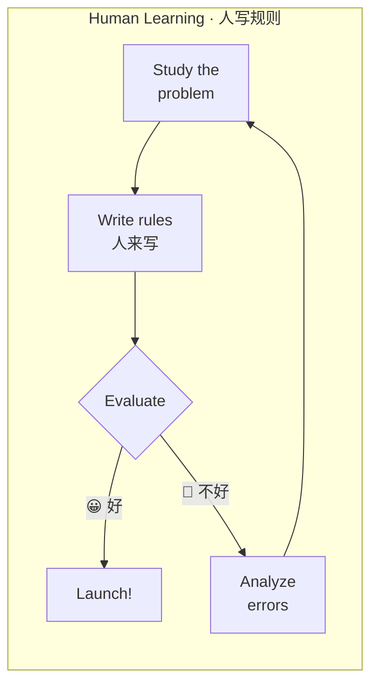
```mermaid
flowchart LR
    subgraph HL["Human Learning · 人写规则"]
        H1["Study the<br/>problem"] --> H2["Write rules<br/>人来写"] --> H3{"Evaluate"}
        H3 -->|"😀 好"| H4["Launch!"]
        H3 -->|"🙁 不好"| H5["Analyze<br/>errors"]
        H5 --> H1
    end
```

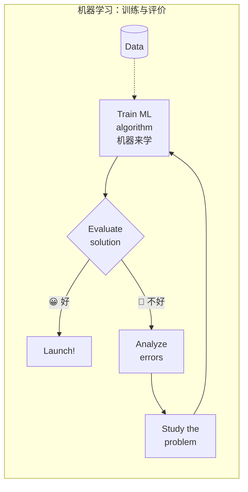
```mermaid
flowchart LR
    subgraph ML["机器学习：训练与评价"]
        D[("Data")] -.-> M2
        M1["Study the<br/>problem"] --> M2["Train ML<br/>algorithm<br/>机器来学"] --> M3{"Evaluate<br/>solution"}
        M3 -->|"😀 好"| M4["Launch!"]
        M3 -->|"🙁 不好"| M5["Analyze<br/>errors"]
        M5 --> M1
    end
```

**两张图唯一的差别是中间那个方框**：`Write rules`（人写）换成了 `Train ML algorithm`（喂数据训练）。其余四个环节 —— 研究问题、评估、分析错误、回头改 —— **完全一样**。

**为什么需要它**

这个"只差一个框"的对比，回答了一个很实际的问题：**什么时候该用机器学习？**

答案是：**当规则多到人写不完、或者人根本说不清规则是什么的时候。**
- 判断一封邮件是不是垃圾邮件 —— 你可以写 100 条规则，但垃圾邮件发送者每周都在变，你得一直改（讲义 p.16 的 "Email Spam and Malware Filtering"）
- 判断一张图是狗还是松饼（讲义 p.17 的图）—— 手工规则可能很繁琐、容易漏情况，需要比较其成本与数据学习结果，而非证明绝对写不出

**课件原例 ①**（讲义 p.15）—— 机器学习的第二种用法

p.15 的标题是 **"Why use Machine Learning?"**，红字副标题是 **"Help a human learn with a machine"**（借助机器帮**人**学习）。流程图比 p.14 多了一条回路：

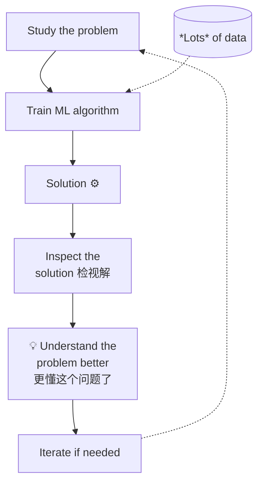
```mermaid
flowchart TD
    A["Study the problem"] --> B["Train ML algorithm"]
    D[("*Lots* of data")] -.-> B
    B --> C["Solution ⚙️"]
    C --> E["Inspect the<br/>solution 检视解"]
    E --> F["💡 Understand the<br/>problem better<br/>更懂这个问题了"]
    F --> G["Iterate if needed"]
    G -.-> A
```

**关键在 `Inspect the solution → Understand the problem better` 这一段。** 机器学习的产出不只是一个能用的模型，还有**模型告诉你的、你原本不知道的事**。

> 💡 **这一条正是本课与"纯 ML 课"的分水岭。** 官方 CILO 3（权重 30%）要求 "propose **original findings** for practical organizational data analysis problems" —— 要的就是这个 "Understand the problem better"。
> 本课W02里beds负系数可触发检查条件关系、相关列和规格，但负号本身不能证明共线性是唯一成因；实际诊断边界见 [[T02-回归实战-从合成数据到Airbnb定价]]。

**课件原例 ②**（讲义 p.20）—— 为什么是现在

p.20 标题 "Why Machine Learning for DA?"，一句话：

> **The Age of Big Data need machine to process data and support decision making**（大数据时代需要机器来处理数据并支持决策）

原p.20并置电影海报与标1990s/2010s的交易场景图，属于历史与技术动机说明；仅靠照片不能认证是同一地点或推断全行业价格发现机制。

> 💡 图片并置可说明人工场景与屏幕化场景变化；不能由两张照片证明某年全部价格发现转为算法、裁员因果或机器成为唯一选择。这里是教学类比，实际应用仍要核数据、约束和代价。

**🎙️ 课堂补充**

待转录补充。

**⚠️ 常见误解**

- ❌ **"机器学习比人写规则先进，所以永远该用 ML。"** —— p.14 的两张图是**并列**的，不是"旧 vs 新"。规则清晰、稳定、数量少的场景（增值税怎么算、订单满 300 减 50），人写规则更准更快更好解释。ML 的代价是：需要大量数据、结果难解释、要持续维护
- ❌ **"`Analyze errors` 那一步 ML 就不需要了。"** —— 恰恰相反，两张图里这一步**都在**。ML 只是把"写规则"自动化了，"看模型错在哪、回头改问题定义"这件事仍然是人的活

**与其他概念的关系**

p.15 那条 `Understand the problem better` 的回路，就是 §2.5 CRISP-DM 里那些**指回上游的红色虚线箭头**。两张图讲的是同一件事。

---

**所以呢**：两条原流程已有任务、评价与回退；下一小节把“训练”方框展开成四封邮件的可暂停状态，区分算法、保存模型和新输入。

#### 2.3.1 数据怎样变成模型，再怎样处理新邮件（笔记补充）

冻结模型（Frozen Model）是保存并固定的参数与输入表示状态，新对象仅复用它，不能偷偷把新答案用于改参数。

“Train ML algorithm”不是把文字改成数字就完成了。先固定一个极小、能手算的学习规则，追踪训练与使用的两次输入。训练时给有标签邮件，用来挑阈值；使用时只有新邮件特征，复用已经保存的阈值，不拿新邮件的答案重新训练。这才对应 p.14 的数据→训练→评价→发布和 p.15 的错误分析回路。

**是什么**：本例用邮件中的链接数量 x 描述对象，类别标签 y 为 Ham（正常）或 Spam（垃圾）。学习算法是“枚举允许阈值、找训练误判最少者”，预测规则是 $x\ge t$ 就 Spam，否则 Ham。阈值 t 是训练后的参数；x 是对象输入；y 是训练答案。它是教学人为简化的模型家族，不称现实垃圾过滤器只数链接，也不说树或神经网络无需人定义任务。

**完整输入、状态与训练**：四封已标邮件为 (0,Ham)、(1,Ham)、(3,Spam)、(4,Spam)。固定候选 $t\in\{1,2,3,4\}$，平局选较大 t；训练不含后面的验证邮件。保存当前候选、逐行预测、误判数和当前最好，按候选顺序只走一遍。

| 当前 t | x0 预测 | x1 预测 | x3 预测 | x4 预测 | 训练误判 | 更新最好状态 |
|---:|---|---|---|---|---:|---|
| 1 | Ham | Spam | Spam | Spam | 1 | t1 / 错1 |
| 2 | Ham | Ham | Spam | Spam | 0 | t2 / 错0 |
| 3 | Ham | Ham | Spam | Spam | 0 | 同错数按平局规则改 t3 |
| 4 | Ham | Ham | Ham | Spam | 1 | 保 t3 / 错0；候选已用完，停止 |

**依据 / 最小原理**：每行预测与标签不同记 1，相同记 0，误判数为这些 0/1 的和。枚举全清单并维护“截至当前最好”，保证最后结果是此清单的训练最小误判；不保证任意模型或未来最优。平局规则使本输入的结果确定；若选较小 t，会保存 2，两者训练都零错但新 x2 预测不同，训练表不足以唯一决定域间行为。

**训练产物与新输入**：保存特征名 link_count、非负整数单位、清单/平局政策、阈值3和训练版本。新邮件 U1 的 x=5，检查输入后 5≥3，输出 Spam；U2 的 x=2 则输出 Ham。阈值没有在这个过程中移动。“预测新对象”结束在返回标签，不做训练循环。

**独立评价的完整一轮**：声明评价输入 V1=(2,Spam)、V2=(4,Spam)、V3=(0,Ham)，冻结 t3，预测 Ham/Spam/Ham。逐行错 1/0/0，总错1，正确2/3；V1是假阴性（垃圾被放过），本例若事先业务允许最多0条假阴性则评价未通过。错误分析回到查特征/标签代表性，保留失败版本；不能仅把 t 改2后在同一评价表报“最终独立性能”，那组行已经参与选择，另需封存最终测试。

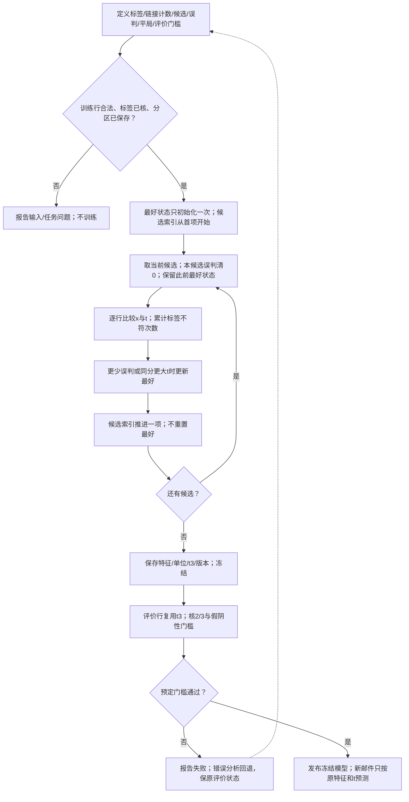
```mermaid
flowchart TD
    M0["定义标签/链接计数/候选/误判/平局/评价门槛"] --> M1{"训练行合法、标签已核、分区已保存？"}
    M1 -->|否| ME["报告输入/任务问题；不训练"]
    M1 -->|是| MI["最好状态只初始化一次；候选索引从首项开始"]
    MI --> M2["取当前候选；本候选误判清0；保留此前最好状态"]
    M2 --> M3["逐行比较x与t；累计标签不符次数"]
    M3 --> M4["更少误判或同分更大t时更新最好"]
    M4 --> MN["候选索引推进一项；不重置最好"]
    MN --> M5{"还有候选？"}
    M5 -->|是| M2
    M5 -->|否| M6["保存特征/单位/t3/版本；冻结"]
    M6 --> M7["评价行复用t3；核2/3与假阴性门槛"]
    M7 --> M8{"预定门槛通过？"}
    M8 -->|否| MB["报告失败；错误分析回退，保原评价状态"]
    MB -.-> M0
    M8 -->|是| MP["发布冻结模型；新邮件只按原特征和t预测"]
```

**失败机制 / 常见误解**：链接字段缺失或单位换了，应在输入检查报告问题，不偷填0使它变Ham。正常邮件也可能有很多链接，诈骗又可能零链接，失败来自特征信息不足和部署分布变化；增加代表性数据/适当表示会增加收集与评价成本，也不是无条件变好。模型相关错误只能形成待检验业务假说；例如 beds 负系数应核条件关系和共线性，不能从一个符号确定原因或因果。

**课件原例 / 🎙️ 课堂补充**：p.14–15 给学习与错误分析回路，p.16列邮件过滤应用，没有本例四封、阈值或计算；均标笔记补充，待转录补充。

**💡 换个说法 / 与其他概念的关系**：算法像“按固定打分规则挑一份说明书”，模型是最终选出的说明书，预测是照说明书处理新对象。算法、训练样本和已保存参数三者不能互换。与 §2.5 的建模/评价/回退相连，具体软件运行状态见 §2.7。

迁移：保持四训练行，平局改选较小t；新x2输出什么？把评价V1拿回训练后还算原独立评价吗？

两个零误判候选为2/3，改平局规则选2；x2≥2故Spam，与原t3的Ham不同。原训练都零错不能认证哪个未来更好。若V1进入选择或拟合，评价集合职责改变，不能再用原2/3作为未参与选择的最后结果；须重新声明版本和独立评价。（笔记补充，m01-process-verify.py。）

**所以呢**：数据通过明确目标和有限比较产生模型，模型再接收新对象；失败要定位到输入、训练、评价或部署状态，下一节看这些流程会遇到哪些具体业务问题。

### 2.4 它能用在哪：应用全景、学科定位与职业

这一节压缩了讲义 p.16–19、p.21–28 共 12 页。这些页**几乎全是配图**，文字含量极低，但骨架是清楚的。

#### 2.4.1 通用应用（讲义 p.16–19）

p.16 是一张"Applications of Machine Learning"的11 项轮盘图：

| | | |
|---|---|---|
| Automatic Language Translation | Medical Diagnosis | Stock Market trading |
| Image Recognition | Online Fraud Detection | Virtual Personal Assistant |
| Speech Recognition | Email Spam and Malware Filtering | Self driving cars |
| Traffic Prediction | Product recommendations | |

三个被单独展开的例子：

| 页 | 例子 | 内容 |
|---|---|---|
| p.17 | **Image recognition** | 左：一张卷发女性照片与一只可卡犬并排（发型极像）；右：著名的"吉娃娃 vs 蓝莓松饼"十六宫格。相似外观可使手工规则困难；图片不证明所有人一眼能分或任何规则都不可能，选择仍看数据、复杂度和评价 |
| p.18 | **Stock Market** | AAPL 股价 + **社交媒体情绪（Social Sentiment: Strong Buy 64% / Buy 15% / Hold 9% / Sell 3% / Strong Sell 9%）** + Chatter Volume 的叠加图，来源 `theoreti.ca/?p=5032`（数据是 2013 年的） |
| p.19 | **Clustering — Social Network Segmentation** | 一张社交网络图被 **DBSCAN（Density-Based Spatial Clustering of Applications with Noise）** 分成两团，下方是人群图标被圈成大小不等的几组 |

> 💡 p.18将价格、情绪和讨论量同屏展示，标题指股价预测；是否真的将情绪作特征拟合、何种预测成绩与因果均未给，不能只据图确认。这正是 §2.2 定义里说的"分析**新类型**的数据"。⚪ 若小组项目做金融方向，这是一个现成的思路。

**是什么**：应用图展示的是问题类型，帮助读者先识别输入、期望输出和评价，不是每个图标都附带已验证效果。图像识别的输入是图像，输出可能是类别；股价与情绪叠图展示不同来源的时间序列；社交网络图按节点连接呈现分组。要说会如何运行某算法，仍须另有对应机制，本节仅读图与辨任务。

**💡 换个说法（笔记补充）**：将同一张照片要求“给类别”与“按相似外观分组”，前者需声明类别，后者要声明相似性与分组目标；像同一份食材可做不同菜，食材不唯一决定任务。

**⚠️ 常见误解**：股价、情绪和聊天量同时显示不证明能预测或因果，要查哪个时点可知、目标是哪段价格、基准与独立评价；待转录补充，不把图上曲线说成教授验证过的交易策略。图像相似也不等每个人一眼永远能区分。

**所以呢**：应用图先回答输入输出，ML流程再定义训练与评价；下一节把同样问题转成定价、门店和库存的业务决策。

**为什么需要它**：从图标读出任务，才知道应该准备哪种输入与评价；不是由图标证明已经有可用模型。

**💡 换个说法（笔记补充，另一角度）**：同样显示一条股票价格曲线，“解释历史变化”和“提前预测下一天”需要不同信息时点，不能因一张图同时出现情绪与价格便合并两种结论。

**所以呢**：通用应用先辨任务，下一节把它转成可执行的业务动作和成本约束。

**⚠️ 常见误解（逐项）**

- ❌ **“图上提到某应用，就说明有现成有效预测器。”** —— 图是用途清单，未给训练、基准和评价，因此不能从图标推出性能。
- ❌ **“两条时间曲线一起变，就是因果或可提前预测。”** —— 共现不规定哪个信息先可知，还缺评价与识别条件。

#### 2.4.2 商业应用（讲义 p.23–24）

p.23 是本讲**信息密度最高的一页文字**，五类商业应用：

| 应用 | 讲义原文 | 中文 |
|---|---|---|
| **Pricing** | setting prices for consumer and industrial goods, government contracts, and maintenance contracts | 为消费品、工业品、政府合同、维保合同定价 |
| **Customer segmentation** | identifying and targeting key customer groups in retail, insurance, and credit card industries | 在零售、保险、信用卡行业识别并锁定关键客户群 |
| **Merchandising** | determining brands to buy, quantities, and allocations | 决定进什么牌子、进多少、怎么分配 |
| **Location** | finding the best location for bank branches and ATMs, or where to service industrial equipment | 银行网点/ATM 选址、工业设备服务点选址 |
| **Social Media** | understand trends and customer perceptions; assist marketing managers and product designers | 理解趋势与顾客认知，辅助市场经理与产品设计师 |

p.24 是技术视角的五条：Market analysis · Risk analysis and management · **Fraud detection and detection of unusual patterns (outliers)** · Text mining (news group, email, documents) and Web mining · Stream data mining

> ⚠️ p.24列Text mining（从文本发现结构/信息）和Stream data mining（处理不断到来的记录），暂定13周表未逐项给专题周次，不能据缺列认定本学期不教。当前M01只给用途，未执行这些算法。

**是什么**：商业应用将技术输出变成要做的动作。定价要说明可用输入与目标，库存要区分预测需求和决策数量，网点选址要声明成本和服务约束；“有一个预测”不能独自决定该降价、迁店或补多少货。原 p.23–24 给应用名和用途，本小节用这些名对照业务判断。

**💡 换个说法（笔记补充）**：销量预测像一份天气预报，订货政策像决定带哪种装备；预报与动作之间还有成本和约束。另一个角度，同样预报需求6件，缺货成本高与报废成本高可选择不同备货，完整计算见 §2.5.1。

**⚠️ 常见误解**：异常点不等于欺诈，文本情绪不等于客户真实行动，技术用途也不等于当学期一定教学。待转录补充。p.24 仅列文本/流挖掘名字，当前未运行它们，背景说明分别为从文本发现结构、处理持续到来的记录，不冒称已掌握各算法。

**所以呢**：动作由业务目标和约束确定，技术是其中一段；下一节说明业务、统计、工程怎样分工把它接起来。

**为什么需要它**：预测输出与业务动作中间需要损失、约束和可知时点；下面两页原图恰好展示这个接口。

**💡 换个说法（笔记补充，另一角度）**：网点客流预测高也不自动要求迁店，还要看租约与服务约束；优化动作不是直接照抄最高预测值。

**所以呢**：应用名不能代替运行系统，下一小节逐图解释零售调拨和社交媒体信息链。

**⚠️ 常见误解（逐项）**

- ❌ **“需求预测直接等于订货量。”** —— 订货还依缺货与报废代价、供应容量和决策时点，因此不能直接照抄预测。
- ❌ **“异常观察就是欺诈。”** —— 异常仅偏离声明参照，还可能来自错误、极端或其它机制，需查来源与业务定义。

#### 2.4.2.1 零售调拨与社交媒体：两页原业务图怎样读（p.21–22）

这两页展示业务背景，没有公开模型参数或评价数据。能从图读出的问题和环节应讲清楚，未提供的算法与真实效果不能用推断补成事实。p.21讲产品及门店消费不均，p.22讲社交媒体活动与快时尚商品；它们分别对应库存配置和外部信息来源。

**课件原例 / 是什么**：p.21的标题为智能生产、补货和调拨系统，面向易腐商品与快时尚。左图强调店内不同产品 consumption 不均，右图强调不同 retailers 不均，货车与 Redistribute Stocks 箭头表明转移库存的业务动作。产品列表P1/P2/P3意味着需要逐品种对齐数量，不能把不同商品的件数随便互换。下方客户标识为PEACEBIRD/inm/PEAK，旁列4300+/1800+/1200+门店，是讲义项目背景数，未注明统计日期，不作当前商店数量。

**为什么需要它**：A店某面包剩8件、B店缺3件，是教学示例；若允许同商品同日调拨3件，A剩5/B缺0。但要核保质期、运输成本、到达时间和是否可用，不因算术可搬3就认定应搬或原系统如此决策。店内产品消费不均还可能需要调整生产比例，跨店不均才涉及门店之间的分配。这区分预测与决策两种产物，完整备货小例见§2.5.1。

**p.22原图**：上行是社交媒体平台图标指向服装款式，下行从 Social Media Activity 指向 Fast Fashion Top Selling，包含帖子和商品页面。原页文字说“Use social media to shape fashion trend”。图表呈现项目动机及信息到商品的联系，不给实验对照、时点或统计模型；不能以箭头确认帖子造成畅销，也不能把网页价格和互动数当预测准确率。

| 业务链（笔记解释） | 图中可见 | 运行所需但原页未给 |
|---|---|---|
| 观察产品/门店消耗→决定补货或调拨→执行 | 消费不均、商品表、货车/调拨箭头 | 完整库存、真实需求、约束、成本、模型/求解与结果 |
| 收集社交媒体→对齐款式/时点→比较商品表现 | 平台/帖子、服装、销售页面、方向箭头 | 样本选择、特征提取、标签时间、独立评价/因果识别 |

**⚠️ 常见误解**：两页不能用来证明本课已经教会某个库存优化或文本模型；也不能只放进§8便算正文覆盖。这里解释图中的问题、数据与动作，并标缺源；待转录补充，教师项目口头细节未知。

**所以呢**：业务应用连接§2.3数据学习与§2.5过程门槛；社交媒体可成为候选特征，如何提取和验证在实际主题另讲，不能把“用了新数据”当好模型的保证。

**⚠️ 常见误解（逐项）**

- ❌ **“调拨箭头证明实施后一定省钱。”** —— 运输、保质期和约束未给，箭头只能描述业务动作，不能认证成本改善。
- ❌ **“从帖子指向畅销商品的箭头证明带货因果。”** —— 图未给对照和时点，关系可能受选择偏差或共同事件影响。

#### 2.4.3 学科定位（讲义 p.25–26）

p.25 用四个交叠的椭圆定位机器学习：

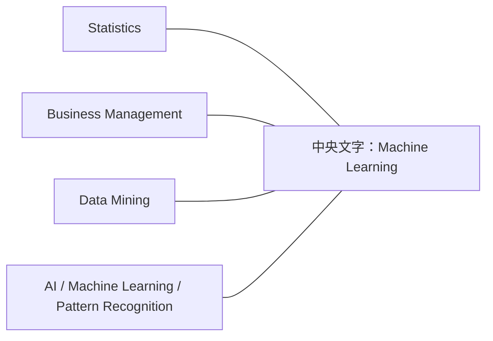
```mermaid
flowchart LR
    S["Statistics"] --- M["中央文字：Machine Learning"]
    B["Business Management"] --- M
    D["Data Mining"] --- M
    A["AI / Machine Learning / Pattern Recognition"] --- M
```

**读法**：图中四个椭圆分别标Statistics、Business Management、Data Mining、AI/Machine Learning/Pattern Recognition，中央另强调Machine Learning。它是跨学科定位图，不由面积或叠法证明精确“三者交集”或严格包含关系。

p.26 标题 **"You Play in everyone's sandbox"**（你能在所有人的沙坑里玩），一张彩色词云列了 15 个行业：Transportation & Logistics、Automotive、Education、Energy、Insurance、Information Technology、Entertainment、Consulting、Telecommunications、Government、Food Processing、Electronics、Retail Trade、Banking、Manufacturing。底下一句下划线的话：

> "**The best thing about analytics is that it lets you play in everyone's sandbox**"
> （数据分析最棒的一点，是它让你能进入任何一个行业。）

**是什么**：这张交叠图呈现不同知识来源共同参与分析，不能用交集面积计算贡献比或把所有学科严格排成互斥集合。统计帮助定义不确定性和评价，模型方法给可执行变换，业务知识决定问题与信息时点；少任何一项都可能让表面高分无法用。图形是定位示意，不是学科史定理。

**💡 换个说法（笔记补充）**：像组装一份门店建议，工程让记录到齐、统计核误差、业务核供应约束；会写代码不能代替后三者的判断。

**⚠️ 常见误解**：行业词云字大不等工作机会或模型准确率更高，也不保证技术跨行业直接复用；待转录补充。

**所以呢**：交叠知识需要具体角色来交接，下一节读三岗位图的职责和共用能力。

**💡 换个说法（笔记补充，另一角度）**：如果数据端把公斤改成克却没记录单位，模型与业务人员即使都读同一列也会误解结果；这是交接定义错误，不由更深的模型解决。

**所以呢**：四椭圆定位说明多类知识共同参与，下一节读具体角色怎样交接。

**背景术语唤醒**：模式识别（Pattern Recognition）指从特征辨别类别或结构的任务/方法领域，不是图中唯一算法。这里的Data Mining是发现数据模式，Statistics是用模型/样本解释规律和不确定性，Business Management提供目标与约束；图面积不能量化学科贡献。

#### 2.4.4 职业（讲义 p.27–28）

p.27 是一张 "Data Science Roles & How They Interact" 三圆维恩图 —— **这页值得看清楚，它定义了三种岗位的边界**：

| 角色 | 一句话职责 | 核心技能（图中列出） |
|---|---|---|
| **Data Engineer** | Enable data access & utilization —— 建并维护基础设施 / "data pipe" 与相关软件工程工作 | Data Ingest & ETL Tools · Database Systems · Hadoop Ecosystem · Data APIs · Unstructured data & Data Modeling · Data Warehousing |
| **Data Scientist** | Optimize & enable data for business & functional value capture —— 分析并解读复杂数字数据，抽取知识、辅助决策 | **Python, R** · Distributed Computing · **Machine & Deep Learning** · **Feature Engineering & Predictive Modeling** · Statistics & Math · Storytelling & Visualization |
| **Business Stakeholder** | Help the business make better decisions through data | Critical Thinking · Business Intelligence · Statistics & Math · Communicate Findings · Data Stewardship & Data Mgt · Storytelling & Visualization |

三圆的**共同交集**是：**Hypothesis Development · Monetization · Governance**（假设开发 · 变现 · 治理）。

> 💡 本课图中Python/建模/可视化与数据科学职责相关，业务沟通又需要干系人能力；课表未列Hadoop/ETL等专题，不等于绝不触及数据管道，不能用职位三圈把人划成互斥职业。

p.28 "Career Future" 给了三个数字：

> - Shortage: USA alone faces a shortage of **140,000 to 190,000** people with deep analytical skills
> - Shortage: **1.5 million** managers to analyze big data and make decisions based on their findings
> - **"Data Scientist: The Sexiest Job of the 21st Century" — Harvard Business Review**
> - 最后一行小字："Just to find a good JOB!"

⚠️ 讲义未给日期，须补历史来源：🔗 [McKinsey 2011报告说明](https://www.mckinsey.com/capabilities/tech-and-ai/our-insights/big-data-the-next-frontier-for-innovation) 的数字是对2018年缺口的预测，不是2026现状；[HBR原文页面](https://hbr.org/2012/10/data-scientist-the-sexiest-job-of-the-21st-century) 标October2012。获取2026-10-01，仅核日期与出处，不把旧口号当就业保证。

**🎙️ 课堂补充**：待转录补充。

**⚠️ 常见误解**

- ❌ **“学了课就自动具备某岗位全部能力。”** —— 岗位图描述职责与技能交集，修课和独立工程实践是不同证据，不能由课程列表替代岗位任务验证。
- ❌ **“职业图的历史缺口数就是当前岗位数量。”** —— 原图没有当下统计范围，2011预测与2026市场是不同时间和证据，不可直接套用。

**所以呢**：应用场景和职业前景讲完了——知道"这门课有用"之后，下一个问题是"这门课具体怎么把项目做出来"，答案就是下面这套流程。

---

**是什么**：数据工程师（Data Engineer）让数据持续可访问，数据科学家（Data Scientist）构造和评价分析，业务干系人（Business Stakeholder）结合目标采取行动。现实团队可一人承担多职责，这张图不是禁止越界的岗位许可证。角色区分使你知道错误记录、模型误判、无法实施分别该回到哪个环节，而不将项目失败统称“算法不行”。

**💡 换个说法（笔记补充）**：工程交可用表、分析交带假设和误差的结果、业务交约束下动作；像一串有检查项的交接单。一次上游单位改动若没告知下游，即便各自程序都能运行也可能结论错。

**与其他概念的关系**：三角色共同承担图示的假说、价值与治理；CRISP-DM逐阶段为这些交接指定产物。p.28 的职业口号和历史缺口数据不是当下岗位数或就业保证。

**为什么需要它**：知道问题该由谁核，能把数据访问、建模评价和业务实施分开负责又保持交接。

**💡 换个说法（笔记补充，另一角度）**：一人可以既建表又训练，但仍要分别做单位检查和独立评价；人少不取消职责和门槛。

**💡 换个说法（笔记补充，两个角度）**

把三角色看成同一个结果的三道审阅：表能用、结论有依据、动作可实施。一个人兼三职仍须逐道核验，不能因人少便少一个证据要求。

另一角度，模型员发现数据单位异常时应把记录回退给数据环节；业务约束改变时应从目标重评，不是所有问题都交给调参。

- ❌ **“三圈职责互斥，一人不能兼多项。”** —— 现实职责可以交叠；但兼任不能消除数据、模型和业务分别核验的需求。

Data Stewardship（数据日常管护）负责把字段定义、质量检查、访问约定等落实到实际使用；Data Management（数据管理）覆盖组织、存储、访问和生命周期。Hypothesis Development是提出可检验假说，Business Intelligence是整理和展示业务信息支持判断，Storytelling/Visualization是用说明与图形沟通有边界的发现；这些不等于某一个已运行算法，也不保证所有人职责完全相同。

**技能名的当前最小作用**：ETL（Extract/Transform/Load）依次取数据、按声明规则变字段/单位、落入目标存储，改变表示或ID要留记录；API是程序约定的调用/交换接口；Hadoop是数据存储/处理生态，当前不运行其组件。Monetization指把结果转成业务价值，Governance（治理）指来源、权限、质量和责任等管理约束，不保证自动合法或正确。这些是岗位图的背景名，不由一句话认证完整工程能力。

### 2.5 ⭐ BDA 流程：CRISP-DM 六步（本讲的项目过程核心）

**是什么**

刚接触数据项目的人最容易犯的错，是拿到数据就直接打开 Python 建模——而真正决定一个数据项目成不成的，往往是建模**之前**那几步有没有做扎实（业务目标想没想清楚、数据脏不脏）。**CRISP-DM** 就是一套"数据项目该按什么顺序做"的标准流程，本讲把它当成贯穿全课十二周的骨架：后面每一周学的模型，都只是这套流程里的一个环节。严谨地说，**CRISP-DM = Cr**oss **I**ndustry **S**tandard **P**rocess for **D**ata **M**ining（跨行业数据挖掘标准流程）。讲义 p.31 给了三条事实：

> - Proposed in **1990s** by a **European consortium**（1990 年代由一个欧洲联盟体提出）
> - Composed of **six consecutive phases**（由六个连续阶段构成）
> - **Your group project may follow this process (except deployment if not applicable)**（红字，你的小组项目可以照这个流程走，部署那步不适用可以跳过）

六个阶段与它们的时间占比（p.31 用一个红色大括号把前三步框起来）：

| # | 阶段 | 中文 | 干什么 | 工时 |
|---|---|---|---|---|
| 1 | **Business Understanding** | 业务理解 | 搞清楚要解决什么商业问题、成功长什么样 | ⎫ |
| 2 | **Data Understanding** | 数据理解 | 有什么数据、质量如何、能不能回答问题 | ⎬ **约 80%** |
| 3 | **Data Preparation** | 数据准备 | 清洗、处理缺失、造特征、编码类别变量 | ⎭ |
| 4 | **Model Building** | 建模 | 选模型、训练、调参 | ⎫ |
| 5 | **Testing and Evaluation** | 测试与评估 | 用没见过的数据检验，判断够不够好 | ⎬ 约 20% |
| 6 | **Deployment** | 部署 | 上线，让别人真的用起来 | ⎭ |

p.30 用一张流程图强调**它不是单向的**：

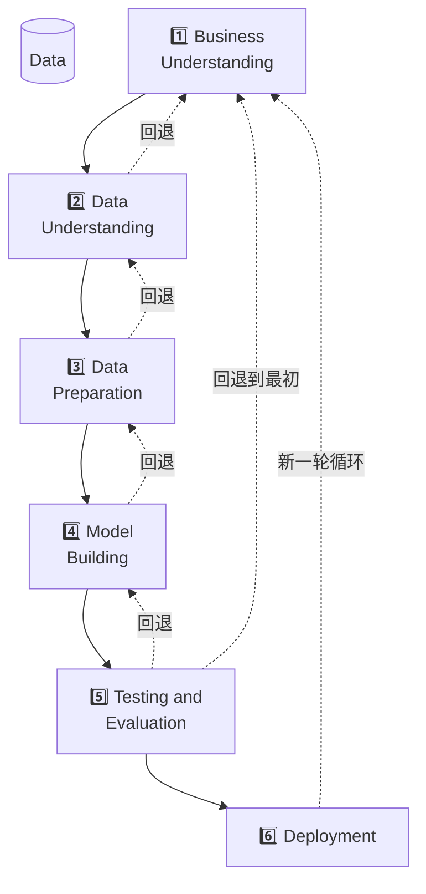
```mermaid
flowchart TD
    D[("Data")]
    B1["1️⃣ Business<br/>Understanding"] --> B2["2️⃣ Data<br/>Understanding"]
    B2 --> B3["3️⃣ Data<br/>Preparation"]
    B3 --> B4["4️⃣ Model<br/>Building"]
    B4 --> B5["5️⃣ Testing and<br/>Evaluation"]
    B5 --> B6["6️⃣ Deployment"]
    B6 -.->|"新一轮循环"| B1
    B2 -.->|"回退"| B1
    B3 -.->|"回退"| B2
    B4 -.->|"回退"| B3
    B5 -.->|"回退"| B4
    B5 -.->|"回退到最初"| B1
```

图左侧的红字说明：**"Steps can be repeatedly backtracking for model & performance refinement"**（可以反复回退，以改进模型与性能）。中间画着一个数据库图标 —— **数据在整个循环的中心**。

**为什么需要它**

讲义约80%工时描述突出前期业务/数据工作，不证明所有项目必同一分配。本笔记未给“新手90%时间建模”的证据；代码行或cell数量也不能测项目工时。应按任务、数据风险与交付门槛安排资源。

以下是前期工作的内容示例，不用其cell数印证项目工时比例：
- [[IS6400_Business_Data_Analytics/_meta/数据集卡片|Airbnb数据集卡]]记录缺失、字段和编码等前期问题；真正建模还需目标、表示、求解、诊断和评价，不能从fit行数测工时。
- W02实操中的数据处理和模型调用分别承担不同步骤；接口简短不证明该步骤简单、准确或低工时。

**课件原例**（讲义 p.30–31）

课件没给案例，只给了流程本身。但 p.31 那句红字 —— "Your group project may follow this process" —— **是本讲对小组项目最直接的指导**。

对照 [[IS6400_Business_Data_Analytics/_meta/作业与DDL#3. 小组项目（合计 30%）|作业与DDL › 3. 小组项目（合计 30%）]] 的 Proposal 五项要求，会发现它就是 CRISP-DM 前四步：

| Proposal 要求 | CRISP-DM 步骤 |
|---|---|
| ① Business Problem | **Step 1** Business Understanding |
| ② Dataset Description（字段名 + 数据类型） | **Step 2** Data Understanding |
| ③ Key Variables | **Step 2–3** |
| ④ BDA Methods | **Step 4** Model Building |
| ⑤ Potential Contribution | Step 1 的回照（成功长什么样） |

**🎙️ 课堂补充**

待转录补充。⏳ 转录到手后重点确认：教授在这一页停留多久、有没有举自己咨询项目的例子（p.21–22 展示了他给 PEACEBIRD、inm 乳业、PEAK 做的项目）。

**💡 换个说法（笔记补充）**

把 CRISP-DM 想成**装修房子**：

| 步骤 | 装修类比 |
|---|---|
| 1 Business Understanding | 问业主：你要住几个人？预算多少？最在意什么？ |
| 2 Data Understanding | 量房：承重墙在哪、水电走向、层高多少 |
| 3 Data Preparation | 拆除、找平、防水、布线 |
| 4 Model Building | 刷漆、装家具 |
| 5 Testing & Evaluation | 验收：闭水试验、开关每个都按一遍 |
| 6 Deployment | 入住 |

装修类比说明基础工作的依赖，不给预算和工期比例的实证结论；量房后发现原约束不成立可回去改设计，对应回退箭头。

**⚠️ 常见误解**

- ❌ **"六步是一条直线，走完就完了。"** —— p.30 画了大量回退虚线，还有一个最外层的大圆圈表示整体循环。**"Steps can be repeatedly backtracking"** 是原话
- ❌ **"Deployment 是必须的。"** —— p.31 明说 "except deployment **if not applicable**"。学生项目通常没有真的上线环节
- ❌ **"Testing and Evaluation 就是看准确率高不高。"** —— 第 5 步的评估必须回照第 1 步的商业目标。一个 R² 很高但业务上没法用的模型，评估应该是不通过的
- ❌ **"CRISP-DM 是这门课发明的。"** —— 它是 1990 年代的**行业标准**，不是课程独有。在业界写方案时直接说 "we follow CRISP-DM" 是通用语言

**与其他概念的关系**

CRISP-DM 是全课的骨架。后面每一周学的模型（回归、PCA、聚类、决策树、RNN）**按用途分布在准备、建模和评价等阶段，不能全塞第4步**。而 [[M02-预测分析-线性回归]] 的第 2 页会再画一次这张图，并用**红框圈出第 4 步 Model Building** —— 教授在用同一张图告诉你"我们现在走到哪了"。

---

**所以呢**：阶段名称必须配可核交接单，下一小节用同一八天需求走到政策和评价，讲清正常终点与回退。

#### 2.5.1 一份数据走完六阶段：面包备货（笔记补充）

先看可交付结果：明天给某店一个备货数量，同时能说明它从什么数据产生、比什么方案好、何时该停止或回退。这是把讲义 p.21 的零售补货背景和 p.30–31 的流程放在一起的教学小例；下面所有数字、成本、门槛都为笔记补充，既不是教授项目数据，也不是个人作业成品。

**是什么**：六阶段管理的是同一个项目的状态。每步交出可检查产物，下一步接收该产物；不把“做过六件事”当项目成功。不先定义业务损失，模型可能只降低平均误差却增加缺货；不保留原表与信息时点，又无法判断评价是否可信。

**输入与输出**：一店一种面包，保质期一天，每晚决定明日整数备货 q。已声明缺一件损失 5 元，剩一件报废成本 1 元；本小例假设八天的真实需求都可观测、供应不限。真实业务若只记录卖出的数量，卖光日的需求只能知道下界，不能偷偷把销量当真实需求。最终输出是 q、成本对照、数据/模型版本、上线或不适用决定及回退理由。

| 行 ID | 所属用途 | 真实需求（件） | 已知条件 |
|---|---|---:|---|
| D1 / D2 / D3 / D4 | 训练 | 4 / 6 / 5 / 5 | 在预测评价前已取得且核完整；教学假设无缺货截断 |
| D5 / D6 | 验证 | 8 / 4 | 锁训练状态后比较；不先拿来拟合 |
| D7 / D8 | 最后测试 | 7 / 3 | 方法锁定前封存；不根据测试结果改 q |

1. **业务理解**：把“少扔面包、别总缺货”转成每行成本，而不是只要求高准确率。教学成功门槛事先定为验证成本比训练均值基线至少少 15%，且验证缺货件数不增加；这里只用于示例，不是行业合格标准。保存成本参数、决策时点及评价门槛，是本阶段产物。
2. **数据理解**：逐 ID 查数量单位、重复、缺失、收集时间、是否发生售罄。确认八行中只有 D1–D4 可用于本次拟合。若 D2 实际是“备货 6、卖出 6”而非真实需求 6，要记录未知需求并回退查可用观测或改问题，不能直接继续宣称已优化真实需求。
3. **数据准备**：原表保留，另建按时间/ID 分区的清洁视图。候选政策 $q\in\{4,5,6\}$ 及基线“训练均值四舍五入”事先固定；均值 (4+6+5+5)/4=5。预处理状态为行集、字段单位、训练均值 5、候选清单与异常日志，本例不需要虚构缺失填补或类别编码。
4. **建模**：逐候选在训练四行算缺货、剩余与成本，再选训练总成本最小者；平局按事先规则选较小 q。参数状态仅为所选 q 和成本/训练范围，不拿验证或测试需求更新训练结果。这个极小候选枚举完整展开在下表，不是名字代替训练机制。
5. **测试与评估**：先看 D5–D6 的冻结政策结果，核两个预定门槛；通过才锁方法，再独立核 D7–D8。若门槛失败，报告未通过并定位是成本目标、需求观测、特征还是候选不足；回退后须保留版本并重新安排未参与选择的最终评价，不能在同一测试答案上反复挑政策。
6. **部署**：本例保存 q=6、成本表、字段/单位、训练版本以及缺货/报废监控规则，产生明日 6 件建议。真实门店还需容量、供应和安全审批等实际约束；缺这些就输出可复核原型、标“不适用部署”，不是虚构已上线。新需求漂移触发回退查业务和数据，不自动证明需要更复杂模型。

**原理与完整计算**：每行成本来自两个互不同时为正的差额：

$$C(q,d)=5\max(d-q,0)+\max(q-d,0).$$

d 为真实需求件数，q 为备货件数，max 取两项较大值；第一项是缺货损失，第二项是剩余成本。比如 d=6/q=5，缺 1 件、剩 0 件，成本 5 元；d=4/q=6，缺 0 件、剩 2 件，成本 2 元。本例损失由业务约定，不由数据自动学出。

| 候选 q | D1 成本 | D2 成本 | D3 成本 | D4 成本 | 训练总成本 | 状态 |
|---:|---:|---:|---:|---:|---:|---|
| 4 | 0 | 10 | 5 | 5 | 20 | 当前最好 4 / 20 元 |
| 5 | 1 | 5 | 0 | 0 | 6 | 改最好 5 / 6 元 |
| 6 | 2 | 0 | 1 | 1 | 4 | 改最好 6 / 4 元；候选用完，停止训练 |

为什么可以停止？候选是事先固定的有限三项，已经全部比较；这只给此清单、此成本和此训练表上的最优，不是所有可能库存策略的全局最优，也不保证明天最好。

| 核算阶段 | 基线 q=5：缺货 / 剩余 / 成本 | 冻结模型 q=6：缺货 / 剩余 / 成本 | 决定 |
|---|---|---|---|
| 验证 d=8,4 | 缺 3 / 剩 1 / 16 元 | 缺 2 / 剩 2 / 12 元 | 成本降 25%≥15%，缺货 2≤3，两门槛通过；锁 q=6 |
| 测试 d=7,3 | 缺 2 / 剩 2 / 12 元 | 缺 1 / 剩 3 / 8 元 | 报实际测试成本；不据这两行再调 q |

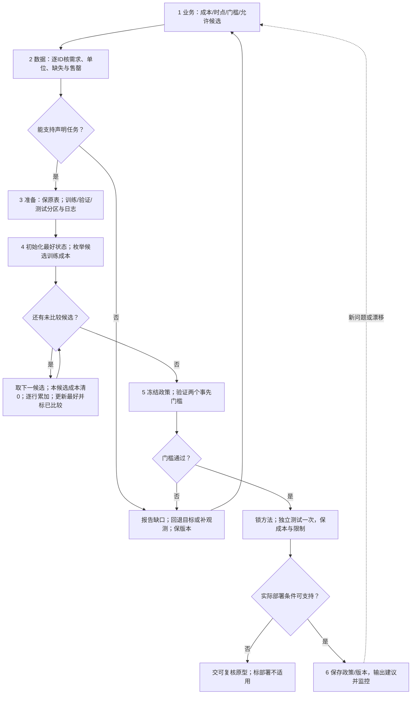
```mermaid
flowchart TD
    C0["1 业务：成本/时点/门槛/允许候选"] --> C1["2 数据：逐ID核需求、单位、缺失与售罄"]
    C1 --> C2{"能支持声明任务？"}
    C2 -->|否| CR["报告缺口；回退目标或补观测；保版本"]
    CR --> C0
    C2 -->|是| C3["3 准备：保原表；训练/验证/测试分区与日志"]
    C3 --> C4["4 初始化最好状态；枚举候选训练成本"]
    C4 --> C5{"还有未比较候选？"}
    C5 -->|是| C6["取下一候选；本候选成本清0；逐行累加；更新最好并标已比较"]
    C6 --> C5
    C5 -->|否| C7["5 冻结政策；验证两个事先门槛"]
    C7 --> C8{"门槛通过？"}
    C8 -->|否| CR
    C8 -->|是| C9["锁方法；独立测试一次，保成本与限制"]
    C9 --> C10{"实际部署条件可支持？"}
    C10 -->|否| CN["交可复核原型；标部署不适用"]
    C10 -->|是| CD["6 保存政策/版本，输出建议并监控"]
    CD -.->|新问题或漂移| C0
```

**失败机制 / 常见误解**：把售罄销量当需求会低估缺货，使目标和数据不匹配；应取得可用需求证据或声明下界，代价是更多观测或更窄结论。拿测试需求选 q 则在选择步骤破坏独立评价；须另留最终行集。两验证日过门槛也不证明所有门店或未来季节都好，推广需要相应数据和评估。

**课件原例 / 🎙️ 课堂补充**：p.30–31 只给六阶段与可回退、部署不适用可省，p.21 给零售业务背景；完整八天和算法属于笔记补充。待转录补充，不写教授给过这些数值。

**💡 换个说法 / 与其他概念的关系**：各阶段像一串可检查的交接单，上一张有误不能只把最后模型换个名字。这与 §2.3 的错误分析回路相连；§2.7 的运行环境再负责保存和执行已声明模型。80% 工时是讲义经验表述，不由本例行数、cell 数或装修类比证明。

迁移：缺货成本由 5 改 1，其余训练四行和候选不变，是否仍选 6？

q4 成本为 0+2+1+1=4；q5 为 1+1+0+0=2；q6 为 2+0+1+1=4，故训练选 5。业务损失变化使选择变化；不能沿用旧“最好 6”。评价门槛/基线须按新约定完整重核，不能直接把旧验证 25% 当新政策证据。（笔记补充，独立复算入口 m01-process-verify.py。）

**所以呢**：六阶段通过同一份输入、产物与门槛接起来，才从口号变成可执行项目；下面的技术地图是可选方法及预告，不是跳过业务和数据理解的许可。

### 2.6 全课技术地图（W02–W11 的目录）

**是什么**

讲义 p.32（**标题被黄色高亮**）把整门课的技术分成两栏：

| Advanced Machine Learning Techniques | Neural Networks and Deep Learning |
|---|---|
| Predictive Analytics — **Week 2** | Artificial Neural Network — **Week 9** |
| Feature Engineering — **Week 3** | Recurrent NN — **Week 9** |
| Clustering Models — **Week 4** | Image Mining — **Week 10** |
| Prediction Models — **Week 5–8** | GenAI and LLM — **Week 11** |

两栏的箭头共同指向底部一个红字大框：**End-to-end Business Applications**（端到端的商业应用）。

> 💡 左右栏是课程的主题组织，不证明模型只处理某一种对象或形成难度顺序；不同方法可用于同一任务，选择需核输入、目标与独立评价。

下面p.33–45包含技术家族预告与当前核心：未实际运行的家族训练要标预告范围；p.38给定树、p.39组合和补充Attention已在本篇走到输出，不能将这整段都免为“知道名字即可”。

**为什么需要它 / 常见误解**：目录图帮助为业务输入挑候选方法，却不能证明左栏只处理结构化、右栏只处理非结构化，也不是从“浅”到“深”必然更好的顺序。相同分类问题可以比较树和神经网络，方法名字不替代数据条件与独立评价。

**用途边界（逐源声明）**：p.33–37的降维/算法家族/时序图以及p.40–42的神经网络/LSTM内部/家族图没有给本讲实际训练目标或参数，本篇作背景预告并说明图中输入/模块/输出、原显示信息和不能推出的结论；完整运行相应方法在实际主题另验。p.38给定树和p.39组合被本篇实际执行，已就地展开 §2.6.4.1–2，不以预告免讲。p.43–45的LM/LLM定义关系按概念边界解释，不冒称完整Transformer计算。术语卡标预告不认证算法已学会；这个等级来自原页与本篇用途，不能按省篇幅降级。

**所以呢**：目录指出去哪一类机制找办法，以下先读特征与信息损失，再辨分组、预测和分类用途，具体计算按每个实际任务展开。

**⚠️ 常见误解**：目录不是性能排序，也不将所有数据准备和评价等同建模；原页没有给某方法参数时先报告预告范围，实际执行主题另完整解释。

**⚠️ 常见误解（逐项）**

- ❌ **“神经网络比左栏任何方法都高级所以应优先。”** —— 目录不提供比较指标和数据条件，因此不能作为性能排序。
- ❌ **“所有新技术都在建模步骤，准备和评价可省。”** —— 特征变换与误差评价分别承担其它阶段职责，省掉会改变输入和证据。

#### 2.6.1 特征工程与降维的危险（p.33–34）

**是什么**

要教一个模型分清照片里是猫还是狗，模型看不懂"猫"这个字——它需要的是一些能拿来描述这张照片的具体数字，比如耳朵的形状、毛发长度、体型大小。这些"能用来描述一个对象"的具体属性，就叫**特征（Feature）**。讲义 p.33 给出的正式定义（红字）：

> **"Feature is the element that you use to describe an object"**（特征就是你用来描述一个对象的那些元素）

p.33 配了一张裁切过的照片：墙上的 Fevicol 胶水广告前，有两个人形**影子**面对面，看起来像一对情侣要接吻。

**p.34 是同一张照片的完整版** —— 整页只有这张图，底下一行小字：`Original photographer unknown` / `See also www.cs.gmu.edu/~jessica/DimReducDanger.htm` / `(c) eamonn keogh`。

完整图可见行人、狗、自行车和墙上影子；具体阴影的来源贡献不能由单张静态图唯一分解。情侣式读法是视觉歧义，降维解释是笔记类比，不认证教师口头意图。

> 💡 **由裁切/完整图作信息丢失类比（笔记补充）**：原页有特征定义和页脚来源，未给完整口头解释或PCA数据。
> 降少表示信息可能造成歧义；不能仅凭照片认证哪种现实结构不存在。
> 线性PCA使用投影，特征工程还包括编码、选择与变换，不能全部等同投影。**投影后看到的模式，可能只是投影角度的产物，不是数据里真实存在的关系。**
>
> 那个链接 `DimReducDanger.htm` 的标题直译就是"降维的危险"。这是数据挖掘教学里的经典例子（出自 UCR 的 Eamonn Keogh 教授）。
>
> ⚠️ p.33有特征定义、p.34有页脚和可见对象。教师口头解释仍待转录，但不否认图中文字和视觉事实，也不把本笔记类比认证成教授意图。

**所以呢**：特征是描述一个对象的原材料，降维是把这些原材料压缩、但压缩要小心失真。下一种技术——聚类——则是"不预先分类，让相似的对象自己聚成堆"。

**为什么需要它**：把一个对象映射成属性向量才能比较或建模，映射时丢掉的区分可能永远无法从结果恢复。最小变式：$A=(1,0)$、$B=(1,5)$，若只留第一列，两个都成1，原对象不同但表示相同；没有任何仅靠这列的方法能凭空分清第二列。这个丢信息反例说明动机，不冒称照片里已经运行PCA。

**⚠️ 常见误解**：特征工程不都等于线性投影，裁图也不是PCA算法。影子可产生歧义，但“原本完全没有结构”仍是对照片的解读；来源只说明可见影子和完整物体，教师口头意图待转录。当前未算投影矩阵，PCA实际机制见 [[M04-特征工程-特征重要性与降维]]；待转录补充。

**与其他概念的关系**：表示决定距离与可分信息；M05按固定尺度算距离，本节只建立这个依赖。

**💡 换个说法（笔记补充）**：只留高度，两个身高相同但体重不同的人在此表示里相同；另一个角度，换回完整字段能恢复区分，但不能从旧高度凭空重造体重。

**⚠️ 常见误解（逐项）**

- ❌ **“裁掉背景就是PCA。”** —— 裁图与线性主成分有不同运算，源图只支持信息丢失类比，不提供PCA执行。
- ❌ **“只要投影图分出漂亮形状就是真实类群。”** —— 表示可能把原来不同对象映成相同或产生歧义，需核保留信息与目标。

**💡 换个说法（笔记补充，两个角度）**

用影子猜物体像只凭某一侧视图辨对象：相同轮廓可能对应不同来源，更多观测可能帮助辨别，但旧轮廓本身不包含被丢掉的所有信息。

另一个角度，保留哪些属性是按任务选择的表达；购物者关心保质期、配送者关心尺寸，不同表达会改变可比较的信息，不能将任一表达当全部对象。

#### 2.6.2 聚类（p.35–36）

**是什么**

想把音乐软件里几千首歌自动分成几种风格，但没有人预先告诉算法"什么算摇滚、什么算民谣"——算法只能自己去看每首歌的特征（节奏快慢、音色、时长），把"听起来像"的歌自动归到一堆。这种**不需要事先标好答案、只靠"相似的凑一堆"来分组**的方法，就叫**聚类（Clustering）**。p.35 给了聚类的**两个用途**（这个二分法值得记）：

| 用途 | 讲义原文 | 例子 |
|---|---|---|
| **Understanding**（理解结构） | Group related documents for browsing, group genes and proteins that have similar functionality, or group stocks with similar price fluctuations | 把相关文档分组便于浏览；把功能相似的基因蛋白质分组；把价格波动相似的股票分组 |
| **Summarization**（压缩规模） | Reduce the size of large data sets | 用少数几个簇代表整个大数据集 |

配图两张：文档聚类示意（两个圈里各有若干文档，各有一个黄色的 "Representative Document"）+ 美国各州的 Cluster plot（Dim1 62% / Dim2 24.7%，分成 3 簇）。

p.36 是一张 16 格的聚类算法家族图：k-means(k=3) · k-means++ · k-means‖ · Fuzzy k-means · k-medoids · k-medians · k-modes · k-prototypes · CLARA · CLARANS · GMM · EM · DMM · **DBSCAN** · OPTICS · DENCLUE，外加一张 CIFAR 图像的 t-SNE 可视化。

> ⚪ **本讲不需要认识这 16 种算法。** p.6暂定Week4列Bisecting KMeans和DBSCAN；当前M05正文还展开K-means/K-means++/层次等，讲义目录不等完整教学范围。这页的作用是让你知道"聚类不止 k-means 一种"。

**所以呢**：聚类处理的是"没有标准答案、按相似度分组"的问题；下一种技术——预测分析 / 时间序列——处理的是"有历史数据、要猜下一步会怎么变"的问题，两者解决的问题类型完全不同。

**为什么需要它**：对象没有预标类别时，分组可帮助浏览或做代表，但结果要随相似性与方法定义解释。歌曲按时长相似可能与按节奏相似分成不同组，不能将任一簇自动命名成真实流派。代表对象或中心是压缩结果，不能保留所有原始细节。

**⚠️ 常见误解**：p.36不同分组图不是准确率排名；轴、样本、参数和颜色政策未全部给出。家族名字属于本讲预告，当前已成稿的具体K-means/K-means++/层次/DBSCAN机制见 [[M05-聚类-Kmeans层次与DBSCAN]]，不能写本课只教两种。待转录补充。

**与其他概念的关系**：聚类需要表示和相似性规则，分类需要已声明标签；两者输出有外观相似也不代表任务一样。

**💡 换个说法（笔记补充）**：文档按话题或长度可分出不同组，组是声明的相似性下的结果；另一方面选代表文档便于浏览，却不能认为它保留组内每篇细节。

**⚠️ 常见误解（逐项）**

- ❌ **“某簇名字就是对象真实类别。”** —— 聚类没有预标答案，结果依相似性和方法，命名需另有业务证据。
- ❌ **“代表文档保留每个成员的信息。”** —— 压缩改变细节保留范围，代表只便于浏览，不能自动代替原始成员。

**💡 换个说法（笔记补充，两个角度）**

把组当浏览目录，用户先打开大类再看原文，代表项是一条入口而不是全类事实；这说明Understanding与Summarization各怎样使用分组。

另一个角度，同一对象可以按另一个参照规则重新分组，名称再直观也不能锁定永远唯一的自然类别；解释时要先说规则再说簇名。

**原图能怎样读，什么不能由它推出（p.35–36）**

p.35上图的纸张代表文档对象，圈代表给定分组，箭头标Representative Documents（代表文档）；代表项便于浏览，不能从箭头认证它保留每篇的全文信息。下图每个带州名的点代表一个州对象，横轴Dim1、纵轴Dim2是绘图使用的两个坐标，靠近表示**这两个展示坐标**接近，不自动等于原全部属性接近。颜色图例1/2/3是组标签，数字3不表示比1好；图上各州地名用来识别点，不是分类器输入或真实地理经纬度。

轴标签62%与24.7%是源图显示值，**源未给坐标构造方法、原始表及百分比定义/分母**，不能认证“准确率62%”“所有信息保留86.7%”或直接说完成原PCA复算。若来源确声明是PCA方差解释率，分母应是同一处理状态下的总方差，而非点数；这个条件在本图仍缺。这里只读原显示和边界，下一迷你例单独声明分母，不填补源空白。

p.36左图caption明确是t-SNE可视化（把高维对象安排到低维展示的一种方法，当前仅背景名称，不在此运行）。图例cat/truck等类别与颜色对应，不能由彩团直接认证训练标签、聚类准确率或全局距离保持。右侧16格分别展示各方法/参数的分组，某些格有颜色背景，另一些有黑色未分组点；跨格还需核样本/参数/编码，不能把黑色在所有格都定义成同一种噪声规则。

**💡 完整教学小图：从行、坐标与类标签到位置（补充数据）**

| 对象 | Dim1 | Dim2 | 未展示的Dim3 | 已给组标签 / 显示色 |
|---|---:|---:|---:|---|
| A | 0 | 1 | 0 | 1 / 蓝 |
| B | 2 | 1 | 1 | 2 / 黄 |
| C | 0 | 3 | 2 | 2 / 黄 |

三个坐标使用同一教学尺度；组标签作为**给定输出**用来画色，本节不暗称以标签训练聚类。逐行取前两坐标，在相交格放对象，再按标签映色：

| Dim2 ↓ / Dim1 → | 0 | 2 |
|---|---|---|
| 3 | C（黄2） | — |
| 1 | A（蓝1） | B（黄2） |

完成三行位置/图例核对即停止绘图。B/C同色但不在同坐标，A/C的横坐标相同但不同色；颜色与位置是两种不同编码。显示规则若把蓝黄互换，成员集合{A}/{B,C}没有改变；只移动B到x4但标签仍2，也不代表已重新运行分组算法。

**百分比输入/边界检查**：同一行集、同尺度坐标、数值有效；总平方偏差量必须大于0才给份额。若所有对象的三个坐标全相同，总量0，比例是0/0未定义；仍可画给定位置/标签，但不得报0%或100%。样本n−1方差还需n>1，单个对象不以该式报样本方差。

**百分比分母的自设可复算例**：在此三坐标表中，用围绕各列均值的平方偏差和定义“变异量”。逐列求和再除3：第一列 $2/3$，第二列 $(1+1+3)/3=5/3$，第三列 $(0+1+2)/3=1$；Dim1平方和$4/9+16/9+4/9=8/3$，Dim2同为8/3，Dim3为1+0+1=2；总量22/3。按这个**自设声明**，两展示轴各占4/11≈36.36%，合计8/11≈72.73%，未展示轴占3/11。没有通过百分比算类别正确率；同一分母的比例可相加，换单位/处理状态/定义必须重核。它不是原62%/24.7%的重现，也没有在此训练PCA/t-SNE。

图读变式：只互换颜色，再删掉Dim2或把Dim1数字都乘10，哪些结论仍可保留？

颜色互换只改图例，组成员不变。只留Dim1后A/C都在0，不能从这条坐标分清它们；原未展示的差异不会自动恢复。Dim1乘10后其平方偏差和变100倍，若重新按同一“总平方偏差”定义计算百分比，分子和总量都变；旧36.36%不能沿用。坐标接近和颜色成员需分别核，不据这次显示变化直接宣称聚类真实质量改善。（笔记补充，m01-chart-verify.py。）

**所以呢**：图的输入行、位置、颜色和百分比分母必须各自有定义；原页未知保留未知，教学补充让读者能自己完成绘图和误读诊断，而不冒称已复现未知训练算法。

**图谱背景名也要有最小作用（笔记补充，不作为本讲训练完成）**

仅出现在家族图中的名字不承担当前解题计算。下表把陌生缩写解释到能读图的层次；本讲真正执行的核心仍见对应完整机制段，不将这一语解释当算法步骤或数学训练证据。课表也没有承诺逐项教完每个名字。

| p.36 背景名 | 当前最小作用与边界 | 位置 / 范围 |
|---|---|---|
| k-means / k-means++ | 前者反复分配与更新均值；后者先按最近中心距离平方抽初始化中心，两者不是同一阶段 | [[M05-聚类-Kmeans层次与DBSCAN]] 有完整执行；本页仅唤醒 |
| k-means∥ | 将中心初始化候选的抽取组织成批次，适合并行环境；不等于一次抽取已完成聚类 | p.36 预告，当前不运行 |
| Fuzzy k-means | 用隶属程度表示对象可部分属于多个组，区别于仅一个硬标签 | p.36 预告，目标与更新未给 |
| k-medoids / k-medians | medoid选原对象作代表；median以中位数作数值代表，不保证是原对象 | p.36 预告，具体距离/优化另需说明 |
| k-modes / k-prototypes | 前者以类别常见取值表示组；后者组合数值与类别差异，混合度量须明确 | p.36 预告，未在此编码/训练 |
| CLARA / CLARANS | 前者在抽样集求medoid再评价；后者探索medoid候选的随机邻域，以减少大规模搜索负担 | p.36 预告，不声称这就给完整随机/停止政策 |
| GMM / EM | GMM用多个概率分布成分表示数据；EM是交替估计隐含归属与更新参数的求解方法，可用于GMM。图中模型与求解方法并列，不是互斥算法树 | p.36 预告，未拟合分布 |
| DMM | 原图仅给缩写，未给唯一全称/分布/训练规则，**资料不足**；不能按相似图案猜定模型 | p.36 源范围受阻 |
| DBSCAN / OPTICS | DBSCAN按密度邻域扩组；OPTICS保存可达距离和对象顺序供提取不同密度结构，不是简单把所有密度方法当一个阈值 | DBSCAN见M05完整机制；OPTICS仅预告 |
| DENCLUE | 依据估计的密度及吸引结构形成组；带宽/核等定义会影响结果，本图未给具体规则 | p.36 预告，不运行 |

以上分类解释为笔记补充。🔗 [scikit-learn聚类说明](https://scikit-learn.org/stable/modules/clustering.html)、[Spark聚类说明](https://spark.apache.org/docs/latest/ml-clustering.html)、[KMedoids/CLARA说明](https://scikit-learn-extra.readthedocs.io/en/stable/modules/cluster.html)，获取2026-10-01；它们用于背景作用核对，不认证原图数据、参数或本机对应版本。其它格的完整训练仍未提供，不将缩写表当完整教程。

#### 2.6.3 预测分析 / 时间序列（p.37）

**是什么**

超市想知道下个月牛奶要进多少货，靠的不是"分组"或"分类"，而是看这个商品过去每个月卖出多少、有没有逐月上涨或每逢节假日就多卖——这种**用过去一串按时间排列的数字，去猜接下来会怎么变**的任务，就是**时间序列预测（time-series prediction）**。p.37 用一张图展示这套方法家族是怎么一代代升级的（W07–W08 的目录）：

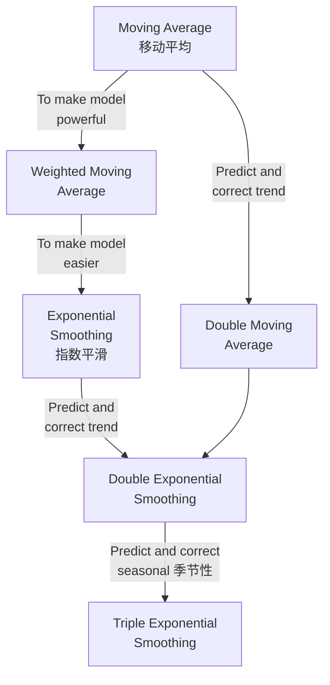
```mermaid
flowchart TD
    MA["Moving Average<br/>移动平均"] -->|"Predict and<br/>correct trend"| DMA["Double Moving<br/>Average"]
    MA -->|"To make model<br/>powerful"| WMA["Weighted Moving<br/>Average"]
    WMA -->|"To make model<br/>easier"| ES["Exponential<br/>Smoothing<br/>指数平滑"]
    ES -->|"Predict and<br/>correct trend"| DES["Double Exponential<br/>Smoothing"]
    DMA --> DES
    DES -->|"Predict and correct<br/>seasonal 季节性"| TES["Triple Exponential<br/>Smoothing"]
```

配图是一张销量预测图：左边黑点是 "Historical data"，红色虚线右边是 "Forecasted data"，蓝色带显示预测相关不确定性；原页未标模型、覆盖水平和完整数据，不据此给数值区间或概率。

> 💡 **这张图的规律值得记**：每一次升级都是在**加一个可以被"预测并修正"的成分** —— 先是趋势（trend），再是季节性（seasonal）。W07–W08 会沿这条线走一遍。

**所以呢**：时间序列任务需按预测时点安排输入和评价；OLS也可用于时间数据，误差协方差与时序设计须核，不能因时间标签一概禁止回归。下一节换成类别输出问题。

**p.37轴、界线和波形怎样读（原显示与补充解释分开）**

横轴date是时间，显示约2017年至2018年，纵轴Sales是销售数值刻度；原图未注明件数/金额等单位和真实原表，因此不擅补单位。黑点在红色虚线左侧，是历史观测；虚线右侧标Forecasted data，蓝线延续到尚未观测的部分，是模型预测显示。历史区也有蓝线，模型拟合值与真实黑点不必重合；没有黑点的未来段不能当实际销量已经发生。

趋势（Trend）是较慢的整体水平/方向变化，季节性（Seasonality）是重复出现的周期结构。图中较慢起伏与频繁波动可作这些成分的视觉线索，但源没给时间频率/参数，不能由图精确判周期长度或证明每个波峰都是节假日。蓝色带呈现预测相关不确定性范围；覆盖水平、构造方法与单观察/平均响应目标未给，不能说原带95%、保证实际值落内或比较某算法概率优劣。

**💡 笔记补充：一个能自己画和核对的小例**

已知四个日期的位置关系，前三天是真实历史，第四天只给冻结模型的预测显示；本表的单位自设为件，原p.37不借用此单位或数字。

| 时间 | 类型 | 真实观测 | 模型显示值 | 另外给出的显示下/上边界 |
|---|---|---:|---:|---|
| 周一 | 历史 | 2 | 2.5 | 未给 |
| 周二 | 历史 | 4 | 3.5 | 未给 |
| 周三 | 历史 | 3 | 3 | 未给 |
| 周四 | 预测 | 当时未知 | 4 | 2 / 6；本小例也不设覆盖概率 |

①按日期从左到右布置位置；②历史用真实值画黑点2/4/3，模型显示值2.5/3.5/3另成线，两者不混同；③周三/周四之间画历史/预测界线，周四不伪造黑点；④周四画点预测4和纵向边界2–6并说明其未给概率。四行核完即可交图，它是**给定预测到显示**，不是从三天偷偷拟合出唯一算法。

若以后记录周四真实值5，点预测误差为1件，5在2–6的给定带内；一条落入不证明带有95%覆盖、模型校准或全年可靠。若给定带改3–4，真实5在带外，点预测仍4/误差仍1；“带更窄”与“点预测更准”是不同判断。

**趋势/季节的两个最小反例**：2/3/4/5表现上升方向但不呈可见重复周期，不能因连续上升就称季节性。四周逐日均重复2/6/2/6而平均水平不变，可显示两天重复结构而没有整体上升趋势；重复究竟来自业务周期、采样或偶然还需更多信息。p.37方法箭头是课程组织，不是DMA/DES等之间唯一实现或性能提升的数学定理。

图读变式：周四预测仍4，事先只给边界3–5，后实际6；若把这个实际值提前放回历史输入有何问题？

点误差6−4=2件，6在给定边界外；无覆盖水平不能直接判“发生不可能事件”。若当时还未知的真实6提前参与预测，是信息时点泄漏，错误在输入/分割步骤，不因图能画出来而合法。未来观测到来可以用于下一版本更新，但不能改写旧版本当时可知的信息。（笔记补充。）

**所以呢**：历史、拟合和预测要用不同视觉角色；趋势、周期、误差和带宽也要分别读。下一节把输出改成类别，给定信用树按条件走到叶，而不是在时间轴上画未来数值。

| p.37 方法预告 | 最小作用 | 当前界限 |
|---|---|---|
| Moving Average / Weighted Moving Average | 移动窗口汇合过去观测；加权版本给不同观测不同权重，必须声明窗口与权重 | 图未给具体窗口或下一预测算法，非本节计算对象 |
| Double Moving Average | 进一步利用平滑结果描述/修正趋势，具体两次平滑及参数要另给 | 原箭头是课程组织，不证明自动更准 |
| Exponential Smoothing | 用更新后的平滑状态汇合历史，过去影响通常按递推衰减 | 未给初始状态和参数，不凭名字算预测 |
| Double / Triple Exponential Smoothing | 常见方案进一步建趋势、季节状态；具体实现与名称约定仍须核 | 暂定W07–W08主题，当前只读角色/波形，不宣称所有方法同一递推式 |

**所以呢**：方法预告说明会增加哪些状态，真正运行仍需要初始化、更新、停止与独立评价；本节已经完成给定显示图的读取，不把它升级为未公开方法的训练结果。

#### 2.6.4 分类与集成学习（p.38–39）

**是什么**

银行要不要批一笔贷款，看的是"这个人会不会按时还款"——这只有"会"或"不会"两种答案，不是一个连续变化的数字。像这样**根据已知信息判断一个对象属于哪一类别**的任务，就叫**分类（Classification）**。p.38 给出的正式定义：

> **Find a model for class attribute as a function of the values of other attributes**
> （为"类别属性"找一个模型，它是其他属性取值的函数。）

课件用一个**信用评分**的例子贯穿 p.38–40：

| Tid | Employed | Level of Education | # years at present address | **Credit Worthy**（Class） |
|---|---|---|---|---|
| 1 | Yes | Graduate | 5 | **Yes** |
| 2 | Yes | High School | 2 | **No** |
| 3 | No | Undergrad | 1 | **No** |
| 4 | Yes | High School | 10 | **Yes** |

右边是一棵**决策树**（W05 展开）：

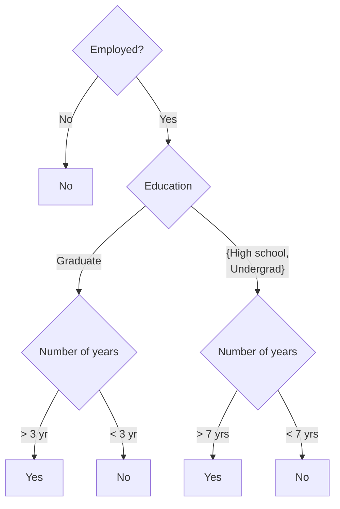
```mermaid
flowchart TD
    E{"Employed?"} -->|No| N1["No"]
    E -->|Yes| Ed{"Education"}
    Ed -->|Graduate| Y1{"Number of years"}
    Ed -->|"{High school,<br/>Undergrad}"| Y2{"Number of years"}
    Y1 -->|"> 3 yr"| A["Yes"]
    Y1 -->|"< 3 yr"| B["No"]
    Y2 -->|"> 7 yrs"| C["Yes"]
    Y2 -->|"< 7 yrs"| D["No"]
```

p.39 **Advanced Classification** —— 用**同一份数据、同一个问题**，换成集成学习（"Ensemble Learning to solve the same problem"），三步：

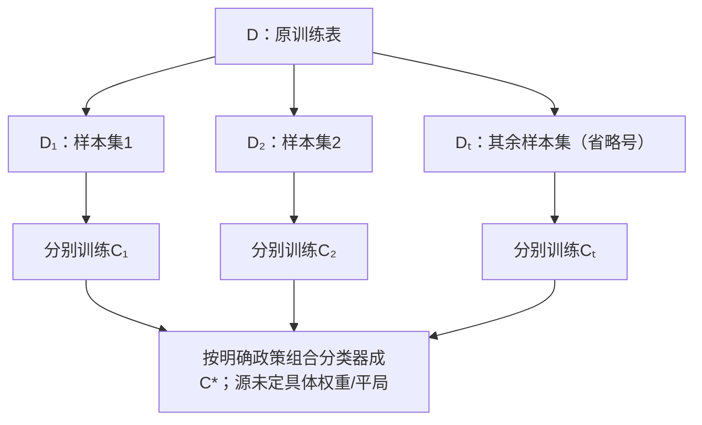
```mermaid
flowchart TD
    D["D：原训练表"] --> D1["D₁：样本集1"]
    D --> D2["D₂：样本集2"]
    D --> Dt["Dₜ：其余样本集（省略号）"]
    D1 --> C1["分别训练C₁"]
    D2 --> C2["分别训练C₂"]
    Dt --> Ct["分别训练Cₜ"]
    C1 --> C["按明确政策组合分类器成C*；源未定具体权重/平局"]
    C2 --> C
    Ct --> C
```

（图注：Figure 5.31 A logical view of the ensemble learning method —— 出自教材 DM 第 5 章。）

**所以呢**：给定分类器和组合流程已能执行，但模型训练也需要数据与评价；深度学习是另一函数框架，不能将它当树/集成不处理图像语言的证明。

#### 2.6.4.1 逐行走给定信用树：推断与训练分开

右图已经给出了一棵树，所以本讲读者能练的是“给定对象怎样走到叶子”，不能由四行示范表声称已经知道怎样学出整棵树。树的训练涉及如何挑字段、阈值和停止，原 p.38 没给这些规则；本节完整执行给定树推断，训练方法在后续分类主题另展开。

**是什么**：决策树（Decision Tree）把一个输入对象沿条件分支送到一个最终类别。内部节点是待检查问题，边上的条件决定下一节点，叶节点是输出。类别属性 Credit Worthy 是训练示范答案，不能放进预测输入再说模型猜对。输入为是否就业、学历及现地址居住年数；输出为这棵给定树的 Yes/No，或分支信息不足的报告，不是真实授信结论。

**状态和步骤**：当前节点从 Employed 开始。①若 No，直接输出 No；若 Yes，到学历节点；若就业值缺失或未知，停止报告。②Graduate 到阈值3分支，High School/Undergrad 到阈值7分支，其它学历原图未定义。③用居住年数作比较：大于对应阈值走Yes、小于走No，源图两边都是严格不等号，**恰等于3/7没有给分支**，本次不推断叶子，报告材料缺口。④到叶即停，保存走过节点和理由；不再读取或重新拟合训练表。

| p.38 原行 | 输入 | 逐节点路径 | 树输出 | 与展示 Class 比较 |
|---|---|---|---|---|
| 1 | Yes / Graduate / 5年 | 就业Yes→学历Graduate→5>3→叶Yes | Yes | 与表中Yes一致 |
| 2 | Yes / High School / 2年 | 就业Yes→另一学历组→2<7→叶No | No | 与表中No一致 |
| 3 | No / Undergrad / 1年 | 就业No→叶No，不需读后续阈值 | No | 与表中No一致 |
| 4 | Yes / High School / 10年 | 就业Yes→另一学历组→10>7→叶Yes | Yes | 与表中Yes一致 |

四行匹配不等于样本外准确率100%；表是有限示范，训练来源与采样方法未知，更不能证明就业或居住年数的因果。材料没有定义等号时，程序不能自作主张补≥；若后续选定平局/缺失政策，需要明说它是补充且核影响。

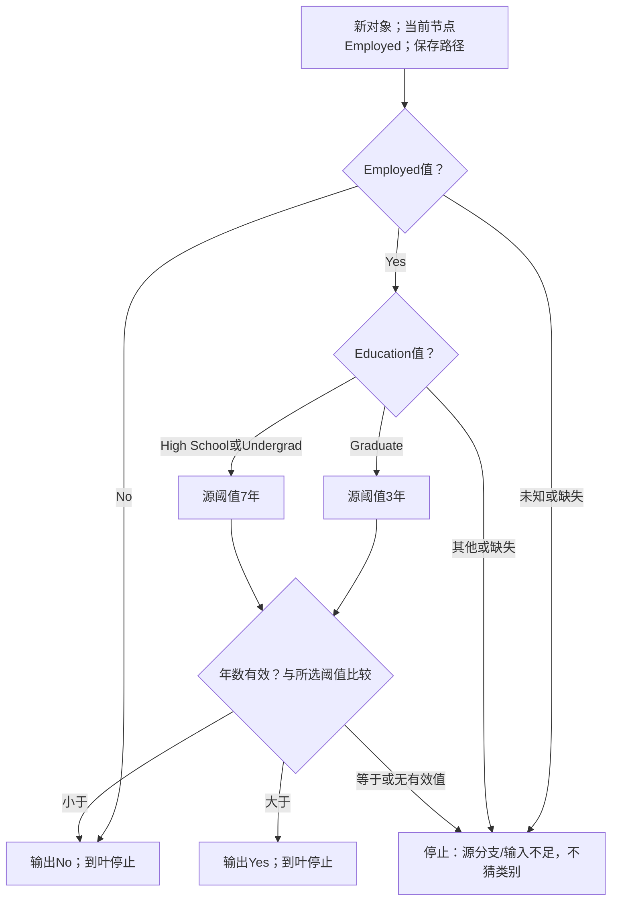
```mermaid
flowchart TD
    TI["新对象；当前节点Employed；保存路径"] --> TE{"Employed值？"}
    TE -->|No| TN["输出No；到叶停止"]
    TE -->|未知或缺失| TF["停止：源分支/输入不足，不猜类别"]
    TE -->|Yes| TD{"Education值？"}
    TD -->|Graduate| TG["源阈值3年"]
    TD -->|High School或Undergrad| TH["源阈值7年"]
    TD -->|其他或缺失| TF
    TG --> TC{"年数有效？与所选阈值比较"}
    TH --> TC
    TC -->|大于| TY["输出Yes；到叶停止"]
    TC -->|小于| TN
    TC -->|等于或无有效值| TF
```

**原理与停止**：给定树是有限、无环的条件结构，每步走向一个孩子节点，到叶后没有再判断的需要。字段顺序不可换成“先看年数统一过7就Yes”，那会改变Graduate只需>3的路径。No就业的分支本就先停，不能强制补读不必要字段。训练规则及真实概率未公开，图中叶标签是模型输出，不是经过概率校准的风险。

**常见误解 / 失败机制**：对等号或未知学历擅自选一边会改变源规则；纠正为报告未定义，再请求来源或明确补充政策。把Credit Worthy给预测函数造成答案泄漏；应只用三预测字段。把训练/示范四行匹配当对所有申请人可靠是评价范围错误；须另核代表性、信息时点和独立数据。本节不替现实法律、合规或授信决策设计。

**课件原例 / 🎙️ 课堂补充**：四行及严格阈值来自 p.38 原图，本轮回源复核；输入错误出口和完整路径表为笔记补充。待转录补充，不将边界处理称教授官方答案。

**💡 换个说法 / 与其他概念的关系**：像按已有路标走迷宫，树已画好是推断；决定路标放哪里是训练。与 §2.3 的“算法→保存模型→新输入”一致，接下来多个已学模型可以按声明规则组合。

迁移：Yes/Graduate/4、Yes/Undergrad/7、No/未知学历/缺年数分别怎样输出？

第一行就业Yes→Graduate→4>3，输出Yes；第二行到7年阈值恰等于，源缺分支，停止报告不能给类别；第三行就业No直接叶No，后续字段不在本路径使用，不因为未读的学历/年数便改已给规则。（完整逐行复算 m01-process-verify.py。）

**所以呢**：给定树可以完整走到输出，但未定义边界要留下；下一部分组合模型仍要说明输入、已保存模型和最终合并政策。

#### 2.6.4.2 多数据集、多模型怎样合成一个输出（笔记补充）

p.39 的三步图给了集成学习（Ensemble Learning）的外壳：准备多份数据、训练多个分类器、组合。图没有规定抽样方式、投票权重或平局政策，不能把任意具体算法说成源唯一实现。下面复用 §2.3.1 已完整解释的阈值学习器，补一条可计算的组合路径，示例仍为垃圾邮件，不把它冒充原信用评分训练。

**是什么**：多个模型的输出按预定组合规则形成总输出；如果它们错得不完全一样，组合可能改变错误，但不保证比每个模型好。先确定组成成员的训练数据和方法，再保存所有参数及组合规则，使用阶段不能偷根据新答案挑某个模型。

**同一原表，三份明确训练样本**：原ID1–4对应(0,Ham)/(1,Ham)/(3,Spam)/(4,Spam)。这里指定三抽样ID序列 A=[1,2,3,4]、B=[1,2,3,3]、C=[1,2,2,4]，允许重复的放回样本是本补充政策，原p.39并未规定。每个成员独立按候选1/2/3/4枚举误判，平局取较大阈值，步骤与§2.3.1相同。

| 成员 | 四候选训练错数（t1/t2/t3/t4） | 选择并保存的阈值 | 停止依据 |
|---|---|---:|---|
| A | 1 / 0 / 0 / 1 | 3 | 候选全比较，同分取较大 |
| B | 1 / 0 / 0 / 2 | 3 | 同上 |
| C | 2 / 0 / 0 / 0 | 4 | 同上，三个零错取最大4 |

**预测全程**：输入新邮件x=3、三成员阈值3/3/4，成员输出Spam/Spam/Ham，计票Spam2/Ham1，按本例等权多数票输出Spam。保存的组合状态为成员清单、参数、特征和等权规则；不得把x=3的答案放回训练。三份样本训练结束，再完成一次组合核算即停。

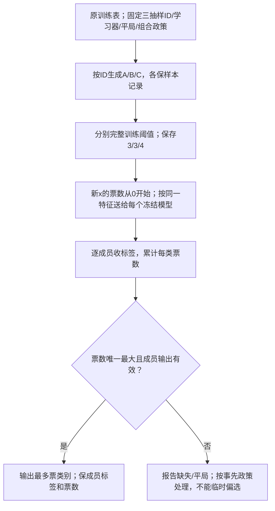
```mermaid
flowchart TD
    E0["原训练表；固定三抽样ID/学习器/平局/组合政策"] --> E1["按ID生成A/B/C，各保样本记录"]
    E1 --> E2["分别完整训练阈值；保存3/3/4"]
    E2 --> E3["新x的票数从0开始；按同一特征送给每个冻结模型"]
    E3 --> E4["逐成员收标签，累计每类票数"]
    E4 --> E5{"票数唯一最大且成员输出有效？"}
    E5 -->|是| E6["输出最多票类别；保成员标签和票数"]
    E5 -->|否| EF["报告缺失/平局；按事先政策处理，不能临时偏选"]
```

**依据 / 边界 / 常见误解**：等权多数票选票数最大的类别，是声明的决策规则，不是保证真实正确的数学定理。复制同一个模型三次不会创造新证据；数据或错误相关使投票收益可能很小。若只剩A/C两个成员，对x3为一票各一票，本例不再具有唯一最大，报告平局；平局与原树的阈值等号是两种不同欠定义。某成员失败时不能悄悄丢掉后改分母，应事先声明失败/缺席策略并重新评价。训练样本的重复不是新独立人群，也不能把训练票数当性能指标。

**课件原例 / 🎙️ 课堂补充**：p.39只给三阶段逻辑图，原信用表与p.38同；本例完整抽样、阈值训练和投票为补充，不称教授指定或实际训练原树。待转录补充。

**💡 换个说法 / 与其他概念的关系**：多个按各自训练表学出的说明书先分别答，再按事先约定汇总；不是开会后偷看正确答案再选人。具体Bagging/Boosting和树训练属于后续主题，此处没有实际调用它们，不把它们的名称当已学会。

迁移：新x=2和4各输出什么？对x3只剩成员A/C怎样处理？

x2低于三阈值，全Ham→Ham；x4达到3/3/4，全Spam→Spam。x3只剩3/4两个阈值，一Spam一Ham，源与本例未声明缺席后的强制选择规则，应报平局而非补一个任意答案。三模型同意也不证明真实类别。（笔记补充，m01-process-verify.py。）

**所以呢**：读者已经看到多个训练状态如何产生一个标签，下一节的神经网络是方法目录和结构预告；不同模型同样需要明确训练机制和独立评价，不能因“深度”就免检查。

#### 2.6.5 深度学习与神经网络（p.40–42）

**是什么**

决策树和集成学习也能从数据学习阈值和参数；神经网络以多层参数化计算表示函数，并非只有网络才会学。p.40右图画5输入、3隐藏节点、1输出，左侧示范表只有3预测字段，未给3字段到5输入的编码或权重映射；可以读结构，不能冒称已运行原信用网络。

> 💡 **p.38 → p.39 → p.40 是同一个例子换了三种模型。** 教授在用最小的认知成本传达一件事：**同一个商业问题（信用评分），可以用决策树、集成、神经网络三种方式解**。这正是 W11 "Model Assessment / Model Selection" 要回答的问题 —— **怎么选？**

p.41 **Sequential Model**：一张encoder-decoder结构图；历史x经encoder形成h，Temporal attention整理历史状态；未来可知/预测/情境因子经embedding（数值表示）后concat（按列拼接）进入decoder，图中前步y反馈到下一步，不能把未来真值提前当使用输入。（Encoder 侧 LSTM 链吃 x₁…x_t，Decoder 侧吃 Temporal attention + 未来外部因子 Weather Condition / Holidays / Events 的 embedding，输出 y₁…y_t）+ 一张 **LSTM Cell** 内部图（Forget gate / Input gate / Output gate）。图注：*Figure 2: Framework of Deep Sequential Model for Component Consumption Prediction*。

> ⚪ p.41标题描述component consumption prediction，未给论文作者；p.21零售背景与p.22社媒快时尚是不同页，不能据它们认证模型/论文来源。具体训练在后续主题另讲。

p.42 是著名的 "A mostly complete chart of Neural Networks"（©2016 Fjodor van Veen, asimovinstitute.org），列了 Perceptron、FF、RBF、DFF、**RNN**、**LSTM**、GRU、AE、VAE、DAE、SAE、Markov Chain、Hopfield、Boltzmann Machine、RBM、DBN 等。**本讲需读图中模块、方向与类型；未给权重的各架构完整训练是预告，不能仅背名字算学会运行。**

**所以呢**：神经网络是一个能自己调参数、拟合复杂规律的通用框架；下一节看这个框架被推到多复杂之后，能做出什么以前做不到的事——生成式 AI 和大语言模型。

**术语唤醒与背景图读法**：神经网络的参数同样由学习算法调整，树的阈值也可从数据学习，不是树全由人工写、网络才会学。序列模型（Sequential Model）指利用有先后关系的输入/状态处理任务；长短期记忆网络（LSTM）用门控结构管理随时间传递的状态。p.41图的encoder读取历史序列，decoder结合图示的注意力和外部因子表示输出预测；本讲没有给权重、门控输入数或训练规则，不由图名假称已可运行LSTM。天气/假日特征须是预测时点可知信息，不能使用未来实际天气冒充可提前取得。

**为什么需要它**：相同表可用不同函数族做分类，选择依数据与评价；序列结构像保存与更新过去状态，而不是将所有历史平均后丢掉顺序。这只是模块直觉，不替代门控公式。另一方面网络名字有“记忆”不代表无限保存，也不保证用上所有历史便更好。

**⚠️ 常见误解**：p.42是结构家族图，不是难度或性能排名；不能据图确认教授论文来源。具体训练在后续深度学习主题展开，本讲只辨图中职责。待转录补充。

**💡 换个说法（笔记补充）**：序列状态像一份会更新的历史摘要，图中的门只提示信息控制职责；另一方面一张模块图不等于已知每步数值，没有权重就不能凭图算真实预测。

**⚠️ 常见误解（逐项）**

- ❌ **“图上LSTM门画好就能算预测。”** —— 计算还缺输入表示、权重、状态和训练规则，因此图示不等数值模型。
- ❌ **“多层网络能学，决策树只能人工写规则。”** —— 树也可按算法从训练数据选阈值，差异在函数族和学习规则，不在是否能学习。

**💡 换个说法（笔记补充，两个角度）**

把序列状态想成一份随新记录更新的工作笔记，图中的门表示信息控制职责；它能帮助读模块，却不表示已经知道每一步保留多少和具体数值。

另一个角度，输入、状态和输出是不同角色：预测的未来数值不能提前作为当下已知答案塞入输入，图画了回馈也仍需声明训练与使用的时点。

**三个门的最小职责（p.41图读，笔记解释）**：Forget gate决定旧cell记忆保留多少，Input gate决定候选新信息写入多少，Output gate决定从更新后的cell记忆向外给hidden输出多少；cell记忆与hidden输出是两种状态。图中σ表示将门值限制在0–1的sigmoid，tanh用于候选/状态的有界变换；门不是简单“开关”或无限记忆保证。即使forget接近0，仍可写新信息，所以不能直接断定输出0；input小也不等output小。图没有权重、原输入与初始状态，不能计算原预测，更不能把decoder画的前步y反馈当使用未来真答案。本节只执行模块读法，完整LSTM训练保持预告边界。🔗 [PyTorch LSTM门与状态公式说明](https://docs.pytorch.org/docs/2.14/generated/torch.nn.LSTM.html)，获取2026-10-01，用于核三个门职责与cell/hidden区别；未据此认证p.41原权重或本机PyTorch版本。

**图谱背景名的最小唤醒（不作为训练完成）**

| p.42 图中背景名 | 最小作用 / 不能由图推出的保证 |
|---|---|
| Perceptron / FF / DFF | 感知机是基础加权判断单元；前馈网络把信息由输入传向输出；深前馈增加中间层。多层不自动更好 |
| RBF | 以与参照点距离相关的响应形成表示，不等于所有节点都只做普通线性加权 |
| RNN / LSTM / GRU | 循环网络保留顺序状态；LSTM用cell/hidden与门控制；GRU以不同门控组织状态，不能凭图保证性能排序 |
| AE / VAE | AE学表示并重建输入；VAE学带分布的内部表示，可从中抽样生成。相似外形不等训练目标相同，也不要求所有AE都对称或必小瓶颈 |
| DAE / SAE | 前者学习从受扰输入重建干净目标；后者限制活跃表示，使编码较稀疏，不由节点数决定是否稀疏 |
| Markov Chain | 状态转移概率模型；通常所称一阶链以上一个状态条件描述下一状态，**不因此就是神经网络** |
| Hopfield Network | 用互连状态恢复/检索存储模式的联想记忆框架，更新和收敛需要具体条件 |
| Boltzmann Machine / RBM / DBN | 以状态打分定义概率的网络；RBM限制连接；DBN组合层次概率表示。未给参数/抽样/训练，不能从图算生成结果 |

图中节点颜色/形状图例标输入、隐藏、输出、记忆/循环、概率或噪声等角色；这是此图的图例，不是所有论文统一颜色。图例Kernel指核响应/计算类节点，与§2.7的执行进程kernel不同；LSTM Cell也不等于Notebook代码cell。原图标2016，不是当前所有架构的完整分类，图也不能独自交代每种训练。

🔗 [原图作者的Network Zoo说明](https://www.asimovinstitute.org/neural-network-zoo/)、[Deep Learning教材Autoencoders章](https://www.deeplearningbook.org/contents/autoencoders.html)、[LSTM官方门与状态说明](https://docs.pytorch.org/docs/2.14/generated/torch.nn.LSTM.html)，获取2026-10-01。表为笔记补充的背景唤醒，使用最小角色解释并保限制；当前只执行p.40–42的结构读法，完整各模型训练未作为已完成。

#### 2.6.6 深度学习、GenAI 与 LLM（p.43–45）

**是什么**

语言模型（Language Model）给语言序列建模以预测或生成；具体架构和任务范围须声明，不等于所有语言应用都来自一个模型。

这里以使用深度学习的聊天、翻译与代码辅助实例说明框架、用途和领域的区别；这些任务也有其它方法，不概括成所有能力都来自同一个模型或唯一DL链。p.43是课程高层图，下面原定义与本笔记边界分开。

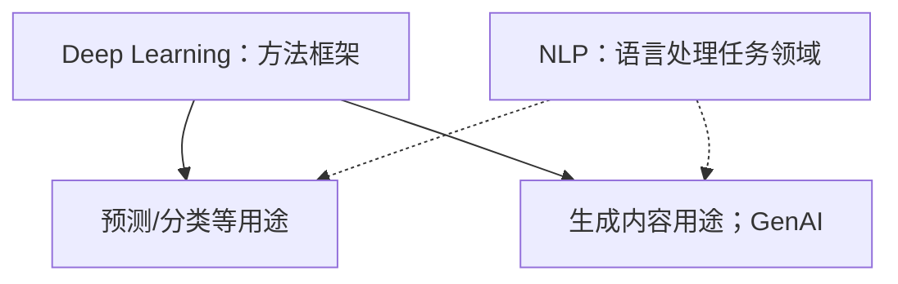
```mermaid
flowchart TD
    DL["Deep Learning：方法框架"] --> P["预测/分类等用途"]
    DL --> G["生成内容用途；GenAI"]
    N["NLP：语言处理任务领域"] -.-> P
    N -.-> G
```

**读法**：原页将深度学习作为方法框架、生成内容作为扩展用途，NLP作为语言领域。图中箭头不作为严格集合包含；补充反例是文本分类属于NLP但可不生成、图像生成属于GenAI却不是语言任务。

p.44 给出三层定义（**建议整页背下来，这是能直接写进考卷的英文定义**）：

> **Language Model（语言模型：语言序列的预测/生成模型）**
> "Models capable of **generating, understanding, or manipulating** text or speech in natural language"
> - Neural network-based models
> - **Transformer models**
>   - **Attention**: "Instead of reading word by word, it can examine **multiple words at once** and understand their **relationships**"
>
> **Large Language Model**
> - Large model using **Transformer**
> - Trained on **large-scale text corpora**
> - e.g. Generative pre-trained transformer (**GPT**)

p.45 列 LLM 应用：**Chatbot** · **Content generation**（Text / Image / Video）· **Sentiment analysis** · **Code development**（配图是一个 AI 编程助手界面）· Translation · Recommendation

> ⭐ **p.45 的 "Code development" 不是随手一提。** 它与tutorial的AI代码辅助用途相呼应，不证明它是全部Prompt的理论出处或授权尺度，也是 W11 "Competition: GenAI for BDA" 的伏笔。详见 [[T01-Jupyter入门与Pandas基础#6. 教授在教你怎么向 AI 提问|T01-Jupyter入门与Pandas基础 › 6. 教授在教你怎么向 AI 提问]]。

**所以呢**：方法地图连接数据准备、建模和评价等不同阶段，不能全等同“选模型”。下一节换到运行环境，解释这些工具的实际执行和保存状态。

**🎙️ 课堂补充**

待转录补充。⏳ 转录到手后重点确认：p.33–34 那张影子照片教授到底讲了什么（这是本讲信息缺口最大的一页）。

**⚠️ 常见误解**

- ❌ **"GenAI 是比深度学习更新的技术。"** —— p.43 的图说得很清楚：本课用深度学习讨论生成用途；方法框架与用途是不同维度，不据此把所有生成式方法都限定为深度学习
- ❌ **“Attention只表示所有词同时可见。”** —— 原p.44是用途简化描述；加权相关信息是机制的一部分，注意力掩码可限制可用位置，不能据“同时”说生成时能使用未来答案。实际矩阵操作在对应主题另展开。

**与其他概念的关系**

技术地图按用途连接数据理解/准备、建模和评价等阶段，同一方法可服务多个环节；不能全部等同第4步。

---

**概念边界（笔记补充）**：语言模型（Language Model）给语言序列建立可用于预测或生成的模型，本讲原定义还包含理解/操纵文本或语音的能力描述；不把单凭流畅回答当真正理解的认证。大语言模型（Large Language Model）在本课用大规模Transformer与文本训练来说明，不把这句话当所有LM的唯一结构定理。注意力机制（Attention）通过相关性计算组织信息，Transformer是包含注意力等模块的模型结构；p.44用“同时看词的关系”说明用途，不证明每种注意力都能读未来词，也不说明它无需权重/训练。

**为什么需要它**：生成式AI（Generative AI）是生成内容的任务/应用类别，深度学习是方法框架，自然语言处理（NLP）是处理语言的领域；三者会交叠，不能从“DL→GenAI→NLP”的箭头推成严格包含链。例：文本分类属于NLP但不必生成内容，生成图像属于GenAI但不等于NLP，神经网络也可只输出一个类别。像“材料、用途、对象”三种维度，不能只按名称排年龄大小。

**⚠️ 常见误解**：本节区分类别与架构，下一小节把注意力作为核心实际算到输出；完整Transformer训练和自回归生成不在本例中，不能把单个模块当整个语言模型。

#### 2.6.6.1 注意力怎样算出一个输出向量（笔记补充）

注意力机制（Attention）按查询与键的匹配给值分配权重，汇合成输出；以下明确一种可执行实现及其边界。

自测要求解释Attention，不能只背“同时看多个词”。这里只完成一个查询、两个可用对象的缩放点积注意力（Scaled Dot-Product Attention）；Transformer还有其他模块和训练步骤，不能将此小例当整个LLM。p.44给的是用途简化，以下公式依据原论文，本例数字与检查政策均由笔记自设。

**是什么 / 为什么需要它**：查询（Query）q表示当前要找什么，键（Key）k用于与查询比较，值（Value）v是要汇合的信息。它先给各键打分，再把分数转成非负、和为1的权重，最后加权汇合值，输出新的信息向量。q/k/v可以由模型投影得到，但本节把它们作为明确已给输入，不虚构已经训练出语义表示。向量就是有固定顺序的数值列/行，分量本例为教学坐标，不直接称真实词的含义。

**输入与形状**：$q=(1,0)$有2维，K两行分别$k_1=(1,0)$、$k_2=(0,1)$，V两行分别$v_1=(2,0)$、$v_2=(0,4)$。键和值的行ID必须配对。q是1×2，K是2×2，V是2×2；输出o是1×2。可见性掩码（Mask）声明哪些行允许使用，本例先两行均可见，未用dropout或额外权重。

$$s_j=\frac{q\cdot k_j}{\sqrt{d_k}},\qquad w_j=\frac{\exp(s_j-m)}{\sum_{r\in A}\exp(s_r-m)},\quad m=\max_{r\in A}s_r,\qquad o=\sum_{j\in A}w_jv_j.$$

| 符号 | 含义 / 单位 | 本例输入或状态 |
|---|---|---|
| q、k_j、v_j | 查询、键、值向量；组件顺序固定 | 上述2维表 |
| d_k | 查询/键的维数，须正且一致 | 2 |
| A | mask允许的键行ID集合 | {1,2} |
| s_j | 对应分量相乘再求和，除√d_k的分数 | (.707106781,0) |
| m、w_j | 可见分数最大值、归一权重 | .707106781；(.669761549,.330238451) |
| exp | 指数函数e的输入次幂，总为正 | $\exp(0)=1$；$\exp(-.707106781)=.493068691$ |
| o | 值的加权和，维数与每个值相同 | (1.339523099,1.320953803) |

1. **检查输入**：非空键/值行且ID对应、q与k维度相同、值维度一致、数值有限；至少一行可见；实现时点积/缩放分数与输出也检查有限性，不能只因输入有限便保证中间数值不溢出。若两行全被mask，不除空分母而报告没有可用信息。
2. **点积及缩放**：$q\cdot k_1=1\times1+0\times0=1$，$q\cdot k_2=1\times0+0\times1=0$。除√2得分.707106781/0，保存二元分数。点积受方向和大小影响，不一概等于余弦相似度。
3. **mask与softmax**：只在可见集合取最大m=.707106781。减m后的分数0/−.707106781，指数1/.493068691，和1.493068691；分别除总和得w1=.669761549/w2=.330238451，核两权重之和1。这个归一化称softmax（指数分数的归一化；不是最高分独占），不是把最高分行直接变一票独占。
4. **汇合值**：o的第一分量=.669761549×2+.330238451×0=1.339523099；第二分量=.669761549×0+.330238451×4=1.320953803。核输出维数2，并保存ID、分数/权重/输出；这一趟前向计算完成即停，不假造训练迭代。

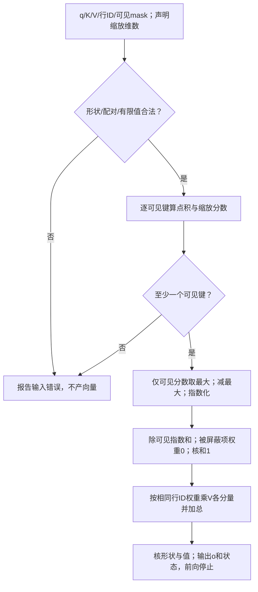
```mermaid
flowchart TD
    A0["q/K/V/行ID/可见mask；声明缩放维数"] --> A1{"形状/配对/有限值合法？"}
    A1 -->|否| AE["报告输入错误，不产向量"]
    A1 -->|是| A2["逐可见键算点积与缩放分数"]
    A2 --> A3{"至少一个可见键？"}
    A3 -->|否| AE
    A3 -->|是| A4["仅可见分数取最大；减最大；指数化"]
    A4 --> A5["除可见指数和；被屏蔽项权重0；核和1"]
    A5 --> A6["按相同行ID权重乘V各分量并加总"]
    A6 --> A7["核形状与值；输出o和状态，前向停止"]
```

**依据 / 最小推导（笔记解释）**：所有可见exp均正，除共同正和就使权重非负且和1，因此每个输出分量是对应值分量的加权平均，本例在各值的最小/最大范围内。减m不改权重：分子分母同除exp(m)，比值抵消；却避免正分数过大造成指数溢出。缩放是声明算法的一部分，不因叫“注意力”就可省。未掩码若两分数相等便各.5，本例$q=(0,0)$给o=(1,2)，这不等于已学会区分意义。

**mask边界**：若第2行是当前不允许使用的未来位置，只让A={1}，权重变(1,0)，o=(2,0)，**不能先用两行算权重再把第二权重清零而不重新归一**。原权重清零后和.669761549，输出(1.339523099,0)是错误流程。可并行计算多个位置的表征不等于自回归生成时能提前看到未来真词；生成的顺序与可见mask另有规则。

**失败机制 / 常见误解**：ID错位时，用k1分数配v2会汇合错信息，长度正确也无法自证；先核配对。掩码全不可见时无合法归一分母，应报告缺口；不能给NaN然后称语义结果。键尺度增大可能使权重尖锐，缩放也不保証真实任务更准；需核训练与评价。注意力权重描述本次信息混合，不自动成为现实因果解释或“理解正确”的证明。

**课件原例 / 🎙️ 课堂补充**：p.44仅描述注意力用途，没有本例q/K/V、mask或softmax数值。待转录补充，完整小例为笔记补充，原论文作外部算法依据。🔗 [Vaswani等原论文§3.2.1](https://arxiv.org/html/1706.03762v7#S3.SS2.SSS1)，获取2026-10-01；数值、稳定归一/输入错误出口是本例自设验证（m01-attention-verify.py）。

**💡 换个说法 / 与其他概念的关系**：键像索引标签，值像要取出的信息，查询决定怎么分配本次权重；但这些角色是模型向量而不是人的真实意图。换个角度，改变查询可以改变混合比例，却不会自动改变已给V，训练与一次使用仍是不同动作。Transformer使用注意力等模块；LM是任务/模型类别，不是所有语言模型都必须同一架构。

迁移：查询改为 $q=(0,1)$，K/V仍原表，先两行可见，再仅第1行可见，各输出什么？交换V的两行会怎样？

两行可见时分数0/.707106781，权重(.330238451,.669761549)，o=(.660476901,2.679046197)。只见第1行时只对这一行归一，w=(1,0)，o=(2,0)，不因其得分0便输出零。交换V而保K行ID不变，是配对定义改变/错误：两行可见输出(1.339523099,1.320953803)，数值虽有限也不代表原输入正确；须说明是否真的更换对应值。全屏蔽时报告无输出。（笔记补充。）

**所以呢**：注意力的输入、打分、mask、归一与值汇合已可逐步执行；它支持理解Transformer的一个模块，不能代替完整语言模型的训练、位置处理或生成协议。

### 2.7 工具链：Anaconda / Jupyter / Colab

对应讲义 p.46–57。操作与执行状态一起讲，原页按钮/截图作历史材料，背后kernel、服务、文档边界在§2.7.3完整追踪，不把操作内容免为非知识。

#### 2.7.1 三条上手路径

**是什么**

装 Python 环境这件事众口不一：有人喜欢在自己电脑上装一整套软件、离线也能用；有人嫌麻烦，只想打开浏览器就能写代码。这门课的讲义把可行的路径归纳成了三条，下面这张图把它们和各自的取舍摆在一起：

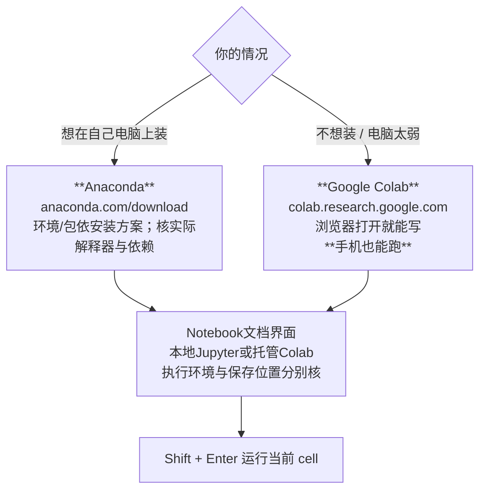
```mermaid
flowchart TD
    Q{"你的情况"} -->|"想在自己电脑上装"| A["**Anaconda**<br/>anaconda.com/download<br/>环境/包依安装方案；核实际解释器与依赖"]
    Q -->|"不想装 / 电脑太弱"| C["**Google Colab**<br/>colab.research.google.com<br/>浏览器打开就能写<br/>**手机也能跑**"]
    A --> N["Notebook文档界面<br/>本地Jupyter或托管Colab<br/>执行环境与保存位置分别核"]
    C --> N
    N --> R["Shift + Enter 运行当前 cell"]
```

**Anaconda 的两条启动路径**（p.49–50）：
1. **Anaconda Navigator** → 应用面板里点 **Jupyter Notebook** 的 `Launch`
2. Windows 开始菜单 → `Anaconda3 (64-bit)` → 直接点 **Jupyter Notebook**

本地Notebook默认常使用localhost/127.0.0.1的8888端口，实际端口受占用和配置影响；Colab托管服务不等于本机localhost。以启动输出和已选择的kernel为准。

**新建 notebook**（p.51）：右上角 `New ▾` → **Python 3**

**写与跑**（p.52–54）：
- 中间那个 `In [ ]:` 框就是 **Coding Area**（p.52）
- 输入 `print("Hello IS6400")`，按 **Shift + Enter**（或点工具栏 ▶ Run）（p.53）
- 代码下方出现 `Hello IS6400`，这就是 **Output**（p.54）；同时 `In [ ]` 变成 `In [1]`

**Google Colab**（p.55–57）：网址 `colab.research.google.com`，同样 Shift + Enter 运行。最后一页 p.57 是手机截图，红字问 **"Use my cell phone to code? YES!"**

**所以呢**：三条路径、装好环境之后能打开的 Jupyter/Colab 界面都清楚了。但讲义这部分的截图是好几年前录的，下一节先说清楚哪些地方对不上、不用慌。

#### 2.7.2 历史截图与实际运行环境的边界

**是什么**

讲义 p.47–57 共11页，包含历史软件界面与Colab/手机操作。可见年份/版本是材料状态，不代表当前机器安装状态，也不能把所有流程一概称错或完全不变。p.46是章节标题，不是第12张安装截图；按功能和实际启动反馈定位，不按像素照抄。

| 讲义内容 | 过时在哪 |
|---|---|
| p.47 引用 **Gartner Peer Insights Customers' Choice 2019** | 2019年材料，距本轮2026年约7年；不作当前软件排名 |
| p.48 原界面称Anaconda Individual Edition、Python3.9、510MB | 历史截图；安装包名/版本/大小不作为本机或当前下载事实，未本轮核该URL跳转 |
| p.49 保存界面显示Jupyter Notebook6.4.5 | 历史材料；当前官方Notebook文档有7系列界面说明，本机实际版本需另查，Notebook和JupyterLab也非同名产品 |
| p.53–54 地址栏可见Dropbox/Teaching/2022Spring/ | 只在这两页可见，不扩大为p.50–52均有该路径 |
| p.57 代码写的是 `print("welcome to IS4861")` | **课程代码写错了**，IS4861 是另一门课 |

> 💡 按功能核动作：启动服务、选kernel、运行代码、核新结果和保存，而不是用截图的旧版本代替当前环境。正式教程的环境差异需单独记录，见§2.7.3。

**🎙️ 课堂补充**：待转录补充。

**⚠️ 常见误解**

- ❌ **"cell 从上往下写就行，顺序无所谓。"** —— Jupyter 的变量存活在 **kernel** 里，跟 cell 的**排列顺序**无关，只跟**执行顺序**有关。你可以先跑第 5 个 cell 再跑第 2 个，结果会很怪。这是初学者最常见的坑，详见 [[T01-Jupyter入门与Pandas基础#2.0.1 cell · kernel · 执行顺序 ⚠️|T01 §2.0.1]]
- ❌ **“ipynb互通就表示Colab和本机Jupyter是同一系统。”** —— 文档格式/相似交互可兼容，但服务器、kernel/runtime、包、临时文件和保存位置分别核，不能由文件互通推出实时状态相同。

**所以呢**：环境装好了，规则、全景、工具三件事这一讲都交代完了。下面两张图把"这一讲的四段结构"和"CRISP-DM 与十三周课程的对应关系"分别画出来，作为整讲的收尾；真正动手写代码，从 [[T01-Jupyter入门与Pandas基础]] 开始。

---

#### 2.7.3 从按钮到实际执行：五处状态分别在哪里（笔记补充）

笔记本文档（Notebook Document）是保存的代码、文字与输出记录，区别于kernel的实时变量。

你在浏览器点了运行，不代表浏览器自己解释 Python；保存了 notebook，也不代表保存了内存变量。先把界面、服务、执行进程和磁盘分开，就能解释“代码改了输出没变”“重开文件还能见图却报变量未定义”等常见问题。讲义 p.47–57 画的是启动、输入与输出，本段把截图背后的实际机制补齐。

**是什么**：本地环境是 Python 解释器与包所在的安装目录；Notebook 服务器提供文件和通信服务；浏览器是编辑和显示客户端；kernel（内核）是实际执行代码的独立语言进程；.ipynb 是磁盘上的文档，可保存代码、文字和已经生成的输出。运行需要选定 kernel，保存需要写文档，两动作改变不同状态。这里讲读者如何定位和复现结果，不修改用户现有环境。

| 保存位置 / 主体 | 实际保存或处理什么 | 不能由它单独推出什么 |
|---|---|---|
| Python 环境 | 解释器、已安装库及版本 | 浏览器能打开不代表此 kernel 能 import 所需包 |
| Notebook 服务 | 文件目录、读写请求、与 kernel 的通信 | 服务启动不等某个 cell 已执行 |
| 浏览器前端 | 正在编辑的 cell 文本、显示结果及选择 | 改代码文本不会自动更新 kernel 内变量 |
| Kernel 内存 | 按实际执行顺序形成的变量、导入模块、对象 | .ipynb 打开有旧图不证明这些对象在新进程存在 |
| 磁盘 .ipynb | 最后保存的输入文本/说明/输出记录 | 保存文档不是把任意内存对象和运行进程永久存起来 |

**动作链与停止**：①启动已选环境的服务；②打开或新建文档并选择 kernel；③输入代码；④运行把代码送给 kernel；⑤kernel 执行后返回文本/结果或异常，前端显示；⑥确认结果并保存文档；⑦需要可复现验证时重启自己的测试 kernel、从上到下运行全部必要 cells。正常一次执行以收到完成/异常消息为终点；一直忙不能称成功，应检查正在执行的代码和依赖。关闭页面、保存、重启kernel与停止服务器并非同一个动作。

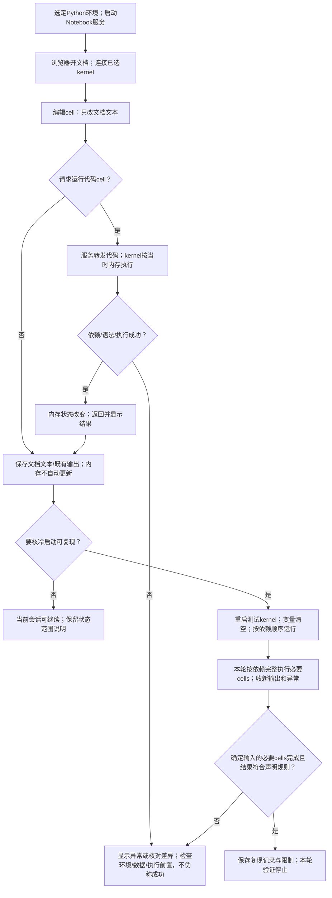
```mermaid
flowchart TD
    K0["选定Python环境；启动Notebook服务"] --> K1["浏览器开文档；连接已选kernel"]
    K1 --> K2["编辑cell：只改文档文本"]
    K2 --> K3{"请求运行代码cell？"}
    K3 -->|否| KS["保存文档文本/既有输出；内存不自动更新"]
    K3 -->|是| K4["服务转发代码；kernel按当时内存执行"]
    K4 --> K5{"依赖/语法/执行成功？"}
    K5 -->|否| KE["显示异常或核对差异；检查环境/数据/执行前置，不伪称成功"]
    K5 -->|是| KO["内存状态改变；返回并显示结果"]
    KO --> KS
    KS --> KR{"要核冷启动可复现？"}
    KR -->|否| KN["当前会话可继续；保留状态范围说明"]
    KR -->|是| KC["重启测试kernel；变量清空；按依赖顺序运行"]
    KC --> KV["本轮按依赖完整执行必要cells；收新输出和异常"]
    KV --> KK{"确定输入的必要cells完成且结果符合声明规则？"}
    KK -->|否| KE
    KK -->|是| KF["保存复现记录与限制；本轮验证停止"]
```

**完整轨迹**：两个 code cells，A 为 x=2，B 为 print(x+1)。赋值号把右边值存进名称，print 显示括号内结果；它不是数学等式证明。先运行 A 后 B 显示3。只把 A 的文本改成 x=10、未运行 A，再运行 B 仍显示3，因为内存 x 仍2。此时保存，文档可同时含新文本 x=10 与旧输出3，它们不一定来自同一执行状态。实际再运行 A 后 B 显示11。

| 操作 | 文档 A 文本 | kernel x | B 本次行为 | 状态核对 |
|---|---|---|---|---|
| 新测试kernel | x=2 | 未定义 | 尚未运行 | 文本不创建变量 |
| 跑 A，再跑 B | x=2 | 2 | 显示3 | 两个动作已执行 |
| 改 A 文本，直接跑 B | x=10 | 2 | 显示3 | 文档与内存版本不同 |
| 跑新 A，再跑 B | x=10 | 10 | 显示11 | 内存更新 |
| 重启测试kernel，只跑 B | x=10 | 未定义 | NameError | 旧显示可留，前置变量不存在 |
| 从头跑 A，再 B | x=10 | 10 | 显示11 | 冷启动依赖顺序可复现 |

这是就地解释执行机制的补充小程序，输入是上述两个 cell 的文本与动作序列，输出是结果/异常和变量状态。独立测试在 scratch 中用单独 kernel，结束仅关闭该测试进程；不重启用户的 Notebook 服务。执行证据见 m01-process-verify.py / m01-kernel-verify.py；未把保存输出或执行计数单独当作复现证明。

冷启动核对按声明的输入、环境与期望规则进行；此固定数字例可逐值比较，时变时间戳或有随机步骤的程序需按时点/种子/容差记录判断，不要求所有运行逐字同输出。

**原理与边界**：每次运行使用当前内存和发送来的代码；修改文本是编辑操作，所以没有发送执行就不改变变量。重启创建新执行状态，所以未定义名称会失败。共享同一 kernel 的其它客户端可能影响状态；文件路径和已安装包属于该运行环境，不能只因 notebook 文件在目录里就确认数据可读。若实际部署有自动执行扩展，需要按该实现重新描述，不能把此基本手动流程当全部扩展行为。

**常见误解 / 两种失败**：ModuleNotFoundError 先查运行 kernel 的环境，不是先证明软件从未安装；FileNotFoundError 查kernel工作目录与文件存在，不是浏览器地址。换环境可能换包但不自动补数据；补路径也不会补变量执行前置。隐式前置来自乱序运行，纠正是依赖整理和冷启动运行，代价是重新计算；耗时长时可明确保存可复用状态与加载过程，但不能只靠旧图自证。

**课件原例 / 🎙️ 课堂补充**：p.52标Coding Area、p.53标Shift+Enter、p.54标Output，p.55–57示Colab与手机界面；完整状态表为笔记补充，待转录补充。

**💡 换个说法 / 与其他概念的关系**：浏览器像编辑台，kernel 像正在工作的计算员，磁盘文档是记录；改记录不会让计算员自动重做。这与 §2.3 的“保存模型 vs重新训练”同样区分文本、对象和动作，T01再展开实际DataFrame状态。

**Colab 的对应关系**：托管 runtime 在云端执行，文档可保存在Drive，临时VM里的自装库和文件不等于文档或Drive永久状态。runtime被清理后需要按声明过程恢复依赖和数据；不能承诺“不用安装所以没有版本问题”。本地的localhost地址表示本机服务，默认端口常8888，端口占用或配置可变；Colab则不是本机localhost服务器。

🔗 [Jupyter kernel 官方说明](https://docs.jupyter.org/en/latest/projects/kernels.html)、[Notebook 官方文档](https://jupyter-notebook.readthedocs.io/en/stable/notebook.html)、[Colab FAQ](https://research.google.com/colaboratory/faq.html)，获取 2026-10-01：支持独立进程、输入/输出文档、kernel执行和托管runtime状态区分；上述数字轨迹为本笔记自写验证，不是文档原例。

迁移：A改为x=7但未执行，原内存x=2；B改为print(2*x)。保存、重开页面与重启kernel分别会怎样？

当前执行 B 显示4；保存改变磁盘文档，不自动把x变7。重开页面若重新连接仍活的同kernel，x可仍2；不能仅据页面重开判清空。真正重启后先B会NameError，按A→B重新运行显示14。文档旧输出可能仍显示4，不认证新进程变量。Colab runtime是否仍存在另依服务生命周期，不由本地kernel的页面行为直接保证。（笔记补充。）

**所以呢**：运行成功要核收到的新结果和它的环境、数据及依赖状态；保存与重开只能保存和展示文档，冷启动复现才能检验它是否依赖隐藏的执行历史。

## 3. 一图看懂

### 图 1 · 本讲的四段结构与信息密度

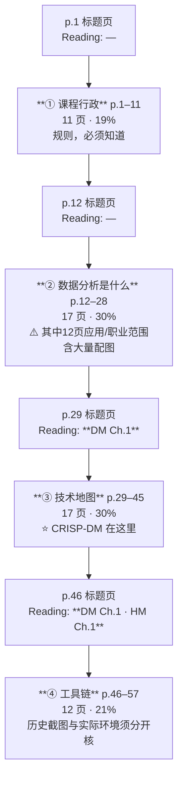
```mermaid
flowchart TD
    T1["p.1 标题页<br/>Reading: —"] --> S1["**① 课程行政** p.1–11<br/>11 页 · 19%<br/>规则，必须知道"]
    S1 --> T2["p.12 标题页<br/>Reading: —"]
    T2 --> S2["**② 数据分析是什么** p.12–28<br/>17 页 · 30%<br/>⚠️ 其中12页应用/职业范围含大量配图"]
    S2 --> T3["p.29 标题页<br/>Reading: **DM Ch.1**"]
    T3 --> S3["**③ 技术地图** p.29–45<br/>17 页 · 30%<br/>⭐ CRISP-DM 在这里"]
    S3 --> T4["p.46 标题页<br/>Reading: **DM Ch.1 · HM Ch.1**"]
    T4 --> S4["**④ 工具链** p.46–57<br/>12 页 · 21%<br/>历史截图与实际环境须分开核"]
```

### 图 2 · CRISP-DM 与本课十三周的对应

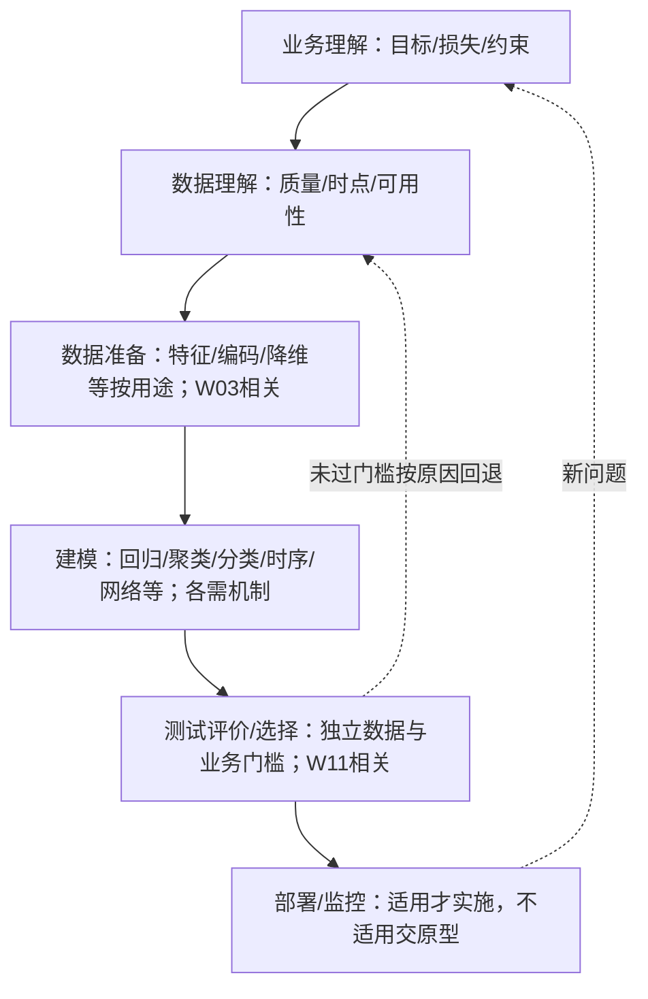
```mermaid
flowchart TD
    B["业务理解：目标/损失/约束"] --> U["数据理解：质量/时点/可用性"]
    U --> P["数据准备：特征/编码/降维等按用途；W03相关"]
    P --> M["建模：回归/聚类/分类/时序/网络等；各需机制"]
    M --> E["测试评价/选择：独立数据与业务门槛；W11相关"]
    E --> D["部署/监控：适用才实施，不适用交原型"]
    E -.->|未过门槛按原因回退| U
    D -.->|新问题| B
```

> **本图按用途把阶段接起来**：特征/降维不全部等同建模，评价也有独立职责；原p.31只给前三步约80%经验表述，不由此判所有项目失败原因或第4步必占20%。

---

## 4. 速查表（考前一页纸）

### 4.1 核心定义（英文原句，考试可直接写）

| 概念 | 讲义原句 | 页 |
|---|---|---|
| Data Analytics | "the process of **automatically discovering useful information in large data repositories**" | p.13 |
| Feature | "Feature is **the element that you use to describe an object**" | p.33 |
| Clustering — Understanding | "Group related documents for browsing, group genes and proteins that have similar functionality, or group stocks with similar price fluctuations" | p.35 |
| Clustering — Summarization | "**Reduce the size of large data sets**" | p.35 |
| Classification | "Find a model for **class attribute** as a **function of the values of other attributes**" | p.38 |
| Ensemble Learning | "Ensemble Learning **to solve the same problem**"（三步：Create multiple data sets → Build multiple classifiers → **Combine classifiers**） | p.39 |
| Language Model | "Models capable of **generating, understanding, or manipulating** text or speech in natural language" | p.44 |
| Attention | "Instead of reading word by word, it can examine **multiple words at once** and understand their **relationships**" | p.44 |
| LLM | "**Large model using Transformer**, trained on **large-scale text corpora**, e.g. GPT" | p.44 |
| NLP | "Enabling computers to **understand, process and generate** natural language" | p.43 |

### 4.2 CRISP-DM 一览（考点推断）

| # | 英文 | 中文 | 关键点 |
|---|---|---|---|
| 1 | Business Understanding | 业务理解 | ⎫ |
| 2 | Data Understanding | 数据理解 | ⎬ **~80% of total project time** |
| 3 | Data Preparation | 数据准备 | ⎭ |
| 4 | Model Building | 建模 | 选择并拟合模型；特征准备和独立评价有其它阶段职责 |
| 5 | Testing and Evaluation | 测试与评估 | 要回照第 1 步的商业目标 |
| 6 | Deployment | 部署 | "except deployment **if not applicable**" |

**必记三条**：① 1990s，European consortium ② six consecutive phases ③ **Steps can be repeatedly backtracking**

### 4.3 技术地图 ↔ 周次

| 技术 | 周 | 一句话 |
|---|---|---|
| Predictive Analytics（回归） | W02 | 用自变量预测一个连续的因变量 |
| Feature Engineering / PCA | W03 | 挑选与压缩特征 |
| Clustering（Bisecting KMeans, DBSCAN） | W04 | 无监督分组：Understanding + Summarization |
| Classification（决策树、集成） | W05 | 为类别属性找模型 |
| Time series（Holt、指数平滑） | W07–08 | 加趋势、加季节性 |
| ANN / RNN | W09 | 序列模型、LSTM |
| Image Mining | W10 | 图像 |
| GenAI / LLM | W11 | Transformer、Attention |

### 4.4 三种数据岗位（p.27）

| 角色 | 一句话 | 本课教吗 |
|---|---|---|
| Data Engineer | 让数据可用（管道、ETL、仓库） | 课表不逐项列全部工程专题，不等完全不涉及或修课即能胜任 |
| **Data Scientist** | 从数据里造知识（Python、ML、特征工程、可视化） | ✅ **主线** |
| Business Stakeholder | 用数据做决策（批判性思维、沟通、讲故事） | ✅ 官方 CILO 4（10%） |

---

## 5. 双语术语卡

| 中文 | English | 考试可用的英文定义 | 首现 |
|---|---|---|---|
| 商业数据分析 | Business Data Analytics (BDA) | The process, models, and tools for data analysis and analytics in business, such as finance and marketing | §2.2 |
| 数据分析 | Data Analytics | The process of automatically discovering useful information in large data repositories | §2.2 |
| 数据挖掘 | Data Mining | Discovering useful patterns from data; the lecture uses a related analytics definition, without proving universal synonymy.（笔记限定） | §2.2 |
| 跨行业数据挖掘标准流程 | **CRISP-DM** (Cross Industry Standard Process for Data Mining) | A six-phase data mining process proposed in the 1990s by a European consortium; phases can be repeatedly backtracked | §2.5 |
| 业务理解 | Business Understanding | CRISP-DM Step 1 | §2.5 |
| 数据理解 | Data Understanding | CRISP-DM Step 2 | §2.5 |
| 数据准备 | Data Preparation | CRISP-DM Step 3 | §2.5 |
| 建模 | Model Building | CRISP-DM Step 4 | §2.5 |
| 测试与评估 | Testing and Evaluation | CRISP-DM Step 5 | §2.5 |
| 部署 | Deployment | CRISP-DM Step 6 | §2.5 |
| 特征 | Feature | The element that you use to describe an object | §2.6.1 |
| 特征工程 | Feature Engineering | Selecting, constructing and transforming features so that models can learn more easily | §2.6.1 |
| 聚类 | Clustering | Grouping similar objects without labels; two purposes: Understanding and Summarization | §2.6.2 |
| 分类 | Classification | Find a model for class attribute as a function of the values of other attributes | §2.6.4 |
| 类别属性 | Class Attribute | The attribute to be predicted in a classification task | §2.6.4 |
| 集成学习 | Ensemble Learning | Create multiple data sets → build multiple classifiers → combine them into one | §2.6.4 |
| 序列模型 | Sequential Model | A model for ordered inputs/states; p.41 previews one encoder-decoder example, not the definition of every sequential model.（笔记限定，背景预告） | §2.6.5 |
| 长短期记忆网络 | LSTM (Long / Short Term Memory) | An RNN cell with forget / input / output gates | §2.6.5 |
| 语言模型 | Language Model | Models capable of generating, understanding, or manipulating text or speech in natural language | §2.6.6 |
| 注意力机制 | Attention | Maps a query and key/value pairs to an information output; this note executes one scaled dot-product example, not a full Transformer.（笔记补充） | §2.6.6.1 |
| Transformer | Transformer | The attention-based architecture underlying large language models | §2.6.6 |
| 大语言模型 | Large Language Model (LLM) | Large model using Transformer, trained on large-scale text corpora, e.g. GPT | §2.6.6 |
| 生成式 AI | Generative AI | Applications/tasks generating content; deep learning is a method framework and NLP a language domain, not one strict inclusion chain.（笔记限定） | §2.6.6 |
| 自然语言处理 | Natural Language Processing (NLP) | Enabling computers to understand, process and generate natural language | §2.6.6 |
| 数据工程师 | Data Engineer | Enables data access & utilization; builds the data pipe and infrastructure | §2.4.4 |
| 数据科学家 | Data Scientist | Ascribes value to raw data through original interpretation & modeling | §2.4.4 |
| 业务干系人 | Business Stakeholder | Helps the business make better decisions through data | §2.4.4 |

---

### 5.1 本轮新增运行术语

| 中文 | English | 定义与边界 | 首现 |
|---|---|---|---|
| 内核 | Kernel | An independent execution process maintaining live variables; saving a notebook document does not preserve arbitrary live memory. | §2.7.3 |
| 笔记本文档 | Notebook document | A saved record of code, text and outputs; may contain stale output relative to edited code. | §2.7.3 |
| 冻结模型 | Frozen model | A saved parameter/representation state reused for prediction without retraining on the new target. | §2.3.1 |

## 6. 考点预判与答题框架

### 6.1 可信度分级

| 级别 | 含义 |
|---|---|
| 🔴 教授明示 | 转录里教授明确说过会考 / 要记 —— **引用原话** |
| 🟡 ILO 反推 | 对应课程 ILO / CILO，官方口径上必须考核 |
| ⚪ 笔记推断 | 我根据内容重要性和同类课程惯例的判断 |

> ⚠️ **本讲无转录，所以最高只能到 🟡。** 转录补上后需重评。

### 6.2 考点清单

| 可信度 | 考点 | 依据 | 对应小节 |
|---|---|---|---|
| 🟡 | **默写 CRISP-DM 六步 + 说明哪三步占 80% 工时 + 说明为什么可以回退** | 官方 CILO 1（25%）"Describe the target and requirements for a spectrum of business data analysis problems"；且讲义明写"你的小组项目可以照这个流程走" | §2.5 |
| 🟡 | 给一个商业场景，判断它属于分类 / 回归 / 聚类哪一类任务，并说明理由 | 官方 CILO 1 + CILO 3 | §2.6 |
| 🟡 | 解释LM类别、Transformer结构、LLM本课例与GenAI用途的关系和边界；执行补充注意力例 | 教学目标/课件反推，不将箭头当普适严格包含 | §2.6.6/2.6.6.1 |
| 🟡 | 用英文写出 Data Analytics / Classification / Clustering 的定义 | 官方明写考试覆盖 "the readings assigned in class"，这些定义直接来自 DM Ch.1 | §4.1 |
| ⚪ | 区分"人写规则"与"机器学习"，并判断某场景该用哪条路 | 讲义用两页对照图强调，是全讲最反复的一组概念 | §2.3 |
| ⚪ | 聚类的两个用途（Understanding / Summarization） | 讲义把它作为并列的两条列出，是典型的可考二分法 | §2.6.2 |
| ⚪ | 集成学习的三步 | 讲义给了编号 Step 1/2/3，形式上就是可考的 | §2.6.4 |
| ⚪ | 三种数据岗位的分工 | p.27 是整页的结构化内容 | §2.4.4 |
| ⚪ | Anaconda / Jupyter / Colab 的关系与 Shift+Enter | 官方 CILO 2（35%）与 Python 有关；但操作题更可能出现在作业而非笔试 | §2.7 |

### 6.3 答题框架

**题型 A：「请描述数据分析项目的标准流程」（最可能的大题）**

> 1. **点名**：The standard process is **CRISP-DM** — Cross Industry Standard Process for Data Mining, proposed in the 1990s by a European consortium.
> 2. **列六步**（英文原词，按顺序）：Business Understanding → Data Understanding → Data Preparation → Model Building → Testing and Evaluation → Deployment
> 3. **给每步一句话**：说清这一步的输入和产出
> 4. **两个加分点**：
>    - **前三步约占总工时的 80%**
>    - **流程不是单向的**："steps can be repeatedly backtracking for model and performance refinement"
> 5. **落到场景**：如果题目给了具体商业问题，把六步套上去，尤其**第 1 步要写出具体的业务目标和成功标准**

**题型 B：「给定一个商业场景，你会用什么技术？」**

> 1. **先判断任务类型**：要预测的是**连续值**（→ 回归）、**类别**（→ 分类）、还是**没有标签**（→ 聚类）？
> 2. **再看数据形态**：有时间顺序吗（→ 时间序列）？是图像/文本吗（→ 深度学习/NLP）？
> 3. **给出模型**并说明为什么不选另一个
> 4. **回照商业目标**：这个模型的输出，管理者拿去做什么决策？（**这一步是本课与纯 ML 课的差别，别漏**）

**题型 C：「解释 Attention 为什么重要」**

> 先标p.44用途简化原句，再按补充q/K/V→分数→mask→softmax→输出解释机制；Transformer使用注意力等模块，LM并非都用同架构，应用名字不证明本模型实际能力或评价。

---

## 7. 自测

### 概念题

**1.** CRISP-DM 的六个阶段是什么？哪几步占了大约 80% 的项目工时？为什么？

答案

**六步**：Business Understanding → Data Understanding → Data Preparation → Model Building → Testing and Evaluation → Deployment（讲义 p.31）

**前三步（1–3）占约 80%**。

**为什么**：
- Step 1 要把一个含糊的商业诉求（"我想提高利润"）翻译成一个**可被数据回答的问题**（"预测哪些客户下个月会流失"），这一步做错，后面全白做
- Step 2–3 要面对真实数据的全部脏乱：缺失、编码不一致、稀有类别、共线性。本课的 Airbnb 数据就是活例子——15 列里有 1 列缺失 22%，两列用 `'t'/'f'` 而另一列用 `True/False`，4 个自变量彼此相关到 0.83
- 一行fit接口不表示建模只需一行工作或可用cell数量推项目工时

**补充**：讲义还强调 "Steps can be **repeatedly backtracking**" —— 六步不是单行道，评估不过要退回去改数据甚至改问题定义。

**2.** "人写规则"和"机器学习"这两条路，各自的流程图只差一个方框。是哪个框？这个差别意味着什么？

答案

差的是中间那一步：**`Write rules`（人写规则）** vs **`Train ML algorithm`（喂数据训练算法）**（讲义 p.14）。其余四步——Study the problem / Evaluate / Analyze errors / 回头改——**完全相同**。

**意味着**：
1. **机器学习没有取消"人的工作"**，它只把"写规则"这一环自动化了。定义问题、评估结果、分析错误仍然是人的活
2. **选哪条路取决于规则能不能被人说清楚**。增值税怎么算 → 人写规则；图像任务可尝试手工特征/规则或数据学习，选择依复杂度、数据与评价，不是必用ML
3. ML 多了一个输入：**数据**。没有足够的数据，这条路走不通

**加分**：p.15 还给了第三种用法——"Help a human learn with a machine"，即通过检视模型（Inspect the solution）**反过来更懂这个问题**（Understand the problem better）。这正是官方 CILO 3 要的 "original findings"。

**3.** 讲义 p.33–34 放了同一张照片的裁切版和完整版（墙上的影子）。教授想说什么？

答案

**降维（把高维投影到低维）可能凭空造出原数据里不存在的结构。**

裁切版呈现看似两个人形的影子；完整版可见行人、狗、自行车。由此可讨论局部表示歧义，但具体影子的各来源贡献和教师原意未独立认证。把它类比到降维须标笔记解释，不写成照片已经运行PCA。

页脚给的链接标题就是 `DimReducDanger`（降维的危险），出自 UCR 的 Eamonn Keogh 教授。

**为什么重要**：照片可作信息丢失的类比，线性PCA确有投影，而特征工程还包括编码、变换等，不能全部等同投影。完整图可辨可见物体，不能仅靠静态照片唯一分解每块影子的成因或确认教师口头意图。

⚠️ p.33有特征定义，p.34有来源/页脚，图中可见物体也可回源；没有转录的是教师意图和口头例，不将两页全部称零字或只靠口头。

**4.** 用英文写出 Attention 的定义，并说明它和 Transformer、LLM 的关系。

答案

**定义（讲义 p.44 原句）**：
> "**Attention**: Instead of reading word by word, it can examine **multiple words at once** and understand their **relationships**."

**关系说明（本课例与一般范围分开）**：
Attention 是一种机制 → **Transformer** 是基于 Attention 的神经网络架构 → 本课LLM例用Transformer和大规模文本语料说明，不把该例认证成所有语言模型唯一结构（如 GPT）→ LLM 的应用包括 chatbot、内容生成、情感分析、**代码开发**。

**关系边界（笔记补充）**：DL是方法框架，GenAI是生成用途，NLP是语言领域；文本分类可属NLP而不生成，图像生成可属GenAI而非NLP。LM是语言模型类别，Transformer是一种模型结构，本课LLM按Transformer例说明，不证明所有语言模型都必须此结构。注意力实际数值见§2.6.6.1。

**5.** 聚类的两个用途是什么？各举一个讲义给的例子。

答案

**① Understanding（理解结构）** —— 把相关的东西分到一起，好让人看懂数据的组织方式。
讲义例子（p.35）：把相关文档分组便于浏览；把功能相似的基因与蛋白质分组；**把价格波动相似的股票分组**。

**② Summarization（压缩规模）** —— "Reduce the size of large data sets"，用少数几个簇代表整个大数据集。

**为什么这个二分法值得记**：它决定你怎么评价一次聚类。若目的是 Understanding，簇必须**能被解释**（"这一簇是高价大户型"）；若目的是 Summarization，只要**代表性**够好就行，可解释性次要。

### 案例分析题

**6.** 一家在香港有 200 家门店的连锁面包店找你做数据项目。他们的痛点是"每天都有卖不掉的面包被扔掉，但有些门店又经常缺货"。请用 CRISP-DM 给出你的项目计划。

参考思路

**Step 1 · Business Understanding**
- 把"扔掉/缺货"翻译成可量化的目标：**最小化 报废成本 + 缺货损失**
- 明确成功标准：例如"报废率从 12% 降到 8%，同时缺货率不上升"
- 确认约束：面包保质期 1 天、当天生产、门店提前一天下单
- ⚠️ **这一步最容易被跳过，但它决定了后面所有事**。比如"目标是降报废"和"目标是降报废但不许缺货"，对应完全不同的模型损失函数

**Step 2 · Data Understanding**
- 要什么数据：逐店逐日逐品类的**销量、订货量、报废量**；天气；节假日；促销记录；门店位置与客群
- 检查：数据有多久？粒度够细吗（到 SKU 还是只到大类）？缺货那天的"销量"其实是**被截断的需求**（卖光了就不再记录），这是个陷阱
- 参照本课的 [[IS6400_Business_Data_Analytics/_meta/数据集卡片|数据集卡片]]，逐列查缺失率、类别数、异常值

**Step 3 · Data Preparation**
- 造特征：星期几、是否节假日、前 7 天移动平均销量、天气、门店类型（写字楼/住宅/景区）
- 类别变量转虚拟变量（门店类型 4 类 → 3 个 dummy，见 [[M02-预测分析-线性回归#4.3 虚拟变量三步走|M02-预测分析-线性回归 › 4.3 虚拟变量三步走]]）
- 处理缺货造成的销量截断

**Step 4 · Model Building**
- 这是**预测一个连续值（明天该做多少个）** → **回归 / 时间序列**
- W02 的多元线性回归可以做基线；W07–W08 的指数平滑能吃趋势和季节性；W09 的 LSTM 能吃多门店多品类的序列
- 门店可以先做 **聚类**（W04），把 200 家分成几类，每类一个模型，避免 200 个模型

**Step 5 · Testing and Evaluation**
- **用没见过的时间段**做验证（此任务用过去预测未来，应按信息时点留出后段并核依赖/泄漏；不由时间标签一概禁所有随机任务）
- 评估指标要回照 Step 1：不是看 MAE 多小，而是看**折算成钱的报废成本 + 缺货损失降了多少**

**Step 6 · Deployment**
- 每天自动生成各店订货建议
- 学生项目此步可标 "not applicable"（讲义 p.31 允许）

**必须提到的回退**：Step 2 若发现缺货日的销量数据不可信，要**退回 Step 1** 重新定义目标（改成预测"真实需求"而不是"销量"）。这正是 p.30 那些红色虚线箭头的意义。

**7.** 你的组想做"用社交媒体情绪预测某只股票的次日涨跌"。参照讲义 p.18 和本课的技术地图，评估这个题目的可行性，并指出至少三个风险。

参考思路

**可行性**：题目本身与讲义 p.18 的例子高度一致（AAPL 股价 + Social Sentiment + Chatter Volume），且符合 Project Guideline 第二类项目（数据量大、技术较复杂、不一定有真实客户）。

**任务类型**：预测"涨/跌"是**二分类**（W05）；预测涨跌幅是**回归**（W02）；若要用历史序列则是**时间序列**（W07–08）。

**风险一 · 情感字段的提取方法与验证证据仍需补**：暂定主题表没有逐项列文本分析，不等于已确认整学期不教；当前题目要明确字段怎样生成、是否在预测时点可知、何种错误会传到价格标签。本页图没有完整方法，不能只靠名称保证可行。

**风险二 · 数据获取**
Twitter/X、微博的 API 现在多数收费或受限。Guideline 允许小数据量，但情感分析要有量才有信号。

**风险三 · 因果与泄漏**
- 社媒讨论可能在股价变化后出现，须核时间先后，不将一般猜测当事实。当天收盘后才取得的讨论不能提前进入当日预测输入。
- 本案例是过去预测未来，应按预测时点留出后段并核标签窗口/依赖；时间标签本身不禁止所有任务的随机分割，关键是部署目标与可用信息

**风险四 · 评估基准**
公平抛币的期望准确率为50%，业务基准还应核多数类别比例及可知时点。模型准确率 52% 到底算不算成功？**Step 1 必须先定好"成功长什么样"**，否则 Step 5 无从评估。

**另一研究任务（笔记补充）**：可改为在明确时点和规格下描述社媒与价格的条件关联，但仍需核样本、测量与不确定性。系数是分析输出/调查线索，不自动是可靠finding或因果，不以任务改名免除评价。

---

## 8. 讲义页码映射

| 笔记小节 | 讲义页 | 课堂覆盖 |
|---|---|---|
| — | p.1 | 封面，Reading Material在§1.3说明 |
| — | p.12, p.29 | 章节标题页，重排在§1.3说明 |
| — | p.46 | 章节标题页，工具阅读方向在§1.3说明 |
| §2.1.1 评分、出勤、作业、迟交 | p.3, 8, 9, 10 | — |
| §2.1.2 教材与平台 | p.4, 5 | — |
| §2.1.3 小组项目与数据源 | p.11 | — |
| §2.1.4 教师与助教联系方式 | p.2 | — |
| §2.1.4 暂定课程表 | p.6 | — |
| §2.1.4 对应目标说明 | p.7 | 学习目标页，正文已解释 |
| §2.2 数据分析是什么 | p.13 | — |
| §2.3 人写规则 vs 机器学习 | p.14, 15, **20** | — |
| §2.4.1 通用应用 | p.16, 17, 18, 19 | — |
| §2.4.2.1 零售调拨与社交媒体原业务图 | p.21, 22 | — |
| §2.4.2 商业应用 | p.23, 24 | — |
| §2.4.3 学科定位 | p.25, 26 | — |
| §2.4.4 数据岗位与职业前景 | p.27, 28 | — |
| **§2.5 CRISP-DM** | **p.30, 31** | — |
| §2.6（技术地图总表） | p.32 | — |
| §2.6.1 特征工程 · 降维的危险 | p.33, 34 | — |
| §2.6.2 聚类 | p.35, 36 | — |
| §2.6.3 时间序列 | p.37 | — |
| §2.6.4 分类与集成学习 | p.38, 39 | — |
| §2.6.5 神经网络 | p.40, 41, 42 | — |
| §2.6.6 深度学习 · GenAI · LLM | p.43, 44, 45 | — |
| §2.7.1 工具链上手 | p.47, 48, 49, 50, 51, 52, 53, 54, 55, 56, 57 | — |

> 「课堂覆盖」列整列为 `—`：**本讲无转录**，无法判断教授实际讲了哪些页、跳过了哪些页。

**页面统计**：共 57 页。课程行政 11 页（19%）· 数据分析导论 17 页（30%，其中应用/职业范围12页含大量配图）· 技术地图 17 页（30%）· 工具链 12 页（21%）。

**历史覆盖记录（原稿声称；本轮已重新逐源审查，理解验收另进行）**
- 文本提取能拿到内容的页：全部 57 页都有标题文本，但其中原稿记录的图片复核候选范围合计42页；不能把历史38计数当本轮证据（部分图中信息未被纯文本抽出，不代表该范围每页都只有标题）。
- **历史记录声称这组页已于 2026-09-09 用 Read 工具按页读成图像逐页视觉复核**（p.6、p.14–27、p.30–45、p.47–57），内容已并入上表对应小节。
- 视觉复核的直接收获：p.6 的助教分工（修正了此前 `pdftotext` 交错造成的错误）、p.27 的三岗位技能表、p.32 的黄色高亮、p.34 的完整照片（裁切版看不出重点）、p.57 的课程代码笔误。

---

## 9. 延伸与勘误

### 9.1 课件有但课上略过

**本讲无转录，无法判断。**

### 9.2 课上讲了但课件没有

**本讲无转录，无法判断。**

> ⚠️ 无转录限制教师原话、强调与图意确认；本轮可以回源图中可见定义、结构、箭头和对象。未提供的参数/数据要明确受阻，不能将所有图形内容一概归为口头信息。

### 9.3 课件自身的问题

**① p.4「Required Textbook」与 Syllabus「optional」直接冲突，且版本对不上**

- 讲义标题写 **"Required Textbook"**，Syllabus 写 **"Textbook (optional)"**，官方目录把两本列为 **"Compulsory Readings"**。来源措辞冲突，不能按票数决定当前要求。
- 更麻烦的是版本：讲义给的 DM 是 **ISBN 0-321-32136-7, 2005（第 1 版，三作者）**，Syllabus 与官方给的是 **978-0133128901, 2019（第 2 版，四作者，多 Anuj Karpatne）**。**两版章节编号不同**，而讲义每讲都用 "DM Chapter X" 指定阅读范围 —— **按错版本会找错章**。
- Syllabus 的第二本（Albright & Winston）**讲义从未提及**；讲义的第二本（HM = Géron）**Syllabus 从未提及**。两份书单只有一本重合。

**② p.8 的两处含糊**

- 作业次数写 **"5~10 assignments"**，Syllabus 写 **"about eight"**。差距不小（仅在作业明确等权时，5次每次5%、10次每次2.5%；源未由次数单独认证权重）
- 期末考写 **"2hour (open/closed book)"** —— **开卷和闭卷两个词都摆在那里，等于没说**。这直接影响复习策略（闭卷要背英文定义，开卷要练查找速度）。必须课上确认

**③ p.10 「−20 points per day」与 Syllabus 的「20% deduction per day」措辞不一致**

只有明确以满分为基数、每天线性扣除且按同一底线时，满分100的两种措辞才算术一致；未给该政策条件，不能认证总等价。若某次作业满分不是 100，"扣 20 分"和"扣 20%"结果不同。

**④ p.11 小组人数与其他三份材料冲突，且有错别字**

- 人数：讲义 **max 6** / Project Guideline **max 6** / Syllabus **max 5** / 官方目录 **4 to 6**
- 原文 "using **real word** data" 应为 "real **world** data"

**⑤ p.6 课程表里的 "Principle Component Analysis" 拼写错误**

应为 **Principal** Component Analysis（主成分分析）。"Principle" 是"原则"，"Principal" 才是"主要的"。**Syllabus 里同样是这个错**（两份文件同源）。⚠️ 考试写英文时不要跟着错。

**⑥ p.2 列了三位助教，p.6 的课程表只出现两位**

联系方式给了 SHUAI Yanqin、QIN Yaxue、Yu Shujing 三人，但课程表的 Tutor 列只有 **Yaxue Qin（W1–W5）** 和 **Yanqin Shuai（W7–W11）**。**Yu Shujing 负责什么没有说明**（⚪ 推测是批改作业，Syllabus 称三人为 "Co-Instructor (Grader)"）。

**⑦ p.47–57 的历史界面不等于当前安装事实（11页）**

| 页 | 过时点 |
|---|---|
| p.47 | 引用 **2019 年 5 月**的 Gartner 奖项 |
| p.48 | 保存页面的品牌/版本/大小为历史显示；本轮未认证其旧URL当前行为 |
| p.49 | 保存Notebook6.4.5界面；可对照现行官方文档，但不认证本机安装版本 |
| p.53–54 | 可见Dropbox/Teaching/2022Spring路径；其余截图不据此扩判日期 |
| p.57 | ⭐ **代码写错课程代码**：`print("welcome to IS4861")`。IS4861 是另一门课，本课是 IS6400。同一份讲义 p.53/54 用的是正确的 `print("Hello IS6400")` |

**⑧ p.28 的三个数字没有年份，且已过时约 15 年**

"USA faces a shortage of 140,000 to 190,000 people with deep analytical skills" 与 "1.5 million managers" 出自 **McKinsey Global Institute 2011** 年的《Big data: The next frontier》；"Data Scientist: The Sexiest Job of the 21st Century" 是 **HBR 2012** 年的文章。讲义**一个日期都没标**，看起来像当下数据。⚠️ 不要在报告或求职材料里引用。

**⑨ p.32 的 "Prediction Models — Week 5-8" 与课程表冲突**

课程表（p.6）里 **W6 是 Project Briefing，没有 lecture**。所以"Week 5–8"实际只有 W5、W7、W8 三周在讲课。

**⑩ 教材具体来源未独立认证，按p.13可见定义学习**

本轮没有取得相应版次的教材原文，不能认证“逐字取自并换主语”的旧说法。p.13可直接作为本课定义来源，数据挖掘与分析在不同语境的边界应明确，不由此宣称总同义。

**⑪ 页码格式混乱**

多数页用 `N/57`，但 p.1（"1"）、p.28（"28"）、p.29（"29"）、p.34（"34"）用的是纯数字，且 p.34 的页码在图片右下角、字号不同。这是**从不同来源的 PPT 拼接**的典型痕迹 —— 与 p.33–34（Keogh 的图）、p.36（外部聚类图）、p.38–39（DM 教材的 Figure 5.31）、p.42（asimovinstitute 的图）来源各异吻合。

### 9.4 课外补充

**① CRISP-DM 的准确出处 🔗**

讲义只给1990年代、欧洲联盟体口径；额外具体发起/发布年份不由本页认证，本轮撤回旧“1999发布1.0”的未核断言。🔗 [IBM CRISP-DM说明](https://www.ibm.com/docs/en/spss-modeler/18.6.0?topic=dm-crisp-help-overview)，获取2026-10-01，支持六阶段指导数据挖掘过程；本讲答题可按原1990s表述。

**② p.14/15 的两张流程图出自本课教材 HM 🔗**

本页学习与错误分析回路按讲义p.14–15引用。HM第1章可作延伸方向，但本轮没有取得确定版次的原图，不能认证旧列的Figure编号或作为逐源核对证据。

**③ "降维的危险"那张照片 🔗**

出自 UCR 的 **Eamonn Keogh** 教授的教学材料，页脚给的链接 `www.cs.gmu.edu/~jessica/DimReducDanger.htm` 是 George Mason 大学 Jessica Lin 教授的页面。这是数据挖掘教学界流传多年的经典例子。W03 学 PCA 时值得回来重看这两页。

**④ 暂定课表与关键词列项不同，不能认定整学期不教 ⚪**

Association Analysis（关联分析 / 购物篮分析）、Text Analytics（情感分析、主题发现）、SQL & Spreadsheet。它们出现在官方目录的 Keyword Syllabus 和推荐读物里，但**不在本学期 13 周计划中**。⚪ 若考卷上出现相关概念题，它在官方口径上是合法的；但按讲义复习不覆盖。详见 [[IS6400_Business_Data_Analytics/_prep/课程前置资料#4.3 三处必须留意的差异|课程前置资料 › 4.3 三处必须留意的差异]]。

**⑤ 变更记录：2026-09-11 按预习可读性规则重写 §2（接续上一轮中断的编辑）**

上一轮（2026-09-11 03:17–03:34）已完成 §2.1、§2.2、§2.3、§2.4.4、§2.5、§2.6.1、§2.6.2、§2.6.4、§2.7.2 的开头改写与"所以呢"收尾（含试读确认，本轮未重做）。本轮补齐剩余部分：
- **补"是什么"式开头 + "所以呢"收尾**：§2.6.3（预测分析/时间序列）、§2.6.5（深度学习与神经网络）、§2.6.6（GenAI 与 LLM）
- **补"所以呢"收尾**（原开头已合格）：§2.7.1（三条上手路径）
- **顺手修正**：编辑 §2.6.6 时一度造成"p.43 用一张层级图厘清…三者的关系"这句话重复出现两次，已发现并删除重复；另在 §2.7.2 的过时截图对照表里发现一处与本次编辑无关的、预先存在的 Markdown 格式问题（`**Gartner Peer Insights Customers' Choice **2019**` 多写了一对 `**`），已顺手修正，不影响事实内容
- **未改动**：§2.1.1/§2.1.2、§2.4.1/§2.4.2/§2.4.3——这些是并列的行政信息/图册型页面（讲义本身文字含量低），沿用本笔记已有的"一组小节共用一个收尾"设计（分别在 §2.1.3 末尾、§2.4.4 末尾），未强行拆成每节一个"所以呢"
- 事实、页码、⚠️/💡 标注、数字全部保留，仅改写法与结构

### 9.5 待转录补充

转录到手后**优先回填这些问题**：

| # | 问题 | 为什么重要 |
|---|---|---|
| 1 | **p.33–34教师的口头解释？** | 原图和定义可复核，教师意图/口头例未知；补充类比不认证为教授原话 |
| 2 | **期末考究竟开卷还是闭卷？** | 讲义 p.8 两个词都写着。直接决定要不要背英文定义 |
| 3 | **作业到底8次还是5–10次？第一次何时交？** | 原p.10记−20points/day，既有Syllabus记录百分比；实际次数/基数/时点和底线要核，不能用未确认−20%代替全部政策 |
| 4 | **小组到底几个人？** | 四份材料给了三个数字 |
| 5 | **教授在 CRISP-DM 那两页停留多久？有没有说"这个会考"？** | 若有明示，考点可升到 🔴 |
| 6 | **教授有没有讲 p.21–22 他自己的商业项目（PEACEBIRD / inm / PEAK）？** | 那是最可能被用作案例题背景的材料 |
| 7 | **p.36 的 16 种聚类算法、p.42 的神经网络图谱，教授说"这些都要会"还是"看看就好"？** | 决定 W04/W09 的复习广度 |
| 8 | **教授对"用 AI 写代码"的口头表态是什么？** | 官方允许，但教授的实际尺度（能不能整段抄 AI 输出）只有课上会说 |
| 9 | 教授有没有提 Yu Shujing 负责什么 | p.2 列了她但课程表没有 |
| 10 | 有没有提到 Canvas 上的具体资源位置 | 讲义只字未提 Canvas，但 Project Guideline 说组队在 Canvas |

### 9.6 变更记录

| 日期 | 变更 |
|---|---|
| 2026-09-11 | 链接修复：本文件 4 处 Markdown 形式的同文件锚点（`[§x](#slug)` 写法）改为 Obsidian 双链 `[[#标题原文\|§x]]`——Obsidian 按标题原文匹配，GitHub 式小写连字符 slug 一律点不开（对抗自检清单 9b）。只改链接写法，标题与正文未动 |

---

### 9.6.2 本轮机制理解验收（2026-10-01）

本轮验收绑定本讲核心和背景读法范围。27 教学单元 Q1–Q6 累计实际答题 162/162；原失败项经定向修复后各单元 6/6。13 核心主题 R1（复述）、R2（新输入执行）、R3（原理）、R4（失败诊断）均各 2。读者只读冻结 §0–7 教学与机制标准，没有读作者答案、原课件、源审报告或其他笔记；这是代理独立阅读检验，未冒称真人试读。

| 核心主题 | 来源 / 本讲执行范围 | 实际新输入与结论 | R1 / R2 / R3 / R4 |
|---|---|---|---|
| CRISP-DM 项目过程 | p.30–31；§2.5.1 自定完整备货例 | 新训练需求 9/12/14/13、缺货 4/剩货 2、候选 10/12/14 得成本 38/18/16；冻结 14，验证 20→16，测试 18→14；实际部署条件不具备就交原型 | 2 / 2 / 2 / 2 |
| 阈值学习 / 冻结 / 评价 | p.14–15；§2.3.1 笔记补充 | 新 2H/4H/6S/9S；阈值 3/5/6/8 误判 1/0/0/1，平局取 6；验证 5S/11H 均错、FAIL 保留；逐候选局部误判清零、最好只在本次训练开始初始化 | 2 / 2 / 2 / 2 |
| 给定树推断 | p.38 源树；不认证从数据训练此树 | 新对象逐分支到叶；=3/=7、未知教育/就业、必要字段缺失报告未定义；就业 No 可短路，不强求未读字段 | 2 / 2 / 2 / 2 |
| 集成训练 / 合并 | p.39 三步图；具体学习器、抽样、平局政策为补充 | 新三组抽样 ID 学得 6/8/6；x=7 得 S/H/S、多数 S；每新对象票数从零，复用冻结成员，不从验证答案重训 | 2 / 2 / 2 / 2 |
| 单查询注意力 | p.43–44 直觉；§2.6.6.1 补充单模块 | 新 q=(2,1)，两键点积 3/0、缩放和稳定归一化；权重 .892958199/.107041801，输出 (3.428167206,−1.357749191)；全遮住与键值身份错位实际诊断 | 2 / 2 / 2 / 2 |
| Notebook 状态 / 冷复现 | p.49–57；五处状态及轨迹为补充 | 读者专用真实 kernel：balance=8 得 22，编辑 13 未运行仍 22，保存再读文档不改内存；运行 A 后得 37，真正重启后单跑 B 为 NameError，依赖重跑后 37；验证成功到终点停止 | 2 / 2 / 2 / 2 |
| Data Analytics / BDA 边界 | p.13 课程定义 | 新商业场景区分自动发现、业务解释与决策；信息/相关性不自动等因果或收益 | 2 / 2 / 2 / 2 |
| 人写规则 / ML 选择 | p.14–15 | 实际提出可核反例和反馈路径；训练需目标和可用数据，不以“ML 一定更好”代替独立评价 | 2 / 2 / 2 / 2 |
| 特征与信息丢失 | p.33–34 + 自定映射例 | 不同对象映到同一显示无法由影子唯一倒推；补充例不认证原照片光源、PCA 或教师意图 | 2 / 2 / 2 / 2 |
| 聚类图读 / 数量尺度 | p.35–36；图读计算为自定义例 | 新 P/Q/R 列平方偏差和 32/3、32/3、18，总量 118/3，份额 16/59、16/59、27/59；首轴×3 后 144/187、16/187、27/187；总量零未定义、单样本不算样本方差；标签颜色不能认证聚类正确 | 2 / 2 / 2 / 2 |
| 时序图读 / 信息时点 | p.37；观测/拟合/未来显示例为补充 | 新 11 月 4–7 日、未来预测 11、后到实际 14 得误差 3；原带 8–13 外，改 12–15 内；均未给覆盖概率，不能猜概率；提前时点的后到值不可混入历史 | 2 / 2 / 2 / 2 |
| NN / 序列模块读法 | p.40–42 架构预览 | 实际读 encoder、decoder、状态、门和未来因子角色，区分预测时已知 / 预测 / 情景；原权重缺失不计算原模型输出，不认证完整 LSTM 训练 | 2 / 2 / 2 / 2 |
| DL / GenAI / NLP / LM 关系 | p.43–45 | 方法、任务、领域、模型类别和网络结构分维度；实际正反例，不画错误严格包含链 | 2 / 2 / 2 / 2 |

**来源复核**：57 页全文通读、57 页联系图全部实际看，27 低文本页逐页放大；主代理另看 p.6/21/22/25/37 等。52 内容页，四标题页和目标页另列。p.36 左图与 16 算法面板、p.37 MA→DMA→DES→TES 等源边、p.40–42 维度/角色已核。16 种聚类名、六类平滑预告、Network Zoo 各背景节点给本讲最小作用及未知参数边界；DMM 唯一全称原材料未给，不猜。背景名称的理解不冒充这些算法完整训练通过。

**原提示 / 命令**：全源人工核 10 项，9 项按现有信息作答；p.9 Extra Credit 评分政策未提供，单列受阻。p.38 四条给定树输出为派生演练，不虚增四道原题。树训练全表/准则/原等号分支、图的原百分比分母/显示带覆盖率、原网络参数及教师口头说明不足均如实保留。行政信息只按其来源版本解释，不补不存在的计分政策。

**原提示逐条登记**（source 审独立回源；表中章节是当前实际正文，非新增教师编号题）：

| ID | 原页 / 类型 | 直接答案及当前正文 | 来源 / 状态与限制 |
|---|---|---|---|
| Q01 | p.9 快完成作业？行政修辞 | §2.1.1：课堂参与可提供解释和练习机会，但不保证必然更快 | ⚪ 参考解释；来源边界完整，不给个人作业成品 |
| Q02 | p.9 完成项目？行政修辞 | §2.1.1：课堂支持项目，仍须业务目标、数据、分工和完整执行 | ⚪ 参考解释完整；出勤不保证项目自动完成 |
| Q03 | p.9 Extra Credit？行政修辞 | §2.1.1：本页未给方式、数量或资格，待官方澄清 | **材料受阻**；不把参与比例冒充额外分 |
| Q04 | p.13 什么是 Data Analytics？定义问 | §2.2：课程定义、传统分析与复杂算法结合，并给补充输入到发现的例 | 讲义课程定义 + 显式笔记补充；完整，不认证同版教材取词 |
| Q05 | p.14 ML for DA？比较问 | §2.3 两条路线；§2.3.1 完整枚举训练、冻结、新对象与失败评价 | 原图结构 + ⚪ 补充四邮件数例；完整 |
| Q06 | p.15 Why ML？理由问 | §2.3：Inspect solution→更理解问题→按需迭代，机器结果可支持调查 | 讲义结构 + 参考解释；完整，不由系数认证因果或保证准确 |
| Q07 | p.38 Find a model 教学命令 | §2.6.4.1：源给定树逐字段分支，四行输出 Yes/No/No/Yes | 给定树推断完整；原树训练全表/准则及=3/=7分支不足，**原拟合受阻** |
| Q08 | p.53 输入运行；p.54 输出续页 | §2.7.1 / §2.7.3：`print("Hello IS6400")` 输出 `Hello IS6400`，执行和保存分状态 | 源代码/输出 + 字面执行核对；完整，不认证 GUI 安装过程 |
| Q09 | p.55 Colab 输入运行；p.56 输出续页 | §2.7.1 / §2.7.2 / §2.7.3：同 Hello 代码与输出，代码交远端 runtime 执行 | 源对应两页 + 字面执行；完整，不冒本机 kernel 与 Colab 同进程或已实测服务 |
| Q10 | p.57 手机能写代码？源 YES | §2.7.2：源截图的 `print("welcome to IS4861")` 输出同文字 | 源问答完整；IS4861 是课程标识差异，不改 Python 结果；不保证任意手机/离线/所有任务 |

七问句（其中三行政修辞）、一教学命令、二代码命令共十条；p.54 / p.56 是结果页，不新增题数。四给定树输出是派生演练，qKV / 三坐标 / 备货数例是笔记补充，不伪称原课件计算题。

**证据链**：只读报告在 vault 外 `cityu-depth-20260930/m01-blind-reader/`：v7 全 Q 与六执行，v10 定向闭合，v12 新两图 R，v13 最后 Q 162/162 与 13R 汇总，v16 新零总量/局部计数/清票/冷启动停止闭合。最新教学冻结 SHA256 为 `dd6fa1fc0ebfb5dc77df5ce1d6d1651de9c539242308eec59be47bee704a12d6`。这是分轮实际证据沿用，未声称最后一轮又重答 162 问或重跑所有 kernel。主代理独立实现新输入复算 `m01-reader-independent-recheck.py` PASS；原补充备货、注意力、两图及专用 kernel 也实际复核。当前 kernel 核查保留 debugpy / pkg_resources 警告；不冒称用户前端、Colab 或手机实测。

**显示与合规**：18 Mermaid 均实际查看，最后改动图 4/7/12/16/18 又实际复看；2 独立 / 20 行内公式均解析、实际查看，0 解析问题、0 单元溢出。采用 IAB 验收预览，不冒称已控制 Obsidian。最新 strict PASS：27 leaf、30 术语、52 内容页、§2 中文 25979 字、密度 500。共享知识台账、课程术语/考点、根术语总表及原题索引已精准回写，清掉旧“唯一核心”、错误包含链与假 p.7 引句。全库链接 / README 各 0 问题，私有完整性 0 问题，备份中 142 原材料 0 改 / 0 丢。个人作业保持保护。

本讲仍 `v0.9 / transcript: pending`：理解验收不填补课堂转录。五门课总任务尚未完成，T01 / T04 与其余课程另验。

## 相关

- 上一讲：无（本讲为起点）
- **配套代码课**：[[T01-Jupyter入门与Pandas基础]]（§2.7 的操作在那里逐步展开）
- 下一讲：[[M02-预测分析-线性回归]]（§2.6.3 "Predictive Analytics — Week 2" 的展开）
- 元数据：[[IS6400_Business_Data_Analytics/_meta/知识层级台账|知识层级台账]] ｜ [[IS6400_Business_Data_Analytics/_meta/术语表|术语表]] ｜ [[IS6400_Business_Data_Analytics/_meta/考点库|考点库]] ｜ [[IS6400_Business_Data_Analytics/_meta/作业与DDL|作业与DDL]] ｜ [[IS6400_Business_Data_Analytics/_meta/数据集卡片|数据集卡片]]
- 课程背景：[[IS6400_Business_Data_Analytics/_prep/课程前置资料|课程前置资料]] ｜ [[IS6400_Business_Data_Analytics/00-课程总览|00-课程总览]]
