# M02 · 预测分析：线性回归

> **本讲一句话**：这一讲把"画一条最贴合数据的直线"这件事，从**商业问题**（鸡蛋涨价会少卖多少）一路推到**数学解**（$\hat{\theta} = (X^{\top}X)^{-1}X^{\top}Y$），再折回**工程问题**（这条线在新数据上还准不准，不准怎么办）。**线性回归本身不难，难的是读懂它的输出、并知道它什么时候不能信。**
> **原始材料**：`L2-Linear_Regression.pdf`（53 页）｜ **指定阅读**：HM Chapter 4 ｜ **转录**：`merged`（`M02-transcript.txt`，631 段，`00:02 → 02:34:37`）
>
> 🎙️ **本讲的课堂结构**（由转录还原）：`00:02–01:48:45` 是 **刘俊明教授的讲义部分**，`01:48:45–02:34:37` 是 **助教（co-instructor）的 Python tutorial**，中间 `48:18–58:52` 是课间。**本笔记只处理前半段；tutorial 的课堂讲解全部整理在 [[T02-回归实战-从合成数据到Airbnb定价]]。**

---

## 0. 三分钟速览

**这一讲讲了什么**

讲义分**三段**，用三张一模一样的标题页隔开（p.1 / p.27 / p.38），每次用红字点亮当前主题：

| 段 | 页 | 标题页上点亮的是 | 讲什么 |
|---|---|---|---|
| ① | p.2–26 | **Linear Regression** | 商业问题 → 回归模型 → **怎么读输出**（系数、p 值、虚拟变量） |
| ② | p.28–37 | **Parameter Training** | 那些系数**是怎么算出来的**（最小二乘 → 正规方程 → 梯度下降） |
| ③ | p.39–52 | **Overfitting** | 模型在新数据上还准吗？不准怎么办（验证集 → 正则化 → Ridge/Lasso） |

三段的关系是一条完整的工程链：**建模 → 求解 → 泛化**。

**学完你应该能**

1. **把一个商业问题翻译成回归问题**：指出谁是因变量、谁是自变量，并说出统计学家/数据挖掘者/社会科学家三套叫法
2. **读懂一张回归输出表**：Estimate、Std. Error、t value、`Pr(>|t|)` 各是什么，并**用正确的语言**解释 p 值（⚠️ 讲义这里写错了）
3. **给类别变量造虚拟变量**：说清为什么 n 个类别只造 n−1 个，指出哪个是基准水平，并把系数翻译成一句业务结论
4. **推导**最小二乘的正规方程 $\hat{\theta} = (X^{\top}X)^{-1}X^{\top}Y$，并说明**什么时候必须改用梯度下降**
5. **区分**欠拟合 / 过拟合 / 训练集 / 验证集 / 测试集，并说清 Ridge 与 Lasso 的**关键差别**（⚠️ 讲义这里也写错了）

**如果只记三件事**

1. **系数的意义是"其他变量不变时，X 每增加 1 单位，Y 的预测值变化多少"** —— 虚拟变量的系数则是"相对**基准水平**的差"
2. **$\hat{\theta} = (X^{\top}X)^{-1}X^{\top}Y$** 是最小二乘的闭式解；`p` 很大时求逆算不动，改用**梯度下降** `θ⁽ᵗ⁺¹⁾ = θ⁽ᵗ⁾ − ρ∇`
3. **Lasso（L1）会把系数压到恰好 0，Ridge（L2）只把系数压小但一般不到 0。** ⚠️ **讲义 p.50 把 Ridge 写成"force some coefficients to be 0"，这是错的**，且课程自己的 notebook 输出就能反驳它

---

## 1. 开始之前 · 知识衔接

### 1.1 你已经有的

| 概念 | 一句话唤醒 | 回看 |
|---|---|---|
| **CRISP-DM 六步** | 业务理解→数据理解→数据准备→建模→测试评估→部署，可反复回退，前三步占 80% 工时 | [[M01-导论-商业数据分析全景与工具链#2.5 ⭐ BDA 流程：CRISP-DM 六步（本讲唯一的核心内容）\|M01-导论-商业数据分析全景与工具链 › 2.5 ⭐ BDA 流程：CRISP-DM 六步（本讲唯一的核心内容）]] |
| **Predictive Analytics 在课程地图上的位置** | 技术地图左栏第一格，Week 2 | [[M01-导论-商业数据分析全景与工具链#2.6 全课技术地图（W02–W11 的目录）\|M01-导论-商业数据分析全景与工具链 › 2.6 全课技术地图（W02–W11 的目录）]] |
| **特征（Feature）** | "the element that you use to describe an object" | [[M01-导论-商业数据分析全景与工具链#2.6.1 特征工程与降维的危险（p.33–34）\|M01-导论-商业数据分析全景与工具链 › 2.6.1 特征工程与降维的危险（p.33–34）]] |
| **矩阵转置与乘法** | `.T` 行列互换；`np.dot(A,B)` 要求 `(a,b)×(b,c)` | [[T01-Jupyter入门与Pandas基础#2.7 【cell 22】numpy 矩阵运算\|T01-Jupyter入门与Pandas基础 › 2.7 【cell 22】numpy 矩阵运算]] |
| **正态分布、均值与方差** | L0-A 入场基线（官方先修 "basic knowledge on statistics"） | [[IS6400_Business_Data_Analytics/_meta/知识层级台账#第二部分：L0 · 入场基线（清单）\|知识层级台账 › 第二部分：L0 · 入场基线（清单）]] |

> ⚠️ **本讲会大量用到线性代数与微积分记号**（$\theta^{\top}x$、$X^{\top}X$、$(X^{\top}X)^{-1}$、`∇`、`dy/dx`、链式法则）。这些**不在 L0 里**，本笔记会在 §2.8 逐个就地解释。**看到公式先别跳过，§2.8.1 有一张"记号翻译表"。**

### 1.2 本讲全新引入的概念

| 概念 | English | 展开于 |
|---|---|---|
| 预测建模 | Predictive Modeling | §2.2 |
| 因变量 / 自变量 | Dependent / Independent Variable | §2.2.1 |
| 简单线性回归 · 截距 · 斜率 · 随机误差 | Simple Linear Regression · β₀ · β₁ · ε | §2.5.1 |
| 线性回归四假设 · 同方差 | Assumptions · Homogeneity of Variances | §2.5.2 |
| 曲线拟合 · 残差 · 最小二乘 | Curve Fitting · Residual · Least Sum of Squares | §2.5.3 |
| 标准误 · t 值 · **p 值** · 置信区间 | Standard Error · t value · **p-value** · Confidence Interval | §2.6 |
| 外推风险 | Extrapolation | §2.6.3 |
| 离群点 | Outlier | §2.6.4 |
| 多元线性回归 | Multiple Linear Regression | §2.7.1 |
| **虚拟变量 · 基准水平 · n−1 规则** | **Dummy Variable · Base Level** | **§2.7.2** |
| 条件似然 · 极大似然估计 | Conditional Likelihood · MLE | §2.8.2 |
| **正规方程** | **Normal Equations** | §2.8.3 |
| 梯度下降 · 学习率 · 凸函数 | Gradient Descent · Learning Rate · Convex Function | §2.8.4 |
| 过拟合 / 欠拟合（严格定义）· 泛化误差 | Overfitting / Underfitting · Generalization Error | §2.9.2 |
| 验证集 ≠ 测试集 · 留出法 | Validation Set · Hold-out Method | §2.9.3–2.9.4 |
| 正则化 · 正则化参数 λ | Regularization · λ | §2.10.1 |
| **Lasso（L1）· Ridge（L2）** | **Lasso · Ridge** | **§2.10.2–2.10.3** |
| 多项式回归 | Polynomial Regression | §2.10.5 |

### 1.3 为什么这一讲放在这里 · 重排说明

**承接**：M01 给了 CRISP-DM 六步；这一讲是**第 4 步 Model Building** 的第一个具体模型。讲义 p.2 直接把 M01 p.30 那张 CRISP-DM 图搬了过来，并**用红框圈出 "Model Building"** —— 教授在用同一张图说"我们现在走到这一步了"。

**铺路**：
- §2.7 的**虚拟变量**是后面每一讲处理类别变量的通用手段（W04 聚类、W05 分类都要用）
- §2.9 的**训练/验证/测试三分法**是 W11 "Model Assessment / Model Selection" 的地基
- §2.10 的**正则化**思想（在目标函数上加惩罚项）会在 W09 深度学习里以 dropout、weight decay 的形式再次出现
- §2.8 的**梯度下降**是所有神经网络训练的基础（W09）

**重排说明**

讲义原顺序基本合理，本笔记做了**三处调整**：

1. **⭐ 把 p.42 和 p.43 的顺序对调。** 讲义里 p.42 讲的是留出法的**第 3、4 步**，p.43 讲的是**开头 + 第 1、2 步** —— **两页印反了**。本笔记按 p.43 → p.42 的正确顺序讲（见 [[#9.3 课件自身的问题|§9.3]] 勘误 ⑧）
2. **把 p.16「Prediction / sound like conditional probabilities?」从简单回归那段挪到 §2.8.2。** 原因：这一页只有一句话（"如果你知道 X 的一些信息，这些信息能帮你预测 Y —— 听起来是不是像条件概率？"），它是**为 p.31 的条件似然埋的伏笔**，放在原位读者接不住
3. **把 p.28（最小二乘图示）从第二段提到 §2.5.3。** 原因：p.19 已经在讲"选参数使误差最小"，p.28 是同一件事的图示，两页合并讲更连贯

小节 ↔ 页码的完整对应见 [[#8. 讲义页码映射|§8]]。

---

## 2. 正文

### 2.1 我们现在在 CRISP-DM 的哪一步

讲义 p.2 沿用了上一讲的 **CRISP-DM 循环图**（跨行业数据挖掘标准流程：业务理解 → 数据理解 → 数据准备 → 建模 → 测试评估 → 部署，可反复回退，前三步约占全部工时的 80%），和 M01 p.30 是同一张图，唯一的差别是：**第 4 步 "Model Building" 被一个粗红框圈了起来**。

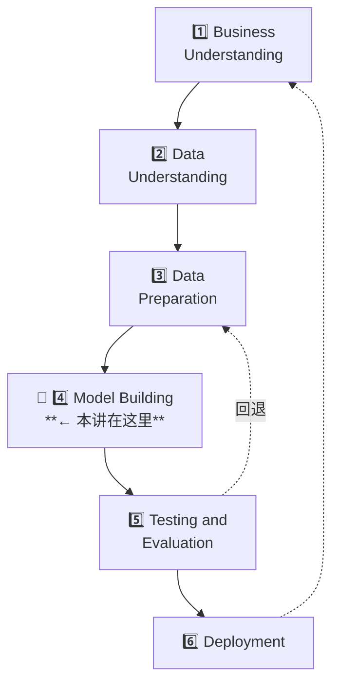

> 💡 **别小看这一页。** 它在提醒一件容易忘的事：**本讲学的所有数学，都只是六步里的一步**。§2.3 的 GDP 例子、§2.4 的鸡蛋例子，都是从第 1 步（业务问题）开始讲的，不是直接从公式开始。

**所以呢**：记住"现在在第 4 步"这个坐标——后面读到一堆公式和代码时，不要忘了它们只是六步流程里的一环，第 5、6 步还没开始，业务问题本身也还没被回答。下一节就从"为什么管理者需要回归"这个业务问题讲起。

---

### 2.2 预测建模：管理者为什么需要回归

**是什么**

管理者天天要做"要不要多投点广告""要不要涨价"这类判断，但手上常常只有直觉、没有数字——回归分析要做的，就是把"两个东西好像有关系"这种直觉，换算成一个可以拿出来用的方程（比如"广告费每多 100 万，销量大概涨多少"），从而把判断建立在数据上而不是拍脑袋上。严谨地说，讲义 p.3 用四句话给出了这个定义（**这一页是本讲的动机来源，值得原文记住**）：

> - Managerial decisions are often based on **the relationship between two or more variables**
>   （管理决策常常建立在两个或多个变量的关系之上）
> - Sometimes a manager will rely on **intuition** to judge how two variables are related
>   （有时管理者靠**直觉**判断两个变量怎么关联）
> - If data can be obtained, a statistical procedure called **regression analysis** can be used to develop **an equation showing how the variables are related**
>   （如果能拿到数据，就可以用**回归分析**这个统计方法，得到一个**说明变量之间如何关联的方程**）
> - Linear regressions can be used in business to **evaluate trends and make estimates or forecasts**
>   （线性回归可用于评估趋势、做估计或预测）

**为什么需要它**

这四句话的逻辑是**"用方程替代直觉"**：

| | 直觉 | 回归 |
|---|---|---|
| 依据 | 经验、印象 | 数据 |
| 产出 | "涨价大概会少卖点" | "**每涨 1 分钱，每周少卖 554 箱**" |
| 能否检验 | 不能 | 能（p 值、置信区间、验证集） |
| 能否传递 | 只在那个人脑子里 | **写成方程，谁都能用** |

**课件原例**（讲义 p.4）—— 三个商业场景

| 场景 | 讲义原文 |
|---|---|
| **Evaluating trends and sales estimates** | A marketing manager attempts to **predict sales** for a given level of **advertising expenditures** through various media channels (e.g. TV, newspapers, social media) |
| **Analyzing the impact of price changes** | A company changes the **price** on a certain product several times and wants to predict the **quantity it sells** for each of the price levels |
| **Assessing risks** | A health insurance company wants to predict the **number of claims** per customer against **age** |

**🎙️ 课堂补充**（转录 `00:02–06:58`）

⚠️ **录音从 `00:02` 开始时，教授已经在讲这一页的中段**（第一句 "For model. And it is applied to the manage[rial] decisions."）。讲义 p.1–p.2 与 p.3 的头一两句**没有录到**，见 [[#9.5 待核对|§9.5]]。

教授把 p.4 的三个抽象场景全部**换成了具体得多的版本**，而且**多讲了一个讲义完全没有的场景**：

| 讲义写的 | 🎙️ 教授课上实际讲的 | 时间戳 |
|---|---|---|
| （**讲义没有这一条**） | **★ 股票交易**：交易员要做交易决策 → 这是一个**时间序列预测（time series prediction）**问题，"用过去的时间序列去做未来的预测"。他还举了具体做法：手上有过去一整年的股价，**假想现在是三个月前，就用前九个月的信息去预测后面的走势** | `00:04–02:05`、`01:49` |
| （**讲义没有这一条**） | **新手机的需求预测**："苹果马上要开新品发布会了吧？你可以为需求做预测（forecasting for the demand）。有了需求模型，我就能优化定价、判断谁会买新 iPhone" | `00:26–00:59` |
| advertising expenditures through various media channels (e.g. TV, newspapers, social media) | **★ TikTok 投放的 ROI 问题**："如果你是市场经理，要往 TikTok 或别的销售渠道投钱推广产品，你得决定往 TikTok 投多少。**如果我往 TikTok 这个社交平台投 100 万美元，能带回多少收入？**" —— 讲义只给了渠道清单，教授把它变成一个**可回答的定量问题**，并点明目的是"决定投哪个渠道、投多少，以最大化总价值" | `03:35–04:51` |
| A company changes the price on a certain product several times… | **★ 新手机涨价 9,000 → 10,000**："最近的新闻你们看了吧，因为**内存成本上涨**，新一代手机涨价了 1,000。管理者要估的是：**如果我把新品价格从 9,000 提到 10,000，最终需求会变成多少？**" | `04:51–05:57` |
| A health insurance company wants to predict the number of claims per customer against **age** | **★ 保险定价的完整特征清单**：讲义只给了"年龄"一个自变量，教授在课上列了一整串——"根据你的**投保申请材料**、你的**年龄**、**是否吸烟**、**是否开车**、**住在哪里**……保险公司需要你预测这个新投保人未来发生事故的风险高不高" | `06:08–06:54` |

> 🎙️ **教授反复强调的一句主线**（`02:21`）：
> > "**The whole theme of the prediction model or the regression analysis is to try to establish or extract this kind of relationship between the information we know and the thing you are trying to predict.**"
> >（预测模型 / 回归分析的整个主题，就是**在"我们已知的信息"和"我们想预测的东西"之间建立并抽取出这种关系**。）
>
> 他在 `00:02–12:02` 这 12 分钟里把这句话用**六种不同的说法**重复了至少五遍（股票、手机需求、TikTok、涨价、保险、GDP）。⚪ 这种重复密度本身就是"这一页很重要"的信号。

🎙️ 教授还在这里点明了**线性回归在整个预测模型家族里的位置**（`02:35–03:09`，讲义没有这一层）：

> "Linear regression is just **one of the many** prediction models. So what's the difference? **The linear regression is relying on the linear relationship** — assuming that the information we already know has a linear relationship with [what] you are trying to predict."

→ 也就是说：**预测模型 = 线性回归 + 各种非线性回归**；本讲学的只是最简单的那一支。这与 §2.11 里教授说的 "this is a **warm up lecture**" 是同一件事。

**💡 换个说法（笔记补充）**

回归做的事可以概括成一句话：**把"两件事有关系"这个模糊说法，量化成"一个单位换多少个单位"。**

老板说"广告投多了没用"，你能问的是：多到什么程度？回归给出的答案形如"广告费每多 100 万，销量增加 3,200 件，但这个系数的 p 值是 0.31，也就是说**这个关系在统计上站不住**"。

**⚠️ 常见误解**

- ❌ **"回归证明了因果关系。"** —— 回归只给**关联**。鸡蛋价格和销量负相关，不代表"涨价导致少卖"（也可能是供给冲击同时推高价格、压低销量）。§2.7.4 会看到一个活生生的例子
- ❌ **"线性回归只能画直线，所以只能处理线性关系。"** —— "线性"指的是**对参数线性**。§2.10.5 的多项式回归 $y = a_0 + a_1 x + a_2 x^2 + \dots + a_{15} x^{15}$ **仍然是线性回归**，因为它对 a 是线性的

**所以呢**：知道了"为什么需要回归"，下一步是学会一件很实际的事——同一个"自变量/因变量"的概念，统计学家、数据挖掘工程师、社会科学家各用一套名字，读文献时必须能对上号。

#### 2.2.1 三套术语说同一件事（讲义 p.5，⭐ 必考）

这一页是一张三列对照表，**"They all Mean" 那一列被黄色高亮**：

| Statisticians say | Data Miners say | Social Scientists say | **They all Mean** |
|---|---|---|---|
| **Independent Variables** | **Predictor Variables** | **Explanatory Variables** | 🟨 **Stuff you can use to predict the target**（你能拿来预测目标的东西） |
| **Dependent Variable** | **Target Variable** | **Response Variables** | 🟨 **The thing you want to predict**（你想预测的那个东西） |

> ⭐ **这张表极可能考。** 理由：① 它是本讲唯一被高亮的内容 ② 三个学科三套叫法正是"跨学科"课程最爱考的点 ③ 记忆成本低但区分度高。
>
> 💡 **记法**：`Independent / Predictor / Explanatory` 三个词都在描述"**做事的那一方**"（自己独立、去预测、去解释）；`Dependent / Target / Response` 三个词都在描述"**被影响的那一方**"（依赖别人、被瞄准、做出反应）。

后面本课还会遇到两个缩写：**IV** = Independent Variable，**DV** = Dependent Variable（讲义 p.39 用了 "How many **IVs** provide the best performance"）。

**🎙️ 课堂补充**（转录 `06:58–09:23`）

教授**逐列念了这张表**，并给"社会科学家"那一列补了一个讲义没有的例子（这是全表最难理解的一列，因为 "response" 这个词只有在做实验的语境下才自然）：

> 🎙️ **温度 → 消费者出门还是待在家**（`08:12–08:59`）
> "在社会科学里我们会说，我们想用 DV 作为 **response**（反应），看这个 response 会**如何随着放进研究里的[自变量]而变化**。比如**温度变了，顾客会出门购物还是待在家**？顾客'出门买还是在家买'的决定就是我们观察到的 **response**，而我们手上的信息是**温度**。"

⭐ 这个例子把 "Response Variable" 这个叫法的来历讲清楚了：**它把自变量看成"刺激"，把因变量看成"反应"** —— 这是从实验科学借来的语言。讲义只给了三个词，没给这层含义。

🎙️ 教授对这张表的收束（`08:59–09:23`）：

> "**No matter what kind of names we have in different subjects, we are doing the same thing**: we are trying to use the information we already know to predict the target — something that we care about, something that is very important, but something that **we do not know**."

> ⚪ 顺带一条**方法论**（`09:40–09:50`）：教授把"拿到一个预测问题后的第一步"说得很死——
> > "The **first thing** we need to do is to **identify the predictors and the prediction target**."
>
> 随后他把 p.6 的三个场景**当成随堂问答**逐个问了一遍（"So what are the IVs [and] DV? **You need to think about this problem.**"，`10:13–11:48`），自己再给答案。**这种"先问再答"的处理方式，通常意味着他认为这是一个必须自己会做的动作。**

**所以呢**：三套叫法背后是同一件事——"拿来预测的" vs "被预测的"。记牢这张表，下一节就用 p.6 的三个具体场景练一遍"谁是 IV、谁是 DV"。

#### 2.2.2 三个例子里谁是谁（讲义 p.6）

p.6 把 p.4 的三个场景重讲一遍，用**红字**标出哪个是 DV、哪个是 IV：

| 场景 | 因变量（想预测的） | 自变量（拿来预测的） |
|---|---|---|
| 广告与销量 | **sales**（销量） | advertising expenditures（广告支出） |
| 价格与销量 | **quantity it sells**（销量） | price levels（价格水平） |
| 年龄与理赔 | **number of claims**（理赔数） | age（年龄） |

> ⚠️ **判断谁是因变量的唯一标准是"你想预测哪个"，不是"哪个在前面"。** 保险公司想知道"这个年龄的客户会理赔几次"，所以理赔数是 DV；如果反过来想从理赔次数推断客户年龄（虽然没什么用），DV 就变成年龄了。

**所以呢**：会分辨 IV/DV 只是第一步。下一节用一个完整例子（GDP 与幸福感）走一遍"从业务问题到能预测"的全过程，看看这些术语是怎么串起来变成一个真正的模型的。

---

### 2.3 一个完整的四步流程：GDP 涨到 6 万，人会更幸福吗（讲义 p.7–9）

**是什么**

讲义用一个非商业但极直观的例子，把"从商业问题到模型上线"走了一遍。**这三页是本讲唯一完整演示 CRISP-DM 缩微版的地方。**

> **Business Problem: Will people be happier if GDP reaches 60000 per capital?**
> （人均 GDP 达到 60000 美元，人们会更幸福吗？）

| 步 | 讲义原文 | 具体做了什么 |
|---|---|---|
| **1** | **Transfer the business problem to a BDA task** | 判断：*"This is a **regression** task"* —— 因为要预测的"幸福感"是**连续值** |
| **2** | **Study the data related to the problem** | 找训练数据：GDP vs Happiness。给出 *Table 1-1. Does money make people happier?* |
| **3** | **Select a model and train it using the data** | 选线性模型，用数据训练，得到 **θ₀ = 4.85，θ₁ = 4.91 × 10⁻⁵** |
| **4** | **Implement the model for future data** | 把 GDP = 60000 代进去，读出预测的 life satisfaction（图上用红星标出，约 7.8） |

**Table 1-1 的数据**（讲义 p.7–8）：

| Country | GDP per capita (USD) | Life satisfaction |
|---|---|---|
| Hungary | 12,240 | 4.9 |
| Korea | 27,195 | 5.8 |
| France | 37,675 | 6.5 |
| Australia | 50,962 | 7.3 |
| United States | 55,805 | 7.2 |

**为什么需要它**

因为它示范了 **Step 1 的关键动作：把商业问题"翻译"成 BDA 任务类型**。

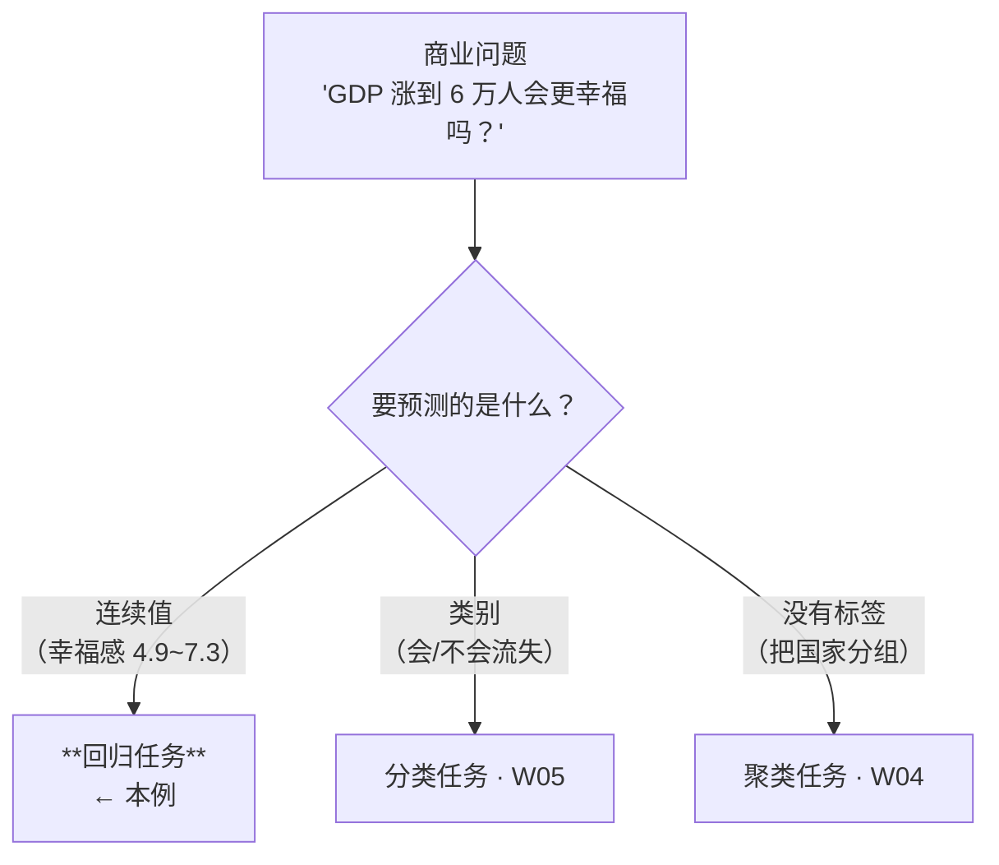

**算一下**：$\text{life\_satisfaction} = 4.85 + 4.91\times 10^{-5} \times \text{GDP}$
- GDP = 55,805（美国）→ 4.85 + 2.74 = **7.59**（实际 7.2，高估了）
- GDP = 60,000 → 4.85 + 2.95 = **7.80**

**🎙️ 课堂补充**（转录 `12:02–18:52`，全讲义部分讲得最细的一段之一，将近 7 分钟）

教授把这三页当作"**把一句人话翻译成回归问题**"的完整示范来讲，而且**在讲义的四步之外插进了一步**：

| 步 | 讲义 | 🎙️ 教授课上的处理 |
|---|---|---|
| 1 | Transfer the business problem to a BDA task | "商业问题通常就是**一个句子或一句陈述**（`12:23`）。这句话是：*Will people be happier if GDP reaches 60,000 per capita?* 要回答它，我们意识到自己在做预测 —— **用来预测的信息是 GDP，要预测的目标是幸福感**，于是它就是一个回归问题" |
| 2 | Study the data | 逐列念了数据表：**第一列国家、第二列 GDP、第三列用 life satisfaction 代表的幸福感**，"**每一行代表一个国家**"（`14:00–14:16`） |
| **★ 插入的一步** | **（讲义没有）** | **🎙️ "下一步是探索数据（explore the data）"**（`15:15`）——先做**散点图**：x 轴 GDP、y 轴 happiness、**每一个蓝点是原始数据表里的一条记录、一个国家**。"你能看到所有蓝点合在一起形成了一种线性趋势，**GDP 上升，点整体往上走**"（`15:46–16:06`） |
| 3 | Select a model and train it | 🎙️ **教授在这里给出了选模型的真正理由**："我意识到也许可以试线性回归，**因为我从可视化里看到了非常清楚的线性上升模式**。但到目前为止我**没有任何数字**来量化这个关系 —— **我只是用眼睛看出了模式**（I just use my eyes to see the pattern）。要量化 IV 和 DV 之间的关系，我们需要一个**数学**模型"（`16:06–16:43`） |
| 4 | Implement the model | "把 x = 60,000 代进去，**幸福感会到 8 的水平**"（`18:16`）。⚠️ 教授口述的是 **8**，本笔记按 $4.85 + 4.91\times 10^{-5} \times 60000$ 算出的是 **7.80**；讲义图上的红星大约在 7.8。⚪ 教授是**读图取整**，不是另一个数 |

> ⭐ **🎙️ 全讲最值得记住的一段类比**（`17:24–18:10`，讲义完全没有）：
> > "So the **relationship can be stored** and [represented] by the linear line here. **And after that we do not need the raw data points anymore.** All the information about the [relationship] is [captured] by the linear line."
> >（关系被**存进**了这条直线里。**之后我们就不再需要原始数据点了。**）
>
> 💡 这句话把回归的本质讲透了：**回归是一次有损压缩** —— 把 N 个数据点压缩成 2 个数字（截距 + 斜率）。压缩之后原始数据可以扔掉，剩下的两个数就是你从数据里学到的全部东西。**丢掉的那部分就是残差 ε。**
>
> ⚪ 这个视角也顺手解释了 §2.9 的过拟合：**如果你允许用 16 个数字（15 阶多项式）去"压缩"同样的数据，你压缩的就不只是规律，还有噪声。**

**⏭️ 教授没有点破的**：这个例子用 GDP=60,000 做预测，而训练数据最大只有 55,805 —— **正是讲义 p.21 自己警告过的外推**。教授在 `37:48` 讲 p.21 时把外推讲得很重（见 §2.6.3 的 🎙️），但**没有回头指出 p.9 犯了同样的错**。⚪ 这多半是**讲义把两个来源的材料拼在一起**造成的（p.7–9 出自 HM 教材第 1 章，p.10 以后是鸡蛋案例），不是有意的教学设计。见 [[#9.3 课件自身的问题|§9.3]]。

**💡 换个说法（笔记补充）**

这个例子的答案其实是"**会，但幅度很小，而且这个外推不可靠**"：
- 从 12,240 涨到 55,805（涨了 3.5 倍），幸福感只从 4.9 涨到 7.2
- 再涨到 60,000，模型说只涨 0.2 分

**⚠️ 常见误解**

- ❌ **"回归说 GDP 涨幸福感就涨，所以政府该拼命提高 GDP。"** —— 这是把相关当因果（§2.2 已提醒）。而且题目问的 60,000 **超出了训练数据的最大值 55,805** —— 这正是 §2.6.3 要讲的**外推风险**。⚠️ **讲义 p.21 亲口警告过"不要用样本数据范围之外的 X 值"，但 p.9 自己就这么干了。** 见 [[#9.3 课件自身的问题|§9.3]]
- ❌ **"5 个国家的数据够了。"** —— p.8 的散点图上其实有约 30 个点，Table 1-1 只列了 5 个作为示意

> 🔗 **出处**：这个例子（含 Table 1-1、θ₀=4.85、θ₁=4.91×10⁻⁵ 这两个数）出自本课指定阅读 **HM（Géron, *Hands-On Machine Learning*）第 1 章**。⚪ 想看完整讨论（Géron 自己就讨论了这个模型的缺陷）可以翻原书。

**所以呢**：这四步（翻译问题 → 找数据 → 选模型训练 → 用模型）是本讲唯一完整走一遍的流程示范，后面的鸡蛋案例会重复同一套动作，但换成本课真正要练习的商业场景，而且会一路做到"读懂输出、加变量、防止过拟合"这些 GDP 例子没有涉及的细节。

---

### 2.4 案例主线：加州鸡蛋销量（讲义 p.10–13）

**是什么**

从 p.10 到 p.26，讲义用**同一个案例**贯穿简单回归、输出解读、离群点、多元回归、虚拟变量五个主题。**先把这个案例吃透，后面五节就都通了。**

> **Problem**: I know current **egg prices** in California. Can I predict **egg sales** for the future weeks in California?
> **I have**: Two-year historical database
> - Independent variable: **egg prices**
> - Dependent variable: **weekly sales cases of eggs**（每周售出的箱数）

**数据长什么样**（讲义 p.11 给了前 20 条）

| Cases Sold / Week | Egg Prices | | Cases Sold / Week | Egg Prices |
|---|---|---|---|---|
| 96,343 | 90.42 | | 100,383 | 97.53 |
| 96,345 | 89.33 | | 94,415 | 100.77 |
| 96,928 | 89.89 | | 91,813 | 98 |
| 93,519 | 90.71 | | 100,466 | 99.89 |
| 99,032 | 85.99 | | 96,783 | 101.26 |
| 91,539 | 91.83 | | 91,008 | 101.26 |
| 89,969 | 87.29 | | 100,324 | 100.28 |
| 90,859 | 96.36 | | 106,628 | 100.69 |
| 99,697 | 99.71 | | 98,892 | 105.16 |
| 88,350 | 99.38 | | 98,252 | 109.55 |

> ⚠️ **单位是"美分"**：价格在 76–110 之间，散点图横轴 `Egg.Pr` 也是 75–110。但 p.12 的问题写的是 "At **\$.80**… At **\$1.05**?"（0.80 美元 / 1.05 美元）—— **同一页里美元和美分混用了**。换算过来就是 80 和 105，与横轴一致。⚪ 答题时按"美分"理解横轴即可。

**讲义 p.12 两问的逐项答案**（⚪ 用后面 p.21 给出的拟合线回算；p.12 本页只有散点图，不能从图上读出精确值）：

1. **价格 \$0.80 时预计卖多少？** 先换成横轴单位 **80 美分**，代入 p.21 的模型 `Case Sales = 153414 − 554 × Egg Price`：$153414-554\times80=\mathbf{109094}$，即**约 109,094 箱 / 周**。
2. **价格 \$1.05 时预计卖多少？** 换成 **105 美分**，同法得 $153414-554\times105=\mathbf{95244}$，即**约 95,244 箱 / 周**。

两价都在样本的 76–110 美分范围内，属于范围内预测；价格高 25 美分，模型给出的销量少 $554\times25=13850$ 箱。**这些是拟合线给出的预测，不是保证的实际销量**；教授在 `21:15–23:00` 讲了图形趋势，没有当堂公布这两个数字，不能标为课堂确认。

**从散点图到代数式**（讲义 p.13）

> We want:
> - A **formula** that we can plug the egg prices into and it will give us the **predicted case sales**
> - And it will give us the **error range** in the predicted case sales
> - First try: Use the **simplest formula** around: a linear relation:
>   **`Case Sales = a + b * Egg Prices`**
> - Use the historical data to **calibrate** (estimate the values of a and b) this linear model

**🎙️ 课堂补充**（转录 `19:08–24:08`）

**★ 教授把这个案例的目标换掉了，而且换得更有价值。**

| | 讲义 p.10 | 🎙️ 教授课上（`19:24`, `20:00`, `21:25`） |
|---|---|---|
| 问题 | "**Can I predict egg sales** for the future weeks in California?"（我能不能预测未来几周的鸡蛋销量） | "**I want to optimize the [egg] price for the next week in California to maximize my revenue.**"（我想优化下周的鸡蛋定价，让收入最大化） |
| 回归在其中的角色 | **目的本身** | **手段**："要回答这个问题，我需要**价格与需求之间的关系**……这个优化问题背后的核心问题，是**识别出价格—需求关系**" |

> ⭐ **这个改写非常重要，它把本讲接回了 [[M01-导论-商业数据分析全景与工具链]] 的 predictive → prescriptive 链条**：
> **预测（下周卖多少）本身不是目的，定价决策（该定多少钱）才是。** 回归只是给优化提供那条约束曲线。
> 教授在 `00:48` 就说过同一件事："**Once I have a demand model, I can optimize [the price].**"
> ⚪ 如果考"回归在商业分析里的定位"，这个说法比讲义那句"预测未来销量"高一个层级。

🎙️ 教授还就地确认了两个本笔记原本只能靠推断的事实：

| 事实 | 教授原话 | 对应本笔记 |
|---|---|---|
| **数据量约 104 周** | "One [year] we have **52 weeks** and [we have] **two years**… [that's why] there are so many records"（`20:57`） | ✅ 印证了 §2.4「常见误解」里"实际是两年周数据 ≈ 104 周"的推断 |
| **散点图上是"两三个"高需求离群点，趋势是轻微下降** | "for the majority of the historical records we can see **a very slight downtrend** as the price increases… but there are **two or three demand records** that … [are] usually larger than the regular demand"（`22:20–22:47`） | ✅ 印证了 §2.6.4 里"40 与 91 两个都是高点"的解读 |

🎙️ **为什么先试直线**（`23:00–23:29`，讲义只写了 "First try"，没给理由）：

> "Before we use any other **advanced** model, let's **first try the simplest linear regression model**, because **regardless of the two outlier data points** with extremely large [demand], we see an almost [pure] downtrend of the two variables."

→ 教授给的理由是**两条**：① 先简单后复杂；② **散点图上（除去离群点）确实是单调下降的**。第二条正是 §2.5.2 假设 ① 的落地检查——**"先画图，再选模型"**。

**💡 换个说法（笔记补充）**

p.13 这四条其实在说：**建模 = 先猜一个形状，再用数据把形状里的旋钮拧到位。**

- "形状"就是 `y = a + b·x`（一条直线）
- "旋钮"就是 a 和 b
- "拧到位"就是 **calibrate**（用数据估计 a、b）
- 而且不只要一个点估计，还要 **error range**（误差范围）—— 这就是 §2.6 的标准误和置信区间

⚠️ **注意 "First try" 和 "the simplest formula" 这两个词**：教授在明示"直线是**起点**，不是终点"。§2.10.5 的 15 次多项式就是"换个更复杂的形状"。

**⚠️ 常见误解**

- ❌ **"散点图看起来没规律，说明回归没用。"** —— p.12 的散点图确实很散（价格 75–110，销量 80,000–190,000，看不出明显趋势），但回归依然给出了**统计显著**的负斜率（p = 0.00136，§2.6）。**肉眼看不出的弱趋势，回归能量化出来**，这正是它的价值
- ❌ **"数据只有 20 行。"** —— p.11 只是展示前 20 条，实际是**两年的周数据 ≈ 104 周**（p.22 出现了编号 91 的观测，p.23 提到 "Week 40 & 91"）

**所以呢**：案例、数据、目标（价格 → 销量、进而优化定价）都摆好了。下一步是把"Case Sales = a + b × Egg Prices"这句人话，换成统计学的标准写法，这样学到的方法才能推广到鸡蛋以外的任何问题。

---

### 2.5 简单线性回归

#### 2.5.1 公式与三个符号（讲义 p.14–15）

**是什么**

§2.4 那句"Case Sales = a + b × Egg Prices"是人话版的公式；这一页要做的，只是把 `a`、`b` 换成统计学的标准记号，好让它能推广到任何"一个变量预测另一个变量"的场景，而不只是鸡蛋。严谨地说：

> **To predict the value of one dependent variable on the basis of another independent variable**
> - Dependent Variable: **Y**
> - Independent Variable: **X**

$$Y = \beta_0 + \beta_1 X$$

用到鸡蛋案例：

$$Case\ sales = \beta_0 + \beta_1 \times Egg\ Price + \varepsilon$$

**三个符号**（讲义 p.14 原文）：

| 符号 | 讲义原文 | 中文 |
|---|---|---|
| **β₀** | Constant or **intercept** | 常数项 / **截距**。X = 0 时 Y 的预测值 |
| **β₁** | "the change of sales when the egg price increases 1 unit (i.e. **Slope** – a measure of how much egg case sales changes due to a given change in egg price, or **how sensitive the value of Y is to changes in X**)" | **斜率**。鸡蛋价格每涨 1 单位，销量变化多少 |
| **ε** | **random error** | 随机误差项。模型解释不了的部分 |

p.14 右上角配了一张标准示意图：Y 轴截距处标 `β₀`，直线上标 `Slope β₁ = ΔY/ΔX`。

p.15 是一张更完整的散点图（*FIGURE 2.13 A Scatter Plot and a Linear Regression Line*）：一堆蓝点、一条橙色的 **Regression Line**，另外两条虚线是"其他可能的直线"，用来说明**为什么要有一个标准来选出"最好"的那条**。

> 💡 **数字例子（先占个位）**：这一页只给出模型的"形状"（$Y=\beta_0+\beta_1X$），还没有用数据估计出 β₀、β₁ 具体是多少——那要等§2.6.1 拟合完才知道。**提前剧透**：鸡蛋案例最终拟合出 β₀ ≈ 153,414、β₁ ≈ −553.9，也就是"鸡蛋价格为 0 时预测卖 153,414 箱，价格每涨 1 美分预测少卖 554 箱"。记住这两个数字的位置，读到 §2.6.1 时回头对照。

**为什么需要它**

因为直线是**最简单的、参数最少的、可解释性最强的**函数形式。只有两个参数，而且两个都能用一句人话说清（"起点在哪"和"每单位变多少"）。

**🎙️ 课堂补充**（转录 `24:08–25:27`）

教授在这一页只讲了一件事，但讲得很到位——**把"已知"和"未知"两栏摆清楚**：

> 🎙️ "β₀ and β₁, **they are unknown numbers**. At the very beginning we do not know these two numbers in this linear regression formula. But we **do** have [the] demand [and the] historical price — **these two terms we already know**. We want to **use the known numbers to estimate the unknown [parameters]** β₀ and β₁. **So that's our task.**"（`24:39–25:06`）

💡 这句话值得当口诀记：**回归 = 用已知的 (X, Y) 去估未知的 (β₀, β₁)。** 注意方向 —— 训练阶段 X 和 Y 都是已知的，未知的是参数；到了预测阶段才反过来（参数已知、Y 未知）。**这两个阶段谁已知谁未知是相反的**，初学最容易在这里绕晕。

> 🎙️ "**Once you change one of the [parameters], you get a different linear line, which indicates a different linear relationship** between the two variables."（`25:15–25:27`）
> → 对应讲义 p.15 那张图上的两条虚线：它们就是"另外两组 (β₀, β₁)"。**所以才需要一个标准来判定哪条最好** —— 这正是 §2.5.3 的最小二乘。

**⏭️ 课上略过**：讲义 p.14 明确写出的**随机误差项 ε**，教授在这一页**一个字都没讲**（他写的式子只有 $y = \beta_0 + \beta_1 x$）。ε 要到 `01:11:36` 讲条件似然时才以 "noise" 的形式出现（§2.8.2）。⚪ 但 ε 是理解"为什么点不在线上"和 §2.5.2 四条假设的关键，**不能因为课上略过就跳过**。

**💡 换个说法（笔记补充）**

$$\underbrace{Y}_{\text{结果}} = \underbrace{\beta_0}_{\text{起点}} + \underbrace{\beta_1}_{\text{每单位的影响}} \times \underbrace{X}_{\text{原因}} + \underbrace{\varepsilon}_{\text{说不清的部分}}$$

**ε 那一项才是这个公式最诚实的地方。** 它承认"我这条线不可能穿过所有点"。没有 ε，模型就变成了"世界完全由 X 决定 Y"，那是假的。

**⚠️ 常见误解**

- ❌ **"β₀ 总是有业务含义。"** —— 鸡蛋案例里 β₀ = 153,414 意思是"鸡蛋价格为 0 时每周卖 153,414 箱"。**价格为 0 根本不在数据范围内**（最低 76），这个数字**没有业务含义**，只是数学上的截距
- ❌ **"β₁ 是相关系数。"** —— 不是。相关系数无量纲、在 −1 到 1 之间；β₁ 有单位（箱/美分），大小取决于 X 和 Y 各自的量纲
- ❌ **"ε 是'测量误差'。"** —— ε 包含**一切没被模型捕捉的因素**：节假日、天气、竞品促销、随机波动。§2.7 就是把其中一个因素（复活节）从 ε 里拿出来变成一个自变量

**所以呢**：公式写好了，但这条线不是随便画的——它建立在几个不言自明的前提上。下一节先把这些前提说清楚，因为一旦数据不满足它们，模型照样会吐出数字，但那些数字会是不可信的。

#### 2.5.2 四条假设（讲义 p.17–18，⭐ 必考）

**是什么**

前面写的 $Y=\beta_0+\beta_1X+\varepsilon$ 这条公式，能不能直接套到任何一堆数据上、套完就相信它给出的 p 值和置信区间？不能——这条线背后藏着几个不言自明的前提，如果数据根本不满足这些前提，模型**照样能算出一串数字，但那些数字不可信，而且模型不会主动告诉你**。讲义 p.17 把这几条前提叫作 **"Assumptions (or the fine print)"**（假设，或者说"小字条款"——像合同里印得很小、容易被忽略、但一旦出事就起决定作用的那几行）：

> Linear regression assumes that…
> 1. The relationship between X and Y is **linear**
> 2. Y is distributed **normally** at each value of X
> 3. **The variance of Y at every value of X is the same** (homogeneity of variances)
> 4. The observations are **independent**

**为什么需要它**

因为**这四条不成立时，回归给出的系数可能仍然算得出来，但 p 值、置信区间会全部失真**。也就是说：模型会照常输出一堆数字，只是那些数字不可信 —— 这比报错危险得多。

| 假设 | 违反时会怎样 | 怎么检查 |
|---|---|---|
| ① 线性 | 系数本身就没意义（真实关系是曲线，你用直线去量） | 画散点图 / 画残差图 |
| ② 正态 | p 值和置信区间不准 | 画残差的直方图 / Q-Q 图 |
| ③ **同方差** | p 值不准（通常低估标准误，**让你误以为显著**） | 画"残差 vs 预测值"图，看是不是喇叭形 |
| ④ 独立 | 标准误严重低估 | 时间序列数据几乎必然违反（W07–W08 专门处理） |

**课件原例**（讲义 p.18）

p.18 **这一页没有标题**（蓝色标题栏是空的），但内容是假设 ②③ 的图示：一条回归直线上，在若干个 X 处竖着画出正态分布曲线（粉色钟形），每条上标着 `S_y/x`，红字说明：

> **The standard error of Y given X is the average variability around the regression line at any given value of X. It is assumed to be equal at all values of X.**
> （给定 X 时 Y 的标准误，是在任意给定 X 处围绕回归线的平均变异程度。**假定它在所有 X 处都相等。**）

右边给出两个公式：

$$Y \sim N(\theta^T x,\ \sigma^2)$$

$$p(y\mid x) = \frac{1}{\sigma\sqrt{2\pi}}\exp\left(-\frac{(y - \theta^T x)^2}{2\sigma^2}\right)$$

| 符号 | 是什么 |
|---|---|
| $\theta^{\top}x$ | 回归线在这个 X 处给出的**预测值**（此处即 $\beta_0+\beta_1X$），是这个正态分布的**均值** |
| $\sigma^2$ | 这个正态分布的**方差**——假设 ③ 说它在所有 X 处都相同 |
| $Y \mid X$ | **给定 X 时** Y 的分布，不是 Y 本身的分布 |
| $p(y\mid x)$ | 在这个 X 处，Y 恰好取到某个具体值 $y$ 的概率密度 |

**数字例子（假设，用于说明记号，非实际拟合值）**：假设某个价格 X 处，回归线给出 $\theta^{\top}x = 95{,}000$ 箱、$\sigma = 5{,}000$。这句公式就是在说：这个价格下，真实销量 Y 服从一个以 95,000 为中心、标准差 5,000 的钟形分布——多数周会落在 85,000–105,000 箱之间，恰好等于 95,000 的那一周概率密度最高。

**🎙️ 课堂补充**（转录 `26:07–32:18`，⭐ **全讲义部分含金量最高的一段之一，讲了 6 分钟**）

**讲义只有四个句子；教授把每一条都变成了"你可以拿数据去查"的操作。** 这四条假设的正确理解方式几乎全在录音里。

**① 线性假设**（`26:22–26:46`）

> 🎙️ "If you **already observe from the scatterplot** that x and y have a **nonlinear** relationship, then **you should not use the linear regression analysis**."

→ 检查方法就是 §2.4 那一步"先画散点图"。**假设 ① 不是靠背的，是靠看的。**

**② + ③ 正态与同方差 —— ★ 教授用"按 X 分组"把它讲成了一个可执行的动作**（`26:46–29:19`）

这是整段最值钱的部分，讲义那两行字**根本看不出该怎么检查**：

> 🎙️ "Imagine I have **200 historical observations**. Now I **extract all the [records] with the [egg] price [equal] to ten dollars** — maybe about **50** [of them]. Okay, 50 observations, they have the same price of ten dollars. Now, for the same price level [of] ten dollars, [those] 50 historical observations — of course the 50 demands from the 50 observations **can be different**.
> So if we put the 50 observed [demands] into a single [set], **these 50 real numbers … should form a normal distribution**. **You cannot see [an] asymmetric distribution** among [the] 50 [observations] at the same price level. **So that's the second assumption.**
> … Now **I go to another [price level] and I filter all the historical observations [with] price level at eleven dollars** — maybe I have **30** observations. … [They] also form a normal distribution [at] this new price level. And **if I calculate the standard deviation** … [the] variance at price level [of] eleven **should be the same as** … at [the] price level of 10. **These two variances should be the same. You cannot see that as price increases the variance becomes larger and larger. [That's] the [third] assumption.**"

**→ 假设 ②③ 的检查动作（教授的版本，讲义没有）：**

```
1. 把数据按 X 的取值分组（价格 = 10 的一组、价格 = 11 的一组……）
2. 每组内部看 Y 的分布 → 应该是对称的钟形    ← 假设 ②（正态）
3. 比较各组的标准差       → 应该彼此相等      ← 假设 ③（同方差）
4. 各组的均值             → 应该沿着回归线走  ← 这就是回归线的含义
```

💡 **这四步就是讲义 p.18 那张图的"文字版"** —— 图上每个 X 处竖着的那些粉色钟形，就是第 2 步分出来的组。

**④ 独立性 —— ★ 教授给了讲义完全没有的反例和"违反了怎么办"**（`29:19–30:06`）

> 🎙️ "For example, when we have the **stock price prediction**, we know there are certain **dependencies between yesterday's price and the price we have before yesterday**, right? So they have this kind of **time dependence** among different observations. … [If observations are not independent] **we need to use another regression model instead of the linear regression model** — [a] **time-series prediction model** instead of [a] linear regression model."

→ ⭐ **这一句同时给了三样讲义没有的东西**：① 违反假设 ④ 的最典型场景（**时间序列**）；② 违反的机制（**前后期相关**）；③ **对策**（换模型，而不是硬做）。
🔗 **这是 W07–W08（Time Series Prediction）的明确伏笔**，也是本课与 EF5560 的交叉点。

**⭐ ⑤ 教授在这里就把 p.18 和 p.31 连起来了**（`30:06–32:18`，讲义把这两页隔了 13 页）

> 🎙️ "If we [use] the **conditional probability** to calculate the probability of the value of your target y **conditional on** … the level of x, actually the probability distribution of the value y **forms this normal distribution with the mean value represented by your linear regression result** …
> So actually [what] we are doing [in] the linear regression analysis [is that] we are **trying to estimate [these] conditional normal distributions** for your [prediction target] y according to your historical [data]."

→ 也就是说：**回归线 = 每个 X 处那个正态分布的均值连成的线。** 这一句话是 §2.8.2（条件似然与 MLE）的全部直觉，教授**提前 45 分钟就讲了**。
✅ 这也从课堂顺序上支持了本笔记 §1.3 的重排决定 ②：**p.16「sound like conditional probabilities?」和 p.18、p.31 本来就该放在一起讲**。

**⏭️ 课上略过（术语层面）**：教授把假设 ③ 的内容讲得很细，但**从头到尾没有说出 "homogeneity of variances" 这个词**（也没说 heteroskedasticity / 异方差）。⚪ 讲义 p.17 印着这个词，**考试若要求写出四条假设，建议按讲义的英文写**。

**💡 换个说法（笔记补充）**

把这张图理解成：**回归线不是一条线，是一条"管道"的中轴线。**

在每个 X 处，Y 的真实值不是落在线上，而是**围绕线呈正态分布**（假设 ②）；而且**这个分布的胖瘦在所有 X 处都一样**（假设 ③ 同方差）。

```
      Y
      │        ╱╲          ← 每个 X 处一个正态分布
      │      ╱╲ ╱          ← 宽度处处相同 = 同方差
      │    ╱╲╱  ╱   
      │  ╱╲╱   ╱     ← 回归线穿过每个分布的均值
      │╱╲╱   ╱
      └───────────────── X
```

假设 ③ 被违反的典型样子（**喇叭形**）：收入越高的人，消费的波动越大。这时管道是**越往右越粗**的喇叭，不是等宽管道。

**⚠️ 常见误解**

- ❌ **"假设 ② 要求 X 服从正态分布。"** —— **不是 X，是"给定 X 时的 Y"**（等价于要求**残差**正态）。X 可以是任何分布，甚至可以是 0/1 的虚拟变量
- ❌ **"数据不满足假设就不能做回归。"** —— 可以做，只是**推断（p 值、置信区间）不可信**。如果你只关心预测而不关心推断，容忍度会高一些
- ❌ **"homogeneity of variances 和 independence 是一回事。"** —— 同方差说的是**离散程度**处处相同；独立说的是**观测之间不互相影响**。时间序列常常同方差但不独立

**所以呢**：四条假设是"什么时候能相信这条线"的前提条件。但不管假设成不成立，**画线本身**还需要一个标准——茫茫多条可能的直线里，凭什么说这一条是"最好的"？下一节回答这个问题。

#### 2.5.3 曲线拟合：怎么定义"最好的那条线"（讲义 p.19, p.28）

**是什么**

散点图上随便一条穿过点群的线，看着都差不多"贴合"；要让机器自动选出"最好"的那一条，就得先给"好"下一个能算出数字的定义——**拟合**（curve fitting）说的就是这件事：选一组参数，让模型算出的值和实际观测值之间的误差尽可能小。讲义 p.19 的原话：

> The values of **β₀, β₁ …** are selected such that they provide **the best fit**, or the **minimal errors** between the data and the model (i.e. the sum of difference between actual and predicted values)

配图上写着 **$\min \sum(y - y_i)^2$**，画着一条黑色的拟合线 `y = mx + c` 和两条明显更差的红蓝线。

讲义 p.28 是同一件事的另一张图（**Least Sum of Squares / Curve Fitting**）：一条红色趋势线 `y = â + bx`，七个红星是 Actual observation，每个星到线的垂直距离标着 `Deviation₁ … Deviation₇`，右边灰框写着：

> **Least squares method minimises the sum of the squared errors (deviations)**

**关键术语**（p.28 右侧红字）：**Residual = deviation**（残差 = 偏差）

$$\text{残差}_i = y_i - \hat{y}_i = \text{实际值} - \text{预测值}$$

$$\text{目标：} \min \sum_{i=1}^{n}(y_i - \hat{y}_i)^2$$

**为什么是"平方"而不是"绝对值"**

⚠️ **讲义完全没解释这一点**，但它是必然会被问的：

| 备选 | 问题 |
|---|---|
| $\sum(y_i - \hat{y}_i)$ 直接求和 | ❌ 正负误差会抵消，一条乱七八糟的线也能得 0 |
| $\sum \vert y_i - \hat{y}_i \vert$ 绝对值 | ✅ 可行（这叫 LAD 回归），但**绝对值函数在 0 处不可导**，没有闭式解，只能数值求解 |
| **$\sum(y_i - \hat{y}_i)^2$ 平方** | ✅ **处处可导 → 令导数为 0 就能解出闭式解**（§2.8.3 的正规方程）；而且**在高斯噪声假设下等价于极大似然估计**（§2.8.2） |

**副作用**：平方会**放大大误差的权重**（误差 10 的贡献是误差 1 的 100 倍），所以最小二乘**对离群点非常敏感** —— 这就是 §2.6.4 要专门处理离群点的原因。

**🎙️ 课堂补充**（转录 `32:18–33:47` 与 `01:08:16–01:11:17`）

教授把"为什么需要一个误差指标"讲成了**一个关于机器的故事**，这段值得原文记住：

> 🎙️ "Now you need to tell [the] machine **what is [meant by] 'best'? From which dimension** [can] this model be the best model? **The machine is not that smart.** You need [to give the] machine an evaluation **metric — a number**. According to [this] number, [we can say this] model, this linear line, [is] better than the other linear [line]. **What is the number? So here we provide the number as the sum squared error.**"（`01:08:43–01:09:23`）

⭐ **这段话回答了一个初学者的真问题：为什么"最小化平方误差"不是数学家的自娱自乐？**
因为**训练 = 让机器在无穷多条线里挑一条**，而机器需要一个**可比较的数**。SSE 就是那个数。**没有 SSE，"最好的线"这句话在计算机里没有意义。**

🎙️ 教授对残差的口述定义（`01:09:43–01:10:17`，配讲义 p.28 的图）：

> "If I want to make [a] prediction for this data point, I use the same [x]. The linear line will make [a] prediction here — **the ŷ value is here, but the real value is [up] here** … so there's **the gap between the predicted value by the linear line and the [true] value observed from the historical data point**. **So this gap is the prediction error for this data point.**"

→ 注意教授说的是 "**the gap**"，而且他描述的是**竖直方向**上预测值与真实值的差 —— ✅ 印证了下面「常见误解」第一条（残差是竖直距离，不是垂线距离）。

🎙️ **教授顺手把它推广到了多元回归**（`01:10:35–01:11:17`，对应讲义 p.29）：

> "If we extend the linear model into **two X's — x₁, x₂ — now your regression line becomes a regression plane**. … But that does not matter: **for the error we can still quantify the gap between the true value and the predicted value along the plane**."

→ **误差的定义与自变量个数无关**：一维是点到线的竖直距离，二维是点到面的竖直距离，p 维是点到超平面的竖直距离。**这一句省掉了很多人对"高维怎么算误差"的困惑。**

**⏭️ 课上略过**：讲义 p.19 用的词是 "best fit / minimal errors"，p.28 用的是 "**Least squares method** minimises the sum of the squared errors (deviations)" 和 "**Residual = deviation**"。教授全程说 "**sum squared error**"，**没有说 "least squares"、"residual"、"deviation" 这三个词**。⚪ 这三个都是标准术语，**考卷上仍应使用讲义的写法**。

**⚠️ 常见误解**

- ❌ **"残差是垂直于回归线的距离。"** —— 是**竖直方向**（沿 Y 轴）的距离，不是点到线的垂线距离。因为我们要最小化的是 **Y 的预测误差**
- ❌ **"最小二乘就是让线穿过最多的点。"** —— 它可能一个点都不穿过。它要的是**平方误差总和最小**

**所以呢**：现在有了"最好的线怎么选"的标准（最小化平方误差），也就可以真的把鸡蛋数据丢进去算一遍了。下一节看这条线算出来之后，那张系数表要怎么读。

---

### 2.6 读懂回归输出（讲义 p.20–23）⭐ 考点最密集

#### 2.6.1 系数表的四列（讲义 p.20）

**是什么**

讲义给的是 **R 语言**的输出格式（本课 tutorial 用 Python，输出格式不同但含义一样）：

```
Coefficients:
        Estimate      Std. Error     t value      Pr(>|t|)
β₀      153,414.5     15,992.9       9.593        5.96e-16 ***
β₁      -553.9        168.2          -3.293       0.00136  **
```

| 列 | 是什么 | 这个案例里 |
|---|---|---|
| **Estimate** | 系数的估计值 | β₁ = **−553.9** —— "The coefficient of Egg Price" |
| **Std. Error** | 系数估计值本身的**波动幅度** | 168.2 |
| **t value** | `Estimate / Std. Error` | −553.9 / 168.2 = **−3.293** ✓ |
| **`Pr(>\|t\|)`** | **p 值** | 0.00136 |
| `***` / `**` | 显著性星号 | `***` p<0.001，`**` p<0.01，`*` p<0.05 |

**这个模型的意思**：**鸡蛋价格每涨 1 美分，每周销量减少约 554 箱。**

**讲义对 Std. Error 的说明**（原文）：

> "The estimated standard deviation of the slope: Roughly, there is a **95% chance that the true slope lies within 2 standard deviations**, i.e., between **−217 and −889**"

**验算**：−553.9 ± 2 × 168.2 = −553.9 ± 336.4 → **[−890.3, −217.5]** ✓（讲义写的 −217 和 −889 是这两个端点，只是顺序反了）

**🎙️ 课堂补充**（转录 `33:47–37:48`）

**⏭️ 首先是一个必须知道的差集：教授把 `t value` 这一列整个跳过了。**
`33:47–37:48` 这 4 分钟里，他讲了 **Estimate → 业务解释 → Std. Error → ±2 倍标准差的区间 → p 值 → 显著性阈值 → 假设检验**，**"t value" 三个字一次都没出现**。⚪ 但 t 值只是 `Estimate / Std. Error`，理解了标准误就懂了，本笔记仍保留它。

🎙️ **教授对斜率的口头解释**（`34:00`，与本笔记一致）：

> "It means that **if your price increase[s] by one unit, the demand will drop by 550** [cases]. **So that's how the coefficient value is interpreted.**"

🎙️ **★ 关于"为什么系数不是一个确定的数"，教授讲了讲义完全没有的一段**（`34:14–35:37`）：

> "This is the coefficient value **with the maximum probability**, but **this is not [a] deterministic coefficient value**. … Because we are **estimating a distribution** … and data has certain **uncertainties**. … **The true value** … **may be different from the number you estimate using the sample**. Now what's the real number of the intercept and slope? **We never know.** Because we **do not have all the possible observations**; we only use [a] sample to do the estimation. …
> **So we never know the real numbers. Only God will know the [true] slope.**"（`35:07–35:18`）

⭐ **"Only God will know the true slope" 这句话是理解标准误、置信区间、p 值三者的总钥匙。**
逻辑链是：**样本 ≠ 总体 → 估计值有不确定性 → 于是要报告不确定性的大小（Std. Error）→ 于是能给出一个区间（±2 SD）→ 于是能检验"真值是不是 0"（p 值）**。
💡 讲义 p.20 把这四个量并排列出来，但**没说它们为什么必须一起出现**。这段录音补上了。

🎙️ **±2 倍标准差的口述**（`35:37–36:35`，与讲义一致但更完整）：

> "I do know that there is a **95 percent** … probability that the true slope … should be **within [plus or minus] two standard deviations** [of my] estimate … [the] maximum-probability value is **negative 553**. Now … minus **two** times the standard deviation or plus two times [the] standard deviation … **there is 95 percent … probability that your true value is located within this range — [the] upper limit and the lower limit.**"

⚠️ 教授和讲义都用了"真值有 95% 概率落在区间内"这个说法。**这在频率派统计里是不严谨的**，正确表述见 §2.6.2 最后一条「常见误解」。⚪ **考试时若要写解释，用"重复抽样"的说法更安全**；若只是套用讲义口径答题，风险也不大——因为教授自己就是这么讲的。

**所以呢**：Estimate、Std. Error、t value 都读完了，只剩表里最后一列 `Pr(>|t|)`（p 值）。这个词全班几乎人人听过，但讲义对它的解释本身就是错的——下一节先纠正这个错误，再说清楚怎么答题最安全。

#### 2.6.2 ⚠️ p 值：讲义把定义写错了

**是什么**

上一节表里最后一列 `Pr(>|t|)` 就是 p 值——这是整份系数表里最容易被问、也最容易被讲错的一个数。讲义对它的解释本身就是错的，必须先纠正，否则会把错的定义背进考场。**讲义原文**（p.20，对 `Pr(>|t|)` 的说明）：

> "**The probability that the true slope is zero**, i.e. p-value"
> （真实斜率为 0 的**概率**，即 p 值）

> 🔴 **这句话是错的，而且是统计学里最经典的一个错误。** 必须纠正，否则会把错的背进考场。

**正确的定义**：

> **p 值 = 假定"真实斜率 = 0"（原假设）成立的前提下，观察到当前这个（或更极端的）结果的概率。**
> p-value = P(观察到这么极端的数据 | 真实斜率 = 0)

**两者的差别**（这是条件概率方向的差别）：

| | 说法 | 是什么 |
|---|---|---|
| ❌ 讲义 | P(斜率 = 0 \| 数据) | "参数为真的概率" —— **频率派根本不给参数分配概率** |
| ✅ 正确 | P(数据这么极端 \| 斜率 = 0) | "在原假设下，这批数据有多罕见" |

**🎙️ 课堂补充 —— 🔀 这一格必须先看**（转录 `36:35–37:48`）

> 🔴 **教授在课上把讲义这句错的定义原样讲了一遍**：
> > 🎙️ "And finally you may get [the] **p-value** here. **The p-value will tell you the probability that the true slope is zero.**"（`36:35–36:48`）

**也就是说：讲义和课堂口径一致，两者都用了那个经典的错误说法。** 这一点对答题策略非常关键：

| 情形 | 建议 |
|---|---|
| 题目问"**解释 p 值**"（简答/填空） | 写**正确定义**（`P(数据这么极端 \| H₀ 为真)`），**并加一句"即：在'斜率为 0'的原假设下观察到当前结果的概率"** —— 这样既正确，又和教授的口径对得上，不会被判成答非所问 |
| 题目给一张输出表问"**这个变量显著吗**" | 直接按阈值判断即可，两种定义不影响结论 |
| ⚠️ 千万不要 | 只写"p 值是真实斜率为 0 的概率"。⚪ 这句话在本课**可能**得分，但在任何一门统计课都会被扣分，而且它会让你在后面所有涉及假设检验的课（W07 时间序列、W11 模型选择）持续犯错 |

🎙️ **教授接下去的推理，结论是对的**（`36:59–37:24`）：

> "If the p-value here is very large, [it] means that there's a very high probability that your slope is actually zero. What does that mean? **Slope [equals] zero means that your demand is not sensitive to your price** — [the] price changes [but] the demand does not change. [It] means that **there's no linear relationship between these two variables**."

→ ⚪ 推理路径不严谨（p 大 ≠ 斜率为 0 的概率大），但**落点是对的**：p 值大 = 没有证据支持"存在线性关系"。**把这句"斜率为 0 就是需求对价格不敏感"记住** —— 它把统计量翻译成了业务语言，正是 §6.3 题型 A 的第 ③ 步要写的东西。

🎙️ **★ 显著性阈值：讲义完全没写，只有录音里有**（`37:24–37:48`）

> "We only [want to] observe the p-value to be very small. **Usually we will set our [significance] level [at] 0.05 [or] 0.1.** … Only when the p-value is below … the threshold [can we] trust this regression result and [say the] slope is non-[zero]. **So you may [use a] hypothesis test to identify whether you have [a significant] slope or not.**"

⚠️ **这条 0.1 的阈值直接改变了 §2.7.4 的结论**：多元回归里 Egg Price 的 `p = 0.0813`——
- 按 **α = 0.05** → **不显著**（本笔记原本的判断）
- 按 **教授也认可的 α = 0.1** → **显著**

⭐ **所以答这道题的正确姿势是"分档说"**："在 5% 水平上不显著，但在教授课上提到的 10% 水平上是显著的（p = 0.0813 < 0.1）。" 这比一口咬定"不显著"更稳，也更像专业报告的写法。

**💡 换个说法（笔记补充）**

用法庭做类比：
- **原假设 = 被告无罪**（真实斜率 = 0，鸡蛋价格对销量没影响）
- **p 值 = "如果被告真的无罪，出现这么多不利证据的可能性有多大"**
- p = 0.00136 意思是：**如果价格真的毫无影响，我们碰巧收集到这么强的负相关证据的概率只有 0.136%** —— 太罕见了，所以我们**拒绝"无影响"这个假设**

**它不能告诉你的**：被告有罪的概率是多少（= 斜率非 0 的概率是多少）。要回答那个问题得用贝叶斯方法，那不是本课的内容。

**⚠️ 常见误解**（这一格特别重要，考试爱考）

- ❌ **"p = 0.05 意味着有 95% 的把握结论是对的。"** —— 不是。它只说明"在无效应的世界里，这么极端的数据出现的概率是 5%"
- ❌ **"p 值越小，效应越大。"** —— p 值同时受**效应大小**和**样本量**影响。样本足够大时，一个微不足道的效应也能得到 p < 0.001。**看效应大小要看 Estimate，不是 p 值**
- ❌ **"p > 0.05 证明了没有效应。"** —— 只能说"没有足够证据支持有效应"，不能证明无效应（可能只是样本太小）。§2.7.4 就有这样一个例子
- ❌ **讲义那句"95% 的概率真实斜率落在区间内"也不严谨。** 频率派的置信区间应该表述为：**"如果重复抽样很多次、每次都算一个这样的区间，其中约 95% 的区间会覆盖真实斜率。"** 对某一个具体算出来的区间，真实斜率要么在里面要么不在，没有"概率"可言。⚪ 考试若要求解释置信区间，**用这个"重复抽样"的说法更安全**

**所以呢**：p 值搞清楚了，Egg Price 这个系数在统计上算是站得住。但"站得住"不代表"任何时候都能用"——下一节看这条线在它没见过的价格区间会出什么问题。

#### 2.6.3 外推警告（讲义 p.21）

**是什么**

鸡蛋价格样本只覆盖 76–110 美分这个区间；如果把 200 美分或 10 美分代入这条回归线，它照样会算出一个数字给你，但那个数字背后**没有任何数据支撑**——这就是**外推**（extrapolation，在训练数据的取值范围之外做预测）风险。p.21 用一个红色警告三角把这一点标了出来，配文字：

> "**don't use any values of X that aren't contained in the sample data**; otherwise the results are subject to a **great deal of uncertainty**"
> （不要使用样本数据中没有出现过的 X 值，否则结果会有极大的不确定性。）

同页给出最终模型：

> **Regression model: Case Sales = 153414 − 554 × Egg Price**

**为什么需要它**

因为**回归只学到了它见过的那段区间里的关系**。鸡蛋价格样本范围是 76–110 美分，模型对 200 美分或 10 美分的情况**一无所知**，但它照样会给你一个数字。

把 Egg Price = 0 代进去得到 153,414 箱 —— 一个价格为 0 的世界里每周卖 15 万箱鸡蛋？模型不会告诉你这荒谬，**你得自己知道**。

**🎙️ 课堂补充**（转录 `38:27–40:23`）

⭐ **教授把这一页当作"讲完第一个模型之后必须提醒的两件事"来讲，而且明确说了"两件"**（`38:27`：*"there are certain things that I want to remind you … there are two things"*）：

| # | 提醒 | 时间戳 |
|---|---|---|
| **一** | **不要做超出样本范围的预测** | `38:54–40:23` ← 本节 |
| **二** | **这条线在两个离群点上误差极大** | `40:23–41:16` ← §2.6.4 |

💡 **知道这是"成对的两条提醒"很有用**：它们是同一件事的两面 —— **模型在它没见过的地方（外推）和它解释不了的地方（离群点）都不可信**。§2.6.3 和 §2.6.4 因此应该连着记。

🎙️ **教授给的具体数字与两个反例**（讲义只有一句抽象警告）：

> "When we do the fitting, the price is ranging **from 75 dollars to 110 dollars**. … **Usually we will not make far out-of-range prediction[s]**.
> So for example **you cannot answer the question: if [the] price is reduced from 100 dollars to 10 dollars, what would be the demand?** … I can put [the] price value [as] 10 and of course this linear line **will** make a prediction for me. **But that prediction does not make any sense.**
> [And here's] the extreme case: **if I put price [at] 0** … this linear formula will give me an estimated demand. **But do you think that this demand makes sense? [It] doesn't make any sense.** … **[If eggs are] free, [the] demand can be huge.**"（`39:04–40:07`）

> ⭐ **🎙️ 教授给出的理由，比讲义的"uncertainty"精确得多**（`40:07–40:23`）：
> > "Because **[what happens] beyond this left-hand-side range or upper [range] — [will] the linear trend continue? Maybe not. But we never know.**"
>
> 💡 **"Maybe not. But we never know." 这七个字就是外推风险的完整定义**：不是"外推一定错"，而是**"数据没法告诉你对不对"**。模型照样吐数字，但那个数字背后**没有任何证据支撑**。
> ⚪ 这与 §2.6.1 那句 "Only God will know the true slope" 是同一种态度：**回归的诚实之处在于它知道自己不知道什么。**

✅ **这一段也证实了 §2.5.1 里"β₀ 没有业务含义"的判断**：教授自己拿"价格为 0"当反例，说明他也不认为截距 153,414 是一个有意义的销量。

**💡 换个说法（笔记补充）**

外推就像**用一个人 20–40 岁的身高数据去预测他 3 岁和 80 岁的身高**。20–40 岁身高基本不变，模型学到"斜率约等于 0"，于是预测 3 岁时身高 175cm。**模型没错，是你问错了问题。**

**⚠️ 这条警告在本课内部就被违反了两次**（见 [[#9.3 课件自身的问题|§9.3]]）：
1. **讲义 p.9** 自己用 GDP=60,000 做预测，而训练数据最大只有 55,805
2. **W02 tutorial cell 13** 用 `X_new = 3 * rnd.rand(100,1)` 生成 x ∈ [0,3] 的新数据来评估模型，而训练数据 `X = 2 * rnd.rand(100,1)` 只覆盖 [0,2]。**33% 的评估点在训练范围之外。** 见 [[T02-回归实战-从合成数据到Airbnb定价#3.3 ⚠️ 这里违反了讲义自己的外推警告|T02-回归实战-从合成数据到Airbnb定价 › 3.3 ⚠️ 这里违反了讲义自己的外推警告]]

**所以呢**：外推是"模型在它没见过的区间之外"的风险；下一节看另一种风险——模型**在训练区间之内**也可能被少数几个点带偏，这就是离群点问题。

#### 2.6.4 离群点（讲义 p.22–23）

**是什么**

散点图上大多数点分布得还算规律，但总有那么两三个点远远甩开其他点——**离群点**（outlier，远离数据主体的观测值）就是指这些点。它们值得单独拿出来讲，是因为最小二乘对它们特别敏感（§2.5.3 说过：平方会放大大误差），一两个离群点就可能把整条回归线拽偏。p.22 标题 "Take Another Look At The Data" —— 同一张散点图，但**两个最高的点被标上了编号 40 和 91**。

p.23 给出处理逻辑：

> - A few sales data points are **way outside of the range of the majority of data points**
> - We could:
>   - **Drop them**（删掉）
>   - **Explore to see if there is anything else that predicts them**（找找看有没有别的变量能解释它们）
> - **Check: egg sales increase at Easter, and drop immediately after Easter** – these weeks (Week 40 & 91) are the outliers

**⭐ 这一页是全讲最重要的方法论。**

**为什么需要它**

因为最小二乘对离群点极度敏感（§2.5.3：平方放大大误差）。两个 18 万箱的点会把整条回归线往上拽。

但 p.23 给的两条路差别巨大：

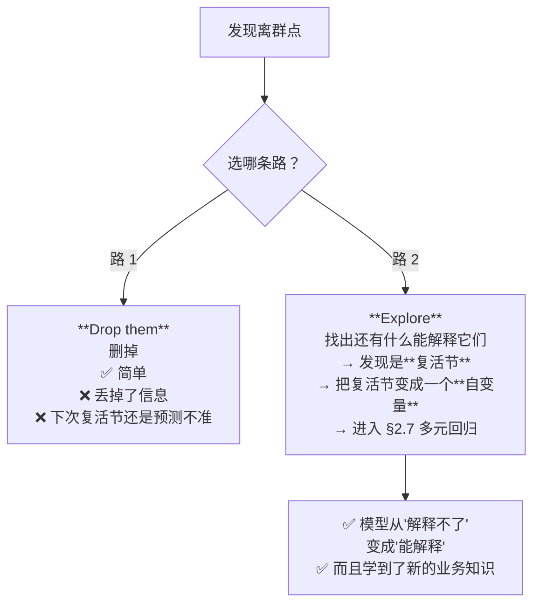

> ⭐ **教授选的是路 2，而且整个 §2.7（多元回归 + 虚拟变量）就是路 2 的展开。**
>
> 💡 这正是 [[M01-导论-商业数据分析全景与工具链#2.3 为什么要用机器学习：两条解决问题的路径|M01 §2.3]] 那张图里的 **"Inspect the solution → Understand the problem better"** —— 检视模型的失败之处，反而学到了业务知识（"鸡蛋在复活节前后销量剧烈波动"）。**官方 CILO 3 要的 "original findings" 就是这个。**

**🎙️ 课堂补充**（转录 `40:23–43:17`）

🎙️ **教授先把"离群点为什么值得管"说清楚**（`40:23–41:05`）：

> "If we use this linear line to make historical predictions, there are some data points — **especially [the] outliers** — [where] we have a **very large prediction error**. [It] means that this linear line [may] not be very helpful in making [predictions for] these outliers.
> Now what happened? **You [pre-]determined the formula of your linear regression. This regression formula only quantifies the relationship between price and demand — nothing else.**"

⭐ **最后那句是全讲最重要的一句方法论**：**模型只知道你放进去的东西。** 离群点解释不了，不是模型坏了，是**你少放了一个变量**。这句话直接推出了 §2.7 的多元回归。

🎙️ **★ 教授给了讲义完全没有的"离群点的三种来源"**（`41:16–41:47`）——讲义 p.23 只给了"删掉 / 找解释"两条**对策**，没说**成因**：

> "So what happened to these two outliers that this linear regression cannot predict?
> ① **Maybe these two outliers are [recording] mistakes** — when somebody recorded this Excel data set, [they added] one zero to the demand, which makes these mistakes very huge. **Maybe.**
> ② … **They are influenced by some other information that we do not consider in our linear regression model.**"

→ ✅ 这印证了本笔记「常见误解」第一条里"离群点有三种"的说法，而且**成因决定对策**：录入错误 → 修正/删除；遗漏变量 → 建模。

🎙️ **两条路的取舍，教授说得比讲义直白**（`41:47–42:32`）：

> "**First**, if we believe that our model should [apply] to the majority [of] cases, **we just remove these two [outliers]**, because … they are not the normal cases and we should not consider their information in our regression analysis. …
> **But if you believe that we need some important information from [them], we should consider this information** — so we need to **go back to our original data set and examine what happened in [those] two weeks**."

→ ⭐ 注意教授给出的**判断依据**：不是"哪条更正确"，而是**"你要不要那部分信息"**。⚪ 这正是答题时该写的那句话：*"Whether to drop or to model the outliers depends on whether they carry information the model is supposed to explain."*

🎙️ **复活节的解释**（`42:32–43:17`）：

> "And then we realize that … these few weeks of observations, **they are on the Easter holiday**. So you know Easter holiday[s], right? **People will draw on eggs and the[y] send eggs as a gift to [their] friends.** Now we realize that maybe **it is the holiday information that [was] missing in my previous regression analysis**. In my previous regression [analysis] I quantified the relationship between the **price** and [demand], **but I did not consider the relationship between the holiday and demand. I didn't quantify that.**"

> ✅ **教授把两个离群点一起归给"复活节那几周"（都是高需求）**，与讲义 p.22 上标出的 40 与 91 **两个都是高点**一致。
> ⚪ 这解决了本笔记原先存疑的一点：讲义 p.23 那句 "egg sales increase at Easter, **and drop immediately after Easter** – these weeks (Week 40 & 91) are the outliers" 里的"节后下跌"**并不是指 40 和 91 这两周**；40 和 91 是两年里的两个**复活节高峰周**。见 [[#9.3 课件自身的问题|§9.3]]。

**⚠️ 常见误解**

- ❌ **"离群点就是错误数据，应该删掉。"** —— 离群点有三种：**录入错误**（该删/修正）、**真实的极端值**（不该删）、**被遗漏的变量造成的**（该建模，就是本例）。**删之前先问"它为什么在那"**
- ❌ **"离群点只在 Y 上看。"** —— X 上的极端值（高杠杆点）对回归线的影响往往更大
- ⚠️ **讲义这里的逻辑有点跳**：p.23 说"复活节销量涨、复活节后跌，**这两周（Week 40 & 91）就是离群点**"，但 p.22 上标出的 40 和 91 **两个都是高点**（都在 18 万附近）。如果 40 和 91 分别是"涨"和"跌"，其中一个应该是低点才对。⚪ 更合理的解读：40 和 91 是**两年里的两个复活节周**（都是高点），而"复活节后下跌"是另外两周（图上没标）。见 [[#9.3 课件自身的问题|§9.3]]

**所以呢**：离群点不是模型坏了，是模型少了一个能解释它们的变量——本例里那个变量是"复活节"。下一节就把"复活节"正式变成模型的第二个自变量，从简单回归走进多元回归。

---

### 2.7 多元线性回归与虚拟变量（讲义 p.24–26, 29）⭐ 考点最密集

#### 2.7.1 从一个自变量到多个（讲义 p.24, p.29）

**是什么**

§2.6.4 走的"路 2"是去找一个还没放进模型的变量来解释离群点；找到的答案是"复活节"。但模型此刻只有一个自变量（价格），装不下第二个。**多元回归**要解决的就是这件事：让一个模型同时装下价格、复活节等好几个自变量，而不是只能二选一。

> - **Simple** linear regression: Using **ONE** independent variable to predict ONE dependent variable
> - **Multiple** linear regression: Using **MORE THAN ONE** independent variables to predict **ONE** dependent variable

沿着 §2.6.4 的路 2，把"复活节"加进来：

$$Egg\ sales = \beta_0 + \beta_1 \times Egg\ Price + \beta_2 \times Easter + \varepsilon$$

然后 p.24 抛出一个问题（红字压在页脚）：

> "Price is a **continuous** variable that can be meaningfully multiplied and added. **How about Easter? (Categorical variable)**"
> （价格是连续变量，可以有意义地做乘法加法。那复活节呢？它是**类别变量**。）

**p.29 的几何图像**：一张 3D 图，两个自变量 X₁、X₂ 构成底面，Y 是竖轴，模型是一个 **Response Plane（响应平面）**，观测点 `yᵢ` 从平面上下伸出短线（就是残差）。图上标出 β₀（平面在 Y 轴的截距）、β₁（沿 X₁ 方向的坡度）、β₂（沿 X₂ 方向的坡度）。

**🎙️ 课堂补充**（转录 `43:17–48:08`，⭐⭐ **本讲最值钱的一段，讲义完全没有**）

**① 先说清"为什么不能直接把 holiday 乘进去"**（`43:43–44:26`）：

> "So we may have the [regression] line like this: **demand = intercept + slope × price + slope × holiday. This is not feasible. Why? Because the holiday is [categorical] — it's not a real number.** … It's different from the price … [which] can be 100 [or] 110. Now the … holiday information is … **yes or no** — whether … this week is [Easter] or not."

→ 这正是讲义 p.24 页脚那行红字（*"Price is a continuous variable that can be meaningfully multiplied and added. **How about Easter? (Categorical variable)**"*）的展开。**"乘法对'是/否'没有意义"** 就是需要虚拟变量的全部理由。

---

**② ⭐⭐ 双十一：教授用自己的例子把"节日只需一个 0/1 开关"这个想法推翻了**（`44:26–47:19`）

这段是全讲**最生动、也最值钱**的内容，讲义里连影子都没有：

> 🎙️ "But holiday influence can be **more complicated**. So let me give you an example. Now it's **[September]**, right? So **how many of you will shop during the Double 11 season?** … I know that, and **I really hate that Double 11 season, because every [year] I need to clear the shopping cart for my wife. That's a lot of money.**"（`44:26–45:06`）
>
> "Now if you are [a re]tailer and you observe the demand **before and after** the Double 11 season, you may see something different:
> **First**, during the [sales] season of course we see a **very huge demand**.
> **But before** the holiday season, we can see that somebody **already [put] some products into the cart** … before [Double] 11 — now you can see a demand [pattern] which is **not normal** [compared with] the normal [sales].
> And **right after** the Double 11 season, you see a **very significant [drop]** in your demand. **Why? For me, I do not have any money to make any purchase after [Double] 11.** And for other consumers, they have a **very low willingness to make purchase[s] after the big sale season** — [because] I already got the best price … in the sales season."（`45:06–46:12`）

**→ 结论（`46:12–47:19`）：一个节日会把时间切成四段，每一段对需求的影响都不同：**

```
需求
 │            ╭─── ② 大促当周：暴涨
 │      ╭────╯ ╲
 │   ①  ╱       ╲        ← ① 促销前：提前囤货（加购物车），已经不正常了
 │─────╯         ╲
 │  ④ 平常水位     ╲
 │                 ╰──── ③ 促销后一周：需求被透支，显著低于平常
 └──────────────────────────── 时间
```

> 🎙️ "So we can see the influence of the holiday indicator **can be very different**. For the non-holiday period we have a relationship between price and demand. Now when the holiday is coming, it starts to influence the consumer['s] purchase willingness **before** the season; **during** the … [Double] 11 there's a huge demand; also **right after** … the demand [drops]. … **At least we can see four different [periods] that … will have [a different] influence on your demand.**"

⭐⭐ **为什么这段值钱（三个理由）**：

1. **它解释了讲义 p.25 那张表里"为什么是 4 个类别、不是 2 个"** —— 讲义直接给出 Non-Easter / Easter / Pre-Easter / Post-Easter 四行，**一句理由都没给**。没有这段录音，读者只会以为 4 是个任意的数字。
2. **它把一个西方节日案例换成了一个所有人都有直觉的中国场景** —— 复活节买鸡蛋对多数同学是隔膜的，双十一不是。**考试或小组项目里要举例，用这个更好写。**
3. **"需求被提前透支"这个机制是可迁移的商业洞察** —— 任何促销活动都有 pre / during / post 三段效应。⚪ 这与 §2.7.3 里 PreEaster 系数（+76,947）**比 Easter 当周（+32,729）还大**完全吻合：**囤货高峰在节前，不在节中。**

> 💡 **一句话记住**：**"节日"不是一个开关，是一个持续数周、先升后降的波形。** 要用回归捕捉它，就得把这个波形**切成几段、每段一个虚拟变量**。

**💡 换个说法（笔记补充）**

| 自变量个数 | 模型是什么形状 | 残差是什么 |
|---|---|---|
| 1 个 | 一条**直线** | 点到线的**竖直**距离 |
| 2 个 | 一个**平面** | 点到平面的**竖直**距离 |
| p 个（p ≥ 3） | 一个 **p 维超平面**（画不出来） | 同上 |

**系数的意义也随之升级**：β₁ 从"X 涨 1，Y 涨多少"变成 **"在其他自变量保持不变的前提下，X₁ 涨 1，Y 涨多少"**。这个 "holding others constant"（控制其他变量）是多元回归的全部价值所在。

**⚠️ 常见误解**

- ❌ **"多元回归就是做很多次简单回归。"** —— **完全不是。** 简单回归里 Egg Price 的系数是 **−553.9**，加入复活节之后变成 **−170.15**（§2.7.4）。因为多元回归算的是"**扣除其他变量影响之后**"的净效应
- ❌ **"自变量越多越好。"** —— §2.9 会讲：变量越多越容易过拟合。讲义 p.39 明确问 "**How many IVs** provide the best performance for 'future' prediction?"

**所以呢**：模型现在能装下价格和复活节两个自变量了，但复活节是"是/否"这种类别，不是一个数字，不能直接乘进公式里。下一节解决这个具体的技术问题：怎么把"类别"变成模型能吃的数字。

#### 2.7.2 虚拟变量与 n−1 规则（讲义 p.25）⭐⭐ 本讲最可能考的技术点

**是什么**

复活节不是一个数字，是"是"或"否"这样的类别；乘法对"是/否"没有意义（§2.7.1 已经说过"88 美分 × 是"这种式子写不出来）。**虚拟变量**（dummy variable）就是解决这个问题的标准技巧：把一个类别拆成若干个只取 0 或 1 的新列，1 表示"是这一类"、0 表示"不是"，这样类别信息就能像数字一样参与计算。讲义 p.25 给出具体规则：

> - We can use **dummy variables** to represent categorical variables
> - **Variable with n cases can be represented with n−1 dummy variables**
> - The value **without** a dummy variable is **base level**, which is indicated with all three dummy variables are zero
>   - In this case, the **base level was Non Easter**

"复活节"其实有 **4 种状态**，所以造 **4 − 1 = 3** 个虚拟变量：

| 状态 | Easter | Pre-Easter | Post-Easter |
|---|---|---|---|
| **Non-Easter**（基准） | **0** | **0** | **0** |
| Easter | **1** | 0 | 0 |
| Pre-Easter | 0 | **1** | 0 |
| Post-Easter | 0 | 0 | **1** |

新模型：

$$Egg\ sales = \beta_0 + \beta_1 Egg\ Price + \beta_2 Easter + \beta_3 PreEaster + \beta_4 PostEaster + \varepsilon$$

**为什么是 n−1 而不是 n（讲义没解释，但这是必考点）**

假设我们贪心地造满 4 个虚拟变量（连 Non-Easter 也给一个）。那么对**每一行数据**都有：

$$NonEaster + Easter + PreEaster + PostEaster = 1$$

而模型里的截距项 β₀ 相当于一个"恒等于 1"的列。于是这 4 列的和 = 截距列，**它们之间存在完美的线性关系**。

后果：**$X^{\top}X$ 变成奇异矩阵（不可逆）**，§2.8.3 的正规方程 $\hat{\theta} = (X^{\top}X)^{-1}X^{\top}Y$ **算不出来**。

这个现象有个名字：**虚拟变量陷阱（Dummy Variable Trap）**。⚪ 讲义没给这个名字，但它是标准术语，值得记。

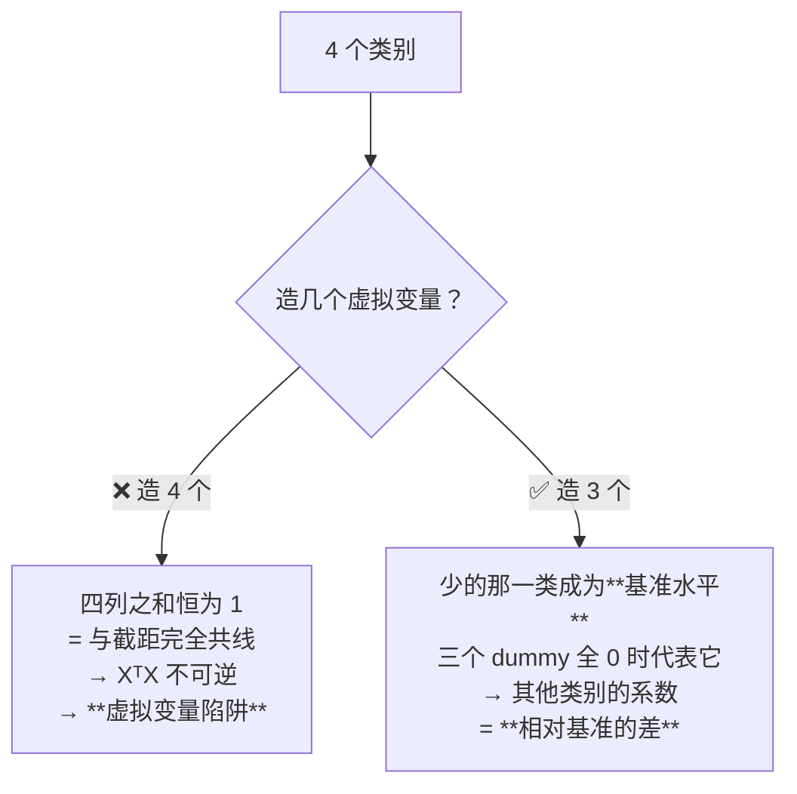

**🎙️ 课堂补充**（转录 `58:52–01:01:36`，课间之后的第一段）

🎙️ **教授对 n−1 规则的理由，和本笔记给的理由不是同一个 —— 两个都要会。**

> "So among four unique … holiday indicators **we need three new [columns]** … **So you may wonder: where is the fourth one?** … In general, when we have four unique categories we **only need three dummy [variables]** … So why?
> **Because for the fourth category — the non-holiday — we can use three zeros to indicate that this record belongs to the fourth condition.** … [If] they are non-holiday, these three new variables will tell you that **this is not [Easter], this is not [pre-Easter], and this is not post-holiday. So what's the condition left? Non-Easter, right? So the fourth column is actually removed.**"（`59:26–01:00:45`）

| | 理由 | 层次 |
|---|---|---|
| 🎙️ **教授给的** | **第四类是被三个 0 "推出来"的，那一列不携带新信息** | **信息冗余** —— 直观，好记，够用来答"为什么" |
| 💡 **本笔记补的**（上文） | 四列之和恒为 1，与截距列完全共线 → **$X^{\top}X$ 奇异、不可逆** | **代数后果** —— 解释了"不这么做会发生什么" |

⭐ **答题时两条一起写最稳**：先说信息冗余（教授的口径），再说矩阵不可逆（技术后果）。**只写后者可能显得脱离课堂；只写前者则答不出"会导致什么问题"。**

🎙️ **教授明确给出了通则**（`01:01:12–01:01:36`，讲义 p.25 只写了 "n cases → n−1 dummy variables"，没有展开）：

> "If you … label the holiday to be **many different holidays**, and you have **n different holidays** in this column['s] unique values, then **you need n minus 1 dummy [variables] — n−1 new columns of dummy indicators** to capture the impact of all these holiday indicators."

**⏭️ 教授没有提到的**：
- **"虚拟变量陷阱（dummy variable trap）"这个术语** —— 全程没出现。⚪ 但它是标准术语，值得记
- **"共线性 / multicollinearity"** —— 教授在讲义部分**从未提过这个词**（助教在 tutorial 里也没提）。⚪ 而 Airbnb 数据里 `beds` 系数为负正是共线性造成的，见 [[T02-回归实战-从合成数据到Airbnb定价#5.5 🔴 `beds` 的系数为什么是负的|T02-回归实战-从合成数据到Airbnb定价 › 5.5 🔴 `beds` 的系数为什么是负的]]

🎙️ **课堂互动 —— 一个很强的重点信号**（`01:07:33–01:07:43`，讲完 p.26 之后）：

> "**How many of you learn[ed] the dummy variable[s] before, when you stud[ied] linear regression? Can you raise your hand?** … **Okay, good — you learn[ed] something new.**"

→ ⭐ 从教授的反应看，**举手的人很少**。这意味着两件事：① 虚拟变量是本讲对绝大多数同学而言**真正新的知识点**；② 教授**知道**它是新的。**新知识点 + 教授特意确认过 = 出题概率高。** 这也与讲义 p.53 Take Away 用**两条**（"Dummy variables for categorical variables" 和 "Interpretation of dummy variable coefficient"）来讲同一个主题相互印证。

**💡 换个说法（笔记补充）**

想象你要描述"今天是星期几"。你不需要 7 个开关，只需要 6 个：**如果 6 个开关全关，那必然是星期日**。第 7 个开关是冗余的 —— 它携带的信息已经被前 6 个完全决定了。

**基准水平怎么选**：谁当基准是**你的选择**，不影响模型的预测能力，但**影响系数怎么读**。通常选：
- 最常见的那一类（本例 Non-Easter 占绝大多数周）
- 或业务上的"默认/对照"状态

> 🔗 **代码对应**：sklearn 里这一步就是 `OneHotEncoder(**drop='first'**)` —— `drop='first'` 就是"丢掉按字母序排第一的那个类别，让它当基准"。见 [[T02-回归实战-从合成数据到Airbnb定价#5.2 `OneHotEncoder(drop='first')` 就是讲义的 n−1 规则|T02-回归实战-从合成数据到Airbnb定价 › 5.2 `OneHotEncoder(drop='first')` 就是讲义的 n−1 规则]]。

**⚠️ 常见误解**

- ❌ **"直接把类别编成 0,1,2,3 不就行了？"** —— 这叫 label encoding，**会强行给类别赋予顺序和间距**：模型会认为 "Post-Easter(3) 是 Easter(1) 的 3 倍"，而这毫无意义。**只有真正有序的类别（如 小/中/大）才能这么编**
- ❌ **"n−1 是为了省一列。"** —— 是为了**避免矩阵不可逆**，不是为了省空间
- ⚠️ **讲义 p.25 把 "n−1" 写成了具体的 "all **three** dummy variables are zero"** —— 这里的 "three" 是本例的数字，不是通则。**通则是"所有 n−1 个虚拟变量都为 0"**。见 [[#9.3 课件自身的问题|§9.3]]

**所以呢**：造好了三个虚拟变量，价格 + 复活节现在可以一起丢进多元回归了。下一节看真正拟合出来的那组系数，以及怎么把它们翻译成人话。

#### 2.7.3 解读虚拟变量的系数（讲义 p.26）

**是什么**

上一节造出了三个虚拟变量（Easter、PreEaster、PostEaster），现在把它们和价格一起丢进多元回归，讲义给出了一组真正拟合出来的系数——这组数字要怎么读，就是这一节要教的"人话翻译法"：

```
Coefficients:        Estimate        Pr(>|t|)
  Intercept          115387.19       < 2e-16   ***
  Egg Price          -170.15         0.0813
  Easter             32728.55        1.94e-08  ***
  PreEaster          76946.67        < 2e-16   ***
  PostEaster         -22096.43       8.25e-05  ***
```

> **Sales prediction function:**
> **Sales = 115387 − 170 × Egg Price + 32729 × Easter + 76947 × PreEaster − 22096 × PostEaster**

**讲义给的解读规则**（原文）：

> "To interpret: **the coefficient is the comparison to the base case**"
> - "The egg sales of **Easter week is 32729 more than non-Easter week**"
> - "You may try the other two"

**把"the other two"补完**（讲义留的作业）：

| 系数 | 数值 | 业务含义 |
|---|---|---|
| Easter | +32,729 | 复活节当周比**非复活节周**多卖 **32,729 箱** |
| **PreEaster** | **+76,947** | 复活节**前一周**比非复活节周多卖 **76,947 箱** ← **最大的那个** |
| **PostEaster** | **−22,096** | 复活节**后一周**比非复活节周**少卖 22,096 箱** |
| Egg Price | −170.15 | 价格每涨 1 美分，**在控制了复活节效应之后**，销量少 170 箱 |
| Intercept | 115,387 | 非复活节周、价格为 0 时的销量（**无业务含义**，见 §2.5.1） |

**🎙️ 课堂补充**（转录 `01:01:36–01:07:33`，教授在这一页停了近 6 分钟）

**★ 教授教了一个"把带虚拟变量的方程读成人话"的标准动作，分三步：**

**第 1 步 —— 先把基准情形的方程解出来**（`01:02:52–01:03:29`）：

> "If I want to use this regression line to make a future prediction … **for [a] non-Easter [week], what's the value of this Easter indicator? What's the value for the pre-Easter? What's the [value for] post-Easter?** … **All these three [are] zero. So what's left? 115,000 − 170 × price.**"

> ⭐ **这就是"基准水平"的操作定义**：把所有虚拟变量设为 0，剩下的那个方程就是基准情形。
> 🎙️ 教授的收束：*"This is a formula that tells us the relationship between the demand and [the] price **in the normal, non-holiday season**."*（`01:03:29`）

**第 2 步 —— 把每个虚拟变量的系数读成"相对基准的差"**（`01:04:41–01:07:11`）：

> **Easter**（`01:05:09–01:05:48`）："[If] next week is the Easter holiday, [then this] indicator will be one … [and] pre and post will be zero. … [So] we add one new real number … into the formula. **What does this 32,000 mean? It means that compared with the … non-[holiday] season, [during] the holiday season the observed or predicted demand will be 32,000 more than the non-holiday season — [and] at the same price level.**"
>
> **Post-Easter**（`01:06:28–01:07:11`）："[For] the post[-]holiday … the [Easter] indicator [and] pre-Easter … [are zero, and] the post[-Easter] is one … [so we] maintain the previous two terms indicating the **base** value … **minus 22,000**. … **It means that compared with the … non-holiday [week], … if this week is the post-Easter [week], the demand will be 22,000 lower than the normal [level] — [and] at the same price level.**"

> ⭐⭐ **注意教授每一句都带的那个尾巴："at the same price level"。**
> 这就是"**在其他自变量保持不变的前提下**（holding others constant）"的口语版。**答题时这个短语必须出现** —— 它是多元回归系数解释的标志性措辞，漏掉就变成了简单回归的解释。
>
> 💡 教授连说了两遍（`01:05:31`、`01:07:11`），⚪ 这种重复通常意味着他在给评分点画重点。

**第 3 步 —— 反问全班**（`01:07:11`）：*"How to interpret this result? So far … okay, so we can see we can better [read] this result."*

---

**⏭️ 课上略过的一条 —— 而且恰好是最有意思的那条**

讲义 p.26 演示了 Easter（+32,729），然后写 *"**You may try the other two**"*。教授在课上**演示了 Easter 和 Post-Easter，唯独跳过了 PreEaster（+76,947）**。

⚠️ **而 PreEaster 恰恰是五个系数里最大的一个** —— 它说的是"**复活节前一周比平常多卖 76,947 箱，比复活节当周还多一倍多**"，也正是教授自己讲双十一时说的"**大家提前把东西加进购物车**"（§2.7.1 🎙️）。

> ⭐ **两处一对照，这个案例才完整**：教授用双十一讲了"节前囤货"这个机制，却没有在数据上把它指出来；讲义给了数据却没讲机制。**把两边接起来，就是本讲最漂亮的一个发现。** ⚪ 如果考"解读这张表"，**主动指出"最大的效应发生在节前而不是节中，说明需求被提前透支"，是明显的加分点。**

**💡 换个说法（笔记补充）**

这四个数字讲了一个完整的商业故事：

```
销量
  │        ╭─── PreEaster: +76,947（囤货高峰）
  │       ╱ ╲
  │      ╱   ╲── Easter: +32,729（节日当周）
  │─────╱     ╲
  │  基准线    ╲
  │             ╰── PostEaster: −22,096（透支后的低谷）
  └──────────────────── 时间
```

**买鸡蛋的高峰在复活节前一周（人们提前囤货做彩蛋），不是复活节当周；而节后一周会显著低于平常（需求被提前透支了）。**

⚠️ **这个洞察对业务的价值远超过那条回归线本身。** 它直接告诉零售商：**备货要提前一周，节后要减产。** 这就是 CILO 3 说的 "original findings"。

**算一个具体的预测**：复活节前一周，鸡蛋价格 95 美分，预测销量？

$$\begin{aligned}
\text{Sales} &= 115387 - 170\times 95 + 32729\times 0 + 76947\times 1 - 22096\times 0 \\
&= 115387 - 16150 + 76947 \\
&= 176,184 \text{箱}
\end{aligned}$$

对照 p.22 的散点图，最高的两个点正好在 17–19 万之间 ✓ —— **原来那两个"离群点"，被模型解释掉了。**

**所以呢**：加入复活节之后，模型不仅能解释离群点，还多学到了一个业务洞察（囤货高峰在节前）。但价格这个系数本身也在这次改动里发生了变化——下一节看这个变化，以及讲义没有提到的一个后果。

#### 2.7.4 💡 讲义没讲透的一件事：Egg Price 变得不显著了

**观察**

多元回归不只是"多加了三个系数"这么简单——它也悄悄改变了价格这个老系数本身。把两次回归的结果并排：

| | 简单回归（p.20） | 多元回归（p.26） | 变化 |
|---|---|---|---|
| **Egg Price 的系数** | **−553.9** | **−170.15** | **缩小到不足三分之一** |
| **Egg Price 的 p 值** | **0.00136 `**`** | **0.0813**（无星号） | **从"高度显著"变成"不显著"**（p > 0.05） |

**讲义完全没有评论这个变化。**

**🎙️ 课堂补充 —— 但教授讲了，而且给了一个和本笔记完全不同的解释**（转录 `01:03:29–01:04:41`）

> 🎙️ "You can see **the slope is [only] 170, which is much smaller, much flatter than the previous simplified linear regression without considering the holiday information**. Right? So why [is] this slope much flatter?
> **Because remember that we have two outliers located on the left upper side. If you do not consider [the] holiday information, [those] observed demand[s] will actually pull your linear line to the upper side, to minimize the prediction errors for the two outliers.** … If you do not consider [the] holiday influence and consider only the normal [weeks], … the relationship between the price and the demand is only about **negative 170**."

**两种解释，其实是同一件事的两个视角：**

| | 🎙️ 教授的解释 | 💡 本笔记的解释 |
|---|---|---|
| 视角 | **几何**：两个离群点把回归线往上"拽"，同时把它压平 | **统计**：复活节是混淆变量，简单回归里它的效应被算到了价格头上 |
| 语言 | 最小二乘、离群点、拟合 | 遗漏变量偏误（omitted variable bias） |
| 优点 | **看图就懂**，与 §2.6.4 的离群点讨论直接衔接 | 有正式名字，可迁移到任何"加变量导致系数剧变"的场景 |

⭐ **答题时把两条并起来最完整**："加入复活节虚拟变量后价格系数从 −554 缩到 −170，是因为**原先那条线为了照顾两个复活节高需求点而被抬高、压平**；换成统计语言，就是**复活节这个遗漏变量污染了价格系数**。"

**⏭️ 但有一件事教授也没说**：他解释了**系数**的变化（−554 → −170），**完全没有提 p 值的变化**（0.00136 → 0.0813）。⚪ 而按他自己在 `37:24` 给的 0.05/0.1 双阈值，这个变化恰好落在两条线之间（见 §2.6.2 🎙️）。**这是"课上讲了一半"的典型例子——最有价值的部分要自己补完。**

**为什么会这样**

⚪ **最合理的解释是混淆（confounding）**：复活节前后，**鸡蛋需求暴涨的同时价格也被推高**。在简单回归里，"复活节效应"被错误地算到了价格头上 —— 模型看到"高价周伴随高销量"和"低价周伴随低销量"的混合信号，最终给了价格一个被夸大的系数。

一旦把复活节单独拿出来当自变量，价格的**净效应**才显露出来：只有 −170，而且统计上站不住。

**这说明什么**

1. **简单回归的系数很容易被遗漏变量污染**（叫 omitted variable bias，遗漏变量偏误）
2. **加入一个新变量之后，老变量的系数发生剧变，是一个强信号**：说明两者相关，或者存在混淆
3. **"p 从 0.0014 变成 0.081" 不等于"价格不影响销量"** —— 只是说，**在控制了复活节之后，我们没有足够证据说价格有影响**（可能样本量不够，104 周而已）

> ⚠️ **考试注意**：如果题目给你 p.26 这张表并问"你会怎么解读"，**指出 Egg Price 不显著（p=0.0813 > 0.05）却仍被写进预测函数**，是一个明显的加分点。⚪ 严谨的做法是：要么把它拿掉重新拟合，要么在报告里明确说明"该系数在 5% 水平上不显著，保留它是为了保持模型的业务完整性"。
>
> 🔗 **这个现象在 W02 tutorial 里有个孪生兄弟**：Airbnb 数据里 `beds` 的系数是**负的**（"床越多越便宜"），原因同样是变量之间高度相关。见 [[IS6400_Business_Data_Analytics/_meta/数据集卡片#5.1 ⭐ 严重多重共线性（做多元回归必踩）|数据集卡片 › 5.1 ⭐ 严重多重共线性（做多元回归必踩）]]。**两个例子放在一起看，多元回归的陷阱就很清楚了。**

**所以呢**：至此，怎么"读"一份回归输出（系数、p 值、外推、离群点、虚拟变量）已经讲完了，这也是 §2.11 Take Away 里权重最高的部分。下一节换个角度，回答一个更底层的问题：这些 β 到底是怎么被算出来的？

---

### 2.8 参数是怎么训练出来的（讲义 p.30–37）

> **这一节是全讲数学密度最高的部分。** 前面用的 $\beta_0 , \beta_1$ 记号在这里换成了向量记号 `θ`，公式也从代数变成了矩阵。**先看 §2.8.1 的记号翻译表，再往下读。**

#### 2.8.1 记号翻译表（讲义 p.30）

**是什么**

前面几节写的都是 $Y=\beta_0+\beta_1 X$ 这种"数得清有几项"的式子；一旦自变量从 1 个变成 4 个、40 个，逐项写 $\beta_0+\beta_1x_1+\beta_2x_2+\cdots$ 会写不下、也读不清。这一页要做的只是**换一套更紧凑的记号**去表达同一件事——把所有系数打包成一个向量 θ、所有自变量打包成一个向量 x，本质上没有引入任何新概念。讲义 p.30 把线性模型写成向量形式：

$$y = \theta^T x + \epsilon$$

配了四个标注：`Scalar Response`（标量响应）→ y；`Vector of Parameters`（参数向量）→ θ；`Vector of Covariates`（协变量向量）→ x；`Real Value Noise`（实值噪声）→ ε。底下展开：

$$\theta^T x = \sum_{i=1}^{p}\theta_i x_i \qquad \text{Noise Model: } \epsilon \sim N(0, \sigma^2)$$

**记号翻译表**（⭐ 这张表是读懂 §2.8 的钥匙）

| 新记号 | 前面用的 | 中文 | 具体是什么 |
|---|---|---|---|
| $y$ | $Y$ | 因变量 | 一个数（标量） |
| $x$ | $X$ | 自变量**向量** | 一行数据的所有特征，如 `[EggPrice, Easter, PreEaster, PostEaster]` |
| $\theta$（theta） | $\beta_0, \beta_1, \dots$ | 参数**向量** | 所有系数打包成一列 |
| $\theta^{\top}$ | — | $\theta$ 的**转置** | 把竖着的列变成横着的行（[[T01-Jupyter入门与Pandas基础#2.7 【cell 22】numpy 矩阵运算\|T01 §2.7]] 的 `.T`） |
| **$\theta^{\top}x$** | $\beta_1 x_1 + \beta_2 x_2 + \dots$ | **两个向量的点积** | 对应元素相乘再求和，得到**一个数** |
| $\varepsilon$（epsilon） | $\varepsilon$ | 噪声 | 同前 |
| $p$ | — | 参数个数 | 有多少个自变量 |
| $n$ | — | 样本量 | 有多少行数据 |
| `X`（大写） | — | **设计矩阵** | 全部数据堆成的 `n × p` 矩阵，一行一个样本 |
| `∇`（nabla） | — | **梯度** | 对每个参数分别求偏导，打包成一个向量 |

**为什么要换记号**

因为 $\beta_0 + \beta_1 x_1 + \beta_2 x_2 + \beta_3 x_3 + \beta_4 x_4 + \dots$ 写到 100 个自变量会写不下。$\theta^{\top}x$ 一个符号搞定任意多个。**这不是为了显得高深，是为了能写下来。**

> ⚠️ **讲义 p.30 有一处会造成混淆**：公式 $y = \theta^{\top}x + \varepsilon$ 的右边，用蓝色大字额外写了一个 **"+ b"**。这个 b 是**截距**。但在 $\theta^{\top}x$ 的标准写法里，**截距通常已经被吸收进 θ 了**（做法：给 x 添一个恒为 1 的分量 x₀，对应的 θ₀ 就是截距）。**讲义既没说明这个约定，又额外写了个 b，两种写法混在一起。** 见 [[#9.3 课件自身的问题|§9.3]]。
>
> 💡 **考试或写代码时怎么办**：记住 $\hat{\theta} = (X^{\top}X)^{-1}X^{\top}Y$ **只有在 X 的第一列全是 1 时才包含截距**。sklearn 的 `LinearRegression(fit_intercept=True)`（默认）会替你加这一列，所以 `coef_` 和 `intercept_` 是分开给的。

**🎙️ 课堂补充**（转录 `01:11:17–01:11:36`）

教授对这一页只说了一句话，但正好就是这张翻译表要说的事：

> 🎙️ "Actually this [and this] are equivalent — **I use the matrix representation**, so these two are equivalent: **θ transpose times x is equivalent to θ₁x₁ + θ₂x₂ + θ₃x₃.**"

→ ✅ 教授**自己承认这只是记号变换，不是新概念**。⚪ 所以看到 $\theta^{\top}x$ 不用紧张——**它就是 §2.7 那个 $\beta_0 + \beta_1 x_1 + \beta_2 x_2 + \dots$ 的缩写**。

**⏭️ 课上略过**：讲义 p.30 上那个多出来的 **"+ b"**、以及 `Vector of Parameters / Vector of Covariates / Scalar Response / Noise Model` 这几个标注，教授**一个都没提**。⚪ 这几个词本身不难，但它们是读论文和读 sklearn 文档时的通用词汇，值得记。

**所以呢**：记号换好了，$\theta^{\top}x$ 只是 $\beta_0+\beta_1x_1+\dots$ 的紧凑写法，不是新概念。下一节要问一个更深的问题：为什么"最小化平方误差"这个选择是"对的"，而不只是数学上方便？

#### 2.8.2 从假设到似然：为什么最小二乘是"对的"（讲义 p.16, p.18, p.31）

**是什么**

§2.5.2 假设②③说过，给定 X 时，Y 的取值会散布成一个正态分布，回归线穿过这些正态分布的均值。这一节要把这句话变成一个更有威力的想法：如果能写出"给定 X，Y 取到某个具体值的概率有多大"这个概率公式，就能反过来问——**已经观测到这批数据了，什么样的参数 θ 最可能生成它们？** 这就是极大似然估计（MLE）的思路，也是"为什么用平方误差、不用绝对值"这个问题的最终答案。讲义 p.16 早留了一句伏笔（本笔记从简单回归那段挪到了这里）：

> "If you know something about X, this knowledge helps you predict something about Y. (**Sound familiar?…sound like conditional probabilities?**)"
> （知道 X 的一些信息，能帮你预测 Y。听着耳熟吗？是不是像**条件概率**？）

p.31 给出答案：

$$y = \underbrace{\theta^T x}_{\text{Constant 常数}} + \underbrace{\epsilon \sim N(0, \sigma^2)}_{\text{正态分布}}$$

**关键推理**：给定 x 之后，$\theta^{\top}x$ 就是一个**确定的数**。一个确定的数加上一个均值 0、方差 σ² 的正态随机变量，结果仍是正态分布，只是均值平移到了 $\theta^{\top}x$：

$$Y \sim N(\theta^T x,\ \sigma^2)$$

写成密度函数：

$$p(y\mid x) = \frac{1}{\sigma\sqrt{2\pi}}\exp\left(-\frac{(y - \theta^T x)^2}{2\sigma^2}\right)$$

**为什么需要它**

**这一步把"画一条最贴合的线"变成了一个概率问题**，从而让"最小二乘"这个选择有了理论依据，而不只是"平方方便求导"。

**推理链**（讲义没有明写这条链，但它是理解 p.31→p.32 的关键）：

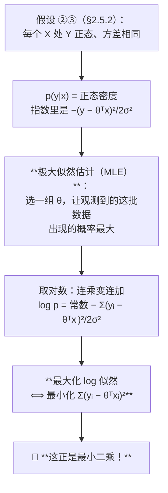

> ⭐ **结论（必考级别的洞察）**：**在"噪声服从均值 0 的高斯分布"这个假设下，最小二乘估计 = 极大似然估计。**
>
> 这解释了 §2.5.3 那个问题："为什么用平方而不用绝对值？" —— 因为**平方来自正态分布密度函数指数上的那个平方**。如果你假设噪声服从拉普拉斯分布，MLE 就会变成最小化**绝对值**之和。

**💡 换个说法（笔记补充）**

极大似然的思路是"**倒过来问**"：

- 正着问：给定参数 θ，数据长什么样？（这是 p(y|x)）
- **倒着问：已经看到这批数据了，哪个 θ 最有可能生成它们？**

就像看到地上一串脚印，问"什么身高体重的人最可能留下这串脚印"。

**⚠️ 常见误解**

- ❌ **"MLE 和最小二乘永远等价。"** —— **只在高斯噪声假设下等价**。这是 §2.5.2 假设 ② 的直接后果
- ❌ **"σ² 也要估计出来才能求 θ。"** —— 不用。σ² 在最大化过程中是个正的常数因子，不影响 θ 的最优值（看上面推理链的第 4 步：σ² 只是分母上的常数）

**🎙️ 课堂补充**（转录 `01:11:36–01:14:02`）

⚠️ **先说结论：教授把这一整套"似然 → MLE → 平方误差"的推理，压缩成了 40 秒。** 讲义 p.31 那两个概率密度公式，他**没有推导，也没有解释指数上为什么是平方**。

他实际讲的是这样一条捷径：

> 🎙️ "When we [put] this linear line into the conditional [normal] distribution, we [see] we are trying to **use θᵀx to approximate the observed value y**, and [between] the[m] … [is] the error … from the normal distribution.
> So … **if we want to get a very good approximation for the observations y, we need to optimize the value θ** … so we put this outcome into our **objective function**."（`01:11:36–01:12:16`）

然后他直接逐项拆解目标函数（`01:12:16–01:13:13`）：

> "**yᵢ** here is the observed value for … the i-th data point. Now … by fitting **xᵢ** into the linear formula θᵀx [we get the] predictive value. Right — so **yᵢ − θᵀxᵢ will be the gap** we just show[ed] … [and it] is … squared.
> So [for] each data point we have … [a] square[d] [error], so for the first data point (x₁, y₁) … [we compute this] square, [and for] the second [we take] x₂ and y₂ … we compute the gap between y₂ and θᵀx₂ … **so we assemble them together and we get [the] sum squared error.**"

**⭐ 教授真正强调的一句，是本笔记原本没写的一个关键观察**（`01:13:13–01:14:02`）：

> "**yᵢ … is the information we already know** from the historical data set, **and xᵢ is the information we already know.** … Now the whole thing should be minimized, but this whole thing — the sum squared error — **is a function of θ**. … And because it's the sum square[d] [error], we can see **the whole function is a quadratic function of θ**."

> ⭐⭐ **"SSE 是 θ 的二次函数" 这句话是整个 §2.8 的枢纽。** 它一次性解释了三件事：
> ① 为什么可以"求导 = 0"就得到答案（二次函数只有一个极值点）；
> ② 为什么讲义 p.36 那张图画的是一条**开口向上的抛物线**，还标着 **Convex Function**；
> ③ 为什么梯度下降在这里**保证**能走到全局最优。
>
> 💡 **对照记忆**：数据（x, y）是**已知的常数**，参数 θ 是**未知的自变量**。SSE 这个函数的"输入"是 θ，不是数据。**初学最容易把这两者搞反。**

**⏭️ 课上略过（但值得自己补）**：
- **"极大似然估计（MLE）"这个词，教授全程没有说过一次**。讲义 p.33 印着 $\hat{\theta}_\text{MLE}$，但他只说 "optimize θ" / "minimize the sum squared error"
- 因此**"高斯噪声下 MLE = 最小二乘"这条推理链，完全不在录音里**。⚪ 它仍然值得掌握——它是"为什么是平方不是绝对值"的唯一像样的回答，而这个问题很容易被问到

**所以呢**：现在知道了"最小化平方误差"背后站着极大似然估计——这不是数学家的自娱自乐，而是"高斯噪声假设"的必然推论。下一节回到一个很实际的问题：θ 具体要怎么算出来？

#### 2.8.3 正规方程：闭式解（讲义 p.32–34）⭐

**是什么**

§2.8.2 说明了"最小化平方误差"背后站着极大似然估计；这一节接着往下问一个很实际的问题：**θ 具体要怎么算出来？** 答案是高中数学就会的套路——求导、令导数等于 0、解方程，只是这里的"导数"要对一整个向量 θ 求。**目标**（p.32）：

$$\hat{\theta}_{MLE} = \arg\min_{\theta \in \mathbb{R}^p}\sum_{i=1}^{n}(y_i - \theta^T x_i)^2$$

红字标注：**Minimize Sum (Error)²**

**先用一个一维例子热身**（p.32 下半页）：

> Only one variable: Find minimum of $y = (x+5)^2$
> → `dy/dx = 2(x+5) = 0` → **`x = −5`**

配一张抛物线图，最低点在 x = −5。

> 💡 **这一步的意义**：求最小值的通用套路是 **"求导 → 令导数 = 0 → 解方程"**。下面对多维情形做的是**完全一样的事**，只是"导数"换成了"梯度"（对每个参数分别求偏导）。

**正式推导**（p.33）：

$$-\nabla_\theta \log \mathcal{L}(\theta) = \nabla_\theta \sum_{i=1}^{n}(y_i - \theta^T x_i)^2$$

$$\xrightarrow{\text{Chain Rule 链式法则}} = -2\sum_{i=1}^{n}(y_i - \theta^T x_i)x_i$$

$$= -2\sum_{i=1}^{n}y_i x_i + 2\sum_{i=1}^{n}(\theta^T x_i)x_i$$

**逐步解释**（讲义只写了 "Chain Rule →"，没展开）：

| 步 | 在干什么 |
|---|---|
| 外层导数 | `d/du (u²) = 2u`，这里 $u = y_i - \theta^{\top}x_i$ |
| 内层导数 | `d/dθ (yᵢ − θᵀxᵢ) = −xᵢ`（yᵢ 是常数，θᵀxᵢ 对 θ 求导得 xᵢ，前面有负号） |
| 相乘 | $2(y_i - \theta^{\top}x_i) \times (-x_i) = -2(y_i - \theta^{\top}x_i)x_i$ |
| 求和展开 | 把括号拆开 |

**写成矩阵形式**（p.34）：

$$-\nabla_\theta \log \mathcal{L}(\theta) = -2X^TY + 2X^TX\theta$$

**令梯度 = 0**：

$$-2X^Ty + 2X^TX\theta = 0$$

$$\boxed{(X^TX)\hat{\theta}_{MLE} = X^TY \quad\Longrightarrow\quad \hat{\theta}_{MLE} = (X^TX)^{-1}X^TY}$$

**红字标注：Normal Equations（正规方程）**，讲义还用一个蓝色大圆角框把这两行圈了起来 —— **这是全讲被视觉强调得最明显的公式。**

**为什么需要它**

因为它是一个**闭式解（closed-form solution）**：不需要迭代、不需要调参数，**一步算出全局最优**。sklearn 的 `LinearRegression` 内部用的就是这条路（准确说是它的数值稳定版本 SVD）。

**🎙️ 课堂补充**（转录 `01:14:02–01:15:55`）🔴 **本讲第一个考试明示，就在这一节末尾**

🎙️ **教授用"高中数学"来铺垫**（`01:14:02–01:14:36`，和讲义 p.32 一致，但他把"这是你已经会的东西"说得很明确）：

> "**Now if you recall your high school** — we learn[ed] how to solve this minimization problem, right? … Imagine that you have a function $y = (x+5)^2$ and we want to find the minimum value … So I'm going to **take [the] derivative** of this function … **and we force the slope [to] equal 0.** … **So that's how [you learned it in] high school, right?**
> Now if you consider this as the whole function of θ, [to] find the minimum value of th[at] function … [we] take [the] derivative of [the] sum[-squared] error over θ, **force [the] slope [to] equal 0**, [and then] we [are] able to calculate the value of θ."

**⏭️ 教授跳过了讲义 p.33 的链式法则推导。** 他从"求导、令其为 0"**直接跳到了 p.34 的结果**，中间那三行梯度展开（$\nabla \theta = -2\sum y_i x_i + 2\sum(\theta^{\top}x_i)x_i$）**一步都没走**。⚪ 本笔记上面把这三行补全了，但**从考试角度看，教授的跳过是有意义的**——见下面的 🔴。

🎙️ **教授对结果的口述**（`01:15:12–01:15:40`）：

> "If you … [do] this massive calculation by forcing the gradient [to] equal 0 … [you] will be able to get the formula for calculating the [optimal] θ: it is [the] **X matrix — the feature matrix, the … data table [of] our feature values — X transpose times X, and then we take the inverse, and then … X transpose times y column.**"

> ⭐ 💡 **这句口述本身就是一个记忆法**：$(X^{\top}X)^{-1}X^{\top}Y$ = "**X 转置乘 X，取逆，再乘 X 转置乘 Y**"。⚪ 考试若要默写这个公式，按教授这句英文的顺序念一遍就不会写反。

---

> ### 🔴 教授明示考点 ①：正规方程的矩阵推导 **不考**
>
> 🎙️ **原话**（`01:15:40–01:16:11`）：
> > "Now **this computation is so slow**. I can tell you that **this computation is so slow**. When your X is very big — [when] we have so many [observations] and we have so many features — if I want to complete the whole process, **it is so slow**.
> > **So of course this will not show up in your final. Okay — the whole matrix calculation [will] not show [up in] your final. But we need to figure out a simpler way to calculate θ.**"
>
> **⚠️ 这条明示的范围到底是什么，要读准：**
>
> | 内容 | 是否会考 | 依据 |
> |---|---|---|
> | **p.33–34 那套矩阵求导推导过程** | 🔴 **不考** | "the whole matrix calculation will not show up in your final" |
> | **$\hat{\theta} = (X^{\top}X)^{-1}X^{\top}Y$ 这个公式本身 / 它是什么** | ⚪ **仍可能考**（认识它、知道它是闭式解） | 教授说的是"计算不考"，不是"这个公式不存在"；而且讲义用蓝色大框把它圈了出来 |
> | **"为什么它慢、什么时候不能用"** | 🟡 **大概率考** | 这正是教授说这句话的语境，也是引出梯度下降的理由；讲义 p.35 标题就是 "**What if p is large?**" |
>
> 💡 **复习策略**：§2.8.3 里那三行链式法则推导，**可以只读一遍求个明白，不必练熟**。但"**闭式解存在 → 但 X 很大时算不动 → 所以要迭代法**"这条**逻辑链必须能自己讲出来**。

**💡 换个说法（笔记补充）**

$\hat{\theta} = (X^{\top}X)^{-1}X^{\top}Y$ 每一块是什么：

| 块 | 形状 | 是什么 |
|---|---|---|
| `X` | n × p | 设计矩阵。n 行样本，p 列特征 |
| `Xᵀ` | p × n | 转置 |
| **$X^{\top}X$** | **p × p** | **特征之间的"内积矩阵"**。对角线是每个特征的平方和，非对角线是特征两两的乘积和 |
| $(X^{\top}X)^{-1}$ | p × p | 求逆 |
| $X^{\top}Y$ | p × 1 | 每个特征与 Y 的乘积和 |
| **`θ̂`** | **p × 1** | **每个特征的系数** |

> 🔗 **回看 T01**：[[T01-Jupyter入门与Pandas基础#2.7 【cell 22】numpy 矩阵运算|T01 §2.7]] 里 `np.dot(matrix.T, matrix)` 算出的那个 2×2 矩阵 `[[30341, 604],[604, 15]]`，**就是这里的 $X^{\top}X$**。当时说"这是在为下一讲的数学做手指热身"，指的就是这一刻。

**⚠️ 常见误解**

- ❌ **"$(X^{\top}X)^{-1}$ 一定存在。"** —— **不一定！** 两种情况会让它不可逆：
  1. **特征之间完全共线**（如 §2.7.2 的虚拟变量陷阱，或者同一个变量放了两次）
  2. **`p > n`**（特征比样本还多）
  这两种情况下正规方程无解，必须用正则化（§2.10）或降维（W03）
- ❌ **"θ̂ 里包含截距。"** —— **只有当 X 的第一列全是 1 时才包含**（§2.8.1）

**所以呢**：正规方程能一步算出精确解，前提是求得动那个 p×p 矩阵的逆。下一节看 p 很大（几千、几万个自变量）时这条路会怎么走不通，以及换成哪条路。

#### 2.8.4 梯度下降：p 很大时怎么办（讲义 p.35–37）

**是什么**

§2.8.3 的公式 $\hat\theta=(X^{\top}X)^{-1}X^{\top}Y$ 能一步算出精确解，但它要求对一个 p×p 的矩阵求逆——p 是自变量个数，p 一旦大到几千、几万（现代模型动辄如此），这一步会慢到不可行。**梯度下降**换了一种笨办法但管用的思路：不求逆，而是像下山一样，每一步都往"坡度往下"的方向挪一小步，挪很多次之后自然会停在山谷（最优点）附近。p.35 标题点出了它要解决的场景：**"Gradient Descent: What if p is large? (e.g., n/2)"**

> - **Computational inefficiency** in calculating $\hat{\theta} = (X^{\top}X)^{-1}X^{\top}Y$
> - **Solution: Iterative Methods**
>
> **Gradient Descent:**
> For τ from 0 until **convergence**
> $$\theta^{(\tau+1)} = \theta^{(\tau)} - \underbrace{\rho(\tau)}_{\text{Learning rate}} \nabla \log \mathcal{L}(\theta^{(\tau)}\mid D)$$

**为什么需要它**

因为 **$(X^{\top}X)^{-1}$ 是一个 p×p 矩阵求逆，计算量约是 O(p³)**。p = 10 时不算什么，p = 10,000 时就要算 10¹² 次运算 —— 现代深度学习动辄百万参数，闭式解**完全不可行**。

梯度下降不求逆，只需要**反复算梯度然后往下走一小步**。

**几何直觉**（p.36 图）

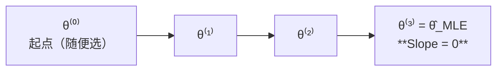

p.36 画的是一条碗形曲线（纵轴 $-\log L(\theta)$，横轴 `θ`），标注 **"Convex Function"**（凸函数），四个点 θ⁽⁰⁾→θ⁽³⁾ 一步步滑向碗底，碗底标着 **Slope = 0**。

> ⭐ **"Convex Function" 这四个字是关键**：凸函数只有一个最低点，所以梯度下降**保证能走到全局最优**。线性回归的平方误差恰好是凸的。（神经网络的损失函数**不是**凸的，这就是 W09 训练那么麻烦的原因。）

**手算一遍**（讲义 p.37）

> Find minimum of $y = (x+5)^2$，`dy/dx = 2(x+5)`
> Initial `x₀ = −3`，Learning rate = **0.2**
> First iteration:
> $x_1 = x_0 - \text{learning\_rate} \times \text{descent}$
> $x_1 = -3 - 0.2 \times (2 \times (-3+5)) = -3 - 0.2 \times 4 = \mathbf{-3.8}$
>
> **Question: 1. How many iterations do we need? 2. What is the optimal value?**

**🎙️ 课堂补充**（转录 `01:16:11–01:23:54`）🔴🔴 **本讲最重要的一条考试信息在这一段末尾**

🎙️ **① 教授一上来就点明了梯度下降的地位**（讲义没有这一层）：

> "The gradient descent calculation **has been applied for linear regression and for deep learning algorithms** — why? **Because it's so efficient.** So let's take a look at why th[e] gradient descent is efficient in optimizing the parameters."（`01:16:36`）

→ 🔗 **这是 W09（深度学习）的明确伏笔**：神经网络没有闭式解，**梯度下降是唯一的路**。本讲学的这个迭代式，后面每一次训练神经网络都在用。

🎙️ **② 收敛判据讲得比讲义细**（`01:19:18–01:20:05`）：

> "We use this formula **again and again and again** until … maybe after **10** iterations, or maybe after **1,000** iterations … **the slope becomes zero**. If at [some] iteration … the slope … becomes [zero], and I put θ back into [the] formula to get an updated θ value, **then the updated θ value should be the same as the original θ value** — because the whole [term] … becomes zero. **So θ_{t+1} equals θ_t. Nothing changes starting from this point.** … **[This is] the optimal point we identify.**"

> ⭐ **"参数不再变化"就是收敛的定义** —— 这比"梯度为 0"更容易在代码里检查（sklearn/PyTorch 里的 `tol` 参数就是在做这件事）。

🎙️ **③ 教授反复强调的卖点：全程没有矩阵运算**（`01:20:05`、`01:24:00`）：

> "But so far **we do not use any matrix calculation** — the only thing we do is … [the] iteration, [a] **linear update** of [the] θ value."
> "For the whole process **we didn't do any matrix calculation**; the only thing we did here is use … linear calculation for all the numbers, [and] then we are able to get the optimal numbers."

→ ⭐ **这是理解梯度下降"为什么值得存在"的关键对照**：闭式解要求 $(X^{\top}X)^{-1}$（p×p 矩阵求逆，代价随特征数**立方**增长）；梯度下降每一步只做**乘法和减法**。⚪ 这条对照本身就是一道很好的简答题。

---

> ### 🔴🔴 教授明示考点 ②：**手算梯度下降迭代，往年考过**
>
> 🎙️ **原话**（`01:23:27–01:23:54`，紧接着讲完 p.37 的例子）：
> > "**So you can see this is one of the g[raded] question[s] in the last semester. And I … remember in one year of final exam we have [a] similar [question of the] g[radient de]scent calculation. [You] need [to do it] by yourself.**"
> >
> > 紧接着（`01:23:43`）：*"So you can tell me whether you can do the calculation by yourself now — to go from x₀ to [x₁] … the optimal number for x which lead[s] to the minimum value of this function."*
>
> ⚠️ **转录忠实度说明**：这两句的 ASR 质量较差（原文为 *"this is one of the great question in the last semester. And I don't remember in one year of final exam we have similar pressure of the brain and extend calculation. Unit user by itself."*）。
> - `great question` → **graded question**（也可能是 "exam question"）
> - `pressure of the brain and extend` → **question of the gradient descent**（本讲上下文里 "brain and extend / welding descent / valid descent / branding stand" 反复出现，全部是 **gradient descent** 的误识）
> - `Unit user by itself` → **You need to [do it] by yourself**
> - ⚠️ `I don't remember` vs `I do remember` **无法从音频文本判定**。但**无论哪一种，句子的落点都是"往年期末出过同型的梯度下降计算题"**，因为他紧接着就要求学生自己算一遍。
>
> **→ 结论：这是本讲唯一一条"往年考过"级别的信息，可信度最高。**
>
> **必须能做到的：**
> 1. 写出更新式 $x_{k+1} = x_k - \eta \cdot f'(x_k)$
> 2. 给定 `f`、`x₀`、`η`，**手算前几次迭代**（讲义 p.37 的 `y=(x+5)²`, `x₀=−3`, `η=0.2` 就是模板）
> 3. 说出**何时停止**（梯度为 0 / 参数不再变化）
> 4. 回答 p.37 的两个问题（**答案见下面的💡，教授课上没给**）

**⏭️ 教授把 p.37 的两个问题留给学生自己算，课上没有公布答案。**
`01:23:43` 他说的是 *"So you can tell me whether you can do the calculation by yourself"* —— 之后就转入过拟合了，**没有回来对答案**。
⚪ **这与 🔴 考点 ② 合起来看，信号非常明确：这两个问题很可能就是考题的原型。下面的💡把它们算完了。**

**💡 把讲义留的两个问题算完（笔记补充）**

**误差的收缩规律**：设 `eₖ = xₖ + 5`（离最优点的距离）。

$$x_{k+1} = x_k - 0.2 \times 2(x_k+5) \;\Longrightarrow\; e_{k+1} = e_k - 0.4e_k = \mathbf{0.6}\,e_k$$

**每迭代一次，误差乘 0.6。** 起点 `e₀ = −3 + 5 = 2`。

| 迭代 | x | 离 −5 的距离 |
|---|---|---|
| 0 | −3 | 2 |
| 1 | **−3.8** ✓（与讲义一致） | 1.2 |
| 2 | −4.28 | 0.72 |
| 3 | −4.568 | 0.432 |
| 5 | −4.8445 | 0.1555 |
| 10 | −4.9879 | 0.0121 |
| **11** | −4.9927 | **0.0073 < 0.01** |

**答案 1**：要精确到小数点后两位，约需 **11 次迭代**。
**答案 2**：最优值 **x = −5**（与 §2.8.3 用求导法得到的答案完全一致 ✓）。

**⭐ 学习率的三种命运**（讲义只给了 0.2，但这是最重要的直觉）

误差每步乘 $(1 - 2\rho)$，所以：

| 学习率 ρ | 收缩因子 (1−2ρ) | 会发生什么 |
|---|---|---|
| 0.2 | 0.6 | ✅ 稳步收敛（讲义的例子） |
| **0.5** | **0** | ✅✅ **一步到位！** 直接跳到最优点 |
| 0.9 | −0.8 | ⚠️ 收敛，但**左右来回跳**（振荡衰减） |
| **1.0** | **−1** | ❌ **永远在 −3 和 −7 之间来回跳，不收敛** |
| **1.5** | **−2** | ❌ **发散**，越跳越远 |

> 💡 **这张表就是"学习率太大会发散"的完整解释。** 一般化的收敛条件是 $0 < \rho < 1$（对这个特定函数）。深度学习里调学习率之所以是门玄学，就是因为真实的损失曲面不是这么规整的抛物线。

**⚠️ 常见误解**

- ❌ **"梯度下降比正规方程更准。"** —— **恰恰相反**。正规方程给的是**精确解**，梯度下降只是**逼近**。用梯度下降是因为 p 大时正规方程**算不动**，不是因为它更好
- ❌ **"梯度下降可能陷入局部最优。"** —— **在线性回归上不会**，因为目标函数是**凸的**（p.36 明写 Convex Function）。局部最优是非凸问题（神经网络）才有的烦恼
- ❌ **"learning rate 越小越好。"** —— 太小会**收敛极慢**（ρ=0.01 时收缩因子 0.98，要几百次迭代）

**所以呢**：至此，§2.8 回答了"参数怎么算出来"这个问题（正规方程或梯度下降，殊途同归）。但一条拟合得再好的线，都还没回答一个更要命的问题——它对没见过的新数据到底准不准？下一节开始处理这个问题。

---

### 2.9 过拟合与模型评估（讲义 p.39–45）

#### 2.9.1 问题的提出（讲义 p.39）

**是什么**

前面几节一直在同一批 104 周的历史数据上拟合、检验、加变量——但没有人问过一句：**这条线拿到下周、明年的新数据上，还准不准？** §2.8 教的是"怎么把线画出来"，这一节要问的是"画出来的线到底能不能用"，这也是接下来这一整节（过拟合与模型评估）要回答的问题。讲义 p.39 把它拆成两个具体问题：

> - Predicting the future is based on the assumption that **the future repeats the past**
>   （预测未来的前提是：未来会重复过去）
> - However, **how to evaluate performance for "future prediction"?**（红字）
>   （但怎么评估"对未来的预测"的表现？）
> - **How many IVs provide the best performance for "future" prediction?**
>   （多少个自变量才能给出最好的"未来"预测表现？）

**为什么这两个问题难**

因为**未来的数据你现在没有**。你手上只有历史数据，而模型在历史数据上的表现（**训练误差**）会系统性地高估它在未来的表现。

第二个问题更微妙：**加自变量一定会让训练误差下降**（多一个变量，模型至少可以给它系数 0，不会更差），所以"训练误差最小"这个标准会永远告诉你"加更多变量"。**必须换个标准。**

**🎙️ 课堂补充**（转录 `01:24:14–01:26:02`）

教授把这一页讲成了一个**"我们其实没有未来的数据"的坦白**——这段值得原文记住，因为它是整个 §2.9 的动机：

> 🎙️ "**Overfitting [is a] very important issue in all the regression analys[e]s.** Why? Because usually we want to use the regression analysis to make **future** prediction[s]. **But so far we are using the historical data** — we use[d] all the [historical data to do the] fitting … to optimize the coefficients in your linear formula.
> **But we never know whether this formula can be useful for making future prediction[s], because so far we do not have any future data set.**
> What we have is … **all** [the] historical points, [and] they were **used for optimizing the coefficient θ in the training procedure** — by minimizing the sample error. **How can we know that my model, after the training procedure … can be useful in future usage?**"（`01:24:23–01:25:33`）

> ⭐ **这段话点破了整个机器学习的根本困境**：**你唯一有的数据，已经全部被用来训练了。** 于是"这个模型好不好"这个问题，用手上的数据**没法诚实回答**。
> → 因此才必须**人为地把一部分数据"藏起来"不用**（§2.9.3 的验证集），**假装它是未来**。
>
> 💡 教授在 `01:28:58` 用的词是 "**held out**"（留出）——"we want some data point[s] [to] **be held out from the training procedure**, and use th[ose] **held-out** data point[s] **as the future … point[s]** [to] … [evaluate the] performance of your model"。**"假装成未来"就是留出法（hold-out）的全部思想。**

**⏭️ 课上略过**：讲义 p.39 的第一句 "**Predicting the future is based on the assumption that the future repeats the past**"（未来重复过去）—— 教授**没有讲这一句**。⚪ 但它是所有预测建模的**根本前提**，也是本课后面讨论"模型什么时候会失效"（分布漂移）的入口，**值得单独记住**。

**所以呢**：训练误差骗不了人也帮不了人——它没法告诉你模型对未来准不准。下一节看"模型骗自己"的两种具体方式：学得太少和学得太"用力"。

#### 2.9.2 欠拟合 vs 过拟合（讲义 p.40）

**是什么**

一个学生做往年真题，如果连基本概念都没掌握，真题也做不对——这是"没学到东西"；但如果他把每道真题的答案逐字背下来，真题全对，换一套新题却全崩，这是"记住了错的东西"（死记硬背，而不是学会方法）。模型也会犯这两种错：学得太少叫**欠拟合（under-fitting）**，学得"太用力"、把训练数据里的噪声也一起背下来叫**过拟合（over-fitting）**。p.40 用同一批带噪声的正弦曲线数据，并排画出这两种情形：

| | **Under-fitting** 欠拟合 | **Over-fitting** 过拟合 |
|---|---|---|
| 模型 | 用了 `{1, x}`（一次） | 用了 $\{1, x, x^2, x^3, x^4, x^5\}$（五次） |
| 拟合曲线 | 一条几乎平的线，完全没跟上数据的波动 | 一条剧烈扭动的曲线，几乎穿过每一个训练点 |
| 训练误差 | **Large training error** | **Small training error** |
| 新数据表现 | （也不好） | **Large testing error** —— 曲线在右端猛地向下拐，完全错过了 New data |

**核心判据**（⭐ 必考）

| | 训练误差 | 测试误差 | 诊断 |
|---|---|---|---|
| 都大 | 大 | 大 | **欠拟合** —— 模型太简单，连规律都没学到 |
| **一小一大** | **小** | **大** | **过拟合** —— 模型把噪声也背下来了 |
| 都小 | 小 | 小 | ✅ 刚好 |
| 训练大测试小 | 大 | 小 | ⚠️ 通常是数据切分出了问题 |

**💡 换个说法（笔记补充）**

**欠拟合 = 没背书；过拟合 = 死记硬背。**

一个学生做往年真题：
- **欠拟合**：真题也做不对（连基本概念都没掌握）
- **过拟合**：真题全对，因为他把每道题的答案**逐字背下来了**；换一套新题就崩溃 —— 他记住的是"第 3 题选 C"而不是"为什么选 C"
- **刚好**：真题会做，新题也会做，因为他学到的是**规律**

模型也一样：过拟合的模型记住的是"训练集第 47 个点的噪声偏差"，不是数据背后的关系。

**⚠️ 常见误解**

- ❌ **"过拟合的模型不好。"** —— 精确地说：**在训练集上它是最好的**。问题在于它在**新数据**上不好。这个区分是整节的核心
- ❌ **"模型越复杂越容易过拟合，所以要用最简单的模型。"** —— 太简单会**欠拟合**。要找的是**中间那个点**，§2.9.4 的验证集就是找它的工具

**🎙️ 课堂补充**（转录 `01:26:02–01:29:10`）

> ### ⏭️ **最重要的一条差集：教授把"欠拟合"整个跳过了**
>
> 讲义 p.40 的标题是 **"Underfitting VS Overfitting"**，**左右两栏并列**，左边是 under-fitting、右边是 over-fitting。
> 但教授在这一页上**只讲了右半边**：`01:26:02–01:29:10` 这 3 分钟里，"**underfitting / under-fit**" 这个词**一次都没有出现**。他直接说 "there [is a] certain phenomenon called **overfitting**"（`01:26:02`）就开始讲了。
>
> ⚪ **但仍然要记欠拟合**，理由有三条：① 它印在讲义标题上，且占了整页的一半；② Take Away 里写的是 "**Evaluate model fitness**"（模型拟合程度的评估），欠拟合是其中一半；③ 只会说"过拟合"却答不出"欠拟合"，在任何一道"判断这个模型出了什么问题"的题目上都会失分。

🎙️ **教授用的是 sin 曲线的例子**（正是 tutorial cell 18–20 那个，讲义 p.40 的图也是它）：

> "The blue line here is the real function I use[d] to generate the [data] … the [true] function … is the **sine** function. … Actually the blue data point[s] [come] from the **sin(x)** function. **I use[d] the over-complicated regression line … to do the training.** … In the training process **the model capacity is much higher than the sine function**."（`01:26:38–01:27:12`）
>
> "So we know that if we use this model to predict the **training** point[s], the prediction error will be **very very small**, because the line is very close to all the training data points … **But** if I [add] some new data points as **future** data points … the predict[ed] value[s] … [are] just [a] very huge [gap] between the predictive value and the real value for the new data point[s]. **So it means that my model has a very small [training error] but … a very big future prediction [error].**"（`01:27:35–01:28:29`）

> ⭐ **教授给出的"过拟合"定义（口语版，比讲义清楚）**：
> **训练误差极小 + 未来预测误差极大**，原因是**模型容量（model capacity）远高于真实函数的复杂度**。
>
> 💡 "**model capacity**"（模型容量）这个词讲义上没有，教授用了两次（`01:27:12`、`01:34:59`）。⚪ 它是理解 §2.10 正则化的关键词——**正则化就是给模型容量套一个笼子**。

🎙️ **教授对过拟合原因的一句总结**（`01:28:29`）：

> "[The] over-complicated model … tr[ies] … to minimize the **training** [error], **but it cannot be generalized for future … data point[s]**."

→ ⭐ "**cannot be generalized**" —— 这就是 §2.9.3 里 "generalization error（泛化误差）" 那个词的来处。

**所以呢**：知道了"训练误差小不能说明什么"，那要证明模型真的学到了东西，就必须拿它没见过的数据来考。下一节介绍这批"没见过的数据"该怎么切出来、叫什么名字。

#### 2.9.3 验证集 ≠ 测试集（讲义 p.41）⭐ 容易混

**是什么**

§2.9.2 说明了"训练误差很小"不能证明模型好——那要证明它好，就得找一批模型**没见过**的数据来考它。最直接的做法是把手上的训练数据再切一刀：一部分留着训练，另一部分先藏起来，假装它是"未来"，专门用来考试。讲义把这被藏起来的一部分叫**验证集**，并且特别强调一件事——它不是最后交卷用的那份卷子。原文：

> **Divide _training_ data into two parts:**（注意 "training" 被下划线强调）
> - **Training set**: use for model building（用于建模）
> - **Validation set**:
>   - use for **estimating generalization error**（用于估计泛化误差）
>   - **Note: validation set is not the same as test set**（注意：验证集不等于测试集）
> - **Drawback**: Less data available for training（缺点：可用于训练的数据变少了）

**三者的关系**

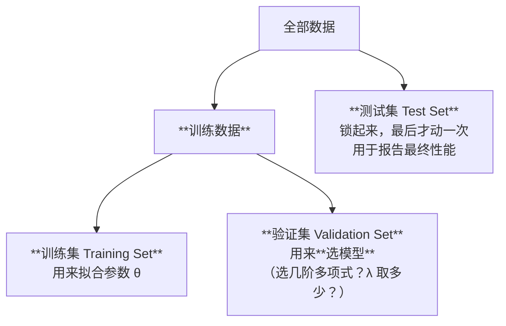

| 集合 | 用来干什么 | 用几次 | 模型见过吗 |
|---|---|---|---|
| **训练集** | 拟合参数 θ | 每个候选模型各一次 | ✅ 直接见过 |
| **验证集** | **在多个候选模型里挑一个** | 每个候选模型各一次 | ⚠️ **间接见过**（你根据它做了选择） |
| **测试集** | 报告最终性能 | **只用一次，最后** | ❌ 完全没见过 |

**为什么验证集不能当测试集用**

因为**你已经用验证集做过决策了**。如果你试了 20 个 λ 值，挑出验证误差最小的那个，那个"最小误差"本身就带有**选择偏差** —— 20 个里的最小值，天然会比真实水平乐观。

**🎙️ 课堂补充**（转录 `01:28:58–01:31:33`）🔀 **本讲最明确的一处课件 ↔ 课堂冲突**

> ### 🔀 冲突：讲义 p.41 说"验证集 ≠ 测试集"，但课堂上这条区分从未被讲，助教还直接把两者当成同一个东西
>
> | 来源 | 说法 |
> |---|---|
> | **讲义 p.41** | 红字 Note：**"validation set is not the same as test set"** |
> | **教授（`01:28:58–01:31:33`）** | 全程只用 "**validation**" 一个词，**从未提到 test set，也没有做任何区分** |
> | **助教（tutorial，`02:30:59`）** | 🎙️ *"we usually do it by … splitting this data into the **training data** and also the **test [set]** — **which is also called the validation data**"* ← **明确说成同一个东西** |
>
> ⚠️ **答题建议**：
> - 若题目问 "**what is the difference between a validation set and a test set**" → **按讲义 p.41 答**（验证集用来选模型、会被间接"看到"；测试集只在最后用一次、用来报告最终性能）。**这是唯一有书面依据的口径。**
> - 若题目只是让你**做**一次数据切分（如小组项目），**按助教的做法就行**：`train_test_split` 切两份即可，不必强行切三份。
> - ⚪ **不要在报告里写"validation = test"**——那是助教的口误式简化，写进书面材料会显得不专业。

🎙️ **★ 教授给了讲义没有的第二个用途：验证集是用来"在多个模型之间挑一个"的**（`01:30:10–01:30:54`）：

> "Imagine that we have so many different regression models, and now we put them on [the] same page: [we] will use the **same validation data set** to [compare] their performance.
> Now … imagine that **I test 10 different regression models** … following the same train[ing] and validation procedure. I use the validation [set to] get [the] performance of the 10 alternative regression models. Now I can use this performance indicator … to evaluate the performance of all these … models **and then I can pick the best one** — **which has the best prediction performance for future and new data points**."

> ⭐ **对比一下**：讲义 p.41 对验证集的定义只有一句 "**use for estimating generalization error**"（估计泛化误差）。教授补的是**第二个、也是更常用的用途**：**模型选择（model selection）**。
> 💡 **两个用途要分清**：
> - **估计泛化误差** = "这个模型在新数据上大概能做到多好？"（**一个**模型）
> - **模型选择** = "这 10 个模型里哪个最好？"（**多个**模型比较）
> ⚪ 正是第二个用途导致了验证集"被间接看到"，从而**不能再兼任测试集** —— 这恰好把讲义那句 Note 的理由补上了。

🎙️ **教授明确预告了后续课程**（`01:30:54`）：

> "And to identify whether we have [an over]fitting issue for th[e] model complexity — **but we will learn that in week 11: we will have model selection, the model [generalization] procedure. We will learn more.**"

→ ✅ **W11 = Model Selection**，与 Syllabus 一致。⚠️ 而 tutorial 的 cell 2 写的是 "to be continued in **week 10**" —— **以教授口述的 W11 为准**。

🎙️ **一句可以直接背的判据**（`01:31:07–01:31:33`）：

> "If we want to validate [the] performance of our model, [the] data points … used for performance [evaluation] should **not** be the training [data]. **So we cannot use [the] training performance to [represent the] performance of your model.**"
> 以及 `01:29:57`：*"**because we know the training error can be misleading**"*

→ ⭐ "**Training error can be misleading**" —— 这句话短、准、可直接写进考卷。

**💡 换个说法（笔记补充）**

- **训练集** = 平时的练习册（做完对答案，改错）
- **验证集** = **模拟考**（用来决定"我该主攻哪一科"）
- **测试集** = **高考**（只考一次，考前绝对不能看）

如果你拿模拟考卷反复刷了 20 遍再去估计自己的高考分数，那个估计一定是虚高的。

**⚠️ 常见误解**

- ❌ **"验证集和测试集是同义词。"** —— 讲义专门用一条 Note 强调它们不同。⚪ 但要承认：**很多教程（包括本课的 tutorial）确实把两者混用**。T02 的 `train_test_split` 得到的 `x_test`，在 notebook 里被当成验证集用（用来算 MAE 和调 alpha），命名却叫 test
- ❌ **"三分法一定要 60/20/20。"** —— 没有固定比例。数据多时测试集可以只占 1%；数据少时可能要用交叉验证（W11）
- ⚠️ **"Drawback: Less data available for training" 是真实代价。** 数据少时切出验证集会明显伤害模型。这正是**交叉验证（cross-validation）**要解决的问题 —— ⏭️ 讲义 cell 2 提到 "Data split for validation (**to be continued in week 10**)"，⚪ 但 Syllabus 的 W11 才是 Model Selection，两处周次对不上

**所以呢**：验证集是干什么用的说清楚了，下一节把它变成一套可以照着执行的具体步骤——留出法。

#### 2.9.4 留出法 Hold-out（讲义 p.43 → p.42 → p.44–45）

> ⚠️ **注意：讲义把这两页印反了。** p.42 是第 3、4 步，p.43 是开头和第 1、2 步。**本笔记按正确顺序讲**（见 [[#9.3 课件自身的问题|§9.3]] 勘误 ⑧）。

**是什么**

§2.9.3 说验证集是"藏起来假装是未来的数据"，这一节把这句话变成一套可以照着做的操作步骤，叫**留出法（Hold-out）**：先把数据切成两份，一份训练、一份留着评分；对每一个候选的超参数（比如"要不要正则化、λ 多大"），都走一遍"用训练集拟合、在验证集上打分"，最后挑打分最好的那一个。

**【讲义 p.43，实为第一页】**

> We would like to pick the model that has **smallest generalization error**.
> Can judge generalization error by using an **independent sample of data**.
>
> **Hold-out procedure:**
> n data points available: `D ≡ {Xᵢ, Yᵢ}ⁿᵢ₌₁`
>
> **1) Split into two sets:**
> - Training dataset `D_T = {Xᵢ, Yᵢ}ᵐᵢ₌₁`
> - Validation dataset `D_V = {Xᵢ, Yᵢ}ⁿᵢ₌ₘ₊₁` ← 红字：**NOT test Data !!**
>
> **2) Use D_T for training a predictor from each model class:**
> $$\hat{f}_\lambda = \arg\min_{f \in \mathcal{F}_\lambda}\hat{R}_T(f) \qquad \text{← Evaluated on training dataset } D_T$$

**【讲义 p.42，实为第二页】**

> **3) Use D_V to select the model class which has smallest empirical error on D_V:**
> $$\hat{\lambda} = \arg\min_{\lambda \in \Lambda}\hat{R}_V(\hat{f}_\lambda) \qquad \text{← Evaluated on validation dataset } D_V$$
>
> **4) Hold-out predictor:** $\hat{f} = \hat{f}_{\hat{\lambda}}$
>
> **Intuition**: Small error on one set of data will not imply small error on a **randomly sub-sampled second set of data**.

**记号翻译**

| 记号 | 意思 |
|---|---|
| `D` | 全部数据 |
| `D_T` / `D_V` | 训练集 / 验证集 |
| **`λ`（lambda）** | **模型类的编号**（比如"几阶多项式""正则化强度多大"）—— 也就是**超参数** |
| $F_\lambda$ | 第 λ 类模型的全体（比如"所有 3 次多项式"） |
| $\hat{f}_\lambda$ | 在 $F_\lambda$ 里、用训练集拟合出来的最好的那个 |
| $\hat{R}_T(f)$ / $\hat{R}_V(f)$ | 在训练集 / 验证集上的经验误差 |
| `λ̂` | 验证误差最小的那个模型类 |

**⭐ 两层优化的结构（这是留出法的精髓）**

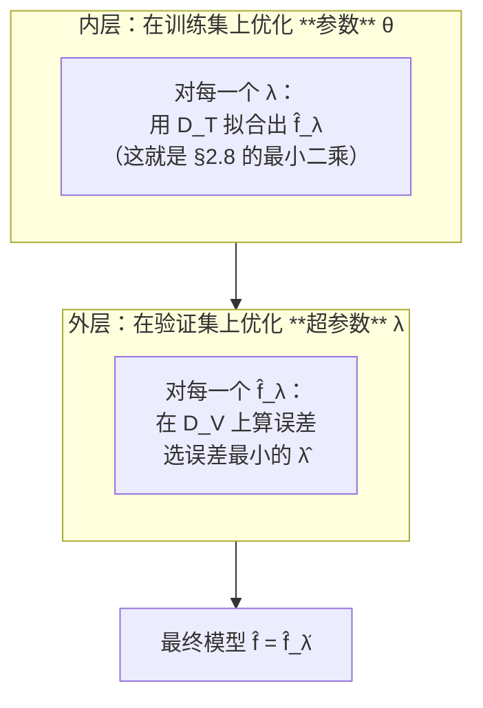

| 层 | 优化什么 | 在哪个集合上 | 例子 |
|---|---|---|---|
| **内层** | **参数** θ（系数） | **训练集** | β₀, β₁, … |
| **外层** | **超参数** λ | **验证集** | 多项式阶数、Ridge 的 α |

**具体例子**（讲义 p.44–45）

p.44 用一个 20 行的小数据集演示切分：左边是完整 Dataset（X 从 1.0 到 20.2，Y 从 3.3 到 61.2），右边同一张表里**用红色高亮标出 4 行**（4.9/14.8、6.3/19.8、7.2/21.8、12.8/38.7）。

> "**Randomly select 80% as training** → Training error"
> "**Rest 20% as validation** → Validation error"

**验算**：4 行 / 20 行 = **20%** ✓

p.45 是另一个例子：$y = 3 \times x + 4 + \varepsilon$，图上蓝点是 Training Data、黄星是 Validation Data、黑点是 prediction line。

> 🔗 **这张图就是 W02 tutorial 的 cell 13 生成的**。见 [[T02-回归实战-从合成数据到Airbnb定价#2.4 【cell 13】用新数据做预测|T02 §2.4]]。

**🎙️ 课堂补充**（转录 `01:31:33–01:32:35`）

🎙️ 教授对 p.45 那张图的口述（**基本就是本笔记 §2.9.4 的内容，但更简短**）：

> "We have **blue data points** here represent[ing the] original training [data]. And we use [a] regression line after model [fitting]. … [Of] course this linear line can fit … [the] training data points well. **But here we need to use a new data set** … [We treat the] **star** [points] as the **new and future data point[s]**, and then we use the … trained linear line to make predictions for the new … validation data set, and use the prediction … gap … as the **validation prediction error** to evaluate the performance of this linear [model]."

**⏭️ 课上略过的三处（都在讲义上有，录音里没有）：**

| 讲义内容 | 说明 |
|---|---|
| **p.44 的 80/20 具体切分**（20 行数据、红色高亮 4 行） | 教授**没有提 80% 这个数字**，也没走那张表。⚪ 助教在 tutorial 里给的是 **70/30**，并说 "**It's your design, you can design [it]**"（`02:31:25`）—— 所以**比例不是考点** |
| **p.41 的 "Drawback: Less data available for training"** | 教授**完全没提留出法的代价**。⚪ 但这是交叉验证存在的理由，值得记 |
| **p.42 / p.43 那四个编号步骤（Intuition + Step 1–4）** | 教授讲的是概念，**没有按编号走那四步**。⚠️ **因此本笔记 §1.3 关于"p.42 与 p.43 印反了"的判断，无法从转录得到证实或证伪** —— 它仍然只是基于页面内容的推断。见 [[#9.5 待核对\|§9.5]] |

**⚠️ 常见误解**

- ❌ **"随机切分永远适用。"** —— **时间序列绝对不能随机切分**！随机切会让模型"用未来预测过去"（数据泄漏）。W07–W08 会专门处理
- ❌ **"80/20 是标准比例。"** —— 讲义用了 80/20，tutorial 用了 **70/30**（`test_size=0.30`）。没有标准答案
- ❌ **"验证集选出的模型一定是最好的。"** —— p.42 的 Intuition 说得很克制：**"在一份数据上误差小，并不意味着在另一份随机抽出的数据上误差也小"** —— 这句话既解释了为什么需要验证集，也暗示了**验证集本身也有随机性**（换个种子切分，选出的 λ 可能不同）

**所以呢**：留出法能"事后"抓出过拟合的模型，但代价是要反复训练很多个候选模型才能挑出一个。下一节介绍一种更省事的思路——训练的时候就不让模型有机会长歪。

---

### 2.10 正则化（讲义 p.46–52）⚠️ 讲义有重要错误

#### 2.10.1 两种等价的写法（讲义 p.46–48）

**是什么**

§2.9 用验证集**事后**发现过拟合；这一节要介绍一种更省事的办法——**在训练的时候就不让模型放飞自我**，从源头上抑制过拟合，而不是等它长歪了再挑。这就是**正则化（regularization）**。p.46 用两句话引入：

> - **Straightforward method to prevent overfitting!**（防止过拟合的直接方法）
> - How it works? **We make some constraints when training our model!**（训练时加一些约束）

**形式 A：带约束的优化**（p.47）

$$\min \sum_{i=1}^{n}\left(y_i - (a_1x_1 + a_2x_2 + \cdots + a_jx_j + b)\right)^2 \quad \textbf{subject to: } R(a) \le r$$

**形式 B：带惩罚的优化**（p.48，讲义写 "Equivalent to"）

$$\min \sum_{i=1}^{n}(y_i - \theta^Tx_i)^2 + \boxed{\lambda \cdot R(a)}$$

> **λ: Regularization parameter, λ ≥ 0**

**为什么需要它**

回到 §2.9.2 的过拟合图：那条剧烈扭动的五次曲线，**它的系数一定非常大**（要让曲线剧烈弯曲，高次项的系数必须很大）。

**正则化的思路**：既然过拟合表现为"系数大得离谱"，那就**在目标函数里给大系数加罚款**。模型想让训练误差降低，就得付出"系数变大"的代价，于是被迫在两者之间权衡。

$$\underbrace{\sum(y_i - \hat{y}_i)^2}_{\text{拟合得好不好}} + \lambda\underbrace{R(a)}_{\text{模型有多复杂}}$$

**💡 换个说法（笔记补充）**

**λ 是"复杂度的价格"。**

- **λ = 0** → 复杂度免费 → 退化成普通最小二乘 → 可能过拟合
- **λ 很小** → 复杂度便宜 → 模型敢用大系数
- **λ 很大** → 复杂度昂贵 → 模型不敢用大系数 → 极端情况下所有系数被压到 0（模型退化成一条水平线 = 欠拟合）

**所以 λ 本身就是一个超参数**，要用 §2.9.4 的验证集来选。这正是 W02 作业第 3 题让你做的事（试 α = 0.001 / 0.01 / 0.1）。

**⚠️ 常见误解**

- ❌ **"λ 越大模型越好。"** —— λ 太大会欠拟合。存在一个**最优的中间值**
- ❌ **"截距 b 也要被惩罚。"** —— **不该惩罚截距**。截距只是把整条线上下平移，与"复杂度"无关。注意 p.47/p.48 的 `R(a)` 里只有 a，没有 b —— 讲义在这一点上是对的（sklearn 也不惩罚 intercept）

**🎙️ 课堂补充**（转录 `01:32:35–01:38:38`）🔴 **两条考试明示都在这一段，而且方向相反，务必读准**

🎙️ **① 教授先给了"为什么需要正则化"的动机 —— 比讲义清楚得多**（`01:32:35–01:35:11`）：

> "If I have so many models, and [I do] model training and model validation **again and again and again**, … maybe it is **not very efficient** … So **do we have an efficient way to deal with overfitting issues?**
> … [Overfitting] means that we introduce[d] an **over-complicated model** … But the question is: **can we just control the model [capacity] during the training process, instead of using a separate validation step to do the post-[hoc] evaluation?**"

> ⭐ **这段话把 §2.9 和 §2.10 的关系讲透了**：
> - **验证集** = **事后**检查（先训练，再看它是不是过拟合了）
> - **正则化** = **事中**控制（在训练时就不让它变复杂）
>
> 💡 **答题时这句对比很好用**："Validation is a *post-hoc* diagnosis; regularization is an *in-training* constraint."

🎙️ **② 教授演示"模型可以无限膨胀"来说明为什么必须约束**（`01:33:34–01:35:11`）：

> "Of course I can use θ₁x₁ as [the] only term in my linear regression. **But that's not the end.** I can use θ₂x₂, I can introduce θ₃x₃, I can [go up to] θ₄, θ₁₀, θ₁₀₀. **I can put many many many … [variables] and high-dimensional information — dump them into the linear regression model and make this model as heavy as possible.** … Of course, the more information you dump into the linear regression model, the [more] the training error can be [reduced]. **But … do we really need to introduce 100 or 1,000 [variables] to make this linear regression huge?**"

→ ⭐ **注意 "dump"（倾倒）这个词**：教授用它来形容"什么都往模型里塞"。这正是 §2.9.1 那个问题（"How many IVs?"）的反面教材。

🎙️ **③ 教授明确点出了拉格朗日乘子法**（`01:36:50–01:37:26`，讲义 p.47→p.48 只写了 "Equivalent to"，**一个字的理由都没给**）：

> "[To] solve this optimization problem with th[e] constraint, we can use the **Lagrangian** … to solve th[e] optimization problem. … [The] **Lagrangian multiplier transformation [goes] from the constrained [optimization] to [the] Lagrangian … without constraint**. … So this constrained [optimization] problem is **equivalent to minimizing this non-constrained problem by moving the constraint back into the objective function**. Now we need to **introduce [the] Lagrangian λ into the objective function.**"

→ ✅ **这解释了 λ 是从哪来的**：λ 不是随便加的一个权重，它是**拉格朗日乘子**。⚪ 也解释了为什么 p.48 写 "λ ≥ 0"。

---

> ### 🔴 教授明示考点 ③：拉格朗日乘子的推导 **不考**
>
> 🎙️ **原话**（`01:36:50–01:37:02`）：
> > "We can use the **Lagrangian** … to solve th[e] optimization problem. **Of course you do not need to understand all this. This [derivation] will not show up in your final.**"
>
> → 与 🔴 考点 ①（正规方程的矩阵推导不考）同一性质：**"约束形式 ⟷ 惩罚形式"之间那一步等价变换，不需要会推。**

> ### 🔴 教授明示考点 ④：**带惩罚项的目标函数本身，可能会考** ⭐
>
> 🎙️ **原话**（`01:37:26–01:38:38`，紧接着 ③ 之后）：
> > "So in addition to the **training error** … the objective function that we need to minimize is [augmented] by the **λ … multiplier, specified manually by the human, times the function R(a)**. Now my objective function **has two terms**: the **training error**, and … the **model capacity** … [term]. … So we want to **balance the training-error reduction and the penalty introduced by your model capacity. Now this may [well] be shown in your final.**"
>
> ⚠️ **转录忠实度说明**：末句 ASR 原文为 *"Now this may have been shown in your final."*，字面读不通。结合上下文（他刚说完"推导不考"，随即指向推导**得到的那个两项目标函数**），最合理的还原是 **"this may (well) be shown in your final"**（这个**可能**会出现在期末）。⚪ **不排除**他说的是 "this may have been shown in [a previous] final"（往年考过），**两种读法都指向同一个结论：这个目标函数是考点。**
>
> **→ 必须能做到的：**
> 1. **写出两项形式**：$\min \sum(y_i - \theta^{\top}x_i)^2 + \lambda \cdot R(a)$
> 2. **说清每一项是什么**：第一项 = **训练误差**；第二项 = **对模型复杂度的惩罚**；λ = **人工指定的权衡系数**
> 3. **说清 λ 的作用**：λ 大 → 更在意复杂度 → 系数被压得更狠；λ = 0 → 退化为普通最小二乘
> 4. **区分 $R(a) = \sum |a_j |$（Lasso）与 $R(a) = \sum a_j^2$（Ridge）**
>
> 💡 **和 🔴③ 合起来看，教授划的线非常清楚**：
> **"推导过程不考，推导的结果要会用。"** 这条线同时适用于 §2.8.3（正规方程）和 §2.10.1（正则化目标函数）。

**所以呢**：正则化的整体思路（罚款模型复杂度）讲完了，但 $R(a)$ 具体长什么样还没定。下一节看第一种具体选法——Lasso，以及它一个很招牌的特性。

#### 2.10.2 Lasso（L1）（讲义 p.49）

**是什么**

§2.10.1 的 $R(a)$ 还没说清楚具体长什么样——它可以是任何"衡量系数有多大"的量。**Lasso** 选的是最直接的一种：把所有系数的**绝对值**加起来当作惩罚。讲义 p.49：

$$R(a) = \sum_{j=1}^{p}\vert a_j\vert \qquad\Longrightarrow\qquad \min\sum_{i=1}^{n}(y_i - (ax+b))^2 + \lambda\sum_{j=1}^{p}\vert a_j\vert$$

**惩罚项是系数的绝对值之和。**

讲义给的三条性质：

> - If **λ = 0**, Lasso regression **is** Linear Regression
> - The regularization may **force some parameter aⱼ = 0** if it has a big variance, so as to **reduce model complexity**
> - If λ is **too large** → **force all aⱼ = 0**

> ⭐ **中间那条是 Lasso 的招牌特性**：它**真的会把一部分系数压到恰好 0**。系数为 0 意味着那个特征**被完全踢出模型** —— 所以 **Lasso 自带特征选择功能**。

**🎙️ 课堂补充**（转录 `01:38:38–01:42:12`）⭐ **教授在这里做了一段讲义完全没有的"逐个变量的成本收益分析"**

这段是理解"**正则化为什么能做特征选择**"的关键推理，讲义只给了结论，没给过程：

> 🎙️ "Now you need to be **very careful**. [Suppose] I already have some [terms] in my model — [do] I … need to introduce a **new dimension aⱼ** into the linear regression? Of course we **can** do that. **But we want to minimize the whole thing — not only [the] training error. We are minimizing the whole thing.**
> So if you introduce one more **aⱼ** into the linear regression, you will … **maybe be able to further reduce the training error** by introducing a new dimension of information. **At the same time you introduce a non-negative penalty of λ × |aⱼ|.**
> **Now you want to make a balance.**"（`01:39:05–01:39:51`）

**教授接着分了两种情况（这就是全部的推理）：**

| 情况 | 教授原话（`01:39:51–01:41:04`） | 结果 |
|---|---|---|
| **① 收益 < 惩罚** | "If the [training-error] reduction … [from adding aⱼ] is **smaller than the penalty** for introducing the new aⱼ, **the whole objective function [will] actually increase** after I introduce [it] … **the more aⱼ … the larger the total objective function we get. It is not [worth] it.** **We are not making [the] model further complicated by introducing more dimensions.**" | ❌ **不引入** → 系数留在 0 |
| **② 收益 >> 惩罚** | "If I introduce aⱼ — yes, I introduce a penalty for aⱼ — **but at the same time the reduction [in] training error is very significant**, [it] is [worth] it. … Even though I will have a small penalty for this new dimension … [the] training error [is] significantly reduce[d]. **Now we should consider a more complicated model.**" | ✅ **引入** → 系数非 0 |

> ⭐⭐ **这就是"稀疏解"的经济学解释**：**每个特征都要为自己"付租金"（λ|aⱼ|），付不起就被踢出去。**
> 💡 这比"L1 的约束区域是菱形、尖角在坐标轴上"那套几何解释**更容易在考场上写出来**，而且它直接回答了"为什么 Lasso 能做特征选择"。**两条都会最好，只会一条就写这条。**

🎙️ **λ 的业务含义**（`01:41:16–01:41:46`）：

> "By making the balance between the training-error reduction and [the] penalt[y] for [a] more complicated regression model, … regularization can make a very good balance between the model complexity and [the] training performance. **The balance is determined by this … [λ] value.**
> **If λ is very big, [it] means that you have a very big concern on the model capacity. So if [λ] is big, only the most useful feature[s] will be considered significantly in your regression line** — because it is a very big penalty for [each] input [feature]."

→ 💡 **"λ 大 = 你对模型复杂度的担忧大 = 只有最有用的特征才配留下"** —— 这句话可以直接背。

**⏭️ 课上略过**：讲义 p.49 上下两条边界情形——"**If λ = 0, Lasso regression is Linear Regression**" 和 "**If λ is too large → force all aⱼ = 0**"——**教授都没有明确讲**（他只讲了"λ 大 → 只留最有用的特征"，没讲极端情形）。⚪ 这两条很好记，而且是"λ 的两端会发生什么"的标准问法，**建议自己补上**。

**所以呢**：Lasso 用绝对值当惩罚，代价是能把系数压到恰好 0（自带特征选择）。下一节看另一种选法——把绝对值换成平方——会不会也有这个特性。

#### 2.10.3 Ridge（L2）（讲义 p.50）

**是什么**

**Ridge** 是 $R(a)$ 的另一种选法：不用绝对值，改用系数的**平方**加总。看起来只是数学符号的小改动，但 §2.10.4 会看到，这个小改动带来的行为差别极大——这正是本讲最常考的一个对比。讲义 p.50：

$$R(a) = \sum_{j=1}^{p}\vert a_j\vert^2 \qquad\Longrightarrow\qquad \min\sum_{i=1}^{n}\left(y_i - (a_1x_1 + \cdots + a_jx_j + b)\right)^2 + \frac{\lambda}{2}\sum_{j=1}^{p}\vert a_j\vert^2$$

**惩罚项是系数的平方和。**

p.50 用红字标注了三块：`Target` / `Prediction result` → 合起来叫 **Training Error**；右边 `Regularization Penalty on model complexity`。

**所以呢**：公式只说了 Ridge 的惩罚项是系数平方和，还没说这个平方和到底会把系数压成什么样子——讲义在这一点上给了一个答案，但下一节会看到这个答案是错的。

#### 2.10.4 🔴 讲义在这里写错了：Ridge 不会把系数压到 0

**是什么**

Lasso 会把部分系数压到恰好 0，那 Ridge 是不是也一样？讲义给的答案是"会"，但这个答案**错了**——这恰恰是 Lasso 与 Ridge 之间最重要、最常被考的那个区别，必须纠正。**讲义 p.50 最后一行红字**：

> "Force some coefficients to be **0**"（强制某些系数为 0）

> 🔴 **这是错的。而且它抹掉了 Lasso 与 Ridge 之间最重要、最常被考的那个区别。**

**🎙️ 课堂补充 —— ✅ 好消息：教授口头讲的是对的**（转录 `01:42:04–01:42:44` 与 `01:45:33–01:46:21`）

这是 v0.9 版 §9.5 里**最需要确认的一条**，转录给出了明确答案：

| | 说法 | 对不对 |
|---|---|---|
| **讲义 p.50 红字** | "**Force some coefficients to be 0**" | ❌ **错**（这是 Lasso 的性质） |
| 🎙️ **教授口述 Ridge 的定义**（`01:42:04`） | *"So for [the] Ridge … **we change the formula into the sum of a-squared**. So for the Lasso [it] is [the] absolute value of aⱼ … [and] here [it] is **the summation of aⱼ squared**."* | ✅ **对**（只讲了公式差别，**没有重复那句红字**） |
| 🎙️ **教授口述 Ridge 的实测结果**（`01:45:33–01:45:54`） | *"If we use [the] Ridge regression by putting the penalty **λ = 0.1**, we can see that the coefficients for the … [first few] input features become normal, **and for the rest of them they become very very small**. Because [the] coefficient values are too small, we can avoid … big penalt[ies] and [the] influence from the higher [powers] … of x."* | ✅ **对，而且用词精准："very very small"，不是 "zero"** |

> ⭐⭐ **结论：教授在课堂上没有重复讲义的这处错误。**
> 讲义写 "force … to be 0"，教授说的是 "**become very very small**"。**两者不一致，而教授是对的。**
>
> **→ 这条直接解决了答题策略上的两难：**
> - **考试若问 Lasso 与 Ridge 的区别，放心按正确答案写**："Lasso 会把部分系数压到**恰好 0**（因此自带特征选择）；Ridge 只会把系数压得**很小但一般不为 0**。"
> - ⚪ **风险很低**：教授自己的口径就是这个，而且**本课自己的 notebook 输出（cell 22，15 个系数全部非零）也支持它**。
> - ⚠️ 唯一要小心的是：**如果考卷上直接照抄了 p.50 那句红字当作选项**，那就按讲义选。但这种情况概率不高。

**⏭️ 教授在 Ridge 这一页上停留不到 40 秒**（`01:42:04–01:42:44`），是本讲**讲得最快**的一页之一。他既没有对比 L1 与 L2 的**行为差异**，也没有给"什么时候用哪个"的建议。⚪ 下面这张对比表**全部是笔记补充**，但它是本讲最标准的考点之一。

**正确的说法**

| | **Lasso（L1）** | **Ridge（L2）** |
|---|---|---|
| 惩罚项 | $\sum \vert a_j \vert$ | $\sum a_j^2$ |
| 对系数的作用 | **压缩，并且把一部分压到恰好 0** | **压缩，但一般不会到恰好 0**（只会非常接近 0） |
| 能否做特征选择 | ✅ **能**（系数变 0 = 特征被剔除） | ❌ **不能**（所有特征都保留，只是权重变小） |
| 擅长的场景 | 特征很多、你相信只有少数几个真正有用 | 特征之间**高度相关**（多重共线性） |
| 解的形状 | 稀疏 | 稠密 |

**几何直觉（为什么 L1 能压到 0，L2 不能）**

约束区域的形状不同：

```
   L1 约束 |a₁|+|a₂| ≤ r          L2 约束 a₁²+a₂² ≤ r
        a₂                             a₂
         │  ╱╲                          │  ___
         │ ╱  ╲     ← 菱形               │ ╱   ╲    ← 圆形
    ─────┼╱────╲──── a₁            ─────┼      │──── a₁
         │╲    ╱      **有尖角**         │ ╲___╱     **没有尖角**
         │ ╲  ╱       尖角在坐标轴上      │           处处光滑
         │  ╲╱        → 最优解容易                   → 最优解落在
         │            落在尖角 → 某个系数 = 0          轴上的概率≈0
```

**误差等高线（椭圆）从外面收缩，第一次碰到约束区域的地方就是解。** 菱形有**尖角**，尖角正好在坐标轴上（意味着某个系数 = 0），椭圆很容易先碰到尖角；圆形处处光滑，碰到坐标轴的概率几乎为零。

**⭐ 本课自己的数据就能反驳讲义**

W02 tutorial 的 cell 22 实际跑出的 **Ridge 系数**（α = 0.1，15 个多项式特征）：

```
intercept=0.788751
a1=-0.021043   a2=0.006600   a3=0.063724   a4=0.101482   a5=0.063904
a6=-0.050368   a7=-0.115335  a8=-0.010430  a9=0.172735   a10=-0.149777
a11=0.062788   a12=-0.015190 a13=0.002171  a14=-0.000171 a15=0.000006
```

**15 个系数，没有一个是 0。** 最小的 a15 = 0.000006，非常接近 0 但**不等于** 0。

> ⚠️ **讲义 p.52 的表格加深了这个误解**：那张表里 Ridge Regression 那一行的 a7 到 a15 **全部显示为 0**。但对照 notebook 的真实输出可以看到，那些"0"是**显示时四舍五入的结果**（a15 = 0.000006 在保留 6 位小数的表格里就成了 0.000000），不是真正的零。见 [[#9.3 课件自身的问题|§9.3]]。

**⚠️ 常见误解**（这一格是本讲最该记牢的）

- ❌ **"Ridge 和 Lasso 都能做特征选择。"** —— **只有 Lasso 能。** 这几乎是所有机器学习考试都会考的一个区分点
- ❌ **"L1 和 L2 只是数学形式不同，效果差不多。"** —— 效果差别巨大：Lasso 给你一个**稀疏**模型（少数特征），Ridge 给你一个**稠密**模型（全部特征，权重都不大）
- 💡 **记忆口诀**：**L**asso → **L**ose features（把特征丢掉）；**R**idge → **R**etain all（全部保留）

**所以呢**：Lasso 与 Ridge 的区别讲完了，都还只是抽象讨论。下一节用同一批数据、同样 15 阶的多项式，把"不加正则化"和"加了正则化"的效果并排摆出来，让这个区别变得看得见。

#### 2.10.5 多项式回归的例子（讲义 p.51–52）

**是什么**

前面几节的"过拟合""正则化"都还停留在概念层面；这一节找一批看得见摸得着的数据，把两种情况的差别摆在眼前——同一批数据、同样复杂的模型，加不加正则化，拟合出来的曲线会判若两条。p.51 给了一批数据（散点从左上到右下呈 S 形，像半个正弦波），并说明要用**多项式回归**（polynomial regression，把 $x, x^2, \dots$ 都当成自变量做的回归，见 §2.2 常见误解）去拟合：

$$y = a_0 + a_1x + a_2x^2 + a_3x^3 + \cdots + a_{15}x^{15}$$

p.52 并排两张拟合结果：

| 左：**"Simple linear regression"**（⚠️ 标题错了） | 右：**Ridge regression** |
|---|---|
| 图标题：*Polynomial regression of power: 15* | 图标题：*Plot for penalty lambda: 0.1* |
| 曲线**剧烈扭动**，在数据末端猛地上翘下拐 | 曲线**平滑**，抓住了整体趋势 |
| 系数量级：intercept **−36,247.8**、a1 **243,862.2**、a2 **−745,882.8**、a3 **1,376,243.5**… 一直到 a15 = 0.017753 | 系数量级：intercept **1.39**、a1 **−0.22**、a2 **−0.034**… a15 显示为 0 |

**⭐ 这两张图并排看，正则化的作用一目了然**：

**同样是 15 阶多项式、同样的数据，只加了一个 λ = 0.1 的惩罚项，系数量级就从"百万级"降到了"小数点后几位"，曲线从"神经质"变成了"平滑"。**

**💡 换个说法（笔记补充）**

不加正则化时，模型为了穿过每个训练点，必须让高次项之间**互相抵消**——所以你会看到 `+1,376,243` 后面跟着 `−1,713,742`，两个百万级的数相减得到一个几十的数。**这种"巨额相消"就是过拟合的数值特征**，也说明模型极不稳定（输入稍微一动，输出就天翻地覆）。

正则化在目标函数里给"系数大"加了罚款，模型就不敢再玩这种把戏了。

**⚠️ 常见误解 / 勘误**

- ⚠️ **左图的标题 "Simple linear regression" 是错的。** 它是**没有正则化的 15 阶多项式回归（OLS）**。"Simple linear regression" 在本讲 p.14 有严格定义 = **一个自变量**的回归。这里有 15 个（x, x²…x¹⁵）。正确的标签应该是 "OLS / Unregularized polynomial regression"。见 [[#9.3 课件自身的问题|§9.3]]
- ⚠️ **p.52 表里的数字与本课 notebook 实际跑出来的数字完全不同**（讲义 intercept = −36,247.8，notebook = 12.368）。两者用的是不同的随机数据。**别去核对这两组数字。**

**🎙️ 课堂补充**（转录 `01:42:44–01:46:21`）

🎙️ **教授在这里现场演示了"多项式回归其实还是线性回归"**——这是 §2.2「常见误解」第二条的课堂版：

> "Originally we only have x and y … [and] we realize that the [relationship] between x and y is **not a simple linear relationship** … [it goes] up … then in [the] middle is very [steep] … so th[e] [relationship] between x and y [is] **nonlinear**. **But we can use the polynomial regression to do the analysis.**
> … At the beginning my data set only has [an] x column and [a] y column. … **Now I can generate new features, new [variables] using x.** For the first column … [it] is x. Now for my second column, I can use x and calculate **x × x** … [for] my third … **x × x × x** … I [can] do x⁴, x⁵, until **x to the power 15**.
> Now my feature input, in addition to the original … x column … **I have 15 columns of x feature[s]**.
> **Now we can see this polynomial regression is actually a linear formula** — this is my original feature x, this is my second feature x², … and this is my 15th feature column. **Now it becomes a linear regression, because x² until x¹⁵ — we already know all these column values.**"（`01:43:39–01:45:23`）

> ⭐⭐ **"Because we already know all these column values" —— 这一句就是全部理由。**
> `x²` 一旦算出来存进表里，它对模型来说**就是一个普通的已知数字列**，和"卧室数量""价格"没有任何区别。模型对参数 `a₂` 仍然是线性的。
> 💡 **所以"线性回归"里的"线性"指的是"对参数线性"，不是"图上是直线"。** 这是本讲最容易被问、也最容易答错的概念题之一。

🎙️ **教授明确说了"造多项式特征 = 特征工程"这件事的操作顺序**（`01:44:22–01:44:40`）：

> "I can also use x × x × x … **as a formula to map the original x column** … **to generate another list of x-cubed value[s]**."

→ 🔗 这正是 tutorial cell 18 那个 `for i in range(2,16): data['x_%d' % i] = data['x']**i` 循环在做的事。见 [[T02-回归实战-从合成数据到Airbnb定价#3.1 【cell 18】造一个非线性数据集 + 造多项式特征|T02-回归实战-从合成数据到Airbnb定价 › 3.1 【cell 18】造一个非线性数据集 + 造多项式特征]]。

**⏭️ 课上略过**：讲义 p.52 那两张图**下方的系数表**（左图 intercept −36,247.8 / a1 243,862.2…，右图 1.39 / −0.22…）——教授只用"**become normal**"和"**very very small**"两个说法概括了量级差别，**没有念任何一个具体数字**。⚪ 但"百万级 vs 小数点后两位"这个量级对比是理解正则化最直观的证据，本笔记保留。

**所以呢**：从简单回归到正则化，本讲的技术内容到这里全部讲完。下一节（也是讲义最后一页）把七条要点摆在一起，看哪些才是教授真正想让你带走的。

---

### 2.11 Take Away（讲义 p.53）

讲义最后一页列了七条：

> - Predictive Modeling
> - Simple and multiple linear regression
> - **Interpretation of the output: coefficient, p-value**
> - **Dummy variables for categorical variables**
> - **Interpretation of dummy variable coefficient**
> - Evaluate model fitness
> - Independent variable selection

> ⭐ **注意这份清单的分布**：**七条里有三条在讲"解读"**（解读输出、虚拟变量、虚拟变量系数），**一条都没提梯度下降、正规方程、MLE**。
>
> ⚪ **这强烈暗示了考试重点**：数学推导（§2.8）是"知道怎么回事"，而**解读输出（§2.6、§2.7.3）才是要能写在卷子上的**。这与官方 CILO 的措辞完全一致（CILO 3「creatively apply and adapt… propose original findings」权重 30%，CILO 4「communicate… results effectively」权重 10%）。

**🎙️ 课堂补充**（转录 `01:46:21–01:48:45`）🔴 **教授逐条口述了 Take Away，措辞比讲义具体得多**

> 🎙️ "So today we provide[d] a very simple predictive model: linear regression. Of course it can be a little bit different from what [you] learned before. **So please remember that this is a warm-up lecture.** … In the later stage[s] we [will] learn how to do … **nonlinear regression analysis and nonlinear classification analysis** using some nonlinear prediction model[s].
>
> So the linear regression is simple, and it has certain **assumptions** to make it valid. And **we need to understand how to interpret the regression outputs, including the coefficient and p-value.**
>
> **For some categorical columns we need to learn how to transform them into … dummy [variables]. Now for n categor[ies] … we need n−1 dummy [variables] … [for] the transformation.**
>
> **And we need to be able to interpret the dummy … coefficients — because [when we] have dummy [variables] [there] is [a] base condition. Non-holiday will be the base condition. [The] coefficients for all other dummies indicate the comparison between the base condition and this category['s] condition.**
>
> And then we learn[ed] how to **evaluate the model performance** … [and] this kind of **regularization for controlling the model complex[ity]** in our study."（`01:46:34–01:47:58`）

**→ 把讲义的七条与教授口述逐条对齐，权重差别一目了然：**

| 讲义 Take Away 七条 | 🎙️ 教授口述时的处理 | 权重信号 |
|---|---|---|
| Predictive Modeling | 一句带过（"a very simple predictive model"） | ⚪ 低 |
| Simple and multiple linear regression | 一句带过 + **补了"有假设才成立"** | ⚪ 中 |
| **Interpretation of the output: coefficient, p-value** | **逐字重复，并点名 coefficient 和 p-value** | 🟡 **高** |
| **Dummy variables for categorical variables** | **展开成完整规则：n 个类别 → n−1 个虚拟变量** | 🔴 **最高** |
| **Interpretation of dummy variable coefficient** | **展开成完整规则：系数 = 该类别与基准条件（non-holiday）的比较** | 🔴 **最高** |
| Evaluate model fitness | 一句带过 | ⚪ 中 |
| Independent variable selection | **换成了"regularization for controlling the model complexity"** | ⚪ 中 |

> ⭐⭐ **七条里教授唯一**展开成完整规则**的是虚拟变量（两条）。** 加上 §2.7.2 里那次"以前学过虚拟变量的举手"（`01:07:33`，几乎没人举手），**虚拟变量是本讲考试信号最强的技术点，没有之一。**
>
> ⚠️ **注意最后一条的替换**：讲义写的是 "**Independent variable selection**"（自变量选择），教授口述时换成了 "**regularization for controlling the model complexity**"。⚪ 两者其实是同一件事的两个说法（Lasso 通过压零做特征选择），但**教授的版本更接近本讲实际讲的内容**。

🎙️ **课程走向的两条预告**（讲义没有）：

1. **"这是一次 warm-up lecture"**（`01:46:34`）—— 本讲是整门课的**热身**，后面会有**非线性回归**与**非线性分类**
2. **Week 11 讲 model selection**（`01:30:54`）—— 见 §2.9.3 🎙️

🎙️ **交接给助教 + 课堂事务**（`01:48:05–01:48:45`）：

> "I think that['s] all for today's lecture. … [Our] **co-instructor will deliver the [tutorial] using Python** to [do] the linear regression and the [analysis] for you. **Please download all the materials on Canvas, including the data and [the] tutorial code template, on your local desk[top], and you should be able to start from the template. At [2] pm.** That is all for the lecture part."

→ ⚠️ **教授在整堂课里没有提到任何作业、截止日期或评分细则。** notebook cell 38 的 Week 2 Assignment（4 题 100 分）**从头到尾没有被宣布过**——⚠️ 但录音的**结尾也缺了一段**（见 [[#9.5 待核对|§9.5]]），所以**不能断定"课上没讲"**。**务必去 Canvas 确认作业与截止时间。**

**所以呢**：这份七条清单就是复习本讲时最后要合上笔记自己默写的一张表——默写不出来的那一条，回到它在 §2 对应的小节重新过一遍。整个 M02 到这里结束，下一步是 T02 的动手练习：把这些公式在真实数据（合成数据 + Airbnb 定价）上跑一遍。

---

## 3. 一图看懂

### 图 1 · 全讲的三段结构

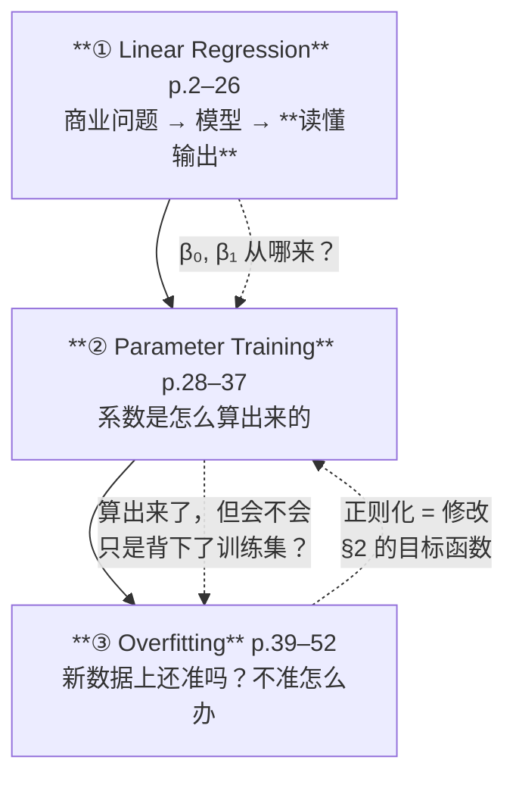

### 图 2 · 鸡蛋案例的完整演进（本讲的主线）

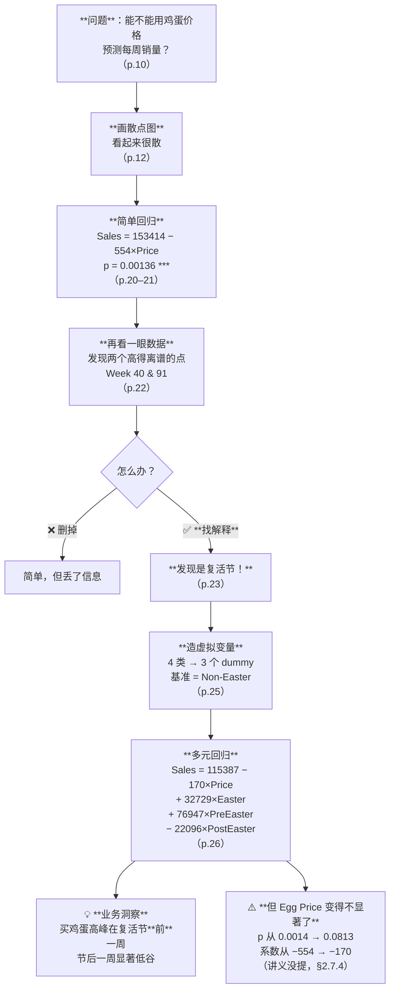

### 图 3 · 参数训练的两条路

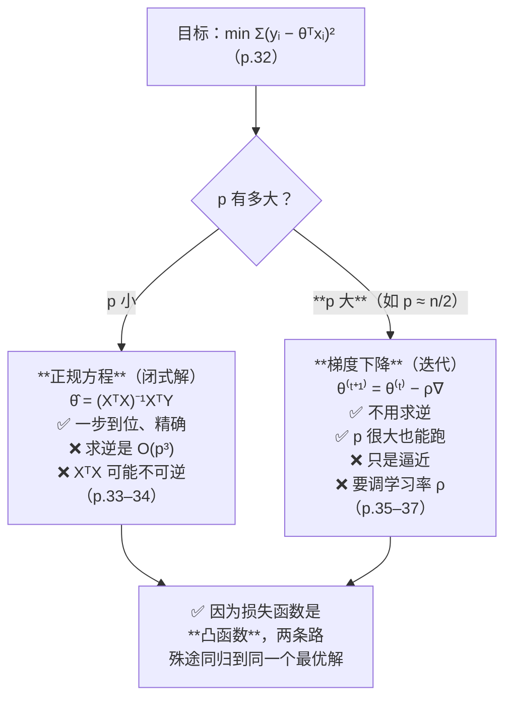

---

## 4. 速查表（考前一页纸）

### 4.1 核心公式

| 名称 | 公式 | 页 |
|---|---|---|
| 简单线性回归 | $Y = \beta_0 + \beta_1 X + \varepsilon$ | p.14 |
| 多元线性回归（含虚拟变量） | $Y = \beta_0 + \beta_1 X_1 + \beta_2 D_1 + \beta_3 D_2 + \beta_4 D_3 + \varepsilon$ | p.25 |
| 向量形式 | $y = \theta^{\top}x + \varepsilon$，$\theta^{\top}x = \sum \theta_i x_i$ | p.30 |
| 噪声模型 | $\varepsilon \sim N(0, \sigma^2)$ | p.30 |
| 条件分布 | $Y \sim N(\theta^{\top}x, \sigma^2)$ | p.18, 31 |
| 最小二乘目标 | $\hat{\theta} = \arg \min \sum(y_i - \theta^{\top}x_i)^2$ | p.32 |
| **正规方程** | **$(X^{\top}X)\hat{\theta} = X^{\top}Y$ → $\hat{\theta} = (X^{\top}X)^{-1}X^{\top}Y$** | **p.34** |
| 梯度下降 | $\theta^{(t+1)} = \theta^{(t)} - \rho (\tau)\nabla \log L(\theta^{(t)}\vert D)$ | p.35 |
| 正则化（约束形式） | $\min \sum(y_i -\hat{y}_i)^2 \ \text{s.t.}\ R(a) \le r$ | p.47 |
| 正则化（惩罚形式） | $\min \sum(y_i -\hat{y}_i)^2 + \lambda \cdot R(a)$，$\lambda \ge 0$ | p.48 |
| **Lasso（L1）** | **$R(a) = \sum \vert a_j \vert$** | **p.49** |
| **Ridge（L2）** | **$R(a) = \sum a_j^2$** | **p.50** |

### 4.2 回归输出表怎么读

| 列 | 含义 | 判断标准 |
|---|---|---|
| **Estimate** | 系数估计值 | **看大小和符号** —— 这是效应大小 |
| **Std. Error** | 系数的波动幅度 | Estimate ± 2×SE ≈ 95% 置信区间 |
| **t value** | `Estimate / Std.Error` | \|t\| > 2 大致对应 p < 0.05 |
| **`Pr(>\|t\|)`** | **p 值** | < 0.05 通常算显著 |
| `***` `**` `*` `.` | 显著性 | <0.001 / <0.01 / <0.05 / <0.1 |

**p 值的正确表述**（⚠️ 讲义写错了，用这个）：
> **在"真实系数 = 0"成立的前提下，观察到当前或更极端结果的概率。**
> ❌ 不是"系数为 0 的概率"。

### 4.3 虚拟变量三步走

1. **数有几个类别**：n 个
2. **造 n−1 个虚拟变量**，剩下那一个是**基准水平（base level）**
3. **读系数**：每个虚拟变量的系数 = **该类别相对基准水平的差**

### 4.4 ⭐ Lasso vs Ridge（本讲最容易考的对比）

| | Lasso (L1) | Ridge (L2) |
|---|---|---|
| 惩罚 | $\lambda \sum \vert a_j \vert$ | $\lambda \sum a_j^2$ |
| 系数会变成恰好 0 吗 | ✅ **会** | ❌ **不会**（只是很小） |
| 特征选择 | ✅ 自带 | ❌ 没有 |
| 适用 | 特征多、真正有用的少 | 特征间高度相关 |
| λ = 0 时 | 退化为普通线性回归 | 退化为普通线性回归 |
| λ → ∞ 时 | 所有系数 → 0 | 所有系数 → 0（但不等于 0） |

> ⚠️ **讲义 p.50 把 Ridge 写成 "Force some coefficients to be 0" 是错的。按上表答题。**

### 4.5 过拟合诊断

| 训练误差 | 测试/验证误差 | 结论 | 对策 |
|---|---|---|---|
| 大 | 大 | **欠拟合** | 加特征、用更复杂的模型、减小 λ |
| **小** | **大** | **过拟合** | **正则化（增大 λ）**、减特征、加数据 |
| 小 | 小 | ✅ 刚好 | — |

### 4.6 三个数据集

| | 用途 | 用几次 |
|---|---|---|
| Training set | 拟合参数 θ | 每个候选模型一次 |
| **Validation set** | **选超参数 λ** | 每个候选模型一次 |
| **Test set** | 报告最终性能 | **只用一次** |

**记住讲义的红字**：`NOT test Data !!`

---

## 5. 双语术语卡

| 中文 | English | 考试可用的英文定义 | 首现 |
|---|---|---|---|
| 预测建模 | Predictive Modeling | Using the relationship between variables, estimated from data, to predict outcomes | §2.2 |
| 回归分析 | Regression Analysis | A statistical procedure used to develop an equation showing how the variables are related | §2.2 |
| 因变量 | Dependent Variable / Target Variable / Response Variable | The thing you want to predict | §2.2.1 |
| 自变量 | Independent Variable / Predictor Variable / Explanatory Variable | Stuff you can use to predict the target | §2.2.1 |
| 简单线性回归 | Simple Linear Regression | Using ONE independent variable to predict ONE dependent variable | §2.5.1 |
| 多元线性回归 | Multiple Linear Regression | Using MORE THAN ONE independent variables to predict ONE dependent variable | §2.7.1 |
| 截距 | Intercept (β₀) | Constant term; the predicted value of Y when all X = 0 | §2.5.1 |
| 斜率 / 回归系数 | Slope / Coefficient (β₁) | The change of Y when X increases by 1 unit, holding other variables constant | §2.5.1 |
| 随机误差项 | Random Error (ε) | The part of Y that the model cannot explain; assumed ε ~ N(0, σ²) | §2.5.1 |
| 同方差 | Homogeneity of Variances / Homoscedasticity | The variance of Y at every value of X is the same | §2.5.2 |
| 残差 | Residual / Deviation | Actual observation minus predicted value | §2.5.3 |
| 最小二乘 | Least Sum of Squares / OLS | The method that minimises the sum of the squared errors (deviations) | §2.5.3 |
| 标准误 | Standard Error | The estimated standard deviation of a coefficient estimate | §2.6.1 |
| **p 值** | **p-value** | **The probability of observing a result as extreme as the current one, assuming the true coefficient is zero** | §2.6.2 |
| 置信区间 | Confidence Interval | Estimate ± 2 × Standard Error gives an approximate 95% CI | §2.6.1 |
| 外推 | Extrapolation | Using values of X that are not contained in the sample data; results are subject to great uncertainty | §2.6.3 |
| 离群点 | Outlier | Data points way outside of the range of the majority of data points | §2.6.4 |
| 虚拟变量 | Dummy Variable | A 0/1 variable used to represent a categorical variable; a variable with n cases needs n−1 dummies | §2.7.2 |
| 基准水平 | Base Level / Reference Category | The category without a dummy variable; indicated when all dummies are zero. Other coefficients are comparisons to it | §2.7.2 |
| 虚拟变量陷阱 | Dummy Variable Trap | Creating n dummies for n categories makes them perfectly collinear with the intercept, so XᵀX is singular | §2.7.2 |
| 条件似然 | Conditional Likelihood | p(y\|x): the density of y given x; under linear model Y ~ N(θᵀx, σ²) | §2.8.2 |
| 极大似然估计 | Maximum Likelihood Estimation (MLE) | Choosing parameters that maximise the probability of the observed data. Under Gaussian noise, MLE = least squares | §2.8.2 |
| **正规方程** | **Normal Equations** | **(XᵀX)θ̂ = XᵀY, giving the closed-form solution θ̂ = (XᵀX)⁻¹XᵀY** | §2.8.3 |
| 梯度下降 | Gradient Descent | An iterative method: θ⁽ᵗ⁺¹⁾ = θ⁽ᵗ⁾ − ρ∇, used when computing (XᵀX)⁻¹ is inefficient | §2.8.4 |
| 学习率 | Learning Rate (ρ) | The step size of each gradient descent update | §2.8.4 |
| 凸函数 | Convex Function | A function with a single minimum; gradient descent is guaranteed to find the global optimum | §2.8.4 |
| 欠拟合 | Underfitting | Large training error — the model is too simple to capture the pattern | §2.9.2 |
| 过拟合 | Overfitting | Small training error but large testing error | §2.9.2 |
| 泛化误差 | Generalization Error | The error on data the model has not seen | §2.9.3 |
| 验证集 | Validation Set | A part of the training data used for estimating generalization error and selecting the model class. **NOT the test set** | §2.9.3 |
| 留出法 | Hold-out Method | Split D into D_T and D_V; train on D_T, select the model class with smallest empirical error on D_V | §2.9.4 |
| 正则化 | Regularization | Training with constraints: minimise the error subject to R(a) ≤ r, equivalently minimise error + λR(a) | §2.10.1 |
| 正则化参数 | Regularization Parameter (λ / alpha) | Controls the strength of the penalty; λ ≥ 0 | §2.10.1 |
| **Lasso 回归** | **Lasso Regression (L1)** | **Penalty R(a) = Σ\|aⱼ\|; may force some coefficients to be exactly zero, thus performing feature selection** | §2.10.2 |
| **Ridge 回归** | **Ridge Regression (L2)** | **Penalty R(a) = Σaⱼ²; shrinks coefficients towards zero but generally not exactly to zero** | §2.10.3 |
| 多项式回归 | Polynomial Regression | y = a₀ + a₁x + a₂x² + … + aₖxᵏ; still a linear model because it is linear in the parameters | §2.10.5 |

---

## 6. 考点预判与答题框架

### 6.1 可信度分级

| 级别 | 含义 |
|---|---|
| 🔴 教授明示 | 转录里教授明确说过**会考 / 不考 / 往年考过** —— **引用原话** |
| 🟡 ILO 反推 | 对应课程 ILO / CILO，官方口径上必须考核 |
| ⚪ 笔记推断 | 我根据内容重要性与讲义强调方式的判断 |

> ✅ **转录已合并（2026-09-09）**。本讲的 🔴 分为两类，**"不考"也是极有价值的信息**——它直接决定复习时间怎么分配：
>
> | | 含义 |
> |---|---|
> | 🔴 **会考 / 往年考过** | 必须练熟 |
> | 🔴❌ **教授明说不考** | **可以只读懂、不必练** |
>
> ⚠️ 但要注意：录音**开头缺 p.1–p.2、结尾在 tutorial 中途截断**（见 §9.5），所以**"没听到教授说"不等于"教授没说过"**。尤其是课程行政信息（考试形式、开卷闭卷、作业占分）**很可能就在缺失的那两段里**。

### 6.2 考点清单

**A. 🔴 教授明示（四条，全部附原话）**

| 可信度 | 考点 | 教授原话（转录时间戳） | 小节 |
|---|---|---|---|
| 🔴🔴 | ⭐ **手算梯度下降迭代**（给 `f`、`x₀`、学习率 η，算出前几步 / 最优值 / 迭代次数）—— **往年期末出过同型题** | `01:23:27` "this is one of the **g[raded] question[s] in the last semester**. And I … remember **in one year of final exam we have [a] similar [question of the] g[radient de]scent calculation. [You] need [to do it] by yourself**"（⚠️ ASR 有噪声，还原说明见 §2.8.4） | §2.8.4 |
| 🔴 | ⭐ **正则化的两项目标函数**：写出 $\min \sum(y_i -\theta^{\top}x_i)^2 + \lambda \cdot R(a)$，说清两项各是什么、λ 的作用、L1 与 L2 的 `R(a)` 分别是什么 | `01:38:20` "we want to **balance the training-error reduction and the penalty introduced by your model capacity**. **Now this may [well] be shown in your final**"（⚠️ ASR 有歧义，见 §2.10.1） | §2.10.1 |
| 🔴❌ | **正规方程的矩阵推导 不考** | `01:15:55` "**of course this will not show up in your final** … **the whole matrix calculation [will] not show [up in] your final**, but we need to figure out a simpler way to calculate θ" | §2.8.3 |
| 🔴❌ | **拉格朗日乘子把带约束问题转成无约束问题的推导 不考** | `01:37:02` "**Of course you do not need to understand all this. This [derivation] will not show up in your final.**" | §2.10.1 |

**B. 🔴 教授明示重点（未直接说"会考"，但明确宣布"要记住 / 这是新东西"）**

| 可信度 | 考点 | 依据（原话 + 时间戳） | 小节 |
|---|---|---|---|
| 🔴 | ⭐⭐ **虚拟变量的完整规则**：n 个类别 → **n−1** 个虚拟变量；少的那个是**基准水平**；其余系数 = **相对基准的差** | ① Take Away 逐字口述（`01:47:10`）："for **n** categor[ies] we need **n−1** dummy [variables]… [the] coefficients for all other dummies indicate **the comparison between the base condition and this category['s] condition**"；② `01:07:33` 全班举手确认"**以前没学过**"："How many of you learn[ed] the dummy variable[s] before? … Okay, good — **you learn[ed] something new**"；③ 讲义 Take Away 七条里**它独占两条** | §2.7.2, §2.7.3 |
| 🔴 | **解读回归输出：系数 + p 值** | Take Away 口述（`01:46:57`）："we need to understand **how to interpret the regression outputs, including the coefficient and p-value**" | §2.6.1, §2.6.2, §2.7.3 |
| 🔴 | **显著性阈值取 0.05 或 0.1**（讲义**没有**写这个数） | `37:24` "usually we will set our [significance] level [at] **0.05 [or] 0.1** … only when the p-value is below … the threshold [can we] trust this regression result" | §2.6.2 |
| 🔴 | **模型评估 + 正则化控制模型复杂度** | Take Away 口述（`01:47:46`）："then we learn[ed] how to **evaluate the model performance** … [and] this kind of **regularization for controlling the model complex[ity]**" —— ⚠️ 注意他**把讲义的 "Independent variable selection" 换成了这一条** | §2.9, §2.10 |

**C. 🟡 ILO 反推 / ⚪ 笔记推断**

| 可信度 | 考点 | 依据 | 小节 |
|---|---|---|---|
| 🟡 | **给一张回归输出表，解释每个系数的业务含义** | 官方 CILO 3（30%）"apply and adapt… propose original findings"；且教授解读时**每句都带 "at the same price level"**（= holding others constant），这是评分点 | §2.6.1, §2.7.3 |
| 🟡 | **区分欠拟合与过拟合，给判据与对策** | Take Away "Evaluate model fitness"；官方 CILO 2（35%）。⚠️ **但教授课上只讲了过拟合，欠拟合整段略过**（§2.9.2 🎙️）—— 仍建议记 | §2.9.2 |
| 🟡 | **区分训练集 / 验证集 / 测试集** | 讲义 p.41 红字 Note。⚠️ **但教授没讲这条区分，助教还把两者说成同一个东西**（§2.9.3 🔀）—— **答题按讲义** | §2.9.3 |
| 🟡 | 三套术语对照（Independent / Predictor / Explanatory；Dependent / Target / Response） | **讲义唯一高亮的一页**（p.5）；教授逐列讲了并补了"温度→出门购物"的例子 | §2.2.1 |
| 🟡 | **Lasso vs Ridge 的关键差别** | 机器学习课标准考点；⚠️ **讲义 p.50 写错了，但教授口述是对的**（"become very very small"）→ **按正确答案写** | §2.10.4 |
| 🟡 | **线性回归的四条假设** | p.17 是结构化列表；教授花了 6 分钟逐条操作化（§2.5.2 🎙️），**是全讲停留最久的单页之一** | §2.5.2 |
| ⚪ | **外推风险**（不要用样本范围外的 X） | p.21 唯一的红色警告三角；教授明确说这是"讲完第一个模型必须提醒的两件事"之一，并给了"价格=0"的反例 | §2.6.3 |
| ⚪ | **离群点的两条处理路径 + 三种成因** | p.23 方法论价值最高；教授补了"录入错误"这一成因和"取决于你要不要那部分信息"的判据 | §2.6.4 |
| ⚪ | 复述 $\hat{\theta} = (X^{\top}X)^{-1}X^{\top}Y$、说明它是闭式解、以及**为什么 X 很大时算不动** | 🔴❌ 推导不考，但"**为什么慢 → 所以要梯度下降**"这条逻辑链是教授说这句话的**语境本身**，且讲义 p.35 标题就是 "What if p is large?" | §2.8.3 |
| ⚪ | **"多项式回归仍然是线性回归"** | 教授现场演示了造 x²…x¹⁵ 特征列，并说 "**now it becomes a linear regression, because we already know all these column values**"（`01:45:08`） | §2.10.5, §2.2 |
| ⚪ | **加入新变量后老变量系数剧变**（−554 → −170）的解释 | 教授给了几何解释（离群点把线拽上去），讲义只字未提；⚪ 本笔记补了"遗漏变量偏误"的统计解释 | §2.7.4 |

### 6.3 答题框架

**题型 A：「解释下面这张回归输出表」（最可能的大题）**

> **① 先说模型是什么**：这是一个多元线性回归，因变量是 X，自变量有 A、B、C（其中 B、C 是类别变量 D 的虚拟变量，基准水平是 …）
> **② 逐个解释系数**（用"在其他变量不变的前提下"开头）：
> - 连续变量：X 每增加 1 单位，Y 的预测值变化 β 个单位
> - **虚拟变量：该类别比基准水平高/低 β 个单位** ← **别漏掉"比基准"三个字**
> - 截距：所有 X 为 0、且处于基准类别时的预测值。**若 X=0 不在数据范围内，说明它无实际业务含义**
> **③ 判断显著性**：p < 0.05 的系数有 …；p ≥ 0.05 的系数**没有足够证据**说明它有影响（**不要说"证明它没有影响"**）
> **④ 给一个具体预测**：代入一组具体的 X 值算出 ŷ
> **⑤ 给业务建议**：这些系数意味着管理者应该做什么
> **⑥ 加分点**：指出外推风险、离群点、或某个变量不显著却仍被保留

**题型 B：「这个模型过拟合了吗？怎么办？」**

> **① 看两个误差**：训练误差 vs 验证/测试误差
> **② 下判断**：训练误差小 + 测试误差大 = 过拟合；两个都大 = 欠拟合
> **③ 给对策**（过拟合）：
> - **正则化**：加 L1 或 L2 惩罚，用验证集选 λ
> - 减少自变量个数（讲义 p.39 的 "How many IVs…"）
> - 增加训练数据
> - 降低模型复杂度（多项式降阶）
> **④ 说清怎么验证对策有效**：用**验证集**比较，**不要动测试集**
> **⑤ 加分点**：说明选 L1 还是 L2 —— 若想同时做特征选择用 **Lasso**；若特征之间高度相关用 **Ridge**

**题型 C：「为什么 n 个类别只造 n−1 个虚拟变量？」**

> ① 若造 n 个，这 n 列在每一行的和恒等于 1
> ② 而截距项相当于一个恒为 1 的列
> ③ 因此这 n 列与截距列**完全线性相关**
> ④ 导致 **$X^{\top}X$ 奇异、不可逆**，正规方程 $\hat{\theta} = (X^{\top}X)^{-1}X^{\top}Y$ 无解
> ⑤ 这称为**虚拟变量陷阱（dummy variable trap）**
> ⑥ 少掉的那一类成为**基准水平**，其余系数解释为"相对基准的差"

**题型 D：「Lasso 和 Ridge 有什么区别？」**

> ① **惩罚项**：L1 是绝对值之和，L2 是平方和
> ② **关键差别**：**Lasso 会把部分系数压到恰好 0，Ridge 只会压小但一般不到 0**
> ③ **推论**：Lasso **自带特征选择**，Ridge 不能
> ④ **几何解释**：L1 的约束区域是**菱形，有尖角落在坐标轴上**，误差等高线容易先碰到尖角 → 某系数 = 0；L2 是**圆形，处处光滑**，碰到坐标轴的概率几乎为 0
> ⑤ **选择建议**：特征多而真正有用的少 → Lasso；特征之间高度相关 → Ridge
> ⑥ **共同点**：λ = 0 时都退化为普通线性回归；λ 越大惩罚越强

**题型 E：🔴🔴「手算梯度下降」（往年期末出过同型题，见 §6.2 A 组第一条）**

> 给定：函数 `f(x)`、初值 `x₀`、学习率 `η`。问：前 k 次迭代的 x 值 / 最优值 / 大约需要几次迭代。
>
> **标准答题步骤（把每一步都写出来，过程分比结果分多）：**
>
> ```
> ① 写出更新式：      x_{k+1} = x_k − η · f′(x_k)
> ② 求导：            f′(x) = …                        ← 别跳这一步
> ③ 逐次代入，列表：
>       k    x_k       f′(x_k)      x_{k+1}
>       0    −3        2(−3+5)=4    −3 − 0.2×4 = −3.8
>       1    −3.8      2(−3.8+5)=2.4 −3.8 − 0.2×2.4 = −4.28
>       …
> ④ 停止条件：        f′(x_k) = 0（等价说法：x 不再变化，x_{k+1} = x_k）
> ⑤ 最优值：          令 f′(x)=0 直接解出（本例 x* = −5），并说明迭代在收敛到它
> ⑥ 若问"几次迭代"：  说明是**渐近收敛**，需给一个精度标准（如 |x_k − x*| < 0.01）才有确定答案
> ```
>
> ⭐ **两个加分点**：
> 1. **指出这是一个凸（二次）函数，所以梯度下降保证收敛到全局最优**（讲义 p.36 图上就印着 "Convex Function"）
> 2. **讨论学习率**：η 太小→收敛慢；η 太大→震荡甚至发散；本例 η 需满足 `0 < η < 1`（见 §2.8.4 的学习率表）
>
> ⚠️ **不要**在这道题上写正规方程 $\hat{\theta}=(X^{\top}X)^{-1}X^{\top}Y$ —— 教授明说矩阵计算不考（🔴❌），写了也不得分，还会占掉时间。

---

## 7. 自测

### 概念题

**1.** 写出线性回归的四条假设，并说明违反第 3 条会导致什么后果。

<details><summary>答案</summary>

**四条假设**（讲义 p.17）：
1. The relationship between X and Y is **linear**（X 与 Y 是线性关系）
2. Y is distributed **normally** at each value of X（每个 X 处 Y 服从正态分布）
3. **The variance of Y at every value of X is the same**（homogeneity of variances，同方差）
4. The observations are **independent**（观测相互独立）

**违反第 3 条（异方差）的后果**：
系数估计值 β̂ **仍然是无偏的**（平均而言不偏），**但标准误的估计会失真**，通常会**低估**标准误。

后果链条：标准误偏小 → t 值偏大 → **p 值偏小** → **你会误以为某个变量显著，而它其实不是**。

**怎么发现**：画"残差 vs 预测值"散点图，若呈**喇叭形**（越往右越发散）就是异方差。

**加分**：p.18 的图正是假设 ②③ 的可视化——每个 X 处画一个正态分布，且**宽度处处相同**。
</details>

**2.** 讲义 p.20 说 p 值是"真实斜率为 0 的概率"。这句话对吗？给出正确的表述。

<details><summary>答案</summary>

**不对，这是统计学里最经典的一个错误。**

**正确表述**：p 值 = **在"真实斜率 = 0"（原假设）成立的前提下，观察到当前这个或更极端结果的概率**。

$$p = P(\text{数据这么极端} \mid \text{真实斜率} = 0)$$

**讲义说的是**：`P(真实斜率 = 0 | 数据)` —— **条件方向反了**。

**为什么这个区分重要**：频率派统计**根本不给参数分配概率**。真实斜率是一个固定的（未知的）数，它要么是 0 要么不是，没有"概率"可言。要谈"参数为某值的概率"必须用贝叶斯方法。

**用鸡蛋案例的数字说**：p = 0.00136 的意思是——**如果鸡蛋价格真的对销量毫无影响，我们碰巧收集到这么强的负相关证据的概率只有 0.136%**。因为太罕见，所以我们拒绝"无影响"这个假设。

**顺带**：讲义关于置信区间的说法（"95% 的概率真实斜率落在 −217 到 −889 之间"）也不严谨。严谨表述是：**如果重复抽样很多次、每次都构造一个这样的区间，其中约 95% 的区间会覆盖真实斜率。**
</details>

**3.** 某数据集有一个类别变量 `city`，取值为 NYC / LA / SF / DC / Chicago / Boston。你要把它放进回归模型。① 造几个虚拟变量？② 如果你选 NYC 当基准，某个模型给出 `SF` 的系数是 0.42，怎么解读？③ 如果不小心造了 6 个虚拟变量会怎样？

<details><summary>答案</summary>

**① 造 5 个**（n = 6 个类别 → n − 1 = 5 个虚拟变量）。

**② 解读**：**在其他自变量保持不变的前提下，SF 的房源比 NYC 的房源，因变量高 0.42 个单位。**

⚠️ 关键是"**比 NYC**"三个字。虚拟变量的系数**永远是相对基准水平的差**，不是绝对水平。

（若因变量是 `log_price`，还要再翻译一层：`e^0.42 − 1 = 0.52`，即**贵约 52%**。见 [[IS6400_Business_Data_Analytics/_meta/数据集卡片#4.2 为什么用 log 而不用 price|数据集卡片 › 4.2 为什么用 log 而不用 price]]。）

**③ 造 6 个会怎样**：
这 6 列在**每一行的和恒等于 1**，而截距项相当于一个恒为 1 的列，所以这 6 列与截距**完全线性相关**。

后果：**$X^{\top}X$ 变成奇异矩阵，不可逆**，正规方程 $\hat{\theta} = (X^{\top}X)^{-1}X^{\top}Y$ 无解。这就是**虚拟变量陷阱（dummy variable trap）**。

（实践中：sklearn 用的是伪逆/最小二乘求解器，不会直接报错，而是会给出一组**不唯一**的系数——这更危险，因为你不知道出了问题。所以要用 `OneHotEncoder(drop='first')`。）
</details>

**4.** 什么时候必须用梯度下降而不能用正规方程？梯度下降在线性回归上会陷入局部最优吗？

<details><summary>答案</summary>

**必须用梯度下降的情况**：

**① p（参数个数）很大时。** 讲义 p.35 标题就是 "What if p is large? (e.g., n/2)"。原因：$(X^{\top}X)^{-1}$ 是 p×p 矩阵求逆，计算量约 **O(p³)**。p = 10,000 时是 10¹² 次运算，实际不可行。

**② $X^{\top}X$ 不可逆时**（特征完全共线，或 p > n）。这时闭式解根本不存在。

**③ 数据太大装不进内存时**（随机梯度下降可以一次只看一批数据）。

**会陷入局部最优吗？——不会。**

因为线性回归的平方误差损失函数是**凸函数（convex function）**，讲义 p.36 明确标注了 "Convex Function"。凸函数**只有一个最低点**，所以梯度下降（只要学习率合适）**保证收敛到全局最优**。

⚠️ **对比**：神经网络的损失函数**不是**凸的，才会有局部最优、鞍点这些问题——那是 W09 的烦恼。
</details>

**5.** ⭐ Lasso 和 Ridge 最关键的区别是什么？讲义在这一点上说对了吗？

<details><summary>答案</summary>

**最关键的区别**：

| | Lasso (L1) | Ridge (L2) |
|---|---|---|
| 惩罚项 | $\lambda \sum \vert a_j \vert$ | $\lambda \sum a_j^2$ |
| **系数会变成恰好 0 吗** | ✅ **会** | ❌ **不会**（只会非常接近 0） |
| 因此 | **自带特征选择** | 所有特征都保留 |

**讲义说错了。** 讲义 p.50 的 Ridge 页最后一行红字写着 "**Force some coefficients to be 0**" —— 这是 **Lasso 的性质，不是 Ridge 的**。

**几何解释**：L1 的约束区域 $\vert a_1\vert+\vert a_2\vert \le r$ 是**菱形，有尖角，尖角正好落在坐标轴上**；误差等高线（椭圆）从外向内收缩时，很容易先碰到尖角，而尖角上某个坐标 = 0。L2 的约束区域 $a_1^2+a_2^2 \le r$ 是**圆形，处处光滑**，碰巧碰到坐标轴的概率几乎为零。

**本课自己的数据就能反驳讲义**：W02 tutorial cell 22 的 Ridge 输出（α = 0.1，15 个多项式项）：
```
a1=-0.021043 … a13=0.002171  a14=-0.000171  a15=0.000006
```
**15 个系数没有一个是 0。** 最小的 a15 = 0.000006，接近 0 但不等于 0。

（讲义 p.52 的表里 Ridge 的 a7–a15 显示为 0，那是**四舍五入的显示效果**，不是真正的零。）

**答题时按正确版本写。**
</details>

**6.** 训练集、验证集、测试集三者的分工是什么？为什么验证集不能当测试集用？

<details><summary>答案</summary>

| 集合 | 用途 | 用几次 |
|---|---|---|
| **训练集 Training set** | 拟合**参数** θ（系数） | 每个候选模型各一次 |
| **验证集 Validation set** | 选**超参数** λ（多项式阶数、正则化强度、用几个自变量） | 每个候选模型各一次 |
| **测试集 Test set** | 报告最终性能 | **只用一次，最后** |

**为什么验证集不能当测试集**：

因为**你已经用验证集做过决策了**。如果你试了 20 个 λ 并挑出验证误差最小的那个，那个"最小误差"带有**选择偏差** —— 20 个数里的最小值，天然会比真实水平乐观（你是在向验证集的随机噪声"过拟合"）。

讲义在 p.41 和 p.43 两处都强调了这一点，p.43 甚至用红字写 **"NOT test Data !!"**。

**类比**：训练集 = 练习册，验证集 = 模拟考（用来决定主攻哪科），测试集 = 高考（只考一次）。拿模拟考卷刷 20 遍再估自己的高考分，那个估计一定虚高。

**代价**（讲义也说了）：**"Drawback: Less data available for training"** —— 切出验证集会减少可用于训练的数据。数据少时这个代价很大，解决办法是交叉验证（W11）。
</details>

### 案例分析题

**7.**（讲义 p.20 vs p.26）在简单回归里 Egg Price 的系数是 **−553.9（p = 0.00136 `**`）**；加入三个复活节虚拟变量后变成 **−170.15（p = 0.0813）**。请解释这个变化，并说明它对结论意味着什么。

<details><summary>参考思路</summary>

**观察到什么**：
- 系数**从 −553.9 缩到 −170.15**（不到原来的三分之一）
- p 值**从 0.00136（高度显著）变成 0.0813（在 5% 水平上不显著）**

**为什么会这样 —— 混淆（confounding）/ 遗漏变量偏误**：

复活节前后，鸡蛋的**需求暴涨，同时价格也被推高**。在简单回归里，模型只看到"价格"这一个变量，于是**把复活节造成的销量波动错误地记到了价格头上**，给了价格一个被夸大的负系数。

一旦把复活节单独拎出来当自变量，价格的**净效应**（在控制复活节之后）才显露：只有 −170，而且统计上站不住。

**对结论意味着什么**：

1. **不能说"价格不影响销量"**。p = 0.0813 只意味着"**没有足够证据**说明在控制复活节后价格仍有影响"。可能只是样本量不够（两年 ≈ 104 周）
2. **简单回归的系数很容易被遗漏变量污染**。这是"相关不等于因果"在回归里的具体形态
3. **加入新变量后老变量的系数剧变，本身就是一个诊断信号**：说明两个变量相关，或存在混淆
4. **但预测函数里仍然保留了 Egg Price**（讲义 p.26 的 $\text{Sales} = 115387 - 170 \times \text{Egg Price} + \dots$）。⚪ 严谨的做法应当是：要么剔除它重新拟合，要么在报告里明确注明"该系数在 5% 水平上不显著"

**⚠️ 讲义完全没有评论这个变化**，但它是本讲最有教学价值的现象。

**加分 · 孪生例子**：W02 tutorial 里 Airbnb 数据的 `beds` 系数是**负的**（"床越多越便宜"），原因同样是自变量之间高度相关（`accommodates` 与 `beds` 的相关系数高达 **0.829**）。见 [[IS6400_Business_Data_Analytics/_meta/数据集卡片#5.1 ⭐ 严重多重共线性（做多元回归必踩）|数据集卡片 › 5.1 ⭐ 严重多重共线性（做多元回归必踩）]]。
</details>

**8.** 某电商想预测每个用户下个月的消费额。他们有 5,000 个用户、**800 个特征**（浏览行为、点击、历史订单等）。团队用普通线性回归，训练集 R² = 0.94，测试集 R² = 0.31。请诊断问题并给出至少三条对策，说明每条为什么有效。

<details><summary>参考思路</summary>

**诊断：典型的过拟合**

训练误差极小（R² 0.94）+ 测试误差很大（R² 0.31），完全符合讲义 p.40 的判据 "**Small training error, Large testing error**"。

**根本原因**：n = 5,000、p = 800，**p/n = 16%**，特征密度很高。讲义 p.35 说 "What if p is large? (e.g., n/2)" —— 这个案例已经接近那个量级。特征越多，模型越容易把训练集的噪声也拟合进去。

**对策一 · 正则化（最直接）**
- 用 **Ridge** 或 **Lasso**（讲义 §2.10）
- **为什么有效**：过拟合的数值特征是"系数大得离谱、互相抵消"。在目标函数上加 $\lambda R(a)$ 后，大系数要付代价，模型被迫用更平缓的解
- **选哪个**：
  - 若怀疑 800 个特征里只有几十个真正有用 → **Lasso**（能把无用特征的系数压到恰好 0，自带特征选择）
  - 若怀疑特征之间高度相关（浏览次数和点击次数几乎必然相关）→ **Ridge**
  - ⚪ 实务上可以两个都试，用验证集选
- **怎么定 λ**：用**验证集**（§2.9.4），试一组 λ，选验证误差最小的那个。**不要用测试集调 λ**

**对策二 · 减少自变量个数**
- 讲义 p.39 直接问 "**How many IVs provide the best performance for 'future' prediction?**"
- 方法：Lasso 自动做；或等 W03 学 **PCA / Feature Selection**
- **为什么有效**：模型的"自由度"减少，能背下的噪声就少了

**对策三 · 增加训练数据**
- 5,000 个用户对 800 个特征太少了。加到 50,000 用户，p/n 降到 1.6%
- **为什么有效**：噪声在更多样本上会互相抵消，模型更难把它当成规律

**对策四 · 换更简单的模型 / 检查特征质量**
- 检查有没有**数据泄漏**：某个特征其实包含了"下个月消费额"的信息（比如"下个月首单金额"），会造成训练集 R² 虚高
- ⚠️ **训练 R² 0.94 高得可疑**，先排除泄漏再谈过拟合

**怎么验证对策有效**
- 在**验证集**上比较各方案，**测试集只在最后动一次**（§2.9.3）
- 目标不是"训练 R² 更高"，而是**训练与测试 R² 的差距缩小、且测试 R² 上升**

**⚠️ 不要做的事**
- 不要反复用测试集调参然后报告测试集分数 —— 那个分数会虚高
- 不要因为测试 R² 低就一味加特征（那是欠拟合的对策，方向反了）
</details>

**9.** 手算：用梯度下降求 $y = (x+5)^2$ 的最小值，初值 `x₀ = −3`。① 学习率 0.2 时第 1、2 次迭代的结果是什么？② 大约需要几次才能精确到小数点后两位？③ 如果学习率取 1.0 会发生什么？

<details><summary>答案</summary>

**准备**：`dy/dx = 2(x+5)`，更新式 $x_{k+1} = x_k - \rho \cdot 2(x_k + 5)$。

**① 前两次迭代**（ρ = 0.2）
- $x_1 = -3 - 0.2 \times 2 \times (-3+5) = -3 - 0.2 \times 4 = \mathbf{-3.8}$ ✓（与讲义 p.37 一致）
- $x_2 = -3.8 - 0.2 \times 2 \times (-3.8+5) = -3.8 - 0.2 \times 2.4 = \mathbf{-4.28}$

**② 需要几次**

设 `eₖ = xₖ + 5`（离最优点 −5 的距离）：
$$e_{k+1} = e_k - 0.4e_k = 0.6\,e_k$$

**每次迭代误差乘 0.6。** 起点 `e₀ = 2`。

| 迭代 | x | 误差 |
|---|---|---|
| 0 | −3 | 2 |
| 1 | −3.8 | 1.2 |
| 2 | −4.28 | 0.72 |
| 5 | −4.8445 | 0.156 |
| 10 | −4.9879 | 0.0121 |
| **11** | −4.9927 | **0.0073 < 0.01** ✅ |

**约 11 次迭代**可精确到小数点后两位。最优值 **x = −5**（与用求导法 `2(x+5)=0` 得到的答案一致 ✓）。

**③ 学习率 = 1.0**

收缩因子变成 $1 - 2\rho = 1 - 2 = \mathbf{-1}$：
$$e_{k+1} = -e_k$$

误差**大小不变、符号翻转**，即：
`−3 → −7 → −3 → −7 → …` **永远在两点之间来回跳，永不收敛。**

**一般规律**（对这个函数）：

| ρ | 收缩因子 (1−2ρ) | 行为 |
|---|---|---|
| 0.2 | 0.6 | ✅ 稳步收敛 |
| **0.5** | **0** | ✅✅ **一步到位** |
| 0.9 | −0.8 | ⚠️ 振荡但收敛 |
| **1.0** | **−1** | ❌ **永远振荡** |
| 1.5 | −2 | ❌ **发散**，越跳越远 |

收敛条件：$\vert 1 - 2\rho\vert < 1$，即 **0 < ρ < 1**。

💡 这就是"学习率太大会发散"的完整数学解释。
</details>

---

## 8. 讲义页码映射

**「课堂覆盖」列的图例**

| 记号 | 含义 |
|---|---|
| ✅ **详讲** | 教授在课上完整讲了这一页 |
| ⚡ **简略** | 提到了，但一句话带过 / 明显快于其他页 |
| ⏭️ **略过** | **有证据**表明教授没讲（转录里对应内容完全缺席，且前后页衔接连续）→ **可降复习优先级** |
| 🎙️ **课外展开** | 讲义没有、课上讲了 → **本笔记的高价值内容** |
| ❓ **无录音** | 落在录音缺口里，**无法判断讲没讲** → ⚠️ **不可降优先级** |

| 笔记小节 | 讲义页 | 课堂覆盖 | 转录时间 |
|---|---|---|---|
| §0（第一段标题页 + Reading Material） | **p.1** | ❓ **无录音** | — |
| §2.1 在 CRISP-DM 的位置 | **p.2** | ❓ **无录音** | — |
| §2.2 预测建模 | p.3 | ✅ 详讲（**开头一两句落在缺口里**）+ 🎙️ **股票 / 时间序列的例子讲义没有** | `00:02–02:35` |
| §2.2 三个商业场景 | p.4 | ✅ **详讲，且三个场景全部被换成更具体的版本** + 🎙️ TikTok 100 万投放 / iPhone 涨价 9000→10000 / 保险特征清单 | `02:35–06:58` |
| §2.2.1 三套术语 🟨 | **p.5** | ✅ **详讲** + 🎙️ 温度→出门购物（Response 的来历） | `06:58–09:23` |
| §2.2.2 DV / IV 三例 | p.6 | ✅ **详讲，且当成随堂问答逐个问了一遍** | `09:23–12:02` |
| §2.3 GDP 与幸福感四步流程 | p.7, 8, 9 | ✅ **详讲（近 7 分钟）** + 🎙️ **插入了讲义没有的"探索数据"一步** + 🎙️ "关系被存进直线，之后不再需要原始数据" | `12:02–18:52` |
| §2.4 鸡蛋案例：问题与数据 | p.10, 11 | ✅ 详讲，但 🔀 **问题被改写成"优化下周定价以最大化收入"** | `19:08–21:15` |
| §2.4 散点图 | p.12 | ✅ 详讲；⏭️ **页上那两个具体问题（"At \$.80 / At \$1.05 会卖多少"）没有作答** | `21:15–23:00` |
| §2.4 散点图 → 代数式 | p.13 | ✅ 详讲 + 🎙️ **补了"为什么先试最简单的直线"的两条理由** | `23:00–24:08` |
| §2.5.1 简单线性回归公式 | p.14 | ✅ 详讲；⏭️ **随机误差项 ε 完全没提** | `24:08–25:27` |
| §2.5.1 回归线示意图 | p.15 | ⚡ 简略（口头带过"改一个参数就是另一条线"） | `25:15–25:27` |
| §2.8.2 条件概率的伏笔 | **p.16** ⤵️ | ✅ **详讲，教授在原位就点破了**："this is very similar to the **conditional probability**" | `25:27–26:07` |
| §2.5.2 四条假设 | **p.17** | ✅ **详讲，全讲停留最久的单页之一（6 分钟）** + 🎙️ **"按 X 分组"的操作化检查法** + 🎙️ 股价时间序列作为独立性反例；⏭️ 术语 "homogeneity of variances" 没说 | `26:07–30:06` |
| §2.5.2 条件分布图（无标题页） | p.18 | ✅ **详讲** + 🎙️ **提前把 p.31 的条件似然思想讲了** | `30:06–32:18` |
| §2.5.3 曲线拟合 | p.19 | ✅ 详讲 | `32:18–33:47` |
| §2.6.1 系数表四列 | p.20 | ✅ **详讲** + 🎙️ **"Only God will know the true slope"**；⏭️ **`t value` 这一列整个跳过** | `33:47–36:35` |
| §2.6.2 p 值 | p.20 | 🔀 **详讲，但教授把讲义的错误定义原样复述了一遍**；🎙️ **补了讲义没有的显著性阈值 0.05 / 0.1** | `36:35–37:48` |
| §2.6.3 外推警告 ⚠️ | p.21 | ✅ **详讲** + 🎙️ 价格=10 / 价格=0 两个反例 + 🎙️ "Maybe not. But we never know." | `37:48–40:23` |
| §2.6.4 离群点 | p.22 | ✅ 详讲（"这条线在两个离群点上误差极大"） | `40:23–41:16` |
| §2.6.4 离群点的两条路 | p.23 | ✅ **详讲** + 🎙️ **补了讲义没有的"三种成因"（含录入错误）与取舍判据** | `41:16–43:17` |
| §2.7.1 多元回归 · 类别变量的问题 | p.24 | ✅ **详讲** + 🎙️🎙️ **双十一四阶段需求曲线（本讲最值钱的一段）** | `43:17–48:08` |
| — | — | ☕ **课间**（教授："So let's have a break and we will be back at 1pm"） | `48:18–58:52` |
| §2.7.2 虚拟变量与 n−1 | **p.25** | ✅ **详讲** + 🎙️ **给出的理由是"信息冗余"而非"矩阵不可逆"**；⏭️ 没说 "dummy variable trap" | `58:52–01:01:36` |
| §2.7.3 解读虚拟变量系数 | **p.26** | ✅ **详讲（近 6 分钟）** + 🎙️ **"at the same price level" 说了两遍**；⏭️ **PreEaster（+76,947，最大的系数）没有解读** | `01:01:36–01:07:33` |
| §2.7.4 Egg Price 系数剧变 | p.20 vs p.26 | 🎙️ **教授讲了，但给的是几何解释（离群点把线拽上去）**；⏭️ **p 值的变化没提** | `01:03:29–01:04:41` |
| （课堂互动：以前学过虚拟变量吗） | — | 🎙️ **课外**（几乎无人举手 → "you learn something new"） | `01:07:33` |
| §0（第二段标题页 Parameter Training） | **p.27** | ⚡ 隐含（教授用"这些数字是怎么算出来的？"作过渡） | `01:07:43–01:08:16` |
| §2.5.3 最小二乘图示 | **p.28** ⤴️ | ✅ **详讲** + 🎙️ **"机器不聪明，你得给它一个数"** | `01:08:16–01:10:35` |
| §2.7.1 回归平面 3D 图 | **p.29** | ✅ 详讲（"两个 X 时回归线变成回归平面"） | `01:10:35–01:11:17` |
| §2.8.1 向量记号 θᵀx | p.30 | ⚡ **简略**（一句"θᵀx 就是 θ₁x₁+θ₂x₂+θ₃x₃"）；⏭️ 页上的四个英文标注全部没提 | `01:11:17–01:11:36` |
| §2.8.2 条件似然 | p.31 | ⚡ **简略（约 40 秒）**；⏭️ **"MLE / 极大似然"这个词全程没说过**，两个概率密度公式没有推导 | `01:11:36–01:12:16` |
| §2.8.2 目标函数逐项拆解 | p.33（上半） | ✅ 详讲 + 🎙️ **"SSE 是 θ 的二次函数"（全 §2.8 的枢纽）** | `01:12:16–01:14:02` |
| §2.8.3 一维热身 $y=(x+5)^2$ | p.32 | ✅ 详讲（"回忆一下你的高中数学"） | `01:14:02–01:14:36` |
| §2.8.3 链式法则展开 | p.33（下半） | ⏭️ **略过**（教授从"求导=0"直接跳到结果，三行梯度展开一步没走） | — |
| §2.8.3 正规方程 | **p.34** | ✅ 详讲结果 + 🎙️ "this computation is **so slow**" · 🔴❌ **明示矩阵推导不考** | `01:14:36–01:16:11` |
| §2.8.4 梯度下降 | p.35 | ✅ **详讲** + 🎙️ **"梯度下降也用于深度学习"（W09 伏笔）** | `01:16:11–01:20:05` |
| §2.8.4 梯度下降图示 | p.36 | ✅ **详讲**（逐步 θ⁰→θ¹→θ²→θ³） | `01:20:05–01:21:52` |
| §2.8.4 手算例子 + 两个问题 | **p.37** | ✅ **详讲** · 🔴🔴 **明示往年期末考过同型题**；⏭️ **两个问题留给学生自己算，课上没公布答案** | `01:21:52–01:23:54` |
| §0（第三段标题页 Overfitting） | **p.38** | ⚡ 隐含 | `01:24:14` |
| §2.9.1 演化式建模的问题 | p.39 | ✅ **详讲** + 🎙️ **"我们唯一有的数据已经全用来训练了"**；⏭️ "future repeats the past" 这句没讲 | `01:24:14–01:26:02` |
| §2.9.2 过拟合 | p.40（右半） | ✅ **详讲** + 🎙️ "model capacity" 这个词 | `01:26:02–01:29:10` |
| §2.9.2 **欠拟合** | **p.40（左半）** | ⏭️ **完全略过**（"underfitting" 一词全程未出现） | — |
| §2.9.3 验证集 | p.41 | ✅ 详讲 + 🎙️ **补了"用验证集在 10 个模型里挑一个"这个用途** + 🎙️ **预告 W11 讲 model selection**；🔀 **"验证集 ≠ 测试集"这条区分没讲**；⏭️ "Drawback: less data" 没讲 | `01:28:58–01:31:33` |
| §2.9.4 留出法（两页印反） | p.42, 43 | ⚡ **概念讲了，但没走那四个编号步骤** → ⚠️ 因此**无法验证"两页印反"的判断** | `01:31:07–01:31:33` |
| §2.9.4 80/20 切分示例 | **p.44** | ⏭️ **略过**（教授没提 80% 这个数字，也没走那张 20 行的表） | — |
| §2.9.4 训练/验证可视化 | p.45 | ✅ 详讲（蓝点训练、星点当作"未来"） | `01:31:33–01:32:35` |
| §2.10.1 正则化的动机 | p.46 | ✅ **详讲** + 🎙️ **"验证是事后诊断，正则化是事中控制"** | `01:32:35–01:33:25` |
| §2.10.1 带约束的形式 | p.47 | ✅ **详讲** + 🎙️ **"我可以把 100 个、1000 个变量 dump 进去"** | `01:33:25–01:36:33` |
| §2.10.1 惩罚形式 · λ | **p.48** | ✅ **详讲** + 🎙️ **点名拉格朗日乘子** · 🔴❌ **明示推导不考** · 🔴 **明示两项目标函数可能会考** | `01:36:33–01:38:38` |
| §2.10.2 Lasso | p.49 | ✅ **详讲** + 🎙️ **"引入一个 aⱼ 的收益 vs 惩罚"逐案分析（讲义没有）**；⏭️ λ=0 与 λ 过大两个边界情形没讲 | `01:38:38–01:42:04` |
| §2.10.3–2.10.4 Ridge | **p.50** | ⚡ **不到 40 秒，全讲最快的一页**；✅ 🔀 **但教授口述的结果是 "very very small"，没有重复讲义 "force … to be 0" 的错误** | `01:42:04–01:42:44`, `01:45:33` |
| §2.10.5 多项式数据 | p.51 | ✅ **详讲** + 🎙️ **现场演示"多项式回归仍是线性回归"的理由** | `01:42:44–01:45:23` |
| §2.10.5 拟合结果对比 | p.52 | ✅ 详讲量级对比（"become normal" vs "very very small"）；⏭️ 页上的具体系数一个都没念 | `01:45:23–01:46:21` |
| §2.11 Take Away | **p.53** | ✅ **逐条口述，且虚拟变量两条被展开成完整规则** + 🎙️ **"this is a warm-up lecture"** | `01:46:21–01:48:05` |
| （交接助教 + Canvas 材料） | — | 🎙️ **课外** | `01:48:05–01:48:45` |
| **→ tutorial 全部内容** | — | 见 [[T02-回归实战-从合成数据到Airbnb定价#9. cell ↔ 讲义页码映射 · 课堂覆盖\|T02-回归实战-从合成数据到Airbnb定价 › 9. cell ↔ 讲义页码映射 · 课堂覆盖]] | `01:48:45–02:34:37` |

**⤴️ ⤵️ = 本笔记做了位置调整**（见 §1.3 重排说明）。

**课堂覆盖统计（53 页）**

| | 页数 | 占比 |
|---|---|---|
| ✅ 详讲 | 36 | 68% |
| ⚡ 简略 / 隐含 | 7 | 13% |
| ⏭️ **有证据的略过** | **4**（p.33 下半、p.40 左半、p.44，加 p.12 的两个问题） | 8% |
| ❓ **无录音** | **2**（p.1, p.2） | 4% |
| 其余（标题页、与上页合并计） | 4 | 7% |

> ⚠️ **两条判读纪律**：
> 1. **`❓ 无录音` 的 p.1–p.2 绝不可当作"略过"** —— 我们没有证据，只是没录到。p.2 是 CRISP-DM 全景图，是本讲与 M01 的接口，**照常复习**。
> 2. **`⏭️ 略过` 只在"转录里对应内容完全缺席、且前后页衔接连续"时才标**。本讲一共只标了 4 处，每一处都在 §9.1 给出了判断依据。

**页面统计**：共 53 页。第一段（Linear Regression）25 页（47%）· 第二段（Parameter Training）10 页（19%）· 第三段（Overfitting）14 页（26%）· 标题页与总结 4 页（8%）。

**✅ 全部 53 页已覆盖。**
- `pdftotext` 只有 p.45 一页提取到的文字少于 120 字符，但**数学公式页（p.18, 30–37, 47–50）的提取结果全部严重乱码**（LaTeX 图片被拆成零散字符）。
- **因此 p.2–53 中的 51 页已于 2026-09-09 用 Read 工具按页读成图像逐页视觉复核**（p.2–19、p.20–37、p.39–53）。
- 视觉复核的直接收获：p.5 的黄色高亮、p.18 缺标题、p.21 的红色警告三角、p.30 那个多余的 "+ b"、p.34 的蓝色大框、p.42/43 的顺序颠倒、p.50 的 Ridge 错误、p.52 的标题错误与系数表 —— **这些没有一项能从文本提取里看出来**。

---

## 9. 延伸与勘误

### 9.1 课件有但课上略过（⏭️ 可降优先级）

> **判定标准**：只有在**转录里对应内容完全缺席、且该页前后的内容在时间轴上连续衔接**（说明不是录音丢了）时，才标 ⏭️。落在录音缺口里的 p.1–p.2 **不在此列**，见 §9.5。

**A. 可以真正降低优先级的（4 条）**

| 讲义页 | 内容 | 判断依据 | 建议 |
|---|---|---|---|
| **p.33（下半）** | **梯度的链式法则展开**：$\nabla \theta = -2\sum y_i x_i + 2\sum(\theta^{\top}x_i)x_i$ 那三行 | 教授 `01:14:36` 说完"求导、令其为 0"，`01:15:12` 直接跳到 $(X^{\top}X)^{-1}X^{\top}Y$ 的结果，**中间没有任何展开**；且他随即明说 🔴❌ **"the whole matrix calculation will not show up in your final"** | ⏭️ **读懂即可，不必练熟。** 这是本讲唯一有"教授明说不考"背书的略过 |
| **p.40（左半）"Underfitting"** | 欠拟合的图与说明（整页的一半） | `01:26:02–01:29:10` 讲这一页时，**"underfitting / under-fit" 一词一次都没出现**，教授直接从 "there is a certain phenomenon called overfitting" 开始 | ⚠️ **仍要记。** 讲义标题写的是 "Underfitting **VS** Overfitting"，Take Away 写的是 "Evaluate model **fitness**"（含两端）。只会说过拟合，答"这个模型出了什么问题"会失分 |
| **p.44** | 20 行数据集的 **80/20 切分示例**（红色高亮 4 行 + Training error / Validation error） | 教授全程没提 "80%"；助教在 tutorial 里给的是 **70/30**，并说 "**It's your design, you can design it**"（`02:31:25`） | ⏭️ **比例不是考点。** 但"训练误差 ≠ 验证误差"这个结构要懂 |
| **p.12 页上的两个问题** | *"At \$.80, how many cases would you predict would be sold? At \$1.05?"* | `21:15–23:00` 教授讲这一页时只描述了散点图的趋势和离群点，**没有做这两个预测** | ⏭️ 但代入公式算一下只要 10 秒，⚪ 建议自己算（$153414 - 554\times 80$ 和 $153414 - 554\times 105$） |

**B. 只是"没念出来"，内容本身仍然重要（术语与细节层面）**

| 讲义页 | 具体内容 | 说明 |
|---|---|---|
| p.14 | **随机误差项 ε** | 教授讲 p.14 时式子只写 $y = \beta_0 + \beta_1 x$，**ε 一个字没提**。它要到 `01:11:36` 才以 "noise" 出现。⚪ **ε 是理解四条假设的前提，必须补** |
| p.17 | **"homogeneity of variances"** 这个术语 | 内容讲透了（6 分钟），但**这个词没说**。⚪ **考卷上仍按讲义的英文写** |
| p.19 / p.28 | **"least squares" / "residual" / "deviation"** 三个词 | 教授全程只说 "sum squared error" 和 "gap"。⚪ 三个都是标准术语 |
| p.25 | **"dummy variable trap"** | 教授给的是"信息冗余"的理由，没有给这个名字，也**从未提过共线性 / multicollinearity** |
| p.30 | `Vector of Parameters` / `Vector of Covariates` / `Scalar Response` / `Noise Model` 四个标注 | 一个都没提。⚪ 读文档时的通用词汇 |
| p.31 / p.33 | **"MLE / 极大似然估计"** | ⚠️ **教授全程没有说过这个词**，尽管讲义上印着 $\hat{\theta}_\text{MLE}$。因此"高斯噪声下 MLE = 最小二乘"这条推理链**完全不在录音里**（§2.8.2 已补） |
| p.39 | "Predicting the future is based on the assumption that **the future repeats the past**" | 整节的根本前提，教授没讲 |
| p.41 | "**Drawback: Less data available for training**" | 留出法的代价没讲。⚪ 它是交叉验证存在的理由 |
| p.41 | 🔀 "**Note: validation set is not the same as test set**" | **教授没讲这条区分，助教还明确把两者说成同一个东西**。见 §9.2 的 🔀 清单 |
| p.49 | "If λ = 0, Lasso **is** Linear Regression" / "If λ too large → **force all aⱼ = 0**" | 两个边界情形都没讲。⚪ 是"λ 两端会怎样"的标准问法 |
| p.52 | 两张图下方的**具体系数数值** | 教授只说量级（"become normal" / "very very small"），一个数字没念 |
| p.26 | **PreEaster 系数（+76,947）的解读** | ⭐ 讲义写 "You may try the other two"，教授演示了 Easter 与 Post-Easter，**唯独跳过了最大的那个**。见 §2.7.3 |
| p.20 | **`t value` 这一列** | 4 分钟的输出解读里，"t value" 三个字一次没出现 |

---

### 9.2 课上讲了但课件没有（🎙️ 最高价值）

> 这一节是本次转录合并的**主要产出**。共 **18 条**，按价值排序。**★ 标记的是"没听课就一定不知道"的内容。**

| # | 内容 | 时间戳 | 为什么值钱 | 去向 |
|---|---|---|---|---|
| **1** | ★★ **双十一的四阶段需求曲线**：节前囤货（加购物车）→ 大促当周暴涨 → 节后一周显著低谷 → 平常水位。教授自嘲 "I really hate that Double 11 season, because every year I need to **clear the shopping cart for my wife**" | `44:26–47:19` | **讲义 p.25 直接给出 Non/Pre/Easter/Post 四个类别，一句理由都没给。** 这 3 分钟是唯一解释"为什么是四类而不是两类"的地方；而且把一个西方节日案例换成了所有人都有直觉的中国场景 | §2.7.1 |
| **2** | ★★ **四条假设的"按 X 分组"操作化检查法**：200 条记录 → 筛出价格 = \$10 的约 50 条 → 它们的需求应形成正态分布 → 再筛价格 = \$11 的 30 条 → 也应正态、**且方差相同** | `26:46–29:19` | **讲义 p.17 只有四个句子，看不出该怎么检查。** 这段把"假设"从要背的四句话变成了可以拿数据去做的四个动作 | §2.5.2 |
| **3** | ★★ **"往年期末考过手算梯度下降"** | `01:23:27` | **唯一的往年考题情报。** 直接决定 §2.8.4 要练到什么程度 | §6.2, §2.8.4 |
| **4** | ★ **两条"不考"的明示**：正规方程的矩阵推导不考；拉格朗日乘子的推导不考 | `01:15:55`, `01:37:02` | **"不考"和"会考"同样值钱** —— 它把 §2.8.3 和 §2.10.1 的复习成本砍掉一大半，并划出了那条清晰的线：**"推导不考，结果要会用"** | §6.2 |
| **5** | ★ **正则化的两项目标函数"可能会考"** | `01:38:20` | 与 #4 配对使用：推导不考，但**结果形式必须会写** | §6.2, §2.10.1 |
| **6** | ★ **显著性阈值 0.05 或 0.1**（讲义**完全没有**给阈值） | `37:24` | ⭐ **直接改变了 §2.7.4 的结论**：Egg Price 的 `p = 0.0813` 在 0.05 下不显著、在 0.1 下显著。答题时"分档说"比一口咬定更稳 | §2.6.2, §2.7.4 |
| **7** | ★ **"引入一个新变量 aⱼ 的收益 vs 惩罚"逐案分析**：训练误差下降幅度 < λ\|aⱼ\| → 目标函数反而变大 → 不引入；下降幅度 >> 惩罚 → 值得引入 | `01:39:05–01:41:04` | **这是"正则化为什么能做特征选择"的完整推理**，讲义只给了结论。比"L1 约束区域是菱形"那套几何解释更好写 | §2.10.2 |
| **8** | ★ **Ridge 的实测结果是"become very very small"，不是 0** | `01:45:33` | 🔀 **教授口述与讲义 p.50 的红字矛盾，而教授是对的。** 这条解决了"该按讲义答还是按正确答案答"的两难 | §2.10.4 |
| **9** | ★ **回归 = 一次有损压缩**："The relationship can be stored [by] the linear line … **and after that we do not need the raw data points anymore**" | `17:24–18:10` | 把回归的本质讲透了：N 个点压缩成 2 个数，丢掉的就是残差。也顺带解释了过拟合（允许 16 个数去"压缩"，就把噪声也压进去了） | §2.3 |
| **10** | ★ **"Only God will know the true slope"** + 完整的不确定性推理链（样本≠总体 → 估计有不确定性 → 报告标准误 → 给区间 → 检验真值是否为 0） | `34:14–35:37` | **讲义 p.20 把四个量并排列出，没说它们为什么必须一起出现。** 这段是唯一的解释 | §2.6.1 |
| **11** | ★ **独立性假设的反例 = 股价时间序列，且给了对策**："we need to use another regression model … [a] **time-series prediction model** instead of [a] linear regression model" | `29:19–30:06` | 讲义只有 "The observations are independent" 一句。**这是 W07–W08 的明确伏笔**，也是"违反假设该怎么办"的唯一一次示范 | §2.5.2 |
| **12** | ★ **验证集的第二个用途 = 模型选择**："imagine I test **10 different regression models** … I can pick the best one" + **预告 W11 讲 model selection** | `01:30:10–01:30:54` | 讲义 p.41 对验证集只给了一个用途（估计泛化误差）。**第二个用途才是它"被间接看到、不能兼任测试集"的原因** | §2.9.3 |
| **13** | ★ **"机器不聪明，你得给它一个数"**："You need [to give the] machine an evaluation **metric — a number** … **The machine is not that smart.**" | `01:08:43–01:09:23` | 回答了"为什么要最小化平方误差"这个初学者的真问题：**没有 SSE，'最好的线'在计算机里没有意义** | §2.5.3 |
| **14** | ★ **"SSE 是 θ 的二次函数"** | `01:13:34–01:14:02` | 一句话解释了三件事：为什么求导=0 就得到答案、为什么 p.36 图上写 Convex Function、为什么梯度下降保证收敛 | §2.8.2 |
| **15** | **梯度下降也用于深度学习**："has been applied for linear regression **and for deep learning algorithms** — because it's so efficient" | `01:16:36` | W09 的明确伏笔；也解释了为什么这门课要教一个"线性回归用不上"的迭代算法 | §2.8.4 |
| **16** | **鸡蛋案例的问题被改写成"优化下周定价以最大化收入"** | `19:24`, `00:48` | 🔀 与讲义 p.10 的"预测未来销量"不同。**把回归从"目的"降级为"手段"**，接回了 predictive → prescriptive 的链条 | §2.4 |
| **17** | **离群点的三种成因**（含"有人录数据时多打了一个 0"）与取舍判据（"取决于你要不要那部分信息"） | `41:16–42:32` | 讲义 p.23 只给了两条**对策**，没给**成因**。而成因决定对策 | §2.6.4 |
| **18** | **四个更具体的商业例子**：股票时间序列 / 苹果新品需求 / **TikTok 投 100 万能带回多少收入** / **手机因内存涨价从 9,000 提到 10,000** / **保险按年龄+吸烟+开车+居住地定价** | `00:04–06:54` | 讲义 p.4 只有三行抽象描述。⚪ 小组项目和案例题需要举例时，**这些比讲义的版本好用得多** | §2.2 |

**另外三条 🔀（课件与课堂说法不一致）**

| # | 讲义说 | 课堂说 | 该信谁 |
|---|---|---|---|
| 🔀 ① | **p.50**：Ridge "**Force some coefficients to be 0**" | 教授（`01:45:33`）：Ridge 让系数 "**become very very small**" | ✅ **信教授**（且 notebook cell 22 的输出也支持他：15 个系数全部非零） |
| 🔀 ② | **p.41**：红字 Note "**validation set is not the same as test set**" | 教授全程没做这个区分；**助教（`02:30:59`）**："the **test [set]** — **which is also called the validation data**" | ⚠️ **答题信讲义**（唯一有书面依据）；**做项目按助教的两分法即可**。⚪ 但不要在报告里写 "validation = test" |
| 🔀 ③ | **p.20**：p 值 = "the probability that the true slope is zero" | 教授（`36:35`）**原样复述了这句错的定义** | ⚠️ **两者一致，但都不对。** 答题写正确定义 + 一句"即：在'斜率为 0'的原假设下观察到当前结果的概率"，两边都兼顾 |

### 9.3 课件自身的问题

本讲讲义有 **13 处**问题，其中 **2 处是实质性的知识错误**（🔴），必须纠正后再背。

---

**🔴 ① p.20：p 值的定义是错的**

原文：`The probability that the true slope is zero, i.e. p-value`

p 值是 **P(数据这么极端 | 真实斜率 = 0)**，不是 **P(真实斜率 = 0 | 数据)**。条件方向反了。详见 §2.6.2。

**这是统计学最经典的误述**，而且它出现在 Take Away 明确列出的考点上（"Interpretation of the output: coefficient, **p-value**"）。**照抄讲义会答错。**

> 🔀 **⚠️ 转录核实结果：教授在课上把这句错的定义原样讲了一遍**（`36:35`："The p-value will tell you **the probability that the true slope is zero**"）。
> **也就是说讲义与课堂口径一致，两者都不对。** 答题策略见 §2.6.2 的 🎙️ 格：**写正确定义 + 加一句与教授口径对齐的说明**，两边兼顾。

---

**🔴 ② p.50：把 Ridge 说成"会把系数压到 0"**

原文（Ridge 页）：`Force some coefficients to be 0`

**这是 Lasso 的性质，不是 Ridge 的。** Ridge（L2）只把系数压小，一般不会压到恰好 0。这条错误**抹掉了 Lasso 与 Ridge 之间最重要的区别**。

**本课自己的 notebook 输出就能反驳它**：cell 22 的 Ridge（α=0.1）15 个系数全部非零（最小的 a15 = 0.000006）。详见 §2.10.4。

> 🔀 ✅ **转录核实结果：教授在课上没有重复这个错误。** 他讲 Ridge 的结果时说的是系数 "**become very very small**"（`01:45:33`），**不是 0**。
> **→ 这是本讲最重要的一条"讲义错 + 课堂对"的组合**：可以放心按正确答案作答（Lasso 压到 0、Ridge 只压小），教授的口径、notebook 的输出、以及标准机器学习知识三者一致，**只有 p.50 那行红字是孤例**。

---

**⚠️ ③ p.52：左图标题 "Simple linear regression" 用错了术语**

那张图的实际内容是**未正则化的 15 阶多项式回归（OLS）**，图内标题写的是 "Polynomial regression of power: 15"。而 "Simple linear regression" 在**同一份讲义 p.14** 有严格定义 = **只用一个自变量**的回归。

正确的标签应是 "OLS / Unregularized polynomial regression"。**在考卷上把 15 阶多项式叫作 simple linear regression 会失分。**

---

**⚠️ ④ p.52：表格里的系数与本课 notebook 的实际输出完全对不上**

| | 讲义 p.52 表格 | notebook cell 20/22 实际输出 |
|---|---|---|
| OLS intercept | **−36,247.81543** | **12.367975** |
| OLS a1 | **243,862.2** | **−13.257106** |
| Ridge intercept | 1.392827 | 0.788751 |
| Ridge a7–a15 | 全部显示 **0** | **a7 = −0.115335 … a15 = 0.000006（均非零）** |

两组数字来自**不同的随机数据**（notebook 里 `np.random.seed(10)`，讲义那次运行没用这个种子）。**不要试图核对这两组数字。**

更要紧的是最后一行：**讲义表格里 Ridge 的 a7–a15 显示为 0，是四舍五入的显示效果**（保留 6 位小数时 0.000006 会显示成 0.000006，而更小的会显示 0），却被拿来支撑 ② 那个错误结论。

---

**⚠️ ⑤ p.30：多余的 "+ b" 与被跳过的截距约定**

公式 $y = \theta^{\top}x + \varepsilon$ 的右侧用蓝色大字额外写了一个 **"+ b"**。

在 $\theta^{\top}x$ 的标准写法里，**截距通常已被吸收进 θ**（做法：给 x 加一个恒为 1 的分量 x₀）。讲义既没交代这个约定，又额外写了 b，两种写法混在一起。

**后果**：读者会不清楚 §2.8.3 的 $\hat{\theta} = (X^{\top}X)^{-1}X^{\top}Y$ 里到底有没有截距。**答案：只有 X 的第一列全是 1 时才有。**

---

**⚠️ ⑥ p.33：把对数似然直接等同于平方误差**

页首写着：$\text{Taking the gradient} (\log L(\theta) = \sum^n_{i=1} (y_i - \theta^{\top}x_i)^2)$

但由 p.31 的密度函数可知，真正的对数似然是：

$$\log \mathcal{L}(\theta) = \text{const} - \frac{1}{2\sigma^2}\sum_{i=1}^n (y_i - \theta^Tx_i)^2$$

**差一个负号和一个 `1/2σ²` 的系数。** 讲义在左边写了 $-\nabla \theta \log L(\theta)$（带负号），说明作者知道有负号，但括号里的定义式又把它写掉了。**两处自相矛盾。**

⚪ 不影响最终结论（常数因子不改变 arg min），但会让想跟着推的读者卡住。**§2.8.2 已给出正确的推理链。**

---

**⚠️ ⑦ p.23：离群点的归因与图上标注对不齐**

p.23 说 "egg sales **increase** at Easter, and **drop** immediately after Easter – these weeks (**Week 40 & 91**) are the outliers"。

但 p.22 上标出的 40 和 91 **两个都是高点**（都在 18 万附近）。如果它们分别代表"涨"和"跌"，其中一个应该出现在图的下方。

⚪ **更合理的解读**：40 和 91 是两年里的**两个复活节（或复活节前）周**，都是高点；"节后下跌"是另外两周，图上没标。

> 🎙️ **✅ 转录已证实这个解读**（`42:32–43:17`）：教授说这**两个**离群点 "**they are on the Easter holiday**"，并解释是因为"人们画彩蛋、把鸡蛋当礼物送朋友"——**他把两个都归给了复活节高峰，没有提"节后下跌"那一侧。**
> → **所以讲义 p.23 的措辞确实不严谨**：那句话把"涨"和"跌"两件事一起塞给了 Week 40 & 91，但图上标的两个点都是"涨"。**答题时按"40 和 91 是两个复活节高峰周"理解。**

---

**⚠️ ⑧ p.42 与 p.43 印反了**

- **p.42** 的内容是留出法的 **"3) Use D_V to select…"** 和 **"4) Hold-out predictor"**
- **p.43** 的内容是**引言 + "Hold-out procedure:" + "1) Split into two sets" + "2) Use D_T for training"**

**第 3、4 步印在了第 1、2 步前面。** 本笔记 §2.9.4 已按 p.43 → p.42 的正确顺序讲。

---

**⚠️ ⑨ p.25：把通则写成了具体数字**

原文：`The value without a dummy variable is base level, which is indicated with all **three** dummy variables are zero`

"three" 是本例（4 个类别 → 3 个 dummy）的数字。**通则应是"所有 n−1 个虚拟变量都为 0"**。上一行刚写完 "Variable with n cases can be represented with n−1 dummy variables"，下一行就硬编码成 three。

---

**⚠️ ⑩ p.12：同一页里美元与美分混用**

散点图横轴 `Egg.Pr` 范围是 **75–110**（美分），右侧问题写的是 "At **\$.80**, how many cases would you predict would be sold? At **\$1.05**?"（美元）。

换算过来 \$0.80 = 80、\$1.05 = 105，与横轴一致，所以**数值上没错，但单位标注混乱**。⚪ 答题时按"美分"理解横轴。

---

**⚠️ ⑪ 讲义自己违反了自己的外推警告**

p.21 用红色警告三角写道："**don't use any values of X that aren't contained in the sample data**"。

但 **p.9 自己就这么干了**：GDP 训练数据最大值是 55,805（United States），却用模型预测 GDP = **60,000** 时的幸福感。

⏳ 这一处**特别值得在转录里核对**：教授是否在课上点破了这个矛盾（如果点破了，说明是有意设计的教学点；如果没有，就是纯粹的疏漏）。

（**同一个矛盾在 W02 tutorial 里再次出现**：cell 5 训练数据 `X = 2*rnd.rand(100,1)` 覆盖 [0,2]，cell 13 却用 `X_new = 3*rnd.rand(100,1)` 覆盖 [0,3] 来评估。见 [[T02-回归实战-从合成数据到Airbnb定价#3.3 ⚠️ 这里违反了讲义自己的外推警告|T02-回归实战-从合成数据到Airbnb定价 › 3.3 ⚠️ 这里违反了讲义自己的外推警告]]。）

---

**⚠️ ⑫ 排版与拼写问题（不影响理解，但显示讲义是拼接的）**

| 问题 | 位置 |
|---|---|
| **页码格式三套并存**：p.7–9 用 `x/**73**`，p.29–52 用 `x/**55**`，其余用纯数字。**而 PDF 实际只有 53 页** | 全篇 |
| **p.18 没有标题**（蓝色标题栏是空的） | p.18 |
| **p.16 几乎是空页**，只有一句话，且**字体是 Times，与全篇的 Arial 不一致** | p.16 |
| **"per capital"** 应为 "per **capita**"（人均），出现 3 次 | p.7, 8, 9 |
| **"more happier"** 语法错误（happier 已是比较级） | p.8 |
| p.40 图上有一个残留的 **`{1.}`**（Mathematica 输出残留） | p.40 |

> 💡 **"x/73" 和 "x/55" 这两个页码分母**说明这份讲义至少是从**两份更长的 PPT**（73 页和 55 页）里各截了一段拼起来的，且删掉了一些页。**这解释了为什么 p.42/43 会印反**（删页时错位）、为什么 p.16 是孤零零的一句话（原来那一段的其余页被删了）。

---

**⚠️ ⑬ p.49 与 p.50 的记号不一致**

| 页 | 模型部分写成 | 惩罚系数 |
|---|---|---|
| p.49 Lasso | `(ax + b)` —— **标量记号** | `λ` |
| p.50 Ridge | `(a₁x₁ + a₂x₂ + … + aⱼxⱼ + b)` —— **多变量记号** | **`λ/2`** ← 多了个 ½ |
| p.48 通用形式 | $\theta^{\top}x_i$ | `λ` |

三页三套写法，且 Ridge 那页凭空多出一个 `1/2`（**这个 ½ 在 sklearn 的 Ridge 里是没有的**，sklearn 用的是 $\text{alpha} \times \Vert w\Vert^2_2$）。⚪ 不影响结论（½ 可以被 λ 吸收），但会让人以为 Ridge 的定义里必须有 ½。

### 9.4 课外补充

**① Lasso 与 Ridge 的几何解释 🔗**

讲义只给了公式，没给几何直觉。标准的解释（出自 *The Elements of Statistical Learning* 图 3.11）：

误差平方和的等高线是**椭圆**（以 OLS 解为中心），约束区域是：
- **L1**：$\vert a_1\vert + \vert a_2\vert \le r$ → **菱形**，四个尖角落在坐标轴上
- **L2**：$a_1^2 + a_2^2 \le r$ → **圆形**，处处光滑

椭圆从外向内收缩，**第一次接触约束区域的点就是解**。菱形的尖角"突出"在坐标轴上，被先碰到的概率很高，而尖角处某个坐标恰好 = 0 → **系数被压到 0**。圆形没有尖角，切点落在坐标轴上的概率几乎为零。

**这就是"L1 稀疏、L2 不稀疏"的完整解释。** 建议自己画一遍，比记结论牢。
（🔗 机器学习标准内容，非本课材料。）

**② Elastic Net：两者的折中 🔗**

$R(a) = \alpha \cdot \sum |a_j | + (1-\alpha)\cdot \sum a_j^2$，同时用 L1 和 L2。既能做特征选择，又能处理高度相关的特征。sklearn 里是 `ElasticNet`。⚪ 本课不教，但 notebook 的 Summary cell 提到了 `Lasso` 的 import，说明教授知道这条线。

**③ statsmodels：想看完整回归输出表就用它 🔗**

讲义 p.20、p.26 展示的那种"Estimate / Std. Error / t value / Pr(>|t|)"表格是 **R 的输出格式**。sklearn **不提供** p 值和标准误（它是机器学习库，只关心预测）。

想在 Python 里得到讲义那样的完整输出，要用 **statsmodels**：

```python
import statsmodels.api as sm
X = sm.add_constant(X)            # 手动加截距列（就是 §2.8.1 说的那列 1）
model = sm.OLS(y, X).fit()
print(model.summary())            # 输出与 R 几乎一致的完整表格
```

⭐ **本课 notebook 的 Summary cell 明确推荐了它**："After-class reading material: Interested students may read this toolbox for alternative linear regression models: `https://www.statsmodels.org/stable/index.html`"。

**⚠️ 这一点对作业和小组项目很重要**：如果题目要你"解释 p 值"，而你只用 sklearn，**你根本拿不到 p 值**。

**④ 遗漏变量偏误（Omitted Variable Bias）🔗**

§2.7.4 观察到的现象（加入复活节后价格系数剧变）在计量经济学里有正式名字：**omitted variable bias**。

发生条件是两个都满足：
1. 被遗漏的变量（复活节）**与因变量相关**（复活节影响销量 ✅）
2. 被遗漏的变量**与已纳入的自变量相关**（复活节影响价格 ✅）

**这两条同时满足时，已纳入变量的系数就会被污染。** ⚪ 这是本课与 EF5560 等金融课的公共知识点，值得记住。

**⑤ 与 EF5560 Lec02 的交叉 ⏳**

**EF5560 的 `Lec02_Regression_Vibe_Coding.pdf` 与本讲是同一周、同一主题（线性回归），且两门课都在教用 AI 写代码。**

✅ **EF5560 的对应笔记已产出：[[M02-回归与样本外设计]]**（⚠️ 文件名不是 `Lec02-…`，本笔记原先的链接是断的，已修正）。

⏳ **待办**：补一张两课对照表。**同一套数学被讲两遍，差集就是各自的重点。** 见 [[IS6400_Business_Data_Analytics/00-课程总览#⭐ 硬交叉：IS6400 W02 ↔ EF5560 Lec02（同周同主题）|00-课程总览 › ⭐ 硬交叉：IS6400 W02 ↔ EF5560 Lec02（同周同主题）]]。

⚠️ **已知的一处口径冲突（来自 [[交接-2026-09-09]]）**：**R² 的量级期望在两门课里完全相反** —— EF5560（收益预测）认为 R² ≈ 1% 就算好，本课的回归动辄 0.5。**这不是哪一边写错了，是领域不同**：金融收益率几乎不可预测，而 Airbnb 价格由房源属性大量决定。⚪ **答题或写报告时务必说明所在领域，不要跨课套用"好 R²"的标准。**

**⑥ 变更记录：2026-09-11 按预习可读性规则重写 §2**

对全部 31 个 §2 小节（§2.1–§2.11 及其子节）做了零基础试读，逐节补齐"人话开头 → 定义 → 公式 → 符号表 → 数字例子 → 所以呢"六件套：
- **开头改写**（原来直接引用讲义原句或直接上公式/代码/表格，改成先给一句不含新术语的人话）：§2.2、§2.5.2、§2.5.3、§2.6.2、§2.6.3、§2.6.4、§2.7.2、§2.7.3、§2.7.4、§2.8.2、§2.10.4、§2.10.5
- **补符号表 + 数字例子**：§2.5.1（补"数字例子先占位"提示）、§2.5.2（$Y\sim N(\theta^Tx,\sigma^2)$ 与 $p(y\mid x)$ 补符号表 + 假设数字例子）
- **补"所以呢"收尾**：全部 31 个小节
- **公式复核**：修正 8 处裸竖线（`p(y|x)`→`p(y\mid x)`、`\mathcal{L}(\theta^{(\tau)}|D)`→`\mid D`、Lasso/Ridge 惩罚项 `|a_j|`→`\vert a_j\vert`，含 §4/§6 速查表里的同类写法）
- **未改动**：已通过试读的小节结构不变，事实、页码、🎙️ 转录原话与时间戳、💡/⚠️/📁 标注、数字全部保留，仅改写法

### 9.5 待核对

#### ⚠️ 9.5.1 录音缺口 —— 本讲最重要的一条限制

**事实（脚本核过时间戳，逐段读过内容）：**

| 项 | 值 |
|---|---|
| 转录文件 | `transcripts/M02-transcript.txt` |
| 段数 | **631 段**，时序连续**无倒退** |
| 覆盖 | `00:02 → 02:34:37`，录音时长 **2h34m35s** |
| 排课时间 | **12:00–14:50**（2h50m） |
| **总缺口** | **≈ 15 分 25 秒** |
| 唯一的 >2 分钟空档 | `48:18 → 58:52`（10m34s）—— ✅ **是课间，不是内容丢失**。`48:18` 原话："So let's have a break and **we will be back at 1pm**" |

**⚠️ 缺口一：开头**

**录音的第一句（`00:02`）是 "For model."——一个句子的中段**，紧接着是 "And it is. Applied to the manage[rial] decisions."（= 讲义 p.3 第一条 *"Managerial decisions are often based on…"* 的口语版）。

**没有问候、没有 agenda、没有上一讲回顾。** 按 [[转录处理规则#8. 当前各课转录状态（2026-09-15 核实）|转录处理规则 §8]] 定下的判定标准（*"时间戳连续只证明文件没被截断，不证明覆盖了整堂课；必须看第一段内容像不像一堂课的开头"*），这说明**开始录音之前，课已经上了一段**。

**→ 因此讲义 p.1（标题页 + Reading Material 清单）与 p.2（CRISP-DM 全景图）在 §8 映射表里标 `❓ 无录音`，不标 `⏭️ 略过`。**
⚠️ **区别很重要**：`⏭️` 意味着"可以降低复习优先级"，`❓` 意味着"**我们不知道，照常复习**"。p.2 是本讲与 [[M01-导论-商业数据分析全景与工具链]] 的接口，**不可跳过**。

**⚠️ 缺口二：结尾（本次新发现，v0.9 的交接材料里没有记）**

录音的最后一句（`02:34:37`）停在助教讲 notebook 的 **cell 35（AI Prompt）**上，**句子说完了但话题没结束**，之后戛然而止。

**后果：notebook `cell 38` 的 Week 2 Assignment（4 题 100 分）在整份转录里从未被提及。** 用 `assignment / homework / due / deadline / submit / grade` 全文检索，命中数为 **0**。

> ⚠️ **所以绝不能得出"课上没有布置作业"的结论。** 正确的说法是：**作业的宣布（如果有）不在录音里。**
> 🔴 **必须去 Canvas 确认 W02 作业的截止时间与提交格式。** 见 [[IS6400_Business_Data_Analytics/_meta/作业与DDL|作业与DDL]]。

**🔍 两个缺口各占多少？—— 一处需要如实记下的证据冲突**

| 证据 | 指向 |
|---|---|
| **内容证据**：第一句在句中，无问候无 agenda | 开头**确实**缺了一段 |
| **时间算术**：若录音从 12:00 整开始，则 `48:18`（宣布课间）= 12:48，`58:52`（回到课堂）≈ 12:59 —— **与教授说的"we will be back at 1pm"几乎完全吻合** | 开头缺口**很小**（约 0–2 分钟），15 分钟的缺口**主要在结尾** |

> ⚪ **本笔记的判断**：两条证据可以同时成立——**开头缺的是很短的一段（只够讲 p.1、p.2 和 p.3 的头一两句），结尾缺的是十几分钟。**
> 这与讲义内容也对得上：**录音在 `00:02` 就已经在 p.3 上，而 p.3→p.4→p.5→p.6 一路连续讲到 `12:02`**，中间没有任何跳跃。**所以开头能丢的最多就是 p.1 和 p.2 两页。**
> ⚠️ 但"课是否真的用满到 14:50"无从证实（提前十几分钟下课很常见），**因此结尾缺口的长度也只是推断。**

#### 9.5.2 转录已回答的问题（v0.9 §9.5 的 14 问）

| # | v0.9 的问题 | 转录给出的答案 |
|---|---|---|
| 1 | 教授有没有明示考试范围？ | ✅ **有，四条**。两条"不考"（矩阵推导、拉格朗日推导）、一条"可能会考"（正则化目标函数）、一条"往年考过"（手算梯度下降）。见 §6.2 |
| 2 | p.50 的 Ridge 错误，教授怎么说的？ | ✅ **教授口述是对的**："become **very very small**"（`01:45:33`），**没有重复讲义那句 "force … to be 0"**。→ 放心按正确答案答 |
| 3 | p.20 的 p 值定义，教授怎么口述的？ | ⚠️ **教授把讲义的错误定义原样复述了**（`36:35`）。→ 答题写正确定义，但加一句和教授口径对齐的解释。**另外教授补了讲义没有的阈值 0.05 / 0.1** |
| 4 | Egg Price 加入复活节后变不显著，教授指出了吗？ | 🟡 **一半**：他解释了**系数**的剧变（离群点把线拽上去，`01:03:29`），但**完全没提 p 值的变化** |
| 5 | p.9 用 GDP=60000 外推，教授点破了吗？ | ❌ **没有**。他在 `37:48` 把外推讲得很重，但**没有回头指出 p.9 犯了同样的错**。⚪ 多半是讲义拼接不同来源造成的 |
| 6 | p.32–37 的数学讲了多久？要会推吗？ | ✅ **约 9 分钟**（`01:14:02–01:23:54`），且**明确说了推导不考**。→ "推导不考，结果要会用" |
| 7 | p.37 留的两个问题课上做了吗？ | ❌ **没有公布答案**，教授留给学生自己算（`01:23:43`）。⚠️ **而这恰恰是他说"往年考过"的那一页** |
| 8 | p.42/43 印反了，教授按哪个顺序讲的？ | ❓ **无法判断**。教授讲的是概念，**没有走那四个编号步骤**。→ §1.3 的重排判断**仍然只是基于页面内容的推断**，未被证实也未被证伪 |
| 9 | 有没有讲 `statsmodels`？ | ✅ **助教讲了，而且是作为项目建议给的**（`02:33:25–02:34:18`）：sklearn 的 `LinearRegression` "**doesn't give you anything about the p-values**"，所以推荐 import `statsmodels`，"you can see the p [value] … [and use it to] select the feature[s] that [have an] effect"。详见 [[T02-回归实战-从合成数据到Airbnb定价]] |
| 10 | W02 作业的截止时间、提交格式 | ❌ **录音里完全没有**，且**录音结尾缺了一段** → 🔴 **必须去 Canvas 确认** |
| 11 | 教授/助教对"用 AI 写代码"的口头尺度 | ✅ **明确鼓励**（助教，`02:34:18`）："if you don't understand and you want to … leverage the [LLM] to help you do it, **you can just include this kind of [prompt] to the AI and it will help you to generate the code**" |
| 12 | 有没有提 W03 的预习 / 要带什么 | ❌ **没有**。只提到 **W11 会讲 model selection**（`01:30:54`） |
| 13 | 教授有没有举鸡蛋案例之外的例子 | ✅ **很多**：股票时间序列、苹果新品需求、TikTok 投放、手机涨价、保险定价、**双十一**、温度与出门购物。见 §9.2 第 1、18 条 |
| 14 | 有没有说小组项目该怎么用本讲内容 | ✅ **助教说了三条**（教授没说）：① 特征要自己挑；② **多项式最多到 x²，"don't do x³ or x⁴, it's too much for your project"**；③ 丢哪个 dummy 随便，不必丢第一个。详见 [[T02-回归实战-从合成数据到Airbnb定价]] |

#### 9.5.3 仍然待核对的项

| # | 事项 | 说明 |
|---|---|---|
| ① | 🔴 **W02 作业的截止时间与提交格式** | 录音里没有，且结尾缺了一段。**去 Canvas** |
| ② | 🔴 **期末考的形式**（开卷/闭卷、是否有编程题、选择题占比） | 整份转录里**没有任何关于考试形式的信息**。⚪ 很可能在缺失的开头 15 分钟或 W01 里 |
| ③ | ⚠️ **`01:23:27` 那句"往年考过"的确切措辞** | ASR 原文 *"this is one of the great question in the last semester. And **I don't remember** in one year of final exam we have similar pressure of the brain and extend calculation."* —— **`I don't remember` 还是 `I do remember` 无法从文本判定**。⚪ 但无论哪种，落点都是"往年出过同型的梯度下降计算题"，因为他紧接着要求学生自己算。**若你记得原话，请修正 §6.2** |
| ④ | ⚠️ **`01:38:20` "this may have been shown in your final" 的确切措辞** | 可能是 "this **may well be** shown in your final"（会考）或 "this may have been shown in [a previous] final"（往年考过）。**两种读法结论相同**（正则化目标函数是考点），但语气不同 |
| ⑤ | **p.42 / p.43 是否真的印反** | 转录无法证实（见上表第 8 条）。§1.3 的重排仍是推断 |
| ⑥ | **讲义 p.5 到底是三列还是四列** | `pdftotext` 提取出 "Data Scientists" 这个词，但本笔记 v0.9 的视觉复核记录的是三列（Statisticians / Data Miners / Social Scientists）。**教授课上只讲了三组**（`06:58–09:23`）。⚪ 需要时再翻一次原页 |
| ⑦ | **上课日期** | frontmatter 记为 2026-09-09（周三），与 [[IS6400_Business_Data_Analytics/00-课程总览\|00-课程总览]] 的课表一致 |
| ⑧ | **教授姓名** | 讲义每页页眉印 **Dr. LIU Junming**；转录里教授**没有自我介绍**（应该在缺失的开头，或在 W01） |

#### 9.5.4 本次合并时纠正的 ASR 错误（技术课样本，可补进 [[转录处理规则]]）

> **本笔记正文中所有术语均已还原为讲义/notebook 的正确拼写**，转录里的错字**没有**被写进笔记。

| 转录原文（Notta） | 应为 | 类型 |
|---|---|---|
| `for cutting for the bottom, for the demand` | **forecasting … for the demand** | 术语 |
| `time serious prediction` | **time series prediction** | 术语 |
| `the brain and extend` / `welding descent` / `valid descent` / `branding stand` / `gradient stem` / `blending descent` | **gradient descent** | ⭐ **同一个词的 6 种误识**，全讲出现十余次 |
| `over 15` / `over fifteen` / `overfeeding` / `our fitting` / `a shifting issue` | **overfitting** | ⭐ 高频，几乎每次都错 |
| `the question analysis` / `the version analysis` / `reverse analysis` / `migration line` | **regression analysis / regression line** | ⭐ 高频 |
| `dummy` → `diamond` / `family` / `dumb` / `domain` / `SOMI` / `Romanians` / `stomach` | **dummy (variable)** | ⭐ 本讲最核心的术语，误识率极高 |
| `bubbles` / `vowels` / `wobbles` / `robots` / `verbals` / `varieties` | **variables** | ⭐ 全讲最高频的误识 |
| `radio regression` / `rich regression` / `video regression` / `range regressions` / `the rate regression` | **Ridge regression** | ⭐ |
| `Scaler libraries` | **scikit-learn (sklearn)** | 库名 |
| `candles` | **pandas** | 库名 |
| `the math plot libraries` / `PLT` | **matplotlib / plt** | 库名 |
| `the on stage models` / `Nazana` | **statsmodels** | 库名 |
| `RMD dot rent` / `the rent` | **`rnd.rand`**（`np.random.rand`） | API |
| `one hot equivalent` / `one cortic coder` | **`OneHotEncoder`** | API |
| `model dot phi` | **`model.fit()`** | API |
| `drop duplicates` ✅ / `the dates` | **`drop_duplicates()` / `__dict__`** | API |
| `the LGBT` | **ChatGPT / LLM** | 专名 |
| `Lagrangian applied` / `the concealer of magnesium` / `constraint of magnesium` | **Lagrangian multiplier / constrained minimization** | ⭐ 数学专名 |
| `sum square arrow` / `substra arrow` / `some square angle` / `subsq error` | **sum squared error (SSE)** | ⭐ |
| `the collision value` / `question value` / `the equation value` | **coefficient value** | ⭐ |
| `the four assumptions of a strategic perspective` | **four assumptions from a statistical perspective** | |
| `the values of wire each value of x should be the same` | **the variance of Y at each value of X should be the same** | ⭐ 假设 ③ |
| `a novel distribution` / `normal distribution` 混用 | **normal distribution** | |
| `Easter` → `east of` / `insert` / `e6` / `easily indicator` / `northeast consolidation` | **Easter / Non-Easter** | ⭐ |
| `double 11` → `W11` / `time 11` / `solid season` | **Double 11（双十一）** | ⚠️ **与"Week 11"极易混淆**，本讲两者都出现过 |
| `the left class for the next week` | **the egg price for the next week** | |
| `X5` / `bias` / `first level` / `five level` / `pi` | **(egg) price / price level** | ⭐ 全讲最高频 |
| `the cells` / `to cells` / `the sell` | **the sales** | |
| `polynarian regressions` / `poly work` | **polynomial regression** | |
| `the harrow term` / `arrow` / `a lot` | **the error term / error** | ⭐ |
| `hold auth evaluation` / `the whole out` / `help out data` | **hold-out (evaluation) / held-out data** | |
| `feature matches the taste` | **feature matrix** | |
| `the fish alloy` / `rescues` | **residual(s)** | |
| `IVR PV` / `IV and PVs` / `BV as responsible` | **IV and DV / DV as response** | |
| `Juvenile notebook` | **Jupyter Notebook** | |
| `at qpm` | **at 2 pm** | ⚠️ 时间，见 §2.11 |
| `every 10 months` | **every year**（双十一一年一次） | ⚠️ 数字，⚪ 也可能是 "every 12 months" |
| `manipulative decisions` | **managerial decisions** | |
| `physical data set` / `historical` 混用 | **historical data set** | ⭐ |
| `the fourth quarter of verbal` | **the fourth [category's] dummy variable** | |
| `the delect rotation` / `inflation` / `interventions` | **the iteration(s)** | ⭐ |
| `the 11 rate` / `learning weight` / `the length` | **the learning rate** | ⭐ |
| `Only God will know the zero flow` | **only God will know the [intercept and] slope** | |
| `the 15 or to make prediction` | **the [best] … to make prediction** | ⚪ 未还原，语义不影响 |

> ⚠️ **本课 ASR 质量评估：介于 AC6761（最差）与 EF5560（最好）之间，但错误模式不同。**
> - **日常英语部分识别得不错**，但**每一个技术术语几乎都错**，而且**同一个词在不同位置错成不同的样子**（`gradient descent` 有 6 种写法，`variables` 有 6 种）
> - **最危险的一类是"错成另一个真词"**：`dummy`→`family`、`Ridge`→`radio/rich`、`price`→`bias`、`variance`→`values`。**这类错误读起来通顺，最容易被误抄进笔记**
> - ⚠️ **`Double 11` 被识别成 `W11`，而本讲真的提到了 "week 11"（model selection）** —— 这是本次处理中最容易出错的一处，必须靠上下文区分

### 9.6 变更记录

| 日期 | 变更 |
|---|---|
| 2026-09-11 | 链接修复：本文件 16 处 Markdown 形式的同文件锚点（`[§x](#slug)` 写法）改为 Obsidian 双链 `[[#标题原文\|§x]]`——Obsidian 按标题原文匹配，GitHub 式小写连字符 slug 一律点不开（对抗自检清单 9b）。只改链接写法，标题与正文未动 |

---

> **本笔记状态**：`v1.0`（讲义 53 页全覆盖 · 51 页已视觉复核 · 转录 631 段全部合并 · 差集 🎙️ 18 条 / ⏭️ 4 条 / 🔀 3 条 / 🔴 8 条）
> **⚠️ 已知限制**：录音**开头缺 p.1–p.2、结尾在 tutorial 中途截断**（合计约 15 分钟），Week 2 作业从未在录音里被宣布 —— 见 [[#9.5 待核对|§9.5]]
> **回写完成**：[[IS6400_Business_Data_Analytics/_meta/知识层级台账|知识层级台账]] · [[IS6400_Business_Data_Analytics/_meta/术语表|术语表]] · [[IS6400_Business_Data_Analytics/_meta/考点库|考点库]] · [[IS6400_Business_Data_Analytics/_meta/作业与DDL|作业与DDL]] · [[IS6400_Business_Data_Analytics/_meta/待并入术语总表|待并入术语总表]]

## 相关

- 上一讲：[[M01-导论-商业数据分析全景与工具链]]（CRISP-DM 第 4 步的展开）
- **配套代码课**：[[T02-回归实战-从合成数据到Airbnb定价]]（本讲的每个概念都在那里跑一遍）
- 前置代码课：[[T01-Jupyter入门与Pandas基础]]（§2.7 的矩阵运算是本讲 §2.8 的热身）
- 数据：[[IS6400_Business_Data_Analytics/_meta/数据集卡片#Airbnb.csv|数据集卡片 › Airbnb.csv]]
- **跨课交叉**：[[M02-回归与样本外设计]]（EF5560 同周同主题，✅ 已产出）
- 下一讲：W03 Feature Selection and Dimension Reduction（⏳ 待产出）
- 元数据：[[IS6400_Business_Data_Analytics/_meta/知识层级台账|知识层级台账]] ｜ [[IS6400_Business_Data_Analytics/_meta/术语表|术语表]] ｜ [[IS6400_Business_Data_Analytics/_meta/考点库|考点库]] ｜ [[IS6400_Business_Data_Analytics/_meta/作业与DDL|作业与DDL]]
- 课程入口：[[IS6400_Business_Data_Analytics/00-课程总览|00-课程总览]] ｜ [[IS6400_Business_Data_Analytics/_prep/课程前置资料|课程前置资料]]
