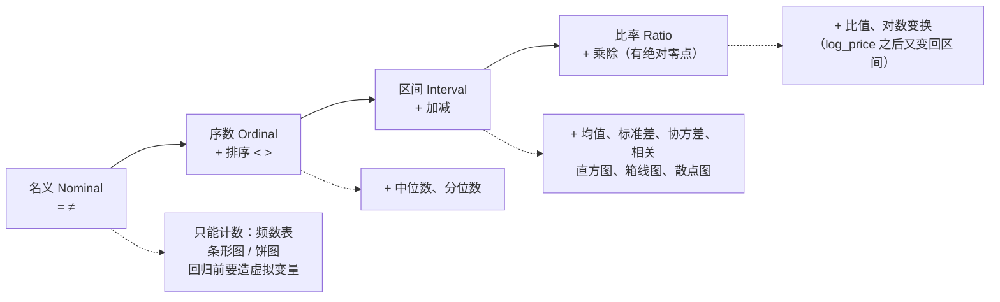
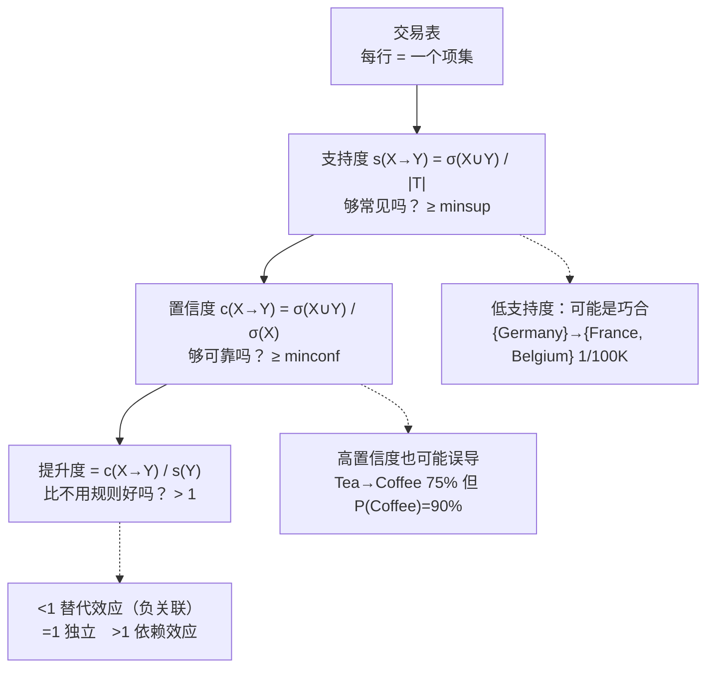
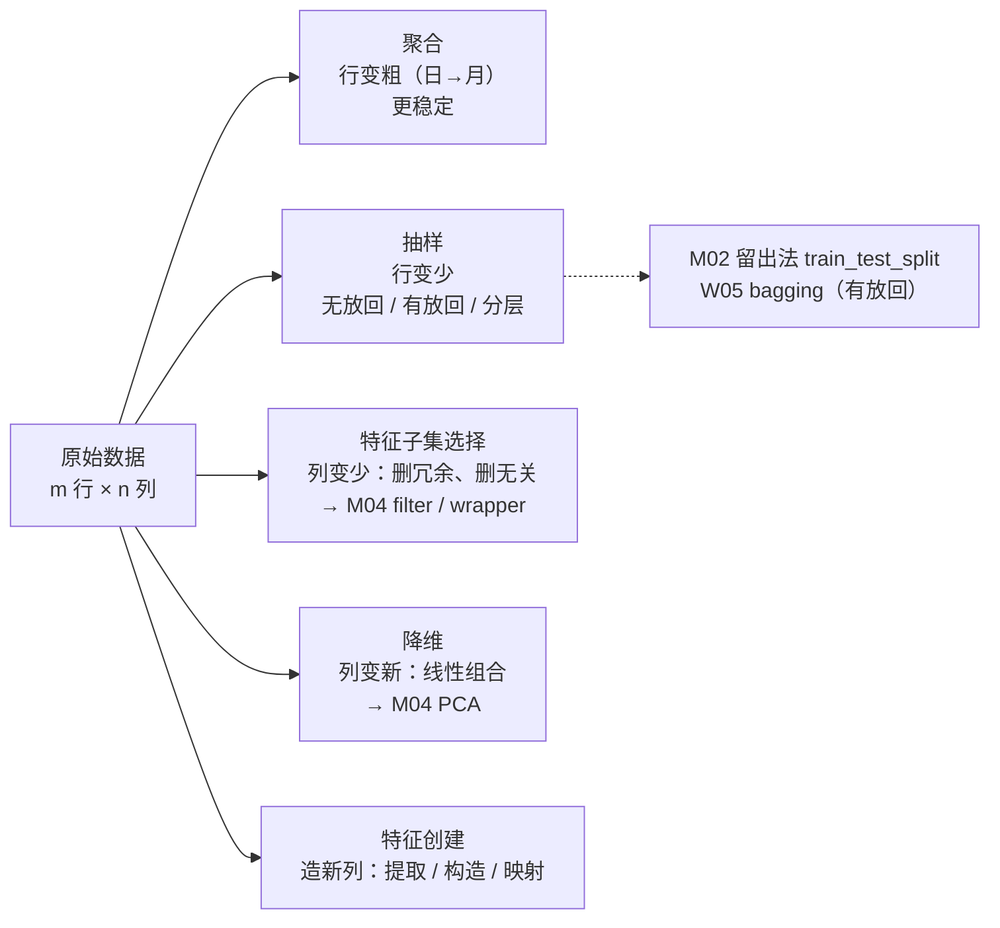

# M03 · 数据类型与描述性分析：从属性到关联规则

> **本讲一句话**：M02 教你**建模**，这一讲往回退一步，教你在建模之前必须做的三件事——**认清手里的数据是什么类型**（名义 / 序数 / 区间 / 比率决定了能做什么运算）、**用几个数和几张图把数据说清楚**（均值、分位数、偏度、相关系数、直方图、箱线图……），以及**从交易记录里挖"买 A 的人也买 B"的规则**（支持度、置信度、提升度）。它对应 CRISP-DM 的第 2、3 步——教授在 M01 说过这两步占 80% 工时。
> **原始材料**：`IS6400-W3-DataMining.pdf`（72 页，Canvas 标题 "Week 3 - Descriptive Analytics"）｜ **配套 tutorial**：[[T03-数据探索实战-Iris与Airbnb的描述统计]] ｜ **指定阅读**：DM Chapter 3 ｜ **转录**：`merged`（`M03-transcript.txt`，本地 Whisper，`00:00 → 02:13:18`，1361 段，2026-09-18 合并；**缺开头**——首段已在讲 p.4–6 的数据表，p.2–3 / p.5 的开场标 ❓；结尾完整；两次课间录音暂停、时间戳连续）
>
> ⚠️ **本讲内容与 Syllabus 不一致**：Syllabus 写 W03 = "Feature Selection and Dimension Reduction / PCA"，但 Canvas 实际发布的 W3 是**描述性分析**，特征工程挪到了 W4（见 [[M04-特征工程-特征重要性与降维]]）。后面的周次可能整体顺延，见 §9.5。

---

## 0. 三分钟速览

**这一讲讲了什么**

讲义有三张相同的标题页把它切成三段（p.1、p.21、p.50，各段用红字标当前位置）：

1. **数据类型（p.2–20）**：数据 = 对象 × 属性；属性按"能做什么运算"分成**名义 / 序数 / 区间 / 比率**四种，再按取值分**离散 / 连续**；数据集分记录 / 图 / 有序三大类；最后是数据质量问题（噪声与离群点、缺失、重复）和结构化数据的四个特征（质量、维度、稀疏、分辨率）。
2. **描述性分析 · 简单统计（p.21–49）**：类别变量只能**数**；数值变量看**集中趋势**（均值 / 中位数 / 众数 / 分位数）、**离散程度**（极差 / IQR / 方差 / 标准差）、**分布形状**（偏度 / 峰度）；两个变量看**协方差与相关系数**，并反复强调**相关 ≠ 因果**。然后插入一整段**关联规则挖掘**（p.35–49）：项集、支持度、置信度、提升度，以及"茶 → 咖啡"这个置信度 75% 却是负关联的经典陷阱。
3. **数据处理与探索（p.50–72）**：聚合、抽样（简单随机 / 有放回 / 分层）、降维、特征子集选择、特征创建；再用 **Iris 数据集**演示直方图、二维直方图、箱线图、散点图矩阵、平行坐标、星图。

**这一讲真正要教的一件事**：**在算任何模型之前，先回答"这列数据允许我做什么运算、它长什么样、它和别的列有没有关系"**——答错第一个问题（比如把邮编当数字求平均），后面的模型再漂亮也是错的。

**学完你应该能**

1. **判断**任何一列数据属于名义 / 序数 / 区间 / 比率中的哪一种，并说出各自允许的运算（=、<、+、×）
2. **区分**离散 / 连续、对称 / 非对称二元属性，说清为什么关联分析要用非对称属性
3. **算出并解释**一列数据的均值、中位数、众数、四分位数、IQR、标准差、偏度、峰度
4. **算出**协方差与相关系数，说清两者的区别，并举例说明"相关不等于因果"
5. **给一张交易表，算出**任一规则的支持度、置信度、提升度，并判断它是否"有效"、是否"误导"
6. **说出**聚合、抽样（三种）、降维、特征子集选择、特征创建各自解决什么问题
7. **读懂**直方图、箱线图、散点图矩阵、平行坐标图，并说出每种图适合看什么

**如果只记三件事**

1. **属性类型决定运算**（讲义 p.10）：名义只能比"等不等"，序数能比大小，区间能加减，比率才能乘除。**邮编、ID 是数字但只是名义属性**——求它们的平均是无意义的。
2. **置信度高不等于规则好**（讲义 p.46–48）：茶 → 咖啡置信度 75%，但不买茶的人买咖啡的比例更高（93.8%）；**提升度 < 1 就是负关联**。看规则要三个数一起看：支持度（够不够常见）、置信度（够不够可靠）、提升度（有没有比不看规则更好）。
3. **相关 ≠ 因果，投影可能造假**（讲义 p.34、p.60）：网点多与存款多相关，不等于多开网点能拉存款；一团 3D 点投到不同平面能分别看成三角形、正方形、圆——**降维和相关都只是"看"，不是"证明"**。

> 🎙️ **课堂实况**（2026-09-16 周三课）：录音从 p.4–6 的数据表中途开始（缺开头），前半场（`00:00`–`49:21`）教授基本按讲义 p.4–26 的顺序推进，唯一的大段离题是 p.13 讲完后停下来做课堂小测（`42:02`–`43:32`，考上周回归模型的属性类型判断）；每一页几乎都配了讲义没有的口头例子（拉面辣度、周中催稿、超市 ERP、A4 cheat sheet、共享单车研究、GPS 定位、库存漏盘、3 秒 bid-ask、欺诈检测类别不平衡），重心明显放在"用生活/科研例子把抽象定义讲透"，而不是照本宣科。 **两次课间（`43:32`、`01:32:50`）录音都被暂停，时间戳连续但墙钟不连续。** 后半场教授从偏度峰度快速带过（`49:21`–`50:38`，与讲义基本一致），随后用真实业务例子（冷饮需求非线性、特斯拉股票“因果错觉”）把相关系数和相关≠因果讲透；关联规则占了约 30 分钟（`56:06`–`01:26:49`），从超市/买房/机票酒店等生活例子讲到 Festival Walk Starbucks 茶咖啡置信度陷阱，并明确点出期末考会有关联规则计算题；`01:27:09` 起快速带过聚合、抽样、降维（降维明确预告下周展开），`01:32:58` 进入 Iris 数据集和六种图的演示，用一拳超人类比讲 Chernoff 脸，`01:45:33` 收尾进入 tutorial。


---

## 1. 开始之前 · 知识衔接

### 1.1 你已经有的

| 概念 | 一句话唤醒 | 回看 |
|---|---|---|
| CRISP-DM 六步 | 业务理解 → 数据理解 → 数据准备 → 建模 → 评估 → 部署；**前三步占约 80% 工时**——本讲全在第 2、3 步 | [[M01-导论-商业数据分析全景与工具链#2.5 ⭐ BDA 流程：CRISP-DM 六步（本讲唯一的核心内容）\|M01 §2.5]] |
| 特征 | "你用来描述一个对象的那些元素"；本讲把它叫**属性（attribute）**，是同一个东西 | [[M01-导论-商业数据分析全景与工具链]] §2.6.1 |
| 降维的危险 | 3D 点云投到 2D 会凭空造出"结构"——本讲 p.60 原图重现 | [[M01-导论-商业数据分析全景与工具链]] §2.6.1 |
| 聚类的两个用途 | 理解结构 / 压缩规模——本讲 p.51 的"聚合"是压缩规模的手工版 | [[M01-导论-商业数据分析全景与工具链]] §2.6.4 |
| 因变量 / 自变量、离群点、外推 | M02 讲过：离群点的处理有两条路（删 / 找解释变量）；本讲从"数据质量"的角度再看离群点 | [[M02-预测分析-线性回归#2.6.4 离群点（讲义 p.22–23）\|M02 §2.6.4]] |
| 过拟合、验证集 | 本讲 p.57 说降维的目的之一是"消除无关特征、减少噪声"——就是为了少过拟合 | [[M02-预测分析-线性回归]] §2.9 |
| 均值、中位数、方差、标准差、分位数、正态分布、相关性的直觉 | L0-A 统计基线。**本讲会给正式定义和讲义原句**，但不从零讲什么是平均数 | [[IS6400_Business_Data_Analytics/_meta/知识层级台账\|知识层级台账]] L0-A |
| `pandas` 的 `describe()`、`DataFrame`、`read_csv` | T01 / T02 用过；本讲的每个统计量在 [[T03-数据探索实战-Iris与Airbnb的描述统计]] 里都有对应的一行代码 | [[T01-Jupyter入门与Pandas基础]] §2、[[T02-回归实战-从合成数据到Airbnb定价]] §4.1 |
| Airbnb 数据集 | 68,133 行 × 15 列，目标 `log_price`；本讲 p.5 用它开场 | [[IS6400_Business_Data_Analytics/_meta/数据集卡片#Airbnb.csv\|数据集卡片 › Airbnb.csv]] |

> **需要的数学**：本讲的公式只有协方差、相关系数、支持度 / 置信度 / 提升度，全是加减乘除和求和号 $\sum$。不需要 M02 的矩阵与微积分。

### 1.2 本讲全新引入的概念

| 概念 | English | 展开于 |
|---|---|---|
| 对象与属性 · 属性值 | Object / Attribute · Attribute value | §2.2 |
| 名义 / 序数 / 区间 / 比率属性 · 四种性质 | Nominal / Ordinal / Interval / Ratio · Distinctness / Order / Addition / Multiplication | §2.3 ★ |
| 离散 / 连续 · 二元 · 非对称二元属性 | Discrete / Continuous · Binary · Asymmetric binary | §2.4 |
| 记录 / 图 / 有序数据 · 数据矩阵 · 文档数据 · 交易数据 | Record / Graph / Ordered · Data matrix · Document data · Transaction data | §2.5 |
| 数据质量三类问题 · 维度 / 稀疏 / 分辨率 · 维度灾难 | Noise & outliers / Missing / Duplicate · Dimensionality / Sparsity / Resolution · Curse of dimensionality | §2.6 |
| 描述性分析 · 三种探索方式 | Descriptive analytics · Numerical summary / Tables / Graphs | §2.7 |
| 频数分布 | Frequency distribution | §2.8 |
| 集中趋势 · 百分位数 · 四分位数 · 极差 · IQR · 方差 · 标准差 | Central tendency · Percentile · Quartile · Range · Interquartile range · Variance · Std | §2.9 |
| 偏度 · 峰度 | Skewness · Kurtosis | §2.10 |
| 协方差（总体 / 样本）· 相关系数 | Covariance (population / sample) · Correlation | §2.11 |
| 相关 ≠ 因果 · 实验 / 准实验 | Correlation ≠ Causality · Experiment / Quasi-experiment | §2.12 |
| 关联规则挖掘 · 项集 · k-项集 · 支持度计数 · 支持度 · 频繁项集 | Association rule mining · Itemset · Support count σ · Support s · Frequent itemset | §2.13 |
| 关联规则 X → Y · 前件 / 后件 · 置信度 · 最小支持度 / 最小置信度 · 有效规则 | Association rule · Antecedent / Consequent · Confidence · minsup / minconf | §2.14 |
| 置信度的陷阱 · 提升度 · 替代效应 / 依赖效应 | Caveat about confidence · Lift · Substitution / Dependence effect | §2.15 |
| 聚合 · 抽样 · 代表性 · 无放回 / 有放回 · 分层抽样 | Aggregation · Sampling · Representative · Without / With replacement · Stratified | §2.16 |
| 降维（目的与技术）· 冗余 / 无关特征 · 特征创建三法 | Dimensionality reduction · Redundant / Irrelevant · Feature extraction / construction / mapping | §2.17 |
| Iris 数据集 · 直方图与分箱 · 二维直方图 · 箱线图 · 散点图矩阵 · 平行坐标 · 星图 / Chernoff 脸 | Iris · Histogram & bins · 2-D histogram · Box plot · Scatter plot array · Parallel coordinates · Star plot / Chernoff faces | §2.18 |

### 1.3 为什么这一讲放在这里 · 重排说明

**承接**：M02 用 Airbnb 数据跑了回归，但那时数据是"给好的"——列已经选好、`property_type` 已经知道是类别、`log_price` 已经取过对数。本讲回答的是**"这些判断是怎么做出来的"**：哪些列是名义属性（不能直接进回归，要造虚拟变量）、目标变量分布偏不偏（偏就取对数）、哪些列高度相关（M02 §9 提到的多重共线性）。

**铺路**：本讲 p.57–59 的"降维 / 特征子集选择 / 特征创建"是 M04（特征工程）的预告；p.35–49 的关联规则是本课**唯一一次**讲无监督的模式挖掘，与后面的聚类（无监督）呼应；p.60 的投影危险是 M04 PCA 的反面教材。

**重排说明**

讲义顺序是：数据类型（p.2–20）→ 简单统计（p.21–34）→ **关联规则（p.35–49）** → 数据处理（p.50–59）→ 数据探索与可视化（p.60–72）。

我**保留了这个顺序**——它本身就是"先认清数据 → 再描述 → 再处理"的学习顺序。只做两处说明：

1. **关联规则（p.35–49）在讲义里没有自己的标题页**，直接接在"相关 ≠ 因果"之后（p.35 起页脚编号突然变成 "36/42"，说明这 15 页是从另一份 42 页的讲义里粘进来的）。我把它单独列为 §2.13–2.15 三节，因为它是本讲唯一有完整算法概念的部分，也是最可能出计算题的部分。
2. **p.60 的"投影危险"与 M01 是同一张图**。M01 讲了它"为什么危险"，本讲把它放在可视化之前，是在说"看图之前先知道图会骗人"。我保留在 §2.18.1，只回指不重讲。

小节 ↔ 页码的完整对应见 [[#8. 讲义页码映射|§8]]。

---

## 2. 正文

### 2.1 我们在 CRISP-DM 的哪一步 · 两个开场场景（讲义 p.2–3, p.5–6）

**是什么**

先说人话：M02 讲的是"把数据喂给模型、读系数"；但那份 Airbnb 数据是**别人已经洗好、选好列、取好对数**才递到你手上的（对数 log 是把乘法关系变成加法、把长尾压平的变换，M02 §2.2 用过）。真实世界里没有人替你做这一步——你拿到的往往是一张几十列、几万行、有空格、有错值、有些列根本不该进模型的表。**这一讲讲的就是"拿到一张这样的表之后、开始建模之前"要做的全部事情**：认清每一列是什么性质的数、用几个数和几张图把整张表"看清楚"、判断哪里脏了、该合并 / 抽样 / 删列。

讲义用两张图给这一讲定位：

- **p.2** 把 M01 的 CRISP-DM 圆环再贴一遍（Business Understanding → Data Understanding → Data Preparation → Modeling → Evaluation → Deployment），用红框圈出 **2 Data Understanding + 3 Data Preparation**。M01 说过这两步加上第一步占整个项目约 80% 的工时——本讲就是这 80% 里的技术部分。
- **p.3** 贴的是《Hands-On ML》Figure 1-2（Study the problem → Train ML algorithm → Evaluate solution → Launch!），红框圈的是最上面的 **Data** 那一格。意思一样：**数据是整条流水线的输入，输入不干净，后面每一步都白做。**

然后讲义给了两个业务场景，后面所有概念都会回到这两张表上：

**场景一 · Airbnb 房价（p.5）**：贴了三行代码和输出——

```python
import pandas as pd
ResearchData = pd.read_csv('Airbnb.csv')
ResearchData.head()
```

输出是前 5 行 × 15 列（`id, log_price, property_type, accommodates, bathrooms, bed_type, cancellation_policy, cleaning_fee, city, host_has_profile_pic, host_identity_verified, number_of_reviews, review_scores_rating, bedrooms, beds`）——就是 T02 用过的那份数据。**它已经是 pandas 里的一张表了**，但本讲要问的是：这 15 列各是什么性质？`id` 能不能求平均？`log_price` 是"价格"还是"价格的对数"、两者哪个能说"A 是 B 的两倍"？

**场景二 · 超市销售（p.6）**：你在一家有 ERP 系统的超市工作，老板要一份"公司运营状况"报告。ERP 里的数据长这样（每行一笔购买记录）：

| 分块 | 列 | 一条示例 |
|---|---|---|
| Customer information（顾客） | Customer ID · Gender · Marital Status · Homeowner · Children · Annual Income | 7223 · F · S · Y · 2 · \$30K–\$50K |
| Store information（门店） | City · State · Country | Los Angeles · CA · USA |
| Transaction information（交易） | Purchase Date · Product Family · Product Department · Product Category · Units Sold · Revenue | 12/18/2007 · Food · Snack Foods · Snack Foods · 5 · 27.38 |

**老板要的不是模型，是"看清楚"**：哪类顾客贡献最多收入？哪个门店卖得最好？收入的分布是均匀的还是少数大单撑起来的？这些问题不需要回归，需要的是本讲的描述性分析。

**为什么需要它**

这两张表贯穿全讲、也贯穿 T03 的作业：

| 后面的概念 | 回到这两张表上会问什么 |
|---|---|
| §2.3 属性类型 | `Customer ID` 是数字但能求平均吗？`Annual Income` 写成 "\$30K–\$50K" 这样的档，是哪一类？`log_price` 和 `price` 是同一类吗？ |
| §2.8–2.10 描述统计 | `Revenue` 的均值和中位数差多少？说明什么？ |
| §2.11 相关 | `accommodates` 和 `log_price` 一起变吗？变得多紧？ |
| §2.13–2.15 关联规则 | 买 Snack Foods 的顾客是不是也常买 Carbonated Beverages？ |
| §2.16 抽样 / 聚合 | 68,133 行太多？按城市聚合；按房型分层抽样 |
| §2.18 可视化 | `log_price` 的直方图长什么样？按 `city` 画箱线图 |

T03 作业第 1 题（35 分）的第一项就是"给 Airbnb **每一列**判定属性类型并各写一句理由"——它直接对应 §2.3。

**课件原例**

p.5 的 `ResearchData.head()`（15 列）；p.6 的超市 ERP 表（16 列、三个分块）。

**🎙️ 课堂补充**（`00:00`–`05:45`，约 5.75 分钟，A · 课上展开）

- 教授把超市 ERP 数据展开成三段属性，比讲义表格更口语化：*"the supermarket will have your customer ID, the gender, the marriage status, homeowner status, number of children, and income level"*（`01:46`），随后点出门店信息与交易信息两段，并给出组合应用的例子：*"we can send coupons to certain groups of customers who usually make purchase in some certain retail store for certain groups of items"*（`03:36`）。
- 讲义没有的关键提醒：数据表在设计时往往不知道未来要解决什么问题——*"when the managers of the supermarkets, they define these data tables, they have no idea which kind of business problems they are trying to solve in the future. So they may collect as much information as they can"*（`04:21`–`04:41`）。
- **这段改变了什么**：确认了笔记 §2.1「老板要的不是模型，是看清楚」的判断，但补充了一层——数据字段是在不知道具体分析目标的情况下先收集好的，这也解释了为什么真实数据表往往比"能回答的问题"更庞大（讲义没提这一点）。录音开头就在讲这张表，印证了任务单"首段已在讲 p.4–6"的判断；p.2–3 的 CRISP-DM 圆环本身没在本讲时段出现，判 ❓（见 §8）。

**💡 换个说法（笔记补充）**

把本讲想成"**体检**"：M02 是开药方（建模），本讲是量身高体重、验血、拍片（描述统计、找缺失、画图）。不体检直接开药，药可能开错——比如 M02 里 `beds` 的系数是负的，根本原因就是本讲 §2.11 要讲的"`beds` 和 `accommodates` 相关 0.83"，体检时看一眼相关矩阵就能预见。

**先用 p.6 这张表练一下手**（下一节会给判定规则，这里先看结论）：Gender、Marital Status、Homeowner、City、Product Family 是**名义**（只能区分、不能排序）；Annual Income 是按区间分档的**序数**（\$30K–\$50K 高于 \$10K–\$30K，但两档之间的"距离"没有定义）；Children、Units Sold 是**比率且离散**（0 个孩子就是没有孩子，4 件是 2 件的两倍）；Revenue 是**比率且连续**；Purchase Date 是**区间**（两个日期相减有意义，两个日期相除没有）。

**⚠️ 常见误解**

- ❌ "描述性分析是建模前的走过场，`describe()` 跑一下就完了。" → 讲义 p.22 明说人们有 "a tendency to race through descriptive statistics"，而它 "simple, complex and important"。T03 的作业是一份 100 分的完整描述性报告（35 + 45 分全在这），比 T02 的作业重得多。
- ❌ 以为本讲"没有模型所以不重要"。→ M02 的 `beds` 负系数、Ridge 要不要标准化（把每列减均值除标准差、拉到同一尺度，T03 §3.4）、`review_scores_rating` 缺 22% 怎么办，这些让模型出错的问题**全部在本讲解决**。

**所以呢**：定位清楚了——本讲全在"理解数据 + 准备数据"。第一步是给"一张表"一个统一的说法：行是对象，列是属性。

---

### 2.2 数据是什么：对象、属性、属性值（讲义 p.4, p.7）

**是什么**

先说人话：一张表，每一**行**是一个"东西"（一个客户、一笔交易、一朵花），每一**列**是这个东西的一个"性质"（年龄、金额、花瓣长度），每个格子里填的是这个东西在这个性质上的"值"（35 岁、27.38 美元、1.4 厘米）。就这三样：**行叫对象，列叫属性，格子叫属性值**。麻烦在于不同学科给这三样东西起了一堆不同的名字——统计学叫"变量"、数据库叫"字段"、机器学习叫"特征"，说的都是"列"。

讲义 p.4 的定义：

> - Collection of data **objects** and their **attributes**（数据 = 数据对象及其属性的集合）
> - An **attribute** is a property or characteristic of an object（属性是对象的一个性质或特征）——例：eye color, temperature
>   - Attribute is also known as **variable, field, characteristic, or feature**
> - A collection of attributes describe an object（一组属性描述一个对象）
>   - Object is also known as **record, point, case, sample, entity, or instance**

配图是一张 10 行的表：`Tid | Refund | Marital Status | Taxable Income | Cheat`——右边花括号标 **Attributes**（五列），左边花括号标 **Objects**（十行，每行一个纳税人）。

| Tid | Refund | Marital Status | Taxable Income | Cheat |
|---|---|---|---|---|
| 1 | Yes | Single | 125K | No |
| 2 | No | Married | 100K | No |
| 3 | No | Single | 70K | No |
| … | … | … | … | … |
| 10 | No | Single | 90K | Yes |

读法：第 1 行是一个对象（1 号纳税人），他在 Refund 这个属性上的值是 Yes，在 Taxable Income 上的值是 125K。

讲义 p.7 补充**属性值（attribute value）**："numbers or symbols assigned to an attribute for a particular object"（给某个对象的某个属性赋的数字或符号），并强调两点：

> - **Same attribute can be mapped to different attribute values**——同一个属性可以用不同的值表示：身高可以用英尺也可以用米
> - **Different attributes can be mapped to the same set of values**——不同属性可以用同一组值：ID 和年龄都是整数，**但属性值的性质可以不同**

第一点好懂：1.75 米和 5.74 英尺是同一个人的同一个身高。第二点是这一页的重点，值得多想一步：**Tid = 3 和 Taxable Income = 70K 都是整数，可是"3 号纳税人 + 5 号纳税人 = 8 号纳税人"毫无意义，"70K + 30K = 100K"却有意义**。也就是说，光看格子里是不是数字，判断不了这一列能做什么运算——必须另有一套分类。这就是下一节。

**为什么需要它**

看起来只是起名字，但有两个实际用处：

| 用处 | 说明 |
|---|---|
| **读懂不同来源的材料** | M01 讲义说 feature，本讲说 attribute，M02 说 variable / 自变量，pandas 说 column，sklearn 说 feature——**全是同一个东西**。不知道这一点，会以为它们是四个概念 |
| **判断"哪些列不是属性"** | `Tid` 是给行编号的，它是**标识符**，不是描述对象的性质；Airbnb 的 `id` 同理。这类列必须在建模前排除（[[IS6400_Business_Data_Analytics/_meta/数据集卡片\|数据集卡片]] §5.7 已经踩过一次：`id` 是递增的，会与"上架时间"虚假相关） |

**课件原例**

p.4 的 Tid / Refund / Marital Status / Taxable Income / Cheat 表（10 个对象、5 个属性）；p.7 的身高（英尺 vs 米）、ID vs 年龄。

**🎙️ 课堂补充**（`05:45`–`06:32`，约 47 秒，A · 课上展开）

- 教授用自己「剪头发」当场演示属性值可以变化：*"you may realize that I just cut my hair, right? So if the hair length is one of my features, you can see the feature can change"*（`06:18`）。
- **这段改变了什么**：给 p.7「同一属性可以有不同值」补了一个讲义没有的活人例子（头发长度），比"身高：英尺 vs 米"更直观——属性值会变，属性本身不变。这也是本讲唯一一次明确用"feature"这个词（呼应笔记 §2.2 的别名表）。

**💡 换个说法（笔记补充）**

别名表一次记牢，以后在任何材料里见到都能对上："行"在数据库和本讲叫 object / record / entity，在统计学和 M02 叫 case / sample / instance / point，在机器学习里叫 sample / instance，在 pandas 里是 `index` 的一项；"列"相应地叫 attribute / field（数据库）、variable / characteristic（统计学）、**feature**（机器学习、M01、M04、sklearn）、`columns` 的一项（pandas）。同一个东西五套名字，见到哪个都往"行"或"列"上对。

把一张表想成一份花名册：每一行是一个学生（对象），每一列是一项登记内容——姓名、学号、身高、成绩（属性），格子里填的是这个学生的这一项（属性值）。学号那一列虽然是数字，但它只是用来点名的，不是用来算平均的——这就是下一节要区分的事。

用 Iris 数据（本讲 §2.18 和 T03 的示范数据）套一遍：150 朵花 = 150 个对象；`sepal length, sepal width, petal length, petal width, class` = 5 个属性；第一朵花的属性值是 (5.1, 3.5, 1.4, 0.2, Iris-setosa)。

**⚠️ 常见误解**

- ❌ "feature 和 attribute 不一样，feature 更高级。" → 讲义 p.4 明列它们是同义词。M04 会说"特征是一组属性"，那是同一个词在不同层次上的用法，不是两个概念。
- ❌ 把 `Tid`（交易编号）当成一个可以分析的属性去求均值、去相关。→ 它只用来区分行；p.13 会把它归为**名义**属性，唯一能做的运算是"相等 / 不相等"。
- ❌ 以为"属性值是数字"就能加减。→ p.7 第二点专门反驳这个：ID 和年龄都是整数，性质完全不同。

**所以呢**：对象 × 属性 × 属性值是表格数据的统一语言。但 p.7 留下一个问题——同样是整数，为什么有的能加减、有的不能？答案是按"允许的运算"把属性分四级。这是本讲第一个硬考点。

---

### 2.3 属性的四种类型：名义 / 序数 / 区间 / 比率（讲义 p.8–10, p.13）★

**是什么**

先说人话：拿三对数字来比——

| 数据 | 相减有意义吗 | 相除有意义吗 |
|---|---|---|
| 邮编 10001 与 10002 | ❌ "差 1" 不代表任何东西（相邻的邮编可能隔着一条河） | ❌ |
| 气温 20°C 与 10°C | ✅ 差 10 度，有意义 | ❌ "20°C 是 10°C 的两倍热"**没有意义** |
| 重量 20 kg 与 10 kg | ✅ 差 10 kg | ✅ 确实是两倍重 |

为什么气温不能说"两倍"？因为 0°C **不是"没有温度"**，只是水结冰的那个点，是人为定的零点。换成华氏温度，20°C = 68°F、10°C = 50°F，比值变成 1.36——同一个物理事实，换个单位"倍数"就变了，说明这个"倍数"本来就不是真实的。而重量的 0 kg 是真正的"什么都没有"，换成磅，44.1 lb 比 22.05 lb 仍然是两倍。**能不能做"倍数"，取决于零点是不是"真零"。**

按这个思路，讲义把属性分成**四级**，每升一级多一种允许的运算：

| 类型 | 讲义原文 | 例子（讲义） | 多了什么运算 |
|---|---|---|---|
| **名义 Nominal** | Nominal values provide only enough information to **distinguish** one object from another | ID numbers, eye color, zip codes | 只能判断"是不是同一个"（$=$、$\neq$） |
| **序数 Ordinal** | The values of an ordinal attribute provide enough information to **order** objects | rankings（薯片口味 1–10 分）, grades, height in {tall, medium, short} | + 能排序（$<$、$>$），但相邻两级的"距离"没有定义 |
| **区间 Interval** | For interval attributes, **the differences between values are meaningful. (no ratios)** | calendar dates, temperatures in Celsius or Fahrenheit | + 能加减（差有意义），但**没有真零点**，不能做比 |
| **比率 Ratio** | For ratio variables, **both differences and ratios are meaningful** | temperature in Kelvin, length, time, counts | + 能乘除（有绝对零点，"两倍"有意义） |

讲义 p.10 把这个分级说成一条**累加的阶梯**——每一级都拥有下面所有级的性质：

> The type of an attribute depends on which of the following properties it possesses:
> - Distinctness: $=$ $\neq$
> - Order: $<$ $>$
> - Addition: $+$ $-$
> - Multiplication: $*$ $/$
>
> Nominal attribute: distinctness
> Ordinal attribute: distinctness & order
> Interval attribute: distinctness, order & addition
> Ratio attribute: all 4 properties

讲义 p.13 用 p.4 那张纳税人表做示范：**Tid: Nominal；Refund: Nominal；Marital: Nominal；Income: Ratio**。（Cheat 没标，按同样规则也是名义——它是 Yes / No 两个类别。）

**为什么需要它**

这是本讲**最基础也最常考**的分类，且直接决定后面每一节能做什么——**类型决定了"允许的统计量"和"允许的图"**：

| 类型 | 能算什么 | 不能算什么 | 能画什么图 | 进回归前要做什么 |
|---|---|---|---|---|
| 名义 | 频数、众数（§2.8） | 均值、中位数、标准差 | 条形图、饼图 | 造虚拟变量（M02 §2.7.2） |
| 序数 | + 中位数、分位数 | 均值（严格说不行，因为级差未定义） | + 排序后的条形图 | 造虚拟变量，或按等距假设当数值 |
| 区间 | + 均值、标准差、协方差、相关（§2.9–2.11） | 比值、几何均值 | + 直方图、箱线图、散点图（§2.18） | 直接用 |
| 比率 | + 比值、对数变换、变异系数 | — | 同上 | 直接用；右偏时可取对数 |

T03 作业第 1 题要求**给 Airbnb 的每一列**做这个判定并各写一句理由——每一句理由都应该是上面"多了什么运算"那一列的话。

**课件原例**

p.13：Tid / Refund / Marital 是名义，Income 是比率。p.9：摄氏温度是区间（0°C 不是"没有温度"），开尔文温度是比率（0 K 是绝对零点，此时分子停止运动）。

**🎙️ 课堂补充**（`06:42`–`15:06` + `20:54`–`23:04`，约 10.6 分钟，A · 课上展开）

- 序数属性举例落地到香港的日本拉面店：*"if you go there, you may have some choices, the spicy level of the noodles"*（`09:25`），用无辣/微辣/中辣/特辣讲"能排序但级差不固定"——*"…once you go to very spicy, there's a big gap"*（`10:14`）；教授自称湖南人，"这几个级别对我来说没区别"。
- 区间属性用"周一到周三"举例，比讲义的日期例子更具体：*"Monday, the distance between Monday and Wednesday, the two SKU values is two days… their intervals, their gaps are fixed. So we can do some simple calculation"*（`11:09`–`11:21`；「SKU value」疑为「scale value」的 ASR 误听，见 asr_rows），并用催 PhD 学生交稿举例：*"…now this is Wednesday, your meeting will be two days away. So Wednesday plus two days will be the due date for my PhD students"*（`11:32`–`11:41`）。比率属性教授拿自己的年龄打趣：*"…now I'm age 36 and I always hope that my age can be divided by 2"*（`13:02`）。
- 🔴 回到 p.13 的 Tid/Refund/Marital/Income/Cheat 表判断 TID 是名义还是比率属性时，教授明说这是往年考题：*"So this is, I think, three years or four years old final exam question. I use this data table to do some questions"*（`22:45`–`22:51`）；并强调判断错误的后果：*"Nominal X field as the initial X field, then you may have some mistakes in the downstream analysis, right?"*（`22:28`，「X field」疑为「attribute」的 ASR 误听）。
- **这段改变了什么**：确认了笔记「三问判定法」的实操性，并把 §2.3 从"讲义知识点"升级为有据可查的往年期末考题——TID 表的名义/比率判断不是笔记的推测，是教授当堂点名的考题类型（见 §6.2 🔴）。

**💡 换个说法（笔记补充）· 一个三问判定法**

依次问三个问题，答"是"就往下走：

1. **能排序吗？**（大小 / 先后 / 好坏）不能 → **名义**（眼睛颜色、邮编、城市、房型）。能 → 继续
2. **相邻两级的差距是固定的、可以加减的吗？** 不能 → **序数**（满意度 1–5 分：4 到 5 的"距离"未必等于 1 到 2；退订政策 flexible < moderate < strict）。能 → 继续
3. **零代表"完全没有"吗？** 不是 → **区间**（摄氏温度、日期、年份、对数价格）。是 → **比率**（长度、金额、计数、开尔文）

另一个角度：四种类型就是"这列数据允许你做哪些动作"的清单——名义只允许**认**（是不是同一个），序数允许**排**（谁前谁后），区间允许**减**（差多少），比率允许**除**（几倍）。每升一级多一个动作，低级的动作高级都能做。判断一列属于哪级，就问"我对它做减法、做除法，结果说得通吗"。

把它套到 Airbnb（[[IS6400_Business_Data_Analytics/_meta/数据集卡片#Airbnb.csv\|数据集卡片 › Airbnb.csv]]）——**这就是 T03 作业第 1 题的答案骨架，但每一条理由要你自己写**：

| 列 | 类型 | 理由（用三问法） |
|---|---|---|
| `id` | 名义 | 不能排序（编号大小无意义），只用来区分行 |
| `property_type`、`bed_type`、`city` | 名义 | 类别之间没有顺序 |
| `cancellation_policy` | **序数** | flexible < moderate < strict 有顺序，但"严格程度"的级差没有定义 |
| `cleaning_fee`、`host_has_profile_pic`、`host_identity_verified` | 名义（二元） | 是 / 否 |
| `accommodates`、`bedrooms`、`beds`、`number_of_reviews` | 比率（离散） | 0 = 没有；4 人是 2 人的两倍 |
| `bathrooms` | 比率（离散，取值含 .5） | 同上 |
| `review_scores_rating` | **区间（有争议）** | 评分差有意义，但"100 分是 50 分的两倍好"说不通；也有人按序数处理——**写出你的假设** |
| `log_price` | **区间** | 取对数后 0 对应 \$1 而不是"免费"，零点是人为的；差 0.69 = 价格翻倍，差有意义 |
| `price = exp(log_price)` | 比率 | \$0 是真正的免费；\$200 是 \$100 的两倍 |

最后一对最值得体会：**同一个东西（房价），取对数之后从比率变成区间**——因为对数把"倍数"变成了"差"（$\log 200 - \log 100 = \log 2$），"两倍"这个概念被搬到了减法里。这也是 M02 说"log 因变量的系数要读成百分比"的根源。

**⚠️ 常见误解**

- ❌ "是数字就是数值属性。" → 邮编、ID、电话号码、身份证号都是数字，全是名义（讲义 p.8 第一个例子就是 ID numbers）。判断标准是**运算有没有意义**，不是**长得像不像数**。
- ❌ 把序数当区间用，直接求平均。→ 实践中常这么做（"平均满意度 3.6"），讲义也没禁止，但要知道这暗中假设了"各级等距"——答题时把这个假设写出来。
- ❌ "摄氏温度是比率，因为它是数值。" → 讲义 p.9 特意把摄氏 / 华氏放在区间、开尔文放在比率，就是要考这个区别：**有没有绝对零点**。用上面的 68°F / 50°F 例子可以一句话说服自己。
- ❌ 以为四种类型是互斥的四个格子。→ 它们是**累加**的：比率属性同时拥有名义、序数、区间的全部性质（p.10 "all 4 properties"）；所以比率属性也能做频数表、也能排序。

**与其他概念的关系**

名义属性 → §2.8 只能计数、M02 虚拟变量；区间 / 比率 → §2.9–2.11 的所有统计量与 §2.18 的直方图 / 箱线图 / 散点图；这套分类在 T03 作业第 1 题和 §5 术语卡里都要用**英文**写（Nominal / Ordinal / Interval / Ratio）。

**所以呢**：四种类型是按"允许的运算"分的。还有另一套按"取值多少"分的方法——离散 / 连续——以及一种特殊情况：只有"有"才重要的二元属性。它们是下一节。

---

### 2.4 离散 / 连续 · 二元与非对称二元属性（讲义 p.11–12）

**是什么**

先说人话：有的属性只能取"数得清"的值——几个卧室（0, 1, 2, …）、邮编、是 / 否；有的可以取任意小数——温度 23.47°C、身高 1.7532 m、价格 27.38。前者叫**离散**，后者叫**连续**。这是和 §2.3 **独立的另一套**分类：卧室数是"离散 + 比率"，温度是"连续 + 区间"，邮编是"离散 + 名义"。

另外有一类 0/1 属性值得单独说：**"有"和"没有"不对等**。超市有一万种商品，一张小票上只有十几种被买了——"买了"是信息，"没买"是常态。如果把 9,990 个"没买"也当成信息，任何两个顾客都会"高度相似"（因为都没买那 9,990 种），这显然不对。这种只关心 1 的二元属性叫**非对称二元属性**。

讲义 p.11：

> **Discrete Attribute**
> - Has only a **finite or countably infinite** set of values（有限或可数无限个取值）
> - Examples: zip codes, counts, or the set of words in a collection of documents
> - Often **represented as integer variables**
> - Note: **binary attributes are a special case** of discrete attributes（二元属性是离散属性的特例）
>
> **Continuous Attribute**
> - Has **real numbers** as attribute values
> - Examples: temperature, height, or weight
> - Practically, real values can only be measured and represented using a finite number of digits
> - Continuous attributes are typically represented as **floating-point** variables

"可数无限"的意思：计数（0, 1, 2, 3, …）没有上限，但你能一个一个数过去；而 1.4 和 1.5 之间有无穷多个实数，你数不过去——这是离散和连续的本质区别。"Practically … finite number of digits"是在说：电脑存的 1.4 其实是有限位小数，但我们仍把它当连续量看。

讲义 p.12 **非对称名义属性（Asymmetric Nominal Attributes）**：

> - **Only presence (a non-zero attribute value) is regarded as important**（只有"出现"——非零值——才算重要）
> - Examples: Student Attendance? (attend: 1, absent: 0)
>   - Student 1 and student 2 come together? → (1,1) come together, (1,0) only student 1, (0,1) only student 2, (0,0) both absent
>   - N students come together? We need a vector of N binaries
> - **We need two asymmetric binary attributes to represent one ordinary binary attribute**
> - **Association analysis uses asymmetric attributes**

用出勤例子把"非对称"想透：两个学生的出勤记录 (1,1)、(1,0)、(0,1)、(0,0) 四种组合里，(1,1) 说明"他俩一起来"是有意义的观察；(0,0) 说明"他俩都没来"——但**都没来的学生太多了**（全校几万人都"没来这门课"），这个组合几乎不携带信息。所以比较两个学生像不像，只该数"都是 1"的次数，不该数"都是 0"的次数。

**为什么需要它**

| 区分 | 决定了什么 |
|---|---|
| 离散 vs 连续 | **用哪种图**：离散用条形图 / 频数表，连续用直方图 / 箱线图（§2.18）；**用哪种统计量**：离散计数的众数有意义（"最常见的卧室数是 1"），连续属性的众数往往没用（"最常见的身高是 1.7532 m"没意义） |
| 对称 vs 非对称二元 | **§2.13 关联规则的前提**：交易数据只记"买了什么"，每种商品是一个非对称二元属性；相似度和支持度只数 1 |

**课件原例**

p.11：邮编、计数、文档词集（离散）；温度、身高、体重（连续）。p.12：两个学生是否一起来上课，用 (1,1)/(1,0)/(0,1)/(0,0) 四种组合表示；N 个学生要 N 个二元位。

**🎙️ 课堂补充**（`15:06`–`20:52`，约 5.8 分钟，A · 课上展开）

- 离散属性举例落地到教室本身：*"we can do the counting that in this classroom, how many students in this classroom"*（`15:33`），连续属性则是"桌子之间的距离"：*"the distance between all these kind of four desks… there are infinite number of countings of how many distance we can get in these certain intervals"*（`15:46`–`16:00`）。
- 非对称二元属性用点名/同行判定展开成完整案例：学生 1、2 是否一起来上课的四种组合——*"If student 1 comes and student 2 comes, if they come together… that's 1-1… If student 1 does not, and student 2 comes, it's 0-1"*（`18:04`–`18:24`）；再延伸到零售场景——两人被判定为"一起逛"之后，*"the coupon will only be sent to one of us. The coupon will not be sent to the two different guys in a single group"*（`20:03`），因为送一个人另一人也会跟来。
- **这段改变了什么**：把讲义"只关心出现值 1"的抽象定义变成一条完整的业务链——用非对称二元属性判定"同行"→只给一人发券——这是讲义没有的应用场景，直接呼应 §2.13 关联规则"为什么关联分析要用非对称属性"。

**💡 换个说法（笔记补充）**

**"two asymmetric binary attributes to represent one ordinary binary attribute"这句话是什么意思**：普通二元属性（性别 M/F）两个值同等重要——"是女性"和"是男性"都是信息。如果非要用"只看 1"的非对称属性表示它，一列不够（`is_female = 0` 说不清是男性还是缺失），得拆成两列 `is_male` 和 `is_female`，每列只在为 1 时有信息。**这恰好是 M02 one-hot 编码的逻辑**：`property_type` 四类拆成四列 0/1，每行只有一个 1——也是为什么 one-hot 后的矩阵大多是 0（→ §2.6 的"稀疏"）。

**把 Airbnb 的列按两套分类各标一遍**（T03 作业第 1 题要求两套都标）：

| | 名义 | 序数 | 区间 | 比率 |
|---|---|---|---|---|
| **离散** | `city`、`property_type`、`cleaning_fee`（二元） | `cancellation_policy` | `review_scores_rating`（整数分） | `accommodates`、`bedrooms`、`beds`、`number_of_reviews` |
| **连续** | —（名义不可能连续） | — | `log_price` | `price`（还原后） |

注意左下角是空的：**名义属性一定是离散的**（类别数得清），但离散属性不一定是名义（计数是离散的比率）。

**⚠️ 常见误解**

- ❌ "离散 = 名义，连续 = 数值。" → 两套分类是**正交**的（互相独立）：邮编是离散 + 名义，卧室数是离散 + 比率，温度是连续 + 区间。上面的表就是证据。
- ❌ 以为 `bathrooms = 1.5` 说明它是连续属性。→ 它只取 0、0.5、1、1.5 … 共 17 个值（数据集卡片 §2.1），数得清，仍是离散的。判断标准是"取值能不能一个一个数过去"，不是"有没有小数点"。
- ❌ 把"没买 = 0"当成和"买了 = 1"一样的信息去算相似度。→ 这正是非对称属性要避免的错误；§2.13 的支持度只数含有这些商品的小票。

**所以呢**：单个属性的两套分类讲完了。属性拼在一起构成数据集，而数据集本身也有不同的形状——不是所有数据都是一张整齐的表。下一节。

---
### 2.5 数据集的三大类：记录 / 图 / 有序（讲义 p.14–18）

讲义 p.14 把数据集分三大类（记录 / 图 / 有序）九小类；§2.5.1 讲本课主食——记录数据的三种小类，§2.5.2 讲另外两大类。

#### 2.5.1 记录数据的三种小类：数据矩阵、文档数据、交易数据（讲义 p.15–17）

**是什么**

先说人话：记录数据就是"每行一个对象"的数据，但"列"可以有三种来法——**列是测量值**（数据矩阵：每朵花的四个尺寸），**列是词**（文档数据：一篇文章里每个词出现几次），**根本没有固定的列**（交易数据：一张小票买了什么就记什么，长短不一）。三种都能进本课的方法，但要走不同的门。

**① 数据矩阵（p.15）**——最"标准"的表：

> If data objects have the same fixed set of numeric attributes, then the data objects can be thought of as **points in a multi-dimensional space**, where each dimension represents a distinct attribute. Such data set can be represented by an **m by n matrix, where there are m rows, one for each object, and n columns, one for each attribute**

例子是一张 2 × 5 的表（Projection of x Load / Projection of y load / Distance / Load / Thickness），第一行 10.23, 5.27, 15.22, 2.7, 1.2。"points in a multi-dimensional space"这句值得停一下：**一行 5 个数 = 五维空间里的一个点**。Iris 的一朵花有 4 个测量值，就是四维空间里的一个点；150 朵花就是四维空间里的 150 个点。M04 的 PCA 和 W04 的聚类都建立在"对象 = 空间里的点"这个图像上——"两朵花像不像"就变成"两个点离得近不近"。"矩阵（matrix）"在这里只是"m 行 n 列的数字表"的正式说法。

**② 文档数据（p.16）**——把一篇文章变成一行数：

> Each document becomes a **'term' vector**：each term is a component (attribute) of the vector；the value of each component is the **number of times the corresponding term occurs** in the document

例子：3 篇文档 × 10 个词（team, coach, play, ball, score, game, win, lost, timeout, season），Document 1 = (3, 0, 5, 0, 2, 6, 0, 2, 0, 2)——意思是 Document 1 里 "team" 出现 3 次、"coach" 0 次、"play" 5 次……**每个词是一列，词频是格子里的值**；"向量（vector）"就是"一行数"的正式说法。一篇讲球赛的文章在 game / play / score 上数字大，一篇讲经济的文章在这些列上全是 0。这样文章之间就能像数据矩阵一样比较了。代价是：英文常用词有几万个，**列数会有几万**——M04 §2.4 维度灾难的第一个来源。

**③ 交易数据（p.17）**——每行是一个"集合"：

> A special type of record data, where **each record (transaction) involves a set of items**。例：a grocery store——一次购物买的所有商品构成一笔交易，每件商品是一个 item

例子：TID 1 = {Bread, Coke, Milk}，TID 2 = {Beer, Bread}，TID 3 = {Beer, Coke, Diaper, Milk}，TID 4 = {Beer, Bread, Diaper, Milk}，TID 5 = {Coke, Diaper, Milk}。注意每行长度不同、没有"列"——它记录的是**买了什么**，不记录没买什么。

**为什么需要它**

三种小类各自对应本课的一类方法，认错类型就会用错方法：

| 小类 | 本课的方法 | 进门前要做什么 |
|---|---|---|
| 数据矩阵 | M02 回归、M04 特征工程与 PCA、W05 分类 | 必须是 m × n **数值**矩阵：名义列要先 one-hot，缺失要先填 |
| 文档数据 | M04 p.11 "怎么描述一篇文档"、维度灾难的例子 | 先选词、数词频；几千列、几乎全是 0 |
| 交易数据 | **§2.13–2.15 关联规则** | 每行是集合；商品当非对称二元属性（§2.4） |

**课件原例**

p.15 的 2 × 5 数据矩阵、p.16 的 3 × 10 词频表、p.17 的 5 笔交易。

**🎙️ 课堂补充**（`23:23`–`31:51`，约 4.9 分钟，不含穿插的图/时空数据（见 §2.5.2），A · 课上展开）

- 文档数据先用"期末考 A4 cheat sheet"点题，讲义没有这个例子：*"the A4 cheat sheet you can bring to the final exam is actually a document data… this is the most valuable and informative data type you can generate for the preparation of your final exam"*（`24:20`–`24:26`）。
- 回到讲义 p.16 的词频例子时，教授逐格口述怎么数：*"for the value 3, it indicates that in document 1, this keyword team shows three times… but it does not show up in document 2 or document 3, so these two are zeros"*（`30:05`–`30:13`）。数据矩阵只一句带过：*"for the data metrics, that's the most commonly used data"*（`28:34`），没有展开"多维空间的点""m×n 矩阵"这些讲义术语。
- **这段改变了什么**：A4 cheat sheet 例子把"文档数据"从抽象定义变成学生每天都在做的事，也顺带确认了本讲期末考允许带一张 A4 小抄（见 ddl_rows）；词频口述与讲义完全一致，没有推翻笔记判断；数据矩阵这页教授只是带过，没有展开笔记里"点=多维空间的点"这条解读（笔记补充部分保留，因为教授没有反对）。

**💡 换个说法（笔记补充）**

三种小类的区别可以想成三种"表格的来历"：数据矩阵是**量出来的**（尺子、秤、温度计各量一次，天生就是整齐的数）；文档数据是**数出来的**（把文字变成数的唯一办法是数词，所以列是词表）；交易数据是**记下来的流水**（谁买了什么，本来就没有"表头"）。前两种拿到手就是表，第三种要自己把它变成表。

交易数据其实也能变成矩阵——把每种商品当一列（非对称二元属性），"买了"记 1、"没买"记 0，p.17 的 5 笔交易就变成一张 5 × 5 的 0/1 表：

| TID | Beer | Bread | Coke | Diaper | Milk |
|---|---|---|---|---|---|
| 1 | 0 | 1 | 1 | 0 | 1 |
| 2 | 1 | 1 | 0 | 0 | 0 |
| 3 | 1 | 0 | 1 | 1 | 1 |
| 4 | 1 | 1 | 0 | 1 | 1 |
| 5 | 0 | 0 | 1 | 1 | 1 |

25 个格子里 15 个是 1——这个玩具例子还不算稀疏；真实超市有几万种商品，一张小票只买十几样，99.9% 的格子是 0。这就是 §2.6 说的"稀疏"，也是为什么关联分析只数 1 不数 0（§2.4 非对称属性）：数 0 的话，任意两张小票都"一样"（都没买那几万样东西）。

**⚠️ 常见误解**

- ❌ 以为数据矩阵允许任何类型的列。→ 讲义原文是 "same fixed set of **numeric** attributes"——有名义列（`city`）的表严格说不是数据矩阵，进 sklearn 前要先编码（M02 one-hot）。这就是为什么 T02 要 `OneHotEncoder`。
- ❌ 把词频向量或交易矩阵里的 0 当缺失值去"填补"。→ 0 是"这个词没出现 / 这样东西没买"，是**真实信息**，不是缺失。缺失是"不知道"，0 是"知道是零"。

**所以呢**：记录数据是本课的主食。另外两大类本课只认识一下，但要知道它们为什么不能直接当表用。

#### 2.5.2 图数据与有序数据（讲义 p.14, p.18）

**是什么**

先说人话：有两类数据，"行"之间的**关系**本身就是信息，拆成独立的行就丢了：**图数据**——社交网络、网页，重要的是谁和谁连着；**有序数据**——股价、气温、基因序列，重要的是先后顺序，今天的值和昨天的有关。把它们硬塞进"每行一个独立对象"的表里，关系和顺序就没了。

讲义 p.18 **图数据**：Generic graph, a Molecule, and Webpages；配图是教授自己的**合著者网络图**（中心节点 Junming LIU，周围 Hui Xiong、Yong Ren 等）和一张 Facebook 好友网络。对象是点，关系是线，**属性可以挂在线上**（合作了几篇论文）。本课不展开图数据。

讲义 p.14 的完整分类：

| 大类 | 小类（讲义 p.14） | 长什么样 | 展开页 |
|---|---|---|---|
| **Record 记录** | Data Matrix · Document Data · Transaction Data | 每行一个对象；三种小类的区别在"列"是什么 | p.15–17（§2.5.1） |
| **Graph 图** | World Wide Web · Molecular Structures | 点 + 线 | p.18 |
| **Ordered 有序** | Spatial Data · Temporal Data · Sequential Data · Genetic Sequence Data | 行与行之间有顺序 / 位置关系 | 本讲未展开；时间数据 W07–08 |

**有序数据**列了四种：Spatial（空间：每个值有位置，相邻位置的值相似）、Temporal（时间：每个值有时间戳）、Sequential（序列：顺序有意义但没有时间戳，如顾客先买 A 再买 B）、Genetic Sequence（基因序列）。本讲不展开；时间数据是 W07–W08 的主题。

**为什么需要它**

| 类型 | 为什么不能直接当记录数据用 | 本课在哪 |
|---|---|---|
| 图 | 每个点的属性表丢掉了"连接"这个最重要的信息 | 不讲 |
| 有序 · 时间 | 行与行相关，M02 §2.5.2 第四条假设（观测独立）失效，回归的 p 值会严重失真 | W07–W08 时间序列 |

**课件原例**

p.18 的合著者网络与 Facebook 好友图。

**🎙️ 课堂补充**（`25:21`–`32:14`，约 4.4 分钟，与 §2.5.1 时间交叉——教授在讲文档/交易数据中间插入了图与时空数据，A · 课上展开）

- 图数据没有展示课件里教授本人的合著者网络图（本讲此时段未出现该图），改用更贴近学生生活的类比：*"chain network collaborations"*（`25:36`）。
- 空间数据用教授自己的研究举例，是讲义没有的内容：*"most of the location-based service, or the location-based marketing, or the research I'm doing, the bike shelving, so the shelved bike, the 共享单车, so we are doing this kind of location-based spatial data to do the analysis"*（`27:05`–`27:14`）。
- 时序数据举股价例子并预告课程安排：*"we will learn in the following lectures of this semester to learn some infrastructure data starting from week 8 or week 9"*（`28:16`，「infrastructure」疑为「unstructured」的 ASR 误听）。
- **这段改变了什么**：确认笔记"本讲不展开图/时序数据"的判断，但补了两条线索——空间数据用教授自己的共享单车研究做例子（讲义没有），时序数据方法要到 week 8 or week 9 才讲（教授原话本身带"or"的不确定性，笔记 §2.5.2 原有"W07–W08"的估计基本吻合，不必改）。

**💡 换个说法（笔记补充）**

把三大类想成三种"关系"：记录数据的行**互不相干**（这朵花和那朵花没关系）；图数据的行**两两相连**（我和你是不是朋友）；有序数据的行**前后相连**（今天接着昨天）。本课的回归、分类、聚类都假设"互不相干"，所以只吃记录数据。

另一个角度：Airbnb 这份数据被精简过——原始 Kaggle 版有经纬度（空间有序）和房源描述（文档），精简后只剩记录数据；这不是巧合，是为了让它能直接进本课的方法。

**⚠️ 常见误解**

- ❌ 以为时间序列只是"多了一列日期的数据矩阵"，照样跑回归。→ 行与行相关，回归的 p 值会严重失真（M02 §2.5.2）；要用 W07 起的专门方法。
- ❌ 以为图数据只是"两列：谁、和谁"的表。→ 那张表存的是线不是点，"一个人有几个朋友"这种属性要从线上算出来；图上的方法（社区发现、PageRank）本课不讲。

**所以呢**：知道了数据长什么样，下一步是问它**好不好**——有没有错值、缺值、重复，以及它的"体型"（几列、多稀疏、看多细）。

---

### 2.6 数据质量与结构化数据的四个特征（讲义 p.19–20）

拿到数据先别急着算。讲义 p.19 提三个问题，p.20 给四个特征——p.20 这一页在 M04 p.4 **原样重现**，两讲都放，视为课程级重点。

#### 2.6.1 数据质量的三类问题（讲义 p.19）

**是什么**

先说人话：先做三道"体检题"——**它有错吗**（一个房源的浴室数写成 80、一个评分写成 −5——噪声与离群点）、**它缺东西吗**（Airbnb 有 22% 的房源没有评分——缺失值）、**它重复了吗**（同一个房源录了两遍——重复记录）。这三题讲义只提了问题、没给答案，答案全在 T03。

讲义 p.19：

> - What kinds of data quality problems? / How can we detect problems with the data? / What can we do about these problems?
> - Examples of data quality problems: **Noise and outliers · Missing values · Duplicate data**

三个词分开理解：

| 问题 | 意思 | Airbnb 里的样子 | 怎么发现（T03） | 怎么办（T03） |
|---|---|---|---|---|
| **噪声 Noise** | 测量或录入带来的随机误差，每个值都可能偏一点 | 评分 96 可能实际是 95 或 97 | 不能逐个发现，只能靠聚合 / 平均把它抵消（§2.16） | 聚合、平滑 |
| **离群点 Outliers** | 明显远离大多数值的个别观测——可能是错，也可能是真的极端 | `bathrooms = 8`、`beds = 18`、一晚 \$1,999 | IQR 规则或 Z 分数规则标记（T03 §3.3） | 删、封顶、或保留但单独说明 |
| **缺失值 Missing** | 格子是空的 | `review_scores_rating` 缺 15,275 个 | `isna().sum()` | 均值 / 中位数 / KNN 填补，或删行、或加一列"是否缺失" |
| **重复 Duplicate** | 同一对象出现多次 | Iris 有 3 行完全重复 | `duplicated()` | 去重，但先弄清是录入重复还是真的两朵一样的花 |

**为什么需要它**

| 问题 | 后面在哪用 | 不处理会怎样 |
|---|---|---|
| 缺失 | T03 §3.2 三种填补；作业第 2 题（45 分）主考点 | sklearn 直接报 `ValueError: Input contains NaN`；或者删掉 22% 数据且删掉的系统性地是新房源（数据集卡片 §3.1） |
| 离群点 | T03 §3.3 两种规则 | 均值、标准差、回归系数被少数极端值拉走（M02 说的"杠杆"） |
| 重复 | Iris 的 3 行重复（数据集卡片 §5.1） | 同一朵花算两次，类别比例被扭曲 |

**课件原例**

p.19 只有三个问题和三类例子，无具体数据。

**🎙️ 课堂补充**（`32:21`–`36:01`，约 3.7 分钟，A · 课上展开）

- 噪声与离群点用 GPS 定位实况举例，讲义没有：*"if you go to central, I don't know whether you use the Google Map in central with so many tall buildings around you. Now your GPS location will be floating around"*（`33:20`–`33:27`）；离群点则是*"An outlier means that sometimes when you are walking in Hong Kong, and I keep chasing your location, but suddenly for two seconds, your GPS point was located in Shenzhen, and after three seconds, you go back to Hong Kong. So it does not make any sense, right?"*（`34:08`）。
- 缺失值举了非会员购物的例子：*"if you go to the supermarket and you are never a membership… the supermarket has no idea who you are and all your information, the age, membership ID, the gender, all the information will be missing"*（`35:00`–`35:14`）；重复记录举自助结账多扫一次的例子：*"you've got to scan this twice… you may have to take more approaches, but you only got one item"*（`35:52`–`35:57`，「approaches」疑为「receipts/records」的 ASR 误听）。
- **这段改变了什么**：讲义 p.19 只给了三个问题和三类例子（没有具体场景），这三个例子把「噪声/离群点」「缺失」「重复」各配了一个可判断的真实场景，直接回答了任务单 Q2「数据质量三问的课堂答案」（见 answers）。

**💡 换个说法（笔记补充）**

三类问题像一份问卷回收后的三种状况：有人**填错了**（噪声、离群点——答"年龄 250"）、有人**没填**（缺失）、有人**交了两份**（重复）。处理原则也一样：填错的看情况改或剔，没填的想办法补或注明，交两份的合并。

另一个角度是"发现"和"处理"要分开：发现是机械的（跑几行 pandas 就能列出来），处理是**判断**——一晚 1,999 美元的房源可能是真实的豪宅，删不删要看业务；评分缺失的房源 94.5% 是没有评论的新房源，填不填要看你想不想把"新"这个信息保留下来。

**⚠️ 常见误解**

- ❌ "缺失值就删掉整行。" → Airbnb 的评分缺 22%，删掉就丢掉四分之一数据；更糟的是**缺评分的 94.5% 是没有评论的新房源**——删掉它们，剩下的样本对老房源过度代表（数据集卡片 §3.1）。T03 会比较三种填补法。
- ❌ 把离群点一律当错误删掉。→ 一晚 \$1,999 的房源可能是真实的豪宅。规则只能**标记**，是不是错要看业务。

**所以呢**：质量问题是"内容"层面的；p.20 再看数据的"体型"。

#### 2.6.2 结构化数据的四个特征：质量、维度、稀疏、分辨率（讲义 p.20）

**是什么**

先说人话：除了对不对，还要看数据的"体型"：**维度**（dimensionality，几列）、**稀疏**（sparsity，多少格子是 0）、**分辨率**（resolution，用多细的粒度看）。这三个特征决定了后面很多方法能不能用、好不好用。

讲义 p.20 **结构化数据的重要特征**：

| 特征 | 讲义原文 | 意思 |
|---|---|---|
| **Data Quality** | — | 上一节的三类问题 |
| **Dimensionality** | The number of attributes · **Curse of Dimensionality** | 维度（Dimensionality）就是列数；列太多会带来"维度灾难"（存不下、算不动、点与点之间都很远） |
| **Sparsity** | Only presence counts · **Less than 1% of the entries are non-zero** | 稀疏（Sparsity）：大多数格子是 0（文档词频、交易矩阵、one-hot 之后的表） |
| **Resolution** | Patterns depend on the scale · The surface of the Earth seems very uneven at a resolution of a few meters, but is relatively smooth at a resolution of tens of kilometers | 分辨率（Resolution）：看得多细，看到的模式就不一样 |

"分辨率"用讲义的地球例子想：站在地面看，几米内坑坑洼洼；从飞机上看，几十公里的地面是平的。**同一个东西，尺度不同，"规律"不同**——数据也一样：Airbnb 按单个房源看价格乱得很，按城市聚合看就清楚（SF 最贵）；按天看销量全是噪声，按月看季节性就出来了。

**为什么需要它**

| 特征 | 后面在哪用 | 不注意会怎样 |
|---|---|---|
| 维度 | M04 §2.4 维度灾难（100 万条 × 10 万维 = 800 GB） | 算不动、过拟合 |
| 稀疏 | §2.13 关联规则只数 1；文档数据 | 相似度算错（都是 0 的格子让所有对象"相似"） |
| 分辨率 | §2.16 聚合 | 看错尺度就找不到规律 |

**课件原例**

p.20 的地球表面：几米分辨率看崎岖不平，几十公里分辨率看相对平滑。

**🎙️ 课堂补充**（`36:01`–`41:57`，约 5.9 分钟，A · 课上展开）

- 维度用"库存表"讲了一个讲义没有的反面案例：仓库经理偷懒不每天盘点，把几天销量凑成一天——*"They will just, okay, today my sales is zero, and tomorrow my sales is zero, and on the third day I will sum the three day sales together as a single day sale"*（`36:43`–`36:48`），并点出这种脏数据修不了：*"For that wrong quality data set, we can do nothing"*（`37:20`）。
- 分辨率用 3 秒买卖盘例子，对应任务单信号词：*"my other paper actually deals with the stock price at 3 second level, very high resolution. Every 3 seconds, we refresh the price at the bid-ask list"*（`41:28`–`41:38`）；隐私权衡则举了小红书：*"if you play Xiaohongsu, you know, when you have a post or comment, others will see the promise level of your comments, right?"*（`40:46`–`40:59`，「promise level」疑为「approximate/proximity level」的 ASR 误听）。
- **这段改变了什么**：库存例子说明"数据质量差到没法修"这个笔记原本没有的极端情况（不是每次都能补救）；3 秒 bid-ask 例子印证了笔记"分辨率决定能看到的模式"，并补充了具体业务动机——分辨率越高定位越准，但成本和隐私都要权衡，这是笔记 p.20 原文没有的取舍讨论。

**💡 换个说法（笔记补充）· 用 Airbnb 把四个特征各填一个数**

[[IS6400_Business_Data_Analytics/_meta/数据集卡片\|数据集卡片]] 里的实跑数字：**质量**——`review_scores_rating` 缺 15,275 个（22.4%），`host_has_profile_pic` / `host_identity_verified` 各缺 180 个，且是同一批行；离群点按 1.5×IQR 规则 `log_price` 标出 1,453 个；重复行 0。**维度**——15 列；把 `property_type`（4 类）、`city`（6 类）、`cancellation_policy`（5 类）、`bed_type`（5 类）one-hot 之后变成 15 − 4 + 20 = 31 列。**稀疏**——one-hot 出来的 20 列里每行只有 4 个 1、16 个 0。**分辨率**——按房源看 `log_price` 标准差 0.71，按城市取中位数后六个数一目了然（SF 5.075 最高，T03 §3.1）。

另一个角度：三个特征其实是同一件事的三面——**数据在"空间"里怎么分布**。维度是空间有几根轴，稀疏是点都挤在轴上还是散在空间里，分辨率是你拿多大的格子去数点。格子太小（分辨率太高）每格只有零星几个点，看起来全是噪声；格子太大又把不同的东西混在一起。

**⚠️ 常见误解**

- ❌ 把"稀疏"当"数据少"。→ 稀疏说的是**格子里 0 多**，数据可以很大但很稀疏（几万篇文档 × 几万个词）。
- ❌ 以为分辨率越高越好。→ 讲义的地球例子说的正相反：模式取决于尺度，太细反而看不到规律；§2.16 的澳大利亚降水例子会用数字证明"聚合后波动更小"。

**所以呢**：第一段"数据类型"到此结束（讲义 p.21 又贴一张标题页，红字切到 Descriptive Analytics · Simple Statistics）。下面开始用数字描述数据——先从"用几个数、几张表、几张图把一万行压缩到能看懂"这个总目标说起。

---
### 2.7 描述性分析总览：三种探索方式（讲义 p.21–22）

**是什么**

先说人话：Airbnb 有 68,133 行，人眼一次最多看几十行，看不出任何规律。**描述性分析就是把一万行压缩成人能消化的形态**——几个数（平均一晚 118 美元、中位数 110）、几张表（六个城市各自的中位价）、几张图（价格的直方图）。压缩完，你才知道数据"长什么样"，才能决定下一步：要不要取对数、要不要删列、要不要分城市建模。

讲义 p.22：

> The first target of descriptive analytics is to **present data in a form that makes sense to people** so that we can further contemplate about the data and get information to support decision making.
> - A tendency to race through "descriptive statistics"（人们常常匆匆略过描述统计）
> - The "descriptive statistics" is **simple, complex and important**.（它简单、复杂、且重要）
>
> Three ways to explore a data set:
> - **Numerical summary measures**：Descriptive statistics（counts, percentages, averages, measures of variability）；Tables of summary measures（例如 pivot table）
> - **A variety of graphs**：bar charts, pie charts, histograms, scatterplots, time series graphs（data visualization）

三种方式各回答一类问题：

| 方式 | 回答什么 | 例子 | 本讲哪节 | pandas 里怎么做（T03） |
|---|---|---|---|---|
| **数**（summary measures） | 一列数据的中心、离散、形状 | `log_price` 均值 4.775、中位数 4.700、偏度 0.53 | §2.8–2.10 | `describe()`、`value_counts()`、`quantile()`、`skew()` |
| **表**（tables，pivot table） | 按某个类别分组后各组的统计量 | 六个城市各自的中位价 | §2.16 聚合 | `groupby('city')['log_price'].median()` |
| **图**（graphs） | 分布的形状、两列的关系、多列的模式 | 价格直方图、面积 × 价格散点图 | §2.18 | `hist()`、`boxplot()`、`scatter()`、`parallel_coordinates()` |

"simple, complex and important"三个词分别指什么：**简单**——每个统计量的公式都是加减乘除；**复杂**——选哪个统计量（均值还是中位数？）、按什么分组、画哪种图、箱数取多少，每一步都要判断；**重要**——这一步的结论直接决定建模怎么做（价格右偏 → 取对数；评分缺 22% → 填中位数；`beds` 和 `accommodates` 相关 0.83 → 删一个）。

**为什么需要它**

这一页是 §2.8–2.12（数）、§2.16（表）和 §2.18（图）的目录，也是 T03 作业的评分逻辑：作业第 1 题要求"完整描述性统计 + 频数表 + 分位数 + 分组比较 + 至少 5 条 insight"，第 2 题要求"至少 8 张图，每张有标题、轴标签和 2–3 句解释"——就是三种方式各来一遍，**而且每个数字要能说出"所以呢"**（"评分缺 22% 不是结论，'没评论就没评分，所以填中位数是在假设新房源是典型房源'才是"）。

**课件原例**

无具体案例；pivot table（数据透视表，Excel 里的分组汇总表）作为"表"的例子。

**🎙️ 课堂补充**（`43:41`–`44:08`，约 27 秒，B · 讲了同讲义）：教授简述"描述性分析要用几个数/图把数据讲清楚，也能顺带看出关联模式"——*"we want to describe the data we have using some summary statistics or some simple calculations… we can also extract some alters or the association patterns from different SKUs"*（`43:41`–`44:08`，「alters」疑为「outliers」、「SKU」疑为「attribute」的 ASR 误听），没有比讲义 p.22 增加新内容，只是把"三种探索方式"和后面 §2.13 的关联规则预先连了一句。

**💡 换个说法（笔记补充）**

把三种方式想成**三种"看"**：数是**闭着眼摸**（只知道均值、方差几个数，不知道形状）；图是**睁眼看**（一眼看到形状，但说不出精确的数）；表是**分组看**（先按城市分开，再各自摸和看）。三者互相校验：均值 > 中位数（数）应该对应直方图右边拖尾（图）；如果对不上，说明有离群点或多峰，要回头查。

另一个角度是把描述性分析当成给老板写的"一页纸摘要"：数是摘要里的关键数字，表是摘要里的对比栏，图是摘要里的配图；老板没时间看原始表，这一页纸就是他看到的全部——所以每个数字后面都要跟一句"这意味着什么"，这就是作业要求的 insight。

**⚠️ 常见误解**

- ❌ 以为描述统计 = 跑一下 `describe()`。→ `describe()` 只给数值列的 8 个数（count / mean / std / min / 25% / 50% / 75% / max），不给众数、偏度、峰度、分组、类别频数——T03 cell 5 自己写了一个 `describe_col` 函数补齐这些，作业要求的也是完整版。
- ❌ 以为"图"只是让报告好看。→ 图能看出数看不出的东西：多峰（混合了几群）、非线性关系（U 形）、离群点在哪——§2.18 每种图都对应一个统计量看不见的信息。

**所以呢**：先从最简单的类别变量开始——它只能数。

---

### 2.8 类别变量：只能计数（讲义 p.23）

**是什么**

先说人话：`city` 这一列的值是 NYC、LA、SF……**没法求平均**（"平均城市"没有意义），也没法排大小。它唯一能做的事是**数每一类有多少个**：NYC 31,232 个、LA 19,936 个……再换算成百分比。这就是类别变量的全部描述统计——频数分布（frequency distribution，每一类各有多少个观测的表）。

讲义 p.23：

> Only a few possibilities exist for describing categorical variables, based on **counting**.
> - Count based on the number of categories（数有几个类别）
> - Count the number of observations in each category（数每类有几个观测）
> - **Frequency distribution**: frequency of observations in non-overlapping classes/cells（频数分布：各互不重叠的类里的观测数）
> - Excel's COUNTIF function. The function takes two arguments: the data range (**where**) and a criterion that one wants to count (**what**).

"non-overlapping"（互不重叠）是频数分布的前提：每个对象只能落进一个类——一个房源只能在一个城市。如果一个对象能同时属于多个类（一篇文章既是"体育"又是"经济"），频数加起来会超过总数，那就不是频数分布。

**数字例子**（Airbnb `city`，[[IS6400_Business_Data_Analytics/_meta/数据集卡片\|数据集卡片]] §2.2 实跑）：

| city | 频数 | 百分比 |
|---|---|---|
| NYC | 31,232 | 45.84% |
| LA | 19,936 | 29.26% |
| SF | 5,542 | 8.13% |
| DC | 5,210 | 7.65% |
| Chicago | 3,195 | 4.69% |
| Boston | 3,018 | 4.43% |
| 合计 | 68,133 | 100% |

读法：6 个类别（第一条 count）；每类的个数（第二条）；**NYC + LA 占 75.1%**——这个"类别不平衡"只有数过才知道，它意味着任何全样本的结论主要是纽约和洛杉矶的结论。

**为什么需要它**

它对应 §2.3 的名义 / 序数属性——**只有"区分"和"排序"性质，没有加法，所以没有均值**。频数分布是这些列唯一的"描述统计"，也是画条形图 / 饼图（§2.18）的数据基础，还是 M02 造虚拟变量前必看的一眼（一个只有 8 行的类别 one-hot 之后系数会疯掉，数据集卡片 §5.3）。T03 作业第 1 题要求"每个类别变量的频数与百分比表"。

**课件原例**

Excel 的 `COUNTIF(range, criterion)`：第一个参数是"在哪里数"，第二个是"数什么"。

**🎙️ 课堂补充**（`44:13`–`45:19`，约 1.1 分钟，A · 课上展开）

- 频数计数举了上周刚学的 `property_type`：*"For example, for the categorical attributes, like last week when we have the property type… you can come here and see what are the unique categories we have in this column"*（`44:28`–`44:37`），把 §2.8 和 M02/T02 的 Airbnb 数据直接连了起来。
- 更进一步举了欺诈检测的类别不平衡，讲义没有：*"for the bank transaction detection, fraud or non-fraud transactions labels, you need to do the frequency counting and see how many records in your data set would be fraud transactions and how many of them are normal transactions… these two numbers are very different from each other and you may have an imbalance of data issue"*（`44:59`–`45:12`）。
- **这段改变了什么**：频数分布不再只是"数城市"的练习，而是分类问题里第一步必须做的检查——类别不平衡；这条提示对做课程项目（不少人是分类任务）比笔记原有的 Airbnb 城市例子更直接有用。

**💡 换个说法（笔记补充）**

pandas 一行：`df['city'].value_counts()` 给频数，`value_counts(normalize=True)` 给百分比（T03 cell 10 对 Iris 的 `class` 数出三类各 50 朵、各 33.3%——一个完全平衡的例子，和 Airbnb 的 45% / 29% / 8% … 形成对比）。**序数变量多一步**：`cancellation_policy` 除了数频数（strict 43.7%、flexible 30.5%、moderate 25.6%），还可以按 flexible < moderate < strict 排好序再看累计百分比——"56% 的房源政策不严于 moderate"。

另一个角度：频数分布是类别变量的"直方图"——把每一类当一根柱子，柱子的高度是个数。数值变量的直方图要先切箱（§2.18.2），类别变量天生就分好了箱，所以只剩"数"这一步。

**⚠️ 常见误解**

- ❌ 对序数变量（评分 1–5、退订政策）只做频数。→ 序数还能排序，所以中位数、分位数也有意义（"中位数政策是 moderate"）；频数是底线不是上限。
- ❌ 把百分比当成概率去外推。→ NYC 占 45.8% 是**这份数据**里的比例，不是"美国 Airbnb 有 45.8% 在纽约"——这份数据只有 6 个城市（采样偏差，数据集卡片 §5.6）。
- ❌ 给名义变量编号后求平均。→ NYC = 1、LA = 2……然后算出"平均城市 = 1.9"——编号只是标签，§2.3 说过名义属性没有加法。

**所以呢**：数值变量能做的就多了——中心在哪、散得多开、形状是歪的还是对称的。下面两节。

---
### 2.9 数值变量 I：集中趋势、分位数与离散程度（讲义 p.24–26）

讲义 p.24 先给一张清单（这是 §2.9–2.11 三节的目录）：

> **Single Variable**
> - Measures of **central tendency**：Mean, Median, Mode；Minimum, Maximum, Percentiles, and Quartiles
> - Measures of **dispersion/variability**：Range；IQR: interquartile range；Variance；Standard deviation
> - Measures of distribution **shape**：Skewness（occurs when the sample is lack of symmetry）；Kurtosis（this is all about the extreme observations）
>
> **Multiple variables**：Covariance and correlation

描述一列数字要回答三个问题——**中间在哪**（集中趋势 central tendency）、**散得多开**（离散程度 dispersion）、**形状歪不歪**（§2.10）。下面三个子节各答一个。

#### 2.9.1 三种"中间"：均值、中位数、众数（讲义 p.24）

**是什么**

先说人话：问"一晚 Airbnb 大概多少钱"，有三种答法——把所有房源的价格加起来除以房源数（**均值**，158.55 美元）；把价格从低到高排好、取正中间那家（**中位数**，110 美元）；找出现次数最多的那个价格（**众数**）。三个答案不一样，是因为它们回答的其实是三个不同的问题，而且对极端值的反应完全不同。严谨地说，集中趋势（central tendency）就是"一列数据的中心在哪"，讲义列了这三种度量：

| 统计量 | 怎么算 | 一句话 | 怕极端值吗 |
|---|---|---|---|
| **均值 Mean** $\bar{x}$ | 全部加起来除以个数 | "平均每个多少" | **怕**：一个 \$1,999 的房源会把均值拉高 |
| **中位数 Median** | 从小到大排好，取正中间那个（偶数个就取中间两个的平均） | "一半比它小、一半比它大" | **不怕**：最大的那个再大，中间那个不动 |
| **众数 Mode** | 出现次数最多的值 | "最常见的是多少" | 不怕，但连续数据上常没意义 |

$$\bar{x} = \frac{1}{n}\sum_{i=1}^{n} x_i$$

| 符号 | 含义 | 已知 / 要算 |
|---|---|---|
| $x_i$ | 第 $i$ 个观测值 | 已知 |
| $n$ | 观测个数 | 已知 |
| $\sum_{i=1}^{n}$ | 从第 1 个加到第 $n$ 个 | — |
| $\bar{x}$ | 样本均值 | 要算 |

**数字例子（手把手）**（讲义 p.26 那 9 个数：63, 64, 64, 70, 72, 76, 77, 81, 81，`verify_m03r.py`）：

1. 均值：$63 + 64 + 64 + 70 + 72 + 76 + 77 + 81 + 81 = 648$，$648 / 9 = 72.0$；
2. 中位数：已排好序，9 个数正中间是第 5 个 = **72**；
3. 众数：64 和 81 各出现 2 次，双众数。

均值和中位数都是 72——这组数很对称。换 Airbnb 的价格（`verify_m03r.py`）：均值 **\$158.55**、中位数 **\$110**、差了 48 美元——因为少数几百上千美元的房源把均值拉高了。

**为什么公式长这样**：均值是"把总量摊平"——分子是总和，分母是个数，所以它保留了"总量"的信息（均值 × 个数 = 总和），代价是每个值都参与、极端值也参与。中位数完全不做加法，只看排序位置，所以极端值只占一个位置、不影响中间那个数。

**极端 / 边界情况**：所有值相同时三者相等；分布完全对称时均值 = 中位数；只要有一个极端值，均值就被拉走而中位数不动（把 9 个数里的 81 改成 8100，均值变成 963，中位数还是 72）；只有 1 个数时均值 = 中位数 = 众数 = 它本身。

**为什么需要它**

三种"中间"回答三个不同的业务问题：

| 问题 | 用哪个 | Airbnb 例子 |
|---|---|---|
| 平台一晚总收入是多少 | 均值 × 房源数 | 158.55 × 68,133 |
| 一个典型房源一晚多少钱 | 中位数 | \$110 |
| 最常见的定价是多少 | 众数 | — |
| 填补缺失的评分 | 看分布形状定（§2.10） | 评分左偏 → 用中位数 96 而不是均值 94 |

T03 作业第 1 题要求三个都报；第 2 题要求比较"均值填补 vs 中位数填补"——就是在考这三者对极端值的不同反应。

**课件原例**

p.24 的清单；p.26 的 9 个数（中位数 72）。

**🎙️ 课堂补充**（`45:32`–`46:07`，约 35 秒，B · 讲了同讲义）：教授把均值、中位数、众数、IQR、形状、相关性一口气点名带过——*"we have to do some mean, median, or more calculations to get minimum, maximum percentiles of your data. And also calculate the inter-portal range and relevance. Also we can get the shape, the smoothness, or closeness of your variables"*（`45:32`–`45:44`，「inter-portal range」疑为「interquartile range」、「relevance」疑为口误或「variance」，均未确认），随后明说不再重复最基本的部分：*"I'm not repeating the minimum and maximum, but here I want to inform you about the percentiles, because soon we will have a box plot using these calculations"*（`46:07`）——三种"中间"本身没有展开新内容，直接跳到百分位数。

**💡 换个说法（笔记补充）**

"中间"的三种算法其实回答三个不同的问题：均值回答"总量摊到每个人是多少"（预算、收入）；中位数回答"典型的一个是多少"（房价、工资）；众数回答"最常见的是哪个"（最常见的卧室数是 1）。新闻里说"平均工资"被拉高，就是用错了问题对应的统计量。

另一个角度——把三个"中间"排成一排就能读出分布的形状：**均值 > 中位数**说明右边有长尾在拉均值（价格、收入）；**均值 < 中位数**说明左边有尾巴（评分、成绩）；三者重合说明对称。不用画图，看三个数的顺序就有了 §2.10 偏度的方向。

**⚠️ 常见误解**

- ❌ 以为"平均"就是最公平、最有代表性的数。→ 均值被极端值拉走，Airbnb 的 158 美元比四分之三的房源都贵；报"典型价格"要用中位数。
- ❌ 连续数据的众数拿来解读。→ T03 对 `sepal length` 算出 mode = 5.0，只是"出现最多的测量值"（测量只到一位小数才有重复），不要过度解读。
- ❌ 分母用错：均值除以 $n$ 没错，但下一节的方差要除以 $n-1$。→ 两者分母不同，原因见 §2.9.3。

**所以呢**：中间在哪知道了，下一步是一把更通用的尺子——分位数，它把"中位数"推广到任意百分比。

#### 2.9.2 百分位数与四分位数（讲义 p.25）

**是什么**

先说人话：把所有房源按价格从低到高排成一队，**站在队伍四分之一处的那家**的价格，就是第 25 百分位数（73 美元）——"四分之一的房源比它便宜"；正中间那家是第 50 百分位数 = 中位数（110）；四分之三处是第 75 百分位数（180）。**百分位数就是"队伍里某个位置上的值"**，中位数只是它的一个特例。严谨地说：

> For any percentage $p$, the $p$th **percentile** is the value such that a percentage $p$ of all values are less than it.
> - The **quartiles** divide the data into four groups, each with (approximately) a quarter of all observations
> - The first, second and third quartiles are the percentiles corresponding to $p$ = 25%, 50%, 75%
> - **The second quartile ($p$ = 50%) is equal to the median**

四分位数（quartile）把队伍切成四段、每段人数相同；三个切点 $Q_1, Q_2, Q_3$ 就是第 25、50、75 百分位数。

**数字例子（手把手）**（讲义 p.26 那 9 个数，讲义用的"两半各取中点"法，`verify_m03r.py`）：

1. 排好序：63, 64, 64, 70, **72**, 76, 77, 81, 81；中位数 $Q_2$ = 第 5 个 = 72；
2. 下半段 63, 64, 64, 70 有 4 个数，中点是中间两个的平均：$(64 + 64) / 2 = 64 = Q_1$；
3. 上半段 76, 77, 81, 81 的中点：$(77 + 81) / 2 = 79 = Q_3$。

Airbnb `log_price`（`verify_airbnb.py`）：$Q_1$ = 4.290、中位数 = 4.700、$Q_3$ = 5.193；还原成美元是 **\$73 / \$110 / \$180**；第 99 百分位数是 \$950——"只有 1% 的房源比 950 美元贵"。

**为什么需要它**

分位数是本讲后面三样东西的原材料：§2.9.3 的四分位距（$Q_3 - Q_1$）、§2.18.3 的箱线图（盒子的上下边就是 $Q_1$、$Q_3$）、T03 §3.3 的 IQR 离群点规则。它还是回答"我的房源在市场上算贵还是便宜"的标准工具：一晚 180 美元 = 第 75 百分位 = 比四分之三的房源贵。

**课件原例**

p.26 的 9 个数：$Q_1$ = 64、$Q_3$ = 79。

**🎙️ 课堂补充**（`46:19`–`49:04`，约 2.75 分钟，A · 课上展开）

- 教授把百分位数的定义念了一遍讲义原句：*"For any percentage P, the P's percentile is the value such that percentage P of all actual values are less than this threshold"*（`46:19`–`46:27`）。
- 现场带着算 9 个数的 Q1/Q3，和笔记 §2.9.2 的例子（63,64,64,70,72,76,77,81,81）完全对上：*"So among these nine records of these attributes, I want to calculate the Q1 of the 25 percentile… So 64 would be the 25 percentile that, about 25 percentage of total x values will be smaller than this threshold"*（`46:54`–`48:03`）；Q3 同样现场算出：*"Q3 is 75 percentile… so it's in the middle between 77 and 81 and actually the average of these two are just in the observations so it is 79"*（`48:12`–`48:38`）。
- **这段改变了什么**：确认了笔记 §2.9.2 的 9 个数例子和 Q1=64、Q3=79 的结果逐字对上（教授现场算的就是讲义 p.26 这组数），没有新增内容，但证实这是课堂重点演算题、不是笔记自己编的例子。

**💡 换个说法（笔记补充）**

百分位数就是"排名换算成值"：考试说"你在前 10%"是排名，说"前 10% 的分数线是 85 分"就是第 90 百分位数。它只看位置不看大小，所以最大的那个值无论多离谱都只占一个位置——这就是分位数天生抗极端值的原因。

⚠️ 一个会让作业对不上数的细节：**分位数有好几种算法**。讲义用"把数据切成两半各取中点"，得 $Q_3 = 79$；pandas 的 `quantile(0.75)` 默认用线性插值，同一组数算出 $Q_3 = 77$、IQR = 13（`verify_m03r.py`）。两种都对，答题时说明用的是哪种；作业用 pandas 就按 pandas 的数。

**⚠️ 常见误解**

- ❌ "第 90 百分位 = 90% 的位置上的那个数"。→ 讲义的定义是"**有 90% 的值比它小**的那个值"。两者在数值上接近，但前者是位置、后者是值；pandas `quantile(0.9)` 返回的是值。
- ❌ 以为 price 的分位数不能从 log_price 的分位数换算。→ T03 作业第 1 题的题设正是这么说的，但**分位数是按排序位置定义的，取 exp 不改变排序**，所以 price 的分位数恰好等于 exp(log_price 的分位数)（实跑六个分位数 73 / 110 / 180 / 299 / 412 / 950 美元完全一致）。真正不能这样换算的是**均值、标准差、偏度**：exp(4.775) = 118.5，而 price 的均值是 158.6。答题如实写出并解释（[[T03-数据探索实战-Iris与Airbnb的描述统计]] §7.3）。

**所以呢**：有了 $Q_1$ 和 $Q_3$，就能量"中间一半散得多开"——下一子节的三种离散度量。

#### 2.9.3 三种"散开"：极差、四分位距、标准差（讲义 p.26）

**是什么**

先说人话：两个城市的房价中位数都是 110 美元，但一个城市的房源都在 90–130 之间，另一个从 30 到 900 都有——"中间"一样，"散开"完全不同。量散开有三种尺子：**极差**（最大减最小，最简单但只看两个极端）、**四分位距**（中间一半人占多长，不看两头）、**标准差**（平均每个值离中心多远，每个值都参与）。三者的区别仍是**怕不怕极端值**。

讲义 p.26：

> - The **range** is the maximum value minus the minimum value
> - The **interquartile range (IQR)** is the third quartile minus the first quartile
>   - Thus, it is the range of the **middle 50%** of the data
>   - It is **less sensitive to extreme values** than the range

| 统计量 | 怎么算 | 一句话 | 怕极端值吗 |
|---|---|---|---|
| **极差 Range** | 极差（range）= 最大 − 最小 | 整个队伍从头到尾多长 | **最怕**：只由两个最极端的值决定 |
| **四分位距 IQR** | $Q_3 - Q_1$ | 中间一半人占多长 | **不怕**：两头各 25% 的人无论多极端都不参与 |
| **方差 / 标准差** | 每个值离均值的距离平方的平均，再开方 | 平均每个值离中心多远 | 怕：平方会放大极端值 |

**公式**（方差与标准差讲义没写，💡 按 pandas 口径补）：

$$\text{IQR} = Q_3 - Q_1, \qquad s^2 = \frac{1}{n-1}\sum_{i=1}^{n}(x_i - \bar{x})^2, \qquad s = \sqrt{s^2}$$

| 符号 | 含义 | 已知 / 要算 |
|---|---|---|
| $Q_1, Q_3$ | 第 25、75 百分位数（§2.9.2） | 已算出 |
| $x_i - \bar{x}$ | 第 $i$ 个值离均值多远（偏差；有正有负） | 已知 |
| $n - 1$ | 分母（见"为什么公式长这样"） | 已知 |
| $s^2$、$s$ | 样本方差、样本标准差（单位：$s$ 与数据同单位，$s^2$ 是单位的平方） | 要算 |

**数字例子（手把手）**

极差与 IQR（讲义 p.26 那 9 个数）：极差 $= 81 - 63 = 18$；IQR $= Q_3 - Q_1 = 79 - 64 = 15$。

方差与标准差（5 个数：2, 4, 4, 6, 9，`verify_m03r.py`）：

1. 均值 $= (2 + 4 + 4 + 6 + 9) / 5 = 25 / 5 = 5$；
2. 偏差 $x_i - \bar{x}$：$-3, -1, -1, 1, 4$（相加 $= 0$，所以不能直接平均）；
3. 平方后是 9, 1, 1, 1, 16，加起来 $= 28$；
4. 方差 $s^2 = 28 / (5 - 1) = 7$；
5. 标准差 $s = \sqrt{7} \approx 2.646$。

读法："这 5 个数平均离中心 2.6 左右"。Iris `sepal length`：std 0.828、IQR 1.3、range 3.6（T03 cell 5，`verify_m03r.py`）。

**为什么公式长这样**：偏差有正有负、加起来恒为 0，所以先**平方**消掉符号（顺便让离得远的值贡献更大）；平方后单位变成"美元的平方"没法读，所以最后**开根号**回到原单位；分母用 $n-1$ 而不是 $n$，是因为均值是从这批数据自己算的——数据围着"自己的均值"转，偏差平方和会**系统性地偏小**（比围着真实均值转时小），除以 $n-1$ 把它校正回来（统计上叫"无偏估计"；pandas `std()`、`var()`、Excel `STDEV.S` 都用 $n-1$）。IQR 不做任何加法，只是两个位置上的值相减，所以天生不怕极端值。

**极端 / 边界情况**：所有值相同时三者都是 0；只有 1 个数时方差的分母 $n - 1 = 0$，无定义（pandas 返回 NaN）；一个极端值会让极差和标准差大幅变大，IQR 不变（把 9 个数里的 81 改成 8100：极差变 8037、标准差变 2676，IQR 仍是 15）；正态分布下 IQR ≈ 1.35 s。

**为什么需要它**

每组统计量都有一个"怕极端值"和一个"不怕"的版本，**选哪个取决于数据歪不歪**——这直接决定了 T03 的两个技术选择：

| 场景 | 用怕的版本 | 用不怕的版本 | T03 怎么选 |
|---|---|---|---|
| 填补 `review_scores_rating` 的缺失 | 填均值 94.0 | 填中位数 96 | 评分严重左偏（§2.10），均值被少数低分拉低 → **填中位数** |
| 标记 `log_price` 的离群点 | Z 分数（用均值和标准差） | 1.5 × IQR 规则（用 $Q_1$、$Q_3$） | 两种都做、比较（作业第 2.1 题原话） |
| 汇报"房价散得多开" | 标准差 \$165 | IQR \$107（180 − 73） | 报 IQR，或两个都报并解释差异 |

**课件原例**

p.26 的 9 个数：$Q_1$ = 64、$Q_3$ = 79、IQR = 15。

**🎙️ 课堂补充**（`48:56`–`49:21`，约 25 秒，B · 讲了同讲义）：教授只报了 IQR 的定义和作用，没有展开方差/标准差（录音在 `49:21` 切到"分布形状"，由下一分片承接）——*"there is one measurement of the data range called interquartile range, which is Q3 minus Q1… If your X value is very diversified, it is widespread, then this interquartile range will be very big. Otherwise it would be very small"*（`48:56`–`49:16`）。方差与标准差本节在讲义之外也没有口头公式，笔记 §2.9.3 的方差/标准差手算例子（5 个数：2,4,4,6,9）录音里未出现，按讲义与笔记原文保留。

**💡 换个说法（笔记补充）**

三把尺子量的是同一支队伍的三个不同部分：极差量**头尾两个人**的距离，IQR 量**中间一半人**占的长度，标准差量**每个人**离中心的平均距离。头尾两个人最容易是"怪人"，所以极差最不可靠；中间一半人最稳。

另一个角度是"抗离群点"要成对记：**中位数配 IQR**（都只看位置，都不怕极端值），**均值配标准差**（都让每个值参与，都怕）。看到偏态数据，就整套换成前者。

**⚠️ 常见误解**

- ❌ 以为 IQR 和标准差衡量同一件事、可以互换。→ 标准差用到每一个点（包括离群点），IQR 只用两个分位数；正态分布下 IQR ≈ 1.35 s，偏态分布下两者可以差很远——所以偏态数据要报 IQR。
- ❌ 方差分母写成 $n$。→ pandas / Excel 默认 $n-1$（讲义 p.30 的样本协方差也是 $n-1$）；用 $n$ 会比软件的结果略小，作业对不上数。
- ❌ 拿方差直接解读。→ 方差的单位是原单位的平方（"美元²"），要开根号成标准差才能和数据比。

**所以呢**：中心和离散说完，还有"形状"——分布是歪的还是对称的、尾巴厚不厚。这决定了均值还能不能代表这列数据。

---
### 2.10 数值变量 II：分布形状——偏度与峰度（讲义 p.27–28）

**是什么**

先说人话：两列数据可以均值、标准差都一样，形状却完全不同——一列是对称的钟形，另一列大多数值挤在左边、少数值拖出一条长长的右尾（房价：大多数便宜，少数天价）。**偏度**量"歪向哪边、歪多少"，**峰度**量"尾巴厚不厚"（极端值比正态分布预期的多还是少）。

**数字例子（手把手）**——先用一个小例子建立直觉（`verify_m03r.py`、`verify_skew_steps.py`）：8 个数 **1, 2, 2, 3, 3, 3, 4, 10**。

1. 均值 $= 28 / 8 = 3.5$，中位数 $= (3 + 3) / 2 = 3$——均值被那个 10 拉到了中位数右边；标准差 $s = 2.78$；
2. 偏差 $x_i - \bar{x}$：$-2.5, -1.5, -1.5, -0.5, -0.5, -0.5, 0.5, 6.5$；
3. 标准化 $z_i = (x_i - \bar{x}) / s$：$-0.90, -0.54, -0.54, -0.18, -0.18, -0.18, 0.18, 2.34$；
4. 三次方 $z_i^3$：$-0.73, -0.16, -0.16, -0.01, -0.01, -0.01, 0.01, 12.82$——**那个 10 一个人贡献了 12.82，其余七个加起来只有 −1.06**；
5. 求和取平均：$11.76 / 8 = 1.47$（简化式）；pandas 的 `skew()` 再乘一个小样本校正因子 $\sqrt{n(n-1)}/(n-2) \approx 1.52$（并改用总体标准差），得 **+2.24**。符号为正 = 右尾长，量级大 = 歪得厉害；
6. 峰度同法：四次方 $z_i^4$ 里那个 10 贡献 30.0、其余合计 0.83；简化式 $30.8 / 8 - 3 = 0.85$，pandas 校正后 **5.67**（远大于 0 = 有一个离群的尾巴）。

考试手算用简化式即可（讲义没给公式）；作业对数用 pandas 的数。把 10 改成 4，偏度就接近 0、峰度变负。**偏度的正负 = 尾巴的方向；峰度的大小 = 尾巴里有没有极端值。**

讲义 p.27 只有一句话和一张图：

> Skewness: indicates relative symmetry

图（纯图片，已视觉复核）是三条曲线：**Positive Skew**（右尾长，Mode < Median < Mean）、**Symmetrical Distribution**（Mean = Median = Mode）、**Negative Skew**（左尾长，Mean < Median < Mode）。记住图里那个顺序：**均值总是被尾巴拉过去**，右偏时均值在最右，左偏时均值在最左；中位数在中间；众数在峰顶。

讲义 p.28：

> Kurtosis: indicates tailedness

图（纯图片）是三条重叠的钟形曲线：**Leptokurtic**（Positive Kurtosis，尖峰厚尾）、**Mesokurtic**（Normal Distribution）、**Platykurtic**（Negative Kurtosis，平峰薄尾）。

**公式与符号**（讲义没写，💡 笔记补充，与 pandas `skew()` / `kurt()` 的口径一致——pandas 用的是样本无偏估计、峰度为**超额峰度**即正态分布为 0；下面写的是概念上的简化式，忽略了无偏校正项）：

$$\text{Skew} \approx \frac{1}{n}\sum_{i=1}^{n}\left(\frac{x_i-\bar{x}}{s}\right)^3, \qquad \text{Kurt} \approx \frac{1}{n}\sum_{i=1}^{n}\left(\frac{x_i-\bar{x}}{s}\right)^4 - 3$$

| 符号 | 含义 |
|---|---|
| $(x_i-\bar{x})/s$ | 标准化后的偏差——这个值离均值几个标准差（无单位，所以偏度峰度都无单位） |
| 三次方 | **保留正负号**：右尾的大正偏差贡献大正值 → 正偏度；左尾贡献负值。对称分布两边抵消 → 0 |
| 四次方 | 只看大小不看方向，且离得越远放大越狠（3 个标准差外的点贡献 81 倍） |
| $-3$ | 正态分布的四次矩恰好是 3，减掉后正态 = 0，方便比较 |

**为什么公式长这样**：为什么是"$(x-\bar{x})/s$ 的三次方"——偏差 +2 的三次方是 +8，偏差 −2 的三次方是 −8——如果左右对称，正负抵消；如果右边有个 +4（三次方 +64）而左边最多 −2（−8），总和是正的。三次方放大了远处的值，所以少数极端值就能把偏度拉出来。

**数字例子**（T03 cell 6 的输出，脚本 `verify_w3w4.py` 复核一致）：

| Iris 属性 | skew | kurt | 读法 |
|---|---|---|---|
| sepal length | 0.315 | −0.552 | 轻微右偏；尾比正态薄 |
| sepal width | 0.334 | 0.291 | 轻微右偏；尾略厚（箱线图里有几个离群点） |
| petal length | −0.274 | **−1.402** | 轻微左偏；**峰度很负 = 平峰**——因为它是三个物种的混合，直方图有两三个峰 |
| petal width | −0.105 | −1.340 | 同上 |

Airbnb 的 `review_scores_rating` 偏度 **−3.33**（原始列，`verify_m03r.py`；T03 cell 28 填补后是 −3.78）：评分堆在 96–100 附近、左尾一直拖到 20——这就是"严重左偏"，均值 94.0 被拉到中位数 96 的左边，所以填补缺失值用中位数。而 `price` 偏度 **4.32**（严重右偏），取对数后 `log_price` 偏度只剩 **0.53**——这就是 M02 为什么用 `log_price` 而不是 `price` 做因变量：**对数把长右尾压回来了**。

**极端 / 边界情况**：完全对称的分布偏度恰好为 0（正态、均匀都是）；正态分布的超额峰度为 0；均匀分布峰度为负（约 −1.2，没有尾巴）；只有一个极端离群值的数据，峰度会非常大（上面 8 个数的例子 5.67）；$n < 3$ 时偏度无定义、$n < 4$ 时峰度无定义（pandas 返回 NaN）。

**为什么需要它**

偏度和峰度回答一个实际问题——**均值和标准差还能不能代表这列数据**：

| 形状 | 后果 | 该怎么办 |
|---|---|---|
| 偏度绝对值大（\|skew\| > 1） | 均值被尾巴拉偏，标准差被撑大 | 报中位数 / IQR；填补用中位数；建模前考虑取对数 |
| 峰度很正 | 极端值比正态预期的多 | Z 分数规则（假设正态）会失效，改用 IQR 规则；离群点要逐个看 |
| 峰度很负 | 平峰或多峰——可能是**几群数据混在一起** | 先分组（Iris 按品种、Airbnb 按城市）再描述 |

T03 作业第 2 题明确要求"报告每种填补方法后的 mean、std、skewness 并证明你的选择"——偏度就是那个证据。

**课件原例**

p.27–28 的两组曲线图。

**🎙️ 课堂补充**（`49:21`–`50:38`，约 1.3 分钟，B · 讲了同讲义）

教授把偏度、峰度的方向性又用自己的话过了一遍，没有超出笔记已有的推导——*"SKU needs will be zero. Otherwise if your distribution is SKU to the left, then SKU needs will be positive, or if most of them are actually to the right-hand side, then it is negative."*（`49:49`；“SKU needs” 是 ASR 把 **skewness** 听成的错误，已记入 asr-dictionary）。峰度部分：*"Otherwise, if your data is more concentrated in the middle, then the normal distribution, then we get positive kurtosis... if your data is very, very flat, and the variance is much larger than the normal distribution, then we get negative kurtosis."*（`50:21`–`50:35`）。⚠️ “skewed to the left” 这个口语说法方向指代不清（可能指“整体偏向左”也可能指“尾巴在左”），教授这句话比讲义 p.27 的图更模糊，读者仍以讲义图为准（右偏 = Mode < Median < Mean）。

**💡 换个说法（笔记补充）**

记法：**偏度看"尾巴指向哪"**——右尾长就是正偏。价格、收入、评论数这类"下限是 0、上限没有"的量几乎总是右偏（便宜的多、贵的少但能贵到天上）；评分、考试成绩这类"上限封顶"的量常常左偏（大多数接近满分，少数很低）。**峰度看"尾巴有多厚"**——正峰度意味着"极端值比正态分布预期的多"，负峰度常见于**多峰混合**（Iris 的花瓣尺寸：三个物种各一个峰）或均匀分布（每个值出现次数差不多，没有峰）。

另一个角度：偏度 ≈ 0 只说明"左右对称"，**不说明"是正态"**——petal length 偏度 −0.27 几乎对称，但峰度 −1.40 说明它是双峰的，离正态很远。要判断正态，两个数都要看，最好再看直方图（§2.18.2）。

**⚠️ 常见误解**

- ❌ "峰度高 = 峰尖"。→ 讲义原话是 **tailedness**，峰度衡量的是尾部；尖峰只是副产品（尾巴厚了，中间相对显得尖）。
- ❌ 以为偏度接近 0 就是正态。→ 对称不等于正态，见上面 petal length 的例子。
- ❌ 不同软件的峰度口径混用。→ pandas / Excel 报**超额峰度**（正态 = 0），有些教材和软件报原始峰度（正态 = 3）。讲义 p.28 图里 "Normal Distribution / Mesokurtic" 对应超额峰度 0。作业里写清"pandas 口径"。
- ❌ 看到右偏就一律取对数。→ 取对数要求值全为正（0 和负数没有对数）；`number_of_reviews` 有大量 0，取对数前要加 1 或换别的变换。

**所以呢**：单变量到此说完——中心、离散、形状。下一步看**两个**变量之间有没有关系、关系多紧——协方差与相关。

---

### 2.11 多变量：协方差与相关系数（讲义 p.29–33）

**是什么**

先说人话：想知道"SAT 分数高的学校毕业率是不是也高"，就看两列数是不是**一起变**——SAT 高于平均的学校，毕业率是否也高于平均。把每所学校的"两个偏差"相乘再平均，就是**协方差**：两个偏差同号（都高或都低）乘积为正，异号为负；正的多就说明"一起变"。但协方差的大小随单位变（毕业率用百分数还是小数，协方差差 100 倍），没法说"263 算大还是小"；把它除以两个标准差，压到 −1 到 +1 之间，单位就消掉了——这就是**相关系数**。

**数字例子（手把手）**——先用 4 所学校的小例子把"偏差相乘"走一遍（虚构数字，笔记补充，`verify_m03r.py`）：

| 学校 | 毕业率 $x$ | SAT $y$ | $x - \bar{x}$ | $y - \bar{y}$ | 乘积 |
|---|---|---|---|---|---|
| A | 80 | 1200 | −5 | −37.5 | +187.5 |
| B | 90 | 1300 | +5 | +62.5 | +312.5 |
| C | 70 | 1100 | −15 | −137.5 | +2062.5 |
| D | 100 | 1350 | +15 | +112.5 | +1687.5 |
| 均值 | 85 | 1237.5 | | 合计 | 4250 |

四个乘积全是正的（毕业率低的 SAT 也低，高的也高），协方差 = 4250 / (4 − 1) = **1416.67**。它是正的，说明"一起变"；但 1416.67 这个数本身说明不了强弱——把毕业率改成小数（0.80, 0.90, …），协方差立刻变成 14.17（`verify_m03r.py`），关系没变、数变了 100 倍。除以两个标准差（12.91 × 110.87）：$1416.67 / (12.91 \times 110.87) = $ **0.990**——相关系数；改成小数再算，仍然是 0.990。**这就是相关系数存在的理由：把"一起变"的强度变成一个不随单位变、且有上下限的数。**

讲义 p.29 用 **Colleges and Universities** 数据（49 所文理学院与研究型大学）提出三个问题：Top 10% HS 与 Graduation % 有关吗？Acceptance Rate 与 Expenditures/Student 有关吗？Median SAT 与 Acceptance Rate 有关吗？

**讲义 p.29 三问逐项答到证据允许的程度**（⚪ 方法性参考作答；讲义只给三组变量名，**未附 49 所学校的数据表或图**，本库也没有这份数据，故不能编出真实方向或相关系数）：

1. **Top 10% HS 与 Graduation % 有关吗？** 令每校 $X$ 为高中前 10% 学生占比、$Y$ 为毕业率，先画 49 个点，再算 Pearson 相关与置信区间（用样本波动估计相关系数可能落入的范围）；若点云随 $X$ 上升而上升、相关为正且不由一两校驱动，才可说“这批学校中呈正的线性关联”。本节前面的四行迷你数据算出 $r=0.990$，**只是笔记教学例子，不是这 49 校的答案**。
2. **Acceptance Rate 与 Expenditures/Student 有关吗？** 把录取率作 $X$、生均支出作 $Y$，同法画图、算相关，并查学校类型与极端高支出学校是否改变结论；没有原表，**正负与强弱均待核**，不能凭“录取严格的学校更有钱”这类印象下结论。
3. **Median SAT 与 Acceptance Rate 有关吗？** 把 SAT 中位数与录取率配对作图、算相关、检查离群校与可能的非线性；直觉上可能反向，但**直觉不是这份数据的计算结果**。若题目要求一个确定的“是 / 否”或相关系数，需取得 49 校原表后复算，并把数据年份、缺失行和学校筛选口径一同报告。相关也不证明一个变量造成另一个变量变化。

讲义 p.30 **协方差**：

> A measure of the **linear association** between two (continuous) variables, X and Y.

$$\text{总体（COVARIANCE.P）: } \operatorname{cov}(X,Y)=\frac{\sum_{i=1}^{N}(x_i-\mu_x)(y_i-\mu_y)}{N}, \qquad \text{样本（COVARIANCE.S）: } \operatorname{cov}(X,Y)=\frac{\sum_{i=1}^{n}(x_i-\bar{x})(y_i-\bar{y})}{n-1}$$

讲义 p.32–33 **相关系数**：

> A measure of the linear association between two variables, X and Y. **Unlike covariance, the scale of variation of each variable does not influence correlation.** The correlation value is **always between −1 and +1**.

$$\rho_{xy} = \frac{\operatorname{cov}(X,Y)}{\sigma_x\,\sigma_y}$$

> Correlation is **linear** concept, it may not be able to recover **nonlinear** relationships.（p.33，配四张散点图：(a) 正相关 (b) 负相关 (c) 无相关 (d) **一条 U 形曲线——有明确的非线性关系但线性相关为 0**）

| 符号 | 含义 |
|---|---|
| $x_i, y_i$ | 第 $i$ 个对象在两个属性上的值 |
| $\mu_x, \bar{x}$ | X 的总体均值 / 样本均值（"总体"= 你关心的全部对象；"样本"= 你手上有的那部分；实际工作几乎总是样本） |
| $N, n$ | 总体 / 样本大小；样本版分母是 $n-1$（同 §2.9 方差的理由） |
| $(x_i-\bar{x})(y_i-\bar{y})$ | 两个偏差的乘积：同号为正、异号为负 |
| $\sigma_x, \sigma_y$ | 两个变量的标准差 |
| $\rho_{xy}$ | 相关系数，无单位，$-1 \le \rho \le 1$；+1 = 所有点在一条上升直线上，−1 = 下降直线，0 = 没有线性关系 |

**为什么公式长这样**：协方差的核心是"两个偏差相乘"——同号（都高于均值或都低于均值）乘积为正，异号为负，所以乘积的平均是正的就说明"一起变"；除以 $n-1$ 与方差同理（§2.9.3）。相关系数再除以两个标准差，是把每个偏差都换算成"离均值几个标准差"——无单位的数——所以换单位不变，且被限制在 −1 到 +1 之间（数学上这是柯西不等式的结果，不要求证明）。

**极端 / 边界情况**：所有点恰好在一条上升直线上时 $\rho = +1$，下降直线 $\rho = -1$；两列毫无线性关系时 $\rho = 0$（但可能有 U 形等非线性关系，p.33 图 (d)）；任一列是常数（标准差为 0）时相关系数分母为 0、无定义；$n = 1$ 时协方差分母为 0、无定义。

**相关系数怎么读**（💡 常用口径，不是讲义原话）：

| $\lvert \rho \rvert$ | 说法 | 例子 |
|---|---|---|
| 0.9–1.0 | 极强 | petal length 与 petal width 0.963 |
| 0.7–0.9 | 强 | `accommodates` 与 `beds` 0.829 |
| 0.4–0.7 | 中等 | `accommodates` 与 `log_price` 0.578 |
| 0.1–0.4 | 弱 | `bathrooms` 与 `log_price` 0.377 |
| < 0.1 | 几乎无 | `review_scores_rating` 与 `log_price` 0.088 |

**课件原例**（讲义 p.31，纯图片页，已视觉复核）

Excel 表格算 Graduation %（X）与 Median SAT（Y）的样本协方差：Mean(X) = **83.245**、Mean(Y) = **1263.102**；每行算 $(x_i-\bar{x})(y_i-\bar{y})$（第一行 Amherst：93 − 83.245 = 9.755；1315 − 1263.102 = 51.898；乘积 506.27），49 行乘积之和 = **12641.78**，除以 48，**Covariance = 263.37**，与 Excel 的 `COVARIANCE.S` 一致。旁边散点图 "Graduation Rate vs. Median SAT" 呈明显正相关。——这就是上面 4 所学校例子的 49 所版本，算法一模一样。

**为什么需要它**

| 用途 | 在哪 |
|---|---|
| 找与目标最相关的特征 | T03 作业第 2.4 题：相关矩阵 + 热力图 + 找与 `log_price` 最相关的 3 个特征（答案：accommodates 0.578、bedrooms 0.483、beds 0.470） |
| 探测多重共线性 | M02 里 `beds` 系数为负的原因：`accommodates` 与 `beds` 相关 0.829（[[IS6400_Business_Data_Analytics/_meta/数据集卡片\|数据集卡片]] §5.1）——建模前看一眼相关矩阵就能预见 |
| PCA 的原材料 | M04 §2.14：**协方差矩阵**（所有列两两的协方差排成的方阵）的特征向量就是主成分——本讲先把协方差的定义立住 |

**协方差为什么还要教**（既然相关系数更好读）：因为 PCA 用的就是协方差而不是相关系数——协方差保留了"哪个变量方差大"的信息，PCA 要找的正是方差最大的方向。

**🎙️ 课堂补充**（`50:38`–`54:19`，约 3.7 分钟，A · 课上展开）

- 先复述“U 形关系相关为 0”（p.33 图 (d)）：*"If they have this kind of U shape, then the correlation coefficient can still be zero, but actually we have the relationship between these two variables."*（`51:42`）
- **真实业务案例（讲义没有）**：教授讲他带过的研究团队给零售商做冷饮需求预测，把温度当特征放进线性模型，系数不显著——*"unfortunately the temperature does not present a significant contribution to the prediction result... it's not a pure linear relationship, it's non-linear"*（`52:25`–`53:09`）。继续解释：气温升高到一定程度后，*"as the temperature continues to increase, the demand will drop significantly."*（`53:18`），原因是学生答对了——太热大家不愿意出门：*"People are not willing to make any purchase outside to visit the retail store."*（`53:43`）
- **这段改变了什么**：讲义 p.33 只用抽象 U 形图讲“相关系数抓不住非线性关系”；这段给了一个教授亲历的具体反例（温度 → 冷饮需求先升后降），并点出解法之一是把总客流量当背景变量纳入分析（`53:52` *"we can incorporate a total visit as the big background of the sales performance into this analysis"*）——遇到非线性要么换非线性模型，要么找混杂变量控制。

**💡 换个说法（笔记补充）· Airbnb 的数字**

T03 cell 39 对 Airbnb 算出与 `log_price` 的相关：accommodates **0.578**、bedrooms 0.483、beds 0.470、bathrooms 0.377、review_scores_rating 0.088、number_of_reviews −0.025（`verify_m03r.py` / `verify_airbnb.py`）。用协方差再走一遍 0.578 是怎么来的：cov(accommodates, log_price) = 0.8786，两个标准差 2.1348 和 0.7119，$0.8786 / (2.1348 \times 0.7119) = 0.578$ ✓。读法：**0.578 是中等偏强的正线性相关**——能住的人越多价格越高，但远不是决定性的；$0.578^2 \approx 0.33$，粗略说"可住人数解释了三分之一的价格变化"，与 T02 回归 R² ≈ 0.4–0.5 的量级一致（那是六个特征一起解释的）。

**协方差 vs 相关的直觉再说一遍**：协方差像"用米还是用厘米量身高"——数值随尺子变；相关系数像"身高在班里排第几"——换尺子也不变。所以横向比较两对变量谁关系更强，只能用相关系数。

**⚠️ 常见误解**

- ❌ "相关系数 0 = 没关系。" → p.33 图 (d)：U 形关系相关为 0（左半边下降、右半边上升，正负抵消）。相关只抓**线性**关系，散点图必须一起看。
- ❌ 把协方差的大小当关系强弱。→ 协方差 263 大还是小？没法说，它带着 "% × 分" 的单位；只有相关系数可比。
- ❌ 分母写成 $n$。→ 讲义 p.30 明确区分总体版 $N$ 与样本版 $n-1$；pandas 的 `cov()` / `std()` 默认用 $n-1$，Excel 要选 `COVARIANCE.S` 不是 `.P`。
- ❌ 相关 0.58 就说"可住人数决定价格"。→ 中等相关，且只是相关——下一节专门讲为什么不能说"决定"。

**所以呢**：相关系数量的是"一起变"，但"一起变"不等于"一个导致另一个"——下一页讲义专门泼冷水。

---

### 2.12 相关 ≠ 因果（讲义 p.34）

**是什么**

先说人话：银行网点多的地区存款也多——这是数据里能算出来的**相关**；但"多开网点就能拉来存款"是**因果**，数据算不出来。可能是那些地区本来就有钱：有钱既吸引银行去开网点，又让居民存更多钱——网点和存款都是"有钱"的结果，互相之间没有因果。**相关能从数据里算出来，因果不能；从相关跳到因果，是数据分析里最常见、也最贵的错误**（真去多开网点，钱花了，存款不涨）。

讲义 p.34：

> Careful!
> - We may see positive correlation between the number of bank branches in a region and the total deposit amount, does that mean opening more branches will lead to more deposit?
> - **Causality is more important but is challenging to establish**
> - Beyond analytics：**Experiment**、**Quasi-experiment**

配图是 xkcd 漫画："I used to think correlation implied causation. Then I took a statistics class. Now I don't." / "Sounds like the class helped." / "Well, maybe."（连漫画都在说：上了课之后不再相信相关蕴含因果，但"课帮了忙"这件事本身也只是相关。）

**为什么"一起变"不等于"导致"——三种情况**（💡 笔记补充）：

| 情况 | 意思 | 银行例子 | Airbnb 例子 |
|---|---|---|---|
| **反向因果** | 不是 X 导致 Y，是 Y 导致 X | 存款多的地区吸引银行去开网点 | 贵的房源才请得起专业摄影 → 照片好看和价格相关，但不是照片让房子变贵 |
| **混杂变量** | 第三个变量 Z 同时推动 X 和 Y | 地区富裕程度 | **地段**：大房子多在贵地段，`accommodates` 与价格相关，一部分是地段的功劳 |
| **巧合** | 样本小或变量多时总有些相关是碰上的 | — | 15 列两两配对有 105 对相关，总有几对"显著" |

讲义给的出路是 "beyond analytics"——**实验**（随机把地区分成开网点 / 不开网点两组，其他条件一样，看存款差多少）或**准实验**（找一个自然发生的、近似随机的分组，比如某政策只在一部分地区实施）。这两个词本课不再展开，但要知道它们是"从相关到因果"的正规路径；本课的所有方法（回归、关联规则）都停在相关这一层。

**为什么需要它**

这是本讲**最可能出论述题**的一页（T03 作业第 2.4 题原话："explain why the correlation does **not** imply causation. Provide a concrete **confounding variable**"），也是本课与 IS5113 M03 的交叉点：[[M03-偏见与公平]] §2.11.4 讲代理变量——邮编与信用违约相关，不等于邮编导致违约，中间是收入 / 种族这些混杂变量；把相关当因果用进模型，就是算法歧视的来源之一。M02 §2.7.4 的鸡蛋价格 / 遗漏变量偏误也是同一件事：回归系数是相关的精细版，同样不是因果。

**课件原例**

银行网点数 vs 存款额；xkcd 漫画。

**🎙️ 课堂补充**（`54:19`–`56:06`，约 1.8 分钟，A · 课上展开）

- 教授明确强调相关不是因果：*"I want to emphasize that the correlation analysis does not indicate the causality."*（`54:33`）
- **段子式例子（讲义没有）**：*"Whenever I made a purchase for the Tesla stock, the stock price dropped next day. Every time. Every time... I cannot tell Musk that your stock price dropped. It's all because of me... So there's no causality, right? It's just co-occurrence."*（`55:02`–`55:28`）
- 明说“实验”这条路本课不展开：*"if we want to extract the causality relationship, yes, we can do that, but not using the correlation coefficient. We can use some experiments, the lab experiment or the cross-line[?] experiment... unfortunately, the lab experiment is not covered in this later[?], but not today."*（`55:44`–`56:06`）
- **这段改变了什么**：确认笔记 §2.12 的判断——本课所有方法都停在相关这一层，“实验/准实验”只提了名字、明说不展开；补了一个好记的反例（教授自己买特斯拉股票 = 股价跌的“因果错觉”）。

**💡 换个说法（笔记补充）· 答题模板**

被问"X 与 Y 相关，是否说明 X 导致 Y"时，答三层：① **反向因果**（可能是 Y 导致 X）；② **混杂变量**（第三个变量同时推动 X 和 Y——**要具体到一个变量名**，作业原话 "a concrete confounding variable"）；③ **怎么才能确认**（实验 / 准实验 / 至少在回归里控制住混杂变量）。Airbnb 版：`accommodates` 与 `log_price` 相关 0.578，但混杂变量是**地段**（这份数据里没有经纬度，所以无法控制）；要确认，得比较同一地段里大小不同的房源，或做"同一房源改可住人数"的实验（T03 cell 42 原话就是这个思路）。

另一个角度：**相关是对称的，因果是有方向的**。$\rho(X, Y) = \rho(Y, X)$，数据本身不告诉你箭头指向哪边；箭头方向只能来自数据之外的知识或实验设计。

**⚠️ 常见误解**

- ❌ "相关系数很高（0.9）就接近因果了。" → 强度和因果无关；冰淇淋销量与溺水人数相关很高，混杂变量是气温。
- ❌ 把关联规则的 "→" 读成因果。→ §2.13 讲义会再说一遍 "Implication means co-occurrence, not causality!"
- ❌ 以为回归系数比相关系数"更因果"。→ 回归只是同时控制了几个变量的相关；没控制的混杂变量照样在（M02 §2.7.4 遗漏变量偏误）。
- ❌ 以为"找不到混杂变量就是因果"。→ 找不到只说明你没想到；举证责任在主张因果的一方。

**所以呢**：数值上的"关联"讲完了。讲义接着插入一段完全不同风格的内容——从购物小票里挖规则，也是一种"关联"，但对象是集合而不是数字，而且它自己也会反复提醒：这不是因果。

---
### 2.13 关联规则挖掘 I：动机与基本概念（讲义 p.35–39）

**是什么**

先说人话：超市有几万张购物小票，想知道"买尿布的人是不是也常买啤酒"——不是靠猜，而是把每张小票翻一遍，数一数"两样都买"的小票有多少张。把这种"A 出现时 B 也常出现"的模式从交易记录里自动找出来，就叫**关联规则挖掘**。"数出来的小票张数"叫支持度计数（support count，记作 $\sigma$），除以小票总数就是支持度（support）。它不需要任何标签（没人告诉你哪张小票是"好"的），是本课第一个**无监督**方法；它处理的数据是 §2.5 的交易数据，每样商品是 §2.4 的非对称二元属性。

讲义 p.35 用一张购物车图开场（"Customers would buy items together. Ex. Milk + bread."），图上标着零售商关心的问题：苏打水是不是常和香蕉一起买？买了洗涤剂和橙汁的人会不会买窗户清洁剂？**什么东西该在篮子里但没有？**——最后这个问题就是推荐系统的起点。

讲义 p.36 的定义：

> Given a set of transactions, find rules that will **predict the occurrence of an item based on the occurrences of other items** in the transaction

例子是 5 笔市场篮子交易（后面所有算例都用这张表，请把它记熟）：

| TID | Items |
|---|---|
| 1 | Bread, Milk |
| 2 | Bread, Diaper, Beer, Eggs |
| 3 | Milk, Diaper, Beer, Coke |
| 4 | Bread, Milk, Diaper, Beer |
| 5 | Bread, Milk, Diaper, Coke |

规则的例子：{Diaper} → {Beer}，{Milk, Bread} → {Eggs, Coke}，{Beer, Bread} → {Milk}。读法："买了尿布的人也会买啤酒"。并且加粗警告：**Implication means co-occurrence, not causality!**（这个箭头只表示"一起出现"，不表示"因为买了尿布所以买啤酒"——§2.12 的话在这里再说一遍。）

讲义 p.37 说关联可以出现在四个层次：值之间（Apple ⇒ Coke）、类别之间（Food ⇒ Magazine）、属性值之间（Married:yes ⇒ OwnHouse:yes）、时间之间（year 1: Database ⇒ year 2: Data Mining）。意思是"item"不一定是商品——任何"是 / 否"都能当 item：已婚是一个 item，有房是一个 item，"第一年选了数据库课"也是一个 item。

讲义 p.38 **为什么零售商在乎**：

| 用途 | 讲义例子 | 业务动作 |
|---|---|---|
| Product placement 货架摆放 | Whole Foods 把生日卡放在花旁边；Wal-Mart 买芭比娃娃的顾客有 **60%** 可能买三种糖果之一 | 把常一起买的东西摆近，或故意摆远让顾客多走几个货架 |
| Recommendations 推荐 | 看 iPad 时推荐保护壳或键盘 | "买了 X 的人也买了 Y" |
| Bundling 捆绑 | 旅行套餐：机票 + 酒店 + 租车 | 打包定价 |
| Other | 网站 / 目录设计；医疗并发症 | 症状 A 常伴随症状 B |

讲义 p.39 **基本概念**（四个词，后面全部公式都建立在它们上）：

> - **Itemset**：A collection of one or more items，例 {Milk, Bread, Diaper}；**k-itemset**：含 k 个 item 的项集
> - **Support count ($\sigma$)**：Frequency of occurrence of an itemset，例 $\sigma$({Milk, Bread, Diaper}) = 2
> - **Support**：Fraction of transactions that contain an itemset，例 $s$({Milk, Bread, Diaper}) = 2/5
> - **Frequent Itemset**：An itemset whose support is greater than or equal to a **minsup** threshold

用人话：**项集**就是"一组商品"（一样也算：{Milk} 是 1-项集；三样是 3-项集）；**支持度计数 $\sigma$** 是"有几张小票同时包含这组商品的全部"；**支持度 $s$** 是"这几张占全部小票的比例"；**频繁项集**是"支持度够高（超过你定的门槛 minsup）的项集"。

**手把手数一遍**（5 笔交易，`verify_w3w4.py`）：

| 项集 | 哪几张小票含它 | $\sigma$ | $s$ |
|---|---|---|---|
| {Bread} | 1, 2, 4, 5 | 4 | 4/5 = 0.8 |
| {Milk} | 1, 3, 4, 5 | 4 | 0.8 |
| {Diaper} | 2, 3, 4, 5 | 4 | 0.8 |
| {Beer} | 2, 3, 4 | 3 | 0.6 |
| {Coke} | 3, 5 | 2 | 0.4 |
| {Eggs} | 2 | 1 | 0.2 |
| {Milk, Diaper} | 3, 4, 5 | 3 | 0.6 |
| {Milk, Diaper, Beer} | 3, 4 | 2 | 0.4 |
| {Milk, Bread, Diaper} | 4, 5 | 2 | 0.4（讲义 p.39 的例子） |

注意一个规律：**项集越大，支持度只会越小或不变**——含 {Milk, Diaper, Beer} 的小票一定也含 {Milk, Diaper}，所以 $\sigma$ 只能从 3 降到 2。这条"子集的支持度 ≥ 超集的支持度"是所有关联规则算法（Apriori）剪枝的依据，⚪ 本课不展开。

**为什么需要它**

关联规则是本讲唯一有"算法味"的内容，也是最容易出**计算题**的部分（讲义 p.49 直接留了一页 "Exercise"）。它把前面几节串起来：交易数据（§2.5）= 每行一个集合 = 每样商品一个非对称二元属性（§2.4）= 一张几乎全是 0 的稀疏矩阵（§2.6）；而"支持度"就是在这张稀疏矩阵里数 1。

**课件原例**

p.36 的 5 笔交易；p.38 的 Whole Foods / Wal-Mart / iPad / 旅行套餐；p.39 的 $\sigma$({Milk, Bread, Diaper}) = 2、$s$ = 2/5。

**🎙️ 课堂补充**（`56:06`–`01:10:18`，约 14.2 分钟，A · 课上展开）

教授用一串真实生活例子把 p.38“零售商为什么在乎关联规则”重新讲了一遍，比讲义的四行表格具体得多：

① **货架摆放**（呼应 Whole Foods/Wal-Mart 例）：*"if you go to the [market], you may realize that the bread, and the milk, and the food, these three categories of items, they are located very close to each other... The supermarket manager will analyze the transaction data and he or she will realize that people usually put these three categories of items together."*（`57:16`–`57:43`）

② **已婚 → 有房**（讲义 p.37“属性值之间”的关联，教授现场举例）：*"is all the conditions that we always see that somebody is already married, what is the probability that he or she will also have the house... this question is very important for some Chinese parents that when you want to get married you need to buy a house."*（`01:01:19`–`01:01:34`）

③ **机票 → 酒店推荐，及反方向不对称**（讲义没有，很好的置信度方向性例子）：*"the flight to Hong Kong and the hotel in Hong Kong, these two items will be purchased very frequently... But, the reverse part, from one side to another side, we are not [going to] be a very clear pattern... if I already observe that you booked a hotel in Hong Kong, the probability that you will receive a flight will be lower."*（`01:04:15`–`01:05:39`）教授解释：订酒店的人可能坐高铁去香港，不一定坐飞机（`01:05:52`）。

④ **项集与支持度计数手把手演算**（对应讲义 p.39）：*"the support count of the item set indicates that among the transaction we have, what's the frequency of the occurrence of this item set... the support is actually the fraction of the transactions that are contained in the item set."*（`01:07:38`–`01:09:33`），并现场逐笔核对 5 张交易是否含 {Milk, Bread, Diaper}，得到与笔记表一致的 σ=2、s=2/5。

**这段改变了什么**：讲义 p.38 的四行用途表在课堂上变成了几个真实故事（货架、已婚买房、机票配酒店广告），其中③“机票→酒店但反过来不成立”是最贴合下一节“置信度有方向”的活教材，可以替代干巴巴的 Diaper→Bread 举例来讲这个道理。

**💡 换个说法（笔记补充）**

支持度计数就是"**数小票**"——后面所有公式（支持度、置信度、提升度）都只是**两个计数的比值**，分母不同而已：除以小票总数是支持度，除以含前件的小票数是置信度。考试算题时，先把题目里每个项集的 $\sigma$ 列成上面那样的表，公式就不会套错。

另一个角度：关联规则是超市版的"物以类聚"——它不问顾客是谁、为什么买，只问哪些商品总是结伴出现在同一张小票上。它是无监督的：没有人给小票贴"好"或"坏"的标签，规律完全从共现里长出来；这和 M02 有因变量的回归是两种完全不同的任务。

**⚠️ 常见误解**

- ❌ 把 $\sigma$ 和 $s$ 混用。→ $\sigma$ 是**次数**（整数），$s$ 是**比例**（0–1）。讲义两处都用了，考试要看清问的是哪个。
- ❌ 以为 "→" 有方向就有因果。→ p.36 加粗原话：co-occurrence, not causality。"买尿布的人也买啤酒"和"买啤酒的人也买尿布"是两条规则，各有各的置信度（下一节）。
- ❌ 数支持度时只数"恰好买了这几样"的小票。→ 是"**包含**这几样"的小票：TID 2 买了四样，它同时算进 {Bread}、{Diaper}、{Bread, Diaper}……的计数里。

**所以呢**：有了项集和支持度，就能定义规则、并给规则打两个分——支持度（够不够常见）和置信度（够不够可靠）。

---

### 2.14 关联规则挖掘 II：支持度、置信度与有效规则（讲义 p.40–45）

一条规则 "买 X → 也买 Y" 要过两关：**够常见吗**（支持度）、**够可靠吗**（置信度）。§2.14.1 定义这两个指标并算讲义的例子，§2.14.2 讲为什么两个门槛都要、并把 p.44 的完整筛选走一遍。

#### 2.14.1 规则的两个指标：支持度与置信度（讲义 p.40–42）

**是什么**

先说人话：一条规则 "买 X → 也买 Y" 有两个问题要回答。第一，**够常见吗**——一百张小票里有几张同时有 X 和 Y？太少的话，就算规则再准也影响不了几个顾客，不值得为它改货架。第二，**够可靠吗**——买了 X 的人里，有几成也买了 Y？太低的话，按它推荐会推错。第一个问题的答案叫支持度，第二个叫置信度。

讲义 p.40 **定义**：

> **Association Rule**：An implication expression of the form $X \rightarrow Y$, where X and Y are itemsets。例：{Milk, Diaper} → {Beer}
>
> **Rule Evaluation Metrics**
> - **Support (s)**：Fraction of transactions that contain **both X and Y**
> - **Confidence (c)**：Measures how often items in Y appear in transactions that contain X

$$s(X \rightarrow Y) = \frac{\sigma(X \cup Y)}{\lvert T \rvert}, \qquad c(X \rightarrow Y) = \frac{\sigma(X \cup Y)}{\sigma(X)}$$

| 符号 | 含义 | 已知 / 要算 |
|---|---|---|
| $X$（antecedent 前件）、$Y$（consequent 后件） | 规则左右两边的项集；"如果买了 X，就会买 Y" | 已知（规则给定） |
| $X \cup Y$ | X 和 Y 合在一起的项集（{Milk, Diaper} ∪ {Beer} = {Milk, Diaper, Beer}） | 已知 |
| $\sigma(X \cup Y)$ | 同时含 X 和 Y 全部商品的交易数 | 数出来 |
| $\lvert T \rvert$ | 交易总数 | 已知 |
| $\sigma(X)$ | 含 X 的交易数（**置信度的分母只看前件**） | 数出来 |
| $s$、$c$ | 支持度、置信度，都在 0–1 之间 | 要算 |

**数字例子（手把手）**（讲义 p.40，{Milk, Diaper} ⇒ {Beer}，用 §2.13 的 5 笔交易和那张 $\sigma$ 表，`verify_w3w4.py`）：

1. 数分子：同时含 Milk、Diaper、Beer 的小票是 TID 3、4，$\sigma(X \cup Y) = 2$；
2. 支持度：$s = 2 / 5 = 0.4$（五张小票里两张三样都有）；
3. 数置信度的分母：含 Milk 和 Diaper 的小票是 TID 3、4、5，$\sigma(X) = 3$；
4. 置信度：$c = 2 / 3 = 0.67$（买了牛奶和尿布的三个人里两个买了啤酒）。

讲义 p.41–42 换了一张 4 笔交易的表再算一次（这一段的页脚是 "42/42、43/42"，来自另一份讲义）：

| TID | Items |
|---|---|
| 1 | Bread, Milk, Diapers |
| 2 | Bread, Diapers |
| 3 | Bread, Beer |
| 4 | Milk, Eggs, Shoes |

> support = # of transactions containing all items in antecedent and consequent ÷ # of transactions in database → Support for {bread} → {diapers} is **2/4**（50% of transactions include this pair）
> confidence = # of transactions containing items in antecedent and consequent ÷ # of transactions containing items in antecedent → Confidence for {bread} → {diapers} is **2/3**（conditional on that the basket contains bread, there is probability 2/3 that the same basket also contains diapers）
> Support quantifies the significance of the **co-occurrence**；in practice, we only care about item sets with strong enough support

再走一遍：含 Bread 和 Diapers 的是 TID 1、2 → $\sigma = 2$；$s = 2/4 = 0.5$；含 Bread 的是 TID 1、2、3 → $\sigma(\text{Bread}) = 3$；$c = 2/3 = 0.667$。

**为什么公式长这样**：两个公式的分子一样（同时含 X 和 Y 的小票数），**只差分母**——支持度除以**所有**小票，回答"这对组合在全体里多常见"；置信度除以**含 X 的**小票，回答"在买了 X 的人里 Y 多常见"。分母决定了问题。用概率的话说，支持度 = $P(X \cap Y)$，置信度 = $P(Y \mid X) = P(X \cap Y) / P(X)$——正是概率课的条件概率（"已知 X 发生的条件下 Y 发生的概率"）公式。

**极端 / 边界情况**：X 和 Y 从不同时出现 → $s = 0$，$c = 0$；每张含 X 的小票都含 Y → $c = 1$（p.44 的 Diapers → Bread）；X 从未出现 → $\sigma(X) = 0$，置信度分母为 0、无定义（这条规则根本不该被提出）；$c \ge s$ 恒成立，因为 $\sigma(X) \le \lvert T \rvert$。

**为什么需要它**

这两个指标是关联规则的"两条腿"，也是本讲**最可能出的手算题**（⚪ 推断，讲义 p.49 留了 Exercise 页）：给一张 4–5 行的交易表，算某条规则的 s 和 c。做法固定：先把题目里每个项集的 $\sigma$ 列成 §2.13 那样的表，再套两个分母。

**课件原例**

p.40（2/5、2/3）、p.41–42（2/4、2/3）——全部由脚本 `verify_w3w4.py` 复核一致。

**🎙️ 课堂补充**（`01:10:18`–`01:15:02`，约 4.7 分钟，B · 讲了同讲义）

教授现场把 p.40 {Milk, Diaper} → {Beer} 的例子逐笔算了一遍，数字与笔记 §2.14.1 完全一致：*"we can get this association rule for analysis, so X is the item set of milk and diaper, and Y here is the beer."*（`01:10:52`）支持度：*"we know that we need to get the union of the two baskets into a single one with milk, dai[per], and beer... the part of this, both X and Y in an item set is 2 over 5 or 0.4."*（`01:11:58`–`01:12:11`）置信度：*"among the 3 transactions that we already observed milk and diaper, how many of them also observed beer? 2, right? Now we get the number 2 over 3, or 0.67."*（`01:13:53`–`01:14:09`）——与笔记 §2.14.1 的 s=0.4、c=0.67 一字不差，没有增量，但教授逐笔点交易表核对的过程比笔记的静态表更直观；讲义 p.41–42 那个 Bread/Milk/Diapers 的独立 4 笔交易例没有被用到（见 §9.1）。

**💡 换个说法（笔记补充）**

支持度像"这条街上有多少人既买面包又买尿布"（看的是全体），置信度像"走进面包店的人里有多少顺手买了尿布"（看的是一个子群）。前者告诉你这门生意有多大，后者告诉你推荐有多准。

**方向为什么重要**：p.44 里 Diapers → Bread 置信度 100% 但 Bread → Diapers 只有 66.67%——同一对商品，两个方向的置信度不同，因为分母不同（买尿布的两人全买了面包；买面包的三人只有两个买了尿布）；**支持度则与方向无关**（都是 2/4）。业务上这意味着："给买尿布的人推荐面包"比"给买面包的人推荐尿布"靠谱。

**⚠️ 常见误解**

- ❌ 置信度的分母写成交易总数。→ 那是支持度。置信度分母是**含前件 X** 的交易数。
- ❌ 以为 X → Y 和 Y → X 的置信度相等。→ 上面的例子正好相反（66.67% vs 100%）；只有支持度是对称的。

**所以呢**：两个指标各有各的门槛；下一子节讲为什么缺一不可，并把 p.44 的筛选完整走一遍。

#### 2.14.2 两个门槛缺一不可 · p.44 的完整筛选（讲义 p.43–45）

**是什么**

先说人话：一条规则要被采纳，支持度和置信度都得超过决策者定的门槛（minsup、minconf）。为什么两个都要？因为**只看置信度会被"只发生过一次的巧合"骗**，只看支持度会被"常见但不可靠"的组合骗。讲义用一个电话公司的例子说第一种，再用 4 笔交易演示完整的筛选流程。

讲义 p.43 **有效规则要过两个门槛**：

> A rule has to meet a **minimum support** and a **minimum confidence**；both thresholds determined by the decision maker.
> Why need both threshold? Example of a rule with **high confidence & low support**：A cell phone company database contains all call destinations for each account — {Germany} → {France, Belgium} with confidence = 100%, **support is 1 of 100K accounts**

十万个账户里只有一个人打过德国电话，他恰好也打过法国和比利时——规则 {Germany} → {France, Belgium} 置信度 100%（打德国的人 100% 也打法比），**但它只描述了一个人**。给这个人推荐欧洲套餐没错，但把它当成"规律"去做营销，是把一个人的巧合当成了十万人的规律。支持度门槛就是用来挡住这种"样本只有一个"的规则的。

讲义 p.44 用 minsup = 50%、minconf = 50% 走一遍 4 笔交易（`verify_w3w4.py`）：

**数字例子（手把手）**

第一步：找频繁项集（支持度 ≥ 50%，即 $\sigma \ge 2$）：

| 项集 | 哪几张小票含它 | $\sigma$ | 支持度 | 频繁？ |
|---|---|---|---|---|
| {Bread} | 1, 2, 3 | 3 | $3/4 = 75\%$ | ✅ |
| {Milk} | 1, 4 | 2 | $2/4 = 50\%$ | ✅ |
| {Diapers} | 1, 2 | 2 | 50% | ✅ |
| {Beer}、{Eggs}、{Shoes} | 各 1 张 | 1 | 25% | ❌ |
| {Bread, Diapers} | 1, 2 | 2 | 50% | ✅ |
| {Bread, Milk} | 1 | 1 | 25% | ❌ |
| {Milk, Diapers} | 1 | 1 | 25% | ❌ |

第二步：从唯一频繁的 2-项集 {Bread, Diapers} 造两条规则，检查置信度（≥ 50%）：

| 规则 | 支持度 | 置信度 | 过关？ |
|---|---|---|---|
| Bread → Diapers | $2/4 = 50\%$ | $2/3 = 66.67\%$ | ✅ |
| Diapers → Bread | $2/4 = 50\%$ | $2/2 = 100\%$ | ✅ |

> Check rules – only two survive：**Bread → Diapers**（Support = 50%, Confidence = 66.67%）；**Diapers → Bread**（Support = 50%, Confidence = 100%）

讲义 p.45 **含义**：

> - A rule with **low support** is typically not interesting from business point of view as it **may simply occur by chance**
> - **High confidence** represents **strong reliability** of the inference made by a rule
> - However, association rules do not imply causality but how strong is the co-occurrence among the considered items

**为什么需要它**

| 指标 | 防什么错 | 反例 |
|---|---|---|
| 支持度门槛 | 防"**偶然**"：规则只覆盖极少数小票 | 电话公司：置信度 100% 但只有 1 个账户 |
| 置信度门槛 | 防"**不可靠**"：X 和 Y 一起出现过，但买 X 的人多数没买 Y | 5 笔交易里 Bread → Beer：支持度 2/5 不算低，置信度 2/4 = 50%，推荐会错一半 |

考试的筛选题就是 p.44 这个两步流程：先用 minsup 筛项集，再用 minconf 筛规则；**筛项集时利用 §2.13 的规律**（超集的支持度 ≤ 子集），{Bread, Milk} 不频繁，含它的更大项集也不用看。

**课件原例**

p.43 电话公司；p.44 四个频繁项集、两条存活规则；p.45 三条含义。

**🎙️ 课堂补充**（`01:15:02`–`01:16:36`，约 1.6 分钟，B · 讲了同讲义）

教授只讲了“为什么两个门槛都要”的道理，没有像讲义 p.44 那样列出具体的 4 笔交易筛选表，也没提 p.43 的电话公司例子：*"Then we usually push minimum support and minimum confidence to filter out some important association rules from your transaction data set... An association rule with a very low support is typically not that important or interesting because these two items... usually will not show up together."*（`01:15:13`–`01:16:04`）*"the high confidence usually presents a very strong reliability of this kind of co-occurrence."*（`01:16:16`）——与笔记 §2.14.2 的判断一致，没有推翻或新增；p.43–44 的具体例子和筛选表课上没有手算，读者仍需照笔记里的手算过一遍（见 §9.1）。

**💡 换个说法（笔记补充）**

两个门槛像招聘的两道关：支持度是"简历数量够不够"（一个人的样本说明不了问题），置信度是"面试通过率高不高"。只看后者会被"投一份中一份"的孤例迷惑，只看前者会招来一堆不合适的人。

另一个角度：门槛不是固定数。讲义原话 "determined by the decision maker"——教学例子用 50% 是为了算得少；真实超市有几万种商品，任何两样同时出现的比例都很低，minsup 常设在 1% 甚至更低，否则一条规则都筛不出来。

**⚠️ 常见误解**

- ❌ 以为只要置信度高就是好规则。→ p.43 的电话例子（支持度 1/100K）；下一节还有更隐蔽的陷阱——置信度高但**其实是负关联**。
- ❌ 门槛是固定的（比如一律 50%）。→ 讲义原话 "determined by the decision maker"：超市可能用 minsup 1%，教学例子用 50% 只是为了算得少。
- ❌ 造规则时把不频繁的项集也拿来造。→ 支持度不够的项集造出来的规则支持度也不够（分子一样），p.44 只从 {Bread, Diapers} 造规则是有道理的。

**所以呢**：两个门槛还不够。下一节讲义用"茶 → 咖啡"演示：置信度 75% 的规则可能比不用规则还差——因为它没有和"本来就有多少人买咖啡"比较。

---
### 2.15 关联规则挖掘 III：置信度的陷阱与提升度（讲义 p.46–49）

**是什么**

先说人话：买茶的人有 75% 也买咖啡，听起来是条好规则——但如果**所有人**里本来就有 90% 买咖啡呢？那买茶的人反而**更不**爱买咖啡（75% < 90%）。置信度的问题是它**没有和"基准率"比较**：一个后件本来就很常见时，任何规则的置信度都会看起来很高。**提升度**就是"置信度 ÷ 基准率"——规则让 Y 出现的概率提高了多少倍。大于 1 才是真的"带动"，等于 1 是无关，小于 1 是"抑制"。

讲义 p.46–47 的 2 × 2 表（100 位顾客）：

| | Coffee | NOT Coffee | 合计 |
|---|---|---|---|
| **Tea** | 15 | 5 | 20 |
| **NOT Tea** | 75 | 5 | 80 |
| 合计 | 90 | 10 | 100 |

> Confidence(Tea → Coffee) = #(Coffee & Tea) / #(Tea) = 15/20 = **75%**——i.e. the probability that someone who has bought tea will also buy coffee is 75%. Seems good?
> But, Support or $P$(Coffee) = #(Coffee)/100 = 90/100 = **90%**——the probability that someone would have bought coffee is 90%. **So, given that tea has been bought, the probability of buying coffee has dropped** in the same transaction. **Although confidence is high, rule is misleading!**
> In fact, the confidence of "NOT Tea → Coffee" is 75/80 = **93.8%**
> We are looking for a rule that **Confidence(X → Y) > Support(Y)**

**数字例子（手把手）**——把这张表读三遍（`verify_w3w4.py`）：

1. 只看第一行：20 个买茶的人里 15 个买了咖啡 → 置信度 $= 15 / 20 = 0.75$。看起来不错。
2. 看最后一行：100 个人里 90 个买咖啡 → 基准率 $P(\text{Coffee}) = 90 / 100 = 0.90$——**随便拉一个人，90% 买咖啡**。买茶的人只有 75%——**比随便一个人还低**。
3. 看第二行：80 个不买茶的人里 75 个买了咖啡 → $75 / 80 = 0.938$。**不买茶的人更爱买咖啡**。所以茶和咖啡是**替代品**：喝茶的人少喝咖啡。"Tea → Coffee" 这条规则不但没用，还是反的。

讲义 p.48 **提升度（Lift）**：

> The lift of a rule measures **how much more likely the consequent is, given the antecedent**

$$\text{lift}(X \rightarrow Y) = \frac{\text{confidence of the rule}}{\text{support of the consequent}} = \frac{P(Y \mid X)}{P(Y)}$$

> Tea → Coffee：Confidence is 75%，Support of Coffee is 90%，**Lift = 0.75 / 0.9 = 0.8333 < 1** → this rule is worse than not having any rule (negatively associated)
> - **< 1: substitution effect**（替代效应：买了 X 反而少买 Y）　**> 1: dependence effect**（依赖效应：买了 X 更可能买 Y）
> - How much our confidence has increased that coffee will be purchased given that tea was purchased

| 符号 | 含义 |
|---|---|
| $P(Y \mid X)$ | 置信度：买了 X 的人里买 Y 的比例 |
| $P(Y)$ | 后件 Y 自己的支持度（基准率）：所有人里买 Y 的比例 |
| lift = 1 | $P(Y \mid X) = P(Y)$：知道买了 X，对"会不会买 Y"没有任何新信息——X 与 Y **独立** |
| lift > 1 | 买了 X 的人比一般人更可能买 Y——正关联；越大越有用 |
| lift < 1 | 买了 X 的人比一般人更不可能买 Y——负关联；规则误导 |

**为什么公式长这样**：提升度是"有条件的概率"除以"无条件的概率"——分子 $P(Y \mid X)$ 是知道买了 X 之后 Y 的概率，分母 $P(Y)$ 是什么都不知道时 Y 的概率；比值就是"知道了 X，对 Y 的判断提高了几倍"。它必须用后件的基准率做分母，因为要比较的正是"看不看 X"这两种情况下 Y 的概率。

**极端 / 边界情况**：X 与 Y 独立时 $P(Y \mid X) = P(Y)$，lift = 1；Y 人人都买（$P(Y) = 1$）时任何规则的 lift 都是置信度本身、最多为 1，说明"人人都买的东西不需要规则"；X 与 Y 从不同时出现时 lift = 0；lift 的上限是 $1 / P(Y)$（后件越稀有，提升的空间越大）。

**再算一个正关联的例子**（p.44 的 4 笔交易）：Diapers → Bread 置信度 100%，Bread 的支持度 75%，lift = 1.00 / 0.75 = **1.33**——买尿布的人买面包的概率是一般人的 1.33 倍，正关联。反过来 Bread → Diapers：0.667 / 0.5 = **1.33**——一样。**提升度与方向无关**（数学上 $P(Y \mid X)/P(Y) = P(X \cap Y)/[P(X)P(Y)]$，X、Y 对称），这一点和置信度不同。

讲义 p.49 **练习（Exercise On Support: Phone Faceplates）**：标题写着"手机面板"，但页面内容是 p.40 那个 {Milk, Diaper} ⇒ {Beer} 算例的重贴（s = 2/5 = 0.4，c = 2/3 = 0.67）——练习题本身没有出现（见 §9.3）。用它练提升度：Beer 的支持度 3/5 = 0.6，lift = 0.667 / 0.6 = **1.11**，弱正关联。

**为什么需要它**

三个指标各回答一个问题，缺一不可：

| 指标 | 问题 | 茶 → 咖啡 | 尿布 → 面包（p.44） |
|---|---|---|---|
| 支持度 | 这对组合常见吗？值得管吗？ | 15% | 50% |
| 置信度 | 买了 X 的人，买 Y 的比例？推荐准吗？ | 75% | 100% |
| 提升度 | 比"不看 X 随便推荐 Y"好多少？ | **0.83（更差）** | **1.33（更好）** |

"茶 → 咖啡"是数据挖掘教科书里最经典的反例，**几乎必考**（⚪ 推断）：给一张 2 × 2 表，算置信度、算后件支持度、算提升度、判断正负关联、说出业务含义。

**课件原例**

茶 / 咖啡 2 × 2 表：置信度 0.75，支持度 0.9，提升度 0.8333，反向规则置信度 0.9375（脚本 `verify_w3w4.py` 复核一致）。

**🎙️ 课堂补充**（`01:16:36`–`01:26:49`，约 10.2 分钟，A · 课上展开）

教授把讲义 p.46–49 的“茶 → 咖啡”陷阱换成了一个更贴近学生生活的真实店铺——又一城（Festival Walk）的 Starbucks，逐步带着算：

① **场景设定**：*"imagine that we are running the Starbucks retail store in Festival Walk... they sell both tea and coffee... the manager wants to understand this association rule, from tea to coffee."*（`01:16:51`–`01:17:20`）2×2 表的数字与讲义一致（100 人：茶+咖啡 15、茶不咖啡 5、咖啡不茶 75、都不买 5）。

② **算置信度并自我拆穿**：*"among the 20 customers who already purchase tea, how many of them also purchase coffee? 15, right?... So the confidence of this association rule is 15 over 20, or the 75 percentage."*（`01:19:02`–`01:19:26`）*"But it doesn't make sense, right? For me, I only choose one. So yeah, I prefer tea, usually I will not purchase coffee in Starbucks."*（`01:20:00`–`01:20:11`）——教授现身说法自己就是“买茶不买咖啡”的反例。

③ **基准率与提升度，并点出不平衡的原因（讲义没有这句解释）**：*"among the 100 random customers, coffee purchase is 90... The information or the condition about your tea preferred will lower the probability of purchasing coffee."*（`01:20:58`–`01:22:02`）*"The [lift] of the [association] rule from X to Y is the confidence of the rule divided by the support of the consequent"*（ASR 原文 "list of the oscillation rules"）（`01:23:22`）*"90 of them purchase coffee and only 20 here purchase tea... they are not balanced. The two items, they have very different purchase frequency."*（`01:25:47`–`01:25:59`）*"If 50-50, then you do not need the [lift]."*（`01:25:36`）

④ **反方向确认**（与笔记 93.8% 一致）：*"conditional on not T[ea], I already know that you will not purchase T... The probability that you will purchase coffee is 75 over 80, which is higher than 90% of random customers."*（`01:22:26`–`01:22:53`）

⑤ **🔴 期末考信号**：*"imagine if you see a transaction data set in your final exam... You should be able to get some formulas from all these slides to do some simple calculations."*（`01:26:36`–`01:26:49`）

**这段改变了什么**：解决了 M03 §9.5 ③ 的悬案——**关联规则会考计算题**（原话见上 ⑤）；并补充了讲义没有的一句关键解释：提升度之所以需要，是因为“茶”和“咖啡”两个前件/后件的样本量**不平衡**（20 vs 90），这比笔记原来“提升度 = 置信度 ÷ 基准率”的纯公式解释多了一层“为什么需要这个公式”的直觉。

**💡 换个说法（笔记补充）· 三个指标一句话**

拿"买尿布 → 买啤酒"举例：**支持度**——一百张小票里有几张两样都有（够多才值得管）；**置信度**——买尿布的人里几成买了啤酒（够高才敢推荐）；**提升度**——这几成比"随便一个顾客买啤酒的概率"高多少倍（高于 1 才是尿布真的带动了啤酒）。业务上：提升度 > 1 才值得把两样摆在一起或捆绑；< 1 说明两者互相替代（茶和咖啡），捆绑促销反而没意义——但知道它们互相替代本身也有用（比如别同时打折）。

**另一个角度——提升度和 §2.11 的相关系数是亲戚**：两者都在问"知道了 X，对 Y 的判断有没有改变"。相关系数用于两列数字，提升度用于两个"是 / 否"。lift = 1 对应 $\rho = 0$。

**⚠️ 常见误解**

- ❌ "置信度 75% 很高，所以规则好。" → 必须和后件的基准率比：90% > 75%，买茶的人反而更少买咖啡。
- ❌ 提升度的分母写成前件的支持度。→ 是**后件** $P(Y)$。记法："提升"的是"买 Y 的概率"，所以拿"买 Y 的基准概率"做分母。
- ❌ 以为 lift < 1 的规则没用。→ 它说明**替代关系**，对业务同样有信息（不要把茶和咖啡捆绑促销；可以分别针对两类人群营销）。
- ❌ 以为提升度也像置信度一样有方向。→ 没有，lift(X → Y) = lift(Y → X)。

**与其他概念的关系**

提升度 = 置信度 / 基准率，与 §2.12 "相关 ≠ 因果"是同一种警觉：**看关系前先看基准**。这一整段（p.35–49）在讲义里没有回到 CRISP-DM 的位置，但它属于"建模"步骤的无监督分支，与 W04（顺延后的聚类）同类。

**所以呢**：关联规则到此结束。讲义 p.50 又贴一张标题页，红字切到 **Data Processing**——数据准备的具体手段：先讲减少"行"的两种（聚合、抽样），再讲减少 / 改造"列"的三种。

---
### 2.16 数据预处理 I：聚合与抽样（讲义 p.50–56）

数据有两种"太多"：**太碎**（每天一条销量，看不出规律）用聚合；**太大**（几千万行算不动）用抽样。两者都在减少**行**数——§2.16.1 讲聚合，§2.16.2 讲抽样。

#### 2.16.1 聚合：把细粒度合成粗粒度（讲义 p.51–52）

**是什么**

先说人话：每天一条销量、每个房源一个价格，看起来乱七八糟；把日合成月、把房源合成城市，规律就出来了——这叫**聚合**（aggregation）：把多行（或多列）合并成一行（或一列），行数变少、每行代表的范围变大。讲义 p.51：

> Combining two or more attributes (or objects) into a single attribute (or object)
> Purpose：**Data reduction**（减少属性或对象的数量）；**Change of scale**（Cities aggregated into regions, states, countries, etc）；**More "stable" data**（Aggregated data tends to have **less variability**）

三个目的里第三个最不直观，讲义用一个真实数据证明它。p.52 的例子（纯图片，已视觉复核）：**澳大利亚降水量**——每个观测站有多年的降水记录。左图：先算每个站**每月**降水的标准差，再把所有站的标准差画成直方图——横轴 0–18，分布拖到 15 以上，主峰在 2–5；右图：改算每个站**每年**降水的标准差——横轴同尺度，几乎全部集中在 0–4。**从月聚合到年之后，波动明显变小**——因为把 12 个月加起来时，一个月多雨、另一个月少雨互相抵消了。这就是"more stable"：**聚合把随机波动平均掉了**，规律更容易看见。这也是 §2.6.2 "分辨率"那一条的数字版本。

**为什么需要它**

| 用途 | 在哪 | 不做会怎样 |
|---|---|---|
| 换尺度看规律 | §2.6.2 分辨率；T03 cell 11 `groupby` 分组统计（68,133 行 → 6 个城市） | 在错误的尺度上找规律（按天看销量全是噪声） |
| 降噪 | W07 时间序列先聚合到合适的粒度 | 模型去拟合噪声 |
| 减少数据量 | 几千万条交易 → 每店每月一行 | 算不动 |

**课件原例**

p.52 澳大利亚降水（月 vs 年的标准差直方图）。

**🎙️ 课堂补充**（`01:27:09`–`01:29:05`，约 2.0 分钟，A · 课上展开）

教授没有用讲义 p.52 的澳大利亚降水例子，换了一个更贴近课程主线的零售例子——**每小时咖啡销量聚合成每日销量**：*"I have the hourly sales of this coffee drink, hourly, so it's very fine-grained. But what I need to support the business solution is to decide how many cups of coffee I need to prepare for tomorrow... The daily total demand."*（`01:27:34`–`01:27:57`）解释聚合为什么更“稳定”：*"Hourly demand can be very noisy, but total demand will have a very small standard deviation than the hourly demand."*（`01:28:47`）

**这段改变了什么**：确认了笔记 §2.16.1 澳大利亚降水例子背后同一个原理（聚合抵消随机波动），并换了一个更贴近业务决策的例子（“明天要准备多少杯咖啡”），可作为 T03 `groupby` 分组统计的另一个直觉来源。

**💡 换个说法（笔记补充）**

聚合像把一张照片缩小：缩小后每个像素代表原来的一片区域，细节（噪声）没了，轮廓（规律）反而清楚。缩得太小又什么都看不见——所以粒度要选：按天太碎、按年太粗，销量数据常按周或月。

还有一个角度：聚合是"换一个对象"——聚合前一行是一天，聚合后一行是一个月，表里的"对象"从天变成了月，所有统计量也跟着变成月的统计量。所以聚合不只是算术，它改变了你在描述什么。

在 pandas 里聚合就是 `df.groupby('city')['log_price'].mean()`——"按什么分组"决定新的粒度，"算什么"（mean / sum / count / max）决定合并的方式。T03 cell 11 的分组统计就是聚合。

**⚠️ 常见误解**

- ❌ 以为聚合只是求平均。→ 也可以求和、计数、取最大；关键是**改变了对象的粒度**（一行从"一天"变成"一个月"）。
- ❌ 以为聚合"丢了信息"所以不好。→ 丢掉的主要是噪声；个体差异确实没了，但你在这一步关心的是规律不是个体。要看个体就别聚合。

**所以呢**：聚合是"合并行"；另一种减少行的办法是"只取一部分行"——抽样，前提是这部分要有代表性。

#### 2.16.2 抽样：只取一部分，但要有代表性（讲义 p.53–56）

**是什么**

先说人话：几千万行算不动，或者收集全部数据太贵，就只取一部分来算——**抽样**（sampling）。它唯一的要求是**样本要"长得像"全体**（有代表性）：你关心价格分布，样本的价格分布就要和全体一样。抽法有三种：无放回随机（抽到就拿走）、有放回随机（抽到放回去，可能重复抽到）、分层（先按类别分开，每层各抽）。

讲义 p.53–54：

> Sampling is the main technique employed for **data selection**. It is often used for both the preliminary investigation of the data and the final data analysis. Statisticians sample because **obtaining** the entire set of data of interest is too expensive or time consuming.（p.53）
>
> The key principle for effective sampling：Using a sample will work almost as well as using the entire data sets, **if the sample is representative**；A sample is representative if it has **approximately the same property (of interest)** as the original set of data（p.54）

"代表性"是相对于你关心的那个性质说的：你关心城市比例，样本的城市比例就要和全体一样。一个"只抽纽约房源"的样本，对研究纽约有代表性，对研究美国没有。

p.55 **样本大小**（纯图片，已视觉复核）：同一幅由点组成的图案，用 8000 点能清楚看出形状，2000 点还能辨认，500 点几乎看不出——**样本太小，模式就丢了**。这是抽样的下限。

p.56 **抽样类型**：

| 类型 | 讲义原文 | 用人话 | 什么时候用 |
|---|---|---|---|
| **Simple Random Sampling · without replacement** | As each item is selected, it is removed from the population | 无放回（without replacement）：抽一个拿走一个，同一个不会被抽两次 | 默认做法 |
| **Simple Random Sampling · with replacement** | Objects are not removed from the population as they are selected；**the same object can be picked up more than once** | 有放回（with replacement）：抽完放回去，同一个可能被抽到好几次 | W05 集成学习的 bagging（每棵树用一份有放回的样本） |
| **Stratified sampling** | Split the data into several partitions; then draw random samples from each partition | 分层（stratified）：先按某个类别分层，每层里各自随机抽 | 类别不平衡时，保证小类别不被抽没 |

**手把手看"有放回 vs 无放回"**：从 {A, B, C, D, E} 里抽 3 个。无放回可能得到 {A, C, E}，三个都不同；有放回可能得到 {A, A, C}——A 被抽了两次，E 一次没被抽到。数据量大时（68,133 行）两者几乎一样；数据量小或要故意制造"略有不同的多份样本"（bagging）时才用有放回。

**手把手看"分层"**：Airbnb 的 `property_type` 里 Loft 只有 1,239 行（1.8%）。简单随机抽 500 行，期望只有 $500 \times 0.018 \approx 9$ 个 Loft，运气差可能一个都没有；按 property_type 分层、每层按原比例抽，500 行里一定有约 9 个 Loft、$500 \times 0.716 \approx 358$ 个 Apartment……——**样本的类别比例与总体一致**，这就是分层保证的"代表性"。

**为什么需要它**

| 概念 | 后面在哪用 | 不做会怎样 |
|---|---|---|
| 无放回随机抽样 | M02 留出法 `train_test_split` 把数据随机切成训练 / 验证 | 训练集不"代表"全体，验证误差不可信 |
| 分层抽样 | `train_test_split(..., stratify=y)`；W05 分类 | 少数类被抽没，模型学不到它 |
| 有放回抽样 | W05 集成学习 bagging（M01 p.39 "从原始训练集造多个数据子集"就是它） | — |

**课件原例**

p.55 三种样本大小的点阵图；p.56 三种抽样类型。

**🎙️ 课堂补充**（`01:29:05`–`01:31:13`，约 2.1 分钟，A · 课上展开）

**样本大小**：教授口头重复了讲义 p.55 的三个数字（8000/2000/500 点），与讲义一致，没有增量：*"at the very beginning we have 8,000 data points... I randomly sample the dataset with 2,000 data points... if I oversample that, then we only get 500 data points... we didn't get many useful patterns from the small data set."*（`01:29:29`–`01:30:05`）

**分层抽样**（讲义 p.56 只有定义，没有例子）：教授现场用自己班级举例：*"in my class, there are about 60 boys and 40 girls... I want to draw a sample of 10 students, but I want to keep this 6 to 4... I want to keep the proportion fixed in a small sample."*（`01:30:45`–`01:31:07`）——有放回/无放回的细节课上没提。

**这段改变了什么**：样本大小部分照讲义数字念了一遍；但分层抽样换成了班级性别比例的新例子，比笔记 §2.16.2 的 `property_type`/Loft 例子更简单直白，适合当课堂速记版本。

**💡 换个说法（笔记补充）**

抽样像煲汤尝味：舀一勺就知道整锅咸不咸——前提是搅匀了（随机）。没搅匀就舀，舀到的是浮在上面的油，那勺就没有代表性。分层抽样相当于"每种料各夹一点尝"，保证小配料也被尝到。

另一个角度：**聚合和抽样是两种相反的"减法"**——聚合是"把很多行合成一行"（信息被平均，噪声被抵消，但个体差异丢了）；抽样是"从很多行里挑一些行"（每一行原样保留，但只保留一部分）。想看规律用聚合，想省算力用抽样。

在 pandas 里：简单随机抽样 = `df.sample(n=1000, random_state=42)`（默认无放回；`replace=True` 改有放回）；分层抽样 = `train_test_split(X, y, stratify=y)`。抽完样要用 §2.8–2.10 的描述统计检查一下：样本的城市比例、价格中位数是不是和全体差不多。

**⚠️ 常见误解**

- ❌ "样本越大越好，所以尽量不抽样。" → 讲义 p.53 的理由是**成本**；p.55 说的是**下限**（太小会丢模式），不是"越大越好"。
- ❌ 分层抽样 = 每层抽一样多。→ 通常是**每层按原比例抽**，让样本里各层比例与总体一致；每层抽一样多是另一种设计（用于少数类过少时），要说明。
- ❌ 以为随机抽样天然有代表性。→ 随机只保证"平均而言"有代表性；一次具体的抽样可能恰好抽偏（500 行里 0 个 Loft），所以小类别要分层。

**所以呢**：聚合和抽样减少的是**行**；下一节的三种方法减少或改造的是**列**——这三页是 M04 整讲的目录。

---
### 2.17 数据预处理 II：降维、特征子集选择、特征创建（讲义 p.57–59）

**是什么**

先说人话：列太多会带来三个麻烦——**算得慢**（每多一列每个样本多一个数）、**看不见**（人只能看二维三维的图）、**容易学到噪声**（列越多，模型越容易"记住"训练数据里的巧合，M02 说的过拟合）。对付列的办法有三种：

| 办法 | 做什么 | 列的变化 | 例子 |
|---|---|---|---|
| **降维** Dimensionality reduction | 把很多列**压**成几列新的 | 15 列 → 3 列，新列是旧列的混合 | PCA（M04） |
| **特征子集选择** Feature subset selection | **挑掉**没用的列 | 15 列 → 5 列，留下的还是原来的列 | 删掉 `id`、删掉与 `accommodates` 重复的 `beds` |
| **特征创建** Feature creation | 用旧列**造**出更好用的新列 | 15 列 → 16 列 | `price_per_person = price / accommodates` |

**降维（Dimensionality Reduction，p.57）**：

> Purpose：Avoid **curse of dimensionality**；Reduce amount of time and memory required by data mining algorithms；Allow data to be more easily visualized；May help to eliminate irrelevant features or reduce noise
> Techniques：**Principal Components Analysis (PCA)**；**Singular Value Decomposition**；Others: supervised and non-linear techniques

四个目的里，"visualized"最直观：Iris 有 4 个属性，画不出四维图；PCA 压成 2 个新属性后就能画一张散点图，而且三个品种还能分开（T04 最后一格）。

**特征子集选择（Feature Subset Selection，p.58）**——先分清两种"没用"：

| 类型 | 讲义定义 | 讲义例子 | 为什么没用 | Airbnb 里的例子 |
|---|---|---|---|---|
| **冗余特征 Redundant** | Duplicate much or all of the information contained in one or more other attributes | 商品的**购买价**和**缴纳的销售税** | 税 = 价 × 税率，知道一个就知道另一个，第二列不增加信息 | `beds` 与 `accommodates` 相关 0.829 |
| **无关特征 Irrelevant** | Contain no information that is useful for the data mining task at hand | **学生 ID** 对预测 GPA | 它和目标之间没有任何关系 | `id` |

> Many techniques developed, especially for classification

冗余和无关是两种不同的"没用"：冗余特征**本身有信息**，只是和别的列重复（单独用 `beds` 预测价格是可以的，相关 0.47）；无关特征**本身就没信息**。冗余不删的后果是 M02 的多重共线性（`beds` 系数变负）；无关不删的后果是模型去拟合噪声（`id` 递增恰好与上架时间相关，数据集卡片 §5.7）。

**特征创建（Feature Creation，p.59）**：

> Create new attributes that can capture the important information in a data set **much more efficiently** than the original attributes. Three general methodologies：

| 方法 | 讲义例子 | 意思 |
|---|---|---|
| **Feature extraction 特征提取** | 从图像中提取边缘 | 从原始数据（像素）里算出更有意义的量（轮廓） |
| **Feature construction 特征构造** | 质量 ÷ 体积 = 密度 | 用已有的列算出一个新列，新列比原来两列更直接地说明问题（密度决定浮沉，质量和体积各自都不能） |
| **Mapping data to new space 映射到新空间** | 傅里叶分析、小波分析 | 换一套坐标看数据（时域 → 频域），本课不展开 |

**为什么需要它**

这三页只是目录：**PCA 在 M04 §2.13–2.15 完整展开**（讲义 W4 p.56–69），**特征子集选择在 M04 §2.9–2.12 展开**（过滤 / 包装模型、递归选择），特征创建本课不再展开。此处只要求记住三种方法**各解决什么**、以及冗余 vs 无关的区别。M04 会把"删哪一列"从人工判断变成算分数（Gini、卡方、F 值）。

**课件原例**

p.58 的售价 / 销售税、学生 ID / GPA；p.59 的边缘、密度、傅里叶。

**🎙️ 课堂补充**（`01:31:13`–`01:32:45`，约 1.5 分钟，B · 讲了同讲义）

教授简单带过降维、特征子集选择、特征创建三件事，没有比讲义 p.57–59 更多的细节，但明确预告降维下周才展开：*"sometimes we want to do this kind of dimension reduction because we do not want to deal with very high dimensional data... So we will learn more about how to reduce the dimensions next week."*（`01:31:13`–`01:31:27`）特征创建举了金融信号的例子：*"we need to create some indicators from the combinations of the raw data, the historical price, or the bid-ask [spread]... so we create some signals to make future predictions."*（`01:31:52`–`01:32:00`）

**这段改变了什么**：确认“降维下周讲”（回答任务单问题 9）；此讲对 §2.17 三个方法只做了目录式提及，没有比笔记更深——读者仍需等 M04。

**💡 换个说法（笔记补充）**

三种方法用"列"来说：**选择**——从 15 列里留 5 列（列还是原来的列，老板看得懂）；**降维**——把 15 列线性组合成 3 列（新列是旧列的混合，压得更狠但没有名字）；**创建**——用旧列算出一个新列（`price_per_person = price / accommodates`——这是 T03 作业第 3 题探索项目数据时可以用的招，也是 M04 说的"特征工程"最朴素的形式）。

另一个角度：三种方法对应对一份简历的三种处理——挑掉无关的经历（选择）、把几段相似的经历合并成一句概括（降维）、从经历里提炼出一个新的亮点（创建）。目的都是让读简历的人（模型）更快抓住重点。

**⚠️ 常见误解**

- ❌ "降维 = 特征选择。" → M04 p.49 会专门对比：降维用**全部**原始特征做线性组合，选择只**保留子集**。一个改造列，一个挑列。
- ❌ 以为冗余特征是"错误"。→ 它只是信息重复，删掉一个不丢信息；但留着会导致 M02 的多重共线性。
- ❌ 以为特征创建是"编数据"。→ 密度 = 质量 / 体积没有添加任何新信息，只是把两列里已有的信息用更直接的方式表达出来；模型（尤其线性模型）自己算不出"除法"，所以要人替它造。

**所以呢**：预处理讲完。最后一段是"用图看数据"——讲义用 Iris 数据集把六种图各画一遍，也顺便告诉你：图也会骗人。

---

### 2.18 数据探索与可视化：用 Iris 把六种图各画一遍（讲义 p.60–72）

#### 2.18.1 先看图会怎么骗人 · Iris 数据集（讲义 p.60–62）

**是什么**

先说人话：画图是理解数据最快的办法，但图也会骗人——同一团三维的点，从三个方向看能分别看成三角形、正方形和圆。讲义先给这个警告，再介绍接下来所有图都用的示范数据：150 朵鸢尾花。

讲义 p.60 **Data Exploration**（纯图片，已视觉复核）：A cloud of points in 3D → Can be projected into 2D（XY or XZ or YZ）→ In 2D XZ we see a **triangle** → In 2D YZ we see a **square** → In 2D XY we see a **circle**。想象一个三维的"楔子"形状：从上面看是圆、从侧面看是三角、从正面看是方——**三张二维图都是"真的"，但没有一张是全貌**。这就是 M01 §2.6.1 的"降维的危险"原图（来源是 GMU 的 DimReducDanger 视频，M04 p.5 注明了链接）。

讲义 p.61 **Iris Sample Data Set**：

> Many of the exploratory data techniques are illustrated with the Iris Plant data set.
> - Can be obtained from the UCI Machine Learning Repository
> - From the statistician Douglas Fisher（⚠️ 应为 R. A. Fisher，见 §9.3）
> - Three flower types (classes)：**Setosa · Virginica · Versicolour**
> - Four (non-class) attributes：**Sepal width and length · Petal width and length**

p.62 是三个品种的照片（Iris Versicolor / Iris Setosa / Iris Virginica），标出了 **Sepal（萼片）** 和 **Petal（花瓣）** 的位置：萼片是外层较大、向外翻的三片，花瓣是内层直立的三片。四个属性就是这两种"片"各自的长和宽，单位厘米。

**Iris 的结构**（[[IS6400_Business_Data_Analytics/_meta/数据集卡片#iris.txt\|数据集卡片 › iris.txt]] 实跑）：150 行 × 5 列；4 个比率属性 + 1 个名义类别；三类各 50 朵；无缺失。按品种的均值——

| 品种 | sepal length | sepal width | petal length | petal width |
|---|---|---|---|---|
| Setosa | 5.006 | 3.418 | **1.464** | **0.244** |
| Versicolour | 5.936 | 2.770 | 4.260 | 1.326 |
| Virginica | 6.588 | 2.974 | 5.552 | 2.026 |

看花瓣两列：Setosa 的花瓣只有 1.5 cm 长、0.24 cm 宽，另外两种是它的三到四倍——**光看花瓣就能把 Setosa 完全挑出来**；萼片宽度三类都在 2.8–3.4 之间，几乎分不开。后面六种图反复"看见"的就是这个事实，M04 会把它算成数（petal 的重要性远高于 sepal）。

**为什么需要它**

Iris 是本讲 §2.18、[[T03-数据探索实战-Iris与Airbnb的描述统计]] 前半段和 [[T04-特征选择与PCA实战-Iris]] 全部的示范数据，也是 M04 讲义 p.23–29、p.44、p.55 的例子——**四门课里没有第二个数据集被用这么多次**。p.60 的警告则是 M04 PCA 的引子：既然随便选一个投影方向会看到假结构，就需要一个**有原则的选法**——PCA 选"保留最多方差"的方向。

**课件原例**

p.60 的五帧截图；p.61–62 的 Iris 说明与照片。

**🎙️ 课堂补充**（`01:32:45`–`01:34:40`，约 1.6 分钟，A · 课上展开；含课间休息 `01:32:50`–`01:32:58` 未被录进转录）

教授过渡到 Iris 时先提示课间休息：*"so let's have a tennis[ten-minute?] break and we will continue with the lecture of the tutorial"*（`01:32:50`），下一句直接续讲，说明休息本身没有被录进转录（与任务单已知空档一致）。先又重讲了一遍 p.60 的投影危险五帧（讲义原有，笔记已收录）：*"if we project the data into the low-dimensional feature space, so, for example, in the XY feature space... we see a circle pattern... And for the XZ, we see a triangle pattern."*（`01:32:04`–`01:32:38`，属于上一节的收尾复述，时间戳早于本格起点，仅作背景说明）。介绍 Iris 时给了一个讲义没有的类比——用自己的头发长度、眼睛大小类比花瓣属性：*"if you use the length of my hair as one attribute, it's similar to the petal length. And the size of my eyes is the petal length of something, right?"*（`01:33:55`–`01:34:02`）并点出要先判断特征有没有用再决定能不能分类：*"in the later stage we are using the data set to do the classification. Now our base job is to identify whether we will be able to use this data set to do the classification, or whether the attributes are useful or not."*（`01:34:18`–`01:34:31`）

**这段改变了什么**：确认了笔记 §2.18.1 的判断（花瓣两列最能区分品种），并把“为什么要看 Iris”讲成了“先判断特征有没有用，再决定能不能分类”——这条逻辑链笔记原来没有点破。

**💡 换个说法（笔记补充）**

p.60 放在可视化之前的意思是：**画二维图时你已经在做投影，看到的结构未必是真的**——所以要多画几个方向（散点图矩阵，§2.18.4 就是把所有方向各画一张），或者用有原则的投影（PCA）。

**⚠️ 常见误解**

- ❌ 以为 Iris 的四个属性都是"花瓣"。→ 两个是萼片（sepal）、两个是花瓣（petal）；后面会看到花瓣两个属性区分品种的能力远强于萼片。
- ❌ 以为"图上看到的分离"一定是真的。→ p.60：投影可以制造假结构，也可以掩盖真结构（三类在 sepal width 上重叠，不代表它们真的不可分）。

**所以呢**：数据准备好了，下面按"一个变量 → 两个变量 → 多个变量"的顺序看六种图。

---

#### 2.18.2 直方图与二维直方图（讲义 p.63–64）

**是什么**

先说人话：想看一列数"大多落在哪、有几个峰"，把取值范围切成若干段（叫"箱"，bin），数每段里有几个值，画成柱子——就是直方图。它是 §2.10 偏度 / 峰度的"图版"：柱子往右拖尾就是右偏，两个峰就是混合了两群。两列一起看，就把平面切成格子，每格数个数，画成立体柱子——二维直方图。

讲义 p.63：

> **Histogram**
> - Usually shows the distribution of values of a **single variable**
> - **Divide the values into bins** and show a bar plot of the number of objects in each bin
> - The height of each bar indicates the number of objects
> - **Shape of histogram depends on the number of bins**
> - Example: Petal Width (10 and 20 bins, respectively)

**手把手画一个**：petal width 的取值从 0.1 到 2.5。切 10 箱，每箱宽 0.24（`verify_m03r.py`）：第一箱 0.1–0.34 里有 **41** 朵（几乎全是 Setosa），第二箱 0.34–0.58 有 8 朵，第三箱 0.58–0.82 只有 **1** 朵（**空档**——Setosa 的花瓣最宽 0.6，Versicolour 的最窄 1.0，中间是断层），从 0.82 起柱子又起来（7, 8, **33**, 6, 23, 9, 14）——右边那片起伏里 1.3 附近的 33 朵是 Versicolour 的峰，1.8 附近的 23 朵是 Virginica 的峰。这就是讲义配图左边那张：左边一根高柱 + 一段空白 + 右边一片起伏。切 20 箱（每箱 0.12），同一份数据变成更碎的多峰——**同一份数据，箱数不同，形状不同**：箱太少像一座山（看不出多峰），箱太多像锯齿（全是噪声）。

讲义 p.64 **Two-Dimensional Histograms**：

> Show the joint distribution of the values of two attributes；Example: petal width and petal length；What does this tell us?

配图（纯图片）：横轴 petal length 2–6、纵轴 petal width 0.5–2，3D 柱子集中在三个区域——**三个品种各占一块**（左下角小花瓣的 Setosa 一根很高的柱子；中间 Versicolour；右上 Virginica）。它回答的 "What does this tell us?"：两个花瓣属性**一起看**时，三个品种是三团分开的——单看任何一个属性都只能把 Setosa 挑出来，两个一起看连 Versicolour 和 Virginica 也大致分开了。

**为什么需要它**

| 从直方图看什么 | 对应的统计量 | Iris / Airbnb 例子 |
|---|---|---|
| 峰在哪 | 众数、中位数 | petal width 在 0.2 附近一个峰 |
| 往哪边拖尾 | 偏度 | `price` 右尾拖到 \$1,999 |
| 有几个峰 | 峰度为负的原因 | petal width 两三个峰 = 三个品种混合（T03 cell 14 原话 "mixture of several populations"） |
| 两端有没有孤立的柱子 | 离群点 | sepal width 两端各有几朵 |

T03 cell 14 画的正是花瓣宽度 20 箱直方图；作业要求至少 8 张图，直方图是最基本的一种。

**课件原例**

花瓣宽度 10 / 20 箱；花瓣宽 × 花瓣长的二维直方图。

**🎙️ 课堂补充**（`01:34:40`–`01:35:10`，约 30 秒，B · 讲了同讲义，且明确降权）

教授明说不重复直方图，因为学生在别的课上已经用过：*"So of course we can use a simple histogram to get an understanding of the attributes values. So I'm not repeating the histogram, so I believe you have used this in some other courses."*（`01:34:40`–`01:34:52`）二维直方图只一句带过，没有回答讲义 p.64 “What does this tell us?”（三个品种分三团）这个具体问题：*"Or you can do the high [dimensional] histogram where you add the two feature values together and then do the frequency counting."*（`01:34:52`–`01:34:59`）

**这段改变了什么**：**明确降权信号**——“I'm not repeating the histogram... you have used this in some other courses”，直方图可以降低复习优先级；但 p.64 的问题（二维直方图告诉我们什么）课上没有给出具体答案（回答任务单问题 4），笔记 §2.18.2 的“三团分开”解读仍是笔记自己的推断，不是教授原话。

**💡 换个说法（笔记补充）**

"Shape depends on the number of bins"是直方图唯一的坑。pandas 的 `hist(bins=20)` 里 `bins` 就是这个参数；一个常用的起点是 $\sqrt{n}$（150 朵花约 12 箱，68,133 行约 260 箱——太多，实际会用 30–50）。**作业里每张直方图都应该说明你选了几箱、为什么**，最好同一列画两个箱数对照一下。

**⚠️ 常见误解**

- ❌ 把直方图和条形图混用。→ 直方图的横轴是**连续区间**（箱），柱子相连，柱子的顺序由数值决定；条形图的横轴是**类别**，柱子分开，顺序可以随便排。类别变量（§2.8）画条形图，数值变量画直方图。
- ❌ 只画一种箱数就下结论"单峰"。→ 箱太少会把两个峰合成一个；换一个箱数再看。

**所以呢**：直方图看一列的分布，但比较四列的分布要并排放四张——箱线图一张就够。

---

#### 2.18.3 箱线图（讲义 p.65–66）

**是什么**

先说人话：把 §2.9 算出来的几个分位数画成一个"盒子 + 两根须"：盒子的下边是 $Q_1$、上边是 $Q_3$、中间一条线是中位数，须伸到两头，超出须的点单独画出来当离群点。一眼看出**中心在哪（中线）、中间一半散得多开（盒子高度 = IQR）、有没有极端值（孤立的点）**；四列并排画，就能比较。

讲义 p.65：

> **Box Plots**：Invented by **J. Tukey**；Another way of displaying the distribution of data；Following figure shows the basic part of a box plot

配图从上到下标注：**outlier**（须以外的单独点）→ **90th percentile**（上须顶端）→ **75th percentile**（盒顶）→ **50th percentile**（盒中线）→ **25th percentile**（盒底）→ **10th percentile**（下须底端）。

讲义 p.66（纯图片，已视觉复核）**Example of Box Plots**——"Box plots can be used to compare attributes"：Iris 四个属性并排：

| 属性 | 盒子（$Q_1$–$Q_3$） | 中线 | 须 | 读法 |
|---|---|---|---|---|
| sepal length | 约 5.1–6.4 | 5.8 | 4.3–7.9 | 中等分散，对称 |
| sepal width | 约 2.8–3.3 | 3.0 | 较短，**上下各有几个红色 + 号离群点** | 最集中，但有极端值 |
| petal length | 约 1.6–5.1 | 4.35 | 1.0–6.9 | **盒子最高**——IQR 最大，因为三类的花瓣长度差很多 |
| petal width | 约 0.3–1.8 | 1.3 | 0.1–2.5 | 同上 |

这些数与 §2.9 T03 算出的 $Q_1$ / $Q_3$ 一致。**盒子越高说明这一列"三个品种之间差得越多"**——petal length 的盒子高是因为它同时装着 Setosa 的 1.5 和 Virginica 的 5.5；这又是"花瓣比萼片更能分品种"的一个证据。

**为什么需要它**

箱线图把 §2.9 的五个数（min、$Q_1$、中位数、$Q_3$、max）和 §2.6 的离群点一次画完，是**比较多个属性 / 多个组**最省事的图——T03 作业第 2.3 题要求"每个特征与 log_price 一个统计量 + 一张图"，对 `property_type`、`city` 这种类别变量，**按类别画 `log_price` 的箱线图**就是标准答案：六个盒子并排，中线谁高（SF 最贵）、盒子谁高（DC 最散）一目了然。

**课件原例**

p.65 的结构图；p.66 的 Iris 四属性箱线图。

**🎙️ 课堂补充**（`01:35:10`–`01:37:35`，约 2.4 分钟，B · 讲了同讲义）

教授照讲义 p.65 的结构讲箱线图，用的百分位与讲义一致（10/25/50/75/90）：*"The first threshold is called 10th percentile... And 25th percentile, 50th percentile which is the median, 75th percentile and 90th percentile."*（`01:35:28`–`01:35:46`）离群点的判断也照讲义：*"this plot shape here, it indicates that one data point... the X value of this record is smaller than the 10 percentile threshold. Now, the X value is extremely small, so it is labeled a potential outlier data point."*（`01:36:05`–`01:36:19`）并现场读出 Iris 四个箱线图的比较结论，与笔记 §2.18.3 表一致：*"we can see the sample[sepal] length, the value of the sample length is much larger than the sample width... The [petal] length has the largest value... The 90 percentile and the 10 percentile values are the largest."*（`01:37:01`–`01:37:26`）

**这段改变了什么**：没有新增，确认了讲义 p.65 用的是 10/90 百分位口径（不是 pandas 的 1.5×IQR），与笔记 §2.18.3 已有的“⚠️ 常见误解”一致；也确认了 petal length 盒子最高（三个品种花瓣差异最大）。

**💡 换个说法（笔记补充）**

⚠️ 讲义 p.65 的须标的是 **10th / 90th percentile**，但 **pandas / matplotlib 默认的须是 $Q_1 - 1.5 \times \text{IQR}$ 和 $Q_3 + 1.5 \times \text{IQR}$ 以内最远的数据点**（Tukey 1977 的原版），超出的点才画成离群点——两种画法的"离群点"定义不同。用 §2.9 那 9 个数算：$Q_1$ = 64、$Q_3$ = 79、IQR = 15，须的范围是 64 − 22.5 = 41.5 到 79 + 22.5 = 101.5，9 个数全在里面，没有离群点。T03 cell 32 用的 IQR 规则就是这个 1.5 倍。答题时说清你用的是哪种。

**⚠️ 常见误解**

- ❌ 以为盒子里的横线是均值。→ 是**中位数**。偏态数据的均值不在盒子中间（`review_scores_rating` 均值 94 会落在中位数 96 的下方）。
- ❌ 以为须的两端是最小值和最大值。→ 讲义版是 10/90 百分位，Tukey 版是 1.5×IQR；只有当没有离群点时须端才是 min / max。
- ❌ 看到离群点就删。→ 箱线图只是**标记**（§2.6）：sepal width 的几个极端值是真实的花。

**所以呢**：一个变量的图讲完了。两个变量看关系，用散点图。

---

#### 2.18.4 散点图与散点图矩阵（讲义 p.67–68）

**是什么**

先说人话：两列数各当一个坐标，每行画一个点——点是否排成一条带，就看出两列有没有关系；带越窄越直，§2.11 的相关系数越接近 ±1；点散成一团圆，相关接近 0；点排成 U 形，相关也接近 0 但明显有关系（这就是 p.33 图 (d)）。多列两两配对全画出来，排成一个方阵，就是散点图矩阵——一次看完所有"方向"，正好回应 §2.18.1 "单一投影会骗人"。

讲义 p.67：

> **Scatter plots**
> - Attributes values determine the position
> - Two-dimensional scatter plots most common, but can have three-dimensional scatter plots
> - Often **additional attributes can be displayed by using the size, shape, and color** of the markers that represent the objects
> - It is useful to have **arrays of scatter plots** can compactly summarize the relationships of several pairs of attributes

第三条是散点图能"看"的维度上限：横轴、纵轴各一个属性，再用**颜色**（品种）、**大小**（比如评论数）、**形状**各表示一个，一张图最多看五个属性。

讲义 p.68（纯图片，已视觉复核）**Scatter Plot Array of Iris Attributes**：4 × 4 的方阵，对角线是空白（或属性名），每格是一对属性的散点图，三个品种用不同标记（× Setosa、+ Versicolour、○ Virginica）。**最清楚的一格是 petal length × petal width**：Setosa 缩在左下角一小团，Versicolour 和 Virginica 沿对角线排开、略有重叠；点排成一条很窄的上升带——相关 0.963。sepal width × sepal length 那格三类混在一起，点散成一团——相关 −0.109，区分度最差。

**为什么需要它**

| 从散点图看什么 | 对应 | 例子 |
|---|---|---|
| 两列有没有线性关系、多强 | §2.11 相关系数 | petal length × petal width 0.963 |
| 关系是不是线性 | §2.11 p.33 图 (d) | U 形看得见、相关系数看不见 |
| 按颜色分组后是否分得开 | M04 特征重要性 | 花瓣两列能把三类分开 → 重要特征 |
| 有没有远离带子的点 | §2.6 离群点 | — |

散点图矩阵是 T04 第一个 code cell（`sns.pairplot(iris, hue="class")`）画的东西，也是 M04 p.23 "怎么衡量 petal width 和 sepal length 的重要性"的直观依据。"用颜色显示第三个属性"是 T03 cell 20 的做法（按 class 分组着色）。

**课件原例**

p.68 的 Iris 散点图矩阵。

**🎙️ 课堂补充**（`01:37:35`–`01:39:48`，约 2.2 分钟，B · 讲了同讲义）

教授现场读 4×4 散点图矩阵，结论与笔记 §2.18.4 一致——花瓣长度最能分开 Setosa：*"For the petal length, we can see, if we use the petal length, we can easily differentiate the blue data points from the red... the petal length should be some attribute which is very informative in telling the difference between the blue category [and] the rest of the data points."*（`01:38:53`–`01:39:14`）并提到散点图矩阵是“16 张图”的原因（4 属性两两配对，含对称重复）：*"we have 16, 4 by 4, 16 scatterplots in a two-dimensional feature space to do the visualization."*（`01:38:37`–`01:38:47`）

**这段改变了什么**：没有新增，口头确认了笔记已有的结论（petal length 是最强判别特征），并解释了“16 张”是怎么数出来的（4×4，含对称的一半是重复）。

**💡 换个说法（笔记补充）**

看散点图矩阵的顺序：① 先找**对角线两侧对称**（上三角和下三角是同一对属性换了轴，只看一半——4 × 4 只有 6 格是不同的）；② 找**点排成带**的格子（相关高：petal length × petal width，`verify_w3w4.py` 0.963）；③ 找**颜色分得开**的格子（对分类有用的特征对）。M04 会把第 ③ 步变成一个数（Gini / 卡方 / F 值），T04 会把它变成代码。

**⚠️ 常见误解**

- ❌ 以为散点图能看出因果方向。→ 只能看出"一起变"（§2.12）；把两个轴换一下，图翻转，关系不变。
- ❌ 数据量大时直接画散点图。→ 68,133 个点会糊成一片黑，要加透明度（T03 用 `alpha=0.7`）、先抽样（§2.16），或改用二维直方图 / 密度图。
- ❌ 相关高就一定"一条线"。→ 相关 0.96 的带子仍有宽度；相关 0.58（accommodates × log_price）的图看起来相当散。

**所以呢**：两列关系用散点图；四列以上同时看，要换一种坐标系——平行坐标。

---

#### 2.18.5 平行坐标 · 星图 · Chernoff 脸（讲义 p.69–72）

**是什么**

先说人话：四个属性就是四维，画不出来；平行坐标的办法是把四根坐标轴**并排竖着放**（而不是互相垂直），每朵花在每根轴上标一个点、用线连起来——**一朵花就是一条折线**，同一品种的折线会挤在一起成一束。星图和 Chernoff 脸是同一思路的两种"图标"版本：一朵花画成一颗星或一张脸。

讲义 p.69：

> **Parallel Coordinates**
> - Used to plot the attribute values of **high-dimensional** data
> - Instead of using perpendicular axes, use a set of **parallel axes**
> - The attribute values of each object are plotted as a point on each corresponding coordinate axis and the points are connected by a line
> - Thus, **each object is represented as a line**
> - Often, the lines representing a distinct class of objects group together, at least for some attributes
> - **Ordering of attributes is important** in seeing such groupings

**手把手画一朵花**：第一朵 Setosa 是 (5.1, 3.5, 1.4, 0.2)。四根竖轴从左到右是 sepal length、sepal width、petal length、petal width；在第一根轴 5.1 的高度标一个点，第二根轴 3.5，第三根 1.4，第四根 0.2，连成一条折线——它在后两根轴上很低。所有 50 朵 Setosa 的折线都是"后两根轴很低"，于是在 petal 两根轴上抱成最下面的一束；Virginica 的折线在 petal 轴上最高，成最上面的一束。

讲义 p.70（纯图片，已视觉复核）：两张 Iris 平行坐标图，轴的顺序不同。左图轴序 sepal length → sepal width → petal length → petal width：三类在 sepal width 处交叉成一团，到 petal length / petal width 处分成三束（Setosa 蓝色在最下，Virginica 红色在最上）。右图轴序 sepal width → sepal length → petal length → petal width：三束从第二根轴起就开始分开，**更容易看**——这就是"顺序很重要"：把分得开的轴放相邻，束才看得清。

讲义 p.71 **Star Plots and Chernoff Faces**（纯图片）：左图一个菱形，四个顶点分别是 sepal width（上）、sepal length（右）、petal width（下）、petal length（左）——每朵花画成一个四角星，角的长度 = 属性值；右图一张简笔脸——每个五官参数（眼睛大小、嘴的弧度、脸的宽度……）对应一个属性，属性多的时候脸比星更容易"看出不同"（人对脸的差异很敏感）。

讲义 p.72（纯图片）**Star Plots for Iris Data**：三行各五朵花的星图——第 1–5 号（Setosa）是**细长的竖条**（petal 两个值很小，星星几乎没有左右角）；第 51–55 号（Versicolour）是中等大小的菱形；第 101–105 号（Virginica）是最大的菱形。**不用看数字，光看形状就能分出品种。**

**为什么需要它**

平行坐标是 T03 cell 23 的 `pd.plotting.parallel_coordinates(data, 'class')`，也是作业要求的四种图之一。它和散点图矩阵回答同一个问题（哪些属性能分开类别），但**能同时看所有属性**，且属性可以远多于四个（十几根轴也能画）。星图 / Chernoff 脸本课只要求认识（⚪ 推断：不太可能考画法，可能考"它们是把高维对象画成图标的方法"）。

**课件原例**

p.70 两种轴序的 Iris 平行坐标；p.71 星图与脸的示意；p.72 十五朵花的星图。

**🎙️ 课堂补充**（`01:39:48`–`01:45:33`，约 5.75 分钟，A · 课上展开）

- **平行坐标怎么读**：教授现场带着连线，与笔记 §2.18.5 的“束”概念一致——*"do you think that the sample[sepal] values here is a very useful attribute... No, right?... there [are] actual values of the sample[sepal] width mixed together... I cannot see any difference among the three categories."*（`01:41:24`–`01:41:58`）对比 sepal length：*"can we tell the difference? This is much better, right? At least for the blue one, we can see a clear boundary."*（`01:42:03`–`01:42:11`）
- **Chernoff 脸的流行文化类比（讲义没有）**：*"Also, we can use the channel phase[Chernoff faces]. So for example, we can use the size of your eyes, the size of your nose, the size of your mouth... it's very similar to the one punch man... The E-train tolerance[?]... it's very similar to that phase, right? But I'm not too old, so I know something."*（`01:43:53`–`01:44:27`）——“channel phase” 是 ASR 把 **Chernoff faces** 听错（已记入 asr-dictionary）；角色名 “E-train tolerance” 未能还原，标 [?]。
- **为什么要画这些图**：*"if you compare the three classes of... categories of flowers into a single figure, you can do some eye-mining, right? You can just observe the pattern."*（`01:44:37`–`01:44:46`）结论与笔记一致：*"[So]sa[Setosa] is very different from Verticala and Virginica... and the Verticala has some similarities compared with Virginica."*（`01:44:48`–`01:45:00`）

**这段改变了什么**：确认了笔记 §2.18.5 的判断（petal 两轴分三束、sepal width 混在一起），并补充了一个好记的流行文化类比——教授把 Chernoff 脸比作《一拳超人》里的一个角色（具体是谁 ASR 没听清），说明“脸”比“星”更容易凭直觉看出差异，这条直觉讲义没写。

**💡 换个说法（笔记补充）**

平行坐标的读法：**看"束"**——同类对象的折线在哪几根轴上抱成一束、在哪几根轴上散开。Iris 在 petal length 和 petal width 两根轴上分成三束、在 sepal width 上混成一团，与散点图矩阵、箱线图、按品种的均值表（§2.18.1）、以及 M04 的特征重要性（petal 两个特征重要性合计 > 0.8）**五种方法说的是同一件事**。

**⚠️ 常见误解**

- ❌ 以为平行坐标图里线的交叉有含义。→ 交叉只是两根相邻轴上排序不同，本身不是信息；信息在"束"里。
- ❌ 以为轴的顺序无所谓。→ 讲义原话 "Ordering of attributes is important"，p.70 两张图就是证据。
- ❌ 以为各轴共用一个刻度。→ 每根轴各自按自己的范围缩放（sepal length 4.3–7.9，petal width 0.1–2.5），否则 petal width 的线会全压在底部。

**与其他概念的关系**

§2.18 的六种图对应三个层次：单变量（直方图、箱线图）、双变量（二维直方图、散点图）、多变量（散点图矩阵、平行坐标、星图）。它们与 §2.9–2.11 的统计量一一对应：直方图 ↔ 偏度峰度，箱线图 ↔ 分位数与 IQR，散点图 ↔ 相关系数。

**所以呢**：正文到此结束。§3 用三张图把"属性类型 → 统计量 → 图"、"关联规则三指标"、"预处理四种手段"串起来；§6 给考点。

---

## 3. 一图看懂

### 3.1 属性类型决定你能做什么



这张图说的是：四种类型是**累加**的阶梯，每上一级多一种运算，能用的统计量和图就多一批。判定一列数据的类型，是本讲所有后续操作的前提。

### 3.2 关联规则的三个指标



这张图说的是：一条规则要依次过三关；前两关是讲义 p.43 的"两个门槛"，第三关（提升度）是 p.46–48 专门补的——**因为置信度不和基准率比较就会误导**。

### 3.3 数据预处理的四种手段与本课去向



这张图说的是：p.50–59 五种手段里，两种作用于**行**、三种作用于**列**；其中两种（选择、降维）在 M04 完整展开，一种（抽样）已在 M02 用过。

---

## 4. 速查表

### 4.1 属性类型（讲义 p.8–13）

| 类型 | 性质（累加） | 讲义例子 | Airbnb 例子 | 允许的统计量 |
|---|---|---|---|---|
| Nominal | 区分 = ≠ | ID, eye color, zip codes | `city`, `property_type`, `id` | 频数、众数 |
| Ordinal | + 顺序 < > | rankings, grades, {tall, medium, short} | `cancellation_policy` | + 中位数、分位数 |
| Interval | + 加减 | dates, °C / °F | `log_price`, `review_scores_rating`（⚪） | + 均值、标准差、相关 |
| Ratio | + 乘除 | Kelvin, length, time, counts | `accommodates`, `price` | + 比值、几何均值 |

另一套：**离散**（有限 / 可数：邮编、计数、二元）vs **连续**（实数：温度、身高）。**非对称二元**：只有 1 有意义（购买、出勤）——关联分析的输入。

### 4.2 描述统计量（讲义 p.24–33）

| 类 | 统计量 | 一句话 | pandas |
|---|---|---|---|
| 集中趋势 | 均值 / 中位数 / 众数 | 平均 / 排中间的 / 最常见的 | `mean() / median() / mode()` |
| 位置 | 百分位数 $p$、四分位数 $Q_1 Q_2 Q_3$ | 有 $p$% 的值比它小；$Q_2$ = 中位数 | `quantile(p)` |
| 离散 | 极差 / IQR / 方差 / 标准差 | max − min / $Q_3 - Q_1$（中间 50%，抗离群） / 平方偏差均值 / 其平方根 | `max()-min()` / `quantile(.75)-quantile(.25)` / `var() / std()` |
| 形状 | 偏度 / 峰度 | 尾巴指向哪（右尾长为正） / 尾巴厚不厚（正态为 0） | `skew() / kurt()` |
| 关联 | 协方差 / 相关系数 | 一起变的原始量（有单位） / 除以两个标准差，$[-1, 1]$，只抓线性 | `cov() / corr()` |

### 4.3 关联规则（讲义 p.39–48）

| 指标 | 公式 | 讲义算例 |
|---|---|---|
| 支持度计数 $\sigma(X)$ | 含 X 的交易数 | $\sigma$({Milk, Bread, Diaper}) = 2 |
| 支持度 $s(X \rightarrow Y)$ | $\sigma(X \cup Y) / \lvert T \rvert$ | {Milk, Diaper} → {Beer}：2/5 = 0.4 |
| 置信度 $c(X \rightarrow Y)$ | $\sigma(X \cup Y) / \sigma(X)$ | 2/3 = 0.67 |
| 提升度 | $c(X \rightarrow Y) / s(Y) = P(Y \mid X) / P(Y)$ | Tea → Coffee：0.75 / 0.9 = 0.833 < 1 负关联 |
| 有效规则 | $s \ge$ minsup 且 $c \ge$ minconf | minsup = minconf = 50%：Bread → Diapers (50%, 66.67%)、Diapers → Bread (50%, 100%) |

### 4.4 预处理手段（讲义 p.51–59）

| 手段 | 作用于 | 目的 | 例子 |
|---|---|---|---|
| 聚合 | 行 | 减量、换尺度、更稳定 | 澳大利亚降水：月 → 年，标准差变小 |
| 抽样 | 行 | 省成本；样本要有代表性 | 无放回 / 有放回 / 分层 |
| 降维 | 列 | 避免维度灾难、省时间内存、可视化、去噪 | PCA、SVD |
| 特征子集选择 | 列 | 删冗余（售价 vs 销售税）、删无关（学号 vs GPA） | M04 |
| 特征创建 | 列 | 更高效的新属性 | 边缘提取、密度 = 质量/体积、傅里叶 |

### 4.5 六种图（讲义 p.63–72）

| 图 | 看什么 | 变量数 | 坑 |
|---|---|---|---|
| 直方图 | 单变量分布、峰、偏度 | 1 | 形状随箱数变 |
| 二维直方图 | 两变量联合分布 | 2 | — |
| 箱线图 | 分位数、IQR、离群点；比较多列 | 1（可多列并排） | 须的定义（10/90% vs 1.5×IQR） |
| 散点图 / 散点图矩阵 | 两变量关系；用颜色 / 大小 / 形状加第三变量 | 2 / 多 | 只看得出相关，看不出因果 |
| 平行坐标 | 高维对象 = 折线；同类成束 | 多 | 轴的顺序很重要 |
| 星图 / Chernoff 脸 | 每个对象一个图标 | 多 | 只适合少量对象 |

---

## 5. 双语术语卡

| 中文 | English | 考试可用的英文定义 | 首现 |
|---|---|---|---|
| 数据对象 / 属性 | Object / Attribute | An attribute is a property or characteristic of an object; a collection of attributes describes an object. Attribute = variable, field, feature; object = record, point, case, sample, instance. | §2.2 |
| 属性值 | Attribute value | Numbers or symbols assigned to an attribute for a particular object. | §2.2 |
| 名义属性 | Nominal attribute | Values provide only enough information to distinguish one object from another (distinctness). E.g. ID numbers, eye color, zip codes. | §2.3 |
| 序数属性 | Ordinal attribute | Values provide enough information to order objects (distinctness & order). E.g. rankings, grades. | §2.3 |
| 区间属性 | Interval attribute | Differences between values are meaningful, but not ratios (distinctness, order & addition). E.g. calendar dates, temperature in °C. | §2.3 |
| 比率属性 | Ratio attribute | Both differences and ratios are meaningful (all four properties). E.g. Kelvin, length, counts. | §2.3 |
| 离散 / 连续属性 | Discrete / Continuous attribute | Discrete: a finite or countably infinite set of values (often integers; binary is a special case). Continuous: real numbers as values (floating-point). | §2.4 |
| 非对称二元属性 | Asymmetric binary attribute | Only presence (a non-zero value) is regarded as important; association analysis uses asymmetric attributes. | §2.4 |
| 数据矩阵 | Data matrix | Objects with the same fixed set of numeric attributes, represented as an m × n matrix: m rows (objects), n columns (attributes). | §2.5.1 |
| 文档数据 | Document data | Each document becomes a term vector; each component is the number of times the term occurs. | §2.5.1 |
| 交易数据 | Transaction data | Record data where each record (transaction) involves a set of items. | §2.5.1 |
| 数据质量问题 | Data quality problems | Noise and outliers, missing values, duplicate data. | §2.6 |
| 维度 / 稀疏 / 分辨率 | Dimensionality / Sparsity / Resolution | Number of attributes (curse of dimensionality) / only presence counts, <1% non-zero / patterns depend on the scale. | §2.6 |
| 描述性分析 | Descriptive analytics | Present data in a form that makes sense to people so that we can get information to support decision making; numerical summaries, tables, graphs. | §2.7 |
| 频数分布 | Frequency distribution | Frequency of observations in non-overlapping classes/cells. | §2.8 |
| 百分位数 | Percentile | The pth percentile is the value such that a percentage p of all values are less than it. | §2.9 |
| 四分位数 | Quartiles | Divide the data into four groups; Q1, Q2, Q3 = 25th, 50th, 75th percentiles; Q2 = median. | §2.9 |
| 极差 / 四分位距 | Range / IQR | Max − min / Q3 − Q1, the range of the middle 50%, less sensitive to extreme values than the range. | §2.9 |
| 偏度 | Skewness | Indicates relative symmetry; occurs when the sample lacks symmetry. | §2.10 |
| 峰度 | Kurtosis | Indicates tailedness; about the extreme observations. | §2.10 |
| 协方差 | Covariance | A measure of the linear association between two continuous variables; $\sum(x_i-\bar x)(y_i-\bar y)/(n-1)$ for a sample. | §2.11 |
| 相关系数 | Correlation | Covariance divided by the two standard deviations; scale-free; always between −1 and +1; a linear concept. | §2.11 |
| 相关 ≠ 因果 | Correlation ≠ Causality | Correlation does not establish causality; causality is established beyond analytics by experiments or quasi-experiments. | §2.12 |
| 关联规则挖掘 | Association rule mining | Given a set of transactions, find rules that predict the occurrence of an item based on the occurrences of other items; implication means co-occurrence, not causality. | §2.13 |
| 项集 / k-项集 | Itemset / k-itemset | A collection of one or more items / an itemset containing k items. | §2.13 |
| 支持度计数 / 支持度 | Support count σ / Support s | Frequency of occurrence of an itemset / fraction of transactions that contain an itemset. | §2.13 |
| 频繁项集 | Frequent itemset | An itemset whose support ≥ a minsup threshold. | §2.13 |
| 关联规则 | Association rule | An implication expression of the form X → Y, where X and Y are itemsets. | §2.14 |
| 置信度 | Confidence | How often items in Y appear in transactions that contain X: σ(X∪Y)/σ(X). | §2.14 |
| 提升度 | Lift | Confidence of the rule divided by the support of the consequent, $P(Y \mid X)/P(Y)$; <1 substitution effect, >1 dependence effect. | §2.15 |
| 聚合 | Aggregation | Combining two or more attributes (or objects) into a single attribute (or object): data reduction, change of scale, more stable data. | §2.16 |
| 抽样 / 代表性样本 | Sampling / Representative sample | The main technique for data selection; a sample is representative if it has approximately the same property of interest as the original data. | §2.16 |
| 无放回 / 有放回 / 分层抽样 | Without / With replacement / Stratified sampling | Selected items are removed / not removed (may be picked more than once) / split data into partitions and sample from each. | §2.16 |
| 降维 | Dimensionality reduction | Avoid the curse of dimensionality, reduce time and memory, allow visualization, eliminate irrelevant features; techniques: PCA, SVD. | §2.17 |
| 冗余 / 无关特征 | Redundant / Irrelevant features | Duplicate information contained in other attributes / contain no useful information for the task. | §2.17 |
| 特征创建 | Feature creation | Feature extraction, feature construction, mapping data to a new space. | §2.17 |
| 直方图 | Histogram | Divide the values into bins and show a bar plot of the number of objects in each bin; shape depends on the number of bins. | §2.18.2 |
| 箱线图 | Box plot | Invented by J. Tukey; displays the 10th/25th/50th/75th/90th percentiles and outliers. | §2.18.3 |
| 散点图矩阵 | Scatter plot array | Arrays of scatter plots that compactly summarize the relationships of several pairs of attributes. | §2.18.4 |
| 平行坐标 | Parallel coordinates | A set of parallel axes; each object is represented as a line; ordering of attributes is important. | §2.18.5 |

> 英文定义优先取讲义原句，考试（英文、闭卷）可直接写。

---

## 6. 考点预判与答题框架

### 6.1 可信度分级

| 级别 | 含义 | 本讲 |
|---|---|---|
| 🔴 教授明示 | 转录里教授明确说过会考 / 要记 —— 引用原话 | **5 条**（见 §6.2 表首；来源 `M03-transcript.txt`，含 tutorial 段的作业规则） |
| 🟡 ILO 反推 | 对应官方 CILO / 讲义标题页的 Reading Material / 作业要求 | CILO-1（25%，描述任务与数据）、CILO-2（35%，用工具发现模式） |
| ⚪ 笔记推断 | 讲义排版信号、作业题型、同类课程惯例 | 见下 |

> 考试范围明确包含"课上指定的阅读材料"——本讲标题页写 **DM Chapter 3**。⚠️ 讲义 p.35–49 的关联规则在 Tan 等的教材里属于另一章，是否在考试范围以教授为准（§9.5）。

### 6.2 考点清单

| # | 可信度 | 考点 | 依据 | 小节 |
|---|---|---|---|---|
| 3.0a | 🔴 | **用 Tid/Refund/Marital/Income/Cheat 表判断 TID 是名义还是比率属性，是往年期末考原题** | 🎙️`22:45`–`22:51`：*"So this is, I think, three years or four years old final exam question. I use this data table to do some questions."* | §2.3 |
| 3.0b | 🔴 | **课堂小测（当堂计分）：给上周回归模型的 Easter 指示变量，答变量是什么、属性类型（名义/序数/区间/比率）、系数 −170 与 32,000 的含义** | 🎙️`42:02`–`42:39`：*"we will have an in-class quiz… we defined the Easter indicator to be 1, it is wholly otherwise 0… What are the variables in this model and what are the attribute types? Nominal, ordinal, interval, or ratio? And what do the coefficients of these negative 170 and Easter 32,000 present?"* | §2.3 |
| 3.0c | 🔴 | **关联规则会考计算题（给交易表算支持度/置信度/提升度）** | 🎙️`01:26:36`–`01:26:49`：*"imagine if you see a transaction data set in your final exam... you should be able to get some formulas from all these slides to do some simple calculations"* | §2.15 |
| 3.0d | 🔴 | **作业/项目同组必须用不同变量组合，禁止交出与组员雷同的变量选择** | 🎙️`02:12:43`–`02:13:09`：*"So if you are using the [same?] data, then different [group?] members must use different variables... [B]ut you cannot use identical attributes[,] in a single group to do the assignment."*（ASR 把 "same"/"group" 都识别成了 "good"） | T03 §7 |
| 3.1 | 🟡 | ⭐ **给一列数据判定属性类型**（名义 / 序数 / 区间 / 比率 + 离散 / 连续），并说明允许的运算 | T03 作业第 1 题原题；讲义用 6 页（p.7–13）；CILO-1 | §2.3, §2.4 |
| 3.2 | 🟡 | **描述统计量的定义与计算**：均值 / 中位数 / 众数 / 分位数 / IQR / 标准差 / 偏度 / 峰度，以及各自何时更合适 | T03 作业第 1 题；讲义 p.24–28 | §2.9, §2.10 |
| 3.3 | 🟡 | **协方差与相关系数**：公式、区别（尺度）、取值范围、只抓线性 | 讲义 p.30–33 给了完整公式与 Excel 算例 | §2.11 |
| 3.4 | 🟡 | **相关 ≠ 因果**：举例 + 混杂变量 + 实验 / 准实验 | T03 作业第 2.4 题原题；讲义 p.34 加 "Careful!" | §2.12 |
| 3.5 | 🟡 | ⭐ **支持度、置信度、提升度的计算与判断**（给交易表或 2×2 表） | 讲义 p.40–49 共 10 页、四个算例、一页 Exercise；CILO-2 | §2.14, §2.15 |
| 3.6 | 🟡 | **缺失值 / 离群点的发现与处理**（均值 / 中位数 / KNN 填补；IQR vs Z 分数） | T03 作业第 2.1 题；讲义 p.19 提问 | §2.6 + T03 §5–6 |
| 3.7 | ⚪ | **"茶 → 咖啡"为什么误导**：置信度 75% vs 基准 90%，提升度 0.83 | 讲义用 3 页讲一个反例，是全讲最强的排版信号 | §2.15 |
| 3.8 | ⚪ | **为什么需要两个门槛**（高置信低支持的电话例子） | 讲义 p.43 "Why need both threshold?" 自问自答 | §2.14 |
| 3.9 | ⚪ | **抽样三种类型 + 代表性的定义**；有放回与 bagging 的关系 | 讲义 p.54 加粗 representative；W05 集成学习会用 | §2.16 |
| 3.10 | ⚪ | **聚合为什么让数据更稳定**（澳大利亚降水图） | 讲义唯一带实证图的预处理例子 | §2.16 |
| 3.11 | ⚪ | **冗余 vs 无关特征**各举一例 | 讲义 p.58 两个例子；M04 会再用 | §2.17 |
| 3.12 | ⚪ | **六种图各适合看什么**；直方图形状随箱数变；平行坐标轴序重要 | 讲义 p.63–72 共 10 页 | §2.18 |
| 3.13 | ⚪ | **非对称二元属性**是什么、为什么关联分析用它 | 讲义 p.12 是唯一带推理的属性类型页 | §2.4 |
| 3.14 | ⚪ | **结构化数据四特征**（质量 / 维度 / 稀疏 / 分辨率）与维度灾难 | p.20 在 M04 p.4 原样重现——两讲都放的页面 | §2.6 |

### 6.3 答题框架

**题型 A · 属性类型判定**（"Classify each attribute and justify"）

1. 说类型名（英文）；2. 说它具备的性质（distinctness / order / addition / multiplication 到哪一级）；3. 用一个反例证明它没有下一级性质（"邮编 10001 + 1 没有意义"）；4. 标离散 / 连续；5. 如果有争议（评分、对数价格），**写出你的假设**。

**题型 B · 关联规则计算**（给交易表，求 s / c / lift，判断规则）

1. 数 $\sigma(X)$、$\sigma(Y)$、$\sigma(X \cup Y)$、$\lvert T \rvert$；2. $s = \sigma(X \cup Y)/\lvert T \rvert$；3. $c = \sigma(X \cup Y)/\sigma(X)$；4. lift $= c / (\sigma(Y)/\lvert T \rvert)$；5. 对照 minsup / minconf 判有效，对照 1 判正负关联；6. 一句业务解释（"买 X 的人买 Y 的概率是随机顾客的 lift 倍"）。**把分数写成分数再化小数**（2/5 = 0.4），阅卷能看到过程。

**题型 C · 描述统计解读**（给一张 describe 表或直方图）

1. 中心：均值 vs 中位数谁大 → 偏向哪边；2. 离散：标准差 vs IQR；3. 形状：偏度符号、峰度正负 → 是否多峰 / 是否重尾；4. 结论：该用什么填缺失、该不该取对数、离群点用哪种规则。

**题型 D · 相关与因果论述**

相关系数 + 散点图形状 → 承认关联 → 提出反向因果 / 混杂变量 → 说明确认路径（实验 / 准实验）。模板见 §2.12。

---
## 7. 自测

### 概念题

1. 下面每一列是名义 / 序数 / 区间 / 比率中的哪一种？离散还是连续？——Airbnb 的 `city`、`cancellation_policy`、`accommodates`、`log_price`、`review_scores_rating`；超市表的 `Annual Income`（取值 "\$30K–\$50K" 这类区间）、`Purchase Date`。
<details><summary>答案</summary>

| 列 | 类型 | 离散/连续 | 理由 |
|---|---|---|---|
| `city` | 名义 | 离散 | 只能区分，不能排序 |
| `cancellation_policy` | 序数 | 离散 | flexible < moderate < strict 有顺序，但间距无意义 |
| `accommodates` | 比率 | 离散 | 计数；0 是"没人"；4 人是 2 人的两倍 |
| `log_price` | 区间 | 连续 | 对数后差有意义（差 0.69 = 价格翻倍），但比无意义；0 对应 \$1 不是"免费" |
| `review_scores_rating` | 区间（⚪ 有争议） | 离散（整数分） | 评分差有意义，"100 分是 50 分的两倍好"说不通；也有人按序数处理——写出你的假设 |
| `Annual Income`（分档） | 序数 | 离散 | 档次有顺序，档宽不等 |
| `Purchase Date` | 区间 | 离散（按天） | 日期差有意义，日期之比无意义，没有绝对零点 |

（§2.3、§2.4）
</details>

2. 讲义 p.26 的 9 个数 63, 64, 64, 70, 72, 76, 77, 81, 81：算中位数、Q1、Q3、IQR、极差。如果把最后一个 81 改成 181，哪些量会变？
<details><summary>答案</summary>

中位数 72；下半段 63, 64, 64, 70 → Q1 = (64+64)/2 = 64；上半段 76, 77, 81, 81 → Q3 = (77+81)/2 = 79；IQR = 15；极差 = 81 − 63 = 18。
把 81 改成 181：中位数不变（仍 72）、Q1 不变、Q3 不变（上半段变成 76, 77, 81, 181，中点仍是 (77+81)/2 = 79）、**IQR 不变**；**极差变成 118**，均值从 72 变成 83.1，标准差也大幅上升。——这就是"IQR 对极端值不敏感"（§2.9）。
</details>

3. 协方差和相关系数都衡量"线性关联"，讲义说相关系数的优点是什么？相关系数为 0 能否说明两个变量无关？
<details><summary>答案</summary>

优点："the scale of variation of each variable does not influence correlation"——与单位无关，且总在 [−1, 1]，所以可以横向比较不同变量对的关系强弱；协方差的大小带单位，无法比较。
相关为 0 **不能**说明无关：讲义 p.33 图 (d) 是一条 U 形曲线，有明确的非线性关系但线性相关为 0。"Correlation is linear concept, it may not be able to recover nonlinear relationships."（§2.11）
</details>

4. 用 §2.13 的 5 笔交易表，算规则 {Bread} → {Milk} 和 {Beer} → {Diaper} 的支持度、置信度、提升度。哪条更值得用来做货架摆放？
<details><summary>答案</summary>

$\sigma$(Bread) = 4，$\sigma$(Milk) = 4，$\sigma$(Bread, Milk) = 3（TID 1, 4, 5）；$\sigma$(Beer) = 3，$\sigma$(Diaper) = 4，$\sigma$(Beer, Diaper) = 3（TID 2, 3, 4）。

| 规则 | s | c | s(后件) | lift |
|---|---|---|---|---|
| Bread → Milk | 3/5 = 0.6 | 3/4 = 0.75 | 4/5 = 0.8 | 0.75/0.8 = **0.94** |
| Beer → Diaper | 3/5 = 0.6 | 3/3 = **1.0** | 4/5 = 0.8 | 1.0/0.8 = **1.25** |

两条支持度相同；Beer → Diaper 置信度 100% 且提升度 1.25 > 1（依赖效应），Bread → Milk 提升度 < 1（买面包的人买牛奶的比例反而略低于总体）。**Beer → Diaper 更值得用。**（§2.14–2.15）
</details>

5. 讲义为什么说 "Tea → Coffee" 这条置信度 75% 的规则是误导的？用一个数说明，并写出提升度。
<details><summary>答案</summary>

因为不看规则、随便一个顾客买咖啡的概率就是 90/100 = 90%，高于 75%——买了茶反而**降低**了买咖啡的概率；反向规则 NOT Tea → Coffee 的置信度是 75/80 = 93.8%。提升度 = 0.75 / 0.9 = 0.833 < 1，负关联（替代效应）。讲义结论：要找 Confidence(X → Y) > Support(Y) 的规则。（§2.15）
</details>

6. 为什么关联规则要同时设最小支持度和最小置信度？各防什么？
<details><summary>答案</summary>

最小支持度防**偶然**：{Germany} → {France, Belgium} 置信度 100%，但 10 万个账户里只有 1 个，"may simply occur by chance"，对业务没意义。最小置信度防**不可靠**：支持度高但置信度低的规则拿来推荐会经常错。（讲义 p.43、p.45；§2.14）
</details>

7. 聚合、抽样、降维、特征子集选择、特征创建——哪些作用于行、哪些作用于列？各举讲义的一个例子。
<details><summary>答案</summary>

行：**聚合**（城市 → 国家；月降水 → 年降水，标准差变小）、**抽样**（无放回 / 有放回 / 分层）。列：**降维**（PCA、SVD）、**特征子集选择**（删冗余：售价与销售税；删无关：学号与 GPA）、**特征创建**（边缘提取、密度 = 质量/体积、傅里叶）。（§2.16–2.17）
</details>

8. 直方图、箱线图、散点图矩阵、平行坐标各自最适合回答什么问题？直方图和平行坐标各有一个"参数会改变你看到的东西"，是什么？
<details><summary>答案</summary>

直方图——一个变量的分布形状（峰、偏度）；箱线图——分位数、IQR、离群点，并排比较多列；散点图矩阵——多对变量两两的关系与类别可分性；平行坐标——高维对象作为折线，同类是否成束。参数：直方图的**箱数**（"shape depends on the number of bins"）；平行坐标的**轴的顺序**（"ordering of attributes is important"）。（§2.18）
</details>

### 案例分析题

1. **超市 ERP 表（讲义 p.6）**：老板要"公司运营状况报告"。按本讲的三种探索方式，你会给出哪些数、哪些表、哪些图？至少各两项，并说明每项对应的属性类型。
<details><summary>参考思路</summary>

**数**：Revenue（比率）的均值、中位数、IQR、偏度（预计右偏 → 报中位数）；Units Sold（比率、离散）的频数分布；Gender / Marital Status / Homeowner（名义）的频数与百分比。
**表**：按 City（名义）聚合的 Revenue 总和与均值（§2.16 聚合）；按 Product Family × Gender 的透视表（§2.7 pivot table）；Annual Income 档（序数）× 平均 Revenue。
**图**：Revenue 直方图（看偏度、决定要不要取对数）；按 Product Department 的 Revenue 箱线图（比较类别）；Units Sold × Revenue 散点图（看相关）；按 Purchase Date（区间）聚合到周的时间序列图。
**加分**：交易记录本身是交易数据（§2.5），可以做关联规则——"买 Snack Foods 的人是否也买 Carbonated Beverages"，报支持度 / 置信度 / 提升度，给货架摆放建议；并提醒老板"相关 ≠ 因果"，网点 / 促销的效果要用实验验证（§2.12）。
</details>

2. **Airbnb**：T03 算出 `accommodates` 与 `log_price` 相关 0.578，是所有特征里最高的。一位经理据此提议"把所有房源的可住人数上限调高，价格就能涨"。用本讲的内容评价这个提议。
<details><summary>参考思路</summary>

① 0.578 是**中等线性相关**，解释了约三分之一的方差，不是决定性关系；② **相关 ≠ 因果**：可住人数多的房源往往本身更大、位于更贵的地段——**地段 / 面积是混杂变量**，同时推高人数和价格；③ 反向因果也可能：定价高的房东倾向于把可住人数写高；④ 提议里的"调高上限"改变的是标注，不是房子，混杂变量没变；⑤ 要验证只能做**实验**（随机选一批房源改上限，比较价格变化）或准实验。结论：该提议把相关当成了因果，不应采纳。（§2.11–2.12，T03 cell 42）
</details>

3. **关联规则设计题**：一家便利店有 10 万张小票，想找"值得捆绑促销"的商品对。设计一套筛选标准（用本讲的三个指标各设一个门槛并说明理由），并说明一条 lift < 1 的规则对业务有什么用。
<details><summary>参考思路</summary>

门槛：**minsup**——比如 1%（10 万张里至少 1,000 张同时含两样，避免偶然；具体数值由决策者定，讲义 p.43）；**minconf**——比如 30%（买 X 的人里至少三成买 Y，推荐才不至于总错）；**lift > 1.2**（比随机顾客高两成才值得投入摆放成本；lift ≈ 1 说明两样本来就各自畅销、捆绑没有增量）。
lift < 1 的用处：说明两样是**替代品**（茶与咖啡）——不要捆绑，反而可以在客户买 X 时不推 Y、把货架分开，或在 X 缺货时推 Y。
补一句：规则只说明共现，不说明因果（p.36、p.45）——捆绑后销量是否真的上升，要用 A/B 实验验证。
</details>

---

## 8. 讲义页码映射

**总页数：72 页（页脚自编号到 73/73，原稿少一页；p.35–49 页脚为 "36/42…50/42"，来自另一份讲义）。✅ 71 页在 §2 有实质讲解；例外 p.1（封面）。** 「课堂覆盖」列来自 `M03-transcript.txt`（2026-09-18 合并）：✅ 讲了 / ⏭️ 有证据略过 / ❓ 录音开始前 / ⚪ 非内容页。

| 笔记小节 | 讲义页 | 内容 | 课堂覆盖 |
|---|---|---|---|
| —（封面） | p.1 | 标题页：Lecture 3 · Data Types 红字 · Reading: DM Chapter 3 | ⚪ 封面 |
| §2.1 | p.2 | CRISP-DM 圆环，红框圈 2 Data Understanding + 3 Data Preparation | ❓ 录音开始前（CRISP-DM 圆环本讲时段内未出现） |
| §2.1 | p.3 | HM Figure 1-2 机器学习流程，红框圈 Data | ❓ 录音开始前（HM Figure 1-2 机器学习流程本讲时段内未出现） |
| §2.2 | p.4 | 对象与属性的定义 + Tid/Refund/Marital/Income/Cheat 表 | ✅ 简讲 `20:54`–`23:04`（未按顺序单独定义对象/属性，与 p.13 一起用 Tid/Refund/Marital/Income/Cheat 表举例） |
| §2.1 | p.5 | Airbnb `read_csv` + `head()` 截图 | ❓ 录音开始前（Airbnb head() 截图本讲时段内未出现，T02 已用过同一数据） |
| §2.1 | p.6 | 超市 ERP 表（客户 / 门店 / 交易三段） | ✅ 详讲 `00:00`–`06:42` + 🎙️ 超市 ERP 三段式属性、位置营销/优惠券例子 |
| §2.2 | p.7 | 属性值；同一属性不同值、不同属性同一值 | ✅ 简讲 `05:45`–`06:32`（属性值定义 + 剪头发例子，未逐条念讲义两条原句） |
| §2.3 | p.8 | 名义、序数 | ✅ 详讲 `06:42`–`10:33` + 🎙️ 拉面辣度例子（序数） |
| §2.3 | p.9 | 区间、比率 | ✅ 详讲 `10:40`–`13:22` + 🎙️ 周一至周三（区间）、36 岁除以 2（比率）例子 |
| §2.3 | p.10 | 四种性质与四种类型的对应 | ✅ 详讲 `13:26`–`15:06`（逐条对应 distinct/order/addition/multiplication 讲义原句） |
| §2.4 | p.11 | 离散 / 连续 | ✅ 详讲 `15:06`–`16:11`（教室数人 vs 桌间距离例子） |
| §2.4 | p.12 | 非对称名义（二元）属性 | ✅ 详讲 `16:11`–`20:52` + 🎙️ 出勤同行判定 + 零售商只发一人优惠券例子（讲义没有） |
| §2.3 | p.13 | Tid / Refund / Marital 名义，Income 比率 | ✅ 详讲 `20:54`–`23:04` + 🔴 教授明说是往年期末考题 |
| §2.5.2 | p.14 | 数据集三大类九小类 | ✅ 一句带过 `23:04`–`23:23` + `31:51`–`32:14`（口述提及记录/图/有序三大类，未逐条念九小类名称） |
| §2.5.1 | p.15 | 数据矩阵 | ✅ 一句带过 `28:34`（数据矩阵是最常用的数据，未展开 m×n 矩阵/多维空间点的术语） |
| §2.5.1 | p.16 | 文档数据（词频向量） | ✅ 详讲 `23:41`–`25:03` + `29:06`–`31:05` + 🎙️ A4 cheat sheet 例子（讲义没有）+ team/coach 词频数字例子 |
| §2.5.1 | p.17 | 交易数据 | ✅ 简讲 `25:07`–`25:21` + `31:30`–`31:51`（TID1 三件商品例子对上讲义） |
| §2.5.2 | p.18 | 图数据（合著者网络、Facebook） | ✅ 简讲 `25:21`–`27:14` + `31:51`–`32:03` + 🎙️ 共享单车空间数据科研例子（讲义没有） |
| §2.6.1 | p.19 | 数据质量三问三例 | ✅ 详讲 `32:21`–`36:01` + 🎙️ GPS 噪声/离群点、非会员缺失、自助结账重复扫码三个课堂例子 |
| §2.6.2 | p.20 | 结构化数据四特征 | ✅ 详讲 `36:01`–`41:57` + 🎙️ 库存漏盘案例、3 秒 bid-ask 分辨率例子、小红书隐私例子 |
| —（章节标题页） | p.21 | 标题页重贴，红字 Descriptive Analytics · Simple Statistics（已在 §2.6 末尾点明） | ⚪ 分隔页（标题页重贴，本讲时段内未见专门停留） |
| §2.7 | p.22 | 描述性分析定义与三种方式 | ✅ 一句带过 `43:41`–`44:08` |
| §2.8 | p.23 | 类别变量：计数 | ✅ 详讲 `44:13`–`45:19` + 🎙️ 上周 property_type 例子 + 欺诈/正常交易类别不平衡例子（讲义没有） |
| §2.9.1 | p.24 | 数值变量统计量清单 | ✅ 一句带过 `45:32`–`46:07`（均值中位数众数一带而过，教授明说不重复 min/max，直接跳到百分位数） |
| §2.9.2 | p.25 | 百分位数与四分位数 | ✅ 详讲 `46:19`–`49:04`（9 个数逐步算 Q1/Q3，和讲义例子逐字一致） |
| §2.9.3 | p.26 | 极差与 IQR（9 个数的例子） | ✅ 简讲 `48:56`–`49:21`（只讲了 IQR 定义，方差/标准差录音在 `49:21` 切到下一小节，由 shard_2 承接） |
| §2.10 | p.27 | 偏度（**纯图片**，三条曲线，已复核） | ✅ 详讲 `49:21`–`50:01` |
| §2.10 | p.28 | 峰度（**纯图片**，三条曲线，已复核） | ✅ 详讲 `50:09`–`50:38` |
| §2.11 | p.29 | 关联度量：49 所大学的数据 | ⏭️ 未讲：没提 49 所大学数据集，直接从概念讲起（`50:38`） |
| §2.11 | p.30 | 协方差（总体 / 样本公式） | ⏭️ 未讲：只讲概念，没给协方差公式（`50:38`–`54:19`） |
| §2.11 | p.31 | 协方差 Excel 算例（**近纯图片**，已复核：cov = 263.37） | ⏭️ 未讲：没讲 Excel 算例 cov=263.37 |
| §2.11 | p.32 | 相关系数公式 | ⏭️ 未讲：没给相关系数公式 |
| §2.11 | p.33 | 四种散点图（含非线性零相关） | ✅ 简讲 U 形非线性相关为 0，`51:42` |
| §2.12 | p.34 | 相关 ≠ 因果；实验 / 准实验 | ✅ 详讲（Tesla 股票段子）`54:19`–`56:06` |
| §2.13 | p.35 | 关联规则开场：购物车图 | ✅ 简讲（购物车开场 + 货架摆放例子）`56:06`–`57:52` |
| §2.13 | p.36 | 定义 + 5 笔交易表 + 三条规则例 | ✅ 详讲（5 笔交易定义 + itemset 概念）`56:06` 起，`01:07:00`–`01:10:18` |
| §2.13 | p.37 | 四个层次的关联 | ✅ 简讲（属性值间关联，已婚买房例）`01:01:19`–`01:01:34` |
| §2.13 | p.38 | 为什么在乎：货架 / 推荐 / 捆绑 | ✅ 详讲（多个真实故事替代表格：货架/推荐/机票酒店）`56:06`–`01:06:31` |
| §2.13 | p.39 | 项集、支持度计数、支持度、频繁项集 | ✅ 详讲（itemset/support count 手把手）`01:07:00`–`01:10:18` |
| §2.14.1 | p.40 | 规则定义、s 与 c、{Milk, Diaper} → {Beer} 算例 | ✅ 详讲（{Milk,Diaper}→{Beer} 算例，s=0.4/c=0.67）`01:10:18`–`01:14:09` |
| §2.14.1 | p.41 | 支持度（4 笔交易表） | ⏭️ 未讲：没有走这页自己的 Bread/Milk/Diapers 4 笔交易例（全程用 p.40 那套 5 笔交易反复讲） |
| §2.14.1 | p.42 | 置信度 | ⏭️ 同上，未讲这页独立例子 |
| §2.14.2 | p.43 | 有效规则：两个门槛 + 电话公司例 | ✅ 简讲（门槛的一般道理讲了，没提电话公司具体例子）`01:15:02`–`01:16:36` |
| §2.14.2 | p.44 | minsup/minconf = 50% 走一遍 | ⏭️ 未讲：没有走 4 笔交易的 minsup/minconf 筛选表，只讲了道理 |
| §2.14.2 | p.45 | 支持度与置信度的含义 | ✅ 简讲（“low support not interesting”等含义句被复述）`01:15:57`–`01:16:23` |
| §2.15 | p.46 | 茶 → 咖啡：置信度 75% | ✅ 详讲（茶咖啡 2×2 表 + 置信度 75%）`01:16:51`–`01:19:26` |
| §2.15 | p.47 | 茶 → 咖啡：与基准 90% 比较 | ✅ 详讲（基准率 90% 对比）`01:20:58`–`01:22:53` |
| §2.15 | p.48 | 提升度 | ✅ 详讲（提升度公式 + 样本不平衡解释）`01:23:16`–`01:25:59` |
| §2.15 | p.49 | Exercise（实为 p.40 算例重贴） | ⏭️ 未布置为课堂练习，只在结尾提到“期末考有这类计算题”（`01:26:36`），答任务单问题 3 |
| —（章节标题页） | p.50 | 标题页重贴，红字 Data Processing（已在 §2.15 末尾点明） | ⚪ 分隔页 |
| §2.16.1 | p.51 | 聚合 | ✅ 简讲（聚合概念，换成咖啡例子）`01:27:09`–`01:27:57` |
| §2.16.1 | p.52 | 澳大利亚降水（**纯图片**两张直方图，已复核） | ⏭️ 未讲：没提澳大利亚降水例子（换了咖啡小时→天的例子） |
| §2.16.2 | p.53 | 抽样 | ✅ 简讲（抽样动机：成本/时间）`01:29:05`–`01:29:19` |
| §2.16.2 | p.54 | 代表性 | ✅ 简讲（代表性：小样本能代表全体）`01:29:19` |
| §2.16.2 | p.55 | 样本大小（**纯图片**，8000/2000/500 点，已复核） | ✅ 详讲（8000/2000/500 点，与讲义数字一致）`01:29:29`–`01:30:05` |
| §2.16.2 | p.56 | 抽样类型 | ✅ 简讲（random vs stratified，换成班级性别比例例子；未细分有放回/无放回）`01:30:24`–`01:31:07` |
| §2.17 | p.57 | 降维 | ✅ 简讲（降维目的 + 明说“下周讲”）`01:31:13`–`01:31:27` |
| §2.17 | p.58 | 特征子集选择 | ⏭️ 只点名没展开（“we have the feature selection and the dimension reduction”）`01:31:43` 附近 |
| §2.17 | p.59 | 特征创建 | ✅ 简讲（特征创建，换成金融信号例子）`01:31:49`–`01:32:00` |
| §2.18.1 | p.60 | 投影危险五帧（**纯图片**，已复核） | ✅ 详讲（投影危险五帧被复述一遍）`01:32:04`–`01:32:42` |
| §2.18.1 | p.61 | Iris 数据集 | ✅ 简讲（Iris 数据集介绍）`01:32:58`–`01:33:24` |
| §2.18.1 | p.62 | Iris 照片（**纯图片**，标 sepal / petal，已复核） | ✅ 简讲（sepal/petal 说明 + 头发类比）`01:33:31`–`01:34:02` |
| §2.18.2 | p.63 | 直方图（10 / 20 箱） | ⏭️ 明确不重复：“I'm not repeating the histogram... you have used this in some other courses” `01:34:40`–`01:34:52` |
| §2.18.2 | p.64 | 二维直方图 | ✅ 一句带过（机制提了，没回答“what does this tell us”）`01:34:52`–`01:34:59`，答任务单问题 4 |
| §2.18.3 | p.65 | 箱线图结构 | ✅ 详讲（箱线图结构，10/25/50/75/90 百分位）`01:35:10`–`01:35:46` |
| §2.18.3 | p.66 | Iris 箱线图（**纯图片**，已复核） | ✅ 详讲（Iris 四属性箱线图比较，petal length 盒子最高）`01:36:43`–`01:37:26` |
| §2.18.4 | p.67 | 散点图 | ✅ 简讲（散点图定义 + 颜色表示类别）`01:37:40`–`01:38:13` |
| §2.18.4 | p.68 | Iris 散点图矩阵（**纯图片**，已复核） | ✅ 详讲（16 张散点图矩阵，petal length 最强判别力）`01:38:37`–`01:39:14` |
| §2.18.5 | p.69 | 平行坐标 | ✅ 简讲（平行坐标定义，一条线代表一个对象）`01:39:48`–`01:41:13` |
| §2.18.5 | p.70 | Iris 平行坐标两种轴序（**纯图片**，已复核） | ✅ 简讲（sepal width 混一团 vs sepal length 分得开；“轴序影响可读性”这个点没有专门对比两张图）`01:41:24`–`01:42:11` |
| §2.18.5 | p.71 | 星图与 Chernoff 脸（**纯图片**，已复核） | ✅ 详讲（星图 + Chernoff 脸，一拳超人类比）`01:43:29`–`01:44:27` |
| §2.18.5 | p.72 | Iris 星图（**纯图片**，已复核） | ✅ 简讲（三类星图形状对比结论）`01:44:48`–`01:45:00` |

> 低文本页复核记录：`pdftotext` 少于 80 字符的页共 **12 页**（p.3, 5, 27, 28, 31, 35, 55, 66, 68, 70, 71, 72）。逐页看图后：**真内容 12 页全部有图**（流程图、代码截图、曲线、Excel 算例、购物车、点阵、箱线图、散点矩阵、平行坐标、星图），无纯分隔页；另外 p.21、p.50 是标题页重贴（有文字），p.52、p.60、p.62 文字层不完整，也已视觉复核。合计视觉复核 17 页。

**课堂时间分配**（录音 `00:00 → 02:13:18`，1361 段，约 133 分钟（两次课间录音暂停，不计），按时间戳）：

| 内容块 | 时间戳 | 用时 | 占比 |
|---|---|---|---|
| 超市案例开场 + CRISP-DM 定位（p.6, p.4/p.7） | `00:00`–`06:42` | ~6.7 min | 6.4% |
| 属性四种类型：名义/序数/区间/比率（p.8–10） | `06:42`–`15:06` | ~8.4 min | 8.0% |
| 离散/连续 + 非对称二元属性（p.11–12） | `15:06`–`20:52` | ~5.8 min | 5.5% |
| TID 判定 + 往年期末考回顾（p.13） | `20:52`–`23:04` | ~2.2 min | 2.1% |
| 数据集三大类：文档/交易/图/时空数据（p.14–18） | `23:04`–`32:21` | ~9.3 min | 8.8% |
| 数据质量三类问题（p.19） | `32:21`–`36:01` | ~3.7 min | 3.5% |
| 结构化数据四特征（p.20） | `36:01`–`41:57` | ~5.9 min | 5.6% |
| 课堂小测（当堂计分，无讲义对应页） | `41:57`–`43:32` | ~1.6 min | 1.5% |
| 描述性分析总览 + 频数分布（p.21–23） | `43:41`–`45:19` | ~1.8 min | 1.7% |
| 集中趋势与百分位数（p.24–26） | `45:19`–`49:21` | ~4.0 min | 3.8% |
| 偏度峰度 | `49:21`–`50:38` | ~1.3 min | 1.2% |
| 协方差与相关系数 | `50:38`–`54:19` | ~3.7 min | 3.5% |
| 相关≠因果 | `54:19`–`56:06` | ~1.8 min | 1.7% |
| 关联规则动机与基本概念 | `56:06`–`01:10:18` | ~14.2 min | 13.5% |
| 支持度与置信度定义+算例 | `01:10:18`–`01:15:02` | ~4.7 min | 4.5% |
| 两个门槛的道理 | `01:15:02`–`01:16:36` | ~1.6 min | 1.5% |
| 置信度陷阱与提升度（Starbucks） | `01:16:36`–`01:26:49` | ~10.2 min | 9.7% |
| 聚合 | `01:27:09`–`01:29:05` | ~2.0 min | 1.9% |
| 抽样 | `01:29:05`–`01:31:13` | ~2.1 min | 2.0% |
| 降维/特征选择/特征创建 | `01:31:13`–`01:32:45` | ~1.5 min | 1.4% |
| 课间休息（未录入） | `01:32:50`–`01:32:58` | ~0.0 min | 0.0% |
| Iris 数据集介绍 | `01:32:45`–`01:34:40` | ~1.9 min | 1.8% |
| 直方图/二维直方图 | `01:34:40`–`01:35:10` | ~0.5 min | 0.5% |
| 箱线图 | `01:35:10`–`01:37:35` | ~2.4 min | 2.3% |
| 散点图/散点图矩阵 | `01:37:35`–`01:39:48` | ~2.2 min | 2.1% |
| 平行坐标/星图/Chernoff 脸 | `01:39:48`–`01:45:33` | ~5.8 min | 5.5% |


---

## 9. 延伸与勘误

### 9.1 课件有但课上略过

| 讲义页 | 内容 | 课上处理 | 笔记处理 |
|---|---|---|---|
| p.2 | CRISP-DM 圆环（Business/Data Understanding 等六步） | ❓ 未录到——录音 `00:00` 已在讲 p.6 超市案例，p.2–3 未在本讲时段内出现 | **不可降权**——按 M01 §2.5 学，p.2 只是把 M01 的图再贴一遍 |
| p.3 | 《Hands-On ML》Figure 1-2 机器学习流水线 | ❓ 未录到——同上，`00:00` 前的内容未录到 | **不可降权**——按讲义原图学 |
| p.5 | Airbnb read_csv()/head() 截图 | ❓ 未录到——同上；T02 已用过同一份数据，读者可用 T02 §2 代替 | **不可降权**，但可用 T02 已讲过的同一数据集经验替代 |
| p.29 | 49 所大学数据集（协方差/相关系数的原始例子） | ⏭️ 未讲——教授从 `50:38` 直接讲概念，没提这个数据集 | 了解即可，笔记 §2.11 已用自己的例子讲清协方差 |
| p.30–32 | 协方差/相关系数公式与 Excel 算例 | ⏭️ 未讲——`50:38`–`54:19` 全程只给概念，没写公式或 263.37 那个算例 | 仍要记住公式，可能考手算，笔记 §2.11 的推导部分要自学 |
| p.41–42 | Bread/Milk/Diapers 独立 4 笔交易例 | ⏭️ 未讲——`01:10:18`–`01:15:02` 全程用 p.40 那套 5 笔交易反复算，没换成这页的表 | 了解即可，两套例子算法完全相同 |
| p.43 | 电话公司「Germany→France,Belgium」例子 | ⏭️ 未讲——`01:15:02`–`01:16:36` 只讲了门槛的一般道理，没提这个具体数字 | 了解即可，道理已经讲清楚 |
| p.44 | minsup/minconf 50% 完整筛选表 | ⏭️ 未讲——同上区间，没有现场走这页的 4 笔交易筛选 | 仍要会算，考试可能就是这种表格题 |
| p.49 | Exercise on Support（手机面板练习页） | ⏭️ 未布置为练习——`01:26:36` 前后只提到「期末考有这类计算题」，没有现场做这页的题（答任务单问题 3） | 仍要会做，因为教授已明说会考 |
| p.52 | 澳大利亚降水标准差直方图例子 | ⏭️ 未讲——`01:27:09`–`01:29:05` 换成了咖啡小时→天的例子，原理相同 | 了解即可，聚合的原理已讲清楚 |
| p.58 | 特征子集选择（冗余/无关特征） | ⏭️ 只点名没展开——`01:31:43` 附近一句带过「we have the feature selection and the dimension reduction」 | M04 会展开，本讲了解即可 |
| p.63 | 直方图（10/20 箱对比） | ⏭️ 明确不重复——`01:34:40`–`01:34:52` 教授明说「I'm not repeating the histogram... you have used this in some other courses」 | 可降低复习优先级 |

### 9.2 课上讲了但课件没有

| # | 内容 | 时长 | 时间戳 | 小节 | 为什么值钱 |
|---|---|---|---|---|---|
| 1 | 🔴 **TID 名义/比率判断是往年期末考题** | ~2.2 min | `20:54`–`23:04` | §2.3 | 讲义 p.13 只给了判定结果，没说这是考过的题；教授当堂点名，直接提高这道题的复习优先级 |
| 2 | 🎙️ **非对称二元属性 → 零售"只发一人优惠券"的完整业务链** | ~4.4 min | `16:11`–`20:52` | §2.4 | 讲义 p.12 只讲了"只关心出现值 1"的抽象定义，课堂把它接成一条从"判定同行"到"营销决策"的完整例子 |
| 3 | 🎙️ **文档数据 = 期末考 A4 cheat sheet** | ~6 sec | `24:20`–`24:26` | §2.5.1 | 把抽象的"文档数据"变成学生每天准备的东西，并顺带确认本讲期末考允许带 A4 小抄 |
| 4 | 🎙️ **分辨率的业务取舍：3 秒 bid-ask 数据 vs 隐私成本** | ~1.3 min | `39:06`–`41:57` | §2.6.2 | 讲义 p.20 只给了地球表面的抽象比喻，课堂给出了"分辨率越高成本/隐私代价越大"这条讲义没有的权衡逻辑 |
| 5 | 🎙️ **库存漏盘案例：数据质量差到"没法修"** | ~18 sec | `36:34`–`37:20` | §2.6.2 | 讲义没提过"有些脏数据无法挽救"这种极端情况，是笔记原本缺的一条边界认识 |
| 6 | 🔴 **Festival Walk Starbucks 茶/咖啡置信度陷阱 + 提升度不平衡解释** | ~10.2 min | `01:16:36`–`01:26:49` | §2.15 | 讲义只有抽象 2×2 表；教授用真实店铺、自曝自己「只喝茶不喝咖啡」，并明说提升度存在是因为样本不平衡（讲义没有这句），还确认了期末考会考这类计算题 |
| 7 | 冷饮需求非线性温度例子（真实项目经历） | ~2.3 min | `51:55`–`54:19` | §2.11 | 讲义 p.33 只用抽象 U 形图讲非线性相关，这里是教授亲历的具体反例 |
| 8 | 机票→酒店广告不对称例子 | ~2.0 min | `01:03:53`–`01:06:19` | §2.13 | 很好的「置信度有方向」活教材，比 Diaper→Bread 更贴近学生生活 |
| 9 | 特斯拉股票「因果错觉」段子 | ~0.5 min | `55:02`–`55:28` | §2.12 | 好记的相关≠因果反例，讲义没有 |
| 10 | 每小时咖啡销量聚合成每日销量 | ~2.0 min | `01:27:09`–`01:28:54` | §2.16.1 | 换掉了讲义的澳大利亚降水例子，更贴近零售/业务决策场景 |
| 11 | Chernoff 脸 = 一拳超人角色类比 | ~0.6 min | `01:43:53`–`01:44:27` | §2.18.5 | 讲义没有的流行文化类比，帮助记住「脸比星更容易凭直觉看出差异」 |
| 12 | 班级性别比例分层抽样例子（60 男 40 女，抽 10 人保持 6:4） | ~0.4 min | `01:30:45`–`01:31:07` | §2.16.2 | 讲义 p.56 只有定义没有例子，这个例子更直白 |

### 9.3 课件自身的问题

> 如实记录。这些地方**不要照抄进考卷**。

| # | 页 | 问题 | 应为 / 处理 |
|---|---|---|---|
| ① | **页脚编号** | 页脚自编号到 "73/73"，PDF 只有 72 页——原稿在 p.21 之前少了一页（p.2 页脚 "2"，p.3 "3/73"，p.4 页脚是残留的 "10"，p.21 页脚 "22"）；**p.35–49 的页脚是 "36/42…50/42"**，来自另一份 42 页的关联规则讲义 | 本笔记全部用 **PDF 页序**（1–72） |
| ② | **p.4, p.12, p.13, p.61, p.62** | 这五页没有课程模板（无蓝色标题栏、无 CityU 校徽），版式与其他页不同——直接沿用 Tan 等《Introduction to Data Mining》的原版讲义 | 内容无误，只是来源不同；⚪ 见 §9.4 |
| ③ | **p.61** | "From the statistician **Douglas** Fisher" | 应为 **R. A. (Ronald) Fisher**（1936 年发表；数据由 Edgar Anderson 采集）。这个错误来自 Tan 等的原版讲义，🔗 见 §9.4 |
| ④ | **p.22** | "Three ways to explore a **date** set" | data set；且列了"三种方式"实际只写了两大条（数值摘要含统计量与表两项 + 图） |
| ⑤ | **p.44** | "only two **survives**" | survive；内容无误 |
| ⑥ | **p.49** | 标题 "Exercise On Support: **Phone Faceplates**"，页面内容却是 p.40 的 {Milk, Diaper} ⇒ {Beer} 算例原样重贴，**练习题本身不在讲义里** | 待转录核实课上是否出了题 |
| ⑦ | **p.13** | Cheat 列没有标类型 | 名义（二元）；⚪ 它是这张表的类别标签，W05 分类会用 |
| ⑧ | **p.27–28** | 偏度、峰度只有一句话和一张图，**没有公式、没有取值范围** | 本笔记 §2.10 按 pandas 口径补了公式与"正态峰度 = 0"的约定，标为 💡 |
| ⑨ | **p.65 vs T03** | 讲义箱线图的须标 10th / 90th percentile，T03 notebook 和 pandas 默认用 Tukey 的 1.5×IQR | 两种定义都合法，答题说清用哪种（§2.18.3） |
| ⑩ | **p.20 = M04 p.4** | 同一页在两讲各出现一次 | 视为课程级重点 |
| ⑪ | **p.12** | 标题 "Asymmetric **Nominal** Attributes"，正文讲的是 asymmetric **binary** | 二元是名义的特例，不算错，但术语表按 binary 收 |
| ⑫ | **Syllabus vs Canvas** | Syllabus 写 W03 = Feature Selection / PCA；实际 W3 讲的是描述性分析（本讲），特征工程在 W4 | 课程总览周次表已改；W05 起的顺延待核 |

> 💡 **整体评价**：本讲是**三份材料拼成的**：p.4–20 与 p.61–72 是 Tan/Steinbach/Kumar 教材配套讲义（带 DM 字样的 Reading Material 也指向它），p.22–34 是商业统计教材风格（Excel 函数、49 所大学数据），p.35–49 是一份独立的关联规则讲义。**信息密度最高的是 p.8–13（属性类型）、p.30–33（协方差相关）、p.39–48（关联规则）**；p.27–28、p.51–59 每页只有几行，靠笔记补充。整体没有 M02 那种概念性错误（p 值、Ridge），问题都在版式与拼写。

### 9.4 课外补充

| 主题 | 内容 | 来源 |
|---|---|---|
| ⚪ **讲义来源推断** | p.4–20、p.51–72 的措辞（"Collection of data objects and their attributes"、"Asymmetric attributes"、"Feature subset selection"、Iris 星图与 Chernoff 脸）与 Tan, Steinbach & Kumar《Introduction to Data Mining》第 2、3 章的官方讲义一致；标题页的 "DM Chapter 3" 应指该书。p.22–34（COUNTIF、COVARIANCE.S、49 所大学）与 Albright & Winston《Business Analytics: Data Analysis and Decision Making》第 2–3 章风格一致。**这是按措辞做的推断**，看不懂某页时可以去这两本书找 | ⚪ 推断，2026-09-16 |
| **Iris 数据集** | Ronald A. Fisher 1936 年论文《The use of multiple measurements in taxonomic problems》使用；数据由植物学家 Edgar Anderson 采集；UCI 版本有两处已知的录入误差（第 35、38 行与 Fisher 原文不一致），且含 3 组重复行——`iris.txt` 实跑重复行索引 9/34/37/101/142（`verify_w3w4.py`） | 🔗 UCI ML Repository 说明页常识，2026-09-16 |
| **样本偏度 / 峰度的公式** | pandas `skew()` / `kurt()` 用无偏校正的 Fisher–Pearson 估计，峰度为超额峰度（正态 = 0）；Excel 的 SKEW / KURT 口径相同 | 🔗 pandas 文档常识，2026-09-16 |
| **Tukey 箱线图** | John Tukey 1977《Exploratory Data Analysis》定义：盒 = Q1–Q3，须 = 盒外 1.5×IQR 内最远的数据点，其余为离群点；讲义 p.65 用 10/90 百分位是另一种常见变体 | 🔗 统计学通识，2026-09-16 |
| **Apriori** | 讲义只讲了规则的评价指标，没讲**怎么高效找出所有频繁项集**（候选项集会指数爆炸）。标准算法是 Apriori（Agrawal & Srikant 1994）：先找频繁 1-项集，再逐层扩展，利用"频繁项集的子集必频繁"剪枝。⚪ 本课未要求，但小组项目若做购物篮分析要用（Python 库 `mlxtend.frequent_patterns`） | 🔗 数据挖掘通识，2026-09-16 |
| **投影危险视频** | p.60 的五帧来自 GMU Jessica Lin 的 DimReducDanger 演示（M04 p.5 注明了链接 `www.cs.gmu.edu/~jessica/DimReducDanger.htm`） | 讲义 W4 p.5 |
| **本课的 Airbnb 数字** | T03 notebook 的所有输出（分位数、缺失、离群点计数、相关矩阵）已用 `verify_airbnb.py` 在 68,133 行原始数据上复核一致；数据集卡片见 [[IS6400_Business_Data_Analytics/_meta/数据集卡片\|数据集卡片]] | 本库 |
| **跨课链接** | 相关 ≠ 因果 ↔ IS5113 [[M03-偏见与公平]] §2.11.4 代理变量（邮编与信用相关不等于因果）；抽样代表性 ↔ IS5113 M03 §2.11.4 抽样偏见；数据质量三问 ↔ IS5542 [[M02-模型全景-基准评测与提示设计]] §2.9.2 数据污染（评测集的"重复"问题） | 本库 |

### 9.5 待核对

| # | 事项 | 说明 |
|---|---|---|
| ① | **上课日期** | frontmatter 记为 2026-09-16（周三，W03）；课件 PDF 于 9/16 中午前放到 Canvas。⚠️ 与 W02 相同的推算方式，未经确认 |
| ② | ~~转录~~ | ✅ 2026-09-18 已合并 `M03-transcript.txt`（本地 Whisper，1361 段）：28 个 🎙️ 格回填、§8 课堂覆盖列、§9.1–9.2 重写、§6.2 新增 5 条 🔴 |
| ③ | **考试范围是否含关联规则** | 讲义标题页写 DM Chapter 3，但 p.35–49 的关联规则在 Tan 等教材里是第 6 章；Syllabus 的周次主题里也没有 Association Rule。⚪ 建议课上直接问 |
| ④ | **Syllabus 周次顺延** | 实际 W3 = 描述性分析、W4 = 特征工程，比 Syllabus 各晚一周；W05（分类）、W06（Briefing）是否顺延**直接影响 Proposal 截止日**——见 [[IS6400_Business_Data_Analytics/_meta/作业与DDL\|作业与DDL]] §2 |
| ⑤ | ~~Week 3 作业的截止日~~ | ✅ Canvas：9/25（五）23:59，10 分（2026-09-16 截图）。原文：notebook cell 44–48 给了题目与提交清单，**没有日期**；按惯例下周上课前（⚪ 9/23），需 Canvas 核实 |
| ⑥ | **p.49 的 Exercise** | 讲义上没有题目，待转录 |
| ⑦ | **本笔记补充的公式** | §2.9 的均值 / 方差、§2.10 的偏度 / 峰度公式是笔记按 pandas 口径补的（讲义没写），考试若要求写公式以教材为准 |
| ⑧ | ✅ **本片转录（`00:00`–`49:21`）已读完** | 逐句检查 470 段（[0]–[470]），无未解释的时序倒退或 ≥2 分钟空档 |
| ⑨ | ⚠️ **完整性判定（沿用任务单判断）：缺开头** | 依据：首段 `00:00` *"this is our prediction target and all other features…"* 已在讨论数据表相关内容，`00:25` 起直接进入超市案例（p.6），p.2–3（CRISP-DM 圆环）与 p.5（Airbnb head()）本片时段内未出现——⚪ 推断为录音开始前已经讲过，不判定为 ⏭️ 略过 |
| ⑩ | ✅ **本讲新增的 ASR 错误样本（IS6400 首批，asr-dictionary 原为空占位）** | ① SKU (value/type) → 疑为 scale (value/type)（"attribute scale"，四种属性类型的学术叫法是 levels/scale of measurement，几乎每次都被识别成 SKU，与后面真实的零售 SKU 概念要靠上下文区分），首见 `07:12`；② X field → 疑为 attribute，`22:28`；③ quotation analysis → 疑为 association analysis，`16:19`；④ estimation nominal attributes → 疑为 asymmetric nominal attributes，`16:19`；⑤ racial equity → 疑为 ratio attribute，`22:20`；⑥ VGA → 疑为 BDA（Business Data Analytics，指本课学的分析师角色），`05:32`；⑦ infrastructure data → 疑为 unstructured data，`28:16`；list of the oscillation rules → lift of the association rule（`01:23:22`） |
| ⑪ | 〔?〕promise level（`40:59`）、approaches（`35:57`）、inter-portal range and relevance（`45:40`） | 三处 ASR 明显有误但还原不确定，已在正文用「疑为」标注，未强行替换引文原文 |
| ⑫ | 〔?〕`22:28` 引文 "Nominal X field as the initial X field" 语义不完整 | 结合前后文（`21:29`–`22:20` 问 TID 是名义还是比率、`22:35`–`22:39` 强调不能对它做运算）可以确定教授在说"把名义属性当区间/比率属性处理会出错"，但逐字还原信心不足，正文保留原始 ASR 文本并加说明，未杜撰更通顺的版本 |
| ⑬ | ✅ **本讲新增的 ASR 错误样本（shard_2 段）** | 「SKU needs」→ skewness（`49:49`）；「channel phase」→ Chernoff faces（`01:43:53`）；「tennis break」→ 疑似「ten[?]-minute break」（`01:32:50`）——均已同步到 asr-dictionary |
| ⑭ | 〔?〕**「cross-line experiment」未还原** | `55:44` 附近，语境是「lab experiment or the cross-line[?] experiment」，疑似「quasi[-experiment]」或「cross-sectional」被听错，未确认，按 [?] 处理 |
| ⑮ | 〔?〕**Chernoff 脸的流行文化类比人名未还原** | `01:44:14` 「The E-train tolerance」，语境是一拳超人相关的角色名，ASR 完全没识别对，标 [?]，不影响正文判断 |
| ⑯ | 〔?〕**「skewed to the left」方向表述含糊** | `49:49` 教授口语里「skewed to the left」的指代不够清楚（可能指整体偏向左，也可能指尾巴在左），已在 §2.10 格内注明，读者以讲义 p.27 图为准 |
| ⑰ | ✅ **课间休息空档已查明（shard_2 段）** | `01:32:50`–`01:32:58`：教授说「let's have a ten[?]-minute break」，下一句直接续讲，休息本身未被录进转录，与任务单已知空档一致 |

### 9.6 反方视角（对抗自检第 12 项）

1. **最薄弱的一节**：§2.16–2.17（预处理）。讲义 p.51–59 九页几乎每页只有三四行定义、没有算例，我补的例子（`train_test_split` 的 stratify、`price_per_person`）都是 💡 推断；教授课上怎么讲这九页、有没有强调，一无所知。
2. **现在答不上来的考点**：如果考试要求**写出偏度 / 峰度的公式**——讲义没给，我按 pandas 口径补了，但教材（Albright & Winston 或 Tan）的定义可能用不同的校正项；如果考 Apriori 算法——讲义完全没讲，我只在 §9.4 提了一句。
3. **"因为材料没有所以推断"的判断**：① 讲义来源是 Tan 与 Albright & Winston 两本书——若错，只影响补充读物推荐；② 关联规则可能出计算题——是排版信号推断，教授可能只当背景介绍；③ `review_scores_rating` 归为区间属性、`log_price` 归为区间——两者都有争议，作业里读者必须写自己的理由，不能照抄；④ p.65 须的定义与 T03 不同——我判断"两种都合法"，若教授只认讲义版，作业里用 1.5×IQR 画箱线图需说明；⑤ Syllabus 周次整体顺延一周——只看到 W3/W4 两周的证据，W05 以后未证实。

#### 9.6.1 零基础试读（rubric）

> 执行者：独立 sonnet 子代理（只给笔记 §2，不给讲义、不给写作过程），2026-09-16 晚；题目与及格线见 [[笔记质量规范]] §8（≥ 5 分及格，Q1 / Q3 为 0 直接不及格）。

| 小节 | Q1 | Q2 | Q3 | Q4 | Q5 | Q6 | 分 | 不及格原因 / 备注 |
|---|---|---|---|---|---|---|---|---|
| 2.1 我们在 CRISP-DM 的哪一步 | 1 | 1 | 1 | 1 | 1 | 1 | 6 | — |
| 2.2 数据是什么：对象、属性、属性值 | 1 | 1 | 1 | 1 | 1 | 1 | 6 | — |
| 2.3 属性的四种类型 ★ | 1 | 1 | 1 | 1 | 1 | 1 | 6 | — |
| 2.4 离散/连续·二元与非对称二元属性 | 1 | 1 | 1 | 1 | 1 | 1 | 6 | — |
| 2.5.1 记录数据三种小类 | 1 | 1 | 1 | 1 | 1 | 1 | 6 | — |
| 2.5.2 图数据与有序数据 | 1 | 1 | 1 | 1 | 1 | 1 | 6 | — |
| 2.6.1 数据质量的三类问题 | 1 | 1 | 1 | 1 | 1 | 1 | 6 | — |
| 2.6.2 结构化数据的四个特征 | 1 | 1 | 1 | 1 | 1 | 1 | 6 | — |
| 2.7 描述性分析总览：三种探索方式 | 1 | 1 | 1 | 1 | 1 | 1 | 6 | — |
| 2.8 类别变量：只能计数 | 1 | 1 | 1 | 1 | 1 | 1 | 6 | — |
| 2.9.1 三种"中间"：均值/中位数/众数 | 1 | 1 | 1 | 1 | 1 | 1 | 6 | — |
| 2.9.2 百分位数与四分位数 | 1 | 1 | 1 | 1 | 1 | 1 | 6 | — |
| 2.9.3 三种"散开"：极差/IQR/标准差 | 1 | 1 | 1 | 1 | 1 | 1 | 6 | — |
| 2.10 分布形状：偏度与峰度 | 1 | 1 | 1 | 0 | 1 | 1 | 5 | Q4：例子只给出最终偏度/峰度数值（+2.24、5.67），没有像均值/方差那节一样展示"标准化偏差→三次方/四次方→求和"的中间步骤，读者按公式独立复现有困难 |
| 2.11 协方差与相关系数 | 1 | 1 | 1 | 1 | 1 | 1 | 6 | — |
| 2.12 相关 ≠ 因果 | 1 | 1 | 1 | 1 | 1 | 1 | 6 | — |
| 2.13 关联规则挖掘 I：动机与基本概念 | 1 | 1 | 1 | 1 | 1 | 1 | 6 | — |
| 2.14.1 支持度与置信度 | 1 | 1 | 1 | 1 | 1 | 1 | 6 | — |
| 2.14.2 两个门槛缺一不可 | 1 | 1 | 1 | 1 | 1 | 1 | 6 | — |
| 2.15 置信度的陷阱与提升度 | 1 | 1 | 1 | 1 | 1 | 1 | 6 | — |
| 2.16.1 聚合 | 1 | 1 | 1 | 1 | 1 | 1 | 6 | — |
| 2.16.2 抽样 | 1 | 1 | 1 | 1 | 1 | 1 | 6 | — |
| 2.17 降维/特征子集选择/特征创建 | 1 | 1 | 1 | 1 | 1 | 1 | 6 | — |
| 2.18.1 先看图会怎么骗人·Iris | 1 | 1 | 1 | 1 | 1 | 1 | 6 | — |
| 2.18.2 直方图与二维直方图 | 1 | 1 | 1 | 1 | 1 | 1 | 6 | — |
| 2.18.3 箱线图 | 1 | 1 | 1 | 1 | 1 | 1 | 6 | — |
| 2.18.4 散点图与散点图矩阵 | 1 | 1 | 1 | 1 | 1 | 1 | 6 | — |
| 2.18.5 平行坐标·星图·Chernoff 脸 | 1 | 1 | 1 | 1 | 1 | 1 | 6 | — |

不及格小节：0 个（共 28 节）；最常见的扣分点：Q4（重新计算能力）——唯一一次扣分出现在 §2.10 偏度/峰度，因为该节只给了公式和最终答案，没有把"手把手"的中间演算像其他数值节那样逐步摊开。
> §2.10 扣分（Q4 只给结果没给中间步骤）已于同日补上偏差 → 标准化 → 三次方 → 求和的六步演算（`verify_skew_steps.py`）。

### 9.7 变更记录

| 日期 | 变更 |
|---|---|
| 2026-09-16 | v0.9 建稿：讲义 72 页全覆盖（p.1 封面除外）；12 个低文本页 + 5 个文字层不全的页视觉复核；讲义算例（IQR、协方差、支持度 / 置信度 / 提升度）全部用 `verify_w3w4.py` 复核；无转录，22 处 🎙️ 待补，考点 🟡 封顶 |
| 2026-09-17 | **文件恢复**：2026-09-16 17:19 本文件被外部写入截断至 163,750 字节（§4.3 表格中间，§4.3 后半至 §9 全部丢失；疑为同步冲突）。按 scratchpad 的 16:08 预览 + 同日 §2.10 / §9.6.1 两处改动重建，内容与截断前一致（`restore_m03.py`） |
| 2026-09-16（晚） | **按 [[笔记质量规范]] 整篇扩写 §2**（用户反馈"不如 M02 透彻"）：§2 从 1.22 万字扩到 2.72 万字（392 字/内容页）；leaf 小节 22 → 28（§2.5 / 2.6 / 2.9 / 2.14 / 2.16 拆子节）；每个公式型小节补「数字例子（手把手）」「为什么公式长这样」「极端 / 边界情况」；先修概念（对数、$n-1$、条件概率、向量）就地重讲；换个说法每节 ≥ 2 角度；修正 §2.8 的 Airbnb `city` 比例（原误写 NYC 32.3% / LA 22.4%，实为 45.8% / 29.3%）。`note_quality.py --strict` PASS（G 全过、E 全过），新增算例脚本 `verify_m03r.py` |
| 2026-09-18 | **合并 W3 转录**（`M03-transcript.txt`，本地 Whisper，`00:00 → 02:13:18`，1361 段；缺开头、结尾完整）→ v1.0：28 个 🎙️ 格全部回填（A 18 / B 10 / C 0 / D 0）；§6 新增 5 条 🔴；§8 加课堂覆盖列与时间分配表；§9.1 / 9.2 / 9.5 重写；考点库 / 台账 / 术语表 / 作业与DDL / asr-dictionary 回写。分片并行模式首次实测（3 个 sonnet 分片 + `merge_apply.py` 一次写入） |

---

## 相关

- 配套 tutorial：[[T03-数据探索实战-Iris与Airbnb的描述统计]] ｜ 下一讲：[[M04-特征工程-特征重要性与降维]] ｜ 上一讲：[[M02-预测分析-线性回归]]
- 课程入口：[[IS6400_Business_Data_Analytics/00-课程总览|00-课程总览]] · [[IS6400_Business_Data_Analytics/_meta/知识层级台账|知识层级台账]] · [[IS6400_Business_Data_Analytics/_meta/术语表|术语表]] · [[IS6400_Business_Data_Analytics/_meta/考点库|考点库]] · [[IS6400_Business_Data_Analytics/_meta/作业与DDL|作业与DDL]] · [[IS6400_Business_Data_Analytics/_meta/数据集卡片|数据集卡片]]
