# M03 · 数据类型与描述性分析：从属性到关联规则

> **本讲一句话**：建模前，先弄清每列允许的运算，再描述分布与共现。
>
> 第一件事是认清类型：名义、序数、区间、比率。第二件事是从原记录计算中心、分位数、形状、相关，并读对应图。第三件事是从小票计算“买A时也买B”的支持度、置信度与提升度。
>
> 本讲主要落实CRISP-DM第2、3步。M01讲义p.31说前三步约占80%工时，不能把第2、3步单独称80%。

---

## 0. 三分钟速览

**这一讲讲了什么**

讲义有三张相同的标题页把它切成三段（p.1、p.21、p.50，各段用红字标当前位置）：

1. **数据类型（p.2–20）**：先识别对象与属性。按允许的运算，属性分名义、序数、区间、比率；按取值再分离散与连续。

数据集有记录、图和有序三大类。还要检查噪声、离群点、缺失和重复，以及质量、维度、稀疏、分辨率四个特征。
2. **简单统计（p.21–49）**：类别变量从计数开始。数值变量看中心、离散程度和形状。

中心包括均值、中位数、众数、分位数；离散程度包括极差、IQR、方差、标准差。形状看偏度与峰度，两列共同变化看协方差和相关系数。

p.35–49 另讲关联规则的项集、支持度、置信度和提升度。“茶→咖啡”置信度虽有 75%，仍是负关联。相关也不证明因果。
3. **数据处理与探索（p.50–72）**：先讲聚合、抽样、降维、特征子集选择和特征创建。

抽样比较简单随机、有放回与分层。Iris 再演示直方图、二维直方图、箱线图、散点图矩阵、平行坐标和星图。

建模之前先回答三件事：这列允许什么运算，分布长什么样，与其他列怎样共同变化。

例如邮编虽写成数字，也不能用平均值概括地区。第一步把对象性质认错，后续模型也可能失去意义。

**学完你应该能**

1. **判断**任何一列数据属于名义 / 序数 / 区间 / 比率中的哪一种，并说出各自允许的运算（=、<、+、×）
2. **区分**离散 / 连续、对称 / 非对称二元属性，说清为什么关联分析要用非对称属性
3. **算出并解释**一列数据的均值、中位数、众数、四分位数、IQR、标准差、偏度、峰度
4. **算出**协方差与相关系数，说清两者的区别，并举例说明"相关不等于因果"
5. **给一张交易表，算出**任一规则的支持度、置信度、提升度，并判断它是否"有效"、是否"误导"
6. **说出**聚合、抽样（三种）、降维、特征子集选择、特征创建各自解决什么问题
7. **读懂**直方图、箱线图、散点图矩阵、平行坐标图，并说出每种图适合看什么

**如果只记三件事**

1. **属性类型决定运算**（讲义 p.10）：名义只能比"等不等"，序数能比大小，区间的差有测量意义，比率的比值也有测量意义；不是软件能运算就代表任何相加/相乘都有物理含义。**邮编、ID 是数字但只是名义属性**——求它们的平均是无意义的。
2. **置信度高不等于规则好**（讲义 p.46–48）：茶 → 咖啡置信度 75%，但不买茶的人买咖啡的比例更高（93.8%）；**提升度 < 1 就是负关联**。看规则要三个数一起看：支持度（够不够常见）、置信度（够不够可靠）、提升度（有没有比不看规则更好）。
3. **相关与投影的限制（p.34、p.60）**：网点多与存款多相关，不能据此证明增开网点会增加存款。

同一团 3D 点投到不同平面，可分别呈三角形、正方形、圆。图形与相关提供观察线索，结论仍须结合原数据及研究条件。

> 🎙️ **课堂实况**（2026-09-16 周三课）：录音从 p.4–6 的数据表中途开始（缺开头），前半场（`00:00`–`49:21`）教授基本按讲义 p.4–26 的顺序推进，唯一的大段离题是 p.13 讲完后停下来做课堂小测（`42:02`–`43:32`，考上周回归模型的属性类型判断）；每一页几乎都配了讲义没有的口头例子（拉面辣度、周中催稿、超市 ERP、A4 cheat sheet、共享单车研究、GPS 定位、库存漏盘、3 秒 bid-ask、欺诈检测类别不平衡），重心明显放在"用生活/科研例子把抽象定义讲透"，而不是照本宣科。 **两次课间（`43:32`、`01:32:50`）录音都被暂停，时间戳连续但墙钟不连续。** 后半场教授从偏度峰度快速带过（`49:21`–`50:38`，与讲义基本一致），随后用真实业务例子（冷饮需求非线性、特斯拉股票“因果错觉”）把相关系数和相关≠因果讲透；关联规则占了约 30 分钟（`56:06`–`01:26:49`），从超市/买房/机票酒店等生活例子讲到 Festival Walk Starbucks 茶咖啡置信度陷阱，并明确点出期末考会有关联规则计算题；`01:27:09` 起快速带过聚合、抽样、降维（降维明确预告下周展开），`01:32:58` 进入 Iris 数据集和六种图的演示，用一拳超人类比讲 Chernoff 脸，`01:45:33` 收尾进入 tutorial。


---

## 1. 开始之前 · 知识衔接

### 1.1 你已经有的

每行唤醒一个已学概念，回看列定位，不把回链当完整机制免讲。

| 概念 | 一句话唤醒 | 回看 |
|---|---|---|
| CRISP-DM 六步 | 业务理解 → 数据理解 → 数据准备 → 建模 → 评估 → 部署；**前三步占约 80% 工时**——本讲全在第 2、3 步 | [[M01-导论-商业数据分析全景与工具链#2.5 ⭐ BDA 流程：CRISP-DM 六步（本讲的项目过程核心）\|M01 §2.5]] |
| 特征 | "你用来描述一个对象的那些元素"；本讲把它叫**属性（attribute）**，是同一个东西 | [[M01-导论-商业数据分析全景与工具链]] §2.6.1 |
| 降维的危险 | 3D 点云投到 2D 会凭空造出"结构"——本讲 p.60 原图重现 | [[M01-导论-商业数据分析全景与工具链]] §2.6.1 |
| 聚类的两个用途 | 理解结构 / 压缩规模——本讲 p.51 的"聚合"是压缩规模的手工版 | [[M01-导论-商业数据分析全景与工具链]] §2.6.4 |
| 因变量 / 自变量、离群点、外推 | M02 讲过：离群点的处理有两条路（删 / 找解释变量）；本讲从"数据质量"的角度再看离群点 | [[M02-预测分析-线性回归#2.6.4 离群点（讲义 p.22–23）\|M02 §2.6.4]] |
| 过拟合、验证集 | 本讲 p.57 说降维的目的之一是"消除无关特征、减少噪声"——就是为了少过拟合 | [[M02-预测分析-线性回归]] §2.9 |
| 均值、中位数、方差、标准差、分位数、正态分布、相关性的直觉 | 已有名词只作唤醒；本讲核心统计仍从输入、状态、公式/原理与完整复算展开，不能用L0免讲 | [[IS6400_Business_Data_Analytics/_meta/知识层级台账\|知识层级台账]] L0-A |
| `pandas` 的 `describe()`、`DataFrame`、`read_csv` | T01 / T02 用过；本讲的每个统计量在 [[T03-数据探索实战-Iris与Airbnb的描述统计]] 里都有对应的一行代码 | [[T01-Jupyter入门与Pandas基础]] §2、[[T02-回归实战-从合成数据到Airbnb定价]] §4.1 |
| Airbnb 数据集 | 68,133 行 × 15 列，目标 `log_price`；本讲 p.5 用它开场 | [[IS6400_Business_Data_Analytics/_meta/数据集卡片#Airbnb.csv\|数据集卡片 › Airbnb.csv]] |

CRISP-DM前三阶段约80%是讲义经验描述；本讲主要第2/3阶段，关联规则也有建模用途，不能称全讲每节只数据准备。

> **需要的数学**：本讲实际计算均值、分位数、方差、标准化矩、协方差、相关，以及支持度 / 置信度 / 提升度和聚合方差；需要排序、加减乘除、平方/开方、求和与读简单概率。正文就地说明符号和执行步骤。不需要 M02 的矩阵与微积分。

### 1.2 本讲全新引入的概念

每行一组新增概念，English给名称，展开于给本篇入口；相邻名词仍在正文依赖顺序解释。

| 概念 | English | 展开于 |
|---|---|---|
| 对象与属性 · 属性值 | Object / Attribute · Attribute value | §2.2 |
| 名义 / 序数 / 区间 / 比率属性 · 四种性质 | Nominal / Ordinal / Interval / Ratio · Distinctness / Order / Addition / Multiplication | §2.3 ★ |
| 离散 / 连续 · 二元 · 非对称二元属性 | Discrete / Continuous · Binary · Asymmetric binary | §2.4 |
| 记录 / 图 / 有序数据 · 数据矩阵 · 文档数据 · 交易数据 | Record / Graph / Ordered · Data matrix · Document data · Transaction data | §2.5 |
| 数据质量三类问题 · 维度 / 稀疏 / 分辨率 · 维度灾难 | Noise & outliers / Missing / Duplicate · Dimensionality / Sparsity / Resolution · Curse of dimensionality | §2.6 |
| 描述性分析 · 三种探索方式 | Descriptive analytics · Numerical summary / Tables / Graphs | §2.7 |
| 频数分布 | Frequency distribution | §2.8 |
| 集中趋势 · 百分位数 · 四分位数 · 极差 · IQR · 方差 · 标准差 | Central tendency · Percentile · Quartile · Range · Interquartile range · Variance · Std | §2.9 |
| 偏度 · 峰度 | Skewness · Kurtosis | §2.10 |
| 协方差（总体 / 样本）· 相关系数 | Covariance (population / sample) · Correlation | §2.11 |
| 相关 ≠ 因果 · 实验 / 准实验 | Correlation ≠ Causality · Experiment / Quasi-experiment | §2.12 |
| 关联规则挖掘 · 项集 · k-项集 · 支持度计数 · 支持度 · 频繁项集 | Association rule mining · Itemset · Support count σ · Support s · Frequent itemset | §2.13 |
| 关联规则 X → Y · 前件 / 后件 · 置信度 · 最小支持度 / 最小置信度 · 有效规则 | Association rule · Antecedent / Consequent · Confidence · minsup / minconf | §2.14 |
| 置信度的陷阱 · 提升度 · 替代效应 / 依赖效应 | Caveat about confidence · Lift · Substitution / Dependence effect | §2.15 |
| 聚合 · 抽样 · 代表性 · 无放回 / 有放回 · 分层抽样 | Aggregation · Sampling · Representative · Without / With replacement · Stratified | §2.16 |
| 降维（目的与技术）· 冗余 / 无关特征 · 特征创建三法 | Dimensionality reduction · Redundant / Irrelevant · Feature extraction / construction / mapping | §2.17 |
| Iris 数据集 · 直方图与分箱 · 二维直方图 · 箱线图 · 散点图矩阵 · 平行坐标 · 星图 / Chernoff 脸 | Iris · Histogram & bins · 2-D histogram · Box plot · Scatter plot array · Parallel coordinates · Star plot / Chernoff faces | §2.18 |

四种类型回答允许运算；离散/连续是另一维度，不能互相替换。

### 1.3 为什么这一讲放在这里 · 重排说明

**承接 M02**：当时 Airbnb 的列已经选好，property_type 已识别为类别，目标也已取 log_price。本讲解释这些预处理判断。

名义属性通常要编码后进入回归。考虑目标变换时，要看正值域、单位和验证表现，不能只因偏斜就取对数。

还要识别高度相关的列；多重共线性在 M04 的特征工程与降维单元继续展开，M02 的回归内容这里只作背景回指。

**铺路**：p.57–59 的降维、特征子集选择与创建，将在 M04 展开。p.60 的投影危险引出 PCA 怎样选方向。

p.35–49 正式讲交易共现的关联规则。这是无监督方法，与后续聚类呼应。

**重排说明**

讲义顺序是：数据类型（p.2–20）→ 简单统计（p.21–34）→ **关联规则（p.35–49）** → 数据处理（p.50–59）→ 数据探索与可视化（p.60–72）。

我**保留了这个顺序**——它本身就是"先认清数据 → 再描述 → 再处理"的学习顺序。只做两处说明：

1. **关联规则（p.35–49）在讲义里没有自己的标题页**，直接接在"相关 ≠ 因果"之后（p.35 起页脚编号突然变成 "36/42"，说明这 15 页是从另一份 42 页的讲义里粘进来的）。我把它单独列为 §2.13–2.15 三节，因为它是本讲唯一有完整算法概念的部分，教授在`01:26:36`–`01:26:49`已说明期末会有这种简单计算题；是否原样题未核。
2. **p.60 的"投影危险"与 M01 是同一张图**。M01 讲了它"为什么危险"，本讲把它放在可视化之前，是在说"看图之前先知道图会骗人"。我保留在 §2.18.1，只回指不重讲。

小节 ↔ 页码的完整对应见 [[#8. 讲义页码映射|§8]]。

---

## 2. 正文

### 2.1 我们在 CRISP-DM 的哪一步 · 两个开场场景（讲义 p.2–3, p.5–6）

**是什么**

M02 的 Airbnb 表已经经过清洗、选列和对数变换。log 可把乘法关系改写成加法，并压缩正值长尾，见 M02 §2.2。

真实输入往往有空值、错值和不适合直接进模型的列。本讲处理建模之前的工作：

1. 判断每列数据的性质。
2. 用统计量、表和图检查分布及共同变化。
3. 识别质量问题，再决定聚合、抽样或选列。

这些决定都要结合分析问题，而非看见异常就自动删除。

讲义用两张图给这一讲定位：

- **p.2** 把 M01 的 CRISP-DM 圆环再贴一遍（Business Understanding → Data Understanding → Data Preparation → Modeling → Evaluation → Deployment），用红框圈出 **2 Data Understanding + 3 Data Preparation**。M01 说过这两步加上第一步占整个项目约 80% 的工时——本讲就是这 80% 里的技术部分。
- **p.3** 贴的是《Hands-On ML》Figure 1-2（Study the problem → Train ML algorithm → Evaluate solution → Launch!），红框圈的是最上面的 **Data** 那一格。意思一样：**数据是整条流水线的输入，输入不干净，后面每一步都白做。**

然后讲义给了两个业务场景，后面所有概念都会回到这两张表上：

**场景一 · Airbnb 房价（p.5）**：贴了三行代码和输出——

```python
import pandas as pd
ResearchData = pd.read_csv('Airbnb.csv')
ResearchData.head()
```

完整数据程序输出是前 5 行 × 15 列；但 p.5 原截图仅显示 id 至 cancellation_policy 的前 7 列，其余列按本库原 CSV 核，不冒称全在截图中（`id, log_price, property_type, accommodates, bathrooms, bed_type, cancellation_policy, cleaning_fee, city, host_has_profile_pic, host_identity_verified, number_of_reviews, review_scores_rating, bedrooms, beds`）——就是 T02 用过的那份数据。**它已经是 pandas 里的一张表了**，但本讲要问的是：这 15 列各是什么性质？`id` 能不能求平均？`log_price` 是"价格"还是"价格的对数"、两者哪个能说"A 是 B 的两倍"？

**场景二 · 超市销售（p.6）**：你在一家有 ERP（Enterprise Resource Planning，企业资源计划，统一记录经营资源/交易的系统）的超市工作，老板要一份"公司运营状况"报告。ERP 里的数据长这样（每行一笔购买记录）：

每行一段ERP字段块，不是一笔新交易；列中所有字段名保留，示例为同一局部记录。

| 分块 | 列 | 一条示例 |
|---|---|---|
| Customer information（顾客） | Customer ID · Gender · Marital Status · Homeowner · Children · Annual Income | 7223 · F · S · Y · 2 · \$30K–\$50K |
| Store information（门店） | City · State · Country | Los Angeles · CA · USA |
| Transaction information（交易） | Purchase Date · Product Family · Product Department · Product Category · Units Sold · Revenue | 12/18/2007 · Food · Snack Foods · Snack Foods · 5 · 27.38 |

交易块日期12/18/2007、Units Sold5、Revenue27.38；币种窗口需核，不以局部截图算全公司收入。

**老板要的不是模型，是"看清楚"**：哪类顾客贡献最多收入？哪个门店卖得最好？收入的分布是均匀的还是少数大单撑起来的？这些问题不需要回归，需要的是本讲的描述性分析。

**为什么需要它**

这两张表贯穿全讲、也贯穿 T03 的作业：

每行一节学习问题与回到原表要检查的对象；不是已从截图得到答案。

| 后面的概念 | 回到这两张表上会问什么 |
|---|---|
| §2.3 属性类型 | 判断编号、收入档和对数价格允许的运算，见“属性问题” |
| §2.8–2.10 描述统计 | 比较 Revenue 的均值与中位数，见“收入问题” |
| §2.11 相关 | 观察 accommodates 与 log_price 的共同变化 |
| §2.13–2.15 关联规则 | 买 Snack Foods 的顾客是不是也常买 Carbonated Beverages？ |
| §2.16 抽样 / 聚合 | 68,133 行可按城市聚合，或按房型分层抽样 |
| §2.18 可视化 | `log_price` 的直方图长什么样？按 `city` 画箱线图 |

**属性问题**：Customer ID 虽为数字，能否求平均？Annual Income 若为“$30K–$50K”档位，属于哪类属性？log_price 与 price 的测量尺度是否相同？


**收入问题**：先算均值与中位数差多少，再结合分布图解释差异。不能仅由两者次序推断任意分布的形状。


**相关问题**：先问两列是否一起变化，再用散点图和相关系数描述线性关系的紧密程度。


相关问题需同对象accommodates/log_price配对；关联规则需整张购物篮，不由ERP单行推通常共购。

T03 作业第 1 题（35 分）的第一项就是"给 Airbnb **每一列**判定属性类型并各写一句理由"——它直接对应 §2.3。

**p.6 开放任务｜⚪ 参考框架**：先以每笔交易为对象，核对日期窗口、Revenue 币种及订单是否重复。

随后按门店汇总收入、销量和交易条数。按顾客或商品类报告频数、收入分布与构成，再画时间趋势及门店对比。

解释缺失与异常怎样影响分母。收入相加须同币种、同窗口且无重复；顾客数不能直接用交易条数代替。

原页只有局部 ERP 截图，不足以算全公司收入或判最佳门店。数值结论须等完整经营表。

**课件原例**

p.5 的 ResearchData.head() 截图（显示 7 列，完整原数据 15 列）；p.6 的超市 ERP 表（15 列：日期 1 + 顾客 6 + 门店 3 + 其他交易 5；正文将日期归交易块）。

**🎙️ 课堂补充**（`00:00`–`05:45`，约 5.75 分钟，A · 课上展开）

- 教授把超市 ERP 数据展开成三段属性，比讲义表格更口语化：

> the supermarket will have your customer ID, the gender, the marriage status, homeowner status, number of children, and income level

（`01:46`），随后点出门店信息与交易信息两段，并给出组合应用的例子：

> we can send coupons to certain groups of customers who usually make purchase in some certain retail store for certain groups of items

（`03:36`）。
- 讲义没有的关键提醒：数据表在设计时往往不知道未来要解决什么问题——

> when the managers of the supermarkets, they define these data tables, they have no idea which kind of business problems they are trying to solve in the future. So they may collect as much information as they can

（`04:21`–`04:41`）。
- **这段改变了什么**：字段常在分析目标未明确时就开始收集，因此表可能比当前问题所需更宽。

录音开头已在讲该 ERP 表，支持任务单“首段在 p.4–6”的定位。p.2–3 的 CRISP-DM 圆环未在本时段出现，仍记 ❓，见 §8。

**💡 换个说法（笔记补充）**

把本讲想成“体检”：先检查列的性质、分布、缺失与共变，再决定建模方法。beds/accommodates 高相关提示检查条件信息与列依赖，但不能预言 beds 系数必负或证明其原因。Ridge 是对系数平方和施加惩罚的回归，M02/T02 已展开；这里仅提醒模型不能替代输入检查。

**先用p.6 ERP字段练一下手**

- Gender、Marital Status、Homeowner、City、Product Family是名义标签，没有天然顺序。
- Annual Income按“\$30K–\$50K”等档记录时是序数；档位可排，但级差未定义。
- Children与Units Sold是比率且离散。0表示没有，4件是2件的两倍。
- Revenue是比率金额；本讲按连续量描述，实际货币记录精度另核。
- Purchase Date可相减为时间间隔，但两个日历日期相除没有测量意义，是区间。

下一节给判定依据。这些是字段意义的判断，不是看dtype是否整数。

**⚠️ 常见误解**

- ❌ "描述性分析是建模前的走过场，`describe()` 跑一下就完了。" → 讲义 p.22 明说人们有 "a tendency to race through descriptive statistics"，而它 "simple, complex and important"。T03 的作业是一份 100 分的完整描述性报告（35 + 45 分全在这），比 T02 的作业重得多。
- ❌ 以为本讲"没有模型所以不重要"。→ M02 的 `beds` 负系数、Ridge 要不要标准化（把每列减均值除标准差、拉到同一尺度，T03 §3.4）、`review_scores_rating` 缺 22% 怎么办，这些让模型出错的问题**全部在本讲解决**。

**所以呢**：定位清楚了——本讲全在"理解数据 + 准备数据"。第一步是给"一张表"一个统一的说法：行是对象，列是属性。

---

### 2.2 数据是什么：对象、属性、属性值（讲义 p.4, p.7）

**是什么**

先把一行、一列和一个格子分别认出来。

- 一行是对象：一个客户、一笔交易或一朵花。
- 一列是属性：年龄、金额或花瓣长度。
- 格子是属性值：35岁、27.38美元或1.4厘米。

统计学的variable、数据库的field、机器学习的feature在这里都指描述列。名字不同，不要因此把同一列理解成四个不同对象。

讲义 p.4 的定义：

> - Collection of data **objects** and their **attributes**（数据 = 数据对象及其属性的集合）
> - An **attribute** is a property or characteristic of an object（属性是对象的一个性质或特征）——例：eye color, temperature
>   - Attribute is also known as **variable, field, characteristic, or feature**
> - A collection of attributes describe an object（一组属性描述一个对象）
>   - Object is also known as **record, point, case, sample, entity, or instance**

配图是一张 10 行的表：`Tid | Refund | Marital Status | Taxable Income | Cheat`——右边花括号标 **Attributes**（五列），左边花括号标 **Objects**（十行，每行一个纳税人）。

每行一个纳税对象，Tid标身份、Refund/Marital为类别、Taxable Income为K金额、Cheat为目标。

| Tid | Refund | Marital Status | Taxable Income | Cheat |
|---|---|---|---|---|
| 1 | Yes | Single | 125K | No |
| 2 | No | Married | 100K | No |
| 3 | No | Single | 70K | No |
| … | … | … | … | … |
| 10 | No | Single | 90K | Yes |

第1行Refund=Yes、Income125K；值可分析的运算由属性含义决定，不因Tid为1就可加减。

读法：第 1 行是一个对象（1 号纳税人），他在 Refund 这个属性上的值是 Yes，在 Taxable Income 上的值是 125K。

讲义 p.7 补充**属性值（attribute value）**："numbers or symbols assigned to an attribute for a particular object"（给某个对象的某个属性赋的数字或符号），并强调两点：

> - **Same attribute can be mapped to different attribute values**——同一个属性可以用不同的值表示：身高可以用英尺也可以用米
> - **Different attributes can be mapped to the same set of values**——不同属性可以用同一组值：ID 和年龄都是整数，**但属性值的性质可以不同**

第一点好懂：1.75 米和 5.74 英尺是同一个人的同一个身高。第二点是这一页的重点，值得多想一步：**Tid = 3 和 Taxable Income = 70K 都是整数，可是"3 号纳税人 + 5 号纳税人 = 8 号纳税人"毫无意义，"70K + 30K = 100K"却有意义**。也就是说，光看格子里是不是数字，判断不了这一列能做什么运算——必须另有一套分类。这就是下一节。

**为什么需要它**

看起来只是起名字，但有两个实际用处：

每项保留用途及解释，长说明拆卡；不同来源的别名不改变原行/列对象。

**读懂不同来源的材料**

说明：M01 讲义说 feature，本讲说 attribute，M02 说 variable / 自变量，pandas 说 column，sklearn 说 feature——**全是同一个东西**。不知道这一点，会以为它们是四个概念

**判断"哪些列不是属性"**

说明：`Tid` 是给行编号的，它是标识型属性列，主要用于辨认/连接对象，不是连续数量；Airbnb 的 `id` 同理。不能把这类编号直接当连续数值解释；是否作为模型信息、连接键或分组ID，须按任务与验证决定（[[IS6400_Business_Data_Analytics/_meta/数据集卡片\|数据集卡片]] §5.7 已经踩过一次：`id` 是递增的，会与"上架时间"虚假相关）

标识列Tid仍是属性，但主要识别/连接，不能直接当连续数量求平均。

**课件原例**

p.4 的 Tid / Refund / Marital Status / Taxable Income / Cheat 表（10 个对象、5 个属性）；p.7 的身高（英尺 vs 米）、ID vs 年龄。

**🎙️ 课堂补充**（`05:45`–`06:32`，约 47 秒，A · 课上展开）

- 教授用自己「剪头发」当场演示属性值可以变化：*"you may realize that I just cut my hair, right? So if the hair length is one of my features, you can see the feature can change"*（`06:18`）。
- **这段改变了什么**：给 p.7「同一属性可以有不同值」补了一个讲义没有的活人例子（头发长度），比"身高：英尺 vs 米"更直观——属性值会变，属性本身不变。这也是本讲唯一一次明确用"feature"这个词（呼应笔记 §2.2 的别名表）。

**💡 换个说法（笔记补充）**

**同一表格的别名**

- 行：object / record / entity；也叫case / sample / instance / point。在pandas中用index标签定位。
- 列：attribute / field / variable / characteristic / feature。在pandas中columns给列名。

M01/M04/sklearn说feature时，先对到“描述对象的属性”。行标签并不自动证明每行是独立抽样对象，后面统计条件另检查。

把一张表想成一份花名册：每一行是一个学生（对象），每一列是一项登记内容——姓名、学号、身高、成绩（属性），格子里填的是这个学生的这一项（属性值）。学号那一列虽然是数字，但它只是用来点名的，不是用来算平均的——这就是下一节要区分的事。

用 Iris 数据（本讲 §2.18 和 T03 的示范数据）套一遍：150 朵花 = 150 个对象；`sepal length, sepal width, petal length, petal width, class` = 5 个属性；第一朵花的属性值是 (5.1, 3.5, 1.4, 0.2, Iris-setosa)。

**⚠️ 常见误解**

- ❌ "feature 和 attribute 不一样，feature 更高级。" → 讲义 p.4 明列它们是同义词。M04 会说"特征是一组属性"，那是同一个词在不同层次上的用法，不是两个概念。
- ❌ 把 `Tid`（交易编号）当成一个可以分析的属性去求均值、去相关。→ 它只用来区分行；p.13 会把它归为**名义**属性，唯一能做的运算是"相等 / 不相等"。
- ❌ 以为"属性值是数字"就能加减。→ p.7 第二点专门反驳这个：ID 和年龄都是整数，性质完全不同。

**所以呢**：对象 × 属性 × 属性值是表格数据的统一语言。但 p.7 留下一个问题——同样是整数，为什么有的能加减、有的不能？答案是按"允许的运算"把属性分四级。这是本讲第一个硬考点。

---

### 2.3 属性的四种类型：名义 / 序数 / 区间 / 比率（讲义 p.8–10, p.13）★

**是什么**

先说人话：拿三对数字来比——

每行一对同单位对象，后两列分别检查差/比测量意义。

| 数据 | 相减有意义吗 | 相除有意义吗 |
|---|---|---|
| 邮编 10001 与 10002 | ❌ "差 1" 不代表任何东西（相邻的邮编可能隔着一条河） | ❌ |
| 气温 20°C 与 10°C | ✅ 差 10 度，有意义 | ❌ "20°C 是 10°C 的两倍热"**没有意义** |
| 重量 20 kg 与 10 kg | ✅ 差 10 kg | ✅ 确实是两倍重 |

摄氏20/10差10度，转换68/50比不为2；重量20/10kg正单位换算仍比2。

20°C 不能说是 10°C 的两倍温度，因为摄氏零点不是没有热运动。换成华氏，这两值为 68°F 和 50°F，比值约 1.36。

同一物理情形换尺度后比值改变，说明该倍数没有尺度不变的意义。

重量有真实零点。20 kg 与 10 kg 换成约 44.1 lb 和 22.05 lb，仍为两倍。可否解释倍数，取决于测量尺度的零点及允许变换。

按这个思路，讲义把属性分成**四级**，每升一级多一种允许的运算：

每卡保类型、完整讲义英文、例子与新增性质，避免英文挤长单元格。

**名义 Nominal**

讲义原文：Nominal values provide only enough information to **distinguish** one object from another

例子（讲义）：ID numbers, eye color, zip codes

多了什么运算：只能判断"是不是同一个"（$=$、$\neq$）

**序数 Ordinal**

讲义原文：The values of an ordinal attribute provide enough information to **order** objects

例子（讲义）：rankings（薯片口味 1–10 分）, grades, height in {tall, medium, short}

多了什么运算：+ 能排序（$<$、$>$），但相邻两级的"距离"没有定义

**区间 Interval**

讲义原文：For interval attributes, **the differences between values are meaningful. (no ratios)**

例子（讲义）：calendar dates, temperatures in Celsius or Fahrenheit

多了什么运算：+ 差有测量意义，不指任意两值相加都成合法物理量，但**没有真零点**，不能做比

**比率 Ratio**

讲义原文：For ratio variables, **both differences and ratios are meaningful**

例子（讲义）：temperature in Kelvin, length, time, counts

多了什么运算：+ 同量纲比值有意义（真零）；具体乘除仍需业务/物理关系

名义只区分，序数加排序；Addition/Multiplication是讲义性质名，实际相加/乘除仍需测量或业务含义。

讲义 p.10 把这个分级说成一条**累加的阶梯**——每一级都拥有下面所有级的性质：

> The type of an attribute depends on which of the following properties it possesses:
> - Distinctness: $=$ $\neq$
> - Order: $<$ $>$
> - Addition: $+$ $-$
> - Multiplication: $*$ $/$
>
> Nominal attribute: distinctness
> Ordinal attribute: distinctness & order
> Interval attribute: distinctness, order & addition
> Ratio attribute: all 4 properties

讲义 p.13 用 p.4 那张纳税人表做示范：**Tid: Nominal；Refund: Nominal；Marital: Nominal；Income: Ratio**。（Cheat 没标，按同样规则也是名义——它是 Yes / No 两个类别。）

**💡 分类要看测量含义，不看格子是否写数字（笔记补充）**

判定需要字段定义、编码、单位和用途。仅给[1,2,3]不能知道它是编号、等级还是米数。

1. 能否合理排序？只有相等标签则名义。
2. 可排序后，差值是否有一致测量单位？等级没定义间距则序数。
3. 差有意义后，零点是否任意？原点任意且比例随原点改变则区间；真零且同量纲比值有意义则比率。
4. 另判可能取值是否可枚举、是否只两种已知状态。缺失不是自动新增数值等级。

输出要同时记录尺度与离散/连续等维度。人数可以离散且比率，ID整数却名义，摄氏温度连续而区间；这些分类不是同一套互斥格。

图问：同写1/2/3的列，为何有不同允许运算？箭头表示测量性质判定，不表示数值发生因果变化。

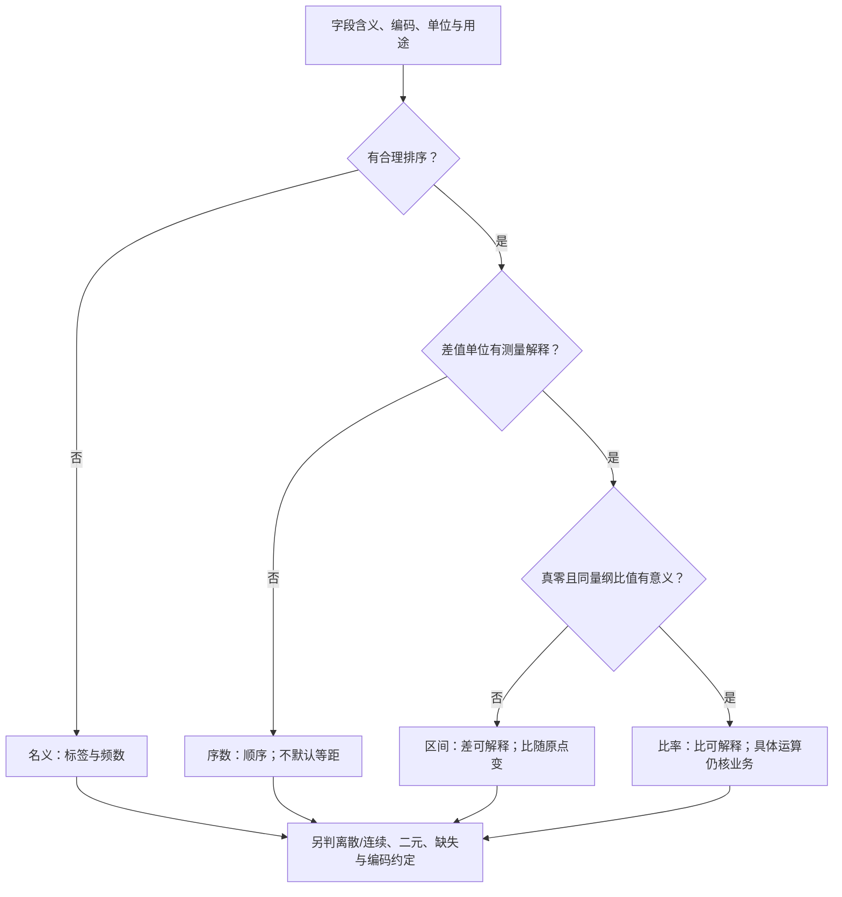
```mermaid
flowchart TD
    TY0["字段含义、编码、单位与用途"] --> TY1{"有合理排序？"}
    TY1 -->|否| TYN["名义：标签与频数"]
    TY1 -->|是| TY2{"差值单位有测量解释？"}
    TY2 -->|否| TYO["序数：顺序；不默认等距"]
    TY2 -->|是| TY3{"真零且同量纲比值有意义？"}
    TY3 -->|否| TYI["区间：差可解释；比随原点变"]
    TY3 -->|是| TYR["比率：比可解释；具体运算仍核业务"]
    TYN --> TYE["另判离散/连续、二元、缺失与编码约定"]
    TYO --> TYE
    TYI --> TYE
    TYR --> TYE
```

顾客编号到TY1无合理大小，走TYN名义。长度米数可排序、差有单位、真零可比值，走TYR。两者到TYE另判离散/连续与编码。文字替代：先排序，再差，再真零，最后判表示类型。

未知字段定义要报需核编码/单位。序数低/中/高不因改为1/2/100就等距。

<details><summary>读图自测：摄氏20/10能到TYR吗？</summary>

不能。转华氏68/50比值不是2，TY3真零条件不成立，到区间；差10度仍有意义。

</details>

按p.4/13原表：Tid只识别人，退款与婚姻标签可分辨但无天然大小，故名义；税前收入有金额单位和真实0，本例为比率。摄氏10/20转换华氏50/68，差变为原来的1.8倍，但比例从2变1.36，故摄氏数值比没有“倍热”含义。重量10/20kg换单位仍比2，支持比率解释。满意度低/中/高改编码为1/2/100仍保顺序，却改变编码均值和差，所以不能由数字值默认等距。

区间的差有意义不意味着两个日历年份相加成为一个有意义年份；比率也不意味着任意乘积都对应物理量。年龄“精确时长”与“记录整岁”是连续量和离散化表示的不同层次，不能只看这批值为整数就推原测量只可能整数。严格序数偶数样本的“两个中间级平均”还需等距假设，否则可报中间类别范围。未知字段定义时输出“需核编码/单位”，不编确定类别。

<details><summary>迁移/诊断：成绩等级A/B/C编码1/2/3，顾客编号1/2/3，长度1/2/3米分别怎样判？把满意度改成1/2/100，哪些结论仍成立？</summary>

等级是序数（若未声明等距评分），编号名义，长度比率；三个字段字面相同不决定类型。单调重编码保排序和类别计数，不能保证平均值、距离或“两倍满意”不变。报告字段意义和允许的尺度转换，别把软件能计算当测量保证。

</details>

**为什么需要它**

这是本讲**最基础也最常考**的分类，且直接决定后面每一节能做什么——**类型决定了"允许的统计量"和"允许的图"**：

每行一种尺度，统计/禁用/图/模型表示分别为条件性用途，不能只看软件是否能算。

| 类型 | 能算什么 | 不能算什么 | 能画什么图 | 进回归前要做什么 |
|---|---|---|---|---|
| 名义 | 频数、众数（§2.8） | 均值、中位数、标准差 | 条形图、饼图 | 造虚拟变量（M02 §2.7.2） |
| 序数 | + 中位数、分位数 | 均值（严格说不行，因为级差未定义） | + 排序后的条形图 | 造虚拟变量，或按等距假设当数值 |
| 区间 | + 均值、标准差、协方差、相关（§2.9–2.11） | 比值、几何均值 | + 直方图、箱线图、散点图（§2.18） | 直接用 |
| 比率 | + 比值、对数变换、变异系数 | — | 同上 | 直接用；右偏时可取对数 |

Ratio取log需正值及用途；序数插值/均值需额外等距假设。表中直接用也不免缺失/尺度检查。

T03 作业第 1 题要求**给 Airbnb 的每一列**做这个判定并各写一句理由——每一句理由都应该是上面"多了什么运算"那一列的话。

**课件原例**

p.13：Tid / Refund / Marital 是名义，Income 是比率。p.9：摄氏温度是区间（0°C 不是"没有温度"），开尔文温度是比率（0 K 是绝对零点；这里仅说明尺度的真零点，不据此推出微观运动状态）。

**🎙️ 课堂补充**（`06:42`–`15:06` + `20:54`–`23:04`，约 10.6 分钟，A · 课上展开）

- 序数属性举例落地到香港的日本拉面店：

> if you go there, you may have some choices, the spicy level of the noodles

（`09:25`），用无辣/微辣/中辣/特辣讲"能排序但级差不固定"——

> …once you go to very spicy, there's a big gap

（`10:14`）；教授自称湖南人，"这几个级别对我来说没区别"。
- 区间属性用"周一到周三"举例，比讲义的日期例子更具体：

> Monday, the distance between Monday and Wednesday, the two SKU values is two days… their intervals, their gaps are fixed. So we can do some simple calculation

（`11:09`–`11:21`；「SKU value」疑为「scale value」的 ASR 误听，见 asr_rows），并用催 PhD 学生交稿举例：

> …now this is Wednesday, your meeting will be two days away. So Wednesday plus two days will be the due date for my PhD students

（`11:32`–`11:41`）。比率属性教授拿自己的年龄打趣：

> …now I'm age 36 and I always hope that my age can be divided by 2

（`13:02`）。
- 🔴 回到 p.13 的 Tid/Refund/Marital/Income/Cheat 表判断 TID 是名义还是比率属性时，教授明说这是往年考题：

> So this is, I think, three years or four years old final exam question. I use this data table to do some questions

（`22:45`–`22:51`）；并强调判断错误的后果：

> Nominal X field as the initial X field, then you may have some mistakes in the downstream analysis, right?

（`22:28`，「X field」疑为「attribute」的 ASR 误听）。
- **这段改变了什么**：三问判定法可用于实际属性识别。TID 的名义/比率判断还被教授明确提为往年期末题型，见 §6.2 🔴。

因此“曾考过”来自录音；具体新考试是否出现，不能由此保证。

**💡 换个说法（笔记补充）· 一个三问判定法**

依次问三个问题，答"是"就往下走：

1. **能排序吗？**（大小 / 先后 / 好坏）不能 → **名义**（眼睛颜色、邮编、城市、房型）。能 → 继续
2. **数值差的单位是否有明确、一致的测量解释？** 不能 → **序数**（满意度 1–5 分：4 到 5 的"距离"未必等于 1 到 2；退订政策 flexible < moderate < strict）。能 → 继续
3. **零代表"完全没有"吗？** 不是 → **区间**（摄氏温度、日期、年份、对数价格）。是 → **比率**（长度、金额、计数、开尔文）

另一个角度：四种类型就是"这列数据允许你做哪些动作"的清单——名义只允许**认**（是不是同一个），序数允许**排**（谁前谁后），区间允许**减**（差多少），比率允许**除**（几倍）。每升一级多一个动作，低级的动作高级都能做。判断一列属于哪级，就问"我对它做减法、做除法，结果说得通吗"。

把它套到 Airbnb（[[IS6400_Business_Data_Analytics/_meta/数据集卡片#Airbnb.csv\|数据集卡片 › Airbnb.csv]]）——**这就是 T03 作业第 1 题的答案骨架，但每一条理由要你自己写**：

每行同类字段的尺度判定，理由来自字段语义/编码，未知争议保持声明假设。

| 列 | 类型 | 理由（用三问法） |
|---|---|---|
| `id` | 名义 | 不能排序（编号大小无意义），只用来区分行 |
| `property_type`、`bed_type`、`city` | 名义 | 类别之间没有顺序 |
| `cancellation_policy` | **序数** | flexible < moderate < strict 有顺序，但"严格程度"的级差没有定义 |
| `cleaning_fee`、`host_has_profile_pic`、`host_identity_verified` | 名义（二元） | 是 / 否 |
| `accommodates`、`bedrooms`、`beds`、`number_of_reviews` | 比率（离散） | 0 = 没有；4 人是 2 人的两倍 |
| `bathrooms` | 比率（离散，取值含 .5） | 同上 |
| `review_scores_rating` | **区间（有争议）** | 评分差有意义，但"100 分是 50 分的两倍好"说不通；也有人按序数处理——**写出你的假设** |
| `log_price` | **区间** | 取对数后 0 对应 \$1 而不是"免费"，零点是人为的；差 0.69 = 价格翻倍，差有意义 |
| `price = exp(log_price)` | 比率 | \$0 是真正的免费；\$200 是 \$100 的两倍 |

log_price0对应1美元，不是免费；bathrooms的0.5是可数取值，不直接判连续。

最后一对最值得体会：**同一个东西（房价），取对数之后从比率变成区间**——因为对数把"倍数"变成了"差"（$\log 200 - \log 100 = \log 2$），"两倍"这个概念被搬到了减法里。这也是 M02 说"log 因变量的系数要读成百分比"的根源。

**⚠️ 常见误解**

- ❌ "是数字就是数值属性。" → 邮编、ID、电话号码、身份证号都是数字，全是名义（讲义 p.8 第一个例子就是 ID numbers）。判断标准是**运算有没有意义**，不是**长得像不像数**。
- ❌ 把序数当区间用，直接求平均。→ 实践中常这么做（"平均满意度 3.6"），讲义也没禁止，但要知道这暗中假设了"各级等距"——答题时把这个假设写出来。
- ❌ "摄氏温度是比率，因为它是数值。" → 讲义 p.9 特意把摄氏 / 华氏放在区间、开尔文放在比率，就是要考这个区别：**有没有绝对零点**。用上面的 68°F / 50°F 例子可以一句话说服自己。
- ❌ 以为四种类型是互斥的四个格子。→ 它们是**累加**的：比率属性同时拥有名义、序数、区间的全部性质（p.10 "all 4 properties"）；所以比率属性也能做频数表、也能排序。

**与其他概念的关系**

名义属性连接 §2.8 的计数和 M02 的虚拟变量。区间、比率属性连接数值统计及直方图、箱线图、散点图。

T03 第 1 题及 §5 术语卡需要英文类型名：Nominal、Ordinal、Interval、Ratio。

**所以呢**：四种类型是按"允许的运算"分的。还有另一套按"取值多少"分的方法——离散 / 连续——以及一种特殊情况：只有"有"才重要的二元属性。它们是下一节。

---

### 2.4 离散 / 连续 · 二元与非对称二元属性（讲义 p.11–12）

**是什么**

先说人话：有的属性只能取"数得清"的值——几个卧室（0, 1, 2, …）、邮编、是 / 否；有的可以取任意小数——温度 23.47°C、身高 1.7532 m、价格 27.38。前者叫**离散**，后者叫**连续**。这是和 §2.3 **独立的另一套**分类：卧室数是"离散 + 比率"，温度是"连续 + 区间"，邮编是"离散 + 名义"。

另外有一类 0/1 属性值得单独说：**"有"和"没有"不对等**。超市有一万种商品，一张小票上只有十几种被买了——"买了"是信息，"没买"是常态。如果把 9,990 个"没买"也当成信息，任何两个顾客都会"高度相似"（因为都没买那 9,990 种），这显然不对。这种只关心 1 的二元属性叫**非对称二元属性**。

讲义 p.11：

> **Discrete Attribute**
> - Has only a **finite or countably infinite** set of values（有限或可数无限个取值）
> - Examples: zip codes, counts, or the set of words in a collection of documents
> - Often **represented as integer variables**
> - Note: **binary attributes are a special case** of discrete attributes（二元属性是离散属性的特例）
>
> **Continuous Attribute**
> - Has **real numbers** as attribute values
> - Examples: temperature, height, or weight
> - Practically, real values can only be measured and represented using a finite number of digits
> - Continuous attributes are typically represented as **floating-point** variables

"可数无限"的意思：计数（0, 1, 2, 3, …）没有上限，但你能一个一个数过去；而 1.4 和 1.5 之间有无穷多个实数，你数不过去——这是离散和连续的本质区别。"Practically … finite number of digits"是在说：电脑存的 1.4 其实是有限位小数，但我们仍把它当连续量看。

讲义 p.12 **非对称名义属性（Asymmetric Nominal Attributes）**：

> - **Only presence (a non-zero attribute value) is regarded as important**（只有"出现"——非零值——才算重要）
> - Examples: Student Attendance? (attend: 1, absent: 0)
>   - Student 1 and student 2 come together? → (1,1) come together, (1,0) only student 1, (0,1) only student 2, (0,0) both absent
>   - N students come together? We need a vector of N binaries
> - **We need two asymmetric binary attributes to represent one ordinary binary attribute**
> - **Association analysis uses asymmetric attributes**

出勤有四种配对：两人都来、只一人来、两人都没来。若要寻找同行，共同出现是有用线索。

共同缺席未必有同样意义：许多从未上这门课的人也同时缺席。采用非对称相似度时，忽略共同为零的次数，保留共同出现及不一致信息。

这是当前任务的选择，不是所有二元属性都必须忽略零。

**为什么需要它**

每卡一种分类维度及用途，内容全部保留；把图选择当常见起点而非穷尽规则。

**离散 vs 连续**

类型影响图和统计量的选择。离散属性常用条形图、频数表；连续数值常用直方图、箱线图。

“最常见卧室数为 1”容易解释。连续测量的精确值常不重复，直接报“最常见身高 1.7532 m”可能没有稳定意义，需考虑分箱或密度。

**对称 vs 非对称二元**

决定了什么：**§2.13 关联规则的前提**：交易数据只记"买了什么"，每种商品是一个非对称二元属性；相似度和支持度只数 1

离散数量也可用数值图；非对称presence计数不把0误当缺失。

**课件原例**

p.11：邮编、计数、文档词集（离散）；温度、身高、体重（连续）。p.12：两个学生是否一起来上课，用 (1,1)/(1,0)/(0,1)/(0,0) 四种组合表示；N 个学生要 N 个二元位。

**🎙️ 课堂补充**（`15:06`–`20:52`，约 5.8 分钟，A · 课上展开）

- 离散属性举例落地到教室本身：

> we can do the counting that in this classroom, how many students in this classroom

（`15:33`），连续属性则是"桌子之间的距离"：

> the distance between all these kind of four desks… there are infinite number of countings of how many distance we can get in these certain intervals

（`15:46`–`16:00`）。
- 非对称二元属性用点名/同行判定展开成完整案例：学生 1、2 是否一起来上课的四种组合——

> If student 1 comes and student 2 comes, if they come together… that's 1-1… If student 1 does not, and student 2 comes, it's 0-1

（`18:04`–`18:24`）；再延伸到零售场景——两人被判定为"一起逛"之后，

> the coupon will only be sent to one of us. The coupon will not be sent to the two different guys in a single group

（`20:03`），因为送一个人另一人也会跟来。
- **这段改变了什么**：课堂将非对称二元属性接到业务动作：观察同行，再考虑只向同行组中的一人发券。

这是讲义没有的应用场景，也连接 §2.13 的商品出现记录。发券效果本身仍需验证。

**💡 换个说法（笔记补充）**

**“two asymmetric binary attributes to represent one ordinary binary attribute”的读法**

普通二元M/F中，两种已知类别同等有信息。单列is_female=0在完整二元编码下可表示另一类；缺失应另记，不能也当0。

若任务只计presence=1，又想把两类都当出现事件，就用is_male与is_female两列，各类在自己的列为1。

这与M02 one-hot相接：property_type四类可展开四列0/1，每行只有一个1，其余为0。许多类别形成宽而稀疏的矩阵；参照编码删一列则另有截距/可识别性条件。

**把 Airbnb 的列按两套分类各标一遍**（T03 作业第 1 题要求两套都标）：

每行离散/连续、每列测量尺度，交叉格给字段例，空格不是缺失数据值。

| | 名义 | 序数 | 区间 | 比率 |
|---|---|---|---|---|
| **离散** | `city`、`property_type`、`cleaning_fee`（二元） | `cancellation_policy` | `review_scores_rating`（整数分） | `accommodates`、`bedrooms`、`beds`、`number_of_reviews` |
| **连续** | —（名义不可能连续） | — | `log_price` | `price`（还原后） |

accommodates既离散又比率；city离散且名义，两套问题分别答。

注意左下角是空的：**名义属性一定是离散的**（类别数得清），但离散属性不一定是名义（计数是离散的比率）。

**⚠️ 常见误解**

- ❌ "离散 = 名义，连续 = 数值。" → 两套分类是**正交**的（互相独立）：邮编是离散 + 名义，卧室数是离散 + 比率，温度是连续 + 区间。上面的表就是证据。
- ❌ 以为 `bathrooms = 1.5` 说明它是连续属性。→ 它只取 0、0.5、1、1.5 … 共 17 个值（数据集卡片 §2.1），数得清，仍是离散的。判断标准是"取值能不能一个一个数过去"，不是"有没有小数点"。
- ❌ 把"没买 = 0"当成和"买了 = 1"一样的信息去算相似度。→ 这正是非对称属性要避免的错误；§2.13 的支持度只数含有这些商品的小票。

**所以呢**：单个属性的两套分类讲完了。属性拼在一起构成数据集，而数据集本身也有不同的形状——不是所有数据都是一张整齐的表。下一节。

---
### 2.5 数据集的三大类：记录 / 图 / 有序（讲义 p.14–18）

讲义 p.14 把数据集分三大类（记录 / 图 / 有序）九小类；§2.5.1 讲本课主食——记录数据的三种小类，§2.5.2 讲另外两大类。

#### 2.5.1 记录数据的三种小类：数据矩阵、文档数据、交易数据（讲义 p.15–17）

**是什么**

记录数据每行一个对象，但列的来源不同。

1. 数据矩阵的列是固定测量值：一朵花的四尺寸。
2. 文档矩阵的列是固定词表：一篇文章中各词的次数。
3. 交易记录先保存一个商品集合：小票长度可不同，不一定先做固定列。

三者都可被分析，进入模型前的表示规则不同，下一段逐一解释。

**① 数据矩阵（p.15）**——最"标准"的表：

> If data objects have the same fixed set of numeric attributes, then the data objects can be thought of as **points in a multi-dimensional space**, where each dimension represents a distinct attribute. Such data set can be represented by an **m by n matrix, where there are m rows, one for each object, and n columns, one for each attribute**

例子是一张 2 × 5 的表（Projection of x Load / Projection of y load / Distance / Load / Thickness），第一行 10.23, 5.27, 15.22, 2.7, 1.2。"points in a multi-dimensional space"这句值得停一下：**一行 5 个数 = 五维空间里的一个点**。Iris 的一朵花有 4 个测量值，就是四维空间里的一个点；150 朵花就是四维空间里的 150 个点。M04 的 PCA 和 W04 的聚类都建立在"对象 = 空间里的点"这个图像上——"两朵花像不像"就变成"两个点离得近不近"。"矩阵（matrix）"在这里只是"m 行 n 列的数字表"的正式说法。

**② 文档数据（p.16）**——把一篇文章变成一行数：

> Each document becomes a **'term' vector**：each term is a component (attribute) of the vector；the value of each component is the **number of times the corresponding term occurs** in the document

例子把 3 篇文档表示成 10 列词频。词表依次为 team、coach、play、ball、score、game、win、lost、timeout、season。

Document 1 的向量是 (3,0,5,0,2,6,0,2,0,2)。逐列读：team 出现 3 次，coach 为 0 次，play 为 5 次。

每词一列，每格为次数，一篇文档就是一行数。体育文章可能在 game/play/score 上较大，经济文章在这些列可能为零。

这样就能比较文档，但常用词有几万个，列数也可能达到几万。这引出 M04 §2.4 的维度问题。

**③ 交易数据（p.17）**——每行是一个"集合"：

> A special type of record data, where **each record (transaction) involves a set of items**。例：a grocery store——一次购物买的所有商品构成一笔交易，每件商品是一个 item

例子：TID 1 = {Bread, Coke, Milk}，TID 2 = {Beer, Bread}，TID 3 = {Beer, Coke, Diaper, Milk}，TID 4 = {Beer, Bread, Diaper, Milk}，TID 5 = {Coke, Diaper, Milk}。注意每行长度不同、没有"列"——它记录的是**买了什么**，不记录没买什么。

**为什么需要它**

三种小类各自对应本课的一类方法，认错类型就会用错方法：

每行一种记录表示及进入方法前的动作；是否容许NaN/类别取决具体估计器，不能只看表形状。

| 小类 | 本课的方法 | 进门前要做什么 |
|---|---|---|
| 数据矩阵 | M02 回归、M04 特征工程与 PCA、后续分类单元 | 必须是 m × n **数值**矩阵：名义列要先 one-hot，缺失要先填 |
| 文档数据 | M04 p.11 "怎么描述一篇文档"、维度灾难的例子 | 先选词、数词频；几千列、几乎全是 0 |
| 交易数据 | **§2.13–2.15 关联规则** | 每行是集合；商品当非对称二元属性（§2.4） |

词频先固定词表；交易集合每商品presence；数值矩阵的固定列和单位需明确。

**课件原例**

p.15 的 2 × 5 数据矩阵、p.16 的 3 × 10 词频表、p.17 的 5 笔交易。

**🎙️ 课堂补充**（`23:23`–`31:51`，约 4.9 分钟，不含穿插的图/时空数据（见 §2.5.2），A · 课上展开）

- 文档数据先用"期末考 A4 cheat sheet"点题，讲义没有这个例子：*"the A4 cheat sheet you can bring to the final exam is actually a document data… this is the most valuable and informative data type you can generate for the preparation of your final exam"*（`24:20`–`24:26`）。
- 回到讲义 p.16 的词频例子时，教授逐格口述怎么数：*"for the value 3, it indicates that in document 1, this keyword team shows three times… but it does not show up in document 2 or document 3, so these two are zeros"*（`30:05`–`30:13`）。数据矩阵只一句带过：*"for the data metrics, that's the most commonly used data"*（`28:34`），没有展开"多维空间的点""m×n 矩阵"这些讲义术语。
- **这段改变了什么**：A4 cheat sheet 例把文档表示接到学生自己的行为，也确认本讲录音所述期末允许一张 A4 小抄，见 ddl_rows。

口述词频与讲义一致。教授仅带过数据矩阵，没有逐字解释“每行是高维空间中的点”；这部分继续标为笔记补充。

**💡 换个说法（笔记补充）**

💡 三种记录数据可按来历区分：

- 数据矩阵：用尺、秤或温度计等测量，形成整齐数值列。
- 文档数据：本讲用固定词表计数，但文本还有其他表示方法。
- 交易数据：先记录每笔买了什么，再将商品出现情况展开成表。

前两种示例已有固定列，购物篮则需要先定义商品列。

交易数据其实也能变成矩阵——把每种商品当一列（非对称二元属性），"买了"记 1、"没买"记 0，p.17 的 5 笔交易就变成一张 5 × 5 的 0/1 表：

每行一张p.17交易，Beer到Milk为商品出现位，1出现、0已知未出现。

| TID | Beer | Bread | Coke | Diaper | Milk |
|---|---|---|---|---|---|
| 1 | 0 | 1 | 1 | 0 | 1 |
| 2 | 1 | 1 | 0 | 0 | 0 |
| 3 | 1 | 0 | 1 | 1 | 1 |
| 4 | 1 | 1 | 0 | 1 | 1 |
| 5 | 0 | 0 | 1 | 1 | 1 |

TID1为Bread/Coke/Milk，行内3个1；5票共16个1/25格=64%，本玩具表并不稀疏。

25格共16个1（每行3/2/4/4/3，共64%）与9个0——这个玩具例子还不算稀疏；真实超市有几万种商品，一张小票只买十几样，99.9% 的格子是 0。这就是 §2.6 说的"稀疏"，也是为什么关联分析只数 1 不数 0（§2.4 非对称属性）：数 0 的话，任意两张小票都"一样"（都没买那几万样东西）。

**⚠️ 常见误解**

- ❌ 以为数据矩阵允许任何类型的列。→ 讲义原文是 "same fixed set of **numeric** attributes"——有名义列（`city`）的表严格说不是数据矩阵，进 sklearn 前要先编码（M02 one-hot）。这就是为什么 T02 要 `OneHotEncoder`。
- ❌ 把词频向量或交易矩阵里的 0 当缺失值去"填补"。→ 0 是"这个词没出现 / 这样东西没买"，是**真实信息**，不是缺失。缺失是"不知道"，0 是"知道是零"。

**所以呢**：记录数据是本课的主食。另外两大类本课只认识一下，但要知道它们为什么不能直接当表用。

#### 2.5.2 图数据与有序数据（讲义 p.14, p.18）

**是什么**

有些数据的关系或顺序本身就是信息。社交网络和网页关注谁与谁相连，属于图数据。

股价、气温及基因序列则不能随意打乱位置。若只保留互不关联的行，可能丢掉连接、时间或邻接信息。

讲义 p.18 **图数据**：Generic graph, a Molecule, and Webpages；配图是教授自己的**合著者网络图**（中心节点 Junming LIU，周围 Hui Xiong、Yong Ren 等）和一张 Facebook 好友网络。对象是点，关系是线，**属性可以挂在线上**（合作了几篇论文）。本课不展开图数据。

讲义 p.14 的完整分类：

每行数据大类，次列列讲义小类，末列定位；有序保位置/顺序，图保关系。

| 大类 | 小类（讲义 p.14） | 长什么样 | 展开页 |
|---|---|---|---|
| **Record 记录** | Data Matrix · Document Data · Transaction Data | 每行一个对象；三种小类的区别在"列"是什么 | p.15–17（§2.5.1） |
| **Graph 图** | World Wide Web · Molecular Structures | 点 + 线 | p.18 |
| **Ordered 有序** | Spatial Data · Temporal Data · Sequential Data · Genetic Sequence Data | 行与行之间有顺序 / 位置关系 | 本讲未展开；时间数据 W07–08 |

Graph的节点/边与记录矩阵各行对象不同，但都可有适当表表示，不由外形推统计独立。

有序数据有四种示例：空间值带位置，时间值带时间戳，序列强调次序，基因序列强调碱基排列。

空间相邻值可能相关；一般序列不必有精确时间，例如先买 A 再买 B。本讲不展开，原安排将时间数据放在 W07–W08。

**为什么需要它**

每项一种关系信息与直接处理限制；时间相关时经典独立误差推断需重核。

| 类型 | 为什么不能直接当记录数据用 | 本课在哪 |
|---|---|---|
| 图 | 每个点的属性表丢掉了"连接"这个最重要的信息 | 不讲 |
| 有序 · 时间 | 行与行相关，M02 §2.5.2 第四条假设（观测独立）失效，回归的 p 值会严重失真 | W07–W08 时间序列 |

有日期一列不自动使所有记录有自相关，也不证明一定失效；需按实际时间依赖及模型条件解释。

**课件原例**

p.18 的合著者网络与 Facebook 好友图。

**🎙️ 课堂补充**（`25:21`–`32:14`，约 4.4 分钟，与 §2.5.1 时间交叉——教授在讲文档/交易数据中间插入了图与时空数据，A · 课上展开）

- 图数据没有展示课件里教授本人的合著者网络图（本讲此时段未出现该图），改用更贴近学生生活的类比：*"chain network collaborations"*（`25:36`）。
- 空间数据用教授自己的研究举例，是讲义没有的内容：*"most of the location-based service, or the location-based marketing, or the research I'm doing, the bike shelving, so the shelved bike, the 共享单车, so we are doing this kind of location-based spatial data to do the analysis"*（`27:05`–`27:14`）。
- 时序数据举股价例子并预告课程安排：*"we will learn in the following lectures of this semester to learn some infrastructure data starting from week 8 or week 9"*（`28:16`，「infrastructure」疑为「unstructured」的 ASR 误听）。
- **这段改变了什么**：图与时序本讲没有展开。空间数据另有教授共享单车研究的例子。

教授说时间方法在“week 8 or week 9”，原话本身不确定。笔记原安排为 W07–W08，两种周次来源并列保留，不能当作已核一致。

**💡 换个说法（笔记补充）**

把三大类想成三种"关系"：记录数据以对象属性为行列，不自动保证各行统计独立；图数据用节点/边表达关系，未必每两节点相连；有序数据保留时间/位置先后。回归、分类与聚类也可通过适当表示使用图/序列信息，不能从表形状推独立或宣称只能处理无关系记录。

另一个角度：Airbnb 这份数据被精简过——原始 Kaggle 版有经纬度（空间有序）和房源描述（文档），精简后只剩记录数据；材料未给精简动机；保留字段可用何种方法仍取决于任务与表示。

**⚠️ 常见误解**

- ❌ 以为时间序列只是"多了一列日期的数据矩阵"，照样跑回归。→ 行与行相关，回归的 p 值会严重失真（M02 §2.5.2）；要用 W07 起的专门方法。
- ❌ 以为图数据只是"两列：谁、和谁"的表。→ 那张表存的是线不是点，"一个人有几个朋友"这种属性要从线上算出来；图上的方法（社区发现、PageRank）本课不讲。

**所以呢**：知道了数据长什么样，下一步是问它**好不好**——有没有错值、缺值、重复，以及它的"体型"（几列、多稀疏、看多细）。

---

### 2.6 数据质量与结构化数据的四个特征（讲义 p.19–20）

拿到数据先别急着算。讲义 p.19 提三个问题，p.20 给四个特征——p.20 这一页在 M04 p.4 **原样重现**，两讲都放，视为课程级重点。

#### 2.6.1 数据质量的三类问题（讲义 p.19）

**是什么**

先做三类数据体检：

1. 查可能的错值与离群值，例如浴室数 80、评分 −5。
2. 查缺失，例如 Airbnb 约 22% 房源没有评分。
3. 查重复，例如同一房源被录入两次。

讲义提出问题，具体处理在 T03 展开。检测到异常不等于已经知道应如何处理。

讲义 p.19：

> - What kinds of data quality problems? / How can we detect problems with the data? / What can we do about these problems?
> - Examples of data quality problems: **Noise and outliers · Missing values · Duplicate data**

三个词分开理解：

每卡一个质量问题，保定义、Airbnb例、发现与处理候选，真实性判断不由规则自动完成。

**噪声 Noise**

意思：测量或录入带来的随机误差，每个值都可能偏一点

Airbnb 里的样子：评分 96 可能实际是 95 或 97

怎么发现（T03）：可借校准、重复测量及业务限制识别部分误差；平均降噪须有相应误差条件（§2.16），不保证抵消系统偏差

怎么办（T03）：聚合、平滑

**离群点 Outliers**

意思：明显远离大多数值的个别观测——可能是错，也可能是真的极端

Airbnb 里的样子：`bathrooms = 8`、`beds = 18`、一晚 \$1,999

怎么发现（T03）：IQR 围栏或 Z 分数（离均值多少个标准差）作候选标记（T03 §3.3），不等于错误判决

怎么办（T03）：删、封顶、或保留但单独说明

**缺失值 Missing**

意思：格子是空的

Airbnb 里的样子：`review_scores_rating` 缺 15,275 个

怎么发现（T03）：`isna().sum()`

怎么办（T03）：均值 / 中位数 / KNN（按可观测相近对象借值，具体机制见 T03 §3.2）填补，或删行、或加一列"是否缺失"

**重复 Duplicate**

意思：同一对象出现多次

Airbnb 里的样子：Iris 有 3 行完全重复

怎么发现（T03）：`duplicated()`

怎么办（T03）：去重，但先弄清是录入重复还是真的两朵一样的花

bathrooms8可真实；IQR/Z只是标记。缺评分15,275的原因需核，填补不创造真实评分。

**p.19三问｜⚪参考作答（笔记推断）**

1. 有哪些质量问题？噪声/异常、缺失、重复。
2. 怎样发现？仪器校准、重复测量及合法范围发现部分误差；isna检查缺失；对象/订单键连来源检查重复。IQR/Z只标异常候选。
3. 怎样处理？先回源判断真实性与缺失原因，保原记录和理由，再比较修正、标记、删除或填补。

删异常可能丢真实尾部，删缺失会改变构成，填值不是新增观察。需要模型评估的处理状态仅在训练侧拟合，不能将一个机械规则当普遍正确。

**为什么需要它**

每行问题、学习位置与可能后果，后果依实现和数据原因，不写所有sklearn都必拒NaN。

| 问题 | 后面在哪用 | 不处理会怎样 |
|---|---|---|
| 缺失 | T03 §3.2 三种填补；作业第 2 题（45 分）主考点 | sklearn 直接报 `ValueError: Input contains NaN`；或者删掉 22% 数据且删掉的系统性地是无评论/无评分房源（新房源只是可能原因，需额外上架日期等证据；数据集卡片 §3.1） |
| 离群点 | T03 §3.3 两种规则 | 均值、标准差、回归系数被少数极端值拉走（M02 说的"杠杆"） |
| 重复 | Iris 的 3 行重复（数据集卡片 §5.1） | 同一朵花算两次，类别比例被扭曲 |

原报告ValueError是可能行为，具体接口另核；删22%评分行改变样本构成，不能只看运行成功。

**课件原例**

p.19 只有三个问题和三类例子，无具体数据。

**🎙️ 课堂补充**（`32:21`–`36:01`，约 3.7 分钟，A · 课上展开）

- 噪声与离群点用 GPS 定位实况举例，讲义没有：

> if you go to central, I don't know whether you use the Google Map in central with so many tall buildings around you. Now your GPS location will be floating around

（`33:20`–`33:27`）；离群点则是

> An outlier means that sometimes when you are walking in Hong Kong, and I keep chasing your location, but suddenly for two seconds, your GPS point was located in Shenzhen, and after three seconds, you go back to Hong Kong. So it does not make any sense, right?

（`34:08`）。
- 缺失值举了非会员购物的例子：

> if you go to the supermarket and you are never a membership… the supermarket has no idea who you are and all your information, the age, membership ID, the gender, all the information will be missing

（`35:00`–`35:14`）；重复记录举自助结账多扫一次的例子：

> you've got to scan this twice… you may have to take more approaches, but you only got one item

（`35:52`–`35:57`，「approaches」疑为「receipts/records」的 ASR 误听）。
- **这段改变了什么**：p.19 的质量问题在课堂各得到具体场景：GPS 漂移或跳点、非会员资料缺失、结账重复扫码。

这些场景帮助判断错误机制，对应任务单 Q2“数据质量三问”的答案，见 answers。

**💡 换个说法（笔记补充）**

三类问题像一份问卷回收后的三种状况：有人**填错了**（噪声、离群点——答"年龄 250"）、有人**没填**（缺失）、有人**交了两份**（重复）。处理原则也一样：填错的看情况改或剔，没填的想办法补或注明，交两份的合并。

检测与处理要分开。pandas 可列出异常候选，但一晚 1,999 美元可能是真实豪宅，是否删除需要业务证据。

评分缺失的房源中，94.5% 是无评论/无评分房源；新房源只是可能原因，当前材料没有上架日期证据。填补会改变缺失机制所携带的信息，需结合缺失机制和目标决定。

**⚠️ 常见误解**

- ❌ "缺失值就删掉整行。" → Airbnb 的评分缺 22%，删掉就丢掉四分之一数据；缺评分的 94.5% 是无评论/无评分房源，可能与房源新旧有关但当前没有上架日期证据——删掉它们，剩下的样本可能对已有评论房源过度代表（数据集卡片 §3.1）。T03 会比较三种填补法。
- ❌ 把离群点一律当错误删掉。→ 一晚 \$1,999 的房源可能是真实的豪宅。规则只能**标记**，是不是错要看业务。

**所以呢**：质量问题是"内容"层面的；p.20 再看数据的"体型"。

#### 2.6.2 结构化数据的四个特征：质量、维度、稀疏、分辨率（讲义 p.20）

**是什么**

先说人话：除了对不对，还要看数据的"体型"：**维度**（dimensionality，几列）、**稀疏**（sparsity，多少格子是 0）、**分辨率**（resolution，用多细的粒度看）。这三个特征决定了后面很多方法能不能用、好不好用。

讲义 p.20 **结构化数据的重要特征**：

每卡一个数据特征，讲义英文完整保留；含比例/地理尺度是原示例，不推广普遍定理。

**Data Quality**

讲义原文：—

意思：上一节的三类问题

**Dimensionality**

讲义原文：The number of attributes · **Curse of Dimensionality**

意思：维度（Dimensionality）就是列数；列太多会带来"维度灾难"（存不下、算不动、点与点之间都很远）

**Sparsity**

讲义原文：Only presence counts · **Less than 1% of the entries are non-zero**

意思：稀疏（Sparsity）：大多数格子是 0（文档词频、交易矩阵、one-hot 之后的表）

**Resolution**

讲义原文：Patterns depend on the scale · The surface of the Earth seems very uneven at a resolution of a few meters, but is relatively smooth at a resolution of tens of kilometers

意思：分辨率（Resolution）：看得多细，看到的模式就不一样

Less than1% nonzero不是所有结构化数据比例；稀疏数零，分辨率改观察粒度。

"分辨率"用讲义的地球例子想：站在地面看，几米内坑坑洼洼；从飞机上看，几十公里的地面是平的。**同一个东西，尺度不同，"规律"不同**——数据也一样：Airbnb 按单个房源看价格乱得很，按城市聚合看就清楚（SF 最贵）；按天看销量全是噪声，按月看季节性就出来了。

**为什么需要它**

每行一个特征及影响步骤，目的与失灵风险分别读。

| 特征 | 后面在哪用 | 不注意会怎样 |
|---|---|---|
| 维度 | M04 §2.4 维度灾难（100 万条 × 10 万维 = 800 GB） | 算不动、过拟合 |
| 稀疏 | §2.13 关联规则只数 1；文档数据 | 相似度算错（都是 0 的格子让所有对象"相似"） |
| 分辨率 | §2.16 聚合 | 看错尺度就找不到规律 |

800GB来自密集float64；稀疏存储另有结构，不能把所有高维表都说存不下。

**课件原例**

p.20 的地球表面：几米分辨率看崎岖不平，几十公里分辨率看相对平滑。

**🎙️ 课堂补充**（`36:01`–`41:57`，约 5.9 分钟，A · 课上展开）

- 维度用"库存表"讲了一个讲义没有的反面案例：仓库经理偷懒不每天盘点，把几天销量凑成一天——

> They will just, okay, today my sales is zero, and tomorrow my sales is zero, and on the third day I will sum the three day sales together as a single day sale

（`36:43`–`36:48`），并点出这种脏数据修不了：

> For that wrong quality data set, we can do nothing

（`37:20`）。
- 分辨率用 3 秒买卖盘例子，对应任务单信号词：

> my other paper actually deals with the stock price at 3 second level, very high resolution. Every 3 seconds, we refresh the price at the bid-ask list

（`41:28`–`41:38`）；隐私权衡则举了小红书：

> if you play Xiaohongsu, you know, when you have a post or comment, others will see the promise level of your comments, right?

（`40:46`–`40:59`，「promise level」疑为「approximate/proximity level」的 ASR 误听）。
- **这段改变了什么**：库存例说明，原记录丢掉真实每日分配后，未必能准确补救。

3 秒 bid-ask 例则说明分辨率影响可见模式。更细记录可能提高定位精度，也带来成本与隐私取舍；这些讨论超出 p.20 原文。

**💡 换个说法（笔记补充）· 用 Airbnb 把四个特征各填一个数**

已有数据集卡片的Airbnb记录按四件事读，以下不冒称本轮重新运行全卡：

- 质量：review_scores_rating缺15,275（22.4%）；两个host字段各缺180且同批。1.5×IQR标log_price异常候选1,453；完全重复行0。
- 维度：原15列。四类别字段property_type4类、city6类、cancellation_policy5类、bed_type5类，全one-hot共20列；15−4+20=31列。
- 稀疏：这20个指示列中，每行4个1、16个0；完整类别字典及缺失策略是前提。
- 分辨率：按房源log_price标准差0.71；按城市取中位数是另一粒度，SF=5.075为六城市最高（T03§3.1）。

来源：[[IS6400_Business_Data_Analytics/_meta/数据集卡片|数据集卡片]]。频率、分母和粒度不同，不把四种数值合为同一质量分。

另一个角度：三个特征其实是同一件事的三面——**数据在"空间"里怎么分布**。维度是空间有几根轴，稀疏是点都挤在轴上还是散在空间里，分辨率是你拿多大的格子去数点。格子太小（分辨率太高）每格只有零星几个点，看起来全是噪声；格子太大又把不同的东西混在一起。

**⚠️ 常见误解**

- ❌ 把"稀疏"当"数据少"。→ 稀疏说的是**格子里 0 多**，数据可以很大但很稀疏（几万篇文档 × 几万个词）。
- ❌ 以为分辨率越高越好。→ 讲义的地球例子说的正相反：模式取决于尺度，太细反而看不到规律；§2.16 的澳大利亚降水例子会区分sum/mean、单位与相关条件，不能从一张图推聚合必减波动。

**所以呢**：第一段"数据类型"到此结束（讲义 p.21 又贴一张标题页，红字切到 Descriptive Analytics · Simple Statistics）。下面开始用数字描述数据——先从"用几个数、几张表、几张图把一万行压缩到能看懂"这个总目标说起。

---
### 2.7 描述性分析总览：三种探索方式（讲义 p.21–22）

**是什么**

Airbnb 有 68,133 行，逐行看很难概括。描述性分析把它压缩成几个统计量、分组表及分布图。

原价格算术均值约 158.55 美元，中位数 110 美元。exp(平均 log_price) 约 118.5，是几何平均，不能与算术均值混用。

再按六城列中位价、画价格直方图，才能决定是否变换目标、选列或分城建模。

讲义 p.22：

> The first target of descriptive analytics is to **present data in a form that makes sense to people** so that we can further contemplate about the data and get information to support decision making.
> - A tendency to race through "descriptive statistics"（人们常常匆匆略过描述统计）
> - The "descriptive statistics" is **simple, complex and important**.（它简单、复杂、且重要）
>
> Three ways to explore a data set:
> - **Numerical summary measures**：Descriptive statistics（counts, percentages, averages, measures of variability）；Tables of summary measures（例如 pivot table）
> - **A variety of graphs**：bar charts, pie charts, histograms, scatterplots, time series graphs（data visualization）

三种方式各回答一类问题：

每卡一种描述方式，保问题、具体例、章节与API；API行不是全套统计充分证明。

**数（summary measures）**

回答什么：一列数据的中心、离散、形状

例子：`log_price` 均值 4.775、中位数 4.700、偏度 0.53

本讲哪节：§2.8–2.10

pandas 里怎么做（T03）：`describe()`、`value_counts()`、`quantile()`、`skew()`

**表（tables，pivot table）**

回答什么：按某个类别分组后各组的统计量

例子：六个城市各自的中位价

本讲哪节：§2.16 聚合

pandas 里怎么做（T03）：`groupby('city')['log_price'].median()`

**图（graphs）**

回答什么：分布的形状、两列的关系、多列的模式

例子：价格直方图、面积 × 价格散点图

本讲哪节：§2.18

pandas 里怎么做（T03）：`hist()`、`boxplot()`、`scatter()`、`parallel_coordinates()`

log均值4.775不能直接exp成算术均价；city分组中位数是另一对象粒度。

“simple, complex and important”可这样理解：统计量的基本运算简单，但选什么量、按什么组、画什么图仍需判断。

这些决定影响建模。价格右偏可提示比较对数变换；评分缺 22% 要先查缺失机制。

beds/accommodates 相关约 0.83，要继续诊断条件信息与验证表现，不能只凭相关删列。

**为什么需要它**

本页连接 §2.8–2.12 的统计量、§2.16 的分组表和 §2.18 的图。T03 第 1 题要求完整描述统计、频数、分位数、分组比较及至少 5 条 insight。

第 2 题要求至少 8 张图，每张有标题、轴标签和 2–3 句解释。

解释要落到含义。例如“评分缺 22%”只是数字；若原因是没有评论，填中位数就引入了“新房源像典型房源”的假设。

**课件原例**

无具体案例；pivot table（数据透视表，Excel 里的分组汇总表）作为"表"的例子。

**🎙️ 课堂补充**（`43:41`–`44:08`，约 27 秒，B · 讲了同讲义）：教授简述"描述性分析要用几个数/图把数据讲清楚，也能顺带看出关联模式"——

> we want to describe the data we have using some summary statistics or some simple calculations… we can also extract some alters or the association patterns from different SKUs

（`43:41`–`44:08`，「alters」疑为「outliers」、「SKU」疑为「attribute」的 ASR 误听），没有比讲义 p.22 增加新内容，只是把"三种探索方式"和后面 §2.13 的关联规则预先连了一句。

**💡 换个说法（笔记补充）**

💡 数、图、表是三种互补的观察方式。数给精确摘要，图展示形状，表方便按城市等分组比较。

均值高于中位数可提示查看右侧大值，但不是所有分布的偏度判定定理。结合图和原始值，才能理解摘要为何如此。

💡 描述分析也像给老板写一页摘要：关键数字、分组对比与配图各回答不同问题。

读者可能只看到这一页，所以每个数字都应解释业务含义和条件。这就是作业要求的 insight。

**⚠️ 常见误解**

- ❌ 以为描述统计 = 跑一下 `describe()`。→ `describe()` 只给数值列的 8 个数（count / mean / std / min / 25% / 50% / 75% / max），不给众数、偏度、峰度、分组、类别频数——T03 cell 5 自己写了一个 `describe_col` 函数补齐这些，作业要求的也是完整版。
- ❌ 以为"图"只是让报告好看。→ 图能看出数看不出的东西：多峰（混合了几群）、非线性关系（U 形）、离群点在哪——§2.18 每种图都对应一个统计量看不见的信息。

**所以呢**：先从最简单的类别变量开始——它只能数。

---

### 2.8 类别变量：只能计数（讲义 p.23）

**是什么**

先说人话：`city` 这一列的值是 NYC、LA、SF……**没法求平均**（"平均城市"没有意义），也没法排大小。它唯一能做的事是**数每一类有多少个**：NYC 31,232 个、LA 19,936 个……再换算成百分比。这就是类别变量的全部描述统计——频数分布（frequency distribution，每一类各有多少个观测的表）。

讲义 p.23：

> Only a few possibilities exist for describing categorical variables, based on **counting**.
> - Count based on the number of categories（数有几个类别）
> - Count the number of observations in each category（数每类有几个观测）
> - **Frequency distribution**: frequency of observations in non-overlapping classes/cells（频数分布：各互不重叠的类里的观测数）
> - Excel's COUNTIF function. The function takes two arguments: the data range (**where**) and a criterion that one wants to count (**what**).

"non-overlapping"（互不重叠）是频数分布的前提：每个对象只能落进一个类——一个房源只能在一个城市。如果一个对象能同时属于多个类（一篇文章既是"体育"又是"经济"），频数加起来会超过总数，那就不是频数分布。

**数字例子**（Airbnb `city`，[[IS6400_Business_Data_Analytics/_meta/数据集卡片\|数据集卡片]] §2.2 实跑）：

每行一城市，频数数房源，百分比分母为同68,133记录；合计行不是第7城市。

| city | 频数 | 百分比 |
|---|---|---|
| NYC | 31,232 | 45.84% |
| LA | 19,936 | 29.26% |
| SF | 5,542 | 8.13% |
| DC | 5,210 | 7.65% |
| Chicago | 3,195 | 4.69% |
| Boston | 3,018 | 4.43% |
| 合计 | 68,133 | 100% |

NYC31,232/68,133≈45.84%，只是这六城市数据来源构成，不外推美国全部Airbnb。

读法：6 个类别（第一条 count）；每类的个数（第二条）；**NYC + LA 占 75.1%**——这个"类别不平衡"只有数过才知道，它意味着任何全样本的结论主要是纽约和洛杉矶的结论。

**💡 从每一行到频数与分母（笔记补充）**

用p.4/13十条婚姻记录：Single/Married/Single/Married/Divorced/Married/Divorced/Single/Married/Single。

先声明三类顺序只用于显示。保存当前行i与计数字典：

1. 所有计数置0。
2. 读一行，只给该行类别加1。
3. 十行完成后，核计数和等于有效行数。
4. 用同一个已声明分母计算各比例。

读取每条记录的状态在下表；累计频数若用于序数，先按真实等级排序。

每行列出已处理记录/值序列/累计三类计数，箭头表示同顺序累加，S/M/D为类别缩写。

| 已处理行 | 当前值 | Single/Married/Divorced计数 |
|---|---|---|
| 0 | 初始化 | 0/0/0 |
| 1/2/3/4 | S/M/S/M | 1/0/0 → 1/1/0 → 2/1/0 → 2/2/0 |
| 5/6/7 | D/M/D | 2/2/1 → 2/3/1 → 2/3/2 |
| 8/9/10 | S/M/S | 3/3/2 → 3/4/2 → 4/4/2 |

第8/9/10步3/3/2→3/4/2→4/4/2，十行有效计数和10。

频数为 4、4、2，相对频数为 0.4、0.4、0.2，总和为 1。Single 和 Married 并列众数，不能强选一个。

计数时保留下列状态，便于检查漏数或重复数。

| 符号 | 对象 |
|---|---|
| i | 已读记录数 |
| $n_j$ | 第 j 类计数 |
| $N_{valid}$ | 已读有效记录总数 |
| $f_j=n_j/N_{valid}$ | 有效记录中的类别比例 |

每读一个有效值，只增加对应类，因此计数总和等于已读有效行数。序数累计频数须按真实等级排序，不能把出现次序当等级。

图问：每行怎样累加到频数，缺失改变哪个分母？箭头是计数控制，FC2回环逐行读取。

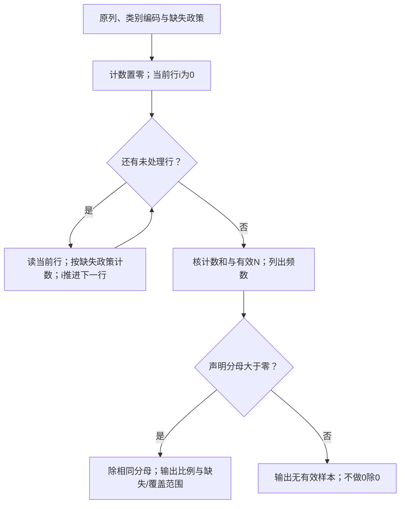
```mermaid
flowchart TD
    FC0["原列、类别编码与缺失政策"] --> FC1["计数置零；当前行i为0"]
    FC1 --> FC2{"还有未处理行？"}
    FC2 -->|是| FC3["读当前行；按缺失政策计数；i推进下一行"]
    FC3 --> FC2
    FC2 -->|否| FC4["核计数和与有效N；列出频数"]
    FC4 --> FC5{"声明分母大于零？"}
    FC5 -->|是| FC6["除相同分母；输出比例与缺失/覆盖范围"]
    FC5 -->|否| FCF["输出无有效样本；不做0除0"]
```

十条婚姻记录FC1清零，FC3每次只加所属类，最终FC4得4/4/2、有效N10。FC6除10得0.4/0.4/0.2；多众数Single/Married保留。文字替代：按行计数→核总数→同分母相除。

第11缺失若排除，前三类仍除10，缺失另报1/11；纳入类别则统一除11，不混分母。

<details><summary>读图自测：空列从FC5走哪里，可给100%某类吗？</summary>

到FCF无有效样本；没有比例分母，不能编100%。

</details>

若加第11行缺失，有两合法但不同政策：排除缺失时前三类仍4/4/2，分母10，另报缺失1/11；把缺失当单独状态则四类4/4/2/1，分母11，比例4/11、4/11、2/11、1/11。不能前三类除10又把缺失1/11塞同一“总和1”表。新未登记类别可扩计数字典，须保字段定义；0是合法二元值时不能按缺失跳过。样本百分比描述这份来源，不推成全城市/全部客户真实比例。

<details><summary>迁移/诊断：六行S/M/缺失/D/M/S，按排除缺失与单独类别各给结果；空输入该输出100%某类吗？</summary>

缺失处理改变分母，先声明政策再计算：

| 政策 | 计数 | 分母与比例 |
|---|---|---|
| 排除缺失 | S=2、M=2、D=1 | 5，比例为 0.4、0.4、0.2 |
| 纳入缺失类 | 2、2、1、1 | 6 |

排除政策下还要另报缺失占 1/6。空输入没有有效分母，应报空频数及未定义比例。

并列最高频保留多众数。类别编号求平均不能替代频数分析。

</details>

**为什么需要它**

名义、序数类别的编码不提供等距加法意义，不能随意求编码均值。频数可进一步形成比例与众数，序数还可报告顺序统计。

这些结果是条形图、饼图及虚拟变量设计的基础。稀有类别的系数可能不稳，但不能预判必然异常，见数据集卡片 §5.3。

T03 第 1 题要求逐类别变量给频数和百分比表。

**课件原例**

Excel 的 `COUNTIF(range, criterion)`：第一个参数是"在哪里数"，第二个是"数什么"。

**🎙️ 课堂补充**（`44:13`–`45:19`，约 1.1 分钟，A · 课上展开）

- 频数计数举了上周刚学的 `property_type`：*"For example, for the categorical attributes, like last week when we have the property type… you can come here and see what are the unique categories we have in this column"*（`44:28`–`44:37`），把 §2.8 和 M02/T02 的 Airbnb 数据直接连了起来。
- 更进一步举了欺诈检测的类别不平衡，讲义没有：

> for the bank transaction detection, fraud or non-fraud transactions labels, you need to do the frequency counting and see how many records in your data set would be fraud transactions and how many of them are normal transactions… these two numbers are very different from each other and you may have an imbalance of data issue

（`44:59`–`45:12`）。
- **这段改变了什么**：频数还能发现分类标签不平衡，不只是描述城市分布。

课程项目若做分类，先数各类记录，便能及时发现训练和评价需要考虑的稀有类问题。

**💡 换个说法（笔记补充）**

pandas 一行：`df['city'].value_counts()` 给频数，`value_counts(normalize=True)` 给百分比（T03 cell 10 对 Iris 的 `class` 数出三类各 50 朵、各 33.3%——一个完全平衡的例子，和 Airbnb 的 45% / 29% / 8% … 形成对比）。**序数变量多一步**：`cancellation_policy` 除了数频数（strict 43.7%、flexible 30.5%、moderate 25.6%），还可以按 flexible < moderate < strict 排好序再看累计百分比——"56% 的房源政策不严于 moderate"。

另一个角度：频数分布是类别变量的"直方图"——把每一类当一根柱子，柱子的高度是个数。数值变量的直方图要先切箱（§2.18.2），类别变量天生就分好了箱，所以只剩"数"这一步。

**⚠️ 常见误解**

- ❌ 对序数变量（评分 1–5、退订政策）只做频数。→ 序数还能排序，所以中位数、分位数也有意义（"中位数政策是 moderate"）；频数是底线不是上限。
- ❌ 把百分比当成概率去外推。→ NYC 占 45.8% 是**这份数据**里的比例，不是"美国 Airbnb 有 45.8% 在纽约"——这份数据只有 6 个城市（采样偏差，数据集卡片 §5.6）。
- ❌ 给名义变量编号后求平均。→ NYC = 1、LA = 2……然后算出"平均城市 = 1.9"——编号只是标签，§2.3 说过名义属性没有加法。

**所以呢**：数值变量能做的就多了——中心在哪、散得多开、形状是歪的还是对称的。下面两节。

---
### 2.9 数值变量 I：集中趋势、分位数与离散程度（讲义 p.24–26）

讲义 p.24 先给一张清单（这是 §2.9–2.11 三节的目录）：

> **Single Variable**
> - Measures of **central tendency**：Mean, Median, Mode；Minimum, Maximum, Percentiles, and Quartiles
> - Measures of **dispersion/variability**：Range；IQR: interquartile range；Variance；Standard deviation
> - Measures of distribution **shape**：Skewness（occurs when the sample is lack of symmetry）；Kurtosis（this is all about the extreme observations）
>
> **Multiple variables**：Covariance and correlation

描述一列数字要回答三个问题——**中间在哪**（集中趋势 central tendency）、**散得多开**（离散程度 dispersion）、**形状歪不歪**（§2.10）。下面三个子节各答一个。

#### 2.9.1 三种"中间"：均值、中位数、众数（讲义 p.24）

**是什么**

“一晚 Airbnb 大概多少钱”可以对应三种问题：

- 将总价平均摊到房源：均值约 158.55 美元。
- 排序后取中间位置：中位数 110 美元。
- 找出现最多的价格：众数。

它们对极端值反应不同，所以答案可能不同。集中趋势就是描述一列数据的中心，讲义列出以下三种度量：

每行一个中心量，“算法”给计算，“一句话”解释问题，“极端”保适用边界。

| 统计量 | 怎么算 | 一句话 | 怕极端值吗 |
|---|---|---|---|
| **均值 Mean** $\bar{x}$ | 全部加起来除以个数 | "平均每个多少" | **怕**：一个 \$1,999 的房源会把均值拉高 |
| **中位数 Median** | 从小到大排好，取正中间那个（偶数个就取中间两个的平均） | 排序位置两侧各至少一半观测值不大于/不小于它；有并列时不必严格一半小于、一半大于 | **较不敏感**：仍处同一尾端时可不变，重排仍可改变 |
| **众数 Mode** | 出现次数最多的值 | "最常见的是多少" | 频数可因改值/舍入/分箱变化；连续测量众数依赖精度，勿过度解读 |

众数64/81并列，不强给唯一；数值中位偶数平均不能无条件套到仅序数标签。

$$\bar{x} = \frac{1}{n}\sum_{i=1}^{n} x_i$$

每行均值公式角色，xi为有效观察，n是相同缺失政策后的数，xbar为原单位结果。

| 符号 | 含义 | 已知 / 要算 |
|---|---|---|
| $x_i$ | 第 $i$ 个观测值 | 已知 |
| $n$ | 观测个数 | 已知 |
| $\sum_{i=1}^{n}$ | 从第 1 个加到第 $n$ 个 | — |
| $\bar{x}$ | 样本均值 | 要算 |

九数总648/9=72，sum×count关系不代表分布对称。

**数字例子（手把手）**（讲义 p.26 那 9 个数：63, 64, 64, 70, 72, 76, 77, 81, 81，`verify_m03r.py`）：

1. 均值：$63 + 64 + 64 + 70 + 72 + 76 + 77 + 81 + 81 = 648$，$648 / 9 = 72.0$；
2. 中位数：已排好序，9 个数正中间是第 5 个 = **72**；
3. 众数：64 和 81 各出现 2 次，双众数。

均值和中位数都是 72，但这不证明对称：例如 63 的镜像应是 81，64 的镜像应是 80，原组却没有 80。换 Airbnb 的价格（`verify_m03r.py`）：均值 **\$158.55**、中位数 **\$110**、差了 48 美元——因为少数几百上千美元的房源把均值拉高了。

**为什么公式长这样**：均值是"把总量摊平"——分子是总和，分母是个数，所以它保留了"总量"的信息（均值 × 个数 = 总和），代价是每个值都参与、极端值也参与。中位数主要依赖排序位置；偶数个数的数值中位数还要平均两个中间值。只把仍在最尾端的值推得更远时，中间位置可能不动；若改值跨过排序位置，中位数也会变。

**中心量的边界**：单个数时，均值、中位数、众数都是该值。全部值相同时，三者也相等。

关于某中心对称且均值存在时，该中心是均值，也可作中位数。

本九数例把一个尾端 81 改为 8100，均值变为 963，中位数仍为 72。但一般改变任意一条记录，中位数也可能变化。

**机制状态与共同数据流（笔记补充）**

输入是同尺度有效值与缺失政策。输出各统计量时要保存所用样本数、分位定义与方差分母。

- 均值：逐行保存sum/count，读完才相除。
- 中位数：排序后按有效n奇偶定位；偶数数值型中间值可按声明尺度平均。
- 众数：计数字典取全部最高频值，并列不强选一个。
- 分位：先选半分法或线性插值，再定位。
- 标准差：先选样本n−1或固定这批总体n，再求平方偏差和。

九数得均值72、中位72、众数64/81。这些重合或并列不证明原分布对称，需看原值及图形。

图问：同九数的中心、分位、散布怎样共享输入又各用不同状态？实线箭头是计算依赖，不是所有统计都先过均值。

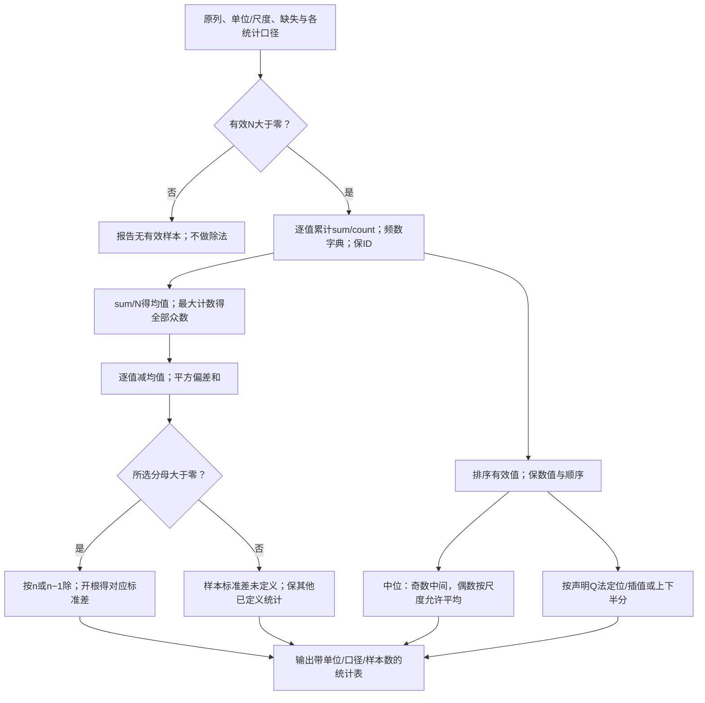
```mermaid
flowchart TD
    STV0["原列、单位/尺度、缺失与各统计口径"] --> STV1{"有效N大于零？"}
    STV1 -->|否| STVF["报告无有效样本；不做除法"]
    STV1 -->|是| STV2["逐值累计sum/count；频数字典；保ID"]
    STV2 --> STV3["sum/N得均值；最大计数得全部众数"]
    STV2 --> STV4["排序有效值；保数值与顺序"]
    STV4 --> STV5["中位：奇数中间，偶数按尺度允许平均"]
    STV4 --> STV6["按声明Q法定位/插值或上下半分"]
    STV3 --> STV7["逐值减均值；平方偏差和"]
    STV7 --> STVC{"所选分母大于零？"}
    STVC -->|是| STV8["按n或n−1除；开根得对应标准差"]
    STVC -->|否| STVS["样本标准差未定义；保其他已定义统计"]
    STVS --> STV9
    STV5 --> STV9["输出带单位/口径/样本数的统计表"]
    STV6 --> STV9
    STV8 --> STV9
```

九数STV2得sum648/count9及频数，STV3得均值72、众数64/81；STV4排序后STV5中位72，STV6按半分Q1=64/Q3=79。STV7/8才按选定分母算方差/std。文字替代：累加、排序与偏差分别产生输出。

均值/中位相同不证明对称。样本方差n−1与总体n分母先声明；空/单值量分别处理。

<details><summary>读图自测：众数并列时必须用STV4顺序选第一个吗？</summary>

不应。STV3返回全部最高频值64/81；排序只为中位/分位，不解除并列。

</details>

样本方差分母 n−1 与估计均值后的约束有关：$\sum_i(x_i-\bar x)=0$。因此偏差只有 n−1 个独立方向。

若数据是独立同分布抽样，且总体方差有限，除以 n−1 的方差估计在反复抽样平均上无偏。推导见 §2.9.3；其他抽样设计要另定估计量。

若只描述固定这批值，可声明使用分母 n。n=1 时样本标准差未定义，n=0 时均值未定义；有效常数列的描述方差为零。

中位数对尾部极值通常更稳健，却不保证任何改值都不动。例如 [1,2,3] 的 1 改为 100，中位数从 2 变为 3。

<details><summary>迁移/诊断：五数[2,3,3,5,7]从均值、样本标准差、众数走到半分Q；若用numpy线性Q会怎样？</summary>

均值4，平方偏差和16，样本方差4/std2；中位3/众数3。去中位半分Q1=(2+3)/2=2.5，Q3=(5+7)/2=6；numpy线性q25/q75为3/5。不同定义是口径差，不能在同一张表将两套拼用；总体n分母方差3.2也不是同一个样本估计。

</details>

**为什么需要它**

三种"中间"回答三个不同的业务问题：

每行一个业务描述问题，统计量必须配采样对象、金额单位及实际是否发生的条件。

| 问题 | 用哪个 | Airbnb 例子 |
|---|---|---|
| 平台一晚总收入是多少 | 均值 × 房源数 | 158.55 × 68,133 |
| 一个典型房源一晚多少钱 | 中位数 | \$110 |
| 最常见的定价是多少 | 众数 | — |
| 填补缺失的评分 | 看分布形状定（§2.10） | 本例中位 96 与均值 94 不同，可作为候选填补；左偏不足以单独证明最优 |

158.55×68,133只能给该样本挂牌价的总量；若称一晚平台收入，还需每房当晚成交/入住及相同计价，不能由房源数等同已赚收入。

T03 作业第 1 题要求三个都报；第 2 题要求比较"均值填补 vs 中位数填补"——就是在考这三者对极端值的不同反应。

**课件原例**

p.24 的清单；p.26 的 9 个数（中位数 72）。

**🎙️ 课堂补充**（`45:32`–`46:07`，约 35 秒，B · 讲了同讲义）：教授把均值、中位数、众数、IQR、形状、相关性一口气点名带过——

> we have to do some mean, median, or more calculations to get minimum, maximum percentiles of your data. And also calculate the inter-portal range and relevance. Also we can get the shape, the smoothness, or closeness of your variables

（`45:32`–`45:44`，「inter-portal range」疑为「interquartile range」、「relevance」疑为口误或「variance」，均未确认），随后明说不再重复最基本的部分：

> I'm not repeating the minimum and maximum, but here I want to inform you about the percentiles, because soon we will have a box plot using these calculations

（`46:07`）——三种"中间"本身没有展开新内容，直接跳到百分位数。

**💡 换个说法（笔记补充）**

均值回答“总量平均摊多少”，适合总预算等问题。中位数回答排序后的中间水平，常用于价格或工资分布。

众数回答“最常见的是哪个”，例如卧室数为 1。报道高均值工资时，要检查它是否代表读者想了解的典型水平。

另一个角度：均值与中位数的差可以生成“某侧极端值拉动”的查图假说，但不能由它们的顺序单独确定偏度或由重合证明对称。众数还可能并列、多峰，须联合直方图、原值与 §2.10 的三阶贡献判断；原九数就是重合不等于镜像对称的反例。

**⚠️ 常见误解**

- ❌ 以为“均值就是典型房源价”。→ 均价约158.55美元高于中位数110，受到尾部高价影响；它仍低于Q3约180，不能说比四分之三房源都贵。本轮只定向读取原Airbnb.csv的log_price逆变换：68,133行中46,950低于均价，约68.91%。原句的75%比较不成立。报告典型价格可比较中位数，并说明要回答的问题。

**所以呢**：中间在哪知道了，下一步是一把更通用的尺子——分位数，它把"中位数"推广到任意百分比。

#### 2.9.2 百分位数与四分位数（讲义 p.25）

**是什么**

把房源价格从低到高排，先选一个排名比例，再返回对应价格。

- 25%位置约73美元。
- 50%位置为中位数，约110美元。
- 75%位置约180美元。

这种“位置换成原单位的值”叫百分位数。有限样本可能在邻值间插值，有重复也不保证恰好某比例严格更便宜。四分位数分别定位25%/50%/75%，不是返回三个百分数字。

> For any percentage $p$, the $p$th **percentile** is the value such that a percentage $p$ of all values are less than it.
> - The **quartiles** divide the data into four groups, each with (approximately) a quarter of all observations
> - The first, second and third quartiles are the percentiles corresponding to $p$ = 25%, 50%, 75%
> - **The second quartile ($p$ = 50%) is equal to the median**

四分位数（quartile）给队伍的四个比例区间切点；有限样本、并列值及不同分位算法使每段人数不一定恰好相同；三个切点 $Q_1, Q_2, Q_3$ 就是第 25、50、75 百分位数。

**数字例子（手把手）**（讲义 p.26 那 9 个数，讲义用的"两半各取中点"法，`verify_m03r.py`）：

1. 排好序：63, 64, 64, 70, **72**, 76, 77, 81, 81；中位数 $Q_2$ = 第 5 个 = 72；
2. 下半段 63, 64, 64, 70 有 4 个数，中点是中间两个的平均：$(64 + 64) / 2 = 64 = Q_1$；
3. 上半段 76, 77, 81, 81 的中点：$(77 + 81) / 2 = 79 = Q_3$。

Airbnb `log_price`（`verify_airbnb.py`）：$Q_1$ = 4.290、中位数 = 4.700、$Q_3$ = 5.193；还原成美元是 **\$73 / \$110 / \$180**；第 99 百分位数约为 \$950，表示接近最高 1% 的边界；严格超过阈值的比例仍须按并列值与分位政策另数。

**为什么需要它**

分位数连接 §2.9.3 的四分位距、§2.18.3 的箱线图，以及 T03 §3.3 的 IQR 离群点规则。箱的边界用 Q1、Q3，IQR 是两者之差。

它也可描述市场位置：180 美元约在这批房源的第 75 百分位。但存在并列价格与插值，不能说它严格比四分之三房源贵。

**笔记纠错**：按原始 exp(log_price) 与字面 180 严格比较，较低的有 50,546/68,133，约 74.1873%。若按美分舍入，有 574 个价格恰等于 180；两种比较口径不能混用。

**课件原例**

p.26 的 9 个数：$Q_1$ = 64、$Q_3$ = 79。

**🎙️ 课堂补充**（`46:19`–`49:04`，约 2.75 分钟，A · 课上展开）

- 教授把百分位数的定义念了一遍讲义原句：*"For any percentage P, the P's percentile is the value such that percentage P of all actual values are less than this threshold"*（`46:19`–`46:27`）。
- 现场带着算 9 个数的 Q1/Q3，和笔记 §2.9.2 的例子（63,64,64,70,72,76,77,81,81）完全对上：

> So among these nine records of these attributes, I want to calculate the Q1 of the 25 percentile… So 64 would be the 25 percentile that, about 25 percentage of total x values will be smaller than this threshold

（`46:54`–`48:03`）；Q3 同样现场算出：

> Q3 is 75 percentile… so it's in the middle between 77 and 81 and actually the average of these two are just in the observations so it is 79

（`48:12`–`48:38`）。
- **这段改变了什么**：录音确认九数例就是 p.26 那组数，课堂算得 Q1=64、Q3=79。

它是教授现场演算的例子，非笔记自编。结果仍要连同课堂使用的四分位算法理解。

**💡 换个说法（笔记补充）**

百分位数就是"排名换算成值"：考试说"你在前 10%"是排名，说"前 10% 的分数线是 85 分"就是第 90 百分位数。分位数先由排序位置定位，必要时还会平均或插值相邻数值。尾值仍在同一尾端时通常比均值较不敏感，但改值造成重排、样本太小或目标靠近尾端时也可能变化；稳健不等于永远不变。

⚠️ 一个会让作业对不上数的细节：**分位数有好几种算法**。讲义用"把数据切成两半各取中点"，得 $Q_3 = 79$；pandas 的 `quantile(0.75)` 默认用线性插值，同一组数算出 $Q_3 = 77$、IQR = 13（`verify_m03r.py`）。两种都对，答题时说明用的是哪种；作业用 pandas 就按 pandas 的数。

**💡 笔记补充 · 线性分位数怎样定位并执行**

先选好算法，再问第几分位。`numpy.quantile(..., method="linear")` 与这里的 pandas 默认线性口径：将有效值排为 $v_0,\ldots,v_{n-1}$，下标从 0 起；目标比例 $q\in[0,1]$，不是百分数 25。保存虚拟位置 $h$、左下标 $j$、插值权重 $g$：

先定位虚拟位置：

$$h=(n-1)q.$$

再找左邻居下标：

$$j=\lfloor h\rfloor.$$

小数部分就是右邻居权重：

$$g=h-j.$$

最后将两邻值混合，返回原单位数值：

$$Q(q)=(1-g)v_j+g v_{\min(j+1,n-1)}.$$

这里下标从0开始；q是0–1比例，n是有效数。四个量的角色在下一表。

每行线性分位中一个状态量，h/j为位置/下标，g为无单位权重，Q是原单位结果。

| 符号 | 含义 | 怎么执行 |
|---|---|---|
| $n,v_j$ | 有效数及排序后的第 j 个值（0 起） | 先处理缺失，保单位，不含 NA |
| $h$ | 目标在最小位置 0 与最大位置 n−1 之间的比例位置 | 乘 $(n-1)q$ |
| $j=\lfloor h\rfloor$ | h 向下取整 | 如 2.4 → 2 |
| $g$ | 剩余的小数部分，右邻居权重 | 如 .4；左邻居权重 .6 |
| $Q(q)$ | 对应分位值，与原数同单位 | 算加权平均后返回；不是返回下标 |

h2.4取j2，v2=1/v3=4，0.6/0.4混合得2.2；返回下标2会换问题。

**先核原九数**：$q=0.75$给 $h=8(0.75)=6$。于是j=6、g=0，返回 $v_6=77$。半分法79是另一个已声明定义。

**完整插值补例**：数据为[0,1,1,4,9]，取q=0.6。

1. 排序不变，位置 $h=4(0.6)=2.4$。
2. 左下标j=2，右权重g=0.4。
3. 左值v2=1，右值v3=4。
4. 返回 $0.6(1)+0.4(4)=2.2$。

返回值不一定是原观察。重复值也不保证恰有60%严格小于结果；讲义队伍定义是直觉，实际答题注明算法与并列政策。

图问：位置2.4怎样得到值2.2，而不是返回下标？箭头是线性分位计算依赖，g分支判断是否需插值。

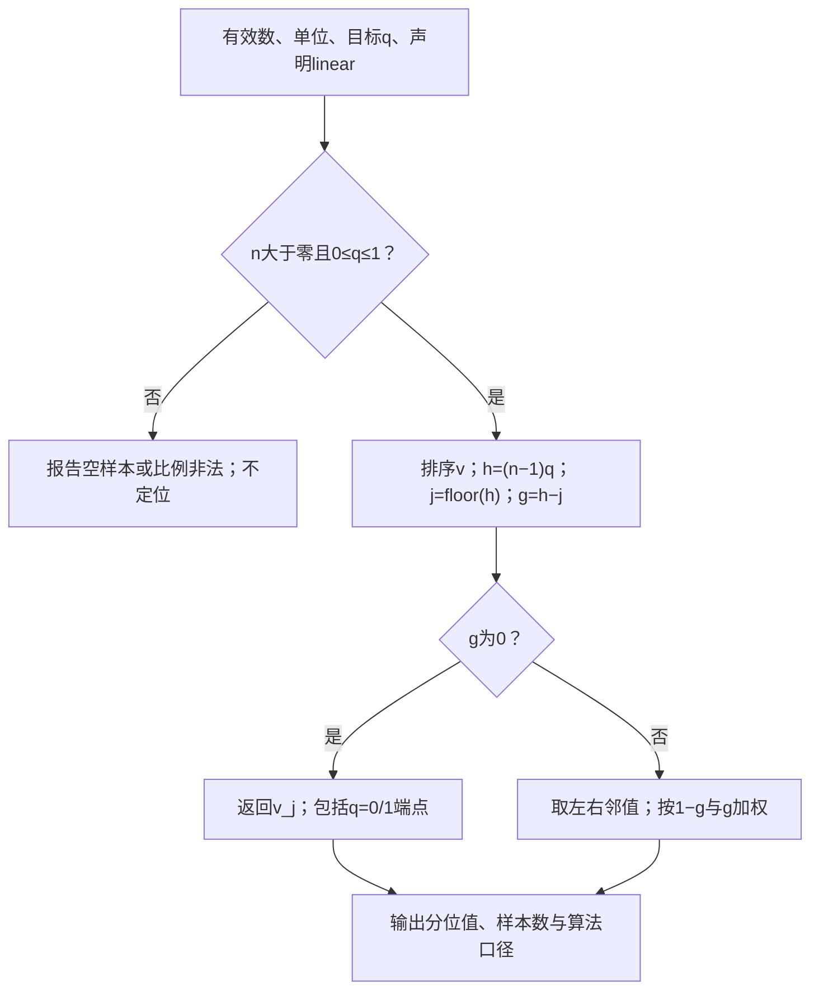
```mermaid
flowchart TD
    QV0["有效数、单位、目标q、声明linear"] --> QV1{"n大于零且0≤q≤1？"}
    QV1 -->|否| QVF["报告空样本或比例非法；不定位"]
    QV1 -->|是| QV2["排序v；h=(n−1)q；j=floor(h)；g=h−j"]
    QV2 --> QV3{"g为0？"}
    QV3 -->|是| QV4["返回v_j；包括q=0/1端点"]
    QV3 -->|否| QV5["取左右邻值；按1−g与g加权"]
    QV4 --> QV6["输出分位值、样本数与算法口径"]
    QV5 --> QV6
```

[0,1,1,4,9]、q0.6到QV2得h2.4/j2/g0.4，QV3走否，QV5用左右1/4、权重0.6/0.4算2.2，QV6返回原单位值。文字替代：排序→定位→取邻值→按权重平均。

此为linear补充版本，原半分九数Q3=79不可混为linear77；序数间距未给不能硬插值。

<details><summary>读图自测：q改0.9，哪一步要重算？</summary>

QV2位置3.6，QV5取4/9混成7；不是只改显示百分数。

</details>

**分位数边界**：空样本没有分位值，单值样本返回该值。合法 q 的两端 0、1 对应最小值和最大值。

序数类别不一定有等距意义，不能把“低=1、高=100”插成程度 50.5；应选适合排序尺度的政策。

本例将 q 从 0.6 改为 0.9，定位数 h=3.6，插值为 $0.4(4)+0.6(9)=7$。须按 0 起索引，不能代入 60 或混用课堂半分法。

🔗 [NumPy 1.26 quantile 文档](https://numpy.org/doc/1.26/reference/generated/numpy.quantile.html)，原获取日期 2026-10-01。`m03-stat-causal-verify.py` 已复算此例；此补充算法不冒称 p.25 的课堂推导。

**⚠️ 常见误解**

- ❌ 把第 90 百分位当成“90%”或整数排名。→ 它返回原单位的分位值，定位位置只是中间状态；有限样本的插值和重复值未必使恰好 90% 严格小于结果。
- ❌ “exp 保序”不等于有限样本的线性插值分位数可与 exp 交换。

pandas 默认先混合相邻值。用 log 样本 [0,2] 比较两条路径：

| 操作顺序 | 结果 |
|---|---|
| 先 exp，再取中位数 | $(1+e^2)/2=4.194528$ |
| 先取 log 中位数，再 exp | $e^1=2.718282$ |

两者不同。某些重复值或特定位置可能恰好相同，不能推广；均值也不可直接交换。此反例已由 `verify_m03_mechanisms.py` 复算。

**所以呢**：有了 $Q_1$ 和 $Q_3$，就能量"中间一半散得多开"——下一子节的三种离散度量。

#### 2.9.3 三种"散开"：极差、四分位距、标准差（讲义 p.26）

**是什么**

先说人话：两个城市的房价中位数都是 110 美元，但一个城市的房源都在 90–130 之间，另一个从 30 到 900 都有——"中间"一样，"散开"完全不同。量散开有三种尺子：**极差**（最大减最小，最简单但只看两个极端）、**四分位距**（中间一半人占多长，不看两头）、**标准差**（平均每个值离中心多远，每个值都参与）。三者的区别仍是**怕不怕极端值**。

讲义 p.26：

> - The **range** is the maximum value minus the minimum value
> - The **interquartile range (IQR)** is the third quartile minus the first quartile
>   - Thus, it is the range of the **middle 50%** of the data
>   - It is **less sensitive to extreme values** than the range

每行一种散布度量，来源对象不同：极端、分位或全体平方偏差。

| 统计量 | 怎么算 | 一句话 | 怕极端值吗 |
|---|---|---|---|
| **极差 Range** | 极差（range）= 最大 − 最小 | 整个队伍从头到尾多长 | **最怕**：只由两个最极端的值决定 |
| **四分位距 IQR** | $Q_3 - Q_1$ | 中间一半人占多长 | **较不敏感**：主要取决于中间位置；重排、小样本或插值邻居变化也能改变 |
| **方差 / 标准差** | 平方偏差和按样本 n−1 或总体 n 除，再开方（不同口径） | 平均每个值离中心多远 | 怕：平方会放大极端值 |

标准差是平方平均的根，不是每偏差绝对值的普通平均；IQR是否变取决排序/算法。

**公式**（方差与标准差讲义没写，💡 按 pandas 口径补）：

IQR先比较两个已求分位：

$$\text{IQR}=Q_3-Q_1.$$

样本方差则使用所有偏差平方：

$$s^2=\frac{1}{n-1}\sum_{i=1}^{n}(x_i-\bar{x})^2.$$

开根回到原单位：

$$s=\sqrt{s^2}.$$

方差/标准差是笔记按pandas样本口径补充，原讲义没写该公式。

每行IQR/样本方差角色，Q已算，n−1基于明示样本口径，s²为单位平方、s为原单位。

| 符号 | 含义 | 已知 / 要算 |
|---|---|---|
| $Q_1, Q_3$ | 第 25、75 百分位数（§2.9.2） | 已算出 |
| $x_i - \bar{x}$ | 第 $i$ 个值离均值多远（偏差；有正有负） | 已知 |
| $n - 1$ | 分母（见"为什么公式长这样"） | 已知 |
| $s^2$、$s$ | 样本方差、样本标准差（单位：$s$ 与数据同单位，$s^2$ 是单位的平方） | 要算 |

2/4/4/6/9的平方和28、n5，方差7，stdsqrt7≈2.646。

**数字例子（手把手）**

极差与 IQR（讲义 p.26 那 9 个数）：极差 $= 81 - 63 = 18$；IQR $= Q_3 - Q_1 = 79 - 64 = 15$。

方差与标准差（5 个数：2, 4, 4, 6, 9，`verify_m03r.py`）：

1. 均值 $= (2 + 4 + 4 + 6 + 9) / 5 = 25 / 5 = 5$；
2. 偏差 $x_i - \bar{x}$：$-3, -1, -1, 1, 4$（相加 $= 0$，所以不能直接平均）；
3. 平方后是 9, 1, 1, 1, 16，加起来 $= 28$；
4. 方差 $s^2 = 28 / (5 - 1) = 7$；
5. 标准差 $s = \sqrt{7} \approx 2.646$。

读法："这 5 个数平均离中心 2.6 左右"。Iris `sepal length`：std 0.828、IQR 1.3、range 3.6（T03 cell 5，`verify_m03r.py`）。

**为什么公式长这样**：偏差有正有负，和为 0，平方防抵消并让大偏差贡献更多；开根让标准差恢复原单位。描述固定这批值的总体方差除 $n$；估计某个随机总体的方差，为什么常除 $n-1$，要带上抽样条件解释。

**💡 笔记补充 · 无偏结论的条件与最小推导**：设 $X_1,\ldots,X_n$ 是同一总体的独立同分布抽样，$n>1$，总体均值 $\mu$、有限总体方差 $\sigma^2$。大写 X 表示抽样前的随机变量，小写 x 表示本次观察；$E$ 表示反复按相同设计抽样后的平均。先展开每个偏差，可得恒等式：

$$\sum_i(X_i-\bar X)^2=\sum_i(X_i-\mu)^2-n(\bar X-\mu)^2.$$

对上式取反复抽样平均，第一项为 $n\sigma^2$。独立同分布下，均值方差为 $\sigma^2/n$，所以第二项平均为 $\sigma^2$。

两项相减得到 $(n-1)\sigma^2$。因此左边再除 n−1，才会在平均上得到总体方差。

这叫样本方差无偏，不代表这一次恰好算准，也不保证开根后的标准差无偏。

时间相关、异方差、复杂权重或有限总体抽样，都需重新检查设计。pandas 的 n−1 只是接口定义，不会替你验证这些条件。

IQR 则是两个分位值相减，分位数还可能涉及平均或插值。它通常较抗尾值，并非完全不做加法或永远不变。

**离散量边界**：有效值全相同时，极差、IQR 和描述方差为零。样本方差还要求至少两个有效值；只有一个时 pandas 返回 NaN。

九数例把尾端 81 改为 8100，极差变 8037、标准差约 2676，课堂算法的 IQR 仍为 15。

若改值影响分位数位置，IQR 也会变化。正态分布下，IQR 约为标准差的 1.35 倍。

**为什么需要它**

每组统计量都有一个"怕极端值"和一个"不怕"的版本，**选哪个取决于描述目标、分布与缺失机制，不能只看偏不偏便自动决定填补**——这直接决定了 T03 的两个技术选择：

每卡一个填补/异常/汇报场景，原数保留，稳健性为候选理由，不认证真实缺失值。

**填补 `review_scores_rating` 的缺失**

用怕的版本：填均值 94.0

用不怕的版本：填中位数 96

T03 怎么选：评分左偏、均值受低分影响；中位数是本例稳健候选，仍与其他填补比较，并检查缺失机制

**标记 `log_price` 的离群点**

用怕的版本：Z 分数（用均值和标准差）

用不怕的版本：1.5 × IQR 规则（用 $Q_1$、$Q_3$）

T03 怎么选：两种都做、比较（作业第 2.1 题原话）

**汇报"房价散得多开"**

用怕的版本：标准差 \$165

用不怕的版本：IQR \$107（180 − 73）

T03 怎么选：报 IQR，或两个都报并解释差异

中位96与均值94不同不证明填96最好；缺失机制、训练状态和验证仍要核。

**课件原例**

p.26 的 9 个数：$Q_1$ = 64、$Q_3$ = 79、IQR = 15。

**🎙️ 课堂补充**（`48:56`–`49:21`，约 25 秒，B · 讲了同讲义）：教授只报了 IQR 的定义和作用，没有展开方差/标准差（录音在 `49:21` 切到"分布形状"，由下一分片承接）——

> there is one measurement of the data range called interquartile range, which is Q3 minus Q1… If your X value is very diversified, it is widespread, then this interquartile range will be very big. Otherwise it would be very small

（`48:56`–`49:16`）。方差与标准差本节在讲义之外也没有口头公式，笔记 §2.9.3 的方差/标准差手算例子（5 个数：2,4,4,6,9）录音里未出现，按讲义与笔记原文保留。

**💡 换个说法（笔记补充）**

三把尺子量的是同一支队伍的三个不同部分：极差量**头尾两个人**的距离，IQR 量**中间一半人**占的长度，标准差量**每个人**离中心的平均距离。头尾两个人最容易是"怪人"，所以极差最不可靠；中间一半人最稳。

另一个角度是"抗离群点"要成对记：**中位数配 IQR**（依赖排序位置，通常比均值/标准差更抗尾值，但也会因重排改变），**均值配标准差**（都让每个值参与，都怕）。偏态时可同时报告两套描述并解释差异；填补/建模选择还需缺失机制、损失目标与验证，不能自动整套替换。

**⚠️ 常见误解**

- ❌ 以为 IQR 和标准差衡量同一件事、可以互换。→ 标准差用到每一个点（包括离群点），IQR 只用两个分位数；正态分布下 IQR ≈ 1.35 s，偏态分布下两者可以差很远——所以偏态数据要报 IQR。
- ❌ 未声明样本/固定总体口径便比较数值。→ 要对齐 pandas 默认样本 var/std 就用 n−1；描述固定这批值可明示分母 n。两者不同不等于 n 一概错误，Excel 也须区分样本与总体函数。
- ❌ 拿方差直接解读。→ 方差的单位是原单位的平方（"美元²"），要开根号成标准差才能和数据比。

**所以呢**：中心和离散说完，还有"形状"——分布是歪的还是对称的、尾巴厚不厚。这决定了均值还能不能代表这列数据。

---
### 2.10 数值变量 II：分布形状——偏度与峰度（讲义 p.27–28）

<!-- 类型: 公式型 -->

**是什么**

先说人话：两列数据可以均值、标准差都一样，形状却完全不同——一列是对称的钟形，另一列大多数值挤在左边、少数值拖出一条长长的右尾（房价：大多数便宜，少数天价）。**偏度**量"歪向哪边、歪多少"，**峰度**量"尾巴厚不厚"（极端值比正态分布预期的多还是少）。

**数字例子（手把手）**——先用一个小例子建立直觉（`verify_m03r.py`、`verify_skew_steps.py`）：8 个数 **1, 2, 2, 3, 3, 3, 4, 10**。

1. 均值 $= 28 / 8 = 3.5$，中位数 $= (3 + 3) / 2 = 3$——均值被那个 10 拉到了中位数右边；标准差 $s = 2.78$；
2. 偏差 $x_i - \bar{x}$：$-2.5, -1.5, -1.5, -0.5, -0.5, -0.5, 0.5, 6.5$；
3. 标准化 $z_i = (x_i - \bar{x}) / s$：$-0.90, -0.54, -0.54, -0.18, -0.18, -0.18, 0.18, 2.34$；
4. 三次方 $z_i^3$：$-0.73, -0.16, -0.16, -0.01, -0.01, -0.01, 0.01, 12.82$——**那个 10 一个人贡献了 12.82，其余七个加起来只有 −1.06**；
5. 求和取平均：$11.76 / 8 = 1.47$（简化式）；沿本例样本s口径乘 $n^2/[(n-1)(n-2)]=64/42\approx1.523810$ 得 **+2.240256**；总体尺度路径的修正为 $\sqrt{56}/6=1.247219$，两种不可混用。符号为正 = 右尾长，量级大 = 歪得厉害；
6. 峰度同法：四次方 $z_i^4$ 里那个 10 贡献 30.0、其余合计 0.83；简化式 $30.8 / 8 - 3 = 0.85$，pandas 校正后 **5.67**（远大于 0 = 有一个离群的尾巴）。

讲义没有给估计公式；作答先声明使用的口径，不能自行断言考试允许哪种简化。需要对软件数时按下方完整校正。把 10 改成 4，偏度就接近 0、峰度变负。**偏度的正负 = 尾巴的方向；峰度的大小 = 尾巴里有没有极端值。**

讲义 p.27 只有一句话和一张图：

> Skewness: indicates relative symmetry

原图的三种常见单峰形态前轮已看过。正偏示意右尾长，Mode < Median < Mean；负偏示意左尾长，顺序相反。

对称示意三者重合。图中均值被长尾拉向一侧，众数位于峰顶，中位数居中。

这些次序用于读这组示意图。复杂、多峰分布不一定服从固定排序。

讲义 p.28：

> Kurtosis: indicates tailedness

图（纯图片）是三条重叠的钟形曲线：**Leptokurtic**（Positive Kurtosis，尖峰厚尾）、**Mesokurtic**（Normal Distribution）、**Platykurtic**（Negative Kurtosis，平峰薄尾）。

**公式口径（💡 笔记补充）**：下面先用简化矩解释偏度与超额峰度。

pandas `skew()`、`kurt()` 采用样本修正，不能直接将入门式当作 API 输出。完整校正在本节机制展开中给出，讲义未写这些公式。

$$\text{Skew} \approx \frac{1}{n}\sum_{i=1}^{n}\left(\frac{x_i-\bar{x}}{s}\right)^3, \qquad \text{Kurt} \approx \frac{1}{n}\sum_{i=1}^{n}\left(\frac{x_i-\bar{x}}{s}\right)^4 - 3$$

每行标准化矩一个元素，z无单位，三次保方向、四次放大极值，减3为总体正态基准。

| 符号 | 含义 |
|---|---|
| $(x_i-\bar{x})/s$ | 标准化后的偏差——这个值离均值几个标准差（无单位，所以偏度峰度都无单位） |
| 三次方 | 保留偏差正负号，作用见表下“三次方贡献” |
| 四次方 | 只看大小不看方向，且离得越远放大越狠（3 个标准差外的点贡献 81 倍） |
| $-3$ | 正态分布的四次矩恰好是 3，减掉后正态 = 0，方便比较 |

**三次方贡献**：右尾大正偏差贡献正值，左尾大负偏差贡献负值。若分布对称且三阶矩存在，两边可抵消为零。


当标准化偏差的绝对值为 3 时，四次方为 81。这是该点对四阶矩的贡献，不表示某尾区概率放大 81 倍。峰度也不能单独确定峰形。

标准化偏差的三次方保留方向：+2 得 +8，−2 得 −8，对称时可抵消。

如果右侧有 +4，其贡献为 +64，远大于左侧 −2 的 −8。三次方强调远端值，因此少数极端观察能显著影响偏度。

**数字例子**（T03 cell 6 的输出，脚本 `verify_w3w4.py` 复核一致）：

每行Iris属性、样本校正skew、超额kurt及读法；均无单位，来源同原数据。

| Iris 属性 | skew | kurt | 读法 |
|---|---|---|---|
| sepal length | 0.315 | −0.552 | 轻微右偏；尾比正态薄 |
| sepal width | 0.334 | 0.291 | 轻微右偏；尾略厚（箱线图里有几个离群点） |
| petal length | −0.274 | **−1.402** | 三阶量略负，四阶量低于正态基准 |
| petal width | −0.105 | −1.340 | 同上 |

**petal length 的形状限制**：偏度略负不保证接近对称。负超额峰度也不能证明多峰或物种混合，须另看带标签的分布图。


petal length kurt−1.402不能证明多峰/三个物种峰，需带标签图。

Airbnb 原始评分偏度约 −3.33，来源为此前 `verify_m03r.py`；T03 cell 28 填补后的口径为 −3.78，两者不能混用。

多数评分在 96–100，左尾到 20。该例均值 94.0 低于中位数 96，可把中位数列为稳健填补候选，但仍须查缺失机制并验证。

原价格偏度约 4.32，log_price 约 0.53。对数压缩了正值右尾，这解释 M02 的变换动机；最终模型选择还要看目标单位与验证结果。

**形状边界**：在相应矩存在且方差非零时，对称分布偏度为零。正态的超额峰度为零，均匀分布为约 −1.2。

极端值可显著增大四阶贡献，上面八数例的样本超额峰度约 5.67。

pandas 样本偏度要求至少 3 个值，峰度要求至少 4 个，否则返回 NaN。常数列的标准化分母也需另处理。

**机制展开（笔记补充）：统一小样本校正，不能混用两种标准差**

沿原八个数 $1,2,2,3,3,3,4,10$。均值3.5，偏差平方和54，偏差三次方和252，四次方和1834.5；这些数由 `verify_m03_mechanisms.py` 的 `moments` 段复算。为了让读者能对上 pandas，下面给**明确的一条计算路径**。

1. 定义 $m_r=\frac1n\sum_i(x_i-\bar x)^r$，即偏差的 r 次方平均；这里 r 是2、3、4，n是有效值数，$\bar x$ 是均值。得到 $m_2=54/8=6.75$、$m_3=252/8=31.5$、$m_4=1834.5/8=229.3125$。
2. 样本标准差 $s=\sqrt{54/7}=2.777460$。若用 s 作尺度，简化三阶量为 $m_3/s^3=1.470168$。
3. 沿这条**样本 s 路径**，pandas 对应的修正偏度 $G_1=\frac{n^2}{(n-1)(n-2)}\frac{m_3}{s^3}$。代入 $64/42=1.523810$，乘1.470168得 $G_1=2.240256$。
4. 若改用总体口径的 $\sqrt{m_2}$，原始偏度变为 $g_1=m_3/m_2^{3/2}$；此时修正系数才是 $\sqrt{n(n-1)}/(n-2)=\sqrt{56}/6=1.247219$。两条路径最终相同，不能用样本s算一个量，却接上总体尺度的修正系数。
5. 峰度先算总体尺度的超额量 $g_2=m_4/m_2^2-3=2.032922$，再按小样本口径修正 $G_2=\frac{n-1}{(n-2)(n-3)}[(n+1)g_2+6]$。本例 $G_2=\frac7{30}[9(2.032922)+6]=5.669136$，与 pandas `kurt()` 一致。

**为什么公式长这样**：三次方保留正负并放大远处偏差，四次方不分方向且更强调极端值；除以尺度的相应次方使指标不带单位。减3把正态的总体峰度基准移到0；额外的n系数是小样本修正，不是再“让尾巴更大”。原文用s计算四阶简化量约0.85，不能直接跳到5.67而不交代换了什么口径。

**边界与迁移**：偏度至少需3个有效值，修正峰度至少4个，常数列尺度为零都不可照算。换单位的正比例缩放不改变偏度 / 峰度，负比例会翻转偏度而不翻转峰度。它们是样本形状证据，不能只凭一个小样本的高峰度断言总体尾部规律。

**零偏度不推出对称**：具体反例为 $-3$ 一次、$-1$ 五次、$2$ 四次。平均值0，三次方和 $-27-5+32=0$，偏度0；但没有+3或+1的对应质量，显然不关于0对称。讲义图中的均值 / 中位数 / 众数顺序是常见单峰形状的示意，不是任何分布都服从的排序定理。


**计算顺序**：先保留有效样本数和均值，再按一致口径算偏差及尺度。

三次方保留正负，四次方只强调偏差大小。两者都不是单独判断对称、峰数的工具。

上方五步已展开八数例的偏差和、尺度与修正。样本偏度修正要求 n≥3，峰度修正要求 n≥4，标准化还要求方差非零。

图问：三次/四次贡献如何连接到明确的小样本校正？箭头是依赖，MON/MO2先核人数/尺度。

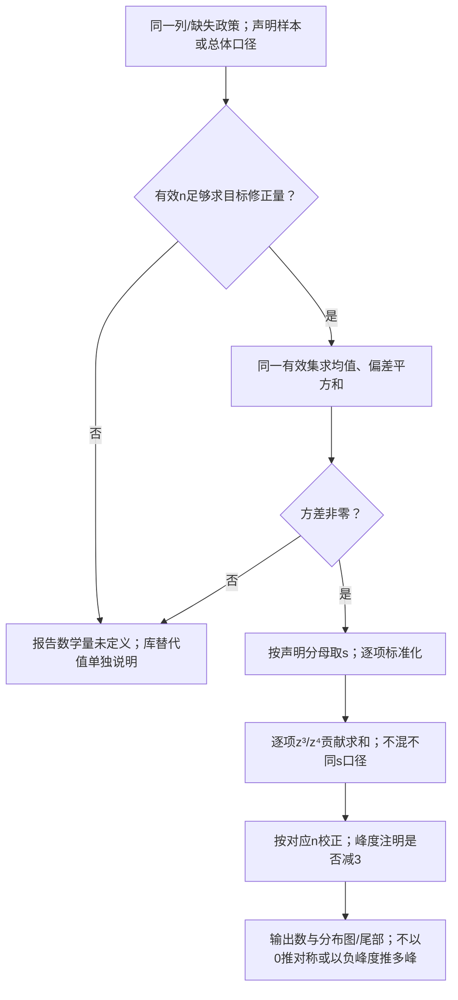
```mermaid
flowchart TD
    MO0["同一列/缺失政策；声明样本或总体口径"] --> MON{"有效n足够求目标修正量？"}
    MON -->|否| MOF["报告数学量未定义；库替代值单独说明"]
    MON -->|是| MO1["同一有效集求均值、偏差平方和"]
    MO1 --> MO2{"方差非零？"}
    MO2 -->|否| MOF
    MO2 -->|是| MOS["按声明分母取s；逐项标准化"]
    MOS --> MO3["逐项z³/z⁴贡献求和；不混不同s口径"]
    MO3 --> MO4["按对应n校正；峰度注明是否减3"]
    MO4 --> MO5["输出数与分布图/尾部；不以0推对称或以负峰度推多峰"]
```

八数1/2/2/3/3/3/4/10，MO1得均值3.5、平方和54；样本s=sqrt(54/7)。三次平均31.5除s³得1.470168，再对应样本校正64/42得2.240256。文字替代：同有效值求偏差→同尺度标准化→对应校正。

四阶完整路径先用总体m2形成g2，再校正到5.669136；不能将样本s量接总体尺度系数。图为补充，原讲义仅形状直觉。

<details><summary>读图自测：G1=0能沿MO5写对称吗？</summary>

不能。三阶可抵消；本节−3一次/−1五次/2四次偏度0但不镜像，需原值/图形另看。

</details>


恒定列的标准化公式为0/0；pandas可按接口政策返回0，此时不能把它当推导证明。相同非零正尺度与平移不改变标准化形状，负尺度反转偏度符号、峰度不变。校正因子减少相应小样本偏差，不保证某个很小样本代表总体尾部。

<details><summary>迁移/诊断：样本[-2,-2,-2,-2,1,1,1,1,1,3]先算均值和三阶偏差和；如果偏度0，能保证对称吗？</summary>

和0→均值0；立方和4(−8)+5(1)+27=0，方差非零，所以偏度0；分布不对称（有3无−3、有−2无2），三阶抵消不是逐点镜像。峰度需另算四阶贡献，不能由偏度0或某峰形猜值。

</details>

**为什么需要它**

偏度和峰度回答一个实际问题——**均值和标准差还能不能代表这列数据**：

每卡一个形状条件与处理候选，不因一个矩值给确定业务处理。

**偏度绝对值大（\|skew\| > 1）**

后果：均值/标准差受尾值影响

该怎么办：补报中位数/IQR；填补按缺失机制比较；正值可比较 log 变换，但改变单位/损失

**峰度很正**

后果：极端值比正态预期的多

该怎么办：正态尾概率阈值可能不适用；比较稳健规则并回查数据，IQR 也不保证区分错误值与真实尾部

**峰度很负**

后果：四阶量低于对应正态基准；不由此判断峰数或混合机制

该怎么办：先分组（Iris 按品种、Airbnb 按城市）再描述

skew绝对值>1提示尾值影响，填补仍按原因比较；高峰度也不是删除极端观察的命令。

T03 作业第 2 题明确要求"报告每种填补方法后的 mean、std、skewness 并证明你的选择"——偏度就是那个证据。

**课件原例**

p.27–28 的两组曲线图。

**🎙️ 课堂补充**（`49:21`–`50:38`，约 1.3 分钟，B · 讲了同讲义）

教授把偏度、峰度的方向性又用自己的话过了一遍，没有超出笔记已有的推导——

> SKU needs will be zero. Otherwise if your distribution is SKU to the left, then SKU needs will be positive, or if most of them are actually to the right-hand side, then it is negative.

（`49:49`；“SKU needs” 是 ASR 把 **skewness** 听成的错误，已记入 asr-dictionary）。峰度部分：

> Otherwise, if your data is more concentrated in the middle, then the normal distribution, then we get positive kurtosis... if your data is very, very flat, and the variance is much larger than the normal distribution, then we get negative kurtosis.

（`50:21`–`50:35`）。⚠️ “skewed to the left” 这个口语说法方向指代不清（可能指“整体偏向左”也可能指“尾巴在左”），教授这句话比讲义 p.27 的图更模糊，读者仍以讲义图为准（右偏 = Mode < Median < Mean）。

**💡 换个说法（笔记补充）**

偏度可先用尾部方向帮助理解：价格和收入常见长右尾，接近满分的评分可能长左尾。但上下界本身不能保证偏度符号。

峰度衡量标准化四阶贡献。正超额峰度常提示远端值贡献较强，却不能独自给出任意尾区概率。

负超额峰度不证明多峰，也不证明三种物种各占一个峰。实际峰形应看直方图，并检查分箱选择。

偏度接近 0，只表示三阶偏差大致抵消，不保证对称，更不说明正态。

petal length 的偏度约 −0.27、超额峰度约 −1.40，不能凭这两数证明双峰。双峰需从实际直方图读取。

两个矩不足以唯一识别分布。是否接近正态，还要看分布图和适当诊断，见 §2.18.2。

**⚠️ 常见误解**

- ❌ "峰度高 = 峰尖"。→ 讲义原话是 **tailedness**，峰度衡量的是尾部；不能从四阶矩独自推出峰尖、峰数或各个尾区概率。
- ❌ 以为偏度接近 0 就是正态。→ 零三阶矩不保证对称；对称也不保证正态，例如均匀分布。
- ❌ 不同软件的峰度口径混用。→ pandas / Excel 报**超额峰度**（正态 = 0），有些教材和软件报原始峰度（正态 = 3）。讲义 p.28 图里 "Normal Distribution / Mesokurtic" 对应超额峰度 0。作业里写清"pandas 口径"。
- ❌ 看到右偏就一律取对数。→ 取对数要求值全为正（0 和负数没有对数）；`number_of_reviews` 有大量 0，取对数前要加 1 或换别的变换。

**所以呢**：单变量到此说完——中心、离散、形状。下一步看**两个**变量之间有没有关系、关系多紧——协方差与相关。

---

### 2.11 多变量：协方差与相关系数（讲义 p.29–33）

<!-- 类型: 公式型 -->

**是什么**

先说人话：想知道"SAT 分数高的学校毕业率是不是也高"，就看两列数是不是**一起变**——SAT 高于平均的学校，毕业率是否也高于平均。把每所学校的"两个偏差"相乘再平均，就是**协方差**：两个偏差同号（都高或都低）乘积为正，异号为负；正的多就说明"一起变"。但协方差的大小随单位变（毕业率用百分数还是小数，协方差差 100 倍），没法说"263 算大还是小"；把它除以两个标准差，压到 −1 到 +1 之间，单位就消掉了——这就是**相关系数**。

**数字例子（手把手）**——先用 4 所学校的小例子把"偏差相乘"走一遍（虚构数字，笔记补充，`verify_m03r.py`）：

每行一所虚构教学学校，毕业率按百分数、SAT按分；后两列同对象相对同表均值偏差，乘积单位为百分点×分。

| 学校 | 毕业率 $x$ | SAT $y$ | $x - \bar{x}$ | $y - \bar{y}$ | 乘积 |
|---|---|---|---|---|---|
| A | 80 | 1200 | −5 | −37.5 | +187.5 |
| B | 90 | 1300 | +5 | +62.5 | +312.5 |
| C | 70 | 1100 | −15 | −137.5 | +2062.5 |
| D | 100 | 1350 | +15 | +112.5 | +1687.5 |
| 均值 | 85 | 1237.5 | | 合计 | 4250 |

A80/1200减85/1237.5得−5/−37.5，乘+187.5，四乘积合4250；不是49校原答案。

四校的配对偏差乘积全部为正，合计4250。样本协方差先除 $4-1$，得1416.67，表示此表两个属性正向共同变化。

换毕业率单位为小数，协方差变14.17，缩为1/100；关系没有改变。它的数值带“百分点×SAT分”单位，不能独自说强弱。

再用同四校样本标准差12.91与110.87相除：

$$r\approx\frac{1416.67}{12.91\times110.87}=0.990.$$

单位抵消。毕业率除100时其标准差也除100，r仍约0.990；这就是换正尺度而相关不变的原因。

讲义 p.29 用 **Colleges and Universities** 数据（49 所文理学院与研究型大学）提出三个问题：Top 10% HS 与 Graduation % 有关吗？Acceptance Rate 与 Expenditures/Student 有关吗？Median SAT 与 Acceptance Rate 有关吗？

**p.29 三问的作答边界**：本节只给方法性参考答案。p.29 显示第 4–10 行的七校截图，p.31 有八条局部计算行和 Count=49。

本库没有完整 49 校原表，不能补造各问题的真实相关方向或系数。

1. **Top 10% HS 与 Graduation % 有关吗？** 以每校高中前 10% 学生占比为 X，毕业率为 Y。

取得完整表后，保留共同有效的学校，画散点并算 Pearson 相关。还要查是否被一两所学校驱动。

若点云随 X 上升、相关为正且不靠少数点支撑，可描述为这批学校的正线性关联。推广到总体需抽样模型及置信区间。

前面四行教学例 r≈0.990 是虚构演示，不是 49 校答案。
2. **Acceptance Rate 与 Expenditures/Student 有关吗？** 用录取率为 X，生均支出为 Y，按共同有效行画图、算相关。

检查学校类型及极端高支出点的影响。缺少完整原表，所以正负与强弱都待核，不能凭“严格学校更有钱”的印象回答。
3. **Median SAT 与 Acceptance Rate 有关吗？** 把 SAT 中位数与录取率配对作图、算相关、检查离群校与可能的非线性；直觉上可能反向，但**直觉不是这份数据的计算结果**。若题目要求一个确定的“是 / 否”或相关系数，需取得 49 校原表后复算，并把数据年份、缺失行和学校筛选口径一同报告。相关也不证明一个变量造成另一个变量变化。

讲义 p.30 **协方差**：

> A measure of the **linear association** between two (continuous) variables, X and Y.

$$
\begin{aligned}
\text{总体（COVARIANCE.P）: } \operatorname{cov}(X,Y)&=\frac{\sum_{i=1}^{N}(x_i-\mu_x)(y_i-\mu_y)}{N}\\
\text{样本（COVARIANCE.S）: } \operatorname{cov}(X,Y)&=\frac{\sum_{i=1}^{n}(x_i-\bar{x})(y_i-\bar{y})}{n-1}
\end{aligned}
$$

讲义 p.32–33 **相关系数**：

> A measure of the linear association between two variables, X and Y. **Unlike covariance, the scale of variation of each variable does not influence correlation.** The correlation value is **always between −1 and +1**.

$$\rho_{xy} = \frac{\operatorname{cov}(X,Y)}{\sigma_x\,\sigma_y}$$

> Correlation is **linear** concept, it may not be able to recover **nonlinear** relationships.（p.33，配四张散点图：(a) 正相关 (b) 负相关 (c) 无相关 (d) **一条 U 形曲线——有明确的非线性关系但线性相关为 0**）

每行协方差/相关一量，均值和标准差来自同共同有效对象，不混别批数。

| 符号 | 含义 |
|---|---|
| $x_i, y_i$ | 第 $i$ 个对象在两个属性上的值 |
| $\mu_x,\bar x$ | X 的总体均值与样本均值，定义见表下“对象范围” |
| $N, n$ | 总体 / 样本大小；样本版分母是 $n-1$（同 §2.9 方差的理由） |
| $(x_i-\bar{x})(y_i-\bar{y})$ | 两个偏差的乘积：同号为正、异号为负 |
| $\sigma_x, \sigma_y$ | 两个变量的标准差 |
| $\rho_{xy}$ | 相关系数，无单位，$-1 \le \rho \le 1$；+1 = 所有点在一条上升直线上，−1 = 下降直线，0 = 没有线性关系 |

**对象范围**：总体是研究问题关心的全部对象，样本是实际取得的部分。使用哪个均值符号，先看当前表是否覆盖声明的总体。


样本n−1与总体N分母分别声明；rho单位为无，常数尺度相关未定义。

协方差先将同一对象的两个偏差相乘。同高或同低，乘积为正；一高一低，乘积为负。

汇总后除 n−1，得到样本协方差，分母条件见 §2.9.3。再除两列标准差，就把两侧都换成无单位的标准化偏差。

这得到 Pearson 相关。正比例换单位不改变它，值域为 −1 到 +1；范围来自柯西不等式，本讲不要求证明。

**相关边界**：非恒定数据恰在上升直线上，相关为 +1；下降直线为 −1。

相关为零表示没有该度量捕捉到的线性共同变化，仍可能有 U 形关系，见 p.33(d)。

任一列常数时，标准差为零，相关未定义。只有一对记录时，样本协方差的 n−1 分母也为零。

**相关系数怎么读**（💡 常用口径，不是讲义原话）：

每行是笔记补充的常用相关量级说法，并非讲义正式阈值或普遍科学边界。

| $\lvert \rho \rvert$ | 说法 | 例子 |
|---|---|---|
| 0.9–1.0 | 极强 | petal length 与 petal width 0.963 |
| 0.7–0.9 | 强 | `accommodates` 与 `beds` 0.829 |
| 0.4–0.7 | 中等 | `accommodates` 与 `log_price` 0.578 |
| 0.1–0.4 | 弱 | `bathrooms` 与 `log_price` 0.377 |
| < 0.1 | 几乎无 | `review_scores_rating` 与 `log_price` 0.088 |

0.578在本表称中等；这仍只描述线性共变，不可作因果或模型好坏判定。

**课件原例**（讲义 p.31，纯图片页，已视觉复核）

p.31 用 Graduation % 为 X、Median SAT 为 Y。截图均值分别为 83.245、1263.102。

Amherst 一行的舍入偏差为 9.755、51.898，乘积为 506.26499。Excel 使用内部未舍入值，显示乘积 506.2698875。

截图汇总 Sum=12641.77551、Count=49，因而样本协方差为：

$$12641.77551/48=263.370323125.$$

它与显示值 263.3703231 一致，口径对应 `COVARIANCE.S`。这是核截图汇总，不是重建全部 49 行。

旁图“Graduation Rate vs. Median SAT”支持这批学校的正向共同变化。计算步骤与四校教学例相同，但数据不同，也不回答 p.29 的其他变量对。

**机制补齐（笔记补充）：从同四行算两把标准差，再得到相关**

问题：偏差乘积为什么同号为正？下图只用上方虚构四校，不是缺失的49校真实原表。

![[IS6400_Business_Data_Analytics/notes/figures/readability-v2-m03/paired-covariance.svg]]

横轴毕业率百分数，纵轴SAT分；虚线是同四校均值85/1237.5。每点是一所教学学校，轴线表示参照，不表示因果。

读A=(80,1200)：两值都低于均值，偏差−5/−37.5，相乘+187.5。B在两均值上方，偏差+5/+62.5也为正。四正乘积合4250，除样本分母3得1416.67。

文字替代：点在均值交点的同号方向时偏差乘积为正；再除同配对样本分母，最后用同表标准差除去单位。

<details><summary>读图自测：毕业率全除100，SAT不变，相关会除100吗？</summary>

不会。cov变14.1667、毕业率std也除100，分子分母同缩，r仍约0.989778。这里仅换正单位，没有改变原行配对。

</details>

图源/输入见[[IS6400_Business_Data_Analytics/notes/figures/readability-v2-m03/generate.py|代码]]及[[IS6400_Business_Data_Analytics/notes/figures/readability-v2-m03/figure-inputs.json|四校数据]]；实际显示尚未看，视觉与教学pending。

四校虚构例的偏差分别为 x: −5、5、−15、15，y: −37.5、62.5、−137.5、112.5。

先平方求和，再按样本分母 3 求尺度：

| 列 | 平方偏差和 | 样本标准差 |
|---|---|---|
| x | 500 | $\sqrt{500/3}=12.909944$ |
| y | 36875 | $\sqrt{36875/3}=110.867789$ |

偏差乘积和为 4250，所以协方差为 1416.666667。除以上面两标准差的乘积，相关为 0.989778。

此前 `verify_m03_mechanisms.py` 的 pearson 段已与 `np.corrcoef` 对上。

第一图问：协方差和r的正常主路径是什么？箭头表示同一配对集的计算依赖，完整条件出口在后面的第二图保留。

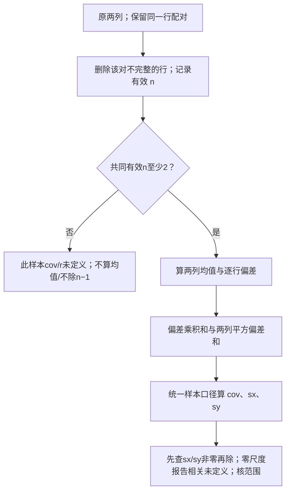
```mermaid
flowchart TD
    CO0["原两列；保留同一行配对"] --> CO1["删除该对不完整的行；记录有效 n"]
    CO1 --> CON{"共同有效n至少2？"}
    CON -->|否| COF["此样本cov/r未定义；不算均值/不除n−1"]
    CON -->|是| CO2["算两列均值与逐行偏差"]
    CO2 --> CO3["偏差乘积和与两列平方偏差和"]
    CO3 --> CO4["统一样本口径算 cov、sx、sy"]
    CO4 --> CO5["先查sx/sy非零再除；零尺度报告相关未定义；核范围"]
```

四校都有效，CO2均值85/1237.5，CO3偏差乘积和4250、平方和500/36875，CO4用n−1=3形成cov与两个std，CO5再除得r0.989778。文字替代：同对象配对→偏差→同分母→去单位。

此主图与下方条件图同一机制，可按一条主路径阅读；零尺度只保cov而相关未定义，不给相关0。

<details><summary>读图自测：毕业率改小数，需要更换哪些行配对吗？</summary>

不换。只按同列正缩放，cov与sx同缩100倍，r保持；换行则联合关系改变。

</details>

**依据与边界**：相关的分母与协方差必须使用一致的样本 / 总体口径；共同分母才能抵消，得到无单位量。若混用样本cov与总体标准差，本例会将r放大4/3，甚至超过1，这表示口径错误而不是超强关系。x改用小数后cov乘0.01、sx也乘0.01，r不变；x乘负数则r反号。

**缺失配对的实际变式（笔记补充）**

四行为(80,1200)/(90,1300)/(缺失,1100)/(100,缺失)。按同对象筛完整配对，只剩前两行，pandas相关为1。

分别dropna再按顺序拼，会造出(80,1200)/(90,1300)/(100,1100)，相关变−0.5；第三对根本不来自同对象。

两行r=1也不是可靠总体证据，要报有效n。不同矩阵格可能用不同共同有效行，补值后相关又是另一口径。


**协方差/相关的状态顺序（笔记补充）**：输入是同对象配对两列与单位、缺失/分母口径。先取共同有效行，保存同一有效n，两均值也由这一配对集计算；逐行形成两个偏差、乘积及各自平方，再求和。样本cov除n−1，std也从同n−1口径取；Pearson比值可简为$\frac{\sum_i d_{xi}d_{yi}}{\sqrt{(\sum_i d_{xi}^2)(\sum_i d_{yi}^2)}}$（d 表示上一步已求的配对偏差），分母只有共同有效数据，不能拿别批std混除。

第二图问：有效人数不足或常数列时，哪里该停止相关计算？箭头表示条件与依赖，归属数据始终同ID。

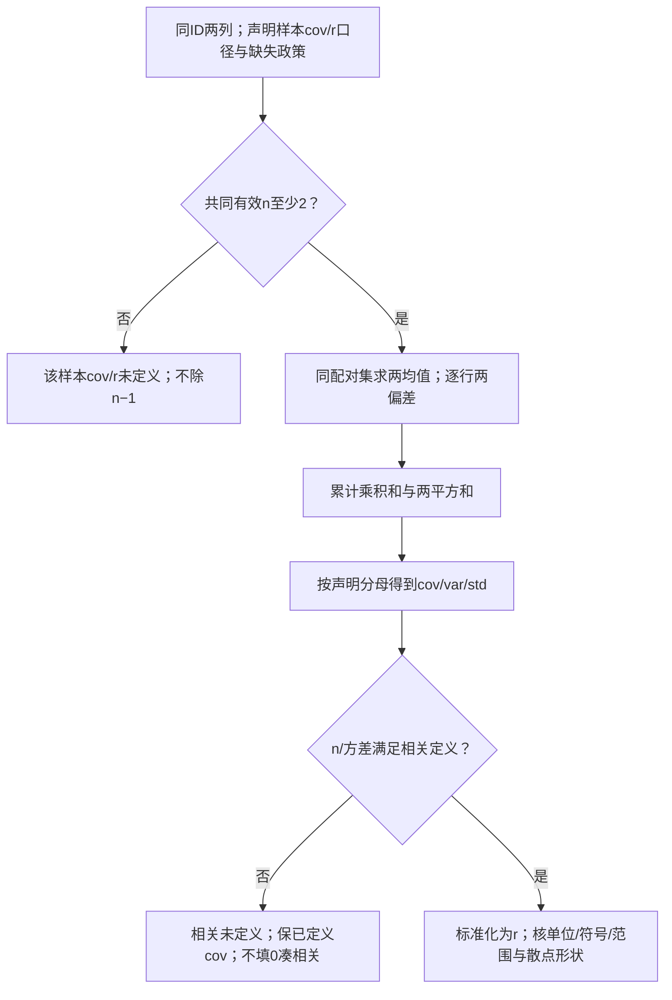
```mermaid
flowchart TD
    CO0["同ID两列；声明样本cov/r口径与缺失政策"] --> CO1{"共同有效n至少2？"}
    CO1 -->|否| CON["该样本cov/r未定义；不除n−1"]
    CO1 -->|是| CO2["同配对集求两均值；逐行两偏差"]
    CO2 --> CO3["累计乘积和与两平方和"]
    CO3 --> CO4["按声明分母得到cov/var/std"]
    CO4 --> CO5{"n/方差满足相关定义？"}
    CO5 -->|否| COF["相关未定义；保已定义cov；不填0凑相关"]
    CO5 -->|是| CO6["标准化为r；核单位/符号/范围与散点形状"]
```

缺失四行示例共同完整仅前两，CO1人数2通过，CO2/3仅用这两行；若其中x常数，CO5走否，到COF保已定义cov、r未定义。文字替代：先有效配对，再核相关分母。

实际两行r=1仍是小样本观察，不推总体可靠性；不同矩阵格有效n可不同，不能统一填0。

<details><summary>读图自测：分别dropna再顺序拼接第三对，违反哪个输入？</summary>

CO0同ID配对。造出的(100,1100)不是真实同对象，边缘均值相同也不能补救。

</details>

<details><summary>迁移/诊断：x=[1,2,3,4]、y=[2,4,5,9]，样本cov与r多少？把y全乘100或拿不同行y配对会怎样？</summary>

均值为 x=2.5、y=5。偏差乘积依次为 4.5、0.5、0、6，总和 11。

x、y 的平方偏差和为 5、26。因此样本协方差为 11/3，相关为 $11/\sqrt{130}\approx0.964764$。

y 乘 100 时协方差也乘 100，相关不变。错行配对会改变共同关系，相同边缘均值不能证明配对正确。

相关不证明因果；某列常数时相关未定义。

</details>

**为什么需要它**

每卡一种使用相关/协方差的任务，保来源和诊断边界。

**找与目标最相关的特征**

在哪：T03 作业第 2.4 题：相关矩阵 + 热力图 + 找与 `log_price` 最相关的 3 个特征（答案：accommodates 0.578、bedrooms 0.483、beds 0.470）

**探测多重共线性**

在哪：accommodates/beds 相关 0.829，只是近依赖的线索，不能独自解释 beds 为何出现负系数。

还要检查整体矩阵、条件信息、系数稳定性及验证表现。见 [[IS6400_Business_Data_Analytics/_meta/数据集卡片|数据集卡片]] §5.1。

**PCA 的原材料**

在哪：M04 §2.14：**协方差矩阵**（所有列两两的协方差排成的方阵）的特征向量就是主成分——本讲先把协方差的定义立住

accommodates/beds0.829提示近依赖检查，不能证明beds负号唯一成因；PCA尺度选择见本轮正文明确说明。

**协方差为什么还要教**

协方差保留原单位及变量方差，PCA可据它求原尺度的最大方差方向。若任务要求各原变量先等方差比较，也可基于相关矩阵做PCA（M04§2.15）。

因此原句“PCA用协方差而不是相关系数”过于绝对。两者对应不同尺度选择；具体数据、分母与单位必须跟变换状态一起说明。

**🎙️ 课堂补充**（`50:38`–`54:19`，约 3.7 分钟，A · 课上展开）

- 先复述“U 形关系相关为 0”（p.33 图 (d)）：*"If they have this kind of U shape, then the correlation coefficient can still be zero, but actually we have the relationship between these two variables."*（`51:42`）
- **真实业务案例（讲义没有）**：教授讲他带过的研究团队给零售商做冷饮需求预测，把温度当特征放进线性模型，系数不显著——

> unfortunately the temperature does not present a significant contribution to the prediction result... it's not a pure linear relationship, it's non-linear

（`52:25`–`53:09`）。继续解释：气温升高到一定程度后，

> as the temperature continues to increase, the demand will drop significantly.

（`53:18`），原因是学生答对了——太热大家不愿意出门：

> People are not willing to make any purchase outside to visit the retail store.

（`53:43`）
- **这段改变了什么**：讲义 p.33 只用抽象 U 形图讲“相关系数抓不住非线性关系”；这段给了一个教授亲历的具体反例（温度 → 冷饮需求先升后降），并点出解法之一是把总客流量当背景变量纳入分析（`53:52` 

> we can incorporate a total visit as the big background of the sales performance into this analysis

）——遇到非线性要么换非线性模型，要么找混杂变量控制。

**💡 换个说法（笔记补充）· Airbnb 的数字**

T03 cell 39 给出各列与 log_price 的相关，数值来自此前 `verify_m03r.py` / `verify_airbnb.py`。

| 列 | 相关 |
|---|---|
| accommodates | 0.578 |
| bedrooms | 0.483 |
| beds | 0.470 |
| bathrooms | 0.377 |
| review_scores_rating | 0.088 |
| number_of_reviews | −0.025 |

accommodates 的协方差为 0.8786，两列标准差约 2.1348、0.7119。相除得到 $0.8786/(2.1348\times0.7119)\approx0.578$。

这表明正的线性关联，但不是决定性关系。对同样本、含截距的单变量 OLS，R² 等于相关平方，约 0.33。

这个“解释比例”针对 log_price，不是原价格或因果解释。T02 多特征回归 R² 约 0.4–0.5，属于另一模型与版本，不能直接当同一个计算。

**协方差 vs 相关的直觉再说一遍**：协方差像"用米还是用厘米量身高"——数值随尺子变；相关系数像"身高在班里排第几"——换尺子也不变。所以横向比较两对变量谁关系更强，只能用相关系数。

**⚠️ 常见误解**

- ❌ "相关系数 0 = 没关系。" → p.33 图 (d)：U 形关系相关为 0（左半边下降、右半边上升，正负抵消）。相关只抓**线性**关系，散点图必须一起看。
- ❌ 把协方差的大小当关系强弱。→ 协方差 263 大还是小？没法说，它带着 "% × 分" 的单位；只有相关系数可比。
- ❌ 不声明口径便混用分母。→ 讲义 p.30 区分总体版 $N$ 与样本版 $n-1$，分母 n 的固定这批总体描述并非一概错误；pandas 的 `cov()` / `std()` 默认用 $n-1$，Excel 要选 `COVARIANCE.S` 不是 `.P`。
- ❌ 相关 0.58 就说"可住人数决定价格"。→ 中等相关，且只是相关——下一节专门讲为什么不能说"决定"。

**所以呢**：相关系数量的是"一起变"，但"一起变"不等于"一个导致另一个"——下一页讲义专门泼冷水。

---

### 2.12 相关 ≠ 因果（讲义 p.34）

**是什么**

网点多的地区存款也多，是观察数据中的相关。“增开网点会增加存款”则是干预后的因果问题。

一个替代解释是地区财富同时吸引网点并增加存款。这只是假说，不证明开网点一定有效或一定无效。

判断效应需要明确干预、研究设计和识别条件。若共同原因才是主要解释，贸然开店可能花钱却没有预期增量。

讲义 p.34：

> Careful!
> - We may see positive correlation between the number of bank branches in a region and the total deposit amount, does that mean opening more branches will lead to more deposit?
> - **Causality is more important but is challenging to establish**
> - Beyond analytics：**Experiment**、**Quasi-experiment**

xkcd 漫画用一段对话提醒读者检验自己的因果推断：

> I used to think correlation implied causation. Then I took a statistics class. Now I don't.
> Sounds like the class helped.
> Well, maybe.

上课之后观点改变，也不能仅凭先后关系证明是课程造成的。

**为什么"一起变"不等于"导致"——三种情况**（💡 笔记补充）：

每行一种与观察相关兼容的机制，两场景列是假说，未被此观察表确认。

| 情况 | 意思 | 银行例子 | Airbnb 例子 |
|---|---|---|---|
| **反向因果** | 不是 X 导致 Y，是 Y 导致 X | 存款多的地区吸引银行去开网点 | 贵的房源才请得起专业摄影 → 照片好看和价格相关，但不是照片让房子变贵 |
| **混杂变量** | 第三个变量 Z 同时推动 X 和 Y | 地区富裕程度 | **地段**：大房子多在贵地段，`accommodates` 与价格相关，一部分是地段的功劳 |
| **巧合** | 样本小或变量多时总有些相关是碰上的 | — | 15 列两两配对有 105 对相关，总有几对"显著" |

地段共同影响大小/价是待核混杂；反向摄影例也须事实证据，不能以合理故事当真。

讲义给的方向是实验、准实验，但本讲录音没有展开。下面为补上理解断层而给最小推理包：算得出组间差，不代表已经证明因果；必须说清比较的干预是什么、分组怎样发生、哪些条件把观察差连接到干预结果。

**为什么需要它**

T03 第 2.4 题要求：

> explain why the correlation does **not** imply causation. Provide a concrete **confounding variable**

因此本页值得准备论述答案（笔记考点推断）。[[M03-偏见与公平]] §2.11.4 的代理变量也是相关交叉点。

邮编与违约相关，不证明邮编造成违约；收入、种族等可能参与共同机制，须按具体研究辨别。代理变量用于模型还可能带来歧视问题。

M02 §2.7.4 的鸡蛋价格及遗漏变量偏误说明同一限制：回归系数描述条件关联，也不能自动解释为因果效应。

**课件原例**

银行网点数 vs 存款额；xkcd 漫画。

**🎙️ 课堂补充**（`54:19`–`56:06`，约 1.8 分钟，A · 课上展开）

- 教授明确强调相关不是因果：*"I want to emphasize that the correlation analysis does not indicate the causality."*（`54:33`）
- **段子式例子（讲义没有）**：*"Whenever I made a purchase for the Tesla stock, the stock price dropped next day. Every time. Every time... I cannot tell Musk that your stock price dropped. It's all because of me... So there's no causality, right? It's just co-occurrence."*（`55:02`–`55:28`）
- 明说“实验”这条路本课不展开：*"if we want to extract the causality relationship, yes, we can do that, but not using the correlation coefficient. We can use some experiments, the lab experiment or the cross-line[?] experiment... unfortunately, the lab experiment is not covered in this later[?], but not today."*（`55:44`–`56:06`）
- **这段改变了什么**：课堂没有给出从相关识别因果的完整条件，实验只作方向提及。

新增识别教学包仍标笔记补充。教授买特斯拉股票后股价下跌的故事，用于提醒因果错觉，不能当真实致因证据。

**💡 笔记补充 · 从因果问题到可检查的结论**

输入除 X/Y 外，还要定义对象、时间、处理、分组规则、处理前变量及结果记录。

例如问题是“指定广告展示是否增加未来 7 天消费”，就不能改答“点击者是否消费较高”。

输出应为该处理的效应估计及限制，并保留尚未排除的替代机制。

**先定义干预和目标**

1. **定问题与替代路径**。购买意愿可以同时增加点击和消费；平台也可按历史消费定向投放。观察点击与消费相关兼容多种箭头，不能选一个当事实。随机的是“展示分配”，点击仍是用户处理后的选择。
2. **明确同一对象的两种可能结果**。记 $Y_i(1)$ 为用户 i 接受所定义广告展示时的未来消费，$Y_i(0)$ 为不展示时的消费，单位相同；两者差是该用户的处理效应。现实中同一用户同一时段通常只观察其中一个，不能直接拿另一人当其未展示结果。目标可以是这些用户的平均差 $\tau=\frac1N\sum_i[Y_i(1)-Y_i(0)]$，N 是目标用户数。
**再核分组与记录条件**

3. **说明分组为何可比。** 真随机分配不按潜在消费或购买意愿分组，因此在随机机制的反复平均上可比。

一次小样本仍可能不平衡。观察研究的回归控制还要假设：控制的处理前变量之外，没有剩余共同原因。

回归显著性只在零假设与抽样模型下衡量随机波动，不能证明该识别假设。点击可能位于展示到消费的路径中，控制它会改变问题，未必消除混杂。
4. **检查连接条件。** 广告版本、时间、强度要与处理定义一致，结果记录要完整并采用相同窗口。

目标对象的各类都应有机会进入两组。某类永远展示、另一类永不展示时，不能直接外推比较。

若用户间互相影响，应按组干预或另建干扰模型。随机后差异退出，或只保留点击者，也可能破坏原比较。
**最后估计并限定结论**

5. **算差、检验误差，再限定结论**。按分配组比较结果，不按事后点击筛组；附样本数与统计不确定性，限制到相应干预和对象。准实验要交代为什么某条政策/分配变化不同时由结果倾向决定、是否伴有其他影响结果的变化；“某地区实施了政策”本身不是近似随机的证据。这里只解释其识别要求，具体准实验估计器另需学习。

图问：观察差怎样才能有依据地连接到干预效应？箭头是证据判断的控制顺序，不是已经确认的因果路径。

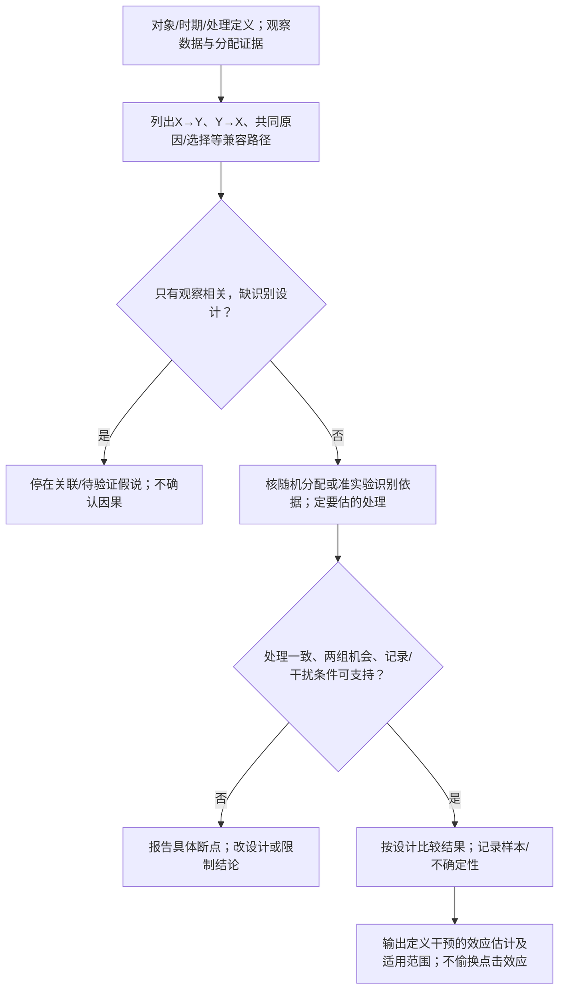
```mermaid
flowchart TD
    CA0["对象/时期/处理定义；观察数据与分配证据"] --> CA1["列出X→Y、Y→X、共同原因/选择等兼容路径"]
    CA1 --> CA2{"只有观察相关，缺识别设计？"}
    CA2 -->|是| CAF["停在关联/待验证假说；不确认因果"]
    CA2 -->|否| CA3["核随机分配或准实验识别依据；定要估的处理"]
    CA3 --> CA4{"处理一致、两组机会、记录/干扰条件可支持？"}
    CA4 -->|否| CAL["报告具体断点；改设计或限制结论"]
    CA4 -->|是| CA5["按设计比较结果；记录样本/不确定性"]
    CA5 --> CA6["输出定义干预的效应估计及适用范围；不偷换点击效应"]
```

银行网点/存款只有观察关系，在CA1保反向、共同富裕等路径，CA2走是到CAF停在关联。四人随机展示补例有明示分配，在CA3/4核同展示和窗口，再CA5按分配组求−1.5并承认误差。文字替代：定干预→核识别条件→算差→限结论。

随机化重复平均正确不保证一次四人差等于真效应；点击是处理后的选择，不能偷换处理。

<details><summary>读图自测：随机展示后只取点击者与不点击者，是否仍走原CA5？</summary>

不再是按展示分配比较，换了分组和处理。点击可由购买意愿自选择，不能把随机展示据为点击因果。

</details>

**完整教学反例（自设潜在结果）**

教学者给四人的两种潜在消费；现实同人同一时期通常只见一种。下面的两潜在列不是实测完整反事实数据。

表用来问：一次随机分组的均值差，为何仍可能与平均处理效应不同？各消费值使用同一教学单位，来源是本节自设。

每行一个自设用户，前两列潜在结果由教学者同时给，现实最后列只见本次分配结果。

| 用户 | 不展示 Y(0) | 展示 Y(1) | 真差 Y(1)−Y(0) | 本次分配 | 本次实际可见值 |
|---|---:|---:|---:|---|---:|
| 1 | 2 | 4 | 2 | 展示 | 4 |
| 2 | 5 | 6 | 1 | 不展示 | 5 |
| 3 | 8 | 7 | −1 | 展示 | 7 |
| 4 | 9 | 13 | 4 | 不展示 | 9 |

用户1展示见4、不见其Y0=2；真差2是教学设定，不能称业务完整反事实观察。

1. 教学表同时给Y(0)/Y(1)，真平均效应 $(2+1-1+4)/4=1.5$。
2. 本次展示组1/3，可见值4/7，均值5.5；对照2/4可见5/9，均值7。
3. 观察差5.5−7=−1.5，单次反号，没有等于真平均1.5。
4. 若四人等概率随机选两人展示，六对子12/13/14/23/24/34分别得−3.5/−1.5/2/1/4.5/6.5。六差平均9/6=1.5，反复分配平均正确不保证每次正确。
5. 现实只见最后一列，不能逐人补齐反事实。须依研究设计估计并承认误差。

既有复算入口：`m03-stat-causal-verify.py`，不称本轮再跑所有因果实验。

🔗 条件框架参考 [Hernán & Robins《Causal Inference: What If》作者版，Ch.1–3](https://miguelhernan.org/whatifbook)，获取 2026-10-01；上述业务场景、四人表与六次枚举为笔记独立补充，讲义 p.34/录音只给了警告和研究方向。

<details><summary>迁移/诊断：随机展示广告后，点击者消费高；或者只在高购买意愿者中展示。能说“点击增加消费”吗？</summary>

不能。第一种随机的是展示分配，可按设计估展示效应；点击者仍可能由购买意愿自选择，改按点击分组已经换处理与比较机制。第二种根本未随机展示，购买意愿同时影响分配与消费；只控制一两个可见变量仍不能证明没有剩余混杂。修正是先定处理与目标、保留随机分配组/完整结果、核条件；若使用观察控制，明示未测共同原因的假设与敏感性，不能把显著相关升为确定因果。

</details>

**答题模板**

1. 承认同对象/窗口中的样本关联。
2. 给具体反向、共同原因或选择路径。
3. 明确要估哪项干预，以及分配/识别证据。
4. 核条件与误差，限定对象和结论。

Airbnb大小与价格可能受地段影响。同地段比较只减少一个差异，不自动排除其他差异，回归控制本身不证明因果。

另一个角度：**相关是对称的，因果是有方向的**。$\rho(X, Y) = \rho(Y, X)$，数据本身不告诉你箭头指向哪边；方向及效应识别需要时间/领域知识和有依据的研究设计，不能仅从对称的相关系数得到。

**⚠️ 常见误解**

- ❌ "相关系数很高（0.9）就接近因果了。" → 强度和因果无关；冰淇淋销量与溺水人数相关很高，混杂变量是气温。
- ❌ 把关联规则的 "→" 读成因果。→ §2.13 讲义会再说一遍 "Implication means co-occurrence, not causality!"
- ❌ 以为回归系数比相关系数"更因果"。→ 回归只是同时控制了几个变量的相关；没控制的混杂变量照样在（M02 §2.7.4 遗漏变量偏误）。
- ❌ 以为"找不到混杂变量就是因果"。→ 找不到只说明你没想到；举证责任在主张因果的一方。

**所以呢**：数值上的"关联"讲完了。讲义接着插入一段完全不同风格的内容——从购物小票里挖规则，也是一种"关联"，但对象是集合而不是数字，而且它自己也会反复提醒：这不是因果。

---
### 2.13 关联规则挖掘 I：动机与基本概念（讲义 p.35–39）

**是什么**

想知道买尿布的购物篮是否常有啤酒，可以逐票数两样共同出现的次数。从交易中寻找这种共现模式，叫关联规则挖掘。

共同出现的票数是支持度计数，记作 σ。再除总票数，得到支持度。

它不需要预先指定分类标签，是本课第一个正式展开的无监督方法。输入是 §2.5 的交易数据，商品存在与否采用 §2.4 的非对称二元表示。

讲义 p.35 用一张购物车图开场（"Customers would buy items together. Ex. Milk + bread."），图上标着零售商关心的问题：苏打水是不是常和香蕉一起买？买了洗涤剂和橙汁的人会不会买窗户清洁剂？**什么东西该在篮子里但没有？**——最后这个问题就是推荐系统的起点。

讲义 p.36 的定义：

> Given a set of transactions, find rules that will **predict the occurrence of an item based on the occurrences of other items** in the transaction

例子是 5 笔市场篮子交易（后面所有算例都用这张表，请把它记熟）：

每行p.36一张原购物篮，Items为集合，计一次presence，票总数5。

| TID | Items |
|---|---|
| 1 | Bread, Milk |
| 2 | Bread, Diaper, Beer, Eggs |
| 3 | Milk, Diaper, Beer, Coke |
| 4 | Bread, Milk, Diaper, Beer |
| 5 | Bread, Milk, Diaper, Coke |

TID2含Bread/Diaper/Beer/Eggs，与p.17另一五票不同，不能混票做支持分母。

规则的例子：{Diaper} → {Beer}，{Milk, Bread} → {Eggs, Coke}，{Beer, Bread} → {Milk}。读法："买了尿布的人也会买啤酒"。并且加粗警告：**Implication means co-occurrence, not causality!**（这个箭头只表示"一起出现"，不表示"因为买了尿布所以买啤酒"——§2.12 的话在这里再说一遍。）

讲义 p.37 说关联可以出现在四个层次：值之间（Apple ⇒ Coke）、类别之间（Food ⇒ Magazine）、属性值之间（Married:yes ⇒ OwnHouse:yes）、时间之间（year 1: Database ⇒ year 2: Data Mining）。意思是"item"不一定是商品——任何"是 / 否"都能当 item：已婚是一个 item，有房是一个 item，"第一年选了数据库课"也是一个 item。

讲义 p.38 **为什么零售商在乎**：

每卡一个讲义业务用途、完整例与候选动作，不由共现直接确认干预收益。

**Product placement 货架摆放**

讲义例子：Whole Foods 把生日卡放在花旁边；Wal-Mart 买芭比娃娃的顾客有 **60%** 可能买三种糖果之一

业务动作：把常一起买的东西摆近，或故意摆远让顾客多走几个货架

**Recommendations 推荐**

讲义例子：看 iPad 时推荐保护壳或键盘

业务动作："买了 X 的人也买了 Y"

**Bundling 捆绑**

讲义例子：旅行套餐：机票 + 酒店 + 租车

业务动作：打包定价

**Other**

讲义例子：网站 / 目录设计；医疗并发症

业务动作：症状 A 常伴随症状 B

Wal-Mart60%是该讲义故事，是否当前/总体成立未核；机票酒店/推荐仍需成本与实验。

讲义 p.39 **基本概念**（四个词，后面全部公式都建立在它们上）：

> - **Itemset**：A collection of one or more items，例 {Milk, Bread, Diaper}；**k-itemset**：含 k 个 item 的项集
> - **Support count ($\sigma$)**：Frequency of occurrence of an itemset，例 $\sigma$({Milk, Bread, Diaper}) = 2
> - **Support**：Fraction of transactions that contain an itemset，例 $s$({Milk, Bread, Diaper}) = 2/5
> - **Frequent Itemset**：An itemset whose support is greater than or equal to a **minsup** threshold

四个概念按计数过程连接：

- 项集：一组商品；{Milk}含1项，{Milk,Bread,Diaper}含3项。
- 支持度计数 $\sigma$：含全部所列商品的小票张数。
- 支持度s：这张数除同一总体小票总数。
- 频繁项集：s达到声明minsup的项集，门槛包含等号。

“包含全部商品”不要求小票恰好只有这些商品。

**手把手数一遍**（5 笔交易，`verify_w3w4.py`）：

每行一个项集，Tid列给全部含它的小票，sigma数张、s除固定5票。

| 项集 | 哪几张小票含它 | $\sigma$ | $s$ |
|---|---|---|---|
| {Bread} | 1, 2, 4, 5 | 4 | 4/5 = 0.8 |
| {Milk} | 1, 3, 4, 5 | 4 | 0.8 |
| {Diaper} | 2, 3, 4, 5 | 4 | 0.8 |
| {Beer} | 2, 3, 4 | 3 | 0.6 |
| {Coke} | 3, 5 | 2 | 0.4 |
| {Eggs} | 2 | 1 | 0.2 |
| {Milk, Diaper} | 3, 4, 5 | 3 | 0.6 |
| {Milk, Diaper, Beer} | 3, 4 | 2 | 0.4 |
| {Milk, Bread, Diaper} | 4, 5 | 2 | 0.4（讲义 p.39 的例子） |

{Milk,Bread,Diaper}含T4/T5，sigma2/s0.4；允许篮中还有其他商品。

注意一个规律：**项集越大，支持度只会越小或不变**——含 {Milk, Diaper, Beer} 的小票一定也含 {Milk, Diaper}，所以 $\sigma$ 只能从 3 降到 2。这条"子集的支持度 ≥ 超集的支持度"是所有关联规则算法（Apriori）剪枝的依据，⚪ 本课不展开。

**p.35 五问逐项｜⚪ 参考作答（笔记推断）**：这页购物车图提出五个业务问题，没有配套交易/人口完整数据，不能编造肯定结论；需要的数据、具体判断及阻断如下。

每卡保p.35全部五业务原问、方法性答案及界限，缺完整调查数据不编是/否。

**邻里人口特征如何影响购买？**

直接方法性作答与界限：以相同窗口和对象关联邻里人口与篮子，分层比较购买比例；人口/购买观察差只能描述关联，不证明人口干预效果。无人口表、连接键和交易记录，本页无法定方向/数值。

**苏打是否常配香蕉？**

直接方法性作答与界限：原图这一篮确有苏打与香蕉，但一篮不能证明“通常”；数完整记录中的苏打、香蕉、共同票与 N，算两方向 s/c/lift，声明“常”的阈值。无计数，不可说常或不常。

**苏打品牌是否有区别？**

直接方法性作答与界限：将具体品牌分别视为项，按相同口径比较与香蕉等项的 s/c/lift及支持计数；不能将所有苏打合并后的比例代替品牌差异。缺品牌明细，差异待核。

**洗窗品是否在洗涤剂与橙汁共购时出现？**

原图只能确认这一篮有三项，不能给总体概率。参考规则以前件 {洗涤剂,橙汁}、后件 {洗窗品} 表示。

共同三项票数除以前件票数是置信度，除总票数是支持度。还需与洗窗品基率比较。

前件零票时置信度未定义。目前缺完整交易数据，所以不能给出是否存在总体关联的答案。

**篮内缺少应有商品？**

直接方法性作答与界限：先从历史完整票建立频繁共现候选；本票含前件但不含后件可触发“待询问/推荐”的提示。“通常共现”不是“必须买”，未出现不能直接当漏扫或顾客错误；实际漏扫需库存/结账等独立证据。

“苏打是否常配香蕉”要完整票数与基率；原图一篮不能证明通常，且不能替代品牌明细。

下面 p.36 五笔原票与 p.41 四笔原票分别演算计数、发现与筛选，不把那两个教学表冒作 p.35 的真实顾客/品牌调查答案。

**为什么需要它**

关联规则是本讲唯一有"算法味"的内容，也是最容易出**计算题**的部分（讲义 p.49 直接留了一页 "Exercise"）。它把前面几节串起来：交易数据（§2.5）= 每行一个集合 = 每样商品一个非对称二元属性（§2.4）= 一张几乎全是 0 的稀疏矩阵（§2.6）；而"支持度"就是在这张稀疏矩阵里数 1。

**课件原例**

p.36 的 5 笔交易；p.38 的 Whole Foods / Wal-Mart / iPad / 旅行套餐；p.39 的 $\sigma$({Milk, Bread, Diaper}) = 2、$s$ = 2/5。

**🎙️ 课堂补充**（`56:06`–`01:10:18`，约 14.2 分钟，A · 课上展开）

教授用一串真实生活例子把 p.38“零售商为什么在乎关联规则”重新讲了一遍，比讲义的四行表格具体得多：

① **货架摆放**（呼应 Whole Foods/Wal-Mart 例）：*"if you go to the [market], you may realize that the bread, and the milk, and the food, these three categories of items, they are located very close to each other... The supermarket manager will analyze the transaction data and he or she will realize that people usually put these three categories of items together."*（`57:16`–`57:43`）

② **已婚 → 有房**（讲义 p.37“属性值之间”的关联，教授现场举例）：

> is all the conditions that we always see that somebody is already married, what is the probability that he or she will also have the house... this question is very important for some Chinese parents that when you want to get married you need to buy a house.

（`01:01:19`–`01:01:34`）

③ **机票 → 酒店推荐，及反方向不对称**（讲义没有，很好的置信度方向性例子）：

> the flight to Hong Kong and the hotel in Hong Kong, these two items will be purchased very frequently... But, the reverse part, from one side to another side, we are not [going to] be a very clear pattern... if I already observe that you booked a hotel in Hong Kong, the probability that you will receive a flight will be lower.

（`01:04:15`–`01:05:39`）教授解释：订酒店的人可能坐高铁去香港，不一定坐飞机（`01:05:52`）。

④ **项集与支持度计数手把手演算**（对应讲义 p.39）：

> the support count of the item set indicates that among the transaction we have, what's the frequency of the occurrence of this item set... the support is actually the fraction of the transactions that are contained in the item set.

（`01:07:38`–`01:09:33`），并现场逐笔核对 5 张交易是否含 {Milk, Bread, Diaper}，得到与笔记表一致的 σ=2、s=2/5。

**这段改变了什么**：p.38 的用途表在课堂变成货架、已婚买房及机票配酒店等故事。

机票与酒店例突出置信度的方向性：订酒店者可能乘高铁到港。它可与下一节 Diaper/Bread 的数字例相互说明。

**💡 换个说法（笔记补充）**

支持度计数就是"**数小票**"——后面所有公式（支持度、置信度、提升度）都只是**两个计数的比值**，分母不同而已：除以小票总数是支持度，除以含前件的小票数是置信度。考试算题时，先把题目里每个项集的 $\sigma$ 列成上面那样的表，公式就不会套错。

另一个角度：关联规则是超市版的"物以类聚"——它不问顾客是谁、为什么买，只问哪些商品总是结伴出现在同一张小票上。它是无监督的：没有人给小票贴"好"或"坏"的标签，规律完全从共现里长出来；这和 M02 有因变量的回归是两种完全不同的任务。

**⚠️ 常见误解**

- ❌ 把 $\sigma$ 和 $s$ 混用。→ $\sigma$ 是**次数**（整数），$s$ 是**比例**（0–1）。讲义两处都用了，考试要看清问的是哪个。
- ❌ 以为 "→" 有方向就有因果。→ p.36 加粗原话：co-occurrence, not causality。"买尿布的人也买啤酒"和"买啤酒的人也买尿布"是两条规则，各有各的置信度（下一节）。
- ❌ 数支持度时只数"恰好买了这几样"的小票。→ 是"**包含**这几样"的小票：TID 2 买了四样，它同时算进 {Bread}、{Diaper}、{Bread, Diaper}……的计数里。

**所以呢**：有了项集和支持度，就能定义规则、并给规则打两个分——支持度（够不够常见）和置信度（够不够可靠）。

---

### 2.14 关联规则挖掘 II：支持度、置信度与有效规则（讲义 p.40–45）

一条规则 "买 X → 也买 Y" 要过两关：**够常见吗**（支持度）、**够可靠吗**（置信度）。§2.14.1 定义这两个指标并算讲义的例子，§2.14.2 讲为什么两个门槛都要、并把 p.44 的完整筛选走一遍。

#### 2.14.1 规则的两个指标：支持度与置信度（讲义 p.40–42）

**是什么**

先说人话：一条规则 "买 X → 也买 Y" 有两个问题要回答。第一，**够常见吗**——一百张小票里有几张同时有 X 和 Y？太少的话，就算规则再准也影响不了几个顾客，不值得为它改货架。第二，**够可靠吗**——买了 X 的人里，有几成也买了 Y？太低的话，按它推荐会推错。第一个问题的答案叫支持度，第二个叫置信度。

讲义 p.40 **定义**：

> **Association Rule**：An implication expression of the form $X \rightarrow Y$, where X and Y are itemsets。例：{Milk, Diaper} → {Beer}
>
> **Rule Evaluation Metrics**
> - **Support (s)**：Fraction of transactions that contain **both X and Y**
> - **Confidence (c)**：Measures how often items in Y appear in transactions that contain X

先用所有票作分母，量共同出现的覆盖：

$$s(X\rightarrow Y)=\frac{\sigma(X\cup Y)}{\lvert T\rvert}.$$

再限含前件的票作分母，量已知X时Y出现的比例：

$$c(X\rightarrow Y)=\frac{\sigma(X\cup Y)}{\sigma(X)}.$$

两式共用分子，问的是不同人群，不能混分母。

每行规则公式量，X前件/Y后件，XunionY要求两边全部商品共同出现；计数单位票，s/c为比例。

| 符号 | 含义 | 已知 / 要算 |
|---|---|---|
| $X$（antecedent 前件）、$Y$（consequent 后件） | 规则左右两边的项集；"如果买了 X，就会买 Y" | 已知（规则给定） |
| $X \cup Y$ | X 和 Y 合在一起的项集（{Milk, Diaper} ∪ {Beer} = {Milk, Diaper, Beer}） | 已知 |
| $\sigma(X \cup Y)$ | 同时含 X 和 Y 全部商品的交易数 | 数出来 |
| $\lvert T \rvert$ | 交易总数 | 已知 |
| $\sigma(X)$ | 含 X 的交易数（**置信度的分母只看前件**） | 数出来 |
| $s$、$c$ | 支持度、置信度，都在 0–1 之间 | 要算 |

{Milk,Diaper}→Beer共同T3/T4，sigma2；前件3票而全体5票，两分母不同。

**数字例子（手把手）**（讲义 p.40，{Milk, Diaper} ⇒ {Beer}，用 §2.13 的 5 笔交易和那张 $\sigma$ 表，`verify_w3w4.py`）：

1. 数分子：同时含 Milk、Diaper、Beer 的小票是 TID 3、4，$\sigma(X \cup Y) = 2$；
2. 支持度：$s = 2 / 5 = 0.4$（五张小票里两张三样都有）；
3. 数置信度的分母：含 Milk 和 Diaper 的小票是 TID 3、4、5，$\sigma(X) = 3$；
4. 置信度：$c = 2 / 3 = 0.67$（买了牛奶和尿布的三个人里两个买了啤酒）。

讲义 p.41–42 换了一张 4 笔交易的表再算一次（这一段的页脚是 "42/42、43/42"，来自另一份讲义）：

每行独立p.41购物篮，票数4，Diapers复数沿原表，不偷换p.36五票数据。

| TID | Items |
|---|---|
| 1 | Bread, Milk, Diapers |
| 2 | Bread, Diapers |
| 3 | Bread, Beer |
| 4 | Milk, Eggs, Shoes |

T4 Milk/Eggs/Shoes不含Bread；算Bread支持分母为4，总Bread票3。

> support = # of transactions containing all items in antecedent and consequent ÷ # of transactions in database → Support for {bread} → {diapers} is **2/4**（50% of transactions include this pair）
> confidence = # of transactions containing items in antecedent and consequent ÷ # of transactions containing items in antecedent → Confidence for {bread} → {diapers} is **2/3**（conditional on that the basket contains bread, there is probability 2/3 that the same basket also contains diapers）
> Support quantifies the significance of the **co-occurrence**；in practice, we only care about item sets with strong enough support

再走一遍：含 Bread 和 Diapers 的是 TID 1、2 → $\sigma = 2$；$s = 2/4 = 0.5$；含 Bread 的是 TID 1、2、3 → $\sigma(\text{Bread}) = 3$；$c = 2/3 = 0.667$。

支持度和置信度使用同一个分子：同时含 X、Y 的票数。分母不同，所以问题不同。

| 指标 | 分母 | 概率读法 |
|---|---|---|
| 支持度 | 所有票 | $P(X\cap Y)$ |
| 置信度 | 含 X 的票 | $P(Y\mid X)$ |

支持度问组合在全体中多常见。置信度问已经出现 X 时，Y 的比例有多高，即条件概率。

**规则边界**：前件出现过、两者却从不共现时，支持度和置信度均为零。

每张含 X 的票都含 Y 时，置信度为 1。p.44 的 Diapers→Bread 就是这个例子。

若 X 从未出现，置信度分母为零，未定义。只在它有定义时，置信度不小于支持度，因为前件票数不超过总票数。

**为什么需要它**

这两个指标是关联规则的"两条腿"，也是本讲**最可能出的手算题**（⚪ 推断，讲义 p.49 留了 Exercise 页）：给一张 4–5 行的交易表，算某条规则的 s 和 c。做法固定：先把题目里每个项集的 $\sigma$ 列成 §2.13 那样的表，再套两个分母。

**课件原例**

p.40（2/5、2/3）、p.41–42（2/4、2/3）——全部由脚本 `verify_w3w4.py` 复核一致。

**🎙️ 课堂补充**（`01:10:18`–`01:15:02`，约 4.7 分钟，B · 讲了同讲义）

教授现场把 p.40 {Milk, Diaper} → {Beer} 的例子逐笔算了一遍，数字与笔记 §2.14.1 完全一致：

> we can get this association rule for analysis, so X is the item set of milk and diaper, and Y here is the beer.

（`01:10:52`）支持度：

> we know that we need to get the union of the two baskets into a single one with milk, dai[per], and beer... the part of this, both X and Y in an item set is 2 over 5 or 0.4.

（`01:11:58`–`01:12:11`）置信度：

> among the 3 transactions that we already observed milk and diaper, how many of them also observed beer? 2, right? Now we get the number 2 over 3, or 0.67.

（`01:13:53`–`01:14:09`）——与笔记 §2.14.1 的 s=0.4、c=0.67 一字不差，没有增量，但教授逐笔点交易表核对的过程比笔记的静态表更直观；讲义 p.41–42 那个 Bread/Milk/Diapers 的独立 4 笔交易例没有被用到（见 §9.1）。

**💡 换个说法（笔记补充）**

支持度像"这条街上有多少人既买面包又买尿布"（看的是全体），置信度像"走进面包店的人里有多少顺手买了尿布"（看的是一个子群）。前者告诉你这门生意有多大，后者告诉你推荐有多准。

p.44 中，买尿布的两人都买了面包，因此 Diapers→Bread 置信度为 100%。买面包的三人只有两人买尿布，反向为 66.67%。

支持度都为 2/4，不随方向改变。样本中两个推荐方向的条件命中率不同，但实际推荐效果仍须验证。

**⚠️ 常见误解**

- ❌ 置信度的分母写成交易总数。→ 那是支持度。置信度分母是**含前件 X** 的交易数。
- ❌ 以为 X → Y 和 Y → X 的置信度相等。→ 上面的例子正好相反（66.67% vs 100%）；只有支持度是对称的。

**所以呢**：两个指标各有各的门槛；下一子节讲为什么缺一不可，并把 p.44 的筛选完整走一遍。

#### 2.14.2 两个门槛缺一不可 · p.44 的完整筛选（讲义 p.43–45）

**是什么**

先说人话：一条规则要被采纳，支持度和置信度都得超过决策者定的门槛（minsup、minconf）。为什么两个都要？因为**只看置信度会被"只发生过一次的巧合"骗**，只看支持度会被"常见但不可靠"的组合骗。讲义用一个电话公司的例子说第一种，再用 4 笔交易演示完整的筛选流程。

讲义 p.43 **有效规则要过两个门槛**：

> A rule has to meet a **minimum support** and a **minimum confidence**；both thresholds determined by the decision maker.
> Why need both threshold? Example of a rule with **high confidence & low support**：A cell phone company database contains all call destinations for each account — {Germany} → {France, Belgium} with confidence = 100%, **support is 1 of 100K accounts**

十万个账户里只有一个人打过德国电话，他恰好也打过法国和比利时——规则 {Germany} → {France, Belgium} 置信度 100%（打德国的人 100% 也打法比），**但它只描述了一个人**。给这个人推荐欧洲套餐没错，但把它当成"规律"去做营销，是把一个人的巧合当成了十万人的规律。支持度门槛就是用来挡住这种"样本只有一个"的规则的。

讲义 p.44 用 minsup = 50%、minconf = 50% 走一遍 4 笔交易（`verify_w3w4.py`）：

**数字例子（手把手）**

第一步：找频繁项集（支持度 ≥ 50%，即 $\sigma \ge 2$）：

每行p.41候选项集，sigma数票、支持除4，频繁按≥50%即至少2票。

| 项集 | 哪几张小票含它 | $\sigma$ | 支持度 | 频繁？ |
|---|---|---|---|---|
| {Bread} | 1, 2, 3 | 3 | $3/4 = 75\%$ | ✅ |
| {Milk} | 1, 4 | 2 | $2/4 = 50\%$ | ✅ |
| {Diapers} | 1, 2 | 2 | 50% | ✅ |
| {Beer}、{Eggs}、{Shoes} | 各 1 张 | 1 | 25% | ❌ |
| {Bread, Diapers} | 1, 2 | 2 | 50% | ✅ |
| {Bread, Milk} | 1 | 1 | 25% | ❌ |
| {Milk, Diapers} | 1 | 1 | 25% | ❌ |

Bread+Diapers两票达50%；Bread+Milk只有1票25%，未达，含它的更大集也不能过。

第二步：从唯一频繁的 2-项集 {Bread, Diapers} 造两条规则，检查置信度（≥ 50%）：

每行一个方向规则，支持除4、置信除本方向前件，过关按给定≥50%两门槛。

| 规则 | 支持度 | 置信度 | 过关？ |
|---|---|---|---|
| Bread → Diapers | $2/4 = 50\%$ | $2/3 = 66.67\%$ | ✅ |
| Diapers → Bread | $2/4 = 50\%$ | $2/2 = 100\%$ | ✅ |

Bread→Diapers c2/3与反向2/2不相同，但s同2/4。

> Check rules – only two survive：**Bread → Diapers**（Support = 50%, Confidence = 66.67%）；**Diapers → Bread**（Support = 50%, Confidence = 100%）

讲义 p.45 **含义**：

> - A rule with **low support** is typically not interesting from business point of view as it **may simply occur by chance**
> - **High confidence** represents **strong reliability** of the inference made by a rule
> - However, association rules do not imply causality but how strong is the co-occurrence among the considered items

**💡 从交易输入走到全部规则输出（原p.41数据，执行过程为笔记补充）**

输入需包括完整购物篮、采样单位、总票数 N，以及 minsup/minconf。阈值在 0–1 内，估计支持度要求 N>0。

无交易时报告无法估计。若有交易但所有篮为空，可输出空候选、空规则。篮内同商品多件只记一次出现，跨票相同篮不自动删除。

本例来自 p.41，与 p.36 五票例独立。四张票如下：

| 票 | 商品 |
|---|---|
| T1 | Bread、Milk、Diapers |
| T2 | Bread、Diapers |
| T3 | Bread、Beer |
| T4 | Milk、Eggs、Shoes |

N=4，商品全集为六种，minsup=minconf=0.5。输出规则、支持票 ID 及 s/c/lift，不是获利或因果结论。

若改研究顾客而非交易票，要重新定义分析单位。

**状态与编号步骤（笔记补充有限枚举）**

输入为原p.41四票、六商品、minsup=minconf=0.5。状态保存候选项集、计数缓存、频繁清单与已处理规则。

1. 按固定顺序存商品全集，建立有限非空候选。
2. 候选A逐票查 $A\subseteq T_i$；满足就计数并保Tid。四票结束算 $\sigma(A)$及 $s(A)=\sigma(A)/4$。
3. s≥0.5才进频繁清单；所有项集候选结束再进规则阶段。
4. 每个至少2项的频繁F，枚举非空真子集X，取Y=F\X，左右不重叠。
5. 缓存取共同/前件/后件计数，算c及lift。c≥0.5才输出；所有拆分完停止。

置信度前件分母为零或lift所需前/后件计数为零时，记录未定义，不做除法。公式为 $c=\sigma(F)/\sigma(X)$、$lift=\sigma(F)N/[\sigma(X)\sigma(Y)]$。

下表把63候选全部归账，不只给成功项。六商品共有$2^6-1=63$个非空项集；每阶候选分别6/15/20/15/6/1。未逐名展开的零项已通过各篮最大长度与具体共现核对，不把“没写表”当“有支持”。

每卡一个候选阶/数量，全非零与其他计数保持完整，频繁列给输出。

**1项/6**

全部非零计数：Beer1；Bread3（T1/2/3）；Diapers2（T1/2）；Eggs1；Milk2（T1/4）；Shoes1

其余计数：无

≥2票的频繁结果：Bread、Diapers、Milk

**2项/15**

全部非零计数：Bread+Diapers2；Beer+Bread1；Bread+Milk1；Diapers+Milk1；Eggs+Milk1；Eggs+Shoes1；Milk+Shoes1

其余计数：其余8项均0

≥2票的频繁结果：Bread+Diapers

**3项/20**

全部非零计数：Bread+Diapers+Milk1；Eggs+Milk+Shoes1

其余计数：其余18项均0

≥2票的频繁结果：空

**4/5/6项，共22候选**

全部非零计数：无；每张原篮最多3商品，不可能包含4项以上

其余计数：全0

≥2票的频繁结果：空

二项15候选7种非零、8种零；三项20候选2非零、18零，63候选归账不只数成功项。

唯一可拆规则的频繁F是{Bread,Diapers}，非空真子集只有两种：

每行一个存活方向，共同/前件/后件是三种计数；s/c/lift各用本行对应分母，输出指过阈值。

| 规则 | 共同/前件/后件计数 | s | c | lift | 输出 |
|---|---|---|---|---|---|
| Bread→Diapers | 2/3/2 | 2/4=.5 | 2/3≈.666667 | (2/3)/(2/4)=4/3 | 是 |
| Diapers→Bread | 2/2/3 | .5 | 1 | 1/(3/4)=4/3 | 是 |

Bread→Diapers 2/3/2，lift(2/3)/(2/4)=4/3；数字2/3/2不是三张票ID。

支持统一分母N，置信只看满足前件的子群；箭头是同一交易条件概率，不自动表示时间先后。若A⊆B，则含B票集合⊆含A票集合，故$\sigma(B)\le\sigma(A)$；这解释为何不频繁子集的超集也不频繁，可以跳过。这里只用有限枚举完成原例；Apriori是利用该性质高效化的背景算法，原讲义未教连接/剪枝，不冒称此表执行过完整Apriori。

图问：为何先数所有项集，再拆出规则？箭头是有限候选/规则的控制，两个回环各有耗尽条件。

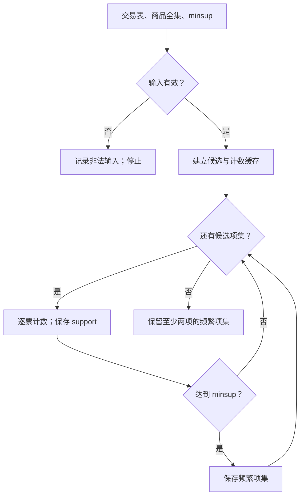
```mermaid
flowchart TD
    A0["交易表、商品全集、minsup"] --> A1{"输入有效？"}
    A1 -->|否| AF["记录非法输入；停止"]
    A1 -->|是| A2["建立候选与计数缓存"]
    A2 --> A3{"还有候选项集？"}
    A3 -->|是| A4["逐票计数；保存 support"]
    A4 --> A5{"达到 minsup？"}
    A5 -->|是| A6["保存频繁项集"]
    A5 -->|否| A3
    A6 --> A3
    A3 -->|否| A7["保留至少两项的频繁项集"]
```

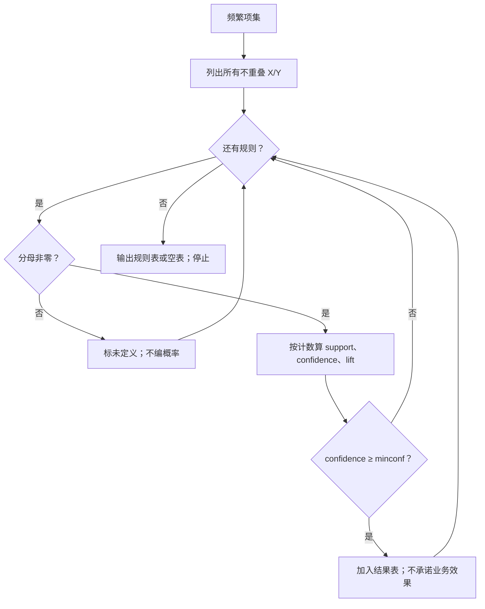
```mermaid
flowchart TD
    B0["频繁项集"] --> B1["列出所有不重叠 X/Y"]
    B1 --> B2{"还有规则？"}
    B2 -->|是| B3{"分母非零？"}
    B3 -->|否| BU["标未定义；不编概率"]
    BU --> B2
    B3 -->|是| B4["按计数算 support、confidence、lift"]
    B4 --> B5{"confidence ≥ minconf？"}
    B5 -->|是| B6["加入结果表；不承诺业务效果"]
    B5 -->|否| B2
    B6 --> B2
    B2 -->|否| B7["输出规则表或空表；停止"]
```

四票六商品63候选，AR3给Bread+Diapers数2，AR4支持2/4达0.5保频繁；所有项集完后AR6只拆这一2项集，AR8两方向置信2/3与1，都过0.5到AR10。文字替代：计项集→筛频繁→拆规则→筛置信。

这里有限枚举不是完整Apriori实现；票重复与商品数量presence策略先声明；空输出不代表程序失败。

<details><summary>读图自测：minsup改0.75后，AR6会收到可拆频繁组合吗？</summary>

不会，只有Bread单项达3票，没有至少2项频繁F，正常到AR11输出空规则。

</details>

一般F含k项有$2^k-2$个左右不空拆分，候选/拆分有限所以能耗尽；对六商品63项而非只挑最爱的一项。低门槛/大商品全集可能指数增算量，取样、限制商品范围或高效剪枝都有覆盖/检出代价。高confidence可能只是Y基率高，lift大也可能只靠极少票；要报告原计数，并在独立数据/正确采样范围核稳健性。少量四票不保证总体规律，更不能据此替客户实际下单。

<details><summary>迁移/诊断：同四票把minconf改.8；或minsup改.75、minconf仍.5，最终各输出什么？把Diapers→Bread的分母写N是否正确？</summary>

提高 minconf 到 0.8 后，只留 Diapers→Bread：它的置信度为 1，反向 2/3 达不到门槛。

若支持度门槛要求至少 3 票，仅 Bread 单项频繁，没有可拆的频繁组合，输出空规则表是正常结果。

Diapers→Bread 的置信度分母为前件 2 票，不能用总数 4。除 4 得到的是支持度 0.5。

前件、后件重叠会部分自证，不属于本例的规则定义。

</details>

**为什么需要它**

每行一个门槛防的错误与反例，阈值由决策者设，覆盖与条件命中分开。

| 指标 | 防什么错 | 反例 |
|---|---|---|
| 支持度门槛 | 防"**偶然**"：规则只覆盖极少数小票 | 电话公司：置信度 100% 但只有 1 个账户 |
| 置信度门槛 | 防"**不可靠**"：X 和 Y 一起出现过，但买 X 的人多数没买 Y | 5 笔交易里 Bread → Beer：支持度 2/5 不算低，置信度 2/4 = 50%，推荐会错一半 |

电话1/100K但c100%，只能描述一账户；Bread→Beer c50%不是50%全票同时出现。

考试的筛选题就是 p.44 这个两步流程：先用 minsup 筛项集，再用 minconf 筛规则；**筛项集时利用 §2.13 的规律**（超集的支持度 ≤ 子集），{Bread, Milk} 不频繁，含它的更大项集也不用看。

**课件原例**

p.43 电话公司；p.44 四个频繁项集、两条存活规则；p.45 三条含义。

**🎙️ 课堂补充**（`01:15:02`–`01:16:36`，约 1.6 分钟，B · 讲了同讲义）

教授只讲了“为什么两个门槛都要”的道理，没有像讲义 p.44 那样列出具体的 4 笔交易筛选表，也没提 p.43 的电话公司例子：

> Then we usually push minimum support and minimum confidence to filter out some important association rules from your transaction data set... An association rule with a very low support is typically not that important or interesting because these two items... usually will not show up together.

（`01:15:13`–`01:16:04`）

> the high confidence usually presents a very strong reliability of this kind of co-occurrence.

（`01:16:16`）——与笔记 §2.14.2 的判断一致，没有推翻或新增；p.43–44 的具体例子和筛选表课上没有手算，读者仍需照笔记里的手算过一遍（见 §9.1）。

**💡 换个说法（笔记补充）**

两个门槛像招聘的两道关：支持度是"简历数量够不够"（一个人的样本说明不了问题），置信度是"面试通过率高不高"。只看后者会被"投一份中一份"的孤例迷惑，只看前者会招来一堆不合适的人。

另一个角度：门槛不是固定数。讲义原话 "determined by the decision maker"——教学例子用 50% 是为了算得少；真实超市有几万种商品，任何两样同时出现的比例都很低，minsup 常设在 1% 甚至更低，否则一条规则都筛不出来。

**⚠️ 常见误解**

- ❌ 以为只要置信度高就是好规则。→ p.43 的电话例子（支持度 1/100K）；下一节还有更隐蔽的陷阱——置信度高但**其实是负关联**。
- ❌ 门槛是固定的（比如一律 50%）。→ 讲义原话 "determined by the decision maker"：超市可能用 minsup 1%，教学例子用 50% 只是为了算得少。
- ❌ 造规则时把不频繁的项集也拿来造。→ 支持度不够的项集造出来的规则支持度也不够（分子一样），p.44 只从 {Bread, Diapers} 造规则是有道理的。

**所以呢**：两个门槛还不够。下一节讲义用"茶 → 咖啡"演示：置信度 75% 的规则可能比不用规则还差——因为它没有和"本来就有多少人买咖啡"比较。

---
### 2.15 关联规则挖掘 III：置信度的陷阱与提升度（讲义 p.46–49）

**是什么**

先说人话：买茶的人有 75% 也买咖啡，听起来是条好规则——但如果**所有人**里本来就有 90% 买咖啡呢？那买茶的人反而**更不**爱买咖啡（75% < 90%）。置信度的问题是它**没有和"基准率"比较**：一个后件本来就很常见时，任何规则的置信度都会看起来很高。**提升度**就是"置信度 ÷ 基准率"——它比较本样本条件概率与后件基率。大于1为样本正关联，小于1为负关联；等于1表示此事件表中的独立关系，不证明总体独立，更不证明带动或抑制的因果机制。

讲义 p.46–47 的 2 × 2 表（100 位顾客）：

每行茶状态，每列咖啡状态，四互斥格数顾客，末行/末列是同样本汇总。

| | Coffee | NOT Coffee | 合计 |
|---|---|---|---|
| **Tea** | 15 | 5 | 20 |
| **NOT Tea** | 75 | 5 | 80 |
| 合计 | 90 | 10 | 100 |

Tea行共同15、非咖啡5，总20。Coffee列15+75=90，N100，先核行列总和。

> Confidence(Tea → Coffee) = #(Coffee & Tea) / #(Tea) = 15/20 = **75%**——i.e. the probability that someone who has bought tea will also buy coffee is 75%. Seems good?
> But, Support or $P$(Coffee) = #(Coffee)/100 = 90/100 = **90%**——the probability that someone would have bought coffee is 90%. **So, given that tea has been bought, the probability of buying coffee has dropped** in the same transaction. **Although confidence is high, rule is misleading!**
> In fact, the confidence of "NOT Tea → Coffee" is 75/80 = **93.8%**
> We are looking for a rule that **Confidence(X → Y) > Support(Y)**

**数字例子（手把手）**——把这张表读三遍（`verify_w3w4.py`）：

1. 只看第一行：20 个买茶的人里 15 个买了咖啡 → 置信度 $= 15 / 20 = 0.75$。看起来不错。
2. 看最后一行：100 个人里 90 个买咖啡 → 基准率 $P(\text{Coffee}) = 90 / 100 = 0.90$——**随便拉一个人，90% 买咖啡**。买茶的人只有 75%——**比随便一个人还低**。
3. 看第二行：80 个不买茶的人里 75 个买了咖啡 → $75 / 80 = 0.938$。**不买茶的人更爱买咖啡**。因此本样本茶与咖啡呈负关联；“替代品”是待验证的解释，不能直接由共现推断。该规则不能作为“正向提高咖啡命中率”的证据；负关联本身仍是描述信息，并非没用或已证明替代机制。

讲义 p.48 **提升度（Lift）**：

> The lift of a rule measures **how much more likely the consequent is, given the antecedent**

$$\text{lift}(X \rightarrow Y) = \frac{\text{confidence of the rule}}{\text{support of the consequent}} = \frac{P(Y \mid X)}{P(Y)}$$

> Tea → Coffee：Confidence is 75%，Support of Coffee is 90%，**Lift = 0.75 / 0.9 = 0.8333 < 1** → this rule is worse than not having any rule (negatively associated)
> - **< 1: substitution effect**（替代效应：买了 X 反而少买 Y）　**> 1: dependence effect**（依赖效应：买了 X 更可能买 Y）
> - How much our confidence has increased that coffee will be purchased given that tea was purchased

每行一个条件概率/基率或lift边界；比例无单位，样本关联不等于机制。

| 符号 | 含义 |
|---|---|
| $P(Y \mid X)$ | 置信度：买了 X 的人里买 Y 的比例 |
| $P(Y)$ | 后件 Y 自己的支持度（基准率）：所有人里买 Y 的比例 |
| lift = 1 | $P(Y \mid X) = P(Y)$：知道买了 X，对"会不会买 Y"没有任何新信息——在当前事件表中满足独立等式；不据有限样本推出总体独立 |
| lift > 1 | 买了 X 的人比一般人更可能买 Y——正关联；还须看计数、支持度、独立数据与业务成本，不能仅按lift大判断有用 |
| lift < 1 | 买了 X 的人比一般人更不可能买 Y——负关联；规则误导 |

c0.75除后件0.9=5/6；NOT前件80与反向Coffee90分开。

提升度比较两种情况下 Y 的比例：已经知道 X 出现时，与不使用 X 信息时。

分子是 $P(Y\mid X)$，分母是后件基率 $P(Y)$。相除表示前者是后者的几倍。

因此必须用后件基率作分母。比较的是同一个 Y，仅改变是否已知 X。

**lift 边界**：两项独立且两边支持度非零时，lift=1。若 Y 人人都买，只要前件出现，置信度和 lift 都为 1，规则不增加命中信息。

两项各出现过但从不共现时，lift=0。任一项支持度为零，则相关分母为零，lift 未定义。

由于置信度至多为 1，lift 不超过 $1/P(Y)$。后件越稀有，这个上界越高，但仍需检查支持票数。

**再算一个正关联的例子**（p.44 的 4 笔交易）：Diapers → Bread 置信度 100%，Bread 的支持度 75%，lift = 1.00 / 0.75 = **1.33**——买尿布的人买面包的概率是一般人的 1.33 倍，正关联。反过来 Bread → Diapers：0.667 / 0.5 = **1.33**——一样。**提升度与方向无关**（数学上 $P(Y \mid X)/P(Y) = P(X \cap Y)/[P(X)P(Y)]$，X、Y 对称），这一点和置信度不同。

讲义 p.49 **练习（Exercise On Support: Phone Faceplates）**：标题写着"手机面板"，但页面内容是 p.40 那个 {Milk, Diaper} ⇒ {Beer} 算例的重贴（s = 2/5 = 0.4，c = 2/3 = 0.67）——练习题本身没有出现（见 §9.3）。用它练提升度：Beer 的支持度 3/5 = 0.6，lift = 0.667 / 0.6 = **1.11**，弱正关联。

**💡 三种方向/条件不要混（笔记补充）**

**同四格的三条不同规则（笔记补充）**

四格为15/5/75/5，共100人。先明确方向，再取前件人数与后件基率。

| 规则 | 共同/前件人数 | s | c | 后件基率 | lift |
|---|---|---|---|---|---|
| Tea→Coffee | 15/20 | 0.15 | 0.75 | 0.9 | 5/6 |
| Coffee→Tea | 15/90 | 0.15 | 1/6 | 0.2 | 5/6 |
| NOT Tea→Coffee | 75/80 | 0.75 | 15/16 | 0.9 | 25/24 |

每行同一采样窗口，s分母均100；c只用本行前件人数，lift再除本行后件基率。读Coffee→Tea：咖啡90人中15买茶，1/6除0.2仍5/6。

NOT Tea是补集条件，不是把箭头倒过来。缺失或未采到Tea状态不能冒充“未买茶”。

流程是先定义事件/补集与样本窗口→数四互斥格并核行列总数→分别取各规则前件分母→除后件基率→报告计数与样本关联。若Y人人出现，已观察X前件的confidence和lift都1，不能写“也许小于1”；X或Y基率零则相应除数未定义。不共现而两边各有出现时lift0合法。本事件表的lift1对应独立等式，不足以确认总体独立或未来效果。

图问：正向、反向、否定前件如何各自取分母？箭头是事件定义与计算依赖，不是购买的因果时间。

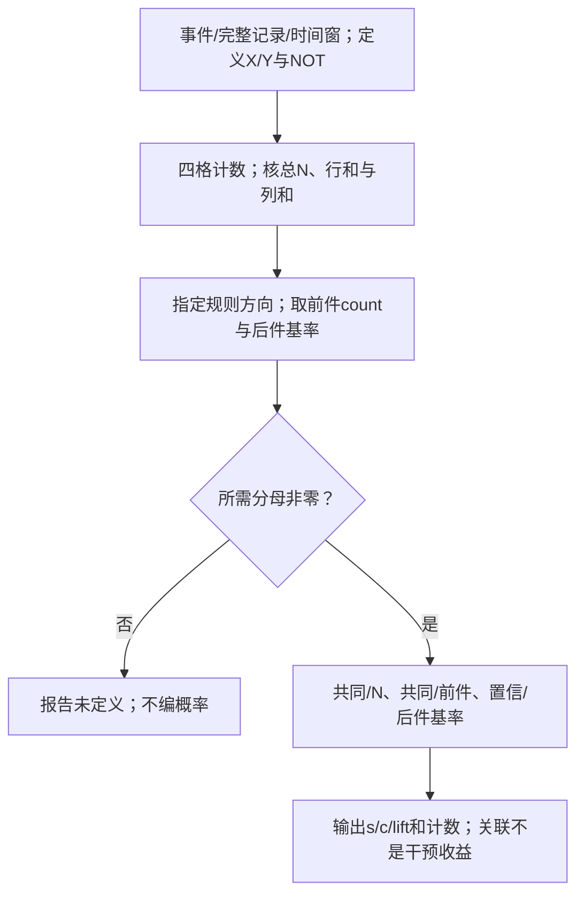
```mermaid
flowchart TD
    LF0["事件/完整记录/时间窗；定义X/Y与NOT"] --> LF1["四格计数；核总N、行和与列和"]
    LF1 --> LF2["指定规则方向；取前件count与后件基率"]
    LF2 --> LF3{"所需分母非零？"}
    LF3 -->|否| LFF["报告未定义；不编概率"]
    LF3 -->|是| LF4["共同/N、共同/前件、置信/后件基率"]
    LF4 --> LF5["输出s/c/lift和计数；关联不是干预收益"]
```

四格15/5/75/5到LF1核100；Tea→Coffee前件20、后件基率0.9，LF4得s0.15/c0.75/lift5/6。Coffee→Tea改前件90、后件0.2，lift仍5/6。文字替代：定方向→数前件→查后件基率→比较。

NOT Tea规则前件80，是不同事件；缺失不能当补集。有限共现不证明替代或促销收益。

<details><summary>读图自测：后件人人出现时，前件出现却想报lift小于1，哪步错？</summary>

LF4后件基率1，含X票也都有Y，c1，所以lift1；除数0则另走LFF未定义。

</details>

<details><summary>迁移/诊断：10人中X出现2、Y出现8、共同2，c与lift多少？若X出现0，能报c0吗？</summary>

本例支持度为 0.2，置信度为 1，lift 为 1/0.8=1.25。100% 只来自两人，不保证新样本，更不证明购买 X 导致购买 Y。

前件未出现时，置信度是 0/0 未定义，不能报成有效的零估计。

反向置信度为 2/8=0.25，lift 仍为 0.25/0.2=1.25。

</details>

**为什么需要它**

三个指标各回答一个问题，缺一不可：

每行一个规则评价问题；两案例来自不同独立票表，数字不能混分子/分母。

| 指标 | 问题 | 茶 → 咖啡 | 尿布 → 面包（p.44） |
|---|---|---|---|
| 支持度 | 组合在全部交易中的常见程度 | 15% | 50% |
| 置信度 | 买 X 的交易中也买 Y 的比例 | 75% | 100% |
| 提升度 | 条件比例相对当前后件基率的倍数；不等于干预推荐收益 | **0.83（更差）** | **1.33（更好）** |

茶咖啡15%/75%/0.83为N100；尿布面包50%/100%/1.33为N4。

"茶 → 咖啡"是数据挖掘教科书里最经典的反例，**几乎必考**（⚪ 推断）：给一张 2 × 2 表，算置信度、算后件支持度、算提升度、判断正负关联、说出业务含义。

**课件原例**

茶 / 咖啡 2 × 2 表：Tea→Coffee 的置信度为 0.75，Coffee 后件基率为 0.9，规则支持度为 15/100 = 0.15，提升度为 0.8333；否定前件 NOT Tea→Coffee 置信度为 0.9375；真正反向 Coffee→Tea 为 1/6（脚本 `verify_w3w4.py` 复核一致）。

**🎙️ 课堂补充**（`01:16:36`–`01:26:49`，约 10.2 分钟，A · 课上展开）

教授把讲义 p.46–49 的“茶 → 咖啡”陷阱换成了一个更贴近学生生活的真实店铺——又一城（Festival Walk）的 Starbucks，逐步带着算：

① **场景设定**：

> imagine that we are running the Starbucks retail store in Festival Walk... they sell both tea and coffee... the manager wants to understand this association rule, from tea to coffee.

（`01:16:51`–`01:17:20`）2×2 表的数字与讲义一致（100 人：茶+咖啡 15、茶不咖啡 5、咖啡不茶 75、都不买 5）。

② **算置信度并自我拆穿**：

> among the 20 customers who already purchase tea, how many of them also purchase coffee? 15, right?... So the confidence of this association rule is 15 over 20, or the 75 percentage.

（`01:19:02`–`01:19:26`）

> But it doesn't make sense, right? For me, I only choose one. So yeah, I prefer tea, usually I will not purchase coffee in Starbucks.

（`01:20:00`–`01:20:11`）——教授现身说法自己就是“买茶不买咖啡”的反例。

③ **基准率与提升度，并点出不平衡的原因（讲义没有这句解释）**：

> among the 100 random customers, coffee purchase is 90... The information or the condition about your tea preferred will lower the probability of purchasing coffee.

（`01:20:58`–`01:22:02`）

> The [lift] of the [association] rule from X to Y is the confidence of the rule divided by the support of the consequent

（ASR 原文 "list of the oscillation rules"）（`01:23:22`）

> 90 of them purchase coffee and only 20 here purchase tea... they are not balanced. The two items, they have very different purchase frequency.

（`01:25:47`–`01:25:59`）

> If 50-50, then you do not need the [lift].

（`01:25:36`）

④ **否定前件条件概率确认**（与笔记 93.8% 一致）：*"conditional on not T[ea], I already know that you will not purchase T... The probability that you will purchase coffee is 75 over 80, which is higher than 90% of random customers."*（`01:22:26`–`01:22:53`）

⑤ **🔴 期末考信号**：*"imagine if you see a transaction data set in your final exam... You should be able to get some formulas from all these slides to do some simple calculations."*（`01:26:36`–`01:26:49`）

**这段改变了什么**：教授明确提到期末交易计算，并以基率不均解释茶/咖啡陷阱。原话“50–50 无需 lift”保留，但不是一般定理。

💡 反例有 100 人：共同买 40、只买 X 10、只买 Y 10、都不买 40。两边基率同为 0.5，置信度却为 0.8，lift=1.6。

即使基率平衡，仍要比较条件概率与基率。lift 与置信度回答不同问题。

**💡 换个说法（笔记补充）· 三个指标一句话**

以尿布→啤酒为例，三个指标依次问：

1. 全部小票中，两样共同出现占几成：支持度。
2. 已买尿布的小票中，买啤酒占几成：置信度。
3. 这个条件比例是啤酒基率的几倍：提升度。

lift>1 说明样本正关联，不证明购买尿布导致买啤酒。指标只能提出业务假说。

陈列、捆绑及折扣效果还涉及成本、时点、混杂和干预。不能直接按 lift 正负决定促销。

**另一个角度——提升度和 §2.11 的相关系数是亲戚**：两者都在问"知道了 X，对 Y 的判断有没有改变"。相关系数用于两列数字，提升度用于两个"是 / 否"。lift = 1 对应 $\rho = 0$。

**⚠️ 常见误解**

- ❌ "置信度 75% 很高，所以规则好。" → 必须和后件的基准率比：90% > 75%，买茶的人反而更少买咖啡。
- ❌ 提升度的分母写成前件的支持度。→ 是**后件** $P(Y)$。记法："提升"的是"买 Y 的概率"，所以拿"买 Y 的基准概率"做分母。
- ❌ 以为 lift < 1 的规则没用。→ 它说明样本负关联，可提出替代或客群差异等假说，但不能据此直接决定陈列/促销，须另证。
- ❌ 以为提升度也像置信度一样有方向。→ 没有，lift(X → Y) = lift(Y → X)。

**与其他概念的关系**

提升度 = 置信度 / 基准率，与 §2.12 "相关 ≠ 因果"是同一种警觉：**看关系前先看基准**。这一整段（p.35–49）在讲义里没有回到 CRISP-DM 的位置，但它属于"建模"步骤的无监督分支，与 W04（顺延后的聚类）同类。

**所以呢**：关联规则到此结束。讲义 p.50 又贴一张标题页，红字切到 **Data Processing**——数据准备的具体手段：先讲减少"行"的两种（聚合、抽样），再讲减少 / 改造"列"的三种。

---
### 2.16 数据预处理 I：聚合与抽样（讲义 p.50–56）

数据有两种"太多"：**太碎**（每天一条销量，看不出规律）用聚合；**太大**（几千万行算不动）用抽样。两者都在减少**行**数——§2.16.1 讲聚合，§2.16.2 讲抽样。

#### 2.16.1 聚合：把细粒度合成粗粒度（讲义 p.51–52）

<!-- 类型: 算法流程型 -->

**是什么**

日销量可汇成月销量，房源价格可按城市汇总。这样做减少记录数量，同时扩大每行代表的范围。

这叫聚合：将多行或多列合成较粗粒度的结果。它便于看某些规律，也会丢掉组内差异。讲义 p.51 说明：

> Combining two or more attributes (or objects) into a single attribute (or object)
> Purpose：**Data reduction**（减少属性或对象的数量）；**Change of scale**（Cities aggregated into regions, states, countries, etc）；**More "stable" data**（Aggregated data tends to have **less variability**）

“聚合更稳定”有条件。p.52 原图比较平均月降水与平均年降水标准差的分布，后者在显示范围内更集中，前轮已视觉查看。

标题虽有 Average，却未给原始站点表、完整算子或单位换算。不能补造逐站逐月操作，也不能断言 12 个月求和的绝对标准差必然更小。

下方教学例会明确 sum/mean、单位和依赖条件，与原图定性读法分开。

**机制展开（笔记补充）：先选sum或mean，再谈波动与信息损失**

输入是一张明细表、分组键和聚合函数；状态是每组成员、有效数与累计量；输出是每组一行的新表。粒度改变与标准差下降是两件不同的事，不能把日总量、日均值和小时量当同一随机变量。

**完整聚合例**：四行组别 / 数量为 A/10、A/20、A/30、B/5；`verify_m03_mechanisms.py` 的 `aggregation` 段核对。

1. 按键分组：A收集三行10、20、30，B收集一行5；明确这不是将两个组当同人数。
2. 各组累计与计数：A的有效数3、总量60；B的有效数1、总量5。
3. 除以各自有效数得组均值：A=60/3=20，B=5/1=5。
4. 将两组结果合为新表，A一行(size3,sum60,mean20)，B一行(size1,sum5,mean5)。原四行变两行，到此有限过程结束。
5. 核对原总量65等于60+5；原均值65/4=16.25，按组人数加权(3×20+1×5)/4也为16.25。直接把两个组均值平均得到12.5，换了统计对象，不能说恢复了原明细均值。

图问：四明细行怎样变两组，如何核总量？箭头传递按键的成员与统计状态。

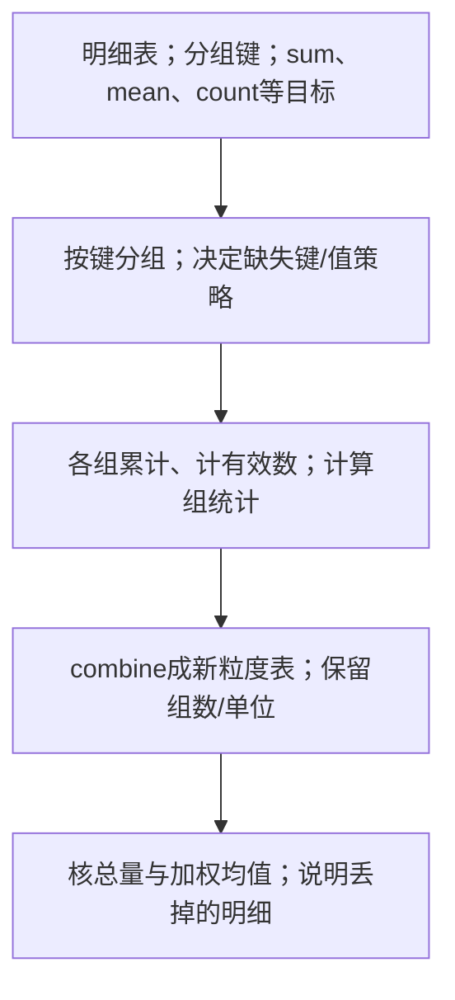
```mermaid
flowchart TD
    AG0["明细表；分组键；sum、mean、count等目标"] --> AG1["按键分组；决定缺失键/值策略"]
    AG1 --> AG2["各组累计、计有效数；计算组统计"]
    AG2 --> AG3["combine成新粒度表；保留组数/单位"]
    AG3 --> AG4["核总量与加权均值；说明丢掉的明细"]
```

A10/A20/A30/B5到AG1分组，AG2得A count3/sum60/mean20，B count1/sum5/mean5，AG3形成两行。AG4总量65一致，按人数平均仍16.25；裸两组均值平均12.5是另对象。文字替代：分组→累加计数→组结果→核量/粒度。

平均和总量单位/方差不同。澳大利亚原逐站数据与汇总算子未给，不造实证曲线。

<details><summary>读图自测：A/B均值直接除2能恢复原四行均值吗？</summary>

不能，AG4须按3/1人数权重；20和5直接平均12.5忽略组大小。

</details>

**聚合方差先确定算子（笔记补充）**

细粒度随机量为 $X_1,\dots,X_m$，m是合并时段数。sum为总量，mean为总量除m，单位与对象不同。

$$\operatorname{Var}\left(\sum_iX_i\right)=\sum_i\operatorname{Var}(X_i)+2\sum_{i<j}\operatorname{Cov}(X_i,X_j).$$

平均值再按平方尺度换算：

$$\operatorname{Var}(\mathrm{mean})=\operatorname{Var}(\mathrm{sum})/m^2.$$

交叉协方差由依赖关系决定，不能从“聚合”这个词自动取零。

$$\operatorname{Var}\left(\sum_iX_i\right)=\sum_i\operatorname{Var}(X_i)+2\sum_{i<j}\operatorname{Cov}(X_i,X_j),\qquad \operatorname{Var}(\mathrm{mean})=\operatorname{Var}(\mathrm{sum})/m^2.$$

若12个月独立、每月方差9（**教学自设模型，不是澳大利亚原数据**），年度sum方差108、标准差10.392305，比单月标准差3大；年度mean方差0.75、标准差0.866025，才变小。若月份完全同变，mean的方差仍可等于单月，不能保证降噪。相关正负、季节性、单位和原图实际采用的聚合算子都必须核对。

**为什么公式长这样**：方差来自偏离均值的和平方；展开 $(A+B)^2$ 时出现2AB，因此有协方差交叉项。平均量将总量除以m，方差随平方缩放，故除以m²。**“相加必使绝对标准差降低”不成立**，原讲义图与教授原话保留为来源，不把它们直接提升为无条件数学定理。

**停止、失败与迁移**：每组成员处理完且结果合并核对即结束。聚合丢掉的可以是真实个体差异、峰值需求或业务信号，不必主要是噪声。不同组规模下不加权平均、缺失值当零、混合单位、把年度总量与月均量直接比较都会错误。若任务要按小时备货，按天汇总也可能丢掉关键峰值；选择粒度须回到业务目标。


**为什么需要它**

每行聚合用途与粒度，降噪需要算子/单位/依赖，不由行数变少推。

| 用途 | 在哪 | 不做会怎样 |
|---|---|---|
| 换尺度看规律 | §2.6.2 分辨率；T03 cell 11 `groupby` 分组统计（68,133 行 → 6 个城市） | 在错误的尺度上找规律（按天看销量全是噪声） |
| 降噪 | W07 时间序列先聚合到合适的粒度 | 模型去拟合噪声 |
| 减少数据量 | 几千万条交易 → 每店每月一行 | 算不动 |

城市聚合68,133→6行，统计对象已城市；不能将组均值裸平均恢复全房源平均。

**课件原例**

p.52 澳大利亚降水（月 vs 年的标准差直方图）。

**🎙️ 课堂补充**（`01:27:09`–`01:29:05`，约 2.0 分钟，A · 课上展开）

教授没有用讲义 p.52 的澳大利亚降水例子，换了一个更贴近课程主线的零售例子——**每小时咖啡销量聚合成每日销量**：

> I have the hourly sales of this coffee drink, hourly, so it's very fine-grained. But what I need to support the business solution is to decide how many cups of coffee I need to prepare for tomorrow... The daily total demand.

（`01:27:34`–`01:27:57`）解释聚合为什么更“稳定”：

> Hourly demand can be very noisy, but total demand will have a very small standard deviation than the hourly demand.

（`01:28:47`）

**这段改变了什么**：咖啡例将目标粒度接到“明天准备多少杯”的业务决策，可帮助理解 T03 groupby。

但课堂那句话不证明总量标准差必小于小时量。仍要明确汇总算子、单位和时段之间的依赖。

**💡 换个说法（笔记补充）**

聚合像把一张照片缩小：缩小后每个像素代表原来的一片区域，细节（噪声）没了，轮廓（规律）反而清楚。缩得太小又什么都看不见——所以粒度要选：按天太碎、按年太粗，销量数据常按周或月。

还有一个角度：聚合是"换一个对象"——聚合前一行是一天，聚合后一行是一个月，表里的"对象"从天变成了月，所有统计量也跟着变成月的统计量。所以聚合不只是算术，它改变了你在描述什么。

在 pandas 里聚合就是 `df.groupby('city')['log_price'].mean()`——"按什么分组"决定新的粒度，"算什么"（mean / sum / count / max）决定合并的方式。T03 cell 11 的分组统计就是聚合。

**⚠️ 常见误解**

- ❌ 以为聚合只是求平均。→ 也可以求和、计数、取最大；关键是**改变了对象的粒度**（一行从"一天"变成"一个月"）。
- ❌ 以为聚合"丢了信息"所以不好。→ 丢掉的可能是真实差异、峰值需求或噪声，不能预先判定主要是噪声；应核对当前任务是否需要这些明细。要看个体就别聚合。

**所以呢**：聚合是"合并行"；另一种减少行的办法是"只取一部分行"——抽样，前提是这部分要有代表性。

#### 2.16.2 抽样：只取一部分，但要有代表性（讲义 p.53–56）

**是什么**

先说人话：几千万行算不动，或者收集全部数据太贵，就只取一部分来算——**抽样**（sampling）。抽样须先定目标总体、抽样框、选取概率、成本与估计量；随机设计允许波动，不保证一次样本价格分布恰与全体相同，也不能修复抽样框没覆盖的对象。抽法有三种：无放回随机（抽到就拿走）、有放回随机（抽到放回去，可能重复抽到）、分层（先按类别分开，每层各抽）。

讲义 p.53–54：

> Sampling is the main technique employed for **data selection**. It is often used for both the preliminary investigation of the data and the final data analysis. Statisticians sample because **obtaining** the entire set of data of interest is too expensive or time consuming.（p.53）
>
> The key principle for effective sampling：Using a sample will work almost as well as using the entire data sets, **if the sample is representative**；A sample is representative if it has **approximately the same property (of interest)** as the original set of data（p.54）

"代表性"是相对于你关心的那个性质说的：你关心城市比例，样本的城市比例就要和全体一样。一个"只抽纽约房源"的样本，对研究纽约有代表性，对研究美国没有。

p.55 **样本大小**（纯图片，已视觉复核）：同一幅由点组成的图案，用 8000 点能清楚看出形状，2000 点还能辨认，500 点几乎看不出——**样本太小，模式就丢了**。这是抽样的下限。

p.56 **抽样类型**：

每卡完整讲义抽样定义、动作与适用性，有/无放回与分层先明示设计。

**Simple Random Sampling · without replacement**

讲义原文：As each item is selected, it is removed from the population

用人话：无放回（without replacement）：抽一个拿走一个，同一个不会被抽两次

什么时候用：默认做法

**Simple Random Sampling · with replacement**

讲义原文：Objects are not removed from the population as they are selected；**the same object can be picked up more than once**

用人话：有放回（with replacement）：抽完放回去，同一个可能被抽到好几次

什么时候用：原计划 W05 集成学习的 bagging（每棵树用一份有放回的样本；实际课次以 Canvas 为准）

**Stratified sampling**

讲义原文：Split the data into several partitions; then draw random samples from each partition

用人话：分层（stratified）：先按某个类别分层，每层里各自随机抽

什么时候用：设可行正配额时能保留该层；n小于层数或容量不足时不能保证

有放回相同对象可重复；分层有可行正配额才覆盖该层，不保证价格尾部。

**手把手看"有放回 vs 无放回"**：从 {A, B, C, D, E} 里抽 3 个。无放回可能得到 {A, C, E}，三个都不同；有放回可能得到 {A, A, C}——A 被抽了两次，E 一次没被抽到。只有抽样比例n/N很小时，某些统计差异才可较小；N大但n接近N仍不同；数据量小或要故意制造"略有不同的多份样本"（bagging）时才用有放回。

Airbnb 的 Loft 有 1,239 行，约占 1.8%。简单随机抽 500 行，Loft 的期望数约为 $500\times0.018=9$，实际次数仍会波动。

按 property_type 分层并预定比例配额，可分给 Loft 约 9 个，Apartment 约 $500\times0.716=358$ 个。

取整使比例未必精确一致。保证分层变量构成，也不保证价格尾部、层内分布或未覆盖对象都具有代表性。

**💡 同一组随机数怎样因池状态改变输出（笔记补充）**

**本补充抽样的输入与状态**

对象池ABCDE、目标n=3；固定显示顺序与放回政策。指定均匀随机结果u=0.12/0.16/0.73，这不是教授原抽序。

1. 当前池大小M，取零基下标 $\lfloor uM\rfloor$。
2. 输出该对象，计数加1。
3. 有放回保留原池；无放回删除本次对象。
4. 已抽数量达到n即返回，不为结果好看重挑u。

状态是当前池、已抽ID和计数。下一表用同u展示两种政策，池变化会改变后续下标对应的对象。

每行同u的一轮，当前池/零基索引/输出分别读；下一池只在无放回变。

| 轮/u | 有放回池/索引/输出 | 无放回池/索引/输出及下一池 |
|---|---|---|
| 1/.12 | ABCDE /0 →A | ABCDE /0 →A；BCDE |
| 2/.16 | ABCDE /0 →A | BCDE /0 →B；CDE |
| 3/.73 | ABCDE /3 →D | CDE /2 →E；CD |

第2轮u0.16都取索引0，但原池得到A、删A的BCDE得到B。

最终有放回AAD、无放回ABE，各三次输出；删除状态影响下一轮索引对应。独立均匀u使有放回每次每对象概率1/N；无放回则条件于已抽结果，只在当前池均匀，不能说已移出的A第二轮还有1/N。无放回所有有序不同序列等概率，忽略顺序后每个n子集亦等概率。按“前n行”截取没有这个随机保证。

图问：同随机数为何放回和无放回输出不同？箭头是抽样控制，SM7改变下轮池。

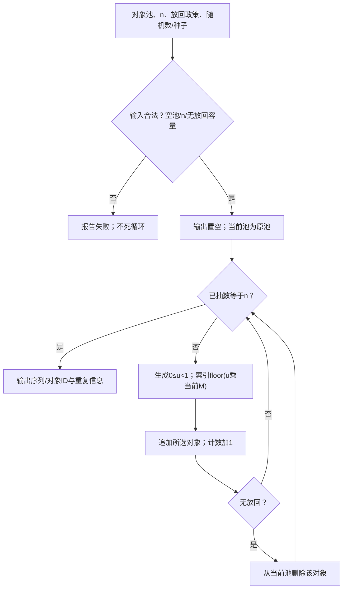
```mermaid
flowchart TD
    SM0["对象池、n、放回政策、随机数/种子"] --> SM1{"输入合法？空池/n/无放回容量"}
    SM1 -->|否| SMF["报告失败；不死循环"]
    SM1 -->|是| SM2["输出置空；当前池为原池"]
    SM2 --> SM3{"已抽数等于n？"}
    SM3 -->|是| SMO["输出序列/对象ID与重复信息"]
    SM3 -->|否| SM4["生成0≤u<1；索引floor(u乘当前M)"]
    SM4 --> SM5["追加所选对象；计数加1"]
    SM5 --> SM6{"无放回？"}
    SM6 -->|是| SM7["从当前池删除该对象"]
    SM6 -->|否| SM3
    SM7 --> SM3
```

ABCDE、n3、u0.12/0.16/0.73。有放回池始终ABCDE，索引0/0/3输出AAD；无放回取A后池BCDE，下一0取B，再池CDE索引2取E，得ABE。文字替代：从当前池取→更新池→到数停止。

u为教学指定结果，独立均匀设计的结论不保证一次代表所有性质；n0直接空，u=1非法。

<details><summary>读图自测：放回抽到第二个A就重抽，会改哪条规则？</summary>

SM6否出口应保池，重复合法。强行拒重复改变方法，不是原放回过程。

</details>

**抽样边界**：n=0 可直接输出空样本；负数或非整数 n 非法。n>0 时总体不能空。

无放回要求 n≤N，否则报错或改变设计。有放回允许 n>N，重复抽中是合法结果，强行拒绝重复会改变方法。

用于索引的均匀数须小于 1，u=1 会越界。随机种子不能补回源数据未覆盖的地区，也不保证单次样本价格分布等于总体。

同实体多行若跨训练/测试，可能泄漏；应按实体或时间任务确定边界。

💡 固定总体值并做简单随机抽样时，先声明总体方差用分母 N，记为 $\sigma^2$。以下假设 N>1、n>0。

两种设计的样本均值方差分别为：

| 抽样设计 | 均值方差 |
|---|---|
| 有放回 | $\sigma^2/n$ |
| 无放回 | $\frac{N-n}{N-1}\frac{\sigma^2}{n}$ |

差别取决于 n/N，而非只看 N 大不大。n=N 时，无放回覆盖全体，均值没有抽样误差；有放回仍可能重复和漏选。

无放回两个位置的协方差为 $-\sigma^2/(N-1)$。展开均值方差时，有 n 个方差项及 n(n−1) 个协方差项，由此得到有限总体因子。

总体 [0,1,2,3,4] 的方差为 2，n=3 时两种均值方差为 2/3、1/3。穷举 125 个放回序列及 60 个无重复序列可核。

N=1 时均值固定、方差为零，不套 0/0。公式只对应声明的随机设计，不保证脏数据的代表性。

<details><summary>迁移/诊断：同池n3，u=.42/.44/.91，两政策逐步得到什么？n5无放回能漏对象吗？</summary>

放回索引2/2/4→CCE。无放回：ABCDE取C→ABDE，再索引1取B→ADE，索引2取E→AD，结果CBE。n5无放回必覆盖原五对象（次序可不同），有放回可重复；n/N不小就不能按“大池”口号忽略区别。

</details>

**💡 分层先定配额，再在各池实际抽（笔记补充）**

p.4十人Marital层：Single=[1,3,8,10]、Married=[2,4,6,9]、Divorced=[5,7]，N10。目标n5按比例配额为2/2/1；每层内部使用上面无放回规则，合并前保留层标签和对象ID，不能只给“每层约几个”。

每行一个层及整数配额，明示u是教学给定，状态列保存池变动与ID。

| 层/配额 | 明示u | 状态与实际输出 |
|---|---|---|
| Single/2 | 0.12、0.73 | 取对象 1、10，详见“Single 层” |
| Married/2 | 0.16、0.81 | 取对象 2、9，详见“Married 层” |
| Divorced/1 | .42 | 2对象池索引0取5；层完成 |

**Single 层**：初始 4 对象池取索引 0，对应对象 1。删除后余 3 对象，取索引 2，对应对象 10；完成本层配额 2。


**Married 层**：初始 4 对象池取索引 0，对应对象 2。删除后余 3 对象，取索引 2，对应对象 9；完成本层配额 2。


Single配额2，从[1,3,8,10]取1再10；合并前保持层标签。

三层合并输出[1,10,2,9,5]，数量2/2/1，比例0.4/0.4/0.2与此10人总体恰同。这组u是笔记补充。

一般比例配额 $q_h=nN_h/N$ 可不是整数，要先声明取整：

1. 取各配额floor。
2. 剩名额按小数余数降序分，并列按固定层序。
3. 核总和n及无放回容量。

n=3时理论1.2/1.2/0.6，floor1/1/0，剩一给第三层，得到1/1/1；比例并不精确保持。n小于层数时不能每层至少一人，需改目标、合层或声明遗漏。

图问：分层配额怎样先决定，再在各池随机抽？箭头是各层状态/合并，不是样本等于总体的保证。

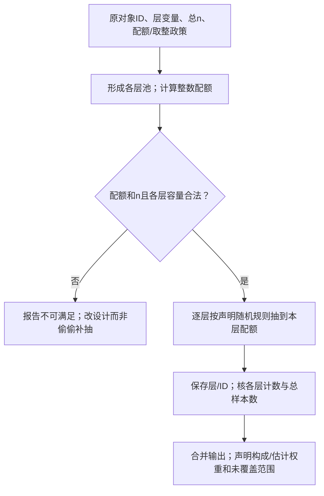
```mermaid
flowchart TD
    ST0["原对象ID、层变量、总n、配额/取整政策"] --> ST1["形成各层池；计算整数配额"]
    ST1 --> ST2{"配额和n且各层容量合法？"}
    ST2 -->|否| STF["报告不可满足；改设计而非偷偷补抽"]
    ST2 -->|是| ST3["逐层按声明随机规则抽到本层配额"]
    ST3 --> ST4["保存层/ID；核各层计数与总样本数"]
    ST4 --> ST5["合并输出；声明构成/估计权重和未覆盖范围"]
```

十婚姻记录n5在ST1配额2/2/1，ST3各层无放回按给定u选1/10、2/9、5，ST4核层数与总5，再ST5合并。文字替代：划层→整数配额→层内抽→保ID合并。

不整数需取整；n小于层数不能每层一人。非比例抽估总体需权重，层内偏抽及覆盖缺地区不自动修复。

<details><summary>读图自测：n3的比例配额1.2/1.2/0.6怎样执行？</summary>

按本节最大余数得到1/1/1，比例不再精确0.4/0.4/0.2；应报告取整，不偷偷抽小数个人。

</details>

分层只控制所选层变量构成，层内偏抽、地区覆盖缺失、价格尾部仍可能不代表总体。若为保证小类而不按总体比例抽，估总体平均可用$\hat\mu=\sum_h(N_h/N)\bar x_h$，条件是层内适当简单随机；不能直接用过采样后的裸平均解释总体。层别缺失须单列或说明排除影响。原Loft1239/68133、抽500一次无Loft概率约.01%，是极小但非零风险，不把它说成经常发生；更稀有层/更小n会不同。

<details><summary>迁移/诊断：两层大小5/3、目标n4，最大余数相同先给第一层，配额多少？若第一层值全0、第二层全100，样本3/1裸平均和总体权重平均如何不同？</summary>

理论2.5/1.5，floor2/1，剩一人并列规则给第一层→3/1。裸平均25，按总体5/8与3/8合成37.5，后者对应本总体真实均值；一次随机样本权重估计一般也有波动。本例层内同值仅便于验证，不证明所有分层样本都精确总体。

</details>

**为什么需要它**

每项一种抽样在课程的用途，随机划分仍需按实体/时间与任务边界处理。

**无放回随机抽样**

后面在哪用：M02 留出法 `train_test_split` 把数据随机切成训练 / 验证

不做会怎样：训练集不"代表"全体，验证误差不可信

**分层抽样**

后面在哪用：`train_test_split(..., stratify=y)`；原计划/历史暂定为 W05 分类，实际课次以 Canvas 为准

不做会怎样：少数类被抽没，模型学不到它

**有放回抽样**

后面在哪用：原计划/历史暂定为 W05 集成学习 bagging（M01 p.39 "从原始训练集造多个数据子集"就是它；实际课次以 Canvas 为准）

不做会怎样：—

stratify控制层构成，未覆盖地区不能由seed补出；少数层容量不足需报告。

**课件原例**

p.55 三种样本大小的点阵图；p.56 三种抽样类型。

**🎙️ 课堂补充**（`01:29:05`–`01:31:13`，约 2.1 分钟，A · 课上展开）

**样本大小**：教授口头重复了讲义 p.55 的三个数字（8000/2000/500 点），与讲义一致，没有增量：

> at the very beginning we have 8,000 data points... I randomly sample the dataset with 2,000 data points... if I oversample that, then we only get 500 data points... we didn't get many useful patterns from the small data set.

（`01:29:29`–`01:30:05`）

**分层抽样**（讲义 p.56 只有定义，没有例子）：教授现场用自己班级举例：

> in my class, there are about 60 boys and 40 girls... I want to draw a sample of 10 students, but I want to keep this 6 to 4... I want to keep the proportion fixed in a small sample.

（`01:30:45`–`01:31:07`）——有放回/无放回的细节课上没提。

**这段改变了什么**：样本大小部分照讲义数字念了一遍；但分层抽样换成了班级性别比例的新例子，比笔记 §2.16.2 的 `property_type`/Loft 例子更简单直白，适合当课堂速记版本。

**💡 换个说法（笔记补充）**

抽样像煲汤尝味：舀一勺就知道整锅咸不咸——前提是搅匀了（随机）。没搅匀就舀，舀到的是浮在上面的油，那勺就没有代表性。分层抽样相当于"每种料各夹一点尝"，只有给每种料可行的正配额时才保留各类；锅没包含的料、层内偏抽和总勺数太少仍无法解决。

聚合合并记录，会失去个体差异。若取平均，零均值且低相关的随机误差可能减弱，系统偏差却不会自动消失。

抽样只选择部分记录，每条被选记录保持原样。前者改变粒度以看汇总规律，后者可减少计算量，但都需判断损失的信息是否重要。

在 pandas 里：简单随机抽样 = `df.sample(n=1000, random_state=42)`（默认无放回；`replace=True` 改有放回）；分层抽样 = `train_test_split(X, y, stratify=y)`。抽完样要用 §2.8–2.10 的描述统计检查一下：样本的城市比例、价格中位数是不是和全体差不多。

**⚠️ 常见误解**

- ❌ "样本越大越好，所以尽量不抽样。" → 讲义 p.53 的理由是**成本**；p.55 说的是**下限**（太小会丢模式），不是"越大越好"。
- ❌ 分层抽样 = 每层抽一样多。→ 通常是**每层按原比例抽**，让样本里各层比例与总体一致；每层抽一样多是另一种设计（用于少数类过少时），要说明。
- ❌ 以为随机抽样天然有代表性。→ 随机只保证"平均而言"有代表性；一次具体的抽样可能恰好抽偏（500 行里 0 个 Loft），所以小类别要分层。

**所以呢**：聚合和抽样减少的是**行**；下一节的三种方法减少或改造的是**列**——这三页是 M04 整讲的目录。

---
### 2.17 数据预处理 II：降维、特征子集选择、特征创建（讲义 p.57–59）

**是什么**

列多通常增加计算，也让直接可视化更困难。若模型过于灵活，还可能记住训练噪声，见 M02 的过拟合。

能否有效学习仍依任务与模型约束。下面比较三种处理列的方法：

每行一种列处理动作，输出列数只是教学形态，不自动证明预测更好。

| 办法 | 做什么 | 列的变化 | 例子 |
|---|---|---|---|
| **降维** Dimensionality reduction | 把很多列**压**成几列新的 | 15 列 → 3 列，新列是旧列的混合 | PCA（M04） |
| **特征子集选择** Feature subset selection | **挑掉**没用的列 | 15 列 → 5 列，留下的还是原来的列 | 按任务/验证选择列；不把编号直接当连续数量，也不只因高相关删 beds |
| **特征创建** Feature creation | 用旧列**造**出更好用的新列 | 15 列 → 16 列 | `price_per_person = price / accommodates` |

15→3换坐标，15→5保原列，15→16加新列；PCA不等于所有降维的定义。

**降维（Dimensionality Reduction，p.57）**：

> Purpose：Avoid **curse of dimensionality**；Reduce amount of time and memory required by data mining algorithms；Allow data to be more easily visualized；May help to eliminate irrelevant features or reduce noise
> Techniques：**Principal Components Analysis (PCA)**；**Singular Value Decomposition**；Others: supervised and non-linear techniques

四个目的里，"visualized"最直观：Iris 有 4 个属性，画不出四维图；PCA 压成 2 个新属性后就能画一张散点图，可以观察类别分布，但二维投影并不保证三个品种完全分离（T04 最后一格）。

此处只预告后面工具，不假装已在本节执行分解。

- PCA（主成分分析）按训练方差方向构造新坐标；完整中心化/投影/选维见M04§2.13–2.15。
- SVD（奇异值分解）将矩阵表示为方向与非负尺度。截小尺度可得只留少数独立方向的近似，通常丢部分信息。
- 过滤法不用目标模型拟合就按统计量筛列；包装法用候选模型验证表现比较。
- Gini数类别混合；卡方比较观察与基准频数；ANOVA F比较类间/类内变异。这些未来评分机制由M04展开，不能只记名字就称能算。

**特征子集选择（Feature Subset Selection，p.58）**——先分清两种"没用"：

每卡一个无用信息条件，完整英文定义和例保留，Airbnb列只是诊断线索。

**冗余特征 Redundant**

讲义定义：Duplicate much or all of the information contained in one or more other attributes

讲义例子：商品的**购买价**和**缴纳的销售税**

为什么没用：税 = 价 × 税率，知道一个就知道另一个，第二列不增加信息

Airbnb 例中，beds/accommodates 相关 0.829 是诊断线索，不能单独证明冗余。

**无关特征 Irrelevant**

讲义定义：Contain no information that is useful for the data mining task at hand

讲义例子：**学生 ID** 对预测 GPA

为什么没用：在此预测任务不提供可利用信息；需按任务/验证判断

Airbnb 里的例子：纯任意学生编号是例，业务 ID 还可能编码时间或群组

税由固定税率×售价完全推导可冗余；床/容量相关0.829非同一确定函数，不直接删。

> Many techniques developed, especially for classification

冗余表示其他列已提供相同或大部分信息；无关表示对当前任务没有可用信息。相关 0.829 不等于完全重复，差异部分仍可能帮助预测。

共线性指模型实际数值表的列接近线性依赖。例如 [2,4,6] 正好是 [1,2,3] 的两倍。

它可能使系数不稳定，但 beds 的单个负号不能证明原因。须结合整体列关系、缩放及验证结果。

编号虽可能不适合当连续数值，却可用于连接、分组或时间排序。删除前要明确业务及数据切分用途。

**特征创建（Feature Creation，p.59）**：

> Create new attributes that can capture the important information in a data set **much more efficiently** than the original attributes. Three general methodologies：

每行一类特征创建，讲义例与动作对应；没有新的测量信息不等于表示没价值。

| 方法 | 讲义例子 | 意思 |
|---|---|---|
| **Feature extraction 特征提取** | 从图像中提取边缘 | 从原始数据（像素）里算出更有意义的量（轮廓） |
| **Feature construction 特征构造** | 质量 ÷ 体积 = 密度 | 用已有的列算出一个新列，新列比原来两列更直接地说明问题（密度决定浮沉，质量和体积各自都不能） |
| **Mapping data to new space 映射到新空间** | 傅里叶分析、小波分析 | 换一套坐标看数据（时域 → 频域），本课不展开 |

密度需同单位质量/体积且体积非零；傅里叶/小波只作背景，未在本讲执行。

**💡 笔记补充 · 同一数据的选择、压缩、创建怎样不同**：三名对象的质量 kg、体积 L 为 `(2,1),(6,2),(12,3)`，输入 3×2 表。

每卡同质量/体积表的一种处理，输入3行保持，输出类型与单位各自不同。

**选择一列**

本例步骤与输出：先定只留质量 → 取原第 1 列 → 输出 `[2,6,12]`（3×1）

保留/改变了什么：仍是原属性；体积被丢掉，未证明它对目标无用

**线性压成一列**

本例步骤与输出：先声明自设映射 z=质量/2 kg+体积/1 L → 逐行 2/5/9 → 输出 3×1

保留/改变了什么：新无量纲混合坐标；从一个 z 不能唯一恢复两原值；这仅示范映射，不冒称 PCA 学出的方向

**创建密度列**

本例步骤与输出：同单位正体积 → 每行质量除体积 → `[2,3,4]` kg/L → 拼回 3×3 表

保留/改变了什么：重新表达原信息，没有新测量；除法可能方便只能线性组合（各输入乘固定权重再相加）输入的模型

新对象8kg/4L，选择8、冻结z8、密度2kg/L；体积0时密度未定义而另两动作仍可执行。

状态是已选列/冻结映射或正在生成的新列，三行处理完、行 ID/形状/单位核对后停。若第二人两数统一乘 10，密度仍 3，质量列及自设 z 变；若体积 0，密度在计算前报无定义，不能当 0；不同体积可能使质量接近但密度不同，不能仅看原两列相关便删一列。若预测目标就是价格，不得用未来才知道的 `price/accommodates` 当预测价格的输入；那会把答案泄漏进去。以上算数见 `m03-stat-causal-verify.py`。

<details><summary>迁移：新对象质量 8 kg、体积 4 L，上述三种过程输出什么？体积改 0 又怎样？</summary>

选择输出 8 kg；冻结自设映射输出 8/2+4=8；密度输出 8/4=2 kg/L，保两原列时为 `(8,4,2)`。体积 0 时选择仍 8，映射仍 4，但密度未定义。仅变换形状不证明预测好坏；需给定目标、仅用训练信息选择/拟合、用未参与拟合的数据比较。

</details>

**为什么需要它**

这三页提供方法目录。PCA 在 M04 §2.13–2.15 展开，对应讲义 W4 p.56–69；特征选择在 M04 §2.9–2.12 展开。

傅里叶与小波只作背景：前者按频率表示信号，后者还关注局部尺度。本讲不要求执行它们。

当前重点是三类表示的输入输出、信息有用的条件，以及冗余与无关的区别。M04 再引入 Gini、卡方和 F 值等评价。

**课件原例**

p.58 的售价 / 销售税、学生 ID / GPA；p.59 的边缘、密度、傅里叶。

**🎙️ 课堂补充**（`01:31:13`–`01:32:45`，约 1.5 分钟，B · 讲了同讲义）

教授简单带过降维、特征子集选择、特征创建三件事，没有比讲义 p.57–59 更多的细节，但明确预告降维下周才展开：

> sometimes we want to do this kind of dimension reduction because we do not want to deal with very high dimensional data... So we will learn more about how to reduce the dimensions next week.

（`01:31:13`–`01:31:27`）特征创建举了金融信号的例子：

> we need to create some indicators from the combinations of the raw data, the historical price, or the bid-ask [spread]... so we create some signals to make future predictions.

（`01:31:52`–`01:32:00`）

**这段改变了什么**：确认“降维下周讲”（回答任务单问题 9）；此讲对 §2.17 三个方法只做了目录式提及，没有比笔记更深——读者仍需等 M04。

**💡 换个说法（笔记补充）**

用列数看三种操作：

- 选择：15 列留 5 列，含义仍是原列。
- 约简：例如把 15 列线性组合为 3 个新坐标，需解释新轴。
- 创建：由已有字段计算一个新字段。

创建示例是 `price_per_person = price / accommodates`，分母须有效且非零。它可作为 T03 第 3 题探索候选，也是 M04 特征工程的例子。

另一个角度：三种方法对应对一份简历的三种处理——挑掉无关的经历（选择）、把几段相似的经历合并成一句概括（降维）、从经历里提炼出一个新的亮点（创建）。目的都是让读简历的人（模型）更快抓住重点。

**⚠️ 常见误解**

- ❌ "降维 = 特征选择。" → M04 p.49 会专门对比：本课标准线性 PCA 用输入特征的线性组合构造新坐标，选择只保留原列子集；不能将 PCA 的线性机制推广到所有降维算法。一个改造列，一个挑列。
- ❌ 以为冗余特征是"错误"。→ 完全确定重复时删列可保留同样可恢复的信息；仅高度相关可能丢掉条件信息。保留近依赖列可能使线性系数敏感，不是任何冗余定义都必然导致所有模型失败。
- ❌ 以为特征创建是"编数据"。→ 密度 = 质量 / 体积没有添加任何新信息，只是把两列里已有的信息用更直接的方式表达出来；模型（尤其线性模型）自己算不出"除法"，所以要人替它造。

**所以呢**：预处理讲完。最后一段是"用图看数据"——讲义用 Iris 数据集把六种图各画一遍，也顺便告诉你：图也会骗人。

---

### 2.18 数据探索与可视化：用 Iris 把六种图各画一遍（讲义 p.60–72）

#### 2.18.1 先看图会怎么骗人 · Iris 数据集（讲义 p.60–62）

**是什么**

先说人话：画图是理解数据最快的办法，但图也会骗人——同一团三维的点，从三个方向看能分别看成三角形、正方形和圆。讲义先给这个警告，再介绍接下来所有图都用的示范数据：150 朵鸢尾花。

讲义 p.60 **Data Exploration**（纯图片，已视觉复核）：A cloud of points in 3D → Can be projected into 2D（XY or XZ or YZ）→ In 2D XZ we see a **triangle** → In 2D YZ we see a **square** → In 2D XY we see a **circle**。想象一个三维的"楔子"形状：从上面看是圆、从侧面看是三角、从正面看是方——**三张二维图都是"真的"，但没有一张是全貌**。这就是 M01 §2.6.1 的"降维的危险"原图（来源是 GMU 的 DimReducDanger 视频，M04 p.5 注明了链接）。

讲义 p.61 **Iris Sample Data Set**：

> Many of the exploratory data techniques are illustrated with the Iris Plant data set.
> - Can be obtained from the UCI Machine Learning Repository
> - From the statistician Douglas Fisher（⚠️ 应为 R. A. Fisher，见 §9.3）
> - Three flower types (classes)：**Setosa · Virginica · Versicolour**
> - Four (non-class) attributes：**Sepal width and length · Petal width and length**

p.62 是三个品种的照片（Iris Versicolor / Iris Setosa / Iris Virginica），标出了 **Sepal（萼片）** 和 **Petal（花瓣）** 的位置：萼片是外层较大、向外翻的三片，花瓣是内层直立的三片。四个属性就是这两种"片"各自的长和宽，单位厘米。

**Iris 的结构**（[[IS6400_Business_Data_Analytics/_meta/数据集卡片#iris.txt\|数据集卡片 › iris.txt]] 实跑）：150 行 × 5 列；4 个比率属性 + 1 个名义类别；三类各 50 朵；无缺失。按品种的均值——

每行一种物种，四列是同数据每类50花的均值，单位cm，不是每朵完全取此数。

| 品种 | sepal length | sepal width | petal length | petal width |
|---|---|---|---|---|
| Setosa | 5.006 | 3.418 | **1.464** | **0.244** |
| Versicolour | 5.936 | 2.770 | 4.260 | 1.326 |
| Virginica | 6.588 | 2.974 | 5.552 | 2.026 |

Setosa瓣长1.464、瓣宽0.244提供类差线索；只靠均值不证明所有个体完美可分。

看花瓣两列：Setosa 的花瓣只有 1.5 cm 长、0.24 cm 宽，另外两种是它的三到四倍——**光看花瓣就能把 Setosa 完全挑出来**；萼片宽度三类都在 2.8–3.4 之间，几乎分不开。后面六种图反复"看见"的就是这个事实，M04 会把它算成数（petal 的重要性远高于 sepal）。

**为什么需要它**

Iris 被本节、[[T03-数据探索实战-Iris与Airbnb的描述统计]] 前半段及 [[T04-特征选择与PCA实战-Iris]] 共用。

M04 p.23–29、p.44、p.55 也使用它，因此要核对来源与版本。p.60 的投影警告再引出 PCA：按最大保留方差选择方向，而非随意投影。

**课件原例**

p.60 的五帧截图；p.61–62 的 Iris 说明与照片。

**🎙️ 课堂补充**（`01:32:45`–`01:34:40`，约 1.6 分钟，A · 课上展开；含课间休息 `01:32:50`–`01:32:58` 未被录进转录）

教授过渡到 Iris 时先提示课间休息：

> so let's have a tennis[ten-minute?] break and we will continue with the lecture of the tutorial

（`01:32:50`），下一句直接续讲，说明休息本身没有被录进转录（与任务单已知空档一致）。先又重讲了一遍 p.60 的投影危险五帧（讲义原有，笔记已收录）：

> if we project the data into the low-dimensional feature space, so, for example, in the XY feature space... we see a circle pattern... And for the XZ, we see a triangle pattern.

（`01:32:04`–`01:32:38`，属于上一节的收尾复述，时间戳早于本格起点，仅作背景说明）。介绍 Iris 时给了一个讲义没有的类比——用自己的头发长度、眼睛大小类比花瓣属性：

> if you use the length of my hair as one attribute, it's similar to the petal length. And the size of my eyes is the petal length of something, right?

（`01:33:55`–`01:34:02`）并点出要先判断特征有没有用再决定能不能分类：

> in the later stage we are using the data set to do the classification. Now our base job is to identify whether we will be able to use this data set to do the classification, or whether the attributes are useful or not.

（`01:34:18`–`01:34:31`）

**这段改变了什么**：确认了笔记 §2.18.1 的判断（花瓣两列最能区分品种），并把“为什么要看 Iris”讲成了“先判断特征有没有用，再决定能不能分类”——这条逻辑链笔记原来没有点破。

**💡 换个说法（笔记补充）**

二维展示已经在选择投影方向。一个方向可能隐藏或扭曲高维结构，因此要比较多个方向。

散点图矩阵显示各属性对的投影，并非所有可能方向。PCA 则提供按方差选择新方向的办法。

**⚠️ 常见误解**

- ❌ 以为 Iris 的四个属性都是"花瓣"。→ 两个是萼片（sepal）、两个是花瓣（petal）；后面会看到花瓣两个属性区分品种的能力远强于萼片。
- ❌ 以为"图上看到的分离"一定是真的。→ p.60：投影可以制造假结构，也可以掩盖真结构（三类在 sepal width 上重叠，不代表它们真的不可分）。

**所以呢**：数据准备好了，下面按"一个变量 → 两个变量 → 多个变量"的顺序看六种图。

---

#### 2.18.2 直方图与二维直方图（讲义 p.63–64）

**是什么**

先说人话：想看一列数"大多落在哪、有几个峰"，把取值范围切成若干段（叫"箱"，bin），数每段里有几个值，画成柱子——就是直方图。它是 §2.10 偏度 / 峰度的"图版"：柱子往右拖尾就是右偏，两个可见峰可提示混合等假说，也可能受分箱/样本波动影响，不能一峰一类推断。两列一起看，就把平面切成格子，每格数个数，画成立体柱子——二维直方图。

讲义 p.63：

> **Histogram**
> - Usually shows the distribution of values of a **single variable**
> - **Divide the values into bins** and show a bar plot of the number of objects in each bin
> - The height of each bar indicates the number of objects
> - **Shape of histogram depends on the number of bins**
> - Example: Petal Width (10 and 20 bins, respectively)

Iris 原 PW 范围为 0.1–2.5。十箱计数依次为 41、8、1、7、8、33、6、23、9、14，总和 150。

第三箱 0.58–0.82 有 1 朵，是低频箱，不是空箱。Setosa 最大 0.6、Versicolor 最小 1.0 的间隔，也不等于整箱为空。

前两箱主要处于 Setosa 的取值范围，但类别构成仍须按 class 核对。右侧高柱只表示数值集中，不能将每峰直接命名为一种物种。

改成二十箱会改变峰与锯齿的显示，不证明所有变化都是噪声。复算须用相同精确箱界，详见后续数据流及脚本。


讲义 p.64 **Two-Dimensional Histograms**：

> Show the joint distribution of the values of two attributes；Example: petal width and petal length；What does this tell us?

p.64原图是两属性格子频数的单色3D柱：水平两轴给花瓣长度/宽度，柱高给该格有多少观察。它没有class颜色，不能仅从三处计数集中认定三品种完全分开。**p.64原问｜⚪参考作答（笔记推断）**：两个属性共同分布有集中/稀疏区域；哪些对应品种、能否分类，还需class分组或带标签图核。原iris中Versicolor长3.0–5.1/宽1.0–1.8，Virginica长4.5–6.9/宽1.4–2.5，范围有重叠；下面原行到分箱补充例不反推原图未给的精确格界。


**💡 先归格，再画柱；不能凭柱子猜标签（笔记补充）**

输入一列或两列同对象值、声明箱界与边界规则；输出每箱/每格计数及坐标/单位，不是物种预测。原iris PW150个有效值、10箱结果保留，但边界按实际库输出精度核对：从.1到2.5的11边界，频数41/8/1/7/8/33/6/23/9/14合150。先置10计数为0，逐值定位左闭右开箱，最后一箱包含最右端；每行只加一个箱，全部处理完核计数和=有效输入，再以cm作横轴/count作纵轴。密度模式不同：高度是$c_j/(Nw_j)$，宽度w_j，面积和1；不等宽箱不能直接拿柱高当概率。

二维例取原前五朵花的 (PL,PW)：(1.4,0.2)、(1.4,0.2)、(1.3,0.2)、(1.5,0.2)、(1.4,0.2)。

💡 自设箱界为 PL=[1,1.5,2]、PW=[0,0.2,0.4]。左闭右开，末箱右闭；行对应 PL，列对应 PW。

从全零的 2×2 表开始，前三点落行 0 列 1，计数到 3。第四点的 PL 恰为 1.5，落行 1 列 1；末点回行 0 列 1，计数到 4。

结果为 `[[0,4],[0,1]]`，总数 5。它演示计数规则，不是由 p.64 三维柱图重建未知箱界。

分箱前先核箱界严格递增、每箱宽为正；否则不能把同一内边界重复计入。无有效观察可输出零计数空频数表，但没有概率/密度分母，不画成“已估出分布”；范围外/缺失政策先定，核实际入箱 N 后才求密度。

图问：边界点怎样只落一个二维格？箭头是逐观察控制，BN3的规则要两轴一致。

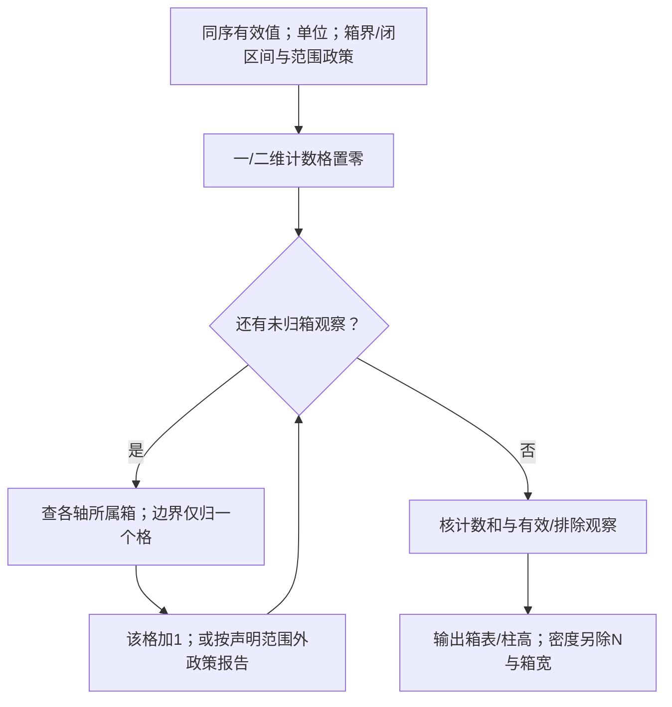
```mermaid
flowchart TD
    BN0["同序有效值；单位；箱界/闭区间与范围政策"] --> BN1["一/二维计数格置零"]
    BN1 --> BN2{"还有未归箱观察？"}
    BN2 -->|是| BN3["查各轴所属箱；边界仅归一个格"]
    BN3 --> BN4["该格加1；或按声明范围外政策报告"]
    BN4 --> BN2
    BN2 -->|否| BN5["核计数和与有效/排除观察"]
    BN5 --> BN6["输出箱表/柱高；密度另除N与箱宽"]
```

原前五朵PL/PW自设界PL[1,1.5,2]、PW[0,0.2,0.4]。前三(1.4,0.2)/(1.4,0.2)/(1.3,0.2)到行0列1，第四PL1.5到行1列1，末回行0列1，终表[[0,4],[0,1]]。文字替代：固定界→唯一定位→计数→核总N。

自设格不是原p.64未知格界；密度另除有效N与箱宽，柱高不直接为概率。

<details><summary>读图自测：双侧都闭时，(1.5,0.2)为什么可能重复？</summary>

两个内边界同时属前后箱，会给多个格加1，计数和可能>N。BN0要互斥边界，末箱单独包含右端。

</details>

缺失/范围外必须计排除或报错，不一边丢行一边声称和等于原N；重叠边界重复计会使和>N。箱数与箱界改变局部峰外观，不保证每峰就是一个物种或噪声；原单色图没有class映射，需分组另核。浮点边界须使用同一精确数组，不能将显示舍入值拿来改变实际归箱。

<details><summary>迁移/诊断：相同自设2×2边界，三点(1.25,.1)/(1.5,.2)/(2,.4)最终表？若把两边都算含端点，哪里可能重复？</summary>

采用左闭右开、末箱右闭，计数表为 `[[1,0],[0,2]]`，合计 3。

边界 1.5、0.2 归入后箱；最右端 2、0.4 仍留在末箱。每箱双侧闭会重复计边界点，所以须先确定互斥分区。

这张计数表不能证明类别分离。

</details>

**为什么需要它**

每项一种直方读法与对应指标/例，不把图上峰名自动当物种标签。

**峰在哪**

对应的统计量：众数、中位数

Iris / Airbnb 例子：petal width 在 0.2 附近一个峰

**往哪边拖尾**

对应的统计量：偏度

Iris / Airbnb 例子：`price` 右尾拖到 \$1,999

**有几个可见峰**

对应的统计量：需直接看图/分组，负峰度不证明多峰

Iris / Airbnb 例子：合并petal width呈多个集中区，类别解释须按class验证（T03 cell 14 原话 "mixture of several populations"）

**两端有没有孤立的柱子**

对应的统计量：离群点

Iris / Airbnb 例子：sepal width 两端各有几朵

花瓣宽0.2柱高为频数，负峰度不能证明多峰；轴/箱界决定显示。

T03 cell 14 画的正是花瓣宽度 20 箱直方图；作业要求至少 8 张图，直方图是最基本的一种。

**课件原例**

花瓣宽度 10 / 20 箱；花瓣宽 × 花瓣长的二维直方图。

**🎙️ 课堂补充**（`01:34:40`–`01:35:10`，约 30 秒，B · 讲了同讲义，且明确降权）

教授明说不重复直方图，因为学生在别的课上已经用过：

> So of course we can use a simple histogram to get an understanding of the attributes values. So I'm not repeating the histogram, so I believe you have used this in some other courses.

（`01:34:40`–`01:34:52`）二维直方图只一句带过，没有回答讲义 p.64 “What does this tell us?”这个具体问题（单色图本身不能证明分类完全分离）：

> Or you can do the high [dimensional] histogram where you add the two feature values together and then do the frequency counting.

（`01:34:52`–`01:34:59`）

**这段改变了什么**：教授以学生已学过为由略过直方图细讲，可据此降低当时复习优先级。原话是：

> I'm not repeating the histogram... you have used this in some other courses

p.64 的具体问题未获课堂展开，对应任务单问题 4。原单色图只反映联合频数；物种分离须另核标签，不能从图单独证明。

**💡 换个说法（笔记补充）**

"Shape depends on the number of bins"是直方图唯一的坑。pandas 的 `hist(bins=20)` 里 `bins` 就是这个参数；一个常用的起点是 $\sqrt{n}$（150 朵花约 12 箱，68,133 行约 260 箱——太多，实际会用 30–50）。**作业里每张直方图都应该说明你选了几箱、为什么**，最好同一列画两个箱数对照一下。

**⚠️ 常见误解**

- ❌ 把直方图和条形图混用。→ 直方图的横轴是**连续区间**（箱），柱子相连，柱子的顺序由数值决定；条形图的横轴是**类别**，柱子分开，顺序可以随便排。类别变量（§2.8）画条形图，数值变量画直方图。
- ❌ 只画一种箱数就下结论"单峰"。→ 箱太少会把两个峰合成一个；换一个箱数再看。

**所以呢**：直方图看一列的分布，但比较四列的分布要并排放四张——箱线图一张就够。

---

#### 2.18.3 箱线图（讲义 p.65–66）

**先把围栏与须画在同一组数上（笔记补充）**

问题：阈值101.5为什么不是实际须端81？本图用原九数及只改末81为181的既有变式。Q1/Q3采用上文半分法；10/90须明确采用线性百分位法，这是教学对照，不冒称重建原p.66全部生成设置。

![[IS6400_Business_Data_Analytics/notes/figures/readability-v2-m03/box-policies.svg]]

纵轴为原教学数值，横轴区分Tukey与10/90政策。箱上下边64/79、中线72，虚线为围栏41.5/101.5；单独圆点是政策下候选异常，不是错误记录。

读左图：Tukey上须在围栏内最大实际值81，不到101.5；10th须为63.8，不是原最小63。读右图：181超过Tukey围栏，另一81仍在，上须保持81；10/90线性上须变101，须政策改变了一个元素。

文字替代：先定分位算法和须规则，算箱/中线，再按规则找须与异常；围栏是阈值，须端是该政策的端点。

<details><summary>读图自测：看到181候选异常，能否直接删除？两图的围栏一样吗？</summary>

不能直接删。它可能是真实尾值，需回源。半分Q仍64/79，所以两面板Tukey围栏仍41.5/101.5；数值/政策和真实性是不同判断。

</details>

图源：[[IS6400_Business_Data_Analytics/notes/figures/readability-v2-m03/generate.py|生成代码]]、[[IS6400_Business_Data_Analytics/notes/figures/readability-v2-m03/figure-inputs.json|数据及政策]]。visual_review/semantic_review pending。

**是什么**

先说人话：把 §2.9 算出来的几个分位数画成一个"盒子 + 两根须"：盒子的下边是 $Q_1$、上边是 $Q_3$、中间一条线是中位数，须伸到两头，超出须的点单独画出来当离群点。一眼看出**中心在哪（中线）、中间一半散得多开（盒子高度 = IQR）、有没有极端值（孤立的点）**；四列并排画，就能比较。

讲义 p.65：

> **Box Plots**：Invented by **J. Tukey**；Another way of displaying the distribution of data；Following figure shows the basic part of a box plot

配图从上到下标注：**outlier**（须以外的单独点）→ **90th percentile**（上须顶端）→ **75th percentile**（盒顶）→ **50th percentile**（盒中线）→ **25th percentile**（盒底）→ **10th percentile**（下须底端）。

讲义 p.66（纯图片，已视觉复核）**Example of Box Plots**——"Box plots can be used to compare attributes"：Iris 四个属性并排：

每行Iris属性，箱Q范围/中线/须来自原图读数近似；读法保条件，不能同生成设置未知时假定同政策。

| 属性 | 盒子（$Q_1$–$Q_3$） | 中线 | 须 | 读法 |
|---|---|---|---|---|
| sepal length | 约 5.1–6.4 | 5.8 | 4.3–7.9 | 中等分散，对称 |
| sepal width | 约 2.8–3.3 | 3.0 | 较短，**上下各有几个红色 + 号离群点** | 最集中，但有极端值 |
| petal length | 约 1.6–5.1 | 4.35 | 1.0–6.9 | **盒子最高**——IQR 最大，只能由该合并箱看合并散布；是否类间差需分组数据 |
| petal width | 约 0.3–1.8 | 1.3 | 0.1–2.5 | 同上 |

petal length盒高代表合并样本IQR，不证明类间差；sepal width异常标记不证明错误。

这些数与 §2.9 T03 算出的 $Q_1$ / $Q_3$ 一致。**盒高说明这一列合并样本中间50%散布较大**；它没有区分类间与类内变化，不能单独证明分类更好。看物种差异须按class分箱/散点；换单位也会改变绝对盒高，不能当信息量变化。

**💡 把箱、围栏、须、异常逐件做出来（笔记补充）**

用原九数63/64/64/70/72/76/77/81/81，先声明“去掉中位数、上下各半取中位”的四分位算法。

1. 排序并保存原ID。
2. 第5数72为中位；下半取Q1=64，上半取Q3=79。
3. IQR=15。若须采用Tukey1.5IQR，算围栏41.5/101.5。
4. 围栏内实际最小/最大观察63/81才是须端；超界标候选异常，本例无异常。
5. 返回箱64–79、中线72、须63/81与异常空列表。

围栏是判定阈值，须端是观察；两者都不是置信区间。

若只把最后81改181，Q1/Q3/中线不变，围栏仍41.5/101.5；另一81仍在围栏内，上须仍81，181单独标。它只是规则下的异常候选，不等于必须删。**原p.65的10/90百分位须是另一政策**：按线性插值，此九数p10=63.8、p90=81；它的端点可不等于实际最小/最大。不能把10/90版叫作默认Tukey1.5IQR版，原p.66未公开完整生成设置，不假定两页同一规则。

图问：须政策在哪一步决定端点？箭头是计算依赖与政策分支，不表示异常一定删。

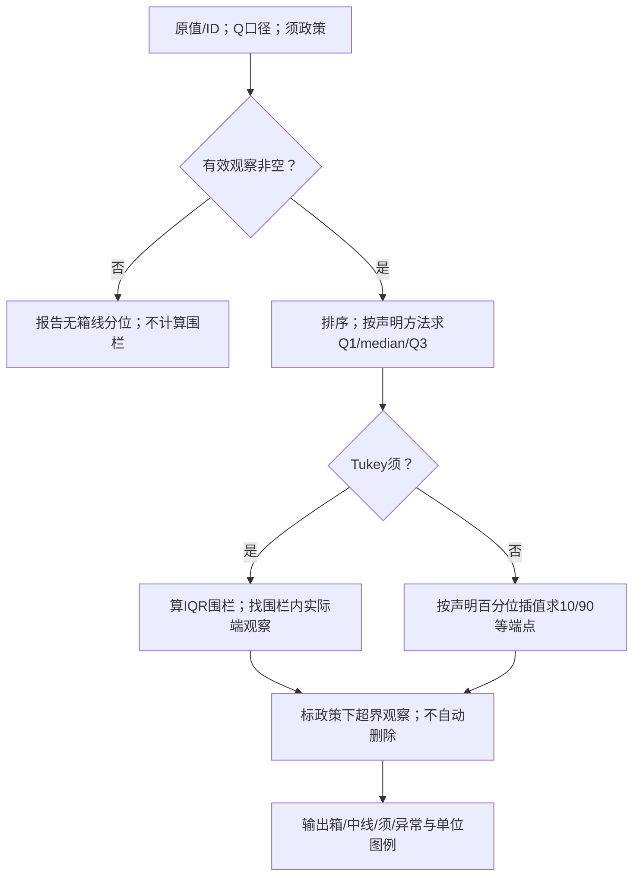
```mermaid
flowchart TD
    BX0["原值/ID；Q口径；须政策"] --> BXN{"有效观察非空？"}
    BXN -->|否| BXF["报告无箱线分位；不计算围栏"]
    BXN -->|是| BX1["排序；按声明方法求Q1/median/Q3"]
    BX1 --> BX2{"Tukey须？"}
    BX2 -->|是| BX3["算IQR围栏；找围栏内实际端观察"]
    BX2 -->|否| BX4["按声明百分位插值求10/90等端点"]
    BX3 --> BX5["标政策下超界观察；不自动删除"]
    BX4 --> BX5
    BX5 --> BX6["输出箱/中线/须/异常与单位图例"]
```

九数BX1半分得64/72/79，Tukey支BX3围栏41.5/101.5，围栏内实际端63/81，到BX5无异常。10/90支BX4按linear取63.8/81，端不同。文字替代：分位→指定须规则→异常/图元素。

原p.65百分位须与Tukey不同；分位算法同时固定，不能仅凭同叫箱线图就混参数。

<details><summary>读图自测：101.5能否画成Tukey上须？</summary>

不能，BX3要找围栏内最远实际观察81；101.5是阈值，没有该观察。

</details>

空/过少样本、IQR0、多种分位算法不同都应先说明；不能随图换算法而不改标签。Iris原PW按numpy线性Q为.3/1.3/1.8、IQR1.5，Tukey围栏−1.95/4.05、端点.1/2.5；p10/p90为.2/2.2，清楚展示两政策差别。盒子高只说明该列合并样本中间50%散布大；物种间差与物种内散布要按class分组看，单位变化也可改变箱高而不改分类信息。

<details><summary>迁移/诊断：排序[1,2,3,4,5,6,7,8,20]按上述半分Q与Tukey政策，箱与须/异常是什么？能把围栏当须端吗？</summary>

median5，Q1=2.5/Q3=7.5，IQR5，围栏−5/15；须1/8，异常20。围栏15不是实际须8。若改numpy线性分位，Q1/Q3可能不同，须先标口径，不偷换；仅一个合并箱不能证明某两类分得开。

</details>

**为什么需要它**

箱线图汇总分位数并方便组间比较。先读须政策：本讲 p.65 用 10/90 分位数，而常见软件还可能采用 1.5×IQR 或 min/max。

T03 第 2.3 题要求每个特征与 log_price 给一个统计量和一张图。类别列如 property_type、city 可按组画 log_price 箱线图。

六城并排后，中线比较中位数，箱高比较中间 50% 的散布。当前图的 SF 中位较高、DC 箱较高，不等于所有离散量或每条价格都同样排序。

**课件原例**

p.65 的结构图；p.66 的 Iris 四属性箱线图。

**🎙️ 课堂补充**（`01:35:10`–`01:37:35`，约 2.4 分钟，B · 讲了同讲义）

教授照讲义 p.65 的结构讲箱线图，用的百分位与讲义一致（10/25/50/75/90）：

> The first threshold is called 10th percentile... And 25th percentile, 50th percentile which is the median, 75th percentile and 90th percentile.

（`01:35:28`–`01:35:46`）离群点的判断也照讲义：

> this plot shape here, it indicates that one data point... the X value of this record is smaller than the 10 percentile threshold. Now, the X value is extremely small, so it is labeled a potential outlier data point.

（`01:36:05`–`01:36:19`）并现场读出 Iris 四个箱线图的比较结论，与笔记 §2.18.3 表一致：

> we can see the sample[sepal] length, the value of the sample length is much larger than the sample width... The [petal] length has the largest value... The 90 percentile and the 10 percentile values are the largest.

（`01:37:01`–`01:37:26`）

**这段改变了什么**：课堂确认 p.65 使用 10/90 百分位须，与 pandas 常见的 1.5×IQR 口径不同。

合并 petal length 的中间 50% 散布较大，但仅箱高不能证明类间差异或分类能力。

**💡 换个说法（笔记补充）**

⚠️ 讲义 p.65 的须标的是 **10th / 90th percentile**，但 **pandas / matplotlib 默认的须是 $Q_1 - 1.5 \times \text{IQR}$ 和 $Q_3 + 1.5 \times \text{IQR}$ 以内最远的数据点**（Tukey 1977 的原版），超出的点才画成离群点——两种画法的"离群点"定义不同。用 §2.9 那 9 个数算：$Q_1$ = 64、$Q_3$ = 79、IQR = 15，须的范围是 64 − 22.5 = 41.5 到 79 + 22.5 = 101.5，9 个数全在里面，没有离群点。T03 cell 32 用的 IQR 规则就是这个 1.5 倍。答题时说清你用的是哪种。

**⚠️ 常见误解**

- ❌ 以为盒子里的横线是均值。→ 是**中位数**。偏态数据的均值不在盒子中间（`review_scores_rating` 均值 94 会落在中位数 96 的下方）。
- ❌ 以为须的两端是最小值和最大值。→ 讲义版是 10/90 百分位，Tukey 版是 1.5×IQR；仅 Tukey 政策在所有观察都在围栏内时须端是 min/max；10/90 百分位政策通常不是 min/max，哪怕无按该政策标出的异常也不能套用。
- ❌ 看到离群点就删。→ 箱线图只是**标记**（§2.6）：sepal width 的几个极端值是真实的花。

**所以呢**：一个变量的图讲完了。两个变量看关系，用散点图。

---

#### 2.18.4 散点图与散点图矩阵（讲义 p.67–68）

**是什么**

散点图用两列作坐标，每行一个点。点越接近一条非水平或非垂直直线，相关通常越接近 ±1。

U 形可以有明显关系却相关接近零，见 p.33(d)。所以读相关时还要看点形。

将所有属性对排成方阵，就得到散点图矩阵。它帮助比较不同属性投影，回应单一方向可能误导的问题。

讲义 p.67：

> **Scatter plots**
> - Attributes values determine the position
> - Two-dimensional scatter plots most common, but can have three-dimensional scatter plots
> - Often **additional attributes can be displayed by using the size, shape, and color** of the markers that represent the objects
> - It is useful to have **arrays of scatter plots** can compactly summarize the relationships of several pairs of attributes

散点图可用横轴、纵轴、颜色、大小和形状分别编码属性。例如颜色表示品种，大小表示评论数。

这是五种常用编码，并非数学维数上限。编码越多，读图负担通常越大。

讲义 p.68（纯图片，已视觉复核）**Scatter Plot Array of Iris Attributes**：4 × 4 的方阵，对角线是空白（或属性名），每格是一对属性的散点图，三个品种用不同标记（× Setosa、+ Versicolour、○ Virginica）。**最清楚的一格是 petal length × petal width**：Setosa 缩在左下角一小团，Versicolour 和 Virginica 沿对角线排开、略有重叠；点排成一条很窄的上升带——相关 0.963。sepal width × sepal length 那格三类混在一起，点散成一团——相关 −0.109，区分度最差。

**💡 同一行数怎样经过坐标映射（笔记补充）**

**同对象怎样变成散点（笔记补充）**

第一朵Iris四值为5.1/3.5/1.4/0.2cm，class为Setosa。

1. 声明x=PL、y=PW，取同一行形成点(1.4,0.2)。
2. class可编码为颜色或点形；它是来源标签，不是散点算法预测。
3. 换轴为(0.2,1.4)，对象与联合关系不变，不能由轴顺序获得因果方向。

四属性矩阵有4×4面板，含4对角和12有序非对角；唯一无序对只有 $4(4-1)/2=6$。左右镜像不是两份独立证据。透明度和重叠影响外观，行值/标签映射保持。

<details><summary>迁移/诊断：三属性矩阵有多少唯一配对、多少有序非对角？把同一行PL与另一行PW配成点是否仍是原分布？</summary>

3个唯一对、6个有序非对角；错误跨行配对改变联合关系，即使各单列直方图不变，相关和类结构也可能变。需保同对象ID与坐标对应；颜色映射须声明含义，不从颜色直接推因果。

</details>

**为什么需要它**

每项散点能提供的观察、统计联系和例；点来自同对象两列，色形表示来源标签。

**两列有没有线性关系、多强**

对应：§2.11 相关系数

例子：petal length × petal width 0.963

**关系是不是线性**

对应：§2.11 p.33 图 (d)

例子：U 形看得见、相关系数看不见

**按颜色分组后是否分得开**

对应：M04 特征重要性

例子：花瓣两列能把三类分开 → 重要特征

**有没有远离带子的点**

对应：§2.6 离群点

例子：—

原“花瓣两列把三类分开”是压缩说法；本节原图/课堂已明确Setosa易分、另两类仍重叠，不承诺完美分类。

散点图矩阵是 T04 第一个 code cell（`sns.pairplot(iris, hue="class")`）画的东西，也是 M04 p.23 "怎么衡量 petal width 和 sepal length 的重要性"的直观依据。"用颜色显示第三个属性"是 T03 cell 20 的做法（按 class 分组着色）。

**课件原例**

p.68 的 Iris 散点图矩阵。

**🎙️ 课堂补充**（`01:37:35`–`01:39:48`，约 2.2 分钟，B · 讲了同讲义）

教授现场读 4×4 散点图矩阵，结论与笔记 §2.18.4 一致——花瓣长度最能分开 Setosa：

> For the petal length, we can see, if we use the petal length, we can easily differentiate the blue data points from the red... the petal length should be some attribute which is very informative in telling the difference between the blue category [and] the rest of the data points.

（`01:38:53`–`01:39:14`）并提到散点图矩阵是“16 张图”的原因（4 属性两两配对，含对称重复）：

> we have 16, 4 by 4, 16 scatterplots in a two-dimensional feature space to do the visualization.

（`01:38:37`–`01:38:47`）

**这段改变了什么**：没有新增，口头确认了笔记已有的结论（petal length 是最强判别特征），并解释了“16 张”是怎么数出来的（4×4，含对称的一半是重复）。

**💡 换个说法（笔记补充）**

读散点图矩阵可分三步：

1. 识别对称面板：上、下三角是同一对属性交换轴。四属性只有 6 个无序对，每侧各含 6 个有序面板。
2. 找接近直带的点云。petal length/petal width 相关约 0.963，见此前 `verify_w3w4.py`。
3. 看带标签的点是否分开，提出可能有分类信息的属性对。

M04 会用 Gini、卡方、F 值等作不同目标的评价，T04 再转成代码。

**⚠️ 常见误解**

- ❌ 以为散点图能看出因果方向。→ 只能看出"一起变"（§2.12）；把两个轴换一下，图翻转，关系不变。
- ❌ 数据量大时直接画散点图。→ 68,133 个点会糊成一片黑，要加透明度（T03 用 `alpha=0.7`）、先抽样（§2.16），或改用二维直方图 / 密度图。
- ❌ 相关高就一定"一条线"。→ 相关 0.96 的带子仍有宽度；相关 0.58（accommodates × log_price）的图看起来相当散。

**所以呢**：两列关系用散点图；四列以上同时看，要换一种坐标系——平行坐标。

---

#### 2.18.5 平行坐标 · 星图 · Chernoff 脸（讲义 p.69–72）

**是什么**

平行坐标将四根轴并排竖放。每朵花在各轴按属性值落点，再连成一条折线。

同类记录若在某些轴上取值接近，会形成线束。星图与 Chernoff 脸则把同一对象映射为一颗星或一张脸，便于比较轮廓。

讲义 p.69：

> **Parallel Coordinates**
> - Used to plot the attribute values of **high-dimensional** data
> - Instead of using perpendicular axes, use a set of **parallel axes**
> - The attribute values of each object are plotted as a point on each corresponding coordinate axis and the points are connected by a line
> - Thus, **each object is represented as a line**
> - Often, the lines representing a distinct class of objects group together, at least for some attributes
> - **Ordering of attributes is important** in seeing such groupings

**手把手画一朵花**：第一朵 Setosa 是 (5.1, 3.5, 1.4, 0.2)。四根竖轴从左到右是 sepal length、sepal width、petal length、petal width；在第一根轴 5.1 的高度标一个点，第二根轴 3.5，第三根 1.4，第四根 0.2，连成一条折线——它在后两根轴上很低。所有 50 朵 Setosa 的折线都是"后两根轴很低"，于是在 petal 两根轴上抱成最下面的一束；Virginica 的折线在 petal 轴上最高，成最上面的一束。

讲义 p.70（纯图片，已视觉复核）：两张 Iris 平行坐标图，轴的顺序不同。左图轴序 sepal length → sepal width → petal length → petal width：三类在 sepal width 处交叉成一团，到 petal length / petal width 处分成三束（Setosa 蓝色在最下，Virginica 红色在最上）。右图轴序 sepal width → sepal length → petal length → petal width：三束从第二根轴起就开始分开，**更容易看**——这就是"顺序很重要"：把分得开的轴放相邻，束才看得清。

p.71“Star Plots and Chernoff Faces”左边示范四臂星。轴方向是上 SW、右 SL、下 PW、左 PL，臂长编码属性值。

右边将属性映射到眼睛大小、嘴的弧度、脸宽等参数。人对脸部差异敏感，这可帮助发现差别，却不保证所有属性都被同样准确地感知。

p.72“Star Plots for Iris Data”每行展示五朵花。1–5 号 Setosa 轮廓像细长竖条，51–55 号 Versicolour 像中等菱形，101–105 号 Virginica 较大。

原页未给完整轴序及缩放，不能把窄角直接解释为 petal 小；p.71 的右轴实际是 sepal length。

图能提示所示样本的轮廓差异，不能证明全体无重叠或完美分类。

**💡 折线/星的状态是轴序、尺度、映射（笔记补充）**

**同一行怎样变折线（笔记补充）**

第一朵按SL/SW/PL/PW顺序，原cm值形成(1,5.1)/(2,3.5)/(3,1.4)/(4,0.2)。相邻连线，一行就是一条折线。

交换前两轴后得到(1,3.5)/(2,5.1)/(3,1.4)/(4,0.2)。数没变，但折线形状变，说明轴序本身影响读法。

pandas默认直接用原值，不自动逐列缩放。一处交叉可表示两对象排名反转，不能独自推出整体负相关；需看轴序、尺度及全体样本。

💡 若自设逐列 min–max，并用原 150 行各列极值作描述参照，第一朵约为 [0.222222,0.625,0.067797,0.041667]。

这些值已无单位，图例不能再标原厘米高度。新对象超出参照范围时，结果可超出 0–1，不应静默裁剪。

沿 p.71 的上 SW、右 SL、下 PW、左 PL，四臂依次为 0.625、0.222222、0.041667、0.067797。

这是一颗明确映射的教学星，不能冒称精确重建了 p.72 的原图尺度。

图问：轴序或尺度改变，为何折线形状变而对象不变？箭头是数值到显示位置的映射。

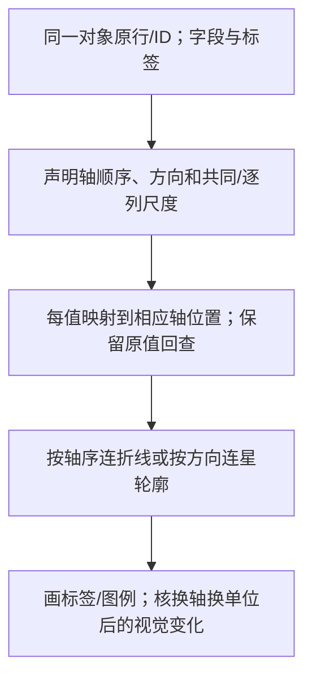
```mermaid
flowchart TD
    VC0["同一对象原行/ID；字段与标签"] --> VC1["声明轴顺序、方向和共同/逐列尺度"]
    VC1 --> VC2["每值映射到相应轴位置；保留原值回查"]
    VC2 --> VC3["按轴序连折线或按方向连星轮廓"]
    VC3 --> VC4["画标签/图例；核换轴换单位后的视觉变化"]
```

首Iris行5.1/3.5/1.4/0.2按SL/SW/PL/PW，在VC2定位四轴，VC3连线。换前两轴后前两节点(1,3.5)/(2,5.1)，只是映射变化。文字替代：保存行ID→定轴/尺度→映位置→连同对象。

原cm与逐列minmax有不同图例；未知原星/脸缩放不反推精确输入，常数轴单独处理。

<details><summary>读图自测：每轴自动缩到0–1却标cm，会违反什么？</summary>

VC1尺度与VC4图例不一致。数值已无量纲，不能称原cm高度或把变形当对象变了。

</details>

Chernoff脸同样是“原维度→明确脸参数→形状”的映射，p.71–72没有完整数值缩放函数/五官参数表，因此不从原脸反算精确属性。**概念机制例（笔记补充）**：对象A在归一化属性甲较高/乙较低，先声明甲映眼大小、乙映鼻宽，则呈大眼窄鼻；互换字段映射后会小眼宽鼻，但原记录未变。观者容易更注意眼睛，映射选择可放大某维视觉权重；不能以更夸张的脸证明该维对分类/决策更重要。本篇只教学图表映射，不编教授实际脸生成公式。

<details><summary>迁移/诊断：第一朵花交换SL/SW后折线前两节点？如果一列改为米而共用旧cm刻度，或偷偷逐轴缩放，会造成什么？</summary>

前两节点(1,3.5)/(2,5.1)。单位不一致可能把一列压在底部，逐轴缩放则改变各轴相对高度；都不能把视觉变化当数据本身改变。按声明尺度重画/标单位并保回查原值；星/脸也必须看每维映什么，不能猜“左右角小必是petal小”。

</details>

**为什么需要它**

平行坐标是 T03 cell 23 的 `pd.plotting.parallel_coordinates(data, 'class')`，也是作业要求的四种图之一。它和散点图矩阵回答同一个问题（哪些属性能分开类别），但**能同时看所有属性**，且属性可以远多于四个（十几根轴也能画）。星图 / Chernoff 脸本课只要求认识（⚪ 推断：不太可能考画法，可能考"它们是把高维对象画成图标的方法"）。

**课件原例**

p.70 两种轴序的 Iris 平行坐标；p.71 星图与脸的示意；p.72 十五朵花的星图。

**🎙️ 课堂补充**（`01:39:48`–`01:45:33`，约 5.75 分钟，A · 课上展开）

- **平行坐标怎么读**：教授现场带着连线，与笔记 §2.18.5 的“束”概念一致——

> do you think that the sample[sepal] values here is a very useful attribute... No, right?... there [are] actual values of the sample[sepal] width mixed together... I cannot see any difference among the three categories.

（`01:41:24`–`01:41:58`）对比 sepal length：

> can we tell the difference? This is much better, right? At least for the blue one, we can see a clear boundary.

（`01:42:03`–`01:42:11`）
- **Chernoff 脸的流行文化类比（讲义没有）**：

> Also, we can use the channel phase[Chernoff faces]. So for example, we can use the size of your eyes, the size of your nose, the size of your mouth... it's very similar to the one punch man... The E-train tolerance[?]... it's very similar to that phase, right? But I'm not too old, so I know something.

（`01:43:53`–`01:44:27`）——“channel phase” 是 ASR 把 **Chernoff faces** 听错（已记入 asr-dictionary）；角色名 “E-train tolerance” 未能还原，标 [?]。
- **为什么要画这些图**：

> if you compare the three classes of... categories of flowers into a single figure, you can do some eye-mining, right? You can just observe the pattern.

（`01:44:37`–`01:44:46`）结论与笔记一致：

> [So]sa[Setosa] is very different from Verticala and Virginica... and the Verticala has some similarities compared with Virginica.

（`01:44:48`–`01:45:00`）

**这段改变了什么**：课堂确认花瓣轴有类别差异线索，但仍存在重叠；sepal width 混合明显。

教授还将 Chernoff 脸类比《一拳超人》角色，具体角色 ASR 未还原。这个类比补充了脸部差异容易被注意的直觉，不是分类效果证明。

**💡 换个说法（笔记补充）**

平行坐标先看同类折线在哪些轴聚成束、在哪些轴混合。Iris 的花瓣两轴有类别差异线索，sepal width 重叠更多。

这可与散点矩阵、箱线图及 §2.18.1 分组均值互相参照。M04 的两花瓣特征重要性合计超过 0.8，是另一个模型评价。

这些图、载荷和模型分数目标不同；当前数据中线索可能一致，不保证任何任务都得到同样结论。

逐列 min–max 用“值减最小值”除以极差。若列为常数，分母为零，应明确标为常数并指定显示位置，或说明该映射未定义。

不能将 0/0 当成原值为零。原厘米共用尺度与无单位归一化须使用不同图例；尺度未知的原星图和脸图不能反算精确值。

**⚠️ 常见误解**

- ❌ 从一个线交叉就断定整体负相关或类别可分。→ 交叉表示部分对象在相邻轴的排序反转，确实是局部信息；不能仅由一个交叉推出整体相关/类可分，须核轴序、缩放和全部线束。
- ❌ 以为轴的顺序无所谓。→ 讲义原话 "Ordering of attributes is important"，p.70 两张图就是证据。
- ❌ 以为各轴共用一个刻度。→ 图可以采用逐轴单独缩放，也可以共享原数值尺度；需先检查具体实现。pandas `parallel_coordinates` 默认直接画原值，不会自动逐列标准化（sepal length 4.3–7.9，petal width 0.1–2.5），否则 petal width 的线会全压在底部。

**与其他概念的关系**

§2.18 的六种图对应三个层次：单变量（直方图、箱线图）、双变量（二维直方图、散点图）、多变量（散点图矩阵、平行坐标、星图）。它们与 §2.9–2.11 的统计量一一对应：直方图 ↔ 偏度峰度，箱线图 ↔ 分位数与 IQR，散点图 ↔ 相关系数。

**所以呢**：正文到此结束。§3 用三张图把"属性类型 → 统计量 → 图"、"关联规则三指标"、"预处理四种手段"串起来；§6 给考点。

---

## 3. 一图看懂

### 3.1 属性类型决定你能做什么

总览问：每升级一种测量性质，新增哪些可用描述？实线为性质累加，虚线为适合的统计/图用途，不是类型按时间变。

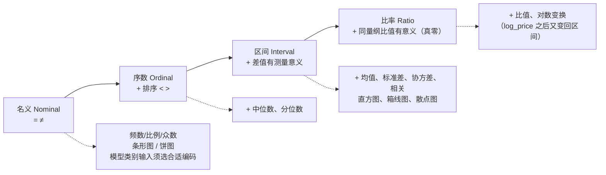
```mermaid
flowchart LR
    N["名义 Nominal<br/>= ≠"] --> O["序数 Ordinal<br/>+ 排序 &lt; &gt;"]
    O --> I["区间 Interval<br/>+ 差值有测量意义"]
    I --> R["比率 Ratio<br/>+ 同量纲比值有意义（真零）"]
    N -.-> N1["频数/比例/众数<br/>条形图 / 饼图<br/>模型类别输入须选合适编码"]
    O -.-> O1["+ 中位数、分位数"]
    I -.-> I1["+ 均值、标准差、协方差、相关<br/>直方图、箱线图、散点图"]
    R -.-> R1["+ 比值、对数变换<br/>（log_price 之后又变回区间）"]
```

邮编走N，只数频数；辣度有顺序到O，可按级别排；摄氏差有单位到I；重量真零可比到R。文字替代：区分→排序→差→比，具体运算仍核业务。

log_price是变换后的尺度，要重新判定；正值对数不是任何比率量都自动可做，零/负值需策略。

<details><summary>读图自测：ID写成10、20能通过R吗？</summary>

不能，仅数字标签不会增加排序、差、真零测量意义。

</details>

这张图说的是：四种类型是**累加**的阶梯，每上一级增加测量性质，但具体求和/乘除仍需业务或物理含义，能用的统计量和图就多一批。判定一列数据的类型，是本讲所有后续操作的前提。

### 3.2 关联规则的三个指标

总览问：同一个共同计数，三个指标为何不同？箭头是评价顺序，虚线是提示/限制，不是促销因果。

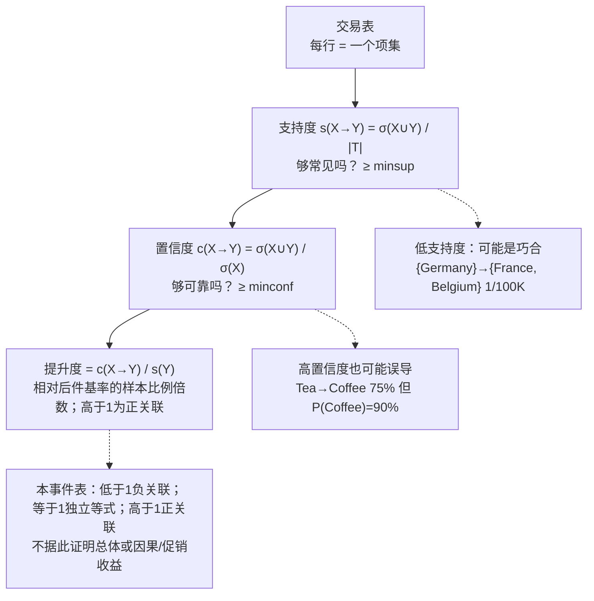
```mermaid
flowchart TD
    T["交易表<br/>每行 = 一个项集"] --> S["支持度 s(X→Y) = σ(X∪Y) / |T|<br/>够常见吗？ ≥ minsup"]
    S --> C["置信度 c(X→Y) = σ(X∪Y) / σ(X)<br/>够可靠吗？ ≥ minconf"]
    C --> L["提升度 = c(X→Y) / s(Y)<br/>相对后件基率的样本比例倍数；高于1为正关联"]
    S -.-> S1["低支持度：可能是巧合<br/>{Germany}→{France, Belgium} 1/100K"]
    C -.-> C1["高置信度也可能误导<br/>Tea→Coffee 75% 但 P(Coffee)=90%"]
    L -.-> L1["本事件表：低于1负关联；等于1独立等式；高于1正关联<br/>不据此证明总体或因果/促销收益"]
```

茶咖啡表共同15、N100、前件20、后件90。S支持15/100，C置信15/20，L再除90/100得5/6<1。文字替代：共同/全部，共同/前件，置信/后件基率。

三个分数描述样本；两个门槛过关也不证明业务可用，极少计数/样本外/成本需另核。

<details><summary>读图自测：支持15%和置信75%矛盾吗？</summary>

不矛盾，两个分母分别100和20，问的覆盖人群不同。

</details>

这张图说的是：一条规则要依次过三关；前两关是讲义 p.43 的"两个门槛"，第三关（提升度）是 p.46–48 专门补的——**因为置信度不和基准率比较就会误导**。

### 3.3 数据预处理的四种手段与本课去向

总览问：哪种动作改对象，哪种改描述？箭头是处理选项，虚线为课程用法。标题沿用旧“四种”，图和本节实际列五种，正文明确两行三列路径。

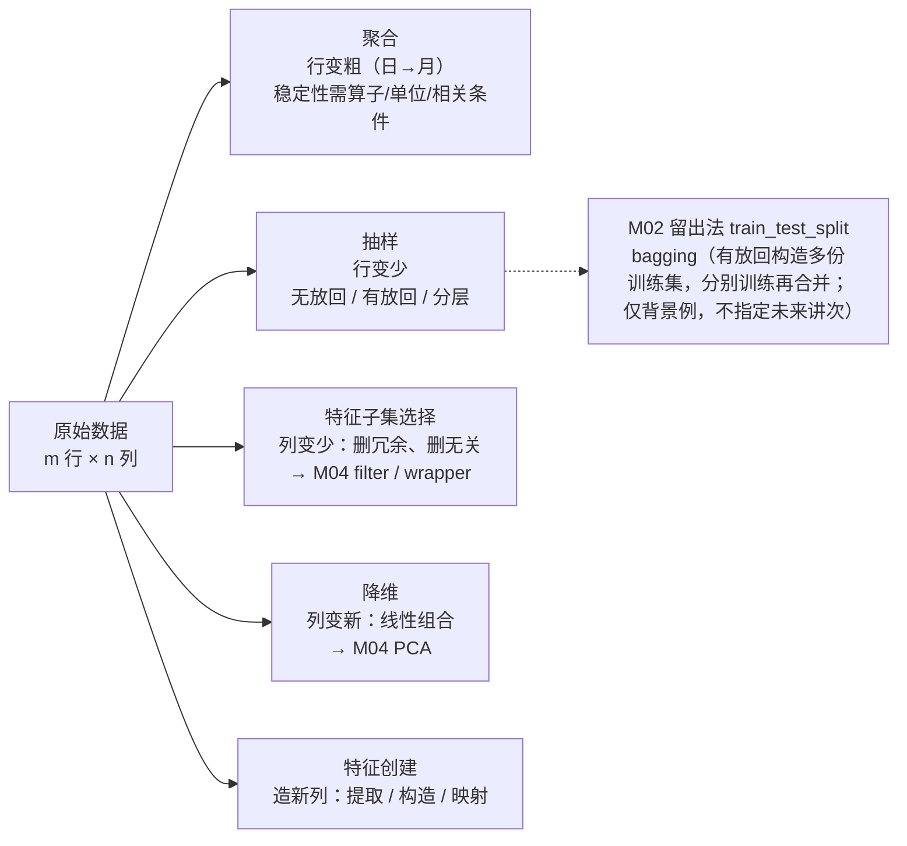
```mermaid
flowchart LR
    D["原始数据<br/>m 行 × n 列"] --> A["聚合<br/>行变粗（日→月）<br/>稳定性需算子/单位/相关条件"]
    D --> SA["抽样<br/>行变少<br/>无放回 / 有放回 / 分层"]
    D --> FS["特征子集选择<br/>列变少：删冗余、删无关<br/>→ M04 filter / wrapper"]
    D --> DR["降维<br/>列变新：线性组合<br/>→ M04 PCA"]
    D --> FC["特征创建<br/>造新列：提取 / 构造 / 映射"]
    SA -.-> H["M02 留出法 train_test_split<br/>bagging（有放回构造多份训练集，分别训练再合并；仅背景例，不指定未来讲次）"]
```

四行A10/A20/A30/B5走聚合A变两行；从原四行抽两行走SA保原行。质量/体积选择一列走FS，组合成z走DR，密度新列走FC。文字替代：聚合/抽样改行；选择/约简/创建改列。

选项不是必须串行全做。聚合不保证sum波动更小，新特征也不能用未来目标答案泄漏。

<details><summary>读图自测：price_per_person作为价格预测输入，price是未来未知时可走FC吗？</summary>

不可以用于该预测协议。它用了未来答案，计算公式可算不代表预测时可得；当前描述用途与未来预测用途分开。

</details>

这张图说的是：p.50–59 五种手段里，两种作用于**行**、三种作用于**列**；其中两种（选择、降维）在 M04 完整展开，一种（抽样）已在 M02 用过。

---

## 4. 速查表

### 4.1 属性类型（讲义 p.8–13）

每行尺度的累加性质、原例、Airbnb例与常用统计；具体运算仍核单位/业务。

| 类型 | 性质（累加） | 讲义例子 | Airbnb 例子 | 允许的统计量 |
|---|---|---|---|---|
| Nominal | 区分 = ≠ | ID, eye color, zip codes | `city`, `property_type`, `id` | 频数、众数 |
| Ordinal | + 顺序 < > | rankings, grades, {tall, medium, short} | `cancellation_policy` | + 中位数、分位数 |
| Interval | + 差值有测量意义 | dates, °C / °F | `log_price`, `review_scores_rating`（⚪） | + 均值、标准差、相关 |
| Ratio | + 同量纲比值有意义；具体运算核业务 | Kelvin, length, time, counts | `accommodates`, `price` | + 比值、几何均值 |

review_scores_rating区间判定有争议，保假设；Kelvin仅用尺度真零，不在此推出微观运动结论。

另一套：**离散**（有限 / 可数：邮编、计数、二元）vs **连续**（实数：温度、身高）。**非对称二元**：此任务重点计 presence=1，0 是已知未发生而非无意义/缺失（购买、出勤）——关联分析的输入。

### 4.2 描述统计量（讲义 p.24–33）

每卡一类描述统计，保算法/API口径，避免把四步散布过程挤入单元格。

**集中趋势**

统计量：均值 / 中位数 / 众数

一句话：平均 / 排中间的 / 最常见的

pandas：`mean() / median() / mode()`

**位置**

统计量：百分位数 $p$、四分位数 $Q_1 Q_2 Q_3$

一句话：靠近比例 q=p/100 的排序分位值；插值/并列不保证恰有 p% 严格小于；$Q_2$ = 中位数

pandas：`quantile(q)`，q=p/100

**离散**

统计量：极差 / IQR / 方差 / 标准差

一句话：max − min / $Q_3 - Q_1$（中间 50%，抗离群） / 平方偏差和/(n−1)样本口径 / 其平方根；固定这批总体可除n

pandas：`max()-min()` / `quantile(.75)-quantile(.25)` / `var() / std()`

**形状**

统计量：偏度 / 峰度

一句话：尾巴指向哪（右尾长为正） / 尾巴厚不厚（正态为 0）

pandas：`skew() / kurt()`

**关联**

统计量：协方差 / 相关系数

一句话：一起变的原始量（有单位） / 除以两个标准差，$[-1, 1]$，只抓线性

pandas：`cov() / corr()`

`quantile(0.75)` 与 `quantile(0.25)` 使用比例参数，不能输入 75、25。样本方差的 n−1 和固定总体描述的 n 分母也须分别声明。

### 4.3 关联规则（讲义 p.39–48）

每行一个共现量，公式分母和讲义例分别读，五票/四票/100人互不混。

| 指标 | 公式 | 讲义算例 |
|---|---|---|
| 支持度计数 $\sigma(X)$ | 含 X 的交易数 | $\sigma$({Milk, Bread, Diaper}) = 2 |
| 支持度 $s(X \rightarrow Y)$ | $\sigma(X \cup Y) / \lvert T \rvert$：共同出现票数除全部交易数 | {Milk, Diaper} → {Beer}：2/5 = 0.4 |
| 置信度 $c(X \rightarrow Y)$ | $\sigma(X \cup Y) / \sigma(X)$ | 2/3 = 0.67 |
| 提升度 | $c(X \rightarrow Y) / s(Y) = P(Y \mid X) / P(Y)$：置信度再除后件基率 | Tea → Coffee：0.75 / 0.9 = 0.833 < 1 负关联 |
| 有效规则 | $s \ge$ minsup 且 $c \ge$ minconf | minsup = minconf = 50%：Bread → Diapers (50%, 66.67%)、Diapers → Bread (50%, 100%) |

liftTea0.833来自c0.75与Coffee0.9；过门槛只能说声明样本筛选有效，非干预获利。

### 4.4 预处理手段（讲义 p.51–59）

每卡一个预处理，保作用对象、目的和例，金额/人数/时间等单位随粒度声明。

**聚合**

作用于：行

目的：减量与换尺度；稳定性取决算子与相关

例子：原降水图作视觉例；教学独立月var9：年度sum var108、mean var.75，不能混单位

**抽样**

作用于：行

目的：省成本；样本要有代表性

例子：无放回 / 有放回 / 分层

**降维**

作用于：列

目的：避免维度灾难、省时间内存、可视化、去噪

例子：PCA、SVD

**特征子集选择**

作用于：列

目的：删冗余（售价 vs 销售税）、删无关（学号 vs GPA）

例子：M04

**特征创建**

作用于：列

目的：更高效的新属性

例子：边缘提取、密度 = 质量/体积、傅里叶

聚合教学sum var108、mean var0.75是12独立月var9设定，不是澳大利亚实际结果。

### 4.5 六种图（讲义 p.63–72）

每行图型，变量数只是本课程例的范围，坑列给改变读图的条件。

| 图 | 看什么 | 变量数 | 坑 |
|---|---|---|---|
| 直方图 | 单变量分布、峰、偏度 | 1 | 形状随箱数变 |
| 二维直方图 | 两变量联合分布 | 2 | — |
| 箱线图 | 分位数、IQR、离群点；比较多列 | 1（可多列并排） | 须的定义（10/90% vs 1.5×IQR） |
| 散点图 / 散点图矩阵 | 两变量关系；用颜色 / 大小 / 形状加第三变量 | 2 / 多 | 只看得出相关，看不出因果 |
| 平行坐标 | 高维对象 = 折线；同类成束 | 多 | 轴的顺序很重要 |
| 星图 / Chernoff 脸 | 每个对象一个图标 | 多 | 只适合少量对象 |

箱线须10/90与1.5IQR分开；散点含色/形标签不带因果方向。

---

## 5. 双语术语卡

双语定义拆卡保全部英文与首现，不为短表删出处/限制；定义压缩需回正文过程。

**数据对象 / 属性**

English：Object / Attribute

考试可用的英文定义：An attribute is a property or characteristic of an object; a collection of attributes describes an object. Attribute = variable, field, feature; object = record, point, case, sample, instance.

首现：§2.2

**属性值**

English：Attribute value

考试可用的英文定义：Numbers or symbols assigned to an attribute for a particular object.

首现：§2.2

**名义属性**

English：Nominal attribute

考试可用的英文定义：Values provide only enough information to distinguish one object from another (distinctness). E.g. ID numbers, eye color, zip codes.

首现：§2.3

**序数属性**

English：Ordinal attribute

考试可用的英文定义：Values provide enough information to order objects (distinctness & order). E.g. rankings, grades.

首现：§2.3

**区间属性**

English：Interval attribute

考试可用的英文定义：Differences between values are meaningful, but not ratios (distinctness, order & addition). E.g. calendar dates, temperature in °C.

首现：§2.3

**比率属性**

English：Ratio attribute

考试可用的英文定义：Both differences and ratios are meaningful (all four properties). E.g. Kelvin, length, counts.

首现：§2.3

**离散 / 连续属性**

English：Discrete / Continuous attribute

考试可用的英文定义：Discrete: a finite or countably infinite set of values (often integers; binary is a special case). Continuous: real numbers as values (floating-point).

首现：§2.4

**非对称二元属性**

English：Asymmetric binary attribute

考试可用的英文定义：Only presence (a non-zero value) is regarded as important; association analysis uses asymmetric attributes.

首现：§2.4

**数据矩阵**

English：Data matrix

考试可用的英文定义：Objects with the same fixed set of numeric attributes, represented as an m × n matrix: m rows (objects), n columns (attributes).

首现：§2.5.1

**文档数据**

English：Document data

考试可用的英文定义：Each document becomes a term vector; each component is the number of times the term occurs.

首现：§2.5.1

**交易数据**

English：Transaction data

考试可用的英文定义：Record data where each record (transaction) involves a set of items.

首现：§2.5.1

**数据质量问题**

English：Data quality problems

考试可用的英文定义：Noise and outliers, missing values, duplicate data.

首现：§2.6

**维度 / 稀疏 / 分辨率**

English：Dimensionality / Sparsity / Resolution

考试可用的英文定义：Number of attributes (curse of dimensionality) / only presence counts, <1% non-zero / patterns depend on the scale.

首现：§2.6

**描述性分析**

English：Descriptive analytics

考试可用的英文定义：Present data in a form that makes sense to people so that we can get information to support decision making; numerical summaries, tables, graphs.

首现：§2.7

**频数分布**

English：Frequency distribution

考试可用的英文定义：Frequency of observations in non-overlapping classes/cells.

首现：§2.8

**百分位数**

English：Percentile

考试可用的英文定义：Lecture intuition: a cut near rank proportion p/100. Finite-sample values depend on the stated estimator and ties; exactly p% strictly below is not guaranteed.（笔记限定定义）

首现：§2.9

**四分位数**

English：Quartiles

考试可用的英文定义：Divide the data into four groups; Q1, Q2, Q3 = 25th, 50th, 75th percentiles; Q2 = median.

首现：§2.9

**极差 / 四分位距**

English：Range / IQR

考试可用的英文定义：Max − min / Q3 − Q1, the range of the middle 50%, less sensitive to extreme values than the range.

首现：§2.9

**偏度**

English：Skewness

考试可用的英文定义：A standardized third central moment, with a stated sample correction if used; zero skewness does not guarantee symmetry.（笔记限定定义）

首现：§2.10

**峰度**

English：Kurtosis

考试可用的英文定义：Indicates tailedness; about the extreme observations.

首现：§2.10

**协方差**

English：Covariance

考试可用的英文定义：A measure of the linear association between two continuous variables; $\sum(x_i-\bar x)(y_i-\bar y)/(n-1)$ for a sample.

首现：§2.11

**相关系数**

English：Correlation

考试可用的英文定义：Covariance divided by the two standard deviations; scale-free; always between −1 and +1; a linear concept.

首现：§2.11

**相关 ≠ 因果**

English：Correlation ≠ Causality

考试可用的英文定义：Correlation does not establish causality; causal identification requires a defined intervention, credible design, stated assumptions, and uncertainty assessment.（笔记限定定义）

首现：§2.12

**关联规则挖掘**

English：Association rule mining

考试可用的英文定义：Given a set of transactions, find rules that predict the occurrence of an item based on the occurrences of other items; implication means co-occurrence, not causality.

首现：§2.13

**项集 / k-项集**

English：Itemset / k-itemset

考试可用的英文定义：A collection of one or more items / an itemset containing k items.

首现：§2.13

**支持度计数 / 支持度**

English：Support count σ / Support s

考试可用的英文定义：Frequency of occurrence of an itemset / fraction of transactions that contain an itemset.

首现：§2.13

**频繁项集**

English：Frequent itemset

考试可用的英文定义：An itemset whose support ≥ a minsup threshold.

首现：§2.13

**关联规则**

English：Association rule

考试可用的英文定义：An implication expression of the form X → Y, where X and Y are itemsets.

首现：§2.14

**置信度**

English：Confidence

考试可用的英文定义：How often items in Y appear in transactions that contain X: σ(X∪Y)/σ(X).

首现：§2.14

**提升度**

English：Lift

考试可用的英文定义：Confidence of the rule divided by the support of the consequent, $P(Y \mid X)/P(Y)$; Below 1: negative sample association; above 1: positive sample association. These do not establish substitution, causation, or intervention profit.（笔记限定定义）

首现：§2.15

**聚合**

English：Aggregation

考试可用的英文定义：Combining attributes or objects into a coarser representation; stability depends on the operator, units, and dependence between inputs.（笔记限定定义，不冒充讲义原句）

首现：§2.16

**抽样 / 代表性样本**

English：Sampling / Representative sample

考试可用的英文定义：The main technique for data selection; a sample is representative if it has approximately the same property of interest as the original data.

首现：§2.16

**无放回 / 有放回 / 分层抽样**

English：Without / With replacement / Stratified sampling

考试可用的英文定义：Selected items are removed / not removed (may be picked more than once) / split data into partitions and sample from each.

首现：§2.16

**降维**

English：Dimensionality reduction

考试可用的英文定义：Avoid the curse of dimensionality, reduce time and memory, allow visualization, may help reduce irrelevant information or noise; no guarantee; techniques: PCA, SVD.

首现：§2.17

**冗余 / 无关特征**

English：Redundant / Irrelevant features

考试可用的英文定义：Duplicate information contained in other attributes / contain no useful information for the task.

首现：§2.17

**特征创建**

English：Feature creation

考试可用的英文定义：Feature extraction, feature construction, mapping data to a new space.

首现：§2.17

**直方图**

English：Histogram

考试可用的英文定义：Divide the values into bins and show a bar plot of the number of objects in each bin; shape depends on the number of bins.

首现：§2.18.2

**箱线图**

English：Box plot

考试可用的英文定义：Summarizes quartiles and median, with whiskers and candidate outliers defined by a stated policy: lecture 10th/90th percentiles versus Tukey fences and observed endpoints.（笔记限定定义）

首现：§2.18.3

**散点图矩阵**

English：Scatter plot array

考试可用的英文定义：Arrays of scatter plots that compactly summarize the relationships of several pairs of attributes.

首现：§2.18.4

**平行坐标**

English：Parallel coordinates

考试可用的英文定义：A set of parallel axes; each object is represented as a line; ordering of attributes is important.

首现：§2.18.5

lift定义明确不建立替代/因果/盈利；比特平均信息与序数间距条件另在正文。

> 英文定义优先取讲义原句，考试（英文、闭卷）可直接写。

---

## 6. 考点预判与答题框架

### 6.1 可信度分级

每行证据级别，5条课堂要求保持原时间戳范围，不以本轮候选提升置信度。

| 级别 | 含义 | 本讲 |
|---|---|---|
| 🔴 教授明示 | 转录里教授明确说过会考 / 要记 —— 引用原话 | **5 条**（见 §6.2 表首；来源 `M03-transcript.txt`，含 tutorial 段的作业规则） |
| 🟡 ILO 反推 | 对应官方 CILO / 讲义标题页的 Reading Material / 作业要求 | CILO-1（25%，描述任务与数据）、CILO-2（35%，用工具发现模式） |
| ⚪ 笔记推断 | 讲义排版信号、作业题型、同类课程惯例 | 见下 |

A4可携为当时录音口径，最新行政要求仍待核；不是确认当前考试最终安排。

> 考试范围明确包含"课上指定的阅读材料"——本讲标题页写 **DM Chapter 3**。⚠️ 讲义 p.35–49 的关联规则在 Tan 等的教材里属于另一章，交易简单计算已由教授在 01:26:36–01:26:49 明示；具体原题、教材章和权重仍待核（§9.5）。

### 6.2 考点清单

每卡保考点ID、可信度、完整英文/时间戳及位置，不把推断改教师明示。

**3.0a**

可信度：🔴

考点：**用 Tid/Refund/Marital/Income/Cheat 表判断 TID 是名义还是比率属性，是往年期末考原题**

依据：🎙️`22:45`–`22:51`：*"So this is, I think, three years or four years old final exam question. I use this data table to do some questions."*

小节：§2.3

**3.0b**

可信度：🔴

考点：**课堂小测（当堂计分）：给上周回归模型的 Easter 指示变量，答变量是什么、属性类型（名义/序数/区间/比率）、系数 −170 与 32,000 的含义**

依据：🎙️`42:02`–`42:39`：*"we will have an in-class quiz… we defined the Easter indicator to be 1, it is wholly otherwise 0… What are the variables in this model and what are the attribute types? Nominal, ordinal, interval, or ratio? And what do the coefficients of these negative 170 and Easter 32,000 present?"*

小节：§2.3

**3.0c**

可信度：🔴

考点：**关联规则会考计算题（给交易表算支持度/置信度/提升度）**

依据：🎙️`01:26:36`–`01:26:49`：*"imagine if you see a transaction data set in your final exam... you should be able to get some formulas from all these slides to do some simple calculations"*

小节：§2.15

**3.0d**

可信度：🔴

考点：**作业/项目同组必须用不同变量组合，禁止交出与组员雷同的变量选择**

依据：🎙️`02:12:43`–`02:13:09`：*"So if you are using the [same?] data, then different [group?] members must use different variables... [B]ut you cannot use identical attributes[,] in a single group to do the assignment."*（ASR 把 "same"/"group" 都识别成了 "good"）

小节：T03 §7

**3.0e**

可信度：🔴

考点：**期末可携 A4 cheat sheet（本录音当时口径；最新考试行政要求另核）**

依据：🎙️`24:20`–`24:26`：*"the A4 cheat sheet you can bring to the final exam is actually a document data… this is the most valuable and informative data type you can generate for the preparation of your final exam"*

小节：§2.5.1

**3.1**

可信度：🟡

考点：⭐ **给一列数据判定属性类型**（名义 / 序数 / 区间 / 比率 + 离散 / 连续），并说明允许的运算

依据：T03 作业第 1 题原题；讲义用 6 页（p.7–13）；CILO-1

小节：§2.3, §2.4

**3.2**

可信度：🟡

考点：**描述统计量的定义与计算**：均值 / 中位数 / 众数 / 分位数 / IQR / 标准差 / 偏度 / 峰度，以及各自何时更合适

依据：T03 作业第 1 题；讲义 p.24–28

小节：§2.9, §2.10

**3.3**

可信度：🟡

考点：**协方差与相关系数**：公式、区别（尺度）、取值范围、只抓线性

依据：讲义 p.30–33 给了完整公式与 Excel 算例

小节：§2.11

**3.4**

可信度：🟡

考点：**相关 ≠ 因果**：举例 + 混杂变量 + 实验 / 准实验

依据：T03 作业第 2.4 题原题；讲义 p.34 加 "Careful!"

小节：§2.12

**3.5**

可信度：🟡

考点：⭐ **支持度、置信度、提升度的计算与判断**（给交易表或 2×2 表）

依据：讲义 p.40–49 共 10 页、四个算例、一页 Exercise；CILO-2

小节：§2.14, §2.15

**3.6**

可信度：🟡

考点：**缺失值 / 离群点的发现与处理**（均值 / 中位数 / KNN 填补；IQR vs Z 分数）

依据：T03 作业第 2.1 题；讲义 p.19 提问

小节：§2.6 + T03 §5–6

**3.7**

可信度：⚪

考点：**"茶 → 咖啡"为什么误导**：置信度 75% vs 基准 90%，提升度 0.83

依据：讲义用 3 页讲一个反例，是全讲最强的排版信号

小节：§2.15

**3.8**

可信度：⚪

考点：**为什么需要两个门槛**（高置信低支持的电话例子）

依据：讲义 p.43 "Why need both threshold?" 自问自答

小节：§2.14

**3.9**

可信度：⚪

考点：**抽样三种类型 + 代表性的定义**；有放回与 bagging 的关系

依据：讲义 p.54 加粗 representative；原计划/历史暂定为 W05 集成学习会用，实际课次以 Canvas 为准

小节：§2.16

**3.10**

可信度：⚪

考点：**聚合是否更稳定：声明算子、单位和依赖条件**（澳大利亚降水图）

依据：讲义唯一带实证图的预处理例子

小节：§2.16

**3.11**

可信度：⚪

考点：**冗余 vs 无关特征**各举一例

依据：讲义 p.58 两个例子；M04 会再用

小节：§2.17

**3.12**

可信度：⚪

考点：**六种图各适合看什么**；直方图形状随箱数变；平行坐标轴序重要

依据：讲义 p.63–72 共 10 页

小节：§2.18

**3.13**

可信度：⚪

考点：**非对称二元属性**是什么、为什么关联分析用它

依据：讲义 p.12 是唯一带推理的属性类型页

小节：§2.4

**3.14**

可信度：⚪

考点：**结构化数据四特征**（质量 / 维度 / 稀疏 / 分辨率）与维度灾难

依据：p.20 在 M04 p.4 原样重现——两讲都放的页面

小节：§2.6

3.0c是交易简单计算要求；具体原题/权重尚未核，Phone Faceplates缺题仍列限制。

### 6.3 答题框架

**题型 A · 属性类型判定**（"Classify each attribute and justify"）

1. 写英文类型名。
2. 按 distinctness、order、addition、multiplication 说明支持到哪一级运算。
3. 用反例说明为何不能升级，如邮编 10001 加 1 没有测量意义。
4. 再标离散或连续。
5. 评分、对数价格等有争议时，写清测量假设。

**题型 B · 关联规则计算**（给交易表，求 s / c / lift，判断规则）

1. 先数 $\sigma(X),\sigma(Y),\sigma(X\cup Y),\lvert T\rvert$。
2. 支持度用共同数除全部票。
3. 置信度用共同数除含前件票。
4. lift再除后件在全部票的基率。
5. 按声明minsup/minconf看是否过关；按1看样本正/负关联。
6. 写业务含义与限制：本表含X票中Y比例是全票基率的lift倍；不是推荐的干预收益。

分数先写分数再化小数，例如2/5=0.4。用单位和采样窗口说明每个分母。

**题型 C · 描述统计解读**（给一张 describe 表或直方图）

1. 中心：比较均值、中位数，再查图检验尾值解释，不能仅凭排序判断偏度。
2. 离散：同时读标准差和 IQR。
3. 形状：说明偏度符号与峰度口径，峰数另看图。
4. 决策：根据缺失机制、目标和验证，讨论填补、对数变换及离群点政策。

**题型 D · 相关与因果论述**

先报告相关系数与散点形状，再提出反向因果或共同原因等解释。

若要估计因果，说明具体干预、分配方式及识别假设。再核处理一致性、组间机会、结果记录、干扰与误差。

只报一个实验或准实验名字不等于证明。完整模板见 §2.12。

---
## 7. 自测

### 概念题

1. 下面每一列是名义 / 序数 / 区间 / 比率中的哪一种？离散还是连续？——Airbnb 的 `city`、`cancellation_policy`、`accommodates`、`log_price`、`review_scores_rating`；超市表的 `Annual Income`（取值 "\$30K–\$50K" 这类区间）、`Purchase Date`。
<details><summary>答案</summary>

折叠答案每行一个字段，尺度与离散/连续分别判，理由需对原语义/记录精度。

| 列 | 类型 | 离散/连续 | 理由 |
|---|---|---|---|
| `city` | 名义 | 离散 | 只能区分，不能排序 |
| `cancellation_policy` | 序数 | 离散 | flexible < moderate < strict 有顺序，但间距无意义 |
| `accommodates` | 比率 | 离散 | 人数计数，倍数解释见表下 |
| `log_price` | 区间 | 连续 | 对数后差有意义（差 0.69 = 价格翻倍），但比无意义；0 对应 \$1 不是"免费" |
| `review_scores_rating` | 区间（⚪ 有争议） | 离散（整数分） | 评分差有意义，"100 分是 50 分的两倍好"说不通；也有人按序数处理——写出你的假设 |
| `Annual Income`（分档） | 序数 | 离散 | 档次有顺序，档宽不等 |
| `Purchase Date` | 区间 | 离散（按天） | 日期差有意义，日期之比无意义，没有绝对零点 |

**accommodates 的尺度**：0 表示无人，4 人是 2 人的两倍。它具有真实零点，同时按整数计数，因此是离散比率属性。


Purchase Date此题按天为离散区间，日期差可读天数；如果改精确时间戳，表示精度另说明。

（§2.3、§2.4）
</details>

2. 讲义 p.26 的 9 个数 63, 64, 64, 70, 72, 76, 77, 81, 81：算中位数、Q1、Q3、IQR、极差。如果把最后一个 81 改成 181，哪些量会变？
<details><summary>答案</summary>

中位数 72；下半段 63, 64, 64, 70 → Q1 = (64+64)/2 = 64；上半段 76, 77, 81, 81 → Q3 = (77+81)/2 = 79；IQR = 15；极差 = 81 − 63 = 18。
把 81 改成 181：中位数不变（仍 72）、Q1 不变、Q3 不变（上半段变成 76, 77, 81, 181，中点仍是 (77+81)/2 = 79）、**IQR 不变**；**极差变成 118**，均值从 72 变成 83.1，标准差也大幅上升。——这就是"IQR 对极端值不敏感"（§2.9）。
</details>

3. 协方差和相关系数都衡量"线性关联"，讲义说相关系数的优点是什么？相关系数为 0 能否说明两个变量无关？
<details><summary>答案</summary>

优点："the scale of variation of each variable does not influence correlation"——与单位无关，且总在 [−1, 1]，所以可以横向比较不同变量对的关系强弱；协方差的大小带单位，无法比较。
相关为 0 **不能**说明无关：讲义 p.33 图 (d) 是一条 U 形曲线，有明确的非线性关系但线性相关为 0。"Correlation is linear concept, it may not be able to recover nonlinear relationships."（§2.11）
</details>

4. 用 §2.13 的 5 笔交易表，算规则 {Bread} → {Milk} 和 {Beer} → {Diaper} 的支持度、置信度、提升度。哪条样本共现更强？这些数是否足够决定货架摆放？
<details><summary>答案</summary>

$\sigma$(Bread) = 4，$\sigma$(Milk) = 4，$\sigma$(Bread, Milk) = 3（TID 1, 4, 5）；$\sigma$(Beer) = 3，$\sigma$(Diaper) = 4，$\sigma$(Beer, Diaper) = 3（TID 2, 3, 4）。

每行同五票的规则，s除5、c除前件、后件支持除5、lift是比例比。

| 规则 | s | c | s(后件) | lift |
|---|---|---|---|---|
| Bread → Milk | 3/5 = 0.6 | 3/4 = 0.75 | 4/5 = 0.8 | 0.75/0.8 = **0.94** |
| Beer → Diaper | 3/5 = 0.6 | 3/3 = **1.0** | 4/5 = 0.8 | 1.0/0.8 = **1.25** |

Beer→Diaper c1但基率0.8，lift1.25；支持同0.6的Bread→Milk lift0.94为另一方向关系，不足决定摆货。

两条支持度相同；Beer → Diaper 置信度 100% 且提升度 1.25 > 1（依赖效应），Bread → Milk 提升度 < 1（买面包的人买牛奶的比例反而略低于总体）。Beer→Diaper 在该样本的条件共现更强，可优先提出实验假说；这些有限计数不证明摆货能增加净收益，需要真实干预、样本外核对和成本比较。（§2.14–2.15）
</details>

5. 讲义为什么说 "Tea → Coffee" 这条置信度 75% 的规则是误导的？用一个数说明，并写出提升度。
<details><summary>答案</summary>

1. 本表咖啡基率90/100=90%，高于买茶者15/20=75%。因此该规则不提供更高的咖啡比例。
2. NOT Tea→Coffee为75/80=93.75%；真正反向Coffee→Tea为15/90=1/6。两个条件不同。
3. Tea→Coffee提升度0.75/0.9=0.833<1，为样本负关联。

讲义称substitution effect，但这些计数不能独自证明替代机制，更不表示购买茶导致咖啡比例下降。讲义要找Confidence(X→Y)>Support(Y)的正关联候选。（§2.15）

</details>

6. 为什么关联规则要同时设最小支持度和最小置信度？各防什么？
<details><summary>答案</summary>

最小支持度防**偶然**：{Germany} → {France, Belgium} 置信度 100%，但 10 万个账户里只有 1 个，"may simply occur by chance"，对业务没意义。最小置信度防**不可靠**：支持度高但置信度低的规则拿来推荐会经常错。（讲义 p.43、p.45；§2.14）
</details>

7. 聚合、抽样、降维、特征子集选择、特征创建——哪些作用于行、哪些作用于列？各举讲义的一个例子。
<details><summary>答案</summary>

行：**聚合**（城市 → 国家；月→年需声明sum/mean与单位；方差不保证一律变小）、**抽样**（无放回 / 有放回 / 分层）。列：**降维**（PCA、SVD）、**特征子集选择**（删冗余：售价与销售税；删无关：学号与 GPA）、**特征创建**（边缘提取、密度 = 质量/体积、傅里叶）。（§2.16–2.17）
</details>

8. 直方图、箱线图、散点图矩阵、平行坐标各自最适合回答什么问题？直方图和平行坐标各有一个"参数会改变你看到的东西"，是什么？
<details><summary>答案</summary>

直方图看单变量分布与峰形，箱线图按声明政策看分位数及潜在离群点。散点矩阵比较属性对，平行坐标观察同类线束。

参数会改变显示：直方图要声明箱数，平行坐标要声明轴序。原文提醒分别是：

> shape depends on the number of bins
> ordering of attributes is important

见 §2.18。
</details>

### 案例分析题

1. **超市 ERP 表（讲义 p.6）**：老板要"公司运营状况报告"。按本讲的三种探索方式，你会给出哪些数、哪些表、哪些图？至少各两项，并说明每项对应的属性类型。
<details><summary>参考思路</summary>

**数**：Revenue 报均值、中位数、IQR 和偏度。右偏是待看图验证的假说；若关心典型水平，可突出中位数。

Units Sold 是离散比率，报频数。Gender、Marital Status、Homeowner 是名义属性，报频数及百分比。

**表**：按 City 汇总收入总和与均值。再作 Product Family × Gender 透视表，以及 Annual Income 档与平均 Revenue 对比。

**图**：收入直方图查形状；按 Product Department 的箱线图比较组间分布。另画销量/收入散点，以及按 Purchase Date 汇总到周的时间图。

**加分**：可用交易篮研究 Snack Foods→Carbonated Beverages，报告支持度、置信度和提升度。

货架或促销建议只能作为待验证假说。相关不证明因果，网点与促销净效果须作可信实验，见 §2.12。
</details>

2. **Airbnb**：T03 算出 `accommodates` 与 `log_price` 相关 0.578，是所有特征里最高的。一位经理据此提议"把所有房源的可住人数上限调高，价格就能涨"。用本讲的内容评价这个提议。
<details><summary>参考思路</summary>

1. 0.578是该数据中等线性相关。在相同配对、带截距的一元线性拟合下，r²约0.334；它不是因果解释度或任意多元模型分数。
2. 可住人数和价格可能共同受地段/面积影响，这些是需检验的混杂解释。
3. 定价高的房东也可能标较高人数，反向路径仍待事实核。
4. 提议只是调标签，不一定改变真实容量；不能直接把观察人数关系当标注干预效果。
5. 要讨论因果，明确实际安全合法的干预与分配/识别条件，保存比较组及误差。不能仅把实验/准实验名字当证明。

结论：该提议由相关直接跳到因果，现有证据不足以采纳。（§2.11–2.12，T03 cell42）

</details>

3. **关联规则设计题**：一家便利店有 10 万张小票，想找"值得捆绑促销"的商品对。设计一套筛选标准（用本讲的三个指标各设一个门槛并说明理由），并说明一条 lift < 1 的规则对业务有什么用。
<details><summary>参考思路</summary>

**阈值选择**：例如 minsup=1%，十万票中至少一千票共同出现。该阈值由决策者定，讲义 p.43 用它限制低频候选。

minconf=30% 要求前件票中至少三成含后件。还可自设 lift>1.2 筛选样本正关联候选，但这不是讲义规定的业务阈值。

lift≈1 只说明表中共现接近独立，不证明捆绑没有增量。lift<1 提示负关联，替代品或客群差异仍只是解释假说。

是否捆绑、分货架或推荐替代品，要比较真实干预增量、可靠票数及成本。规则描述共现（p.36、p.45）；捆绑后销量是否提升，需 A/B 等可信设计验证。
</details>

---

## 8. 讲义页码映射

**总页数：72 页（页脚自编号到 73/73，PDF 实际 72 页与页脚编号 73 不一致，不能据此单独断言缺页；p.35–49 页脚为 "36/42…50/42"，来自另一份讲义）。69 内容页均在 §2 有实质讲解；p.1/21/50 是标题定位页，后两页的切换已说明。** 「课堂覆盖」列来自 `M03-transcript.txt`（2026-09-18 合并）：✅ 讲了 / ⏭️ 有证据略过 / ❓ 录音开始前 / ⚪ 非内容页。

| 笔记小节 | 讲义页 | 内容 | 课堂覆盖 |
|---|---|---|---|
| —（封面） | p.1 | 标题页：Lecture 3 · Data Types 红字 · Reading: DM Chapter 3 | ⚪ 封面 |
| §2.1 | p.2 | CRISP-DM 圆环，红框圈 2 Data Understanding + 3 Data Preparation | ❓ 录音开始前（CRISP-DM 圆环本讲时段内未出现） |
| §2.1 | p.3 | HM Figure 1-2 机器学习流程，红框圈 Data | ❓ 录音开始前（HM Figure 1-2 机器学习流程本讲时段内未出现） |
| §2.2 | p.4 | 对象与属性的定义 + Tid/Refund/Marital/Income/Cheat 表 | ✅ 简讲 `20:54`–`23:04`（未按顺序单独定义对象/属性，与 p.13 一起用 Tid/Refund/Marital/Income/Cheat 表举例） |
| §2.1 | p.5 | Airbnb `read_csv` + `head()` 截图 | ❓ 录音开始前（Airbnb head() 截图本讲时段内未出现，T02 已用过同一数据） |
| §2.1 | p.6 | 超市 ERP 表（客户 / 门店 / 交易三段） | ✅ 详讲 `00:00`–`06:42` + 🎙️ 超市 ERP 三段式属性、位置营销/优惠券例子 |
| §2.2 | p.7 | 属性值；同一属性不同值、不同属性同一值 | ✅ 简讲 `05:45`–`06:32`（属性值定义 + 剪头发例子，未逐条念讲义两条原句） |
| §2.3 | p.8 | 名义、序数 | ✅ 详讲 `06:42`–`10:33` + 🎙️ 拉面辣度例子（序数） |
| §2.3 | p.9 | 区间、比率 | ✅ 详讲 `10:40`–`13:22` + 🎙️ 周一至周三（区间）、36 岁除以 2（比率）例子 |
| §2.3 | p.10 | 四种性质与四种类型的对应 | ✅ 详讲 `13:26`–`15:06`（逐条对应 distinct/order/addition/multiplication 讲义原句） |
| §2.4 | p.11 | 离散 / 连续 | ✅ 详讲 `15:06`–`16:11`（教室数人 vs 桌间距离例子） |
| §2.4 | p.12 | 非对称名义（二元）属性 | ✅ 详讲 `16:11`–`20:52` + 🎙️ 出勤同行判定 + 零售商只发一人优惠券例子（讲义没有） |
| §2.3 | p.13 | Tid / Refund / Marital 名义，Income 比率 | ✅ 详讲 `20:54`–`23:04` + 🔴 教授明说是往年期末考题 |
| §2.5.2 | p.14 | 数据集三大类九小类 | ✅ 一句带过 `23:04`–`23:23` + `31:51`–`32:14`（口述提及记录/图/有序三大类，未逐条念九小类名称） |
| §2.5.1 | p.15 | 数据矩阵 | ✅ 一句带过 `28:34`（数据矩阵是最常用的数据，未展开 m×n 矩阵/多维空间点的术语） |
| §2.5.1 | p.16 | 文档数据（词频向量） | ✅ 详讲 `23:41`–`25:03` + `29:06`–`31:05` + 🎙️ A4 cheat sheet 例子（讲义没有）+ team/coach 词频数字例子 |
| §2.5.1 | p.17 | 交易数据 | ✅ 简讲 `25:07`–`25:21` + `31:30`–`31:51`（TID1 三件商品例子对上讲义） |
| §2.5.2 | p.18 | 图数据（合著者网络、Facebook） | ✅ 简讲 `25:21`–`27:14` + `31:51`–`32:03` + 🎙️ 共享单车空间数据科研例子（讲义没有） |
| §2.6.1 | p.19 | 数据质量三问三例 | ✅ 详讲 `32:21`–`36:01` + 🎙️ GPS 噪声/离群点、非会员缺失、自助结账重复扫码三个课堂例子 |
| §2.6.2 | p.20 | 结构化数据四特征 | ✅ 详讲 `36:01`–`41:57` + 🎙️ 库存漏盘案例、3 秒 bid-ask 分辨率例子、小红书隐私例子 |
| —（章节标题页） | p.21 | 标题页重贴，红字 Descriptive Analytics · Simple Statistics（已在 §2.6 末尾点明） | ⚪ 分隔页（标题页重贴，本讲时段内未见专门停留） |
| §2.7 | p.22 | 描述性分析定义与三种方式 | ✅ 一句带过 `43:41`–`44:08` |
| §2.8 | p.23 | 类别变量：计数 | ✅ 详讲 `44:13`–`45:19` + 🎙️ 上周 property_type 例子 + 欺诈/正常交易类别不平衡例子（讲义没有） |
| §2.9.1 | p.24 | 数值变量统计量清单 | ✅ 一句带过 `45:32`–`46:07`（均值中位数众数一带而过，教授明说不重复 min/max，直接跳到百分位数） |
| §2.9.2 | p.25 | 百分位数与四分位数 | ✅ 详讲 `46:19`–`49:04`（9 个数逐步算 Q1/Q3，和讲义例子逐字一致） |
| §2.9.3 | p.26 | 极差与 IQR（9 个数的例子） | ✅ 简讲 `48:56`–`49:21`（只讲了 IQR 定义，方差/标准差录音在 `49:21` 切到下一小节，由 shard_2 承接） |
| §2.10 | p.27 | 偏度（**纯图片**，三条曲线，已复核） | ✅ 详讲 `49:21`–`50:01` |
| §2.10 | p.28 | 峰度（**纯图片**，三条曲线，已复核） | ✅ 详讲 `50:09`–`50:38` |
| §2.11 | p.29 | 关联度量：49 所大学的数据 | ⏭️ 未讲：没提 49 所大学数据集，直接从概念讲起（`50:38`） |
| §2.11 | p.30 | 协方差（总体 / 样本公式） | ⏭️ 未讲：只讲概念，没给协方差公式（`50:38`–`54:19`） |
| §2.11 | p.31 | 协方差 Excel 算例（**近纯图片**，已复核：cov = 263.37） | ⏭️ 未讲：没讲 Excel 算例 cov=263.37 |
| §2.11 | p.32 | 相关系数公式 | ⏭️ 未讲：没给相关系数公式 |
| §2.11 | p.33 | 四种散点图（含非线性零相关） | ✅ 简讲 U 形非线性相关为 0，`51:42` |
| §2.12 | p.34 | 相关 ≠ 因果；实验 / 准实验 | ✅ 详讲（Tesla 股票段子）`54:19`–`56:06` |
| §2.13 | p.35 | 关联规则开场：购物车图 | ✅ 简讲（购物车开场 + 货架摆放例子）`56:06`–`57:52` |
| §2.13 | p.36 | 定义 + 5 笔交易表 + 三条规则例 | ✅ 详讲（5 笔交易定义 + itemset 概念）`56:06` 起，`01:07:00`–`01:10:18` |
| §2.13 | p.37 | 四个层次的关联 | ✅ 简讲（属性值间关联，已婚买房例）`01:01:19`–`01:01:34` |
| §2.13 | p.38 | 为什么在乎：货架 / 推荐 / 捆绑 | ✅ 详讲（多个真实故事替代表格：货架/推荐/机票酒店）`56:06`–`01:06:31` |
| §2.13 | p.39 | 项集、支持度计数、支持度、频繁项集 | ✅ 详讲（itemset/support count 手把手）`01:07:00`–`01:10:18` |
| §2.14.1 | p.40 | 规则定义、s 与 c、{Milk, Diaper} → {Beer} 算例 | ✅ 详讲（{Milk,Diaper}→{Beer} 算例，s=0.4/c=0.67）`01:10:18`–`01:14:09` |
| §2.14.1 | p.41 | 支持度（4 笔交易表） | ⏭️ 未讲：没有走这页自己的 Bread/Milk/Diapers 4 笔交易例（全程用 p.40 那套 5 笔交易反复讲） |
| §2.14.1 | p.42 | 置信度 | ⏭️ 同上，未讲这页独立例子 |
| §2.14.2 | p.43 | 有效规则：两个门槛 + 电话公司例 | ✅ 简讲（门槛的一般道理讲了，没提电话公司具体例子）`01:15:02`–`01:16:36` |
| §2.14.2 | p.44 | minsup/minconf = 50% 走一遍 | ⏭️ 未讲：没有走 4 笔交易的 minsup/minconf 筛选表，只讲了道理 |
| §2.14.2 | p.45 | 支持度与置信度的含义 | ✅ 简讲（“low support not interesting”等含义句被复述）`01:15:57`–`01:16:23` |
| §2.15 | p.46 | 茶 → 咖啡：置信度 75% | ✅ 详讲（茶咖啡 2×2 表 + 置信度 75%）`01:16:51`–`01:19:26` |
| §2.15 | p.47 | 茶 → 咖啡：与基准 90% 比较 | ✅ 详讲（基准率 90% 对比）`01:20:58`–`01:22:53` |
| §2.15 | p.48 | 提升度 | ✅ 详讲（提升度公式 + 样本不平衡解释）`01:23:16`–`01:25:59` |
| §2.15 | p.49 | Exercise（实为 p.40 算例重贴） | ⏭️ 未布置为课堂练习，只在结尾提到“期末考有这类计算题”（`01:26:36`），答任务单问题 3 |
| —（章节标题页） | p.50 | 标题页重贴，红字 Data Processing（已在 §2.15 末尾点明） | ⚪ 分隔页 |
| §2.16.1 | p.51 | 聚合 | ✅ 简讲（聚合概念，换成咖啡例子）`01:27:09`–`01:27:57` |
| §2.16.1 | p.52 | 澳大利亚降水（**纯图片**两张直方图，已复核） | ⏭️ 未讲：没提澳大利亚降水例子（换了咖啡小时→天的例子） |
| §2.16.2 | p.53 | 抽样 | ✅ 简讲（抽样动机：成本/时间）`01:29:05`–`01:29:19` |
| §2.16.2 | p.54 | 代表性 | ✅ 简讲（代表性：小样本能代表全体）`01:29:19` |
| §2.16.2 | p.55 | 样本大小（**纯图片**，8000/2000/500 点，已复核） | ✅ 详讲（8000/2000/500 点，与讲义数字一致）`01:29:29`–`01:30:05` |
| §2.16.2 | p.56 | 抽样类型 | ✅ 简讲（random vs stratified，换成班级性别比例例子；未细分有放回/无放回）`01:30:24`–`01:31:07` |
| §2.17 | p.57 | 降维 | ✅ 简讲（降维目的 + 明说“下周讲”）`01:31:13`–`01:31:27` |
| §2.17 | p.58 | 特征子集选择 | ⏭️ 只点名没展开（“we have the feature selection and the dimension reduction”）`01:31:43` 附近 |
| §2.17 | p.59 | 特征创建 | ✅ 简讲（特征创建，换成金融信号例子）`01:31:49`–`01:32:00` |
| §2.18.1 | p.60 | 投影危险五帧（**纯图片**，已复核） | ✅ 详讲（投影危险五帧被复述一遍）`01:32:04`–`01:32:42` |
| §2.18.1 | p.61 | Iris 数据集 | ✅ 简讲（Iris 数据集介绍）`01:32:58`–`01:33:24` |
| §2.18.1 | p.62 | Iris 照片（**纯图片**，标 sepal / petal，已复核） | ✅ 简讲（sepal/petal 说明 + 头发类比）`01:33:31`–`01:34:02` |
| §2.18.2 | p.63 | 直方图（10 / 20 箱） | ⏭️ 明确不重复：“I'm not repeating the histogram... you have used this in some other courses” `01:34:40`–`01:34:52` |
| §2.18.2 | p.64 | 二维直方图 | ✅ 一句带过（机制提了，没回答“what does this tell us”）`01:34:52`–`01:34:59`，答任务单问题 4 |
| §2.18.3 | p.65 | 箱线图结构 | ✅ 详讲（箱线图结构，10/25/50/75/90 百分位）`01:35:10`–`01:35:46` |
| §2.18.3 | p.66 | Iris 箱线图（**纯图片**，已复核） | ✅ 详讲（Iris 四属性箱线图比较，petal length 盒子最高）`01:36:43`–`01:37:26` |
| §2.18.4 | p.67 | 散点图 | ✅ 简讲（散点图定义 + 颜色表示类别）`01:37:40`–`01:38:13` |
| §2.18.4 | p.68 | Iris 散点图矩阵（**纯图片**，已复核） | ✅ 详讲（16 张散点图矩阵，petal length 最强判别力）`01:38:37`–`01:39:14` |
| §2.18.5 | p.69 | 平行坐标 | ✅ 简讲（平行坐标定义，一条线代表一个对象）`01:39:48`–`01:41:13` |
| §2.18.5 | p.70 | Iris 平行坐标两种轴序（**纯图片**，已复核） | ✅ 简讲（sepal width 混一团 vs sepal length 分得开；“轴序影响可读性”这个点没有专门对比两张图）`01:41:24`–`01:42:11` |
| §2.18.5 | p.71 | 星图与 Chernoff 脸（**纯图片**，已复核） | ✅ 详讲（星图 + Chernoff 脸，一拳超人类比）`01:43:29`–`01:44:27` |
| §2.18.5 | p.72 | Iris 星图（**纯图片**，已复核） | ✅ 简讲（三类星图形状对比结论）`01:44:48`–`01:45:00` |

> 低文本页复核记录：`pdftotext` 少于 80 字符的页共 **12 页**（p.3, 5, 27, 28, 31, 35, 55, 66, 68, 70, 71, 72）。逐页看图后：**真内容 12 页全部有图**（流程图、代码截图、曲线、Excel 算例、购物车、点阵、箱线图、散点矩阵、平行坐标、星图），无纯分隔页；另外 p.21、p.50 是标题页重贴（有文字），p.52、p.60、p.62 文字层不完整，也已视觉复核。合计视觉复核 17 页。

**课堂时间分配**（录音 `00:00 → 02:13:18`，1361 段，约 133 分钟（两次课间录音暂停，不计），按时间戳）：

| 内容块 | 时间戳 | 用时 | 占比 |
|---|---|---|---|
| 超市案例开场 + CRISP-DM 定位（p.6, p.4/p.7） | `00:00`–`06:42` | ~6.7 min | 6.4% |
| 属性四种类型：名义/序数/区间/比率（p.8–10） | `06:42`–`15:06` | ~8.4 min | 8.0% |
| 离散/连续 + 非对称二元属性（p.11–12） | `15:06`–`20:52` | ~5.8 min | 5.5% |
| TID 判定 + 往年期末考回顾（p.13） | `20:52`–`23:04` | ~2.2 min | 2.1% |
| 数据集三大类：文档/交易/图/时空数据（p.14–18） | `23:04`–`32:21` | ~9.3 min | 8.8% |
| 数据质量三类问题（p.19） | `32:21`–`36:01` | ~3.7 min | 3.5% |
| 结构化数据四特征（p.20） | `36:01`–`41:57` | ~5.9 min | 5.6% |
| 课堂小测（当堂计分，无讲义对应页） | `41:57`–`43:32` | ~1.6 min | 1.5% |
| 描述性分析总览 + 频数分布（p.21–23） | `43:41`–`45:19` | ~1.8 min | 1.7% |
| 集中趋势与百分位数（p.24–26） | `45:19`–`49:21` | ~4.0 min | 3.8% |
| 偏度峰度 | `49:21`–`50:38` | ~1.3 min | 1.2% |
| 协方差与相关系数 | `50:38`–`54:19` | ~3.7 min | 3.5% |
| 相关≠因果 | `54:19`–`56:06` | ~1.8 min | 1.7% |
| 关联规则动机与基本概念 | `56:06`–`01:10:18` | ~14.2 min | 13.5% |
| 支持度与置信度定义+算例 | `01:10:18`–`01:15:02` | ~4.7 min | 4.5% |
| 两个门槛的道理 | `01:15:02`–`01:16:36` | ~1.6 min | 1.5% |
| 置信度陷阱与提升度（Starbucks） | `01:16:36`–`01:26:49` | ~10.2 min | 9.7% |
| 聚合 | `01:27:09`–`01:29:05` | ~2.0 min | 1.9% |
| 抽样 | `01:29:05`–`01:31:13` | ~2.1 min | 2.0% |
| 降维/特征选择/特征创建 | `01:31:13`–`01:32:45` | ~1.5 min | 1.4% |
| 课间休息（未录入） | `01:32:50`–`01:32:58` | ~0.0 min | 0.0% |
| Iris 数据集介绍 | `01:32:45`–`01:34:40` | ~1.9 min | 1.8% |
| 直方图/二维直方图 | `01:34:40`–`01:35:10` | ~0.5 min | 0.5% |
| 箱线图 | `01:35:10`–`01:37:35` | ~2.4 min | 2.3% |
| 散点图/散点图矩阵 | `01:37:35`–`01:39:48` | ~2.2 min | 2.1% |
| 平行坐标/星图/Chernoff 脸 | `01:39:48`–`01:45:33` | ~5.8 min | 5.5% |


---

## 9. 延伸与勘误

### 9.1 课件有但课上略过

| 讲义页 | 内容 | 课上处理 | 笔记处理 |
|---|---|---|---|
| p.2 | CRISP-DM 圆环（Business/Data Understanding 等六步） | ❓ 未录到——录音 `00:00` 已在讲 p.6 超市案例，p.2–3 未在本讲时段内出现 | **不可降权**——按 M01 §2.5 学，p.2 只是把 M01 的图再贴一遍 |
| p.3 | 《Hands-On ML》Figure 1-2 机器学习流水线 | ❓ 未录到——同上，`00:00` 前的内容未录到 | **不可降权**——按讲义原图学 |
| p.5 | Airbnb read_csv()/head() 截图 | ❓ 未录到——同上；T02 已用过同一份数据，读者可用 T02 §2 代替 | **不可降权**，但可用 T02 已讲过的同一数据集经验替代 |
| p.29 | 49 所大学数据集（协方差/相关系数的原始例子） | ⏭️ 未讲——教授从 `50:38` 直接讲概念，没提这个数据集 | 了解即可，笔记 §2.11 已用自己的例子讲清协方差 |
| p.30–32 | 协方差/相关系数公式与 Excel 算例 | ⏭️ 未讲——`50:38`–`54:19` 全程只给概念，没写公式或 263.37 那个算例 | 仍要记住公式，可能考手算，笔记 §2.11 的推导部分要自学 |
| p.41–42 | Bread/Milk/Diapers 独立 4 笔交易例 | ⏭️ 未讲——`01:10:18`–`01:15:02` 全程用 p.40 那套 5 笔交易反复算，没换成这页的表 | 了解即可，两套例子算法完全相同 |
| p.43 | 电话公司「Germany→France,Belgium」例子 | ⏭️ 未讲——`01:15:02`–`01:16:36` 只讲了门槛的一般道理，没提这个具体数字 | 了解即可，道理已经讲清楚 |
| p.44 | minsup/minconf 50% 完整筛选表 | ⏭️ 未讲——同上区间，没有现场走这页的 4 笔交易筛选 | 仍要会算，考试可能就是这种表格题 |
| p.49 | Exercise on Support（手机面板练习页） | ⏭️ 未布置为练习——`01:26:36` 前后只提到「期末考有这类计算题」，没有现场做这页的题（答任务单问题 3） | 仍要会做，因为教授已明说会考 |
| p.52 | 澳大利亚降水标准差直方图例子 | ⏭️ 未讲——`01:27:09`–`01:29:05` 换成了咖啡小时→天的例子，原理相同 | 了解即可，聚合的原理已讲清楚 |
| p.58 | 特征子集选择（冗余/无关特征） | ⏭️ 只点名没展开——`01:31:43` 附近一句带过「we have the feature selection and the dimension reduction」 | M04 会展开，本讲了解即可 |
| p.63 | 直方图（10/20 箱对比） | ⏭️ 明确不重复——`01:34:40`–`01:34:52` 教授明说「I'm not repeating the histogram... you have used this in some other courses」 | 可降低复习优先级 |

### 9.2 课上讲了但课件没有

| # | 内容 | 时长 | 时间戳 | 小节 | 为什么值钱 |
|---|---|---|---|---|---|
| 1 | 🔴 **TID 名义/比率判断是往年期末考题** | ~2.2 min | `20:54`–`23:04` | §2.3 | 讲义 p.13 只给了判定结果，没说这是考过的题；教授当堂点名，直接提高这道题的复习优先级 |
| 2 | 🎙️ **非对称二元属性 → 零售"只发一人优惠券"的完整业务链** | ~4.4 min | `16:11`–`20:52` | §2.4 | 讲义 p.12 只讲了"只关心出现值 1"的抽象定义，课堂把它接成一条从"判定同行"到"营销决策"的完整例子 |
| 3 | 🎙️ **文档数据 = 期末考 A4 cheat sheet** | ~6 sec | `24:20`–`24:26` | §2.5.1 | 把抽象的"文档数据"变成学生每天准备的东西，并顺带确认本讲期末考允许带 A4 小抄 |
| 4 | 🎙️ **分辨率的业务取舍：3 秒 bid-ask 数据 vs 隐私成本** | ~1.3 min | `39:06`–`41:57` | §2.6.2 | 讲义 p.20 只给了地球表面的抽象比喻，课堂给出了"分辨率越高成本/隐私代价越大"这条讲义没有的权衡逻辑 |
| 5 | 🎙️ **库存漏盘案例：数据质量差到"没法修"** | ~18 sec | `36:34`–`37:20` | §2.6.2 | 讲义没提过"有些脏数据无法挽救"这种极端情况，是笔记原本缺的一条边界认识 |
| 6 | 🔴 **Festival Walk Starbucks 茶/咖啡置信度陷阱 + 提升度不平衡解释** | ~10.2 min | `01:16:36`–`01:26:49` | §2.15 | 讲义只有抽象 2×2 表；教授用真实店铺、自曝自己「只喝茶不喝咖啡」，并明说提升度存在是因为样本不平衡（讲义没有这句），还确认了期末考会考这类计算题 |
| 7 | 冷饮需求非线性温度例子（真实项目经历） | ~2.3 min | `51:55`–`54:19` | §2.11 | 讲义 p.33 只用抽象 U 形图讲非线性相关，这里是教授亲历的具体反例 |
| 8 | 机票→酒店广告不对称例子 | ~2.0 min | `01:03:53`–`01:06:19` | §2.13 | 很好的「置信度有方向」活教材，比 Diaper→Bread 更贴近学生生活 |
| 9 | 特斯拉股票「因果错觉」段子 | ~0.5 min | `55:02`–`55:28` | §2.12 | 好记的相关≠因果反例，讲义没有 |
| 10 | 每小时咖啡销量聚合成每日销量 | ~2.0 min | `01:27:09`–`01:28:54` | §2.16.1 | 换掉了讲义的澳大利亚降水例子，更贴近零售/业务决策场景 |
| 11 | Chernoff 脸 = 一拳超人角色类比 | ~0.6 min | `01:43:53`–`01:44:27` | §2.18.5 | 讲义没有的流行文化类比，帮助记住「脸比星更容易凭直觉看出差异」 |
| 12 | 班级性别比例分层抽样例子（60 男 40 女，抽 10 人保持 6:4） | ~0.4 min | `01:30:45`–`01:31:07` | §2.16.2 | 讲义 p.56 只有定义没有例子，这个例子更直白 |

### 9.3 课件自身的问题

**2026-09-30 补充勘误**：原笔记混用偏度样本/总体校正，峰度跳过校正式；已用原八数完整核对。零偏度不保证对称；有限样本线性插值分位数不能普遍与exp交换。聚合sum与mean的方差不同，原图/原话保留但不推成无条件降噪定理。lift只给关联，替代/带动须另验证；平行坐标尺度以实际作图设置为准。

> 如实记录。这些地方**不要照抄进考卷**。

| # | 页 | 问题 | 应为 / 处理 |
|---|---|---|---|
| ① | **页脚编号** | 页脚自编号到 "73/73"，PDF 只有 72 页——页脚编号在这一段发生偏移，不能仅凭编号断言原 PDF 缺页（p.2 页脚 "2"，p.3 "3/73"，p.4 页脚是残留的 "10"，p.21 页脚 "22"）；**p.35–49 的页脚是 "36/42…50/42"**，来自另一份 42 页的关联规则讲义 | 本笔记全部用 **PDF 页序**（1–72） |
| ② | **p.4, p.12, p.13, p.61, p.62** | 这五页没有课程模板（无蓝色标题栏、无 CityU 校徽），版式与其他页不同——直接沿用 Tan 等《Introduction to Data Mining》的原版讲义 | 内容无误，只是来源不同；⚪ 见 §9.4 |
| ③ | **p.61** | "From the statistician **Douglas** Fisher" | 应为 **R. A. (Ronald) Fisher**（1936 年发表；数据由 Edgar Anderson 采集）。这个错误来自 Tan 等的原版讲义，🔗 见 §9.4 |
| ④ | **p.22** | "Three ways to explore a **date** set" | data set；且列了"三种方式"实际只写了两大条（数值摘要含统计量与表两项 + 图） |
| ⑤ | **p.44** | "only two **survives**" | survive；内容无误 |
| ⑥ | **p.49** | 标题 "Exercise On Support: **Phone Faceplates**"，页面内容却是 p.40 的 {Milk, Diaper} ⇒ {Beer} 算例原样重贴，**练习题本身不在讲义里** | 原 PDF 无独立题干；当前已 merged，题干仍需原材料补充，不误称未转录 |
| ⑦ | **p.13** | Cheat 列没有标类型 | 名义（二元）；⚪ 它是这张表的类别标签，W05 分类会用 |
| ⑧ | **p.27–28** | 偏度、峰度只有一句话和一张图，**没有公式、没有取值范围** | 本笔记 §2.10 按 pandas 口径补了公式与"正态峰度 = 0"的约定，标为 💡 |
| ⑨ | **p.65 vs T03** | 讲义箱线图的须标 10th / 90th percentile，T03 notebook 和 pandas 默认用 Tukey 的 1.5×IQR | 两种定义都合法，答题说清用哪种（§2.18.3） |
| ⑩ | **p.20 = M04 p.4** | 同一页在两讲各出现一次 | 视为课程级重点 |
| ⑪ | **p.12** | 标题 "Asymmetric **Nominal** Attributes"，正文讲的是 asymmetric **binary** | 二元是名义的特例，不算错，但术语表按 binary 收 |
| ⑫ | **Syllabus vs Canvas** | Syllabus 写 W03 = Feature Selection / PCA；实际 W3 讲的是描述性分析（本讲），特征工程在 W4 | 课程总览周次表已改；W05 起的安排属于原计划/历史暂定，实际课次以 Canvas 为准 |

> 💡 **整体评价**：本讲是**三份材料拼成的**：p.4–20 与 p.61–72 是 Tan/Steinbach/Kumar 教材配套讲义（带 DM 字样的 Reading Material 也指向它），p.22–34 是商业统计教材风格（Excel 函数、49 所大学数据），p.35–49 是一份独立的关联规则讲义。**信息密度最高的是 p.8–13（属性类型）、p.30–33（协方差相关）、p.39–48（关联规则）**；p.27–28、p.51–59 每页只有几行，靠笔记补充。整体没有 M02 那种概念性错误（p 值、Ridge），问题都在版式与拼写。

### 9.4 课外补充

| 主题 | 内容 | 来源 |
|---|---|---|
| ⚪ **讲义来源推断** | p.4–20、p.51–72 的措辞（"Collection of data objects and their attributes"、"Asymmetric attributes"、"Feature subset selection"、Iris 星图与 Chernoff 脸）与 Tan, Steinbach & Kumar《Introduction to Data Mining》第 2、3 章的官方讲义一致；标题页的 "DM Chapter 3" 应指该书。p.22–34（COUNTIF、COVARIANCE.S、49 所大学）与 Albright & Winston《Business Analytics: Data Analysis and Decision Making》第 2–3 章风格一致。**这是按措辞做的推断**，看不懂某页时可以去这两本书找 | ⚪ 推断，2026-09-16 |
| **Iris 数据集** | Ronald A. Fisher 1936 年论文《The use of multiple measurements in taxonomic problems》使用；数据由植物学家 Edgar Anderson 采集；UCI 版本有两处已知的录入误差（第 35、38 行与 Fisher 原文不一致），且含 3 组重复行——`iris.txt` 实跑重复行索引 9/34/37/101/142（`verify_w3w4.py`） | 🔗 UCI ML Repository 说明页常识，2026-09-16 |
| **样本偏度 / 峰度的公式** | pandas `skew()` / `kurt()` 用相应样本数校正的 Fisher–Pearson 口径；不把校正量任意分布下的总体估计无偏性当作已证明，峰度为超额峰度（正态 = 0）；Excel 的 SKEW / KURT 口径相同 | 🔗 pandas 文档常识，2026-09-16 |
| **Tukey 箱线图** | John Tukey 1977《Exploratory Data Analysis》定义：盒 = Q1–Q3，须 = 盒外 1.5×IQR 内最远的数据点，其余为离群点；讲义 p.65 用 10/90 百分位是另一种常见变体 | 🔗 统计学通识，2026-09-16 |
| **Apriori** | 讲义只讲了规则的评价指标，没讲**怎么高效找出所有频繁项集**（候选项集会指数爆炸）。标准算法是 Apriori（Agrawal & Srikant 1994）：先找频繁 1-项集，再逐层扩展，利用"频繁项集的子集必频繁"剪枝。⚪ 本课未要求，但小组项目若做购物篮分析要用（Python 库 `mlxtend.frequent_patterns`） | 🔗 数据挖掘通识，2026-09-16 |
| **投影危险视频** | p.60 的五帧来自 GMU Jessica Lin 的 DimReducDanger 演示（M04 p.5 注明了链接 `www.cs.gmu.edu/~jessica/DimReducDanger.htm`） | 讲义 W4 p.5 |
| **本课的 Airbnb 数字** | T03 notebook 的所有输出（分位数、缺失、离群点计数、相关矩阵）已用 `verify_airbnb.py` 在 68,133 行原始数据上复核一致；数据集卡片见 [[IS6400_Business_Data_Analytics/_meta/数据集卡片\|数据集卡片]] | 本库 |
| **跨课链接** | 相关 ≠ 因果 ↔ IS5113 [[M03-偏见与公平]] §2.11.4 代理变量（邮编与信用相关不等于因果）；抽样代表性 ↔ IS5113 M03 §2.11.4 抽样偏见；数据质量三问 ↔ IS5542 [[M02-模型全景-基准评测与提示设计]] §2.9.2 数据污染（评测集的"重复"问题） | 本库 |

### 9.5 待核对

| # | 事项 | 说明 |
|---|---|---|
| ① | **上课日期** | frontmatter 记为 2026-09-16（周三，W03）；课件 PDF 于 9/16 中午前放到 Canvas。⚠️ 与 W02 相同的推算方式，未经确认 |
| ② | ~~转录~~ | ✅ 2026-09-18 已合并 `M03-transcript.txt`（本地 Whisper，1361 段）：28 个 🎙️ 格回填、§8 课堂覆盖列、§9.1–9.2 重写、§6.2 新增 5 条 🔴 |
| ③ | **考试范围是否含关联规则** | 讲义标题页写 DM Chapter 3，但 p.35–49 的关联规则在 Tan 等教材里是第 6 章；Syllabus 的周次主题里也没有 Association Rule。教授 01:26:36–01:26:49 已明示交易简单计算会考；具体页题/教材章与权重仍未明确 |
| ④ | **Syllabus 周次顺延** | 实际 W3 = 描述性分析、W4 = 特征工程，比 Syllabus 各晚一周；W05（分类）、W06（Briefing）是**历史暂定计划，实际课次以 Canvas 为准**，是否顺延会影响 Proposal 截止日——见 [[IS6400_Business_Data_Analytics/_meta/作业与DDL\|作业与DDL]] §2 |
| ⑤ | ~~Week 3 作业的截止日~~ | ✅ Canvas：9/25（五）23:59，10 分（2026-09-16 截图）。原文：notebook cell 44–48 给了题目与提交清单，**没有日期**；按惯例下周上课前（⚪ 9/23），需 Canvas 核实 |
| ⑥ | **p.49 的 Exercise** | 本 PDF 无独立题干，现有融合正文未给独立原题；等待补题材料，不重造手机面板题 |
| ⑦ | **本笔记补充的公式** | §2.9 的均值 / 方差、§2.10 的偏度 / 峰度公式是笔记按 pandas 口径补的（讲义没写），考试若要求写公式以教材为准 |
| ⑧ | ✅ **本片转录（`00:00`–`49:21`）已读完** | 逐句检查 470 段（[0]–[470]），无未解释的时序倒退或 ≥2 分钟空档 |
| ⑨ | ⚠️ **完整性判定（沿用任务单判断）：缺开头** | 依据：首段 `00:00` *"this is our prediction target and all other features…"* 已在讨论数据表相关内容，`00:25` 起直接进入超市案例（p.6），p.2–3（CRISP-DM 圆环）与 p.5（Airbnb head()）本片时段内未出现——⚪ 推断为录音开始前已经讲过，不判定为 ⏭️ 略过 |
| ⑩ | ✅ **本讲新增的 ASR 错误样本（IS6400 首批，asr-dictionary 原为空占位）** | ① SKU (value/type) → 疑为 scale (value/type)（"attribute scale"，四种属性类型的学术叫法是 levels/scale of measurement，几乎每次都被识别成 SKU，与后面真实的零售 SKU 概念要靠上下文区分），首见 `07:12`；② X field → 疑为 attribute，`22:28`；③ quotation analysis → 疑为 association analysis，`16:19`；④ estimation nominal attributes → 疑为 asymmetric nominal attributes，`16:19`；⑤ racial equity → 疑为 ratio attribute，`22:20`；⑥ VGA → 疑为 BDA（Business Data Analytics，指本课学的分析师角色），`05:32`；⑦ infrastructure data → 疑为 unstructured data，`28:16`；list of the oscillation rules → lift of the association rule（`01:23:22`） |
| ⑪ | 〔?〕promise level（`40:59`）、approaches（`35:57`）、inter-portal range and relevance（`45:40`） | 三处 ASR 明显有误但还原不确定，已在正文用「疑为」标注，未强行替换引文原文 |
| ⑫ | 〔?〕`22:28` 引文 "Nominal X field as the initial X field" 语义不完整 | 结合前后文（`21:29`–`22:20` 问 TID 是名义还是比率、`22:35`–`22:39` 强调不能对它做运算）可以确定教授在说"把名义属性当区间/比率属性处理会出错"，但逐字还原信心不足，正文保留原始 ASR 文本并加说明，未杜撰更通顺的版本 |
| ⑬ | ✅ **本讲新增的 ASR 错误样本（shard_2 段）** | 「SKU needs」→ skewness（`49:49`）；「channel phase」→ Chernoff faces（`01:43:53`）；「tennis break」→ 疑似「ten[?]-minute break」（`01:32:50`）——均已同步到 asr-dictionary |
| ⑭ | 〔?〕**「cross-line experiment」未还原** | `55:44` 附近，语境是「lab experiment or the cross-line[?] experiment」，疑似「quasi[-experiment]」或「cross-sectional」被听错，未确认，按 [?] 处理 |
| ⑮ | 〔?〕**Chernoff 脸的流行文化类比人名未还原** | `01:44:14` 「The E-train tolerance」，语境是一拳超人相关的角色名，ASR 完全没识别对，标 [?]，不影响正文判断 |
| ⑯ | 〔?〕**「skewed to the left」方向表述含糊** | `49:49` 教授口语里「skewed to the left」的指代不够清楚（可能指整体偏向左，也可能指尾巴在左），已在 §2.10 格内注明，读者以讲义 p.27 图为准 |
| ⑰ | ✅ **课间休息空档已查明（shard_2 段）** | `01:32:50`–`01:32:58`：教授说「let's have a ten[?]-minute break」，下一句直接续讲，休息本身未被录进转录，与任务单已知空档一致 |

本轮材料受阻另记：p.29 缺完整 49 校原表（3 问），p.35 缺完整篮子/人口/品牌数据（5 问）；正文已逐问给方法、解释与界限，不能说得到 8 个确定数值/肯否答案。p.49 Exercise 标题没有可识别独立题干，单列材料缺口，不虚增第 22 问。

### 9.6 反方视角（对抗自检第 12 项）

1. **最薄弱的一节**：§2.16–2.17（预处理）。讲义 p.51–59 九页几乎每页只有三四行定义、没有算例，我补的例子（`train_test_split` 的 stratify、`price_per_person`）都是 💡 推断；当前已有对应转录摘要，不能沿旧无转录状态；本轮补充具体计算仍与教授实际例分开标注。
2. **现在答不上来的考点**：如果考试要求**写出偏度 / 峰度的公式**——讲义没给，我按 pandas 口径补了，但教材（Albright & Winston 或 Tan）的定义可能用不同的校正项；如果考 Apriori 算法——讲义完全没讲，我只在 §9.4 提了一句。
3. **"因为材料没有所以推断"的判断**：① 讲义来源是 Tan 与 Albright & Winston 两本书——若错，只影响补充读物推荐；② 教授01:26:36–01:26:49已明示期末会有交易数据简单计算；具体原题与权重仍未知；③ `review_scores_rating` 归为区间属性、`log_price` 归为区间——两者都有争议，作业里读者必须写自己的理由，不能照抄；④ p.65 须的定义与 T03 不同——我判断"两种都合法"，若教授只认讲义版，作业里用 1.5×IQR 画箱线图需说明；⑤ Syllabus 周次整体顺延一周——只看到 W3/W4 两周的证据，W05 以后未证实。

#### 9.6.1 零基础试读（rubric）

> 执行者：独立 sonnet 子代理（只给笔记 §2，不给讲义、不给写作过程），2026-09-16 晚；题目与及格线见 [[笔记质量规范]] §8（≥ 5 分及格，Q1 / Q3 为 0 直接不及格）。

| 小节 | Q1 | Q2 | Q3 | Q4 | Q5 | Q6 | 分 | 不及格原因 / 备注 |
|---|---|---|---|---|---|---|---|---|
| 2.1 我们在 CRISP-DM 的哪一步 | 1 | 1 | 1 | 1 | 1 | 1 | 6 | — |
| 2.2 数据是什么：对象、属性、属性值 | 1 | 1 | 1 | 1 | 1 | 1 | 6 | — |
| 2.3 属性的四种类型 ★ | 1 | 1 | 1 | 1 | 1 | 1 | 6 | — |
| 2.4 离散/连续·二元与非对称二元属性 | 1 | 1 | 1 | 1 | 1 | 1 | 6 | — |
| 2.5.1 记录数据三种小类 | 1 | 1 | 1 | 1 | 1 | 1 | 6 | — |
| 2.5.2 图数据与有序数据 | 1 | 1 | 1 | 1 | 1 | 1 | 6 | — |
| 2.6.1 数据质量的三类问题 | 1 | 1 | 1 | 1 | 1 | 1 | 6 | — |
| 2.6.2 结构化数据的四个特征 | 1 | 1 | 1 | 1 | 1 | 1 | 6 | — |
| 2.7 描述性分析总览：三种探索方式 | 1 | 1 | 1 | 1 | 1 | 1 | 6 | — |
| 2.8 类别变量：只能计数 | 1 | 1 | 1 | 1 | 1 | 1 | 6 | — |
| 2.9.1 三种"中间"：均值/中位数/众数 | 1 | 1 | 1 | 1 | 1 | 1 | 6 | — |
| 2.9.2 百分位数与四分位数 | 1 | 1 | 1 | 1 | 1 | 1 | 6 | — |
| 2.9.3 三种"散开"：极差/IQR/标准差 | 1 | 1 | 1 | 1 | 1 | 1 | 6 | — |
| 2.10 分布形状：偏度与峰度 | 1 | 1 | 1 | 0 | 1 | 1 | 5 | Q4：例子只给出最终偏度/峰度数值（+2.24、5.67），没有像均值/方差那节一样展示"标准化偏差→三次方/四次方→求和"的中间步骤，读者按公式独立复现有困难 |
| 2.11 协方差与相关系数 | 1 | 1 | 1 | 1 | 1 | 1 | 6 | — |
| 2.12 相关 ≠ 因果 | 1 | 1 | 1 | 1 | 1 | 1 | 6 | — |
| 2.13 关联规则挖掘 I：动机与基本概念 | 1 | 1 | 1 | 1 | 1 | 1 | 6 | — |
| 2.14.1 支持度与置信度 | 1 | 1 | 1 | 1 | 1 | 1 | 6 | — |
| 2.14.2 两个门槛缺一不可 | 1 | 1 | 1 | 1 | 1 | 1 | 6 | — |
| 2.15 置信度的陷阱与提升度 | 1 | 1 | 1 | 1 | 1 | 1 | 6 | — |
| 2.16.1 聚合 | 1 | 1 | 1 | 1 | 1 | 1 | 6 | — |
| 2.16.2 抽样 | 1 | 1 | 1 | 1 | 1 | 1 | 6 | — |
| 2.17 降维/特征子集选择/特征创建 | 1 | 1 | 1 | 1 | 1 | 1 | 6 | — |
| 2.18.1 先看图会怎么骗人·Iris | 1 | 1 | 1 | 1 | 1 | 1 | 6 | — |
| 2.18.2 直方图与二维直方图 | 1 | 1 | 1 | 1 | 1 | 1 | 6 | — |
| 2.18.3 箱线图 | 1 | 1 | 1 | 1 | 1 | 1 | 6 | — |
| 2.18.4 散点图与散点图矩阵 | 1 | 1 | 1 | 1 | 1 | 1 | 6 | — |
| 2.18.5 平行坐标·星图·Chernoff 脸 | 1 | 1 | 1 | 1 | 1 | 1 | 6 | — |

不及格小节：0 个（共 28 节）；最常见的扣分点：Q4（重新计算能力）——唯一一次扣分出现在 §2.10 偏度/峰度，因为该节只给了公式和最终答案，没有把"手把手"的中间演算像其他数值节那样逐步摊开。
> §2.10 扣分（Q4 只给结果没给中间步骤）已于同日补上偏差 → 标准化 → 三次方 → 求和的六步演算（`verify_skew_steps.py`）。

#### 9.6.2 本轮机制理解验收（2026-10-01）

**课堂机制已验收，材料受阻另列**。这里记录本轮真实答题、回源复算与图形证据；上方历史rubric不替代本轮D/R验收。证据文件保存在 `C:/Users/BenLi/.codex/scratchpad/cityu-depth-20260930/m03-acceptance-evidence.md`。

#### 代理阅读检验及版本边界

两个独立只读读者只拿冻结正文 §0–§7、标准和变式输入；不拿作者脚本、作者答案、源审查或 §9.6。模型读者不冒称真人初学者。

- v3 `c210a96d…`：全 28 leaf 实际 Q，27 达到门槛，§2.17 为 3/6、Q3=0；统计六组中单列与因果两组 R 失败，其余四组各2；过程八组各2，但旧句冲突不能由分数抵消。
- v6 `51ea87dd…`：单列统计和因果用全新输入实际重答，R各2；另三组质量/表示/投影 R各2。§2.17 Q提升5/6，但仍有条件残句。
- v9 `8acec26d…`：读者实际重答12改动leaf，各Q6/6；其余16leaf沿用v3答题并核后续修改，不声称28篇全部新重答。两名读者关闭前述统计、促销、因果、抽样等残句，剩速查差/比简写、考点计数与旧cov图前检。
- v10 `5cc1d78a…`：统计读者实际走0有效对、1有效对、2常数对，旧cov前检通过；不重算没变的R。
- v11：仅差/比速查条件、同一cov公式多行排版、名义频数/比例/众数图标签；五条明示行在v10已用原文中既有A4引文补齐。最后定向复验已返回：速查差/比限定与五条明示表已关闭，v11读前后SHA一致。

#### 逐核心主题证据（R每项2，17组）

表中的数值源/正文算例见 `verify_m03_processes.py`、`m03-stat-causal-verify.py`、`verify_m03_blind_variants_final.py` 及各 JSON；历史 `verify_m03_mechanisms.py` 的原八数/四校段亦已复算。背景 SVD/傅里叶/小波/Gini/卡方/F/PCA 预告只给用途唤醒与后讲位置，不冒称本文执行这些算法。

| 核心主题 / 类型 | 正文及原源 | D适用证据 | 实际新变式与答题证据 | 复算 / 限制 | R1/R2/R3/R4 |
|---|---|---|---|---|---|
| 测量类型/离散连续/零缺失；概念+判定过程 | §2.3–4；p8–13 | 含义/单位输入→排序/差/真零判断→标签与合法运算；图；正反例与改码诊断；纯分类不虚构数值优化 | 邮编、低中高1/2/100、摄氏0/10/20、计数0/10/20；改码/换单位/真实0非缺失 | 读者能说合法变换与运算含义；未知定义不猜 | 2/2/2/2 |
| 频数与缺失政策；计数算法+比例 | §2.8；p23，p4原行 | 字典/count/i、推进、同分母、终止/空分母图；原10行逐行全例 | S/M/NA/D/M/S；排除N5得2/2/1，含缺失N6得2/2/1/1；众数S/M | 计数总量及相对频数核对；0合法值不跳过 | 2/2/2/2 |
| 单列中心/Q/方差；算法+公式 | §2.9；p24–26 | sum/排序/频数→Q定位h/j/g→平方和→声明n/n−1；完整例/图/估计条件推导/重排边界 | 新[2,2,3,7,11,14]：mean6.5、median5、SS129.5、samplevar25.9；linear .3→2.5/.75→10；首2→200后median9、halfQ3/9/14、linearQ4/9/13.25 | 库quantile/var独立核；方差无偏需IID有限方差，std不自动无偏；不是仅背linear名 | 2/2/2/2 |
| 标准化矩/偏峰度；算法+公式 | §2.10；p27–28 | 同尺度偏差/二三四阶、样本s/总体尺度匹配校正、正常结束与n/常数前检 | 新[0,1,1,2,3,9]：mean8/3、s²32/3、Σz³6.474562732、Σz⁴14.72265625、G1=1.942368819、G2=4.055859375 | 与pandas逐值/校正核；0偏不证明对称，负峰不证明多峰 | 2/2/2/2 |
| 配对cov/Pearson；算法+公式 | §2.11；p29–33 | 共同有效对、均值、乘积/平方和、同分母std→r；两图n/零尺度前检；单位/错配诊断 | x2/4/6/8、y1/3/7/9：交叉28、两平方和20/40、cov28/3、r.989949494；反序反号、混n口径r越界 | np.cov/corrcoef核；p31汇总12641.77551/48=263.370323125，只核局部截图汇总，不伪造49行 | 2/2/2/2 |
| 因果识别；推理过程+补充枚举算例 | §2.12；p34 | 定干预/反向与混杂/分配→一致性、机会、记录、干扰→比较与限制；图；四用户全枚举；失败/迁移 | 随机发券后只留领券/核销者破坏原组比较；处理是分配非点击；六等概率处理对观察差−3.5/−1.5/2/1/4.5/6.5平均1.5 | 潜在结果自设，单次13对−1.5非真平均+1.5；准实验名称非充分证据；原课堂未教该完整包 | 2/2/2/2 |
| 聚合算子/单位/方差；过程+公式 | §2.16.1；p51–52 | 分组累积/count、sum/mean区别、守恒、cov交叉项推导；一轮全例与输出图 | 四天1/3/2/6，两组sum4/8、mean2/4；日var4独立→sum8/mean2，完全同变→sum16/mean4 | 四个观察不能证明独立；原图Average仅定性，未知算子/原表 | 2/2/2/2 |
| 项集枚举/规则发现；有限算法+概率 | §2.13–14.2；p35–44 | 全候选计数缓存/Tid、频繁筛、全部拆分、双门槛/分母、有限耗尽与N0前检图；原4票63候选归账 | 新5票AB/AC/ABC/BC/AB，7项集计数4/4/3/3/2/2/1；12规则归账，最终A→B与B→A(s.6/c.75/lift.9375) | 独立枚举而非hardcode；只是有限枚举，不冒称完整Apriori；高c仍负关联 | 2/2/2/2 |
| lift/反向/否定前件；公式+事件过程 | §2.15；p45–49 | 四格/边际/方向→s/c/基率/lift；图；零分母、补集与有限样本/因果限制 | N20，X5/Y12/共同4，四格4/1/8/7；X→Yc.8/lift4/3，反向c1/3/lift4/3，NOTXc8/15/lift8/9 | 反向不是否定前件；缺失不进补集；支持不证明非偶然/促销净收益 | 2/2/2/2 |
| 放回/无放回抽样；算法+条件概率 | §2.16.2；p53–55 | 当前池/u/index/已抽序列，删除/留池，恰好n停，容量/非法u边界图；有限总体方差条件 | ABCDE,n3,u.42/.44/.91，放回CCE；无放回CBE，池ABCDE→ABDE→ADE→AD | 穷举125放回/60不放回序列均值方差2/3与1/3核；来源覆盖不足不由seed修复 | 2/2/2/2 |
| 分层配额/权重；算法+估计公式 | §2.16.2；p56与p4原分类 | 层池/配额floor/余数并列规则/层内抽序→合并与权重；容量与n<层数边界图 | 5/3层,n4理论2.5/1.5，固定先层并列→3/1；抽[2,4,5,7]；裸mean25 vs总体层权37.5 | 取整不保证精确比例，层内/未覆盖偏差不自动修 | 2/2/2/2 |
| 一/二维分箱；算法+密度公式 | §2.18.2；p63–64 | 正宽互斥箱界、行→唯一格累加、终止核N，密度分母/空N边界图；原iris150全例及5行2D | 新点(1.25,.1)/(1.5,.2)/(2,.4)，边界[1,1.5,2]与[0,.2,.4]得[[1,0],[0,2]] | np.histogram2d核；精确浮点边界不由显示舍入替换；单色不能证明三类分离 | 2/2/2/2 |
| 箱线/Q/须/异常；算法+图表 | §2.18.3；p65–66 | 原值→声明Q→围栏→实际端点/百分位→输出；图；空/政策混用诊断 | 新1..8加20，halfQ2.5/5/7.5、围栏−5/15、Tukey须1/8/异常20；linear10/90须1.8/10.4 | 默认库Q不同，先标政策；异常候选不等于错误 | 2/2/2/2 |
| 散点/平行/星/脸显式映射；图表+数据过程 | §2.18.4–5；p67–72 | ID配对/轴序/单位/尺度/图例→位置→线/轮廓；数据流、同一行全例与交换诊断 | 三属性唯一对3；新[6,3,4,1.3]折线4节点；换前轴、PLcm→m；p71上SW/右SL/下PW/左PL，未知p72尺度不反算 | 原数据/换单位/图例核；常数minmax前检，局部交叉有排序信息非整体相关 | 2/2/2/2 |
| 质量诊断；概念+处理推理 | §2.6.1；p19 | 事件身份/单位、误差结构、检测≠真值、来源→处理→代价；具体反例无虚构优化 | 同订单重复导入保1，不同订单同金额保2；所有温度+2则平均仍+2；校准条件下才扣2 | 保审计与真实尾部；平均不消系统偏差 | 2/2/2/2 |
| 选择/压缩/创建；概念+表示过程 | §2.17；p57–59 | 同3×2输入、冻结选列/映射/分母→3×1或3×3，单位/信息/停止与失败；PCA等背景非本例执行 | 新(3,1)/(4,2)/(9,3)：选体积1/2/3；z=m/3+V为2、10/3、6；密度3/2/3。新(12,0)z4但密度除前拒绝 | 明确无量纲z与kg/L；未来目标造输入泄漏；高相关≠完整重复 | 2/2/2/2 |
| 投影与信息损失；概念+显式映射 | §2.18.1、4–5；p60–62/67–72 | 同ID三维→选XY/XZ→重合检查→结论范围与反例；无数值训练不强加优化 | (1,1,0)/(1,1,4)/(2,1,2)：XY前两重合，XZ全不同；只表示丢z，不证明三维不可分类或样本外正确 | 无标签不判类别可分；独立坐标提取核 | 2/2/2/2 |

#### 原源与原题

源审查 `m03-source-audit/final-source-audit.md`：72 PDF页通读/全页视觉浏览，69内容页在§2覆盖，标题1/21/50；低文本3/5/27/28/31/35/55/66/68/70/71/72全12实际看图。主代理另实际查看p6/29/31/35/52并核对应数字。

10题目页：6/12/19/29/34/35/43/44/46/64；21问中13可具体答完整，p29三问+p35五问共8问缺完整49校/业务数据，已有方法性答复/解释/来源与明确受阻，不称21题数值全解。p49仅旧例复贴无独立题干，不虚增题数。

#### 渲染、结构、转录及保护

实际IAB预览19 Mermaid全查看，10 display/335 inline解析错误0、溢出0；cov公式曾溢出，改aligned两行后真实复看通过；旧cov、AR N0与空箱线分支亦重看。IAB不是Obsidian界面。

最新strict：28leaf/40术语/69内容页，§2 44086CJK，密度639，L/G/E全过。源/问题/理解不由机器PASS替代。

转录audit：28课堂格、479时间戳、92格式引文，未匹配/低匹配/A13/A14均0；可解析源1359段。细映射并集5257秒，占2:13:18录音66%，保留A12警告，不填粗区间抬覆盖、不宣称全录音重融合；merged/v1.0与课堂首缺口保留。原旧英文引文全部保存，唯一新增引用是§2.5.1现有A4句的§6表复用；这不是新全量融合。

本轮只改课堂笔记和共享机制/题目台账；作业目录、评分成品、原课件/CSV/Notebook/转录及另一会话记录保护。机制验收不解决8问原数据不足或p49缺题干，也不代表五课已完成。


### 9.7 变更记录

2026-09-30：机制补充偏度/峰度校正、原四校Pearson标准差链和缺失配对、聚合sum/mean全表与方差条件；新增真实依赖/聚合流程图。`verify_m03_mechanisms.py`复算，通过样本校正、分位变换、配对与总量核对。关联规则/抽样/其他图表变式及独立R验收仍进行。

| 日期 | 变更 |
|---|---|
| 2026-09-16 | v0.9 建稿：讲义 72 页全覆盖（p.1 封面除外）；12 个低文本页 + 5 个文字层不全的页视觉复核；讲义算例（IQR、协方差、支持度 / 置信度 / 提升度）全部用 `verify_w3w4.py` 复核；无转录，22 处 🎙️ 待补，考点 🟡 封顶 |
| 2026-09-17 | **文件恢复**：2026-09-16 17:19 本文件被外部写入截断至 163,750 字节（§4.3 表格中间，§4.3 后半至 §9 全部丢失；疑为同步冲突）。按 scratchpad 的 16:08 预览 + 同日 §2.10 / §9.6.1 两处改动重建，内容与截断前一致（`restore_m03.py`） |
| 2026-09-16（晚） | **按 [[笔记质量规范]] 整篇扩写 §2**（用户反馈"不如 M02 透彻"）：§2 从 1.22 万字扩到 2.72 万字（392 字/内容页）；leaf 小节 22 → 28（§2.5 / 2.6 / 2.9 / 2.14 / 2.16 拆子节）；每个公式型小节补「数字例子（手把手）」「为什么公式长这样」「极端 / 边界情况」；先修概念（对数、$n-1$、条件概率、向量）就地重讲；换个说法每节 ≥ 2 角度；修正 §2.8 的 Airbnb `city` 比例（原误写 NYC 32.3% / LA 22.4%，实为 45.8% / 29.3%）。`note_quality.py --strict` PASS（G 全过、E 全过），新增算例脚本 `verify_m03r.py` |
| 2026-09-18 | **合并 W3 转录**（`M03-transcript.txt`，本地 Whisper，`00:00 → 02:13:18`，1361 段；缺开头、结尾完整）→ v1.0：28 个 🎙️ 格全部回填（A 18 / B 10 / C 0 / D 0）；§6 新增 5 条 🔴；§8 加课堂覆盖列与时间分配表；§9.1 / 9.2 / 9.5 重写；考点库 / 台账 / 术语表 / 作业与DDL / asr-dictionary 回写。分片并行模式首次实测（3 个 sonnet 分片 + `merge_apply.py` 一次写入） |

---

## 相关

- 配套 tutorial：[[T03-数据探索实战-Iris与Airbnb的描述统计]] ｜ 下一讲：[[M04-特征工程-特征重要性与降维]] ｜ 上一讲：[[M02-预测分析-线性回归]]
- 课程入口：[[IS6400_Business_Data_Analytics/00-课程总览|00-课程总览]] · [[IS6400_Business_Data_Analytics/_meta/知识层级台账|知识层级台账]] · [[IS6400_Business_Data_Analytics/_meta/术语表|术语表]] · [[IS6400_Business_Data_Analytics/_meta/考点库|考点库]] · [[IS6400_Business_Data_Analytics/_meta/作业与DDL|作业与DDL]] · [[IS6400_Business_Data_Analytics/_meta/数据集卡片|数据集卡片]]
