# M04 · 特征工程：特征重要性、特征选择与 PCA

> **本讲一句话**：同一任务中，怎样决定哪些列保留、怎样组合成较少的新列？
>
> M03先把数据看清。本讲从苹果、程序员和垃圾邮件的表示方法开始，再计算特征重要性。
>
> 过滤模型用统计量（Gini、熵、信息增益）；包装模型用指定模型的验证表现。然后走两条减列路线：搜索原始特征子集，或用PCA构造组合方向。
>
> 子集保留原列，PCA输出新坐标。两者的分数和目的不同，不能因都减少维度就互相替代。

---

## 0. 三分钟速览

**这一讲讲了什么**

讲义用四张相同的标题页切成四段（p.1、p.6、p.22、p.45，红字标当前段）：

1. **Quick Review（p.1–5）**：机器学习四步（业务问题 → 机器学习任务 → 研究数据 → 选模型训练 → 上线）；M03 的"数据是什么"、"结构化数据四特征"、"投影危险"三页原样重贴。
2. **特征工程导论（p.6–21）**：特征是一组描述对象的属性。苹果可用尺寸、RGB 或子图表示。

特征工程要为当前问题选出或造出有代表性的特征。难点有三个：从原始数据造特征、处理冗余、应对维度灾难。

百万行、十万列的稠密数值表需 800 GB。增加维度还可能使有限样本难以覆盖空间。

CIFAR-10 的讲义实验体现信息、空间和时间的取舍：3072 维准确率 63.1%，耗时 2 小时。PCA 降到 100 维后，准确率 59.8%，耗时 250 秒。
3. **特征重要性（p.22–44）**：给每个特征打一个"代表性分数"。**过滤模型**不用学习算法，直接看特征能不能把类别分"纯"——**Gini 指数**和**熵**量"不纯度"，分裂前后的差是**增益**；**包装模型**用一个预定模型的准确率当分数。讲义往年小测示例：用sepal length切分Iris算Gini；本堂仅介绍题型，没有录到举行本次小测。
4. **特征选择与降维（p.45–69）**：选择保留原列的子集；约简把原列组合成新列。

子集数量增长很快，因此前向选择每轮只加一个特征。递归剔除则按当前模型的重要性删列。

PCA 取协方差矩阵前 k 个正交单位特征向量，依次保留最多方差。特征值大于 1 的选维规则须采用相关矩阵口径。

这一讲把“重要”变成可计算的量，但先要选定问题。

- 分类评分看一刀之后类别有多纯；Gini和熵是两种不纯度。
- 指定模型的候选子集比较，看训练内验证表现。
- PCA看某个方向保留了多少输入方差。

有了各自的评分规则，机器才可排序或搜索。人仍需决定任务、尺度、评分协议与保留数量；大分数不自动等于真实业务价值。

**学完你应该能**

1. **说出**特征工程的定义、三大挑战、以及"信息–空间–时间"三角权衡的含义
2. **算出**任一节点的 Gini 指数与熵，以及一次分裂后的加权 Gini / 信息增益，并据此比较两个特征谁更重要
3. **区分**过滤模型与包装模型（谁用学习算法、谁快、谁准）
4. **区分**特征选择与特征约简（子集 vs 线性组合；离散 vs 连续），并说清递归 / 前向选择为什么能避免组合爆炸
5. **说出** PCA 的目标（最小投影误差 = 最大保留方差）、四条性质、算法五步（中心化 → 协方差矩阵 → 特征值分解 → 取前 k 个特征向量 → 投影）
6. **读懂**一张 PCA 软件输出表（特征值、比例、累计），并决定留几个主成分
7. **把这三种方法在 Iris 上的结果对上**：Gini 说花瓣特征纯、SelectKBest 选中花瓣两列、PCA 第一主成分 92.5% 方差——本例都有花瓣信息较强的线索，但类可分性、单变量检验和无监督方差是不同目标

**如果只记三件事**

1. **不纯度公式两个，用法一个**（讲义 p.32–37）：$\text{GINI}(t) = 1 - \sum_j p(j \mid t)^2$，$\text{Entropy}(t) = -\sum_j p(j \mid t)\log_2 p(j \mid t)$；分裂后按**子节点样本数加权平均**，**增益 = 父节点不纯度 − 加权子节点不纯度**，增益最大的特征最重要。课堂小测的答案：用 sepal length 分 Iris，分裂后加权 Gini = 0.111，增益 0.333；用 petal width 分，Gini = 0，增益 0.444——花瓣宽度更重要。
2. **选择与约简的输出不同（p.49）**：选择留下“花瓣长度”等原列，列名和含义仍在。

PCA 约简把所有输入列加权组合成新坐标。例如中心化输入的第一读数为 $z_1=u^{(1)\top}x$。它可能用更少的列保留主要变化，但新轴需要解释。
3. **PCA 找方差最大的方向（p.56–67）**：先中心化训练数据，再算样本协方差 $S=D^\top D/(m-1)$。

特征向量给方向，特征值给该方向上的方差。取前 k 个单位方向，拼成 $U_{\text{reduce}}$。

新对象沿用训练均值：$z=U_{\text{reduce}}^\top(x-\mu_{\text{train}})$。Iris 四维降到二维保留约 97.8% 方差。

> 🎙️ **课堂实况**（2026-09-23）：录音缺开头，开篇即特征/标签；从p.10程序员、词频和社媒表示开始，案例引出任务相关性、冗余与高维成本；`37:57`后重点是纯度、不纯度计算、子节点人数权重与filter/wrapper。p.44只介绍上学期quiz，没有举行本堂小测或直接报出数值答案。 `01:07:53`–`01:35:28` 是选择/递归搜索/PCA后半讲义，课堂以换空间和主要变化的几何直觉为重，明确降低全部矩阵细算要求；p.68–69未展开。之后tutorial另用Iris演示两维输出，不能当麦片阈值案例。

---

## 1. 开始之前 · 知识衔接

### 1.1 你已经有的

每行唤醒一个前置知识，“回看”定位更早解释。数学与API均在本讲核心处重新展开。

| 概念 | 一句话唤醒 | 回看 |
|---|---|---|
| 特征 / 属性 · 特征工程（一句话版） · 降维的危险 | M01 给了定义和那张 3D 投影图；M03 §2.17 列了"降维 / 特征子集选择 / 特征创建"三种手段——**本讲把前两种完整展开** | [[M01-导论-商业数据分析全景与工具链#2.6.1 特征工程与降维的危险（p.33–34）\|M01 §2.6.1]] · [[M03-数据类型与描述性分析#2.17 数据预处理 II：降维、特征子集选择、特征创建（讲义 p.57–59）\|M03 §2.17]] |
| 结构化数据四特征 · 维度灾难 · 稀疏 | M03 p.20 原页在本讲 p.4 重现 | [[M03-数据类型与描述性分析#2.6 数据质量与结构化数据的四个特征（讲义 p.19–20）\|M03 §2.6]] |
| 冗余特征 / 无关特征 | 售价 vs 销售税；学号 vs GPA | M03 §2.17 |
| 协方差、相关系数、协方差矩阵 | $\operatorname{cov}(X,Y)$ 的公式；`df.cov()` 一次算所有列两两的协方差——**PCA 就建立在这个矩阵上** | [[M03-数据类型与描述性分析#2.11 多变量：协方差与相关系数（讲义 p.29–33）\|M03 §2.11]] |
| 标准化 StandardScaler | T03 讲过：减均值除标准差；PCA 前通常要做 | [[T03-数据探索实战-Iris与Airbnb的描述统计]] §3.4 |
| Iris 数据集 · 散点图矩阵 · 平行坐标 | 150 × 4 + 类别；花瓣两个属性能把三类分开、萼片宽度分不开——本讲 p.23–29 的例子 | [[M03-数据类型与描述性分析#2.18 数据探索与可视化：用 Iris 把六种图各画一遍（讲义 p.60–72）\|M03 §2.18]] |
| 过拟合 · 自变量越多越容易过拟合 · Lasso 自带特征选择 | M02 §2.9–2.10：变量多会过拟合；Lasso 把部分系数压到 0——那是"嵌入式"特征选择，本讲讲的是另外两类 | [[M02-预测分析-线性回归#2.10.2 Lasso（L1）（讲义 p.49）\|M02 §2.10.2]] |
| 决策树、集成学习（预告级） | M01 p.38–39 画过；本讲的 Gini / 熵 / 信息增益就是决策树分裂节点的准则，**原计划/历史暂定为 W05 决策树会再用一遍，实际课次以 Canvas 为准** | [[M01-导论-商业数据分析全景与工具链#2.6.4 分类与集成学习（p.38–39）\|M01 §2.6.4]] |
| 矩阵转置 $X^\top$、矩阵乘法、$X^\top X$ | 用列之间的乘积汇总共同变化，详见表下“矩阵记号” | [[M02-预测分析-线性回归]] §2.8.1 |
| p 值 | M02 §2.6.2；本讲 p.32 的"单变量分数 = −log(p 值)"和 T04 的 `f_classif` 用到 | [[M02-预测分析-线性回归#2.6.2 ⚠️ p 值：讲义把定义写错了\|M02 §2.6.2]] |

**矩阵记号**：M02 §2.8 的正规方程用过这些运算。本讲用中心化数据计算 $S=D^\top D/(m-1)$。新对象必须先减保存的训练均值，再投影。

Iris行的“三类分开”是旧压缩措辞；本讲§2.14.3已明确Setosa易分、另两类重叠（课堂02:07:30）。不得将它当完美分类证据。

> **需要的数学**：Gini 与熵只是平方和与对数（$\log_2$）；PCA 涉及**特征值 / 特征向量**——讲义只用到"协方差矩阵的特征向量 = 主成分方向、特征值 = 该方向的方差"这一层，原讲义未明确手算考核要求；本轮§2.14从方向、单位长度到2×2特征方程给完整小例，支持从零理解计算。

### 1.2 本讲全新引入的概念

每行给一个新概念组、英文和本篇展开位置，不是多项已经掌握的认定。

| 概念 | English | 展开于 |
|---|---|---|
| 机器学习四步 · "中间发生的事" | Machine learning progress · Feature engineering in the middle | §2.1 |
| 特征（描述复杂对象的属性集）· 特征集的代表性 | Feature (a set of attributes to describe a complex object) · Representativeness | §2.2 |
| 特征工程 · 问题相关性 | Feature engineering · Problem-specific | §2.3 |
| 三大挑战 · 维度灾难（存储 / 稀疏）· 信息–空间–时间权衡 | Challenges · Curse of dimension · Trade-off between information, data space and computation time | §2.4 |
| 特征重要性 · 五类评价度量 · 过滤 / 包装模型 | Feature importance · Information / Distance / Dependence / Consistency / Accuracy measures · Filter / Wrapper model | §2.5, §2.9 |
| 类纯度 | Class purity | §2.5 |
| 节点不纯度 · 增益 Gain = P − M | Node impurity · Gain | §2.6 |
| Gini 指数 · 加权 Gini（GINI_split）· 二元 / 多路分裂 | Gini index · GINI_split · Binary / Multi-way split | §2.7 ★ |
| 熵 · 信息增益 · 单变量分数 −log(p) | Entropy · Information gain · Univariate score | §2.8 |
| 特征选择（定义、目标）· 特征约简（映射到低维）· 两者的区别 | Feature selection · Feature reduction · Continuous vs discrete | §2.11 |
| 最优子集 · 子集搜索空间 · 前向 / 后向 · 递归特征选择 | Optimal subset · Subset search · Forward / Backward · Recursive feature selection | §2.12 |
| 主成分分析 · 主成分 · 重构 / 投影误差 · 正交 | PCA · Principal components · Reconstruction / projection error · Orthogonal | §2.13 |
| 协方差矩阵 S · 特征值 λ · 特征向量 u · 变换矩阵 U / U_reduce · z = U_reduce^T x | Covariance matrix · Eigenvalue · Eigenvector · Transformation | §2.14 |
| 特征值 > 1 准则 · 累计方差解释比 | Eigenvalue > 1 rule · Cumulative proportion | §2.15 |

读协方差/轴行：S是输入关系表，u是新方向，z是读数；同列罗列不表示三个对象相同。

### 1.3 为什么这一讲放在这里 · 重排说明

**承接**：M03 §2.17 用三页列了"降维 / 特征子集选择 / 特征创建"，本讲用 69 页展开前两种。M03 §2.18 用散点图矩阵和平行坐标**看出**花瓣特征能分开三类，本讲把"看出"变成"算出"（Gini / 熵 / F 值）。

**铺路**：Gini、熵和信息增益将成为决策树的分裂准则。本讲先把它们作为特征重要性度量。

原安排称决策树为 W05、聚类为 W04；这是**历史暂定计划**，实际课次以 Canvas 为准，顺延后的周次仍待核。PCA 可作为聚类及 W10 图像挖掘的前处理。p.2 的四步可作为小组报告大纲（笔记推断）。

**重排说明**

讲义顺序：Review（p.1–5）→ 特征工程导论（p.6–21）→ 特征重要性（p.22–44）→ 特征选择与降维（p.45–69）。

我**保留了这个顺序**，只做三处局部调整：

1. **p.24–25（五类评价度量 / 过滤 vs 包装）和 p.43（包装模型）、p.50（两种模型对比）合并成一节（§2.9）**。讲义把"过滤 vs 包装"这对概念拆在四个地方（p.25 提出、p.26 过滤模型图、p.43 包装模型图、p.50 对比），分开读会以为是四件事。
2. **p.44 课堂小测单独成节（§2.10）并给出算例答案**——讲义留了题没给答案，这是本讲最可能被原样拿来考的一页。
3. **p.3–5 的复习页保留回指，并就地唤醒本讲所需概念**（与 M03 p.4、p.20、p.60 完全相同）。

小节 ↔ 页码的完整对应见 [[#8. 讲义页码映射|§8]]。

---

## 2. 正文

### 2.1 机器学习四步与"中间发生的事"（讲义 p.2–7）

**是什么**

先说人话：M02 里你把 Airbnb 的五个原始输入字段直接喂给 `LinearRegression`，好像"数据 → 模型"是一步。编码后的设计矩阵列数可能更多，且不把目标 `log_price` 算进输入。其实中间有一步一直被跳过了：**决定拿哪些列、什么形式去喂**。为什么是 `accommodates` 而不是 `id`？为什么 `property_type` 要拆成 0/1 列？为什么目标是 `log_price` 不是 `price`？这些决定都不是模型做的，是人在"数据"和"模型"之间做的——讲义把这一步叫**特征工程**，并且说它是 "something happens in the middle"（中间发生的事）。

讲义 p.2 贴《Hands-On ML》Figure 1-2（Study the problem → Train ML algorithm → Evaluate solution → Launch!，不满意就 Analyze errors 回头），红框圈 **Data**，下面用红星标出四步：

> 1. Transfer the business problem to a machine learning task
> 2. Study the data related to the problem
> 3. Select a model and train it using the data
> 4. Implement the model for future data

每行是学习流程的一个阶段；课程列仅保原课程定位，不据旧周次改变现行安排。

| 步 | 用人话 | 本课哪一讲在做 |
|---|---|---|
| ① 把业务问题翻译成机器学习任务 | "老板想知道定价合不合理" → "用房源属性预测 log_price 的回归" | M01 §2.6（任务类型） |
| ② 研究数据 | 认属性类型、描述统计、找缺失和离群点 | **M03 全讲** |
| ③ 选模型并训练 | 回归 / 决策树 / … | M02；原计划/历史暂定从 W05 起，实际课次以 Canvas 为准 |
| ④ 上线用于新数据 | 每天给新房源报价 | W11 模型评估之后 |

读第①行：现实定价问题要先定义预测log_price任务，模型不会替你决定目标变量。

**p.3–5 的复习先把对象与表示分开**

1. p.3的十条税务记录，每行一个对象。Tid5为No/Divorced/95K/Yes：Refund、MaritalStatus、TaxableIncome为属性，Cheat为目标类别。十行不是十维，目标和标识符也不直接当三列预测输入。
2. p.4的质量问错误、缺失、偏差是否影响任务。维度数描述列；稀疏是大量数值零，不是缺失。“不到1%非零”只是一例。
3. 分辨率是观察尺度。小尺度地表凹凸，几十公里尺度较平滑；尺度改变可见模式，不意味着某一尺度永远较好。
4. p.5从不同方向投影同三维点云，二维形状会变。不能从一张影子推唯一的原空间结构。

p.7 在同一张图上加了一个蓝色标签，从 Data 指向 Train ML algorithm 的箭头：**"Feature Engineering — Something happens in the middle"**——就在 ② 和 ③ 之间。

p.3–5 复习 M03。对应关系如下，每行说明本讲复用了哪一页。

| 本讲页 | M03 页 | 内容 |
|---|---|---|
| p.3 | p.4 | 对象与属性 |
| p.4 | p.20 | 质量、维度、稀疏、分辨率 |
| p.5 | p.60 | 同一 3D 点云投影成三角形、正方形或圆 |

p.5 另列原始出处：

> Screen dumps of a short video from www.cs.gmu.edu/~jessica/DimReducDanger.htm

随意投影可能呈现误导结构，这正好引出 PCA 如何按方差选方向。p.6 是分段标题页，其 Reading Material 为：

> Hands-On Machine Learning with Scikit-Learn and TensorFlow; Concepts, Tools, and Techniques

**为什么需要它**

四步可作为项目报告大纲（⚪ 推断）。图中 Analyze errors → Study the problem 的箭头表示：发现错误后，要重新检查问题和特征。

例如 M02 的 `beds` 系数为负，先查编码、相关信息及验证表现。随后比较保留、删除或正则化等候选。负系数本身不足以决定删列，见 §2.4.1。

**课件原例**

HM Figure 1-2；p.5 的五帧投影截图。

**🎙️ 课堂补充**（开头缺失，D · ❓ 未录到）

录音首句 `00:00` 已在说用符号表示对象，`00:04` 起讲三岁女儿识别猫狗，`00:41` 已进程序员漫画。没有本节机器学习四步、p.2–5复习图及p.7框图的直接讲解证据；后续讲特征不等于这些页已录全。**不可降权**，按原讲义与笔记机制自学，不把首句已进入主题误当完整开场。

**💡 换个说法（笔记补充）**

“Something happens in the middle”点出了特征工程的位置。M02 / T02 的 Airbnb 例已经做过这些操作：

- 按当时示例选择五个原始字段 `property_type, accommodates, bathrooms, bedrooms, beds`：特征选择，见 §2.11–2.12；编码后的设计列数以对应版本为准，目标 `log_price` 不属于输入 X。
- 房型做 one-hot：特征创建，见 M03 §2.17。
- 目标取对数：特征变换。

本讲进一步问：这些决定能否用可比较的分数支持？

💡 把四步想成做菜：决定菜式、查看食材、烹饪、上桌。特征工程相当于烹饪前的备菜。

洗、切、去皮、搭配食材，分别改变输入的表示。类似地，原始表通常要先整理，才能交给模型。

**⚠️ 常见误解**

- ❌ 以为特征工程是建模前的一次性步骤。→ 图上有一条 Analyze errors 回到 Study the problem 的箭头：模型不好，常常要回去改特征而不是换模型。
- ❌ 以为"研究数据"（②）和"特征工程"是一回事。→ ② 是看清数据（M03），特征工程是根据看清的结果**决定喂什么**（本讲）；先看清才能决定。

**所以呢**：先把"特征"这个词说清楚——它比 M03 的"属性"多了一层意思：**特征是人选出来描述对象的一组属性，而选法不止一种**。

---

### 2.2 什么是特征：苹果、程序员、文档、社交用户（讲义 p.8–12）

讲义用四页、四种对象说同一件事：特征是人选的。§2.2.1 用苹果给定义，§2.2.2 看人、文档、用户怎么变成一行数。

#### 2.2.1 特征的定义：同一个苹果的三种描述法（讲义 p.8–9）

**是什么**

同一个苹果，可以量尺寸、记录 RGB，也可以切成几个子图。三种表示都描述了这个对象，但适合的任务可能不同。

**特征（feature）**是用来描述对象的一组属性。M03 已讲过“属性是对象的性质”；这里再加一层：选用哪些属性，是分析者的决定。

讲义 p.8–9：

> What is Feature? **A set of attributes to describe a complex object.**
> - Feature Set 1：Size: 10 cm × 10 cm
> - Feature Set 2：Color in RGB: 220, 156, 140
> - Feature Set 3：sub-images（把苹果图切成三块局部小图）

每行是同一个苹果的一种表示。“维度”数输出属性，不数苹果对象。

| 特征集 | 这个苹果变成了什么 | 维度 |
|---|---|---|
| 1 尺寸 | (10, 10) | 2 |
| 2 颜色 | (220, 156, 140)——红、绿、蓝三个通道各一个 0–255 的数 | 3 |
| 3 子图 | 三张小图，每张是几百个像素 | 几百到几千 |

RGB行的220/156/140为三个编码通道数；子图像素数未给，维度只作范围示意。

同一个苹果，三种特征集，三种维度——**对象没变，"数据"变了**。

**为什么需要它**

既然特征需要选择，就要评价候选表示是否适合任务。§2.3 因而引出特征工程，§2.5 起再给出具体尺子。

Gini、卡方检验和 PCA 分别评价纯度、统计关联及方差。使用前要先说明当前想保留哪种信息。

**课件原例**

苹果三种特征集（p.8–9）。

**🎙️ 课堂补充**（`00:04`–`00:30`；`07:21`–`10:12`，A · 课上展开）

教授用教三岁女儿识别猫狗，说明描述与标签的关系（`00:22`）：

> we build this kind of relationship between these descriptions and the labels

p.13 再用苹果和橙子比较尺寸与 RGB。加入颜色相近的对象后，需要其他区分信息（`10:04`）：

> So we need some other features.

**这段改变了什么**：原先能分开两类的特征，加入新类后未必够用。p.8–9 没有录到；第三种子图特征仍依据书面来源，不能说三组都获课堂确认。

**💡 换个说法（笔记补充）**

"属性"是数据库的视角（表里有什么列），"特征"是建模的视角（我打算用什么列描述这个对象）。同一列 `id`，作为属性它存在，作为特征它不该被选。两个词讲义混用，但这层"被选"的含义只有"特征"才有。

另一个角度：描述一个人，可以报身份证号，可以报身高体重，可以贴一张照片——三种都是"这个人"的特征集，但办登机用第一种、买衣服用第二种、认人用第三种。没有哪种"更本质"，只有哪种对眼前的事更有用。

**⚠️ 常见误解**

- ❌ "特征就是表里的列。" → 讲义强调的是 **a set**：一个特征集是一种"描述方式"，列是它的实现；p.9 的子图特征集甚至不是列，是三张小图。
- ❌ 以为 M03 的"属性"和本讲的"特征"是两个东西。→ 讲义 M03 p.4 明说它们同义；本讲只是加了"人选出来的一组"这层意思。

**所以呢**：苹果是图像；人、文档、社交用户怎么变成"一行数"？下一子节。

#### 2.2.2 人、文档、社交用户怎么变成一行数（讲义 p.10–12）

**是什么**

**原题逐问及答案来源（p.10–12）**

1. p.10“程序员的特征？”：⚪参考作答（笔记推断）。把漫画可见属性变为字段，按同字典编码；字段价值由任务决定，外观漫画不证明真实能力。
2. p.11“怎样描述文档？”：✅讲义给定词频。固定spam/machine/email/class/tree列，得到(5,1,4,2,0)。正文走词表→计数；更换词表需同步训练与使用表示。
3. p.12“怎样profile社媒用户？”：⚪参考作答（笔记推断）。截图粉丝数/角色/性别/标签是候选字段，下文给编码例；截图没有唯一标准表示，换任务须重新评价。

不同对象都可以选择属性形成记录。例如：

- 程序员：戴眼镜、穿连帽衫可记为 0/1。
- 文章：各关键词的出现次数。
- 微博用户：粉丝数、角色、性别和标签。

选择哪些属性，就是特征工程。类别属性还要按模型要求编码，才能作为数值输入。

p.10 的漫画标题是“THE TECH UNIFORM”。它列出眼镜、连帽衫、T 恤、信使包、牛仔裤、运动鞋和单速自行车等装扮。

旁边问“Feature of a programmer?”。在这个示例中，每项可编码为一个 0/1 属性，合起来构成特征集。

p.11 **怎么描述一篇文档**：贴了一段《Hands-On ML》讲垃圾邮件过滤的原文（"your spam filter is a Machine Learning program…"），把 spam、Machine Learning、emails、class 等词高亮，下面一张表：

每行一份文档，spam到tree五列是固定关键词，数字为出现次数。

| Key | spam | machine | email | class | tree |
|---|---|---|---|---|---|
| Doc1 | 5 | 1 | 4 | 2 | 0 |

Doc1的spam=5是该词出现5次；tree=0表示本词没出现，不是缺失值。

——这就是 M03 §2.5.1 的**词频向量**：选定几个关键词当属性，数每个词出现几次，一篇文章就变成一行数 (5, 1, 4, 2, 0)。注意 "tree" 这一列是 0：**选哪些词当属性也是人定的**，选了没用的词就多一列 0。

p.12 用微博截图讨论用户画像：赵今麦 angel 有 774.1 万粉丝，李佳琦 Austin 有 3063.8 万粉丝。这是截图当时的数字。

下方空表的列为 `User | Followers | Role | Gender | Tag`。它邀请读者选择描述属性。

粉丝数是比率属性；角色和性别是名义属性。角色可填演员或主播，标签可展开成一组 0/1。

**💡 从原始对象到一行数的完整运行（笔记补充）**

表示方法接收原始对象与已定义的属性规则，输出固定列顺序的向量；多对象组成“行=对象、列=属性”的矩阵。规则、词表/类别顺序也是状态，不可每个新对象随意改变。

**文档词频例（笔记补充）**

先声明规则：转小写、按空格切词；词表列序为`[apple,banana,orange,UNK]`。

| 原文 | 固定四列计数 |
|---|---|
| `apple apple orange` | `[2,0,1,0]` |
| `banana orange banana` | `[0,2,1,0]` |
| `apple banana` | `[1,1,0,0]` |

一行是一份文档。每列的数是该词出现次数，UNK数未在词表中的词；得到3×4矩阵。

计算时每文档先把四计数清零，逐词查词表后加1。新文档`apple pear`仍用原列序：apple加1、pear进UNK，得`[1,0,0,1]`。所有词处理完就返回，不在此训练预测模型。

重新排词表会改变旧列含义，不能对每个新文档这样做。

这是一套明示的教学分词规则，不是声称真实厂商tokenizer如此。词袋丢失词序；`apple banana`与`banana apple`同向量，任务如果依语序区分含义就失败。UNK保存“出现未知词”的计数但不恢复具体词义；忽略未知词也可作为另一政策，须说明信息损失。高维词频通常很多零，稀疏存储与“每格float64”的密集800GB例不同。

**名义类别与数值例（笔记补充）**

固定角色字典`[analyst,manager]`、本例性别字典`[F,M]`。年龄与收入先保原数值单位。

输出六列顺序是`role_analyst,role_manager,sex_F,sex_M,age,income`。

| 原对象 | 六列编码 |
|---|---|
| manager/F/30/100 | `[0,1,1,0,30,100]` |
| analyst/M/40/120 | `[1,0,0,1,40,120]` |
| analyst/F/25/80 | `[1,0,1,0,25,80]` |

一行对应同一个人。名义字段按字典位置写1，其余为0；末两列接原年龄/收入，结果3×6。表只演示编码，不指定真实货币或评价性别字段的业务使用许可；来源就是此明示教学数据。

角色编码成1/2/3会暗造大小与差距；one-hot明确类别匹配，不自动赋予业务顺序。新角色intern不在字典，本例先报告未知类别，选择扩充字典并重训版本、或预先定义UNK列等策略；不能静默塞进“比manager更大”的新数。表示完成也不代表距离已经合理：年龄/收入与0/1列的尺度及权重仍须按任务定义。

图问：新对象怎样继续使用旧词表？箭头传递表示状态和输出，不是类别因果。

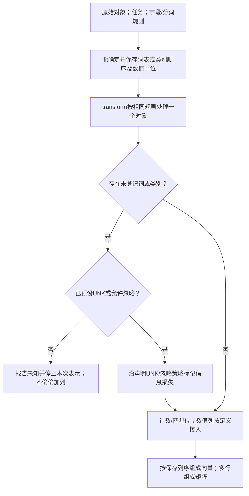

训练词表apple/banana/orange/UNK在REP1保存。apple pear到REP3发现pear未见，经REP4的预设UNK出口，REP5计数得1/0/0/1，REP6输出同四列。文字替代：保存字典→按原列计数→未知按既定策略。

图为补充版本，原p.11仅给五词频；名义intern例无预设UNK时应报告，不偷偷扩列。

读图自测：新文档orange orange pear应在哪一步用训练标签？

不用训练标签。REP5仅按固定词表计数，输出0/0/2/1；当前动作是表示，不是预测训练。

**迁移自测**：新文档`orange orange pear`得到哪四数？为什么`banana apple`不保词序？

答案与理由
0/0/2/1。词袋只数出现次数，不记录词的位置；若任务需要词序，应换有位置/上下文信息的表示。来源：笔记补充。

**所以呢**：先定义每列怎样由对象生成，才有可比较的矩阵；后面重要性评分接收的是这些已对齐的列。

**为什么需要它**

每行一个对象类别，特征集列给可能表示，末列定位课程应用。

| 对象 | 可能的特征集 | 本课在哪用 |
|---|---|---|
| 图像（苹果） | 尺寸 / 颜色 / 子图 / 像素 | W10 图像挖掘；p.21 CIFAR-10 用的是 3072 个像素 |
| 文档 | 关键词词频 | M03 §2.5.1 文档数据；维度灾难的典型来源 |
| 人（程序员、用户） | 一组 0/1 或数值属性 | Airbnb 的房源、超市的顾客 |
| 房源 | {accommodates, bedrooms, …} | T02 / T03 / T04 |

图像3072像素是p.21那个协议；原表对象类型不能单独指定最佳表示。

任何对象只要能变成"一行数"，就能进模型；变的方法就是特征工程。

**课件原例**

程序员漫画（p.10）；垃圾邮件段落 → 词频表（p.11）；两个微博账号 → 用户表（p.12）。

**🎙️ 课堂补充**（`00:41`–`07:08`，A · 课上展开）

教授将程序员外观的历史印象接到“特征→标签”关系，又用文档关键词计数、社媒账号资料说明怎样把对象变为可交给机器的数。*"we use the frequency of the keywords as the feature numbers"*（`03:27`）；用户可记录 *"the number of followers, the roles, the gender, the social tags"*（`06:20`）。**这段改变了什么**：确认p.10–12的对象表示思路；外观识别是课堂类比，不证明程序员能力或职业应由刻板外观确定。未把关于家人追剧/购物的闲谈当建模证据，人物专名按讲义而非ASR。

**💡 换个说法（笔记补充）**

用 Airbnb 想：同一套房源，特征集 1 = {accommodates, bedrooms, beds, bathrooms}（尺寸），特征集 2 = {city, property_type, cancellation_policy}（位置与类型），特征集 3 = 房源描述文本的词频（这份精简数据里没有）。T02 用的是 1 + 2 的一部分。M03 的相关矩阵告诉你特征集1内部有高相关线索（accommodates与beds约0.83），还需诊断任务相关的重复信息——这是 §2.4.1 "冗余特征"的现成例子。

另一个角度：把对象变成一行数，就像给每个人发一张统一格式的问卷——问卷上问什么（选哪些属性）决定了你事后能分析什么。问卷没问收入，事后再想分析消费能力就没戏了；问了一堆没用的题，只是让表更宽。

**⚠️ 常见误解**

- ❌ 以为图片、文本不能进模型。→ p.9、p.11 演示了怎么把它们变成数：切块、数像素、数词频。
- ❌ 以为特征越多越好。→ p.11 的 "tree" 列全是 0，只增加维度不增加信息；§2.4.2 会算这种"多"的代价。

**所以呢**：特征是选的，那什么叫"选得好"？下一节给定义——最有代表性，且因问题而异。

---

### 2.3 特征工程的定义与"因问题而异"（讲义 p.13–15）

**是什么**

**p.13 原题**给出的评价标准是“The most representative”（✅ 讲义标准）。选 RGB 区分图中苹果与橙子，是 ⚪ 参考作答：两者尺寸相同，颜色有差异。

若任务改为按大小分类，尺寸可能更合适。

**p.14 原题**的参考作答是选红框五官：图中卷发相似，五官有差异。该判断只针对所示图像，不保证所有人狗照片都能靠这些局部区分。

先说人话：苹果和橙子都是 10 cm × 10 cm，用尺寸根本分不开；用颜色一眼就分开——**对"分苹果和橙子"这件事，颜色这组特征比尺寸"有代表性"**。特征工程就是挑出（或造出）**最能把你关心的东西区分开**的那组特征。但"关心的东西"因任务而变：要分"大苹果和小苹果"，尺寸就比颜色有用。**所以没有"万能特征"，只有"对这个任务好的特征"。**

讲义 p.13：

> Feature Engineering: **select/create the most representative features.**

每行一个水果，长度/宽度单位cm，维度2。

| | Feature 1: length | Feature 2: width |
|---|---|---|
| Apple | 10 cm | 10 cm |
| Orange | 10 cm | 10 cm |

Apple与Orange都10/10，相同表示不足区分此两个标签。

每行同一水果，三列为R/G/B编码，沿讲义固定0–255尺度。

| | RGB 1 | RGB 2 | RGB 3 |
|---|---|---|---|
| Apple | 220 | 156 | 140 |
| Orange | 243 | 194 | 113 |

Apple的220/156/140不是三个水果。RGB不同只提供当前例的可区分线索。

> Which Feature set is better? **The most representative**

代表性（representative）在这里的意思是：**这组特征下，该分开的对象能不能分开**。尺寸特征集下，苹果和橙子的两行一模一样——无论什么模型都分不开；颜色特征集下两行不同——分得开。

p.14 的图片已在前轮视觉复核。卷发女孩与卷毛可卡犬并排，红框圈眼睛和鼻子，黄框圈卷发。

原题问“Which feature set is better?”。图中两者头发相似，五官有可见差异，因此红框更有区分力。同一照片取哪个局部，会改变可用信息。

p.15 **Feature Engineering is Problem-Specific**：

> - Task 1: find potential sport-game customers
> - Task 2: find potential Covid-19 related news subscribers

p.15 用外观相同的绿色人物示意用户，并用虚线划分区域；没有目标标签或坐标轴含义，不能说绿色代表目标客户。**💡 笔记补充**：体育客户任务可研究年龄/比赛兴趣，疫情新闻订阅任务可研究城市/健康话题兴趣；这些是候选特征，是否有用仍需数据验证，不是原图已标出的轴。

**为什么需要它**

§2.5 将用分数衡量“最有代表性（most representative）”。代表性取决于任务，所以没有适合一切任务的特征表。

T04 作业第 4 题要求为价格预测选 3 个特征并解释理由。理由应说明该属性如何帮助价格预测，例如 accommodates 与可容纳人数有关。

"代表性"在本讲后面有三个可算的版本，对应三种"问题"：

每行一种评价任务；中列写它优化的量，末列给详细机制。

| 任务 | "代表性"的可算版本 | 本讲哪节 |
|---|---|---|
| 分类（有标签） | 这个特征能把类别分得多纯 → Gini / 熵 | §2.7–2.8 |
| 任何有监督任务 | 用它训练出的模型准确率多高 → 包装模型 | §2.9 |
| 无监督（没标签） | 这个方向保留了多少方差 → PCA | §2.13 |

分类行数类别纯度；无标签PCA看方差，不拿两行分数直接排序。

**课件原例**

苹果 vs 橙子（尺寸相同、RGB 不同）；女孩 vs 狗（头发相同、五官不同）；体育客户 vs 疫情新闻订阅者。

**🎙️ 课堂补充**（`07:21`–`17:58`，A · 课上展开）

p.13 中尺寸相同，RGB 却能区分当前苹果和橙子。p.14 教授明确选择红框（`10:30`）：

> Red, right? So why? They're different.

p.15 对同一千名用户提出两种任务。体育游戏可看游戏时长及体育内容行为。疫情订阅可看相关阅读、评论与历史新闻付费。

爱阅读的人不一定愿意付费。教授因此强调先定问题（`17:58`）：

> without a problem specified before, we cannot tell which feature would be more important or representative.

**这段改变了什么**：上述字段是课堂举例，尚非验证有效的营销预测。具体分组依录音叙述，不能仅凭图色猜目标标签。

**💡 换个说法（笔记补充）**

把"代表性"想成"这组特征下，不同类的对象长得像不像"：像（尺寸下的苹果和橙子）就没有代表性；不像（颜色下的苹果和橙子）就有代表性。M03 §2.18 用眼睛看 Iris 的散点图矩阵，发现花瓣两列下三个品种"长得不像"、萼片宽度下"长得像"——那就是在用眼睛判断代表性；本讲要把眼睛换成公式。

另一个角度：特征工程像给证人画像——你问证人"他长什么样"，证人报"两只眼睛一个鼻子"毫无用处（人人都有），报"左脸有一道疤"才有用。有用的特征是**把目标和其他人区分开**的那些，而"其他人是谁"由任务决定：在疤脸帮里找人，疤又没用了。

**⚠️ 常见误解**

- ❌ 以为特征越多越"有代表性"。→ p.19–20 会说维度高的代价；p.21 会说这是权衡。多加一列"无关"的特征不会增加代表性，只会增加噪声。
- ❌ 以为 RGB 比尺寸"本质上"更好。→ 只是对"分苹果和橙子"这个任务更好；分"大苹果和小苹果"就得用尺寸。特征没有绝对的好坏。

**所以呢**：定义有了。做特征工程会遇到三个麻烦——造不出、重复了、太多了——下一节分三个子节讲。

---

### 2.4 三大挑战：造特征、冗余、维度灾难（讲义 p.16–21）

讲义 p.16 列出三大挑战：**Create/Choose Features from Raw Data · Duplicate/Redundant Feature · Curse of dimensionality**。§2.4.1 讲前两个，§2.4.2 讲第三个，§2.4.3 讲讲义给出的总原则——三角权衡。

#### 2.4.1 造特征与冗余特征（讲义 p.16–18）

**是什么**

**原题逐问及答案来源（p.17–18）**：p.17问代表性关键词｜⚪参考作答（笔记推断）：spam/email/class可作候选，须结合垃圾邮件/正文分类任务评价，不是教授公布的选词答案。p.18问已有temperature时Feeling有用吗｜✅讲义答案：“Feeling is redundant.”，按图中由温度确定冷暖的规则，后者无新信息；若现实Feeling还受湿度/风影响，就必须作为新条件重验，不能照搬。

先说人话：做特征的头两件难事——**① 从一堆原始数据里造出可用的特征**：一段文字有几百个词，哪些该数？一张图有几千个像素，哪些该看？这一步没有公式，靠对业务的理解。**② 两列说的是同一件事却都留着**：知道温度是 35°C 就知道"感觉是热"，第二列没有新信息，这叫冗余（redundant）特征——留着不丢信息，但白占一列，还会让模型糊涂。

**① 造代表性特征（p.17）**：再贴一遍垃圾邮件那段话，问 "What are the representative keywords?"——几百个词里，spam、email、class 能代表主题，the、is、of 不能。M03 §2.17 把这叫"特征创建"。

**② 冗余特征（p.18）**：

> Two Features：Temperature；Feeling: Cold – Warm - Hot
> Is feature "Feeling" useful if we already have feature "temperature"? **"Feeling" is redundant.**

M03 §2.17 的"售价 vs 销售税"、Airbnb 的 `accommodates` vs `beds`（相关 0.83）都是它。

**为什么需要它**

每行一个特征工程挑战；后果和应对按当前任务理解。

| 挑战 | 不处理会怎样 | 本讲怎么应对 |
|---|---|---|
| 造不出好特征 | 模型只能用原始列，"密度 = 质量 / 体积"这种关系线性模型自己算不出 | 本讲不展开，靠领域知识（M03 §2.17） |
| 冗余不删 | M02 多重共线性：系数不稳、`beds` 变负；存储和计算白费 | 特征选择：删掉分低或重复的（§2.5–2.12） |

beds负系数不能仅由相关0.83确定唯一成因；本表为动机，精确条件关系仍看M02/T02现文。

**课件原例**

垃圾邮件段落的关键词（p.17）；温度 vs 冷暖感（p.18）。

**🎙️ 课堂补充**（`18:07`–`20:34`，A · 课上展开）

教授重述从文本造词频、删重复信息，特别做了单向可恢复检查：温度可按例中规则得冷/暖/热，而冷/暖/热不能恢复精确温度。*"Can we use these three feelings to recalculate the exact temperature"*（`19:50`），紧接 *"We cannot."*（`20:02`）。**这段改变了什么**：冗余理由是当前确定映射下无增量信息，不是两列名字相近或任意高相关阈值；真实体感若还受风湿度影响，须重新评价而非机械删列。Feeling被ASR写filling，不引错专名。

**💡 换个说法（笔记补充）**

冗余特征像同一条消息用两种语言各说一遍——第二遍没有增加任何内容，只是让文件变长；而且如果两遍稍有出入，读的人反而不知道信哪个（这就是共线性让系数不稳的直觉）。

另一个角度："造特征"和"删冗余"是一增一减：增是把原始数据里藏着的信息挖出来变成列（关键词、密度），减是把重复的列去掉。本讲后面的方法全是"减"（选择、约简），本讲主要比较选列/约简；学习算法也能自动构造表示，PCA的新组合本身就是构造，不能说增只能靠人。

**⚠️ 常见误解**

- ❌ 把冗余特征当"错误数据"。→ "Feeling" 没错，只是**不增加信息**；删掉不丢信息、留着浪费空间还引入共线性（M02）。
- ❌ 以为两列相关就一定要删一列。→ 高相关仅是检查线索，没有统一的0.8/0.9冗余阈值；两列即使高度相关仍可能含不同的条件预测信息。完全可推导的重复列与经验高相关须分开，再以任务验证是否可删。

**所以呢**：第三个挑战最要紧——列太多。讲义用一个算例和一条理论说明它的代价。

#### 2.4.2 维度灾难：存储、稀疏与样本需求（讲义 p.19–20）

**是什么**

**原题逐问及答案来源（p.19–20，重复问分别保留）**

1. p.19“高维是否总好？”：⚪参考作答（笔记推断），不总是；存储、计算、固定尺度覆盖成本可能增加，预测优劣要验证。
2. p.20第1问同样问“高维是否总好？”：同一参考理由，不将重复题漏记。
3. p.20第2问内存：✅讲义答案800 GB。条件是密集float64、十进制GB，仅计数值阵列；下文逐步算。
4. p.20第3问“每个特征有用吗？”：⚪参考作答（笔记推断），无关或噪声列可能仅增成本，换任务重新评价。
5. p.20第4问“是否可能冗余？”：⚪参考作答（笔记推断），可能。p.18按温度确定Feeling是一例；高相关只是线索，不证明可删。

列太多可能带来三类代价：

- 存储：百万篇文档、十万个词的稠密表需 800 GB。
- 计算：更多列通常意味着更多运算。
- 覆盖：固定分辨率下，高维空间有更多区域，有限样本更难填满。

这些是维度灾难的典型表现。能否学到有效规律，还取决于任务、分布与模型约束。

p.19 的图片前轮已看过。网页、邮件及数字图书馆文档，用词项 T₁…T_N 的词频表示。

来源例有 ACM Portal、IEEE Xplore 和 PubMed。D₁ 的一行读数是 12、0、…、6，任务示例涉及 Sports、Travel、Jobs 类。

课件把困难与方案写为：

> Challenge: thousands of terms
> Solution: apply dimensionality reduction

p.20 随后给出两个理由及一个算例：

> Is High dimension always good?
> - **Large Data Space and Storage Requirement**
> - **Cause Sparsity**
>
> Practice：If we have 1,000,000 data with 100,000 dimensions, how much memory do we need? Ans：$10^6 \times 10^5 \times 8 = 8 \times 10^{11}$ (B) = **800 (GB)**
> Noisy Feature：Is every feature useful? Redundancy?
> Theory：Without any assumption, you need $O(1/\epsilon^{d})$ data to achieve $\epsilon$ error for $d$-dimensional data

（三个框都是图片，文字层没有；已用完整 PDF 视觉复核。）

存储先数格子，再乘每格字节数：

$$\text{内存}=m\times d\times8\text{ B}$$

覆盖问题另问固定网格需要多少格，不能拿它当通用分类错率：

$$\text{单位空间网格盒数量}\approx(1/\epsilon)^d$$

每行解释存储/网格公式一量；m数行、d数列、8为float64字节，epsilon为几何宽度。

| 符号 | 含义 | 已知 / 要算 |
|---|---|---|
| $m = 10^6$ | 样本数 | 已知 |
| $d = 10^5$ | 维度（列数） | 已知 |
| 8 | 每个浮点数占的字节数（`float64`） | 已知 |
| $\epsilon$ | 以下网格直觉中每轴的小区间宽度；原讲义称error但未定义任务/假设，不能直接当分类错率5% | 已知 |
| $O(\cdot)$ | "量级约为"——只看随 $d$ 增长的方式，不管常数 | — |

m=10^6、d=10^5形成10^11格；800GB只计数值阵列，不含对象/索引开销。

**数字例子（手把手）**（`verify_m04_originals_current.py（2026-10-01 当前复算）`）：

1. 格子数：1,000,000 × 100,000 = 100,000,000,000（$10^{11}$）个；
2. 每格 8 字节：$10^{11} \times 8 = 8 \times 10^{11}$ 字节；
3. 换算：$8 \times 10^{11} \div 10^{9} = 800$ GB（按十进制 GB）——一台普通电脑的内存是 16–32 GB，**装不下**；
4. 对比：$800 \div 32 = 25$——是一台 32 GB 电脑内存的 25 倍。

💡 几何覆盖例：把每轴范围缩放到 [0,1]，再按固定宽度划格。假设每格至少放一个点，所需点数等于格数。

下表用 $\epsilon$ 表示格宽、$d$ 表示维数。各轴格数相乘，得到整个网格的格数。

| 维数 | 格数 | 格宽 0.1 时 |
|---|---|---|
| 1 | $1/\epsilon$ | 10 |
| 2 | $(1/\epsilon)^2$ | 100 |
| d | $(1/\epsilon)^d$ | 10 维为 $10^{10}$ |

在此覆盖要求下，每加一维就多乘 10。它不是所有学习任务都必须满足的样本量下界。

内存计算先数格子：行数乘列数，再乘每格字节数。网格覆盖则按各维的分段数相乘，所以维数进入指数。

高维空间可能很大，有限观察难以覆盖所有格子。实际学习需求还受任务、分布、模型约束和有效维度影响，不能据此断言高维模型只能猜。

**极端 / 边界情况**：在上述均匀网格覆盖问题中，d=1约有1/ε格，d增加会急剧增格；这不证明文本/图像必须降维，稀疏表示或其他结构也可能有用。ε趋零时网格数趋无穷，不能直接推广为任何具体学习任务都不可能零误差。

**为什么需要它**

§2.13 的 PCA 会减少列数，从而缓解部分存储、计算和覆盖压力。这里连接 M03 §2.6.2 的稀疏性及 M02 §2.9 的过拟合讨论。

15 维是否够用、15000 维能否学习，都需要任务证据。p.20 的 800 GB 算例是可能的考题（⚪ 笔记推断）。

**课件原例**

文档 × 词项矩阵（p.19）；800 GB 算例与 $O(1/\epsilon^d)$（p.20）。

**🎙️ 课堂补充**（`20:35`–`24:45`，A · 课上展开）

教授用体育、旅游、招聘文档的多组词项，说明宽矩阵中会有大量零（`22:34`）：

> we may have a very sparse data set

随后讨论维度增加时的样本需求（`23:32`）：

> would go exponentially with the dimension of the data D.

**这段改变了什么**：课堂确认维度和数据量需要权衡。但录音没补完整分布与任务条件，不能推成通用错误率界。

本节保留网格覆盖的明确假设。这个时间窗没朗读 800 GB 算例，该数仍以书面讲义为来源。

**💡 换个说法（笔记补充）**

"维度灾难"两层意思要分开记：**工程层**——存储和时间随维度线性涨（800 GB）；**统计层**——要填满高维空间需要的样本数随维度指数涨。内存可以加，样本量往往加不了，所以统计层才是真正的"灾难"。

另一个角度：想象在一条街上找一个人，问十个人就够了；在一座城市里找，要问一万人；在一个国家里找，要问一亿人——"空间"每大一级，需要的信息量乘一大截。维度就是空间的"级"。

**⚠️ 常见误解**

- ❌ 以为维度灾难只是"内存不够"。→ 更根本的是统计层：数据在高维里稀疏，模型学到的是巧合。
- ❌ 以为算例里的 8 字节是随便定的。→ 是 `float64` 的标准大小；用 `float32` 可减半，但量级不变。

**所以呢**：列多有代价，列少又丢信息——讲义 p.21 用一个真实实验把这个取舍变成数字。

#### 2.4.3 信息、空间、时间的三角权衡（讲义 p.21）

**是什么**

先说人话：砍掉维度会丢一点信息，但省下大量存储和计算时间；**丢多少信息、省多少时间，是一笔可以算的账**。讲义用图像分类的真实实验给出这笔账：3072 维砍到 100 维，准确率只掉 3.3 个百分点，时间缩到 1/29。这就是本讲的总原则——**信息–空间–时间权衡**（trade-off between information, data space and computation time）。

讲义 p.21：

> Select the most representative feature set from raw data. **Trade-off between information, data space, and computation time**

配图是一张实验结果表（图片，视觉复核；图注引 Li & Póczos, "Utilize Old Coordinates: Faster Doubly Stochastic Gradients for Kernel Methods", UAI 2016）：CIFAR-10 图像分类（32 × 32 的彩色小图，10 类），用**原始像素**做特征 + 近似核 SVM：

每行一个CIFAR-10实验配置；Dimensions数输入列，Accuracy为同实验分类比例，Time为训练耗时。

| Dimensions | Accuracy | Time |
|---|---|---|
| 3072 (all) | 63.1% | ~2 Hrs |
| 100 (PCA) | 59.8% | 250 s |

原3072维63.1%、约2小时，PCA100维59.8%、250秒；3.3个百分点与28.8倍时间须分开，不是方差保留率。

原像素数为32×32×3=3072：宽、高、RGB三通道。

按p.21该次实验分别计算三种变化：

1. 维度由3072到100，约为原1/30。
2. 准确率63.1%到59.8%，下降3.3个百分点，不是相对下降3.3%。
3. 时间约2小时=7200秒，变为250秒，约原1/29。

这三项不是“信息保留率”。PCA保留输入方差与下游准确率需分别核。

**为什么需要它**

这张表把后面所有方法的目的说清楚了：不是为了"更准"，而是为了在**可承受的空间和时间内足够准**。业务上这可能就是"能不能每天重训一次"的差别。p.21 与 p.20 的 800 GB 是本讲仅有的两组硬数字，⚪ 推断容易被拿来出题："为什么要降维？举一个数字说明。"

**课件原例**

CIFAR-10 的 3072 vs 100 维（p.21）。

**🎙️ 课堂补充**（`24:54`–`29:45`，B · 讲了同讲义）

教授用3072像素特征、SVM训练约2小时，再压为100维、约60%准确率和几分钟讲效率/性能权衡。*"Now after PCA, I only have 100 real numbers"*（`28:37`），*"the time I used to change the model is reduced from two hours to a few minutes."*（`29:14`）。讲义精确值59.8%/250s及3.3个百分点继续按p.21；口语“约3%”不写成相对百分比或信息保留比例。PCA构造新坐标，不把其描述中的“remove features”改写成只选100原像素。

**💡 换个说法（笔记补充）**

这张表只支持该实验配置的性能权衡：准确率下降3.3个百分点，耗时约变为1/29。准确率之比不是信息保留比例，也不能证明舍弃2972方向大多是噪声。PCA保留方差与下游分类表现须分别计算和验证（§2.13）。

另一个角度：这是"压缩"的老故事——一张照片压成 JPEG 丢掉肉眼看不出的细节，体积缩到十分之一；音乐压成 MP3 丢掉听不见的频率。特征工程里的降维是同一种取舍：丢掉模型"看不出"的维度，换速度和空间。

**⚠️ 常见误解**

- ❌ 以为 PCA 到 100 维"白丢了 3.3% 准确率"。→ p.21 的重点是**三角权衡**：换来 29 倍的速度。
- ❌ 以为降维总会掉准确率。→ 有时反而升：砍掉的维度里有噪声，模型少学了噪声（M02 过拟合的解药之一）。

**所以呢**：三大挑战都指向同一个操作——**给特征打分、留好的**。下一段（讲义第三部分）讲怎么打分：先用最朴素的"纯度"，再把它精确成 Gini 和熵。

---
### 2.5 特征重要性与类纯度（讲义 p.22–23, p.27–29）

讲义第三部分从 p.22 的分段标题页开始。§2.5.1 给"特征重要性"下定义，§2.5.2 用最朴素的打分法——类纯度——在 Iris 上演示。

#### 2.5.1 特征重要性：给每个特征打一个分（讲义 p.22–23）

**是什么**

**p.23原题｜⚪参考作答（笔记推断）**：比较petal width与sepal length的分类重要性，可对同一父节点按给定子计数计算加权Gini/增益；按p.27–29/44给定的二分类表，花瓣宽度切后0优于萼长1/9。§2.10给复算；不能只凭点图目测恢复计数，也不能把分类分数与PCA方差直接比大小。

先说人话：M03 §2.18 用眼睛看 Iris 的散点图，"觉得"花瓣宽度比萼片长度更能分品种。本讲要把"觉得"变成一个数——**给每个特征打一个分，分越高越"有代表性"**，这个分就叫特征重要性（feature importance）。有了分，机器就能自动挑分高的特征，不用人盯着图看。

讲义 p.23 定义：

> **Feature importance**: Techniques that calculate a score for all the input features to measure the representativeness of different features.
> How to measure the importance of "petal width" and "sepal length" in this classification task? THEN, the machine can use this "importance score" to automatically select the most important feature.

配图是 Iris 的散点图（横轴 petal width、纵轴 sepal length，三色三类）。两句话的关键词：**score**（分数，可比大小）和 **automatically**（自动——分数是给机器用的，不是给人看的）。

**为什么需要它**

每行一个评价阶段，判断依据从图、计数到公式/API依次具体化。

| 阶段 | 判断依据 | 谁在判断 |
|---|---|---|
| M03 §2.18 | 散点图上三色分不分得开 | 人眼 |
| §2.5.2 | 切一刀后两堆的计数表 | 人数一数 |
| §2.7–2.8 | 计数表算出一个不纯度数值 | 公式 |
| T04 | `SelectKBest` / `feature_importances_` 直接输出分数 | 代码 |

M03人看图的观察，不能直接当T04某次scores_；后者依选定函数。

没有分数，特征选择只能靠人看图；特征有几千个时人看不过来。

**课件原例**

p.23 的 Iris 散点图与提问。

**🎙️ 课堂补充**（`29:51`–`34:26`，A · 课上展开）

教授说明从人看散点图转到机器可排序的一个分数：*"So we need a method to quantify the feature importance."*（`30:30`），有分数才可自动比较而不用逐图观察上千特征。**这段改变了什么**：分数是自动化选择的接口，不是特征的永久性质；比较限同任务/评价规则，不能把分类不纯度、检验统计量和PCA方差跨量纲排序。

**💡 换个说法（笔记补充）**

特征重要性像给候选人打分：面试官凭印象说"这个人不错"是 M03 的看图，打出"沟通 8 分、专业 9 分"才能排序、才能让 HR 系统自动筛——本讲教的就是打分的规则。

另一个角度："重要"永远是"对这个任务重要"（§2.3）。同一个特征在"分品种"里重要，在"预测花的重量"里可能不重要；所以讲义原话是 "in this classification task"。

**⚠️ 常见误解**

- ❌ 以为"重要性"是特征自带的属性。→ p.23 说的是"in this classification task"：换任务（比如分 Versicolour vs Virginica），重要的特征可能换。
- ❌ 以为分数有绝对含义。→ 分数只用于**同一任务内比较特征**；不同方法的分数（Gini 增益 0.33 vs F 值 1179）之间不能比大小。

**所以呢**：最朴素的打分法：用这个特征切一刀，看两堆纯不纯。

#### 2.5.2 类纯度：切一刀，数两堆（讲义 p.27–29）

**是什么**

先说人话：用一个特征把数据切成两堆（花瓣宽度小于某个值的归左边，其余归右边），然后数每堆里各类有几个。如果每堆里只有一种花，这一刀切得"纯"，这个特征就好；如果两堆都混着几种花，就差。这就是**类纯度**（class purity）——不用任何模型，只数数。

讲义 p.27–29（"Filter: without learning algorithm involvement. A simple measurement: class purity"）：

每行一种给定切分；Set1/Set2按二类Setosa/Non计数，末列完整讲义英文保留。

**petal width（p.27）**

切法：一条竖线（花瓣宽度小于某个值的归左边）

Set 1：Setosa 50 · Non-Setosa 0

Set 2：Setosa 0 · Non-Setosa 100

结论（讲义原话）：The two sets are **pure**!

**sepal length（p.28）**

切法：一条横线（萼片长度小于某个值的归下面）

Set 1：Setosa 50 · Non-Setosa 10

Set 2：Setosa 0 · Non-Setosa 90

结论（讲义原话）：The two sets are **not pure**!

**一般形式（p.29）**

切法：—

Set 1：Setosa $n_{10}$ · Non-Setosa $n_{11}$

Set 2：Setosa $n_{20}$ · Non-Setosa $n_{21}$

结论（讲义原话）：Class purity = simple counting of distinctiveness. **The purer, the better.**

petal width两子50/0与0/100纯；sepal length子50/10混。这不是当前CSV按6.0阈值重数的结果。

**把表读懂**：讲义在这里把三个品种简化成两类——Setosa（50 朵）和 Non-Setosa（另两种合计 100 朵）。用 petal width 切一刀：左边那堆 50 朵**全是** Setosa、右边 100 朵**全不是**——两堆各只有一种，"纯"。用 sepal length 切一刀：下面那堆 60 朵里 50 朵是 Setosa、**混进了 10 朵别的**——"不纯"。

为什么 sepal length 切不干净？回看 M03 §2.18.1 那张均值表：Setosa 的萼片长 5.0、Versicolour 5.9，两者有重叠区（一些 Setosa 长到 5.8，一些 Versicolour 只有 4.9）；而花瓣宽度 Setosa 最大 0.6、Versicolour 最小 1.0，**中间有一段空档**，一刀切在空档里就完全分开。

p.29 的 $n_{ij}$ 表是通用记号：$n_{10}$ = 第 1 堆里第 0 类（Setosa）的个数，以此类推。"The purer, the better"——但"纯"还只是一个形容词，要变成能比大小的数，就需要 §2.7 的 Gini 和 §2.8 的熵。

**为什么需要它**

有了"纯度"这个可比的量，"petal width 比 sepal length 重要"就不再是感觉，而是 (50, 0 / 0, 100) 比 (50, 10 / 0, 90) 更纯。它也是原计划/历史暂定的 W05 决策树每个节点在做的事：找一刀，让切出来的堆最纯；实际课次以 Canvas 为准。

**课件原例**

Iris 散点图两次切分（p.27 竖切、p.28 横切）；p.29 的 $n_{ij}$ 计数表。

**🎙️ 课堂补充**（`37:57`–`41:38`，B · 讲了同讲义）

课堂按p.27–29的二分类表计数，花瓣宽将50个Setosa与100个Non分开；萼片长的一个子堆混进10个非Setosa。*"in set 2, we do not have any mix"*，同段又说 *"in set 1, we have 10 data points mixed with statosa"*（均`39:52`；statosa为Setosa的ASR）。教师在`40:54`确认前一表更纯。这确认原PPT计数，**不是当前CSV按≤6.0重数的89/61**；只看一堆或把三类当二类都会换评分问题。

**💡 换个说法（笔记补充）**

把 p.27–28 想成"一刀切完，两堆各数一遍"：petal width 一刀，左边全是 Setosa、右边全不是——这个特征把 Setosa 这个类"讲清楚了"；sepal length 一刀，左边混进十个非 Setosa——这个特征讲不清楚。

另一个角度："重要"等于"知道了它就能猜对类别"。知道一朵花的花瓣宽度是 0.3，你能百分百说它是 Setosa；萼片长度取 5.5 时，原 Iris 数据中 Setosa 2 行、Versicolor 5 行，因此这个值在该数据里多数属于 Versicolor，不能说大概率是 Setosa。前者的信息量大，后者小——§2.8 的"熵"就是在精确地量这个"能猜对多少"。

注意讲义这里把三分类问题**合并成二分类**（Setosa vs Non-Setosa），是为了让计数表只有 2 × 2、好手算；T04 的 `chi2` / `f_classif` 处理的是原始三类。

**⚠️ 常见误解**

- ❌ 以为纯度只看一堆。→ 要看**切出来的所有堆**：p.28 的 Set 2 是纯的 (0, 90)，但 Set 1 不纯 (50, 10)，整体就不纯。§2.7.2 的加权平均就是为了把所有堆一起算。
- ❌ 以为"切一刀"的位置是随便定的。→ 讲义没说切在哪，但实际算法会试所有可能的切点、取最纯的那一个（原计划/历史暂定的 W05 决策树，实际课次以 Canvas 为准）；本讲只关心切完之后怎么打分。

**所以呢**：纯度要成为一个可比的分数，得先说清楚"用什么尺子"（§2.7 Gini、§2.8 熵）；而无论哪把尺子，用法都一样：分裂前算一次、分裂后算一次、看降了多少——下一节。

---

### 2.6 不纯度与增益：分裂前后比一比（讲义 p.30–34）

**是什么**

**p.30 原题｜⚪ 参考作答（笔记推断）**：若只比较训练表的 Gini 增益，ID 为 0.5，CarType 为 0.3375，Gender 为 0.02。

ID 每人一个纯叶，所以训练增益最大。预测新客户时，这种记忆能力并未证明可以泛化。

CarType 因而是更合理的候选，但这不是教授公布的标准答案。下面保留计算，并需另用复杂度控制和独立验证判断泛化。

先给每堆记录一个“混杂程度”，称节点不纯度（node impurity）。全同类时为0；各类均匀时较大。

比较一刀前后分三步：

1. 整个父节点先算不纯度 $P$。
2. 各子节点分别算，再按子人数占父人数的比例加权，得到 $M$。
3. 用 $P-M$ 看减少多少，称增益（gain）。

同一父节点和同一评分尺子下，增益较大等价于 $M$ 较小。它评价这一刀的训练分组，不是无条件业务或泛化排名。

讲义 p.30 给了一个 20 条记录（C0 10 条、C1 10 条，比如"会不会买"两类顾客）的例子，问 "Which test condition is the best?"：

每行同一个父节点上的候选切法；计数(C0,C1)数当前孩子成员。

| 特征 | 切法 | 各子节点 (C0, C1) | 一眼看 |
|---|---|---|---|
| Gender | Yes / No | (6, 4) · (4, 6) | 两堆都还是"六四开"，几乎没变纯 |
| Car Type | Family / Sports / Luxury | (1, 3) · (8, 0) · (1, 7) | Sports 那堆全是 C0，纯；另两堆偏向 C1 |
| Customer ID | c1 … c20 | (1, 0) · (1, 0) · … · (0, 1) · (0, 1) | 每堆只有一个人，当然"纯" |

Gender两堆各6/4与4/6。ID各一人虽纯，却无已证新客户规则。

p.31 **How to determine the importance**：

> - **Greedy approach**: Features with purer class distribution are preferred
> - Need a **measure of node impurity**：C0: 5 / C1: 5 → High degree of impurity；C0: 9 / C1: 1 → Low degree of impurity

"Greedy"（贪心）的意思：每次只看"这一刀"能让数据变多纯，选当下最好的，不考虑后面几刀——简单、快，但不保证全局最优（§2.12.2 的前向选择也是贪心）。"node"（节点）是决策树的术语：一堆记录就是一个节点，切一刀就是从父节点分出子节点；本讲借用这套词，W05 决策树会正式用。

p.33 三步：

> 1. Compute impurity measure (**P**) before splitting
> 2. Compute impurity measure (**M**) after splitting：compute impurity measure of each child node → compute the **average** impurity of the children (M)
> 3. Choose the attribute test condition that produces the highest gain **Gain = P – M**, or equivalently, lowest impurity measure after splitting (M)

先汇总分裂后的不纯度：

$$M=\sum_{i=1}^{k}\frac{n_i}{n}\,\text{Impurity}(i)$$

再与同一个父节点比较：

$$\text{Gain}=P-M$$

每行是增益计算角色；类别比例分母是子本人数，权重分母是父总人数，两者不同。

| 符号 | 含义 | 已知 / 要算 |
|---|---|---|
| $P$ | 分裂前父节点的不纯度 | 要算 |
| $k$ | 切出几堆 | 已知 |
| $n_i$、$n$ | 第 $i$ 堆的记录数、父节点记录数；$n_i / n$ 是权重 | 已知 |
| $\text{Impurity}(i)$ | 第 $i$ 堆的不纯度（用 Gini 或熵算，§2.7–2.8） | 要算 |
| $M$ | 分裂后的加权不纯度 | 要算 |

CarType的Family4人占父20人为4/20；其类比例1/4与3/4在节点内算。

p.34 比较两个候选分裂。父节点类别计数为 $(N_{00},N_{01})$，原不纯度记作 P。

按图中的节点名，先分别汇总两种切法：

| 特征 | 子节点 | 子不纯度的汇总 |
|---|---|---|
| A | N1、N2 | 将 $M_{11},M_{12}$ 按人数加权成 $M_1$ |
| B | N3、N4 | 按人数加权成 $M_2$ |

最后比较 $P-M_1$ 与 $P-M_2$。减少得更多的候选获胜。

**数字例子（手把手）**——用 p.30 的三个候选把流程走一遍（用 §2.7 的 Gini 当尺子，`verify_m04_originals_current.py（2026-10-01 当前复算）`；Gini 公式下一节给，这里先看流程）：

1. 父节点 (10, 10)：$P = 1 - 0.5^2 - 0.5^2 = 0.5$；
2. Gender：两堆 (6,4)、(4,6) 各 $1 - 0.6^2 - 0.4^2 = 0.48$；$M = \tfrac{10}{20} \times 0.48 + \tfrac{10}{20} \times 0.48 = 0.48$；增益 $= 0.5 - 0.48 = 0.02$；
3. Car Type：(1,3) → 0.375，(8,0) → 0，(1,7) → 0.21875；$M = \tfrac{4}{20} \times 0.375 + \tfrac{8}{20} \times 0 + \tfrac{8}{20} \times 0.21875 = 0.075 + 0 + 0.0875 = 0.1625$；增益 $= 0.5 - 0.1625 = 0.3375$；讲义把M显示为0.163，计算中不先舍入；
4. Customer ID：每堆 (1,0) 或 (0,1)，不纯度全是 0；$M = 0$；增益 $= 0.5$。

按训练Gini增益，Gender为0.02，Car Type约0.338，Customer ID为0.5，ID最大。这不是算错。

但ID给每人单独一堆，纯度来自记住记录，未给新客户c21可推广的判断规则。不能把训练增益最大当泛化最好。

因此Car Type是当前可继续验证的合理候选。课堂原话已表示偏好CarType（本节转录44:42）；候选的实际新客户效果仍需独立评价。

增益量的是这一刀前后的变化。切后约 0.163，需要与切前 0.5 相减，才能知道降低了多少。

子堆用 $n_i/n$ 加权：Sports 有 8 人，Family 有 4 人，前者在总体中的份额更大。简单平均会把 1 人堆和 100 人堆同等看待。

人数权重只解决汇总口径。ID 每人纯叶的过拟合，仍要靠复杂度约束、特征设计和独立验证处理。

**分裂边界**：每堆都纯时，加权不纯度为 0，增益达到父不纯度 P。

若各堆类别比例都与父节点相同，加权结果仍为 P，增益为 0。Gender 接近这个情况。

ID 把每条记录单列一堆，也能达到训练最大增益。但对新 ID 没有已证的泛化能力，训练增益最大不等于特征最好。

**为什么需要它**

"分裂前后比一比"是本讲所有特征重要性计算的**统一流程**，Gini 和熵只是换尺子，流程不变。它也是原计划/历史暂定的 W05 决策树核心（实际课次以 Canvas 为准）：决策树就是反复做"选增益最大的特征切一刀"，直到每堆都够纯。T04 的 `ExtraTreesClassifier.feature_importances_` 先把每个分裂的局部增益乘该节点占整棵树的样本权重，再按特征汇总、单树归一化，最后汇总多棵树；完整十行数据与两棵树过程见 §2.7.2。

**课件原例**

Gender / Car Type / Customer ID 三个候选（p.30）；p.31 的 (5,5) vs (9,1)；p.33 三步；p.34 的 A? / B? 示意。

**🎙️ 课堂补充**（`41:43`–`45:58`；`46:10`–`50:23`，A · 课上展开）

教授现场对比Gender、CarType、CustomerID，明确ID虽每堆一人而纯却不能推新客户：*"Imagine that there's a new customer coming, we cannot get the labels for the new customer with the new customer ID, right?"*（`44:29`），*"So I would prefer the car type."*（`44:42`）。休息后按P/M/gain重新讲减法：*"So the larger the gap, the better the feature"*（`47:42`）。**这段改变了什么**：CarType候选及ID泛化陷阱获课堂确认，但具体0.3375/0.5等完整精确复算仍标笔记计算。`45:58`/`46:03`宣布休息后`46:10`直接续讲，录音暂停使墙钟休息不体现为长时间戳空档。

**💡 换个说法（笔记补充）**

"增益"就是"用这个特征切一刀，混乱程度降了多少"。用 M03 的话说：分裂前的类别分布是一个直方图（两根柱子一样高 = 最乱），分裂后每堆各一个直方图；不纯度是"柱子有多平"，增益是"平的变尖了多少"。

💡 把样本想成红蓝球，特征是一种分袋规则。Gender 分完仍近似红蓝各半，纯度改善很少。

Car Type 能分出纯色袋，具有区分信息。按 ID 分则每袋一个球，当然纯；来了新编号，仍不知道它的颜色。

**⚠️ 常见误解**

- ❌ 把 $M$ 算成子节点不纯度的简单平均。→ 是**按样本数加权**的平均；大而纯的堆权重大。
- ❌ 认为 Customer ID 是最好特征因为增益最大。→ 在当前预测任务中，ID 只是无关标识，不能从新 ID 得到标签；若任务是身份核对或记录追踪，ID 可能有用。决策树里这叫偏向多值属性，C4.5 用增益率修正（⚪ 推断后续分类单元会讲）。
- ❌ 以为增益是"分裂后的不纯度"。→ 增益是**分裂前减分裂后**的差。

**所以呢**：不纯度具体怎么算？两把尺子——Gini（下一节）和熵（§2.8）。

---

### 2.7 ⭐ Gini 指数（讲义 p.32, p.35–39）

本讲第一把不纯度尺子。§2.7.1 单节点，§2.7.2 加权与二元分裂，§2.7.3 类别特征的分裂方式。

#### 2.7.1 单节点的 Gini：抽两个不同类的概率（讲义 p.32, p.35–36）

**是什么**

先说人话：Gini 指数用一个很直观的问题来量"乱"：**从这堆里随机抽两个（有放回），它们属于不同类的概率是多少？** 全是一类，抽两个必然同类，概率 0——最纯；两类各半，抽两个不同类的概率是 0.5——最乱。公式 $1 - \sum_j p_j^2$ 就是这个概率。

讲义 p.32 / p.35：

$$\text{GINI}(t) = 1 - \sum_{j} \big[p(j \mid t)\big]^2$$

每行解释单节点Gini量；比例与概率无单位，节点t是明确一堆。

| 符号 | 含义 | 已知 / 要算 |
|---|---|---|
| $t$ | 一个节点（一堆记录） | 已知 |
| $j$ | 类别编号（两类时 $j = 1, 2$） | 已知 |
| $p(j \mid t)$ | 节点 $t$ 中类 $j$ 的比例（讲义 NOTE 原话：relative frequency of class j at node t）：类 $j$ 的个数 ÷ 这堆的总数 | 数出来 |
| $\sum_j [p(j \mid t)]^2$ | 各类比例的平方和 = 随机抽两个属于同一类的概率 | 要算 |
| $\text{GINI}(t)$ | 不纯度，两类时 0–0.5 | 要算 |

(5,1)中p1=5/6，不是5/12。类别数nc决定最大值，不是节点人数。

讲义 p.35 两条性质：

> - **Maximum $(1 - 1/n_c)$** when records are equally distributed among all classes, implying least interesting information
> - **Minimum (0.0)** when all records belong to one class, implying most interesting information

（$n_c$ = 类别数；"least interesting"= 完全均匀混合，知道在这堆里对猜类别毫无帮助。）

**数字例子（手把手）**（讲义 p.35–36，`verify_m04_originals_current.py（2026-10-01 当前复算）` 复算一致）：

每行同6人不同类计数，p列为本行人数比例，计算列平方相加，末两列为相同无单位概率。

**C1 人数 = 0（C2 = 6）**

C2：6

$p_1$, $p_2$：0, 1

计算：$1 - 0^2 - 1^2 = 1 - 0 - 1$

Gini：**0.000**

抽两个不同类的概率：0（全是 C2，抽不出不同的）

**C1 人数 = 1（C2 = 5）**

C2：5

$p_1$, $p_2$：1/6, 5/6

计算：$1 - (1/6)^2 - (5/6)^2 = 1 - 0.028 - 0.694$

Gini：**0.278**

抽两个不同类的概率：0.278

**C1 人数 = 2（C2 = 4）**

C2：4

$p_1$, $p_2$：2/6, 4/6

计算：$1 - (2/6)^2 - (4/6)^2 = 1 - 0.111 - 0.444$

Gini：**0.444**

抽两个不同类的概率：0.444

**C1 人数 = 3（C2 = 3）**

C2：3

$p_1$, $p_2$：0.5, 0.5

计算：$1 - 0.25 - 0.25$

Gini：**0.500**

抽两个不同类的概率：0.5

首行0/6得Gini0；(1,5)得0.278为有放回抽两次不同类概率。显示舍入不先代替分数计算。

最后一列“抽两个不同类的概率”与 Gini 数值相同——这就是“Gini = 抽两个不同类的概率”的验证。

Gini 可理解为两次独立、有放回抽取所得类别不同的概率。两次都属类 1 的概率为 $p_1^2$，都属类 2 的概率为 $p_2^2$。

将各类平方相加，得到同类概率；再用 1 减去它，就得到不同类概率。

看两个十人节点的差别。表中最大类比例与 Gini 使用不同定义，不能混用。

| 类别人数 | 最大类比例 | Gini |
|---|---|---|
| 6、4 | 0.6 | $1-0.36-0.16=0.48$ |
| 9、1 | 0.9 | $1-0.81-0.01=0.18$ |

平方来自两次抽取的概率相乘；无需另靠“把差距拉大”解释它。

**极端 / 边界情况**：全是一类 → 0（最小）；两类各半 → 0.5，三类均分 → $1 - 3 \times (1/3)^2 = 0.667$，一般 $n_c$ 类均分 → $1 - 1/n_c$（最大）；空节点（没有记录）无定义；只有一条记录 → 0。

**为什么需要它**

Gini 是**决策树（CART）默认的分裂准则**，也是 sklearn `DecisionTreeClassifier` / `RandomForestClassifier` / T04 用的 `ExtraTreesClassifier` 的 `criterion='gini'` 默认值。闭卷考试要会手算一个节点：数比例、平方、相加、1 减。

**课件原例**

p.35–36 四个单节点算例。

**🎙️ 课堂补充**（`50:44`–`55:18`，A · 课上展开）

教授逐项解释类j、相对频率与平方，重点要求保存公式和符号定义：*"the most critical term in this expression that you need to remember is PJT, and the definition of PJT."*（`51:11`），*"you may be willing to add this expression and the definition in your cheat sheet."*（`51:19`）。**这段改变了什么**：计算不只抄公式，还要知道分母是当前节点总人数；PJT在原话对应p(j|t)，不是新变量名。原0.278/0.444精度仍按讲义；二类最大.5不推广到任意类别数。

**💡 换个说法（笔记补充）**

三句话记住 Gini：**纯是 0，乱是 0.5（两类）；越小越纯**。它就是"闭着眼从袋子里摸两个球、摸到不同颜色的概率"——袋子里全是红球，摸不出不同；红蓝各半，一半的机会摸到不同。

另一个角度：Gini 和 M03 §2.8 的频数分布是一回事的两种看法——频数分布是"每类几个"的表，Gini 把这张表压缩成一个数，专门回答"这张表有多平"。

**⚠️ 常见误解**

- ❌ 把 Gini 指数和"基尼系数"（经济学收入不平等）混为一谈。→ 名字来自同一个人（Corrado Gini），公式和用途不同；M04 p.60 的国家表里 "Poverty Index (Gini as percentage)" 就是经济学的那个。
- ❌ 以为 Gini 越大越好。→ 是**不纯度**，越小越纯；"增益"才是越大越好。
- ❌ 算 $p(j \mid t)$ 时分母用了父节点的总数。→ 分母是**这一堆自己的**总数：(5,1) 的 $p_1 = 5/6$，不是 5/12。

**所以呢**：单个节点会算了，切完之后有好几堆，要按人数加权——下一子节。

#### 2.7.2 分裂后的加权 Gini 与二元分裂算例（讲义 p.37–38）

**是什么**

先说人话：切一刀出来两堆（或更多），每堆各算一个 Gini，再**按每堆的人数占比加权平均**——人多的堆说话分量大。这个加权平均就是"分裂后的不纯度"，越小说明这一刀切得越好。讲义 p.38 用一个 12 人的例子算了一遍。

讲义 p.37：

$$\text{GINI}_{\text{split}} = \sum_{i=1}^{k} \frac{n_i}{n}\,\text{GINI}(i)$$

每行一个分裂量；k数孩子个数，ni/n是该孩子占父人数，不是平均每堆1/k。

| 符号 | 含义 | 已知 / 要算 |
|---|---|---|
| $k$ | 子节点（分区）个数：二元分裂 $k = 2$，Car Type 多路分裂 $k = 3$ | 已知 |
| $n_i$ | 第 $i$ 个子节点的记录数 | 已知 |
| $n$ | 父节点记录数；$n_i / n$ 是第 $i$ 堆占的比例，即权重 | 已知 |
| $\text{GINI}(i)$ | 第 $i$ 堆自己的 Gini（§2.7.1） | 要算 |
| $\text{GINI}_{\text{split}}$ | 分裂后的加权不纯度 | 要算 |

p.38两个孩子6/12恰好相等；其他题60/150与90/150不同，不能照抄1/2。

> Choose the attribute that **minimizes weighted average Gini index** of the children. Gini index is used in decision tree algorithms such as **CART, SLIQ, SPRINT**.

**数字例子（手把手）**（讲义 p.38，"Larger and Purer Partitions are sought for"；`verify_m04_originals_current.py（2026-10-01 当前复算）`）：父节点 C1 7 / C2 5，按 B 切成 N1 (5, 1)、N2 (2, 4)：

1. 父节点：$1 - (7/12)^2 - (5/12)^2 = 1 - 0.340 - 0.174 = 0.486$；
2. N1：$1 - (5/6)^2 - (1/6)^2 = 1 - 0.694 - 0.028 = 0.278$；
3. N2：$1 - (2/6)^2 - (4/6)^2 = 1 - 0.111 - 0.444 = 0.444$；
4. 加权：$\tfrac{6}{12} \times 0.278 + \tfrac{6}{12} \times 0.444 = 0.139 + 0.222 = 0.361$；
5. 增益：$0.486 - 0.361 = 0.125$。

这一刀让不纯度从 0.486 降到 0.361，有用但不算特别好（N2 那堆还很混）。

100 人的子堆应比 2 人的子堆占更大权重。即使前者 Gini 为 0.1、后者为 0，也不能把两堆简单平均。

p.38 的原话是：

> Larger and Purer Partitions are sought for

概率读法分两步。先以 $n_i/n$ 的概率选子堆，再在该堆内独立、有放回抽两条记录。两次类别不同的总概率，就是加权 Gini。

**极端 / 边界情况**：两堆都纯 → 0；两堆的类别比例都和父节点一样 → 等于父节点的 Gini（增益 0）；一堆很大很混、一堆很小很纯 → 加权后仍然很混（小堆的纯救不了大堆）。

**💡 树怎样训练，再给出特征重要性（笔记补充）**

单次分裂增益还不是整树特征重要性。先把每节点减少量换成全树尺度，再按特征汇总。

$$\Delta_t=\frac{n_t}{N}\left[G_t-\frac{n_L}{n_t}G_L-\frac{n_R}{n_t}G_R\right].$$

下面区分全树总人数、当前节点人数和子节点人数。比如根节点有 10 人，左子只有 6 人；两种分母不能互换。

| 符号 | 所指对象 | 来源/单位 |
|---|---|---|
| $N$ | 全树训练总权重 | 本例10人 |
| $n_t$ | 当前节点权重 | 根10；左子6 |
| $n_L,n_R$ | 当前两孩子权重 | 从成员计数 |
| $G_t,G_L,G_R$ | 父与两子Gini | 各节点自己的类别分母 |
| $\Delta_t$ | 此节点的全树贡献 | 加权不纯度减少，无单位 |

有样本权重时用权重和，本例权重就是人数。

1. 每特征累计所有以它分裂的 $\Delta_t$。
2. 除以全特征贡献总和，得到一棵树的归一重要性。
3. 总贡献为0时不除零，报告全零/无减少信息。

这种排序依赖训练模型，不是现实因果作用。

**完整两特征训练输入**（十行，C0/C1为目标类别）：

每行一个完整教学对象，F1/F2二元输入，类别是训练目标，ID仅定位。

| 原行 | F1 | F2 | 类别 |
|---|---|---|---|
| 1 | 0 | 0 | C0 |
| 2 | 0 | 0 | C0 |
| 3 | 0 | 0 | C0 |
| 4 | 0 | 1 | C0 |
| 5 | 0 | 1 | C1 |
| 6 | 0 | 1 | C1 |
| 7 | 1 | 0 | C0 |
| 8 | 1 | 0 | C1 |
| 9 | 1 | 0 | C1 |
| 10 | 1 | 0 | C1 |

第4行0/1/C0在根F1走左，再F2走1叶；这叶还含第5/6行C1，不能保证每个训练对象正确。

1. 根节点两类各 5 人，Gini 为 0.5。分别评价 F1、F2 两种切法。

下表列出各子堆计数与加权结果，近似值都保留前导零。

| 切法 | 子堆计数 | 加权子不纯度 | 根增益 |
|---|---|---|---|
| F1 | 6 行中 4/2；4 行中 1/3 | 5/12 ≈ 0.416667 | 1/12 |
| F2 | 7 行中 4/3；3 行中 1/2 | 10/21 ≈ 0.476190 | 1/42 |

F1 的左右子 Gini 分别为 4/9、3/8。比较本轮候选，F1 增益更大，因此先选 F1。
2. 左6行再按F2分成前3行纯C0、后三行1/2；子加权Gini2/9，左节点增益2/9，但占全体6/10，因此贡献 $(6/10)(2/9)=2/15$。根贡献为1/12。不能让一个小节点与根等权。
3. 前3行纯而停；后三行两特征都相同但标签混合，无法再有效分开；右4行也两特征同值，保叶内1/3比例。这里设置最大深度2，达到限制也停。叶输出训练类别频率，分类选最大者；同一输入不同标签时不能保证训练错误0。
4. 汇总同一特征在树中各节点的贡献，再除以总贡献 13/60。

| 特征 | 原贡献 | 归一后 |
|---|---|---|
| F1 | 1/12 | 5/13 ≈ 0.384615 |
| F2 | 2/15 | 8/13 ≈ 0.615385 |

若遗漏节点人数权，会误得 3/11、8/11。那些数不是本例定义下的重要性。
5. 新输入(F1,F2)=(0,1)，先沿F1进入左，再沿F2进入混合叶，输出训练频率C0=1/3/C1=2/3，选择C1。这个2/3是模型的叶内估计，不是已校准的现实正确率。

**接回T04的ExtraTrees（笔记补充运行协议）**

每节点随机挑候选特征/门槛，再按加权不纯度从当前候选中选好者。它不都穷举所有数值门槛；本示范不bootstrap。

固定2棵树、最大深度2、每节点两候选特征、种子0。训练F1/F2仅0/1，因此0与1之间的任意门槛都形成同样分区，便于手算。

既有运行记录的门槛分开读：树1根F1=0.339202、左F2=0.945506；树2根F1=0.447636，完整值见结果JSON。这些是旧固定协议证据，不宣称本轮重跑森林。

两树都完整长到叶，各重要性为5/13、8/13。森林先平均各树已归一向量，再按实现归一；预测平均叶概率，不能平均类别编号。

图问：一棵树怎样贡献特征重要性，再怎样汇合多树？箭头是训练控制，ET2回环处理节点，ET9回环初始化另一棵树。

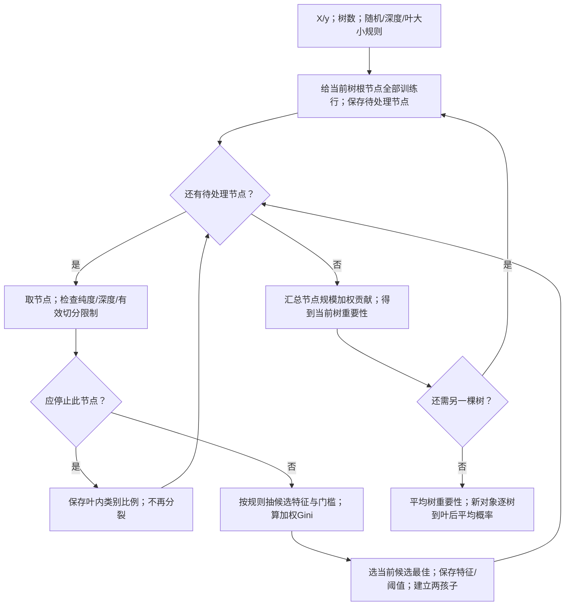

十行例从根5/5开始，ET6比较F1/F2增益1/12与1/42，ET7选F1建两孩子。左6行再以F2分裂，乘6/10后贡献2/15；叶保存计数。ET8按列汇总归一得F1=5/13、F2=8/13。文字替代：长树→按节点人数折算→树内归一→森林平均。

原p.38只给一次分裂；十行/两树/深度/种子是已声明补充协议，不把该树当教师原图。

读图自测：左节点与根直接等权，会把哪一步算错？

ET8的规模加权错了。左增益2/9须乘6/10；直接相加会得错误3/11、8/11，不能用它代替5/13、8/13。

数值、完整节点与新点预测由`verify_m04_added_processes.py`用本机sklearn1.5.1独立复算，输出`m04-added-process-results.json`。🔗 [DecisionTreeClassifier](https://scikit-learn.org/stable/modules/generated/sklearn.tree.DecisionTreeClassifier.html)、[ExtraTreesClassifier](https://scikit-learn.org/stable/modules/generated/sklearn.ensemble.ExtraTreesClassifier.html)（获取：2026-10-01）。多值属性及相关特征可能使重要性偏移；低训练不纯度不保证新样本好，必要时用独立验证与其他诊断，代价是额外数据/计算。下一节在有限类别切法中完整枚举候选。

**为什么需要它**

T04的树重要性先按节点占全树的样本权重加权不纯度减少，再按特征汇总；每树归一后再按森林实现汇总。上方十行完整训练例给出了节点权、归一分数和预测，不把小节点与根等权。闭卷考试要会手算一个二元分裂：父节点一次、两个子节点各一次、加权、相减。

**课件原例**

p.38 父 (7,5) → (5,1)/(2,4)，加权 0.361。

**🎙️ 课堂补充**（`55:22`–`01:00:31`，A · 课上展开）

教授明确区分简单平均与人数加权（`56:26`）：

> it's not a simple average of m11 plus m12 divided by 2, it's actually a weighted average.

例子是父 7/5、子 5/1 与 2/4；每个子堆权重为 6/12，切后约 0.361。随后强调计算要求（`01:00:17`）：

> That's one of the very few calculations you need to remember for the whole semester, okay?

**这段改变了什么**：定义及权重是明确学习要求。ASR 把 6/12 写为 0.612，末句还截断为：

> .486 minus .3

该转录原文照留，计算采用本节已复算的增益 0.125。完整十行 ExtraTrees 和两树示例仍属笔记补充，课堂没有演示。

**💡 换个说法（笔记补充）**

加权平均就是"按人头说话"：两个班的平均分合起来算全年级平均，人多的班影响大。切完之后每堆是一个"班"，堆的 Gini 是"班平均"，加权后是"年级平均"。

另一个角度：为什么讲义强调 "Larger and Purer"——一刀切下去，最理想的是"大堆纯"，其次是"小堆纯"；如果只有一个 2 人的小堆纯了、剩下 10 人的大堆还是一团糟，这刀几乎白切。加权就是把这个常识写进公式。

**⚠️ 常见误解**

- ❌ 加权用 $1/k$（几堆就除以几）。→ 权重是各堆的人数占比，不是堆数的倒数；p.38 两堆恰好各 6 人所以看不出区别，p.44 的 60 / 90 就不同了。
- ❌ 以为分裂后的数越小就一定越好、不用看父节点。→ 单看 0.361 说明不了什么，增益要减父节点；比较两个特征时父节点相同，比 $M$ 和比增益等价。

**所以呢**：数值型特征切一刀是两堆；类别型特征（Family / Sports / Luxury）有几个取值，可以切几堆，也可以合并成两堆——下一子节。

#### 2.7.3 类别型特征：多路分裂 vs 二路分裂（讲义 p.39）

**是什么**

Car Type 有三个值，可以分成三堆，也可以合并成两堆。前者叫多路分裂，后者叫二路分裂。

二路候选包括 {Sports, Luxury} 对 {Family}，以及 {Sports} 对 {Family, Luxury} 等。要逐一计算加权 Gini，再选最小者；合并方式会改变纯度。

讲义 p.39——CarType 三个取值的计数：Family (1, 3)、Sports (8, 0)、Luxury (1, 7)：

> Two-way split: **find best partition of values**

**数字例子（手把手）**（`verify_m04_originals_current.py（2026-10-01 当前复算）`）：

1. 各取值的 Gini：Family (1,3) → $1 - 0.0625 - 0.5625 = 0.375$；Sports (8,0) → 0；Luxury (1,7) → $1 - 0.016 - 0.766 = 0.219$；
2. 多路分裂：$\tfrac{4}{20} \times 0.375 + \tfrac{8}{20} \times 0 + \tfrac{8}{20} \times 0.219 = 0.163$；
3. 二路 {Sports, Luxury} / {Family}：合并后 (9,7) → $1 - (9/16)^2 - (7/16)^2 = 0.492$；(1,3) → 0.375；加权 $\tfrac{16}{20} \times 0.492 + \tfrac{4}{20} \times 0.375 = 0.469$；
4. 二路 {Sports} / {Family, Luxury}：(8,0) → 0；(2,10) → $1 - (2/12)^2 - (10/12)^2 = 0.278$；加权 $\tfrac{8}{20} \times 0 + \tfrac{12}{20} \times 0.278 = 0.167$。

每行一个展示切法，讲义值与复算值分别保留精度，不统一覆盖。

| 切法 | 分区 | 加权 Gini（讲义） | 脚本复算 |
|---|---|---|---|
| 多路分裂 | {Family} / {Sports} / {Luxury} | **0.163** | 0.1625 |
| 二路分裂 | {Sports, Luxury} / {Family} | 0.468 | 0.4688（讲义为截断，四舍五入应为 0.469） |
| 二路分裂 | {Sports} / {Family, Luxury} | 0.167 | 0.1667 |

二路Family/其余原0.468，精确0.46875，四舍五入0.469；这为已有勘误，不称本轮另改原资料。

读这张表：{Sports, Luxury} / {Family} 这种合并很差（0.469）——因为把纯的 Sports 和偏 C1 的 Luxury 混在一起，白白把 Sports 的纯度稀释了；{Sports} / {Family, Luxury} 就好得多（0.167），接近多路分裂的 0.163。

**为什么公式长这样**：二路分裂只是把合并后的两堆当作两个节点套 §2.7.2 的公式，没有新公式；"试所有合并方式"是因为公式本身不告诉你怎么合并，只能枚举。三个取值有 3 种二分法（p.39 列了两种，还有 {Luxury} / {Family, Sports}）；取值多时二分法数量爆炸（$2^{v-1} - 1$ 种），实际算法用启发式。

**分裂边界**：对同一批记录及同一类别计数，分得更细不会增加加权 Gini。因此，多路结果不大于最好的二路结果。

这只是训练纯度比较。细分可能过拟合，二路树也可以记住 ID。CART 采用二路结构，并不因此自动避免过拟合。

特征只有两个取值时，两种结构相同。

**💡 补齐第三种二分并走到终点（笔记补充）**

输入为每个CarType的两类计数与Gini准则，输出为最佳二分及分数；维护有限候选列表与当前最小值。三个取值的互补子集不重复计，因此只有三种二分。原p39展示两种，不能因此将第三种省掉。

每行一种完整二分，两边计数按各成员合并，末列是人数加权Gini。

| 单独一边/其余一边 | 两边计数 | 精确加权Gini |
|---|---|---|
| Family / Sports+Luxury | (1,3)/(9,7) | .46875 |
| Sports / Family+Luxury | (8,0)/(2,10) | 1/6≈.166667 |
| Luxury / Family+Sports | (1,7)/(9,3) | .3125 |

Sports/其余为(8,0)/(2,10)，加权1/6，最小。候选全部算完才确定。

第三种候选把 Luxury 单列，其余两类合并。先算两边的 Gini：

| 子堆 | Gini | 人数权重 |
|---|---|---|
| Luxury | $7/32=0.21875$ | 8/20 |
| Family/Sports | $1-(9/12)^2-(3/12)^2=3/8$ | 12/20 |

加权后为 $0.0875+0.225=0.3125$。三种候选中 Sports/其余最小，为 1/6；其增益为 $0.5-1/6=1/3$。

三个候选算完后停止。选择依据是数值，不能凭类别名字决定合并。

图问：三种互补不重复二分怎样选最好？箭头传递当前候选与最低分状态，回环不是随意重新取同一候选。

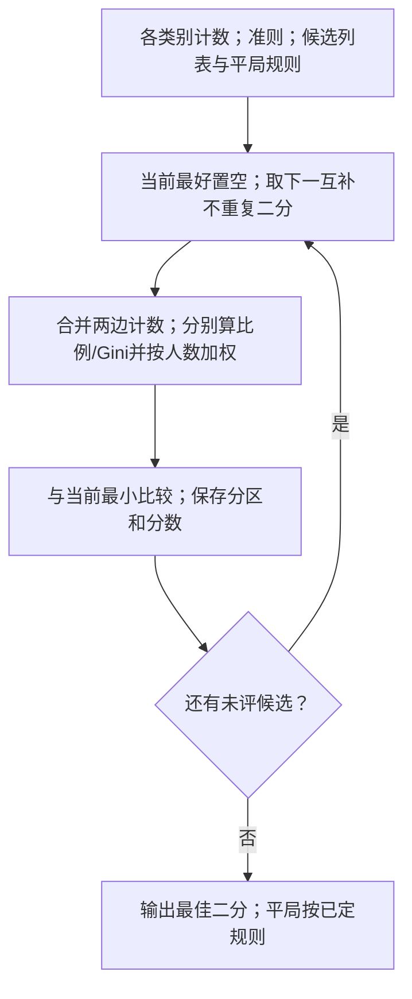

Family单独一边得0.46875，暂存；Sports单独得1/6，替换最好；Luxury单独得0.3125，不替换。三候选完毕到BS5，输出Sports/其余。文字替代：枚举→算两边→按人数加权→更新最好。

空/未知类别与平局政策先确定；多路表和二分列表不是同一候选集。

读图自测：算完前两候选见1/6较小，能立即停吗？

不能，BS4仍有Luxury候选。只有全部允许候选完成才停止；名字看起来相似不是停止依据。

本例v=3；一般不同取值v时，非空非全集子集有 $2^v-2$，互补两边同一分区再除2，得到 $2^{v-1}-1$。大v时完整枚举昂贵，具体实现采用的排序/启发式须另说明，不能声称任意猜法都最优。类别未知/缺失、空子节点及平局需先定政策。分区更细可降低训练不纯度，不等于泛化更好；二路树也能过拟合。

**迁移自测**：Family、Sports、Luxury 计数改为 (2,0)、(0,2)、(1,1)。求三种二分的加权 Gini。

答案与理由

Family/其余与 Sports/其余均为 0.25，Luxury/其余为 0.5。父 Gini 为 0.5，所以最大增益为 0.25。

前两种平局。可按指定候选顺序选 Family，但须报告平局。来源：笔记补充，可逐两边合并计数并加人数权复算。

**为什么需要它**

T04 与决策树部分需要解释类别特征怎么切，如 `property_type`、`city`。本课使用的 sklearn 树要求数值输入，并作二路分裂。

若先 one-hot，每个 0/1 列的一刀就对应“某一类 / 其余类”。编码原理见 M02；具体切法仍以实际编码后的列为准。

**课件原例**

p.39 CarType 三种切法。

**🎙️ 课堂补充**（`01:00:37`–`01:01:38`，B · 讲了同讲义）

教授回到p.39三种展示切法比较加权不纯度，提到二路约.167，问偏好后确认：*"The first one, right?"*（`01:01:24`），理由是最小Gini。这里第一种是本页多路展示，不是把所有可能二分穷举后的编号；原没展示的第三种二分仍由笔记补算，不能说教师当场算完三种二分。训练更纯也不保证泛化好。

**💡 换个说法（笔记补充）**

多路分裂像把信按省份分成三十几摞，二路分裂像先分"广东 / 非广东"。前者一步到位但每摞很薄，后者每次只问一个是非题、可以层层问下去（决策树就是这么长的）。

另一个角度：合并取值时的原则是"把长得像的合在一起"——Family 和 Luxury 都偏 C1，但合并仍让加权 Gini 从多路 0.1625 升到 1/6，存在小幅纯度损失；Sports 全是 C0，跟谁合都是稀释。可以先猜测，但本例完整枚举三种并计算后才确定最小；不能用名字或直觉替代计算。

**⚠️ 常见误解**

- ❌ 二路分裂只试一种合并。→ 三个取值有 3 种二分法，要都算，取最小。
- ❌ 以为多路分裂"更好"所以总该用多路。→ 多路的加权 Gini 更小是堆分细的必然结果，代价是过拟合与偏向多值属性；是否泛化仍需深度/叶大小/数据验证等约束，不由二路形式单独保证。

**所以呢**：第二把尺子——熵——公式不同，结论几乎相同；但它的直觉（"要问几个是非题"）在信息论和 W09 深度学习里还会再见。

---

### 2.8 熵、信息增益与单变量分数（讲义 p.32, p.40–42）

讲义 p.32 并列了三种度量：Gini（§2.7）、熵、单变量分数。§2.8.1 讲熵，§2.8.2 讲用熵算的增益，§2.8.3 讲第三种——统计检验的 $-\log p$。

#### 2.8.1 熵：猜类别要问几个是非题（讲义 p.32, p.40–41）

**是什么**

全是C2时不用再获得类别信息，不纯度为0。二类各半时，知道类别相当于得到1 bit信息。

熵（entropy）把每类出现时的信息量按其概率平均。类比例一多一少，平均值可以小于1 bit。

“问几个是非题”只帮助理解编码，不能当单个标签的可执行次数。若要无错确定一个未知二类标签，仍需至少问一次；不能真的问0.65次。

讲义 p.32 / p.40：

$$\text{Entropy}(t) = -\sum_{j} p(j \mid t)\,\log_2 p(j \mid t)$$

每行解释熵公式；p是类比例，log2以bit计平均信息，0log0按约定取0。

| 符号 | 含义 | 已知 / 要算 |
|---|---|---|
| $p(j \mid t)$ | 同 Gini：节点 $t$ 中类 $j$ 的比例 | 数出来 |
| $\log_2$ | 以 2 为底的对数：$\log_2 x$ 是"2 的多少次方等于 $x$"——$\log_2 1 = 0$，$\log_2 (1/2) = -1$，$\log_2 (1/4) = -2$，$\log_2 (1/8) = -3$。比例越小，$\log_2$ 越负、绝对值越大 | 查表或计算器（$\ln x / \ln 2$） |
| 前面的负号 | 比例都在 0–1 之间，$\log_2$ 都是负的，加负号让熵为正 | — |
| 约定 | $0 \log 0 = 0$（p.41 原话 "– 0 log 0 – 1 log 1 = – 0 – 0 = 0"）——不存在的类别不贡献 | — |
| $\text{Entropy}(t)$ | 不纯度，两类时 0–1 bit | 要算 |

p=1/4的log2为−2；乘类别概率再取负贡献0.5bit，不是这堆要问0.5次。

p.40 性质：

> - **Maximum $(\log n_c)$** when records are equally distributed among all classes implying least information
> - **Minimum (0.0)** when all records belong to one class, implying most information
> - Entropy based computations are **quite similar to the GINI index computations**

**数字例子（手把手）**（C1 1 / C2 5，`verify_m04_originals_current.py（2026-10-01 当前复算）`）：

1. 比例：$p_1 = 1/6 = 0.167$，$p_2 = 5/6 = 0.833$；
2. 对数：$\log_2(1/6) = -2.585$，$\log_2(5/6) = -0.263$；
3. 相乘：$0.167 \times (-2.585) = -0.431$，$0.833 \times (-0.263) = -0.219$；
4. 相加取负：$-(-0.431 - 0.219) = 0.65$。

读法：这堆几乎全是 C2，猜C2较可能正确，但无错确认单个未知标签仍需问一次；0.65是概率分布的平均信息量，批量编码才可讨论每标签接近这一比特极限。讲义 p.41 的三个例子（脚本复算一致）：

每行同6人的单节点分布，熵bit与Gini概率分别给数，不能跨两量直接比高低。

| C1 | C2 | 熵 | 对应 Gini |
|---|---|---|---|
| 0 | 6 | **0** | 0 |
| 1 | 5 | **0.65** | 0.278 |
| 2 | 4 | **0.92** | 0.444 |
| 3 | 3 | **1.00** | 0.5 |

(1,5)对应熵0.65、Gini0.278。此四单节点同序不证明任意加权分裂也同序。

最右两列**单调对应**——熵大的 Gini 也大，这里只列单个二类节点的均衡程度；不同候选的加权分裂排序可能不同，见本节后面的已复算反例。

概率为 p 的事件，其信息量定义为 $-\log_2p$ bit。概率 1/8 对应 3 bit。

熵把每类信息量按发生概率加权，再求和，所以出现 $\sum p(-\log_2p)$。以 2 为底对应二元区分，单位是比特。

这是平均信息量的度量，不能把某个事件的小数 bit 数直接当成实际提问次数。

**极端 / 边界情况**

- 全同类：熵0。
- 二类均分：$\log_2 2=1$ bit。
- 三类均分：$\log_2 3=1.585$ bit，为平均信息量。单符号二元前缀码0/10/11平均长5/3，仍大于熵，不能将熵当单次可执行问数。
- 一般 $n_c$ 类均分：最大为 $\log_2 n_c$。
- 某类概率0：按 $0\log0=0$ 约定，不直接算 $\log0$。

**为什么需要它**

决策树家族采用不同准则：CART 常用 Gini，ID3 用信息增益。C4.5 在熵基础上使用增益率。

考试若指定准则，就按题目计算。熵也连接信息论，以及 W09 深度学习的交叉熵损失。

**课件原例**

p.41 三个单节点的熵。

**🎙️ 课堂补充**（`01:01:42`–`01:03:24`，B · 讲了同讲义）

教授说明换用相对频率乘以log2的不纯度，强调 *"here is the log2, okay, log2 PJT."*（`01:01:48`），以1/6和5/6举例。该二分类例从纯0至均衡1；本节一般log2类别数边界、单标签实际提问次数及Gini/熵加权排序不同的反例仍保留为笔记补充，不能将口语“多数时候等价”升为必定等价定理。

**💡 换个说法（笔记补充）**

一句话记熵："猜类别要问几个是非题"——全是一类不用问，各半要问一个。

另一个角度是"意外程度"：一堆里绝大多数是同一类，抽到它毫不意外、抽到少数类很意外；熵是平均意外程度。全是一类时永远不意外，熵为零；各半时每次都可能意外，熵最大。

还有一个角度：熵是"压缩"的极限——要把一堆记录的类别标签存下来，平均每条最少要用多少比特；全是一类时一个比特都不用（大家都知道），各半时每条要一个比特。这也是为什么 W09 深度学习的损失函数叫交叉熵：模型猜得越准，需要的比特越少。

**⚠️ 常见误解**

- ❌ 用自然对数算熵再跟讲义对答案。→ 讲义用 $\log_2$；用 $\ln$ 会得到 0.45 / 0.64 / 0.69（数值不同、排序相同）。计算器上没有 $\log_2$ 时用 $\ln x / \ln 2$。
- ❌ 以为熵最大是 1。→ 两类才是 1；$n_c$ 类是 $\log_2 n_c$，三类 1.585。
- ❌ 以为熵和 Gini 必定给同一分裂排序。→ 单个二分类节点的两种不纯度都随混杂程度增大，但加权分裂准则不是同一个函数。反例：父节点 (10,10)，候选 A 分成 (1,3)/(9,7)，B 分成 (0,1)/(10,9)。加权 Gini 为 A 0.468750、B 0.473684，选 A；加权熵为 A 0.953215、B 0.948101，选 B。数值由 `verify_m04_mechanisms.py` 复算，不能推广本讲 CarType 与 Gender 恰好排序一致的例子。

**所以呢**：熵是单节点的尺子；切一刀之后同样要加权、要减——用熵算的增益叫信息增益。

#### 2.8.2 信息增益（讲义 p.42）

**是什么**

先说人话：把 §2.6 的"分裂前减分裂后"用熵来算，得到的增益叫**信息增益**（information gain）："切一刀之后，平均少问几个是非题"。结构和 Gini 的增益完全一样，只是尺子换了。

讲义 p.42：

$$\text{GAIN}_{\text{split}} = \text{Entropy}(p) - \sum_{i=1}^{k} \frac{n_i}{n}\,\text{Entropy}(i)$$

> Parent Node $p$ is split into $k$ partitions; $n_i$ is number of records in partition $i$. Choose the split that achieves most reduction (**maximizes GAIN**). Used in the **ID3 and C4.5** decision tree algorithms.

每行一个信息增益角色；权重为子人数/父人数，熵与增益用bit。

| 符号 | 含义 | 已知 / 要算 |
|---|---|---|
| $\text{Entropy}(p)$ | 父节点的熵 | 要算 |
| $n_i / n$ | 第 $i$ 堆的权重 | 已知 |
| $\text{Entropy}(i)$ | 第 $i$ 堆的熵 | 要算 |
| $\text{GAIN}_{\text{split}}$ | 信息增益，bit | 要算 |

CarType父熵1，子加权约0.380，增益0.620；M不是增益本身。

**数字例子（手把手）**——用 p.30 的 Car Type 算一遍（`verify_m04_originals_current.py（2026-10-01 当前复算）`）：

1. 父节点 (10,10)：熵 $= -0.5 \log_2 0.5 - 0.5 \log_2 0.5 = 1.0$；
2. 子堆：(1,3) 熵 0.811，(8,0) 熵 0，(1,7) 熵 0.544；
3. 加权：$\tfrac{4}{20} \times 0.811 + \tfrac{8}{20} \times 0 + \tfrac{8}{20} \times 0.544 = 0.162 + 0 + 0.218 = 0.380$；
4. 信息增益 $= 1.0 - 0.380 = 0.620$。

Gender：两堆 (6,4)、(4,6) 熵各 0.971，加权 0.971，增益只有 0.029。**排序和 Gini 一致**（Car Type ≫ Gender）。

**为什么公式长这样**：与 §2.6 的 Gain = P − M 完全同构——减法量"变化"，加权按人头；只是把不纯度换成熵。"增益"这个词在信息论里有确切含义：知道了特征的取值之后，对类别的不确定性减少了多少比特。

**熵增益的边界**：切后每堆纯，增益等于父熵；二类均分时为 1 bit。切后各堆比例不变，则增益为 0。

ID 每条记录一堆，可取得最大训练增益，却没有已证泛化能力。信息增益偏好多值属性，C4.5 用增益率校正。

增益率是信息增益除以分裂本身的熵；这也不能替代泛化验证。

**为什么需要它**

信息增益是 ID3 / C4.5 决策树选特征的准则；和 Gini 增益一样，也是 T04 树模型 `feature_importances_` 的一种口径（sklearn 里 `criterion='entropy'`）。考试若指定"用熵"，就按这一节算。

**课件原例**

p.42 GAIN 公式；ID3 / C4.5。

**🎙️ 课堂补充**（`01:03:29`–`01:04:54`，B · 讲了同讲义）

教师说同样先算父熵、各子熵，人数占比是权重：*"the number of data points in the subset i"*（`01:03:57`），*"divided by the total number of data points."*（`01:04:02`）。`01:04:18`称减后的量information gain，`01:04:50`/`01:04:54`提醒可拍入cheat sheet。原ASR P minus N不更换公式：父减加权子才是书面定义，原CarType详细数值仍标笔记复算。

**💡 换个说法（笔记补充）**

信息增益是获知特征后平均不确定性减少的 bit 数。本例标签熵由 1 bit 降为条件熵约 0.38 bit，减少约 0.62 bit；这是概率加权的信息量，批量编码解释需相应条件，不能当单个顾客只问 0.38 次是非题。

另一个角度：Gini 增益和信息增益像两把刻度不同的尺子量同一根棍子——本例数值不同（0.338 vs 0.620）且排序相同，其他候选分裂可排序不同，见前面的反例。答题时用哪把由题目定，不指定就用 Gini（算得快）。

**⚠️ 常见误解**

- ❌ 以为信息增益是"分裂后的熵"。→ 是**分裂前减分裂后**的差；p.42 的公式整体才是 GAIN。
- ❌ 以为信息增益和 Gini 增益可以直接比大小。→ 单位不同（bit vs 概率），只能各自内部比较特征。

**所以呢**：Gini 和熵都要"切一刀"；第三种度量不切，直接对每个特征做统计检验——下一子节。

#### 2.8.3 单变量分数：−log(p 值)（讲义 p.32）

<!-- 类型: 公式型 -->

**是什么**

Gini 和熵先选一种切法，再评价它。单变量检验则逐个特征比较类别间差异，不必先选分裂阈值。

以 F 检验为例，原假设是各类均值相同。p 值表示：在原假设和检验条件成立时，出现当前或更极端 F 统计量的概率。

小 p 值提示数据不支持原假设，但不保证效应大、预测好或存在因果。讲义将 $-\log p$ 作为一种单变量分数，让越小的 p 对应越大的分数。

T04 的 `SelectKBest` 按传入函数返回的 F 或卡方统计量排序。它不等于在内部计算负对数。

讲义 p.32 第三条：**Univariate Score $= -\log(p\text{-value})$**。p.55 也提到 "ANOVA test, Univariate Score"（ANOVA = 方差分析，检验几组的均值是否有差异，下面解释）。

$$\text{score}(f) = -\log_{10}\big(p\text{-value}(f)\big)$$

每行一个单变量评分量，f是特征，p是检验尾概率，不是类别比例p(j|t)。

| 符号 | 含义 | 已知 / 要算 |
|---|---|---|
| $f$ | 一个特征 | 已知 |
| p 值 | 假设检验的 p 值（M02 §2.6.2）：本例ANOVA的原假设为各类总体均值相同；检验条件成立时观察到当前或更极端F的右尾概率，不是完全独立的通用检验 | 由检验算出 |
| $-\log_{10}$ | 把 0.01 变成 2、0.0001 变成 4 | 要算 |

−log10(0.01)=2；−log10(0.0001)=4，先声明对数底，不混API直接返回F。

两种常用检验各有适用对象：

- ANOVA F 检验比较各类均值，使用组间均方与组内均方之比。连续特征常用它，T04 对应 `f_classif`。
- 卡方检验比较类别间的计数分布。T04 的 `chi2` 要求输入非负，适合相应计数特征。

**数字例子（手把手）**（Iris 四个特征对三类做 ANOVA，`verify_t04.py`）：

1. F 值：sepal-L 119.26、sepal-W 47.36、**petal-L 1179.03**、**petal-W 959.32**；
2. p 值：$1.7 \times 10^{-31}$、$1.3 \times 10^{-16}$、$3.1 \times 10^{-91}$、$4.4 \times 10^{-85}$；
3. 取负对数：$-\log_{10}(1.7 \times 10^{-31}) = 31 - \log_{10} 1.7 = 31 - 0.23 = 30.8$；同法得 $15.9$、**$90.5$**、**$84.4$**。

排序 petal-L > petal-W > sepal-L > sepal-W——与 §2.10 用 Gini 得到的结论、与 M03 §2.18 的散点图一致。

p 值是原假设及检验条件下的尾概率。越小，当前数据与原假设越不相容；它不是实用区分力的直接证明。

为方便展示，可以取负对数。例如以 10 为底时，$10^{-91}$ 和 $10^{-31}$ 分别变成 91 和 31。若换对数底，分数也会按固定比例变化。

**p 值的边界**：原假设成立不代表 p 通常接近 1。连续、校准的检验下，p 可遍布 0 到 1。

不能把单次 p 当成原假设为真的概率。p 很小时，负对数分数会很大，Iris 示例中可到约 90。

数值下溢可能给出 p=0，此时负对数发散。为显示截断时须说明策略，不能假定软件都自动截断。

SelectKBest 通常直接使用统计量。同样差异在更大样本中可能产生更小 p，所以跨数据比较这类分数要控制样本量。

**机制展开（笔记补充）：F 值、p 值和选特征分数不是同一个数**

输入是一列数值特征及每行类别，输出是该特征的 F 统计量与 p 值。单因素 ANOVA 的原假设（$H_0$）是**各类总体均值相同**；它不直接检验“这个特征与标签完全没有任何关系”。要衡量的是“类与类之间的平均差异”相对于“同类内部自然波动”是否够大。

**平方和的对象**：先比较“类均值之间差多少”，再比较“同类点内部差多少”。所需符号如下。

| 符号 | 含义 |
|---|---|
| $N,g$ | 总样本数、类别数 |
| $N_a,\bar x_a$ | 第 a 类人数、该类均值 |
| $\bar x$ | 全体均值 |
| $SS_B$ | 类均值偏离全体均值的平方，按人数加权之和 |
| $SS_W$ | 各点偏离自己类均值的平方之和 |

两个平方和都由数据计算，单位都是特征单位的平方。

先计算类均值间的变化：

$$SS_B=\sum_{a=1}^{g}N_a(\bar{x}_a-\bar{x})^2.$$

再计算每个点相对本类均值的变化：

$$SS_W=\sum_{a=1}^{g}\sum_{i\in a}(x_i-\bar{x}_a)^2.$$

最后各除自由度，再取比值：

$$F=\frac{SS_B/(g-1)}{SS_W/(N-g)}.$$

$N$是总人数，$g$是类数，$N_a$是第a类人数；两平方和用原特征单位平方，F为无单位比值。

**为什么公式长这样**：不能只看类间差，因为整列数都很散时，均值差也可能很大；分母提供同类波动的参照。两个平方和除以各自自由度（独立变化量数量，分别为 $g-1$ 和 $N-g$），再取比值，才形成 F 统计量。在各点独立、类内分布近似正态且方差相等的经典条件下，$H_0$ 成立时这个比值服从相应 F 分布；这些条件是 p 值计算的依据，不能只看结果小就忽略。

**数字例子（手把手）**：三类特征值分别 $(1,2),(3,4),(5,6)$；本例是笔记补充，脚本 `verify_m04_selection.py` 的 `anova_toy` 段。

1. 类均值 $1.5,3.5,5.5$，全体均值 $3.5$。
2. $SS_B=2(1.5-3.5)^2+2(3.5-3.5)^2+2(5.5-3.5)^2=16$。
3. 每类两个点各离类均值 0.5，$SS_W=6\times0.5^2=1.5$。
4. 类间自由度 $3-1=2$，类内自由度 $6-3=3$，故 $F=(16/2)/(1.5/3)=16$。
5. 在上述原假设与条件下，查自由度 $(2,3)$ 的 F 分布右尾，得到 $p=0.025095$。它说的是“**若 $H_0$ 和模型条件成立，得到至少这么极端统计量的概率**”，不是“$H_0$ 有 2.51% 概率成立”，也不是“差异有 97.49% 概率是真的”。

**流程图：从数据到两种输出**

图问：同一列怎样同时给F和p，二者为何不是同一个分数？实线箭头是计算依赖，AF3后两支是不同输出。

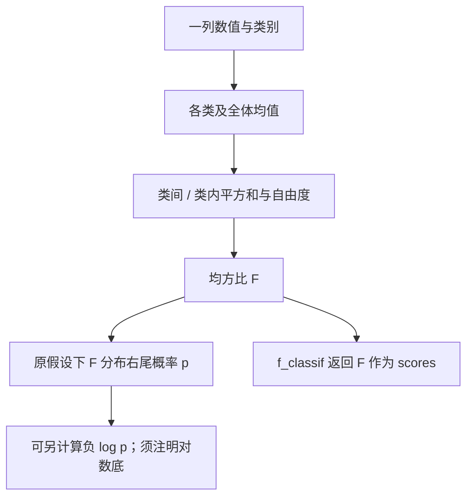

三组(1,2)/(3,4)/(5,6)从AF1得均值1.5/3.5/5.5，总均3.5。AF2得SSB16/SSW1.5、df2/3；AF3得F16。AF4按经典条件的F右尾得p0.025095；AF5直接供选择器F。文字替代：均值→两个平方和→F→可选尾概率/负log。

p需要相应检验条件；AF6另指定对数底，不冒称SelectKBest内部用负log。

读图自测：把1−p写成“特征有效概率”，是哪一箭头允许的吗？

没有。AF4是H0条件下的数据尾概率，不能倒置为假设概率；预测有效性另用未参与选列的数据。

**与 API 的对应**：`f_classif` 返回两组数组：F 统计量、p 值；`SelectKBest(f_classif)` 按 F 统计量选择，不是先把 p 值取负对数。`chi2` 和 `f_regression` 同样各返回自己的统计量与 p 值，不是同一个检验。对同自由度、同侧尾概率而言，F 越大对应 p 越小，可得到相同排序；不同自由度时不可直接假定。p 值下溢为零时，负对数可能无限大，F 仍可能有可比较的有限数。

**停止与边界**：每列有限次均值 / 平方和与尾概率计算后完成，不训练预测模型。所有类均值相同、类内仍有变化时 $F=0$；类内全无变化而类间有变化时分母零，F 可能为无穷；整列常数会出现 $0/0$，须明确处理而非当作最强特征。小 p 不证明效应大、预测好或因果关系；只测均值也可能漏掉均值相同但形状不同的分布关系。对多列反复检验还涉及多重比较，不能把每次 0.05 当成整体错误率。

**迁移自测**：把上述所有数乘以 10，类间和类内平方和都乘 100，F 和 p 不变。若有人将 $1-p$ 写成“这个特征真实有效的概率”，错误发生在把原假设条件下的数据尾概率倒置成了假设概率，修正方法是写清 $H_0$、统计量、尾概率和实际预测验证。

🔗 输出数组的含义见 [scikit-learn f_classif](https://scikit-learn.org/stable/modules/generated/sklearn.feature_selection.f_classif.html)，检验假设见 [SciPy f_oneway](https://docs.scipy.org/doc/scipy/reference/generated/scipy.stats.f_oneway.html)（获取：2026-09-30）。本次复算环境为 sklearn 1.5.1、SciPy 1.13.1；线上文档版本与本机版本分开记录。

**平方和核对与迁移（笔记补充）**：前述1/2、3/4、5/6例的总均值3.5，总平方和17.5，恰为类间16加类内1.5；恒等式 $SS_T=SS_B+SS_W$ 来自组内偏差和为0，跨项相消。先核这条再解释F/p。

**新变式**：三组数据为 0/1、3/4、6/7。求组均值、三种平方和、自由度、F 与 p，并判断“1−p 是特征有效概率”。

答案与理由

三组均值是 0.5、3.5、6.5，总均值 3.5。下表按类间、类内、总体列出计算中间量。

| 量 | 类间 | 类内 | 总体 |
|---|---|---|---|
| 平方和 | 36 | 1.5 | 37.5 |
| 自由度 | 2 | 3 | 5 |
| 均方 | 18 | 0.5 | — |

F 为 36，在 F(2,3) 下右尾 p 为 0.008。1−p=0.992 不是特征有效的概率。

尾概率依赖独立、正态及等方差等条件；预测效果仍需独立验证。来源：笔记补充，读者先作答，再与计算核对。

**SelectKBest的完整选择与变换（笔记补充）**

训练六行，原列为F1/F2/F3，目标为A/A/B/B/C/C：

| 行 | F1 | F2 | F3 | 类别 |
|---|---:|---:|---:|---|
| 1 | 0 | 0 | 0 | A |
| 2 | 1 | 1 | 1 | A |
| 3 | 3 | 3 | 0 | B |
| 4 | 4 | 4 | 1 | B |
| 5 | 6 | 6 | 0 | C |
| 6 | 7 | 7 | 1 | C |

1. 每列分别做f_classif，F为(36,36,0)，p为(0.008,0.008,1)。本表行是训练对象，类仅用于fit评分。
2. 指定k=2，先检查分数有效，再保两并列高分列F1/F2，掩码(True,True,False)。
3. transform按原列序取列。第二行输出(1,1)；新输入(5,5,0)输出(5,5)，不需要新标签或重算F。

形状6×3→6×2，新行1×3→1×2。列身份与掩码一起保存。

图问：新行为什么只取列而不重算统计分数？箭头表示fit后保存的掩码应用。

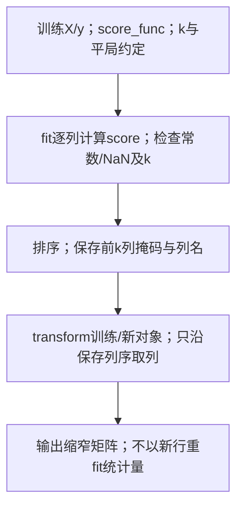

六行三列例在KB1得F36/36/0，KB2按k2保存F1/F2掩码。新(5,5,0)到KB3输出(5,5)，KB4结束；无需新标签。文字替代：训练评分/选列，使用固定列序。

同分无普遍API保证；本例k2保两并列列，k1需额外声明策略。

读图自测：只有新对象一行，能用它重fit F分数吗？

不能作为复用路径。它改变训练状态，且一行不满足本例ANOVA自由度条件；应按KB3旧掩码变换。

本教学版先要求1≤k≤列数；实际sklearn1.5.1还有k=0/all等接口行为，越界也可能警告后返回全部，不能依赖库替你决定目标。平局的API选择没有普遍保证；本例k2同时保两并列列，k1时应明示策略或承认接口未指定，不能把另一个并列选择判错。常数列会使检验退化，NaN不是“最强”分数。单变量评分看不到某些组合交互；合用相关列也可能重复。数值与掩码已由`verify_m04_added_processes.py`实际核对。

**为什么需要它**

它是**过滤模型里最常用的一族**——不要求特征能"切一刀"，任何连续特征都能算，且不用训练模型、极快，所以 sklearn 的过滤器主要用它。T04 作业第 1 题问 "what does f_classif represent"，答案就是这一节。

**课件原例**

p.32 三种度量并列；p.55 "ANOVA test, Univariate Score"。

**🎙️ 课堂补充**（本讲lecture段无直接对应，D · ❓ 未录到）

本讲lecture在p.32度量处实际详讲Gini与熵，但没有清晰讲−log(p-value)或推导ANOVA/SelectKBest的证据。后段tutorial说明f_classif/chi2/f_regression，单独由T04记录，不能把调用说明冒称本节完整推导已在lecture完成。**不可降权**：保留本节已有公式、F/p/API区别及数值例的讲义/笔记补充边界，不将未提等同不考。

**💡 换个说法（笔记补充）**

三把尺子的区别：Gini 和熵问"切一刀之后两堆纯不纯"，单变量分数问"各类在这个特征上的分布差不差得开"——前者像看切完的结果，后者像看切之前的原料。

每行一种评分尺子；直觉、单位范围和应用分别读，完整原说明保留。

**Gini**

直觉：抽两个不同类的概率

取值范围（两类）：0–0.5

用在：CART；sklearn 树默认；T04 `feature_importances_`

**熵**

直觉：平均要问几个是非题

取值范围（两类）：0–1 bit

用在：ID3 / C4.5；信息论、深度学习的损失函数

**$-\log(p)$**

直觉：将原假设下尾概率转成越大越不相容的量，不是有关系的概率

取值范围（两类）：0–∞

用在：讲义的一种评分；API 另读其返回统计量

熵的问问题类比只为平均信息/编码；实际单标签提问次数边界见§2.8.1，不将0.65解释成可执行问数。

另一个角度：p 值在 M02 是用来判断"回归系数是不是 0"的，这里是本ANOVA用来检验各类总体均值是否相同，不能据此涵盖一切类别关联——同一个工具，换了一个原假设。

**⚠️ 常见误解**

- ❌ 以为 $-\log(p)$ 里的 $p$ 是类别比例。→ 是**假设检验的 p 值**，跟 $p(j \mid t)$ 完全是两回事，讲义把三条放同一页容易混。
- ❌ 以为分数越高特征就"越好"到可以跨数据比较。→ 分数随样本量涨，只能在同一数据内比较。

**所以呢**：以上都是"不碰学习算法"的过滤法。另一条路是直接用模型准确率——下一节把两大模型对齐讲。

---

### 2.9 过滤模型 vs 包装模型（讲义 p.24–26, p.43, p.50）

讲义把"过滤 vs 包装"这对概念拆在四个地方（p.25 提出、p.26 过滤模型图、p.43 包装模型图、p.50 对比），本节合并讲：§2.9.1 五类度量与两大模型的划分，§2.9.2 包装模型与两者对比。

#### 2.9.1 五类评价度量与过滤模型（讲义 p.24–26）

**是什么**

p.24 列出五类文献度量，p.25 再分成两种评价方式：

- 过滤：根据纯度、相关性或检验等数据性质打分，不训练预测模型。
- 包装：先选模型，再用它的验证表现评价特征集。

按本讲分类，前四类属于过滤，第五类准确率评价属于包装。

讲义 p.24 五类评价度量（每类给了两篇文献）：

每行一个文献度量家族，来源列保作者，末列区分已展开与背景未展开。

| 度量类别 | 讲义引用 | 意思 | 本讲对应 |
|---|---|---|---|
| Information measures | Yu & Liu 2004；Jebara & Jaakkola 2000 | 特征带来多少信息 | 熵 / 信息增益（§2.8） |
| Distance measures | Robnik & Kononenko 2003；Pudil & Novovičová 1998 | 不同类在这个特征上离得多远 | ⚪ 未展开 |
| Dependence measures | Hall 2000；Modrzejewski 1993 | 特征和类别的相关 / 依赖程度 | 相关系数 / 卡方（M03 §2.11；T04 `chi2`） |
| Consistency measures | Almuallim & Dietterich 1994；Dash & Liu 2003 | 用这组特征能否把类别"无矛盾"地区分开 | ⚪ 未展开 |
| Accuracy measures | Dash & Liu 2000；Kohavi & John 1997 | 训练出的模型准确率 | 包装模型（§2.9.2） |

Distance/Consistency未给具体原算法，不能因名字已列就编候选实现。

p.25：

> - **Filter**: Without learning algorithm involvement
> - **Wrapper**: With learning algorithm involvement
> - Same objective: select the optimal feature set.

p.26 是过滤模型的流程图（纯图，已视觉复核：数据 → 评价度量 → 特征排序 / 子集 → 交给学习算法）。**注意顺序**：先选完特征，再给模型；模型完全不参与选。

**为什么需要它**

p.24 的 Distance 与 Consistency 是文献分类目录，没有用于后面的数值评分。Consistency 关注相同特征表示是否对应冲突标签，原页未给具体算法。

距离的计算及尺度边界见 [[M05-聚类-Kmeans层次与DBSCAN#2.3.1 欧氏距离：把"像不像"变成一个数（讲义 p.18–19）|M05 §2.3.1]]。本讲的信息、依赖和准确率评价分别见 §2.8、§2.8.3、§2.12.2。

T04 第 1 题问“Is this a filter model or wrapper model”。`SelectKBest(f_classif)` 只做统计检验，因此属于过滤，不训练预测模型。

**p.26原图的两阶段与数据角色**

第一阶段只做选择：

1. 从Full Set与Training Data出发，Feature Generation产生候选Subset。
2. Measuring接收候选与训练数据，给Measurement。
3. “Good or Stop?”为否则生成下一候选，为是则保存Best Subset。

第二阶段才训练最终Classifier，并用未参与选择的Testing Data评价Accuracy。

原图未规定度量、生成法或停止阈值。本篇§2.8.3/§2.12.2给了明确例子，不能由框图补造原参数。训练内选择分数与最终测试成绩是两份证据。

图问：过滤选择与最后模型测试怎样分两阶段？箭头表示数据/步骤交接，最终测试不回传候选评分。

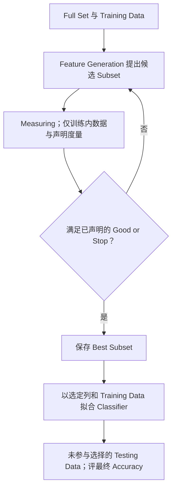

用六行SelectKBest例：训练内测F保F1/F2，FL3按给定k规则完成，到FL4保存子集；FL5可另训练最终分类器，FL6才使用未参与选择的测试数据。文字替代：统计选列→再训练→最后测试。

原图不指定k/生成/停止；此走图为笔记补充接口说明，不制造最终Accuracy数。

读图自测：测试结果不好时立刻用同测试标签再挑列，再称该测试独立，错在哪？

最终测试被用于选择，FL6不再独立；回退要重新安排未参与选择的评价数据，并保存版本。

**课件原例**

p.24 五类度量表；p.26 过滤模型流程图。

**🎙️ 课堂补充**（`34:30`–`37:41`；`01:05:20`–`01:05:55`，A · 课上展开）

教授解释五类度量后，过滤法只用统计/频数不调用最终学习算法：*"We only use summary statistics to measure the importance."*（`36:13`）。流程先提出子集、测分数，差则重新选择，好则给学习算法；`37:31`举回归、树、logistic不参与该阶段。**这段改变了什么**：确认过滤阶段与后续模型训练分离，不能把“没有学习算法”误解为永远不训练最终预测器；Distance/Consistency目录仅口头概述，具体实现仍未给。

**💡 换个说法（笔记补充）**

过滤模型像**面试前看简历**：不用真让人干活，凭学历、经历打分，快、不依赖具体岗位，但可能错过实际能干的人。

另一个角度："without learning algorithm involvement"这句话的实际含义是：过滤法算出来的分数**对任何模型都一样**——你换回归、换决策树，`SelectKBest` 选出来的仍是那两列。它不预先绑定最终估计器，分数可复用，但不等于统计上无偏，也不能保证任何模型都喜欢选出的列。

**⚠️ 常见误解**

- ❌ 以为过滤模型"不准"。→ 它只是**不针对特定模型**优化；数据统计性质强的特征通常对任何模型都有用。本篇树SFS与RFE就选出不同组合，说明最后仍需按任务和验证协议核对。
- ❌ 以为五类度量要背全。→ 讲义只展开了其中两三类；记住"前四类不用模型、第五类用模型"这个划分就够。

**所以呢**：另一阵营——包装模型——用模型本身打分，下一子节看它怎么做、和过滤模型怎么取舍。

#### 2.9.2 包装模型与两者对比（讲义 p.43, p.50）

**是什么**

先说人话：包装模型的打分办法最直接——**想知道一组特征好不好，就用它训练一个模型，看准确率**。针对所选估计器与验证协议，因为分数来自其表现；不保证更准。通常较慢，因为每试一组特征就要训练一次，特征多时组合数爆炸。

p.43 包装模型两步：

> Step 1: use a pre-determined learning model to input the feature
> Step 2: use the **model performance** as feature importance score

（配图：候选特征子集 → 学习模型 → 准确率 → 反馈回来选下一个子集，形成闭环。）**注意是闭环**：模型的表现反过来指导下一轮选什么特征；模型是选特征过程的一部分。

p.50 对比（讲义原文）：

每行比较Filter/Wrapper，讲义英文保留；“High accuracy”是原描述，效果保证另有边界。

**与学习分离？**

Filter model：Separating feature selection from model learning

Wrapper model：Relying on a predetermined machine learning model

**依据**

Filter model：General characteristics of data (information, distance, dependence, consistency)

Wrapper model：Predictive accuracy as goodness measure

**特点**

Filter model：**No bias toward any learning algorithm, fast**

Wrapper model：**High accuracy, computationally expensive**

Filter不绑定最终估计器；Wrapper按指定模型与验证协议评价，不保证任意数据更准。

**"expensive"有多贵**：4 个特征，包装模型要试的子集有 $2^4 - 1 = 15$ 个，每个训练一次模型——15 次；40 个特征就是 $2^{40} \approx 10^{12}$ 次，不可能全试（§2.12 的贪心搜索就是为了把它降到几百次）。过滤模型只对每个特征算一次分，40 个特征算 40 次。

**为什么需要它**

对上 T04 的四种代码，作业第 1 题就是这张表：

每行一个T04接口例，类型依讲义宽泛口径与教材分类分开。

| T04 代码 | 类型 | 理由 |
|---|---|---|
| `SelectKBest(chi2 / f_classif)` | **过滤** | 只做统计检验，没有模型 |
| `ExtraTreesClassifier` + `SelectFromModel` | 包装（讲义口径）/ 嵌入式（教科书口径） | 分数来自训练好的模型 |
| `RFE` | **包装** | 每轮训练模型、删最差的一个 |
| `SequentialFeatureSelector`（作业 Q3） | **包装** | 每轮训练模型、加最好的一个 |

RFE读当前模型重要性重训删列；SFS比较候选CV，不以同叫包装合并算法。

**p.43 原图的两阶段**：阶段1仍生成候选子集，但把过滤图的 Measuring 换成 Learning Algorithm，用模型 Accuracy 回传给“Good?”；否则生成下一候选，是则保存 Best Subset。阶段2重新以选定列和训练数据拟合，得到 Classifier，再以 Testing Data 评 Accuracy。因此“筛选时训练了模型”与“最后测新数据”是两个环节；选子集可用训练内CV，不能偷用最终测试集反复挑。训练内选择的七候选CV、最终掩码与补充测试动作见 §2.12.2；三行测试数只是给定教学数据，不是独立总体泛化证明；原图没有唯一停止阈值。

图问：包装中每个候选的模型如何服务于选择，最后模型又如何形成？箭头是控制及验证分数反馈。

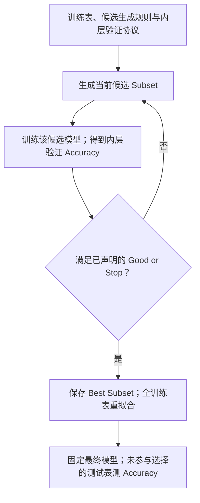

原Iris七候选CV路径里，WP1取单列petal-L，WP2每折训练/验证，均分0.946667。固定k2继续比较第二轮，平局选择萼长/瓣长；完成后WP4按固定训练全集重拟合，再WP5评价独立数据。文字替代：候选训练/验证→锁子集→重拟合→最终测试。

三行测试2/3是给定教学轨迹，不是独立总体泛化成绩；“Good or Stop”采用明示固定k，不能偷换全前缀策略。

读图自测：WP2的CV均分能否直接标为WP5测试Accuracy？

不能。WP2已被用于选列；真正独立最终评价须另有未参与选择的数据或外层验证。

**课件原例**

p.43 包装模型两步 + 闭环图；p.50 对比页。

**🎙️ 课堂补充**（`36:18`–`36:30`；`01:06:02`–`01:07:06`；`01:09:11`–`01:09:23`，B · 讲了同讲义）

教授用预定学习模型的性能给子集打分：*"use the performance or the accuracy of this learning algorithm as the indicator for the feature importance"*（`01:06:37`），*"So this is called the wrapper model."*（`01:06:56`）。后续选择段只再次提filter/wrapper可作评分（`01:09:11`–`01:09:23`，由late片核对），并未逐条朗读p.50所有快/高精度/成本特征；这些仍是书面讲义与机制解释。低训练误差不保证新数据高准确率，原独立测试/CV角色照保留。

**💡 换个说法（笔记补充）**

包装模型像**按具体岗位试用**：考察任务表现、成本高，换岗位通常需重新评价；在用于选择的样本上表现好，不保证新情境同样好。实践中常先过滤粗筛（几千个特征砍到几十个），再包装精选。

💡 教科书还常列“嵌入式（embedded）”：训练模型时顺带选择特征。例子是 M02 的 Lasso 将部分系数压到 0，以及树的 `feature_importances_`。

讲义没有单列此类。考试先按讲义两分法回答，需要时再说明树重要性和 Lasso 也可归入嵌入式。

**⚠️ 常见误解**

- ❌ 以为包装模型给出的是"特征本身"的重要性。→ 它给出的是"**对这个模型**"的重要性，换模型分数会变（RFE 换 `LogisticRegression` 结果可能不同）。
- ❌ 以为"快"和"准"可以兼得。→ p.50 的两行就是取舍：过滤通常节省候选拟合且不绑定估计器，包装更针对所选模型和验证协议；独立测试是否更准必须实测，试更多子集还可能对验证集过拟合。

**所以呢**：讲义在讲完两大模型后留了一道课堂小测——用 Gini 算 p.28 那次"不纯"的切分。这是本讲最可能原样进考卷的一页。

---

### 2.10 课堂小测：用 Gini 评价 sepal length 的切分（讲义 p.44）

**是什么**

**p.44 原题｜⚪ 参考作答（笔记推断）**：按题给 Setosa/Non-Setosa 表，切后加权 Gini 为 1/9≈0.1111。增益 1/3 是笔记另补的比较量。

原点图的横线目测约为 6.0，但当前 iris.txt 不能重现题给计数。下面分别记录严格与含等号的阈值，三元组仍按原类别顺序。

| 当前数据切法 | 左侧计数 | 右侧计数 |
|---|---|---|
| sepal-L < 6.0 | (50,26,7) | (0,24,43) |
| sepal-L ≤ 6.0 | (50,30,9) | (0,20,41) |

两者都不对应原表 50/10 与 0/90。本题据原表回答，不宣称重建了原图分区，也不从二类表反推三类人数。

先说人话：讲义 p.44 把 p.28 的表贴回来，要求**算分裂后的 Gini 指数**：用 sepal length 切 Iris，Set 1 = (Setosa 50, Non-Setosa 10)，Set 2 = (Setosa 0, Non-Setosa 90)。讲义只给题和两个公式，**没给答案**——下面按 §2.6 的三步走一遍。

$$P = \text{GINI}(\text{父}), \qquad M = \tfrac{n_1}{n}\text{GINI}(\text{Set}_1) + \tfrac{n_2}{n}\text{GINI}(\text{Set}_2), \qquad \text{增益} = P - M$$

每行是p.44给定二类表的已知/待算量；父150，两子60/90，不能以当前CSV另配数字。

| 符号 | 含义 | 已知 / 要算 |
|---|---|---|
| 父节点 | 150 朵：Setosa 50、Non-Setosa 100 | 已知 |
| $n_1 = 60$、$n_2 = 90$ | 两堆的人数 | 已知 |
| $\text{GINI}(\cdot)$ | §2.7.1 的公式 | 要算 |

Set1类别比例50/60，权重60/150，原题直接答案是切后Gini1/9，不是增益1/3。

**数字例子（手把手）**（`verify_m04_originals_current.py（2026-10-01 当前复算）` 复算）：

1. 分裂前：$P = 1 - (50/150)^2 - (100/150)^2 = 1 - 0.1111 - 0.4444 = 0.4444$；
2. Set 1（分母是本堆的 60）：$1 - (50/60)^2 - (10/60)^2 = 1 - 0.6944 - 0.0278 = 0.2778$；
3. Set 2（分母 90）：$1 - (0/90)^2 - (90/90)^2 = 1 - 0 - 1 = 0$；
4. 加权（权重 60/150 = 0.4、90/150 = 0.6）：$M = 0.4 \times 0.2778 + 0.6 \times 0 = 0.1111$；
5. 增益：$0.4444 - 0.1111 = 0.3333$。

**对照 p.27 的 petal width 切分**：Set 1 = (50, 0)、Set 2 = (0, 100)，两堆 Gini 都是 0，$M = 0$，增益 $= 0.4444$。

每行同父节点的一候选，P父不纯度、M加权子不纯度、P−M增益，均用Gini。

| | 分裂前 P | 分裂后 M | 增益 P − M |
|---|---|---|---|
| sepal length（p.44） | 0.4444 | **0.1111** | 0.3333 |
| petal width（p.27） | 0.4444 | **0** | 0.4444 |

sepal行0.4444→0.1111，降0.3333；petal行到0。比较限该给定二分类表。

**结论：petal width 的增益更大（0.444 > 0.333），更重要**——与 p.27–28 的"纯 / 不纯"直观一致，也与 T04 `SelectKBest` 选中花瓣特征、M03 §2.18 散点图的观察一致。

**为什么公式长这样**：这道题没有新公式，是 §2.6 的流程 + §2.7 的尺子；分母各堆自己的人数、权重各堆占总数的比例、最后用父减子——三处都是"按人头"的思想。

**边界比较**：若萼片长度也切成 (50,0)/(0,100)，其增益同为 0.4444，两特征打平。

若两堆都是 (25,50)，比例与父节点相同，便有 $M=P$、增益 0。

改成原三类时父 Gini 为 2/3，但二类合并表不足以恢复三类子计数。须给出具体分配再比较，不能将本题排序推广到任意合并口径。

**为什么需要它**

这是讲义唯一留白的计算题。课堂要求能按分布比较 Gini 和熵，因此原题值得练习；录音未直接报出数值答案，也没证据表明当堂举行了测验。

计算时区分三件事：

1. 子堆概率分母是各自人数 60、90。
2. 子堆权重是 0.4、0.6，不能各取 0.5。
3. 原题问切后 Gini，直接答案约 0.1111。

展示分母与权重即可回答原问。增益约 0.3333 属笔记补充，不能说原题另问过增益。

**课件原例**

p.44 = p.28 表 + p.32 / p.37 两个公式。

**🎙️ 课堂补充**（`01:07:11`–`01:07:53`，B · 讲了同讲义）

教授明确该页是旧学期题：*"But this is the quiz from last semester."*（`01:07:19`），并要求给定分布或数据时能用Gini/熵选代表特征：*"you should be able to do that using the Gini index or entropy."*（`01:07:25`）。**本堂没有举行这页小测，也没有清晰报出切后.1111的直接答案**；本节1/9与追加增益1/3仍是按原给定50/10、0/90表的笔记复算。后段tutorial按当前CSV用≤6.0产生不同计数，两个来源分别保留，不互相冒充答案。

**💡 换个说法（笔记补充）**

用熵再算一遍（同一题，换尺子，`verify_m04_originals_current.py（2026-10-01 当前复算）`）：$P = -\tfrac13\log_2\tfrac13 - \tfrac23\log_2\tfrac23 = 0.918$；Set 1 (50,10) 熵 0.650、Set 2 熵 0；$M = 0.4 \times 0.650 = 0.260$；信息增益 0.658。petal width：信息增益 0.918。**排序相同**。答题若没指定尺子，用 Gini（算得快）并注明。

另一个角度：这道题的 Set 1 (50, 10) 和 p.36 的单节点例子 (1, 5) 是同一个比例（五比一），Gini 都是 0.278——考试时见过的算例可以直接套，不用重算。

换个读法：按萼片长度分成较短、较长两堆，较短堆混入了其他品种。Gini 衡量的是这种类别混杂程度。

在题给表中，花瓣宽度的切法得到纯堆，所以比这一次萼片长度切法更能区分类别。

**⚠️ 常见误解**

- ❌ 只算 Set 1 的 Gini 就交卷。→ 题目问的是"after split"，是**加权平均**。
- ❌ 加权用 1/2、1/2。→ 两堆大小不等（60 vs 90）。
- ❌ 把 0.111 当成"增益"。→ 0.111 是分裂后不纯度，增益要用 0.444 减它。
- ❌ 分母写成 150。→ $p(j \mid t)$ 是**本堆内**的比例：Set 1 的 Setosa 比例是 50/60，不是 50/150。

**所以呢**：会打分了，下一段（讲义第四部分 p.45–69）讲怎么用分数**减少特征数**——选子集，或者干脆换一组新坐标。

---
### 2.11 降维两条路：特征选择 vs 特征约简（讲义 p.45–49）

**是什么**

减少列数有两条路。**特征选择**留下原列的子集：Iris 四列只留花瓣长度和花瓣宽度，结果仍有原来的列名。

**特征约简**产生新列。以 PCA 为例，原列各乘一个系数后相加，成为一个新坐标。

💡 示意组合如下；系数说明“加权和”的形态，实际投影须沿用训练时的中心化与尺度。

$$z_1=0.36\times\text{萼长}-0.08\times\text{萼宽}+0.86\times\text{瓣长}+0.36\times\text{瓣宽}.$$

M02 的回归式也是线性组合。选择作“留或不留”的离散决定，PCA 则确定连续权重，输出 z₁、z₂ 等新轴。

讲义 p.46 列本段提纲；p.47 **特征选择**：

> **Definition**: A process that chooses an optimal subset of features according to a objective function
> **Objectives**: To reduce dimensionality and remove noise; To improve mining performance——Speed of learning · Predictive accuracy · Simplicity and comprehensibility of mined results

"objective function"（目标函数）就是 §2.5–2.9 的打分：Gini 增益、$-\log p$、模型准确率——按分数挑子集。三个目标里第三个（**可理解性**）是选择独有的优势：留下的是原始列，结论能用业务语言说。

p.48 **特征约简**：

> Feature reduction refers to the **mapping** of the original high-dimensional data onto a lower-dimensional space. Given a set of data points of $p$ variables $\{x_1, x_2, \dots, x_n\}$, compute their low-dimensional representation: $x_i \in \mathbb{R}^d \to y_i \in \mathbb{R}^p\ (p \ll d)$
> Criterion for feature reduction can be different based on different problem settings: **Unsupervised setting: minimize the information loss · Supervised setting: maximize the class discrimination**

每行一个高维映射记号；i数对象，d原列数，p目标列数。

| 符号 | 含义 |
|---|---|
| $x_i \in \mathbb{R}^d$ | 第 $i$ 个样本，原始 $d$ 维（$\mathbb{R}^d$ = "$d$ 个实数组成的向量"；Iris $d = 4$） |
| $y_i \in \mathbb{R}^p$ | 它的低维表示，$p$ 维，$p \ll d$（$\ll$ = 远小于；讲义 p.48 的 $p$ 与"p variables"重名，是笔误，见 §9.3） |
| mapping | 一个把 $x_i$ 变成 $y_i$ 的规则；PCA 里是线性的（乘一个矩阵） |

p.48的“p variables”重名按§9.3保原出处，不与目标p当同原维数。

没有标签时，可要求压缩尽量少丢信息，例如 PCA。有标签时，还可以要求投影后类别分得开。

💡 LDA 是后一类目标的例子。p.48 只给监督目标，未点名 LDA；此处用于对照，不参与本讲计算。

p.49 对比：

每行比较选择与约简的一维度，英文完整保留。

| | Feature reduction | Feature selection |
|---|---|---|
| 用到哪些原始特征 | **All** original features are used | **Only a subset** of the original features are selected |
| 结果 | The transformed features are **linear combinations** of the original features | 原始特征本身 |
| 性质 | **Continuous** | **discrete** |

All表示各列可参与组合，权重可以0；不承诺每列的信息在截断后无损。

**用 Iris 把两条路各走一遍**（T04 实跑）：

每行一种输出性质，两条路线共享原4列，却有不同目标和输出语义。

| | 特征选择（`SelectKBest`, k=2） | 特征约简（`PCA`, 2 个主成分） |
|---|---|---|
| 输入 | 4 列 + 类别标签 | 4 列（**不用标签**） |
| 输出 | 原来的 petal length、petal width 两列 | 两列新数 $z_1, z_2$，第一朵花是 (−2.68, 0.33) |
| 能解释吗 | 能："花瓣两列最能分品种" | 难：$z_1$ 是四列的加权和，主要由花瓣长度贡献 |
| 保留了多少信息 | 丢掉了萼片两列的全部信息 | 保留 97.8% 的总方差，四列各贡献一点 |

选择失去所删列的直接数值；97.8%为PCA输入总方差比例，不是标签信息或独立预测准确率。

**为什么需要它**

这是本段（也是本讲第四部分）的总纲：§2.12 讲选择怎么做（搜索子集），§2.13–2.15 讲约简怎么做（PCA）。什么时候走哪条路：

每行一个需求，走哪条为候选建议，理由需与实际数据和下游验证接起来。

| 你的需求 | 走哪条 | 理由 |
|---|---|---|
| 要向老板解释"哪些因素影响价格" | 选择 | 结果是原始列名 |
| 特征有几千个（像素、词频），只想压缩 | 约简 | 可用组合方向压缩；只保留部分方向通常会丢失其余方向变化，不保证无损 |
| 特征之间高度冗余（accommodates / beds / bedrooms） | 都可以：选择删掉重复的；约简把它们合成一个"规模"分数 | M02 共线性的两种解法 |
| 要画图看数据 | 约简到 2 维 | T04 最后一格 |

高相关容量列可比较选列或PCA；“规模”命名需实际载荷，不由名字保证。

T04 作业第 2 题（"differences between univariate selection, SelectFromModel and PCA"）就是考这一页。

**课件原例**

p.47 三个目标；p.48 映射记号；p.49 对比。

**🎙️ 课堂补充**（`01:07:53`–`01:09:23`，A · 课上展开）

教授把两种输出直接对比：选择保留原表的列，约简先把原特征空间变成新特征空间。*"actually we are creating some new features in dimension reduction, so they are very different"*（`01:08:36`）。他明确要求会辨认：*"if I ask you to identify whether it is feature selection or dimension reduction, you should be able to do that."*（`01:09:04`–`01:09:08`）。

**这段改变了什么**：确认“原列子集 vs 新表示”的辨认要求；课堂用逐列排序直觉介绍选择，不代表所有选择算法都等于单列排序，后面的子集搜索仍评价组合。

**💡 换个说法（笔记补充）**

选择像"删列"，约简像"换坐标系"。删列后表变窄、内容不变；换坐标系后表也变窄，但每个格子都变了——旧的四个数被"搅拌"成两个新的数。

💡 Airbnb 中，选择可以从 15 列留下 accommodates、bedrooms、city。约简则可将人数、卧室、床位和浴室等相关列合成一个尺寸分数。

约简可能缓解多重共线性，使回归估计更稳定，但仍需验证。它也增加解释成本：要说明这个综合分怎样由原列构成。

**⚠️ 常见误解**

- ❌ 把 PCA 说成"选出了最重要的几个特征"。→ PCA **不选特征**，它造新特征；主成分通常组合多列，但权重可为0；丢弃方向会丢失相应变化，不等于完整保留每列全部信息。
- ❌ 以为特征选择只能靠人工。→ p.47 说的是"according to an objective function"：由目标函数（§2.5–2.9 的打分）自动选。
- ❌ 以为无监督设定下不能做特征约简。→ p.48：无监督用"最小信息损失"（PCA），有监督用"最大类别区分"（💡 可举LDA作对照，讲义未点名）。PCA 全程不看标签。

**所以呢**：先走第一条路——子集怎么搜。难点是子集太多，不能全试。

---

### 2.12 最优子集与递归（前向）特征选择（讲义 p.51–55）

选子集的难点是组合爆炸。§2.12.1 用讲义的五特征例子和 Kohavi & John 的格图说清"为什么不能全试"，§2.12.2 讲讲义给的解法——递归（前向）选择。

#### 2.12.1 最优子集与子集搜索空间（讲义 p.51–53）

**是什么**

**p.53原题｜⚪参考作答（笔记推断）**：怎样提高选列效率？可按p.54逐轮只比较当前子集加一列的候选，缓存前缀分数，以较少候选换取贪心局限；4列全前缀评10个不同候选而非15个非空子集，固定k2只评4+3=7个。不是唯一效率方案，也不保证最优子集；完整控制流与不同停止规则见本篇下一小节。

先说人话：4 个特征的非空子集有 $2^4 - 1 = 15$ 个，可以全试一遍；10 个特征有 1,023 个；40 个特征有 $2^{40} \approx 1.1 \times 10^{12}$ 个——每个子集训练一次模型，一辈子跑不完。**"最优子集"是存在的，但找它的代价随特征数指数增长**——这就是子集搜索的组合性。

讲义 p.51 列出特征选择的四个视角（subset optimality 定义、subset search 与 feature ranking、评价度量、filter vs wrapper、results validation）。p.52 **最优子集例子**：

> Data set: five Boolean features F1–F5，$C = F_1 \vee F_2$；$F_3 = \neg F_2$，$F_5 = \neg F_4$
> **Optimal subset: {F1, F2} or {F1, F3}**
> Combinatorial nature of searching for an optimal subset

这张 8 行真值表中，C 由 F1 或 F2 决定：“或”表示至少一个为 1，结果就为 1。

F3 是 F2 的反：F2 为 1 时 F3 为 0，反之亦然。因此知道 F3 也能恢复 F2，{F1,F3} 与 {F1,F2} 都够用。

F4、F5 与 C 无关且互为反。F3 展示冗余，F4、F5 展示无关，见 §2.4.1。

最优子集只需两个特征，但五个特征共有 31 个非空子集。搜索必须控制评价次数。

p.53 是 Kohavi & John 1997 的子集格图。顶端 Empty Feature Set，底端 Full Feature Set；中间每层按特征个数排列。

相邻层增加一个特征就连一条线。Forward 从空集逐次加，Backward 从全集逐次删。

原题问“How to make feature selection efficient??”。这里的办法是沿一条贪心路径搜索，避免遍历整张图；代价是可能错过全局最优。

$$\text{非空子集数} = 2^{d} - 1$$

每行说明搜索计数角色，d是特征数，每特征选/不选两选择。

| 符号 | 含义 |
|---|---|
| $d$ | 特征个数 |
| $2^d - 1$ | 每个特征"选 / 不选"两种可能，$d$ 个特征 $2^d$ 种组合，去掉全不选的 1 种 |

4列2^4−1=15非空子集；课堂包含空集计16，是不同明确口径。

**枚举的规模**：d 个特征有 $2^d-1$ 个非空子集。下表代入不同维数。

| d | 非空子集数量 |
|---|---|
| 4 | $16-1=15$ |
| 10 | $1024-1=1023$ |
| 40 | 约 $1.1\times10^{12}$ |

若评价每个子集需 1 秒，40 维枚举需三万多年。这说明为什么要限制搜索。

**为什么公式长这样**：每个特征有"选"和"不选"两种可能，$d$ 个特征互相独立地选，组合数是 $2 \times 2 \times \dots \times 2 = 2^d$；减 1 是去掉"一个都不选"这种没有意义的组合。指数增长就是"每多一个特征，组合数翻一倍"。

**极端 / 边界情况**：$d = 1$ 时只有 1 个子集，不用搜；$d = 20$ 时约一百万个，勉强能全试；$d \ge 30$ 时（十亿以上）任何全试都不现实，必须贪心或过滤。

**为什么需要它**

单列过滤可直接排序取前 k，不必搜索组合。但它可能同时选中内容重复的 F2 和 F3。

要评价组合，就得给子集打分。由于候选太多，§2.12.2 采用贪心搜索，减少实际访问的子集数量。

**课件原例**

p.52 五个布尔特征真值表；p.53 Kohavi & John 格图。

**🎙️ 课堂补充**（`01:09:26`–`01:16:24`，A · 课上展开）

- 教授用 p.52 的五个布尔特征逐行说明：F1 单独不足，F1 与 F2 按“或”运算能得到全部类别；F2 与 F3 可以相互还原，所以可改用 F1 与 F3。*"the optimal feature subset is usually not unique."*（`01:12:35`）。这确认本页两个充分子集，并不保证现实噪声数据都有精确充分子集。
- 搜索空间以四个特征说明：每列选或不选，所以共有 *"2 to the power of 4."*（`01:16:03`），100 列则有 `01:16:17` 的 *"2 to the power of 100."*。课堂计数包含空集；正文的非空子集计数明确去掉空集，二者不矛盾。
- **这段改变了什么**：课堂确认 p.52 的等价子集与组合爆炸动机；正文其他规模、耗时估算及后续 CV 的拟合次数仍是笔记补充。

**💡 换个说法（笔记补充）**

💡 子集搜索像点菜。40 道菜的搭配约有一万亿种，无法逐一试吃。

前向选择先挑一道，再评价“加哪道搭配最好”。每步只延伸当前组合，所以高效，却未必找到所有搭配中的最好者。

另一个角度：p.52 的例子说明"最优子集不唯一"（{F1, F2} 和 {F1, F3} 一样好）——因为 F2 和 F3 信息相同，选哪个都行。实践中这意味着两次运行选出不同的列不一定是错，可能只是冗余特征之间的随机选择。

**⚠️ 常见误解**

- ❌ 以为"最优子集"就是"单独分数最高的几个特征"。→ p.52 里 F2 和 F3 单独看一样好，但一起选是浪费；F4、F5 单独看都没用，也确实没用——单变量分数与组合价值没有这种普遍等价；即使无重复信息，也可能有只在组合中出现的交互。
- ❌ 以为特征少就可以全试。→ 15 个子集可以全试；实际数据几十上百列，指数增长很快超出算力。

**所以呢**：不能全试，就贪心地一次加一个——递归特征选择。

#### 2.12.2 递归（前向）特征选择（讲义 p.54–55）

<!-- 类型: 算法流程型 -->

**是什么**

先说人话：从空集开始，第一轮各试一列，保留最高分；之后在当前集合逐一加列并选本轮最好。固定k版达到k停，讲义全前缀版则走完再比较各规模，这两种终点先分清。每轮只加一个、只看当下最好——**贪心**。评价的分数可以用过滤度量（Gini、F 值）也可以用包装模型的准确率。这就是**递归特征选择**（recursive feature selection，也叫前向选择 forward selection）。

讲义 p.54 **递归特征选择**（Can be implemented on Filter Model and Wrapper Model），全集 {F1, F2, F3, F4}——**编号步骤**：

1. 起点空集 {}。**输入**：4 个候选；**动作**：单独评价 {F1}、{F2}、{F3}、{F4}（4 次）；**输出**：最好的一个，设为 {F2}。
2. 起点 {F2}。**输入**：剩下 3 个候选；**动作**：各加一个评价 {F2,F1}、{F2,F3}、{F2,F4}（3 次）；**输出**：{F2, F3}。
3. 起点 {F2, F3}。**动作**：评价 {F2,F3,F1}、{F2,F3,F4}（2 次）；**输出**：{F2, F3, F1}。
4. 起点 {F2, F3, F1}。**动作**：只剩 {F2,F3,F1,F4}（1 次）；**输出**：全集。
5. **停止并回头比**：把每一轮的结果 {F2}、{F2,F3}、{F2,F3,F1}、全集按同一评价协议比较，取最好前缀；本例复用已缓存的每轮得分，不额外重训四次。若重新评价，次数须另计。（讲义原话：Evaluate {F2}, {F2,F3},{F2,F3,F1},{F2,F3,F1,F4}）

**先选停止策略**

- 固定整数`n_features_to_select`：达到该列数就停。
- `auto`与`tol`：采用另一种增分停止策略。
- 讲义p.54：先走全部规模，再比较保存的前缀。

三者不能并为一条流程。

**交互失败**：XOR两列单独无用、合用决定类别。按“无提升即停”可能首轮停止而漏掉组合；固定k仍按平局规则加入一列，有机会续选互补列。后向方法可能改善某些情况，但不保证解决全部交互。

**数字例子（手把手）**——评价次数：$4 + 3 + 2 + 1 = 10$ 次，而不是 15 次；特征 40 个时是 $40 + 39 + \dots + 1 = 820$ 次，而不是 $10^{12}$ 次。

**实跑协议要明确**：下方给本轮深度2树的七候选完整CV路径。历史T04另用估计器的得分不作为该次运行的分数；换评价器可能改变首列、平局和最终子集，不把历史“都选花瓣两列”当算法保证。

p.55 将流程套在 Iris 四列上：sepal width、sepal length、petal width、petal length。原页第一轮写：

> Filter: sepal length is most significant (ANOVA test, Univariate Score, etc) / Wrapper: sepal length provides the highest accuracy

其中过滤分支的“sepal length 最显著”与前文及 T04 数据不一致。T04 的 F 值排序是 petal length 1179、petal width 959、sepal length 119、sepal width 47。

p.27–28 和 p.44 也强调花瓣特征的区分力。因此这里应读作流程模板占位，不能当成该数据已验证的排名，见 §9.3。

**机制展开（笔记补充）：前向 SFS 与后向 RFE 的完整路径**

两种方法都要给定数据、标签、估计器和目标列数，但消费的重要性信息不同。

SFS 维护已选集合：对每个可加列分别训练和验证，留下分数最好的组合。

RFE 维护未删集合：拟合当前模型，按模型自身的重要性删掉最弱列。它不等于逐一验证每种删法的 backward SFS。

**输入、状态和步骤**

每行一个状态阶段，固定k SFS与RFE并排，输入/评分/更新/终点不同。

| 步 | 固定留 $k$ 列的 forward SFS | RFE |
|---|---|---|
| 初始化 | 已选集为空，列数目标及 CV 折分固定 | 当前集合为全部列，删除步长及列数目标固定 |
| 评价 | 给每个未选列构成一个候选子集；用相同 CV 折分训练并算分 | 用当前全部列训练一个估计器，读取当前列的 `coef_` / `feature_importances_` 等重要性 |
| 决策 | 取本轮候选平均分最高者；平局按约定 | 删除重要性最低的若干列；本例每次删 1 列 |
| 更新 | 把该列加入已选集；下轮以新组合为基底 | 对剩余列**重新训练**；不能沿用首次重要性一直删 |
| 停止 | 已选 $k$ 列就停，不能另塞“不提升就停”规则 | 剩 $k$ 列就停，再拟合最终子集模型 |

SFS给每候选重新CV；RFE给当前集合训练一次读权重删列，不能沿用首轮权重。

这里 $k$ 是给定列数，不是模型自己推断的答案。若使用 `n_features_to_select='auto'` 与 `tol` 的另一种 SFS 策略，才按相应增分阈值停；讲义 p.54 展示走完全部前缀再比较，又是另一种选维策略。**三种终点不能混写为一个流程**。

**两条控制流程**

图问：SFS加入列与RFE删除列，每轮消耗的分数为何不同？两条分开的控制图向下读，回环只更新各自活动集合。

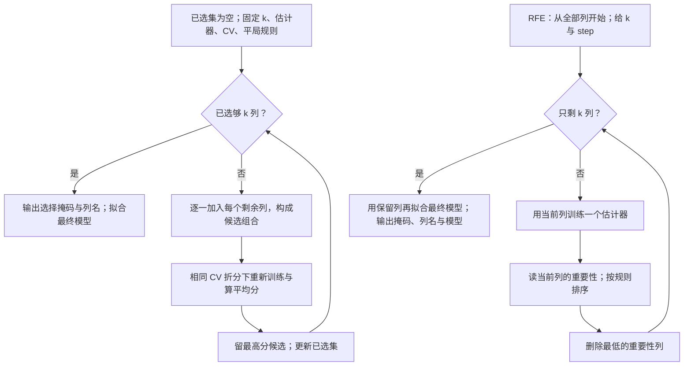

SFS首轮原四列分别做CV，选petal-L；次轮候选组合同分时依原索引选sepal-L，再因k2输出。RFE从四列训练重要性开始删sepal-W，再只用剩三列重训、删sepal-L，最后保瓣长/瓣宽。文字替代：SFS比较候选验证分；RFE读取当前模型重要性。

本图为fixed k；全前缀另图，auto/tol另规则。RFE不是对每种删法都做CV。

读图自测：第二轮未增分，SF1能否直接输出一列？

不能。固定k2检查个数，只有1列时还要继续；按无提升停是另一策略。

**完整Iris实测的既有协议（笔记补充）**

原`iris.txt`为150行四列，固定k=2。为让评分器能从本篇复算，SFS用§2.7的`DecisionTreeClassifier(max_depth=2,random_state=0)`。

树的每个非纯节点比较相邻不同值的中点阈值，用加权Gini选当前最好；纯节点、深度2或无合法切分时保存叶频率。平局依实现固定随机状态。

每候选采用相同5折`StratifiedKFold(shuffle=False)`。每折120行拟合、30行验证，各类各10行在验证侧；留出行不参与本折建树。

RFE另用原ExtraTrees50树/seed0，不能把这两评价器当同一个。既有`verify_m04_sfs_tree.py`核过七候选与sklearn掩码（本机1.5.1）；本轮未重跑该实验。下表保存同协议结果，不冒称讲义原给定算法。

每行列一轮的候选得分/动作；原四列顺序保持，准确率是5折验证均值、小数比例。

**1**

全部候选（原四列顺序）：sepal-L / sepal-W / petal-L / petal-W

5 折平均准确率依候选顺序为 0.693333、0.573333、0.946667、0.940000。

动作：留petal-L

**2**

全部候选（原四列顺序）：petal-L + sepal-L

5 折平均准确率：0.946667。

动作：两个最大值平局，按原列索引较小者选此组

**2**

全部候选（原四列顺序）：petal-L + sepal-W

5 折平均准确率：0.946667。

动作：平局未选

**2**

全部候选（原四列顺序）：petal-L + petal-W

5 折平均准确率：0.933333。

动作：未选

第一轮petal-L=0.946667最高；第二轮两个0.946667平局，固定k2仍加列。第一行多候选可到下方短表逐一看。

先读每折成绩，再看选列动作。

第一轮最佳与第二轮两个并列最佳的五折成绩均为 $28/30,30/30,26/30,28/30,30/30$。合计142/150，均值约0.946667。

第二轮没有提升，但fixed k=2仍须加列。按原列索引平局规则，最终掩码`[True,False,True,False]`。

七候选各五折，共35次拟合；最后全150行重拟合另计一次。auto/tol或其他估计器可能走别的路；这里不保证全局最好，也不保证最终列名普遍相同。

**走到最终测试输出（💡 给定教学数据）**：选列结束后，用全部训练150行与保存列顺序`[sepal-L,petal-L]`重拟合同一深度2树。根按输入第2列瓣长≤2.45切，50行左叶为Setosa；100行右节点再按瓣长≤4.75切，左右45/55行叶多数分别为Versicolor/Virginica；这里保存的第一列未再用于切分，不说明其他估计器也会如此。

每行一个给定教学测试对象，原四列→保存两列→模型预测→给定标签→比较。

| 新原四列 | 已保存列序变换 | 沿最终树得到预测 | 本教学表给定标签 | 对否 |
|---|---|---|---|---|
| 5.1/3.5/1.4/.2 | 5.1/1.4 | Setosa | Setosa | 是 |
| 6.0/3.0/4.5/1.5 | 6.0/4.5 | Versicolor | Versicolor | 是 |
| 6.8/3.0/5.6/2.2 | 6.8/5.6 | Virginica | Versicolor | 否 |

第三行预测Virginica但表给Versicolor，所以否。2/3仅此三行轨迹，不当独立总体泛化率。

最终测试动作得到 2/3≈0.666667。三行数据与标签是教学给定值，部分数值可能与原表对象相同。

它只演示四步的区别：用 CV 选择、全训练集重拟合、固定模型预测、与给定标签比较。它不是新的独立总体测试，也不能证明实际泛化率。

原 Iris 七候选的 CV 0.946667 同样不能由此升级成独立测试成绩。

每行RFE当前训练后的原列重要性、删除和下一状态；同轮向量和1，跨轮不可混。

**1**

当前列及重要性（同一轮合计 1）：sepal-L 0.078254；sepal-W 0.064592；petal-L 0.420234；petal-W 0.436920

删除：sepal-W

下一状态：剩三列

**2（重新训练）**

当前列及重要性（同一轮合计 1）：sepal-L 0.122786；petal-L 0.452815；petal-W 0.424399

删除：sepal-L

下一状态：剩花瓣两列，停止

第2轮重新训练后sepal-L0.122786最弱，删它；模型看到的当前列已变。

第二轮重要性变化，因为模型只看到剩余三列，信息竞争与随机树结构都改变；不能把首次重要性删两次就称作完整 RFE。本例当前树SFS得到萼长/瓣长，RFE得到瓣长/瓣宽，**两种算法及评价器不能混为同义，不保证任何数据上都同结果**。

**数学 / 逻辑依据**：SFS 的贪心决定是取当前候选中验证分最大者，它只是局部最优，没有检查所有未来组合。RFE 使用模型重要性做代理排序；本例随机树的重要性来自分裂的加权不纯度减少（见 §2.7），不是 CV 准确率本身。两者最终保留列都可能受估计器、尺度、CV 折分、随机种子和相关特征影响。

**边界和失败**：固定列数与自动容差停机分开；无可加 / 可删列或估计器不提供重要性时须报限制。XOR 两列单独看都无用时，若按“首轮无提升就停”会漏掉；固定 $k$ 仍会按平局规则选一列，之后有机会选到互补列，但不保证任何交互问题都能解。筛选 CV 已被用于选择，不能把它当独立最终测试成绩；最终泛化需未参与选列的数据或外层验证。

**迁移与诊断**：若本例目标改成 $k=1$，当前树SFS第一轮就输出petal-L，不能把第二轮结果也纳入。若有人宣称“第二轮未增分，所以固定 k 的 SFS 应输出一列”，错误是混入另一种停止约定。若 RFE 第二轮不重新拟合，它得到的排序依据已经不是本轮模型，应重训并重新读当前列重要性。

🔗 两种接口的机制区别见 [SequentialFeatureSelector](https://scikit-learn.org/stable/modules/generated/sklearn.feature_selection.SequentialFeatureSelector.html) 与 [RFE](https://scikit-learn.org/stable/modules/generated/sklearn.feature_selection.RFE.html)（获取：2026-09-30）。本节是课堂机制示例，不是当前评分作业提交成品。

**全前缀版走完并比较（笔记补充）**：以下分数是为展示控制逻辑给定的教学评价表，不是伪造Iris实验。输入F1/F2/F3及同一评分协议；目标为“走全部规模后择最好前缀”，不是fixed k。

每行教学全前缀搜索一轮，候选分数是明示给定，不是Iris实测。

| 轮 | 全部当前候选分数 | 本轮留下 | 缓存前缀 |
|---|---|---|---|
| 1 | F1=.80，F2=.70，F3=.65 | F1 | F1/.80 |
| 2 | F1F2=.79，F1F3=.78 | F1F2 | 增F1F2/.79 |
| 3 | F1F2F3=.95 | 全集 | 增全集/.95 |

第2轮0.79低于首轮0.80仍扩展；第3轮0.95，走完后比较缓存取全集。

剩余列为空时停止扩展。复用三个前缀的缓存分数，最佳前缀是全集，分数 0.95。

共有 6 个不同候选被评价；若三个前缀重新计算，调用数会变成 9。fixed k=2 的版本则在第二轮输出 F1F2，分数 0.79。

假如未访问的 F2F3 得分 0.98，本路径仍会错过它。“路径内最佳”不能保证全局最佳。

图问：全前缀版本为何得继续走到全集？箭头表示状态更新，FP4只能在全部规模路径结束后比较缓存。

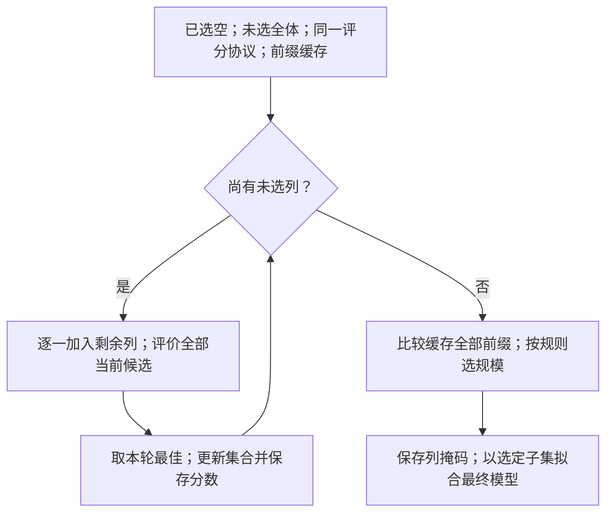

F1/F2/F3教学分数首轮0.80/0.70/0.65取F1；第二轮0.79/0.78取F1F2；第三轮全集0.95。FP1剩余空，FP4比较0.80/0.79/0.95，取全集。文字替代：每轮留最好前缀，再比所有缓存。

分数为明确教学给定，不是Iris实验。未访问F2F3=0.98说明路径最佳不等于全局最佳。

读图自测：第二轮0.79低于首轮0.80，能否在本图停止？

不能，FP1仍有F3。此图终点是全部规模走完；固定k或tol规则不能临时加入。

**RFE重要性口径**：ExtraTrees返回非负的重要性。若读取线性模型coef，不能按带符号系数从小到大删；本机RFE默认按系数平方（多输出跨输出相加）转为非负重要性。绝对值/其他getter若自行使用需明示，尺度仍影响比较。最终剩k列后重新拟合最终子集模型，不能输出仍带被删除列参数的旧模型。

**迁移自测**：三列首轮重要性为 0.1、0.2、0.7。删一列后，F2/F3 重拟合重要性为 0.8、0.2。继续删到 k=1，写集合与掩码。

答案与理由

先删 F1，剩 F2/F3。重拟合后删 F3，再拟合仅含 F2 的模型。最终掩码为 `(False,True,False)`。

若始终沿用首轮排名，就会错误留下 F3。题给的是各轮重要性，用于追踪 RFE 状态，不能据此编造模型参数或成绩。

来源：笔记补充，请先作答再对照。

**所以呢**：同叫特征选择，分数、状态与终点不同；先选择策略，再沿那条控制图执行，不根据结果方便临时换规则。

**为什么需要它**

T04 第 3 题用 `SequentialFeatureSelector` 选两个特征，占 40 分。其 `direction='forward'` 每轮用交叉验证准确率评价新增列，是包装方法。

RFE 按当前模型重要性递归删列；backward SFS 逐个评价删列候选。下面并列区分三种方法：

每行一种选择方法，比较每轮消费的分数与训练代价；保留完整机制区别。

**`SelectKBest`（过滤）**

每轮看什么：每个特征**单独**的分数，排序取前 k

考虑特征组合吗：不：单列都可得高分；组合后是否重复或互补要另外评价，可能一起被选

代价：最低

**前向选择（p.54）**

每轮看什么：在**已选集合的基础上**加一个

考虑特征组合吗：是：评价已选集加候选的组合；冗余可使分数不增，但固定 k 不保证不选

代价：中

**backward SFS**

每轮看什么：比较每一种单列删除后的 CV 表现

考虑特征组合吗：是

代价：一轮多候选模型

**RFE**

每轮看什么：当前模型重要性最低列

考虑特征组合吗：依赖当前模型

代价：每轮重训，不默认对每种删除做 CV

backward SFS比较每种删法CV，RFE读当前模型权重，不默认逐种删法CV。

**课件原例**

p.54 三轮前向选择（F1–F4）；p.55 套到 Iris。

**🎙️ 课堂补充**（`01:16:27`–`01:19:51`，A · 课上展开）

教授把本方法称邻域搜索，直接承认全局最优限制：*"even though we cannot get the global optimal feature subset"*（`01:16:40`）。按 p.54 从空集比较四个单列，固定 F2 后只比三组，再固定 F2/F3 比两组，最后比较各维数前缀和全集（`01:18:59`–`01:19:20`）。因此这是讲义的“全前缀再比较”流程，不能改写成达到固定 k 就停。

他在 `01:19:29`–`01:19:43` 把流程指向 tutorial 的 Iris，但没有给出 ANOVA 分数，也未明确确认 p.55 的“sepal length 最显著”。本页具体首列仍为流程假设，不升级为所有模型共同结论。tutorial 后段的 RFE 和作业 SFS 另见配套 T04 的逐源说明。

**这段改变了什么**：课堂确认贪心前向固定已选列、比较前缀以及不保证全局最优；已有 SFS 七候选 CV、RFE 重训路径等完整机制仍是 💡 笔记补充，未被教授逐项跑通或核算。

**💡 换个说法（笔记补充）**

前向选择像招一支球队——不是把五个单项最强的人凑在一起，而是先招最强的一个，再看"谁和他配合最好"，一个一个加。已经有了一个中锋，再来一个一模一样的中锋（冗余特征）不会让球队更强。

另一个角度是贪心的代价：它**不保证最优**。p.52 里如果第一轮单独看 F2 分数最高、第二轮加 F1，得到 {F2, F1}——恰好是最优；但换一份数据，"单独最好的两个"合起来可能不如"单独一般但互补的两个"。p.54 的全前缀比较是一种选维策略；若已固定 k，应在 k 列处停，不能再混入回头挑前缀的规则。

**⚠️ 常见误解**

- ❌ 以为前向选择等于"按单变量分数排序取前 k 个"。→ 那是 `SelectKBest`；前向选择每轮是**在已选集合的基础上**再评价，会考虑互补和冗余。
- ❌ 以为 Backward 一定比 Forward 差 / 好。→ 各有适用：特征很多时 forward 便宜；特征间强交互时 backward 不容易漏。
- ❌ 以为固定 k、auto+tol 与全前缀比较有同一个停止条件。→ 固定 k 达到个数就停；讲义全前缀法先走完再挑，auto+tol 又按增分条件，必须说明所用版本。

**所以呢**：第二条路——不挑列，换坐标。PCA 的核心只有一句话：**找数据散得最开的方向**。

---

### 2.13 ⭐ PCA 的目标与几何（讲义 p.56–65）

讲义用十页讲 PCA：§2.13.1 目标，§2.13.2 几何图像，§2.13.3 四条性质与小例子。

#### 2.13.1 PCA 的目标：最大方差 = 最小投影误差（讲义 p.56–57）

**是什么**

假设只能用一条线记录二维人群的位置。将每人投影到线上，报出在线上的刻度，就把二维位置压成了一个数。

线沿点云较长的方向时，刻度较分散；沿较窄方向时，许多人挤在相近刻度。

**主成分分析（PCA）**选择方差最大的单位方向作为第一根轴。第二根轴须与第一根正交，并在这个限制下保留最多剩余方差。只保留前几根轴，就减少了维数。

从线上的刻度还原位置，得到原点在线上的投影。原位置与投影之间的垂直距离，就是该点的重构误差距离。

对中心化数据，最大化保留方差与最小化这些距离的平方和等价。下一算例用勾股关系解释。

讲义 p.56 定义：

> PCA reduces the dimensionality of a data set by finding a new set of variables, smaller than the original set of variables, that **retains most of the sample's information**. By information we mean **the variation present in the sample**, given by the correlations between the original variables. The new variables, called **principal components (PCs)**, are **uncorrelated**, and are **ordered by the fraction of the total information each retains**.

四个关键词：**新变量**（不是原来的列）、**信息 = 方差**（"variation"）、**互不相关**（新变量两两协方差为 0，没有 M02 的共线性）、**按保留的方差排序**（第一个最多）。

p.57 目标函数（讲义原式）：找 $G$ 把 $x \in \mathbb{R}^d$ 映到 $z \in \mathbb{R}^p$，$p \ll d$，$z = Gx$；

$$\min_{G \in \mathbb{R}^{d \times p}} \big\| X - G(G^{\top}X) \big\|_F^2 \quad \text{subject to } G^{\top}G = I_p$$

> The matrix $G$ consisting of the first $p$ eigenvectors of the covariance matrix $S$ solves the following min problem. $\|X - \hat{X}\|_F^2$: **reconstruction error**

每行p.57列轴记号，X每列一个中心化样本，G每列一单位轴，与后文D行样本式转置对应。

| 符号 | 含义 | 已知 / 要算 |
|---|---|---|
| $X$ | **已经中心化**的数据（每列一个样本，$d$ 维）；与后文行样本表 $D$ 互为转置 | 已知 |
| $G$ | $d \times p$ 的投影矩阵——$p$ 根"线"的方向，每列一根；$G^{\top}G = I_p$ 说这些方向**互相垂直且长度为 1** | 要算 |
| $G^{\top}X$ | 投影到 $p$ 维后的坐标（即 $z$，"线上的刻度"） | — |
| $G(G^{\top}X)$ | 用 $p$ 维坐标**重构**回 $d$ 维的近似 $\hat{X}$（"只知道刻度，猜他原来站哪"） | — |
| $\lVert \cdot \rVert_F^2$ | Frobenius 范数平方：矩阵所有元素的平方和，即所有点的重构误差加起来 | — |

G为d×p时坐标G转置X，不是G直接乘X；原上半Gx形状冲突保原出处并说明。

一句话读这个式子：**在所有"$p$ 根互相垂直的线"里，找让"投影再重构回去的总误差"最小的那组**——答案是协方差矩阵前 $p$ 个特征向量（§2.14 会说什么是特征向量）。

**勾股算例**：某点离中心 5，在线上的投影长度为 4。它到线的距离为 $\sqrt{25-16}=3$。

若换个方向，投影长度变为 3，垂直距离便为 $\sqrt{25-9}=4$。

点到中心的距离平方固定，投影平方与误差平方此消彼长。对全部中心化点求和，再按同一分母计算方差，就得到两种目标的等价关系。

重构误差直接度量压缩丢掉多少信息。要让 $GG^\top X$ 表示正交投影，G 的列须单位长且相互正交，即 $G^\top G=I_p$。

任意放大 G 会破坏这个投影条件，不能保证误差更小，也不能只靠缩放找回垂直残差。完整勾股解释见 §2.14.2，反例见 §7。

**误差的边界与口径（笔记纠错）**：保留全部 d 根正交轴时，SSE 为 0。若中心化点全在一条线上，只保留该线也可零误差。

不保留任何轴时，重构为均值，SSE 等于中心化数据的平方和。对 m 个样本，正确关系为：

$$\mathrm{SSE}_{p=0}=(m-1)\sum_{i=1}^{d}\lambda_i.$$

这里 λ 是样本协方差的特征值。只有将 SSE 除以 m−1，才等于样本总方差。

§2.14.2 五点例中 m=5，总方差为 3.5，故 SSE=14。旧笔记“误差=全部方差”漏了这个因子，不是讲义引文。

各方向方差相同时，最优轴不唯一。丢失多少方差取决于舍弃的维数比例，不能一概说损失很大。

**为什么需要它**

PCA 是本课后面反复出现的工具：W10 图像挖掘（p.21 的 CIFAR-10 例子）、聚类前的降维 / 可视化（T04 最后一格用 PC1–PC2 画散点）、回归前消共线性（主成分互不相关）。理解"方差最大 = 投影误差最小"这一对等价说法就理解了 p.57 的目标函数和 p.61 的图是同一件事。

**课件原例**

p.56 定义；p.57 目标函数。

**🎙️ 课堂补充**（`01:19:53`–`01:21:40`，A · 课上展开；投影误差在 `01:28:18`–`01:29:24` 回讲）

教授先说明 X 的行仍是同一批对象，新表 Z 的列则是新构造的特征（`01:20:25`–`01:21:08`），然后划定本次要求：*"you only need to remember why they are called principal components"*（`01:21:34`）。后面把丢弃方向的变化解释为投影误差，并说明要最小化它（`01:28:32`–`01:29:24`）。

**这段改变了什么**：课堂确认 PCA 是换表示后保留主要变化、控制投影损失的直觉；未逐项推导 p.57 的矩阵目标、正交约束或最大方差等价性。完整推导保留作自学，不冒称教授已要求记住全部推导，也不把“只记原因”扩为所有课程计算取消。

**💡 换个说法（笔记补充）**

PCA 可把相关列的共同变化合成新方向，但高成对相关不能单独证明三维“几乎一维”。对 Airbnb 的规模变量，应先按声明尺度实际拟合，查解释比例及遗漏方向的任务信息；CIFAR-10表证明的是该次压缩实验的性能和时间变化，不能仅从表证明所有损失方向都是冗余。

另一个角度：拍一张照片就是把三维世界投影到二维。拍一根铅笔，从正上方拍只看到一个圆点（投影误差最大，信息全丢），从侧面拍看到完整的长条（投影误差最小）。PCA 就是自动找到"从侧面拍"的那个角度。

**⚠️ 常见误解**

- ❌ 把 PCA 的"第一主成分"当成"最重要的原始特征"。→ 它是一个**方向**（四个原始特征的加权组合），不是某一列。
- ❌ 以为 PCA 会自动把类分开。→ 它是无监督的；p.48的监督目标是最大化类别区分；💡 LDA是一个可举的方法，不是原页写出的唯一算法。
- ❌ 把 PCA 的线和回归线混为一谈。→ 回归最小化竖直残差（有因变量），PCA 最小化垂直距离（没有因变量，两个方向平等）。

**所以呢**：目标说清了，讲义接着用几页图把"找方向、投影、只留第一根"画出来，并指出线性投影的局限。

#### 2.13.2 几何图像：投影、u 向量与 z 向量、线性的局限（讲义 p.58–64）

**先看同一数据的几何动作（笔记补充）**

问题：u是方向，z是刻度，舍去的残差在哪？下面使用本篇已有五点(1,1)/(2,1)/(3,2)/(4,3)/(5,3)，没有复原未知的讲义国家载荷或环形逐点曲线。

![[IS6400_Business_Data_Analytics/notes/figures/readability-v2-m04/pca-projection.svg]]

左图横纵轴为原x1/x2。圆点是原点、方框是重构、X是均值(3,2)；斜线为第一主轴，虚线为垂直残差。右图横轴是同五对象在单位轴上的一维刻度，圆点行号保持对象身份，线不表示因果。

读第1点：先减均值为(−2,−1)，与u=(0.850651,0.525731)点乘得z≈−2.227033。沿轴乘回并加均值，重构约(1.105573,0.829180)，虚线连接它与原(1,1)。负刻度是反方向，不是错误率。

文字替代：原点→减训练均值→沿轴读刻度→沿轴重构→垂直方向丢失。图对应raw样本协方差，不先标准化；轴整体反号时坐标也反号，重构不变。

读图自测：右图剩5个点还是剩1个对象？第1点能否从一数精确恢复？

仍有5个对象，只剩每对象1个坐标。第1点不在主轴上，舍去垂直分量后只能近似恢复；本例总平方重构误差0.291796，不是零。

图源：[[IS6400_Business_Data_Analytics/notes/figures/readability-v2-m04/generate.py|生成代码]]、[[IS6400_Business_Data_Analytics/notes/figures/readability-v2-m04/figure-inputs.json|五点输入与计算]]。本轮新增重要计算已运行；视觉/教学验收pending。

**是什么**

p.58–64 用七页图拆开说明投影。按图逐页读时，关注下面的动作：

| 页 | 要看懂的动作或限制 |
|---|---|
| 58 | 二维点云换轴，只留第一轴 |
| 59 | 线性投影不能显出环形类别结构 |
| 60 | 国家多列表压为两列 |
| 61 | 点到投影线的垂距构成误差 |
| 62 | 降至 k 维需要 k 根正交轴 |
| 63 | 分清方向 u 与坐标 z |
| 64 | 第一轴分散，第二轴较扁 |

p.58 **几何图**：二维点云 $(x_1, x_2)$ → 旋转到 $(z_1, z_2)$ → 只留 $z_1$：

> - the 1st PC $z_1$ is a **minimum distance fit to a line** in X space
> - the 2nd PC $z_2$ is a minimum distance fit to a line in the plane **perpendicular** to the 1st PC
> - PCs are a series of linear least squares fits to a sample, each orthogonal to all the previous.

"minimum distance fit to a line"——找一条线让所有点到它的**垂直**距离平方和最小。注意和 M02 回归线的区别：回归线最小化的是**竖直**距离（y 方向的残差，因为 y 是要预测的），PCA 最小化的是**垂直**距离（两个方向平等，没有谁预测谁）。

p.59 以内外两圈说明线性投影的限制，原图标注：

> Linear projections will not detect the pattern

投到一条直线后，两圈的投影会重叠。要显出这样的结构，可以先作非线性映射。核 PCA 是相关方法；讲义仅用一页提示动机，未展开算法。

p.60 是 Andrew Ng 课程的 PCA 示意。左上将二维压成一维，右上将三维压成二维。

下方国家表含 Canada、China、India、Russia、Singapore、USA。六个指标是 GDP、人均 GDP、人类发展指数、预期寿命、贫困指数、家庭平均收入。

右表只剩 z₁、z₂ 两列。例如 Canada 为 1.6、1.2，China 为 1.7、0.3。图意是整张多列表被映射为少列表。

讲义未给尺度、载荷、拟合数据及目标依据，不能据此命名两轴为体量或富裕程度。实际解释新轴须结合载荷和验证，不能靠国名猜。

p.61问怎样把二维点投到一根轴。轴过中心化后的原点，方向 $u^{(1)}$；点到轴的垂线是投影误差。

> For 2D–1D, we must find a vector $u^{(1)}$ onto which you can project the data so as to minimize the projection error. ($u^{(1)}$ and $-u^{(1)}$ are the same)

中文读法：寻找使垂直误差最小的方向；反号是同一根轴。

- p.62：降到k维，需要k根方向 $u^{(1)},\dots,u^{(k)}$。
- p.63：$u$是轴方向；$z$是一个点在轴上的刻度。两者不是同一个对象。
- p.64：同点云在 $z_1$ 方向分散、在 $z_2$ 方向很扁。只能留一根时，按保留方差目的留 $z_1$。

**为什么需要它**

这七页把 §2.13.1 的抽象目标变成可以画出来的动作，并给出后面公式的记号：$u^{(i)}$ 是方向、$z$ 是新坐标（§2.14 的 $U_{\text{reduce}}$ 就是把 $u^{(1)} \dots u^{(k)}$ 拼起来）。p.59 则划出 PCA 的适用边界：只能抓**线性**结构。

**课件原例**

p.58 三格几何图；p.59 环形数据；p.60 国家表；p.61 投影误差图；p.64 $z_1$ vs $z_2$。

**🎙️ 课堂补充**（`01:21:48`–`01:31:35`，A · 课上展开）

- 教授沿图示把同一批二维点的坐标轴旋转，新 Z1 上投影分散、Z2 上靠得很近：*"Most of the data differences would be along Z1"*（`01:24:12`）。对象不换，描述它的坐标换了；随后讲丢掉 Z2 的小变化。
- `01:25:42`–`01:26:09` 简提高级课程的非线性变换；`01:26:12`–`01:27:59` 解释三维到平面及六列到两列的表；`01:28:32`–`01:29:24` 将垂直方向丢失的数值叫投影误差。*"the distance from the data point to Z1"*（`01:28:54`）。
- **这段改变了什么**：课堂补足换轴、读取投影、丢弃变化的直觉。未提供六国表的全部原数据/载荷，不能据课堂图示给 Z1/Z2 命名，也未证明非线性 PCA 一定将任意类别变成线性可分。

**💡 换个说法（笔记补充）**

$u$ 和 $z$ 的关系像"经度线"和"经度值"：$u$ 是你画在地图上的那根线，$z$ 是每个城市在这根线上的读数。PCA 先决定画哪几根线（$u$），再把每个点的读数（$z$）报出来；降维就是只报前几根线的读数。

💡 p.59 可类比观察影子：将内外两圈压到一条直线，影子会重叠。

非线性映射可以先改变表示，再寻找新方向。核 PCA 的动机在于此；“把圈掰直”只是帮助想象，不是本课已给出的操作算法。

**⚠️ 常见误解**

- ❌ 以为主成分的符号有意义。→ $u$ 和 $-u$ 是同一根轴（p.61），不同软件给出的符号可能相反，$z$ 也整体反号，图左右翻转而已。
- ❌ 以为 PCA 能发现任何结构。→ p.59：只能发现线性（直线 / 平面）方向上的结构，环形、螺旋这种要非线性方法。

**所以呢**：几何图像有了，讲义 p.65 把它写成四条可检验的性质；本笔记再用一个 5 个点的小例子把"方差最大的方向"真的算出来。

#### 2.13.3 PCA 的四条性质 · 5 个点的小例子（讲义 p.65）

**是什么**

先说人话：讲义 p.65 用四句话规定了主成分必须满足什么：**互不相关**、**按方差排序**、**第一个方差最大**、**后面的每个都是"剩余方差里最大的"**。这些条件规定 PCA 的最大方差正交子空间；特征值各异时单位轴仅有符号不确定性，重根子空间中还可旋转，因此不能无条件称方向唯一。下面用 5 个二维点把这四条算出来看。

p.65 四条性质（讲义原文）：

> PCA is to find a transformation of the data that satisfies the following properties:
> 1. Each pair of new attributes has **0 covariance** (for distinct attributes).
> 2. The attributes are **ordered** with respect to how much of the variance of the data each attribute captures.
> 3. The first attribute captures **as much of the variance** of the data as possible.
> 4. Each successive attribute captures as much of the **remaining** variance as possible.

$$\operatorname{cov}(z_i, z_j) = 0\ (i \neq j), \qquad \operatorname{var}(z_1) \ge \operatorname{var}(z_2) \ge \dots, \qquad \sum_i \operatorname{var}(z_i) = \sum_j \operatorname{var}(x_j)$$

每行PCA性质一个量；新坐标是整批样本的一列，样本协方差衡量二阶线性关系。

| 符号 | 含义 |
|---|---|
| $z_i$ | 第 $i$ 个主成分（新坐标） |
| $\operatorname{cov}(z_i, z_j) = 0$ | 性质 1：两两不相关（M03 §2.11 的协方差） |
| $\operatorname{var}(z_1) \ge \operatorname{var}(z_2)$ | 性质 2–4：按方差降序 |
| 总方差守恒（第三式，💡 笔记补充） | 旋转坐标不改变总方差，只是重新分配 |

cov(zi,zj)=0不保证统计独立；总方差守恒只在保全部正交轴时成立，截断有损失。

**数字例子（手把手）**（笔记补充，`verify_m04_originals_current.py（2026-10-01 当前复算）`）：五个二维点 (1,1), (2,1), (3,2), (4,3), (5,3)，均值 (3, 2)。

1. 减去均值后它们大致沿"右上"排成一条带：(−2,−1), (−1,−1), (0,0), (1,1), (2,1)；
2. 原始两列的方差：$x_1$ 方差 $= (4 + 1 + 0 + 1 + 4) / 4 = 2.5$，$x_2$ 方差 $= (1 + 1 + 0 + 1 + 1) / 4 = 1.0$，总方差 $= 3.5$；
3. 算出第一主成分方向 $u^{(1)} = (0.85, 0.53)$（与横轴夹角约 32°，正是那条带的方向），沿它的方差 **3.427**；
4. 第二主成分与它垂直，方差只有 **0.073**；
5. 检验：$3.427 + 0.073 = 3.5$ ✓（总方差守恒）；$3.427 / 3.5 = 0.979$——第一根轴拿走 97.9%，第二根只剩 2.1%；
6. 只留 $z_1$，五个点的刻度是 −2.23, −1.38, 0, 1.38, 2.23；丢掉 $z_2$ 的重构误差总和 $= 0.073 \times 4 = 0.29$——就是那 2.1% 的方差 × $(n-1)$。

性质 1 说新坐标互不相关，即二阶线性共同变化被对角化。它不保证统计独立，也不保证对所有任务都无冗余。

性质 3–4 的最大方差对应 §2.13.1 的目标。保留全部轴时，正交变换不改变距离，总方差守恒；截断轴后才会损失方差。

**轴的边界**：中心化点若全在一条直线上，第二轴方差为零，一维足够。

若协方差在各方向相同，任何单位方向都同样好，主成分不唯一。原列互不相关时，可以选原坐标轴并按方差排序；重复特征值下也可在对应子空间内换轴。

**为什么需要它**

四条性质是 §2.14 算法的"验收标准"：算完之后检查新坐标是否两两不相关、方差是否降序、总方差是否守恒——T04 的 `explained_variance_ratio_` 就是性质 2–4 的输出。5 个点的例子在 §2.14.2 继续走完全部步骤与逐点重构；§2.14.3 再核 Iris。

**课件原例**

p.65 四条性质。

**🎙️ 课堂补充**（`01:31:40`–`01:32:12`，B · 概念简讲）

教授引入“满足以下性质的变换”，重点口头强调捕捉最大方差：*"we are trying to capture the principal components which provide the largest [variance]"*（`01:31:56`；ASR 作 valence，按 p.65 的 variance 校正）。录音未逐条展开四项性质，更没有当堂计算本节五点例子。

**来源边界**：两两零协方差、依次保留剩余方差的完整解释及五点验证仍以讲义和 💡 笔记补充为依据，不能把这一句简讲写成教授逐条证明。

**💡 换个说法（笔记补充）**

💡 总方差像固定预算。原两列分别占 2.5 和 1.0，合计 3.5。

换轴后第一轴约占 3.43，第二轴约占 0.07，总数不变。若只能留一轴，舍掉较小部分的损失最少。

另一个角度：PCA 是无监督的——它完全不看类别标签，只看点的散布。T04 里 PC1–PC2 散点图能分开三种鸢尾，是因为"散得最开的方向"恰好也是"类间差异的方向"（Setosa 和 Virginica 的花瓣差了 4 cm，这是数据里最大的差异来源），不是 PCA 有意为之。换一份"类别差异在小方差方向上"的数据，PCA 会把类别混在一起。

**⚠️ 常见误解**

- ❌ 忽略量纲：同一列从厘米改为毫米，方差会放大 100 倍，可能主导 PC1。

p.68 用相关矩阵，使各原列按相同方差口径比较。T04 的 Iris 四列都以厘米表示，未标准化；petal length 方差约 3.11，对 PC1 的贡献较大。
- ❌ 以为"互不相关"意味着主成分之间没有任何关系。→ 只是线性不相关（协方差为 0），非线性关系仍可能存在。

**所以呢**：怎么把"方差最大的方向"算出来？答案是协方差矩阵的特征向量——下一节先说清特征向量是什么，再给五步算法，再用这 5 个点把每一步算出来。

---

### 2.14 ⭐ PCA 怎么算：协方差矩阵、特征值、特征向量、变换（讲义 p.66–67）

讲义 p.66–67 是 PCA 的算法页。§2.14.1 先补一个讲义没解释的先修概念——特征值与特征向量，§2.14.2 给五步与变换公式，§2.14.3 用 5 个点和 Iris 两个例子把每一步算出来。

#### 2.14.1 特征值与特征向量是什么（讲义 p.66）

**是什么**

矩阵作用于向量，通常会同时改变长度与方向。特殊方向满足 $Su=\lambda u$，变换后仍是原向量的倍数。

非零向量 u 叫特征向量，倍数 λ 叫特征值。对协方差矩阵，单位特征向量所在方向的方差就是对应特征值。

所以最大特征值对应方差最大的方向。求解这些方向，就得到 PCA 的轴，无需逐角度枚举。

讲义 p.66（原文）：

> **Eigenvalues of S**: Let $\lambda_1, \dots, \lambda_n$ be the eigenvalues of $S$. The eigenvalues are all non-negative and can be ordered such that $\lambda_1 \ge \lambda_2 \ge \dots \ge \lambda_{m-1} \ge \lambda_m$.
> **Eigenvectors of S**: Let $U = [u^{(1)}, \dots, u^{(n)}]$ be the matrix of eigenvectors of $S$. These eigenvectors are ordered so that the $i$-th eigenvector corresponds to the $i$-th largest eigenvalue.

$$S\,u^{(i)} = \lambda_i\,u^{(i)}$$

每行协方差特征分解一量，n此处数属性，lambda为该单位方向方差。

| 符号 | 含义 | 已知 / 要算 |
|---|---|---|
| $S$ | $n \times n$ 样本协方差矩阵（本节 $n$ 为属性数，§2.14.2） | 已算出 |
| $u^{(i)}$ | 第 $i$ 个特征向量：长度为 1 的方向，两两正交（垂直） | 要算（软件） |
| $\lambda_i$ | 沿单位方向 $u^{(i)}$ 的方差 | 由软件或特征方程求得 |
| $U$ | 把 $n$ 个特征向量按列拼成的 $n \times n$ 矩阵 | — |

**特征值次序**：协方差矩阵的特征值都非负。本讲按降序编号，所以第一个对应最大方差。

S为2×2就有2特征值；m样本数不会决定轴数，原讲义m/n混用保§9.3。

**数字例子（手把手）**（§2.13.3 那 5 个点的协方差矩阵，`verify_m04_originals_current.py（2026-10-01 当前复算）`）：$S = \begin{pmatrix} 2.5 & 1.5 \\ 1.5 & 1.0 \end{pmatrix}$，软件解出 $\lambda_1 = 3.427$、$u^{(1)} = (0.851, 0.526)$。验证它真的"只拉伸不转向"：

1. $S u^{(1)}$ 第一个分量：$2.5 \times 0.851 + 1.5 \times 0.526 = 2.128 + 0.789 = 2.917$；
2. 第二个分量：$1.5 \times 0.851 + 1.0 \times 0.526 = 1.277 + 0.526 = 1.803$；
3. $\lambda_1 u^{(1)}$：$3.427 \times 0.851 = 2.916$，$3.427 \times 0.526 = 1.803$。

两边相等（差在四舍五入）：$S$ 乘 $u^{(1)}$ 得到的仍是 $u^{(1)}$ 的方向，只是长了 3.427 倍。再试一个随便的向量 $(1, 0)$：$S(1,0) = (2.5, 1.5)$，方向变了——它不是特征向量。

$Su=\lambda u$ 表示变换后方向不变。下面的最大方差推导给出 PCA 选轴的依据。

**幂迭代直觉的条件（笔记纠错）**：每轮乘 S 后归一化，只有初始向量含第一轴分量且最大特征值唯一时，才会趋向第一轴。

反例取 $S=\operatorname{diag}(2,1)$，初始向量为 $(0,1)$。每次相乘仍是 $(0,1)$，永远不会到横轴。

若最大特征值重复，也没有唯一的第一方向。旧笔记“任意向量反复乘便到第一方向”条件不足；这段是辅助直觉，不能替代下方证明。

**特征值边界**：对角协方差矩阵可取原坐标轴作特征向量，对应值就是各列方差。重复特征值时，该子空间内的轴不唯一。

两列完全相关时，一个特征值为 0，表示相应方向没有变化。

n 维协方差矩阵有 n 个非负特征值（计重数）。讲义写 $\lambda_m$ 的 m/n 混用保留在 §9.3，不沿用到此处推导。

**机制展开（笔记补充）：最大方差为什么导向特征向量**

下面统一沿用 §2.14.2 的记号。每个投影读数都是各属性乘方向权重后相加。

| 符号 | 对象及维度 |
|---|---|
| m、n | 样本数、属性数 |
| D | 中心化数据，m×n |
| u | 单位方向，n×1 |
| $z=Du$ | 全部样本的投影读数，m×1 |
| $S=D^\top D/(m-1)$ | 样本协方差，n×n |

§2.13.1 的 d、p 分别对应此处 n、k。

**数学原理**：因为 $D$ 每列均值零，$z$ 的均值也零；其样本方差就是所有新读数平方的平均（分母为 $m-1$）：

$$\operatorname{var}(z)=\frac{z^\top z}{m-1}=\frac{u^\top D^\top Du}{m-1}=u^\top Su,\qquad u^\top u=1.$$

每行最大方差推导一个输入/约束/中间量，m样本、n列、u单位方向。

| 符号 | 人话含义 | 数据还是待求 |
|---|---|---|
| $D,m,n$ | 已减各列均值的表、样本数、列数 | 已知 |
| $S$ | 标准样本协方差，含 $1/(m-1)$ | 从数据算 |
| $u,z$ | 新轴的单位方向、沿该轴的样本读数 | 要求 / 要算 |
| $u^\top u=1$ | 每个分量平方和为 1，确保比较的是方向而非缩放 | 约束 |
| $u_i,\lambda_i$ | 协方差的正交单位特征方向及对应方差 | 特征分解求 |
| $a_i$ | 候选方向 $u$ 在第 $i$ 个特征方向上的坐标 | 比较用中间量 |

a_i平方和1使各lambda的组合成为加权平均，所以不能超过最大lambda。

为什么第一主方向取最大特征值对应的方向？把任意单位方向写成特征方向的组合 $u=\sum_i a_i u_i$。方向彼此垂直，故 $\sum_i a_i^2=1$；同时 $Su_i=\lambda_i u_i$。代入方差式，交叉项因正交消失，得到：

$$u^\top Su=\sum_i\lambda_i a_i^2\le\lambda_1\sum_i a_i^2=\lambda_1.$$

这是一组方差的**加权平均**：权重 $a_i^2$ 非负且总和为 1，加权平均不可能超过其中最大数。全取 $u=u_1$，方差正好达到 $\lambda_1$；第二轴再限定与第一轴垂直，便从剩余方向中取 $u_2$。这就是“求特征向量”的依据，不是仅靠反复乘矩阵的比喻。

**数字例子（手把手）**：五点例已得到 $S=\begin{pmatrix}2.5&1.5\\1.5&1\end{pmatrix}$。下面解释两个软件结果怎样从方程得来，`verify_m04_mechanisms.py` 的 `toy` 段独立复算。

1. 令方向为 $(a,b)$。把 $Su=\lambda u$ 展成两个分量方程：

$$\begin{aligned}(2.5-\lambda)a+1.5b&=0,\\1.5a+(1-\lambda)b&=0.\end{aligned}$$

要求非零方向，系数矩阵的行列式须为零。消去 a、b 后得到：

$$ (2.5-\lambda)(1-\lambda)-1.5^2=0.$$

整理为 $\lambda^2-3.5\lambda+0.25=0$，接下来解这个二次方程。
2. 解二次方程：$\lambda=[3.5\pm\sqrt{3.5^2-4\times0.25}]/2$。较大根 $3.427051$，较小根 $0.072949$；它们和为 3.5，与两列方差和一致。
3. 对较大根，第一条方程给 $b/a=(3.427051-2.5)/1.5=0.618034$。先取方向 $(1,0.618034)$，再除以长度 $\sqrt{1+0.618034^2}$，得到单位方向 $(0.850651,0.525731)$。**归一化不是改变方向，是把方向长度固定为 1**。
4. 原横轴方向 $(1,0)$ 的投影方差为 2.5；第一特征方向为 3.427051；若把两根特征方向各取 $1/\sqrt2$，方差为 $(3.427051+0.072949)/2=1.75$，不会比第一根更大。原来只给 $Su=\lambda u$ 验算，现在也能解释为什么选这根轴。

**边界与限制**：这里 $a,b$ 是二维方向分量，不是模型系数或类别。若最大两个特征值相等，最优方向不唯一，同一等方差子空间内可以旋转；不是算法故障。若协方差全零，没有可保留的变化，解释方差比的分母为零；应报告全常数数据，不输出一个貌似有效的比例。

**为什么需要它**

特征值概念超出了 M02 的记号范围，台账 §0.4 将它列为不在 L0。它也是理解 sklearn PCA 输出的依据。

求解器可以使用等价的 SVD，不必显式构造协方差。`explained_variance_` 给特征值，`components_` 每行给一个主成分方向。

录音侧重直觉，降低当时矩阵细算的要求。本笔记保留手解，读者应能验证 $Su=\lambda u$，以及特征值之和等于总方差。

**课件原例**

p.66 特征值 / 特征向量的定义。

**🎙️ 课堂补充**（`01:32:12`–`01:33:32`，B · 讲了同讲义的概念框架）

教授从 m 行 n 列数据表引出协方差分解，说明特征值表示各主成分的方差，再选择较大特征值对应的方向。他说：*"the corresponding [eigenvectors] will present the selected principal components"*（`01:33:32`；ASR 作 engine vectors，依 p.66 校正）。

**来源边界**：课堂没有手解特征方程或验证五点的数值，也未修正讲义省略协方差分母等记号问题。已有 $Su=\lambda u$ 推导、样本协方差口径、重根和全零边界全部保留，来源仍为讲义纠错/笔记补充。

**💡 换个说法（笔记补充）**

💡 把矩阵作用想成拉扯橡皮泥。多数方向上的纤维会转向，某些方向却只改变长度。

这些不偏离原直线的方向对应特征向量，拉伸倍数对应特征值。比喻用于理解方向不变，实际值仍须从矩阵求出。

另一个角度：特征值告诉你"这个方向值多少"，特征向量告诉你"这个方向朝哪"。PCA 只要把特征值从大到小排，就知道哪些方向值得留——这就是为什么 §2.15 读输出表时只看特征值那一列。

**⚠️ 常见误解**

- ❌ 以为特征向量的长度有意义。→ 约定长度为 1；把 $u$ 放大两倍同样满足 $S(2u) = \lambda(2u)$，所以只有方向有意义。
- ❌ 以为特征值可以是负的。→ 精确协方差矩阵的特征值是方差，理论上全部 ≥ 0；舍入的截图矩阵或浮点分解可能有很小负数，须核精度和量级，不把截断截图当精确原数据（讲义 p.66 原话 non-negative）。

**所以呢**：有了这个概念，PCA 的算法只是五步流水线——下一子节。

#### 2.14.2 五步算法与变换公式（讲义 p.66–67）

<!-- 类型: 算法流程型 -->

**是什么**

同一张表怎样成为较少列？先保存五个阶段的输出，再接下一阶段。

1. 每列减训练均值，得到中心化表 $D$。
2. 算样本协方差 $S$，即所有列偏差乘积的方阵。
3. 求单位特征方向及其特征值。
4. 成对降序排序，前k根按列拼为 $U_{\text{reduce}}$。
5. 表的每行与每根轴点乘，形成新表；单个中心化样本为 $z=U_{\text{reduce}}^{\top}x$。

具体形状和新原始样本减训练均值的动作在下表与完整五点例中。

讲义 p.66：

> **Covariance Matrix S**: Given an $m$ by $n$ data matrix $D$, whose $m$ rows are data objects and whose $n$ columns are attributes, if the data matrix $D$ is preprocessed so that the mean of each attribute is 0, then $S = D^{\top}D$.

讲义 p.67 变换：

$$D' = DU \quad (D: m \times n,\ U: n \times n,\ D': m \times n)$$
$$D' = DU_{\text{reduce}} \quad (U_{\text{reduce}}: n \times k,\ D': m \times k)$$
$$z = U_{\text{reduce}}^{\top} x \quad (x: n \times 1,\ z: k \times 1),\qquad z_1 = u^{(1)\top} x$$

> The data matrix $D' = DU$ is the set of transformed data that satisfies the conditions posed above. $U$ matrix is also an $[n \times n]$ matrix, turns out the columns of $U$ are the $u$ vectors we want! So to reduce a system from $n$-dimensions to $k$-dimensions, just take the **first $k$ vectors from $U$ (first $k$ columns)**.

每行PCA流水线的矩阵与形状，D已中心化，S统一样本口径，U每列一轴。

| 符号 | 含义 | 已知 / 要算 |
|---|---|---|
| $D$ | $m \times n$ 数据矩阵：$m$ 个样本（行）、$n$ 个属性（列），**每列已减去均值** | 已知 |
| $S$ | 本笔记数值一律用 $D^{\top}D/(m-1)$ 的样本协方差。讲义写的 $D^{\top}D$ 严格叫散布矩阵，特征方向相同，特征值放大 $m-1$ 倍，不能将其数字直接叫样本方差 | 要算 |
| $U$ / $U_{\text{reduce}}$ | 全部 / 前 $k$ 个特征向量按列拼成的矩阵，$n \times n$ / $n \times k$ | 要算 |
| $D'$ | 变换后整张表，$m$ 行 $k$ 列 | 要算 |
| $z$ | 单个样本的新坐标，$k$ 个数；$z_1 = u^{(1)\top} x$ 是 $x$ 与第一根轴的点乘（各分量按 $u^{(1)}$ 加权求和） | 要算 |

五点D5×2，S2×2，Ureduce2×1，输出D′5×1；不把样本减少为1。

**编号步骤**：

1. **中心化**。输入：原始表；动作：每列减去该列均值；输出：$D$（每列均值 0）。
2. **协方差矩阵**。输入：$D$；动作：按本笔记统一口径 $S = D^{\top}D/(m-1)$；输出：$n \times n$ 的样本协方差。若专用散布矩阵须显式另标，不混用特征值。
3. **特征分解**。输入：$S$；动作：解 $Su = \lambda u$（软件）；输出：$n$ 个特征值（降序）和对应的特征向量。
4. **截断**。输入：特征向量；动作：取前 $k$ 列拼成 $U_{\text{reduce}}$（$k$ 怎么定见 §2.15）；输出：$n \times k$ 矩阵。
5. **投影**。输入：$D$、$U_{\text{reduce}}$；动作：$D' = D U_{\text{reduce}}$；输出：$m \times k$ 的新表。

**停止条件 / 什么时候别用它**：$k$ 由 §2.15 的规则定；数据结构是非线性的（p.59 环形）时别用线性 PCA；各列量纲不同时先标准化再做（§2.15）。

**数字例子（手把手）**（§2.13.3 的 5 个点，`verify_m04_originals_current.py（2026-10-01 当前复算）`）：

1. 中心化：五个点减去均值 (3, 2) → $D$ 的五行 (−2,−1), (−1,−1), (0,0), (1,1), (2,1)；
2. 先算两列方差：分别为 2.5 和 1.0。两列中心化乘积之和为 $2+1+0+1+2=6$，除以样本分母 4，协方差为 1.5。

将方差放对角线，协方差放两个非对角位置：

$$S=\begin{pmatrix}2.5&1.5\\1.5&1.0\end{pmatrix}.$$
3. 特征分解：$\lambda_1 = 3.427$，$u^{(1)} = (0.851, 0.526)$；$\lambda_2 = 0.073$，$u^{(2)} = (-0.526, 0.851)$；
4. 取 $k = 1$：$U_{\text{reduce}} = u^{(1)}$（2 × 1）；
5. 投影第一个点 (−2, −1)：$z_1 = 0.851 \times (-2) + 0.526 \times (-1) = -1.702 - 0.526 = -2.23$；五个点的 $z_1$ 依次 −2.23, −1.38, 0, 1.38, 2.23。

**为什么公式长这样**

- 为什么中心化？协方差要相对均值的偏差（M03 §2.11）。未中心化的 $D^\top D$ 不是偏差乘积和。
- 为什么 $D^\top D$？每格是两列偏差的点积，累加所有行的偏差乘积。
- 为什么除 $m-1$？本篇统一使用样本协方差；不除得到散布矩阵，特征值尺度不同。
- 为什么单样本转置轴矩阵？$U_{\text{reduce}}$每列一轴。转为行后，各轴与中心化样本点乘。
- 为什么整表 $D'=DU_{\text{reduce}}$ 不转置？样本已按行放，行乘轴列就是对应点积。

此处 $x$ 必须已中心化。新原始输入先减保存的训练均值，不能临时重算新均值。

**保留维数的边界**：保留 n 个正交轴时，$D'=DU$ 只是换坐标，不丢信息。样本比属性少时，S 至多有 m−1 个非零特征值。

**未中心化的含义（笔记纠错）**：直接分解原始 X 的二阶矩，会同时受均值和围绕均值的变化影响：

$$X^\top X=D^\top D+m\mu\mu^\top.$$

它不保证第一轴沿均值。反例是两点 (−10,1)、(10,1)：均值沿纵轴，但二阶矩为 diag(200,2)，第一轴沿横轴。

旧笔记把均值影响误写成必然方向。做本节“围绕均值的方差最大化”时，应先中心化；未中心化分解优化的是另一个目标。

**机制展开（笔记补充）：一张表从输入到降维再回到原坐标**

PCA 的输入是数值表和保留维数 $k$；输出是**新坐标表**，还须保存训练得到的均值、可选标准化尺度和主方向，才能对新数据使用同一个变换。它不输出“选中了哪两列”，也不接收类别标签来寻找最能分开的方向。

**状态步骤和算法流程图**

图问：训练学哪些状态，新对象只复用哪些状态？箭头表示矩阵计算顺序，没有K-means式分配回环。

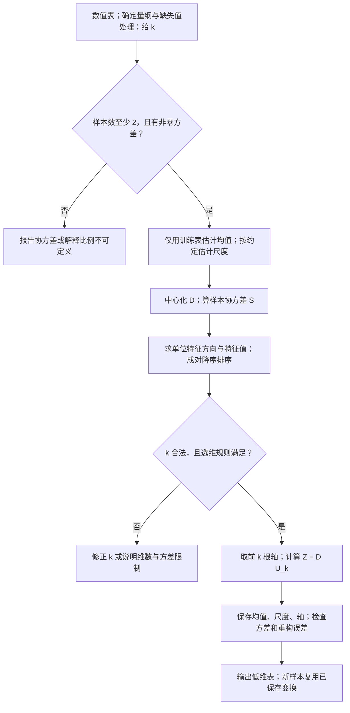

五点例PC2保存均值3/2，PC3得S=[[2.5,1.5],[1.5,1]]，PC4得两特征值3.427051/0.072949及单位轴。k1到PC6产生五个z；PC7核重构SSE0.291796，PC8交新表。新(6,4)只减旧均值并用旧轴，得3.603415。文字替代：fit均值/轴，transform只算坐标。

样本协方差除m−1；Kaiser另需相关矩阵。原点/尺度/轴需保持同一版本，图不证明标签分开。

读图自测：新点先用自己的均值中心化，为什么会读数0？

单点均值就是自身，减后零；但这不是PC2已保存训练变换，破坏坐标比较。

步骤 ①–⑤与前面的编号一一对应，没有 K-means 式重新分配循环。选维数若参考 Kaiser 的 $\lambda>1$，前提是相关矩阵 / 已标准化数据；对原单位协方差，1 是带单位的数，不能照搬这个阈值。理论上 $1\le k\le n$；样本少于列数时有效秩最多 $m-1$，多留的零方差轴没有额外信息，具体库的求解器还可能限制可输入的 $k$。

**数学原理：投影保留了什么，重构丢掉了什么**

先固定一根单位轴 $u$，输入是中心化点 $x_c$。

1. 点乘得一维读数 $z=u^\top x_c$。
2. 用读数乘轴，重构 $\hat{x}_c=uz$。
3. 原中心化点减重构，得残差 $r=x_c-\hat{x}_c$；残差与轴垂直。

$x_c,\hat{x}_c,r$仍有原维数，$z$是一数。多轴时用 $U_k$ 替u，z改为k数。下式是保留成分与丢弃成分的勾股关系：

$$\|x_c\|_2^2=\|\hat{x}_c\|_2^2+\|r\|_2^2.$$

这是勾股定理：每个点到原点的平方长度固定，让保留的投影平方长度总和最大，就使丢掉的残差平方总和最小。$U_k^\top U_k=I$ 使 $U_kU_k^\top$ 真正成为**正交投影**：留下沿轴的成分、去掉垂直成分，再投一次不会继续改变。若轴长度任意放大，这个简单重构式不再是投影，误差甚至会增加；不是“把轴放大就能使重构误差任意小”。

**完整五点复算**（沿用 §2.13.3 的笔记补充数据；`verify_m04_mechanisms.py` 的 `toy` 段）：原始点 $(1,1),(2,1),(3,2),(4,3),(5,3)$，平均点 $(3,2)$，中心化表为 $(-2,-1),(-1,-1),(0,0),(1,1),(2,1)$。

1. 逐列算平方与乘积：第一列平方和 10，第二列平方和 4，交叉乘积和 6；除以 $m-1=4$，得到 $S=\begin{pmatrix}2.5&1.5\\1.5&1\end{pmatrix}$。**这不是未中心化表直接相乘**。
2. 特征分解按 §2.14.1 的二次方程，取 $k=1$，$u=(0.850651,0.525731)$。均值、$S$ 与 $u$ 都是已经求出的训练状态。
3. 每点做点乘。例如第一点 $z=-2\times0.850651-1\times0.525731=-2.227033$；第二点 $z=-0.850651-0.525731=-1.376382$。负读数表示沿轴的反方向，不是“错误概率”。
4. 重构第一点：$(-2.227033)u+(3,2)=(1.105573,0.829180)$。与原点相减得到残差 $(-0.105573,0.170820)$；平方误差约 $0.040325$。丢掉一维通常无法还原每个原始点。
5. 下表给全体读数、重构与误差，可逐点检查，不只给一个总数：

每行同五点例的一对象；z是新刻度，重构仍在原坐标，残差原点减重构，末列两残差平方和。

**(1,1)**

一维读数 $z$：−2.227033

重构原坐标 $\hat{x}$：(1.105573,0.829180)

残差 $x-\hat{x}$：(−0.105573,0.170820)

平方误差：0.040325

**(2,1)**

一维读数 $z$：−1.376382

重构原坐标 $\hat{x}$：(1.829180,1.276393)

残差 $x-\hat{x}$：(0.170820,−0.276393)

平方误差：0.105573

**(3,2)**

一维读数 $z$：0

重构原坐标 $\hat{x}$：(3,2)

残差 $x-\hat{x}$：(0,0)

平方误差：0

**(4,3)**

一维读数 $z$：1.376382

重构原坐标 $\hat{x}$：(4.170820,2.723607)

残差 $x-\hat{x}$：(−0.170820,0.276393)

平方误差：0.105573

**(5,3)**

一维读数 $z$：2.227033

重构原坐标 $\hat{x}$：(4.894427,3.170820)

残差 $x-\hat{x}$：(0.105573,−0.170820)

平方误差：0.040325

(1,1)的z−2.227033重构(1.105573,0.829180)，平方误差0.040325；表用显示舍入，总和用未舍入0.291796。

6. 总误差 $0.291796$，等于舍弃方差 $0.072949\times4$；保留比例 $3.427051/(3.427051+0.072949)=0.979157$。原中心化表的平方和为 14，保留投影平方和为 $4\times3.427051=13.708204$，二者差也为 $0.291796$。三种核对口径一致，才完成整个例子。

**训练与新样本**：新点 $(6,4)$ 减去训练均值 $(3,2)$，得到 $(3,2)$，投影读数 $3\times0.850651+2\times0.525731=3.603415$。如果重新用这个新点自己算均值，会得到零向量，坐标就不再与训练样本可比。`fit` 保存变换，`transform` 复用；验证 / 测试集不能参与拟合均值、尺度和方向。

**停止、失败与迁移**：给定 $k$ 的有限矩阵计算完成并核对输出后停止；完整保留所有轴可重构中心化数据，保留较少轴只能近似。最大方差未必是业务目标最有用的信号，低方差方向也可能区分类别；不同量纲和极端值会主导方差。PCA 消除线性冗余，不能凭两轴散点看起来分开就保证任何预测任务更好。§7 新题要求换新点重构、识别错误缩放与测试集重新拟合。

🔗 `fit` 学变换、中心化且默认不自动缩放的接口边界见 [scikit-learn PCA 文档](https://scikit-learn.org/stable/modules/decomposition.html#principal-component-analysis-pca)（获取：2026-09-30）。本段矩阵推导与五点中间状态为笔记补充。

**为什么需要它**

`PCA(n_components=2).fit_transform(X)` 包含拟合和投影。先拟合前四步，再执行第五步变换。

保存的结果可这样对应：

| sklearn 字段 | 本节对象 |
|---|---|
| `mean_` | 训练均值 |
| `components_` | $U_{\text{reduce}}^\top$ |
| `explained_variance_` | 保留轴的特征值 |

考试要会写五步、解释协方差来源，并标出取轴与新坐标的维度。

**课件原例**

p.66 协方差矩阵定义；p.67 三个维度标注的矩阵式。

**🎙️ 课堂补充**（`01:33:39`–`01:35:25`，A · 概念讲解与计算降权）

教授介绍 D 到 D′ 的变换：保留所有方向仍是 m 行 n 列，只用主要方向后列数减少。计算范围明确降权：*"you do not need to understand all these calculations."*（`01:34:35`），紧接着说明目的：*"I just want to show you how the dimension can be reduced automatically after the data transformation."*（`01:34:49`）。tutorial 的库会计算分解（`01:34:58`）。

**这段改变了什么**：本次课堂要求偏向理解变换为何降维，非全部矩阵细算/推导背诵；不取消自学完整机制。口述 `01:33:48` 中矩阵 U 的形状有混用，严格形状仍按讲义 p.67：D 为 m×n，U 为 n×n，截断轴为 n×k。课堂没有验证本文五点与新样本重构。

**💡 换个说法（笔记补充）**

把 $D' = DU$ 想成"旋转整张表"：$U$ 是正交矩阵（各列互相垂直、单位长），乘上去只是把坐标轴转到主成分方向，点与点的距离不变、总方差不变。"降维"只是转完之后**把后面几列扔掉**——扔掉的列方差最小，所以损失最小。

五步中，特征分解通常交给软件完成。其余步骤也有数学含义：减均值确定参考点，协方差汇总变化，截断控制损失，投影得到坐标。

分析者仍须决定是否标准化以及保留几维。软件能执行计算，却不会自动替你决定任务目标。

**⚠️ 常见误解**

- ❌ 忘了中心化。→ p.66 明确 "preprocessed so that the mean of each attribute is 0"，本文还需除以m−1才是样本协方差；未中心化乘积则连偏差乘积和也不是（sklearn 的 `PCA` 内部会自动减均值）。
- ❌ 以为 $U_{\text{reduce}}$ 是"前 $k$ 行"。→ 是**前 $k$ 列**（每列一个特征向量）；$z = U_{\text{reduce}}^{\top}x$ 里的转置就是为了把列变成行去点乘 $x$。
- ❌ 照抄讲义 p.66 的下标，以为特征值有 $m$ 个。→ 特征值的个数等于 $S$ 的阶数 $n$（列数），不是样本数 $m$；讲义写成 $\lambda_{m-1} \ge \lambda_m$ 是 $m$/$n$ 混用（见 §9.3）。

**所以呢**：五步在 5 个点上跑完了；下一子节换真实数据——Iris 四维压到二维，对上 T04 的输出。

#### 2.14.3 数字例子：Iris 4 维 → 2 维（T04 实跑）

**是什么**

先说人话：把五步套到 Iris 上——150 朵花 × 4 列（厘米），压成 2 列。结果：第一主成分独占 92.5% 的方差，前两个合计 97.8%；第一主成分的方向主要由花瓣长度构成；第一朵花的新坐标是 (−2.684, 0.327)——这三个数和 T04 notebook 的输出完全一致。

**数字例子（手把手）**（`verify_m04_originals_current.py（2026-10-01 当前复算）` / `verify_m04_originals_current.py（2026-10-01 当前复算）`；**未标准化**，直接对原始厘米数据做，与 notebook 一致）：

1. 中心化：四列均值 (5.843, 3.054, 3.759, 1.199)；第一朵花 (5.1, 3.5, 1.4, 0.2) 减去均值 → (−0.743, 0.446, −2.359, −0.999)；
2. 协方差矩阵对角线（各列方差）：0.686 / 0.188 / 3.113 / 0.582；petal length 与 petal width 的协方差 1.296（相关 0.963 的来源）；
3. 特征分解：

每行Iris同次raw样本PCA一主轴，lambda为厘米数值坐标平方，比例无单位，累计为前轴和。

| 主成分 | 特征值 $\lambda$ | 方差解释比 | 累计 |
|---|---|---|---|
| PC1 | 4.2248 | **0.9246** | 0.9246 |
| PC2 | 0.2422 | 0.0530 | **0.9776** |
| PC3 | 0.0785 | 0.0172 | 0.9948 |
| PC4 | 0.0237 | 0.0052 | 1.0000 |

PC1 4.2248/总4.569≈0.9246；前两比例0.9776。该值不能改成分类正确率。

4. 检验：$4.2248 + 0.2422 + 0.0785 + 0.0237 = 4.569$ = 四列方差之和 $0.686 + 0.188 + 3.113 + 0.582 = 4.569$ ✓；
5. PC1 方向 $u^{(1)} = (0.3616, -0.0823, 0.8566, 0.3588)$（对应 sepal length、sepal width、petal length、petal width）——**载荷绝对值最大的是 petal length**（0.86）；方向由整个协方差矩阵共同决定，不能只根据单列方差最大推轴方向；
6. 投影第一朵花：$0.3616 \times (-0.743) - 0.0823 \times 0.446 + 0.8566 \times (-2.359) + 0.3588 \times (-0.999) = -0.269 - 0.037 - 2.021 - 0.358 = -2.684$——正是 T04 cell 31 输出的 $z_1$。

**机制展开（笔记补充）：补齐 Iris 的 4 → 2 中间矩阵**

本次直接从 `course_files_export/iris.txt` 的 150 行四列复算，仍用原始厘米数据，**不先标准化**；脚本 `verify_m04_mechanisms.py` 的 `iris` 段。顺序是萼长、萼宽、瓣长、瓣宽；此源文件的萼宽均值是 3.054，不以另一个 Iris 版本替换。

每行列为Iris原四属性；格为样本偏差乘积和除149，单位沿厘米的乘积。

| 样本协方差 | 萼长 | 萼宽 | 瓣长 | 瓣宽 |
|---|---|---|---|---|
| 萼长 | 0.685694 | −0.039268 | 1.273682 | 0.516904 |
| 萼宽 | −0.039268 | 0.188004 | −0.321713 | −0.117981 |
| 瓣长 | 1.273682 | −0.321713 | 3.113179 | 1.296387 |
| 瓣宽 | 0.516904 | −0.117981 | 1.296387 | 0.582414 |

瓣长/瓣宽1.296387是协方差；对角瓣长3.113179是样本方差，不是两列相关系数。

均值为 $(5.843333,3.054000,3.758667,1.198667)$。两根轴取：PC1 $(0.361590,-0.082269,0.856572,0.358844)$，PC2 $(0.656540,0.729712,-0.175767,-0.074706)$。这是 $U_2$ 的两列；在 sklearn `components_` 里通常按两行呈现，要注意转置。若软件给一整根轴的相反符号，相应新坐标也反号，重构仍相同。

1. 第一朵 $(5.1,3.5,1.4,0.2)$ 减训练均值，得到 $(-0.743333,0.446000,-2.358667,-0.998667)$。
2. 按 PC1 逐项乘加，得 $z_1=-2.684207$；按 PC2 逐项乘加，$z_2=0.656540(-0.743333)+0.729712(0.446000)-0.175767(-2.358667)-0.074706(-0.998667)=0.326607$。
3. 用两读数乘回两根轴，再加训练均值，得到重构 $(5.087182,3.513156,1.402043,0.211056)$。它接近原始四列，**没有将原始瓣长和瓣宽直接当成输出两列**。
4. 全体解释比例为 $0.924616,0.053016,0.017185,0.005183$；前两根合计 $0.977632$。全体两轴重构 SSE $=15.228833$，等于 $149(0.078524+0.023683)$（计算用未四舍五入特征值）。

因此“SelectKBest/RFE在本例保留花瓣两列、当前树SFS保留萼长和瓣长”与“PCA的主要变化和花瓣有关”是不同结论：**选择器保留原列，PCA 保留组合方向**。原始单位、轴方向符号、样本协方差分母与读数形状均已公开，可从输入复算到重构，而非只对上 PC1 的一个数。

**为什么需要它**

这组数字是 T04 §4.1 代码的手算对应：两轴保留约 97.8% 方差。PC1 的花瓣长度载荷较大，但仍组合了其他列。

回答 T04 第 2 题时，要区分输出：PCA 产生组合轴；Gini 或 SelectKBest 留下原列。不能把“保留两个主成分”说成“选中了两列”。

**课件原例**

讲义此处无例子（Iris 的 PCA 来自 T04 notebook）。

**🎙️ 课堂补充**（tutorial `02:04:27`–`02:07:46`，B · 示范 Iris 降维输出）

讲义阶段没有跑 Iris 数字例；后段 tutorial 用 PCA 指定两维，展示前几行新坐标后按类别画图。*"We only used like two."*（`02:07:02`）。教师指出图上 Setosa 易分开，但 Versicolor 与 Virginica 不能完全分开（`02:07:30`）。这确认输出是两列新坐标及图读边界。

**来源边界**：录音没有逐项报出本文的协方差、载荷、92.46%/97.76% 或重构误差；这些完整数值仍是既有脚本验证的 💡 笔记补充。PCA 无监督求轴，不因图上类别可分就变成按标签学习。

**💡 换个说法（笔记补充）**

载荷 $u^{(1)} = (0.36, -0.08, 0.86, 0.36)$ 可以读成一个"配方"：新坐标 $z_1$ = 0.36 份萼长 − 0.08 份萼宽 + 0.86 份瓣长 + 0.36 份瓣宽。瓣长的份量最重，所以 $z_1$ 大致就是"这朵花的花瓣有多大"——三个品种在这上面差得最远。

PC1 取得约 92% 方差，与三列的强正相关有关。M03 §2.11 中，瓣长与瓣宽相关约 0.963，萼长与瓣长约 0.872。

它们共享一部分花尺寸的变化，PCA 用一轴汇总。萼片宽度与这些列关联较弱，在 PC2 上更突出；具体解释仍以载荷为依据。

**⚠️ 常见误解**

- ❌ 以为 T04 的 Iris PCA 先标准化了。→ 没有，四列同为厘米直接做；标准化后方差比变成约 0.73 / 0.23（`verify_iris_card.py`），载荷也全变。作业若换做法要说明。
- ❌ 以为 `components_` 的符号和讲义必须一致。→ 符号任意（§2.13.2）；`verify_m04_originals_current.py（2026-10-01 当前复算）` 里 numpy 给出的 $u^{(1)}$ 全是负号，是同一根轴。

**所以呢**：实际工作里没人手算特征值——用软件跑，然后**读输出表**。最后两页教怎么读、怎么决定留几个。

---

### 2.15 用软件跑 PCA：读输出表、决定留几个（讲义 p.68–69）

**是什么**

软件输出每轴特征值、方差比例与累计比例。选维常用两条规则：

1. **Kaiser 规则**：在相关矩阵口径下保留特征值大于 1 的轴。因为标准化原列方差为 1，这表示该轴保留的方差超过一列的平均份额。
2. **累计比例规则**：依次保留前轴，直到累计解释比例达到指定阈值，如 70%–90%。

阈值选择还应结合任务损失。第一条不能直接套在任意单位的协方差上。

讲义 p.68–69 的例子（早餐麦片数据，⚪ 依据表格外观推断）：

> 1. Origin dataset **[77 × 13]**（77 种麦片 × 13 个营养 / 评分指标）
> 2. **Correlation matrix** (it is self-standardized)——用相关矩阵而不是协方差矩阵，相当于先把每列标准化
> 3. Get principle components：**Dimension is reduced from 13 to 4**；**Only four of them are having Eigenvalue greater than 1.**

"self-standardized"（自带标准化）：相关系数 = 协方差 ÷ 两个标准差（M03 §2.11），所以相关矩阵 = 每列先除以自己的标准差再算的协方差矩阵。13 个指标单位各不相同（卡路里、克、评分），原表 rating 均值42.6657、标准差14.0473，不能把它说成0–1；其他指标各有尺度。相关矩阵令各非退化变量在一致分母下方差为1，选择的是等方差权重，不宣称原尺度分析必然无效。

$$\text{方差解释比}_i = \frac{\lambda_i}{\sum_j \lambda_j}, \qquad \text{累计比例}_k = \sum_{i \le k} \text{方差解释比}_i$$

每行选维比例一量；分母为同次矩阵全部特征值之和，非某一类别或样本数。

| 符号 | 含义 |
|---|---|
| $\lambda_i$ | 第 $i$ 个特征值（§2.14.1） |
| $\sum_j \lambda_j$ | 全部特征值之和 = 总方差；用相关矩阵时 = 变量个数（每个标准化变量方差为 1） |
| 累计比例 | 前 $k$ 个主成分合计保留的方差比例 |

相关矩阵13变量总方差13；PC1=3.60984794/13，不先用舍入3.61算原累计。

**数字例子（手把手）**（p.69 输出表前四行，讲义截图数字；`verify_m04_originals_current.py（2026-10-01 当前复算）`）：

1. 总方差 = 13（13 个标准化变量各 1）；
2. 原表PC1特征值3.60984794、PC2为3.13848040，比例约0.27768061、0.24142157，累计约0.51910218。显示舍入的0.278与0.242相加会是0.520；要得原表累计0.5191，必须先用未舍入数求和。
3. PC3原值1.81673565、PC4原值1.06229479，原精度累计约0.65885108、**0.74056606**，原表显示0.7406；用舍入特征值1.82/1.06计算得到约0.74077，差异来自舍入，不能混成精确等式；
4. 第五个特征值 < 1，且特征值已按降序排列，后面不会重新超过 1；严格大于 1 的规则因此留 4 个。

每行麦片例一主成分，特征值/比例/累计保原显示精度，源原值正文另列。

| 主成分 | 特征值 | 单个比例 | 累计比例 |
|---|---|---|---|
| PC1 | 3.61 | 27.8% | 27.8% |
| PC2 | 3.14（原3.13848040） | 24.1% | 51.9% |
| PC3 | 1.82 | 14.0% | 65.9% |
| PC4 | 1.06 | 8.2% | **74.1%** |
| PC5 起 | < 1 | — | 停 |

PC4累计74.1%为0.74056606的舍入；前几显示比例之和与原累计有末位差，不能静默改任一原值。

**为什么公式长这样**：特征值就是各主成分的方差，除以总方差就是"占比"；累计是逐个相加。"特征值 > 1"规则的道理：相关矩阵下每个原始变量方差恰好是 1，一个主成分的方差不到 1 就说明它还不如随便拿一列原始变量，不值得留。

**Kaiser 边界**：相关矩阵若为单位阵，每个特征值都是 1，严格大于 1 会一根也不留。此时各方向等方差，不能凭该规则确定有用压缩。

若各标准化列近似由同一方向决定，第一特征值可接近列数。一个主成分可能保留大部分方差，但任务损失仍需验证。

原尺度协方差的特征值随单位变化，“1”没有通用比较意义。

**💡 单位方差、选维状态与零分母（笔记补充）**

要得到对角线为 1 的相关矩阵，缩放标准差与协方差必须采用一致分母。

`StandardScaler` 用总体标准差（分母 m）。若接着计算分母 m−1 的样本协方差，对角线就会变成 $m/(m-1)$，不能原样套阈值 1。

可直接计算相关矩阵，或改用样本标准差。对完整、无权重的同一批数据，也可将特征值乘 $(m-1)/m$ 后再判断。

共同倍数不改变方向和累计比例，却会改变绝对阈值。遇到缺失、权重或常数列，需要重新核对口径。

🔗 [StandardScaler 官方文档](https://scikit-learn.org/stable/modules/generated/sklearn.preprocessing.StandardScaler.html)、[PCA 官方文档](https://scikit-learn.org/stable/modules/generated/sklearn.decomposition.PCA.html)。原获取日期 2026-10-01；此前本机核对版本 sklearn 1.5.1。

**选维状态（笔记补充）**

输入为降序特征值、矩阵口径与目标规则；保存累计和及保留数量。

1. 检查非负及总和大于零。
2. 累计规则先声明 $0<\tau\le1$，逐项加到首次达标。
3. 严格Kaiser规则先核相关矩阵条件，再数所有大于1的值。
4. 返回k，保留同一次训练分解的前k列，新数据不重新选轴。

全零时无训练变化，比例未定义。Kaiser可能得到k=0，需报告未保留轴，不能凭空给第一主成分。相等特征值的边界子空间可以换轴，不宣称某轴唯一。

图问：严格大于1与累计阈值如何得到不同k？箭头表示规则判定和计数，不是自动业务最优。

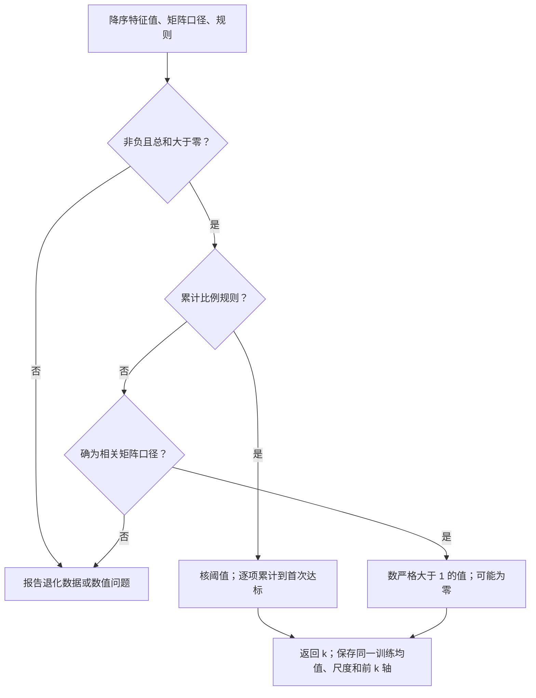

给三变量相关矩阵特征值1.8/0.9/0.3。总和3通过KS1；严格Kaiser走KS4/KS5保1根。累计80%走KS3，先60%再90%，保2根。文字替代：先核总和/口径，再走预先选的规则。

阈值1只对一致相关矩阵口径；全零比例未定义。四行总体标准化再样本协方差会整体放大4/3，不能照数>1。

读图自测：若值全为1，严格KS5保几根？

0根，必须报告该规则没有保留方向；不是默认输出第一轴，也不证明数据没任何业务信息。

迁移：三变量相关矩阵特征值为 1.8、0.9、0.3；Kaiser 与累计 80% 各留几个？若先做总体标准化再算四行样本协方差，原阈值应怎样核？

总方差 3。严格 Kaiser 留 1 个；累计比例先为 0.6，再为 0.9，故 80% 规则留 2 个，解释 90%。若四行先按总体尺度标准化，样本协方差特征值全部放大 $4/3$：2.4、1.2、0.4；直接数大于 1 会错误留 2 个。应恢复相关矩阵口径，或相应比较阈值 $4/3$。方差保留比例没有保证预测表现；全零时不能用 $0/0$ 装作累计为 100%。

**为什么需要它**

考试很可能给一张这样的表问"应保留几个主成分、为什么"（🟡）。两条规则要会说：

每行一规则，操作、前提及两个来源例子分开；这些规则是候选选维政策。

**Kaiser 准则：特征值 > 1**

怎么用：数有几个 λ 超过 1

适用前提：**只对相关矩阵 / 标准化数据成立**

麦片例子：4 个

Iris 例子：用的是协方差矩阵，**规则不适用**

**累计方差阈值**

怎么用：从上往下加，到阈值为止

适用前提：通用；阈值看下游任务（画图 2 个够，回归常要 80–90%）

麦片例子：4 个 = 74%

Iris 例子：PC1 就 92.5%，两个 97.8%

**碎石图（scree plot，💡 补）**

怎么用：画特征值折线，找"拐点"

适用前提：通用，但主观

麦片例子：—

Iris 例子：4.22 → 0.24 断崖，留 1

Kaiser先核相关矩阵；Iris原厘米协方差不能照数>1。累计阈值是输入策略，不由同表保证业务效果。

两条规则可能给出不同答案；T04 的 Iris notebook 留 2 个是为了画二维图。

**课件原例**

p.68 77 × 13 数据表与相关矩阵截图；p.69 四个主成分。

**🎙️ 课堂补充**：⏭️ 本次没有展开 p.68–69 的 77×13 软件表及特征值大于 1 的选维例。

`01:35:23`–`01:35:25` 仍在收束特征值与特征向量。`01:35:28` 教授说：

> I think that's all for the lecture

`01:36:05` 再次宣布讲义结束并休息。之后 tutorial `02:05:17`–`02:05:31` 是在 Iris 人工设二维，并未补讲麦片数据或该阈值。

建议保留本节作为理解选维的自学内容，课堂细算可降优先级；不因此删掉相关矩阵、样本尺度和严格阈值的限制，也不写“所有 PCA 输出解读都不考”。

**💡 换个说法（笔记补充）**

选择矩阵口径前，先问各列的相对尺度是否有业务意义。

想保留原尺度及方差差别时，可用协方差矩阵。例子是同为厘米的 Iris 四列，或统一取值范围的图像像素。

想让各列先有相同方差权重时，使用相关矩阵。麦片的卡路里与评分、Airbnb 的人数与评分，单位不同，尤其需要明确该选择。

标准化实现的是等方差权重，不是自动正确的答案。Airbnb 作业版本边界另见 T04。

另一个角度："留几个"没有唯一正确答案，它是一个业务决定：要画图就留两个，要做回归则结合训练内验证选维数，90% 可作为候选阈值，要给老板讲就留能解释的那几个。规则是帮你说服别人的理由，不是替你做决定的机器。

**⚠️ 常见误解**

- ❌ 把"特征值 > 1"规则用在协方差矩阵上。→ 协方差矩阵的特征值量纲随数据走，"1"没有意义；规则只对相关矩阵成立。
- ❌ 以为累计 74% "太低"。→ 13 维压到 4 维还保留 74% 的方差已经很划算；阈值取多少取决于下游任务。
- ❌ 以为主成分个数是软件定的。→ 软件会算出全部 13 个，留几个是**人**按规则决定的（sklearn 里就是 `n_components` 参数）。

**所以呢**：这份 Iris 例中，Gini、SelectKBest 与 PC1 载荷都提示花瓣信息较强，但评价对象与目标不同，换任务后不保证同序。§3 的图把它们串起来。

---

## 3. 一图看懂

### 3.1 本讲的地图：打分 → 减维的两条路

总览问：要留原列还是换成新坐标？箭头表示学习依赖及两条表示路径，不表示PCA必须先完成过滤。

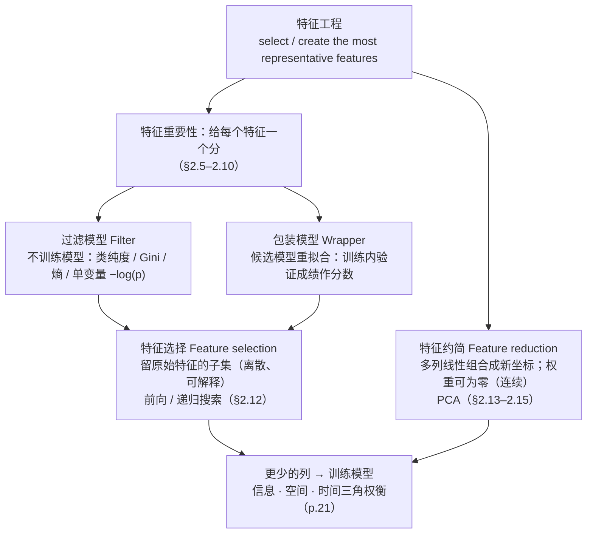

Iris原列选择走IMP→F→SEL，输出花瓣原列；PCA可直接由FE→RED构造组合轴，输出z1/z2。两者到OUT后另验证下游目标。文字替代：可选原列子集，也可组合坐标。

总览不替代局部算例；列少不保证更快更准，信息/空间/时间需要同协议比较。

读图自测：PCA轴第一项权重最大就能当只保一原列吗？

不能。RED是组合方向，多列权重仍参与；SEL才是成员选择。

这张图说的是：特征工程可以先**打分**（两种模型）再**减维**，也可以直接走 PCA 这条无监督约简路径；两类方法都可能让表示更紧凑，代价是要检查丢失的信息。

### 3.2 一次分裂的增益怎么算

复习图问：每子不纯度的分母和加权分母有何不同？箭头是计数/评分依赖。

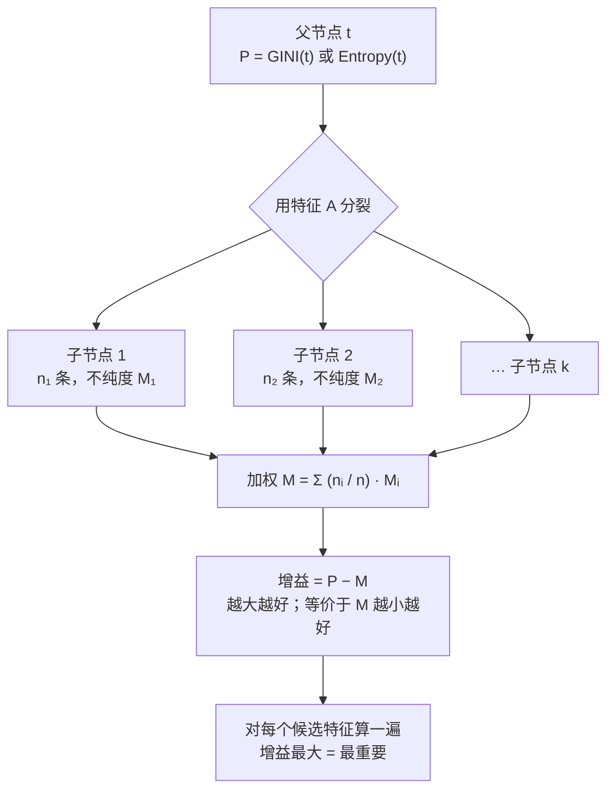

p.44父50/100得P0.4444。Set1自身60人得Gini0.2778，Set2自身90人得0；M节点按60/150与90/150加权到0.1111，G节点得增益0.3333。文字替代：各堆比例→各堆分数→人数权重→父减子。

CMP只在同父/同评分协议比较；ID训练增益最大仍有泛化风险，不能用图跳过验证。

读图自测：Set1的50/150能否作为计算其Gini的比例？

不能。它应50/60；150用于子节点占父节点权重，不用于本堆类别比例。

这张图说的是：不管用 Gini 还是熵，流程都一样——父节点算一次、每个子节点算一次、按样本数加权、用父减子。p.44 小测：$0.4444 - 0.1111 = 0.3333$。

### 3.3 PCA 五步

复习图问：m行n列怎样变m行k列？箭头是保存状态与矩阵结果的依赖。

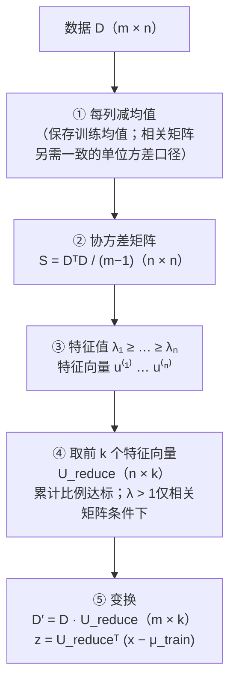

五点2列在C减均值得D5×2，S得到2×2矩阵，E得两单位方向。K取前1列为2×1，Z输出5×1读数。文字替代：样本数不变，描述方向变少。

初始D0指原表，经过C后才叫中心化D；单样本原x先减训练均值。相关矩阵与原单位协方差规则分别核。

读图自测：能否取U_reduce前k行，仍直接右乘D？

本图约定每列一轴，必须取前k列。取行会改变形状及方向含义；API components_按行存时需对照转置。

图中五步是：中心化、算协方差、特征分解、截断、投影。软件可以完成这些运算。

使用者仍须决定是否标准化以及保留几维。未中心化会混入均值项，但第一轴不一定沿均值；幂迭代收敛也有初始方向条件，见 §2.14.1–2.14.2。

---

## 4. 速查表

### 4.1 不纯度与增益（讲义 p.32–42）

每行复习一评分量，公式、边界和用途单独读；概率/bit/尾概率变换不能混单位。

| 量 | 公式 | 最小 | 最大 | 用在 |
|---|---|---|---|---|
| Gini | $1 - \sum_j p(j \mid t)^2$ | 0（纯） | $1 - 1/n_c$（两类 0.5） | CART, SLIQ, SPRINT；sklearn 树默认 |
| 熵 | $-\sum_j p(j \mid t)\log_2 p(j \mid t)$ | 0（纯） | $\log_2 n_c$（两类 1） | ID3, C4.5 |
| 分裂后（加权） | $\sum_i \frac{n_i}{n}\,\text{Impurity}(i)$ | — | — | 两者通用 |
| 增益 | $P - M$ | — | — | 越大越重要 |
| 讲义单变量分数 | $-\log(p\text{-value})$ | — | — | 检验p的变换；`SelectKBest.scores_`实际是score_func返回的F/卡方等统计量，见§2.8.3 |

二类Gini最大0.5，熵最大1bit；nc变时最大值也变。

**常用数值**（两类，6 条记录）：(0,6) → Gini 0 / 熵 0；(1,5) → 0.278 / 0.65；(2,4) → 0.444 / 0.92；(3,3) → 0.5 / 1.0。

### 4.2 过滤 vs 包装（讲义 p.25, p.43, p.50）

每行Filter/Wrapper一维度，学习算法参与的是选择阶段，不是从此是否有最终模型。

| | Filter | Wrapper |
|---|---|---|
| 用学习算法？ | 否 | 是（预定模型） |
| 分数来源 | 数据的一般性质：信息 / 距离 / 依赖 / 一致性 | 模型在明确验证协议下的预测表现 |
| 优点 | 不预先绑定最终模型，常用于粗筛；不等于统计无偏保证 | 直接评价所选模型/协议；不保证任何数据都更准 |
| 缺点 | 不知道模型喜不喜欢 | **计算贵**；换模型要重来 |
| T04 对应 | `SelectKBest(chi2 / f_classif)` | `RFE`、`SequentialFeatureSelector`；`ExtraTrees` + `SelectFromModel`（严格说是嵌入式） |

统计过滤可之后训练分类器；SFS/RFE的具体机制仍按本篇完整状态，不仅看类型名。

### 4.3 选择 vs 约简（讲义 p.47–49）

每行选择/PCA输出的比较，不以“不可解释”绝对否定载荷解释。

| | Feature selection | Feature reduction（PCA） |
|---|---|---|
| 结果 | 原始特征的**子集** | 原始特征的组合（系数可以为0） |
| 性质 | 离散 | 连续 |
| 可解释？ | 是（列名不变） | 否（$z_1, z_2$ 无业务名） |
| 目标 | 降维 + 去噪；速度 / 准确率 / 可理解 | 本讲 PCA 为无监督最大方差/最小投影误差；有监督约简是另一种目标，不等于 PCA |
| 搜索 | 前向 / 后向 / 递归（贪心） | 特征值分解（解析解） |

PCA需结合方向载荷解释，新坐标没有现成业务名；选择列名虽保留，也不自动成为因果。

### 4.4 PCA 记号（讲义 p.57, p.66–67）

每行一个矩阵量，形状注明谁是样本/列/轴；单样本式明确原x减训练均值。

| 记号 | 维度 | 含义 |
|---|---|---|
| $D$ | $m \times n$ | 中心化后的数据，行 = 样本 |
| $S = D^{\top}D/(m-1)$ | $n \times n$ | 本篇主口径的样本协方差；未归一的原讲义量为散布矩阵 |
| $\lambda_i$ | 标量 | 第 $i$ 大特征值 = PC$_i$ 的方差；方差比例 $= \lambda_i / \sum\lambda$ |
| $u^{(i)}$ / $U$ | $n \times 1$ / $n \times n$ | 特征向量 = 主成分方向 / 全部拼成的矩阵 |
| $U_{\text{reduce}}$ | $n \times k$ | 前 $k$ 列 |
| $D' = DU_{\text{reduce}}$ | $m \times k$ | 变换后整张表 |
| $z = U_{\text{reduce}}^{\top}(x-\mu_{\text{train}})$ | $k \times 1$ | 原始单样本减保存训练均值后的新坐标 |
| $G$（p.57） | $d \times p$ | 同 $U_{\text{reduce}}$，目标 $\min \lVert X - GG^{\top}X \rVert_F^2$ |

D5×2右乘Ureduce2×1，得5×1；API按行存components_需转置映射。

**留几个**：相关矩阵 → 特征值 > 1；或累计方差 ≥ 阈值（麦片例：4 个，0.7406；Iris：PC1 0.925、前两个 0.978）。

### 4.5 本讲的硬数字

每项保本讲硬数字及来源；时间、准确率、维度、平方误差不同单位不得合成分数。

| 数字 | 出处 |
|---|---|
| $10^6 \times 10^5 \times 8$ B = **800 GB** | p.20 |
| CIFAR-10：3072 维 63.1% / 2 h；PCA 100 维 59.8% / 250 s | p.21 |
| 父 (7,5) Gini 0.486 → 子 (5,1)/(2,4) 加权 0.361 | p.38 |
| CarType 不同切法的加权 Gini，见表下“切法比较” | p.39 |
| 小测：sepal length 分裂后 **0.111**，增益 0.333；petal width 0，增益 0.444 | p.44 + 本笔记 |
| 麦片 77 × 13 → 4 PC，特征值 3.61 / 3.14 / 1.82 / 1.06，累计 0.7406 | p.69 |

**切法比较**：多路约 0.163；{S}/{F,L} 约 0.167；{S,L}/{F} 约 0.468。它们都对同一父节点比较，S、F、L 分别指 Sports、Family、Luxury。

800GB是密集float64十进制阵列；CIFAR时间比是原配置，不承诺新电脑同值。

---

## 5. 双语术语卡

下面拆为双语卡，每卡保完整英文定义与首现位置；不为缩短单元格删原英文。

**特征**

English：Feature

考试可用的英文定义：A set of attributes to describe a complex object (e.g. size, RGB, or sub-images of an apple).

首现：§2.2

**特征工程**

English：Feature engineering

考试可用的英文定义：Select / create the most representative features for a problem; it is problem-specific.

首现：§2.3

**代表性**

English：Representativeness

考试可用的英文定义：How well a feature (set) distinguishes the objects the task cares about.

首现：§2.3

**冗余特征**

English：Redundant feature

考试可用的英文定义：A feature that adds no information given another feature already present (e.g. "Feeling" given "Temperature").

首现：§2.4

**维度灾难**

English：Curse of dimensionality

考试可用的英文定义：High dimensionality can increase storage and geometric coverage costs. Grid coverage at a fixed resolution grows exponentially with dimension; this is not a universal classification-error sample bound.

首现：§2.4

**信息–空间–时间权衡**

English：Trade-off between information, data space and computation time

考试可用的英文定义：Selecting fewer features loses some information but saves storage and time (CIFAR-10: 3072 vs 100 dims).

首现：§2.4

**特征重要性**

English：Feature importance

考试可用的英文定义：Techniques that calculate a score for all input features to measure their representativeness, so the machine can select automatically.

首现：§2.5

**类纯度**

English：Class purity

考试可用的英文定义：Simple counting of class distinctiveness in each subset after a split; the purer, the better.

首现：§2.5

**节点不纯度**

English：Node impurity

考试可用的英文定义：A measure of how mixed the classes are at a node; 0 when all records belong to one class.

首现：§2.6

**增益**

English：Gain

考试可用的英文定义：$P - M$: impurity before splitting minus weighted average impurity of the children; choose the split with the highest gain.

首现：§2.6

**Gini 指数**

English：Gini index

考试可用的英文定义：$\text{GINI}(t) = 1 - \sum_j p(j \mid t)^2$; max $1 - 1/n_c$ when classes are equally distributed, min 0 when pure. Used in CART, SLIQ, SPRINT.

首现：§2.7

**加权 Gini**

English：GINI_split

考试可用的英文定义：$\sum_{i=1}^{k} (n_i/n)\,\text{GINI}(i)$ over the $k$ children; choose the attribute that minimizes it.

首现：§2.7

**多路 / 二路分裂**

English：Multi-way / Two-way split

考试可用的英文定义：Split a categorical attribute into one child per value, or find the best binary partition of values.

首现：§2.7

**熵**

English：Entropy

考试可用的英文定义：$-\sum_j p(j \mid t)\log_2 p(j \mid t)$; max $\log n_c$, min 0.

首现：§2.8

**信息增益**

English：Information gain

考试可用的英文定义：$\text{Entropy}(p) - \sum_i (n_i/n)\,\text{Entropy}(i)$; choose the split that maximizes it. Used in ID3 and C4.5.

首现：§2.8

**单变量分数**

English：Univariate score

考试可用的英文定义：$-\log(p\text{-value})$ of a per-feature statistical test (ANOVA, chi-square).

首现：§2.8

**过滤模型**

English：Filter model

考试可用的英文定义：Feature selection without learning-algorithm involvement, relying on general characteristics of data; unbiased toward any algorithm and fast.

首现：§2.9

**包装模型**

English：Wrapper model

考试可用的英文定义：Feature selection using a predetermined learning model and its predictive accuracy as the goodness measure; model-dependent validation performance, with potentially high computation cost; not a guarantee of higher accuracy.

首现：§2.9

**特征选择**

English：Feature selection

考试可用的英文定义：A process that chooses an optimal subset of features according to an objective function; reduces dimensionality and noise, improves speed, accuracy and comprehensibility.

首现：§2.11

**特征约简**

English：Feature reduction

考试可用的英文定义：Mapping the original high-dimensional data onto a lower-dimensional space; the new features combine original columns with specified coefficients, some of which may be zero; truncation can lose variation.

首现：§2.11

**最优子集**

English：Optimal subset

考试可用的英文定义：The smallest feature subset that determines the class (e.g. {F1, F2} or {F1, F3} when $C = F_1 \vee F_2$, $F_3 = \neg F_2$).

首现：§2.12

**前向 / 后向搜索**

English：Forward / Backward search

考试可用的英文定义：Traverse the subset lattice from the empty set adding features, or from the full set removing features.

首现：§2.12

**递归特征选择**

English：Recursive feature selection

考试可用的英文定义：Greedy: evaluate adding one feature at a time to the current set and keep the best; works with filter or wrapper scores.

首现：§2.12

**主成分分析**

English：Principal component analysis (PCA)

考试可用的英文定义：Find a smaller set of new, uncorrelated variables (principal components) ordered by the fraction of total variation each retains.

首现：§2.13

**主成分**

English：Principal component (PC)

考试可用的英文定义：A linear least-squares fit direction, each orthogonal to all previous ones; the 1st PC captures the most variance.

首现：§2.13

**重构 / 投影误差**

English：Reconstruction / projection error

考试可用的英文定义：$\lVert X - G G^{\top} X \rVert_F^2$: the squared distance between data and its projection onto the chosen directions; PCA minimizes it.

首现：§2.13

**协方差矩阵**

English：Covariance matrix S

考试可用的英文定义：For mean-centered $m \times n$ data $D$, $S = D^{\top}D/(m-1)$.

首现：§2.14

**特征值 / 特征向量**

English：Eigenvalue / Eigenvector

考试可用的英文定义：$Su = \lambda u$; eigenvalues of $S$ are non-negative and ordered; the $i$-th eigenvector is the $i$-th PC direction, $\lambda_i$ its variance.

首现：§2.14

**变换矩阵**

English：$U$ / $U_{\text{reduce}}$

考试可用的英文定义：Matrix of eigenvectors; taking the first $k$ columns gives $D' = DU_{\text{reduce}}$, $z = U_{\text{reduce}}^{\top}(x-\mu_{\text{train}})$.

首现：§2.14

**特征值 > 1 准则**

English：Eigenvalue-greater-than-1 rule

考试可用的英文定义：With a correlation matrix, keep components whose eigenvalue exceeds 1 (one original variable's variance).

首现：§2.15

**累计方差解释比**

English：Cumulative proportion of variance

考试可用的英文定义：$\sum_{i \le k}\lambda_i / \sum_i \lambda_i$; e.g. 0.7406 for 4 of 13 components.

首现：§2.15

定义读完回到原计算问题：熵是平均信息，PCA是组合方向；英文压缩不替代本节边界。

---

## 6. 考点预判与答题框架

### 6.1 可信度分级

每行证据等级与本讲来源，4条🔴仍按本次原话范围，不随候选产生升级。

| 级别 | 含义 | 本讲 |
|---|---|---|
| 🔴 教授明示 | 转录里教授明确说过会考 / 要记 | **4条**（含PCA细算反向提醒，依据本次W04录音） |
| 🟡 ILO 反推 | 对应官方 CILO / 讲义标题页的 Reading Material / 作业要求 | CILO-2（35%，用工具发现模式）、CILO-3（数据挖掘技术的应用） |
| ⚪ 笔记推断 | 讲义排版信号、作业题型、同类课程惯例 | 见下 |

PCA细算反向提醒不取消全部机制学习；未录到与课堂略过分开。

> 考试范围包含"课上指定的阅读材料"——本讲标题页写 **HM Chapter 8**（《Hands-On Machine Learning》Dimensionality Reduction：维度灾难、投影、PCA、方差解释比、核 PCA）。讲义 p.30–42 的 Gini / 熵来自 Tan 等教材的决策树章节（DM Chapter 3 / 4，视版本），⚪ 原计划/历史暂定为 W05 决策树会重讲，实际课次以 Canvas 为准。

### 6.2 考点清单

每卡保考点ID、可信度、完整依据/时间戳和小节，原英文引文不缩短。

**W4-1**

可信度：🔴

考点：**Gini计算与p(j｜t)相对频率定义须记，cheat sheet不能只抄公式**

依据：*"the most critical term in this expression that you need to remember is PJT, and the definition of PJT."*（`51:11`）；*"That's one of the very few calculations you need to remember for the whole semester, okay?"*（`01:00:17`）

小节：§2.7.1–2.7.2

**W4-2**

可信度：🔴

考点：**给分布会用Gini/熵评价代表特征**

依据：*"you should be able to do that using the Gini index or entropy."*（`01:07:25`）；p.44被称上学期题而非本堂参与测验

小节：§2.10

**W4-L1**

可信度：🔴

考点：会辨认特征选择和约简：保留原列 vs 造新表示

依据：`01:09:04`–`01:09:08`：*"if I ask you to identify whether it is feature selection or dimension reduction, you should be able to do that."*

小节：§2.11

**W4-L2**

可信度：🔴（反向）

考点：PCA重点理解为何是主成分，不要求掌握当时全部矩阵细算

依据：`01:21:34`：*"you only need to remember why they are called principal components"*；`01:34:35`：*"you do not need to understand all these calculations."* → 自学机制保留，不扩为全课计算不用会

小节：§2.13–§2.14

**4.1**

可信度：🟡

考点：⭐ **给一张分裂前后的计数表，算 Gini / 熵与增益，判断哪个特征更重要**

依据：p.44 课堂小测原题；p.35–42 共 8 页算例；T04 作业第 1 题要重做 `f_classif`

小节：§2.7, §2.8, §2.10

**4.2**

可信度：🟡

考点：**过滤模型 vs 包装模型**：定义、谁用学习算法、优缺点、各举一种方法

依据：T04 作业第 1 题原题；讲义 p.25 / 43 / 50 三处

小节：§2.9

**4.3**

可信度：🟡

考点：**特征选择 vs 特征约简**：子集 vs 线性组合、离散 vs 连续、可解释性

依据：T04 作业第 2 题原题；讲义 p.49 专页

小节：§2.11

**4.4**

可信度：🟡

考点：⭐ **PCA 的目标与算法**：最小重构误差 = 最大保留方差；五步；$S = D^{\top}D/(m-1)$、特征向量 = 方向、特征值 = 方差、$z = U_{\text{reduce}}^{\top}(x-\mu_{\text{train}})$

依据：讲义 p.56–67 共 12 页；HM Ch.8

小节：§2.13, §2.14

**4.5**

可信度：🟡

考点：**读 PCA 输出表决定保留几个主成分**（特征值 > 1、累计比例）

依据：讲义 p.68–69 用真实软件输出

小节：§2.15

**4.6**

可信度：🟡

考点：**特征工程的定义、"因问题而异"、三大挑战**

依据：讲义 p.13–20；CILO-2

小节：§2.3, §2.4

**4.7**

可信度：⚪

考点：**维度灾难**：800 GB 算例 + 稀疏；三角权衡（CIFAR-10 数字）

依据：讲义唯一两组硬数字；"Is high dimension always good?" 自问自答

小节：§2.4

**4.8**

可信度：⚪

考点：**递归 / 前向特征选择的流程**（三轮各评什么）与为什么需要它（组合爆炸）

依据：p.53 "How to make feature selection efficient??" + p.54–55 两页流程

小节：§2.12

**4.9**

可信度：⚪

考点：**Gini 与熵的性质**：最大值 $1 - 1/n_c$ / $\log n_c$、最小值 0、各用于哪些算法（CART vs ID3/C4.5）

依据：p.35、p.40 各列两条性质并点名算法

小节：§2.7, §2.8

**4.10**

可信度：⚪

考点：**多路分裂 vs 二路分裂**：类别属性怎么切、二路要找最佳划分

依据：p.39 三种切法并列

小节：§2.7

**4.11**

可信度：⚪

考点：**PCA 四条性质**（0 协方差、有序、第一个最大、逐次最大剩余）

依据：p.65 整页四条

小节：§2.13

**4.12**

可信度：⚪

考点：**Customer ID 为什么增益最大却不是好特征**

依据：p.30 把它放进候选，讲义未答

小节：§2.6

**4.13**

可信度：⚪

考点：**相关矩阵 vs 协方差矩阵做 PCA 的区别**（"self-standardized"）

依据：p.68 特意注明

小节：§2.15

**4.14**

可信度：⚪

考点：**线性 PCA 的局限与核 PCA 的动机**

依据：p.59 一页；HM Ch.8 有一节

小节：§2.13

W4-1需记p(j|t)定义，分母为当前节点；p.44旧学期题不是本堂举行小测。

### 6.3 答题框架

**题型 A · 不纯度与增益计算**（给父节点与分裂后的计数）

1. 按题目选Gini或熵，未指定可用Gini并注明。
2. 算同一个父节点 $P$。
3. 各子节点分别算，类别比例分母是该子节点人数。
4. 按 $n_i/n$ 加权得 $M$。
5. 算增益 $P-M$。
6. 同父节点的候选列表比较，报告最大增益。
7. 若有ID每人一叶，另说明训练增益可能最大但泛化未证，不能只按该数选业务特征。

分数先写分数再写小数，例如 $1-(5/6)^2-(1/6)^2=0.278$，保留阅卷可追的步骤。

**题型 B · 过滤 / 包装 / 选择 / 约简的比较论述**

一张 2 × 2 表答完：行 = 定义、是否用学习算法、分数来源、优缺点、代表方法（`SelectKBest` / `RFE`；子集 / PCA）。结尾一句"实践中先过滤粗筛再包装精选"或"要可解释用选择、要压缩用约简"。

**题型 C · PCA 步骤 / 记号题**

1. 中心化；若标准化，先说明原因。
2. 用 $S=D^\top D/(m-1)$ 算样本协方差。
3. 求特征向量，并按特征值降序。
4. 取前 k 个方向，组成 n×k 的 $U_{\text{reduce}}$。
5. 批量投影得到 m×k 的 $D'=DU_{\text{reduce}}$。
6. 新单点先减训练均值，再沿保留轴投影。

目标是最小重构平方误差，等价于最大保留方差。主成分互不相关，并按方差排序。

答题须补口径：SSE 是误差平方和，舍弃的样本方差之和需乘 m−1 才得到 SSE。幂迭代还需唯一最大特征值及非零第一轴初始分量。

**题型 D · 读 PCA 输出表**

1. 先识别相关矩阵或协方差矩阵。
2. 相关矩阵口径可统计特征值大于 1 的个数。
3. 再检查累计比例是否达到题目或业务阈值。
4. 两规则冲突时，用下游任务表现解释取舍。

保留 k 个主成分，就是将 n 维压到 k 维。方差损失比例为 1 减去累计保留比例。

---

## 7. 自测

### 概念题

1. 讲义说特征是"a set of attributes to describe a complex object"。用苹果的例子说明为什么同一个对象可以有多组特征，以及"哪组更好"由什么决定。

答案

苹果可以用尺寸（10 cm × 10 cm）、颜色（RGB 220, 156, 140）、子图三组特征描述——特征是**人选的描述方式**，不是数据自带的。哪组更好由**任务**决定（p.15 problem-specific）：分苹果和橙子，尺寸相同、RGB 不同，颜色更"有代表性"；分大苹果和小苹果则相反。→ §2.2–2.3

2. 100 万条 × 10 万维的数据要多少内存？高维还有什么问题？讲义用什么例子说明降维是"权衡"？

答案

稠密存储量为 $10^6\times10^5\times8=8\times10^{11}$ B，即 800 GB（p.20）。

大量数值为零叫稀疏表示；空间中的观察点少叫覆盖不足。两者都不等于缺失值为空。

💡 固定每轴网格分辨率时，格数随维度指数增长。这不是任意分类任务的样本量公式。

CIFAR-10 讲义实验中，3072 维为 63.1%、2 小时；降到 100 维后为 59.8%、250 秒。这体现信息、空间和时间的权衡（p.21）。→ §2.4

3. 一个节点有 C1 = 3、C2 = 9。算它的 Gini 指数和熵（$\log_2$）。

答案

$p_1 = 0.25$，$p_2 = 0.75$。Gini $= 1 - 0.0625 - 0.5625 = 0.375$。熵 $= -0.25\log_2 0.25 - 0.75\log_2 0.75 = 0.5 + 0.311 = 0.811$。→ §2.7–2.8（脚本 `verify_m04_originals_current.py（2026-10-01 当前复算）` 复算）

4. 父节点 (10, 10)。特征 A 切成 (6, 4) / (4, 6)；特征 B 切成 (1, 3) / (8, 0) / (1, 7)。用 Gini 判断哪个更重要。

答案

父 Gini 0.5。A：每堆 $1 - 0.36 - 0.16 = 0.48$，加权 0.48，增益 0.02。B：(1,3) → 0.375；(8,0) → 0；(1,7) → $1 - 1/64 - 49/64 = 0.21875$；加权 $= 0.2 \times 0.375 + 0.4 \times 0 + 0.4 \times 0.21875 = 0.1625$，增益 0.3375。**B（CarType）更重要**。这就是 p.30 的例子（脚本 `verify_m04_originals_current.py（2026-10-01 当前复算）`）。→ §2.6–2.7

5. 用 sepal length 把 Iris 切成 (Setosa 50, Non-Setosa 10) 和 (0, 90)。分裂后的 Gini 是多少？增益是多少？跟用 petal width 切成 (50, 0) / (0, 100) 比呢？

答案

Set 1：$1 - (50/60)^2 - (10/60)^2 = 0.2778$；Set 2：0；加权 $= 0.4 \times 0.2778 = 0.1111$。父节点 $1 - (1/3)^2 - (2/3)^2 = 0.4444$，增益 0.3333。petal width 两堆都纯，分裂后 0，增益 0.4444 > 0.3333，**petal width 更重要**。→ §2.10（p.44 小测）

6. 过滤模型和包装模型各是什么？各说一个优点、一个缺点，并各举 T04 里的一个方法。

答案

过滤：不用学习算法，靠数据的一般性质（信息、距离、依赖、一致性）打分；通常快、不预先绑定估计器；但不针对具体模型，也不保证统计无偏。例：`SelectKBest(f_classif)`。包装：用预定模型的验证成绩评价候选子集；能针对模型，但不保证更准，计算贵且更换模型通常需重做选择。例：`RFE`、`SequentialFeatureSelector`。→ §2.9

7. 特征选择和特征约简的三点区别。

答案

1. 选择保留原始列的子集；线性约简由多列加权生成新坐标，部分权重可为零。
2. 选择决定列的离散成员资格；约简学习连续系数。
3. 原列名便于解释；新坐标需结合载荷解释。压缩程度和下游表现均需验证。

→ §2.11（p.49）

8. 全集 {F1, F2, F3, F4}，前向递归选择的三轮各评价哪些子集？为什么不直接枚举所有子集？

答案

第一轮评 {F1}、{F2}、{F3}、{F4} 选最好（设为 F2）；第二轮评 {F2,F1}、{F2,F3}、{F2,F4}；第三轮评 {F2,F3,F1}、{F2,F3,F4}；最后在 {F2}、{F2,F3}、{F2,F3,F1}、全集里选最好。共评 10 个子集而不是 15 个；特征 40 个时枚举要 $2^{40} \approx 10^{12}$ 次，贪心只要约 800 次。代价是不保证全局最优。→ §2.12（p.54）

9. 写出 PCA 的五步，并标出 $D$、$S$、$U_{\text{reduce}}$、$D'$ 的维度。PCA 的目标用两种等价说法表述。

答案

先按以下五步作答，并标维度：

1. 每列减训练均值，得到 m×n 的 D。
2. 算 n×n 的样本协方差 $S=D^\top D/(m-1)$。
3. 求特征值与对应单位方向，按特征值降序。
4. 前 k 个方向组成 n×k 的 $U_{\text{reduce}}$。
5. 批量投影为 $D'=DU_{\text{reduce}}$，维度 m×k。

单点沿用训练均值，$z=U_{\text{reduce}}^\top(x-\mu_{\text{train}})$，维度 k×1。

目标是最小化重构平方误差，等价于最大化保留方差。保留轴正交，坐标之间协方差为零。

**条件复习**：全部丢弃时，SSE=(m−1)×样本总方差。五点例为 4×3.5=14，不能直接写 3.5。

未中心化不保证首轴沿均值：两点 (−10,1)、(10,1) 的首轴仍水平。幂迭代也不是任意初值都到首轴；diag(2,1) 乘 (0,1) 会一直留在纵轴。→ §2.13–2.14

10. 一份 13 变量的数据用相关矩阵做 PCA，前五个特征值 3.61、3.14、1.82、1.06、0.85。该保留几个？累计方差多少？如果用的是协方差矩阵，规则还能用吗？

答案

特征值 > 1 的有 4 个 → 保留 4 个；累计 $(3.61 + 3.14 + 1.82 + 1.06)/13 = 0.741$（讲义 0.7406）。协方差矩阵的特征值随原始量纲变化，"1"没有基准意义，**特征值 > 1 规则不适用**，只能用累计比例或碎石图。→ §2.15（p.69）

11. 讲义 p.30 里 Customer ID 每人一堆、每堆纯度 0、增益最大。为什么它不是好特征？

答案

ID 对每条记录取唯一值，训练集上"完美"，但对**新客户**毫无预测力——是记住而不是学到规律（过拟合的极端形式）；不纯度指标偏向取值多的属性。M03 §2.3 把这类列归为标识符，不进模型。→ §2.6

### 案例分析题

1. **Airbnb 价格预测**：T02原cell27选`property_type,accommodates,bathrooms,bedrooms,beds`五字段，编码后七列（不含city）。M03 算出 accommodates–bedrooms 相关约 0.724、accommodates–beds 约 0.83。用本讲的概念说明这组特征的问题，并给出两种处理方案（一种选择、一种约简），各说一句代价。

参考思路

accommodates、bedrooms、beds 高相关，提示重复信息，但还要看条件信息和验证成绩。进回归时可能造成多重共线性，使系数不稳（M02）。

**方案 A：选原列。** 在训练集内部验证候选，或用 `SelectKBest(f_regression)` 排单列。accommodates 与 log_price 相关约 0.578，只能作为候选线索。

仅留这一列可能丢掉卧室、床位独有的信息。若任务重视可解释的定价建议，方案 A 较便于说明每列作用。

**方案 B：组合列。** 三列或加 bathrooms 标准化后做 PCA，可试将 PC1 解释为规模分数，但要结合载荷。

它的代价是系数不再对应原列，需解释分数单位。若重视预测，可验证方案 B；两方案都须据实比较，体现 p.21 的三角权衡。

2. **课堂小测的延伸**：老师把 Iris 三类合并成 Setosa vs Non-Setosa，用 sepal length 切出 (50, 10) / (0, 90)。一个同学说："分裂后 Gini 0.111 已经很小了，说明 sepal length 是好特征。"你怎么评价？

参考思路

1. 0.111是分裂后的不纯度，要与父0.444比较，增益0.333。
2. 再与同父节点其他候选比较：petal width的切后0、增益0.444，优于本次sepal length。
3. 原题合并成二分类。原三类的另两类在散点上重叠，不能由这一表恢复各子三类计数；T04单变量F119与petal length1179也是另一评分目的。

结论：“小”需比较对象和协议。p.33原句是“choose the attribute test condition that produces the highest gain”。

3. **图像分类项目**：小组想用 CIFAR-10 做课程项目，每张图 3072 维、5 万张训练图，笔记本电脑跑一次 SVM 要 2 小时。用本讲的内容提出一个方案，并说明会损失什么、为什么可以接受。

参考思路

可先将像素 PCA 降到 100 维，再训练 SVM；也可按累计方差至少 90% 选择 k。

讲义 p.21 的一次实验从 63.1% 降到 59.8%，少 3.3 个百分点。时间从 2 小时降至 250 秒，比例约 28.8。这些是该次实验结果，不能预测新数据或硬件的表现。

实际决策先固定训练/验证边界，再比较包含 PCA 拟合的总时间与验证成绩。是否调参、重复几次或保留全维，还受其他开销影响。

舍弃方向会损失信息，新轴也增加解释成本。像素同量纲可不标准化，但 PCA 仍先中心化。核方法或深度学习需另行判断，见 p.59。

---

### PCA 机制迁移与纠错（2026-09-30，笔记补充）

以下题目独立于讲义原题，验证能否使用机制。脚本 `verify_m04_mechanisms.py` 的 `variants` 段核对数值。

1. 四点 $(-2,0),(2,0),(0,-1),(0,1)$，先不标准化，保留 $k=1$。从均值、样本协方差、方向、全部新坐标一直写到重构 SSE 和解释比例；说明为什么不是保留纵轴。

答案

均值为 (0,0)，样本协方差为 diag(8/3,2/3)。横轴特征值最大，取单位方向 (1,0)，投影读数为 −2、2、0、0。

重构点依次为 (−2,0)、(2,0)、(0,0)、(0,0)。后两点各贡献平方误差 1，总 SSE 为 2。

保留方差比例为 $(8/3)/(10/3)=0.8$。改选纵轴只保留 2/3 的方差，SSE 更大。

单位方向上的方差是 $u^\top Su$。放大方向会破坏单位约束，不能用这种方式取得合格的“更大方差”。

2. 对上述已经拟合的变换，新点 $(3,2)$ 如何变换与重构？有人在测试时重新以测试点均值中心化，又重新选轴，为什么结果不再可比？

答案

复用训练均值零和横轴，读数 3，重构 $(3,0)$，残差 $(0,2)$，平方误差 4。若用这个测试点自己估计均值，中心化成 $(0,0)$，读数变为零；重做轴也改变坐标体系。训练中保存的均值 / 尺度 / 轴必须复用，验证或测试数据不能参与拟合，否则泄漏且坐标含义改变。

3. 点 $(1,1)$ 投到横轴。单位轴 $(1,0)$ 的重构误差是多少？把轴放大为 $G=(2,0)^\top$，却继续用 $GG^\top x$，误差是多少？这否定了哪条错误解释？

答案

单位轴得到 $(1,0)$，平方误差 1。放大轴后的该式得到 $(4,0)$，平方误差 $(1-4)^2+(1-0)^2=10$，更差。$G^\top G=I$ 让简单式成为正交投影，不是因为“任意放大 G 会让误差趋零”。沿未保留的垂直方向仍有无法凭缩放找回的成分。

4. 若协方差两特征值相同，两个软件输出不同轴是否必有一个错误？原数据长度单位从厘米改毫米后，还能照用特征值大于 1 准则吗？PCA 返回两维是否意味着选中两列？

答案

重根的等方差子空间内方向可旋转，轴不同不自动意味着错，应比较单位正交性、方差、子空间和重构。协方差随单位改变，其特征值也带单位；大于 1 的 Kaiser 规则应以标准化后相关矩阵为前提，且只是启发式。两维 PCA 是原列的组合坐标；特征选择才是保留原列子集。即使主轴主要由花瓣变化构成，也不能把它写成“PCA 选中花瓣两列”。

---

## 8. 讲义页码映射

**总页数：69 页（页脚 "n/69" 与 PDF 页序一致；四张标题页 p.1、6、22、45 与图片页 p.26 页脚只有裸数字）。✅ 68 页在 §2 有实质讲解；例外 p.1（封面）。p.6、p.22、p.45 是三张重复的分段标题页，分别在 §2.1、§2.5、§2.11 一句带过。** 本讲已融合课堂证据；缺开头p.2–9不可降权，p.68–69未展开，实际覆盖见各行。图片页（文字层为空或只有标题）：p.7、10、14、19、20、21、26、60，均已视觉复核（2026-09-16 用重新下载的完整 PDF 二次复核 p.19–21、p.60）。

| 笔记小节 | 讲义页 | 内容 | 课堂覆盖 |
|---|---|---|---|
| —（封面） | p.1 | 标题页：Lecture 4 · Quick Review 红字 · Reading: HM Chapter 8 | ⚪ 封面，非内容页 |
| §2.1 | p.2 | Machine Learning Progress：HM Fig 1-2 + 四步红星 | ❓ 缺开头：00:00已讲feature/label，未录到本页独立讲解；不可降权 |
| §2.1 | p.3 | = M03 p.4：What is Data? 对象与属性 | ❓ 缺开头：00:00已讲feature/label，未录到本页独立讲解；不可降权 |
| §2.1 | p.4 | = M03 p.20：结构化数据四特征 | ❓ 缺开头：00:00已讲feature/label，未录到本页独立讲解；不可降权 |
| §2.1 | p.5 | = M03 p.60：3D 投影危险（注明 GMU 视频出处） | ❓ 缺开头：00:00已讲feature/label，未录到本页独立讲解；不可降权 |
| §2.1 | p.6 | 分段标题页：Introduction to Feature Engineering 红字；Reading 展开为书名 | ⚪ 分段标题页 |
| §2.1 | p.7 | 图：HM Fig 1-2 + "Feature Engineering — Something happens in the middle" | ❓ 缺开头：00:00已讲feature/label，未录到本页独立讲解；不可降权 |
| §2.2.1 | p.8 | What is Feature：苹果 Feature Set 1（尺寸）/ Set 2（RGB） | ❓ 缺开头：00:00已讲feature/label，未录到本页独立讲解；不可降权 |
| §2.2.1 | p.9 | Feature Set 3：sub-images | ❓ 缺开头：00:00已讲feature/label，未录到本页独立讲解；不可降权 |
| §2.2.2 | p.10 | 图：THE TECH UNIFORM 漫画，"Feature of a programmer?" | ✅ 讲解 `00:41`–`03:01` |
| §2.2.2 | p.11 | How to describe a document：垃圾邮件段落 → 关键词计数表 | ✅ 讲解 `03:27`–`05:08` |
| §2.2.2 | p.12 | How to profile a social media user：两个微博账号 → User 表 | ✅ 讲解 `05:15`–`07:08` |
| §2.3 | p.13 | Feature Engineering 定义；苹果 vs 橙子两组特征表；"The most representative" | ✅ 讲解 `07:21`–`10:12` |
| §2.3 | p.14 | 图：女孩 vs 狗，"Which feature set is better?" | ✅ 讲解 `10:14`–`11:31` |
| §2.3 | p.15 | Problem-Specific：体育客户 vs 疫情新闻订阅者 | ✅ 讲解 `11:42`–`17:58` |
| §2.4.1 | p.16 | 三大挑战列表 | ✅ 讲解 `18:07`–`18:59` |
| §2.4.1 | p.17 | Create Representative Features：关键词 | ✅ 讲解 `18:07`–`18:59` |
| §2.4.1 | p.18 | Duplicate/Redundant：Temperature vs Feeling | ✅ 讲解 `19:06`–`20:34` |
| §2.4.2 | p.19 | Curse of Dimension：图（文档 × 词项） | ✅ 讲解 `20:35`–`24:45` |
| §2.4.2 | p.20 | 存储与稀疏；Practice 800 GB（图片） | ✅ 讲解 `20:35`–`24:45`；800GB算例未朗读，按书面页自学 |
| §2.4.3 | p.21 | Trade-off 三角 + CIFAR-10 表 | ✅ 讲解 `24:54`–`29:45` |
| §2.5.1 | p.22 | 分段标题页：Feature Importance 红字 | ⚪ 分段标题页 |
| §2.5.1 | p.23 | Feature importance 定义；Iris 散点图提问 | ✅ 讲解 `29:51`–`34:26` |
| §2.9.1 | p.24 | 五类评价度量 + 文献 | ✅ 讲解 `34:30`–`37:41` |
| §2.9.1 | p.25 | Filter / Wrapper 定义；Same objective | ✅ 讲解 `34:30`–`37:41` |
| §2.9.1 | p.26 | 图：Filter Model 流程 | ✅ 讲解 `34:30`–`37:41` |
| §2.5.2 | p.27 | 类纯度：petal width 切分 (50,0)/(0,100) pure | ✅ 讲解 `37:57`–`39:41` |
| §2.5.2 | p.28 | 类纯度：sepal length 切分 (50,10)/(0,90) not pure | ✅ 讲解 `39:52`–`41:38` |
| §2.5.2 | p.29 | 类纯度一般形式 $n_{ij}$；The purer, the better | ✅ 讲解 `39:52`–`41:38` |
| §2.6 | p.30 | 20 条记录：Gender / Car Type / Customer ID 三种切分 | ✅ 讲解 `41:43`–`45:58` |
| §2.6 | p.31 | Greedy approach；node impurity 高 / 低示例 | ✅ 讲解 `41:43`–`45:58` |
| §2.7.1, §2.8.1, §2.8.3 | p.32 | 三种度量：Gini、Entropy、Univariate Score | ✅ 讲解 `50:44`–`01:03:24`；单变量−log(p)未有直接lecture证据 |
| §2.6 | p.33 | 三步：P、M、Gain = P − M | ✅ 讲解 `46:10`–`50:23` |
| §2.6 | p.34 | A? vs B? 示意：$P - M_1$ vs $P - M_2$ | ✅ 讲解 `46:10`–`50:23` |
| §2.7.1 | p.35 | GINI 定义、最大 $1 - 1/n_c$、最小 0；四个算例 | ✅ 讲解 `50:44`–`55:18` |
| §2.7.1 | p.36 | 单节点 Gini 三个算式 | ✅ 讲解 `50:44`–`55:18` |
| §2.7.2 | p.37 | GINI_split 加权公式；CART / SLIQ / SPRINT | ✅ 讲解 `55:22`–`01:00:31` |
| §2.7.2 | p.38 | 二元分裂算例：父 0.486 → 0.361 | ✅ 讲解 `55:22`–`01:00:31` |
| §2.7.3 | p.39 | 类别属性：多路 0.163 / 二路 0.468、0.167 | ✅ 讲解 `01:00:37`–`01:01:38` |
| §2.8.1 | p.40 | Entropy 定义、最大 $\log n_c$、最小 0 | ✅ 讲解 `01:01:42`–`01:03:24` |
| §2.8.1 | p.41 | 单节点熵三个算式（0、0.65、0.92） | ✅ 讲解 `01:01:42`–`01:03:24` |
| §2.8.2 | p.42 | Information Gain 公式；ID3 / C4.5 | ✅ 讲解 `01:03:29`–`01:04:54` |
| §2.9.2 | p.43 | Wrapper Model 两步 + 闭环图 | ✅ 讲解 `01:06:02`–`01:07:06` |
| §2.10 | p.44 | In-class Quiz：sepal length 切分后的 Gini | ✅ 旧题说明，未举行小测/未报数字答案 `01:07:11`–`01:07:53` |
| §2.11 | p.45 | 分段标题页：Feature Selection and Dimension Reduction 红字 | ⚪ 分段标题页；`01:07:53` 转入本段 |
| §2.11 | p.46 | 本段提纲：selection / reduction / differences | ✅ 提纲概念 `01:07:53`–`01:09:08` |
| §2.11 | p.47 | Feature Selection 定义与三个目标 | ✅ 简讲 `01:07:58`–`01:08:12` 原始列选择 |
| §2.11 | p.48 | Feature Reduction 定义、映射记号、两种设定 | ✅ 简讲 `01:08:17`–`01:09:02` 新空间映射；监督/无监督目标未逐条展开 |
| §2.11 | p.49 | Reduction vs Selection：全部 / 子集；连续 / 离散 | ✅ 简讲 `01:08:36`–`01:09:08` 原列 vs 新列并要求辨认 |
| §2.9.2 | p.50 | Models of Feature Selection：Filter vs Wrapper 对比 | ✅ 关联概念简提 `01:09:11`–`01:09:23`；详讲回指 `01:05:20`–`01:07:06`，未逐条重讲本页优缺点 |
| §2.12.1 | p.51 | Feature Selection Basics：四个视角 | ✅ 简讲 `01:09:26`–`01:09:56` 最优子集定义，未逐条念提纲 |
| §2.12.1 | p.52 | 最优子集例：五个布尔特征，$C = F_1 \vee F_2$ | ✅ 详讲 `01:10:00`–`01:13:44` F1/F2与F1/F3等价子集 |
| §2.12.1 | p.53 | 子集搜索空间（Kohavi & John 1997）；Forward / Backward | ✅ 详讲 `01:13:48`–`01:16:24` 四列组合与100列指数增长 |
| §2.12.2 | p.54 | Recursive Feature Selection 三轮流程（F1–F4） | ✅ 详讲 `01:16:27`–`01:19:25` 前向固定与全前缀比较；明说不保证全局最优 |
| §2.12.2 | p.55 | 同流程套 Iris；"sepal length is most significant"（⚠️ §9.3） | ✅ 流程简提 `01:19:29`–`01:19:51` Iris；未确认sepal length分数或首列真实性 |
| §2.13.1 | p.56 | PCA 定义：新变量、保留信息、不相关、有序 | ✅ 简讲 `01:19:53`–`01:21:40` 变换与主要信息 |
| §2.13.1 | p.57 | 目标函数 $\min \lVert X - GG^{\top}X \rVert_F^2$，重构误差 | ✅ 概念讲解 `01:20:25`–`01:21:40`；投影损失回讲 `01:28:18`–`01:29:24`，矩阵推导未展开 |
| §2.13.2 | p.58 | 几何图：$(x_1,x_2) \to (z_1,z_2) \to z_1$；最小距离拟合 | ✅ 详讲 `01:21:48`–`01:25:30` 旋转坐标与保留Z1 |
| §2.13.2 | p.59 | 核 PCA 动机：环形数据线性投影无效 | ✅ 简提 `01:25:42`–`01:26:09` 非线性变换预告 |
| §2.13.2 | p.60 | 图：2D→1D、3D→2D 点云；六国 × 六指标表压成 $z_1, z_2$ 两列 | ✅ 简讲 `01:26:12`–`01:27:59` 2D/3D与六列变两列示意，无完整载荷 |
| §2.13.2 | p.61 | 投影误差；2D → 1D 找 $u^{(1)}$；$\pm u^{(1)}$ 等价 | ✅ 简讲 `01:28:18`–`01:29:24` 投影误差 |
| §2.13.2 | p.62 | n → k 维：找 k 个向量 $u^{(1)} \dots u^{(k)}$ | ✅ 简讲 `01:29:33`–`01:29:47` 高维类比；向量公式未逐项算 |
| §2.13.2 | p.63 | 要算 u 向量与 z 向量 | ✅ 简讲 `01:29:47`–`01:29:58` 新方向/新坐标的概念，未逐个定义u/z符号 |
| §2.13.2 | p.64 | 主成分的重要性：$z_1$ vs $z_2$ 的散布 | ✅ 详讲 `01:29:58`–`01:31:35` Z1分散vsZ2相近 |
| §2.13.3 | p.65 | PCA 四条性质 | ✅ 概念简讲 `01:31:40`–`01:32:12` 最大方差；四性质未逐项展开 |
| §2.14.1, §2.14.2 | p.66 | 关键概念：协方差矩阵 $S = D^{\top}D$、特征值、特征向量 | ✅ 简讲 `01:32:12`–`01:33:32` 协方差分解/特征值方向，未手解 |
| §2.14.2 | p.67 | 变换：$D' = DU$、$U_{\text{reduce}}$、$z = U_{\text{reduce}}^{\top}x$ 与维度 | ✅ 简讲 `01:33:39`–`01:35:25` 变换后形状；`01:34:35` 细算降权 |
| §2.15 | p.68 | 软件跑 PCA：77 × 13 原始表、相关矩阵 | ⏭️ 本次lecture未展开；`01:35:28`结束于变换说明；tutorial非77×13案例 |
| §2.15 | p.69 | 四个主成分，特征值 > 1，累计 0.7406 | ⏭️ 本次lecture未展开；同上，未出现λ>1和0.7406例 |

**课堂时间分配**（本表仅对应本篇录音片段；全源时钟00:00–02:12:01，媒体7975.547208秒，不代表无课间暂停，按时间戳）：

| 内容块 | 时间戳 | 用时 | 占比 |
|---|---|---|---|
| 特征/标签及对象表示 | `00:00`–`07:21` | ~7.3 min | 7.7% |
| 任务相关性案例 | `07:21`–`18:07` | ~10.8 min | 11.3% |
| 造特征/冗余/维度与效率 | `18:07`–`29:51` | ~11.7 min | 12.3% |
| 重要性/过滤与纯度 | `29:51`–`41:43` | ~11.9 min | 12.4% |
| 候选分裂/ID与gain流程（有暂停） | `41:43`–`50:44` | ~9.0 min | 9.4% |
| Gini单节点与加权 | `50:44`–`01:01:42` | ~11.0 min | 11.5% |
| 熵/信息增益与模型划分 | `01:01:42`–`01:07:11` | ~5.5 min | 5.7% |
| 上学期quiz能力要求 | `01:07:11`–`01:07:53` | ~0.7 min | 0.7% |
| 选择与约简辨认 | `01:07:53`–`01:09:26` | ~1.6 min | 1.6% |
| 最优子集、组合空间 | `01:09:26`–`01:16:27` | ~7.0 min | 7.3% |
| 递归前向全前缀流程 | `01:16:27`–`01:19:53` | ~3.4 min | 3.6% |
| PCA换空间与主成分几何 | `01:19:53`–`01:31:40` | ~11.8 min | 12.3% |
| PCA性质/分解/变换与结束 | `01:31:40`–`01:35:28` | ~3.8 min | 4.0% |

---

## 9. 延伸与勘误

### 9.1 课件有但课上略过／录音未覆盖

| 页码或cell | 内容 | 判定与依据 | 学习建议 |
|---|---|---|---|
| p.2–5、p.7–9 | 学习流程/复习及初始苹果特征图 | ❓缺开头，`00:00`已在feature/label主题 | 不可降权；p.13后来重用尺寸/RGB不等这些页独立录全 |
| p.32单变量度量 | −log(p-value) | ❓ lecture无直接展开证据，Gini/熵占主体 | 不可降权；ANOVA机制和API区别仍按原来源自学 |
| p.57、p.66–67 | PCA矩阵推导/细算 | ⏭️ 细算降权，概念有简讲；`01:21:34`要求理解主成分，`01:34:35`明确不用理解全部当时计算 | 完整机制用于自学，保留形状/分母/训练边界；不泛化全部算法推导 |
| p.68–69 | 77×13软件输出与λ>1准则 | ⏭️ 本次lecture未展开；`01:35:28`明确结束lecture，最后在p.67变换；tutorial `02:05:17`仅设Iris两维 | 保留正文选维机制，自学；不声称所有输出阅读不考 |

### 9.2 课上讲了但课件没有

| # | 内容 | 时长 | 时间戳 | 小节 | 为什么值钱 |
|---|---|---|---|---|---|
| 1 | **同一千名用户，体育游戏和疫情付费新闻需不同字段** | 约6.2分钟 | `11:42`–`17:58` | §2.3 | 明确游戏时长/体育行为与疫情阅读/付费记录，补足任务相关性 |
| 2 | **新客户ID无法预测，因此明确偏好CarType** | 约.7分钟 | `44:02`–`44:42` | §2.6 | 原题答案的课堂确认与泛化理由，训练ID纯度最大仍是原计算事实 |
| 3 | **公式之外必须记录p(j｜t)定义** | 约.4分钟 | `51:11`–`51:33` | §2.7.1 | 教授报告往届忘符号而算不了，明确学习要求 |
| 4 | **p.44是上学期quiz，本堂未举行** | 约.7分钟 | `01:07:11`–`01:07:53` | §2.10 | 防止误记Participation或把笔记数字升级官方课堂答案 |
| 5 | 课堂明确要求辨别选择与约简 | 约1.5 min | `01:07:53`–`01:09:23` | §2.11 | 以输出列是否仍是原列判断，比单背定义可操作 |
| 6 | 贪心搜索不保证全局最优及全前缀终点 | 约3.4 min | `01:16:27`–`01:19:51` | §2.12.2 | 固定已选列，先走到全集再比较前缀；不能与固定k/RFE混同 |
| 7 | 教室/转头类比解释旋转坐标，对象保持不变 | 约2.7 min | `01:22:53`–`01:25:30` | §2.13.2 | 新空间改变测量数值，不改变对象；随后只留变化较大的方向 |
| 8 | tutorial PCA二维图不是三类完美可分 | 约3.3 min | `02:04:27`–`02:07:46` | §2.14.3 | Setosa易分，另两类有重叠；不能图上好看便保证预测效果 |

### 9.3 课件自身的问题

> 如实记录。这些地方**不要照抄进考卷**。

| # | 页 | 问题 | 应为 / 处理 |
|---|---|---|---|
| ① | **Syllabus vs Canvas** | Syllabus 把 "Feature Selection and Dimension Reduction / PCA" 排在 W03；实际 Canvas 标 Week 4 | 本笔记编号 M04；课程总览周次表已改；W05 起的安排属于原计划/历史暂定，实际课次以 Canvas 为准 |
| ② | **T04 notebook cell 1** | "refer to the 'Feature Engineering' Lecture Note in **Week 3**" | 往年编号残留；本学期对应本讲（Week 4） |
| ③ | **p.55** | 把 p.54 模板套到 Iris 上，写 "sepal length is most significant (ANOVA test…)" 与 "sepal length provides the highest accuracy" | 与 p.27–28、p.44 及 T04 `f_classif`（petal length F = 1179 最大）矛盾；应视为流程示例的占位文字，**不是**事实结论 |
| ④ | **p.39** | {Sports, Luxury} / {Family} 二路分裂 Gini 写 0.468 | 精确值 0.46875，四舍五入应为 0.469（脚本 `verify_m04_extra.py`）；截断误差，不影响结论 |
| ⑤ | **p.48** | "Given a set of data points of **p** variables… $y_i \in \mathbb{R}^p\ (p \ll d)$" | 原始维度记为 $d$、目标维度记为 $p$，但开头又说"p variables"，同一字母两用；读作"$d$ 个变量" |
| ⑥ | **p.66** | 特征值排序写 $\lambda_1 \ge \lambda_2 \ge \dots \ge \lambda_{m-1} \ge \lambda_m$，但特征值有 $n$ 个（$S$ 是 $n \times n$） | 应为 $\lambda_n$；$m$ / $n$ 混用 |
| ⑦ | **p.66** | $S = D^{\top}D$ 省略了 $1/(m-1)$ | 特征向量不变、特征值同比放大，方向与累计比例不变，但方差数值及λ>1判断会改变；主口径必须注明，不能泛说结果全不影响 |
| ⑧ | **p.32 / p.40** | 熵公式的 $\log$ 未写底数，p.41 才写 $\log_2$ | 本课按 $\log_2$；用 $\ln$ 数值不同、排序相同 |
| ⑨ | **p.68–69** | "principle components" | principal components |
| ⑩ | **p.27–28, p.44** | "1. **User** petal width / sepal length" | Use；内容无误 |
| ⑪ | **p.47** | "according to **a** objective function" | an；内容无误 |
| ⑫ | **p.30** | 三种切分给了计数、没给答案，也没说 Customer ID 的陷阱 | 本笔记 §2.6 补 |
| ⑬ | **p.44** | 讲义往年quiz不给书面答案 | 本次只录到能力要求，0.1111/0.3333仍为按给定表的笔记复算；不升级为教授报答 |
| ⑭ | **p.3–5** | 三页与 M03 p.4、p.20、p.60 完全相同 | 复习页；视为课程级重点（维度灾难两讲都放） |
| ⑮ | **T04作业版本** | 旧37-cell分值80是历史 | 录音末路由符合当前43-cell任务家族；正式当前100内部分/Canvas10分及DDL以现行已核记录为准，不改私人提交稿 |

> 💡 **整体评价**：本讲也是**拼接讲义**：p.3–5 是 M03 复习页；p.8–21 是自制的导论（苹果、漫画、微博）；p.24–25、p.46–55 的措辞（"Evaluation Measures for Ranking and Selecting Features"、Kohavi & John 格图、五个布尔特征例）与 Huan Liu 等人的特征选择教程一致；p.30–42 是 Tan 等教材决策树章的 Gini / 熵页原样；p.56–67 是 PCA 的教材页（p.57 目标函数、p.58 几何图与 p.61–64 的 Andrew Ng 式 $u$ / $z$ 记号来自两套不同资料，记号不统一：$G$ vs $U_{\text{reduce}}$、$p$ vs $k$）。**信息密度最高的是 p.32–42（不纯度）、p.49–50（两组对比）、p.65–67（PCA 定义与算法）**；p.7、10、14、19、26、60 六页只有图。

- **p.57 的 G 记号形状不一致**：上半将 G 写作从 d 维到 p 维的映射，下半列轴矩阵 G 却是 d × p。若采用下半的列轴约定，单样本应 $z=G^\top x_c$，不是直接 $Gx$；x 与 X 先中心化。正文保留讲义写法，同时用形状核对说明读法，避免将函数映射和列轴矩阵当同一个形状。
- **2026-09-30 笔记纠错**：旧文“放大 G 使重构误差任意小”不成立；正交约束用于定义投影。已补投影勾股、方向方差最大化、完整五点及 Iris 重构路径。

### 9.4 课外补充

| 主题 | 内容 | 来源 |
|---|---|---|
| ⚪ **讲义来源推断** | p.24–25、p.46–55 与 Liu & Motoda《Feature Selection for Knowledge Discovery and Data Mining》及其配套教程讲义一致（五类度量、Kohavi & John 1997 的搜索空间图、$C = F_1 \vee F_2$ 例）；p.30–42 与 Tan/Steinbach/Kumar《Introduction to Data Mining》决策树章讲义一致；p.61–64 的 $u^{(i)}$、$z$、$U_{\text{reduce}}$ 记号与 Andrew Ng 机器学习课的 PCA 讲义一致。**这是按措辞做的推断** | ⚪ 推断，2026-09-16 |
| **CIFAR-10 实验（p.21）** | 图注引用 Li & Póczos, UAI 2016（用随机特征近似核 SVM）；CIFAR-10 = 32 × 32 彩色小图 10 类，3072 = 32 × 32 × 3 像素 | 讲义 p.21 图注（完整 PDF 复核） |
| **嵌入式方法** | 教材上过滤 / 包装之外的第三类：模型训练时顺带选特征——Lasso（M02 §2.10.2）、树模型的 `feature_importances_`（T04）。讲义按两分法讲，答题可补充 | 🔗 机器学习通识，2026-09-16 |
| **增益率与多值属性偏向** | 信息增益偏向取值多的属性（p.30 的 Customer ID）；C4.5 用增益率 $= \text{Gain} / \text{SplitInfo}$ 修正，其中 $\text{SplitInfo} = -\sum_i (n_i/n)\log_2(n_i/n)$。⚪ W05 决策树可能讲 | 🔗 Tan 等教材，2026-09-16 |
| **Kaiser 准则与碎石图** | "特征值 > 1"叫 Kaiser 准则（Kaiser 1960），只对相关矩阵成立；碎石图（scree plot）看特征值折线的拐点；三种规则可能给不同答案 | 🔗 多元统计通识，2026-09-16 |
| **HM Chapter 8 内容** | 维度灾难、投影 vs 流形学习、PCA（保留方差、主成分、投影到 d 维、explained variance ratio、选维数、压缩、随机化 / 增量 PCA）、核 PCA、LLE。讲义 p.59 的核 PCA 动机和 p.21 的权衡都对应本章；**流形学习、LLE 讲义未提** | 讲义标题页 Reading |
| **sklearn 对应** | `PCA(n_components=k)`：`components_` = $U_{\text{reduce}}^{\top}$，`explained_variance_` = $\lambda_i$，`explained_variance_ratio_` = $\lambda_i / \sum\lambda$；`fit_transform` 内部先减均值（不标准化）。过滤：`SelectKBest(chi2 / f_classif)`；包装：`RFE`、`SequentialFeatureSelector`；嵌入：`SelectFromModel` | [[T04-特征选择与PCA实战-Iris]] |
| **本讲的 Iris 数字** | Gini / 熵 / 小测 / CarType / 麦片累计用 `verify_w3w4.py` 与 `verify_m04_extra.py` 复算；PCA 特征值、方差比、载荷、$z$ 首行与 T04 notebook 输出一致；数据集卡片见 [[IS6400_Business_Data_Analytics/_meta/数据集卡片\|数据集卡片]] | 本库 |
| **跨课链接** | 冗余特征 / 共线性 ↔ [[M02-预测分析-线性回归]] §2.10（正则化）；特征选择的"代理变量"风险 ↔ IS5113 [[M03-偏见与公平]]（邮编作为种族代理——特征重要性高不等于该用）；维度灾难 ↔ M03 §2.6 | 本库 |

### 9.5 待核对

| # | 事项 | 说明 |
|---|---|---|
| ① | **上课日期** | 2026-09-23，与Windows原录音创建日期、用户说明及W04课堂内容相符；不再仅据计划推算 |
| ② | **转录** | ✅ 本次1058段已融合29格；首句半句已讲feature/label，缺开头。结尾`02:11:54`与`02:12:01`有明确下课语；两次休息后时钟很快恢复，暂停墙钟长度未知 |
| ③ | **讲义p.44往年小测示例** | `01:07:19`明确last semester；本次未录到直接报0.1111/0.3333答案或举行本堂参与测验。给定节点的笔记复算和tutorial新CSV重数分别保留 |
| ④ | **Syllabus 周次顺延** | 实际 W3 = 描述性分析、W4 = 特征工程，比 Syllabus 各晚一周；W05 起的安排属于**历史暂定计划，实际课次以 Canvas 为准**，是否顺延影响 Proposal 截止日——见 [[IS6400_Business_Data_Analytics/_meta/作业与DDL\|作业与DDL]] |
| ⑤ | **Week 4 作业的截止日与总分** | notebook 给了题目，没有日期；旧37cell教程中的分数/推测不作当前DDL；新版材料与评分边界见T04顶部说明及课程作业总览，本轮不改作业会话的现行登记 |
| ⑨ | **W03顺延** | 全文未发现单独W03顺延；开头已经特征/标签主题。相同复习图不能替代M03缺开头源，不重写已融合M03/T03 |
| ⑥ | **p.55 的 "sepal length" 表述** | 是占位还是教授真这么认为，待课上确认 |
| ⑦ | **本笔记补充的内容** | 增益率、Kaiser 准则、嵌入式方法是讲义没写的 💡，考试以讲义与 HM Ch.8 为准 |
| ⑧ | **原始 PDF 完整性** | 2026-09-16 12:42 后 `course_files_export/IS6400-W4-Feature.pdf` 与 `IS6400-W3-DataMining.pdf` 在本地被截断（无 `%%EOF`，`pdfinfo` 报 "Couldn't read xref table"），非本笔记流程所改；本笔记基于此前完整提取的文字层与视觉复核。这是历史异常记录；2026-10-01 当前文件 `pdfinfo` 可解析为 69 页、2,232,494 字节，不能继续把它报为现存损坏。本轮没有覆盖原文件 |
| ⑩ | 开头缺失与课程路由 | `00:00`首句是半句、`00:04`猫狗feature/label，`00:41`进程序员；无M03顺延段，M03旧缺口不由相同复习图自动关闭 |
| ⑪ | 暂停课间 | `45:58`宣布break、`46:03`说1pm回来，`46:10`直接续；时间戳连续不代表墙钟没休息，长度未知 |
| ⑫ | Gini数值ASR | `59:27`/`59:30`的0.612是6/12的误写；`59:37`增益尾句不完整。按p.38原计数复算，不悄改原引文为.125 |
| ⑬ | p.44课堂原题 | `01:07:19`明确last semester；当前只说明题型能力，不冒称本堂测验或报.1111答案。当前CSV新版tutorial另计，保留给定表边界 |
| ⑭ | 口头与机制条件 | `23:00`–`24:05`泛谈error/sample指数关系，不能补造普遍错率界；`01:01:48`熵/Gini多数等价不取消已有加权排名反例 |
| ⑮ | ✅ 课堂PCA计算要求已获得证据 | `01:21:34`与`01:34:35`明确以主成分直觉为重点，不要求当时全部计算；既有完整推导/复算依然是笔记补充 |
| ⑯ | ⚠️ p.55 sepal length优先结论仍未确认 | `01:19:29`–`01:19:51`只指向Iris流程，未报ANOVA/准确率或明确首列；保持原页占位/不作通用事实的边界 |
| ⑰ | ⚠️ PCA口述形状/协方差口径不能照抄 | `01:33:48`口述U形状混用；讲义p.66少样本分母。按原图与既有正文纠错，不因课堂简講覆盖掉机制 |
| ⑱ | ✅ lecture与tutorial案例分开 | p.68–69的77×13和λ>1未展开；`02:04:27`后的Iris仅指定两维。两者不互相代证数值或选维规则 |

### 9.6 反方视角（对抗自检第 12 项）

1. **课堂证据仍较弱的内容**：缺开头p.2–9、单变量p值度量和p.68–69软件输出案例。PCA几何已有课堂解释，完整矩阵细算与数字桥仍是自学补充。
2. **本次PCA细算已明确降权，教材额外内容与未来考核仍待具体要求**：如果考试要求**手算一个 2 × 2 协方差矩阵的特征值 / 特征向量**——原讲义未给完整算例；本轮§2.14.1–2已补2×2求解和重构，新增例为笔记补充，不冒称教授考核要求；如果考 HM Ch.8 里讲义没提的流形学习 / LLE——本笔记只在 §9.4 列了标题。
3. **仍保留的推断**：p.44精确数值、p.55首选sepal length、完整PCA复算及教材来源不是本次逐项课堂确认；CarType与ID泛化问题已获课堂依据。源保存版、现场编辑、现行评分题面分别记录。

#### 9.6.1 零基础试读（rubric）

**以下是历史试读，不证明 mechanism-v1 已通过。** 2026-09-30 本轮已补全部登记核心机制；2026-10-01 的正式审查另记，以下历史评分不复用。

> 执行者：独立 sonnet 子代理（只给笔记 §2，不给讲义、不给写作过程），2026-09-16 晚；题目与及格线见 [[笔记质量规范]] §8（≥ 5 分及格，Q1 / Q3 为 0 直接不及格）。

| 小节 | Q1 | Q2 | Q3 | Q4 | Q5 | Q6 | 分 | 不及格原因 / 备注 |
|---|---|---|---|---|---|---|---|---|
| 2.1 机器学习四步与"中间发生的事" | 1 | 1 | 1 | 1 | 1 | 1 | 6 | — |
| 2.2.1 特征的定义：苹果的三种描述法 | 1 | 1 | 1 | 1 | 1 | 1 | 6 | — |
| 2.2.2 人/文档/社交用户怎么变成一行数 | 1 | 1 | 1 | 1 | 1 | 1 | 6 | — |
| 2.3 特征工程的定义与"因问题而异" | 1 | 1 | 1 | 1 | 1 | 1 | 6 | — |
| 2.4.1 造特征与冗余特征 | 1 | 1 | 1 | 1 | 1 | 1 | 6 | — |
| 2.4.2 维度灾难：存储、稀疏与样本需求 | 1 | 1 | 1 | 1 | 1 | 1 | 6 | — |
| 2.4.3 信息/空间/时间的三角权衡 | 1 | 1 | 1 | 1 | 1 | 1 | 6 | — |
| 2.5.1 特征重要性：给每个特征打一个分 | 1 | 1 | 1 | 1 | 1 | 1 | 6 | — |
| 2.5.2 类纯度：切一刀，数两堆 | 1 | 1 | 1 | 1 | 1 | 1 | 6 | — |
| 2.6 不纯度与增益：分裂前后比一比 | 1 | 1 | 1 | 1 | 1 | 1 | 6 | — |
| 2.7.1 单节点的 Gini | 1 | 1 | 1 | 1 | 1 | 1 | 6 | — |
| 2.7.2 分裂后的加权 Gini 与二元分裂算例 | 1 | 1 | 1 | 1 | 1 | 1 | 6 | — |
| 2.7.3 类别型特征：多路 vs 二路分裂 | 1 | 1 | 1 | 1 | 1 | 1 | 6 | — |
| 2.8.1 熵：猜类别要问几个是非题 | 1 | 1 | 1 | 1 | 1 | 1 | 6 | — |
| 2.8.2 信息增益 | 1 | 1 | 1 | 1 | 1 | 1 | 6 | — |
| 2.8.3 单变量分数：−log(p 值) | 1 | 1 | 1 | 1 | 1 | 1 | 6 | — |
| 2.9.1 五类评价度量与过滤模型 | 1 | 1 | 1 | 1 | 1 | 1 | 6 | — |
| 2.9.2 包装模型与两者对比 | 1 | 1 | 1 | 1 | 1 | 1 | 6 | — |
| 2.10 课堂小测：用 Gini 评价 sepal length | 1 | 1 | 1 | 1 | 1 | 1 | 6 | — |
| 2.11 特征选择 vs 特征约简 | 1 | 1 | 1 | 1 | 1 | 1 | 6 | — |
| 2.12.1 最优子集与子集搜索空间 | 1 | 1 | 1 | 1 | 1 | 1 | 6 | — |
| 2.12.2 递归（前向）特征选择 | 1 | 1 | 1 | 1 | 1 | 1 | 6 | — |
| 2.13.1 PCA 的目标：最大方差=最小投影误差 | 1 | 1 | 1 | 1 | 1 | 1 | 6 | — |
| 2.13.2 几何图像：u 向量、z 向量、线性局限 | 1 | 1 | 1 | 1 | 1 | 1 | 6 | — |
| 2.13.3 PCA 四条性质·5 个点的小例子 | 1 | 1 | 1 | 1 | 1 | 1 | 6 | — |
| 2.14.1 特征值与特征向量是什么 | 1 | 1 | 1 | 1 | 1 | 1 | 6 | — |
| 2.14.2 五步算法与变换公式 | 1 | 1 | 1 | 1 | 1 | 1 | 6 | — |
| 2.14.3 数字例子：Iris 4 维→2 维 | 1 | 1 | 1 | 1 | 1 | 1 | 6 | — |
| 2.15 用软件跑 PCA：读输出表、决定留几个 | 1 | 1 | 1 | 1 | 1 | 1 | 6 | — |

不及格小节：0 个（共 29 节）；没有明显扣分点——所有小节都满分通过。
> 29 节全部 6/6，无返工。

### 9.6.2 本轮机制理解验收（2026-10-01）

**代理阅读检验，非真人初学者试读。** 旧29/29表不复用。隔离读者仅拿冻结成稿和新变式，先执行后由主代理独立复算。首轮五重点实际R各2；第二轮29leaf实际新问答170/174、全达到旧及格线，四处错误概括修后单节复验为174/174。新增六组R逐项均2；本轮SFS评价器改为本篇已展开的Gini深度2树后另做增量R，避免依赖未展开的LogisticRegression。最后p11词表与SFS/RFE结果句只复核差异，不伪称每次都重读全篇。

下表各行R1/R2/R3/R4均**2/2/2/2**；纯概念按§3.5用新情境与反例，不虚构循环。题目/实际答案按下面记录，数值脚本均在 `C:/Users/BenLi/.codex/scratchpad/cityu-depth-20260930/`。

| 核心主题与正文证据 | 类型/来源 | 实际变式与解释/诊断证据 |
|---|---|---|
| 业务→数据→训练→未来使用，§2.1 | 系统概念；p2–7 | 门店次日销量：任务/日期促销表/生成特征与训练验证/保存规则预测，错误回前面；对象/目标/ID不混成描述维度 |
| 特征定义，§2.2.1 | 概念；p8–9 | 同一衣服尺码推荐用尺寸、花纹分类用纹理，对象相同不意味着表示万能 |
| 文本/类别表示，§2.2.2 | 系统+代码；p10–12 | 固定[a,b,UNK]：a a c→[2,0,1]，b a→[1,1,0]；工程/销售one-hot加age；未知财务先按已设政策，不另造词表 |
| 任务相关性，§2.3 | 概念；p13–16 | 手机重量是续航候选线索，不直接代表颜色；用任务数据验证而非原图颜色标记猜标签 |
| 冗余与交互，§2.4.1 | 概念；p17–18 | 摄氏/华氏可精确互推；XOR00/01/10/11标签0/1/1/0，单列无用、联合有用，不是冗余 |
| 维度/内存，§2.4.2 | 计算+概念；p19–20 | 分辨率.25、3维→64格；2000×300 float32→2,400,000 B=2.4MB≈2.289MiB；格数不是分类错率界，零元素不是缺失/几何覆盖不足 |
| 性能/时间权衡，§2.4.3 | 图表/计算；p21 | 90%→88%、100→20秒：2个百分点与1/5时间；不能把准确率比当信息保留比例或预测新硬件表现 |
| 重要性与类纯度，§2.5.1–2 | 概念/计数；p23/27–29 | F40不可与Gini增益.2直接比；(4,0)/(2,2)仍有混合叶，不能只看第一堆 |
| 分裂增益，§2.6 | 计算；p30–34 | 父(4,4)，子(3,1)/(1,3)，父.5/子.375/增益.125；正确加权不防ID过拟合 |
| Gini，§2.7.1 | 计算；p32/35–38 | (4,1)→.32；父2+/2−，A纯分两堆增益.5、B各半增益0；不等人数(1,0)/(1,2)加权1/3而非2/9 |
| 树与重要性，§2.7.2 | 算法+代码；p38及补充 | 新6行根选F2，局部gain1/9；两行子F1 gain1/2按2/6权重→1/6；importance F1=.6/F2=.4，错误直接加得9/11、2/11；新(0,1)预测1，零分裂树不除零 |
| 类别候选枚举，§2.7.3 | 算法/计算；p39 | A(2,0)/B(1,1)/C(0,2)，三二分加权.25/.5/.25，A/C平局，3候选处理完停；按人数非类别数，二元树仍可记ID |
| 熵与信息增益，§2.8.1–2 | 计算；p40–42 | (2,3)熵.970951bit；(4,4)纯切gain1bit；原CarType条件熵.38不等于实际问.38次；Gini/entropy加权排名可异 |
| ANOVA，§2.8.3 | 计算/过程；讲义单变量分数及补充 | [0,1]/[3,4]/[6,7]：SSB36、SSW1.5、SST37.5、df2/3、F36、p.008；平移/乘10不改F/p；1−p不是有效概率 |
| SelectKBest，§2.8.3 | 算法+API；补充接T04 | 追加严格隔离新9×3：类均值(1,5,9)/(4,5,14)/(3,3,3)，SSB96/182/0、SSW12/40/24、df2/6，F24/13.65/0、maskTTF，新[11,20,7]→[11,20]；第二列全体−2x+7得SSB728/SSW160仍F13.65；误取大p会留第二/三列，常数/新行重fit/缺列/平局均诊断 |
| 过滤/包装两阶段，§2.9.1–2 | 系统；p24–26/43/50 | 固定f_classif/k换最终模型mask不变；100候选CV最好非独立测试成绩；读者复验候选循环→保存→重拟合→测试数据角色，不承诺包装更准 |
| 选择/约简，§2.11 | 概念；p46–50 | 输出原A/C是选择、.8A+.6B为线性约简；权重可零，新坐标需载荷解释，压缩不保证预测好 |
| 搜索空间，§2.12.1 | 计算；p51–53 | d5非空31、恰选2有10组、前向k2共9候选；各5折为45拟合，最终拟合另计；计数对象不能混 |
| SFS两终点，§2.12.2 | 算法/代码；p54–55及补充 | 给定.8/.7/.65→.79/.78→.95：全前缀留3、固定k2留F1F2，未评F2F3=.98；当前树真实7候选/35fold+1final，maskSL/PL；新6.2/2.9/4.7/1.4→6.2/4.7→Versicolor，与给定Virginica错；无增分仍完成k2 |
| RFE，§2.12.2 | 算法+代码；补充接T04 | 首.1/.2/.7删F1，重拟合.8/.2删F3留F2；末尾再拟合；不沿首轮排名、带符号coef按平方变换，当前树SFS与RFE确实不同列 |
| PCA方向/特征分解/投影/重构，§2.13–2.14 | 算法+计算+API；p56–67 | 新四点(0,0)/(1,0)/(2,1)/(3,1)，均值1.5/.5，S=[[5,2],[2,1]]/3，λ1±2√2/3，轴(.9238795,.3826834)，全重构SSE3−2√2=.171572875；新(4,2)冻结transform；散布倍数、重根、单位轴与未中心化诊断 |
| PCA选维，§2.15 | 过程/计算；p68–69 | λ1.6/1/.4：Kaiser k1、80% k2；m5总体缩放后samplecov λ2/1.25/.5，需阈值1.25或还原相关矩阵；全零报告比例无定义 |

**回源与原题**：独立审查通读69页；4标题页为p1/6/22/45，65内容页均在§2实质讲解。实际看图35页：5/7/9/10/12/14/15/19/20/21/23/26/27/28/29/30/34/39/43/44/52/53/55/57/58/59/60/61/62/63/64/66/67/68/69。13提问页共16小问已逐问标直接答案、过程、官方/参考来源与限制；p44仅问切后Gini，gain明确为补充。原p28/44横线与当前iris数据的计数不一致，按给定表1/9解，不伪造图重建。p60表缺全数据/尺度/载荷，不命名两轴或声称精确复算。p69用原精度累计.74056606，截图舍入相关矩阵不能冒称原精确数据。

**SelectKBest隔离补验说明**：早期读者题曾预给旧六行F参考值，因此不将其当“未给答案”的严格隔离数值证据。追加九行输入未给预期score/p/mask；第一位追加读者误搜索整篇时露出旧审计匹配，明确排除作严格证据。最终另起隔离读者只读5756字机制正文抽取及标准，不接触完整M04审计/作者脚本，实际手算上表新九行与−2x+7变式，R1–R4各2。抽取SHA=4ca64fa2…，读前后一致；主代理verify_m04_selectkb_clean.py与安装f_classif/SelectKBest核新值一致。此补验不重开其他已过机制，也不把失败隔离轮悄悄算作PASS。

**复算**：独立回源脚本`m04-source-current/independent_source_check.py`核原页数值；主代理`verify_m04_originals_current.py`核原Gini/题/布尔表/Iris方差与SSE恒等式。`verify_m04_mechanisms.py`核PCA原理/反例，`verify_m04_selection.py`仅用于ANOVA/RFE当前证据，其旧Logreg SFS不是新表；`verify_m04_sfs_tree.py`七候选、平局mask及最终树与sklearn一致；`verify_m04_added_processes.py`核表示/两树/SelectKBest等；`verify_m04_reader_extra.py`核隔离读者新6行/三列/边界。核心数值和源码入口均可定位，旧找不到的验证脚本不当当前证明。

**编码图增量**：未知拒绝政策已单独画停止出口；这一图修正不改变既有表示计算或R答案，主代理另查看该出口。

**渲染与结构**：Mermaid/KaTeX实际IAB预览14图、20独立与893行内数学，解析错误0、横溢出0；14图已全部看，三张横图改竖向后复看，新过滤/包装两图亦查看。是IAB预览，非已操作Obsidian。strict PASS：29leaf/31术语/65内容页，§2正文34439字，密度530；结构PASS不代替上面的答题和回源。

**背景范围与限制**：p24 Distance/Consistency为文献目录，后续算例未使用对应算法；作用与距离精确回链已给，Consistency不编未给文献实现。LDA/kernelPCA/LLE、ID3/C4.5全建树、backward SFS、随机化/增量求解器只作对照或教材预告，当前没有调用它们计算，故不伪造完整执行。树重要性/SFS/RFE/PCA在当前实际使用，已按核心展开。2026-10-01当时未见本讲转录，课堂覆盖/考核口径继续未核，当时保持v0.9/transcript pending；2026-10-07已追加W04课堂证据，当前v1.0/merged，不扩大历史机制验收范围；机制通过不等于补得课堂材料，也不推出T04/其他课通过。

**冻结与增量边界**：首五重点读者075c77ee…；全篇Q/新增R候选c5b9c3be…，差异复验v3=3cf81cfa…、树SFS增量R v4=e8a9a9c8…，最终仅两句和历史协议关闭v5=aa84c0f6…；后续只发布证据不改变算法步骤。独立读者未拿作者脚本或原答案；原始数值由另一回源轮核。详细实际答案在本任务审查回执与上述可重跑复算结果中，不把历史机器状态套上。

### 9.7 变更记录

2026-09-30（特征评价 / 选择）：修 Gini 与熵必同序、p值语义、负log与API统计量混用、SFS/RFE混同及三种停止策略混写；新增 ANOVA 六点原理复算与流程图、SFS七候选完整CV路径、RFE逐轮重训重要性及双流程图。数值脚本 `verify_m04_selection.py` 与 `verify_m04_mechanisms.py`，机制独立验收继续。

2026-09-30：PCA 增补方向方差推导、2×2 特征方程、机制附近流程图、五点逐点重构及完整 Iris 协方差 / 两轴；统一中心化和样本协方差口径，修投影缩放解释与 p.57 形状问题；新增四道迁移 / 诊断题。复算见 `verify_m04_mechanisms.py`；机制验收 pending。

| 日期 | 变更 |
|---|---|
| 2026-09-16 | v0.9 建稿（课前）：讲义 69 页全覆盖（p.1 封面、p.6/22/45 分段标题页除外）；6 个图片页视觉复核；Gini / 熵 / 小测 / CarType / PCA 特征值 / 麦片累计全部用 `verify_w3w4.py`、`verify_m04_extra.py` 复核；无转录，15 处 🎙️ 待补，考点 🟡 封顶；记录原始 PDF 被截断的问题（§9.5 ⑧） |
| 2026-09-16（晚） | **按 [[笔记质量规范]] 整篇扩写 §2**（用户反馈"不如 M02 透彻"）：§2 从 0.87 万字扩到约 2.4 万字；leaf 小节 15 → 29（§2.2 / 2.4 / 2.5 / 2.7 / 2.8 / 2.9 / 2.12 / 2.13 / 2.14 拆子节，每个子节独立七格）；每个公式型小节补「数字例子（手把手）」「为什么公式长这样」「极端 / 边界情况」；新增讲义没有的先修重讲——特征向量 / 特征值（§2.14.1，用 5 个点验证 $Su = \lambda u$）、$\log_2$、条件概率、线性组合；PCA 五步在 5 个二维点上全部手算（`verify_m04r_pca.py`），Iris 投影逐项代入对上 T04 输出；用完整 PDF 二次复核 p.19–21、p.60 并回填 p.20 理论框、p.21 引用。`note_quality.py --strict` PASS |
| 2026-10-07 | 合并W04转录（M04-transcript-partial.txt，1058段，缺开头/结尾有下课语）：本次29个课堂格、69行覆盖映射，新增4条明示/反向提醒；全部课堂机制/原评分历史内容保留，按10/2简化流程，未新增全量Q/R评分。 |

---

## 相关

- 配套 tutorial：[[T04-特征选择与PCA实战-Iris]] ｜ 上一讲：[[M03-数据类型与描述性分析]] ｜ 下一讲：[[M05-聚类-Kmeans层次与DBSCAN|M05 聚类]]
- 课程入口：[[IS6400_Business_Data_Analytics/00-课程总览|00-课程总览]] · [[IS6400_Business_Data_Analytics/_meta/知识层级台账|知识层级台账]] · [[IS6400_Business_Data_Analytics/_meta/术语表|术语表]] · [[IS6400_Business_Data_Analytics/_meta/考点库|考点库]] · [[IS6400_Business_Data_Analytics/_meta/作业与DDL|作业与DDL]] · [[IS6400_Business_Data_Analytics/_meta/数据集卡片|数据集卡片]]

### 9.8 本次转录融合范围（2026-10-07）

29个课堂格定态，新增4条明示/反向提醒。全源1058段已按时间块对齐；本次不重新运行所有旧例，不把课堂简讲等同完整数字验证。显式strict与融合audit结果见回执；原10/1机制验收和实际评分保留，不补造本次Q/R分数。
