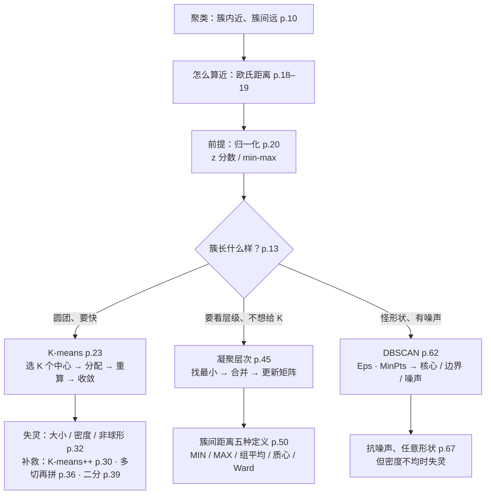
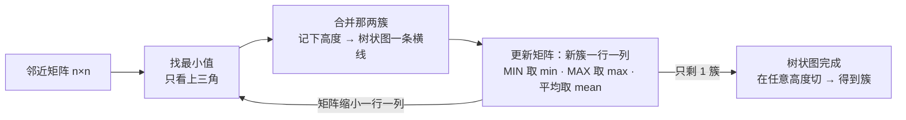
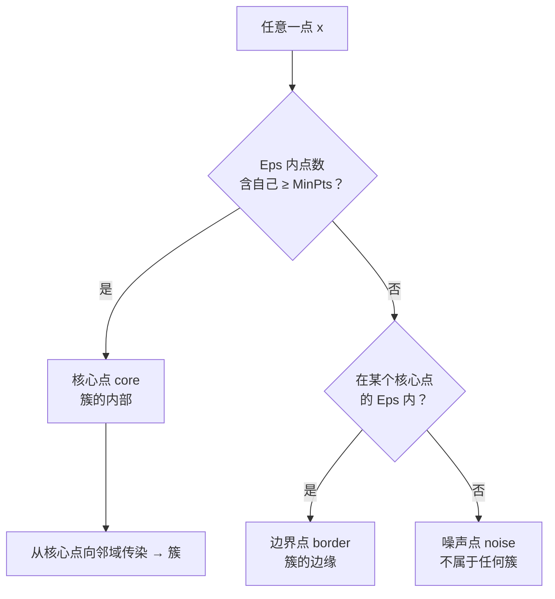

# M05 · 聚类：把没有标签的数据分成组

> **本讲一句话**：前四讲都在"有答案"的世界里（回归有 y、特征重要性要看类别），这一讲进入**没有答案**的世界——只有一堆点，要把相似的归成一组。讲义先定义"什么叫一组"（簇内近、簇间远），再定义"什么叫近"（欧氏距离 + 归一化），然后教三种分组办法：**K-means**（先定几组、反复挪中心）、**层次聚类**（一步一步合并、画成树）、**DBSCAN**（按密度长出来的形状）。三种方法各有一页"它什么时候会失灵"，这才是考试和项目里真正要用的东西。
> **原始材料**：`IS6400-L5-Clustering.pdf`（67 页；讲义标题页 Reading = **DM Chapter 7, 8**——Tan / Steinbach / Kumar《Introduction to Data Mining》的聚类两章，⚪ 依据：本讲 p.10–67 的图与六点距离矩阵与该书第 8 章完全一致）｜ **转录**：`pending`（课在 2026-09-30，本笔记是**课前预习版**，所有「🎙️ 课堂补充」格待回填）｜ **状态**：**v0.9**（按 [[笔记质量规范]] v1 写，strict 模式；全部数字由脚本 `verify_m05_cluster.py` 复算）

---

## 0. 三分钟速览

**这一讲讲了什么**

讲义标题页（p.1 / 9 / 22 / 41 / 61 重复五次，每次把当前章节标红）列了五段：

1. **Quick Review（p.2–8）**：把上一讲特征工程的核心图再过一遍——过滤 / 包装模型、特征约简 vs 特征选择、递归特征选择的三列流程、PCA 的"为什么 z1 比 z2 重要"。7 页，全是 M04 讲过的图。
2. **Introduction to Clustering（p.10–21）**：聚类的定义（簇内距离最小、簇间距离最大）、两个用途（理解 / 摘要）、"簇是模糊的"（同一批点可以切成 2 / 4 / 6 组）、三种类型（划分 / 层次 / 密度）、输入数据的哪些特征会影响结果、**欧氏距离公式 + 苹果橙子算例 + Homer / Burns 归一化算例**。
3. **K-means（p.23–40）**：四步算法、六帧迭代图、邮局选址例子、"初始点不同结果不同"、**K-means++**（按距离平方的概率选初始中心）、三种失灵（簇大小不同 / 密度不同 / 非球形）、"多切几刀再拼"的补救、**二分 K-means**。
4. **层次聚类（p.42–60）**：树状图、凝聚 vs 分裂、凝聚算法六步、邻近矩阵怎么更新、**簇间距离的五种定义**（MIN / MAX / 组平均 / 质心 / Ward）、**单链接六点手算**（p.55–59）、**课堂小测**（p.60：合并 P2 和 P5 之后矩阵怎么变、下一步合并谁）。
5. **DBSCAN（p.62–67）**：Eps / MinPts、核心 / 边界 / 噪声点、算法伪码、动画截图、"什么时候好用"。

**这一讲的骨架其实是一句话**：**聚类 = 先定义"近"，再定义"组"，最后选一种把"近的点归成组"的机械流程；三种流程的区别在于"组的形状由什么决定"——K-means 由中心决定（所以只会圆形）、层次由合并顺序决定（所以有树）、DBSCAN 由密度决定（所以任意形状、还能扔掉噪声）。**

**学完你应该能**

1. **手算**两个对象的欧氏距离，并说出为什么不归一化时收入会"吃掉"年龄（p.19–20）
2. **走一遍** K-means 的四步：给 6 个点和 2 个初始中心，算出分配、新中心、SSE，并说明换初始中心会换结果（p.23–29）
3. **说清** K-means++ 的选点概率公式，以及它解决了什么（p.30）
4. **画出** K-means 的三种失灵图各长什么样，以及"多切几刀"为什么能救（p.32–38）
5. **手算**单链接层次聚类：给距离矩阵，逐步合并、更新矩阵、画树状图——**p.60 课堂小测就是这个**
6. **区分**五种簇间距离定义，并知道换定义会换合并顺序（本笔记用脚本算了 MIN / MAX / 组平均 / 质心四种）
7. **判定** DBSCAN 里一个点是核心 / 边界 / 噪声，并说出它比 K-means 强在哪、弱在哪

**如果只记三件事**

- **距离是一切的起点，归一化是距离的前提**：Homer 和 Burns 的距离 ≈ 10,000，全被收入一项吃掉；不先把各列拉到同一尺度，任何聚类都是在给"数值最大的那一列"聚类。
- **K-means 快但挑食**：要先给 K、结果随初始点变、只会找圆形簇、怕离群点。补救：K-means++ 选初始点、多切几刀再拼、或者换层次 / DBSCAN。
- **层次聚类的全部计算就是"找最小、合并、更新矩阵"三步循环**，考试会给一张距离矩阵让你做一两步（p.60）；不同的"簇间距离定义"决定更新时取 min / max / 平均——单链接取 min。

---

## 1. 开始之前 · 知识衔接

### 1.1 你已经有的

| 概念 | 一句话唤醒 | 回看 |
|---|---|---|
| 聚类（两个用途） | M01 §2.6 技术地图里一句带过："无监督地把相似对象分组"，用途是理解结构与压缩数据——本讲把这一句展开成 58 页 | [[M01-导论-商业数据分析全景与工具链#2.6.2 聚类（p.35–36）\|M01 §2.6.2]] |
| 监督 vs 无监督 | 有标签列（`log_price`、`species`）就是监督；本讲没有标签列，是本课第一次正式做无监督 | L0-A |
| 特征工程 · 过滤 / 包装模型 · 递归特征选择 · PCA | M04 全讲；本讲 p.2–8 原样重放了四张图，§2.1 只做"唤醒版"讲解 | [[M04-特征工程-特征重要性与降维]] §2.9–2.15 |
| 标准化（z 分数）· `StandardScaler` | T03 §3.4：减均值除标准差；本讲 p.20 把它和 min-max 并列为两种归一化 | [[T03-数据探索实战-Iris与Airbnb的描述统计]] §3.4 |
| 均值 · 方差 · 标准差 | 一列数的中心 / 散开程度 / 散开程度开根号；本讲归一化公式里的 $\mu$、$\sigma$ 就是它们 | M03 §2.9 |
| 平方和（SSE） | M02 §2.8 用"残差平方和"训练回归；本讲 K-means 用同一个量（点到中心距离的平方和）衡量一次聚类好不好 | [[M02-预测分析-线性回归]] §2.8 |
| 欧氏距离 | M03 §2.11 提过"两点直线距离"；本讲 p.18 给公式并手算 | 本讲 §2.3.1 就地展开 |
| 向量 · 矩阵 | 一行数 / 一张数表；本讲的"邻近矩阵"就是一张"每两点之间距离"的表，不涉及矩阵运算 | M02 §2.8.1 |
| 熵 · Gini | M04 的特征重要性度量；本讲 p.4 只作为过滤模型的例子重提一次 | [[M04-特征工程-特征重要性与降维]] §2.7–2.8 |
| 特征向量 · 特征值 · 主成分 | M04 §2.13：协方差矩阵的特征向量 = 主成分方向，特征值 = 该方向的方差；本讲 p.8 只重放"z1 比 z2 重要"那张图 | [[M04-特征工程-特征重要性与降维]] §2.13 |
| Iris · 散点图矩阵 | 本讲讲义没有用 Iris，但 W5 tutorial 很可能拿它做 K-means（⚪ 推测，待 notebook 到位） | [[T04-特征选择与PCA实战-Iris]] |
| 决策树、集成学习（预告级） | Notion / Syllabus 原排 W05 讲决策树，实际 Canvas 的 Lecture 5 是聚类；决策树顺延 | [[IS6400_Business_Data_Analytics/_meta/知识层级台账\|知识层级台账]] 预告清单 |

> **需要的数学**：只有平方、开根号、求最小值、算平均——本讲没有矩阵运算，没有微积分。层次聚类的"矩阵"只是一张表。

### 1.2 本讲全新引入的概念

| 概念 | English | 展开于 |
|---|---|---|
| 聚类分析（簇内相似、簇间相异） | Cluster analysis; intra-cluster / inter-cluster distance | §2.2.1 |
| 聚类的两个用途 | Understanding · Summarization | §2.2.2 |
| 簇的模糊性 | Notion of a cluster is ambiguous | §2.2.3 |
| 划分聚类 · 层次聚类 · 基于密度的聚类 | Partitional · Hierarchical · Density-based | §2.2.4 |
| 邻近度 / 相似度度量 · 影响它的数据特征 | Proximity / similarity measure; dimensionality, attribute type, noise | §2.2.5 |
| 欧氏距离 | Euclidean distance | §2.3.1 |
| 属性归一化 · z 分数 · min-max 缩放 | Attribute normalization · Standard score · Min-max scaling | §2.3.2 |
| K-means · 质心 | K-means · Centroid | §2.4.1 |
| 初始化敏感 · 最优 / 次优聚类 · SSE | Initialization sensitivity · Optimal / sub-optimal · Sum of squared errors | §2.4.4 |
| K-means++ | K-means++ | §2.4.5 |
| K-means 的三种失灵 | Differing sizes / densities / non-globular shapes | §2.5.1 |
| 多簇再合并 | Use many clusters, then put together | §2.5.2 |
| 二分 K-means | Bisecting K-means | §2.5.3 |
| 树状图 · 嵌套簇 | Dendrogram · Nested clusters | §2.6.1 |
| 凝聚式 · 分裂式 | Agglomerative · Divisive | §2.6.2 |
| 邻近矩阵与更新 | Proximity matrix; update after merging | §2.6.3 |
| 簇间距离五种定义 | MIN (single link) · MAX (complete link) · Group average · Centroid distance · Ward's method | §2.7.1 |
| 单链接手算 · 课堂小测 | Single link worked example · In-class quiz | §2.8 |
| DBSCAN · Eps · MinPts · 核心 / 边界 / 噪声点 | DBSCAN · Eps · MinPts · Core / border / noise point | §2.9.1 |

### 1.3 为什么这一讲放在这里 · 重排说明

M02 做回归（有连续的 y），M03 做描述统计与关联规则，M04 做特征工程（特征重要性要看类别标签、PCA 不看标签但目的是压缩）。本讲是**第一次完整地做无监督学习**：数据里没有任何"正确答案"列，任务是发现结构。它承接 M04 两处：① PCA 之后的低维数据正是聚类最常见的输入（先降维再聚类是项目里的标准组合）；② 距离与归一化——M04 讲 PCA 前要标准化，本讲 p.20 用 Homer / Burns 说明为什么聚类前也必须标准化。它为后面铺路：分类（决策树）会用到同样的"距离"直觉（最近邻）；小组项目里"客户分群"几乎一定是聚类。

Syllabus 原本把聚类排在 W04、决策树排在 W05；Canvas 实际 Lecture 5 是聚类（⚠️ Notion 进度库的 W05 行仍写"决策树与集成学习"，本笔记已按实际课件纠正，见 §9.3）。

**重排说明**：讲义顺序是 复习(p.2–8) → 导论(p.10–21) → K-means(p.23–40) → 层次(p.42–60) → DBSCAN(p.62–67)。本笔记**保留这个顺序**，只做两处结构上的调整：① 把"距离与归一化"（p.18–20）从导论里单独立为 §2.3，因为它是三种算法共同的地基，且是本讲两个手算考点之一；② 把"簇间距离的五种定义"（p.50–54，讲义用五页重复同一张表、每页标红一行）合并成一节 §2.7.1，用脚本算出的四种合并顺序做成对比表。p.55–60 的单链接手算单独成 §2.8，因为 p.60 是课堂小测原题。对应关系见 [[#8. 讲义页码映射|§8 讲义页码映射]]。

**非内容页的标注理由**（[[笔记质量规范]] §3.1）：p.1 封面；p.9 / p.22 / p.41 / p.61 是同一张标题页的重复（只把当前章节标红），标为章节标题页；p.21 "Basic Clustering Algorithms" 只列三个算法名，是 K-means 一章的引导页，也标为章节标题页——共 6 页；其余 61 页全部在 §2 有实质讲解（p.51–54 四张重复表格各讲一种定义，不算重复页）。

---

## 2. 正文

### 2.1 快速复习：特征工程四张图（讲义 p.2–8）

七页全是 M04 的原图，本节只做唤醒；细讲回 M04。

#### 2.1.1 特征工程的位置与"评价特征好坏"的五类度量（讲义 p.2–3）

**是什么**

上一讲说过，机器学习流程是"研究问题 → 训练算法 → 评估 → 上线"，而"数据"这一格和"训练"之间藏着一步没画出来的工作——特征工程。p.2 是 HM 书（Géron《Hands-On Machine Learning》，M02–M04 讲义标题页写的 Reading 教材）的 Figure 1-2，讲义在 Data 与 Train ML algorithm 之间加了一个蓝框：

> **Feature Engineering — Something happens in the middle**

p.3 回答"怎么判断一个特征（或一组特征）好不好"——**取决于你用什么度量**（The goodness of a feature/feature subset is dependent on measures），并列出五类：**信息度量**（information measures，如熵——一堆标签"有多混"的度量；信息增益——用某个特征分完之后混乱减少了多少；M04 §2.7–2.8 讲过）、**距离度量**（distance measures，特征能把不同类拉开多远）、**依赖度量**（dependence measures，特征与类别的相关程度）、**一致性度量**（consistency measures，特征取值相同时类别是否也相同）、**准确率度量**（accuracy measures，用模型的准确率——M04 的包装模型）。每类后面括号里是提出它的论文（Yu & Liu 2004 等），讲义只作出处，不要求记。

**为什么需要它**

它是 M04 §2.5–2.9 的一页纸总结，也是本讲"距离"概念的第一次露面：五类度量里的第二类"距离度量"就是用**类间距离**给特征打分——特征好 = 它能让两类点离得远。本讲从 p.18 起讲的"对象之间的距离"是同一个数学工具换了用途：M04 用距离评价特征，本讲用距离分组对象。

**课件原例**

讲义 p.2 图、p.3 五类度量清单；无算例。

**🎙️ 课堂补充**

待转录补充。

**💡 换个说法（笔记补充）**

- 五类度量像五种"面试官"给候选特征打分：信息面试官问"你能减少多少不确定"，距离面试官问"你能把两类拉多开"，依赖面试官问"你和答案相关吗"，一致性面试官问"你相同的人答案也相同吗"，准确率面试官直接让模型上场考一次。M04 讲了第一和第五类，本讲要用的是第二类的工具——距离。
- 换个角度：这一页在提醒"特征好不好"没有绝对答案，换一种度量排名可能变——这和本讲后面"簇好不好也取决于你用什么距离"是同一个思想。

**⚠️ 常见误解**

- ❌ "五类度量要背下来。" → 讲义只列名字和出处，M04 只展开了信息度量（Gini / 熵）和准确率度量（包装模型）；考试范围以 M04 展开的为准。
- ❌ "特征工程是训练前一次性做完的。" → p.2 的图是一个循环（Analyze errors → Study the problem → …），特征工程在每一轮"分析错误"之后都可能重做。

**与其他概念的关系**

M04 §2.3（特征工程定义）、§2.7–2.8（Gini / 熵 = 信息度量）；本讲 §2.3.1 欧氏距离是"距离度量"的具体形式。

**所以呢**：评价特征要选度量；讲义接着重放"谁来打分"的两种模型——过滤与包装。

---

#### 2.1.2 过滤模型与包装模型：谁来给特征打分（讲义 p.4–5）

**是什么**

两张流程图长得几乎一样，区别只在"Measuring"那个框：**过滤模型**（filter model，p.4）用一个**不依赖学习算法**的指标打分（讲义红字：Feature importance measurement? **Gini index and Entropy**），选完再交给学习算法；**包装模型**（wrapper model，p.5）把学习算法本身放进循环，**用模型的表现当特征重要性分数**（红字：use the model performance as feature importance score，图上 Accuracy 框被红框圈出）。

| | 过滤模型 Filter | 包装模型 Wrapper |
|---|---|---|
| 打分的人 | 统计指标（Gini、熵——两种"分完之后各类混得多不多"的分数，M04；相关系数（两列一起变的程度）） | 学习算法跑一遍看准确率 |
| 什么时候用 | 特征很多、先粗筛 | 特征不多、要精挑 |
| 优点 | 快，与模型无关 | 直接优化最终指标 |
| 缺点 | 可能选出对该模型没用的特征 | 慢，每评一个子集训练一次；容易过拟合 |
| M04 / T04 例子 | `SelectKBest(f_classif)`（sklearn：按统计分数留前 k 个特征） | `RFE(estimator)`（sklearn：用一个模型反复剔除最不重要的特征） |

**为什么需要它**

它是 T04 作业 Q1 的原题（M04 §2.9），讲义在本讲开头重放，⚪ 推断是因为 W5 tutorial 或后续作业还会用到。对本讲：**聚类没有标签，包装模型的"准确率"无从谈起**——这也是为什么聚类里评价"好不好"要靠 SSE（§2.4.4）这类不需要标签的量。

**课件原例**

讲义 p.4–5 两张流程图（同一张图，Measuring 框换成 Learning Algorithm + Accuracy）。

**🎙️ 课堂补充**

待转录补充。

**💡 换个说法（笔记补充）**

- 过滤像按简历筛人（只看学历和分数，不面试，一天能筛一千份），包装像让每个候选人真的来干一周活再决定（贵、慢，但看到的是真实表现）。
- 换个角度看这两张图为什么"只差一个框"：讲义故意把其余部分画得一模一样，是要说明两种模型的**流程**相同（生成子集 → 打分 → 好不好 → 再来），差别只在"打分"这一步交给谁——这也是为什么同一个递归选择流程（下一节）可以套在两种模型上。
- **判断口诀**：打分过程里有没有"训练模型"这一步——没有就是过滤，有就是包装。

**⚠️ 常见误解**

- ❌ "包装模型总是更好。" → 它慢，且在小样本上容易把噪声当特征（过拟合）；M04 讲过两者是互补，实践里常先过滤再包装。
- ❌ "Gini 和熵是包装模型的指标。" → 讲义 p.4 把它们写在**过滤模型**下面：它们不需要训练任何模型，只数各类的比例。

**与其他概念的关系**

M04 §2.9 原节；T04 的 `SelectKBest` / `RFE`；本讲 §2.4.4 的 SSE 是无标签场景下的"打分"。

**所以呢**：打分之后要么"挑一部分"要么"全用但压缩"——下一页对比这两条路。

---

#### 2.1.3 特征约简 vs 特征选择 · 一次加一个特征的选法（讲义 p.6–7）

**是什么**

拿到 100 个特征想减到 10 个，有两条路：**特征约简**（feature reduction）——全部原始特征都用，但把它们**线性组合**成少数几个新特征（PCA）；**特征选择**（feature selection）——只挑原始特征的一个**子集**。p.6 还加了一行 "Continuous versus discrete"：约简得到的是连续的新变量，选择是离散的"要 / 不要"。

| | 特征约简 Reduction | 特征选择 Selection |
|---|---|---|
| 用了哪些原始特征 | 全部 | 一个子集 |
| 新特征是什么 | 原始特征的线性组合 | 原始特征本身 |
| 决策类型 | 连续（权重） | 离散（选 / 不选） |
| 可解释性 | 差（新特征没有业务名字） | 好 |
| M04 例子 | PCA（主成分分析：把多列压成几个"综合列"，下一节） | RFE、前向选择 |

p.7 是**递归特征选择**（recursive feature selection，前向版）的三列流程：全集 {F1, F2, F3, F4}；第一列从空集出发，逐个评价 {F1} {F2} {F3} {F4}，选最好的（F2）；第二列从 {F2} 出发，评价 {F2,F1} {F2,F3} {F2,F4}，选最好的（{F2,F3}）；第三列从 {F2,F3} 出发，评价 {F2,F3,F1} {F2,F3,F4}，选 {F2,F3,F1}。底部红字总结：最终要比较的是 {F2}、{F2,F3}、{F2,F3,F1}、{F2,F3,F1,F4} 四个候选集，取表现最好的那个规模。每一步的"评价"既可以用过滤指标也可以用包装模型（Can be implemented on Filter Model and Wrapper Model）。

**为什么需要它**

T04 作业 Q2 原题（M04 §2.11）。对本讲的意义：**聚类前常先做特征约简**——PCA 把几十列压成两三列，既让距离计算更稳（高维里所有点都"差不多远"，§2.2.5 的维度问题），又能画图看簇。所以讲义把 PCA 那页（p.8）放在复习的最后、紧接聚类导论。

**课件原例**

讲义 p.6 定义、p.7 三列流程图（F1–F4 假想特征）。

**🎙️ 课堂补充**

待转录补充。

**💡 换个说法（笔记补充）**

- 约简像把四门课的成绩加权成一个"综合分"（信息都在，但你说不清综合分 85 是哪门课好）；选择像只看数学和英语两门（说得清，但丢了另外两门）。
- 递归前向选择像组队：先选最强的一个人，再在剩下的人里选"加进来后队伍最强"的那个，一次加一个，直到加人不再变强。**判断口诀**：一次只动一个特征、上一步的结果固定不变——这就是"递归"。

**⚠️ 常见误解**

- ❌ "递归选择能找到最优子集。" → 它是贪心：一旦 F2 进了队，就不会再考虑"没有 F2 的组合"；最优子集可能是 {F1,F3}。M04 讲过穷举 $2^n$ 个子集才是最优，递归只是可行的近似。
- ❌ "PCA 是特征选择。" → 它没有丢任何原始特征，每个主成分都是全部特征的加权和；它属于约简。

**与其他概念的关系**

M04 §2.11–2.12；T04 的 `RFE` 与 `PCA`；本讲 §2.2.5 维度对距离的影响是"聚类前为什么要约简"的理由。

**所以呢**：复习的最后一页是 PCA 的核心图——为什么第一主成分比第二重要。

---

#### 2.1.4 PCA 一页：为什么 z1 比 z2 重要（讲义 p.8）

**是什么**

二维散点被投到两条互相垂直的新轴上：**z1** 沿着点云最长的方向，**z2** 与它垂直。投到 z1 上，五个点仍然拉得开（图右上：x1…x5 在 z1 轴上散布）；投到 z2 上，五个点几乎叠在一起（图右下：一团叉号挤在一点）。所以 z1 保留了数据的主要变化、z2 几乎没有信息——**这就是"主成分的重要性"的含义：方差大的方向重要**。讲义顶部一句：z vectors are the new, lower dimensionality feature vectors（z 向量是新的、更低维的特征向量）。

**为什么需要它**

这一页是 M04 §2.13 的图解版，讲义放在聚类之前，⚪ 推断是提醒：**先 PCA 再聚类**时，你丢掉的是 z2 这种"点都挤在一起"的方向，保留的是 z1 这种"点拉得开"的方向——而聚类恰恰依赖点之间拉得开的距离。丢 z2 几乎不改变任何两点间的距离，丢 z1 则会把本来相距很远的点压到一起。

**课件原例**

讲义 p.8 手绘图（Andrew Ng 课程风格的示意图，红色手写 z1 / z2）。无数字。

**🎙️ 课堂补充**

待转录补充。

**💡 换个说法（笔记补充）**

- 像给一群人拍照：从正面拍（z1）每个人都看得清，从头顶拍（z2）所有人叠成一个圆点。PCA 就是找"正面"那个角度。
- 另一个角度：距离在投影后只会变小或不变（投影是"压扁"），所以选保留方差最大的轴，等于选"压扁后各点距离损失最少"的轴——这正是 M04 说的"最小重构误差 = 最大保留方差"（重构误差：把压扁后的点还原回原空间，与原点的距离——丢掉的方向方差越小，还原得越准）。

**⚠️ 常见误解**

- ❌ "z1 重要是因为它是第一个算出来的。" → 顺序是按方差排的：方差最大的才叫第一主成分。
- ❌ "PCA 后聚类结果一定和原空间一样。" → 只有当丢掉的方向真的没信息时才近似相同；若簇的差别恰好藏在方差小的方向上（少见但存在），PCA 会把簇合并。

**与其他概念的关系**

M04 §2.13–2.15（PCA 算法、特征值 > 1 准则）；T04 的 `PCA(n_components=2)`；本讲 §2.2.5（维度影响邻近度）。

**所以呢**：复习完毕。从 p.10 起进入本讲正题：没有标签时，怎么把点分组。

---

### 2.2 什么是聚类（讲义 p.10–17）

p.9 是章节标题页；随后先定义、再说用途、再承认"簇"没有唯一答案、然后分三类，最后列出影响结果的数据特征。

#### 2.2.1 聚类分析的定义：簇内近、簇间远（讲义 p.10）

**是什么**

一家超市有十万个会员，没有人给他们贴过"类型"标签；你想把他们分成几群，让**同一群的人购物习惯像、不同群的人不像**。这就是聚类分析。讲义 p.10：

> Finding groups of objects such that the objects in a group will be **similar (or related)** to one another and **different from (or unrelated to)** the objects in other groups.（找出对象的分组，使组内对象彼此相似、组间对象彼此相异）

配图两行字：**Intra-cluster distances are minimized**（簇内距离最小化）、**Inter-cluster distances are maximized**（簇间距离最大化）。"簇"（cluster）就是"组"；"intra"是内、"inter"是间。定义里的"相似"要用一个数来衡量——那就是距离（§2.3），距离小 = 相似。

**为什么需要它**

它是本讲所有算法的**目标函数的来源**：K-means 最小化的 SSE（§2.4.4）就是"簇内距离"的平方和；层次聚类每一步合并"最近的两簇"（§2.6.3）就是在让簇间距离大的留着、小的合并；DBSCAN 的"密度"（§2.9.1）是簇内距离小的另一种说法。定义里两句话缺一不可：只要簇内近，把每个点自成一簇就满足；只要簇间远，把所有点合成一簇也满足——两者一起才把"组"定住。

**课件原例**

讲义 p.10 的示意图：三团点，团内箭头标 intra、团间箭头标 inter。

**🎙️ 课堂补充**

待转录补充。

**💡 换个说法（笔记补充）**

- 像安排婚宴座位：同桌的人要聊得来（簇内近），不同桌之间不必有交集（簇间远）。没有人事先告诉你谁该坐哪桌——你只知道谁和谁熟，这就是"无监督"。
- 反过来说：分类（classification）是"已经知道有哪几桌、每桌叫什么名字，新来的客人往哪坐"；聚类是"连有几桌都不知道，先看人群自然聚成几堆"。两者最大的区别不是算法，是**有没有答案列**。

**⚠️ 常见误解**

- ❌ "聚类就是分类的无标签版，结果同样有对错。" → 没有标签就没有"对错"，只有"按某个距离定义下簇内更紧 / 簇间更松"；换距离或换算法可以得到不同但同样合理的分组（§2.2.3）。
- ❌ "簇内距离最小化就够了。" → 每点自成一簇时簇内距离为 0，但毫无用处；定义里"簇间最大化"和"要分成有限的几组"是同时成立的约束。

**与其他概念的关系**

M01 §2.6 的一句话定义在此展开；§2.3 定义"距离"；§2.4.4 SSE、§2.6.3 合并规则、§2.9.1 密度都是这条定义的算法化。

**所以呢**：定义有了，讲义接着问"分完组拿来干什么"——两个用途。

---

#### 2.2.2 两个用途：理解与摘要（讲义 p.11）

**是什么**

分完组能做两件事。**理解**（Understanding）：把相关的东西放在一起看——讲义举了三个例子：把相关文档分组便于浏览、把功能相似的基因和蛋白质分组、**把价格波动相似的股票分组**。**摘要**（Summarization）：**缩小大数据集的规模**——十万个会员分成五群，后面的分析只对五个"代表"做，而不是十万个。

**为什么需要它**

这是 M01 §2.6 技术地图里就写过的两个用途，本讲给了具体例子。对商科读者两个用途分别对应两种项目：理解型——客户分群、市场细分（分完要给每群起名字、做不同营销）；摘要型——数据太大先聚类再抽样、或者把连续变量离散化（把收入聚成"高 / 中 / 低"三簇）。小组项目里若做客户分析，聚类几乎一定出现，而且通常是理解型。

**课件原例**

讲义 p.11 三个理解型例子（文档、基因 / 蛋白质、股票）和一个摘要型说明；配图是一张按地区着色的世界地图（⚪ 示意气候 / 地区分组，讲义未说明）。

**🎙️ 课堂补充**

待转录补充。

**💡 换个说法（笔记补充）**

- 理解型像整理衣柜：把同类衣服挂在一起，你才看得出自己有多少件衬衫；摘要型像做衣柜的"缩略图"——每类挑一件代表，别人看五件就知道你的风格。
- "股票按价格波动分组"这个例子值得记：它和 EF5560 讲的"因子"（factor：驱动一批股票同涨同跌的共同原因，如行业、市值）思路相通——同一簇的股票受同样的因素驱动。

**⚠️ 常见误解**

- ❌ "摘要型聚类会丢信息，所以是次要用途。" → 它是大数据里最常用的用途之一：先聚类再对代表点建模，能把计算量从十万降到几百；丢的是簇内的细节，留的是簇间的结构。
- ❌ "聚类结果本身就是结论。" → 理解型用途的真正产出是**每个簇的业务解释**（这群人是谁、为什么像），算法只给编号 0 / 1 / 2；给簇起名字是分析师的工作。

**与其他概念的关系**

M01 §2.6；小组项目（客户分群）；§2.5.2 "多簇再合并"是摘要型的一个变体（先切细再拼）。

**所以呢**：用途清楚了，但一个尴尬的问题来了——同一批点，到底该分几组？讲义下一页承认：没有唯一答案。

---

#### 2.2.3 簇是模糊的：同一批点在图上可以切成不同粒度（讲义 p.12，纯图片页）

**是什么**

p.12 一张图四个面板（已视觉复核）：左上是原始的一批黑点，标题 **How many clusters?**；右上把它们涂成六种符号——**Six Clusters**；左下涂成两种（方块与三角）——**Two Clusters**；右下涂成四种——**Four Clusters**。三种切法都"看起来合理"：两大团 → 2；两大团各再分两小团 → 4；再细 → 6。**讲义的结论是"簇"这个概念本身是模糊的（ambiguous）**——分几组取决于你看的粒度。

**怎么读**：四个面板的点位置完全一样，只有颜色 / 符号不同；颜色 = 算法给的簇标签。看图时问自己"我会怎么分"，然后意识到三种答案都对——这正是讲义想让你感受的。

**为什么需要它**

它解释了本讲后面两个设计：① K-means 要你**事先给 K**（§2.4.1）——因为数据自己不告诉你几组；② 层次聚类**不给 K**，而是给一棵树，让你在任意粒度上"切"（§2.6.1）——这是层次方法的最大卖点。对项目：分几群是**业务决定**（营销能做几套方案，就分几群），算法只提供候选。

**课件原例**

讲义 p.12 四面板图。

**🎙️ 课堂补充**

待转录补充。

**⚠️ 常见误解**（图会怎么骗人）

- ❌ "六簇那张最'细'，所以最准。" → 更细不等于更好：六簇里每簇只有三四个点，业务上没法各做一套方案。粒度要看用途。
- ❌ "既然模糊，那随便分。" → 模糊的是**粒度**，不是**边界**：在任一粒度下，簇内近、簇间远的要求仍然成立；把左上团的一个点划到右下团就是错的。
- ❌ "图里的簇是算法算出来的。" → 这一页是人工涂色的示意，目的是展示可能性，不是某个算法的输出。

**本课数据画出来长什么样**：讲义没有用 Iris；⚪ 若对 Iris 的花瓣长宽画散点，肉眼能看出 2 团（setosa 单独一团；versicolor 与 virginica 连成一团），而标签是 3 类——正是"分几组"模糊性的真实例子（T04 §2 的散点图）。

**与其他概念的关系**

§2.4.1（K 要事先给）、§2.6.1（树状图让你事后选粒度）、§2.9.1（DBSCAN 由 Eps / MinPts 间接决定簇数）。

**所以呢**：既然簇没有唯一答案，就得先说清楚"哪几类分法"——讲义把聚类分成三种类型。

---

#### 2.2.4 三种类型：划分 vs 层次 vs 密度（讲义 p.13–16）

**是什么**

讲义 p.13 说这是"重要的区分"（important distinction），三种类型的定义：

> **Partitional Clustering** — A division of data objects into **non-overlapping subsets** (clusters) such that each data object is in **exactly one** subset.（划分聚类：把对象分成不重叠的子集，每个对象恰在一个子集里）
> **Hierarchical clustering** — A set of **nested clusters** organized as a **hierarchical tree**.（层次聚类：一组嵌套的簇，组织成一棵树）
> **Density-based Clustering** — a cluster in a data space is a **contiguous region** separated as regions of **high point density** vs regions of **low point density**.（基于密度的聚类：簇是数据空间里一片连续的高密度区域，被低密度区域隔开）

p.14–16 各配一图（已视觉复核）：**p.14 划分**——左边是原始的十几个点（上方一弯弧形、下方四五个散点），右边画了三个椭圆各圈一团，每个点恰在一个椭圆里，椭圆之间不重叠；**p.15 层次**——上半"传统"层次：p1 包着 {p2, {p3, p4}} 的同心椭圆，树状图是一层套一层的"梯子"（先 p3–p4 合并，再并入 p2，最后并入 p1）；下半"非传统"层次：{p1, p2} 与 {p3, p4} 并列两团再合成一个大椭圆，树状图是两枝平衡的"Y"。两种都是层次——区别只在合并的顺序，讲义用它说明"层次"指的是**嵌套关系**，不是某种固定形状；**p.16 密度**——一个红色实心圆盘被一圈蓝色圆环包围，两者之间隔着一圈几乎没有点的空白，还散着几个灰点。按"簇是高密度的连续区域"的定义，圆盘是一簇、圆环是另一簇、灰点是噪声——而 K-means 会把这张图切成两个半圆（§2.5.1），因为它只认"离哪个中心近"。

| | 划分 Partitional | 层次 Hierarchical | 密度 Density-based |
|---|---|---|---|
| 输出 | 一次切成 K 组 | 一棵树，任意层切 | 若干任意形状的区域 + 噪声点 |
| 要不要事先给簇数 | 要（K） | 不要 | 不要（由 Eps / MinPts 间接决定） |
| 簇的形状 | 通常圆形 / 球形 | 取决于簇间距离定义 | 任意（p.16 的环也能识别） |
| 每个点归属 | 恰好一簇 | 每一层恰好一簇 | 一簇或"噪声" |
| 本讲代表算法 | K-means（§2.4） | 凝聚式（§2.6） | DBSCAN（§2.9） |

**为什么需要它**

它是本讲的目录：后面三章各讲一种类型。更重要的是它给了**选算法的第一条线索**——看你的数据像哪张图：几团圆的 → 划分；要看层级结构（如商品分类树）→ 层次；形状怪、有噪声（如 p.16 的环）→ 密度。三种类型不是三种"精度"，是三种"对簇的定义"。

**课件原例**

讲义 p.13 三条定义、p.14–16 三张图（已视觉复核）。

**🎙️ 课堂补充**

待转录补充。

**💡 换个说法（笔记补充）**

- 划分像分班（每个学生恰好在一个班）；层次像学校的"年级 → 班 → 小组"树（你可以在任一层看）；密度像看夜景航拍图——灯光密的地方是城市，稀的地方是郊野，城市的形状随地形，没有人规定它是圆的。
- **判断口诀**：问"我要的是几个平行的组、还是一棵树、还是按人多人少画地盘"——分别对应划分、层次、密度。

**⚠️ 常见误解**

- ❌ "层次聚类是划分聚类的升级版，总是更好。" → 层次聚类每步合并不可撤销、计算量大（$n^2$ 的矩阵），大数据上不实用；三种类型各有适用场景，§2.9.3 有对比。
- ❌ "划分聚类不能处理 p.16 的环。" → 严格说 K-means 处理不了（它只认圆），但"多切几刀再拼"（§2.5.2）可以把环切成一段段再合并——划分是类型，K-means 只是其中一种算法。

**与其他概念的关系**

§2.4（划分）、§2.6（层次）、§2.9（密度）各自展开；§2.5.1 K-means 的失灵正是"划分类型假设簇是圆的"的后果；p.15 的树状图在 §2.6.1 细讲。

**所以呢**：类型选定后，结果好不好还取决于**输入数据本身**——讲义列出会影响聚类的数据特征。

---

#### 2.2.5 输入数据的特征决定一切：邻近度、维度、噪声（讲义 p.17）

**是什么**

同一个算法在两份数据上可能一份很好、一份一塌糊涂，差别常常不在算法而在数据。讲义 p.17 列出：

> **Type of proximity or density measure**（邻近度或密度的度量类型：怎么衡量对象间的相似）— Central to clustering（聚类的核心）— Depends on data and application（取决于数据与应用）
> **Data characteristics that affect proximity and/or density**（影响邻近度 / 密度的数据特征）：**Dimensionality**（维度）— Sparseness（稀疏性）；**Attribute type**（属性类型）；**Special relationships in the data**（数据里的特殊关系）— For example, autocorrelation（如自相关）；**Distribution of the data**（数据分布）
> **Noise and Outliers**（噪声与离群点）— Often interfere with the operation of the clustering algorithm（常干扰聚类算法的运行）

逐条解释：**邻近度**（proximity）是"相似程度"的统称，用距离表示时叫距离、用相似度表示时叫相似度（§2.3.1）；**维度**——列越多，任何两点的距离越趋于相同（高维里"最近"和"最远"差别变小），簇变得看不出来，这是 M04 "维度灾难"（curse of dimensionality：列一多，数据在空间里变得极稀，任何两点都离得差不多远）在聚类里的表现；**稀疏**——很多列是 0（如购物篮数据）时，欧氏距离几乎失效；**属性类型**——数值列能算欧氏距离，类别列（性别、城市）不能直接算，要换度量（M03 §2.4 的四种数据类型在这里回来了）；**自相关**——相邻时间 / 相邻地点的观测本来就相似，会让聚类把"时间上挨着"误当"内容相似"；**分布**——K-means 默认簇是球形正态团，数据不是这样就失灵（§2.5.1）；**噪声与离群点**——一个离群点能把 K-means 的中心拖偏（§2.5.1 最后一条），DBSCAN 则专门把它们标成噪声（§2.9.1）。

**为什么需要它**

这一页是"聚类前的检查清单"，也是本讲三种算法**各自失灵条件**的总目录：K-means 怕分布不球形、怕离群点；层次聚类怕维度高（矩阵爆炸）；DBSCAN 怕密度不均。对项目：拿到客户数据先看——有多少列（要不要 PCA）、有没有类别列（要不要换距离）、有没有极端客户（要不要先剔除）。

**课件原例**

讲义 p.17 清单，无算例。

**🎙️ 课堂补充**

待转录补充。

**💡 换个说法（笔记补充）**

- 像相亲配对：你先得决定"像"指什么（三观 / 收入 / 兴趣——邻近度类型）；问卷题目太多（维度）每对人的总分都差不多；有人乱填（噪声）会把配对搞乱；有些题是"是 / 否"（属性类型）没法算差多少分。
- 反过来想：这一页每一条都指向一个"预处理动作"——选距离、降维、编码类别、剔除离群点、归一化——这些在 M03 / M04 都出现过，本讲把它们串成了聚类的前置流程。

**⚠️ 常见误解**

- ❌ "选对算法就能避开这些问题。" → 第一条说邻近度度量是"聚类的核心"且"取决于数据与应用"——它在算法之前，任何算法都要用它；数据没处理好，换算法无济于事。
- ❌ "离群点应该被分到离它最近的簇。" → 对 K-means 它会把那个簇的中心拖偏，对层次聚类它会最后才被合并进来、拉长树的顶部；更好的做法是先剔除或用 DBSCAN 标成噪声。

**与其他概念的关系**

M03 §2.4（属性类型）、M04 §2.4（维度灾难）；§2.3（邻近度的具体形式：欧氏距离 + 归一化）；§2.5.1、§2.9.1（噪声与离群点的两种处理）。

**所以呢**：清单第一条说邻近度是核心。下一节就定义它——本讲唯一的公式：欧氏距离。

---

### 2.3 相似度：距离与归一化（讲义 p.18–20）

三种算法共用的地基：先能算"两个对象差多远"，再能保证各列在同一尺度上。

#### 2.3.1 欧氏距离：把"像不像"变成一个数（讲义 p.18–19）

**是什么**

一个苹果和一个橙子，各用三个颜色分量（RGB）描述，它们"像不像"？把每个分量的差平方、加起来、开根号——得到一个数，越小越像。这就是欧氏距离（Euclidean distance），也就是平面上两点的直线距离推广到 n 个属性。讲义 p.18：

> Similarity expressed in terms of a **distance function** $d(x, y)$. One example is Euclidian distance:

$$d(x, y) = \sqrt{\sum_{i=1}^{n} (x_i - y_i)^2}$$

| 符号 | 是什么 | 已知还是要算 |
|---|---|---|
| $x, y$ | 两个对象（苹果、橙子），各是一行数 | 已知 |
| $n$ | 属性个数（p.19 是 3 个 RGB 分量） | 已知 |
| $x_i, y_i$ | 两个对象在第 $i$ 个属性上的取值 | 已知 |
| $x_i - y_i$ | 第 $i$ 个属性上的差（可正可负） | 中间量 |
| $(x_i - y_i)^2$ | 差的平方——去掉正负号、放大大差 | 中间量 |
| $d(x, y)$ | 距离，非负；0 表示两个对象在所有属性上完全相同 | 要算的结果 |

**数字例子（手把手）**（讲义 p.19 原例，脚本 `verify_m05_cluster.py` A 段复算）：Apple = (220, 156, 140)，Orange = (243, 194, 113)。

1. 逐个属性求差：$220 - 243 = -23$，$156 - 194 = -38$，$140 - 113 = 27$
2. 平方：$(-23)^2 = 529$，$(-38)^2 = 1444$，$27^2 = 729$
3. 相加：$529 + 1444 + 729 = 2702$
4. 开根号：$\sqrt{2702} = 51.98$

讲义 p.19 只写到根号下的式子，没有算出结果；51.98 是脚本算的。这个数本身没有意义，**有意义的是比较**：若再来一个 Banana = (250, 220, 60)，算出它到 Apple 的距离是多少，就能说"苹果更像橙子还是更像香蕉"。

**为什么公式长这样**：① 为什么**相减**——距离衡量的是"差多少"，同一属性上取值相同则贡献为 0；② 为什么**平方**——一是去掉正负号（−23 和 +23 差得一样远），二是让大的差贡献得更多（差 38 的贡献是差 23 的 $1444 / 529 = 2.7$ 倍，不是 1.65 倍）——这意味着一个属性上差很多的对象会被判得"很不像"；③ 为什么**开根号**——把平方后的单位还原（RGB 的平方没有意义），并让距离回到与原始取值同量级；④ 为什么**求和**——每个属性都是一个维度，勾股定理在 n 维的推广就是这样。

**极端 / 边界情况**：
- 两个对象完全相同 → 每一项差为 0 → $d = 0$；这是距离的最小值。
- 只有一个属性 → $d = |x_1 - y_1|$，退化成数轴上两点的距离。
- 某个属性的量级远大于其他属性 → 它的平方项主导整个和，其他属性形同虚设——这就是下一节 Homer / Burns 的问题。
- 属性是类别（红 / 绿 / 蓝）而不是数 → 公式无法用；要换成"相同记 0、不同记 1"之类的度量（讲义未展开，M03 §2.4 的数据类型在这里起作用）。

**为什么需要它**

它是 §2.2.1 定义里"相似"的具体实现，也是三种算法的输入：K-means 用它决定每个点归哪个中心（§2.4.1）、层次聚类用它填邻近矩阵（§2.6.3）、DBSCAN 用它数 Eps 半径内有几个点（§2.9.1）。**换一种距离，三种算法的结果都会变**——讲义说 "One example is Euclidian distance"，意思是它只是最常用的一种，不是唯一的。

**课件原例**

讲义 p.19：苹果 / 橙子 RGB 表 + 根号下的展开式（无结果）。

**🎙️ 课堂补充**

待转录补充。

**💡 换个说法（笔记补充）**

- 像比较两份简历的"差距"：每一项打分相减、平方后相加再开根——两个人在某一项上差距特别大，会被判为"很不像"，哪怕其他项几乎相同。这既是欧氏距离的特点，也是它的弱点。
- 换个角度看"距离小 = 相似"：讲义标题说 similarity metric，但公式给的是 distance——两者方向相反（距离越小越相似），后面所有"最近""最小"都是在说"最相似"。

**⚠️ 常见误解**

- ❌ "不开根号也一样，反正只是比大小。" → 比大小确实一样（平方是单调的），K-means 内部常常就省掉根号；但**报告一个距离值**时要开根号，否则单位是"颜色的平方"，无法与原始数据对照。
- ❌ "把差的绝对值加起来也行，何必平方。" → 那是另一种距离（曼哈顿距离），结果不同：它对大差不"加倍惩罚"。讲义只教欧氏，考试按讲义。
- ❌ "$d = 51.98$ 说明苹果和橙子'相当不像'。" → 单独一个距离没有意义，51.98 相对于 RGB 0–255 的范围算中等；只有与其他对象的距离比较才有意义。

**与其他概念的关系**

§2.2.1 定义的实现；§2.3.2 讲它的前提（归一化）；§2.4.1 / §2.6.3 / §2.9.1 三处使用；M04 §2.5 的"距离度量"是同一工具用于特征评价。

**所以呢**：公式会算了，但有个陷阱：**如果各列的单位差别巨大，距离会被最大的那一列吃掉**——p.20 用 Homer 和 Burns 演示。

---

#### 2.3.2 属性归一化：Homer 与 Burns 的距离被收入吃掉了（讲义 p.20）

**是什么**

Homer 和 Burns 两个人，三个属性：年龄 62 / 65，收入 \$990,000 / \$1,000,000，信用卡数 8 / 10。直接套欧氏距离，得到 ≈ 10,000——**几乎全部来自收入那一项**，年龄差 3 岁和信用卡差 2 张完全看不见。讲义 p.20：

$$d(\text{Homer}, \text{Burns}) = \sqrt{(62-65)^2 + (990{,}000 - 1{,}000{,}000)^2 + (8-10)^2} \approx 10{,}000$$

讲义在收入那一项下画了蓝线、箭头指向 ≈ 10,000，意思是"这个结果就是它一项决定的"。解决办法是**属性归一化**（attribute normalization）——先把每一列拉到同一尺度再算距离。讲义底部给了两种：**标准分数**（standard score，z 分数）与 **min-max 缩放**（min-max feature scaling）：

$$\text{Standard score: } z = \frac{X - \mu}{\sigma} \qquad\qquad \text{Min-max feature scaling: } X' = \frac{X - X_{\min}}{X_{\max} - X_{\min}}$$

| 符号 | 是什么 | 已知还是要算 |
|---|---|---|
| $X$ | 某一列里的一个原始取值（如收入 990,000） | 已知 |
| $\mu$ | 这一列的均值 | 先算 |
| $\sigma$ | 这一列的标准差（一列数平均离均值多远） | 先算 |
| $z$ | 标准分数：这个值离均值几个标准差；无单位，正负都有 | 要算 |
| $X_{\min}, X_{\max}$ | 这一列的最小值、最大值 | 先算 |
| $X'$ | min-max 缩放后的值，落在 0–1 之间 | 要算 |

**数字例子（手把手）**（脚本 `verify_m05_cluster.py` A 段）：

先看未归一化为什么 ≈ 10,000：
1. 三项差：$62 - 65 = -3$，$990{,}000 - 1{,}000{,}000 = -10{,}000$，$8 - 10 = -2$
2. 平方和：$9 + 100{,}000{,}000 + 4 = 100{,}000{,}013$
3. 开根：$\sqrt{100{,}000{,}013} = 10{,}000.0006$——与只算收入一项的 $\sqrt{100{,}000{,}000} = 10{,}000$ 几乎相同；年龄和信用卡合起来只贡献 $\sqrt{13} = 3.6$，被 10,000 淹没。

再做 min-max（只有两个人时，每列的最小值给 0、最大值给 1）：
4. 年龄：Homer $(62 - 62) ÷ (65 - 62) = 0$，Burns $(65 - 62) ÷ 3 = 1$；收入、信用卡同理都变成 0 和 1
5. 归一化后距离：$\sqrt{1^2 + 1^2 + 1^2} = \sqrt{3} = 1.732$——三个属性各贡献 1，谁也不压倒谁。

z 分数要有意义得多几个人。脚本加了一个学生（30 岁，\$40,000，1 张卡）和一个白领（45 岁，\$120,000，3 张卡）后算四人的 z 分数：Homer 的收入 z = 0.85、Burns 0.87、学生 −0.94——**归一化后 Homer 与 Burns 的距离是 0.51，Homer 与学生的距离是 3.14**；而用原始数据，Homer 与学生的距离是 950,000（几乎就是收入差），Homer 与 Burns 是 10,000。两种算法都说 Homer 更像 Burns，但只有归一化后的比例（0.51 对 3.14）才反映"三个属性都像"，原始距离只反映"收入像"。

**为什么公式长这样**：z 分数**减均值**是把每列的中心移到 0，**除以标准差**是把每列的"典型散开程度"压成 1——之后每列的 1 个单位都表示"1 个标准差"，可以相加；min-max **减最小值**把起点移到 0，**除以极差**把终点压到 1——之后每列都在 0–1 之间。两者都是"先平移、再缩放"，区别在用什么当尺子：z 用标准差（对离群点敏感——一个极端值会拉大 $\sigma$，把其他值压扁），min-max 用极差（对离群点更敏感——一个极端值直接决定 $X_{\max}$）。

**极端 / 边界情况**：
- 某列所有值相同 → $\sigma = 0$、$X_{\max} - X_{\min} = 0$，两个公式都**除以零**——这一列没有信息，应直接删掉。
- 只有两个对象 → min-max 把每列都变成 0 和 1，任何两列的贡献相等（上面第 5 步）；z 分数把每列变成 $\pm 0.71$（用样本标准差——分母是 $n-1$ 而不是 $n$，两个数时 $\sigma$ = 两数之差 ÷ $\sqrt{2}$，所以各自离均值 $1/\sqrt{2} = 0.71$ 个标准差）——同样"抹平"了所有列，说明**两个对象的归一化没有意义**，要放在整个数据集里做。
- 新来一个对象的收入超过原来的 $X_{\max}$ → min-max 给出 $X' > 1$；z 分数无此问题但会随之改变 $\mu$、$\sigma$。上线的模型要用**训练时**的 $\mu, \sigma$ 或 $\min, \max$，不能每次重算——T03 里 `StandardScaler` 的 `fit` / `transform` 分开就是这个原因。

**为什么需要它**

**它是聚类前的必做步骤**——不做，任何聚类算法都只是在给数值最大的那一列分组。讲义用 Homer / Burns 这个夸张例子是为了让人记住：欧氏距离没有"单位意识"，尺度不同的列必须先统一。对项目：客户数据里"年消费额（万元）"和"访问次数（几十）"混在一起，不归一化就等于只按消费额聚类。

**课件原例**

讲义 p.20：两人三属性 + 未归一化的算式 ≈ 10,000 + 两个归一化公式（截自维基）。讲义没有算归一化后的结果，本笔记用脚本补了。

**🎙️ 课堂补充**

待转录补充。

**💡 换个说法（笔记补充）**

- 像比赛计总分时把"跑步秒数""跳远米数""投掷米数"直接相加——秒数几十、米数几，谁跑得慢谁总分高。归一化就是把每个项目换算成"在全体选手里排第几个标准差"，再相加才公平。
- 换个角度：不归一化不是"错"，是**隐含地给了收入一个巨大的权重**。有时你确实想让收入主导（业务上收入最重要），那就有意识地不归一化或给收入更大权重——关键是知道自己在做什么，而不是让单位替你决定。

**⚠️ 常见误解**

- ❌ "≈ 10,000 是三项一起算出来的，年龄和信用卡也起了作用。" → 第 3 步算过：不算那两项也是 10,000.000，它们的贡献在小数点后第四位。距离由平方最大的项决定。
- ❌ "z 分数和 min-max 随便选一个。" → 结果不同：z 分数不限范围、对离群点相对稳一些；min-max 严格 0–1、但一个极端值会把其他值挤到一起。有明显离群点时先处理离群点，再选 z 分数；要把值限制在 0–1（如喂给某些算法）时用 min-max。
- ❌ "归一化后距离一定变小。" → 只是尺度变了，数值大小没有可比性：归一化后的 1.732 与原来的 10,000 不能比，只能在归一化后的数据内部比。

**与其他概念的关系**

T03 §3.4 `StandardScaler`（本讲的 z 分数）；M04 §2.13（PCA 前要标准化，同一理由）；§2.2.5 清单里的"属性类型 / 分布"；§2.5.1 K-means 怕离群点，与 z 分数怕离群点是同一件事。

**所以呢**：距离会算、尺度也统一了，可以开始分组。第一种算法：K-means。

---

### 2.4 K-means：先定几组，反复挪中心（讲义 p.21–31）

p.21 引导页列出三种算法；p.23 给算法，p.24–26 图解迭代，p.27–28 邮局例子，p.29 初始化问题，p.30–31 K-means++。

#### 2.4.1 K-means 的四步算法与质心（讲义 p.23）

**是什么**

你决定把客户分成 3 群（K = 3）。K-means 的做法是：先随便选 3 个点当"中心"，把每个客户分给离它最近的中心，再把每群的中心挪到该群的平均位置，重复直到中心不动。讲义 p.23：

> - **Partitional clustering** approach（划分型）
> - Number of clusters, **K, must be specified**（簇数 K 必须事先给定）
> - Each cluster is associated with a **centroid** (center point)（每个簇有一个质心——中心点）
> - Each point is assigned to the cluster with the **closest centroid**（每个点分给质心最近的簇）
> - The basic algorithm is very simple（基本算法非常简单）

算法（讲义原文，四步）：

1. Select $K$ points as the initial centroids.（选 K 个点作初始质心）
2. **repeat**
3. Form $K$ clusters by assigning all points to the closest centroid.（把所有点分给最近的质心，形成 K 个簇）
4. Recompute the centroid of each cluster.（重算每个簇的质心）
5. **until** The centroids don't change（直到质心不再变化）

**质心**（centroid）就是簇内所有点的**平均位置**——每个属性取平均。"K-means" 的 means 就是这个平均。

**手算一遍**（用讲义 p.55 的六个点——它们在 §2.8.1 才正式出场，这里先借用，坐标：p1 (0.40, 0.53)、p2 (0.22, 0.38)、p3 (0.35, 0.32)、p4 (0.26, 0.19)、p5 (0.08, 0.41)、p6 (0.45, 0.30)；K = 2，初始质心取 p1 和 p4；脚本 `verify_m05_cluster.py` B 段"初始化 A"）：

| 步 | 动作 | 结果 |
|---|---|---|
| 1 | 初始质心 C1 = p1，C2 = p4 | — |
| 3（第 1 轮） | 每点到两质心的距离，分给近的 | p1→C1（距 0 vs 0.368）；p2→C2（0.234 vs 0.194）；p3→C2（0.216 vs 0.158）；p4→C2；p5→C2（0.342 vs 0.284）；p6→C2（0.235 vs 0.220） |
| 4（第 1 轮） | 重算质心 | C1 = p1 = (0.40, 0.53)；C2 = p2–p6 五点平均 = (0.272, 0.320) |
| 3（第 2 轮） | 再分配 | 分配不变（p1 到 C2 的距离 0.246 > 0；其余到 C2 都更近） |
| 4（第 2 轮） | 重算质心 | 不变 → 停止 |

两轮收敛，结果是 {p1} 与 {p2, p3, p4, p5, p6}，SSE = 0.1065（SSE 的定义见 §2.4.4）。

**为什么需要它**

它是本课第一个无监督算法，也是最常用的聚类算法（快、简单、可扩展到百万级数据）。四步里最重要的认识是：**它在反复优化"簇内距离"**——第 3 步让每个点归最近的中心（簇内距离变小），第 4 步把中心挪到平均位置（同样让簇内距离变小），所以每一轮 SSE 只降不升，一定会停。但"一定会停"不等于"停在最好的地方"——§2.4.4。

**课件原例**

讲义 p.23 五条要点 + 五行伪码。

**🎙️ 课堂补充**

待转录补充。

**💡 换个说法（笔记补充）**

- 像在城市里定 3 个快递站的位置：先随便放 3 个站，每户人家归最近的站；然后把每个站搬到它服务的所有人家的"重心"；再重新分配人家、再搬站……直到站不再动。这就是 p.27–28 的邮局例子。
- 换个角度："K-means" 三个字各说一件事：K = 你得先说几组；means = 中心是平均值；这两点分别是它的两个弱点——K 要猜（§2.2.3）、平均值怕离群点（§2.5.1）。

**⚠️ 常见误解**

- ❌ "K-means 会自动决定分几组。" → K 是输入，必须事先给；选 K 是另一个问题（讲义本讲没讲，常用"肘部法"——试几个 K 看 SSE 的下降拐点，⚪ 课外）。
- ❌ "初始质心必须是数据里的点。" → 讲义第 1 步说 select K **points**，实践里可以是任意位置；p.24 的初始中心就不在数据点上。
- ❌ "停止时的结果是全局最优。" → 只是"再动也不会更好"的局部最优；不同初始点停在不同地方（§2.4.4）。

**与其他概念的关系**

§2.2.4 划分类型的代表；§2.3 距离与归一化是它的输入；§2.4.4 初始化与 SSE；§2.5 它的失灵；§2.5.3 二分 K-means 是它的变体；M02 §2.8 的"迭代到不再变化"（梯度下降）是同一种优化思路。

**所以呢**：四步会背了，看图更直观——讲义用六帧图展示中心怎样一步步挪到位。

---

#### 2.4.2 六帧图解：看中心怎样一轮轮挪到位（讲义 p.24–26，图）

**是什么**

p.24–26 是同一份数据（约 150 个点，三团：上方一大团约在 (0, 2)，左下一小团约在 (−1, 0)，右下一小团约在 (1, 0)）的 K-means 过程（已视觉复核）。

**怎么读**：
- **p.24 Iteration 1**：三个初始中心（黑色十字）全落在上方那一大团里（约 (−0.3, 1.8)、(−0.1, 2.7)、(0.3, 2.1)）；按"最近中心"分配后，颜色把大团切成三片（绿 / 红 / 蓝），左下的小团被分给绿、右下的小团被分给蓝。右侧四个箭头是流程：Initial 3 centers → Calculate distances → Assign objects → update centers → 回到 Current updated centers。
- **p.26 六帧**：Iteration 2 起中心开始往下移——绿中心被左下小团拉下去，蓝中心被右下小团拉下去；Iteration 3–4 两个中心已经到了小团附近；Iteration 5–6 稳定：红中心在上方大团中央 (0, 2)，绿在 (−1, 0)，蓝在 (1, 0)。
- **p.25 Iteration 6**：最终结果放大图——三团各归各的，只有两个点（约 (0.3, 0.6) 与 (0.8, 1.2)）被分给蓝色，因为它们离蓝中心比离红中心近。

**为什么需要它**

它把 §2.4.1 的"重复直到不变"具体化：**中心是被点"拉"过去的**——初始中心放得再差（三个都在同一团里），只要每团有足够多的点，中心就会被拉到各团。它也预告了 §2.4.4：这一次拉对了，是因为初始中心分布得还算分散；p.29 会给一个拉错的例子。

**课件原例**

讲义 p.24–26 三张图（六帧）。

**🎙️ 课堂补充**

待转录补充。

**⚠️ 常见误解**（图会怎么骗人）

- ❌ "六轮就是 K-means 需要的轮数。" → 轮数取决于数据和初始点；这里六轮只是这份数据的情况，讲义没有给通用数字。
- ❌ "p.25 那两个被分给蓝色的点是错的。" → 按算法它们没有错：离蓝中心近就归蓝。这正说明 K-means 的簇边界是中心之间的"中垂线"，不管点的"自然归属"。
- ❌ "颜色是簇的固定名字。" → 颜色只是编号，换初始点后"红"可能指另一团；比较两次聚类结果时要按成员对，不能按颜色对。

**本课数据画出来长什么样**：这份数据不是本课数据集；⚪ 若对 Iris 花瓣长宽跑 K = 3，会看到 setosa 一团被完美分出，versicolor / virginica 的边界处有十几个点被分错（T04 的散点图可对照）。

**与其他概念的关系**

§2.4.1 的图解；§2.4.4（初始点决定拉到哪）；§2.5.1（簇不是圆的时候中心会被拉偏）。

**所以呢**：讲义换一个业务场景再讲一遍同一过程——邮局选址。

---

#### 2.4.3 邮局选址：K-means 就是"定站点 → 划片区 → 挪站点"（讲义 p.27–28）

**是什么**

p.27：一片居民点（约 20 个蓝点，分三团），问题是**给三个邮局选址**（decide the locations of three post offices to serve the residents）。p.28 用五格图走了两轮（已视觉复核）：

1. **randomly pick three locations**：三颗星（红 / 黄 / 黑）随机放——红星在左上团旁边，黄星在右上团旁边，黑星在中间偏下。
2. **1-1 decide service region**：每户归最近的邮局——左上团归红、右上团归黄、下方团归黑（但下方团里有几户离黑星远）。
3. **1-2 optimize locations**：把每个邮局搬到它服务片区的中心——红星搬进左上团里、黄星搬进右上团里、黑星搬到下方团中间。
4. **2-1 decide service region**：重新划片；**2-2 optimize locations**：再搬——第二轮几乎不变，结束。

"service region"就是簇，"optimize locations"就是重算质心。

**为什么需要它**

这是讲义给 K-means 的**业务翻译**：质心不只是数学上的平均点，它可以是一个真实的设施位置（邮局、仓库、快递站、门店），"最小化簇内距离"就是"让每户到最近邮局的总距离最短"。对项目：选址、划分销售区域、安排配送路线，都是 K-means 的直接用途——比"客户分群"更硬的一类应用。

**课件原例**

讲义 p.27 问题 + p.28 五格图。（本节数字为示意图上的点数，非脚本计算。）

**🎙️ 课堂补充**

待转录补充。

**💡 换个说法（笔记补充）**

- 这个例子把 §2.4.1 的四步翻译成人话："随便放三个站"（初始化）→"每户找最近的站"（分配）→"把站搬到片区中心"（重算质心）→"重划片区"（再分配）。看懂这一页，算法就不用背了。
- 换个角度：邮局例子暴露了一个现实约束——真实的邮局不能开在湖里。K-means 的质心是纯数学平均，落在哪里就是哪里；把它用于选址时还要加"候选地点"约束，那是 K-means 的变体（K-medoids：中心必须是数据点之一，⚪ 课外一句）。

**⚠️ 常见误解**

- ❌ "第一轮随机放的位置不重要，反正会搬。" → p.29 马上会说：初始位置决定最后搬到哪；这个例子恰好放得不算坏。
- ❌ "邮局例子的目标是让每个邮局服务人数相等。" → K-means 不管人数均衡，只管距离；一个团人多、一个团人少，邮局照样一团一个。要人数均衡是另一类问题。

**与其他概念的关系**

§2.4.1 的业务版；§2.2.2 的"理解型用途"（片区 = 簇的业务含义）；§2.4.4 初始化。

**所以呢**：邮局例子里"随便放"碰巧放得不错。p.29 展示放得不好会怎样。

---

#### 2.4.4 初始化决定结果：最优与次优（讲义 p.29）

**是什么**

同一份数据（还是那三团），两组不同的初始中心，得到两种不同的结果。p.29（已视觉复核）：

- 上方 **Original Points**：三团（绿色大团在上、红色小团左下、蓝色小团右下）。
- 左下 **Optimal Clustering**（Best initial centroids）：三个中心各落一团——正确。
- 右下 **Sub-optimal Clustering**（Other initial centroid）：上方大团被切成两半（蓝、绿各一半），左下和右下两个小团被合成一簇（红）。

右下这个结果同样是 K-means "收敛"的结果——每个点都归了最近的中心、中心也不再动——但明显不对。原因：两个初始中心都落在上方大团里，各自"守住"半团，第三个中心则被两个小团夹在中间，谁也拉不走它。

**次优聚类**（sub-optimal clustering）指的是：这个结果的 SSE 比最优的大，但算法已经无法通过局部调整降低它了——**局部最优**。**SSE**（sum of squared errors，误差平方和）是 K-means 衡量结果好坏的量：每个点到自己质心的距离平方、全部加起来。用脚本对六点数据算三种初始化（`verify_m05_cluster.py` B 段）：

| 初始质心 | 收敛结果 | SSE |
|---|---|---|
| p1, p4 | {p1} + {p2, p3, p4, p5, p6} | 0.1065 |
| p2, p6 | {p2, p5} + {p1, p3, p4, p6} | 0.0905 |
| p5, p1 | {p2, p4, p5} + {p1, p3, p6} | **0.0838** |

三种初始化、三种不同的分法、三个不同的 SSE——只有第三种是最好的，前两种都是"次优"。它们分别把 p1 孤立成一簇、把 p4 划到右边，看起来都"说得通"，但 SSE 说明它们没有把簇内距离压到最小。

**为什么需要它**

它是 K-means 最重要的**使用须知**：跑一次不算数。实践里的标准做法是**换几组初始点多跑几次、取 SSE 最小的**（sklearn 的 `KMeans` 默认 `n_init=10` 就是这个意思，⚪ 课外一句），或者用下一节的 K-means++ 把初始点选得分散。对考试：p.29 两张图要能画出来并解释"为什么次优也会收敛"。

**课件原例**

讲义 p.29 三张图（Original / Optimal / Sub-optimal）；SSE 表为笔记补充（脚本）。

**🎙️ 课堂补充**

待转录补充。

**💡 换个说法（笔记补充）**

- 像在山区找最低点，但只允许"往下走"：从不同地方出发会走进不同的山谷，走到谷底就停，谷底不一定是全山最低。初始中心 = 出发点，SSE = 海拔。
- 换个角度看右下图为什么"合理但错"：两个中心各守半个大团，对**它们两个来说**再动只会更差；红中心被两个小团各拉一边，停在中间——每个中心都"局部满意"，整体却不对。K-means 只保证每个中心局部满意。

**⚠️ 常见误解**

- ❌ "SSE 越小的结果一定越有业务意义。" → SSE 只衡量簇内紧不紧，在**同一个 K** 下比较才有意义；K 越大 SSE 必然越小（K = n 时 SSE = 0），不能用 SSE 选 K。
- ❌ "次优结果说明算法有 bug。" → 算法完全按规则运行并收敛；次优是 K-means 的固有性质（贪心 + 局部更新），解法是多次初始化或 K-means++。

**与其他概念的关系**

§2.4.1（为什么一定收敛）、§2.4.5（K-means++ 针对初始化）、§2.5.3（二分 K-means 用 SSE 选切哪一簇）；M02 §2.8 梯度下降的局部最优是同一现象。

**所以呢**：初始点是问题的根源，讲义给出一个聪明的选初始点方法——K-means++。

---

#### 2.4.5 K-means++：把初始中心选得分散（讲义 p.30–31）

**是什么**

既然初始中心挤在一起会出问题，就让它们**故意离得远**：第一个随机选，之后每个新中心都倾向于选"离已有中心最远"的点。讲义 p.30：

> K-means++ enhances K-means by **smartly picking initial centroids**. Core idea: starts with one random centroid, then chooses others based on their **distance from existing ones**, spreading them out. Improves both the **speed and the accuracy** of k-means.
> Step 1. choose first center $c_1$
> Step 2. Choose the next center $c_2$ from all possible points with probability
> $$P(x') = \frac{D(x')^2}{\sum_{x \in \mathcal{X}} D(x)^2}$$
> $D(x)$ denote the shortest distance from a data point $x$ to the closest center we have.
> reference: Selects initial cluster centers for k-mean clustering in a smart way to speed up convergence. 2007

| 符号 | 是什么 | 已知还是要算 |
|---|---|---|
| $\mathcal{X}$ | 全部数据点 | 已知 |
| $x, x'$ | 数据点；$x'$ 是被考察的候选点 | 已知 |
| $D(x)$ | 点 $x$ 到**已选中心里最近那个**的距离 | 先算（每选一个新中心后要更新） |
| $D(x)^2$ | 距离的平方——离得远的点权重放大 | 中间量 |
| $\sum_{x} D(x)^2$ | 所有点的 $D^2$ 之和，分母，保证概率加起来是 1 | 中间量 |
| $P(x')$ | 候选点 $x'$ 被选为下一个中心的概率 | 要算 |

**数字例子（手把手）**（六点数据，第一个中心随机选到 p1；脚本 `verify_m05_cluster.py` C 段）：

1. 每点到 p1 的距离平方 $D^2$：p2 $= 0.0549$，p3 $= 0.0466$，p4 $= 0.1352$，p5 $= 0.1168$，p6 $= 0.0554$（p1 自己 $= 0$）
2. 分母：$0.0549 + 0.0466 + 0.1352 + 0.1168 + 0.0554 = 0.4089$
3. 概率：p4 $= 0.1352 ÷ 0.4089 = 0.331$，p5 $= 0.286$，p6 $= 0.135$，p2 $= 0.134$，p3 $= 0.114$，p1 $= 0$

离 p1 最远的 p4（左下角）有三分之一的概率被选为第二个中心，最近的 p3 只有 11%；p1 自己概率为 0，绝不会被重复选。若第二个中心选到 p4，就得到 §2.4.1 手算里的初始化 A。若要选第三个中心，要先把每个点的 $D$ 更新为"到 p1 和 p4 中较近者的距离"再重算概率。

p.31 四帧图（已视觉复核）：约 400 个点分四团（左中 (0, 0)、上右 (7, 8)、下中 (2, −6)、下右 (7, −4)）。Select 1th centroid：红点落在下中团；Select 2th：上一个变黑，新红点落在上右团（离得最远）；3th：红点落在下右团最右侧 (10.5, −3.5)；4th：红点落在左中团 (0.5, 2)。四个中心一团一个——正是想要的。

**为什么公式长这样**：① 为什么用 $D$ 而不是到某个固定中心的距离——已有多个中心时，一个点只要离**任何一个**中心近就不该再当新中心，所以取"到最近中心"的距离；② 为什么**平方**——放大远近差别：远 3 倍的点概率高 9 倍，让远点几乎必被选中，但又不是绝对（保留随机性，避免离群点每次都被选）；③ 为什么**除以总和**——把权重变成加起来为 1 的概率；④ 为什么**按概率选而不是直接选最远的**——最远的点常常是离群点，直接选它会把一个中心浪费在噪声上；按概率选让"远但不孤立"的团有更大总概率。

**极端 / 边界情况**：
- 某点与已有中心重合 → $D = 0$ → 概率 0，永不重选。
- 所有点到已有中心等距 → 概率均等，退化为随机选。
- 存在一个极远的离群点 → 它的 $D^2$ 巨大，概率接近 1，几乎必被选为中心——K-means++ 减轻了初始化问题，但**加重了对离群点的敏感**；先剔除离群点仍是前提。

**为什么需要它**

它是对 §2.4.4 的直接回答：初始中心分散 → 几乎不会两个中心挤在一团 → 更少陷入次优、收敛更快（讲义说"speed and accuracy"都改善）。它已是默认做法（sklearn `KMeans(init='k-means++')` 默认值，⚪ 课外一句），考试问"如何缓解 K-means 的初始化问题"，答 K-means++ 与多次初始化。

**课件原例**

讲义 p.30 公式与两步；p.31 四帧选点图；参考文献是 Arthur & Vassilvitskii (2007) "k-means++: The Advantages of Careful Seeding"（讲义只写了摘要句和年份，🔗 公开资料常识，2026-09-22）。

**🎙️ 课堂补充**

待转录补充。

**💡 换个说法（笔记补充）**

- 像开连锁店选址：第一家随便开，第二家要开在离第一家远的地方（否则抢客），第三家要离前两家都远……但"远"是按概率而不是死板地选最远——最远的可能是荒郊野岭（离群点）。
- 换个角度：K-means++ 改的**只是第 1 步**（初始化），第 2–5 步一个字没改。所以它不能解决 §2.5.1 的失灵（簇不是圆的），只能解决"起点太差"。

**⚠️ 常见误解**

- ❌ "K-means++ 保证找到全局最优。" → 只是让好起点的概率大大提高；理论上是"期望 SSE 不超过最优的 $O(\log K)$ 倍"（⚪ 论文结论），不是保证最优。多跑几次仍然有用。
- ❌ "公式里的 $D(x)$ 是到第一个中心的距离。" → 是到**已选中心中最近者**的距离；选第三个中心时要重新计算。只用第一个中心会让后面的中心都往同一个方向跑。
- ❌ "分母是常数，可以省。" → 分母随已选中心变化（每选一个中心，所有 $D$ 都可能变小），每一步都要重算。

**与其他概念的关系**

§2.4.4 的解法；§2.3.1 距离的又一次使用；§2.5.1 它管不了的失灵；§2.9.1 DBSCAN 对离群点的处理与此对照。

**所以呢**：初始化的问题解决了一半，但 K-means 还有更深的局限——它假设簇是"圆的、大小密度相近的"。p.32–38 展示三种失灵。

---

### 2.5 K-means 的局限与应对（讲义 p.32–40）

p.32 一页清单，p.33–35 三种失灵各一图，p.36–38 补救各一图，p.39–40 二分 K-means。

#### 2.5.1 K-means 会失灵的场合：簇大小不同、密度不同、形状不是球（讲义 p.32–35，图）

**是什么**

K-means 有一个隐含假设——**每个簇是一个大小、密度差不多的圆团**，因为它只看"离哪个中心近"。数据不满足时它就会切错。讲义 p.32：

> **Sub-optimal results**（次优结果——§2.4.4 讲过）
> K-means has problems when clusters are of differing **Sizes**, **Densities**, **Non-globular shapes**（簇的大小、密度不同，或形状不是球形时）
> K-means has problems when the data contains **outliers**（数据含离群点时）

三张图（p.33–35，已视觉复核）：

**怎么读**——每页左图是"原始点"（用颜色标出真实的簇），右图是 K-means 的输出（十字是质心）：
- **p.33 大小不同**：左图三团——中间一大团（红，约 150 点，半径 2）、左右各一小团（蓝、绿，各约 20 点）。右图 K = 3 的结果：K-means 把**中间大团切成了两半**（上半绿、下半红），把右边小团和大团的右侧合成一簇（蓝）——因为大团太大，两个中心分它更能降低 SSE，小团只好被并入。
- **p.34 密度不同**：左图三团——左边一大片稀疏的红点、右边上下两个紧密的小团（蓝、绿）。右图：K-means 把**稀疏的大团切成两半**（绿、蓝），把右边两个紧密小团合成一簇（红）——稀疏团的点离得远，切开它省下的 SSE 比分开两个紧密小团多。
- **p.35 非球形簇**（non-globular shapes）：左图两条互相勾在一起的弯月（红、蓝）。右图 K = 2：K-means 画了一条**直线**把两条弯月各切掉一截——它的簇边界永远是两个中心之间的中垂线，画不出弯的边界。

**为什么需要它**

它是**选算法**的依据：拿到数据先看散点（或 PCA 后的散点）像哪一张——像 p.33 / 34，K-means 还能救（§2.5.2）；像 p.35 或 p.16 的环，K-means 救不了，要换 DBSCAN（§2.9）。对考试：这三张图是"K-means 的局限"标准答案，要能说出**为什么**（中心 + 平均 + 中垂线边界）。

**课件原例**

讲义 p.32 清单 + p.33–35 三组图。

**🎙️ 课堂补充**

待转录补充。

**💡 换个说法（笔记补充）**

- 把 K-means 想成"只会用圆规画圈的人"：给他三团大小不一的点，他会把大团画成两个圈、把小团塞进旁边的圈，因为他的圈只能以中心为圆心、半径由最近的点决定；给他两条弯月，他只能在中间画一条直线。三种失灵都是"圆规"这个工具的限制，不是他不用心。
- 换个角度看为什么"切大团"是 SSE 最优：一个 150 个点的大团半径 2，切成两半后每个点到各自中心的距离大约减半，150 个点的平方和省下一大截；而把两个 20 个点的小团分开只省一小截。SSE 是按"点数 × 距离平方"算的，人多的团永远占便宜——这就是 §2.4.4 说的"目标函数偏爱"。
- 看这三张图的方法：先看左图的**颜色**（真实的簇），再看右图的**十字**（K-means 的中心）落在哪——十字如果落在两团之间的空白处（p.33 右图中间那个），就说明它在"平均"两团，簇一定切错。

**⚠️ 常见误解**（图会怎么骗人）

- ❌ "p.33 右图 K-means 算错了，应该重跑。" → 重跑也一样：这是 SSE 最小的解（切大团省的 SSE 多）。K-means 不是出了 bug，是它的目标函数就偏爱把大团切开。
- ❌ "把 K 改大就好了。" → 改大 K 会把每个团都切碎（p.36–38 就是这么做的），得到的不是三个簇而是十个"碎片"，还要人工拼回去。K 不是万能旋钮。
- ❌ "离群点只是让结果差一点。" → 一个远离所有团的点会把它所属簇的质心明显拉偏，甚至独占一个中心（K-means++ 尤其容易选中它，§2.4.5）。先剔除离群点是前提。

**本课数据画出来长什么样**：⚪ Iris 的 versicolor 与 virginica 大小相近、形状都近似椭圆，属于 K-means 能处理的情况；它们分不开是因为**重叠**，不是这三种失灵——重叠是任何聚类算法都解决不了的。

**与其他概念的关系**

§2.4.1（中心 + 平均 → 圆形假设）、§2.4.4（次优）、§2.5.2（补救）、§2.9.3（DBSCAN 正好补这三处）、§2.2.5（数据分布与噪声）。

**所以呢**：三种失灵里前两种有一个简单的补救——多切几刀再拼。

---

#### 2.5.2 补救：多切几刀，再把碎片拼起来（讲义 p.36–38，图）

**是什么**

既然 K-means 只会切圆团，那就让它切很多个小圆团，把"真正的簇"切成碎片，再由人（或另一个算法）把碎片拼回去。讲义 p.36：

> One solution is to use **many clusters**. Find **parts** of clusters, but need to **put together**.

三张图（p.36–38，已视觉复核）对应 §2.5.1 的三种失灵：

**怎么读**：
- **p.36**（大小不同）：右图用了 10 个中心——左边小团独占一个（红），右边小团独占一个（深蓝），中间大团被切成 8 片（黄、青、绿、蓝……各一个十字）。8 片拼起来就是中间大团，左右两片各自成簇——三个真实的簇都能恢复。
- **p.37**（密度不同）：稀疏大团被切成 8 片，右边两个紧密小团各独占一个中心（蓝、绿）——同样能恢复。
- **p.38**（弯月）：两条弯月各被切成 5 段（共 10 个中心），每段是一小截弧——沿着弧把相邻的段拼起来，就是两条弯月。

**为什么需要它**

它把 K-means 从"直接给答案"降级为"给零件"：**多切几刀的 K-means 输出的是"局部圆团"，拼装这一步需要额外的规则**（讲义没说怎么拼，实践里常用层次聚类去合并这些碎片，或者按碎片之间的邻接关系合并——这正是 §2.5.3 二分 K-means 和 §2.6 层次聚类的用武之地）。它同时是 §2.2.2 "摘要"用途的一个变体：先把十万点压成几百个碎片中心，再对几百个中心做更精细的算法。

**课件原例**

讲义 p.36–38 三组图（用了约 10 个中心）。

**🎙️ 课堂补充**

待转录补充。

**💡 换个说法（笔记补充）**

- 像用只会画圆的印章去盖一个弯月形：一个大圆盖不准，就用十个小圆沿着弯月排一排——每个小圆都是 K-means 能做的，排列组合的事交给后面。
- 换个角度：这个办法承认了 K-means 的局限（只会圆），但保留了它的优点（快）——所以在大数据上，"先 K-means 切碎、再层次聚类拼"是常见的两段式做法。
- "拼"的一个最简单规则（笔记补充）：把每个碎片当成一个点（它的中心），对这 10 个中心再做一次层次聚类（§2.6），在树状图上切成 3 簇——中间大团的 8 个碎片中心彼此很近会先合并，左右小团的中心离得远最后才并入。换一份数据也一样：先切碎、再对碎片中心做层次聚类、切树。
- 三张图里十字的数量值得数一数：p.36 右图有 10 个十字，其中 8 个挤在中间大团里、左右小团各 1 个——碎片的分布本身就在告诉你"哪里是一个大簇"（十字密的地方）；拼的时候，把相邻且中间没有空白的碎片合并即可。

**⚠️ 常见误解**

- ❌ "多切几刀就是把 K 调大，结果直接可用。" → 讲义明说 need to put together：切碎之后还要拼，拼的规则讲义没给。直接把 10 个碎片当 10 个客户群用是错的。
- ❌ "拼碎片可以按颜色相近拼。" → 颜色只是编号，拼要按碎片的**空间邻接**（相邻的段属于同一弯月）或碎片中心之间的距离，也就是再做一次聚类。

**与其他概念的关系**

§2.5.1 的补救；§2.5.3（二分 K-means 用"反复二分"实现"多切几刀"）；§2.6（层次聚类可以做"拼"这一步）；§2.2.2 摘要用途。

**所以呢**：切碎再拼是"先多后少"；讲义接着给一个"从一到多、一次切一刀"的变体——二分 K-means。

---

#### 2.5.3 二分 K-means：从一个簇开始，每次把一个簇一分为二（讲义 p.39–40）

**是什么**

普通 K-means 一开始就要选 K 个中心；二分 K-means（bisecting K-means）从**所有点是一个簇**开始，每次挑一个簇用 K = 2 的 K-means 切成两半，直到簇数达到 K。讲义 p.39：

> Bisecting K-means algorithm — Variant of K-means that can produce a **partitional or a hierarchical** clustering.（能产生划分式或层次式的聚类）

算法（讲义原文）：

1. Initialize the list of clusters to contain the cluster containing all points.（簇列表初始只有一个簇：全部点）
2. **repeat**
3. Select a cluster from the list of clusters.（从列表里选一个簇——通常选最大的或 SSE 最大的）
4. **for** $i = 1$ to *number_of_iterations* **do**
5. Bisect the selected cluster using basic K-means.（用基本 K-means 把它切成两半）
6. **end for**
7. Add the two clusters from the bisection with the lowest SSE to the list of clusters.（多次尝试里取 SSE 最低的那次切法，把两半加回列表）
8. **until** the list of clusters contains $K$ clusters.（直到有 K 个簇）

第 4–6 行是关键：每次二分要**试几次**（不同初始点），取 SSE 最低的——这是把 §2.4.4 "多次初始化"内置进了算法。p.40（已视觉复核）是一张十个簇的例子：十团点排成两行，每团一个十字质心、一种符号——二分法一刀一刀切出来的最终结果。讲义还给了工具 CLUTO 的链接。

**手算一遍**（用六点数据，K = 3，脚本 `verify_m05_cluster.py` B 段的数字）：

| 步 | 簇列表 | 动作 |
|---|---|---|
| 1 | {p1…p6} | 一个簇 |
| 3–7（第一刀） | 选唯一的簇；试三种初始化二分，SSE 分别 0.1065 / 0.0905 / 0.0838 | 取 0.0838：{p2, p4, p5} 与 {p1, p3, p6} |
| 3–7（第二刀） | 选一个簇再二分（例如选点数多或 SSE 大的一个） | 得到 3 个簇，停止 |

第一刀就是 §2.4.4 表里三种初始化取最好的那次——二分 K-means 把"多跑几次取最好"变成了每一刀的固定动作。

**为什么需要它**

两个好处：① **每一刀都是 K = 2 的小问题**，初始化只要挑 2 个点，远比一次挑 K 个点稳（缓解 §2.4.4）；② **切的顺序天然构成一棵树**（先切成 2，再把其中一个切成 2……），所以它同时是划分聚类和层次聚类——这是讲义把它放在 K-means 一章末尾、层次聚类一章之前的原因：它是两者的桥。

**课件原例**

讲义 p.39 八行伪码 + p.40 十簇图。

**🎙️ 课堂补充**

待转录补充。

**💡 换个说法（笔记补充）**

- 像切蛋糕：普通 K-means 是一次下 K 刀（刀位难定），二分 K-means 是每次只切一刀、每刀都试几个位置选最好的，切 K − 1 次——每一步都简单，且切的记录就是一棵"谁从谁切出来"的树。
- **判断口诀**：看到"从一个包含全部点的簇开始""每次二分""直到有 K 个簇"这三句就是二分 K-means；看到"一开始选 K 个中心、反复分配与重算"就是普通 K-means。两者的输出都是 K 个簇，但只有前者附带一棵"切割顺序树"。

**⚠️ 常见误解**

- ❌ "二分 K-means 的结果和普通 K-means 一样。" → 一般不同：二分法每刀只优化当前那个簇，全局 SSE 不一定最小；但它更稳、更少陷入 §2.4.4 那种"两个中心挤一团"的次优。
- ❌ "第 3 步随便选一个簇切。" → 讲义没规定，但选法影响结果：常选最大的簇或 SSE 最大的簇（"最需要被分开的"）；选错会把本来紧凑的簇切碎。

**与其他概念的关系**

§2.4.1 / §2.4.4（每刀内部是基本 K-means + 多次初始化）；§2.5.2（"多切几刀"的有序版）；§2.6.2（它是分裂式层次聚类的一种实现）。

**所以呢**：二分 K-means 已经长出了"树"。下一章正式讲层次聚类——树状图、凝聚与分裂、以及考试要手算的合并过程。

---

### 2.6 层次聚类（讲义 p.41–49）

p.41 章节页；p.42–43 树状图与优点；p.44 凝聚 vs 分裂；p.45 凝聚算法；p.46–49 用邻近矩阵图解一次合并。

#### 2.6.1 树状图：把"谁先和谁合并"画成一棵树（讲义 p.42–43，图）

**是什么**

层次聚类不给"K 个簇"，而给**一棵树**：叶子是各个点，往上每个分叉是一次合并，合并发生的高度是当时两簇的距离；树上每一层的簇都包含下一层的簇，所以叫**嵌套簇**（nested clusters）。讲义 p.42：

> Produces a set of **nested clusters** organized as a hierarchical tree（一组嵌套的簇，组织成树）
> Can be visualized as a **dendrogram** — A tree like diagram that records the sequences of merges or splits（树状图：记录合并或分裂顺序的树形图）

p.42 右图（已视觉复核）：六个点 1–6 画成嵌套的椭圆，红字 1–5 标出合并顺序——① 最内层 {1, 3}，② {2, 5}，③ {2, 5} 与 4，④ {1, 3} 与 {2, 5, 4}，⑤ 最外层再并入 6。左图树状图的横轴是点 1 3 2 5 4 6，纵轴 0–0.2 是合并高度：1–3 在 0.05 合并、2–5 在 0.08、{2,5} 与 4 在 0.17、{1,3} 与 {2,5,4} 在 0.18、最后 6 在 0.22 加入——右图每个椭圆对应左图一条横线。（这是讲义的第一个例子，与 p.55 起的六点例子**不是同一份数据**——p.55 的树状图是 3 6 2 5 4 1。）

**怎么读树状图**：横轴每个叶子是一个点；两条竖线在某个高度被一条横线连起来 = 这两簇在这个高度（距离）合并；**在任意高度画一条水平线，线以下的连通枝就是那个粒度下的簇**——切在 0.1 得 {1,3} {2,5} {4} {6} 四簇，切在 0.2 得 {1,3,2,5,4} {6} 两簇。p.43 说这就是层次聚类的第一个优点：

> Do not have to assume any particular number of clusters — Any desired number of clusters can be obtained by **'cutting' the dendrogram** at the proper level（不必预设簇数，在合适高度切树就能得到任何簇数）
> They may correspond to **meaningful taxonomies** — Example in biological sciences (e.g., animal kingdom, phylogeny reconstruction, …)（可能对应有意义的分类体系，如生物分类）

**为什么需要它**

它直接回应 §2.2.3 "簇是模糊的"——不必事先猜 K，把树画出来再决定切在哪里；也回应 §2.5.2 "碎片怎么拼"——树就是拼的记录。第二个优点对商科同样重要：**商品分类树、组织架构、客户细分的层级**（大群 → 子群）天然是树，K-means 给不了这种结构。

**课件原例**

讲义 p.42 六点嵌套图 + 树状图；p.43 两个优点（生物分类例子）。

**🎙️ 课堂补充**

待转录补充。

**⚠️ 常见误解**（图会怎么骗人）

- ❌ "树状图横轴的顺序有意义（左边的点更'重要'）。" → 横轴顺序只是为了让线不交叉而排的，任何一个分叉都可以左右对调；有意义的是纵轴的高度和谁与谁相连。
- ❌ "在树上切一刀得到的簇一定和 K-means 用同样 K 得到的一样。" → 不一样：树上的簇是**合并历史**决定的（且合并不可撤销），K-means 是**同时**优化 K 个中心；两者常给出不同的分组。
- ❌ "树越高的合并越可靠。" → 恰恰相反：高处的合并是在把已经很不像的簇硬凑在一起（距离大）；低处的合并（距离小）才是"确实像"。切树时通常切在"高度突然跳大"的地方。

**本课数据画出来长什么样**：⚪ 对 Iris 150 个点做层次聚类，树状图最高的一次合并把 setosa 与其余 100 个分开（高度远大于其他合并），下面 versicolor / virginica 的分枝互相缠绕——树状图能看出"2 簇很清楚、3 簇很勉强"，这是 K-means 给不出的信息。

**与其他概念的关系**

§2.2.3（不必预设 K）、§2.2.4（层次类型的定义）、§2.5.3（二分 K-means 也能画树）、§2.8.2（p.59 的树状图是 p.55 数据的单链接结果）。

**所以呢**：树有两种长法——从叶子往上合并，或从根往下分裂。

---

#### 2.6.2 凝聚 vs 分裂：从下往上合并，还是从上往下切（讲义 p.44）

**是什么**

讲义 p.44：

> **Agglomerative**: Start with the points as individual clusters; At each step, **merge the closest pair** of clusters until only one cluster (or k clusters) left（凝聚式：每个点自成一簇，每步合并最近的一对，直到只剩一簇或 k 簇）
> **Divisive**: Start with one, all-inclusive cluster; At each step, **split a cluster** until each cluster contains an individual point (or there are k clusters)（分裂式：全部点一簇，每步切开一个簇，直到每簇一个点或 k 簇）
> Traditional hierarchical algorithms use a **similarity or distance matrix** — Merge or split one cluster at a time（传统算法用相似度 / 距离矩阵，一次合并或分裂一个簇）

| | 凝聚式 Agglomerative | 分裂式 Divisive |
|---|---|---|
| 起点 | n 个单点簇 | 1 个全体簇 |
| 每步动作 | 合并最近的两簇 | 切开一个簇 |
| 终点 | 1 簇（或 k 簇） | n 簇（或 k 簇） |
| 每步要做的决定 | 哪两簇最近（看矩阵里的最小值） | 切哪个簇、怎么切（要跑一次子聚类，如二分 K-means） |
| 常见程度 | **最常用**（p.45：most popular） | 少见 |
| 本讲例子 | p.45–60 全部 | §2.5.3 二分 K-means |

两者画出来的树一样，但生成方向相反：凝聚式自底向上（bottom-up），分裂式自顶向下（top-down）。

**为什么需要它**

它解释了为什么本讲后面十几页只讲凝聚式：凝聚式每步只需要在矩阵里找最小值（机械、可手算——正是 p.60 小测考的），分裂式每步要解决"怎么切"这个本身就是聚类的问题。对考试："层次聚类有哪两种、区别是什么"是标准问答题。

**课件原例**

讲义 p.44 定义；无算例。

**🎙️ 课堂补充**

待转录补充。

**💡 换个说法（笔记补充）**

- 凝聚像整理照片：先把最像的两张放一起，再把最像的两堆合并……直到一堆；分裂像整理书架：先把全部书分成两大类，再把每类分小类。两种整理法最后得到的目录树可以一样，但过程完全相反。
- **判断口诀**：看第一步——"每个点自成一簇"是凝聚，"所有点一簇"是分裂；再看每步动词——"merge / 合并"是凝聚，"split / 切开"是分裂。讲义从 p.45 起讲的全部是凝聚式，考试若没特别说明，"层次聚类"默认指凝聚式。

**⚠️ 常见误解**

- ❌ "分裂式更好，因为它先看全局。" → 分裂式每步都要解一个聚类子问题，代价高；而且"先切"的错误会传到所有后代。实践里凝聚式占绝大多数。
- ❌ "凝聚式合并到只剩一簇就没意义了。" → 合并到底是为了画出完整的树；实际用的簇是在树上切出来的（§2.6.1），并不是最后那一个簇。

**与其他概念的关系**

§2.6.1（两者都画树）、§2.6.3（凝聚式算法）、§2.5.3（分裂式的一种实现）。

**所以呢**：凝聚式怎么做？讲义给六步算法，并用邻近矩阵图解"合并一次"是怎么回事。

---

#### 2.6.3 凝聚式六步与邻近矩阵的更新（讲义 p.45–49）

**是什么**

凝聚式层次聚类的全部计算就是一张表的反复缩小。讲义 p.45：

> Most popular hierarchical clustering technique. Basic algorithm is straightforward:
> 1. Compute the **proximity matrix**（算出邻近矩阵：每两点之间的距离表）
> 2. Let each data point be a cluster（每个点自成一簇）
> 3. **Repeat**
> 4. Merge the two closest clusters（合并最近的两簇）
> 5. **Update the proximity matrix**（更新邻近矩阵）
> 6. **Until** only a single cluster remains（直到只剩一簇）
> Key operation is the computation of the **proximity of two clusters** — Different approaches to defining the distance between clusters distinguish the different algorithms（关键操作是算两簇之间的邻近度；簇间距离的不同定义区分了不同算法）

**邻近矩阵**（proximity matrix）：一张 n × n 的表，第 i 行第 j 列是第 i 簇与第 j 簇的距离；对角线是 0，且对称。p.46–49 四张图（已视觉复核）走一遍"合并一次"：

- **p.46 起始**：12 个点 p1–p12 各自一簇，矩阵是 12 × 12（图上画了 p1–p5 的一角），底部的树状图是 12 个叶子各自一根竖线。
- **p.47 中间状态**：合并过几次后剩 5 个簇 C1–C5，矩阵缩成 5 × 5；树状图底部已有几对叶子连起来（p1–p2、p3–p4、p10–p11–p12 等），每个簇顶上一个绿色圆点。
- **p.48 决定合并谁**：C2 与 C5 是最近的两簇（矩阵里 C2 行和 C5 列被打上阴影），要把它们合并。
- **p.49 合并后**：矩阵变成 4 × 4，新簇 "C2 ∪ C5" 对应的一行一列全是 **?**——**这一行一列怎么填，就是"簇间距离怎么定义"的问题**（下一节）；C1 / C3 / C4 之间的距离不变。树状图上 C2 与 C5 的绿点被一条横线连成一个新的绿点。

**手算一遍**（p.55 的六点矩阵，只走第一步；完整过程在 §2.8）：

1. 矩阵 6 × 6（p.55）；每点一簇。
2. 找最小的非对角元素：d(p3, p6) = 0.11 → 合并 p3 与 p6。
3. 矩阵缩成 5 × 5：新簇 {p3, p6} 与其余每个点的距离要重新填——用 MIN 定义（"两簇的距离 = 两簇里最近的一对点的距离"，所以新簇到某点的距离取 p3、p6 两者中较小的那个；五种定义下一节）填出 p.58 的表：d({3,6}, p1) = min(0.22, 0.23) = 0.22，d({3,6}, p2) = min(0.15, 0.25) = 0.15，d({3,6}, p4) = min(0.15, 0.22) = 0.15，d({3,6}, p5) = min(0.28, 0.39) = 0.28（脚本 `verify_m05_cluster.py` D 段与 p.58 逐格一致）。
4. 在 5 × 5 里再找最小值……重复到 1 簇。

**每一步矩阵在缩小**：n 个点起步是 n × n，每合并一次少一行一列，合并 n − 1 次后变成 1 × 1——所以凝聚式**恰好做 n − 1 次合并**，六个点就是 5 次（p.59 树状图上正好 5 条横线）。每次合并前要在当前矩阵的上三角里找最小值，六点例子第一次看 15 个数、第二次看 10 个、第三次 6 个、第四次 3 个、第五次 1 个——总共 35 次比较，这就是"可手算"的原因；n = 100 时第一次就要看 4,950 个数，只能交给程序。

**停止条件 / 什么时候别用它**：讲义的第 6 步是"直到只剩一簇"，实际可以在剩 k 簇时停；**别用它**的场景是数据很大——n 个点的矩阵有 n² / 2 个数，十万个点就是 50 亿个距离，存不下也算不动，这时先用 K-means 切碎再对碎片做层次（§2.5.2）。

**为什么需要它**

这就是 p.60 课堂小测要考的机械操作：**找最小 → 合并 → 更新一行一列**。理解 p.49 那一行 "?" 是关键：更新矩阵时只有与新簇相关的那一行一列要重算，其他都照抄——考试手算时别把整张表重算一遍。

**课件原例**

讲义 p.45 六步；p.46–49 四张矩阵 + 树状图的图解（12 点示意，无数字）。

**🎙️ 课堂补充**

待转录补充。

**💡 换个说法（笔记补充）**

- 像锦标赛的对阵表：一开始每个选手一格，每轮把"最接近的两个"合成一队，合成后与其他队的"距离"要按某个规则重新定义（取两队里最近的两人？最远的？平均？）——规则不同，后面的对阵完全不同。
- 换个角度看"一次一个簇"：凝聚式每一步只做一次合并且**不可撤销**——一旦 p3 和 p6 合了，后面再也拆不开。这与 K-means 每轮重新分配所有点形成对照：层次聚类是"贪心且不回头"的。

**⚠️ 常见误解**

- ❌ "更新矩阵要重算所有距离。" → 只有新簇那一行一列要算，其余距离不变（p.49 只有一行一列是 ?）。
- ❌ "邻近矩阵是相似度，所以要找最大值合并。" → 讲义的矩阵是**距离**（p.55 标 Distance Matrix），找**最小**；如果给的是相似度矩阵（值越大越像），才找最大。考试先看表头。

**与其他概念的关系**

§2.3.1（矩阵里的每个数都是欧氏距离）、§2.7.1（第 5 步"怎么更新"的五种定义）、§2.8（完整手算）、§2.5.2（大数据时先切碎）。

**所以呢**：算法的第 5 步留了一个问号——两个簇之间的距离怎么定义？讲义用五页给出五种答案。

---

### 2.7 簇间距离怎么定义（讲义 p.50–54）

五页是同一张幻灯片，每页把一种定义标红并配一张连线图。

#### 2.7.1 MIN、MAX、组平均、质心距离与 Ward：五种定义，五种合并顺序（讲义 p.50–54）

**是什么**

两个点之间的距离是确定的，两个**簇**之间的距离却要人为规定——用哪两个点代表各自的簇？讲义 p.50–54 列出五种（已视觉复核，每页左上的连线图对应一种）：

> **MIN**（p.51，一条线连两簇里**最近**的两点）· **MAX**（p.52，一条线连**最远**的两点）· **Group Average**（p.53，两簇所有点两两连线，取**平均**）· **Distance Between Centroids**（p.54，两簇各画一个 × 号质心，连质心）· **Other methods driven by an objective function — Ward's Method uses squared error**（p.50，按目标函数定义：Ward 法用平方误差——合并后 SSE 增加最少的两簇先合并）

MIN 又叫**单链接**（single link）、MAX 又叫**全链接**（complete link）。用 p.55 的六点矩阵，脚本 `verify_m05_cluster.py` D 段按四种定义各跑一遍凝聚聚类（Ward 需要坐标与 SSE，脚本未算）：

| 定义 | 新簇与其他簇的距离 = | 六点合并顺序（脚本） | 特点 |
|---|---|---|---|
| MIN / 单链接 | 两簇间**最近**两点的距离 | 3+6 @0.11 → 2+5 @0.14 → {2,5}+{3,6} @0.15 → +4 @0.15 → +1 @0.22 | 能连成链、识别细长形状；但两簇只要有一对点靠近就会被连起来（"链式效应"），怕噪声 |
| MAX / 全链接 | 两簇间**最远**两点的距离 | 3+6 @0.11 → 2+5 @0.14 → {3,6}+4 @0.22 → 1+{2,5} @0.34 → 全部 @0.39 | 簇紧凑、近似球形；容易把大簇拆开 |
| 组平均 | 两簇所有跨簇点对距离的**平均** | 3+6 @0.11 → 2+5 @0.14 → {3,6}+4 @0.18 → {2,5}+{3,6,4} @0.26 → +1 @0.28 | MIN 与 MAX 的折中，最常用之一 |
| 质心距离 | 两簇**质心**（平均位置）之间的距离 | 3+6 @0.10 → 2+5 @0.14 → {3,6}+4 @0.18 → {2,5}+{3,6,4} @0.24 → +1 @0.25 | 直觉简单；合并高度可能不单调（后合并的反而更近） |
| Ward | 合并后 **SSE 的增量** | （需坐标，讲义只给名字） | 倾向等大小的圆簇，与 K-means 目标一致 |

四种定义的**前两步相同**（3+6、2+5——因为单点簇之间没有歧义），**第三步起分道扬镳**。第三步要比较的是 {2,5}、{3,6}、p1、p4 之间的距离，把讲义矩阵里相关的数摆出来（脚本 D 段）：

| 候选簇对 | 跨簇点对距离（讲义 p.55 矩阵） | MIN | MAX | 组平均 |
|---|---|---|---|---|
| {2,5} – {3,6} | d(2,3)=0.15，d(2,6)=0.25，d(5,3)=0.28，d(5,6)=0.39 | **0.15** | 0.39 | 0.27 |
| {3,6} – p4 | d(3,4)=0.15，d(6,4)=0.22 | **0.15** | **0.22** | **0.18** |
| {2,5} – p4 | d(2,4)=0.20，d(5,4)=0.29 | 0.20 | 0.29 | 0.25 |
| {3,6} – p1 | d(3,1)=0.22，d(6,1)=0.23 | 0.22 | 0.23 | 0.23 |

MIN 看到 {2,5}–{3,6} 和 {3,6}–p4 都是 0.15（平局，讲义先合前者）；MAX 与组平均则是 {3,6}–p4 最小——MIN 把 {2,5} 与 {3,6} 连起来（它们各有一个点靠近：p2–p3 = 0.15），MAX / 组平均 / 质心都先把 p4 并入 {3,6}。同一份数据、同一个算法、只换"簇间距离"这一个定义，就得到不同的树——这就是讲义 p.45 那句 "Different approaches … distinguish the different algorithms"。

**为什么需要它**

它是 §2.6.3 第 5 步的答案，也是**手算题的规则来源**：p.58 的表用的是 MIN（Update 箭头下标着 minimum），所以 p.60 小测按 MIN 算；若题目说 complete link，同一张表的更新要取 max。对项目：sklearn 的 `AgglomerativeClustering(linkage=...)` 的 `linkage` 参数就是这五种之一（⚪ 课外一句），默认是 Ward。

**课件原例**

讲义 p.50–54 五张图（只有连线示意，无数字）；合并顺序表为脚本补充。

**🎙️ 课堂补充**

待转录补充。

**💡 换个说法（笔记补充）**

- 两个班级"有多远"：MIN 看两班里关系最好的一对同学（有一对好朋友就算近）；MAX 看关系最差的一对（要全班都互相认识才算近）；组平均看所有跨班同学对的平均熟悉度；质心看两个班的"平均学生"像不像。规则不同，"哪两个班先合并"自然不同。
- **判断口诀**：题目说 single link / MIN → 更新矩阵时取小；complete link / MAX → 取大；average → 算平均；centroid → 先算两簇的平均坐标再算距离。没说就看讲义例子（本讲用 MIN）。
- 从表里还能看出一个规律：**MIN 的合并高度最低、MAX 最高、组平均居中**（第三步分别是 0.15 / 0.22 / 0.18）——因为 min ≤ 平均 ≤ max 对任何一组数都成立。所以同一份数据，MAX 的树状图总是"更高"，切同一高度时 MAX 得到的簇更多、更碎。

**⚠️ 常见误解**

- ❌ "MIN 和 MAX 只是名字不同，结果差不多。" → 上表第三步起就不同；MIN 会沿着链把两团连起来（p.35 那种弯月它反而擅长），MAX 只认紧凑的团。选错定义 = 换了一个算法。
- ❌ "质心距离的树状图高度一定递增。" → 不一定（脚本里恰好递增，但一般情况下后合并的两簇质心可能反而更近），所以质心法的树状图可能出现"倒挂"；MIN / MAX / 组平均不会。
- ❌ "Ward 法是另一种算法。" → 它仍是凝聚式六步，只是第 4 步"最近"改成"合并后 SSE 增加最少"；因为用了平方误差，它偏爱与 K-means 一样的圆形簇。

**与其他概念的关系**

§2.6.3 第 5 步；§2.8 用 MIN 手算；§2.4.4 SSE（Ward 用它）；§2.5.1（MAX / Ward 与 K-means 同样偏爱圆簇，MIN 不）。

**所以呢**：规则定了（本讲用 MIN），下面用六个点从头到尾算一遍——这是 p.60 课堂小测的原型。

---

### 2.8 单链接手算：六个点从矩阵到树状图（讲义 p.55–60）

p.55–56 数据与矩阵（两页相同），p.57 第一次合并，p.58 更新后的表，p.59 结果树状图，p.60 课堂小测。

#### 2.8.1 六点例子：距离矩阵与第一次合并（讲义 p.55–57）

**是什么**

p.55（与 p.56 完全相同）给六个点的坐标图和 6 × 6 距离矩阵（已视觉复核誊录）：

| | p1 | p2 | p3 | p4 | p5 | p6 |
|---|---|---|---|---|---|---|
| p1 | 0.00 | 0.24 | 0.22 | 0.37 | 0.34 | 0.23 |
| p2 | 0.24 | 0.00 | 0.15 | 0.20 | 0.14 | 0.25 |
| p3 | 0.22 | 0.15 | 0.00 | 0.15 | 0.28 | 0.11 |
| p4 | 0.37 | 0.20 | 0.15 | 0.00 | 0.29 | 0.22 |
| p5 | 0.34 | 0.14 | 0.28 | 0.29 | 0.00 | 0.39 |
| p6 | 0.23 | 0.25 | 0.11 | 0.22 | 0.39 | 0.00 |

坐标（从 p.55 左图读出，⚪ 目测到 0.01）：p1 (0.40, 0.53)、p2 (0.22, 0.38)、p3 (0.35, 0.32)、p4 (0.26, 0.19)、p5 (0.08, 0.41)、p6 (0.45, 0.30)。讲义 p.55 上半重复了单链接的定义：

> Proximity of two clusters is based on the **two closest points** in the different clusters — Determined by **one pair of points**, i.e., by one link in the proximity graph（两簇的邻近度由不同簇里最近的两点决定——由一对点、也就是邻近图里的一条边决定）

**读法**：p.57 把矩阵里最小的非对角元素 **0.11**（p3 行 p6 列）框成红色，结论 "**P3, P6 are closest to each other, merge as first level**"——第一次合并是 {p3, p6}，合并高度 0.11。左图里 p3 (0.35, 0.32) 与 p6 (0.45, 0.30) 确实挨得最近。

**数字来源**：矩阵直接誊自讲义；脚本 `verify_m05_cluster.py` D 段用目测坐标重算了整张矩阵，与讲义逐格相差 ≤ 0.01（如 d(p3, p6) 算得 0.10 而讲义写 0.11）——差异来自目测坐标的误差，**手算一律用讲义矩阵**。

**换一组数会怎样**：若 d(p3, p6) 改成 0.16，最小值就变成 d(p2, p5) = 0.14，第一次合并变成 {p2, p5}——第一步只看"全表最小值在哪"。

**为什么需要它**

这是本讲**唯一有完整数字的手算例子**，p.60 小测直接从它出发。考试的"层次聚类计算题"几乎一定是这个形态：给矩阵、给链接方式、问合并顺序或更新后的矩阵。掌握它的三个动作——找最小、合并、更新——就能应付任何 n ≤ 8 的题。

**课件原例**

讲义 p.55–56 坐标图 + 矩阵；p.57 红框 0.11。

**🎙️ 课堂补充**

待转录补充。

**💡 换个说法（笔记补充）**

- 把矩阵想成六个城市之间的里程表：找"第一次合并"就是找里程表上最近的两座城；把它们合并成一个"都市圈"后，都市圈到其他城市的距离按单链接定义取"两城中较近者到那座城的里程"。
- 用坐标图核对矩阵是个好习惯：p3 (0.35, 0.32) 和 p6 (0.45, 0.30) 在图上几乎并排，p1 (0.40, 0.53) 高高在上离谁都远——所以 0.11 最小、p1 那一行普遍偏大（0.22–0.37）都说得通。考试若只给矩阵不给图，也可以在脑子里把"最小的几个数"连成图，检查有没有抄错。

**⚠️ 常见误解**

- ❌ "找最小值要看整张表。" → 矩阵对称、对角线为 0，只看上三角（或下三角）的 15 个数即可；对角线的 0 不算。
- ❌ "p3 和 p6 合并后它们之间的距离 0.11 还要留在表里。" → 合并后 {p3, p6} 是一个簇，簇内距离不再出现在矩阵里；表缩成 5 × 5（p.58）。

**与其他概念的关系**

§2.3.1（矩阵里的数是欧氏距离）、§2.6.3（六步的第 1–4 步）、§2.7.1（用 MIN）、§2.8.2（接着更新）。

**所以呢**：合并了 {p3, p6}，矩阵要缩一行一列——p.58 展示怎么填新簇那一行。

---

#### 2.8.2 更新矩阵与画出树状图（讲义 p.58–59）

**是什么**

p.58 上半是原矩阵，p3 行 p1 列的 0.22 和 p6 行 p1 列的 0.23 被绿框框出，箭头标 **minimum** 指向下表的 0.22——意思是：新簇 {P3, P6} 到 P1 的距离取两者中较小的 0.22。下半是更新后的 5 × 5 表（只填上三角，已视觉复核誊录）：

| | P1 | P2 | P3&P6 | P4 | P5 |
|---|---|---|---|---|---|
| P1 | 0 | 0.24 | **0.22** | 0.37 | 0.34 |
| P2 | | 0 | 0.15 | 0.2 | **0.14**（红） |
| P3&P6 | | | 0 | 0.15 | 0.28 |
| P4 | | | | 0 | 0.29 |
| P5 | | | | | 0 |

**手把手**（脚本 `verify_m05_cluster.py` D 段 "p.58" 与讲义逐格一致）：
1. {3,6} 到 P1：$\min(0.22, 0.23) = 0.22$
2. {3,6} 到 P2：$\min(0.15, 0.25) = 0.15$
3. {3,6} 到 P4：$\min(0.15, 0.22) = 0.15$
4. {3,6} 到 P5：$\min(0.28, 0.39) = 0.28$
5. 其他格照抄（P1–P2 0.24、P1–P4 0.37、P1–P5 0.34、P2–P4 0.20、P2–P5 0.14、P4–P5 0.29）
6. 新表最小值：**0.14**（P2–P5，讲义标红）→ 第二次合并 {P2, P5}，高度 0.14

继续（脚本 D 段 MIN 全程）：第三次——{2,5} 与 {3,6} 的距离 $\min(0.15, 0.25, 0.28, 0.39) = 0.15$，{3,6} 与 P4 也是 0.15，**平局**；讲义 p.59 的树状图把 {2,5} 与 {3,6} 先连在 0.15，再把 P4 在 0.15 并入，最后 P1 在 0.22 并入（d(P1, 大簇) = min(0.24, 0.22, 0.37, 0.34, 0.23) = 0.22）。

p.59（已视觉复核）：左图 **Nested Clusters**——嵌套椭圆上标红字 1–5 表示合并顺序：① {3,6}，② {2,5}，③ {2,5}∪{3,6}，④ +4，⑤ +1；右图 **Dendrogram**——横轴 3 6 2 5 4 1，纵轴 0–0.2：3–6 在 0.11，2–5 在 0.14，两簇在 0.15 相连，4 在 0.15 并入，1 在 0.22 并入。

**换一组数会怎样**：若用 MAX，第 1 步就变成 $\max(0.22, 0.23) = 0.23$，p.58 的表整行改变，第三次合并变成 {3,6}+4 @0.22（§2.7.1 表）——同一张原矩阵，树完全不同。

**为什么需要它**

这一页是**手算的模板**：新簇那一行逐格取 min，其余照抄，找新最小值，重复。p.60 小测的第 1 问就是让你对 {P2, P5} 再做一遍这个动作。树状图（p.59）则是把每次合并的"高度"记录下来的结果——考试若要求"画树状图"，就是把合并顺序和高度画成阶梯。

**课件原例**

讲义 p.58 更新表 + p.59 嵌套图与树状图。

**🎙️ 课堂补充**

待转录补充。

**⚠️ 常见误解**

- ❌ "新簇到 P1 的距离应该取平均 (0.22 + 0.23) ÷ 2。" → 那是组平均；讲义标了 minimum，单链接取小。
- ❌ "平局时随便选，结果一样。" → 这一例里两种选法最后的树一样（都在 0.15 合并成 {2,5,3,6,4}），但一般情况下平局的不同处理会改变后续顺序；考试遇到平局要写明"两者距离相等，按题意 / 按编号顺序先合并 ×"。

**与其他概念的关系**

§2.6.3 第 5 步的实例；§2.6.1 树状图的读法；§2.7.1（换定义换结果）；§2.8.3 小测。

**所以呢**：p.60 的课堂小测让你接着算——合并 P2 和 P5 之后的矩阵，以及下一个合并的是谁。

---

#### 2.8.3 课堂小测：合并 P2 与 P5 之后（讲义 p.60）

**是什么**

讲义 p.60（红字两问 + p.58 的表 + p.59 的树状图）：

> 1. Compute the distance matrix after merging Point 2 and Point 5.（算出合并 P2 与 P5 之后的距离矩阵）
> 2. According to the new distance matrix, which point (cluster) will be merged next?（按新矩阵，下一个合并谁）

**参考答案**（单链接；脚本 `verify_m05_cluster.py` D 段 "p.60 小测"）：

第 1 问——新簇 {P2, P5} 那一行逐格取 min，其余照抄：
1. {2,5} 到 P1：$\min(0.24, 0.34) = 0.24$
2. {2,5} 到 {3,6}：$\min(0.15, 0.28) = 0.15$（P2–{3,6} 是 0.15、P5–{3,6} 是 0.28）
3. {2,5} 到 P4：$\min(0.20, 0.29) = 0.20$
4. 其余照抄：P1–{3,6} 0.22、P1–P4 0.37、{3,6}–P4 0.15

| | P1 | P2&P5 | P3&P6 | P4 |
|---|---|---|---|---|
| P1 | 0 | 0.24 | 0.22 | 0.37 |
| P2&P5 | | 0 | **0.15** | 0.20 |
| P3&P6 | | | 0 | **0.15** |
| P4 | | | | 0 |

第 2 问——新表最小值 0.15，**出现两次**：{P2,P5}–{P3,P6} 与 {P3,P6}–P4。按讲义 p.59 树状图的顺序，下一步合并 **{P2, P5} 与 {P3, P6}**（然后 P4 以同样的 0.15 并入）；若考试要一个答案，写"{P2,P5} 与 {P3,P6}（与 {P3,P6}–P4 并列 0.15，讲义按前者）"最稳妥。

**读法**：这道题考的不是算术，是**三个动作的顺序**——先合并（P2、P5 变一行）、再更新（取 min）、再找最小。答题时把新矩阵完整写出来，标出最小值，再写结论。

**换一组数会怎样**：若原矩阵里 d(P5, P3) 是 0.12 而不是 0.28，则 {2,5}–{3,6} 变成 $\min(0.15, 0.12) = 0.12$，第 2 问的答案唯一且高度变为 0.12——平局消失。

**为什么需要它**

它是本讲**最可能原题出现在考试或随堂小测**里的内容（讲义标题就叫 In-class Quiz；本课 Participation 5% 靠随机小测）。做过一遍，任何 "given the distance matrix, perform single/complete linkage" 的题都不会慌。

**课件原例**

讲义 p.60 两问 + 表 + 树状图。答案为笔记补充（脚本）。

**🎙️ 课堂补充**

待转录补充（教授当堂给的答案与是否点评平局，回填到此）。

**⚠️ 常见误解**

- ❌ "第 1 问要从 p.55 的 6 × 6 重新算。" → 从 p.58 的 5 × 5 出发即可（P3&P6 已合并）；题目说的就是"在此基础上再合并 P2 和 P5"。
- ❌ "第 2 问答 P4 是错的。" → 不算错：{3,6}–P4 也是 0.15，平局；但讲义 p.59 的树先连 {2,5}–{3,6}。答题时点明平局比硬选一个更好。

**与其他概念的关系**

§2.8.2 的延续；§2.6.3 六步；§2.7.1 若换 MAX 答案变为 {3,6}+P4 @0.22。

**所以呢**：层次聚类讲完。它不用给 K、能画树，但矩阵随 n² 增长，且合并不可撤销。最后一种算法从"密度"出发，既不用给 K，又能处理怪形状和噪声。

---

### 2.9 DBSCAN：按密度长出来的簇（讲义 p.61–67）

p.61 章节页；p.62–63 三种点；p.64 算法；p.65 动画截图；p.66–67 效果图与优点。

#### 2.9.1 密度、Eps、MinPts 与核心 / 边界 / 噪声点（讲义 p.62–63）

**是什么**

看夜景航拍图分辨"哪里是城市"：灯光密的地方是城市，稀的地方是郊野，孤零零几盏灯是噪声——不需要事先说有几座城，也不管城市是什么形状。DBSCAN 就是这个思路。讲义 p.62：

> DBSCAN is a **density-based** algorithm.
> **Density** = number of points within a specified radius (**Eps**)（密度 = 半径 Eps 内的点数）
> A point is a **core point** if it has at least a specified number of points (**MinPts**) within Eps — These are points that are at the interior of a cluster — **Counts the point itself**（核心点：Eps 内至少有 MinPts 个点，包括自己；处在簇的内部）
> A **border point** is not a core point, but is in the neighborhood of a core point（边界点：自己不是核心点，但落在某个核心点的 Eps 邻域内）
> A **noise point** is any point that is not a core point or a border point（噪声点：既非核心也非边界）

两个参数：**Eps**（半径，"多近算邻居"）与 **MinPts**（"至少几个邻居才算密"）。p.63 图（已视觉复核）：MinPts = 7，三个圆圈各以 A / B / C 为圆心、半径 Eps。**A 是核心点**——圆内有 7 个点（含自己）；**B 是边界点**——它自己的圆内点数不够 7，但 B 落在 A 的圆内；**C 是噪声点**——它的圆内只有 3 个点，也不在任何核心点的圆内。

**数字例子**（用 p.55 的六点矩阵判定，脚本 `verify_m05_cluster.py` E 段）：取 Eps = 0.16、MinPts = 3（含自己）：
- 每点 Eps 内的点数（含自己）：p1 1 个、p2 3 个（自己、p3 0.15、p5 0.14）、p3 4 个（自己、p2、p4、p6）、p4 2 个、p5 2 个、p6 2 个
- 核心点：p2、p3（≥ 3）；边界点：p4、p5、p6（各自不够，但都在 p2 或 p3 的邻域内）；噪声点：**p1**（离谁都超过 0.16）
- 把 MinPts 降到 2：p2–p6 全成核心点，p1 仍是噪声；把 Eps 放宽到 0.23、MinPts = 3：p1 也成了核心点，p5 变边界点，没有噪声——**参数一变，三种点的身份就变**。

**为什么需要它**

三种点的定义是 DBSCAN 的全部"理论"：簇 = 核心点连成的区域 + 挂在边上的边界点；噪声点被**明确排除**——这是三种算法里唯一会说"这个点不属于任何簇"的（K-means 和层次聚类会把离群点硬塞进某簇）。它同时解决 §2.5.1 的三种失灵：不用中心（所以形状任意）、按密度定簇（所以大小无关）、噪声单独处理。代价是 §2.9.3 会说的：密度不均时失灵，而且 Eps / MinPts 要调。

**课件原例**

讲义 p.62 定义 + p.63 三点示意图（MinPts = 7）。六点算例为笔记补充（脚本）。

**🎙️ 课堂补充**

待转录补充。

**💡 换个说法（笔记补充）**

- 像判断一个人是不是"圈内人"：Eps 是"多近算认识"，MinPts 是"至少认识几个才算圈内"。认识够多人的是核心（圈子的中坚）；自己认识的人不够多、但被某个中坚认识的是边界（圈子的外围）；谁也不认识、也没人认识的是噪声（局外人）。圈子的形状由"谁认识谁"自然长出来，不需要画圆。
- **判断口诀**：数 Eps 内的点（含自己）≥ MinPts → 核心；不够但在某核心的 Eps 内 → 边界；都不是 → 噪声。三步依次判，**必须先把所有核心点判完**再判边界——因为边界的定义依赖"某个核心点"，核心没判完就没法说一个点是不是边界。

**⚠️ 常见误解**

- ❌ "数邻居时不算自己。" → 讲义明写 Counts the point itself；MinPts = 3 意味着自己加两个邻居。不同软件的约定不同，考试按讲义。
- ❌ "边界点属于离它最近的核心点的簇。" → 它属于**任何一个**能到达它的核心点所在的簇；若两个不同簇的核心点都够得着它，它归先被处理的那个（算法顺序决定，§2.9.2）——这是 DBSCAN 少有的"结果依赖顺序"之处。
- ❌ "噪声点就是离群点。" → 噪声是"密度不够"的点，可能只是处在稀疏区域的正常点；调小 MinPts 它就可能成为边界点。噪声是参数下的判定，不是数据的固有属性。

**与其他概念的关系**

§2.2.4 密度类型的定义；§2.3.1（Eps 内的距离仍是欧氏距离，归一化仍是前提）；§2.5.1（它解决的三种失灵）；§2.9.2 算法用这三种点；§2.9.3 何时好用。

**所以呢**：三种点判定好了，算法只剩两件事：扔掉噪声、把核心点连起来。

---

#### 2.9.2 DBSCAN 算法：去噪声，再从核心点向外连（讲义 p.64–65）

**是什么**

讲义 p.64 只有两行大字 + 一段伪码：

> **Eliminate noise points**（去掉噪声点）
> **Perform clustering on the remaining points**（对其余点聚类）

伪码（讲义原文，逐行翻译）：

1. `current_cluster_label ← 1`（当前簇编号从 1 开始）
2. **for** all core points **do**（对每一个核心点）
3. 　**if** the core point has no cluster label **then**（如果它还没有簇编号）
4. 　　`current_cluster_label ← current_cluster_label + 1`（开一个新编号）
5. 　　Label the current core point with cluster label `current_cluster_label`（给它贴上）
6. 　**end if**
7. 　**for** all points in the *Eps*-neighborhood, except $i^{th}$ the point itself **do**（对它 Eps 邻域内的每个其他点）
8. 　　**if** the point does not have a cluster label **then**（如果那个点还没编号）
9. 　　　Label the point with cluster label `current_cluster_label`（贴上同样的编号）
10. 　**end if**
11. 　**end for**
12. **end for**

读法：外层循环走遍所有核心点；遇到一个没编号的核心点就"开一个新簇"，然后把它邻域里所有没编号的点（核心点或边界点）都拉进这个簇；当循环走到一个**已经被拉进某簇的核心点**时，它不开新簇，只继续把自己邻域里的点拉进同一簇——于是核心点通过"邻域重叠"一个接一个连成一片，这一片就是一个簇。噪声点在第一步已被剔除，不参与。

**手算一遍**（六点，Eps = 0.16、MinPts = 3，§2.9.1 已判定核心 = {p2, p3}，边界 = {p4, p5, p6}，噪声 = {p1}）：

| 步 | 当前核心点 | 动作 | 编号状态 |
|---|---|---|---|
| 0 | — | 剔除噪声 p1 | p1 = 噪声 |
| 1 | p2（无编号） | 开新簇 2（编号从 1 加到 2）；邻域 {p3, p5} 贴 2 | p2 = 2, p3 = 2, p5 = 2 |
| 2 | p3（已有编号 2） | 不开新簇；邻域 {p2, p4, p6} 里没编号的 p4、p6 贴 2 | p4 = 2, p6 = 2 |
| 结束 | 核心点走完 | 一个簇 {p2, p3, p4, p5, p6} + 噪声 {p1} | — |

**停止条件 / 什么时候别用它**：核心点全部处理完就停，不需要迭代（与 K-means 不同，一遍过）。**别用它**的情况：各簇密度差别大（一个 Eps 顾不了两头，§2.9.3）；维度很高（高维里"半径 Eps 内"几乎没有点或全是点，密度失去意义——§2.2.5 的维度问题）。

p.65（已视觉复核）是 KDnuggets 网页 DBSCAN 动画的截图：一张笑脸形状的点云（两只眼、一张嘴、一圈脸的轮廓），参数 epsilon = 1.00、minPoints = 4，红色区域是算法正沿着脸的轮廓右上方"生长"的第一个簇——每个新核心点画一个红圈，圈与圈重叠就连成一片。讲义给了网址作为参考。

**为什么需要它**

它说明 DBSCAN 为什么能得到任意形状：簇是**从一个核心点出发、沿着邻域重叠一路"传染"**出来的，传到哪里簇就长到哪里——弯月、环、笑脸的轮廓都行，因为从不需要"中心"。伪码里的编号从 1 加到 2 才贴第一个簇（第 1 行初始化为 1，第 4 行先加再贴）是讲义原文的小瑕疵，不影响逻辑（§9.3）。

**课件原例**

讲义 p.64 伪码 + p.65 动画截图。六点手算为笔记补充（脚本）。

**🎙️ 课堂补充**

待转录补充。

**💡 换个说法（笔记补充）**

- 像森林火灾蔓延：只有"树够密"的地方（核心点）火才能烧过去，火从一棵树传到它周围的树，一直传到密度不够的边缘（边界点）就停；孤立的树（噪声）烧不到。一场火烧过的范围就是一个簇，形状由树的分布决定。
- 换个角度：K-means 是"中心找点"（每个中心把附近的点认领），DBSCAN 是"点找点"（每个核心点把邻居拉进来）。前者结果由中心决定、只会圆；后者由邻接决定、形状随数据。

**⚠️ 常见误解**

- ❌ "DBSCAN 也要指定簇数。" → 不要；簇数是传染过程的结果，由 Eps / MinPts 和数据决定。
- ❌ "DBSCAN 需要像 K-means 那样迭代多轮。" → 一遍走完所有核心点即可，没有"直到不变"。
- ❌ "伪码第 7 行说的是只处理边界点。" → 邻域里的核心点也会被贴上编号（这正是簇能延伸的原因）；边界点被贴上后不再向外传（它不是核心点，不会出现在外层循环里作为起点扩展）。

**与其他概念的关系**

§2.9.1 三种点；§2.5.1 三种失灵的解法；§2.6.3（与层次聚类一样"一遍过"但不需要矩阵）；§2.2.5 维度对密度的影响。

**所以呢**：最后两页展示 DBSCAN 在一份真实形状的数据上的效果，并总结它什么时候好用——顺便给出三种算法的取舍。

---

#### 2.9.3 DBSCAN 何时好用 · 全讲收束：K-means、层次、DBSCAN 各适合什么数据（讲义 p.66–67）

**是什么**

p.66–67（已视觉复核）用一份约 1,000 个点、拼成六个块状字母形（像 "CLU" 的轮廓）加背景噪声的数据：

- **p.66**：左图原始点（全蓝），右图 Eps = 10、MinPts = 4 下的三种点——**绿色 core**（字母的实心部分）、**蓝色 border**（字母边缘）、**红色 noise**（散在背景里的点）。
- **p.67**：左图原始点，右图 **Clusters**——六个字母块各自一种颜色（蓝、红、绿、黄、青、橙），背景噪声保持深蓝（未归入任何簇）。讲义结论两条：**Resistant to Noise**（抗噪声）、**Can handle clusters of different shapes and sizes**（能处理不同形状与大小的簇）。

这两条正是 §2.5.1 里 K-means 失灵的三条中的两条（形状、大小）加上噪声。讲义没有写 DBSCAN 的弱点，补上（🔗 Tan 等教材第 8 章，公开资料常识，2026-09-22）：**密度差别大时失灵**（一个 Eps 没法同时适合稀疏簇和紧密簇——这恰是 §2.5.1 第二种失灵，DBSCAN 也没解决）；**高维数据里密度难定义**；**Eps / MinPts 要调**。

**三种算法怎么选**（全讲收束）：

| | K-means（§2.4） | 凝聚层次（§2.6–2.8） | DBSCAN（§2.9） |
|---|---|---|---|
| 要给什么 | K | 簇间距离定义（切树高度事后定） | Eps、MinPts |
| 簇的形状 | 圆 / 球 | 取决于链接方式（MIN 可细长） | 任意 |
| 簇的大小 / 密度 | 要相近 | 较宽容 | 大小任意；**密度要相近** |
| 噪声 | 被硬塞进簇、拉偏中心 | 最后才合并、拉高树 | 明确标为噪声 |
| 计算量 | 小（可上百万点） | 大（n² 矩阵） | 中 |
| 输出 | K 个簇 | 一棵树 | 若干簇 + 噪声 |
| 结果稳定性 | 随初始点变（用 K-means++ / 多次） | 确定（但合并不可撤销） | 确定（边界点归属随顺序） |
| 典型用途 | 客户分群、选址、切碎大数据 | 分类树、看粒度 | 空间数据、异常检测、怪形状 |

**为什么需要它**

它是本讲的落点：三种算法**没有一个全能**，选哪个取决于 §2.2.5 的数据特征——先画散点（高维先 PCA），像圆团用 K-means，要看层级用层次，形状怪或有噪声用 DBSCAN；密度差别大的数据三种都难办，要先分层处理。对项目：报告里写"为什么选这个聚类算法"，就按这张表答。

**课件原例**

讲义 p.66–67 两组图 + 两条优点；弱点与对比表为笔记补充。

**🎙️ 课堂补充**

待转录补充。

**💡 换个说法（笔记补充）**

- 三种算法像三种找"人群"的方式：K-means 是在广场上立 K 面旗、每人去最近的旗（旗子决定形状）；层次是每个人先牵最近的人的手、再一对对牵起来（牵手顺序决定结构）；DBSCAN 是"站得够密的地方算一群"（密度决定边界，孤零零的人不算）。
- 换个角度看 p.66 的红色噪声：K-means 会把这些背景点分给最近的字母块，让每块的质心往外偏；层次聚类会把它们在很高的高度才并入；只有 DBSCAN 直接说"它们不属于任何簇"——在异常检测里这本身就是产出。

**⚠️ 常见误解**

- ❌ "DBSCAN 比 K-means 先进，应该总用它。" → 它有自己的失灵（密度不均、高维）且参数更难调；K-means 在圆团数据上又快又好。讲义标题是 "When DBSCAN Works Well"——强调"何时"。
- ❌ "Eps = 10、MinPts = 4 是通用推荐值。" → 这是 p.66 那份数据（坐标范围几百）的参数；Eps 必须按数据尺度定，归一化后的数据 Eps 通常小于 1。

**与其他概念的关系**

§2.5.1（DBSCAN 解决其中两条）、§2.2.5（密度与维度）、§2.2.4（三种类型的最终对照）、§2.9.1（噪声点的价值）。

**所以呢**：本讲结束。三种算法都学了，每种都有"什么时候别用"。W5 tutorial（notebook 未到）大概率用 sklearn 跑 `KMeans` / `AgglomerativeClustering` / `DBSCAN`（⚪ 推测），届时 T05 笔记与本篇互链；下一讲按 Syllabus 顺延应是决策树。

---

## 3. 一图看懂

### 3.1 本讲的漏斗：从"近"到"组"到三种算法

先定义"近"，再按数据形状选算法；每种算法下面挂着它的失灵与补救。

### 3.2 凝聚层次聚类的三步循环（p.45 六步的核心）

p.60 小测就是走一遍 F → G → U。

### 3.3 DBSCAN 的三种点

先判核心，再判边界，剩下的是噪声；簇从核心点"长"出来。

---

## 4. 速查表

### 4.1 三种算法对照（考前一页纸）

| | K-means（p.23–40） | 凝聚层次（p.42–60） | DBSCAN（p.62–67） |
|---|---|---|---|
| 类型 | 划分 | 层次 | 密度 |
| 输入参数 | K | 簇间距离定义（切树高度事后定） | Eps、MinPts |
| 核心步骤 | 选 K 中心 → 分配 → 重算质心 → 直到不变 | 算矩阵 → 找最小 → 合并 → 更新 → 直到 1 簇 | 判三种点 → 去噪声 → 从核心点向邻域传染 |
| 好坏指标 | SSE（越小越好，同 K 下比） | 合并高度 | — |
| 簇形状 | 圆 / 球 | 随链接方式 | 任意 |
| 要求 | 大小、密度相近；无离群点 | 矩阵放得下（n 不大） | 密度相近；维度不高 |
| 噪声 | 拉偏中心 | 最后才并入 | 明确标出 |
| 不稳定来源 | 初始点 → K-means++ / 多次 | 合并不可撤销 | 边界点归属随顺序 |
| 输出 | K 个簇 | 树状图 | 簇 + 噪声 |

### 4.2 公式与手算

| 内容 | 公式 / 规则 | 讲义算例（脚本复算） |
|---|---|---|
| 欧氏距离 | $d(x,y)=\sqrt{\sum_i (x_i-y_i)^2}$ | 苹果–橙子：$\sqrt{529+1444+729}=51.98$（p.19） |
| 未归一化的陷阱 | 平方最大的一项主导 | Homer–Burns ≈ 10,000，全来自收入（p.20） |
| z 分数 | $(X-\mu)/\sigma$ | 四人版：Homer–Burns 0.51，Homer–学生 3.14 |
| min-max | $(X-X_{\min})/(X_{\max}-X_{\min})$ | 两人版：每列 0 / 1，距离 $\sqrt3=1.732$ |
| K-means 质心 | 簇内各属性取平均 | 初始 p1,p4 → {p1} + {p2…p6}，SSE 0.1065 |
| SSE | $\sum_{\text{簇}}\sum_{x\in\text{簇}} d(x,c)^2$ | 三种初始化 0.1065 / 0.0905 / 0.0838 |
| K-means++ | $P(x')=D(x')^2/\sum_x D(x)^2$ | 首中心 p1 → p4 概率 0.331，p3 0.114 |
| 单链接更新 | 新簇到别簇 = 两成员中较小者 | {3,6}→P1：$\min(0.22,0.23)=0.22$（p.58） |
| p.60 小测 | 合并 P2&P5 后 | {2,5}→P1 0.24、→{3,6} 0.15、→P4 0.20；下一步 {2,5}+{3,6} @0.15（与 {3,6}+P4 平局） |
| DBSCAN 判点 | 邻域含自己 ≥ MinPts → 核心；在核心邻域内 → 边界；否则噪声 | 六点 Eps 0.16 MinPts 3：核心 p2 p3，边界 p4 p5 p6，噪声 p1 |

### 4.3 簇间距离五种定义（p.50–54）

| 定义 | 取什么 | 六点第三步（脚本） | 倾向 |
|---|---|---|---|
| MIN / single link | 跨簇最近两点 | {2,5}+{3,6} @0.15 | 细长、链式；怕噪声 |
| MAX / complete link | 跨簇最远两点 | {3,6}+4 @0.22 | 紧凑球形；易拆大簇 |
| Group average | 跨簇所有点对平均 | {3,6}+4 @0.18 | 折中 |
| Centroid | 两簇质心距离 | {3,6}+4 @0.184 | 直觉；高度可能不单调 |
| Ward | 合并后 SSE 增量最小 | （需坐标） | 等大小圆簇，同 K-means |

### 4.4 K-means 失灵与补救（p.32–40）

| 失灵 | 图 | 为什么 | 补救 |
|---|---|---|---|
| 簇大小不同 | p.33 | SSE 偏爱切开人多的大团 | 多切几刀再拼（p.36） |
| 密度不同 | p.34 | 稀疏团切开省的 SSE 多 | 多切几刀再拼（p.37）；或 DBSCAN（但密度不均它也难） |
| 非球形 | p.35 | 簇边界是中垂线 | 多切几刀再拼（p.38）；DBSCAN；单链接层次 |
| 离群点 | p.32 | 拉偏质心、K-means++ 易选中 | 先剔除；DBSCAN 标噪声 |
| 初始点差 | p.29 | 局部最优 | K-means++（p.30）；多次初始化；二分 K-means（p.39） |

### 4.5 讲义里的可引原句

| 原句（页） | 用在哪 |
|---|---|
| "objects in a group will be similar to one another and different from the objects in other groups"（p.10） | 聚类定义 |
| "Intra-cluster distances are minimized; Inter-cluster distances are maximized"（p.10） | 目标 |
| "Number of clusters, K, must be specified"（p.23） | K-means 前提 |
| "K-means++ enhances K-means by smartly picking initial centroids"（p.30） | 初始化 |
| "K-means has problems when clusters are of differing Sizes, Densities, Non-globular shapes"（p.32） | 局限 |
| "Any desired number of clusters can be obtained by 'cutting' the dendrogram at the proper level"（p.43） | 层次优点 |
| "Different approaches to defining the distance between clusters distinguish the different algorithms"（p.45） | 五种定义 |
| "A point is a core point if it has at least a specified number of points (MinPts) within Eps … Counts the point itself"（p.62） | DBSCAN 定义 |
| "Resistant to Noise; Can handle clusters of different shapes and sizes"（p.67） | DBSCAN 优点 |

---

## 5. 双语术语卡

| 中文 | English | 考试可用的英文定义 | 首现 |
|---|---|---|---|
| 聚类分析 | Cluster analysis | Finding groups of objects such that the objects in a group are similar to one another and different from the objects in other groups.（p.10） | §2.2.1 |
| 簇内距离 · 簇间距离 | Intra-cluster / inter-cluster distance | Distances within a cluster (to be minimized) and between clusters (to be maximized).（p.10） | §2.2.1 |
| 理解 · 摘要（两个用途） | Understanding · Summarization | Group related objects for insight; reduce the size of large data sets.（p.11） | §2.2.2 |
| 划分聚类 | Partitional clustering | A division of data objects into non-overlapping subsets such that each object is in exactly one subset.（p.13） | §2.2.4 |
| 层次聚类 | Hierarchical clustering | A set of nested clusters organized as a hierarchical tree.（p.13） | §2.2.4 |
| 基于密度的聚类 | Density-based clustering | A cluster is a contiguous region of high point density separated by regions of low density.（p.13） | §2.2.4 |
| 邻近度度量 | Proximity measure | How similarity between objects is measured; central to clustering and dependent on data and application.（p.17） | §2.2.5 |
| 欧氏距离 | Euclidean distance | $d(x,y)=\sqrt{\sum_{i=1}^n (x_i-y_i)^2}$; similarity expressed in terms of a distance function.（p.18） | §2.3.1 |
| 属性归一化 | Attribute normalization | Rescaling each attribute so that no single attribute dominates the distance (standard score or min-max scaling).（p.20） | §2.3.2 |
| 标准分数 | Standard score (z-score) | $(X-\mu)/\sigma$（p.20） | §2.3.2 |
| min-max 缩放 | Min-max feature scaling | $X'=(X-X_{\min})/(X_{\max}-X_{\min})$（p.20） | §2.3.2 |
| K-means | K-means | Partitional approach: K specified; each cluster has a centroid; each point assigned to the closest centroid; recompute centroids until they don't change.（p.23） | §2.4.1 |
| 质心 | Centroid | The center point of a cluster—the mean of its points.（p.23） | §2.4.1 |
| 次优聚类 | Sub-optimal clustering | A converged K-means result whose SSE is higher than the optimum because of poor initial centroids.（p.29） | §2.4.4 |
| 误差平方和 | Sum of squared errors (SSE) | The sum over all points of the squared distance to their cluster centroid; K-means' objective. | §2.4.4 |
| K-means++ | K-means++ | Chooses initial centroids by picking the next center with probability proportional to $D(x)^2$, the squared distance to the closest existing center.（p.30） | §2.4.5 |
| 非球形簇 | Non-globular shapes | Clusters that are not round; K-means has problems with them.（p.32） | §2.5.1 |
| 二分 K-means | Bisecting K-means | Variant of K-means that repeatedly bisects a selected cluster with basic K-means until K clusters; can produce a partitional or a hierarchical clustering.（p.39） | §2.5.3 |
| 树状图 | Dendrogram | A tree-like diagram that records the sequences of merges or splits.（p.42） | §2.6.1 |
| 嵌套簇 | Nested clusters | Clusters contained within clusters, as produced by hierarchical clustering.（p.42） | §2.6.1 |
| 凝聚式 | Agglomerative | Start with points as individual clusters; at each step merge the closest pair until one (or k) cluster left.（p.44） | §2.6.2 |
| 分裂式 | Divisive | Start with one all-inclusive cluster; at each step split a cluster until each contains one point (or k clusters).（p.44） | §2.6.2 |
| 邻近矩阵 | Proximity matrix | The matrix of pairwise distances (or similarities) between clusters, updated after each merge.（p.45–49） | §2.6.3 |
| 单链接 / MIN | Single link / MIN | Proximity of two clusters is based on the two closest points in the different clusters.（p.55） | §2.7.1 |
| 全链接 / MAX | Complete link / MAX | Proximity based on the two farthest points in the different clusters.（p.52） | §2.7.1 |
| 组平均 | Group average | Proximity is the average of all pairwise distances between points in the two clusters.（p.53） | §2.7.1 |
| 质心距离 | Distance between centroids | Proximity is the distance between the two clusters' centroids.（p.54） | §2.7.1 |
| Ward 法 | Ward's method | A method driven by an objective function: uses squared error (merge the pair with the smallest increase in SSE).（p.50） | §2.7.1 |
| DBSCAN | DBSCAN | A density-based algorithm: density = number of points within a radius Eps; eliminates noise points and clusters the remaining ones.（p.62, 64） | §2.9.1 |
| Eps · MinPts | Eps · MinPts | The neighborhood radius and the minimum number of points (counting the point itself) for a point to be a core point.（p.62） | §2.9.1 |
| 核心点 | Core point | A point with at least MinPts points within Eps (counting itself); interior of a cluster.（p.62） | §2.9.1 |
| 边界点 | Border point | Not a core point, but in the neighborhood of a core point.（p.62） | §2.9.1 |
| 噪声点 | Noise point | Any point that is neither a core point nor a border point.（p.62） | §2.9.1 |

---

## 6. 考点预判与答题框架

### 6.1 可信度分级

| 级别 | 含义 |
|---|---|
| 🔴 教授明示 | 转录里教授明确说过会考——**本讲无转录，暂无** |
| 🟡 ILO 反推 / 讲义结构 | 对应 Syllabus ILO、讲义标明 Quiz / 反复出现 |
| ⚪ 笔记推断 | 按内容重要性与同类课程惯例 |

> ⚠️ 无转录，🟡 封顶。本课 Exam 40%、随堂小测计入 Participation 5%——p.60 明确标了 In-class Quiz。

### 6.2 考点清单

| 可信度 | 考点 | 依据 | 对应小节 |
|---|---|---|---|
| 🟡 | ⭐ **给距离矩阵做单链接（或全链接）层次聚类**：找最小、合并、更新一行一列、说出下一步合并谁、画树状图 | p.60 In-class Quiz 原题；p.55–59 五页手算 | §2.8.1–2.8.3 |
| 🟡 | ⭐ **手算欧氏距离**，并解释**为什么要归一化**（Homer / Burns ≈ 10,000 被收入吃掉）、两种归一化公式 | p.18–20 三页算例；ILO"数据预处理" | §2.3.1–2.3.2 |
| 🟡 | **K-means 四步算法**：能写出来、能用几个点手算一两轮、说出质心是什么 | p.23 伪码；p.24–28 两个图解 | §2.4.1–2.4.3 |
| 🟡 | **K-means 的局限**：初始化敏感（最优 vs 次优）、簇大小 / 密度 / 非球形三图、离群点；**补救**：K-means++（概率公式）、多切再拼、二分 K-means | p.29–40 共 12 页 | §2.4.4–2.5.3 |
| 🟡 | **三种聚类类型的定义与区别**（划分 / 层次 / 密度）+ 各自代表算法 | p.13 "important distinction" | §2.2.4、§4.1 |
| 🟡 | **簇间距离的五种定义**及其对结果的影响；单链接 vs 全链接的倾向 | p.50–54 用五页讲一张表 | §2.7.1 |
| 🟡 | **DBSCAN 三种点的定义与判定**（含"计入自己"）、算法两步、优点两条 | p.62–67 | §2.9.1–2.9.3 |
| 🟡 | **凝聚 vs 分裂**；层次聚类的两个优点（不预设 K、可对应分类体系） | p.43–44 | §2.6.1–2.6.2 |
| ⚪ | 聚类的定义与两个用途（理解 / 摘要）、"簇是模糊的" | p.10–12 | §2.2.1–2.2.3 |
| ⚪ | 影响聚类的数据特征清单（邻近度类型、维度、属性类型、自相关、分布、噪声） | p.17 | §2.2.5 |
| ⚪ | 复习页：过滤 vs 包装、约简 vs 选择、递归选择、PCA 主成分重要性——可能作为"承上"小题 | p.2–8 重放 M04 | §2.1 |
| ⚪ | 三种算法的选择题：给一张散点图 / 一个业务场景，问该用哪个、为什么 | 本笔记 §4.1 对照表 | §2.9.3 |

### 6.3 答题框架

**题型 A · 手算题（层次聚类）**：① 抄下当前矩阵（只写上三角）；② 圈出最小值，写"合并 X 与 Y，高度 h"；③ 新矩阵：新簇一行按题目要求的链接方式逐格取 min / max / 平均，其余照抄；④ 若问下一步，再圈最小值；⑤ 若有平局，写明"两对距离相等，按 … 先合并 …"；⑥ 若要画树状图，横轴按合并顺序排点、纵轴按高度画横线。

**题型 B · 手算题（距离 / K-means）**：欧氏距离按"差 → 平方 → 求和 → 开根"四行写；K-means 一轮按"每点到各中心距离表 → 分配 → 新质心 = 各簇平均"写；若问"为什么归一化"，用"平方最大项主导"一句 + Homer / Burns 数字。

**题型 C · 概念对比题**（"Compare K-means and DBSCAN" / "single link vs complete link"）：用 §4.1 / §4.3 的表按"输入参数 → 簇的形状 → 对噪声 → 计算量 → 适用场景"五行答；每行给一个讲义页码的例子（p.35 弯月、p.67 字母块）。

**题型 D · 局限与补救题**（"Limitations of K-means and how to overcome"）：三种失灵各配一图（p.33–35）+ 一句机制（SSE 偏爱大团 / 稀疏团；边界是中垂线）+ 补救三条（K-means++、多切再拼、换算法），最后加离群点与初始化两条。

**题型 E · 应用题**（给业务场景选算法）：先说数据特征（几列、有无类别列、有无离群点、预期簇形状）→ 归一化 / 降维 → 选算法并说理由 → 说明参数怎么定（K 用业务需求或 SSE 拐点；Eps / MinPts 按数据尺度）→ 说明输出怎么解释（给每簇起业务名字）。

---

## 7. 自测

### 概念题

1. 用讲义的话给"聚类分析"下定义，并说明"簇内距离最小、簇间距离最大"两句为什么缺一不可。

答案

Finding groups of objects such that the objects in a group are similar to one another and different from the objects in other groups. 只要簇内近，每点自成一簇也满足；只要簇间远，全体一簇也满足；两者一起才把"分成有限几组、组内紧组间松"定住。（§2.2.1）

2. 算 Apple (220, 156, 140) 与 Orange (243, 194, 113) 的欧氏距离，写出四步。

答案

差 −23 / −38 / 27；平方 529 / 1444 / 729；和 2702；开根 51.98。（§2.3.1）

3. Homer (62, 990,000, 8) 与 Burns (65, 1,000,000, 10) 的距离为什么 ≈ 10,000？该怎么办？

答案

平方和 = 9 + 100,000,000 + 4，收入项占 99.99999%，年龄和信用卡合起来只贡献 √13 ≈ 3.6。先归一化：z 分数 $(X-\mu)/\sigma$ 或 min-max $(X-X_{\min})/(X_{\max}-X_{\min})$，让每列在同一尺度上再算距离。（§2.3.2）

4. 写出 K-means 的算法，并说明它为什么一定会停、为什么停下的地方不一定最好。

答案

选 K 个初始质心；重复：把每点分给最近质心、重算每簇质心；直到质心不变。每一步（分配、重算）都不会增加 SSE，SSE 有下界，所以必停；但它只做局部改进，从不同初始点会停在不同的局部最优（p.29 的次优图）。（§2.4.1、§2.4.4）

5. K-means++ 选第二个中心的概率公式是什么？为什么用距离的平方而不是直接选最远的点？

答案

$P(x')=D(x')^2/\sum_x D(x)^2$，$D(x)$ 是 x 到最近已选中心的距离。平方放大远点的权重让中心分散；按概率而非直接选最远，是因为最远的常是离群点，保留随机性避免把中心浪费在噪声上。（§2.4.5）

6. K-means 在哪三种数据上会失灵？各画一张示意图并解释原因。

答案</answer>

大小不同（p.33：SSE 偏爱切开大团）、密度不同（p.34：切开稀疏团省得多）、非球形（p.35：簇边界是中垂线，画不出弯）。另有离群点拉偏质心。（§2.5.1）

7. 凝聚式层次聚类的六步是什么？"更新邻近矩阵"时哪些格要重算？

答案

算矩阵；每点一簇；重复：合并最近两簇、更新矩阵；直到一簇。只有新簇那一行一列要按链接方式重算，其他格照抄。（§2.6.3）

8. 用 p.55 的矩阵，单链接的前两次合并是什么？合并后 {P3,P6} 到 P5 的距离是多少？

答案

{p3, p6} @0.11，{p2, p5} @0.14；d({3,6}, P5) = min(0.28, 0.39) = 0.28。（§2.8.1–2.8.2）

9. 同一份数据，为什么 MIN 和 MAX 会得到不同的树？举六点例子的第三步。

答案

簇间距离的定义不同：MIN 取跨簇最近两点，MAX 取最远两点。六点例子第三步 MIN 合并 {2,5}+{3,6} @0.15（因为 p2–p3 = 0.15），MAX 合并 {3,6}+4 @0.22（因为 {2,5} 与 {3,6} 的最远距离是 0.39）。（§2.7.1）

10. DBSCAN 里核心 / 边界 / 噪声点怎么定义？MinPts = 3、Eps = 0.16 时六点里谁是噪声？

答案

核心：Eps 内点数（含自己）≥ MinPts；边界：不是核心但在某核心的 Eps 内；噪声：都不是。六点例子：p1 是噪声（离谁都 > 0.16），p2、p3 核心，p4、p5、p6 边界。（§2.9.1）

### 计算与案例题

1. **p.60 课堂小测**：在 p.58 的表基础上合并 P2 与 P5，写出新矩阵，并说明下一步合并谁。

参考思路

{2,5}→P1 = min(0.24, 0.34) = 0.24；{2,5}→{3,6} = min(0.15, 0.28) = 0.15；{2,5}→P4 = min(0.20, 0.29) = 0.20；其余照抄（P1–{3,6} 0.22、P1–P4 0.37、{3,6}–P4 0.15）。最小值 0.15 出现两次（{2,5}–{3,6} 与 {3,6}–P4），讲义树状图先合并 {2,5} 与 {3,6}；答题时写明平局。（§2.8.3）

2. 用 p.55 的六个点、K = 2、初始质心 p2 与 p6，手算 K-means 到收敛。

参考思路

第 1 轮：p1→C1(0.234 vs 0.235)、p2→C1、p3→C2(0.143 vs 0.102)、p4→C1(0.194 vs 0.220)、p5→C1、p6→C2；新质心 C1 = (0.24, 0.3775)、C2 = (0.40, 0.31)。第 2 轮：p1→C2(0.221 vs 0.220)、p4→C2(0.189 vs 0.184)，其余不变；新质心 C1 = (0.15, 0.395)、C2 = (0.365, 0.335)。第 3 轮不变，收敛：{p2, p5} + {p1, p3, p4, p6}，SSE 0.0905（脚本 B 段"初始化 B"）。注意它和初始 p5, p1 的结果（SSE 0.0838）不同——初始化敏感。（§2.4.4）

3. **案例**：一家电商有 20 万客户，每人 12 个指标（年消费额、订单数、平均客单价、最近购买距今天数、退货率、访问次数……）。要做客户分群支持营销，请设计聚类流程并说明每步理由。

参考思路

① 看数据特征（§2.2.5）：12 列量纲不同 → 必须归一化（z 分数，§2.3.2）；有极端客户（大客户、羊毛党）→ 先剔除或用 DBSCAN 标噪声；12 维偏高 → 可先 PCA 到 3–4 维（§2.1.4）。② 选算法：20 万点，层次聚类的矩阵放不下（§2.6.3）→ K-means 为主；K 由营销能做几套方案定（3–6），并用 K-means++ + 多次初始化（§2.4.4–2.4.5）；若散点显示簇形状怪，改"多切再拼"（§2.5.2）或对 K-means 碎片做层次聚类。③ 解释：每簇算指标均值、起业务名字（"高频低客单""沉睡大客户"），这才是产出（§2.2.2）。④ 报告里写清"为什么不用 DBSCAN"（密度差异大、参数难调）与"为什么不用层次"（规模）。

4. 给出 p.16 那张"红圆盘 + 蓝圆环"的数据，K-means（K = 2）、单链接层次、DBSCAN 各会得到什么？

参考思路

K-means：一条直线把圆盘和圆环各切一半（边界是中垂线，§2.5.1）。单链接：圆环上的点彼此相邻能沿链连成一圈，圆盘自成一团，两者之间有空白带，能正确分开（MIN 擅长细长 / 环形，§2.7.1）；但若空白带里有几个噪声点，链会把两者连起来。DBSCAN：圆盘和圆环密度相近、中间空白 → 两个簇，散在空白里的灰点标为噪声（§2.9.3）——三者里最稳。

---

## 8. 讲义页码映射

> 「课堂覆盖」列待转录后填写；无转录时整列为 `—`。非内容页的标注理由见 §1.3。

| 笔记小节 | 讲义页 | 内容 | 课堂覆盖 |
|---|---|---|---|
| —（封面） | p.1 | 标题页：Lecture 5 五段议程 · Reading DM Chapter 7, 8 | — |
| §2.1.1 | p.2 | Introduction：HM Fig 1-2 + Feature Engineering 蓝框 | — |
| §2.1.1 | p.3 | 评价特征的五类度量（带出处） | — |
| §2.1.2 | p.4 | 过滤模型流程图（红字 Gini / 熵） | — |
| §2.1.2 | p.5 | 包装模型流程图（红框 Accuracy） | — |
| §2.1.3 | p.6 | 特征约简 vs 特征选择 | — |
| §2.1.3 | p.7 | 递归（前向）特征选择三列流程 | — |
| §2.1.4 | p.8 | PCA：z1 vs z2 手绘图 | — |
| —（章节标题页） | p.9 | 标题页重复，Introduction to Clustering 标红 | — |
| §2.2.1 | p.10 | 聚类定义 + intra / inter 距离图 | — |
| §2.2.2 | p.11 | 两个用途：理解 / 摘要 | — |
| §2.2.3 | p.12 | 簇是模糊的：2 / 4 / 6 簇四面板（纯图片页，已誊录） | — |
| §2.2.4 | p.13 | 三种类型定义 | — |
| §2.2.4 | p.14 | 划分聚类图（纯图片页） | — |
| §2.2.4 | p.15 | 层次聚类：传统 / 非传统嵌套图 + 树状图（纯图片页） | — |
| §2.2.4 | p.16 | 密度聚类：圆盘 + 圆环图（纯图片页） | — |
| §2.2.5 | p.17 | 输入数据特征清单 | — |
| §2.3.1 | p.18 | 欧氏距离公式 | — |
| §2.3.1 | p.19 | 苹果 / 橙子 RGB 算例 | — |
| §2.3.2 | p.20 | Homer / Burns ≈ 10,000 + z 分数 / min-max 公式 | — |
| —（章节标题页） | p.21 | Basic Clustering Algorithms：三个算法名 | — |
| —（章节标题页） | p.22 | 标题页重复，Kmeans 标红 | — |
| §2.4.1 | p.23 | K-means 要点 + 五行伪码 | — |
| §2.4.2 | p.24 | Iteration 1 大图 + 流程箭头（图） | — |
| §2.4.2 | p.25 | Iteration 6 大图（图） | — |
| §2.4.2 | p.26 | 六帧迭代（图） | — |
| §2.4.3 | p.27 | 邮局选址：问题 | — |
| §2.4.3 | p.28 | 邮局选址：五格两轮（图） | — |
| §2.4.4 | p.29 | 最优 vs 次优（图） | — |
| §2.4.5 | p.30 | K-means++ 两步 + 概率公式 | — |
| §2.4.5 | p.31 | K-means++ 四帧选点图（纯图片页，已誊录） | — |
| §2.5.1 | p.32 | K-means 局限清单 | — |
| §2.5.1 | p.33 | 大小不同（图） | — |
| §2.5.1 | p.34 | 密度不同（图） | — |
| §2.5.1 | p.35 | 非球形（图） | — |
| §2.5.2 | p.36 | 多簇再拼：大小（图 + 一句） | — |
| §2.5.2 | p.37 | 多簇再拼：密度（图） | — |
| §2.5.2 | p.38 | 多簇再拼：弯月（图） | — |
| §2.5.3 | p.39 | 二分 K-means 八行伪码 + CLUTO 链接 | — |
| §2.5.3 | p.40 | 二分 K-means 十簇例子（纯图片页） | — |
| —（章节标题页） | p.41 | 标题页重复，Hierarchical 标红 | — |
| §2.6.1 | p.42 | 树状图定义 + 六点嵌套图与树状图 | — |
| §2.6.1 | p.43 | 层次聚类两个优点 | — |
| §2.6.2 | p.44 | 凝聚 vs 分裂 | — |
| §2.6.3 | p.45 | 凝聚算法六步 | — |
| §2.6.3 | p.46 | 起始：12 点 + 矩阵（图） | — |
| §2.6.3 | p.47 | 中间：5 簇（图） | — |
| §2.6.3 | p.48 | 合并 C2 与 C5（图） | — |
| §2.6.3 | p.49 | 合并后矩阵的 ?（图） | — |
| §2.7.1 | p.50 | 五种定义清单（Ward 一句） | — |
| §2.7.1 | p.51 | MIN 连线图 | — |
| §2.7.1 | p.52 | MAX 连线图 | — |
| §2.7.1 | p.53 | Group Average 连线图 | — |
| §2.7.1 | p.54 | Centroids 连线图 | — |
| §2.8.1 | p.55 | 单链接定义 + 六点坐标图 + 6×6 矩阵 | — |
| §2.8.1 | p.56 | 同 p.55（重复页，内容相同） | — |
| §2.8.1 | p.57 | 红框 0.11：P3, P6 先合并 | — |
| §2.8.2 | p.58 | 更新后的 5×5 表（minimum） | — |
| §2.8.2 | p.59 | 嵌套簇 + 树状图 | — |
| §2.8.3 | p.60 | In-class Quiz 两问 | — |
| —（章节标题页） | p.61 | 标题页重复，Density-based 标红 | — |
| §2.9.1 | p.62 | DBSCAN 定义、三种点 | — |
| §2.9.1 | p.63 | 核心 / 边界 / 噪声示意图 MinPts = 7（纯图片页，已誊录） | — |
| §2.9.2 | p.64 | 两步 + 伪码 | — |
| §2.9.2 | p.65 | KDnuggets 动画截图（纯图片页，已誊录） | — |
| §2.9.3 | p.66 | 三种点着色图 Eps = 10, MinPts = 4（图） | — |
| §2.9.3 | p.67 | 六簇结果 + 两条优点 | — |

**覆盖统计**：67 页 = 6 页非内容（封面 1 + 章节标题页 5）+ 61 页内容，全部在 §2 有小节归属；纯图片 / 低文本页 30 页（p.12、14–16、24–29、31、33–38、40、42、46–49、51–54、57–59、63、65–67）已逐页用 Read 工具视觉复核，图上信息已写入对应小节的"怎么读"。

---

## 9. 延伸与勘误

### 9.1 课件有但课上略过

本讲无转录，无法判断。合并转录时重点看：① p.2–8 复习页教授是否真的重讲（若只一句带过，§2.1 四节在 §8 标 ⏭️）；② p.60 小测教授给的答案与对平局的处理；③ p.50–54 五种定义是否逐一讲；④ K-means++ 的概率公式是否展开；⑤ DBSCAN 伪码是否逐行讲。

### 9.2 课上讲了但课件没有

待转录补充。预期会补的：① 怎么选 K（讲义完全没讲，教授大概率口头提"肘部法"或业务决定）；② sklearn 的 `KMeans` / `AgglomerativeClustering` / `DBSCAN` 调用（tutorial 部分）；③ 小组项目里聚类的用法；④ 是否提到 DM 教材第 7、8 章的哪些部分要读。

### 9.3 课件自身的问题

- **p.8 页码写 "8/69"、其余页写 "/65"，而 PDF 实际 67 页**：讲义页脚的总页数不可信；本笔记一律用 PDF 物理页码。
- **p.9 / 22 / 41 / 61 是标题页的四次重复**（只换标红的章节），p.55 与 p.56 完全相同，p.50–54 是同一张表重复五次只换标红行——讲义信息密度因此偏低，实际内容约 50 页。
- **p.42 的六点例子与 p.55 的六点例子不是同一份数据**：p.42 树状图叶序 1 3 2 5 4 6、高度 0.05–0.22；p.55 起的叶序 3 6 2 5 4 1、高度 0.11–0.22。两处都叫"六个点"，读时别混。
- **p.55 矩阵与坐标图有 ≤ 0.01 的出入**：用目测坐标重算 d(p3, p6) = 0.10，讲义表写 0.11（脚本 `verify_m05_cluster.py` D 段，最大差 0.01）。差异在目测精度范围内，手算以讲义矩阵为准。
- **p.60 小测第 2 问有平局**（{2,5}–{3,6} 与 {3,6}–P4 都是 0.15），讲义未说明；p.59 树状图按前者先合并。
- **p.64 伪码的编号从 1 初始化、遇第一个核心点先加到 2 再贴**，所以第一个簇的编号是 2 而不是 1——不影响逻辑，但手算时别以为漏了一个簇。
- **p.30 参考文献只写了论文摘要句和年份 2007**，未给作者与题名（Arthur & Vassilvitskii, "k-means++: The Advantages of Careful Seeding", 🔗 公开资料）。
- **p.33–38 图上的簇数与讲义 K 未一一注明**（p.36–38 约 10 个中心是从图上数的）。
- **p.11 配图（世界地图）与文字无对应说明**。
- Syllabus / Notion 把 W05 排为决策树，Canvas Lecture 5 实为聚类（见 §1.3）。

### 9.4 课外补充

- 🔗 讲义的图与六点例子出自 Tan, Steinbach, Kumar《Introduction to Data Mining》第 8 章（Cluster Analysis: Basic Concepts and Algorithms）——标题页 Reading "DM Chapter 7, 8" 指的应是这本书（⚪ 版本不同章节号有出入），⚪ 公开资料常识，2026-09-22。想看更多算例可查该章的 Figure 8.16 前后。
- 🔗 K-means++：Arthur & Vassilvitskii (2007), SODA。
- 🔗 DBSCAN：Ester, Kriegel, Sander & Xu (1996), KDD——讲义未引，DBSCAN 原始论文。
- 🔗 p.65 动画：kdnuggets.com/2020/04/dbscan-clustering-algorithm-machine-learning.html（讲义给的链接）。
- **选 K 的常用办法**（讲义没讲，项目会用到，⚪）：肘部法（画 K–SSE 曲线找拐点）、轮廓系数（silhouette，衡量点与自己簇的紧密度 vs 与最近其他簇的距离）、业务约束（营销能做几套方案）。
- **跨课**：EF5560 M04 用树模型做收益预测时的"叶子 = 一组相似月份"与本讲"簇"思路相通但有标签；IS5542 讲文档聚类时会再遇到 p.11 的"group related documents"。

### 9.5 待核对

| # | 事项 | 说明 |
|---|---|---|
| 1 | p.55 六点的精确坐标 | 目测到 0.01，重算矩阵与讲义差 ≤ 0.01；若教材原表可得，以原表为准 |
| 2 | p.60 小测的官方答案与平局处理 | 待课上 |
| 3 | Reading "DM Chapter 7, 8" 对应哪本书哪一版 | ⚪ 推断为 Tan 等书；M03 / M04 的 Reading 写 "HM Chapter"（Hands-on ML），本讲换了缩写 |
| 4 | W5 tutorial notebook | 未到；到位后写 T05 并与本篇互链 |
| 5 | Notion W05 行标题"决策树与集成学习" | 与实际课件不符，本次已改为聚类（见 §9.7） |

### 9.6 反方视角（对抗自检第 12 项）

1. **最薄弱的一节**：§2.1（复习四节）。讲义只是重放 M04 的图，本笔记为满足"每页有讲解"写了四节，但对读者的新增价值有限——若转录显示教授一带而过，这四节可压缩。其次是 §2.5.2（多切再拼），讲义没说"怎么拼"，我的补充（层次聚类拼碎片）是通行做法但非讲义内容。
2. **现在答不上来的考点**：若考"怎么选 K"或"轮廓系数"，讲义没讲，只能答 §9.4 的课外补充；若考 Ward 法的手算，讲义只给了一句，本笔记没有算例。
3. **"因为材料没有所以推断"的判断**：① p.55 坐标为目测，矩阵以讲义为准（影响仅限重算对照）；② 讲义出自 Tan 等教材（影响 §9.4 的推荐读物）；③ p.60 平局按 p.59 树状图判定（若教授另有约定，§2.8.3 的答案要改）；④ DBSCAN 的弱点（密度不均、高维）来自教材而非讲义。
4. **无转录带来的系统性风险**：本讲是计算型内容，教授当堂的手算步骤、对平局与"计入自己"这类细节的口头约定，直接决定考试答法；🎙️ 格 29 个全空。

#### 9.6.1 零基础试读（rubric）

<!-- 由独立 sonnet 子代理只读本笔记逐小节打分后回填；见 _meta/笔记质量规范 §8 -->

**2026-09-22 · sonnet 子代理只读本笔记（未开讲义与其他笔记、未联网），对 §2 的 29 个 `####` 小节逐节答六问**

- 结果：**29 / 29 及格**；20 个满分，9 个 5 分（8 个扣在 Q2"术语没解释"，1 个扣在 Q4"举不出新例子"）。
- 扣分处与已做的修补：
  1. §2.1.1–2.1.4（复习四节）：HM 书、熵 / 信息增益、Gini、`SelectKBest` / `RFE`、PCA、重构误差只给名字——已各加括号一句（这四节本就是 M04 的唤醒，现在不跳回 M04 也能读）。
  2. §2.2.2 "因子"、§2.2.5 "维度灾难"——已加括号定义。
  3. §2.3.2 "样本标准差 / 为什么是 ±0.71"——已补一句（分母 n − 1，两个数时各离均值 1/√2 个标准差）。
  4. §2.5.2 "怎么拼"没有规则（Q4）——已补一条最简规则：对碎片中心再做一次层次聚类、切树。
  5. §2.6.3 "MIN 定义"提前使用——已就地一句解释。
- 试读者最困惑的 3 处与处理：① K-means++ 的 $D(x)$ 每加一个中心都要重算——§2.4.5 原有说明保留，属公式本身的递归性，未再加；② 六点坐标在 §2.4.1 就被借用、到 §2.8.1 才正式给——已在 §2.4.1 手算处把六个坐标列出；③ 五种定义"第三步分道扬镳"要来回翻数字——已在 §2.7.1 加一张第三步候选簇对的距离表。

### 9.7 变更记录

| 日期 | 变更 |
|---|---|
| 2026-09-22 | **零基础试读回填**（§9.6.1）：29 / 29 及格；按试读补 11 处就地解释（复习四节的 M04 术语、因子、维度灾难、样本标准差、MIN 定义）、§2.5.2 补"怎么拼"规则、§2.4.1 提前列出六点坐标、§2.7.1 加第三步距离对照表；strict 重跑 PASS |
| 2026-09-22 | 建稿 v0.9（课前预习版）：`IS6400-L5-Clustering.pdf` 67 页全覆盖（内容页 61，非内容页 6：封面 1 + 章节标题页 5），30 页纯图片 / 低文本页逐页视觉复核；全部数字由 `verify_m05_cluster.py` 复算（欧氏距离、归一化、K-means 三种初始化与 SSE、K-means++ 概率、MIN / MAX / 组平均 / 质心四种合并顺序、p.58 更新表与 p.60 小测答案、DBSCAN 三种点）；§2 共 29 个 leaf 小节、七格齐全；术语 33 条；考点 8 🟡 + 4 ⚪；转录 pending，🎙️ 格全部待回填；Notion W05 行标题由"决策树"改为"聚类" |

---

## 相关

- 上一讲 [[M04-特征工程-特征重要性与降维]] · [[T04-特征选择与PCA实战-Iris]] ｜ 课程入口 [[IS6400_Business_Data_Analytics/00-课程总览|00-课程总览]]
- [[IS6400_Business_Data_Analytics/_meta/知识层级台账|知识层级台账]] · [[IS6400_Business_Data_Analytics/_meta/术语表|术语表]] · [[IS6400_Business_Data_Analytics/_meta/考点库|考点库]] · [[IS6400_Business_Data_Analytics/_meta/数据集卡片|数据集卡片]]
- 跨课：[[EF5560_Fintech_and_AI_in_Finance/notes/M04-非线性机器学习与收益预测|EF5560 M04]]（树的叶子 = 相似观测的组）
