# M05 · 聚类：把没有标签的数据分成组

> **本讲一句话**：给定特征与分组规则，在没有目标标签的训练中寻找数据结构。
>
> 前几讲中，回归用目标值训练；描述统计与 PCA 可以不使用标签。本讲系统学习无监督聚类。
>
> 先定义“什么叫一组”（簇内近、簇间远），再定义“什么叫近”（欧氏距离与归一化）。然后走三条路径：K-means 反复挪中心；层次聚类逐次合并成树；DBSCAN 沿核心点邻域扩展。
>
> 每种方法都有失灵条件。考试和项目需要说明方法为何适合当前数据，而不只背算法名称。

---

## 0. 三分钟速览

**这一讲讲了什么**

讲义标题页（p.1 / 9 / 22 / 41 / 61 重复五次，每次把当前章节标红）列了五段：

1. **Quick Review（p.2–8）**：把上一讲特征工程的核心图再过一遍——过滤 / 包装模型、特征约简 vs 特征选择、递归特征选择的三列流程、PCA 的"为什么 z1 比 z2 重要"。7 页，全是 M04 讲过的图。
2. **Introduction to Clustering（p.10–21）**：先定义簇内近、簇间远，再区分理解与摘要两个用途。

同一批点可按粒度分2/4/6组。随后比较划分、层次、密度三类，以及输入数据怎样影响结果。

本段计算两件事：苹果/橙子的欧氏距离，Homer/Burns的尺度与归一化。
3. **K-means（p.23–40）**：四步算法配六帧迭代与邮局选址例，说明初始化会改变终点。

K-means++按距离平方概率选初始中心。后面分别看大小、密度、非球形三种失灵，再讲多切再拼与二分K-means。
4. **层次聚类（p.42–60）**：先读树状图，比较凝聚/分裂，再用六步算法更新邻近矩阵。

簇间距离有MIN、MAX、组平均、质心、Ward五种。p.55–59走完单链接六点例；p.60小测要求合并P2/P5后更新矩阵，并判断下一次合并。
5. **DBSCAN（p.62–67）**：Eps / MinPts、核心 / 边界 / 噪声点、算法伪码、动画截图、"什么时候好用"。

聚类先确定相似性的含义，再确定分组规则。

- K-means 用中心代表一组，优化平方距离，所以偏好紧凑分组。
- 层次聚类用逐次合并记录一组怎样形成，输出一棵树。
- DBSCAN 用核心点的密度连接形成一组，并允许一些点最终不归任何簇。

**学完你应该能**

1. **手算**两个对象的欧氏距离，并说出为什么不归一化时收入会"吃掉"年龄（p.19–20）
2. **走一遍** K-means 的四步：给 6 个点和 2 个初始中心，算出分配、新中心、SSE，并说明换初始中心会换结果（p.23–29）
3. **说清** K-means++ 的选点概率公式，以及它解决了什么（p.30）
4. **画出** K-means 的三种失灵图各长什么样，以及"多切几刀"为什么能救（p.32–38）
5. **手算**单链接层次聚类：给距离矩阵，逐步合并、更新矩阵、画树状图——**p.60 课堂小测就是这个**
6. **区分**五种簇间距离定义，并知道换定义会换合并顺序（本笔记用脚本算了 MIN / MAX / 组平均 / 质心四种）
7. **判定** DBSCAN 里一个点是核心 / 边界 / 噪声，并说出它比 K-means 强在哪、弱在哪

**如果只记三件事**

- **先检查距离的尺度与业务权重**：Homer 和 Burns 的原始距离几乎由收入差决定。若希望年龄、收入、卡数按相对变化参与比较，先按参照数据缩放；若单位或业务权重已合适，可以保留原尺度。主导距离的是差的平方贡献，不是某列取值绝对最大。
- **K-means 快但挑食**：要先给 K、结果可能随初始点变、偏好平方误差下的紧凑分组、对离群点敏感。补救：K-means++ 选初始点、多切几刀再拼、或者换层次 / DBSCAN。
- **层次聚类的全部计算就是"找最小、合并、更新矩阵"三步循环**，考试会给一张距离矩阵让你做一两步（p.60）；不同的"簇间距离定义"决定更新时取 min / max / 平均——单链接取 min。

> 🎙️ **课堂实况**（2026-09-30）：A 从 p.18 欧氏距离开始，A `02:08`–`10:23` 夹有堂上小测，A `10:23` 后进入 p.20；B `00:00` 接续同一句 min-max 推导，B `06:33`–`35:11` 完成 K-means、K-means++、局限与二分 K-means。p.2–17 不在两份录音中，必须保留 ❓ 且不可降权。 后半讲授从层次聚类 B `35:11` 开始，先用约 14.5 分钟完整走过矩阵、链接与树状图，再用约 11.1 分钟以全班座位演示 DBSCAN；B `01:05:25` 起进入 tutorial，逐项运行 K-means、层次、DBSCAN 与 spectral clustering，并在 B `01:30:45` 后说明 Week 5 五题。B `01:32:20` 已正式下课；B `01:35:24` 的作业提醒仍有效，之后只剩 hotwords 幻觉。

---

## 1. 开始之前 · 知识衔接

### 1.1 你已经有的

每行唤醒一个已学概念。“回看”给定位，不要求跳回才能读本讲。

| 概念 | 一句话唤醒 | 回看 |
|---|---|---|
| 聚类（两个用途） | M01 §2.6 技术地图里一句带过："无监督地把相似对象分组"，用途是理解结构与压缩数据——本讲把这一句展开成 58 页 | [[M01-导论-商业数据分析全景与工具链#2.6.2 聚类（p.35–36）\|M01 §2.6.2]] |
| 监督 vs 无监督 | 看训练是否使用目标标签；见下方说明 | L0-A |
| 特征工程 · 过滤 / 包装模型 · 递归特征选择 · PCA | M04 全讲；本讲 p.2–8 原样重放了四张图，§2.1 只做"唤醒版"讲解 | [[M04-特征工程-特征重要性与降维]] §2.9–2.15 |
| 标准化（z 分数）· `StandardScaler` | T03 §3.4：减均值除标准差；本讲 p.20 把它和 min-max 并列为两种归一化 | [[T03-数据探索实战-Iris与Airbnb的描述统计]] §3.4 |
| 均值 · 方差 · 标准差 | 一列数的中心 / 散开程度 / 散开程度开根号；本讲归一化公式里的 $\mu$、$\sigma$ 就是它们 | M03 §2.9 |
| 平方和（SSE） | M02 §2.8 用"残差平方和"训练回归；本讲 K-means 用同一个量（点到中心距离的平方和）衡量一次聚类好不好 | [[M02-预测分析-线性回归]] §2.8 |
| 欧氏距离 | M03 §2.11 提过"两点直线距离"；本讲 p.18 给公式并手算 | 本讲 §2.3.1 就地展开 |
| 向量 · 矩阵 | 一行数 / 一张数表；本讲的"邻近矩阵"就是一张"每两点之间距离"的表，不涉及矩阵运算 | M02 §2.8.1 |
| 熵 · Gini | M04 的特征重要性度量；本讲 p.4 只作为过滤模型的例子重提一次 | [[M04-特征工程-特征重要性与降维]] §2.7–2.8 |
| 特征向量 · 特征值 · 主成分 | M04 §2.13：协方差矩阵的特征向量 = 主成分方向，特征值 = 该方向的方差；本讲 p.8 只重放"z1 比 z2 重要"那张图 | [[M04-特征工程-特征重要性与降维]] §2.13 |
| Iris · 散点图矩阵 | 本讲讲义没有用 Iris；W5 tutorial 材料已到，具体使用与 T05 待逐 cell 核对 | [[T04-特征选择与PCA实战-Iris]] |
| 决策树、集成学习（预告级） | Notion / Syllabus 原排 W05 讲决策树，实际 Canvas 的 Lecture 5 是聚类；决策树顺延 | [[IS6400_Business_Data_Analytics/_meta/知识层级台账\|知识层级台账]] 预告清单 |

**监督/无监督的判断**：训练用目标标签学习为监督。文件即使有`species`，只用特征分组、事后才用标签评价，仍是无监督聚类。分类依据是训练动作，不是文件是否有标签列。

读监督/无监督这一行：区别看训练是否使用目标标签，文件含species并不自动成为监督学习。

> **需要的数学**：只有平方、开根号、求最小值、算平均——本讲没有矩阵运算，没有微积分。层次聚类的"矩阵"只是一张表。

### 1.2 本讲全新引入的概念

每行是本讲一个新概念组；English对应名称，“展开于”给本篇学习入口。

| 概念 | English | 展开于 |
|---|---|---|
| 聚类分析（簇内相似、簇间相异） | Cluster analysis; intra-cluster / inter-cluster distance | §2.2.1 |
| 聚类的两个用途 | Understanding · Summarization | §2.2.2 |
| 簇的模糊性 | Notion of a cluster is ambiguous | §2.2.3 |
| 划分聚类 · 层次聚类 · 基于密度的聚类 | Partitional · Hierarchical · Density-based | §2.2.4 |
| 邻近度 / 相似度度量 · 影响它的数据特征 | Proximity / similarity measure; dimensionality, attribute type, noise | §2.2.5 |
| 欧氏距离 | Euclidean distance | §2.3.1 |
| 属性归一化 · z 分数 · min-max 缩放 | Attribute normalization · Standard score · Min-max scaling | §2.3.2 |
| K-means · 质心 | K-means · Centroid | §2.4.1 |
| 初始化敏感 · 最优 / 次优聚类 · SSE | Initialization sensitivity · Optimal / sub-optimal · Sum of squared errors | §2.4.4 |
| K-means++ | K-means++ | §2.4.5 |
| K-means 的三种失灵 | Differing sizes / densities / non-globular shapes | §2.5.1 |
| 多簇再合并 | Use many clusters, then put together | §2.5.2 |
| 二分 K-means | Bisecting K-means | §2.5.3 |
| 树状图 · 嵌套簇 | Dendrogram · Nested clusters | §2.6.1 |
| 凝聚式 · 分裂式 | Agglomerative · Divisive | §2.6.2 |
| 邻近矩阵与更新 | Proximity matrix; update after merging | §2.6.3 |
| 簇间距离五种定义 | MIN (single link) · MAX (complete link) · Group average · Centroid distance · Ward's method | §2.7.1 |
| 单链接手算 · 课堂小测 | Single link worked example · In-class quiz | §2.8 |
| DBSCAN · Eps · MinPts · 核心 / 边界 / 噪声点 | DBSCAN · Eps · MinPts · Core / border / noise point | §2.9.1 |

读K-means这一行：质心的英文是Centroid，完整更新过程在§2.4.1，不是仅认识名称。

### 1.3 为什么这一讲放在这里 · 重排说明

M02 用连续目标值 $y$ 训练回归。M03 研究描述统计与关联规则。M04 给特征打分或换一种表示：特征重要性要看类别标签，PCA 不看标签而着重压缩。

本讲第一次完整执行聚类任务。训练不使用目标类别，目的是发现所选特征中的结构；此前的 PCA 也是无监督方法。

本讲承接 M04 的两个问题：

1. 降维后怎样分组？PCA 的低维坐标可以作为聚类输入，先降维再聚类是项目中的常见组合。
2. 怎样定义距离？M04 在 PCA 前检查尺度，本讲 p.20 用 Homer / Burns 说明距离也会受单位影响。先检查，再按目的决定是否缩放。

后续的最近邻分类可复用距离。普通决策树则按特征门槛和节点损失分裂。客户分群项目可用这些方法探索结构，但选择仍由业务目标与验证结果决定。

Syllabus 原本把聚类排在 W04、决策树排在 W05；Canvas 实际 Lecture 5 是聚类（⚠️ Notion 进度库的 W05 行仍写"决策树与集成学习"，本笔记已按实际课件纠正，见 §9.3）。

**重排说明**

讲义顺序是复习(p.2–8)→导论(p.10–21)→K-means(p.23–40)→层次(p.42–60)→DBSCAN(p.62–67)。本笔记保留主顺序。

1. 距离与归一化(p.18–20)独立为§2.3。它是三算法共同输入，也是本讲两个手算考点之一。
2. 五种簇间距离(p.50–54)合为§2.7.1。讲义五页重复同表、各标红一行；笔记并列四种脚本合并顺序。
3. 单链接手算(p.55–60)独立为§2.8，因为p.60有小测原题。

对应页码见[[#8. 讲义页码映射|§8 讲义页码映射]]。

**非内容页的标注理由**（[[笔记质量规范]] §3.1）

- p.1是封面。
- p.9/p.22/p.41/p.61重复同一标题页，只改变当前章节红色标记。
- p.21“Basic Clustering Algorithms”只列三个算法名，是K-means引导页。

以上共6页。其余61页在§2有实质讲解；p.51–54各解释一种链接定义，不能因表格重复而归非内容页。

---

## 2. 正文

### 2.1 快速复习：特征工程四张图（讲义 p.2–8）

七页全是 M04 的原图，本节只做唤醒；细讲回 M04。

#### 2.1.1 特征工程的位置与"评价特征好坏"的五类度量（讲义 p.2–3）

**是什么**

上一讲说过，机器学习流程是"研究问题 → 训练算法 → 评估 → 上线"，而"数据"这一格和"训练"之间藏着一步没画出来的工作——特征工程。p.2 是 HM 书（Géron《Hands-On Machine Learning》，M02–M04 讲义标题页写的 Reading 教材）的 Figure 1-2，讲义在 Data 与 Train ML algorithm 之间加了一个蓝框：

> **Feature Engineering — Something happens in the middle**

p.3 问：怎样判断一个特征或子集好不好？答案取决于所选度量（The goodness of a feature/feature subset is dependent on measures）。五类度量分别问不同问题：

- 信息度量（information measures）：标签有多混？按某特征分开后，混乱减少多少？熵与信息增益见 M04 §2.7–2.8。
- 距离度量（distance measures）：不同类别在这个特征下能拉开多远？
- 依赖度量（dependence measures）：特征与类别有多强的关联？
- 一致性度量（consistency measures）：特征值相同的对象，类别是否也相同？
- 准确率度量（accuracy measures）：用这些特征训练后，模型预测得怎样？这对应 M04 的包装模型。

每类后面的 Yu & Liu 2004 等论文括号是出处。讲义只列来源，没有要求记住作者。

**为什么需要它**

它是 M04 §2.5–2.9 的一页纸总结，也是本讲"距离"概念的第一次露面：五类度量里的第二类"距离度量"就是用**类间距离**给特征打分——特征好 = 它能让两类点离得远。本讲从 p.18 起讲的"对象之间的距离"是同一个数学工具换了用途：M04 用距离评价特征，本讲用距离分组对象。

**课件原例**

讲义 p.2 图、p.3 五类度量清单；无算例。

**🎙️ 课堂补充**：❓ **两份录音都没有覆盖讲义 p.2–3。** A 第一段 A `00:00` 已进入 p.18 的欧氏距离；B 第一段 B `00:00` 已进入 p.20 的 min-max 公式，因此 p.2–17 的课堂早段没有被录到。**不能标成 ⏭️ 略过**——没录到 ≠ 没讲；本节只能靠讲义与笔记自学，**不可降权**。

**💡 换个说法（笔记补充）**

五类度量像五种给特征打分的面试官：

- 信息：减少多少不确定性？
- 距离：把两类拉开多远？
- 依赖：与答案有多相关？
- 一致性：相同表示的人，答案也相同吗？
- 准确率：让模型做一次任务，看表现。

M04讲第一和第五类。本讲使用第二类背后的距离工具。
- 换个角度：这一页在提醒"特征好不好"没有绝对答案，换一种度量排名可能变——这和本讲后面"簇好不好也取决于你用什么距离"是同一个思想。

**⚠️ 常见误解**

- ❌ "五类度量要背下来。" → 讲义只列名字和出处，M04 只展开了信息度量（Gini / 熵）和准确率度量（包装模型）；考试范围以 M04 展开的为准。
- ❌ "特征工程是训练前一次性做完的。" → p.2 的图是一个循环（Analyze errors → Study the problem → …），特征工程在每一轮"分析错误"之后都可能重做。

**与其他概念的关系**

M04 §2.3（特征工程定义）、§2.7–2.8（Gini / 熵 = 信息度量）；本讲 §2.3.1 欧氏距离是"距离度量"的具体形式。

**所以呢**：评价特征要选度量；讲义接着重放"谁来打分"的两种模型——过滤与包装。

---

#### 2.1.2 过滤模型与包装模型：谁来给特征打分（讲义 p.4–5）

**是什么**

先问“谁来给候选子集打分”。p.4–5 的两张图只有这个环节不同。

- 过滤模型（filter model，p.4）用不依赖学习算法的统计指标。讲义红字是 Feature importance measurement? **Gini index and Entropy**。选完特征后才交给学习算法。
- 包装模型（wrapper model，p.5）把学习算法放进候选比较循环。红字是 use the model performance as feature importance score，图上 Accuracy 框被红框圈出。

两图都生成子集、打分并决定是否继续。下一表比较打分方式及代价；每行是一个比较维度。

每行比较一个维度；两模型列写本维度的差别，不是两条同时运行的算法。

| | 过滤模型 Filter | 包装模型 Wrapper |
|---|---|---|
| 打分的人 | 统计指标（Gini、熵——两种"分完之后各类混得多不多"的分数，M04；相关系数（两列一起变的程度）） | 学习算法跑一遍看准确率 |
| 什么时候用 | 特征很多、先粗筛 | 特征不多、要精挑 |
| 优点 | 快，与模型无关 | 直接优化最终指标 |
| 缺点 | 可能选出对该模型没用的特征 | 慢，每评一个子集训练一次；容易过拟合 |
| M04 / T04 例子 | `SelectKBest(f_classif)`（sklearn：按统计分数留前 k 个特征） | `SequentialFeatureSelector`（SFS：比较候选子集的验证表现）；RFE 常在讲义宽泛口径下列为模型参与的方法，但其每轮按 estimator 权重排序删除，不等于每次比较验证表现 |

读打分方式：过滤统计量不先拟合分类器；包装候选比较用学习表现。RFE按拟合权重删除的机制另见M04，不套用每候选CV。

**为什么需要它**

它是 T04 作业 Q1 的原题（M04 §2.9），讲义在本讲开头重放，⚪ 推断是因为 W5 tutorial 或后续作业还会用到。对本讲：聚类训练不使用标签，因此不能把训练过程中的“准确率”当作内部目标；若数据另有外部标签，仍可在训练后作外部评价。无标签时可用 SSE（§2.4.4）等内部量，但它只对应特定算法、尺度与 K。

**课件原例**

讲义 p.4–5 两张流程图（同一张图，Measuring 框换成 Learning Algorithm + Accuracy）。

**🎙️ 课堂补充**：❓ **两份录音都没有覆盖讲义 p.4–5。** A 第一段 A `00:00` 已进入 p.18 的欧氏距离；B 第一段 B `00:00` 已进入 p.20 的 min-max 公式，因此 p.2–17 的课堂早段没有被录到。**不能标成 ⏭️ 略过**——没录到 ≠ 没讲；本节只能靠讲义与笔记自学，**不可降权**。

**💡 换个说法（笔记补充）**

- 过滤像按简历筛人（只看学历和分数，不面试，一天能筛一千份），包装像让每个候选人真的来干一周活再决定（贵、慢，但看到的是真实表现）。
两张图只换“打分”框，其他流程相同：生成子集→打分→判断好不好→必要时再生成。

过滤与包装的区别是打分交给谁。因此下一节同一递归搜索结构，可分别接统计指标或模型表现。
- **判断时看具体打分准则**：统计指标过滤、候选子集验证表现（SFS 包装）、拟合后权重排序删除（RFE）分别说明。仅“训练过模型”不足以判定它按包装验证分数搜索；M04 §2.12.2 已给二者逐轮状态。

**⚠️ 常见误解**

- ❌ "包装模型总是更好。" → 它慢，且在小样本上容易把噪声当特征（过拟合）；M04 讲过两者是互补，实践里常先过滤再包装。
- ❌ "Gini 和熵是包装模型的指标。" → 讲义 p.4 把它们写在**过滤模型**下面：它们不需要训练任何模型，只数各类的比例。

**与其他概念的关系**

M04 §2.9 原节；T04 的 `SelectKBest` / `RFE`；本讲 §2.4.4 的 SSE 是无标签场景下的"打分"。

**所以呢**：打分之后要么"挑一部分"要么"全用但压缩"——下一页对比这两条路。

---

#### 2.1.3 特征约简 vs 特征选择 · 一次加一个特征的选法（讲义 p.6–7）

**是什么**

拿到 100 个特征想减到 10 个，有两条路：**特征约简**（feature reduction）——全部原始特征都用，但把它们**线性组合**成少数几个新特征（PCA）；**特征选择**（feature selection）——只挑原始特征的一个**子集**。p.6 还加了一行 "Continuous versus discrete"：约简得到的是连续的新变量，选择是离散的"要 / 不要"。

每行比较减列的一种动作；约简列说明新表示，选择列说明保留原列。

| | 特征约简 Reduction | 特征选择 Selection |
|---|---|---|
| 用了哪些原始特征 | 全部 | 一个子集 |
| 新特征是什么 | 原始特征的线性组合 | 原始特征本身 |
| 决策类型 | 连续（权重） | 离散（选 / 不选） |
| 可解释性 | 差（新特征没有业务名字） | 好 |
| M04 例子 | PCA（主成分分析：把多列压成几个"综合列"，下一节） | RFE、前向选择 |

读新特征一行：PCA输出组合坐标；选择器输出原列。组合权重可能零，“全部”指可参与组合，不承诺每列权重非零。

p.7 用全集 {F1, F2, F3, F4} 演示递归特征选择（recursive feature selection，前向版）。每轮保留上一轮已选集合，只添一个特征：

1. 从空集出发，分别评价 {F1}、{F2}、{F3}、{F4}；本例选 {F2}。
2. 从 {F2} 出发，评价 {F2,F1}、{F2,F3}、{F2,F4}；选 {F2,F3}。
3. 从 {F2,F3} 出发，评价 {F2,F3,F1}、{F2,F3,F4}；选 {F2,F3,F1}。
4. 再加入剩余的 F4，形成全集。
5. 比较保存的四个前缀：{F2}、{F2,F3}、{F2,F3,F1}、{F2,F3,F1,F4}，选择表现最好的规模。这是图底部红字的终点。

每轮的评价可采用过滤指标或包装模型表现（Can be implemented on Filter Model and Wrapper Model）。这里只复习讲义路径；没有原候选分数，不能补造这些选择的数值证明。固定 $k$ 版本的终点另见 M04 §2.12.2。

**为什么需要它**

T04 作业 Q2 原题（M04 §2.11）。对本讲的意义：**聚类前常先做特征约简**——PCA 把几十列压成两三列，既让距离计算更稳（高维里所有点都"差不多远"，§2.2.5 的维度问题），又能画图看簇。所以讲义把 PCA 那页（p.8）放在复习的最后、紧接聚类导论。

**课件原例**

讲义 p.6 定义、p.7 三列流程图（F1–F4 假想特征）。

**🎙️ 课堂补充**：❓ **两份录音都没有覆盖讲义 p.6–7。** A 第一段 A `00:00` 已进入 p.18 的欧氏距离；B 第一段 B `00:00` 已进入 p.20 的 min-max 公式，因此 p.2–17 的课堂早段没有被录到。**不能标成 ⏭️ 略过**——没录到 ≠ 没讲；本节只能靠讲义与笔记自学，**不可降权**。

**💡 换个说法（笔记补充）**

约简像把四门成绩加权成一个综合分。多列参与，但通常无法从一数恢复四科；被舍方向的变化会丢失。

选择像只看数学和英语。列名清楚，但另外两门被丢掉。
- 递归前向选择像组队：先选最强的一个人，再在剩下的人里选"加进来后队伍最强"的那个，一次加一个。本图保留每个规模的最好前缀，再比较这些前缀；固定 k 的实现达到 k 才停，不能一概说“没变强就停”（M04 §2.12.2 已给完整候选计算）。**判断口诀**：一次只动一个特征、上一步的结果固定不变——这就是"递归"。

**⚠️ 常见误解**

- ❌ "递归选择能找到最优子集。" → 它是贪心：一旦 F2 进了队，就不会再考虑"没有 F2 的组合"；最优子集可能是 {F1,F3}。M04 讲过穷举 $2^n$ 个子集才是最优，递归只是可行的近似。
- ❌ "PCA 是特征选择。" → 它生成原列的线性组合，不是从原列中挑两列；组合中某些权重可以为零。只保留部分主成分会丢失其他方向的信息，除非那些方向的方差恰为零；它属于约简。

**与其他概念的关系**

M04 §2.11–2.12；T04 的 `RFE` 与 `PCA`；本讲 §2.2.5 维度对距离的影响是"聚类前为什么要约简"的理由。

**所以呢**：复习的最后一页是 PCA 的核心图——为什么第一主成分比第二重要。

---

#### 2.1.4 PCA 一页：为什么 z1 比 z2 重要（讲义 p.8）

**是什么**

p.8 问：只能留一根新轴时，为什么通常留第一主成分？图中同一批点投到两根互相垂直的新轴。

1. $z_1$ 沿点云最长方向。右上图的五个读数 $x_1\ldots x_5$ 仍然分散。
2. $z_2$ 与第一轴垂直。右下图的叉号挤在一起，说明这根轴上的变化很小。

因此 $z_1$ 保留了图中更大的变化。PCA 把方差最大的方向排第一，称为第一主成分；这只是所声明尺度下的变化，不是业务价值保证。

讲义顶部原句是 z vectors are the new, lower dimensionality feature vectors（z 向量是新的、更低维的特征向量）。

**为什么需要它**

这一页复习M04§2.13。讲义放在聚类之前，⚪可理解为提醒先明确PCA保留了什么。

若先PCA再聚类，保留的是变化大的z1，丢弃的是变化小的z2。聚类用新坐标距离，因而也受这项选择影响。

平均重构误差小，不保证每对点的距离变化都小。类别若靠z2区分，低方差方向仍可能重要；保留大方差不保证分群正确。

**课件原例**

讲义 p.8 手绘图（Andrew Ng 课程风格的示意图，红色手写 z1 / z2）。无数字。

**🎙️ 课堂补充**：❓ **两份录音都没有覆盖讲义 p.8。** A 第一段 A `00:00` 已进入 p.18 的欧氏距离；B 第一段 B `00:00` 已进入 p.20 的 min-max 公式，因此 p.2–17 的课堂早段没有被录到。**不能标成 ⏭️ 略过**——没录到 ≠ 没讲；本节只能靠讲义与笔记自学，**不可降权**。

**💡 换个说法（笔记补充）**

- 像给一群人拍照：从正面拍（z1）每个人都看得清，从头顶拍（z2）所有人叠成一个圆点。PCA 就是找"正面"那个角度。
正交投影相当于压扁：两点距离只会变小或不变。

保留方差最大方向，会最小化整体的平方重构误差。这里重构误差指从保留坐标还原后，与原点之间的距离；不保证每一对点都保持原距离。

这对应M04的最大保留方差与最小重构误差关系。舍弃方向方差较小，整体还原损失较小。

**⚠️ 常见误解**

- ❌ "z1 重要是因为它是第一个算出来的。" → 顺序是按方差排的：方差最大的才叫第一主成分。
- ❌ "PCA 后聚类结果一定和原空间一样。" → 只有当丢掉的方向真的没信息时才近似相同；若簇的差别恰好藏在方差小的方向上（少见但存在），PCA 会把簇合并。

**与其他概念的关系**

M04 §2.13–2.15（PCA 算法、特征值 > 1 准则）；T04 的 `PCA(n_components=2)`；本讲 §2.2.5（维度影响邻近度）。

**所以呢**：复习完毕。从 p.10 起进入本讲正题：没有标签时，怎么把点分组。

---

### 2.2 什么是聚类（讲义 p.10–17）

p.9 是章节标题页；随后先定义、再说用途、再承认"簇"没有唯一答案、然后分三类，最后列出影响结果的数据特征。

#### 2.2.1 聚类分析的定义：簇内近、簇间远（讲义 p.10）

**是什么**

一家超市有十万个会员，没有人给他们贴过"类型"标签；你想把他们分成几群，让**同一群的人购物习惯像、不同群的人不像**。这就是聚类分析。讲义 p.10：

> Finding groups of objects such that the objects in a group will be **similar (or related)** to one another and **different from (or unrelated to)** the objects in other groups.（找出对象的分组，使组内对象彼此相似、组间对象彼此相异）

配图两行字：**Intra-cluster distances are minimized**（簇内距离最小化）、**Inter-cluster distances are maximized**（簇间距离最大化）。"簇"（cluster）就是"组"；"intra"是内、"inter"是间。定义里的"相似"要用一个数来衡量——那就是距离（§2.3），距离小 = 相似。

**为什么需要它**

“簇内近、簇间远”给出总体方向，但还不能直接执行。三种方法把这个方向变成不同规则：

- K-means 最小化成员到中心的平方距离总和 SSE（§2.4.4）。
- 层次聚类逐次合并最近的两簇（§2.6.3），让尚远的簇暂时分开。
- DBSCAN 检查局部邻域计数及核心点连通（§2.9.1）。一条长链的两端可以很远，高密度不表示整簇所有点两两都近。

只求簇内近，可以让每个点自成一簇。只剩一个全体簇时，又没有簇间比较对象。因此还要给出 $K$、链接规则或密度条件，才能确定可执行的准则。

**课件原例**

讲义 p.10 的示意图：三团点，团内箭头标 intra、团间箭头标 inter。

**🎙️ 课堂补充**：❓ **两份录音都没有覆盖讲义 p.10。** A 第一段 A `00:00` 已进入 p.18 的欧氏距离；B 第一段 B `00:00` 已进入 p.20 的 min-max 公式，因此 p.2–17 的课堂早段没有被录到。**不能标成 ⏭️ 略过**——没录到 ≠ 没讲；本节只能靠讲义与笔记自学，**不可降权**。

**💡 换个说法（笔记补充）**

- 像安排婚宴座位：同桌的人要聊得来（簇内近），不同桌之间不必有交集（簇间远）。没有人事先告诉你谁该坐哪桌——你只知道谁和谁熟，这就是"无监督"。
- 反过来说：分类（classification）是"已经知道有哪几桌、每桌叫什么名字，新来的客人往哪坐"；聚类是"连有几桌都不知道，先看人群自然聚成几堆"。监督分类训练利用已知标签；无监督聚类训练不利用这些标签，文件仍可含仅供事后评估的标签。

**⚠️ 常见误解**

- ❌ "聚类就是分类的无标签版，结果同样有对错。" → 没有标签就没有"对错"，只有"按某个距离定义下簇内更紧 / 簇间更松"；换距离或换算法可以得到不同但同样合理的分组（§2.2.3）。
- ❌ "簇内距离最小化就够了。" → 每点自成一簇时簇内距离为 0，但毫无用处；定义里"簇间最大化"和"要分成有限的几组"是同时成立的约束。

**与其他概念的关系**

M01 §2.6 的一句话定义在此展开；§2.3 定义"距离"；§2.4.4 SSE、§2.6.3 合并规则、§2.9.1 密度都是这条定义的算法化。

**所以呢**：定义有了，讲义接着问"分完组拿来干什么"——两个用途。

---

#### 2.2.2 两个用途：理解与摘要（讲义 p.11）

**是什么**

分组有两种用途。

- 理解（Understanding）：把相关对象放在一起观察。讲义举了相关文档、功能相似的基因和蛋白质、价格波动相似的股票三个例子。
- 摘要（Summarization）：减少后续分析规模。例如把十万个会员分成五群，再用五个代表概括。代表省略了簇内细节，不能冒充十万个原对象的全部信息。

**为什么需要它**

两个用途已在M01§2.6出现，本讲补具体项目。

- 理解型：客户分群、市场细分。分完须命名各群，再讨论营销。
- 摘要型：数据过大，先聚类再抽样；或把收入离散为高/中/低群。

客户分析项目可采用聚类，通常着重理解型产出；是否需要仍取决于任务。

**课件原例**

讲义 p.11 三个理解型例子（文档、基因 / 蛋白质、股票）和一个摘要型说明；配图是一张按地区着色的世界地图（⚪ 示意气候 / 地区分组，讲义未说明）。

**🎙️ 课堂补充**：❓ **两份录音都没有覆盖讲义 p.11。** A 第一段 A `00:00` 已进入 p.18 的欧氏距离；B 第一段 B `00:00` 已进入 p.20 的 min-max 公式，因此 p.2–17 的课堂早段没有被录到。**不能标成 ⏭️ 略过**——没录到 ≠ 没讲；本节只能靠讲义与笔记自学，**不可降权**。

**💡 换个说法（笔记补充）**

- 理解型像整理衣柜：把同类衣服挂在一起，你才看得出自己有多少件衬衫；摘要型像做衣柜的"缩略图"——每类挑一件代表，别人看五件就知道你的风格。
股票按价格波动分组，与EF5560的因子思路有关。因子指可能驱动多股票同涨同跌的共同原因，例如行业或市值。

同簇股票只是在已选观察中行为相似。共同因素仍是待检验解释，聚类本身不能识别因果驱动。

**⚠️ 常见误解**

- ❌ "摘要型聚类会丢信息，所以是次要用途。" → 它是大数据里最常用的用途之一：先聚类再对代表点建模，能把计算量从十万降到几百；丢的是簇内的细节，留的是簇间的结构。
- ❌ "聚类结果本身就是结论。" → 理解型用途的真正产出是**每个簇的业务解释**（这群人是谁、为什么像），算法只给编号 0 / 1 / 2；给簇起名字是分析师的工作。

**与其他概念的关系**

M01 §2.6；小组项目（客户分群）；§2.5.2 "多簇再合并"是摘要型的一个变体（先切细再拼）。

**所以呢**：用途清楚了，但一个尴尬的问题来了——同一批点，到底该分几组？讲义下一页承认：没有唯一答案。

---

#### 2.2.3 簇是模糊的：同一批点在图上可以切成不同粒度（讲义 p.12，纯图片页）

**是什么**

p.12 一张图四个面板（已视觉复核）：左上是原始的一批黑点，标题 **How many clusters?**；右上把它们涂成六种符号——**Six Clusters**；左下涂成两种（方块与三角）——**Two Clusters**；右下涂成四种——**Four Clusters**。三种切法都"看起来合理"：两大团 → 2；两大团各再分两小团 → 4；再细 → 6。**讲义的结论是"簇"这个概念本身是模糊的（ambiguous）**——分几组取决于你看的粒度。

**怎么读**：四个面板的点位置完全一样，只有颜色 / 符号不同；颜色 = 算法给的簇标签。看图时问自己"我会怎么分"，然后意识到三种答案都对——这正是讲义想让你感受的。

**为什么需要它**

粒度没有唯一答案，算法就必须说明怎样决定粒度。

1. K-means 由使用者预先给 $K$（§2.4.1）。
2. 层次聚类先建树，再选择在哪一层切树（§2.6.1）。

客户项目中，营销能执行几套方案是业务约束。算法提供候选分组，不能独自替业务决定群数。

**课件原例**

讲义 p.12 四面板图。

**🎙️ 课堂补充**：❓ **两份录音都没有覆盖讲义 p.12。** A 第一段 A `00:00` 已进入 p.18 的欧氏距离；B 第一段 B `00:00` 已进入 p.20 的 min-max 公式，因此 p.2–17 的课堂早段没有被录到。**不能标成 ⏭️ 略过**——没录到 ≠ 没讲；本节只能靠讲义与笔记自学，**不可降权**。

**⚠️ 常见误解**（图会怎么骗人）

- ❌ "六簇那张最'细'，所以最准。" → 更细不等于更好：六簇里每簇只有三四个点，业务上没法各做一套方案。粒度要看用途。
- ❌ "既然模糊，那随便分。" → 模糊的是**粒度**，不是**边界**：在任一粒度下，簇内近、簇间远的要求仍然成立；把左上团的一个点划到右下团就是错的。
- ❌ "图里的簇是算法算出来的。" → 这一页是人工涂色的示意，目的是展示可能性，不是某个算法的输出。

**本课数据画出来长什么样**

讲义本页没有用Iris。⚪ T04§2花瓣长宽散点中，Setosa单独成团，Versicolor与Virginica更靠近，视觉上可看成两大团。

来源标签却有3类。这说明视觉粒度与标签数不是同一件事，不能仅凭“看起来两团”确定唯一群数。

**与其他概念的关系**

§2.4.1（K 要事先给）、§2.6.1（树状图让你事后选粒度）、§2.9.1（DBSCAN 由 Eps / MinPts 间接决定簇数）。

**所以呢**：既然簇没有唯一答案，就得先说清楚"哪几类分法"——讲义把聚类分成三种类型。

---

#### 2.2.4 三种类型：划分 vs 层次 vs 密度（讲义 p.13–16）

**是什么**

讲义 p.13 说这是"重要的区分"（important distinction），三种类型的定义：

> **Partitional Clustering** — A division of data objects into **non-overlapping subsets** (clusters) such that each data object is in **exactly one** subset.（划分聚类：把对象分成不重叠的子集，每个对象恰在一个子集里）
> **Hierarchical clustering** — A set of **nested clusters** organized as a **hierarchical tree**.（层次聚类：一组嵌套的簇，组织成一棵树）
> **Density-based Clustering** — a cluster in a data space is a **contiguous region** separated as regions of **high point density** vs regions of **low point density**.（基于密度的聚类：簇是数据空间里一片连续的高密度区域，被低密度区域隔开）

p.14–16 各用一个图说明定义。以下保留既有视觉复核的文字记录，本次不把它写成重新看过原图。

- p.14 划分：左图十几个点，上方一段弯弧、下方四五个散点；右图三个不重叠椭圆各圈一团。一个点恰好在一组。
- p.15 层次上图：外层含 p1 与 {{p2,p3},p4}。先合 p2–p3，再并 p4，最后并 p1，树像梯子。
- p.15 层次下图：{p1,p2} 和 {p3,p4} 各成一团，再并成全体，树像两枝 Y。两图都有嵌套关系，合并顺序不同。
- p.16 密度：红圆盘与蓝圆环之间有几乎无点的空白，另有灰散点。按高密度连续区域定义，盘与环可分别成为簇，灰点可成为噪声。K-means 的最近中心规则难按盘/环分开（§2.5.1）。

下一表每行比较一个输出或输入属性。图的定义示意没有精确坐标，具体算法是否恰好恢复两簇仍要满足后文条件。

每行是一个分组属性；三列为三种类型的定义与本讲代表。

| | 划分 Partitional | 层次 Hierarchical | 密度 Density-based |
|---|---|---|---|
| 输出 | 一次切成 K 组 | 一棵树，任意层切 | 若干任意形状的区域 + 噪声点 |
| 要不要事先给簇数 | 要（K） | 不要 | 不要（由 Eps / MinPts 间接决定） |
| 簇的形状 | 通常圆形 / 球形 | 取决于簇间距离定义 | 任意（p.16 的环也能识别） |
| 每个点归属 | 恰好一簇 | 每一层恰好一簇 | 一簇或"噪声" |
| 本讲代表算法 | K-means（§2.4） | 凝聚式（§2.6） | DBSCAN（§2.9） |

读归属一行：DBSCAN允许噪声；“圆/球”是本讲K-means偏好，不是所有划分算法硬性形状要求。

**为什么需要它**

它是本讲的目录：后面三章各讲一种类型。更重要的是它给了**选算法的第一条线索**——看你的数据像哪张图：几团圆的 → 划分；要看层级结构（如商品分类树）→ 层次；形状怪、有噪声（如 p.16 的环）→ 密度。三种类型不是三种"精度"，是三种"对簇的定义"。

**课件原例**

讲义 p.13 三条定义、p.14–16 三张图（已视觉复核）。

**🎙️ 课堂补充**：❓ **两份录音都没有覆盖讲义 p.13–16。** A 第一段 A `00:00` 已进入 p.18 的欧氏距离；B 第一段 B `00:00` 已进入 p.20 的 min-max 公式，因此 p.2–17 的课堂早段没有被录到。**不能标成 ⏭️ 略过**——没录到 ≠ 没讲；本节只能靠讲义与笔记自学，**不可降权**。

**💡 换个说法（笔记补充）**

三种类型的类比各看一种关系：

- 划分像分班，每学生恰在一班。
- 层次像年级→班→小组，在不同层观察。
- 密度像夜景城市：密集灯光形成区域，郊野稀疏。形状随分布，不预定圆形。
- **判断口诀**：问"我要的是几个平行的组、还是一棵树、还是按人多人少画地盘"——分别对应划分、层次、密度。

**⚠️ 常见误解**

- ❌ "层次聚类是划分聚类的升级版，总是更好。" → 层次聚类每步合并不可撤销、计算量大（$n^2$ 的矩阵），大数据上不实用；三种类型各有适用场景，§2.9.3 有对比。
- ❌ "划分聚类不能处理 p.16 的环。" → 严格说 K-means 处理不了（它以中心平方距离形成分区），但"多切几刀再拼"（§2.5.2）可以把环切成一段段再合并——划分是类型，K-means 只是其中一种算法。

**与其他概念的关系**

§2.4展开划分，§2.6展开层次，§2.9展开密度。

§2.5.1解释K-means为何难沿弯曲形状分组：它用中心平方距离目标。这个局限不等于所有划分算法都一样。

p.15树状图在§2.6.1细讲。

**所以呢**：类型选定后，结果好不好还取决于**输入数据本身**——讲义列出会影响聚类的数据特征。

---

#### 2.2.5 输入数据的特征决定一切：邻近度、维度、噪声（讲义 p.17）

**是什么**

同一个算法在两份数据上可能一份很好、一份一塌糊涂，差别常常不在算法而在数据。讲义 p.17 列出：

> **Type of proximity or density measure**（邻近度或密度的度量类型：怎么衡量对象间的相似）— Central to clustering（聚类的核心）— Depends on data and application（取决于数据与应用）
> **Data characteristics that affect proximity and/or density**（影响邻近度 / 密度的数据特征）：**Dimensionality**（维度）— Sparseness（稀疏性）；**Attribute type**（属性类型）；**Special relationships in the data**（数据里的特殊关系）— For example, autocorrelation（如自相关）；**Distribution of the data**（数据分布）
> **Noise and Outliers**（噪声与离群点）— Often interfere with the operation of the clustering algorithm（常干扰聚类算法的运行）

这些属性分别会在哪一步影响分组？

- 邻近度（proximity）：表示相似程度。用距离时数越小越近；用相似度时常是数越大越像，先看定义（§2.3.1）。
- 维度：无关或噪声列会在距离中累积。在某些分布下，最近和最远距离的相对差异缩小，分组信号被稀释。这是 M04 维度灾难的一种表现：覆盖更高维空间通常需要更多样本。高维并不必然没有结构，距离集中取决于分布和有效维度。
- 稀疏性：购物篮很多列为 0。先判断共同零值是否真的表示相似，再看出现频率；欧氏距离可算不代表业务含义合适。
- 属性类型：数值列可按明确单位计算差。性别、城市等类别标签不能直接当连续数算欧氏距离，要另选度量。M03 的四种数据类型在这里决定允许的运算。
- 自相关：相邻时间或地点的观测本来就像。聚类可能只恢复时间/位置邻近，而没有恢复关心的内容模式。
- 分布：K-means 用平方距离与均值，偏好紧凑团，不要求正态分布。弯曲或密度差异大的业务簇可能被切错（§2.5.1）。
- 噪声与离群点：极远点可拉动均值中心。DBSCAN 可将参数下密度不足的点标为噪声，但这不是删除命令（§2.9.1）。

**为什么需要它**

这是聚类前的检查清单，也对应三方法的失灵原因。

- K-means：检查非球形分布与离群点。
- 层次法：行数n影响两两距离的平方级存储；维数d另影响距离辨别力。
- DBSCAN：检查不同区域密度能否由一组参数兼顾。

客户数据先看列数、类别列及极端对象，再分别决定降维、距离或异常处理。极端对象可能是真实少数群，不能直接删除。

**课件原例**

讲义 p.17 清单，无算例。

**🎙️ 课堂补充**：❓ **两份录音都没有覆盖讲义 p.17。** A 第一段 A `00:00` 已进入 p.18 的欧氏距离；B 第一段 B `00:00` 已进入 p.20 的 min-max 公式，因此 p.2–17 的课堂早段没有被录到。**不能标成 ⏭️ 略过**——没录到 ≠ 没讲；本节只能靠讲义与笔记自学，**不可降权**。

**💡 换个说法（笔记补充）**

把配对任务想成一份问卷。

1. 先定“像”指三观、收入还是兴趣，这对应邻近度。
2. 无关问题很多时，距离可能被稀释，这对应维度问题。
3. 乱填带来噪声；是/否字段的差值意义又不同。

因此先检查字段含义与质量，再选择比较规则。
- 反过来想：这一页每一条都指向一个"预处理动作"——选距离、降维、编码类别、剔除离群点、归一化——这些在 M03 / M04 都出现过，本讲把它们串成了聚类的前置流程。

**⚠️ 常见误解**

- ❌ "选对算法就能避开这些问题。" → 第一条说邻近度度量是"聚类的核心"且"取决于数据与应用"——它在算法之前，任何算法都要用它；数据没处理好，换算法无济于事。
- ❌ “离群点就应归最近簇。” → 先判断它是错误还是有意义的极端对象。

K-means仍会把它分入簇，可能拉偏中心。层次法可能在较高链接值才合入；具体取决于规则和数据。

可比较稳健处理或密度方法。DBSCAN噪声也可能是正常稀疏样本，标签不是删除命令。

**与其他概念的关系**

M03 §2.4（属性类型）、M04 §2.4（维度灾难）；§2.3（邻近度的具体形式：欧氏距离 + 归一化）；§2.5.1、§2.9.1（噪声与离群点的两种处理）。

**所以呢**：清单第一条说邻近度是核心。下一节就定义它——共同地基：欧氏距离。之后还会用到 SSE、初始化概率与链接代价。

---

### 2.3 相似度：距离与归一化（讲义 p.18–20）

三种算法共用的地基：先能算"两个对象差多远"，再能保证各列在同一尺度上。

#### 2.3.1 欧氏距离：把"像不像"变成一个数（讲义 p.18–19）

**是什么**

一个苹果和一个橙子，各用三个颜色分量（RGB）描述，它们"像不像"？把每个分量的差平方、加起来、开根号——得到一个数，越小越像。这就是欧氏距离（Euclidean distance），也就是平面上两点的直线距离推广到 n 个属性。讲义 p.18：

> Similarity expressed in terms of a **distance function** $d(x, y)$. One example is Euclidian distance:

$$d(x, y) = \sqrt{\sum_{i=1}^{n} (x_i - y_i)^2}$$

每行解释一个距离量；输入是同序RGB数，“中间量”是按公式计算的状态。

| 符号 | 是什么 | 已知还是要算 |
|---|---|---|
| $x, y$ | 两个对象（苹果、橙子），各是一行数 | 已知 |
| $n$ | 属性个数（p.19 是 3 个 RGB 分量） | 已知 |
| $x_i, y_i$ | 两个对象在第 $i$ 个属性上的取值 | 已知 |
| $x_i - y_i$ | 第 $i$ 个属性上的差（可正可负） | 中间量 |
| $(x_i - y_i)^2$ | 差的平方——去掉正负号、放大大差 | 中间量 |
| $d(x, y)$ | 距离，非负；0 表示两个对象在所有属性上完全相同 | 要算的结果 |

读n=3：数的是颜色分量，不是水果个数。d最终用原编码尺度，平方贡献用该尺度平方。

**数字例子（手把手）**（讲义 p.19 原例，脚本 `verify_m05_originals.py` 统计与距离输出复算）：Apple = (220, 156, 140)，Orange = (243, 194, 113)。

1. 逐个属性求差：$220 - 243 = -23$，$156 - 194 = -38$，$140 - 113 = 27$
2. 平方：$(-23)^2 = 529$，$(-38)^2 = 1444$，$27^2 = 729$
3. 相加：$529 + 1444 + 729 = 2702$
4. 开根号：$\sqrt{2702} = 51.98$

讲义 p.19 只写到根号下的式子，没有算出结果；51.98 是脚本算的。这个数本身没有意义，**有意义的是比较**：若再来一个 Banana = (250, 220, 60)，算出它到 Apple 的距离是多少，就能说"苹果更像橙子还是更像香蕉"。

**为什么公式长这样**

- 为什么相减？距离要比较同一属性的差；值相同，该列贡献为 0。
- 为什么平方？消除差的正负，并放大大差。差 38 的贡献是差 23 的 $1444/529=2.7$ 倍，而不是 1.65 倍。
- 为什么求和？每个属性是一个坐标方向，各方向平方贡献相加，正是勾股定理的高维推广。
- 为什么开根号？将平方尺度还原为距离尺度。报告普通欧氏距离时，RGB 平方总量需开根；仅比较最近者可直接比较平方和。

**极端 / 边界情况**：
- 两个对象完全相同 → 每一项差为 0 → $d = 0$；这是距离的最小值。
- 只有一个属性 → $d = |x_1 - y_1|$，退化成数轴上两点的距离。
- 某列在这两个对象间的差值远大于其他列的差值 → 它的平方贡献主导当前点对的和；原始取值绝对最大并不保证贡献最大——这就是下一节 Homer / Burns 的问题。
- 属性是类别（红 / 绿 / 蓝）而不是数 → 公式无法用；要换成"相同记 0、不同记 1"之类的度量（讲义未展开，M03 §2.4 的数据类型在这里起作用）。

**距离计算的数据流（笔记补充）**：输入须是属性顺序一致、含义可比的两行有限数；若有缺失，不直接套完整欧氏式，需先约定缺失距离（T03展开）。这是一次运算，没有人为添加的迭代。

下面的图回答：苹果与橙子的三个颜色差怎样得到一个距离？实线箭头表示计算输出交给下一步，向右读；“否”出口不生成距离。

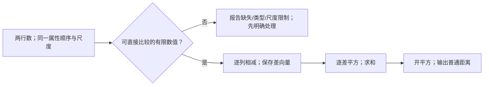
```mermaid
flowchart LR
    ED0[两行数；同一属性顺序与尺度] --> ED1{可直接比较的有限数值？}
    ED1 -->|否| ED2[报告缺失/类型/尺度限制；先明确处理]
    ED1 -->|是| ED3[逐列相减；保存差向量]
    ED3 --> ED4[逐差平方；求和]
    ED4 --> ED5[开平方；输出普通距离]
```

沿 Apple / Orange 走 ED0→ED1 的“是”：按 RGB 同列做差 −23/−38/27。ED3 留差向量，ED4 得平方和 2702，ED5 开根得到 51.98。文字替代：对齐列→做差→平方和→开根。

图是补充计算流程。RGB 编码尺度固定，列含义不一致、缺失或不可比时先停；它不定义真实颜色的感知相似性。

读图自测：只交换橙子的 R/G 列后还能从 ED1 走“是”吗？

不能。长度相同不等于属性对齐；ED0 的同列约定被破坏，应回查配对，不能把错误距离当原水果差异。

**为什么需要它**

它是 §2.2.1 定义里"相似"的具体实现，也是三种算法的输入：K-means 用它决定每个点归哪个中心（§2.4.1）、层次聚类用它填邻近矩阵（§2.6.3）、DBSCAN 用它数 Eps 半径内有几个点（§2.9.1）。**换一种距离，三种算法的结果都会变**——讲义说 "One example is Euclidian distance"，意思是它只是最常用的一种，不是唯一的。

**课件原例**

讲义 p.19：苹果 / 橙子 RGB 表 + 根号下的展开式（无结果）。

**🎙️ 课堂补充**（A `00:00`–`10:23`：讲解约 2.1 分钟、小测说明约 1.4 分钟、作答空档约 6.8 分钟）

教授将二维距离推广到RGB三维及更高维：每维做差平方，再求和开根。

> "after we take the distance squared in each dimension, we sum them together and then take the square root"

意思是逐维平方差相加后再开根（A `01:33`）。随后A `01:45`–`01:58`明确这种计算可处理高维特征。
- A `02:08` 开始堂上小测：给出第三个数据点，要求分别计算它到苹果、橙子的距离并比较——*"So you need to calculate the two distances and then make a comparison."*（A `03:33`）。A `03:33`→`10:23` 是作答空档。
- ⚠️ 录音和 `transcript.dropped.json` 都没有保留第三个数据点的 RGB 坐标，也没有录到讲评答案；因此这里只能确认题型，**不能补写任何第三水果坐标或数值答案**。
- **这段改变了什么**：确认 p.18–19 的欧氏距离不只是公式展示，课堂要求能把新点代入、算两次距离并作比较；但小测的具体数字证据缺失，不能伪造复算。

**💡 换个说法（笔记补充）**

- 像比较两份简历的"差距"：每一项打分相减、平方后相加再开根——两个人在某一项上差距特别大，会被判为"很不像"，哪怕其他项几乎相同。这既是欧氏距离的特点，也是它的弱点。
- 换个角度看"距离小 = 相似"：讲义标题说 similarity metric，但公式给的是 distance——两者方向相反（距离越小越相似），后面所有"最近""最小"都是在说"最相似"。

**⚠️ 常见误解**

- ❌ "不开根号也一样，反正只是比大小。" → 比大小确实一样（平方是单调的），K-means 内部常常就省掉根号；但**报告一个距离值**时要开根号，否则单位是"颜色的平方"，无法与原始数据对照。
- ❌ "把差的绝对值加起来也行，何必平方。" → 那是另一种距离（曼哈顿距离），结果不同：它对大差不"加倍惩罚"。讲义只教欧氏，考试按讲义。
- ❌ "$d = 51.98$ 说明苹果和橙子'相当不像'。" → 单独一个距离没有意义，51.98 相对于 RGB 0–255 的范围算中等；只有与其他对象的距离比较才有意义。

**与其他概念的关系**

§2.2.1 定义的实现；§2.3.2 讲距离尺度的选择与必要时的归一化；§2.4.1 / §2.6.3 / §2.9.1 三处使用；M04 §2.5 的"距离度量"是同一工具用于特征评价。

**所以呢**：公式会算了，但有个陷阱：**先核各列差值的平方贡献；尺度差异可能让某列无意主导距离，但取值最大不等于贡献最大**——p.20 用 Homer 和 Burns 演示。

---

#### 2.3.2 属性归一化：Homer 与 Burns 的距离被收入吃掉了（讲义 p.20）

**是什么**

Homer 和 Burns 两个人，三个属性：年龄 62 / 65，收入 \$990,000 / \$1,000,000，信用卡数 8 / 10。直接套欧氏距离，得到 ≈ 10,000——**几乎全部来自收入那一项**，年龄差 3 岁和信用卡差 2 张完全看不见。讲义 p.20：

$$d(\text{Homer}, \text{Burns}) = \sqrt{(62-65)^2 + (990{,}000 - 1{,}000{,}000)^2 + (8-10)^2} \approx 10{,}000$$

讲义在收入那一项下画了蓝线、箭头指向 ≈ 10,000，意思是"这个结果就是它一项决定的"。解决办法是**属性归一化**（attribute normalization）——先把每一列拉到同一尺度再算距离。讲义底部给了两种：**标准分数**（standard score，z 分数）与 **min-max 缩放**（min-max feature scaling）：

先用均值和标准差定义一把参照尺子：

$$\text{Standard score: } z=\frac{X-\mu}{\sigma}$$

另一把尺子从参照最小值量到最大值：

$$\text{Min-max feature scaling: } X'=\frac{X-X_{\min}}{X_{\max}-X_{\min}}$$

每行解释一种缩放状态；均值/尺度从参照数据估计，不从当前单个新点估计。

| 符号 | 是什么 | 已知还是要算 |
|---|---|---|
| $X$ | 某一列里的一个原始取值（如收入 990,000） | 已知 |
| $\mu$ | 这一列的均值 | 先算 |
| $\sigma$ | 这一列的标准差（一列数平均离均值多远） | 先算 |
| $z$ | 标准分数：这个值离均值几个标准差；无单位，正负都有 | 要算 |
| $X_{\min}, X_{\max}$ | 这一列的最小值、最大值 | 先算 |
| $X'$ | min-max 缩放后的值；拟合时最小到最大范围内落在 0–1，新值可超界 | 要算 |

读X′：Homer收入处于两人参照最小值，所以为0；Burns为1。两列数字不能与美元原收入直接比。

**尺度口径（笔记补充）**：以下四人手算采用样本标准差（ddof=1，记作 s）。sklearn `StandardScaler` 采用 ddof=0 的标准差，数值会不同；两种都是明确的尺度约定，不能将同一组数混为同一输出。先在训练 / 参照数据学均值、标准差或最小最大值，再将保存的参数用于新对象，不用新对象自己重算尺子。

**数字例子（手把手）**（脚本 `verify_m05_originals.py` 统计与距离输出）：

先看未归一化为什么 ≈ 10,000：
1. 三项差：$62 - 65 = -3$，$990{,}000 - 1{,}000{,}000 = -10{,}000$，$8 - 10 = -2$
2. 平方和：$9 + 100{,}000{,}000 + 4 = 100{,}000{,}013$
3. 开根：$\sqrt{100{,}000{,}013} = 10{,}000.0006$——与只算收入一项的 $\sqrt{100{,}000{,}000} = 10{,}000$ 几乎相同；年龄和信用卡合起来只贡献 $\sqrt{13} = 3.6$，被 10,000 淹没。

再做 min-max（只有两个人时，每列的最小值给 0、最大值给 1）：
4. 年龄：Homer $(62 - 62) ÷ (65 - 62) = 0$，Burns $(65 - 62) ÷ 3 = 1$；收入、信用卡同理都变成 0 和 1
5. 归一化后距离：$\sqrt{1^2 + 1^2 + 1^2} = \sqrt{3} = 1.732$——三个属性各贡献 1，谁也不压倒谁。

两个人只能描述这两人的差，难估总体尺度。原补充例另加学生（30 岁，\$40,000，1 张卡）和白领（45 岁，\$120,000，3 张卡），以四人的样本标准差计算。

先读收入列的 z 分数：Homer 为 0.85，Burns 为 0.87，学生为 −0.94。正号表示高于四人均值，负号表示低于均值。

再比较三列共同形成的距离：

| 点对 | 原始距离 | 四人样本尺度后的距离 |
|---|---:|---:|
| Homer–Burns | 10,000 | 0.51 |
| Homer–学生 | 950,000 | 3.14 |

每行是同一对人的两种距离口径。原始值近似由收入美元差主导；缩放后是无单位距离，三列都按参照波动参与。

读第一行：原始距离约 10,000，换尺子后约 0.51。两个结果都认为 Homer 较像 Burns，但不能比较两列数字谁“更小所以更准”；参照和单位已经改变。

**为什么公式长这样**

z分数先减均值，把参照中心移到0。再除标准差，让一单位表示一个参照标准差。

min-max先减最小值，把起点移到0。再除极差，把参照最大值映到1。参照范围内为0–1，新对象可超界。

两者都先平移再换尺子。z用标准差，极端值可拉大 $\sigma$ 而压缩其余差异；min-max用极差，极端值直接影响 $X_{\max}$。两种尺度均须检查异常敏感性。

**极端 / 边界情况**：
- 某列所有值相同 → $\sigma = 0$、$X_{\max} - X_{\min} = 0$，两个公式都**除以零**——这一列没有区分当前训练样本的变化，可删去或按明确的常数列策略处理；常见实现将缩放分母设为 1，不能直接除以零。
**只有两对象时的尺度退化**

以下假定每列两值不同。

1. min-max把较小值映0、较大值映1，因此每列平方差都为1。
2. 样本标准差采用n−1。两值的标准差是差值绝对值除 $\sqrt2$。
3. 各值距均值为半个差值，所以z为 $\pm1/\sqrt2\approx\pm0.71$。

只用两对象估尺子，会抹平列间相对幅度，难描述总体变化。要解释业务相似，应使用相应参照数据集；相等列另走常数策略。
- 新来一个对象的收入超过原来的 $X_{\max}$ → min-max 给出 $X' > 1$；z分数没有0–1范围约束；仅transform新对象不改变已保存的 $\mu,\sigma$，只有重新fit扩充的数据才会改变它们。上线的模型要用**训练时**的 $\mu, \sigma$ 或 $\min, \max$，不能每次重算——T03 里 `StandardScaler` 的 `fit` / `transform` 分开就是这个原因。

**缩放的状态流（笔记补充）**：输入除新对象外，必须给参照数据与尺度口径。输出为缩放数及可复用的中心/尺度状态；用于新对象时，参照状态保持不变。

下面的图回答：怎样保存参照尺子，之后只变换新对象？箭头表示预处理状态与数据的传递；常数列走单独策略，不做零分母除法。

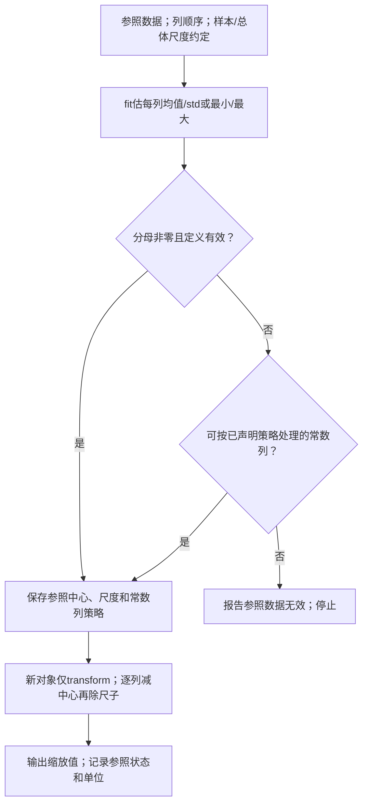
```mermaid
flowchart TD
    SN0[参照数据；列顺序；样本/总体尺度约定] --> SN1[fit估每列均值/std或最小/最大]
    SN1 --> SN2{分母非零且定义有效？}
    SN2 -->|否| SN3{可按已声明策略处理的常数列？}
    SN2 -->|是| SN4[保存参照中心、尺度和常数列策略]
    SN3 -->|是| SN4
    SN3 -->|否| SNFAIL[报告参照数据无效；停止]
    SN4 --> SN5[新对象仅transform；逐列减中心再除尺子]
    SN5 --> SN6[输出缩放值；记录参照状态和单位]
```

以两人 min-max 为例，从 SN0 给年龄 62/65。SN1 得 min=62、max=65；SN2 检查极差 3 非零，SN4 保存这把尺子。Homer 在 SN5 得 0，Burns 得 1。新年龄 68 仍用同尺子，得到 2。文字替代：先 fit 保存，再 transform 复用。

新年龄 68 为笔记补充走图输入；超出 0–1 不是默认错误。两人参照仅是演算，不认证总体尺度，四人 z 例另采用样本口径。

读图自测：新对象超过训练最大值，要回 SN1 重算最大值吗？

只 transform 时不回。回 SN1 是重新 fit，改变参照状态；若要截断到 0–1，另声明 clip 与信息损失。

**为什么需要它**

**聚类前必须明确距离中的尺度与业务权重**。Homer / Burns 例中收入差的平方远大于其他列，所以欧氏距离几乎由收入决定；这不意味着所有数据和算法都必须归一化。若希望各列不因单位大小而无意主导，需按训练参照集缩放；若收入主导本来就是业务意图，也可保留或显式加权，但要说明。年消费额与访问次数的单位大小不一致时，先检查各列的距离贡献，再决定尺子。

**课件原例**

讲义 p.20：两人三属性 + 未归一化的算式 ≈ 10,000 + 两个归一化公式（截自维基）。讲义没有算归一化后的结果，本笔记用脚本补了。

**🎙️ 课堂补充**（A `10:23`–`12:18`，约 1.9 分钟；B `00:00`–`06:13`，约 6.2 分钟）

- 教授先解释量纲支配：年龄差与信用卡数差很小，而收入差为 10,000，因而 *"the whole calculation will be dominated by the large-scale feature value"*（A `11:21`）。这正是 Homer / Burns 例子要解决的问题。
课堂把min-max最小值代入得0，最大值代入得1。

> "x1 will be in the scale from 0 to 1"

这指参照最小/最大间的范围（B `01:59`–`02:10`）。B `02:14`–`03:06`进一步解释，各列变换可避免原量纲无意支配距离。
- 教授特别提醒 min-max 对极端离群点敏感：一个极大值会被压到 1，其余样本可能全挤近 0（B `03:11`–`03:58`）。课堂随后建议改用标准化；其可核结果是 *"the mean value of x-prime will be 0"* 且标准差为 1（B `04:46`–`04:52`）。⚠️ **口径纠错**：z-score 只平移、缩放，不会把任意原分布变成 standard normal，也不保证对极端离群点鲁棒；B `04:41` 的 *"follows the standard normal distribution"* 不能照字面当定理。
- 实务提醒：使用 Python 算法前要查官方文档，看模型是否内置归一化；若没有，原始尺度直接用于 K-means 会使分析受主导特征影响（B `05:11`–`06:03`）。
- **这段改变了什么**：把 p.20 从“记两条公式”变成三步判断：先看尺度是否失衡，再比较变换的适用边界，最后核实实现是否已内置预处理。A `12:18` 与 B `00:00` 是同一句 min-max 推导开头的重叠接缝，不重复理解为两次讲授。

**💡 换个说法（笔记补充）**

- 像比赛计总分时把"跑步秒数""跳远米数""投掷米数"直接相加——秒数几十、米数几，谁跑得慢谁总分高。归一化就是把每个项目换算成"在全体选手里排第几个标准差"，再相加才公平。
- 换个角度：不归一化不是"错"，是**隐含地给了收入一个巨大的权重**。有时你确实想让收入主导（业务上收入最重要），那就有意识地不归一化或给收入更大权重——关键是知道自己在做什么，而不是让单位替你决定。

**⚠️ 常见误解**

- ❌ "≈ 10,000 是三项一起算出来的，年龄和信用卡也起了作用。" → 第 3 步算过：不算那两项也是 10,000.000，它们的贡献在小数点后第四位。距离由平方最大的项决定。
- ❌ "z 分数和 min-max 随便选一个。" → 结果不同：z 分数不限范围、对离群点相对稳一些；min-max 对拟合范围内取值映到 0–1，新值可小于 0 或大于 1、但一个极端值会把其他值挤到一起。有明显离群点时先处理离群点，再选 z 分数；若要新值也严格限制到0–1，需另明示clip或其他范围策略并接受截断信息损失，不能只依赖默认min-max。
- ❌ "归一化后距离一定变小。" → 只是尺度变了，数值大小没有可比性：归一化后的 1.732 与原来的 10,000 不能比，只能在归一化后的数据内部比。

**与其他概念的关系**

T03 §3.4 `StandardScaler`（本讲的 z 分数）；M04 §2.13（PCA 前要标准化，同一理由）；§2.2.5 清单里的"属性类型 / 分布"；§2.5.1 K-means 怕离群点，与 z 分数怕离群点是同一件事。

**所以呢**：距离会算、尺度也统一了，可以开始分组。第一种算法：K-means。

---

### 2.4 K-means：先定几组，反复挪中心（讲义 p.21–31）

p.21 引导页列出三种算法；p.23 给算法，p.24–26 图解迭代，p.27–28 邮局例子，p.29 初始化问题，p.30–31 K-means++。

#### 2.4.1 K-means 的四步算法与质心（讲义 p.23）

<!-- 类型: 算法流程型 -->

**是什么**

你决定把客户分成 3 群（K = 3）。K-means 的做法是：先随便选 3 个点当"中心"，把每个客户分给离它最近的中心，再把每群的中心挪到该群的平均位置，重复直到中心不动。讲义 p.23：

> - **Partitional clustering** approach（划分型）
> - Number of clusters, **K, must be specified**（簇数 K 必须事先给定）
> - Each cluster is associated with a **centroid** (center point)（每个簇有一个质心——中心点）
> - Each point is assigned to the cluster with the **closest centroid**（每个点分给质心最近的簇）
> - The basic algorithm is very simple（基本算法非常简单）

算法（讲义原文，四步）：

1. Select $K$ points as the initial centroids.（选 K 个点作初始质心）
2. **repeat**
3. Form $K$ clusters by assigning all points to the closest centroid.（把所有点分给最近的质心，形成 K 个簇）
4. Recompute the centroid of each cluster.（重算每个簇的质心）
5. **until** The centroids don't change（直到质心不再变化）

**质心**（centroid）就是簇内所有点的**平均位置**——每个属性取平均。"K-means" 的 means 就是这个平均。

**手算一遍：六点初始化A**

先借用§2.8.1的p.55目测坐标，保留0.01精度限制。K=2，初始质心p1/p4。

| 点 | x | y |
|---|---:|---:|
| p1 | 0.40 | 0.53 |
| p2 | 0.22 | 0.38 |
| p3 | 0.35 | 0.32 |
| p4 | 0.26 | 0.19 |
| p5 | 0.08 | 0.41 |
| p6 | 0.45 | 0.30 |

每行一个点，两列是该图坐标。下一表走分配与中心更新；既有复算为`verify_m05_originals.py`的`lloyd`“初始化A”。

每行是一次算法动作；结果保留本动作使用的中心时点，六点坐标为既有目测补充。

| 步 | 动作 | 结果 |
|---|---|---|
| 1 | 初始质心 C1 = p1，C2 = p4 | — |
| 3（第1轮） | 比较到两旧中心距离 | 归属及距离见下方分配明细 |
| 4（第 1 轮） | 重算质心 | C1 = p1 = (0.40, 0.53)；C2 = p2–p6 五点平均 = (0.272, 0.320) |
| 3（第 2 轮） | 再分配 | 分配不变（p1 到 C2 的距离 0.246 > 0；其余到 C2 都更近） |
| 4（第 2 轮） | 重算质心 | 不变 → 停止 |

**初始化A的第1轮分配明细**

每行一个点；两距离分别到旧C1=p1与C2=p4，取较小者。

| 点 | 到C1 | 到C2 | 归属 |
|---|---:|---:|---|
| p1 | 0 | 0.368 | C1 |
| p2 | 0.234 | 0.194 | C2 |
| p3 | 0.216 | 0.158 | C2 |
| p4 | — | 0 | C2 |
| p5 | 0.342 | 0.284 | C2 |
| p6 | 0.235 | 0.220 | C2 |

p4就是旧C2，所以归C2；破折号表示原明细未另报该距离，不是0。读p2：0.194<0.234，归C2。

读第1轮分配：p2到C1/C2为0.234/0.194，归C2。更新行才将C2改为五成员均值(0.272,0.320)。

两轮收敛，结果是 {p1} 与 {p2, p3, p4, p5, p6}，SSE = 0.1065（SSE 的定义见 §2.4.4）。

**机制展开（笔记补充）：先把“在优化什么”看清，再走完每一轮**

本节把讲义 p.23 的五行伪码展开。客户的一行记录就是一个点；若有年龄、消费额两列，这个点有两个坐标。中心是各坐标的平均值，可以落在两个客户之间，**不必是实际客户**。算法维护两类状态：每个点属于哪个簇，以及每个簇当前中心在哪里。

**输入与输出**：输入是 $n$ 个数值点、事先指定的簇数 $K$、初始中心和距离规则；量纲不同先处理 §2.3.2 的尺度问题。输出是 $n$ 个簇标签、$K$ 个中心及误差。这里讲普通欧氏距离下的 Lloyd 算法（交替分配与更新），不是能使用任意距离的万能聚类器。

**数学原理：每个点离“自己的中心”有多远**

算法想让所有点到所属中心的**平方距离之和**小，而不是分别最大化所有簇之间的距离。用一个总数衡量当前方案，叫目标函数（objective function）：

$$J=\sum_{i=1}^{n}\|x_i-c_{z_i}\|_2^2=\sum_{j=1}^{K}\sum_{i:z_i=j}\|x_i-c_j\|_2^2.$$

每行列一个目标函数角色；坐标继承输入单位，J为平方坐标单位，标签zi无物理单位。

| 符号 | 人话含义 | 已知还是要算 |
|---|---|---|
| $n,d$ | 点数、每点坐标数 | 已知 |
| $K$ | 想分几组，满足 $1\le K\le n$；非空不同簇还受不同点数约束 | 用户给定 |
| $x_i$ | 第 $i$ 个点，含 $d$ 个坐标 | 已知数据 |
| $z_i$ | 第 $i$ 个点目前的簇编号 | 分配时求 |
| $c_j$ | 第 $j$ 簇的中心，含 $d$ 个坐标 | 更新时求 |
| $\|x_i-c_j\|_2^2$ | 每一坐标差平方后相加；一维就是 $(x_i-c_j)^2$ | 计算量 |
| $J$ | 所有所属中心的平方距离加总，又叫 SSE / inertia | 最终核对量 |
| $m,\bar{x},c$ | 某簇点数、该簇平均位置、任意候选中心 | 推导中的量 |

读ci/zi：点i用自身标签zi定位所属中心，不对所有中心距离都求和；m是推导中的某簇人数。

**为什么公式长这样**：单点的平方差不能互相抵消，并使远点贡献更大；对所有点求和，才衡量整个分组方案。它不是概率模型，**不要求数据服从正态分布（围绕均值的钟形分布）**。为什么接下来既“换标签”又“挪中心”？因为标签和中心一起找最好很困难，先固定一边、优化另一边就简单了。

1. **固定中心，求标签**：各点分别比较到全部中心的平方距离，选最小的那一个。这样对每个加总项都不增加误差，因此总 $J$ 不增。开平方不会改变距离大小顺序，实际比较平方距离即可。
2. **固定标签，求中心**：成员已定后，中心为什么要取均值？先在一维看某簇的 $m$ 个数。把候选中心 $c$ 和平均数 $\bar{x}$ 的差展开，可以得到：

$$\sum_{i=1}^{m}(x_i-c)^2=\sum_{i=1}^{m}(x_i-\bar{x})^2+m(\bar{x}-c)^2.$$

右边第一项只由这批点决定；第二项非负，在 $c=\bar{x}$ 时恰为零。因此**平均数让该簇的平方误差最小**。推导的关键是：将 $x_i-c$ 写成 $(x_i-\bar{x})+(\bar{x}-c)$，平方相加后，交叉项包含 $\sum_i(x_i-\bar{x})=0$，所以交叉项消失。多维时对每一列分别做相同推导，就是每列取平均。

固定成员0/2/3，先求均值5/3。

1. 以c=0为中心，平方误差 $0+4+9=13$。
2. 以均值为中心，平方误差 $25/9+1/9+16/9=14/3$。
3. 二者差25/3，等于 $3(5/3-0)^2$，对应均值恒等式。

所以means更新是平方目标的最小值。若改成绝对距离和，最优中心与排序中位数有关，不能照搬均值更新。

**编号步骤与状态更新**

每行是Lloyd一个阶段；“当前输入”注明固定哪种状态，“留下状态”给下一阶段所接结果。

| 步 | 当前输入 → 动作 | 留下的状态 |
|---|---|---|
| 1 初始化 | 数据、$K$ → 给出 $K$ 个中心 | 当前中心；还没有最终标签 |
| 2 分配 | 当前中心 → 每点比较 $K$ 个距离，统一采用固定平局规则 | 本轮标签与按旧中心算的 $J$ |
| 3 更新 | 本轮标签 → 对每簇成员逐坐标求平均 | 新中心与更新后的 $J$ |
| 4 检查 | 比较新旧中心 / 标签，或实现规定的容差与步数 | 稳定则输出，否则用新中心回到步骤 2 |

读分配行：全体点用旧中心比较，然后保存整轮标签。后面的更新才用本轮成员取均值。

分配阶段全体点使用**同一轮旧中心**；不能处理一个点就挪中心、再用新中心处理下一个点，那会变成另一种算法。

**本教学版本的空簇策略（笔记补充，非讲义指定）**

1. 按空簇编号从小到大处理。
2. 候选供体来自至少2成员的非空簇。取离其当前中心平方距离最大的一点；平局按原数据序。
3. 只移这一点进空簇，并用它的位置作新中心。供体簇至少留1人。
4. 修完全部空簇后，按当前成员统一更新均值，再检查停止。

每次修复少一个空簇，正常迭代仍受步数上限约束。要求非空簇数超过有效点数时，输入阶段报错。数值或策略无法修复时报告失败；具体库可采用其他重设策略。

例：异常初始中心(0,0)、点(0,2,10)，所有点先归簇1，簇2空；候选平方距离为0、4、100，移点10进簇2，簇1均值变1、簇2为10。下一轮标签不变，SSE=1+1+0=2。输入点没动，改的是成员和中心；该例由 `verify_m05_mechanisms.py` 的边界核对验证。

**算法流程图**：箭头返回的是“按新中心重新分配”，不是重新随机选中心。

图帮助区分：何时固定中心改标签，何时固定标签挪中心？实线箭头是控制先后，回到 KM2 是新一轮分配，点本身不移动。

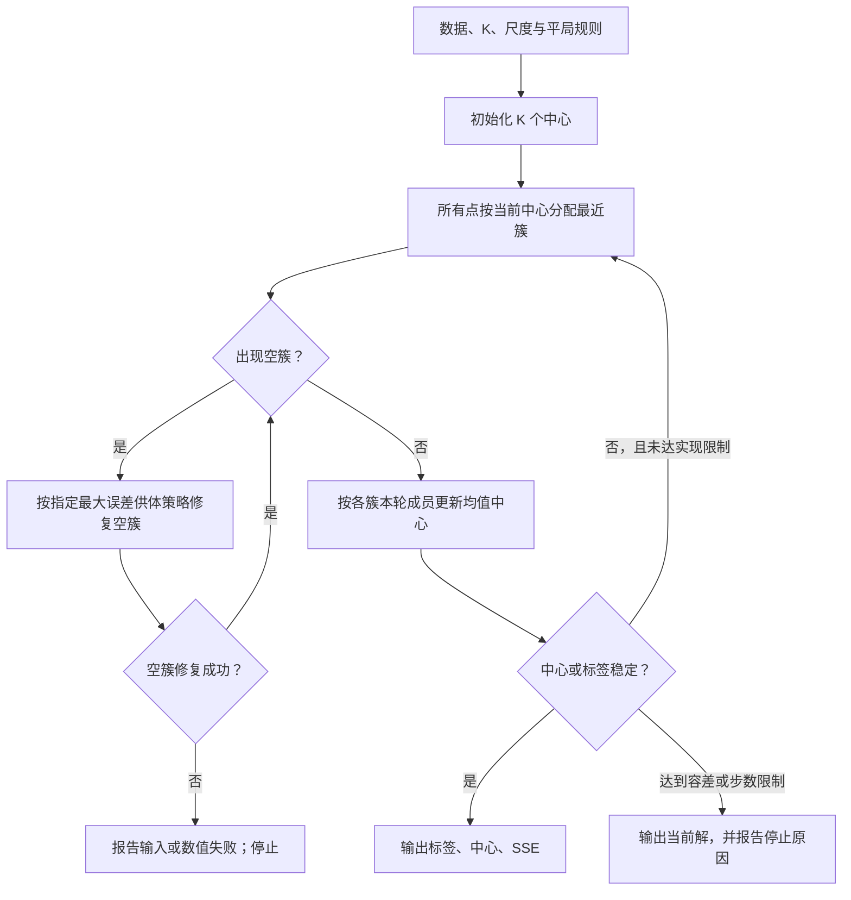
```mermaid
flowchart TD
    KM0["数据、K、尺度与平局规则"] --> KM1["初始化 K 个中心"]
    KM1 --> KM2["所有点按当前中心分配最近簇"]
    KM2 --> KME{"出现空簇？"}
    KME -->|是| KMF["按指定最大误差供体策略修复空簇"]
    KMF --> KMR{"空簇修复成功？"}
    KMR -->|是| KME
    KMR -->|否| KMFAIL["报告输入或数值失败；停止"]
    KME -->|否| KM3["按各簇本轮成员更新均值中心"]
    KM3 --> KM4{"中心或标签稳定？"}
    KM4 -->|否，且未达实现限制| KM2
    KM4 -->|是| KM5["输出标签、中心、SSE"]
    KM4 -->|达到容差或步数限制| KM6["输出当前解，并报告停止原因"]
```

五点 0/2/3/9/10、初始中心0/3在 KM2 得标签 {0}/{2,3,9,10}。没有空簇，KM3 更新为0/6；KM4未稳定，返回KM2。再分配成{0,2,3}/{9,10}，更新5/3与9.5；下一轮相同才到KM5。文字替代：分配→处理空簇→求均值→检查→重复。

KMF 的最大误差供体是上文声明的补充策略，不是原p.23指定出口。达到容差/步数限制走KM6，不能冒称全局最优。

读图自测：第一轮处理完点2后就挪中心，再处理点3，对应哪个节点？

不对应本图完整KM2。KM2要求全体按同一轮旧中心分配；逐点挪中心改变算法和点序依赖。

**数字例子（手把手，笔记补充）**：用一维五个点 $0,2,3,9,10$，取 $K=2$，初始中心 $0,3$；距离相等时归编号较小的中心。全部中间数由 `verify_m05_mechanisms.py` 的 `kmeans` 输出复算。

每行固定一个原点，两轮列分别给平方距离和标签；不是不同点的位置变化。

| 点 | 第 1 轮：到 0 / 3 的平方距离 | 第 1 轮分配 | 第 2 轮：到 0 / 6 的平方距离 | 第 2 轮分配 |
|---|---|---|---|---|
| 0 | 0 / 9 | 簇 1 | 0 / 36 | 簇 1 |
| 2 | 4 / 1 | 簇 2 | 4 / 16 | 簇 1 |
| 3 | 9 / 0 | 簇 2 | 9 / 9 | 簇 1（固定平局规则） |
| 9 | 81 / 36 | 簇 2 | 81 / 9 | 簇 2 |
| 10 | 100 / 49 | 簇 2 | 100 / 16 | 簇 2 |

读点3：第2轮到0/6都是9，按平局规则归簇1。平方距离无开根但保持比较顺序。

1. **第 1 轮分配**得到 $\{0\}$、$\{2,3,9,10\}$。按旧中心算 $J=0+1+0+36+49=86$。
2. **第 1 轮更新**：中心变成 $0$、$(2+3+9+10)/4=6$。成员不变，仅挪中心后 $J=0+16+9+9+16=50$。
3. **第 2 轮重新分配**：点 2 和点 3 改簇，得到 $\{0,2,3\}$、$\{9,10\}$。仍按当前中心 $0,6$ 算，$J=0+4+9+9+16=38$。
4. **第 2 轮更新**：中心变成 $5/3$、$9.5$。$J=14/3+0.25+0.25=31/6\approx5.1667$。
5. **第 3 轮检查**：五个点到两中心的平方距离依次为 $(2.7778,90.25)$、$(0.1111,56.25)$、$(1.7778,42.25)$、$(53.7778,0.25)$、$(69.4444,0.25)$；标签不变，均值也不变。**这才是本例的停止证据**。

这一遍从 $86\to50\to38\to5.1667$，把“分配降低一部分误差、更新再降低一部分误差”具体显示出来。不能比较前半轮的旧中心误差和另一份成员划分的误差而省略口径。

**同五点的状态图（笔记补充）**

问题：一轮内改变的是标签还是中心？横轴为一维教学坐标，原点位置固定。圆形及 G1 表示簇 1，方形及 G2 表示簇 2；X 表示中心 C1/C2。

上下四幅按计算阶段读，形状和编号随归属变化。图无流程箭头，也不表示真实客户坐标。

![[IS6400_Business_Data_Analytics/notes/figures/readability-v2-m05/lloyd-states.svg]]

读点3：第一幅到中心0/3的平方距离为9/0，所以在簇2。第二幅只将簇2中心移到6，点3的位置不变。第三幅到0/6都是9，按固定平局归簇1。第四幅簇1中心变5/3，点3仍在原坐标3。

文字替代：标签先变，随后按固定成员更新中心；下一轮重新比较距离。图中SSE依次86/50/38/31/6，与上文同阶段对应。

读图自测：第三幅尚未更新中心时，J为何是38而不是31/6？

第三幅仍用中心0/6，只重分配标签。31/6是第四幅将成员均值更新为5/3、9.5后的结果。计算时点不同，不能混写。

图源：[[IS6400_Business_Data_Analytics/notes/figures/readability-v2-m05/generate.py|生成代码]]、[[IS6400_Business_Data_Analytics/notes/figures/readability-v2-m05/figure-inputs.json|明确教学数据]]。最终视觉/教学验收 pending。

**为什么理想过程会停**

以下论证要求精确运算、没有空簇、平局按固定规则处理。

1. $n$ 个点的成员划分只有有限种；每种划分对应确定的均值中心。
2. 非空簇中心真正改变时，均值恒等式给出严格误差下降。
3. 严格下降不能无限重复同一状态。中心不变时，固定分配规则也稳定，于是停止。

$J$ 不增且有下界，只能单独说明误差数列有收敛趋势，不能单独证明有限步停止。

**实现与边界**

- 实际软件可按容差或最大迭代数停止；达到限制不证明已找到全局最优。
- 空簇没有平均值，须另定重设策略和停止限制；上面的无空簇论证不能直接套用。
- $K=1$ 时，一次均值更新得到全体平均位置。
- 所有点相同却要求多个非空不同簇，目标退化。

**为什么会失败**：均值会被极远的点拉动，平方误差又放大该点的代价；因此离群点可能消耗一个中心。固定中心后的最近分配形成由直线 / 超平面划出的区域，不能自然沿两个同心环分组；“喜欢紧凑团”是机制后果，不是“算法要求球形正态分布”的统计假设。改进初始点只能改善起点，不能改这两条机制。

**迁移与诊断**：§7 的新题要求换初始中心重做一轮，并检查“逐点立即挪中心”的错误。现在应能回答：算法移动的是中心，原始数据点不动；标签在每轮可改，最终簇编号只是名称。

**稳定与局部最小的平局边界（笔记补充）**

先看点 $-1,1,2$、中心 $0,2$。等距归编号小的簇，成员为 $\{-1,1\}/\{2\}$，均值仍为 $0,2$，SSE 为 2。按既定 Lloyd 步骤，它已稳定。

但同时把中心改为 $-0.1,1.9$，再重新最近分配，误差变成 $0.81+0.81+0.01=1.63$。因此“步骤不再动”不能推出“任意联合扰动都无改进”。

一次 0.1 扰动还不足以证明任意小邻域中的结论。为此令 $0<h<1/2$，把中心改为 $-h,2-h$：

$$J(h)=2(1-h)^2+h^2=2-4h+3h^2<2.$$

$h$ 可以任意接近 0。这说明在允许重新分配标签的连续中心目标下，此退化平局稳定点连局部极小也不是。通常的局部极小解释需额外排除这类退化，不能无条件使用。

**为什么需要它**

这是本课首次系统展开的聚类算法，常用于快速、大规模分组。

每轮优化同一个平方误差：

1. 固定中心，让各点选择最近中心，误差不增。
2. 固定成员，更新为均值中心，误差不增。

理想有限步稳定还要求有限划分、固定平局、非空簇等条件，不能仅从有下界推出。停止也不表示全局最好，见§2.4.4。

**课件原例**

讲义 p.23 五条要点 + 五行伪码。

**🎙️ 课堂补充**（B `06:33`–`10:27`，约 3.9 分钟）

- 教授先钉住输入与输出：K 必须由人指定——*"the K must be specified"*（B `07:31`）；算法交出两种状态，一是每个点的簇 assignment，二是各簇 centroid（B `07:51`–`08:00`）。
- 初始化之所以必要，是因为最开始既没有中心也没有标签；课堂做法是先随机给 K 个中心位置，再让最近中心产生标签（B `08:28`–`09:51`）。
- 每轮严格交替两步：*"The first step is to fix the centroid and find the data assignment. The second step is that we fix the assignment and then we compute the cluster centroid."*（B `10:16`–`10:27`）。
- **这段改变了什么**：确认算法状态不是单独一组标签，而是“中心位置 + 点的归属”成对更新；任何一步都必须说明固定的是哪一个、重算的是哪一个。

**💡 换个说法（笔记补充）**

- 像在城市里定 3 个快递站的位置：先随便放 3 个站，每户人家归最近的站；然后把每个站搬到它服务的所有人家的"重心"；再重新分配人家、再搬站……直到站不再动。这就是 p.27–28 的邮局例子。
- 换个角度："K-means" 三个字各说一件事：K = 你得先说几组；means = 中心是平均值；这两点分别是它的两个弱点——K 要猜（§2.2.3）、平均值怕离群点（§2.5.1）。

**⚠️ 常见误解**

- ❌ "K-means 会自动决定分几组。" → K 是输入，必须事先给；选 K 是另一个问题（讲义本讲没讲，常用"肘部法"——试几个 K 看 SSE 的下降拐点，⚪ 课外）。
- ❌ "初始质心必须是数据里的点。" → 讲义第 1 步说 select K **points**，实践里可以是任意位置；p.24 的初始中心就不在数据点上。
- ❌ "停止时的结果是全局最优。" → 只是当前分配与均值更新的稳定点；无退化的通常情形可形成局部极小，但有等距平局时不能无条件说任意小扰动也不改善；不同初始点停在不同地方（§2.4.4）。

**与其他概念的关系**

§2.2.4 划分类型的代表；§2.3 距离与归一化是它的输入；§2.4.4 初始化与 SSE；§2.5 它的失灵；§2.5.3 二分 K-means 是它的变体；M02 §2.8 的"迭代到不再变化"（梯度下降）是同一种优化思路。

**所以呢**：四步会背了，看图更直观——讲义用六帧图展示中心怎样一步步挪到位。

---

#### 2.4.2 六帧图解：看中心怎样一轮轮挪到位（讲义 p.24–26，图）

**是什么**

p.24–26 是同一份数据（约 150 个点，三团：上方一大团约在 (0, 2)，左下一小团约在 (−1, 0)，右下一小团约在 (1, 0)）的 K-means 过程（已视觉复核）。

**怎么读**：
**p.24 Iteration 1**

黑十字是三个初始中心，约为(−0.3,1.8)/(−0.1,2.7)/(0.3,2.1)，都在上方大团。

按最近中心分配，上方被分绿/红/蓝三片。左下小团归绿，右下归蓝。

右侧流程为Initial 3 centers→Calculate distances→Assign objects→update centers→Current updated centers。箭头表示用新中心进入下一轮。
**p.26 六帧**

- Iteration 2：绿中心受左下成员影响向下移，蓝中心受右下成员影响向下移。
- Iteration 3–4：这两中心到小团附近。
- Iteration 5–6：中心稳定，红约(0,2)、绿约(−1,0)、蓝约(1,0)。

这些位置来自原图近似读法，不是重建的精确点坐标。
- **p.25 Iteration 6**：最终结果放大图——三团各归各的，只有两个点（约 (0.3, 0.6) 与 (0.8, 1.2)）被分给蓝色，因为它们离蓝中心比离红中心近。

**为什么需要它**

它把 §2.4.1 的"重复直到不变"具体化：**中心是被点"拉"过去的**——在这张图的初始化和点分布下，中心最终移到各团；不能据此推出“每团点多就一定能纠正任意差的初始化”。它也预告了 §2.4.4：这一次拉对了，是因为初始中心分布得还算分散；p.29 会给一个拉错的例子。

**课件原例**

讲义 p.24–26 三张图（六帧）。

**🎙️ 课堂补充**（B `10:33`–`16:05`，约 5.5 分钟）

- 第 1 轮先固定三处随机中心，对每个点算到三中心的距离并涂成最近中心的颜色（B `10:33`–`11:53`）；再固定颜色，把每个中心移到本色点群的中心（B `11:56`–`12:57`）。
- 第 2 轮用新中心重新分配：原来是绿色的点可能改成红色；随后再次按新成员重算中心（B `13:14`–`14:54`）。这说明“上一轮标签”不是永久答案。
- 课堂的停止证据很明确：*"after six iterations, I will get a point that the locations for the centroid do not change anymore"*（B `15:33`–`15:38`）；中心不变时标签也不变，继续迭代不会产生新状态（B `15:44`–`16:05`）。
- **这段改变了什么**：p.24–26 的六帧图对应可暂停的状态链：固定中心 → 改标签 → 固定标签 → 改中心；收敛检查同时核中心和标签，而不是只看“已经跑了六轮”。

**⚠️ 常见误解**（图会怎么骗人）

- ❌ "六轮就是 K-means 需要的轮数。" → 轮数取决于数据和初始点；这里六轮只是这份数据的情况，讲义没有给通用数字。
- ❌ "p.25 那两个被分给蓝色的点是错的。" → 按算法它们没有错：离蓝中心近就归蓝。这正说明 K-means 的簇边界是中心之间的"中垂线"，不管点的"自然归属"。
- ❌ "颜色是簇的固定名字。" → 颜色只是编号，换初始点后"红"可能指另一团；比较两次聚类结果时要按成员对，不能按颜色对。

**本课数据画出来长什么样**：这份数据不是本课数据集；⚪ 若对 Iris 花瓣长宽跑 K = 3，会看到 setosa 一团被完美分出，versicolor / virginica 的边界处有十几个点被分错（T04 的散点图可对照）。

**与其他概念的关系**

§2.4.1 的图解；§2.4.4（初始点决定拉到哪）；§2.5.1（簇不是圆的时候中心会被拉偏）。

**所以呢**：讲义换一个业务场景再讲一遍同一过程——邮局选址。

---

#### 2.4.3 邮局选址：K-means 就是"定站点 → 划片区 → 挪站点"（讲义 p.27–28）

**是什么**

p.27：一片居民点（约 20 个蓝点，分三团），问题是**给三个邮局选址**（decide the locations of three post offices to serve the residents）。p.28 用五格图走了两轮（已视觉复核）：

1. **randomly pick three locations**：三颗星（红 / 黄 / 黑）随机放——红星在左上团旁边，黄星在右上团旁边，黑星在中间偏下。
2. **1-1 decide service region**：每户归最近的邮局——左上团归红、右上团归黄、下方团归黑（但下方团里有几户离黑星远）。
3. **1-2 optimize locations**：把每个邮局搬到它服务片区的中心——红星搬进左上团里、黄星搬进右上团里、黑星搬到下方团中间。
4. **2-1 decide service region**：重新划片；**2-2 optimize locations**：再搬——第二轮几乎不变，结束。

"service region"就是簇，"optimize locations"就是重算质心。

**为什么需要它**

这是讲义给 K-means 的**业务翻译**：质心不只是数学上的平均点，它可以是一个真实的设施位置（邮局、仓库、快递站、门店），本例的精确优化量是每户到所属邮局的**平方距离之和**。若真实目标是总路程或道路行驶成本，需要相应的选址目标与距离，不能直接将它与平方误差等同。对项目：选址、划分销售区域、安排配送路线，都是 K-means 的直接用途——比"客户分群"更硬的一类应用。

**课件原例**

讲义 p.27 问题 + p.28 五格图。（本节数字为示意图上的点数，非脚本计算。）

**🎙️ 课堂补充**（B `16:50`–`22:08`，约 5.3 分钟）

- 教授说明邮局图来自自己研究中的末端仓库选址，再把它抽象成邮局问题——*"I abstract that problem into a post office problem"*（B `17:59`）。蓝点是居民位置，中心是三个邮局，归属表示每位居民由哪个最近邮局服务。
- 课堂把业务输出说成两件事：邮局位置与居民 assignment（B `18:27`）；先随机放三所邮局，再交替做“固定地点划服务区”和“固定服务区重算地点”（B `18:36`–`21:34`）。
- 停止时位置不再变化，assignment 也不再变化，最终同时得到三个邮局位置与每个居民的服务归属（B `21:34`–`22:00`）。
- **这段改变了什么**：把抽象的 centroid / label 映射成可解释的设施选址决策；中心是仓库或邮局的位置，标签是服务范围，二者必须一起报告。

**💡 换个说法（笔记补充）**

- 这个例子把 §2.4.1 的四步翻译成人话："随便放三个站"（初始化）→"每户找最近的站"（分配）→"把站搬到片区中心"（重算质心）→"重划片区"（再分配）。看懂这一页，算法就不用背了。
- 换个角度：邮局例子暴露了一个现实约束——真实的邮局不能开在湖里。K-means 的质心是纯数学平均，落在哪里就是哪里；把它用于选址时还要加"候选地点"约束，那是 K-means 的变体（K-medoids：中心必须是数据点之一，⚪ 课外一句）。

**⚠️ 常见误解**

- ❌ "第一轮随机放的位置不重要，反正会搬。" → p.29 马上会说：初始位置决定最后搬到哪；这个例子恰好放得不算坏。
- ❌ "邮局例子的目标是让每个邮局服务人数相等。" → K-means 不管人数均衡，只管距离；一个团人多、一个团人少，邮局照样一团一个。要人数均衡是另一类问题。

**与其他概念的关系**

§2.4.1 的业务版；§2.2.2 的"理解型用途"（片区 = 簇的业务含义）；§2.4.4 初始化。

**所以呢**：邮局例子里"随便放"碰巧放得不错。p.29 展示放得不好会怎样。

---

#### 2.4.4 初始化决定结果：最优与次优（讲义 p.29）

**是什么**

同一份数据（还是那三团），两组不同的初始中心，得到两种不同的结果。p.29（已视觉复核）：

- 上方 **Original Points**：三团（绿色大团在上、红色小团左下、蓝色小团右下）。
- 左下 **Optimal Clustering**（Best initial centroids）：三个中心各落一团——正确。
- 右下 **Sub-optimal Clustering**（Other initial centroid）：上方大团被切成两半（蓝、绿各一半），左下和右下两个小团被合成一簇（红）。

右下这个结果同样是 K-means "收敛"的结果——每个点都归了最近的中心、中心也不再动——但明显不对。原因：两个初始中心都落在上方大团里，各自"守住"半团，第三个中心则被两个小团夹在中间，谁也拉不走它。

**次优聚类**（sub-optimal clustering）指SSE高于全局最低值。

SSE（sum of squared errors，误差平方和）把每点到所属质心的平方距离相加。Lloyd可能在分配和均值都不再变时停止。

无退化平局的通常情形可讨论局部最优；所有稳定状态并不自动是严格局部最优，§2.4.1有平局微扰反例。

下一表比较六点的三种初始化，来自既有`verify_m05_originals.py`的`lloyd`输出。

每行是一组初始化的最终稳定结果；SSE按同六点、同K=2、同目测坐标尺度计算。

| 初始质心 | 收敛结果 | SSE |
|---|---|---|
| p1, p4 | {p1} + {p2, p3, p4, p5, p6} | 0.1065 |
| p2, p6 | {p2, p5} + {p1, p3, p4, p6} | 0.0905 |
| p5, p1 | {p2, p4, p5} + {p1, p3, p6} | **0.0838** |

读首行：p1/p4起点得一人簇与五人簇，SSE0.1065。0.0838是列出三次中的最低，表本身不提供全局最优证明。

三种初始化、三种不同的分法、三个不同的 SSE——只有第三种是最好的，前两种都是"次优"。它们分别把 p1 孤立成一簇、把 p4 划到右边，看起来都"说得通"，但 SSE 说明它们没有把簇内距离压到最小。

**为什么需要它**

它是 K-means 最重要的**使用须知**：跑一次不算数。实践里的标准做法是**换几组初始点多跑几次、取 SSE 最小的**（如显式指定 `KMeans(n_init=10, random_state=0)` 跑十次并选惯性最小者；本机 sklearn 1.5.1 默认 `n_init="auto"`，在默认 k-means++ 下并非十次。🔗 [KMeans 参数文档](https://scikit-learn.org/stable/modules/generated/sklearn.cluster.KMeans.html)（获取：2026-09-30；复跑时仍注明实际版本）），或者用下一节的 K-means++ 把初始点选得分散。对考试：p.29 两张图要能画出来并解释"为什么次优也会收敛"。

**课件原例**

讲义 p.29 三张图（Original / Optimal / Sub-optimal）；SSE 表为笔记补充（脚本）。

**🎙️ 课堂补充**（B `22:15`–`23:38`，约 1.4 分钟）

- 教授把第一个局限直接归到随机初始化：*"The first limitation is that we have randomized initialization."*（B `22:23`）。若两个初始中心挤在同一区域，迭代可能收敛到右图的次优划分（B `22:38`–`23:05`）。
- 课堂将原因表述为随机初始中心把算法带到 local optimal result，并随即引出 K-means++ 作为更好的初始中心选择方法（B `23:05`–`23:38`）。
- **这段改变了什么**：确认 p.29 左右两图不是“算法运行中偶然的一帧”，而是不同初始化导致的不同收敛终点；收敛只能说明状态不再变，不能证明全局最好。

**💡 换个说法（笔记补充）**

- 像在山区找最低点，但只允许"往下走"：从不同地方出发会走进不同的山谷，走到谷底就停，谷底不一定是全山最低。初始中心 = 出发点，SSE = 海拔。
右下图中，两中心各守半个大团。固定各自成员后，均值已使每簇误差最小。

红中心同时服务两个小团，被两边拉到中间。交替分配/均值步骤都不再改善，但这不能推出任意联合扰动都无改进。

**⚠️ 常见误解**

- ❌ "SSE 越小的结果一定越有业务意义。" → SSE 只衡量簇内紧不紧，在**同一个 K** 下比较才有意义；全局最优 SSE 随 K 增大只能不增，可能持平；具体局部运行还受初始化影响。单靠最小 SSE 不能选 K（K = n 时可为 0），可观察曲线与业务代价，而不是否定肘部法。
- ❌ "次优结果说明算法有 bug。" → 算法完全按规则运行并收敛；次优是 K-means 的固有性质（贪心 + 局部更新），解法是多次初始化或 K-means++。

**与其他概念的关系**

§2.4.1说明稳定条件，§2.4.5改善初始化，§2.5.3按SSE选父簇二分。

M02普通OLS平方损失为凸；本节标签和中心的联合目标非凸。不要把K-means不同山谷的类比套成OLS也有不同局部最低值。

**所以呢**：初始点是问题的根源，讲义给出一个聪明的选初始点方法——K-means++。

---

#### 2.4.5 K-means++：把初始中心选得分散（讲义 p.30–31）

<!-- 类型: 算法流程型 -->

**是什么**

既然初始中心挤在一起会出问题，就提高尚未覆盖的较远点被选中的概率：第一个中心随机选，之后按每点到最近已选中心的距离平方作权重抽样。**仍是随机选择，不是确定性选最远点**。讲义 p.30：

> K-means++ enhances K-means by **smartly picking initial centroids**. Core idea: starts with one random centroid, then chooses others based on their **distance from existing ones**, spreading them out. Improves both the **speed and the accuracy** of k-means.
> Step 1. choose first center $c_1$
> Step 2. Choose the next center $c_2$ from all possible points with probability
> $$P(x') = \frac{D(x')^2}{\sum_{x \in \mathcal{X}} D(x)^2}$$
> $D(x)$ denote the shortest distance from a data point $x$ to the closest center we have.
> reference: Selects initial cluster centers for k-mean clustering in a smart way to speed up convergence. 2007

每行解释初始化抽样量；概率无单位，平方权重与同一距离尺度对应。

| 符号 | 是什么 | 已知还是要算 |
|---|---|---|
| $\mathcal{X}$ | 全部数据点 | 已知 |
| $x, x'$ | 数据点；$x'$ 是被考察的候选点 | 已知 |
| $D(x)$ | 点 $x$ 到**已选中心里最近那个**的距离 | 先算（每选一个新中心后要更新） |
| $D(x)^2$ | 距离的平方——离得远的点权重放大 | 中间量 |
| $\sum_{x} D(x)^2$ | 所有点的 $D^2$ 之和，分母，保证概率加起来是 1 | 中间量 |
| $P(x')$ | 候选点 $x'$ 被选为下一个中心的概率 | 要算 |

读D(x)：已有0与10两个中心时，点9用到10的距离1，不再用到0的距离9。

**数字例子（手把手）**（六点数据，第一个中心随机选到 p1；脚本 `verify_m05_originals.py` `kpp_weights` 输出）：

1. 先分别算到p1的平方距离。每行一个点，D²是当前初始化权重。

| 点 | D² |
|---|---:|
| p1 | 0 |
| p2 | 0.0549 |
| p3 | 0.0466 |
| p4 | 0.1352 |
| p5 | 0.1168 |
| p6 | 0.0554 |

p1是已选中心，权重0；下一步对这六权重求和。
2. 分母：$0.0549 + 0.0466 + 0.1352 + 0.1168 + 0.0554 = 0.4089$
3. 用各平方权重除总和0.4089，得到本轮概率。

| 点 | 概率 |
|---|---:|
| p4 | 0.331 |
| p5 | 0.286 |
| p6 | 0.135 |
| p2 | 0.134 |
| p3 | 0.114 |
| p1 | 0 |

读p4：0.1352÷0.4089≈0.331。表按概率展示，真正抽样仍用声明的固定点序和累计区间。

离 p1 最远的 p4（左下角）有三分之一的概率被选为第二个中心，最近的 p3 只有 11%；p1 自己概率为 0，绝不会被重复选。若第二个中心选到 p4，就得到 §2.4.1 手算里的初始化 A。若要选第三个中心，要先把每个点的 $D$ 更新为"到 p1 和 p4 中较近者的距离"再重算概率。

p.31 四帧图（2026-09-30 放大回源）：横纵轴是二维坐标，灰点组成左中、右上、下中、右下四团；红色是本次新中心，黑色是已选中心。第 1 帧在下中团选红点；第 2 帧在右上团新增红点；第 3 帧在右下团右侧新增；第 4 帧在左中团新增。图中点数及坐标只有目测信息，不能当作精确原始输入。这一次运行得到分散的四中心，但图没有给随机数或证明每次都会覆盖四团；本节下方小数据才提供可复算抽样。

**为什么公式长这样**

- 为什么取最近中心距离 $D$？一点只要靠近任一已选中心，就已被较好代表。每次加入中心后，重新计算到整个已选集合的最近距离。
- 为什么平方？距离远 3 倍，权重是 9 倍，远点相对权重提高。概率仍需除全部权重总和，不保证远点必选，也不保证避开离群点。
- 为什么除总和？把非负权重变成和为 1 的概率；总和为零时不能做除法。
- 为什么随机抽而不取最远？每点按平方权重获得机会，一团点以其总权重竞争。随机抽样是本算法定义的一部分，不提供抗噪声保证。

**极端 / 边界情况**：
- 某点与已有中心重合 → $D = 0$ → 概率 0，永不重选。
- 所有点到已有中心等距 → 概率均等，退化为随机选。
- 若离群点的 $D^2$ 远大于其余候选权重的总和，它的选择概率会接近1；“很远”本身不自动给出这项总和比较。平方抽样可能提高它被选中的机会，但最终敏感性还受后续优化与数据结构影响；是否剔除须先判断它是错误噪声还是业务上的真实少数群，不是无条件前提。

**机制展开（笔记补充）：概率表怎样真的选出一个中心**

K-means++ 在此指**初始化方法**：输入数据、$K$ 和抽样结果，输出 $K$ 个起始中心；随后仍运行 §2.4.1 的分配与均值更新。它没有把普通 K-means 的目标换掉，也没有直接交出最终客户标签。

**数学原理与步骤**：已有中心集合为 $C$，对每个点先算 $D(x)=\min_{c\in C}\|x-c\|_2$；它说明“最近的已选中心还离我多远”。平方 $D(x)^2$ 正好是这个点在当前中心集合下对 SSE 的贡献。不是凭空为了“让远点更远”而平方：**优先照顾当前尚未被中心很好代表的点**，与平方误差目标同向。总权重 $S=\sum_xD(x)^2$，除以 $S$ 就把每点的贡献份额变成概率。$C$ 是已选中心集合，$S$ 是待计算的平方距离总和；其余符号见上表。

1. 从全部点中均匀随机选第一个中心；“均匀”意为每个点机会相同。
2. 用**当前全部已选中心**算每点最近距离及平方，得到权重表。
3. 将权重除以总和得到概率；按固定点序累加，划分 $[0,1)$ 上的区间。
4. 取一个均匀随机数 $u\in[0,1)$，选累计概率**首次大于 $u$** 的点；这里 $u$ 是一次抽样结果，不是某个点的概率。
5. 把新点加入 $C$，若未选够 $K$ 个中心，**返回第 2 步重算**。已在新中心附近的点权重会下降。
6. 选够后，把中心交给普通 K-means；初始化结束与聚类结束是两个不同终点。

**零权重的明确处置**：本教学初始化要求K不超过数据中不同位置数；不满足时直接报告“不能产生要求的不同中心”，不做概率除法。若尚未选够而S=0，停止并返回已选集合与“初始化未完成”的原因，不进入普通K-means冒充成功。精确欧氏距离且K合法时，未覆盖的不同位置有正权重，正常过程中不会提前S=0；全同点K=1选一中心即结束，K=2在输入检查即拒绝。

**算法流程图**

图回答：选第三中心时为什么要重新算概率？实线箭头是初始化控制；回环经过 KP3，选满才交普通 K-means。

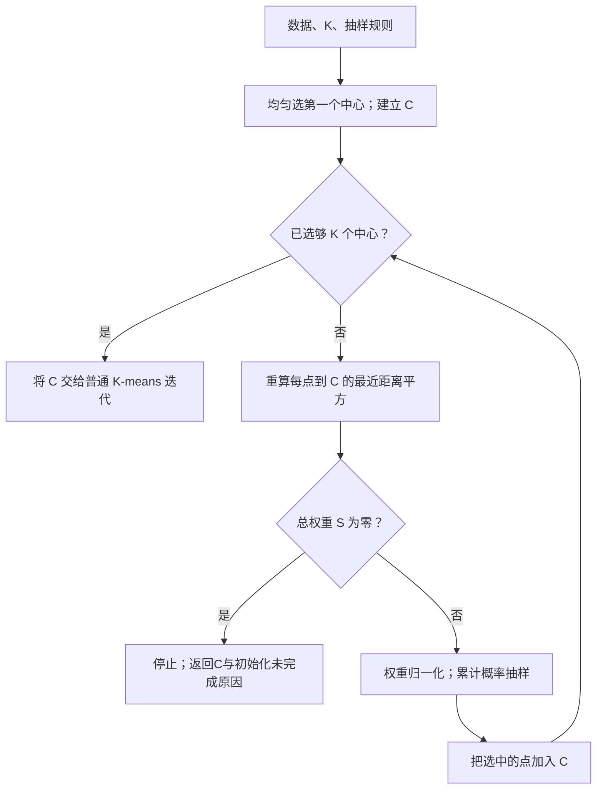
```mermaid
flowchart TD
    KP0["数据、K、抽样规则"] --> KP1["均匀选第一个中心；建立 C"]
    KP1 --> KP2{"已选够 K 个中心？"}
    KP2 -->|是| KP7["将 C 交给普通 K-means 迭代"]
    KP2 -->|否| KP3["重算每点到 C 的最近距离平方"]
    KP3 --> KP4{"总权重 S 为零？"}
    KP4 -->|是| KP8["停止；返回C与初始化未完成原因"]
    KP4 -->|否| KP5["权重归一化；累计概率抽样"]
    KP5 --> KP6["把选中的点加入 C"]
    KP6 --> KP2
```

五点首中心0，KP3算权重和194，KP5用u=0.60选10，KP6把10加入C。回KP2还缺第三中心，再KP3得总权重14，u=0.40选3。选满后从KP7开始普通Lloyd。文字替代：当前中心→新权重→抽一中心→重算。

按基本D²随机抽样的补充图；原软件greedy k-means++可能另有候选尝试。输入K须先合法，S=0时KP8报告初始化未完成，不假定已有最终簇。

读图自测：第三中心沿旧总和194抽样，漏了哪一步？

漏了返回KP3按C={0,10}重算。点9权重由81降到1；旧表不能代表新覆盖状态。

**完整抽样与后续运行（数字例子，笔记补充）**：仍用 $0,2,3,9,10$，这次 $K=3$。为可复现，指定第一次抽到点 0，后两次随机数分别为 $0.60$、$0.40$；它们是**教学指定的随机结果**，不是讲义中的值。脚本 `verify_m05_mechanisms.py` 的 `kmeans++` 段复算。

每行固定一个点；前半使用C={0}、后半使用C={0,10}。概率为本轮权重除本轮总和，累计按点序。

| 点 | 只有中心 0：平方权重 | 概率 | 累计概率 | 加入中心 10 后：新平方权重 | 新概率 |
|---|---|---|---|---|---|
| 0 | 0 | 0 | 0 | 0 | 0 |
| 2 | 4 | $4/194=0.0206$ | 0.0206 | $\min(4,64)=4$ | $4/14=0.2857$ |
| 3 | 9 | $9/194=0.0464$ | 0.0670 | $\min(9,49)=9$ | $9/14=0.6429$ |
| 9 | 81 | $81/194=0.4175$ | 0.4845 | $\min(81,1)=1$ | $1/14=0.0714$ |
| 10 | 100 | $100/194=0.5155$ | 1.0000 | $\min(100,0)=0$ | 0 |

读点9：旧权重81、新权重1；新增中心改变覆盖。新累计列虽未列出，正文已按新概率得到0/0.2857/0.9286/1/1。

1. 第一张表的总权重 $S=4+9+81+100=194$。$u=0.60$ 落在点 10 的区间 $[0.4845,1)$，因此第二中心是 10，而不是“看到最大的概率就必选 10”。若 $u=0.20$，同一张表会选点 9。
2. 加入 10 后，用每点到 **0 或 10 中较近者** 的距离重算。点 9 的贡献从 81 降到 1；它已经有附近中心，无需再次优先覆盖。新总权重 $S=4+9+1=14$。
3. 新累计概率为 $0,0.2857,0.9286,1,1$。$u=0.40$ 落在点 3 的区间 $[0.2857,0.9286)$，第三中心选 3。**不能拿旧表继续抽第三点**。
4. 初始中心 $0,10,3$ 交给 K-means。首次分配得到 $\{0\}$、$\{9,10\}$、$\{2,3\}$；按初始中心的 SSE 为 $0+1+1=2$。
5. 更新中心为 $0,9.5,2.5$，SSE 变为 $0+0.25+0.25+0.25+0.25=1$。下一轮分配与中心均不变，聚类停止。

**为什么按概率而不总取最远**：一个点很远会有大权重，但一团未覆盖点的**总权重**也可能很大，概率抽样在它们之间分配机会。随机性不保证躲开离群点；一个极远点仍可占几乎全部概率。因此“有随机性，所以不选噪声”是不成立的推理。理论和实践都只能给条件化的改进描述，不能写“几乎不会重复覆盖同一团”或“每次一定更快、更准”。

**停止条件与边界**：选满 $K$ 个中心即停止初始化；若所有权重为零，概率分母为零，说明所有不同位置已被中心覆盖，应明确退化策略或调整非空簇要求；不能继续除以零。已选位置权重为零，正常情况下不会重复抽同一位置。平方权重对离群点敏感，K-means++ 也不能解决非球形簇。

🔗 原始方法的抽样定义见 [Arthur 与 Vassilvitskii 的原始论文 §2.2](https://theory.stanford.edu/~sergei/papers/kMeansPP-soda.pdf)（获取：2026-09-30）。本节累计区间与五点运行是笔记自行展开。当前 [scikit-learn KMeans 文档](https://scikit-learn.org/stable/modules/generated/sklearn.cluster.KMeans.html) 说明其实现使用带候选尝试的 greedy k-means++；不要把此处基本抽样的一次选择与具体库的每次内部尝试混为一谈。

**为什么需要它**

它是对 §2.4.4 的直接回答：初始中心倾向分散 → 常能改善初始覆盖 → 有机会减少次优和迭代，但不保证每次改善（讲义说"speed and accuracy"都改善）。它已是默认做法（sklearn `KMeans(init='k-means++')` 默认值，⚪ 课外一句），考试问"如何缓解 K-means 的初始化问题"，答 K-means++ 与多次初始化。

**课件原例**

讲义 p.30 公式与两步；p.31 四帧选点图；参考文献是 Arthur & Vassilvitskii (2007) "k-means++: The Advantages of Careful Seeding"（讲义只写了摘要句和年份，🔗 公开资料常识，2026-09-22）。

**🎙️ 课堂补充**（B `23:38`–`26:19`，约 2.7 分钟）

- 课堂先随机选一个中心，之后用“离已选中心远”解释分散初始化；教授反复说 *"The second centroid should be very far away from the first one."*（B `24:37`），再依次选第三、第四个中心（B `25:12`–`25:40`）。
- 教授明确区分初始中心与最终中心：这四个点 *"are not optimal centroids for the four clusters"*，只是启动普通 K-means 的 initial centroids（B `25:44`–`25:59`）；后面仍须运行分配 / 更新迭代到收敛（B `25:59`–`26:13`）。
- ⚠️ **口径纠错**：B `23:38`–`25:35` 把后续中心说成非随机、尽量取最远，这是帮助看图的简化，不能覆盖 p.30 的 $D(x)^2$ 归一化概率抽样。B `26:13` 的 *"this result will be much better"* 也只是课堂经验性表述，不是对单次运行的保证；考试计算仍以讲义公式和本节概率表为准。
- **这段改变了什么**：确认 K-means++ 只替换初始化，不替换 Lloyd 迭代；同时划清课堂直觉、单次结果与讲义概率机制的证据边界。

**💡 换个说法（笔记补充）**

像开连锁店：已有一家后，希望下一家覆盖离现有店较远的人群；第三家要参考前两家。

“远”在算法中变成平方权重概率，不能直接等于“选最远”。最远点也可能是离群点，随机选择不保证避开它。
- 换个角度：K-means++ 改的**只是第 1 步**（初始化），第 2–5 步一个字没改。所以它不能解决 §2.5.1 的失灵（簇不是圆的），只能解决"起点太差"。

**⚠️ 常见误解**

- ❌ “K-means++保证全局最优。” → 原论文给的是期望近似界，不是单次保证。

理论界随 $\log K$ 量级增长（⚪本讲未证明）。K成倍增长，对数增加固定量；O表示与K无关的常数界，不是精确倍数。

期望是对初始化随机结果反复平均。后续Lloyd不增SSE，但不会把期望界变成每次全局最优。仍可比较多次初始化。

🔗 [Arthur 与 Vassilvitskii 原论文，Theorem 1.1](https://theory.stanford.edu/~sergei/papers/kMeansPP-soda.pdf)（获取：2026-09-30）。
- ❌ "公式里的 $D(x)$ 是到第一个中心的距离。" → 是到**已选中心中最近者**的距离；选第三个中心时要重新计算。只用第一个中心会让后面的中心都往同一个方向跑。
- ❌ "分母是常数，可以省。" → 分母随已选中心变化（每选一个中心，所有 $D$ 都可能变小），每一步都要重算。

**与其他概念的关系**

§2.4.4 的解法；§2.3.1 距离的又一次使用；§2.5.1 它管不了的失灵；§2.9.1 DBSCAN 对离群点的处理与此对照。

**所以呢**：初始化的问题解决了一半，但 K-means 还有更深的局限——它的均值与平方距离目标倾向紧凑团，面对大小 / 密度差异大的业务簇会出问题；这不是正态或相同密度的概率假设。p.32–38 展示三种失灵。

---

### 2.5 K-means 的局限与应对（讲义 p.32–40）

p.32 一页清单，p.33–35 三种失灵各一图，p.36–38 补救各一图，p.39–40 二分 K-means。

#### 2.5.1 K-means 会失灵的场合：簇大小不同、密度不同、形状不是球（讲义 p.32–35，图）

**是什么**

K-means 并没有规定数据必须来自等大小、等密度的圆形概率分布。它用最近中心形成分区、再以平方误差决定中心位置，因而倾向把点组成紧凑团；这与真实业务簇的形状、大小或密度冲突时，就可能切错。讲义 p.32：

> **Sub-optimal results**（次优结果——§2.4.4 讲过）
> K-means has problems when clusters are of differing **Sizes**, **Densities**, **Non-globular shapes**（簇的大小、密度不同，或形状不是球形时）
> K-means has problems when the data contains **outliers**（数据含离群点时）

三张图（p.33–35，已视觉复核）：

**怎么读**——每页左图是"原始点"（用颜色标出真实的簇），右图是 K-means 的输出（十字是质心）：
- **p.33 大小不同**：左图三团——中间一大团（红，约 150 点，半径 2）、左右各一小团（蓝、绿，各约 20 点）。右图 K = 3 的结果：K-means 把**中间大团切成了两半**（上半绿、下半红），把右边小团和大团的右侧合成一簇（蓝）——因为大团太大，两个中心分它更能降低 SSE，小团只好被并入。
- **p.34 密度不同**：左图三团——左边一大片稀疏的红点、右边上下两个紧密的小团（蓝、绿）。右图：K-means 把**稀疏的大团切成两半**（绿、蓝），把右边两个紧密小团合成一簇（红）——稀疏团的点离得远，切开它省下的 SSE 比分开两个紧密小团多。
- **p.35 非球形簇**（non-globular shapes）：左图两条互相勾在一起的弯月（红、蓝）。右图 K = 2：K-means 画了一条**直线**把两条弯月各切掉一截——它的簇边界永远是两个中心之间的中垂线，画不出弯的边界。

**为什么需要它**

它是**选算法**的依据：拿到数据先看散点（或 PCA 后的散点）像哪一张——像 p.33–35，需判断基本 K-means 的目标和边界是否符合业务簇；可试 §2.5.2 的多切再拼，也可换 DBSCAN。基本 K=2 的欧氏最近中心分区不能画弯曲的两簇边界，两阶段碎片合并则能产生曲线状大簇；补救都要另验证。对考试：这三张图是"K-means 的局限"标准答案，要能说出**为什么**（中心 + 平均 + 中垂线边界）。

**课件原例**

讲义 p.32 清单 + p.33–35 三组图。

**🎙️ 课堂补充**（B `26:26`–`28:23`，约 2.0 分钟）

- 大小不同：因为仍按最近中心分配，大簇边界点可能离旁边小簇中心更近，于是被切走（B `26:31`–`27:31`）。教授明确把原因落在 *"the minimum distance assignment"*（B `26:37`–`27:00`）。
- 密度不同：高密度区域内部距离很小，K-means 可能把两个高密度团合为一个，而把稀疏团切开；课堂结论是 *"for different densities, it may not work"*（B `27:35`–`28:03`）。
- 形状不同：弯曲簇中的点可能离另一簇中心更近，最近中心边界会把理想形状横切（B `28:06`–`28:21`）。
- **这段改变了什么**：三张失败图都可追溯到同一机制——最近中心形成的边界偏向紧凑、近似球形的分区；不是简单背“大小、密度、形状”三个名词。

**💡 换个说法（笔记补充）**

- 把 K-means 想成给每位居民安排最近服务站：两个不同站点之间的等距线决定服务区边界，二维为直线、多维为超平面。服务区不是以最近点决定半径的圆；“偏好圆团”描述平方误差的紧凑偏好。弯月形业务簇可能跨过这条直线，所以服务区标签与业务标签不一致。
- 判断该给哪一团额外中心，应比较新增中心能减少的实际 SSE：省下的误差取决于点数、散开程度和几何位置。更多点可能使贡献更大，但紧密大团可能比稀疏小团省得少；不能只按人数判，也不能从示意图证明右图是全局最小。
读三张失败图，先看左图颜色所表示的业务/示例簇，再看右图十字中心。

p.33某中心位于两团之间的空白，提示它在平均两团成员。这与左图目标分组不同；是否为平方目标全局最优，还需原数据证明。

**⚠️ 常见误解**（图会怎么骗人）

- ❌ "p.33 右图 K-means 算错了，应该重跑。" → 图只展示一次输出，未提供原数据和全局最优证明。多次初始化可能改变结果；即使取得很低的 SSE，标签也未必符合业务团，需区分目标函数偏好与初始化失败。
- ❌ "把 K 改大就好了。" → 改大 K 会把每个团都切碎（p.36–38 就是这么做的），得到的不是三个簇而是十个"碎片"，还要人工拼回去。K 不是万能旋钮。
- ❌ "离群点只是让结果差一点。" → 一个远离所有团的点会把它所属簇的质心明显拉偏，甚至独占一个中心（K-means++ 尤其容易选中它，§2.4.5）。应先检查该点是否测量错误、罕见正常样本或重要群体；可比较保留、稳健预处理或显式噪声模型的结果，不能无条件删除。

**Iris的另一种困难**

⚪ Versicolor与Virginica大小相近，形状近似椭圆，但部分观察重叠。这与本节三种形状/密度失灵要分开。

不同类别若有完全相同的已观测特征，不能保证逐点恢复标签。其他特征、概率模型或业务信息可能改善区分，仍须验证。

**与其他概念的关系**

本节联系三条机制：§2.4.1的中心平方目标、§2.4.4的次优终点、§2.5.2的两阶段补救。

§2.9.3的DBSCAN沿核心连通处理非球形区域和噪声，但仍受密度及参数限制。数据分布检查见§2.2.5。

**所以呢**：下一节用更多中心先形成小碎片，再按明确的链接规则拼合；它也可应对弯曲形状，但不能保证修复初切造成的所有错误。

---

#### 2.5.2 补救：多切几刀，再把碎片拼起来（讲义 p.36–38，图）

<!-- 类型: 算法流程型 -->

**是什么**

既然 K-means的最近中心与平方误差机制偏好紧凑团，那就让它切很多个小圆团，把"真正的簇"切成碎片，再由人（或另一个算法）把碎片拼回去。讲义 p.36：

> One solution is to use **many clusters**. Find **parts** of clusters, but need to **put together**.

三张图（p.36–38，已视觉复核）对应 §2.5.1 的三种失灵：

**怎么读**：
- **p.36**（大小不同）：右图用了 10 个中心——左边小团独占一个（红），右边小团独占一个（深蓝），中间大团被切成 8 片（黄、青、绿、蓝……各一个十字）。8 片拼起来就是中间大团，左右两片各自成簇——三个真实的簇都能恢复。
- **p.37**（密度不同）：稀疏大团被切成 8 片，右边两个紧密小团各独占一个中心（蓝、绿）——同样能恢复。
- **p.38**（弯月）：两条弯月各被切成 5 段（共 10 个中心），每段是一小截弧——沿着弧把相邻的段拼起来，就是两条弯月。

**机制展开（笔记补充）：多切再拼必须另定合并规则**

讲义 p.36–38 只说“先找簇的部分，再把部分拼起来”，没有给完整合并算法。下面给一个**明确指定的教学实现**：先用较大的 $K_0$ 做 K-means 分成碎片，再按原点之间的 MIN 链接合并碎片，直到业务要求的 $K_\mathrm{target}$。它不是讲义官方唯一方案，也不保证对任何环形 / 噪声数据有效。

**输入与状态**：原数据、第一阶段 $K_0$ 及初始化、合并链接规则和目标簇数；状态是当前碎片成员集合及碎片间链接值；输出是合并后每个原始点的最终标签。$K_0$ 是初切数，$K_\mathrm{target}$ 是最后要的数，须满足 $1\le K_\mathrm{target}\le K_0$。这个过程只合并不再拆开一个碎片，所以初切错误不能凭合并自动消失。

**步骤与完整例子（笔记补充）**

五点为 $0,2,3,9,10$，初切 $K_0=4$，中心给为 $0,2,9,10$。最终要求 $K_{\mathrm{target}}=2$，合并采用原点 MIN。

1. K-means 分配成 $\{0\},\{2,3\},\{9\},\{10\}$。更新中心为 $0,2.5,9,10$；再一轮成员不变，初切结束。
2. 对所有碎片对算 MIN。最近是 9 与 10，距离 1；合为 $\{9,10\}$，剩三片。
3. 新候选距离：$\{0\}$ 到 $\{2,3\}$ 为 $\min(2,3)=2$；到 $\{9,10\}$ 为 9；另外两片间为 $\min(7,8,6,7)=6$。
4. 合并 0 与 $\{2,3\}$。已达两片，输出 $\{0,2,3\}$ 与 $\{9,10\}$，将片标签映回五个原点。

`verify_m05_mechanisms.py` 的 K-means 与层次例使用相同距离运算；这里改变了初切的四个中心。数字是教学数据，不是 p.36–38 的逐点重建。

图回答：初切后为什么还不是最终分组？实线箭头是两阶段控制，FR4返回的是当前碎片集合，不返回原点重新训练。

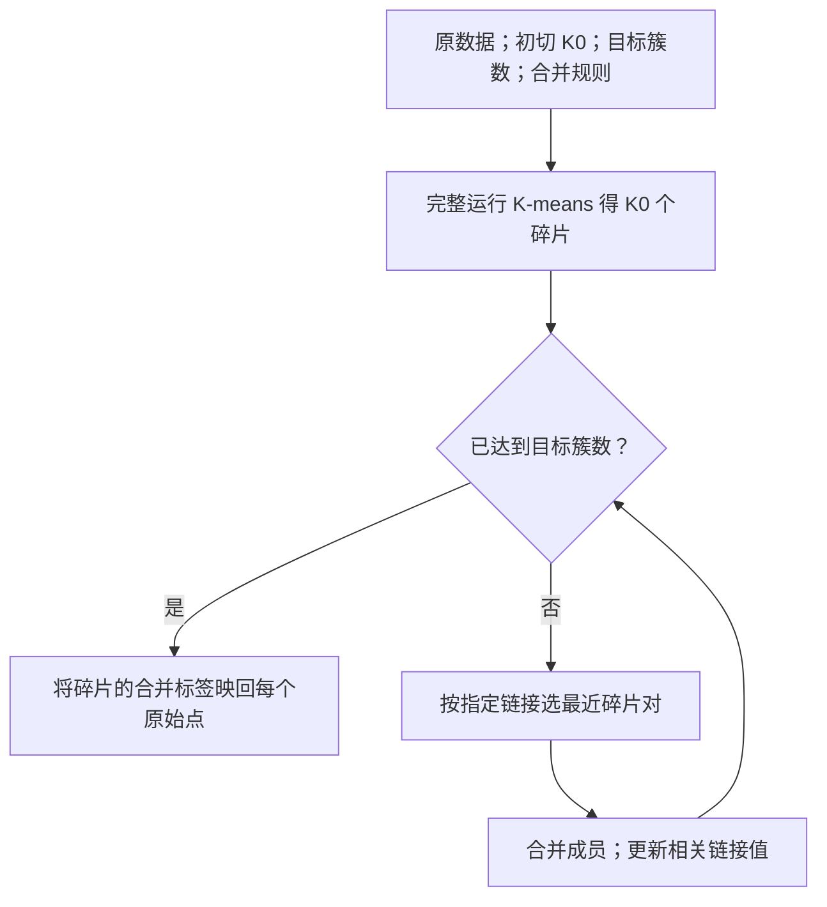
```mermaid
flowchart TD
    FR0["原数据；初切 K0；目标簇数；合并规则"] --> FR1["完整运行 K-means 得 K0 个碎片"]
    FR1 --> FR2{"已达到目标簇数？"}
    FR2 -->|是| FR5["将碎片的合并标签映回每个原始点"]
    FR2 -->|否| FR3["按指定链接选最近碎片对"]
    FR3 --> FR4["合并成员；更新相关链接值"]
    FR4 --> FR2
```

五点K0=4，FR1得{0}/{2,3}/{9}/{10}。目标2尚未到，FR3选MIN距离1的{9}/{10}，FR4合并；再选距离2的{0}/{2,3}。FR2达到2，FR5将标签映回每个原点。文字替代：先切细，按明确链接并到目标数。

MIN与目标数是笔记补充实现，p.36–38只给思路。合并不能拆回已混入同一碎片的点。

读图自测：目标改为3，在哪个节点停止？

{9}/{10}合并后FR2已到3，走FR5；输出{0}/{2,3}/{9,10}，不再合并0。

**依据与限制**：初切把长形状分成局部紧凑部分，合并规则再决定局部部分如何连接；它改变了第二阶段的簇定义。MIN 可以沿链连起来，但少数桥接点也能错误连接两团。若只用碎片中心，计算较省，却丢掉边界与形状；若以中心代表原点，合并后中心须按碎片人数加权，不能把一人碎片与百人碎片的中心简单平均。合并矩阵规模由碎片数量控制，但按所有原点算链接仍有计算代价，不能宣称完全消除了大数据成本。

**停止与迁移**：每次有效合并净少一碎片，达到目标就停；目标大于初切数无法只靠合并实现。若第一阶段错误地把左右两个业务簇的点混入同一碎片，第二阶段无法将它们拆回；需改变初切、规则或算法。可据上例预测目标为 3 时的输出：$\{0\},\{2,3\},\{9,10\}$，而不是继续合并到两个。

**为什么需要它**

多切K-means先给局部紧凑碎片，最终合并要另定规则。讲义没规定怎么拼。

§2.6层次法或明确邻接规则可承担合并。§2.5.3二分K-means负责切分，不负责拼装。

这也是摘要用途的变式：先将十万点概括为几百个碎片中心，再用更细的算法处理这些代表。概括造成的信息损失仍要检查。

**课件原例**

讲义 p.36–38 三组图（用了约 10 个中心）。

**🎙️ 课堂补充**（B `28:23`–`30:43`，约 2.3 分钟）

- 教授的补救是先把分辨率调高：本来要 3 簇时先跑 10 簇，让大团或稀疏区域被切成多个小簇，再逐簇分析成员与中心，决定哪些小簇应合并（B `28:23`–`30:28`）。
- 课堂明确给出代价：*"we need to spend more time on analyzing each small cluster"*（B `30:35`）。这不是免费修复；合并要有业务规则或额外分析。
- 教授随后预告：对不同形状，后面的 density-based clustering 会处理得更好（B `30:43`），所以“多切再拼”是可用的 K-means 补救，不是对非球形数据的唯一方法。
- **这段改变了什么**：把 p.36–38 的三张图补成“高 K 生成小块 → 检查小块 → 有依据地合并”的操作链，并保留额外人工分析成本。

**💡 换个说法（笔记补充）**

- 像用只会画圆的印章去盖一个弯月形：一个大圆盖不准，就用十个小圆沿着弯月排一排——每个小圆都是 K-means 能做的，排列组合的事交给后面。
- 换个角度：这个办法承认了 K-means 的局限（偏好紧凑、近似球状的分组），但保留了它的优点（快）——所以在大数据上，"先 K-means 切碎、再层次聚类拼"是常见的两段式做法。
**另一种拼法（笔记补充）**

上文用原点MIN；此备选方案改用每片中心作为代表。

1. 将10个中心作为输入，做层次聚类。
2. 选择切树到3簇。
3. 在原示意中，中间大团8个中心接近，左右小团中心较远，因此可形成相应合并直觉。

执行还须声明中心链接、切树层级和人数权重。这不保证任意新数据都恢复真实簇。
p.36右图10个十字，中间大团8个、左右小团各1个。它说明中心如何分配给不同区域。

“相邻且中间无空白”仅是看图直觉。执行时仍要指定距离、链接和停止数；本节完整演算采用原点MIN＋目标簇数。

**⚠️ 常见误解**

- ❌ "多切几刀就是把 K 调大，结果直接可用。" → 讲义明说 need to put together：切碎之后还要拼，拼的规则讲义没给。直接把 10 个碎片当 10 个客户群用是错的。
- ❌ "拼碎片可以按颜色相近拼。" → 颜色只是编号，拼要按碎片的**空间邻接**（相邻的段属于同一弯月）或碎片中心之间的距离，也就是再做一次聚类。

**与其他概念的关系**

§2.5.1 的补救；§2.5.3（二分 K-means 用"反复二分"实现"多切几刀"）；§2.6（层次聚类可以做"拼"这一步）；§2.2.2 摘要用途。

**所以呢**：切碎再拼是"先多后少"；讲义接着给一个"从一到多、一次切一刀"的变体——二分 K-means。

---

#### 2.5.3 二分 K-means：从一个簇开始，每次把一个簇一分为二（讲义 p.39–40）

<!-- 类型: 算法流程型 -->

**是什么**

普通 K-means 一开始就要选 K 个中心；二分 K-means（bisecting K-means）从**所有点是一个簇**开始，每次挑一个簇用 K = 2 的 K-means 切成两半，直到簇数达到 K。讲义 p.39：

> Bisecting K-means algorithm — Variant of K-means that can produce a **partitional or a hierarchical** clustering.（能产生划分式或层次式的聚类）

算法（讲义原文）：

1. Initialize the list of clusters to contain the cluster containing all points.（簇列表初始只有一个簇：全部点）
2. **repeat**
3. Select a cluster from the list of clusters.（从列表里选一个簇——通常选最大的或 SSE 最大的）
4. **for** $i = 1$ to *number_of_iterations* **do**
5. Bisect the selected cluster using basic K-means.（用基本 K-means 把它切成两半）
6. **end for**
7. Add the two clusters from the bisection with the lowest SSE to the list of clusters.（多次尝试里取 SSE 最低的那次切法，把两半加回列表）
8. **until** the list of clusters contains $K$ clusters.（直到有 K 个簇）

第 4–6 行是关键：每次二分要**试几次**（不同初始点），取 SSE 最低的——这是把 §2.4.4 "多次初始化"内置进了算法。p.40（已视觉复核）是一张十个簇的例子：十团点排成两行，每团一个十字质心、一种符号——二分法一刀一刀切出来的最终结果。讲义还给了工具 CLUTO 的链接。

**手算一遍**（用六点数据，K = 3，脚本 `verify_m05_originals.py` `lloyd` 输出的数字）：

每行是外层的一刀；当前列表与动作不同，内层每刀可以多次完整Lloyd尝试。

| 步 | 簇列表 | 动作 |
|---|---|---|
| 1 | {p1…p6} | 一个簇 |
| 3–7（第一刀） | 选唯一的簇；试三种初始化二分，SSE 分别 0.1065 / 0.0905 / 0.0838 | 取 0.0838：{p2, p4, p5} 与 {p1, p3, p6} |
| 3–7（第二刀） | 选一个簇再二分（例如选点数多或 SSE 大的一个） | 得到 3 个簇，停止 |

读第一刀：三组初始化是同父簇的三候选，只选SSE0.0838的两子簇加入一次。第二刀未给完整六点结果，上文另用五点完整例。

第一刀就是 §2.4.4 表里三种初始化取最好的那次——二分 K-means 把"多跑几次取最好"变成了每一刀的固定动作。

**机制展开（笔记补充）：外层选择要切的簇，内层反复试一刀**

输入是数值数据、最终簇数 $K$、每刀尝试次数 $R$ 与“先切哪一簇”的规则；输出是 $K$ 个簇，可另保留切分历史。**本例选 SSE 最大的可切分簇**，这是明确指定的补充策略，讲义 p.39 第 3 行没有规定；不能冒称讲义唯一算法。

**状态与编号步骤**

当前簇列表 $L$ 每项保存成员、中心和 SSE；另保存当前刀的最佳切法。$R$ 是每刀独立尝试次数，不是内部 Lloyd 轮数。

1. 把全体作为 $L$ 的唯一项。
2. 簇数达到 $K$ 就返回；否则按规则选一个含多个不同点的父簇。
3. 对此父簇初始化 $R$ 次。每次完整运行 $K=2$ Lloyd，到指定停止条件。
4. 比较两子簇 SSE 的和，保留最小的尝试。
5. 从 $L$ 删除父簇，只加入最佳尝试的两子簇。簇数净增 1。
6. 返回步骤 2，再决定是否继续。

**算法流程图**

图回答：一刀重试R次为何只新增一个簇？箭头表示外层簇列表的控制更新；BK3内部另有完整Lloyd循环。

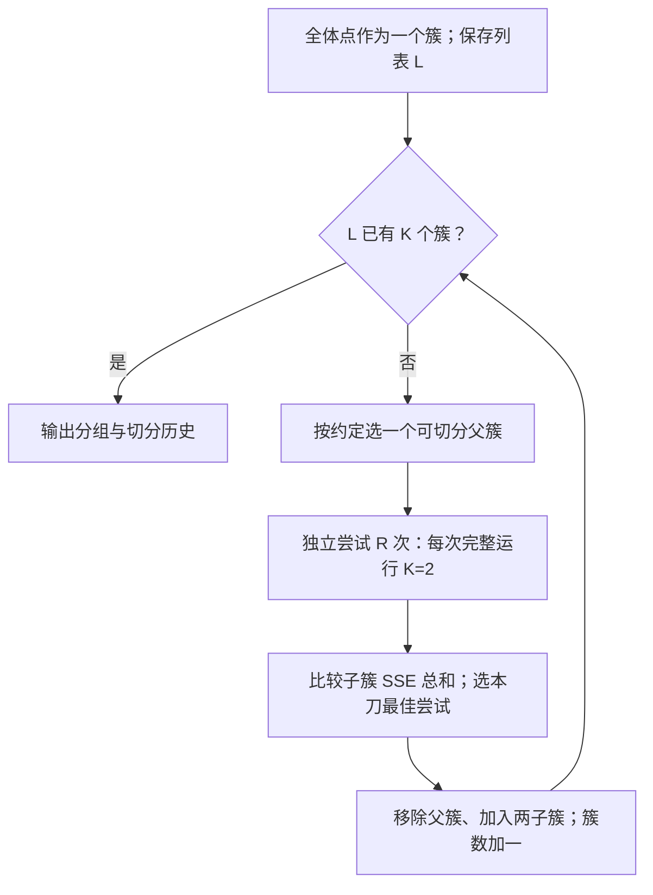
```mermaid
flowchart TD
    BK0["全体点作为一个簇；保存列表 L"] --> BK1{"L 已有 K 个簇？"}
    BK1 -->|是| BK6["输出分组与切分历史"]
    BK1 -->|否| BK2["按约定选一个可切分父簇"]
    BK2 --> BK3["独立尝试 R 次：每次完整运行 K=2"]
    BK3 --> BK4["比较子簇 SSE 总和；选本刀最佳尝试"]
    BK4 --> BK5["移除父簇、加入两子簇；簇数加一"]
    BK5 --> BK1
```

五点K=3、R=2。BK2先取全体，BK3两次独立二分，BK4只留总SSE最低的一刀，BK5以两子替父，列表1→2。再切SSE较大的{0,2,3}，留{0}/{2,3}，列表2→3；BK1才结束。文字替代：选父→试多刀→只留最佳→替换一次。

选择最大SSE父簇为本节补充策略。课堂切最大人数及按业务继续细分是其他策略；K=1应在首刀前直接返回。

读图自测：R从2改10，BK5一次执行后簇数加多少？

仍只加1。十次是候选切法，只有最佳两子簇加入列表一次；不是十次外层切分。

**数学依据**：一刀前其他簇完全没动，故全局误差的变化只由“父簇 SSE”与“两个子簇 SSE 之和”决定。比较单个子簇的 SSE 会偏爱留下一个紧簇、无视另一个散簇，比较量必须是两者之和。每次求子簇中心仍用 §2.4.1 的均值最优性，不是新增另一套中心公式。

本例明确设每刀R=2。第一刀两次完整运行的初始中心分别为(0,3)和(0,10)，两者最终都得到{0,2,3}/{9,10}、中心5/3与9.5、SSE=31/6；前者3轮、后者2轮，SSE平局保留先试者。第二刀的两种候选与不同SSE已在下表述展开。这里SSE就是成员到各簇均值的平方距离总和，Lloyd指反复分配与重算均值的普通K-means。

**完整例子（笔记补充，脚本 `verify_m05_mechanisms.py` 的 `bisect` 段）**：数据 $0,2,3,9,10$，最终 $K=3$。

1. 最初中心 $(0+2+3+9+10)/5=4.8$，SSE $=78.8$。只有一个簇，第一次切它。
2. 完整二分得到A={0,2,3}与B={9,10}。先分别记误差，再比较本刀总和。

| 子簇 | SSE |
|---|---|
| A | $14/3\approx4.6667$ |
| B | 0.5 |
| 合计 | $31/6\approx5.1667$ |

其他初始化可产生不同结果；实际从规定尝试中选择最低总和。
3. 当前仅两簇，选择SSE较大的A继续二分。比较同父簇的两次完整尝试：

| 初始中心 | 稳定成员 | 稳定中心 | 子SSE合计 |
|---|---|---|---:|
| 0/3 | {0}与{2,3} | 0/2.5 | 0.5 |
| 2/3 | {0,2}与{3} | 1/3 | 2 |

两者均按固定平局规则稳定，但第一刀候选更低。“稳定”本身不决定选哪次。
4. 选第一种尝试。将父A移出列表，加入{0}和{2,3}，原B不动。

最终三簇为{0}/{2,3}/{9,10}，中心0/2.5/9.5。全局SSE=0+0.5+0.5=1；达到K=3后停止。
5. 簇数已经达到 3，外层停止；不能因为还可降低 SSE 就继续多切一刀，那会违反输入 $K$。

**停止与边界**：有效的非空二分每次净增一簇，因此从 1 到 $K$ 需要 $K-1$ 次成功切分；不是 $K-1$ 次内部 Lloyd 更新。$K=1$ 时应直接返回，照抄讲义 repeat–until 而不先检查会多切；全同点或没有可二分簇时须报告退化，不能无限重试。

**失败机制**：最早一刀的错误不会被后续在其他父簇中的切分撤销，原本应同组的点可能永久隔开；父簇选择规则也会影响分辨率，按人数最大和按 SSE 最大不一定切同一簇。重复初始化只改善当前一刀，**不保证全局最优，也不保证所有数据上比普通 K-means 更稳**。

**为什么需要它**

二分法有两点用途。

1. 每刀是K=2小问题，只需初始化两个中心，便于重复尝试；这不保证整体更稳。
2. 切分历史自然成树：先全体一分二，再把某子簇继续分。最终既有平行分组，也有层次记录。

因此讲义将它放在K-means末尾，作为进入层次聚类的桥。

**课件原例**

讲义 p.39 八行伪码 + p.40 十簇图。

**🎙️ 课堂补充**（B `30:51`–`35:11`，约 4.3 分钟）

- 教授把结构说成嵌套迭代：*"there's a bigger iteration outside of the iteration of a single K-means clustering"*（B `31:26`）。外层每次选一个父簇，内层对它完整运行 K = 2 到收敛。
- 示例先把全体切成 2 簇，再暂时保留小簇、继续二分最大的簇；课堂概括为 *"every time I do the two-cluster K-means, I will split the biggest cluster into two"*（B `33:34`–`33:51`）。这只是课堂示例采用的父簇选择规则，讲义 p.39 本身没有规定唯一选法。
- 停止不只有“达到预先写死的 K”：教授说 *"there's no golden standard, it depends on your business problem"*（B `34:32`），可在业务所需分辨率停下，也可选择某个潜在客户群继续细分（B `34:06`–`35:00`）。
- **这段改变了什么**：确认二分 K-means 有外层分辨率决策与内层 K = 2 优化两层状态；“切最大簇”与“按业务挑目标群”都是选择策略，不应冒充讲义唯一规则。

**💡 换个说法（笔记补充）**

用切蛋糕类比：普通K-means同时放置并优化K中心。二分法每次只选一个父簇，试几种切法，保留当前最好。

从1簇到K簇要K−1次成功二分。每次保留父子关系，就能画出“谁从谁切出”的树。
- **判断口诀**：看到"从一个包含全部点的簇开始""每次二分""直到有 K 个簇"这三句就是二分 K-means；看到"一开始选 K 个中心、反复分配与重算"就是普通 K-means。两者的输出都是 K 个簇，但只有前者附带一棵"切割顺序树"。

**⚠️ 常见误解**

- ❌ "二分 K-means 的结果和普通 K-means 一样。" → 一般不同：二分法每刀只优化当前那个簇，全局 SSE 不一定最小；多次尝试可能改善当前切分，但不保证整体更稳；早期切错也会传播到后续。
- ❌ "第 3 步随便选一个簇切。" → 讲义没规定，但选法影响结果：常选最大的簇或 SSE 最大的簇（"最需要被分开的"）；选错会把本来紧凑的簇切碎。

**与其他概念的关系**

§2.4.1 / §2.4.4（每刀内部是基本 K-means + 多次初始化）；§2.5.2（"多切几刀"的有序版）；§2.6.2（它是分裂式层次聚类的一种实现）。

**所以呢**：二分 K-means 已经长出了"树"。下一章正式讲层次聚类——树状图、凝聚与分裂、以及考试要手算的合并过程。

---

### 2.6 层次聚类（讲义 p.41–49）

p.41 章节页；p.42–43 树状图与优点；p.44 凝聚 vs 分裂；p.45 凝聚算法；p.46–49 用邻近矩阵图解一次合并。

#### 2.6.1 树状图：把"谁先和谁合并"画成一棵树（讲义 p.42–43，图）

**是什么**

层次聚类不给"K 个簇"，而给**一棵树**：叶子是各个点，往上每个分叉是一次合并，合并发生的高度是当时两簇的距离；树上每一层的簇都包含下一层的簇，所以叫**嵌套簇**（nested clusters）。讲义 p.42：

> Produces a set of **nested clusters** organized as a hierarchical tree（一组嵌套的簇，组织成树）
> Can be visualized as a **dendrogram** — A tree like diagram that records the sequences of merges or splits（树状图：记录合并或分裂顺序的树形图）

**p.42两幅图怎样对应**

右图的六点嵌套椭圆，逐次对应左图一条合并横线。既有原图读数如下：

| 次序 | 合并对象 | 高度 |
|---|---|---:|
| 1 | {1,3} | 0.05 |
| 2 | {2,5} | 0.08 |
| 3 | {2,5}与4 | 0.17 |
| 4 | {1,3}与{2,5,4} | 0.18 |
| 5 | 再并入6 | 0.22 |

横轴叶序1/3/2/5/4/6，纵轴刻度约0–0.2表示高度。最上合并读数0.22沿原图记录。

这里不是p.55那份六点数据；后者叶序为3/6/2/5/4/1，不能混用高度。

**怎么读树状图**

叶子代表点。两竖线在一条横线处相接，表示两簇在该高度合并。

画水平切线，线下连通枝就是该层分组：

- 切0.1：{1,3}/{2,5}/{4}/{6}，4簇。
- 切0.2：{1,3,2,5,4}/{6}，2簇。

p.43用它说明不用建树前预设簇数。同高平局下的精确K另按合并次序处理。

> Do not have to assume any particular number of clusters — Any desired number of clusters can be obtained by **'cutting' the dendrogram** at the proper level（不必在建树前预设簇数，可在树上选层级；同高度合并时须按次序 / 平局约定得到精确 K，见 §2.6.3）
> They may correspond to **meaningful taxonomies** — Example in biological sciences (e.g., animal kingdom, phylogeny reconstruction, …)（可能对应有意义的分类体系，如生物分类）

**为什么需要它**

它直接回应 §2.2.3 "簇是模糊的"——不必事先猜 K，把树画出来再决定切在哪里；也回应 §2.5.2 "碎片怎么拼"——树就是拼的记录。第二个优点对商科同样重要：**商品分类树、组织架构、客户细分的层级**（大群 → 子群）天然是树，K-means 给不了这种结构。

**课件原例**

讲义 p.42 六点嵌套图 + 树状图；p.43 两个优点（生物分类例子）。

**🎙️ 课堂补充**（B `35:11`–B `36:30`，约 1.3 分钟，A · 课上展开）

- 教授沿 p.42 的六点图口头走了前三层：先把最靠近的点合成小簇，再继续合并最近的簇——*"We want to group the closest data points into a single cluster first."*（B `35:21`）。
- 他把层级变化说成“层级越高，簇数越少、簇越大”：*"at a higher level, the number of clusters will be smaller, but the cluster size can be bigger and bigger."*（B `36:19`）。这正是树状图纵向阅读的口语版。
- **这段改变了什么**：确认 p.42 的嵌套椭圆不是静态分类图，而是逐次合并的历史；p.43 的“切树得到不同粒度”应与后续 B `48:58`–B `49:28` 的阈值示范一起读。

**⚠️ 常见误解**（图会怎么骗人）

- ❌ "树状图横轴的顺序有意义（左边的点更'重要'）。" → 横轴顺序只是为了让线不交叉而排的，任何一个分叉都可以左右对调；有意义的是纵轴的高度和谁与谁相连。
- ❌ "在树上切一刀得到的簇一定和 K-means 用同样 K 得到的一样。" → 不一样：树上的簇是**合并历史**决定的（且合并不可撤销），K-means 是**同时**优化 K 个中心；两者常给出不同的分组。
- ❌ "树越高的合并越可靠。" → 恰恰相反：高度是选定链接规则下的合并代价；同一树中的低高度表示较小链接值，并不等同统计可靠性。可将高度跳变作为切树线索，再结合业务、稳定性与敏感性检查；质心链接还可能倒挂。

**本课数据的图读边界**

⚪ 旧Iris示例描述：150点的高层分枝把Setosa与另100点分开，另两类分枝更交错。因此可提出“两大簇较明显”的观察。

该观察仍依赖距离、链接和原运行设置。树展示多个粒度；固定K的K-means输出没有这份完整合并历史。

**与其他概念的关系**

§2.2.3（不必预设 K）、§2.2.4（层次类型的定义）、§2.5.3（二分 K-means 也能画树）、§2.8.2（p.59 的树状图是 p.55 数据的单链接结果）。

**所以呢**：树有两种长法——从叶子往上合并，或从根往下分裂。

---

#### 2.6.2 凝聚 vs 分裂：从下往上合并，还是从上往下切（讲义 p.44）

**是什么**

讲义 p.44：

> **Agglomerative**: Start with the points as individual clusters; At each step, **merge the closest pair** of clusters until only one cluster (or k clusters) left（凝聚式：每个点自成一簇，每步合并最近的一对，直到只剩一簇或 k 簇）
> **Divisive**: Start with one, all-inclusive cluster; At each step, **split a cluster** until each cluster contains an individual point (or there are k clusters)（分裂式：全部点一簇，每步切开一个簇，直到每簇一个点或 k 簇）
> Traditional hierarchical algorithms use a **similarity or distance matrix** — Merge or split one cluster at a time（传统算法用相似度 / 距离矩阵，一次合并或分裂一个簇）

每行比较一个层次过程维度；起点/终点数指当前簇数，“最常用”为讲义描述。

| | 凝聚式 Agglomerative | 分裂式 Divisive |
|---|---|---|
| 起点 | n 个单点簇 | 1 个全体簇 |
| 每步动作 | 合并最近的两簇 | 切开一个簇 |
| 终点 | 1 簇（或 k 簇） | n 簇（或 k 簇） |
| 每步要做的决定 | 哪两簇最近（看矩阵里的最小值） | 切哪个簇、怎么切（要跑一次子聚类，如二分 K-means） |
| 常见程度 | **最常用**（p.45：most popular） | 少见 |
| 本讲例子 | p.45–60 全部 | §2.5.3 二分 K-means |

读起点：凝聚有n个单点，分裂有1个全体簇。两者都可建树，不保证树相同。

两者都输出层次树，但具体树通常不同；只有特定规则和数据才可能一致。生成方向相反：凝聚式自底向上（bottom-up），分裂式自顶向下（top-down）。

**为什么需要它**

它解释了为什么本讲后面十几页只讲凝聚式：凝聚式每步只需要在矩阵里找最小值（机械、可手算——正是 p.60 小测考的），分裂式每步要解决"怎么切"这个本身就是聚类的问题。对考试："层次聚类有哪两种、区别是什么"是标准问答题。

**课件原例**

讲义 p.44 定义；无算例。

**🎙️ 课堂补充**（B `36:30`–B `36:51`，约 0.4 分钟，B · 讲了同讲义）

- 教授用一句话对照两条方向：*"we can build the hierarchical structure from bottom to up, from the individual data points to the largest group, or up-down, that we start from a single big cluster"*（B `36:30`）。前半对应凝聚式，后半对应分裂式。
**这段改变了什么**：课堂只辨认凝聚/分裂的方向，没有展开分裂准则。

后续矩阵手算都是凝聚式。“分裂每步还要解决怎么切”仍是笔记解释，不能称教授已完整展开。

**💡 换个说法（笔记补充）**

- 凝聚像整理照片：先把最像的两张放一起，再把最像的两堆合并……直到一堆；分裂像整理书架：先把全部书分成两大类，再把每类分小类。两种整理法最后得到的目录树可以一样，但过程完全相反。
- **判断口诀**：看第一步——"每个点自成一簇"是凝聚，"所有点一簇"是分裂；再看每步动词——"merge / 合并"是凝聚，"split / 切开"是分裂。讲义从 p.45 起讲的全部是凝聚式，考试若没特别说明，"层次聚类"默认指凝聚式。

**⚠️ 常见误解**

- ❌ "分裂式更好，因为它先看全局。" → 分裂式每步都要解一个聚类子问题，代价高；而且"先切"的错误会传到所有后代。实践里凝聚式占绝大多数。
- ❌ "凝聚式合并到只剩一簇就没意义了。" → 合并到底是为了画出完整的树；实际用的簇是在树上切出来的（§2.6.1），并不是最后那一个簇。

**与其他概念的关系**

§2.6.1（两者都画树）、§2.6.3（凝聚式算法）、§2.5.3（分裂式的一种实现）。

**所以呢**：凝聚式怎么做？讲义给六步算法，并用邻近矩阵图解"合并一次"是怎么回事。

---

#### 2.6.3 凝聚式六步与邻近矩阵的更新（讲义 p.45–49）

<!-- 类型: 算法流程型 -->

**是什么**

凝聚式层次聚类的全部计算就是一张表的反复缩小。讲义 p.45：

> Most popular hierarchical clustering technique. Basic algorithm is straightforward:
> 1. Compute the **proximity matrix**（算出邻近矩阵：每两点之间的距离表）
> 2. Let each data point be a cluster（每个点自成一簇）
> 3. **Repeat**
> 4. Merge the two closest clusters（合并最近的两簇）
> 5. **Update the proximity matrix**（更新邻近矩阵）
> 6. **Until** only a single cluster remains（直到只剩一簇）
> Key operation is the computation of the **proximity of two clusters** — Different approaches to defining the distance between clusters distinguish the different algorithms（关键操作是算两簇之间的邻近度；簇间距离的不同定义区分了不同算法）

**邻近矩阵**（proximity matrix）：一张 n × n 的表，第 i 行第 j 列是第 i 簇与第 j 簇的距离；对角线是 0，且对称。p.46–49 四张图（已视觉复核）走一遍"合并一次"：

- **p.46 起始**：12 个点 p1–p12 各自一簇，矩阵是 12 × 12（图上画了 p1–p5 的一角），底部的树状图是 12 个叶子各自一根竖线。
- **p.47 中间状态**：合并过几次后剩 5 个簇 C1–C5，矩阵缩成 5 × 5；树状图底部已有几对叶子连起来（p1–p2、p3–p4、p10–p11–p12 等），每个簇顶上一个绿色圆点。
- **p.48 决定合并谁**：C2 与 C5 是最近的两簇（矩阵里 C2 行和 C5 列被打上阴影），要把它们合并。
- **p.49 合并后**：矩阵变成 4 × 4，新簇 "C2 ∪ C5" 对应的一行一列全是 **?**——**这一行一列怎么填，就是"簇间距离怎么定义"的问题**（下一节）；C1 / C3 / C4 之间的距离不变。树状图上 C2 与 C5 的绿点被一条横线连成一个新的绿点。

**手算一遍**（p.55 的六点矩阵，只走第一步；完整过程在 §2.8）：

1. 矩阵 6 × 6（p.55）；每点一簇。
2. 找最小的非对角元素：d(p3, p6) = 0.11 → 合并 p3 与 p6。
3. 合并后矩阵变5×5，只重填新簇{p3,p6}相关距离。MIN取两旧距离较小者。

下表每行是新簇到一个剩余点的计算，输出对应p.58新行。

| 目标 | 两旧距离 | MIN |
|---|---|---:|
| p1 | 0.22/0.23 | 0.22 |
| p2 | 0.15/0.25 | 0.15 |
| p4 | 0.15/0.22 | 0.15 |
| p5 | 0.28/0.39 | 0.28 |

如到p1为 $\min(0.22,0.23)=0.22$。既有`verify_m05_originals.py`的`trees/p58/p60`输出与p.58逐格对应；其他链接定义见下一节。
4. 在 5 × 5 里再找最小值……重复到 1 簇。

**每步矩阵怎样缩小**

从n×n开始，每合并一次净少一个簇，也少一行一列。做到1×1，共n−1次合并；六点为5次，对应p.59五条横线。

| 第几次 | 上三角候选数 | 线性找最小需比较次数 |
|---|---:|---:|
| 1 | 15 | 14 |
| 2 | 10 | 9 |
| 3 | 6 | 5 |
| 4 | 3 | 2 |
| 5 | 1 | 0 |
| 合计 | 35 | 30 |

候选数与两两比较次数不同。n=100时首轮候选为4,950个，通常交程序处理。

**停止与规模边界**

讲义做到1簇以保存完整树。只要当前分组时，可在剩k簇提前停。

两两距离规模约n²/2，十万点约50亿距离，存储和计算都昂贵。可先用K-means形成碎片，再对较少代表做层次（§2.5.2），同时记录概括损失。

**机制展开（笔记补充）：树是完整合并记录，矩阵是当前待选清单**

输入是点间距离及链接规则；输出是合并树，而某一组簇是随后切树得到的。维护当前簇集合、当前簇间距离矩阵、每次合并的两个孩子与合并高度。讲义 p.45 的两句“合并最近、更新矩阵”需要联合看：**一旦两个簇合并，下轮候选对象已经改变**。

**编号步骤**

1. 每点自成一簇，按同一距离规则建立初始矩阵。
2. 只在非对角候选中找最小簇对；平局使用事先约定。
3. 合并，并记录两个孩子、成员数和当前合并高度。
4. 删除旧簇行列。按同一链接规则计算新簇到其他簇的一行一列，其他值不变。
5. 若仍有多簇，返回步骤 2。
6. 完整树做到一簇，再按所需 $K$ 或高度切树。提前剩 $K$ 簇就停，只得到当前分组，不能称完整树。

**算法流程图**

图回答：合并后哪一行一列需要更新？箭头是算法控制，矩阵数值作为下一轮候选；所有轮次保持同一链接准则。

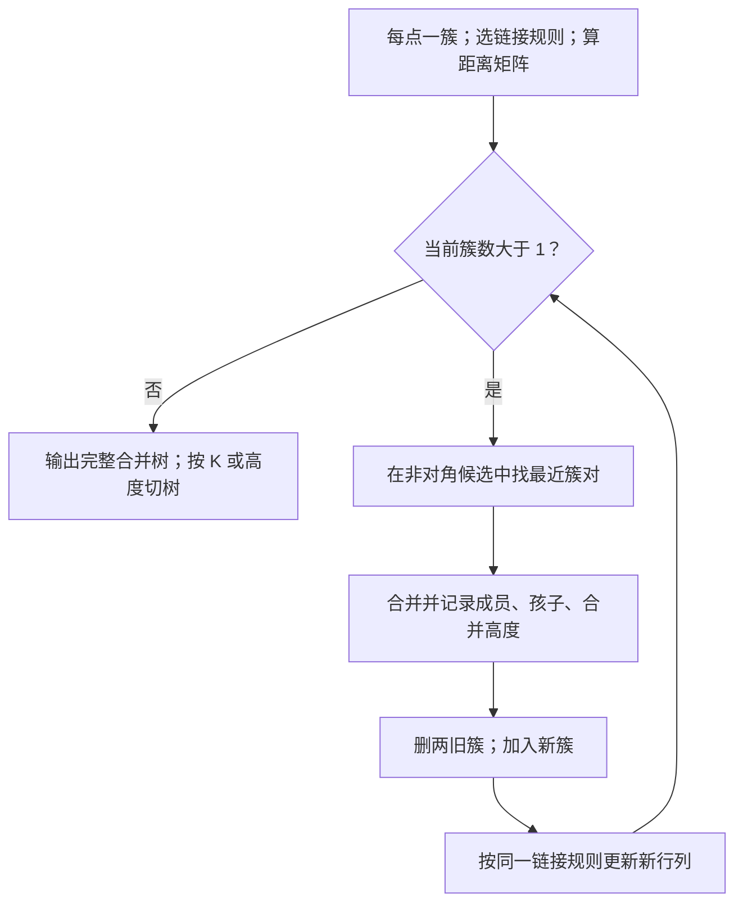
```mermaid
flowchart TD
    HC0["每点一簇；选链接规则；算距离矩阵"] --> HC1{"当前簇数大于 1？"}
    HC1 -->|否| HC6["输出完整合并树；按 K 或高度切树"]
    HC1 -->|是| HC2["在非对角候选中找最近簇对"]
    HC2 --> HC3["合并并记录成员、孩子、合并高度"]
    HC3 --> HC4["删两旧簇；加入新簇"]
    HC4 --> HC5["按同一链接规则更新新行列"]
    HC5 --> HC1
```

五点0/2/3/9/10用MIN，HC2按平局规则先选2/3，HC3记录高度1，HC4删除两旧行列加入A={2,3}，HC5写到0/9/10的2/6/7。然后回HC1，下一轮合9/10。文字替代：选最小簇对→合并记录→更新新行列。

完整树需要n−1次成功合并。提前到K簇时停只能声明当前分组；对角零不是候选；相似度表须另按其方向选值。

读图自测：A加入后，0到9的旧距离9要不要重算？

不用。HC5只更新与A相关的行列；0/9的成员和原点距离未改变，仍为9。

**完整小例子（笔记补充）**：五点 $0,2,3,9,10$，采用 MIN；距离平局优先选成员原编号较小的簇对。`verify_m05_mechanisms.py` 的 `hierarchical_single` 段逐次复算。

初始矩阵如下，数字是距离，不是相似度；主对角零表示与自己距离零，**不能拿它作为合并候选**。

每行和列都是同五点当前簇；格值为一维绝对差，主对角零不是候选。

| 点 | 0 | 2 | 3 | 9 | 10 |
|---|---|---|---|---|---|
| 0 | 0 | 2 | 3 | 9 | 10 |
| 2 | 2 | 0 | 1 | 7 | 8 |
| 3 | 3 | 1 | 0 | 6 | 7 |
| 9 | 9 | 7 | 6 | 0 | 1 |
| 10 | 10 | 8 | 7 | 1 | 0 |

读行2列3：距离1，和9/10距离1平局。按约定先选2/3，不选择对角零。

1. 最近距离 1 有两对，按约定先合并 $\{2\},\{3\}$。新簇 $A=\{2,3\}$ 到 0 的距离 $\min(2,3)=2$，到 9 为 $\min(7,6)=6$，到 10 为 $\min(8,7)=7$；其余旧距离不变。剩 4 簇。
2. 当前最小值仍为 1，合并 $\{9\},\{10\}$ 成 $B$。$d(A,B)=\min(7,8,6,7)=6$；$d(0,B)=\min(9,10)=9$。剩 3 簇，其矩阵非对角值为 $d(0,A)=2,d(A,B)=6,d(0,B)=9$。
3. 合并 0 与 $A$，高度 2，形成 $C=\{0,2,3\}$；$d(C,B)=\min(9,10,7,8,6,7)=6$。剩 2 簇。
4. 最后合并 $C,B$，高度 6，形成全体。五点共四次合并；到这时完整树才建完。

**怎样从记录变回分组**：若要 $K=3$，取第 2 次合并后状态 $\{0\},\{2,3\},\{9,10\}$；若要 $K=2$，取第 3 次合并后的两簇。对这个 MIN 树，水平切在 2 与 6 之间也得到两个簇。同一高度有多个合并时，高度切未必能得到任意指定簇数，精确 $K$ 需说明按合并次序 / 平局约定取层级，而不能说“任意高度切都得到想要的 K”。

**原理与停止**

新簇A∪B到第三簇的跨簇点对，是旧A与旧B两批点对的并集。

- MIN：合并两个旧最小值，取较小。
- MAX：合并两个旧最大值，取较大。
- 组平均：按点对数量加权，不能无条件除2。

每次成功合并净少1簇，有限n下最多n−1次。若剩K簇就停，只能交当前分组；后续未算，不称完整树。

**失败与边界**：贪心选完不能拆回，早期错误会影响整棵树；MIN 易被少量桥接点串起两团，MAX 又易被极远点推高合并代价，见 §2.7.1。不同链接不能在中途随意换；若矩阵表示相似度，选择方向需相应改变。大量点的两两距离有平方级存储成本，这是规模限制；高维影响距离的辨别能力，是另一种问题，不要混为一谈。

**为什么需要它**

这就是 p.60 课堂小测要考的机械操作：**找最小 → 合并 → 更新一行一列**。理解 p.49 那一行 "?" 是关键：更新矩阵时只有与新簇相关的那一行一列要重算，其他都照抄——考试手算时别把整张表重算一遍。

**课件原例**

讲义 p.45 六步；p.46–49 四张矩阵 + 树状图的图解（12 点示意，无数字）。

**🎙️ 课堂补充**（B `36:51`–B `40:23`，约 3.5 分钟，A · 课上展开）

- 教授先明确算法状态：*"to generate the hierarchical clustering, we need to maintain a distance or proximity matrix."*（B `36:57`），随后从 12 个单点簇和 12×12 矩阵讲到每合并一次，簇数与矩阵维度都减 1。
- p.47–49 的中间态被口头走完：5 个簇时找到 C2 与 C5 最近，将其合并后变成 4 个簇，矩阵更新成 4×4（B `38:43`–B `40:03`）。
- 教授把真正的难点停在新簇那一行：*"Now the question is, how we can compute the distance between two clusters?"*（B `40:06`），自然引出 §2.7 的链接规则。
- **这段改变了什么**：确认 p.45–49 的核心不是重算整张表，而是维护“当前簇集合 + 当前矩阵”；但课堂没有讲复杂度或停止性证明，这些仍是笔记补充。

**💡 换个说法（笔记补充）**

- 像锦标赛的对阵表：一开始每个选手一格，每轮把"最接近的两个"合成一队，合成后与其他队的"距离"要按某个规则重新定义（取两队里最近的两人？最远的？平均？）——规则不同，后面的对阵完全不同。
- 换个角度看"一次一个簇"：凝聚式每一步只做一次合并且**不可撤销**——一旦 p3 和 p6 合了，后面再也拆不开。这与 K-means 每轮重新分配所有点形成对照：层次聚类是"贪心且不回头"的。

**⚠️ 常见误解**

- ❌ "更新矩阵要重算所有距离。" → 只有新簇那一行一列要算，其余距离不变（p.49 只有一行一列是 ?）。
- ❌ "邻近矩阵是相似度，所以要找最大值合并。" → 讲义的矩阵是**距离**（p.55 标 Distance Matrix），找**最小**；如果给的是相似度矩阵（值越大越像），才找最大。考试先看表头。

**与其他概念的关系**

§2.3.1（矩阵里的每个数都是欧氏距离）、§2.7.1（第 5 步"怎么更新"的五种定义）、§2.8（完整手算）、§2.5.2（大数据时先切碎）。

**所以呢**：算法的第 5 步留了一个问号——两个簇之间的距离怎么定义？讲义用五页给出五种答案。

---

### 2.7 簇间距离怎么定义（讲义 p.50–54）

五页是同一张幻灯片，每页把一种定义标红并配一张连线图。

#### 2.7.1 MIN、MAX、组平均、质心距离与 Ward：五种定义，五种合并顺序（讲义 p.50–54）

<!-- 类型: 公式型 -->

**是什么**

两个点之间的距离是确定的，两个**簇**之间的距离却要人为规定——用哪两个点代表各自的簇？讲义 p.50–54 列出五种（已视觉复核，每页左上的连线图对应一种）：

> **MIN**（p.51，一条线连两簇里**最近**的两点）· **MAX**（p.52，一条线连**最远**的两点）· **Group Average**（p.53，两簇所有点两两连线，取**平均**）· **Distance Between Centroids**（p.54，两簇各画一个 × 号质心，连质心）· **Other methods driven by an objective function — Ward's Method uses squared error**（p.50，按目标函数定义：Ward 法用平方误差——合并后 SSE 增加最少的两簇先合并）

MIN 又叫**单链接**（single link）、MAX 又叫**全链接**（complete link）。用 p.55 的六点矩阵，脚本 `verify_m05_originals.py` `trees` / `p58` / `p60` 输出按四种定义各跑一遍凝聚聚类（Ward 需要坐标与 SSE，脚本未算）：

每行是一个链接定义；合并序列的@是当轮链接高度，集合是当轮成员；特点不是质量分数。

| 定义 | 新簇链接规则 | 特点 |
|---|---|---|
| MIN / 单链接 | 两簇间**最近**两点的距离 | 能连成链、识别细长形状；但两簇只要有一对点靠近就会被连起来（"链式效应"），怕噪声 |
| MAX / 全链接 | 两簇间**最远**两点的距离 | 簇紧凑、近似球形；容易把大簇拆开 |
| 组平均 | 两簇所有跨簇点对距离的**平均** | MIN 与 MAX 的折中，最常用之一 |
| 质心距离 | 两簇**质心**（平均位置）之间的距离 | 直觉简单；合并高度可能不单调（后合并的反而更近） |
| Ward | 合并后 **SSE 的增量** | 倾向等大小的圆簇，与 K-means 目标一致 |

**各自的完整合并顺序（脚本补充）**

**MIN / 单链接**：3+6 @0.11 → 2+5 @0.14 → {2,5}+{3,6} @0.15 → +4 @0.15 → +1 @0.22

**MAX / 全链接**：3+6 @0.11 → 2+5 @0.14 → {3,6}+4 @0.22 → 1+{2,5} @0.34 → 全部 @0.39

**组平均**：3+6 @0.11 → 2+5 @0.14 → {3,6}+4 @0.185 → {2,5}+{3,6,4} @0.26 → +1 @0.28

**质心距离**：3+6 @0.10 → 2+5 @0.14 → {3,6}+4 @0.18 → {2,5}+{3,6,4} @0.24 → +1 @0.25

**Ward**：（需坐标，讲义只给名字）

MIN/MAX/平均用讲义距离矩阵，质心用目测坐标。这些来源分开，0.11与0.10不当同输入精度差。完整序列在表后展开。

四种定义的**前两步相同**（3+6、2+5——因为单点簇之间没有歧义），**第三步起分道扬镳**。第三步要比较的是 {2,5}、{3,6}、p1、p4 之间的距离，把讲义矩阵里相关的数摆出来（脚本 D 段）：

每行是当前候选簇对；点对列列出该对所有跨簇距离，后三列分别取min/max/普通平均。

| 候选簇对 | 跨簇点对距离（讲义 p.55 矩阵） | MIN | MAX | 组平均 |
|---|---|---|---|---|
| {2,5} – {3,6} | d(2,3)=0.15，d(2,6)=0.25，d(5,3)=0.28，d(5,6)=0.39 | **0.15** | 0.39 | 0.2675 |
| {3,6} – p4 | d(3,4)=0.15，d(6,4)=0.22 | **0.15** | **0.22** | **0.185** |
| {2,5} – p4 | d(2,4)=0.20，d(5,4)=0.29 | 0.20 | 0.29 | 0.245 |
| {3,6} – p1 | d(3,1)=0.22，d(6,1)=0.23 | 0.22 | 0.23 | 0.225 |

读首行：四个距离中min0.15、max0.39，平均0.2675。三数描述同一候选的不同规则，不可交叉比较选最小。

第三轮MIN有0.15平局：{2,5}–{3,6}与{3,6}–p4。讲义先选前者，连接依据为p2–p3=0.15。

MAX、组平均和该质心示例则先把p4并入{3,6}。改变链接规则，后续合并历史也改变。

这对应p.45“Different approaches … distinguish the different algorithms”。注意质心列用目测坐标，精度边界仍按下文声明。

**原六点对照表的来源口径**：MIN、MAX、组平均按讲义p.55的距离矩阵复算；质心列按笔记给出的目测坐标重新求均值及欧氏距离。因此第一合并0.11与0.10不是同一精确输入的冲突；不能用差0.01来比较算法优劣。下方四点精确坐标例统一输入对比五种方法，供严格手算。

**输入、输出与调用边界**

链接模块接收两个非空簇，返回一个候选合并分数。它只计算当前簇对，不单独生成整树。

- MIN/MAX/平均：需原点间距离。
- 质心与本节Ward：需数值坐标；Ward采用欧氏平方误差。
- 空簇：均值/中心未定义，报告输入错误，不伪造0分。

当前簇初始化、排除对角、选择、合并和n−1次停止，均由§2.6.3外层流程负责。

**机制展开（笔记补充）：五种“近”究竟算哪几个数**

比较两个簇时，MIN、MAX、组平均都查看**跨簇的点对**；质心法先把两簇压成两个平均位置；Ward 查看“合并让总平方误差增加多少”。它们改变的是 §2.6.3 第②步的选择准则，不是五种可以随意互换的同一数字。

下面的公式比较两个已存在的非空簇。先认清每个量，再进行点对或中心运算。

| 符号 | 对象与来源 | 单位/角色 |
|---|---|---|
| $A,B$ | 两个当前成员集合 | 已知 |
| $n_A,n_B$ | 各集合的点数 | 个；用于人数权重 |
| $a,b$ | 分别从两簇取出的点 | 原坐标单位 |
| $d(a,b)$ | 点对欧氏距离 | 坐标单位；要算 |
| $\bar{x}_A,\bar{x}_B$ | 各簇逐坐标均值 | 原坐标单位；要算 |
| $\Delta$ | 合并新增 SSE | 平方坐标单位；要算 |

读 $n_A$：四点例中 $A$ 有两点，所以它是 2，不是两个簇之间的距离。后一表每行是一种运算；“实际运算”给公式，“为什么”解释选择对象，“易失败”给改变使用判断的条件。

每行是一种候选评分模块；公式列做计算，理由列说比较对象，失败列保留使用边界。

| 方法 | 实际运算 | 为什么体现这种“近” | 易失败的机制 |
|---|---|---|---|
| MIN / single | $\min_{a\in A,b\in B}d(a,b)$ | 只需一对点搭桥；便于沿长链连接 | 桥接噪声可能把原本分开的两团串起 |
| MAX / complete | $\max_{a\in A,b\in B}d(a,b)$ | 所有跨簇点对都近，才算两簇近 | 单个极远点可阻止两个主体近的团合并 |
| Group Average | $\sum_{a\in A}\sum_{b\in B}d(a,b)/(n_A n_B)$ | 把每个跨簇点对都纳入，分母是点对数 | 仍受距离与分布影响；大簇带来更多点对，更新须按大小加权 |
| Centroid | $\|\bar{x}_A-\bar{x}_B\|_2$ | 把一团概括为一个平均位置 | 不同形状甚至相互穿插的团可有相近中心；还可能出现合并高度反转 |
| Ward | $\Delta=\frac{n_A n_B}{n_A+n_B}\|\bar{x}_A-\bar{x}_B\|_2^2$ | 选择使 SSE 增幅最小的合并；兼顾距离与簇大小 | 偏向平方误差意义下的紧凑团，对离群点和尺度敏感 |

读Group Average：分母nA×nB数跨簇点对。Ward列结果用平方距离单位，其余普通距离单位不能直接比。

**Ward 为什么按人数加权**

合并中心必须代表全部成员：

$$\bar{x}_{A\cup B}=\frac{n_A\bar{x}_A+n_B\bar{x}_B}{n_A+n_B}.$$

大簇有更多点，贡献更大；不能直接平均两个旧中心。

1. 对 $A$ 和 $B$ 各使用 §2.4.1 的均值恒等式。
2. 两簇原来在各自均值处的误差已最小。移到新合并中心后，各自增加“人数 × 中心位移平方”。
3. 将合并中心代入并整理，就得到前表的 Ward 增量。

同样中心距离下，两个大簇硬合的代价较大。这是人数因子的含义。

原始 $\Delta$ 用平方距离单位。MIN 等用普通距离，不能直接比较数字大小；某些库会转换 Ward 距离尺度，树高须按实际实现解释。

**数字例子（手把手，笔记补充）**：$A=\{(0,0),(0,2)\}$，$B=\{(3,0),(3,4)\}$。脚本 `verify_m05_mechanisms.py` 的 `links` 段输出所有点对、质心及 SSE。

1. 四个跨簇点对距离分别为 $3,5,\sqrt{13},\sqrt{13}$；例如 $(0,2)$ 到 $(3,4)$ 的距离是 $\sqrt{3^2+2^2}=\sqrt{13}\approx3.6056$。
2. MIN $=3$，MAX $=5$；组平均 $=(3+5+\sqrt{13}+\sqrt{13})/4\approx3.8028$。不是对四个点的坐标取平均，也不是先将距离平方。
3. 两簇质心 $(0,1)$、$(3,2)$；质心距离 $=\sqrt{3^2+1^2}=\sqrt{10}\approx3.1623$。这与组平均不同，证明“平均距离”不等于“平均位置的距离”。
4. 合并中心为(1.5,1.5)。把合并前后平方误差分开列：

| 状态 | 平方误差项 | 合计 |
|---|---|---:|
| 原A | 1+1 | 2 |
| 原B | 4+4 | 8 |
| 原两簇 | 2+8 | 10 |
| 合并后 | 4.5+2.5+4.5+8.5 | 20 |

下一步取20−10才是Ward新增量，不能把20本身当增量。
5. Ward 增量 $=20-10=10$，也等于 $\frac{2\cdot2}{2+2}\cdot10=10$；**Ward 比较的是新增 10，不是合并后的 20**。若候选合并涉及不同原簇，直接比“合并后 SSE”会混入它们原有误差。

**四点链接图（笔记补充）**

问题：同两簇为何得到五种“近”？横纵轴为上面教学坐标；圆点属A，方点属B，X表示计算出的均值。线表示空间点对或中心距离，不表示时间或因果。

![[IS6400_Business_Data_Analytics/notes/figures/readability-v2-m05/link-distances.svg]]

左图从A1=(0,0)到B1=(3,0)读距离3，这是MIN。A1到B2=(3,4)读距离5，是MAX；其余两对各为sqrt(13)，四对平均约3.8028。中图先取均值(0,1)/(3,2)，距离sqrt(10)，与平均点对距离不同。右图合并中心(1.5,1.5)产生SSE20，减原SSE10得到Ward增量10。

文字替代：MIN/MAX/平均看跨簇点对；质心看两均值；Ward看合并新增平方误差。只有相同方法、相同单位的候选分数才能比较。

读图自测：右图的20能否写作Ward链接值？

本节定义的Ward原始增量应为20−10=10。20是合并后的总SSE；若忘扣原误差，会混入候选原有松散程度。

图源与数据见本节[[IS6400_Business_Data_Analytics/notes/figures/readability-v2-m05/generate.py|生成代码]]和[[IS6400_Business_Data_Analytics/notes/figures/readability-v2-m05/figure-inputs.json|教学数据]]；不是目测六点的精确重建。视觉/教学验收 pending。

**组平均更新的权重**

将A/B合并后，计算到第三簇T的新平均链接：

$$d_{\mathrm{avg}}(A\cup B,T)=\frac{n_A d_{\mathrm{avg}}(A,T)+n_B d_{\mathrm{avg}}(B,T)}{n_A+n_B}.$$

下表逐行解释更新式中的对象。人数决定旧链接的权重；davg 始终指跨簇所有点对距离的平均。

| 符号 | 含义 |
|---|---|
| A/B | 两个旧簇 |
| T | 尚未合并的第三簇 |
| nA/nB | 两旧簇人数 |
| davg | 所有跨簇点对距离平均 |

只有两旧簇人数相等，才可直接平均旧链接。1点/3点、旧距离2/6时，新值为(1×2+3×6)/4=5，不是4。

**极端 / 边界情况**：两个单点时前四种都等于这对点的普通距离，Ward 增量则为一半平方距离；两个簇中心相同，Ward 增量和质心距离都为零，却不表示两簇内每个点都靠近。质心链接可能让后一次合并的高度低于前次，所以“所有层次树的高度都严格往上”不能不分方法地说。

**把公式接回算法**：每次先对全部候选簇对算同一种链接分数，选最小者，再按该方法更新新簇的行列。讲义 p.50 只点名 Ward，本节推导和例子是补充，不是教授给的原例。🔗 方法与适用条件参见 [scikit-learn 的层次聚类说明](https://scikit-learn.org/stable/modules/clustering.html#hierarchical-clustering)（获取：2026-09-30）；本节四点数值为独立复算。

**为什么需要它**

它是 §2.6.3 第 5 步的答案，也是**手算题的规则来源**：p.58 的表用的是 MIN（Update 箭头下标着 minimum），所以 p.60 小测按 MIN 算；若题目说 complete link，同一张表的更新要取 max。对项目：sklearn 的 `AgglomerativeClustering(linkage=...)` 的参数支持 `ward`、`complete`、`average`、`single`，默认 `ward`；它不支持 `centroid`。质心法可用 SciPy `linkage(method="centroid")`。🔗 [scikit-learn 参数文档](https://scikit-learn.org/stable/modules/generated/sklearn.cluster.AgglomerativeClustering.html)、[SciPy linkage](https://docs.scipy.org/doc/scipy/reference/generated/scipy.cluster.hierarchy.linkage.html)（获取：2026-09-30）；库接口不能从讲义五种名称直接猜出。

**课件原例**

讲义 p.50–54 五张图（只有连线示意，无数字）；合并顺序表为脚本补充。

**🎙️ 课堂补充**（讲授 B `40:23`–B `42:15`；tutorial B `01:15:03`–B `01:23:31`，A · 课上展开）

- 讲授依次定义了 MIN / single、MAX / complete、group average 与 centroid distance。以单链接为例：*"among all the pairwise distances between the two clusters of data points, I use the minimum distance as the distance between the two clusters."*（B `40:53`）；组平均则先算所有跨簇点对，再取平均（B `41:29`–B `41:41`）。
- Ward 在讲授段没有口头展开，tutorial 才补全：*"it will merge the pair of the clusters that lead to the minimum increase in total within-cluster variance."*（B `01:19:16`）。tutorial 还把 single 的链式连接、complete 的紧凑倾向、average 的折中和 Ward 的紧凑且较平衡结果并排解释（B `01:21:33`–B `01:23:20`；对应 notebook cells 21–22）。
- **这段改变了什么**：五种定义在同堂课内均有课堂证据，但 Ward 的证据来自 tutorial；讲义外的数学推导、加权更新与反转边界仍是笔记补充。

**💡 换个说法（笔记补充）**

两班“有多远”可有不同约定。

- MIN只看跨班最近一对。
- MAX看跨班最远一对。
- 组平均纳入所有跨班点对。
- 质心先求各班“平均学生”，再比两个代表。

比较对象改变，“哪两班先合并”就可能改变。
- **判断口诀**：题目说 single link / MIN → 更新矩阵时取小；complete link / MAX → 取大；average → 算平均；centroid → 先算两簇的平均坐标再算距离。没说就看讲义例子（本讲用 MIN）。
**同簇对的次序，不等于整棵树次序**

对同一对当前簇，MIN≤组平均≤MAX。不同链接会改变成员历史，不能推出固定高度下MAX总有更多簇。

反例保留七点：A(10,12)、B(11,7)、C(4,18)、D(14,19)、E(2,15)、F(3,1)、G(13,4)。这是笔记补充。

| 方法 | 高度11时的分组 | 簇数 |
|---|---|---:|
| average | {A,B,G}/{C,E}/{D}/{F} | 4 |
| complete | {A,D}/{C,E}/{B,F,G} | 3 |

两者先合C/E和B/G。之后average合A与B/G（约6.8215），complete合A/D（约8.0623），历史分开。

既有SciPy复算为`fix-m05-reader-residuals.py`，结果`m05-new-reader-counterexample.json`。

**⚠️ 常见误解**

- ❌ "MIN 和 MAX 只是名字不同，结果差不多。" → 上表第三步起就不同；MIN 会沿着链把两团连起来（p.35 那种弯月它反而擅长），MAX 只认紧凑的团。选错定义 = 换了一个算法。
- ❌ "质心距离的树状图高度一定递增。" → 不一定（脚本里恰好递增，但一般情况下后合并的两簇质心可能反而更近），所以质心法的树状图可能出现"倒挂"；MIN / MAX / 组平均不会。
- ❌ "Ward 法是另一种算法。" → 它仍是凝聚式六步，只是第 4 步"最近"改成"合并后 SSE 增加最少"；因为用了平方误差，它偏爱与 K-means 一样的圆形簇。

**与其他概念的关系**

§2.6.3 第 5 步；§2.8 用 MIN 手算；§2.4.4 SSE（Ward 用它）；§2.5.1（MAX / Ward 与 K-means 同样偏爱圆簇，MIN 不）。

**所以呢**：规则定了（本讲用 MIN），下面用六个点从头到尾算一遍——这是 p.60 课堂小测的原型。

---

### 2.8 单链接手算：六个点从矩阵到树状图（讲义 p.55–60）

p.55–56 数据与矩阵（两页相同），p.57 第一次合并，p.58 更新后的表，p.59 结果树状图，p.60 课堂小测。

#### 2.8.1 六点例子：距离矩阵与第一次合并（讲义 p.55–57）

**是什么**

p.55（与 p.56 完全相同）给六个点的坐标图和 6 × 6 距离矩阵（已视觉复核誊录）：

每行和列是p.55的点名；数字誊自讲义，单位沿讲义坐标。矩阵与目测坐标重算的精度分开。

| | p1 | p2 | p3 | p4 | p5 | p6 |
|---|---|---|---|---|---|---|
| p1 | 0.00 | 0.24 | 0.22 | 0.37 | 0.34 | 0.23 |
| p2 | 0.24 | 0.00 | 0.15 | 0.20 | 0.14 | 0.25 |
| p3 | 0.22 | 0.15 | 0.00 | 0.15 | 0.28 | 0.11 |
| p4 | 0.37 | 0.20 | 0.15 | 0.00 | 0.29 | 0.22 |
| p5 | 0.34 | 0.14 | 0.28 | 0.29 | 0.00 | 0.39 |
| p6 | 0.23 | 0.25 | 0.11 | 0.22 | 0.39 | 0.00 |

读p3行p6列0.11：它是最小非对角值，所以先合p3/p6。对称的p6行p3列不是另一个候选。

坐标（从 p.55 左图读出，⚪ 目测到 0.01）：p1 (0.40, 0.53)、p2 (0.22, 0.38)、p3 (0.35, 0.32)、p4 (0.26, 0.19)、p5 (0.08, 0.41)、p6 (0.45, 0.30)。讲义 p.55 上半重复了单链接的定义：

> Proximity of two clusters is based on the **two closest points** in the different clusters — Determined by **one pair of points**, i.e., by one link in the proximity graph（两簇的邻近度由不同簇里最近的两点决定——由一对点、也就是邻近图里的一条边决定）

**读法**：p.57 把矩阵里最小的非对角元素 **0.11**（p3 行 p6 列）框成红色，结论 "**P3, P6 are closest to each other, merge as first level**"——第一次合并是 {p3, p6}，合并高度 0.11。左图里 p3 (0.35, 0.32) 与 p6 (0.45, 0.30) 确实挨得最近。

**数字来源**

矩阵直接誊自讲义。目测坐标另由`verify_m05_originals.py`的`trees/p58/p60`重算比较。

两口径逐格差≤0.01，例如p3/p6由目测坐标算0.10，原表写0.11。差异源于目测精度，手算仍以讲义矩阵为准。

**换一组数会怎样**：若 d(p3, p6) 改成 0.16，最小值就变成 d(p2, p5) = 0.14，第一次合并变成 {p2, p5}——第一步只看"全表最小值在哪"。

**为什么需要它**

这是本讲**唯一有完整数字的手算例子**，p.60 小测直接从它出发。考试的"层次聚类计算题"几乎一定是这个形态：给矩阵、给链接方式、问合并顺序或更新后的矩阵。掌握它的三个动作——找最小、合并、更新——就能应付任何 n ≤ 8 的题。

**课件原例**

讲义 p.55–56 坐标图 + 矩阵；p.57 红框 0.11。

**🎙️ 课堂补充**（B `42:15`–B `44:23`，约 2.1 分钟，A · 课上展开）

- 教授先说明 6×6 距离矩阵对称、主对角线为 0，然后要求排除对角线去找最小值：*"excluding the zeros in the diagonal, I want to identify the minimum distance in this data matrix."*（B `43:19`）。课堂得到 0.11，对应 P3 与 P6，因而第一次合并这两点（B `43:30`–B `44:23`）。
- 🔴 教授在学生回答 0.11 后明确说：*"So this is one year final exam, okay, okay, now everybody raise up your head, okay, not kidding."*（B `43:50`）。这把“给距离矩阵找最小值并开始单链接合并”从 🟡 预判升级为教授明示的往年期末题型。
- **这段改变了什么**：矩阵手算不是普通课堂示例，而是有往年期末证据的高优先级题型。

**💡 换个说法（笔记补充）**

把矩阵看成城市里程表：先找最近两城，合为一个都市圈。

单链接规定都市圈到另一城的距离，取圈中较近城市的里程。每次合并后只更新新圈相关行列，原城市间值不变。
- 用坐标图核对矩阵是个好习惯：p3 (0.35, 0.32) 和 p6 (0.45, 0.30) 在图上几乎并排，p1 (0.40, 0.53) 高高在上离谁都远——所以 0.11 最小、p1 那一行普遍偏大（0.22–0.37）都说得通。考试若只给矩阵不给图，也可以在脑子里把"最小的几个数"连成图，检查有没有抄错。

**⚠️ 常见误解**

- ❌ "找最小值要看整张表。" → 矩阵对称、对角线为 0，只看上三角（或下三角）的 15 个数即可；对角线的 0 不算。
- ❌ "p3 和 p6 合并后它们之间的距离 0.11 还要留在表里。" → 合并后 {p3, p6} 是一个簇，簇内距离不再出现在矩阵里；表缩成 5 × 5（p.58）。

**与其他概念的关系**

§2.3.1（矩阵里的数是欧氏距离）、§2.6.3（六步的第 1–4 步）、§2.7.1（用 MIN）、§2.8.2（接着更新）。

**所以呢**：合并了 {p3, p6}，矩阵要缩一行一列——p.58 展示怎么填新簇那一行。

---

#### 2.8.2 更新矩阵与画出树状图（讲义 p.58–59）

**是什么**

p.58 上半是原矩阵，p3 行 p1 列的 0.22 和 p6 行 p1 列的 0.23 被绿框框出，箭头标 **minimum** 指向下表的 0.22——意思是：新簇 {P3, P6} 到 P1 的距离取两者中较小的 0.22。下半是更新后的 5 × 5 表（只填上三角，已视觉复核誊录）：

每行列代表合并后的当前簇；只填上三角，空格由对称性恢复，不是缺失距离。

| | P1 | P2 | P3&P6 | P4 | P5 |
|---|---|---|---|---|---|
| P1 | 0 | 0.24 | **0.22** | 0.37 | 0.34 |
| P2 | | 0 | 0.15 | 0.2 | **0.14**（红） |
| P3&P6 | | | 0 | 0.15 | 0.28 |
| P4 | | | | 0 | 0.29 |
| P5 | | | | | 0 |

读P1到P3&P6：取min(0.22,0.23)=0.22。P2到P5的0.14是本轮下一最小值。

**手把手**（脚本 `verify_m05_originals.py` `trees` / `p58` / `p60` 输出 "p.58" 与讲义逐格一致）：
1. {3,6} 到 P1：$\min(0.22, 0.23) = 0.22$
2. {3,6} 到 P2：$\min(0.15, 0.25) = 0.15$
3. {3,6} 到 P4：$\min(0.15, 0.22) = 0.15$
4. {3,6} 到 P5：$\min(0.28, 0.39) = 0.28$
5. 其他格照抄（P1–P2 0.24、P1–P4 0.37、P1–P5 0.34、P2–P4 0.20、P2–P5 0.14、P4–P5 0.29）
6. 新表最小值：**0.14**（P2–P5，讲义标红）→ 第二次合并 {P2, P5}，高度 0.14

继续MIN合并（既有脚本D段）：

1. {2,5}到{3,6}取 $\min(0.15,0.25,0.28,0.39)=0.15$，与{3,6}到P4平局。
2. 按p.59历史，先合前者，再把P4在同0.15并入。
3. 最后P1到大簇取min(0.24,0.22,0.37,0.34,0.23)=0.22，再合P1。

同高合并仍有先后记录，精确K时不可忽略平局。

**p.59嵌套图与树的对应**

左图Nested Clusters的红1–5，分别对应右图Dendrogram的合并记录：

| 次序 | 新合并成员 | 高度 |
|---|---|---:|
| 1 | {3,6} | 0.11 |
| 2 | {2,5} | 0.14 |
| 3 | {2,5}∪{3,6} | 0.15 |
| 4 | 上簇再加4 | 0.15 |
| 5 | 上簇再加1 | 0.22 |

横轴叶序3/6/2/5/4/1，纵轴刻度约0–0.2；0.22为最上合并的既有图读数。两个0.15需保原合并次序。

**换一组数会怎样**：若用 MAX，第 1 步就变成 $\max(0.22, 0.23) = 0.23$，p.58 的表整行改变，第三次合并变成 {3,6}+4 @0.22（§2.7.1 表）——同一张原矩阵，树完全不同。

**为什么需要它**

这一页是**手算的模板**：新簇那一行逐格取 min，其余照抄，找新最小值，重复。p.60 小测的第 1 问就是让你对 {P2, P5} 再做一遍这个动作。树状图（p.59）则是把每次合并的"高度"记录下来的结果——考试若要求"画树状图"，就是把合并顺序和高度画成阶梯。

**课件原例**

讲义 p.58 更新表 + p.59 嵌套图与树状图。

**🎙️ 课堂补充**（B `44:23`–B `49:28`，约 5.1 分钟，A · 课上展开）

- 合并 P3、P6 后，教授把 6×6 缩成 5×5，并用单链接填新簇到 P1 的距离：P1–P3 为 0.22、P1–P6 为 0.23，因此取 0.22（B `44:23`–B `45:49`）。
- 接着从新矩阵找出 0.14，把 P2 与 P5 合并，再继续更新 4×4 矩阵（B `46:29`–B `47:30`）。
- 最后把合并记录读回树状图：*"if I set a distance threshold to be 0.2 … how many clusters do we get at this level, to get 2"*（B `49:03`），说明切树阈值怎样变成最终簇数。
- **这段改变了什么**：课堂完整覆盖了“找最小 → 合并 → 更新 → 画树 / 切树”的闭环；其中 B `46:04` 有一次数字口误后自我收束到 0.15，笔记继续以讲义矩阵为准。

**⚠️ 常见误解**

- ❌ "新簇到 P1 的距离应该取平均 (0.22 + 0.23) ÷ 2。" → 那是组平均；讲义标了 minimum，单链接取小。
- ❌ "平局时随便选，结果一样。" → 此例在高度大于 0.15 且小于 0.22 时，两种处理的分组一致；但精确按合并次序取 K=3 时，一种为 {2,5,3,6}/{4}/{1}，另一种为 {3,6,4}/{2,5}/{1}。二叉合并记录不同，不能说树一样；一般情况下平局也可能影响后续结果；考试遇到平局要写明"两者距离相等，按题意 / 按编号顺序先合并 ×"。

**与其他概念的关系**

§2.6.3 第 5 步的实例；§2.6.1 树状图的读法；§2.7.1（换定义换结果）；§2.8.3 小测。

**所以呢**：p.60 的课堂小测让你接着算——合并 P2 和 P5 之后的矩阵，以及下一个合并的是谁。

---

#### 2.8.3 课堂小测：合并 P2 与 P5 之后（讲义 p.60）

**是什么**

讲义 p.60（红字两问 + p.58 的表 + p.59 的树状图）：

> 1. Compute the distance matrix after merging Point 2 and Point 5.（算出合并 P2 与 P5 之后的距离矩阵）
> 2. According to the new distance matrix, which point (cluster) will be merged next?（按新矩阵，下一个合并谁）

**⚪ 参考作答（笔记推断）**：采用讲义 MIN 定义，由 `verify_m05_originals.py` 的 `p60` 段独立复算；未取得教授官方答案。

第 1 问——新簇 {P2, P5} 那一行逐格取 min，其余照抄：
1. {2,5} 到 P1：$\min(0.24, 0.34) = 0.24$
2. {2,5} 到 {3,6}：$\min(0.15, 0.28) = 0.15$（P2–{3,6} 是 0.15、P5–{3,6} 是 0.28）
3. {2,5} 到 P4：$\min(0.20, 0.29) = 0.20$
4. 其余照抄：P1–{3,6} 0.22、P1–P4 0.37、{3,6}–P4 0.15

每行列为p.60当前四簇；空下三角由对称性恢复，所有数仍为同一MIN链接尺度。

| | P1 | P2&P5 | P3&P6 | P4 |
|---|---|---|---|---|
| P1 | 0 | 0.24 | 0.22 | 0.37 |
| P2&P5 | | 0 | **0.15** | 0.20 |
| P3&P6 | | | 0 | **0.15** |
| P4 | | | | 0 |

读P2&P5到P3&P6为0.15，同P3&P6到P4平局。表给两小问所需完整数据，不能把空格填0。

第 2 问——新表最小值 0.15，**出现两次**：{P2,P5}–{P3,P6} 与 {P3,P6}–P4。按讲义 p.59 树状图的顺序，下一步合并 **{P2, P5} 与 {P3, P6}**（然后 P4 以同样的 0.15 并入）；若考试要一个答案，写"{P2,P5} 与 {P3,P6}（与 {P3,P6}–P4 并列 0.15，讲义按前者）"最稳妥。

**读法**：这道题考的不是算术，是**三个动作的顺序**——先合并（P2、P5 变一行）、再更新（取 min）、再找最小。答题时把新矩阵完整写出来，标出最小值，再写结论。

**换一组数会怎样**：若保持题目给定的当前簇及强制合并 P2/P5 的步骤，再假设 P5 到 {3,6} 的链接值为 0.12，则 {2,5}–{3,6} 变成 $\min(0.15, 0.12) = 0.12$，第 2 问的答案唯一且高度为 0.12。这个变式只测试给定状态后的更新；若从原始矩阵重新完整跑贪心算法，早期合并顺序也可能变化，不能保留旧历史再说它是同一次正常运行。

**为什么需要它**

它是本讲**最可能原题出现在考试或随堂小测**里的内容（讲义标题就叫 In-class Quiz；本课 Participation 5% 靠随机小测）。做过一遍，任何 "given the distance matrix, perform single/complete linkage" 的题都不会慌。

**课件原例**

讲义 p.60 两问 + 表 + 树状图。答案为笔记补充（脚本）。

**🎙️ 课堂补充**（B `46:29`–B `47:48`，约 1.3 分钟，A · 课上展开但答案不完整）

- 教授先在 5×5 矩阵中找出 0.14，并当堂问下一对合并谁，随后确认合并 P2、P5（B `46:43`–B `47:03`）。
- 他说明下一步要得到 4×4：*"Now I need to compute all these distance values here, including the distance between these two clusters."*（B `47:09`），但没有逐格报出 p.60 的新矩阵，也没有讨论两个 0.15 的平局；B `47:26` 直接进入已完成的 4×4 结果。
- **这段改变了什么**：课堂确认了小测的操作路线，却没有录到官方逐格答案或平局评分口径；本节现有脚本复算答案应继续标为参考答案，不能升级成“教授给出的官方答案”。

**⚠️ 常见误解**

- ❌ "第 1 问要从 p.55 的 6 × 6 重新算。" → 从 p.58 的 5 × 5 出发即可（P3&P6 已合并）；题目说的就是"在此基础上再合并 P2 和 P5"。
- ❌ "第 2 问答 P4 是错的。" → 不算错：{3,6}–P4 也是 0.15，平局；但讲义 p.59 的树先连 {2,5}–{3,6}。答题时点明平局比硬选一个更好。

**与其他概念的关系**

§2.8.2 的延续；§2.6.3 六步；§2.7.1 若换 MAX 答案变为 {3,6}+P4 @0.22。

**所以呢**：层次聚类讲完。它不用给 K、能画树，但矩阵随 n² 增长，且合并不可撤销。最后一种算法从"密度"出发，既不用给 K，又能处理怪形状和噪声。

---

### 2.9 DBSCAN：按密度长出来的簇（讲义 p.61–67）

p.61 章节页；p.62–63 三种点；p.64 算法；p.65 动画截图；p.66–67 效果图与优点。

#### 2.9.1 密度、Eps、MinPts 与核心 / 边界 / 噪声点（讲义 p.62–63）

**是什么**

看夜景航拍图分辨"哪里是城市"：灯光密的地方是城市，稀的地方是郊野，孤零零几盏灯是噪声——不需要事先说有几座城，也不管城市是什么形状。DBSCAN 就是这个思路。讲义 p.62：

> DBSCAN is a **density-based** algorithm.
> **Density** = number of points within a specified radius (**Eps**)（密度 = 半径 Eps 内的点数）
> A point is a **core point** if it has at least a specified number of points (**MinPts**) within Eps — These are points that are at the interior of a cluster — **Counts the point itself**（核心点：Eps 内至少有 MinPts 个点，包括自己；处在簇的内部）
> A **border point** is not a core point, but is in the neighborhood of a core point（边界点：自己不是核心点，但落在某个核心点的 Eps 邻域内）
> A **noise point** is any point that is not a core point or a border point（噪声点：既非核心也非边界）

两个参数：**Eps**（半径，"多近算邻居"）与 **MinPts**（"至少几个邻居才算密"）。p.63 图（已视觉复核）：MinPts = 7，三个圆圈各以 A / B / C 为圆心、半径 Eps。**A 是核心点**——圆内有 7 个点（含自己）；**B 是边界点**——它自己的圆内点数不够 7，但 B 落在 A 的圆内；**C 是噪声点**——它的圆内只有 3 个点，也不在任何核心点的圆内。

**数字例子**（用 p.55 的六点矩阵判定，脚本 `verify_m05_originals.py` `dbscan_neighbors` 输出）：取 Eps = 0.16、MinPts = 3（含自己）：
- 每点 Eps 内的点数（含自己）：p1 1 个、p2 3 个（自己、p3 0.15、p5 0.14）、p3 4 个（自己、p2、p4、p6）、p4 2 个、p5 2 个、p6 2 个
- 核心点：p2、p3（≥ 3）；边界点：p4、p5、p6（各自不够，但都在 p2 或 p3 的邻域内）；噪声点：**p1**（离谁都超过 0.16）
- 把 MinPts 降到 2：p2–p6 全成核心点，p1 仍是噪声；把 Eps 放宽到 0.23、MinPts = 3：p1 也成了核心点，p5 变边界点，没有噪声——**参数一变，三种点的身份就变**。

**为什么需要它**

DBSCAN以核心连通区域形成骨架，再吸收边界点；最终噪声不归任何簇。这与本讲普通K-means和完整层次分组不同。

它可适应非球形核心连通区域、不同大小簇并显式标噪声。但单组Eps/MinPts仍可能难兼顾不同密度，参数要检查（§2.9.3）。

**课件原例**

讲义 p.62 定义 + p.63 三点示意图（MinPts = 7）。六点算例为笔记补充（脚本）。

**🎙️ 课堂补充**（B `49:41`–B `55:07`，约 5.4 分钟，A · 课上展开）

- 教授把 Eps 讲成“伸开手臂能覆盖的邻域”，把 MinPts 讲成邻域里至少要有多少人；满足门槛的中心点是核心点：*"if there are more than the minimum number of neighborhoods in this range, I will consider the focal point a core member, a core point."*（B `51:18`）。
- 课堂直接用座位分布演示三种身份：自己邻居不够、但邻近某个核心点的是边界点（B `52:36`）；既不够密、附近也没有核心点的是噪声点（B `53:42`）。教授在数人数时明确把本人算进去：*"including you, you have three members"*（B `52:10`）。
- p.63 的 A / B / C 图也被口头核对：A 核心、B 边界、C 噪声（B `54:13`–B `55:07`）。
- **这段改变了什么**：三种点的判定有强烈的课堂空间类比，并确认 MinPts 计入自己；ASR 把 core / border 多次写成 co-member / bottom member，术语按讲义校正。

**💡 换个说法（笔记补充）**

- 像判断一个人是不是"圈内人"：Eps 是"多近算认识"，MinPts 是"至少认识几个才算圈内"。认识够多人的是核心（圈子的中坚）；自己认识的人不够多、但被某个中坚认识的是边界（圈子的外围）；谁也不认识、也没人认识的是噪声（局外人）。圈子的形状由"谁认识谁"自然长出来，不需要画圆。
- **判断口诀**：数 Eps 内的点（含自己）≥ MinPts → 核心；不够但在某核心的 Eps 内 → 边界；都不是 → 噪声。全局手算可先列所有核心点，再判边界；队列实现可边查邻域边扩展，并允许暂记噪声改为边界（§2.9.2）。必要的是最终边界归属有核心邻居依据，不是必须预先遍历完整数据。

**⚠️ 常见误解**

- ❌ "数邻居时不算自己。" → 讲义明写 Counts the point itself；MinPts = 3 意味着自己加两个邻居。不同软件的约定不同，考试按讲义。
- ❌ "边界点属于离它最近的核心点的簇。" → 它属于**任何一个**能到达它的核心点所在的簇；若两个不同簇的核心点都够得着它，它归先被处理的那个（算法顺序决定，§2.9.2）——这是 DBSCAN 少有的"结果依赖顺序"之处。
- ❌ "噪声点就是离群点。" → 噪声是"密度不够"的点，可能只是处在稀疏区域的正常点；调小 MinPts 它就可能成为边界点。噪声是参数下的判定，不是数据的固有属性。

**与其他概念的关系**

§2.2.4 密度类型的定义；§2.3.1（Eps 内的距离仍是欧氏距离，仍须明确尺度与 Eps 的单位）；§2.5.1（能改善形状与噪声问题；密度不均仍是限制）；§2.9.2 算法用这三种点；§2.9.3 何时好用。

**所以呢**：三种点的条件清楚后，要完整求核心连通区域，再吸收边界点并区分暂记与最终噪声；下一节展开这个过程。

---

#### 2.9.2 DBSCAN 算法：去噪声，再从核心点向外连（讲义 p.64–65）

<!-- 类型: 算法流程型 -->

**是什么**

讲义 p.64 只有两行大字 + 一段伪码：

> **Eliminate noise points**（去掉噪声点）
> **Perform clustering on the remaining points**（对其余点聚类）

伪码（讲义原文，逐行翻译）：

1. `current_cluster_label ← 1`（当前簇编号从 1 开始）
2. **for** all core points **do**（对每一个核心点）
3. 　**if** the core point has no cluster label **then**（如果它还没有簇编号）
4. 　　`current_cluster_label ← current_cluster_label + 1`（开一个新编号）
5. 　　Label the current core point with cluster label `current_cluster_label`（给它贴上）
6. 　**end if**
7. 　**for** all points in the *Eps*-neighborhood, except $i^{th}$ the point itself **do**（对它 Eps 邻域内的每个其他点）
8. 　　**if** the point does not have a cluster label **then**（如果那个点还没编号）
9. 　　　Label the point with cluster label `current_cluster_label`（贴上同样的编号）
10. 　**end if**
11. 　**end for**
12. **end for**

**讲义简化伪码的读法与缺口**：它想表达核心点邻域扩展，但当遇到已有编号的核心点时，没有把 `current_cluster_label` 恢复成该点自己的簇号，也没有明确处理跨点序的连通扩展。不能把它原样解释为对任意数据都正确；下方给可执行的队列版，§9.3 给可复算反例。若先全局判定点型，可剔除真正噪声；若逐点查询，暂记噪声者还可能成为边界点。

**手算一遍**（六点，Eps = 0.16、MinPts = 3，§2.9.1 已判定核心 = {p2, p3}，边界 = {p4, p5, p6}，噪声 = {p1}）：

每行是此六点示范的处理动作；“编号状态”记录当时标签。编号2沿原伪码，不代表第二个真实群体。

| 步 | 当前核心点 | 动作 | 编号状态 |
|---|---|---|---|
| 0 | — | 剔除噪声 p1 | p1 = 噪声 |
| 1 | p2（无编号） | 开新簇 2（编号从 1 加到 2）；邻域 {p3, p5} 贴 2 | p2 = 2, p3 = 2, p5 = 2 |
| 2 | p3（已有编号 2） | 不开新簇；邻域 {p2, p4, p6} 里没编号的 p4、p6 贴 2 | p4 = 2, p6 = 2 |
| 结束 | 核心点走完 | 一个簇 {p2, p3, p4, p5, p6} + 噪声 {p1} | — |

读处理p3一行：它已有2，只将尚未标的p4/p6加入该簇。此小例能走通不证明原伪码适合任意点序。

**停止条件 / 什么时候别用它**：外层所有点与每个簇的扩展队列处理完就停；不做 K-means 式全局再优化，但邻域生长本身有循环，不能以“一遍过”省掉连通扩展。**别用它**的情况：各簇密度差别大（一个 Eps 顾不了两头，§2.9.3）；维度很高（高维里"半径 Eps 内"几乎没有点或全是点，密度失去意义——§2.2.5 的维度问题）。

**p.65动画截图的读法**

既有视觉记录为笑脸点云：两眼、嘴和外轮廓。参数epsilon=1.00、minPoints=4。

红区域表示首簇沿脸右上轮廓扩展，红圈表示当前核心点的Eps邻域。继续扩展依靠相互可达的核心邻居。

两圆相交只可能说明中心距小于2Eps，不能据此认定两中心互为Eps邻居。参考网址由讲义提供。

**机制展开（笔记补充）：只能从核心点继续生长，边界点只归属不扩展**

输入是数据、距离、半径 $\varepsilon$（Eps）和密度门槛 MinPts；输出是各点的簇标签以及噪声标记。没有预先输入 $K$，簇数由数据与参数产生。需要维护“是否检查过邻域”“当前簇编号”“待扩展点队列”三个不同状态：检查过不代表已有最终簇，曾暂记噪声的非核心点仍可能后来成为边界点。

**数学原理与判定依据**：对点 $p$ 的邻域取所有距离不超过半径的点：

$$N_{\varepsilon}(p)=\{q:d(p,q)\le\varepsilon\},\qquad p\text{ 是核心点}\ \Longleftrightarrow\ \#N_{\varepsilon}(p)\ge\mathrm{MinPts}.$$

每行解释密度量；eps继承距离单位，邻域数/MinPts是含自身的点数。

| 符号 | 是什么 | 已知还是要算 |
|---|---|---|
| $p,q$ | 当前数据点、被检查的邻居 | 数据已知 |
| $d(p,q)$ | 选定距离，数值特征常用欧氏距离 | 计算 |
| $\varepsilon$ | 查邻居的半径，边界包含等号 | 参数给定 |
| $N_{\varepsilon}(p)$ | 半径内点的集合，包含 $p$ 自己 | 查询 |
| $\#N_{\varepsilon}(p)$ | 该集合的点数，不是距离之和 | 计数 |
| MinPts | 核心点要求的最小邻域点数 | 参数给定 |

读#Nε(p)：0.2半径0.21内有4点，数4≥3；不是把这四段距离相加比较。

**为什么公式长这样**：半径把“附近”具体化，点数门槛把“附近够密”具体化，两者一起构成局部密度判据。把核心点画成图的节点，距离不超过半径时连边；**核心点之间的连通部分**形成各簇的骨架，再把邻近的非核心点挂上去。这解释了为什么弯曲形状能识别，也解释了为什么两个核心簇不能仅靠一个非核心边界点继续连接。

**编号步骤与状态（笔记补充队列版）**

维护三个不同状态：是否查过邻域、是否已有簇归属、待扩展队列。先前暂记噪声不是最终归属。

1. 取尚未检查的点，查邻域并标记已检查。
2. 若不是核心，先暂记噪声，再找下一点。
3. 若是核心，开新簇，把其邻居放入队列。
4. 从队列取一点。尚未检查才查询邻域；只有核心点将新邻居加入队列。
5. 未归属任何簇的点加入当前簇，包括先前暂记噪声的点。
6. 队列空表示当前簇扩展完，返回步骤 1。
7. 外层与所有队列完成后，仍未归簇者才是最终噪声。

本例按数据顺序处理，队列不能无止境重复入队。此图是正确机制的补充版本，不冒称讲义 p.64 的原伪码逐行就能做到。

**算法流程图**

图回答：暂记噪声为何还能归簇？实线箭头表示控制，DS6的回环处理当前队列，DS1的回环寻找其他起点。

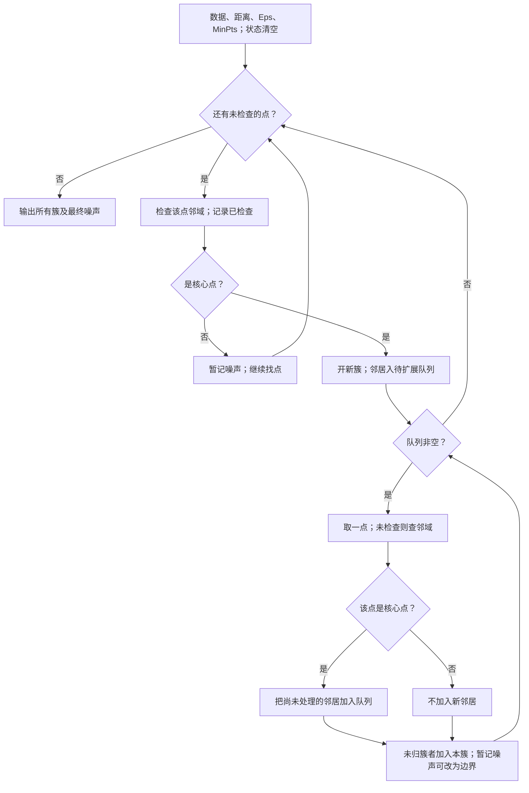
```mermaid
flowchart TD
    DS0["数据、距离、Eps、MinPts；状态清空"] --> DS1{"还有未检查的点？"}
    DS1 -->|否| DS9["输出所有簇及最终噪声"]
    DS1 -->|是| DS2["检查该点邻域；记录已检查"]
    DS2 --> DS3{"是核心点？"}
    DS3 -->|否| DS4["暂记噪声；继续找点"]
    DS4 --> DS1
    DS3 -->|是| DS5["开新簇；邻居入待扩展队列"]
    DS5 --> DS6{"队列非空？"}
    DS6 -->|否| DS1
    DS6 -->|是| DS7["取一点；未检查则查邻域"]
    DS7 --> DS8{"该点是核心点？"}
    DS8 -->|是| DSA["把尚未处理的邻居加入队列"]
    DS8 -->|否| DSB["不加入新邻居"]
    DSA --> DSC["未归簇者加入本簇；暂记噪声可改为边界"]
    DSB --> DSC
    DSC --> DS6
```

先读0.4（改变扫描顺序的笔记补充）：DS3发现邻域数2<3，DS4暂记噪声。之后0.2的核心扩展将它入队；DS8判为非核心，走DSB不扩展，再DSC加入簇A。文字替代：非核心可被核心找到而归簇，但不继续扩展。

这是补充队列版，不等于p.64原伪码。只在所有起点及队列完成后确认最终噪声；邻域含自身，半径边界含等号。

读图自测：把DSB也接到“加入新邻居”，会改变什么？

会让非核心边界点继续搭桥，可能错误连接两个核心连通部分；本算法只有DS8“是”出口继续扩展。

**完整数字例子（笔记补充）**：点 $0,0.1,0.2,0.4,1.0$，$\varepsilon=0.21$，MinPts $=3$；距离为一维绝对差，包含自身。`verify_m05_mechanisms.py` 的 `dbscan` 段复算邻域与点型。

每行固定一个原点；邻居按距离≤0.21列出，数量含自身，点型按MinPts3及核心邻接判定。

| 点 | 半径内邻居 | 数量 | 点型 |
|---|---|---|---|
| 0 | 0、0.1、0.2 | 3 | 核心 |
| 0.1 | 0、0.1、0.2 | 3 | 核心 |
| 0.2 | 0、0.1、0.2、0.4 | 4 | 核心 |
| 0.4 | 0.2、0.4 | 2 | 边界（靠近核心 0.2） |
| 1.0 | 1.0 | 1 | 最终噪声 |

读0.4行：两邻居不足核心门槛，但靠近核心0.2，因此边界。其原位置0.4没因归簇而改变。

1. 从 0 开始，邻域数 $3\ge3$，开簇 A，队列含尚待处理的 0.1、0.2。0 本身也归 A。
2. 取出 0.1，检查邻域，仍是核心；它的邻居均已在 A 或队列中，没有新增点。
3. 取出 0.2，四个邻居中 0.4 尚未处理，加入队列；这是簇向右继续生长的一步。
4. 取出 0.4，只有 2 个邻居，不能继续扩展；但它由核心 0.2 找到，所以归 A。**归簇与扩展是不同动作**。
5. 队列空，A 完成。外层查 1.0，只有自身，不能开簇；外层再无未检查点，停止。输出 $A=\{0,0.1,0.2,0.4\}$，噪声 $\{1.0\}$。

若数据顺序先遇 0.4，它会先暂记噪声；之后核心 0.2 扩展到它，便改为边界归 A。**不能在只检查这个点时就永久删除它**，因为那时还没查周围有没有核心点。若采用先全局判定点型的版本，可以提前标出真正噪声，但仍须正确求核心连通部分。

**同五点的邻域图（笔记补充）**

问题：0.4已归簇，为什么不继续把1.0拉进来？横轴是一维教学位置，圆点为核心、方点为边界、叉为噪声，数字n为含自身的邻域数。核心点间的线表示距离满足eps的连接，不表示传播时间。图上指向0.4的箭头只强调解释对象。

![[IS6400_Business_Data_Analytics/notes/figures/readability-v2-m05/dbscan-neighborhood.svg]]

从0.2读起：eps=0.21覆盖[-0.01,0.41]，包含0/0.1/0.2/0.4，数量4，所以它是核心。0.4只有自身与0.2，共2<3，因此只是挂在核心旁的边界；不继续扩展。1.0远于任一核心的eps，最终噪声。

文字替代：核心可扩展，边界可归属但不扩展，未连接到核心的非核心点是噪声。图只解释本例，不复原p.63 MinPts7或p.66 Eps10的数据。

读图自测：改扫描顺序先看0.4，它最终会变吗？

最终不变，仍归簇A为边界；最初只能暂记噪声，之后由0.2扩展找到而重标。扫描顺序改变中间状态，不使本例核心骨架改变。

图源/输入：[[IS6400_Business_Data_Analytics/notes/figures/readability-v2-m05/generate.py|代码]]、[[IS6400_Business_Data_Analytics/notes/figures/readability-v2-m05/figure-inputs.json|数据与点型计算]]。视觉/教学验收 pending。

**停止条件与极端 / 边界情况**：有限点集合、每点最多首次查询一次邻域、队列不重复无限加入，因此外层与每次扩展都有限。没有 K-means 式全局重新优化，但存在真实的队列循环，不能解释为“随便扫描一遍核心点就保证完成”。点恰好距核心 $\varepsilon$ 时算邻居；MinPts 太大可使所有点非核心，输出全噪声；半径太大可连成一个大簇。共享边界点可能受处理顺序影响归属，核心连通骨架与此需区分。

**失败机制**：固定半径在稀疏团内可能连不上，在密集团间又可能把两团连起来，故不同密度难由一组参数兼顾；高维距离接近使邻域密度失去辨别力，单纯换半径未必能修好。DBSCAN 能识别噪声，仍不表示每个它叫噪声的点在业务上都应删除。

🔗 标准核心点扩展及边界归属说明见 [scikit-learn 的 DBSCAN 文档](https://scikit-learn.org/stable/modules/clustering.html#dbscan)（获取：2026-09-30）。上面的队列例子是笔记补充；讲义 p.64 的伪码保留为原文并在 §9.3 说明其缺口。

**为什么需要它**

DBSCAN 不用一个中心决定整簇形状。它从核心点出发，沿核心邻接链继续扩展，再吸收邻近边界点；因此簇可以弯曲成环或笑脸轮廓。

两圆相交并不足以证明两个中心互为 Eps 邻居；是否可继续扩展，要查中心距离和核心身份。

原伪码初始化编号为 1，遇第一核心先加到 2，所以第一簇叫 2。这只是编号起点。真正的问题是缺少完整簇状态及连通扩展约定（§9.3）；只改编号并不能修好算法。

**课件原例**

讲义 p.64 伪码 + p.65 动画截图。六点手算为笔记补充（脚本）。

**🎙️ 课堂补充**（B `55:07`–B `59:47`，约 4.7 分钟，A · 课上展开）

- 教授没有照念伪码，而是让相邻座位的核心成员逐个向外搜索：两个核心点互为邻居就进入同一簇，邻居的核心邻居继续加入（B `55:07`–B `56:18`）。
- 传播边界被说得很清楚：*"As long as the density continues … they are in the same community, so they are in the same cluster."*（B `56:22`）；低密度区域把两片高密度社区隔开时，另一个未标记核心点会开启新簇（B `56:50`–B `57:24`）。
- 仍未归入任何高密度社区的噪声点不会被强塞进簇：*"they will not be assigned to any clusters"*（B `59:35`）。
- **这段改变了什么**：课堂的“核心邻域继续传播”补足了 p.64 简化伪码最容易被误读的地方；它支持笔记的队列扩展解释，但没有讲暂记噪声改为边界点的实现细节。

**💡 换个说法（笔记补充）**

- 像森林火灾蔓延：只有"树够密"的地方（核心点）火才能烧过去，火从一棵树传到它周围的树，一直传到密度不够的边缘（边界点）就停；孤立的树（噪声）烧不到。一场火烧过的范围就是一个簇，形状由树的分布决定。
- 换个角度：K-means 是"中心找点"（每个中心把附近的点认领），DBSCAN 是"点找点"（每个核心点把邻居拉进来）。前者用中心距离划出 Voronoi 区域，倾向紧凑团且难识别环；后者由核心邻接决定、形状随数据。

**⚠️ 常见误解**

- ❌ "DBSCAN 也要指定簇数。" → 不要；簇数是传染过程的结果，由 Eps / MinPts 和数据决定。
- ❌ "DBSCAN 需要像 K-means 那样迭代多轮。" → 没有 K-means 式“全体重新分配直到不变”，但每个核心簇需要完整扩展队列，并处理已检查状态与暂记噪声者。
- ❌ "伪码第 7 行说的是只处理边界点。" → 邻域里的核心点也会被贴上编号（这正是簇能延伸的原因）；边界点被贴上后不再向外传（它不是核心点，不会出现在外层循环里作为起点扩展）。

**与其他概念的关系**

§2.9.1 三种点；§2.5.1 的形状 / 噪声应对与尚未解决的密度限制；§2.6.3（两者均有有限状态更新；层次法是逐次合并，DBSCAN 是邻域扩展）；§2.2.5 维度对密度的影响。

**所以呢**：最后两页展示 DBSCAN 在一份真实形状的数据上的效果，并总结它什么时候好用——顺便给出三种算法的取舍。

---

#### 2.9.3 DBSCAN 何时好用 · 全讲收束：K-means、层次、DBSCAN 各适合什么数据（讲义 p.66–67）

**是什么**

p.66–67（已视觉复核）用一份约 1,000 个点、拼成六个块状字母形（像 "CLU" 的轮廓）加背景噪声的数据：

- **p.66**：左图原始点（全蓝），右图 Eps = 10、MinPts = 4 下的三种点——**绿色 core**（字母的实心部分）、**蓝色 border**（字母边缘）、**红色 noise**（散在背景里的点）。
- **p.67**：左图原始点，右图 **Clusters**——六个字母块各自一种颜色（蓝、红、绿、黄、青、橙），背景噪声保持深蓝（未归入任何簇）。讲义结论两条：**Resistant to Noise**（抗噪声）、**Can handle clusters of different shapes and sizes**（能处理不同形状与大小的簇）。

原图展示的形状、大小与噪声优点，对应§2.5.1的部分K-means困难。

笔记另保留三限制：

- 密度不均：一个Eps未必兼顾稀疏与密集团。
- 高维：邻域密度可能失去辨别力。
- 参数：Eps/MinPts需要按数据检查。

来源沿用🔗 Tan等教材第8章的补充说明（2026-09-22），不冒称原页已列弱点。

**三种算法怎么选**（全讲收束）：

每行比较一种方法属性；规模列是本讲定性取舍，不是当前环境跑分。

| | K-means（§2.4） | 凝聚层次（§2.6–2.8） | DBSCAN（§2.9） |
|---|---|---|---|
| 要给什么 | K | 簇间距离定义（切树高度事后定） | Eps、MinPts |
| 簇的形状 | 圆 / 球 | 取决于链接方式（MIN 可细长） | 任意 |
| 簇的大小 / 密度 | 对差异较大的情况易分错，不是硬性分布假设 | 取决于链接规则 | 可处理不同大小；单组密度参数难兼顾不同密度 |
| 噪声 | 被硬塞进簇、拉偏中心 | 异常点可能在某次链接中合并；不保证最后才并入 | 明确标为噪声 |
| 计算量 | 小（可上百万点） | 大（n² 矩阵） | 中 |
| 输出 | K 个簇 | 一棵树 | 若干簇 + 噪声 |
| 结果稳定性 | 随初始化与平局规则变（++ / 多次仍不保证） | 给定距离、链接与平局规则后确定 | 核心连通骨架给定参数后确定，共享边界归属可随顺序变 |
| 典型用途 | 客户分群、选址、切碎大数据 | 分类树、看粒度 | 空间数据、异常检测、怪形状 |

读稳定性：DBSCAN核心连通与共享边界归属分开；K-means依赖初始化。要以同数据/参数/目标比较。

**为什么需要它**

选择方法先看任务与数据（§2.2.5）。可用散点或适当低维投影辅助观察，但要保投影损失边界。

- 要固定中心的紧凑分组：比较K-means。
- 要多个粒度的合并历史：比较层次法。
- 要非球形核心连通与显式噪声：比较DBSCAN。

密度差异大时三种都可能受限，可比较分层处理等方案。报告应给当前数据的理由，而不是称某方法全能。

**课件原例**

讲义 p.66–67 两组图 + 两条优点；弱点与对比表为笔记补充。

**🎙️ 课堂补充**（讲授 B `59:51`–B `01:00:47`；tutorial B `01:23:31`–B `01:27:10`，A · 课上展开）

- 讲授总结 DBSCAN 沿连续高密度区域生长，因此能处理不同形状；同时明确噪声差异：K-means 会把外围点分给某一簇，而 DBSCAN *"they will not be assigned to any clusters"*（B `01:00:31`）。
tutorial的notebook cells 23–26使用`DBSCAN(eps=15.5, min_samples=5)`。B `01:24:37`–B `01:25:17`现场改变半径观察结果。

B `01:25:37`–B `01:26:53`指出可用`core_sample_indices_`/mask单独画核心点。当前保存散点图尚未实际使用这个mask，不能把两类图当同一输出。
- **这段改变了什么**：p.66–67 的“抗噪声、任意形状”在讲授中得到确认，tutorial 又把 Eps / MinPts 连接到 sklearn 参数；课堂未声称 DBSCAN 能自动解决不同密度问题，笔记原有限制应保留。

**💡 换个说法（笔记补充）**

三种找人群的类比：

- K-means：立K旗，每人去最近旗；旗位置决定分区。
- 层次：先牵最近人的手，再按链接合并人群；记录决定结构。
- DBSCAN：足够密的核心区域形成群体，再吸收边界；最终孤立噪声可不归簇。
p.66背景噪声的处理不同。

K-means仍分给最近中心，可能拉偏字母块中心。层次法会记录它并入其他成员的链接高度。

DBSCAN可将参数下无核心邻居的点最终标为噪声。在异常检测中，这是待解释的输出，不是自动删除依据。

**⚠️ 常见误解**

- ❌ "DBSCAN 比 K-means 先进，应该总用它。" → 它有自己的失灵（密度不均、高维）且参数更难调；K-means 在圆团数据上又快又好。讲义标题是 "When DBSCAN Works Well"——强调"何时"。
- ❌ "Eps = 10、MinPts = 4 是通用推荐值。" → 这是 p.66 那份数据（坐标范围几百）的参数；Eps 必须按数据尺度定，缩放后的 Eps 仍由点间距离与密度决定，可以大于 1；不能由“已归一化”直接给出通用半径。

**与其他概念的关系**

§2.5.1（DBSCAN 解决其中两条）、§2.2.5（密度与维度）、§2.2.4（三种类型的最终对照）、§2.9.1（噪声点的价值）。

**所以呢**：本讲结束。三种算法都学了，每种都有"什么时候别用"。W5 的 `Week5_Clustering_Tutorial.ipynb` 与 HTML 已在原始材料目录，T05 配套笔记已交齐；本篇不代替 T05 的逐 cell 验收，也不把历史“待制作”日志当作当前状态；下一讲按 Syllabus 顺延应是决策树。

---

## 3. 一图看懂

### 3.1 本讲的漏斗：从"近"到"组"到三种算法

这张总览回答：问题如何从“怎样算近”接到“需要哪种输出”？箭头代表学习依赖与方法选择，不代表某方法造成数据形状。

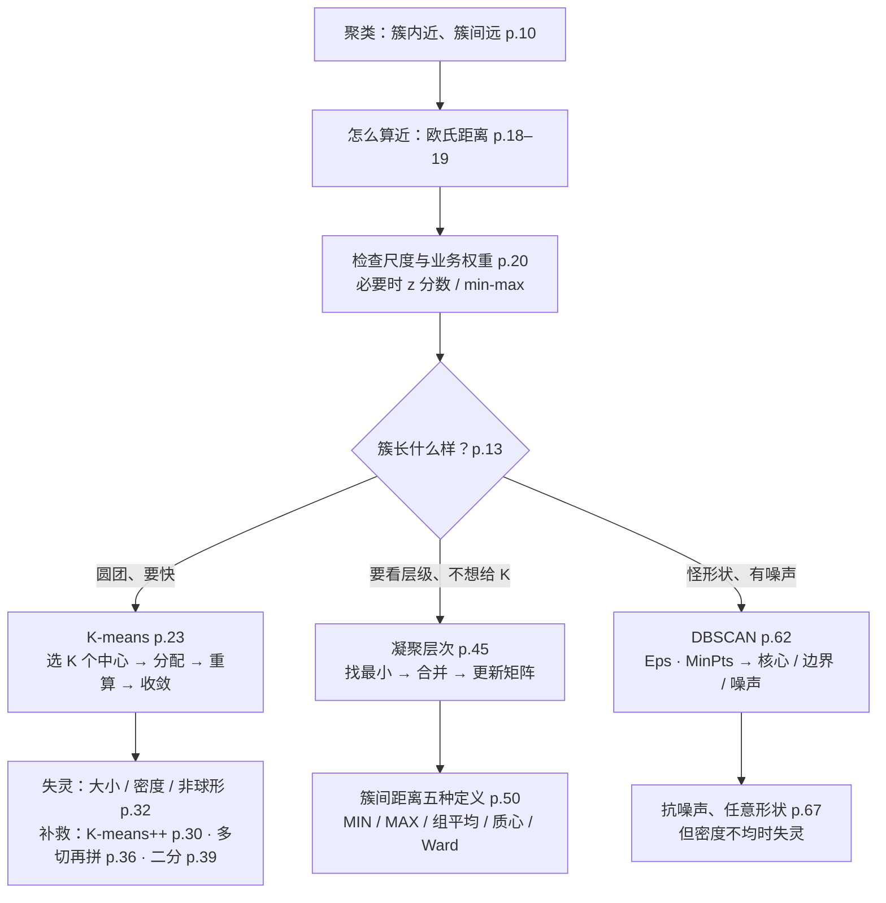
```mermaid
flowchart TD
    A[聚类：簇内近、簇间远 p.10] --> B[怎么算近：欧氏距离 p.18–19]
    B --> C[检查尺度与业务权重 p.20<br/>必要时 z 分数 / min-max]
    C --> D{簇长什么样？p.13}
    D -->|圆团、要快| K[K-means p.23<br/>选 K 个中心 → 分配 → 重算 → 收敛]
    D -->|要看层级、不想给 K| H[凝聚层次 p.45<br/>找最小 → 合并 → 更新矩阵]
    D -->|怪形状、有噪声| S[DBSCAN p.62<br/>Eps · MinPts → 核心 / 边界 / 噪声]
    K --> K1[失灵：大小 / 密度 / 非球形 p.32<br/>补救：K-means++ p.30 · 多切再拼 p.36 · 二分 p.39]
    H --> H1[簇间距离五种定义 p.50<br/>MIN / MAX / 组平均 / 质心 / Ward]
    S --> S1[抗噪声、任意形状 p.67<br/>但密度不均时失灵]
```

以邮局选址为例：先选坐标/距离与尺度，业务要求3站且需要中心，进入K-means分支；沿下方须再检查初始化、异常居民位置和可建设地点。文字替代：定义距离→看任务/形状→选方法→核局限。

总览不能替代§2.4的逐轮演算。DBSCAN可沿核心连通形成非球形区域，但单组参数不保证兼顾所有密度。

读图自测：有树状层级需求，是否仅因为点像圆团就选K-means？

不应。需求要层次输出，先看H分支；形状只是条件之一，不能压过输出目的。

先定义"近"，再按数据形状选算法；每种算法下面挂着它的失灵与补救。

### 3.2 凝聚层次聚类的三步循环（p.45 六步的核心）

这张复习图回答：p.60手算究竟重复哪三件事？箭头是控制顺序；返回F时读的是缩小后的矩阵，终点T是完整树。

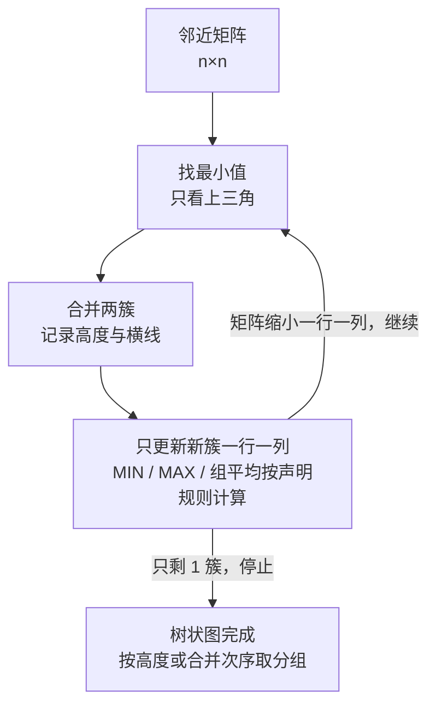
```mermaid
flowchart TD
    M[邻近矩阵<br/>n×n] --> F[找最小值<br/>只看上三角]
    F --> G[合并两簇<br/>记录高度与横线]
    G --> U[只更新新簇一行一列<br/>MIN / MAX / 组平均按声明规则计算]
    U -->|矩阵缩小一行一列，继续| F
    U -->|只剩 1 簇，停止| T[树状图完成<br/>按高度或合并次序取分组]
```

在p.58当前表，F选P2/P5距离0.14，G合并，U写新簇到P1/{3,6}/P4为0.24/0.15/0.20。返回F发现两个0.15平局，按讲义历史先合{2,5}/{3,6}。文字替代：找最小→合并→仅更新新行列。

单链接取min；组平均按点对数量加权。同高平局和精确K的关系见§2.8.2，不能只凭高度推任意簇数。

读图自测：更新时把P1–P4从0.37改成0.20是否是U允许的动作？

不是。P1与P4均未合并，旧0.37应保留；0.20属于新{2,5}到P4的另一格。

p.60 小测就是走一遍 F → G → U。

### 3.3 DBSCAN 的三种点

这张判型图回答：邻居不足的点为什么仍可能在簇里？箭头表示条件判定，Q/R分支分别查自己的密度和核心邻居。

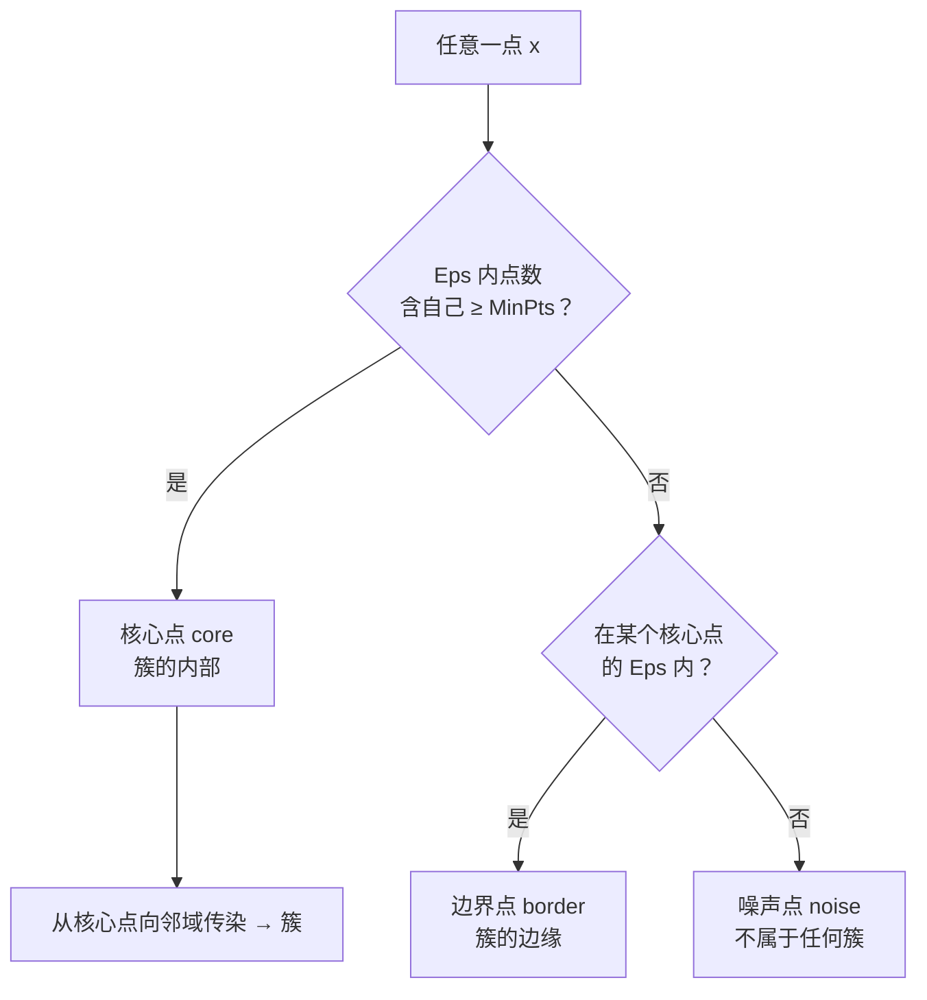
```mermaid
flowchart TD
    P[任意一点 x] --> Q{Eps 内点数<br/>含自己 ≥ MinPts？}
    Q -->|是| C[核心点 core<br/>簇的内部]
    Q -->|否| R{在某个核心点<br/>的 Eps 内？}
    R -->|是| B[边界点 border<br/>簇的边缘]
    R -->|否| N[噪声点 noise<br/>不属于任何簇]
    C --> E[从核心点向邻域传染 → 簇]
```

在五点eps=0.21、MinPts=3例中，0.4自身邻域数2，Q走“否”；它距核心0.2为0.2≤eps，R走“是”，因此为边界。1.0数1且无核心邻居，从R“否”到噪声。文字替代：够密为核心，不够密再查核心邻居。

E表示核心继续扩展，不是边界继续传。点型要在给定距离/参数下判断，不能把噪声当永久业务属性。

读图自测：把MinPts保持3、eps改0.15，0.4走哪条路？

Q邻域只有自身，走“否”；距最近核心0.1超过0.15，R也“否”，成为噪声。详见§7机制迁移题六。

先判核心，再判边界，剩下的是噪声；簇从核心点"长"出来。

---

## 4. 速查表

### 4.1 三种算法对照（考前一页纸）

每行复习一个算法属性；输入参数写方法需要的设定，输出写最终对象。

| | K-means（p.23–40） | 凝聚层次（p.42–60） | DBSCAN（p.62–67） |
|---|---|---|---|
| 类型 | 划分 | 层次 | 密度 |
| 输入参数 | K | 簇间距离定义（切树高度事后定） | Eps、MinPts |
| 核心步骤 | 选 K 中心 → 分配 → 重算质心 → 直到不变 | 算矩阵 → 找最小 → 合并 → 更新 → 直到 1 簇 | 判三种点 → 去噪声 → 从核心点向邻域传染 |
| 输出与评估 | SSE 可比较同 K、同数据与尺度的目标值；业务质量另验 | 合并高度描述采用的链接代价，并非通用质量分数 | 标签含噪声；按业务目标及噪声情况另验 |
| 簇形状 | 圆 / 球 | 随链接方式 | 任意 |
| 适用性检查 | 紧凑分区是否符合业务簇；尺度 / 离群点有何影响 | 距离矩阵规模与链接规则是否合适 | 一组 Eps / MinPts 能否兼顾密度；距离是否仍有辨别力 |
| 噪声 | 拉偏中心 | 异常点可能在某次链接中合并；不保证最后才并入 | 明确标出 |
| 不稳定来源 | 初始点 → K-means++ / 多次 | 合并不可撤销 | 边界点归属随顺序 |
| 输出 | K 个簇 | 树状图 | 簇 + 噪声 |

DBSCAN“去噪声”只能指正确判定后的最终噪声；队列版暂记噪声可重标，不能在首次非核心时删点。

### 4.2 公式与手算

每行是一项公式或手算规则；算例列保存原数据口径，公式不是可跨不同尺度直接比较的分数。

| 内容 | 公式 / 规则 | 讲义算例（脚本复算） |
|---|---|---|
| 欧氏距离 | $d(x,y)=\sqrt{\sum_i (x_i-y_i)^2}$ | 苹果–橙子：$\sqrt{529+1444+729}=51.98$（p.19） |
| 未归一化的陷阱 | 平方最大的一项主导 | Homer–Burns ≈ 10,000，全来自收入（p.20） |
| z 分数 | $(X-\mu)/\sigma$ | 四人版：Homer–Burns 0.51，Homer–学生 3.14 |
| min-max | $(X-X_{\min})/(X_{\max}-X_{\min})$ | 两人版：每列 0 / 1，距离 $\sqrt3=1.732$ |
| K-means 质心 | 簇内各属性取平均 | 初始 p1,p4 → {p1} + {p2…p6}，SSE 0.1065 |
| SSE | $\sum_{\text{簇}}\sum_{x\in\text{簇}} d(x,c)^2$ | 三种初始化 0.1065 / 0.0905 / 0.0838 |
| K-means++ | $P(x')=D(x')^2/\sum_x D(x)^2$ | 首中心 p1 → p4 概率 0.331，p3 0.114 |
| 单链接更新 | 新簇到别簇 = 两成员中较小者 | {3,6}→P1：$\min(0.22,0.23)=0.22$（p.58） |
| p.60 小测 | 合并 P2&P5 后 | {2,5}→P1 0.24、→{3,6} 0.15、→P4 0.20；下一步 {2,5}+{3,6} @0.15（与 {3,6}+P4 平局） |
| DBSCAN 判点 | 分两次判断，见下方说明 | 六点Eps0.16/MinPts3：核心p2/p3，边界p4/p5/p6，噪声p1 |

**DBSCAN两次判断**：先数含自己的Eps邻域。达到MinPts为核心；未达到时再查有无核心邻居。有则边界，无则最终噪声。不能把所有非核心直接叫噪声。

读z行0.51/3.14：用四人样本尺度；min-max行1.732用两人参照。两行不来自同一尺子。

### 4.3 簇间距离五种定义（p.50–54）

每行一个链接法，第三步继承各自输入口径；@后是合并高度，倾向不是效果保证。

| 定义 | 取什么 | 六点第三步（脚本） | 倾向 |
|---|---|---|---|
| MIN / single link | 跨簇最近两点 | {2,5}+{3,6} @0.15 | 细长、链式；怕噪声 |
| MAX / complete link | 跨簇最远两点 | {3,6}+4 @0.22 | 紧凑球形；易拆大簇 |
| Group average | 跨簇所有点对平均 | {3,6}+4 @0.18 | 折中 |
| Centroid | 两簇质心距离 | {3,6}+4 @0.184 | 直觉；高度可能不单调 |
| Ward | 合并后 SSE 增量最小 | （需坐标） | 等大小圆簇，同 K-means |

组平均0.18与正文0.185保留为原稿不同显示精度，质心0.184与正文0.18也不同精度。严格计算以§2.7原矩阵/目测坐标分别为准，当前不静默改原值。

### 4.4 K-means 失灵与补救（p.32–40）

每行一个失败来源；图列定位原材料，原因列解释机制，补救列为需验证的候选动作。

| 失灵 | 图 | 为什么 | 补救 |
|---|---|---|---|
| 簇大小不同 | p.33 | SSE 偏爱切开人多的大团 | 多切几刀再拼（p.36） |
| 密度不同 | p.34 | 稀疏团切开省的 SSE 多 | 多切几刀再拼（p.37）；或 DBSCAN（但密度不均它也难） |
| 非球形 | p.35 | 最近中心边界是中垂线 | 备选方法见下方说明 |
| 离群点 | p.32 | 拉偏质心、平方权重可能让其被选中 | 先核查真实性与业务价值；比较稳健处理或密度模型 |
| 初始点差 | p.29 | 可能停在较差稳定解 | 初始化/二分候选见下方说明 |

**非球形的候选应对**：可比较p.38多切再拼、DBSCAN、单链接层次。它们改变簇定义，是否适合仍取决于距离、密度和桥接点。

**初始化的候选应对**：p.30 K-means++、多次初始化、p.39二分K-means。它们可改变搜索路径；稳定点的局部极小解释仍要排除退化平局，不能保证全局最好。

读密度一行：多切再拼可以比较；换DBSCAN仍需一组参数兼顾稀疏/密集，不是保证修复。

### 4.5 讲义里的可引原句

每项给一段讲义英文原句与用途。英文不缩写；页码是既有PDF物理页映射。

> "objects in a group will be similar to one another and different from the objects in other groups"（p.10）

用途：聚类定义

> "Intra-cluster distances are minimized; Inter-cluster distances are maximized"（p.10）

用途：目标

> "Number of clusters, K, must be specified"（p.23）

用途：K-means 前提

> "K-means++ enhances K-means by smartly picking initial centroids"（p.30）

用途：初始化

> "K-means has problems when clusters are of differing Sizes, Densities, Non-globular shapes"（p.32）

用途：局限

> "Any desired number of clusters can be obtained by 'cutting' the dendrogram at the proper level"（p.43）

用途：层次优点

> "Different approaches to defining the distance between clusters distinguish the different algorithms"（p.45）

用途：五种定义

> "A point is a core point if it has at least a specified number of points (MinPts) within Eps … Counts the point itself"（p.62）

用途：DBSCAN 定义

> "Resistant to Noise; Can handle clusters of different shapes and sizes"（p.67）

用途：DBSCAN 优点

读Number of clusters句：用于K-means输入K，不套到DBSCAN。

---

## 5. 双语术语卡

每张卡保存中文名、英文名、完整考试定义与首现位置；英语原文保留，避免长单元格挤在宽表。

**聚类分析（Cluster analysis）**

> Finding groups of objects such that the objects in a group are similar to one another and different from the objects in other groups.（p.10）

首现：§2.2.1

**簇内距离 · 簇间距离（Intra-cluster / inter-cluster distance）**

> Distances within a cluster (to be minimized) and between clusters (to be maximized).（p.10）

首现：§2.2.1

**理解 · 摘要（两个用途）（Understanding · Summarization）**

> Group related objects for insight; reduce the size of large data sets.（p.11）

首现：§2.2.2

**划分聚类（Partitional clustering）**

> A division of data objects into non-overlapping subsets such that each object is in exactly one subset.（p.13）

首现：§2.2.4

**层次聚类（Hierarchical clustering）**

> A set of nested clusters organized as a hierarchical tree.（p.13）

首现：§2.2.4

**基于密度的聚类（Density-based clustering）**

> A cluster is a contiguous region of high point density separated by regions of low density.（p.13）

首现：§2.2.4

**邻近度度量（Proximity measure）**

> How similarity between objects is measured; central to clustering and dependent on data and application.（p.17）

首现：§2.2.5

**欧氏距离（Euclidean distance）**

> $d(x,y)=\sqrt{\sum_{i=1}^n (x_i-y_i)^2}$; similarity expressed in terms of a distance function.（p.18）

首现：§2.3.1

**属性归一化（Attribute normalization）**

> Rescaling each attribute so that no single attribute dominates the distance (standard score or min-max scaling).（p.20）

首现：§2.3.2

**标准分数（Standard score (z-score)）**

> $(X-\mu)/\sigma$（p.20）

首现：§2.3.2

**min-max 缩放（Min-max feature scaling）**

> $X'=(X-X_{\min})/(X_{\max}-X_{\min})$（p.20）

首现：§2.3.2

**K-means（K-means）**

> Partitional approach: K specified; each cluster has a centroid; each point assigned to the closest centroid; recompute centroids until they don't change.（p.23）

首现：§2.4.1

**质心（Centroid）**

> The center point of a cluster—the mean of its points.（p.23）

首现：§2.4.1

**次优聚类（Sub-optimal clustering）**

> A converged K-means result whose SSE is higher than the optimum because of poor initial centroids.（p.29）

首现：§2.4.4

**误差平方和（Sum of squared errors (SSE)）**

> The sum over all points of the squared distance to their cluster centroid; K-means' objective.

首现：§2.4.4

**K-means++（K-means++）**

> Chooses initial centroids by picking the next center with probability proportional to $D(x)^2$, the squared distance to the closest existing center.（p.30）

首现：§2.4.5

**非球形簇（Non-globular shapes）**

> Clusters that are not round; K-means has problems with them.（p.32）

首现：§2.5.1

**二分 K-means（Bisecting K-means）**

> Variant of K-means that repeatedly bisects a selected cluster with basic K-means until K clusters; can produce a partitional or a hierarchical clustering.（p.39）

首现：§2.5.3

**树状图（Dendrogram）**

> A tree-like diagram that records the sequences of merges or splits.（p.42）

首现：§2.6.1

**嵌套簇（Nested clusters）**

> Clusters contained within clusters, as produced by hierarchical clustering.（p.42）

首现：§2.6.1

**凝聚式（Agglomerative）**

> Start with points as individual clusters; at each step merge the closest pair until one (or k) cluster left.（p.44）

首现：§2.6.2

**分裂式（Divisive）**

> Start with one all-inclusive cluster; at each step split a cluster until each contains one point (or k clusters).（p.44）

首现：§2.6.2

**邻近矩阵（Proximity matrix）**

> The matrix of pairwise distances (or similarities) between clusters, updated after each merge.（p.45–49）

首现：§2.6.3

**单链接 / MIN（Single link / MIN）**

> Proximity of two clusters is based on the two closest points in the different clusters.（p.55）

首现：§2.7.1

**全链接 / MAX（Complete link / MAX）**

> Proximity based on the two farthest points in the different clusters.（p.52）

首现：§2.7.1

**组平均（Group average）**

> Proximity is the average of all pairwise distances between points in the two clusters.（p.53）

首现：§2.7.1

**质心距离（Distance between centroids）**

> Proximity is the distance between the two clusters' centroids.（p.54）

首现：§2.7.1

**Ward 法（Ward's method）**

> A method driven by an objective function: uses squared error (merge the pair with the smallest increase in SSE).（p.50）

首现：§2.7.1

**DBSCAN（DBSCAN）**

> A density-based algorithm: density = number of points within a radius Eps; eliminates noise points and clusters the remaining ones.（p.62, 64）

首现：§2.9.1

**Eps · MinPts（Eps · MinPts）**

> The neighborhood radius and the minimum number of points (counting the point itself) for a point to be a core point.（p.62）

首现：§2.9.1

**核心点（Core point）**

> A point with at least MinPts points within Eps (counting itself); interior of a cluster.（p.62）

首现：§2.9.1

**边界点（Border point）**

> Not a core point, but in the neighborhood of a core point.（p.62）

首现：§2.9.1

**噪声点（Noise point）**

> Any point that is neither a core point nor a border point.（p.62）

首现：§2.9.1

读DBSCAN卡：定义中的eliminates noise指最终点型；具体暂记噪声与队列行为见§2.9.2。

---

## 6. 考点预判与答题框架

### 6.1 可信度分级

每行是一种证据级别，未录到的课堂范围保持未知；标记不替代来源页/时间戳。

| 级别 | 含义 |
|---|---|
| 🔴 课堂明示 | 本轮3条独立要求：单链接往年期末题型、库/模型/关键参数调用、绘图实现细节降权；tutorial说话人未分离 |
| 🟡 ILO 反推 / 讲义结构 | 对应 Syllabus ILO、讲义标明 Quiz / 反复出现 |
| ⚪ 笔记推断 | 按内容重要性与同类课程惯例 |

读🔴：仅对应有明确原话的三项；早段第三水果坐标和p.60平局评分口径仍未知。

> 本轮课堂证据允许相关项升为🔴；其余🟡/⚪不自动升级。早段欧氏距离出勤小测与p.60层次聚类题是两道不同题，前者第三点坐标未录到；p.60平局评分口径也仍待核。

### 6.2 考点清单

每项是一条考点，保留可信度、依据英文及时间戳、回看小节。下面拆成卡片，以免引文挤入长单元格。

**🔴（反向）· 不要求记住层次聚类绘图代码细节；代码复习更聚焦 K-means 与 spectral clustering**

依据：🎙️ B `01:16:14`–`01:16:22`：*"you don't need to know how to draw this kind of figure ... be careful about the K-means and the spectral clustering for your exams"*

回看：T05 / §6.3

**🔴 · ⭐ 给距离矩阵做单链接层次聚类是往年期末题型**：排除主对角 0，找最小值、合并、更新矩阵并继续

依据：🎙️ B `43:50`：*"So this is one year final exam, okay, okay, now everybody raise up your head, okay, not kidding."*

回看：§2.8.1–§2.8.3

**🔴（tutorial 课堂明示）· 考试会要求写聚类调用代码**：库名、模型调用、关键参数；K-means 与谱聚类重点

依据：🎙️ tutorial讲解者：*"in the exam you may ask to write down some codes and you know how to call the method"*（B `01:07:00`）；关键参数见 B `01:06:25`，绘图代码边界另列反向条目

回看：§2.4.1、§2.9.3；T05

**🟡 · ⭐ **给距离矩阵做单链接（或全链接）层次聚类**：找最小、合并、更新一行一列、说出下一步合并谁、画树状图**

依据：p.60 In-class Quiz 原题；p.55–59 五页手算

回看：§2.8.1–2.8.3

**🟡 · ⭐ **手算欧氏距离**，并解释**为什么要归一化**（Homer / Burns ≈ 10,000 被收入吃掉）、两种归一化公式**

依据：p.18–20 三页算例；ILO"数据预处理"

回看：§2.3.1–2.3.2

**🟡 · **K-means 四步算法**：能写出来、能用几个点手算一两轮、说出质心是什么**

依据：p.23 伪码；p.24–28 两个图解

回看：§2.4.1–2.4.3

**🟡 · **K-means 的局限**：初始化敏感（最优 vs 次优）、簇大小 / 密度 / 非球形三图、离群点；**补救**：K-means++（概率公式）、多切再拼、二分 K-means**

依据：p.29–40 共 12 页

回看：§2.4.4–2.5.3

**🟡 · **三种聚类类型的定义与区别**（划分 / 层次 / 密度）+ 各自代表算法**

依据：p.13 "important distinction"

回看：§2.2.4、§4.1

**🟡 · **簇间距离的五种定义**及其对结果的影响；单链接 vs 全链接的倾向**

依据：p.50–54 用五页讲一张表

回看：§2.7.1

**🟡 · **DBSCAN 三种点的定义与判定**（含"计入自己"）、算法两步、优点两条**

依据：p.62–67

回看：§2.9.1–2.9.3

**🟡 · **凝聚 vs 分裂**；层次聚类的两个优点（不预设 K、可对应分类体系）**

依据：p.43–44

回看：§2.6.1–2.6.2

**⚪ · 聚类的定义与两个用途（理解 / 摘要）、"簇是模糊的"**

依据：p.10–12

回看：§2.2.1–2.2.3

**⚪ · 影响聚类的数据特征清单（邻近度类型、维度、属性类型、自相关、分布、噪声）**

依据：p.17

回看：§2.2.5

**⚪ · 复习页：过滤 vs 包装、约简 vs 选择、递归选择、PCA 主成分重要性——可能作为"承上"小题**

依据：p.2–8 重放 M04

回看：§2.1

**⚪ · 三种算法的选择题：给一张散点图 / 一个业务场景，问该用哪个、为什么**

依据：本笔记 §4.1 对照表

回看：§2.9.3

读单链接往年期末项：B43:50是题型证据，不把往年题型改成未来考试必出。

### 6.3 答题框架

**题型 A · 手算题（层次聚类）**

1. 抄当前矩阵，可以只写上三角。
2. 圈最小值，写“合并 X 与 Y，高度 h”。
3. 新簇一行按要求取 min / max / 加权平均；其他格照抄。
4. 问下一步时，再找新最小值。
5. 平局写明哪两对同距、按什么约定先合谁。
6. 画树时，叶子按便于表示的合并关系排列，纵轴按合并高度画横线。

**题型B · 距离/K-means手算**

1. 欧氏距离写差→平方→求和→开根。
2. K-means先列各点到旧中心的距离，再分配，最后取本轮各簇均值。
3. 问尺度时，用Homer/Burns的平方贡献说明收入为何支配；再给所选参照缩放口径。

**题型C · 概念对比**

题目如“Compare K-means and DBSCAN”或“single link vs complete link”。参照§4.1/§4.3，按参数、形状、噪声、计算量、适用场景五维比较。

每项给具体机制或原页例子，如p.35弯月、p.67字母块，不只列好/坏。

**题型D · 局限与补救**

对应“Limitations of K-means and how to overcome”：

1. p.33–35分别说明大小、密度和非球形失灵。
2. 每图说明平方误差如何分配中心，或中垂线为何切断弯曲簇。
3. 比较K-means++、多切再拼、换算法的适用问题。
4. 另交代离群点与初始化限制，不说一个补救修全部问题。

**题型E · 业务选算法**

1. 明确列数、类别列、极端对象和预期分组形状。
2. 说明是否缩放/降维及理由。
3. 选择算法，解释它如何回应任务。
4. K用业务约束或SSE拐点作候选；Eps/MinPts按距离尺度检查。
5. 同时报成员、中心或层次/噪声，并给业务解释。

---

## 7. 自测

### 概念题

1. 用讲义的话给"聚类分析"下定义，并说明"簇内距离最小、簇间距离最大"两句为什么缺一不可。

答案

Finding groups of objects such that the objects in a group are similar to one another and different from the objects in other groups.

只要求簇内近，每点自成一簇也满足。全体一簇却没有簇间比较对象。

所以定义只是方向，还需K、链接或密度约束，才有可执行的分组规则。（§2.2.1）

2. 算 Apple (220, 156, 140) 与 Orange (243, 194, 113) 的欧氏距离，写出四步。

答案

差 −23 / −38 / 27；平方 529 / 1444 / 729；和 2702；开根 51.98。（§2.3.1）

3. Homer (62, 990,000, 8) 与 Burns (65, 1,000,000, 10) 的距离为什么 ≈ 10,000？该怎么办？

答案

平方和 = 9 + 100,000,000 + 4，收入项占 99.99999%，年龄和信用卡合起来只贡献 √13 ≈ 3.6。先归一化：z 分数 $(X-\mu)/\sigma$ 或 min-max $(X-X_{\min})/(X_{\max}-X_{\min})$，让每列在同一尺度上再算距离。（§2.3.2）

4. 写出 K-means 的算法，并说明它为什么一定会停、为什么停下的地方不一定最好。

答案

选 K 个初始质心；重复：把每点分给最近质心、重算每簇质心；直到质心不变。每一步都不会增加 SSE；非空簇的均值更新改变中心时严格降低 SSE，有限成员划分及固定平局约定使理想过程稳定。仅“SSE 有下界”不能证明有限步停机；但它只做局部改进，从不同初始点可能停在不同稳定解，且不保证全局最优；退化平局的局部极小边界见 §2.4.1。（§2.4.1、§2.4.4）

5. K-means++ 选第二个中心的概率公式是什么？为什么用距离的平方而不是直接选最远的点？

答案

$P(x')=D(x')^2/\sum_x D(x)^2$，$D(x)$ 是 x 到最近已选中心的距离。平方放大远点的权重让中心分散；按概率使每点按其当前平方误差贡献获得机会；未覆盖点团的概率是点权重相加。随机性不保证躲开离群点，极远噪声仍可能有很大概率。（§2.4.5）

6. K-means 在哪三种数据上会失灵？各画一张示意图并解释原因。

答案

大小不同（p.33：SSE 偏爱切开大团）、密度不同（p.34：切开稀疏团省得多）、非球形（p.35：簇边界是中垂线，画不出弯）。另有离群点拉偏质心。（§2.5.1）

7. 凝聚式层次聚类的六步是什么？"更新邻近矩阵"时哪些格要重算？

答案

算矩阵；每点一簇；重复：合并最近两簇、更新矩阵；直到一簇。只有新簇那一行一列要按链接方式重算，其他格照抄。（§2.6.3）

8. 用 p.55 的矩阵，单链接的前两次合并是什么？合并后 {P3,P6} 到 P5 的距离是多少？

答案

{p3, p6} @0.11，{p2, p5} @0.14；d({3,6}, P5) = min(0.28, 0.39) = 0.28。（§2.8.1–2.8.2）

9. 同一份数据，为什么 MIN 和 MAX 会得到不同的树？举六点例子的第三步。

答案

簇间距离的定义不同：MIN 取跨簇最近两点，MAX 取最远两点。六点例子第三步 MIN 合并 {2,5}+{3,6} @0.15（因为 p2–p3 = 0.15），MAX 合并 {3,6}+4 @0.22（因为 {2,5} 与 {3,6} 的最远距离是 0.39）。（§2.7.1）

10. DBSCAN 里核心 / 边界 / 噪声点怎么定义？MinPts = 3、Eps = 0.16 时六点里谁是噪声？

答案

核心：Eps 内点数（含自己）≥ MinPts；边界：不是核心但在某核心的 Eps 内；噪声：都不是。六点例子：p1 是噪声（离谁都 > 0.16），p2、p3 核心，p4、p5、p6 边界。（§2.9.1）

### 计算与案例题

1. **p.60 课堂小测**：在 p.58 的表基础上合并 P2 与 P5，写出新矩阵，并说明下一步合并谁。

参考思路

{2,5}→P1 = min(0.24, 0.34) = 0.24；{2,5}→{3,6} = min(0.15, 0.28) = 0.15；{2,5}→P4 = min(0.20, 0.29) = 0.20；其余照抄（P1–{3,6} 0.22、P1–P4 0.37、{3,6}–P4 0.15）。最小值 0.15 出现两次（{2,5}–{3,6} 与 {3,6}–P4），讲义树状图先合并 {2,5} 与 {3,6}；答题时写明平局。（§2.8.3）

2. 用 p.55 的六个点、K = 2、初始质心 p2 与 p6，手算 K-means 到收敛。

参考思路

第 1 轮：p1→C1(0.234 vs 0.235)、p2→C1、p3→C2(0.143 vs 0.102)、p4→C1(0.194 vs 0.220)、p5→C1、p6→C2；新质心 C1 = (0.24, 0.3775)、C2 = (0.40, 0.31)。第 2 轮：p1→C2(0.221 vs 0.220)、p4→C2(0.189 vs 0.184)，其余不变；新质心 C1 = (0.15, 0.395)、C2 = (0.365, 0.335)。第 3 轮不变，收敛：{p2, p5} + {p1, p3, p4, p6}，SSE 0.0905（脚本 B 段"初始化 B"）。注意它和初始 p5, p1 的结果（SSE 0.0838）不同——初始化敏感。（§2.4.4）

3. **案例**：一家电商有 20 万客户，每人 12 个指标（年消费额、订单数、平均客单价、最近购买距今天数、退货率、访问次数……）。要做客户分群支持营销，请设计聚类流程并说明每步理由。

参考思路

1. 看数据特征（§2.2.5）。12 列量纲不同，先查距离贡献，再按业务权重决定缩放（§2.3.2）。极端客户先区分测量错误、真实大客户或另需处理的行为，再比较保留/稳健处理/密度模型。稀疏不等于无价值。
2. 12 列不自动构成高维失败。可比较 PCA 的压缩损失和分群稳定性，不能预定“3–4 维必好”（§2.1.4）。
3. 选算法。20 万点的全距离矩阵太大（§2.6.3），可先比较 K-means。营销可执行 3–6 套方案时，将其作为候选 $K$，并用 K-means++ 与多次初始化（§2.4.4–2.4.5）。若形状不适合，比较多切再拼，或对碎片做层次聚类（§2.5.2）。
4. 解释成员和中心。每簇算指标均值，再命名“高频低客单”“沉睡大客户”；这才是业务产出（§2.2.2）。
5. 报告说明方法取舍：层次法受规模限制；DBSCAN 需检查密度差异与参数敏感性。不能在未查这些条件时一律排除某方法。

4. 给出 p.16 那张"红圆盘 + 蓝圆环"的数据，K-means（K = 2）、单链接层次、DBSCAN 各会得到什么？

参考思路

欧氏 K-means 在K=2且中心不重合时只能用两个中心的等距直线分区，不能按内盘/外环划出非凸两簇边界。MIN 若两团内部所需连接距离都小于跨团最短距离，可在两者之间切树，得到盘与环；桥接噪声可能破坏该间隔。DBSCAN 需选择使各区域形成核心连通链、且跨区没有核心桥的 Eps/MinPts；灰点只有不满足核心或边界条件时才是噪声。图未给精确坐标或参数，不能保证输出恰两簇，或从图认定哪一种最稳。应比较参数敏感性与业务标签。

---

### 机制迁移题（2026-09-30 新增，均为笔记补充）

以下题目用来检验会不会执行和诊断，不能只背定义。数值由 `verify_m05_mechanisms.py` 的 `variants` 段及对应主例复核。

1. **K-means：换一组数据重做。** 点为 $0,1,4,5$，$K=2$，初始中心 $0,1$，平局归编号较小的中心。写第一轮标签和新中心、第二轮新中心、最终 SSE。为什么“每处理一个点就立即挪中心”不是本节算法？

答案与理由

先把各轮状态列出，原点保持0/1/4/5：

| 阶段 | 成员 | 中心 | SSE |
|---|---|---|---|
| 首轮分配 | {0}/{1,4,5} | 0/1（旧） | 25 |
| 首轮更新 | 同上 | (0, 10/3) | 26/3 |
| 次轮更新 | {0,1}/{4,5} | 0.5/4.5 | 1 |
| 再一轮 | 同上 | 同上 | 1 |

表中首轮新中心的第二个数为 $10/3$，不是三个中心。首轮旧误差 $0+0+9+16=25$；末轮 $4\times0.25=1$。

Lloyd先固定全体中心分配，再统一求均值。逐点挪中心会让后续点看见不同状态，可能产生点序依赖。均值是固定成员下平方误差最小者。

2. **K-means++：从权重到一次抽样。** 点为 $0,1,4,5$，$K=2$，第一个中心为 0。写全部平方权重、总和与累计概率；若随机数 $u=0.30$，选哪个点？然后写普通 K-means 的稳定中心和 SSE。能否只选概率最大的点？

答案与理由

按点序0/1/4/5建立抽样表：

| 点 | 平方权重 | 累计概率 |
|---|---:|---|
| 0 | 0 | 0 |
| 1 | 1 | 1/42 |
| 4 | 16 | 17/42 |
| 5 | 25 | 1 |

总权重42。u=0.30落在 $[1/42,17/42)$，故选点4；最大概率属于点5，本次却不选它。

随后普通K-means得{0,1}/{4,5}、中心0.5/4.5、SSE1。每次D取到全部已选中心的最近距离；选满后仍须Lloyd更新，不能省略。

3. **二分 K-means：外层和内层别混。** 对 $0,1,4,5$ 要最终分 3 簇。第一次二分得到 $\{0,1\},\{4,5\}$，两簇 SSE 都为 0.5；父簇平局先切包含较小数据点的簇。下一刀选谁、最终 SSE 是多少？若这一刀试 10 个初始化，簇数增加多少？

答案与理由

切 $\{0,1\}$，得到 $\{0\},\{1\},\{4,5\}$，总 SSE $=0+0+0.5=0.5$。试 10 次是在同一父簇上找最佳切法，只把最佳两个子簇加入列表一次，簇数净增 1。不是新增 10 簇，也不是将 10 次尝试当作必须得到更好的保证。达到三个簇就停，即使还能继续切以降 SSE。

4. **层次聚类：切树与改链接。** 对 $0,1,4,5$ 用 MIN，给出三个合并高度；写 $K=2$ 的分组。假设有人在第三步突然改用 MAX，再称整棵树为单链接树，错在哪？

答案与理由

先合并 $0,1$，高度 1；再合并 $4,5$，高度 1；最后两簇最近点为 1 与 4，高度 3。两簇为 $\{0,1\},\{4,5\}$。MAX 对末次簇对给 5，因此临时改方法改变的是定义，不是同一算法的“进一步优化”。树记录以既定准则形成的不可撤销合并，切树也不能把一个已合并子枝任意拆成另一种交叉分组。两个高度为 1 的合并有平局，必须记录约定。

5. **Ward：计算的是增量。** $A=\{0\}$，$B=\{3,4,5\}$，两簇中心 0、4，原 SSE 分别 0、2。求合并后的 SSE 和 Ward 增量；直接平均两个中心错在哪？组平均更新中，旧簇点数 1 和 3、旧平均距离 2 和 6 时，新值为何不是 4？

答案与理由

合并中心 $(0+3+4+5)/4=3$；合并后 SSE $=9+0+1+4=14$，增量 $14-2=12$，同公式 $\frac{1\times3}{1+3}\times(0-4)^2=12$。两个旧中心直接平均得到 2，会把 3 个点的簇与 1 个点的簇等权，违反逐点均值。组平均需要按跨簇点对数加权，新值 $(1\times2+3\times6)/4=5$；不是把两个已经平均过的数再一律平均。

6. **DBSCAN：参数改变和早期噪声。** 对 $0,0.1,0.2,0.4,1.0$，把半径改成 0.15、MinPts 保持 3。谁是核心、边界、最终噪声？若外层先处理点 0，它最初被暂记噪声，之后还能进入簇吗？如果两个核心区域都靠近同一个非核心边界点，该边界能否把它们接成一簇？

答案与理由

仅 0.1 是核心，邻域为 $\{0,0.1,0.2\}$；0 与 0.2 是边界；0.4 和 1.0 是最终噪声。最终一个簇 $\{0,0.1,0.2\}$。先遇 0 时其邻域只有 0、0.1，尚不能自己开簇；后来核心 0.1 的扩展找到它，它可改为边界归簇。因此不可永久删除暂记噪声。非核心点没有继续扩展的资格，不能仅凭它连接两个核心连通部分；共享边界的归属可受顺序影响，但这不等于合并两边核心骨架。特别地，在 MinPts = 3 且邻域计入自身时，一个点若同时邻接两个核心点，其邻域至少包含自身与这两个核心点，已经满足核心条件，不能把它设成“同时共享两边但仍非核心”的反例。

---

### 7.4 距离与缩放：新输入及错误流程（笔记补充）

**题一 · 列对齐和贡献。** 输入两行 $a=(3,1,4)$、$b=(6,5,4)$，先列差向量与各列平方贡献，再给距离。有人说“第一列的6是最大值，所以第一列主导距离”，另一个人只把b的前两列交换后计算；分别错在哪？

答案与理由

差为−3/−4/0，平方贡献9/16/0，总25，普通距离5。第二列贡献16最大；原值绝对大小不是贡献。只交换b列得到差−2/−5/0、平方和29，算出了错误属性配对的距离。须两行按相同列含义对齐；同一置换同时施于两行才保持原距离。来源：笔记补充，按§2.3.1计算，已由独立代理实际答题。

**题二 · 保存参照尺子。** 三位参照对象的年龄/收入/卡数为(20,100,1)、(30,200,3)、(40,300,5)。按样本std与min-max两种口径保存状态，变换新对象(50,400,7)，并算前两位参照对象的缩放后距离。如果只对新对象fit，或把新min-max值大于1判为错误，会发生什么？

答案与理由

参照三人的样本均值为(30,200,3)。各列平方偏差和200/20000/8，除2再开根，std为(10,100,2)。

| 状态 | z分数 | min-max |
|---|---|---|
| 参照第一人 | (−1,−1,−1) | (0,0,0) |
| 参照第二人 | (0,0,0) | (0.5,0.5,0.5) |
| 参照第三人 | (1,1,1) | (1,1,1) |
| 新对象 | (2,2,2) | (1.5,1.5,1.5) |

min/max为(20,100,1)/(40,300,5)，极差(20,200,4)。前两人z距离 $\sqrt3$，min-max距离 $\sqrt3/2$；不同尺子分开解释。

单对象重新fit会使中心变为新对象自身、样本std无定义、极差0；即使实现按常数策略给0，也丢失了原参照尺子。新min-max超1是超过训练最大值的正常外推；需要clip须另外说明信息损失。ddof0尺子比样本尺子小 $\sqrt{2/3}$，因此新z各列为 $\sqrt6$，不能混口径。来源：笔记补充，按§2.3.2，独立代理实际计算。

---

## 8. 讲义页码映射

> 「课堂覆盖」按A/B逐源原时钟登记。未录到不等于略过；表中同一时间范围可能覆盖一组图，不虚构逐张翻页时刻。非内容页理由见§1.3。

| 笔记小节 | 讲义页 | 内容 | 课堂覆盖 |
|---|---|---|---|
| —（封面） | p.1 | 标题页：Lecture 5 五段议程 · Reading DM Chapter 7, 8 | ⚪ 封面；两份录音的最早内容均已越过本页，不涉及内容降权 |
| §2.1.1 | p.2 | Introduction：HM Fig 1-2 + Feature Engineering 蓝框 | ❓ 两份录音均未覆盖：A `00:00` 已到 p.18，B `00:00` 已到 p.20；不可降权 |
| §2.1.1 | p.3 | 评价特征的五类度量（带出处） | ❓ 两份录音均未覆盖：A `00:00` 已到 p.18，B `00:00` 已到 p.20；不可降权 |
| §2.1.2 | p.4 | 过滤模型流程图（红字 Gini / 熵） | ❓ 两份录音均未覆盖：A `00:00` 已到 p.18，B `00:00` 已到 p.20；不可降权 |
| §2.1.2 | p.5 | 包装模型流程图（红框 Accuracy） | ❓ 两份录音均未覆盖：A `00:00` 已到 p.18，B `00:00` 已到 p.20；不可降权 |
| §2.1.3 | p.6 | 特征约简 vs 特征选择 | ❓ 两份录音均未覆盖：A `00:00` 已到 p.18，B `00:00` 已到 p.20；不可降权 |
| §2.1.3 | p.7 | 递归（前向）特征选择三列流程 | ❓ 两份录音均未覆盖：A `00:00` 已到 p.18，B `00:00` 已到 p.20；不可降权 |
| §2.1.4 | p.8 | PCA：z1 vs z2 手绘图 | ❓ 两份录音均未覆盖：A `00:00` 已到 p.18，B `00:00` 已到 p.20；不可降权 |
| —（章节标题页） | p.9 | 标题页重复，Introduction to Clustering 标红 | ⚪ 章节标题页；早段未录到 |
| §2.2.1 | p.10 | 聚类定义 + intra / inter 距离图 | ❓ 两份录音均未覆盖：A `00:00` 已到 p.18，B `00:00` 已到 p.20；不可降权 |
| §2.2.2 | p.11 | 两个用途：理解 / 摘要 | ❓ 两份录音均未覆盖：A `00:00` 已到 p.18，B `00:00` 已到 p.20；不可降权 |
| §2.2.3 | p.12 | 簇是模糊的：2 / 4 / 6 簇四面板（纯图片页，已誊录） | ❓ 两份录音均未覆盖：A `00:00` 已到 p.18，B `00:00` 已到 p.20；不可降权 |
| §2.2.4 | p.13 | 三种类型定义 | ❓ 两份录音均未覆盖：A `00:00` 已到 p.18，B `00:00` 已到 p.20；不可降权 |
| §2.2.4 | p.14 | 划分聚类图（纯图片页） | ❓ 两份录音均未覆盖：A `00:00` 已到 p.18，B `00:00` 已到 p.20；不可降权 |
| §2.2.4 | p.15 | 层次聚类：传统 / 非传统嵌套图 + 树状图（纯图片页） | ❓ 两份录音均未覆盖：A `00:00` 已到 p.18，B `00:00` 已到 p.20；不可降权 |
| §2.2.4 | p.16 | 密度聚类：圆盘 + 圆环图（纯图片页） | ❓ 两份录音均未覆盖：A `00:00` 已到 p.18，B `00:00` 已到 p.20；不可降权 |
| §2.2.5 | p.17 | 输入数据特征清单 | ❓ 两份录音均未覆盖：A `00:00` 已到 p.18，B `00:00` 已到 p.20；不可降权 |
| §2.3.1 | p.18 | 欧氏距离公式 | ✅ 详讲 A `00:00`–`02:08`：欧氏距离从三维推广到高维 |
| §2.3.1 | p.19 | 苹果 / 橙子 RGB 算例 | ✅ 详讲并堂上小测 A `00:17`–`10:23`；第三数据点坐标与讲评未录到，不补数字 |
| §2.3.2 | p.20 | Homer / Burns ≈ 10,000 + z 分数 / min-max 公式 | ✅ 详讲 A `10:23`–`12:18` + B `00:00`–`06:13`：尺度支配、min-max、standardization、离群点 |
| —（章节标题页） | p.21 | Basic Clustering Algorithms：三个算法名 | ⚪ 章节标题页；B `06:13`–`06:33` 转入聚类算法 |
| —（章节标题页） | p.22 | 标题页重复，Kmeans 标红 | ⚪ 章节标题页；B `06:33` 起进入 K-means |
| §2.4.1 | p.23 | K-means 要点 + 五行伪码 | ✅ 详讲 B `06:33`–`10:27`：K、assignment、centroid 与两步交替 |
| §2.4.2 | p.24 | Iteration 1 大图 + 流程箭头（图） | ✅ 逐帧详讲 B `10:33`–`16:05`：分配、更新与收敛 |
| §2.4.2 | p.25 | Iteration 6 大图（图） | ✅ 逐帧详讲 B `10:33`–`16:05`：分配、更新与收敛 |
| §2.4.2 | p.26 | 六帧迭代（图） | ✅ 逐帧详讲 B `10:33`–`16:05`：分配、更新与收敛 |
| §2.4.3 | p.27 | 邮局选址：问题 | ✅ 详讲 B `16:50`–`22:08`：末端仓库 / 邮局选址 |
| §2.4.3 | p.28 | 邮局选址：五格两轮（图） | ✅ 详讲 B `16:50`–`22:08`：末端仓库 / 邮局选址 |
| §2.4.4 | p.29 | 最优 vs 次优（图） | ✅ 详讲 B `22:15`–`23:38`：随机初始化与局部最优 |
| §2.4.5 | p.30 | K-means++ 两步 + 概率公式 | ✅ 详讲 B `23:38`–`26:19`：分散初始化直觉；概率公式课堂未展开 |
| §2.4.5 | p.31 | K-means++ 四帧选点图（纯图片页，已誊录） | ✅ 详讲 B `23:38`–`26:19`：分散初始化直觉；概率公式课堂未展开 |
| §2.5.1 | p.32 | K-means 局限清单 | ✅ 详讲 B `26:26`–`28:23`：大小、密度、形状三类失败机制 |
| §2.5.1 | p.33 | 大小不同（图） | ✅ 详讲 B `26:26`–`28:23`：大小、密度、形状三类失败机制 |
| §2.5.1 | p.34 | 密度不同（图） | ✅ 详讲 B `26:26`–`28:23`：大小、密度、形状三类失败机制 |
| §2.5.1 | p.35 | 非球形（图） | ✅ 详讲 B `26:26`–`28:23`：大小、密度、形状三类失败机制 |
| §2.5.2 | p.36 | 多簇再拼：大小（图 + 一句） | ✅ 详讲 B `28:23`–`30:43`：高 K 切小块后分析合并 |
| §2.5.2 | p.37 | 多簇再拼：密度（图） | ✅ 详讲 B `28:23`–`30:43`：高 K 切小块后分析合并 |
| §2.5.2 | p.38 | 多簇再拼：弯月（图） | ✅ 详讲 B `28:23`–`30:43`：高 K 切小块后分析合并 |
| §2.5.3 | p.39 | 二分 K-means 八行伪码 + CLUTO 链接 | ✅ 详讲 B `30:51`–`35:11`：外层二分、父簇选择与业务分辨率停止 |
| §2.5.3 | p.40 | 二分 K-means 十簇例子（纯图片页） | ✅ 详讲 B `30:51`–`35:11`：外层二分、父簇选择与业务分辨率停止 |
| —（章节标题页） | p.41 | 标题页重复，Hierarchical 标红 | ⚪ 章节标题页；B `35:11` 转入 hierarchical clustering |
| §2.6.1 | p.42 | 树状图定义 + 六点嵌套图与树状图 | ✅ 详讲 B `35:11`–B `36:19`：六点逐层合并与嵌套簇 |
| §2.6.1 | p.43 | 层次聚类两个优点 | ✅ 简讲 B `36:19`–B `36:30`：层级越高簇更少、更大；切树示范见 B `48:58`–B `49:28` |
| §2.6.2 | p.44 | 凝聚 vs 分裂 | ✅ 简讲 B `36:30`–B `36:51`：bottom-up vs up-down |
| §2.6.3 | p.45 | 凝聚算法六步 | ✅ 详讲 B `36:51`–B `37:04`：维护 proximity matrix |
| §2.6.3 | p.46 | 起始：12 点 + 矩阵（图） | ✅ 详讲 B `37:04`–B `38:41`：12 簇 / 12×12 矩阵逐次缩小 |
| §2.6.3 | p.47 | 中间：5 簇（图） | ✅ 详讲 B `38:43`–B `39:44`：5 簇中定位最近簇对 |
| §2.6.3 | p.48 | 合并 C2 与 C5（图） | ✅ 详讲 B `39:44`–B `40:00`：合并 C2 与 C5 |
| §2.6.3 | p.49 | 合并后矩阵的 ?（图） | ✅ 详讲 B `40:00`–B `40:23`：4×4 新矩阵与新行列问题 |
| §2.7.1 | p.50 | 五种定义清单（Ward 一句） | ✅ 详讲 B `40:23`–B `42:15`：四种距离；Ward 于 tutorial B `01:19:16` 补讲 |
| §2.7.1 | p.51 | MIN 连线图 | ✅ 详讲 B `40:27`–B `41:09`：MIN / single link |
| §2.7.1 | p.52 | MAX 连线图 | ✅ 简讲 B `41:11`–B `41:29`：MAX / complete link |
| §2.7.1 | p.53 | Group Average 连线图 | ✅ 简讲 B `41:29`–B `41:48`：group average |
| §2.7.1 | p.54 | Centroids 连线图 | ✅ 简讲 B `41:48`–B `42:15`：centroid distance |
| §2.8.1 | p.55 | 单链接定义 + 六点坐标图 + 6×6 矩阵 | ✅ 详讲 B `42:15`–B `43:09`：六点与 6×6 距离矩阵 |
| §2.8.1 | p.56 | 同 p.55（重复页，内容相同） | ✅ 与 p.55 同图，同段 B `42:15`–B `43:09` 覆盖 |
| §2.8.1 | p.57 | 红框 0.11：P3, P6 先合并 | ✅ 详讲 B `43:09`–B `44:23`：排除对角 0，P3+P6 @0.11；🔴 往年期末题 B `43:50` |
| §2.8.2 | p.58 | 更新后的 5×5 表（minimum） | ✅ 详讲 B `44:23`–B `46:29`：单链接更新 5×5 矩阵 |
| §2.8.2 | p.59 | 嵌套簇 + 树状图 | ✅ 详讲 B `47:48`–B `49:28`：完整树状图与 0.2 阈值切两簇 |
| §2.8.3 | p.60 | In-class Quiz 两问 | ✅ 更新动作已讲 B `46:29`–B `47:48`：合并 P2、P5 并更新 4×4；❓ 逐格值与 0.15 平局的课堂答案未录到，不可据此降权 |
| —（章节标题页） | p.61 | 标题页重复，Density-based 标红 | ⚪ 章节标题页；B `49:41` 转入 density-based clustering |
| §2.9.1 | p.62 | DBSCAN 定义、三种点 | ✅ 详讲 B `49:41`–B `54:13`：Eps / MinPts 与三种点，座位类比 |
| §2.9.1 | p.63 | 核心 / 边界 / 噪声示意图 MinPts = 7（纯图片页，已誊录） | ✅ 详讲 B `54:13`–B `55:07`：A 核心、B 边界、C 噪声 |
| §2.9.2 | p.64 | 两步 + 伪码 | ✅ 详讲 B `55:07`–B `59:35`：从核心点沿连续密度扩展簇 |
| §2.9.2 | p.65 | KDnuggets 动画截图（纯图片页，已誊录） | ✅ 结合课堂座位传播演示 B `55:07`–B `59:35` 讲解生长机制 |
| §2.9.3 | p.66 | 三种点着色图 Eps = 10, MinPts = 4（图） | ✅ 简讲 B `59:51`–B `01:00:17`：连续密度区域与不同形状 |
| §2.9.3 | p.67 | 六簇结果 + 两条优点 | ✅ 简讲 B `01:00:17`–B `01:00:47`：抗噪声及与 K-means 的差异 |

**覆盖统计**：67 页 = 6 页非内容（封面 1 + 章节标题页 5）+ 61 页内容，全部在 §2 有小节归属；纯图片 / 低文本候选为 **34 页**（p.12、14–16、24–29、31、33–38、40、42、46–49、51–54、57–59、63、65–67；旧稿计数 30 有误），2026-09-30 已实际查看全部六张接触图，并另放大 p.15 / 31 / 55 / 60 回源核对，图上信息已写入对应小节的"怎么读"。

---

**课堂覆盖统计**：67页均已登记；A/B覆盖p.18–67中的相应课堂内容，p.2–17早段未录到，标题页单列。p.60只确认更新动作，逐格结果和平局课堂口径仍缺；不据此降低优先级。

**课堂时间分配（按源分别计算）**：下表是录音时钟分配，非课堂墙钟。A分母为最后段首738秒，B分母5914秒；原音频分别还有16.1/33.75秒尾长。来源间重叠和暂停不据此拼成总时长。B最后一行含提示词噪声，只有 B `01:35:24` 的作业提醒作课堂证据。数字由 `prepare_6400_merge.py` 从秒差计算。

| 来源 | 内容 | 原时钟区间 | 秒 | 本源占比 |
|---|---|---|---|---|
| A | 欧氏距离与小测 | A `00:00`–A `10:23` | 623 | 84.4% |
| A | 尺度与归一化引入 | A `10:23`–A `12:18` | 115 | 15.6% |
| B | 归一化 | B `00:00`–B `06:33` | 393 | 6.6% |
| B | K-means及初始化 | B `06:33`–B `26:26` | 1193 | 20.2% |
| B | 局限/细分/二分 | B `26:26`–B `35:11` | 525 | 8.9% |
| B | 层次与单链接 | B `35:11`–B `49:41` | 870 | 14.7% |
| B | DBSCAN | B `49:41`–B `01:00:47` | 666 | 11.3% |
| B | 转场/作业提醒 | B `01:00:47`–B `01:05:25` | 278 | 4.7% |
| B | K-means tutorial | B `01:05:25`–B `01:15:03` | 578 | 9.8% |
| B | 层次tutorial | B `01:15:03`–B `01:23:31` | 508 | 8.6% |
| B | DBSCAN tutorial | B `01:23:31`–B `01:27:10` | 219 | 3.7% |
| B | 谱聚类tutorial | B `01:27:10`–B `01:30:45` | 215 | 3.6% |
| B | 作业至下课 | B `01:30:45`–B `01:32:20` | 95 | 1.6% |
| B | 下课后空档 | B `01:32:20`–B `01:35:24` | 184 | 3.1% |
| B | 末次作业提醒及余尾 | B `01:35:24`–B `01:38:34` | 190 | 3.2% |

配套代码见 [[T05-聚类实战-Kmeans层次密度与谱聚类]]：16 个原代码单元、完整运行输出解释，以及谱聚类构图到标签的四点复算例。

## 9. 延伸与勘误

### 9.1 课件有但课上略过

| 讲义页 | 内容 | 课上处理 | 笔记处理 |
|---|---|---|---|
| p.2–8 | 特征工程复习 | ❓ A `00:00` 已在 p.18；B `00:00` 已在 p.20，两源均缺课堂早段 | **不可降权**；只按讲义与笔记自学 |
| p.10–17 | 聚类导论、用途、类型与输入特征 | ❓ A `00:00` 已在 p.18；B `00:00` 已在 p.20，两源均缺课堂早段 | **不可降权**；不能写成教授略过 |
| p.60 | 单链接小测的 4×4 新矩阵、下一步合并与 0.15 平局 | ✅ 更新动作已讲（B `46:29`–B `47:48`）；❓ 逐格值与平局课堂答案未录到，不能断言略过 | 不可降权；保留脚本复算的参考答案，但不要称为官方课堂答案，平局评分口径仍待核 |

### 9.2 课上讲了但课件没有

以下为已经核对的课堂增量；未在录音出现的推测不再作为占位。

| # | 内容 | 时长 | 时间戳 | 小节 | 为什么值钱 |
|---|---|---|---|---|---|
| 1 | **min-max 与 standardization 的课堂适用边界** | ~8.1 min（两源接缝有一句重叠） | A `10:23`–`12:18` + B `00:00`–`06:13` | §2.3.2 | 讲义只给公式；课堂补了量纲支配、离群点风险与检查实现是否内置缩放 |
| 2 | **K-means 的两种状态与“固定一个、更新另一个”口令** | ~3.9 min | B `06:33`–`10:27` | §2.4.1 | 把伪码变成可暂停、可继续的状态机 |
| 3 | **末端仓库 / 邮局选址来自教授研究** | ~5.3 min | B `16:50`–`22:08` | §2.4.3 | 给 centroid 与 assignment 明确业务含义 |
| 4 | **二分 K-means 的业务分辨率停止口径** | ~4.3 min | B `30:51`–`35:11` | §2.5.3 | 课堂同时示范“切最大簇”与按业务目标继续细分，补出父簇选择的非唯一性 |
| 5 | 🔴 **单链接距离矩阵是往年期末题型** | ~2.1 min | B `42:15`–B `44:23`，明示在 B `43:50` | §2.8.1–§2.8.3 | v0.9 只按讲义推断可考；转录把它升级成教授明示 |
| 6 | **用全班座位演示 Eps / MinPts、核心 / 边界 / 噪声及密度传播** | ~9.3 min | B `50:14`–B `59:35` | §2.9.1–§2.9.2 | 讲义只有静态图和简化伪码；课堂示范补出“核心邻居继续传播”的机制 |
| 7 | 🔴 **聚类代码的考试边界**：tutorial 讲解者明示会调用库、模型、`fit` 与关键参数；绘图细节不用背 | ~2.0 min | B `01:05:30`–B `01:07:20`；B `01:16:14`–B `01:16:22` | tutorial 证据；关联 §2.4.1、§2.9.3 | 直接决定复习代码时背什么、不背什么；ASR 无说话人分离，不归因给教授 |
| 8 | **作业提交与评分口径**：必须运行代码、保留输出、明确标 Q1/Q2、解释结果、检查 AI 占位内容并导出 HTML | ~3.4 min | B `01:01:47`–B `01:05:09` | 配套 T05 的课堂对齐说明 | 不运行代码会被扣约一半题分；这是 notebook 题面没有的课堂评分信息 |

### 9.3 课件自身的问题

**本轮课堂口径辨析（2026-09-30）**：

- B `04:41`把z-score说成变为标准正态：线性缩放不会把任意分布变正态；均值/标准差结论依同一统计口径，常数列需另处理。B `03:58`改用standardization也不保证抗离群点。
- B `23:38`–B `25:35`把K-means++讲成非随机、取最远：标准算法仍按最近中心距离平方权重随机抽样；讲义p.30公式与现有§2.4.5保留。B `26:13`更好不是每次保证。
- B `31:46`–B `33:51`二分示例选最大簇，现有正文另给SSE选父簇策略；二者是不同明确策略，不偷换成唯一标准。
- tutorial B `01:14:49`将合并旧/新用户重新聚类说成更准确，是对当前数据重新分组的课堂演示，不能泛化为应将训练/测试合并评估；固定中心predict与重拟合解决不同问题。
- tutorial B `01:16:14`所说不需知道怎样画图处于Python绘图语境，只降低绘图实现细节的记忆要求，不表示树状图读法、距离矩阵和手算不用学。

- **p.8 页码写 "8/69"、其余页写 "/65"，而 PDF 实际 67 页**：讲义页脚的总页数不可信；本笔记一律用 PDF 物理页码。
- **p.9 / 22 / 41 / 61 是标题页的四次重复**（只换标红的章节），p.55 与 p.56 完全相同，p.50–54 是同一张表重复五次只换标红行——讲义信息密度因此偏低，实际内容约 50 页。
- **p.42 的六点例子与 p.55 的六点例子不是同一份数据**：p.42 树状图叶序 1 3 2 5 4 6、高度 0.05–0.22；p.55 起的叶序 3 6 2 5 4 1、高度 0.11–0.22。两处都叫"六个点"，读时别混。
- **p.55 矩阵与坐标图有 ≤ 0.01 的出入**：用目测坐标重算 d(p3, p6) = 0.10，讲义表写 0.11（脚本 `verify_m05_originals.py` `trees` / `p58` / `p60` 输出，最大差 0.01）。差异在目测精度范围内，手算以讲义矩阵为准。
- **p.60 小测第 2 问有平局**（{2,5}–{3,6} 与 {3,6}–P4 都是 0.15），讲义未说明；p.59 树状图按前者先合并。
- **p.64 伪码的编号从 1 初始化、遇第一个核心点先加到 2 再贴**，所以第一个簇的编号是 2 而不是 1——不影响逻辑，但手算时别以为漏了一个簇。
- **p.30 参考文献只写了论文摘要句和年份 2007**，未给作者与题名（Arthur & Vassilvitskii, "k-means++: The Advantages of Careful Seeding", 🔗 公开资料）。
- **p.33–38 图上的簇数与讲义 K 未一一注明**（p.36–38 约 10 个中心是从图上数的）。
- **p.11 配图（世界地图）与文字无对应说明**。
- Syllabus / Notion 把 W05 排为决策树，Canvas Lecture 5 实为聚类（见 §1.3）。

- **p.64 伪码不能原样用于任意点序**：复算反例为点序 `0, 10, 0.1, 10.1, 0.2`，Eps = 0.11、MinPts = 2，所有点均核心。按讲义逐行执行，0 开簇 2 并给 0.1 标签 2；10 开簇 3 并给 10.1 标签 3；随后 0.1 已有标签 2，但全局 `current_cluster_label` 仍为 3，邻居 0.2 因而被错贴 3。正确核心连通分组为 `{0,0.1,0.2}` 与 `{10,10.1}`。脚本 `verify_m05_mechanisms.py` 的 `variants` 段得到原码标签 `[2,3,2,3,3]`，证明问题不只是起始编号。§2.9.2 保留原文并补标准队列扩展。

### 9.4 课外补充

**本次独立复算（2026-09-30）**：`C:/Users/BenLi/.codex/scratchpad/cityu-merge-20260930/verify_m05_mechanisms.py` 与 `verify_m05_originals.py` 已实际重跑，数值断言PASS，包括原p.58的25格/p.60的16格、三种Lloyd初始化、链接高度、K-means++及DBSCAN反例；结果留本任务目录。不是照抄旧PASS。

- 🔗 讲义的图与六点例子出自 Tan, Steinbach, Kumar《Introduction to Data Mining》第 8 章（Cluster Analysis: Basic Concepts and Algorithms）——标题页 Reading "DM Chapter 7, 8" 指的应是这本书（⚪ 版本不同章节号有出入），⚪ 公开资料常识，2026-09-22。想看更多算例可查该章的 Figure 8.16 前后。
- 🔗 K-means++：Arthur & Vassilvitskii (2007), SODA。
- 🔗 DBSCAN：Ester, Kriegel, Sander & Xu (1996), KDD——讲义未引，DBSCAN 原始论文。
- 🔗 p.65 动画：kdnuggets.com/2020/04/dbscan-clustering-algorithm-machine-learning.html（讲义给的链接）。
- **选 K 的常用办法**（讲义没讲，项目会用到，⚪）：肘部法（画 K–SSE 曲线找拐点）、轮廓系数（silhouette，衡量点与自己簇的紧密度 vs 与最近其他簇的距离）、业务约束（营销能做几套方案）。
- **跨课**：EF5560 M04 用树模型做收益预测时的"叶子 = 一组相似月份"与本讲"簇"思路相通但有标签；IS5542 讲文档聚类时会再遇到 p.11 的"group related documents"。

**本轮可复算材料（2026-09-30）**：脚本位于 `C:/Users/BenLi/.codex/scratchpad/cityu-depth-20260930/`。旧 `verify_m05_cluster.py` 本轮未找到，历史记录中的 A–E 段编号不能当作现存脚本入口；当前 `verify_m05_originals.py` 输出 `m05-original-results.json`：`lloyd` 三种初始化、`trees` 四种链接、`p58` / `p60` 矩阵、`kpp_weights`、`dbscan_neighbors`、`four_people_z`。p.55 矩阵 36 格回源、p.58 的 25 格与 p.60 的 16 格更新重算一致；single/complete/average 的合并高度另与 SciPy 核对。`verify_m05_mechanisms.py` 复算新增五点算法与变式。坐标目测与讲义矩阵的最大差为 0.008114，二者来源分开。

### 9.5 待核对

| # | 事项 | 说明 |
|---|---|---|
| 1 | p.55 六点的精确坐标 | 目测到 0.01，重算矩阵与讲义差 ≤ 0.01；若教材原表可得，以原表为准 |
| 2 | p.60 小测的官方答案与平局处理 | 待课上 |
| 3 | Reading "DM Chapter 7, 8" 对应哪本书哪一版 | ⚪ 推断为 Tan 等书；M03 / M04 的 Reading 写 "HM Chapter"（Hands-on ML），本讲换了缩写 |
| 4 | W5 tutorial notebook | 原始 ipynb / HTML 已到；T05 配套笔记已交齐并与本篇互链。本行保留为历史待核记录，不表示当前仍待编写 |
| 5 | Notion W05 行标题"决策树与集成学习" | 与实际课件不符，本次已改为聚类（见 §9.7） |
| 6 | ✅ **音源 A 归属纠正** | 原目录元数据误标 `EF5560_M05`；内容从欧氏距离、Homer / Burns 量纲到 min-max，与 IS6400 M05 p.18–20 连续对应，按实际课程 IS6400 M05 使用。 |
| 7 | ⚠️ **完整性：p.1–17 没有录到** | A 首句 A `00:00` 已讲 p.18；B 首句 B `00:00` 已续讲 p.20。没录到 ≠ 略过，p.2–17 全部标 ❓、不可降权。 |
| 8 | ✅ **A 小测空档已查明** | A `02:08` 宣布 early in-class quiz，A `03:33` 给完题面后到 A `10:23` 无正文，共 410 秒；按上下文是作答时间，不据此推断丢失讲授。 |
| 9 | ⚠️ **A / B 接缝有一句重叠** | A `12:18` 与 B `00:00` 均从 raw feature table 引出 min-max 变换；脚本 `calc_intervals.py` 字符相似度 `0.772128`，B 句更完整。按同一句重叠处理，不把它当两次独立讲授。 |
| 10 | ⚠️ **标准化口径纠错** | B `04:41` 说变换后 *"follows the standard normal distribution"*；z-score 只保证样本均值变为 0、标准差变为 1，不会把任意分布变成正态。B `03:58` 把 standardization 当 min-max 离群点问题的替代，也不能解读为鲁棒保证。 |
| 11 | ⚠️ **K-means++ 课堂简化不可覆盖讲义公式** | B `23:38`–`25:35` 把后续中心描述成非随机、尽量最远；p.30 实际是按最近中心距离平方归一化后抽样。B `26:13` 的 *"this result will be much better"* 不是单次结果保证。 |
| 12 | ⚠️ **二分 K-means 父簇选择是课堂策略** | B `31:46`–`33:51` 示例固定切最大簇；B `34:06`–`35:00` 又允许按业务群体继续细分。现稿按 SSE 选父簇是显式笔记策略，应与课堂策略并列，不能互相偷换成唯一算法。 |
| 13 | ⚠️ **小测数字与答案未录到** | A `03:13`–`03:33` 只保留“比较第三点到苹果 / 橙子的两段距离”；第三个水果的 RGB 坐标、提交内容与讲评答案均不在 transcript 或 dropped 记录中，禁止补数。 |
| 14 | ⚠️ **B `16:18` 的“10-minute break”不能按转录时钟直读** | B `16:18` 宣布 10 分钟休息，但 B `16:24` 紧接消防警报说明、B `16:50` 已继续讲；设备是否暂停或墙钟是否连续待核，不能写成实际只休息 32 秒。 |
| 15 | ✅ **B 末段空档 / 幻觉已隔离** | 已说 *"So that's all for today."*（B `01:32:20`）；B `01:32:20`→`01:35:24` 为 184 秒空档，之后只有一次作业重交提醒。B `01:36:17` 以后是 SSE / hierarchical 等提示词复读，同期 `transcript.dropped.json` 含大量同类幻觉；这三条仍漏入最终 txt，本次按噪声排除，不作课堂证据。 |
| 16 | ⚠️ **双源接缝：A 与 B 有重叠，不可把时长相加** | A `12:18` 在 min-max 公式中途截断，B `00:00` 从同一句公式开头重讲；固定别名 A=PC partial，B=phone partial，各自保留原始时钟 |
| 17 | ⚠️ **完整性：两源合并仍缺课堂开头** | A `00:00` 已在讲 p.18 欧氏距离，说明 p.1–17 不在这两份录音范围；只能标 ❓ 未录到，不能标 ⏭️ 略过 |
| 18 | ✅ **源B结课与噪声边界** | *"So that's all for today."*（B `01:32:20`）；B `01:35:24` 仍有作业补充；后续 B `01:36:17`、B `01:37:47`、B `01:38:34` 只有hotwords词串，不作课堂证据；同期dropped记录有大量复读 |
| 19 | ⚠️ **p.60 官方逐格答案未录到** | B `46:29`–B `47:48` 确认 P2、P5 合并与 4×4 更新动作，但没有逐格答案或 0.15 平局点评 |
| 20 | ⚠️ **tutorial 现场代码有两处未保存在当前 notebook** | B `01:12:32`–B `01:15:03` 现场把旧 / 新用户合并后重新做 K-means，当前 `Week5_Clustering_Tutorial.ipynb` 无该 cell；B `01:25:37`–B `01:26:53` 说可用 core mask 单独画核心点，cell 26 建了 mask 但散点图未使用 |
| 21 | ⚠️ **本次录音没有 Week 5 作业截止时间** | B `01:30:45`–B `01:32:20` 讲了五题和提交要求，但未给 deadline；不得把 `_meta/作业与DDL.md` 的推算日期升级成课堂确认 |

### 9.6 反方视角（对抗自检第 12 项）

1. **最薄弱的一节**：§2.1（复习四节）。讲义只是重放 M04 的图，本笔记为满足"每页有讲解"写了四节，但对读者的新增价值有限——若转录显示教授一带而过，这四节可压缩。其次是 §2.5.2（多切再拼），讲义没说"怎么拼"，我的补充（层次聚类拼碎片）是通行做法但非讲义内容。
2. **现在答不上来的考点**：若考"怎么选 K"或"轮廓系数"，讲义没讲，只能答 §9.4 的课外补充；讲义 Ward 只给一句；本次 §2.7.1 已补合并增量推导、四点完整复算和迁移题，仍属笔记补充，未视为教授官方答案。
3. **"因为材料没有所以推断"的判断**：① p.55 坐标为目测，矩阵以讲义为准（影响仅限重算对照）；② 讲义出自 Tan 等教材（影响 §9.4 的推荐读物）；③ p.60 平局按 p.59 树状图判定（若教授另有约定，§2.8.3 的答案要改）；④ DBSCAN 的弱点（密度不均、高维）来自教材而非讲义。
4. **融合后的剩余风险**：课堂开头未录到；早段欧氏小测第三点坐标缺失，p.60逐格答案和平局口径未录到；ASR和课堂简化不能替代公式。29个课堂格已逐源回填，D机制阅读检验仍独立记录。

#### 9.6.1 零基础试读（rubric）

**下述2026-09-22记录只保留历史，不作本轮证据。** 本轮29/29全篇Q与九核心R1–R4实际答题、回源复算、11图及公式预览已另验，见下方2026-10-01记录；`mechanism_review: passed`仅表示本篇机制理解验收，转录缺口和其它课程仍分别记录。

<!-- 由独立 sonnet 子代理只读本笔记逐小节打分后回填；见 _meta/笔记质量规范 §8 -->

**2026-09-22 历史记录 · sonnet 子代理只读本笔记（未开讲义与其他笔记、未联网），对 §2 的 29 个 `####` 小节逐节答六问**

- 结果：**29 / 29 及格**；20 个满分，9 个 5 分（8 个扣在 Q2"术语没解释"，1 个扣在 Q4"举不出新例子"）。
- 扣分处与已做的修补：
  1. §2.1.1–2.1.4（复习四节）：HM 书、熵 / 信息增益、Gini、`SelectKBest` / `RFE`、PCA、重构误差只给名字——已各加括号一句（这四节本就是 M04 的唤醒，现在不跳回 M04 也能读）。
  2. §2.2.2 "因子"、§2.2.5 "维度灾难"——已加括号定义。
  3. §2.3.2 "样本标准差 / 为什么是 ±0.71"——已补一句（分母 n − 1，两个数时各离均值 1/√2 个标准差）。
  4. §2.5.2 "怎么拼"没有规则（Q4）——已补一条最简规则：对碎片中心再做一次层次聚类、切树。
  5. §2.6.3 "MIN 定义"提前使用——已就地一句解释。
- 试读者最困惑的 3 处与处理：① K-means++ 的 $D(x)$ 每加一个中心都要重算——§2.4.5 原有说明保留，属公式本身的递归性，未再加；② 六点坐标在 §2.4.1 就被借用、到 §2.8.1 才正式给——已在 §2.4.1 手算处把六个坐标列出；③ 五种定义"第三步分道扬镳"要来回翻数字——已在 §2.7.1 加一张第三步候选簇对的距离表。

**本轮独立代理阅读检验（2026-09-30）**：只给去答案笔记和9个变式，不给讲义、转录、脚本或作者答案；9组R1–R4共36项均2分（72/72分）。主代理用 `verify_reader_variants.py` 独立核数：K-means SSE=1、概率抽样u=.30选4、二分SSE=.5、MIN高度1/1/3、Ward增量12、组平均5、DBSCAN核心0.1边界0/0.2噪声0.4/1.0。前向选择/PCA复习缺原图数据与候选分数，不能复原原图具体数值；它们在本篇只作前置唤醒，完整执行例见M04，不冒称本次取得原图数据。K-means++开头跳读歧义已修。证据保存在本任务目录 `is6400-reader-review.md`、`is6400-reader-review.json`、`reader-variant-results.json`。

#### 9.6.2 本轮机制理解验收（2026-10-01）

这是代理阅读检验，不是真人初学者试读。正文、速查、术语与自测中的矛盾已分轮修复；历史2026-09-22的29/29不复用。全篇Q由`m05_whole_reader`实际完成29个新例：第一轮28/29，最后§2.2.1训练是否用标签的边界修正后单节复验通过，合计29/29。七算法的正式R由`m05_final_blind_r`以不继承写作历史的会话只读冻结成稿完成；另外两项核心计算亦实际答题。各项R1/R2/R3/R4均2，没有用平均分抵消失败。

| 核心主题 | D1–D7正文证据 | D8迁移/诊断 | 新输入与实际执行/解释证据 | R1/R2/R3/R4 |
|---|---|---|---|---|
| 欧氏距离 | §2.3.1；列/尺度输入、差向量→平方和→根、一次数据流、单位与边界 | §7.4题一 | (3,1,4)/(6,5,4)→差−3/−4/0→贡献9/16/0→25→距离5；仅交换一方列得平方和29，原值6最大不决定贡献最大 | 2/2/2/2 |
| 属性缩放 | §2.3.2；保存参照参数、样本/总体口径、零分母出口、fit/transform及新值超界 | §7.4题二 | 参照(20,100,1)/(30,200,3)/(40,300,5)，样本均值30/200/3、std10/100/2；新50/400/7→z2/2/2、min-max1.5/1.5/1.5；前两人距分别√3与(√3)/2；解释权重与只对新对象fit错误 | 2/2/2/2 |
| K-means | §2.4.1；SSE/均值恒等式、整轮更新、空簇策略与失败出口、稳定/局部边界 | §7.3题一 | 新五点1/4/5/11/13，中心1/5→1/8.25→2.5/9.6667→3.3333/12，第4轮稳；更新SSE58.75→235/6→32/3；解释固定中心/成员分别不增及逐点立即移动错误 | 2/2/2/2 |
| K-means++ | §2.4.5；权重、累计区间、重算、接Lloyd、输入与S=0 | §7.3题二 | 同点首1，权重0/9/16/100/144总269，u=.55选13；重算0/9/16/4/0总29，u=.60选5；Lloyd终中心1/12/4.5，SSE2.5；诊断最大概率替代抽样 | 2/2/2/2 |
| 多切再拼 | §2.5.2；初切与合并状态、原点MIN、标签映回、不可拆回 | §7.3各切分诊断及本节目标3变式 | 同点K0=4、中心1/4/11/13→碎片{1}/{4,5}/{11}/{13}；最近MIN=2合11/13，目标3即停；剩MIN3/10/6；解释初切混组无法靠并集拆回 | 2/2/2/2 |
| 二分K-means | §2.5.3；外层L/父簇与内层R次完整Lloyd、子SSE总和、终点 | §7.3题三 | 全体SSE100.8；首刀min/max与最大两种子均完整收敛到32/3；再切{1,4,5}，两种子需完整迁移，均到.5；最后总2.5、三簇；K1第一刀前返回 | 2/2/2/2 |
| 凝聚层次MIN | §2.6.3与§2.8；矩阵/当前簇/合并记录、更新依据、n−1停止和平局切树 | §7.3题四 | 同五点合并高度1/2/3/6，每步新行列可核；K3为{1}/{4,5}/{11,13}；中途换MAX不是任何一棵一致规则树，不能混名 | 2/2/2/2 |
| 五种链接/Ward | §2.7.1；候选评分模块、非空输入、点对/中心、加权与SSE增量；控制流复用§2.6.3 | §7.3题五 | A=(0,0)/(0,3)，B=(4,0)/(4,2)/(4,4)；MIN4、MAX√32、avg4.562534、centroid4.031129；旧SSE12.5→新32，Ward19.5。未按2/3人数加权会中心错、SSE32.8125 | 2/2/2/2 |
| DBSCAN | §2.9.1–2；邻域/核心/检查/归属/队列、暂噪声改边界、停止与p64反例 | §7.3题六 | 新0/.12/.24/.42/1.2，eps.19/min3：邻域数2/3/3/2/1；.12/.24核心，0/.42边界，1.2噪声；队列实际重标0。含自身min3时共享两个核心的点必成核心，不能虚构共享非核心边界 | 2/2/2/2 |

**回源与复算**：67物理页=6非内容+61内容，34个低文本/图像候选页实际查看；另放大p15/31/55/60。p15首次合并已修；p31没有精确数据，不再冒称400点/精确中心；p55矩阵与p58/p60更新分别复算，p60两问标参考推断及平局，未虚构教授官方答法。`verify_m05_originals.py`重算三Lloyd/四链接/距离缩放等原例，与SciPy核对三链接高度；旧找不到的脚本不再作当前入口。`verify_m05_mechanisms.py`与`verify_m05_final_reader.py`分别复算新增机制及读者新变式，包含均值/Ward/链接恒等式、边界和p64错贴簇反例。

**真实图形检查**：IAB的Mermaid/KaTeX预览实际解析11图、7独立公式、434行内数学段，错误0、横向溢出0；全部11图实际查看（原九图加新距离/缩放图，空簇失败与层次停止改动另看）。这是实际预览检查，不冒称已操控Obsidian界面。结构strict通过：29leaf、33术语、61内容页；机器PASS不代替上述R证据。

**转录与并发边界**：另一个会话已将本篇升级merged/v1.0，本轮所有补丁保存其新引文。最终转录机器audit：29格、447时间戳、43引文，未匹配0；逐A/B源检查447时间戳/43引文、缺源/低匹配/缺别名均0。两个时钟不能相加作课堂时长，机器并集覆盖比不作真实时长证据；p2–17仍未录到，p60官方平局口径仍未知。机制验收并不补造这些缺失材料。

**版本与隔离**：全篇Q复验候选81a1b413…；七算法R同候选，新增计算R为52d16375…；距离贡献两句复验关闭于d3fccabd…。主代理比较正文差异：仅新增两数据流与对应措辞、发布已答迁移题，不改变七算法输入/状态/公式/停止。正式审查者未拿作者答案/脚本，先答题后由主代理复算核对。全篇Q审查者继承过旧上下文，因此Q与严格隔离的R分开记录。验收与复算细节保存在`C:/Users/BenLi/.codex/scratchpad/cityu-depth-20260930/`。

**用途等级**：p2–8的SFS/PCA/过滤包装为上一讲图的复习，当前聚类算例未重新训练这些方法，按背景唤醒、精确回指M04/T04；M04/T04仍有各自待修项，不能由本篇推其全篇通过。选K、轮廓系数及W5新tutorial的全部技术范围另验；本篇理解验收不等于五课全部完成。

### 9.7 变更记录

| 日期 | 变更 |
|---|---|
| 2026-10-01 | 机制-v1本篇验收：九核心R各2、Q29/29；34源图候选回源、原例及新变式独立复算、11图/7独立公式/434行内数学实际预览无解析错误。补距离/缩放数据流及迁移题，修全篇摘要/表/自测冲突；保留并发双源转录和资料缺口 |
| 2026-09-30 | 按 mechanism-v1 扩展 K-means、K-means++、二分 K-means、凝聚层次、五种链接与 DBSCAN 六组机制；新增 5 个实际控制流程图、均值 / Ward 原理、完整五点运行、6 道含执行与诊断的迁移题；`verify_m05_mechanisms.py` 复算；纠正正态假设、有限步停机论证、初始化改进保证及 p.64 伪码缺口。机制独立验收 pending，历史试读不复用 |
| 2026-09-22 | **零基础试读回填**（§9.6.1）：29 / 29 及格；按试读补 11 处就地解释（复习四节的 M04 术语、因子、维度灾难、样本标准差、MIN 定义）、§2.5.2 补"怎么拼"规则、§2.4.1 提前列出六点坐标、§2.7.1 加第三步距离对照表；strict 重跑 PASS |
| 2026-09-22 | 建稿 v0.9（课前预习版）：`IS6400-L5-Clustering.pdf` 67 页全覆盖（内容页 61，非内容页 6：封面 1 + 章节标题页 5），30 页纯图片 / 低文本页逐页视觉复核；全部数字由 `verify_m05_cluster.py` 复算（欧氏距离、归一化、K-means 三种初始化与 SSE、K-means++ 概率、MIN / MAX / 组平均 / 质心四种合并顺序、p.58 更新表与 p.60 小测答案、DBSCAN 三种点）；§2 共 29 个 leaf 小节、七格齐全；术语 33 条；考点 8 🟡 + 4 ⚪；转录 pending，🎙️ 格全部待回填；Notion W05 行标题由"决策树"改为"聚类" |
| 2026-09-30 | 合并M05双源转录：A46段/B738段，29个课堂格回填，3条独立课堂明示要求；保留缺开头、接缝重叠、p.60平局和ASR限制，strict与逐源引文验收；机制验收独立记录 |

---

## 相关

- 上一讲 [[M04-特征工程-特征重要性与降维]] · [[T04-特征选择与PCA实战-Iris]] ｜ 课程入口 [[IS6400_Business_Data_Analytics/00-课程总览|00-课程总览]]
- [[IS6400_Business_Data_Analytics/_meta/知识层级台账|知识层级台账]] · [[IS6400_Business_Data_Analytics/_meta/术语表|术语表]] · [[IS6400_Business_Data_Analytics/_meta/考点库|考点库]] · [[IS6400_Business_Data_Analytics/_meta/数据集卡片|数据集卡片]]
- 跨课：[[EF5560_Fintech_and_AI_in_Finance/notes/M04-非线性机器学习与收益预测|EF5560 M04]]（树的叶子 = 相似观测的组）
