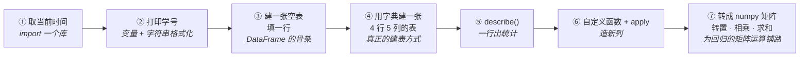
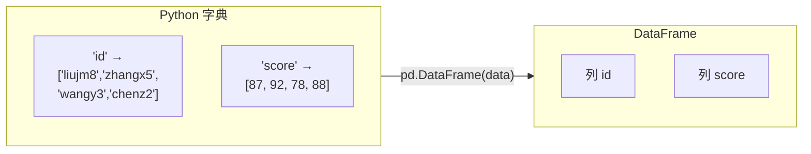
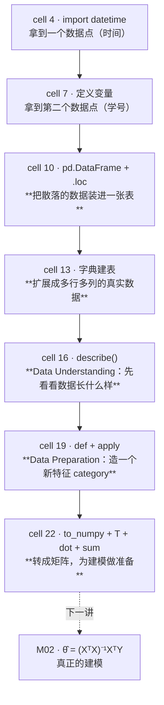

# T01 · Jupyter 入门与 Pandas 基础

> **本讲一句话**：这个 notebook 教七件最基础的事（取时间 → 打印变量 → 建表 → 建大表 → 统计 → 分类 → 矩阵运算），但它真正的教学设计藏在每段代码后面 —— **七个 `🤖 AI Prompt` 单元格，把同一段代码用自然语言重述一遍**。教授在同时教你两件事：Python 怎么写，以及**怎么让 AI 替你写**。
> **原始材料**：`Tutorial 1 - Introduction to Jupyter Notebook_Prompt.ipynb`（25 cells）｜ **配套讲义**：[[M01-导论-商业数据分析全景与工具链#2.7 工具链：Anaconda / Jupyter / Colab|M01-导论-商业数据分析全景与工具链 › 2.7 工具链：Anaconda / Jupyter / Colab]]｜ **转录**：`pending`

---

## 0. 这个 notebook 在教什么

一句话：**把"能打开 Jupyter"变成"能用 Python 处理一张表"。**

它的七个小节是有意排的一条线：



**①②是 Python 语法**（拿来热身），**③④⑤⑥是 pandas**（本课的主力工具），**⑦是 numpy**（下一讲 [[M02-预测分析-线性回归#2.8 参数是怎么训练出来的（讲义 p.30–37）|M02-预测分析-线性回归 › 2.8 参数是怎么训练出来的（讲义 p.30–37）]] 的正规方程 $\hat{\theta} = (X^{\top}X)^{-1}X^{\top}Y$ 全是矩阵运算，这里先见一面）。

**整个 notebook 只有 8 个 code cell，其中最后一个是空的**（留给你写作业）。这不是一个"难"的 notebook，但它建立的习惯会跟你一整学期。

---

## 1. 前置

### 1.1 需要哪些库、怎么装

| 库 | 用途 | 怎么来 |
|---|---|---|
| `datetime` | 取当前时间 | **Python 标准库**，装了 Python 就有，不用装 |
| `pandas` | 表格数据处理 | **Anaconda 自带**。若用别的环境：`pip install pandas` |
| `numpy` | 数值/矩阵运算 | **Anaconda 自带**（pandas 也依赖它）。`pip install numpy` |

> 💡 装了 Anaconda 就三个都有，不需要额外操作。用 Google Colab 也是三个都预装。这正是 [[M01-导论-商业数据分析全景与工具链#2.7.1 三条上手路径|M01 §2.7]] 推荐这两条路的原因。

**运行环境**（notebook metadata 实录）：

```
kernelspec:  {"display_name": "Python [conda env:base] *", "name": "conda-base-py"}
language_info: python 3.13.5
```

⚠️ 你自己装的 Anaconda 版本号大概率不同，**不影响本 notebook 的任何代码**。

### 1.2 对应哪一讲的理论

| notebook 内容 | 对应讲义 |
|---|---|
| 整个 notebook 的操作环境 | [[M01-导论-商业数据分析全景与工具链#2.7 工具链：Anaconda / Jupyter / Colab\|M01-导论-商业数据分析全景与工具链 › 2.7 工具链：Anaconda / Jupyter / Colab]]（讲义 p.46–57） |
| ⑦ numpy 矩阵转置与相乘 | ⏭️ **预告** [[M02-预测分析-线性回归#2.8.3 正规方程：闭式解（讲义 p.32–34）⭐\|M02-预测分析-线性回归 › 2.8.3 正规方程：闭式解（讲义 p.32–34）⭐]]（讲义 p.30, 34） |
| ⑤ `describe()` 的描述统计 | ⏭️ **预告** CRISP-DM 的 **Step 2 Data Understanding**（[[M01-导论-商业数据分析全景与工具链#2.5 ⭐ BDA 流程：CRISP-DM 六步（本讲唯一的核心内容）\|M01 §2.5]]） |
| 七个 `🤖 AI Prompt` 单元格 | [[M01-导论-商业数据分析全景与工具链#2.6.6 深度学习、GenAI 与 LLM（p.43–45）\|M01 §2.6.6]] 的 "Code development"（讲义 p.45）；Syllabus ILO 3 |

### 1.3 本课用得到的 Python 语法 · 一次性速查表

> ⭐ **这张表是本课对"读者可能不会 Python"这件事的一次性还债。**
> 按 [[IS6400_Business_Data_Analytics/_meta/知识层级台账#0.3 ⭐ 最终判断（本课的 L0 口径）|知识层级台账 › 0.3 ⭐ 最终判断（本课的 L0 口径）]] 的口径：**L0-B 层的 Python 通用语法在正文里直接使用、不再解释**，但先在这里集中给一遍。看不懂后面某行代码时回来查这张表；表里没有的（库函数、参数）一律在正文里就地解释。

| 语法 | 长什么样 | 一句话 |
|---|---|---|
| 注释 | `# 这行不会被执行` | `#` 之后到行尾是给人看的 |
| 变量赋值 | `x = 5` | 把右边的值贴上 `x` 这个标签。**不用声明类型** |
| 打印 | `print(x)` | 把内容显示出来 |
| 字符串 | `'liujm8'` 或 `"liujm8"` | 单双引号等价 |
| 旧式格式化 | `'ID is: %s' % name` | `%s` 是占位符（s = string），`%f` 是小数，`%d` 是整数 |
| f-string（现代写法） | `f'ID is: {name}'` | 更易读，本 notebook 没用但你可以用 |
| 列表 list | `[87, 92, 78]` | 有序、可改。用 `a[0]` 取第一个（**从 0 开始数**） |
| 字典 dict | `{"id": ["a","b"], "score": [87, 92]}` | 键 → 值的映射。**建 DataFrame 最常用的形式** |
| 条件 | `if x >= 90: ... elif x >= 80: ... else: ...` | **顺序重要**，从上往下第一个成立的分支生效 |
| 循环 | `for i in range(2, 16): ...` | `range(2,16)` 产生 2,3,…,**15**（不含 16） |
| 定义函数 | `def f(x):` <br>&nbsp;&nbsp;&nbsp;&nbsp;`return x + 1` | `def` 定义，`return` 交出结果。**缩进决定函数体范围** |
| **缩进** | 四个空格 | Python 用缩进代替 `{}`。**缩进错了就是语法错误** |
| 导入库 | `import pandas as pd` | 把 pandas 装进来，起个小名 `pd` |
| 导入库的一部分 | `from sklearn.linear_model import LinearRegression` | 只拿其中一个东西 |
| 点号调用 | `df.head()` | 调用对象 `df` 身上的方法 `head` |
| 点号取属性 | `lin_reg.coef_` | 取对象身上的属性（**没有括号**） |
| 链式调用 | `df['score'].value_counts().head()` | 从左往右一步步接着做 |

**三条会救命的规则**

1. **缩进必须一致**（统一四个空格，别混 Tab）
2. **索引从 0 开始**：`a[0]` 是第一个元素
3. **等号 `=` 是赋值，双等号 `==` 才是判断相等**

---

## 2. 逐块讲解

### 2.0 先讲三个概念（Jupyter 的心智模型）

#### 2.0.1 cell · kernel · 执行顺序 ⚠️

**是什么**

Jupyter notebook 看起来像一份从上到下排列的文档，但它运行起来**不是"从头读到尾就懂"，而更像一间共用一块黑板的教室**：黑板（内存）上写着什么，取决于**谁先举手发言（谁先被运行）**，跟这个人坐在教室的第几排（cell 在页面上排第几个）没有关系。这一小节把三个容易混的概念摆清楚：**cell** 是这间教室里的"一次发言"，**kernel** 是记住所有发言内容的那块黑板，**执行顺序**才是决定"黑板上现在写着什么"的唯一因素。

| 概念 | 是什么 |
|---|---|
| **cell（单元格）** | notebook 的基本单位。**两种类型**：`code`（会被执行）和 `markdown`（只显示文字，本 notebook 25 个 cell 里有 **17 个是 markdown**） |
| **kernel（内核）** | 真正跑代码的后台 Python 进程。**你的所有变量都活在 kernel 的内存里** |
| **执行顺序** | ⚠️ **变量的存在与否只取决于"你按了哪些 cell 的运行键、按的先后"，与 cell 在页面上的排列顺序无关** |

**为什么这条最重要**：本 notebook 的 cell 10 用到了 cell 4 的变量 `x` 和 cell 7 的变量 `StudentID`。如果你跳过前面直接跑 cell 10，会看到：

```
NameError: name 'StudentID' is not defined
```

反过来，如果你改了 cell 7 但**没有重新运行它**，cell 10 用的还是旧值。

> 💡 **每个 code cell 左边的 `In [数字]` 就是执行序号。** `In [ ]` 表示从没跑过，`In [*]` 表示正在跑，`In [3]` 表示它是这个 kernel 上第 3 个被执行的 cell。**养成习惯：看到结果不对，先看序号是不是乱了。**
>
> **卡住时的万能操作**：菜单 `Kernel → Restart & Run All`（重启内核并从头跑一遍）。这能排除 90% 的"明明代码没错却报错"。

**所以呢**：记住"顺序说了算，不是位置说了算"，下一个自然的问题就是：具体要怎么按下"运行"这个动作。

#### 2.0.2 怎么运行

**是什么**

搞清楚了"运行顺序说了算"，下一个问题就很自然：**怎么让一个 cell 被运行？** 最常用的是键盘快捷键 **Shift + Enter**——光标停在哪个 cell，按一下就运行那一个。

| 操作 | 效果 |
|---|---|
| **Shift + Enter** | 运行当前 cell，光标跳到下一个 |
| Ctrl + Enter | 运行当前 cell，光标留在原地 |
| Alt + Enter | 运行当前 cell，并在下面插入一个新 cell |

（讲义 p.53 只教了 Shift + Enter。）

**所以呢**：会运行 cell 了，但运行完怎么看到结果，还有一个容易漏看的小机关——不一定非要写 `print`。

#### 2.0.3 最后一行会自动显示

**是什么**

Jupyter 有个特性：**一个 code cell 的最后一行如果是个表达式，它的值会自动显示出来，不需要 `print`**。

本 notebook 大量依赖这一点 —— cell 10 最后一行只有 `mytable`，cell 13 最后一行只有 `df`，都是靠这个机制把表显示出来。而且 **DataFrame 用这种方式显示会渲染成漂亮的 HTML 表格**，用 `print(df)` 只能得到纯文本。

**所以呢**：cell、kernel、执行顺序、显示机制这几个"心智模型"讲完了。下面开始真正逐个 cell 走一遍 notebook，从最简单的一行代码开始。

---

### 2.1 【cell 4】取当前时间

**这块在干什么**：把当前时间取出来，存进变量 `x`，再打印。

```python
import datetime   #we need to find a tool we need from a library. the datatime is a library.
x = datetime.datetime.now()
#the tool "datetime.datetime.now()" provides the current time. we use this tool to get the time info
#and store the value in a variable "x"
print(x)  #now we can print the time 
```

**输出**（notebook 里保存的）：
```
2025-01-11 20:31:51.526293
```

**逐行**

| 行 | 在干什么 |
|---|---|
| `import datetime` | 把标准库 `datetime` 加载进来。**这是本课第一次出现 `import`** —— Python 默认只有很少的内置功能，其余全靠 import |
| `datetime.datetime.now()` | ⚠️ **两个 `datetime` 不是笔误**：第一个是**模块名**，第二个是模块里的**类名**，`.now()` 是这个类的方法。读作"`datetime` 模块里的 `datetime` 类，调用它的 `now()`" |
| `x = ...` | 把返回的时间对象贴上标签 `x` |
| `print(x)` | 显示。输出格式是 `年-月-日 时:分:秒.微秒` |

**为什么这么写**

- 为什么不用 `time` 库？`datetime` 返回的是**结构化的时间对象**（能取 `.year`、能相减得到时间差、能直接进 DataFrame 当日期列），而 `time.time()` 只给一个秒数
- 为什么要存进变量而不直接 `print(datetime.datetime.now())`？因为 **cell 10 还要再用这个时间**。若不存变量，两处的时间会不一样

**⚠️ 易错点**

1. **输出的时间是 `2025-01-11`，不是你运行的时间** —— 这是 notebook 里保存的**上一次运行结果**。你自己按 Shift+Enter 才会看到当前时间
2. 注释里写的 `the datatime is a library` 有两处小问题：拼写应为 **datetime**；而且 `datetime` 严格说是**标准库里的一个模块（module）**，不是第三方"库（library)"。⚪ 本课语境下不必较真
3. 忘记 `import` 直接用 → `NameError: name 'datetime' is not defined`

**所以呢**：第一个变量（时间对象 `x`）造好了。下一个 cell 再造一个变量（学号），并且第一次接触"把变量嵌进一句话里打印"这个几乎每次都要用的操作。

---

### 2.2 【cell 7】打印学号 —— 变量与字符串格式化

**这块在干什么**：定义一个变量存学号，然后用格式化字符串把它嵌进一句话里。

```python
StudentID='liujm8' #we give the value "liujm8" to a variable StudentID
print('My Student ID is: %s' %StudentID)
```

**输出**：
```
My Student ID is: liujm8
```

**逐行**

| 部分 | 说明 |
|---|---|
| `StudentID='liujm8'` | ⚠️ **`liujm8` 是教授本人的 ID**（LIU Junming）。**作业里必须换成你自己的** |
| `'…: %s'` | `%s` 是**占位符**，s 表示这里要塞一个字符串 |
| `% StudentID` | 百分号右边的值会被塞进 `%s` 的位置 |

**为什么这么写**

`%` 格式化是 Python 的**老式写法**（继承自 C 语言的 `printf`）。现代 Python 更常用 f-string：

```python
print(f'My Student ID is: {StudentID}')   # 更易读，效果完全相同
```

⚠️ **但本课的 AI Prompt 明确要求用 `%s`**（见 §6 的 Prompt 2：`use string formatting (%s)`）。**教授在有意教这个写法**，因为 W02 的 tutorial 会大量用 `%f` 打印浮点数：

```python
print('Slope is %f, Intercept is %f' % (lin_reg.coef_[0][0], lin_reg.intercept_[0]))
```

| 占位符 | 塞什么 |
|---|---|
| `%s` | 字符串（其实什么都能塞，会自动转成字符串） |
| `%d` | 整数 |
| `%f` | 小数（默认 6 位） |
| `%.2f` | 小数，保留 2 位 |

**⚠️ 易错点**

- **多个占位符时右边必须用括号包成元组**：`'%s-%s' % (a, b)`，写成 `% a, b` 会报错
- 占位符个数与右边值的个数必须一致

**所以呢**：有了时间 `x` 和学号 `StudentID` 两个变量，下一步就是本课真正的重点——把这些零散的值放进一张表里，也就是这门课要用到的第一个 pandas 对象：DataFrame。

---

### 2.3 【cell 10】建第一张表 —— DataFrame 的骨架

**这块在干什么**：用 pandas 建一张空表（只定义列名），然后往第 0 行塞数据。

```python
import pandas as pd #now we learn how to store your information in a table using tool "pandas"
mytable=pd.DataFrame(columns=['id','name','time'])
mytable.loc[0]=[StudentID,'LIU Junming',x]
mytable
```

**输出**：
```
       id         name                       time
0  liujm8  LIU Junming 2025-01-11 20:31:51.526293
```

**逐行**

| 行 | 在干什么 |
|---|---|
| `import pandas as pd` | 加载 pandas，起小名 `pd`。**`as pd` 是全世界统一的约定**，所有教程、所有 Stack Overflow 答案都这么写 |
| `pd.DataFrame(columns=[...])` | 建一个**空的 DataFrame**，只给了三个列名，没有任何行 |
| `mytable.loc[0]=[...]` | 用 **`.loc`** 按**行标签** `0` 赋值。**标签不存在时，pandas 会新建这一行** |
| `mytable` | cell 最后一行是表达式 → 自动渲染成表格（§2.0.3） |

**为什么这么写**

- **`.loc` vs `.iloc`**：`.loc` 按**标签**定位，`.iloc` 按**位置**定位。刚建的表两者恰好一样（标签 0 就是第 0 行），但一旦筛选过数据，标签会保留原来的编号而位置会重排，这时两者结果完全不同。**本课后面用到的 `.loc` 全是按标签**
- **为什么值的顺序是 `[StudentID, 'LIU Junming', x]`**：必须与 `columns=['id','name','time']` **一一对应**。写反了不会报错，只会静默存错
- **注意 `x` 直接进表了**：pandas 能直接容纳 `datetime` 对象，不需要转成字符串

**⚠️ 易错点**

1. **`mytable.loc[0] = [...]` 的列表长度必须等于列数**，否则 `ValueError: cannot set a row with mismatched columns`
2. **这种"先建空表再一行行 `.loc` 赋值"的写法只适合演示**。数据量一大会非常慢（每次赋值都要重建索引），而且列的 dtype 会退化成 `object`。**真实场景用 cell 13 的字典写法**
3. `StudentID` 和 `x` 都来自前面的 cell —— **没跑前面直接跑这里会 `NameError`**（§2.0.1）

> 🔗 cell 9 的 markdown 给了官方文档链接：`https://pandas.pydata.org/docs/reference/api/pandas.DataFrame.html`。**这是本课唯一一次直接给 pandas 文档，值得收藏。**

**所以呢**：先建空表再一行行塞数据，这种写法容易懂但**只适合演示**（易错点 2 已经说了它慢、还会退化类型）。下一个 cell 换成真正常用的建表方式——用字典一次性建好。

---

### 2.4 【cell 13】建第二张表 —— 字典写法（真正常用的方式）

**这块在干什么**：用一个字典一次性建出 4 行 5 列的表。

```python
import pandas as pd
import datetime

# Create a DataFrame with some data
data = {
    "id": ["liujm8", "zhangx5", "wangy3", "chenz2"],
    "name": ["LIU Junming", "ZHANG Xi", "WANG Yi", "CHEN Zhi"],
    "grade": [1, 2, 1, 3],
    "score": [87, 92, 78, 88],
    "time": [
        datetime.datetime(2025, 1, 8, 15, 53, 13),
        datetime.datetime(2025, 1, 8, 16, 0, 0),
        datetime.datetime(2025, 1, 8, 16, 5, 0),
        datetime.datetime(2025, 1, 8, 16, 10, 0),
    ],
}

df = pd.DataFrame(data)
df
```

**输出**：

| | id | name | grade | score | time |
|---|---|---|---|---|---|
| 0 | liujm8 | LIU Junming | 1 | 87 | 2025-01-08 15:53:13 |
| 1 | zhangx5 | ZHANG Xi | 2 | 92 | 2025-01-08 16:00:00 |
| 2 | wangy3 | WANG Yi | 1 | 78 | 2025-01-08 16:05:00 |
| 3 | chenz2 | CHEN Zhi | 3 | 88 | 2025-01-08 16:10:00 |

**核心一句话**：**字典的键 = 列名，字典的值（列表）= 那一列的全部数据。**



**为什么这么写**

| 对比 | cell 10 的方式 | cell 13 的方式 |
|---|---|---|
| 建表 | 先建空壳，再一行行填 | **一次性建好** |
| 思维方向 | 按**行**想 | 按**列**想 ← **pandas 的原生方向** |
| 性能 | 每加一行都重建索引，慢 | 一次分配，快 |
| dtype | 容易退化成 `object` | **自动推断**：`grade`/`score` → `int64`，`time` → `datetime64` |

> 💡 **"按列想"是 pandas 的世界观。** DataFrame 内部就是"一堆列（Series）拼起来"，每列有自己的类型。这也解释了为什么后面 `df["score"].apply(...)` 这么自然 —— 你在对**一整列**做事。

**注意 `datetime.datetime(2025, 1, 8, 15, 53, 13)`**：这是**构造**一个指定时刻（年,月,日,时,分,秒），与 §2.1 的 `.now()`（取当前时刻）不同。同一个类的两种用法。

**⚠️ 易错点**

1. **所有列表长度必须相同**，否则 `ValueError: All arrays must be of the same length`
2. `import pandas as pd` 和 `import datetime` 在这里**重复导入了**（cell 4、cell 10 已经导过）。重复 import 不会报错也不会变慢（Python 会跳过），⚪ 教授这么写是为了**让这个 cell 能独立运行**——这是个好习惯
3. 源码里第三个和第四个 `datetime` 之间有一个多余的空行，纯排版问题，不影响运行

**所以呢**：4 行 5 列的表 `df` 造好了。拿到一张新表，CRISP-DM 第 2 步"数据理解"的第一个动作永远是先看一眼整体统计——下一个 cell 就是干这件事的。

---

### 2.5 【cell 16】一行出统计 —— `describe()`

**这块在干什么**：让 pandas 一次算出所有数值列的描述统计。

```python
stats = df.describe()
stats
```

**输出**：

| | grade | score |
|---|---|---|
| count | 4.000000 | 4.000000 |
| mean | 1.750000 | 86.250000 |
| std | 0.957427 | 5.909033 |
| min | 1.000000 | 78.000000 |
| 25% | 1.000000 | 84.750000 |
| 50% | 1.500000 | 87.500000 |
| 75% | 2.250000 | 89.000000 |
| max | 3.000000 | 92.000000 |

**八个数字分别是什么**

| 行 | 含义 |
|---|---|
| `count` | **非缺失**值的个数。⚠️ 这不是行数！有缺失时会小于行数 |
| `mean` | 平均值 |
| `std` | 标准差（默认是**样本标准差**，分母 n−1） |
| `min` / `max` | 最小 / 最大 |
| `25%` / `50%` / `75%` | 四分位数。**`50%` 就是中位数** |

**⚠️ 最重要的一点：`describe()` 默认只算数值列**

输出里只有 `grade` 和 `score`，**`id`、`name`、`time` 三列完全没出现**。因为它们不是数值。

想看全部列：

```python
df.describe(include='all')     # 数值列 + 类别列都算（类别列给 unique/top/freq）
df.describe(include='object')  # 只看字符串列
```

**为什么这么写 / 为什么这一步重要**

`describe()` 是 **CRISP-DM 第 2 步（Data Understanding）** 最常用的第一个动作（[[M01-导论-商业数据分析全景与工具链#2.5 ⭐ BDA 流程：CRISP-DM 六步（本讲唯一的核心内容）|M01 §2.5]]）。拿到一份陌生数据，前三件事永远是：

```python
df.shape        # 多少行多少列
df.dtypes       # 每列什么类型
df.describe()   # 数值列的分布
```

[[IS6400_Business_Data_Analytics/_meta/数据集卡片|数据集卡片]] 里 Airbnb 那张卡的"§2.1 数值列的描述统计"就是 `describe()` 的产物。

**⚠️ 易错点**

- **`count` 是非缺失值个数，不是行数。** 这是发现缺失值最快的方法：`count` 比总行数小 = 有缺失
- `std` 用的是 **n−1** 分母（样本标准差）。numpy 的 `np.std()` 默认用 **n**（总体标准差），两者结果不同
- 只有 4 行数据时，四分位数是**插值**算出来的（`25% = 84.75` 并不是任何一个真实分数），小样本时别过度解读

**所以呢**：`describe()` 只能算现成列的统计，不能凭空造出新信息。下一个 cell 教怎么**造一个全新的列**——这是特征工程最基本的动作。

---

### 2.6 【cell 19】自定义函数 + `apply()` —— 造一个新列

**这块在干什么**：写一个"分数 → 等第"的函数，把它套到 `score` 列的每个值上，结果存成新列 `category`。

```python
def grade_category(score):
    if score >= 90:
        return "Excellent"
    elif score >= 80:
        return "Good"
    elif score >= 60:
        return "Pass"
    else:
        return "Fail"

df["category"] = df["score"].apply(grade_category)
df
```

**输出**（多了最右一列）：

| | id | name | grade | score | time | **category** |
|---|---|---|---|---|---|---|
| 0 | liujm8 | LIU Junming | 1 | 87 | … | **Good** |
| 1 | zhangx5 | ZHANG Xi | 2 | 92 | … | **Excellent** |
| 2 | wangy3 | WANG Yi | 1 | 78 | … | **Pass** |
| 3 | chenz2 | CHEN Zhi | 3 | 88 | … | **Good** |

**逐部分**

| 部分 | 说明 |
|---|---|
| `def grade_category(score):` | 定义一个函数，参数叫 `score` |
| `if / elif / else` | ⚠️ **顺序是关键**：从上往下，**第一个成立的分支就返回**。所以门槛必须**从高到低**排 |
| `df["score"]` | 取出 `score` 这一列（得到一个 **Series**） |
| **`.apply(grade_category)`** | 把函数**逐个元素**套到这一列上，返回一个同样长的新 Series。⚠️ **注意函数名后面没有括号** —— 你传的是"函数本身"，不是"函数的调用结果" |
| `df["category"] = …` | 给 DataFrame 加一个**新列**。列名不存在时直接新建 |

**为什么这么写**

**① 为什么门槛必须从高到低？**
如果写成 `if score >= 60: return "Pass"` 在最前面，那么 92 分也会先撞上这一条，全部人都是 "Pass"。**`elif` 链是"短路"的，谁在前谁优先。**

**② 为什么不用 `for` 循环？**
你完全可以写：
```python
cats = []
for s in df["score"]:
    cats.append(grade_category(s))
df["category"] = cats
```
效果一样，但 `.apply()` 更短、更快，而且是 pandas 的惯用法。**"对一整列做同一件事"是 pandas 的核心动作。**

**③ `.apply()` 传的是函数名，不是调用**
```python
df["score"].apply(grade_category)     # ✅ 正确：把函数交给 apply
df["score"].apply(grade_category())   # ❌ 错误：这是先调用函数（还缺参数），把结果交给 apply
```

**④ 这个模式在本课后面会一直用**
"造一个新列"就是 **CRISP-DM 第 3 步 Data Preparation / 特征工程**（W03）的基本动作。[[IS6400_Business_Data_Analytics/_meta/数据集卡片#3.1 缺失机制（这是本数据集最值得讲的一点）|数据集卡片 › 3.1 缺失机制（这是本数据集最值得讲的一点）]] 里建议给 Airbnb 加一列 `has_review = (number_of_reviews > 0)`，就是同一件事。

**⚠️ 易错点**

1. **`df["category"] = ...` 是原地修改 `df`。** 再跑一次这个 cell 不会出错（列被覆盖），但如果你在中间改了 `grade_category` 的逻辑却没重跑，结果会对不上（§2.0.1 的执行顺序问题）
2. 函数里的参数名 `score` 和 DataFrame 的列名 `score` **同名纯属巧合**，改成 `def grade_category(s)` 完全等价
3. `.apply()` 在大数据上比向量化操作慢。等价的向量化写法是 `pd.cut(df["score"], bins=[0,60,80,90,101], labels=[...])`，⚪ 本课不要求

**所以呢**：pandas 这条线（建表、统计、造列）告一段落。notebook 最后换了一个话题——不用 pandas，直接用 numpy 做矩阵运算，为下一讲的线性回归数学做铺垫。

---

### 2.7 【cell 22】numpy 矩阵运算

**这块在干什么**：把两列数字取出来变成矩阵，然后做转置、矩阵乘法、按列求和。

```python
import numpy as np

# Convert "score" and "grade" columns into a numpy matrix
matrix = df[["score", "grade"]].to_numpy()
print("Original Matrix:")
print(matrix)

# Transpose
transpose = matrix.T
print("\nTransposed Matrix:")
print(transpose)

# Matrix multiplication
result = np.dot(matrix, transpose)
print("\nMatrix Multiplication Result:")
print(result)

# Calculate all scores and grades
sum_matrix = np.sum(matrix, axis=0)  # Sum along columns
print("\nSum of Scores and Grades:")
print(sum_matrix)
```

**输出**：
```
Original Matrix:
[[87  1]
 [92  2]
 [78  1]
 [88  3]]

Transposed Matrix:
[[87 92 78 88]
 [ 1  2  1  3]]

Matrix Multiplication Result:
[[7570 8006 6787 7659]
 [8006 8468 7178 8102]
 [6787 7178 6085 6867]
 [7659 8102 6867 7753]]

Sum of Scores and Grades:
[345   7]
```

**逐部分**

| 部分 | 说明 | 形状 |
|---|---|---|
| `df[["score", "grade"]]` | ⚠️ **双层方括号**：外层是"取列"，内层是"列名的列表"。取多列必须双层，取单列 `df["score"]` 是单层（得到 Series 而不是 DataFrame） | 4×2 DataFrame |
| `.to_numpy()` | 把 DataFrame 转成 numpy 数组（**丢掉列名和索引，只剩纯数字**） | `(4, 2)` |
| `matrix.T` | **转置**：行列互换。`.T` 是属性不是方法，**没有括号** | `(2, 4)` |
| `np.dot(matrix, transpose)` | 矩阵乘法：$(4,2) \times (2,4) = (4,4)$ | `(4, 4)` |
| `np.sum(matrix, axis=0)` | 沿 **axis=0** 求和 | `(2,)` |
| `\n` | 字符串里的换行符，让输出之间空一行 | — |

**`axis` 到底怎么理解（本课最常搞错的参数之一）**

```
        axis=1 →（沿着列的方向，横着走）
   ┌─────────────┐
 ↓ │ 87        1 │
axis│ 92        2 │
 =0 │ 78        1 │
   │ 88        3 │
   └─────────────┘
     345        7      ← np.sum(matrix, axis=0)
```

**记法：`axis=0` 压掉"行"这个维度，得到每一列的结果。** `(4,2)` 沿 axis=0 求和 → `(2,)`：`87+92+78+88 = 345`（总分），`1+2+1+3 = 7`（年级和）。

反过来 `axis=1` 会得到每一行的和 `[88, 94, 79, 91]`（分数+年级，**没有业务意义**）。

**⚠️ `np.dot(matrix, transpose)` 那个 4×4 结果是什么？**

它是 **Gram 矩阵**：第 (i,j) 个元素 = 第 i 个学生的向量 · 第 j 个学生的向量。
验算左上角：$87\times 87 + 1\times 1 = 7569 + 1 = 7570$ ✅

> ⚠️ **这个 4×4 矩阵在这里没有任何业务含义。** 教授只是在演示"矩阵乘法怎么写"。**别去解读它。**
>
> 💡 **但这个动作在下一讲会突然变得关键**：[[M02-预测分析-线性回归#2.8.3 正规方程：闭式解（讲义 p.32–34）⭐|M02 §2.6.3]] 的正规方程是
> $\hat{\theta} = (X^{\top}X)^{-1}X^{\top}Y$
> 那个 **$X^{\top}X$** 就是这里的 `np.dot(matrix.T, matrix)`（**注意顺序反过来**，得到的是 `(2,2)` 的特征间乘积矩阵，那个才有意义）。**这个 cell 是在为下一讲的数学做手指热身。**

**⚠️ 易错点**

1. **矩阵乘法的形状必须能对上**：$(a,b) \times (b,c) = (a,c)$。中间的 `b` 不等就报 `ValueError: shapes not aligned`
2. **`np.dot(A, B) ≠ np.dot(B, A)`**：`np.dot(matrix, matrix.T)` 是 4×4，`np.dot(matrix.T, matrix)` 是 2×2
3. **`.T` 没有括号**（属性），**`.to_numpy()` 有括号**（方法）
4. `df[["score","grade"]]` 的列顺序决定矩阵的列顺序，别写反

**所以呢**：转置、矩阵乘法、按列求和这几个 numpy 动作看着像是无意义的练习，但它们正是下一讲正规方程 $\hat\theta=(X^{\top}X)^{-1}X^{\top}Y$ 里每一步在做的事——这是有意安排的铺垫。notebook 剩下的最后一格留给作业。

---

### 2.8 【cell 25】空 cell

**这块在干什么**：最后一个 code cell 是**空的**，留给你写作业（见 §7）——前面 7 个 cell 演示的是"建表、看统计、造列、做矩阵运算"，作业要你在一张新表上把这一整套动作自己走一遍。

**所以呢**：至此 notebook 的每一个 cell 都过了一遍，从"什么是 kernel"到"矩阵乘法"。下一节把这条主线串成一张流程图，再看讲义理论怎么和这些代码一一对应。

---

## 3. 完整流程串讲

把八个 cell 串成一条线，你会看到它其实是 **CRISP-DM 前三步的微缩版**：



**这条线的意义**：数据在四种形态之间流动 ——

```
散落的变量 → DataFrame（带列名、带类型） → 统计摘要（人看的） → numpy 矩阵（模型吃的）
```

**每一步都在丢东西、也在得到东西**：
- 变量 → DataFrame：**得到**结构（列名、对齐、类型推断）
- DataFrame → describe()：**得到**概览，**丢掉**个体
- DataFrame → numpy：**得到**能做矩阵运算的纯数字，**丢掉**列名与索引

> ⚠️ **最后那一步的"丢掉列名"是初学者最大的坑来源**：`.to_numpy()` 之后你只剩一堆数字，**列的顺序就是唯一的身份**。W02 的 `lin_reg.coef_` 输出是 `[0.170, 0.138, 0.125, -0.056, …]` 一串裸数字，要靠你记住"第 1 个对应 accommodates"才知道谁是谁。见 [[T02-回归实战-从合成数据到Airbnb定价#5.3 系数和特征怎么对上号|T02-回归实战-从合成数据到Airbnb定价 › 5.3 系数和特征怎么对上号]]。

---

## 4. 自己动手 —— 改哪个参数会发生什么

| # | 改什么 | 会发生什么 | 学到什么 |
|---|---|---|---|
| 1 | cell 4 里删掉 `import datetime` 再跑 | `NameError: name 'datetime' is not defined` | import 是必须的；且 kernel 重启后所有 import 都要重来 |
| 2 | 只跑 cell 10，不跑 cell 4 和 7 | `NameError: name 'StudentID' is not defined` | **执行顺序 ≠ 排列顺序**（§2.0.1） |
| 3 | cell 7 改成 `print(f'My Student ID is: {StudentID}')` | 输出完全相同 | f-string 与 `%s` 等价；但作业按 prompt 要求用 `%s` |
| 4 | cell 10 改成 `mytable.loc[1]=[...]` 再跑一次 | 表变成两行 | `.loc[标签]` 标签不存在就新建行 —— **这就是作业第 3 题的做法** |
| 5 | cell 13 里把 `"score": [87, 92, 78, 88]` 删掉一个数 | `ValueError: All arrays must be of the same length` | 字典建表要求所有列等长 |
| 6 | cell 16 改成 `df.describe(include='all')` | 多出 `id`/`name`/`time` 三列，指标变成 `unique`/`top`/`freq` | 默认只算数值列 |
| 7 | cell 19 把 `if score >= 90` 和 `elif score >= 60` 调换位置 | **所有人都变成 "Pass"** | `elif` 链是短路的，门槛必须从高到低 |
| 8 | cell 19 改成 `.apply(grade_category())` | `TypeError: grade_category() missing 1 required positional argument` | apply 要的是函数本身，不是调用结果 |
| 9 | cell 22 改成 `np.sum(matrix, axis=1)` | 输出 `[88 94 79 91]`（4 个数而不是 2 个） | `axis=0` 压行得列结果，`axis=1` 压列得行结果 |
| 10 | cell 22 改成 `np.dot(transpose, matrix)` | 变成 2×2 矩阵 `[[30341, 604],[604, 15]]` | 矩阵乘法**不满足交换律**；而**这个 2×2 才是 W02 正规方程里的 $X^{\top}X$** |
| 11 | cell 22 去掉 `.to_numpy()`，直接 `df[["score","grade"]].T` | 得到的是转置后的 **DataFrame**（带列名索引），不是 ndarray | pandas 和 numpy 是两层，`.T` 两边都有但返回类型不同 |
| 12 | 菜单 `Kernel → Restart`，然后只跑 cell 22 | `NameError: name 'df' is not defined` | 重启内核会清空所有变量 |

> 💡 **第 10 条最值得动手做一遍。** `np.dot(matrix.T, matrix)` 得到的 2×2 矩阵：
> - 左上 `30341` = 所有 score 的平方和
> - 右下 `15` = 所有 grade 的平方和
> - 对角外 `604` = score 与 grade 的乘积和
>
> **这正是最小二乘法要求逆的那个 $X^{\top}X$。** 下周你会看到 sklearn 在幕后算的就是它。

---

## 5. 与讲义理论的对应

| notebook cell | 主题 | 对应讲义 / 笔记 |
|---|---|---|
| 全部 | Jupyter 环境、Shift+Enter、Coding Area、Output | 讲义 p.49–54 ｜ [[M01-导论-商业数据分析全景与工具链#2.7.1 三条上手路径\|M01-导论-商业数据分析全景与工具链 › 2.7.1 三条上手路径]] |
| cell 4, 7 | Python 基础语法 | 无对应讲义页 ｜ 本笔记 §1.3 速查表 |
| cell 10, 13 | 把数据装进表 | ⚪ 无对应讲义页。属 CRISP-DM **Step 2–3** |
| cell 16 | `describe()` 描述统计 | CRISP-DM **Step 2 Data Understanding**（讲义 p.30–31） |
| cell 19 | 造新列（特征） | **Feature = "the element that you use to describe an object"**（讲义 p.33）；⏭️ W03 Feature Engineering |
| cell 22 | 矩阵转置与乘法 | ⏭️ **预告** [[M02-预测分析-线性回归#2.8.3 正规方程：闭式解（讲义 p.32–34）⭐\|M02-预测分析-线性回归 › 2.8.3 正规方程：闭式解（讲义 p.32–34）⭐]]（讲义 p.34 的 $\hat{\theta} = (X^{\top}X)^{-1}X^{\top}Y$） |
| cell 5,8,11,14,17,20,23（AI Prompt） | GenAI 写代码 | 讲义 p.45 "Code development" ｜ Syllabus ILO 3 ｜ 官方 `Allow GenAI: Yes` |

**✅ notebook 全部 25 个 cell 已覆盖**（8 个 code cell 逐块讲解，7 个 AI Prompt 见 §6，1 个作业 cell 见 §7，其余 9 个是小节标题类 markdown，已并入对应小节）。

---

## 6. 教授在教你怎么向 AI 提问

**这是本课最特别的一节。** notebook 里有 **7 个** 绿色的 `🤖 AI Prompt (Copy this to AI)` 单元格，每个都紧跟在一段代码后面，**把那段代码用自然语言完整描述一遍**。

### 6.1 七个 prompt 原文（一字不改）

> **Prompt 1**（跟在 cell 4 后）
> Write Python code to import the 'datetime' module, get the current time, store it in a variable named 'x', and print 'x'.

> **Prompt 2**（跟在 cell 7 后）
> Write Python code to assign the string 'liujm8' to a variable named 'StudentID', and use string formatting (%s) to print the sentence 'My Student ID is: [StudentID]'.

> **Prompt 3**（跟在 cell 10 后）
> Using the pandas library, create an empty DataFrame named 'mytable' with columns 'id', 'name', and 'time'. Insert a new row at index 0 with the values: [StudentID, 'LIU Junming', x]. Finally, display the DataFrame.

> **Prompt 4**（跟在 cell 13 后）
> Write Python code using pandas and datetime to create a DataFrame named 'df'. The DataFrame should be created from a dictionary with the following keys and lists: 'id' ["liujm8", "zhangx5", "wangy3", "chenz2"], 'name' ["LIU Junming", "ZHANG Xi", "WANG Yi", "CHEN Zhi"], 'grade' [1, 2, 1, 3], 'score' [87, 92, 78, 88], and 'time' containing four datetime objects (2025-1-8 15:53:13, 2025-1-8 16:00:00, 2025-1-8 16:05:00, 2025-1-8 16:10:00). Display 'df'.

> **Prompt 5**（跟在 cell 16 后）
> Write Python code to generate descriptive statistics for the DataFrame 'df' using the .describe() method, assign the result to a variable 'stats', and display it.

> **Prompt 6**（跟在 cell 19 后）
> Write a Python function named 'grade_category' that takes a 'score' as input. It should return "Excellent" if score >= 90, "Good" if >= 80, "Pass" if >= 60, and "Fail" otherwise. Use the pandas .apply() method to apply this function to the 'score' column of DataFrame 'df' and store the results in a new column called 'category'. Display 'df'.

> **Prompt 7**（跟在 cell 22 后）
> Write Python code using numpy to perform the following operations: 1. Extract the "score" and "grade" columns from DataFrame 'df' and convert them to a numpy array named 'matrix'. Print it. 2. Get the transpose of 'matrix', store it in 'transpose', and print it. 3. Calculate the dot product of 'matrix' and 'transpose', store it in 'result', and print it. 4. Calculate the sum of 'matrix' along the columns (axis=0), store it in 'sum_matrix', and print it.

### 6.2 ⭐ 从这七个 prompt 里能提炼出的四要素

把七个 prompt 并排看，会发现**它们的结构完全一致**：

| 要素 | 在 prompt 里长什么样 | 为什么必须有 |
|---|---|---|
| **① 用什么工具** | "Write Python code…"、"Using the **pandas** library"、"using **numpy**"、"using the **.describe()** method" | 不指定，AI 可能给你 Excel 公式或另一个库的写法 |
| **② 做什么操作** | "import…get the current time"、"create an empty DataFrame"、"Get the transpose" | 动词 + 宾语，一个动作一句 |
| **③ ⭐ 变量叫什么名** | "store it in a variable named **'x'**"、"a DataFrame named **'df'**"、"a new column called **'category'**"、"named **'matrix'** / **'transpose'** / **'result'** / **'sum_matrix'**" | **七个 prompt 无一例外都指定了变量名。** 因为下一段代码要接着用这个变量 —— 名字对不上，代码就串不起来 |
| **④ 输出什么** | "and print 'x'"、"Finally, **display** the DataFrame"、"Print it" | 不说，AI 可能只算不显示，你看不到结果 |

**再看两条更细的规律：**

| 规律 | 证据 |
|---|---|
| **数据全部内联，不让 AI 编** | Prompt 4 把 4 个 id、4 个姓名、4 个 grade、4 个 score、4 个精确到秒的时间**全部写进 prompt**。Prompt 6 把四个门槛 90/80/60 和四个返回值全写出来 |
| **多步骤时显式编号** | Prompt 7 用 `1. 2. 3. 4.` 拆成四步，每步都带变量名 |
| **连"用哪种写法"都指定** | Prompt 2 特别写了 `use string formatting (**%s**)` —— 不写的话 AI 大概率给 f-string |

### 6.3 一个反例（对照着看更清楚）

同样想要 cell 19 的功能，一个**糟糕的 prompt** 长这样：

> ❌ "帮我把分数分个等级"

AI 会问你一堆问题，或者自己瞎猜：几个等级？门槛多少？叫什么名字？加到哪张表？用什么方法？

**教授的 prompt 把这五个问题全部提前回答了。** 这就是 §6.2 四要素的价值。

### 6.4 为什么这件事会被考核

| 依据 | 原文 |
|---|---|
| Syllabus ILO 3 | "**Manage GenAI tools** for BDA proposal and Python programming" |
| 官方目录 ATs | AT1（Class performance and assignments）、AT2（Group Project）的 `Allow Use of GenAI?` 均为 **Yes** |
| 课程表 W11 | "**Competition: GenAI for BDA**"（课程表上被黄色高亮的两行之一） |
| 讲义 p.45 | LLM Applications 里明确列出 **Code development** |

> ⚠️ **但要注意边界**：官方允许在**平时作业与项目**里用 GenAI；**期末考不在 ATs 表里，没有标注**（[[IS6400_Business_Data_Analytics/_prep/课程前置资料#2. 官方目录 × Syllabus × W1 讲义 —— 三方对校总表|课程前置资料 §2（GenAI 政策行）]]）。⚪ 按惯例考试不允许，但目前没有白纸黑字，**待课上确认**。
>
> 💡 **实操建议**：作业时先自己读懂代码，再用 prompt 让 AI 生成，然后**逐行核对 AI 给的和你理解的是否一致**。这既符合 ILO 3，又能在闭卷考试时不掉链子。

---

## 7. 本次作业（notebook cell 24 原文）

> ## Tutorial 1:
> ### Please complete the following questions using this jupyter notebook, **SAVE it as HTML and upload to canvas**.
>
> #### (1) **(20 points)** use the jupyter notebook to print the following information: Your student ID, your name, and your current time.
> #### (2) **(20 points)** put the information above into a pandas dataframe (the table in step 3)
> #### (3) **(30 points)** after a few seconds, add the second row of your id, name, time, expected scores
> #### (4) **(30 points)** Perform matrix operations with numpy:
> - Convert the score and grade columns into a numpy matrix.
> - Print the matrix and its transpose.
> - Calculate and print the sum of all scores.

**总分 100 分。**

### 7.1 逐题拆解

| 题 | 分 | 对应 cell | 关键动作 |
|---|---|---|---|
| (1) | 20 | cell 4 + cell 7 | `import datetime` → `x = datetime.datetime.now()`；`StudentID = '你的ID'`；`print` 三样东西 |
| (2) | 20 | cell 10 | `pd.DataFrame(columns=[...])` + `.loc[0] = [...]` |
| (3) | 30 | cell 10 的变体 | **过几秒后**重新取一次时间，`.loc[1] = [...]` 加第二行 |
| (4) | 30 | cell 22 | `.to_numpy()` → `.T` → `np.sum(..., axis=0)` |

### 7.2 ⚠️ 三个坑

**坑 1 · 第 (3) 题的列对不上**
题目说"add the second row of your id, name, time, **expected scores**"，但第 (2) 题建的表（cell 10 那张 `mytable`）只有 **`id`、`name`、`time` 三列，没有 score**。

⚪ **建议做法**：建表时就多加一列，即 `columns=['id','name','time','score']`，两行都填。并在 markdown 里写一句"为满足第 (3) 题的 expected scores 要求，增加了 score 列"。

**坑 2 · 第 (4) 题的 "score and grade columns" 也对不上**
`mytable` 里没有 `grade` 列。这题实际指的是 **cell 13 建的 `df`**（那张才有 `grade` 和 `score`）。

⚪ **建议做法**：两张表都保留 —— 用 `mytable` 答 (2)(3)，用 `df` 答 (4)。或者干脆把 `mytable` 也加上 `grade` 列，一张表答完。**无论选哪种，在 notebook 里用 markdown 写清楚你的理解**，避免被当成做错。

**坑 3 · "after a few seconds"**
第 (3) 题要求"过几秒之后"再加第二行 —— 意思是**第二行的 time 必须和第一行不同**。所以：
- ❌ 不能复用第一行的 `x`
- ✅ 要重新调用 `datetime.datetime.now()`
- ✅ 稳妥做法：把两行写在**不同的 cell** 里，中间隔几秒再运行第二个 cell；或者用 `import time; time.sleep(3)`

### 7.3 提交格式

**"SAVE it as HTML and upload to canvas"** —— 交的是 **HTML**，不是 `.ipynb`。

| 环境 | 怎么导出 HTML |
|---|---|
| Jupyter Notebook（经典） | `File → Download as → HTML (.html)` |
| JupyterLab / Notebook 7 | `File → Save and Export Notebook As… → HTML` |
| Google Colab | `File → Download → Download .ipynb`，再本地转；或 `File → Print → 存为 PDF`（⚠️ 要求是 HTML，先确认助教是否接受） |

> ⚠️ **导出前务必 `Kernel → Restart & Run All` 跑一遍**。HTML 保存的是**当前显示的输出**，如果某个 cell 没跑过，导出的 HTML 里就是空的 —— 助教看到的就是空的。
>
> 💡 课程材料里那两个 `.html` 文件（`Tutorial 1 - …_Prompt.html`、`Week 2 …_With Prompt.html`）就是这个格式的样例。

**其他要求**（讲义 p.10）：
- **上课开始前**交，不是当天 23:59
- **迟交每天扣 20%**
- 可以和同学讨论，但必须交自己的作品
- **自己留一份备份**

---

## 8. cell ↔ 讲义页码映射

| notebook cell | 类型 | 内容 | 笔记小节 | 讲义页 |
|---|---|---|---|---|
| 1 | md | 标题 "🚀 Interactive Jupyter Notebook Tutorial" | §0 | — |
| 2 | md | 欢迎语（提到"也可以用 AI Prompt 让 AI 生成代码"） | §6 | p.45 |
| 3 | md | 小节标题 "1. Get Current Time ⏰" | §2.1 | — |
| **4** | **code** | `import datetime` / `now()` / `print` | **§2.1** | — |
| 5 | md | 🤖 AI Prompt 1 | §6.1 | p.45 |
| 6 | md | 小节标题 "2. Print Your Student ID 🎓" | §2.2 | — |
| **7** | **code** | `StudentID` + `%s` 格式化 | **§2.2** | — |
| 8 | md | 🤖 AI Prompt 2 | §6.1 | p.45 |
| 9 | md | 小节标题 "3. Create a Simple Table 📊" + pandas 文档链接 | §2.3 | — |
| **10** | **code** | `pd.DataFrame(columns=…)` + `.loc[0]` | **§2.3** | — |
| 11 | md | 🤖 AI Prompt 3 | §6.1 | p.45 |
| 12 | md | 小节标题 "4. Create a Data-rich Table 👯‍♂️" | §2.4 | — |
| **13** | **code** | 字典 → DataFrame | **§2.4** | — |
| 14 | md | 🤖 AI Prompt 4 | §6.1 | p.45 |
| 15 | md | 小节标题 "5. Quick Statistics 🧮" | §2.5 | — |
| **16** | **code** | `df.describe()` | **§2.5** | p.30–31（Step 2） |
| 17 | md | 🤖 AI Prompt 5 | §6.1 | p.45 |
| 18 | md | 小节标题 "6. Data Categorization 🏆" | §2.6 | — |
| **19** | **code** | `def grade_category` + `.apply()` | **§2.6** | p.33（Feature） |
| 20 | md | 🤖 AI Prompt 6 | §6.1 | p.45 |
| 21 | md | 小节标题 "7. Numpy Matrix Operations 🕶️" | §2.7 | — |
| **22** | **code** | `to_numpy` / `.T` / `np.dot` / `np.sum` | **§2.7** | ⏭️ M02 p.34 |
| 23 | md | 🤖 AI Prompt 7 | §6.1 | p.45 |
| 24 | md | **作业题目**（4 题 100 分） | **§7** | p.10（提交规则） |
| 25 | code | **空**（留给你写作业） | §2.8 | — |

**✅ 全部 25 个 cell 已覆盖。** 统计：markdown 17 个（7 个 AI Prompt + 8 个小节标题/说明 + 1 个作业 + 1 个大标题）· code 8 个（7 个有内容 + 1 个空）。

---

## 9. 延伸与勘误

### 9.1 课件有但课上略过

**本讲无转录，无法判断。**

### 9.2 课上讲了但课件没有

**本讲无转录，无法判断。**

> ⚠️ 这个 notebook 是**在课堂上带着做的**（Syllabus 的 W1 Tutorial = "Software installation"）。**装环境时踩了什么坑、助教怎么解决的，全部不在 notebook 里**。这是本讲最可惜的缺口 —— 装环境的问题恰恰是最需要口头指导的。

### 9.3 notebook 自身的问题

**① 保存的输出是 2025 年 1 月的，不是本学期的**

cell 4 的输出写着 `2025-01-11 20:31:51.526293`，cell 13 构造的时间也全是 `2025-01-08`。**这是上一学年（或更早）运行留下的**。不影响使用，但如果你不重新运行就导出 HTML，交上去的就是 2025 年的时间戳 —— **助教一眼就能看出你没跑**。

**② `StudentID = 'liujm8'` 是教授本人的 ID**

`liujm8` 对应 **LIU Junming**。作业第 (1) 题要求填你自己的 —— **忘了改是最容易丢分的地方**。

**③ cell 4 注释里的两处小问题**

原文：`the datatime is a library`
- 拼写：`datatime` → **`datetime`**
- 用词：`datetime` 是 Python **标准库里的一个模块（module）**，不是需要额外安装的第三方"库（library）"。⚪ 教学语境下不必较真，但对照 AI Prompt 1 会发现 prompt 用的是正确的词：**"import the 'datetime' **module**"**

**④ 作业第 (3)(4) 题引用的列在第 (2) 题的表里不存在**

见 §7.2 的坑 1 与坑 2。这是**题目本身的不一致**，不是你理解错。做的时候把假设写清楚即可。

**⑤ cell 13 里有一个多余的空行**

在第三个和第四个 `datetime.datetime(...)` 之间。纯排版，不影响运行。

**⑥ `np.dot(matrix, transpose)` 的结果没有业务含义**

4×4 的 Gram 矩阵在这个学生成绩场景里毫无意义（见 §2.7）。教授只是在演示语法。**⚠️ 如果作业或考试要求"解释这个矩阵"，正确答案是"它在这里只是矩阵乘法的演示；有意义的是 $X^{\top}X$（2×2），它出现在最小二乘的正规方程里"。**

**⑦ 重复 import**

`import pandas as pd` 出现在 cell 10 和 cell 13，`import datetime` 出现在 cell 4 和 cell 13。⚪ 这不是错误 —— 让每个 cell 能独立运行是好习惯。

### 9.4 课外补充

**① `%` 格式化 vs f-string 🔗**

`'%s' % x` 是 Python 2 时代继承下来的写法（源自 C 的 `printf`）。Python 3.6+ 推荐 **f-string**：

```python
print(f'My Student ID is: {StudentID}')
print(f'Slope is {slope:.4f}')          # :.4f = 保留 4 位小数
```

**本课全程用 `%` 写法**（W02 tutorial 里到处是 `%f`），跟着写不会有问题。但你自己写代码时 f-string 更好读。
（🔗 Python 常识，非本课材料。）

**② `.loc` / `.iloc` / `[]` 三者的区别 🔗**

| 写法 | 按什么定位 | 例子 |
|---|---|---|
| `df['score']` | **列名** | 取 score 这一列 |
| `df.loc[0]` | **行标签** | 取标签为 0 的行 |
| `df.iloc[0]` | **行位置** | 取第 1 行（不管标签是什么） |
| `df.loc[0, 'score']` | 行标签 + 列名 | 取标签 0 那行的 score |

刚建的表里 `.loc[0]` 和 `.iloc[0]` 结果一样；**筛选或排序过之后就不一样了**。W02 会遇到这个差别（`train_test_split` 之后索引是乱的）。

**③ Jupyter 的几个救命快捷键 🔗**

| 键 | 作用 |
|---|---|
| `Esc` 然后 `A` / `B` | 在当前 cell 上方 / 下方插入新 cell |
| `Esc` 然后 `D D`（按两下 D） | 删除当前 cell |
| `Esc` 然后 `M` / `Y` | 把 cell 转成 markdown / code |
| `Esc` 然后 `Z` | 撤销删除 cell |
| `Tab` | 代码补全 |
| `Shift + Tab` | 在函数名后按，弹出该函数的文档 |

**`Shift + Tab` 特别值得记** —— 光标停在 `pd.DataFrame(` 后面按它，直接看到所有参数说明，比查文档快。

**④ 变更记录：2026-09-11 按预习可读性规则重写 §2**

对 §2 全部 11 个小节（§2.0.1–2.0.3、§2.1–2.8）做了零基础试读，逐节补齐"人话开头 → 所以呢"：
- **补"是什么"式开头**：§2.0.3（原来直接说"Jupyter 有个特性"，改为先给一句"是什么"标签，说法不变）
- **补"所以呢"收尾**：全部 11 个小节
- **未改动**：§0/§1（前置）与 §3–§9（串讲/自测/映射/勘误）不在本次范围内；事实、cell 编号、代码、⚠️/💡/🔗 标注全部保留，仅改写法

### 9.5 待转录补充

| # | 问题 | 为什么重要 |
|---|---|---|
| 1 | **助教有没有强调"执行顺序 ≠ 排列顺序"？** | 这是 Jupyter 最大的坑，但 notebook 里一个字没写 |
| 2 | **W1 tutorial 的"Software installation"环节实际怎么走的？有多少人装失败？** | 决定后面要不要建议直接用 Colab |
| 3 | **教授/助教怎么说 AI Prompt 单元格的用法？** 是"先自己写、写不出来再问 AI"，还是"直接复制去问"？ | 直接影响作业该怎么做，也影响 ILO 3 的实际尺度 |
| 4 | **作业第 (3)(4) 题的列不一致（§7.2），课上有没有澄清？** | 决定该建一张表还是两张 |
| 5 | **HTML 导出方式，助教有没有演示？Colab 用户怎么办？** | 提交格式错了可能直接丢分 |
| 6 | **第一次作业的截止时间** | −20%/天，不能猜 |
| 7 | 有没有说 `describe()` 之外还要看什么（`.shape` / `.dtypes` / `.isna()`）？ | 决定 Data Understanding 的标准动作清单 |

---

## 相关

- **配套讲义**：[[M01-导论-商业数据分析全景与工具链]]（§2.7 工具链）
- 下一个 tutorial：[[T02-回归实战-从合成数据到Airbnb定价]]（§2.7 的矩阵运算在那里派上用场）
- 下一讲理论：[[M02-预测分析-线性回归]]
- 元数据：[[IS6400_Business_Data_Analytics/_meta/知识层级台账|知识层级台账]] ｜ [[IS6400_Business_Data_Analytics/_meta/术语表|术语表]] ｜ [[IS6400_Business_Data_Analytics/_meta/考点库|考点库]] ｜ [[IS6400_Business_Data_Analytics/_meta/作业与DDL|作业与DDL]]
- 课程入口：[[IS6400_Business_Data_Analytics/00-课程总览|00-课程总览]]
