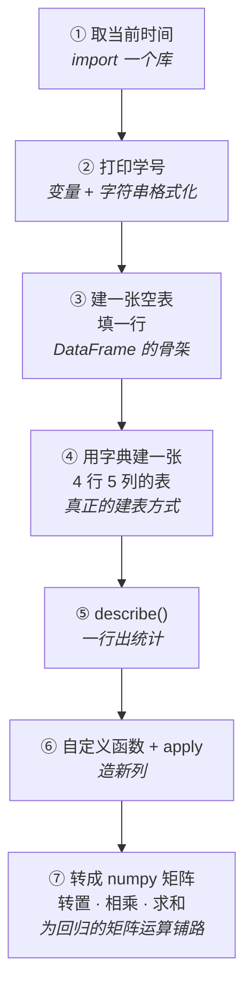
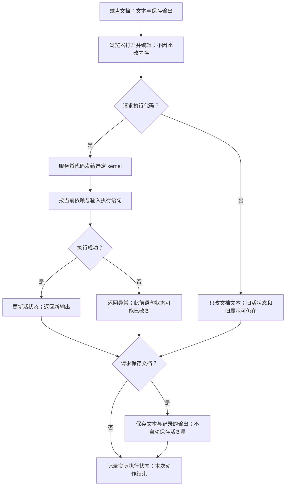
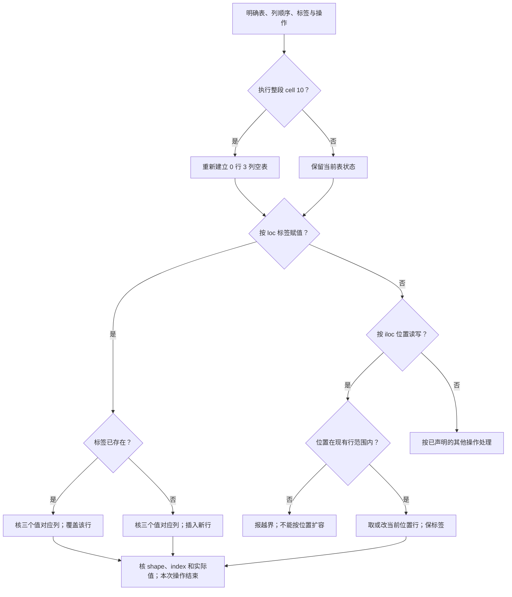
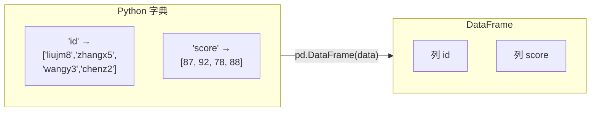
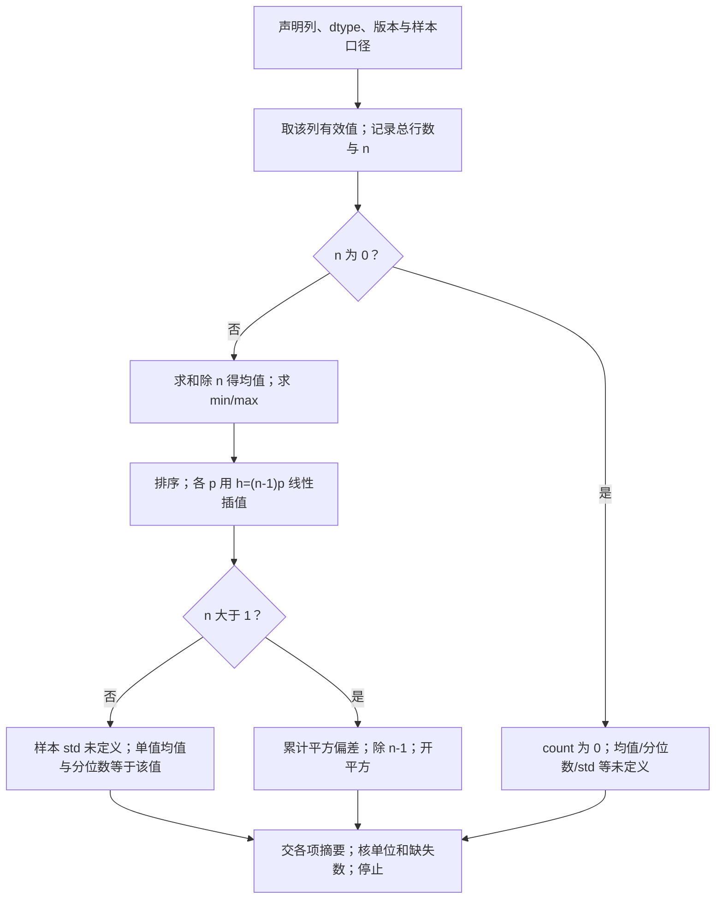
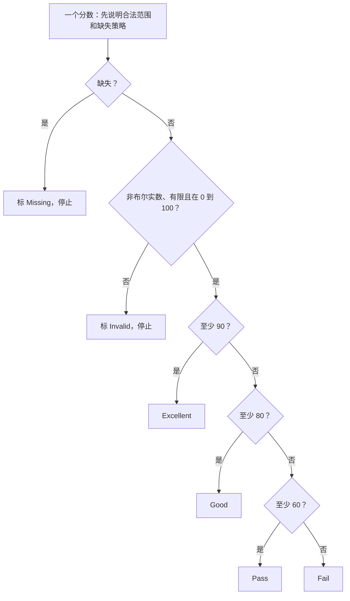
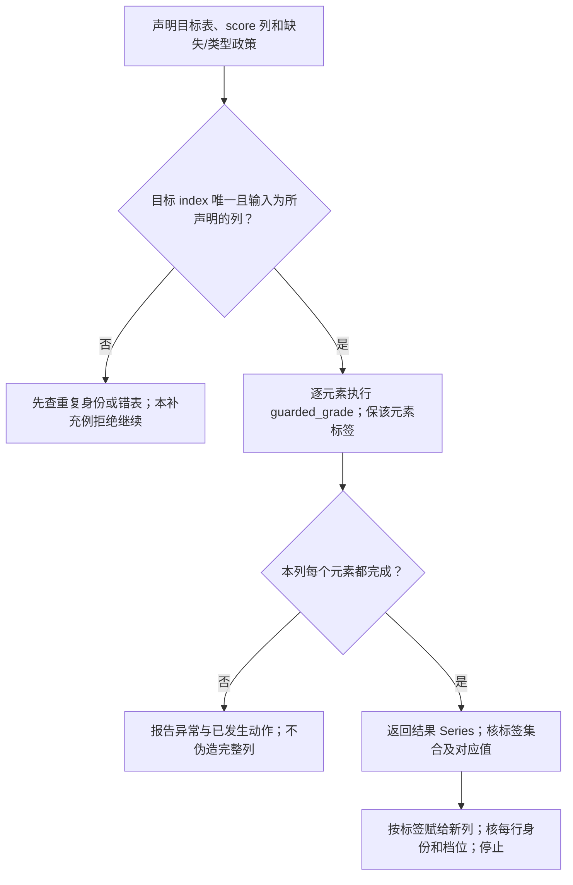
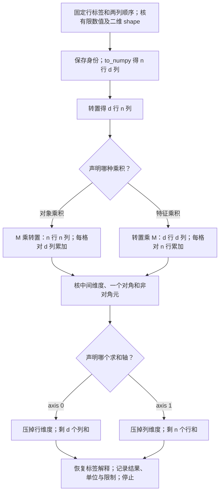
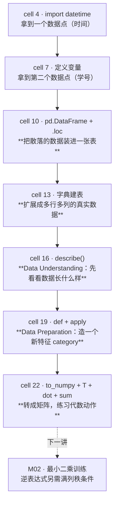
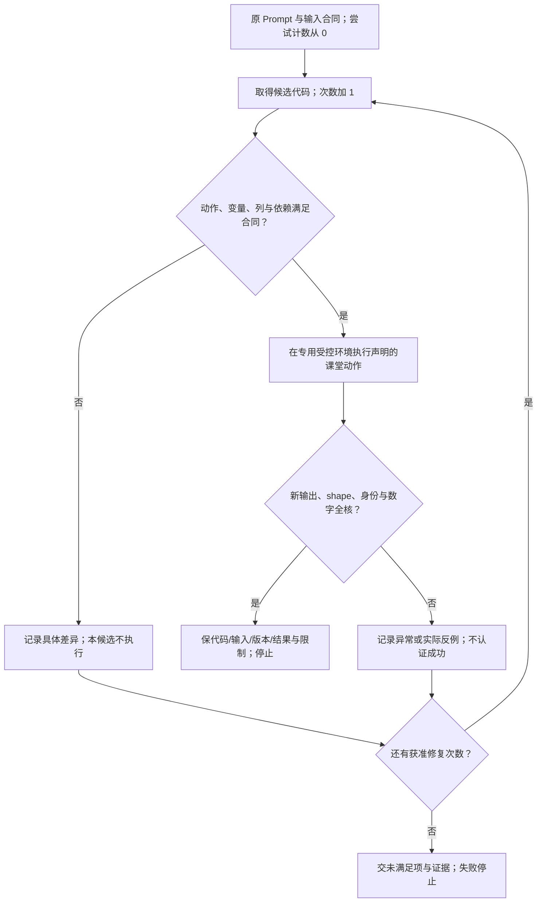

# T01 · Jupyter 入门与 Pandas 基础

> **本讲一句话**：这个 notebook 教七件最基础的事（取时间 → 打印变量 → 建表 → 建大表 → 统计 → 分类 → 矩阵运算），但它真正的教学设计藏在每段代码后面 —— **七个 `🤖 AI Prompt` 单元格，把同一段代码用自然语言重述一遍**。源材料提供 Python 写法和对应的 AI 代码提示。本轮解释这项设计，不认证教师课上实际说了什么。
> **原始材料**：`Tutorial 1 - Introduction to Jupyter Notebook_Prompt.ipynb`（25 cells）｜ **配套讲义**：[[M01-导论-商业数据分析全景与工具链#2.7 工具链：Anaconda / Jupyter / Colab|M01-导论-商业数据分析全景与工具链 › 2.7 工具链：Anaconda / Jupyter / Colab]]｜ **转录**：`pending`

---

## 0. 这个 notebook 在教什么

一句话：**把"能打开 Jupyter"变成"能用 Python 处理一张表"。**

它的七个小节是有意排的一条线：


```mermaid
flowchart TD
    A["① 取当前时间<br/><i>import 一个库</i>"] --> B["② 打印学号<br/><i>变量 + 字符串格式化</i>"]
    B --> C["③ 建一张空表<br/>填一行<br/><i>DataFrame 的骨架</i>"]
    C --> D["④ 用字典建一张<br/>4 行 5 列的表<br/><i>真正的建表方式</i>"]
    D --> E["⑤ describe()<br/><i>一行出统计</i>"]
    E --> F["⑥ 自定义函数 + apply<br/><i>造新列</i>"]
    F --> G["⑦ 转成 numpy 矩阵<br/>转置 · 相乘 · 求和<br/><i>为回归的矩阵运算铺路</i>"]
```

**①②是 Python 语法**（拿来热身），**③④⑤⑥是 pandas**（本课的主力工具），**⑦是 numpy**（下一讲 [[M02-预测分析-线性回归#2.8 参数是怎么训练出来的（讲义 p.30–37）|M02-预测分析-线性回归 › 2.8 参数是怎么训练出来的（讲义 p.30–37）]] 的正规方程 $\hat{\theta} = (X^{\top}X)^{-1}X^{\top}Y$ 在设计矩阵满列秩时成立；这里只做矩阵动作，未拟合回归）。

**预告符号唤醒（笔记补充）**：正规方程里的 $X$ 是设计矩阵（每行一个对象、每列一个输入，若模型含截距通常另有常数 1 列），$Y$ 是各对象的目标值，$\hat{\theta}$ 是待学习系数的估计。上标 $\top$ 表示转置，$-1$ 表示方阵的矩阵逆，不是逐格倒数：若方阵 $A$ 存在逆 $B$，两种乘法顺序都应得到单位矩阵 $AB=BA=I$；$I$ 是对角为 1、其余为 0 的方阵，乘它保留原元素。“线性组合”指各列分别乘一个数再相加；“满列秩”指没有一列能由其余列这样组合精确得到，才满足该逆表达式的关键条件。本讲表格 $M$ 只是 score/grade 两列，没有常数列和目标，不把数组练习当已完成这项回归。

**整个 notebook 只有 8 个 code cell，其中最后一个是空的**（留给你写作业）。这不是一个"难"的 notebook，但它建立的习惯会跟你一整学期。

---

## 1. 前置

### 1.1 需要哪些库、怎么装

| 库 | 用途 | 怎么来 |
|---|---|---|
| `datetime` | 取当前时间 | **Python 标准库**，装了 Python 就有，不用装 |
| `pandas` | 表格数据处理 | 检查所选环境是否已有；缺库才在对应环境安装 `pandas` |
| `numpy` | 数值/矩阵运算 | 检查所选环境是否已有；pandas 依赖 NumPy，版本仍须核 |

> 💡 发行版或托管服务可提供常用库，但环境可不同，先在实际 kernel 核解释器和库版本。这正是 [[M01-导论-商业数据分析全景与工具链#2.7.1 三条上手路径|M01 §2.7]] 推荐这两条路的原因。

**运行环境**（notebook metadata 实录）：

```
kernelspec:  {"display_name": "Python [conda env:base] *", "name": "conda-base-py"}
language_info: python 3.13.5
```

⚠️ 保存的 metadata 不是本次运行证明，也没有记录源 pandas 版本。本轮课堂七段代码在 Python 3.12.3 / pandas 2.3.3 / NumPy 1.26.4 成功执行；`describe()` 列选择与源保存输出不同，见 §2.5。不由此保证所有版本或前端完全一致。

### 1.2 对应哪一讲的理论

| notebook 内容 | 对应讲义 |
|---|---|
| 整个 notebook 的操作环境 | [[M01-导论-商业数据分析全景与工具链#2.7 工具链：Anaconda / Jupyter / Colab\|M01-导论-商业数据分析全景与工具链 › 2.7 工具链：Anaconda / Jupyter / Colab]]（讲义 p.46–57） |
| ⑦ numpy 矩阵转置与相乘 | ⏭️ **预告** [[M02-预测分析-线性回归#2.8.3 正规方程：闭式解（讲义 p.32–34）⭐\|M02-预测分析-线性回归 › 2.8.3 正规方程：闭式解（讲义 p.32–34）⭐]]（讲义 p.30, 34） |
| ⑤ `describe()` 的描述统计 | ⏭️ **预告** CRISP-DM 的 **Step 2 Data Understanding**（[[M01-导论-商业数据分析全景与工具链#2.5 ⭐ BDA 流程：CRISP-DM 六步（本讲的项目过程核心）\|M01 §2.5]]） |
| 七个 `🤖 AI Prompt` 单元格 | [[M01-导论-商业数据分析全景与工具链#2.6.6 深度学习、GenAI 与 LLM（p.43–45）\|M01 §2.6.6]] 的 "Code development"（讲义 p.45）；Syllabus ILO 3 |

### 1.3 本课用得到的 Python 语法 · 一次性速查表

> ⭐ **这张表是本课对"读者可能不会 Python"这件事的一次性还债。**
> 按 [[IS6400_Business_Data_Analytics/_meta/知识层级台账#0.3 ⭐ 最终判断（本课的 L0 口径）|知识层级台账 › 0.3 ⭐ 最终判断（本课的 L0 口径）]] 的口径：**L0-B 层的 Python 通用语法在正文里直接使用、不再解释**，但先在这里集中给一遍。看不懂后面某行代码时回来查这张表；表里没有的（库函数、参数）一律在正文里就地解释。

| 语法 | 长什么样 | 一句话 |
|---|---|---|
| 注释 | `# 这行不会被执行` | `#` 之后到行尾是给人看的 |
| 变量赋值 | `x = 5` | 把右边的值贴上 `x` 这个标签。**不用声明类型** |
| 打印 | `print(x)` | 把内容显示出来 |
| 字符串 | `'liujm8'` 或 `"liujm8"` | 单双引号等价 |
| 旧式格式化 | `'ID is: %s' % name` | `%s` 是占位符（s = string），`%f` 是小数，`%d` 是整数 |
| f-string（现代写法） | `f'ID is: {name}'` | 更易读，本 notebook 没用但你可以用 |
| 列表 list | `[87, 92, 78]` | 有序、可改。用 `a[0]` 取第一个（**从 0 开始数**） |
| 字典 dict | `{"id": ["a","b"], "score": [87, 92]}` | 键 → 值的映射。**建 DataFrame 最常用的形式** |
| 条件 | `if x >= 90: ... elif x >= 80: ... else: ...` | **顺序重要**，从上往下第一个成立的分支生效 |
| 循环 | `for i in range(2, 16): ...` | `range(2,16)` 产生 2,3,…,**15**（不含 16） |
| 定义函数 | `def f(x):` <br>&nbsp;&nbsp;&nbsp;&nbsp;`return x + 1` | `def` 定义，`return` 交出结果。**缩进决定函数体范围** |
| **缩进** | 四个空格 | Python 用缩进代替 `{}`。不一致可导致语法 / 缩进错误；合法但放错层的缩进还可能静默改变逻辑 |
| 导入库 | `import pandas as pd` | 导入已安装的 pandas 并绑定名 `pd`；import 本身不安装软件 |
| 导入库的一部分 | `from sklearn.linear_model import LinearRegression` | 只拿其中一个东西 |
| 点号调用 | `df.head()` | 调用对象 `df` 身上的方法 `head` |
| 点号取属性 | `lin_reg.coef_` | 取对象身上的属性（**没有括号**） |
| 链式调用 | `df['score'].value_counts().head()` | 从左往右一步步接着做 |

**三条会救命的规则**

1. **缩进必须一致**（统一四个空格，别混 Tab）
2. **索引从 0 开始**：`a[0]` 是第一个元素
3. **等号 `=` 是赋值，双等号 `==` 才是判断相等**

---

## 2. 逐块讲解

### 2.0 先讲三个概念（Jupyter 的心智模型）

#### 2.0.1 cell · kernel · 执行顺序 ⚠️

**是什么**

Jupyter notebook 看起来像一份从上到下排列的文档，但它运行起来**不是"从头读到尾就懂"，而更像一间共用一块黑板的教室**：黑板（内存）上写着什么，取决于**谁先举手发言（谁先被运行）**，跟这个人坐在教室的第几排（cell 在页面上排第几个）没有关系。这一小节把三个容易混的概念摆清楚：**cell** 是这间教室里的"一次发言"，**kernel** 是记住所有发言内容的那块黑板，执行的代码顺序、输入及环境共同决定活状态，显示排列不能代替执行记录。

| 概念 | 是什么 |
|---|---|
| **cell（单元格）** | notebook 的基本单位。**两种类型**：`code`（会被执行）和 `markdown`（只显示文字，本 notebook 25 个 cell 里有 **17 个是 markdown**） |
| **kernel（内核）** | 真正跑代码的后台 Python 进程。**你的所有变量都活在 kernel 的内存里** |
| **执行顺序** | ⚠️ **变量的存在与否只取决于"你按了哪些 cell 的运行键、按的先后"，与 cell 在页面上的排列顺序无关** |

**为什么这条最重要**：本 notebook 的 cell 10 用到了 cell 4 的变量 `x` 和 cell 7 的变量 `StudentID`。如果你跳过前面直接跑 cell 10，会看到：

```
NameError: name 'StudentID' is not defined
```

反过来，如果你改了 cell 7 但**没有重新运行它**，cell 10 用的还是旧值。

> 💡 **每个 code cell 左边的 `In [数字]` 就是执行序号。** `In [ ]` 表示当前显示没有执行计数，也可能清过记录，不能证明历史上从没跑过，`In [*]` 表示正在跑，`In [3]` 表示它是这个 kernel 上第 3 个被执行的 cell。**养成习惯：看到结果不对，先看序号是不是乱了。**
>
> **为什么这么写 / 易错点**：冷复现可排除部分陈旧命名空间，不能解决环境缺库、错数据或代码错误，也无“90%”实测依据。先保存必要成果，在专用测试 kernel 清状态，再按依赖顺序运行；真实错误按原因报告，不无限重启。

**机制展开（笔记补充）：代码文本、变量状态和输出不是同一份东西**

Notebook 浏览器保存的是单元格文本与显示的输出；执行交给当前环境中的 kernel，变量在 kernel 内存，`.ipynb` 与 CSV 在磁盘。保存文件不等于保存可继续使用的活变量；重启 kernel 后旧输出还能显示，也不意味着变量仍存在。


```mermaid
flowchart TD
    NB0["磁盘文档：文本与保存输出"] --> NB1["浏览器打开并编辑；不因此改内存"]
    NB1 --> NBR{"请求执行代码？"}
    NBR -->|是| NB2["服务将代码发给选定 kernel"]
    NB2 --> NB3["按当前依赖与输入执行语句"]
    NB3 --> NBS{"执行成功？"}
    NBS -->|是| NB4["更新活状态；返回新输出"]
    NBS -->|否| NBE["返回异常；此前语句状态可能已改变"]
    NBR -->|否| NBD["只改文档文本；旧活状态和旧显示可仍在"]
    NB4 --> NBQ{"请求保存文档？"}
    NBE --> NBQ
    NBD --> NBQ
    NBQ -->|是| NBF["保存文本与记录的输出；不自动保存活变量"]
    NBQ -->|否| NBEND["记录实际执行状态；本次动作结束"]
    NBF --> NBEND
```

**逐行执行 / 输出的完整状态轨迹**：运行 `a=1`，内存a为1；把代码改为 `a=2` 但不运行，内存仍为1；运行另一cell的 `a+3`，输出4；再运行赋值cell，内存a变2，但旧输出4没有自动重算；再运行 `a+3` 才显示5。重启kernel后单独运行 `a+3` 报 `NameError`，需重新按依赖顺序执行。`In[ ]` 空白也可能是清空输出 / 执行记录，不足以单独证明此代码从未运行。

**为什么这么写**：把编辑、执行和保存分开，才能判断依赖值来自本次还是旧会话。

**易错点**：空执行计数不证明历史未跑；报错不等前面语句全回滚；只有所声明的冷依赖运行和新结果才支撑复现。

**输出**：上面的 a 轨迹为 4→旧 4→重算 5；真正清变量后单跑 a+3 为 NameError，而旧显示可能仍在文档。

**所以呢**：记住"顺序说了算，不是位置说了算"，下一个自然的问题就是：具体要怎么按下"运行"这个动作。

#### 2.0.2 怎么运行

**是什么**

搞清楚了"运行顺序说了算"，下一个问题就很自然：**怎么让一个 cell 被运行？** 最常用的是键盘快捷键 **Shift + Enter**——光标停在哪个 cell，按一下就运行那一个。

| 操作 | 效果 |
|---|---|
| **Shift + Enter** | 运行当前 cell，光标跳到下一个 |
| Ctrl + Enter | 运行当前 cell，光标留在原地 |
| Alt + Enter | 运行当前 cell，并在下面插入一个新 cell |

（讲义 p.53 只教了 Shift + Enter；其余为补充，快捷键可受前端版本与自定义影响。）

**为什么这么写**：一次操作应明确是当前块还是整份文档；`Shift+Enter` 后移动光标不表示下一块也执行了。运行代码由 kernel 求值，Markdown 则渲染说明。

**易错点**：若内核断连，先核连接而不是把旧显示当新结果。

**所以呢**：会运行 cell 了，但运行完怎么看到结果，还有一个容易漏看的小机关——不一定非要写 `print`。

#### 2.0.3 最后一行会自动显示

**是什么**

Jupyter 有个特性：**一个 code cell 的最后一行如果是个表达式，它的值会自动显示出来，不需要 `print`**。

本 notebook 大量依赖这一点 —— cell 10 最后一行只有 `mytable`，cell 13 最后一行只有 `df`，都是靠这个机制把表显示出来。而且 **DataFrame 用这种方式显示会渲染成漂亮的 HTML 表格**，用 `print(df)` 只能得到纯文本。

**为什么这么写**：末尾表达式便于直接查看对象，不必把 rich display 当 `print`。

**易错点**：若最后一行是赋值，不会凭它自动显示表；显示的旧表也不是当前内存必然状态。

**所以呢**：cell、kernel、执行顺序、显示机制这几个"心智模型"讲完了。下面开始真正逐个 cell 走一遍 notebook，从最简单的一行代码开始。

---

### 2.1 【cell 4】取当前时间

**这块在干什么**：把当前时间取出来，存进变量 `x`，再打印。

```python
import datetime   #we need to find a tool we need from a library. the datatime is a library.
x = datetime.datetime.now()
#the tool "datetime.datetime.now()" provides the current time. we use this tool to get the time info
#and store the value in a variable "x"
print(x)  #now we can print the time 
```

**输出**（notebook 里保存的）：
```
2025-01-11 20:31:51.526293
```

**逐行**

| 行 | 在干什么 |
|---|---|
| `import datetime` | 把标准库 `datetime` 加载进来。**这是本课第一次出现 `import`** —— Python 默认只有很少的内置功能，其余全靠 import |
| `datetime.datetime.now()` | ⚠️ **两个 `datetime` 不是笔误**：第一个是**模块名**，第二个是模块里的**类名**，`.now()` 是这个类的方法。读作"`datetime` 模块里的 `datetime` 类，调用它的 `now()`" |
| `x = ...` | 把返回的时间对象贴上标签 `x` |
| `print(x)` | 显示。输出格式是 `年-月-日 时:分:秒.微秒` |

**为什么这么写**

- 为什么不用 `time` 库？`datetime` 返回的是**结构化的时间对象**（能取 `.year`、能相减得到时间差、能直接进 DataFrame 当日期列），而 `time.time()` 只给一个秒数
- 为什么要存进变量而不直接 `print(datetime.datetime.now())`？因为 **cell 10 还要再用这个时间**。若分别调用 now，是分别读取时间，可能不同，也可能因时钟分辨率读到同一时刻；保存 x 明确复用同一个返回对象

**⚠️ 易错点**

1. **输出的时间是 `2025-01-11`，不是你运行的时间** —— 这是 notebook 里保存的**上一次运行结果**。你自己按 Shift+Enter 才会看到当前时间
2. 注释里写的 `the datatime is a library` 有两处小问题：拼写应为 **datetime**；而且 `datetime` 严格说是**标准库里的一个模块（module）**，不是第三方"库（library)"。⚪ 本课语境下不必较真
3. 在冷命名空间未导入 `datetime` 就直接用 → `NameError: name 'datetime' is not defined`

**所以呢**：第一个变量（时间对象 `x`）造好了。下一个 cell 再造一个变量（学号），并且第一次接触"把变量嵌进一句话里打印"这个几乎每次都要用的操作。

---

### 2.2 【cell 7】打印学号 —— 变量与字符串格式化

**这块在干什么**：定义一个变量存学号，然后用格式化字符串把它嵌进一句话里。

```python
StudentID='liujm8' #we give the value "liujm8" to a variable StudentID
print('My Student ID is: %s' %StudentID)
```

**输出**：
```
My Student ID is: liujm8
```

**逐行**

| 部分 | 说明 |
|---|---|
| `StudentID='liujm8'` | `liujm8` 是原代码与 Prompt 的演示字符串，同例姓名为 LIU Junming；不从此认证真实账户归属。个人身份填写依相应任务要求，原评分段另保护 |
| `'…: %s'` | `%s` 是**占位符**，s 表示这里要塞一个字符串 |
| `% StudentID` | 百分号右边的值会被塞进 `%s` 的位置 |

**为什么这么写**

`%` 格式化是 Python 的**老式写法**（继承自 C 语言的 `printf`）。现代 Python 更常用 f-string：

```python
print(f'My Student ID is: {StudentID}')   # 更易读，效果完全相同
```

⚠️ **但本课的 AI Prompt 明确要求用 `%s`**（见 §6 的 Prompt 2：`use string formatting (%s)`）。原 Prompt 明确指定该写法，T02 也有 `%f` 源例；教师选择它的口头理由未知。下面是格式化数字的例子：

```python
print('Slope is %f, Intercept is %f' % (lin_reg.coef_[0][0], lin_reg.intercept_[0]))
```

| 占位符 | 塞什么 |
|---|---|
| `%s` | 字符串（其实什么都能塞，会自动转成字符串） |
| `%d` | 整数 |
| `%f` | 小数（默认 6 位） |
| `%.2f` | 小数，保留 2 位 |

**⚠️ 易错点**

- **多个占位符时右边必须用括号包成元组**：`'%s-%s' % (a, b)`，写成 `% a, b` 会报错
- 占位符个数与右边值的个数必须一致

**所以呢**：有了时间 `x` 和学号 `StudentID` 两个变量，下一步就是本课真正的重点——把这些零散的值放进一张表里，也就是这门课要用到的第一个 pandas 对象：DataFrame。

---

### 2.3 【cell 10】建第一张表 —— DataFrame 的骨架

**这块在干什么**：用 pandas 建一张空表（只定义列名），然后往第 0 行塞数据。

```python
import pandas as pd #now we learn how to store your information in a table using tool "pandas"
mytable=pd.DataFrame(columns=['id','name','time'])
mytable.loc[0]=[StudentID,'LIU Junming',x]
mytable
```

**输出**：
```
       id         name                       time
0  liujm8  LIU Junming 2025-01-11 20:31:51.526293
```

**逐行**

| 行 | 在干什么 |
|---|---|
| `import pandas as pd` | 加载 pandas，起小名 `pd`。`pd` 是常见别名，不是语言强制；改别名必须同步后续引用 |
| `pd.DataFrame(columns=[...])` | 建一个**空的 DataFrame**，只给了三个列名，没有任何行 |
| `mytable.loc[0]=[...]` | 用 **`.loc`** 按**行标签** `0` 赋值。**标签不存在时，pandas 会新建这一行** |
| `mytable` | cell 最后一行是表达式 → 自动渲染成表格（§2.0.3） |

**为什么这么写**

- **`.loc` vs `.iloc`**：`.loc` 按**标签**定位，`.iloc` 按**位置**定位。空表 `.loc` 可按缺标签插入，`.iloc` 不能扩容。插入后若标签 0 恰好在位置 0，读取可相同；筛选或排序后需看具体身份与位置，不能保证每次都不同。**本课后面用到的 `.loc` 全是按标签**
- **为什么值的顺序是 `[StudentID, 'LIU Junming', x]`**：必须与 `columns=['id','name','time']` **一一对应**。写反了不会报错，只会静默存错
- **注意 `x` 直接进表了**：pandas 能直接容纳 `datetime` 对象，不需要转成字符串

**⚠️ 易错点**

1. **`mytable.loc[0] = [...]` 的列表长度必须等于列数**，否则 `ValueError: cannot set a row with mismatched columns`
2. **这种"先建空表再一行行 `.loc` 赋值"的写法只适合演示**。大量逐行扩展可能有较高开销，类型须查实际 `dtypes`，不保证每次都退化成同一种类型。**真实场景用 cell 13 的字典写法**
3. `StudentID` 和 `x` 都来自前面的 cell —— **没跑前面直接跑这里会 `NameError`**（§2.0.1）

> 🔗 cell 9 的 markdown 给了官方文档链接：`https://pandas.pydata.org/docs/reference/api/pandas.DataFrame.html`。**这是本课唯一一次直接给 pandas 文档，值得收藏。**

**机制展开（笔记补充）：行标签、行位置和整块重跑**

先把“第几行”拆成身份与当前位置。DataFrame 的 `index` 是行标签，`columns` 是列标签，`shape` 为行数和列数。`.loc` 查标签；`.iloc` 查从 0 开始的位置。原 cell 10 先建 `(0,3)` 空表，随后 `loc[0]` 插入一行变 `(1,3)`。空表没有第 0 个位置，`iloc[0]=...` 不能借此扩容。已有标签被赋值则覆盖该行，缺标签的读取 `loc[99]` 是 `KeyError`，位置超范围的读取 `iloc[4]` 是 `IndexError`，读取不会偷偷新增行。


```mermaid
flowchart TD
    LA["明确表、列顺序、标签与操作"] --> LB{"执行整段 cell 10？"}
    LB -->|是| LC["重新建立 0 行 3 列空表"]
    LB -->|否| LD["保留当前表状态"]
    LC --> LE{"按 loc 标签赋值？"}
    LD --> LE
    LE -->|是| LF{"标签已存在？"}
    LF -->|是| LG["核三个值对应列；覆盖该行"]
    LF -->|否| LH["核三个值对应列；插入新行"]
    LE -->|否| LI{"按 iloc 位置读写？"}
    LI -->|是| LJ{"位置在现有行范围内？"}
    LJ -->|否| LK["报越界；不能按位置扩容"]
    LJ -->|是| LL["取或改当前位置行；保标签"]
    LI -->|否| LM["按已声明的其他操作处理"]
    LG --> LN["核 shape、index 和实际值；本次操作结束"]
    LH --> LN
    LL --> LN
```

**完整状态对照**：已有 `mytable` 为标签 `[0]` 的一行时，单独运行 `mytable.loc[1]=[...]` 得 `[0,1]` 两行；把原 cell 10 第三行改为 `loc[1]` 后**整段**运行，第二行先清掉旧表，所以只有 `[1]` 一行。再次运行整段也仍只有这一行。若单独再次给 `loc[1]` 赋值，则是覆盖已有标签 1，不追加第三行。

**另一个可复算例**：原四分数按标签 31/12/50/7 保存，分别为 87/92/78/88。按分数升序后标签顺序为 50/31/7/12；`iloc[0]` 为 78（标签 50），`loc[31]` 为 87，`loc[0]` 因标签不存在报错。不能从“排序过”推断所有 `loc` 与 `iloc` 都不同，应看具体标签与位置。

**失败后的状态**：代码 cell 不是事务。新命名空间只跑原 cell 10：先导入 `pd`，再建立空 `mytable`，求赋值列表时 `StudentID` 未定义而报错。此时 `pd` 和 `(0,3)` 的 `mytable` 已存在，行尚未插入；`x` 也不能假定存在。不能把报错理解为“这一块前面的动作全回滚”。应补齐 cell 4/7 的依赖，再按声明顺序执行、核新输出。

**🎙️ 课堂补充**：无本讲转录，以上状态推理为笔记补充，不冒称助教口头演示。**常见误解**是只改代码文本却按旧表判断，或把身份和位置当同一个数。与 §2.0.1 的活内存、§2.4 的字典列配对共同保证数据行没有被静默换人。


**所以呢**：先建空表再一行行塞数据，这种写法容易懂但**只适合演示**（扩展开销与类型需核）。下一个 cell 换成真正常用的建表方式——用字典一次性建好。

---

### 2.4 【cell 13】建第二张表 —— 字典写法（真正常用的方式）

**这块在干什么**：用一个字典一次性建出 4 行 5 列的表。

```python
import pandas as pd
import datetime

# Create a DataFrame with some data
data = {
    "id": ["liujm8", "zhangx5", "wangy3", "chenz2"],
    "name": ["LIU Junming", "ZHANG Xi", "WANG Yi", "CHEN Zhi"],
    "grade": [1, 2, 1, 3],
    "score": [87, 92, 78, 88],
    "time": [
        datetime.datetime(2025, 1, 8, 15, 53, 13),
        datetime.datetime(2025, 1, 8, 16, 0, 0),
        datetime.datetime(2025, 1, 8, 16, 5, 0),
        datetime.datetime(2025, 1, 8, 16, 10, 0),
    ],
}

df = pd.DataFrame(data)
df
```

**输出**：

| | id | name | grade | score | time |
|---|---|---|---|---|---|
| 0 | liujm8 | LIU Junming | 1 | 87 | 2025-01-08 15:53:13 |
| 1 | zhangx5 | ZHANG Xi | 2 | 92 | 2025-01-08 16:00:00 |
| 2 | wangy3 | WANG Yi | 1 | 78 | 2025-01-08 16:05:00 |
| 3 | chenz2 | CHEN Zhi | 3 | 88 | 2025-01-08 16:10:00 |

**逐行理解 / 核心一句话**：**字典的键 = 列名，字典的值（列表）= 那一列的全部数据。**


```mermaid
flowchart LR
    subgraph Dict["Python 字典"]
        K1["'id' →<br/>['liujm8','zhangx5',<br/>'wangy3','chenz2']"]
        K2["'score' →<br/>[87, 92, 78, 88]"]
    end
    Dict -->|"pd.DataFrame(data)"| DF
    subgraph DF["DataFrame"]
        C1["列 id"]; C2["列 score"]
    end
```

**为什么这么写**

| 对比 | cell 10 的方式 | cell 13 的方式 |
|---|---|---|
| 建表 | 先建空壳，再一行行填 | **一次性建好** |
| 思维方向 | 按**行**想 | 按**列**想 ← **pandas 的原生方向** |
| 性能 | 大量逐行扩展通常开销较高，实际依数据与实现核 | 一次分配，快 |
| dtype | 容易退化成 `object` | **自动推断**：`grade`/`score` → `int64`，`time` → `datetime64` |

> 💡 **"按列想"是 pandas 的世界观。** DataFrame 内部就是"一堆列（Series）拼起来"，每列有自己的类型。这也解释了为什么后面 `df["score"].apply(...)` 这么自然 —— 你在对**一整列**做事。

**注意 `datetime.datetime(2025, 1, 8, 15, 53, 13)`**：这是**构造**一个指定时刻（年,月,日,时,分,秒），与 §2.1 的 `.now()`（取当前时刻）不同。同一个类的两种用法。

**⚠️ 易错点**

1. **所有列表长度必须相同**，否则 `ValueError: All arrays must be of the same length`
2. `import pandas as pd` 和 `import datetime` 在这里**重复导入了**（cell 4、cell 10 已经导过）。模块通常复用导入缓存，仍有调用开销。此 cell 同时定义所需数据，可独立构造表；其他 cell 即使重复 import 仍可能依赖旧变量，不能从导入推断教师意图或每块都独立
3. 源码里第三个和第四个 `datetime` 之间有一个多余的空行，纯排版问题，不影响运行

**所以呢**：4 行 5 列的表 `df` 造好了。拿到一张新表，CRISP-DM 第 2 步的数据理解可从形状、类型、缺失和摘要开始，具体次序依任务——下一个 cell 就是干这件事的。

---

### 2.5 【cell 16】一行出统计 —— describe()

**这块在干什么**：让 pandas 根据列的类型和参数生成摘要；本节保留原两数值列的保存输出，并另核实际版本。

```python
stats = df.describe()
stats
```

**输出**：

| | grade | score |
|---|---|---|
| count | 4.000000 | 4.000000 |
| mean | 1.750000 | 86.250000 |
| std | 0.957427 | 5.909033 |
| min | 1.000000 | 78.000000 |
| 25% | 1.000000 | 84.750000 |
| 50% | 1.500000 | 87.500000 |
| 75% | 2.250000 | 89.000000 |
| max | 3.000000 | 92.000000 |

**逐行**：赋值 `stats` 保存结果，末行表达式显示它。下表逐项解释八个字段。

| 行 | 含义 |
|---|---|
| `count` | **非缺失**值的个数。⚠️ 这不是行数！有缺失时会小于行数 |
| `mean` | 平均值 |
| `std` | 标准差（默认是**样本标准差**，分母 n−1） |
| `min` / `max` | 最小 / 最大 |
| `25%` / `50%` / `75%` | 四分位数。**`50%` 就是中位数** |

**⚠️ 保存输出与运行版本要分开**

原 notebook 保存摘要仅有 `grade` / `score`，未记录生成它的 pandas 版本。本轮 pandas 2.3.3 执行同一 `df.describe()` 还包含日期列 `time`，给日期的均值、最小、分位数和最大值；该日期列没有样本 std，表格相应格为 NaN。不能据旧保存表说默认永久排除所有非数值列。若想稳定复算本节两列数字，用 `df.select_dtypes(include="number").describe()` 明确选数值列。

想看全部列：

```python
df.describe(include='all')     # 全部列；摘要字段随 dtype 不同，不全是类别指标
df.describe(include='object')  # 只选 object dtype；不等所有字符串列
```

**dtype 与内容要分开（笔记补充）**：object 是可容纳通用 Python 对象的列类型，可以装数字或文字；StringDtype 是 pandas 的专用字符串类型。当前原表 id/name 恰为 object，所以上述 object 选择会包含它们，但不能从这次表推断“所有字符串必被选中”。自给三行例：一列明确 object、值1/2/None，另一列专用 string、值a/b/缺失，`describe(include="object")` 仅给第一列的 count/unique/top/freq，不给它数值均值，也不包含第二列。想做数值摘要按明确的 number dtype 选列；内容看起来是数字或文字不替你完成类型转换政策。

**类别摘要字段（笔记补充）**：count 是非缺失值数；unique 是这些有效值中不同取值的数量；top 是出现最多的取值，**不是数值最大者**；freq 是该 top 出现次数。若多个取值并列最高频，top 不唯一，不能假定特定赢家；不同字段不能都解释成平均/最大值。上例 object 数字1/2/None得到count2、unique2、freq1，top可以是并列的1或2；不能据此把2叫“最大所以top”。

**为什么这么写 / 为什么这一步重要**

`describe()` 是 **CRISP-DM 第 2 步（Data Understanding）** 最常用的第一个动作（[[M01-导论-商业数据分析全景与工具链#2.5 ⭐ BDA 流程：CRISP-DM 六步（本讲的项目过程核心）|M01 §2.5]]）。拿到一份陌生数据，可先做以下检查，再按任务补缺失、取值与时点检查：

```python
df.shape        # 多少行多少列
df.dtypes       # 每列什么类型
df.select_dtypes(include="number").describe()  # 明确只选数值列
```

[[IS6400_Business_Data_Analytics/_meta/数据集卡片|数据集卡片]] 里 Airbnb 那张卡的"§2.1 数值列的描述统计"就是 `describe()` 的产物。

**⚠️ 易错点**

- **`count` 是非缺失值个数，不是行数。** 这是发现缺失值最快的方法：`count` 比总行数小 = 有缺失
- `std` 用的是 **n−1** 分母（样本标准差）。numpy 的 `np.std()` 默认用 **n**（总体标准差），两者结果不同
- 只有 4 行数据时，四分位数是**插值**算出来的（`25% = 84.75` 并不是任何一个真实分数），小样本时别过度解读

**机制展开（笔记补充）：让原四个分数走完 describe 的计算**

本例 `score=[87,92,78,88]`，输入四个有效数字，输出八项摘要；以下逐项算出原保存表的数字口径。

1. count=4，均值 $(87+92+78+88)/4=86.25$。
2. 偏差为 $0.75,5.75,-8.25,1.75$；平方为 $0.5625,33.0625,68.0625,3.0625$，合计104.75。样本方差 $104.75/(4-1)=34.916667$，标准差 $\sqrt{34.916667}=5.909033$。`describe` 使用样本标准差，分母不是4；若换 `numpy.std` 默认总体口径，数值会不同。
3. 排序为 $78,87,88,92$。pandas 默认线性插值用从零开始的位置 $h=(n-1)p$；$n$ 为有效数目、$p$ 为分位比例，$h$ 是排序位置。
4. 25% 位置0.75，在78与87间，$78+0.75(87-78)=84.75$；50%位置1.5，$87+0.5(88-87)=87.5$；75%位置2.25，$88+0.25(92-88)=89$。不是一律“拿上下半的中位数”。
5. min=78、max=92，结合前四步得到原摘要全部八项。操作到此完成，不把统计表当成四行明细本身。

**边界与迁移**：有缺失时 count 与计算分母用有效值；有效值仅1个时样本std无定义，不能硬输出0。若在列末加一个缺失，以上统计不变但表行数变5，说明 count 与 `len(df)` 不同。若将全部分数加10，均值与分位数加10，标准差不变；它测的是散开幅度，而不是数值高低。排序后必须保留标签含义，不能将第0个位置当索引标签0。


**控制流程与原理（笔记补充）**

数字摘要要先决定统计哪一列，再剔除该列缺失值。设有效值个数为 $n$，均值为 $\bar{x}$，第 $i$ 个值为 $x_i$。有效值偏差满足 $\sum_i(x_i-\bar{x})=0$：知道其中 $n-1$ 个偏差就能推出最后一个，因此估均值后只剩 $n-1$ 个自由偏差。在独立同分布且有有限方差等条件下，平方偏差和除以 $n-1$ 对总体方差是无偏估计；**开平方得到的样本标准差不因此无偏**。这是本讲使用样本口径的原理，不是“所有分母都要减 1”。


```mermaid
flowchart TD
    SA["声明列、dtype、版本与样本口径"] --> SB["取该列有效值；记录总行数与 n"]
    SB --> SC{"n 为 0？"}
    SC -->|是| SD["count 为 0；均值/分位数/std 等未定义"]
    SC -->|否| SE["求和除 n 得均值；求 min/max"]
    SE --> SF["排序；各 p 用 h=(n-1)p 线性插值"]
    SF --> SG{"n 大于 1？"}
    SG -->|否| SH["样本 std 未定义；单值均值与分位数等于该值"]
    SG -->|是| SI["累计平方偏差；除 n-1；开平方"]
    SH --> SJ["交各项摘要；核单位和缺失数；停止"]
    SI --> SJ
    SD --> SJ
```

**条件词就地解释**：“独立同分布”指这些观察来自同一总体分布，而且各次抽取不因其他次结果改变；并不是说同一对象的不同特征都互不相关。“无偏估计”指在声明的抽样模型下反复抽样，估计数的平均等于真实总体量，不保证一次估计恰好等于真实值。

**一个完整微型原理例**：总体仅有 −1/+1，各占一半，总体均值 0、方差 1、标准差 1。独立抽两次共有四个等概率有序结果：(-1,-1)、(-1,+1)、(+1,-1)、(+1,+1)。每组先算自身均值，再算平方偏差和，依次为 0/2/2/0；除 $n-1=1$ 的样本方差为 0/2/2/0，四种平均为 1，与总体方差一致。若除 $n=2$ 则为 0/1/1/0，平均 .5。样本标准差却为 $0,\sqrt{2},\sqrt{2},0$，平均 $\sqrt{2}/2$ 约 .7071，不等总体标准差 1。这个可穷举例解释了为什么“无偏方差”不等“无偏标准差”，并不代替所有分布下的证明。

**新数演练**：有效值为 2/4/8/10，另一个表行缺失。总行数 5，$n=4$；均值 6，偏差 −4/−2/2/4，平方和 40，样本方差 $40/3$，标准差 $\sqrt{40/3}=3.651484$。排序已是 2/4/8/10：25% 的位置 .75 得 3.5，50% 的位置 1.5 得 6，75% 的位置 2.25 得 8.5，min=2、max=10。若仅留 8，count=1、均值/各分位数 8，样本 std 为 NaN；全缺失时 count=0，不能把均值或 std 填成真实的 0。

**为什么需要这条链**：摘要按列略去缺失，却不告诉你缺失是否随机、数据是否代表业务总体；四个数的差异也不能证明模型质量。`inf` 是非缺失但非有限，不能用“count 正常”放行，先声明并检查是否接受非有限数。相同统计摘要可能来自不同行，需保留原表；时间列不能把字符串和日期统计混成一种口径。**🎙️ 课堂补充**：待转录。与 M03 的统计概念、CRISP-DM 的数据理解相连，数字例只负责让这一函数的输出可复算。


**所以呢**：`describe()` 只能算现成列的统计，不能凭空造出新信息。下一个 cell 教怎么**造一个全新的列**——这是特征工程最基本的动作。

---

### 2.6 【cell 19】自定义函数 + apply() —— 造一个新列

**这块在干什么**：写一个"分数 → 等第"的函数，把它套到 `score` 列的每个值上，结果存成新列 `category`。

```python
def grade_category(score):
    if score >= 90:
        return "Excellent"
    elif score >= 80:
        return "Good"
    elif score >= 60:
        return "Pass"
    else:
        return "Fail"

df["category"] = df["score"].apply(grade_category)
df
```

**输出**（多了最右一列）：

| | id | name | grade | score | time | **category** |
|---|---|---|---|---|---|---|
| 0 | liujm8 | LIU Junming | 1 | 87 | … | **Good** |
| 1 | zhangx5 | ZHANG Xi | 2 | 92 | … | **Excellent** |
| 2 | wangy3 | WANG Yi | 1 | 78 | … | **Pass** |
| 3 | chenz2 | CHEN Zhi | 3 | 88 | … | **Good** |

**逐行 / 逐部分**

| 部分 | 说明 |
|---|---|
| `def grade_category(score):` | 定义一个函数，参数叫 `score` |
| `if / elif / else` | ⚠️ **顺序是关键**：从上往下，**第一个成立的分支就返回**。所以门槛必须**从高到低**排 |
| `df["score"]` | 取出 `score` 这一列（得到一个 **Series**） |
| **`.apply(grade_category)`** | 把函数**逐个元素**套到这一列上，返回一个同样长的新 Series。⚠️ **注意函数名后面没有括号** —— 你传的是"函数本身"，不是"函数的调用结果" |
| `df["category"] = …` | 给 DataFrame 加一个**新列**。列名不存在时直接新建 |

**为什么这么写**

**① 为什么门槛必须从高到低？**
如果写成 `if score >= 60: return "Pass"` 在最前面，那么 92 分也会先撞上这一条，全部人都是 "Pass"。**`elif` 链是"短路"的，谁在前谁优先。**

**② 为什么不用 `for` 循环？**
你完全可以写：
```python
cats = []
for s in df["score"]:
    cats.append(grade_category(s))
df["category"] = cats
```
效果一样，但 `.apply()` 通常写法更短，不保证更快，而且是 pandas 的惯用法。**"对一整列做同一件事"是 pandas 的核心动作。**

**③ `.apply()` 传的是函数名，不是调用**
```python
df["score"].apply(grade_category)     # ✅ 正确：把函数交给 apply
df["score"].apply(grade_category())   # ❌ 错误：这是先调用函数（还缺参数），把结果交给 apply
```

**④ 这个模式在本课后面会一直用**
"造一个新列"就是 **CRISP-DM 第 3 步 Data Preparation / 特征工程**（W03）的基本动作。[[IS6400_Business_Data_Analytics/_meta/数据集卡片#3.1 缺失机制（这是本数据集最值得讲的一点）|数据集卡片 › 3.1 缺失机制（这是本数据集最值得讲的一点）]] 里建议给 Airbnb 加一列 `has_review = (number_of_reviews > 0)`，就是同一件事。

**⚠️ 易错点**

1. **`df["category"] = ...` 是原地修改 `df`。** 再跑一次这个 cell 不会出错（列被覆盖），但如果你在中间改了 `grade_category` 的逻辑却没重跑，结果会对不上（§2.0.1 的执行顺序问题）
2. 函数里的参数名 `score` 和 DataFrame 的列名 `score` **同名纯属巧合**，改成 `def grade_category(s)` 完全等价
3. `.apply()` 在大数据上比向量化操作慢。限定合法输入并核对边界后，可用左闭右开写法 `pd.cut(df["score"], bins=[0,60,80,90,101], right=False, labels=[...])`，默认右闭不是同一分档，⚪ 本课不要求

**分档过程的边界**：原 `grade_category` 按从高到低的阈值返回，90先命中Excellent，80命中Good，60命中Pass。输入包含NaN时各个比较都为False，原函数会落到Fail；负数也为Fail、101为Excellent——它没有替你验证合法分数。要规定缺失与越界的处理，不能将这些当成真实成绩。


```mermaid
flowchart TD
    GR0["一个分数：先说明合法范围和缺失策略"] --> GR1{"缺失？"}
    GR1 -->|是| GRM["标 Missing，停止"]
    GR1 -->|否| GR2{"非布尔实数、有限且在 0 到 100？"}
    GR2 -->|否| GRI["标 Invalid，停止"]
    GR2 -->|是| GR3{"至少 90？"}
    GR3 -->|是| GRE["Excellent"]
    GR3 -->|否| GR4{"至少 80？"}
    GR4 -->|是| GRG["Good"]
    GR4 -->|否| GR5{"至少 60？"}
    GR5 -->|是| GRP["Pass"]
    GR5 -->|否| GRF["Fail"]
```

这张图显式增加输入验证，**不是冒称原 notebook 已有这些分支**。对合法分数，`pd.cut(...bins=[0,60,80,90,101], right=False)` 用左闭右开，才在60/80/90三个边界与原函数一致；默认 `right=True` 会把这些分入低一档。0、101、缺失还须按已说明的合法输入与缺失策略处理，所以不能泛称两段代码对所有输入等价。

**实际边界输出**（补充数值核对）：59→Fail、60→Pass、79→Pass、80→Good、89→Good、90→Excellent、100→Excellent。默认右闭cut的60/80/90则为Fail/Pass/Good。逐元素函数每个输入命中首个分支即停止；`.apply` 遍历全部元素后交回一列。它写法短，但执行Python函数不保证比for快；真正向量化又须核对边界含义。


**机制展开（笔记补充）：校验政策与标签赋值**

原函数只含三个比较，不含输入校验。浮点 `NaN` 的三个比较均为 False，因而落 Fail；`None` 和字符串 `'90'` 与数字比较会报 `TypeError`，`pd.NA` 的条件真假不明确也会报错；正无穷会落 Excellent、负无穷会落 Fail。这些都不能当成真实成绩。我们另外声明政策：输入应为实数标量、排除布尔；缺失记 Missing，非有限或越出 0–100 记 Invalid，合法分数才使用原四档。

**这段补充代码在做什么**：仅增加明确的守卫，不改原 cell 19。先在已导入 pandas 且已定义原 `grade_category` 的命名空间执行：

```python
from numbers import Real
import math

def guarded_grade(score):
    if score is None or score is pd.NA:
        return "Missing"
    if isinstance(score, bool) or not isinstance(score, Real):
        return "Invalid"
    if score < 0 or score > 100:
        return "Invalid"
    if math.isnan(score):
        return "Missing"
    if not math.isfinite(score):
        return "Invalid"
    return grade_category(score)
```

**逐行说明**：`Real` 检查实数标量，`math` 做 NaN/有限性判断；前两条 `return` 区分缺失和错误类型。先比较范围，拒绝 ±inf 和极大整数，避免它们先转浮点导致溢出；浮点 NaN 不命中范围比较，再由 `isnan` 给独立出口。`isfinite` 是合法返回前的有限性检查；最后调用已定义的原函数。每次调用首个命中分支就结束，缺原函数时合法输入会 `NameError`，所以不能把此代码称作无依赖。

**输出**：输入 `None`/`pd.NA`/浮点 NaN 得 Missing；−1/101/±inf/`'90'`/`True`/极大整数得 Invalid；0/59 得 Fail，60/79 得 Pass，80/89 得 Good，90/100 得 Excellent。守卫图对应这项补充政策，不代表原代码已有校验。此演练针对 Python/NumPy 常用实数标量；扩展自定义数值类型仍须核类型的比较及转换合同。

**apply 的状态流**：输入是带索引的一列 Series；对每个值调用函数，返回仍保对应索引的 Series；再赋给 DataFrame 的新列时按**标签**对齐。长度相同不足以保证对的人拿到对的值。


```mermaid
flowchart TD
    AA["声明目标表、score 列和缺失/类型政策"] --> AB{"目标 index 唯一且输入为所声明的列？"}
    AB -->|否| AC["先查重复身份或错表；本补充例拒绝继续"]
    AB -->|是| AD["逐元素执行 guarded_grade；保该元素标签"]
    AD --> AE{"本列每个元素都完成？"}
    AE -->|否| AF["报告异常与已发生动作；不伪造完整列"]
    AE -->|是| AG["返回结果 Series；核标签集合及对应值"]
    AG --> AH["按标签赋给新列；核每行身份和档位；停止"]
```

**完整对齐例**：两行标签为 50/10，分数 90/60。`apply` 得标签 50→Excellent、10→Pass。将这个 Series 的顺序反转为 `[10,50]`，再赋给原表，仍按标签得到 50→Excellent、10→Pass；若先 `tolist()` 去掉标签再赋值，两个位置取 Pass/Excellent，静默分错人。若构造默认索引 0/1 的 Series 再赋给标签 50/10 的表，两行均 NaN，因为找不到对应标签。位置赋值只在你已核相同次序且明确选择位置语义时使用；`.to_numpy()` 同样丢身份。

**cut 边界例**：默认 `(0,60]` 含 60 不含 0，所以 0→NaN、60→Fail、80→Pass、90→Good。改 `right=False` 和边界 `[0,60,80,90,101]` 可让合法范围内的 0/60/80/90/100 与原函数一致，但 100.5 也在最后区间，**仍须先用 0–100 校验**；101 不在任何左闭右开区间。不能只改括号就说所有输入等价。

**🎙️ 课堂补充**：待转录。**常见误解**包括把浮点缺失当不及格、把排序当身份改变，或只核新列长度。与 §2.3 的行标签和 §2.7 的无标签数组共同决定赋值语义；我们限定唯一索引是这项演练的明确输入合同，不是宣称 pandas 对任何重复索引必然报错。


**所以呢**：pandas 这条线（建表、统计、造列）告一段落。notebook 最后换了一个话题——不用 pandas，直接用 numpy 做矩阵运算，为下一讲的线性回归数学做铺垫。

---

### 2.7 【cell 22】numpy 矩阵运算

**这块在干什么**：把两列数字取出来变成矩阵，然后做转置、矩阵乘法、按列求和。

```python
import numpy as np

# Convert "score" and "grade" columns into a numpy matrix
matrix = df[["score", "grade"]].to_numpy()
print("Original Matrix:")
print(matrix)

# Transpose
transpose = matrix.T
print("\nTransposed Matrix:")
print(transpose)

# Matrix multiplication
result = np.dot(matrix, transpose)
print("\nMatrix Multiplication Result:")
print(result)

# Calculate all scores and grades
sum_matrix = np.sum(matrix, axis=0)  # Sum along columns
print("\nSum of Scores and Grades:")
print(sum_matrix)
```

**输出**：
```
Original Matrix:
[[87  1]
 [92  2]
 [78  1]
 [88  3]]

Transposed Matrix:
[[87 92 78 88]
 [ 1  2  1  3]]

Matrix Multiplication Result:
[[7570 8006 6787 7659]
 [8006 8468 7178 8102]
 [6787 7178 6085 6867]
 [7659 8102 6867 7753]]

Sum of Scores and Grades:
[345   7]
```

**逐行 / 逐部分**

| 部分 | 说明 | 形状 |
|---|---|---|
| `df[["score", "grade"]]` | ⚠️ **双层方括号**：外层是"取列"，内层是"列名的列表"。取多列必须双层，取单列 `df["score"]` 是单层（得到 Series 而不是 DataFrame） | 4×2 DataFrame |
| `.to_numpy()` | 把 DataFrame 转成 numpy 数组（**丢掉列名和索引，只剩纯数字**） | `(4, 2)` |
| `matrix.T` | **转置**：行列互换。`.T` 是属性不是方法，**没有括号** | `(2, 4)` |
| `np.dot(matrix, transpose)` | 矩阵乘法：$(4,2) \times (2,4) = (4,4)$ | `(4, 4)` |
| `np.sum(matrix, axis=0)` | 沿 **axis=0** 求和 | `(2,)` |
| `\n` | 字符串里的换行符，让输出之间空一行 | — |

**`axis` 到底怎么理解（本课最常搞错的参数之一）**

```
        axis=1 →（沿着列的方向，横着走）
   ┌─────────────┐
 ↓ │ 87        1 │
axis│ 92        2 │
 =0 │ 78        1 │
   │ 88        3 │
   └─────────────┘
     345        7      ← np.sum(matrix, axis=0)
```

**记法：`axis=0` 压掉"行"这个维度，得到每一列的结果。** `(4,2)` 沿 axis=0 求和 → `(2,)`：`87+92+78+88 = 345`（总分），`1+2+1+3 = 7`（年级和）。

反过来 `axis=1` 会得到每一行的和 `[88, 94, 79, 91]`（分数+年级，**没有业务意义**）。

**⚠️ `np.dot(matrix, transpose)` 那个 4×4 结果是什么？**

它是 **Gram 矩阵**：第 (i,j) 个元素 = 第 i 个学生的向量 · 第 j 个学生的向量。
验算左上角：$87\times 87 + 1\times 1 = 7569 + 1 = 7570$ ✅

> ⚠️ 这是学生向量之间的未中心化点积。可以解释代数含义，业务相似度还须说明单位、缩放和目的；无转录不认证教授口头意图，不能把它当相关系数。
>
> 💡 **但这个动作在下一讲会突然变得关键**：[[M02-预测分析-线性回归#2.8.3 正规方程：闭式解（讲义 p.32–34）⭐|M02 §2.8.3]] 的正规方程是
> $\hat{\theta} = (X^{\top}X)^{-1}X^{\top}Y$
> 那个 **$X^{\top}X$** 就是这里的 `np.dot(matrix.T, matrix)`（**注意顺序反过来**，得到的是 `(2,2)` 的特征间乘积矩阵，它聚合特征乘积；两种乘积各有明确代数含义）。**这个 cell 是在为下一讲的数学做手指热身。**

**⚠️ 易错点**

1. **矩阵乘法的形状必须能对上**：$(a,b) \times (b,c) = (a,c)$。中间的 `b` 不等就报 `ValueError: shapes not aligned`
2. **`np.dot(A, B) ≠ np.dot(B, A)`**：`np.dot(matrix, matrix.T)` 是 4×4，`np.dot(matrix.T, matrix)` 是 2×2
3. **`.T` 没有括号**（属性），**`.to_numpy()` 有括号**（方法）
4. `df[["score","grade"]]` 的列顺序决定矩阵的列顺序，别写反

**为什么这么写：维度收缩与身份（笔记补充）**

取两列时先记输入列顺序 `score,grade` 和每行标签；转成 ndarray 后形状保留、标签消失。对二维矩阵 $M$，$M_{ik}$ 表示第 $i$ 行第 $k$ 列；转置把行列交换。矩阵乘法的中间维度必须相等，结果每格沿中间维度做对应乘积之和。原 $MM^{\top}$ 的 (0,1) 为 $87\times92+1\times2=8006$；$M^{\top}M$ 则在学生行上累加：左上 29861、交叉 613、右下 $1^2+2^2+1^2+3^2=15$。两者都是明确的代数对象，不能只因为一张是 4×4 就说它完全无意义；是否能解释学生相似性还取决于单位、缩放和实际任务，未中心化的点积也不是相关系数。


```mermaid
flowchart TD
    MA["固定行标签和两列顺序；核有限数值及二维 shape"] --> MB["保存身份；to_numpy 得 n 行 d 列"]
    MB --> MC["转置得 d 行 n 列"]
    MC --> MD{"声明哪种乘积？"}
    MD -->|对象乘积| ME["M 乘转置：n 行 n 列；每格对 d 列累加"]
    MD -->|特征乘积| MF["转置乘 M：d 行 d 列；每格对 n 行累加"]
    ME --> MG["核中间维度、一个对角和非对角元"]
    MF --> MG
    MG --> MH{"声明哪个求和轴？"}
    MH -->|axis 0| MI["压掉行维度；剩 d 个列和"]
    MH -->|axis 1| MJ["压掉列维度；剩 n 个行和"]
    MI --> MK["恢复标签解释；记录结果、单位与限制；停止"]
    MJ --> MK
```

**新非方阵全算例**：$M$ 三行依次为 (2,1)、(0,3)、(4,−1)，shape=(3,2)，转置两行为 (2,0,4)、(1,3,−1)，shape=(2,3)。$MM^{\top}$ 三行为 (5,3,7)、(3,9,−3)、(7,−3,17)：如 (0,2) 是 $2\times4+1\times(-1)=7$。$M^{\top}M$ 两行为 (20,−2)、(−2,11)：如交叉元是 $2\times1+0\times3+4\times(-1)=-2$。axis=0 输出 (6,3)，axis=1 输出 (3,3,3)。三个行和恰好相同不代表三行相同；如果将两列互换，列和次序反过来，特征乘积的行列也随之交换。

**停止与失败**：原乘积与求和各是有限次数的对应乘加，完成即输出，不包含训练迭代。直接拿两个 (3,2) 矩阵做点乘，内维 2 与 3 不等，应报错；用 `M*M` 是逐格相乘，结果 (3,2)，不能拿形状正确的输出冒充 (3,3) 点积。若混进字符、缺失或非有限值，应先处理和声明，不把可转换成数组当合法模型输入。

**回归预告的边界**：正规方程的逆表达式要求设计矩阵满列秩；这里没有常数列，不自动含截距。实际求最小二乘可用稳定的直接分解，不保证显式形成或求逆 Gram 矩阵。详细训练、秩与稳定性见 M02 §2.8.3，不把此次数组练习记成已完成回归拟合。**🎙️ 课堂补充**：待转录。


**所以呢**：转置、矩阵乘法、按列求和这几个 numpy 动作看着像是无意义的练习，但它们正是下一讲正规方程 $\hat\theta=(X^{\top}X)^{-1}X^{\top}Y$ 里每一步在做的事——这是有意安排的铺垫。notebook 剩下的最后一格留给作业。

---

### 2.8 【cell 25】空 cell

**这块在干什么**：最后一个 code cell 是**空的**，留给你写作业（个人评分部分见原 §7，本轮保护）——前面 7 个 cell 演示的是"建表、看统计、造列、做矩阵运算"，作业要你在一张新表上把这一整套动作自己走一遍。

**为什么这么写**：空 cell 没有可执行语句，也没有可复算数值输出；

**易错点**：不要把空块计作课堂第八段已运行程序。它的评分用途与个人成品不纳入本轮机制修复。

**所以呢**：至此本轮课堂前缀的七段代码已逐块解释，从"什么是 kernel"到"矩阵乘法"。下一节把这条主线串成一张流程图，再看讲义理论怎么和这些代码一一对应。

---

## 3. 完整流程串讲

把七个非空课堂 code cell 串成一条线，可看出数据理解和准备的关联；它未完整声明业务目标、评价和部署，不能算 CRISP-DM 六阶段都执行过：


```mermaid
flowchart TD
    A["cell 4 · import datetime<br/>拿到一个数据点（时间）"] --> B["cell 7 · 定义变量<br/>拿到第二个数据点（学号）"]
    B --> C["cell 10 · pd.DataFrame + .loc<br/>**把散落的数据装进一张表**"]
    C --> D["cell 13 · 字典建表<br/>**扩展成多行多列的真实数据**"]
    D --> E["cell 16 · describe()<br/>**Data Understanding：先看看数据长什么样**"]
    E --> F["cell 19 · def + apply<br/>**Data Preparation：造一个新特征 category**"]
    F --> G["cell 22 · to_numpy + T + dot + sum<br/>**转成矩阵，练习代数动作**"]
    G -.->|"下一讲"| H["M02 · 最小二乘训练<br/>逆表达式另需满列秩条件"]
```

**这条线的意义**：数据在四种形态之间流动 ——

```
散落的变量 → DataFrame（带列名、带类型） → 统计摘要（人看的） → numpy 矩阵（模型吃的）
```

**核每一步保留与丢掉的信息**：
- 变量 → DataFrame：**得到**结构（列名、对齐、类型推断）
- DataFrame → describe()：**得到**概览，**丢掉**个体
- DataFrame → numpy：**得到**能做矩阵运算的纯数字，**丢掉**列名与索引

> ⚠️ **最后那一步的"丢掉列名"是初学者最大的坑来源**：`.to_numpy()` 之后你只剩一堆数字，**列的顺序就是唯一的身份**。W02 的 `lin_reg.coef_` 输出是 `[0.170, 0.138, 0.125, -0.056, …]` 一串裸数字，要靠你记住"第 1 个对应 accommodates"才知道谁是谁。见 [[T02-回归实战-从合成数据到Airbnb定价#5.3 系数和特征怎么对上号|T02-回归实战-从合成数据到Airbnb定价 › 5.3 系数和特征怎么对上号]]。

---

**矩阵迁移核对（笔记补充）**：原score/grade表的非对角元是87×1+92×2+78×1+88×3=613，左上是87²+92²+78²+88²=29861。这个表没有常数1列，不自动带截距。新矩阵三行(1,0)、(0,1)、(1,1)的XᵀX为[[2,1],[1,2]]；若算XXᵀ则为3×3，形状就不同。这些是对不同收缩维度的数值核对，不认证原四行已构成回归设计。

**标签/位置变式**：四个分数标签设为31、12、50、7，按分数排序后行序为50、31、7、12。`iloc[0]`取最前的78，`loc[31]`仍取标签31的87。索引是身份，位置随排序变；转换numpy后身份需另保存。

## 4. 自己动手 —— 改哪个参数会发生什么

| # | 改什么 | 会发生什么 | 学到什么 |
|---|---|---|---|
| 1 | 冷命名空间删 cell 4 的 `import datetime` 后运行 | NameError；热内核若已有该名可能成功 | 先声明状态，删文本不等清内存 |
| 2 | 新命名空间只跑原 cell 10 | StudentID 未定义；pd 和空 mytable 已存在 | 错误不回滚此前语句，按依赖重跑 |
| 3 | cell 7 改成 `print(f'My Student ID is: {StudentID}')` | 输出完全相同 | f-string 与 `%s` 等价；但作业按 prompt 要求用 `%s` |
| 4 | 改原 cell 10 为 `loc[1]`，整段重跑；对照只追加一条赋值 | 整段先重建，只有标签 1 的一行；只在已有标签 0 表追加则两行 | 分清重建、插入与覆盖 |
| 5 | cell 13 里把 `"score": [87, 92, 78, 88]` 删掉一个数 | `ValueError: All arrays must be of the same length` | 字典建表要求所有列等长 |
| 6 | 改 `describe(include="all")`，对照显式选数值列 | 全列摘要依 dtype 不同；当前 time 是日期摘要，id/name 才给类别字段 | 源保存结果与当前版本分开 |
| 7 | cell 19 把 `if score >= 90` 和 `elif score >= 60` 调换位置 | **所有人都变成 "Pass"** | `elif` 链是短路的，门槛必须从高到低 |
| 8 | cell 19 改成 `.apply(grade_category())` | `TypeError: grade_category() missing 1 required positional argument` | apply 要的是函数本身，不是调用结果 |
| 9 | cell 22 改成 `np.sum(matrix, axis=1)` | 输出 `[88 94 79 91]`（4 个数而不是 2 个） | `axis=0` 压行得列结果，`axis=1` 压列得行结果 |
| 10 | cell 22 改成 `np.dot(transpose, matrix)` | 2×2：`[[29861,613],[613,15]]` | 聚合特征乘积；这张表未含常数列，别直接当完成回归 |
| 11 | cell 22 去掉 `.to_numpy()`，直接 `df[["score","grade"]].T` | 得到的是转置后的 **DataFrame**（带列名索引），不是 ndarray | pandas 和 numpy 是两层，`.T` 两边都有但返回类型不同 |
| 12 | 菜单 `Kernel → Restart`，然后只跑 cell 22 | `NameError: name 'df' is not defined` | 重启内核会清空所有变量 |

> 💡 **第 10 条最值得动手做一遍。** `np.dot(matrix.T, matrix)` 得到的 2×2 矩阵：
> - 左上 `29861` = 所有 score 的平方和
> - 右下 `15` = 所有 grade 的平方和
> - 对角外 `613` = score 与 grade 的乘积和
>
> 这是这两列的特征 Gram 矩阵；满列秩时可用于相应逆表达式，实际求解并不保证显式求逆。设计是否含截距、是否有目标列需另声明，详 M02。

---

### 4.1 课堂迁移自测（笔记补充，个人评分部分另保护）

这些是学习用新例，答案为笔记补充，不冒充源 notebook 的个人作业标准答案。先写输入、活状态、步骤、结果和失效原因，再展开答案。

1. 新 kernel 先运行 A：`a=6`，B：`print(2*a)`；改 A 文本为 9 但不运行，B 会怎样？保存再读取文档会怎样？重启后先 B 会怎样？
2. 空三列表的原建表块改为 `loc[5]`，整块执行两次会有几行？只在这个现有表追加 `loc[7]`，再给 `loc[5]` 赋值呢？非默认标签下什么动作会越界？
3. 字典 `id=["u","v"]`、`score=[70]` 能直接建表吗？把 score 补成 70/90 后 shape 是多少？删名字键是否等于少一个人？
4. 对 2/4/8/10/缺失算八项数值摘要，解释 $n-1$；只剩一个有效数或全缺失怎样？默认 `describe()` 的列集合能否直接照搬旧保存输出？
5. 标签 50/10 的两分数 90/60：apply 后反转结果 Series 的次序再赋值，和先去掉标签再赋值，分别是什么？浮点 NaN、0、60、90、100.5 在原函数/补充守卫/默认右闭 cut 有何区别？
6. 三行矩阵 (2,1)/(0,3)/(4,−1)：写转置、两种 Gram、两轴和，解释一个非对角元。`M*M` 与 `M@M.T` 可以交换使用吗？
7. Prompt 7 要求列顺序 score/grade，AI 却取 grade/score。得到 (4,2) 就算正确吗？仅看到 print 出来的值是否证明变量名和下游接口满足原要求？

<details><summary>参考答案：状态与步骤</summary>

1. A6 后 B 输出 12；只编辑 A9、保存/重读不执行，活 a 仍 6，B 仍 12。运行新 A 再 B 得 18；重启清变量后先 B 为 NameError。新按依赖运行 A/B 得 18。结果与文档旧显示分开核。
2. 整块每次先重建，始终标签 `[5]` 的一行；单独追加标签 7 成 `[5,7]` 两行，再给标签 5 赋值为覆盖，仍两行。`.loc[0]` 读取缺标签是 KeyError；两行时 `.iloc[2]` 越界，`.iloc[0]` 是标签 5 那行，不能拿 `iloc` 扩容。
3. 两列列表不等长报 ValueError；补齐后两行两列。删一个整列键只改变列数，不是删行；若独立删某列中的一个元素，就破坏列配对。人和成绩应按同一行身份核。
4. count4、mean6、std3.651484、min2、25%=3.5、50%=6、75%=8.5、max10；均值估计让偏差和为 0，独立同分布等条件下除 3 给无偏方差，开平方不保证标准差无偏。只有 8 时 std 未定义，其他位置摘要均 8；全缺失 count0、数值摘要未定义。显式选数值列稳定口径，当前版本与旧输出分别核。
5. 反转有标签 Series 仍 50→Excellent/10→Pass；反转后去标签按位置赋值得 50→Pass/10→Excellent。原浮点 NaN→Fail、0→Fail、60→Pass、90/100.5→Excellent；守卫给 Missing/Fail/Pass/Excellent/Invalid。默认 cut 对 0 为 NaN、60→Fail、90→Good；100.5 在最后一档，不能因此当合法分数。将默认索引 0/1 的 Series 赋给 50/10 两行会全缺失，长度相同不够。
6. 转置 (2,0,4)/(1,3,−1)。对象 Gram 为 (5,3,7)/(3,9,−3)/(7,−3,17)，特征 Gram 为 (20,−2)/(−2,11)。列和 (6,3)，行和 (3,3,3)；对象 (0,2)=$2\times4+1\times(-1)=7$。逐元素 `M*M` 为 (3,2)，不能替代 (3,3) 点积；这张表没有常数列或目标，也没有完成回归拟合。
7. 列顺序错后首列成 grade、次列成 score；列和从 345/7 变 7/345，特征 Gram 行列相应交换，shape 相同不能检出身份错误。检查变量 matrix/transpose/result/sum_matrix、实际代码动作、输入列和数值；只打印未知数组不保证下游按指定变量可用。给有限修复次数和明确停止原因，不无限追问 AI。

</details>


## 5. 与讲义理论的对应

| notebook cell | 主题 | 对应讲义 / 笔记 |
|---|---|---|
| 全部 | Jupyter 环境、Shift+Enter、Coding Area、Output | 讲义 p.49–54 ｜ [[M01-导论-商业数据分析全景与工具链#2.7.1 三条上手路径\|M01-导论-商业数据分析全景与工具链 › 2.7.1 三条上手路径]] |
| cell 4, 7 | Python 基础语法 | 无对应讲义页 ｜ 本笔记 §1.3 速查表 |
| cell 10, 13 | 把数据装进表 | ⚪ 无对应讲义页。属 CRISP-DM **Step 2–3** |
| cell 16 | `describe()` 描述统计 | CRISP-DM **Step 2 Data Understanding**（讲义 p.30–31） |
| cell 19 | 造新列（特征） | **Feature = "the element that you use to describe an object"**（讲义 p.33）；⏭️ W03 Feature Engineering |
| cell 22 | 矩阵转置与乘法 | ⏭️ **预告** [[M02-预测分析-线性回归#2.8.3 正规方程：闭式解（讲义 p.32–34）⭐\|M02-预测分析-线性回归 › 2.8.3 正规方程：闭式解（讲义 p.32–34）⭐]]（讲义 p.34 的 $\hat{\theta} = (X^{\top}X)^{-1}X^{\top}Y$） |
| cell 5,8,11,14,17,20,23（AI Prompt） | GenAI 写代码 | 讲义 p.45 "Code development" ｜ Syllabus ILO 3 ｜ 官方 `Allow GenAI: Yes` |

**✅ notebook 全部 25 个 cell 已覆盖**（8 个 code cell 逐块讲解，7 个 AI Prompt 见 §6，1 个作业 cell 见 §7，其余 9 个是小节标题类 markdown，已并入对应小节）。

---

## 6. 教授在教你怎么向 AI 提问

**这是本课最特别的一节。** notebook 里有 **7 个** 绿色的 `🤖 AI Prompt (Copy this to AI)` 单元格，每个都紧跟在一段代码后面，**把那段代码用自然语言完整描述一遍**。

### 6.1 七个 prompt 原文（一字不改）

> **Prompt 1**（跟在 cell 4 后）
> Write Python code to import the 'datetime' module, get the current time, store it in a variable named 'x', and print 'x'.

> **Prompt 2**（跟在 cell 7 后）
> Write Python code to assign the string 'liujm8' to a variable named 'StudentID', and use string formatting (%s) to print the sentence 'My Student ID is: [StudentID]'.

> **Prompt 3**（跟在 cell 10 后）
> Using the pandas library, create an empty DataFrame named 'mytable' with columns 'id', 'name', and 'time'. Insert a new row at index 0 with the values: [StudentID, 'LIU Junming', x]. Finally, display the DataFrame.

> **Prompt 4**（跟在 cell 13 后）
> Write Python code using pandas and datetime to create a DataFrame named 'df'. The DataFrame should be created from a dictionary with the following keys and lists: 'id' ["liujm8", "zhangx5", "wangy3", "chenz2"], 'name' ["LIU Junming", "ZHANG Xi", "WANG Yi", "CHEN Zhi"], 'grade' [1, 2, 1, 3], 'score' [87, 92, 78, 88], and 'time' containing four datetime objects (2025-1-8 15:53:13, 2025-1-8 16:00:00, 2025-1-8 16:05:00, 2025-1-8 16:10:00). Display 'df'.

> **Prompt 5**（跟在 cell 16 后）
> Write Python code to generate descriptive statistics for the DataFrame 'df' using the .describe() method, assign the result to a variable 'stats', and display it.

> **Prompt 6**（跟在 cell 19 后）
> Write a Python function named 'grade_category' that takes a 'score' as input. It should return "Excellent" if score >= 90, "Good" if >= 80, "Pass" if >= 60, and "Fail" otherwise. Use the pandas .apply() method to apply this function to the 'score' column of DataFrame 'df' and store the results in a new column called 'category'. Display 'df'.

> **Prompt 7**（跟在 cell 22 后）
> Write Python code using numpy to perform the following operations: 1. Extract the "score" and "grade" columns from DataFrame 'df' and convert them to a numpy array named 'matrix'. Print it. 2. Get the transpose of 'matrix', store it in 'transpose', and print it. 3. Calculate the dot product of 'matrix' and 'transpose', store it in 'result', and print it. 4. Calculate the sum of 'matrix' along the columns (axis=0), store it in 'sum_matrix', and print it.

### 6.2 ⭐ 从这七个 prompt 里能提炼出的四要素

把七个 prompt 并排看，会发现**它们的结构完全一致**：

| 要素 | 在 prompt 里长什么样 | 为什么必须有 |
|---|---|---|
| **① 用什么工具** | "Write Python code…"、"Using the **pandas** library"、"using **numpy**"、"using the **.describe()** method" | 不指定，AI 可能给你 Excel 公式或另一个库的写法 |
| **② 做什么操作** | "import…get the current time"、"create an empty DataFrame"、"Get the transpose" | 动词 + 宾语，一个动作一句 |
| **③ ⭐ 变量叫什么名** | "store it in a variable named **'x'**"、"a DataFrame named **'df'**"、"a new column called **'category'**"、"named **'matrix'** / **'transpose'** / **'result'** / **'sum_matrix'**" | **七个 prompt 无一例外都指定了变量名。** 因为下一段代码要接着用这个变量 —— 名字对不上，代码就串不起来 |
| **④ 输出什么** | "and print 'x'"、"Finally, **display** the DataFrame"、"Print it" | 不说，AI 可能只算不显示，你看不到结果 |

**再看两条更细的规律：**

| 规律 | 证据 |
|---|---|
| **数据全部内联，不让 AI 编** | Prompt 4 把 4 个 id、4 个姓名、4 个 grade、4 个 score、4 个精确到秒的时间**全部写进 prompt**。Prompt 6 把四个门槛 90/80/60 和四个返回值全写出来 |
| **多步骤时显式编号** | Prompt 7 用 `1. 2. 3. 4.` 拆成四步，每步都带变量名 |
| **连"用哪种写法"都指定** | Prompt 2 特别写了 `use string formatting (**%s**)` —— 不写的话 AI 大概率给 f-string |

### 6.3 一个反例（对照着看更清楚）

同样想要 cell 19 的功能，一个**糟糕的 prompt** 长这样：

> ❌ "帮我把分数分个等级"

AI 会问你一堆问题，或者自己瞎猜：几个等级？门槛多少？叫什么名字？加到哪张表？用什么方法？

**教授的 prompt 把这五个问题全部提前回答了。** 这就是 §6.2 四要素的价值。

### 6.3.1 从 AI 回答到可核输出（笔记补充）

好提示规定接口，但模型仍可能用错变量或列。输入是原 Prompt、当前已声明的命名空间/表及候选代码；输出应为满足原要求的代码和经过实际检查的执行结果，或明确失败报告。先读候选代码，核数据来源、变量名、列顺序、调用及可能副作用；只在受控环境执行获准的课堂动作，核结果后保版本。本演练限至多 3 次候选修复，过门槛或次数耗尽就停止。


```mermaid
flowchart TD
    PA["原 Prompt 与输入合同；尝试计数从 0"] --> PB["取得候选代码；次数加 1"]
    PB --> PC{"动作、变量、列与依赖满足合同？"}
    PC -->|否| PD["记录具体差异；本候选不执行"]
    PC -->|是| PE["在专用受控环境执行声明的课堂动作"]
    PE --> PF{"新输出、shape、身份与数字全核？"}
    PF -->|是| PG["保代码/输入/版本/结果与限制；停止"]
    PF -->|否| PH["记录异常或实际反例；不认证成功"]
    PD --> PI{"还有获准修复次数？"}
    PH --> PI
    PI -->|是| PB
    PI -->|否| PJ["交未满足项与证据；失败停止"]
```

**完整检查例**：原 Prompt 7 要求 score/grade 两列。正确首行应为 87/1、列和为 345/7、对象点积左上 7570。若 AI 写 grade/score，shape 仍 (4,2)，首行却为 1/87，列和 7/345。**对象点积 $MM^{\top}$ 此时仍相同**，因为两列只是共同换序；所以只核这一结果也抓不住错误。特征点积变为 `[[15,613],[613,29861]]`，连同首行、列名合同才能发现错序。应将差异交回修复，不擅自说两个版本都满足 Prompt。

再一个反例：AI 给数组命名 `scores_matrix`，只打印它，却没创建 Prompt 指定的 `matrix`。打印值可能一样，但冷命名空间下一句用 `matrix.T` 会 NameError；热命名空间若遗留旧 matrix，甚至可静默算旧数据。明确新变量与下游接口才能闭合。原七条提示的教学动作已有 §2 逐块解答，这里新增的是输出验收过程；无转录不认证教师口头考试要求，个人评分部分仍按原 §6.4/§7 保护。

**所以呢**：四要素让要求可表达，状态、身份和数字核验让结果可判断；清楚提示不能代替实际执行证据。随后把课堂技术理解与个人评分要求分开：本轮在此完成课堂检查，个人评分内容保持原样并从只读审查摘录隔离；回看 §4.1 的学习自测，用新输入核同样机制。


### 6.4 为什么这件事会被考核

| 依据 | 原文 |
|---|---|
| Syllabus ILO 3 | "**Manage GenAI tools** for BDA proposal and Python programming" |
| 官方目录 ATs | AT1（Class performance and assignments）、AT2（Group Project）的 `Allow Use of GenAI?` 均为 **Yes** |
| 课程表 W11 | "**Competition: GenAI for BDA**"（课程表上被黄色高亮的两行之一） |
| 讲义 p.45 | LLM Applications 里明确列出 **Code development** |

> ⚠️ **但要注意边界**：官方允许在**平时作业与项目**里用 GenAI；**期末考不在 ATs 表里，没有标注**（[[IS6400_Business_Data_Analytics/_prep/课程前置资料#2. 官方目录 × Syllabus × W1 讲义 —— 三方对校总表|课程前置资料 §2（GenAI 政策行）]]）。⚪ 按惯例考试不允许，但目前没有白纸黑字，**待课上确认**。
>
> 💡 **实操建议**：作业时先自己读懂代码，再用 prompt 让 AI 生成，然后**逐行核对 AI 给的和你理解的是否一致**。这既符合 ILO 3，又能在闭卷考试时不掉链子。

---

## 7. 本次作业（notebook cell 24 原文）

> ## Tutorial 1:
> ### Please complete the following questions using this jupyter notebook, **SAVE it as HTML and upload to canvas**.
>
> #### (1) **(20 points)** use the jupyter notebook to print the following information: Your student ID, your name, and your current time.
> #### (2) **(20 points)** put the information above into a pandas dataframe (the table in step 3)
> #### (3) **(30 points)** after a few seconds, add the second row of your id, name, time, expected scores
> #### (4) **(30 points)** Perform matrix operations with numpy:
> - Convert the score and grade columns into a numpy matrix.
> - Print the matrix and its transpose.
> - Calculate and print the sum of all scores.

**总分 100 分。**

### 7.1 逐题拆解

| 题 | 分 | 对应 cell | 关键动作 |
|---|---|---|---|
| (1) | 20 | cell 4 + cell 7 | `import datetime` → `x = datetime.datetime.now()`；`StudentID = '你的ID'`；`print` 三样东西 |
| (2) | 20 | cell 10 | `pd.DataFrame(columns=[...])` + `.loc[0] = [...]` |
| (3) | 30 | cell 10 的变体 | **过几秒后**重新取一次时间，`.loc[1] = [...]` 加第二行 |
| (4) | 30 | cell 22 | `.to_numpy()` → `.T` → `np.sum(..., axis=0)` |

### 7.2 ⚠️ 三个坑

**坑 1 · 第 (3) 题的列对不上**
题目说"add the second row of your id, name, time, **expected scores**"，但第 (2) 题建的表（cell 10 那张 `mytable`）只有 **`id`、`name`、`time` 三列，没有 score**。

⚪ **建议做法**：建表时就多加一列，即 `columns=['id','name','time','score']`，两行都填。并在 markdown 里写一句"为满足第 (3) 题的 expected scores 要求，增加了 score 列"。

**坑 2 · 第 (4) 题的 "score and grade columns" 也对不上**
`mytable` 里没有 `grade` 列。这题实际指的是 **cell 13 建的 `df`**（那张才有 `grade` 和 `score`）。

⚪ **建议做法**：两张表都保留 —— 用 `mytable` 答 (2)(3)，用 `df` 答 (4)。或者干脆把 `mytable` 也加上 `grade` 列，一张表答完。**无论选哪种，在 notebook 里用 markdown 写清楚你的理解**，避免被当成做错。

**坑 3 · "after a few seconds"**
第 (3) 题要求"过几秒之后"再加第二行 —— 意思是**第二行的 time 必须和第一行不同**。所以：
- ❌ 不能复用第一行的 `x`
- ✅ 要重新调用 `datetime.datetime.now()`
- ✅ 稳妥做法：把两行写在**不同的 cell** 里，中间隔几秒再运行第二个 cell；或者用 `import time; time.sleep(3)`

### 7.3 提交格式

**"SAVE it as HTML and upload to canvas"** —— 交的是 **HTML**，不是 `.ipynb`。

| 环境 | 怎么导出 HTML |
|---|---|
| Jupyter Notebook（经典） | `File → Download as → HTML (.html)` |
| JupyterLab / Notebook 7 | `File → Save and Export Notebook As… → HTML` |
| Google Colab | `File → Download → Download .ipynb`，再本地转；或 `File → Print → 存为 PDF`（⚠️ 要求是 HTML，先确认助教是否接受） |

> ⚠️ **导出前务必 `Kernel → Restart & Run All` 跑一遍**。HTML 保存的是**当前显示的输出**，如果某个 cell 没跑过，导出的 HTML 里就是空的 —— 助教看到的就是空的。
>
> 💡 课程材料里那两个 `.html` 文件（`Tutorial 1 - …_Prompt.html`、`Week 2 …_With Prompt.html`）就是这个格式的样例。

**其他要求**（讲义 p.10）：
- **上课开始前**交，不是当天 23:59
- **迟交每天扣 20%**
- 可以和同学讨论，但必须交自己的作品
- **自己留一份备份**

---

## 8. cell ↔ 讲义页码映射

| notebook cell | 类型 | 内容 | 笔记小节 | 讲义页 |
|---|---|---|---|---|
| 1 | md | 标题 "🚀 Interactive Jupyter Notebook Tutorial" | §0 | — |
| 2 | md | 欢迎语（提到"也可以用 AI Prompt 让 AI 生成代码"） | §6 | p.45 |
| 3 | md | 小节标题 "1. Get Current Time ⏰" | §2.1 | — |
| **4** | **code** | `import datetime` / `now()` / `print` | **§2.1** | — |
| 5 | md | 🤖 AI Prompt 1 | §6.1 | p.45 |
| 6 | md | 小节标题 "2. Print Your Student ID 🎓" | §2.2 | — |
| **7** | **code** | `StudentID` + `%s` 格式化 | **§2.2** | — |
| 8 | md | 🤖 AI Prompt 2 | §6.1 | p.45 |
| 9 | md | 小节标题 "3. Create a Simple Table 📊" + pandas 文档链接 | §2.3 | — |
| **10** | **code** | `pd.DataFrame(columns=…)` + `.loc[0]` | **§2.3** | — |
| 11 | md | 🤖 AI Prompt 3 | §6.1 | p.45 |
| 12 | md | 小节标题 "4. Create a Data-rich Table 👯‍♂️" | §2.4 | — |
| **13** | **code** | 字典 → DataFrame | **§2.4** | — |
| 14 | md | 🤖 AI Prompt 4 | §6.1 | p.45 |
| 15 | md | 小节标题 "5. Quick Statistics 🧮" | §2.5 | — |
| **16** | **code** | `df.describe()` | **§2.5** | p.30–31（Step 2） |
| 17 | md | 🤖 AI Prompt 5 | §6.1 | p.45 |
| 18 | md | 小节标题 "6. Data Categorization 🏆" | §2.6 | — |
| **19** | **code** | `def grade_category` + `.apply()` | **§2.6** | p.33（Feature） |
| 20 | md | 🤖 AI Prompt 6 | §6.1 | p.45 |
| 21 | md | 小节标题 "7. Numpy Matrix Operations 🕶️" | §2.7 | — |
| **22** | **code** | `to_numpy` / `.T` / `np.dot` / `np.sum` | **§2.7** | ⏭️ M02 p.34 |
| 23 | md | 🤖 AI Prompt 7 | §6.1 | p.45 |
| 24 | md | **作业题目**（4 题 100 分） | **§7** | p.10（提交规则） |
| 25 | code | **空**（留给你写作业） | §2.8 | — |

**✅ 全部 25 个 cell 已覆盖。** 统计：markdown 17 个（7 个 AI Prompt + 8 个小节标题/说明 + 1 个作业 + 1 个大标题）· code 8 个（7 个有内容 + 1 个空）。

---

## 9. 延伸与勘误

### 9.1 课件有但课上略过

**本讲无转录，无法判断。**

### 9.2 课上讲了但课件没有

**本讲无转录，无法判断。**

> ⚠️ 课程计划把 W1 Tutorial 列为 "Software installation"；notebook 提供代码演练，实际如何带做无本讲转录，不能仅从计划确认课堂过程。**装环境时踩了什么坑、助教怎么解决的，全部不在 notebook 里**。这是本讲最可惜的缺口 —— 装环境的问题恰恰是最需要口头指导的。

### 9.3 notebook 自身的问题

**① 保存的输出是 2025 年 1 月的，不是本学期的**

cell 4 保存的动态 `.now()` 输出为 `2025-01-11 20:31:51.526293`，新执行会得到实际运行时点；cell 13 则在代码里固定构造 `2025-01-08`，新执行仍得到这些日期。不能把旧年份本身当没有执行或来自某学年的证据。应核代码是固定输入还是动态取时，再核新执行记录与声明的时点规则。

**② 源 `StudentID` 与姓名是演示值**

原代码及 Prompt 使用 `liujm8` 和 LIU Junming 作演示；课堂材料在此未认证真实账户归属。本轮保留源字符串及输出，个人评分原段不修改，不从示例预测谁会被扣分。

**③ cell 4 注释里的两处小问题**

原文：`the datatime is a library`
- 拼写：`datatime` → **`datetime`**
- 用词：`datetime` 是 Python **标准库里的一个模块（module）**，不是需要额外安装的第三方"库（library）"。⚪ 教学语境下不必较真，但对照 AI Prompt 1 会发现 prompt 用的是正确的词：**"import the 'datetime' **module**"**

**④ 作业第 (3)(4) 题引用的列在第 (2) 题的表里不存在**

见 §7.2 的坑 1 与坑 2。这是**题目本身的不一致**，不是你理解错。做的时候把假设写清楚即可。

**⑤ cell 13 里有一个多余的空行**

在第三个和第四个 `datetime.datetime(...)` 之间。纯排版，不影响运行。

**⑥ 对象点积的代数含义与业务限制**

4×4 对象点积和 2×2 特征乘积都有代数含义，见 §2.7。它们不自动是相关系数、业务相似度或回归训练结果；未中心化、量纲和输入列身份都要解释。源未提供对此的考试标准答案，不把补充解释冒称官方答卷。

**⑦ 重复 import**

`import pandas as pd` 出现在 cell 10 和 cell 13，`import datetime` 出现在 cell 4 和 cell 13。重复导入本身不是错误，却不消除变量依赖：cell 10 仍依赖 x/StudentID，16/19/22 仍依赖 df。cell 13 在块内定义数据所以可独立建表，不据此宣称所有块独立。

### 9.4 课外补充

**① `%` 格式化 vs f-string 🔗**

`'%s' % x` 是 Python 2 时代继承下来的写法（源自 C 的 `printf`）。本机 Python 3.12.3 也支持 **f-string**；下列为笔记补充写法：

```python
print(f'My Student ID is: {StudentID}')
print(f'Slope is {slope:.4f}')          # :.4f = 保留 4 位小数
```

本 T01 原 Prompt 2 使用 `%s`，T02 有 `%f` 例；其他课堂代码也可能使用 f-string，不能扩写成本课一律只用 `%`。但你自己写代码时 f-string 更好读。
（🔗 [PEP 498：f-string 设计](https://peps.python.org/pep-0498/)，2026-10-01 已读；简单例在本机 Python 3.12.3 运行核对，PEP 的初始语法说明不作为全部当前语法认证；此对比为外部资料补充，不认证课堂口头指导。）

**② `.loc` / `.iloc` / `[]` 三者的区别 🔗**

| 写法 | 按什么定位 | 例子 |
|---|---|---|
| `df['score']` | **列名** | 取 score 这一列 |
| `df.loc[0]` | **行标签** | 取标签为 0 的行 |
| `df.iloc[0]` | **行位置** | 取第 1 行（不管标签是什么） |
| `df.loc[0, 'score']` | 行标签 + 列名 | 取标签 0 那行的 score |

仅当标签 0 的行恰在位置 0 时，二者读取相同；空表插入和越界等语义不同，排序或筛选后也需核具体标签/位置，不能保证一律不同。W02 会遇到这个差别（`train_test_split` 之后索引是乱的）。

**③ Jupyter 的几个救命快捷键 🔗**

| 键 | 作用 |
|---|---|
| `Esc` 然后 `A` / `B` | 在当前 cell 上方 / 下方插入新 cell |
| `Esc` 然后 `D D`（按两下 D） | 删除当前 cell |
| `Esc` 然后 `M` / `Y` | 把 cell 转成 markdown / code |
| `Esc` 然后 `Z` | 撤销删除 cell |
| `Tab` | 代码补全 |
| `Shift + Tab` | 在函数名后按，弹出该函数的文档 |

**`Shift + Tab` 特别值得记** —— 光标停在 `pd.DataFrame(` 后面按它，直接看到所有参数说明，比查文档快。

**④ 变更记录：2026-09-11 按预习可读性规则重写 §2**

对 §2 全部 11 个小节（§2.0.1–2.0.3、§2.1–2.8）做了零基础试读，逐节补齐"人话开头 → 所以呢"：
- **补"是什么"式开头**：§2.0.3（原来直接说"Jupyter 有个特性"，改为先给一句"是什么"标签，说法不变）
- **补"所以呢"收尾**：全部 11 个小节
- **未改动**：§0/§1（前置）与 §3–§9（串讲/自测/映射/勘误）不在本次范围内；事实、cell 编号、代码、⚠️/💡/🔗 标注全部保留，仅改写法

**本轮官方资料核对（🔗 外部来源，2026-10-01）**：补充的版本与 API 解释参考 [pandas 2.3.3 describe](https://pandas.pydata.org/pandas-docs/version/2.3.3/reference/api/pandas.DataFrame.describe.html)、[pandas 索引与赋值](https://pandas.pydata.org/docs/user_guide/indexing.html)、[cut 区间端点](https://pandas.pydata.org/docs/reference/api/pandas.cut.html) 和 [Jupyter 文档 / kernel](https://jupyter-notebook.readthedocs.io/en/stable/notebook.html)。网址的 current 文档可能随版本变化；本轮实际数值绑定本机 pandas 2.3.3，不据新官网版本冒称源 metadata 或本机已升级。Notebook 文档与运行状态、标签对齐和右闭区间为外部资料核对的概念；原七代码与七 Prompt 保留，原课堂讲义口头解释仍待转录。

### 9.5 待转录补充

| # | 问题 | 为什么重要 |
|---|---|---|
| 1 | **助教有没有强调"执行顺序 ≠ 排列顺序"？** | 这是 Jupyter 最大的坑，但 notebook 里一个字没写 |
| 2 | **W1 tutorial 的"Software installation"环节实际怎么走的？有多少人装失败？** | 决定后面要不要建议直接用 Colab |
| 3 | **教授/助教怎么说 AI Prompt 单元格的用法？** 是"先自己写、写不出来再问 AI"，还是"直接复制去问"？ | 直接影响作业该怎么做，也影响 ILO 3 的实际尺度 |
| 4 | **作业第 (3)(4) 题的列不一致（§7.2），课上有没有澄清？** | 决定该建一张表还是两张 |
| 5 | **HTML 导出方式，助教有没有演示？Colab 用户怎么办？** | 提交格式错了可能直接丢分 |
| 6 | **第一次作业的截止时间与罚分口径** | 旧 points/% 记录有差异，基数/计时/下限须核；不能猜政策，原评分段保持保护 |
| 7 | 有没有说 `describe()` 之外还要看什么（`.shape` / `.dtypes` / `.isna()`）？ | 决定 Data Understanding 的标准动作清单 |

---

### 9.6.2 本轮课堂机制理解验收（2026-10-01）

本轮只验课堂。正式 §2 十一单元 Q1–Q6 实际答题最终66/66，补充 §6 四单元另记24/24；九核心主题 R1复述 / R2新输入执行 / R3原理 / R4失败诊断均各2。读者只拿冻结课堂文本与标准，自测折叠答案、原 notebook、作者结果、来源报告和个人评分均隔离。这是代理阅读检验，不冒称真人试读。

| 核心主题 / 适用联合类型 | 正文 / 来源 | 实际新输入与结果、停止及失败证据 | R1 / R2 / R3 / R4 |
|---|---|---|---|
| kernel与执行状态：技术系统/代码 | §2.0；源课堂依赖，状态例为补充 | 专用真实kernel a11→15；编辑17未跑仍15；运行再算21；真正重启先算NameError、依赖重跑21。冷cell失败后pd/空表已经存在，不把代码块当事务回滚 | 2 / 2 / 2 / 2 |
| 时间获取/固定构造：代码/边界 | §2.1 / §2.4；源cells4/13 | 新固定2024-02-29 06:07:08有效，2023-02-29报ValueError；实际两次now同值，已撤“必不同”。保存返回对象与新读时钟分开，未认证时区机制 | 2 / 2 / 2 / 2 |
| 格式化：代码/流程 | §2.2；源cell7 | 新(k9,14,3.14159)按%s/%d/%.2f→k9\|14\|3.14；两类槽位数量错误实际TypeError。显示精度不改变原数据；停止于返回或错误 | 2 / 2 / 2 / 2 |
| 行身份/重建：技术系统/代码 | §2.3；源cell10 + 补充 | 标签8建表整块重跑仍一行；单追加3再覆盖8仍两行。新8/3/12排序后按标签和位置不同；KeyError/IndexError/错长度实际核，报错不回滚先前语句 | 2 / 2 / 2 / 2 |
| 字典构造/配对：代码/状态 | §2.4；源cell13 | 新id k9/x4/m2与44/96/63、3/1/2得3×3；不等长失败，等长单列重排却能静默错人。删列与删人不同；构造/身份核后停止 | 2 / 2 / 2 / 2 |
| describe：公式/算法/代码/版本 | §2.5；源cell16 + 补充 | 新1/5/7/13/缺失：有效4、mean6.5、平方和75、样本std5、分位4/6/8.5；总体std4.330127。n0/n1、inf warning实际核；新总体2/8四种有序双抽样，样本方差平均9、std平均2.12132，不混方差/标准差无偏性。另真实object数字4/4/9和文字、专用string、float列：object不等全字符串，top4/freq2不是max9 | 2 / 2 / 2 / 2 |
| 分档/守卫/赋列：算法/代码 | §2.6；源cell19与新增政策 | 新标签23/9、85/55→Good/Fail；反序Series仍按标签，去标签后等级对调，默认新索引赋值全NaN。缺失/错误类型/100.25/±inf/大整数逐个核；默认cut101可落Excellent，左闭101未覆盖，仍需范围守卫 | 2 / 2 / 2 / 2 |
| 矩阵：公式/代码/身份 | §2.7；源cell22 | 新M=(3,2)/(−1,4)/(5,0)，对象Gram为13/5/15等完整3×3，特征Gram35/2/2/20，列和7/6、行和5/3/5；逐格乘与内维不齐失败分开。换列后对象Gram相同，不能用它代替列身份核。正规方程仅有条件概念预告 | 2 / 2 / 2 / 2 |
| Prompt输出核验：技术系统/代码 | §6.1–6.3.1；源七Prompt + 补充 | 新72/95/61、2/3/1表，正确列和228/6、对象Gram首元5188；候选1错列、候选2错变量先静态拒执行，第三候选在受控namespace成功。3次上限到停止；没有调用外部AI或认证任意代码副作用 | 2 / 2 / 2 / 2 |

**适用证据与不能扩大的范围**：算法/代码/公式取并集，核心输入输出、状态步骤、控制图、原理、完整复算、终止/边界、失效和迁移分别在相应 §2 / §6.3.1。时间/格式化是有限函数调用而非迭代训练；源无讲义独立算法公式就不伪造教授推导。环境安装、前端快捷键、Colab/手机和原教师口头处理未知；D项目不由“某系统未实测”伪标成已经操作过。

**原 classroom 范围**：原25 cells=17 markdown/8 code，课堂一基1–23含16 markdown/7非空code；cell24个人评分、cell25空格另隔离。原七段代码AST与原source7/7一致，七Prompt全文7/7匹配。源metadata3.13.5不等本次kernel；本次实测D:解释器Python3.12.3 / pandas2.3.3 / NumPy1.26.4。源七段在专用真实kernel全部运行、0非预期失败；预期错误探针另列。原保存日期/输出和当前结果分开，`describe()`当前默认含time，旧版本生成条件未知不猜。

**源 Prompt 逐项登记**（源答案由代码和本轮执行核，补充语义不冒官方评分答案）：

| 源提示 | 源cell | 正文直接解答 | 状态 / 限制 |
|---|---|---|---|
| P1 import/now/x/print | 5，对应code4 | §2.1 导入模块、读实际时钟、存x、打印 | 完整；源保存时间不是新执行时间 |
| P2 StudentID/%s/print | 8，对应code7 | §2.2 源演示字符串与格式化输出 | 完整；不认证示例账户真实归属 |
| P3 空表/行0/display | 11，对应code10 | §2.3 三列、标签插入、依赖与输出 | 完整；冷/热状态须声明 |
| P4 字典四行五列/display | 14，对应code13 | §2.4 全原值与固定datetime、同位置配对 | 完整；2025固定日期不能证没执行 |
| P5 describe/stats/display | 17，对应code16 | §2.5 原数值表逐项推算、当前dtype版本差异 | 完整；源pandas版本未记录 |
| P6 分档函数/apply/category | 20，对应code19 | §2.6 原四档、原结果与新增guard分开 | 完整；源无guard不伪称已校验 |
| P7.1 两列转matrix/print | 23，对应code22 | §2.7 原4×2全值/列顺序 | 完整；转换丢身份须另存 |
| P7.2 transpose/print | 同上 | §2.7 原2×4输出与属性用法 | 完整 |
| P7.3 dot/result/print | 同上 | §2.7 原4×4完整点积，非对角8006等手算 | 完整；非相关系数或回归结果 |
| P7.4 axis0/sum_matrix/print | 同上 | §2.7 345/7及两轴区别 | 完整；7个父Prompt，P7四编号，不虚增为10个父题 |

**持久证据**：vault外 `cityu-depth-20260930/t01-blind-reader/` 的report.md原实际答题/9R，final-v7-closure.md绑定v8概念唤醒，final-v10-attribution.md、final-v12-dtype.md及final-v13-fields.md记录真实新增缺口与闭合。最终教学冻结SHA256 `3a470d6c7879cfd4eb8f87fc198a6672bde8dce8160784618b7eea2c63438d60`；v14只改隔离范围外的旧摘要标题。分轮继承，不伪称最终轮又重跑全部90问或九组kernel。源审t01-source-audit/final-source-v13.md与final-source-v14-closure.md独立读源/复算，不冒读者R；原先object注、旧Gram标题与共享describe断言均实修。

主代理独立实现原/新算例复核：`verify-t01-current-v4.py`（原源/真实kernel）、`t01-independent-reader-recheck.py`、`t01-dtype-independent-check.py`。实际debugpy/pkg_resources警告保留；读者inf探针的RuntimeWarning也保留，不说零告警。10 Mermaid实际全部查看，图1字号/图2显式保存/图6类型条件修后复看；62行内公式解析0/单元溢出0并实际查看，IAB预览不冒称Obsidian UI。最新strict PASS：11leaf、§2中文7539字、按全文件8code口径942字/code；实际非空课堂code7另记，不虚增执行数。

原§6.4 / §7字节一致保护，原notebook与其他142归档原材料0改/0丢；全库链接/README/私有完整性0问题。继续保 `v0.9 / transcript: pending`，不拿理解检验填补真实课堂录音。T04与其余课程另验，五课总任务未完成。


## 相关

- **配套讲义**：[[M01-导论-商业数据分析全景与工具链]]（§2.7 工具链）
- 下一个 tutorial：[[T02-回归实战-从合成数据到Airbnb定价]]（§2.7 的矩阵运算在那里派上用场）
- 下一讲理论：[[M02-预测分析-线性回归]]
- 元数据：[[IS6400_Business_Data_Analytics/_meta/知识层级台账|知识层级台账]] ｜ [[IS6400_Business_Data_Analytics/_meta/术语表|术语表]] ｜ [[IS6400_Business_Data_Analytics/_meta/考点库|考点库]] ｜ [[IS6400_Business_Data_Analytics/_meta/作业与DDL|作业与DDL]]
- 课程入口：[[IS6400_Business_Data_Analytics/00-课程总览|00-课程总览]]
