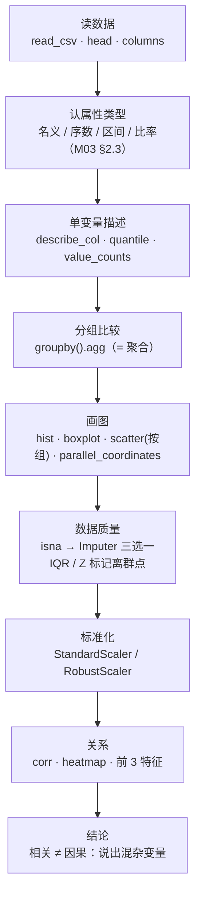

# T03 · 数据探索实战：Iris 与 Airbnb 的描述统计

> **本讲一句话**：这个 notebook 把 [[M03-数据类型与描述性分析]] 的"描述性分析"部分**全部变成代码**——前半段用 150 行的 Iris 练手（描述统计、分位数、偏度峰度、分组、四种图），后半段换到 68,133 行的 Airbnb 处理**真实的脏数据**（缺失值三种填法、离群点两种规则、标准化两种尺度、相关矩阵与热力图）。notebook 自己说它是"**aligned with the Week 3 assignment difficulty**"——**它就是作业的模板**，作业第 2 题几乎逐条对应 cell 25–42。
> **原始材料**：`Week 3 Description.ipynb`（48 cells）｜ **配套讲义**：[[M03-数据类型与描述性分析]]｜ **数据**：[[IS6400_Business_Data_Analytics/_meta/数据集卡片#iris.txt|数据集卡片 › iris.txt]] · [[IS6400_Business_Data_Analytics/_meta/数据集卡片#Airbnb.csv|数据集卡片 › Airbnb.csv]] ｜ **转录**：`merged`（`M03-transcript.txt` 的 tutorial 段 `01:45:33`–`02:13:18`，2026-09-18 合并）
>
> ⚠️ **与 T01 / T02 的两个不同**：① notebook 里**没有任何 `🤖 AI Prompt` 单元格**——W1/W2 每个 code cell 后面都跟一段"把这段代码用自然语言要回来"的提示，本周没有；② notebook 末尾 **cell 44–48 直接附了 Week 3 Assignment（100 分，3 题）和提交清单**，题目比 T02 的 4 道题重得多。见 §7、§8。

---

## 0. 这个 notebook 在教什么

一句话：**怎么把一份新数据"看清楚"，并把看的过程写成一份能交的报告。**

notebook 第一个 cell 自己列了八件事，我按数据分成两段：

| 段 | cell | 数据 | 教什么 | 对应讲义 |
|---|---|---|---|---|
| **A · 干净的小数据** | 3–24 | Iris（150 × 5） | 读数据、认对象与属性；描述统计（均值 / 中位数 / 众数 / 分位数 / IQR / 偏度 / 峰度）；类别频数；分组统计；直方图 / 箱线图 / 散点图 / 平行坐标 | M03 §2.2、§2.8–2.10、§2.18 |
| **B · 真实的脏数据** | 25–42 | Airbnb（68,133 × 15） | 缺失值报告；均值 / 中位数 / KNN 三种填补的比较；IQR vs Z 分数两种离群点规则；StandardScaler vs RobustScaler；协方差、相关矩阵、热力图；相关 ≠ 因果 | M03 §2.6、§2.9–2.12 |
| C · 作业 | 44–48 | Airbnb + 自己的项目数据 | 3 题 100 分 | §7 |

**它和 M03 讲义的关系**：讲义 p.19 只问了"数据质量问题怎么发现、怎么办"没答，**答案全在段 B**；讲义没讲"标准化"，段 B 的 cell 35–37 是新增内容（为 M04 的 PCA 和 W04 的聚类铺路——这两者都对尺度敏感）。

> 🎙️ **课堂实况**（2026-09-16 周三课，tutorial 段）：tutorial 段（`01:45:33`–`02:13:18`，约 28 分钟） 由教授本人主讲（不是助教），全程带着 Iris 与 Airbnb 两个 notebook 逐 cell 跑；时间最集中在 cell 28（三种缺失值填补，尤其 KNN 的 GPA 近邻类比，约 5.1 分钟）与 cell 5–8（描述统计函数与偏度峰度，约 3.8 分钟）；作业在最后约 2.9 分钟口头交代，重点是 Q3 由 TA 出题、同组必须用不同变量组合。


---

## 1. 前置

### 1.1 需要哪些库

```python
import pandas as pd
import numpy as np
import matplotlib.pyplot as plt
import seaborn as sns                                   # 新：统计绘图库，heatmap 用它
from sklearn.impute import SimpleImputer, KNNImputer    # 新：缺失值填补
from sklearn.preprocessing import StandardScaler, RobustScaler   # 新：标准化
```

五个库 Anaconda 都自带（T01 §1.1 装 Anaconda 时一起装好）；`seaborn` 是第一次出现——它是 matplotlib 的"高级封装"，一行画热力图 / 配对图。运行环境按 notebook 元数据：**Python 3.13.5，kernel `conda-base-py`**（与 T01/T02 相同）。

⚠️ 两个数据文件要和 notebook **放在同一个文件夹**（`pd.read_csv('iris.txt')` 用的是相对路径）；Canvas 上 Week 3 页面同时给了 `iris.txt` 和 `Airbnb.csv`。

### 1.2 对应哪一讲的理论

| notebook 段 | 讲义 M03 | 一句话 |
|---|---|---|
| cell 2 "object / attribute" | §2.2（p.4） | 行 = 对象，列 = 属性 |
| cell 4–8 描述统计 | §2.9–2.10（p.24–28） | 集中趋势 / 离散 / 形状 |
| cell 9–12 频数与分组 | §2.8（p.23）、§2.16 聚合（p.51） | 类别只能数；分组 = 聚合 |
| cell 13–24 四种图 | §2.18（p.63–70） | 直方图 / 箱线图 / 散点 / 平行坐标 |
| cell 25–30 缺失值 | §2.6（p.19） | 数据质量三问的答案之一 |
| cell 31–34 离群点 | §2.6、§2.9（IQR） | 答案之二 |
| cell 35–37 标准化 | —（讲义没有；M04 PCA 前置） | 尺度问题 |
| cell 38–42 协方差 / 相关 | §2.11–2.12（p.30–34） | 相关 ≠ 因果 |

### 1.3 本 notebook 第一次出现的 API（读之前先认识）

| API | 一句话 | 首次出现 |
|---|---|---|
| `pd.read_csv(path, header=None)` | 文件没有表头行时，告诉 pandas 第一行就是数据 | cell 3 |
| `df.columns = [...]` | 事后给列命名 | cell 3 |
| `s.quantile(q)` / `s.mode()` / `s.skew()` / `s.kurt()` | 分位数 / 众数 / 偏度 / 峰度（`describe()` 不给后三个） | cell 5 |
| `s.value_counts(normalize=True)` | 类别频数 → 百分比 | cell 10 |
| `df.groupby(col)[cols].agg([...])` | 分组后一次算多个统计量 | cell 11 |
| `s.hist(bins=)` / `df.boxplot()` / `plt.scatter()` / `parallel_coordinates(df, class_col)` | 四种图 | cell 14–23 |
| `df.isna().sum()` | 每列缺失个数 | cell 27 |
| `SimpleImputer(strategy=)` / `KNNImputer(n_neighbors=)` + `.fit_transform()` | 三种填补 | cell 28 |
| `StandardScaler()` / `RobustScaler()` + `.fit_transform()` | 两种标准化 | cell 36 |
| `df.cov()` / `df.corr()` / `sns.heatmap()` | 协方差矩阵 / 相关矩阵 / 热力图 | cell 39–40 |
| `s.sort_values(key=abs, ascending=False)` | 按**绝对值**排序 | cell 41 |

> **sklearn 的 `fit_transform` 约定**（T02 §1.3 讲过 `fit` / `predict`，这里是它的兄弟）：**预处理器**（Imputer、Scaler、Encoder）用 `fit` 学统计量（均值、中位数、分位数），用 `transform` 套到数据上；`fit_transform` 一步做完。**返回的是 numpy 数组，不是 DataFrame**——列名会丢，要自己接回去（cell 28、36 都在做这件事）。

---

## 2. 逐块讲解 · 段 A：Iris（cell 1–24）

### 2.1 【cell 3】读数据、命名列、看前 10 行

**这块在干什么**：把 `iris.txt` 读成表，给五列起名，看一眼。顺手做了三件"环境设置"。

```python
np.random.seed(42)                          # 固定随机数（本 notebook 后面 KNN 不用随机，这是习惯）
plt.rcParams['figure.figsize'] = (9, 5)     # 所有图默认 9×5 英寸
plt.rcParams['axes.grid'] = True            # 所有图默认带网格
sns.set_style('whitegrid')                  # seaborn 风格：白底网格

data = pd.read_csv('iris.txt', header=None)
data.columns = ['sepal length', 'sepal width', 'petal length', 'petal width', 'class']
data.head(10)
```

**逐行**：`header=None` 是关键——`iris.txt` 第一行就是 `5.1,3.5,1.4,0.2,Iris-setosa`，没有列名；不写这个参数 pandas 会把第一朵花当表头，数据少一行、列名变成 "5.1"。`data.columns = [...]` 事后命名（列名带空格是可以的，但后面取列只能用 `data['sepal length']` 不能用 `data.sepal length`）。

**输出**：前 10 行全是 `Iris-setosa`（文件按品种排好了：前 50 行 setosa、中 50 行 versicolor、后 50 行 virginica）。

**为什么这么写**：`rcParams` 三行是 T02 §3.4 助教讲过的"全局样式"（🎙️ M02 转录 `01:52:40`），一次设定全 notebook 生效。`np.random.seed(42)` 在本 notebook 里其实没被用到，但作业要求 "Set random seeds where needed"，这一行是给你抄的。

**⚠️ 易错点**：文件叫 `.txt` 但内容是 CSV——`read_csv` 只看内容不看后缀。

**🎙️ 课堂补充**（`01:46:42`–`01:48:59`，约 2.3 分钟，A · 课上展开）

- 复述“行是对象、列是属性”这条定义：*"And the row is an object. And the column is the attributes we have."*（`01:46:56`–`01:46:58`）
- 逐句解释 `header=None` 的必要性：*"There are no definitions of the header. So the header equals to none. It means that we do not have the name for each column from the raw data."*（`01:47:43`–`01:47:51`）
- 补了 notebook 没写的业务背景——为什么原始文件会没有列名：*"[S]ometimes when the company is recording the data, they will prepare two different datasets. One is the pure values of SKU[s]. The second will be the name of different columns[,] in two different separate ones."*（`01:47:53`–`01:48:05`）
- **这段改变了什么**：确认了笔记对 `header=None` 的解读；新增一条业务解释——公司常把“纯数值表”和“字段对照表”分开存，这正是 `iris.txt` 这类无表头文件的来源。

### 2.2 【cell 5–7】自定义描述函数：一次算 12 个统计量

**这块在干什么**：`describe()` 只给 8 个数（count/mean/std/min/25%/50%/75%/max），作业要求 11 个（加众数、Q1/Q3、极差、IQR、偏度、峰度）。notebook 自己写了一个函数补齐。

```python
def describe_col(df, col):
    s = df[col]
    q1, q3 = s.quantile(0.25), s.quantile(0.75)
    return pd.Series({
        'mean': s.mean(), 'median': s.median(), 'mode': s.mode().iloc[0],
        'std': s.std(), 'min': s.min(), 'max': s.max(),
        'Q1': q1, 'Q3': q3, 'range': s.max() - s.min(), 'IQR': q3 - q1,
        'skew': s.skew(), 'kurt': s.kurt()
    })
describe_col(data, 'sepal length')
```

**逐行**：`s.mode()` 返回的是一个 **Series**（众数可能不止一个），所以要 `.iloc[0]` 取第一个；`pd.Series({...})` 把字典变成一列带名字的数，方便后面拼成表。cell 6 用**字典推导式**对四列各调一次再 `.T` 转置成"一行一个属性"的表；cell 7 用 `data[cols].quantile([0.25, 0.5, 0.75, 0.9, 0.95, 0.99])` 一次出六个分位数。

**输出**（cell 5，`sepal length`）：mean 5.843、median 5.80、mode 5.0、std 0.828、min 4.3、max 7.9、Q1 5.1、Q3 6.4、range 3.6、IQR 1.3、skew 0.315、kurt −0.552。
（cell 6 四列汇总）：petal length 的 std 最大（1.764）、IQR 最大（3.5）、峰度最负（−1.402）——这是三个品种混合的信号。
（cell 7）：petal width 的 90% 分位 2.2、99% 分位 2.5 = 最大值——**最大的 1% 花瓣宽度都是 2.5**。

**为什么这么写**：作业第 1 题的原话是 "mean, median, mode, std, min, max, Q1, Q3, IQR, skewness, kurtosis"——**正好是这个函数的输出**。cell 8 的 markdown 给了读数规则：偏度近 0 对称、正偏右尾长；峰度近 0 像正态尾、大正值重尾（M03 §2.10）。

**⚠️ 易错点**：
- `s.std()` 是样本标准差（分母 n−1），与讲义 p.30 样本协方差口径一致；numpy 的 `np.std` 默认分母 n，两者会差一点。
- `kurt()` 是**超额峰度**（正态 = 0）。
- 众数对连续变量意义不大（M03 §2.9）。

**🎙️ 课堂补充**（`01:49:04`–`01:52:51`，约 3.8 分钟，A · 课上展开）

- 强调 pandas 已经内置了这些统计量的计算：*"[M]ost of the summary statistics calculations have been supported by the Pandas Data Frame."*（`01:49:15`–`01:49:26`）
- Q1/Q3 与 IQR 的口头公式：*"Q1, Q3, we will calculate it using S dot quantile. So this is a 25 quantile or 75 quantile. ... [F]or the IQR, it is Q3 minus Q1."*（`01:50:01`–`01:50:09`）
- 明确预告 `describe()` 要到下一讲才教：*"[N]ext week, I think, we will have a simple function called data.describe... [it] will generate all this information in a single command."*（`01:51:29`–`01:51:39`）
- 偏度 / 峰度的口头定义（ASR 把 skewness 识别成 "SKU needs"、kurtosis 识别成 "QNAS/quotasys"）：*"[T]he [skewness] tell[s] you whether it is [symmetric?]... and the [kurtosis] tell[s] you whether it is normally dis[tributed] or concentrated to the middle..."*（`01:52:40`–`01:52:45`）
- **这段改变了什么**：确认了笔记对 `describe_col` 与六分位数的解读；新增一条时间线信息——手写统计函数是给 `data.describe()`（下一讲才教）打的铺垫，不是长期要用的写法。

### 2.3 【cell 10–11】频数与分组统计

**这块在干什么**：类别列只能数（M03 §2.8）；然后按品种分组，看四个数值属性在三类里各是什么水平——这是"分组 = 聚合"（M03 §2.16）。

```python
print(data['class'].value_counts())
print(data['class'].value_counts(normalize=True).round(3))

data.groupby('class')[['sepal length', 'sepal width', 'petal length', 'petal width']].agg(['mean', 'median', 'std'])
```

**输出**：三类各 50 朵、各 0.333——**完全平衡**的数据集。分组表：petal length 的均值 setosa 1.464 / versicolor 4.260 / virginica 5.552，三类差得很开；sepal width 的均值 3.418 / 2.770 / 2.974，几乎叠在一起。cell 12 的结论："petal length varies much more across species than sepal width"，并明说**这就是作业里要对 `log_price` 按 `city` / `property_type` 做的事**。

**为什么这么写**：`groupby(...)[cols].agg([list])` 是 pandas 做"透视表"的标准写法（M03 §2.7 的 pivot table）；输出是**多级列**（属性 × 统计量），看着乱但作业可以直接贴。

**⚠️ 易错点**：`value_counts()` 默认按频数降序排；`normalize=True` 给比例不是百分比（0.333 不是 33.3）。

**🎙️ 课堂补充**（`01:52:51`–`01:55:48`，约 3.0 分钟，A · 课上展开）

- `value_counts(normalize=True)` 的口头解释与结果（ASR 把 setosa 识别成 "cytosine"）：*"[I]f we put in the value count[s] and do the normalization, and keep the three decimals here[,] then you will tell you that about 33.3% is the data point belonging to your [setosa]."*（`01:53:26`–`01:53:41`）
- 🔴 **notebook 和讲义都没有的增量：用银行“正常交易 vs 欺诈交易”举例讲类别不平衡**（ASR 把 fraud 识别成 "board"）：*"Now when you go to the bank, the number of normal transactions will be much, much larger than the [fraud?] transactions. So if we want to detect [fraud?] transactions, we are actually getting a very tiny group of labeled [fraud?] transactions from the large group of normal transactions."*（`01:54:07`–`01:54:25`）
- 预告分类章节会专门处理不平衡数据，并点明数据探索的意义：*"[I]n the later classification lecture we will have one small section to illustrate how to deal with the imbalanced data classification. ... [T]he data exploration is very important at the very beginning for you to choose the right model."*（`01:54:32`–`01:55:11`）
- **这段改变了什么**：`value_counts` 与 `groupby().agg` 本身与笔记一致；新增了“三类各占 33.3%”这件事为什么重要——真实数据常常类别不平衡，这是选模型前必须先看的信号，教授用银行欺诈检测具体举了例子。

### 2.4 【cell 14–23】四种图

**这块在干什么**：把 M03 §2.18 的四种图各画一张，每张后面一句"看到了什么"。

```python
data['petal width'].hist(bins=20); plt.title(...); plt.xlabel(...); plt.ylabel(...); plt.show()   # cell 14
data.boxplot(); ...                                                                                 # cell 17
for name, group in data.groupby('class'):                                                           # cell 20
    plt.scatter(group['petal length'], group['petal width'], alpha=0.7, label=name)
plt.legend(); ...
from pandas.plotting import parallel_coordinates                                                    # cell 23
parallel_coordinates(data, 'class')
```

**逐块**：
- **直方图**（cell 14）：`bins=20` 对应讲义 p.63 右图；输出图左侧 0.1–0.3 一根高柱（setosa 的花瓣极窄），右侧多个峰。cell 15 的结论：**多峰 = 可能是多个总体的混合**，"an important warning about distributional shape"。
- **箱线图**（cell 17）：`data.boxplot()` 一次画四列（讲义 p.66 原图的 pandas 版）；petal length / width 的盒子最高，sepal width 最窄且有离群点。cell 18："No obvious extreme outliers"。
- **分组散点图**（cell 20）：`for name, group in data.groupby('class')` 是 pandas 的**按组循环**——每次拿到组名和该组的子表，各画一次 `scatter` 并用 `label=name` 生成图例；`alpha=0.7` 半透明防重叠。输出：三类沿对角线排开、清楚分离。cell 21 的结论：两个变量的关系可以"strong and **nonlinear** when a categorical variable is present"——M03 §2.11 说相关只抓线性，这张图就是例子。
- **平行坐标**（cell 23）：`parallel_coordinates(data, 'class')` 第二个参数是**类别列名**，用来着色；输出与讲义 p.70 左图一致（轴序 sepal length → sepal width → petal length → petal width），三类在 petal 两根轴上分成三束。

**为什么这么写**：作业第 2.3 题要求"每个特征与 log_price 一个统计量 + 一张图，带标题、轴标签、2–3 句解释"，**且 "at least 8 plots"**——这四个 cell 每个都示范了"`plt.title` + `plt.xlabel` + `plt.ylabel` + 一段 markdown 解释"的完整格式，照着来。

**⚠️ 易错点**：
- `plt.show()` 之后再调 `plt.title` 无效（图已经画完了）；标题和轴标签要在 `show()` **之前**。
- `data.boxplot()` 会把所有数值列画在一起，如果量纲差几个数量级（Airbnb 的 `number_of_reviews` 0–600 与 `bathrooms` 0–8），小的那些会压成一条线——Airbnb 要分开画或先标准化。
- 平行坐标的轴序按 DataFrame 列顺序；想换序先 `data[[新顺序]]`。

**🎙️ 课堂补充**（`01:55:48`–`01:59:12`，约 3.4 分钟，A · 课上展开）

- 直方图 bin 数与读图：*"[L]et me show you that there are 20 intervals here[,] because [bins equals] 20... [M]ost of the records[,] they have their petal width value to be very small."*（`01:56:09`–`01:56:41`）
- 🔴 **箱线图离群点边界，口头说法是百分位而非 1.5×IQR——与本笔记 §9.5 ⑤ 的疑问对上了**：*"[S]o the threshold[,] together with some outliers here[:] the outlier[s] above the [90th?] percentile or below the 10th percentile[,] they were labeled outliers."*（`01:56:58`–`01:57:07`）
- 分组散点图的读图描述：*"[A] simple visualization, a two-dimensional visualization is petal length and petal width. ... [W]e can see a very clear difference in the pattern[s] of the blue data points[.]"*（`01:57:14`–`01:57:29`）
- 平行坐标的工具来源：*"[P]andas has its own plotting library called pandas [dot] plotting[,] and one of the tool[s] in [that] library is called parallel coordinate[s]."*（`01:58:13`–`01:58:27`）
- **这段改变了什么**：确认了四张图的读法；新增一条与本笔记 §9.5 ⑤ 直接相关的证据——教授口头描述箱线图须用的是 10/90 百分位，与 `data.boxplot()` 实际默认的 1.5×IQR **不是同一套口径**；作业里若按讲义 10/90 百分位算须会与 notebook 输出的箱线图对不上，建议以 `boxplot()` 的 1.5×IQR 为准并注明。

---
## 3. 逐块讲解 · 段 B：Airbnb 的脏数据（cell 25–42）

### 3.1 【cell 26–27】读数据、缺失值报告

**这块在干什么**：换到真实数据，第一件事是数每列缺了多少。

```python
air = pd.read_csv('Airbnb.csv')
air.head()

missing = air.isna().sum()
missing_ratio = (missing / len(air)).round(4)
pd.DataFrame({'missing': missing, 'ratio': missing_ratio})[missing > 0]
```

**逐行**：`isna()` 把整张表变成 True/False，`.sum()` 按列数 True 的个数；除以 `len(air)`（行数 68,133）得比例；最后一行 `[missing > 0]` 用布尔索引只留有缺失的列。

**输出**：

| 列 | 缺失 | 比例 |
|---|---|---|
| host_has_profile_pic | 180 | 0.0026 |
| host_identity_verified | 180 | 0.0026 |
| review_scores_rating | **15,275** | **0.2242** |

（与 [[IS6400_Business_Data_Analytics/_meta/数据集卡片#Airbnb.csv|数据集卡片]] §3 一致；`verify_airbnb.py` 复核相同。）

**为什么这么写**：作业第 2.1 题第一条就是 "Missing-value report for all columns"——这三行就是模板。⚠️ 注意 `bedrooms` **没有缺失**，但 cell 28 仍然把它和 `review_scores_rating` 一起填补——见 §3.2 的坑。

**⚠️ 易错点**：`head()` 的第 4 行 `review_scores_rating` 已经是 `NaN`（该房源 `number_of_reviews = 0`）——**评分缺失的机制是"没评论就没评分"**，不是随机缺失（数据集卡片 §3.1）。这一点在作业里写出来是加分项：它说明"用中位数填"是在给没人住过的房源一个"典型"评分，得说清这个假设。

**🎙️ 课堂补充**（`01:59:12`–`02:01:20`，约 2.1 分钟，A · 课上展开）

- 切换数据集与确认缺失列（ASR 把 Airbnb 识别成 "LBNB"）：*"[W]e switch to the real data set of [Airbnb], and we know that it contains some missing values in the review[s] [scores] rating..."*（`01:59:19`–`01:59:34`）
- 🎙️ **notebook 没写的处理框架——“删除”与“填补”两条路怎么选**：*"[T]he first method... [is] if the number of missing values is very small compared with the whole data[,] and if we remove [them], we will not affect the whole population... we can just remove these... records."*（`01:59:54`–`02:00:17`）
- 何时该填而不是删：*"[I]f we believe that these records... are very important for us[,] ... we want to keep them, so we need to fill the missing values."*（`02:00:17`–`02:00:33`）
- 缺失计数口头核对（`review_scores_rating` 的具体数字被 ASR 严重压缩，标 [?]）：*"[A]mong the whole data set, the host has 40 [profile pic?] pictures, we have 180 missing records. The host identif[ied] 180, and the review score[s rating], we have so many[?] missing values for this col[umn]."*（`02:00:55`–`02:01:07`）
- **这段改变了什么**：确认了 §3.1 缺失值报告的三列结果（180 / 180 / review_scores_rating 大量缺失）；新增一条 notebook 没写的决策框架——先判断“删了会不会影响整体分布”，不行再填补，这是本节“为什么选填补而不是删除”的理论依据。

### 3.2 【cell 28–30】三种缺失值填补：均值 / 中位数 / KNN

**这块在干什么**：对 `review_scores_rating` 和 `bedrooms` 各用三种方法填补，比较填补后的分布，选一种。

```python
cols = ['review_scores_rating', 'bedrooms']

imp_mean = SimpleImputer(strategy='mean')
air[['review_scores_rating_mean', 'bedrooms_mean']] = imp_mean.fit_transform(air[cols])

imp_med = SimpleImputer(strategy='median')
air[['review_scores_rating_median', 'bedrooms_median']] = imp_med.fit_transform(air[cols])

imp_knn = KNNImputer(n_neighbors=5)
knn_vals = imp_knn.fit_transform(air[cols])
air['review_scores_rating_knn'] = knn_vals[:, 0]
air['bedrooms_knn'] = knn_vals[:, 1]
```

**逐行**：
- `SimpleImputer(strategy='mean')`：`fit` 时算每列的均值，`transform` 时把 NaN 换成它。`strategy` 还可以是 `'median'`、`'most_frequent'`（众数，类别列用）、`'constant'`。
- `fit_transform(air[cols])` 返回 **numpy 数组**（两列），赋给两个**新列**——原列保留，这样才能比较。
- `KNNImputer(n_neighbors=5)`：对每个有缺失的行，在**其他列**上找 5 个最像的行，用它们该列的均值填。这里 `cols` 只有两列，所以填 `review_scores_rating` 时只看 `bedrooms` 像不像——**邻居的定义很弱**（见易错点）。
- `knn_vals[:, 0]`：numpy 二维数组取第 0 列。

然后 `summary()` 函数对六个新列各算 mean / std / min / max / skew：

**输出**：

| 列 | mean | std | skew |
|---|---|---|---|
| review_mean | 94.013 | 6.899 | −3.778 |
| review_median | 94.458 | 6.948 | −3.885 |
| review_knn | 94.381 | 6.958 | −3.834 |
| bed_mean / bed_median / bed_knn | 1.272 | 0.855 | 2.005（三者**完全相同**） |

**读法**（cell 29 原文 + 补充）：
- `review_scores_rating` **左偏**（偏度 −3.8，堆在 100 附近）：均值填补把 15,275 个空位全填成 94.01（均值被低分拖低），中位数填补填 96（notebook 没直接打印中位数，`verify_airbnb.py` 实跑：median = 96，mean = 94.013；另外 15,275 个缺失里有 14,434 个是 `number_of_reviews = 0` 的房源）——**中位数更能代表"典型"评分**，填补后 std 和偏度更接近原分布。
- `bedrooms` 三种结果**一模一样**，因为它**本来就没有缺失值**（cell 27 的报告里没有它）——三个 Imputer 什么都没填。
- notebook 的选择：**两列都用中位数**（"simple and robust"），KNN 是"valid alternative if local similarity matters"。

cell 30 建 `air_clean`：复制一份，把两列替换成中位数版本，`isna().sum()` 确认为 0。

**为什么这么写**：作业第 2.1 题原话："Comparison of mean, median, and KNN (k=5) imputation for `review_scores_rating` and `bedrooms`. Report mean, std, and skewness for each method, and justify your preferred choice."——cell 28–29 就是答案模板。但**作业要你自己写 justify**——照抄 cell 29 那三句会被看出来。

**⚠️ 易错点**：
- **`bedrooms` 没有缺失**——作业题干说 "It contains missing values in `review_scores_rating` and `bedrooms`" 是错的（notebook cell 25 也这么说）。作业里如实指出"bedrooms 无缺失，三种方法结果相同"是正确做法，不要硬编一个差异。
- KNN 的邻居只在 `cols` 那两列里找；要让 KNN 有意义，应该把 `accommodates`、`bathrooms`、`beds` 等也放进去（`KNNImputer` 会用所有传入的列算距离）。**且 KNN 对尺度敏感**——评分 20–100 与卧室 0–10 量纲不同，严格做法要先标准化（§3.4）。这是 T03 第一个"改参数"点（§5）。
- 用整张表算均值再填补，**测试集的信息会泄漏到训练集**（M02 §2.9.3 的验证集纪律）。作业不要求，但项目里应 `fit` 训练集、`transform` 测试集。

**🎙️ 课堂补充**（`02:01:20`–`02:06:26`，约 5.1 分钟，A · 课上展开）

- `sklearn.impute` 库的口头介绍（ASR “costiller” = scikit-learn）：*"[Scikit-learn] dot impute. [B]ut the impute is a library that we can use[,] ... [and] so many tools in the library to impute or to fill the missing values in your data set. So there are two big imputer[s]. One is a simple imputer[,] the other is the K[NN] imputer."*（`02:01:47`–`02:02:09`）
- `strategy='mean'` 的口头解释：*"[I]f we set the strategy equal to mean, ... it asks the machine to use the mean value of this column to fill the missing value[,] ... [using] all the non-missing values of this column to calculate the average value."*（`02:02:38`–`02:02:55`）
- `fit_transform` 拆两步：*"[F]it transform will do two things. First, the fit will get the mean value of the non-missing vector[s]... So after that, the new columns will have the... average value filled."*（`02:03:19`–`02:03:43`）
- 🔴 **notebook 完全没有的 KNN 类比——用“不知道某学生 GPA，但知道他离哪些同学最近”讲 K 近邻填补**（ASR "hitting around" 疑为 "clustered close to"）：*"[T]hat student, I do not know his GPA[,] but I know that he is [close?] around 5 other students, around 10. ... I will use five closest neighbors['] ... average value of the five closest neighbors' GPA to fill the missing value of his missing GPA. ... I only use the neighbors. I will not use the whole population's average."*（`02:04:56`–`02:05:44`）
- **这段改变了什么**：确认了 §3.2 三种填补方法的操作流程；新增了“KNN 邻居定义很弱”这条易错点背后教授自己给的直觉类比——K 近邻只看“最像的 k 个”，不看全体，这条类比可以直接写进作业的 justify 段落。

### 3.3 【cell 32–34】两种离群点规则：IQR vs Z 分数

**这块在干什么**：给三列各用两种规则标记离群点，数各有多少个，比较。

```python
def iqr_flag(s, k=1.5):
    q1, q3 = s.quantile(0.25), s.quantile(0.75)
    iqr = q3 - q1
    return (s < q1 - k * iqr) | (s > q3 + k * iqr)

def z_flag(s, threshold=3):
    z = (s - s.mean()) / s.std()
    return z.abs() > threshold

for col in ['log_price', 'accommodates', 'bathrooms']:
    print(f"{col}: IQR -> {iqr_flag(air_clean[col]).sum()}, Z-score -> {z_flag(air_clean[col]).sum()}")
```

**公式**（M03 §2.9 的 IQR 与 L0 的标准化）：

$$\text{IQR 规则：} x < Q_1 - k\cdot\text{IQR} \;\text{或}\; x > Q_3 + k\cdot\text{IQR}\ (k=1.5), \qquad \text{Z 规则：} \left|\frac{x-\bar{x}}{s}\right| > 3$$

| 符号 | 含义 |
|---|---|
| $Q_1, Q_3$、IQR | 25%、75% 分位数与它们的差 |
| $k$ | 须的倍数，Tukey 惯例 1.5 |
| $\bar{x}, s$ | 均值、标准差 |
| 3 | 阈值：正态分布下超过 3 个标准差的概率约 0.27% |

**输出**：

| 列 | IQR 标记 | Z 标记 | 为什么差这么多 |
|---|---|---|---|
| log_price | 1,453 | 453 | Q1 = 4.29，Q3 = 5.19，IQR = 0.90；须 2.94–6.55；两端都有长尾 |
| accommodates | 3,299 | 1,378 | Q1 = 2，Q3 = 4，须 −1 到 7；**所有 ≥ 8 人的房源全被 IQR 标记** |
| bathrooms | **14,307** | 1,878 | **Q1 = Q3 = 1 → IQR = 0 → 须就是 [1, 1]**：凡是不等于 1 的浴室数（0、1.5、2……）全被标成离群点——占 21% |

cell 33：`log_price` 的 IQR 离群比例 = **0.0213**（1,453 / 68,133）；这个 `outlier_iqr` 列留在 `air_clean` 里（作业要求 "keep an `outlier_iqr` flag column"）。

**读法**（cell 34 原文）："IQR usually flags more points because it does not assume a normal distribution. Z-score assumes an approximately Gaussian variable, so it can miss heavy-tail outliers and over-flag variables that are not normal."

**为什么这么写**：作业第 2.1 题原话："Outlier detection on `log_price`, `accommodates`, and `bathrooms` using **both IQR (1.5 × IQR)** and **Z-score (threshold 3)**. Compare the two methods."——这三个数就是答案，但**比较**要你自己写；`bathrooms` 那一行是最值得写的：**IQR 规则在离散且集中的变量上会失效**（IQR = 0），Z 规则反而更合理。

**⚠️ 易错点**：
- `bathrooms` 的 14,307 不是"真的有两万个离群点"，是 IQR 规则退化——作业里指出这点比照抄数字有价值得多。
- Z 分数用的是含离群点的均值和标准差，离群点会"拉大"标准差、掩盖自己（masking）；RobustScaler 用中位数和 IQR 就是为了这个（§3.4）。
- 标记 ≠ 删除。notebook 只加了一列 flag，没有删行；M02 §2.6.4 讲过离群点的两条路（删 / 找解释变量）。

**🎙️ 课堂补充**（`02:06:26`–`02:07:42`，约 1.3 分钟，B · 讲了同讲义）：教授只是简讲了一遍 IQR 与 Z 分数两条离群点规则的公式，没有给出 Airbnb 三列（`log_price` / `accommodates` / `bathrooms`）任何具体计数或对比结论——*"[I]f we want to identify some [outlier] data points, we can use the IQR. I already informed [you] that IQR is Q3 minus Q1. ... [A]lternatively we can use this kind of Z-score[:] ... the X value minus mean value divided by the standard deviation."*（`02:06:34`–`02:07:21`）与笔记 §3.3 的公式一致；notebook 里 `bathrooms` 的 IQR=0 退化、14,307 个“离群点”这条最有价值的发现，本段没有口头提及。

### 3.4 【cell 36–37】标准化：StandardScaler vs RobustScaler

**这块在干什么**：五个数值特征量纲不同（`accommodates` 1–16，`review_scores_rating` 20–100），把它们压到可比的尺度上；两种压法，一种用均值 / 标准差，一种用中位数 / IQR。

```python
feats = ['accommodates', 'bathrooms', 'bedrooms', 'beds', 'review_scores_rating']
X = air_clean[feats].copy()
X_std = pd.DataFrame(StandardScaler().fit_transform(X), columns=[f + '_std' for f in feats])
X_rob = pd.DataFrame(RobustScaler().fit_transform(X), columns=[f + '_rob' for f in feats])
print(X_std.describe().T[['mean', 'std', 'min', 'max']])
print(X_rob.describe().T[['mean', 'std', 'min', 'max']])
```

**公式**（cell 35 原文 + 补充）：

$$\text{StandardScaler：} z = \frac{x - \bar{x}}{s}, \qquad \text{RobustScaler：} z = \frac{x - \text{median}}{\text{IQR}}$$

| 符号 | 含义 |
|---|---|
| $\bar{x}, s$ | 该列的均值、标准差（对离群点敏感） |
| median、IQR | 该列的中位数、$Q_3 - Q_1$（对离群点稳健） |
| $z$ | 标准化后的值；StandardScaler 结果均值 0、标准差 1；RobustScaler 结果中位数 0、IQR 1 |

**逐行**：`fit_transform` 返回 numpy 数组 → 用 `pd.DataFrame(..., columns=[f + '_std' for f in feats])` 接回列名（列表推导式，T02 §3 助教讲过）。

**输出**（StandardScaler）：五列 mean 全是 `e-17` 量级（就是 0，浮点误差）、std 全是 1.000007（分母 n−1 的微小差）；`review_scores_rating_std` 的 min 是 **−10.7**（评分 20 分的房源离均值 10 个标准差），max 只有 0.80。
（RobustScaler）：`accommodates_rob` mean 0.57、min −0.5、max 7；`bathrooms_rob` std 0.56——⚠️ 按定义 IQR = 0 应该除零，sklearn 遇到 IQR = 0 会**把分母置 1**，所以 `bathrooms_rob = bathrooms − 1`，没有报错但也没有"缩放"。

**读法**（cell 37 原文）：StandardScaler 用于"roughly symmetric and outliers are rare"；RobustScaler 用于"have outliers or skewed distributions"。

**为什么这么写**：作业第 2.2 题原话："Apply `StandardScaler` and `RobustScaler` to at least five numerical features (excluding `log_price`). Report mean, std, min, max for both scalers. Explain when each scaler is preferable."——cell 36 输出就是那张表。**讲义 M03 没有讲标准化**，它是为 M04 PCA（对方差敏感，尺度大的列会霸占第一主成分）和 W04 聚类（距离对尺度敏感）铺路的。

**⚠️ 易错点**：
- 标准化**不改变分布形状**（偏度不变），只改位置和尺度；左偏的评分标准化后还是左偏。
- `fit_transform` 用全表统计量，同样有训练 / 测试泄漏问题。
- 标准化后列名要自己接，否则一堆无名数组（cell 36 的 `columns=` 就是在做这件事）。

**🎙️ 课堂补充**（`02:07:42`–`02:08:48`，约 1.1 分钟，B · 讲了同讲义）：只念了两个公式，没有展开“何时用哪个”的取舍标准，也没有提 Airbnb 五个特征的具体输出——*"[F]or the standardization... the actual value [minus] the mean divided by the standard deviation. ... [A]fter... standardization[,] all the columns' mean value will become zero, and the standard deviation will become one. ... [W]e can use... robust scaler... [subtracting] median and divid[ing] it by the IQR."*（`02:07:56`–`02:08:40`）与笔记 §3.4 的两个公式一致；`bathrooms_rob` 因 IQR=0 退化成“减 1”这条易错点没有被提及。

### 3.5 【cell 39–42】协方差、相关矩阵、热力图、相关 ≠ 因果

**这块在干什么**：算 7 列（目标 + 6 个数值特征）的协方差矩阵和相关矩阵，画热力图，找与 `log_price` 最相关的特征，然后说一遍"相关不是因果"。

```python
corr_cols = ['log_price', 'accommodates', 'bathrooms', 'bedrooms', 'beds', 'number_of_reviews', 'review_scores_rating']
cov_matrix = air_clean[corr_cols].cov()
corr_matrix = air_clean[corr_cols].corr()
corr_matrix.round(3)

plt.figure(figsize=(8, 6))
sns.heatmap(corr_matrix, annot=True, fmt='.2f', cmap='coolwarm'); plt.title('Correlation Heatmap'); plt.show()

air_clean[corr_cols].corr()['log_price'].drop('log_price').sort_values(key=abs, ascending=False).head(5)
```

**逐行**：`df.cov()` / `df.corr()` 一次算所有列两两的协方差 / Pearson 相关（M03 §2.11 的公式，分母 n−1）；`sns.heatmap(annot=True, fmt='.2f', cmap='coolwarm')`——在格子里标数、两位小数、红正蓝负；最后一行取 `log_price` 那一列，去掉自己（1.0），**按绝对值**排序（`key=abs`，这样负相关也能排前面），取前 5。

**输出**（相关矩阵，cell 39）：

| | log_price | accommodates | bathrooms | bedrooms | beds | reviews | rating |
|---|---|---|---|---|---|---|---|
| log_price | 1 | **0.578** | 0.377 | 0.483 | 0.470 | −0.025 | 0.081 |
| accommodates | | 1 | 0.523 | 0.724 | **0.829** | 0.052 | −0.023 |
| bedrooms | | | 0.609 | 1 | 0.730 | −0.032 | 0.012 |

cell 41 的前 5：accommodates 0.578、bedrooms 0.483、beds 0.470、bathrooms 0.377、review_scores_rating 0.081。`cov_matrix` 算了但没显示（协方差带单位，看不出强弱——M03 §2.11）。

**读法**（cell 42 原文）："A larger `accommodates` is strongly correlated with a higher `log_price`, but size does not *cause* price by itself. **Location, amenities, and demand are confounding factors** that affect both. This is exactly the kind of reasoning required in the assignment."

**为什么这么写**：作业第 2.4 题四条要求（相关矩阵、带数字的热力图、前 3 相关特征、一个混杂变量）逐条对应 cell 39–42。⚠️ 热力图里 **accommodates–beds 0.829、accommodates–bedrooms 0.724、bedrooms–beds 0.730** 这三个数比与 `log_price` 的相关更值得写——它们是 T02 §5.5 "`beds` 系数为负"的根源（多重共线性，[[IS6400_Business_Data_Analytics/_meta/数据集卡片#Airbnb.csv|数据集卡片]] §5.1）。

**⚠️ 易错点**：
- `corr()` 只算数值列；`city`、`property_type` 不会出现——它们与 `log_price` 的关系要用分组箱线图（§2.4）或分组中位数（§2.3）看。
- `review_scores_rating` 与价格相关只有 0.08——**"评分高的房贵"在这份数据里几乎不成立**，作业写 insight 时这是一个反直觉的好例子。
- 热力图的颜色尺度默认按数据范围，两张图不可直接比色；作业要比就固定 `vmin=-1, vmax=1`。

**🎙️ 课堂补充**（`02:08:48`–`02:09:51`，约 1.1 分钟，A · 课上展开）

- 热力图颜色编码的口头说明（notebook 只写了 `cmap='coolwarm'`，没有解释）：*"[T]o see... all the correlation metrics, the [heatmap][:] if they are positively correlated, it's closer to the red[;] if they are negatively correlated... it will be close to the dark blue."*（`02:09:15`–`02:09:24`）
- 相关系数低 ≠ 无关系的补充（ASR "field correlation" 疑为 "zero correlation"）：*"[Z]ero[?] correlation does not mean they do not have [a] relationship[;] maybe they have non-linear correlation, non-linear relationship."*（`02:09:36`–`02:09:41`）
- **这段改变了什么**：确认了 §3.5 热力图与“相关≠因果”的读法；补上了 notebook 没写的热力图配色规则，以及一条独立于因果问题的提醒——低（线性）相关不代表没有关系，可能是非线性关系。

---

## 4. 完整流程串讲

把 20 个 code cell 串成一条线，就是作业第 2 题的骨架，也是任何新数据集的"体检流程"：



**三条贯穿的纪律**：① 每个统计量选"抗离群点"还是"敏感"版本（中位数 vs 均值、IQR vs 标准差、RobustScaler vs StandardScaler）要**看分布形状再定**——偏度是那个信号；② 每张图三件套（title / xlabel / ylabel）+ 2–3 句解释；③ 每个数字要能回答"所以呢"——`review_scores_rating` 缺 22% 不是结论，"没评论就没评分，所以填中位数是在假设新房源是典型房源"才是。

---

## 5. 自己动手 —— 改哪个参数会发生什么

| 改什么 | 改成 | 会看到 | 学到 |
|---|---|---|---|
| cell 14 `bins=20` | `bins=5` / `bins=50` | 5 箱看不到多峰；50 箱全是锯齿 | 直方图形状随箱数变（M03 p.63） |
| cell 20 分组散点的两列 | `sepal length` × `sepal width` | 三类混在一起 | 特征的"可分性"不同 → M04 特征重要性 |
| cell 23 列顺序 | `data[['sepal width','sepal length','petal length','petal width','class']]` | 三束从第二根轴就分开（讲义 p.70 右图） | 平行坐标轴序重要 |
| cell 28 `KNNImputer` 的输入 | 加上 `accommodates, bathrooms, beds` | `review_knn` 的 mean / skew 会变 | KNN 的"邻居"由传入的列决定 |
| cell 28 `n_neighbors=5` | 1 / 50 | 1 个邻居噪声大；50 个邻居趋近全局均值 | k 的偏差–方差权衡 |
| cell 32 `k=1.5` | `k=3` | IQR 标记数大幅下降 | 须的倍数是主观门槛 |
| cell 32 `threshold=3` | `2` | Z 标记数上升到约 5% | 正态下 2σ 外约 4.6% |
| cell 32 的列 | 加 `number_of_reviews` | IQR 会标出几千个 | 右偏计数变量的"离群点"其实是长尾 |
| cell 36 `feats` | 加 `log_price` | 也被标准化——但作业明说 excluding `log_price` | 目标变量通常不标准化（要保留可解释性） |
| cell 40 `cmap` | `'RdBu_r'`，加 `vmin=-1, vmax=1` | 颜色与相关值固定对应 | 多图可比 |
| cell 41 `key=abs` | 去掉 | `number_of_reviews`（−0.025）排到最后 | 负相关也是相关 |

---

## 6. 与讲义理论的对应

| notebook cell | 讲义 M03 页 | 概念 |
|---|---|---|
| 2（object / attribute） | p.4 | 对象与属性 |
| 3 `read_csv(header=None)` | p.61 | Iris 数据集 |
| 5–7 描述统计 | p.24–26 | 集中趋势、分位数、IQR |
| 6 skew / kurt | p.27–28 | 偏度、峰度 |
| 10 `value_counts` | p.23 | 类别变量计数 |
| 11 `groupby().agg` | p.22（pivot）、p.51（聚合） | 表 / 聚合 |
| 14 直方图 | p.63 | 分箱 |
| 17 箱线图 | p.65–66 | 分位数、离群点 |
| 20 散点图 | p.67–68 | 用颜色加第三属性 |
| 23 平行坐标 | p.69–70 | 高维可视化 |
| 27 缺失值 | p.19 | 数据质量：missing values |
| 28 三种填补 | p.19（"What can we do about these problems?"） | 讲义只提问，notebook 给答案 |
| 32 离群点 | p.19、p.26 | noise and outliers；IQR |
| 36 标准化 | —（讲义无；M04 PCA 前置） | 尺度 |
| 39 `cov()` / `corr()` | p.30–33 | 协方差、相关 |
| 42 相关 ≠ 因果 | p.34 | 混杂变量 |
| 44–48 作业 | 全讲 | — |

---
## 7. 本次作业：Week 3 Assignment（notebook cell 44–48 原文）

> ⚠️ **本周没有 AI Prompt 单元格**——T01 有 7 个、T02 有 1 个整段 prompt，本 notebook 一个都没有。但 ILO 3 "Manage GenAI tools for … Python programming" 没变，官方 GenAI 政策也允许在作业里用 AI。**建议**：把 cell 45–47 的题干直接当 prompt 用（它们本身就写成了"要什么、用什么列、报什么数、什么格式"的四要素形式，见 T01 §6.2），让 AI 生成骨架，再逐格核对数字——**核对数字这一步不能省**，因为本 notebook 已经有一处题干与数据不符（`bedrooms` 无缺失）。

### 7.1 原文（一字不改）

**cell 44**
> # IS6400 Week 3 Assignment
> **Total: 100 points**
> **Submit:** `.ipynb` and exported `.html`.
> **Data:** `Airbnb.csv` for Q1 and Q2. Your own project dataset for Q3.
> You may use `pandas`, `numpy`, `matplotlib`, `seaborn`, `sklearn`.
> All code must be reproducible. Set random seeds where needed.

**cell 45 · Question 1 – Descriptive Analytics on Airbnb (35 points)**
> Produce a complete descriptive report of `Airbnb.csv`. Your report must include:
> - **Attribute type table** for every column: nominal / ordinal / interval / ratio; discrete / continuous; symmetric or asymmetric binary. Include one short reason per column.
> - **Full descriptive statistics** for every numerical variable: mean, median, mode, std, min, max, Q1, Q3, IQR, skewness, kurtosis.
> - **Frequency and percentage tables** for every categorical variable.
> - **Percentile analysis** on both `log_price` and `price = exp(log_price)`: report the 25th, 50th, 75th, 90th, 95th and 99th percentiles. Explain why the percentiles of `price` are **not** simply `exp()` of the percentiles of `log_price`.
> - **Group comparison:** for each `city` and each `property_type`, report mean, median, std and IQR of `log_price`. Identify which city and which property type show the highest median price and the highest variability.
> - **At least 5 insights**, each citing a specific number from your tables.
>
> **Presentation:** structure your answer as a short analytical report (markdown cells + code + tables), not as a list of tiny tasks.

**cell 46 · Question 2 – Data Quality, Visualization, and Relationships with `log_price` (45 points)**
> Perform a full exploration of the relationship between features and the target `log_price`, together with data quality handling. Your answer must include:
> **2.1 Data quality**
> - Missing-value report for all columns.
> - Comparison of **mean**, **median**, and **KNN (k=5)** imputation for `review_scores_rating` and `bedrooms`. Report mean, std, and skewness for each method, and justify your preferred choice.
> - Outlier detection on `log_price`, `accommodates`, and `bathrooms` using **both IQR (1.5 × IQR)** and **Z-score (threshold 3)**. Compare the two methods.
> - Build `air_clean` using your preferred imputation and keep an `outlier_iqr` flag column.
> **2.2 Standardization**
> - Apply `StandardScaler` and `RobustScaler` to at least five numerical features (excluding `log_price`).
> - Report mean, std, min, max for both scalers. Explain when each scaler is preferable.
> **2.3 Feature–target relationships**
> - For each of the following features, describe its relationship with `log_price` using **one statistic and one plot**: `property_type`, `accommodates`, `bathrooms`, `review_scores_rating`, `bedrooms`, `beds`.
> - Each plot must have a title, axis labels, and 2–3 sentences of interpretation.
> **2.4 Correlation and causation**
> - Compute the correlation matrix for `log_price` plus all numerical features you used above.
> - Plot a heatmap with annotated values.
> - Identify the top 3 features most correlated with `log_price`.
> - Pick one of them and explain why the correlation does **not** imply causation. Provide a concrete confounding variable.
>
> **Presentation:** at least **8 plots** in total; each with title, labels, and interpretation. The narrative should read as a coherent exploration, not as disjoint answers.

**cell 47 · Question 3 – Project Dataset Exploration (20 points)**
> Import the dataset you may use for your course project. Deliver a short structured report containing:
> - Shape, dtypes, missing values.
> - Attribute type table: for every column, nominal / ordinal / interval / ratio and discrete / continuous.
> - Choose **at most three** variables and explore their relationships with summary statistics and plots.
> - Write a 150–200 word paragraph explaining what you learned and how it could inform later modeling.
> **Note:** Different group members must use different variables if working in a group.

**cell 48 · Submission Checklist**
> - `ipynb` file with all cells executed.
> - Exported `HTML` file.
> - All plots have titles, axis labels, and interpretations.
> - All code is reproducible.
> - The submission is well-structured and easy to follow.

### 7.2 三件先要知道的事

1. **截止日不在 notebook 里，在 Canvas 上**：✅ **Assignment Week 3 · Due Sep 25 at 11:59pm · 10 pts**（2026-09-16 Canvas 截图）——比"下周上课前"晚两天，与 W2 一样是上课后第 9 天的周五。迟交每天 −20%。
2. **提交两个文件**：`.ipynb` **和** `.html`（T01 只要 HTML、T02 要 html + pdf，每周不一样）。导出：`File → Save and Export Notebook As → HTML`；交之前 `Kernel → Restart & Run All`，让 cell 编号从 1 连续到底（"all cells executed"）。
3. **Q3 要你自己的项目数据**——也就是说**到 W3 就必须已经有一份候选数据集**（[[IS6400_Business_Data_Analytics/_meta/作业与DDL|作业与DDL]] §3.5 的选题）。没有的话至少先从 Kaggle / UCI 下一份能代表你选题方向的公开数据；且"不同组员用不同变量"，组内先分工。

### 7.3 逐题攻略

**Q1（35 分）—— 用 M03 §2.3 + T03 §2.2–2.3**

| 要求 | 用哪个 cell 改 | 坑 |
|---|---|---|
| 属性类型表（15 列，三套标签 + 一句理由） | 手写 markdown 表 | 三套标签都要：名义/序数/区间/比率、离散/连续、**对称/非对称二元**（`cleaning_fee`、`host_has_profile_pic` 是二元——"是否收清洁费"两个值同等重要 → 对称；⚪ 若把"有头像"当作只有 1 才重要也可论证为非对称，写理由即可）。`id` 名义、`log_price` 区间、`price` 比率、`cancellation_policy` 序数。答案骨架见 M03 §2.3 💡 与 §7 概念题 1 |
| 全部数值列 11 个统计量 | cell 5–6 的 `describe_col`，把 `cols` 换成 Airbnb 的数值列（`log_price, accommodates, bathrooms, number_of_reviews, review_scores_rating, bedrooms, beds`；`id` 不算） | `review_scores_rating` 有 NaN，pandas 统计会自动跳过，但要说明 |
| 类别列频数 + 百分比 | cell 10，对 `property_type, bed_type, cancellation_policy, cleaning_fee, city, host_has_profile_pic, host_identity_verified` 各做一次 | `value_counts(normalize=True)` 是比例，乘 100 才是百分比 |
| `log_price` 与 `price` 六个分位数 + 解释 | cell 7，`air['price'] = np.exp(air['log_price'])` | ⚠️ **题设有坑，见下** |
| 按 `city` / `property_type` 的 mean / median / std / IQR | cell 11 的 `groupby().agg`，IQR 要自定义：`lambda s: s.quantile(.75) - s.quantile(.25)` | 实跑（`verify_airbnb.py`）：**中位数最高的城市是 SF（5.075 → 约 \$160）**，**标准差最高的城市是 DC（0.816）**；**中位数最高的房型是 Loft（4.977）**，**IQR 最大的房型是 House（1.173）**——把这些数写进 insight |
| ≥ 5 条 insight，每条引一个数 | — | 例："22.4% 的房源没有评分，其中 94% 是零评论房源"；"SF 中位价最高但 DC 价差最大"；"评分与价格相关仅 0.08" |

⚠️ **分位数那条题设的坑**：题干要你解释 "why the percentiles of price are **not** simply exp() of the percentiles of log_price"。**实跑结果是：它们恰恰就是 exp() 的关系**——`price.quantile(q)` 与 `np.exp(log_price.quantile(q))` 六个值完全一致（73 / 110 / 180 / 299 / 412 / 950，`verify_airbnb.py`），因为分位数按排序位置定义，exp 单调不改变顺序。**真正不能这样换算的是均值和标准差**：exp(mean(log_price)) = 118.5，而 mean(price) = 158.6（Jensen 不等式：对右偏数据 exp 的均值 > 均值的 exp）；偏度也从 0.53 变成 4.32。建议答法：**如实报告分位数一致并给出理由（单调变换保序），然后指出题干想考的其实是"均值、标准差、偏度不能这样换算"，并用数字演示**——这比顺着题干编一个"不一致"的理由更能拿分，也符合 M03 §2.9 的定义。⚪ 一个可能的次要差异：pandas 分位数用线性插值，若某分位落在两个观测之间，在 log 空间插值再 exp 与在 price 空间插值会略有不同；本数据价格都是整数美元，六个分位都恰好落在观测值上，差异为 0。

**Q2（45 分，分值最重）—— 几乎就是 cell 25–42**

| 小题 | cell | 必须自己加的 |
|---|---|---|
| 2.1 缺失报告 | 27 | 报**所有列**（含缺失为 0 的）：`air.isna().sum()` 不加 `[missing > 0]` |
| 2.1 三种填补比较 | 28–29 | **如实写 `bedrooms` 无缺失、三法相同**；对 `review_scores_rating` 用偏度（−3.78 / −3.88 / −3.83）和"缺失机制 = 无评论"论证选中位数；⚪ 加分：KNN 时把 `accommodates, bathrooms, beds` 也传进去，看结果怎么变 |
| 2.1 离群点两法比较 | 32–33 | 解释 `bathrooms` 14,307 是 IQR = 0 的退化；Z 分数假设正态；`accommodates` 的 IQR 把 ≥ 8 人全标掉（3,299 个） |
| 2.1 `air_clean` + `outlier_iqr` | 30, 33 | 列名必须叫 `outlier_iqr`（题干原话） |
| 2.2 两种 scaler | 36–37 | 五列 mean/std/min/max 两张表；说明 `bathrooms` 的 IQR = 0 让 RobustScaler 退化为减 1 |
| 2.3 六个特征 × (一个统计量 + 一张图) | 11 + 14/17/20 | `property_type` → 分组中位数 + 分组箱线图；五个数值特征 → 相关系数 + 散点图（`alpha` 调低）或按取值分组的箱线图（`accommodates` 只有 1–16 这几个值，分组箱线图比散点清楚）。**每图 title / xlabel / ylabel + 2–3 句** |
| 2.4 相关矩阵 + 热力图 + top 3 + 混杂变量 | 39–42 | top 3 = accommodates 0.578、bedrooms 0.483、beds 0.470；混杂变量写**地段 / 城市**（大房子集中在贵城市）或**房型**；顺手指出 accommodates–beds 0.829 的共线性 |
| ≥ 8 张图 | — | 2.3 就有 6 张 + 热力图 + 至少 1 张分布图（`log_price` 直方图）= 8；每张都要解释 |

**Q3（20 分）—— 用 Q1 的方法套自己的数据**

- `df.shape`、`df.dtypes`、`df.isna().sum()` 三行；属性类型表（两套标签）；**最多三个**变量，用 `describe_col` + 一两张图（分布 + 关系）；150–200 词的段落——写"看到了什么分布 / 关系 / 质量问题，所以建模时打算怎么处理（取对数？填补？删列？）"。
- 这题其实是 **Project Proposal 的 Dataset Description 部分**（Guideline 要求"字段名 + 数据类型"）的预演——写好了直接复用。

### 7.4 提交前自查

- [ ] `Restart & Run All` 无报错，cell 编号连续
- [ ] `.ipynb` + `.html` 两个文件
- [ ] 每张图三件套 + 解释；总数 ≥ 8
- [ ] Q1 ≥ 5 条 insight 各引一个数字
- [ ] `air_clean` 里有 `outlier_iqr` 列
- [ ] 随机种子（若用了抽样 / KNN 以外的随机操作）
- [ ] 报告式的 markdown 叙述，不是"任务 1 / 任务 2"清单

---

## 8. cell ↔ 讲义页码映射 · 课堂覆盖

**20 个 code cell 全部在 §2–§3 有讲解**；28 个 markdown cell 中，cell 1、2、4、8、9、12、13、15、16、18、19、21、22、24、25、29、31、34、35、37、38、42、43 的内容已并入对应小节，cell 44–48 见 §7。「课堂覆盖」列来自 `M03-transcript.txt` tutorial 段（2026-09-18 合并）。

| cell | 类型 | 内容 | 笔记小节 | 讲义页 | 课堂覆盖 |
|---|---|---|---|---|---|
| 1 | md | 标题与八项清单 | §0 | — | ✅ 简讲 `01:46:09`–`01:46:40`（口头概述本讲八件事） |
| 2 | md | object / attribute | §2.1 | p.4 | ✅ 详讲 `01:46:56`–`01:46:58` |
| 3 | code | import · 样式 · 读 iris | §2.1 | p.61 | ✅ 详讲 `01:46:42`–`01:48:59` |
| 4 | md | 描述统计说明 | §2.2 | p.24 | ⚡ 一句带过（并入 cell 5 讲解） |
| 5 | code | `describe_col` | §2.2 | p.24–26 | ✅ 详讲 `01:49:04`–`01:51:08` |
| 6 | code | 四列汇总表 | §2.2 | p.24–28 | ✅ 详讲 `01:51:08`–`01:51:49` |
| 7 | code | 六个分位数 | §2.2 | p.25 | ✅ 详讲 `01:51:49`–`01:52:11` |
| 8 | md | 偏度峰度读法 | §2.2 | p.27–28 | ✅ 详讲 `01:52:11`–`01:52:51` |
| 9 | md | 频数与分组说明 | §2.3 | p.23 | ⚡ 一句带过（并入 cell 10 讲解） |
| 10 | code | `value_counts` | §2.3 | p.23 | ✅ 详讲 `01:52:51`–`01:53:41` |
| 11 | code | `groupby().agg` | §2.3 | p.22, p.51 | ✅ 简讲 `01:55:18`–`01:55:48` |
| 12 | md | insight | §2.3 | — | ⏭️ 没有专门念 insight 原文，前后 `01:55:11`→`01:55:18` 直接跳到 groupby 演示 |
| 13 | md | 4.1 标题 | §2.4 | — | ⚡ 隐含（标题未单独念） |
| 14 | code | 直方图 | §2.4 | p.63 | ✅ 详讲 `01:55:48`–`01:56:41` |
| 15 | md | 多峰 = 混合 | §2.4 | p.63 | ⏭️ 没有念“多峰=混合”这条 insight，`01:56:41` 直接转到箱线图 |
| 16 | md | 4.2 标题 | §2.4 | — | ⚡ 隐含 |
| 17 | code | 箱线图 | §2.4 | p.65–66 | ✅ 详讲 `01:56:41`–`01:57:10` |
| 18 | md | 读法 | §2.4 | — | ⏭️ 没有念 "no obvious extreme outliers"，`01:57:10` 直接转到散点图 |
| 19 | md | 4.3 标题 | §2.4 | — | ⚡ 隐含 |
| 20 | code | 分组散点 | §2.4 | p.67–68 | ✅ 详讲 `01:57:10`–`01:58:00` |
| 21 | md | 强且非线性 | §2.4 | p.33 | ⏭️ 没有念“强且非线性”这条 insight，`01:58:00` 直接转到平行坐标 |
| 22 | md | 4.4 标题 | §2.4 | — | ⚡ 隐含 |
| 23 | code | 平行坐标 | §2.4 | p.69–70 | ✅ 详讲 `01:58:07`–`01:59:07` |
| 24 | md | 读法 | §2.4 | — | ⏭️ 没有专门念读法，`01:59:07` 直接切换到 Airbnb |
| 25 | md | 切换到 Airbnb | §3.1 | p.5, p.19 | ✅ 简讲 `01:59:12`–`01:59:19` |
| 26 | code | 读 Airbnb | §3.1 | p.5 | ✅ 简讲 `01:59:19`–`01:59:34` |
| 27 | code | 缺失报告 | §3.1 | p.19 | ✅ 详讲 `01:59:34`–`02:01:14` |
| 28 | code | 三种填补 | §3.2 | p.19 | ✅ 详讲 `02:01:20`–`02:04:20`（mean/median 两种 SimpleImputer） |
| 29 | md | 解读与选择 | §3.2 | — | ⏭️ 没有念选中位数的理由，只讲了操作步骤 |
| 30 | code | `air_clean` | §3.2 | — | ✅ 简讲 `02:06:26`（“no missing value from the original data table”） |
| 31 | md | 6 标题 | §3.3 | — | ⚡ 隐含 |
| 32 | code | IQR / Z 标记 | §3.3 | p.19, p.26 | ✅ 简讲 `02:06:26`–`02:07:21`（只讲公式，无 Airbnb 具体数字） |
| 33 | code | `outlier_iqr` 比例 | §3.3 | — | ⏭️ 没有提 `outlier_iqr` 具体比例数字 |
| 34 | md | 两法比较 | §3.3 | — | ⏭️ 没有专门比较两法结论 |
| 35 | md | 两种 scaler 定义 | §3.4 | —（讲义无） | ✅ 简讲 `02:07:42`–`02:08:04` |
| 36 | code | 标准化 | §3.4 | — | ✅ 简讲 `02:08:04`–`02:08:31` |
| 37 | md | 何时用哪个 | §3.4 | — | ⏭️ 没有展开“何时用哪个”的取舍标准 |
| 38 | md | 协方差 / 相关定义 | §3.5 | p.30–32 | ✅ 简讲 `02:08:48`–`02:09:11` |
| 39 | code | `cov` / `corr` | §3.5 | p.30–33 | ✅ 简讲 `02:09:04`–`02:09:15` |
| 40 | code | 热力图 | §3.5 | — | ✅ 简讲 `02:09:15`–`02:09:28` |
| 41 | code | top 5 相关 | §3.5 | — | ⏭️ 没有提 top 5 相关系数具体数字 |
| 42 | md | 相关 ≠ 因果 | §3.5 | p.34 | ✅ 详讲 `02:09:28`–`02:09:51` |
| 43 | md | Wrap-up | §4 | — | ✅ 简讲 `02:09:51`–`02:10:18` |
| 44–48 | md | Week 3 Assignment + 清单 | §7 | — | ✅ 详讲 `02:10:22`–`02:13:18`（Q1/Q2/Q3 口头交代，含 TA 出题背景与 Q3 同组不同变量规则） |

**课堂时间分配**（tutorial 段 `01:45:33 → 02:13:18`，约 28 分钟（同一份 `M03-transcript.txt`），按时间戳）：

| 内容块 | 时间戳 | 用时 | 占比 |
|---|---|---|---|
| 开场：tutorial 预告与本讲内容概述 | `01:45:33`–`01:46:42` | ~1.1 min | 4.1% |
| cell 3 读 iris 数据、命名列 | `01:46:42`–`01:48:59` | ~2.3 min | 8.3% |
| cell 5–8 描述统计函数、偏度峰度 | `01:49:04`–`01:52:51` | ~3.8 min | 13.7% |
| cell 10–11 频数/分组统计 + 类别不平衡举例 | `01:52:51`–`01:55:48` | ~3.0 min | 10.8% |
| cell 14–23 四种图 | `01:55:48`–`01:59:12` | ~3.4 min | 12.3% |
| cell 26–27 切换 Airbnb、缺失值报告 | `01:59:12`–`02:01:20` | ~2.1 min | 7.6% |
| cell 28–30 三种缺失值填补（含 KNN GPA 类比） | `02:01:20`–`02:06:26` | ~5.1 min | 18.4% |
| cell 32–34 IQR / Z-score 离群点 | `02:06:26`–`02:07:42` | ~1.3 min | 4.7% |
| cell 36–37 两种标准化 | `02:07:42`–`02:08:48` | ~1.1 min | 4.0% |
| cell 39–42 协方差/相关/热力图/相关≠因果 | `02:08:48`–`02:09:51` | ~1.1 min | 4.0% |
| cell 43 总结 | `02:09:51`–`02:10:22` | ~0.5 min | 1.8% |
| cell 44–48 Week 3 作业口头交代 | `02:10:22`–`02:13:18` | ~2.9 min | 10.5% |


---

## 9. 延伸与勘误

### 9.1 notebook 有但课上略过

| 讲义页 | 内容 | 课上处理 | 笔记处理 |
|---|---|---|---|
| cell 12 | insight（petal length 比 sepal width 更能区分品种） | ⏭️ 没有专门念这句结论，`01:55:11`→`01:55:18` 直接跳到 groupby 演示 | ⚪ 内容仍成立，读者按 notebook 原句理解即可 |
| cell 15 | “多峰=可能是混合总体”读法 | ⏭️ 讲完直方图后 `01:56:41` 直接转箱线图，没有念这条解读 | ⚪ 保留在正文，属于笔记补充性质的解读，不降权 |
| cell 18 | “No obvious extreme outliers” | ⏭️ 没有念，`01:57:10` 直接进入散点图 | ⚪ 与教授口头描述的 10/90 百分位须相符（见 §2.4 🎙️），可保留 |
| cell 21 | “strong and nonlinear”结论 | ⏭️ 没有念，`01:58:00` 直接转平行坐标 | ⚪ 与 §3.5 🎙️ 里“低相关不代表无关系”的口头提醒逻辑一致，保留 |
| cell 29 | 选中位数而非均值/KNN 的理由 | ⏭️ 只讲了 SimpleImputer/KNNImputer 怎么操作，没有口头给出“为什么选中位数” | ⚠️ 作业要求自己 justify，教授没有代劳，读者仍需自己论证（笔记 §3.2 已给论证） |
| cell 33/41 | `outlier_iqr` 比例、top 5 相关系数等具体输出数字 | ⏭️ 只讲操作步骤和公式，没有口头核对任何具体数字 | ⚪ 以 notebook 输出与 `verify_airbnb.py` 复核结果为准 |

### 9.2 课上讲了但 notebook 没有

| # | 内容 | 时长 | 时间戳 | 小节 | 为什么值钱 |
|---|---|---|---|---|---|
| 1 | 🔴 **KNN 填补的“不知道 GPA 但知道最近 5 个同学”类比** | ~48 s | `02:04:56`–`02:05:44` | T03 §3.2 | 完整解释了 K 近邻填补“只看最像的 k 个，不看全体”的直觉，notebook 和讲义都没有；可直接写进作业的 justify 段落 |
| 2 | 🔴 **银行“正常交易 vs 欺诈交易”讲类别不平衡** | ~34 s | `01:54:07`–`01:54:41` | T03 §2.3 | 解释了“三类各占 33.3%”为什么值得注意——真实数据常不平衡，这是选模型前的必要一步；notebook 完全没有这段 |
| 3 | ⭐ **缺失值“删 vs 填”的决策框架** | ~39 s | `01:59:54`–`02:00:33` | T03 §3.1 | notebook 直接跳到三种填补方法，没有说明什么时候该删、什么时候该填；这段补上了决策依据 |
| 4 | ⭐ **箱线图离群点用 10/90 百分位而非 1.5×IQR 的口头说法** | ~9 s | `01:56:58`–`01:57:07` | T03 §2.4 | 直接回应本笔记 §9.5 ⑤ 的悬案——教授描述的须与 `data.boxplot()` 实际默认（1.5×IQR）不是同一套口径，作业里要注明用哪种 |
| 5 | ⚪ **热力图颜色编码口头说明** | ~9 s | `02:09:15`–`02:09:24` | T03 §3.5 | notebook 只写了 `cmap='coolwarm'`，没解释红/深蓝分别代表什么 |
| 6 | ⚪ **`describe()` 要到下一讲才正式教** | ~10 s | `01:51:29`–`01:51:39` | T03 §2.2 | 说明手写 `describe_col` 是过渡写法，给出了时间线信息 |
| 7 | ⚪ **原始数据无表头的业务背景** | ~12 s | `01:47:53`–`01:48:05` | T03 §2.1 | 解释了为什么公司会把“纯数值表”和“字段名对照表”分开存 |

### 9.3 notebook 自身的问题

| # | cell | 问题 | 处理 |
|---|---|---|---|
| ① | 25、46 | 说 Airbnb "contains missing values in `review_scores_rating` **and `bedrooms`**"——**`bedrooms` 实际没有缺失**（cell 27 的输出里就没有它；`verify_airbnb.py` 实跑 0 缺失），所以 cell 28 对 `bedrooms` 的三种填补结果完全相同 | 作业里如实指出 |
| ② | 45 | "Explain why the percentiles of `price` are **not** simply `exp()` of the percentiles of `log_price`"——**实跑六个分位数完全一致**；不能换算的是均值 / 标准差 / 偏度 | 答法见 §7.3 Q1 |
| ③ | 32 | `bathrooms` 的 IQR = 0，1.5×IQR 规则退化，标出 14,307 个（21%）"离群点" | notebook 未解释；作业要写 |
| ④ | 36 | `bathrooms_rob` 的分母 IQR = 0，sklearn 静默置 1 | notebook 未解释 |
| ⑤ | 28 | `KNNImputer` 只传了两列，邻居定义很弱；且未标准化 | §3.2 易错点 |
| ⑥ | 3 | `np.random.seed(42)` 在本 notebook 里没有被任何随机操作用到 | 无害；作业模板 |
| ⑦ | 1 | 自称 "follows the original 'Week 3 - Description' notebook"——说明这是**改写版**，原版（可能带 AI Prompt cell）没有发 | 与 T01/T02 风格不同的原因 |
| ⑧ | 35 | Week 4 notebook 的 kernel 是 Python 3.7.6（2020 年），本 notebook 是 3.13.5——两周的 notebook 出自不同年份 | 见 [[T04-特征选择与PCA实战-Iris]] §9.3 |

### 9.4 课外补充

| 主题 | 内容 | 来源 |
|---|---|---|
| `SimpleImputer` 的 `strategy` | `'mean'` / `'median'` / `'most_frequent'` / `'constant'`（配 `fill_value`）；类别列只能用后两种 | 🔗 scikit-learn 文档常识，2026-09-16 |
| `KNNImputer` | 用 `nan_euclidean` 距离在传入的所有列上找邻居；`weights='distance'` 可按距离加权；对尺度敏感，通常先标准化 | 🔗 同上 |
| RobustScaler 的默认分位 | 默认 `quantile_range=(25.0, 75.0)` 即 IQR；IQR = 0 的列分母置 1（`_handle_zeros_in_scale`） | 🔗 同上 |
| 相关矩阵与多重共线性 | accommodates–beds 0.829 等三对 > 0.7，是 T02 §5.5 `beds` 系数为负的根源；可用方差膨胀因子（VIF，`statsmodels.stats.outliers_influence.variance_inflation_factor`）量化 | 本库 + 🔗 统计通识 |
| Jensen 不等式 | 对凸函数 exp，$E[e^X] \ge e^{E[X]}$，所以 mean(price) = 158.6 > exp(mean(log_price)) = 118.5；中位数不受影响 | 🔗 概率论通识，2026-09-16 |
| 本笔记的实跑 | `verify_airbnb.py`：分位数、缺失、离群点计数、相关、分组统计全部在原始 `Airbnb.csv` 上复核与 notebook 输出一致 | scratchpad |

### 9.5 待核对

| # | 事项 | 说明 |
|---|---|---|
| ① | ~~Week 3 作业截止日、Canvas 占分~~ | ✅ 9/25（五）23:59，Canvas 10 分（2026-09-16 截图）；上传的文件类型限制待上传时看 |
| ② | ~~转录~~ | ✅ 2026-09-18 已合并 tutorial 段（`01:45:33`–`02:13:18`）：§8 课堂覆盖列、§9.1–9.2、9 个 🎙️ 格 |
| ③ | Q1 分位数题的出题本意 | 实跑分位数一致；是出题人笔误还是想考均值 / 插值——**建议课上或 Canvas 讨论区问一句**，答题时两种可能都覆盖（§7.3） |
| ④ | Q3 的项目数据集 | 需要用户自己的选题；本笔记无法代写 |
| ⑤ | 讲义 p.65 须（10/90 百分位）与 notebook 箱线图（1.5×IQR）口径不同 | 作业里注明用哪种 |
| ⑥ | ✅ **本片段转录已核对（shard_3，`01:45:33`–`02:13:18`）** | 段 [1056]–[1359]，共 304 段，时长约 27 分 45 秒；无时序倒退；本片段内无 ≥120 秒空档 |
| ⑦ | 〔?〕`review_scores_rating` 缺失计数被 ASR 压缩，听不出具体数字 | `02:00:55`–`02:01:07` 只留下“review score 18”一类残缺读数，与[[IS6400_Business_Data_Analytics/_meta/数据集卡片#Airbnb.csv\|数据集卡片]] §3 的 15,275（22.42%）明显不符；笔记数字以数据集卡片与 `verify_airbnb.py` 复核结果为准，转录原文标 [?] 不采信 |
| ⑧ | 〔?〕“board transactions”疑为 “fraud transactions” | `01:54:07`–`01:54:15`，按上下文（银行“正常交易 vs 极少数被标记的交易”）推断为 fraud，未能 100% 确认，笔记引文标 [fraud?] |
| ⑨ | 〔?〕“the 19th percentile”疑为 “the 90th percentile” | `01:57:02`，与紧邻的 “below the 10th percentile” 对称推断为 90th，笔记引文标 [90th?] |
| ⑩ | ✅ 本片段新增的 ASR 错误样本（已列入 findings 的 asr_rows，供追加到 asr-dictionary.md） | 详见 `asr_rows` |

### 9.6 反方视角（对抗自检第 12 项）

1. **最薄弱的一节**：§3.2 KNN 填补——notebook 只传两列，我指出这样邻居定义很弱，但没有实际跑"传五列"的版本给出数字（读者做作业加分项时得自己跑）。
2. **现在答不上来的**：作业 Q1 分位数题出题人到底想要什么答案；助教在 tutorial 上有没有口头补充截止日和评分细则。
3. **推断**：① ~~截止日 9/23~~（已由 Canvas 更正为 9/25）；② "把题干当 prompt 用"是我在 AI Prompt cell 缺席情况下的建议，不是教授的要求；③ 二元属性对称 / 非对称的判定（`cleaning_fee` 等）有主观性，我给的是一种可辩护的答案。

### 9.7 变更记录

| 日期 | 变更 |
|---|---|
| 2026-09-16 | v0.9 建稿：20 个 code cell 逐块讲解；notebook 全部数值输出用 `verify_airbnb.py` / `verify_w3w4.py` 在原始数据上复核一致；发现题干两处与数据不符（`bedrooms` 无缺失、分位数 exp 一致）；无转录，无 AI Prompt cell |
| 2026-09-18 | **合并 W3 转录 tutorial 段**（`M03-transcript.txt` `01:45:33 → 02:13:18`，本地 Whisper）→ v1.0：新增 9 个 🎙️ 格（A 7 / B 2 / C 0 / D 0）；§8 48 个 cell 加课堂覆盖列与时间分配表；§9.1 / 9.2 / 9.5 重写；作业口头规则回写 `作业与DDL` 与考点库 |

---

## 相关

- 配套讲义：[[M03-数据类型与描述性分析]] ｜ 下一个 tutorial：[[T04-特征选择与PCA实战-Iris]] ｜ 上一个：[[T02-回归实战-从合成数据到Airbnb定价]]
- 数据：[[IS6400_Business_Data_Analytics/_meta/数据集卡片|数据集卡片]] ｜ 作业：[[IS6400_Business_Data_Analytics/_meta/作业与DDL|作业与DDL]] ｜ 课程入口：[[IS6400_Business_Data_Analytics/00-课程总览|00-课程总览]]
