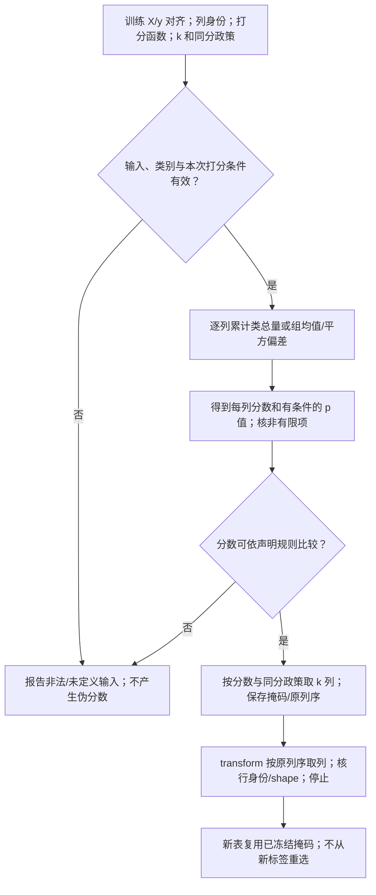
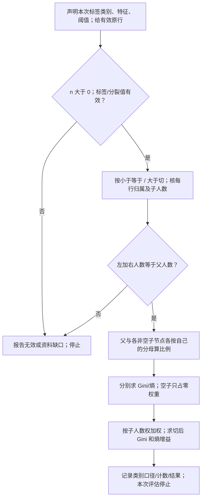
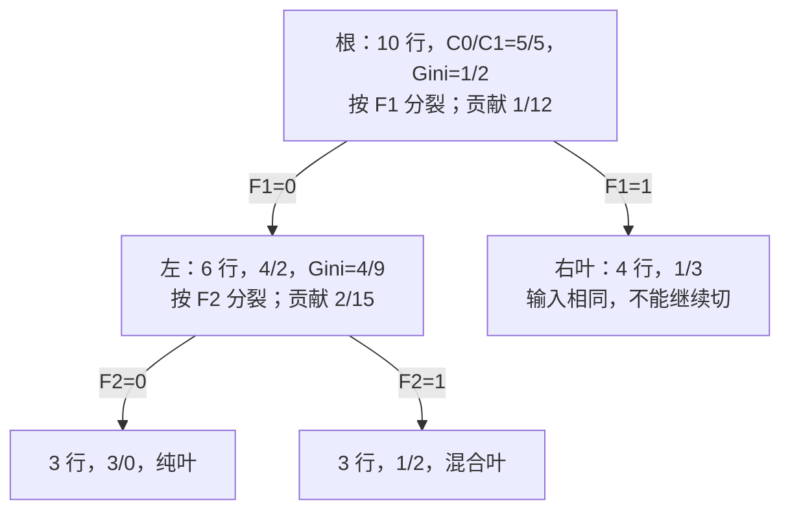
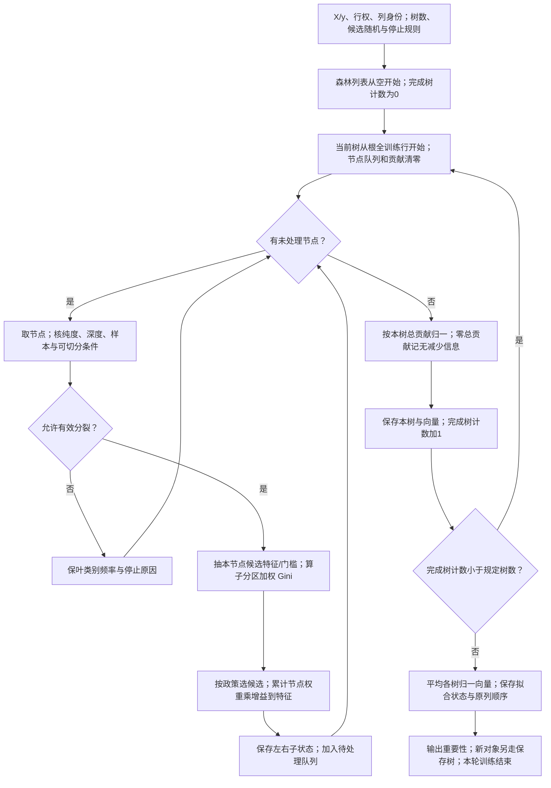
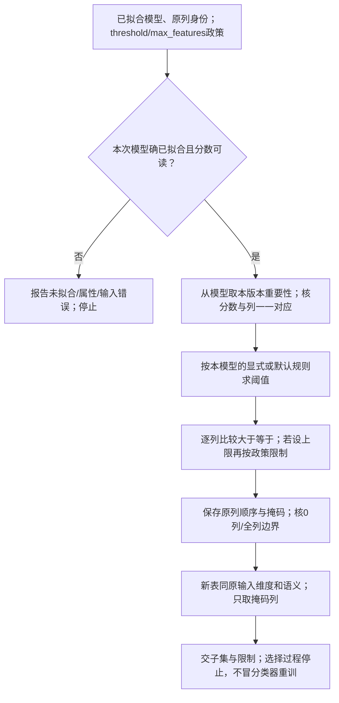
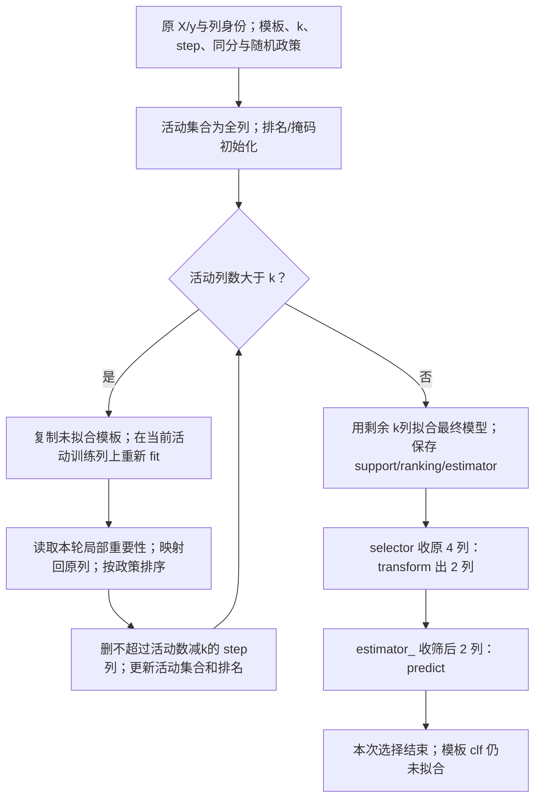
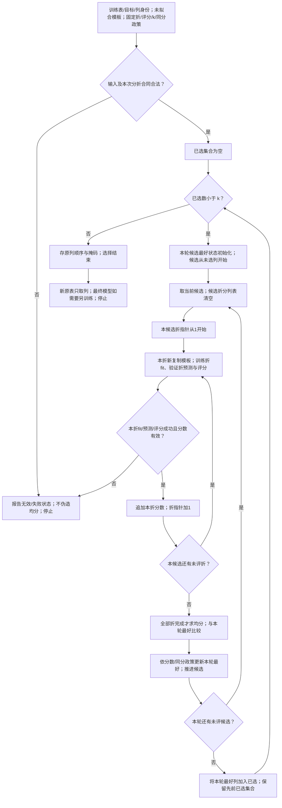
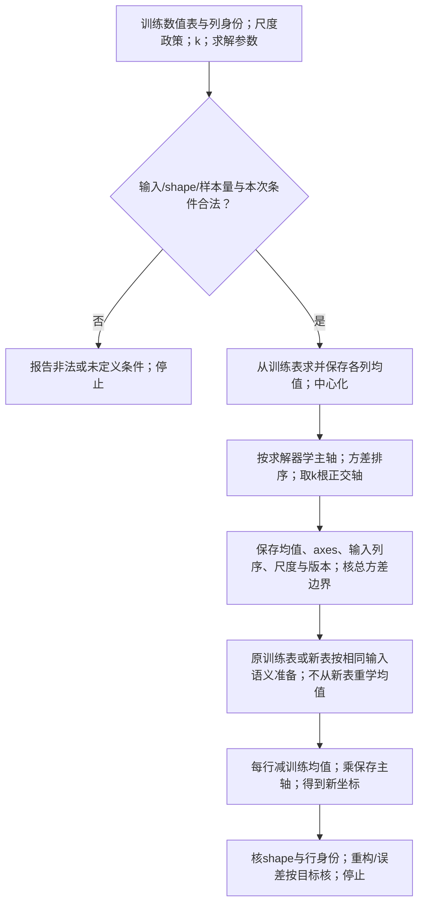
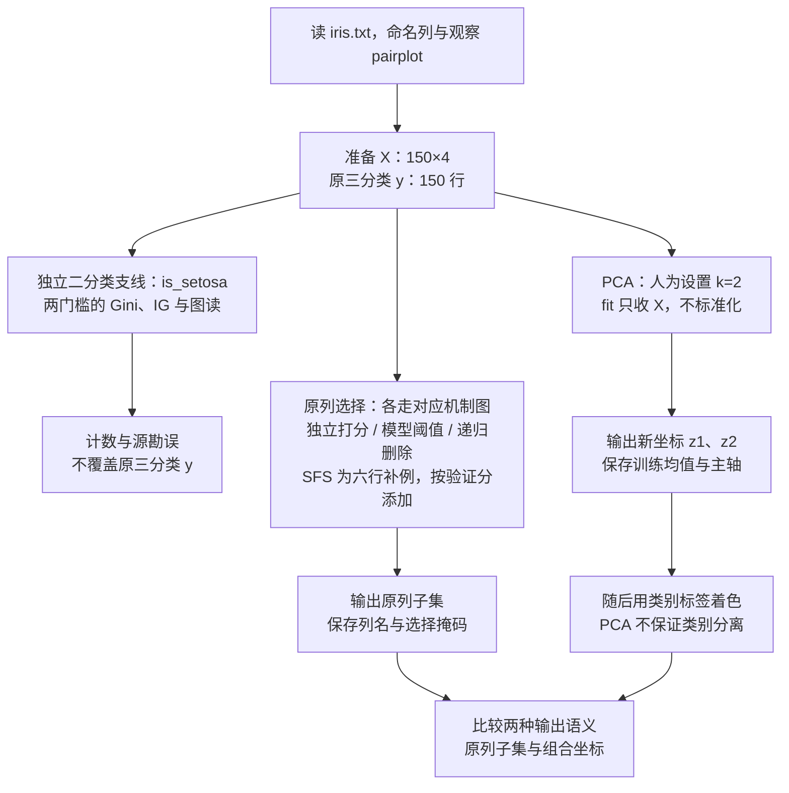

# T04 · 特征选择与 PCA 实战：Iris 的四种降维代码

> **本讲一句话**：这个 notebook 把 [[M04-特征工程-特征重要性与降维]] 的三块内容各变成几行 sklearn——**过滤模型**（`SelectKBest` + `chi2` / `f_classif`，讲义 §2.8 的单变量分数）、**包装 / 模型打分**（`ExtraTreesClassifier.feature_importances_` + `SelectFromModel`；`RFE` 递归剔除，讲义 §2.9、§2.12）、**特征约简**（`PCA(n_components=2)`，讲义 §2.13–2.15）。数据只用 150 行的 Iris，**三种选择器在此例常保留花瓣两列；PCA 则构造含多列权重的新坐标，不能说它选中同两列**。公开补充§3.6完整解释第五种SFS，个人评分编号/要求依版本提示和原保护段；不把此课堂修复当个人提交成品。
> **原始材料**：`Week4_Feature_Engineering_Tutorial.ipynb`（43 cells；课堂1–37）｜ **配套讲义**：[[M04-特征工程-特征重要性与降维]]｜ **数据**：[[IS6400_Business_Data_Analytics/_meta/数据集卡片#iris.txt|数据集卡片 › iris.txt]]；作业第 4 题用 [[IS6400_Business_Data_Analytics/_meta/数据集卡片#Airbnb.csv|数据集卡片 › Airbnb.csv]] ｜ **转录**：`merged`（`M04-transcript-partial.txt`，tutorial `01:36:11`–`02:12:01`；独立源完整性见§9.5）
>
> ⚠️ **三件事先知道**：① 当前源码开头明确 Week 4，新增 cells13–17 的 Gini / 信息增益已就地展开；② 课堂前缀无 AI Prompt；③ 保存 metadata 不等本次运行，本机复算版本另记。源随机树没有固定种子，保存值、当前新运行和固定协议补例必须分开，不能保证每次都不同或排序永远相同。

---

> **版本边界（2026-09-30 更新）**：本轮课堂 §1–6 / §8–9 已按当前 `Week4_Feature_Engineering_Tutorial.ipynb` 的1–37课堂前缀修复；旧37-cell版本的个人评分历史段保持原样并隔离。当前 Canvas 是 `Week4_Feature_Engineering_Tutorial.ipynb`（43 cells）；新版 Q1／Q2／Q3／Q4 为 ANOVA／SFS／Airbnb F 回归八列／森林 RFE 八列，20／40／20／20 共 100 内部分。正式截止 10/2 23:59（香港时间），交 HTML 或 PDF。下方 §7 的旧题与旧计算保留作历史教学，**不用于当前作业提交**；现行行政要求见 [[IS6400_Business_Data_Analytics/_meta/作业与DDL|作业与DDL]]。本次课堂来源对齐不改变原个人评分段，也不以课堂机制验收认证个人提交完成。

## 0. 这个 notebook 在教什么

拿到四列花的测量值，先回答两种不同问题：哪些原列值得留下？能否把四列压成两个新坐标？

本篇依次做单列打分、二分类分裂评价、模型取列与 PCA。前几种选择器返回原列子集；PCA 返回多列组合后的坐标。两者即使都输出 150 × 2，数字的含义也不同。

| 段 | 当前课堂 cell | 方法 / 动作 | 输出范围 |
|---|---|---|---|
| A | 2–12 | 读原150×5表；pairplot；SelectKBest(chi2,k=2) | 150×2原花瓣列；f_classif作为替代尺子就地讲 |
| A 的分裂补充 | 13–17 | 单独二分类 is_setosa；两阈值 Gini/熵增益；图读 | 两条件的计数、加权不纯度与原解释勘误 |
| B | 18–29 | ExtraTrees50树重要性、SFM、RFE | 已训模型分数、原列掩码和最终RFE模型，不是同一份状态 |
| C | 30–37 | 原四列PCA2、投影、接回表、按class上色 | 150×2新坐标与均值/方向；不认证独立预测成绩 |
| 公开补充 | §3.6 | 六行自给SFS与明确3折、一层树协议 | 15次候选折拟合及原列掩码；不是当前课堂原调用或个人评分成品 |

本源重新从 CSV 数分裂节点，不靠散点目测猜人数。与 M04 讲义的同名阈值分别依其明示输入/计数解释；原树/PCA的数值来源与补充完整小例分别标注。

> 🎙️ **课堂实况**（2026-09-23）：tutorial实际从`01:36:11`恢复至`02:12:01`，先选原列、核列名，再讲新版Gini/IG与图，随后ExtraTrees/SFM/RFE，最后PCA投影；`02:08:24`后转入模板与当前作业的一般要求。课堂多处现场编辑，不能把源保存输出称为本次实际运行记录。


---

## 1. 前置

### 1.1 需要哪些库

```python
import pandas as pd
import seaborn as sns                                    # 当前cell6配对图
import matplotlib.pyplot as plt
from sklearn.feature_selection import SelectKBest, f_classif, chi2, f_regression   # 过滤
from sklearn.ensemble import ExtraTreesClassifier        # 打分用的树模型
from sklearn.feature_selection import SelectFromModel, RFE                       # 按模型选 / 递归剔除
from sklearn.decomposition import PCA                    # 约简
from sklearn.discriminant_analysis import LinearDiscriminantAnalysis             # 当前cell31导入但未调用
```

导入依赖以实际所选 kernel 检查，不从发行版名保证全部已有。相对路径 `iris.txt` 按运行工作目录解析；本篇用原文件，不悄悄换成 load_iris。当前保存 metadata 为3.9.12，本次执行环境版本另列；LDA/f_regression课堂未调用，只解释背景用途。SFS的模型/折/停止政策在§3.6自给例里完整声明。

### 1.2 对应哪一讲的理论

| notebook 段 | 讲义 M04 | 一句话 |
|---|---|---|
| 当前cell4四个特征 + 类别 | §2.5（p.23） | "哪个特征更能分开三类" |
| 当前cell6 `pairplot` | §2.5（p.27–28）；M03 §2.18 散点图矩阵 | 先用眼睛看一遍 |
| 当前cell10 `SelectKBest(chi2)` | §2.8 单变量分数 $-\log p$、§2.9 过滤模型（p.32, p.50） | 每个特征单独检验 |
| 当前cell24 `feature_importances_` | §2.7 Gini、§2.9（p.35–39, p.43） | 树的每次分裂都是一次 Gini 增益 |
| 当前cell26 `SelectFromModel` | §2.9 包装模型（p.43, p.50） | 分数 ≥ 阈值的留下 |
| 当前cell28 `RFE` | §2.12 递归选择、后向搜索（p.53–54） | 每轮删一个最差的 |
| 当前cells33–37 `PCA` | §2.13–2.15（p.56–69） | $z = U_{\text{reduce}}^{\top}(x-\mu_{train})$ |
| 公开补充§3.6 SFS | §2.12 前向选择（p.54–55） | 每轮加一个最好的 |

### 1.3 本 notebook 第一次出现的 API（读之前先认识）

| API | 一句话 | 首次出现 |
|---|---|---|
| `SelectKBest(score_func, k)` | "按某个打分函数选前 k 个特征"的选择器；`score_func` 是函数对象（不加括号） | 当前cell10 |
| `chi2` / `f_classif` / `f_regression` | 三个打分函数：卡方（非负特征 × 分类）、ANOVA F（分类）、F 检验（回归） | 当前cell3 |
| `sns.pairplot(df, hue=)` | 一行画散点图矩阵，`hue` 按类别上色 | 当前cell6 |
| `df.values` | DataFrame → numpy 二维数组（丢列名） | 当前cell21 |
| `arr.ravel()` | (150, 1) → (150,)：把"一列"压成"一维" | 当前cell21 |
| `ExtraTreesClassifier(n_estimators=)` | 50 棵随机化决策树的集成；`.fit(X, y)` 后有 `.feature_importances_` | 当前cell24 |
| `SelectFromModel(model, prefit=True)` | 用已训练模型的重要性选特征，默认阈值 = 重要性均值；`.transform(X)` 取列 | 当前cell26 |
| `RFE(estimator, n_features_to_select, step)` | 递归特征剔除：反复训练、每轮删 `step` 个最不重要的，直到剩 `n_features_to_select` 个 | 当前cell28 |
| `.fit_transform(X, y)` vs `.fit(X, y)` + `.transform(X)` | 一步 / 两步；返回 numpy 数组 | 当前cells28–29 |
| `PCA(n_components=)` + `.fit(X).transform(X)` | 主成分分析；`.explained_variance_ratio_`、`.components_` 是两个该看却没看的属性 | 当前cell33 |
| `df.groupby(col)` 迭代 `for name, group in groups` | 按类别分组后逐组画散点 | 当前cell37 |

> **两条接口路径**：选择器决定“取哪几列”；PCA 决定“怎样组合各列”。

- SelectKBest / SFM / RFE / SFS：`get_support()` 的 True 表示保留原列。掩码须与原列顺序对应。
- PCA：`fit` 保存训练均值与主轴，`transform` 输出组合坐标；它没有 `get_support()`。
- `fit_transform` 包含一次新的 `fit`。已有规则只需复用时，调用 `transform`。

例如花瓣两列的 `[1.4, 0.2]` 是厘米测量；PCA 的两个数是投影坐标。不能只靠相同 shape 判断输出语义。

---

## 2. 逐块讲解 · 段 A：过滤模型 SelectKBest（当前 cells 2–17）

### 2.1 【当前 cells 3–8】导入、读数据、配对图、切 X / y

**这块在干什么**：导入过滤法的三个打分函数，读 Iris 并命名列，画一张配对图先用眼睛看，然后把特征表 `X` 和目标 `y` 分开。

**当前 cell 3：这段源代码在做什么**：导入过滤选择器和三打分函数。

```python
from sklearn.feature_selection import SelectKBest
from sklearn.feature_selection import f_classif,chi2,f_regression
# f_classif: ANOVA F-value between label/feature for classification tasks.
# chi2: Chi-squared stats of non-negative features for classification tasks.
# f_regression F-value between label/feature for regression tasks.
import pandas as pd
```

**逐行 / 输出**：三打分函数是函数对象；chi2/f_classif用于本分类介绍，f_regression为连续目标回归背景，本前缀没调用它。import不安装软件。

**当前 cell 5：这段源代码在做什么**：按原相对路径读表并定五列名。

```python
iris = pd.read_csv('iris.txt', header=None)
iris.columns = ['sepal-L', 'sepal-W', 'petal-L', 'petal-W', 'class']
iris  # you get a dataset of 150 objects and 4 features
```

**逐行 / 输出**：header=None表示原文件没有标题行；命名后是150×5，前三类各50，厘米测量和目标分开，source的末行iris在Notebook显示表。

**当前 cell 6：这段源代码在做什么**：用类别给四属性散点矩阵着色。

```python
import seaborn as sns #let's take a look at the pairwise plot
sns.pairplot(iris, hue="class") #which features are most representative?
```

**逐行 / 输出**：hue取已知class；4×4格，对角分布曲线、非对角对应横列/纵行的两属性。可见分离不证明预测最优，图不能替代计数。脚本环境显示可需显式观察图对象。

**当前 cell 8：这段源代码在做什么**：切四输入列和一目标列并显示X。

```python
features = ['sepal-L', 'sepal-W', 'petal-L', 'petal-W']
target = ['class']
X = iris[features]
y = iris[target]
display(X)
```

**逐行 / 输出**：features列表保持列顺序；target列表让y为150×1 DataFrame，X为150×4。当前chi2可接受，其他方法可能警告；不是所有估计器或多目标都能随意ravel。


**逐行**：三个打分函数的注释是 notebook 自己写的，值得记——`f_classif` 用于**分类**（ANOVA F 值），`chi2` 用于**分类且特征非负**（Iris 的厘米数满足），`f_regression` 用于**回归**（作业第 4 题 Airbnb 预测价格要用它）。`header=None` 同 T03。`pairplot(hue="class")` 是 M03 §2.18 散点图矩阵的 seaborn 版：4 × 4 格，对角线是每个特征按类别的分布曲线。`X = iris[features]` 用列表取列得到 DataFrame（150 × 4），`y = iris[target]` 也是 DataFrame（150 × 1）。

**输出**：当前 cell 5 显示 150 行 × 5 列（末尾 5 行是 `Iris-virginica`）；当前 cell 6 的图里 petal-L / petal-W 参与的格子三色分离明显，sepal-W 的格子三色混在一起——这就是讲义 p.27–28 的结论，先看图再看数。

**为什么这么写**：notebook 的注释问 "which features are most representative?"——先让你用眼睛猜，后面用四种方法验证。

**⚠️ 易错点**：`y = iris[target]` 得到的是二维 DataFrame，`SelectKBest` 能接受（内部会转），本源当前cell21已压平单目标，若直接传二维单列给某些估计器可警告，树拟合在cell24——见 §3.1。

**所以呢**：数据身份与shape准备好，才可逐列打统计分；下一节从O/E和组均值把算法算到输出。

**🎙️ 课堂补充**（`01:39:46`–`01:44:30`，A · 课上展开）

教师先按目标类型解释三种打分函数：`f_classif` 的 ANOVA F 用于分类，`chi2` 也是分类但输入特征须非负；`f_regression` 用于连续数值目标。*"But what the inputs here require is the non-negative features"*（`01:40:24`）；*"So if your dependent variable is more like the continuous numeric."*（`01:41:15`）。Iris 的目标是花种，因而这里不用 F 回归。

读表后先看 `pairplot` 中每对特征，教师说 *"with every pair of the features"*（`01:42:22`），把花瓣两列看起来更有助分类作为图上观察，而非泛化成绩。随后现场在目标 `y` 加 `.values.ravel()`（`01:43:52`–`01:44:20`），理由是部分模型需要一维标签；ASR 将 ravel 写作 Revolve/Revol等，按对应 API 转述。这里只对本例单目标压平，不把它推广为真正多输出标签也能随意压平。

这段补上“任务类型先决定打分尺子”及标签形状的课堂动机。源 cell 8 保存的是二维 y，课堂有现场补写；不能把当前保存代码当作已经包含该修改。

### 2.2 【当前 cell 10】SelectKBest：按卡方分数留两列

**这块在干什么**：用卡方统计量给四个特征各打一个分，留分最高的两个。

**当前 cell 10：这段源代码在做什么**：按给定chi2尺子选择两列。

```python
X_new = SelectKBest(chi2, k=2).fit_transform(X, y)  # we use chi2 as the criteria and select k=2 best features
X_new.shape  # you get a new feature set of dimension k=2
```

**逐行 / 输出**：构造、fit打每列分、transform取列；当前返回150×2数组。source临时对象没命名保存，欲复用须另保selector。


**逐行**：`SelectKBest(chi2, k=2)` 建一个选择器：打分函数 `chi2`（传函数名，不加括号），保留 2 个。`fit_transform(X, y)`：`fit` 对每列算 `chi2(X, y)` 得到 4 个分数，`transform` 只保留分数最高的 2 列。返回 numpy 数组 `(150, 2)`。

**输出**：`(150, 2)`——列数从 4 变 2。

**打分是怎么算的**（notebook 与讲义都没写，💡 补）：`chi2` 把每个特征当"计数"看，对"特征值总和按类别的分布"做卡方检验，分数越大说明该特征在三类之间差异越大；`f_classif` 做单因素方差分析（ANOVA），F = 组间方差 / 组内方差，越大越能分开类。两者都是讲义 p.32 的**单变量分数**思路：相同检验/自由度下大分数对应较小尾概率，跨不同检验不据此直接比较。原数据本轮独立复算：

先读 p 值：在“无类别差异”的原假设及相应检验条件下，获得当前或更大统计量的尾概率。它不是特征有用或无用的概率；厘米测量可被 API 接受，也不证明计数模型的 p 值已校准。

| 特征 | chi2 分数 | chi2 p 值 | f_classif F 值 | F 的 p 值 |
|---|---|---|---|---|
| sepal-L | 10.82 | 0.0045 | 119.26 | $1.7 \times 10^{-31}$ |
| sepal-W | 3.59 | 0.166 | 47.36 | $1.3 \times 10^{-16}$ |
| **petal-L** | **116.17** | $5.94 \times 10^{-26}$ | **1179.03** | $3.1 \times 10^{-91}$ |
| **petal-W** | **67.24** | $2.50 \times 10^{-15}$ | **959.32** | $4.4 \times 10^{-85}$ |

两种度量排序相同：petal-L > petal-W > sepal-L > sepal-W——**作业第 1 题换成 `f_classif` 会得到同样的两列**。

**为什么这么写**：这是讲义 p.25 / p.50 的**过滤模型**——全程没有训练任何分类器，只做统计检验，不依赖某个后续分类器，但不保证无选择偏差或最优组合。

**⚠️ 易错点**：

1.  `chi2` 要求特征**非负**（它把特征当频数），Iris 可以，标准化后（有负数）就报错——作业第 4 题 Airbnb 若先标准化则要改用 `f_regression`。

2.  `k` 是人定的，递归/顺序法也有固定k与自动政策之分。

3.  当前默认X_new数组不带列名。

以命名DataFrame fit的选择器在本机可保feature_names_in_并给get_feature_names_out，源临时对象未保存所以不能回读。

数组输入还需外存身份。

**从分数到选择的完整过程（💡 笔记补充）**

先看机制：输入是一张已对齐的非负数值表 $X$、每行类别 $y$ 与要留的列数 $k$；`fit` 逐列算分、存分数和选择规则，`transform` 只按已学掩码取原列，**不会在新对象上重新读标签决定列**。原 code 10 的临时选择器没有被命名保存，所以只留了 `X_new`；§2.3 的补充写法才把 selector 存下来供新表复用。选择后列的顺序仍依原输入，不是自动按分数降序重排。

**卡方质量表怎样构造（笔记补充）**：如果两类的平均测量相同，各类应按人数比例分到该列总量。先看实际分到多少，再衡量与预期相差多少。

一行符号说明对应一个角色。测量值的单位沿用输入列；卡方分数的尺度也随这列单位改变。

| 符号 | 对象或动作 | 本例来源 |
|---|---|---|
| $n,n_c$ | 全部行数、第 $c$ 类行数 | 四行表：4；每类 2 |
| $C$ | 类别数 | 0、1 两类，共 2 |
| $x_{if}$ | 第 $i$ 行、第 $f$ 列测量 | 四行 A / B / C 表 |
| $O_{cf}$ | 本类该列的实际总量 | 将本类原值相加 |
| $E_{cf}$ | 本类按人数应分到的总量 | 人数比例乘全列总量 |
| $\chi_f^2$ | 各类相对预期的偏离总分 | 下面第 3 步 |

1. 按类别累计原值，得到实际量：

$$O_{cf}=\sum_{i:y_i=c}x_{if}.$$

2. 按人数比例分配全列总量，得到预期量：

$$E_{cf}=\frac{n_c}{n}\sum_i x_{if}.$$

3. 每类的差先平方、除以预期量，再按类相加：

$$\chi_f^2=\sum_{c=1}^{C}\frac{(O_{cf}-E_{cf})^2}{E_{cf}}.$$

平方避免正负差抵消；除预期量则把差放到该类应得量的尺度上。读 A 列：类 0 实际总量 3，按一半人数预期得到 6；类 1 实际 9，预期也为 6。

**本步边界**：sklearn 接受非负测量，并按此式计算。厘米测量被接受，仍不能证明计数检验的 p 值模型已校准。

- 全列总量为 0：各预期量为 0，不能将 $0/0$ 当合法零分。
- 常数、缺失、非有限输入或缺类别：先明确处理政策；不能套正常例。
- 原 Iris 满足本次计算条件，这个事实不自动适用于任意新表。

**ANOVA F 怎样换尺子**：ANOVA 是单因素方差分析；本例按类别划组，比较组均值的距离和组内原始值的波动。设 $\bar{x}_f$ 为全体均值、$\bar{x}_{cf}$ 为类别均值，组间平方和 $SS_B$、组内平方和 $SS_W$，分别除以各自的自由度后再比：

1. 计算各类均值与总体均值的距离，按类别人数加权：

$$SS_B=\sum_c n_c(\bar{x}_{cf}-\bar{x}_f)^2.$$

2. 计算每行偏离本类均值的距离，再相加：

$$SS_W=\sum_c\sum_{i:y_i=c}(x_{if}-\bar{x}_{cf})^2.$$

3. 两个平方和各除自己的自由度，再作比值：

$$F_f=\frac{SS_B/(C-1)}{SS_W/(n-C)}.$$

两个平方和的单位都是输入测量的平方。F 是同单位量的比值，没有单位。

| 量 | 为什么要这样算 |
|---|---|
| $SS_B$ | 类别均值离总体均值越远，区分类别的信号可能越大；按类别人数加权 |
| $SS_W$ | 同类内部也可能散开，不能只看均值差；逐行对本类均值算偏差 |
| $C-1$ | 类别均值受总体均值约束，剩这些独立变化方向 |
| $n-C$ | 为各类各估一个均值后，剩余组内偏差方向数 |
| $F_f$ | 两个“每自由方向的平方偏差量”之比；不是原始两平方和直接相除 |

当 $C\ge2$、$n>C$ 且组内量为正时可算正常 F。

组内为零但类均值不同，分母为零，会出现无穷大。

组间、组内都零则统计量未定义，不把 NaN 当真正零关联。

函数能算数与尾概率推断的条件也不同：经典 F 尾概率还需相应的独立样本、组内分布/方差条件。

本节把 p 值解释为**在无类别差异假设和相应模型条件下，获得至少这样大的统计量的尾概率**，不是“该特征无用的概率”。

相同类别数/样本数下的同一种检验，分数与 p 值排序方向相反。

不同检验、自由度或样本条件不能笼统这样比较。

**完整新四行演练**：列顺序 A/B/C，类别为 0/0/1/1；四行依次 (1,1,1)、(2,4,3)、(4,2,3)、(5,3,3)。本例取 $k=1$，跨列同分时补充政策是取原列序较小者；这项教学政策不冒充所有 sklearn 版本的同分承诺。

| 特征 | 类 0 / 类 1 的总量 | 两类预期 | 卡方计算 | 卡方分数 |
|---|---|---|---|---:|
| A | 3 / 9 | 6 / 6 | $9/6+9/6$ | 3 |
| B | 5 / 5 | 5 / 5 | $0/5+0/5$ | 0 |
| C | 4 / 6 | 5 / 5 | $1/5+1/5$ | .4 |

| 特征 | 类均值 / 全均值 | $SS_B$ | $SS_W$ | 两自由度与 F |
|---|---|---:|---:|---|
| A | 1.5、4.5 / 3 | 9 | 1 | $df_B=1,df_W=2;\ F=9/(1/2)=18$ |
| B | 2.5、2.5 / 2.5 | 0 | 5 | $F=0/(5/2)=0$ |
| C | 2、3 / 2.5 | 1 | 2 | $F=1/(2/2)=1$ |

逐动作收束：三列各算 O/E 或均值/平方和，得到完整分数，再按政策排名。本例两法都选 A，存掩码 `[True,False,False]`；输出四行 A 值 1/2/4/5，保原行次序。新对象 (6,2,4) 只 transform 得 6，不重新算四行统计。若将 C 单位改成原值×10，其 O/E 都×10，卡方分数变 4，卡方选 C；F 的分子、分母都×100，F 仍 1、仍选 A。**单位和检验模型会改变选择含义**，不能说本次两法相同就必然永远相同。

**怎样走下面的图（补充版本）**：箭头表示处理顺序；菱形是输入和分数条件检查。原 cell 10 是一次库调用，图中的统一拒绝出口是教学合同，不能视为原调用已实现的全部检查。

用四行 A/B/C 表、`k=1` 从 UF0 开始。A 的 O/E 得分 3，B 为 0，C 为 0.4；UF5 保存只留 A 的掩码。UF6 输出原 A 列 1、2、4、5。新行 (6,2,4) 到 UF7 只留下 6。

文字替代：先逐列打分，再确定掩码；新行只取列，不重新用新标签打分。

<details><summary>读图自测：C 换单位乘 10 会在哪一步改路？</summary>

C 的 O/E 在 UF2 都乘 10，UF3 的卡方分数变 4，UF5 因而选 C。F 的两个平方和都乘 100，比例不变，仍选 A。

</details>



CV（交叉验证）把训练资料分成若干折，轮流留一折评价、其余折训练。每轮选列与所需预处理只在当轮训练折 fit，避免提前看留出折标签。

**为什么需要 / 易错点**：这是模型无关的单列预筛选，不是“对后续模型无偏”或保证最优。各列单独检验会漏组合：四行二元输入 00/01/10/11，类别 0/1/1/0，每列在两类的总量一样，单列分数为零；两列组合却能描述这个异或规则。若独立评估预测效果，选择的 `fit` 必须在训练或各 CV 训练折内，不能先用全表标签选列再报告独立验证分。

**🎙️ 课堂补充**（`01:36:26`–`01:41:33`、`01:44:30`–`01:45:03`，A · 课上展开）

教师先讲共用接口：*"So what the fit means that the fits were learned from the data you have."*（`01:37:36`）；`transform` 按已学规则改变数据，选择器取原列，约简输出低维表示。接着把 `SelectKBest` 的打分函数与 k 分开，*"The other one is the K represents the top of the features that you want to select."*（`01:39:02`）。本例设 k=2；同一算法可换 `chi2`/`f_classif`，也可改留列数（`01:46:42`–`01:47:38`）。

课堂展示了 fit 后 transform 的两列数组，但没有手算本文 O/E、F 自由度、四行变式或输入退化案例。这段确认接口与参数角色，原数学机制、数字复算及单位反例仍是笔记补充；课堂展示不等于本次代理重新运行。

**所以呢**：完成各列分数仍要确认原列身份，下一节从selector与支持掩码核真正留下了谁。

### 2.3 【当前 cell 12】看选中了谁

**这块在干什么**：`fit_transform` 只返回数字，得靠前几行对回原表才知道留下的是哪两列。

**当前 cell 12：这段源代码在做什么**：显示筛后前五行，核原列身份。

```python
display(X_new[0:5, :])  # petal-L and petal-W were selected
```

**逐行 / 输出**：当前两列值与原petal-L/petal-W对应，但肉眼相同值不能一般唯一认列，保存selector并读get_support更可靠；它不是PCA接口。


**输出**：`[[1.4, 0.2], [1.4, 0.2], [1.3, 0.2], [1.5, 0.2], [1.4, 0.2]]`——跟 当前 cell 5 前五行的 petal-L（1.4, 1.4, 1.3, 1.5, 1.4）和 petal-W（0.2 × 5）对上，所以是这两列。

**更可靠的写法**（💡 补，作业里建议用）：

```python
selector = SelectKBest(chi2, k=2).fit(X, y)
selector.scores_                                   # 四个分数
[features[i] for i in selector.get_support(indices=True)]   # ['petal-L', 'petal-W']
```

`scores_` 给分数，`get_support(indices=True)` 给被选列的下标——不用肉眼对数。

**为什么这么写**：值相同不唯一确定列，保存selector与原列名才能核取列身份。

**易错点**：源临时对象未保存，不能凭X_new追读原selector属性；PCA没有该支持掩码接口。

**所以呢**：可靠列身份使选择可复用，下一节对照算法、尺子和k，再接新版分裂评价。

**🎙️ 课堂补充**（`01:45:03`–`01:46:38`，A · 课上展开）

教师问 *"how do I know the feature name for these two columns?"*（`01:45:03`），先说可以和原表比值，再补一个更直接的方法：保留选择器对象，拟合后读取 `get_support()` 的布尔掩码，再按原四列名输出被选特征。*"And indicate if it's true, means that that's exactly the feature I selected."*（`01:46:20`）；*"like force, force, true, true"*（`01:46:30`，force 是 False 的 ASR 误识）。本次课堂指向花瓣长度和宽度。

这段将本文“保存 selector、核列身份”的补充得到课堂方法证据；录音没有清楚读出每一行新增代码，不能声称当前 cell 12 保存源码已经含 get_support。布尔掩码与原列顺序须一起解释，PCA 没有同一取列接口。

### 2.4 段 A 小结

**这块在干什么**：把单列选择中的算法、打分尺子、指定k和返回列分开看。

**为什么这么写**：换一个score_func不等换成验证模型性能，两法这份表选相同也不证明所有输入同排序。

**易错点**：k是这里的人定参数；不要把固定k和自动停止、特征分数和预测成绩混为一谈。


三段式对照讲义：

| 步骤 | 代码 | 讲义 |
|---|---|---|
| 选算法 | `SelectKBest` | 过滤模型（p.50 左列） |
| 选度量 | `chi2` / `f_classif` | 单变量分数（p.32） |
| 选 k | `k=2` | 人定 |
| 得结果 | `fit_transform` → `(150, 2)` | petal-L、petal-W |

---

**所以呢**：单列评分只是这条路线；新版还给两刀的纯度和信息增益，需要按实际标签与计数算。

### 2.5 【当前 cells 13–14】二分类分裂：Gini 与信息增益

**这块在干什么**：新版单独把标签改成 Setosa / Non-Setosa 两类，按给定阈值切两堆，分别回答“切后还多混”和“切前的不确定性减少多少”。这一步新增 `iris_filter` 和 `is_setosa`，没有把原 `y` 永久改成二分类；后面的森林仍处理三种 Iris。

**原代码**（当前 cell 14；原注释、函数和四位小数输出保留）：

```python
import pandas as pd
import numpy as np
import matplotlib.pyplot as plt
from IPython.display import display

# 1. Load Data
iris_filter = pd.read_csv('iris.txt', header=None)
iris_filter.columns = ['sepal-L', 'sepal-W', 'petal-L', 'petal-W', 'class']

# 2. Create a binary target (Setosa vs Non-Setosa) for this specific quiz question
iris_filter['is_setosa'] = (iris_filter['class'] == 'Iris-setosa').astype(int)

# 3. Define Impurity Functions
def calc_gini(y):
    """Calculate Gini Index for a given subset of labels."""
    p = y.value_counts(normalize=True)
    return 1 - np.sum(p ** 2)

def calc_entropy(y):
    """Calculate Entropy for a given subset of labels."""
    p = y.value_counts(normalize=True)
    return -np.sum(p * np.log2(p + 1e-12))

# 4. Define Split Evaluation Function
def evaluate_split(df, feature, threshold, target='is_setosa'):
    # Split the data
    left = df[df[feature] <= threshold]
    right = df[df[feature] > threshold]
    n = len(df)
    n_left, n_right = len(left), len(right)

    # Parent Node Impurity
    parent_gini = calc_gini(df[target])
    parent_entropy = calc_entropy(df[target])

    # Child Node Impurities
    gini_left = calc_gini(left[target]) if n_left else 0
    gini_right = calc_gini(right[target]) if n_right else 0
    
    entropy_left = calc_entropy(left[target]) if n_left else 0
    entropy_right = calc_entropy(right[target]) if n_right else 0

    # Weighted Impurity (GINI_split) - Lower is better
    gini_split = (n_left / n) * gini_left + (n_right / n) * gini_right

    # Information Gain (GAIN_split) - Higher is better
    gain_split = parent_entropy - ((n_left / n) * entropy_left + (n_right / n) * entropy_right)

    return {
        'Feature': feature,
        'Threshold': threshold,
        'n_left': n_left,
        'n_right': n_right,
        'Parent_Gini': round(parent_gini, 4),
        'GINI_split': round(gini_split, 4), # Want to minimize
        'Parent_Entropy': round(parent_entropy, 4),
        'GAIN_split': round(gain_split, 4)   # Want to maximize
    }

# 5. Evaluate the Two PPT Cases
results = pd.DataFrame([
    evaluate_split(iris_filter, 'petal-W', 0.8),
    evaluate_split(iris_filter, 'sepal-L', 6.0)
])

# 6. Display Results
display(results)
```

**逐行 / 逐动作**：四个 import 引入表、数字、图与显示功能；`read_csv` 重读本份原 `iris.txt`，`is_setosa` 将 Setosa 判为 1、其余为 0。`calc_gini` 先在当前子集求类别比例，再做平方和；`calc_entropy` 用以 2 为底的对数。`evaluate_split` 的 `<=` 含阈值本身，`>` 为另一堆，先计人数，再分别算父/子不纯度与人数权，最后交表。最后的两次调用分别指定 petal-W/0.8、sepal-L/6.0；`round(...,4)` 只改显示精度，不能在每个中间步骤过早四舍五入。

**是什么**：一个节点的比例是“本堆各类人数 / 本堆总人数”。Gini 可以读作按这些比例独立、有放回地抽两次标签，二者不同的概率；熵是按类别概率加权的自信息量，稀少类的 $-\log_2 p$ 较大。切后要按人数加权，不能让两人小堆与一百人大堆各占一半。

$$
G(t)=1-\sum_c p_{c,t}^{2},\qquad
H(t)=-\sum_{c:p_{c,t}>0}p_{c,t}\log_2p_{c,t},
$$

$$
G_{\mathrm{split}}=\frac{n_L}{n}G(L)+\frac{n_R}{n}G(R),\qquad
IG=H(P)-\left[\frac{n_L}{n}H(L)+\frac{n_R}{n}H(R)\right].
$$

| 符号 | 解释 |
|---|---|
| $P,L,R$ | 父节点、按本次条件形成的左/右子节点 |
| $n,n_L,n_R$ | 各堆人数；完整有效分区必须 $n_L+n_R=n$ |
| $p_{c,t}$ | 第 $t$ 堆的本类比例，分母为该堆人数 |
| $G,H,IG$ | Gini 不纯度、熵（bit）、熵的信息增益；Gini 减少量另算，二者不是同一分数 |

**输出与原数据完整手算**：本文件 150 行，父节点 Setosa50 / Non100，$G(P)=1-(1/3)^2-(2/3)^2=4/9$，$H(P)=.9182958341$。

| 切法 | 左计数（Setosa / Non） | 右计数 | 子 Gini（左 / 右） | 切后加权 Gini | 信息增益 |
|---|---|---|---|---:|---:|
| petal-W ≤ .8 | 50 / 0 | 0 / 100 | 0 / 0 | 0 | .9182958341 |
| sepal-L ≤ 6 | 50 / 39 | 0 / 61 | .4923620755 / 0 | .2921348315 | .3315173052 |

第一刀两堆均纯，熵与 Gini 均为 0；第二刀左89行，$G(L)=1-(50/89)^2-(39/89)^2=0.4923620755$，右61行全 Non，$G(R)=0$。人数加权为 $(89/150)G(L)+(61/150)0=0.2921348315$；$H(L)\approx.9889525768$，切后加权熵约 0.586778529，父熵减它得 0.3315173052。第二刀的 **Gini 减少量**为 $4/9-0.2921348315=0.1523096129$，不能抄信息增益 0.3315 当 Gini 增益。原表显示为 0.0000/0.9183 与 0.2921/0.3315。

**控制过程（💡 补充）**：以下在原函数外明确有效输入合同；不把补充守卫伪装成原函数已有。



**边界与失败**：空 child 的零权重不是可以对 0 人求比例；原代码有空 child 条件，却没拒绝空父节点，$n=0$ 时不能除。缺失分裂值可能既不满足 `<=` 也不满足 `>`，人数不再完整；缺失标签也会影响 `value_counts` 分母，须先核合同。源熵用 `p+1e-12` 避免数值问题，纯节点可能出现极小负舍入量；理论熵仍为 0，不将数值误差读成“负信息”。

**💡 新六行完整变式**：按数值 1/2/3/4/5/6 排列，类别 A/A/B/A/B/B。父3/3，Gini=0.5、熵1。阈值2左2A0B，右1A3B，右 Gini3/8，按2/6与4/6加权得 0.25；右熵 0.811278125，切后熵 0.540852083、信息增益 0.459147917。阈值3左右均为2/1或1/2，Gini各4/9，加权4/9，熵各0.918295834，增益0.081704166。因此本两候选中，阈值2按两种准则均更优；一次评估没有训练整棵树，想继续建树还要候选与停止规则。

**常见误解**：二分类“完美”不等三类都纯。若保留原三类，petal-W≤0.8 的右堆是两类各50，加权 Gini 为 $100/150\times(1-0.5^2-0.5^2)=1/3$，不能沿用 0。当前 notebook 按本 CSV 重数，阈值同讲义不保证原节点计数也相同，分别按明示来源解释。

**🎙️ 课堂补充**（`01:48:23`–`01:53:38`，A · 课上展开）

教师明确接回讲义两种条件：petal-W≤0.8 与 sepal-L≤6.0，现场讲 Gini/熵函数及分裂评价表。这与当前新增 cells 13–14 内容相应，旧 37-cell 课堂版没有该块。现场说可以从已读取表复制到 `iris_filter`，而当前保存源码重新 read_csv；这只是两种数据准备写法，须确认取的是同一表及正确标签。

关于概率，教师说 *"we have already calculated into the probability, so there's no need to add in the denominator"*（`01:49:52`），对应 `value_counts(normalize=True)` 已除本子集人数；不是 Gini 公式从此不需要正确分母。熵用 log2，加入极小量的目的为 *"we want to prevent what is like the log2 zero cases."*（`01:50:55`）。极小量按源代码 `1e-12`，ASR Neptune 12 不作可靠数值直引。

分裂评价先分别计算父与子节点，再求人数权加权不纯度和熵减少，课堂原话 *"calculate the parent and also the chi-nodes separately"*（`01:51:47`；chi-nodes 指 child nodes），最后显示各人数及分数。课堂只口述第一刀 Gini 接近零、信息增益较大，未清楚逐项念出本文 50/39/61 和完整小数；原 CSV 计数、数学展开、空父/缺失边界仍为笔记核算，不能说老师核过每个数字。

**所以呢**：数值证明的是这份输入及标签口径下的一刀，下一节用图核行如何归堆并纠正源解释；不能只看“完美/不完美”两个名字。

**为什么这么写**：子堆大小不同，人多的堆占更大权，才能表示按对象分区后的平均混合程度；Gini与熵是不同尺子，增益不能互抄。

### 2.6 【当前 cells 15–17】阈值图、二分类口径与源勘误

**这块在干什么**：两个子图分别横放 petal-W、sepal-L，纵放 sepal-W；蓝色是 Setosa，橙色是 Non。虚线为给定横轴阈值，等号点进入左堆。这里的颜色来自已知标签，没有进行聚类。

**原代码**（当前 cell 16）：

```python

fig, axes = plt.subplots(1, 2, figsize=(12, 5))

for ax, (feature, threshold) in zip(axes, [('petal-W', 0.8), ('sepal-L', 6.0)]):
    # Plot Setosa
    setosa = iris_filter[iris_filter['is_setosa'] == 1]
    non_setosa = iris_filter[iris_filter['is_setosa'] == 0]
    
    ax.scatter(setosa[feature], setosa['sepal-W'], color='blue', label='Setosa', alpha=0.7)
    ax.scatter(non_setosa[feature], non_setosa['sepal-W'], color='orange', label='Non-Setosa', alpha=0.7)
    
    # Draw threshold line
    ax.axvline(threshold, color='black', linestyle='--', label=f'{feature} <= {threshold}')
    
    ax.set_xlabel(feature)
    ax.set_ylabel('sepal-W')
    ax.set_title(f'Case: {feature} <= {threshold}')
    ax.legend()

plt.tight_layout()
plt.show()
```

**逐行**：`subplots(1,2)` 建两个画板；`zip` 将每个画板配一个特征与阈值。按 `is_setosa` 从同一 `iris_filter` 取两群，横轴取本次特征、纵轴都取 sepal-W；`axvline` 只画位置，不计算分类器；各轴名与图例使类别身份可读；最后布局并显示。

**同源阈值图**：从当前 43-cell 源的 cell16 及原 iris.txt 重画，图源 splits.py；只用课堂前缀，不涉及评分 cells。

![[IS6400_Business_Data_Analytics/notes/figures/t04-readability/iris-splits.svg]]

两图纵轴均为 sepal-W（cm），横轴分别为 petal-W 与 sepal-L（cm）。虚线是给定阈值，点形/颜色来自 Setosa 与 Non 标签，未学习新分类边界。

走教学点 (sepal-L=6,sepal-W=4)：横坐标等于下图阈值，按 ≤ 进入左堆；纵坐标不改变归属。文字替代：第一刀左右纯；第二刀左 50 Setosa/39 Non，右 61 全 Non。

<details><summary>读图自测：sepal-L 恰为 6 该去哪里？右侧是否两类混合？</summary>

等号属于左侧。右侧条件是 >6，原数据计数为 61 Non、0 Setosa；不能沿原 cell17 的错述说右侧混合。

</details>

**输出 / 原图读法**：petal-W=0.8 左侧50蓝点、右侧100橙点；sepal-L=6 左侧50蓝/39橙、右侧61橙。纵向位置不决定此两刀归属，散点重叠也不能可靠靠肉眼重数所有150行，所以先用表的条件筛选统计，再对照可见图形。

**源 cell 17 勘误**：它说第二刀左右都混合 Setosa 与 Non。对本文件实际计数与源图，这句话错误：**右侧全 Non，只有左侧混合**；保留原材料不改，笔记在此和 §9.3 明示。第一刀也应说本份二分类数据左右完全纯，源“almost entirely”是原宽松描述，不把它扩大成未来数据保证。

**为什么这么写 / 常见误解**：图帮助核标签、坐标与归属，但不是统计分母，也不是独立准确率证据。将三类别配色直接拿来解释这一二分类图、把纵轴高低当另一阈值、或把虚线当自动学出的最优门槛，都会改变问题。源代码仅评估两项给定条件，没有证明全候选全局最优。

**💡 新例**：若某对象横坐标恰好6、纵坐标4，在第二图进入左堆，纵坐标不改变归属；若横坐标未知，必须报告无法归堆，不靠颜色猜一个数。若新数据出现 Non 在 petal-W=0.8 左侧，原“完美”结论不再成立，应按新计数重评，不能从旧图继承纯度。

**🎙️ 课堂补充**（`01:53:38`–`01:58:37`，A · 课上展开）

教师讲图形容器、子图行列及 axes 下标，说明第一图 petal-W/0.8、第二图 sepal-L/6.0，然后现场纠正坐标标签（`01:56:24`–`01:57:32`）。*"to change it to the white label, white label."*（`01:57:27`；white label 是 y label 的 ASR 近音）。录音不足以重建现场修改的精确代码与所有轴名，当前 cell 16 的实际横轴/纵轴仍按源码读，不把口语错误词写成正确原话。

课堂用两图比较第一条件更易隔开 Setosa/Non、第二条件有混合；并强调 Gini 越低越好、信息增益越高越好（`01:58:18`）。没有可靠证据表明教师发现 cell 17“左右都混类”的错述，所以正文中“仅左侧混合、右侧61全Non”的纠错继续是原 CSV/保存图复核结果，而非教授已经确认。图读不能认证独立预测准确率。

**所以呢**：现在已经从类别、条件、计数到图形闭合一次分裂评估，后面的树模型会在多个训练节点重复类似评价，并把减少量累计成模型重要性。

**易错点**：纵轴高低不决定这次横向阈值归属，颜色来自已知二分类，不是无监督簇；源“左右都混”已由实际计数否定。

## 3. 逐块讲解 · 段 B：模型打分与递归剔除（当前 cells 18–29）

### 3.1 【当前 cells 19–22】导入树模型、重读数据、转 numpy、压平 y

**这块在干什么**：换一种打分方式——用一个**模型**来算重要性。先导入 `ExtraTreesClassifier` 和 `SelectFromModel`，重新读数据并把 X、y 转成 numpy。

**当前 cell 19：这段源代码在做什么**：导入树模型和按模型取列的选择器。

```python
from sklearn.ensemble import ExtraTreesClassifier
#This class implements a meta estimator that fits a number of randomized decision trees 
#(a.k.a. extra-trees) on various sub-samples of the dataset and 
#uses averaging to improve the predictive accuracy and control over-fitting.

from sklearn.feature_selection import SelectFromModel
```

**逐行 / 输出**：源sub-samples注释保留，但默认bootstrap=False不证明各树有放回抽样。候选特征/阈值随机与行抽样分开。

**当前 cell 21：这段源代码在做什么**：重读同一原表，保持四输入列，转数组和单标签向量。

```python
iris = pd.read_csv('iris.txt',header=None)
iris.columns=['sepal-L','sepal-W','petal-L','petal-W','class']
features=['sepal-L','sepal-W','petal-L','petal-W']
target=['class']
X=iris[features]
y=iris[target]
X=X.values
y=y.values.ravel()  #please note y is a one-dimensional data, we need to use ravel() to reshape it to (n,) 
```

**逐行 / 输出**：X.values150×4丢列名，y.values原150×1。本例单目标ravel到150，不据此展平真正多输出。未调用监督预测。

**当前 cell 22：这段源代码在做什么**：显示本次y维度。

```python
y.shape
```

**逐行 / 输出**：输出(150,)，不是150×1；这个检查核的是数据形状，不是模型已经拟合。


**逐行**：`ExtraTreesClassifier` = "极端随机树"，是 M01 §2.6.4 提过的**集成学习**——训练很多棵决策树（每棵在分裂时随机选特征、随机选阈值），投票预测；这里不用它预测，只用它顺带算出的 `feature_importances_`。`X.values` 把 DataFrame 变成 `(150, 4)` 的数组；`y.values` 是 `(150, 1)`，`ravel()` 压成 `(150,)`——本源采用单标签一维形式；部分方法会接受二维单列并警告，实际行为依估计器/版本核。

**输出**：当前 cell 22 `(150,)`。

**为什么这么写**：notebook 的 markdown（当前 cell 18）说 "This is a kind of Wrapper model"——按讲义 p.43 的定义（用预定模型的表现当分数）可以这么归；严格说树的 `feature_importances_` 是训练过程的副产品，教科书叫**嵌入式**（M04 §2.9 💡）。答题按讲义口径写"包装模型"，可加一句说明。

**⚠️ 易错点**：这份单目标可按接口压成一维；能接受二维单列不等真正多目标可展平，不能把某次warning当所有分类器必失败。

**所以呢**：数组和单目标准备好了，却还没有重要性；下一节必须真正fit模型并追分裂贡献。

**🎙️ 课堂补充**（`01:58:37`–`01:59:34`，A · 课上展开）

转入模型分数后，教师说明它会给特征重要性值，并现场要求删掉 `X=X.values`，同时保留 y 的 ravel（`01:59:05`–`01:59:34`）。*"I want you to delete this one, x values"*（`01:59:05`）。因此课堂演示此后可继续保留 X 的 DataFrame 列名，当前 cell 21 保存源码仍转为数组；两种表示都应按列身份与模型接口核，不改原始 notebook。

这段补上保存版本与现场修改的区别，没有确认源保存随机模型的运行参数、库版本或每棵树的输入行抽样策略。

### 3.2 【当前 cell 24】ExtraTreesClassifier：让 50 棵树给特征打分

**这块在干什么**：训练 50 棵随机树，读出四个特征的重要性分数。

**当前 cell 24：这段源代码在做什么**：训练源50树模型，读取其重要性。

```python
clf = ExtraTreesClassifier(n_estimators=50)  # get the model from library
clf = clf.fit(X, y)  # fit your data
clf.feature_importances_  # now we can get the feature importance score from model
```

**逐行 / 输出**：fit改变该clf实例的拟合状态，source没固定random_state；末下划线字段是拟合所得，feature_importances_对应原四列。


**输出（notebook 记录）**：`[0.07130379, 0.05632203, 0.38856605, 0.48380814]`——四个数加起来是 1；petal-W约.484、petal-L约.389、sepal-L约.071、sepal-W约.056；这是当前文件保存向量，旧.115版本另属历史。

**这个数是什么**（接讲义 §2.7）：每棵树的每次分裂都用某个特征把节点切开，带来一个"加权 Gini 减少量"（讲义 p.37–38 的 $\text{GINI}(\text{parent}) - \text{GINI}_{\text{split}}$，按节点样本数加权）；每树先按特征累计其加权减少并归一，森林平均已归一向量再依实现归一，得到 `feature_importances_`。**讲义 p.44 让你手算一次的东西，这里算了几千次取平均。**

**⚠️ 数值不可复现**：`ExtraTreesClassifier` 每次训练随机性不同，没设 `random_state` 时四个数可变，不保证每次必不同。本轮固定协议用 `random_state=0` 得到 `[0.0783, 0.0646, 0.4202, 0.4369]`——与旧37-cell版本的 0.1149/0.0597/0.3833/0.4421 在该次观测中不同，不能证明排序普遍稳定（petal-W ≥ petal-L ≫ sepal-L > sepal-W）。作业里请写 `ExtraTreesClassifier(n_estimators=50, random_state=42)` 并说明固定的数据/参数/版本/种子协议，不承诺永远同排序。

**为什么这么写**：`n_estimators=50` 是树的棵数——更多树增加计算量，固定数据/训练协议下平均更多随机树可缓和随机波动；不保证单次向量更近、排名不变或预测效果必升；50是源示范设定；没有独立性能依据证明必足够。

**机制展开（💡 笔记补充）：先长出树，再算重要性**

树重要性不是先给四列随意赋权，而是记录训练时每个节点用哪列改善分类纯度。ExtraTrees 在每个节点随机挑候选特征/阈值，在这些候选中比较切后不纯度；没达到纯度、深度、样本数或可切分限制时，生成孩子继续处理。默认 `bootstrap=False`，源注释的 “various sub-samples” 不能证明本调用为每棵树有放回抽样。随机候选与样本 bootstrap 是两种不同动作。

设全树训练权重为 $N$、当前节点为 $n_t$，孩子权重为 $n_L,n_R$，节点不纯度为 $G_t,G_L,G_R$，该分裂特征所得贡献为：

$$
\Delta_t=\frac{n_t}{N}
\left[G_t-\frac{n_L}{n_t}G_L-\frac{n_R}{n_t}G_R\right].
$$

本例没有额外样本权重，上述量就是行数；乘 $n_t/N$ 使小节点不与根节点等权。按特征把各节点贡献加起来，再除本树全部贡献之和得到本树的重要性。总贡献为零时，API 可给全零重要性，不能对零硬归一化成“有用”。森林对**各树已归一化向量**取平均，再依实现归一；不能一般化为先把不同树原始减少量全池合并。两树原始向量 (0.5,0)/(0,0.1) 各归一再平均是 (0.5,0.5)，全池合并却为 (5/6,1/6)，这是两个不同算法。

**完整十行训练例**（自给数据，复用 M04 补充机制而在本篇完整写出）：F1/F2 是两个 0/1 测量，目标 C0/C1。参数为两棵 ExtraTrees、`max_depth=2,max_features=2,random_state=0`，无 bootstrap；与源 Iris 的默认四列、50 棵设定分开。

| ID | F1 | F2 | 类别 |
|---|---:|---:|---|
| 1 | 0 | 0 | C0 |
| 2 | 0 | 0 | C0 |
| 3 | 0 | 0 | C0 |
| 4 | 0 | 1 | C0 |
| 5 | 0 | 1 | C1 |
| 6 | 0 | 1 | C1 |
| 7 | 1 | 0 | C0 |
| 8 | 1 | 0 | C1 |
| 9 | 1 | 0 | C1 |
| 10 | 1 | 0 | C1 |

**先定位十行例的一棵树**：下面是此节自给数据的结构示意；阈值在 0 与 1 之间即产生同一分区。箭头表示对象按条件进入孩子，不表示时间或因果。



走图：ID5 为 (0,1)、类别 C1。它从根走 F1=0，到左节点再走 F2=1；到达 1/2 混合叶。新合法输入 (0,1) 也走此路径，每树给 C1 概率 2/3。

文字替代：根按 F1 切；只有左孩子可再按 F2 切。根贡献 1/12，左贡献 2/15，归一后 F1/F2 为 5/13、8/13。图省略随机门槛的实际小数，后文保留两树的记录。

<details><summary>读图自测：右孩子不纯，为什么仍停止？</summary>

右边四行的输入都为 (1,0)，没有能把这些行分开的有效阈值。标签混合不代表特征还可切；继续加深也不能凭这些输入区分它们。

</details>

**逐状态训练与输出**：

1. 本树根含全部10行，目标5/5，Gini=0.5。两列均在候选中；每列随机门槛只要在0与1之间，就产生同一0/1分区。按 F1，左6行4/2、右4行1/3，Gini 为4/9、3/8，加权5/12，增益1/12；按 F2，左7行4/3、右3行1/2，加权10/21，增益1/42。选 F1，根贡献1/12。
2. 左6行继续：F1 常数不能有效切，F2 切成3行纯 C0、3行1C0/2C1。左节点切后 Gini2/9，增益2/9，贡献 $(6/10)(2/9)=2/15$。
3. 纯3行停止；另3行达到深度限制、输入同值且标签混合，不能靠继续切变纯；右4行输入也相同，保留1/3的类计数。这些叶的输出是训练类频率，没有保证训练零错误。
4. 总贡献 $1/12+2/15=13/60$，归一 F1=5/13、F2=8/13。若忘节点人数权，会错误地得3/11、8/11。
5. 第二树重新初始化自己的节点与贡献状态，再依同一参数长树。实际树1根门槛 F1≈0.339202、左 F2≈0.945506，树2根 F1≈0.447636；随机数不同，但本 0/1 表的分区相同，两树重要性均5/13、8/13。平均后仍是该向量。
6. 新合法二元对象 (0,1) 沿根左、再沿 F2 进入1C0/2C1叶，每树概率为1/3、2/3，森林平均这两概率并选 C1。ExtraTrees 分类预测按各树概率平均，不是把类别编号相加除树数。这里2/3是模型估计，不是已校准现实正确率；0/1 测量不能凭 API 接受浮点就随意改为 0.4。



**停止、失败与关系**：有限节点、树数和本例深度使训练结束；相同特征却不同标签时，不纯并不意味着还能切。重要性衡量训练不纯度减少，不是验证准确率或因果作用，不能承诺加树必改善真实业务或永远保留同样排名。源 `n_estimators=50` 是教学设定，没有独立性能证据证明“对150行必足够”。

**🎙️ 课堂补充**（`01:59:34`–`02:00:33`，B · 讲了同 notebook）

教师调用 ExtraTreesClassifier，并把 `n_estimators=50` 解释为树的数目：*"I want like 50 trees."*（`01:59:34`）。拟合后读取四特征重要性，观察后两项大于前两项：*"for the last two, actually the balance is greater than the first two."*（`02:00:16`，balance 是此处分数的口语/ASR）。未逐项念出保存向量，也没有宣布 random_state 或训练库版本。

课堂确认“先拟合才有模型分数”的流程；本文每树归一再平均、十行完整建树、固定种子轨迹以及零贡献反例仍是笔记补充，不冒称当堂手算或独立预测测试。

**易错点**：训练重要性不等独立正确率，50树不自动保证足够；先将每树归一再平均，不用所有原贡献池化替代。

**所以呢**：重要性是模型训练副产物，下一节才按阈值把它变成原列掩码。

### 3.3 【当前 cell 26】SelectFromModel：按分数阈值取列

**这块在干什么**：用刚才的重要性分数选特征——分数 ≥ 阈值的留下。

**当前 cell 26：这段源代码在做什么**：用源已训模型的重要性取原列。

```python
selection = SelectFromModel(clf, prefit=True)
X_new = selection.transform(X)
display(X_new[0:5, :])
```

**逐行 / 输出**：prefit=True不重训森林；本源非零归一四列均值.25，transform按当前模型参数取列，输出源两瓣前五行。


**逐行**：`prefit=True` 告诉选择器"模型已经训练过了，直接用它的 `feature_importances_`"；不传 `threshold` 时，本树模型**默认阈值 = 重要性的均值**（四个数平均 = 0.25）。`transform(X)` 保留分数 ≥ 0.25 的列。

**输出**：`[[1.4, 0.2], [1.4, 0.2], ...]`——又是 petal-L、petal-W（当前0.3886/0.4838≥0.25，0.0713/0.0563<0.25）。本源本轮核对：阈值 0.25，选中 petal-L、petal-W。

**为什么这么写**：这是讲义 p.43 包装模型的第二步——"use the model performance as feature importance score"，然后按分数取舍。与 `SelectKBest` 的区别：**这里不指定 k，由阈值决定留几个**（可能留 1 个也可能留 3 个）；要固定 k 用 `SelectFromModel(clf, prefit=True, max_features=2, threshold=-np.inf)`。

**⚠️ 易错点**：本机 sklearn 1.5.1这次读取对 `prefit=True` 的选择器要先调用 `.fit(X, y)` 才能访问 `threshold_` 等属性（`transform` 不受影响）——脚本 `verify_t04.py` 在 sklearn 1.5.1 上就遇到了这个差异；源旧环境是否支持该读取未记录，不推版本区间。

**完整状态与边界（💡 笔记补充）**

输入包括已训练模型、它使用的**原列顺序**、阈值规则与待变换表；输出是原列子集及选择掩码，**不是新训练的两列分类器**。源四列模型已有拟合参数，`prefit=True` 的 `transform` 从这些参数取重要性，不再次拟合森林。默认 mean=0.25 是本源四列、非零并归一到1的树分数所给结果；不是所有模型、所有森林一律 0.25。全零树重要性的均值是0，按≥会保留全列，却不代表它们都有信息。

**承接上节完整十行两树例**：训练输出分数为5/13、8/13，平均1/2。逐列比较：F1 的5/13<1/2，False；F2 的8/13≥1/2，True。保 `[False,True]`，十行输出 F2=0/0/0/1/1/1/0/0/0/0，shape=(10,1)。新对象 (0,1) 按**同一冻结掩码**变为一列1。原森林仍需要两输入，不能把这个一列数组直接拿给它预测；若要用筛后输入预测，要另按训练协议拟合相应分类器。

**模型对象与掩码快照**：本机 `_get_support_mask` 每次从所持模型状态计算分数与掩码，不是在所有情况下永久缓存一个 mask。原 `prefit=True` 未调用 selector.fit 时引用原已训模型；若原模型对象被重新 fit，后续读取可改变选择。把变量名 clf 重新绑定到另一个对象又与修改原对象不同。需要固定取列时显式保存 `saved_mask=selection.get_support().copy()` 和原列顺序，并要求使用相同的模型/数据版本；这项快照是笔记补充，不冒充源代码已有。selector.fit 在本机 prefit 路径复制已训模型到 estimator_，不重训森林。

**阈值反例**：若给定已学向量 [0.1,0.2,0.3,0.4]，默认平均 0.25 保后两列；threshold=0.2 保后三列（等于也保留）；threshold=0.5 无列；threshold=0 保全列。这是阈值判定变式，不伪装源 Iris 保存向量。对于**当前源保存向量** [0.07130379,0.05632203,0.38856605,0.48380814]，threshold=0.1 仍只留花瓣两列，不能拿旧 0.1149 版本的三列结果当当前固定答案。



**API 范围 / 易错点**：本机1.5.1中，原 `prefit=True` 直接 transform 可用，但直接读 `threshold_` 曾报 estimator_ 未建立的 AttributeError。

不能由本次现象推断“所有≥1.2”或“历史环境都无此要求”。

需要读该属性时按本版本接口建立 selector 的所需拟合状态，并区分这与森林重训。

通用默认：一些 L1 模型采用1e−5，而非 mean。

L1 正则化以系数绝对值之和作为惩罚，可鼓励部分输入权重变零。

此处只是阈值例外背景，没有在本课堂训练它。

多输出系数是每个目标各有一组输入权重。

范数是把同一列跨目标的这些数合成大小的规则，本机 SFM 默认 norm_order=1 将绝对值相加。

树本例用一维非负重要性，不混用这些系数规则。

`max_features=2` 是**上限**，高阈值仍可能少于2。对有效且分数数目足够的排序例，配 `threshold=-np.inf` 才仅按上限截取2；同分输出需按本版本/声明政策核，不靠显示四舍五入保证唯一选择。输入列换序但列数仍4会静默改变语义，所以不能只核 shape。

**🎙️ 课堂补充**（`02:00:33`–`02:02:00`，A · 课上展开）

教师把已拟合 `clf` 传给 SelectFromModel，并明确 `prefit=True`：*"we have already done the pre-fitted here, so there's no need to fit again."*（`02:00:52`），然后 transform 取列。需要列名时仍读 get_support、映射原列名（`02:01:17`–`02:01:50`；ASR gas support / SEDAR KEDA support 按接口转述）。

这段确认预拟合与取列的两种状态；默认 mean 阈值、本机 threshold_ 读取差异、模型引用/复制和 mask 快照反例都未在这段展开，仍属笔记核验。既有已训四列模型不会因 transform 自动变成两列预测模型。

**所以呢**：一轮模型分数的取舍与递归重训不同，下一节追踪RFE的活动列和最后模型。

### 3.4 【当前 cells 28–29】RFE：递归特征剔除

**这块在干什么**：递归特征剔除——训练模型 → 删掉最不重要的 1 个特征 → 用剩下的重新训练 → 再删 → 直到剩 2 个。

**当前 cell 28：这段源代码在做什么**：建新的未拟合模板，fit RFE后取列。

```python
from sklearn.feature_selection import RFE
clf = ExtraTreesClassifier(n_estimators=50)
selection = RFE(estimator=clf, n_features_to_select=2, step=1)
selection.fit(X,y)
X_new=selection.transform(X)
display(X_new[0:5,:])
```

**逐行 / 输出**：每轮模板副本重训，最后还fit剩余两列；selector输入4列，最终estimator_输入2，clf模板本身未拟合。

**当前 cell 29：这段源代码在做什么**：再次fit_transform，同一selector会重新训练并更新状态。

```python
# alternatively, put fit and transform together:
X_new = selection.fit_transform(X, y)
display(X_new[0:5, :])
```

**逐行 / 输出**：这不是纯transform复用；本次两次mask同为两瓣但最后模型参数不同，原随机调用不能保证未来每次结果相同。


**逐行**：`estimator=clf` 是每轮用来打分的模型（这里仍是极端随机树；线性模型也行，用 `coef_`）；`n_features_to_select=2` 是终点；`step=1` 每轮删 1 个。本4列/留2/step1规则先两轮删除，再最终拟合一次，共3次；下文固定seed0补充轨迹首删sepal-W、次删sepal-L。源未设种子且仅保存末表，不能据末表证明原随机运行的删除次序。当前 cell 29 再做fit与transform，数学动作组合相同，执行时是重训且可能改变状态。

**输出**：两次都是 `[[1.4, 0.2], ...]`。本轮固定补充协议（`random_state=0`）：`ranking_` = {petal-L: 1, petal-W: 1, sepal-L: 2, sepal-W: 3}——排名 1 是被选中的，2 是倒数第二轮被删的，3 是第一轮被删的。

**为什么这么写**：这是讲义 p.53–54 递归选择的**后向（backward）**实现：从全集开始一次删一个；公开补充§3.6的SFS前向路线 是**前向**实现：从空集开始一次加一个。两者都属于讲义 p.50 的包装模型（每轮都要训练模型，计算贵）。当前 notebook cell 27 的英文说明就是 sklearn 文档原文——"the least important features are pruned from current set of features… recursively repeated on the pruned set until the desired number of features to select is eventually reached"。

**⚠️ 易错点**：`RFE` 的 `ranking_` 里 1 表示"选中"，数字越大越早被删——不是"第几重要"。

**完整递归状态（💡 笔记补充）**

RFE 的输入是原训练表、目标、未拟合估计器模板、要留的 $k$ 和删除步长。它保存活动原列下标，**每轮复制模板、只用当前列重新训练**，然后把局部重要性对应回原列、删除较弱列；达到 $k$ 后仍需在剩余列上拟合最终估计器。不能把第一次训练的排名直接删后两名冒充递归。

**本份原 Iris 的固定参数轨迹**：`ExtraTreesClassifier(n_estimators=50,random_state=0)`，RFE 留2、每轮删1，列顺序 sepal-L/sepal-W/petal-L/petal-W。给定同版本与原 CSV 后：

| 轮 | 活动原下标 | 本轮重新训练的重要性 | 删 / 保留状态 |
|---|---|---|---|
| 1 | 0/1/2/3 | .078254/.064592/.420234/.436920 | 删局部1，即原1 sepal-W；活动变0/2/3 |
| 2 | 0/2/3 | .122786/.452815/.424399 | 删局部0，即原0 sepal-L；活动变2/3 |
| 3 | 2/3 | 最终拟合约 .544420/.455580 | 已到2，拟合后停；不再删 |

输出 `support_=[False,False,True,True]`、`ranking_=[2,3,1,1]`、`n_features_=2`；源前五行仍为花瓣两列。ranking 1 是保留，越大的数表示越早删除，不是原始重要性的绝对名次。**源未固定 random_state，保存值与新执行并不保证逐项相同**；上表为补充固定协议，不冒原随机运行的唯一复现。

**模板与最终模型**：原 current cell 28 把 `clf` 重新绑定为未拟合50树模板，RFE 训练其副本；源变量 clf 不因此有 `classes_` 或可预测。selector 的输入仍是原4列，最终 `selection.estimator_` 的输入是已留2列。`selection.transform(X_new_four_columns)` 返回这2列，若要用最后模型预测应给它筛后的2列。模型输入维度与选择器输入维度不是同一个数。

**走图与状态读法**：箭头是重训、删列和回环的顺序。固定 seed0 的补例从 RF1 的原下标 0/1/2/3 开始；第一轮删局部 1，也就是原 sepal-W。

下一轮只剩原下标 0/2/3。局部下标 1 此时已是 petal-L，所以每轮都要在 RF4 映射回原下标。删原 0 后到 RF6，最后仍拟合一次两列模型。

文字替代：selector 始终收原四列；transform 才交两列给最终模型。再次 fit_transform 会回到 RF1 重训，不能从 RF7 开始。

<details><summary>读图自测：把筛后的两列直接交给 selector.transform 会怎样？</summary>

选择器拟合时记住了四列输入，筛后两列不满足其输入合同。应把四列交 selector，由它取两列；最终 estimator_ 才接收筛后两列。

</details>



**第二次 fit_transform 的含义**：源 current cell 29 是再次执行 fit 后 transform，会重新训练并覆盖选择器状态；不是复用 cell 28 的拟合结果。只想复用就调用 transform。未设种子时，本轮源执行的两次 mask 都为花瓣两列，却观察到最终模型重要性改变，因此不能从“表相同”推“同一模型”或保证别的数据也同 mask。

**原理与失败**：反复重训让重要性对“尚有哪些输入”作条件评价，但这仍是贪心，不保证全局最优子集。

当前采用正整数 step=1、合法 k=2。

一次删多列时最后只删到 k，不能越过终点。

API 也可有比例参数，不能把本整数轨迹套成所有比例政策。

同分、全零贡献或不同随机种子会影响路线，原列名/局部下标错配则会删错列。

模板须提供可读取的重要性/系数，不能因 KNN 可分类就认它提供 RFE 所需的默认属性。

直接读未拟合 clf 也会错。

RFE 在本机还可用自己的 predict 包装“先取列再交最终模型”，不据本节示范 transform/estimator_ 说它一律没有 predict。

**🎙️ 课堂补充**（`02:02:00`–`02:04:27`，B · 讲了同 notebook）

教师介绍 RFE、提供官方参考入口，再用 ExtraTrees 模板、保留两特征、fit/transform 演示。*"fit it is like to learn from the X and Y."*（`02:02:25`）；把二步合写时说 *"you can directly call the fit transform"*（`02:03:21`），*"so this line fit transform is exactly the same thing as these two"*（`02:03:24`）。这里是“组合两动作”的接口说明；顺序执行 cell 29 仍会再 fit，而非只复用上一模型。

课堂观察这几种选择法在 Iris 留花瓣两列（`02:04:08`），没有提供原随机运行的每轮删除次序、ranking_ 或拟合次数。本文固定 seed0 的三次拟合轨迹及模板/最终模型边界仍是补充；同表输出不能保证任意数据、参数或再次随机训练都同结果。

**所以呢**：读到最终掩码不代表忽略中间重训，下一节先比较两种模型取列状态，再看按验证分加列。

### 3.5 段 B 小结

**这块在干什么**：把已训模型阈值取列与每轮重训的RFE放在同一输入/输出合同下比较。


两种"用模型选"的对照：

| 步骤 | `SelectFromModel` | `RFE` |
|---|---|---|
| 选算法 | 按模型分数取舍 | 递归剔除 |
| 选模型 | `ExtraTreesClassifier(50)` | 同 |
| 选 k | 本源树按均值阈值决定数目 | `n_features_to_select=2` |
| 训练几次 | 源森林先fit1次 | 本4→3→2规则fit3次（4 → 3 → 2） |
| 讲义 | p.43 包装模型 | p.53–54 后向递归 |
| 结果 | petal-L、petal-W | petal-L、petal-W |

---


**为什么这么写**：结果碰巧同为两瓣，不能证明拟合次数、保存对象或新输入接口相同。

**易错点**：SFM不是新两列分类器；RFE模板clf与最终estimator_不同，把同名变量当同模型会用错状态。

**所以呢**：如果直接比较候选子集的验证表现，SFS的每候选每折状态与RFE重要性就不同。

### 3.6 公开补充：SFS 按候选子集的验证分数顺序添加

**这块在干什么**：顺序特征选择（Sequential Feature Selection，SFS）从空列集开始，每轮试加一个尚未选的列；对每个候选组合进行交叉验证，选平均分最好的一列，再重复到规定列数。**当前原 notebook 课堂前缀没有调用 SFS**，本节是给原公开流程中这个方法补齐机制；用自给小表，不交个人评分成品，也不把历史未声明协议的 Iris 数字认证为原结果。

**完整训练与验证合同（💡 笔记补充）**：6个对象、3个可观测二元特征 A/B/C、类别0/1。基础模型为深度1的分类树（只允许根的一次分裂），`DecisionTreeClassifier(max_depth=1,random_state=0)`，Gini 准则；3折分层验证、不 shuffle、accuracy，前向、固定留2列。本例特征数值是显式给出的测量表，不在程序中从 y 造特征；重复输入只用于看清算法，不拿六行模拟数据认证真实泛化性能。

| ID | A | B | C | y |
|---|---:|---:|---:|---:|
| 1 | 0 | 0 | 1 | 0 |
| 2 | 0 | 0 | 1 | 0 |
| 3 | 0 | 0 | 1 | 0 |
| 4 | 0 | 1 | 0 | 1 |
| 5 | 0 | 1 | 0 | 1 |
| 6 | 0 | 1 | 0 | 1 |

“分层”指按类别分配折，使本例每个验证折有一类0和一类1。

“不 shuffle”是不额外打乱该分配的行次序。

accuracy 是正确预测个数除验证对象数。

三折的验证 ID 依次1/4、2/5、3/6。

每折训练其余4行，各类2。

树的训练也能完整算：A 常数，无有效阈值，叶类2/2，按本模型同概率时类别0先的规则预测0。

每折验证正确1/2。

B 或 C 的唯一不同值间候选门槛为 0.5，父 Gini 0.5，左右纯，增益 0.5。

B≤0.5 叶为0、右为1。

C≤0.5 叶为1、右为0。

深度1且孩子纯，训练停止。

每折验证两个对象全对。

包含 B/C 的组合即使内部同分切法不同，本表的这些验证对象仍得到相同正确标签。

**逐轮枚举与输出**：跨候选同分时补充政策取原列序较小者，本机该调用也与之吻合；不宣称所有实现永远同一默认。

| 轮 / 已选 | 候选新子集 | 折1 / 折2 / 折3 accuracy | 平均分 | 动作 |
|---|---|---|---:|---|
| 1 / 空 | A | .5 / .5 / .5 | .5 | 暂存A，随后被更高分替代 |
| 1 / 空 | B | 1 / 1 / 1 | 1 | 更新最好B |
| 1 / 空 | C | 1 / 1 / 1 | 1 | 同分按原序保B；本轮结束选B |
| 2 / B | A+B | 1 / 1 / 1 | 1 | 本轮最好状态重新初始化，暂存A |
| 2 / B | B+C | 1 / 1 / 1 | 1 | 同分保A；选集变A+B、达到2停 |

每候选每折都复制一个新的未拟合模型，在4训练行 fit、2验证行 predict/score，**不能让上一折的模型状态带入下一折**。第一轮3×3=9次 fit、第二轮2×3=6次，共15次候选折拟合；若随后训练最终分类器，那是另一次 fit。本例强制 k=2 后添加了常数 A，说明固定个数与“只要分数提升才继续”不是一项政策，不能把 auto+tol 的停止条件混进固定 k。

**补充可执行调用在做什么**：给前面完全声明的表和一层树，按上述固定协议学习选择掩码。这里每个参数都有对应输入/步骤。

```python
from sklearn.tree import DecisionTreeClassifier
from sklearn.model_selection import StratifiedKFold
from sklearn.feature_selection import SequentialFeatureSelector
import numpy as np

toy_X = np.array([[0,0,1], [0,0,1], [0,0,1],
                  [0,1,0], [0,1,0], [0,1,0]])
toy_y = np.array([0,0,0,1,1,1])
toy_model = DecisionTreeClassifier(max_depth=1, random_state=0)
toy_cv = StratifiedKFold(n_splits=3, shuffle=False)
toy_sfs = SequentialFeatureSelector(
    toy_model, n_features_to_select=2, direction="forward",
    scoring="accuracy", cv=toy_cv)
toy_sfs.fit(toy_X, toy_y)
toy_mask = toy_sfs.get_support()
toy_selected = toy_sfs.transform(toy_X)
print(toy_mask, toy_selected.shape)
```

**逐行说明**：导入树、分折器、选择器和数组；显式构造训练表及独立标签数组，模板尚未拟合。3折器保存分区协议，选择器以该模板在每候选/每折新拟合并评分；最后存布尔掩码、按原列序取表。

**输出**：`[True True False] (6, 2)`：虽然 B 先入选，结果列仍按原顺序 A/B，不能当 B/A。SFS 保存列选择状态，**没有因为 fit 选择器就把原 toy_model 变成已拟合最终分类器**。新输入 (1,1,0) 只 transform 为 (1,1)；预测需另训练相应分类器。



**为什么这么写 / 常见误解**：SFS 比较子集在所声明验证协议下的分数，不是挑初始单列分数前 k，也不是 RFE 的当前模型重要性排序。

它仍贪心，不保证全局最佳组合。

不同基础模型、折、随机性与数据会改答案，只有“平均分 0.96”不足以重算一个结果。

训练/各 CV 折中需要的预处理也必须在该训练折内 fit，不能提前在全表做监督选择再套 CV。

类别数少到不能按此折策略分配、某折失败或候选分不可比较时，应报告失败及输入合同，不伪造均分。

本正常例逐候选全部折已完成。

**🎙️ 课堂补充**（`02:09:28`–`02:10:19`，A · 课堂自学要求，未现场展开本节补例）

教师把 SequentialFeatureSelector 列为本周 Q2，要求阅读官方文档、选两特征并解释机制：*"Read the document of sequential feature selection"*（`02:09:30`）；*"what is the mechanism of two, and what are these two optimal features."*（`02:09:37`，two 为 tool 的 ASR 近音）。遇到困难先按文档例子理解导入、调用与参数，再换自己的数据：*"try to modify it to replace with your own data, with your own customized parameters"*（`02:10:19`）。

本节六行/三折/15次拟合例没有在录音中讲解，不将它升级为教授题解或评分答案。录音确认的是当前 Q2 的自学及机制解释要求，与 §7 旧版 Q3 不同；本文保留公开一般机制，完整个人作业仍另行隔离。

**所以呢**：选择法保留原列，本节还看清了模板、折模型与最终模型的不同状态；接下来 PCA 则学习新的坐标方向，输入/输出与支持掩码不是一回事。

**易错点**：每候选每折都新fit，15次不能说成只fit两次；本轮最好状态每轮清、候选折分每候选清，已选集合保持到结束。

## 4. 逐块讲解 · 段 C：PCA（当前 cells 30–37）

### 4.1 【当前 cells 31–34】PCA：4 列变 2 列

**这块在干什么**：不再"选"列，而是把四列**线性组合**成两列新坐标 z1、z2。

**当前 cell 31：这段源代码在做什么**：导入PCA及显示工具；LDA只导入未调用。

```python
import matplotlib.pyplot as plt
from sklearn.decomposition import PCA
from sklearn.discriminant_analysis import LinearDiscriminantAnalysis
```

**逐行 / 输出**：LDA即利用标签的线性判别分析，目标与无标签PCA方差不同；这里只解释背景名称，不认证LDA训练。

**当前 cell 33：这段源代码在做什么**：从原四列重新fit PCA2并transform原训练表。

```python
iris = pd.read_csv('iris.txt', header=None)
iris.columns = ['sepal-L', 'sepal-W', 'petal-L', 'petal-W', 'class']
X = iris[['sepal-L', 'sepal-W', 'petal-L', 'petal-W']].values
pca = PCA(n_components=2)  # we select PCA algorithm with 2 dimensions
z = pca.fit(X).transform(X)
```

**逐行 / 输出**：默认copy=True/whiten=False，保存训练均值与两主轴，z为150×2；它没有使用此前筛后的X_new。

**当前 cell 34：这段源代码在做什么**：显示原投影前五行。

```python
display(z[:5, :])
```

**逐行 / 输出**：首行约(-2.684207,0.326607)，这是新坐标而非某两原列；每行身份仍依原读取顺序。


**逐行**：`PCA(n_components=2)` 建模型，只要前 2 个主成分。`fit(X)` 做讲义 p.66–67 的事：**每列减均值 → 协方差矩阵 → 特征值分解 → 取前 2 个特征向量**；`transform(X)` 做 $z = U_{\text{reduce}}^{\top}(x - \bar{x})$。注意 **没有 y**——PCA 是无监督的，类别标签没有传给PCA均值/主轴拟合；末图着色仍使用class（对比前两段的 `fit(X, y)`）。也**没有标准化**：源选择原厘米尺度；同单位也不保证各方差公平，这是度量选择（M04 §2.15 的"相关矩阵 vs 协方差矩阵"）。

**输出**：`z[:5]` = `[[-2.684, 0.327], [-2.715, -0.170], [-2.890, -0.137], [-2.746, -0.311], [-2.729, 0.334]]`——前五朵 setosa 的 z1 都在 −2.7 附近。本轮独立中心化/协方差分解与API对核一致，按数值误差比较。

**该看却没看的三个属性**（💡 补，作业第 2 题讲"PCA 与选择的区别"要用）：

```python
pca.explained_variance_ratio_   # [0.9246, 0.0530]  → 前两个主成分保留 97.8% 方差
pca.components_                 # [[ 0.3616, -0.0823,  0.8566,  0.3588],
                                #  [ 0.6565,  0.7297, -0.1758, -0.0747]]   = U_reduce 的转置
pca.mean_                       # [5.843, 3.054, 3.759, 1.199]  = 每列均值（讲义 p.66 的中心化）
```

`components_[0]` 就是讲义的 $u^{(1)}$：$z_1 = 0.36\,\text{sepalL} - 0.08\,\text{sepalW} + 0.86\,\text{petalL} + 0.36\,\text{petalW}$（各项已减均值）——**z1 主要是 petal-L**（0.86），但它仍组合多列，不能说和前面选择同两列是一回事。验证：第一行 $x - \bar{x} = (-0.743, 0.446, -2.359, -0.999)$，点乘 $u^{(1)}$ 得 $-2.684$ ✓。

**为什么这么写**：源默认copy=True/whiten=False且相同拟合协议下，都包含fit与投影；第二次调用仍重新fit，不推广到copy=False或不同随机求解配置；分开写是为了强调"先学方向、再投影"两步，新数据只需 `transform`。

**⚠️ 易错点**：① 把 z1、z2 当成"最重要的两个原始特征"——它们是**四个特征的加权和**（M04 §2.11）；② `LinearDiscriminantAnalysis` 被导入但没用——LDA 是讲义 p.48 说的"有监督的约简"（最大化类别区分），⚪ 可能是往年版本的残留或老师想让你自己试。

**机制展开（💡 笔记补充）：均值、方向和投影各存什么**

PCA 的输入为训练数值表、列顺序、选择的尺度/度量与分量数 $k$；输出是训练均值和主轴模型，再由 transform 产生新坐标。选择器取原列，PCA 则组合所有输入列，**没有 get_support**。本源从重新读的原4列 fit，不是把之前 `X_new` 的2列当输入；标签仅供末尾着色。

训练表 $X$ 的形状是 $n\times d$，本源为 150×4。

训练各列的均值组成 $\mu$。中心化表 $D$ 的第 $i$ 行为 $x_i-\mu$。

用样本协方差描述数学过程：

1. 减训练均值，得到中心化表 $D$。
2. 求原列之间的共同偏差量：

$$S=\frac{D^{\top}D}{n-1}.$$

3. 求单位主轴及其方差，按方差降序排列：

$$S u_j=\lambda_j u_j.$$

4. 把前 $k$ 根轴组成列式矩阵 $U=[u_1,\ldots,u_k]$。
5. 中心化行乘保存主轴，得到坐标：

$$Z=D U.$$

这里 $D$ 的单位沿用输入，$S$ 与特征值是测量单位的平方。原厘米尺度下，$Z$ 是沿单位轴的投影，仍有厘米尺度。

| 符号 / 属性 | 含义与形状 |
|---|---|
| $n,d,k$ | 训练行数、原列数、保留主成分数；本例150、4、2 |
| $\mu$ / `mean_` | 从训练表学得的4个均值；新对象不重新计算它 |
| $D$ | 减训练均值后的150×4表 |
| $S$ | 4×4协方差，列之间的共同偏差量；这里除149 |
| $u_j,\lambda_j$ | 单位主轴（平方长度1）及该方向的训练方差；按方差降序取轴 |
| $U$ / `components_.T` | 4×2主轴列式；API `components_` 的每行是一根轴，shape=(2,4) |
| $Z$ | 150×2坐标；新单对象输入1×4，输出1×2 |

**为什么这个方向最优**：把中心化行沿单位方向 $u$ 投影，样本方差是 $u^{\top}S u$。在协方差的正交特征方向上，把 $u$ 展开，各平方系数非负且总和1，方差便是各 $\lambda_j$ 的加权平均，不超过最大特征值；取最大轴达到上界。后续轴与已取轴正交，再取剩余最大方差。这证明最大化的是所声明尺度下的**输入方差**，不是类别区分或预测准确率。

“正交”指两方向点积为0。

各轴还须单位长度，才有这里的投影/重构关系。

对这些轴组成的 $U$，中心化重构为 $Z U^{\top}$，平方重构误差等于总平方偏差减保留投影的平方量。

取前 $k$ 最大轴也最小化这个欧氏重构误差。

whiten 是白化：在保留方向投影后按训练分量方差缩放，使其单位方差，改变坐标/距离。

需要方差正，不能对零硬除。

源默认不白化。

SVD（奇异值分解）把中心化数表拆成两侧正交方向与非负幅度，可用右侧方向给PCA轴而不显式构造协方差。

本段只唤醒替代求解名称，不认证SVD内部算法已学会。

`inverse_transform` 再加训练均值，仍只恢复所保留部分，不能神奇找回删去的信息。

数学可通过协方差/eigh 讲，软件也可直接 SVD 等。

**本机1.5.1原 Iris 这次 auto 采用 covariance_eigh，不代表所有版本/输入都这样算**。

**完整四行小表**：训练两测量依次 (0,0)、(4,0)、(0,2)、(4,2)，不缩放、留 $k=1$，主轴选择正横向符号。这些为自给数据而非原 Iris。

1. 均值 $\mu=(2,1)$；中心化四行 (−2,−1)、(2,−1)、(−2,1)、(2,1)。两列平方和16、4，交叉和 $2-2-2+2=0$。
2. $S$ 对角16/3、4/3，非对角0。两特征值为16/3、4/3，单位轴 (1,0)、(0,1)，取第一根；比例 $(16/3)/(20/3)=.8$。
3. 投影 $Z$ 为 −2、2、−2、2。重构四行 (0,1)、(4,1)、(0,1)、(4,1)，各 y 方向误差±1，总平方误差4，等于 $(n-1)\lambda_2=3(4/3)$。
4. 新对象 (6,1) 减**训练**均值为 (4,0)，投影4，重构 (6,1)；新 (2,5) 投影0、重构 (2,1)，舍去方向差4、平方误差16。若对单个新对象按自身均值中心化，就把任何输入都投成0，改变了已训模型。
5. 主轴整体换成 (−1,0) 时，坐标符号反转，重构不变。

不能拿某个保存符号当唯一数学正确答案。

等特征值时主轴可能不唯一。

总方差为0时比例是0/0，不能报100%，模型就算输出零坐标也没有提供训练变异。

再给这四行贴类别0/0/1/1（由第二测量区分），第一轴两类都投到−2/+2，**保留80%方差却丢掉本例全部类别区分方向**。

大方差不能代替监督任务证据。

**先看几何：保留 80% 方差为什么仍可能丢掉类别？** 以下用本节四行矩形，类别由第二测量决定；不是 Iris，也不是软件保存的原图。

![[IS6400_Business_Data_Analytics/notes/figures/t04-readability/pca-rectangle.svg]]

左面板横纵轴是原两测量，单位为本例教学测量单位。带 ID 的点是一行，虚线表示到保留轴的投影；均值为 (2,1)，保留轴穿过该均值。

右面板横轴才是投影坐标 z；纵轴 row ID 只把四行错开排版，既不是第二主成分，也不是保留的第二测量。不同类别的“重叠”指 z 相同，不是右面板二维画点重合。

走图：ID1 原值 (0,0)，减均值得 (−2,−1)，沿横轴坐标为 −2，重构为 (0,1)。ID3 原值 (0,2) 也投到同一重构点；两个类别因而重叠。右图按 row ID 分行展示四个 z；同 z 的 ID1/3、ID2/4 横坐标相同。

文字替代：四行投影为 −2、2、−2、2；第一/第三行重叠，第二/第四行重叠。保留方差为 80%，但类别在被舍去的纵向上。

图源 `pca-rectangle.py` 与输入 `pca-rectangle.json` 随候选保存。图只解释未缩放、k=1、正横向主轴的补充例；Iris k=2 的保存结果另保留。Obsidian 最终显示待核。

<details><summary>读图自测：ID3 与 ID1 同坐标，能否说它们原来是同一个对象？</summary>

不能。二者原第二测量不同，类别也不同；投影丢了纵向差异。坐标相同只说明保留方向无法区分它们。

</details>



**源原数与状态**：本原 CSV 的均值为5.8433333333/3.054/3.7586666667/1.1986666667；四特征值约4.2248407683/0.2422435716/0.0785239081/0.0236830271，前两比 0.9246162072/0.05301556785，总 0.9776317750。第一行投影约(−2.6842071251,0.3266073148)；首行不是“选择了某两列”。新1×4对象 (5.0,3.4,1.5,0.2) 按原均值和方向投影约(−2.6264819933,0.1704053490)。本 source 的 k=2 是输入参数，0.978 是事后结果，不倒写成程序自动按比例选出2。

**尺度 / 泄漏 / 失败**：同是厘米不意味着各特征方差公平；原 raw covariance 是一种明确度量选择。标准化改变目标，源表缩放后前两比例约 0.727705/0.230305，不混同原 0.9246/0.0530。无标签也会泄漏：训练 (−2,0)/(0,0)/(2,0) 学均值(0,0)、横轴；提前加留出输入 (0,100)/(0,102) 学均值(0,40.4)、纵轴，同新点 (0,101) 从投影0变60.6。没有 y 也改变拟合状态；但源全150行可视化是课堂描述，没有因此虚构独立性能测试。

独立预测评估时，缩放/PCA/监督选列必须在训练或每个 CV 训练折内 fit，新验证/测试只 transform；不同版本、随机求解器或符号约定要按同子空间/重构与误差比较。非有限输入、错维度、把 `components_` 当4×2直接乘、混用新均值、或在 attach z 前独立重排行都会破坏结果。

**🎙️ 课堂补充**（`02:04:27`–`02:06:11`，B · 讲了同 notebook）

教师将 PCA 与前面选原列区分，保留尽可能多信息并减少维数，调用库中的 PCA，设置 components 对应的目标维数：*"sets the number of components, the number of dimensions."*（`02:05:17`）。可从2改3/4等是参数练习，不表示自动按累计方差确定 k；随后拟合、投影并显示前五行。

源码这里只用 X 而非 y；`02:05:31` ASR 的“feeds, X and P”不作为调用签名依据。本文中心化/主轴/重构/尺度/泄漏推导和97.8%原数据复算仍为笔记补充；课堂没有核算这些属性，也未现场演示已导入但未调用的 LDA。

**所以呢**：新坐标已得到，但只有保留正确行身份再接表/着色，下一节图读才可解释。

### 4.2 【当前 cells 35–37】把 z1、z2 接回表、按类别画散点

**这块在干什么**：将已算坐标按原对象顺序接回原表，再按已知class画图；先守住行身份再解释颜色。


**当前 cell 35：这段源代码在做什么**：按原行序将两新坐标接回原表。

```python
iris['z1'] = z[:, 0]
iris['z2'] = z[:, 1]
iris.head()
```

**逐行 / 输出**：numpy数组按位置赋列；iris成为150×7。若单独重排行再接旧z，会错人而shape仍对，源正常序需保持。

**当前 cell 37：这段源代码在做什么**：按已知class分组画z空间图。

```python
import matplotlib.pyplot as plt
groups = iris.groupby("class")
for name, group in groups:
    plt.scatter(group['z1'],group['z2'], marker="o", label=name)
plt.xlabel('z1')
plt.ylabel('z2')
plt.legend()
plt.show()
```

**逐行 / 输出**：class在这里用于着色，不进入PCA fit；遍历三组、scatter再标轴/图例。源图两类仍有重叠，不认证独立预测效果。


**逐行**：把 numpy 数组的两列接回 DataFrame 当新列（T03 §3.4 接回 scaler 输出的同一手法）。`groupby("class")` 迭代得到 `(类别名, 子表)`，每类画一次 `scatter` 并加 `label`，`legend()` 就有三色图例——这是 T03 §2.4 分组散点的紧凑写法。

**输出（当前 cell 37 图）**：横轴 z1 从 −3 到 4：setosa 独占左侧（z1 ≈ −2.7 附近一团），versicolor 在中间、virginica 在右侧，两者在 z1 ≈ 1.5 处有少量重叠；纵轴 z2 范围只有 −1.5 到 1.5，三类在 z2 上仍有重叠，不据此断言毫无区分信息。**读图**：一个主成分（z1）就把三类基本分开——它保留了 92.5% 的方差，而类间差异恰好也在这个方向上。

**为什么这么写**：这是讲义 p.58、p.64 几何图的实测版；也是作业第 2 题"PCA 与选择有什么不同"的直观证据——横轴不是任何一列原始特征。

**⚠️ 易错点**：PCA 没用标签却分开了类，是**巧合于数据**（类间差异方向 = 方差最大方向），不是 PCA 的功能；换一份"类别差异在小方差方向上"的数据，PCA 可能把类别混在一起——可考虑与任务相匹配的监督表示/选择并在同协议评价，不能保证某种替代方法必修好。

**所以呢**：图看起来分开不保证未来效果，下一节把中心化、方向和比例的目标限制一起核。

**🎙️ 课堂补充**（`02:06:11`–`02:07:53`，A · 课上展开）

教师把两个投影坐标接回 Iris，再按花种 groupby，分别画散点。ASR 将 z1/z2 识别为 day1/day2，按当前相应代码转述，不改错词假装逐字。*"to group the number of observations within the same class, within the same flower species"*（`02:06:34`）。图上 Setosa 与其余类可分，而 *"it cannot perfectly differentiate the versicola and the virginica"*（`02:07:30`）。

这段确认类别标签用于分组着色和可见重叠，不证明 PCA 拟合使用了标签，也不是验证集准确率。本文行身份错配、独立排序后重新接坐标的反例没有在课堂演示，仍是笔记补充。

### 4.3 段 C 小结

**这块在干什么**：核PCA训练均值、axes与新坐标的形状，再和保留原列的选择器区分。


约简与讲义记号的对照：

| 步骤 | 代码 | 讲义 |
|---|---|---|
| 选算法 | `PCA` | 特征约简（p.48–49） |
| 选 k | `n_components=2` | 源代码人定2（详见表后） |
| 训练 | `fit(X)`（无 y） | 中心化 → $S$ → 特征分解（p.66） |
| 变换 | `transform(X)` → `(150, 2)` | $z = U_{\text{reduce}}^{\top}(x-\mu_{train})$（p.67） |
| 看方向 | `components_`、`explained_variance_ratio_` | $u^{(i)}$、$\lambda_i / \sum\lambda$ |

**选 k · 讲义**

源代码人定2。

本文件拟合后累计约 0.977631775。

M04 p.69是77×13另数据按特征值>1保留4成分的示例，不是本Iris按97.8%自动选2

---


**为什么这么写**：高方差是输入度量目标，不能把约97.8%写成分类准确率。

**易错点**：新对象也减训练均值；components_是行式axes、无get_support；必须按相同列语义投影。

**所以呢**：PCA与原列选择的输出语义已区分，后面的总览按这两条路径串联，避免一套接口套全部方法。

## 5. 完整流程串讲

当前20个课堂code cells从读取、两种评分/分裂到取列与投影建立主线；公开SFS为本篇补充。个人评分部分不纳入本轮：



**怎样读总览**：箭头是数据与结果的流向。B 中的三分类标签留给选择器；GB 单独创建二分类支线，不覆盖原标签。

走一朵花：原首行四测量进入 B。选择支线输出花瓣原值 (1.4,0.2)；PCA 支线重新读四列，减训练均值后输出约 (−2.684,0.327)。到 J 比较的是输出语义，不是两份数字是否相等。

**三条贯穿的纪律**：

1. 原列选择器保存掩码与列身份；PCA 保存均值与主轴。
2. 随机模型记录输入、参数、库版本、种子和分折协议。不同配置不保证同排名。
3. 泛化效果在相同验证 / 测试口径下比较。PCA 第一轴花瓣长度权重大，仍组合了多列。

<details><summary>总览读图自测：GB 的二分类标签能直接当后面原三分类 y 吗？</summary>

不能。GB 是单独的 Setosa / Non-Setosa 支线；B 中仍有三种 Iris 类别。改变标签口径会改变节点计数、不纯度及监督选择的问题。

</details>

---

## 6. 自己动手与讲义对应

### 6.1 改哪个参数会发生什么

| 改什么 | 改成 | 会看到 | 学到 |
|---|---|---|---|
| 当前cell10 `chi2` | `f_classif` | 仍选 petal-L、petal-W；`scores_` 从 [10.8, 3.6, 116.2, 67.2] 变 [119, 47, 1179, 959] | 作业第 1 题；两种度量排序一致（本原文件本轮核对） |
| 当前cell10 `k=2` | `k=1` / `k=3` | 只剩 petal-L / 多出 sepal-L | k 是人定的门槛 |
| 当前cell10 的 X | 先 `StandardScaler` 再 `chi2` | `ValueError: Input X must be non-negative` | chi2 只吃非负特征 |
| 当前cell24 `n_estimators=50` | 5 / 500 | 树数改变分数、波动与计算量；具体波动和效果须实测，不保证每次必差或业务必提升 | 集成的棵数 ↔ 方差 |
| 当前cell24 无 `random_state` | 加 `random_state=42` | 同输入/版本/随机协议下核重复性，不推广所有环境逐位保证 | 可复现性（作业要求） |
| 当前cell26 默认阈值 | `threshold=0.1` | 当前保存向量与固定seed0协议都仍只留两瓣；旧.1149向量才会多留sepal-L | SelectFromModel 由阈值定 k |
| 当前cell26 | `max_features=2, threshold=-np.inf` | 固定留 2 个 | 固定输出列数为 2；排名依模型重要性，不与单变量 SelectKBest 同义 |
| 当前cell28 `n_features_to_select=2` | `1` | 只剩 petal-W 或 petal-L（随机） | 每轮重训后的重要性、数据/随机规则共同决定，不只初始两分数接近 |
| 当前cell28 `estimator` | `LogisticRegression(max_iter=1000)` | 用 `coef_` 排名，结果可能变 | RFE 的分数来自模型，换模型换答案（包装模型的特点） |
| 当前cell33 `n_components=2` | `4` | `explained_variance_ratio_` = [0.925, 0.053, 0.017, 0.005] | 讲义 p.69 的"累计比例"表 |
| 当前cell33 的 X | 先 `StandardScaler` | ratio 变成约 [0.73, 0.23]，z 数值全变 | 相关矩阵 vs 协方差矩阵的 PCA（M04 §2.15） |
| 当前cell37 | 画 `petal-L` × `petal-W` 原始散点对比 | 三类分离程度相近 | PCA 的 z1 ≈ petal-L 方向 |

---

### 6.2 与讲义理论的对应

| notebook cell | 讲义 M04 页 | 概念 |
|---|---|---|
| 当前6 pairplot | p.23, p.27–28 | 用眼睛看"哪个特征分得开" |
| 当前10 SelectKBest(chi2) | p.32（Univariate Score）、p.25 / p.50（Filter） | 单变量分数；过滤模型 |
| 当前24 feature_importances_ | p.35–38（Gini、GINI_split） | 树的重要性 = 加权 Gini 减少量的累计 |
| 当前26 SelectFromModel | p.43（Wrapper 两步）、p.50 | 用模型分数取舍 |
| 当前28 RFE | p.53（Backward）、p.54（递归） | 从全集一次删一个 |
| 公开补充§3.6 SFS | p.53（Forward）、p.54–55 | 从空集一次加一个 |
| 当前33 PCA.fit | p.66（$S = D^{\top}D$、特征值 / 向量） | 中心化 + 特征分解 |
| 当前33 PCA.transform | p.67（$z = U_{\text{reduce}}^{\top}(x-\mu_{train})$） | 投影 |
| 当前34 z 的前五行 | p.63（z 向量）、p.61（投影） | 新的低维特征 |
| 当前37 z1–z2 散点 | p.58、p.64 | 第一主成分方差最大 |
| explained_variance_ratio_（补） | p.69 | 累计比例、留几个 |
| 课堂选择/约简对照 | p.49 | 选择（子集、离散）vs 约简（组合、连续） |

---
### 6.3 课堂迁移自测（笔记补充，原个人评分段另保护）

先独立写输入、状态、计算和停止/失败，再看参考答案；以下不是原个人评分题的提交成品。

1. §2.2四行自给表保持原类别，将 C 列全部×20、留1列。chi2与F分别选谁？写 O/E、分数与掩码，说明单位改变为何不同。
2. §2.5六行新例仅将数值4那行从 A 改为 B。重算父/左右计数、阈值2/3的Gini与信息增益；能否沿用旧父比例？
3. §3.2十行两树例仅将 ID4 的 F2 从1改0、标签仍C0。根先选哪列？下一分裂与节点权重如何改变，两个特征归一重要性是多少？
4. 同一原十行拟合模型，SFM threshold=0.7、max_features=1，会保1列吗？是否可把筛后表直接给原模型预测？
5. 原Iris固定seed0的RFE只改k为3、step仍1，活动集合/排名、fit次数是什么？重新fit_transform与纯transform各做什么？
6. §3.6六行SFS只改固定k为1，共多少次候选折fit？先入选的B是否在结果第一列，原模板是否已可预测？
7. §4.1四行PCA只改k为2，比例总和与重构误差如何？k为1时新点(6,1)若误减新批均值，为什么会从4变0？
8. 原表先按新次序排列，再按位置把旧z接回，即使仍150×2，能认证身份正确吗？一张类别着色图能证明PCA使用标签训练或未来准确率吗？

<details><summary>参考答案：完整关键动作与条件</summary>

1. C原类总4/6，×20变80/120，E100/100；卡方 $400/100+400/100=8$，A仍3、B0，选C、mask `[False,False,True]`。F的组间/组内均×400，C仍1，A18最高，选A。列数相同不保证同尺子/单位下的选择相同；新表复用其各自已保存掩码，不新读标签重选。
2. 父A2/B4，Gini4/9、熵.918295834。阈值2左2A、右4B，均纯，切后Gini0、增益.918295834。阈值3左2A1B、右3B；左Gini4/9/熵.918295834、右0，人数各3，切后Gini2/9、熵.459147917，信息增益.459147917。父标签已变，不能沿用旧3/3或父熵1。
3. 新F2=0组8行5C0/3C1，Gini15/32；F2=1组2行纯C1。加权Gini3/8、根增益1/8；原F1切法仍增益1/12，所以根选F2。零组8再用F1分4纯C0和4行1/3混合；加权子Gini3/16，节点增益9/32，占全树8/10，F1贡献9/40。F2根贡献1/8=5/40，总14/40，归一F1=9/14、F2=5/14。达到既定深度/有效切分限制后停，一行变化就可使排名翻转，不能承诺始终同排序。
4. 上节分数5/13、8/13都小于.7，无列；max_features=1只是上限。原模型输入2列，不是筛后0列分类器，不能直接喂它。返回空子集及限制，另设明确政策，不偷偷把高阈值改低。
5. 初始4列fit、删原下标1 sepal-W；剩0/2/3达到3，但仍在三列最终fit，共2次。support为True/False/True/True，ranking为1/2/1/1。fit_transform重新训练并更新状态，transform仅取已有mask；模板clf不因此等于最后estimator_。
6. 第一轮3候选×3折=9次fit，B/C均1按声明政策选原列序较小B，达到1停止，不做第二轮。mask False/True/False，输出只有B；若留2时输出原序A/B，不按入选时间排。原toy_model模板仍未fit，预测另训最终模型。
7. 两轴比例0.8+0.2=1，本声明二维输入完整投影可重构原四行，总误差0；不把100%方差叫预测准确率。k1新(6,1)应减训练均值(2,1)得到(4,0)，z4；误按单点自身中心化得(0,0)、z0，已换了表示规则。
8. 数组位置赋值没有自动按人找回旧z；必须保原行次序或按已保存唯一身份重新对应。颜色来自已知标签只说明图读，源码PCA没有y，不自动证明预测泛化，也不能从“源码未传y”推出整个选择决策都没参考标签。

</details>


## 7. 本次作业：Week 4 Assignment（notebook cell 35 原文）

> **本节是旧版历史题面与教学解读。** 旧 80 分、三特征要求和推算提交时间已被 9/30 核到的新题替代，见本篇开头版本提示。旧 cell 编号继续用于回看原文件。

### 7.1 原文（一字不改）

> # Week 4 Assignment
>
> ## 1. use f_classif as your evaluation measurement and redo the feature selection in Univariate feature selection. what does "f_classif" represent? Is this a filter model or wrapper model? (10 points).
>
> ## 2. Explain the differences among univariate feature selection, SelectFromModel method, and PCA. (10 points)
>
> ## 3. Read documentation of "SequentialFeatureSelector" and use it to select the top TWO features. What is the mechnism of this tool? What are these two optimal features? (40 points)
>
> document: https://scikit-learn.org/stable/modules/generated/sklearn.feature_selection.SequentialFeatureSelector.html
>
> ## 4. Use the Airbnb.csv on Canvas-Week4 Homepage. Select the most representative 3 features from the dataset for price prediction. You may use any feature selection methods but please interpret your steps with codes (20 points).

（cell 36 空 markdown，cell 37 空 code——留给你写答案的位置。）

### 7.2 三件先要知道的事

1. **总分 80，不是 100**（10 + 10 + 40 + 20）。⚪ 可能是老师笔误或按比例折算；提交前问一句，见 §9.5。
2. **没有截止日期、没有提交清单**（T03 的作业有"提交 .ipynb + .html"的说明，本周没有），且 **2026-09-16 的 Canvas 作业列表里还没有 Assignment Week 4**。按 W2 / W3 的规律（上课后第 9 天周五 23:59，Canvas 10 分）推：⚪ **2026-10-02（五）23:59**，提交 `.ipynb` + `.html`；挂出后核实。作业迟交每天 −20%（Syllabus）。
3. **第 3 题 40 分是重头**，考的是"读官方文档自学一个新工具"——评分点大概率是**机制说清楚**（前向 / 后向、每轮用交叉验证评分、贪心）而不只是跑出两个名字。

### 7.3 逐题攻略

**Q1 · `f_classif` 重做（10 分）**

```python
from sklearn.feature_selection import SelectKBest, f_classif
selector = SelectKBest(f_classif, k=2).fit(X, y)
print(selector.scores_)                                   # [119.26, 47.36, 1179.03, 959.32]
print([features[i] for i in selector.get_support(indices=True)])   # ['petal-L', 'petal-W']
```

要写的三句话：① `f_classif` = 对每个特征做**单因素方差分析（ANOVA）的 F 值**——F = 类间方差 / 类内方差，越大说明该特征在三类之间差异越大（p 值越小，对应讲义 p.32 的 Univariate Score $-\log p$）；② 结果与 `chi2` 相同：petal-L、petal-W（数值见 §2.2 表，脚本 `verify_t04.py`）；③ 这是**过滤模型（filter）**——不涉及任何学习算法，只用数据的统计性质打分（讲义 p.25、p.50）。加分：说明 `chi2` 要求非负而 `f_classif` 不要求。

**Q2 · 三种方法的区别（10 分）**

按讲义 p.49–50 组织一张表，每行一句：

| | Univariate（SelectKBest） | SelectFromModel | PCA |
|---|---|---|---|
| 类型 | 特征**选择**，过滤模型 | 特征**选择**，包装 / 嵌入式（用模型的重要性） | 特征**约简** |
| 输入 | X 和 y | X 和 y（要先训练模型） | 只有 X（无监督） |
| 打分 | 每个特征**独立**做统计检验（F / 卡方） | 模型训练得到的重要性（树 = Gini 减少量；线性 = 系数） | 不打分：找方差最大的方向 |
| 输出 | 原始特征的子集（k 个，列名不变） | 原始特征的子集（阈值决定几个） | 新特征 z = 所有原始特征的线性组合，不可解释 |
| 快慢 | 最快 | 要训练一次模型 | 一次特征分解，快 |
| 缺点 | 不考虑特征间的组合 / 冗余 | 依赖所选模型 | 丢掉列名；对量纲敏感 |

结尾一句：三者在 Iris 上殊途同归（前两者选 petal-L / petal-W，PCA 的 z1 主要由 petal-L 构成，§4.1）。

**Q3 · `SequentialFeatureSelector`（40 分）**

机制（文档要点，对应讲义 p.53–55）：给定一个估计器，**前向**（`direction='forward'`，默认）从空集开始，每轮把"加入后交叉验证得分最高"的那个特征加进来，直到 `n_features_to_select` 个；**后向**从全集开始每轮删一个。评分用 `cv` 折交叉验证的 `scoring`（分类默认准确率）。这是**贪心 + 包装模型**：每轮要训练"剩余特征数乘以 cv"次模型。与 `RFE` 的区别：RFE 只用模型的 `coef_` / `feature_importances_` 排名，SFS 直接用**预测表现**；与 `SelectKBest` 的区别：SFS 考虑特征组合（已选集合的基础上再评）。

```python
from sklearn.feature_selection import SequentialFeatureSelector
from sklearn.linear_model import LogisticRegression
est = LogisticRegression(max_iter=1000)
sfs = SequentialFeatureSelector(est, n_features_to_select=2, direction='forward', cv=5).fit(X, y)
print([features[i] for i in sfs.get_support(indices=True)])
```

脚本 `verify_t04.py` 用三种估计器（LogisticRegression、KNN(5)、ExtraTrees random_state=0）× 前向 / 后向共六种组合，**全部得到 petal-L、petal-W**。第一轮各单特征的 5 折准确率（LogReg）：sepal-L 0.753、sepal-W 0.560、petal-L 0.953、**petal-W 0.960** → 先选 petal-W；第二轮在其基础上加 petal-L 最好。报告里把这两轮的分数列出来，就是讲义 p.54 那张三轮表的实测版。加分：跑一次 `direction='backward'` 对比；说明 `n_features_to_select='auto'` + `tol` 可以让它自己决定个数。

**Q4 · Airbnb 选 3 个特征预测价格（20 分）**

目标是 `log_price`（T02 的口径），任务是**回归**，所以打分函数换 `f_regression` / 相关系数 / 回归模型的重要性。建议流程（"interpret your steps with codes"——每步一句解释）：

1. 读数据，`log_price` 为 y；先只用数值列（`accommodates, bathrooms, bedrooms, beds, number_of_reviews, review_scores_rating`），类别列（`city, property_type, room_type` 等）若要用需先 one-hot（T02 §3.2）。
2. 处理缺失（T03 §3.2：`review_scores_rating` 缺 15,275 个，填中位数或先 `dropna`），说明你的选择。
3. 过滤：`SelectKBest(f_regression, k=3)`。脚本 `verify_t04.py`（`dropna` 后 52,858 行）F 值：accommodates 29,208 > bedrooms 17,277 > beds 16,875 > bathrooms 8,316 > review_scores_rating 415 > number_of_reviews 0.7 → **accommodates、bedrooms、beds**；与 T03 的相关系数排序一致（0.578 / 0.483 / 0.470）。
4. 用第二种方法交叉验证：`SequentialFeatureSelector(LinearRegression(), n_features_to_select=3, cv=5)`。脚本 `verify_t04.py` 在同一 52,858 行、6 个数值列上的实跑结果：**accommodates、review_scores_rating、bedrooms**——前向选择**没选 beds**（它与 accommodates 相关 0.83，是冗余特征，M03 §2.11 / M04 §2.4），反而把单变量分数很低的 review_scores_rating 选了进来（它带的是与房源规模无关的**新信息**）。两种方法答案不同正是讲义 p.49–50 / p.52 的要点：**单变量打分不看冗余，包装模型看**。
5. 结论一段：选定的 3 个 + 为什么（业务含义：可住人数、卧室数直接决定定价；beds 与 accommodates 冗余故不重复选；评分带来独立信息），并注明"最有代表性"是相对于**线性预测 log_price** 这个任务（讲义 p.15 problem-specific）。

### 7.4 提交前自查

- [ ] 四题都有**代码 + 输出 + 文字解释**，第 3 题至少一段讲机制
- [ ] 每个随机模型都设了 `random_state`，并说明数值可能与 notebook 不同
- [ ] 选出的特征用 `get_support(indices=True)` 打印了**列名**，不是只贴数组
- [ ] Q1 明确写了 "filter"；Q2 用了"子集 vs 线性组合"、"有监督 vs 无监督"两组对比
- [ ] Q4 说明了目标变量（`log_price`）、缺失处理、类别列处理，至少两种方法对比
- [ ] 导出 `.html`（File → Download as → HTML）与 `.ipynb` 一起交；文件名含学号
- [ ] 到 Canvas 核实截止日期和总分

---

## 8. 当前 cell ↔ 课堂正文映射

当前43-cell文件的课堂前缀1–37已逐cell核：17 markdown / 20非空code。≥38为评分部分，本轮不读/不执行；旧§7保留历史用途，不把它当当前原题解答。本次已按录音逐内容映射课堂覆盖；保存字节与现场编辑的区别见§9.5，不认证全部源码逐字现场运行。

| 当前cell | 类型 | 源内容 | 正文 | 课堂覆盖 |
|---|---|---|---|---|
| 1 | md | Week4目标/ShiftEnter | §0 | ✅ 教程导入与官方参考 `01:36:11`–`01:38:36`；未逐字念学习目标 |
| 2 | md | 单变量说明/参考 | §2.1–2.4 | ✅ 教程导入与官方参考 `01:36:11`–`01:38:36`；未逐字念学习目标 |
| 3 | code | 导入打分工具 | §2.1 | ✅ 讲三打分函数与读Iris `01:39:46`–`01:41:57` |
| 4 | md | 四特征及三类 | §2.1 | ✅ 讲三打分函数与读Iris `01:39:46`–`01:41:57` |
| 5 | code | 原表150×5 | §2.1 | ✅ 讲三打分函数与读Iris `01:39:46`–`01:41:57` |
| 6 | code | pairplot | §2.1 | ✅ pairplot 图读 `01:41:57`–`01:43:08` |
| 7 | md | 特征与目标 | §2.1 | ✅ X/y角色及现场y.ravel修改 `01:43:08`–`01:44:30`；保存源码未含该改 |
| 8 | code | X/y | §2.1 | ✅ X/y角色及现场y.ravel修改 `01:43:08`–`01:44:30`；保存源码未含该改 |
| 9 | md | chi2选2/可换F | §2.2 | ✅ k/score_func与fit-transform `01:38:49`–`01:39:46`、`01:44:30`–`01:45:03` |
| 10 | code | SelectKBest | §2.2 | ✅ k/score_func与fit-transform `01:38:49`–`01:39:46`、`01:44:30`–`01:45:03` |
| 11 | md | 检查选择 | §2.3 | ✅ 原值对照与新增get_support方法 `01:45:03`–`01:46:38` |
| 12 | code | 前5原列 | §2.3 | ✅ 原值对照与新增get_support方法 `01:45:03`–`01:46:38` |
| 13 | md | Gini/IG两条件 | §2.5 | ✅ Gini/熵函数及分裂表 `01:48:23`–`01:53:38`；现场复制表与保存重读写法不同 |
| 14 | code | 二分类分裂表 | §2.5 | ✅ Gini/熵函数及分裂表 `01:48:23`–`01:53:38`；现场复制表与保存重读写法不同 |
| 15 | md | 两刀可视化 | §2.6 | ✅ 两阈值子图及现场轴标签修正 `01:53:38`–`01:57:32`；不认证现场代码逐字等于保存版 |
| 16 | code | 两阈值图 | §2.6 | ✅ 两阈值子图及现场轴标签修正 `01:53:38`–`01:57:32`；不认证现场代码逐字等于保存版 |
| 17 | md | 源解释及错述 | §2.6 / §9.3 | ✅ 解释第一条件更纯/Gini低/IG高 `01:57:32`–`01:58:37`；源“左右都混”未获纠错确认 |
| 18 | md | 模型/Wrapper称谓 | §3.1 | ✅ 模型评分导入及现场删除X.values `01:58:37`–`01:59:34`；保留y.ravel |
| 19 | code | 导入树/SFM | §3.1 | ✅ 模型评分导入及现场删除X.values `01:58:37`–`01:59:34`；保留y.ravel |
| 20 | md | 数据准备 | §3.1 | ✅ 模型评分导入及现场删除X.values `01:58:37`–`01:59:34`；保留y.ravel |
| 21 | code | 数组与单目标 | §3.1 | ✅ 模型评分导入及现场删除X.values `01:58:37`–`01:59:34`；保留y.ravel |
| 22 | code | y.shape | §3.1 | ❓ 未单独录到y.shape结果；形状依源码自查，不可降权 |
| 23 | md | 训练重要性 | §3.2 | ✅ 50树fit与后两特征分数较高 `01:59:34`–`02:00:33`；具体随机分数未逐项念 |
| 24 | code | 源50树fit/分数 | §3.2 | ✅ 50树fit与后两特征分数较高 `01:59:34`–`02:00:33`；具体随机分数未逐项念 |
| 25 | md | 按模型取列 | §3.3 | ✅ prefit=True与transform/get_support `02:00:33`–`02:02:00` |
| 26 | code | SFM transform | §3.3 | ✅ prefit=True与transform/get_support `02:00:33`–`02:02:00` |
| 27 | md | RFE递归说明 | §3.4 | ✅ RFE接口与fit_transform合写 `02:02:00`–`02:04:27`；无逐轮删除/排名核数 |
| 28 | code | RFE fit/transform | §3.4 | ✅ RFE接口与fit_transform合写 `02:02:00`–`02:04:27`；无逐轮删除/排名核数 |
| 29 | code | 再次fit_transform | §3.4 | ✅ RFE接口与fit_transform合写 `02:02:00`–`02:04:27`；无逐轮删除/排名核数 |
| 30 | md | PCA原理/拼写 | §4.1 | ✅ PCA设维数、fit/transform、前五行 `02:04:27`–`02:06:11`；LDA未调用 |
| 31 | code | 导入PCA/LDA | §4.1 | ✅ PCA设维数、fit/transform、前五行 `02:04:27`–`02:06:11`；LDA未调用 |
| 32 | md | map2D | §4.1 | ✅ PCA设维数、fit/transform、前五行 `02:04:27`–`02:06:11`；LDA未调用 |
| 33 | code | 原4列fit/transform | §4.1 | ✅ PCA设维数、fit/transform、前五行 `02:04:27`–`02:06:11`；LDA未调用 |
| 34 | code | 显示前5z | §4.1 | ✅ PCA设维数、fit/transform、前五行 `02:04:27`–`02:06:11`；LDA未调用 |
| 35 | code | z接表 | §4.2 | ✅ 接投影列/groupby/散点与类间重叠 `02:06:11`–`02:07:53` |
| 36 | md | 新空间图 | §4.2 | ✅ 接投影列/groupby/散点与类间重叠 `02:06:11`–`02:07:53` |
| 37 | code | 按class画图 | §4.2 | ✅ 接投影列/groupby/散点与类间重叠 `02:06:11`–`02:07:53` |

| ≥38 | 隔离 | 当前评分部分；不混入课堂统计 | 原§7为历史保护 | 未审 |

**课堂时间分配**（本表仅对应本篇录音片段；全源时钟00:00–02:12:01，媒体7975.547208秒，不代表无课间暂停，按时间戳）：

| 内容块 | 时间戳 | 用时 | 占比 |
|---|---|---|---|
| 教程：接口/三打分函数/读Iris | `01:36:11`–`01:44:30` | ~8.3 min | 23.2% |
| 教程：单变量选列/列名与改参数 | `01:44:30`–`01:48:23` | ~3.9 min | 10.8% |
| 教程：Gini/熵/两阈值图 | `01:48:23`–`01:58:37` | ~10.2 min | 28.6% |
| 教程：ExtraTrees/SFM/RFE | `01:58:37`–`02:04:27` | ~5.8 min | 16.3% |
| 教程：PCA投影与图读 | `02:04:27`–`02:07:53` | ~3.4 min | 9.6% |
| 教程：官方文档/一般作业要求/下课 | `02:07:53`–`02:12:01` | ~4.1 min | 11.5% |


## 9. 延伸与勘误

### 9.1 notebook 有但课上略过／未单独录到

| 页码或cell | 内容 | 判定与依据 | 学习建议 |
|---|---|---|---|
| 当前cell22 | y.shape | ❓ 未单独录到；`01:59:05`–`01:59:34`讨论X/y表示后直接进入树模型，未清楚读shape | 不可降权；依原源码和已有核验学习 |

### 9.2 课上讲了但 notebook 没有

| # | 内容 | 时长 | 时间戳 | 小节 | 为什么值钱 |
|---|---|---|---|---|---|
| 1 | 保留selector并用get_support核原列名 | 约1.6min | `01:45:03`–`01:46:38` | §2.3 | 避免只靠数组数值猜列名；课堂新增方法不冒称原cell已有 |
| 2 | 现场保留X表与压平y、图轴标签纠正 | 分散于三处 | `01:43:52`–`01:44:20`、`01:56:24`–`01:57:32`、`01:59:05`–`01:59:34` | §2.1/§2.6/§3.1 | 说明保存版与现场修改并不逐字相同，保留列身份 |
| 3 | 官方文档先跑例子、再替换数据与参数 | 约1.8min | `02:08:24`–`02:10:19` | §3.6/§9.5 | 本周Q2为自学SFS，不凭课堂介绍发布完整个人题解 |

### 9.3 notebook 自身的问题

| # | 位置 | 问题 | 处理 |
|---|---|---|---|
| ① | 当前cell1 / 旧版开头 | 当前明写Week4；旧Week3记录属历史 | 不把旧头当当前源码 |
| ② | 当前metadata | Python3.9.12 / PyCharm(Substitution)，不等本次执行 | 本机3.12.3 / sklearn1.5.1另记；不认证源当时pandas/sklearn版本 |
| ③ | 当前cells24/28/29 | 原树未设random_state，保存向量不是唯一输出 | 记原保存/当前运行/固定协议分别；不承诺排序普遍稳定 |
| ④ | 旧版工具箱编号 | 历史重复编号，不是当前开头内容 | 当前课堂按1–37重新映射 |
| ⑤ | 当前cell18 | 把 `SelectFromModel` + 树重要性称为 "a kind of Wrapper model" | 讲义两分法下可接受；教科书归嵌入式（M04 §2.9） |
| ⑥ | 当前cell30 | "**Principle** Component Analysis" | Principal（讲义 p.68–69 同错） |
| ⑦ | 当前cell31 | 导入 `LinearDiscriminantAnalysis` 但未使用 | 本源未调用；动机未知；LDA = 有监督约简（讲义 p.48） |
| ⑧ | 当前cell33 | raw厘米PCA未标准化 | 是原尺度选择，非相同单位就必公平；换表依目标尺度政策并训练内fit，不一律要求一种做法 |
| ⑨ | 当前cells33–34 | 没有看 `explained_variance_ratio_` / `components_` | §4.1 补了：0.925 / 0.053，PC1 载荷 |
| ⑩ | 旧 cell 35 | 旧作业总分 80，无截止日、无提交说明 | 9/30 当前 43-cell 题面改为 100 内部分，Canvas 10 points、10/2 23:59、HTML／PDF；此行为历史问题 |
| ⑪ | 旧37-cell版cell35 Q3（历史评分，范围外） | "mechnism" | mechanism |
| ⑫ | 整体 | 与 T03 一样没有 `🤖 AI Prompt` 单元格 | 课程 CLAUDE.md 已注明 W3/W4 无提示格 |

**新增源勘误**：当前cell17称sepal-L两边混类，原CSV/源图右侧61全Non、仅左侧混；完整数学与原解释定位见§2.5–2.6。源熵加1e−12会有极小数值误差，理论纯节点熵为0。

### 9.4 课外补充

| 主题 | 内容 | 来源 |
|---|---|---|
| **chi2 与 f_classif 的算法** | sklearn `chi2` 把每个特征按类别求和当观测频数，与期望频数（按类别比例）做卡方检验——所以要求特征非负、并把特征当"计数"看，能接受连续非负输入不等计数检验p值已校准；单位变更可改分数；`f_classif` 是单因素 ANOVA：F = 组间均方 / 组内均方，自由度 (k−1, n−k) | 🔗 sklearn 文档，2026-09-16 |
| **树模型重要性的两种口径** | `feature_importances_` 是"基于不纯度"的重要性（Mean Decrease in Impurity），可能受取值数/相关性等影响；**置换重要性**在指定数据和指标上打乱一列、比较固定模型分数变化，也受相关替代信息影响，不自动更公平或有因果解释。本课堂未调用 | 🔗 sklearn 文档，2026-09-16 |
| **SequentialFeatureSelector 参数** | `direction='forward'/'backward'`、`n_features_to_select`（整数、比例或 `'auto'` 配 `tol`）、`scoring`、`cv`、`n_jobs`；sklearn ≥ 0.24 | 🔗 sklearn 文档，2026-09-16 |
| **本原iris.txt的PCA结果** | raw四比约 .9246162072/.0530155679/.0171851395/.0051830855；显式标准化另拟合四比约 0.7277045209/0.2303052327/0.0368383196/0.0051519268。数据版本/尺度不同不能笼统叫同一“经典结果” | 本原CSV、本机1.5.1及独立分解/本次明确管线核；旧历史脚本与近似值不认证 |
| **Airbnb 特征选择的参考数字** | 数值列对 `log_price` 的 `f_regression` F 值（dropna 后 52,858 行）：accommodates 29,208、bedrooms 17,277、beds 16,875、bathrooms 8,316、rating 415、number_of_reviews 0.7 | `verify_t04.py` |
| **跨课链接** | 特征重要性高 ≠ 该用：IS5113 [[M03-偏见与公平]] 的代理变量（邮编 → 种族）——Airbnb 里 `city` / `neighbourhood` 也可能是收入的代理；PCA 前标准化 ↔ T03 §3.4 | 本库 |

**本轮外部资料（🔗 2026-10-01）**：[SelectKBest](https://scikit-learn.org/1.5/modules/generated/sklearn.feature_selection.SelectKBest.html)、[SFS](https://scikit-learn.org/1.5/modules/generated/sklearn.feature_selection.SequentialFeatureSelector.html)、[SFM](https://scikit-learn.org/1.5/modules/generated/sklearn.feature_selection.SelectFromModel.html)、[PCA](https://scikit-learn.org/1.5/modules/generated/sklearn.decomposition.PCA.html)。本轮已打开1.5系列文档（页面1.5.2），具体本机行为/数值绑定实际1.5.1及其已安装源码，不混为历史源库版本。SelectKBest同分官方不承诺固定赢家；补充例的显式同分政策另标。

**缩放PCA本原文件口径**：当前标准化后四比例约 .7277045 / .2303052 / .0368383 / .0051519；旧 .730/.229/.037/.005 记录与本文件不一致，不认证其源版本。

### 9.5 待核对

| # | 事项 | 说明 |
|---|---|---|
| ① | **作业截止日与总分** | **旧37-cell历史待核项，已由当前43-cell题面替代。** notebook 无日期，总分 80；Canvas 9/16 尚未挂出；⚪ 按 W2/W3 规律推 10/2（五）23:59；不作当前提交条件，现行见文首版本边界 |
| ② | **第 4 题是否允许类别列 one-hot 后参与** | **旧37-cell历史待核项，已由当前43-cell题面替代。** 题目说 "any feature selection methods"，未说明类别列；建议做并说明；不作当前提交条件，现行见文首版本边界 |
| ③ | **第 3 题估计器的选择** | **旧37-cell历史待核项，已由当前43-cell题面替代。** 题目没指定；六种组合结果相同（`verify_t04.py`），任选并说明即可；不作当前提交条件，现行见文首版本边界 |
| ④ | **转录** | ✅ W04 tutorial `01:36:11`–`02:12:01`已回填；课堂修改与原保存版本分开，详见新增登记行 |
| ⑤ | **原始 PDF 完整性** | 9/16损坏为历史记录；本轮M04完整69页已回源/看图，当前hash与源完整性另核，不重复宣告现文件仍截断 |
| ⑥ | ✅ W04 tutorial转录回填范围 | `M04-transcript-partial.txt`；lecture至`01:36:05`，tutorial从`01:36:11`恢复至`02:12:01`明确下课；源缺开头，独立教学阶段中无≥120秒空档。课间停录/墙钟间隔未知，不把时间连续等同未休息。 |
| ⑦ | 当前notebook家族与现场编辑 | `01:48:23`–`01:58:37`有Gini/IG新块，且`02:09:28`–`02:11:54`按新版Q1/Q2/Q3/Q4路由，可与当前43cell家族对应；不证明录音时文件逐字等于当前保存字节。新增ravel、复制iris_filter、删除X.values和改图标签按课堂事实另记。 |
| ⑧ | 当前作业的一般要求 | `02:08:24`用模板修改调用和参数，不需从头写库函数；`02:09:30`Q2读SequentialFeatureSelector官方文档、选两特征、解释机制；`02:10:30`Q3 log_price/F回归八列，`02:11:14`Q4 RandomForestRegressor+RFE八列。当前完整题面/分值/期限以已核Canvas为准，§7旧历史段原字节保护。 |
| ⑨ | ⚠️ F回归口误/ASR限制 | `02:10:30`前半明确log_price、F-regressions，后半却说cannot use ... F-regressions；`02:11:08`又要求解释chi-square与F分类为何不适用。按连续目标/当前书面题面核方法，冲突转述并标[?]，不伪造一段无冲突的英文直引。 |
| ⑩ | 具体数字与执行限制 | 课堂未逐项核当前随机森林保存向量、RFE删除轨迹、PCA方差比例或本篇补例；已有源保存输出/本机复算证据保持独立，本次融合不认证重新运行或个人作业完成。 |

### 9.6 反方视角（对抗自检第 12 项）

**旧评分自查的历史边界**：下列三条保留旧37-cell版本的自查，不认证当前评分完成；本轮新课堂问题/证据另在后续机制验收记录。

1. **最薄弱的一节**：§7.3 Q4——Airbnb 的"最有代表性 3 个特征"没有标准答案；我跑了过滤（accommodates / bedrooms / beds）和前向选择（accommodates / review_scores_rating / bedrooms）两种，但都只用了 6 个数值列、并把缺评分的 15,275 行直接丢掉；若把类别列 one-hot 进来或改用中位数填补，答案可能再变。老师心里的"标准答案"未知。
2. **现在答不上来的**：老师对 Q3 "mechanism" 的期望深度（要不要讲交叉验证的折数、要不要对比 RFE）；Q1 "what does f_classif represent" 是要 ANOVA 的公式还是一句话。
3. **推断清单**：① 总分 80 是笔误——也可能故意；② 截止 10/2——按规律推，Canvas 未挂出；③ `SelectFromModel` 归包装模型——按 notebook 口径；④ notebook 的 Python 3.7.6 是往年环境——从元数据推断；⑤ LDA 导入是残留——也可能是老师准备课上演示。

### 9.7 变更记录

| 日期 | 变更 |
|---|---|
| 2026-09-16 | v0.9 建稿（课前）：37 cells 全覆盖；chi2 / f_classif 分数、ExtraTrees 重要性（random_state=0）、SelectFromModel 阈值、RFE 排名、六种 SFS 组合、PCA 方差比 / 载荷 / z 首行、Airbnb f_regression 全部用 `verify_t04.py` 复算；作业 4 题原文 + 攻略；无转录 |
| 2026-10-07 | 合并W04转录（M04-transcript-partial.txt，1058段，缺开头/结尾有下课语）：本次12个课堂格、37行覆盖映射；全部课堂机制/原评分历史内容保留，按10/2简化流程，未新增全量Q/R评分。 |

---

### 9.6.2 本轮课堂机制理解验收（2026-10-01）

这是代理阅读检验，不是真人初学者试读。正式15教学单元累计Q90/90：首轮87，前移目的句后88，补范数/L1与SVD/白化角色后实际复答两问到90。10核心R1–R4各2，共40项；最后仅定向解释变化，不冒称重跑全部。读者只读移除个人评分及折叠参考答案的冻结稿。v8字节SHA为edf00374e78d1e799443bd65fd1633ca9abbb2bb38f48bb5ff5ed5e5578bd1b9；最后总览布局v11实读字节SHA为e03d11afc628f4792159fde2576280cb2118bf6ebd81a251ec4e09100c455d20，初误报LF内存hash的差异已独立核为CRLF转换并保留记录。

| 核心主题与类型 | 正文D1–D7、来源 | D8题 | 实际新输入/执行与诊断 | R1/R2/R3/R4 |
|---|---|---|---|---|
| 数据身份、形状与配对图（系统/图） | §2.1/§2.4，当前cells4/6/9；行id、标签与数组的合同 | §6.3题1 | 六行自造表非连续id，X6×3/y6；逐点新图实看，错标签位置对齐不能由shape发现 | 2/2/2/2 |
| χ²与SelectKBest（算法/公式/代码） | §2.2，当前cells3/9/10；完整类总和、期望、取k、非负/退化 | §6.3题2 | 六行类0/1，分数6/0/4÷3，k1保A；改单位改变排名，负数报错/零列NaN另报 | 2/2/2/2 |
| ANOVA F（算法/公式/代码） | §2.3及§2.2完整均值/自由度推导；原cell3背景/替换调用例 | §6.3题2 | 六行组间24/0/8÷3，组内4/4/10÷3；F24/0/3.2，C乘10分数不变；0÷0与正数÷0分别诊断，未认证完整p值校准 | 2/2/2/2 |
| 二分类Gini/熵/图（公式/图） | §2.5–2.6；原cells13–17单独is_setosa支线 | §6.3题3 | 新8行两门槛2/5，Gsplit1÷3/.466666667，IG.3112781245/.0487949407；NaN会使分区人数不守恒 | 2/2/2/2 |
| 完整树到森林重要性（算法/公式/代码） | §3.2原cells21–24；十行seed0/两树完整例为补充 | §6.3题4 | 新12行两树seed7，逐节点加权贡献→每树归一→平均，重要性162÷385与223÷385；同测量异类叶不得强切纯 | 2/2/2/2 |
| SFM模型对象/阈值/掩码（系统/代码） | §3.3原cell26；本机1.5.1引用、复制与threshold_状态 | §6.3题5 | 两列均值.5保第二；阈值.7/max_features1仍0列；重绑定、原对象refit、选择器fit复制及旧mask逐阶段实际核 | 2/2/2/2 |
| RFE活动集合/重训/停止（算法/代码） | §3.4原cells28–29；源无seed不倒推删除序，固定seed0另例 | §6.3题6 | 新8×4/seed7/7树，活动0,1,2,3→0,1,3→0,3；rank1/2/3/1、最终fit共3；模板未fit、最终模型只收两列 | 2/2/2/2 |
| SFS候选/折/模板（算法/代码） | §3.6，源cell31仅导入未调用；六行/三折/15fit为完整公开补例 | §6.3题7 | 新8行/四折/固定k2，首B次A、共20次候选折fit、输出原序A/B；模板仍未fit，同分/折状态重置实际解释 | 2/2/2/2 |
| PCA拟合/投影/重构/泄漏（算法/公式/代码） | §4.1原cell33；完整4×2数学例、新对象与无y泄漏 | §6.3题8 | 新旋转4×2，均值3/2，协方差40÷3和32÷3，特征值24/8÷3、k1比例.9、SSE8；留出X加入fit改变轴/均值，翻轴不改重构 | 2/2/2/2 |
| 坐标接表与读图（系统/图） | §4.2–4.3原cells34–37；选择mask与PCAaxes输出分别核 | §6.3题1/8 | 新id17/11/42/23，排序后位置重赋两坐标4行均错，id join正确；k1留90%仍丢类别方向，不等于准确率 | 2/2/2/2 |

**回源与复算**：当前原Notebook43cells只前37课堂（17markdown/20code），20原码AST逐段全同、37映射无漏；原无AI Prompt，显式输出另按数据表、筛列、两分裂条件、模型与投影逐项解释，不将20code称20道题。源审通读课堂前缀/iris.txt并独算全部公开补例及8迁移问，三原Notebook图和M04必要图已看。主代理专用真实Jupyter顺跑20原段、另观察源cell6 PairGrid（4×4主轴/实际20axes含对角附加），原16/37图输出实看；没有用静态AST冒称执行。主代理从读者新输入重新实现评分、计数、逐节点贡献、SFM状态、RFE循环、SFS20fit、PCA分解/泄漏、双坐标id核对，独立结果PASS；首次仅用重复z1核id不足，改为两坐标后4/4错误，保留自身检查修正记录。

**实际渲染与检查**：8 Mermaid全部实看；图8原五支字体小，改三支后实看并经读者只核新图义。6独立与113行内公式实际查看，解析0、溢出0；这是IAB渲染，未冒称控制Obsidian。strict15leaf/正文11955字/20code（598字/code），L/G/E PASS；全库链与README0。个人评分§7完整字节SHA eecd61423e44f7744d35c3a59e42ab740e0419917fae1105a4135200a7271eaf一致；原材料142件0改0丢。

**证据目录**：`C:/Users/BenLi/.codex/scratchpad/cityu-depth-20260930/` 下 `t04-blind-reader/report.md`、`results.json`、`final-v8-closure.md`、`final-v11-layout.md`；`t04-final-source-audit/final-source-v8.md`、`final-source-v10-closure.md`及主代理共享索引定向闭合记录final-index-root-v14.md（最后代理回合用量受限，未虚称独立最终闭合）；`t04-root-independent-recheck.py`/`t04-root-independent-results.json`，`verify-t04-current-classroom.py`及三图。算法式子/数据来源分开，禁止把该目录的作者答案发给盲读者。

**保留限制**：原无seed森林/RFE不能从保存输出还原具体随机轨迹；原metadata3.9.12与本机3.12.3/sklearn1.5.1分别记录。原PCA人为k2、累计97.7631775%事后得，标准化是另管线，M04的77×13/k4不是Iris。ANOVA正式尾概率需更完整推断假设，当前只认证统计量/退化，不作现实p值有效性背书。2026-10-01当时无转录，保持v0.9/pending；本次W04课堂证据追加不改变该日机制验收的历史范围，个人评分继续排除。机制通过不代表五门课审修已完成。


## 相关

- 配套讲义：[[M04-特征工程-特征重要性与降维]] ｜ 上一次 tutorial：[[T03-数据探索实战-Iris与Airbnb的描述统计]] ｜ 回归口径：[[T02-回归实战-从合成数据到Airbnb定价]]
- 课程入口：[[IS6400_Business_Data_Analytics/00-课程总览|00-课程总览]] · [[IS6400_Business_Data_Analytics/_meta/知识层级台账|知识层级台账]] · [[IS6400_Business_Data_Analytics/_meta/术语表|术语表]] · [[IS6400_Business_Data_Analytics/_meta/考点库|考点库]] · [[IS6400_Business_Data_Analytics/_meta/作业与DDL|作业与DDL]] · [[IS6400_Business_Data_Analytics/_meta/数据集卡片|数据集卡片]]

### 9.8 本次课堂转录融合范围（2026-10-07）

本次回填8个既有格并新增4个课堂格；37个课堂cell逐内容映射。源保存输出、本机旧复算、录音中的现场修改分开，不认证本次重新运行或个人作业完成。§7历史评分段与全部代码/图围栏保持原样；本次用围栏感知scratch适配生成副本，原工具及原notebook不改。

A8是tutorial没有考试表的适用提示；A12以整份132分钟录音作分母，tutorial只占约35分50秒，因此其23%不表示遗漏全堂。M04的68%同理；三片全源align已覆盖整个录音，首部缺录和休息墙钟未知另保留。
