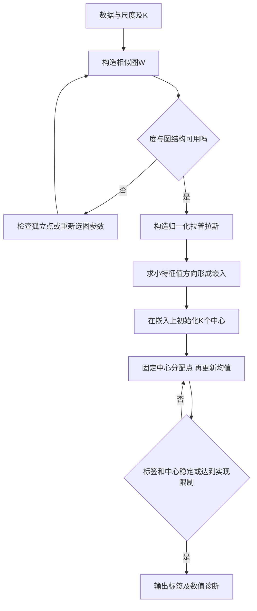
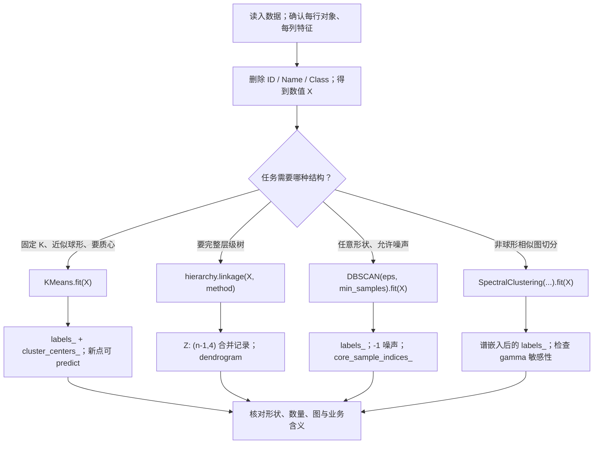

# T05 · 聚类实战：K-means、层次、密度与谱聚类

> **本讲一句话**：这个 notebook 把 [[M05-聚类-Kmeans层次与DBSCAN]] 的三种聚类变成可运行的 Python，并额外加入谱聚类：先在 6 位用户的电影评分上跑 `KMeans`，再在 15 种脊椎动物上比较 4 种层次链接，在 1,971 个二维点上跑 `DBSCAN`，最后用两个非球形数据集对照 K-means 与 `SpectralClustering`。
>
> **原始材料**：`Week5_Clustering_Tutorial.ipynb`（35 cells）｜**课堂录音**：B = `M05-transcript-part2-partial.txt`｜**输出状态**：16 个 code cells 的 `execution_count` 为 1–16 连续；除只做环境设置的 cell 2（JSON 索引 1）外，其余 15 个 code cells 各保存 1 个表格或图像输出，没有 error output。本稿已结合独立顺序执行报告核对；完整原代码保留 `%matplotlib inline`，在 Jupyter 逐格运行。转录已 merged，尚未录到的前半场不由本篇补猜。
>
> ⚠️ **说话人边界**：ASR 没有说话人分离。B `01:05:25` 起统一写“tutorial 讲解者 / 课堂讲解者”，不未经证据归因给教授。

---

## 0. 这个 notebook 在教什么

notebook 不是把四个 API 排成清单，而是在回答同一个问题：**给一张没有目标变量的特征表，怎样把相似对象分组，并看懂每种算法交出的结果？** 四段代码的输入、输出与理论角色不同：

| 段 | code cells | 输入形状 | 主要输出 | 理论回链 |
|---|---:|---:|---|---|
| K-means | 5、7、9、11 | 电影评分 6×4；新用户 5×4 | 训练标签、2×4 质心、新用户标签 | [[M05-聚类-Kmeans层次与DBSCAN#2.4 K-means：先定几组，反复挪中心（讲义 p.21–31）\|M05 §2.4]] |
| 层次聚类 | 13、15、17、19、21、23 | 动物 15×6；合成数据各 1000×2 | 4 张树状图 + 4×4 比较图 | [[M05-聚类-Kmeans层次与DBSCAN#2.6 层次聚类（讲义 p.41–49）\|M05 §2.6]]、[[M05-聚类-Kmeans层次与DBSCAN#2.7 簇间距离怎么定义（讲义 p.50–54）\|§2.7]] |
| DBSCAN | 25、27 | 1971×2 | 每点 cluster ID；噪声为 -1 | [[M05-聚类-Kmeans层次与DBSCAN#2.9 DBSCAN：按密度长出来的簇（讲义 p.61–67）\|M05 §2.9]] |
| 谱聚类 | 29、31、33 | 2000×2 + 1000×2 | K-means 失败图与谱聚类结果图 | M05 §2.5.1 非球形失灵；本篇 §2.16 |

🎙️ **课堂实况**（B `01:07:34`–B `01:07:52`）：tutorial 讲解者把四段明确列为 K-means、hierarchical、density-based、spectral clustering，并提示 notebook cell 3 的官方文档链接可用于查参数。

## 1. 前置

### 1.1 运行环境与文件位置

notebook **原 metadata** 是 Python 3.13.5、kernel `conda-base-py`；2026-09-30 的独立执行环境则是 Python 3.12.3、sklearn 1.5.1、numpy 1.26.4、pandas 2.3.3、scipy 1.13.1。两者是“原作者保存环境”和“本次复核环境”，不能混成一个版本。需要 `pandas`、`numpy`、`matplotlib`、`scipy` 和 `scikit-learn`。四个相对路径文件必须与 notebook 的工作目录一致：`vertebrate.csv`、`chameleon.data`、`2d_data.txt`、`elliptical.txt`；否则 `pd.read_csv(...)` 会先报 `FileNotFoundError`，算法根本还没开始。

### 1.2 sklearn / scipy 的两条调用路线

本篇会反复看到两种 API 形态：

1. **sklearn estimator**：`model = KMeans(...)` → `model.fit(X)` → 读 `labels_`、`cluster_centers_`，或对新数据 `predict(X_new)`。下划线结尾属性表示“拟合后才有”。
2. **scipy 层次函数**：`Z = hierarchy.linkage(X, method)` 直接返回合并记录，再 `hierarchy.dendrogram(Z)` 画树。这里 `Z` 不是模型对象，而是 `(n-1, 4)` 的 linkage matrix。

🎙️ **考试范围**（tutorial 讲解者，B `01:05:30`–B `01:07:20`）：要知道 library、function / model call、怎样运行模型和关键参数；B `01:16:14`–B `01:16:22` 又说明树状图绘图代码不用背，并特别提醒 K-means 与 spectral clustering。

## 2. 逐 code cell 讲解

### 2.1 【cell 2】压掉 warning，并限制 joblib 识别的 CPU 数

**这块在干什么、为什么放这里**：在任何模型运行前统一设置环境，避免 notebook 被非关键 warning 淹没，并把 `LOKY_MAX_CPU_COUNT` 设为 1，使 joblib / loky 在某些 Windows 环境里不要按错误的 CPU 数并行。

```python
import warnings
import os
warnings.filterwarnings("ignore") 
os.environ['LOKY_MAX_CPU_COUNT'] = '1'
```

**逐行说明**：前两行只导入标准库；第三行全局忽略 warning，第四行写入当前 Python 进程及其子进程能看到的环境变量。它没有读数据、没有模型、没有返回值，所以保存输出数为 0 是正常的。**数据形状**在这里尚不存在；状态变化只有两项：warning 过滤器改变、环境变量字典新增 / 覆盖键。

**为什么这么写**：教学 notebook 想让输出保持干净。生产分析不宜无差别忽略 warning，因为 `ConvergenceWarning`、数据转换警告可能真在告诉你结果不可靠。更稳妥的调试做法是先不屏蔽，确认 warning 原因后再做定向过滤。

**⚠️ 易错点**：环境变量最好在触发并行库之前设置；把 CPU 限成 1 可能变慢，但不改变算法定义。此 cell 没有课堂逐行讲解；它属于运行环境准备，课堂实况证据见 B `01:05:25`–B `01:07:52`。

**输出说明**：该 cell 正常情况下不显示任何内容；验收依据是直接读取环境变量值为字符串 `1`；全局 warning 过滤会掩盖警告，所以“没看到警告”不能证明环境设置有效。该变量也不等于限制所有 BLAS 线程。若要核对，可读取 `os.environ['LOKY_MAX_CPU_COUNT']`，但原 notebook 没打印它。

**所以呢**：把环境控制和分析代码分开看。它保证演示更安静，却不参与任何聚类计算；遇到结果异常时应先恢复 warning，再诊断数据与参数，不能用“没有警告”证明模型正确。

**🎙️ 课堂补充**：❓ 该环境设置单元没有可核验的逐行课堂讲解；不以附近课程总览代替实际覆盖。

### 2.2 【cell 5】手工构造 6 位用户 × 4 部电影的评分表

**这块在干什么、为什么放这里**：先造一个肉眼能看懂的小数据集，让后续聚类结果可核。每行是一位用户；`user` 是身份标识，后四列才是数值特征。

```python
import pandas as pd

ratings = [['john',5,5,2,1],['mary',4,5,3,2],['bob',4,4,4,3],['lisa',2,2,4,5],['lee',1,2,3,4],['harry',2,1,5,5]]
titles = ['user','Jaws','Star Wars','Exorcist','Omen']

#generate datafame: inlcuding user name and users' ratings of four movies
movies = pd.DataFrame(ratings,columns=titles) 

movies
```

**逐行说明与数据形状**：`ratings` 是 6×5 的嵌套列表；`titles` 给 5 列命名；`DataFrame` 后 `movies.shape == (6, 5)`。后四列是 1–5 分，本示例选择保留原评分、对四列等权计算距离；量表相同并不保证所有分析目标都无需标准化。前三人更偏爱 `Jaws / Star Wars`，后三人更偏爱 `Exorcist / Omen`，所以肉眼预期是 3+3 两簇。

**输出说明**：cell 保存了完整 6×5 表，不是只显示 `head()`。这是后面判断标签是否合理的基准；标签 0 / 1 本身没有“动作片 / 恐怖片”的固定语义，要结合质心解释。

**⚠️ 易错点**：字符串 `user` 不能送进欧氏距离。🎙️ tutorial 讲解者在 B `01:08:13`–B `01:09:01` 逐列解释数据，并在 B `01:08:31` 明确说 assignment 里的 ID 不能当 feature；这对应下一 cell 的 `drop`。

**为什么这么写**：用 6 行小表能让读者先独立预测 3+3 分组，再用模型验证；若直接上千行数据，就无法判断颜色是否有意义。特征同为 1–5 分也刻意避开尺度主导，让本段只聚焦 K-means 主循环。

**所以呢**：此 cell 的合格读法不是“成功创建 DataFrame”，而是能说清一行代表用户、四个数代表评分、`user` 只用于显示。下一步若未删 ID，就连距离的输入都定义错了。

**🎙️ 课堂补充**：B `01:08:13`–B `01:09:01`：逐列讲，强调 user / ID 不是特征。以上时间定位对应此单元主题，不表示每行代码都被逐字念出。

### 2.3 【cell 7】删除 ID，拟合 KMeans，读取训练标签

**这块在干什么、为什么放这里**：把 6×5 的展示表变成 6×4 的特征矩阵，建立 2 簇 K-means，运行 Lloyd 迭代，再把每行的簇编号按用户名显示出来。

```python
from sklearn.cluster import KMeans

data = movies.drop('user',axis=1) # we only use the ratings as features, so the 'user' column is dropped.
k_means = KMeans(n_clusters=2, max_iter=50, random_state=1) # cluster the six users into two clusters.
# max_iter: Maximum number of iterations of the k-means algorithm for a single run.
k_means.fit(data)
labels = k_means.labels_
pd.DataFrame(labels, index=movies.user, columns=['Cluster ID'])
```

**逐行说明**：`axis=1` 表示删列，得到 `data.shape == (6, 4)`；`n_clusters=2` 是输入的 K，不是模型自己发现；`max_iter=50` 是单次初始化的迭代上限；`random_state=1` 让初始化可复现。`fit` 反复执行“分给最近中心 → 用均值更新中心”，机制见 [[M05-聚类-Kmeans层次与DBSCAN#2.4.1 K-means 的四步算法与质心（讲义 p.23）|M05 §2.4.1]]。`labels_` 形状为 `(6,)`。

**输出说明**：保存结果为 john / mary / bob = 0，lisa / lee / harry = 1，正好对应肉眼预期。编号互换仍是同一个聚类，不能把“0”当作天然的动作片标签。

**⚠️ 易错点**：不同 sklearn 版本的默认 `n_init` 可能不同；若需要跨环境完全复现，应显式写 `n_init`。🎙️ B `01:09:17`–B `01:10:28` 逐步解释 `drop`、`n_clusters=2`、`fit` 和 0/1 标签；B `01:09:01` 强调聚类没有 dependent variable。

**为什么这么写**：`random_state=1` 固定随机初始化，使课堂上每个人能看到同一标签；`max_iter=50` 给极端情况下的硬停止。两者是实现控制，真正的目标仍是降低 SSE，不能把随机种子写成业务参数。

**所以呢**：读到 `fit` 时要同步列出当前状态：6×4 特征、2 个中心、6 个标签；输出的 0/1 只是组号。实际复算还得到 `inertia_=9.3333`，可用于同一数据、同一 K 下比较初始化。

**🎙️ 课堂补充**：B `01:09:17`–B `01:10:28`：详讲，可考 model call / 参数。以上时间定位对应此单元主题，不表示每行代码都被逐字念出。

### 2.4 【cell 9】读取两个簇的质心，给标签补上业务含义

**这块在干什么、为什么放这里**：标签只说“属于哪组”，质心才告诉我们每组的典型评分模式。这个 cell 把模型内部的 2×4 均值矩阵接回列名。

```python
centroids = k_means.cluster_centers_
pd.DataFrame(centroids,columns=data.columns)
```

**逐行说明与数据形状**：`cluster_centers_` 的形状是 `(K, p) = (2, 4)`；每行一个簇，每列一部电影。把它包成 DataFrame 只是恢复列名，数值没有变化。簇 0 的质心约为 `[4.33, 4.67, 3.00, 2.00]`，簇 1 约为 `[1.67, 1.67, 4.00, 4.67]`。

**输出说明**：簇 0 对前两部片评分更高，簇 1 对后两部片评分更高，因此更稳妥的名字是“偏好前两部片”和“偏好后两部片”。课堂以动作/恐怖作简化说明；本例不核定每部影片的题材。名字由人根据质心解释，模型只交出数字。

**为什么均值是中心**：固定簇成员时，逐列均值使 SSE 最小，完整推导见 M05 §2.4.1。质心不是数据集中真实用户；它是典型轮廓。

**⚠️ 易错点**：不要用训练标签编号猜语义，也不要把 2×4 质心表误当 6 位用户预测。🎙️ B `01:10:36`–B `01:11:01` 正是按四列高低解释两组偏好。

**为什么这么写**：质心把每簇多行压缩成一行典型轮廓，便于业务命名和后续新用户分配。恢复 `data.columns` 是防止“只有四个数字、不知道对应哪部电影”的最小可解释性步骤。

**所以呢**：判断一个聚类是否有业务意义，至少要同时看成员和中心。这里标签分组与质心方向互相支持；若中心差异很小或成员混杂，就不能只因代码完成而宣布发现两类客户。

**🎙️ 课堂补充**：B `01:10:36`–B `01:11:01`：解释动作片 / 恐怖片偏好。以上时间定位对应此单元主题，不表示每行代码都被逐字念出。

### 2.5 【cell 11】用训练好的中心给 5 位新用户分组

**这块在干什么、为什么放这里**：保持 cell 7 学到的两个中心不动，把 5 个新用户分给最近中心。这是“使用已有聚类模型”，不是重新训练。

```python
import numpy as np

testData = np.array([[4,5,1,2],[3,2,4,4],[2,3,4,1],[3,2,3,3],[5,4,1,4]])
labels = k_means.predict(testData)
labels = labels.reshape(-1,1)
usernames = np.array(['paul','kim','liz','tom','bill']).reshape(-1,1)
cols = movies.columns.tolist()
cols.append('Cluster ID')
newusers = pd.DataFrame(np.concatenate((usernames, testData, labels), axis=1),columns=cols)
newusers
```

**逐行说明与数据形状**：`testData.shape == (5, 4)`，列顺序必须与训练的 `data` 完全一致。`predict` 返回 `(5,)`，reshape 后为 `(5,1)`；用户名也变成 `(5,1)`，横向拼接得到 `(5,6)`。因为字符串用户名与数值共存，拼接后的 numpy 会统一成字符串，DataFrame 里的评分列可能显示为 object；这里只为展示，不应再拿 `newusers` 直接训练。

**输出说明**：paul、liz、bill → 0；kim、tom → 1。`predict` 实际执行的是“分别算到两个已知质心的距离，取较近者”，不会移动质心。

**⚠️ 易错点与课堂边界**：B `01:11:08`–B `01:12:32` 讲的是当前 cell；B `01:12:32`–B `01:15:03` 又现场把训练 / 新用户合并后重聚类，但该代码不在当前 notebook。tutorial 讲解者称后者“更准确”不能泛化成监督预测 accuracy；两者回答的问题不同：`predict` 保持旧客户分群口径，重聚类允许新数据改变簇。

**为什么这么写**：将用户名、原特征和标签拼回一张表，是为了让业务读者能追溯“谁被分到哪组”；`reshape(-1,1)` 只是让三个数组能按列拼接，不改变标签值。

**所以呢**：新数据进入生产流程前要先决定口径是否允许变。若客户分群定义需要稳定，使用旧中心 `predict`；若要重新发现总体结构，应合并数据重训并版本化中心。两种做法没有脱离目标的“谁更准确”。

**🎙️ 课堂补充**：B `01:11:08`–B `01:12:32`：详讲；随后现场重聚类代码未保存在 notebook。以上时间定位对应此单元主题，不表示每行代码都被逐字念出。

### 2.6 【cell 13】读入 15 种动物，拆出名称、标签与 6 个二值特征

**这块在干什么、为什么放这里**：把可解释的动物属性送入层次聚类，同时保留 `Name` 作为树状图叶子标签、保留 `Class` 只用于课后核对，不让真实类别参与无监督拟合。

```python
import pandas as pd

data = pd.read_csv('vertebrate.csv',header='infer')
data
```

**逐行说明与数据形状**：CSV 有表头和 15 行数据，`data.shape == (15, 8)`：`Name` 1 列、六个 0/1 特征、`Class` 1 列。后续 cell 15 才执行 `names = data['Name']`、`Y = data['Class']`、`X = data.drop(['Name','Class'], axis=1)`，因此真正聚类输入 `X.shape == (15, 6)`。

**输出说明**：保存表含 human、python、salmon、whale 等，特征包括 warm-blooded、gives birth、aquatic、aerial、has legs、hibernates。`Class` 有 mammals / reptiles / fishes / amphibians / birds，可用于观察树是否把同类动物靠近，但算法没看这列。

**⚠️ 易错点**：若把 `Class` 编码后放进 X，就把答案泄漏给聚类；若把 `Name` 放进 X，字符串距离无定义。🎙️ B `01:15:58`–B `01:16:07` 说明读入动物表并进入 single link。

**为什么这么写**：同时保留 Name、Class、X 三个对象，是把“用于计算的特征”和“用于解释 / 核对的元数据”分开。无监督算法不看 Class，但人可以在树画好后检查同类动物是否靠近。

**所以呢**：层次聚类前最关键的不是选颜色，而是决定距离看哪些列。X 的 6 个二值属性共同定义相似性；更改任一列或距离度量都会改变整棵树，真实类别只能做外部参照。

**🎙️ 课堂补充**：B `01:15:03`–B `01:16:07`：简讲。以上时间定位对应此单元主题，不表示每行代码都被逐字念出。

### 2.7 【cell 15】单链接：生成 linkage matrix，再画右向树状图

**这块在干什么、为什么放这里**：用 MIN / single link 建完整的凝聚层次树；每次合并两簇时，以跨簇最近点的距离作为合并分数。

```python
from scipy.cluster import hierarchy
import matplotlib.pyplot as plt
%matplotlib inline

names = data['Name']
Y = data['Class']
X = data.drop(['Name','Class'],axis=1)
Z = hierarchy.linkage(X.values, 'single') #hierarchy clusting using 'single' link
dn = hierarchy.dendrogram(Z,labels=names.tolist(),orientation='right') #plot dendrogram
plt.show()
```

**逐行说明与数据形状**：`X.values` 是 15×6；`linkage` 输出 `Z.shape == (14,4)`，因为 15 个对象恰好合并 14 次。Z 每行记录两个被合并簇的内部编号、合并距离、新簇样本数。`dendrogram` 把这 14 次合并画成树，并用 15 个动物名标叶子；`orientation='right'` 只改变方向，不改变树。

**输出说明**：cell 保存一张树状图。读图应看谁先连、横向合并距离多大；叶子上下顺序可旋转，不能当重要性排名。单链接容易被一串近邻“搭桥”，机制见 M05 §2.7.1。

**⚠️ 易错点**：二值特征默认欧氏距离不一定是最佳业务度量；本 notebook 用它教学，不等于所有二值数据都应如此。🎙️ B `01:16:07`–B `01:18:25` 对应此 cell；B `01:16:14` 明说绘图代码不用背。

**为什么这么写**：先从 single link 开始，是因为它的矩阵更新最容易理解：新簇到第三簇的距离取两个旧距离较小者。动物名只用于叶子标签，使图能被人读懂，不参与合并评分。

**所以呢**：这个 cell 的核心产物其实是 Z，不是图片。只要保存 Z，就能重画不同方向或阈值的树；若 Z 错了，换配色也救不了。考试重点是调用方法与链接含义，不是背 Matplotlib 参数。

**🎙️ 课堂补充**：B `01:16:07`–B `01:18:32`：详讲；绘图代码不用背。以上时间定位对应此单元主题，不表示每行代码都被逐字念出。

### 2.8 【cell 17】全链接：把方法参数切换为 complete

**这块在干什么、为什么放这里**：保持数据、距离和绘图完全不变，只把簇间距离从“最近点”换成“最远点”，观察树怎样改变。这是控制变量对比。

```python
Z = hierarchy.linkage(X.values, 'complete') #change to 'complete' link
dn = hierarchy.dendrogram(Z,labels=names.tolist(),orientation='right')
plt.show()
```

**逐行说明与数据形状**：输入仍为 15×6，输出仍为 14×4。唯一关键决定是 `'complete'`；每个候选簇对先查看所有跨簇点对距离，取最大值，算法再选择这个最大值最小的簇对合并。因为要求“最远的一对也不能太远”，得到的簇通常更紧凑。

**输出说明**：cell 保存 complete-link dendrogram。要和 cell 15 比较同一动物在哪个高度并入，而不是只看线条颜色。颜色阈值是 SciPy 绘图默认行为，不是 notebook 指定的正式类别数。

**⚠️ 易错点**：`complete` 不是“把树补完整”，而是 MAX 链接；也不是取每簇内部最远点。理论定义见 M05 §2.7.1。🎙️ B `01:18:32`–B `01:19:00` 说明只需把参数改成 complete，B `01:19:09` 提醒必须写清所用方法。

**为什么这么写**：复用同一个 X 与同一绘图设置，只更改链接字符串，能把结果差异归因到簇间距离定义；若同时换数据或标准化方式，就无法判断树为什么变。

**所以呢**：single 与 complete 都会生成完整树，区别在“哪对簇算最近”。读者应选同一只动物比较两张树的合并高度，说明 MAX 如何抑制链式连接，而不是只说两张图长得不同。

**🎙️ 课堂补充**：B `01:18:32`–B `01:19:00`：简讲。以上时间定位对应此单元主题，不表示每行代码都被逐字念出。

### 2.9 【cell 19】组平均：综合所有跨簇点对

**这块在干什么、为什么放这里**：第三次复用相同 X 与相同绘图，只把 linkage 改为 `average`，观察“取所有跨簇点对平均距离”如何落在 single 与 complete 之间。

```python
Z = hierarchy.linkage(X.values, 'average')
dn = hierarchy.dendrogram(Z,labels=names.tolist(),orientation='right')
plt.show()
```

**逐行说明与数据形状**：输入还是 15×6，linkage matrix 的形状仍为 $(14,4)$。`average` 对候选簇 A、B 计算全部 $n_A n_B$ 个跨簇距离的平均；合并后更新平均值时要按簇大小加权，不是无条件把两个旧距离除以 2。完整公式和数值例见 M05 §2.7.1。

**输出说明**：保存输出是一张 average-link dendrogram。独立执行报告显示 Z 的最后一次合并高度约 1.8889，介于本数据 single 的 1.4142 与 complete 的 2.4495 之间；这只是当前输入的结果，不能写成所有数据都严格按这个最终高度排序。

**为什么这么写**：控制变量比较能把“算法框架相同、链接评分不同”看得最清楚；只有字符串参数变化，树却变化，说明链接不是绘图选项，而是合并规则。

**⚠️ 易错点**：`average` 指跨簇点对距离平均，不是两个质心的距离。🎙️ B `01:19:16` 前后把 single / complete / average / Ward 并排复习，B `01:22:25` 说 average 在 single 与 complete 之间。

**所以呢**：average 使用全部跨簇关系，信息比 single / complete 的单个极值更均衡，但计算与更新也更依赖簇大小。实际选法仍要看数据形状和噪声，不能因为“折中”就把它当普遍最优。

**🎙️ 课堂补充**：B `01:19:00`–B `01:19:16`：一句带过。以上时间定位对应此单元主题，不表示每行代码都被逐字念出。

### 2.10 【cell 21】Ward：选择使簇内方差增量最小的合并

**这块在干什么、为什么放这里**：用 Ward 准则建第四棵树，让层次聚类的合并目标与 K-means 的 SSE 目标接上。

```python
Z = hierarchy.linkage(X.values, 'ward') # Ward's method
dn = hierarchy.dendrogram(Z, labels=names.tolist(), orientation='right')
plt.title("Ward's Method Dendrogram")
plt.show()
```

**逐行说明与数据形状**：输入 15×6、输出 14×4 不变。`method='ward'` 每轮选择使总簇内 SSE 增量最小的一对，而不是比较普通 MIN / MAX 距离。SciPy 的 Ward linkage 要求欧氏几何；不要把任意预计算距离矩阵直接塞进去并以为含义不变。

**输出说明**：保存图标题明确标 Ward。独立执行的最后合并高度约 3.4347；这个高度是 SciPy 的 Ward 距离尺度，不能与 cell 15 的普通欧氏 single 高度直接解释成同一物理量。Ward 倾向产生较紧凑、大小较平衡的簇，但不是保证等大小。

**原理回链**：$\Delta\mathrm{SSE}=\frac{n_A n_B}{n_A+n_B}\lVert\bar x_A-\bar x_B\rVert_2^2$ 的推导、单位与反例见 M05 §2.7.1，本篇只解释调用。

**⚠️ 易错点**：应比较全局总 SSE 的**新增量**，不能只比较候选两簇合并后的局部 SSE。当前全局 SSE 对所有候选都相同，因此最小化合并后的全局总 SSE 与最小化新增量等价。🎙️ tutorial 讲解者在 B `01:19:16`–B `01:19:46` 明确使用 “minimum increase in total within-cluster variance” 的口径。

**为什么这么写**：给 Ward 图加标题是必要的来源标识，因为四张树使用同一数据、默认颜色又相似；如果截图离开 notebook，上下文仍能看出链接规则。参数字符串则直接决定合并代价。

**所以呢**：Ward 仍是凝聚式层次聚类，只替换“最近”的评分模块。它与 K-means 都偏好紧凑簇，但 Ward 输出一棵树、K-means 输出固定 K 个中心与标签；目标相近不等于 API 或结果相同。

**🎙️ 课堂补充**：B `01:19:16`–B `01:19:46`：定义增量方差。以上时间定位对应此单元主题，不表示每行代码都被逐字念出。

### 2.11 【cell 23】4 种形状 × 4 种链接：一次控制变量实验

**这块在干什么、为什么放这里**：生成 Moons、Blobs、Varied、Aniso 四种二维数据，每种先标准化，再分别用 single、average、complete、Ward 分成指定簇数，最终得到 4×4 比较图。

```python
import warnings
from itertools import cycle, islice
import matplotlib.pyplot as plt
import numpy as np
from sklearn import cluster, datasets
from sklearn.preprocessing import StandardScaler

# 1. Generate 4 selected datasets
n_samples = 1000
moons = datasets.make_moons(n_samples=n_samples, noise=0.05, random_state=170)
blobs = datasets.make_blobs(n_samples=n_samples, random_state=170)
varied = datasets.make_blobs(n_samples=n_samples, cluster_std=[1.0, 2.5, 0.5], random_state=170)
X, _ = datasets.make_blobs(n_samples=n_samples, random_state=170)
transformation = [[0.6, -0.6], [-0.4, 0.8]]
X_aniso = np.dot(X, transformation)

datasets = [
    ("Moons", moons[0], 2),
    ("Blobs", blobs[0], 3),
    ("Varied", varied[0], 3),
    ("Aniso", X_aniso, 3)
]

# 2. Set up the plot
plt.figure(figsize=(16, 12))
plt.subplots_adjust(left=0.08, right=0.98, bottom=0.02, top=0.90, wspace=0.05, hspace=0.1)

plot_num = 1
algorithms = ["Single Link", "Average Link", "Complete Link", "Ward's Method"]

# 3. Loop through datasets and algorithms
for i, (name, X, n_clusters) in enumerate(datasets):
    X = StandardScaler().fit_transform(X)
    
    clustering_algorithms = (
        ("Single Link", cluster.AgglomerativeClustering(n_clusters=n_clusters, linkage="single")),
        ("Average Link", cluster.AgglomerativeClustering(n_clusters=n_clusters, linkage="average")),
        ("Complete Link", cluster.AgglomerativeClustering(n_clusters=n_clusters, linkage="complete")),
        ("Ward's Method", cluster.AgglomerativeClustering(n_clusters=n_clusters, linkage="ward")),
    )

    for j, (algo_name, algorithm) in enumerate(clustering_algorithms):
        with warnings.catch_warnings():
            warnings.filterwarnings("ignore")
            algorithm.fit(X)
        
        y_pred = algorithm.labels_.astype(int)
        ax = plt.subplot(len(datasets), len(clustering_algorithms), plot_num)
        
        if i == 0:
            ax.set_title(algo_name, size=18, fontweight='bold', pad=10)
        if j == 0:
            ax.set_ylabel(name, size=18, fontweight='bold', labelpad=15)

        colors = np.array(list(islice(cycle(["#377eb8", "#ff7f00", "#4daf4a", "#f781bf"]), int(max(y_pred) + 1))))
        ax.scatter(X[:, 0], X[:, 1], s=15, color=colors[y_pred])
        ax.set_xticks(()); ax.set_yticks(())
        
        plot_num += 1

plt.suptitle("Comparing Linkage Methods on 4 Toy Datasets", fontsize=24, y=0.95, fontweight='bold')
plt.show()
```

**逐行说明与数据形状**：每个 X 都是 1000×2；`datasets` 列表还保存期望簇数 2 或 3。`StandardScaler().fit_transform(X)` 让两轴尺度可比。内层四个 estimator 各输出 `labels_.shape == (1000,)`，外层 4×4 共拟合 16 次；颜色只表示簇编号，不表示准确率。

**输出说明**：独立执行耗时约 0.64 秒并保存 `cell-23-figure-05.png`。图用于观察方法对形状的敏感性：single 可沿月牙链式连接，complete / Ward 偏紧凑，密度变化与拉伸会改变结果。具体哪格“最好”要对照生成数据的几何，不能只看颜色是否均匀。

**⚠️ 易错点**：变量名 `datasets` 覆盖了前面导入的 `sklearn.datasets` 模块；这个 cell 在覆盖之后不再调用模块，所以能跑，但后续若再写 `datasets.make_blobs` 会报错。🎙️ B `01:19:46`–B `01:23:31` 逐格解释这张图；Week 5 作业 Q4 要基于它总结选择规则。

**为什么这么写**：同一张 4×4 网格让“行只变数据形状、列只变链接规则”，是一项小型实验设计。固定 `random_state=170` 避免每次点云不同，先标准化避免某一轴尺度主导。

**循环与状态展开（原 cell 23）**：`make_moons` / `make_blobs` 先创建四组数据，线性变换把其中一组拉成倾斜形状；随后 `datasets` 被重新绑定为待遍历的四项列表，此后不能再把它当模块。外层逐行取数据及参数覆盖值，`StandardScaler().fit_transform(X)` 对该组各列做 z-score；这会改变距离尺度，并不把任意分布变成正态。`n_clusters` 来自本行参数，内层依次建立四个模型，`fit(X)` 改变模型状态，`labels_` 给每点整数簇号。`cycle` 与 `islice` 将有限调色板重复并截取到所需长度；颜色索引对应标签，颜色本身不是算法质量。`plot_num` 每画一格加一，从 1 走到 16；两层循环结束即停止。重新运行此 cell 会重新建立数据和模型，不能把中途旧变量当独立输入。

**所以呢**：作业 Q4 要从格子里提取条件化结论，例如链式数据为何 single 有优势、紧凑团为何 Ward / complete 更自然。答案必须同时指向一行的数据几何和一列的机制，不能只给算法排名。

**🎙️ 课堂补充**：B `01:19:46`–B `01:23:31`：详讲，作业 Q4 来源。以上时间定位对应此单元主题，不表示每行代码都被逐字念出。

### 2.12 【cell 25】读入 CHAMELEON 二维点云并先看原始形状

**这块在干什么、为什么放这里**：在运行 DBSCAN 前先画原始散点，确认数据有非球形高密度区域和背景点；这是选密度方法的依据。

```python
import pandas as pd
import matplotlib.pyplot as plt
%matplotlib inline

data = pd.read_csv('chameleon.data', delimiter=' ', names=['x','y'])
ax1=data.plot.scatter(x='x',y='y')
plt.show()
```

**逐行说明与数据形状**：文件无表头、以空格分隔；指定两列后 `data.shape == (1971, 2)`。每行一个二维点，没有目标标签。`plot.scatter` 返回 Axes，同时 notebook 保存一张图；它不改变 data。

**输出说明**：独立执行保存 `cell-25-figure-06.png`。这张图只显示坐标分布，不含簇编号；先看它是为了避免“模型给几种颜色就相信几簇”的倒因果。

**为什么这么写**：DBSCAN 依据局部密度与邻域连通性生长簇，非球形点云比电影评分更能展示优势。理论输入是点集、距离、Eps、MinPts；这里代码只准备点集。

**⚠️ 易错点**：空格数量不规则时 `delimiter=' '` 可能把连续空格当空列，当前文件已验证可读；更稳健可用 `sep=r'\s+'`。🎙️ B `01:23:31`–B `01:24:24` 先定义 density-based clustering，再让学生读入并观察这份数据。

**🎙️ 课堂补充**：B `01:23:31`–B `01:24:37`：讲数据与密度目标。以上时间定位对应此单元主题，不表示每行代码都被逐字念出。

**所以呢**：这一步只建立坐标与几何观察，尚未产生任何聚类结果。保留原图才能判断下一步的颜色究竟揭示结构，还是掩盖了参数不合适的问题。

### 2.13 【cell 27】DBSCAN：给 Eps / MinPts，得到 9 簇与噪声

**这块在干什么、为什么放这里**：用固定邻域半径和密度门槛拟合 1,971 个点，读取每点标签并按标签着色；同时建立核心点 mask，为区分核心 / 边界 / 噪声留下状态。

```python
from sklearn.cluster import DBSCAN

db = DBSCAN(eps=15.5, min_samples=5).fit(data)
core_samples_mask = np.zeros_like(db.labels_, dtype=bool)
core_samples_mask[db.core_sample_indices_] = True
labels = pd.DataFrame(db.labels_,columns=['Cluster ID'])
result = pd.concat((data,labels), axis=1)
ax1=result.plot.scatter(x='x',y='y',c='Cluster ID', colormap='jet')
plt.show()
```

**逐行说明与数据形状**：输入 `(1971,2)`；`db.labels_` 是 `(1971,)`，核心 mask 也是 `(1971,)`。标签 `-1` 表示噪声，非负整数是簇 ID。`pd.concat(axis=1)` 得到 1971×3 的结果表。

**实际输出**：`verify_t05.py` 在 Python 3.12.3 / sklearn 1.5.1 实跑得到 **9 个簇、125 个噪声点、1,731 个核心点**；各标签数量为 -1:125，0:229，1:127，2:109，3:560，4:450，5:203，6:55，7:72，8:41。图保存在 `t05-execution/cell-27-figure-07.png`。这些数只对应当前数据与参数。

**为什么这么写**：`eps=15.5` 决定邻域尺度，`min_samples=5` 含点自身；机制见 M05 §2.9.1–2.9.2。

**⚠️ 易错点**：当前 plot 只按 label 上色，虽然建了 `core_samples_mask`，却没有用它改变点形 / 边框，所以图不能直接区分核心与边界。🎙️ B `01:24:37`–B `01:26:53` 现场改 Eps 并讨论 core mask；具体新 Eps 未清楚录到，不猜。

**为什么这么写**：先保存完整 labels，再把坐标与标签按行拼接，能让每个颜色回溯到原点；mask 独立保存核心身份，避免把“属于某簇”和“能够继续扩展簇”混成同一状态。

**输出说明**：独立执行的标签计数与核心数来自 `t05-execution/report.json`，原 notebook 图像本身没有打印这些数。复核时应同时看 9 个非负簇号、125 个 -1 和 1731 个核心点，不能只看颜色数量。

**所以呢**：DBSCAN 的输出不只是若干簇，还包含噪声与核心结构。调参时至少记录簇数、噪声数、核心数和图形；只报“跑出了 9 类”会丢掉密度算法最有价值的信息。

**🎙️ 课堂补充**：B `01:24:37`–B `01:27:10`：调参数、core mask；mask 图未保存。以上时间定位对应此单元主题，不表示每行代码都被逐字念出。

### 2.14 【cell 29】读两份非球形数据，为 K-means / 谱聚类做同场对照

**这块在干什么、为什么放这里**：读取一个约 2,000 点的数据集和一个 1,000 点椭圆 / 同心结构数据集，并排画原始点云。后两 cell 对这两份完全相同的数据先跑 K-means、再跑谱聚类。

```python
import pandas as pd

data1 = pd.read_csv('2d_data.txt', delimiter=' ', names=['x','y'])
data2 = pd.read_csv('elliptical.txt', delimiter=' ', names=['x','y'])

fig, (ax1,ax2) = plt.subplots(nrows=1, ncols=2, figsize=(12,5))
data1.plot.scatter(x='x',y='y',ax=ax1)
data2.plot.scatter(x='x',y='y',ax=ax2)
plt.show()
```

**逐行说明与数据形状**：`data1.shape == (2000,2)`，`data2.shape == (1000,2)`；两个 Axes 共享一张 12×5 英寸 figure。没有标签列，因此不能直接计算监督准确率。

**输出说明**：独立执行保存 `cell-29-figure-08.png`。这张原图是判断后续颜色是否沿数据形状分组的唯一参照；不能把两个面板点数不同误解为模型参数不同。

**理论回链**：M05 §2.5.1 已解释 K-means 的 Voronoi 边界偏好球形簇。谱聚类的目标是把点变成相似图后切图，在相似图恰当保留目标连通关系时，可以沿这些结构分组；错误的图或尺度仍会失败。

**⚠️ 易错点**：相对路径和空格分隔规则同 cell 25；当前数据尺度直接用于 RBF gamma，换尺度必须重新调 gamma。🎙️ B `01:27:10`–B `01:28:25` 用这两图引出谱聚类。

**为什么这么写**：先画无标签原图，再依次画 K-means 与谱聚类，形成同输入的基准对照。没有这一张，读者会看到彩色结果却不知道真实几何是弯月、环还是椭圆。

**所以呢**：无监督算法没有现成 y 可判分，图形诊断就是一等证据。后两 cell 的颜色要回到此处检查是否沿连通形状，而不是看两种颜色数量是否刚好一半。

**🎙️ 课堂补充**：B `01:27:10`–B `01:28:25`：引出谱聚类。以上时间定位对应此单元主题，不表示每行代码都被逐字念出。

### 2.15 【cell 31】先跑 K-means：把非球形结构切成近似直线两半

**这块在干什么、为什么放这里**：给两份非球形数据各跑一次 `KMeans(K=2)`，故意展示算法结构性失配，作为下一 cell 的对照组。

```python
from sklearn import cluster

k_means = cluster.KMeans(n_clusters=2, max_iter=50, random_state=1)
k_means.fit(data1)
labels1 = pd.DataFrame(k_means.labels_,columns=['Cluster ID'])
result1 = pd.concat((data1,labels1), axis=1)

k_means2 = cluster.KMeans(n_clusters=2, max_iter=50, random_state=1)
k_means2.fit(data2)
labels2 = pd.DataFrame(k_means2.labels_,columns=['Cluster ID'])
result2 = pd.concat((data2,labels2), axis=1)

fig, (ax1,ax2) = plt.subplots(nrows=1, ncols=2, figsize=(12,5))
result1.plot.scatter(x='x',y='y',c='Cluster ID',colormap='jet',ax=ax1)
ax1.set_title('K-means Clustering')
result2.plot.scatter(x='x',y='y',c='Cluster ID',colormap='jet',ax=ax2)
ax2.set_title('K-means Clustering')
plt.show()
```

**逐行说明与数据形状**：两个模型输入分别是 2000×2、1000×2；输出标签分别 `(2000,)`、`(1000,)`，拼接后是 2000×3 与 1000×3。独立执行的标签计数为 1028/972 和 512/488，但“接近一半”不代表分对。

**输出说明**：`cell-31-figure-09.png` 直观看到 K-means 按到两个质心的距离划分，倾向用直线边界把弯曲 / 同心结构切开。这里的“poor performance”来自几何与目标不匹配，不是代码报错，也不是迭代未收敛。

**⚠️ 易错点**：没有真实标签，所以不能把 1028/972 当准确率。更不能看到两簇数量平衡就说效果好。🎙️ B `01:27:18`–B `01:29:18` 让学生想象两个质心重叠 / 上下分割，解释了这个失败机制。

**为什么这么写**：用与 cell 7 相同的 K-means 参数，把算法本身保持熟悉，只换数据几何，能直接证明失败来自“按质心距离划分”的机制，而不是参数没学会调用。

**所以呢**：代码无报错、两簇数量平衡、迭代收敛都不能证明分群合理。诊断必须看边界是否尊重数据形状；若目标是同心环或弯月，应该换谱聚类 / DBSCAN，而不是盲目增加 `max_iter`。

**🎙️ 课堂补充**：B `01:28:25`–B `01:29:45`：详讲球形偏好。以上时间定位对应此单元主题，不表示每行代码都被逐字念出。

### 2.16 【cell 33】谱聚类：RBF 相似图 → 谱嵌入 → K-means

**这块在干什么、为什么放这里**：对同两份数据改用 `SpectralClustering`。代码仍指定 2 簇，但不在原二维坐标里直接找质心，而是先根据局部相似关系把数据映射到新的谱空间，再分组。

```python
from sklearn.cluster import SpectralClustering
import pandas as pd

spectral = SpectralClustering(n_clusters=2,random_state=1,affinity='rbf',gamma=5000)
spectral.fit(data1)
labels1 = pd.DataFrame(spectral.labels_,columns=['Cluster ID'])
result1 = pd.concat((data1,labels1), axis=1)

spectral2 = SpectralClustering(n_clusters=2,random_state=1,affinity='rbf',gamma=500)
spectral2.fit(data2)
labels2 = pd.DataFrame(spectral2.labels_,columns=['Cluster ID'])
result2 = pd.concat((data2,labels2), axis=1)

fig, (ax1,ax2) = plt.subplots(nrows=1, ncols=2, figsize=(12,5))
result1.plot.scatter(x='x',y='y',c='Cluster ID',colormap='jet',ax=ax1)
ax1.set_title('Spectral Clustering')
result2.plot.scatter(x='x',y='y',c='Cluster ID',colormap='jet',ax=ax2)
ax2.set_title('Spectral Clustering')
plt.show()
```

**逐行说明与数据形状**：输入仍是 2000×2 和 1000×2；输出标签为 `(2000,)`、`(1000,)`。`affinity='rbf'` 以 $W_{ij}=\exp(-\gamma\lVert x_i-x_j\rVert^2)$ 建相似矩阵；gamma 越大，连接衰减越快，只认更局部的邻居。算法再由 W 求度矩阵与图拉普拉斯，取小特征值对应向量作为新坐标，最后在该嵌入上做 K-means。完整状态流程、推导、四点算例与复算证据见 §2.17。

**输出说明**：独立执行耗时约 3.55 秒，data1 两簇为 963 / 1037，data2 为 500 / 500，保存 `cell-33-figure-10.png`。数量只能说明标签规模，不能据此声称准确率；视觉上须对照 cell 29 的原始形状。

**⚠️ 易错点**：gamma 对数据尺度极敏感；标准化、坐标单位或样本间距改变时，5000 / 500 不可照搬。谱聚类还要构造大相似矩阵，样本很多时内存昂贵。🎙️ B `01:29:45`–B `01:30:12` 说明 library / call 可能考，并强调 `n_clusters=2`、`fit`。

**为什么这么写**：两个数据集使用不同 gamma，是明确告诉读者相似度尺度必须按点间距离调，而不是库的通用默认答案。`random_state=1` 固定最后 K-means / 标签分配的随机性，便于复现图。

**所以呢**：谱聚类解决的是“原坐标里的直线质心边界不合适”，代价是 gamma 敏感和相似矩阵成本。应先解释图怎样建、嵌入怎样产生，再读最终颜色；只会抄 API 无法迁移到新尺度数据。

**🎙️ 课堂补充**：B `01:29:45`–B `01:30:12`：简讲调用；library / call 可能考。以上时间定位对应此单元主题，不表示每行代码都被逐字念出。


### 2.17 谱聚类：先把几何位置变成关系，再在新坐标分组

同心圆的两组点可以具有几乎相同的中心，原坐标里的 K-means 因而很难按“内圈/外圈”分开。谱聚类先根据点与点的联系建立一张图，再寻找能反映图结构的坐标；它不是自动识别任何形状的万能算法。

**是什么**：输入可以是 $n$ 个样本、每个 $p$ 个特征组成的 $n\times p$ 实数表 $X$，也可以是预先给出的 $n\times n$ 相似度矩阵 $W$。矩阵就是按行列排列的数表，$W_{ij}$ 表示第 $i$、$j$ 个点的联系强弱，越大表示越相似。输出是每个点的簇标签，形状为 $(n,)$；$K$ 是使用者指定的簇数，不是自动发现的真理。

**为什么需要它**：原空间中的中心距离只是一种分组标准。相似图可以让沿弯曲形状逐步接近的点保持强联系，而让跨形状点的联系较弱。代价是必须选择如何构图；图若把不该连接的点连得很强，后续再精确的计算也会忠实地给出不合业务意图的分组。

**原理、输入和状态**：课件代码使用 RBF 相似度，将距离转成连接权重。$d(x_i,x_j)$ 是两点欧氏距离，$\gamma>0$ 控制衰减速度，$\exp$ 是指数函数。因为负的平方距离越小于零，指数越接近零，所以远点的联系弱；同一点距离为零，相似度为一。对角自环如何用于拉普拉斯须看实现；下面教学图明确设对角为零。

$$
W_{ij}=\exp\!\left(-\gamma\, d(x_i,x_j)^2\right).
$$

当 $\gamma=5000$、距离依次为 $0.01,0.03,0.1$，权重约为 $0.606531,0.011109,1.92875\times10^{-22}$。这解释了为什么原 Notebook 的 $\gamma$ 不能不看坐标尺度直接复制到另一份数据。把所有距离放大十倍、同时把 $\gamma$ 除以一百，指数保持不变；只放大坐标则图会改变。

每个点的“度” $d_i=\sum_jW_{ij}$ 是这一行权重之和，不是空间维度；$D$ 是把这些度放在对角上的矩阵。$I$ 表示单位矩阵，$D^{-1/2}$ 的第 $i$ 个对角数为 $1/\sqrt{d_i}$。在所有度为正的教学条件下，对称归一化拉普拉斯为：

$$
L_{\mathrm{sym}}=I-D^{-1/2}WD^{-1/2}.
$$

“特征向量”是矩阵作用后方向不变、只被倍乘的向量：$Lv=\lambda v$，倍数 $\lambda$ 就是特征值。读者可将后面给出的向量代入矩阵逐行相乘核验，不必凭名称接受结论。为什么取较小特征值？对任意列向量 $v$，展开下式，利用 $d_i=\sum_jW_{ij}$，平方项合成 $v^Tv$，交叉项合成归一化相似项：

$$
v^T L_{\mathrm{sym}}v
=\frac12\sum_{i,j}W_{ij}\left(\frac{v_i}{\sqrt{d_i}}-\frac{v_j}{\sqrt{d_j}}\right)^2.
$$

右边表示图上相邻强联系点的新坐标差异；小值倾向使强联系点坐标相近。若不加约束，全部取零就毫无信息，所以采用单位长度、相互正交的向量约束；最小的平凡方向之外，后续小特征值方向描述较平滑的分离结构。这是图划分的连续放松直觉，不等于已经证明得到离散全局最优聚类。

**逐行对应 cell 33 的状态与步骤**：构造器先记录 `n_clusters`、`affinity`、`gamma` 与随机状态；`fit(data1)` 才计算相似图和谱嵌入并写入 `labels_`；`DataFrame` 仅把标签包装成表，不重新聚类。下面把 `fit` 内的数学步骤展开：

1. 固定数据尺度、构图规则及 $K$，得到非负对称的 $W$。
2. 求各行度 $D$，检查孤立点，再构造 $L_{\mathrm{sym}}$。
3. 求所需小特征值方向，组成 $n\times K$ 嵌入矩阵 $U$。每行仍代表原来一个点，但坐标已经从原特征变成图结构方向。
4. 在嵌入上作离散分组。下面示范采用行归一化再 K-means；具体软件的嵌入缩放/标签策略可能不同，不能把教学变式冒称每个 API 的逐行实现。
5. K-means 按指定停止条件结束，输出标签并检查参数敏感性。特征值求解器另有数值收敛标准，求解不收敛不应被当成可靠结果。



**完整四点算例（💡 笔记补充，不是课堂原数据）**：为让每步可算，直接给相似图，而不假装它就是 Notebook 的 RBF 数据。点1、2强联系，点3、4强联系，跨组只有两条弱联系：

$$
W=\begin{pmatrix}0&1&0.1&0\\1&0&0&0.1\\0.1&0&0&1\\0&0.1&1&0\end{pmatrix},\qquad
D=1.1I,\qquad
L_{\mathrm{sym}}=\begin{pmatrix}1&-10/11&-1/11&0\\-10/11&1&0&-1/11\\-1/11&0&1&-10/11\\0&-1/11&-10/11&1\end{pmatrix}.
$$

四个特征值是 $0,2/11,20/11,2$。取前两个方向 $v_1=(1,1,1,1)^T/2$、$v_2=(1,1,-1,-1)^T/2$。例如第二方向第一行相乘为 $(1-10/11+1/11)/2=1/11$，等于 $(2/11)\times(1/2)$；其他行同样可验。把两列并成 $U$，前两行是 $(0.5,0.5)$，后两行是 $(0.5,-0.5)$；每行除以长度 $\sqrt{0.5}$，得到 $(a,a)$ 和 $(a,-a)$，其中 $a=1/\sqrt2\approx0.707107$。

现在在这个二维嵌入做 $K=2$ 的 K-means，明确初始中心为 $(0,1)$、$(0,-1)$。第一轮前两点归中心1、后两点归中心2，更新后中心变为 $(a,a)$、$(a,-a)$；更新前 SSE 为 $8-4\sqrt2\approx2.343146$，更新后为0。第二轮标签与中心都不再变，停止；输出簇为 $\{1,2\}$ 与 $\{3,4\}$。这说明原坐标里不易分开的关系，可以在图嵌入中变为容易分的两组。

**输出说明与数值复核**：上述输出是 4 个点的标签，不是 4 个新样本。所有矩阵、特征方程、两轮中间状态和 API 对照已由 `C:/Users/BenLi/.codex/scratchpad/cityu-merge-20260930/verify_spectral_mechanism.py` 复算，结果 `spectral-mechanism-results.json`；特征方程最大残差约 $1.11\times10^{-16}$。相同图用本机 scikit-learn 1.5.1 的 `affinity='precomputed'` 得到同一分组，标签号码可能互换；本例所有度相等，所以缩放差异不改变分组，不推广为所有图都等价。

**停止、边界与失败机制**：孤立点的度为零时，上式除法不能直接照算，须明确处理策略；图有多个不连通部分时零特征值可能多重，基底不唯一，结果须结合分量数与 $K$ 判断。$\gamma$ 太大可能使图近乎断开，太小又可能使关系趋同；前者表现为数值不稳/过碎，后者缺少清晰分隔，调参要结合尺度和稳定性而非只看颜色漂亮。最终 K-means 仍有初始化敏感性，谱聚类不保证任意数据都比原空间 K-means好；稠密 $n\times n$ 相似图还会增加内存成本。

**🎙️ 课堂补充**：课堂 B `01:27:18`–B `01:30:26` 用嵌套形状比较并强调库名、模型调用与参数；没有录到拉普拉斯推导和上述四点数值例，因此它们均为笔记补充，不能冒称教师板书。

**💡 换个说法**：原始 K-means 像按住址直线距离找中心；谱聚类更像先看哪些人紧密联系，再用关系坐标分组。关系图不可靠时，新的坐标也会把错误关系放大，因此它没有省去“什么算相似”的业务判断。

再从数据形状看：原输入可能有很多列，嵌入只有少数图结构坐标，但输出仍是一点一标签。降到低维不是删除一批用户，而是替每个用户重新表示关系；这能防止把特征向量数误当剩余样本数。

**⚠️ 常见误解**：

- ❌ 谱聚类完全不需要距离 → RBF构图仍依赖距离，只是最终分组在图嵌入中完成。
- ❌ 图上分组更好看就更准确 → 无真实目标或业务评价标准时，不能凭视觉宣布准确率更高。
- ❌ 调大gamma必然改善非球形簇 → 它缩短联系尺度，过大可能造成近乎断连和数值问题。

**与其他概念的关系**：K-means在此成为嵌入后的分组步骤；矩阵特征方向与PCA有数学联系，但PCA优化原数据方差，谱方法关注相似图关系，不能混成同一方法。

**所以呢**：要会的不止导入 `SpectralClustering`，还应能沿“尺度→相似图→拉普拉斯→嵌入→标签”解释每个中间表示及其失败方式。

**迁移题（笔记补充）**：保持上面四点图其余权重不变，将两条跨组弱边从0.1改成1.5，最自然的两组变成什么？再问，若所有原始距离放大10倍，怎样改RBF的gamma以保持同一相似矩阵？

<details><summary>答案与机制核对</summary>
变为 $\{1,3\}$ 与 $\{2,4\}$：跨组边现在比原组内边更强，度变为2.5，新的较小非平凡方向支持新配对。这证明分组依赖构图，不会神奇保留原来想要的业务簇。原始距离放大10倍时，将gamma除以100即可保持平方距离乘gamma不变。两项均由上述脚本独立核验。
</details>

🔗 [scikit-learn官方接口说明](https://scikit-learn.org/stable/modules/generated/sklearn.cluster.SpectralClustering.html)（核对2026-09-30）：确认RBF构图、归一化拉普拉斯嵌入与默认K-means标签策略；在线文档为1.9.1，本次执行环境为1.5.1。教学推导与四点构图为笔记补充，不声称在线版本与本机每个默认参数完全相同。


## 3. 完整流程串讲

这 16 个 code cells 可以压成一条共同工作流：先把 ID / 真实类别从 X 拆掉，再按数据几何选择模型；拟合后先确认输出形状与特殊标签，最后才解释颜色。四个算法的“模型对象”不同，不能把所有结果都当 `predict`。



**状态区别**：K-means 保存中心并能对同特征顺序的新点 `predict`；SciPy 层次代码保存的是完整合并表 Z，想要平面标签还需选切树阈值 / 簇数；DBSCAN 的 `labels_ == -1` 有特殊意义，sklearn 的原生 DBSCAN 不提供对任意新点的普通 `predict`；谱聚类把训练样本整体建图，也不是一个可直接对单个新点调用 `predict` 的普通分类器。

## 4. 实际执行验收（2026-09-30）

主代理用 `C:\Users\BenLi\.codex\scratchpad\cityu-merge-20260930\verify_t05.py` 按原顺序执行全部 16 个 code cells；只移除 `%matplotlib inline`，把 `show()` 改为 Agg 保存 PNG，没有创建评分题答案 cell。输入文件 SHA-256 前后不变，报告在 `t05-execution/report.json`。

| 检查 | 实际结果 |
|---|---|
| 环境 | Python 3.12.3；sklearn 1.5.1；numpy 1.26.4；pandas 2.3.3；scipy 1.13.1 |
| 全部 code cells | 16 / 16 PASS；10 张 PNG；原输入 hash 全未改 |
| K-means | labels = `[0,0,0,1,1,1]`；SSE / inertia = 9.333333333333334 |
| 新用户 | labels = `[0,1,0,1,0]`；拼接展示表因含用户名而整体转字符串 dtype |
| 层次 | 4 个 Z 都是 14×4；四张 dendrogram 正常生成 |
| DBSCAN | 1971 点；9 簇；125 noise；1731 core |
| K-means 对照 | 2000 点分 1028/972；1000 点分 512/488 |
| 谱聚类 | 2000 点分 963/1037；1000 点分 500/500；这些不是 accuracy |

这次执行验证的是“代码能在当前环境完整跑完、输出形状与关键数量可重现”。它不能单独证明哪种聚类在业务上最好；层次和谱聚类的图仍要结合数据形状阅读。

## 5. 自己动手：改参数前先预测

以下练习使用 notebook 已有演示，不是 Week 5 评分题成品。

1. **把 cell 7 的 `n_clusters=2` 改成 3**：先预测 `cluster_centers_.shape` 会从 `(2,4)` 变成 `(3,4)`，`labels_` 可能出现 0/1/2；再判断只有 6 人时第三簇是否稳定。不要先看输出。
2. **固定同一 X 比较 cell 15 / 17 / 19 / 21**：选一只动物，记录它分别在哪个高度并入大簇。解释变化来自 linkage，而不是数据变化。
3. **围绕 cell 27 单独改 `eps`**：保持 `min_samples=5`，分别略缩小 / 放大 Eps，预测噪声数与簇数的方向。固定数据、距离与 `min_samples` 时，增大 Eps 不会增加噪声点数；簇数却不保证单调，因为噪声可以先形成新簇，原有簇也可以随后合并。必须把两种数量分开看。
4. **围绕 cell 33 改 gamma**：同一数据先把 gamma 减为十分之一，再增为十倍，预测 RBF 图从“连接过宽”到“连接过窄”的变化。若先标准化坐标，要重新调 gamma。

<details><summary>检查思路</summary>

- K 改变后，质心行数一定随 K 变；标签编号本身仍无语义。
- linkage 只换评分规则，Z 形状不变，但合并顺序 / 高度会变。
- DBSCAN 的参数不是“越大越好”；看簇数、噪声数、核心数与图形一起变化。
- 谱聚类 gamma 控制的是相似度衰减范围，不是簇数；`n_clusters` 才直接控制输出簇数。

</details>

## 6. 代码 ↔ M05 理论对应

| 代码动作 | 理论含义 | 回链 |
|---|---|---|
| `movies.drop('user', axis=1)` | 距离只应由分析特征定义，ID 不携带相似性 | M05 §2.2.5 |
| `KMeans(...).fit(data)` | 分配最近中心、均值更新，直到中心 / 标签稳定或达到上限 | M05 §2.4.1–2.4.2 |
| `cluster_centers_` / `inertia_` | 质心与总簇内 SSE | M05 §2.4.1、§2.4.4 |
| `hierarchy.linkage(X, 'single')` | 凝聚式 + MIN 链接 | M05 §2.6.3、§2.7.1 |
| `'complete' / 'average' / 'ward'` | MAX / 跨簇平均 / 最小 SSE 增量 | M05 §2.7.1 |
| `dendrogram(Z)` | 把 n−1 次合并的对象与高度画成树 | M05 §2.6.1、§2.8.2 |
| `DBSCAN(eps, min_samples)` | Eps 邻域与 MinPts 核心门槛，沿核心连通区域扩展 | M05 §2.9.1–2.9.2 |
| `labels_ == -1` | 最终未归入核心连通簇的噪声 | M05 §2.9.3 |
| `SpectralClustering(affinity='rbf', gamma=...)` | 从欧氏坐标转成 RBF 相似图，再在谱嵌入中分组 | 本篇 §2.16–2.17 |

## 7. Week 5 Assignment（cell 35，只登记要求）

评分作业只记录题目、方法与交付检查，不在公开 T05 提供个人成品。课堂录音没有给截止时间；不得把推算日期写成已确认。

| 题 | 分值 | 要做什么 | 方法提醒 |
|---|---:|---|---|
| Q1 | 10 | Iris 去掉 `class`，做 `KMeans(K=3)`；用 `petal width` 与 `sepal length` 画按 cluster label 上色的散点 | 先确认列名 / 列序，图上注明颜色是聚类标签 |
| Q2 | 20 | Iris 上做 `BisectingKMeans(K=3)`；简述它与标准 K-means 的层次划分区别 | 回链 M05 §2.5.3；不要只贴代码 |
| Q3 | 20 | 自选一种密度聚类，调参，展示 Iris 结果，统计 noise `-1` 数 | 写参数选择依据与噪声数；不能照抄 chameleon 参数 |
| Q4 | 20 | 根据 cell 23 的 4×4 网格比较 Single / Average / Complete / Ward 适合的数据形状，并给选法规则 | 必须实际读 16 格，不只背一句“Ward 最好” |
| Q5 | 30 | 比较聚类算法，为自己的 course project 数据选一种 | 用数据规模、形状、密度、噪声、是否要层级来论证 |

🎙️ **课堂要求**（B `01:30:45`–B `01:32:20`）：tutorial 讲解者逐项概括五题，并要求“运行每段代码、展示结果、解释并保存 HTML”。B `01:35:24` 还有下课后的有效补充：已提交者若命中课堂指出的问题，可检查后尝试重交。

🎙️ **通用评分口径**（B `01:01:47`–B `01:05:09`）：必须实际运行代码并保留输出；不运行代码会被扣约一半题分；逐题标清答案位置、解释 F / p 或选择结果，使用 AI 后要检查未替换的占位文字。这里是通用课堂反馈，不等于 cell 35 新增了这些文字。

## 8. cell ↔ 课堂时间映射

下表 **cell 编号统一按 notebook 界面 1 基编号**；括号内给 JSON 0 基索引，避免脚本与笔记混用。

| cell | 内容 | B 时间 | 课堂覆盖 |
|---:|---|---|---|
| 2（JSON 1） | warnings / CPU 环境 | `01:05:25`–`01:07:52` | ⚪ 未逐行讲，属于环境准备 |
| 5（JSON 4） | 电影评分 DataFrame | `01:08:13`–`01:09:01` | ✅ 逐列讲，强调 user / ID 不是特征 |
| 7（JSON 6） | `KMeans.fit`、labels | `01:09:17`–`01:10:28` | ✅ 详讲，可考 model call / 参数 |
| 9（JSON 8） | centroids | `01:10:36`–`01:11:01` | ✅ 解释动作片 / 恐怖片偏好 |
| 11（JSON 10） | 新用户 `predict` | `01:11:08`–`01:12:32` | ✅ 详讲；随后现场重聚类代码未保存在 notebook |
| 13（JSON 12） | vertebrate.csv | `01:15:03`–`01:16:07` | ✅ 简讲 |
| 15（JSON 14） | single dendrogram | `01:16:07`–`01:18:32` | ✅ 详讲；绘图代码不用背 |
| 17（JSON 16） | complete | `01:18:32`–`01:19:00` | ✅ 简讲 |
| 19（JSON 18） | average | `01:19:00`–`01:19:16` | ✅ 一句带过 |
| 21（JSON 20） | Ward | `01:19:16`–`01:19:46` | ✅ 定义增量方差 |
| 23（JSON 22） | 4×4 linkage grid | `01:19:46`–`01:23:31` | ✅ 详讲，作业 Q4 来源 |
| 25（JSON 24） | chameleon 原图 | `01:23:31`–`01:24:37` | ✅ 讲数据与密度目标 |
| 27（JSON 26） | DBSCAN | `01:24:37`–`01:27:10` | ✅ 调参数、core mask；mask 图未保存 |
| 29（JSON 28） | 两份非球形数据 | `01:27:10`–`01:28:25` | ✅ 引出谱聚类 |
| 31（JSON 30） | K-means 失败图 | `01:28:25`–`01:29:45` | ✅ 详讲球形偏好 |
| 33（JSON 32） | SpectralClustering | `01:29:45`–`01:30:12` | ✅ 简讲调用；library / call 可能考 |
| 35（JSON 34，markdown） | Week 5 Assignment | `01:30:45`–`01:32:20` | ✅ 五题 + HTML 要求；未给截止 |

## 9. 延伸与勘误

### 9.1 notebook 有但课堂未逐项展开

| 单元 | 覆盖与处理 |
|---|---|
| cell 2 | ❓ 原录音未逐行解释 warning / CPU 设置；正文按原代码补全，不认定课堂跳过 |
| cell 23 | 四行四列整体有讲；并非每个参数与循环逐行说明，正文补状态和控制流程 |
| cell 33 | 课堂说明调用与 gamma；谱分解推导和四点数值例是明确标注的笔记补充 |

### 9.2 课堂有但 notebook 没保存，以及实现差异

| B 时间 | 课堂内容或实现边界 | 本篇处理 |
|---|---|---|
| B `01:12:32`–B `01:15:03` | 原 6 人与新 5 人合并后重新做 K-means | 原文件只有 predict；解释两种任务不同，不编造未保存代码或结果 |
| B `01:25:37`–B `01:26:53` | 用 core mask 单画核心点 | cell 27 建立 mask 但最终散点未使用；正文区别两者 |
| B `01:01:47`–B `01:05:09` | 要运行代码、保留输出、逐题定位、检查 AI 占位内容 | 记录为通用课堂反馈，不伪装成原 cell 35 的文字 |
| B `01:35:24` | 下课后仍有有效重交提醒 | 保留提醒；不把末尾术语复读当有效内容 |

实现边界另有：cell 2 全局屏蔽 warning；cell 23 的 `datasets` 模块名被后续列表覆盖；cell 11 混合字符串展示导致 numpy dtype 转字符串；cell 27 未直接打印簇/核心/噪声数，这些由本次执行另行统计；cell 33 的 gamma 依赖当前坐标尺度。它们不是全部由课堂指出，不能合并归因给讲解者。

### 9.3 转录尾部噪声

B `01:32:20` 已明确下课，B `01:35:24` 的作业提醒仍有效；B `01:36:17`、B `01:37:47`、B `01:38:34` 是 hotwords / 提示词复读幻觉，`dropped.json` 也记录同期大量术语复读，不能作为课堂术语强调证据。

### 9.4 对抗自检与反方视角

原 notebook 35 cells 已逐一读取：16 code 单元均保留完整代码、逐行/控制流程说明和输出；19 markdown 单元的导言、文档链接、段落标题及最后五题已纳入相应节。§2.17 的谱机制是笔记补充而非教授原话。独立读者已对 7 组 R1–R4 实际作答，主代理核对数值与来源，记录在机制台账；这不代表用户本人已通读或学会。全部 16 code 单元已执行，四个数据文件与 notebook 原件 hash 前后不变；四点谱算例和变式另用 numpy / sklearn 复算。10 张独立执行 PNG 已逐张查看；两张 Mermaid、4 个独立公式、66 个行内公式在 IAB 实际渲染，解析问题 0。原图中的连续色标只是绘图方式，cluster ID 是离散标签，不能把色标中间刻度当新簇。

**反方视角**：最容易误判的是把无监督标签数量当准确率，或把改变 gamma 后的彩色图当稳定结论。本篇只解释当前图与参数，未证明业务上的真实类别；原文件没有新旧用户合并重新拟合的现场代码，所以不能宣称复现了那个现场结果。录音从中段开始，T05 只核 tutorial 时段；全课覆盖与 PC/手机衔接见 M05，不能用本篇约 25 分钟的映射冒充覆盖整场约 99 分钟手机录音。评分作业保留为独立个人任务，截止日期尚待 Canvas 可访问后核实。

机器验收说明：本篇 §8 是逐 cell 的时间映射，不是讲义页表，A6 的“无课堂时间分配表”属格式提示；A8 的代码考试明示集中登记在配套 M05；A12 的 23% 是本篇 tutorial 片段占整份 B 音源的比例，不表示漏读其余时段，其余已由 M05 全程对齐。

### 9.6 变更记录

| 日期 | 变更 |
|---|---|
| 2026-09-30 | 从 35-cell notebook、B tutorial 转录与实际执行报告机械起草；16 个 code cells 各有三件套、形状、输出、理论回链与课堂定位；评分作业只登记要求；§2.17 补全谱聚类机制、完整四点例与 gamma 变式，已独立数值复算 |
