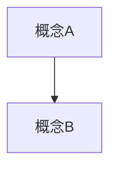

# Module 笔记模板

> 写任何 module 笔记前先读本文件，不要凭记忆复现骨架。
> 下面 `====` 之间的部分可直接复制为新笔记的起点。

---

## 使用说明

**九节骨架是固定的，不要增删节。** 某节确实没内容时写「本讲无」，不要删掉——空节本身是信息（例如「第 9.2 节：本讲无转录，无法比对」）。

**篇幅不设上限。**（2026-09-09 用户决定）

- **由材料量决定，不由字数指标决定。** 讲义有多少页、转录有多少分钟，笔记就该有多长
- **不许为了控制篇幅而砍内容**——尤其不许砍「🎙️ 课堂补充」「⚠️ 常见误解」「💡 换个说法」。这三格正是"让没听过课的人也能懂"所依赖的部分
- **只有一条下限**：讲义每一页都要在 §8 映射表里有归属，缺一页都不算完成
- **各节的相对比例仍然成立**：第 2 节正文占全篇 60~70%，其余各节按需要伸缩

> 实测参考（不是目标，只是让你有个量级概念）：
> M01（60 页讲义、无转录）≈ 16,000 中文字；M02（86 页讲义 + 2h18m 转录）≈ 36,000 中文字。
> **有转录的一讲通常是无转录的两倍以上**，因为双源比对会把"课上讲了但讲义没有"的内容全部纳入——那恰恰是最值钱的部分。

**冗长 ≠ 详尽。** 不设上限不等于可以注水：每一段都要么在解释一个概念、要么在给一个例子、要么在指出一个陷阱。**同一件事不要说两遍**（速查表和正文的重复是例外，那是刻意的复习设计）。

---

### ⚠️ 分块写：单次输出有 64k token 硬上限

**篇幅不设上限的直接后果**：一篇完整的 module 笔记（2000–3400 行）**放不进一次工具调用**。

> ❗ **2026-09-09 实测事故**：AC6761 W6（92 页讲义）的 agent 材料全部提取完毕后，试图**一次性写出整篇笔记**，触发
> `API Error: Claude's response exceeded the 64000 output token maximum`
> **任务直接失败，vault 里一个字都没留下**（所幸 scratchpad 的提取成果还在，重开可复用）。

**正确做法**——先写分块，再拼接：

```bash
# 1) 分 3–5 块写进 scratchpad（每块一次 Write，控制在 ~700 行以内）
#    <scratchpad>/<课程>/p1.md  p2.md  p3.md  p4.md
# 2) 按顺序拼成最终文件
cat "$SP/p1.md" "$SP/p2.md" "$SP/p3.md" "$SP/p4.md" > "<vault>/notes/M0N-<主题>.md"
# 3) 立刻跑对抗自检脚本验证（行数 / 逐页覆盖 / 表格 / details 配对）
#    ⚠️ 拼接与任何改写都要用 _meta/tools/safe_write.py 的 atomic_write（原子写、拒绝缩短 30% 以上）；
#       开工前 integrity_check.py snapshot，收工 verify——见根 CLAUDE.md「文件安全协议」
```

**分块的切点**建议按九节骨架切，例如：

| 块 | 内容 |
|---|---|
| p1 | frontmatter + §0 + §1 + §2 前半 |
| p2 | §2 中段 |
| p3 | §2 后半 + §3 |
| p4 | §4–§9 |

> 💡 **分块还有一个额外好处**：中途失败时**已写的块留在 scratchpad**，重开只需补剩下的，不用从头再来。
> ⚠️ **拼接后必须验行数**——`cat` 静默成功，少拼一块不会报错。

**七格微结构不可省格**。特别是「🎙️ 课堂补充」——没有转录时也要保留并写「待转录补充」，让欠债可见。转录合并后该格必须落到四种状态之一（A 课上展开 / B 讲了同讲义 / C ⏭️ 略过 / D ❓ 未录到），模板见 `.claude/skills/transcript-merge/reference/formats.md` §1。

---

### ★ 预习可用性：讲义每一页都要有实质讲解（2026-09-09 用户决定）

> **笔记的验收标准是：一个没听过课的人，只靠这份笔记预习，就能学会讲义上的全部知识。**

**硬性要求**：

1. **讲义的每一页，都必须在 §2 正文里有实质讲解**——不能只出现在 §8 页码映射表里。
   映射表只是**索引**，不是**讲解**。一页只出现在映射表里 ＝ 那一页没写。

2. **允许的例外只有两类**，且必须在 §8 显式标注：
   - **封面页**（整页只有课程名/章节名）
   - **学习目标页**（整页只有一句 "Explain… / Describe… / Analyze… / Prepare…"）
   学习目标页**仍要出现**——在对应小节开头写一句「本节对应学习目标：…」。

3. **「课上略过了」不是跳过的理由。**
   课堂略过的页，正文**仍要完整展开**，只在 §8 的「课堂覆盖」列标 `⏭️`、并在 §9.1 说明。
   **理由**：读者假设是"没听过课的人"，**课堂略过恰恰意味着这部分只能靠笔记学**。
   唯一能真正降低详略的，是你**能论证它既不在考试范围、也不是后续讲次的前置**——这个论证要写进 §9.1，不能默默省略。

4. **无转录时更要严格。** 没有转录意味着讲义是唯一信源，**每一页都必须被吃透**，而不是"没讲所以略过"。

> ❗ **这条规则的来源是一次真实事故**：AC6761 的 M01 笔记把 19 页（p.57–75，交易 2–11 的逐笔分析）只登记进映射表、正文没展开，因为"课上没讲到"。而那 19 页正是期中考内容。**预习者完全学不到。**

**验收方式见 [[对抗自检清单]] 第 1–4 项**，用脚本验，不许目测。

### ★ 预习可读性：每一小节都要写给"第一次见这个概念的人"（2026-09-11 用户反馈）

> **起因**：EF5560 M02 v0.9 逐页覆盖脚本全过，用户上课时拿着它预习，**却看不懂每一小节在讲什么**。检查发现：小节以公式或代码开头、术语不解释就用、公式用代码块写（Obsidian 里显示成一串乱码）、"是什么"一格只有一句浓缩定义。**逐页覆盖 ≠ 能看懂。** 覆盖是"每页都写了"，可读是"没听过课的人读完每一段都能跟上"。

**读者画像（写每一段之前先想它）**：商科硕士，统计 101 学过但忘了大半，Python 会一点，**第一次见这个术语**。

> ⚠️ **2026-09-16 起，下面六条只是摘要，细则与可量化的门槛以 [[笔记质量规范]] 为准**。起因：IS6400 M03 / M04 六条全部形式上做到、脚本全过，用户仍判为"不透彻"。规范把六条细化成三层判定（L 合规 / G 硬门槛 / E 元素清单），由 `_meta/tools/note_quality.py` 执行；**G 全过是标 v0.9 的前提**。对应关系：第 1 条 → 规范 §5.0「是什么」两句结构；第 2 条 → 规范 §4 先修唤醒 + §6 术语首现；第 3 条 → 规范 §5.3 公式型六件套（多了「为什么公式长这样」「极端 / 边界情况」）+ G3b / G3c；第 4 条 → G3d；第 5 条 → G3a；第 6 条 → G6。另有规范 §2 粒度规则（一节一概念、≤ 3 页）与 §3 密度门槛（§2 ≥ 250 字/内容页）是六条里没有、却最能区分好坏的两条。

**硬性要求（每个 §2 小节都要过；摘要，细则见 [[笔记质量规范]]）**：

1. **先说人话，再上定义**。「是什么」那一格必须以一句**不含任何新术语**的话开头，说清"这是在解决什么问题"，最好带一个生活化或本课数据里的具体例子；**严谨定义放第二句**。
   - ❌ `**是什么**：按 x_{t−1} 排序，切成十个大小相近的组，每组内算 x 与 r 的均值`
   - ✅ `**是什么**：散点图上 240 个点乱成一团，看不出趋势。分箱就是把这 240 个月按"上个月的动量"从小到大排队，每 24 个一组切成十组，每组只画一个"平均点"——噪声被平均掉之后，趋势才露出来。严谨地说：…`
2. **术语一出现就解释**。一个小节的前三行里出现的每个术语，要么在本笔记前文定义过、要么在 L0 里，否则就地用括号解释（例：`动量（momentum，过去 12 个月涨了多少）`）。**不要指望读者跳去别处看**。
3. **公式三件套**：公式（LaTeX，见下一节）→ **符号表**（每个符号是什么、单位是什么、哪个是已知哪个是要算的）→ **代入一个数字例子**（优先用课程数据算过的数）。三件缺一不可；只贴公式等于没写。
4. **代码三件套**：代码块之前一句"这段代码在做什么、为什么放在这里"→ 代码块 → 代码块之后**逐行说明**（哪几行是关键决定、改了会怎样）。**不要让读者从代码反推意图**。
5. **不以公式、代码或表格开头一个小节**。开头永远是一段话。
6. **每个小节结尾一句"所以呢"**：这个概念在本讲的漏斗里处于哪一步、下一小节为什么接着讲。

**自查动作**：写完每个小节，只读它的前三行，问"一个没听过课的人能否说出这一节在讲什么"——答不上来就重写开头。**每写完一块就跑** `_meta/tools/note_quality.py --strict --sections`，不达标不进下一块（[[笔记质量规范]] §9）。全篇写完后做 [[对抗自检清单]] 第 11 项的零基础试读（固定 rubric 见规范 §8）与第 11c 项质量量表。

---

### ★ 公式与代码的写法（Obsidian 渲染规则）

**公式一律用 LaTeX**，Obsidian 原生渲染（MathJax）；**绝不用代码块或行内代码写公式**——那样显示出来是 `x̄_j = (1/n_j)·Σ_{t∈j} x_{t−1}` 这种等宽乱码，读者要自己在脑子里排版。

| 写法 | 用途 | 示例（源码） |
|---|---|---|
| `$…$` | 行内公式 | `斜率 $\beta$ 表示 $x_{t-1}$ 每变一单位……` |
| `$$…$$`（独占一行） | 独立公式 | `$$r_t = \alpha + \beta\,x_{t-1} + \varepsilon_t$$` |
| `\text{…}` | 公式里的中文/英文词 | `$$\text{OOS }R^2 = 1 - \frac{\sum(r_t-\hat r_t)^2}{\sum(r_t-\hat r^{b}_t)^2}$$` |
| `\mid` | **表格单元格里**的竖线 | `$E[r_t \mid x_{t-1}]$`（直接写 `\|` 会把表格切断） |
| `\hat{r}` `\bar{x}` `\sum` `\frac{}{}` `^{\top}` `^{-1}` | 帽子/横线/求和/分数/转置/逆 | `$\hat\theta = (X^{\top}X)^{-1}X^{\top}y$` |

**行内代码** `` `…` `` 只用于：变量名、列名、函数名、文件名、命令、代码片段。**一个东西如果是"数学对象"就用 `$…$`，是"代码里的名字"就用反引号**：`momentum_12` 是列名（反引号），$x_{t-1}$ 是数学量（LaTeX）。

**代码块**只放真正能跑的代码（Python / SQL / bash），标明语言；示意性的"伪代码"、流程、公式一律不用代码块——流程用表格或 Mermaid，公式用 LaTeX。

**自检脚本**（[[对抗自检清单]] 第 12b 项）：扫描代码块与行内代码里含 `Σ ≈ ² α β ε ̂ ̄` 等数学字符的片段，**应为 0**。


**四种来源必须标注清楚**：

| 来源 | 标注 |
|---|---|
| 讲义原文/原例 | `（讲义 p.XX）` |
| 课堂转录 | `🎙️ 课堂补充` ＋ 时间戳（若有） |
| 笔记补充（你写的） | `💡 换个说法（笔记补充）` |
| 外部资料 | `🔗 来源名（获取日期）` |

---

## frontmatter 字段定义

| 字段 | 类型 | 说明 |
|---|---|---|
| `course` | 字符串 | 课程代码，如 `IS5113` |
| `module` | 数字 | Module 编号 |
| `week` | 数字 | 对应教学周 |
| `date` | 日期 | 上课日期；推断值加注释 |
| `source` | 字符串 | 原始讲义文件名 + 页数 |
| `transcript` | 枚举 | `none`（那节课没录，永久缺失）/ `pending`（待导出）/ `merged`（已合并） |
| `prerequisites` | 列表 | 依赖的前序 module |
| `new_concepts` | 列表 | 本讲首次引入的概念（要与台账 L1 一致） |
| `tags` | 列表 | 主题标签 |
| `status` | 枚举 | `draft` / `v0.9` / `v1.0` |
| `updated` | 日期 | 最后修改日 |

---

====================== 以下为模板正文 ======================

```markdown
---
course: IS5113
module: 1
week: 1
date: 2026-09-01
source: "Module 1 - Introduction.pdf（60 页）"
transcript: none
prerequisites: []
new_concepts: []
tags: []
status: v0.9
updated: 2026-09-08
---

# M01 · <主题>

> **本讲一句话**：<用一句话说清这一讲在整门课里干什么>
> **原始材料**：<讲义文件名，页数> ｜ **转录**：<none / pending / merged>

---

## 0. 三分钟速览

**这一讲讲了什么**

<3~5 句话，让人在电梯里就能听懂这一讲的骨架>

**学完你应该能**

1. <可检验的能力，动词开头：说清 / 区分 / 判断 / 复述 / 应用>
2. …

**如果只记三件事**

- <最核心的三条>

---

## 1. 开始之前 · 知识衔接

### 1.1 你已经有的

| 概念 | 一句话唤醒 | 回看 |
|---|---|---|
| <概念> | <一句话，让读者不必真的跳回去> | [[M0X-主题#小节]] |

> 若本讲是 M01，此表写「本讲是起点，只需具备 L0 入场基线（见 [[知识层级台账]]）」。

### 1.2 本讲全新引入的概念

| 概念 | English | 在哪一节展开 |
|---|---|---|
| <概念> | <Term> | §2.X |

### 1.3 为什么这一讲放在这里 · 重排说明

<2~3 段：这一讲承接什么、为后面哪些讲铺路。>

**重排说明**：讲义原顺序是 A(p.x-y) → B → C，本笔记调整为 B → C → A，理由是<理由>。
对应关系见 [[#8. 讲义页码映射|§8 讲义页码映射]]。

---

## 2. 正文

### 2.1 <概念名（English Term）>

**是什么**
<第一句：不含新术语的人话 + 具体例子，说清它解决什么问题；第二句才是严谨定义。见「★ 预习可读性」>

**为什么需要它**
<动机。不讲清这个，读者记不住>

**课件原例**
<引用讲义的例子>（讲义 p.XX）

**🎙️ 课堂补充**
<教授实际讲的、课件上没有的内容>（转录 <时间戳>）
<无转录时写：待转录补充 / 本讲无录音>

**💡 换个说法（笔记补充）**
<你补的通俗类比或例子>

**⚠️ 常见误解**
- <初学者最容易搞错的地方，以及为什么错>

**与其他概念的关系**
<放进知识网>，参见 [[…]]

---

### 2.2 <下一个概念>

<同样七格>

---

## 3. 一图看懂



<每张图配一句话说明它在表达什么关系。图不要超过 3 张，多了反而不看。>

---

## 4. 速查表

<考前一页纸。用表格。典型形式：>

| 理论 | 核心主张 | 代表人物 | 判断标准 | 优点 | 缺点 | 典型反例 |
|---|---|---|---|---|---|---|
| | | | | | | |

---

## 5. 双语术语卡

| 中文 | English | 考试可用的英文定义 | 首现 |
|---|---|---|---|
| | | | §2.X |

> 英文定义要能直接写进考卷。优先用讲义原句。

---

## 6. 考点预判与答题框架

### 6.1 可信度分级

| 级别 | 含义 |
|---|---|
| 🔴 教授明示 | 转录里教授明确说过会考 / 要记 —— **引用原话** |
| 🟡 ILO 反推 | 对应课程 ILO / CILO，官方口径上必须考核 |
| ⚪ 笔记推断 | 我根据内容重要性和同类课程惯例的判断 |

### 6.2 考点清单

| 可信度 | 考点 | 依据 | 对应小节 |
|---|---|---|---|
| 🟡 | | ILO-X | §2.X |

### 6.3 答题框架

<针对本讲最可能的题型，给可套用的结构>

---

## 7. 自测

**概念题**

1. <题目>
<details><summary>答案</summary>

<答案 + 为什么>

</details>

**案例分析题**

1. <用讲义里的 scenario>
<details><summary>参考思路</summary>

<分析框架，不只给结论>

</details>

---

## 8. 讲义页码映射

| 笔记小节 | 讲义页 | 课堂覆盖 |
|---|---|---|
| §2.1 | p.14–17 | ✅ 详讲 / ⏭️ 略过 / 🎙️ 课外展开 |

> 「课堂覆盖」列只在有转录时填；无转录时整列写 `—`。

---

## 9. 延伸与勘误

### 9.1 课件有但课上略过
<无转录时写：本讲无转录，无法判断>

### 9.2 课上讲了但课件没有
<同上>

### 9.3 课件自身的问题
- <错误、口径不一致、模板占位内容、明显笔误>
- <如实写。读者需要知道哪些页信噪比低>

### 9.4 课外补充
- <课件没讲但考试或小组项目可能要用的>
- <标注 🔗 来源与获取日期>

### 9.5 待核对
- <转录里标 [?] 的术语、对不上的数字>
```

====================== 模板正文结束 ======================

---

## 写完之后必做

0. **★ 跑一遍 [[对抗自检清单]]（12 项 + 11c 质量量表）** —— 写完不等于完成。必须换成"想证明这篇笔记不合格"的审查者身份回头攻击自己的产出，**全过才算完成**，并在简报里逐项报数字；`note_quality.py` 的输出原样贴进简报，G 层任一 ✗ 不得标 v0.9
1. 更新 `<课程>/_meta/知识层级台账.md` 的 L1 表（登记本讲新概念）
2. 更新 `<课程>/_meta/术语表.md`
3. 更新 `_meta/术语总表.md`（跨课去重）
4. 更新 `<课程>/_meta/考点库.md`
5. 有作业则登记 `<课程>/_meta/作业与DDL.md`
6. 更新 Notion 进度看板（见 [[Notion进度看板]]）
7. 连贯性自查：从 M01 连读到本讲，是否出现未定义的词

## 变更记录

| 日期 | 变更 |
|---|---|
| 2026-09-11 | 模板 §1.3 示例里的同文件锚点由 Markdown 写法改为双链 `[[#8. 讲义页码映射\|§8 讲义页码映射]]`。之前每篇笔记都照抄了这一行，把 GitHub 式 slug 锚点复制到了全库（144 处，已一并改正） |
| 2026-09-16 | 「★ 预习可读性」六条降为摘要，细则与量化门槛移至 [[笔记质量规范]]（起因：IS6400 M03 / M04 六条形式上全做到、脚本全过，用户仍判为不透彻）。「写完之后必做」第 0 步加 11c 质量量表；`_meta/tools/note_quality.py` G 层全过成为标 v0.9 的前提 |
